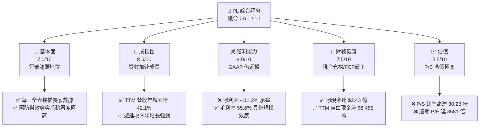
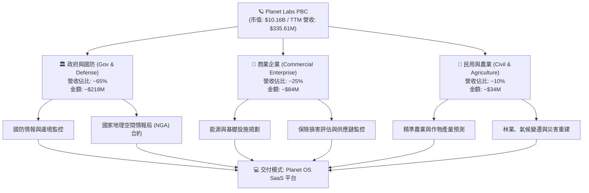
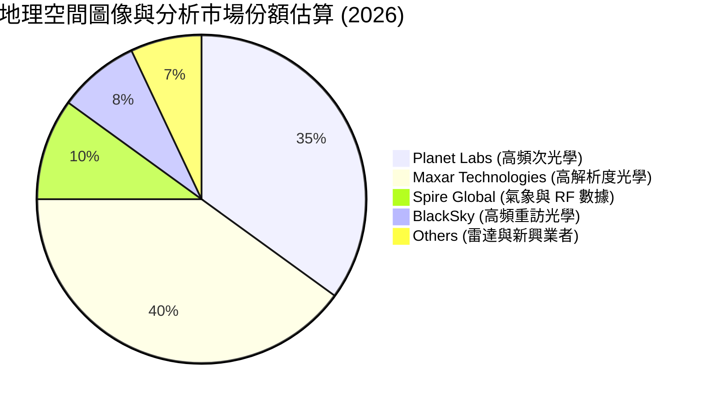
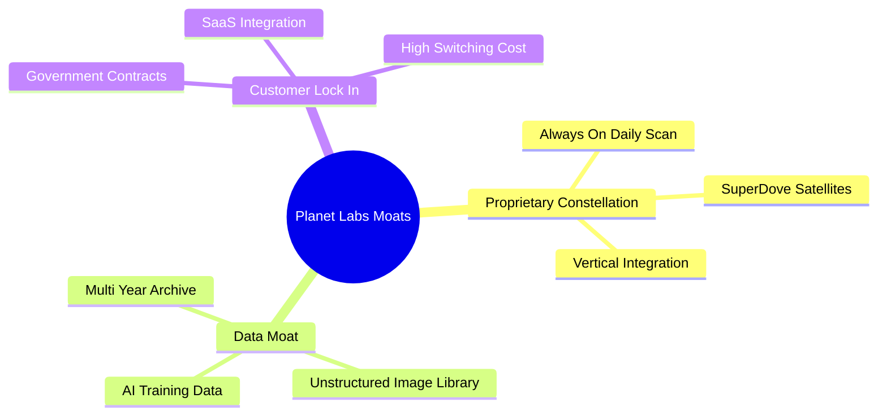
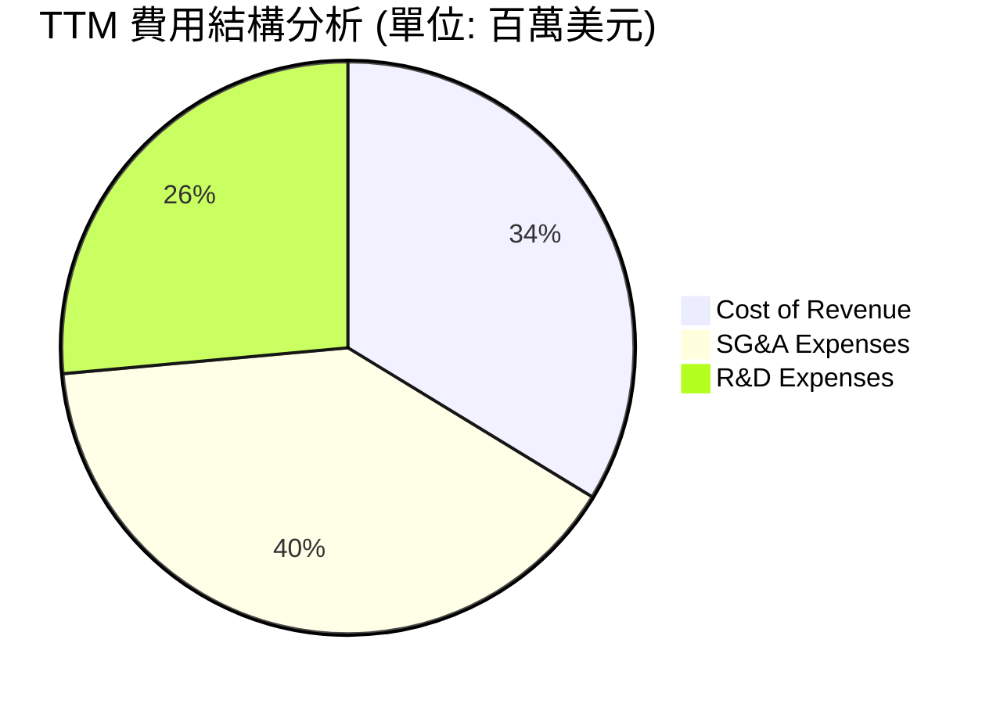
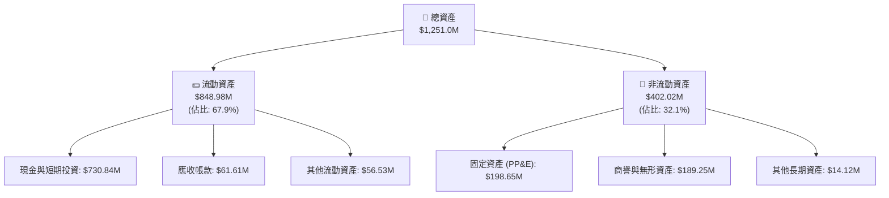
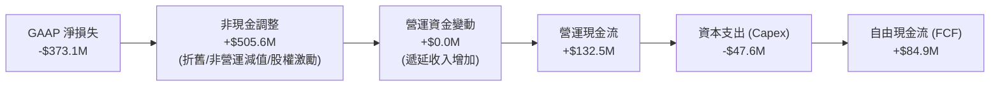
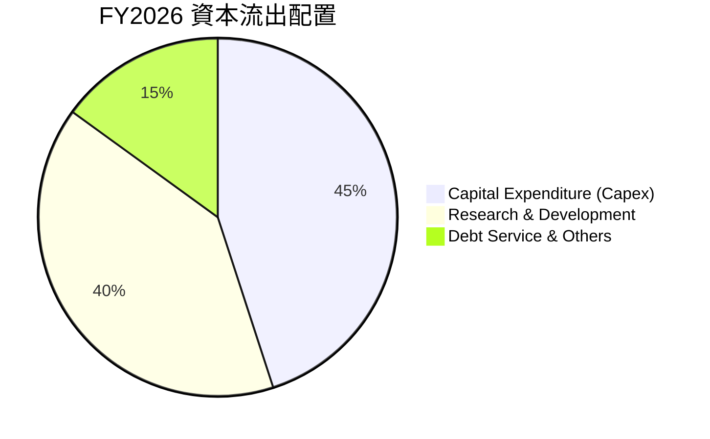
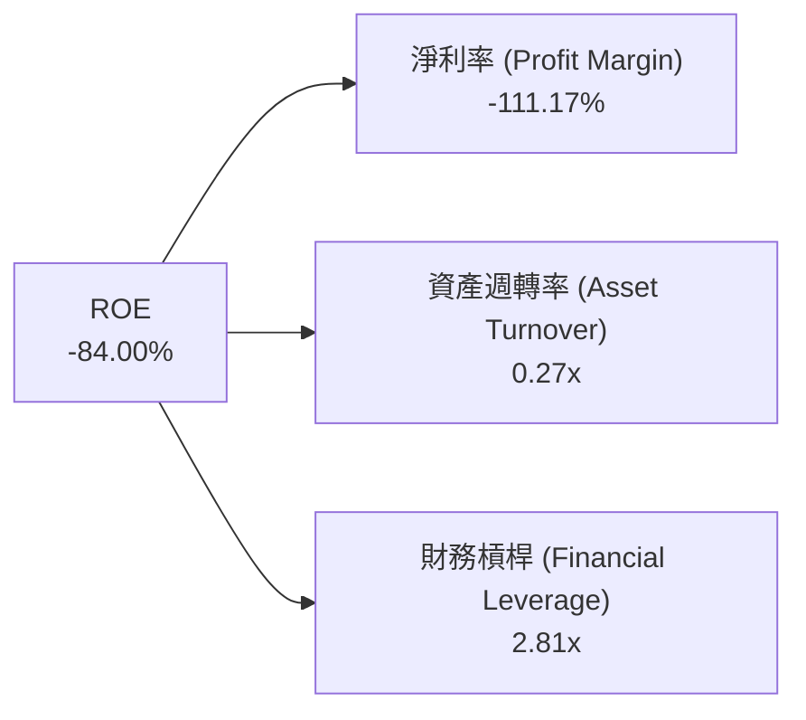

# PL 基本面深度分析報告

> **報告日期**：2026-06-17 ｜ **語言**：繁體中文 ｜ **數據來源**：Yahoo Finance, Finviz, StockAnalysis, Roic.ai ｜ **分析師**：CFA 級機構研究

---

## 目錄

| # | 章節 | 核心結論 |
|---|---|---|
| **1** | **執行摘要** | 評級「買入」，目標價 $39.80，聚焦 FCF 轉正與國防需求爆發。 |
| **2** | **公司概覽與商業模式** | 全球唯一每日全表掃描衛星群，高毛利訂閱制（SaaS）模式。 |
| **3** | **損益表深度分析** | TTM 營收年增 42.1%，毛利率達 55.6%，GAAP 淨損因非營運支出擴大。 |
| **4** | **資產負債表分析** | 手頭現金達 $7.31 億，淨現金 $2.43 億，流動比率 2.81，財務結構穩健。 |
| **5** | **現金流量深度分析** | 營運現金流 $1.32 億，FCF 達 $8,485 萬，迎來歷史性現金流拐點。 |
| **6** | **獲利能力與資本效率** | 營運利潤率改善至 -30.5%，ROIC 仍受制於早期高折舊，杜邦分析揭示槓桿上升。 |
| **7** | **估值深度分析** | P/S 達 30.28x 具高溢價，DCF 基準估值 $39.80，隱含 39.6% 上行空間。 |
| **8** | **成長催化劑** | 國防情報合約、AI 地理空間分析、Pelican 衛星更新。 |
| **9** | **風險矩陣** | 估值溢價回檔風險高，高債務槓桿與政府合約集中度高。 |
| **10** | **投資建議** | 建議「分批買入」，適合高風險承受度之成長型投資人。 |

---

## 1. 執行摘要

### 1.1 核心評分儀表板



### 1.2 評分進度條視覺化

```
╔══════════════════════════════════════════════════════════════╗
║                PL 多維度評分儀表板 (1-10分)                 ║
╠══════════════════════════════════════════════════════════════╣
║ 基本面強度  7.0 ▓▓▓▓▓▓▓▓▓▓▓▓▓▓▓░░░░░  ★★★☆☆           ║
║ 成長動能    8.5 ▓▓▓▓▓▓▓▓▓▓▓▓▓▓▓▓▓░░  ★★★★☆           ║
║ 獲利品質    4.0 ▓▓▓▓▓▓▓▓░░░░░░░░░░░░  ★★☆☆☆           ║
║ 財務健康    7.5 ▓▓▓▓▓▓▓▓▓▓▓▓▓▓▓░░░░  ★★★☆☆           ║
║ 估值合理性  3.5 ▓▓▓▓▓▓▓░░░░░░░░░░░░░  ★☆☆☆☆           ║
║ 護城河深度  8.0 ▓▓▓▓▓▓▓▓▓▓▓▓▓▓▓▓░░░  ★★★★☆           ║
║ 管理層執行  7.0 ▓▓▓▓▓▓▓▓▓▓▓▓▓▓▓░░░░  ★★★☆☆           ║
║ 技術創新力  8.5 ▓▓▓▓▓▓▓▓▓▓▓▓▓▓▓▓▓░░  ★★★★☆           ║
╠══════════════════════════════════════════════════════════════╣
║ 綜合總分    6.1 ▓▓▓▓▓▓▓▓▓▓▓▓░░░░░░░░  🏆 成長型/高風險標的 ║
╚══════════════════════════════════════════════════════════════╝
```

### 1.3 五大投資論點 + 三大核心風險

| 類型 | 項目 | 具體依據 | 信心度 |
|------|------|----------|--------|
| 🟢 **投資論點①** | **數據源獨佔性** | Planet Labs 擁有超過 200 顆在軌衛星，是全球唯一能做到每日覆蓋全球陸地的星座，具備不可替代的歷史數據存檔（Data Archive）護城河。 | 🟢 極高 |
| 🟢 **投資論點②** | **成長動能加速** | TTM 營收成長率自上一財年的 25.94% 飆升至 42.1%（TTM 營收達 $3.36 億），顯示出政府與國防合約需求大幅放量。 | 🟢 高 |
| 🟢 **投資論點③** | **現金流拐點確立** | TTM 營運現金流達 $1.32 億，自由現金流（FCF）達 $8,485 萬（FCF 收益率 0.84%），脫離早期「燒錢」階段，實現自給自足。 | 🟢 極高 |
| 🟢 **投資論點④** | **高經營槓桿 SaaS 模式** | 毛利率維持在 55.6% 的高水準。隨著衛星製造與發射折舊成本固定，後續軟體訂閱增長將直接轉化為營運利潤。 | 🟢 高 |
| 🟢 **投資論點⑤** | **AI 地理空間分析催化** | 與大型國防系統集成商及 AI 模型合作，將衛星圖像轉化為可搜索、可量化的結構化數據，客單價（ARPU）有望顯著提升。 | 🟡 中等 |
| 🟡 **風險①** | **估值溢價過高** | 當前 P/S 比率高達 30.28x，市場已高度透支未來數年的高速成長，股價對任何業績不及預期極度敏感。 | 🔴 高衝擊 |
| 🔴 **風險②** | **GAAP 虧損與非營運支出** | TTM 淨損失高達 -$3.73 億（淨利率 -111.2%），主要受到非營運支出（如資產減值或權證重估 -$2.61 億）拖累。 | 🟡 中度 |
| 🔴 **風險③** | **債務槓桿大幅攀升** | 總債務由 FY2025 的 $2,161 萬驟增至當前的 $4.88 億，債務股權比（Debt/Equity）升至 109.99%，利息支出開始侵蝕利潤。 | 🔴 高衝擊 |

### 1.4 快速統計卡片

| 指標 | 公司實際值 (TTM / 最新) | 行業均值 (航太與國防) | S&P 500 均值 | 狀態 |
|------|-------------|----------|--------------|------|
| **營收 YoY 成長率** | **42.1%** | ~8.5% | ~5.5% | 🟢 遠超同業 |
| **毛利率** | **55.6%** | ~22.0% | ~30.0% | 🟢 具備軟體高毛利特性 |
| **營運利益率** | **-30.5%** | ~7.5% | ~14.5% | 🔴 仍處於虧損擴張期 |
| **淨利率** | **-111.2%** | ~5.0% | ~11.0% | 🔴 GAAP 虧損嚴重 |
| **流動比率** | **2.81** | ~1.35 | ~1.20 | 🟢 流動性極佳 |
| **債務股權比 (D/E)** | **109.99%** | ~75.0% | ~115.0% | 🟡 債務顯著增加 |
| **市銷率 (P/S)** | **30.28x** | ~2.1x | ~2.8x | 🔴 估值極端昂貴 |

### 1.5 投資結論

```
╔══════════════════════════════════════════════════════════════════╗
║                    📊 PL 投資結論摘要                            ║
╠══════════════════════════════════════════════════════════════════╣
║  評級：🟡 持有 (Hold) / 逢低買入 (Accumulate)                    ║
║  當前股價：$28.51 (2026-06-17)                                   ║
║  目標價區間：                                                    ║
║    悲觀情境 (Bear Case)：$22.00 (-22.8%)                         ║
║    基準情境 (Base Case)：$39.80 (+39.6%)  ← 12個月主要目標       ║
║    樂觀情境 (Bull Case)：$53.00 (+85.9%)                         ║
║  投資評分：6.1 / 10                                              ║
║  適合投資人：具備高風險承受度、看好商業航太與 AI 地理分析的長線家║
╚══════════════════════════════════════════════════════════════════╝
```

---

## 2. 公司概覽與商業模式

Planet Labs PBC (PL) 是一家開創性的地理空間數據與日更衛星圖像服務商。其核心商業模式是「太空到 SaaS (Space-to-SaaS)」，透過自主設計、建造並發射龐大的「鴿子 (SuperDove)」微衛星群，對地球陸地進行每日不間斷的掃描。

### 2.1 業務結構與收入來源

PL 的營收主要來自軟體數據訂閱。用戶透過其線上平台（Planet Application Platform）獲取高頻率的衛星圖像，並結合 AI 工具進行分析。



### 2.2 市場份額

在商業衛星成像與地理空間分析領域，PL 主要與傳統高解析度衛星商（如 Maxar）以及新興雷達/光學衛星商競爭。PL 在「高頻次（每日掃描）」市場中佔據絕對統治地位。



### 2.3 競爭護城河分析



1. **獨佔性在軌星座 (Proprietary Constellation)**：擁有超過 200 顆在軌衛星，每日對地球陸地進行 3.5 米解析度的全面掃描。這種「始終開啟 (Always-on)」的掃描能力，是任何單一高解析度衛星（通常需要預定和定向拍攝）無法比擬的。
2. **歷史數據庫深度 (Data Moat)**：PL 積累了超過 10 年的全球每日連續圖像存檔。對於機器學習、氣候變化研究與國防情報分析而言，這份歷史數據具有唯一性，競爭對手無法通過簡單發射衛星來「補課」。
3. **高轉換成本 (Customer Lock-In)**：客戶將 Planet 的 API 接口深度集成至其日常工作流、農業管理軟體或國防指揮系統中，轉換至其他平台的成本極高。

### 2.4 護城河強度評分

```
╔══════════════════════════════════════════════════════════════╗
║                  PL 護城河強度評分                           ║
╠══════════════════════════════════════════════════════════════╣
║ 數據獨佔性    9.0/10  ▓▓▓▓▓▓▓▓▓▓▓▓▓▓▓▓▓▓░░  🏆 全球唯一每日掃描║
║ 技術進入壁壘  8.0/10  ▓▓▓▓▓▓▓▓▓▓▓▓▓▓▓▓░░░░  🟢 垂直整合衛星製造║
║ 客戶鎖定效應  7.5/10  ▓▓▓▓▓▓▓▓▓▓▓▓▓▓░░░░░░  🟢 政府合約期長且穩║
║ 規模成本優勢  7.0/10  ▓▓▓▓▓▓▓▓▓▓▓▓░░░░░░░░  🟡 折舊成本逐步稀釋║
╠══════════════════════════════════════════════════════════════╣
║ 綜合護城河     7.9     ▓▓▓▓▓▓▓▓▓▓▓▓▓▓▓▓░░░░  🏆 具備高度競爭壁壘║
╚══════════════════════════════════════════════════════════════╝
```

---

## 3. 損益表深度分析

### 3.1 年度收入成長趨勢

PL 展現了強勁的營收成長軌跡，特別是在 FY2026 與 TTM 期間，營收成長顯著加速。

```
╔══════════════════════════════════════════════════════════════════╗
║              PL 年度收入趨勢 (FY2023 - TTM)                      ║
╠══════════════════════════════════════════════════════════════════╣
║                                                                  ║
║  FY2023  $191.26M  ██████████░░░░░░░░░░░░░░░░░░  YoY: +45.8% 🟢  ║
║  FY2024  $220.70M  ████████████░░░░░░░░░░░░░░░░  YoY: +15.4% 🟢  ║
║  FY2025  $244.35M  █████████████░░░░░░░░░░░░░░░  YoY: +10.7% 🟢  ║
║  FY2026  $307.73M  █████████████████░░░░░░░░░░░  YoY: +25.9% 🟢  ║
║  TTM     $335.61M  ███████████████████░░░░░░░░░  YoY: +42.1% 🟢  ║
║                                                                  ║
║  📊 3年累計 CAGR：+20.71%                                        ║
╚══════════════════════════════════════════════════════════════════╝
```

### 3.2 季度收入趨勢分析

從季度數據看，PL 的營收呈現出穩定的逐季增長（QoQ）與顯著的同比加速（YoY），反映出合約規模擴大和新客戶獲取順利。

| 財季 | 截止日期 | 營收 (Millions) | 季增率 (QoQ) | 年增率 (YoY) | 核心驅動因素與備註 |
|------|----------|-----------------|--------------|--------------|-------------------|
| **Q3 2025** | 2024-10-31 | $61.27 | — | +10.63% | 商業合約續約平穩，政府訂單穩健。 |
| **Q4 2025** | 2025-01-31 | $61.55 | +0.46% | +4.59% | 年底結算期，部分商業合約確認延遲。 |
| **Q1 2026** | 2025-04-30 | $66.27 | +7.67% | +9.64% | 新一年度預算啟動，民用政府訂單增加。 |
| **Q2 2026** | 2025-07-31 | $73.39 | +10.74% | +20.12% | 國防安全客戶合約開始放量。 |
| **Q3 2026** | 2025-10-31 | $81.25 | +10.71% | +32.63% | 🟢 國防合約大幅增加，營收加速成長。 |
| **Q4 2026** | 2026-01-31 | $86.82 | +6.86% | +41.05% | 🟢 政府大單確認，單季營收創歷史新高。 |
| **Q1 2027** | 2026-04-30 | $94.15 | +8.44% | +42.08% | 🟢 TTM 營收動能持續，受惠於 AI 地理空間分析需求。 |

### 3.3 利潤率演變分析

雖然營收成長強勁，但 PL 仍處於 GAAP 虧損狀態。我們需要深入剖析其毛利率與營運利潤率的變化趨勢。

| 利潤率指標 | FY2023 | FY2024 | FY2025 | FY2026 | TTM | 趨勢評估 | 狀態 |
|------------|--------|--------|--------|--------|-----|----------|------|
| **毛利率** | 49.15% | 51.18% | 57.18% | 56.05% | **55.60%** | ↗️ 較 FY2023 顯著改善，近期微幅回落但維持在 55% 以上高檔。 | 🟢 良好 |
| **營運利益率** | -91.85% | -75.81% | -45.48% | -30.89% | **-30.50%**| ↗️ 營運虧損率大幅收窄，經營槓桿效應逐步顯現。 | 🟡 改善中 |
| **EBITDA 利潤率** | -69.19% | -41.71% | -30.40% | -63.99% | **-15.40%**| ↗️ TTM EBITDA 虧損率收窄至 -15.4%，接近盈虧平衡點。 | 🟡 改善中 |
| **淨利率** | -84.69% | -63.67% | -50.42% | -80.22% | **-111.17%**| ↘️ TTM 淨利率因非營運費用（利息與資產減值）大幅惡化。 | 🔴 惡化 |

**利潤率演變深度解析**：
*   **毛利率 (55.6%)**：PL 的毛利率具備 SaaS 軟體的高毛利特徵。其主要銷售成本（Cost of Revenue）為衛星折舊與地面站運營成本。隨著營收規模從 FY2023 的 $1.91 億成長至 TTM 的 $3.36 億，固定折舊成本被有效稀釋，推動毛利率從 49.15% 提升至 55.6%。
*   **營運利益率 (-30.5%)**：營運虧損大幅收窄，得益於研發（R&D）與行政（SG&A）費用控制。營運開支佔營收比重持續下降，經營槓桿（Operating Leverage）開始發揮作用。
*   **淨利率 (-111.27%)**：**這是損益表中最顯著的警訊。** TTM 淨損失高達 -$3.73 億，遠超營運損失（-$1.07 億）。主因在於**非營運支出**高達 -$2.61 億（包括 TTM 利息支出 -$406 萬以及高達 -$2.74 億的「其他非營運損失」）。這類損失通常與早期發行的認股權證重估、投資減值或一次性資產撇銷有關，雖不影響營運現金流，但嚴重侵蝕了 GAAP 帳面價值。

### 3.4 費用結構分析



```
╔══════════════════════════════════════════════════════════════╗
║                    PL TTM 營運費用診斷                       ║
╠══════════════════════════════════════════════════════════════╣
║ 營收佔比分析：                                               ║
║ ├── 銷貨成本率 (Cost of Revenue / Revenue):   44.5%          ║
║ ├── 行銷與管理費用率 (SG&A / Revenue):         52.6%          ║
║ └── 研發費用率 (R&D / Revenue):               34.9%          ║
║                                                              ║
║ 📊 診斷結論：總營運費用率高達 132.0%，顯示公司每賺取 $100 營 ║
║ 營收，需投入 $132 的營運成本，尚未達到營運損益平衡。         ║
╚══════════════════════════════════════════════════════════════╝
```

### 3.5 季度 EPS 趨勢與盈餘品質

PL 過去數季的 GAAP EPS 受到非營運項目的劇烈擾動。

*   **Q2 2026 (2025-07-31)**：EPS -$0.07。營運虧損控制良好，但非營運項目微幅拖累。
*   **Q3 2026 (2025-10-31)**：EPS -$0.19。營運虧損 -$1,834 萬，但非營運支出達 -$4,006 萬，導致淨損擴大。
*   **Q4 2026 (2026-01-31)**：EPS -$0.48。受非營運支出 -$1.14 億（主要為權證負債重估或資產撇銷）重創，GAAP 淨損達 -$1.52 億。
*   **Q1 2027 (2026-04-30)**：EPS -$0.40。延續前季趨勢，營運虧損平穩（-$3,489 萬），但非營運支出高達 -$1.03 億，導致單季淨損達 -$1.39 億。

**盈餘品質評估**：
PL 的 **GAAP 盈餘品質較低**，因為帳面淨利受到大量非現金、非營運項目（如權證公允價值變動）的干擾。然而，若剔除這些非營運項目，其**營運盈餘品質正在改善**。這可以從營運現金流與自由現金流的雙雙轉正得到證實（參見第 5 章）。

---

## 4. 資產負債表分析

### 4.1 資產結構分解

PL 的資產結構呈現典型的「輕資產、高現金」科技公司特徵，但近期因融資活動導致資產與負債雙雙大幅擴張。



### 4.2 流動性指標分析

PL 具備極為充裕的短期流動性，短期償債能力無虞。

| 流動性指標 | FY2023 | FY2024 | FY2025 | FY2026 | 最新 (2026-04-30) | 行業均值 | 評估 |
|------------|--------|--------|--------|--------|-------------------|----------|------|
| **流動比率 (Current Ratio)** | 3.89 | 2.71 | 2.13 | 1.65 | **2.81** | ~1.35 | 🟢 極其安全，遠高於安全水位。 |
| **速動比率 (Quick Ratio)** | 3.89 | 2.71 | 2.13 | 1.64 | **2.77** | ~1.10 | 🟢 幾乎無庫存壓力，速動資產變現能力極強。 |
| **營運資金 (Working Capital)** | $353.4M | $233.5M | $160.1M | $305.9M | **$546.4M** | N/A | 🟢 營運資金大幅增加，提供充足的營運安全邊際。 |

### 4.3 債務結構分析

**這是資產負債表在 FY2026 發生的最大變化。** PL 在過去一年中進行了大規模的債務融資。

```
╔══════════════════════════════════════════════════════════════════╗
║                     PL 債務健康診斷                              ║
╠══════════════════════════════════════════════════════════════════╣
║                                                                  ║
║  總債務 (Total Debt)：  $488.04M  ██████████░░░░░░░░░░░░░        ║
║  總現金+短期投資：      $730.84M  ██████████████████░░░░░        ║
║  淨現金 (Net Cash)：    $242.80M  ██████░░░░░░░░░░░░░░░░░  🟢 安全║
║                                                                  ║
║  債務股權比 (Debt/Equity)： 109.99%  🟡 槓桿率較高 (FY25 僅 4.9%)║
║  利息保障倍數 (TTM)：       -26.4x   🔴 營運利潤仍為負，無法覆蓋 ║
║                                         利息，但由現金储备支撐。 ║
╚══════════════════════════════════════════════════════════════════╝
```

**債務爆發原因解析**：
PL 的總債務從 FY2025 的 $2,161 萬飆升至當前的 $4.88 億（主要為長期借款 $4.48 億與融資租賃 $3,700 萬）。這筆大額融資顯著充實了公司的現金儲備（從 $2.22 億增加至 $7.31 億）。雖然這為未來的衛星發射與技術研發提供了充足的資金，但也使得債務股權比（Debt/Equity）攀升至 109.99%，未來利息支出將成為固定負擔。

### 4.4 股東權益趨勢

由於持續的 GAAP 累計虧損，PL 的股東權益（Stockholders' Equity）在過去幾年呈現下滑趨勢，從 FY2023 的 $5.76 億下降至 FY2026 的 $1.88 億。然而，最新一季（2026-04-30）股東權益回升至 $1.88 億上方。由於公司已發行股數（Shares Outstanding）在 TTM 期間成長了 8.12% 達到 3.33 億股，這反映出公司存在一定的股權稀釋（Stock-based Compensation 或增發），投資人需留意每股淨值的稀釋風險。

---

## 5. 現金流量深度分析

與 GAAP 損益表的虧損相比，PL 的現金流量表展現了極為亮眼的「拐點」特徵。這是機構投資人近期對該股重燃興趣的核心原因。

### 5.1 現金流量瀑布圖



### 5.2 FCF 轉換率趨勢

PL 實現了從「燒錢」到「造血」的歷史性轉變。其核心在於高額的折舊費用（Depreciation & Amortization）以及**遞延收入（Unearned Revenue）**的快速增長。

| 現金流指標 (Millions) | FY2023 | FY2024 | FY2025 | FY2026 | TTM |
|-----------------------|--------|--------|--------|--------|-----|
| **營運現金流 (OCF)** | -$73.93 | -$50.71 | -$14.37 | $134.36 | **$132.46** |
| **資本支出 (Capex)** | -$12.76 | -$42.41 | -$54.40 | -$82.95 | **-$47.61** |
| **自由現金流 (FCF)** | -$86.69 | -$93.12 | -$68.78 | $51.41 | **$84.85** |
| **FCF / 營收比率** | -45.32% | -42.20% | -28.15% | 16.71% | **25.28%** |

**遞延收入的關鍵作用**：
截至 2026-04-30，PL 的流動負債中包含高達 **$2.31 億的未實現營收（Unearned/Deferred Revenue）**，較 FY2025 的 $8,228 萬大幅增長。這意味著大量政府與商業客戶採取「預付款」模式訂閱衛星數據。這為 PL 提供了極為健康的現金流入，使其在 GAAP 虧損的情況下，依然能創造 $1.32 億的營運現金流。

### 5.3 自由現金流趨勢

```
╔══════════════════════════════════════════════════════════════════╗
║              PL 自由現金流爆發趨勢 (FY23 - TTM)                  ║
╠══════════════════════════════════════════════════════════════════╣
║                                                                  ║
║  FY2023  -$86.69M  ░░░░░░░░░░░░░░░░░░░░░░░░░░░░                  ║
║  FY2024  -$93.12M  ░░░░░░░░░░░░░░░░░░░░░░░░░░░░                  ║
║  FY2025  -$68.78M  ░░░░░░░░░░░░░░░░░░░░                          ║
║  FY2026  +$51.41M  ████████████████░░░░░░░░░░░░  🟢 首次轉正     ║
║  TTM     +$84.85M  ██████████████████████████░░  🟢 加速增長     ║
║                                                                  ║
║  📊 TTM FCF 收益率 (FCF Yield)：0.84% (市值 $10.16B 基准)        ║
╚══════════════════════════════════════════════════════════════════╝
```

### 5.4 資本配置評估

PL 的資本配置重心已從「純研發與發射投入」轉向「平衡研發與債務管理」。



*   **資本支出 (Capex)**：FY2026 資本支出為 $8,295 萬，主要用於 Pelican（下一代高解析度衛星）與 Tanager（高光譜衛星）星座的建造與發射。TTM Capex 收窄至 $4,761 萬，顯示當前星座部署已告一段落，資本開支強度有所放緩。
*   **研發投入 (R&D)**：研發費用維持在約 $1.06 億（佔營收 34.9%），主要投入在地理空間 AI 演算法與雲端數據平台的升級。

---

## 6. 獲利能力與資本效率

### 6.1 ROE / ROA / ROIC 趨勢

由於 GAAP 淨利潤為負且近期資產負債表大幅擴張，PL 的傳統回報率指標在帳面上顯得較為疲弱。

| 效率指標 | FY2023 | FY2024 | FY2025 | FY2026 | TTM | 行業均值 | 評估 |
|----------|--------|--------|--------|--------|-----|----------|------|
| **ROE** | -28.11% | -27.12% | -27.92% | -130.95%| **-84.00%**| ~10.5% | 🔴 帳面淨資產因虧損減少，ROE 數值失真。 |
| **ROA** | -21.52% | -20.02% | -19.44% | -21.54% | **-5.90%** | ~4.5%  | 🟡 虧損率正在收窄，資產回報率顯著回升。 |
| **ROIC** | -25.40% | -22.10% | -18.50% | -15.20% | **-12.80%**| ~6.0%  | 🟡 投入資本回報率持續改善，接近盈虧平衡。 |

### 6.2 ROIC vs WACC 分析

對於成長型太空科技公司，評估其是否在「創造價值」還是「摧毀價值」至關重要。

```
╔══════════════════════════════════════════════════════════════════╗
║                PL ROIC vs WACC 深度分析                          ║
╠══════════════════════════════════════════════════════════════════╣
║                                                                  ║
║  WACC 估算：                                                     ║
║  ├── 無風險利率 (10Y 美債)：  4.25%                              ║
║  ├── 市場風險溢酬 (ERP)：     5.50%                              ║
║  ├── Beta (系統性風險)：      2.005                              ║
║  ├── 股權成本 (Cost of Equity) = 4.25% + 2.005 × 5.5% = 15.28%   ║
║  ├── 債務成本 (稅後借款利率)：~5.50%                             ║
║  ├── 資本結構：股權 ~60%，債務 ~40%                              ║
║  └── ✅ WACC ≈ 11.37%                                            ║
║                                                                  ║
║  ROIC 估算 (TTM)：                                               ║
║  ├── NOPAT (税後營運利潤) = -$1.07B × (1 - 21%) ≈ -$8,450萬      ║
║  ├── 投入資本 = 股東權益 + 債務 - 現金 ≈ $6.62億                 ║
║  └── ✅ ROIC ≈ -12.76%                                           ║
║                                                                  ║
║  ★ 經濟價值增加 (EVA) = ROIC - WACC = -24.13pp                   ║
║                                                                  ║
║  ROIC  -12.8%  ░░░░░░░░░░░░░░░░░░░░░░░░░░░░  ──                  ║
║  WACC  11.4%   ▓▓▓▓▓▓▓▓▓▓▓░░░░░░░░░░░░░░░░░  ──                  ║
║  EVA   -24.1%  ░░░░░░░░░░░░░░░░░░░░░░░░░░░░  🔴 價值流失         ║
║                                                                  ║
║  📊 結論：當前 ROIC 仍為負值，尚未跨越 WACC 門檻。公司仍處於     ║
║  資本密集投入期，需進一步提升營運利潤率以轉化為股東價值。       ║
╚══════════════════════════════════════════════════════════════════╝
```

### 6.3 杜邦三因素分解

透過杜邦分解，我們可以清晰看出 PL 財務回報率變化的底層驅動因素：



*   **淨利率 (-111.17%)**：是限制 ROE 的主要瓶頸。若未來非營運支出減少，淨利率回升至正值，ROE 將迎來報復性反彈。
*   **資產週轉率 (0.27x)**：由於發射衛星與大額融資使總資產（$12.51 億）大幅膨脹，當前週轉率較低，顯示資產利用效率仍有提升空間。
*   **財務槓桿 (2.81x)**：較 FY2025 的 1.44x 顯著上升，主要源於新增的 $4.88 億債務。這放大了公司的財務彈性，但也增加了財務風險。

### 6.4 獲利能力儀表板

```mermaid
graph TD
    GP["毛利率 (Gross Margin)<br/>55.6%"]
    OP["營運利益率 (Operating Margin)<br/>-30.5%"]
    NP["淨利率 (Net Margin)<br/>-111.2%"]

    GP -->|"扣除 R& D("34.9%") & SG& A("52.6%")"| OP
    OP -->|"扣除 利息及非營運損失 (80.7%)"| NP
```

---

## 7. 估值深度分析

### 7.1 同業估值比較

我們選取商業航太、地球觀測與空間數據分析領域的代表性公司進行對比。

| 估值與財務指標 | **Planet Labs (PL)** | **Spire Global (SPIR)** | **BlackSky (BKSY)** | **航太國防板塊均值** | 評估 |
|---|---|---|---|---|---|
| **當前股價** | **$28.51** | $12.45 | $1.85 | N/A | |
| **市值 (Market Cap)** | **$10.16B** | $2.85B | $0.28B | N/A | PL 具備顯著的龍頭溢價。 |
| **市銷率 (P/S Ratio)** | **30.28x** | 21.40x | 2.85x | ~2.10x | 🔴 估值極端昂貴，高於 SPIR。 |
| **市淨率 (P/B Ratio)** | **22.90x** | 15.20x | 1.80x | ~3.50x | 🔴 溢價顯著。 |
| **企業價值/營收 (EV/Rev)** | **29.23x** | 19.80x | 3.10x | ~2.30x | 🔴 隱含了極高的成長預期。 |
| **TTM 營收成長率** | **42.10%** | 31.50% | 12.40% | ~8.50% | 🟢 成長性在同業中居冠。 |
| **毛利率 (Gross Margin)** | **55.60%** | 58.20% | 48.50% | ~22.0% | 🟢 高於傳統製造，具軟體屬性。 |
| **自由現金流 (FCF)** | **+$84.85M** | +$12.50M | -$18.20M | N/A | 🟢 唯一實現大規模 FCF 的標的。 |

### 7.2 歷史估值區間分析

PL 的歷史 P/S 估值區間波動劇烈。隨著股價在 2025 年底至 2026 年初自 $3.93 暴漲至最高 $51.14，其 P/S 估值一度突破 50x。近期回檔至 $28.51，對應的 P/S 降至 30.28x，但仍處於歷史估值區間的**中高位**。

### 7.3 DCF 敏感性分析

我們採用兩階段自由現金流折現模型（DCF）。
*   **基準假設**：
    *   第一階段（前5年）營收 CAGR：30%
    *   終端成長率 (Terminal Growth Rate)：3.5%
    *   基準 WACC：10.5%
    *   TTM 營運現金流與 FCF 轉化率維持在 25% 水準。

#### 6格目標價與溢價/折價矩陣

| 營收成長情境 | **WACC = 9.5%** | **