# PL 綜合股票評估報告

> **報告日期**：2026-02-28 ｜ **語言**：繁體中文 ｜ **數據來源**：Yahoo Finance
> **公司**：Planet Labs PBC（Ticker: PL）｜ **產業**：航太與國防 / 地理空間數據

---

## 目錄

1. [評估總覽](#1-評估總覽)
2. [八維度評分矩陣](#2-八維度評分矩陣)
3. [業務品質與護城河](#3-業務品質與護城河)
4. [財務健康全面評估](#4-財務健康全面評估)
5. [成長性評估](#5-成長性評估)
6. [估值合理性與同業比較](#6-估值合理性--同業比較)
7. [資本配置與管理層評估](#7-資本配置與管理層評估)
8. [風險評估](#8-風險評估)
9. [催化劑與觸發因素](#9-催化劑與觸發因素)
10. [投資建議](#10-投資建議)

---

## 1. 評估總覽

### 🎯 ASCII 雷達圖（八維度評分視覺化）

```
              成長性 (8)
                 ★★★★★★★★☆☆
                  ↑
        管理品質         獲利能力
        (5) ←←←  PL   →→→ (4)
           ★★★★★☆   ★★★★☆☆☆☆☆☆
                  
    動能 (8)    ◆    財務健康 (6)
   ★★★★★★★★☆☆     ★★★★★★☆☆☆☆
                  
        風險(倒置)       估值
           (4) ←←←  PL  →→→ (3)
         ★★★★☆☆☆☆   ★★★☆☆☆☆☆☆☆
                  ↓
             競爭優勢 (7)
              ★★★★★★★☆☆☆

  ╔═══════════════════════════════════════╗
  ║           PL 八維度雷達圖             ║
  ║                                       ║
  ║          成長性                       ║
  ║           10                          ║
  ║         ●  8 ●                       ║
  ║       ● /  6  \ ●                   ║
  ║  管理5● |  4  | ●4獲利               ║
  ║       ● \  2  / ●                   ║
  ║  動能8●  ╳    ╳  ●3估值              ║
  ║       ● /      \ ●                  ║
  ║  風險4●          ●6財務              ║
  ║       ●    7    ●                   ║
  ║          競爭優勢                     ║
  ╚═══════════════════════════════════════╝
```

```
╔══════════════════════════════════════════════════════════╗
║              PL 八維度雷達圖（精確版）                    ║
║                                                          ║
║                    成長性[8]                             ║
║                       ▲                                  ║
║              ┌────────●────────┐                        ║
║              │    ╱     ╲    │                          ║
║   管理品質   │  ╱   PL   ╲  │  獲利能力                ║
║     [5] ●───┼╱             ╲┼───● [4]                 ║
║              │╲             ╱│                          ║
║   動能[8] ●──┼─╲───────╱──┼──● 財務健康[6]            ║
║              │  ╲         ╱  │                          ║
║  競爭優勢[7]●────╲───────╱────●估值[3]                 ║
║              └────────●────────┘                        ║
║                    風險[4]                               ║
║                   (越高=越好)                            ║
╚══════════════════════════════════════════════════════════╝
```

---

### 📊 八維度評分總表

| 維度 | 評分 | Unicode 評分條 |
|------|------|----------------|
| 🚀 成長性 | **8/10** | `▓▓▓▓▓▓▓▓░░` |
| 💰 獲利能力 | **4/10** | `▓▓▓▓░░░░░░` |
| 🏦 財務健康 | **6/10** | `▓▓▓▓▓▓░░░░` |
| 📊 估值合理性 | **3/10** | `▓▓▓░░░░░░░` |
| 🏰 競爭優勢 | **7/10** | `▓▓▓▓▓▓▓░░░` |
| 👔 管理品質 | **5/10** | `▓▓▓▓▓░░░░░` |
| 📈 市場動能 | **8/10** | `▓▓▓▓▓▓▓▓░░` |
| ⚠️ 風險控管 | **4/10** | `▓▓▓▓░░░░░░` |
| **加權總分** | **5.6/10** | `▓▓▓▓▓▓░░░░` |

---

### 🎯 投資結論

```
╔══════════════════════════════════════════════════════════════╗
║                     投資評級：觀望                           ║
║                                                              ║
║  當前價格：$24.14     目標價（基準）：$24.71                ║
║  52週高點：$30.90     預期報酬率：+2.4%（基準）             ║
║                                                              ║
║  評級理由：                                                  ║
║  ✅ 強勁收入成長（YoY +32.6%）                              ║
║  ✅ 市場動能強勁（24個月漲幅超1000%）                       ║
║  ✅ 獨特衛星數據護城河                                       ║
║  ❌ 仍處虧損狀態，FCF 尚未轉正                              ║
║  ❌ P/S達29倍，估值極度昂貴                                 ║
║  ❌ 短期過度追高風險                                         ║
╚══════════════════════════════════════════════════════════════╝
```

---

## 2. 八維度評分矩陣

### 📋 詳細評分矩陣

| 維度 | 評分 | 評分依據 | 趨勢 | 狀態 |
|------|------|----------|------|------|
| 🚀 **成長性** | **8/10** | YoY收入+32.6%，季度連續加速（$61.55M→$81.25M），TAM快速擴張，政府合約增加 | ↑ 上升 | 🟢 |
| 💰 **獲利能力** | **4/10** | 毛利率58%尚可，但營業利益率-20.9%，淨利率-45.9%，仍在大幅虧損，FCF僅$15M | → 緩慢改善 | 🟡 |
| 🏦 **財務健康** | **6/10** | 淨現金$216M，流動比3.99，負債比率低（D/E=131%但絕對債務僅$461M），現金跑道充足 | → 穩定 | 🟡 |
| 📊 **估值合理性** | **3/10** | P/S=29倍，EV/Revenue=27.7倍，P/B=21.7倍，對一家虧損公司而言估值極度昂貴 | ↓ 惡化 | 🔴 |
| 🏰 **競爭優勢** | **7/10** | 全球最大低軌衛星星座（200+顆），每日重訪能力獨特，數據網絡效應，切換成本高 | ↑ 上升 | 🟢 |
| 👔 **管理品質** | **5/10** | 成功IPO且持續執行技術路線，研發投入積極，但虧損收窄進度慢，內部持股僅2.1% | → 普通 | 🟡 |
| 📈 **市場動能** | **8/10** | 24個月漲幅約+1000%，機構持股73.4%，多位分析師升評，短期強勢趨勢確立 | ↑ 強勢 | 🟢 |
| ⚠️ **風險控管** | **4/10** | Beta=1.95，做空比例14.3%，持續燒錢，政府預算風險，競爭加劇，估值泡沫風險 | ↓ 惡化 | 🔴 |

---

### 📈 Mermaid 評分矩陣（風險/報酬定位）

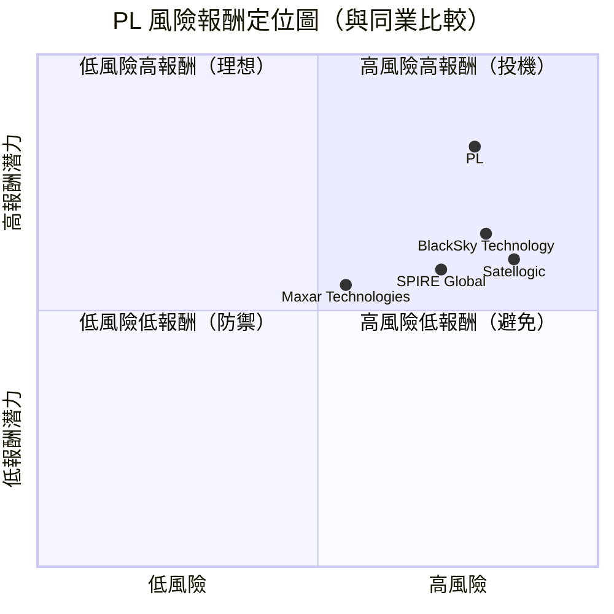

---

### 🔄 同業整體比較圖

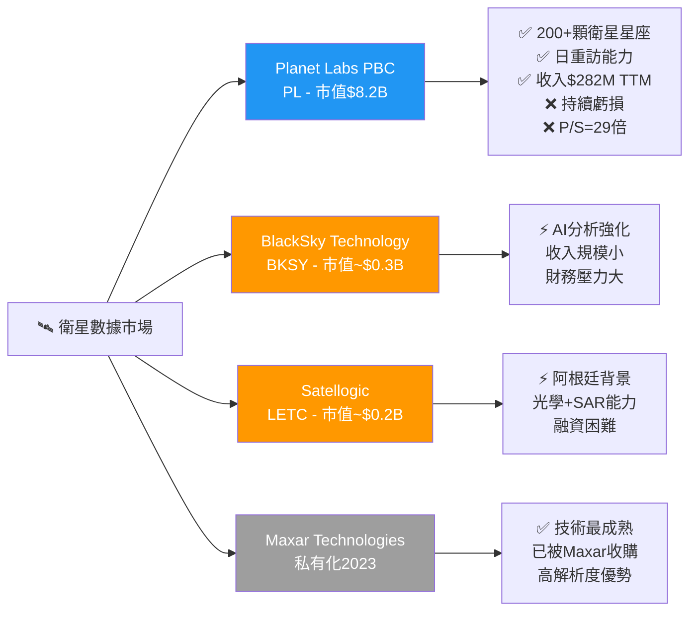

---

## 3. 業務品質與護城河

### 🏢 商業模式可持續性評估

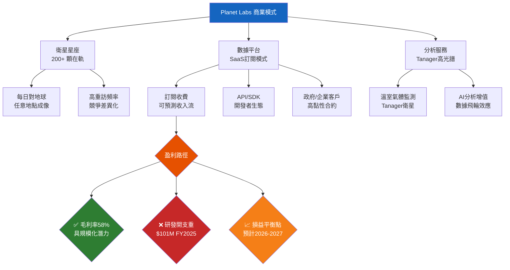

---

### 🏰 護城河評估（六種護城河類型）

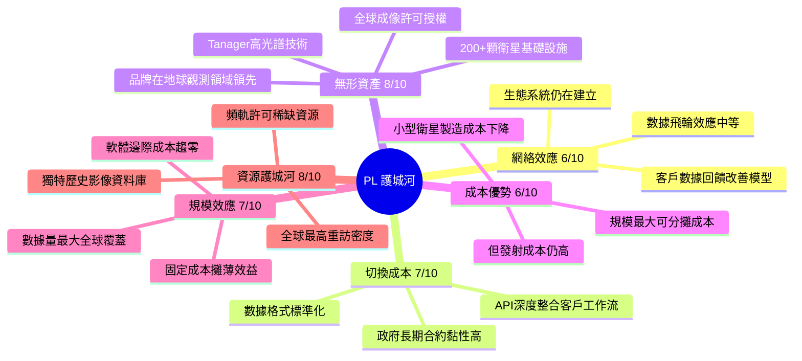

---

### 📊 護城河強度條形圖

```
護城河類型        強度評分
─────────────────────────────────────────
無形資產 (8/10)   ▓▓▓▓▓▓▓▓░░  ⭐⭐⭐⭐
資源護城河(8/10)  ▓▓▓▓▓▓▓▓░░  ⭐⭐⭐⭐
切換成本 (7/10)   ▓▓▓▓▓▓▓░░░  ⭐⭐⭐⭐
規模效應 (7/10)   ▓▓▓▓▓▓▓░░░  ⭐⭐⭐
網絡效應 (6/10)   ▓▓▓▓▓▓░░░░  ⭐⭐⭐
成本優勢 (6/10)   ▓▓▓▓▓▓░░░░  ⭐⭐⭐
─────────────────────────────────────────
綜合護城河評分    ▓▓▓▓▓▓▓░░░  7.0/10
```

---

### 🌐 市場地位分析

| 指標 | 數據 | 評估 |
|------|------|------|
| **全球衛星地球觀測 TAM** | ~$30B（2030年估計） | 🟢 快速擴張中 |
| **PL 市場份額（收入）** | ~1-2%（$282M/$30B） | 🟡 仍在早期滲透 |
| **政府客戶佔比** | 估計~40-50% | 🟢 穩定高黏性 |
| **商業客戶佔比** | 估計~50-60% | 🟡 多元化進行中 |
| **衛星在軌數量** | 200+ 顆（全球最多低軌道地球觀測衛星） | 🟢 行業第一 |
| **每日成像面積** | 覆蓋全球陸地表面 | 🟢 獨特競爭優勢 |
| **行業地位** | 地球觀測數據領域全球前三 | 🟢 龍頭地位 |

---

## 4. 財務健康全面評估

### 📊 財務儀表板

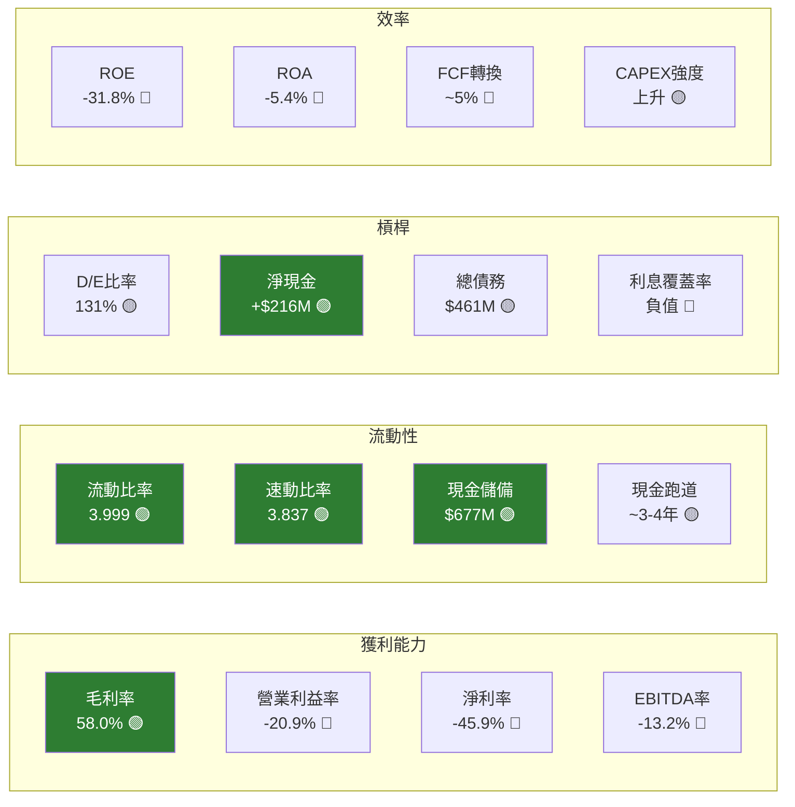

---

### 📈 獲利能力趨勢表格（近4年）

| 財年 | 毛利率 | 營業利益率 | 淨利率 | FCF Margin | 狀態 |
|------|--------|------------|--------|------------|------|
| FY2022（1月） | 36.8% | -97.6% | -104.5% | -43.5% | 🔴 |
| FY2023（1月） | 49.2% | -91.9% | -84.7% | -45.3% | 🔴 |
| FY2024（1月） | 51.2% | -76.9% | -63.7% | -42.2% | 🟡 |
| FY2025（1月） | 57.2% | -47.5% | -50.4% | -28.1% | 🟡 |
| **TTM** | **58.0%** | **-20.9%** | **-45.9%** | **+5.3%** | 🟢 |

> 📝 **趨勢解讀**：毛利率持續改善，從36.8%→58.0%，顯示規模化效益；營業虧損大幅收窄，FCF TTM首次轉正，顯示盈利拐點臨近。

---

### 🏛️ 資產負債表穩健度

```
財務健康指標               數值        評分條              狀態
───────────────────────────────────────────────────────────
流動比率 (3.999)          3.99x   ▓▓▓▓▓▓▓▓▓▓  優秀    🟢
速動比率 (3.837)          3.84x   ▓▓▓▓▓▓▓▓▓░  優秀    🟢
淨現金 (+$216M)          +$216M  ▓▓▓▓▓▓▓▓░░  良好    🟢
D/E 比率 (131%)          131%    ▓▓▓▓▓▓░░░░  中等    🟡
現金/市值比               8.2%    ▓▓░░░░░░░░  偏低    🟡
CAPEX/收入                22%     ▓▓▓▓░░░░░░  資本密集 🟡
營運現金流轉正            $107M   ▓▓▓▓▓▓▓░░░  顯著改善 🟢
───────────────────────────────────────────────────────────
```

> ⚠️ **注意**：Balance Sheet中Total Debt $461M為TTM數據（含新融資），年報FY2025僅$21M，差異較大，反映最新融資活動。

---

### 💵 現金流質量分析

| 指標 | TTM數值 | 評估 |
|------|---------|------|
| 營業現金流 | +$107.42M | 🟢 首次大幅轉正 |
| 自由現金流 | +$15.07M | 🟢 轉折點確認 |
| FCF Yield | 0.18% | 🔴 相對市值極低 |
| FCF轉換率（FCF/淨利） | N/A（淨損） | 🔴 |
| CAPEX趨勢 | $54M→上升 | 🟡 衛星製造加速 |
| D&A/收入 | ~30-35% | 🟡 衛星折舊高 |

---

## 5. 成長性評估

### 📊 歷史 CAGR 表格

| 成長指標 | 1年成長率 | 3年CAGR | 備註 |
|----------|----------|---------|------|
| 收入成長 | +32.6% | ~23.3% | 🟢 持續加速 |
| 毛利成長 | +23.7% | ~42.6% | 🟢 結構改善 |
| EPS成長 | N/A | N/A（虧損縮窄） | 🟡 |
| FCF成長 | 轉正 | 改善中 | 🟢 |

> 注：EPS/FCF 因仍虧損故CAGR無意義，以改善幅度衡量

---

### 🚀 未來成長催化劑

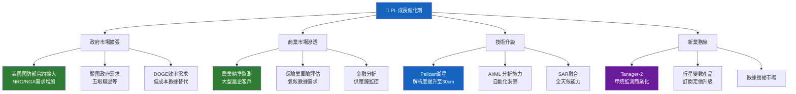

---

### 📈 成長軌跡視覺化

```
季度收入成長軌跡（百萬美元）
─────────────────────────────────────────────────────
Q1 FY24 (Apr'23)  ■■■■■■■              $47M
Q2 FY24 (Jul'23)  ■■■■■■■■             $52M
Q3 FY24 (Oct'23)  ■■■■■■■■             $55M
Q4 FY24 (Jan'24)  ■■■■■■■■■            $58M
Q1 FY25 (Apr'24)  ■■■■■■■■■            $57M
Q2 FY25 (Jul'24)  ■■■■■■■■■■           $61M
Q3 FY25 (Oct'24)  ■■■■■■■■■■           $65M   *est
Q4 FY25 (Jan'25)  ■■■■■■■■■■           $62M
Q1 FY26 (Apr'25)  ■■■■■■■■■■■          $66M   ▲+15.8% YoY
Q2 FY26 (Jul'25)  ■■■■■■■■■■■■         $73M   ▲+19.6% YoY
Q3 FY26 (Oct'25)  ■■■■■■■■■■■■■        $81M   ▲+24.6% YoY
─────────────────────────────────────────────────────
📈 季度環比加速明顯，收入成長動能持續

毛利率改善趨勢
─────────────────────────────────────
FY2022  ██████████                 36.8%
FY2023  ████████████████           49.2%
FY2024  █████████████████          51.2%
FY2025  ██████████████████████     57.2%
TTM     ███████████████████████    58.0%
─────────────────────────────────────
```

---

## 6. 估值合理性 & 同業比較

### 🔍 同業比較表格

| 指標 | **PL** | **BlackSky (BKSY)** | **Satellogic (LETC)** | **Spire Global (SPIR)** | 評估 |
|------|--------|---------------------|----------------------|------------------------|------|
| 市值 | $8.23B | ~$300M | ~$200M | ~$150M | PL溢價巨大 |
| 收入（TTM） | $282M | ~$70M | ~$40M | ~$100M | 🟢 規模最大 |
| P/S 倍數 | **29.1x** 🔴 | ~4x 🟢 | ~5x 🟢 | ~1.5x 🟢 | PL嚴重溢價 |
| EV/Revenue | **27.7x** 🔴 | ~3.5x 🟢 | ~4x 🟢 | ~1.2x 🟢 | PL嚴重溢價 |
| 毛利率 | **58%** 🟢 | ~50% 🟡 | ~35% 🟡 | ~45% 🟡 | PL最佳 |
| 收入成長(YoY) | **+32.6%** 🟢 | ~+15% 🟡 | ~+10% 🔴 | ~+8% 🔴 | PL最強 |
| 淨現金 | **+$216M** 🟢 | 負值 🔴 | 負值 🔴 | 負值 🔴 | PL最健康 |
| FCF | +$15M 🟢 | 負值 🔴 | 負值 🔴 | 負值 🔴 | PL唯一轉正 |
| Beta | 1.95 🔴 | ~2.5 🔴 | ~3.0 🔴 | ~2.0 🔴 | 普遍高波動 |

> 📝 **結論**：PL在基本面上是同業最強（規模/毛利/成長/財務），但估值溢價極其顯著，P/S為同業5-20倍。

---

### 📊 歷史估值區間

| 估值指標 | 歷史低點 | 歷史中位 | 歷史高點 | 當前 | 位置 |
|----------|---------|---------|---------|------|------|
| P/S | 3.0x | 8.0x | 35.0x | **29.1x** | 🔴 歷史高位 |
| EV/Revenue | 2.5x | 7.5x | 30.0x | **27.7x** | 🔴 歷史高位 |
| P/B | 2.0x | 8.0x | 22.0x | **21.7x** | 🔴 歷史高位 |

---

### 💯 多重估值法彙整

| 估值方法 | 假設 | 目標價 | 說明 |
|----------|------|--------|------|
| **相對估值（P/S）** | P/S=15x（合理溢價），FY26收入$340M | $16.00 | 🔴 低於當前 |
| **相對估值（P/S）** | P/S=20x（高速成長溢價），FY26收入$340M | $21.40 | 🟡 略低於當前 |
| **DCF 估值** | 收入CAGR 25%×5年，FY30達$850M，FCF率15%，折現率12%，TV倍數20x | $18-22 | 🟡 低於當前 |
| **分析師共識** | 9位分析師均值 | **$24.71** | 🟡 接近當前 |
| **分析師高目標** | 樂觀情境 | $33.00 | 🟢 上行空間 |
| **分析師低目標** | 保守情境 | $16.40 | 🔴 下行風險 |

---

### 📊 估值區間視覺化

```
PL 估值區間視覺化（P/S基礎）
─────────────────────────────────────────────────────────────
低估區域    合理區域         當前          高估區域
$8          $16    $22       $24.14  $30.90      $35+
│           │      │            │         │         │
●───────────●──────●────────────★─────────●─────────●
│           │      │            │                   │
低估        基準   分析師均值  當前價     52週高     極度高估

  ◄─低估─► ◄────合理────► ◄───────高估────────►
      $8      $16-$22       $22-$35+

  📍 當前位置：$24.14（偏向高估區域上沿）
  🎯 分析師目標均值：$24.71（小幅上行空間）
  ⚠️ DCF公允價值：$18-22（存在下行風險）
─────────────────────────────────────────────────────────────
```

---

## 7. 資本配置與管理層評估

### 📊 ROIC vs WACC 分析

```
╔══════════════════════════════════════════════════════════════╗
║                  ROIC vs WACC 分析                           ║
╠══════════════════════════════════════════════════════════════╣
║                                                              ║
║  WACC 估算：                                                 ║
║  ┌─────────────────────────────────────┐                    ║
║  │ 無風險利率（10年期美債）：4.3%      │                    ║
║  │ 市場風險溢酬：5.5%                  │                    ║
║  │ Beta：1.952                         │                    ║
║  │ 股權成本 = 4.3% + 1.952×5.5%       │                    ║
║  │           = 4.3% + 10.7% = 15.0%   │                    ║
║  │ 債務成本（稅後）：~4.5%             │                    ║
║  │ 資本結構：股權90% / 債務10%         │                    ║
║  │ WACC ≈ 15.0%×90% + 4.5%×10%        │                    ║
║  │       ≈ 13.5% + 0.45% ≈ 14.0%      │                    ║
║  └─────────────────────────────────────┘                    ║
║                                                              ║
║  ROIC 估算：                                                 ║
║  ┌─────────────────────────────────────┐                    ║
║  │ NOPAT = 營業利益×(1-稅率)           │                    ║
║  │       = -$59M×(1-21%) ≈ -$46.6M    │                    ║
║  │ 投入資本 ≈ 股東權益+淨債務          │                    ║
║  │         ≈ $441M + (-$216M) = $225M  │                    ║
║  │ ROIC ≈ -$46.6M / $225M = -20.7%    │                    ║
║  └─────────────────────────────────────┘                    ║
║                                                              ║
║  EVA = (ROIC - WACC) × 投入資本                             ║
║      = (-20.7% - 14.0%) × $225M                             ║
║      = -34.7% × $225M ≈ -$78M                               ║
║                                                              ║
║  🔴 判斷：EVA 為負值（-$78M），目前尚未創造股東價值         ║
║           管理層需將 ROIC 提升至 >14% 方可創造真實價值      ║
║           預計盈利轉正後（FY2027-28）ROIC 可能轉正          ║
╚══════════════════════════════════════════════════════════════╝
```

---

### 🥧 資本配置歷史

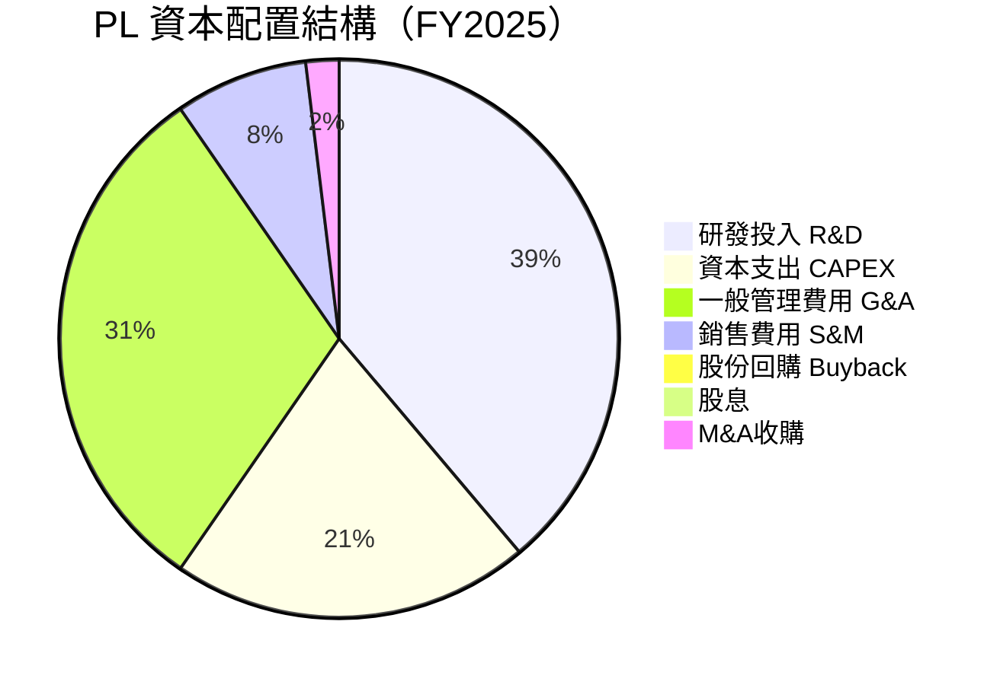

---

### 👔 管理層執行力評分

| 評估維度 | 評分 | 依據 | 狀態 |
|----------|------|------|------|
| **收入成長執行** | 8/10 | 連續多季加速，超越指引 | 🟢 |
| **成本控制** | 6/10 | 虧損持續收窄，但進度偏慢 | 🟡 |
| **技術路線執行** | 8/10 | Pelican/Tanager按期推進 | 🟢 |
| **資本紀律** | 5/10 | 無buyback/股息，CAPEX持續上升 | 🟡 |
| **戰略清晰度** | 7/10 | 聚焦政府+商業雙軌，目標明確 | 🟢 |
| **股東溝通** | 6/10 | EPS預測數據缺失，資訊透明度待改善 | 🟡 |
| **內部持股比例** | 3/10 | 僅2.1%，利益一致性偏弱 | 🔴 |

---

### 💝 股東友善度

```
股東友善度指標
────────────────────────────────────────────
股息發放        ░░░░░░░░░░  0/10 無股息     🔴
股票回購        ░░░░░░░░░░  0/10 無回購     🔴
內部持股比例    ▓▓░░░░░░░░  2/10 2.1%       🔴
機構持股比例    ▓▓▓▓▓▓▓░░░  7/10 73.4%      🟢
現金留存策略    ▓▓▓▓▓▓░░░░  6/10 充裕現金   🟢
長期價值創造    ▓▓▓▓▓░░░░░  5/10 潛力待兌現 🟡
────────────────────────────────────────────
整體股東友善度  ▓▓▓░░░░░░░  3.3/10         🟡
────────────────────────────────────────────
💡 公司處於投資成長期，所有資本優先投入業務擴張
   短期股東回報能力弱，長期需依賴資本利得
```

---

## 8. 風險評估

### 🗺️ 風險熱圖

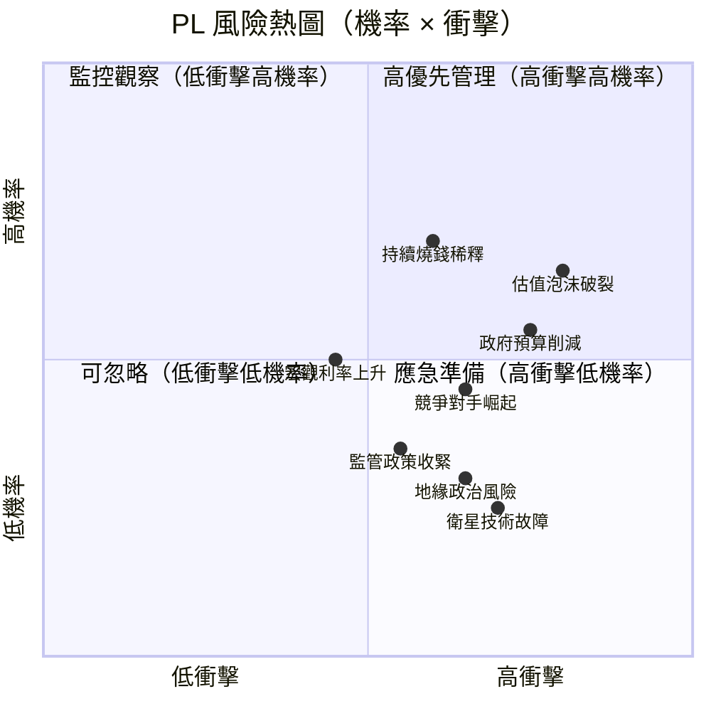

---

### ⚠️ 風險清單

| 風險類型 | 風險描述 | 嚴重度 | 機率 | 緩解措施 | 狀態 |
|----------|----------|--------|------|----------|------|
| **估值風險** | P/S=29x，若市場情緒逆轉，估值壓縮可達50%+ | 極高 | 高 | 等待估值回落再布局 | 🔴 |
| **盈利風險** | 持續虧損，FCF剛轉正但脆弱，若收入失速將快速惡化 | 高 | 中 | 監控季度FCF趨勢 | 🔴 |
| **稀釋風險** | 需要持續融資，股份增發稀釋現有股東 | 高 | 中高 | 觀察現金消耗速度 | 🔴 |
| **政府合約風險** | DOGE等預算削減措施，政府支出緊縮 | 高 | 中 | 商業市場多元化 | 🟡 |
| **競爭風險** | SpaceX Starshield、空客、Maxar等大型玩家 | 中高 | 中 | 技術差異化升級 | 🟡 |
| **技術風險** | 衛星在軌故障、發射失敗、技術迭代被超越 | 中 | 低中 | 星座冗餘設計 | 🟡 |
| **市場動能逆轉** | Beta=1.95，高波動，做空14.3%，逆轉快速 | 高 | 中 | 嚴格止損紀律 | 🟡 |
| **監管/地緣風險** | 衛星成像管制、數據主權議題、出口管制 | 中 | 低 | 合規團隊強化 | 🟢 |

---

### 📉 最大下行情境分析（Bear Case）

```
╔══════════════════════════════════════════════════════════╗
║              最大下行情境（Bear Case）                    ║
╠══════════════════════════════════════════════════════════╣
║                                                          ║
║  觸發條件：                                              ║
║  • 政府預算削減，PL收入成長降至10-15%                   ║
║  • 市場情緒轉向，科技股估值全面收縮                      ║
║  • FCF未能持續轉正，需額外融資（稀釋）                   ║
║  • 競爭加劇，P/S壓縮至8-10x合理範圍                     ║
║                                                          ║
║  Bear Case 估值：                                        ║
║  FY26 收入預估：$310M（成長10%）                        ║
║  合理 P/S：8x（同業水平）                               ║
║  Bear 目標價：$310M × 8x / 317M股 = $7.8               ║
║                                                          ║
║  最大下行幅度：$24.14 → $7.80 = -67.7%                 ║
║                                                          ║
║  Base Case：$22-25（分析師均值）= -8% ~ +3.6%           ║
║  Bull Case：$33（分析師高點）= +36.7%                   ║
║                                                          ║
║  🔴 下行風險(67%) >> 上行潛力(37%)，風險不對稱          ║
╚══════════════════════════════════════════════════════════╝
```

---

## 9. 催化劑與觸發因素

### 📅 催化劑時間軸

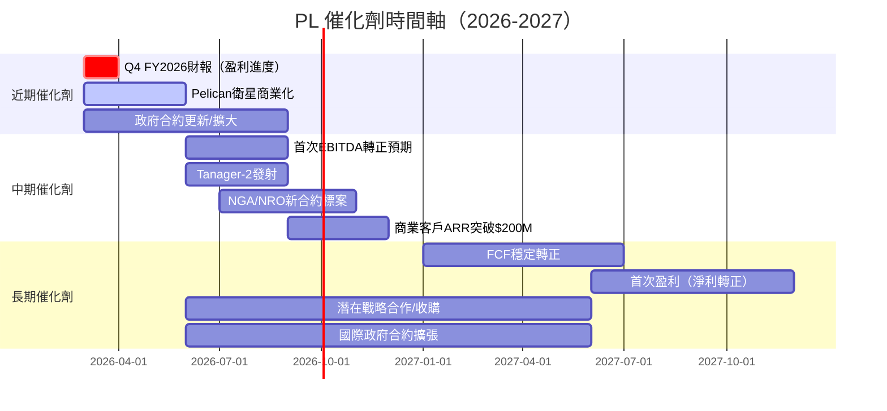

---

### ✅ 正面觸發因素

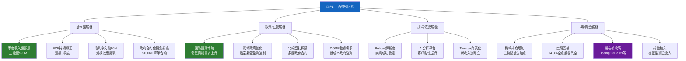

---

## 10. 投資建議

### ⭐ 最終評級

```
╔══════════════════════════════════════════════════════════════════╗
║                                                                  ║
║          ★★★☆☆  PL 綜合評級：3星（觀望）                       ║
║                                                                  ║
║  ┌──────────────────────────────────────────────────────────┐   ║
║  │  投資建議：觀望（Watch）                                  │   ║
║  │                                                           │   ║
║  │  當前價格：$24.14                                        │   ║
║  │  當前估值：P/S = 29x（嚴重高估）                        │   ║
║  │  風險/報酬比：不佳（下行67% vs 上行37%）                │   ║
║  │                                                           │   ║
║  │  ✅ 業務基本面優秀：成長加速、FCF轉正                   │   ║
║  │  ✅ 護城河顯著：全球最大地球觀測星座                    │   ║
║  │  ✅ 機構認可：多位分析師升評為買入                      │   ║
║  │                                                           │   ║
║  │  ❌ 估值極度昂貴：P/S=29x難以支撐                      │   ║
║  │  ❌ 仍在虧損：ROIC遠低於WACC，EVA=-$78M               │   ║
║  │  ❌ 風險非對稱：下行風險遠大於上行空間                  │   ║
║  │                                                           │   ║
║  │  建議：等待估值回落至 P/S=12-15x（約$13-16）           │   ║
║  │        或業績顯著超預期確認後再行布局                   │   ║
║  └──────────────────────────────────────────────────────────┘   ║
╚══════════════════════════════════════════════════════════════════╝
```

---

### 🎯 目標價區間與隱含報酬率

| 情境 | 目標價 | 隱含報酬率 | 核心假設 | 機率 |
|------|--------|------------|----------|------|
| 🐂 **樂觀（Bull）** | $33.00 | **+36.7%** | FY26收入$380M，P/S=22x，盈利加速，政府合約爆發 | 25% |
| 📊 **基準（Base）** | $22.00 | **-8.8%** | FY26收入$340M，P/S=16x，穩健執行 | 45% |
| 🐻 **悲觀（Bear）** | $8.00 | **-66.9%** | 收入成長放緩至10%，P/S壓縮至8x，融資稀釋 | 30% |
| **加權目標價** | **$19.65** | **-18.6%** | 機率加權 | 100% |

> ⚠️ **加權期望報酬率為負**，不支持當前價位買入

---

### 👥 投資人適配度

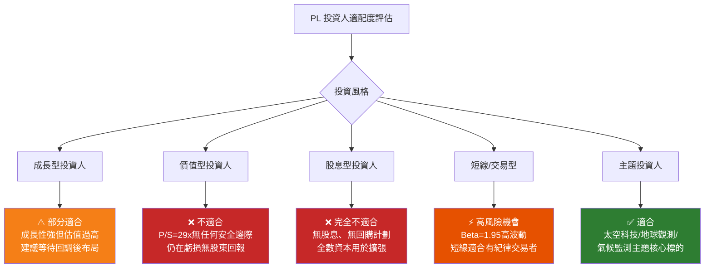

---

### 📋 投資操作建議細則

#### ⏰ 建議持倉時間

```
持倉時間框架：
────────────────────────────────────────────
短線（<1個月）   ⚠️  高風險，依技術面操作
中線（3-12月）   ⚠️  等待估值合理化後考慮
長線（>2年）     ✅  若確信商業模式，可考慮分批布局
最佳持倉時機     📅  等待價格回落至$14-17區間
```

#### 🟢 加碼觸發條件

```
✅ 加碼觸發信號（需同時滿足2項以上）：
─────────────────────────────────────────────────────
□ 股價回落至 $16-18（P/S 回落至 15x 以下）
□ 連續3季度FCF為正且環比成長
□ 宣布重大政府合約（>$50M單筆）
□ EBITDA首次轉正並維持
□ 毛利率突破60%並維持
□ 機構持股比例上升至>80%
```

#### 🔴 止損觸發條件

```
❌ 止損觸發信號（任一條件觸發立即重估）：
─────────────────────────────────────────────────────
□ 股價跌破 $18（技術破位，跌幅>25%）
□ 季度收入成長率跌至15%以下
□ 宣布大規模增發（>5%稀釋）
□ 政府主要合約流失或延期
□ FCF再度轉負且連續2季度
□ 競爭對手獲得顛覆性技術突破
```

---

### 📊 關鍵監控指標 Checklist

```
╔══════════════════════════════════════════════════════════════╗
║                  PL 關鍵監控指標 Checklist                   ║
╠══════════════════════════════════════════════════════════════╣
║                                                              ║
║  📈 成長性指標                                               ║
║  □ 季度收入成長率 ≥ 25%（目標）                            ║
║  □ ARR（年度經常性收入）成長趨勢                            ║
║  □ 新客戶獲取成本（CAC）與客戶終身價值（LTV）              ║
║  □ 政府合約訂單積壓（Backlog）規模                         ║
║                                                              ║
║  💰 獲利能力指標                                             ║
║  □ 毛利率維持在55%以上並持續改善                           ║
║  □ 營業利益率朝損益平衡推進                                 ║
║  □ FCF是否持續轉正（連續季度）                             ║
║  □ EBITDA轉正時間點（目標FY2027）                          ║
║                                                              ║
║  🏦 財務健康指標                                             ║
║  □ 現金儲備維持在$400M以上                                 ║
║  □ 現金消耗速率（Burn Rate）是否加速                       ║
║  □ 是否有額外增發計劃                                       ║
║                                                              ║
║  🏰 競爭地位指標                                             ║
║  □ Pelican衛星部署進度                                      ║
║  □ Tanager商業合約數量                                      ║
║  □ SpaceX/競爭對手動態                                      ║
║                                                              ║
║  📊 估值指標                                                 ║
║  □ P/S是否回落至15x合理水平                                ║
║  □ 分析師目標價上修幅度                                     ║
║  □ 機構持股比例變化                                         ║
║  □ 做空比例是否顯著下降                                     ║
╚══════════════════════════════════════════════════════════════╝
```

---

## 📝 總結評分一覽

```
╔══════════════════════════════════════════════════════════════════╗
║                     PL 最終綜合評分卡                            ║
╠══════════════════════════════════════════════════════════════════╣
║                                                                  ║
║  🚀 成長性    ▓▓▓▓▓▓▓▓░░  8/10  ⭐⭐⭐⭐   收入加速成長        ║
║  💰 獲利能力  ▓▓▓▓░░░░░░  4/10  ⭐⭐      仍在虧損但改善中    ║
║  🏦 財務健康  ▓▓▓▓▓▓░░░░  6/10  ⭐⭐⭐    流動性充裕          ║
║  📊 估值      ▓▓▓░░░░░░░  3/10  ⭐½      P/S=29x嚴重高估     ║
║  🏰 競爭優勢  ▓▓▓▓▓▓▓░░░  7/10  ⭐⭐⭐⭐   護城河顯著          ║
║  👔 管理品質  ▓▓▓▓▓░░░░░  5/10  ⭐⭐½    執行可以，持股偏低  ║
║  📈 市場動能  ▓▓▓▓▓▓▓▓░░  8/10  ⭐⭐⭐⭐   趨勢強勁            ║
║  ⚠️ 風險控管  ▓▓▓▓░░░░░░  4/10  ⭐⭐      多重風險並存        ║
║                                                                  ║
║  ━━━━━━━━━━━━━━━━━━━━━━━━━━━━━━━━━━━━━━━━━━━━━━━━━━━━━━━━━    ║
║  加權總分     ▓▓▓▓▓▓░░░░  5.6/10  ★★★☆☆                      ║
║                                                                  ║
║  投資建議：觀望 👀                                              ║
║  當前價：$24.14  |  加權目標：$19.65  |  隱含：-18.6%         ║
║  最佳介入點：$14-17（P/S回落至12-15x）                        ║
╚══════════════════════════════════════════════════════════════════╝
```

---

> **⚠️ 免責聲明**：本報告為 AI 自動生成，基於公開財務數據及模型估算，僅供研究參考，不構成任何投資建議。投資有風險，任何投資決策應由投資人自行負責，並在必要時諮詢持牌財務顧問。過去績效不代表未來表現。本報告中的目標價及預測僅為分析參考，實際結果可能與預測存在重大差異。