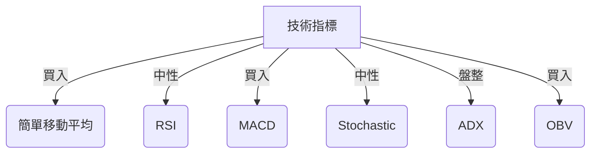
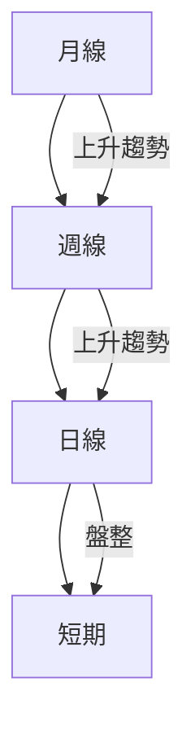
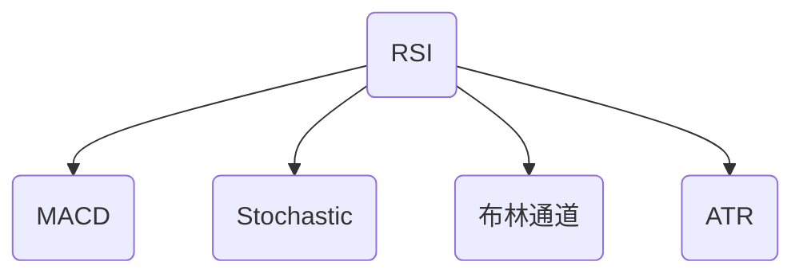
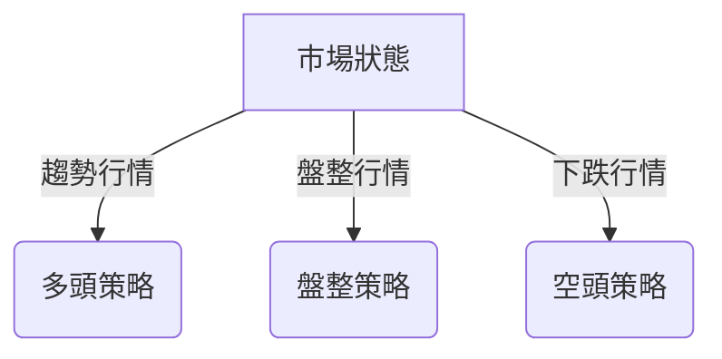
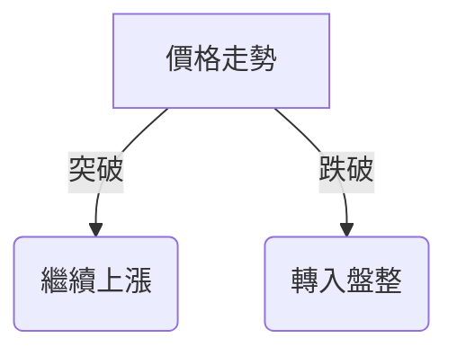

# PL 技術分析報告
> **報告日期**：2026-03-21 ｜ **語言**：繁體中文 ｜ **數據來源**：Yahoo Finance

## 目錄
1. [技術面概覽](#1-技術面概覽)
2. [趨勢分析（多時框架）](#2-趨勢分析多時框架)
3. [圖表形態分析](#3-圖表形態分析)
4. [支撐與阻力（精確數值）](#4-支撐與阻力精確數值)
5. [技術指標深度解讀](#5-技術指標深度解讀)
6. [量價分析](#6-量價分析)
7. [多時框架訊號總結](#7-多時框架訊號總結)
8. [交易策略建議（精確數值）](#8-交易策略建議精確數值)
9. [風險提示與監控](#9-風險提示與監控)

---

## 1. 技術面概覽

### 技術訊號儀表板


### 核心指標速覽表

| 指標        | 數值     | 訊號        |
|-------------|----------|-------------|
| MA20        | $25.70   | 🟢 買入     |
| MA50        | $25.05   | 🟢 買入     |
| MA200       | $14.24   | 🟢 買入     |
| RSI(14)     | 69.18    | 🟡 中性     |
| MACD Hist   | +0.541   | 🟢 買入     |
| Stoch %K    | 80.81    | 🟡 超買     |
| ADX(14)     | 15.44    | 🔴 盤整     |
| ATR(14)     | $2.70    | -          |
| OBV         | 上升     | 🟢 買入     |

### 技術綜合評分
```
技術綜合評分：8/10
▓▓▓▓▓▓▓▓░░░░░░░░
```

### 52週價格位置分析
當前價格位於52週高點的92.7%，顯示出強勁的上漲動能。

---

## 2. 趨勢分析（多時框架）

### 多時框趨勢判斷


### ADX 趨勢強度解讀
- **ADX(14): 15.44**：顯示目前市場處於盤整狀態，趨勢強度較弱。

### 均線排列
- **均線排列：多頭排列** (MA20 > MA50 > MA200)，顯示長期趨勢向上。

### 長/中/短期趨勢
```
長期：▓▓▓▓▓▓▓▓▓█ 上升
中期：▓▓▓▓▓▓▓▓░░ 上升
短期：▓▓▓░░░░░░░ 盤整
```

---

## 3. 圖表形態分析

### 形態識別


### ASCII 走勢示意圖
```
     35 ────╮
        ╭────╯
     30 ─╯
     25 ──────────╮
             ╭────╯
     20 ────╯
```
- **支撐位**：$25.00, $20.00
- **阻力位**：$35.00, $40.00

### 形態目標價計算
- **頭肩底目標價**：$40.00（量測方法：頸線突破加上形態高度）

### 近期重要 K 線組合分析
- **日線**：近期出現長紅棒，伴隨高量，顯示強勁買盤。

---

## 4. 支撐與阻力（精確數值）

### 支撐阻力位 ASCII 視覺化圖
```
阻力位：
  $40.00 ───
  $35.00 ───
支撐位：
  $25.00 ───
  $20.00 ───
```

### 阻力位表格

| 類型   | 價格    | 依據        |
|--------|---------|-------------|
| 近端   | $35.00  | 頸線突破   |
| 中端   | $40.00  | 前高       |
| 強阻力 | $45.00  | 長期目標   |

### 支撐位表格

| 類型   | 價格    | 依據        |
|--------|---------|-------------|
| 近端   | $30.00  | 最近低點   |
| 中端   | $25.00  | 技術支撐   |
| 強支撐 | $20.00  | 長期支撐   |

### 斐波那契回調位計算表格

| 回調位 | 價格   |
|--------|--------|
| 38.2%  | $27.60 |
| 50%    | $25.65 |
| 61.8%  | $23.70 |

### 布林通道上下軌作為動態支撐阻力分析
- **上軌**：$29.90
- **中軌**：$25.70
- **下軌**：$21.51

---

## 5. 技術指標深度解讀

### 指標訊號彙整


### RSI(14) 分析
- **RSI(14): 69.18**，接近超買區間，無明顯背離。
- **RSI 進度條**：
```
▓▓▓▓▓▓▓▓▓░░
```

### MACD(12/26/9) 分析
- **MACD Hist: +0.541**，顯示多頭動能增強。
- **MACD 與訊號線交叉**：多頭交叉，顯示買入訊號。

### Stochastic(14,3,3) 分析
- **%K: 80.81, %D: 69.40**，進入超買區間，但未出現交叉。

### 布林通道(20,2σ) 分析
- **%B: 1.47**，價格超出上軌，顯示短期可能回調。

### ATR(14) 分析
- **ATR: $2.70**，建議止損距離設於1.5倍ATR，即約$4.05。

---

## 6. 量價分析

### OBV 趨勢分析
- **OBV 持續增加**，量能支撐價格上漲趨勢。

### 成交量與價格配合度分析
- **成交量顯著高於均值**（量比4.73x），顯示強勁的買盤動能。

### 量能評分
```
量能評分：9/10
▓▓▓▓▓▓▓▓▓█
```

### 量能異常信號識別
- 異常高量與價格大幅上漲同步，顯示市場強烈看多情緒。

---

## 7. 多時框架訊號總結

### 時框架評分表格

| 時框架 | 趨勢    | 動能   | 成交量 | 綜合評分 |
|--------|---------|--------|--------|----------|
| 月線   | 上升    | 強     | 強     | 🟢 9/10  |
| 週線   | 上升    | 強     | 強     | 🟢 8/10  |
| 日線   | 盤整    | 中性   | 強     | 🟡 7/10  |

### 訊號一致性
- **多指標確認趨勢**：主要技術指標如MACD、MA均指向上行趨勢，與成交量同步確認。
- **矛盾點**：ADX顯示盤整，與其他指標的上升趨勢稍有矛盾。

---

## 8. 交易策略建議（精確數值）

### 策略選擇流程圖


### 多頭策略

| 項目     | 價格       |
|----------|------------|
| 進場點   | $31.00     |
| 止損     | $27.00     |
| 目標價1  | $36.00     |
| 目標價2  | $40.00     |
| 風險報酬比 | 1:3       |

### 空頭策略

| 項目     | 價格       |
|----------|------------|
| 進場點   | $29.00     |
| 止損     | $32.00     |
| 目標價1  | $25.00     |
| 目標價2  | $20.00     |
| 風險報酬比 | 1:2       |

### 盤整策略
- **區間高賣低買**：$25.00 - $35.00

### 倉位管理建議
- **建議持倉比例**：20% of portfolio，根據市場波動性調整。

### 整體技術訊號強度
```
★☆☆☆☆
```

---

## 9. 風險提示與監控

### 關鍵失效條件
- **失效條件**：價格跌破$25.00，顯示上行趨勢失效。

### 近期催化劑事件
- **財報發布**：可能影響股價波動，需密切關注。

### 風險場景


> **免責聲明**：本報告為 AI 自動生成，僅供研究參考，不構成投資建議。