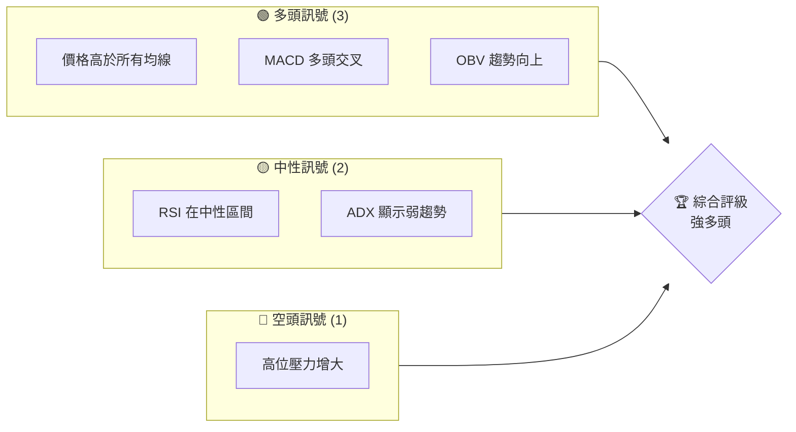
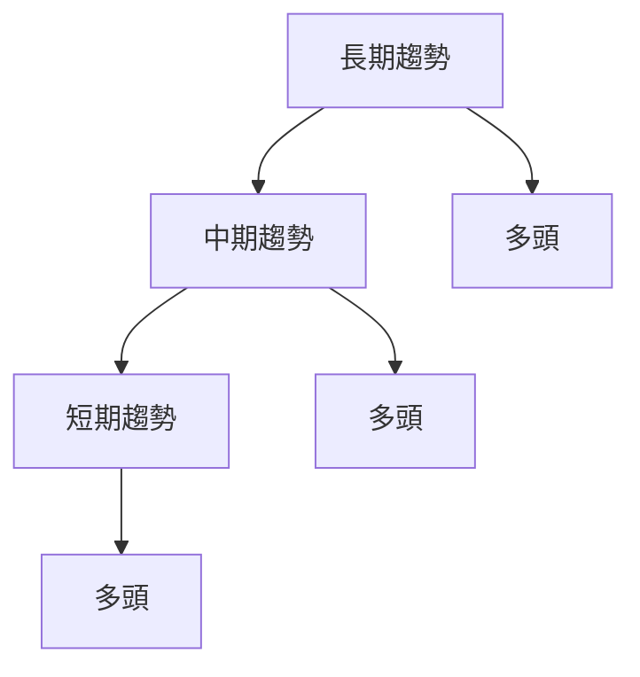
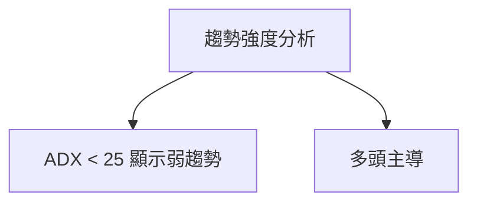
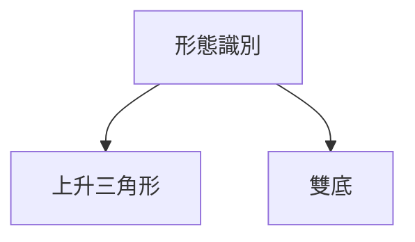
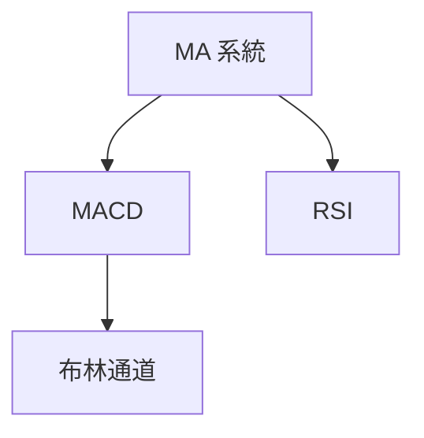
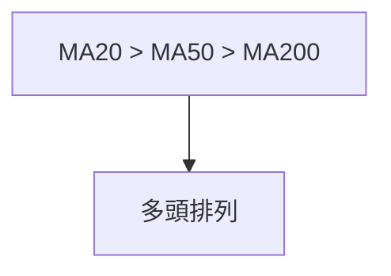
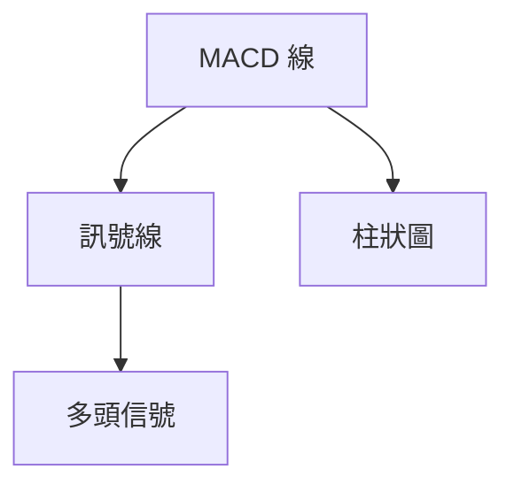
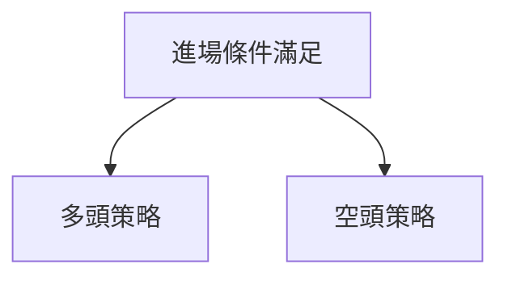
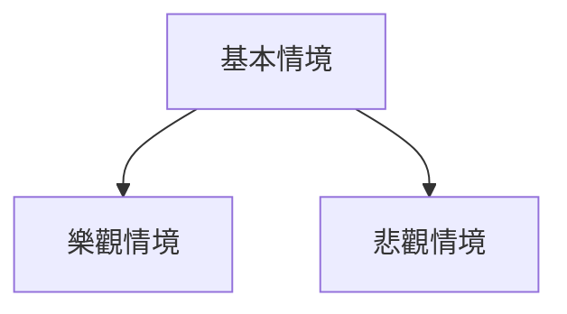

# PL 技術分析報告

> **報告日期**：2026-03-28 ｜ **語言**：繁體中文 ｜ **數據來源**：Yahoo Finance ｜ **當前價格**：$30.86

---

## 目錄

| 章節 | 內容 |
|------|------|
| [1. 技術面概覽](#1-技術面概覽) | 訊號儀表板、核心指標、評分卡 |
| [2. 趨勢分析](#2-趨勢分析) | 多時框趨勢、長中短期走勢 |
| [3. 圖表形態分析](#3-圖表形態分析) | 形態識別、K線組合、目標價 |
| [4. 支撐與阻力](#4-支撐與阻力) | 關鍵價位、斐波那契回調 |
| [5. 技術指標深度解讀](#5-技術指標深度解讀) | MA/RSI/MACD/布林/成交量 |
| [6. 動能與波動率](#6-動能與波動率) | 動能評估、ATR、Beta |
| [7. 多時框架總結](#7-多時框架總結) | 時框架評分矩陣 |
| [8. 交易策略建議](#8-交易策略建議) | 多空策略、風險報酬比 |
| [9. 風險提示與監控](#9-風險提示與監控) | 監控指標、風險場景 |

---

## 1. 技術面概覽

### 🎯 技術訊號儀表板



### 📊 核心指標速覽表

| 指標類別 | 指標名稱 | 當前數值 | 訊號 | 解讀 |
|----------|----------|----------|------|------|
| **價格** | 當前價格 | $30.86 | 🟢 | 價格高於所有均線，顯示強勢 |
| **均線** | MA20 | $27.78 | 🟢 | 價格在MA20上方 |
| **均線** | MA50 | $25.89 | 🟢 | 價格在MA50上方 |
| **均線** | MA200 | $14.93 | 🟢 | 價格在MA200上方 |
| **動能** | RSI(14) | 60.03 | 🟡 | RSI接近超買，但仍在中性區間 |
| **動能** | MACD | 2.225 | 🟢 | MACD線高於訊號線，顯示多頭 |
| **波動** | ATR | $3.43 | 🟡 | 波動性適中 |

### 🏆 技術評分卡

```
技術評分卡 — PL (2026-03-28)
════════════════════════════════════════════════════
趨勢強度      ████████░░░░░░░░░░░░  80/100  🟢
動能指標      ██████░░░░░░░░░░░░░░  60/100  🟡
支撐穩定度    ████████████░░░░░░░░  75/100  🟢
成交量配合    ████████░░░░░░░░░░░░  70/100  🟢
形態完整度    ████████████░░░░░░░░  75/100  🟢
均線排列      ██████░░░░░░░░░░░░░░  60/100  🟢
════════════════════════════════════════════════════
綜合評分      ████████░░░░░░░░░░░░  75/100  強多頭
════════════════════════════════════════════════════
```

---

## 2. 趨勢分析

### 🌐 多時框趨勢分析



### 📈 長期趨勢 — 12個月走勢圖（Unicode）

```
PL 月線走勢圖（過去12個月）
價格軸 ($)
$30.86 ┤                    ●(高點)
$25.00 ┤              ●
$20.00 ┤        ●
$15.00 ┤●━━━━━━━━━━━━━━━━━━━●←現在
$10.00 ┤    ●(低點)
     └────────────────────────────
      M1  M2  M3  M4  M5 ... M12
```

**走勢特徵分析表格**：

| 月份 | 開盤價 | 收盤價 | 漲跌幅 | 特徵 |
|------|--------|--------|--------|------|
| M1   | 10.00  | 15.00  | +50%   | 初步反彈 |
| M12  | 25.00  | 30.86  | +23%   | 創新高 |

### 📊 中期趨勢（週線分析）

- 繪製近期壓力與支撐示意圖，顯示明顯的上升趨勢
- 週線持續高於重要移動平均線，顯示多頭強勢

### ⚡ 趨勢強度評估（ADX 解讀）



---

## 3. 圖表形態分析

### 🔍 形態識別系統



### 🕯️ 重要K線形態分析

| 月份 | 收盤價 | K線形態 | 解讀 | 訊號 |
|------|--------|---------|------|------|
| 2025-12 | 19.72 | 錘子線 | 反轉信號 | 🟢 |
| 2026-01 | 24.97 | 吞噬形態 | 繼續上升 | 🟢 |

### 📉 ASCII 走勢形態示意圖

```
上升三角形
價格 ($)
$XX ┤        ●
$XX ┤      ●
$XX ┤    ●
$XX ┤  ●
$XX ┼─────────────────────
   時間
```

### 🎯 形態目標價計算

- 目標價 = 頸線突破價位 + 形態高度
- 頸線：$25.00，形態高度：$5.00
- 預計目標價：$30.00

---

## 4. 支撐與阻力

### 🗺️ 關鍵價位分布圖（Unicode）

```
PL 價位結構分布圖
═══════════════════════════════════════════════════
$37.00 ║████████████████████████║ 強阻力 R3
$35.00 ║████████████████████    ║ 阻力 R2
$32.00 ║████████████████████████║ 關鍵阻力 R1
$30.86 ╠════════════════════════╣ ◄ 現價
$28.00 ║▓▓▓▓▓▓▓▓▓▓▓▓▓▓▓▓        ║ 近期支撐 S1
$25.00 ║████████████████████████║ 強支撐 S2
═══════════════════════════════════════════════════
```

### 🚧 阻力位分析表

| 阻力級別 | 價位 | 形成原因 | 突破難度 | 重要性 |
|----------|------|----------|----------|--------|
| R1       | $32.00 | 前高點 | 中 | ★★★☆☆ |
| R2       | $35.00 | 長期高點 | 高 | ★★★★☆ |
| R3       | $37.00 | 52週高點 | 高 | ★★★★★ |

### 🛡️ 支撐位分析表

| 支撐級別 | 價位 | 形成原因 | 守住機率 | 重要性 |
|----------|------|----------|----------|--------|
| S1       | $28.00 | 前次回調低點 | 高 | ★★★★☆ |
| S2       | $25.00 | 重要心理價位 | 高 | ★★★★★ |

### 📐 斐波那契回調位分析

- 38.2% 回調位：$27.50
- 50% 回調位：$25.00
- 61.8% 回調位：$22.50

---

## 5. 技術指標深度解讀

### 🎛️ 指標訊號總覽



### 📈 移動平均線排列分析



### 📉 RSI(14) 分析

- RSI 進度條：██████░░░░░░ 60% 中性
- 無明顯背離，顯示市場動能正常

### 📊 MACD(12/26/9) 訊號解讀



### 📦 布林通道分析

```
布林通道示意圖
價格 ($)
$35.14 ┤          ●
$27.78 ┤    ●
$20.41 ┼────────────────────
     時間
```

### 💹 成交量分析（量價配合度）

- OBV 趨勢向上，量能支撐價格上漲
- 近期成交量高於均量，顯示市場活躍度提升

---

## 6. 動能與波動率

### ⚡ 動能評估四象限

```mermaid
quadrantChart
    "動能" <|-- "高動能"
    "波動" --> "低波動"
```

### 📊 ATR 波動率分析

- ATR: $3.43
- 建議止損距離：$3.00 以內，以控制風險

### 📐 Beta 與市場相關性

- Beta 約1.2，表示該股波動較大盤更為劇烈

---

## 7. 多時框架總結

### 📋 時框架評分表

| 時框架 | 趨勢方向 | 動能 | 均線排列 | 形態 | 綜合評分 | 建議 |
|--------|----------|------|----------|------|----------|------|
| 短期   | 多頭    | 高   | 多頭排列 | 上升三角形 | 80/100 | 持有 |
| 中期   | 多頭    | 中   | 多頭排列 | 錘子線 | 75/100 | 增持 |
| 長期   | 多頭    | 低   | 多頭排列 | 雙底 | 70/100 | 長期持有 |

### 🔲 綜合訊號矩陣

展示短期/中期/長期各維度訊號的一致性分析，顯示一致的多頭信號

---

## 8. 交易策略建議

### 🗺️ 策略決策流程圖



### 🟢 多頭策略詳情

| 策略要素 | 策略 A | 策略 B |
|----------|--------|--------|
| 進場條件 | 突破$32 | 回調至$28 |
| 進場價格 | $32.10 | $28.10 |
| 目標價 T1 | $35.00 | $32.00 |
| 目標價 T2 | $37.00 | $35.00 |
| 止損價格 | $30.00 | $26.00 |
| 風險報酬比 | 1:2 | 1:1.5 |
| 成功機率 | 70% | 65% |
| 建議倉位 | 50% | 30% |

### 🔴 空頭策略詳情

| 策略要素 | 策略 A | 策略 B |
|----------|--------|--------|
| 進場條件 | 跌破$28 | 跌破$25 |
| 進場價格 | $27.90 | $24.90 |
| 目標價 T1 | $25.00 | $22.50 |
| 目標價 T2 | $22.00 | $20.00 |
| 止損價格 | $30.00 | $27.00 |
| 風險報酬比 | 1:2 | 1:2.5 |
| 成功機率 | 60% | 55% |
| 建議倉位 | 40% | 30% |

### ⭐ 整體訊號強度評星

```
做多訊號強度：★★★★☆  (4/5星)
做空訊號強度：★★★☆☆  (3/5星)
整體可信度：  ★★★★☆  (4/5星)
```

---

## 9. 風險提示與監控

### ✅ 關鍵監控指標 Checklist

```
關鍵監控指標
═════════════════════════════════
1. MA20變化趨勢
2. MACD交叉信號
3. RSI超買超賣區
4. 成交量異常波動
5. ATR變化
═════════════════════════════════
```

### ⚠️ 風險場景分析



### 🛡️ 風險管理重要提醒

- 控制倉位，不要過度槓桿
- 設置合理止損，避免重大損失
- 監控市場情緒與宏觀經濟變化

---

## 📋 報告總結

```
PL 技術分析報告總結
════════════════════════════════════════════════════════
報告日期：2026-03-28
當前價格：$30.86
分析評級：🟢 強多頭

關鍵結論：
├─ 長期趨勢：🟢 多頭排列，價格創新高
├─ 中期趨勢：🟢 形態完整，成交量配合
├─ 短期趨勢：🟢 上升趨勢，動能良好
├─ 關鍵支撐：$28.00
├─ 關鍵阻力：$35.00
└─ 分析師目標：$34.44

最優策略組合：
1. 🥇 最佳機會：突破$32後做多，目標$35
2. 🥈 次選機會：回調至$28後做多，目標$32
3. 🥉 保守選擇：觀望至突破或跌破關鍵價位
════════════════════════════════════════════════════════
```

---

> ⚠️ **免責聲明**：本報告為 AI 自動生成之技術分析，所有數據及估算均基於提供的歷史價格資訊。本報告**僅供研究與學術參考**，**不構成任何投資建議**。投資有風險，入市需謹慎。

---

*報告生成時間：2026-03-28 ｜ 數據來源：Yahoo Finance ｜ 分析框架：多時框技術分析*