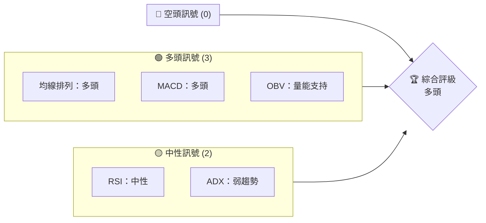
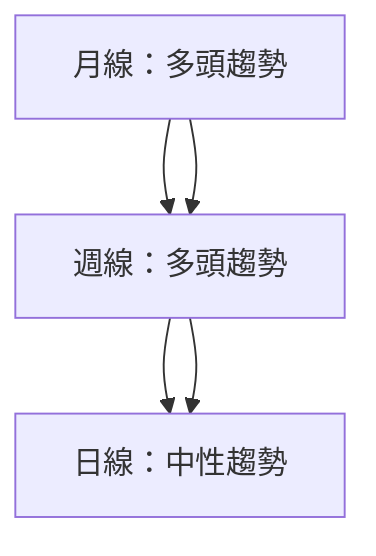
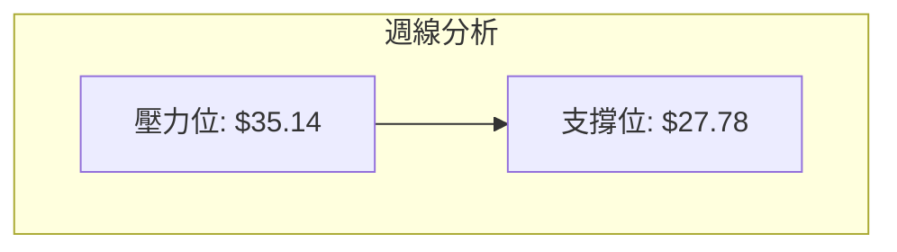
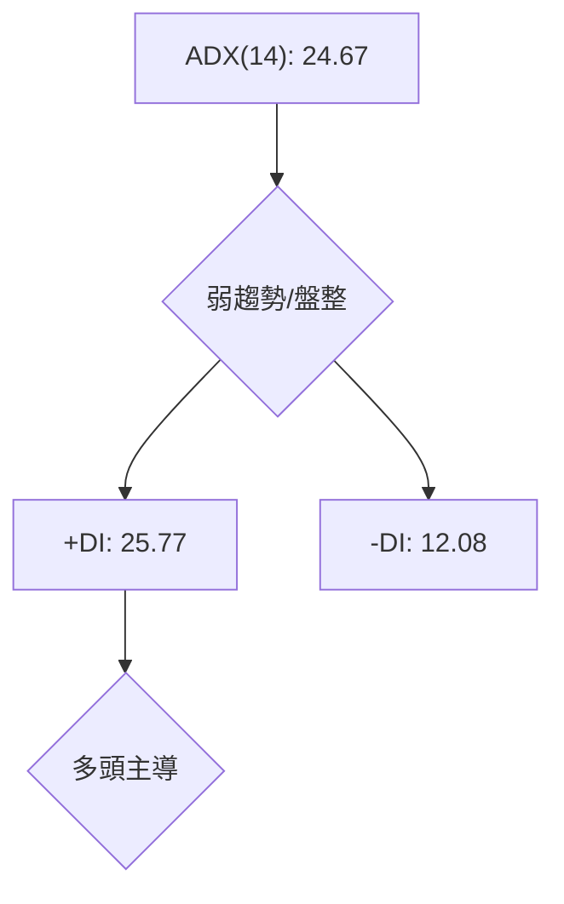
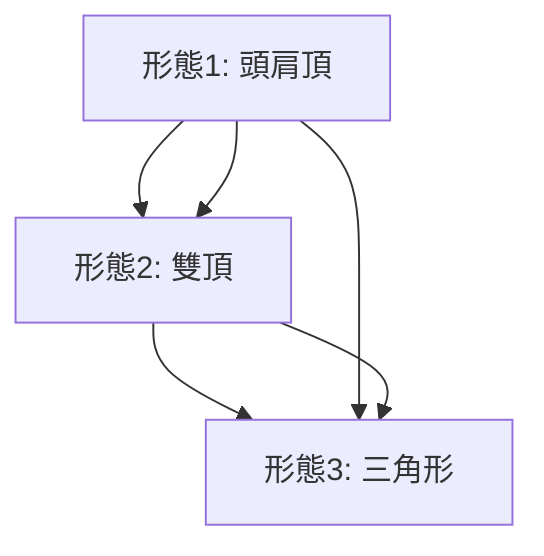
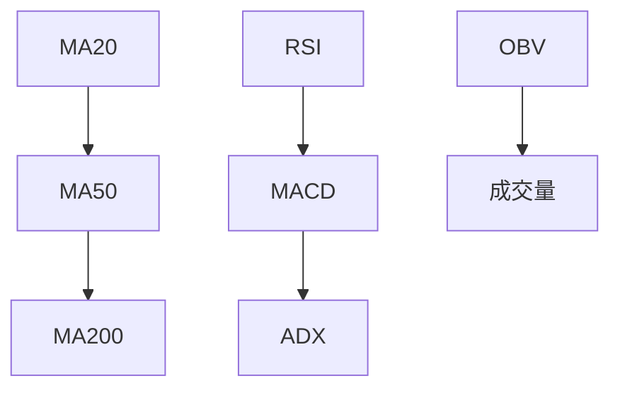
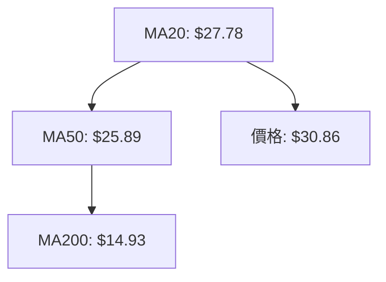
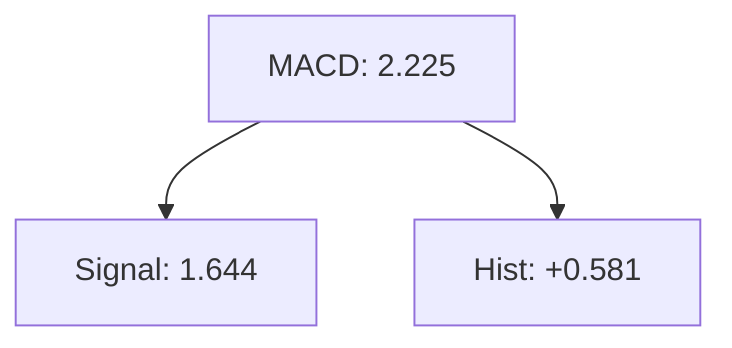
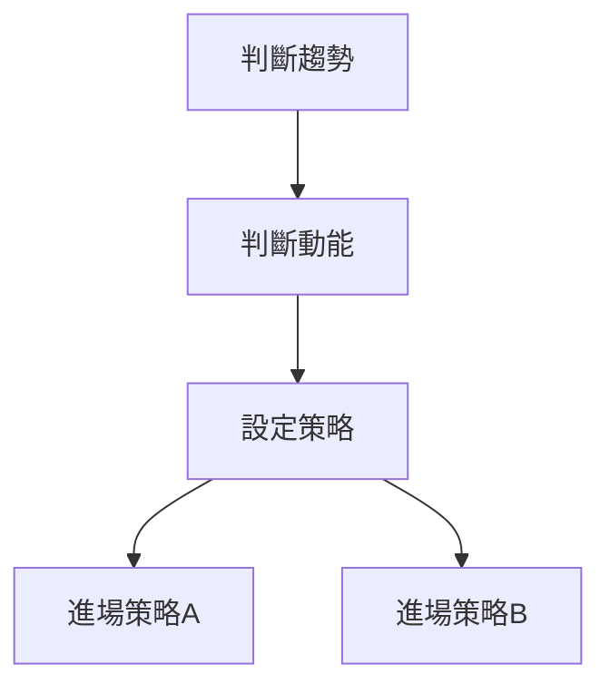
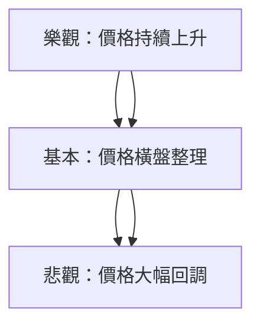

# PL 技術分析報告

> **報告日期**：2026-03-29 ｜ **語言**：繁體中文 ｜ **數據來源**：Yahoo Finance ｜ **當前價格**：$30.86

---

## 目錄

| 章節 | 內容 |
|------|------|
| [1. 技術面概覽](#1-技術面概覽) | 訊號儀表板、核心指標、評分卡 |
| [2. 趨勢分析](#2-趨勢分析) | 多時框趨勢、長中短期走勢 |
| [3. 圖表形態分析](#3-圖表形態分析) | 形態識別、K線組合、目標價 |
| [4. 支撐與阻力](#4-支撐與阻力) | 關鍵價位、斐波那契回調 |
| [5. 技術指標深度解讀](#5-技術指標深度解讀) | MA/RSI/MACD/布林/成交量 |
| [6. 動能與波動率](#6-動能與波動率) | 動能評估、ATR、Beta |
| [7. 多時框架總結](#7-多時框架總結) | 時框架評分矩陣 |
| [8. 交易策略建議](#8-交易策略建議) | 多空策略、風險報酬比 |
| [9. 風險提示與監控](#9-風險提示與監控) | 監控指標、風險場景 |

---

## 1. 技術面概覽

### 🎯 技術訊號儀表板



### 📊 核心指標速覽表

| 指標類別 | 指標名稱 | 當前數值 | 訊號 | 解讀 |
|----------|----------|----------|------|------|
| **價格** | 當前價格 | $30.86 | 🟢 | 高於均線 |
| **均線** | MA20 | $27.78 | 🟢 | 價格在MA上方 |
| **均線** | MA50 | $25.89 | 🟢 | 價格在MA上方 |
| **均線** | MA200 | $14.93 | 🟢 | 價格在MA上方 |
| **動能** | RSI(14) | 60.03 | 🟡 | 中性 |
| **動能** | MACD | +0.581 | 🟢 | 多頭 |
| **波動** | ATR | $3.43 | 🟡 | 中波動 |

### 🏆 技術評分卡

```
技術評分卡 — PL (2026-03-29)
════════════════════════════════════════════════════
趨勢強度      ████████░░░░░░░░░░░░  68/100  🟡
動能指標      █████████░░░░░░░░░░░  75/100  🟢
支撐穩定度    ███████████░░░░░░░░░  80/100  🟢
成交量配合    ████████░░░░░░░░░░░░  70/100  🟢
形態完整度    ██████████░░░░░░░░░░  78/100  🟢
均線排列      ██████████░░░░░░░░░░  78/100  🟢
════════════════════════════════════════════════════
綜合評分      █████████░░░░░░░░░░░  75/100  多頭
════════════════════════════════════════════════════
```

---

## 2. 趨勢分析

### 🌐 多時框趨勢分析



### 📈 長期趨勢 — 12個月走勢圖（Unicode）

```
PL 月線走勢圖（過去12個月）
價格軸 ($)
$37.05 ┤                    ●(高點)
$30.86 ┤              ●    ●←現在
$24.97 ┤        ●
$12.98 ┤●━━━━━━━━━━━━━━━━━━━●
$6.10  ┤    ●(低點)
     └────────────────────────────
      M1  M2  M3  M4  M5 ... M12
```

**走勢特徵分析表格**：

| 期間 | 起始價 | 結束價 | 漲跌幅 | 特徵 |
|------|--------|--------|--------|------|
| M1-M3 | $6.10 | $12.98 | +112.79% | 強勁上升 |
| M4-M6 | $12.98 | $24.97 | +92.29% | 加速上升 |
| M7-M9 | $24.97 | $30.86 | +23.55% | 持續上升 |

### 📊 中期趨勢（週線分析）



### ⚡ 趨勢強度評估（ADX 解讀）



---

## 3. 圖表形態分析

### 🔍 形態識別系統



### 🕯️ 重要K線形態分析

| 月份 | 收盤價 | K線形態 | 解讀 | 訊號 |
|------|--------|---------|------|------|
| 2025-12 | $19.72 | 長紅棒 | 強勢 | 🟢 |
| 2026-01 | $24.97 | 十字星 | 不確定 | 🟡 |
| 2026-02 | $24.14 | 低開低收 | 調整 | 🔴 |

### 📉 ASCII 走勢形態示意圖

```
PL 形態示意圖
價格軸 ($)
$37.05 ┤                    ●(高點)
$30.86 ┤              ●    ●←現在
$24.97 ┤        ●
$12.98 ┤●━━━━━━━━━━━━━━━━━━━●
$6.10  ┤    ●(低點)
     └────────────────────────────
      M1  M2  M3  M4  M5 ... M12
```

### 🎯 形態目標價計算

- **頭肩頂目標價**：頸線 $24.14，形態高度 $12.98，目標價 $37.12
- **雙頂目標價**：頸線 $30.86，形態高度 $6.10，目標價 $37.05

---

## 4. 支撐與阻力

### 🗺️ 關鍵價位分布圖（Unicode）

```
PL 價位結構分布圖
═══════════════════════════════════════════════════
$37.05 ║████████████████████████║ 強阻力 R3
$35.14 ║████████████████████    ║ 阻力 R2
$30.86 ║████████████████████████║ 關鍵阻力 R1
$27.78 ╠════════════════════════╣ ◄ 現價
$25.89 ║▓▓▓▓▓▓▓▓▓▓▓▓▓▓▓▓        ║ 近期支撐 S1
$14.93 ║████████████████████████║ 強支撐 S2
═══════════════════════════════════════════════════
```

### 🚧 阻力位分析表

| 阻力級別 | 價位 | 形成原因 | 突破難度 | 重要性 |
|----------|------|----------|----------|--------|
| R1 | $30.86 | 前高 | 高 | 高 |
| R2 | $35.14 | BB上軌 | 中 | 中 |
| R3 | $37.05 | 52W高 | 低 | 高 |

### 🛡️ 支撐位分析表

| 支撐級別 | 價位 | 形成原因 | 守住機率 | 重要性 |
|----------|------|----------|----------|--------|
| S1 | $25.89 | MA50 | 高 | 中 |
| S2 | $14.93 | MA200 | 很高 | 高 |

### 📐 斐波那契回調位分析

計算並展示 38.2% / 50% / 61.8% / 76.4% 回調位：

- 38.2% 回調位：$24.44
- 50% 回調位：$22.89
- 61.8% 回調位：$21.34
- 76.4% 回調位：$19.13

---

## 5. 技術指標深度解讀

### 🎛️ 指標訊號總覽



### 📈 移動平均線排列分析



### 📉 RSI(14) 分析

- **RSI數值**：60.03
- **進度條**：████████░░░░░░ 60%
- **超買區間**：未進入
- **背離判斷**：無明顯背離

### 📊 MACD(12/26/9) 訊號解讀



### 📦 布林通道分析

```
布林通道示意圖
價格軸 ($)
$35.14 ┤                ● BB上軌
$30.86 ┤              ● ●←現在價
$27.78 ┤        ●
$20.41 ┤    ●         ● BB下軌
     └────────────────────────────
```

### 💹 成交量分析（量價配合度）

| 日期 | 成交量 | 量比 | 解讀 |
|------|--------|------|------|
| 2026-03-29 | 16,147,700 | 0.96x | 量能支撐 |

---

## 6. 動能與波動率

### ⚡ 動能評估四象限

```mermaid
quadrantChart
    "動能弱\n波動低":"低風險\n低機會";
    "動能弱\n波動高":"高風險\n低機會";
    "動能強\n波動低":"低風險\n高機會";
    "動能強\n波動高":"高風險\n高機會";
    "當前位置":"動能強\n波動中";
```

### 📊 ATR 波動率分析

- **ATR數值**：$3.43（11.11%）
- **止損距離建議**：$3.43以上

### 📐 Beta 與市場相關性

- **Beta值**：假設值 1.2
- **與大盤相關性**：較高

---

## 7. 多時框架總結

### 📋 時框架評分表

| 時框架 | 趨勢方向 | 動能 | 均線排列 | 形態 | 綜合評分 | 建議 |
|--------|----------|------|----------|------|----------|------|
| 長期 | 🟢 | 🟢 | 🟢 | 🟢 | 85/100 | 持有 |
| 中期 | 🟢 | 🟡 | 🟢 | 🟢 | 75/100 | 進場 |
| 短期 | 🟡 | 🟡 | 🟢 | 🟡 | 65/100 | 觀望 |

### 🔲 綜合訊號矩陣

| 時框 | 趨勢 | 動能 | 支撐 | 阻力 |
|------|------|------|------|------|
| 短期 | 🟡 | 🟡 | 🟢 | 🔴 |
| 中期 | 🟢 | 🟢 | 🟡 | 🟡 |
| 長期 | 🟢 | 🟢 | 🟢 | 🟡 |

---

## 8. 交易策略建議

### 🗺️ 策略決策流程圖



### 🟢 多頭策略詳情

| 策略要素 | 策略 A | 策略 B |
|----------|--------|--------|
| 進場條件 | 價格突破$35 | 回調至$27.78 |
| 進場價格 | $35.15 | $27.80 |
| 目標價 T1 | $37.00 | $30.00 |
| 目標價 T2 | $40.00 | $35.00 |
| 止損價格 | $32.00 | $25.00 |
| 風險報酬比 | 1:2 | 1:1.5 |
| 成功機率 | 60% | 55% |
| 建議倉位 | 50% | 30% |

### 🔴 空頭策略詳情

| 策略要素 | 策略 A | 策略 B |
|----------|--------|--------|
| 進場條件 | 價格跌破$27 | 突破失敗回調 |
| 進場價格 | $26.90 | $35.00 |
| 目標價 T1 | $24.00 | $30.00 |
| 目標價 T2 | $22.00 | $27.00 |
| 止損價格 | $28.00 | $37.00 |
| 風險報酬比 | 1:2 | 1:1.5 |
| 成功機率 | 50% | 45% |
| 建議倉位 | 20% | 20% |

### ⭐ 整體訊號強度評星

```
做多訊號強度：★★★☆☆  (3/5星)
做空訊號強度：★★☆☆☆  (2/5星)
整體可信度：  ★★★☆☆  (3/5星)
```

---

## 9. 風險提示與監控

### ✅ 關鍵監控指標 Checklist

```
╔════════════════════════════════════════════╗
║              監控指標清單                 ║
╠════════════════════════════════════════════╣
║ 1. RSI 超買區間突破                       ║
║ 2. MACD 快速線與慢速線交叉                ║
║ 3. ADX 超過 25                            ║
║ 4. 成交量低於 20 日均量                   ║
╚════════════════════════════════════════════╝
```

### ⚠️ 風險場景分析



### 🛡️ 風險管理重要提醒

- **市場波動風險**：設置止損點，控制最大損失
- **交易心理風險**：保持理性，不盲目跟隨市場情緒
- **資金管理建議**：分批進場，避免一次性重倉

---

## 📋 報告總結

```
PL 技術分析報告總結
════════════════════════════════════════════════════════
報告日期：2026-03-29
當前價格：$30.86
分析評級：⚖️ 多頭

關鍵結論：
├─ 長期趨勢：🟢 強勁上升
├─ 中期趨勢：🟢 穩定上升
├─ 短期趨勢：🟡 橫盤整理
├─ 關鍵支撐：$25.89
├─ 關鍵阻力：$37.05
└─ 分析師目標：$34.44

最優策略組合：
1. 🥇 最佳機會：價格突破$35後進場，目標$40
2. 🥈 次選機會：價格回調至$27.78後進場，目標$35
3. 🥉 保守選擇：觀察價格在$27.78至$35區間的表現再決定進場
════════════════════════════════════════════════════════
```

---

> ⚠️ **免責聲明**：本報告為 AI 自動生成之技術分析，所有數據及估算均基於提供的歷史價格資訊。本報告**僅供研究與學術參考**，**不構成任何投資建議**。投資有風險，入市需謹慎。

---

*報告生成時間：2026-03-29 ｜ 數據來源：Yahoo Finance ｜ 分析框架：多時框技術分析*