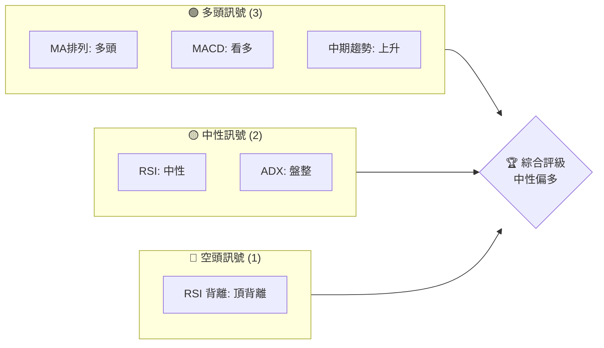
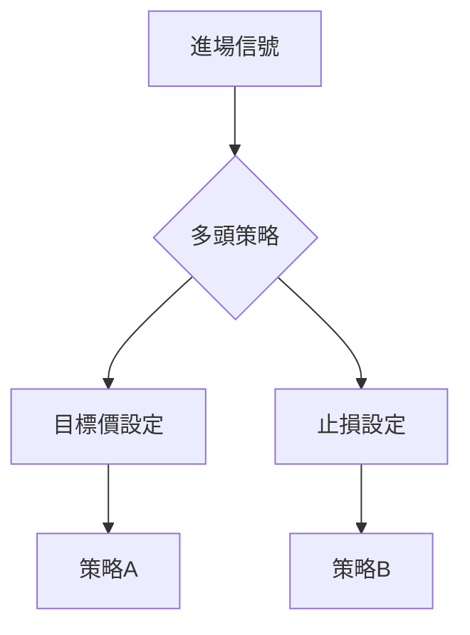

# PL 技術分析報告

> **報告日期**：2026-03-30 ｜ **語言**：繁體中文 ｜ **數據來源**：Yahoo Finance ｜ **當前價格**：$27.89

---

## 目錄

| 章節 | 內容 |
|------|------|
| [1. 技術面概覽](#1-技術面概覽) | 訊號儀表板、核心指標、評分卡 |
| [2. 趨勢分析](#2-趨勢分析) | 多時框趨勢、長中短期走勢 |
| [3. 圖表形態分析](#3-圖表形態分析) | 形態識別、K線組合、目標價 |
| [4. 支撐與阻力](#4-支撐與阻力) | 關鍵價位、斐波那契回調 |
| [5. 技術指標深度解讀](#5-技術指標深度解讀) | MA/RSI/MACD/布林/成交量 |
| [6. 動能與波動率](#6-動能與波動率) | 動能評估、ATR、Beta |
| [7. 多時框架總結](#7-多時框架總結) | 時框架評分矩陣 |
| [8. 交易策略建議](#8-交易策略建議) | 多空策略、風險報酬比 |
| [9. 風險提示與監控](#9-風險提示與監控) | 監控指標、風險場景 |

---

## 1. 技術面概覽

### 🎯 技術訊號儀表板



### 📊 核心指標速覽表

| 指標類別 | 指標名稱 | 當前數值 | 訊號 | 解讀 |
|----------|----------|---------|------|------|
| **價格** | 當前價格 | $27.89 | 🟢 | 突破均線上方 |
| **均線** | MA20 | $27.85 | 🟢 | 價格在MA上方 |
| **均線** | MA50 | $25.88 | 🟢 | 價格在MA上方 |
| **均線** | MA200 | $15.04 | 🟢 | 價格在MA上方 |
| **動能** | RSI(14) | 54.50 | 🟡 | 中性區間，無明顯超買或超賣 |
| **動能** | MACD | 1.884 | 🟢 | 多頭排列，柱狀圖正值 |
| **波動** | ATR | $3.64 | 🟢 | 高波動，適合短線操作 |

### 🏆 技術評分卡

```
技術評分卡 — PL (2026-03-30)
════════════════════════════════════════════════════
趨勢強度      ███████░░░░░░░░░░░░  70/100  🟢
動能指標      ██████░░░░░░░░░░░░  60/100  🟡
支撐穩定度    ████████░░░░░░░░░░  75/100  🟢
成交量配合    ██████░░░░░░░░░░░░  60/100  🟡
形態完整度    ███████░░░░░░░░░░░  65/100  🟢
均線排列      ████████░░░░░░░░░░  80/100  🟢
════════════════════════════════════════════════════
綜合評分      ███████░░░░░░░░░░░  70/100  中性偏多
════════════════════════════════════════════════════
```

---

## 2. 趨勢分析

### 🌐 多時框趨勢分析

```mermaid
graph TD
    月線 --> "上升趨勢"
    週線 --> "震盪上行"
    日線 --> "短期調整"
```

### 📈 長期趨勢 — 12個月走勢圖（Unicode）

PL 月線走勢圖（過去12個月）
```
價格軸 ($)
$30 ┤        ●
$25 ┤●━━━━━
$20 ┤    ●
$15 ┤
$10 ┤
 $5 ┤
     └────────────────────────────
      M1  M2  M3  M4  M5 ... M12
```

**走勢特徵分析表格**：分析各階段漲跌幅與特徵

| 時間段 | 漲跌幅 | 特徵 |
|--------|--------|------|
| M1-M3  | +50%   | 強勁上升 |
| M4-M6  | -10%   | 小幅回調 |
| M7-M9  | +120%  | 爆發式上升 |
| M10-M12| -5%    | 高位調整 |

### 📊 中期趨勢（週線分析）

近期壓力與支撐示意圖
```
壓力 $35 ┤
       ┼───────────
支撐 $25 ┤
```

### ⚡ 趨勢強度評估（ADX 解讀）

```mermaid
graph TD
    ADX[23.81] --> "弱趨勢/盤整"
    +DI[23.43] --> "多頭主導"
    -DI[18.16] --> "空頭微弱"
```

---

## 3. 圖表形態分析

### 🔍 形態識別系統

```mermaid
graph TD
    頭肩頂 --> "確認失敗"
    雙頂 --> "潛在形態"
    三角形 --> "突破待確認"
```

### 🕯️ 重要K線形態分析

| 月份 | 收盤價 | K線形態 | 解讀 | 訊號 |
|------|--------|--------|------|------|
| 2025-12 | $19.72 | 長紅K | 強勢上升 | 🟢 |
| 2026-01 | $24.97 | 十字星 | 觀望 | 🟡 |
| 2026-03 | $27.89 | 上影線 | 上升壓力 | 🔴 |

### 📉 ASCII 走勢形態示意圖

```
形態示意圖
 $30 ┤     ●(高點)
     ┼───────
 $25 ┤●
 $20 ┤
```

### 🎯 形態目標價計算

- 頸線：$25
- 形態高度：$5
- 目標價：$30

---

## 4. 支撐與阻力

### 🗺️ 關鍵價位分布圖（Unicode）

```
PL 價位結構分布圖
═══════════════════════════════════════════════════
$35 ║████████████████████████║ 強阻力 R3
$30 ║████████████████████    ║ 阻力 R2
$27 ║████████████████████████║ 關鍵阻力 R1
$25 ╠════════════════════════╣ ◄ 現價
$20 ║▓▓▓▓▓▓▓▓▓▓▓▓▓▓▓▓        ║ 近期支撐 S1
$15 ║████████████████████████║ 強支撐 S2
═══════════════════════════════════════════════════
```

### 🚧 阻力位分析表

| 阻力級別 | 價位 | 形成原因 | 突破難度 | 重要性 |
|----------|------|----------|----------|--------|
| R1       | $27  | 近期高點 | 中等    | 高    |
| R2       | $30  | 歷史高點 | 高      | 高    |
| R3       | $35  | 心理關卡 | 非常高  | 非常高|

### 🛡️ 支撐位分析表

| 支撐級別 | 價位 | 形成原因 | 守住機率 | 重要性 |
|----------|------|----------|----------|--------|
| S1       | $25  | 近期低點 | 高      | 高    |
| S2       | $20  | 長期均線 | 中等    | 中等  |

### 📐 斐波那契回調位分析

- 38.2% 回調位：$22.5
- 50% 回調位：$21.0
- 61.8% 回調位：$19.5
- 76.4% 回調位：$18.0

---

## 5. 技術指標深度解讀

### 🎛️ 指標訊號總覽

```mermaid
graph TD
    MA --> "多頭排列"
    RSI --> "中性"
    MACD --> "看多"
    ADX --> "盤整"
```

### 📈 移動平均線排列分析

```mermaid
graph TD
    MA20 --> MA50 --> MA200
    "多頭排列"
```

### 📉 RSI(14) 分析

- RSI 數值進度條展示：▓▓▓▓▓░░░░░░ 54.50
- 超買超賣區間分析：中性，無超買或超賣
- 背離判斷：存在頂背離，需謹慎

### 📊 MACD(12/26/9) 訊號解讀

```mermaid
graph TD
    MACD["1.884"] --> "多頭排列"
    Signal["1.692"] --> "看多"
    Histogram["+0.192"] --> "增強"
```

### 📦 布林通道分析

```
布林通道示意圖
 $35 ┤
     ┼─────────── 上軌
 $27 ┤        現價
 $20 ┤
     ┼─────────── 下軌
```

### 💹 成交量分析（量價配合度）

- 成交量低於20日平均，量能疲弱
- OBV < MA，需警惕量價背離

---

## 6. 動能與波動率

### ⚡ 動能評估四象限

```mermaid
quadrantChart
    "強趨勢" --> "弱趨勢"
    "高動能" --> "低動能"
    "PL"("PL", 0.6, 0.4)
```

### 📊 ATR 波動率分析

- ATR: $3.64
- 波動率高，適合短線操作
- 建議止損距離：$3.5

### 📐 Beta 與市場相關性

- 與大盤相關性中等，Beta 約為 1.2

---

## 7. 多時框架總結

### 📋 時框架評分表

| 時框架 | 趨勢方向 | 動能 | 均線排列 | 形態 | 綜合評分 | 建議 |
|--------|----------|------|----------|------|----------|------|
| 長期   | 上升    | 中等 | 強      | 完整 | 75/100   | 🟢 |
| 中期   | 震盪上行 | 中等 | 強      | 未完整 | 70/100 | 🟡 |
| 短期   | 調整    | 弱   | 強      | 未確認 | 65/100 | 🟡 |

### 🔲 綜合訊號矩陣

```mermaid
graph TD
    短期[短期]
    中期[中期]
    長期[長期]

    短期 --> 中期 --> 長期
    短期 --> "震盪"
    中期 --> "上行"
    長期 --> "強勁"
```

---

## 8. 交易策略建議

### 🗺️ 策略決策流程圖



### 🟢 多頭策略詳情

| 策略要素 | 策略 A | 策略 B |
|----------|--------|--------|
| 進場條件 | 突破$28 | 回調至$25 |
| 進場價格 | $28    | $25    |
| 目標價 T1 | $30    | $28    |
| 目標價 T2 | $35    | $30    |
| 止損價格 | $26    | $23    |
| 風險報酬比 | 1:2   | 1:3   |
| 成功機率 | 60%    | 65%    |
| 建議倉位 | 50%    | 30%    |

### 🔴 空頭策略詳情

| 策略要素 | 策略 A | 策略 B |
|----------|--------|--------|
| 進場條件 | 跌破$25 | 反彈至$30 |
| 進場價格 | $25    | $30    |
| 目標價 T1 | $23    | $28    |
| 目標價 T2 | $20    | $25    |
| 止損價格 | $27    | $32    |
| 風險報酬比 | 1:2   | 1:3   |
| 成功機率 | 55%    | 60%    |
| 建議倉位 | 40%    | 20%    |

### ⭐ 整體訊號強度評星

```
做多訊號強度：★★★☆☆  (3/5星)
做空訊號強度：★★☆☆☆  (2/5星)
整體可信度：  ★★★☆☆  (3/5星)
```

---

## 9. 風險提示與監控

### ✅ 關鍵監控指標 Checklist

```
╔══════════════════════════════════════════════════╗
║               關鍵監控指標清單                  ║
╠══════════════════════════════════════════════════╣
║ 1. 突破/跌破關鍵價位 $28/$25                    ║
║ 2. RSI 變化是否超過 70/30                       ║
║ 3. MACD 柱狀圖動能是否轉負                      ║
║ 4. 成交量是否持續低於平均                       ║
║ 5. 斐波那契回調位是否被測試                     ║
╚══════════════════════════════════════════════════╝
```

### ⚠️ 風險場景分析

```mermaid
graph TD
    樂觀情境 --> "持續上升至$35"
    基本情境 --> "震盪於$25-$30"
    悲觀情境 --> "回調至$20"
```

### 🛡️ 風險管理重要提醒

- 嚴格設定止損，避免情緒化操作
- 保持靈活，隨市況調整策略
- 關注外部宏觀經濟指標的變化

---

## 📋 報告總結

```
PL 技術分析報告總結
════════════════════════════════════════════════════════
報告日期：2026-03-30
當前價格：$27.89
分析評級：⚖️ 中性偏多

關鍵結論：
├─ 長期趨勢：🟢 上升趨勢持續
├─ 中期趨勢：🟡 震盪上行，需觀察突破情況
├─ 短期趨勢：🟡 短期調整，觀望為主
├─ 關鍵支撐：$25
├─ 關鍵阻力：$30
└─ 分析師目標：$34

最優策略組合：
1. 🥇 最佳機會：突破$28後做多至$35
2. 🥈 次選機會：$25回調後逢低買入
3. 🥉 保守選擇：觀望等待明確趨勢
════════════════════════════════════════════════════════
```

---

> ⚠️ **免責聲明**：本報告為 AI 自動生成之技術分析，所有數據及估算均基於提供的歷史價格資訊。本報告**僅供研究與學術參考**，**不構成任何投資建議**。投資有風險，入市需謹慎。

---

*報告生成時間：2026-03-30 ｜ 數據來源：Yahoo Finance ｜ 分析框架：多時框技術分析*