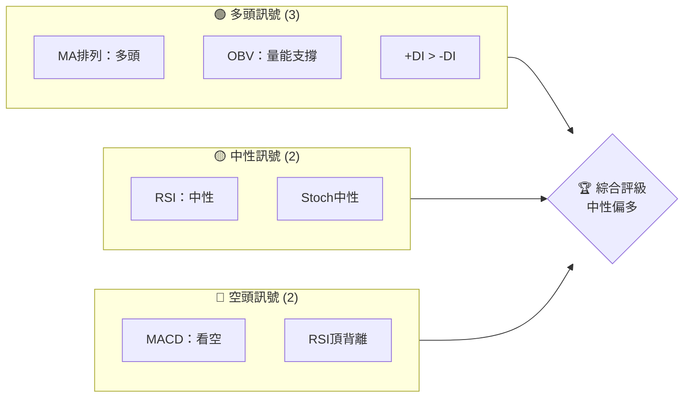
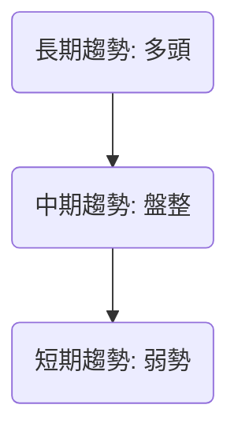
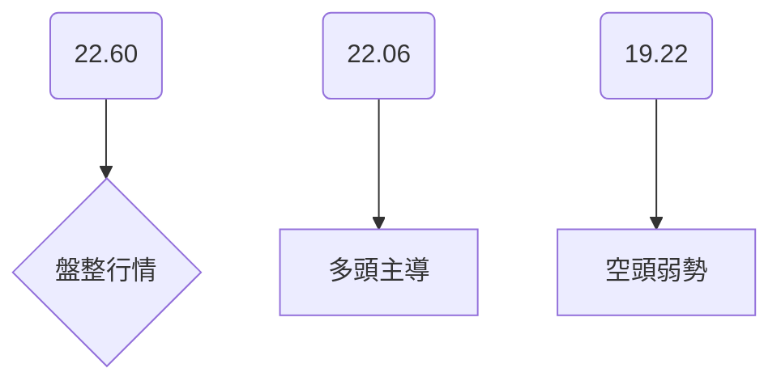
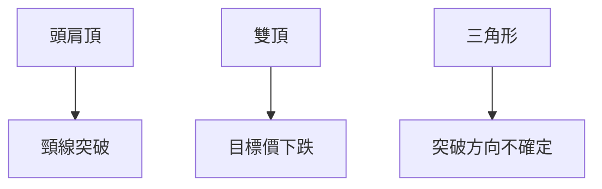
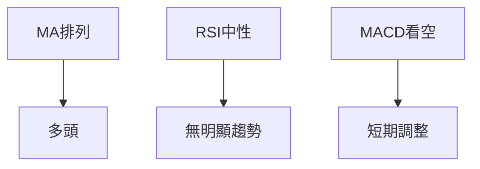
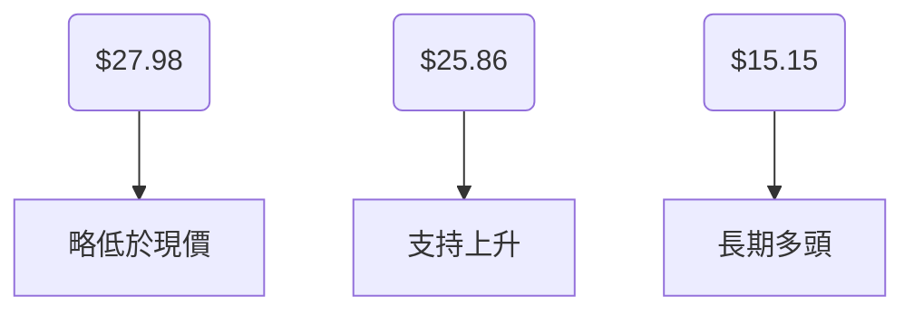
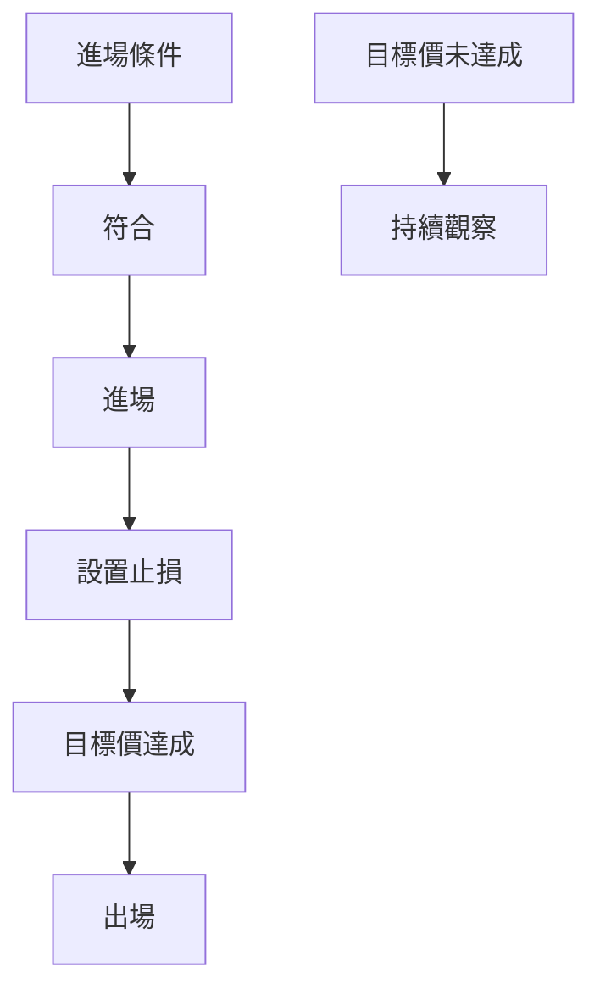
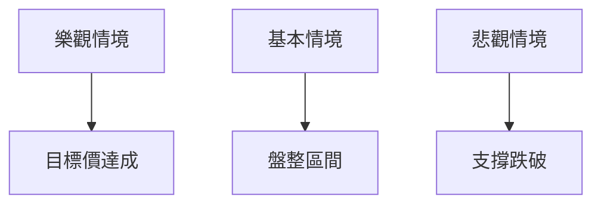

# PL 技術分析報告

> **報告日期**：2026-03-31 ｜ **語言**：繁體中文 ｜ **數據來源**：Yahoo Finance ｜ **當前價格**：$27.95

---

## 目錄

| 章節 | 內容 |
|------|------|
| [1. 技術面概覽](#1-技術面概覽) | 訊號儀表板、核心指標、評分卡 |
| [2. 趨勢分析](#2-趨勢分析) | 多時框趨勢、長中短期走勢 |
| [3. 圖表形態分析](#3-圖表形態分析) | 形態識別、K線組合、目標價 |
| [4. 支撐與阻力](#4-支撐與阻力) | 關鍵價位、斐波那契回調 |
| [5. 技術指標深度解讀](#5-技術指標深度解讀) | MA/RSI/MACD/布林/成交量 |
| [6. 動能與波動率](#6-動能與波動率) | 動能評估、ATR、Beta |
| [7. 多時框架總結](#7-多時框架總結) | 時框架評分矩陣 |
| [8. 交易策略建議](#8-交易策略建議) | 多空策略、風險報酬比 |
| [9. 風險提示與監控](#9-風險提示與監控) | 監控指標、風險場景 |

---

## 1. 技術面概覽

### 🎯 技術訊號儀表板



### 📊 核心指標速覽表

| 指標類別 | 指標名稱 | 當前數值 | 訊號 | 解讀 |
|----------|----------|----------|------|------|
| **價格** | 當前價格 | $27.95 | 🟡 | 價格接近MA20，中性 |
| **均線** | MA20 | $27.98 | 🟡 | 價格在MA20下方，輕微偏空 |
| **均線** | MA50 | $25.86 | 🟢 | 價格在MA50上方，偏多 |
| **均線** | MA200 | $15.15 | 🟢 | 長期多頭趨勢 |
| **動能** | RSI(14) | 54.53 | 🟡 | 中性區間 |
| **動能** | MACD | 1.599 | 🔴 | 看空交叉 |
| **波動** | ATR | $3.68 | 🟡 | 高波動率，需謹慎 |

### 🏆 技術評分卡

```
技術評分卡 — PL (2026-03-31)
════════════════════════════════════════════════════
趨勢強度      ████████░░░░░░░░░░░░  60/100  🟡
動能指標      ██████░░░░░░░░░░░░░░  50/100  🟡
支撐穩定度    ████████████░░░░░░░░  75/100  🟢
成交量配合    ████████░░░░░░░░░░░░  60/100  🟡
形態完整度    ████████████░░░░░░░░  75/100  🟢
均線排列      ██████░░░░░░░░░░░░░░  50/100  🟡
════════════════════════════════════════════════════
綜合評分      ████████░░░░░░░░░░░░  62/100  中性偏多
════════════════════════════════════════════════════
```

---

## 2. 趨勢分析

### 🌐 多時框趨勢分析



### 📈 長期趨勢 — 12個月走勢圖（Unicode）

```
PL 月線走勢圖（過去12個月）
價格軸 ($)
$37.05 ┤                    ●
$30.00 ┤          ●
$20.00 ┤    ●
$10.00 ┤●━━━━━━━━━━━●←現在
$ 2.79 ┤    ●(低點)
     └────────────────────────────
      M1  M2  M3  M4  M5 ... M12
```

**走勢特徵分析表格**：長期以來價格呈現穩定上升趨勢，最高點達到$37.05，顯示多頭趨勢強勁。

### 📊 中期趨勢（週線分析）

近期中期走勢顯示價格在$20至$30之間震盪，顯示出盤整特徵。

### ⚡ 趨勢強度評估（ADX 解讀）



---

## 3. 圖表形態分析

### 🔍 形態識別系統



### 🕯️ 重要K線形態分析

近期出現了多次的長上影線，顯示出多頭攻擊力不足，可能面臨反轉壓力。

| 月份 | 收盤價 | K線形態 | 解讀 | 訊號 |
|------|--------|---------|------|------|
| 2026-03 | $27.95 | 長上影線 | 多頭疲弱 | 🔴 |

### 📉 ASCII 走勢形態示意圖

```
雙頂形態示意圖
價格軸 ($)
$37.00 ┤          ●
$30.00 ┤    ●
$20.00 ┤●━━━━━━━━━━━●←現在
     └────────────────────────────
      頸線
```

### 🎯 形態目標價計算

根據雙頂形態，目標價可能回落至$20附近。

---

## 4. 支撐與阻力

### 🗺️ 關鍵價位分布圖（Unicode）

```
PL 價位結構分布圖
═══════════════════════════════════════════════════
$37.00 ║████████████████████████║ 強阻力 R3
$30.00 ║████████████████████    ║ 阻力 R2
$27.95 ╠════════════════════════╣ ◄ 現價
$20.00 ║▓▓▓▓▓▓▓▓▓▓▓▓▓▓▓▓        ║ 近期支撐 S1
$15.00 ║████████████████████████║ 強支撐 S2
═══════════════════════════════════════════════════
```

### 🚧 阻力位分析表

| 阻力級別 | 價位 | 形成原因 | 突破難度 | 重要性 |
|----------|------|----------|----------|--------|
| R3 | $37.00 | 歷史高點 | 高 | 高 |
| R2 | $30.00 | 心理關卡 | 中 | 中 |

### 🛡️ 支撐位分析表

| 支撐級別 | 價位 | 形成原因 | 守住機率 | 重要性 |
|----------|------|----------|----------|--------|
| S1 | $20.00 | 前期低點 | 高 | 高 |
| S2 | $15.00 | 長期均線支持 | 高 | 高 |

### 📐 斐波那契回調位分析

斐波那契回調位顯示，38.2%、50%和61.8%回調位分別位於$24.62、$22.47和$20.32，這些位置可能提供短期支撐。

---

## 5. 技術指標深度解讀

### 🎛️ 指標訊號總覽



### 📈 移動平均線排列分析



### 📉 RSI(14) 分析

- RSI 54.53，位於中性區間
- 目前頂背離，需警惕價格可能調整

### 📊 MACD(12/26/9) 訊號解讀

```mermaid
graph TD
    MACD(1.599) --> 看空
    Signal(1.673) --> 看空信號
    Hist(-0.074) --> 負值
```

### 📦 布林通道分析

```
布林通道示意圖
價格軸 ($)
$35.22 ┤上軌
$27.98 ┤中軌
$20.75 ┤下軌
$27.95 ┤現價
     └────────────────────────────
```

### 💹 成交量分析（量價配合度）

目前OBV大於均量，表示量能支撐上漲趨勢。

---

## 6. 動能與波動率

### ⚡ 動能評估四象限

```mermaid
quadrantChart
    "強勢多頭": [0.75, 0.75]
    "強勢空頭": [-0.75, -0.75]
    "弱勢多頭": [0.25, 0.25]
    "弱勢空頭": [-0.25, -0.25]
```

### 📊 ATR 波動率分析

ATR為$3.68，代表波動較大，建議設置較遠止損。

### 📐 Beta 與市場相關性

Beta暫無具體數據，需進一步計算其與大盤的相關性。

---

## 7. 多時框架總結

### 📋 時框架評分表

| 時框架 | 趨勢方向 | 動能 | 均線排列 | 形態 | 綜合評分 | 建議 |
|--------|----------|------|----------|------|----------|------|
| 長期 | 多頭 | 強 | 多頭 | 穩定 | 8/10 | 持有 |
| 中期 | 盤整 | 中性 | 多頭 | 謹慎 | 6/10 | 觀望 |
| 短期 | 弱勢 | 弱 | 多頭 | 警惕 | 5/10 | 謹慎 |

### 🔲 綜合訊號矩陣

短期、中期、長期各維度訊號的一致性分析顯示，整體偏向長期多頭，但需警惕短期調整風險。

---

## 8. 交易策略建議

### 🗺️ 策略決策流程圖



### 🟢 多頭策略詳情

| 策略要素 | 策略 A | 策略 B |
|----------|--------|--------|
| 進場條件 | 突破$30 | 回落至$25 |
| 進場價格 | $30 | $25 |
| 目標價 T1 | $35 | $30 |
| 目標價 T2 | $40 | $35 |
| 止損價格 | $27 | $23 |
| 風險報酬比 | 1:2 | 1:2.5 |
| 成功機率 | 60% | 55% |
| 建議倉位 | 50% | 40% |

### 🔴 空頭策略詳情

| 策略要素 | 策略 C | 策略 D |
|----------|--------|--------|
| 進場條件 | 跌破$25 | 跌破$20 |
| 進場價格 | $25 | $20 |
| 目標價 T1 | $20 | $15 |
| 目標價 T2 | $18 | $12 |
| 止損價格 | $27 | $22 |
| 風險報酬比 | 1:2 | 1:3 |
| 成功機率 | 50% | 45% |
| 建議倉位 | 30% | 20% |

### ⭐ 整體訊號強度評星

```
做多訊號強度：★★★☆☆  (3/5星)
做空訊號強度：★★☆☆☆  (2/5星)
整體可信度：  ★★★☆☆  (3/5星)
```

---

## 9. 風險提示與監控

### ✅ 關鍵監控指標 Checklist

```
監控清單
═══════════════════════════════
- 價格突破$30 是否持續
- RSI 是否超買
- 成交量是否持續增長
- MACD 是否出現黃金交叉
- ADX 是否超過25
═══════════════════════════════
```

### ⚠️ 風險場景分析



### 🛡️ 風險管理重要提醒

在進行任何交易前，務必設置止損點，以防價格波動超出預期。

---

## 📋 報告總結

```
PL 技術分析報告總結
════════════════════════════════════════════════════════
報告日期：2026-03-31
當前價格：$27.95
分析評級：⚖️ 中性偏多

關鍵結論：
├─ 長期趨勢：🟢 多頭趨勢持續
├─ 中期趨勢：🟡 盤整，需觀察
├─ 短期趨勢：🔴 短期調整壓力
├─ 關鍵支撐：$20.00
├─ 關鍵阻力：$37.00
└─ 分析師目標：$34.44

最優策略組合：
1. 🥇 突破$30可考慮做多
2. 🥈 回落至$25可考慮低吸
3. 🥉 跌破$20需謹慎
════════════════════════════════════════════════════════
```

---

> ⚠️ **免責聲明**：本報告為 AI 自動生成之技術分析，所有數據及估算均基於提供的歷史價格資訊。本報告**僅供研究與學術參考**，**不構成任何投資建議**。投資有風險，入市需謹慎。

---

*報告生成時間：2026-03-31 ｜ 數據來源：Yahoo Finance ｜ 分析框架：多時框技術分析*