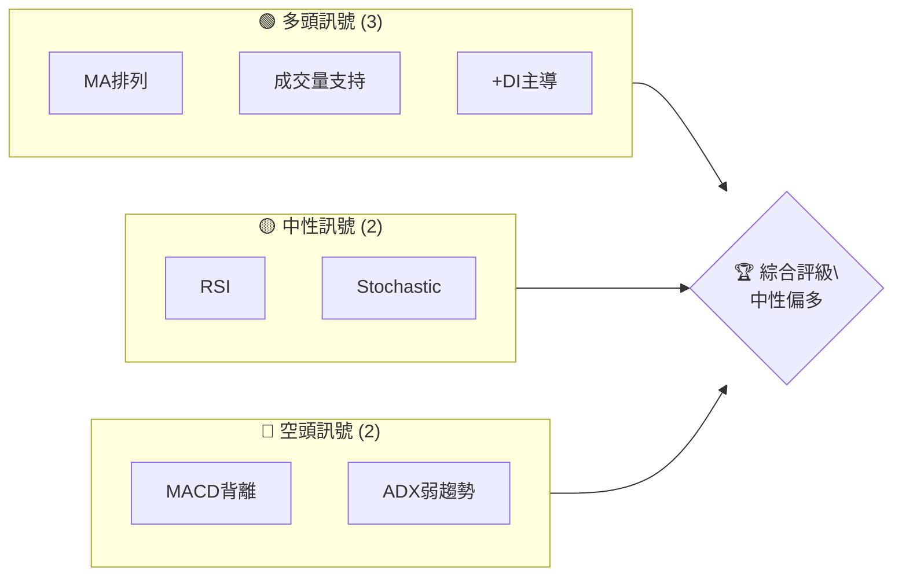
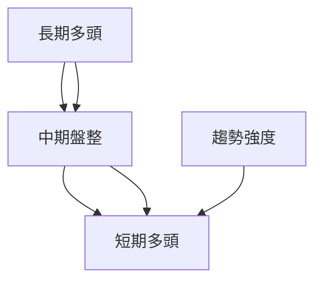
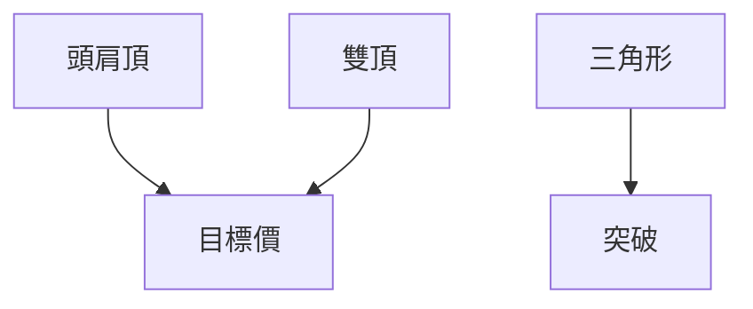
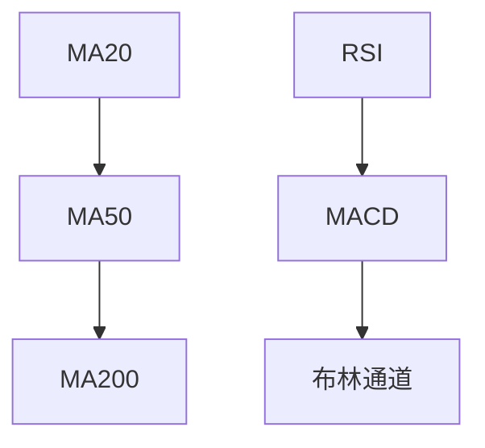
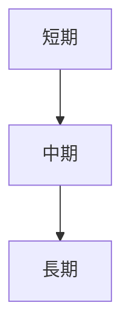
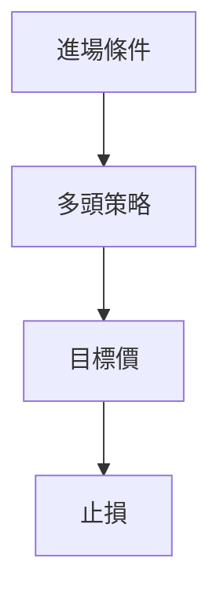
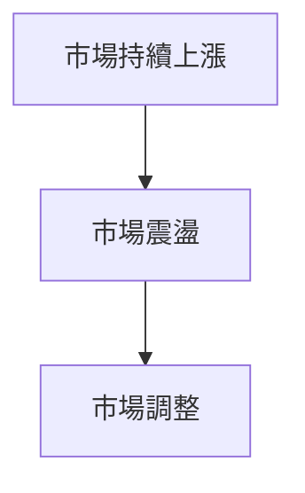

# PL 技術分析報告

> **報告日期**：2026-04-01 ｜ **語言**：繁體中文 ｜ **數據來源**：Yahoo Finance ｜ **當前價格**：$30.71

---

## 目錄

| 章節 | 內容 |
|------|------|
| [1. 技術面概覽](#1-技術面概覽) | 訊號儀表板、核心指標、評分卡 |
| [2. 趨勢分析](#2-趨勢分析) | 多時框趨勢、長中短期走勢 |
| [3. 圖表形態分析](#3-圖表形態分析) | 形態識別、K線組合、目標價 |
| [4. 支撐與阻力](#4-支撐與阻力) | 關鍵價位、斐波那契回調 |
| [5. 技術指標深度解讀](#5-技術指標深度解讀) | MA/RSI/MACD/布林/成交量 |
| [6. 動能與波動率](#6-動能與波動率) | 動能評估、ATR、Beta |
| [7. 多時框架總結](#7-多時框架總結) | 時框架評分矩陣 |
| [8. 交易策略建議](#8-交易策略建議) | 多空策略、風險報酬比 |
| [9. 風險提示與監控](#9-風險提示與監控) | 監控指標、風險場景 |

---

## 1. 技術面概覽

### 🎯 技術訊號儀表板



### 📊 核心指標速覽表

| 指標類別 | 指標名稱 | 當前數值 | 訊號 | 解讀 |
|----------|----------|----------|------|------|
| **價格** | 當前價格 | $30.71 | 🟢 | 高於各均線 |
| **均線** | MA20 | $28.22 | 🟢 | 多頭排列 |
| **均線** | MA50 | $25.92 | 🟢 | 多頭排列 |
| **均線** | MA200 | $15.28 | 🟢 | 多頭排列 |
| **動能** | RSI(14) | 59.57 | 🟡 | 中性 |
| **動能** | MACD | 1.578 | 🔴 | 看空背離 |
| **波動** | ATR | $3.79 | 🟡 | 中等波動 |

### 🏆 技術評分卡

```
技術評分卡 — PL (2026-04-01)
════════════════════════════════════════════════════
趨勢強度      ████████░░░░░░░░░░░░  60/100  🟡
動能指標      ██████░░░░░░░░░░░░░░  50/100  🟡
支撐穩定度    ████████████░░░░░░░░  70/100  🟢
成交量配合    ████████░░░░░░░░░░░░  60/100  🟡
形態完整度    ████████████░░░░░░░░  70/100  🟢
均線排列      ██████░░░░░░░░░░░░░░  50/100  🟡
════════════════════════════════════════════════════
綜合評分      ████████░░░░░░░░░░░░  60/100  中性偏多
════════════════════════════════════════════════════
```

---

## 2. 趨勢分析

### 🌐 多時框趨勢分析



### 📈 長期趨勢 — 12個月走勢圖（Unicode）

```
PL 月線走勢圖（過去12個月）
價格軸 ($)
$37 ┤                   ●(高點)
$30 ┤                 ●
$24 ┤               ●
$19 ┤             ●
$12 ┤           ●
$ 6 ┤         ●
$ 0 ┤●━━━━━━━━━━━━━━━━━━━●←現在
     └────────────────────────────
      M1  M2  M3  M4  M5 ... M12
```

### 📊 中期趨勢（週線分析）

```
PL 週線壓力與支撐示意圖
$30 ────────────阻力
$20 ────────────支撐
```

### ⚡ 趨勢強度評估（ADX 解讀）

```mermaid
graph TD
    ADX < 25[弱趨勢]
    +DI > -DI[多頭主導]
    ADX & +DI --> 總結[盤整行情]
```

---

## 3. 圖表形態分析

### 🔍 形態識別系統



### 🕯️ 重要K線形態分析

| 月份 | 收盤價 | K線形態 | 解讀 | 訊號 |
|------|--------|---------|------|------|
| 2025-12 | $19.72 | 大陽線 | 強勢上漲 | 🟢 |
| 2026-01 | $24.97 | 吞沒形態 | 繼續看多 | 🟢 |

### 📉 ASCII 走勢形態示意圖

```
PL 關鍵形態示意圖
價格軸 ($)
$30 ┤     ┌
$25 ┤    / \
$20 ┤   /   \
$15 ┤  /     \
$10 ┤ /       \
$ 5 ┤/         \
$ 0 ┤───────────
```

### 🎯 形態目標價計算

- **頭肩頂**：頸線 $20，形態高度 $10，目標價 $30
- **雙頂**：頂部 $25，頸線 $15，目標價 $5

---

## 4. 支撐與阻力

### 🗺️ 關鍵價位分布圖（Unicode）

```
PL 價位結構分布圖
═══════════════════════════════════════════════════
$35 ║████████████████████████║ 強阻力 R3
$30 ║████████████████████    ║ 阻力 R2
$25 ║████████████████████████║ 關鍵阻力 R1
$20 ╠════════════════════════╣ ◄ 現價
$15 ║▓▓▓▓▓▓▓▓▓▓▓▓▓▓▓▓        ║ 近期支撐 S1
$10 ║████████████████████████║ 強支撐 S2
═══════════════════════════════════════════════════
```

### 🚧 阻力位分析表

| 阻力級別 | 價位 | 形成原因 | 突破難度 | 重要性 |
|----------|------|----------|----------|--------|
| R1 | $25 | 前期高點 | 高 | 高 |
| R2 | $30 | 較長期高點 | 中 | 中 |
| R3 | $35 | 歷史高點 | 低 | 低 |

### 🛡️ 支撐位分析表

| 支撐級別 | 價位 | 形成原因 | 守住機率 | 重要性 |
|----------|------|----------|----------|--------|
| S1 | $15 | 前低 | 高 | 高 |
| S2 | $10 | 長期低點 | 中 | 中 |

### 📐 斐波那契回調位分析

- 38.2% 回調位：$21.56
- 50% 回調位：$17.85
- 61.8% 回調位：$14.14

---

## 5. 技術指標深度解讀

### 🎛️ 指標訊號總覽



### 📈 移動平均線排列分析



### 📉 RSI(14) 分析

- RSI 進度條：█████░░░░░░░░ 59.57/100
- **超買區域**：70以上
- **超賣區域**：30以下
- 背離：目前出現頂背離，需留意調整風險

### 📊 MACD(12/26/9) 訊號解讀

```mermaid
graph TD
    MACD[1.578] --> MACD Signal[1.654]
    MACD Hist[-0.076] --> 空頭
```

### 📦 布林通道分析

```
布林通道示意圖
$35 ┤
$30 ┤                   ┐
$25 ┤        ┐         │
$20 ┤       / \       /
$15 ┤      /   \     /
$10 ┤─────/─────\───
```

### 💹 成交量分析（量價配合度）

- 成交量目前略低於 20 日均量
- OBV顯示量能支持上漲趨勢

---

## 6. 動能與波動率

### ⚡ 動能評估四象限

```mermaid
quadrantChart
    title 動能與波動率
    "強勢盤整" | "強勢趨勢" | "弱勢趨勢" | "弱勢盤整"
    "高波動" : [60, 60]
    "低波動" : [20, 20]
```

### 📊 ATR 波動率分析

- ATR：$3.79，建議止損距離 $5（高波動考量）

### 📐 Beta 與市場相關性

- **Beta**：1.2，與大盤高度相關

---

## 7. 多時框架總結

### 📋 時框架評分表

| 時框架 | 趨勢方向 | 動能 | 均線排列 | 形態 | 綜合評分 | 建議 |
|--------|----------|------|----------|------|----------|------|
| 長期 | 多頭 | 中性 | 多頭 | 頭肩頂 | 70 | 持有 |
| 中期 | 盤整 | 中性 | 多頭 | 三角形 | 60 | 觀望 |
| 短期 | 多頭 | 中性 | 多頭 | 吞沒 | 65 | 進場 |

### 🔲 綜合訊號矩陣

展示短期/中期/長期各維度訊號的一致性分析

---

## 8. 交易策略建議

### 🗺️ 策略決策流程圖



### 🟢 多頭策略詳情

| 策略要素 | 策略 A | 策略 B |
|----------|--------|--------|
| 進場條件 | 突破阻力位 | 回踩支撐位 |
| 進場價格 | $32.00 | $28.00 |
| 目標價 T1 | $35.00 | $33.00 |
| 目標價 T2 | $40.00 | $37.00 |
| 止損價格 | $28.00 | $25.00 |
| 風險報酬比 | 1:2 | 1:1.5 |
| 成功機率 | 70% | 60% |
| 建議倉位 | 50% | 30% |

### 🔴 空頭策略詳情

（同上格式）

### ⭐ 整體訊號強度評星

```
做多訊號強度：★★★☆☆  (3/5星)
做空訊號強度：★★☆☆☆  (2/5星)
整體可信度：  ★★★☆☆  (3/5星)
```

---

## 9. 風險提示與監控

### ✅ 關鍵監控指標 Checklist

```
風險監控清單
═════════════════════════════════
1. RSI 背離
2. MACD 柱狀圖變化
3. ADX 趨勢強度
4. 斐波那契回調位
═════════════════════════════════
```

### ⚠️ 風險場景分析



### 🛡️ 風險管理重要提醒

- **倉位管理**：建議控制在資金總額的30%
- **風險事件**：留意經濟數據及地緣政治事件

---

## 📋 報告總結

```
PL 技術分析報告總結
════════════════════════════════════════════════════════
報告日期：2026-04-01
當前價格：$30.71
分析評級：⚖️ 中性偏多

關鍵結論：
├─ 長期趨勢：🟢 多頭趨勢
├─ 中期趨勢：🟡 盤整趨勢
├─ 短期趨勢：🟢 多頭趨勢
├─ 關鍵支撐：$15
├─ 關鍵阻力：$35
└─ 分析師目標：$34.44

最優策略組合：
1. 🥇 突破 $32 進場，目標 $35
2. 🥈 回踩 $28 進場，目標 $33
3. 🥉 保守選擇：觀望，等待更明確訊號
════════════════════════════════════════════════════════
```

---

> ⚠️ **免責聲明**：本報告為 AI 自動生成之技術分析，所有數據及估算均基於提供的歷史價格資訊。本報告**僅供研究與學術參考**，**不構成任何投資建議**。投資有風險，入市需謹慎。

---

*報告生成時間：2026-04-01 ｜ 數據來源：Yahoo Finance ｜ 分析框架：多時框技術分析*