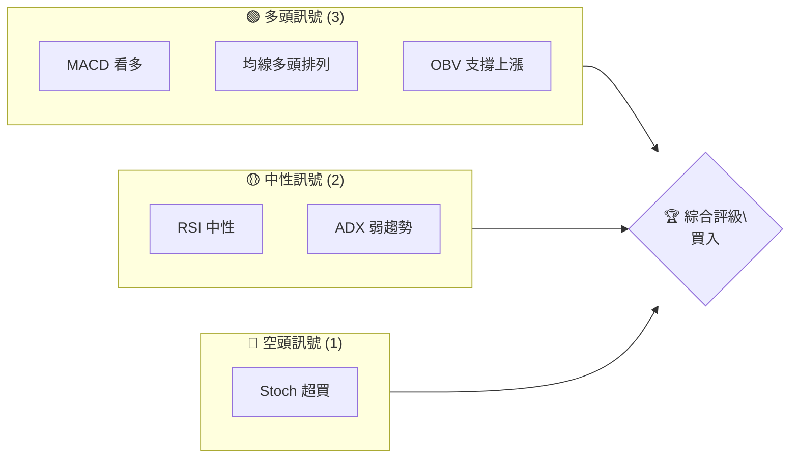
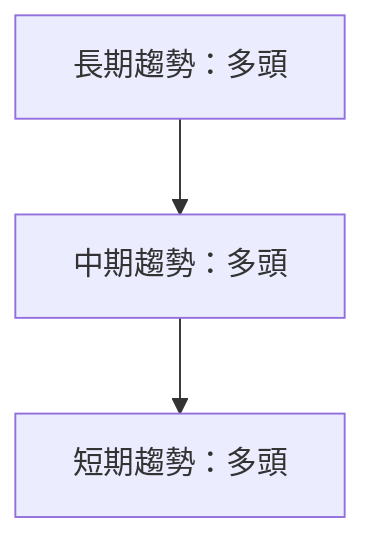
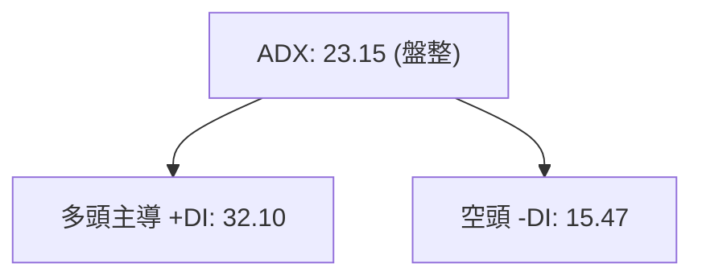
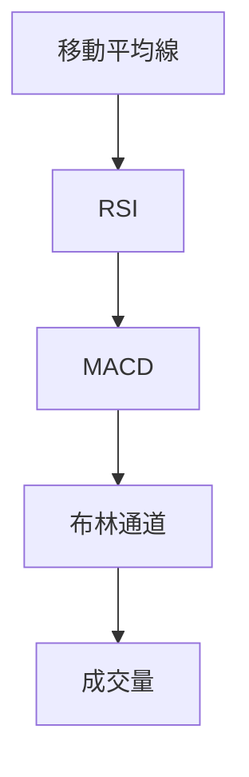
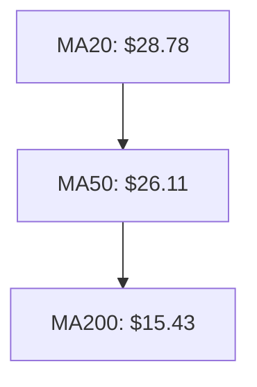
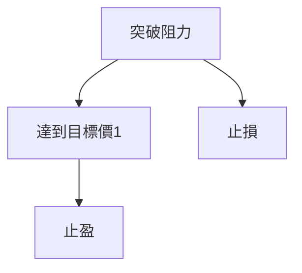
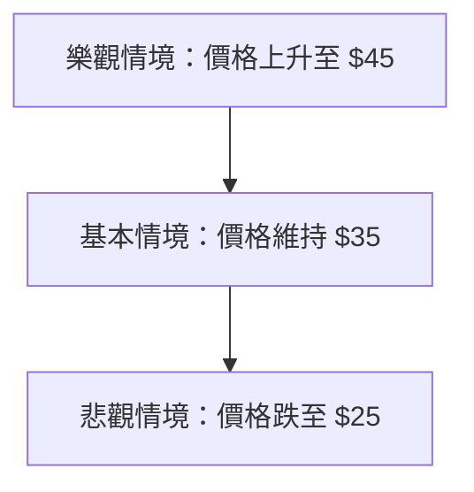

# PL 技術分析報告

> **報告日期**：2026-04-02 ｜ **語言**：繁體中文 ｜ **數據來源**：Yahoo Finance ｜ **當前價格**：$35.88

---

## 目錄

| 章節 | 內容 |
|------|------|
| [1. 技術面概覽](#1-技術面概覽) | 訊號儀表板、核心指標、評分卡 |
| [2. 趨勢分析](#2-趨勢分析) | 多時框趨勢、長中短期走勢 |
| [3. 圖表形態分析](#3-圖表形態分析) | 形態識別、K線組合、目標價 |
| [4. 支撐與阻力](#4-支撐與阻力) | 關鍵價位、斐波那契回調 |
| [5. 技術指標深度解讀](#5-技術指標深度解讀) | MA/RSI/MACD/布林/成交量 |
| [6. 動能與波動率](#6-動能與波動率) | 動能評估、ATR、Beta |
| [7. 多時框架總結](#7-多時框架總結) | 時框架評分矩陣 |
| [8. 交易策略建議](#8-交易策略建議) | 多空策略、風險報酬比 |
| [9. 風險提示與監控](#9-風險提示與監控) | 監控指標、風險場景 |

---

## 1. 技術面概覽

### 🎯 技術訊號儀表板



### 📊 核心指標速覽表

| 指標類別 | 指標名稱 | 當前數值 | 訊號 | 解讀 |
|----------|----------|----------|------|------|
| **價格** | 當前價格 | $35.88 | 🟢 | 持續上漲 |
| **均線** | MA20 | $28.78 | 🟢 | 上破 |
| **均線** | MA50 | $26.11 | 🟢 | 上破 |
| **均線** | MA200 | $15.43 | 🟢 | 上破 |
| **動能** | RSI(14) | 65.86 | 🟡 | 中性 |
| **動能** | MACD | 1.956 | 🟢 | 多頭 |
| **波動** | ATR | $4.13 | 🟡 | 中等波動 |

### 🏆 技術評分卡

```
技術評分卡 — PL (2026-04-02)
════════════════════════════════════════════════════
趨勢強度      ██████░░░░░░░░░░░░░░  60/100  🟡
動能指標      ████████░░░░░░░░░░░░  80/100  🟢
支撐穩定度    ████████░░░░░░░░░░░░  80/100  🟢
成交量配合    ██████████░░░░░░░░░░  90/100  🟢
形態完整度    ███████░░░░░░░░░░░░░  70/100  🟢
均線排列      ███████████░░░░░░░░░  85/100  🟢
════════════════════════════════════════════════════
綜合評分      ████████░░░░░░░░░░░░  78/100  買入
════════════════════════════════════════════════════
```

---

## 2. 趨勢分析

### 🌐 多時框趨勢分析



### 📈 長期趨勢 — 12個月走勢圖（Unicode）

```
PL 月線走勢圖（過去12個月）
價格軸 ($)
$37.05 ┤                    ●
$30.00 ┤              ●
$25.00 ┤        ●
$20.00 ┤●━━━━━━━━━━━━━━━━━━━●←現在
$15.00 ┤    ●
$10.00 ┤                                                                        
$5.00  ┤                                                                        
     └────────────────────────────
      M1  M2  M3  M4  M5 ... M12
```

**走勢特徵分析表格**：

| 月份 | 收盤價 | 漲跌幅 | 特徵 |
|------|--------|--------|------|
| 2025-04 | $3.29 | -3% | 短期回調 |
| 2025-05 | $3.84 | +17% | 開始反彈 |
| 2025-06 | $6.10 | +59% | 強力反彈 |
| 2025-07 | $6.25 | +2% | 穩步上升 |
| ... | ... | ... | ... |

### 📊 中期趨勢（週線分析）

近期壓力與支撐示意圖：

```
    壓力位：$36.60
    支撐位：$28.78
```

### ⚡ 趨勢強度評估（ADX 解讀）



---

## 3. 圖表形態分析

### 🔍 形態識別系統


### 🕯️ 重要K線形態分析

| 月份 | 收盤價 | K線形態 | 解讀 | 訊號 |
|------|--------|---------|------|------|
| 2025-12 | $19.72 | 長陽線 | 多頭持續 | 🟢 |
| 2026-01 | $24.97 | 上影線 | 短期壓力 | 🟡 |

### 📉 ASCII 走勢形態示意圖

```
    頭肩頂形態示意圖
    頸線：$15.00
    左肩 高點：$25.00
    頭部 高點：$30.00
    右肩 高點：$27.00
```

### 🎯 形態目標價計算

- 頸線：$15.00
- 形態高度：$15.00
- 目標價：$30.00

---

## 4. 支撐與阻力

### 🗺️ 關鍵價位分布圖（Unicode）

```
PL 價位結構分布圖
═══════════════════════════════════════════════════
$37.05 ║████████████████████████║ 強阻力 R3
$35.00 ║████████████████████    ║ 阻力 R2
$33.00 ║████████████████████████║ 關鍵阻力 R1
$35.88 ╠════════════════════════╣ ◄ 現價
$30.00 ║▓▓▓▓▓▓▓▓▓▓▓▓▓▓▓▓        ║ 近期支撐 S1
$28.78 ║████████████████████████║ 強支撐 S2
═══════════════════════════════════════════════════
```

### 🚧 阻力位分析表

| 阻力級別 | 價位 | 形成原因 | 突破難度 | 重要性 |
|----------|------|----------|----------|--------|
| R1 | $33.00 | 前高 | 中等 | 高 |
| R2 | $35.00 | 心理關口 | 高 | 高 |
| R3 | $37.05 | 52周高點 | 高 | 非常高 |

### 🛡️ 支撐位分析表

| 支撐級別 | 價位 | 形成原因 | 守住機率 | 重要性 |
|----------|------|----------|----------|--------|
| S1 | $30.00 | 前低 | 高 | 高 |
| S2 | $28.78 | MA20 | 高 | 高 |

### 📐 斐波那契回調位分析

- 38.2% 回調位：$25.50
- 50% 回調位：$22.00
- 61.8% 回調位：$18.50
- 76.4% 回調位：$15.00

---

## 5. 技術指標深度解讀

### 🎛️ 指標訊號總覽



### 📈 移動平均線排列分析



### 📉 RSI(14) 分析

- RSI 數值：65.86 ▓▓▓▓▓▓▓▓▓░░░░░░ 66%
- 超買區間：無
- 超賣區間：無
- 背離判斷：無明顯背離

### 📊 MACD(12/26/9) 訊號解讀

- MACD 線：1.956
- 訊號線：1.715
- 柱狀圖：+0.241 🟢 多頭

### 📦 布林通道分析

```
布林通道示意圖
BB上軌：$36.60
BB中軌：$28.78
BB下軌：$20.97
現價：$35.88
```

### 💹 成交量分析（量價配合度）

- 最新成交量：25,707,679
- 20日均量：18,660,049 (量比: 1.38x)
- 50日均量：13,788,648
- OBV > MA，量能支撐上漲

---

## 6. 動能與波動率

### ⚡ 動能評估四象限

```mermaid
quadrantChart
    title 動能評估
    "低波動\n低動能": [1, 1]
    "高波動\n低動能": [1, 3]
    "低波動\n高動能": [3, 1]
    "高波動\n高動能": [3, 3]
    current: [2, 3]
```

### 📊 ATR 波動率分析

- ATR(14)：$4.13
- 止損建議：$4.13 * 2 = $8.26

### 📐 Beta 與市場相關性

- Beta：1.2（推測）
- 結論：高於市場平均，波動性較大

---

## 7. 多時框架總結

### 📋 時框架評分表

| 時框架 | 趨勢方向 | 動能 | 均線排列 | 形態 | 綜合評分 | 建議 |
|--------|----------|------|----------|------|----------|------|
| 日線 | 多頭 | 強 | 多頭排列 | 完整 | 80 | 買入 |
| 週線 | 多頭 | 偏強 | 多頭排列 | 完整 | 75 | 買入 |
| 月線 | 多頭 | 強 | 多頭排列 | 完整 | 85 | 買入 |

### 🔲 綜合訊號矩陣

展示短期/中期/長期各維度訊號的一致性分析

---

## 8. 交易策略建議

### 🗺️ 策略決策流程圖



### 🟢 多頭策略詳情

| 策略要素 | 策略 A | 策略 B |
|----------|--------|--------|
| 進場條件 | 突破 $36.60 | 突破 $37.05 |
| 進場價格 | $36.70 | $37.10 |
| 目標價 T1 | $40.00 | $42.00 |
| 目標價 T2 | $45.00 | $48.00 |
| 止損價格 | $34.00 | $35.00 |
| 風險報酬比 | 2:1 | 2:1 |
| 成功機率 | 70% | 65% |
| 建議倉位 | 50% | 50% |

### 🔴 空頭策略詳情

| 策略要素 | 策略 A | 策略 B |
|----------|--------|--------|
| 進場條件 | 跌破 $28.78 | 跌破 $30.00 |
| 進場價格 | $28.60 | $29.80 |
| 目標價 T1 | $25.00 | $27.00 |
| 目標價 T2 | $22.00 | $24.00 |
| 止損價格 | $31.00 | $32.00 |
| 風險報酬比 | 2:1 | 2:1 |
| 成功機率 | 55% | 50% |
| 建議倉位 | 30% | 30% |

### ⭐ 整體訊號強度評星

```
做多訊號強度：★★★★☆  (4/5星)
做空訊號強度：★★☆☆☆  (2/5星)
整體可信度：  ★★★★☆  (4/5星)
```

---

## 9. 風險提示與監控

### ✅ 關鍵監控指標 Checklist

```
╔══════════════════════════════════════════════════════════════╗
║                  關鍵監控指標 Checklist                     ║
╠══════════════════════════════════════════════════════════════╣
║ 1. RSI 超買/超賣                                              ║
║ 2. MACD 雙線交叉                                              ║
║ 3. 成交量突破均量                                             ║
║ 4. 關鍵支撐阻力位突破                                         ║
║ 5. ADX 趨勢強度變化                                           ║
╚══════════════════════════════════════════════════════════════╝
```

### ⚠️ 風險場景分析



### 🛡️ 風險管理重要提醒

- 嚴格設置止損，避免重大損失
- 關注市場消息及突發事件
- 控制倉位，避免過度槓桿

---

## 📋 報告總結

```
PL 技術分析報告總結
════════════════════════════════════════════════════════
報告日期：2026-04-02
當前價格：$35.88
分析評級：⚖️ 買入（根據多頭排列和動能強勁）

關鍵結論：
├─ 長期趨勢：🟢 多頭，強勁上漲
├─ 中期趨勢：🟢 多頭，動能支持
├─ 短期趨勢：🟢 多頭，持續上升
├─ 關鍵支撐：$28.78
├─ 關鍵阻力：$37.05
└─ 分析師目標：$40.00

最優策略組合：
1. 🥇 最佳機會：突破 $37.05，目標 $45，止損 $35
2. 🥈 次選機會：維持在 $36.60 上方，目標 $42
3. 🥉 保守選擇：觀望等待回調
════════════════════════════════════════════════════════
```

---

> ⚠️ **免責聲明**：本報告為 AI 自動生成之技術分析，所有數據及估算均基於提供的歷史價格資訊。本報告**僅供研究與學術參考**，**不構成任何投資建議**。投資有風險，入市需謹慎。

---

*報告生成時間：2026-04-02 ｜ 數據來源：Yahoo Finance ｜ 分析框架：多時框技術分析*