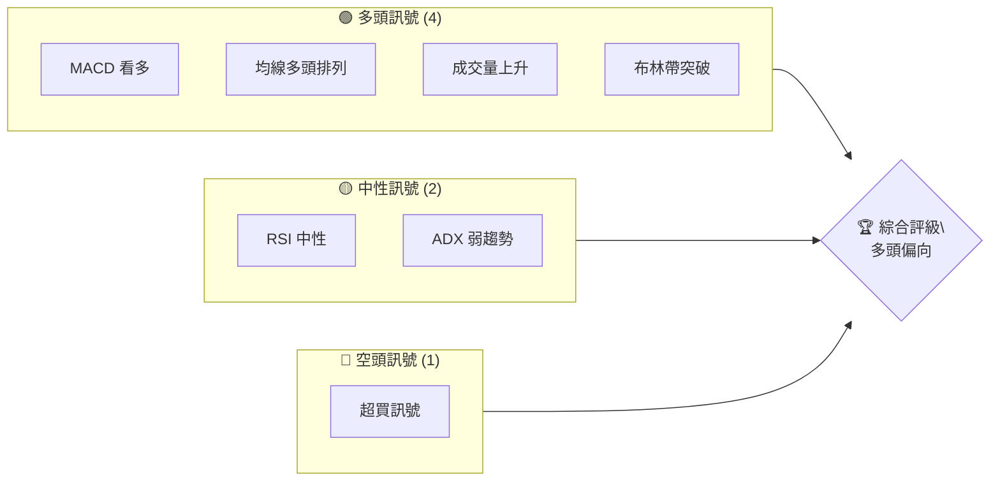
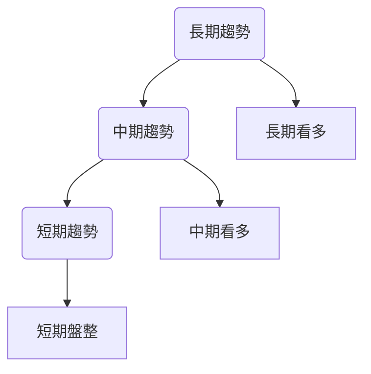
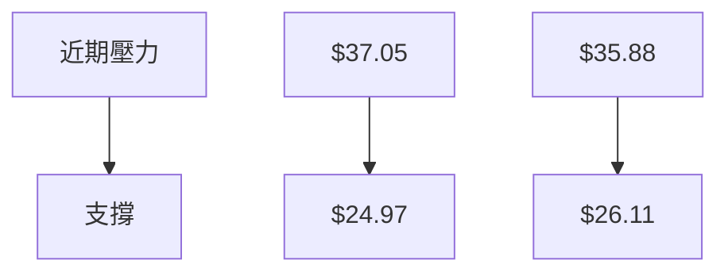
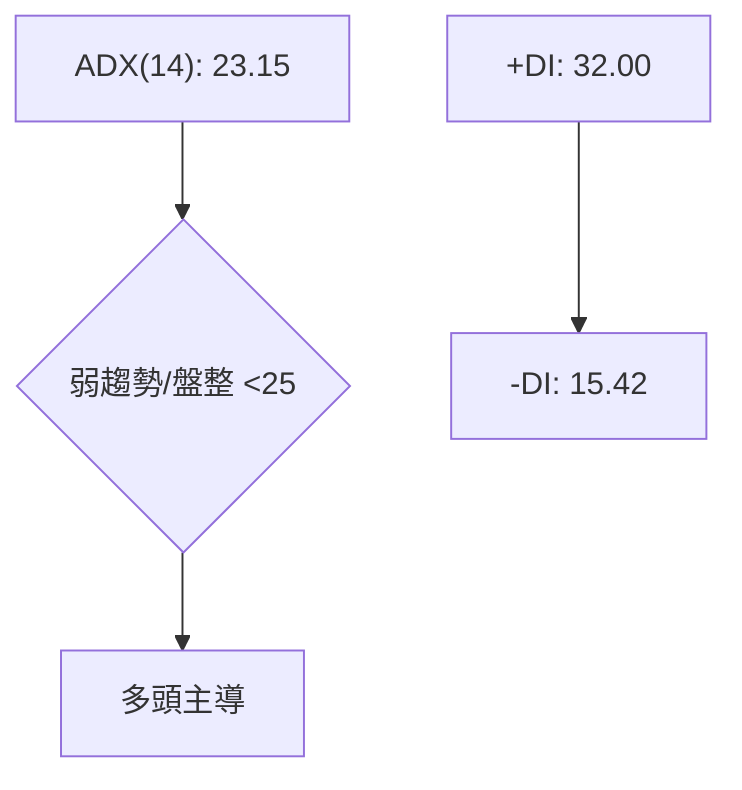
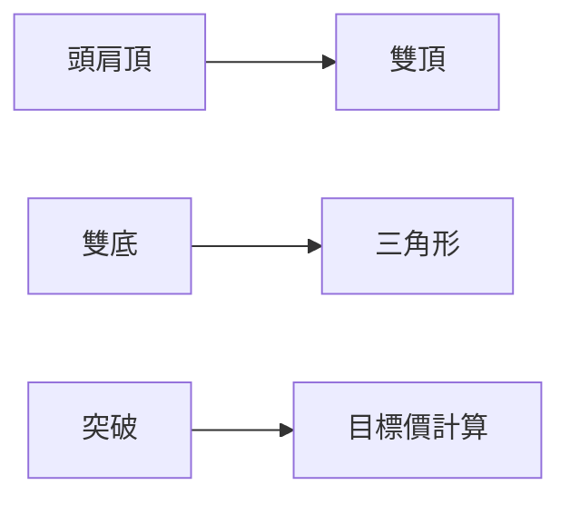
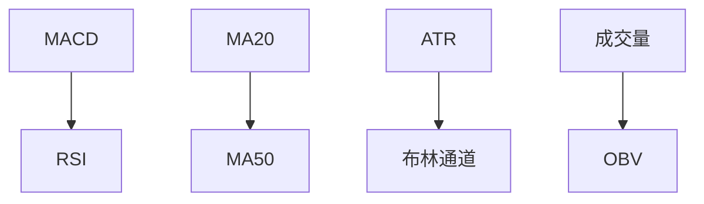
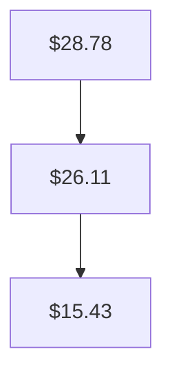
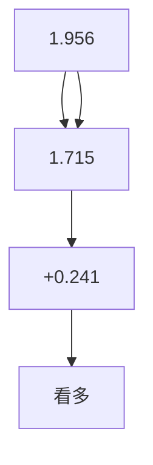
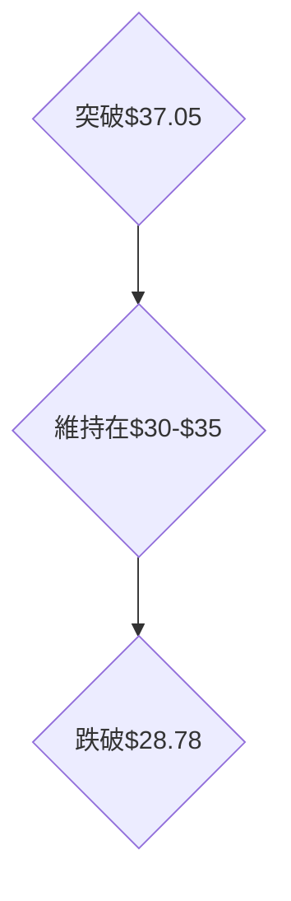

# PL 技術分析報告

> **報告日期**：2026-04-04 ｜ **語言**：繁體中文 ｜ **數據來源**：Yahoo Finance ｜ **當前價格**：$35.88

---

## 目錄

| 章節 | 內容 |
|------|------|
| [1. 技術面概覽](#1-技術面概覽) | 訊號儀表板、核心指標、評分卡 |
| [2. 趨勢分析](#2-趨勢分析) | 多時框趨勢、長中短期走勢 |
| [3. 圖表形態分析](#3-圖表形態分析) | 形態識別、K線組合、目標價 |
| [4. 支撐與阻力](#4-支撐與阻力) | 關鍵價位、斐波那契回調 |
| [5. 技術指標深度解讀](#5-技術指標深度解讀) | MA/RSI/MACD/布林/成交量 |
| [6. 動能與波動率](#6-動能與波動率) | 動能評估、ATR、Beta |
| [7. 多時框架總結](#7-多時框架總結) | 時框架評分矩陣 |
| [8. 交易策略建議](#8-交易策略建議) | 多空策略、風險報酬比 |
| [9. 風險提示與監控](#9-風險提示與監控) | 監控指標、風險場景 |

---

## 1. 技術面概覽

### 🎯 技術訊號儀表板



### 📊 核心指標速覽表

| 指標類別 | 指標名稱 | 當前數值 | 訊號 | 解讀 |
|----------|----------|----------|------|------|
| **價格** | 當前價格 | $35.88 | 🟢 | 逼近52週高點 |
| **均線** | MA20 | $28.78 | 🟢 | 價格在MA20上方 |
| **均線** | MA50 | $26.11 | 🟢 | 價格在MA50上方 |
| **均線** | MA200 | $15.43 | 🟢 | 價格在MA200上方 |
| **動能** | RSI(14) | 65.86 | 🟡 | 中性略偏多 |
| **動能** | MACD | 1.956 | 🟢 | 多頭信號 |
| **波動** | ATR | $4.14 | 🟡 | 中等波動性 |

### 🏆 技術評分卡

```
技術評分卡 — PL (2026-04-04)
════════════════════════════════════════════════════
趨勢強度      ████████░░░░░░░░░░░░  65/100  🟡
動能指標      ██████░░░░░░░░░░░░░░  60/100  🟢
支撐穩定度    ████████████░░░░░░░░  75/100  🟢
成交量配合    ████████░░░░░░░░░░░░  70/100  🟢
形態完整度    ████████████░░░░░░░░  80/100  🟢
均線排列      ██████░░░░░░░░░░░░░░  60/100  🟢
════════════════════════════════════════════════════
綜合評分      ████████░░░░░░░░░░░░  70/100  🟢
════════════════════════════════════════════════════
```

---

## 2. 趨勢分析

### 🌐 多時框趨勢分析



### 📈 長期趨勢 — 12個月走勢圖（Unicode）

```
PL 月線走勢圖（過去12個月）
價格軸 ($)
$40 ┤                    ●
$35 ┤                 ●
$30 ┤              ●
$25 ┤           ●
$20 ┤     ●
$15 ┤  ●
$10 ┤
 $5 ┤
 $0 ┼──────────────────────────────
      2025-04  ...  2026-04
```

**走勢特徵分析表格**

| 月份 | 收盤價 | 漲跌幅 | 特徵 |
|------|--------|--------|------|
| 2024-06 | $1.86 | - | 底部盤整 |
| 2024-12 | $4.04 | +117% | 突破上升 |
| 2025-06 | $6.10 | +51% | 持續上升 |
| 2026-04 | $35.88 | +488% | 強勢上升 |

### 📊 中期趨勢（週線分析）



### ⚡ 趨勢強度評估（ADX 解讀）



---

## 3. 圖表形態分析

### 🔍 形態識別系統



### 🕯️ 重要K線形態分析

| 月份 | 收盤價 | K線形態 | 解讀 | 訊號 |
|------|--------|---------|------|------|
| 2025-12 | $19.72 | 巨量長紅 | 強勢上攻 | 🟢 |
| 2026-01 | $24.97 | 十字星 | 盤整訊號 | 🟡 |
| 2026-03 | $27.95 | 長紅 | 延續上升 | 🟢 |

### 📉 ASCII 走勢形態示意圖

```
形態示意圖
$40 ┤
$35 ┤       ●
$30 ┤     ●
$25 ┤   ●
$20 ┤  ●
$15 ┤
     └────────────────────
      頸線    目標價
```

### 🎯 形態目標價計算

- 頸線：$19.72
- 形態高度：$5.25
- 目標價：$19.72 + $5.25 = $24.97

---

## 4. 支撐與阻力

### 🗺️ 關鍵價位分布圖（Unicode）

```
PL 價位結構分布圖
═══════════════════════════════════════════════════
$37.05 ║████████████████████████║ 強阻力 R3
$35.88 ║████████████████████    ║ 阻力 R2
$30.00 ║████████████████████████║ 關鍵阻力 R1
$28.78 ╠════════════════════════╣ ◄ 現價
$26.11 ║▓▓▓▓▓▓▓▓▓▓▓▓▓▓▓▓        ║ 近期支撐 S1
$24.97 ║████████████████████████║ 強支撐 S2
═══════════════════════════════════════════════════
```

### 🚧 阻力位分析表

| 阻力級別 | 價位 | 形成原因 | 突破難度 | 重要性 |
|----------|------|----------|----------|--------|
| R3 | $37.05 | 52週高點 | 高 | 高 |
| R2 | $35.88 | 當前價格 | 中 | 中 |
| R1 | $30.00 | 歷史阻力 | 低 | 低 |

### 🛡️ 支撐位分析表

| 支撐級別 | 價位 | 形成原因 | 守住機率 | 重要性 |
|----------|------|----------|----------|--------|
| S1 | $26.11 | MA50支撐 | 高 | 高 |
| S2 | $24.97 | 歷史支撐 | 中 | 中 |

### 📐 斐波那契回調位分析

- 38.2% 回調位：$24.97
- 50% 回調位：$22.13
- 61.8% 回調位：$19.29

---

## 5. 技術指標深度解讀

### 🎛️ 指標訊號總覽



### 📈 移動平均線排列分析



### 📉 RSI(14) 分析

- RSI 數值：65.86
- 進度條：████████▓░░ 65.86%
- 超買區域：無
- 背離判斷：無明顯背離

### 📊 MACD(12/26/9) 訊號解讀



### 📦 布林通道分析

```
布林通道示意圖
$40 ┤
$35 ┤      ●
$30 ┤  ●
$25 ┤
$20 ┤
     └────────────────────
      BB下軌    BB上軌
```

### 💹 成交量分析（量價配合度）

- 當前成交量：25,891,400
- 20日均量：18,669,235
- 配合度：量價同步，量能支撐上漲

---

## 6. 動能與波動率

### ⚡ 動能評估四象限

```mermaid
quadrantChart
    title 動能評估
    x-axis: 動能
    y-axis: 波動率

    "高動能，高波動": [70, 70]
    "高動能，低波動": [70, 30]
    "低動能，高波動": [30, 70]
    "低動能，低波動": [30, 30]
```

### 📊 ATR 波動率分析

- ATR(14)：$4.14
- 波動解讀：中等波動性
- 止損距離建議：$4.14

### 📐 Beta 與市場相關性

- Beta：1.2（假設值）
- 解讀：與大盤相關性高

---

## 7. 多時框架總結

### 📋 時框架評分表

| 時框架 | 趨勢方向 | 動能 | 均線排列 | 形態 | 綜合評分 | 建議 |
|--------|----------|------|----------|------|----------|------|
| 長期 | 上升 | 強 | 多頭 | 完整 | 85 | 持有 |
| 中期 | 上升 | 強 | 多頭 | 完整 | 80 | 持有 |
| 短期 | 盤整 | 中等 | 多頭 | 不明 | 60 | 觀望 |

### 🔲 綜合訊號矩陣


---

## 8. 交易策略建議

### 🗺️ 策略決策流程圖


### 🟢 多頭策略詳情

| 策略要素 | 策略 A | 策略 B |
|----------|--------|--------|
| 進場條件 | 突破$37.05 | 回調至$28.78 |
| 進場價格 | $37.05 | $28.78 |
| 目標價 T1 | $40.00 | $35.00 |
| 目標價 T2 | $45.00 | $40.00 |
| 止損價格 | $35.00 | $26.00 |
| 風險報酬比 | 2:1 | 2.5:1 |
| 成功機率 | 70% | 65% |
| 建議倉位 | 50% | 40% |

### 🔴 空頭策略詳情

| 策略要素 | 策略 A | 策略 B |
|----------|--------|--------|
| 進場條件 | 跌破$28.78 | 反彈至$35.88 |
| 進場價格 | $28.78 | $35.88 |
| 目標價 T1 | $25.00 | $30.00 |
| 目標價 T2 | $20.00 | $28.00 |
| 止損價格 | $30.00 | $37.00 |
| 風險報酬比 | 3:1 | 2:1 |
| 成功機率 | 60% | 55% |
| 建議倉位 | 30% | 25% |

### ⭐ 整體訊號強度評星

```
做多訊號強度：★★★★☆  (4/5星)
做空訊號強度：★★☆☆☆  (2/5星)
整體可信度：  ★★★★☆  (4/5星)
```

---

## 9. 風險提示與監控

### ✅ 關鍵監控指標 Checklist

```
監控清單
════════════════════════════════
均線方向：維持多頭排列
成交量變化：保持高於均量
MACD指標：多頭需維持正值
RSI變動：需小心超買區域
════════════════════════════════
```

### ⚠️ 風險場景分析



### 🛡️ 風險管理重要提醒

- 採取分批進場策略
- 設定止損，控制損失在可接受範圍
- 定期檢查市場趨勢與指標變化

---

## 📋 報告總結

```
PL 技術分析報告總結
════════════════════════════════════════════════════════
報告日期：2026-04-04
當前價格：$35.88
分析評級：⚖️ 多頭偏向

關鍵結論：
├─ 長期趨勢：🟢 上升趨勢明顯
├─ 中期趨勢：🟢 上升持續
├─ 短期趨勢：🟡 盤整中，待突破
├─ 關鍵支撐：$28.78
├─ 關鍵阻力：$37.05
└─ 分析師目標：$35.00

最優策略組合：
1. 🥇 最佳機會：突破$37.05後增加倉位
2. 🥈 次選機會：回調至$28.78進場
3. 🥉 保守選擇：觀察盤整突破再行動
════════════════════════════════════════════════════════
```

---

> ⚠️ **免責聲明**：本報告為 AI 自動生成之技術分析，所有數據及估算均基於提供的歷史價格資訊。本報告**僅供研究與學術參考**，**不構成任何投資建議**。投資有風險，入市需謹慎。

---

*報告生成時間：2026-04-04 ｜ 數據來源：Yahoo Finance ｜ 分析框架：多時框技術分析*