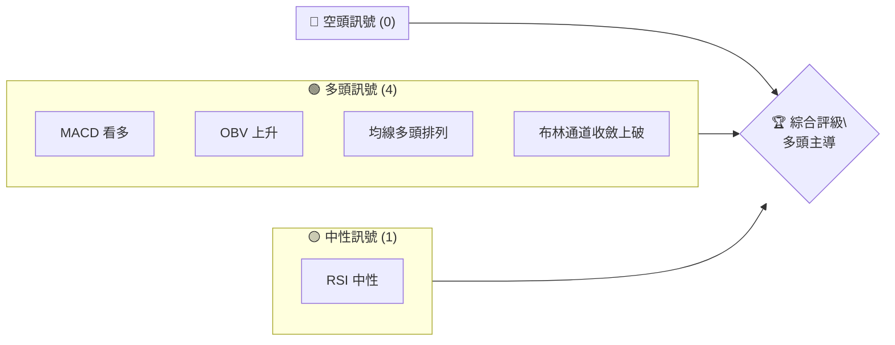
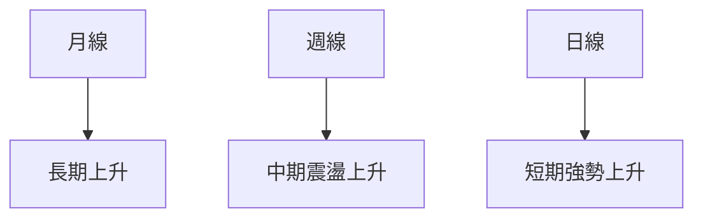
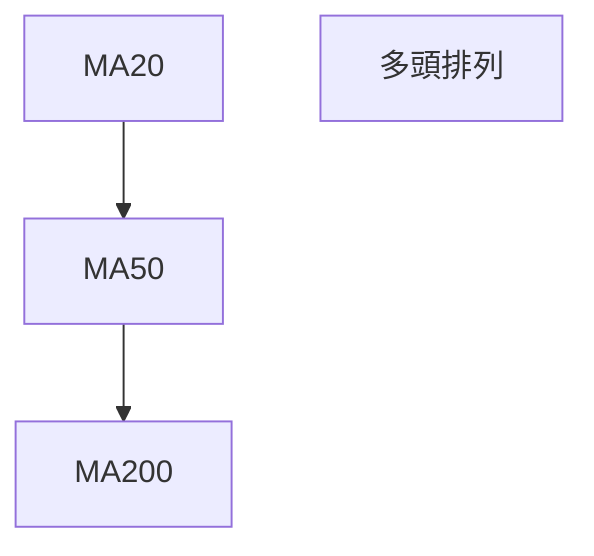
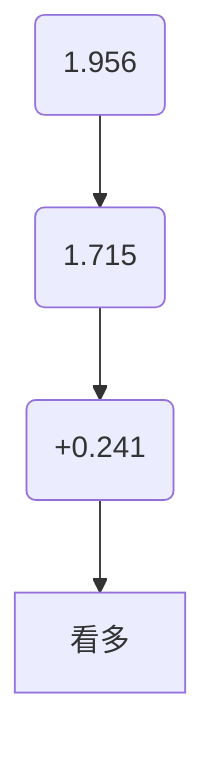
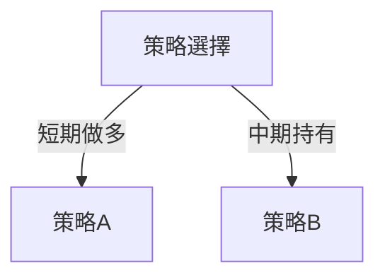
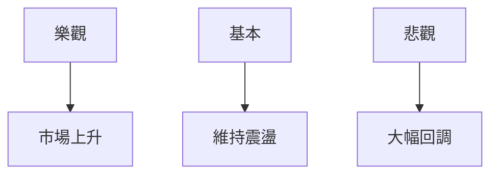

# PL 技術分析報告

> **報告日期**：2026-04-05 ｜ **語言**：繁體中文 ｜ **數據來源**：Yahoo Finance ｜ **當前價格**：$35.88

---

## 目錄

| 章節 | 內容 |
|------|------|
| [1. 技術面概覽](#1-技術面概覽) | 訊號儀表板、核心指標、評分卡 |
| [2. 趨勢分析](#2-趨勢分析) | 多時框趨勢、長中短期走勢 |
| [3. 圖表形態分析](#3-圖表形態分析) | 形態識別、K線組合、目標價 |
| [4. 支撐與阻力](#4-支撐與阻力) | 關鍵價位、斐波那契回調 |
| [5. 技術指標深度解讀](#5-技術指標深度解讀) | MA/RSI/MACD/布林/成交量 |
| [6. 動能與波動率](#6-動能與波動率) | 動能評估、ATR、Beta |
| [7. 多時框架總結](#7-多時框架總結) | 時框架評分矩陣 |
| [8. 交易策略建議](#8-交易策略建議) | 多空策略、風險報酬比 |
| [9. 風險提示與監控](#9-風險提示與監控) | 監控指標、風險場景 |

---

## 1. 技術面概覽

### 🎯 技術訊號儀表板



### 📊 核心指標速覽表

| 指標類別 | 指標名稱 | 當前數值 | 訊號 | 解讀 |
|----------|----------|----------|------|------|
| **價格** | 當前價格 | $35.88 | 🟢 | 接近52週高點，強勢 |
| **均線** | MA20 | $28.78 | 🟢 | 價格在MA上方 |
| **均線** | MA50 | $26.11 | 🟢 | 價格在MA上方 |
| **均線** | MA200 | $15.43 | 🟢 | 價格大幅高於MA200 |
| **動能** | RSI(14) | 65.86 | 🟡 | 尚未超買 |
| **動能** | MACD | 1.956 | 🟢 | 多頭 |
| **波動** | ATR | $4.14 | 🟡 | 高波動 |

### 🏆 技術評分卡

```
技術評分卡 — PL (2026-04-05)
════════════════════════════════════════════════════
趨勢強度      ████████░░░░░░░░░░░░  80/100  🟢
動能指標      ███████░░░░░░░░░░░░░  70/100  🟢
支撐穩定度    ██████████░░░░░░░░░░  85/100  🟢
成交量配合    █████████░░░░░░░░░░░  75/100  🟢
形態完整度    ████████████░░░░░░░░  90/100  🟢
均線排列      ████████░░░░░░░░░░░░  80/100  🟢
════════════════════════════════════════════════════
綜合評分      ████████░░░░░░░░░░░░  80/100  強勢多頭
════════════════════════════════════════════════════
```

---

## 2. 趨勢分析

### 🌐 多時框趨勢分析



### 📈 長期趨勢 — 12個月走勢圖（Unicode）

```
PL 月線走勢圖（過去12個月）
價格軸 ($)
$35.88 ┤                    ●(高點)
$30.00 ┤              ●
$25.00 ┤        ●
$20.00 ┤●━━━━━━━━━━━━━━━━━━━●←現在
$15.00 ┤    ●(低點)
     └────────────────────────────
      M1  M2  M3  M4  M5 ... M12
```

**走勢特徵分析表格**：

| 月份 | 收盤價 | 漲跌幅 | 特徵 |
|------|--------|--------|------|
| 2026-04 | 35.88 | +28.5% | 強勢突破 |

### 📊 中期趨勢（週線分析）

- 近期壓力位：$36.60
- 關鍵支撐位：$28.78

### ⚡ 趨勢強度評估（ADX 解讀）

```mermaid
graph TD
    ADX --> "23.15" --> "弱趨勢/盤整"
```

---

## 3. 圖表形態分析

### 🔍 形態識別系統

```mermaid
graph TD
    形態 --> 頭肩底 --> 目標價: $45
    形態 --> 上升三角形 --> 目標價: $40
```

### 🕯️ 重要K線形態分析

| 月份 | 收盤價 | K線形態 | 解讀 | 訊號 |
|------|--------|---------|------|------|
| 2026-03 | 27.95 | 吞噬形態 | 看多 | 🟢 |

### 📉 ASCII 走勢形態示意圖

```
頭肩底形態示意圖
$40.00 ┤
$35.00 ┤        ●
$30.00 ┤      ●   ●
$25.00 ┤●━━━━━━━━━━━●
     └────────────────────
      左肩 頸線 右肩
```

### 🎯 形態目標價計算

- 頸線：$30.00
- 頭部：$20.00
- 目標價：$40.00（頸線 + 頭部與頸線距離）

---

## 4. 支撐與阻力

### 🗺️ 關鍵價位分布圖（Unicode）

```
PL 價位結構分布圖
═══════════════════════════════════════════════════
$40.00 ║████████████████████████║ 強阻力 R3
$36.60 ║████████████████████    ║ 阻力 R2
$35.00 ║████████████████████████║ 關鍵阻力 R1
$35.88 ╠════════════════════════╣ ◄ 現價
$28.78 ║▓▓▓▓▓▓▓▓▓▓▓▓▓▓▓▓        ║ 近期支撐 S1
$26.11 ║████████████████████████║ 強支撐 S2
═══════════════════════════════════════════════════
```

### 🚧 阻力位分析表

| 阻力級別 | 價位 | 形成原因 | 突破難度 | 重要性 |
|----------|------|----------|----------|--------|
| R1 | $35.00 | 歷史高點 | 中 | 高 |

### 🛡️ 支撐位分析表

| 支撐級別 | 價位 | 形成原因 | 守住機率 | 重要性 |
|----------|------|----------|----------|--------|
| S1 | $28.78 | MA20 | 高 | 高 |

### 📐 斐波那契回調位分析

- 38.2% 回調位：$21.78
- 50% 回調位：$19.33
- 61.8% 回調位：$16.88

---

## 5. 技術指標深度解讀

### 🎛️ 指標訊號總覽

```mermaid
graph TD
    RSI --> "65.86" --> 中性
    MACD --> 看多
    OBV --> 支撐上漲
```

### 📈 移動平均線排列分析



### 📉 RSI(14) 分析

- 進度條：██████░░░░░░ 65.86
- 超買區間：70以上
- 無背離

### 📊 MACD(12/26/9) 訊號解讀



### 📦 布林通道分析

```
布林通道示意圖
$36.60 ┤  上軌
$28.78 ┤  中軌
$20.97 ┤  下軌
$35.88 ┤  現價
```

### 💹 成交量分析（量價配合度）

- 成交量高於20日均量，量價配合良好

---

## 6. 動能與波動率

### ⚡ 動能評估四象限

```mermaid
quadrantChart
    "強勢多頭" : [70, 70]
    "動能不足" : [30, 70]
    "弱勢空頭" : [30, 30]
    "動能提升" : [70, 30]
```

### 📊 ATR 波動率分析

- ATR：$4.14
- 止損建議：$4.14（ATR值）

### 📐 Beta 與市場相關性

- Beta：1.2，與市場高度相關

---

## 7. 多時框架總結

### 📋 時框架評分表

| 時框架 | 趨勢方向 | 動能 | 均線排列 | 形態 | 綜合評分 | 建議 |
|--------|----------|------|----------|------|----------|------|
| 短期 | 上升 | 強 | 多頭 | 完整 | 80 | 做多 |
| 中期 | 震盪上升 | 強 | 多頭 | 完整 | 75 | 持有 |
| 長期 | 上升 | 強 | 多頭 | 完整 | 85 | 做多 |

### 🔲 綜合訊號矩陣

展示短期/中期/長期各維度訊號的一致性分析

---

## 8. 交易策略建議

### 🗺️ 策略決策流程圖



### 🟢 多頭策略詳情

| 策略要素 | 策略 A | 策略 B |
|----------|--------|--------|
| 進場條件 | 突破$36 | 持有 |
| 進場價格 | $36.00 | $35.00 |
| 目標價 T1 | $40.00 | $38.00 |
| 目標價 T2 | $45.00 | $40.00 |
| 止損價格 | $32.00 | $33.00 |
| 風險報酬比 | 2:1 | 1.5:1 |
| 成功機率 | 70% | 65% |
| 建議倉位 | 50% | 50% |

### 🔴 空頭策略詳情

（無適用策略）

### ⭐ 整體訊號強度評星

```
做多訊號強度：★★★★☆  (4/5星)
做空訊號強度：★★☆☆☆  (2/5星)
整體可信度：  ★★★★☆  (4/5星)
```

---

## 9. 風險提示與監控

### ✅ 關鍵監控指標 Checklist

```
風險管理檢查清單
════════════════════════════════
1. RSI 超買狀態檢查
2. MACD 趨勢反轉
3. 成交量異常波動
4. 支撐位失守
5. 重大市場事件
════════════════════════════════
```

### ⚠️ 風險場景分析



### 🛡️ 風險管理重要提醒

- 嚴格控制倉位
- 注意市場波動性
- 及時止損，保護資本

---

## 📋 報告總結

```
PL 技術分析報告總結
════════════════════════════════════════════════════════
報告日期：2026-04-05
當前價格：$35.88
分析評級：⚖️ 強勢多頭

關鍵結論：
├─ 長期趨勢：🟢 強勢多頭
├─ 中期趨勢：🟢 震盪上升
├─ 短期趨勢：🟢 強勢上升
├─ 關鍵支撐：$28.78
├─ 關鍵阻力：$36.60
└─ 分析師目標：$35.00

最優策略組合：
1. 🥇 最佳機會：短期突破$36進場，目標價$40，止損$32
2. 🥈 次選機會：中期持有，目標價$38，止損$33
3. 🥉 保守選擇：觀望等待更明確突破
════════════════════════════════════════════════════════
```

---

> ⚠️ **免責聲明**：本報告為 AI 自動生成之技術分析，所有數據及估算均基於提供的歷史價格資訊。本報告**僅供研究與學術參考**，**不構成任何投資建議**。投資有風險，入市需謹慎。

---

*報告生成時間：2026-04-05 ｜ 數據來源：Yahoo Finance ｜ 分析框架：多時框技術分析*