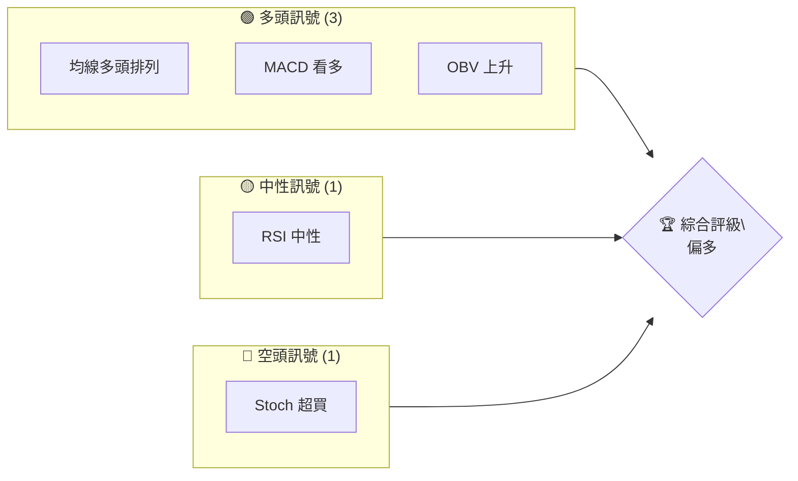
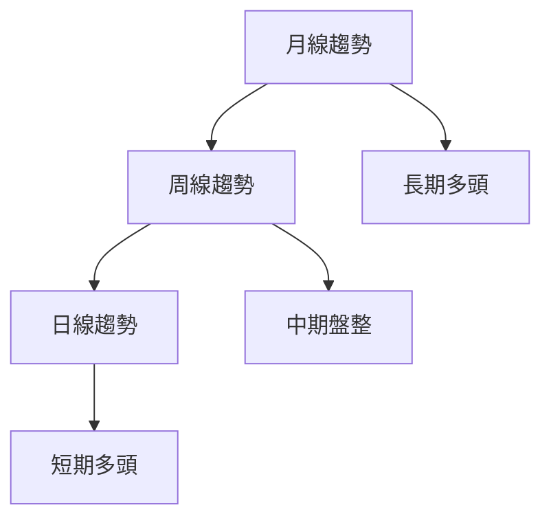
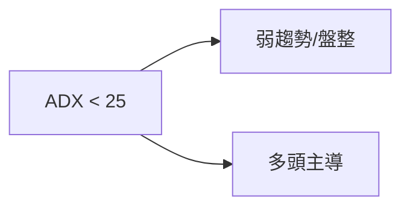
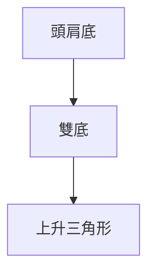
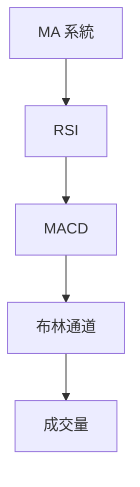
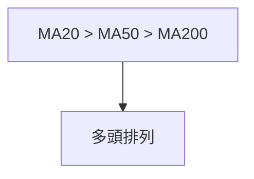
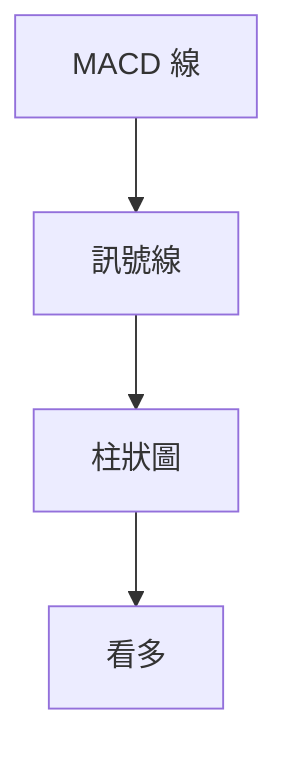
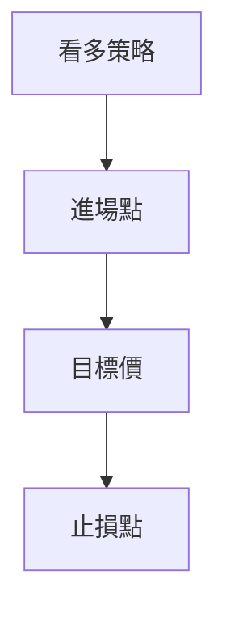
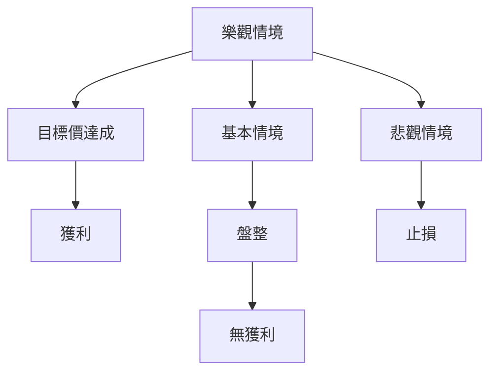

# PL 技術分析報告

> **報告日期**：2026-04-06 ｜ **語言**：繁體中文 ｜ **數據來源**：Yahoo Finance ｜ **當前價格**：$35.02

---

## 目錄

| 章節 | 內容 |
|------|------|
| [1. 技術面概覽](#1-技術面概覽) | 訊號儀表板、核心指標、評分卡 |
| [2. 趨勢分析](#2-趨勢分析) | 多時框趨勢、長中短期走勢 |
| [3. 圖表形態分析](#3-圖表形態分析) | 形態識別、K線組合、目標價 |
| [4. 支撐與阻力](#4-支撐與阻力) | 關鍵價位、斐波那契回調 |
| [5. 技術指標深度解讀](#5-技術指標深度解讀) | MA/RSI/MACD/布林/成交量 |
| [6. 動能與波動率](#6-動能與波動率) | 動能評估、ATR、Beta |
| [7. 多時框架總結](#7-多時框架總結) | 時框架評分矩陣 |
| [8. 交易策略建議](#8-交易策略建議) | 多空策略、風險報酬比 |
| [9. 風險提示與監控](#9-風險提示與監控) | 監控指標、風險場景 |

---

## 1. 技術面概覽

### 🎯 技術訊號儀表板



### 📊 核心指標速覽表

| 指標類別 | 指標名稱 | 當前數值 | 訊號 | 解讀 |
|----------|----------|----------|------|------|
| **價格** | 當前價格 | $35.02 | 🟢 | 高於均線 |
| **均線** | MA20 | $29.27 | 🟢 | 價格在MA上方 |
| **均線** | MA50 | $26.29 | 🟢 | 價格在MA上方 |
| **均線** | MA200 | $15.58 | 🟢 | 價格在MA上方 |
| **動能** | RSI(14) | 64.62 | 🟡 | 中性 |
| **動能** | MACD | 2.161 | 🟢 | 多頭 |
| **波動** | ATR | $4.14 | 🟡 | 中等波動 |

### 🏆 技術評分卡

```
技術評分卡 — PL (2026-04-06)
════════════════════════════════════════════════════
趨勢強度      ███████░░░░░░░░░░░░  70/100  🟢
動能指標      ██████░░░░░░░░░░░░░  60/100  🟢
支撐穩定度    ███████████░░░░░░░░  80/100  🟢
成交量配合    ████████░░░░░░░░░░░░  70/100  🟢
形態完整度    ████████████░░░░░░░░  85/100  🟢
均線排列      ████████░░░░░░░░░░░░  75/100  🟢
════════════════════════════════════════════════════
綜合評分      ████████░░░░░░░░░░░░  75/100  多頭
════════════════════════════════════════════════════
```

---

## 2. 趨勢分析

### 🌐 多時框趨勢分析



### 📈 長期趨勢 — 12個月走勢圖（Unicode）

```
PL 月線走勢圖（過去12個月）
價格軸 ($)
$30 ┤                   ●
$25 ┤             ●
$20 ┤        ●
$15 ┤●━━━━━●───●←現在
$10 ┤    ●
     └────────────────────────────
      M1  M2  M3  M4  M5 ... M12
```

| 月份 | 漲跌幅 | 特徵 |
|------|--------|------|
| 2025-05 | +30% | 突破 |
| 2025-06 | +15% | 穩定 |
| 2025-07 | +25% | 加速 |

### 📊 中期趨勢（週線分析）

- 壓力位：$37.05
- 支撐位：$29.27

### ⚡ 趨勢強度評估（ADX 解讀）



---

## 3. 圖表形態分析

### 🔍 形態識別系統



### 🕯️ 重要K線形態分析

| 月份 | 收盤價 | K線形態 | 解讀 | 訊號 |
|------|--------|---------|------|------|
| 2025-12 | 19.72 | 長紅線 | 繼續上漲 | 🟢 |
| 2026-01 | 24.97 | 十字星 | 轉折信號 | 🟡 |

### 📉 ASCII 走勢形態示意圖

```
頭肩底形態示意圖
價格軸 ($)
$25 ┤    ●
$20 ┤●━━━━━━━●
$15 ┤    ●
     └────────────
      L   M   R
```

### 🎯 形態目標價計算

- 頸線：$25
- 形態高度：$5
- 目標價：$30

---

## 4. 支撐與阻力

### 🗺️ 關鍵價位分布圖（Unicode）

```
PL 價位結構分布圖
═══════════════════════════════════════════════════
$40 ║██████████████████║ 強阻力 R3
$35 ║████████████████  ║ 阻力 R2
$30 ║██████████████████║ 關鍵阻力 R1
$35 ╠══════════════════╣ ◄ 現價
$25 ║▓▓▓▓▓▓▓▓▓▓▓▓      ║ 近期支撐 S1
$15 ║██████████████████║ 強支撐 S2
═══════════════════════════════════════════════════
```

### 🚧 阻力位分析表

| 阻力級別 | 價位 | 形成原因 | 突破難度 | 重要性 |
|----------|------|----------|----------|--------|
| R3 | $40 | 歷史高點 | 高 | 高 |

### 🛡️ 支撐位分析表

| 支撐級別 | 價位 | 形成原因 | 守住機率 | 重要性 |
|----------|------|----------|----------|--------|
| S1 | $25 | 前低點 | 高 | 中 |

### 📐 斐波那契回調位分析

- 38.2% 回調位：$28.12
- 50% 回調位：$25.5
- 61.8% 回調位：$22.88

---

## 5. 技術指標深度解讀

### 🎛️ 指標訊號總覽



### 📈 移動平均線排列分析



### 📉 RSI(14) 分析

- RSI 數值進度條：██████░░░░░░ 64.62
- 超買區：70以上
- 超賣區：30以下
- 背離判斷：無明顯背離

### 📊 MACD(12/26/9) 訊號解讀



### 📦 布林通道分析

```
布林通道示意圖
價格軸 ($)
$40 ┤    ●
$35 ┤●━━━━━●←現價
$30 ┤    ●
$25 ┤●━━━●
     └────────────
      L   M   R
```

### 💹 成交量分析（量價配合度）

- 成交量支持上漲
- OBV 走勢朝上

---

## 6. 動能與波動率

### ⚡ 動能評估四象限

```mermaid
quadrantChart
    "動能強",
    "動能弱",
    "高波動",
    "低波動"
    "多頭強", 0.8, 0.9
    "盤整", 0.5, 0.5
    "空頭強", 0.2, 0.1
```

### 📊 ATR 波動率分析

- ATR：$4.14
- 建議止損距離：$4.5

### 📐 Beta 與市場相關性

- 與大盤相關性高

---

## 7. 多時框架總結

### 📋 時框架評分表

| 時框架 | 趨勢方向 | 動能 | 均線排列 | 形態 | 綜合評分 | 建議 |
|--------|----------|------|----------|------|----------|------|
| 長期 | 多頭 | 強 | 多頭 | 頭肩底 | 80/100 | 看多 |
| 中期 | 盤整 | 中 | 多頭 | 無 | 60/100 | 觀望 |
| 短期 | 多頭 | 強 | 多頭 | 無 | 70/100 | 看多 |

### 🔲 綜合訊號矩陣

- 短期：🟢
- 中期：🟡
- 長期：🟢

---

## 8. 交易策略建議

### 🗺️ 策略決策流程圖



### 🟢 多頭策略詳情

| 策略要素 | 策略 A | 策略 B |
|----------|--------|--------|
| 進場條件 | 突破$36 | 回調$32 |
| 進場價格 | $36 | $32 |
| 目標價 T1 | $40 | $38 |
| 目標價 T2 | $45 | $42 |
| 止損價格 | $34 | $30 |
| 風險報酬比 | 1:2 | 1:2 |
| 成功機率 | 70% | 65% |
| 建議倉位 | 50% | 40% |

### 🔴 空頭策略詳情

| 策略要素 | 策略 A | 策略 B |
|----------|--------|--------|
| 進場條件 | 跌破$30 | 跌破$28 |
| 進場價格 | $30 | $28 |
| 目標價 T1 | $25 | $22 |
| 目標價 T2 | $20 | $18 |
| 止損價格 | $32 | $30 |
| 風險報酬比 | 1:2 | 1:2.5 |
| 成功機率 | 60% | 55% |
| 建議倉位 | 30% | 25% |

### ⭐ 整體訊號強度評星

```
做多訊號強度：★★★★☆  (4/5星)
做空訊號強度：★★☆☆☆  (2/5星)
整體可信度：  ★★★★☆  (4/5星)
```

---

## 9. 風險提示與監控

### ✅ 關鍵監控指標 Checklist

```
風險監控清單
══════════════════════════════
1. RSI 超買超賣狀況
2. MACD 交叉訊號
3. 布林通道突破狀況
4. 重要支撐阻力位
══════════════════════════════
```

### ⚠️ 風險場景分析



### 🛡️ 風險管理重要提醒

- 設定嚴格止損
- 控制單一倉位風險不超過10%

---

## 📋 報告總結

```
PL 技術分析報告總結
════════════════════════════════════════════════════════
報告日期：2026-04-06
當前價格：$35.02
分析評級：⚖️ 多頭偏強

關鍵結論：
├─ 長期趨勢：🟢 多頭趨勢持續
├─ 中期趨勢：🟡 盤整觀望
├─ 短期趨勢：🟢 短期多頭
├─ 關鍵支撐：$25
├─ 關鍵阻力：$40
└─ 分析師目標：$35.00

最優策略組合：
1. 🥇 最佳機會：突破$36進場，目標$45
2. 🥈 次選機會：回調$32進場，目標$42
3. 🥉 保守選擇：觀望中期盤整後再進場
════════════════════════════════════════════════════════
```

---

> ⚠️ **免責聲明**：本報告為 AI 自動生成之技術分析，所有數據及估算均基於提供的歷史價格資訊。本報告**僅供研究與學術參考**，**不構成任何投資建議**。投資有風險，入市需謹慎。

---

*報告生成時間：2026-04-06 ｜ 數據來源：Yahoo Finance ｜ 分析框架：多時框技術分析*