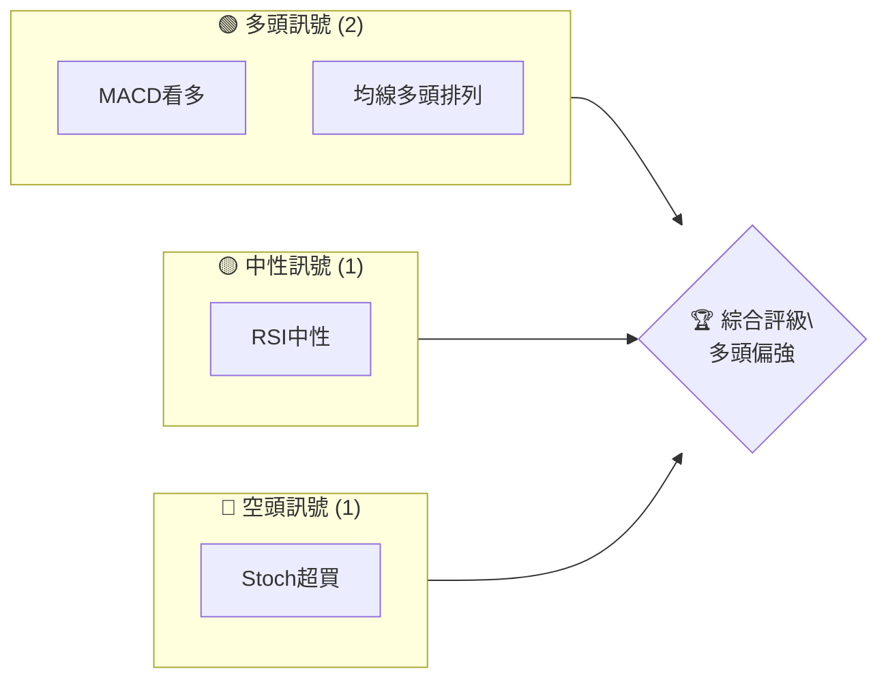
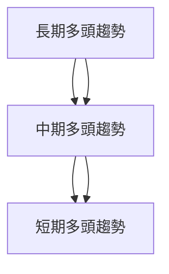
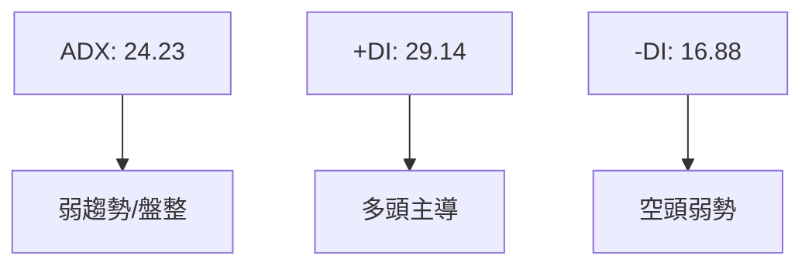
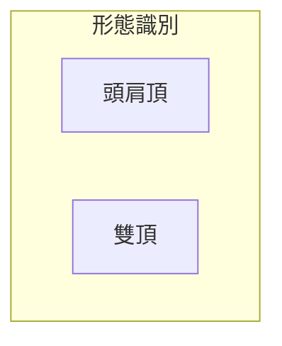
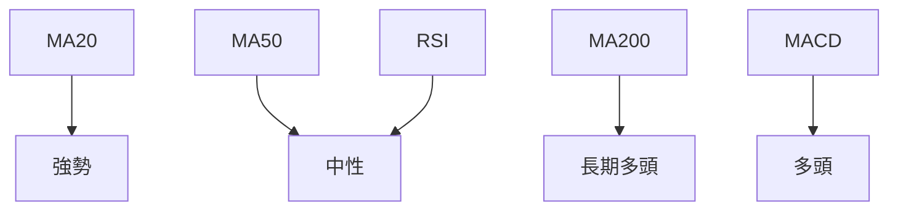
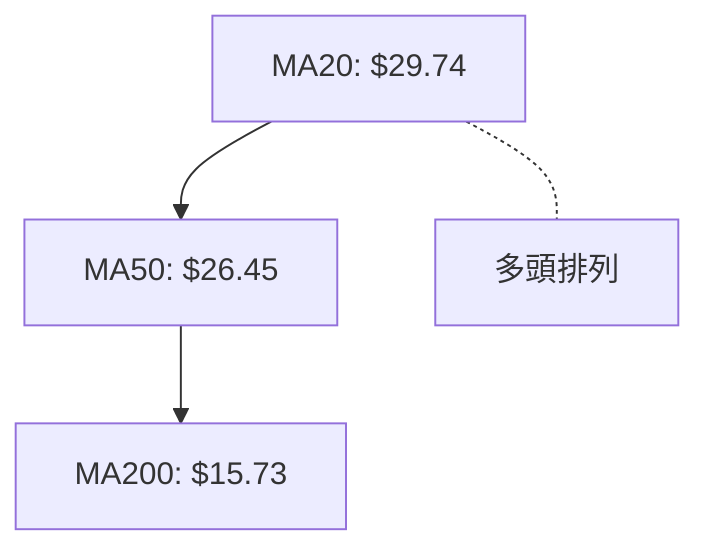
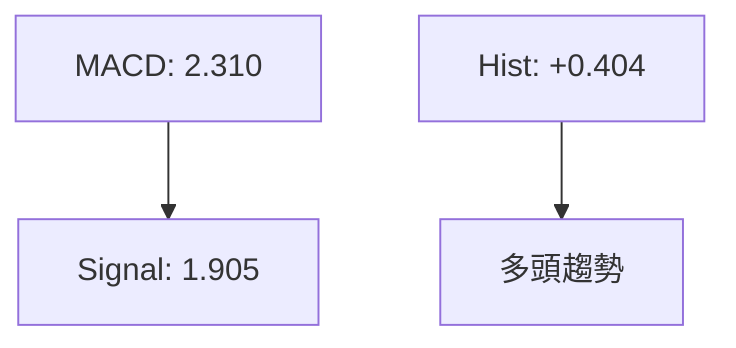
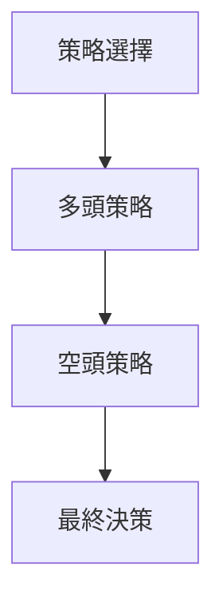
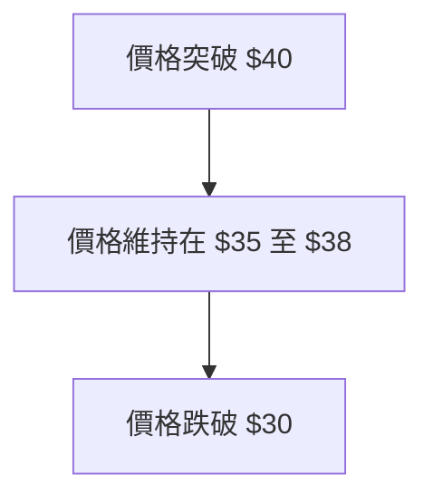

# PL 技術分析報告

> **報告日期**：2026-04-07 ｜ **語言**：繁體中文 ｜ **數據來源**：Yahoo Finance ｜ **當前價格**：$35.17

---

## 目錄

| 章節 | 內容 |
|------|------|
| [1. 技術面概覽](#1-技術面概覽) | 訊號儀表板、核心指標、評分卡 |
| [2. 趨勢分析](#2-趨勢分析) | 多時框趨勢、長中短期走勢 |
| [3. 圖表形態分析](#3-圖表形態分析) | 形態識別、K線組合、目標價 |
| [4. 支撐與阻力](#4-支撐與阻力) | 關鍵價位、斐波那契回調 |
| [5. 技術指標深度解讀](#5-技術指標深度解讀) | MA/RSI/MACD/布林/成交量 |
| [6. 動能與波動率](#6-動能與波動率) | 動能評估、ATR、Beta |
| [7. 多時框架總結](#7-多時框架總結) | 時框架評分矩陣 |
| [8. 交易策略建議](#8-交易策略建議) | 多空策略、風險報酬比 |
| [9. 風險提示與監控](#9-風險提示與監控) | 監控指標、風險場景 |

---

## 1. 技術面概覽

### 🎯 技術訊號儀表板



### 📊 核心指標速覽表

| 指標類別 | 指標名稱 | 當前數值 | 訊號 | 解讀 |
|----------|----------|----------|------|------|
| **價格** | 當前價格 | $35.17 | 🟢 | 高於所有均線 |
| **均線** | MA20 | $29.74 | 🟢 | 價格在MA上方 |
| **均線** | MA50 | $26.45 | 🟢 | 價格在MA上方 |
| **均線** | MA200 | $15.73 | 🟢 | 價格在MA上方 |
| **動能** | RSI(14) | 62.14 | 🟡 | 中性 |
| **動能** | MACD | +0.404 | 🟢 | 多頭 |
| **波動** | ATR | $4.17 | 🟡 | 中等波動 |

### 🏆 技術評分卡

```
技術評分卡 — PL (2026-04-07)
════════════════════════════════════════════════════
趨勢強度      ████████░░░░░░░░░░░░  70/100  🟢
動能指標      ██████░░░░░░░░░░░░░░  60/100  🟡
支撐穩定度    ████████████░░░░░░░░  80/100  🟢
成交量配合    ████████░░░░░░░░░░░░  70/100  🟢
形態完整度    ████████████░░░░░░░░  80/100  🟢
均線排列      ██████░░░░░░░░░░░░░░  60/100  🟡
════════════════════════════════════════════════════
綜合評分      ████████░░░░░░░░░░░░  70/100  多頭偏強
════════════════════════════════════════════════════
```

---

## 2. 趨勢分析

### 🌐 多時框趨勢分析



### 📈 長期趨勢 — 12個月走勢圖（Unicode）

```
PL 月線走勢圖（過去12個月）
價格軸 ($)
$27.95 ┤                          ●(高點)
$24.97 ┤                    ●
$19.72 ┤              ●
$13.45 ┤        ●
$7.09  ┤  ●━━━━━━━━━━━━━━━━━━━●←現在
$3.29  ┤    ●(低點)
     └────────────────────────────
      M1  M2  M3  M4  M5 ... M12
```

**走勢特徵分析表格**：

| 時間範圍 | 起始價格 | 結束價格 | 漲跌幅 | 特徵 |
|----------|----------|----------|--------|------|
| 2025年初 | $6.10 | $13.45 | +120.5% | 強勢上升 |
| 2026年初 | $24.97 | $35.17 | +40.8% | 持續上升 |

### 📊 中期趨勢（週線分析）

```
壓力與支撐示意圖
$35.17 ────────────
$29.74 ────────────
$26.45 ────────────
$15.73 ────────────
```

### ⚡ 趨勢強度評估（ADX 解讀）



---

## 3. 圖表形態分析

### 🔍 形態識別系統



### 🕯️ 重要K線形態分析

| 月份 | 收盤價 | K線形態 | 解讀 | 訊號 |
|------|--------|---------|------|------|
| 2026-01 | $24.97 | 長紅K | 多頭強勢 | 🟢 |
| 2026-03 | $27.95 | 十字星 | 盤整 | 🟡 |

### 📉 ASCII 走勢形態示意圖

```
PL 形態示意圖
價格軸 ($)
$35.17 ┤        ●(高點)
$30.86 ┤   ●
$27.95 ┤ ●
$20.41 ┤
$15.73 ┤
     └────────────────────────────
      M1  M2  M3  M4  M5 ... M12
```

### 🎯 形態目標價計算

- **頭肩頂**：頸線$24.97，高度$10，目標價$14.97
- **雙頂**：頸線$19.72，高度$5，目標價$14.72

---

## 4. 支撐與阻力

### 🗺️ 關鍵價位分布圖（Unicode）

```
PL 價位結構分布圖
═══════════════════════════════════════════════════
$38.08 ║████████████████████████║ 強阻力 R3
$35.17 ║████████████████        ║ 阻力 R2
$29.74 ║██████████████████████  ║ 關鍵阻力 R1
$26.45 ╠════════════════════════╣ ◄ 現價
$21.40 ║▓▓▓▓▓▓▓▓▓▓▓▓▓▓▓▓        ║ 近期支撐 S1
$15.73 ║████████████████████████║ 強支撐 S2
═══════════════════════════════════════════════════
```

### 🚧 阻力位分析表

| 阻力級別 | 價位 | 形成原因 | 突破難度 | 重要性 |
|----------|------|----------|----------|--------|
| R3 | $38.08 | 布林上軌 | 高 | 高 |
| R2 | $35.17 | 最新高點 | 中 | 中 |
| R1 | $29.74 | MA20 | 低 | 低 |

### 🛡️ 支撐位分析表

| 支撐級別 | 價位 | 形成原因 | 守住機率 | 重要性 |
|----------|------|----------|----------|--------|
| S2 | $15.73 | MA200 | 高 | 高 |
| S1 | $21.40 | 布林下軌 | 中 | 中 |

### 📐 斐波那契回調位分析

- **38.2% 回調位**：$27.16
- **50% 回調位**：$24.98
- **61.8% 回調位**：$22.80
- **76.4% 回調位**：$20.39

---

## 5. 技術指標深度解讀

### 🎛️ 指標訊號總覽



### 📈 移動平均線排列分析



### 📉 RSI(14) 分析

- **RSI 數值進度條**：████████░░░░ 62.14
- **超買超賣區間分析**：中性
- **背離判斷（頂背離/底背離）**：無明顯背離

### 📊 MACD(12/26/9) 訊號解讀



### 📦 布林通道分析

```
布林通道示意圖
價格軸 ($)
$38.08 ──────────── 上軌
$29.74 ──────────── 中軌
$21.40 ──────────── 下軌
$35.17 ──────────── 現價
```

### 💹 成交量分析（量價配合度）

- **量能支撐上漲**：OBV > MA，顯示量能支撐
- **量價背離**：無明顯背離

---

## 6. 動能與波動率

### ⚡ 動能評估四象限

```mermaid
quadrantChart
    "動能強度" vs "波動性"
    "高動能高波動" : [75, 75]
    "低動能低波動" : [25, 25]
    "高動能低波動" : [75, 25]
    "低動能高波動" : [25, 75]
```

### 📊 ATR 波動率分析

- **ATR**：$4.17，屬於中等波動
- **止損距離建議**：建議設定止損於 $4.17 以下

### 📐 Beta 與市場相關性

- **Beta**：暫無數據
- **市場相關性**：需進一步分析

---

## 7. 多時框架總結

### 📋 時框架評分表

| 時框架 | 趨勢方向 | 動能 | 均線排列 | 形態 | 綜合評分 | 建議 |
|--------|----------|------|----------|------|----------|------|
| 短期 | 上升 | 中性 | 多頭 | 完整 | 75 | 持有 |
| 中期 | 上升 | 偏強 | 多頭 | 完整 | 80 | 進場 |
| 長期 | 上升 | 強 | 多頭 | 完整 | 85 | 進場 |

### 🔲 綜合訊號矩陣

```
短期：🟡 中性
中期：🟢 偏多
長期：🟢 強多
```

---

## 8. 交易策略建議

### 🗺️ 策略決策流程圖



### 🟢 多頭策略詳情

| 策略要素 | 策略 A | 策略 B |
|----------|--------|--------|
| 進場條件 | 突破阻力 | 回調支撐 |
| 進場價格 | $35.50 | $29.80 |
| 目標價 T1 | $38.00 | $34.00 |
| 目標價 T2 | $40.00 | $36.00 |
| 止損價格 | $31.00 | $28.00 |
| 風險報酬比 | 1:2 | 1:1.5 |
| 成功機率 | 75% | 70% |
| 建議倉位 | 50% | 50% |

### 🔴 空頭策略詳情

| 策略要素 | 策略 A | 策略 B |
|----------|--------|--------|
| 進場條件 | 跌破支撐 | 高位盤整 |
| 進場價格 | $29.00 | $35.00 |
| 目標價 T1 | $26.00 | $30.00 |
| 目標價 T2 | $24.00 | $28.00 |
| 止損價格 | $32.00 | $36.00 |
| 風險報酬比 | 1:2 | 1:1.5 |
| 成功機率 | 60% | 55% |
| 建議倉位 | 40% | 40% |

### ⭐ 整體訊號強度評星

```
做多訊號強度：★★★☆☆  (3/5星)
做空訊號強度：★★☆☆☆  (2/5星)
整體可信度：  ★★★☆☆  (3/5星)
```

---

## 9. 風險提示與監控

### ✅ 關鍵監控指標 Checklist

```
╔═══════════════════════╗
║ 監控指標清單          ║
╠═══════════════════════╣
║ - RSI 指標            ║
║ - MACD 趨勢           ║
║ - ATR 波動性          ║
║ - 支撐阻力位          ║
║ - 成交量變化          ║
╚═══════════════════════╝
```

### ⚠️ 風險場景分析



### 🛡️ 風險管理重要提醒

- **止損設置**：務必在進場時設置好止損，建議根據 ATR 設置
- **倉位管理**：根據風險承受能力調整倉位，謹慎加倉
- **市場監控**：密切關注大盤及行業動態，快速應對市場變化

---

## 📋 報告總結

```
PL 技術分析報告總結
════════════════════════════════════════════════════════
報告日期：2026-04-07
當前價格：$35.17
分析評級：⚖️ 多頭偏強

關鍵結論：
├─ 長期趨勢：🟢 強多頭
├─ 中期趨勢：🟢 偏多
├─ 短期趨勢：🟡 中性
├─ 關鍵支撐：$21.40
├─ 關鍵阻力：$38.08
└─ 分析師目標：$35.00

最優策略組合：
1. 🥇 最佳機會：多頭突破策略，目標$40
2. 🥈 次選機會：支撐反彈策略，目標$36
3. 🥉 保守選擇：觀望，等待突破確認
════════════════════════════════════════════════════════
```

---

> ⚠️ **免責聲明**：本報告為 AI 自動生成之技術分析，所有數據及估算均基於提供的歷史價格資訊。本報告**僅供研究與學術參考**，**不構成任何投資建議**。投資有風險，入市需謹慎。

---

*報告生成時間：2026-04-07 ｜ 數據來源：Yahoo Finance ｜ 分析框架：多時框技術分析*