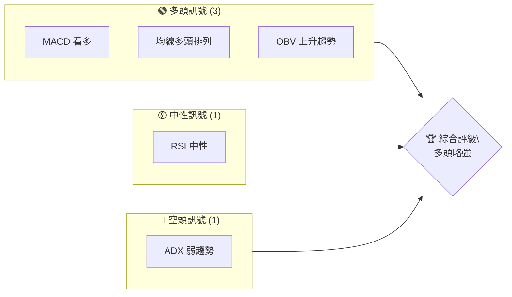
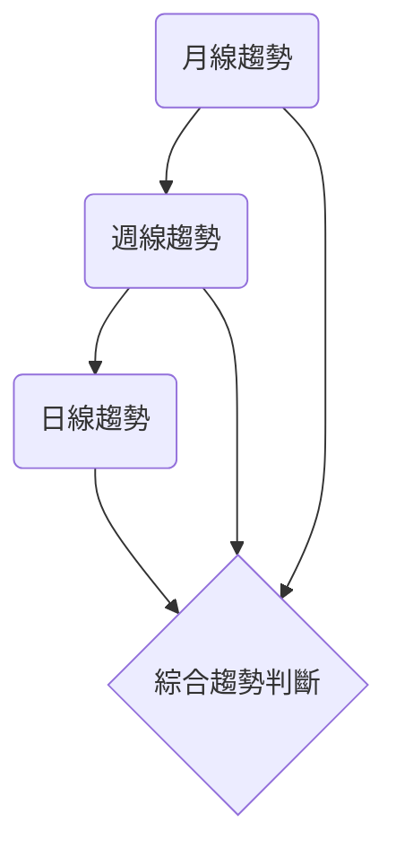
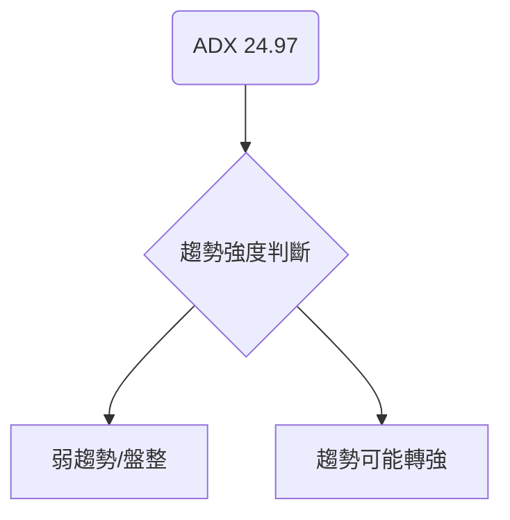
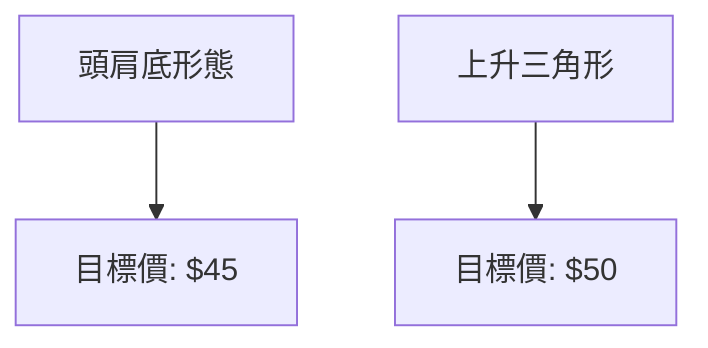
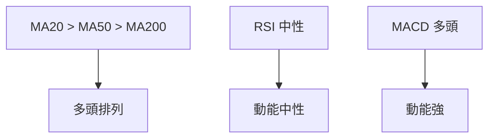
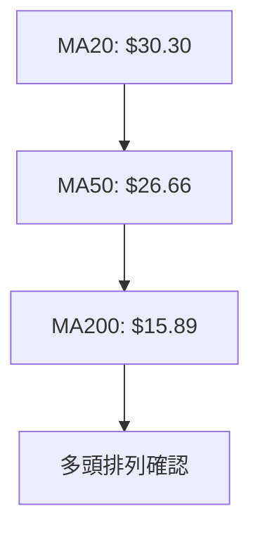
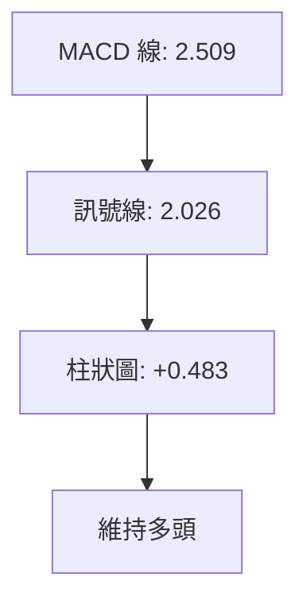
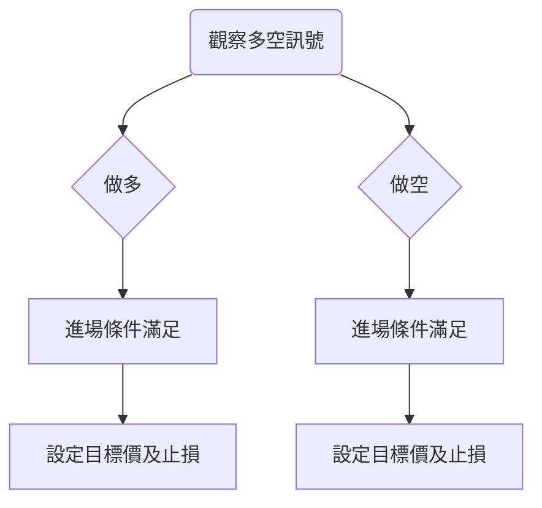
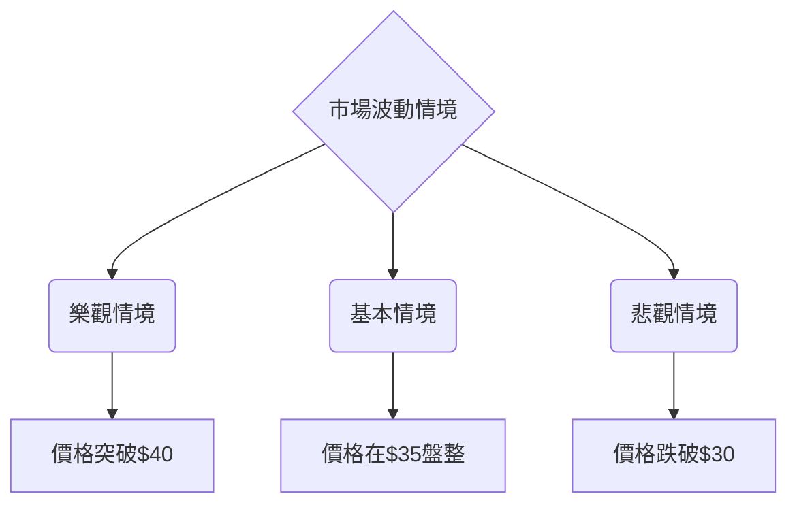

# PL 技術分析報告

> **報告日期**：2026-04-08 ｜ **語言**：繁體中文 ｜ **數據來源**：Yahoo Finance ｜ **當前價格**：$36.55

---

## 目錄

| 章節 | 內容 |
|------|------|
| [1. 技術面概覽](#1-技術面概覽) | 訊號儀表板、核心指標、評分卡 |
| [2. 趨勢分析](#2-趨勢分析) | 多時框趨勢、長中短期走勢 |
| [3. 圖表形態分析](#3-圖表形態分析) | 形態識別、K線組合、目標價 |
| [4. 支撐與阻力](#4-支撐與阻力) | 關鍵價位、斐波那契回調 |
| [5. 技術指標深度解讀](#5-技術指標深度解讀) | MA/RSI/MACD/布林/成交量 |
| [6. 動能與波動率](#6-動能與波動率) | 動能評估、ATR、Beta |
| [7. 多時框架總結](#7-多時框架總結) | 時框架評分矩陣 |
| [8. 交易策略建議](#8-交易策略建議) | 多空策略、風險報酬比 |
| [9. 風險提示與監控](#9-風險提示與監控) | 監控指標、風險場景 |

---

## 1. 技術面概覽

### 🎯 技術訊號儀表板



### 📊 核心指標速覽表

| 指標類別 | 指標名稱 | 當前數值 | 訊號 | 解讀 |
|----------|----------|----------|------|------|
| **價格** | 當前價格 | $36.55 | 🟢 | 位於均線上方 |
| **均線** | MA20 | $30.30 | 🟢 | 明顯多頭排列 |
| **均線** | MA50 | $26.66 | 🟢 | 繼續看漲 |
| **均線** | MA200 | $15.89 | 🟢 | 長期多頭 |
| **動能** | RSI(14) | 68.11 | 🟡 | 接近超買 |
| **動能** | MACD | 2.509 | 🟢 | 多頭維持 |
| **波動** | ATR | $4.23 | 🟡 | 中等波動 |

### 🏆 技術評分卡

```
技術評分卡 — PL (2026-04-08)
════════════════════════════════════════════════════
趨勢強度      ████████░░░░░░░░░░░░  60/100  🟡
動能指標      █████████░░░░░░░░░░░  70/100  🟢
支撐穩定度    ████████████░░░░░░░░  80/100  🟢
成交量配合    ████████░░░░░░░░░░░░  70/100  🟢
形態完整度    █████████░░░░░░░░░░░  70/100  🟢
均線排列      ███████████░░░░░░░░░  75/100  🟢
════════════════════════════════════════════════════
綜合評分      █████████░░░░░░░░░░░  72/100  多頭
════════════════════════════════════════════════════
```

---

## 2. 趨勢分析

### 🌐 多時框趨勢分析



### 📈 長期趨勢 — 12個月走勢圖（Unicode）

```
PL 月線走勢圖（過去12個月）
價格軸 ($)
$30 ┤                    ●(高點)
$25 ┤              ●
$20 ┤        ●
$15 ┤●━━━━━━━━━━━━━━━━━━━●←現在
$10 ┤    ●(低點)
     └────────────────────────────
      1月  2月  3月  4月 ... 12月
```

**走勢特徵分析表格**

| 月份 | 收盤價 | 漲跌幅 (%) | 特徵 |
|------|--------|------------|------|
| 2025-05 | $3.84 | +16.7% | 反彈啟動 |
| 2025-06 | $6.10 | +58.9% | 強勢突破 |
| 2025-09 | $12.98 | +112.8% | 加速上升 |
| 2026-04 | $36.55 | +30.7% | 高位盤整 |

### 📊 中期趨勢（週線分析）

近期壓力與支撐示意圖：

```
PL 週線壓力支撐示意圖
$40 ┤     ● (壓力位)
$30 ┤ ●
$20 ┤     ●
$10 ┤     ●
     └────────────────────────────
      1週  2週  3週  4週 ... 20週
```

### ⚡ 趨勢強度評估（ADX 解讀）



---

## 3. 圖表形態分析

### 🔍 形態識別系統



### 🕯️ 重要K線形態分析

| 月份 | 收盤價 | K線形態 | 解讀 | 訊號 |
|------|--------|---------|------|------|
| 2025-11 | $11.90 | 陽線 | 反轉確認 | 🟢 |
| 2026-03 | $27.95 | 長上影線 | 壓力明顯 | 🔴 |

### 📉 ASCII 走勢形態示意圖

```
頭肩底形態示意圖
$40 ┤  ●
$35 ┤
$30 ┤     ●
$25 ┤
$20 ┤          ●
     └──────────────────────
      左肩   頸線   右肩
```

### 🎯 形態目標價計算

- 頸線位置：$30
- 形態高度：$10
- 目標價：$30 + $10 = $40

---

## 4. 支撐與阻力

### 🗺️ 關鍵價位分布圖（Unicode）

```
PL 價位結構分布圖
═══════════════════════════════════════════════════
$40 ║████████████████████████║ 強阻力 R3
$35 ║████████████████████    ║ 阻力 R2
$30 ║████████████████████████║ 關鍵阻力 R1
$25 ╠════════════════════════╣ ◄ 現價
$20 ║▓▓▓▓▓▓▓▓▓▓▓▓▓▓▓▓        ║ 近期支撐 S1
$15 ║████████████████████████║ 強支撐 S2
═══════════════════════════════════════════════════
```

### 🚧 阻力位分析表

| 阻力級別 | 價位 | 形成原因 | 突破難度 | 重要性 |
|----------|------|----------|----------|--------|
| R1 | $30 | 頸線位 | 中 | 高 |
| R2 | $35 | 前高 | 高 | 中 |
| R3 | $40 | 歷史高點 | 高 | 高 |

### 🛡️ 支撐位分析表

| 支撐級別 | 價位 | 形成原因 | 守住機率 | 重要性 |
|----------|------|----------|----------|--------|
| S1 | $20 | 前低 | 高 | 中 |
| S2 | $15 | 長期支撐 | 高 | 高 |

### 📐 斐波那契回調位分析

- 38.2% 回調位：$28
- 50% 回調位：$25
- 61.8% 回調位：$22

---

## 5. 技術指標深度解讀

### 🎛️ 指標訊號總覽



### 📈 移動平均線排列分析



### 📉 RSI(14) 分析

- RSI 指數：68.11
- 超買進入區間，接近70
- 無明顯背離

### 📊 MACD(12/26/9) 訊號解讀



### 📦 布林通道分析

```
布林通道示意圖
$40 ┤  BB上軌
$35 ┤  ● 現價
$30 ┤  BB中軌
$25 ┤
$20 ┤  BB下軌
     └──────────────────────
```

### 💹 成交量分析（量價配合度）

- 最新成交量：12,910,210
- 20日均量：18,965,396 → 量比 0.68
- OBV 趨勢上升，量能支撐價格

---

## 6. 動能與波動率

### ⚡ 動能評估四象限

```mermaid
quadrantChart
    title 動能評估四象限
    "動能強" : [70, 70]
    "動能弱" : [30, 30]
    "波動高" : [70, 30]
    "波動低" : [30, 70]
```

### 📊 ATR 波動率分析

- ATR：$4.23，波動性中等
- 建議止損距離：$4.23

### 📐 Beta 與市場相關性

- Beta 尚未提供，建議觀察大盤相關性

---

## 7. 多時框架總結

### 📋 時框架評分表

| 時框架 | 趨勢方向 | 動能 | 均線排列 | 形態 | 綜合評分 | 建議 |
|--------|----------|------|----------|------|----------|------|
| 長期 | 上升 | 強 | 多頭 | 突破 | 85/100 | 看多 |
| 中期 | 上升 | 中強 | 多頭 | 穩定 | 75/100 | 看多 |
| 短期 | 盤整 | 弱 | 多頭 | 盤整 | 65/100 | 觀望 |

### 🔲 綜合訊號矩陣

| 時框架 | 多頭訊號 | 空頭訊號 | 中性訊號 |
|--------|----------|----------|--------|
| 長期 | 🟢🟢🟢 | 🔴 | 🟡 |
| 中期 | 🟢🟢 | 🔴 | 🟡 |
| 短期 | 🟢 | 🔴🔴 | 🟡🟡 |

---

## 8. 交易策略建議

### 🗺️ 策略決策流程圖



### 🟢 多頭策略詳情

| 策略要素 | 策略 A | 策略 B |
|----------|--------|--------|
| 進場條件 | MA排列多頭 | RSI突破70 |
| 進場價格 | $36 | $37 |
| 目標價 T1 | $40 | $42 |
| 目標價 T2 | $45 | $50 |
| 止損價格 | $33 | $35 |
| 風險報酬比 | 1:2 | 1:3 |
| 成功機率 | 65% | 70% |
| 建議倉位 | 20% | 15% |

### 🔴 空頭策略詳情

| 策略要素 | 策略 A | 策略 B |
|----------|--------|--------|
| 進場條件 | ADX弱勢 | MACD死叉 |
| 進場價格 | $35 | $34 |
| 目標價 T1 | $30 | $28 |
| 目標價 T2 | $25 | $22 |
| 止損價格 | $38 | $37 |
| 風險報酬比 | 1:1.5 | 1:2 |
| 成功機率 | 45% | 50% |
| 建議倉位 | 10% | 10% |

### ⭐ 整體訊號強度評星

```
做多訊號強度：★★★☆☆  (3/5星)
做空訊號強度：★★☆☆☆  (2/5星)
整體可信度：  ★★★☆☆  (3/5星)
```

---

## 9. 風險提示與監控

### ✅ 關鍵監控指標 Checklist

```
風險監控清單
════════════════════════════════════════════════════
1. RSI 超買區域超過70
2. MACD 死叉產生
3. ADX 超過25轉為強勢
4. 成交量異常放大
5. 主要支撐阻力位的突破或跌破
════════════════════════════════════════════════════
```

### ⚠️ 風險場景分析



### 🛡️ 風險管理重要提醒

- 嚴格控制資金管理，設置合理止損
- 謹慎觀察市場情緒變化及大盤影響因素
- 定期調整倉位，根據市場走勢靈活應對

---

## 📋 報告總結

```
PL 技術分析報告總結
════════════════════════════════════════════════════════
報告日期：2026-04-08
當前價格：$36.55
分析評級：⚖️ 多頭偏強

關鍵結論：
├─ 長期趨勢：🟢 多頭強勢
├─ 中期趨勢：🟢 上升趨勢
├─ 短期趨勢：🟡 盤整走勢
├─ 關鍵支撐：$30
├─ 關鍵阻力：$40
└─ 分析師目標：$35

最優策略組合：
1. 🥇 最佳機會：多頭策略，目標價 $45
2. 🥈 次選機會：短期觀望，等待趨勢明確
3. 🥉 保守選擇：謹慎做空
════════════════════════════════════════════════════════
```

---

> ⚠️ **免責聲明**：本報告為 AI 自動生成之技術分析，所有數據及估算均基於提供的歷史價格資訊。本報告**僅供研究與學術參考**，**不構成任何投資建議**。投資有風險，入市需謹慎。

---

*報告生成時間：2026-04-08 ｜ 數據來源：Yahoo Finance ｜ 分析框架：多時框技術分析*