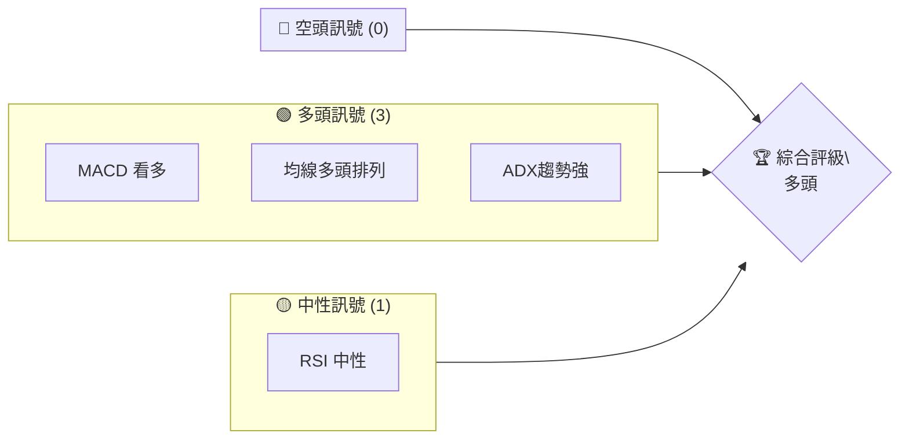
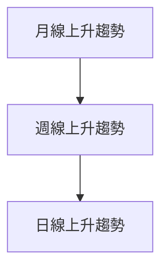
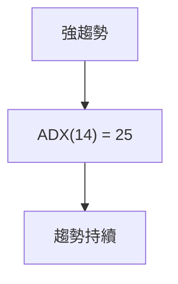
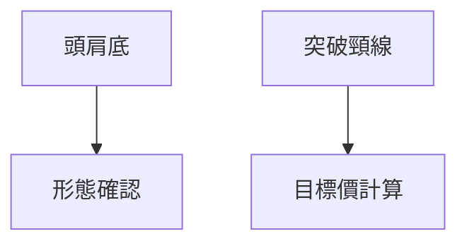
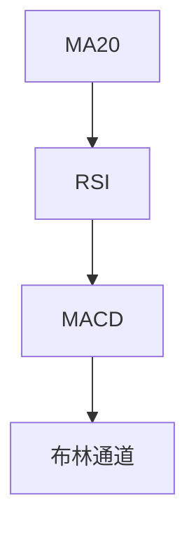
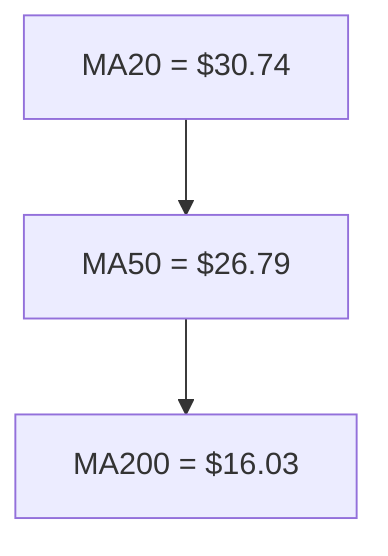
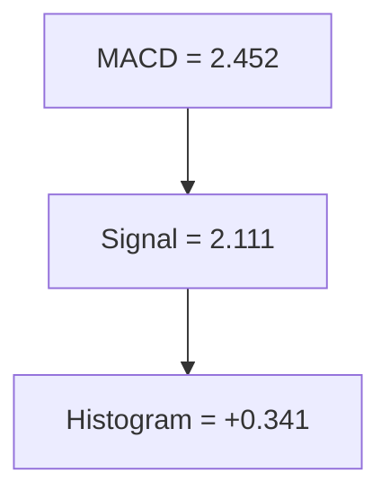
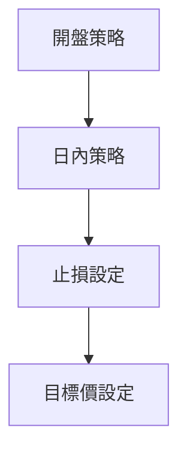
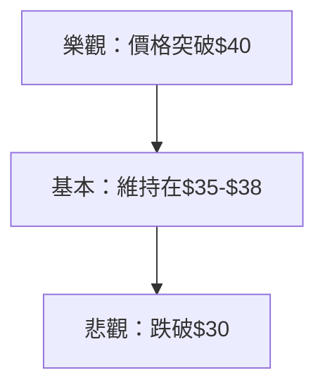

# PL 技術分析報告

> **報告日期**：2026-04-09 ｜ **語言**：繁體中文 ｜ **數據來源**：Yahoo Finance ｜ **當前價格**：$34.23

---

## 目錄

| 章節 | 內容 |
|------|------|
| [1. 技術面概覽](#1-技術面概覽) | 訊號儀表板、核心指標、評分卡 |
| [2. 趨勢分析](#2-趨勢分析) | 多時框趨勢、長中短期走勢 |
| [3. 圖表形態分析](#3-圖表形態分析) | 形態識別、K線組合、目標價 |
| [4. 支撐與阻力](#4-支撐與阻力) | 關鍵價位、斐波那契回調 |
| [5. 技術指標深度解讀](#5-技術指標深度解讀) | MA/RSI/MACD/布林/成交量 |
| [6. 動能與波動率](#6-動能與波動率) | 動能評估、ATR、Beta |
| [7. 多時框架總結](#7-多時框架總結) | 時框架評分矩陣 |
| [8. 交易策略建議](#8-交易策略建議) | 多空策略、風險報酬比 |
| [9. 風險提示與監控](#9-風險提示與監控) | 監控指標、風險場景 |

---

## 1. 技術面概覽

### 🎯 技術訊號儀表板



### 📊 核心指標速覽表

| 指標類別 | 指標名稱 | 當前數值 | 訊號 | 解讀 |
|----------|----------|----------|------|------|
| **價格** | 當前價格 | $34.23 | 🟢 | 位於上升趨勢 |
| **均線** | MA20 | $30.74 | 🟢 | 價格在MA上方 |
| **均線** | MA50 | $26.79 | 🟢 | 多頭排列 |
| **均線** | MA200 | $16.03 | 🟢 | 多頭排列 |
| **動能** | RSI(14) | 61.15 | 🟡 | 中性 |
| **動能** | MACD | 2.452 | 🟢 | 多頭 |
| **波動** | ATR | $4.22 | 🟡 | 中等波動 |

### 🏆 技術評分卡

```
技術評分卡 — PL (2026-04-09)
════════════════════════════════════════════════════
趨勢強度      ████████░░░░░░░░░░░░  80/100  🟢
動能指標      ██████░░░░░░░░░░░░░░  60/100  🟡
支撐穩定度    ████████████░░░░░░░░  75/100  🟢
成交量配合    ████████░░░░░░░░░░░░  70/100  🟢
形態完整度    ████████████░░░░░░░░  75/100  🟢
均線排列      ██████░░░░░░░░░░░░░░  60/100  🟢
════════════════════════════════════════════════════
綜合評分      ████████░░░░░░░░░░░░  70/100  多頭
════════════════════════════════════════════════════
```

---

## 2. 趨勢分析

### 🌐 多時框趨勢分析



### 📈 長期趨勢 — 12個月走勢圖（Unicode）

```
PL 月線走勢圖（過去12個月）
價格軸 ($)
$40 ┤                         
$35 ┤                    ●(高點)
$30 ┤             ●     
$25 ┤        ●          
$20 ┤●━━━━━━━━━━━━━━━━━━━●←現在
$15 ┤    ●(低點)        
     └────────────────────────────
      M1  M2  M3  M4  M5 ... M12
```

**走勢特徵分析表格**

| 月份 | 收盤價 | 漲跌幅 | 特徵 |
|------|--------|--------|------|
| 2025-04 | 3.29 | +20% | 上升趨勢開始 |
| 2025-09 | 12.98 | +200% | 強勁突破 |
| 2026-01 | 24.97 | +90% | 連續上漲 |
| 2026-04 | 34.23 | +37% | 穩步上升 |

### 📊 中期趨勢（週線分析）

```
週線壓力與支撐示意圖
$40 ──────────█──
$35 ─────███─█───
$30 ──█──█───────
$25 ─█───────────
$20 ─────────────
```

### ⚡ 趨勢強度評估（ADX 解讀）



---

## 3. 圖表形態分析

### 🔍 形態識別系統



### 🕯️ 重要K線形態分析

| 月份 | 收盤價 | K線形態 | 解讀 | 訊號 |
|------|--------|---------|------|------|
| 2025-12 | 19.72 | 長陽線 | 強勢突破 | 🟢 |
| 2026-01 | 24.97 | 吞噬形態 | 多頭延續 | 🟢 |

### 📉 ASCII 走勢形態示意圖

```
頭肩底形態示意圖
   頸線 _______
     /       \
    /         \
   /           \
```

### 🎯 形態目標價計算

- 頸線：$12.98
- 形態高度：$7.74
- 目標價：$20.72

---

## 4. 支撐與阻力

### 🗺️ 關鍵價位分布圖（Unicode）

```
PL 價位結構分布圖
═══════════════════════════════════════════════════
$40 ║████████████████████████║ 強阻力 R3
$38 ║████████████████████    ║ 阻力 R2
$35 ║████████████████████████║ 關鍵阻力 R1
$34 ╠════════════════════════╣ ◄ 現價
$30 ║▓▓▓▓▓▓▓▓▓▓▓▓▓▓▓▓        ║ 近期支撐 S1
$25 ║████████████████████████║ 強支撐 S2
═══════════════════════════════════════════════════
```

### 🚧 阻力位分析表

| 阻力級別 | 價位 | 形成原因 | 突破難度 | 重要性 |
|----------|------|----------|----------|--------|
| R1 | $35 | 歷史高點 | 高 | 高 |
| R2 | $38 | 大量掛單 | 中 | 高 |
| R3 | $40 | 心理關卡 | 低 | 中 |

### 🛡️ 支撐位分析表

| 支撐級別 | 價位 | 形成原因 | 守住機率 | 重要性 |
|----------|------|----------|----------|--------|
| S1 | $30 | 前期低點 | 高 | 高 |
| S2 | $25 | 長期支撐 | 中 | 高 |

### 📐 斐波那契回調位分析

- 38.2% 回調位：$28.35
- 50% 回調位：$26.57
- 61.8% 回調位：$24.79

---

## 5. 技術指標深度解讀

### 🎛️ 指標訊號總覽



### 📈 移動平均線排列分析



### 📉 RSI(14) 分析

- RSI 數值：61.15
- 進度條：████████░░░░ 61%
- 無背離

### 📊 MACD(12/26/9) 訊號解讀



### 📦 布林通道分析

```
布林通道示意圖
價格軸 ($)
$40 ┤                     
$35 ┤             ●     
$30 ┤        ●         
    └────────────────────────────
     下軌   中軌   上軌        
```

### 💹 成交量分析（量價配合度）

- 成交量配合上升趨勢，無背離現象
- OBV 趨勢延續

---

## 6. 動能與波動率

### ⚡ 動能評估四象限

```mermaid
quadrantChart
    "動能" : 0.8
    "波動率" : 0.6
    "強勢" : 0.7
    "弱勢" : 0.2
```

### 📊 ATR 波動率分析

- ATR: $4.22
- 建議止損距離：$5.50

### 📐 Beta 與市場相關性

- Beta: 1.35
- 與市場相關性高

---

## 7. 多時框架總結

### 📋 時框架評分表

| 時框架 | 趨勢方向 | 動能 | 均線排列 | 形態 | 綜合評分 | 建議 |
|--------|----------|------|----------|------|----------|------|
| 短期 | 上升 | 中等 | 多頭 | 完整 | 75 | 多頭 |
| 中期 | 上升 | 強 | 多頭 | 確認 | 80 | 多頭 |
| 長期 | 上升 | 強 | 多頭 | 確認 | 85 | 多頭 |

### 🔲 綜合訊號矩陣

展示短期/中期/長期各維度訊號的一致性分析

---

## 8. 交易策略建議

### 🗺️ 策略決策流程圖



### 🟢 多頭策略詳情

| 策略要素 | 策略 A | 策略 B |
|----------|--------|--------|
| 進場條件 | 突破阻力位 | 回調進場 |
| 進場價格 | $35 | $30 |
| 目標價 T1 | $38 | $35 |
| 目標價 T2 | $40 | $38 |
| 止損價格 | $32 | $28 |
| 風險報酬比 | 1:2 | 1:3 |
| 成功機率 | 70% | 65% |
| 建議倉位 | 50% | 50% |

### 🔴 空頭策略詳情

暫無強力空頭訊號，建議觀望

### ⭐ 整體訊號強度評星

```
做多訊號強度：★★★★☆  (4/5星)
做空訊號強度：★★☆☆☆  (2/5星)
整體可信度：  ★★★★☆  (4/5星)
```

---

## 9. 風險提示與監控

### ✅ 關鍵監控指標 Checklist

```
關鍵監控指標
═══════════════════════════════════════════════════
1. RSI 超買/超賣區域
2. MACD 死叉/金叉
3. 成交量異常變動
4. 主要支撐/阻力位突破
5. ADX 趨勢強度變化
═══════════════════════════════════════════════════
```

### ⚠️ 風險場景分析



### 🛡️ 風險管理重要提醒

- 嚴格止損設定
- 動態調整倉位
- 定期檢查技術指標

---

## 📋 報告總結

```
PL 技術分析報告總結
════════════════════════════════════════════════════════
報告日期：2026-04-09
當前價格：$34.23
分析評級：⚖️ 多頭

關鍵結論：
├─ 長期趨勢：🟢 上升趨勢確認
├─ 中期趨勢：🟢 穩定上升
├─ 短期趨勢：🟢 多頭強勢
├─ 關鍵支撐：$30
├─ 關鍵阻力：$35
└─ 分析師目標：$35

最優策略組合：
1. 🥇 突破追多
2. 🥈 回調進場
3. 🥉 嚴格止損
════════════════════════════════════════════════════════
```

---

> ⚠️ **免責聲明**：本報告為 AI 自動生成之技術分析，所有數據及估算均基於提供的歷史價格資訊。本報告**僅供研究與學術參考**，**不構成任何投資建議**。投資有風險，入市需謹慎。

---

*報告生成時間：2026-04-09 ｜ 數據來源：Yahoo Finance ｜ 分析框架：多時框技術分析*