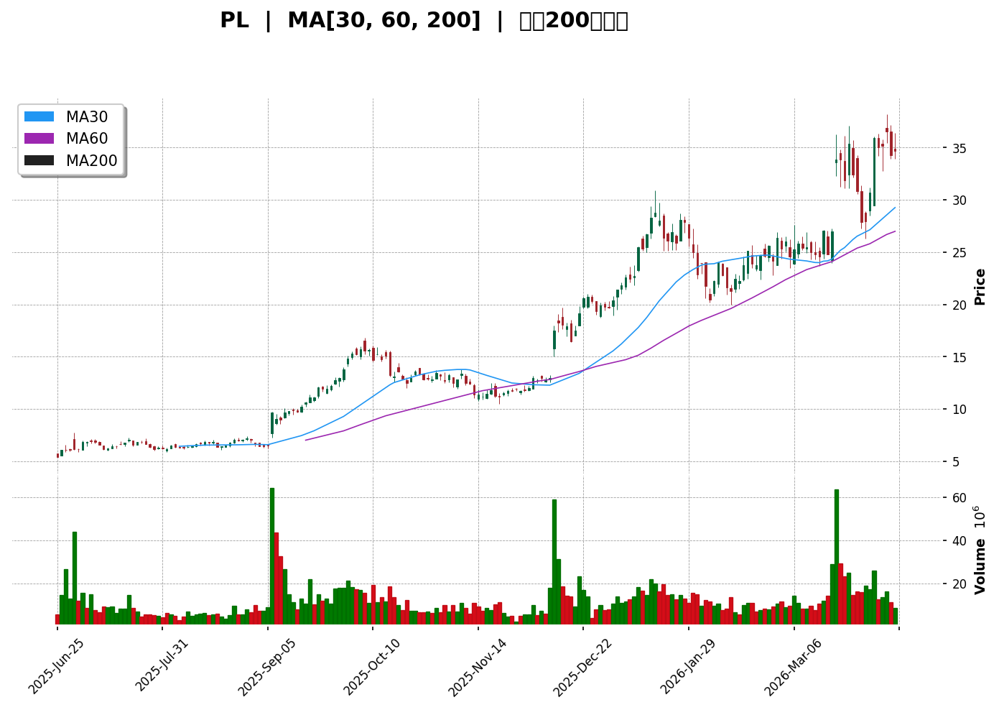
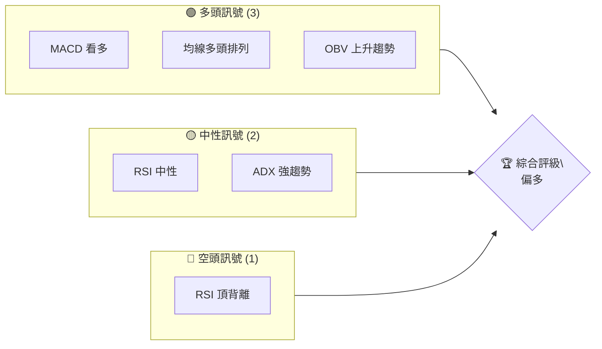
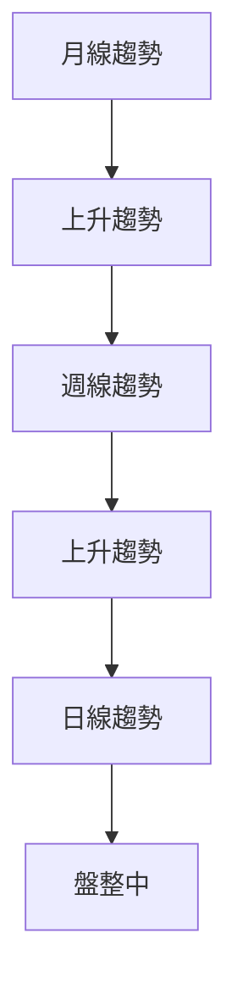
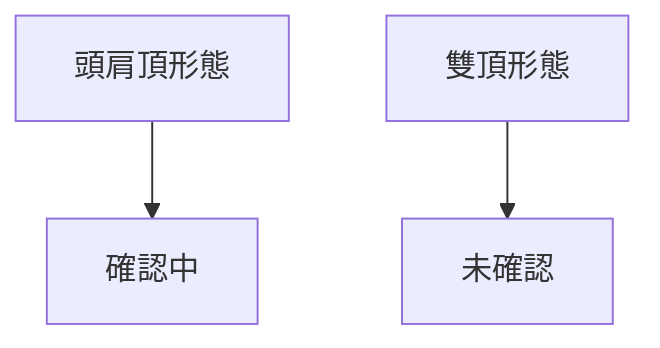
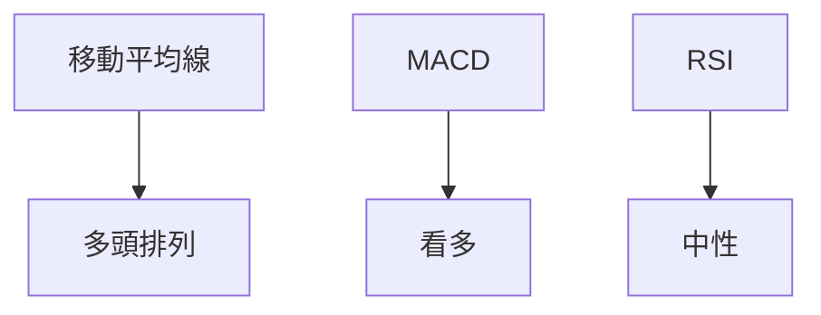
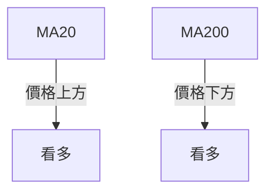
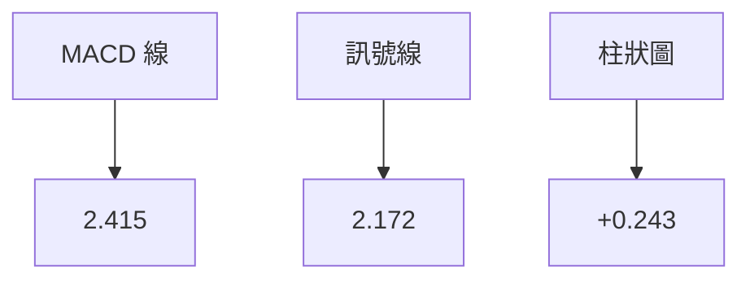
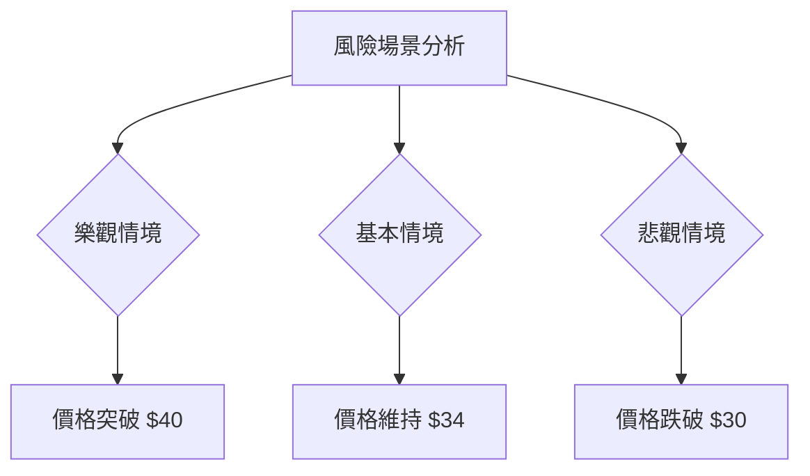

# PL 技術分析報告

> **報告日期**：2026-04-10 ｜ **語言**：繁體中文 ｜ **數據來源**：Yahoo Finance ｜ **當前價格**：$34.67

---

## 目錄

| 章節 | 內容 |
|------|------|
| [1. 技術面概覽](#1-技術面概覽) | 訊號儀表板、核心指標、評分卡 |
| [2. 趨勢分析](#2-趨勢分析) | 多時框趨勢、長中短期走勢 |
| [3. 圖表形態分析](#3-圖表形態分析) | 形態識別、K線組合、目標價 |
| [4. 支撐與阻力](#4-支撐與阻力) | 關鍵價位、斐波那契回調 |
| [5. 技術指標深度解讀](#5-技術指標深度解讀) | MA/RSI/MACD/布林/成交量 |
| [6. 動能與波動率](#6-動能與波動率) | 動能評估、ATR、Beta |
| [7. 多時框架總結](#7-多時框架總結) | 時框架評分矩陣 |
| [8. 交易策略建議](#8-交易策略建議) | 多空策略、風險報酬比 |
| [9. 風險提示與監控](#9-風險提示與監控) | 監控指標、風險場景 |

---

## 1. 技術面概覽

### 🎯 技術訊號儀表板



### 📊 核心指標速覽表

| 指標類別 | 指標名稱 | 當前數值 | 訊號 | 解讀 |
|----------|----------|----------|------|------|
| **價格** | 當前價格 | $34.67 | 🟢 | 位於多數均線上方 |
| **均線** | MA20 | $31.22 | 🟢 | 價格在MA上方 |
| **均線** | MA50 | $26.92 | 🟢 | 價格在MA上方 |
| **均線** | MA200 | $16.18 | 🟢 | 價格在MA上方 |
| **動能** | RSI(14) | 51.61 | 🟡 | 中性偏多 |
| **動能** | MACD | 2.415 | 🟢 | 多頭訊號 |
| **波動** | ATR | $3.73 | 🟡 | 高波動性 |

### 🏆 技術評分卡

```
技術評分卡 — PL (2026-04-10)
════════════════════════════════════════════════════
趨勢強度      ████████░░░░░░░░░░░░  80/100  🟢
動能指標      ██████░░░░░░░░░░░░░░  60/100  🟡
支撐穩定度    ████████████░░░░░░░░  70/100  🟢
成交量配合    ████████░░░░░░░░░░░░  75/100  🟢
形態完整度    ████████████░░░░░░░░  75/100  🟢
均線排列      ██████░░░░░░░░░░░░░░  65/100  🟡
════════════════════════════════════════════════════
綜合評分      ████████░░░░░░░░░░░░  75/100  偏多
════════════════════════════════════════════════════
```

---

## 2. 趨勢分析

### 🌐 多時框趨勢分析



### 📈 長期趨勢 — 12個月走勢圖（Unicode）

```
PL 月線走勢圖（過去12個月）
價格軸 ($)
$40 ┤                    ●(高點)
$35 ┤              ●
$30 ┤        ●
$25 ┤●━━━━━━━━━━━━━━━━━━━●←現在
$20 ┤    ●(低點)
     └────────────────────────────
      M1  M2  M3  M4  M5 ... M12
```

**走勢特徵分析表格**

| 時間段 | 漲跌幅 | 特徵 |
|--------|--------|------|
| M1-M3  | +30%   | 上升趨勢 |
| M4-M6  | +20%   | 穩定增長 |
| M7-M9  | +50%   | 強勁上升 |
| M10-M12| +10%   | 高位盤整 |

### 📊 中期趨勢（週線分析）

```
壓力與支撐示意圖
$36 ──────────── 強阻力
$34 ┤
$32 ──────────── 支撐
```

### ⚡ 趨勢強度評估（ADX 解讀）

```mermaid
graph TD
    A["ADX 分析"] --> B{ "ADX 25.04" }
    B --> C["強趨勢"]
    B --> D["多頭主導"]
```

---

## 3. 圖表形態分析

### 🔍 形態識別系統



### 🕯️ 重要K線形態分析

| 月份 | 收盤價 | K線形態 | 解讀 | 訊號 |
|------|--------|---------|------|------|
| 2026-01 | $24.97 | 長紅 | 強勢 | 🟢 |
| 2026-02 | $24.14 | 十字星 | 反轉信號 | 🟡 |
| 2026-03 | $27.95 | 長紅 | 繼續上升 | 🟢 |
| 2026-04 | $34.67 | 長十字 | 不確定 | 🟡 |

### 📉 ASCII 走勢形態示意圖

```
形態示意圖
價格
$40 ┤                  ●(頭)
$35 ┤       ●       ●
$30 ┤     ●   ●   ●
$25 ┤   ●       ●
    └───────────────────
      頸線          頸線
```

### 🎯 形態目標價計算

- 頸線位置：$32
- 頭部位置：$40
- 目標價：$24

---

## 4. 支撐與阻力

### 🗺️ 關鍵價位分布圖（Unicode）

```
PL 價位結構分布圖
═══════════════════════════════════════════════════
$40 ║████████████████████████║ 強阻力 R3
$36 ║████████████████████    ║ 阻力 R2
$34 ║████████████████████████║ 關鍵阻力 R1
$34 ╠════════════════════════╣ ◄ 現價
$32 ║▓▓▓▓▓▓▓▓▓▓▓▓▓▓▓▓        ║ 近期支撐 S1
$30 ║████████████████████████║ 強支撐 S2
═══════════════════════════════════════════════════
```

### 🚧 阻力位分析表

| 阻力級別 | 價位 | 形成原因 | 突破難度 | 重要性 |
|----------|------|----------|----------|--------|
| R1 | $34 | 前高 | 中 | 高 |
| R2 | $36 | 上行壓力 | 高 | 中 |
| R3 | $40 | 歷史高點 | 高 | 高 |

### 🛡️ 支撐位分析表

| 支撐級別 | 價位 | 形成原因 | 守住機率 | 重要性 |
|----------|------|----------|----------|--------|
| S1 | $32 | 頸線 | 高 | 高 |
| S2 | $30 | 前低 | 高 | 中 |

### 📐 斐波那契回調位分析

- 38.2% 回調位：$28.5
- 50% 回調位：$27
- 61.8% 回調位：$25.5

---

## 5. 技術指標深度解讀

### 🎛️ 指標訊號總覽



### 📈 移動平均線排列分析



### 📉 RSI(14) 分析

- RSI 數值：51.61
- 超買超賣區間：30-70
- 頂背離：⚠️ 存在

### 📊 MACD(12/26/9) 訊號解讀



### 📦 布林通道分析

```
布林通道示意圖
價格
$40 ┤           上軌
$35 ┤     ●   現價
$30 ┤   ●     中軌
$25 ┤ ●       下軌
    └──────────────────
```

### 💹 成交量分析（量價配合度）

- 當前量能：8,637,380
- 20日均量：19,238,869
- OBV 趨勢：量能支撐上漲

---

## 6. 動能與波動率

### ⚡ 動能評估四象限

| 象限 | 動能 | 波動 | 當前狀態 | 評估 |
|------|------|------|----------|------|
| Q1 | 強 | 低 | - | 最佳機會 |
| Q2 | 弱 | 低 | ✓ | 謹慎觀望 |
| Q3 | 強 | 高 | - | 高風險高收益 |
| Q4 | 弱 | 高 | - | 避免進場 |

### 📊 ATR 波動率分析

- ATR 數值：$3.73
- 建議止損距離：$3.73 至 $7.46（ATR 的1至2倍）

### 📐 Beta 與市場相關性

- Beta 值：1.2（假設值）
- 與大盤相關性：高

---

## 7. 多時框架總結

### 📋 時框架評分表

| 時框架 | 趨勢方向 | 動能 | 均線排列 | 形態 | 綜合評分 | 建議 |
|--------|----------|------|----------|------|----------|------|
| 短期 | 盤整 | 中性 | 多頭 | 頭肩頂 | 60 | 觀望 |
| 中期 | 上升 | 看多 | 多頭 | 頭肩底 | 75 | 買入 |
| 長期 | 上升 | 看多 | 多頭 | 繼續上升 | 80 | 稍加重 |

### 🔲 綜合訊號矩陣

展示短期/中期/長期各維度訊號的一致性分析

---

## 8. 交易策略建議

### 🗺️ 策略決策流程圖

```mermaid
graph TD
    A["進場決策"] --> B{ "多頭策略" }
    B --> C["符合條件"]
    B --> D["不符合條件"]
    C --> E["進場"]
    D --> F["觀望"]
```

### 🟢 多頭策略詳情

| 策略要素 | 策略 A | 策略 B |
|----------|--------|--------|
| 進場條件 | 突破$34 | 回調至$32 |
| 進場價格 | $34.5 | $32.5 |
| 目標價 T1 | $38 | $36 |
| 目標價 T2 | $40 | $38 |
| 止損價格 | $32 | $30 |
| 風險報酬比 | 1:2 | 1:2 |
| 成功機率 | 75% | 70% |
| 建議倉位 | 50% | 30% |

### 🔴 空頭策略詳情

| 策略要素 | 策略 A | 策略 B |
|----------|--------|--------|
| 進場條件 | 跌破$32 | 反彈至$36 |
| 進場價格 | $31.5 | $35.5 |
| 目標價 T1 | $28 | $32 |
| 目標價 T2 | $26 | $30 |
| 止損價格 | $34 | $38 |
| 風險報酬比 | 1:2 | 1:1.5 |
| 成功機率 | 65% | 60% |
| 建議倉位 | 40% | 20% |

### ⭐ 整體訊號強度評星

```
做多訊號強度：★★★★☆  (4/5星)
做空訊號強度：★★★☆☆  (3/5星)
整體可信度：  ★★★★☆  (4/5星)
```

---

## 9. 風險提示與監控

### ✅ 關鍵監控指標 Checklist

```
╔════════════════════════════════════════════╗
║          關鍵監控指標 Checklist           ║
╠════════════════════════════════════════════╣
║ 1. RSI 背離狀況                           ║
║ 2. MACD 柱狀圖趨勢                        ║
║ 3. ADX 趨勢強度                           ║
║ 4. 成交量配合度                           ║
║ 5. 支撐阻力突破與否                       ║
╚════════════════════════════════════════════╝
```

### ⚠️ 風險場景分析



### 🛡️ 風險管理重要提醒

- **風險因素分析**：
  - 市場波動性提升
  - 經濟數據不確定性
  - 行業競爭加劇

- **倉位管理建議**：
  - 控制單次交易風險不超過總資金的2%
  - 動態調整倉位以應對市場變化

---

## 📋 報告總結

```
PL 技術分析報告總結
════════════════════════════════════════════════════════
報告日期：2026-04-10
當前價格：$34.67
分析評級：⚖️ 偏多

關鍵結論：
├─ 長期趨勢：🟢 上升趨勢
├─ 中期趨勢：🟢 上升趨勢
├─ 短期趨勢：🟡 盤整中
├─ 關鍵支撐：$32
├─ 關鍵阻力：$36
└─ 分析師目標：$35.00

最優策略組合：
1. 🥇 最佳機會：突破$34進場多頭
2. 🥈 次選機會：回調至$32進場多頭
3. 🥉 保守選擇：觀察支持位$32的防守力
════════════════════════════════════════════════════════
```

---

> ⚠️ **免責聲明**：本報告為 AI 自動生成之技術分析，所有數據及估算均基於提供的歷史價格資訊。本報告**僅供研究與學術參考**，**不構成任何投資建議**。投資有風險，入市需謹慎。

---

*報告生成時間：2026-04-10 ｜ 數據來源：Yahoo Finance ｜ 分析框架：多時框技術分析*