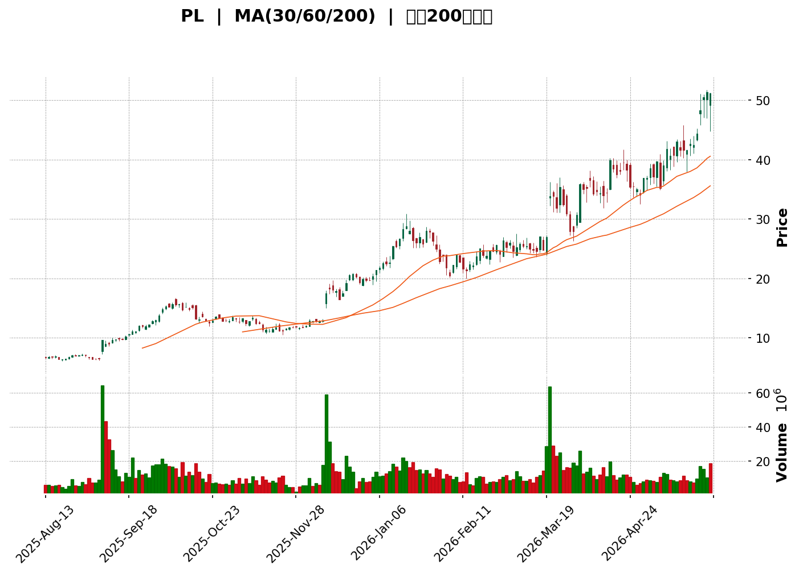
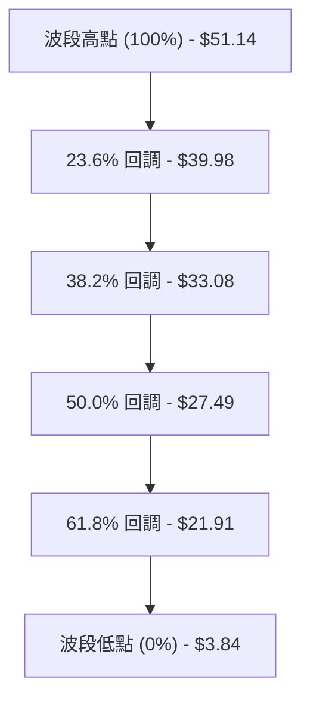
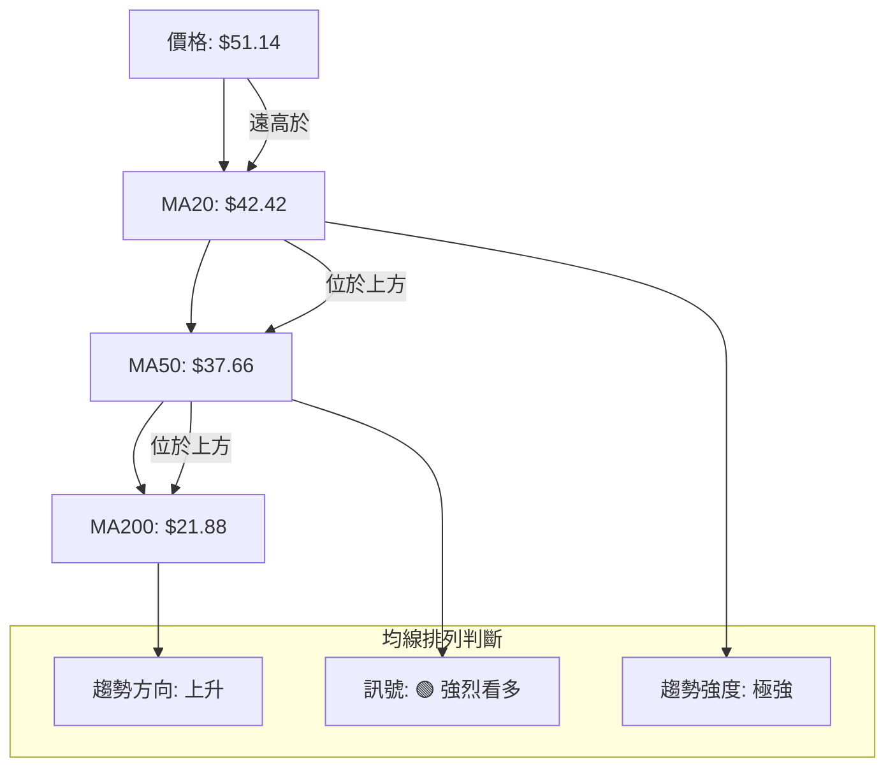

<details>
<summary>📊 靜態圖表 (點擊展開)</summary>

</details>

<html>
<head><meta charset="utf-8" /></head>
<body>
    <div>                        <script>window.PlotlyConfig = {MathJaxConfig: 'local'};</script>
        <script charset="utf-8" src="https://cdn.plot.ly/plotly-3.5.0.min.js" integrity="sha256-fHbNLP+GlIXN+efbQec78UkemUz3NJp7UmfGxC1tNxs=" crossorigin="anonymous"></script>                <div id="candlestick-chart" class="plotly-graph-div" style="height:500px; width:100%;"></div>            <script>                window.PLOTLYENV=window.PLOTLYENV || {};                                if (document.getElementById("candlestick-chart")) {                    Plotly.newPlot(                        "candlestick-chart",                        [{"close":{"dtype":"f8","bdata":"AAAAgML1GkAAAAAgrkcbQAAAAGC4HhtAAAAAAClcG0AAAADAHoUZQAAAAOBRuBlAAAAAIIXrGUAAAABAMzMbQAAAAKBwPRxAAAAAIIXrG0AAAACA61EcQAAAAEAK1xxAAAAAAClcHEAAAACgmZkaQAAAAGCPwhlAAAAAQArXGUAAAABguB4aQAAAAIDrUSNAAAAAgD0KIkAAAADgo\u002fAhQAAAAEAKVyNAAAAAIFyPI0AAAADgUbgjQAAAAAAAgCNAAAAAgMJ1JEAAAADgUTglQAAAAOBROCZAAAAA4FE4JkAAAACgmRkoQAAAAAAp3CdAAAAAIIXrJ0AAAABgZmYoQAAAAOB6lClAAAAAgML1KUAAAACAPYorQAAAAEAzsy1AAAAAYLieLkAAAABA4XouQAAAAAApXC9AAAAAQDMzL0AAAACA61EvQAAAAGBmZi1AAAAAAACALkAAAAAgXI8tQAAAAIAULi5AAAAAgMJ1KkAAAADgUTgqQAAAAGC4HitAAAAAgOvRKUAAAAAAAAApQAAAAGBm5ilAAAAA4FE4K0AAAABguJ4qQAAAAIAUrilAAAAAwMzMKUAAAADgUbgpQAAAAGBm5ipAAAAAoEdhKkAAAABgZmYpQAAAAAAAgCpAAAAAIIXrKEAAAABguJ4pQAAAACCuxypAAAAA4KPwKEAAAACgR+EoQAAAAIDr0SZAAAAAwMzMJkAAAAAghWsmQAAAAGBm5iZAAAAA4HqUJ0AAAACAwnUmQAAAAIDrUSZAAAAA4HoUJ0AAAACAwnUnQAAAAOCjcCdAAAAAwMzMJ0AAAABgZmYnQAAAAIA9iidAAAAAwB4FKEAAAACgR+EpQAAAAIA9iilAAAAAYGbmKUAAAACAFK4pQAAAAKBH4SlAAAAA4FF4MUAAAACgcD0yQAAAAMDMDDJAAAAAoEfhMUAAAADgUXgwQAAAAKBwfTFAAAAAgBQuM0AAAACgmZk0QAAAAEDhujRAAAAAgOtRNEAAAAAAKVwzQAAAAGC43jNAAAAAoHC9M0AAAADgUbgzQAAAAMD1aDRAAAAAANdjNUAAAABACtc1QAAAAAApnDZAAAAA4KNwNkAAAACAwrU2QAAAAOCjcDlAAAAAgOtROUAAAABA4bo6QAAAACCuRzxAAAAAIK7HPEAAAAAAAAA8QAAAAKBHYTpAAAAAIFwPOkAAAADgo\u002fA6QAAAAGC43jlAAAAAgOsRPEAAAACgR+E7QAAAAKCZWTpAAAAA4FH4OEAAAACgmdk2QAAAAEAz8zdAAAAAwB7FNUAAAACAFG40QAAAAGCPQjZAAAAAwB4FOEAAAACAPco2QAAAAGBmpjVAAAAAwMxMNUAAAAAghWs2QAAAAIDCNTZAAAAAoHC9N0AAAAAAKRw5QAAAAGBm5jdAAAAAIK7HN0AAAACAwrU4QAAAAKBHoThAAAAAoJmZOUAAAAAA1yM4QAAAAAApXDpAAAAAwMxMOUAAAAAAAAA6QAAAAEAKlzhAAAAAIK5HOUAAAACA69E5QAAAAGBmZjlAAAAA4KNwOUAAAADgUfg4QAAAAIA9yjhAAAAAoJmZOEAAAADgehQ7QAAAACBczzhAAAAAgML1OkAAAACAPepAQAAAAMD16EBAAAAA4HrUP0AAAAAgXK9BQAAAAEAzM0BAAAAAACncPkAAAAAA1+M7QAAAAEAz8ztAAAAAgMK1PkAAAADgo\u002fBBQAAAAGCPgkFAAAAAgMKVQUAAAABgZkZCQAAAAKBwHUFAAAAAgMJVQUAAAADA9ShBQAAAAEAK90BAAAAA4Ho0QUAAAACA6\u002fFDQAAAAKBwPUNAAAAAAADAQkAAAAAA1wNDQAAAAAApvENAAAAAwB4lQ0AAAADgUbhBQAAAAKCZuUFAAAAAANeDQUAAAACAPQpBQAAAAAApfEJAAAAAQDNzQkAAAADAHkVDQAAAAOCjkEJAAAAA4FHYQ0AAAABguJ5BQAAAAMAehUNAAAAAIIXrREAAAABACldEQAAAAGC4XkRAAAAAwB6FRUAAAAAgXM9EQAAAAIAUzkRAAAAAIIXLREAAAADgelRFQAAAAKBwPUVAAAAAwMwsRkAAAADA9ShIQAAAAKBwPUlAAAAAQDOzSUAAAACA65FJQA=="},"high":{"dtype":"f8","bdata":"AAAAwB6FG0AAAAAghesbQAAAACCFaxtAAAAAYLgeHEAAAABAMzMbQAAAAGCPwhlAAAAAIIXrGUAAAAAAKVwbQAAAAEAK1xxAAAAAgML1HEAAAACAPYocQAAAAMAehR1AAAAAYOOlHEAAAADA9SgbQAAAAIA9ChtAAAAAQDMzGkAAAACgmZkaQAAAAAB\u002faiNAAAAAACkcI0AAAABAM7MiQAAAAMD1KCRAAAAA4HqUI0AAAADgUTgkQAAAAEC28yNAAAAAwMzMJEAAAAAghWslQAAAAIDr0SZAAAAAwMxMJkAAAABgj0IoQAAAAIDCdShAAAAAIFyPKEAAAADA9agoQAAAAAAAACpAAAAAYLgeKkAAAACAPQosQAAAAMDINi5AAAAAAAAAL0AAAAAgrscvQAAAAGCPAjBAAAAAIK7HMEAAAACgmZkvQAAAAMDMDDBAAAAAYGbmL0AAAAAAAIAuQAAAAOB6VC9AAAAAQDUeL0AAAADA9SgrQAAAAIDr0SxAAAAAQAisKkAAAACgmRkqQAAAAAApnCpAAAAAgBRuK0AAAAAghesrQAAAAOCj8CpAAAAAIIWrKkAAAABgZmYqQAAAAIDCdStAAAAAYI\u002fCKkAAAACAPQorQAAAAOCjsCpAAAAAgD0KKkAAAABgZqYpQAAAAKCZmStAAAAAoHC9KkAAAADAzMwpQAAAAIDr0ShAAAAAQDOzJ0AAAADgUTgnQAAAAMAexSdAAAAAgML1KEAAAAAAAAApQAAAAAAAACdAAAAAIFxPJ0AAAACg7bwnQAAAAIA9CihAAAAAwB4FKEAAAAAA16MnQAAAAMAehShAAAAAoEdhKEAAAABgZmYqQAAAAAAAwClAAAAAgMJ1KkAAAAAAAAAqQAAAAEDheipAAAAAoJn5MUAAAACgmRkzQAAAAOCjsDNAAAAAIK5HMkAAAADAzIwyQAAAAEAz8zFAAAAA4HrUM0AAAABgj8I0QAAAAKBw\u002fTRAAAAAgBTuNEAAAACAwlU0QAAAAMAeJTRAAAAAACk8NEAAAADAzEw0QAAAACBczzRAAAAAIFxvNUAAAABAMxM2QAAAAAAp3DZAAAAAoJmZN0AAAACA6cY3QAAAACBcjzlAAAAAQAqXOkAAAADAHsU6QAAAAKBHYT1AAAAAYOPlPkAAAADgUbg9QAAAACCFqzxAAAAAgMDqOkAAAABA4bo7QAAAAEAzszpAAAAAQDOzPEAAAABgZmY8QAAAAEAzsztAAAAAAABAO0AAAADAocU5QAAAAACs\u002fDdAAAAAAAAAOEAAAACAwIo1QAAAACCuRzZAAAAA4FEYOEAAAABA4fo3QAAAAGBmhjdAAAAAwPXoNUAAAACAFO42QAAAAIA9yjZAAAAAoJmZOEAAAAAAKRw5QAAAAOCjsDlAAAAA4Hq0OEAAAAAgXM84QAAAAEBi0DlAAAAA4KOwOUAAAABACtc4QAAAAIAU7jpAAAAA4KNwOkAAAACgR4E6QAAAAKBwPTpAAAAAAKqRO0AAAABAChc6QAAAAOBReDpAAAAAIIXrOkAAAAAgXA86QAAAAIDpBjpAAAAAAACAOUAAAABAChc7QAAAAOB6FDtAAAAAYI9CO0AAAAAA1yNCQAAAACCFa0FAAAAAIIULQkAAAABgZoZCQAAAAADV2EFAAAAAYLgeQUAAAADA9Wg\u002fQAAAAIAU7jxAAAAAgBQuP0AAAADAHgVCQAAAAMAeJUJAAAAAYGbmQUAAAABA4RpDQAAAAIDClUJAAAAAgOsxQkAAAACAFL5BQAAAACBYOUJAAAAAgMKVQUAAAACgcB1EQAAAAKBwHURAAAAA4Hr0Q0AAAAAA18NDQAAAAEDh2kRAAAAAAAAAREAAAAAAAMBDQAAAAKBwHUJAAAAAQAqnQUAAAAAAAIBBQAAAAAApfEJAAAAA4HqkQkAAAABgj6JDQAAAAEAKt0NAAAAAoEfhQ0AAAACAwnVEQAAAAMDM7ENAAAAAIFyPRUAAAADgo\u002fBEQAAAAKCZGUVAAAAAoJm5RUAAAABACpdFQAAAAADX40ZAAAAAAADgREAAAABgZsZFQAAAAAAAAEZAAAAAQAyiRkAAAADgo5BJQAAAAKBwfUlAAAAAoEfhSUAAAABgj6JJQA=="},"hovertemplate":"\u003cb\u003e%{x|%Y-%m-%d}\u003c\u002fb\u003e\u003cbr\u003e\u958b: $%{open:.2f}\u003cbr\u003e\u9ad8: $%{high:.2f}\u003cbr\u003e\u4f4e: $%{low:.2f}\u003cbr\u003e\u6536: $%{close:.2f}\u003cextra\u003e\u003c\u002fextra\u003e","low":{"dtype":"f8","bdata":"AAAAAAAAGkAAAAAAAAAaQAAAAOB6FBpAAAAAIFyPGkAAAADg+X4ZQAAAAGBmZhhAAAAAQDVeGUAAAABA4XoZQAAAACCF6xpAAAAAINnOG0AAAABgZmYbQAAAAEAK1xtAAAAAQAgsG0AAAAAA16MZQAAAAOBRuBlAAAAAwPUoGUAAAADAHgUZQAAAAMD1KB1AAAAAwB4FIUAAAADgozAhQAAAAGCPQiJAAAAAIK7HIkAAAADgUfgiQAAAAIDrUSNAAAAAAClcI0AAAADgo3AkQAAAAEDhOiVAAAAA4KNwJUAAAAAA1yMmQAAAAEAKVydAAAAAQArXJkAAAADAHoUnQAAAAOBRuChAAAAAoHA9KEAAAABAMzMpQAAAAMD1KCxAAAAAwB6FLUAAAACgR2EuQAAAACBcjy1AAAAAwB6FLkAAAADA9SguQAAAAAApHC1AAAAAgOtRLkAAAABAChctQAAAAEAzsy1AAAAAoHA9KkAAAAAg3SQpQAAAAAAAACtAAAAAYLieKUAAAADgo\u002fAnQAAAAIAULilAAAAAIK5HKkAAAACAPYoqQAAAACBcjylAAAAAIK6HKUAAAABA3w8pQAAAACCuxylAAAAAgMJ1KUAAAAAghesoQAAAACBcDylAAAAAANcjKEAAAAAAKdwnQAAAAGAQ2ClAAAAAIFyPKEAAAADA9agoQAAAAEAKFyZAAAAAwMh2JUAAAABgj8IlQAAAAIAU7iVAAAAAwMzMJkAAAACAly4mQAAAAIA9CiVAAAAAwB6FJkAAAADAHoUmQAAAAGCPQidAAAAAgJduJ0AAAADAzMwmQAAAAOB6VCdAAAAAQOF6J0AAAAAAKdwnQAAAAMAeBSlAAAAAoHA9KUAAAABANR4pQAAAAMD1KClAAAAAwB4FLkAAAABguF4xQAAAAADXozFAAAAAgBTuMEAAAACAFG4wQAAAAIA9CjFAAAAAoHD9MUAAAAAAKZwzQAAAAKCZmTNAAAAAACkcNEAAAACAPQozQAAAAGCPwjJAAAAA4KNwM0AAAABAiaEzQAAAAADV+DJAAAAAoHB9M0AAAADgUfg0QAAAAMD1aDVAAAAAQAoXNkAAAADAINA1QAAAAMD1KDdAAAAAYLgeOUAAAAAAAAA5QAAAAGCPQjpAAAAAAClcPEAAAAAgXG87QAAAAKBHITlAAAAAANcjOUAAAACAFC45QAAAAOBRODlAAAAAoBoPOkAAAAAgXM86QAAAAMDMjDlAAAAAgOtxOEAAAABACnc2QAAAAMD16DZAAAAAQAqXNEAAAABgZiY0QAAAACBczzRAAAAAYGamNUAAAACAwrU2QAAAAMD16DRAAAAAQOH6M0AAAAAgBiE1QAAAAAAAgDVAAAAAoHA9NkAAAACAwnU2QAAAAGCPgjdAAAAAQOE6N0AAAACgmVk2QAAAAKBwfThAAAAAgOsROEAAAAAgrsc2QAAAAOBRuDdAAAAAoEdhOEAAAACAaBE5QAAAAGCPgjdAAAAAoJnZN0AAAABAM3M4QAAAAEAzMzlAAAAA4KPwOEAAAAAgrkc4QAAAACBcTzhAAAAA4HipN0AAAABgZmY4QAAAAGCPwjhAAAAA4KPwN0AAAACAaCFAQAAAAEDhOj9AAAAAACkcP0AAAACgRyE\u002fQAAAACBcD0BAAAAAgD2KPkAAAABguD47QAAAAMD1SDpAAAAAwB6FPEAAAADgo3A9QAAAAEDhGkFAAAAAYI9iQEAAAADgUbhBQAAAAOBR+EBAAAAAoJn5QEAAAAAAKVxAQAAAAKBH4T9AAAAAIK5nQEAAAABgZnZBQAAAACCF60JAAAAAQAp3QkAAAABgj8JCQAAAAADXI0NAAAAAgD0qQkAAAADgo5BBQAAAAOCj0EBAAAAAwPPdQEAAAADA9UhAQAAAAMBLJ0FAAAAA4KVrQUAAAADA9ehBQAAAAKCZ+UFAAAAAoEfBQUAAAABACndBQAAAAGBm5kFAAAAAwMwMQ0AAAACgRyFDQAAAAMDMbENAAAAAwMzMQ0AAAADAHkVEQAAAAKBHIURAAAAAYI8CQ0AAAACAwlVEQAAAAMAehURAAAAAwMyMRUAAAACAFO5GQAAAAIAUjkdAAAAAAACAR0AAAAAgY2ZGQA=="},"name":"\u50f9\u683c","open":{"dtype":"f8","bdata":"AAAAQDMzG0AAAABgZmYaQAAAAAApXBtAAAAAQDMzG0AAAADgehQbQAAAAAApXBlAAAAAYGZmGUAAAACAwvUZQAAAAGC4HhtAAAAAYLgeHEAAAAAghesbQAAAAEDhehxAAAAAIFyPHEAAAACAPQobQAAAAIA9ChtAAAAAQDMzGkAAAADgo3AaQAAAAIDr0R5AAAAAIK5HIUAAAABgZmYiQAAAAKBHYSJAAAAAoHA9I0AAAADgo\u002fAjQAAAAOBRuCNAAAAAAACAI0AAAACAwvUkQAAAAIDrUSVAAAAA4FG4JUAAAABA4XomQAAAACCuRyhAAAAAAAAAJ0AAAADgUbgnQAAAACCuxyhAAAAAYGZmKUAAAACAFK4pQAAAAOBRuCxAAAAAYGbmLUAAAACgmZkvQAAAAAAAAC5AAAAAwMyMMEAAAACAFC4vQAAAAOBRuC9AAAAAIIVrLkAAAAAAAAAuQAAAAGBm5i5AAAAA4KPwLkAAAAAAAAAqQAAAAIA9CixAAAAAAClcKkAAAAAAAIApQAAAAGCPQilAAAAAoJmZKkAAAABgZuYrQAAAAMDMzCpAAAAAIIXrKUAAAABA4XopQAAAACCuxylAAAAAwPWoKkAAAACAwnUpQAAAAIAUrilAAAAAwB4FKkAAAADgUTgoQAAAAIDCdSpAAAAAYGZmKkAAAABgj0IpQAAAAIA9iihAAAAAAAAAJkAAAAAAKVwmQAAAAOB6FCZAAAAAIIXrJkAAAABgZmYoQAAAAEDheiZAAAAAQDOzJkAAAADAHgUnQAAAAIA9iidAAAAAgOvRJ0AAAABAMzMnQAAAAGCPwidAAAAAwPWoJ0AAAABgZuYnQAAAAMAehSlAAAAAAClcKkAAAACgcD0pQAAAAKCZmSlAAAAA4HqUL0AAAADgo3AyQAAAACBczzJAAAAAYGamMUAAAACAFC4yQAAAAIA9CjFAAAAAoHD9MUAAAAAgrsczQAAAAMDMzDNAAAAAQOG6NEAAAADAzEw0QAAAAKBw3TJAAAAAIK4HNEAAAABguL4zQAAAAEDh2jNAAAAAQDOzNEAAAAAAAIA1QAAAAOBRuDVAAAAAoJnZNkAAAACgmZk2QAAAAMDMTDdAAAAAYI9COkAAAAAAAIA5QAAAACBczzpAAAAAQDNzPEAAAABACpc7QAAAAAAAgDxAAAAAAADAOkAAAABgjwI6QAAAAKCZmTpAAAAA4HoUOkAAAADAzAw8QAAAAEAzsztAAAAAQAq3OUAAAAAA1+M4QAAAAEDh+jdAAAAAAAAAOEAAAAAAAAA1QAAAAIA9CjVAAAAAgML1NUAAAABguN43QAAAAGBmhjdAAAAAgOuRNUAAAAAAAIA1QAAAAAAAADZAAAAAYGZmNkAAAADAHgU3QAAAAKBwvThAAAAAYGZmN0AAAAAAAEA3QAAAAMDMTDlAAAAAAACAOEAAAABAM5M4QAAAAOBRuDdAAAAAQOEaOkAAAACgmZk5QAAAAAAAgDlAAAAAANfjN0AAAABACtc4QAAAAIDr0TlAAAAAQApXOUAAAADgUfg5QAAAAEDh+jhAAAAAoEchOUAAAACgmdk4QAAAAAAAgDpAAAAAAABAOEAAAABgZsZAQAAAAAAAQEFAAAAAQOHaQEAAAABAMzNAQAAAAAApfEFAAAAAoHD9QEAAAACgmdk+QAAAAMDMzDxAAAAAAAAAPUAAAADgo3A9QAAAAIDC9UFAAAAA4KOwQUAAAABAM3NCQAAAAAAAQEJAAAAA4KNwQUAAAACgcB1BQAAAACCFy0FAAAAAgMI1QUAAAACgcH1BQAAAAIDrkUNAAAAAQDOTQ0AAAAAAKRxDQAAAAAAAwENAAAAAgD2qQ0AAAACAFI5DQAAAAAApvEFAAAAAwMxMQUAAAADgozBBQAAAAADXQ0FAAAAAIFxfQkAAAADAHoVCQAAAAKCZmUNAAAAAIFx\u002fQkAAAABgj8JDQAAAAEAzM0JAAAAAQDNTQ0AAAAAghQtEQAAAAEAKF0VAAAAA4KNQREAAAADA9QhFQAAAAADXo0VAAAAAQAp3REAAAABAMzNFQAAAAMByCEVAAAAAwMysRUAAAADA9dhHQAAAAMDMDElAAAAAQDMTSUAAAAAAAJBIQA=="},"x":["2025-08-13T00:00:00-04:00","2025-08-14T00:00:00-04:00","2025-08-15T00:00:00-04:00","2025-08-18T00:00:00-04:00","2025-08-19T00:00:00-04:00","2025-08-20T00:00:00-04:00","2025-08-21T00:00:00-04:00","2025-08-22T00:00:00-04:00","2025-08-25T00:00:00-04:00","2025-08-26T00:00:00-04:00","2025-08-27T00:00:00-04:00","2025-08-28T00:00:00-04:00","2025-08-29T00:00:00-04:00","2025-09-02T00:00:00-04:00","2025-09-03T00:00:00-04:00","2025-09-04T00:00:00-04:00","2025-09-05T00:00:00-04:00","2025-09-08T00:00:00-04:00","2025-09-09T00:00:00-04:00","2025-09-10T00:00:00-04:00","2025-09-11T00:00:00-04:00","2025-09-12T00:00:00-04:00","2025-09-15T00:00:00-04:00","2025-09-16T00:00:00-04:00","2025-09-17T00:00:00-04:00","2025-09-18T00:00:00-04:00","2025-09-19T00:00:00-04:00","2025-09-22T00:00:00-04:00","2025-09-23T00:00:00-04:00","2025-09-24T00:00:00-04:00","2025-09-25T00:00:00-04:00","2025-09-26T00:00:00-04:00","2025-09-29T00:00:00-04:00","2025-09-30T00:00:00-04:00","2025-10-01T00:00:00-04:00","2025-10-02T00:00:00-04:00","2025-10-03T00:00:00-04:00","2025-10-06T00:00:00-04:00","2025-10-07T00:00:00-04:00","2025-10-08T00:00:00-04:00","2025-10-09T00:00:00-04:00","2025-10-10T00:00:00-04:00","2025-10-13T00:00:00-04:00","2025-10-14T00:00:00-04:00","2025-10-15T00:00:00-04:00","2025-10-16T00:00:00-04:00","2025-10-17T00:00:00-04:00","2025-10-20T00:00:00-04:00","2025-10-21T00:00:00-04:00","2025-10-22T00:00:00-04:00","2025-10-23T00:00:00-04:00","2025-10-24T00:00:00-04:00","2025-10-27T00:00:00-04:00","2025-10-28T00:00:00-04:00","2025-10-29T00:00:00-04:00","2025-10-30T00:00:00-04:00","2025-10-31T00:00:00-04:00","2025-11-03T00:00:00-05:00","2025-11-04T00:00:00-05:00","2025-11-05T00:00:00-05:00","2025-11-06T00:00:00-05:00","2025-11-07T00:00:00-05:00","2025-11-10T00:00:00-05:00","2025-11-11T00:00:00-05:00","2025-11-12T00:00:00-05:00","2025-11-13T00:00:00-05:00","2025-11-14T00:00:00-05:00","2025-11-17T00:00:00-05:00","2025-11-18T00:00:00-05:00","2025-11-19T00:00:00-05:00","2025-11-20T00:00:00-05:00","2025-11-21T00:00:00-05:00","2025-11-24T00:00:00-05:00","2025-11-25T00:00:00-05:00","2025-11-26T00:00:00-05:00","2025-11-28T00:00:00-05:00","2025-12-01T00:00:00-05:00","2025-12-02T00:00:00-05:00","2025-12-03T00:00:00-05:00","2025-12-04T00:00:00-05:00","2025-12-05T00:00:00-05:00","2025-12-08T00:00:00-05:00","2025-12-09T00:00:00-05:00","2025-12-10T00:00:00-05:00","2025-12-11T00:00:00-05:00","2025-12-12T00:00:00-05:00","2025-12-15T00:00:00-05:00","2025-12-16T00:00:00-05:00","2025-12-17T00:00:00-05:00","2025-12-18T00:00:00-05:00","2025-12-19T00:00:00-05:00","2025-12-22T00:00:00-05:00","2025-12-23T00:00:00-05:00","2025-12-24T00:00:00-05:00","2025-12-26T00:00:00-05:00","2025-12-29T00:00:00-05:00","2025-12-30T00:00:00-05:00","2025-12-31T00:00:00-05:00","2026-01-02T00:00:00-05:00","2026-01-05T00:00:00-05:00","2026-01-06T00:00:00-05:00","2026-01-07T00:00:00-05:00","2026-01-08T00:00:00-05:00","2026-01-09T00:00:00-05:00","2026-01-12T00:00:00-05:00","2026-01-13T00:00:00-05:00","2026-01-14T00:00:00-05:00","2026-01-15T00:00:00-05:00","2026-01-16T00:00:00-05:00","2026-01-20T00:00:00-05:00","2026-01-21T00:00:00-05:00","2026-01-22T00:00:00-05:00","2026-01-23T00:00:00-05:00","2026-01-26T00:00:00-05:00","2026-01-27T00:00:00-05:00","2026-01-28T00:00:00-05:00","2026-01-29T00:00:00-05:00","2026-01-30T00:00:00-05:00","2026-02-02T00:00:00-05:00","2026-02-03T00:00:00-05:00","2026-02-04T00:00:00-05:00","2026-02-05T00:00:00-05:00","2026-02-06T00:00:00-05:00","2026-02-09T00:00:00-05:00","2026-02-10T00:00:00-05:00","2026-02-11T00:00:00-05:00","2026-02-12T00:00:00-05:00","2026-02-13T00:00:00-05:00","2026-02-17T00:00:00-05:00","2026-02-18T00:00:00-05:00","2026-02-19T00:00:00-05:00","2026-02-20T00:00:00-05:00","2026-02-23T00:00:00-05:00","2026-02-24T00:00:00-05:00","2026-02-25T00:00:00-05:00","2026-02-26T00:00:00-05:00","2026-02-27T00:00:00-05:00","2026-03-02T00:00:00-05:00","2026-03-03T00:00:00-05:00","2026-03-04T00:00:00-05:00","2026-03-05T00:00:00-05:00","2026-03-06T00:00:00-05:00","2026-03-09T00:00:00-04:00","2026-03-10T00:00:00-04:00","2026-03-11T00:00:00-04:00","2026-03-12T00:00:00-04:00","2026-03-13T00:00:00-04:00","2026-03-16T00:00:00-04:00","2026-03-17T00:00:00-04:00","2026-03-18T00:00:00-04:00","2026-03-19T00:00:00-04:00","2026-03-20T00:00:00-04:00","2026-03-23T00:00:00-04:00","2026-03-24T00:00:00-04:00","2026-03-25T00:00:00-04:00","2026-03-26T00:00:00-04:00","2026-03-27T00:00:00-04:00","2026-03-30T00:00:00-04:00","2026-03-31T00:00:00-04:00","2026-04-01T00:00:00-04:00","2026-04-02T00:00:00-04:00","2026-04-06T00:00:00-04:00","2026-04-07T00:00:00-04:00","2026-04-08T00:00:00-04:00","2026-04-09T00:00:00-04:00","2026-04-10T00:00:00-04:00","2026-04-13T00:00:00-04:00","2026-04-14T00:00:00-04:00","2026-04-15T00:00:00-04:00","2026-04-16T00:00:00-04:00","2026-04-17T00:00:00-04:00","2026-04-20T00:00:00-04:00","2026-04-21T00:00:00-04:00","2026-04-22T00:00:00-04:00","2026-04-23T00:00:00-04:00","2026-04-24T00:00:00-04:00","2026-04-27T00:00:00-04:00","2026-04-28T00:00:00-04:00","2026-04-29T00:00:00-04:00","2026-04-30T00:00:00-04:00","2026-05-01T00:00:00-04:00","2026-05-04T00:00:00-04:00","2026-05-05T00:00:00-04:00","2026-05-06T00:00:00-04:00","2026-05-07T00:00:00-04:00","2026-05-08T00:00:00-04:00","2026-05-11T00:00:00-04:00","2026-05-12T00:00:00-04:00","2026-05-13T00:00:00-04:00","2026-05-14T00:00:00-04:00","2026-05-15T00:00:00-04:00","2026-05-18T00:00:00-04:00","2026-05-19T00:00:00-04:00","2026-05-20T00:00:00-04:00","2026-05-21T00:00:00-04:00","2026-05-22T00:00:00-04:00","2026-05-26T00:00:00-04:00","2026-05-27T00:00:00-04:00","2026-05-28T00:00:00-04:00","2026-05-29T00:00:00-04:00"],"type":"candlestick"},{"hovertemplate":"MA30: $%{y:.2f}\u003cextra\u003e\u003c\u002fextra\u003e","line":{"color":"#2196F3","dash":"dash","width":2},"mode":"lines","name":"MA30","x":["2025-08-13T00:00:00-04:00","2025-08-14T00:00:00-04:00","2025-08-15T00:00:00-04:00","2025-08-18T00:00:00-04:00","2025-08-19T00:00:00-04:00","2025-08-20T00:00:00-04:00","2025-08-21T00:00:00-04:00","2025-08-22T00:00:00-04:00","2025-08-25T00:00:00-04:00","2025-08-26T00:00:00-04:00","2025-08-27T00:00:00-04:00","2025-08-28T00:00:00-04:00","2025-08-29T00:00:00-04:00","2025-09-02T00:00:00-04:00","2025-09-03T00:00:00-04:00","2025-09-04T00:00:00-04:00","2025-09-05T00:00:00-04:00","2025-09-08T00:00:00-04:00","2025-09-09T00:00:00-04:00","2025-09-10T00:00:00-04:00","2025-09-11T00:00:00-04:00","2025-09-12T00:00:00-04:00","2025-09-15T00:00:00-04:00","2025-09-16T00:00:00-04:00","2025-09-17T00:00:00-04:00","2025-09-18T00:00:00-04:00","2025-09-19T00:00:00-04:00","2025-09-22T00:00:00-04:00","2025-09-23T00:00:00-04:00","2025-09-24T00:00:00-04:00","2025-09-25T00:00:00-04:00","2025-09-26T00:00:00-04:00","2025-09-29T00:00:00-04:00","2025-09-30T00:00:00-04:00","2025-10-01T00:00:00-04:00","2025-10-02T00:00:00-04:00","2025-10-03T00:00:00-04:00","2025-10-06T00:00:00-04:00","2025-10-07T00:00:00-04:00","2025-10-08T00:00:00-04:00","2025-10-09T00:00:00-04:00","2025-10-10T00:00:00-04:00","2025-10-13T00:00:00-04:00","2025-10-14T00:00:00-04:00","2025-10-15T00:00:00-04:00","2025-10-16T00:00:00-04:00","2025-10-17T00:00:00-04:00","2025-10-20T00:00:00-04:00","2025-10-21T00:00:00-04:00","2025-10-22T00:00:00-04:00","2025-10-23T00:00:00-04:00","2025-10-24T00:00:00-04:00","2025-10-27T00:00:00-04:00","2025-10-28T00:00:00-04:00","2025-10-29T00:00:00-04:00","2025-10-30T00:00:00-04:00","2025-10-31T00:00:00-04:00","2025-11-03T00:00:00-05:00","2025-11-04T00:00:00-05:00","2025-11-05T00:00:00-05:00","2025-11-06T00:00:00-05:00","2025-11-07T00:00:00-05:00","2025-11-10T00:00:00-05:00","2025-11-11T00:00:00-05:00","2025-11-12T00:00:00-05:00","2025-11-13T00:00:00-05:00","2025-11-14T00:00:00-05:00","2025-11-17T00:00:00-05:00","2025-11-18T00:00:00-05:00","2025-11-19T00:00:00-05:00","2025-11-20T00:00:00-05:00","2025-11-21T00:00:00-05:00","2025-11-24T00:00:00-05:00","2025-11-25T00:00:00-05:00","2025-11-26T00:00:00-05:00","2025-11-28T00:00:00-05:00","2025-12-01T00:00:00-05:00","2025-12-02T00:00:00-05:00","2025-12-03T00:00:00-05:00","2025-12-04T00:00:00-05:00","2025-12-05T00:00:00-05:00","2025-12-08T00:00:00-05:00","2025-12-09T00:00:00-05:00","2025-12-10T00:00:00-05:00","2025-12-11T00:00:00-05:00","2025-12-12T00:00:00-05:00","2025-12-15T00:00:00-05:00","2025-12-16T00:00:00-05:00","2025-12-17T00:00:00-05:00","2025-12-18T00:00:00-05:00","2025-12-19T00:00:00-05:00","2025-12-22T00:00:00-05:00","2025-12-23T00:00:00-05:00","2025-12-24T00:00:00-05:00","2025-12-26T00:00:00-05:00","2025-12-29T00:00:00-05:00","2025-12-30T00:00:00-05:00","2025-12-31T00:00:00-05:00","2026-01-02T00:00:00-05:00","2026-01-05T00:00:00-05:00","2026-01-06T00:00:00-05:00","2026-01-07T00:00:00-05:00","2026-01-08T00:00:00-05:00","2026-01-09T00:00:00-05:00","2026-01-12T00:00:00-05:00","2026-01-13T00:00:00-05:00","2026-01-14T00:00:00-05:00","2026-01-15T00:00:00-05:00","2026-01-16T00:00:00-05:00","2026-01-20T00:00:00-05:00","2026-01-21T00:00:00-05:00","2026-01-22T00:00:00-05:00","2026-01-23T00:00:00-05:00","2026-01-26T00:00:00-05:00","2026-01-27T00:00:00-05:00","2026-01-28T00:00:00-05:00","2026-01-29T00:00:00-05:00","2026-01-30T00:00:00-05:00","2026-02-02T00:00:00-05:00","2026-02-03T00:00:00-05:00","2026-02-04T00:00:00-05:00","2026-02-05T00:00:00-05:00","2026-02-06T00:00:00-05:00","2026-02-09T00:00:00-05:00","2026-02-10T00:00:00-05:00","2026-02-11T00:00:00-05:00","2026-02-12T00:00:00-05:00","2026-02-13T00:00:00-05:00","2026-02-17T00:00:00-05:00","2026-02-18T00:00:00-05:00","2026-02-19T00:00:00-05:00","2026-02-20T00:00:00-05:00","2026-02-23T00:00:00-05:00","2026-02-24T00:00:00-05:00","2026-02-25T00:00:00-05:00","2026-02-26T00:00:00-05:00","2026-02-27T00:00:00-05:00","2026-03-02T00:00:00-05:00","2026-03-03T00:00:00-05:00","2026-03-04T00:00:00-05:00","2026-03-05T00:00:00-05:00","2026-03-06T00:00:00-05:00","2026-03-09T00:00:00-04:00","2026-03-10T00:00:00-04:00","2026-03-11T00:00:00-04:00","2026-03-12T00:00:00-04:00","2026-03-13T00:00:00-04:00","2026-03-16T00:00:00-04:00","2026-03-17T00:00:00-04:00","2026-03-18T00:00:00-04:00","2026-03-19T00:00:00-04:00","2026-03-20T00:00:00-04:00","2026-03-23T00:00:00-04:00","2026-03-24T00:00:00-04:00","2026-03-25T00:00:00-04:00","2026-03-26T00:00:00-04:00","2026-03-27T00:00:00-04:00","2026-03-30T00:00:00-04:00","2026-03-31T00:00:00-04:00","2026-04-01T00:00:00-04:00","2026-04-02T00:00:00-04:00","2026-04-06T00:00:00-04:00","2026-04-07T00:00:00-04:00","2026-04-08T00:00:00-04:00","2026-04-09T00:00:00-04:00","2026-04-10T00:00:00-04:00","2026-04-13T00:00:00-04:00","2026-04-14T00:00:00-04:00","2026-04-15T00:00:00-04:00","2026-04-16T00:00:00-04:00","2026-04-17T00:00:00-04:00","2026-04-20T00:00:00-04:00","2026-04-21T00:00:00-04:00","2026-04-22T00:00:00-04:00","2026-04-23T00:00:00-04:00","2026-04-24T00:00:00-04:00","2026-04-27T00:00:00-04:00","2026-04-28T00:00:00-04:00","2026-04-29T00:00:00-04:00","2026-04-30T00:00:00-04:00","2026-05-01T00:00:00-04:00","2026-05-04T00:00:00-04:00","2026-05-05T00:00:00-04:00","2026-05-06T00:00:00-04:00","2026-05-07T00:00:00-04:00","2026-05-08T00:00:00-04:00","2026-05-11T00:00:00-04:00","2026-05-12T00:00:00-04:00","2026-05-13T00:00:00-04:00","2026-05-14T00:00:00-04:00","2026-05-15T00:00:00-04:00","2026-05-18T00:00:00-04:00","2026-05-19T00:00:00-04:00","2026-05-20T00:00:00-04:00","2026-05-21T00:00:00-04:00","2026-05-22T00:00:00-04:00","2026-05-26T00:00:00-04:00","2026-05-27T00:00:00-04:00","2026-05-28T00:00:00-04:00","2026-05-29T00:00:00-04:00"],"y":{"dtype":"f8","bdata":"AAAAAAAA+H8AAAAAAAD4fwAAAAAAAPh\u002fAAAAAAAA+H8AAAAAAAD4fwAAAAAAAPh\u002fAAAAAAAA+H8AAAAAAAD4fwAAAAAAAPh\u002fAAAAAAAA+H8AAAAAAAD4fwAAAAAAAPh\u002fAAAAAAAA+H8AAAAAAAD4fwAAAAAAAPh\u002fAAAAAAAA+H8AAAAAAAD4fwAAAAAAAPh\u002fAAAAAAAA+H8AAAAAAAD4fwAAAAAAAPh\u002fAAAAAAAA+H8AAAAAAAD4fwAAAAAAAPh\u002fAAAAAAAA+H8AAAAAAAD4fwAAAAAAAPh\u002fAAAAAAAA+H8AAAAAAAD4f6uqqnJokSBAIiIi+n7qIEDe3d2NUEYhQM3MzKTirCFA3t3dtawVIkBVVVUdzJMiQImIiKh\u002fIyNAzczMhDK6I0CJiIhwPUokQLy7u8ta3SRA7+7uJnhwJUBmZma+5gImQFVVVQ27giZAq6qqov4NJ0BVVVUlv5gnQKuqqpJfLChA7+7uJuqfKEC8u7ubNhApQImIiPjFUilAMzMzoymVKUARERFxaNEpQKuqqvpiCSpAERERgcBKKkCamZnJoYUqQERERDReuipAzczMnO\u002fnKkAzMzMDVg4rQBEREaFFNitAmpmZScVZK0De3d0t3WQrQImIiFhkeytAERER4eyDK0AzMzMDVo4rQERERHSTmCtAvLu7O9+PK0Dv7u5eLHkrQHd3d8d2PitAmpmZubv7KkAzMzNj9LYqQLy7uzvDbipAZmZmFr0tKkDv7u4eIuIpQAAAAKC3pSlAMzMzY2ZmKUC8u7u7WDIpQKuqqvrU+ChA7+7uHiLiKEDNzMy8EcooQLy7uxuFqyhAMzMz8yicKEBmZmZWq6MoQImIiOiYoChAMzMzU1WVKEDNzMzcT40oQERERMQEjyhAZmZmZgPdKECrqqr61DgpQO\u002fu7q5WhylAq6qqmmHXKUC8u7v7uBcqQDMzM9MVYCpARERE9MXSKkC8u7v7uFcrQN7d3e391CtAmpmZGfdaLEC8u7sLEdEsQKuqqlpzYS1A7+7uXsnvLUAAAAAgBoEuQGZmZvbwGS9AAAAAAMi9L0BmZmbmbTkwQO\u002fu7s4imzBAEREROSb4MEDe3d1l2FUxQCIiIjLsyjFAIiIionA9MkAzMzMrsr0yQImIiNCUSjNAiYiIcK\u002fZM0AzMzODMlo0QCIiIgJWzjRAVVVVPTU+NUAREREph7Y1QN7d3S3dJDZAvLu7O1F\u002fNkAiIiIilNE2QDMzM8NnGDdAq6qqGuhUN0De3d1tWYs3QERERIR5wjdAVVVVdZPYN0BmZmYWINc3QM3MzGwu5DdAMzMzM8EDOEBmZmYmBiE4QN7d3Z02MDhAzczMfIY9OECrqqq6kFQ4QDMzM+PsYzhAq6qqivp3OEB3d3f34ZM4QDMzMwPknjhAmpmZSVOqOECrqqpaZLs4QBEREeF6tDhAzczMjN62OEC8u7ubxKA4QN7d3U1ikDhAAAAAILByOEDv7u4On2E4QO\u002fu7r5YUjhAAAAA0LBLOEAiIiIiIkI4QGZmZmYfPjhAREREFK4nOEBmZmYW2Q44QHd3dzeJAThAERER8WD+N0BERESEeSI4QGZmZjbQKThAAAAA8BlWOEAAAACwcsg4QEREROQXKzlAiYiIGL1tOUBVVVWFFtk5QCIiIkLSNDpAZmZmZmaGOkC8u7vLE7U6QFVVVQUP5jpAd3d3N4khO0BERESkcH07QHd3d6dU3DtAvLu7e4Y9PEC8u7tbj6I8QBEREeF69DxAd3d3l+BBPUBEREQkv5g9QO\u002fu7g5Y2T1AiYiIKBUnPkAzMzNTnJ0+QN7d3X0jFD9AzczMfGp8P0AzMzOjm+Q\u002fQDMzMwNWLkBAvLu7oyllQEC8u7ur1ZFAQLy7uztRv0BAq6qqktHrQEARERFxrwlBQAAAAGiRPUFAIiIiivpnQUBVVVUdE3xBQM3MzIQyikFAvLu7u7urQUDe3d29LatBQERERGSCx0FAq6qqelv2QUAiIiKS7SxCQJqZmal\u002fY0JAAAAAUBuYQkC8u7vrmLBCQFVVVfW2zEJAAAAAUBvoQkAAAAAQLQJDQDMzM0NgJUNAd3d3Z61OQ0AzMzMjaYpDQGZmZiYG0UNAMzMzw4MZREAzMzPDg0lEQA=="},"type":"scatter"},{"hovertemplate":"MA60: $%{y:.2f}\u003cextra\u003e\u003c\u002fextra\u003e","line":{"color":"#9C27B0","dash":"dash","width":2},"mode":"lines","name":"MA60","x":["2025-08-13T00:00:00-04:00","2025-08-14T00:00:00-04:00","2025-08-15T00:00:00-04:00","2025-08-18T00:00:00-04:00","2025-08-19T00:00:00-04:00","2025-08-20T00:00:00-04:00","2025-08-21T00:00:00-04:00","2025-08-22T00:00:00-04:00","2025-08-25T00:00:00-04:00","2025-08-26T00:00:00-04:00","2025-08-27T00:00:00-04:00","2025-08-28T00:00:00-04:00","2025-08-29T00:00:00-04:00","2025-09-02T00:00:00-04:00","2025-09-03T00:00:00-04:00","2025-09-04T00:00:00-04:00","2025-09-05T00:00:00-04:00","2025-09-08T00:00:00-04:00","2025-09-09T00:00:00-04:00","2025-09-10T00:00:00-04:00","2025-09-11T00:00:00-04:00","2025-09-12T00:00:00-04:00","2025-09-15T00:00:00-04:00","2025-09-16T00:00:00-04:00","2025-09-17T00:00:00-04:00","2025-09-18T00:00:00-04:00","2025-09-19T00:00:00-04:00","2025-09-22T00:00:00-04:00","2025-09-23T00:00:00-04:00","2025-09-24T00:00:00-04:00","2025-09-25T00:00:00-04:00","2025-09-26T00:00:00-04:00","2025-09-29T00:00:00-04:00","2025-09-30T00:00:00-04:00","2025-10-01T00:00:00-04:00","2025-10-02T00:00:00-04:00","2025-10-03T00:00:00-04:00","2025-10-06T00:00:00-04:00","2025-10-07T00:00:00-04:00","2025-10-08T00:00:00-04:00","2025-10-09T00:00:00-04:00","2025-10-10T00:00:00-04:00","2025-10-13T00:00:00-04:00","2025-10-14T00:00:00-04:00","2025-10-15T00:00:00-04:00","2025-10-16T00:00:00-04:00","2025-10-17T00:00:00-04:00","2025-10-20T00:00:00-04:00","2025-10-21T00:00:00-04:00","2025-10-22T00:00:00-04:00","2025-10-23T00:00:00-04:00","2025-10-24T00:00:00-04:00","2025-10-27T00:00:00-04:00","2025-10-28T00:00:00-04:00","2025-10-29T00:00:00-04:00","2025-10-30T00:00:00-04:00","2025-10-31T00:00:00-04:00","2025-11-03T00:00:00-05:00","2025-11-04T00:00:00-05:00","2025-11-05T00:00:00-05:00","2025-11-06T00:00:00-05:00","2025-11-07T00:00:00-05:00","2025-11-10T00:00:00-05:00","2025-11-11T00:00:00-05:00","2025-11-12T00:00:00-05:00","2025-11-13T00:00:00-05:00","2025-11-14T00:00:00-05:00","2025-11-17T00:00:00-05:00","2025-11-18T00:00:00-05:00","2025-11-19T00:00:00-05:00","2025-11-20T00:00:00-05:00","2025-11-21T00:00:00-05:00","2025-11-24T00:00:00-05:00","2025-11-25T00:00:00-05:00","2025-11-26T00:00:00-05:00","2025-11-28T00:00:00-05:00","2025-12-01T00:00:00-05:00","2025-12-02T00:00:00-05:00","2025-12-03T00:00:00-05:00","2025-12-04T00:00:00-05:00","2025-12-05T00:00:00-05:00","2025-12-08T00:00:00-05:00","2025-12-09T00:00:00-05:00","2025-12-10T00:00:00-05:00","2025-12-11T00:00:00-05:00","2025-12-12T00:00:00-05:00","2025-12-15T00:00:00-05:00","2025-12-16T00:00:00-05:00","2025-12-17T00:00:00-05:00","2025-12-18T00:00:00-05:00","2025-12-19T00:00:00-05:00","2025-12-22T00:00:00-05:00","2025-12-23T00:00:00-05:00","2025-12-24T00:00:00-05:00","2025-12-26T00:00:00-05:00","2025-12-29T00:00:00-05:00","2025-12-30T00:00:00-05:00","2025-12-31T00:00:00-05:00","2026-01-02T00:00:00-05:00","2026-01-05T00:00:00-05:00","2026-01-06T00:00:00-05:00","2026-01-07T00:00:00-05:00","2026-01-08T00:00:00-05:00","2026-01-09T00:00:00-05:00","2026-01-12T00:00:00-05:00","2026-01-13T00:00:00-05:00","2026-01-14T00:00:00-05:00","2026-01-15T00:00:00-05:00","2026-01-16T00:00:00-05:00","2026-01-20T00:00:00-05:00","2026-01-21T00:00:00-05:00","2026-01-22T00:00:00-05:00","2026-01-23T00:00:00-05:00","2026-01-26T00:00:00-05:00","2026-01-27T00:00:00-05:00","2026-01-28T00:00:00-05:00","2026-01-29T00:00:00-05:00","2026-01-30T00:00:00-05:00","2026-02-02T00:00:00-05:00","2026-02-03T00:00:00-05:00","2026-02-04T00:00:00-05:00","2026-02-05T00:00:00-05:00","2026-02-06T00:00:00-05:00","2026-02-09T00:00:00-05:00","2026-02-10T00:00:00-05:00","2026-02-11T00:00:00-05:00","2026-02-12T00:00:00-05:00","2026-02-13T00:00:00-05:00","2026-02-17T00:00:00-05:00","2026-02-18T00:00:00-05:00","2026-02-19T00:00:00-05:00","2026-02-20T00:00:00-05:00","2026-02-23T00:00:00-05:00","2026-02-24T00:00:00-05:00","2026-02-25T00:00:00-05:00","2026-02-26T00:00:00-05:00","2026-02-27T00:00:00-05:00","2026-03-02T00:00:00-05:00","2026-03-03T00:00:00-05:00","2026-03-04T00:00:00-05:00","2026-03-05T00:00:00-05:00","2026-03-06T00:00:00-05:00","2026-03-09T00:00:00-04:00","2026-03-10T00:00:00-04:00","2026-03-11T00:00:00-04:00","2026-03-12T00:00:00-04:00","2026-03-13T00:00:00-04:00","2026-03-16T00:00:00-04:00","2026-03-17T00:00:00-04:00","2026-03-18T00:00:00-04:00","2026-03-19T00:00:00-04:00","2026-03-20T00:00:00-04:00","2026-03-23T00:00:00-04:00","2026-03-24T00:00:00-04:00","2026-03-25T00:00:00-04:00","2026-03-26T00:00:00-04:00","2026-03-27T00:00:00-04:00","2026-03-30T00:00:00-04:00","2026-03-31T00:00:00-04:00","2026-04-01T00:00:00-04:00","2026-04-02T00:00:00-04:00","2026-04-06T00:00:00-04:00","2026-04-07T00:00:00-04:00","2026-04-08T00:00:00-04:00","2026-04-09T00:00:00-04:00","2026-04-10T00:00:00-04:00","2026-04-13T00:00:00-04:00","2026-04-14T00:00:00-04:00","2026-04-15T00:00:00-04:00","2026-04-16T00:00:00-04:00","2026-04-17T00:00:00-04:00","2026-04-20T00:00:00-04:00","2026-04-21T00:00:00-04:00","2026-04-22T00:00:00-04:00","2026-04-23T00:00:00-04:00","2026-04-24T00:00:00-04:00","2026-04-27T00:00:00-04:00","2026-04-28T00:00:00-04:00","2026-04-29T00:00:00-04:00","2026-04-30T00:00:00-04:00","2026-05-01T00:00:00-04:00","2026-05-04T00:00:00-04:00","2026-05-05T00:00:00-04:00","2026-05-06T00:00:00-04:00","2026-05-07T00:00:00-04:00","2026-05-08T00:00:00-04:00","2026-05-11T00:00:00-04:00","2026-05-12T00:00:00-04:00","2026-05-13T00:00:00-04:00","2026-05-14T00:00:00-04:00","2026-05-15T00:00:00-04:00","2026-05-18T00:00:00-04:00","2026-05-19T00:00:00-04:00","2026-05-20T00:00:00-04:00","2026-05-21T00:00:00-04:00","2026-05-22T00:00:00-04:00","2026-05-26T00:00:00-04:00","2026-05-27T00:00:00-04:00","2026-05-28T00:00:00-04:00","2026-05-29T00:00:00-04:00"],"y":{"dtype":"f8","bdata":"AAAAAAAA+H8AAAAAAAD4fwAAAAAAAPh\u002fAAAAAAAA+H8AAAAAAAD4fwAAAAAAAPh\u002fAAAAAAAA+H8AAAAAAAD4fwAAAAAAAPh\u002fAAAAAAAA+H8AAAAAAAD4fwAAAAAAAPh\u002fAAAAAAAA+H8AAAAAAAD4fwAAAAAAAPh\u002fAAAAAAAA+H8AAAAAAAD4fwAAAAAAAPh\u002fAAAAAAAA+H8AAAAAAAD4fwAAAAAAAPh\u002fAAAAAAAA+H8AAAAAAAD4fwAAAAAAAPh\u002fAAAAAAAA+H8AAAAAAAD4fwAAAAAAAPh\u002fAAAAAAAA+H8AAAAAAAD4fwAAAAAAAPh\u002fAAAAAAAA+H8AAAAAAAD4fwAAAAAAAPh\u002fAAAAAAAA+H8AAAAAAAD4fwAAAAAAAPh\u002fAAAAAAAA+H8AAAAAAAD4fwAAAAAAAPh\u002fAAAAAAAA+H8AAAAAAAD4fwAAAAAAAPh\u002fAAAAAAAA+H8AAAAAAAD4fwAAAAAAAPh\u002fAAAAAAAA+H8AAAAAAAD4fwAAAAAAAPh\u002fAAAAAAAA+H8AAAAAAAD4fwAAAAAAAPh\u002fAAAAAAAA+H8AAAAAAAD4fwAAAAAAAPh\u002fAAAAAAAA+H8AAAAAAAD4fwAAAAAAAPh\u002fAAAAAAAA+H8AAAAAAAD4f5qZmWVmBiZAmpmZ7TU3JkCJiIhIU2omQImIiAy7oiZAzczM+MXSJkAiIiI+fAYnQAAAADj7MCdAMzMzH\u002fdaJ0De3d3pmIAnQLy7uwMPpidAq6qqnhrPJ0CrqqpuhPInQKuqqlY5FChA7+7ugjI6KECJiIjwi2UoQKuqqkaakihA7+7uIgbBKEBEREQsJO0oQCIiIool\u002fyhAMzMzS6kYKUC8u7vjiTopQJqZmfH9VClAIiIi6gpwKUAzMzPTeIkpQERERHyxpClAmpmZgXniKUDv7u5+lSMqQAAAACjOXipAIiIicpOYKkDNzMwUS74qQN7d3RW97SpAq6qqalkrK0B3d3d\u002fB3MrQBEREbHItitAq6qqKmv1K0BVVVW1HiUsQBERERH1TyxAREREjMJ1LECamZlB\u002fZssQBERERlaxCxAMzMzi8L1LEDe3d31fiotQO\u002fu7p7+bS1Aq6qqalmrLUC8u7vDBO8tQHd3d69WRy5AmpmZsYGuLkCamZkJuyIvQGZmZl5XoC9AERER9eETMEAzMzMXBFYwQDMzMztRjzBAd3d382\u002fEMEC8u7uLl\u002f4wQAAAAMgvNjFAd3d3d+l2MUC8u7tP\u002f7YxQFVVVY0J7jFAAAAAdEwgMkDe3d31mksyQO\u002fu7jZCeTJAvLu7N\u002fugMkAiIiJKfsEyQN7d3bFW5zJAAAAAYJ4YM0AiIiJWx0QzQJqZmSV4cDNAIiIilrWaM0BVVVXlicozQDMzM69y+DNAVVVVRW8rNEDv7u7up2Y0QBEREWkDnTRAVVVVwTzRNEBERERgngg1QJqZmYmzPzVAd3d3lyd6NUB3d3djO681QDMzM4977TVAREREyC8mNkARERHJ6F02QImIiGBXkDZAq6qqBvPENkCamZmlVPw2QCIiIkp+MTdAAAAAqH9TN0BEREScNnA3QFVVVX34jDdA3t3dhaSpN0ARERF56dY3QFVVVd0k9jdAq6qqslYXOEAzMzNjyU84QImIiCijhzhA3t3dJb+4OEDe3d1VDv04QAAAAHCEMjlAmpmZcfZhOUAzMzND0oQ5QERERPT9pDlAERER4cHMOUDe3d1NqQg6QFVVVVWcPTpAq6qq4uxzOkAzMzPb+a46QBEREeF61DpAIiIikl\u002f8OkAAAADgwRw7QGZmZi7dNDtAREREpOJMO0ARERGxnX87QGZmZh4+sztAZmZmpg3kO0CrqqriXhM8QGZmZrZlTTxA3t3drQB5PEDv7u42Qpk8QHd3d9cVwDxAMzMzCwLrPEAzMzMz7Bo9QDMzM4N5Uj1AIiIiggeTPUBVVVV1TOA9QO\u002fu7na+Hz5AAAAASJpiPkCJiIgAuZc+QFVVVYXr4T5A3t3drY45P0AAAAB4d4c\u002fQERERCyH1j9A3t3d9W8UQEDv7u6eqDdAQImIiKRwXUBA7+7uRm+DQEDv7u5euqlAQN7d3dnOz0BAmpmZ2c73QECrqqpaZCtBQO\u002fu7hbZXkFAvLu7K4eWQUBmZmb2KMxBQA=="},"type":"scatter"},{"hovertemplate":"MA200: $%{y:.2f}\u003cextra\u003e\u003c\u002fextra\u003e","line":{"color":"#FF6F00","dash":"solid","width":2},"mode":"lines","name":"MA200","x":["2025-08-13T00:00:00-04:00","2025-08-14T00:00:00-04:00","2025-08-15T00:00:00-04:00","2025-08-18T00:00:00-04:00","2025-08-19T00:00:00-04:00","2025-08-20T00:00:00-04:00","2025-08-21T00:00:00-04:00","2025-08-22T00:00:00-04:00","2025-08-25T00:00:00-04:00","2025-08-26T00:00:00-04:00","2025-08-27T00:00:00-04:00","2025-08-28T00:00:00-04:00","2025-08-29T00:00:00-04:00","2025-09-02T00:00:00-04:00","2025-09-03T00:00:00-04:00","2025-09-04T00:00:00-04:00","2025-09-05T00:00:00-04:00","2025-09-08T00:00:00-04:00","2025-09-09T00:00:00-04:00","2025-09-10T00:00:00-04:00","2025-09-11T00:00:00-04:00","2025-09-12T00:00:00-04:00","2025-09-15T00:00:00-04:00","2025-09-16T00:00:00-04:00","2025-09-17T00:00:00-04:00","2025-09-18T00:00:00-04:00","2025-09-19T00:00:00-04:00","2025-09-22T00:00:00-04:00","2025-09-23T00:00:00-04:00","2025-09-24T00:00:00-04:00","2025-09-25T00:00:00-04:00","2025-09-26T00:00:00-04:00","2025-09-29T00:00:00-04:00","2025-09-30T00:00:00-04:00","2025-10-01T00:00:00-04:00","2025-10-02T00:00:00-04:00","2025-10-03T00:00:00-04:00","2025-10-06T00:00:00-04:00","2025-10-07T00:00:00-04:00","2025-10-08T00:00:00-04:00","2025-10-09T00:00:00-04:00","2025-10-10T00:00:00-04:00","2025-10-13T00:00:00-04:00","2025-10-14T00:00:00-04:00","2025-10-15T00:00:00-04:00","2025-10-16T00:00:00-04:00","2025-10-17T00:00:00-04:00","2025-10-20T00:00:00-04:00","2025-10-21T00:00:00-04:00","2025-10-22T00:00:00-04:00","2025-10-23T00:00:00-04:00","2025-10-24T00:00:00-04:00","2025-10-27T00:00:00-04:00","2025-10-28T00:00:00-04:00","2025-10-29T00:00:00-04:00","2025-10-30T00:00:00-04:00","2025-10-31T00:00:00-04:00","2025-11-03T00:00:00-05:00","2025-11-04T00:00:00-05:00","2025-11-05T00:00:00-05:00","2025-11-06T00:00:00-05:00","2025-11-07T00:00:00-05:00","2025-11-10T00:00:00-05:00","2025-11-11T00:00:00-05:00","2025-11-12T00:00:00-05:00","2025-11-13T00:00:00-05:00","2025-11-14T00:00:00-05:00","2025-11-17T00:00:00-05:00","2025-11-18T00:00:00-05:00","2025-11-19T00:00:00-05:00","2025-11-20T00:00:00-05:00","2025-11-21T00:00:00-05:00","2025-11-24T00:00:00-05:00","2025-11-25T00:00:00-05:00","2025-11-26T00:00:00-05:00","2025-11-28T00:00:00-05:00","2025-12-01T00:00:00-05:00","2025-12-02T00:00:00-05:00","2025-12-03T00:00:00-05:00","2025-12-04T00:00:00-05:00","2025-12-05T00:00:00-05:00","2025-12-08T00:00:00-05:00","2025-12-09T00:00:00-05:00","2025-12-10T00:00:00-05:00","2025-12-11T00:00:00-05:00","2025-12-12T00:00:00-05:00","2025-12-15T00:00:00-05:00","2025-12-16T00:00:00-05:00","2025-12-17T00:00:00-05:00","2025-12-18T00:00:00-05:00","2025-12-19T00:00:00-05:00","2025-12-22T00:00:00-05:00","2025-12-23T00:00:00-05:00","2025-12-24T00:00:00-05:00","2025-12-26T00:00:00-05:00","2025-12-29T00:00:00-05:00","2025-12-30T00:00:00-05:00","2025-12-31T00:00:00-05:00","2026-01-02T00:00:00-05:00","2026-01-05T00:00:00-05:00","2026-01-06T00:00:00-05:00","2026-01-07T00:00:00-05:00","2026-01-08T00:00:00-05:00","2026-01-09T00:00:00-05:00","2026-01-12T00:00:00-05:00","2026-01-13T00:00:00-05:00","2026-01-14T00:00:00-05:00","2026-01-15T00:00:00-05:00","2026-01-16T00:00:00-05:00","2026-01-20T00:00:00-05:00","2026-01-21T00:00:00-05:00","2026-01-22T00:00:00-05:00","2026-01-23T00:00:00-05:00","2026-01-26T00:00:00-05:00","2026-01-27T00:00:00-05:00","2026-01-28T00:00:00-05:00","2026-01-29T00:00:00-05:00","2026-01-30T00:00:00-05:00","2026-02-02T00:00:00-05:00","2026-02-03T00:00:00-05:00","2026-02-04T00:00:00-05:00","2026-02-05T00:00:00-05:00","2026-02-06T00:00:00-05:00","2026-02-09T00:00:00-05:00","2026-02-10T00:00:00-05:00","2026-02-11T00:00:00-05:00","2026-02-12T00:00:00-05:00","2026-02-13T00:00:00-05:00","2026-02-17T00:00:00-05:00","2026-02-18T00:00:00-05:00","2026-02-19T00:00:00-05:00","2026-02-20T00:00:00-05:00","2026-02-23T00:00:00-05:00","2026-02-24T00:00:00-05:00","2026-02-25T00:00:00-05:00","2026-02-26T00:00:00-05:00","2026-02-27T00:00:00-05:00","2026-03-02T00:00:00-05:00","2026-03-03T00:00:00-05:00","2026-03-04T00:00:00-05:00","2026-03-05T00:00:00-05:00","2026-03-06T00:00:00-05:00","2026-03-09T00:00:00-04:00","2026-03-10T00:00:00-04:00","2026-03-11T00:00:00-04:00","2026-03-12T00:00:00-04:00","2026-03-13T00:00:00-04:00","2026-03-16T00:00:00-04:00","2026-03-17T00:00:00-04:00","2026-03-18T00:00:00-04:00","2026-03-19T00:00:00-04:00","2026-03-20T00:00:00-04:00","2026-03-23T00:00:00-04:00","2026-03-24T00:00:00-04:00","2026-03-25T00:00:00-04:00","2026-03-26T00:00:00-04:00","2026-03-27T00:00:00-04:00","2026-03-30T00:00:00-04:00","2026-03-31T00:00:00-04:00","2026-04-01T00:00:00-04:00","2026-04-02T00:00:00-04:00","2026-04-06T00:00:00-04:00","2026-04-07T00:00:00-04:00","2026-04-08T00:00:00-04:00","2026-04-09T00:00:00-04:00","2026-04-10T00:00:00-04:00","2026-04-13T00:00:00-04:00","2026-04-14T00:00:00-04:00","2026-04-15T00:00:00-04:00","2026-04-16T00:00:00-04:00","2026-04-17T00:00:00-04:00","2026-04-20T00:00:00-04:00","2026-04-21T00:00:00-04:00","2026-04-22T00:00:00-04:00","2026-04-23T00:00:00-04:00","2026-04-24T00:00:00-04:00","2026-04-27T00:00:00-04:00","2026-04-28T00:00:00-04:00","2026-04-29T00:00:00-04:00","2026-04-30T00:00:00-04:00","2026-05-01T00:00:00-04:00","2026-05-04T00:00:00-04:00","2026-05-05T00:00:00-04:00","2026-05-06T00:00:00-04:00","2026-05-07T00:00:00-04:00","2026-05-08T00:00:00-04:00","2026-05-11T00:00:00-04:00","2026-05-12T00:00:00-04:00","2026-05-13T00:00:00-04:00","2026-05-14T00:00:00-04:00","2026-05-15T00:00:00-04:00","2026-05-18T00:00:00-04:00","2026-05-19T00:00:00-04:00","2026-05-20T00:00:00-04:00","2026-05-21T00:00:00-04:00","2026-05-22T00:00:00-04:00","2026-05-26T00:00:00-04:00","2026-05-27T00:00:00-04:00","2026-05-28T00:00:00-04:00","2026-05-29T00:00:00-04:00"],"y":{"dtype":"f8","bdata":"AAAAAAAA+H8AAAAAAAD4fwAAAAAAAPh\u002fAAAAAAAA+H8AAAAAAAD4fwAAAAAAAPh\u002fAAAAAAAA+H8AAAAAAAD4fwAAAAAAAPh\u002fAAAAAAAA+H8AAAAAAAD4fwAAAAAAAPh\u002fAAAAAAAA+H8AAAAAAAD4fwAAAAAAAPh\u002fAAAAAAAA+H8AAAAAAAD4fwAAAAAAAPh\u002fAAAAAAAA+H8AAAAAAAD4fwAAAAAAAPh\u002fAAAAAAAA+H8AAAAAAAD4fwAAAAAAAPh\u002fAAAAAAAA+H8AAAAAAAD4fwAAAAAAAPh\u002fAAAAAAAA+H8AAAAAAAD4fwAAAAAAAPh\u002fAAAAAAAA+H8AAAAAAAD4fwAAAAAAAPh\u002fAAAAAAAA+H8AAAAAAAD4fwAAAAAAAPh\u002fAAAAAAAA+H8AAAAAAAD4fwAAAAAAAPh\u002fAAAAAAAA+H8AAAAAAAD4fwAAAAAAAPh\u002fAAAAAAAA+H8AAAAAAAD4fwAAAAAAAPh\u002fAAAAAAAA+H8AAAAAAAD4fwAAAAAAAPh\u002fAAAAAAAA+H8AAAAAAAD4fwAAAAAAAPh\u002fAAAAAAAA+H8AAAAAAAD4fwAAAAAAAPh\u002fAAAAAAAA+H8AAAAAAAD4fwAAAAAAAPh\u002fAAAAAAAA+H8AAAAAAAD4fwAAAAAAAPh\u002fAAAAAAAA+H8AAAAAAAD4fwAAAAAAAPh\u002fAAAAAAAA+H8AAAAAAAD4fwAAAAAAAPh\u002fAAAAAAAA+H8AAAAAAAD4fwAAAAAAAPh\u002fAAAAAAAA+H8AAAAAAAD4fwAAAAAAAPh\u002fAAAAAAAA+H8AAAAAAAD4fwAAAAAAAPh\u002fAAAAAAAA+H8AAAAAAAD4fwAAAAAAAPh\u002fAAAAAAAA+H8AAAAAAAD4fwAAAAAAAPh\u002fAAAAAAAA+H8AAAAAAAD4fwAAAAAAAPh\u002fAAAAAAAA+H8AAAAAAAD4fwAAAAAAAPh\u002fAAAAAAAA+H8AAAAAAAD4fwAAAAAAAPh\u002fAAAAAAAA+H8AAAAAAAD4fwAAAAAAAPh\u002fAAAAAAAA+H8AAAAAAAD4fwAAAAAAAPh\u002fAAAAAAAA+H8AAAAAAAD4fwAAAAAAAPh\u002fAAAAAAAA+H8AAAAAAAD4fwAAAAAAAPh\u002fAAAAAAAA+H8AAAAAAAD4fwAAAAAAAPh\u002fAAAAAAAA+H8AAAAAAAD4fwAAAAAAAPh\u002fAAAAAAAA+H8AAAAAAAD4fwAAAAAAAPh\u002fAAAAAAAA+H8AAAAAAAD4fwAAAAAAAPh\u002fAAAAAAAA+H8AAAAAAAD4fwAAAAAAAPh\u002fAAAAAAAA+H8AAAAAAAD4fwAAAAAAAPh\u002fAAAAAAAA+H8AAAAAAAD4fwAAAAAAAPh\u002fAAAAAAAA+H8AAAAAAAD4fwAAAAAAAPh\u002fAAAAAAAA+H8AAAAAAAD4fwAAAAAAAPh\u002fAAAAAAAA+H8AAAAAAAD4fwAAAAAAAPh\u002fAAAAAAAA+H8AAAAAAAD4fwAAAAAAAPh\u002fAAAAAAAA+H8AAAAAAAD4fwAAAAAAAPh\u002fAAAAAAAA+H8AAAAAAAD4fwAAAAAAAPh\u002fAAAAAAAA+H8AAAAAAAD4fwAAAAAAAPh\u002fAAAAAAAA+H8AAAAAAAD4fwAAAAAAAPh\u002fAAAAAAAA+H8AAAAAAAD4fwAAAAAAAPh\u002fAAAAAAAA+H8AAAAAAAD4fwAAAAAAAPh\u002fAAAAAAAA+H8AAAAAAAD4fwAAAAAAAPh\u002fAAAAAAAA+H8AAAAAAAD4fwAAAAAAAPh\u002fAAAAAAAA+H8AAAAAAAD4fwAAAAAAAPh\u002fAAAAAAAA+H8AAAAAAAD4fwAAAAAAAPh\u002fAAAAAAAA+H8AAAAAAAD4fwAAAAAAAPh\u002fAAAAAAAA+H8AAAAAAAD4fwAAAAAAAPh\u002fAAAAAAAA+H8AAAAAAAD4fwAAAAAAAPh\u002fAAAAAAAA+H8AAAAAAAD4fwAAAAAAAPh\u002fAAAAAAAA+H8AAAAAAAD4fwAAAAAAAPh\u002fAAAAAAAA+H8AAAAAAAD4fwAAAAAAAPh\u002fAAAAAAAA+H8AAAAAAAD4fwAAAAAAAPh\u002fAAAAAAAA+H8AAAAAAAD4fwAAAAAAAPh\u002fAAAAAAAA+H8AAAAAAAD4fwAAAAAAAPh\u002fAAAAAAAA+H8AAAAAAAD4fwAAAAAAAPh\u002fAAAAAAAA+H8AAAAAAAD4fwAAAAAAAPh\u002fAAAAAAAA+H\u002fD9SgVjOI1QA=="},"type":"scatter"}],                        {"template":{"data":{"barpolar":[{"marker":{"line":{"color":"rgb(17,17,17)","width":0.5},"pattern":{"fillmode":"overlay","size":10,"solidity":0.2}},"type":"barpolar"}],"bar":[{"error_x":{"color":"#f2f5fa"},"error_y":{"color":"#f2f5fa"},"marker":{"line":{"color":"rgb(17,17,17)","width":0.5},"pattern":{"fillmode":"overlay","size":10,"solidity":0.2}},"type":"bar"}],"carpet":[{"aaxis":{"endlinecolor":"#A2B1C6","gridcolor":"#506784","linecolor":"#506784","minorgridcolor":"#506784","startlinecolor":"#A2B1C6"},"baxis":{"endlinecolor":"#A2B1C6","gridcolor":"#506784","linecolor":"#506784","minorgridcolor":"#506784","startlinecolor":"#A2B1C6"},"type":"carpet"}],"choropleth":[{"colorbar":{"outlinewidth":0,"ticks":""},"type":"choropleth"}],"contourcarpet":[{"colorbar":{"outlinewidth":0,"ticks":""},"type":"contourcarpet"}],"contour":[{"colorbar":{"outlinewidth":0,"ticks":""},"colorscale":[[0.0,"#0d0887"],[0.1111111111111111,"#46039f"],[0.2222222222222222,"#7201a8"],[0.3333333333333333,"#9c179e"],[0.4444444444444444,"#bd3786"],[0.5555555555555556,"#d8576b"],[0.6666666666666666,"#ed7953"],[0.7777777777777778,"#fb9f3a"],[0.8888888888888888,"#fdca26"],[1.0,"#f0f921"]],"type":"contour"}],"heatmap":[{"colorbar":{"outlinewidth":0,"ticks":""},"colorscale":[[0.0,"#0d0887"],[0.1111111111111111,"#46039f"],[0.2222222222222222,"#7201a8"],[0.3333333333333333,"#9c179e"],[0.4444444444444444,"#bd3786"],[0.5555555555555556,"#d8576b"],[0.6666666666666666,"#ed7953"],[0.7777777777777778,"#fb9f3a"],[0.8888888888888888,"#fdca26"],[1.0,"#f0f921"]],"type":"heatmap"}],"histogram2dcontour":[{"colorbar":{"outlinewidth":0,"ticks":""},"colorscale":[[0.0,"#0d0887"],[0.1111111111111111,"#46039f"],[0.2222222222222222,"#7201a8"],[0.3333333333333333,"#9c179e"],[0.4444444444444444,"#bd3786"],[0.5555555555555556,"#d8576b"],[0.6666666666666666,"#ed7953"],[0.7777777777777778,"#fb9f3a"],[0.8888888888888888,"#fdca26"],[1.0,"#f0f921"]],"type":"histogram2dcontour"}],"histogram2d":[{"colorbar":{"outlinewidth":0,"ticks":""},"colorscale":[[0.0,"#0d0887"],[0.1111111111111111,"#46039f"],[0.2222222222222222,"#7201a8"],[0.3333333333333333,"#9c179e"],[0.4444444444444444,"#bd3786"],[0.5555555555555556,"#d8576b"],[0.6666666666666666,"#ed7953"],[0.7777777777777778,"#fb9f3a"],[0.8888888888888888,"#fdca26"],[1.0,"#f0f921"]],"type":"histogram2d"}],"histogram":[{"marker":{"pattern":{"fillmode":"overlay","size":10,"solidity":0.2}},"type":"histogram"}],"mesh3d":[{"colorbar":{"outlinewidth":0,"ticks":""},"type":"mesh3d"}],"parcoords":[{"line":{"colorbar":{"outlinewidth":0,"ticks":""}},"type":"parcoords"}],"pie":[{"automargin":true,"type":"pie"}],"scatter3d":[{"line":{"colorbar":{"outlinewidth":0,"ticks":""}},"marker":{"colorbar":{"outlinewidth":0,"ticks":""}},"type":"scatter3d"}],"scattercarpet":[{"marker":{"colorbar":{"outlinewidth":0,"ticks":""}},"type":"scattercarpet"}],"scattergeo":[{"marker":{"colorbar":{"outlinewidth":0,"ticks":""}},"type":"scattergeo"}],"scattergl":[{"marker":{"line":{"color":"#283442"}},"type":"scattergl"}],"scattermapbox":[{"marker":{"colorbar":{"outlinewidth":0,"ticks":""}},"type":"scattermapbox"}],"scattermap":[{"marker":{"colorbar":{"outlinewidth":0,"ticks":""}},"type":"scattermap"}],"scatterpolargl":[{"marker":{"colorbar":{"outlinewidth":0,"ticks":""}},"type":"scatterpolargl"}],"scatterpolar":[{"marker":{"colorbar":{"outlinewidth":0,"ticks":""}},"type":"scatterpolar"}],"scatter":[{"marker":{"line":{"color":"#283442"}},"type":"scatter"}],"scatterternary":[{"marker":{"colorbar":{"outlinewidth":0,"ticks":""}},"type":"scatterternary"}],"surface":[{"colorbar":{"outlinewidth":0,"ticks":""},"colorscale":[[0.0,"#0d0887"],[0.1111111111111111,"#46039f"],[0.2222222222222222,"#7201a8"],[0.3333333333333333,"#9c179e"],[0.4444444444444444,"#bd3786"],[0.5555555555555556,"#d8576b"],[0.6666666666666666,"#ed7953"],[0.7777777777777778,"#fb9f3a"],[0.8888888888888888,"#fdca26"],[1.0,"#f0f921"]],"type":"surface"}],"table":[{"cells":{"fill":{"color":"#506784"},"line":{"color":"rgb(17,17,17)"}},"header":{"fill":{"color":"#2a3f5f"},"line":{"color":"rgb(17,17,17)"}},"type":"table"}]},"layout":{"annotationdefaults":{"arrowcolor":"#f2f5fa","arrowhead":0,"arrowwidth":1},"autotypenumbers":"strict","coloraxis":{"colorbar":{"outlinewidth":0,"ticks":""}},"colorscale":{"diverging":[[0,"#8e0152"],[0.1,"#c51b7d"],[0.2,"#de77ae"],[0.3,"#f1b6da"],[0.4,"#fde0ef"],[0.5,"#f7f7f7"],[0.6,"#e6f5d0"],[0.7,"#b8e186"],[0.8,"#7fbc41"],[0.9,"#4d9221"],[1,"#276419"]],"sequential":[[0.0,"#0d0887"],[0.1111111111111111,"#46039f"],[0.2222222222222222,"#7201a8"],[0.3333333333333333,"#9c179e"],[0.4444444444444444,"#bd3786"],[0.5555555555555556,"#d8576b"],[0.6666666666666666,"#ed7953"],[0.7777777777777778,"#fb9f3a"],[0.8888888888888888,"#fdca26"],[1.0,"#f0f921"]],"sequentialminus":[[0.0,"#0d0887"],[0.1111111111111111,"#46039f"],[0.2222222222222222,"#7201a8"],[0.3333333333333333,"#9c179e"],[0.4444444444444444,"#bd3786"],[0.5555555555555556,"#d8576b"],[0.6666666666666666,"#ed7953"],[0.7777777777777778,"#fb9f3a"],[0.8888888888888888,"#fdca26"],[1.0,"#f0f921"]]},"colorway":["#636efa","#EF553B","#00cc96","#ab63fa","#FFA15A","#19d3f3","#FF6692","#B6E880","#FF97FF","#FECB52"],"font":{"color":"#f2f5fa"},"geo":{"bgcolor":"rgb(17,17,17)","lakecolor":"rgb(17,17,17)","landcolor":"rgb(17,17,17)","showlakes":true,"showland":true,"subunitcolor":"#506784"},"hoverlabel":{"align":"left"},"hovermode":"closest","mapbox":{"style":"dark"},"paper_bgcolor":"rgb(17,17,17)","plot_bgcolor":"rgb(17,17,17)","polar":{"angularaxis":{"gridcolor":"#506784","linecolor":"#506784","ticks":""},"bgcolor":"rgb(17,17,17)","radialaxis":{"gridcolor":"#506784","linecolor":"#506784","ticks":""}},"scene":{"xaxis":{"backgroundcolor":"rgb(17,17,17)","gridcolor":"#506784","gridwidth":2,"linecolor":"#506784","showbackground":true,"ticks":"","zerolinecolor":"#C8D4E3"},"yaxis":{"backgroundcolor":"rgb(17,17,17)","gridcolor":"#506784","gridwidth":2,"linecolor":"#506784","showbackground":true,"ticks":"","zerolinecolor":"#C8D4E3"},"zaxis":{"backgroundcolor":"rgb(17,17,17)","gridcolor":"#506784","gridwidth":2,"linecolor":"#506784","showbackground":true,"ticks":"","zerolinecolor":"#C8D4E3"}},"shapedefaults":{"line":{"color":"#f2f5fa"}},"sliderdefaults":{"bgcolor":"#C8D4E3","bordercolor":"rgb(17,17,17)","borderwidth":1,"tickwidth":0},"ternary":{"aaxis":{"gridcolor":"#506784","linecolor":"#506784","ticks":""},"baxis":{"gridcolor":"#506784","linecolor":"#506784","ticks":""},"bgcolor":"rgb(17,17,17)","caxis":{"gridcolor":"#506784","linecolor":"#506784","ticks":""}},"title":{"x":0.05},"updatemenudefaults":{"bgcolor":"#506784","borderwidth":0},"xaxis":{"automargin":true,"gridcolor":"#283442","linecolor":"#506784","ticks":"","title":{"standoff":15},"zerolinecolor":"#283442","zerolinewidth":2},"yaxis":{"automargin":true,"gridcolor":"#283442","linecolor":"#506784","ticks":"","title":{"standoff":15},"zerolinecolor":"#283442","zerolinewidth":2}}},"xaxis":{"rangeslider":{"visible":false},"title":{"text":"\u65e5\u671f"}},"font":{"size":11},"title":{"text":"PL  |  MA(30\u002f60\u002f200)  |  \u6700\u8fd1200\u4ea4\u6613\u65e5"},"yaxis":{"title":{"text":"\u80a1\u50f9 (USD)"}},"hovermode":"x unified","height":500},                        {"responsive": true}                    )                };            </script>        </div>
</body>
</html>

# PL 技術分析報告

> **報告日期**：2026-05-29 ｜ **語言**：繁體中文 ｜ **數據來源**：Yahoo Finance ｜ **當前價格**：$51.14

---

## 目錄

| 章節 | 內容 |
|------|------|
| [1. 技術面概覽](#1-技術面概覽) | 訊號儀表板、核心指標、評分卡 |
| [2. 趨勢分析](#2-趨勢分析) | 多時框趨勢、長中短期走勢 |
| [3. 圖表形態分析](#3-圖表形態分析) | 形態識別、K線組合、目標價 |
| [4. 支撐與阻力](#4-支撐與阻力) | 關鍵價位、斐波那契回調 |
| [5. 技術指標深度解讀](#5-技術指標深度解讀) | MA/RSI/MACD/布林/成交量 |
| [6. 動能與波動率](#6-動能與波動率) | 動能評估、ATR、Beta |
| [7. 多時框架總結](#7-多時框架總結) | 時框架評分矩陣 |
| [8. 交易策略建議](#8-交易策略建議) | 多空策略、風險報酬比 |
| [9. 風險提示與監控](#9-風險提示與監控) | 監控指標、風險場景 |

---

## 1. 技術面概覽

本章節旨在提供 PL (Planet Labs PBC) 股票技術面的宏觀視角，透過訊號儀表板、核心指標速覽及綜合評分卡，快速掌握當前市場狀態與潛在交易機會。

### 🎯 技術訊號儀表板

當前 PL 的技術訊號呈現出極為強勁的多頭主導格局，主要動能指標與趨勢指標均指向價格上漲。然而，極端超買狀態亦暗示潛在回調風險。

```mermaid
graph LR
    subgraph BULL ["🟢 強勁多頭訊號 (8)"]
        B1["價格遠高於所有均線"]
        B2["均線系統呈現完美多頭排列"]
        B3["MACD 線上穿訊號線，柱狀圖為正"]
        B4["ADX 顯示強勁趨勢，+DI 主導"]
        B5["OBV 趨勢向上，量能支撐價格"]
        B6["近期成交量顯著放大"]
        B7["價格觸及布林通道上軌"]
        B8["52週區間位於歷史高點附近"]
    end
    subgraph NEUTRAL ["🟡 中性訊號 (0)"]
        % N1["無中性訊號"]
    end
    subgraph BEAR ["🔴 潛在空頭風險訊號 (2)"]
        D1["RSI(14) 處於極度超買區 (83.24)"]
        D2["Stochastics 處於極度超買區 (95.49/96.41)"]
        D3["分析師目標價遠低於現價"]
    end
    BULL --> VERDICT{"🏆 綜合評級\\n極強多頭，但超買風險高"}
    NEUTRAL --> VERDICT
    BEAR --> VERDICT
```

### 📊 核心指標速覽表

下表彙整了 PL 當前主要的技術指標數值及其所發出的訊號，提供快速且清晰的市場洞察。

| 指標類別 | 指標名稱 | 當前數值 | 訊號 | 解讀 |
|----------|----------|----------|------|------|
| **價格** | 當前收盤價 | $51.14 | 🟢 | 位於52週高點 $51.76 附近，展現強勁上升勢頭。 |
| **均線** | MA20 | $42.42 | 🟢 | 價格 ($51.14) 遠在 MA20 上方，短期趨勢極強。 |
| **均線** | MA50 | $37.66 | 🟢 | 價格 ($51.14) 遠在 MA50 上方，中期趨勢強勁。 |
| **均線** | MA200 | $21.88 | 🟢 | 價格 ($51.14) 遠在 MA200 上方，長期趨勢確立。 |
| **均線** | 均線排列 | MA20>MA50>MA200 | 🟢 | 完美多頭排列，顯示強大上漲動能。 |
| **動能** | RSI(14) | 83.24 | 🔴 | 嚴重超買，暗示短期內可能面臨回調壓力。 |
| **動能** | MACD Hist | +0.904 | 🟢 | MACD 柱狀圖為正且持續擴大，多頭動能強勁。 |
| **動能** | Stoch %K/%D | 95.49 / 96.41 | 🔴 | 極度超買，與 RSI 共同警示超漲風險。 |
| **趨勢** | ADX(14) | 39.97 | 🟢 | 趨勢強度極高 (>25)，且多頭 (+DI) 明顯主導。 |
| **波動** | ATR(14) | $4.17 | 🟡 | 波動性較高 (佔價格 8.15%)，適合趨勢追蹤，但需注意風險。 |
| **布林通道** | %B | 0.97 | 🔴 | 價格貼近布林通道上軌，顯示趨勢極強，但接近極限。 |
| **成交量** | 量比 (vs 20日均量) | 1.78x | 🟢 | 成交量顯著放大，確認價格上漲的有效性。 |
| **成交量** | OBV趨勢 | OBV > MA | 🟢 | 量能持續堆積，配合價格上漲，量價關係健康。 |

### 🏆 技術評分卡

本評分卡綜合評估 PL 各項技術指標表現，以量化方式呈現其當前技術面強度。

```
╔══════════════════════════════════════════════════════════════╗
║             技術評分卡 — PL (2026-05-29)                     ║
╠══════════════════════════════════════════════════════════════╣
║ 趨勢強度      ████████████████▓░░░  85/100  🟢 強勁上漲趨勢，ADX高企                   ║
║ 動能指標      ██████████▓░░░░░░░░░  60/100  🟡 強勁動能但嚴重超買，潛在回調壓力        ║
║ 支撐穩定度    ██████████████████▓░  90/100  🟢 均線系統提供多重強勁支撐                ║
║ 成交量配合    ██████████████▓░░░░░  75/100  🟢 成交量放大，OBV確認上漲趨勢             ║
║ 形態完整度    ██████████████▓░░░░░  75/100  🟢 顯著的上升趨勢，具備旗形/上升通道特徵   ║
║ 均線排列      ████████████████████  100/100 🟢 完美多頭排列，極為強勁的趨勢確認        ║
╠══════════════════════════════════════════════════════════════╣
║ 綜合評分      ██████████████▓░░░░░  78/100  🟢 綜合評級：強勢看漲，但需警惕短期超買風險║
╚══════════════════════════════════════════════════════════════╝
```
**評級說明**：PL 的技術面表現極其強勢，各主要趨勢指標均顯示出明確的多頭主導地位，尤其在均線排列和趨勢強度方面得分極高。成交量放大也為此輪上漲提供了堅實的量能支持。然而，動能指標如 RSI 和 Stochastics 均已進入極度超買區，這雖然是強勢的表現，但也預示著短期內存在較高的回調或盤整風險。因此，儘管整體評級為強勢看漲，但進場時機和風險管理顯得尤為重要。

---

## 2. 趨勢分析

本章將深入分析 PL 在不同時間框架下的價格趨勢，從長期到短期，全面評估其市場方向與強度。

### 🌐 多時框趨勢分析

透過多時框架分析，我們可以更全面地理解 PL 的市場結構，避免因單一時框架的假訊號而做出錯誤判斷。

```mermaid
graph TD
    A[月線圖 (長期趨勢)] --> B{2024-05 至 2026-05\\n從 $1.86 上漲至 $51.14}
    B --> C[極度強勁的上升趨勢\\n幾乎呈直線拉升]
    C --> D[週線圖 (中期趨勢)]
    D --> E{2026-01 至 2026-05\\n從 $24.97 上漲至 $51.14}
    E --> F[中期加速上漲\\n突破多個阻力位]
    F --> G[日線圖 (短期趨勢)]
    G --> H{2026-05-03 至 2026-05-29\\n從 $36.90 上漲至 $51.14}
    H --> I[短期內快速拉升\\nRSI/Stochastics 嚴重超買]
    I --> J[多頭動能極強，但存在短期修正壓力]
    C & F & I --> K[綜合判斷：長期/中期/短期均為強勢上漲趨勢]
    K --> L[但短期動能過熱，需警惕回調]
```

**分析詳情**：
*   **長期趨勢（月線）**：PL 在過去的兩年內，尤其是從 2025 年 5 月的 $3.84 開始，呈現出令人震驚的指數級增長。從 2024 年 5 月的 $1.86 到 2026 年 5 月的 $51.14，股價漲幅超過 2600%，毫無疑問地處於一個極其強勁的長期上升趨勢之中。月線圖上，幾乎每個K線都是強勢陽線，顯示出市場對於該股票的極高認可度。
*   **中期趨勢（週線）**：從 2026 年 1 月份的 $24.97 開始，PL 進入了中期加速上漲階段。儘管在 2 月和 3 月初有所盤整，但隨後在 3 月底和 4 月份再次發力，股價從 $24 區間一路攀升至 $51。週線圖上，價格持續運行在所有主要移動平均線上方，並呈現出多頭排列，顯示中期動能充沛。
*   **短期趨勢（日線）**：在最近一個月（2026 年 5 月），PL 的股價從 $36.90 快速拉升至 $51.14，漲幅超過 38%。日線圖上，K線實體飽滿，伴隨成交量放大，顯示短期市場情緒極度樂觀。然而，RSI 和 Stochastics 等動能指標均已達到極度超買水平，暗示短期內可能面臨獲利回吐或技術性調整的風險。

**綜合判斷**：PL 股票在所有時間框架內均呈現出強勁的上升趨勢，尤其長期和中期趨勢確立且動能強勁。短期內，雖然動能依然強大，但過熱的跡象已經顯現，投資者應警惕潛在的短期修正。

### 📈 長期趨勢 — 12個月走勢圖（Unicode）

以下為 PL 過去 12 個月的月線收盤價走勢圖，清晰展示了其驚人的成長軌跡。

```
PL 月線走勢圖（過去12個月）
價格軸 ($)
$55 ┤                                                 ●(26/05 $51.14)
$50 ┤                                            ●
$45 ┤                                          ●
$40 ┤                                        ●
$35 ┤                                      ●
$30 ┤                                    ●
$25 ┤                                  ●
$20 ┤                             ●
$15 ┤                         ●
$10 ┤                     ●
 $5 ┤                 ●
 $0 ┤●───────────────────────────────────────────────────
      25/05 25/06 25/07 25/08 25/09 25/10 25/11 25/12 26/01 26/02 26/03 26/04 26/05
      $3.84 $6.10 $6.25 $7.09 $12.98$13.45$11.90$19.72$24.97$24.14$27.95$36.97$51.14
```

**走勢特徵分析表格**：
下表詳細分析了 PL 過去 12 個月內的價格變化及其特徵。

| 期間 (月份) | 收盤價起點 | 收盤價終點 | 漲跌幅 (%) | 走勢特徵 | 關鍵事件/觀察 |
|-------------|------------|------------|------------|----------|---------------|
| 2025-05     | $3.29       | $3.84      | +16.72%    | 底部築底後開始反彈 | 長期上漲的起點 |
| 2025-06     | $3.84       | $6.10      | +58.85%    | 強勁突破，確立上升趨勢 | 量價齊升 |
| 2025-07     | $6.10       | $6.25      | +2.46%     | 短暫盤整，動能積蓄 | 小幅上漲，消化獲利 |
| 2025-08     | $6.25       | $7.09      | +13.44%    | 繼續穩步上漲 | 趨勢延續 |
| 2025-09     | $7.09       | $12.98     | +83.07%    | 加速上漲，突破關鍵阻力 | 爆發性增長 |
| 2025-10     | $12.98      | $13.45     | +3.62%     | 高位盤整，消化漲幅 | 橫向整理 |
| 2025-11     | $13.45      | $11.90     | -11.52%    | 短期回調，但未破壞趨勢 | 獲利回吐，但守住關鍵支撐 |
| 2025-12     | $11.90      | $19.72     | +65.71%    | 恢復上漲，再創新高 | 強勁反彈，趨勢確立 |
| 2026-01     | $19.72      | $24.97     | +26.62%    | 持續上漲，動能強勁 | 進入加速階段 |
| 2026-02     | $24.97      | $24.14     | -3.32%     | 短暫回調，趨勢未變 | 再次獲利回吐，但幅度有限 |
| 2026-03     | $24.14      | $27.95     | +15.78%    | 恢復上漲，突破前高 | 新一輪上漲開始 |
| 2026-04     | $27.95      | $36.97     | +32.20%    | 加速上漲，動能爆發 | 突破性上漲，量能顯著放大 |
| 2026-05     | $36.97      | $51.14     | +38.33%    | 極速拉升，創歷史新高 | 市場極度亢奮，超買嚴重 |

從歷史走勢來看，PL 呈現出「築底 -> 穩步上漲 -> 加速上漲 -> 短期回調 -> 再次加速上漲」的典型強勢股走勢模式。目前正處於加速上漲的尾聲，或即將進入高位盤整或修正階段。

### 📊 中期趨勢（週線分析）

中期趨勢主要由週線圖和較長期的移動平均線（如 MA20、MA50、MA60）來判斷。PL 的中期趨勢呈現出非常健康且強勁的上升通道。

**近期壓力與支撐示意圖**
```
PL 週線級別關鍵價位示意圖
價格軸 ($)
$55 ┤                      ● (現價 $51.14)
$50 ┤                      │
$45 ┤                      │
$40 ┤                      │
$35 ┤                      ├─ R1: $51.76 (52W 高點，極限阻力)
$30 ┤                      │
$25 ┤                      ├─ S1: $42.42 (MA20，短期強支撐)
$20 ┤                      │
$15 ┤                      ├─ S2: $37.66 (MA50，中期強支撐)
$10 ┤                      │
 $5 ┤                      ├─ S3: $35.60 (MA60，重要支撐)
 $0 └─────────────────────────────
```
**分析**：
*   **均線支持**：PL 的週線價格目前遠高於其所有中期移動平均線 (MA20 $42.42, MA50 $37.66, MA60 $35.60)。這形成了一個強大的多頭趨勢結構，表明中期資金對該股持續看好。
*   **回調買入機會**：在中期上升趨勢中，通常會出現回調測試關鍵均線支撐的情況。例如，MA20 ($42.42) 和 MA50 ($37.66) 將是潛在的買入區域，若價格回落至這些水平並獲得支撐，則視為健康的調整。
*   **通道上沿**：考慮到其陡峭的上升趨勢，價格可能正在形成一個上升通道。目前價格接近通道上沿，這可能導致短期內上漲動能減弱或進入橫盤整理。

### ⚡ 趨勢強度評估（ADX 解讀）

ADX (Average Directional Index) 是衡量趨勢強度的指標，而非方向。+DI 和 -DI 則指示趨勢方向。

```mermaid
graph TD
    A[ADX(14) = 39.97] --> B{趨勢強度判斷}
    B -- ADX > 25 --> C[強趨勢行情]
    C --> D[+DI = 26.08]
    C --> E[-DI = 9.81]
    D -- +DI > -DI --> F[多頭主導]
    F --> G[結論：PL 處於極為強勁的多頭趨勢中]
    G --> H[ADX 進度條：████████▓░░░░░░░░░░ 80% (強)]
```
**ADX 強度對照表**：

| ADX 數值範圍 | 趨勢強度 | 市場狀態 |
|--------------|----------|----------|
| 0-20         | 無趨勢或弱趨勢 | 盤整行情 |
| 20-25        | 趨勢形成或中等強度 | 趨勢萌芽或震盪 |
| 25-50        | 強趨勢     | 明確的趨勢行情 |
| 50-75        | 非常強趨勢 | 趨勢加速，極為強勁 |
| 75-100       | 極端趨勢   | 趨勢可能接近尾聲或過熱 |

**PL 的 ADX 解讀**：
PL 的 ADX(14) 數值為 **39.97**，這遠高於 25 的閾值，明確指示市場正處於一個**極為強勁的趨勢行情**之中。這排除了當前市場為盤整行情的可能性，確認了其為一個明確的趨勢市場。
同時，+DI 數值為 **26.08**，而 -DI 數值為 **9.81**。由於 +DI 顯著大於 -DI，這表明當前強勢趨勢的方向是**多頭主導**，即價格正在強勁地上漲。
**結論**：ADX 指標強烈支持 PL 的多頭趨勢，且趨勢強度極高。這意味著當前市場動能強勁，做多策略應順應趨勢。然而，極高的 ADX 也可能預示著趨勢過於陡峭，短期內需關注動能是否能持續。

---

## 3. 圖表形態分析

本章節將識別 PL 價格走勢中可能形成的圖表形態，分析其K線組合，並據此計算潛在的形態目標價。由於 PL 處於強勁的上升趨勢中，主要關注延續形態和潛在的突破形態。

### 🔍 形態識別系統

在 PL 的極強上升趨勢中，經典的頭肩頂/底等反轉形態尚未出現。取而代之的是趨勢延續形態。

```mermaid
graph TD
    A[PL 價格走勢] --> B{形態識別}
    B --> C[上升趨勢通道]
    C --> D[旗形/三角整理 (潛在)]
    D --> E[無明顯反轉形態]
    E --> F[當前為強勢突破型態]
    C --> G[結論：延續性上升趨勢，可能伴隨短期整理]
```
**分析**：
*   **上升趨勢通道**：從 2025 年 5 月的低點 $3.84 開始，PL 的股價呈現出一個非常陡峭且清晰的上升趨勢通道。儘管中間有小幅回調，但價格始終保持在通道內部運行，並不斷創出新高。目前價格正接近或已突破通道上軌，這通常是趨勢加速或過熱的表現。
*   **旗形/三角整理**：在強勁的趨勢中，股價通常會以旗形、三角旗形或對稱三角形等形態進行短期整理，以消化獲利盤並積蓄動能，然後繼續原有的趨勢。雖然數據中未明確給出詳細日線走勢以識別精確形態，但從月度數據的波動來看，2025 年 10-11 月以及 2026 年 2 月的回調可以被視為短期整理，隨後均伴隨更強勁的突破。這表明市場傾向於消化後繼續上漲。
*   **無明顯反轉形態**：目前沒有看到任何經典的反轉形態（如頭肩頂、雙頂等）的明確跡象。這支持了當前趨勢的延續性。
*   **強勢突破型態**：當前價格 ($51.14) 位於 52 週高點 $51.76 附近，顯示出持續向上突破的動能。這種持續性突破是強勢上漲趨勢的典型特徵。

### 🕯️ 重要K線形態分析

根據提供的月度收盤價數據，我們將分析近期較為重要的K線形態及其蘊含的市場訊號。

| 月份 | 收盤價 | K線形態 (推斷) | 解讀 | 訊號 |
|------|--------|-----------------|------|------|
| 2026-03 | $27.95 | 大陽線 (強勢突破) | 結束前期盤整，突破阻力，確立新一輪上漲。 | 🟢 強烈看多 |
| 2026-04 | $36.97 | 大陽線 (加速上漲) | 實體飽滿，伴隨成交量放大，顯示買盤強勁，趨勢加速。 | 🟢 強烈看多 |
| 2026-05 | $51.14 | 大陽線 (極度強勢) | 實體巨大，將價格推至歷史新高，市場情緒極度亢奮。 | 🟢 強烈看多，但伴隨超買風險 |

**分析**：
*   **2026 年 3 月的突破**：在經歷了 1 月和 2 月的短期回調和盤整後，3 月份的強勁上漲（從 $24.14 到 $27.95）形成了一根有力的大陽線，標誌著新一輪上漲趨勢的確立，並突破了前期的阻力區。
*   **2026 年 4 月的加速**：4 月份股價從 $27.95 飆升至 $36.97，形成又一根強勁的大陽線。這根K線的實體飽滿，顯示買方力量持續壓倒賣方，趨勢進入加速階段，市場信心十足。
*   **2026 年 5 月的極度強勢**：5 月份的K線從 $36.97 再次暴漲至 $51.14，這是一個非常龐大的陽線，將股價推向歷史最高點。這種K線形態通常發生在趨勢末端加速或市場極度亢奮之時。雖然顯示了無與倫比的買盤力量，但其陡峭程度和幅度也警示著市場可能過於狂熱，短期內可能面臨調整。

### 📉 ASCII 走勢形態示意圖

以下示意圖展示了 PL 從底部啟動以來，形成的一個陡峭的上升趨勢通道，並在近期呈現出突破通道上沿的強勢形態。

```
PL 上升趨勢通道與近期突破示意圖
價格軸 ($)
$55 ┤                     ┌────────────●(現價 $51.14)
$50 ┤                     │         ↗
$45 ┤                     │      ↗
$40 ┤                     │   ↗
$35 ┤                     │↗
$30 ┤                    ●
$25 ┤                  ↗
$20 ┤                ●
$15 ┤              ↗
$10 ┤            ●
 $5 ┤          ↗
 $0 └────────●───────────────────────────────────
              時間軸 (底部啟動點 -> 現在)

關鍵形態解讀：
- 底部啟動 (●)：約 2025-05 $3.84
- 上升趨勢通道：由一系列更高的高點和更高的低點構成，角度陡峭。
- 近期突破：價格在 2026-04/05 期間加速上漲，突破了趨勢通道的潛在上沿，顯示動能極強。
- 52週高點：$51.76，現價非常接近此阻力，顯示挑戰新高的決心。
```

### 🎯 形態目標價計算

由於 PL 股價已創歷史新高，且沒有明確的經典圖表形態（如頭肩底）可用來計算目標價，我們將採用斐波那契擴展 (Fibonacci Extension) 工具來預測潛在的上方目標價。我們以 2025 年 5 月的低點 ($3.84) 作為波段起點 (A)，2026 年 5 月的最高點 ($51.14) 作為波段終點 (B)，並假設未來可能的回調低點 (C) 作為參考。

**計算基礎**：
*   **波段起點 (A)**：$3.84 (2025-05 低點)
*   **波段終點 (B)**：$51.14 (2026-05 現價/高點)
*   **假想回調點 (C)**：由於尚未發生顯著回調，我們將使用最近的強勁支撐位作為 C 點，例如 MA20 ($42.42) 作為保守的 C 點，或 MA50 ($37.66) 作為更深的回調點。

**採用 MA20 ($42.42) 作為 C 點進行斐波那契擴展計算**：
*   **1.236 擴展**：B + (B - A) * 0.236 = $51.14 + ($51.14 - $3.84) * 0.236 = $51.14 + $47.30 * 0.236 = $51.14 + $11.16 = **$62.30**
*   **1.382 擴展**：B + (B - A) * 0.382 = $51.14 + $47.30 * 0.382 = $51.14 + $18.06 = **$69.20**
*   **1.618 擴展**：B + (B - A) * 0.618 = $51.14 + $47.30 * 0.618 = $51.14 + $29.23 = **$80.37**

**形態目標價預測**：
基於斐波那契擴展，PL 的潛在形態目標價區間如下：
*   **目標價 T1 (短期)**：**$62.30** (1.236 擴展位)
*   **目標價 T2 (中期)**：**$69.20** (1.382 擴展位)
*   **目標價 T3 (長期)**：**$80.37** (1.618 擴展位)

**注意事項**：斐波那契擴展目標價是基於當前趨勢延續的假設。若市場情緒轉變或出現大幅回調，這些目標價可能需要重新評估。當前價格的超買狀況使得短期內直接達到這些目標的可能性降低，更可能在回調後再發力衝擊。

---

## 4. 支撐與阻力

本章節將透過分析歷史價格行為、移動平均線、斐波那契回調等工具，識別 PL 的關鍵支撐與阻力價位，為交易決策提供重要的參考依據。

### 🗺️ 關鍵價位分布圖（Unicode）

以下為 PL 當前的價位結構分布圖，標示出重要的阻力位和支撐位。

```
PL 價位結構分布圖 (2026-05-29)
═══════════════════════════════════════════════════
$80.37 ║████████████████████████║ 強阻力 R4 (斐波那契 1.618 擴展)
$69.20 ║████████████████████    ║ 阻力 R3 (斐波那契 1.382 擴展)
$62.30 ║████████████████████████║ 關鍵阻力 R2 (斐波那契 1.236 擴展)
$51.76 ║▓▓▓▓▓▓▓▓▓▓▓▓▓▓▓▓▓▓▓▓▓▓▓▓║ 近期高點/阻力 R1 (52W High)
$51.14 ╠════════════════════════╣ ◄ 現價
$42.42 ║▓▓▓▓▓▓▓▓▓▓▓▓▓▓▓▓        ║ 近期支撐 S1 (MA20)
$37.66 ║████████████████████████║ 強支撐 S2 (MA50)
$35.60 ║████████████████████████║ 強支撐 S3 (MA60)
$33.10 ║▓▓▓▓▓▓▓▓▓▓▓▓▓▓▓▓        ║ 布林通道下軌 (短期強支撐)
$21.88 ║████████████████████████║ 長期支撐 S4 (MA200)
═══════════════════════════════════════════════════
```

### 🚧 阻力位分析表

當前 PL 股價處於歷史高位，主要阻力將來自於心理關口和斐波那契擴展位。

| 阻力級別 | 價位 | 形成原因 | 突破難度 | 重要性 |
|----------|------|----------|----------|--------|
| **R1**   | $51.76 | 52週高點 (歷史高點) | 中等，僅一步之遙 | 極高，突破將開啟新的上漲空間 |
| **R2**   | $60.00 | 心理關口 | 中等 | 若突破 R1，此為近期心理阻力 |
| **R3**   | $62.30 | 斐波那契 1.236 擴展位 | 較高 | 根據趨勢延續預測的短期目標 |
| **R4**   | $69.20 | 斐波那契 1.382 擴展位 | 高 | 趨勢中期目標，可能吸引獲利回吐 |
| **R5**   | $80.37 | 斐波那契 1.618 擴展位 | 極高 | 趨勢長期目標，需極強動能才能達到 |

**分析**：
PL 目前正挑戰其 52 週高點 $51.76，這是短期內最直接的阻力。一旦突破並站穩 $51.76，將開啟新的上漲空間，上方阻力主要由心理關口（如 $60.00）和斐波那契擴展位構成。這些擴展位代表了在當前強勁趨勢基礎上，股價可能達到的潛在新高。突破每個阻力位都需要強勁的買盤動能和成交量配合。

### 🛡️ 支撐位分析表

在強勁的上升趨勢中，移動平均線通常會成為動態支撐。

| 支撐級別 | 價位 | 形成原因 | 守住機率 | 重要性 |
|----------|------|----------|----------|--------|
| **S1**   | $49.14 | MA5 (短期支撐) | 中等 | 短期調整的首要觀察點 |
| **S2**   | $45.56 | MA10 (短期支撐) | 較高 | 若跌破 MA5，則觀察此處 |
| **S3**   | $42.42 | MA20 (短期趨勢線/布林中軌) | 極高 | 核心短期趨勢支撐，跌破則短期趨勢轉弱 |
| **S4**   | $37.66 | MA50 (中期趨勢線) | 極高 | 中期趨勢關鍵支撐，對中長線投資者重要 |
| **S5**   | $35.60 | MA60 (中期趨勢線) | 極高 | 強勁中期支撐，跌破則中期趨勢有轉變風險 |
| **S6**   | $33.10 | 布林通道下軌 | 高 | 在大幅回調時提供動態支撐 |
| **S7**   | $21.88 | MA200 (長期趨勢線) | 極高 | 長期生命線，極少情況下會跌破 |

**分析**：
PL 的支撐系統非常強大，由多條移動平均線構成。MA20 ($42.42) 是當前最重要的短期支撐，它同時也是布林通道的中軌，具有雙重支撐作用。若價格回調至此並獲得支撐，將是健康的調整。MA50 ($37.66) 和 MA60 ($35.60) 則構成了更為堅實的中期支撐區，對於判斷中期趨勢的延續性至關重要。只要價格能守住這些主要移動平均線，其多頭趨勢就依然穩固。目前價格遠高於所有主要支撐位，顯示了強大的緩衝空間。

### 📐 斐波那契回調位分析

為了評估 PL 在當前極度上漲後的潛在回調深度，我們將使用斐波那契回調工具。我們選取近期主要上漲波段的起點和終點：
*   **波段起點 (0%)**：2025 年 5 月的低點 $3.84 (作為此輪大漲的起點)
*   **波段終點 (100%)**：2026 年 5 月的當前高點 $51.14

**斐波那契回調位計算**：

*   **23.6% 回調**：$51.14 - ($51.14 - $3.84) * 0.236 = $51.14 - $47.30 * 0.236 = $51.14 - $11.16 = **$39.98**
*   **38.2% 回調**：$51.14 - ($51.14 - $3.84) * 0.382 = $51.14 - $47.30 * 0.382 = $51.14 - $18.06 = **$33.08**
*   **50.0% 回調**：$51.14 - ($51.14 - $3.84) * 0.500 = $51.14 - $47.30 * 0.500 = $51.14 - $23.65 = **$27.49**
*   **61.8% 回調**：$51.14 - ($51.14 - $3.84) * 0.618 = $51.14 - $47.30 * 0.618 = $51.14 - $29.23 = **$21.91**

**斐波那契回調位視覺化**：

**分析**：
*   **淺層回調 ($39.98)**：23.6% 回調位 ($39.98) 是一個相對淺層的回調，接近 MA20 ($42.42)，若價格能在此處獲得強勁支撐，則表明多頭依然極為強勢，僅是消化短期獲利。
*   **健康回調 ($33.08)**：38.2% 回調位 ($33.08) 是一個健康的調整深度，接近布林通道下軌 ($33.10) 和 MA60 ($35.60)。若價格回落至此，但仍能守住，則長期上升趨勢依然完好。
*   **深度回調 ($27.49 - $21.91)**：50% 和 61.8% 回調位 ($27.49 和 $21.91) 則代表較深度的修正。如果價格跌破 38.2% 回調位並向這些水平靠近，則可能意味著當前的加速趨勢已經結束，股票將進入更長期的盤整或更溫和的上升趨勢。值得注意的是，61.8% 回調位與 MA200 ($21.88) 非常接近，這是一個極其重要的長期支撐。

**結論**：斐波那契回調位為 PL 在未來可能的回調中提供了重要的參考支撐。目前價格的超買狀態增加了回調的可能性，投資者應密切關注這些關鍵回調位是否能提供有效支撐。

---

## 5. 技術指標深度解讀

本章節將對 PL 的主要技術指標進行全面而深入的分析，包括移動平均線、相對強弱指數 (RSI)、平滑異同移動平均線 (MACD)、布林通道和成交量，並探討它們之間的相互確認或矛盾。

### 🎛️ 指標訊號總覽

以下 Mermaid 圖表展示了各主要技術指標的當前訊號及其相互關係。

```mermaid
graph TD
    A[當前價格: $51.14] --> B{趨勢指標}
    B --> C[MA系統: 完美多頭排列]
    C --> D[ADX: 39.97, 強趨勢，+DI主導]
    A --> E{動能指標}
    E --> F[RSI(14): 83.24, 極度超買]
    E --> G[MACD: Hist +0.904, 強勁多頭]
    E --> H[Stochastics: 95.49/96.41, 極度超買]
    A --> I{波動性與量能}
    I --> J[布林通道: 價格貼近上軌, %B 0.97]
    J --> K[ATR(14): $4.17, 波動性高]
    I --> L[成交量: 量比 1.78x, OBV向上]
    C & D & G & L --> M[🟢 強勁多頭趨勢確立，動能充沛]
    F & H & J --> N[🔴 短期嚴重超買，存在回調風險]
    M & N --> O[綜合判斷：趨勢強勁，但短期動能過熱，需警惕調整]
```

### 📈 移動平均線排列分析

移動平均線 (MA) 是判斷趨勢方向和強度的基礎工具。PL 的均線系統呈現出教科書般的多頭排列。


**分析**：
*   **完美多頭排列**：PL 的短期 (MA20 $42.42)、中期 (MA50 $37.66) 和長期 (MA200 $21.88) 移動平均線呈現出 MA20 > MA50 > MA200 的完美多頭排列。這是一個極為強勁的看多訊號，表明所有時間框架的趨勢都向上，且動能一致。
*   **價格與均線關係**：當前價格 $51.14 遠遠高於所有這些移動平均線。這表示市場買盤極度強勁，價格上漲速度超過了均線的平均速度。
*   **均線作為支撐**：在強勢上漲趨勢中，移動平均線通常會充當動態支撐。例如，MA20 ($42.42) 是短期內最重要的支撐位，若價格回調至此，通常會獲得買盤支撐。MA50 ($37.66) 則是中期趨勢的關鍵支撐。只要價格不跌破這些主要均線，多頭趨勢就保持完好。
*   **動態支撐力量**：隨著股價持續上漲，這些均線也在不斷上移，為股價提供越來越強的動態支撐。

### 📉 RSI(14) 分析

相對強弱指數 (RSI) 衡量股價變動的速度和幅度，用以判斷超買或超賣狀態。

**RSI 數值進度條展示**：
```
RSI(14) 值：83.24
超買區 (70-100)
████████████████▓░░░░░░░░░░░░░░░░░░░░░░░░░░░░░░░░░░░░░░░░░░░░░░░░░░░░░░░░░░░░░░░░░░░░░░░░░░░░░░░░░░░░░░░░░░░░░░░░░░░░░░░░░░░░░░░░░░░░░░░░░░░░░░░░░░░░░░░░░░░░░░░░░░░░░░░░░░░░░░░░░░░░░░░░░░░░░░░░░░░░░░░░░░░░░░░░░░░░░░░░░░░░░░░░░░░░░░░░░░░░░░░░░░░░░░░░░░░░░░░░░░░░░░░░░░░░░░░░░░░░░░░░░░░░░░░░░░░░░░░░░░░░░░░░░░░░░░░░░░░░░░░░░░░░░░░░░░░░░░░░░░░░░░░░░░░░░░░░░░░░░░░░░░░░░░░░░░░░░░░░░░░░░░░░░░░░░░░░░░░░░░░░░░░░░░░░░░░░░░░░░░░░░░░░░░░░░░░░░░░░░░░░░░░░░░░░░░░░░░░░░░░░░░░░░░░░░░░░░░░░░░░░░░░░░░░░░░░░░░░░░░░░░░░░░░░░░░░░░░░░░░░░░░░░░░░░░░░░░░░░░░░░░░░░░░░░░░░░░░░░░░░░░░░░░░░░░░░░░░░░░░░░░░░░░░░░░░░░░░░░░░░░░░░░░░░░░░░░░░░░░░░░░░░░░░░░░░░░░░░░░░░░░░░░░░░░░░░░░░░░░░░░░░░░░░░░░░░░░░░░░░░░░░░░░░░░░░░░░░░░░░░░░░░░░░░░░░░░░░░░░░░░░░░░░░░░░░░░░░░░░░░░░░░░░░░░░░░░░░░░░░░░░░░░░░░░░░░░░░░░░░░░░░░░░░░░░░░░░░░░░░░░░░░░░░░░░░░░░░░░░░░░░░░░░░░░░░░░░░░░░░░░░░░░░░░░░░░░░░░░░░░░░░░░░░░░░░░░░░░░░░░░░░░░░░░░░░░░░░░░░░░░░░░░░░░░░░░░░░░░░░░░░░░░░░░░░░░░░░░░░░░░░░░░░░░░░░░░░░░░░░░░░░░░░░░░░░░░░░░░░░░░░░░░░░░░░░░░░░░░░░░░░░░░░░░░░░░░░░░░░░░░░░░░░░░░░░░░░░░░░░░░░░░░░░░░░░░░░░░░░░░░░░░░░░░░░░░░░░░░░░░░░░░░░░░░░░░░░░░░░░░░░░░░░░░░░░░░░░░░░░░░░░░░░░░░░░░░░░░░░░░░░░░░░░░░░░░░░░░░░░░░░░░░░░░░░░░░░░░░░░░░░░░░░░░░░░░░░░░░░░░░░░░░░░░░░░░░░░░░░░░░░░░░░░░░░░░░░░░░░░░░░░░░░░░░░░░░░░░░░░░░░░░░░░░░░░░░░░░░░░░░░░░░░░░░░░░░░░░░░░░░░░░░░░░░░░░░░░░░░░░░░░░░░░░░░░░░░░░░░░░░░░░░░░░░░░░░░░░░░░░░░░░░░░░░░░░░░░░░░░░░░░░░░░░░░░░░░░░░░░░░░░░░░░░░░░░░░░░░░░░░░░░░░░░░░░░░░░░░░░░░░░░░░░░░░░░░░░░░░░░░░░░░░░░░░░░░░░░░░░░░░░░░░░░░░░░░░░░░░░░░░░░░░░░░░░░░░░░░░░░░░░░░░░░░░░░░░░░░░░░░░░░░░░░░░░░░░░░░░░░░░░░░░░░░░░░░░░░░░░░░░░░░░░░░░░░░░░░░░░░░
```

**R分析**：
PL 的 RSI(14) 值高達 **83.24**，這是一個極其顯著的超買訊號。通常，RSI 超過 70 即被視為超買區，暗示股價可能過度上漲，短期內有回調或盤整的需求。
*   **超買區間分析**：RSI 進入超買區，表明在過去 14 個交易日中，上漲動能遠強於下跌動能。這反映了市場對 PL 的極度樂觀情緒和強勁的買盤。
*   **潛在回調壓力**：儘管超買本身不一定是賣出訊號（在強勢趨勢中，RSI 可能長時間維持在超買區），但如此高的 RSI 值確實增加了短期內獲利回吐的可能性。過去的經驗表明，當 RSI 達到 80 以上的極端水平時，股價往往會在短期內經歷調整。
*   **背離判斷**：根據提供的數據，「RSI 背離: 無明顯背離」。這是一個重要的觀察結果。在價格創新高時，如果 RSI 未能同步創新高，則會形成頂背離，預示著上漲動能減弱，可能出現反轉。然而，PL 的 RSI 並未出現頂背離，這意味著儘管超買，但上漲動能仍然強勁，價格上漲得到了動能的確認。這降低了立即反轉的風險，但仍不能忽視超買帶來的短期調整壓力。

**總結**：RSI 指標顯示 PL 股價處於極度超買狀態，警示短期回調風險。但由於無頂背離，其強勢上漲動能仍獲確認。

### 📊 MACD(12/26/9) 訊號解讀

平滑異同移動平均線 (MACD) 是一個趨勢追蹤動能指標，用於識別新的趨勢、趨勢反轉以及動能強度。

```mermaid
graph TD
    A[MACD Line: 3.678] --> B[Signal Line: 2.774]
    B --> C[MACD Hist: +0.904]
    A -- 位於上方 --> B
    C -- 為正值且擴大 --> D[多頭動能強勁]
    D --> E[MACD 訊號: 🟢 看多]
    E --> F[當前MACD柱狀圖：████████████▓░░░░░░░░░░░░░░░░░░░░░░░░░░░░░░░░░░░░░░░░░░░░░░░░░░░░░░░░░░░░░░░░░░░░░░░░░░░░░░░░░░░░░░░░░░░░░░░░░░░░░░░░░░░░░░░░░░░░░░░░░░░░░░░░░░░░░░░░░░░░░░░░░░░░░░░░░░░░░░░░░░░░░░░░░░░░░░░░░░░░░░░░░░░░░░░░░░░░░░░░░░░░░░░░░░░░░░░░░░░░░░░░░░░░░░░░░░░░░░░░░░░░░░░░░░░░░░░░░░░░░░░░░░░░░░░░░░░░░░░░░░░░░░░░░░░░░░░░░░░░░░░░░░░░░░░░░░░░░░░░░░░░░░░░░░░░░░░░░░░░░░░░░░░░░░░░░░░░░░░░░░░░░░░░░░░░░░░░░░░░░░░░░░░░░░