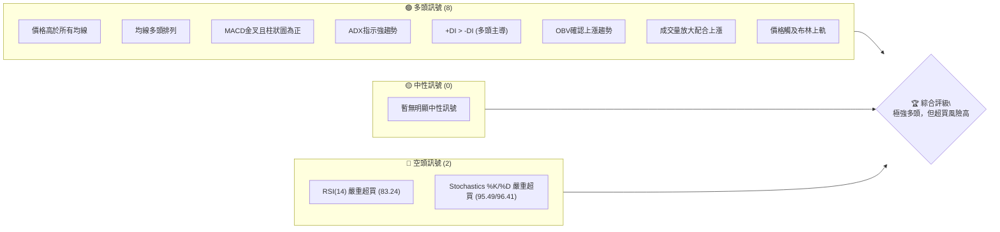
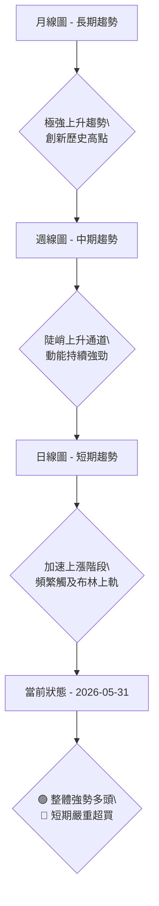
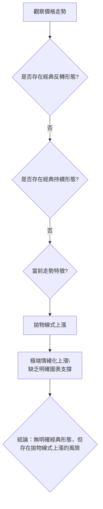
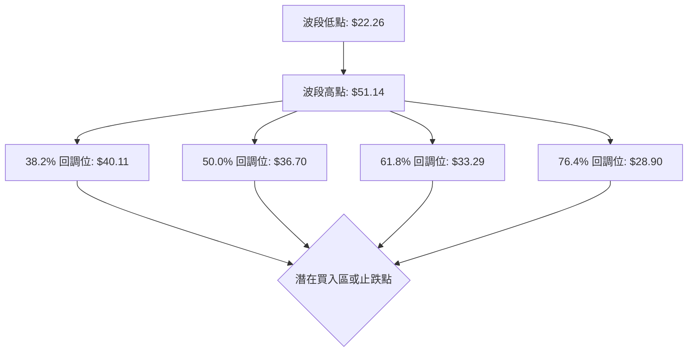
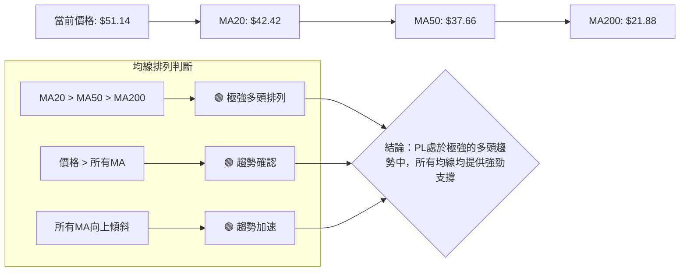
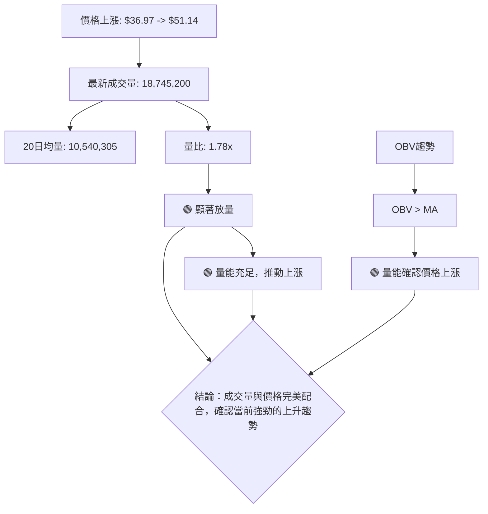

<details>
<summary>📊 靜態圖表 (點擊展開)</summary>

</details>

<html>
<head><meta charset="utf-8" /></head>
<body>
    <div>                        <script>window.PlotlyConfig = {MathJaxConfig: 'local'};</script>
        <script charset="utf-8" src="https://cdn.plot.ly/plotly-3.5.0.min.js" integrity="sha256-fHbNLP+GlIXN+efbQec78UkemUz3NJp7UmfGxC1tNxs=" crossorigin="anonymous"></script>                <div id="candlestick-chart" class="plotly-graph-div" style="height:500px; width:100%;"></div>            <script>                window.PLOTLYENV=window.PLOTLYENV || {};                                if (document.getElementById("candlestick-chart")) {                    Plotly.newPlot(                        "candlestick-chart",                        [{"close":{"dtype":"f8","bdata":"AAAAgML1GkAAAAAgrkcbQAAAAGC4HhtAAAAAAClcG0AAAADAHoUZQAAAAOBRuBlAAAAAIIXrGUAAAABAMzMbQAAAAKBwPRxAAAAAIIXrG0AAAACA61EcQAAAAEAK1xxAAAAAAClcHEAAAACgmZkaQAAAAGCPwhlAAAAAQArXGUAAAABguB4aQAAAAIDrUSNAAAAAgD0KIkAAAADgo\u002fAhQAAAAEAKVyNAAAAAIFyPI0AAAADgUbgjQAAAAAAAgCNAAAAAgMJ1JEAAAADgUTglQAAAAOBROCZAAAAA4FE4JkAAAACgmRkoQAAAAAAp3CdAAAAAIIXrJ0AAAABgZmYoQAAAAOB6lClAAAAAgML1KUAAAACAPYorQAAAAEAzsy1AAAAAYLieLkAAAABA4XouQAAAAAApXC9AAAAAQDMzL0AAAACA61EvQAAAAGBmZi1AAAAAAACALkAAAAAgXI8tQAAAAIAULi5AAAAAgMJ1KkAAAADgUTgqQAAAAGC4HitAAAAAgOvRKUAAAAAAAAApQAAAAGBm5ilAAAAA4FE4K0AAAABguJ4qQAAAAIAUrilAAAAAwMzMKUAAAADgUbgpQAAAAGBm5ipAAAAAoEdhKkAAAABgZmYpQAAAAAAAgCpAAAAAIIXrKEAAAABguJ4pQAAAACCuxypAAAAA4KPwKEAAAACgR+EoQAAAAIDr0SZAAAAAwMzMJkAAAAAghWsmQAAAAGBm5iZAAAAA4HqUJ0AAAACAwnUmQAAAAIDrUSZAAAAA4HoUJ0AAAACAwnUnQAAAAOCjcCdAAAAAwMzMJ0AAAABgZmYnQAAAAIA9iidAAAAAwB4FKEAAAACgR+EpQAAAAIA9iilAAAAAYGbmKUAAAACAFK4pQAAAAKBH4SlAAAAA4FF4MUAAAACgcD0yQAAAAMDMDDJAAAAAoEfhMUAAAADgUXgwQAAAAKBwfTFAAAAAgBQuM0AAAACgmZk0QAAAAEDhujRAAAAAgOtRNEAAAAAAKVwzQAAAAGC43jNAAAAAoHC9M0AAAADgUbgzQAAAAMD1aDRAAAAAANdjNUAAAABACtc1QAAAAAApnDZAAAAA4KNwNkAAAACAwrU2QAAAAOCjcDlAAAAAgOtROUAAAABA4bo6QAAAACCuRzxAAAAAIK7HPEAAAAAAAAA8QAAAAKBHYTpAAAAAIFwPOkAAAADgo\u002fA6QAAAAGC43jlAAAAAgOsRPEAAAACgR+E7QAAAAKCZWTpAAAAA4FH4OEAAAACgmdk2QAAAAEAz8zdAAAAAwB7FNUAAAACAFG40QAAAAGCPQjZAAAAAwB4FOEAAAACAPco2QAAAAGBmpjVAAAAAwMxMNUAAAAAghWs2QAAAAIDCNTZAAAAAoHC9N0AAAAAAKRw5QAAAAGBm5jdAAAAAIK7HN0AAAACAwrU4QAAAAKBHoThAAAAAoJmZOUAAAAAA1yM4QAAAAAApXDpAAAAAwMxMOUAAAAAAAAA6QAAAAEAKlzhAAAAAIK5HOUAAAACA69E5QAAAAGBmZjlAAAAA4KNwOUAAAADgUfg4QAAAAIA9yjhAAAAAoJmZOEAAAADgehQ7QAAAACBczzhAAAAAgML1OkAAAACAPepAQAAAAMD16EBAAAAA4HrUP0AAAAAgXK9BQAAAAEAzM0BAAAAAACncPkAAAAAA1+M7QAAAAEAz8ztAAAAAgMK1PkAAAADgo\u002fBBQAAAAGCPgkFAAAAAgMKVQUAAAABgZkZCQAAAAKBwHUFAAAAAgMJVQUAAAADA9ShBQAAAAEAK90BAAAAA4Ho0QUAAAACA6\u002fFDQAAAAKBwPUNAAAAAAADAQkAAAAAA1wNDQAAAAAApvENAAAAAwB4lQ0AAAADgUbhBQAAAAKCZuUFAAAAAANeDQUAAAACAPQpBQAAAAAApfEJAAAAAQDNzQkAAAADAHkVDQAAAAOCjkEJAAAAA4FHYQ0AAAABguJ5BQAAAAMAehUNAAAAAIIXrREAAAABACldEQAAAAGC4XkRAAAAAwB6FRUAAAAAgXM9EQAAAAIAUzkRAAAAAIIXLREAAAADgelRFQAAAAKBwPUVAAAAAwMwsRkAAAADA9ShIQAAAAKBwPUlAAAAAQDOzSUAAAACA65FJQA=="},"high":{"dtype":"f8","bdata":"AAAAwB6FG0AAAAAghesbQAAAACCFaxtAAAAAYLgeHEAAAABAMzMbQAAAAGCPwhlAAAAAIIXrGUAAAAAAKVwbQAAAAEAK1xxAAAAAgML1HEAAAACAPYocQAAAAMAehR1AAAAAYOOlHEAAAADA9SgbQAAAAIA9ChtAAAAAQDMzGkAAAACgmZkaQAAAAAB\u002faiNAAAAAACkcI0AAAABAM7MiQAAAAMD1KCRAAAAA4HqUI0AAAADgUTgkQAAAAEC28yNAAAAAwMzMJEAAAAAghWslQAAAAIDr0SZAAAAAwMxMJkAAAABgj0IoQAAAAIDCdShAAAAAIFyPKEAAAADA9agoQAAAAAAAACpAAAAAYLgeKkAAAACAPQosQAAAAMDINi5AAAAAAAAAL0AAAAAgrscvQAAAAGCPAjBAAAAAIK7HMEAAAACgmZkvQAAAAMDMDDBAAAAAYGbmL0AAAAAAAIAuQAAAAOB6VC9AAAAAQDUeL0AAAADA9SgrQAAAAIDr0SxAAAAAQAisKkAAAACgmRkqQAAAAAApnCpAAAAAgBRuK0AAAAAghesrQAAAAOCj8CpAAAAAIIWrKkAAAABgZmYqQAAAAIDCdStAAAAAYI\u002fCKkAAAACAPQorQAAAAOCjsCpAAAAAgD0KKkAAAABgZqYpQAAAAKCZmStAAAAAoHC9KkAAAADAzMwpQAAAAIDr0ShAAAAAQDOzJ0AAAADgUTgnQAAAAMAexSdAAAAAgML1KEAAAAAAAAApQAAAAAAAACdAAAAAIFxPJ0AAAACg7bwnQAAAAIA9CihAAAAAwB4FKEAAAAAA16MnQAAAAMAehShAAAAAoEdhKEAAAABgZmYqQAAAAAAAwClAAAAAgMJ1KkAAAAAAAAAqQAAAAEDheipAAAAAoJn5MUAAAACgmRkzQAAAAOCjsDNAAAAAIK5HMkAAAADAzIwyQAAAAEAz8zFAAAAA4HrUM0AAAABgj8I0QAAAAKBw\u002fTRAAAAAgBTuNEAAAACAwlU0QAAAAMAeJTRAAAAAACk8NEAAAADAzEw0QAAAACBczzRAAAAAIFxvNUAAAABAMxM2QAAAAAAp3DZAAAAAoJmZN0AAAACA6cY3QAAAACBcjzlAAAAAQAqXOkAAAADAHsU6QAAAAKBHYT1AAAAAYOPlPkAAAADgUbg9QAAAACCFqzxAAAAAgMDqOkAAAABA4bo7QAAAAEAzszpAAAAAQDOzPEAAAABgZmY8QAAAAEAzsztAAAAAAABAO0AAAADAocU5QAAAAACs\u002fDdAAAAAAAAAOEAAAACAwIo1QAAAACCuRzZAAAAA4FEYOEAAAABA4fo3QAAAAGBmhjdAAAAAwPXoNUAAAACAFO42QAAAAIA9yjZAAAAAoJmZOEAAAAAAKRw5QAAAAOCjsDlAAAAA4Hq0OEAAAAAgXM84QAAAAEBi0DlAAAAA4KOwOUAAAABACtc4QAAAAIAU7jpAAAAA4KNwOkAAAACgR4E6QAAAAKBwPTpAAAAAAKqRO0AAAABAChc6QAAAAOBReDpAAAAAIIXrOkAAAAAgXA86QAAAAIDpBjpAAAAAAACAOUAAAABAChc7QAAAAOB6FDtAAAAAYI9CO0AAAAAA1yNCQAAAACCFa0FAAAAAIIULQkAAAABgZoZCQAAAAADV2EFAAAAAYLgeQUAAAADA9Wg\u002fQAAAAIAU7jxAAAAAgBQuP0AAAADAHgVCQAAAAMAeJUJAAAAAYGbmQUAAAABA4RpDQAAAAIDClUJAAAAAgOsxQkAAAACAFL5BQAAAACBYOUJAAAAAgMKVQUAAAACgcB1EQAAAAKBwHURAAAAA4Hr0Q0AAAAAA18NDQAAAAEDh2kRAAAAAAAAAREAAAAAAAMBDQAAAAKBwHUJAAAAAQAqnQUAAAAAAAIBBQAAAAAApfEJAAAAA4HqkQkAAAABgj6JDQAAAAEAKt0NAAAAAoEfhQ0AAAACAwnVEQAAAAMDM7ENAAAAAIFyPRUAAAADgo\u002fBEQAAAAKCZGUVAAAAAoJm5RUAAAABACpdFQAAAAADX40ZAAAAAAADgREAAAABgZsZFQAAAAAAAAEZAAAAAQAyiRkAAAADgo5BJQAAAAKBwfUlAAAAAoEfhSUAAAABgj6JJQA=="},"hovertemplate":"\u003cb\u003e%{x|%Y-%m-%d}\u003c\u002fb\u003e\u003cbr\u003e\u958b: $%{open:.2f}\u003cbr\u003e\u9ad8: $%{high:.2f}\u003cbr\u003e\u4f4e: $%{low:.2f}\u003cbr\u003e\u6536: $%{close:.2f}\u003cextra\u003e\u003c\u002fextra\u003e","low":{"dtype":"f8","bdata":"AAAAAAAAGkAAAAAAAAAaQAAAAOB6FBpAAAAAIFyPGkAAAADg+X4ZQAAAAGBmZhhAAAAAQDVeGUAAAABA4XoZQAAAACCF6xpAAAAAINnOG0AAAABgZmYbQAAAAEAK1xtAAAAAQAgsG0AAAAAA16MZQAAAAOBRuBlAAAAAwPUoGUAAAADAHgUZQAAAAMD1KB1AAAAAwB4FIUAAAADgozAhQAAAAGCPQiJAAAAAIK7HIkAAAADgUfgiQAAAAIDrUSNAAAAAAClcI0AAAADgo3AkQAAAAEDhOiVAAAAA4KNwJUAAAAAA1yMmQAAAAEAKVydAAAAAQArXJkAAAADAHoUnQAAAAOBRuChAAAAAoHA9KEAAAABAMzMpQAAAAMD1KCxAAAAAwB6FLUAAAACgR2EuQAAAACBcjy1AAAAAwB6FLkAAAADA9SguQAAAAAApHC1AAAAAgOtRLkAAAABAChctQAAAAEAzsy1AAAAAoHA9KkAAAAAg3SQpQAAAAAAAACtAAAAAYLieKUAAAADgo\u002fAnQAAAAIAULilAAAAAIK5HKkAAAACAPYoqQAAAACBcjylAAAAAIK6HKUAAAABA3w8pQAAAACCuxylAAAAAgMJ1KUAAAAAghesoQAAAACBcDylAAAAAANcjKEAAAAAAKdwnQAAAAGAQ2ClAAAAAIFyPKEAAAADA9agoQAAAAEAKFyZAAAAAwMh2JUAAAABgj8IlQAAAAIAU7iVAAAAAwMzMJkAAAACAly4mQAAAAIA9CiVAAAAAwB6FJkAAAADAHoUmQAAAAGCPQidAAAAAgJduJ0AAAADAzMwmQAAAAOB6VCdAAAAAQOF6J0AAAAAAKdwnQAAAAMAeBSlAAAAAoHA9KUAAAABANR4pQAAAAMD1KClAAAAAwB4FLkAAAABguF4xQAAAAADXozFAAAAAgBTuMEAAAACAFG4wQAAAAIA9CjFAAAAAoHD9MUAAAAAAKZwzQAAAAKCZmTNAAAAAACkcNEAAAACAPQozQAAAAGCPwjJAAAAA4KNwM0AAAABAiaEzQAAAAADV+DJAAAAAoHB9M0AAAADgUfg0QAAAAMD1aDVAAAAAQAoXNkAAAADAINA1QAAAAMD1KDdAAAAAYLgeOUAAAAAAAAA5QAAAAGCPQjpAAAAAAClcPEAAAAAgXG87QAAAAKBHITlAAAAAANcjOUAAAACAFC45QAAAAOBRODlAAAAAoBoPOkAAAAAgXM86QAAAAMDMjDlAAAAAgOtxOEAAAABACnc2QAAAAMD16DZAAAAAQAqXNEAAAABgZiY0QAAAACBczzRAAAAAYGamNUAAAACAwrU2QAAAAMD16DRAAAAAQOH6M0AAAAAgBiE1QAAAAAAAgDVAAAAAoHA9NkAAAACAwnU2QAAAAGCPgjdAAAAAQOE6N0AAAACgmVk2QAAAAKBwfThAAAAAgOsROEAAAAAgrsc2QAAAAOBRuDdAAAAAoEdhOEAAAACAaBE5QAAAAGCPgjdAAAAAoJnZN0AAAABAM3M4QAAAAEAzMzlAAAAA4KPwOEAAAAAgrkc4QAAAACBcTzhAAAAA4HipN0AAAABgZmY4QAAAAGCPwjhAAAAA4KPwN0AAAACAaCFAQAAAAEDhOj9AAAAAACkcP0AAAACgRyE\u002fQAAAACBcD0BAAAAAgD2KPkAAAABguD47QAAAAMD1SDpAAAAAwB6FPEAAAADgo3A9QAAAAEDhGkFAAAAAYI9iQEAAAADgUbhBQAAAAOBR+EBAAAAAoJn5QEAAAAAAKVxAQAAAAKBH4T9AAAAAIK5nQEAAAABgZnZBQAAAACCF60JAAAAAQAp3QkAAAABgj8JCQAAAAADXI0NAAAAAgD0qQkAAAADgo5BBQAAAAOCj0EBAAAAAwPPdQEAAAADA9UhAQAAAAMBLJ0FAAAAA4KVrQUAAAADA9ehBQAAAAKCZ+UFAAAAAoEfBQUAAAABACndBQAAAAGBm5kFAAAAAwMwMQ0AAAACgRyFDQAAAAMDMbENAAAAAwMzMQ0AAAADAHkVEQAAAAKBHIURAAAAAYI8CQ0AAAACAwlVEQAAAAMAehURAAAAAwMyMRUAAAACAFO5GQAAAAIAUjkdAAAAAAACAR0AAAAAA12NGQA=="},"name":"\u50f9\u683c","open":{"dtype":"f8","bdata":"AAAAQDMzG0AAAABgZmYaQAAAAAApXBtAAAAAQDMzG0AAAADgehQbQAAAAAApXBlAAAAAYGZmGUAAAACAwvUZQAAAAGC4HhtAAAAAYLgeHEAAAAAghesbQAAAAEDhehxAAAAAIFyPHEAAAACAPQobQAAAAIA9ChtAAAAAQDMzGkAAAADgo3AaQAAAAIDr0R5AAAAAIK5HIUAAAABgZmYiQAAAAKBHYSJAAAAAoHA9I0AAAADgo\u002fAjQAAAAOBRuCNAAAAAAACAI0AAAACAwvUkQAAAAIDrUSVAAAAA4FG4JUAAAABA4XomQAAAACCuRyhAAAAAAAAAJ0AAAADgUbgnQAAAACCuxyhAAAAAYGZmKUAAAACAFK4pQAAAAOBRuCxAAAAAYGbmLUAAAACgmZkvQAAAAAAAAC5AAAAAwMyMMEAAAACAFC4vQAAAAOBRuC9AAAAAIIVrLkAAAAAAAAAuQAAAAGBm5i5AAAAA4KPwLkAAAAAAAAAqQAAAAIA9CixAAAAAAClcKkAAAAAAAIApQAAAAGCPQilAAAAAoJmZKkAAAABgZuYrQAAAAMDMzCpAAAAAIIXrKUAAAABA4XopQAAAACCuxylAAAAAwPWoKkAAAACAwnUpQAAAAIAUrilAAAAAwB4FKkAAAADgUTgoQAAAAIDCdSpAAAAAYGZmKkAAAABgj0IpQAAAAIA9iihAAAAAAAAAJkAAAAAAKVwmQAAAAOB6FCZAAAAAIIXrJkAAAABgZmYoQAAAAEDheiZAAAAAQDOzJkAAAADAHgUnQAAAAIA9iidAAAAAgOvRJ0AAAABAMzMnQAAAAGCPwidAAAAAwPWoJ0AAAABgZuYnQAAAAMAehSlAAAAAAClcKkAAAACgcD0pQAAAAKCZmSlAAAAA4HqUL0AAAADgo3AyQAAAACBczzJAAAAAYGamMUAAAACAFC4yQAAAAIA9CjFAAAAAoHD9MUAAAAAgrsczQAAAAMDMzDNAAAAAQOG6NEAAAADAzEw0QAAAAKBw3TJAAAAAIK4HNEAAAABguL4zQAAAAEDh2jNAAAAAQDOzNEAAAAAAAIA1QAAAAOBRuDVAAAAAoJnZNkAAAACgmZk2QAAAAMDMTDdAAAAAYI9COkAAAAAAAIA5QAAAACBczzpAAAAAQDNzPEAAAABACpc7QAAAAAAAgDxAAAAAAADAOkAAAABgjwI6QAAAAKCZmTpAAAAA4HoUOkAAAADAzAw8QAAAAEAzsztAAAAAQAq3OUAAAAAA1+M4QAAAAEDh+jdAAAAAAAAAOEAAAAAAAAA1QAAAAIA9CjVAAAAAgML1NUAAAABguN43QAAAAGBmhjdAAAAAgOuRNUAAAAAAAIA1QAAAAAAAADZAAAAAYGZmNkAAAADAHgU3QAAAAKBwvThAAAAAYGZmN0AAAAAAAEA3QAAAAMDMTDlAAAAAAACAOEAAAABAM5M4QAAAAOBRuDdAAAAAQOEaOkAAAACgmZk5QAAAAAAAgDlAAAAAANfjN0AAAABACtc4QAAAAIDr0TlAAAAAQApXOUAAAADgUfg5QAAAAEDh+jhAAAAAoEchOUAAAACgmdk4QAAAAAAAgDpAAAAAAABAOEAAAABgZsZAQAAAAAAAQEFAAAAAQOHaQEAAAABAMzNAQAAAAAApfEFAAAAAoHD9QEAAAACgmdk+QAAAAMDMzDxAAAAAAAAAPUAAAADgo3A9QAAAAIDC9UFAAAAA4KOwQUAAAABAM3NCQAAAAAAAQEJAAAAA4KNwQUAAAACgcB1BQAAAACCFy0FAAAAAgMI1QUAAAACgcH1BQAAAAIDrkUNAAAAAQDOTQ0AAAAAAKRxDQAAAAAAAwENAAAAAgD2qQ0AAAACAFI5DQAAAAAApvEFAAAAAwMxMQUAAAADgozBBQAAAAADXQ0FAAAAAIFxfQkAAAADAHoVCQAAAAKCZmUNAAAAAIFx\u002fQkAAAABgj8JDQAAAAEAzM0JAAAAAQDNTQ0AAAAAghQtEQAAAAEAKF0VAAAAA4KNQREAAAADA9QhFQAAAAADXo0VAAAAAQAp3REAAAABAMzNFQAAAAMByCEVAAAAAwMysRUAAAADA9dhHQAAAAMDMDElAAAAAQDMTSUAAAAAAAJBIQA=="},"x":["2025-08-13T00:00:00-04:00","2025-08-14T00:00:00-04:00","2025-08-15T00:00:00-04:00","2025-08-18T00:00:00-04:00","2025-08-19T00:00:00-04:00","2025-08-20T00:00:00-04:00","2025-08-21T00:00:00-04:00","2025-08-22T00:00:00-04:00","2025-08-25T00:00:00-04:00","2025-08-26T00:00:00-04:00","2025-08-27T00:00:00-04:00","2025-08-28T00:00:00-04:00","2025-08-29T00:00:00-04:00","2025-09-02T00:00:00-04:00","2025-09-03T00:00:00-04:00","2025-09-04T00:00:00-04:00","2025-09-05T00:00:00-04:00","2025-09-08T00:00:00-04:00","2025-09-09T00:00:00-04:00","2025-09-10T00:00:00-04:00","2025-09-11T00:00:00-04:00","2025-09-12T00:00:00-04:00","2025-09-15T00:00:00-04:00","2025-09-16T00:00:00-04:00","2025-09-17T00:00:00-04:00","2025-09-18T00:00:00-04:00","2025-09-19T00:00:00-04:00","2025-09-22T00:00:00-04:00","2025-09-23T00:00:00-04:00","2025-09-24T00:00:00-04:00","2025-09-25T00:00:00-04:00","2025-09-26T00:00:00-04:00","2025-09-29T00:00:00-04:00","2025-09-30T00:00:00-04:00","2025-10-01T00:00:00-04:00","2025-10-02T00:00:00-04:00","2025-10-03T00:00:00-04:00","2025-10-06T00:00:00-04:00","2025-10-07T00:00:00-04:00","2025-10-08T00:00:00-04:00","2025-10-09T00:00:00-04:00","2025-10-10T00:00:00-04:00","2025-10-13T00:00:00-04:00","2025-10-14T00:00:00-04:00","2025-10-15T00:00:00-04:00","2025-10-16T00:00:00-04:00","2025-10-17T00:00:00-04:00","2025-10-20T00:00:00-04:00","2025-10-21T00:00:00-04:00","2025-10-22T00:00:00-04:00","2025-10-23T00:00:00-04:00","2025-10-24T00:00:00-04:00","2025-10-27T00:00:00-04:00","2025-10-28T00:00:00-04:00","2025-10-29T00:00:00-04:00","2025-10-30T00:00:00-04:00","2025-10-31T00:00:00-04:00","2025-11-03T00:00:00-05:00","2025-11-04T00:00:00-05:00","2025-11-05T00:00:00-05:00","2025-11-06T00:00:00-05:00","2025-11-07T00:00:00-05:00","2025-11-10T00:00:00-05:00","2025-11-11T00:00:00-05:00","2025-11-12T00:00:00-05:00","2025-11-13T00:00:00-05:00","2025-11-14T00:00:00-05:00","2025-11-17T00:00:00-05:00","2025-11-18T00:00:00-05:00","2025-11-19T00:00:00-05:00","2025-11-20T00:00:00-05:00","2025-11-21T00:00:00-05:00","2025-11-24T00:00:00-05:00","2025-11-25T00:00:00-05:00","2025-11-26T00:00:00-05:00","2025-11-28T00:00:00-05:00","2025-12-01T00:00:00-05:00","2025-12-02T00:00:00-05:00","2025-12-03T00:00:00-05:00","2025-12-04T00:00:00-05:00","2025-12-05T00:00:00-05:00","2025-12-08T00:00:00-05:00","2025-12-09T00:00:00-05:00","2025-12-10T00:00:00-05:00","2025-12-11T00:00:00-05:00","2025-12-12T00:00:00-05:00","2025-12-15T00:00:00-05:00","2025-12-16T00:00:00-05:00","2025-12-17T00:00:00-05:00","2025-12-18T00:00:00-05:00","2025-12-19T00:00:00-05:00","2025-12-22T00:00:00-05:00","2025-12-23T00:00:00-05:00","2025-12-24T00:00:00-05:00","2025-12-26T00:00:00-05:00","2025-12-29T00:00:00-05:00","2025-12-30T00:00:00-05:00","2025-12-31T00:00:00-05:00","2026-01-02T00:00:00-05:00","2026-01-05T00:00:00-05:00","2026-01-06T00:00:00-05:00","2026-01-07T00:00:00-05:00","2026-01-08T00:00:00-05:00","2026-01-09T00:00:00-05:00","2026-01-12T00:00:00-05:00","2026-01-13T00:00:00-05:00","2026-01-14T00:00:00-05:00","2026-01-15T00:00:00-05:00","2026-01-16T00:00:00-05:00","2026-01-20T00:00:00-05:00","2026-01-21T00:00:00-05:00","2026-01-22T00:00:00-05:00","2026-01-23T00:00:00-05:00","2026-01-26T00:00:00-05:00","2026-01-27T00:00:00-05:00","2026-01-28T00:00:00-05:00","2026-01-29T00:00:00-05:00","2026-01-30T00:00:00-05:00","2026-02-02T00:00:00-05:00","2026-02-03T00:00:00-05:00","2026-02-04T00:00:00-05:00","2026-02-05T00:00:00-05:00","2026-02-06T00:00:00-05:00","2026-02-09T00:00:00-05:00","2026-02-10T00:00:00-05:00","2026-02-11T00:00:00-05:00","2026-02-12T00:00:00-05:00","2026-02-13T00:00:00-05:00","2026-02-17T00:00:00-05:00","2026-02-18T00:00:00-05:00","2026-02-19T00:00:00-05:00","2026-02-20T00:00:00-05:00","2026-02-23T00:00:00-05:00","2026-02-24T00:00:00-05:00","2026-02-25T00:00:00-05:00","2026-02-26T00:00:00-05:00","2026-02-27T00:00:00-05:00","2026-03-02T00:00:00-05:00","2026-03-03T00:00:00-05:00","2026-03-04T00:00:00-05:00","2026-03-05T00:00:00-05:00","2026-03-06T00:00:00-05:00","2026-03-09T00:00:00-04:00","2026-03-10T00:00:00-04:00","2026-03-11T00:00:00-04:00","2026-03-12T00:00:00-04:00","2026-03-13T00:00:00-04:00","2026-03-16T00:00:00-04:00","2026-03-17T00:00:00-04:00","2026-03-18T00:00:00-04:00","2026-03-19T00:00:00-04:00","2026-03-20T00:00:00-04:00","2026-03-23T00:00:00-04:00","2026-03-24T00:00:00-04:00","2026-03-25T00:00:00-04:00","2026-03-26T00:00:00-04:00","2026-03-27T00:00:00-04:00","2026-03-30T00:00:00-04:00","2026-03-31T00:00:00-04:00","2026-04-01T00:00:00-04:00","2026-04-02T00:00:00-04:00","2026-04-06T00:00:00-04:00","2026-04-07T00:00:00-04:00","2026-04-08T00:00:00-04:00","2026-04-09T00:00:00-04:00","2026-04-10T00:00:00-04:00","2026-04-13T00:00:00-04:00","2026-04-14T00:00:00-04:00","2026-04-15T00:00:00-04:00","2026-04-16T00:00:00-04:00","2026-04-17T00:00:00-04:00","2026-04-20T00:00:00-04:00","2026-04-21T00:00:00-04:00","2026-04-22T00:00:00-04:00","2026-04-23T00:00:00-04:00","2026-04-24T00:00:00-04:00","2026-04-27T00:00:00-04:00","2026-04-28T00:00:00-04:00","2026-04-29T00:00:00-04:00","2026-04-30T00:00:00-04:00","2026-05-01T00:00:00-04:00","2026-05-04T00:00:00-04:00","2026-05-05T00:00:00-04:00","2026-05-06T00:00:00-04:00","2026-05-07T00:00:00-04:00","2026-05-08T00:00:00-04:00","2026-05-11T00:00:00-04:00","2026-05-12T00:00:00-04:00","2026-05-13T00:00:00-04:00","2026-05-14T00:00:00-04:00","2026-05-15T00:00:00-04:00","2026-05-18T00:00:00-04:00","2026-05-19T00:00:00-04:00","2026-05-20T00:00:00-04:00","2026-05-21T00:00:00-04:00","2026-05-22T00:00:00-04:00","2026-05-26T00:00:00-04:00","2026-05-27T00:00:00-04:00","2026-05-28T00:00:00-04:00","2026-05-29T00:00:00-04:00"],"type":"candlestick"},{"hovertemplate":"MA30: $%{y:.2f}\u003cextra\u003e\u003c\u002fextra\u003e","line":{"color":"#2196F3","dash":"dash","width":2},"mode":"lines","name":"MA30","x":["2025-08-13T00:00:00-04:00","2025-08-14T00:00:00-04:00","2025-08-15T00:00:00-04:00","2025-08-18T00:00:00-04:00","2025-08-19T00:00:00-04:00","2025-08-20T00:00:00-04:00","2025-08-21T00:00:00-04:00","2025-08-22T00:00:00-04:00","2025-08-25T00:00:00-04:00","2025-08-26T00:00:00-04:00","2025-08-27T00:00:00-04:00","2025-08-28T00:00:00-04:00","2025-08-29T00:00:00-04:00","2025-09-02T00:00:00-04:00","2025-09-03T00:00:00-04:00","2025-09-04T00:00:00-04:00","2025-09-05T00:00:00-04:00","2025-09-08T00:00:00-04:00","2025-09-09T00:00:00-04:00","2025-09-10T00:00:00-04:00","2025-09-11T00:00:00-04:00","2025-09-12T00:00:00-04:00","2025-09-15T00:00:00-04:00","2025-09-16T00:00:00-04:00","2025-09-17T00:00:00-04:00","2025-09-18T00:00:00-04:00","2025-09-19T00:00:00-04:00","2025-09-22T00:00:00-04:00","2025-09-23T00:00:00-04:00","2025-09-24T00:00:00-04:00","2025-09-25T00:00:00-04:00","2025-09-26T00:00:00-04:00","2025-09-29T00:00:00-04:00","2025-09-30T00:00:00-04:00","2025-10-01T00:00:00-04:00","2025-10-02T00:00:00-04:00","2025-10-03T00:00:00-04:00","2025-10-06T00:00:00-04:00","2025-10-07T00:00:00-04:00","2025-10-08T00:00:00-04:00","2025-10-09T00:00:00-04:00","2025-10-10T00:00:00-04:00","2025-10-13T00:00:00-04:00","2025-10-14T00:00:00-04:00","2025-10-15T00:00:00-04:00","2025-10-16T00:00:00-04:00","2025-10-17T00:00:00-04:00","2025-10-20T00:00:00-04:00","2025-10-21T00:00:00-04:00","2025-10-22T00:00:00-04:00","2025-10-23T00:00:00-04:00","2025-10-24T00:00:00-04:00","2025-10-27T00:00:00-04:00","2025-10-28T00:00:00-04:00","2025-10-29T00:00:00-04:00","2025-10-30T00:00:00-04:00","2025-10-31T00:00:00-04:00","2025-11-03T00:00:00-05:00","2025-11-04T00:00:00-05:00","2025-11-05T00:00:00-05:00","2025-11-06T00:00:00-05:00","2025-11-07T00:00:00-05:00","2025-11-10T00:00:00-05:00","2025-11-11T00:00:00-05:00","2025-11-12T00:00:00-05:00","2025-11-13T00:00:00-05:00","2025-11-14T00:00:00-05:00","2025-11-17T00:00:00-05:00","2025-11-18T00:00:00-05:00","2025-11-19T00:00:00-05:00","2025-11-20T00:00:00-05:00","2025-11-21T00:00:00-05:00","2025-11-24T00:00:00-05:00","2025-11-25T00:00:00-05:00","2025-11-26T00:00:00-05:00","2025-11-28T00:00:00-05:00","2025-12-01T00:00:00-05:00","2025-12-02T00:00:00-05:00","2025-12-03T00:00:00-05:00","2025-12-04T00:00:00-05:00","2025-12-05T00:00:00-05:00","2025-12-08T00:00:00-05:00","2025-12-09T00:00:00-05:00","2025-12-10T00:00:00-05:00","2025-12-11T00:00:00-05:00","2025-12-12T00:00:00-05:00","2025-12-15T00:00:00-05:00","2025-12-16T00:00:00-05:00","2025-12-17T00:00:00-05:00","2025-12-18T00:00:00-05:00","2025-12-19T00:00:00-05:00","2025-12-22T00:00:00-05:00","2025-12-23T00:00:00-05:00","2025-12-24T00:00:00-05:00","2025-12-26T00:00:00-05:00","2025-12-29T00:00:00-05:00","2025-12-30T00:00:00-05:00","2025-12-31T00:00:00-05:00","2026-01-02T00:00:00-05:00","2026-01-05T00:00:00-05:00","2026-01-06T00:00:00-05:00","2026-01-07T00:00:00-05:00","2026-01-08T00:00:00-05:00","2026-01-09T00:00:00-05:00","2026-01-12T00:00:00-05:00","2026-01-13T00:00:00-05:00","2026-01-14T00:00:00-05:00","2026-01-15T00:00:00-05:00","2026-01-16T00:00:00-05:00","2026-01-20T00:00:00-05:00","2026-01-21T00:00:00-05:00","2026-01-22T00:00:00-05:00","2026-01-23T00:00:00-05:00","2026-01-26T00:00:00-05:00","2026-01-27T00:00:00-05:00","2026-01-28T00:00:00-05:00","2026-01-29T00:00:00-05:00","2026-01-30T00:00:00-05:00","2026-02-02T00:00:00-05:00","2026-02-03T00:00:00-05:00","2026-02-04T00:00:00-05:00","2026-02-05T00:00:00-05:00","2026-02-06T00:00:00-05:00","2026-02-09T00:00:00-05:00","2026-02-10T00:00:00-05:00","2026-02-11T00:00:00-05:00","2026-02-12T00:00:00-05:00","2026-02-13T00:00:00-05:00","2026-02-17T00:00:00-05:00","2026-02-18T00:00:00-05:00","2026-02-19T00:00:00-05:00","2026-02-20T00:00:00-05:00","2026-02-23T00:00:00-05:00","2026-02-24T00:00:00-05:00","2026-02-25T00:00:00-05:00","2026-02-26T00:00:00-05:00","2026-02-27T00:00:00-05:00","2026-03-02T00:00:00-05:00","2026-03-03T00:00:00-05:00","2026-03-04T00:00:00-05:00","2026-03-05T00:00:00-05:00","2026-03-06T00:00:00-05:00","2026-03-09T00:00:00-04:00","2026-03-10T00:00:00-04:00","2026-03-11T00:00:00-04:00","2026-03-12T00:00:00-04:00","2026-03-13T00:00:00-04:00","2026-03-16T00:00:00-04:00","2026-03-17T00:00:00-04:00","2026-03-18T00:00:00-04:00","2026-03-19T00:00:00-04:00","2026-03-20T00:00:00-04:00","2026-03-23T00:00:00-04:00","2026-03-24T00:00:00-04:00","2026-03-25T00:00:00-04:00","2026-03-26T00:00:00-04:00","2026-03-27T00:00:00-04:00","2026-03-30T00:00:00-04:00","2026-03-31T00:00:00-04:00","2026-04-01T00:00:00-04:00","2026-04-02T00:00:00-04:00","2026-04-06T00:00:00-04:00","2026-04-07T00:00:00-04:00","2026-04-08T00:00:00-04:00","2026-04-09T00:00:00-04:00","2026-04-10T00:00:00-04:00","2026-04-13T00:00:00-04:00","2026-04-14T00:00:00-04:00","2026-04-15T00:00:00-04:00","2026-04-16T00:00:00-04:00","2026-04-17T00:00:00-04:00","2026-04-20T00:00:00-04:00","2026-04-21T00:00:00-04:00","2026-04-22T00:00:00-04:00","2026-04-23T00:00:00-04:00","2026-04-24T00:00:00-04:00","2026-04-27T00:00:00-04:00","2026-04-28T00:00:00-04:00","2026-04-29T00:00:00-04:00","2026-04-30T00:00:00-04:00","2026-05-01T00:00:00-04:00","2026-05-04T00:00:00-04:00","2026-05-05T00:00:00-04:00","2026-05-06T00:00:00-04:00","2026-05-07T00:00:00-04:00","2026-05-08T00:00:00-04:00","2026-05-11T00:00:00-04:00","2026-05-12T00:00:00-04:00","2026-05-13T00:00:00-04:00","2026-05-14T00:00:00-04:00","2026-05-15T00:00:00-04:00","2026-05-18T00:00:00-04:00","2026-05-19T00:00:00-04:00","2026-05-20T00:00:00-04:00","2026-05-21T00:00:00-04:00","2026-05-22T00:00:00-04:00","2026-05-26T00:00:00-04:00","2026-05-27T00:00:00-04:00","2026-05-28T00:00:00-04:00","2026-05-29T00:00:00-04:00"],"y":{"dtype":"f8","bdata":"AAAAAAAA+H8AAAAAAAD4fwAAAAAAAPh\u002fAAAAAAAA+H8AAAAAAAD4fwAAAAAAAPh\u002fAAAAAAAA+H8AAAAAAAD4fwAAAAAAAPh\u002fAAAAAAAA+H8AAAAAAAD4fwAAAAAAAPh\u002fAAAAAAAA+H8AAAAAAAD4fwAAAAAAAPh\u002fAAAAAAAA+H8AAAAAAAD4fwAAAAAAAPh\u002fAAAAAAAA+H8AAAAAAAD4fwAAAAAAAPh\u002fAAAAAAAA+H8AAAAAAAD4fwAAAAAAAPh\u002fAAAAAAAA+H8AAAAAAAD4fwAAAAAAAPh\u002fAAAAAAAA+H8AAAAAAAD4f6uqqnJokSBAIiIi+n7qIEDe3d2NUEYhQM3MzKTirCFA3t3dtawVIkBVVVUdzJMiQImIiKh\u002fIyNAzczMhDK6I0CJiIhwPUokQLy7u8ta3SRA7+7uJnhwJUBmZma+5gImQFVVVQ27giZAq6qqov4NJ0BVVVUlv5gnQKuqqpJfLChA7+7uJuqfKEC8u7ubNhApQImIiPjFUilAMzMzoymVKUARERFxaNEpQKuqqvpiCSpAERERgcBKKkCamZnJoYUqQERERDReuipAzczMnO\u002fnKkAzMzMDVg4rQBEREaFFNitAmpmZScVZK0De3d0t3WQrQImIiFhkeytAERER4eyDK0AzMzMDVo4rQERERHSTmCtAvLu7O9+PK0Dv7u5eLHkrQHd3d8d2PitAmpmZubv7KkAzMzNj9LYqQLy7uzvDbipAZmZmFr0tKkDv7u4eIuIpQAAAAKC3pSlAMzMzY2ZmKUC8u7u7WDIpQKuqqvrU+ChA7+7uHiLiKEDNzMy8EcooQLy7uxuFqyhAMzMz8yicKEBmZmZWq6MoQImIiOiYoChAMzMzU1WVKEDNzMzcT40oQERERMQEjyhAZmZmZgPdKECrqqr61DgpQO\u002fu7q5WhylAq6qqmmHXKUC8u7v7uBcqQDMzM9MVYCpARERE9MXSKkC8u7v7uFcrQN7d3e391CtAmpmZGfdaLEC8u7sLEdEsQKuqqlpzYS1A7+7uXsnvLUAAAAAgBoEuQGZmZvbwGS9AAAAAAMi9L0BmZmbmbTkwQO\u002fu7s4imzBAEREROSb4MEDe3d1l2FUxQCIiIjLsyjFAIiIionA9MkAzMzMrsr0yQImIiNCUSjNAiYiIcK\u002fZM0AzMzODMlo0QCIiIgJWzjRAVVVVPTU+NUAREREph7Y1QN7d3S3dJDZAvLu7O1F\u002fNkAiIiIilNE2QDMzM8NnGDdAq6qqGuhUN0De3d1tWYs3QERERIR5wjdAVVVVdZPYN0BmZmYWINc3QM3MzGwu5DdAMzMzM8EDOEBmZmYmBiE4QN7d3Z02MDhAzczMfIY9OECrqqq6kFQ4QDMzM+PsYzhAq6qqivp3OEB3d3f34ZM4QDMzMwPknjhAmpmZSVOqOECrqqpaZLs4QBEREeF6tDhAzczMjN62OEC8u7ubxKA4QN7d3U1ikDhAAAAAILByOEDv7u4On2E4QO\u002fu7r5YUjhAAAAA0LBLOEAiIiIiIkI4QGZmZmYfPjhAREREFK4nOEBmZmYW2Q44QHd3dzeJAThAERER8WD+N0BERESEeSI4QGZmZjbQKThAAAAA8BlWOEAAAACwcsg4QEREROQXKzlAiYiIGL1tOUBVVVWFFtk5QCIiIkLSNDpAZmZmZmaGOkC8u7vLE7U6QFVVVQUP5jpAd3d3N4khO0BERESkcH07QHd3d6dU3DtAvLu7e4Y9PEC8u7tbj6I8QBEREeF69DxAd3d3l+BBPUBEREQkv5g9QO\u002fu7g5Y2T1AiYiIKBUnPkAzMzNTnJ0+QN7d3X0jFD9AzczMfGp8P0AzMzOjm+Q\u002fQDMzMwNWLkBAvLu7oyllQEC8u7ur1ZFAQLy7uztRv0BAq6qqktHrQEARERFxrwlBQAAAAGiRPUFAIiIiivpnQUBVVVUdE3xBQM3MzIQyikFAvLu7u7urQUDe3d29LatBQERERGSCx0FAq6qqelv2QUAiIiKS7SxCQJqZmal\u002fY0JAAAAAUBuYQkC8u7vrmLBCQFVVVfW2zEJAAAAAUBvoQkAAAAAQLQJDQDMzM0NgJUNAd3d3Z61OQ0AzMzMjaYpDQGZmZiYG0UNAMzMzw4MZREAzMzPDg0lEQA=="},"type":"scatter"},{"hovertemplate":"MA60: $%{y:.2f}\u003cextra\u003e\u003c\u002fextra\u003e","line":{"color":"#9C27B0","dash":"dash","width":2},"mode":"lines","name":"MA60","x":["2025-08-13T00:00:00-04:00","2025-08-14T00:00:00-04:00","2025-08-15T00:00:00-04:00","2025-08-18T00:00:00-04:00","2025-08-19T00:00:00-04:00","2025-08-20T00:00:00-04:00","2025-08-21T00:00:00-04:00","2025-08-22T00:00:00-04:00","2025-08-25T00:00:00-04:00","2025-08-26T00:00:00-04:00","2025-08-27T00:00:00-04:00","2025-08-28T00:00:00-04:00","2025-08-29T00:00:00-04:00","2025-09-02T00:00:00-04:00","2025-09-03T00:00:00-04:00","2025-09-04T00:00:00-04:00","2025-09-05T00:00:00-04:00","2025-09-08T00:00:00-04:00","2025-09-09T00:00:00-04:00","2025-09-10T00:00:00-04:00","2025-09-11T00:00:00-04:00","2025-09-12T00:00:00-04:00","2025-09-15T00:00:00-04:00","2025-09-16T00:00:00-04:00","2025-09-17T00:00:00-04:00","2025-09-18T00:00:00-04:00","2025-09-19T00:00:00-04:00","2025-09-22T00:00:00-04:00","2025-09-23T00:00:00-04:00","2025-09-24T00:00:00-04:00","2025-09-25T00:00:00-04:00","2025-09-26T00:00:00-04:00","2025-09-29T00:00:00-04:00","2025-09-30T00:00:00-04:00","2025-10-01T00:00:00-04:00","2025-10-02T00:00:00-04:00","2025-10-03T00:00:00-04:00","2025-10-06T00:00:00-04:00","2025-10-07T00:00:00-04:00","2025-10-08T00:00:00-04:00","2025-10-09T00:00:00-04:00","2025-10-10T00:00:00-04:00","2025-10-13T00:00:00-04:00","2025-10-14T00:00:00-04:00","2025-10-15T00:00:00-04:00","2025-10-16T00:00:00-04:00","2025-10-17T00:00:00-04:00","2025-10-20T00:00:00-04:00","2025-10-21T00:00:00-04:00","2025-10-22T00:00:00-04:00","2025-10-23T00:00:00-04:00","2025-10-24T00:00:00-04:00","2025-10-27T00:00:00-04:00","2025-10-28T00:00:00-04:00","2025-10-29T00:00:00-04:00","2025-10-30T00:00:00-04:00","2025-10-31T00:00:00-04:00","2025-11-03T00:00:00-05:00","2025-11-04T00:00:00-05:00","2025-11-05T00:00:00-05:00","2025-11-06T00:00:00-05:00","2025-11-07T00:00:00-05:00","2025-11-10T00:00:00-05:00","2025-11-11T00:00:00-05:00","2025-11-12T00:00:00-05:00","2025-11-13T00:00:00-05:00","2025-11-14T00:00:00-05:00","2025-11-17T00:00:00-05:00","2025-11-18T00:00:00-05:00","2025-11-19T00:00:00-05:00","2025-11-20T00:00:00-05:00","2025-11-21T00:00:00-05:00","2025-11-24T00:00:00-05:00","2025-11-25T00:00:00-05:00","2025-11-26T00:00:00-05:00","2025-11-28T00:00:00-05:00","2025-12-01T00:00:00-05:00","2025-12-02T00:00:00-05:00","2025-12-03T00:00:00-05:00","2025-12-04T00:00:00-05:00","2025-12-05T00:00:00-05:00","2025-12-08T00:00:00-05:00","2025-12-09T00:00:00-05:00","2025-12-10T00:00:00-05:00","2025-12-11T00:00:00-05:00","2025-12-12T00:00:00-05:00","2025-12-15T00:00:00-05:00","2025-12-16T00:00:00-05:00","2025-12-17T00:00:00-05:00","2025-12-18T00:00:00-05:00","2025-12-19T00:00:00-05:00","2025-12-22T00:00:00-05:00","2025-12-23T00:00:00-05:00","2025-12-24T00:00:00-05:00","2025-12-26T00:00:00-05:00","2025-12-29T00:00:00-05:00","2025-12-30T00:00:00-05:00","2025-12-31T00:00:00-05:00","2026-01-02T00:00:00-05:00","2026-01-05T00:00:00-05:00","2026-01-06T00:00:00-05:00","2026-01-07T00:00:00-05:00","2026-01-08T00:00:00-05:00","2026-01-09T00:00:00-05:00","2026-01-12T00:00:00-05:00","2026-01-13T00:00:00-05:00","2026-01-14T00:00:00-05:00","2026-01-15T00:00:00-05:00","2026-01-16T00:00:00-05:00","2026-01-20T00:00:00-05:00","2026-01-21T00:00:00-05:00","2026-01-22T00:00:00-05:00","2026-01-23T00:00:00-05:00","2026-01-26T00:00:00-05:00","2026-01-27T00:00:00-05:00","2026-01-28T00:00:00-05:00","2026-01-29T00:00:00-05:00","2026-01-30T00:00:00-05:00","2026-02-02T00:00:00-05:00","2026-02-03T00:00:00-05:00","2026-02-04T00:00:00-05:00","2026-02-05T00:00:00-05:00","2026-02-06T00:00:00-05:00","2026-02-09T00:00:00-05:00","2026-02-10T00:00:00-05:00","2026-02-11T00:00:00-05:00","2026-02-12T00:00:00-05:00","2026-02-13T00:00:00-05:00","2026-02-17T00:00:00-05:00","2026-02-18T00:00:00-05:00","2026-02-19T00:00:00-05:00","2026-02-20T00:00:00-05:00","2026-02-23T00:00:00-05:00","2026-02-24T00:00:00-05:00","2026-02-25T00:00:00-05:00","2026-02-26T00:00:00-05:00","2026-02-27T00:00:00-05:00","2026-03-02T00:00:00-05:00","2026-03-03T00:00:00-05:00","2026-03-04T00:00:00-05:00","2026-03-05T00:00:00-05:00","2026-03-06T00:00:00-05:00","2026-03-09T00:00:00-04:00","2026-03-10T00:00:00-04:00","2026-03-11T00:00:00-04:00","2026-03-12T00:00:00-04:00","2026-03-13T00:00:00-04:00","2026-03-16T00:00:00-04:00","2026-03-17T00:00:00-04:00","2026-03-18T00:00:00-04:00","2026-03-19T00:00:00-04:00","2026-03-20T00:00:00-04:00","2026-03-23T00:00:00-04:00","2026-03-24T00:00:00-04:00","2026-03-25T00:00:00-04:00","2026-03-26T00:00:00-04:00","2026-03-27T00:00:00-04:00","2026-03-30T00:00:00-04:00","2026-03-31T00:00:00-04:00","2026-04-01T00:00:00-04:00","2026-04-02T00:00:00-04:00","2026-04-06T00:00:00-04:00","2026-04-07T00:00:00-04:00","2026-04-08T00:00:00-04:00","2026-04-09T00:00:00-04:00","2026-04-10T00:00:00-04:00","2026-04-13T00:00:00-04:00","2026-04-14T00:00:00-04:00","2026-04-15T00:00:00-04:00","2026-04-16T00:00:00-04:00","2026-04-17T00:00:00-04:00","2026-04-20T00:00:00-04:00","2026-04-21T00:00:00-04:00","2026-04-22T00:00:00-04:00","2026-04-23T00:00:00-04:00","2026-04-24T00:00:00-04:00","2026-04-27T00:00:00-04:00","2026-04-28T00:00:00-04:00","2026-04-29T00:00:00-04:00","2026-04-30T00:00:00-04:00","2026-05-01T00:00:00-04:00","2026-05-04T00:00:00-04:00","2026-05-05T00:00:00-04:00","2026-05-06T00:00:00-04:00","2026-05-07T00:00:00-04:00","2026-05-08T00:00:00-04:00","2026-05-11T00:00:00-04:00","2026-05-12T00:00:00-04:00","2026-05-13T00:00:00-04:00","2026-05-14T00:00:00-04:00","2026-05-15T00:00:00-04:00","2026-05-18T00:00:00-04:00","2026-05-19T00:00:00-04:00","2026-05-20T00:00:00-04:00","2026-05-21T00:00:00-04:00","2026-05-22T00:00:00-04:00","2026-05-26T00:00:00-04:00","2026-05-27T00:00:00-04:00","2026-05-28T00:00:00-04:00","2026-05-29T00:00:00-04:00"],"y":{"dtype":"f8","bdata":"AAAAAAAA+H8AAAAAAAD4fwAAAAAAAPh\u002fAAAAAAAA+H8AAAAAAAD4fwAAAAAAAPh\u002fAAAAAAAA+H8AAAAAAAD4fwAAAAAAAPh\u002fAAAAAAAA+H8AAAAAAAD4fwAAAAAAAPh\u002fAAAAAAAA+H8AAAAAAAD4fwAAAAAAAPh\u002fAAAAAAAA+H8AAAAAAAD4fwAAAAAAAPh\u002fAAAAAAAA+H8AAAAAAAD4fwAAAAAAAPh\u002fAAAAAAAA+H8AAAAAAAD4fwAAAAAAAPh\u002fAAAAAAAA+H8AAAAAAAD4fwAAAAAAAPh\u002fAAAAAAAA+H8AAAAAAAD4fwAAAAAAAPh\u002fAAAAAAAA+H8AAAAAAAD4fwAAAAAAAPh\u002fAAAAAAAA+H8AAAAAAAD4fwAAAAAAAPh\u002fAAAAAAAA+H8AAAAAAAD4fwAAAAAAAPh\u002fAAAAAAAA+H8AAAAAAAD4fwAAAAAAAPh\u002fAAAAAAAA+H8AAAAAAAD4fwAAAAAAAPh\u002fAAAAAAAA+H8AAAAAAAD4fwAAAAAAAPh\u002fAAAAAAAA+H8AAAAAAAD4fwAAAAAAAPh\u002fAAAAAAAA+H8AAAAAAAD4fwAAAAAAAPh\u002fAAAAAAAA+H8AAAAAAAD4fwAAAAAAAPh\u002fAAAAAAAA+H8AAAAAAAD4f5qZmWVmBiZAmpmZ7TU3JkCJiIhIU2omQImIiAy7oiZAzczM+MXSJkAiIiI+fAYnQAAAADj7MCdAMzMzH\u002fdaJ0De3d3pmIAnQLy7uwMPpidAq6qqnhrPJ0CrqqpuhPInQKuqqlY5FChA7+7ugjI6KECJiIjwi2UoQKuqqkaakihA7+7uIgbBKEBEREQsJO0oQCIiIool\u002fyhAMzMzS6kYKUC8u7vjiTopQJqZmfH9VClAIiIi6gpwKUAzMzPTeIkpQERERHyxpClAmpmZgXniKUDv7u5+lSMqQAAAACjOXipAIiIicpOYKkDNzMwUS74qQN7d3RW97SpAq6qqalkrK0B3d3d\u002fB3MrQBEREbHItitAq6qqKmv1K0BVVVW1HiUsQBERERH1TyxAREREjMJ1LECamZlB\u002fZssQBERERlaxCxAMzMzi8L1LEDe3d31fiotQO\u002fu7p7+bS1Aq6qqalmrLUC8u7vDBO8tQHd3d69WRy5AmpmZsYGuLkCamZkJuyIvQGZmZl5XoC9AERER9eETMEAzMzMXBFYwQDMzMztRjzBAd3d382\u002fEMEC8u7uLl\u002f4wQAAAAMgvNjFAd3d3d+l2MUC8u7tP\u002f7YxQFVVVY0J7jFAAAAAdEwgMkDe3d31mksyQO\u002fu7jZCeTJAvLu7N\u002fugMkAiIiJKfsEyQN7d3bFW5zJAAAAAYJ4YM0AiIiJWx0QzQJqZmSV4cDNAIiIilrWaM0BVVVXlicozQDMzM69y+DNAVVVVRW8rNEDv7u7up2Y0QBEREWkDnTRAVVVVwTzRNEBERERgngg1QJqZmYmzPzVAd3d3lyd6NUB3d3djO681QDMzM4977TVAREREyC8mNkARERHJ6F02QImIiGBXkDZAq6qqBvPENkCamZmlVPw2QCIiIkp+MTdAAAAAqH9TN0BEREScNnA3QFVVVX34jDdA3t3dhaSpN0ARERF56dY3QFVVVd0k9jdAq6qqslYXOEAzMzNjyU84QImIiCijhzhA3t3dJb+4OEDe3d1VDv04QAAAAHCEMjlAmpmZcfZhOUAzMzND0oQ5QERERPT9pDlAERER4cHMOUDe3d1NqQg6QFVVVVWcPTpAq6qq4uxzOkAzMzPb+a46QBEREeF61DpAIiIikl\u002f8OkAAAADgwRw7QGZmZi7dNDtAREREpOJMO0ARERGxnX87QGZmZh4+sztAZmZmpg3kO0CrqqriXhM8QGZmZrZlTTxA3t3drQB5PEDv7u42Qpk8QHd3d9cVwDxAMzMzCwLrPEAzMzMz7Bo9QDMzM4N5Uj1AIiIiggeTPUBVVVV1TOA9QO\u002fu7na+Hz5AAAAASJpiPkCJiIgAuZc+QFVVVYXr4T5A3t3drY45P0AAAAB4d4c\u002fQERERCyH1j9A3t3d9W8UQEDv7u6eqDdAQImIiKRwXUBA7+7uRm+DQEDv7u5euqlAQN7d3dnOz0BAmpmZ2c73QECrqqpaZCtBQO\u002fu7hbZXkFAvLu7K4eWQUBmZmb2KMxBQA=="},"type":"scatter"},{"hovertemplate":"MA200: $%{y:.2f}\u003cextra\u003e\u003c\u002fextra\u003e","line":{"color":"#FF6F00","dash":"solid","width":2},"mode":"lines","name":"MA200","x":["2025-08-13T00:00:00-04:00","2025-08-14T00:00:00-04:00","2025-08-15T00:00:00-04:00","2025-08-18T00:00:00-04:00","2025-08-19T00:00:00-04:00","2025-08-20T00:00:00-04:00","2025-08-21T00:00:00-04:00","2025-08-22T00:00:00-04:00","2025-08-25T00:00:00-04:00","2025-08-26T00:00:00-04:00","2025-08-27T00:00:00-04:00","2025-08-28T00:00:00-04:00","2025-08-29T00:00:00-04:00","2025-09-02T00:00:00-04:00","2025-09-03T00:00:00-04:00","2025-09-04T00:00:00-04:00","2025-09-05T00:00:00-04:00","2025-09-08T00:00:00-04:00","2025-09-09T00:00:00-04:00","2025-09-10T00:00:00-04:00","2025-09-11T00:00:00-04:00","2025-09-12T00:00:00-04:00","2025-09-15T00:00:00-04:00","2025-09-16T00:00:00-04:00","2025-09-17T00:00:00-04:00","2025-09-18T00:00:00-04:00","2025-09-19T00:00:00-04:00","2025-09-22T00:00:00-04:00","2025-09-23T00:00:00-04:00","2025-09-24T00:00:00-04:00","2025-09-25T00:00:00-04:00","2025-09-26T00:00:00-04:00","2025-09-29T00:00:00-04:00","2025-09-30T00:00:00-04:00","2025-10-01T00:00:00-04:00","2025-10-02T00:00:00-04:00","2025-10-03T00:00:00-04:00","2025-10-06T00:00:00-04:00","2025-10-07T00:00:00-04:00","2025-10-08T00:00:00-04:00","2025-10-09T00:00:00-04:00","2025-10-10T00:00:00-04:00","2025-10-13T00:00:00-04:00","2025-10-14T00:00:00-04:00","2025-10-15T00:00:00-04:00","2025-10-16T00:00:00-04:00","2025-10-17T00:00:00-04:00","2025-10-20T00:00:00-04:00","2025-10-21T00:00:00-04:00","2025-10-22T00:00:00-04:00","2025-10-23T00:00:00-04:00","2025-10-24T00:00:00-04:00","2025-10-27T00:00:00-04:00","2025-10-28T00:00:00-04:00","2025-10-29T00:00:00-04:00","2025-10-30T00:00:00-04:00","2025-10-31T00:00:00-04:00","2025-11-03T00:00:00-05:00","2025-11-04T00:00:00-05:00","2025-11-05T00:00:00-05:00","2025-11-06T00:00:00-05:00","2025-11-07T00:00:00-05:00","2025-11-10T00:00:00-05:00","2025-11-11T00:00:00-05:00","2025-11-12T00:00:00-05:00","2025-11-13T00:00:00-05:00","2025-11-14T00:00:00-05:00","2025-11-17T00:00:00-05:00","2025-11-18T00:00:00-05:00","2025-11-19T00:00:00-05:00","2025-11-20T00:00:00-05:00","2025-11-21T00:00:00-05:00","2025-11-24T00:00:00-05:00","2025-11-25T00:00:00-05:00","2025-11-26T00:00:00-05:00","2025-11-28T00:00:00-05:00","2025-12-01T00:00:00-05:00","2025-12-02T00:00:00-05:00","2025-12-03T00:00:00-05:00","2025-12-04T00:00:00-05:00","2025-12-05T00:00:00-05:00","2025-12-08T00:00:00-05:00","2025-12-09T00:00:00-05:00","2025-12-10T00:00:00-05:00","2025-12-11T00:00:00-05:00","2025-12-12T00:00:00-05:00","2025-12-15T00:00:00-05:00","2025-12-16T00:00:00-05:00","2025-12-17T00:00:00-05:00","2025-12-18T00:00:00-05:00","2025-12-19T00:00:00-05:00","2025-12-22T00:00:00-05:00","2025-12-23T00:00:00-05:00","2025-12-24T00:00:00-05:00","2025-12-26T00:00:00-05:00","2025-12-29T00:00:00-05:00","2025-12-30T00:00:00-05:00","2025-12-31T00:00:00-05:00","2026-01-02T00:00:00-05:00","2026-01-05T00:00:00-05:00","2026-01-06T00:00:00-05:00","2026-01-07T00:00:00-05:00","2026-01-08T00:00:00-05:00","2026-01-09T00:00:00-05:00","2026-01-12T00:00:00-05:00","2026-01-13T00:00:00-05:00","2026-01-14T00:00:00-05:00","2026-01-15T00:00:00-05:00","2026-01-16T00:00:00-05:00","2026-01-20T00:00:00-05:00","2026-01-21T00:00:00-05:00","2026-01-22T00:00:00-05:00","2026-01-23T00:00:00-05:00","2026-01-26T00:00:00-05:00","2026-01-27T00:00:00-05:00","2026-01-28T00:00:00-05:00","2026-01-29T00:00:00-05:00","2026-01-30T00:00:00-05:00","2026-02-02T00:00:00-05:00","2026-02-03T00:00:00-05:00","2026-02-04T00:00:00-05:00","2026-02-05T00:00:00-05:00","2026-02-06T00:00:00-05:00","2026-02-09T00:00:00-05:00","2026-02-10T00:00:00-05:00","2026-02-11T00:00:00-05:00","2026-02-12T00:00:00-05:00","2026-02-13T00:00:00-05:00","2026-02-17T00:00:00-05:00","2026-02-18T00:00:00-05:00","2026-02-19T00:00:00-05:00","2026-02-20T00:00:00-05:00","2026-02-23T00:00:00-05:00","2026-02-24T00:00:00-05:00","2026-02-25T00:00:00-05:00","2026-02-26T00:00:00-05:00","2026-02-27T00:00:00-05:00","2026-03-02T00:00:00-05:00","2026-03-03T00:00:00-05:00","2026-03-04T00:00:00-05:00","2026-03-05T00:00:00-05:00","2026-03-06T00:00:00-05:00","2026-03-09T00:00:00-04:00","2026-03-10T00:00:00-04:00","2026-03-11T00:00:00-04:00","2026-03-12T00:00:00-04:00","2026-03-13T00:00:00-04:00","2026-03-16T00:00:00-04:00","2026-03-17T00:00:00-04:00","2026-03-18T00:00:00-04:00","2026-03-19T00:00:00-04:00","2026-03-20T00:00:00-04:00","2026-03-23T00:00:00-04:00","2026-03-24T00:00:00-04:00","2026-03-25T00:00:00-04:00","2026-03-26T00:00:00-04:00","2026-03-27T00:00:00-04:00","2026-03-30T00:00:00-04:00","2026-03-31T00:00:00-04:00","2026-04-01T00:00:00-04:00","2026-04-02T00:00:00-04:00","2026-04-06T00:00:00-04:00","2026-04-07T00:00:00-04:00","2026-04-08T00:00:00-04:00","2026-04-09T00:00:00-04:00","2026-04-10T00:00:00-04:00","2026-04-13T00:00:00-04:00","2026-04-14T00:00:00-04:00","2026-04-15T00:00:00-04:00","2026-04-16T00:00:00-04:00","2026-04-17T00:00:00-04:00","2026-04-20T00:00:00-04:00","2026-04-21T00:00:00-04:00","2026-04-22T00:00:00-04:00","2026-04-23T00:00:00-04:00","2026-04-24T00:00:00-04:00","2026-04-27T00:00:00-04:00","2026-04-28T00:00:00-04:00","2026-04-29T00:00:00-04:00","2026-04-30T00:00:00-04:00","2026-05-01T00:00:00-04:00","2026-05-04T00:00:00-04:00","2026-05-05T00:00:00-04:00","2026-05-06T00:00:00-04:00","2026-05-07T00:00:00-04:00","2026-05-08T00:00:00-04:00","2026-05-11T00:00:00-04:00","2026-05-12T00:00:00-04:00","2026-05-13T00:00:00-04:00","2026-05-14T00:00:00-04:00","2026-05-15T00:00:00-04:00","2026-05-18T00:00:00-04:00","2026-05-19T00:00:00-04:00","2026-05-20T00:00:00-04:00","2026-05-21T00:00:00-04:00","2026-05-22T00:00:00-04:00","2026-05-26T00:00:00-04:00","2026-05-27T00:00:00-04:00","2026-05-28T00:00:00-04:00","2026-05-29T00:00:00-04:00"],"y":{"dtype":"f8","bdata":"AAAAAAAA+H8AAAAAAAD4fwAAAAAAAPh\u002fAAAAAAAA+H8AAAAAAAD4fwAAAAAAAPh\u002fAAAAAAAA+H8AAAAAAAD4fwAAAAAAAPh\u002fAAAAAAAA+H8AAAAAAAD4fwAAAAAAAPh\u002fAAAAAAAA+H8AAAAAAAD4fwAAAAAAAPh\u002fAAAAAAAA+H8AAAAAAAD4fwAAAAAAAPh\u002fAAAAAAAA+H8AAAAAAAD4fwAAAAAAAPh\u002fAAAAAAAA+H8AAAAAAAD4fwAAAAAAAPh\u002fAAAAAAAA+H8AAAAAAAD4fwAAAAAAAPh\u002fAAAAAAAA+H8AAAAAAAD4fwAAAAAAAPh\u002fAAAAAAAA+H8AAAAAAAD4fwAAAAAAAPh\u002fAAAAAAAA+H8AAAAAAAD4fwAAAAAAAPh\u002fAAAAAAAA+H8AAAAAAAD4fwAAAAAAAPh\u002fAAAAAAAA+H8AAAAAAAD4fwAAAAAAAPh\u002fAAAAAAAA+H8AAAAAAAD4fwAAAAAAAPh\u002fAAAAAAAA+H8AAAAAAAD4fwAAAAAAAPh\u002fAAAAAAAA+H8AAAAAAAD4fwAAAAAAAPh\u002fAAAAAAAA+H8AAAAAAAD4fwAAAAAAAPh\u002fAAAAAAAA+H8AAAAAAAD4fwAAAAAAAPh\u002fAAAAAAAA+H8AAAAAAAD4fwAAAAAAAPh\u002fAAAAAAAA+H8AAAAAAAD4fwAAAAAAAPh\u002fAAAAAAAA+H8AAAAAAAD4fwAAAAAAAPh\u002fAAAAAAAA+H8AAAAAAAD4fwAAAAAAAPh\u002fAAAAAAAA+H8AAAAAAAD4fwAAAAAAAPh\u002fAAAAAAAA+H8AAAAAAAD4fwAAAAAAAPh\u002fAAAAAAAA+H8AAAAAAAD4fwAAAAAAAPh\u002fAAAAAAAA+H8AAAAAAAD4fwAAAAAAAPh\u002fAAAAAAAA+H8AAAAAAAD4fwAAAAAAAPh\u002fAAAAAAAA+H8AAAAAAAD4fwAAAAAAAPh\u002fAAAAAAAA+H8AAAAAAAD4fwAAAAAAAPh\u002fAAAAAAAA+H8AAAAAAAD4fwAAAAAAAPh\u002fAAAAAAAA+H8AAAAAAAD4fwAAAAAAAPh\u002fAAAAAAAA+H8AAAAAAAD4fwAAAAAAAPh\u002fAAAAAAAA+H8AAAAAAAD4fwAAAAAAAPh\u002fAAAAAAAA+H8AAAAAAAD4fwAAAAAAAPh\u002fAAAAAAAA+H8AAAAAAAD4fwAAAAAAAPh\u002fAAAAAAAA+H8AAAAAAAD4fwAAAAAAAPh\u002fAAAAAAAA+H8AAAAAAAD4fwAAAAAAAPh\u002fAAAAAAAA+H8AAAAAAAD4fwAAAAAAAPh\u002fAAAAAAAA+H8AAAAAAAD4fwAAAAAAAPh\u002fAAAAAAAA+H8AAAAAAAD4fwAAAAAAAPh\u002fAAAAAAAA+H8AAAAAAAD4fwAAAAAAAPh\u002fAAAAAAAA+H8AAAAAAAD4fwAAAAAAAPh\u002fAAAAAAAA+H8AAAAAAAD4fwAAAAAAAPh\u002fAAAAAAAA+H8AAAAAAAD4fwAAAAAAAPh\u002fAAAAAAAA+H8AAAAAAAD4fwAAAAAAAPh\u002fAAAAAAAA+H8AAAAAAAD4fwAAAAAAAPh\u002fAAAAAAAA+H8AAAAAAAD4fwAAAAAAAPh\u002fAAAAAAAA+H8AAAAAAAD4fwAAAAAAAPh\u002fAAAAAAAA+H8AAAAAAAD4fwAAAAAAAPh\u002fAAAAAAAA+H8AAAAAAAD4fwAAAAAAAPh\u002fAAAAAAAA+H8AAAAAAAD4fwAAAAAAAPh\u002fAAAAAAAA+H8AAAAAAAD4fwAAAAAAAPh\u002fAAAAAAAA+H8AAAAAAAD4fwAAAAAAAPh\u002fAAAAAAAA+H8AAAAAAAD4fwAAAAAAAPh\u002fAAAAAAAA+H8AAAAAAAD4fwAAAAAAAPh\u002fAAAAAAAA+H8AAAAAAAD4fwAAAAAAAPh\u002fAAAAAAAA+H8AAAAAAAD4fwAAAAAAAPh\u002fAAAAAAAA+H8AAAAAAAD4fwAAAAAAAPh\u002fAAAAAAAA+H8AAAAAAAD4fwAAAAAAAPh\u002fAAAAAAAA+H8AAAAAAAD4fwAAAAAAAPh\u002fAAAAAAAA+H8AAAAAAAD4fwAAAAAAAPh\u002fAAAAAAAA+H8AAAAAAAD4fwAAAAAAAPh\u002fAAAAAAAA+H8AAAAAAAD4fwAAAAAAAPh\u002fAAAAAAAA+H8AAAAAAAD4fwAAAAAAAPh\u002fAAAAAAAA+H8AAAAAAAD4fwAAAAAAAPh\u002fAAAAAAAA+H\u002fD9SgVjOI1QA=="},"type":"scatter"}],                        {"template":{"data":{"barpolar":[{"marker":{"line":{"color":"rgb(17,17,17)","width":0.5},"pattern":{"fillmode":"overlay","size":10,"solidity":0.2}},"type":"barpolar"}],"bar":[{"error_x":{"color":"#f2f5fa"},"error_y":{"color":"#f2f5fa"},"marker":{"line":{"color":"rgb(17,17,17)","width":0.5},"pattern":{"fillmode":"overlay","size":10,"solidity":0.2}},"type":"bar"}],"carpet":[{"aaxis":{"endlinecolor":"#A2B1C6","gridcolor":"#506784","linecolor":"#506784","minorgridcolor":"#506784","startlinecolor":"#A2B1C6"},"baxis":{"endlinecolor":"#A2B1C6","gridcolor":"#506784","linecolor":"#506784","minorgridcolor":"#506784","startlinecolor":"#A2B1C6"},"type":"carpet"}],"choropleth":[{"colorbar":{"outlinewidth":0,"ticks":""},"type":"choropleth"}],"contourcarpet":[{"colorbar":{"outlinewidth":0,"ticks":""},"type":"contourcarpet"}],"contour":[{"colorbar":{"outlinewidth":0,"ticks":""},"colorscale":[[0.0,"#0d0887"],[0.1111111111111111,"#46039f"],[0.2222222222222222,"#7201a8"],[0.3333333333333333,"#9c179e"],[0.4444444444444444,"#bd3786"],[0.5555555555555556,"#d8576b"],[0.6666666666666666,"#ed7953"],[0.7777777777777778,"#fb9f3a"],[0.8888888888888888,"#fdca26"],[1.0,"#f0f921"]],"type":"contour"}],"heatmap":[{"colorbar":{"outlinewidth":0,"ticks":""},"colorscale":[[0.0,"#0d0887"],[0.1111111111111111,"#46039f"],[0.2222222222222222,"#7201a8"],[0.3333333333333333,"#9c179e"],[0.4444444444444444,"#bd3786"],[0.5555555555555556,"#d8576b"],[0.6666666666666666,"#ed7953"],[0.7777777777777778,"#fb9f3a"],[0.8888888888888888,"#fdca26"],[1.0,"#f0f921"]],"type":"heatmap"}],"histogram2dcontour":[{"colorbar":{"outlinewidth":0,"ticks":""},"colorscale":[[0.0,"#0d0887"],[0.1111111111111111,"#46039f"],[0.2222222222222222,"#7201a8"],[0.3333333333333333,"#9c179e"],[0.4444444444444444,"#bd3786"],[0.5555555555555556,"#d8576b"],[0.6666666666666666,"#ed7953"],[0.7777777777777778,"#fb9f3a"],[0.8888888888888888,"#fdca26"],[1.0,"#f0f921"]],"type":"histogram2dcontour"}],"histogram2d":[{"colorbar":{"outlinewidth":0,"ticks":""},"colorscale":[[0.0,"#0d0887"],[0.1111111111111111,"#46039f"],[0.2222222222222222,"#7201a8"],[0.3333333333333333,"#9c179e"],[0.4444444444444444,"#bd3786"],[0.5555555555555556,"#d8576b"],[0.6666666666666666,"#ed7953"],[0.7777777777777778,"#fb9f3a"],[0.8888888888888888,"#fdca26"],[1.0,"#f0f921"]],"type":"histogram2d"}],"histogram":[{"marker":{"pattern":{"fillmode":"overlay","size":10,"solidity":0.2}},"type":"histogram"}],"mesh3d":[{"colorbar":{"outlinewidth":0,"ticks":""},"type":"mesh3d"}],"parcoords":[{"line":{"colorbar":{"outlinewidth":0,"ticks":""}},"type":"parcoords"}],"pie":[{"automargin":true,"type":"pie"}],"scatter3d":[{"line":{"colorbar":{"outlinewidth":0,"ticks":""}},"marker":{"colorbar":{"outlinewidth":0,"ticks":""}},"type":"scatter3d"}],"scattercarpet":[{"marker":{"colorbar":{"outlinewidth":0,"ticks":""}},"type":"scattercarpet"}],"scattergeo":[{"marker":{"colorbar":{"outlinewidth":0,"ticks":""}},"type":"scattergeo"}],"scattergl":[{"marker":{"line":{"color":"#283442"}},"type":"scattergl"}],"scattermapbox":[{"marker":{"colorbar":{"outlinewidth":0,"ticks":""}},"type":"scattermapbox"}],"scattermap":[{"marker":{"colorbar":{"outlinewidth":0,"ticks":""}},"type":"scattermap"}],"scatterpolargl":[{"marker":{"colorbar":{"outlinewidth":0,"ticks":""}},"type":"scatterpolargl"}],"scatterpolar":[{"marker":{"colorbar":{"outlinewidth":0,"ticks":""}},"type":"scatterpolar"}],"scatter":[{"marker":{"line":{"color":"#283442"}},"type":"scatter"}],"scatterternary":[{"marker":{"colorbar":{"outlinewidth":0,"ticks":""}},"type":"scatterternary"}],"surface":[{"colorbar":{"outlinewidth":0,"ticks":""},"colorscale":[[0.0,"#0d0887"],[0.1111111111111111,"#46039f"],[0.2222222222222222,"#7201a8"],[0.3333333333333333,"#9c179e"],[0.4444444444444444,"#bd3786"],[0.5555555555555556,"#d8576b"],[0.6666666666666666,"#ed7953"],[0.7777777777777778,"#fb9f3a"],[0.8888888888888888,"#fdca26"],[1.0,"#f0f921"]],"type":"surface"}],"table":[{"cells":{"fill":{"color":"#506784"},"line":{"color":"rgb(17,17,17)"}},"header":{"fill":{"color":"#2a3f5f"},"line":{"color":"rgb(17,17,17)"}},"type":"table"}]},"layout":{"annotationdefaults":{"arrowcolor":"#f2f5fa","arrowhead":0,"arrowwidth":1},"autotypenumbers":"strict","coloraxis":{"colorbar":{"outlinewidth":0,"ticks":""}},"colorscale":{"diverging":[[0,"#8e0152"],[0.1,"#c51b7d"],[0.2,"#de77ae"],[0.3,"#f1b6da"],[0.4,"#fde0ef"],[0.5,"#f7f7f7"],[0.6,"#e6f5d0"],[0.7,"#b8e186"],[0.8,"#7fbc41"],[0.9,"#4d9221"],[1,"#276419"]],"sequential":[[0.0,"#0d0887"],[0.1111111111111111,"#46039f"],[0.2222222222222222,"#7201a8"],[0.3333333333333333,"#9c179e"],[0.4444444444444444,"#bd3786"],[0.5555555555555556,"#d8576b"],[0.6666666666666666,"#ed7953"],[0.7777777777777778,"#fb9f3a"],[0.8888888888888888,"#fdca26"],[1.0,"#f0f921"]],"sequentialminus":[[0.0,"#0d0887"],[0.1111111111111111,"#46039f"],[0.2222222222222222,"#7201a8"],[0.3333333333333333,"#9c179e"],[0.4444444444444444,"#bd3786"],[0.5555555555555556,"#d8576b"],[0.6666666666666666,"#ed7953"],[0.7777777777777778,"#fb9f3a"],[0.8888888888888888,"#fdca26"],[1.0,"#f0f921"]]},"colorway":["#636efa","#EF553B","#00cc96","#ab63fa","#FFA15A","#19d3f3","#FF6692","#B6E880","#FF97FF","#FECB52"],"font":{"color":"#f2f5fa"},"geo":{"bgcolor":"rgb(17,17,17)","lakecolor":"rgb(17,17,17)","landcolor":"rgb(17,17,17)","showlakes":true,"showland":true,"subunitcolor":"#506784"},"hoverlabel":{"align":"left"},"hovermode":"closest","mapbox":{"style":"dark"},"paper_bgcolor":"rgb(17,17,17)","plot_bgcolor":"rgb(17,17,17)","polar":{"angularaxis":{"gridcolor":"#506784","linecolor":"#506784","ticks":""},"bgcolor":"rgb(17,17,17)","radialaxis":{"gridcolor":"#506784","linecolor":"#506784","ticks":""}},"scene":{"xaxis":{"backgroundcolor":"rgb(17,17,17)","gridcolor":"#506784","gridwidth":2,"linecolor":"#506784","showbackground":true,"ticks":"","zerolinecolor":"#C8D4E3"},"yaxis":{"backgroundcolor":"rgb(17,17,17)","gridcolor":"#506784","gridwidth":2,"linecolor":"#506784","showbackground":true,"ticks":"","zerolinecolor":"#C8D4E3"},"zaxis":{"backgroundcolor":"rgb(17,17,17)","gridcolor":"#506784","gridwidth":2,"linecolor":"#506784","showbackground":true,"ticks":"","zerolinecolor":"#C8D4E3"}},"shapedefaults":{"line":{"color":"#f2f5fa"}},"sliderdefaults":{"bgcolor":"#C8D4E3","bordercolor":"rgb(17,17,17)","borderwidth":1,"tickwidth":0},"ternary":{"aaxis":{"gridcolor":"#506784","linecolor":"#506784","ticks":""},"baxis":{"gridcolor":"#506784","linecolor":"#506784","ticks":""},"bgcolor":"rgb(17,17,17)","caxis":{"gridcolor":"#506784","linecolor":"#506784","ticks":""}},"title":{"x":0.05},"updatemenudefaults":{"bgcolor":"#506784","borderwidth":0},"xaxis":{"automargin":true,"gridcolor":"#283442","linecolor":"#506784","ticks":"","title":{"standoff":15},"zerolinecolor":"#283442","zerolinewidth":2},"yaxis":{"automargin":true,"gridcolor":"#283442","linecolor":"#506784","ticks":"","title":{"standoff":15},"zerolinecolor":"#283442","zerolinewidth":2}}},"xaxis":{"rangeslider":{"visible":false},"title":{"text":"\u65e5\u671f"}},"font":{"size":11},"title":{"text":"PL  |  MA(30\u002f60\u002f200)  |  \u6700\u8fd1200\u4ea4\u6613\u65e5"},"yaxis":{"title":{"text":"\u80a1\u50f9 (USD)"}},"hovermode":"x unified","height":500},                        {"responsive": true}                    )                };            </script>        </div>
</body>
</html>

# PL 技術分析報告

> **報告日期**：2026-05-31 ｜ **語言**：繁體中文 ｜ **數據來源**：提供數據 ｜ **當前價格**：$51.14

---

## 目錄

| 章節 | 內容 |
|------|------|
| [1. 技術面概覽](#1-技術面概覽) | 訊號儀表板、核心指標、評分卡 |
| [2. 趨勢分析](#2-趨勢分析) | 多時框趨勢、長中短期走勢 |
| [3. 圖表形態分析](#3-圖表形態分析) | 形態識別、K線組合、目標價 |
| [4. 支撐與阻力](#4-支撐與阻力) | 關鍵價位、斐波那契回調 |
| [5. 技術指標深度解讀](#5-技術指標深度解讀) | MA/RSI/MACD/布林/成交量 |
| [6. 動能與波動率](#6-動能與波動率) | 動能評估、ATR、Beta |
| [7. 多時框架總結](#7-多時框架總結) | 時框架評分矩陣 |
| [8. 交易策略建議](#8-交易策略建議) | 多空策略、風險報酬比 |
| [9. 風險提示與監控](#9-風險提示與監控) | 監控指標、風險場景 |
| [10. 報告總結](#10-報告總結) | 報告總結 |

---

## 1. 技術面概覽

### 🎯 技術訊號儀表板

本節將彙整當前PL股票的各項技術指標訊號，提供一個快速且全面的市場狀態概覽。PL目前呈現極強的多頭趨勢，但多項指標已進入超買區，需警惕潛在的回調風險。



**儀表板解讀**：PL股票目前由強勁的多頭訊號主導，價格位於所有主要移動平均線上方，且均線呈現標準的多頭排列。動能指標MACD顯示多頭動能持續增強，而ADX則確認了當前趨勢的強度。成交量放大配合價格上漲，OBV趨勢也支持當前漲勢。然而，RSI和Stochastics等擺動指標已嚴重進入超買區，這表明短期內存在回調或盤整的需求，投資者應密切關注。

### 📊 核心指標速覽表

下表彙總了PL股票當前的關鍵技術指標數據及其初步解讀。

| 指標類別 | 指標名稱 | 當前數值 | 訊號 | 解讀 |
|----------|----------|----------|------|------|
| **價格** | 當前價格 | $51.14 | 🟢 | 位於52週區間頂部，創歷史新高 |
| **均線** | MA20 | $42.42 | 🟢 | 價格遠高於短期均線，多頭強勢 |
| **均線** | MA50 | $37.66 | 🟢 | 價格遠高於中期均線，趨勢穩固 |
| **均線** | MA200 | $21.88 | 🟢 | 價格遠高於長期均線，長期上漲趨勢確立 |
| **動能** | RSI(14) | 83.24 | 🔴 | 嚴重超買，短期回調風險高 |
| **動能** | MACD | +0.904 (Hist) | 🟢 | MACD線在訊號線上方，多頭動能強勁 |
| **趨勢** | ADX(14) | 39.96 | 🟢 | 趨勢強度極高，處於強勢趨勢行情 |
| **波動** | ATR(14) | $4.17 | 🟡 | 波動性較高，佔股價8.15% |
| **成交量** | 量比(20日) | 1.78x | 🟢 | 成交量顯著放大，伴隨價格上漲 |

### 🏆 技術評分卡

本評分卡基於多維度技術分析對PL股票進行量化評估，提供綜合性的投資參考。

```
╔══════════════════════════════════════════════════════════════╗
║              技術評分卡 — PL (2026-05-31)                      ║
╠══════════════════════════════════════════════════════════════╣
║ 趨勢強度      ████████████████░░░░  85/100  🟢 (極強上升趨勢)  ║
║ 動能指標      ████████████░░░░░░░░  70/100  🟡 (強勁但超買)    ║
║ 支撐穩定度    ██████████████░░░░░░  75/100  🟢 (多重均線支撐)  ║
║ 成交量配合    ████████████████░░░░  80/100  🟢 (量價齊升)      ║
║ 形態完整度    ████████░░░░░░░░░░░░  40/100  🟡 (無明顯形態，快速上漲)║
║ 均線排列      ██████████████████░░  90/100  🟢 (完美多頭排列)  ║
╠══════════════════════════════════════════════════════════════╣
║ 綜合評分      ██████████████░░░░░░  75/100  🟢 (強勢但潛藏風險)║
╚══════════════════════════════════════════════════════════════╝
```

**評分卡解讀**：PL的技術評分顯示其處於非常強勁的多頭趨勢中，趨勢強度、均線排列和成交量配合度均表現出色。然而，動能指標的超買狀態降低了其評分，同時由於近期股價呈現拋物線式上漲，缺乏明確的圖表形態可供分析，這也對形態完整度評分產生負面影響。總體而言，PL目前是強勢股，但短期內需警惕因超買導致的回調風險。

---

## 2. 趨勢分析

### 🌐 多時框趨勢分析

多時框架分析是技術分析的核心，它能幫助我們從不同時間維度理解股票的整體走勢，避免被單一時框架的噪音所誤導。PL股票在各主要時框架均呈現強勁的多頭趨勢，但短期漲幅過大，應保持警惕。



**多時框趨勢詳述**：
- **月線圖 (長期趨勢)**：PL股票在過去一年中呈現出驚人的上漲勢頭，從2025年5月的$3.84一路飆升至2026年5月的$51.14，漲幅超過1200%。月線圖顯示股價持續在所有長期均線上方運行，且每月收盤價幾乎都在前月之上，形成非常陡峭的上升趨勢。這是典型的強勢多頭市場表現，表明長期資金持續流入。
- **週線圖 (中期趨勢)**：週線圖同樣展示了清晰且強勁的上升通道。股價沿著布林通道上軌運行，且多條週線移動平均線（如MA20、MA50）均向上傾斜並呈現完美多頭排列。從2026年3月以來，股價經歷了幾次小幅回調，但每次都在關鍵均線附近獲得支撐後迅速反彈，顯示中期趨勢極為穩固。近幾週的加速上漲使得價格遠離了MA20週線，預示著中期內可能面臨盤整或回調需求。
- **日線圖 (短期趨勢)**：日線圖顯示PL近期處於加速上漲階段，尤其在2026年5月，股價從$36.97大幅拉升至$51.14，單月漲幅近38%。每日K線實體較大，且帶有上影線的情況較少，表明買盤力量強勁。然而，頻繁觸及布林通道上軌，且RSI等指標進入極端超買區，暗示短期內上漲動能可能過度消耗，技術性回調的風險正在積聚。

### 📈 長期趨勢 — 12個月走勢圖（Unicode）

下圖展示了PL股票過去12個月的月度收盤價走勢，清晰可見其拋物線式的上漲軌跡。

```
PL 月線走勢圖（過去12個月：2025年5月 - 2026年5月）
價格軸 ($)
$55 ┤                                                 ● (51.14)
$50 ┤
$45 ┤
$40 ┤                                        ● (36.97)
$35 ┤                                  ● (27.95)
$30 ┤                            ● (24.97)
$25 ┤                  ● (19.72) ● (24.14)
$20 ┤          ● (13.45)
$15 ┤    ●(7.09)●(12.98)
$10 ┤  ●(6.10)●(6.25)
$5  ┤●(3.84)
$0  └───────────────────────────────────────────────────────
     25/05 25/06 25/07 25/08 25/09 25/10 25/11 25/12 26/01 26/02 26/03 26/04 26/05
     月份
```

**走勢特徵分析表格**：

| 月份區間 | 初始價 | 結束價 | 漲跌幅 (%) | 特徵描述 | 訊號 |
|----------|--------|--------|------------|----------|------|
| 2025-05 ~ 2025-08 | $3.84 | $7.09 | +84.6% | 溫和上漲，築底階段結束，趨勢開始確立。 | 🟢 |
| 2025-09 ~ 2025-10 | $12.98 | $13.45 | +3.6% | 快速拉升後小幅盤整，積蓄上漲動能。 | 🟢 |
| 2025-11 ~ 2025-12 | $11.90 | $19.72 | +65.7% | 再次加速上漲，突破前期壓力區。 | 🟢 |
| 2026-01 ~ 2026-03 | $24.97 | $27.95 | +11.9% | 短暫盤整，形成一個高位平台，為後續上漲做準備。 | 🟢 |
| 2026-04 ~ 2026-05 | $36.97 | $51.14 | +38.3% | 進入加速拉升階段，股價呈現拋物線式上漲，創歷史新高。 | 🟢🔴 |

### 📊 中期趨勢（週線分析）

中期趨勢主要關注週線圖上的價格行為，特別是其支撐與阻力結構。PL的週線圖顯示股價在一個陡峭的上升通道中運行，近期突破了多個關鍵阻力位。

```
PL 週線壓力與支撐示意圖
價格軸 ($)
$55 ┤                                 ▲ (51.76 - 52W高點/潛在阻力)
$50 ┤                                 ● 現價 51.14
$45 ┤                            ↗
$40 ┤                       ↗    
$35 ┤                    ↗─────── (36.97 - 前期高點/現支撐)
$30 ┤                 ↗
$25 ┤              ↗
$20 ┤           ↗
$15 ┤        ↗
$10 ┤     ↗
$5  ┤  ↗
$0  └──────────────────────────────────────────────────
     時間軸
```

**中期趨勢特徵**：
- **上升通道**：股價自2025年下半年以來，明顯運行在一個陡峭的上升通道中。通道下軌提供了動態支撐，而上軌則構成動態阻力。目前股價正靠近通道上軌。
- **關鍵支撐位**：
    - 最近的週線支撐可以參考2026年4月的高點 $36.97。這個價位在被突破後，理論上會轉化為強有力的支撐。
    - 週線MA20 (約 $42.42) 也是一個重要的動態支撐，雖然目前股價遠離此線，但一旦回調，該均線將提供參考。
- **關鍵阻力位**：
    - 當前最直接的阻力是52週高點 $51.76。
    - 由於股價處於歷史新高，上方沒有歷史套牢盤，阻力更多來自心理關口（如 $55, $60）以及斐波那契擴展位。

### ⚡ 趨勢強度評估（ADX 解讀）

ADX (Average Directional Index) 用於衡量趨勢的強度，而非方向。當ADX值高於25時，通常被認為存在強勁趨勢。

```mermaid
graph TD
    A[ADX 指數 (39.96)] --> B{ADX > 25 ?}
    B -- 是 --> C[強趨勢行情確立]
    B -- 否 --> D[盤整或弱趨勢]
    C --> E[判斷趨勢方向]
    E --> F[+DI (26.07) vs -DI (9.84)]
    F -- +DI > -DI --> G[🟢 多頭趨勢主導]
    F -- -DI > +DI --> H[🔴 空頭趨勢主導]
    G --> I{綜合結論：PL處於極強的多頭趨勢中}
```

**ADX 強度對照表**：

| ADX 數值範圍 | 趨勢強度 | 市場狀態 |
|--------------|----------|----------|
| 0-20         | 無趨勢或弱趨勢 | 盤整 |
| 20-25        | 趨勢形成或中等強度 | 趨勢初顯/震盪 |
| **25-50**    | **強趨勢** | **趨勢行情** |
| 50-75        | 極強趨勢 | 趨勢加速/超漲 |
| 75-100       | 異常強趨勢 | 趨勢極端，可能接近尾聲 |

**ADX 解讀**：
- **ADX(14) 數值**：PL當前的ADX為 39.96。這個數值遠高於25，明確指示PL正處於一個**非常強勁的趨勢行情**中。這意味著市場上有明確的方向性力量在推動股價，而不是在盤整。
- **方向判斷**：進一步觀察+DI和-DI。當前+DI為26.07，而-DI為9.84。由於+DI遠大於-DI，這確認了當前的強趨勢是一個**多頭趨勢**。
- **綜合判斷**：ADX指標與價格走勢完美匹配，驗證了PL股價的強勁上漲並非偶然，而是由持續的買盤力量推動。這也支持了多頭排列的移動平均線系統。然而，高ADX值也可能暗示趨勢已運行一段時間，雖然仍強勁，但需注意其持續性。

---

## 3. 圖表形態分析

### 🔍 形態識別系統

在強勁的單邊趨勢中，經典的反轉形態（如頭肩頂、雙頂）通常難以形成或不具備高可信度。PL股票近期呈現拋物線式上漲，這種走勢本身就是一種特殊形態，暗示著市場情緒極度樂觀，但也伴隨著更高的回調風險。



**形態識別詳述**：
- **無經典反轉形態**：從提供的月線和週線數據來看，PL股票並未形成任何明確的頭肩頂、雙頂或三重頂等反轉形態。股價持續創出新高，表明多頭力量仍佔據絕對主導。
- **無明確持續形態**：在如此陡峭的上升趨勢中，旗形、三角整理等持續形態也未能清晰浮現。股價的調整往往是快速而短暫的，隨後即恢復上漲。
- **拋物線式上漲 (Parabolic Curve)**：PL在過去12個月的走勢，尤其是在最近幾個月（2026年1月至5月），呈現出典型的拋物線式上漲形態。這種形態的特點是股價加速上漲，K線實體越來越大，與均線的距離越來越遠。這反映了市場情緒的極度亢奮和資金的瘋狂追捧。
    - **風險提示**：拋物線式上漲雖然強勁，但其可持續性較差。一旦上漲動能耗盡，或遇到任何負面消息，股價往往會以同樣陡峭的速度回落，甚至跌破多個關鍵支撐位，形成「拋物線崩潰」。這種形態的頂部通常難以預測，且回調幅度大、速度快。

### 🕯️ 重要K線形態分析

由於數據僅提供月度收盤價和近期20週的週線收盤價，對於詳細的K線形態分析有一定限制。我們將主要從月度表現來判斷。

| 月份 | 收盤價 | K線形態 (月線推斷) | 解讀 | 訊號 |
|------|--------|---------------------|------|------|
| 2025-05 | $3.84 | 小陽線 | 底部啟動，買盤力量開始積聚。 | 🟢 |
| 2025-06 | $6.10 | 中陽線 | 上漲動能增強，突破前期盤整區。 | 🟢 |
| 2025-07 | $6.25 | 小陽線 | 漲幅收窄，可能面臨短期阻力或盤整。 | 🟡 |
| 2025-08 | $7.09 | 中陽線 | 恢復上漲，確認多頭趨勢。 | 🟢 |
| 2025-09 | $12.98 | 大陽線 | 突破性上漲，多頭力量爆發。 | 🟢 |
| 2025-10 | $13.45 | 小陽線/十字星 | 高位震盪，多空力量平衡，但仍保持上漲。 | 🟡 |
| 2025-11 | $11.90 | 中陰線 | 短暫回調，但未跌破關鍵支撐。 | 🔴 |
| 2025-12 | $19.72 | 大陽線 | 強勢反彈，創新高，確認回調結束。 | 🟢 |
| 2026-01 | $24.97 | 中陽線 | 延續漲勢，但漲幅有所收窄。 | 🟢 |
| 2026-02 | $24.14 | 小陰線 | 短暫回調，市場消化漲幅。 | 🔴 |
| 2026-03 | $27.95 | 中陽線 | 再次上漲，確認回調結束。 | 🟢 |
| 2026-04 | $36.97 | 大陽線 | 加速上漲，突破性走勢。 | 🟢 |
| 2026-05 | $51.14 | 特大陽線 | 極度強勢拉升，呈現拋物線終端加速。 | 🟢🔴 |

**週線K線分析 (近20週)**：
- 從2026年1月底到2月初，PL經歷了一波回調，從$28.78跌至$22.26，MACD柱狀圖轉負，RSI從95.7降至32.4，顯示市場在消化前期漲幅。
- 2026年3月22日，股價從$24.79跳升至$33.83，伴隨巨量1.29億股，RSI從54.5飆升至69.2，MACD柱狀圖轉正，形成一個強勁的看漲突破K線。
- 隨後幾週，股價在高位震盪，RSI和MACD柱狀圖有所回落，顯示上漲動能有所減緩。
- 2026年5月17日和5月24日的週線收盤價分別為$41.62和$44.35，RSI和MACD柱狀圖再次走強。
- 最新的2026年5月31日週線收盤價為$51.14，RSI飆升至83.2，MACD柱狀圖擴大至+0.904，週成交量也達到61,456,800股，顯示出極強的拉升動能，但同時也伴隨著嚴重的超買狀態。這是一個非常強勢的看漲K線，但其位置和指標狀態警示了風險。

### 📉 ASCII 走勢形態示意圖

以下為PL股票近期拋物線式上漲走勢的示意圖，強調其加速上升的特點。

```
PL 拋物線式上漲示意圖
價格軸 ($)
$55 ┤                                  ╱█   (高位加速)
$50 ┤                               ╱  █
$45 ┤                             ╱    █
$40 ┤                           ╱      █
$35 ┤                         ╱        █
$30 ┤                       ╱          █
$25 ┤                     ╱            █
$20 ┤                   ╱              █
$15 ┤                 ╱                █
$10 ┤               ╱                  █
$5  ┤             ╱                    █
$0  └───────────┴───────────────────────────
     時間軸
```

**形態分析結論**：PL目前處於典型的拋物線式上漲階段。這種形態的特點是初期緩慢爬升，中期加速，後期呈現垂直拉升。當前PL正處於後期的極度加速階段。這種形態的交易風險極高，因為其崩潰往往迅速且劇烈。技術分析師通常建議在此階段謹慎追高，並密切關注任何動能衰竭或反轉訊號。

### 🎯 形態目標價計算

由於PL股票目前處於歷史新高且呈現拋物線式上漲，缺乏明確的經典圖表形態（如頭肩底、雙底等）來計算傳統的形態目標價。在這種情況下，我們可以轉而使用**斐波那契擴展位 (Fibonacci Extension)** 來預測潛在的阻力目標，或者基於趨勢通道進行預測。

**斐波那契擴展目標價計算**：
我們選擇最近一個清晰的波段作為計算基礎。
- **波段起點 (A)**：2026年2月8日低點 $22.26
- **波段高點 (B)**：2026年5月31日高點 $51.14
- **波段回調點 (C)**：由於是持續上漲，沒有明顯的回調點來做標準的1-2-3波段擴展。我們直接基於A-B波段進行擴展預測。

計算公式：目標價 = B + (B - A) * 擴展比例

1.  **127.2% 擴展目標價 (T1)**：
    $51.14 + (51.14 - 22.26) * 0.272 = $51.14 + 28.88 * 0.272 = $51.14 + 7.86 = **$59.00**

2.  **161.8% 擴展目標價 (T2)**：
    $51.14 + (51.14 - 22.26) * 0.618 = $51.14 + 28.88 * 0.618 = $51.14 + 17.85 = **$68.99**

**形態目標價總結**：
- **目標價 T1 (127.2% 擴展)**：**$59.00**
- **目標價 T2 (161.8% 擴展)**：**$68.99**

**注意事項**：這些斐波那契擴展位僅為基於數學比例的潛在阻力區，在拋物線式上漲中，市場情緒可能使其被突破。但它們仍可作為潛在的獲利了結點或觀察股價反應的關鍵價位。同時，分析師共識的平均目標價為$35.50，遠低於當前股價和斐波那契擴展目標價，這強烈暗示了PL股票當前估值可能已嚴重偏離基本面，技術面上的超漲風險巨大。

---

## 4. 支撐與阻力

### 🗺️ 關鍵價位分布圖（Unicode）

以下圖表展示了PL股票當前的關鍵支撐與阻力價位分布。由於價格處於歷史高點，阻力位更多是基於斐波那契擴展和心理關口。

```
PL 價位結構分布圖 (當前價格 $51.14)
═══════════════════════════════════════════════════
$68.99 ║████████████████████████║ 潛在阻力 R3 (Fib 161.8% Ext)
$59.00 ║████████████████████    ║ 潛在阻力 R2 (Fib 127.2% Ext)
$51.76 ║████████████████████████║ 關鍵阻力 R1 (52週高點)
$51.14 ╠════════════════════════╣ ◄ 現價
$42.42 ║▓▓▓▓▓▓▓▓▓▓▓▓▓▓▓▓        ║ 近期支撐 S1 (MA20 / 布林中軌)
$37.66 ║████████████████████████║ 強支撐 S2 (MA50)
$36.97 ║████████████████████████║ 關鍵支撐 S3 (前期高點)
$33.29 ║████████████████████████║ 強支撐 S4 (Fib 61.8% Ret)
$28.98 ║████████████████████████║ 長期支撐 S5 (MA120)
═══════════════════════════════════════════════════
```

### 🚧 阻力位分析表

由於PL股價處於歷史新高，傳統的歷史阻力位較少。當前的阻力主要來自52週高點、心理關口以及斐波那契擴展位。

| 阻力級別 | 價位 | 形成原因 | 突破難度 | 重要性 |
|----------|------|----------|----------|--------|
| **R1 (即時阻力)** | **$51.76** | 52週高點，也是當前價格的最近阻力。 | 中等 | 🟢🟢🟢 |
| **R2 (斐波那契擴展)** | **$59.00** | 斐波那契127.2%擴展位，潛在心理關口。 | 中等 | 🟢🟢 |
| **R3 (斐波那契擴展)** | **$68.99** | 斐波那契161.8%擴展位，更遠期的潛在目標。 | 較高 | 🟢 |
| **R4 (心理關口)** | **$55.00** | 整數關口，通常會引起獲利了結或賣壓。 | 中等 | 🟢 |
| **R5 (心理關口)** | **$60.00** | 整數關口，具有較強的心理意義。 | 較高 | 🟢 |

**阻力位分析**：PL目前正挑戰52週高點$51.76，這是近期最直接的阻力。一旦突破，上方空間將由斐波那契擴展位和心理關口來定義。由於股價已超漲，這些阻力位的意義在於判斷多頭動能的持續性，而非傳統意義上的套牢盤壓力。

### 🛡️ 支撐位分析表

支撐位對於判斷股價回調的潛在底部至關重要。PL的支撐主要來自移動平均線、前期高點轉化為支撐，以及斐波那契回調位。

| 支撐級別 | 價位 | 形成原因 | 守住機率 | 重要性 |
|----------|------|----------|----------|--------|
| **S1 (即時支撐)** | **$49.14** | MA5，短期動態支撐。 | 較低 | 🟡 |
| **S2 (關鍵支撐)** | **$42.42** | MA20，也是布林通道中軌，重要短期動態支撐。 | 中等 | 🟢🟢🟢 |
| **S3 (斐波那契回調)** | **$40.11** | 斐波那契38.2%回調位 (基於22.26-51.14波段)。 | 中等 | 🟢🟢 |
| **S4 (強支撐)** | **$37.66** | MA50，重要中期動態支撐。 | 較高 | 🟢🟢🟢🟢 |
| **S5 (前期高點/斐波那契)** | **$36.97** | 2026年4月高點，突破後轉為支撐；接近斐波那契50%回調位 ($36.70)。 | 較高 | 🟢🟢🟢🟢 |
| **S6 (長期支撐)** | **$28.98** | MA120，長期趨勢線支撐。 | 極高 | 🟢🟢🟢🟢🟢 |
| **S7 (強支撐)** | **$21.88** | MA200，長期牛市生命線。 | 極高 | 🟢🟢🟢🟢🟢 |

**支撐位分析**：PL的支撐系統相對穩固，多條移動平均線和前期高點共同構建了多層次的防線。MA20 ($42.42) 和MA50 ($37.66) 是短期和中期回調的關鍵觀察點。特別是$36.97這個價位，它既是前期高點，又與斐波那契50%回調位($36.70)非常接近，形成了強大的共振支撐區。一旦股價回調至這些支撐位，往往會吸引買盤介入。

### 📐 斐波那契回調位分析

斐波那契回調位用於識別在趨勢中潛在的支撐或阻力水平。我們將基於最近一次主要上升波段來計算回調位，該波段從2026年2月8日的低點 $22.26 至2026年5月31日的高點 $51.14。



**斐波那契回調位詳情**：

| 回調比例 | 回調價位 | 意義與解讀 |
|----------|----------|------------|
| **38.2%** | **$40.11** | 較淺的回調位。如果股價回調至此並獲得支撐，通常表明多頭趨勢非常強勁，市場不願深度回調。這個價位接近MA20 ($42.42)。 |
| **50.0%** | **$36.70** | 重要的回調位，常被視為趨勢健康的調整。如果股價回調至此並反彈，表明趨勢仍有活力。這個價位與MA50 ($37.66) 和前期高點 ($36.97) 形成強烈共振區。 |
| **61.8%** | **$33.29** | 較深的回調位，又稱“黃金分割位”。如果股價跌破50%並在此獲得支撐，仍可視為趨勢的健康調整，但多頭力量有所減弱。這個價位與布林通道下軌 ($33.10) 非常接近。 |
| **76.4%** | **$28.90** | 更深的回調位。若股價跌至此位，表明前期上漲動能已大幅衰竭，趨勢可能面臨逆轉風險。此價位接近MA120 ($28.98)。 |

**斐波那契分析結論**：斐波那契回調位為PL提供了潛在的支撐參考。特別是$40.11 (38.2%) 和 $36.70 (50%) 這兩個價位，它們與移動平均線和前期高點形成共振，是回調時需要重點關注的區域。在極端強勢市場中，股價可能只會回調到38.2%或50%就恢復上漲。然而，鑒於當前股價的超買狀態，任何回調都應密切關注這些關鍵斐波那契水平的反應。

---

## 5. 技術指標深度解讀

### 🎛️ 指標訊號總覽

本節將彙整各項主要技術指標的訊號，並分析它們之間的一致性或潛在矛盾。

```mermaid
graph TD
    A[價格行為: $51.14] --> B{趨勢指標}
    A --> C{動能指標}
    A --> D{波動率指標}
    A --> E{成交量分析}

    B --> B1[MA系統: 多頭排列]
    B --> B2[ADX: 39.96 (強趨勢)]
    B --> B3[+DI > -DI: 多頭主導]
    B1 & B2 & B3 --> B_SUM[🟢 趨勢強勁，多頭確立]

    C --> C1[RSI(14): 83.24 (超買)]
    C --> C2[MACD Hist: +0.904 (正值擴大)]
    C --> C3[Stochastics: 95.49/96.41 (超買)]
    C1 & C3 --> C_RED[🔴 動能過強，嚴重超買]
    C2 --> C_GREEN[🟢 動能持續增強]
    C_RED & C_GREEN --> C_SUM[🟡 動能強勁但存在超買風險]

    D --> D1[布林通道: 價格觸及上軌]
    D --> D2[BB %B: 0.97 (極端)]
    D --> D3[ATR(14): $4.17 (波動性高)]
    D1 & D2 & D3 --> D_SUM[🟡 波動率高，短期可能面臨回調]

    E --> E1[最新成交量: 18.7M]
    E --> E2[20日均量: 10.5M]
    E --> E3[量比: 1.78x (放量)]
    E --> E4[OBV趨勢: OBV > MA (量能支持上漲)]
    E1 & E2 & E3 & E4 --> E_SUM[🟢 量能充足，確認漲勢]

    B_SUM & C_SUM & D_SUM & E_SUM --> F[綜合結論: 極強多頭，但超買風險高，需警惕]
```

**指標訊號總覽解讀**：
PL的技術指標呈現出一個強烈且矛盾的局面。趨勢指標（MA、ADX、DI）和成交量指標（最新成交量、量比、OBV）均發出非常強勁的看漲訊號，確認了當前股價處於一個勢不可擋的多頭趨勢中，且有充足的量能支持。然而，動能指標（RSI、Stochastics）和波動率指標（布林通道）則發出強烈的警示訊號，指出股價已嚴重超買，短期內回調或盤整的可能性極高。這種「強勢但超買」的狀況是當前分析的關鍵核心。

### 📈 移動平均線排列分析

移動平均線 (MA) 系統是判斷趨勢方向和強度的最基礎工具。PL股票的均線系統顯示出極為強勁的多頭排列。



**移動平均線分析詳情**：
- **均線多頭排列**：MA20 ($42.42) > MA50 ($37.66) > MA200 ($21.88)。這是經典的多頭排列，表明短期、中期和長期趨勢均向上，且短期趨勢強於中期，中期強於長期，預示著強勁的上升動能。
- **價格與均線關係**：當前價格 $51.14 遠高於所有移動平均線，這是一個極其強勢的訊號，表明多頭力量完全掌控市場。價格與均線之間的巨大乖離率也體現了近期股價的加速上漲。
- **均線斜率**：所有主要移動平均線均呈現陡峭的向上傾斜，這進一步確認了趨勢的強勁和加速性質。
- **動態支撐**：在回調過程中，這些移動平均線將依次充當重要的動態支撐位。例如，MA20 ($42.42) 是近期最直接的動態支撐。

**綜合結論**：移動平均線系統發出了極其強烈的看漲訊號，無可辯駁地確認了PL股票的強勁多頭趨勢。這是一個非常健康的牛市結構，但也因價格與長期均線乖離過大，預示著短期內存在向均線回歸的需求。

### 📉 RSI(14) 分析

相對強弱指數 (RSI) 是衡量股價上漲和下跌動能的擺動指標，用於判斷超買或超賣狀態。

**RSI 數值進度條展示**：

RSI(14) 當前數值：83.24
強度：████████████████░░░░  83.24/100  🔴 (嚴重超買)

**RSI 分析詳情**：
- **超買區間分析**：PL當前的RSI(14) 數值高達83.24，這遠遠超過了傳統的70超買線，甚至進入了80以上的極端超買區。這表明在過去14個交易日中，上漲的力量遠遠壓倒了下跌的力量，市場情緒極度亢奮。
- **超買的意義**：RSI進入超買區本身並不意味著股價會立即下跌，在強勢牛市中，RSI可能會長時間維持在超買區。然而，如此極端的超買狀態通常預示著：
    1.  **動能耗盡風險**：持續的買盤可能面臨耗盡，新的買家可能減少。
    2.  **回調或盤整需求**：股價可能需要進行技術性回調或橫向盤整，以消化獲利盤，讓RSI指標從超買區回落至健康水平。
    3.  **潛在頂部訊號**：雖然強勢市場可能無視超買，但極端超買往往是短期頂部形成的前兆。
- **背離判斷**：根據提供的數據，「RSI 背離: 無明顯背離」。這是一個重要的觀察結果。如果股價創出新高而RSI未能創出新高（頂背離），那將是一個強烈的看跌反轉訊號。目前沒有頂背離，這意味著儘管超買，但上漲動能仍與價格同步，尚未出現明顯的衰竭跡象。

**綜合結論**：RSI的嚴重超買是當前PL技術面最主要的警示訊號。儘管沒有頂背離，但投資者應高度警惕，避免在此時盲目追高，並考慮部分獲利了結或設置嚴格的止損。

### 📊 MACD(12/26/9) 訊號解讀

MACD (Moving Average Convergence Divergence) 是一個趨勢追蹤動能指標，由MACD線、訊號線和柱狀圖組成。

```mermaid
graph TD
    P[價格走勢] --> M[MACD線 (3.678)]
    P --> S[訊號線 (2.774)]
    M --> H[MACD柱狀圖 (+0.904)]

    M -- M > S --> C[🟢 金叉/多頭趨勢]
    H -- H > 0 --> D[🟢 多頭動能增強]
    H -- H 趨勢 --> E[🟢 動能持續擴大]

    C & D & E --> F{結論：MACD顯示強勁的多頭動能，且動能持續增強，確認上升趨勢}
```

**MACD 分析詳情**：
- **MACD線與訊號線**：MACD線 (3.678) 位於訊號線 (2.774) 上方，形成**金叉**。這是一個明確的看漲訊號，表明短期均線（隱含在MACD線中）正在加速遠離長期均線（隱含在訊號線中），多頭趨勢強勁。
- **MACD柱狀圖**：MACD柱狀圖當前為正值 (+0.904)，且從前幾週的數據來看，已從負值轉正並持續擴大。柱狀圖為正且擴大，表明多頭動能正在持續增強，推動股價上漲。
- **背離判斷**：根據提供的數據，沒有明確的MACD背離信息。如果股價創出新高而MACD柱狀圖或MACD線未能創出新高（頂背離），那將是潛在的反轉訊號。目前MACD顯示動能與價格同步，支持當前漲勢。

**綜合結論**：MACD指標與移動平均線和ADX指標保持高度一致，均發出了強烈的看漲訊號。它確認了PL股價的強勁上升趨勢和持續的動能。MACD的表現與RSI的超買訊號形成對比：MACD強調趨勢的持續性，而RSI則警示動能的過度。投資者應權衡這兩者，認識到儘管趨勢強勁，但短期動能已過度。

### 📦 布林通道分析

布林通道 (Bollinger Bands) 由中軌（通常是MA20）、上軌和下軌組成，用於衡量股價的波動性和判斷超買超賣。

```
PL 布林通道示意圖 (當前價格 $51.14)
價格軸 ($)
$55 ┤                     ┌───────┐
$50 ┤                     │  現價 ● $51.14
$45 ┤                     │       │
$40 ┤                     │───────│ ← BB中軌(MA20): $42.42
$35 ┤                     │       │
$30 ┤                     └───────┘
$25 ┤                     │       │
$20 ┤                     │       │
$15 ┤                     │       │
$10 ┤                     │       │
$5  ┤                     │       │
$0  └───────────────────────────────────
     時間軸
```

**布林通道分析詳情**：
- **通道位置**：當前價格 $51.14 幾乎觸及布林通道上軌 $51.75。這是一個典型的強勢訊號，在強勁的上升趨勢中，股價經常沿著上軌運行。
- **BB %B 數值**：BB %B 為 0.97。這個數值非常接近1，表明股價幾乎觸及布林通道上軌。這與RSI和Stochastics的超買訊號相互印證，提示股價可能處於短期高點。
- **通道寬度**：從數據中雖然沒有直接的布林通道寬度變化信息，但從價格的加速上漲和ATR的數值來看，布林通道應該正處於擴張狀態。通道擴張通常意味著波動性增加，並確認趨勢的形成。
- **潛在回調**：當股價持續觸及或突破上軌時，往往會面臨向中軌（MA20）回歸的壓力。雖然在極強勢市場中，股價可能僅在通道上軌附近盤整，但回調至中軌是常見的技術性調整。布林通道中軌 $42.42 將是重要的短期支撐。

**綜合結論**：布林通道分析確認了PL的強勢，股價沿上軌運行顯示動能充沛。然而，價格緊貼上軌以及極高的BB %B值，與RSI和Stochastics的超買訊號相呼應，共同警示短期內存在回調或盤整的需求。

### 💹 成交量分析（量價配合度）

成交量是價格走勢的燃料。量價配合度分析是判斷趨勢可信度的關鍵。



**成交量分析詳情**：
- **最新成交量與均量比較**：PL的最新成交量為18,745,200股，遠高於20日均量10,540,305股，量比高達1.78倍。這表明當前股價的上漲是伴隨著大量資金的積極參與，而非無量空漲。在價格創出新高時出現如此大的成交量，是多頭力量強勁、市場看好後市的積極訊號。
- **量價齊升**：在過去一個月，尤其是在最近一週，PL股價大幅拉升，同時成交量顯著放大。這種量價齊升的模式是健康牛市的典型特徵，確認了當前上漲趨勢的可靠性。
- **OBV趨勢**：提供的數據顯示「OBV趨勢: OBV > MA → 量能支撐上漲」。OBV (On-Balance Volume) 指標通常與其移動平均線結合使用。OBV線位於其MA上方，且OBV本身呈現上升趨勢，這表明買盤累積的總量持續增加，量能與價格上漲方向一致，進一步確認了上漲趨勢的穩固性。

**綜合結論**：成交量分析發出了非常強烈的看漲訊號。量價齊升和OBV的健康趨勢共同確認了PL當前強勁上升趨勢的真實性和可持續性。在技術分析中，有量的上漲比無量的上漲更具說服力。

---

## 6. 動能與波動率

### ⚡ 動能評估四象限

動能評估四象限分析將根據股票的動能強度和波動率，將其歸類到不同的投資場景。此處我們使用表格進行展示。

| 象限 | 動能 (RSI, MACD) | 波動 (ATR, BB) | 當前狀態 | 評估 |
|------|------------------|----------------|----------|------|
| Q1 | 強動能 (🟢)       | 低波動 (🟢)    | -        | 最佳機會 (趨勢強勁，風險較低) |
| Q2 | 弱動能 (🔴)       | 低波動 (🟢)    | -        | 謹慎觀望 (趨勢不明，風險較低) |
| **Q3** | **強動能 (🟢)** | **高波動 (🔴)** | **✓ PL** | **高風險高收益 (趨勢強勁，但波動劇烈，需嚴格