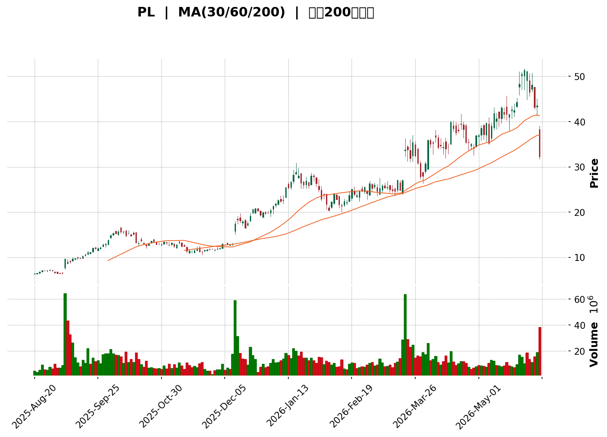
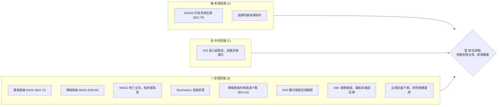
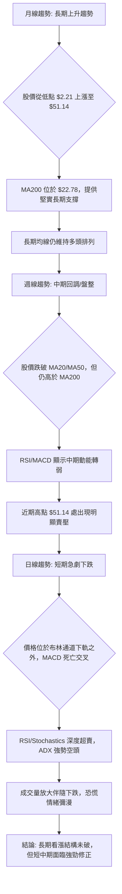
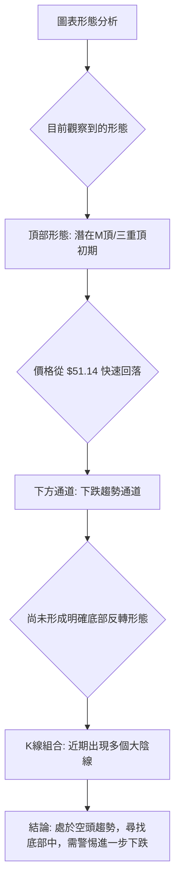
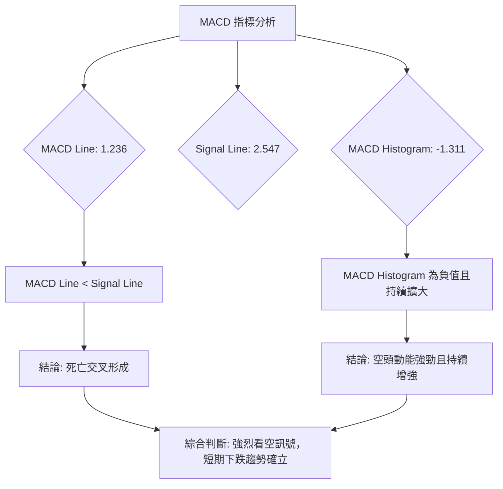

<details>
<summary>📊 靜態圖表 (點擊展開)</summary>

</details>

<html>
<head><meta charset="utf-8" /></head>
<body>
    <div style="height:500px; width:100%;">                        <script>window.PlotlyConfig = {MathJaxConfig: 'local'};</script>
        <script charset="utf-8" src="https://cdn.plot.ly/plotly-3.6.0.min.js" integrity="sha256-QaOVwtVY0T02VaHrr6pnoHLCwayMJp4O5n4YyaE3rJk=" crossorigin="anonymous"></script>                <div id="candlestick-chart" class="plotly-graph-div" style="height:100%; width:100%;"></div>            <script>                window.PLOTLYENV=window.PLOTLYENV || {};                                if (document.getElementById("candlestick-chart")) {                    Plotly.newPlot(                        "candlestick-chart",                        [{"close":{"dtype":"f8","bdata":"AAAA4FG4GUAAAAAghesZQAAAAEAzMxtAAAAAoHA9HEAAAAAghesbQAAAAIDrURxAAAAAQArXHEAAAAAAKVwcQAAAAKCZmRpAAAAAYI\u002fCGUAAAABACtcZQAAAAGC4HhpAAAAAgOtRI0AAAACAPQoiQAAAAOCj8CFAAAAAQApXI0AAAAAgXI8jQAAAAOBRuCNAAAAAAACAI0AAAACAwnUkQAAAAOBROCVAAAAA4FE4JkAAAADgUTgmQAAAAKCZGShAAAAAACncJ0AAAAAghesnQAAAAGBmZihAAAAA4HqUKUAAAACAwvUpQAAAAIA9iitAAAAAQDOzLUAAAABguJ4uQAAAAEDhei5AAAAAAClcL0AAAABAMzMvQAAAAIDrUS9AAAAAYGZmLUAAAAAAAIAuQAAAACBcjy1AAAAAgBQuLkAAAACAwnUqQAAAAOBROCpAAAAAYLgeK0AAAACA69EpQAAAAAAAAClAAAAAYGbmKUAAAADgUTgrQAAAAGC4nipAAAAAgBSuKUAAAADAzMwpQAAAAOBRuClAAAAAYGbmKkAAAACgR2EqQAAAAGBmZilAAAAAAACAKkAAAAAghesoQAAAAGC4nilAAAAAIK7HKkAAAADgo\u002fAoQAAAAKBH4ShAAAAAgOvRJkAAAADAzMwmQAAAACCFayZAAAAAYGbmJkAAAADgepQnQAAAAIDCdSZAAAAAgOtRJkAAAADgehQnQAAAAIDCdSdAAAAA4KNwJ0AAAADAzMwnQAAAAGBmZidAAAAAgD2KJ0AAAADAHgUoQAAAAKBH4SlAAAAAgD2KKUAAAABgZuYpQAAAAIAUrilAAAAAoEfhKUAAAADgUXgxQAAAAKBwPTJAAAAAwMwMMkAAAACgR+ExQAAAAOBReDBAAAAAoHB9MUAAAACAFC4zQAAAAKCZmTRAAAAAQOG6NEAAAACA61E0QAAAAAApXDNAAAAAYLjeM0AAAACgcL0zQAAAAOBRuDNAAAAAwPVoNEAAAAAA12M1QAAAAEAK1zVAAAAAACmcNkAAAADgo3A2QAAAAIDCtTZAAAAA4KNwOUAAAACA61E5QAAAAEDhujpAAAAAIK5HPEAAAAAgrsc8QAAAAAAAADxAAAAAoEdhOkAAAAAgXA86QAAAAOCj8DpAAAAAYLjeOUAAAACA6xE8QAAAAKBH4TtAAAAAoJlZOkAAAADgUfg4QAAAAKCZ2TZAAAAAQDPzN0AAAADAHsU1QAAAAIAUbjRAAAAAYI9CNkAAAADAHgU4QAAAAIA9yjZAAAAAYGamNUAAAADAzEw1QAAAACCFazZAAAAAgMI1NkAAAACgcL03QAAAAAApHDlAAAAAYGbmN0AAAAAgrsc3QAAAAIDCtThAAAAAoEehOEAAAACgmZk5QAAAAADXIzhAAAAAAClcOkAAAADAzEw5QAAAAAAAADpAAAAAQAqXOEAAAAAgrkc5QAAAAIDr0TlAAAAAYGZmOUAAAADgo3A5QAAAAOBR+DhAAAAAgD3KOEAAAACgmZk4QAAAAOB6FDtAAAAAIFzPOEAAAACAwvU6QAAAAIA96kBAAAAAwPXoQEAAAADgetQ\u002fQAAAACBcr0FAAAAAQDMzQEAAAAAAKdw+QAAAAADX4ztAAAAAQDPzO0AAAACAwrU+QAAAAOCj8EFAAAAAYI+CQUAAAACAwpVBQAAAAGBmRkJAAAAAoHAdQUAAAACAwlVBQAAAAMD1KEFAAAAAQAr3QEAAAADgejRBQAAAAIDr8UNAAAAAoHA9Q0AAAAAAAMBCQAAAAADXA0NAAAAAACm8Q0AAAADAHiVDQAAAAOBRuEFAAAAAoJm5QUAAAAAA14NBQAAAAIA9CkFAAAAAACl8QkAAAABAM3NCQAAAAMAeRUNAAAAA4KOQQkAAAADgUdhDQAAAAGC4nkFAAAAAwB6FQ0AAAAAghetEQAAAAEAKV0RAAAAAYLheREAAAADAHoVFQAAAACBcz0RAAAAAgBTOREAAAAAghctEQAAAAOB6VEVAAAAAoHA9RUAAAADAzCxGQAAAAMD1KEhAAAAAoHA9SUAAAABAM7NJQAAAAIDrkUlAAAAAQOE6R0AAAAAghQtIQAAAAOCjkEVAAAAAANfDRUAAAAAAKRxAQA=="},"high":{"dtype":"f8","bdata":"AAAAYI\u002fCGUAAAAAghesZQAAAAAApXBtAAAAAQArXHEAAAACAwvUcQAAAAIA9ihxAAAAAwB6FHUAAAABg46UcQAAAAMD1KBtAAAAAgD0KG0AAAABAMzMaQAAAAKCZmRpAAAAAAH9qI0AAAAAAKRwjQAAAAEAzsyJAAAAAwPUoJEAAAADgepQjQAAAAOBROCRAAAAAQLbzI0AAAADAzMwkQAAAACCFayVAAAAAgOvRJkAAAADAzEwmQAAAAGCPQihAAAAAgMJ1KEAAAAAgXI8oQAAAAMD1qChAAAAAAAAAKkAAAABguB4qQAAAAIA9CixAAAAAwMg2LkAAAAAAAAAvQAAAACCuxy9AAAAAYI8CMEAAAAAgrscwQAAAAKCZmS9AAAAAwMwMMEAAAABgZuYvQAAAAAAAgC5AAAAA4HpUL0AAAABANR4vQAAAAMD1KCtAAAAAgOvRLEAAAABACKwqQAAAAKCZGSpAAAAAACmcKkAAAACAFG4rQAAAACCF6ytAAAAA4KPwKkAAAAAghasqQAAAAGBmZipAAAAAgMJ1K0AAAABgj8IqQAAAAIA9CitAAAAA4KOwKkAAAACAPQoqQAAAAGBmpilAAAAAoJmZK0AAAACgcL0qQAAAAMDMzClAAAAAgOvRKEAAAABAM7MnQAAAAOBROCdAAAAAwB7FJ0AAAACAwvUoQAAAAAAAAClAAAAAAAAAJ0AAAAAgXE8nQAAAAKDtvCdAAAAAgD0KKEAAAADAHgUoQAAAAADXoydAAAAAwB6FKEAAAACgR2EoQAAAAGBmZipAAAAAAADAKUAAAACAwnUqQAAAAAAAACpAAAAAQOF6KkAAAACgmfkxQAAAAKCZGTNAAAAA4KOwM0AAAAAgrkcyQAAAAMDMjDJAAAAAQDPzMUAAAADgetQzQAAAAGCPwjRAAAAAoHD9NEAAAACAFO40QAAAAIDCVTRAAAAAwB4lNEAAAAAAKTw0QAAAAMDMTDRAAAAAIFzPNEAAAAAgXG81QAAAAEAzEzZAAAAAACncNkAAAACgmZk3QAAAAIDpxjdAAAAAIFyPOUAAAABACpc6QAAAAMAexTpAAAAAoEdhPUAAAABg4+U+QAAAAOBRuD1AAAAAIIWrPEAAAACAwOo6QAAAAEDhujtAAAAAQDOzOkAAAABAM7M8QAAAAGBmZjxAAAAAQDOzO0AAAAAAAEA7QAAAAMChxTlAAAAAAKz8N0AAAAAAAAA4QAAAAIDAijVAAAAAIK5HNkAAAADgURg4QAAAAEDh+jdAAAAAYGaGN0AAAADA9eg1QAAAAIAU7jZAAAAAgD3KNkAAAACgmZk4QAAAAAApHDlAAAAA4KOwOUAAAADgerQ4QAAAACBczzhAAAAAQGLQOUAAAADgo7A5QAAAAEAK1zhAAAAAgBTuOkAAAADgo3A6QAAAAKBHgTpAAAAAoHA9OkAAAAAAqpE7QAAAAEAKFzpAAAAA4FF4OkAAAAAghes6QAAAACBcDzpAAAAAgOkGOkAAAAAAAIA5QAAAAEAKFztAAAAA4HoUO0AAAABgj0I7QAAAAADXI0JAAAAAIIVrQUAAAAAghQtCQAAAAGBmhkJAAAAAANXYQUAAAABguB5BQAAAAMD1aD9AAAAAgBTuPEAAAACAFC4\u002fQAAAAMAeBUJAAAAAwB4lQkAAAABgZuZBQAAAAEDhGkNAAAAAgMKVQkAAAACA6zFCQAAAAIAUvkFAAAAAIFg5QkAAAACAwpVBQAAAAKBwHURAAAAAoHAdREAAAADgevRDQAAAAADXw0NAAAAAQOHaREAAAAAAAABEQAAAAAAAwENAAAAAoHAdQkAAAABACqdBQAAAAAAAgEFAAAAAACl8QkAAAADgeqRCQAAAAGCPokNAAAAAQAq3Q0AAAACgR+FDQAAAAIDCdURAAAAAwMzsQ0AAAAAgXI9FQAAAAOCj8ERAAAAAoJkZRUAAAACgmblFQAAAAEAKl0VAAAAAANfjRkAAAAAAAOBEQAAAAGBmxkVAAAAAAAAARkAAAABADKJGQAAAAOCjkElAAAAAoHB9SUAAAACgR+FJQAAAAGCPoklAAAAAAABgSUAAAABgj2JJQAAAACBcz0dAAAAAwB6VRkAAAABAR5JDQA=="},"hovertemplate":"\u003cb\u003e%{x|%Y-%m-%d}\u003c\u002fb\u003e\u003cbr\u003e\u958b: $%{open:.2f}\u003cbr\u003e\u9ad8: $%{high:.2f}\u003cbr\u003e\u4f4e: $%{low:.2f}\u003cbr\u003e\u6536: $%{close:.2f}\u003cextra\u003e\u003c\u002fextra\u003e","low":{"dtype":"f8","bdata":"AAAAYGZmGEAAAABANV4ZQAAAAEDhehlAAAAAIIXrGkAAAAAg2c4bQAAAAGBmZhtAAAAAQArXG0AAAABACCwbQAAAAADXoxlAAAAA4FG4GUAAAADA9SgZQAAAAMAeBRlAAAAAwPUoHUAAAADAHgUhQAAAAOCjMCFAAAAAYI9CIkAAAAAgrsciQAAAAOBR+CJAAAAAgOtRI0AAAAAAKVwjQAAAAOCjcCRAAAAAQOE6JUAAAADgo3AlQAAAAADXIyZAAAAAQApXJ0AAAABACtcmQAAAAMAehSdAAAAA4FG4KEAAAACgcD0oQAAAAEAzMylAAAAAwPUoLEAAAADAHoUtQAAAAKBHYS5AAAAAIFyPLUAAAADAHoUuQAAAAMD1KC5AAAAAACkcLUAAAACA61EuQAAAAEAKFy1AAAAAQDOzLUAAAACgcD0qQAAAACDdJClAAAAAAAAAK0AAAABguJ4pQAAAAOCj8CdAAAAAgBQuKUAAAAAgrkcqQAAAAIA9iipAAAAAIFyPKUAAAAAgrocpQAAAAEDfDylAAAAAIK7HKUAAAACAwnUpQAAAACCF6yhAAAAAIFwPKUAAAAAA1yMoQAAAAAAp3CdAAAAAYBDYKUAAAAAgXI8oQAAAAMD1qChAAAAAQAoXJkAAAADAyHYlQAAAAGCPwiVAAAAAgBTuJUAAAADAzMwmQAAAAICXLiZAAAAAgD0KJUAAAADAHoUmQAAAAMAehSZAAAAAYI9CJ0AAAACAl24nQAAAAMDMzCZAAAAA4HpUJ0AAAABA4XonQAAAAAAp3CdAAAAAwB4FKUAAAACgcD0pQAAAAEA1HilAAAAAwPUoKUAAAADAHgUuQAAAAGC4XjFAAAAAANejMUAAAACAFO4wQAAAAIAUbjBAAAAAgD0KMUAAAACgcP0xQAAAAAApnDNAAAAAoJmZM0AAAAAAKRw0QAAAAIA9CjNAAAAAYI\u002fCMkAAAADgo3AzQAAAAECJoTNAAAAAANX4MkAAAACgcH0zQAAAAOBR+DRAAAAAwPVoNUAAAABAChc2QAAAAMAg0DVAAAAAwPUoN0AAAABguB45QAAAAAAAADlAAAAAYI9COkAAAAAAKVw8QAAAACBcbztAAAAAoEchOUAAAAAA1yM5QAAAAIAULjlAAAAA4FE4OUAAAACgGg86QAAAACBczzpAAAAAwMyMOUAAAACA63E4QAAAAEAKdzZAAAAAwPXoNkAAAABACpc0QAAAAGBmJjRAAAAAIFzPNEAAAABgZqY1QAAAAIDCtTZAAAAAwPXoNEAAAABA4fozQAAAACAGITVAAAAAAACANUAAAACgcD02QAAAAIDCdTZAAAAAYI+CN0AAAABA4To3QAAAAKCZWTZAAAAAoHB9OEAAAACA6xE4QAAAACCuxzZAAAAA4FG4N0AAAACgR2E4QAAAAIBoETlAAAAAYI+CN0AAAACgmdk3QAAAAEAzczhAAAAAQDMzOUAAAADgo\u002fA4QAAAACCuRzhAAAAAIFxPOEAAAADgeKk3QAAAAGBmZjhAAAAAYI\u002fCOEAAAADgo\u002fA3QAAAAIBoIUBAAAAAQOE6P0AAAAAAKRw\u002fQAAAAKBHIT9AAAAAIFwPQEAAAACAPYo+QAAAAGC4PjtAAAAAwPVIOkAAAADAHoU8QAAAAOCjcD1AAAAAQOEaQUAAAABgj2JAQAAAAOBRuEFAAAAA4FH4QEAAAACgmflAQAAAAAApXEBAAAAAoEfhP0AAAAAgrmdAQAAAAGBmdkFAAAAAIIXrQkAAAABACndCQAAAAGCPwkJAAAAAANcjQ0AAAACAPSpCQAAAAOCjkEFAAAAA4KPQQEAAAADA891AQAAAAMD1SEBAAAAAwEsnQUAAAADgpWtBQAAAAMD16EFAAAAAoJn5QUAAAACgR8FBQAAAAEAKd0FAAAAAYGbmQUAAAADAzAxDQAAAAKBHIUNAAAAAwMxsQ0AAAADAzMxDQAAAAMAeRURAAAAAoEchREAAAABgjwJDQAAAAIDCVURAAAAAwB6FREAAAADAzIxFQAAAAIAU7kZAAAAAgBSOR0AAAAAAAIBHQAAAAADXY0ZAAAAAANfDRkAAAABA4TpHQAAAAMAeVUVAAAAAYGamREAAAADA9ag\u002fQA=="},"name":"\u50f9\u683c","open":{"dtype":"f8","bdata":"AAAAAClcGUAAAABgZmYZQAAAAIDC9RlAAAAAYLgeG0AAAABguB4cQAAAACCF6xtAAAAAQOF6HEAAAAAgXI8cQAAAAIA9ChtAAAAAgD0KG0AAAABAMzMaQAAAAOCjcBpAAAAAgOvRHkAAAAAgrkchQAAAAGBmZiJAAAAAoEdhIkAAAACgcD0jQAAAAOCj8CNAAAAA4FG4I0AAAAAAAIAjQAAAAIDC9SRAAAAAgOtRJUAAAADgUbglQAAAAEDheiZAAAAAIK5HKEAAAAAAAAAnQAAAAOBRuCdAAAAAIK7HKEAAAABgZmYpQAAAAIAUrilAAAAA4FG4LEAAAABgZuYtQAAAAKCZmS9AAAAAAAAALkAAAADAzIwwQAAAAIAULi9AAAAA4FG4L0AAAAAghWsuQAAAAAAAAC5AAAAAYGbmLkAAAADgo\u002fAuQAAAAAAAACpAAAAAgD0KLEAAAAAAKVwqQAAAAAAAgClAAAAAYI9CKUAAAACgmZkqQAAAAGBm5itAAAAAwMzMKkAAAAAghespQAAAAEDheilAAAAAIK7HKUAAAADA9agqQAAAAIDCdSlAAAAAgBSuKUAAAADAHgUqQAAAAOBROChAAAAAgMJ1KkAAAABgZmYqQAAAAGCPQilAAAAAgD2KKEAAAAAAAAAmQAAAAAApXCZAAAAA4HoUJkAAAAAghesmQAAAAGBmZihAAAAAQOF6JkAAAABAM7MmQAAAAMAeBSdAAAAAgD2KJ0AAAACA69EnQAAAAEAzMydAAAAAYI\u002fCJ0AAAADA9agnQAAAAGBm5idAAAAAwB6FKUAAAAAAKVwqQAAAAKBwPSlAAAAAoJmZKUAAAADgepQvQAAAAOCjcDJAAAAAIFzPMkAAAABgZqYxQAAAAIAULjJAAAAAgD0KMUAAAACgcP0xQAAAACCuxzNAAAAAwMzMM0AAAABA4bo0QAAAAMDMTDRAAAAAoHDdMkAAAAAgrgc0QAAAAGC4vjNAAAAAQOHaM0AAAABAM7M0QAAAAAAAgDVAAAAA4FG4NUAAAACgmdk2QAAAAKCZmTZAAAAAwMxMN0AAAABgj0I6QAAAAAAAgDlAAAAAIFzPOkAAAABAM3M8QAAAAEAKlztAAAAAAACAPEAAAAAAAMA6QAAAAGCPAjpAAAAAoJmZOkAAAADgehQ6QAAAAMDMDDxAAAAAQDOzO0AAAABACrc5QAAAAADX4zhAAAAAQOH6N0AAAAAAAAA4QAAAAAAAADVAAAAAgD0KNUAAAACAwvU1QAAAAGC43jdAAAAAYGaGN0AAAACA65E1QAAAAAAAgDVAAAAAAAAANkAAAABgZmY2QAAAAMAeBTdAAAAAoHC9OEAAAABgZmY3QAAAAAAAQDdAAAAAwMxMOUAAAAAAAIA4QAAAAEAzkzhAAAAA4FG4N0AAAABA4Ro6QAAAAKCZmTlAAAAAAACAOUAAAAAA1+M3QAAAAEAK1zhAAAAAgOvROUAAAABAClc5QAAAAOBR+DlAAAAAQOH6OEAAAACgRyE5QAAAAKCZ2ThAAAAAAACAOkAAAAAAAEA4QAAAAGBmxkBAAAAAAABAQUAAAABA4dpAQAAAAEAzM0BAAAAAACl8QUAAAACgcP1AQAAAAKCZ2T5AAAAAwMzMPEAAAAAAAAA9QAAAAOCjcD1AAAAAgML1QUAAAADgo7BBQAAAAEAzc0JAAAAAAABAQkAAAADgo3BBQAAAAKBwHUFAAAAAIIXLQUAAAACAwjVBQAAAAKBwfUFAAAAAgOuRQ0AAAABAM5NDQAAAAAApHENAAAAAAADAQ0AAAACAPapDQAAAAIAUjkNAAAAAACm8QUAAAADAzExBQAAAAOCjMEFAAAAAANdDQUAAAAAgXF9CQAAAAMAehUJAAAAAoJmZQ0AAAAAgXH9CQAAAAGCPwkNAAAAAQDMzQkAAAABAM1NDQAAAACCFC0RAAAAAQAoXRUAAAADgo1BEQAAAAMD1CEVAAAAAANejRUAAAABACndEQAAAAEAzM0VAAAAAwHIIRUAAAADAzKxFQAAAAMD12EdAAAAAwMwMSUAAAABAMxNJQAAAAAAAkEhAAAAAIIWLSEAAAACAwpVHQAAAACBcz0dAAAAAoHCdRUAAAABgZiZDQA=="},"x":["2025-08-20T00:00:00-04:00","2025-08-21T00:00:00-04:00","2025-08-22T00:00:00-04:00","2025-08-25T00:00:00-04:00","2025-08-26T00:00:00-04:00","2025-08-27T00:00:00-04:00","2025-08-28T00:00:00-04:00","2025-08-29T00:00:00-04:00","2025-09-02T00:00:00-04:00","2025-09-03T00:00:00-04:00","2025-09-04T00:00:00-04:00","2025-09-05T00:00:00-04:00","2025-09-08T00:00:00-04:00","2025-09-09T00:00:00-04:00","2025-09-10T00:00:00-04:00","2025-09-11T00:00:00-04:00","2025-09-12T00:00:00-04:00","2025-09-15T00:00:00-04:00","2025-09-16T00:00:00-04:00","2025-09-17T00:00:00-04:00","2025-09-18T00:00:00-04:00","2025-09-19T00:00:00-04:00","2025-09-22T00:00:00-04:00","2025-09-23T00:00:00-04:00","2025-09-24T00:00:00-04:00","2025-09-25T00:00:00-04:00","2025-09-26T00:00:00-04:00","2025-09-29T00:00:00-04:00","2025-09-30T00:00:00-04:00","2025-10-01T00:00:00-04:00","2025-10-02T00:00:00-04:00","2025-10-03T00:00:00-04:00","2025-10-06T00:00:00-04:00","2025-10-07T00:00:00-04:00","2025-10-08T00:00:00-04:00","2025-10-09T00:00:00-04:00","2025-10-10T00:00:00-04:00","2025-10-13T00:00:00-04:00","2025-10-14T00:00:00-04:00","2025-10-15T00:00:00-04:00","2025-10-16T00:00:00-04:00","2025-10-17T00:00:00-04:00","2025-10-20T00:00:00-04:00","2025-10-21T00:00:00-04:00","2025-10-22T00:00:00-04:00","2025-10-23T00:00:00-04:00","2025-10-24T00:00:00-04:00","2025-10-27T00:00:00-04:00","2025-10-28T00:00:00-04:00","2025-10-29T00:00:00-04:00","2025-10-30T00:00:00-04:00","2025-10-31T00:00:00-04:00","2025-11-03T00:00:00-05:00","2025-11-04T00:00:00-05:00","2025-11-05T00:00:00-05:00","2025-11-06T00:00:00-05:00","2025-11-07T00:00:00-05:00","2025-11-10T00:00:00-05:00","2025-11-11T00:00:00-05:00","2025-11-12T00:00:00-05:00","2025-11-13T00:00:00-05:00","2025-11-14T00:00:00-05:00","2025-11-17T00:00:00-05:00","2025-11-18T00:00:00-05:00","2025-11-19T00:00:00-05:00","2025-11-20T00:00:00-05:00","2025-11-21T00:00:00-05:00","2025-11-24T00:00:00-05:00","2025-11-25T00:00:00-05:00","2025-11-26T00:00:00-05:00","2025-11-28T00:00:00-05:00","2025-12-01T00:00:00-05:00","2025-12-02T00:00:00-05:00","2025-12-03T00:00:00-05:00","2025-12-04T00:00:00-05:00","2025-12-05T00:00:00-05:00","2025-12-08T00:00:00-05:00","2025-12-09T00:00:00-05:00","2025-12-10T00:00:00-05:00","2025-12-11T00:00:00-05:00","2025-12-12T00:00:00-05:00","2025-12-15T00:00:00-05:00","2025-12-16T00:00:00-05:00","2025-12-17T00:00:00-05:00","2025-12-18T00:00:00-05:00","2025-12-19T00:00:00-05:00","2025-12-22T00:00:00-05:00","2025-12-23T00:00:00-05:00","2025-12-24T00:00:00-05:00","2025-12-26T00:00:00-05:00","2025-12-29T00:00:00-05:00","2025-12-30T00:00:00-05:00","2025-12-31T00:00:00-05:00","2026-01-02T00:00:00-05:00","2026-01-05T00:00:00-05:00","2026-01-06T00:00:00-05:00","2026-01-07T00:00:00-05:00","2026-01-08T00:00:00-05:00","2026-01-09T00:00:00-05:00","2026-01-12T00:00:00-05:00","2026-01-13T00:00:00-05:00","2026-01-14T00:00:00-05:00","2026-01-15T00:00:00-05:00","2026-01-16T00:00:00-05:00","2026-01-20T00:00:00-05:00","2026-01-21T00:00:00-05:00","2026-01-22T00:00:00-05:00","2026-01-23T00:00:00-05:00","2026-01-26T00:00:00-05:00","2026-01-27T00:00:00-05:00","2026-01-28T00:00:00-05:00","2026-01-29T00:00:00-05:00","2026-01-30T00:00:00-05:00","2026-02-02T00:00:00-05:00","2026-02-03T00:00:00-05:00","2026-02-04T00:00:00-05:00","2026-02-05T00:00:00-05:00","2026-02-06T00:00:00-05:00","2026-02-09T00:00:00-05:00","2026-02-10T00:00:00-05:00","2026-02-11T00:00:00-05:00","2026-02-12T00:00:00-05:00","2026-02-13T00:00:00-05:00","2026-02-17T00:00:00-05:00","2026-02-18T00:00:00-05:00","2026-02-19T00:00:00-05:00","2026-02-20T00:00:00-05:00","2026-02-23T00:00:00-05:00","2026-02-24T00:00:00-05:00","2026-02-25T00:00:00-05:00","2026-02-26T00:00:00-05:00","2026-02-27T00:00:00-05:00","2026-03-02T00:00:00-05:00","2026-03-03T00:00:00-05:00","2026-03-04T00:00:00-05:00","2026-03-05T00:00:00-05:00","2026-03-06T00:00:00-05:00","2026-03-09T00:00:00-04:00","2026-03-10T00:00:00-04:00","2026-03-11T00:00:00-04:00","2026-03-12T00:00:00-04:00","2026-03-13T00:00:00-04:00","2026-03-16T00:00:00-04:00","2026-03-17T00:00:00-04:00","2026-03-18T00:00:00-04:00","2026-03-19T00:00:00-04:00","2026-03-20T00:00:00-04:00","2026-03-23T00:00:00-04:00","2026-03-24T00:00:00-04:00","2026-03-25T00:00:00-04:00","2026-03-26T00:00:00-04:00","2026-03-27T00:00:00-04:00","2026-03-30T00:00:00-04:00","2026-03-31T00:00:00-04:00","2026-04-01T00:00:00-04:00","2026-04-02T00:00:00-04:00","2026-04-06T00:00:00-04:00","2026-04-07T00:00:00-04:00","2026-04-08T00:00:00-04:00","2026-04-09T00:00:00-04:00","2026-04-10T00:00:00-04:00","2026-04-13T00:00:00-04:00","2026-04-14T00:00:00-04:00","2026-04-15T00:00:00-04:00","2026-04-16T00:00:00-04:00","2026-04-17T00:00:00-04:00","2026-04-20T00:00:00-04:00","2026-04-21T00:00:00-04:00","2026-04-22T00:00:00-04:00","2026-04-23T00:00:00-04:00","2026-04-24T00:00:00-04:00","2026-04-27T00:00:00-04:00","2026-04-28T00:00:00-04:00","2026-04-29T00:00:00-04:00","2026-04-30T00:00:00-04:00","2026-05-01T00:00:00-04:00","2026-05-04T00:00:00-04:00","2026-05-05T00:00:00-04:00","2026-05-06T00:00:00-04:00","2026-05-07T00:00:00-04:00","2026-05-08T00:00:00-04:00","2026-05-11T00:00:00-04:00","2026-05-12T00:00:00-04:00","2026-05-13T00:00:00-04:00","2026-05-14T00:00:00-04:00","2026-05-15T00:00:00-04:00","2026-05-18T00:00:00-04:00","2026-05-19T00:00:00-04:00","2026-05-20T00:00:00-04:00","2026-05-21T00:00:00-04:00","2026-05-22T00:00:00-04:00","2026-05-26T00:00:00-04:00","2026-05-27T00:00:00-04:00","2026-05-28T00:00:00-04:00","2026-05-29T00:00:00-04:00","2026-06-01T00:00:00-04:00","2026-06-02T00:00:00-04:00","2026-06-03T00:00:00-04:00","2026-06-04T00:00:00-04:00","2026-06-05T00:00:00-04:00"],"type":"candlestick"},{"hovertemplate":"MA30: $%{y:.2f}\u003cextra\u003e\u003c\u002fextra\u003e","line":{"color":"#2196F3","dash":"dash","width":2},"mode":"lines","name":"MA30","x":["2025-08-20T00:00:00-04:00","2025-08-21T00:00:00-04:00","2025-08-22T00:00:00-04:00","2025-08-25T00:00:00-04:00","2025-08-26T00:00:00-04:00","2025-08-27T00:00:00-04:00","2025-08-28T00:00:00-04:00","2025-08-29T00:00:00-04:00","2025-09-02T00:00:00-04:00","2025-09-03T00:00:00-04:00","2025-09-04T00:00:00-04:00","2025-09-05T00:00:00-04:00","2025-09-08T00:00:00-04:00","2025-09-09T00:00:00-04:00","2025-09-10T00:00:00-04:00","2025-09-11T00:00:00-04:00","2025-09-12T00:00:00-04:00","2025-09-15T00:00:00-04:00","2025-09-16T00:00:00-04:00","2025-09-17T00:00:00-04:00","2025-09-18T00:00:00-04:00","2025-09-19T00:00:00-04:00","2025-09-22T00:00:00-04:00","2025-09-23T00:00:00-04:00","2025-09-24T00:00:00-04:00","2025-09-25T00:00:00-04:00","2025-09-26T00:00:00-04:00","2025-09-29T00:00:00-04:00","2025-09-30T00:00:00-04:00","2025-10-01T00:00:00-04:00","2025-10-02T00:00:00-04:00","2025-10-03T00:00:00-04:00","2025-10-06T00:00:00-04:00","2025-10-07T00:00:00-04:00","2025-10-08T00:00:00-04:00","2025-10-09T00:00:00-04:00","2025-10-10T00:00:00-04:00","2025-10-13T00:00:00-04:00","2025-10-14T00:00:00-04:00","2025-10-15T00:00:00-04:00","2025-10-16T00:00:00-04:00","2025-10-17T00:00:00-04:00","2025-10-20T00:00:00-04:00","2025-10-21T00:00:00-04:00","2025-10-22T00:00:00-04:00","2025-10-23T00:00:00-04:00","2025-10-24T00:00:00-04:00","2025-10-27T00:00:00-04:00","2025-10-28T00:00:00-04:00","2025-10-29T00:00:00-04:00","2025-10-30T00:00:00-04:00","2025-10-31T00:00:00-04:00","2025-11-03T00:00:00-05:00","2025-11-04T00:00:00-05:00","2025-11-05T00:00:00-05:00","2025-11-06T00:00:00-05:00","2025-11-07T00:00:00-05:00","2025-11-10T00:00:00-05:00","2025-11-11T00:00:00-05:00","2025-11-12T00:00:00-05:00","2025-11-13T00:00:00-05:00","2025-11-14T00:00:00-05:00","2025-11-17T00:00:00-05:00","2025-11-18T00:00:00-05:00","2025-11-19T00:00:00-05:00","2025-11-20T00:00:00-05:00","2025-11-21T00:00:00-05:00","2025-11-24T00:00:00-05:00","2025-11-25T00:00:00-05:00","2025-11-26T00:00:00-05:00","2025-11-28T00:00:00-05:00","2025-12-01T00:00:00-05:00","2025-12-02T00:00:00-05:00","2025-12-03T00:00:00-05:00","2025-12-04T00:00:00-05:00","2025-12-05T00:00:00-05:00","2025-12-08T00:00:00-05:00","2025-12-09T00:00:00-05:00","2025-12-10T00:00:00-05:00","2025-12-11T00:00:00-05:00","2025-12-12T00:00:00-05:00","2025-12-15T00:00:00-05:00","2025-12-16T00:00:00-05:00","2025-12-17T00:00:00-05:00","2025-12-18T00:00:00-05:00","2025-12-19T00:00:00-05:00","2025-12-22T00:00:00-05:00","2025-12-23T00:00:00-05:00","2025-12-24T00:00:00-05:00","2025-12-26T00:00:00-05:00","2025-12-29T00:00:00-05:00","2025-12-30T00:00:00-05:00","2025-12-31T00:00:00-05:00","2026-01-02T00:00:00-05:00","2026-01-05T00:00:00-05:00","2026-01-06T00:00:00-05:00","2026-01-07T00:00:00-05:00","2026-01-08T00:00:00-05:00","2026-01-09T00:00:00-05:00","2026-01-12T00:00:00-05:00","2026-01-13T00:00:00-05:00","2026-01-14T00:00:00-05:00","2026-01-15T00:00:00-05:00","2026-01-16T00:00:00-05:00","2026-01-20T00:00:00-05:00","2026-01-21T00:00:00-05:00","2026-01-22T00:00:00-05:00","2026-01-23T00:00:00-05:00","2026-01-26T00:00:00-05:00","2026-01-27T00:00:00-05:00","2026-01-28T00:00:00-05:00","2026-01-29T00:00:00-05:00","2026-01-30T00:00:00-05:00","2026-02-02T00:00:00-05:00","2026-02-03T00:00:00-05:00","2026-02-04T00:00:00-05:00","2026-02-05T00:00:00-05:00","2026-02-06T00:00:00-05:00","2026-02-09T00:00:00-05:00","2026-02-10T00:00:00-05:00","2026-02-11T00:00:00-05:00","2026-02-12T00:00:00-05:00","2026-02-13T00:00:00-05:00","2026-02-17T00:00:00-05:00","2026-02-18T00:00:00-05:00","2026-02-19T00:00:00-05:00","2026-02-20T00:00:00-05:00","2026-02-23T00:00:00-05:00","2026-02-24T00:00:00-05:00","2026-02-25T00:00:00-05:00","2026-02-26T00:00:00-05:00","2026-02-27T00:00:00-05:00","2026-03-02T00:00:00-05:00","2026-03-03T00:00:00-05:00","2026-03-04T00:00:00-05:00","2026-03-05T00:00:00-05:00","2026-03-06T00:00:00-05:00","2026-03-09T00:00:00-04:00","2026-03-10T00:00:00-04:00","2026-03-11T00:00:00-04:00","2026-03-12T00:00:00-04:00","2026-03-13T00:00:00-04:00","2026-03-16T00:00:00-04:00","2026-03-17T00:00:00-04:00","2026-03-18T00:00:00-04:00","2026-03-19T00:00:00-04:00","2026-03-20T00:00:00-04:00","2026-03-23T00:00:00-04:00","2026-03-24T00:00:00-04:00","2026-03-25T00:00:00-04:00","2026-03-26T00:00:00-04:00","2026-03-27T00:00:00-04:00","2026-03-30T00:00:00-04:00","2026-03-31T00:00:00-04:00","2026-04-01T00:00:00-04:00","2026-04-02T00:00:00-04:00","2026-04-06T00:00:00-04:00","2026-04-07T00:00:00-04:00","2026-04-08T00:00:00-04:00","2026-04-09T00:00:00-04:00","2026-04-10T00:00:00-04:00","2026-04-13T00:00:00-04:00","2026-04-14T00:00:00-04:00","2026-04-15T00:00:00-04:00","2026-04-16T00:00:00-04:00","2026-04-17T00:00:00-04:00","2026-04-20T00:00:00-04:00","2026-04-21T00:00:00-04:00","2026-04-22T00:00:00-04:00","2026-04-23T00:00:00-04:00","2026-04-24T00:00:00-04:00","2026-04-27T00:00:00-04:00","2026-04-28T00:00:00-04:00","2026-04-29T00:00:00-04:00","2026-04-30T00:00:00-04:00","2026-05-01T00:00:00-04:00","2026-05-04T00:00:00-04:00","2026-05-05T00:00:00-04:00","2026-05-06T00:00:00-04:00","2026-05-07T00:00:00-04:00","2026-05-08T00:00:00-04:00","2026-05-11T00:00:00-04:00","2026-05-12T00:00:00-04:00","2026-05-13T00:00:00-04:00","2026-05-14T00:00:00-04:00","2026-05-15T00:00:00-04:00","2026-05-18T00:00:00-04:00","2026-05-19T00:00:00-04:00","2026-05-20T00:00:00-04:00","2026-05-21T00:00:00-04:00","2026-05-22T00:00:00-04:00","2026-05-26T00:00:00-04:00","2026-05-27T00:00:00-04:00","2026-05-28T00:00:00-04:00","2026-05-29T00:00:00-04:00","2026-06-01T00:00:00-04:00","2026-06-02T00:00:00-04:00","2026-06-03T00:00:00-04:00","2026-06-04T00:00:00-04:00","2026-06-05T00:00:00-04:00"],"y":{"dtype":"f8","bdata":"AAAAAAAA+H8AAAAAAAD4fwAAAAAAAPh\u002fAAAAAAAA+H8AAAAAAAD4fwAAAAAAAPh\u002fAAAAAAAA+H8AAAAAAAD4fwAAAAAAAPh\u002fAAAAAAAA+H8AAAAAAAD4fwAAAAAAAPh\u002fAAAAAAAA+H8AAAAAAAD4fwAAAAAAAPh\u002fAAAAAAAA+H8AAAAAAAD4fwAAAAAAAPh\u002fAAAAAAAA+H8AAAAAAAD4fwAAAAAAAPh\u002fAAAAAAAA+H8AAAAAAAD4fwAAAAAAAPh\u002fAAAAAAAA+H8AAAAAAAD4fwAAAAAAAPh\u002fAAAAAAAA+H8AAAAAAAD4f1VVVR3MkyJAiYiIqH8jI0DNzMyEMrojQImIiHA9SiRAvLu7y1rdJEDv7u4meHAlQGZmZr7mAiZAVVVVDbuCJkCrqqqi\u002fg0nQFVVVSW\u002fmCdAq6qqkl8sKEDv7u4m6p8oQLy7u5s2EClAiYiI+MVSKUAzMzOjKZUpQBEREXFo0SlAq6qq+mIJKkARERGBwEoqQJqZmcmhhSpARERENF66KkDNzMyc7+cqQDMzMwNWDitAERERoUU2K0CamZlJxVkrQN7d3S3dZCtAiYiIWGR7K0ARERHh7IMrQDMzMwNWjitAREREdJOYK0C8u7s7348rQO\u002fu7l4seStAd3d3x3Y+K0CamZm5u\u002fsqQDMzM2P0tipAvLu7O8NuKkBmZmYWvS0qQO\u002fu7h4i4ilAAAAAoLelKUAzMzNjZmYpQLy7u7tYMilAq6qq+tT4KEDv7u4eIuIoQM3MzLwRyihAvLu7G4WrKEAzMzPzKJwoQGZmZlaroyhAiYiI6JigKEAzMzNTVZUoQM3MzNxPjShARERExASPKEBmZmZmA90oQKuqqvrUOClA7+7urlaHKUCrqqqaYdcpQLy7u\u002fu4FypAMzMz0xVgKkBERET0xdIqQLy7u\u002fu4VytA3t3d7f3UK0CamZkZ91osQLy7uwsR0SxAq6qqWnNhLUDv7u5eye8tQAAAACAGgS5AZmZm9vAZL0AAAAAAyL0vQGZmZuZtOTBA7+7uziKbMEARERE5JvgwQN7d3WXYVTFAIiIiMuzKMUAiIiKicD0yQDMzMyuyvTJAiYiI0JRKM0CJiIhwr9kzQDMzM4MyWjRAIiIiAlbONEBVVVU9NT41QBERESmHtjVA3t3dLd0kNkC8u7s7UX82QCIiIiKU0TZAMzMzw2cYN0Crqqoa6FQ3QN7d3W1ZizdAREREhHnCN0BVVVV1k9g3QGZmZhYg1zdAzczMbC7kN0AzMzMzwQM4QGZmZiYGIThA3t3dnTYwOEDNzMx8hj04QKuqqrqQVDhAMzMz4+xjOECrqqqK+nc4QHd3d\u002ffhkzhAMzMzA+SeOECamZlJU6o4QKuqqlpkuzhAERER4Xq0OEDNzMyM3rY4QLy7u5vEoDhA3t3dTWKQOEAAAAAgsHI4QO\u002fu7g6fYThA7+7uvlhSOEAAAADQsEs4QCIiIiIiQjhAZmZmZh8+OEBEREQUric4QGZmZhbZDjhAd3d3N4kBOEARERHxYP43QERERIR5IjhAZmZmNtApOEAAAADwGVY4QAAAALByyDhARERE5BcrOUCJiIgYvW05QFVVVYUW2TlAIiIiQtI0OkBmZmZmZoY6QLy7u8sTtTpAVVVVBQ\u002fmOkB3d3c3iSE7QERERKRwfTtAd3d3p1TcO0C8u7t7hj08QLy7u1uPojxAERER4Xr0PEB3d3eX4EE9QERERCS\u002fmD1A7+7uDljZPUCJiIgoFSc+QDMzM1OcnT5A3t3dfSMUP0DNzMx8anw\u002fQDMzM6Ob5D9AMzMzA1YuQEC8u7ujKWVAQLy7u6vVkUBAvLu7O1G\u002fQECrqqqS0etAQBEREXGvCUFAAAAAaJE9QUAiIiKK+mdBQFVVVR0TfEFAzczMhDKKQUC8u7u7u6tBQN7d3b0tq0FAREREZILHQUCrqqp6W\u002fZBQCIiIpLtLEJAmpmZqX9jQkAAAABQG5hCQLy7u+uYsEJAVVVV9bbMQkAAAABQG+hCQAAAABAtAkNAMzMzQ2AlQ0B3d3dnrU5DQDMzMyNpikNAZmZmJgbRQ0AzMzPDgxlEQDMzM8ODSURAzczMDJBrREB3d3cnv5hEQHd3d7eBrkRAERERUdS\u002fREAiIiJC7qVEQA=="},"type":"scatter"},{"hovertemplate":"MA60: $%{y:.2f}\u003cextra\u003e\u003c\u002fextra\u003e","line":{"color":"#9C27B0","dash":"dash","width":2},"mode":"lines","name":"MA60","x":["2025-08-20T00:00:00-04:00","2025-08-21T00:00:00-04:00","2025-08-22T00:00:00-04:00","2025-08-25T00:00:00-04:00","2025-08-26T00:00:00-04:00","2025-08-27T00:00:00-04:00","2025-08-28T00:00:00-04:00","2025-08-29T00:00:00-04:00","2025-09-02T00:00:00-04:00","2025-09-03T00:00:00-04:00","2025-09-04T00:00:00-04:00","2025-09-05T00:00:00-04:00","2025-09-08T00:00:00-04:00","2025-09-09T00:00:00-04:00","2025-09-10T00:00:00-04:00","2025-09-11T00:00:00-04:00","2025-09-12T00:00:00-04:00","2025-09-15T00:00:00-04:00","2025-09-16T00:00:00-04:00","2025-09-17T00:00:00-04:00","2025-09-18T00:00:00-04:00","2025-09-19T00:00:00-04:00","2025-09-22T00:00:00-04:00","2025-09-23T00:00:00-04:00","2025-09-24T00:00:00-04:00","2025-09-25T00:00:00-04:00","2025-09-26T00:00:00-04:00","2025-09-29T00:00:00-04:00","2025-09-30T00:00:00-04:00","2025-10-01T00:00:00-04:00","2025-10-02T00:00:00-04:00","2025-10-03T00:00:00-04:00","2025-10-06T00:00:00-04:00","2025-10-07T00:00:00-04:00","2025-10-08T00:00:00-04:00","2025-10-09T00:00:00-04:00","2025-10-10T00:00:00-04:00","2025-10-13T00:00:00-04:00","2025-10-14T00:00:00-04:00","2025-10-15T00:00:00-04:00","2025-10-16T00:00:00-04:00","2025-10-17T00:00:00-04:00","2025-10-20T00:00:00-04:00","2025-10-21T00:00:00-04:00","2025-10-22T00:00:00-04:00","2025-10-23T00:00:00-04:00","2025-10-24T00:00:00-04:00","2025-10-27T00:00:00-04:00","2025-10-28T00:00:00-04:00","2025-10-29T00:00:00-04:00","2025-10-30T00:00:00-04:00","2025-10-31T00:00:00-04:00","2025-11-03T00:00:00-05:00","2025-11-04T00:00:00-05:00","2025-11-05T00:00:00-05:00","2025-11-06T00:00:00-05:00","2025-11-07T00:00:00-05:00","2025-11-10T00:00:00-05:00","2025-11-11T00:00:00-05:00","2025-11-12T00:00:00-05:00","2025-11-13T00:00:00-05:00","2025-11-14T00:00:00-05:00","2025-11-17T00:00:00-05:00","2025-11-18T00:00:00-05:00","2025-11-19T00:00:00-05:00","2025-11-20T00:00:00-05:00","2025-11-21T00:00:00-05:00","2025-11-24T00:00:00-05:00","2025-11-25T00:00:00-05:00","2025-11-26T00:00:00-05:00","2025-11-28T00:00:00-05:00","2025-12-01T00:00:00-05:00","2025-12-02T00:00:00-05:00","2025-12-03T00:00:00-05:00","2025-12-04T00:00:00-05:00","2025-12-05T00:00:00-05:00","2025-12-08T00:00:00-05:00","2025-12-09T00:00:00-05:00","2025-12-10T00:00:00-05:00","2025-12-11T00:00:00-05:00","2025-12-12T00:00:00-05:00","2025-12-15T00:00:00-05:00","2025-12-16T00:00:00-05:00","2025-12-17T00:00:00-05:00","2025-12-18T00:00:00-05:00","2025-12-19T00:00:00-05:00","2025-12-22T00:00:00-05:00","2025-12-23T00:00:00-05:00","2025-12-24T00:00:00-05:00","2025-12-26T00:00:00-05:00","2025-12-29T00:00:00-05:00","2025-12-30T00:00:00-05:00","2025-12-31T00:00:00-05:00","2026-01-02T00:00:00-05:00","2026-01-05T00:00:00-05:00","2026-01-06T00:00:00-05:00","2026-01-07T00:00:00-05:00","2026-01-08T00:00:00-05:00","2026-01-09T00:00:00-05:00","2026-01-12T00:00:00-05:00","2026-01-13T00:00:00-05:00","2026-01-14T00:00:00-05:00","2026-01-15T00:00:00-05:00","2026-01-16T00:00:00-05:00","2026-01-20T00:00:00-05:00","2026-01-21T00:00:00-05:00","2026-01-22T00:00:00-05:00","2026-01-23T00:00:00-05:00","2026-01-26T00:00:00-05:00","2026-01-27T00:00:00-05:00","2026-01-28T00:00:00-05:00","2026-01-29T00:00:00-05:00","2026-01-30T00:00:00-05:00","2026-02-02T00:00:00-05:00","2026-02-03T00:00:00-05:00","2026-02-04T00:00:00-05:00","2026-02-05T00:00:00-05:00","2026-02-06T00:00:00-05:00","2026-02-09T00:00:00-05:00","2026-02-10T00:00:00-05:00","2026-02-11T00:00:00-05:00","2026-02-12T00:00:00-05:00","2026-02-13T00:00:00-05:00","2026-02-17T00:00:00-05:00","2026-02-18T00:00:00-05:00","2026-02-19T00:00:00-05:00","2026-02-20T00:00:00-05:00","2026-02-23T00:00:00-05:00","2026-02-24T00:00:00-05:00","2026-02-25T00:00:00-05:00","2026-02-26T00:00:00-05:00","2026-02-27T00:00:00-05:00","2026-03-02T00:00:00-05:00","2026-03-03T00:00:00-05:00","2026-03-04T00:00:00-05:00","2026-03-05T00:00:00-05:00","2026-03-06T00:00:00-05:00","2026-03-09T00:00:00-04:00","2026-03-10T00:00:00-04:00","2026-03-11T00:00:00-04:00","2026-03-12T00:00:00-04:00","2026-03-13T00:00:00-04:00","2026-03-16T00:00:00-04:00","2026-03-17T00:00:00-04:00","2026-03-18T00:00:00-04:00","2026-03-19T00:00:00-04:00","2026-03-20T00:00:00-04:00","2026-03-23T00:00:00-04:00","2026-03-24T00:00:00-04:00","2026-03-25T00:00:00-04:00","2026-03-26T00:00:00-04:00","2026-03-27T00:00:00-04:00","2026-03-30T00:00:00-04:00","2026-03-31T00:00:00-04:00","2026-04-01T00:00:00-04:00","2026-04-02T00:00:00-04:00","2026-04-06T00:00:00-04:00","2026-04-07T00:00:00-04:00","2026-04-08T00:00:00-04:00","2026-04-09T00:00:00-04:00","2026-04-10T00:00:00-04:00","2026-04-13T00:00:00-04:00","2026-04-14T00:00:00-04:00","2026-04-15T00:00:00-04:00","2026-04-16T00:00:00-04:00","2026-04-17T00:00:00-04:00","2026-04-20T00:00:00-04:00","2026-04-21T00:00:00-04:00","2026-04-22T00:00:00-04:00","2026-04-23T00:00:00-04:00","2026-04-24T00:00:00-04:00","2026-04-27T00:00:00-04:00","2026-04-28T00:00:00-04:00","2026-04-29T00:00:00-04:00","2026-04-30T00:00:00-04:00","2026-05-01T00:00:00-04:00","2026-05-04T00:00:00-04:00","2026-05-05T00:00:00-04:00","2026-05-06T00:00:00-04:00","2026-05-07T00:00:00-04:00","2026-05-08T00:00:00-04:00","2026-05-11T00:00:00-04:00","2026-05-12T00:00:00-04:00","2026-05-13T00:00:00-04:00","2026-05-14T00:00:00-04:00","2026-05-15T00:00:00-04:00","2026-05-18T00:00:00-04:00","2026-05-19T00:00:00-04:00","2026-05-20T00:00:00-04:00","2026-05-21T00:00:00-04:00","2026-05-22T00:00:00-04:00","2026-05-26T00:00:00-04:00","2026-05-27T00:00:00-04:00","2026-05-28T00:00:00-04:00","2026-05-29T00:00:00-04:00","2026-06-01T00:00:00-04:00","2026-06-02T00:00:00-04:00","2026-06-03T00:00:00-04:00","2026-06-04T00:00:00-04:00","2026-06-05T00:00:00-04:00"],"y":{"dtype":"f8","bdata":"AAAAAAAA+H8AAAAAAAD4fwAAAAAAAPh\u002fAAAAAAAA+H8AAAAAAAD4fwAAAAAAAPh\u002fAAAAAAAA+H8AAAAAAAD4fwAAAAAAAPh\u002fAAAAAAAA+H8AAAAAAAD4fwAAAAAAAPh\u002fAAAAAAAA+H8AAAAAAAD4fwAAAAAAAPh\u002fAAAAAAAA+H8AAAAAAAD4fwAAAAAAAPh\u002fAAAAAAAA+H8AAAAAAAD4fwAAAAAAAPh\u002fAAAAAAAA+H8AAAAAAAD4fwAAAAAAAPh\u002fAAAAAAAA+H8AAAAAAAD4fwAAAAAAAPh\u002fAAAAAAAA+H8AAAAAAAD4fwAAAAAAAPh\u002fAAAAAAAA+H8AAAAAAAD4fwAAAAAAAPh\u002fAAAAAAAA+H8AAAAAAAD4fwAAAAAAAPh\u002fAAAAAAAA+H8AAAAAAAD4fwAAAAAAAPh\u002fAAAAAAAA+H8AAAAAAAD4fwAAAAAAAPh\u002fAAAAAAAA+H8AAAAAAAD4fwAAAAAAAPh\u002fAAAAAAAA+H8AAAAAAAD4fwAAAAAAAPh\u002fAAAAAAAA+H8AAAAAAAD4fwAAAAAAAPh\u002fAAAAAAAA+H8AAAAAAAD4fwAAAAAAAPh\u002fAAAAAAAA+H8AAAAAAAD4fwAAAAAAAPh\u002fAAAAAAAA+H8AAAAAAAD4fyIiIj58BidAAAAAOPswJ0AzMzMf91onQN7d3emYgCdAvLu7Aw+mJ0CrqqqeGs8nQKuqqm6E8idAq6qqVjkUKEDv7u6CMjooQImIiPCLZShAq6qqRpqSKEDv7u4iBsEoQERERCwk7ShAIiIiiiX\u002fKEAzMzNLqRgpQLy7u+OJOilAmpmZ8f1UKUAiIiLqCnApQDMzM9N4iSlAREREfLGkKUCamZmBeeIpQO\u002fu7n6VIypAAAAAKM5eKkAiIiJyk5gqQM3MzBRLvipA3t3dFb3tKkCrqqpqWSsrQHd3d38HcytAERERsci2K0Crqqoqa\u002fUrQFVVVbUeJSxAEREREfVPLEBERESMwnUsQJqZmUH9myxAERERGVrELEAzMzOLwvUsQN7d3fV+Ki1A7+7unv5tLUCrqqpqWastQLy7u8ME7y1Ad3d3r1ZHLkCamZmxga4uQJqZmQm7Ii9AZmZmXlegL0ARERH14RMwQDMzMxcEVjBAMzMzO1GPMEB3d3fzb8QwQLy7u4uX\u002fjBAAAAAyC82MUB3d3d36XYxQLy7u0\u002f\u002ftjFAVVVVjQnuMUAAAAB0TCAyQN7d3fWaSzJA7+7uNkJ5MkC8u7s3+6AyQCIiIkp+wTJA3t3dsVbnMkAAAABgnhgzQCIiIlbHRDNAmpmZJXhwM0AiIiKWtZozQFVVVeWJyjNAMzMzr3L4M0BVVVVFbys0QO\u002fu7u6nZjRAERERaQOdNEBVVVXBPNE0QERERGCeCDVAmpmZibM\u002fNUB3d3eXJ3o1QHd3d2M7rzVAMzMzj3vtNUBERETILyY2QBEREcnoXTZAiYiIYFeQNkCrqqoG88Q2QJqZmaVU\u002fDZAIiIiSn4xN0AAAACof1M3QERERJw2cDdAVVVVffiMN0De3d2FpKk3QBEREXnp1jdAVVVV3ST2N0CrqqqyVhc4QDMzM2PJTzhAiYiIKKOHOEDe3d0lv7g4QN7d3VUO\u002fThAAAAAcIQyOUCamZlx9mE5QDMzM0PShDlARERE9P2kOUARERHhwcw5QN7d3U2pCDpAVVVVVZw9OkCrqqri7HM6QDMzM9v5rjpAERER4XrUOkAiIiKSX\u002fw6QAAAAODBHDtAZmZmLt00O0BERESk4kw7QBEREbGdfztAZmZmHj6zO0BmZmamDeQ7QKuqquJeEzxAZmZmtmVNPEDe3d2tAHk8QO\u002fu7jZCmTxAd3d31xXAPEAzMzMLAus8QDMzMzPsGj1AMzMzg3lSPUAiIiKCB5M9QFVVVXVM4D1A7+7udr4fPkAAAABImmI+QImIiAC5lz5AVVVVhevhPkDe3d2tjjk\u002fQAAAAHh3hz9ARERELIfWP0De3d31bxRAQO\u002fu7p6oN0BAiYiIpHBdQEDv7u5Gb4NAQO\u002fu7l66qUBA3t3d2c7PQECamZnZzvdAQKuqqlpkK0FA7+7uFtleQUC8u7srh5ZBQGZmZvYozEFA3t3d5dD6QUDv7u4yeitCQImIiMRnUEJAIiIiKhV3QkDv7u7yi4VCQA=="},"type":"scatter"},{"hovertemplate":"MA200: $%{y:.2f}\u003cextra\u003e\u003c\u002fextra\u003e","line":{"color":"#FF6F00","dash":"solid","width":2},"mode":"lines","name":"MA200","x":["2025-08-20T00:00:00-04:00","2025-08-21T00:00:00-04:00","2025-08-22T00:00:00-04:00","2025-08-25T00:00:00-04:00","2025-08-26T00:00:00-04:00","2025-08-27T00:00:00-04:00","2025-08-28T00:00:00-04:00","2025-08-29T00:00:00-04:00","2025-09-02T00:00:00-04:00","2025-09-03T00:00:00-04:00","2025-09-04T00:00:00-04:00","2025-09-05T00:00:00-04:00","2025-09-08T00:00:00-04:00","2025-09-09T00:00:00-04:00","2025-09-10T00:00:00-04:00","2025-09-11T00:00:00-04:00","2025-09-12T00:00:00-04:00","2025-09-15T00:00:00-04:00","2025-09-16T00:00:00-04:00","2025-09-17T00:00:00-04:00","2025-09-18T00:00:00-04:00","2025-09-19T00:00:00-04:00","2025-09-22T00:00:00-04:00","2025-09-23T00:00:00-04:00","2025-09-24T00:00:00-04:00","2025-09-25T00:00:00-04:00","2025-09-26T00:00:00-04:00","2025-09-29T00:00:00-04:00","2025-09-30T00:00:00-04:00","2025-10-01T00:00:00-04:00","2025-10-02T00:00:00-04:00","2025-10-03T00:00:00-04:00","2025-10-06T00:00:00-04:00","2025-10-07T00:00:00-04:00","2025-10-08T00:00:00-04:00","2025-10-09T00:00:00-04:00","2025-10-10T00:00:00-04:00","2025-10-13T00:00:00-04:00","2025-10-14T00:00:00-04:00","2025-10-15T00:00:00-04:00","2025-10-16T00:00:00-04:00","2025-10-17T00:00:00-04:00","2025-10-20T00:00:00-04:00","2025-10-21T00:00:00-04:00","2025-10-22T00:00:00-04:00","2025-10-23T00:00:00-04:00","2025-10-24T00:00:00-04:00","2025-10-27T00:00:00-04:00","2025-10-28T00:00:00-04:00","2025-10-29T00:00:00-04:00","2025-10-30T00:00:00-04:00","2025-10-31T00:00:00-04:00","2025-11-03T00:00:00-05:00","2025-11-04T00:00:00-05:00","2025-11-05T00:00:00-05:00","2025-11-06T00:00:00-05:00","2025-11-07T00:00:00-05:00","2025-11-10T00:00:00-05:00","2025-11-11T00:00:00-05:00","2025-11-12T00:00:00-05:00","2025-11-13T00:00:00-05:00","2025-11-14T00:00:00-05:00","2025-11-17T00:00:00-05:00","2025-11-18T00:00:00-05:00","2025-11-19T00:00:00-05:00","2025-11-20T00:00:00-05:00","2025-11-21T00:00:00-05:00","2025-11-24T00:00:00-05:00","2025-11-25T00:00:00-05:00","2025-11-26T00:00:00-05:00","2025-11-28T00:00:00-05:00","2025-12-01T00:00:00-05:00","2025-12-02T00:00:00-05:00","2025-12-03T00:00:00-05:00","2025-12-04T00:00:00-05:00","2025-12-05T00:00:00-05:00","2025-12-08T00:00:00-05:00","2025-12-09T00:00:00-05:00","2025-12-10T00:00:00-05:00","2025-12-11T00:00:00-05:00","2025-12-12T00:00:00-05:00","2025-12-15T00:00:00-05:00","2025-12-16T00:00:00-05:00","2025-12-17T00:00:00-05:00","2025-12-18T00:00:00-05:00","2025-12-19T00:00:00-05:00","2025-12-22T00:00:00-05:00","2025-12-23T00:00:00-05:00","2025-12-24T00:00:00-05:00","2025-12-26T00:00:00-05:00","2025-12-29T00:00:00-05:00","2025-12-30T00:00:00-05:00","2025-12-31T00:00:00-05:00","2026-01-02T00:00:00-05:00","2026-01-05T00:00:00-05:00","2026-01-06T00:00:00-05:00","2026-01-07T00:00:00-05:00","2026-01-08T00:00:00-05:00","2026-01-09T00:00:00-05:00","2026-01-12T00:00:00-05:00","2026-01-13T00:00:00-05:00","2026-01-14T00:00:00-05:00","2026-01-15T00:00:00-05:00","2026-01-16T00:00:00-05:00","2026-01-20T00:00:00-05:00","2026-01-21T00:00:00-05:00","2026-01-22T00:00:00-05:00","2026-01-23T00:00:00-05:00","2026-01-26T00:00:00-05:00","2026-01-27T00:00:00-05:00","2026-01-28T00:00:00-05:00","2026-01-29T00:00:00-05:00","2026-01-30T00:00:00-05:00","2026-02-02T00:00:00-05:00","2026-02-03T00:00:00-05:00","2026-02-04T00:00:00-05:00","2026-02-05T00:00:00-05:00","2026-02-06T00:00:00-05:00","2026-02-09T00:00:00-05:00","2026-02-10T00:00:00-05:00","2026-02-11T00:00:00-05:00","2026-02-12T00:00:00-05:00","2026-02-13T00:00:00-05:00","2026-02-17T00:00:00-05:00","2026-02-18T00:00:00-05:00","2026-02-19T00:00:00-05:00","2026-02-20T00:00:00-05:00","2026-02-23T00:00:00-05:00","2026-02-24T00:00:00-05:00","2026-02-25T00:00:00-05:00","2026-02-26T00:00:00-05:00","2026-02-27T00:00:00-05:00","2026-03-02T00:00:00-05:00","2026-03-03T00:00:00-05:00","2026-03-04T00:00:00-05:00","2026-03-05T00:00:00-05:00","2026-03-06T00:00:00-05:00","2026-03-09T00:00:00-04:00","2026-03-10T00:00:00-04:00","2026-03-11T00:00:00-04:00","2026-03-12T00:00:00-04:00","2026-03-13T00:00:00-04:00","2026-03-16T00:00:00-04:00","2026-03-17T00:00:00-04:00","2026-03-18T00:00:00-04:00","2026-03-19T00:00:00-04:00","2026-03-20T00:00:00-04:00","2026-03-23T00:00:00-04:00","2026-03-24T00:00:00-04:00","2026-03-25T00:00:00-04:00","2026-03-26T00:00:00-04:00","2026-03-27T00:00:00-04:00","2026-03-30T00:00:00-04:00","2026-03-31T00:00:00-04:00","2026-04-01T00:00:00-04:00","2026-04-02T00:00:00-04:00","2026-04-06T00:00:00-04:00","2026-04-07T00:00:00-04:00","2026-04-08T00:00:00-04:00","2026-04-09T00:00:00-04:00","2026-04-10T00:00:00-04:00","2026-04-13T00:00:00-04:00","2026-04-14T00:00:00-04:00","2026-04-15T00:00:00-04:00","2026-04-16T00:00:00-04:00","2026-04-17T00:00:00-04:00","2026-04-20T00:00:00-04:00","2026-04-21T00:00:00-04:00","2026-04-22T00:00:00-04:00","2026-04-23T00:00:00-04:00","2026-04-24T00:00:00-04:00","2026-04-27T00:00:00-04:00","2026-04-28T00:00:00-04:00","2026-04-29T00:00:00-04:00","2026-04-30T00:00:00-04:00","2026-05-01T00:00:00-04:00","2026-05-04T00:00:00-04:00","2026-05-05T00:00:00-04:00","2026-05-06T00:00:00-04:00","2026-05-07T00:00:00-04:00","2026-05-08T00:00:00-04:00","2026-05-11T00:00:00-04:00","2026-05-12T00:00:00-04:00","2026-05-13T00:00:00-04:00","2026-05-14T00:00:00-04:00","2026-05-15T00:00:00-04:00","2026-05-18T00:00:00-04:00","2026-05-19T00:00:00-04:00","2026-05-20T00:00:00-04:00","2026-05-21T00:00:00-04:00","2026-05-22T00:00:00-04:00","2026-05-26T00:00:00-04:00","2026-05-27T00:00:00-04:00","2026-05-28T00:00:00-04:00","2026-05-29T00:00:00-04:00","2026-06-01T00:00:00-04:00","2026-06-02T00:00:00-04:00","2026-06-03T00:00:00-04:00","2026-06-04T00:00:00-04:00","2026-06-05T00:00:00-04:00"],"y":{"dtype":"f8","bdata":"AAAAAAAA+H8AAAAAAAD4fwAAAAAAAPh\u002fAAAAAAAA+H8AAAAAAAD4fwAAAAAAAPh\u002fAAAAAAAA+H8AAAAAAAD4fwAAAAAAAPh\u002fAAAAAAAA+H8AAAAAAAD4fwAAAAAAAPh\u002fAAAAAAAA+H8AAAAAAAD4fwAAAAAAAPh\u002fAAAAAAAA+H8AAAAAAAD4fwAAAAAAAPh\u002fAAAAAAAA+H8AAAAAAAD4fwAAAAAAAPh\u002fAAAAAAAA+H8AAAAAAAD4fwAAAAAAAPh\u002fAAAAAAAA+H8AAAAAAAD4fwAAAAAAAPh\u002fAAAAAAAA+H8AAAAAAAD4fwAAAAAAAPh\u002fAAAAAAAA+H8AAAAAAAD4fwAAAAAAAPh\u002fAAAAAAAA+H8AAAAAAAD4fwAAAAAAAPh\u002fAAAAAAAA+H8AAAAAAAD4fwAAAAAAAPh\u002fAAAAAAAA+H8AAAAAAAD4fwAAAAAAAPh\u002fAAAAAAAA+H8AAAAAAAD4fwAAAAAAAPh\u002fAAAAAAAA+H8AAAAAAAD4fwAAAAAAAPh\u002fAAAAAAAA+H8AAAAAAAD4fwAAAAAAAPh\u002fAAAAAAAA+H8AAAAAAAD4fwAAAAAAAPh\u002fAAAAAAAA+H8AAAAAAAD4fwAAAAAAAPh\u002fAAAAAAAA+H8AAAAAAAD4fwAAAAAAAPh\u002fAAAAAAAA+H8AAAAAAAD4fwAAAAAAAPh\u002fAAAAAAAA+H8AAAAAAAD4fwAAAAAAAPh\u002fAAAAAAAA+H8AAAAAAAD4fwAAAAAAAPh\u002fAAAAAAAA+H8AAAAAAAD4fwAAAAAAAPh\u002fAAAAAAAA+H8AAAAAAAD4fwAAAAAAAPh\u002fAAAAAAAA+H8AAAAAAAD4fwAAAAAAAPh\u002fAAAAAAAA+H8AAAAAAAD4fwAAAAAAAPh\u002fAAAAAAAA+H8AAAAAAAD4fwAAAAAAAPh\u002fAAAAAAAA+H8AAAAAAAD4fwAAAAAAAPh\u002fAAAAAAAA+H8AAAAAAAD4fwAAAAAAAPh\u002fAAAAAAAA+H8AAAAAAAD4fwAAAAAAAPh\u002fAAAAAAAA+H8AAAAAAAD4fwAAAAAAAPh\u002fAAAAAAAA+H8AAAAAAAD4fwAAAAAAAPh\u002fAAAAAAAA+H8AAAAAAAD4fwAAAAAAAPh\u002fAAAAAAAA+H8AAAAAAAD4fwAAAAAAAPh\u002fAAAAAAAA+H8AAAAAAAD4fwAAAAAAAPh\u002fAAAAAAAA+H8AAAAAAAD4fwAAAAAAAPh\u002fAAAAAAAA+H8AAAAAAAD4fwAAAAAAAPh\u002fAAAAAAAA+H8AAAAAAAD4fwAAAAAAAPh\u002fAAAAAAAA+H8AAAAAAAD4fwAAAAAAAPh\u002fAAAAAAAA+H8AAAAAAAD4fwAAAAAAAPh\u002fAAAAAAAA+H8AAAAAAAD4fwAAAAAAAPh\u002fAAAAAAAA+H8AAAAAAAD4fwAAAAAAAPh\u002fAAAAAAAA+H8AAAAAAAD4fwAAAAAAAPh\u002fAAAAAAAA+H8AAAAAAAD4fwAAAAAAAPh\u002fAAAAAAAA+H8AAAAAAAD4fwAAAAAAAPh\u002fAAAAAAAA+H8AAAAAAAD4fwAAAAAAAPh\u002fAAAAAAAA+H8AAAAAAAD4fwAAAAAAAPh\u002fAAAAAAAA+H8AAAAAAAD4fwAAAAAAAPh\u002fAAAAAAAA+H8AAAAAAAD4fwAAAAAAAPh\u002fAAAAAAAA+H8AAAAAAAD4fwAAAAAAAPh\u002fAAAAAAAA+H8AAAAAAAD4fwAAAAAAAPh\u002fAAAAAAAA+H8AAAAAAAD4fwAAAAAAAPh\u002fAAAAAAAA+H8AAAAAAAD4fwAAAAAAAPh\u002fAAAAAAAA+H8AAAAAAAD4fwAAAAAAAPh\u002fAAAAAAAA+H8AAAAAAAD4fwAAAAAAAPh\u002fAAAAAAAA+H8AAAAAAAD4fwAAAAAAAPh\u002fAAAAAAAA+H8AAAAAAAD4fwAAAAAAAPh\u002fAAAAAAAA+H8AAAAAAAD4fwAAAAAAAPh\u002fAAAAAAAA+H8AAAAAAAD4fwAAAAAAAPh\u002fAAAAAAAA+H8AAAAAAAD4fwAAAAAAAPh\u002fAAAAAAAA+H8AAAAAAAD4fwAAAAAAAPh\u002fAAAAAAAA+H8AAAAAAAD4fwAAAAAAAPh\u002fAAAAAAAA+H8AAAAAAAD4fwAAAAAAAPh\u002fAAAAAAAA+H8AAAAAAAD4fwAAAAAAAPh\u002fAAAAAAAA+H8AAAAAAAD4fwAAAAAAAPh\u002fAAAAAAAA+H\u002f2KFzix8g2QA=="},"type":"scatter"}],                        {"template":{"data":{"barpolar":[{"marker":{"line":{"color":"rgb(17,17,17)","width":0.5},"pattern":{"fillmode":"overlay","size":10,"solidity":0.2}},"type":"barpolar"}],"bar":[{"error_x":{"color":"#f2f5fa"},"error_y":{"color":"#f2f5fa"},"marker":{"line":{"color":"rgb(17,17,17)","width":0.5},"pattern":{"fillmode":"overlay","size":10,"solidity":0.2}},"type":"bar"}],"carpet":[{"aaxis":{"endlinecolor":"#A2B1C6","gridcolor":"#506784","linecolor":"#506784","minorgridcolor":"#506784","startlinecolor":"#A2B1C6"},"baxis":{"endlinecolor":"#A2B1C6","gridcolor":"#506784","linecolor":"#506784","minorgridcolor":"#506784","startlinecolor":"#A2B1C6"},"type":"carpet"}],"choropleth":[{"colorbar":{"outlinewidth":0,"ticks":""},"type":"choropleth"}],"contourcarpet":[{"colorbar":{"outlinewidth":0,"ticks":""},"type":"contourcarpet"}],"contour":[{"colorbar":{"outlinewidth":0,"ticks":""},"colorscale":[[0.0,"#0d0887"],[0.1111111111111111,"#46039f"],[0.2222222222222222,"#7201a8"],[0.3333333333333333,"#9c179e"],[0.4444444444444444,"#bd3786"],[0.5555555555555556,"#d8576b"],[0.6666666666666666,"#ed7953"],[0.7777777777777778,"#fb9f3a"],[0.8888888888888888,"#fdca26"],[1.0,"#f0f921"]],"type":"contour"}],"heatmap":[{"colorbar":{"outlinewidth":0,"ticks":""},"colorscale":[[0.0,"#0d0887"],[0.1111111111111111,"#46039f"],[0.2222222222222222,"#7201a8"],[0.3333333333333333,"#9c179e"],[0.4444444444444444,"#bd3786"],[0.5555555555555556,"#d8576b"],[0.6666666666666666,"#ed7953"],[0.7777777777777778,"#fb9f3a"],[0.8888888888888888,"#fdca26"],[1.0,"#f0f921"]],"type":"heatmap"}],"histogram2dcontour":[{"colorbar":{"outlinewidth":0,"ticks":""},"colorscale":[[0.0,"#0d0887"],[0.1111111111111111,"#46039f"],[0.2222222222222222,"#7201a8"],[0.3333333333333333,"#9c179e"],[0.4444444444444444,"#bd3786"],[0.5555555555555556,"#d8576b"],[0.6666666666666666,"#ed7953"],[0.7777777777777778,"#fb9f3a"],[0.8888888888888888,"#fdca26"],[1.0,"#f0f921"]],"type":"histogram2dcontour"}],"histogram2d":[{"colorbar":{"outlinewidth":0,"ticks":""},"colorscale":[[0.0,"#0d0887"],[0.1111111111111111,"#46039f"],[0.2222222222222222,"#7201a8"],[0.3333333333333333,"#9c179e"],[0.4444444444444444,"#bd3786"],[0.5555555555555556,"#d8576b"],[0.6666666666666666,"#ed7953"],[0.7777777777777778,"#fb9f3a"],[0.8888888888888888,"#fdca26"],[1.0,"#f0f921"]],"type":"histogram2d"}],"histogram":[{"marker":{"pattern":{"fillmode":"overlay","size":10,"solidity":0.2}},"type":"histogram"}],"mesh3d":[{"colorbar":{"outlinewidth":0,"ticks":""},"type":"mesh3d"}],"parcoords":[{"line":{"colorbar":{"outlinewidth":0,"ticks":""}},"type":"parcoords"}],"pie":[{"automargin":true,"type":"pie"}],"scatter3d":[{"line":{"colorbar":{"outlinewidth":0,"ticks":""}},"marker":{"colorbar":{"outlinewidth":0,"ticks":""}},"type":"scatter3d"}],"scattercarpet":[{"marker":{"colorbar":{"outlinewidth":0,"ticks":""}},"type":"scattercarpet"}],"scattergeo":[{"marker":{"colorbar":{"outlinewidth":0,"ticks":""}},"type":"scattergeo"}],"scattergl":[{"marker":{"line":{"color":"#283442"}},"type":"scattergl"}],"scattermapbox":[{"marker":{"colorbar":{"outlinewidth":0,"ticks":""}},"type":"scattermapbox"}],"scattermap":[{"marker":{"colorbar":{"outlinewidth":0,"ticks":""}},"type":"scattermap"}],"scatterpolargl":[{"marker":{"colorbar":{"outlinewidth":0,"ticks":""}},"type":"scatterpolargl"}],"scatterpolar":[{"marker":{"colorbar":{"outlinewidth":0,"ticks":""}},"type":"scatterpolar"}],"scatter":[{"marker":{"line":{"color":"#283442"}},"type":"scatter"}],"scatterternary":[{"marker":{"colorbar":{"outlinewidth":0,"ticks":""}},"type":"scatterternary"}],"surface":[{"colorbar":{"outlinewidth":0,"ticks":""},"colorscale":[[0.0,"#0d0887"],[0.1111111111111111,"#46039f"],[0.2222222222222222,"#7201a8"],[0.3333333333333333,"#9c179e"],[0.4444444444444444,"#bd3786"],[0.5555555555555556,"#d8576b"],[0.6666666666666666,"#ed7953"],[0.7777777777777778,"#fb9f3a"],[0.8888888888888888,"#fdca26"],[1.0,"#f0f921"]],"type":"surface"}],"table":[{"cells":{"fill":{"color":"#506784"},"line":{"color":"rgb(17,17,17)"}},"header":{"fill":{"color":"#2a3f5f"},"line":{"color":"rgb(17,17,17)"}},"type":"table"}]},"layout":{"annotationdefaults":{"arrowcolor":"#f2f5fa","arrowhead":0,"arrowwidth":1},"autotypenumbers":"strict","coloraxis":{"colorbar":{"outlinewidth":0,"ticks":""}},"colorscale":{"diverging":[[0,"#8e0152"],[0.1,"#c51b7d"],[0.2,"#de77ae"],[0.3,"#f1b6da"],[0.4,"#fde0ef"],[0.5,"#f7f7f7"],[0.6,"#e6f5d0"],[0.7,"#b8e186"],[0.8,"#7fbc41"],[0.9,"#4d9221"],[1,"#276419"]],"sequential":[[0.0,"#0d0887"],[0.1111111111111111,"#46039f"],[0.2222222222222222,"#7201a8"],[0.3333333333333333,"#9c179e"],[0.4444444444444444,"#bd3786"],[0.5555555555555556,"#d8576b"],[0.6666666666666666,"#ed7953"],[0.7777777777777778,"#fb9f3a"],[0.8888888888888888,"#fdca26"],[1.0,"#f0f921"]],"sequentialminus":[[0.0,"#0d0887"],[0.1111111111111111,"#46039f"],[0.2222222222222222,"#7201a8"],[0.3333333333333333,"#9c179e"],[0.4444444444444444,"#bd3786"],[0.5555555555555556,"#d8576b"],[0.6666666666666666,"#ed7953"],[0.7777777777777778,"#fb9f3a"],[0.8888888888888888,"#fdca26"],[1.0,"#f0f921"]]},"colorway":["#636efa","#EF553B","#00cc96","#ab63fa","#FFA15A","#19d3f3","#FF6692","#B6E880","#FF97FF","#FECB52"],"font":{"color":"#f2f5fa"},"geo":{"bgcolor":"rgb(17,17,17)","lakecolor":"rgb(17,17,17)","landcolor":"rgb(17,17,17)","showlakes":true,"showland":true,"subunitcolor":"#506784"},"hoverlabel":{"align":"left"},"hovermode":"closest","mapbox":{"style":"dark"},"paper_bgcolor":"rgb(17,17,17)","plot_bgcolor":"rgb(17,17,17)","polar":{"angularaxis":{"gridcolor":"#506784","linecolor":"#506784","ticks":""},"bgcolor":"rgb(17,17,17)","radialaxis":{"gridcolor":"#506784","linecolor":"#506784","ticks":""}},"scene":{"xaxis":{"backgroundcolor":"rgb(17,17,17)","gridcolor":"#506784","gridwidth":2,"linecolor":"#506784","showbackground":true,"ticks":"","zerolinecolor":"#C8D4E3"},"yaxis":{"backgroundcolor":"rgb(17,17,17)","gridcolor":"#506784","gridwidth":2,"linecolor":"#506784","showbackground":true,"ticks":"","zerolinecolor":"#C8D4E3"},"zaxis":{"backgroundcolor":"rgb(17,17,17)","gridcolor":"#506784","gridwidth":2,"linecolor":"#506784","showbackground":true,"ticks":"","zerolinecolor":"#C8D4E3"}},"shapedefaults":{"line":{"color":"#f2f5fa"}},"sliderdefaults":{"bgcolor":"#C8D4E3","bordercolor":"rgb(17,17,17)","borderwidth":1,"tickwidth":0},"ternary":{"aaxis":{"gridcolor":"#506784","linecolor":"#506784","ticks":""},"baxis":{"gridcolor":"#506784","linecolor":"#506784","ticks":""},"bgcolor":"rgb(17,17,17)","caxis":{"gridcolor":"#506784","linecolor":"#506784","ticks":""}},"title":{"x":0.05},"updatemenudefaults":{"bgcolor":"#506784","borderwidth":0},"xaxis":{"automargin":true,"gridcolor":"#283442","linecolor":"#506784","ticks":"","title":{"standoff":15},"zerolinecolor":"#283442","zerolinewidth":2},"yaxis":{"automargin":true,"gridcolor":"#283442","linecolor":"#506784","ticks":"","title":{"standoff":15},"zerolinecolor":"#283442","zerolinewidth":2}}},"xaxis":{"rangeslider":{"visible":false},"title":{"text":"\u65e5\u671f"}},"font":{"size":11},"title":{"text":"PL  |  MA(30\u002f60\u002f200)  |  \u6700\u8fd1200\u4ea4\u6613\u65e5"},"yaxis":{"title":{"text":"\u80a1\u50f9 (USD)"}},"hovermode":"x unified","height":500},                        {"responsive": true}                    )                };            </script>        </div>
</body>
</html>

# PL 技術分析報告

> **報告日期**：2026-06-05 ｜ **語言**：繁體中文 ｜ **數據來源**：Yahoo Finance ｜ **當前價格**：$32.22

---

## 目錄

| 章節 | 內容 |
|------|------|
| [1. 技術面概覽](#1-技術面概覽) | 訊號儀表板、核心指標、評分卡 |
| [2. 趨勢分析](#2-趨勢分析) | 多時框趨勢、長中短期走勢 |
| [3. 圖表形態分析](#3-圖表形態分析) | 形態識別、K線組合、目標價 |
| [4. 支撐與阻力](#4-支撐與阻力) | 關鍵價位、斐波那契回調 |
| [5. 技術指標深度解讀](#5-技術指標深度解讀) | MA/RSI/MACD/布林/成交量 |
| [6. 動能與波動率](#6-動能與波動率) | 動能評估、ATR、Beta |
| [7. 多時框架總結](#7-多時框架總結) | 時框架評分矩陣 |
| [8. 交易策略建議](#8-交易策略建議) | 多空策略、風險報酬比 |
| [9. 風險提示與監控](#9-風險提示與監控) | 監控指標、風險場景 |
| [10. 報告總結](#10-報告總結) | 綜合結論與建議 |

---

## 1. 技術面概覽

PL (Planet Labs PBC) 目前正經歷一場劇烈的短期修正，儘管其長期均線仍維持多頭排列。從 $51.14 的高峰急劇回落至 $32.22，跌幅超過 37%，市場情緒極度恐慌。價格已跌破短期和中期均線，並運行於布林通道下軌之外，顯示出超賣的極端狀態。多項動能指標如 RSI 和 Stochastics 均顯示超賣，但 ADX 則確認了強勁的空頭趨勢。巨大的成交量伴隨下跌，表明市場正在進行劇烈的籌碼換手。

### 🎯 技術訊號儀表板

當前 PL 的技術訊號呈現多空交織，短期內空頭力量佔優，但超賣狀況可能預示技術性反彈。



**解讀**：目前空頭訊號數量明顯多於多頭訊號，尤其是在價格行為和動能指標方面。儘管長期均線保持多頭排列，但短期內股價的急劇下跌和超賣狀態不容忽視。ADX確認了強烈的趨勢，且負向DI佔優，顯示當前市場由空頭主導。然而，極端的超賣情況也可能為短線交易者提供反彈機會。

### 📊 核心指標速覽表

| 指標類別 | 指標名稱 | 當前數值 | 訊號 | 解讀 |
|----------|----------|----------|------|------|
| **價格** | 當前價格 | $32.22 | 🔴 | 較52週高點回落 37.7% |
| **均線** | MA20 | $43.72 | 🔴 | 價格遠低於短期均線，空頭排列形成 |
| **均線** | MA50 | $38.69 | 🔴 | 價格遠低於中期均線，空頭排列形成 |
| **均線** | MA200 | $22.78 | 🟢 | 價格仍高於長期均線，長期趨勢未破壞 |
| **動能** | RSI(14) | 35.94 | 🟡 | 接近超賣區 (30以下)，具反彈潛力 |
| **動能** | MACD | -1.311 (Hist) | 🔴 | MACD線下穿訊號線，空頭動能強勁 |
| **波動** | ATR | $5.07 | 🔴 | 波動性高 (15.74%)，風險較大 |
| **趨勢** | ADX(14) | 36.30 | 🔴 | 強勁趨勢，但由空頭 (+DI < -DI) 主導 |
| **布林** | BB %B | -0.13 | 🔴 | 價格位於布林通道下軌之外，極度超賣 |
| **成交量** | 量比 | 2.91x | 🔴 | 大量下跌，顯示恐慌性賣壓或派發 |

### 🏆 技術評分卡

綜合當前技術指標的表現，PL 的整體技術評級為「短期看空，但超賣嚴重」。

```
╔══════════════════════════════════════════════════════════════╗
║                 技術評分卡 — PL (2026-06-05)                 ║
╠══════════════════════════════════════════════════════════════╣
║ 趨勢強度      ███████████░░░░░░░░░░░░  55/100  🔴             ║
║               (強勁趨勢，但空頭主導)                         ║
║ 動能指標      ██████░░░░░░░░░░░░░░░░  30/100  🔴             ║
║               (RSI接近超賣，MACD/Stoch顯示空頭)              ║
║ 支撐穩定度    ██████████░░░░░░░░░░░░  50/100  🟡             ║
║               (重要斐波那契和MA200支撐待考驗)                ║
║ 成交量配合    ████░░░░░░░░░░░░░░░░░░  20/100  🔴             ║
║               (巨量下跌，OBV疲弱，不利多方)                  ║
║ 形態完整度    ██████░░░░░░░░░░░░░░░░  30/100  🔴             ║
║               (短期快速下跌，未見明確底部形態)               ║
║ 均線排列      ████████████░░░░░░░░░░  60/100  🟡             ║
║               (長期均線多頭，但短期均線已破位)               ║
╠══════════════════════════════════════════════════════════════╣
║ 綜合評分      ██████░░░░░░░░░░░░░░░░  35/100  🔴             ║
║               (短期空頭主導，但超賣嚴重，潛在反彈風險)       ║
╚══════════════════════════════════════════════════════════════╝
```

**評分理由**：
*   **趨勢強度 (55/100 🔴)**：ADX 36.30 顯示強趨勢，但 -DI 26.99 大於 +DI 15.25，明確指出當前強勢趨勢為空頭趨勢。價格自高點 $51.14 迅速下跌，印證了空頭力量的強大。
*   **動能指標 (30/100 🔴)**：RSI 35.94 接近超賣區，Stochastics %K 2.79 處於深度超賣。MACD 線已下穿訊號線，MACD 柱狀圖為負值 (-1.311)，表明空頭動能強勁。儘管超賣可能引發反彈，但目前動能指標仍處於弱勢。
*   **支撐穩定度 (50/100 🟡)**：目前價格 $32.22 已跌破多個斐波那契回調位，並逼近 61.8% 回調位。最近的支撐位在斐波那契 61.8% ($33.29) 和 76.4% ($29.08) 之間，以及長期均線 MA200 ($22.78) 附近。這些價位能否提供有效支撐仍需觀察，但下方仍有較強的潛在支撐。
*   **成交量配合 (20/100 🔴)**：最新成交量 38,520,872 遠高於 20 日均量 13,251,869 (量比 2.91x)，且 OBV 趨勢疲弱。在價格下跌時伴隨巨量，通常被解讀為恐慌性賣壓或主力派發，對多方極為不利。
*   **形態完整度 (30/100 🔴)**：短期內股價呈現快速下跌走勢，尚未形成任何明確的底部反轉形態，如雙底、頭肩底等。市場仍處於尋找底部的過程中。
*   **均線排列 (60/100 🟡)**：MA20 ($43.72) > MA50 ($38.69) > MA200 ($22.78)，這是一個標準的多頭排列，顯示長期趨勢依然向上。然而，當前價格 $32.22 已經跌破了 MA20 和 MA50，表明短期和中期趨勢已經轉弱，面臨修正。

**綜合評分**：PL 目前處於強勢空頭主導的修正階段，多數技術指標發出賣出訊號或顯示弱勢。儘管超賣嚴重，可能引發技術性反彈，但在未見明確底部反轉訊號前，仍需保持謹慎。

---

## 2. 趨勢分析

### 🌐 多時框趨勢分析

PL 的股價走勢在不同時間框架下呈現出複雜的圖景。從長期來看，得益於其所在的產業前景及分析師的看好，股價曾有顯著的增長。然而，近期由於市場情緒或公司特定消息（儘管數據未提供具體新聞），股價經歷了快速且深度的回調。



**多時框架綜合解讀**：
*   **長期 (月線)**：PL 的長期趨勢依然維持上升態勢。股價從 2024 年底的低點 $2.21 一路飆升至 2026 年 5 月的 $51.14，漲幅驚人。MA200 位於 $22.78，遠低於當前價格，為長期多頭提供了堅實的基礎。均線系統的整體多頭排列也支持這一判斷。
*   **中期 (週線)**：中期趨勢已從強勢上漲轉為回調或盤整。股價已跌破週線級別的短期和中期均線，顯示中期動能減弱。RSI 和 MACD 等指標在中期也呈現走弱跡象，表明市場正在消化前期的漲幅。
*   **短期 (日線)**：短期趨勢呈現急劇下跌。當前價格 $32.22 遠低於日線 MA20 和 MA50，並跌破布林通道下軌，RSI 和 Stochastics 均處於深度超賣區間。MACD 形成死亡交叉，ADX 顯示強勁的空頭趨勢。這表明短期內市場情緒極度悲觀，賣壓沉重。

### 📈 長期趨勢 — 12個月走勢圖（Unicode）

以下是 PL 過去 12 個月的月線收盤價走勢圖，清晰展示了從低位啟動的強勁上升趨勢，以及近期的高位回調。

```
PL 月線走勢圖（過去12個月及當前）
價格軸 ($)
$55 ┤                                             ● ($51.14, 26/05)
$50 ┤                                             ┃
$45 ┤                                             ┃
$40 ┤                                     ● ($36.97, 26/04)
$35 ┤                                     ┃     ╱
$30 ┤                           ● ($27.95, 26/03)     ● ($32.22, 26/06)
$25 ┤                  ● ($24.97, 26/01) ─ ● ($24.14, 26/02)
$20 ┤          ● ($19.72, 25/12) ╱
$15 ┤      ● ($13.45, 25/10) ╱
$10 ┤    ● ($12.98, 25/09)
$5  ┤● ($6.10, 25/06) ● ($6.25, 25/07) ● ($7.09, 25/08)
    └─────────────────────────────────────────────────────
     25/06 25/07 25/08 25/09 25/10 25/11 25/12 26/01 26/02 26/03 26/04 26/05 26/06
     (低點)                                                         (高點) (現價)
```

**走勢特徵分析表格**：

| 階段日期 (起-迄) | 期間 (月) | 起始價 | 結束價 | 漲跌幅 | 走勢特徵 | 訊號 |
|------------------|-----------|--------|--------|--------|----------|------|
| 2025-06 至 2025-10 | 5 | $6.10 | $13.45 | +120.5% | 穩步上升，底部確立 | 🟢 |
| 2025-10 至 2025-11 | 1 | $13.45 | $11.90 | -11.6% | 短暫回調，消化漲幅 | 🟡 |
| 2025-11 至 2026-05 | 7 | $11.90 | $51.14 | +329.8% | 主升浪，加速上漲，創歷史新高 | 🟢 |
| 2026-05 至 2026-06 | 1 | $51.14 | $32.22 | -37.0% | 急劇回調，空頭力量強勁 | 🔴 |

**解讀**：從長期走勢圖來看，PL 在過去一年中經歷了顯著的牛市行情，從 2025 年 6 月的 $6.10 飆升至 2026 年 5 月的 $51.14，期間僅有輕微的回調。這表明其長期基本面受到了市場的認可。然而，最新的月線數據顯示，從 $51.14 的高點經歷了一次急劇的下跌，這是一個重要的轉折點，需要密切關注。當前價格 $32.22 已經回吐了主升浪中的大部分漲幅。

### 📊 中期趨勢（週線分析）

儘管數據未提供詳細週線 K 線，但從月線和日線的推斷，中期趨勢已從強勁上升轉為深度回調。股價目前處於一個關鍵的測試期，試圖在長期支撐上方找到新的平衡點。

```
PL 近期壓力與支撐示意圖 (週線視角)
════════════════════════════════════════════════════
$51.14 ║████████████████████████║ 歷史高點 / 強阻力
$43.72 ║████████████████████    ║ MA20 (週線短期阻力)
$38.69 ║████████████████████████║ MA50 (週線中期阻力)
$36.70 ╠════════════════════════╣ ◄ 斐波那契 50% 回調
$32.22 ╠════════════════════════╣ ◄ 現價
$33.29 ║▓▓▓▓▓▓▓▓▓▓▓▓▓▓▓▓        ║ 斐波那契 61.8% 回調 (關鍵支撐)
$29.08 ║████████████████████████║ 斐波那契 76.4% 回調 (次級支撐)
$22.78 ║████████████████████████║ MA200 (週線長期支撐)
════════════════════════════════════════════════════
```

**中期趨勢解讀**：
中期來看，PL 的股價在 $51.14 處遭遇強勁阻力後，快速跌破了多個中期支撐位，包括週線級別的 MA20 和 MA50。這表明市場對中期前景的信心正在減弱。當前價格 $32.22 正考驗斐波那契 61.8% 回調位 $33.29 的支撐作用。如果該位置未能守穩，則股價可能進一步測試斐波那契 76.4% 回調位 $29.08，甚至長期 MA200 支撐 $22.78。中期趨勢的逆轉需要股價重新站上 MA50 ($38.69) 並形成新的上升結構。

### ⚡ 趨勢強度評估（ADX 解讀）

ADX (Average Directional Index) 用於衡量趨勢的強度，而非方向。+DI 和 -DI 則指示趨勢的方向。

```mermaid
graph TD
    A[ADX 指標分析] --> B{ADX(14): 36.30}
    B --> C[ADX > 25: 強趨勢]
    C --> D{方向指標}
    D --> E[+DI: 15.25]
    D --> F[-DI: 26.99]
    F --> G[-DI > +DI: 空頭主導]
    C & G --> H[結論: 當前 PL 處於強勁的空頭趨勢中]
```

**ADX 強度對照表**：

| ADX 數值範圍 | 趨勢強度 | 市場判斷 |
|--------------|----------|----------|
| 0-20         | 無趨勢或弱趨勢 | 盤整行情 |
| 20-25        | 趨勢啟動或中等強度 | 趨勢形成初期或震盪趨勢 |
| **25-50**    | **強趨勢** | **明確的趨勢行情** |
| 50-75        | 非常強的趨勢 | 趨勢加速或超強勢行情 |
| 75-100       | 極端強勢趨勢 | 趨勢極度超買/超賣，可能面臨反轉 |

**ADX 解讀**：
PL 的 ADX(14) 值為 36.30，明確指示當前市場存在一個「強趨勢」。這意味著股價並非處於無方向的盤整狀態。進一步觀察方向指標，+DI (15.25) 遠低於 -DI (26.99)，這表明當前強勢趨勢是由空頭力量主導的。換言之，PL 目前正處於一個強勁的下跌趨勢中。這種情況下，盲目抄底風險較高，應等待趨勢減弱或反轉訊號出現。

---

## 3. 圖表形態分析

當前 PL 股價的急劇下跌，尚未形成明顯的底部反轉圖表形態。然而，我們可以從前期的頂部結構和當前的下跌趨勢中尋找可能的形態線索。

### 🔍 形態識別系統

在 $51.14 高點之後的快速下跌，目前尚未形成傳統的底部反轉形態（如雙底、頭肩底、V型反轉等）。相反，它更像是一個快速的「M」頂或「三重頂」的初期回調，但由於下跌速度過快，形態尚未完全確認。



**形態識別解讀**：
1.  **頂部形態 (潛在M頂/三重頂初期)**：股價在 $51.14 達到歷史高點，隨後迅速回落。儘管沒有形成完美的雙頂或三重頂，但這種快速的拉升後急跌，在短期內可以被視為頂部背離或派發的跡象。如果後續反彈無法突破 $51.14，且再次下跌，則M頂或三重頂的形態將更為清晰。
2.  **下跌趨勢通道**：目前股價正處於一個陡峭的下跌通道中。這種通道的下軌將是重要的支撐，上軌則為阻力。在通道內，每次反彈都可能遇到上軌阻力而再次下跌。
3.  **底部反轉形態**：目前尚未觀察到任何明確的底部反轉形態。市場仍在尋找支撐，股價可能會在某個關鍵支撐位附近形成盤整區間，或以更緩慢的速度築底。

### 🕯️ 重要K線形態分析

根據近 20 週的收盤價數據，我們可以分析近期重要的 K 線形態，尤其是在價格高點和近期下跌過程中：

| 月份 | 收盤價 | K線形態 | 解讀 | 訊號 |
|------|--------|---------|------|------|
| 2026-05-31 | $51.14 | 巨量長上影線/大陽線 (週) | 達到歷史高點，但伴隨巨大成交量，可能存在獲利了結或派發壓力。次週即暴跌，確認頂部壓力。 | 🔴 |
| 2026-06-07 | $32.22 | 巨量長陰線 (週) | 在高點之後出現巨量長陰線，且跌幅巨大，為極強烈的看跌訊號，顯示市場恐慌性拋售。 | 🔴 |
| 2026-04-26 | $35.44 | 中陰線 | 在前一週上漲後出現回調，顯示上漲動能減弱。 | 🟡 |
| 2026-03-22 | $33.83 | 巨量長陽線 | 突破性上漲，伴隨巨量，確認多頭強勢。此後價格繼續上漲。 | 🟢 |

**解讀**：
*   **頂部訊號**：2026 年 5 月底股價衝上 $51.14，雖然當週收盤價很高，但伴隨的巨量以及隨後一週的 $32.22 巨量長陰線，強烈暗示了頂部區域的巨大拋售壓力。這種「拉高出貨」或「見頂回落」的K線組合極具警示意義。
*   **連續陰線**：從 $51.14 下跌至 $32.22 的過程中，很可能出現了連續的大陰線或中陰線，顯示空頭力量的連續釋放。
*   **缺乏底部形態**：目前缺乏如早晨之星、錘子線、看漲吞噬等典型的底部反轉 K 線形態，這意味著市場尚未形成共識性的底部，下跌趨勢可能仍會持續。

### 📉 ASCII 走勢形態示意圖

以下示意圖展示了 PL 從近期高點下跌的走勢，呈現出一個陡峭的下跌通道。

```
PL 近期下跌走勢形態示意圖 (日線視角)
═══════════════════════════════════════════════════════════════════
$55 ┤      ╲
$50 ┤        ╲ (下跌通道上軌)
$45 ┤          ╲
$40 ┤            ╲
$35 ┤              ╲
$32.22 ╠═════════════════════════════════●← 現價
$30 ┤                ╲
$25 ┤                  ╲
$20 ┤                    ╲
$15 ┤                      ╲ (下跌通道下軌)
    └───────────────────────────────────────────────────────────────
      高點 ($51.14)                                        潛在底部
```

**形態示意圖解讀**：
該示意圖描繪了 PL 股價從 $51.14 高點開始的急劇下跌趨勢。股價在一個明顯的下跌通道中運行，每次試圖反彈都可能觸及通道上軌壓力而回落。當前價格 $32.22 位於通道內部，並可能繼續探底。在通道下軌附近，或有機會形成支撐，但只有當股價突破通道上軌並伴隨有效成交量時，才可能確認下跌趨勢的結束。

### 🎯 形態目標價計算

由於目前尚未形成明確的底部反轉形態，我們主要從頂部形態和下跌趨勢的延伸來預估目標價。

1.  **頂部形態 (M頂/三重頂) 的潛在目標價**：
    *   假設 $51.14 為第一個頂點，然後回落。如果股價在反彈後未能突破 $51.14 並再次下跌，形成類似 M 頂的結構，其頸線位可以暫定為近期下跌後的反彈高點或關鍵支撐位。
    *   目前沒有明確的頸線。但如果將 $51.14 視為一個短期頂部，且跌破了重要的支撐（例如斐波那契 50% 回調 $36.70），則其下跌目標至少是形態高度的等距延伸。
    *   我們使用斐波那契回調作為參考，而非傳統形態目標價，因為形態未完全形成。

2.  **下跌通道的目標價**：
    *   如果股價繼續在當前的下跌通道中運行，其目標價將是通道下軌的延伸。
    *   由於通道的斜率和寬度會隨時間變化，精確預估較難。但可以預期，股價可能會在觸及通道下軌時獲得暫時支撐。
    *   目前而言，下跌通道的下軌大約在斐波那契 76.4% 回調位 $29.08 甚至更低，接近 MA200 ($22.78)。

**結論**：
由於缺乏明確的底部形態，目前無法給出精確的形態目標價。但從當前的下跌趨勢和斐波那契回調位來看，股價的潛在下跌目標仍可能指向：
*   **斐波那契 76.4% 回調位：$29.08**
*   **長期 MA200 支撐：$22.78**
只有當股價在這些關鍵支撐位附近形成明確的底部反轉形態（如帶量陽線、雙底、頭肩底等），才能計算出反彈的形態目標價。在當前階段，應重點關注支撐位的有效性。

---

## 4. 支撐與阻力

PL 股價經歷了大幅回調，識別關鍵的支撐與阻力位對於判斷其未來走勢至關重要。這些價位不僅基於歷史高低點，也整合了斐波那契回調和移動平均線。

### 🗺️ 關鍵價位分布圖（Unicode）

以下是 PL 當前的關鍵價位結構分布圖，清晰展示了當前股價與各級支撐阻力位的相對位置。

```
PL 價位結構分布圖 (2026-06-05)
═══════════════════════════════════════════════════════
$51.14 ║████████████████████████║ 歷史高點 / 強阻力 R3
$43.72 ║████████████████████    ║ 短期阻力 R2 (MA20)
$40.11 ║████████████████████████║ 阻力 R1 (斐波那契 38.2%)
$38.69 ║████████████████████    ║ 中期阻力 R1 (MA50)
$36.70 ╠════════════════════════╣ ◄ 斐波那契 50% 回調 (已跌破)
$34.54 ║▓▓▓▓▓▓▓▓▓▓▓▓▓▓▓▓        ║ 布林通道下軌 (超賣邊界)
$32.22 ╠════════════════════════╣ ◄ 現價
$33.29 ║▓▓▓▓▓▓▓▓▓▓▓▓▓▓▓▓        ║ 近期支撐 S1 (斐波那契 61.8%)
$29.08 ║████████████████████████║ 強支撐 S2 (斐波那契 76.4%)
$22.78 ║████████████████████████║ 極強支撐 S3 (MA200)
═══════════════════════════════════════════════════════
```

**解讀**：當前價格 $32.22 處於多個重要支撐位之間，並已跌破布林通道下軌，顯示嚴重的超賣。上方最近的阻力是布林通道下軌的 $34.54，以及斐波那契 50% 回調位 $36.70。下方最近的支撐是斐波那契 61.8% 回調位 $33.29。

### 🚧 阻力位分析表

| 阻力級別 | 價位 | 形成原因 | 突破難度 | 重要性 |
|----------|------|----------|----------|--------|
| **R1** | $34.54 | 布林通道下軌 (反彈後可能成為阻力) | 中等偏高 | 🟡 |
| **R2** | $36.70 | 斐波那契 50% 回調位 (近期下跌的關鍵中間點) | 中等 | 🟡 |
| **R3** | $38.69 | MA50 (中期趨勢線，多空分界線) | 高 | 🔴 |
| **R4** | $40.11 | 斐波那契 38.2% 回調位 | 高 | 🔴 |
| **R5** | $43.72 | MA20 (短期趨勢線，最強阻力之一) | 極高 | 🔴 |
| **R6** | $51.14 | 歷史高點，強大心理和技術阻力 | 極高 | 🔴 |

**阻力位解讀**：
當前價格 $32.22 距離最近的阻力位 $34.54 (布林通道下軌) 僅有約 7.2% 的空間。隨後的阻力位密集，包括斐波那契 50% 回調 $36.70，以及 MA50 $38.69 和斐波那契 38.2% 回調 $40.11。這些阻力位在股價反彈時將形成強大的壓力。特別是 MA20 $43.72 和 MA50 $38.69，在價格跌破後，往往會轉化為強勁的阻力。要確認短期下跌趨勢結束，股價至少需要站穩在 MA50 之上。

### 🛡️ 支撐位分析表

| 支撐級別 | 價位 | 形成原因 | 守住機率 | 重要性 |
|----------|------|----------|----------|--------|
| **S1** | $33.29 | 斐波那契 61.8% 回調位 (黃金分割位) | 中等 | 🟢 |
| **S2** | $29.08 | 斐波那契 76.4% 回調位 (深度回調支撐) | 中等偏高 | 🟢 |
| **S3** | $22.78 | MA200 (長期牛市生命線，強力心理支撐) | 高 | 🟢 |
| **S4** | $19.72 | 2025年12月高點 (潛在支撐轉換) | 中等 | 🟡 |

**支撐位解讀**：
當前價格 $32.22 已經跌破了斐波那契 50% 回調位 $36.70，並正在測試斐波那契 61.8% 回調位 $33.29。這個 61.8% 回調位通常被視為一個強勁的黃金分割支撐，如果能在此處止跌並形成反轉形態，將是一個積極訊號。如果 $33.29 支撐失效，下一個重要支撐將是斐波那契 76.4% 回調位 $29.08。最關鍵的長期支撐位於 MA200 ($22.78)，這是衡量長期趨勢是否改變的重要防線。只要 MA200 不被有效跌破，長期牛市結構仍有望維持。

### 📐 斐波那契回調位分析

我們採用從 2026 年 2 月 8 日的低點 $22.26 到 2026 年 5 月 31 日的高點 $51.14 這一波主要上升趨勢來計算斐波那契回調位。

**計算基礎**：
*   波段低點 (Swing Low): $22.26
*   波段高點 (Swing High): $51.14
*   波段總漲幅: $51.14 - $22.26 = $28.88

| 回調比例 | 回調價位 | 距離現價 ($32.22) | 狀態 |
|----------|----------|-------------------|------|
| 23.6%    | $44.33   | +37.6% (阻力)     | 已跌破 |
| 38.2%    | $40.11   | +24.5% (阻力)     | 已跌破 |
| 50.0%    | $36.70   | +13.9% (阻力)     | 已跌破 |
| **61.8%**| **$33.29**| **+3.3% (支撐)**  | **正在測試** |
| 76.4%    | $29.08   | -9.7% (支撐)      | 潛在支撐 |

```mermaid
graph TD
    A[斐波那契回調分析] --> B{波段高點: $51.14}
    A --> C{波段低點: $22.26}
    B --> D[當前價格: $32.22]
    C --> D
    D --> F[61.8% 回調: $33.29 (關鍵支撐)]
    D --> G[76.4% 回調: $29.08 (強支撐)]
    D --> H[50% 回調: $36.70 (近期阻力)]
    H --> I[結論: 股價已深度回調，正測試黃金分割位，下方仍有支撐]
```

**斐波那契回調解讀**：
PL 股價從 $51.14 的高點大幅回落，目前正處於斐波那契 61.8% 回調位 $33.29 附近。這個位置在技術分析中被稱為「黃金分割點」，常被視為一個強勁的潛在支撐。如果股價能在 $33.29 附近止跌並顯示出反轉跡象，則可能預示著本輪修正的結束。然而，如果 $33.29 被有效跌破，下一個重要的支撐將是斐波那契 76.4% 回調位 $29.08，這接近 2026 年 1 月份的價格水平。投資者應密切關注 $33.29 和 $29.08 這兩個價位的支撐有效性。

---

## 5. 技術指標深度解讀

本章將對 PL 的主要技術指標進行深入分析，並探討它們之間的相互關係和訊號一致性。

### 🎛️ 指標訊號總覽

以下 Mermaid 圖表展示了各技術指標當前的訊號方向和強度，以及它們對整體市場情緒的影響。

```mermaid
graph TD
    A[PL 技術指標總覽] --> B(價格行為: 🔴 急劇下跌)
    B --> C(均線系統: 🔴 短中期空頭排列，長線多頭)
    B --> D(動能指標: 🔴 超賣但空頭動能強勁)
    B --> E(趨勢強度: 🔴 強勁空頭趨勢)
    B --> F(布林通道: 🔴 價格在下軌外，極度超賣)
    B --> G(成交量: 🔴 巨量下跌，量價背離)

    C --> C1(MA20: $43.72)
    C --> C2(MA50: $38.69)
    C --> C3(MA200: $22.78)

    D --> D1(RSI(14): 35.94 🟡)
    D --> D2(MACD Hist: -1.311 🔴)
    D --> D3(Stochastics: %K 2.79 🔴)

    E --> E1(ADX(14): 36.30 🔴)
    E --> E2(+DI: 15.25 🔴)
    E --> E3(-DI: 26.99 🔴)

    F --> F1(BBands: 上 $52.90, 中 $43.72, 下 $34.54)
    F --> F2(%B: -0.13 🔴)

    G --> G1(最新成交量: 38.5M 🔴)
    G --> G2(20日均量: 13.2M)
    G --> G3(OBV趨勢: 疲弱 🔴)

    B & C & D & E & F & G --> H[綜合判斷: 短期極度看空，但超賣嚴重，需警惕反彈風險]
```

**指標總覽解讀**：
從總覽圖可以看出，PL 的大多數技術指標目前都發出了強烈的空頭訊號。價格已跌破所有短期和中期均線，MACD 處於死亡交叉狀態，Stochastics 深度超賣，RSI 也接近超賣區間。ADX 強勢確認了當前趨勢為空頭，且價格已跌破布林通道下軌，這是極端超賣的表現。成交量在下跌過程中異常放大，進一步確認了市場的恐慌情緒。儘管超賣訊號預示著技術性反彈的可能性，但整體而言，市場仍由空頭主導。

### 📈 移動平均線排列分析

PL 的移動平均線系統揭示了一個長期牛市結構下的短期修正。

```mermaid
graph TD
    A[移動平均線分析] --> B{均線排列}
    B --> C[MA20 ($43.72) > MA50 ($38.69) > MA200 ($22.78)]
    C --> D[結論: 長期均線維持多頭排列]
    
    A --> E{價格與均線關係}
    E --> F[當前價格 $32.22 < MA20 ($43.72)]
    E --> G[當前價格 $32.22 < MA50 ($38.69)]
    E --> H[當前價格 $32.22 > MA200 ($22.78)]
    
    F & G --> I[短期/中期趨勢轉弱，進入修正]
    H --> J[長期牛市結構未被破壞]
    
    I & J --> K[綜合: 長期多頭趨勢下的短中期深度修正]
```

**均線排列解讀**：
PL 的均線系統呈現出一個重要的矛盾現象：
*   **長期多頭排列 (🟢)**：MA20 ($43.72) > MA50 ($38.69) > MA200 ($22.78)。這是一個經典的多頭排列，表明 PL 在長期視角下仍然處於上升趨勢中。MA200 作為長期趨勢的「生命線」，目前仍遠低於現價，顯示長期支撐強勁。
*   **短期/中期空頭排列 (🔴)**：然而，當前股價 $32.22 已經跌破了短期均線 MA20 ($43.72) 和中期均線 MA50 ($38.69)。這意味著在短期和中期時間框架內，股價已經轉為下跌趨勢或深度修正。
**結論**：這種情況表明 PL 正處於一個長期牛市中的深度修正階段。短期內，MA20 和 MA50 將轉化為強勁的阻力位，每次反彈都可能在這些均線附近遭遇壓力。只有當股價重新站穩於 MA50 之上，才能初步判斷短期修正結束。

### 📉 RSI(14) 分析

相對強弱指數 (RSI) 是衡量股價上漲和下跌動能的指標。

*   **RSI 數值進度條**：
    RSI(14): 35.94
    RSI 強度：▓▓▓▓▓▓▓░░░░░░░░░░░░  35.94% (接近超賣)

*   **超買超賣區間分析**：
    *   RSI 值為 35.94，位於 30-70 的中性區間，但已非常接近 30 的超賣區。
    *   傳統上，RSI 低於 30 被視為超賣，可能預示著股價即將反彈。當前 35.94 的數值雖然尚未進入「極度」超賣，但已處於「弱勢超賣」區域，表明賣壓已大部分釋放，存在技術性反彈的潛力。
    *   然而，在強勁的下跌趨勢中，RSI 可能會在超賣區徘徊較長時間，甚至跌破 30 後繼續下跌，因此不能單獨作為買入訊號。

*   **背離判斷 (頂背離/底背離)**：
    根據提供的 20 週數據：
    *   2026-05-31 價格高點 $51.14，RSI 達到 83.2 (超買)。
    *   之前的高點 2026-05-24 價格 $44.35，RSI 62.6。
    *   在 $51.14 達到新高時，RSI 也創下新高 (83.2)，這表明價格上漲的動能得到確認，沒有明顯的頂背離現象。
    *   當前價格 $32.22，RSI 35.94。由於股價仍在快速下跌，尚未形成明確的底部結構，因此目前也未觀察到明顯的底背離訊號 (即價格創新低，但 RSI 未創新低)。
    *   **結論**：目前無明顯的 RSI 頂背離或底背離訊號。當前的 RSI 數值主要指示股價處於弱勢，且有超賣跡象。

### 📊 MACD(12/26/9) 訊號解讀

MACD (Moving Average Convergence Divergence) 指標用於識別趨勢的動能和方向。



**MACD 訊號解讀**：
*   **死亡交叉 (🔴)**：MACD 線 (1.236) 已下穿訊號線 (2.547)，形成「死亡交叉」。這是一個經典的賣出訊號，表明短期動能已轉弱並跌破長期動能，預示著股價可能進一步下跌。
*   **MACD 柱狀圖 (🔴)**：MACD 柱狀圖為負值 (-1