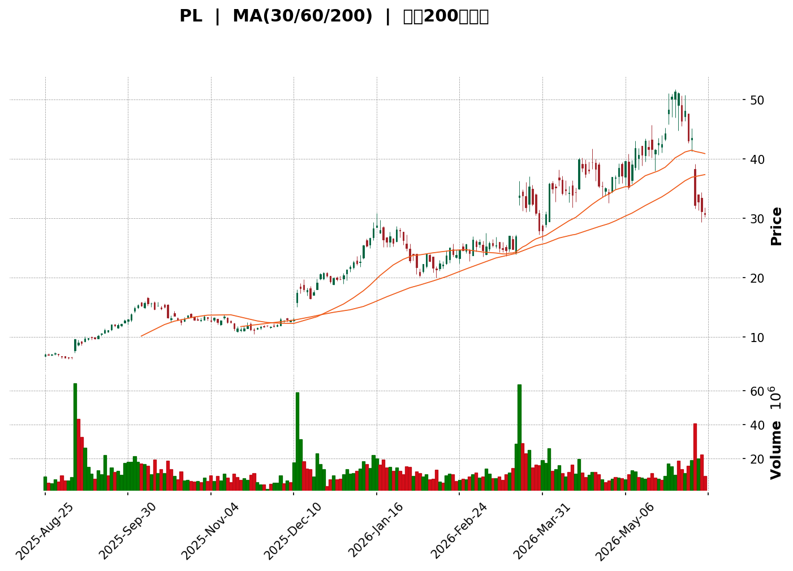
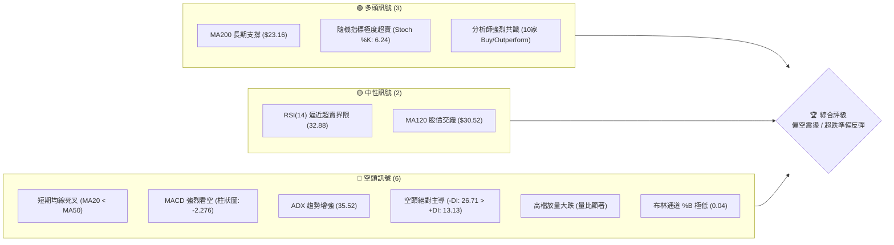
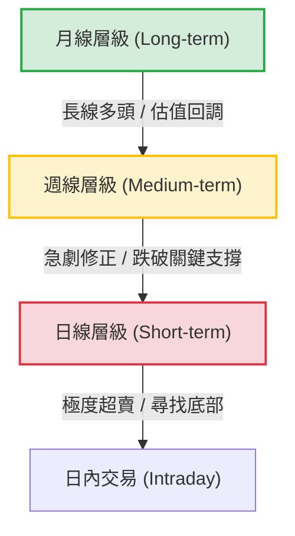
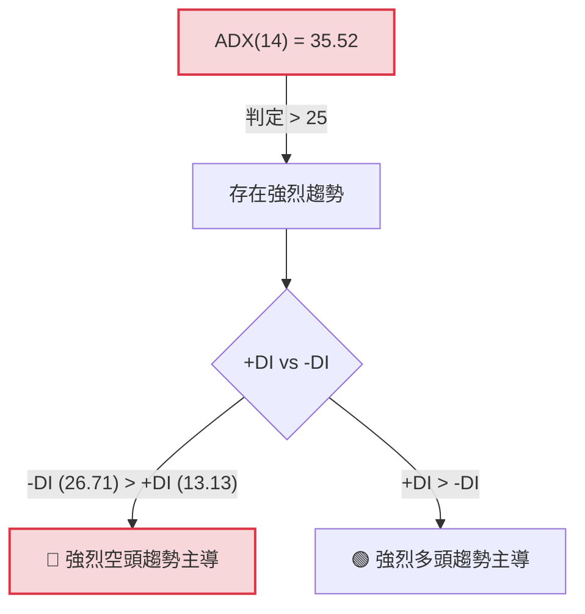
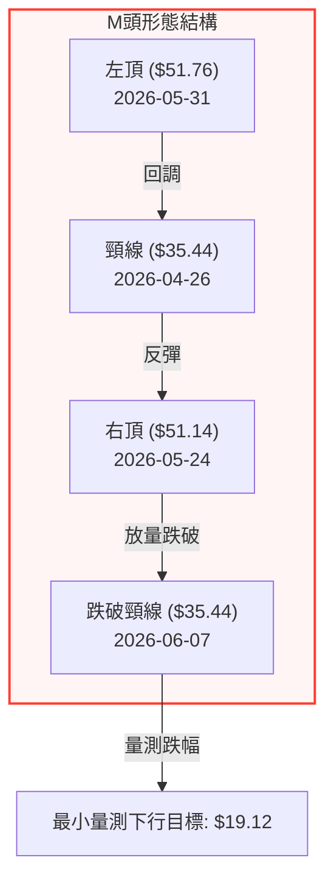

<details>
<summary>📊 靜態圖表 (點擊展開)</summary>

</details>

<html>
<head><meta charset="utf-8" /></head>
<body>
    <div style="height:500px; width:100%;">                        <script>window.PlotlyConfig = {MathJaxConfig: 'local'};</script>
        <script charset="utf-8" src="https://cdn.plot.ly/plotly-3.6.0.min.js" integrity="sha256-QaOVwtVY0T02VaHrr6pnoHLCwayMJp4O5n4YyaE3rJk=" crossorigin="anonymous"></script>                <div id="candlestick-chart" class="plotly-graph-div" style="height:100%; width:100%;"></div>            <script>                window.PLOTLYENV=window.PLOTLYENV || {};                                if (document.getElementById("candlestick-chart")) {                    Plotly.newPlot(                        "candlestick-chart",                        [{"close":{"dtype":"f8","bdata":"AAAAoHA9HEAAAAAghesbQAAAAIDrURxAAAAAQArXHEAAAAAAKVwcQAAAAKCZmRpAAAAAYI\u002fCGUAAAABACtcZQAAAAGC4HhpAAAAAgOtRI0AAAACAPQoiQAAAAOCj8CFAAAAAQApXI0AAAAAgXI8jQAAAAOBRuCNAAAAAAACAI0AAAACAwnUkQAAAAOBROCVAAAAA4FE4JkAAAADgUTgmQAAAAKCZGShAAAAAACncJ0AAAAAghesnQAAAAGBmZihAAAAA4HqUKUAAAACAwvUpQAAAAIA9iitAAAAAQDOzLUAAAABguJ4uQAAAAEDhei5AAAAAAClcL0AAAABAMzMvQAAAAIDrUS9AAAAAYGZmLUAAAAAAAIAuQAAAACBcjy1AAAAAgBQuLkAAAACAwnUqQAAAAOBROCpAAAAAYLgeK0AAAACA69EpQAAAAAAAAClAAAAAYGbmKUAAAADgUTgrQAAAAGC4nipAAAAAgBSuKUAAAADAzMwpQAAAAOBRuClAAAAAYGbmKkAAAACgR2EqQAAAAGBmZilAAAAAAACAKkAAAAAghesoQAAAAGC4nilAAAAAIK7HKkAAAADgo\u002fAoQAAAAKBH4ShAAAAAgOvRJkAAAADAzMwmQAAAACCFayZAAAAAYGbmJkAAAADgepQnQAAAAIDCdSZAAAAAgOtRJkAAAADgehQnQAAAAIDCdSdAAAAA4KNwJ0AAAADAzMwnQAAAAGBmZidAAAAAgD2KJ0AAAADAHgUoQAAAAKBH4SlAAAAAgD2KKUAAAABgZuYpQAAAAIAUrilAAAAAoEfhKUAAAADgUXgxQAAAAKBwPTJAAAAAwMwMMkAAAACgR+ExQAAAAOBReDBAAAAAoHB9MUAAAACAFC4zQAAAAKCZmTRAAAAAQOG6NEAAAACA61E0QAAAAAApXDNAAAAAYLjeM0AAAACgcL0zQAAAAOBRuDNAAAAAwPVoNEAAAAAA12M1QAAAAEAK1zVAAAAAACmcNkAAAADgo3A2QAAAAIDCtTZAAAAA4KNwOUAAAACA61E5QAAAAEDhujpAAAAAIK5HPEAAAAAgrsc8QAAAAAAAADxAAAAAoEdhOkAAAAAgXA86QAAAAOCj8DpAAAAAYLjeOUAAAACA6xE8QAAAAKBH4TtAAAAAoJlZOkAAAADgUfg4QAAAAKCZ2TZAAAAAQDPzN0AAAADAHsU1QAAAAIAUbjRAAAAAYI9CNkAAAADAHgU4QAAAAIA9yjZAAAAAYGamNUAAAADAzEw1QAAAACCFazZAAAAAgMI1NkAAAACgcL03QAAAAAApHDlAAAAAYGbmN0AAAAAgrsc3QAAAAIDCtThAAAAAoEehOEAAAACgmZk5QAAAAADXIzhAAAAAAClcOkAAAADAzEw5QAAAAAAAADpAAAAAQAqXOEAAAAAgrkc5QAAAAIDr0TlAAAAAYGZmOUAAAADgo3A5QAAAAOBR+DhAAAAAgD3KOEAAAACgmZk4QAAAAOB6FDtAAAAAIFzPOEAAAACAwvU6QAAAAIA96kBAAAAAwPXoQEAAAADgetQ\u002fQAAAACBcr0FAAAAAQDMzQEAAAAAAKdw+QAAAAADX4ztAAAAAQDPzO0AAAACAwrU+QAAAAOCj8EFAAAAAYI+CQUAAAACAwpVBQAAAAGBmRkJAAAAAoHAdQUAAAACAwlVBQAAAAMD1KEFAAAAAQAr3QEAAAADgejRBQAAAAIDr8UNAAAAAoHA9Q0AAAAAAAMBCQAAAAADXA0NAAAAAACm8Q0AAAADAHiVDQAAAAOBRuEFAAAAAoJm5QUAAAAAA14NBQAAAAIA9CkFAAAAAACl8QkAAAABAM3NCQAAAAMAeRUNAAAAA4KOQQkAAAADgUdhDQAAAAGC4nkFAAAAAwB6FQ0AAAAAghetEQAAAAEAKV0RAAAAAYLheREAAAADAHoVFQAAAACBcz0RAAAAAgBTOREAAAAAghctEQAAAAOB6VEVAAAAAoHA9RUAAAADAzCxGQAAAAMD1KEhAAAAAoHA9SUAAAABAM7NJQAAAAIDrkUlAAAAAQOE6R0AAAAAghQtIQAAAAOCjkEVAAAAAANfDRUAAAAAAKRxAQAAAAGC4XkBAAAAAIIUrP0AAAADgUbg+QA=="},"high":{"dtype":"f8","bdata":"AAAAQArXHEAAAACAwvUcQAAAAIA9ihxAAAAAwB6FHUAAAABg46UcQAAAAMD1KBtAAAAAgD0KG0AAAABAMzMaQAAAAKCZmRpAAAAAAH9qI0AAAAAAKRwjQAAAAEAzsyJAAAAAwPUoJEAAAADgepQjQAAAAOBROCRAAAAAQLbzI0AAAADAzMwkQAAAACCFayVAAAAAgOvRJkAAAADAzEwmQAAAAGCPQihAAAAAgMJ1KEAAAAAgXI8oQAAAAMD1qChAAAAAAAAAKkAAAABguB4qQAAAAIA9CixAAAAAwMg2LkAAAAAAAAAvQAAAACCuxy9AAAAAYI8CMEAAAAAgrscwQAAAAKCZmS9AAAAAwMwMMEAAAABgZuYvQAAAAAAAgC5AAAAA4HpUL0AAAABANR4vQAAAAMD1KCtAAAAAgOvRLEAAAABACKwqQAAAAKCZGSpAAAAAACmcKkAAAACAFG4rQAAAACCF6ytAAAAA4KPwKkAAAAAghasqQAAAAGBmZipAAAAAgMJ1K0AAAABgj8IqQAAAAIA9CitAAAAA4KOwKkAAAACAPQoqQAAAAGBmpilAAAAAoJmZK0AAAACgcL0qQAAAAMDMzClAAAAAgOvRKEAAAABAM7MnQAAAAOBROCdAAAAAwB7FJ0AAAACAwvUoQAAAAAAAAClAAAAAAAAAJ0AAAAAgXE8nQAAAAKDtvCdAAAAAgD0KKEAAAADAHgUoQAAAAADXoydAAAAAwB6FKEAAAACgR2EoQAAAAGBmZipAAAAAAADAKUAAAACAwnUqQAAAAAAAACpAAAAAQOF6KkAAAACgmfkxQAAAAKCZGTNAAAAA4KOwM0AAAAAgrkcyQAAAAMDMjDJAAAAAQDPzMUAAAADgetQzQAAAAGCPwjRAAAAAoHD9NEAAAACAFO40QAAAAIDCVTRAAAAAwB4lNEAAAAAAKTw0QAAAAMDMTDRAAAAAIFzPNEAAAAAgXG81QAAAAEAzEzZAAAAAACncNkAAAACgmZk3QAAAAIDpxjdAAAAAIFyPOUAAAABACpc6QAAAAMAexTpAAAAAoEdhPUAAAABg4+U+QAAAAOBRuD1AAAAAIIWrPEAAAACAwOo6QAAAAEDhujtAAAAAQDOzOkAAAABAM7M8QAAAAGBmZjxAAAAAQDOzO0AAAAAAAEA7QAAAAMChxTlAAAAAAKz8N0AAAAAAAAA4QAAAAIDAijVAAAAAIK5HNkAAAADgURg4QAAAAEDh+jdAAAAAYGaGN0AAAADA9eg1QAAAAIAU7jZAAAAAgD3KNkAAAACgmZk4QAAAAAApHDlAAAAA4KOwOUAAAADgerQ4QAAAACBczzhAAAAAQGLQOUAAAADgo7A5QAAAAEAK1zhAAAAAgBTuOkAAAADgo3A6QAAAAKBHgTpAAAAAoHA9OkAAAAAAqpE7QAAAAEAKFzpAAAAA4FF4OkAAAAAghes6QAAAACBcDzpAAAAAgOkGOkAAAAAAAIA5QAAAAEAKFztAAAAA4HoUO0AAAABgj0I7QAAAAADXI0JAAAAAIIVrQUAAAAAghQtCQAAAAGBmhkJAAAAAANXYQUAAAABguB5BQAAAAMD1aD9AAAAAgBTuPEAAAACAFC4\u002fQAAAAMAeBUJAAAAAwB4lQkAAAABgZuZBQAAAAEDhGkNAAAAAgMKVQkAAAACA6zFCQAAAAIAUvkFAAAAAIFg5QkAAAACAwpVBQAAAAKBwHURAAAAAoHAdREAAAADgevRDQAAAAADXw0NAAAAAQOHaREAAAAAAAABEQAAAAAAAwENAAAAAoHAdQkAAAABACqdBQAAAAAAAgEFAAAAAACl8QkAAAADgeqRCQAAAAGCPokNAAAAAQAq3Q0AAAACgR+FDQAAAAIDCdURAAAAAwMzsQ0AAAAAgXI9FQAAAAOCj8ERAAAAAoJkZRUAAAACgmblFQAAAAEAKl0VAAAAAANfjRkAAAAAAAOBEQAAAAGBmxkVAAAAAAAAARkAAAABADKJGQAAAAOCjkElAAAAAoHB9SUAAAACgR+FJQAAAAGCPoklAAAAAAABgSUAAAABgj2JJQAAAACBcz0dAAAAAwB6VRkAAAABACpdDQAAAAMAeBUFAAAAAIFwvQUAAAADAzMw\u002fQA=="},"hovertemplate":"\u003cb\u003e%{x|%Y-%m-%d}\u003c\u002fb\u003e\u003cbr\u003e\u958b: $%{open:.2f}\u003cbr\u003e\u9ad8: $%{high:.2f}\u003cbr\u003e\u4f4e: $%{low:.2f}\u003cbr\u003e\u6536: $%{close:.2f}\u003cextra\u003e\u003c\u002fextra\u003e","low":{"dtype":"f8","bdata":"AAAAIIXrGkAAAAAg2c4bQAAAAGBmZhtAAAAAQArXG0AAAABACCwbQAAAAADXoxlAAAAA4FG4GUAAAADA9SgZQAAAAMAeBRlAAAAAwPUoHUAAAADAHgUhQAAAAOCjMCFAAAAAYI9CIkAAAAAgrsciQAAAAOBR+CJAAAAAgOtRI0AAAAAAKVwjQAAAAOCjcCRAAAAAQOE6JUAAAADgo3AlQAAAAADXIyZAAAAAQApXJ0AAAABACtcmQAAAAMAehSdAAAAA4FG4KEAAAACgcD0oQAAAAEAzMylAAAAAwPUoLEAAAADAHoUtQAAAAKBHYS5AAAAAIFyPLUAAAADAHoUuQAAAAMD1KC5AAAAAACkcLUAAAACA61EuQAAAAEAKFy1AAAAAQDOzLUAAAACgcD0qQAAAACDdJClAAAAAAAAAK0AAAABguJ4pQAAAAOCj8CdAAAAAgBQuKUAAAAAgrkcqQAAAAIA9iipAAAAAIFyPKUAAAAAgrocpQAAAAEDfDylAAAAAIK7HKUAAAACAwnUpQAAAACCF6yhAAAAAIFwPKUAAAAAA1yMoQAAAAAAp3CdAAAAAYBDYKUAAAAAgXI8oQAAAAMD1qChAAAAAQAoXJkAAAADAyHYlQAAAAGCPwiVAAAAAgBTuJUAAAADAzMwmQAAAAICXLiZAAAAAgD0KJUAAAADAHoUmQAAAAMAehSZAAAAAYI9CJ0AAAACAl24nQAAAAMDMzCZAAAAA4HpUJ0AAAABA4XonQAAAAAAp3CdAAAAAwB4FKUAAAACgcD0pQAAAAEA1HilAAAAAwPUoKUAAAADAHgUuQAAAAGC4XjFAAAAAANejMUAAAACAFO4wQAAAAIAUbjBAAAAAgD0KMUAAAACgcP0xQAAAAAApnDNAAAAAoJmZM0AAAAAAKRw0QAAAAIA9CjNAAAAAYI\u002fCMkAAAADgo3AzQAAAAECJoTNAAAAAANX4MkAAAACgcH0zQAAAAOBR+DRAAAAAwPVoNUAAAABAChc2QAAAAMAg0DVAAAAAwPUoN0AAAABguB45QAAAAAAAADlAAAAAYI9COkAAAAAAKVw8QAAAACBcbztAAAAAoEchOUAAAAAA1yM5QAAAAIAULjlAAAAA4FE4OUAAAACgGg86QAAAACBczzpAAAAAwMyMOUAAAACA63E4QAAAAEAKdzZAAAAAwPXoNkAAAABACpc0QAAAAGBmJjRAAAAAIFzPNEAAAABgZqY1QAAAAIDCtTZAAAAAwPXoNEAAAABA4fozQAAAACAGITVAAAAAAACANUAAAACgcD02QAAAAIDCdTZAAAAAYI+CN0AAAABA4To3QAAAAKCZWTZAAAAAoHB9OEAAAACA6xE4QAAAACCuxzZAAAAA4FG4N0AAAACgR2E4QAAAAIBoETlAAAAAYI+CN0AAAACgmdk3QAAAAEAzczhAAAAAQDMzOUAAAADgo\u002fA4QAAAACCuRzhAAAAAIFxPOEAAAADgeKk3QAAAAGBmZjhAAAAAYI\u002fCOEAAAADgo\u002fA3QAAAAIBoIUBAAAAAQOE6P0AAAAAAKRw\u002fQAAAAKBHIT9AAAAAIFwPQEAAAACAPYo+QAAAAGC4PjtAAAAAwPVIOkAAAADAHoU8QAAAAOCjcD1AAAAAQOEaQUAAAABgj2JAQAAAAOBRuEFAAAAA4FH4QEAAAACgmflAQAAAAAApXEBAAAAAoEfhP0AAAAAgrmdAQAAAAGBmdkFAAAAAIIXrQkAAAABACndCQAAAAGCPwkJAAAAAANcjQ0AAAACAPSpCQAAAAOCjkEFAAAAA4KPQQEAAAADA891AQAAAAMD1SEBAAAAAwEsnQUAAAADgpWtBQAAAAMD16EFAAAAAoJn5QUAAAACgR8FBQAAAAEAKd0FAAAAAYGbmQUAAAADAzAxDQAAAAKBHIUNAAAAAwMxsQ0AAAADAzMxDQAAAAMAeRURAAAAAoEchREAAAABgjwJDQAAAAIDCVURAAAAAwB6FREAAAADAzIxFQAAAAIAU7kZAAAAAgBSOR0AAAAAAAIBHQAAAAADXY0ZAAAAAANfDRkAAAABA4TpHQAAAAMAeVUVAAAAAYGamREAAAADA9ag\u002fQAAAAOB6VD9AAAAAgOtRPUAAAADAdDM+QA=="},"name":"\u50f9\u683c","open":{"dtype":"f8","bdata":"AAAAYLgeG0AAAABguB4cQAAAACCF6xtAAAAAQOF6HEAAAAAgXI8cQAAAAIA9ChtAAAAAgD0KG0AAAABAMzMaQAAAAOCjcBpAAAAAgOvRHkAAAAAgrkchQAAAAGBmZiJAAAAAoEdhIkAAAACgcD0jQAAAAOCj8CNAAAAA4FG4I0AAAAAAAIAjQAAAAIDC9SRAAAAAgOtRJUAAAADgUbglQAAAAEDheiZAAAAAIK5HKEAAAAAAAAAnQAAAAOBRuCdAAAAAIK7HKEAAAABgZmYpQAAAAIAUrilAAAAA4FG4LEAAAABgZuYtQAAAAKCZmS9AAAAAAAAALkAAAADAzIwwQAAAAIAULi9AAAAA4FG4L0AAAAAghWsuQAAAAAAAAC5AAAAAYGbmLkAAAADgo\u002fAuQAAAAAAAACpAAAAAgD0KLEAAAAAAKVwqQAAAAAAAgClAAAAAYI9CKUAAAACgmZkqQAAAAGBm5itAAAAAwMzMKkAAAAAghespQAAAAEDheilAAAAAIK7HKUAAAADA9agqQAAAAIDCdSlAAAAAgBSuKUAAAADAHgUqQAAAAOBROChAAAAAgMJ1KkAAAABgZmYqQAAAAGCPQilAAAAAgD2KKEAAAAAAAAAmQAAAAAApXCZAAAAA4HoUJkAAAAAghesmQAAAAGBmZihAAAAAQOF6JkAAAABAM7MmQAAAAMAeBSdAAAAAgD2KJ0AAAACA69EnQAAAAEAzMydAAAAAYI\u002fCJ0AAAADA9agnQAAAAGBm5idAAAAAwB6FKUAAAAAAKVwqQAAAAKBwPSlAAAAAoJmZKUAAAADgepQvQAAAAOCjcDJAAAAAIFzPMkAAAABgZqYxQAAAAIAULjJAAAAAgD0KMUAAAACgcP0xQAAAACCuxzNAAAAAwMzMM0AAAABA4bo0QAAAAMDMTDRAAAAAoHDdMkAAAAAgrgc0QAAAAGC4vjNAAAAAQOHaM0AAAABAM7M0QAAAAAAAgDVAAAAA4FG4NUAAAACgmdk2QAAAAKCZmTZAAAAAwMxMN0AAAABgj0I6QAAAAAAAgDlAAAAAIFzPOkAAAABAM3M8QAAAAEAKlztAAAAAAACAPEAAAAAAAMA6QAAAAGCPAjpAAAAAoJmZOkAAAADgehQ6QAAAAMDMDDxAAAAAQDOzO0AAAABACrc5QAAAAADX4zhAAAAAQOH6N0AAAAAAAAA4QAAAAAAAADVAAAAAgD0KNUAAAACAwvU1QAAAAGC43jdAAAAAYGaGN0AAAACA65E1QAAAAAAAgDVAAAAAAAAANkAAAABgZmY2QAAAAMAeBTdAAAAAoHC9OEAAAABgZmY3QAAAAAAAQDdAAAAAwMxMOUAAAAAAAIA4QAAAAEAzkzhAAAAA4FG4N0AAAABA4Ro6QAAAAKCZmTlAAAAAAACAOUAAAAAA1+M3QAAAAEAK1zhAAAAAgOvROUAAAABAClc5QAAAAOBR+DlAAAAAQOH6OEAAAACgRyE5QAAAAKCZ2ThAAAAAAACAOkAAAAAAAEA4QAAAAGBmxkBAAAAAAABAQUAAAABA4dpAQAAAAEAzM0BAAAAAACl8QUAAAACgcP1AQAAAAKCZ2T5AAAAAwMzMPEAAAAAAAAA9QAAAAOCjcD1AAAAAgML1QUAAAADgo7BBQAAAAEAzc0JAAAAAAABAQkAAAADgo3BBQAAAAKBwHUFAAAAAIIXLQUAAAACAwjVBQAAAAKBwfUFAAAAAgOuRQ0AAAABAM5NDQAAAAAApHENAAAAAAADAQ0AAAACAPapDQAAAAIAUjkNAAAAAACm8QUAAAADAzExBQAAAAOCjMEFAAAAAANdDQUAAAAAgXF9CQAAAAMAehUJAAAAAoJmZQ0AAAAAgXH9CQAAAAGCPwkNAAAAAQDMzQkAAAABAM1NDQAAAACCFC0RAAAAAQAoXRUAAAADgo1BEQAAAAMD1CEVAAAAAANejRUAAAABACndEQAAAAEAzM0VAAAAAwHIIRUAAAADAzKxFQAAAAMD12EdAAAAAwMwMSUAAAABAMxNJQAAAAAAAkEhAAAAAIIWLSEAAAACAwpVHQAAAACBcz0dAAAAAoHCdRUAAAABgZiZDQAAAAKBHAUFAAAAAgMK1QEAAAAAA1+M+QA=="},"x":["2025-08-25T00:00:00-04:00","2025-08-26T00:00:00-04:00","2025-08-27T00:00:00-04:00","2025-08-28T00:00:00-04:00","2025-08-29T00:00:00-04:00","2025-09-02T00:00:00-04:00","2025-09-03T00:00:00-04:00","2025-09-04T00:00:00-04:00","2025-09-05T00:00:00-04:00","2025-09-08T00:00:00-04:00","2025-09-09T00:00:00-04:00","2025-09-10T00:00:00-04:00","2025-09-11T00:00:00-04:00","2025-09-12T00:00:00-04:00","2025-09-15T00:00:00-04:00","2025-09-16T00:00:00-04:00","2025-09-17T00:00:00-04:00","2025-09-18T00:00:00-04:00","2025-09-19T00:00:00-04:00","2025-09-22T00:00:00-04:00","2025-09-23T00:00:00-04:00","2025-09-24T00:00:00-04:00","2025-09-25T00:00:00-04:00","2025-09-26T00:00:00-04:00","2025-09-29T00:00:00-04:00","2025-09-30T00:00:00-04:00","2025-10-01T00:00:00-04:00","2025-10-02T00:00:00-04:00","2025-10-03T00:00:00-04:00","2025-10-06T00:00:00-04:00","2025-10-07T00:00:00-04:00","2025-10-08T00:00:00-04:00","2025-10-09T00:00:00-04:00","2025-10-10T00:00:00-04:00","2025-10-13T00:00:00-04:00","2025-10-14T00:00:00-04:00","2025-10-15T00:00:00-04:00","2025-10-16T00:00:00-04:00","2025-10-17T00:00:00-04:00","2025-10-20T00:00:00-04:00","2025-10-21T00:00:00-04:00","2025-10-22T00:00:00-04:00","2025-10-23T00:00:00-04:00","2025-10-24T00:00:00-04:00","2025-10-27T00:00:00-04:00","2025-10-28T00:00:00-04:00","2025-10-29T00:00:00-04:00","2025-10-30T00:00:00-04:00","2025-10-31T00:00:00-04:00","2025-11-03T00:00:00-05:00","2025-11-04T00:00:00-05:00","2025-11-05T00:00:00-05:00","2025-11-06T00:00:00-05:00","2025-11-07T00:00:00-05:00","2025-11-10T00:00:00-05:00","2025-11-11T00:00:00-05:00","2025-11-12T00:00:00-05:00","2025-11-13T00:00:00-05:00","2025-11-14T00:00:00-05:00","2025-11-17T00:00:00-05:00","2025-11-18T00:00:00-05:00","2025-11-19T00:00:00-05:00","2025-11-20T00:00:00-05:00","2025-11-21T00:00:00-05:00","2025-11-24T00:00:00-05:00","2025-11-25T00:00:00-05:00","2025-11-26T00:00:00-05:00","2025-11-28T00:00:00-05:00","2025-12-01T00:00:00-05:00","2025-12-02T00:00:00-05:00","2025-12-03T00:00:00-05:00","2025-12-04T00:00:00-05:00","2025-12-05T00:00:00-05:00","2025-12-08T00:00:00-05:00","2025-12-09T00:00:00-05:00","2025-12-10T00:00:00-05:00","2025-12-11T00:00:00-05:00","2025-12-12T00:00:00-05:00","2025-12-15T00:00:00-05:00","2025-12-16T00:00:00-05:00","2025-12-17T00:00:00-05:00","2025-12-18T00:00:00-05:00","2025-12-19T00:00:00-05:00","2025-12-22T00:00:00-05:00","2025-12-23T00:00:00-05:00","2025-12-24T00:00:00-05:00","2025-12-26T00:00:00-05:00","2025-12-29T00:00:00-05:00","2025-12-30T00:00:00-05:00","2025-12-31T00:00:00-05:00","2026-01-02T00:00:00-05:00","2026-01-05T00:00:00-05:00","2026-01-06T00:00:00-05:00","2026-01-07T00:00:00-05:00","2026-01-08T00:00:00-05:00","2026-01-09T00:00:00-05:00","2026-01-12T00:00:00-05:00","2026-01-13T00:00:00-05:00","2026-01-14T00:00:00-05:00","2026-01-15T00:00:00-05:00","2026-01-16T00:00:00-05:00","2026-01-20T00:00:00-05:00","2026-01-21T00:00:00-05:00","2026-01-22T00:00:00-05:00","2026-01-23T00:00:00-05:00","2026-01-26T00:00:00-05:00","2026-01-27T00:00:00-05:00","2026-01-28T00:00:00-05:00","2026-01-29T00:00:00-05:00","2026-01-30T00:00:00-05:00","2026-02-02T00:00:00-05:00","2026-02-03T00:00:00-05:00","2026-02-04T00:00:00-05:00","2026-02-05T00:00:00-05:00","2026-02-06T00:00:00-05:00","2026-02-09T00:00:00-05:00","2026-02-10T00:00:00-05:00","2026-02-11T00:00:00-05:00","2026-02-12T00:00:00-05:00","2026-02-13T00:00:00-05:00","2026-02-17T00:00:00-05:00","2026-02-18T00:00:00-05:00","2026-02-19T00:00:00-05:00","2026-02-20T00:00:00-05:00","2026-02-23T00:00:00-05:00","2026-02-24T00:00:00-05:00","2026-02-25T00:00:00-05:00","2026-02-26T00:00:00-05:00","2026-02-27T00:00:00-05:00","2026-03-02T00:00:00-05:00","2026-03-03T00:00:00-05:00","2026-03-04T00:00:00-05:00","2026-03-05T00:00:00-05:00","2026-03-06T00:00:00-05:00","2026-03-09T00:00:00-04:00","2026-03-10T00:00:00-04:00","2026-03-11T00:00:00-04:00","2026-03-12T00:00:00-04:00","2026-03-13T00:00:00-04:00","2026-03-16T00:00:00-04:00","2026-03-17T00:00:00-04:00","2026-03-18T00:00:00-04:00","2026-03-19T00:00:00-04:00","2026-03-20T00:00:00-04:00","2026-03-23T00:00:00-04:00","2026-03-24T00:00:00-04:00","2026-03-25T00:00:00-04:00","2026-03-26T00:00:00-04:00","2026-03-27T00:00:00-04:00","2026-03-30T00:00:00-04:00","2026-03-31T00:00:00-04:00","2026-04-01T00:00:00-04:00","2026-04-02T00:00:00-04:00","2026-04-06T00:00:00-04:00","2026-04-07T00:00:00-04:00","2026-04-08T00:00:00-04:00","2026-04-09T00:00:00-04:00","2026-04-10T00:00:00-04:00","2026-04-13T00:00:00-04:00","2026-04-14T00:00:00-04:00","2026-04-15T00:00:00-04:00","2026-04-16T00:00:00-04:00","2026-04-17T00:00:00-04:00","2026-04-20T00:00:00-04:00","2026-04-21T00:00:00-04:00","2026-04-22T00:00:00-04:00","2026-04-23T00:00:00-04:00","2026-04-24T00:00:00-04:00","2026-04-27T00:00:00-04:00","2026-04-28T00:00:00-04:00","2026-04-29T00:00:00-04:00","2026-04-30T00:00:00-04:00","2026-05-01T00:00:00-04:00","2026-05-04T00:00:00-04:00","2026-05-05T00:00:00-04:00","2026-05-06T00:00:00-04:00","2026-05-07T00:00:00-04:00","2026-05-08T00:00:00-04:00","2026-05-11T00:00:00-04:00","2026-05-12T00:00:00-04:00","2026-05-13T00:00:00-04:00","2026-05-14T00:00:00-04:00","2026-05-15T00:00:00-04:00","2026-05-18T00:00:00-04:00","2026-05-19T00:00:00-04:00","2026-05-20T00:00:00-04:00","2026-05-21T00:00:00-04:00","2026-05-22T00:00:00-04:00","2026-05-26T00:00:00-04:00","2026-05-27T00:00:00-04:00","2026-05-28T00:00:00-04:00","2026-05-29T00:00:00-04:00","2026-06-01T00:00:00-04:00","2026-06-02T00:00:00-04:00","2026-06-03T00:00:00-04:00","2026-06-04T00:00:00-04:00","2026-06-05T00:00:00-04:00","2026-06-08T00:00:00-04:00","2026-06-09T00:00:00-04:00","2026-06-10T00:00:00-04:00"],"type":"candlestick"},{"hovertemplate":"MA30: $%{y:.2f}\u003cextra\u003e\u003c\u002fextra\u003e","line":{"color":"#2196F3","dash":"dash","width":2},"mode":"lines","name":"MA30","x":["2025-08-25T00:00:00-04:00","2025-08-26T00:00:00-04:00","2025-08-27T00:00:00-04:00","2025-08-28T00:00:00-04:00","2025-08-29T00:00:00-04:00","2025-09-02T00:00:00-04:00","2025-09-03T00:00:00-04:00","2025-09-04T00:00:00-04:00","2025-09-05T00:00:00-04:00","2025-09-08T00:00:00-04:00","2025-09-09T00:00:00-04:00","2025-09-10T00:00:00-04:00","2025-09-11T00:00:00-04:00","2025-09-12T00:00:00-04:00","2025-09-15T00:00:00-04:00","2025-09-16T00:00:00-04:00","2025-09-17T00:00:00-04:00","2025-09-18T00:00:00-04:00","2025-09-19T00:00:00-04:00","2025-09-22T00:00:00-04:00","2025-09-23T00:00:00-04:00","2025-09-24T00:00:00-04:00","2025-09-25T00:00:00-04:00","2025-09-26T00:00:00-04:00","2025-09-29T00:00:00-04:00","2025-09-30T00:00:00-04:00","2025-10-01T00:00:00-04:00","2025-10-02T00:00:00-04:00","2025-10-03T00:00:00-04:00","2025-10-06T00:00:00-04:00","2025-10-07T00:00:00-04:00","2025-10-08T00:00:00-04:00","2025-10-09T00:00:00-04:00","2025-10-10T00:00:00-04:00","2025-10-13T00:00:00-04:00","2025-10-14T00:00:00-04:00","2025-10-15T00:00:00-04:00","2025-10-16T00:00:00-04:00","2025-10-17T00:00:00-04:00","2025-10-20T00:00:00-04:00","2025-10-21T00:00:00-04:00","2025-10-22T00:00:00-04:00","2025-10-23T00:00:00-04:00","2025-10-24T00:00:00-04:00","2025-10-27T00:00:00-04:00","2025-10-28T00:00:00-04:00","2025-10-29T00:00:00-04:00","2025-10-30T00:00:00-04:00","2025-10-31T00:00:00-04:00","2025-11-03T00:00:00-05:00","2025-11-04T00:00:00-05:00","2025-11-05T00:00:00-05:00","2025-11-06T00:00:00-05:00","2025-11-07T00:00:00-05:00","2025-11-10T00:00:00-05:00","2025-11-11T00:00:00-05:00","2025-11-12T00:00:00-05:00","2025-11-13T00:00:00-05:00","2025-11-14T00:00:00-05:00","2025-11-17T00:00:00-05:00","2025-11-18T00:00:00-05:00","2025-11-19T00:00:00-05:00","2025-11-20T00:00:00-05:00","2025-11-21T00:00:00-05:00","2025-11-24T00:00:00-05:00","2025-11-25T00:00:00-05:00","2025-11-26T00:00:00-05:00","2025-11-28T00:00:00-05:00","2025-12-01T00:00:00-05:00","2025-12-02T00:00:00-05:00","2025-12-03T00:00:00-05:00","2025-12-04T00:00:00-05:00","2025-12-05T00:00:00-05:00","2025-12-08T00:00:00-05:00","2025-12-09T00:00:00-05:00","2025-12-10T00:00:00-05:00","2025-12-11T00:00:00-05:00","2025-12-12T00:00:00-05:00","2025-12-15T00:00:00-05:00","2025-12-16T00:00:00-05:00","2025-12-17T00:00:00-05:00","2025-12-18T00:00:00-05:00","2025-12-19T00:00:00-05:00","2025-12-22T00:00:00-05:00","2025-12-23T00:00:00-05:00","2025-12-24T00:00:00-05:00","2025-12-26T00:00:00-05:00","2025-12-29T00:00:00-05:00","2025-12-30T00:00:00-05:00","2025-12-31T00:00:00-05:00","2026-01-02T00:00:00-05:00","2026-01-05T00:00:00-05:00","2026-01-06T00:00:00-05:00","2026-01-07T00:00:00-05:00","2026-01-08T00:00:00-05:00","2026-01-09T00:00:00-05:00","2026-01-12T00:00:00-05:00","2026-01-13T00:00:00-05:00","2026-01-14T00:00:00-05:00","2026-01-15T00:00:00-05:00","2026-01-16T00:00:00-05:00","2026-01-20T00:00:00-05:00","2026-01-21T00:00:00-05:00","2026-01-22T00:00:00-05:00","2026-01-23T00:00:00-05:00","2026-01-26T00:00:00-05:00","2026-01-27T00:00:00-05:00","2026-01-28T00:00:00-05:00","2026-01-29T00:00:00-05:00","2026-01-30T00:00:00-05:00","2026-02-02T00:00:00-05:00","2026-02-03T00:00:00-05:00","2026-02-04T00:00:00-05:00","2026-02-05T00:00:00-05:00","2026-02-06T00:00:00-05:00","2026-02-09T00:00:00-05:00","2026-02-10T00:00:00-05:00","2026-02-11T00:00:00-05:00","2026-02-12T00:00:00-05:00","2026-02-13T00:00:00-05:00","2026-02-17T00:00:00-05:00","2026-02-18T00:00:00-05:00","2026-02-19T00:00:00-05:00","2026-02-20T00:00:00-05:00","2026-02-23T00:00:00-05:00","2026-02-24T00:00:00-05:00","2026-02-25T00:00:00-05:00","2026-02-26T00:00:00-05:00","2026-02-27T00:00:00-05:00","2026-03-02T00:00:00-05:00","2026-03-03T00:00:00-05:00","2026-03-04T00:00:00-05:00","2026-03-05T00:00:00-05:00","2026-03-06T00:00:00-05:00","2026-03-09T00:00:00-04:00","2026-03-10T00:00:00-04:00","2026-03-11T00:00:00-04:00","2026-03-12T00:00:00-04:00","2026-03-13T00:00:00-04:00","2026-03-16T00:00:00-04:00","2026-03-17T00:00:00-04:00","2026-03-18T00:00:00-04:00","2026-03-19T00:00:00-04:00","2026-03-20T00:00:00-04:00","2026-03-23T00:00:00-04:00","2026-03-24T00:00:00-04:00","2026-03-25T00:00:00-04:00","2026-03-26T00:00:00-04:00","2026-03-27T00:00:00-04:00","2026-03-30T00:00:00-04:00","2026-03-31T00:00:00-04:00","2026-04-01T00:00:00-04:00","2026-04-02T00:00:00-04:00","2026-04-06T00:00:00-04:00","2026-04-07T00:00:00-04:00","2026-04-08T00:00:00-04:00","2026-04-09T00:00:00-04:00","2026-04-10T00:00:00-04:00","2026-04-13T00:00:00-04:00","2026-04-14T00:00:00-04:00","2026-04-15T00:00:00-04:00","2026-04-16T00:00:00-04:00","2026-04-17T00:00:00-04:00","2026-04-20T00:00:00-04:00","2026-04-21T00:00:00-04:00","2026-04-22T00:00:00-04:00","2026-04-23T00:00:00-04:00","2026-04-24T00:00:00-04:00","2026-04-27T00:00:00-04:00","2026-04-28T00:00:00-04:00","2026-04-29T00:00:00-04:00","2026-04-30T00:00:00-04:00","2026-05-01T00:00:00-04:00","2026-05-04T00:00:00-04:00","2026-05-05T00:00:00-04:00","2026-05-06T00:00:00-04:00","2026-05-07T00:00:00-04:00","2026-05-08T00:00:00-04:00","2026-05-11T00:00:00-04:00","2026-05-12T00:00:00-04:00","2026-05-13T00:00:00-04:00","2026-05-14T00:00:00-04:00","2026-05-15T00:00:00-04:00","2026-05-18T00:00:00-04:00","2026-05-19T00:00:00-04:00","2026-05-20T00:00:00-04:00","2026-05-21T00:00:00-04:00","2026-05-22T00:00:00-04:00","2026-05-26T00:00:00-04:00","2026-05-27T00:00:00-04:00","2026-05-28T00:00:00-04:00","2026-05-29T00:00:00-04:00","2026-06-01T00:00:00-04:00","2026-06-02T00:00:00-04:00","2026-06-03T00:00:00-04:00","2026-06-04T00:00:00-04:00","2026-06-05T00:00:00-04:00","2026-06-08T00:00:00-04:00","2026-06-09T00:00:00-04:00","2026-06-10T00:00:00-04:00"],"y":{"dtype":"f8","bdata":"AAAAAAAA+H8AAAAAAAD4fwAAAAAAAPh\u002fAAAAAAAA+H8AAAAAAAD4fwAAAAAAAPh\u002fAAAAAAAA+H8AAAAAAAD4fwAAAAAAAPh\u002fAAAAAAAA+H8AAAAAAAD4fwAAAAAAAPh\u002fAAAAAAAA+H8AAAAAAAD4fwAAAAAAAPh\u002fAAAAAAAA+H8AAAAAAAD4fwAAAAAAAPh\u002fAAAAAAAA+H8AAAAAAAD4fwAAAAAAAPh\u002fAAAAAAAA+H8AAAAAAAD4fwAAAAAAAPh\u002fAAAAAAAA+H8AAAAAAAD4fwAAAAAAAPh\u002fAAAAAAAA+H8AAAAAAAD4f4mIiHA9SiRAvLu7y1rdJEDv7u4meHAlQGZmZr7mAiZAVVVVDbuCJkCrqqqi\u002fg0nQFVVVSW\u002fmCdAq6qqkl8sKEDv7u4m6p8oQLy7u5s2EClAiYiI+MVSKUAzMzOjKZUpQBEREXFo0SlAq6qq+mIJKkARERGBwEoqQJqZmcmhhSpARERENF66KkDNzMyc7+cqQDMzMwNWDitAERERoUU2K0CamZlJxVkrQN7d3S3dZCtAiYiIWGR7K0ARERHh7IMrQDMzMwNWjitAREREdJOYK0C8u7s7348rQO\u002fu7l4seStAd3d3x3Y+K0CamZm5u\u002fsqQDMzM2P0tipAvLu7O8NuKkBmZmYWvS0qQO\u002fu7h4i4ilAAAAAoLelKUAzMzNjZmYpQLy7u7tYMilAq6qq+tT4KEDv7u4eIuIoQM3MzLwRyihAvLu7G4WrKEAzMzPzKJwoQGZmZlaroyhAiYiI6JigKEAzMzNTVZUoQM3MzNxPjShARERExASPKEBmZmZmA90oQKuqqvrUOClA7+7urlaHKUCrqqqaYdcpQLy7u\u002fu4FypAMzMz0xVgKkBERET0xdIqQLy7u\u002fu4VytA3t3d7f3UK0CamZkZ91osQLy7uwsR0SxAq6qqWnNhLUDv7u5eye8tQAAAACAGgS5AZmZm9vAZL0AAAAAAyL0vQGZmZuZtOTBA7+7uziKbMEARERE5JvgwQN7d3WXYVTFAIiIiMuzKMUAiIiKicD0yQDMzMyuyvTJAiYiI0JRKM0CJiIhwr9kzQDMzM4MyWjRAIiIiAlbONEBVVVU9NT41QBERESmHtjVA3t3dLd0kNkC8u7s7UX82QCIiIiKU0TZAMzMzw2cYN0Crqqoa6FQ3QN7d3W1ZizdAREREhHnCN0BVVVV1k9g3QGZmZhYg1zdAzczMbC7kN0AzMzMzwQM4QGZmZiYGIThA3t3dnTYwOEDNzMx8hj04QKuqqrqQVDhAMzMz4+xjOECrqqqK+nc4QHd3d\u002ffhkzhAMzMzA+SeOECamZlJU6o4QKuqqlpkuzhAERER4Xq0OEDNzMyM3rY4QLy7u5vEoDhA3t3dTWKQOEAAAAAgsHI4QO\u002fu7g6fYThA7+7uvlhSOEAAAADQsEs4QCIiIiIiQjhAZmZmZh8+OEBEREQUric4QGZmZhbZDjhAd3d3N4kBOEARERHxYP43QERERIR5IjhAZmZmNtApOEAAAADwGVY4QAAAALByyDhARERE5BcrOUCJiIgYvW05QFVVVYUW2TlAIiIiQtI0OkBmZmZmZoY6QLy7u8sTtTpAVVVVBQ\u002fmOkB3d3c3iSE7QERERKRwfTtAd3d3p1TcO0C8u7t7hj08QLy7u1uPojxAERER4Xr0PEB3d3eX4EE9QERERCS\u002fmD1A7+7uDljZPUCJiIgoFSc+QDMzM1OcnT5A3t3dfSMUP0DNzMx8anw\u002fQDMzM6Ob5D9AMzMzA1YuQEC8u7ujKWVAQLy7u6vVkUBAvLu7O1G\u002fQECrqqqS0etAQBEREXGvCUFAAAAAaJE9QUAiIiKK+mdBQFVVVR0TfEFAzczMhDKKQUC8u7u7u6tBQN7d3b0tq0FAREREZILHQUCrqqp6W\u002fZBQCIiIpLtLEJAmpmZqX9jQkAAAABQG5hCQLy7u+uYsEJAVVVV9bbMQkAAAABQG+hCQAAAABAtAkNAMzMzQ2AlQ0B3d3dnrU5DQDMzMyNpikNAZmZmJgbRQ0AzMzPDgxlEQDMzM8ODSURAzczMDJBrREB3d3cnv5hEQHd3d7eBrkRAERERUdS\u002fREAiIiJC7qVEQERERCRpmkRAVVVVPSaIREAiIiKSwnVEQA=="},"type":"scatter"},{"hovertemplate":"MA60: $%{y:.2f}\u003cextra\u003e\u003c\u002fextra\u003e","line":{"color":"#9C27B0","dash":"dash","width":2},"mode":"lines","name":"MA60","x":["2025-08-25T00:00:00-04:00","2025-08-26T00:00:00-04:00","2025-08-27T00:00:00-04:00","2025-08-28T00:00:00-04:00","2025-08-29T00:00:00-04:00","2025-09-02T00:00:00-04:00","2025-09-03T00:00:00-04:00","2025-09-04T00:00:00-04:00","2025-09-05T00:00:00-04:00","2025-09-08T00:00:00-04:00","2025-09-09T00:00:00-04:00","2025-09-10T00:00:00-04:00","2025-09-11T00:00:00-04:00","2025-09-12T00:00:00-04:00","2025-09-15T00:00:00-04:00","2025-09-16T00:00:00-04:00","2025-09-17T00:00:00-04:00","2025-09-18T00:00:00-04:00","2025-09-19T00:00:00-04:00","2025-09-22T00:00:00-04:00","2025-09-23T00:00:00-04:00","2025-09-24T00:00:00-04:00","2025-09-25T00:00:00-04:00","2025-09-26T00:00:00-04:00","2025-09-29T00:00:00-04:00","2025-09-30T00:00:00-04:00","2025-10-01T00:00:00-04:00","2025-10-02T00:00:00-04:00","2025-10-03T00:00:00-04:00","2025-10-06T00:00:00-04:00","2025-10-07T00:00:00-04:00","2025-10-08T00:00:00-04:00","2025-10-09T00:00:00-04:00","2025-10-10T00:00:00-04:00","2025-10-13T00:00:00-04:00","2025-10-14T00:00:00-04:00","2025-10-15T00:00:00-04:00","2025-10-16T00:00:00-04:00","2025-10-17T00:00:00-04:00","2025-10-20T00:00:00-04:00","2025-10-21T00:00:00-04:00","2025-10-22T00:00:00-04:00","2025-10-23T00:00:00-04:00","2025-10-24T00:00:00-04:00","2025-10-27T00:00:00-04:00","2025-10-28T00:00:00-04:00","2025-10-29T00:00:00-04:00","2025-10-30T00:00:00-04:00","2025-10-31T00:00:00-04:00","2025-11-03T00:00:00-05:00","2025-11-04T00:00:00-05:00","2025-11-05T00:00:00-05:00","2025-11-06T00:00:00-05:00","2025-11-07T00:00:00-05:00","2025-11-10T00:00:00-05:00","2025-11-11T00:00:00-05:00","2025-11-12T00:00:00-05:00","2025-11-13T00:00:00-05:00","2025-11-14T00:00:00-05:00","2025-11-17T00:00:00-05:00","2025-11-18T00:00:00-05:00","2025-11-19T00:00:00-05:00","2025-11-20T00:00:00-05:00","2025-11-21T00:00:00-05:00","2025-11-24T00:00:00-05:00","2025-11-25T00:00:00-05:00","2025-11-26T00:00:00-05:00","2025-11-28T00:00:00-05:00","2025-12-01T00:00:00-05:00","2025-12-02T00:00:00-05:00","2025-12-03T00:00:00-05:00","2025-12-04T00:00:00-05:00","2025-12-05T00:00:00-05:00","2025-12-08T00:00:00-05:00","2025-12-09T00:00:00-05:00","2025-12-10T00:00:00-05:00","2025-12-11T00:00:00-05:00","2025-12-12T00:00:00-05:00","2025-12-15T00:00:00-05:00","2025-12-16T00:00:00-05:00","2025-12-17T00:00:00-05:00","2025-12-18T00:00:00-05:00","2025-12-19T00:00:00-05:00","2025-12-22T00:00:00-05:00","2025-12-23T00:00:00-05:00","2025-12-24T00:00:00-05:00","2025-12-26T00:00:00-05:00","2025-12-29T00:00:00-05:00","2025-12-30T00:00:00-05:00","2025-12-31T00:00:00-05:00","2026-01-02T00:00:00-05:00","2026-01-05T00:00:00-05:00","2026-01-06T00:00:00-05:00","2026-01-07T00:00:00-05:00","2026-01-08T00:00:00-05:00","2026-01-09T00:00:00-05:00","2026-01-12T00:00:00-05:00","2026-01-13T00:00:00-05:00","2026-01-14T00:00:00-05:00","2026-01-15T00:00:00-05:00","2026-01-16T00:00:00-05:00","2026-01-20T00:00:00-05:00","2026-01-21T00:00:00-05:00","2026-01-22T00:00:00-05:00","2026-01-23T00:00:00-05:00","2026-01-26T00:00:00-05:00","2026-01-27T00:00:00-05:00","2026-01-28T00:00:00-05:00","2026-01-29T00:00:00-05:00","2026-01-30T00:00:00-05:00","2026-02-02T00:00:00-05:00","2026-02-03T00:00:00-05:00","2026-02-04T00:00:00-05:00","2026-02-05T00:00:00-05:00","2026-02-06T00:00:00-05:00","2026-02-09T00:00:00-05:00","2026-02-10T00:00:00-05:00","2026-02-11T00:00:00-05:00","2026-02-12T00:00:00-05:00","2026-02-13T00:00:00-05:00","2026-02-17T00:00:00-05:00","2026-02-18T00:00:00-05:00","2026-02-19T00:00:00-05:00","2026-02-20T00:00:00-05:00","2026-02-23T00:00:00-05:00","2026-02-24T00:00:00-05:00","2026-02-25T00:00:00-05:00","2026-02-26T00:00:00-05:00","2026-02-27T00:00:00-05:00","2026-03-02T00:00:00-05:00","2026-03-03T00:00:00-05:00","2026-03-04T00:00:00-05:00","2026-03-05T00:00:00-05:00","2026-03-06T00:00:00-05:00","2026-03-09T00:00:00-04:00","2026-03-10T00:00:00-04:00","2026-03-11T00:00:00-04:00","2026-03-12T00:00:00-04:00","2026-03-13T00:00:00-04:00","2026-03-16T00:00:00-04:00","2026-03-17T00:00:00-04:00","2026-03-18T00:00:00-04:00","2026-03-19T00:00:00-04:00","2026-03-20T00:00:00-04:00","2026-03-23T00:00:00-04:00","2026-03-24T00:00:00-04:00","2026-03-25T00:00:00-04:00","2026-03-26T00:00:00-04:00","2026-03-27T00:00:00-04:00","2026-03-30T00:00:00-04:00","2026-03-31T00:00:00-04:00","2026-04-01T00:00:00-04:00","2026-04-02T00:00:00-04:00","2026-04-06T00:00:00-04:00","2026-04-07T00:00:00-04:00","2026-04-08T00:00:00-04:00","2026-04-09T00:00:00-04:00","2026-04-10T00:00:00-04:00","2026-04-13T00:00:00-04:00","2026-04-14T00:00:00-04:00","2026-04-15T00:00:00-04:00","2026-04-16T00:00:00-04:00","2026-04-17T00:00:00-04:00","2026-04-20T00:00:00-04:00","2026-04-21T00:00:00-04:00","2026-04-22T00:00:00-04:00","2026-04-23T00:00:00-04:00","2026-04-24T00:00:00-04:00","2026-04-27T00:00:00-04:00","2026-04-28T00:00:00-04:00","2026-04-29T00:00:00-04:00","2026-04-30T00:00:00-04:00","2026-05-01T00:00:00-04:00","2026-05-04T00:00:00-04:00","2026-05-05T00:00:00-04:00","2026-05-06T00:00:00-04:00","2026-05-07T00:00:00-04:00","2026-05-08T00:00:00-04:00","2026-05-11T00:00:00-04:00","2026-05-12T00:00:00-04:00","2026-05-13T00:00:00-04:00","2026-05-14T00:00:00-04:00","2026-05-15T00:00:00-04:00","2026-05-18T00:00:00-04:00","2026-05-19T00:00:00-04:00","2026-05-20T00:00:00-04:00","2026-05-21T00:00:00-04:00","2026-05-22T00:00:00-04:00","2026-05-26T00:00:00-04:00","2026-05-27T00:00:00-04:00","2026-05-28T00:00:00-04:00","2026-05-29T00:00:00-04:00","2026-06-01T00:00:00-04:00","2026-06-02T00:00:00-04:00","2026-06-03T00:00:00-04:00","2026-06-04T00:00:00-04:00","2026-06-05T00:00:00-04:00","2026-06-08T00:00:00-04:00","2026-06-09T00:00:00-04:00","2026-06-10T00:00:00-04:00"],"y":{"dtype":"f8","bdata":"AAAAAAAA+H8AAAAAAAD4fwAAAAAAAPh\u002fAAAAAAAA+H8AAAAAAAD4fwAAAAAAAPh\u002fAAAAAAAA+H8AAAAAAAD4fwAAAAAAAPh\u002fAAAAAAAA+H8AAAAAAAD4fwAAAAAAAPh\u002fAAAAAAAA+H8AAAAAAAD4fwAAAAAAAPh\u002fAAAAAAAA+H8AAAAAAAD4fwAAAAAAAPh\u002fAAAAAAAA+H8AAAAAAAD4fwAAAAAAAPh\u002fAAAAAAAA+H8AAAAAAAD4fwAAAAAAAPh\u002fAAAAAAAA+H8AAAAAAAD4fwAAAAAAAPh\u002fAAAAAAAA+H8AAAAAAAD4fwAAAAAAAPh\u002fAAAAAAAA+H8AAAAAAAD4fwAAAAAAAPh\u002fAAAAAAAA+H8AAAAAAAD4fwAAAAAAAPh\u002fAAAAAAAA+H8AAAAAAAD4fwAAAAAAAPh\u002fAAAAAAAA+H8AAAAAAAD4fwAAAAAAAPh\u002fAAAAAAAA+H8AAAAAAAD4fwAAAAAAAPh\u002fAAAAAAAA+H8AAAAAAAD4fwAAAAAAAPh\u002fAAAAAAAA+H8AAAAAAAD4fwAAAAAAAPh\u002fAAAAAAAA+H8AAAAAAAD4fwAAAAAAAPh\u002fAAAAAAAA+H8AAAAAAAD4fwAAAAAAAPh\u002fAAAAAAAA+H8AAAAAAAD4f97d3emYgCdAvLu7Aw+mJ0CrqqqeGs8nQKuqqm6E8idAq6qqVjkUKEDv7u6CMjooQImIiPCLZShAq6qqRpqSKEDv7u4iBsEoQERERCwk7ShAIiIiiiX\u002fKEAzMzNLqRgpQLy7u+OJOilAmpmZ8f1UKUAiIiLqCnApQDMzM9N4iSlAREREfLGkKUCamZmBeeIpQO\u002fu7n6VIypAAAAAKM5eKkAiIiJyk5gqQM3MzBRLvipA3t3dFb3tKkCrqqpqWSsrQHd3d38HcytAERERsci2K0Crqqoqa\u002fUrQFVVVbUeJSxAEREREfVPLEBERESMwnUsQJqZmUH9myxAERERGVrELEAzMzOLwvUsQN7d3fV+Ki1A7+7unv5tLUCrqqpqWastQLy7u8ME7y1Ad3d3r1ZHLkCamZmxga4uQJqZmQm7Ii9AZmZmXlegL0ARERH14RMwQDMzMxcEVjBAMzMzO1GPMEB3d3fzb8QwQLy7u4uX\u002fjBAAAAAyC82MUB3d3d36XYxQLy7u0\u002f\u002ftjFAVVVVjQnuMUAAAAB0TCAyQN7d3fWaSzJA7+7uNkJ5MkC8u7s3+6AyQCIiIkp+wTJA3t3dsVbnMkAAAABgnhgzQCIiIlbHRDNAmpmZJXhwM0AiIiKWtZozQFVVVeWJyjNAMzMzr3L4M0BVVVVFbys0QO\u002fu7u6nZjRAERERaQOdNEBVVVXBPNE0QERERGCeCDVAmpmZibM\u002fNUB3d3eXJ3o1QHd3d2M7rzVAMzMzj3vtNUBERETILyY2QBEREcnoXTZAiYiIYFeQNkCrqqoG88Q2QJqZmaVU\u002fDZAIiIiSn4xN0AAAACof1M3QERERJw2cDdAVVVVffiMN0De3d2FpKk3QBEREXnp1jdAVVVV3ST2N0CrqqqyVhc4QDMzM2PJTzhAiYiIKKOHOEDe3d0lv7g4QN7d3VUO\u002fThAAAAAcIQyOUCamZlx9mE5QDMzM0PShDlARERE9P2kOUARERHhwcw5QN7d3U2pCDpAVVVVVZw9OkCrqqri7HM6QDMzM9v5rjpAERER4XrUOkAiIiKSX\u002fw6QAAAAODBHDtAZmZmLt00O0BERESk4kw7QBEREbGdfztAZmZmHj6zO0BmZmamDeQ7QKuqquJeEzxAZmZmtmVNPEDe3d2tAHk8QO\u002fu7jZCmTxAd3d31xXAPEAzMzMLAus8QDMzMzPsGj1AMzMzg3lSPUAiIiKCB5M9QFVVVXVM4D1A7+7udr4fPkAAAABImmI+QImIiAC5lz5AVVVVhevhPkDe3d2tjjk\u002fQAAAAHh3hz9ARERELIfWP0De3d31bxRAQO\u002fu7p6oN0BAiYiIpHBdQEDv7u5Gb4NAQO\u002fu7l66qUBA3t3d2c7PQECamZnZzvdAQKuqqlpkK0FA7+7uFtleQUC8u7srh5ZBQGZmZvYozEFA3t3d5dD6QUDv7u4yeitCQImIiMRnUEJAIiIiKhV3QkDv7u7yi4VCQAAAAGgflkJAiYiIvLujQkBmZmYSyrBCQA=="},"type":"scatter"},{"hovertemplate":"MA200: $%{y:.2f}\u003cextra\u003e\u003c\u002fextra\u003e","line":{"color":"#FF6F00","dash":"solid","width":2},"mode":"lines","name":"MA200","x":["2025-08-25T00:00:00-04:00","2025-08-26T00:00:00-04:00","2025-08-27T00:00:00-04:00","2025-08-28T00:00:00-04:00","2025-08-29T00:00:00-04:00","2025-09-02T00:00:00-04:00","2025-09-03T00:00:00-04:00","2025-09-04T00:00:00-04:00","2025-09-05T00:00:00-04:00","2025-09-08T00:00:00-04:00","2025-09-09T00:00:00-04:00","2025-09-10T00:00:00-04:00","2025-09-11T00:00:00-04:00","2025-09-12T00:00:00-04:00","2025-09-15T00:00:00-04:00","2025-09-16T00:00:00-04:00","2025-09-17T00:00:00-04:00","2025-09-18T00:00:00-04:00","2025-09-19T00:00:00-04:00","2025-09-22T00:00:00-04:00","2025-09-23T00:00:00-04:00","2025-09-24T00:00:00-04:00","2025-09-25T00:00:00-04:00","2025-09-26T00:00:00-04:00","2025-09-29T00:00:00-04:00","2025-09-30T00:00:00-04:00","2025-10-01T00:00:00-04:00","2025-10-02T00:00:00-04:00","2025-10-03T00:00:00-04:00","2025-10-06T00:00:00-04:00","2025-10-07T00:00:00-04:00","2025-10-08T00:00:00-04:00","2025-10-09T00:00:00-04:00","2025-10-10T00:00:00-04:00","2025-10-13T00:00:00-04:00","2025-10-14T00:00:00-04:00","2025-10-15T00:00:00-04:00","2025-10-16T00:00:00-04:00","2025-10-17T00:00:00-04:00","2025-10-20T00:00:00-04:00","2025-10-21T00:00:00-04:00","2025-10-22T00:00:00-04:00","2025-10-23T00:00:00-04:00","2025-10-24T00:00:00-04:00","2025-10-27T00:00:00-04:00","2025-10-28T00:00:00-04:00","2025-10-29T00:00:00-04:00","2025-10-30T00:00:00-04:00","2025-10-31T00:00:00-04:00","2025-11-03T00:00:00-05:00","2025-11-04T00:00:00-05:00","2025-11-05T00:00:00-05:00","2025-11-06T00:00:00-05:00","2025-11-07T00:00:00-05:00","2025-11-10T00:00:00-05:00","2025-11-11T00:00:00-05:00","2025-11-12T00:00:00-05:00","2025-11-13T00:00:00-05:00","2025-11-14T00:00:00-05:00","2025-11-17T00:00:00-05:00","2025-11-18T00:00:00-05:00","2025-11-19T00:00:00-05:00","2025-11-20T00:00:00-05:00","2025-11-21T00:00:00-05:00","2025-11-24T00:00:00-05:00","2025-11-25T00:00:00-05:00","2025-11-26T00:00:00-05:00","2025-11-28T00:00:00-05:00","2025-12-01T00:00:00-05:00","2025-12-02T00:00:00-05:00","2025-12-03T00:00:00-05:00","2025-12-04T00:00:00-05:00","2025-12-05T00:00:00-05:00","2025-12-08T00:00:00-05:00","2025-12-09T00:00:00-05:00","2025-12-10T00:00:00-05:00","2025-12-11T00:00:00-05:00","2025-12-12T00:00:00-05:00","2025-12-15T00:00:00-05:00","2025-12-16T00:00:00-05:00","2025-12-17T00:00:00-05:00","2025-12-18T00:00:00-05:00","2025-12-19T00:00:00-05:00","2025-12-22T00:00:00-05:00","2025-12-23T00:00:00-05:00","2025-12-24T00:00:00-05:00","2025-12-26T00:00:00-05:00","2025-12-29T00:00:00-05:00","2025-12-30T00:00:00-05:00","2025-12-31T00:00:00-05:00","2026-01-02T00:00:00-05:00","2026-01-05T00:00:00-05:00","2026-01-06T00:00:00-05:00","2026-01-07T00:00:00-05:00","2026-01-08T00:00:00-05:00","2026-01-09T00:00:00-05:00","2026-01-12T00:00:00-05:00","2026-01-13T00:00:00-05:00","2026-01-14T00:00:00-05:00","2026-01-15T00:00:00-05:00","2026-01-16T00:00:00-05:00","2026-01-20T00:00:00-05:00","2026-01-21T00:00:00-05:00","2026-01-22T00:00:00-05:00","2026-01-23T00:00:00-05:00","2026-01-26T00:00:00-05:00","2026-01-27T00:00:00-05:00","2026-01-28T00:00:00-05:00","2026-01-29T00:00:00-05:00","2026-01-30T00:00:00-05:00","2026-02-02T00:00:00-05:00","2026-02-03T00:00:00-05:00","2026-02-04T00:00:00-05:00","2026-02-05T00:00:00-05:00","2026-02-06T00:00:00-05:00","2026-02-09T00:00:00-05:00","2026-02-10T00:00:00-05:00","2026-02-11T00:00:00-05:00","2026-02-12T00:00:00-05:00","2026-02-13T00:00:00-05:00","2026-02-17T00:00:00-05:00","2026-02-18T00:00:00-05:00","2026-02-19T00:00:00-05:00","2026-02-20T00:00:00-05:00","2026-02-23T00:00:00-05:00","2026-02-24T00:00:00-05:00","2026-02-25T00:00:00-05:00","2026-02-26T00:00:00-05:00","2026-02-27T00:00:00-05:00","2026-03-02T00:00:00-05:00","2026-03-03T00:00:00-05:00","2026-03-04T00:00:00-05:00","2026-03-05T00:00:00-05:00","2026-03-06T00:00:00-05:00","2026-03-09T00:00:00-04:00","2026-03-10T00:00:00-04:00","2026-03-11T00:00:00-04:00","2026-03-12T00:00:00-04:00","2026-03-13T00:00:00-04:00","2026-03-16T00:00:00-04:00","2026-03-17T00:00:00-04:00","2026-03-18T00:00:00-04:00","2026-03-19T00:00:00-04:00","2026-03-20T00:00:00-04:00","2026-03-23T00:00:00-04:00","2026-03-24T00:00:00-04:00","2026-03-25T00:00:00-04:00","2026-03-26T00:00:00-04:00","2026-03-27T00:00:00-04:00","2026-03-30T00:00:00-04:00","2026-03-31T00:00:00-04:00","2026-04-01T00:00:00-04:00","2026-04-02T00:00:00-04:00","2026-04-06T00:00:00-04:00","2026-04-07T00:00:00-04:00","2026-04-08T00:00:00-04:00","2026-04-09T00:00:00-04:00","2026-04-10T00:00:00-04:00","2026-04-13T00:00:00-04:00","2026-04-14T00:00:00-04:00","2026-04-15T00:00:00-04:00","2026-04-16T00:00:00-04:00","2026-04-17T00:00:00-04:00","2026-04-20T00:00:00-04:00","2026-04-21T00:00:00-04:00","2026-04-22T00:00:00-04:00","2026-04-23T00:00:00-04:00","2026-04-24T00:00:00-04:00","2026-04-27T00:00:00-04:00","2026-04-28T00:00:00-04:00","2026-04-29T00:00:00-04:00","2026-04-30T00:00:00-04:00","2026-05-01T00:00:00-04:00","2026-05-04T00:00:00-04:00","2026-05-05T00:00:00-04:00","2026-05-06T00:00:00-04:00","2026-05-07T00:00:00-04:00","2026-05-08T00:00:00-04:00","2026-05-11T00:00:00-04:00","2026-05-12T00:00:00-04:00","2026-05-13T00:00:00-04:00","2026-05-14T00:00:00-04:00","2026-05-15T00:00:00-04:00","2026-05-18T00:00:00-04:00","2026-05-19T00:00:00-04:00","2026-05-20T00:00:00-04:00","2026-05-21T00:00:00-04:00","2026-05-22T00:00:00-04:00","2026-05-26T00:00:00-04:00","2026-05-27T00:00:00-04:00","2026-05-28T00:00:00-04:00","2026-05-29T00:00:00-04:00","2026-06-01T00:00:00-04:00","2026-06-02T00:00:00-04:00","2026-06-03T00:00:00-04:00","2026-06-04T00:00:00-04:00","2026-06-05T00:00:00-04:00","2026-06-08T00:00:00-04:00","2026-06-09T00:00:00-04:00","2026-06-10T00:00:00-04:00"],"y":{"dtype":"f8","bdata":"AAAAAAAA+H8AAAAAAAD4fwAAAAAAAPh\u002fAAAAAAAA+H8AAAAAAAD4fwAAAAAAAPh\u002fAAAAAAAA+H8AAAAAAAD4fwAAAAAAAPh\u002fAAAAAAAA+H8AAAAAAAD4fwAAAAAAAPh\u002fAAAAAAAA+H8AAAAAAAD4fwAAAAAAAPh\u002fAAAAAAAA+H8AAAAAAAD4fwAAAAAAAPh\u002fAAAAAAAA+H8AAAAAAAD4fwAAAAAAAPh\u002fAAAAAAAA+H8AAAAAAAD4fwAAAAAAAPh\u002fAAAAAAAA+H8AAAAAAAD4fwAAAAAAAPh\u002fAAAAAAAA+H8AAAAAAAD4fwAAAAAAAPh\u002fAAAAAAAA+H8AAAAAAAD4fwAAAAAAAPh\u002fAAAAAAAA+H8AAAAAAAD4fwAAAAAAAPh\u002fAAAAAAAA+H8AAAAAAAD4fwAAAAAAAPh\u002fAAAAAAAA+H8AAAAAAAD4fwAAAAAAAPh\u002fAAAAAAAA+H8AAAAAAAD4fwAAAAAAAPh\u002fAAAAAAAA+H8AAAAAAAD4fwAAAAAAAPh\u002fAAAAAAAA+H8AAAAAAAD4fwAAAAAAAPh\u002fAAAAAAAA+H8AAAAAAAD4fwAAAAAAAPh\u002fAAAAAAAA+H8AAAAAAAD4fwAAAAAAAPh\u002fAAAAAAAA+H8AAAAAAAD4fwAAAAAAAPh\u002fAAAAAAAA+H8AAAAAAAD4fwAAAAAAAPh\u002fAAAAAAAA+H8AAAAAAAD4fwAAAAAAAPh\u002fAAAAAAAA+H8AAAAAAAD4fwAAAAAAAPh\u002fAAAAAAAA+H8AAAAAAAD4fwAAAAAAAPh\u002fAAAAAAAA+H8AAAAAAAD4fwAAAAAAAPh\u002fAAAAAAAA+H8AAAAAAAD4fwAAAAAAAPh\u002fAAAAAAAA+H8AAAAAAAD4fwAAAAAAAPh\u002fAAAAAAAA+H8AAAAAAAD4fwAAAAAAAPh\u002fAAAAAAAA+H8AAAAAAAD4fwAAAAAAAPh\u002fAAAAAAAA+H8AAAAAAAD4fwAAAAAAAPh\u002fAAAAAAAA+H8AAAAAAAD4fwAAAAAAAPh\u002fAAAAAAAA+H8AAAAAAAD4fwAAAAAAAPh\u002fAAAAAAAA+H8AAAAAAAD4fwAAAAAAAPh\u002fAAAAAAAA+H8AAAAAAAD4fwAAAAAAAPh\u002fAAAAAAAA+H8AAAAAAAD4fwAAAAAAAPh\u002fAAAAAAAA+H8AAAAAAAD4fwAAAAAAAPh\u002fAAAAAAAA+H8AAAAAAAD4fwAAAAAAAPh\u002fAAAAAAAA+H8AAAAAAAD4fwAAAAAAAPh\u002fAAAAAAAA+H8AAAAAAAD4fwAAAAAAAPh\u002fAAAAAAAA+H8AAAAAAAD4fwAAAAAAAPh\u002fAAAAAAAA+H8AAAAAAAD4fwAAAAAAAPh\u002fAAAAAAAA+H8AAAAAAAD4fwAAAAAAAPh\u002fAAAAAAAA+H8AAAAAAAD4fwAAAAAAAPh\u002fAAAAAAAA+H8AAAAAAAD4fwAAAAAAAPh\u002fAAAAAAAA+H8AAAAAAAD4fwAAAAAAAPh\u002fAAAAAAAA+H8AAAAAAAD4fwAAAAAAAPh\u002fAAAAAAAA+H8AAAAAAAD4fwAAAAAAAPh\u002fAAAAAAAA+H8AAAAAAAD4fwAAAAAAAPh\u002fAAAAAAAA+H8AAAAAAAD4fwAAAAAAAPh\u002fAAAAAAAA+H8AAAAAAAD4fwAAAAAAAPh\u002fAAAAAAAA+H8AAAAAAAD4fwAAAAAAAPh\u002fAAAAAAAA+H8AAAAAAAD4fwAAAAAAAPh\u002fAAAAAAAA+H8AAAAAAAD4fwAAAAAAAPh\u002fAAAAAAAA+H8AAAAAAAD4fwAAAAAAAPh\u002fAAAAAAAA+H8AAAAAAAD4fwAAAAAAAPh\u002fAAAAAAAA+H8AAAAAAAD4fwAAAAAAAPh\u002fAAAAAAAA+H8AAAAAAAD4fwAAAAAAAPh\u002fAAAAAAAA+H8AAAAAAAD4fwAAAAAAAPh\u002fAAAAAAAA+H8AAAAAAAD4fwAAAAAAAPh\u002fAAAAAAAA+H8AAAAAAAD4fwAAAAAAAPh\u002fAAAAAAAA+H8AAAAAAAD4fwAAAAAAAPh\u002fAAAAAAAA+H8AAAAAAAD4fwAAAAAAAPh\u002fAAAAAAAA+H8AAAAAAAD4fwAAAAAAAPh\u002fAAAAAAAA+H8AAAAAAAD4fwAAAAAAAPh\u002fAAAAAAAA+H8AAAAAAAD4fwAAAAAAAPh\u002fAAAAAAAA+H8AAAAAAAD4fwAAAAAAAPh\u002fAAAAAAAA+H8pXI+rrSg3QA=="},"type":"scatter"}],                        {"template":{"data":{"barpolar":[{"marker":{"line":{"color":"rgb(17,17,17)","width":0.5},"pattern":{"fillmode":"overlay","size":10,"solidity":0.2}},"type":"barpolar"}],"bar":[{"error_x":{"color":"#f2f5fa"},"error_y":{"color":"#f2f5fa"},"marker":{"line":{"color":"rgb(17,17,17)","width":0.5},"pattern":{"fillmode":"overlay","size":10,"solidity":0.2}},"type":"bar"}],"carpet":[{"aaxis":{"endlinecolor":"#A2B1C6","gridcolor":"#506784","linecolor":"#506784","minorgridcolor":"#506784","startlinecolor":"#A2B1C6"},"baxis":{"endlinecolor":"#A2B1C6","gridcolor":"#506784","linecolor":"#506784","minorgridcolor":"#506784","startlinecolor":"#A2B1C6"},"type":"carpet"}],"choropleth":[{"colorbar":{"outlinewidth":0,"ticks":""},"type":"choropleth"}],"contourcarpet":[{"colorbar":{"outlinewidth":0,"ticks":""},"type":"contourcarpet"}],"contour":[{"colorbar":{"outlinewidth":0,"ticks":""},"colorscale":[[0.0,"#0d0887"],[0.1111111111111111,"#46039f"],[0.2222222222222222,"#7201a8"],[0.3333333333333333,"#9c179e"],[0.4444444444444444,"#bd3786"],[0.5555555555555556,"#d8576b"],[0.6666666666666666,"#ed7953"],[0.7777777777777778,"#fb9f3a"],[0.8888888888888888,"#fdca26"],[1.0,"#f0f921"]],"type":"contour"}],"heatmap":[{"colorbar":{"outlinewidth":0,"ticks":""},"colorscale":[[0.0,"#0d0887"],[0.1111111111111111,"#46039f"],[0.2222222222222222,"#7201a8"],[0.3333333333333333,"#9c179e"],[0.4444444444444444,"#bd3786"],[0.5555555555555556,"#d8576b"],[0.6666666666666666,"#ed7953"],[0.7777777777777778,"#fb9f3a"],[0.8888888888888888,"#fdca26"],[1.0,"#f0f921"]],"type":"heatmap"}],"histogram2dcontour":[{"colorbar":{"outlinewidth":0,"ticks":""},"colorscale":[[0.0,"#0d0887"],[0.1111111111111111,"#46039f"],[0.2222222222222222,"#7201a8"],[0.3333333333333333,"#9c179e"],[0.4444444444444444,"#bd3786"],[0.5555555555555556,"#d8576b"],[0.6666666666666666,"#ed7953"],[0.7777777777777778,"#fb9f3a"],[0.8888888888888888,"#fdca26"],[1.0,"#f0f921"]],"type":"histogram2dcontour"}],"histogram2d":[{"colorbar":{"outlinewidth":0,"ticks":""},"colorscale":[[0.0,"#0d0887"],[0.1111111111111111,"#46039f"],[0.2222222222222222,"#7201a8"],[0.3333333333333333,"#9c179e"],[0.4444444444444444,"#bd3786"],[0.5555555555555556,"#d8576b"],[0.6666666666666666,"#ed7953"],[0.7777777777777778,"#fb9f3a"],[0.8888888888888888,"#fdca26"],[1.0,"#f0f921"]],"type":"histogram2d"}],"histogram":[{"marker":{"pattern":{"fillmode":"overlay","size":10,"solidity":0.2}},"type":"histogram"}],"mesh3d":[{"colorbar":{"outlinewidth":0,"ticks":""},"type":"mesh3d"}],"parcoords":[{"line":{"colorbar":{"outlinewidth":0,"ticks":""}},"type":"parcoords"}],"pie":[{"automargin":true,"type":"pie"}],"scatter3d":[{"line":{"colorbar":{"outlinewidth":0,"ticks":""}},"marker":{"colorbar":{"outlinewidth":0,"ticks":""}},"type":"scatter3d"}],"scattercarpet":[{"marker":{"colorbar":{"outlinewidth":0,"ticks":""}},"type":"scattercarpet"}],"scattergeo":[{"marker":{"colorbar":{"outlinewidth":0,"ticks":""}},"type":"scattergeo"}],"scattergl":[{"marker":{"line":{"color":"#283442"}},"type":"scattergl"}],"scattermapbox":[{"marker":{"colorbar":{"outlinewidth":0,"ticks":""}},"type":"scattermapbox"}],"scattermap":[{"marker":{"colorbar":{"outlinewidth":0,"ticks":""}},"type":"scattermap"}],"scatterpolargl":[{"marker":{"colorbar":{"outlinewidth":0,"ticks":""}},"type":"scatterpolargl"}],"scatterpolar":[{"marker":{"colorbar":{"outlinewidth":0,"ticks":""}},"type":"scatterpolar"}],"scatter":[{"marker":{"line":{"color":"#283442"}},"type":"scatter"}],"scatterternary":[{"marker":{"colorbar":{"outlinewidth":0,"ticks":""}},"type":"scatterternary"}],"surface":[{"colorbar":{"outlinewidth":0,"ticks":""},"colorscale":[[0.0,"#0d0887"],[0.1111111111111111,"#46039f"],[0.2222222222222222,"#7201a8"],[0.3333333333333333,"#9c179e"],[0.4444444444444444,"#bd3786"],[0.5555555555555556,"#d8576b"],[0.6666666666666666,"#ed7953"],[0.7777777777777778,"#fb9f3a"],[0.8888888888888888,"#fdca26"],[1.0,"#f0f921"]],"type":"surface"}],"table":[{"cells":{"fill":{"color":"#506784"},"line":{"color":"rgb(17,17,17)"}},"header":{"fill":{"color":"#2a3f5f"},"line":{"color":"rgb(17,17,17)"}},"type":"table"}]},"layout":{"annotationdefaults":{"arrowcolor":"#f2f5fa","arrowhead":0,"arrowwidth":1},"autotypenumbers":"strict","coloraxis":{"colorbar":{"outlinewidth":0,"ticks":""}},"colorscale":{"diverging":[[0,"#8e0152"],[0.1,"#c51b7d"],[0.2,"#de77ae"],[0.3,"#f1b6da"],[0.4,"#fde0ef"],[0.5,"#f7f7f7"],[0.6,"#e6f5d0"],[0.7,"#b8e186"],[0.8,"#7fbc41"],[0.9,"#4d9221"],[1,"#276419"]],"sequential":[[0.0,"#0d0887"],[0.1111111111111111,"#46039f"],[0.2222222222222222,"#7201a8"],[0.3333333333333333,"#9c179e"],[0.4444444444444444,"#bd3786"],[0.5555555555555556,"#d8576b"],[0.6666666666666666,"#ed7953"],[0.7777777777777778,"#fb9f3a"],[0.8888888888888888,"#fdca26"],[1.0,"#f0f921"]],"sequentialminus":[[0.0,"#0d0887"],[0.1111111111111111,"#46039f"],[0.2222222222222222,"#7201a8"],[0.3333333333333333,"#9c179e"],[0.4444444444444444,"#bd3786"],[0.5555555555555556,"#d8576b"],[0.6666666666666666,"#ed7953"],[0.7777777777777778,"#fb9f3a"],[0.8888888888888888,"#fdca26"],[1.0,"#f0f921"]]},"colorway":["#636efa","#EF553B","#00cc96","#ab63fa","#FFA15A","#19d3f3","#FF6692","#B6E880","#FF97FF","#FECB52"],"font":{"color":"#f2f5fa"},"geo":{"bgcolor":"rgb(17,17,17)","lakecolor":"rgb(17,17,17)","landcolor":"rgb(17,17,17)","showlakes":true,"showland":true,"subunitcolor":"#506784"},"hoverlabel":{"align":"left"},"hovermode":"closest","mapbox":{"style":"dark"},"paper_bgcolor":"rgb(17,17,17)","plot_bgcolor":"rgb(17,17,17)","polar":{"angularaxis":{"gridcolor":"#506784","linecolor":"#506784","ticks":""},"bgcolor":"rgb(17,17,17)","radialaxis":{"gridcolor":"#506784","linecolor":"#506784","ticks":""}},"scene":{"xaxis":{"backgroundcolor":"rgb(17,17,17)","gridcolor":"#506784","gridwidth":2,"linecolor":"#506784","showbackground":true,"ticks":"","zerolinecolor":"#C8D4E3"},"yaxis":{"backgroundcolor":"rgb(17,17,17)","gridcolor":"#506784","gridwidth":2,"linecolor":"#506784","showbackground":true,"ticks":"","zerolinecolor":"#C8D4E3"},"zaxis":{"backgroundcolor":"rgb(17,17,17)","gridcolor":"#506784","gridwidth":2,"linecolor":"#506784","showbackground":true,"ticks":"","zerolinecolor":"#C8D4E3"}},"shapedefaults":{"line":{"color":"#f2f5fa"}},"sliderdefaults":{"bgcolor":"#C8D4E3","bordercolor":"rgb(17,17,17)","borderwidth":1,"tickwidth":0},"ternary":{"aaxis":{"gridcolor":"#506784","linecolor":"#506784","ticks":""},"baxis":{"gridcolor":"#506784","linecolor":"#506784","ticks":""},"bgcolor":"rgb(17,17,17)","caxis":{"gridcolor":"#506784","linecolor":"#506784","ticks":""}},"title":{"x":0.05},"updatemenudefaults":{"bgcolor":"#506784","borderwidth":0},"xaxis":{"automargin":true,"gridcolor":"#283442","linecolor":"#506784","ticks":"","title":{"standoff":15},"zerolinecolor":"#283442","zerolinewidth":2},"yaxis":{"automargin":true,"gridcolor":"#283442","linecolor":"#506784","ticks":"","title":{"standoff":15},"zerolinecolor":"#283442","zerolinewidth":2}}},"xaxis":{"rangeslider":{"visible":false},"title":{"text":"\u65e5\u671f"}},"font":{"size":11},"title":{"text":"PL  |  MA(30\u002f60\u002f200)  |  \u6700\u8fd1200\u4ea4\u6613\u65e5"},"yaxis":{"title":{"text":"\u80a1\u50f9 (USD)"}},"hovermode":"x unified","height":500},                        {"responsive": true}                    )                };            </script>        </div>
</body>
</html>

# PL 技術分析報告

> **報告日期**：2026-06-10 ｜ **語言**：繁體中文 ｜ **數據來源**：Yahoo Finance ｜ **當前價格**：$30.72

---

## 目錄

| 章節 | 內容 |
|------|------|
| [1. 技術面概覽](#1-技術面概覽) | 訊號儀表板、核心指標、評分卡 |
| [2. 趨勢分析](#2-趨勢分析) | 多時框趨勢、長中短期走勢 |
| [3. 圖表形態分析](#3-圖表形態分析) | 形態識別、K線組合、目標價 |
| [4. 支撐與阻力](#4-支撐與阻力) | 關鍵價位、斐波那契回調 |
| [5. 技術指標深度解讀](#5-技術指標深度解讀) | MA/RSI/MACD/布林/成交量 |
| [6. 動能與波動率](#6-動能與波動率) | 動能評估、ATR、Beta |
| [7. 多時框架總結](#7-多時框架總結) | 時框架評分矩陣 |
| [8. 交易策略建議](#8-交易策略建議) | 多空策略、風險報酬比 |
| [9. 風險提示與監控](#9-風險提示與監控) | 監控指標、風險場景 |

---

## 1. 技術面概覽

### 🎯 技術訊號儀表板

目前 Planet Labs PBC (PL) 經歷了從歷史高點 $51.76 的急劇高檔修正，股價在一週內出現斷頭式下跌。以下為多空技術訊號的全面梳理與分布：



### 📊 核心指標速覽表

| 指標類別 | 指標名稱 | 當前數值 | 訊號 | 解讀 |
|----------|----------|----------|------|------|
| **價格** | 當前價格 | $30.72 | 🔴 | 跌破 52W 高點 55.1% 處，短期自由落體 |
| **均線** | MA20 | $42.37 | 🔴 | 股價遠低於 MA20 (-27.50%)，短期趨勢極弱 |
| **均線** | MA50 | $38.76 | 🔴 | 股價跌破中期生命線，MA20 跌破 MA50 形成死叉 |
| **均線** | MA200 | $23.16 | 🟢 | 股價仍高於長期牛熊分界線 (+32.64%)，長線牛市格局未破 |
| **動能** | RSI(14) | 32.88 | 🟡 | 接近超賣區（30），暗示下行空間有限但尚未止跌 |
| **動能** | MACD | -1.284 | 🔴 | 雙線低於零軸且開口擴大，MACD 柱狀圖 -2.276 強烈看空 |
| **動能** | Stoch %K | 6.24 | 🟢 | 進入極度超賣區（<10），隨時可能觸發技術性反彈 |
| **趨勢** | ADX(14) | 35.52 | 🔴 | 強趨勢狀態，配合 -DI > +DI，表明當前為強烈下行趨勢 |
| **波動** | ATR(14) | $4.87 | 🔴 | 高波動率（佔股價 15.86%），震盪劇烈，需寬止損 |
| **通道** | BB下軌 | $29.59 | 🟡 | 股價極度貼近下軌（%B: 0.04），暗示下行空間受阻 |
| **成交量**| OBV | < MA | 🔴 | 資金呈明顯流出狀態，量能無法支撐股價 |

### 🏆 技術評分卡

╔══════════════════════════════════════════════════════════╗
║              技術評分卡 — PL (2026-06-10)               ║
╠══════════════════════════════════════════════════════════╣
║ 趨勢強度    ██████████████░░░░░░   70/100  🔴 強烈空頭趨勢   ║
║ 動能指標    ████░░░░░░░░░░░░░░░░   20/100  🔴 下行速度極快   ║
║ 支撐穩定度  ██████████░░░░░░░░░░   50/100  🟡 考驗 MA120 支撐 ║
║ 成交量配合  ████████████████░░░░   80/100  🔴 放量下跌恐慌盤 ║
║ 形態完整度  ████████████░░░░░░░░   60/100  🟡 頂部雙頂確立   ║
║ 均線排列    ████████████░░░░░░░░   60/100  🟡 長多中空排列   ║
╠══════════════════════════════════════════════════════════╣
║ 綜合評分    ████████░░░░░░░░░░░░   40/100  🟡 中性偏弱       ║
╚══════════════════════════════════════════════════════════╝

---

## 2. 趨勢分析

### 🌐 多時框趨勢分析

技術分析必須從全景出發。PL 的多時框架呈現出極端的矛盾：長期趨勢依然處於牛市框架中（MA200 向上、年線級別上漲），但中短期趨勢在過去兩週內遭受了毀滅性的技術破壞。



### 📈 長期趨勢 — 24個月歷史與 12 個月走勢圖

PL 在過去兩年中經歷了令人矚目的上漲，從 $1.86 的歷史低位一路飆升至最高 $51.76，隨後在 2026 年 6 月初發生了雪崩式的暴跌。

```
PL 月線走勢圖（過去12個月）
價格軸 ($)
$55 ┤                                                 ● (51.14)
$50 ┤                                                / \
$45 ┤                                               /   \
$40 ┤                                   ● (36.97)  /     \
$35 ┤                         ● (27.95) /        \/       \
$30 ┤                        /         /                   ● (30.72) 現價
$25 ┤               ● (24.97)         /
$20 ┤              /                  /
$15 ┤    ● (13.45)/                  /
$10 ┤   / \
$5  ┤  ● (6.10)
    └──────────────────────────────────────────────────────────────
      2025-06 25-08  25-10   25-12   26-02    26-04   26-05   26-06 (今日)
```

**走勢特徵分析表**：

| 時間區間 | 收盤價變動 | 走勢特徵 | 量能狀態 | 技術面定性 |
|----------|------------|----------|----------|------------|
| **2025-06 至 2025-08** | $6.10 → $7.09 | 穩步築底突破 | 溫和放大 | 🟢 初始上升通道確立 |
| **2025-09 至 2025-12** | $12.98 → $19.72 | 加速拉升，突破整數關口 | 放量上攻 | 🟢 主升浪第一階段 |
| **2026-01 至 2026-03** | $24.97 → $27.95 | 高檔強勢整理，消化浮額 | 縮量橫盤 | 🟡 平台整理，籌碼換手 |
| **2026-04 至 2026-05** | $36.97 → $51.14 | 狂熱噴發，創下 $51.76 歷史新高 | 巨量推升 | 🔴 噴射末端，過度延伸 |
| **2026-06 (至今)** | $51.14 → $30.72 | 斷頭式暴跌，單週流失近 40% | 爆量殺多 | 🔴 機構踩踏，技術破位 |

### 📊 中期趨勢（週線分析）

從週線圖來看，PL 的走勢在 2026 年 5 月底達到了瘋狂的頂點（RSI 曾高達 83.2），隨後在 6 月第一週（2026-06-07）出現了**放量長陰線**，單週成交量高達 100,622,400 股，股價從 $51.14 跌至 $32.22。這在技術上屬於極其惡劣的「高檔斷頭長黑」，通常意味著主力資金的系統性撤退。

```
週線支撐與阻力結構：
$51.14 ═══════════════════════════════════════════════ (歷史天花板 - 強阻力)
       \
        \
$42.37 ───\────────────────────────────────────────── (MA20 中軌 - 轉弱關鍵點)
           \
$30.72 ═════*════════════════════════════════════════ (當前現價 - 多空交戰區)
             \
$29.59 ───────\────────────────────────────────────── (布林下軌 - 臨界支撐)
               \____ [預期反彈波]
$23.16 ═══════════════════════════════════════════════ (MA200 年線 - 終極防線)
```

### ⚡ 趨勢強度評估（ADX 解讀）

當前 ADX(14) 數值為 **35.52**，在技術分析中，ADX > 25 即代表市場處於強趨勢行情中。



**ADX 趨勢強度對照表**：

| ADX 區間 | 趨勢強度 | PL 當前狀態 | 交易策略導向 |
|----------|----------|-------------|--------------|
| < 20 | 毫無趨勢（盤整） | ❌ 否 | 區間震盪高拋低吸 |
| 20 - 25 | 趨勢初生 | ❌ 否 | 尋找突破方向跟進 |
| 25 - 40 | **強烈趨勢** | 🟢 **是 (35.52)** | **順勢交易，避免逆勢摸底** |
| > 40 | 極端趨勢 | ❌ 否 | 尋找趨勢衰竭與反轉點 |

---

## 3. 圖表形態分析

### 🔍 形態識別系統

在日線與週線結構上，PL 呈現出一個非常標準且具破壞力的**「高檔雙重頂 (Double Top)」**或**「M頭」**形態。



### 🕯️ 重要K線形態分析

在過去 4 週的關鍵走勢中，K線展現了極為明顯的轉折訊號：

| 日期/週別 | 收盤價 | K線形態 | 技術解讀 | 訊號強度 |
|-----------|--------|---------|----------|----------|
| **2026-05-24** | $44.35 | 射擊之星 (Shooting Star) | 盤中衝高至 $51.14 後遭瘋狂拋售，收長上影線，暗示買盤衰竭。 | 🔴🔴🔴 |
| **2026-05-31** | $51.14 | 吊頸線 (Hanging Man) | 雖然收盤創高，但波動加劇，高檔籌碼鬆動。 | 🔴🔴 |
| **2026-06-07** | $32.22 | **放量長陰破位線 (Marubozu)** | 一舉跌破 MA20、MA50 與 M頭頸線 $35.44，伴隨歷史天量，確立頂部。 | 🔴🔴🔴🔴🔴 |
| **2026-06-14** | $30.72 | 蜻蜓十字星 (Dragonfly Doji) | 盤中下探至 $29.59（布林下軌）後出現止跌買盤，收長下影線。 | 🟡 |

### 📉 M頭破位形態示意圖

以下為 PL 近期的 M頭破位與量測跌幅示意：

```
$51.76 ┤      ★ (左頂)           ★ (右頂)
       │     /  \               /  \
       │    /    \             /    \
$42.37 ┤   /      \           /      \
       │  /        \         /        \
$35.44 ┤─/──────────★───────/──────────★ (頸線位置破位)
       │             (中期回檔)         \
$30.72 ┤                                 ★ [當前現價 $30.72]
       │                                  \
$23.16 ┤───────────────────────────────────\─── (MA200 長期防線)
       │                                    \
$19.12 ┤                                     ★ [M頭理論最小滿足點]
       └───────────────────────────────────────────────────
```

### 🎯 形態目標價計算

1. **M頭頂部高度**：$51.76 (最高點) - $35.44 (頸線) = $16.32
2. **破位確認點**：$35.44 (收盤確認跌破)
3. **理論最小量測跌幅目標**：
   $$\text{目標價} = \text{頸線} - \text{M頭高度} = 35.44 - 16.32 = 19.12$$
4. **技術修正評估**：
   由於下方 $23.16 處有強大的 MA200 均線支撐，且歷史低點拉上來的 50% 斐波那契回調位在 $28.33，股價在跌至理論目標 $19.12 之前，極有可能在 **$23.00 - $25.00** 區間獲得強力支撐並完成築底。

---

## 4. 支撐與阻力

### 🗺️ 關鍵價位分布圖

透過籌碼密集區與歷史 K線高低點分析，PL 目前的價位結構分布如下：

```
PL 價位結構分布圖
═════════════════════════════════════════════════════════════════
$51.76 ║████████████████████████████████████████║ 歷史天花板 R3
$42.37 ║██████████████████████████              ║ MA20/布林中軌阻力 R2
$35.44 ║████████████████████████████████        ║ M頭頸線/前支撐變阻力 R1
$30.72 ╠════════════════════════════════════════╣ ◄ 當前現價 $30.72
$29.59 ║▓▓▓▓▓▓▓▓▓▓▓▓▓▓                          ║ 布林下軌/短期支撐 S1
$23.16 ║██████████████████                      ║ MA200/長期牛熊線強支撐 S2
$20.00 ║██████████████                          ║ 心理整數關口/分析師目標下限 S3
═════════════════════════════════════════════════════════════════
```

### 🚧 阻力位分析表

| 阻力級別 | 精確價位 | 形成原因 | 突破難度 | 技術重要性 |
|----------|----------|----------|----------|------------|
| **阻力 R1** | **$35.44** | M頭頸線位置、50日均線 ($38.76) 下方密集套牢區 | ▓▓▓▓▓▓▓▓░░ 80% | **極高**。此處為多空分水嶺，無法收復則中期走勢徹底轉弱。 |
| **阻力 R2** | **$42.37** | MA20 (月線) 與布林通道中軌重合