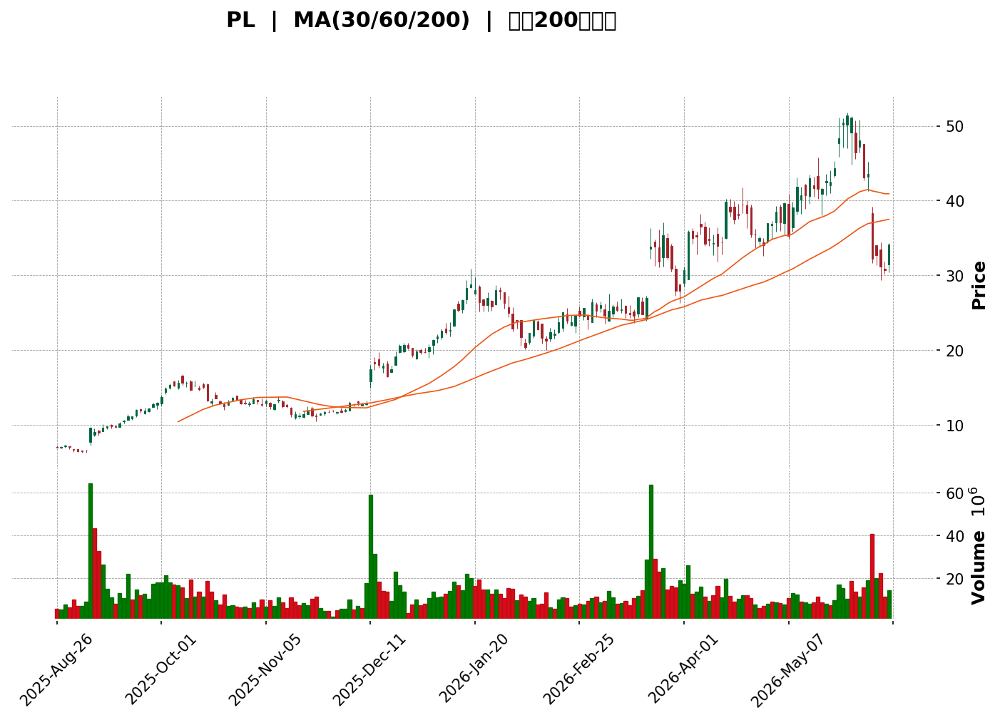
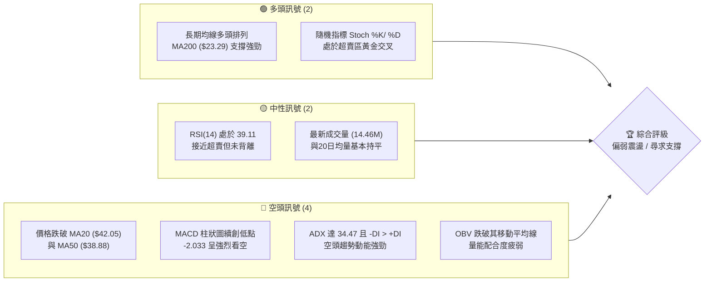
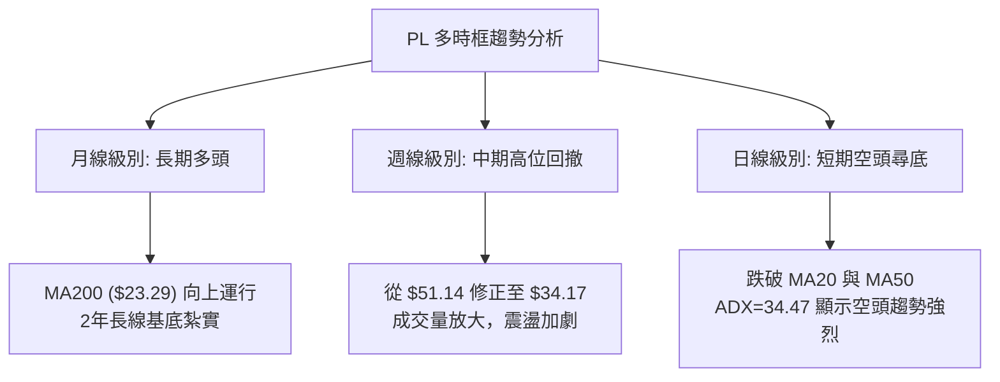
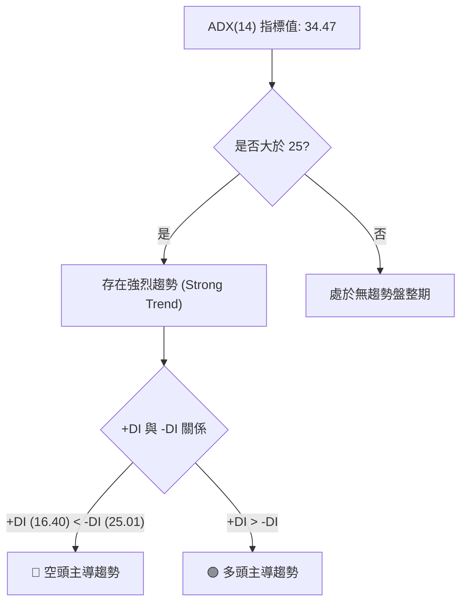
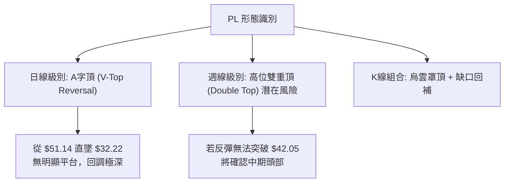

<details>
<summary>📊 靜態圖表 (點擊展開)</summary>

</details>

<html>
<head><meta charset="utf-8" /></head>
<body>
    <div style="height:500px; width:100%;">                        <script>window.PlotlyConfig = {MathJaxConfig: 'local'};</script>
        <script charset="utf-8" src="https://cdn.plot.ly/plotly-3.6.0.min.js" integrity="sha256-QaOVwtVY0T02VaHrr6pnoHLCwayMJp4O5n4YyaE3rJk=" crossorigin="anonymous"></script>                <div id="candlestick-chart" class="plotly-graph-div" style="height:100%; width:100%;"></div>            <script>                window.PLOTLYENV=window.PLOTLYENV || {};                                if (document.getElementById("candlestick-chart")) {                    Plotly.newPlot(                        "candlestick-chart",                        [{"close":{"dtype":"f8","bdata":"AAAAIIXrG0AAAACA61EcQAAAAEAK1xxAAAAAAClcHEAAAACgmZkaQAAAAGCPwhlAAAAAQArXGUAAAABguB4aQAAAAIDrUSNAAAAAgD0KIkAAAADgo\u002fAhQAAAAEAKVyNAAAAAIFyPI0AAAADgUbgjQAAAAAAAgCNAAAAAgMJ1JEAAAADgUTglQAAAAOBROCZAAAAA4FE4JkAAAACgmRkoQAAAAAAp3CdAAAAAIIXrJ0AAAABgZmYoQAAAAOB6lClAAAAAgML1KUAAAACAPYorQAAAAEAzsy1AAAAAYLieLkAAAABA4XouQAAAAAApXC9AAAAAQDMzL0AAAACA61EvQAAAAGBmZi1AAAAAAACALkAAAAAgXI8tQAAAAIAULi5AAAAAgMJ1KkAAAADgUTgqQAAAAGC4HitAAAAAgOvRKUAAAAAAAAApQAAAAGBm5ilAAAAA4FE4K0AAAABguJ4qQAAAAIAUrilAAAAAwMzMKUAAAADgUbgpQAAAAGBm5ipAAAAAoEdhKkAAAABgZmYpQAAAAAAAgCpAAAAAIIXrKEAAAABguJ4pQAAAACCuxypAAAAA4KPwKEAAAACgR+EoQAAAAIDr0SZAAAAAwMzMJkAAAAAghWsmQAAAAGBm5iZAAAAA4HqUJ0AAAACAwnUmQAAAAIDrUSZAAAAA4HoUJ0AAAACAwnUnQAAAAOCjcCdAAAAAwMzMJ0AAAABgZmYnQAAAAIA9iidAAAAAwB4FKEAAAACgR+EpQAAAAIA9iilAAAAAYGbmKUAAAACAFK4pQAAAAKBH4SlAAAAA4FF4MUAAAACgcD0yQAAAAMDMDDJAAAAAoEfhMUAAAADgUXgwQAAAAKBwfTFAAAAAgBQuM0AAAACgmZk0QAAAAEDhujRAAAAAgOtRNEAAAAAAKVwzQAAAAGC43jNAAAAAoHC9M0AAAADgUbgzQAAAAMD1aDRAAAAAANdjNUAAAABACtc1QAAAAAApnDZAAAAA4KNwNkAAAACAwrU2QAAAAOCjcDlAAAAAgOtROUAAAABA4bo6QAAAACCuRzxAAAAAIK7HPEAAAAAAAAA8QAAAAKBHYTpAAAAAIFwPOkAAAADgo\u002fA6QAAAAGC43jlAAAAAgOsRPEAAAACgR+E7QAAAAKCZWTpAAAAA4FH4OEAAAACgmdk2QAAAAEAz8zdAAAAAwB7FNUAAAACAFG40QAAAAGCPQjZAAAAAwB4FOEAAAACAPco2QAAAAGBmpjVAAAAAwMxMNUAAAAAghWs2QAAAAIDCNTZAAAAAoHC9N0AAAAAAKRw5QAAAAGBm5jdAAAAAIK7HN0AAAACAwrU4QAAAAKBHoThAAAAAoJmZOUAAAAAA1yM4QAAAAAApXDpAAAAAwMxMOUAAAAAAAAA6QAAAAEAKlzhAAAAAIK5HOUAAAACA69E5QAAAAGBmZjlAAAAA4KNwOUAAAADgUfg4QAAAAIA9yjhAAAAAoJmZOEAAAADgehQ7QAAAACBczzhAAAAAgML1OkAAAACAPepAQAAAAMD16EBAAAAA4HrUP0AAAAAgXK9BQAAAAEAzM0BAAAAAACncPkAAAAAA1+M7QAAAAEAz8ztAAAAAgMK1PkAAAADgo\u002fBBQAAAAGCPgkFAAAAAgMKVQUAAAABgZkZCQAAAAKBwHUFAAAAAgMJVQUAAAADA9ShBQAAAAEAK90BAAAAA4Ho0QUAAAACA6\u002fFDQAAAAKBwPUNAAAAAAADAQkAAAAAA1wNDQAAAAAApvENAAAAAwB4lQ0AAAADgUbhBQAAAAKCZuUFAAAAAANeDQUAAAACAPQpBQAAAAAApfEJAAAAAQDNzQkAAAADAHkVDQAAAAOCjkEJAAAAA4FHYQ0AAAABguJ5BQAAAAMAehUNAAAAAIIXrREAAAABACldEQAAAAGC4XkRAAAAAwB6FRUAAAAAgXM9EQAAAAIAUzkRAAAAAIIXLREAAAADgelRFQAAAAKBwPUVAAAAAwMwsRkAAAADA9ShIQAAAAKBwPUlAAAAAQDOzSUAAAACA65FJQAAAAEDhOkdAAAAAIIULSEAAAADgo5BFQAAAAADXw0VAAAAAACkcQEAAAABguF5AQAAAACCFKz9AAAAA4FG4PkAAAACAwhVBQA=="},"high":{"dtype":"f8","bdata":"AAAAgML1HEAAAACAPYocQAAAAMAehR1AAAAAYOOlHEAAAADA9SgbQAAAAIA9ChtAAAAAQDMzGkAAAACgmZkaQAAAAAB\u002faiNAAAAAACkcI0AAAABAM7MiQAAAAMD1KCRAAAAA4HqUI0AAAADgUTgkQAAAAEC28yNAAAAAwMzMJEAAAAAghWslQAAAAIDr0SZAAAAAwMxMJkAAAABgj0IoQAAAAIDCdShAAAAAIFyPKEAAAADA9agoQAAAAAAAACpAAAAAYLgeKkAAAACAPQosQAAAAMDINi5AAAAAAAAAL0AAAAAgrscvQAAAAGCPAjBAAAAAIK7HMEAAAACgmZkvQAAAAMDMDDBAAAAAYGbmL0AAAAAAAIAuQAAAAOB6VC9AAAAAQDUeL0AAAADA9SgrQAAAAIDr0SxAAAAAQAisKkAAAACgmRkqQAAAAAApnCpAAAAAgBRuK0AAAAAghesrQAAAAOCj8CpAAAAAIIWrKkAAAABgZmYqQAAAAIDCdStAAAAAYI\u002fCKkAAAACAPQorQAAAAOCjsCpAAAAAgD0KKkAAAABgZqYpQAAAAKCZmStAAAAAoHC9KkAAAADAzMwpQAAAAIDr0ShAAAAAQDOzJ0AAAADgUTgnQAAAAMAexSdAAAAAgML1KEAAAAAAAAApQAAAAAAAACdAAAAAIFxPJ0AAAACg7bwnQAAAAIA9CihAAAAAwB4FKEAAAAAA16MnQAAAAMAehShAAAAAoEdhKEAAAABgZmYqQAAAAAAAwClAAAAAgMJ1KkAAAAAAAAAqQAAAAEDheipAAAAAoJn5MUAAAACgmRkzQAAAAOCjsDNAAAAAIK5HMkAAAADAzIwyQAAAAEAz8zFAAAAA4HrUM0AAAABgj8I0QAAAAKBw\u002fTRAAAAAgBTuNEAAAACAwlU0QAAAAMAeJTRAAAAAACk8NEAAAADAzEw0QAAAACBczzRAAAAAIFxvNUAAAABAMxM2QAAAAAAp3DZAAAAAoJmZN0AAAACA6cY3QAAAACBcjzlAAAAAQAqXOkAAAADAHsU6QAAAAKBHYT1AAAAAYOPlPkAAAADgUbg9QAAAACCFqzxAAAAAgMDqOkAAAABA4bo7QAAAAEAzszpAAAAAQDOzPEAAAABgZmY8QAAAAEAzsztAAAAAAABAO0AAAADAocU5QAAAAACs\u002fDdAAAAAAAAAOEAAAACAwIo1QAAAACCuRzZAAAAA4FEYOEAAAABA4fo3QAAAAGBmhjdAAAAAwPXoNUAAAACAFO42QAAAAIA9yjZAAAAAoJmZOEAAAAAAKRw5QAAAAOCjsDlAAAAA4Hq0OEAAAAAgXM84QAAAAEBi0DlAAAAA4KOwOUAAAABACtc4QAAAAIAU7jpAAAAA4KNwOkAAAACgR4E6QAAAAKBwPTpAAAAAAKqRO0AAAABAChc6QAAAAOBReDpAAAAAIIXrOkAAAAAgXA86QAAAAIDpBjpAAAAAAACAOUAAAABAChc7QAAAAOB6FDtAAAAAYI9CO0AAAAAA1yNCQAAAACCFa0FAAAAAIIULQkAAAABgZoZCQAAAAADV2EFAAAAAYLgeQUAAAADA9Wg\u002fQAAAAIAU7jxAAAAAgBQuP0AAAADAHgVCQAAAAMAeJUJAAAAAYGbmQUAAAABA4RpDQAAAAIDClUJAAAAAgOsxQkAAAACAFL5BQAAAACBYOUJAAAAAgMKVQUAAAACgcB1EQAAAAKBwHURAAAAA4Hr0Q0AAAAAA18NDQAAAAEDh2kRAAAAAAAAAREAAAAAAAMBDQAAAAKBwHUJAAAAAQAqnQUAAAAAAAIBBQAAAAAApfEJAAAAA4HqkQkAAAABgj6JDQAAAAEAKt0NAAAAAoEfhQ0AAAACAwnVEQAAAAMDM7ENAAAAAIFyPRUAAAADgo\u002fBEQAAAAKCZGUVAAAAAoJm5RUAAAABACpdFQAAAAADX40ZAAAAAAADgREAAAABgZsZFQAAAAAAAAEZAAAAAQAyiRkAAAADgo5BJQAAAAKBwfUlAAAAAoEfhSUAAAABgj6JJQAAAAAAAYElAAAAAYI9iSUAAAAAgXM9HQAAAAMAelUZAAAAAQAqXQ0AAAADAHgVBQAAAACBcL0FAAAAAwMzMP0AAAADA9ShBQA=="},"hovertemplate":"\u003cb\u003e%{x|%Y-%m-%d}\u003c\u002fb\u003e\u003cbr\u003e\u958b: $%{open:.2f}\u003cbr\u003e\u9ad8: $%{high:.2f}\u003cbr\u003e\u4f4e: $%{low:.2f}\u003cbr\u003e\u6536: $%{close:.2f}\u003cextra\u003e\u003c\u002fextra\u003e","low":{"dtype":"f8","bdata":"AAAAINnOG0AAAABgZmYbQAAAAEAK1xtAAAAAQAgsG0AAAAAA16MZQAAAAOBRuBlAAAAAwPUoGUAAAADAHgUZQAAAAMD1KB1AAAAAwB4FIUAAAADgozAhQAAAAGCPQiJAAAAAIK7HIkAAAADgUfgiQAAAAIDrUSNAAAAAAClcI0AAAADgo3AkQAAAAEDhOiVAAAAA4KNwJUAAAAAA1yMmQAAAAEAKVydAAAAAQArXJkAAAADAHoUnQAAAAOBRuChAAAAAoHA9KEAAAABAMzMpQAAAAMD1KCxAAAAAwB6FLUAAAACgR2EuQAAAACBcjy1AAAAAwB6FLkAAAADA9SguQAAAAAApHC1AAAAAgOtRLkAAAABAChctQAAAAEAzsy1AAAAAoHA9KkAAAAAg3SQpQAAAAAAAACtAAAAAYLieKUAAAADgo\u002fAnQAAAAIAULilAAAAAIK5HKkAAAACAPYoqQAAAACBcjylAAAAAIK6HKUAAAABA3w8pQAAAACCuxylAAAAAgMJ1KUAAAAAghesoQAAAACBcDylAAAAAANcjKEAAAAAAKdwnQAAAAGAQ2ClAAAAAIFyPKEAAAADA9agoQAAAAEAKFyZAAAAAwMh2JUAAAABgj8IlQAAAAIAU7iVAAAAAwMzMJkAAAACAly4mQAAAAIA9CiVAAAAAwB6FJkAAAADAHoUmQAAAAGCPQidAAAAAgJduJ0AAAADAzMwmQAAAAOB6VCdAAAAAQOF6J0AAAAAAKdwnQAAAAMAeBSlAAAAAoHA9KUAAAABANR4pQAAAAMD1KClAAAAAwB4FLkAAAABguF4xQAAAAADXozFAAAAAgBTuMEAAAACAFG4wQAAAAIA9CjFAAAAAoHD9MUAAAAAAKZwzQAAAAKCZmTNAAAAAACkcNEAAAACAPQozQAAAAGCPwjJAAAAA4KNwM0AAAABAiaEzQAAAAADV+DJAAAAAoHB9M0AAAADgUfg0QAAAAMD1aDVAAAAAQAoXNkAAAADAINA1QAAAAMD1KDdAAAAAYLgeOUAAAAAAAAA5QAAAAGCPQjpAAAAAAClcPEAAAAAgXG87QAAAAKBHITlAAAAAANcjOUAAAACAFC45QAAAAOBRODlAAAAAoBoPOkAAAAAgXM86QAAAAMDMjDlAAAAAgOtxOEAAAABACnc2QAAAAMD16DZAAAAAQAqXNEAAAABgZiY0QAAAACBczzRAAAAAYGamNUAAAACAwrU2QAAAAMD16DRAAAAAQOH6M0AAAAAgBiE1QAAAAAAAgDVAAAAAoHA9NkAAAACAwnU2QAAAAGCPgjdAAAAAQOE6N0AAAACgmVk2QAAAAKBwfThAAAAAgOsROEAAAAAgrsc2QAAAAOBRuDdAAAAAoEdhOEAAAACAaBE5QAAAAGCPgjdAAAAAoJnZN0AAAABAM3M4QAAAAEAzMzlAAAAA4KPwOEAAAAAgrkc4QAAAACBcTzhAAAAA4HipN0AAAABgZmY4QAAAAGCPwjhAAAAA4KPwN0AAAACAaCFAQAAAAEDhOj9AAAAAACkcP0AAAACgRyE\u002fQAAAACBcD0BAAAAAgD2KPkAAAABguD47QAAAAMD1SDpAAAAAwB6FPEAAAADgo3A9QAAAAEDhGkFAAAAAYI9iQEAAAADgUbhBQAAAAOBR+EBAAAAAoJn5QEAAAAAAKVxAQAAAAKBH4T9AAAAAIK5nQEAAAABgZnZBQAAAACCF60JAAAAAQAp3QkAAAABgj8JCQAAAAADXI0NAAAAAgD0qQkAAAADgo5BBQAAAAOCj0EBAAAAAwPPdQEAAAADA9UhAQAAAAMBLJ0FAAAAA4KVrQUAAAADA9ehBQAAAAKCZ+UFAAAAAoEfBQUAAAABACndBQAAAAGBm5kFAAAAAwMwMQ0AAAACgRyFDQAAAAMDMbENAAAAAwMzMQ0AAAADAHkVEQAAAAKBHIURAAAAAYI8CQ0AAAACAwlVEQAAAAMAehURAAAAAwMyMRUAAAACAFO5GQAAAAIAUjkdAAAAAAACAR0AAAAAA12NGQAAAAADXw0ZAAAAAQOE6R0AAAADAHlVFQAAAAGBmpkRAAAAAwPWoP0AAAADgelQ\u002fQAAAAIDrUT1AAAAAQDMzPkAAAAAghWs+QA=="},"name":"\u50f9\u683c","open":{"dtype":"f8","bdata":"AAAAYLgeHEAAAAAghesbQAAAAEDhehxAAAAAIFyPHEAAAACAPQobQAAAAIA9ChtAAAAAQDMzGkAAAADgo3AaQAAAAIDr0R5AAAAAIK5HIUAAAABgZmYiQAAAAKBHYSJAAAAAoHA9I0AAAADgo\u002fAjQAAAAOBRuCNAAAAAAACAI0AAAACAwvUkQAAAAIDrUSVAAAAA4FG4JUAAAABA4XomQAAAACCuRyhAAAAAAAAAJ0AAAADgUbgnQAAAACCuxyhAAAAAYGZmKUAAAACAFK4pQAAAAOBRuCxAAAAAYGbmLUAAAACgmZkvQAAAAAAAAC5AAAAAwMyMMEAAAACAFC4vQAAAAOBRuC9AAAAAIIVrLkAAAAAAAAAuQAAAAGBm5i5AAAAA4KPwLkAAAAAAAAAqQAAAAIA9CixAAAAAAClcKkAAAAAAAIApQAAAAGCPQilAAAAAoJmZKkAAAABgZuYrQAAAAMDMzCpAAAAAIIXrKUAAAABA4XopQAAAACCuxylAAAAAwPWoKkAAAACAwnUpQAAAAIAUrilAAAAAwB4FKkAAAADgUTgoQAAAAIDCdSpAAAAAYGZmKkAAAABgj0IpQAAAAIA9iihAAAAAAAAAJkAAAAAAKVwmQAAAAOB6FCZAAAAAIIXrJkAAAABgZmYoQAAAAEDheiZAAAAAQDOzJkAAAADAHgUnQAAAAIA9iidAAAAAgOvRJ0AAAABAMzMnQAAAAGCPwidAAAAAwPWoJ0AAAABgZuYnQAAAAMAehSlAAAAAAClcKkAAAACgcD0pQAAAAKCZmSlAAAAA4HqUL0AAAADgo3AyQAAAACBczzJAAAAAYGamMUAAAACAFC4yQAAAAIA9CjFAAAAAoHD9MUAAAAAgrsczQAAAAMDMzDNAAAAAQOG6NEAAAADAzEw0QAAAAKBw3TJAAAAAIK4HNEAAAABguL4zQAAAAEDh2jNAAAAAQDOzNEAAAAAAAIA1QAAAAOBRuDVAAAAAoJnZNkAAAACgmZk2QAAAAMDMTDdAAAAAYI9COkAAAAAAAIA5QAAAACBczzpAAAAAQDNzPEAAAABACpc7QAAAAAAAgDxAAAAAAADAOkAAAABgjwI6QAAAAKCZmTpAAAAA4HoUOkAAAADAzAw8QAAAAEAzsztAAAAAQAq3OUAAAAAA1+M4QAAAAEDh+jdAAAAAAAAAOEAAAAAAAAA1QAAAAIA9CjVAAAAAgML1NUAAAABguN43QAAAAGBmhjdAAAAAgOuRNUAAAAAAAIA1QAAAAAAAADZAAAAAYGZmNkAAAADAHgU3QAAAAKBwvThAAAAAYGZmN0AAAAAAAEA3QAAAAMDMTDlAAAAAAACAOEAAAABAM5M4QAAAAOBRuDdAAAAAQOEaOkAAAACgmZk5QAAAAAAAgDlAAAAAANfjN0AAAABACtc4QAAAAIDr0TlAAAAAQApXOUAAAADgUfg5QAAAAEDh+jhAAAAAoEchOUAAAACgmdk4QAAAAAAAgDpAAAAAAABAOEAAAABgZsZAQAAAAAAAQEFAAAAAQOHaQEAAAABAMzNAQAAAAAApfEFAAAAAoHD9QEAAAACgmdk+QAAAAMDMzDxAAAAAAAAAPUAAAADgo3A9QAAAAIDC9UFAAAAA4KOwQUAAAABAM3NCQAAAAAAAQEJAAAAA4KNwQUAAAACgcB1BQAAAACCFy0FAAAAAgMI1QUAAAACgcH1BQAAAAIDrkUNAAAAAQDOTQ0AAAAAAKRxDQAAAAAAAwENAAAAAgD2qQ0AAAACAFI5DQAAAAAApvEFAAAAAwMxMQUAAAADgozBBQAAAAADXQ0FAAAAAIFxfQkAAAADAHoVCQAAAAKCZmUNAAAAAIFx\u002fQkAAAABgj8JDQAAAAEAzM0JAAAAAQDNTQ0AAAAAghQtEQAAAAEAKF0VAAAAA4KNQREAAAADA9QhFQAAAAADXo0VAAAAAQAp3REAAAABAMzNFQAAAAMByCEVAAAAAwMysRUAAAADA9dhHQAAAAMDMDElAAAAAQDMTSUAAAAAAAJBIQAAAACCFi0hAAAAAgMKVR0AAAAAgXM9HQAAAAKBwnUVAAAAAYGYmQ0AAAACgRwFBQAAAAIDCtUBAAAAAANfjPkAAAAAAAIA\u002fQA=="},"x":["2025-08-26T00:00:00-04:00","2025-08-27T00:00:00-04:00","2025-08-28T00:00:00-04:00","2025-08-29T00:00:00-04:00","2025-09-02T00:00:00-04:00","2025-09-03T00:00:00-04:00","2025-09-04T00:00:00-04:00","2025-09-05T00:00:00-04:00","2025-09-08T00:00:00-04:00","2025-09-09T00:00:00-04:00","2025-09-10T00:00:00-04:00","2025-09-11T00:00:00-04:00","2025-09-12T00:00:00-04:00","2025-09-15T00:00:00-04:00","2025-09-16T00:00:00-04:00","2025-09-17T00:00:00-04:00","2025-09-18T00:00:00-04:00","2025-09-19T00:00:00-04:00","2025-09-22T00:00:00-04:00","2025-09-23T00:00:00-04:00","2025-09-24T00:00:00-04:00","2025-09-25T00:00:00-04:00","2025-09-26T00:00:00-04:00","2025-09-29T00:00:00-04:00","2025-09-30T00:00:00-04:00","2025-10-01T00:00:00-04:00","2025-10-02T00:00:00-04:00","2025-10-03T00:00:00-04:00","2025-10-06T00:00:00-04:00","2025-10-07T00:00:00-04:00","2025-10-08T00:00:00-04:00","2025-10-09T00:00:00-04:00","2025-10-10T00:00:00-04:00","2025-10-13T00:00:00-04:00","2025-10-14T00:00:00-04:00","2025-10-15T00:00:00-04:00","2025-10-16T00:00:00-04:00","2025-10-17T00:00:00-04:00","2025-10-20T00:00:00-04:00","2025-10-21T00:00:00-04:00","2025-10-22T00:00:00-04:00","2025-10-23T00:00:00-04:00","2025-10-24T00:00:00-04:00","2025-10-27T00:00:00-04:00","2025-10-28T00:00:00-04:00","2025-10-29T00:00:00-04:00","2025-10-30T00:00:00-04:00","2025-10-31T00:00:00-04:00","2025-11-03T00:00:00-05:00","2025-11-04T00:00:00-05:00","2025-11-05T00:00:00-05:00","2025-11-06T00:00:00-05:00","2025-11-07T00:00:00-05:00","2025-11-10T00:00:00-05:00","2025-11-11T00:00:00-05:00","2025-11-12T00:00:00-05:00","2025-11-13T00:00:00-05:00","2025-11-14T00:00:00-05:00","2025-11-17T00:00:00-05:00","2025-11-18T00:00:00-05:00","2025-11-19T00:00:00-05:00","2025-11-20T00:00:00-05:00","2025-11-21T00:00:00-05:00","2025-11-24T00:00:00-05:00","2025-11-25T00:00:00-05:00","2025-11-26T00:00:00-05:00","2025-11-28T00:00:00-05:00","2025-12-01T00:00:00-05:00","2025-12-02T00:00:00-05:00","2025-12-03T00:00:00-05:00","2025-12-04T00:00:00-05:00","2025-12-05T00:00:00-05:00","2025-12-08T00:00:00-05:00","2025-12-09T00:00:00-05:00","2025-12-10T00:00:00-05:00","2025-12-11T00:00:00-05:00","2025-12-12T00:00:00-05:00","2025-12-15T00:00:00-05:00","2025-12-16T00:00:00-05:00","2025-12-17T00:00:00-05:00","2025-12-18T00:00:00-05:00","2025-12-19T00:00:00-05:00","2025-12-22T00:00:00-05:00","2025-12-23T00:00:00-05:00","2025-12-24T00:00:00-05:00","2025-12-26T00:00:00-05:00","2025-12-29T00:00:00-05:00","2025-12-30T00:00:00-05:00","2025-12-31T00:00:00-05:00","2026-01-02T00:00:00-05:00","2026-01-05T00:00:00-05:00","2026-01-06T00:00:00-05:00","2026-01-07T00:00:00-05:00","2026-01-08T00:00:00-05:00","2026-01-09T00:00:00-05:00","2026-01-12T00:00:00-05:00","2026-01-13T00:00:00-05:00","2026-01-14T00:00:00-05:00","2026-01-15T00:00:00-05:00","2026-01-16T00:00:00-05:00","2026-01-20T00:00:00-05:00","2026-01-21T00:00:00-05:00","2026-01-22T00:00:00-05:00","2026-01-23T00:00:00-05:00","2026-01-26T00:00:00-05:00","2026-01-27T00:00:00-05:00","2026-01-28T00:00:00-05:00","2026-01-29T00:00:00-05:00","2026-01-30T00:00:00-05:00","2026-02-02T00:00:00-05:00","2026-02-03T00:00:00-05:00","2026-02-04T00:00:00-05:00","2026-02-05T00:00:00-05:00","2026-02-06T00:00:00-05:00","2026-02-09T00:00:00-05:00","2026-02-10T00:00:00-05:00","2026-02-11T00:00:00-05:00","2026-02-12T00:00:00-05:00","2026-02-13T00:00:00-05:00","2026-02-17T00:00:00-05:00","2026-02-18T00:00:00-05:00","2026-02-19T00:00:00-05:00","2026-02-20T00:00:00-05:00","2026-02-23T00:00:00-05:00","2026-02-24T00:00:00-05:00","2026-02-25T00:00:00-05:00","2026-02-26T00:00:00-05:00","2026-02-27T00:00:00-05:00","2026-03-02T00:00:00-05:00","2026-03-03T00:00:00-05:00","2026-03-04T00:00:00-05:00","2026-03-05T00:00:00-05:00","2026-03-06T00:00:00-05:00","2026-03-09T00:00:00-04:00","2026-03-10T00:00:00-04:00","2026-03-11T00:00:00-04:00","2026-03-12T00:00:00-04:00","2026-03-13T00:00:00-04:00","2026-03-16T00:00:00-04:00","2026-03-17T00:00:00-04:00","2026-03-18T00:00:00-04:00","2026-03-19T00:00:00-04:00","2026-03-20T00:00:00-04:00","2026-03-23T00:00:00-04:00","2026-03-24T00:00:00-04:00","2026-03-25T00:00:00-04:00","2026-03-26T00:00:00-04:00","2026-03-27T00:00:00-04:00","2026-03-30T00:00:00-04:00","2026-03-31T00:00:00-04:00","2026-04-01T00:00:00-04:00","2026-04-02T00:00:00-04:00","2026-04-06T00:00:00-04:00","2026-04-07T00:00:00-04:00","2026-04-08T00:00:00-04:00","2026-04-09T00:00:00-04:00","2026-04-10T00:00:00-04:00","2026-04-13T00:00:00-04:00","2026-04-14T00:00:00-04:00","2026-04-15T00:00:00-04:00","2026-04-16T00:00:00-04:00","2026-04-17T00:00:00-04:00","2026-04-20T00:00:00-04:00","2026-04-21T00:00:00-04:00","2026-04-22T00:00:00-04:00","2026-04-23T00:00:00-04:00","2026-04-24T00:00:00-04:00","2026-04-27T00:00:00-04:00","2026-04-28T00:00:00-04:00","2026-04-29T00:00:00-04:00","2026-04-30T00:00:00-04:00","2026-05-01T00:00:00-04:00","2026-05-04T00:00:00-04:00","2026-05-05T00:00:00-04:00","2026-05-06T00:00:00-04:00","2026-05-07T00:00:00-04:00","2026-05-08T00:00:00-04:00","2026-05-11T00:00:00-04:00","2026-05-12T00:00:00-04:00","2026-05-13T00:00:00-04:00","2026-05-14T00:00:00-04:00","2026-05-15T00:00:00-04:00","2026-05-18T00:00:00-04:00","2026-05-19T00:00:00-04:00","2026-05-20T00:00:00-04:00","2026-05-21T00:00:00-04:00","2026-05-22T00:00:00-04:00","2026-05-26T00:00:00-04:00","2026-05-27T00:00:00-04:00","2026-05-28T00:00:00-04:00","2026-05-29T00:00:00-04:00","2026-06-01T00:00:00-04:00","2026-06-02T00:00:00-04:00","2026-06-03T00:00:00-04:00","2026-06-04T00:00:00-04:00","2026-06-05T00:00:00-04:00","2026-06-08T00:00:00-04:00","2026-06-09T00:00:00-04:00","2026-06-10T00:00:00-04:00","2026-06-11T00:00:00-04:00"],"type":"candlestick"},{"hovertemplate":"MA30: $%{y:.2f}\u003cextra\u003e\u003c\u002fextra\u003e","line":{"color":"#2196F3","dash":"dash","width":2},"mode":"lines","name":"MA30","x":["2025-08-26T00:00:00-04:00","2025-08-27T00:00:00-04:00","2025-08-28T00:00:00-04:00","2025-08-29T00:00:00-04:00","2025-09-02T00:00:00-04:00","2025-09-03T00:00:00-04:00","2025-09-04T00:00:00-04:00","2025-09-05T00:00:00-04:00","2025-09-08T00:00:00-04:00","2025-09-09T00:00:00-04:00","2025-09-10T00:00:00-04:00","2025-09-11T00:00:00-04:00","2025-09-12T00:00:00-04:00","2025-09-15T00:00:00-04:00","2025-09-16T00:00:00-04:00","2025-09-17T00:00:00-04:00","2025-09-18T00:00:00-04:00","2025-09-19T00:00:00-04:00","2025-09-22T00:00:00-04:00","2025-09-23T00:00:00-04:00","2025-09-24T00:00:00-04:00","2025-09-25T00:00:00-04:00","2025-09-26T00:00:00-04:00","2025-09-29T00:00:00-04:00","2025-09-30T00:00:00-04:00","2025-10-01T00:00:00-04:00","2025-10-02T00:00:00-04:00","2025-10-03T00:00:00-04:00","2025-10-06T00:00:00-04:00","2025-10-07T00:00:00-04:00","2025-10-08T00:00:00-04:00","2025-10-09T00:00:00-04:00","2025-10-10T00:00:00-04:00","2025-10-13T00:00:00-04:00","2025-10-14T00:00:00-04:00","2025-10-15T00:00:00-04:00","2025-10-16T00:00:00-04:00","2025-10-17T00:00:00-04:00","2025-10-20T00:00:00-04:00","2025-10-21T00:00:00-04:00","2025-10-22T00:00:00-04:00","2025-10-23T00:00:00-04:00","2025-10-24T00:00:00-04:00","2025-10-27T00:00:00-04:00","2025-10-28T00:00:00-04:00","2025-10-29T00:00:00-04:00","2025-10-30T00:00:00-04:00","2025-10-31T00:00:00-04:00","2025-11-03T00:00:00-05:00","2025-11-04T00:00:00-05:00","2025-11-05T00:00:00-05:00","2025-11-06T00:00:00-05:00","2025-11-07T00:00:00-05:00","2025-11-10T00:00:00-05:00","2025-11-11T00:00:00-05:00","2025-11-12T00:00:00-05:00","2025-11-13T00:00:00-05:00","2025-11-14T00:00:00-05:00","2025-11-17T00:00:00-05:00","2025-11-18T00:00:00-05:00","2025-11-19T00:00:00-05:00","2025-11-20T00:00:00-05:00","2025-11-21T00:00:00-05:00","2025-11-24T00:00:00-05:00","2025-11-25T00:00:00-05:00","2025-11-26T00:00:00-05:00","2025-11-28T00:00:00-05:00","2025-12-01T00:00:00-05:00","2025-12-02T00:00:00-05:00","2025-12-03T00:00:00-05:00","2025-12-04T00:00:00-05:00","2025-12-05T00:00:00-05:00","2025-12-08T00:00:00-05:00","2025-12-09T00:00:00-05:00","2025-12-10T00:00:00-05:00","2025-12-11T00:00:00-05:00","2025-12-12T00:00:00-05:00","2025-12-15T00:00:00-05:00","2025-12-16T00:00:00-05:00","2025-12-17T00:00:00-05:00","2025-12-18T00:00:00-05:00","2025-12-19T00:00:00-05:00","2025-12-22T00:00:00-05:00","2025-12-23T00:00:00-05:00","2025-12-24T00:00:00-05:00","2025-12-26T00:00:00-05:00","2025-12-29T00:00:00-05:00","2025-12-30T00:00:00-05:00","2025-12-31T00:00:00-05:00","2026-01-02T00:00:00-05:00","2026-01-05T00:00:00-05:00","2026-01-06T00:00:00-05:00","2026-01-07T00:00:00-05:00","2026-01-08T00:00:00-05:00","2026-01-09T00:00:00-05:00","2026-01-12T00:00:00-05:00","2026-01-13T00:00:00-05:00","2026-01-14T00:00:00-05:00","2026-01-15T00:00:00-05:00","2026-01-16T00:00:00-05:00","2026-01-20T00:00:00-05:00","2026-01-21T00:00:00-05:00","2026-01-22T00:00:00-05:00","2026-01-23T00:00:00-05:00","2026-01-26T00:00:00-05:00","2026-01-27T00:00:00-05:00","2026-01-28T00:00:00-05:00","2026-01-29T00:00:00-05:00","2026-01-30T00:00:00-05:00","2026-02-02T00:00:00-05:00","2026-02-03T00:00:00-05:00","2026-02-04T00:00:00-05:00","2026-02-05T00:00:00-05:00","2026-02-06T00:00:00-05:00","2026-02-09T00:00:00-05:00","2026-02-10T00:00:00-05:00","2026-02-11T00:00:00-05:00","2026-02-12T00:00:00-05:00","2026-02-13T00:00:00-05:00","2026-02-17T00:00:00-05:00","2026-02-18T00:00:00-05:00","2026-02-19T00:00:00-05:00","2026-02-20T00:00:00-05:00","2026-02-23T00:00:00-05:00","2026-02-24T00:00:00-05:00","2026-02-25T00:00:00-05:00","2026-02-26T00:00:00-05:00","2026-02-27T00:00:00-05:00","2026-03-02T00:00:00-05:00","2026-03-03T00:00:00-05:00","2026-03-04T00:00:00-05:00","2026-03-05T00:00:00-05:00","2026-03-06T00:00:00-05:00","2026-03-09T00:00:00-04:00","2026-03-10T00:00:00-04:00","2026-03-11T00:00:00-04:00","2026-03-12T00:00:00-04:00","2026-03-13T00:00:00-04:00","2026-03-16T00:00:00-04:00","2026-03-17T00:00:00-04:00","2026-03-18T00:00:00-04:00","2026-03-19T00:00:00-04:00","2026-03-20T00:00:00-04:00","2026-03-23T00:00:00-04:00","2026-03-24T00:00:00-04:00","2026-03-25T00:00:00-04:00","2026-03-26T00:00:00-04:00","2026-03-27T00:00:00-04:00","2026-03-30T00:00:00-04:00","2026-03-31T00:00:00-04:00","2026-04-01T00:00:00-04:00","2026-04-02T00:00:00-04:00","2026-04-06T00:00:00-04:00","2026-04-07T00:00:00-04:00","2026-04-08T00:00:00-04:00","2026-04-09T00:00:00-04:00","2026-04-10T00:00:00-04:00","2026-04-13T00:00:00-04:00","2026-04-14T00:00:00-04:00","2026-04-15T00:00:00-04:00","2026-04-16T00:00:00-04:00","2026-04-17T00:00:00-04:00","2026-04-20T00:00:00-04:00","2026-04-21T00:00:00-04:00","2026-04-22T00:00:00-04:00","2026-04-23T00:00:00-04:00","2026-04-24T00:00:00-04:00","2026-04-27T00:00:00-04:00","2026-04-28T00:00:00-04:00","2026-04-29T00:00:00-04:00","2026-04-30T00:00:00-04:00","2026-05-01T00:00:00-04:00","2026-05-04T00:00:00-04:00","2026-05-05T00:00:00-04:00","2026-05-06T00:00:00-04:00","2026-05-07T00:00:00-04:00","2026-05-08T00:00:00-04:00","2026-05-11T00:00:00-04:00","2026-05-12T00:00:00-04:00","2026-05-13T00:00:00-04:00","2026-05-14T00:00:00-04:00","2026-05-15T00:00:00-04:00","2026-05-18T00:00:00-04:00","2026-05-19T00:00:00-04:00","2026-05-20T00:00:00-04:00","2026-05-21T00:00:00-04:00","2026-05-22T00:00:00-04:00","2026-05-26T00:00:00-04:00","2026-05-27T00:00:00-04:00","2026-05-28T00:00:00-04:00","2026-05-29T00:00:00-04:00","2026-06-01T00:00:00-04:00","2026-06-02T00:00:00-04:00","2026-06-03T00:00:00-04:00","2026-06-04T00:00:00-04:00","2026-06-05T00:00:00-04:00","2026-06-08T00:00:00-04:00","2026-06-09T00:00:00-04:00","2026-06-10T00:00:00-04:00","2026-06-11T00:00:00-04:00"],"y":{"dtype":"f8","bdata":"AAAAAAAA+H8AAAAAAAD4fwAAAAAAAPh\u002fAAAAAAAA+H8AAAAAAAD4fwAAAAAAAPh\u002fAAAAAAAA+H8AAAAAAAD4fwAAAAAAAPh\u002fAAAAAAAA+H8AAAAAAAD4fwAAAAAAAPh\u002fAAAAAAAA+H8AAAAAAAD4fwAAAAAAAPh\u002fAAAAAAAA+H8AAAAAAAD4fwAAAAAAAPh\u002fAAAAAAAA+H8AAAAAAAD4fwAAAAAAAPh\u002fAAAAAAAA+H8AAAAAAAD4fwAAAAAAAPh\u002fAAAAAAAA+H8AAAAAAAD4fwAAAAAAAPh\u002fAAAAAAAA+H8AAAAAAAD4f7y7u8ta3SRA7+7uJnhwJUBmZma+5gImQFVVVQ27giZAq6qqov4NJ0BVVVUlv5gnQKuqqpJfLChA7+7uJuqfKEC8u7ubNhApQImIiPjFUilAMzMzoymVKUARERFxaNEpQKuqqvpiCSpAERERgcBKKkCamZnJoYUqQERERDReuipAzczMnO\u002fnKkAzMzMDVg4rQBEREaFFNitAmpmZScVZK0De3d0t3WQrQImIiFhkeytAERER4eyDK0AzMzMDVo4rQERERHSTmCtAvLu7O9+PK0Dv7u5eLHkrQHd3d8d2PitAmpmZubv7KkAzMzNj9LYqQLy7uzvDbipAZmZmFr0tKkDv7u4eIuIpQAAAAKC3pSlAMzMzY2ZmKUC8u7u7WDIpQKuqqvrU+ChA7+7uHiLiKEDNzMy8EcooQLy7uxuFqyhAMzMz8yicKEBmZmZWq6MoQImIiOiYoChAMzMzU1WVKEDNzMzcT40oQERERMQEjyhAZmZmZgPdKECrqqr61DgpQO\u002fu7q5WhylAq6qqmmHXKUC8u7v7uBcqQDMzM9MVYCpARERE9MXSKkC8u7v7uFcrQN7d3e391CtAmpmZGfdaLEC8u7sLEdEsQKuqqlpzYS1A7+7uXsnvLUAAAAAgBoEuQGZmZvbwGS9AAAAAAMi9L0BmZmbmbTkwQO\u002fu7s4imzBAEREROSb4MEDe3d1l2FUxQCIiIjLsyjFAIiIionA9MkAzMzMrsr0yQImIiNCUSjNAiYiIcK\u002fZM0AzMzODMlo0QCIiIgJWzjRAVVVVPTU+NUAREREph7Y1QN7d3S3dJDZAvLu7O1F\u002fNkAiIiIilNE2QDMzM8NnGDdAq6qqGuhUN0De3d1tWYs3QERERIR5wjdAVVVVdZPYN0BmZmYWINc3QM3MzGwu5DdAMzMzM8EDOEBmZmYmBiE4QN7d3Z02MDhAzczMfIY9OECrqqq6kFQ4QDMzM+PsYzhAq6qqivp3OEB3d3f34ZM4QDMzMwPknjhAmpmZSVOqOECrqqpaZLs4QBEREeF6tDhAzczMjN62OEC8u7ubxKA4QN7d3U1ikDhAAAAAILByOEDv7u4On2E4QO\u002fu7r5YUjhAAAAA0LBLOEAiIiIiIkI4QGZmZmYfPjhAREREFK4nOEBmZmYW2Q44QHd3dzeJAThAERER8WD+N0BERESEeSI4QGZmZjbQKThAAAAA8BlWOEAAAACwcsg4QEREROQXKzlAiYiIGL1tOUBVVVWFFtk5QCIiIkLSNDpAZmZmZmaGOkC8u7vLE7U6QFVVVQUP5jpAd3d3N4khO0BERESkcH07QHd3d6dU3DtAvLu7e4Y9PEC8u7tbj6I8QBEREeF69DxAd3d3l+BBPUBEREQkv5g9QO\u002fu7g5Y2T1AiYiIKBUnPkAzMzNTnJ0+QN7d3X0jFD9AzczMfGp8P0AzMzOjm+Q\u002fQDMzMwNWLkBAvLu7oyllQEC8u7ur1ZFAQLy7uztRv0BAq6qqktHrQEARERFxrwlBQAAAAGiRPUFAIiIiivpnQUBVVVUdE3xBQM3MzIQyikFAvLu7u7urQUDe3d29LatBQERERGSCx0FAq6qqelv2QUAiIiKS7SxCQJqZmal\u002fY0JAAAAAUBuYQkC8u7vrmLBCQFVVVfW2zEJAAAAAUBvoQkAAAAAQLQJDQDMzM0NgJUNAd3d3Z61OQ0AzMzMjaYpDQGZmZiYG0UNAMzMzw4MZREAzMzPDg0lEQM3MzAyQa0RAd3d3J7+YREB3d3e3ga5EQBEREVHUv0RAIiIiQu6lREBEREQkaZpEQFVVVT0miERAIiIiksJ1REDv7u7eJHZEQA=="},"type":"scatter"},{"hovertemplate":"MA60: $%{y:.2f}\u003cextra\u003e\u003c\u002fextra\u003e","line":{"color":"#9C27B0","dash":"dash","width":2},"mode":"lines","name":"MA60","x":["2025-08-26T00:00:00-04:00","2025-08-27T00:00:00-04:00","2025-08-28T00:00:00-04:00","2025-08-29T00:00:00-04:00","2025-09-02T00:00:00-04:00","2025-09-03T00:00:00-04:00","2025-09-04T00:00:00-04:00","2025-09-05T00:00:00-04:00","2025-09-08T00:00:00-04:00","2025-09-09T00:00:00-04:00","2025-09-10T00:00:00-04:00","2025-09-11T00:00:00-04:00","2025-09-12T00:00:00-04:00","2025-09-15T00:00:00-04:00","2025-09-16T00:00:00-04:00","2025-09-17T00:00:00-04:00","2025-09-18T00:00:00-04:00","2025-09-19T00:00:00-04:00","2025-09-22T00:00:00-04:00","2025-09-23T00:00:00-04:00","2025-09-24T00:00:00-04:00","2025-09-25T00:00:00-04:00","2025-09-26T00:00:00-04:00","2025-09-29T00:00:00-04:00","2025-09-30T00:00:00-04:00","2025-10-01T00:00:00-04:00","2025-10-02T00:00:00-04:00","2025-10-03T00:00:00-04:00","2025-10-06T00:00:00-04:00","2025-10-07T00:00:00-04:00","2025-10-08T00:00:00-04:00","2025-10-09T00:00:00-04:00","2025-10-10T00:00:00-04:00","2025-10-13T00:00:00-04:00","2025-10-14T00:00:00-04:00","2025-10-15T00:00:00-04:00","2025-10-16T00:00:00-04:00","2025-10-17T00:00:00-04:00","2025-10-20T00:00:00-04:00","2025-10-21T00:00:00-04:00","2025-10-22T00:00:00-04:00","2025-10-23T00:00:00-04:00","2025-10-24T00:00:00-04:00","2025-10-27T00:00:00-04:00","2025-10-28T00:00:00-04:00","2025-10-29T00:00:00-04:00","2025-10-30T00:00:00-04:00","2025-10-31T00:00:00-04:00","2025-11-03T00:00:00-05:00","2025-11-04T00:00:00-05:00","2025-11-05T00:00:00-05:00","2025-11-06T00:00:00-05:00","2025-11-07T00:00:00-05:00","2025-11-10T00:00:00-05:00","2025-11-11T00:00:00-05:00","2025-11-12T00:00:00-05:00","2025-11-13T00:00:00-05:00","2025-11-14T00:00:00-05:00","2025-11-17T00:00:00-05:00","2025-11-18T00:00:00-05:00","2025-11-19T00:00:00-05:00","2025-11-20T00:00:00-05:00","2025-11-21T00:00:00-05:00","2025-11-24T00:00:00-05:00","2025-11-25T00:00:00-05:00","2025-11-26T00:00:00-05:00","2025-11-28T00:00:00-05:00","2025-12-01T00:00:00-05:00","2025-12-02T00:00:00-05:00","2025-12-03T00:00:00-05:00","2025-12-04T00:00:00-05:00","2025-12-05T00:00:00-05:00","2025-12-08T00:00:00-05:00","2025-12-09T00:00:00-05:00","2025-12-10T00:00:00-05:00","2025-12-11T00:00:00-05:00","2025-12-12T00:00:00-05:00","2025-12-15T00:00:00-05:00","2025-12-16T00:00:00-05:00","2025-12-17T00:00:00-05:00","2025-12-18T00:00:00-05:00","2025-12-19T00:00:00-05:00","2025-12-22T00:00:00-05:00","2025-12-23T00:00:00-05:00","2025-12-24T00:00:00-05:00","2025-12-26T00:00:00-05:00","2025-12-29T00:00:00-05:00","2025-12-30T00:00:00-05:00","2025-12-31T00:00:00-05:00","2026-01-02T00:00:00-05:00","2026-01-05T00:00:00-05:00","2026-01-06T00:00:00-05:00","2026-01-07T00:00:00-05:00","2026-01-08T00:00:00-05:00","2026-01-09T00:00:00-05:00","2026-01-12T00:00:00-05:00","2026-01-13T00:00:00-05:00","2026-01-14T00:00:00-05:00","2026-01-15T00:00:00-05:00","2026-01-16T00:00:00-05:00","2026-01-20T00:00:00-05:00","2026-01-21T00:00:00-05:00","2026-01-22T00:00:00-05:00","2026-01-23T00:00:00-05:00","2026-01-26T00:00:00-05:00","2026-01-27T00:00:00-05:00","2026-01-28T00:00:00-05:00","2026-01-29T00:00:00-05:00","2026-01-30T00:00:00-05:00","2026-02-02T00:00:00-05:00","2026-02-03T00:00:00-05:00","2026-02-04T00:00:00-05:00","2026-02-05T00:00:00-05:00","2026-02-06T00:00:00-05:00","2026-02-09T00:00:00-05:00","2026-02-10T00:00:00-05:00","2026-02-11T00:00:00-05:00","2026-02-12T00:00:00-05:00","2026-02-13T00:00:00-05:00","2026-02-17T00:00:00-05:00","2026-02-18T00:00:00-05:00","2026-02-19T00:00:00-05:00","2026-02-20T00:00:00-05:00","2026-02-23T00:00:00-05:00","2026-02-24T00:00:00-05:00","2026-02-25T00:00:00-05:00","2026-02-26T00:00:00-05:00","2026-02-27T00:00:00-05:00","2026-03-02T00:00:00-05:00","2026-03-03T00:00:00-05:00","2026-03-04T00:00:00-05:00","2026-03-05T00:00:00-05:00","2026-03-06T00:00:00-05:00","2026-03-09T00:00:00-04:00","2026-03-10T00:00:00-04:00","2026-03-11T00:00:00-04:00","2026-03-12T00:00:00-04:00","2026-03-13T00:00:00-04:00","2026-03-16T00:00:00-04:00","2026-03-17T00:00:00-04:00","2026-03-18T00:00:00-04:00","2026-03-19T00:00:00-04:00","2026-03-20T00:00:00-04:00","2026-03-23T00:00:00-04:00","2026-03-24T00:00:00-04:00","2026-03-25T00:00:00-04:00","2026-03-26T00:00:00-04:00","2026-03-27T00:00:00-04:00","2026-03-30T00:00:00-04:00","2026-03-31T00:00:00-04:00","2026-04-01T00:00:00-04:00","2026-04-02T00:00:00-04:00","2026-04-06T00:00:00-04:00","2026-04-07T00:00:00-04:00","2026-04-08T00:00:00-04:00","2026-04-09T00:00:00-04:00","2026-04-10T00:00:00-04:00","2026-04-13T00:00:00-04:00","2026-04-14T00:00:00-04:00","2026-04-15T00:00:00-04:00","2026-04-16T00:00:00-04:00","2026-04-17T00:00:00-04:00","2026-04-20T00:00:00-04:00","2026-04-21T00:00:00-04:00","2026-04-22T00:00:00-04:00","2026-04-23T00:00:00-04:00","2026-04-24T00:00:00-04:00","2026-04-27T00:00:00-04:00","2026-04-28T00:00:00-04:00","2026-04-29T00:00:00-04:00","2026-04-30T00:00:00-04:00","2026-05-01T00:00:00-04:00","2026-05-04T00:00:00-04:00","2026-05-05T00:00:00-04:00","2026-05-06T00:00:00-04:00","2026-05-07T00:00:00-04:00","2026-05-08T00:00:00-04:00","2026-05-11T00:00:00-04:00","2026-05-12T00:00:00-04:00","2026-05-13T00:00:00-04:00","2026-05-14T00:00:00-04:00","2026-05-15T00:00:00-04:00","2026-05-18T00:00:00-04:00","2026-05-19T00:00:00-04:00","2026-05-20T00:00:00-04:00","2026-05-21T00:00:00-04:00","2026-05-22T00:00:00-04:00","2026-05-26T00:00:00-04:00","2026-05-27T00:00:00-04:00","2026-05-28T00:00:00-04:00","2026-05-29T00:00:00-04:00","2026-06-01T00:00:00-04:00","2026-06-02T00:00:00-04:00","2026-06-03T00:00:00-04:00","2026-06-04T00:00:00-04:00","2026-06-05T00:00:00-04:00","2026-06-08T00:00:00-04:00","2026-06-09T00:00:00-04:00","2026-06-10T00:00:00-04:00","2026-06-11T00:00:00-04:00"],"y":{"dtype":"f8","bdata":"AAAAAAAA+H8AAAAAAAD4fwAAAAAAAPh\u002fAAAAAAAA+H8AAAAAAAD4fwAAAAAAAPh\u002fAAAAAAAA+H8AAAAAAAD4fwAAAAAAAPh\u002fAAAAAAAA+H8AAAAAAAD4fwAAAAAAAPh\u002fAAAAAAAA+H8AAAAAAAD4fwAAAAAAAPh\u002fAAAAAAAA+H8AAAAAAAD4fwAAAAAAAPh\u002fAAAAAAAA+H8AAAAAAAD4fwAAAAAAAPh\u002fAAAAAAAA+H8AAAAAAAD4fwAAAAAAAPh\u002fAAAAAAAA+H8AAAAAAAD4fwAAAAAAAPh\u002fAAAAAAAA+H8AAAAAAAD4fwAAAAAAAPh\u002fAAAAAAAA+H8AAAAAAAD4fwAAAAAAAPh\u002fAAAAAAAA+H8AAAAAAAD4fwAAAAAAAPh\u002fAAAAAAAA+H8AAAAAAAD4fwAAAAAAAPh\u002fAAAAAAAA+H8AAAAAAAD4fwAAAAAAAPh\u002fAAAAAAAA+H8AAAAAAAD4fwAAAAAAAPh\u002fAAAAAAAA+H8AAAAAAAD4fwAAAAAAAPh\u002fAAAAAAAA+H8AAAAAAAD4fwAAAAAAAPh\u002fAAAAAAAA+H8AAAAAAAD4fwAAAAAAAPh\u002fAAAAAAAA+H8AAAAAAAD4fwAAAAAAAPh\u002fAAAAAAAA+H8AAAAAAAD4f7y7uwMPpidAq6qqnhrPJ0CrqqpuhPInQKuqqlY5FChA7+7ugjI6KECJiIjwi2UoQKuqqkaakihA7+7uIgbBKEBEREQsJO0oQCIiIool\u002fyhAMzMzS6kYKUC8u7vjiTopQJqZmfH9VClAIiIi6gpwKUAzMzPTeIkpQERERHyxpClAmpmZgXniKUDv7u5+lSMqQAAAACjOXipAIiIicpOYKkDNzMwUS74qQN7d3RW97SpAq6qqalkrK0B3d3d\u002fB3MrQBEREbHItitAq6qqKmv1K0BVVVW1HiUsQBERERH1TyxAREREjMJ1LECamZlB\u002fZssQBERERlaxCxAMzMzi8L1LEDe3d31fiotQO\u002fu7p7+bS1Aq6qqalmrLUC8u7vDBO8tQHd3d69WRy5AmpmZsYGuLkCamZkJuyIvQGZmZl5XoC9AERER9eETMEAzMzMXBFYwQDMzMztRjzBAd3d382\u002fEMEC8u7uLl\u002f4wQAAAAMgvNjFAd3d3d+l2MUC8u7tP\u002f7YxQFVVVY0J7jFAAAAAdEwgMkDe3d31mksyQO\u002fu7jZCeTJAvLu7N\u002fugMkAiIiJKfsEyQN7d3bFW5zJAAAAAYJ4YM0AiIiJWx0QzQJqZmSV4cDNAIiIilrWaM0BVVVXlicozQDMzM69y+DNAVVVVRW8rNEDv7u7up2Y0QBEREWkDnTRAVVVVwTzRNEBERERgngg1QJqZmYmzPzVAd3d3lyd6NUB3d3djO681QDMzM4977TVAREREyC8mNkARERHJ6F02QImIiGBXkDZAq6qqBvPENkCamZmlVPw2QCIiIkp+MTdAAAAAqH9TN0BEREScNnA3QFVVVX34jDdA3t3dhaSpN0ARERF56dY3QFVVVd0k9jdAq6qqslYXOEAzMzNjyU84QImIiCijhzhA3t3dJb+4OEDe3d1VDv04QAAAAHCEMjlAmpmZcfZhOUAzMzND0oQ5QERERPT9pDlAERER4cHMOUDe3d1NqQg6QFVVVVWcPTpAq6qq4uxzOkAzMzPb+a46QBEREeF61DpAIiIikl\u002f8OkAAAADgwRw7QGZmZi7dNDtAREREpOJMO0ARERGxnX87QGZmZh4+sztAZmZmpg3kO0CrqqriXhM8QGZmZrZlTTxA3t3drQB5PEDv7u42Qpk8QHd3d9cVwDxAMzMzCwLrPEAzMzMz7Bo9QDMzM4N5Uj1AIiIiggeTPUBVVVV1TOA9QO\u002fu7na+Hz5AAAAASJpiPkCJiIgAuZc+QFVVVYXr4T5A3t3drY45P0AAAAB4d4c\u002fQERERCyH1j9A3t3d9W8UQEDv7u6eqDdAQImIiKRwXUBA7+7uRm+DQEDv7u5euqlAQN7d3dnOz0BAmpmZ2c73QECrqqpaZCtBQO\u002fu7hbZXkFAvLu7K4eWQUBmZmb2KMxBQN7d3eXQ+kFA7+7uMnorQkCJiIjEZ1BCQCIiIioVd0JA7+7u8ouFQkAAAABoH5ZCQImIiLy7o0JAZmZmEsqwQkAAAAAo6r9CQA=="},"type":"scatter"},{"hovertemplate":"MA200: $%{y:.2f}\u003cextra\u003e\u003c\u002fextra\u003e","line":{"color":"#FF6F00","dash":"solid","width":2},"mode":"lines","name":"MA200","x":["2025-08-26T00:00:00-04:00","2025-08-27T00:00:00-04:00","2025-08-28T00:00:00-04:00","2025-08-29T00:00:00-04:00","2025-09-02T00:00:00-04:00","2025-09-03T00:00:00-04:00","2025-09-04T00:00:00-04:00","2025-09-05T00:00:00-04:00","2025-09-08T00:00:00-04:00","2025-09-09T00:00:00-04:00","2025-09-10T00:00:00-04:00","2025-09-11T00:00:00-04:00","2025-09-12T00:00:00-04:00","2025-09-15T00:00:00-04:00","2025-09-16T00:00:00-04:00","2025-09-17T00:00:00-04:00","2025-09-18T00:00:00-04:00","2025-09-19T00:00:00-04:00","2025-09-22T00:00:00-04:00","2025-09-23T00:00:00-04:00","2025-09-24T00:00:00-04:00","2025-09-25T00:00:00-04:00","2025-09-26T00:00:00-04:00","2025-09-29T00:00:00-04:00","2025-09-30T00:00:00-04:00","2025-10-01T00:00:00-04:00","2025-10-02T00:00:00-04:00","2025-10-03T00:00:00-04:00","2025-10-06T00:00:00-04:00","2025-10-07T00:00:00-04:00","2025-10-08T00:00:00-04:00","2025-10-09T00:00:00-04:00","2025-10-10T00:00:00-04:00","2025-10-13T00:00:00-04:00","2025-10-14T00:00:00-04:00","2025-10-15T00:00:00-04:00","2025-10-16T00:00:00-04:00","2025-10-17T00:00:00-04:00","2025-10-20T00:00:00-04:00","2025-10-21T00:00:00-04:00","2025-10-22T00:00:00-04:00","2025-10-23T00:00:00-04:00","2025-10-24T00:00:00-04:00","2025-10-27T00:00:00-04:00","2025-10-28T00:00:00-04:00","2025-10-29T00:00:00-04:00","2025-10-30T00:00:00-04:00","2025-10-31T00:00:00-04:00","2025-11-03T00:00:00-05:00","2025-11-04T00:00:00-05:00","2025-11-05T00:00:00-05:00","2025-11-06T00:00:00-05:00","2025-11-07T00:00:00-05:00","2025-11-10T00:00:00-05:00","2025-11-11T00:00:00-05:00","2025-11-12T00:00:00-05:00","2025-11-13T00:00:00-05:00","2025-11-14T00:00:00-05:00","2025-11-17T00:00:00-05:00","2025-11-18T00:00:00-05:00","2025-11-19T00:00:00-05:00","2025-11-20T00:00:00-05:00","2025-11-21T00:00:00-05:00","2025-11-24T00:00:00-05:00","2025-11-25T00:00:00-05:00","2025-11-26T00:00:00-05:00","2025-11-28T00:00:00-05:00","2025-12-01T00:00:00-05:00","2025-12-02T00:00:00-05:00","2025-12-03T00:00:00-05:00","2025-12-04T00:00:00-05:00","2025-12-05T00:00:00-05:00","2025-12-08T00:00:00-05:00","2025-12-09T00:00:00-05:00","2025-12-10T00:00:00-05:00","2025-12-11T00:00:00-05:00","2025-12-12T00:00:00-05:00","2025-12-15T00:00:00-05:00","2025-12-16T00:00:00-05:00","2025-12-17T00:00:00-05:00","2025-12-18T00:00:00-05:00","2025-12-19T00:00:00-05:00","2025-12-22T00:00:00-05:00","2025-12-23T00:00:00-05:00","2025-12-24T00:00:00-05:00","2025-12-26T00:00:00-05:00","2025-12-29T00:00:00-05:00","2025-12-30T00:00:00-05:00","2025-12-31T00:00:00-05:00","2026-01-02T00:00:00-05:00","2026-01-05T00:00:00-05:00","2026-01-06T00:00:00-05:00","2026-01-07T00:00:00-05:00","2026-01-08T00:00:00-05:00","2026-01-09T00:00:00-05:00","2026-01-12T00:00:00-05:00","2026-01-13T00:00:00-05:00","2026-01-14T00:00:00-05:00","2026-01-15T00:00:00-05:00","2026-01-16T00:00:00-05:00","2026-01-20T00:00:00-05:00","2026-01-21T00:00:00-05:00","2026-01-22T00:00:00-05:00","2026-01-23T00:00:00-05:00","2026-01-26T00:00:00-05:00","2026-01-27T00:00:00-05:00","2026-01-28T00:00:00-05:00","2026-01-29T00:00:00-05:00","2026-01-30T00:00:00-05:00","2026-02-02T00:00:00-05:00","2026-02-03T00:00:00-05:00","2026-02-04T00:00:00-05:00","2026-02-05T00:00:00-05:00","2026-02-06T00:00:00-05:00","2026-02-09T00:00:00-05:00","2026-02-10T00:00:00-05:00","2026-02-11T00:00:00-05:00","2026-02-12T00:00:00-05:00","2026-02-13T00:00:00-05:00","2026-02-17T00:00:00-05:00","2026-02-18T00:00:00-05:00","2026-02-19T00:00:00-05:00","2026-02-20T00:00:00-05:00","2026-02-23T00:00:00-05:00","2026-02-24T00:00:00-05:00","2026-02-25T00:00:00-05:00","2026-02-26T00:00:00-05:00","2026-02-27T00:00:00-05:00","2026-03-02T00:00:00-05:00","2026-03-03T00:00:00-05:00","2026-03-04T00:00:00-05:00","2026-03-05T00:00:00-05:00","2026-03-06T00:00:00-05:00","2026-03-09T00:00:00-04:00","2026-03-10T00:00:00-04:00","2026-03-11T00:00:00-04:00","2026-03-12T00:00:00-04:00","2026-03-13T00:00:00-04:00","2026-03-16T00:00:00-04:00","2026-03-17T00:00:00-04:00","2026-03-18T00:00:00-04:00","2026-03-19T00:00:00-04:00","2026-03-20T00:00:00-04:00","2026-03-23T00:00:00-04:00","2026-03-24T00:00:00-04:00","2026-03-25T00:00:00-04:00","2026-03-26T00:00:00-04:00","2026-03-27T00:00:00-04:00","2026-03-30T00:00:00-04:00","2026-03-31T00:00:00-04:00","2026-04-01T00:00:00-04:00","2026-04-02T00:00:00-04:00","2026-04-06T00:00:00-04:00","2026-04-07T00:00:00-04:00","2026-04-08T00:00:00-04:00","2026-04-09T00:00:00-04:00","2026-04-10T00:00:00-04:00","2026-04-13T00:00:00-04:00","2026-04-14T00:00:00-04:00","2026-04-15T00:00:00-04:00","2026-04-16T00:00:00-04:00","2026-04-17T00:00:00-04:00","2026-04-20T00:00:00-04:00","2026-04-21T00:00:00-04:00","2026-04-22T00:00:00-04:00","2026-04-23T00:00:00-04:00","2026-04-24T00:00:00-04:00","2026-04-27T00:00:00-04:00","2026-04-28T00:00:00-04:00","2026-04-29T00:00:00-04:00","2026-04-30T00:00:00-04:00","2026-05-01T00:00:00-04:00","2026-05-04T00:00:00-04:00","2026-05-05T00:00:00-04:00","2026-05-06T00:00:00-04:00","2026-05-07T00:00:00-04:00","2026-05-08T00:00:00-04:00","2026-05-11T00:00:00-04:00","2026-05-12T00:00:00-04:00","2026-05-13T00:00:00-04:00","2026-05-14T00:00:00-04:00","2026-05-15T00:00:00-04:00","2026-05-18T00:00:00-04:00","2026-05-19T00:00:00-04:00","2026-05-20T00:00:00-04:00","2026-05-21T00:00:00-04:00","2026-05-22T00:00:00-04:00","2026-05-26T00:00:00-04:00","2026-05-27T00:00:00-04:00","2026-05-28T00:00:00-04:00","2026-05-29T00:00:00-04:00","2026-06-01T00:00:00-04:00","2026-06-02T00:00:00-04:00","2026-06-03T00:00:00-04:00","2026-06-04T00:00:00-04:00","2026-06-05T00:00:00-04:00","2026-06-08T00:00:00-04:00","2026-06-09T00:00:00-04:00","2026-06-10T00:00:00-04:00","2026-06-11T00:00:00-04:00"],"y":{"dtype":"f8","bdata":"AAAAAAAA+H8AAAAAAAD4fwAAAAAAAPh\u002fAAAAAAAA+H8AAAAAAAD4fwAAAAAAAPh\u002fAAAAAAAA+H8AAAAAAAD4fwAAAAAAAPh\u002fAAAAAAAA+H8AAAAAAAD4fwAAAAAAAPh\u002fAAAAAAAA+H8AAAAAAAD4fwAAAAAAAPh\u002fAAAAAAAA+H8AAAAAAAD4fwAAAAAAAPh\u002fAAAAAAAA+H8AAAAAAAD4fwAAAAAAAPh\u002fAAAAAAAA+H8AAAAAAAD4fwAAAAAAAPh\u002fAAAAAAAA+H8AAAAAAAD4fwAAAAAAAPh\u002fAAAAAAAA+H8AAAAAAAD4fwAAAAAAAPh\u002fAAAAAAAA+H8AAAAAAAD4fwAAAAAAAPh\u002fAAAAAAAA+H8AAAAAAAD4fwAAAAAAAPh\u002fAAAAAAAA+H8AAAAAAAD4fwAAAAAAAPh\u002fAAAAAAAA+H8AAAAAAAD4fwAAAAAAAPh\u002fAAAAAAAA+H8AAAAAAAD4fwAAAAAAAPh\u002fAAAAAAAA+H8AAAAAAAD4fwAAAAAAAPh\u002fAAAAAAAA+H8AAAAAAAD4fwAAAAAAAPh\u002fAAAAAAAA+H8AAAAAAAD4fwAAAAAAAPh\u002fAAAAAAAA+H8AAAAAAAD4fwAAAAAAAPh\u002fAAAAAAAA+H8AAAAAAAD4fwAAAAAAAPh\u002fAAAAAAAA+H8AAAAAAAD4fwAAAAAAAPh\u002fAAAAAAAA+H8AAAAAAAD4fwAAAAAAAPh\u002fAAAAAAAA+H8AAAAAAAD4fwAAAAAAAPh\u002fAAAAAAAA+H8AAAAAAAD4fwAAAAAAAPh\u002fAAAAAAAA+H8AAAAAAAD4fwAAAAAAAPh\u002fAAAAAAAA+H8AAAAAAAD4fwAAAAAAAPh\u002fAAAAAAAA+H8AAAAAAAD4fwAAAAAAAPh\u002fAAAAAAAA+H8AAAAAAAD4fwAAAAAAAPh\u002fAAAAAAAA+H8AAAAAAAD4fwAAAAAAAPh\u002fAAAAAAAA+H8AAAAAAAD4fwAAAAAAAPh\u002fAAAAAAAA+H8AAAAAAAD4fwAAAAAAAPh\u002fAAAAAAAA+H8AAAAAAAD4fwAAAAAAAPh\u002fAAAAAAAA+H8AAAAAAAD4fwAAAAAAAPh\u002fAAAAAAAA+H8AAAAAAAD4fwAAAAAAAPh\u002fAAAAAAAA+H8AAAAAAAD4fwAAAAAAAPh\u002fAAAAAAAA+H8AAAAAAAD4fwAAAAAAAPh\u002fAAAAAAAA+H8AAAAAAAD4fwAAAAAAAPh\u002fAAAAAAAA+H8AAAAAAAD4fwAAAAAAAPh\u002fAAAAAAAA+H8AAAAAAAD4fwAAAAAAAPh\u002fAAAAAAAA+H8AAAAAAAD4fwAAAAAAAPh\u002fAAAAAAAA+H8AAAAAAAD4fwAAAAAAAPh\u002fAAAAAAAA+H8AAAAAAAD4fwAAAAAAAPh\u002fAAAAAAAA+H8AAAAAAAD4fwAAAAAAAPh\u002fAAAAAAAA+H8AAAAAAAD4fwAAAAAAAPh\u002fAAAAAAAA+H8AAAAAAAD4fwAAAAAAAPh\u002fAAAAAAAA+H8AAAAAAAD4fwAAAAAAAPh\u002fAAAAAAAA+H8AAAAAAAD4fwAAAAAAAPh\u002fAAAAAAAA+H8AAAAAAAD4fwAAAAAAAPh\u002fAAAAAAAA+H8AAAAAAAD4fwAAAAAAAPh\u002fAAAAAAAA+H8AAAAAAAD4fwAAAAAAAPh\u002fAAAAAAAA+H8AAAAAAAD4fwAAAAAAAPh\u002fAAAAAAAA+H8AAAAAAAD4fwAAAAAAAPh\u002fAAAAAAAA+H8AAAAAAAD4fwAAAAAAAPh\u002fAAAAAAAA+H8AAAAAAAD4fwAAAAAAAPh\u002fAAAAAAAA+H8AAAAAAAD4fwAAAAAAAPh\u002fAAAAAAAA+H8AAAAAAAD4fwAAAAAAAPh\u002fAAAAAAAA+H8AAAAAAAD4fwAAAAAAAPh\u002fAAAAAAAA+H8AAAAAAAD4fwAAAAAAAPh\u002fAAAAAAAA+H8AAAAAAAD4fwAAAAAAAPh\u002fAAAAAAAA+H8AAAAAAAD4fwAAAAAAAPh\u002fAAAAAAAA+H8AAAAAAAD4fwAAAAAAAPh\u002fAAAAAAAA+H8AAAAAAAD4fwAAAAAAAPh\u002fAAAAAAAA+H8AAAAAAAD4fwAAAAAAAPh\u002fAAAAAAAA+H8AAAAAAAD4fwAAAAAAAPh\u002fAAAAAAAA+H8AAAAAAAD4fwAAAAAAAPh\u002fAAAAAAAA+H8AAAAAAAD4fwAAAAAAAPh\u002fAAAAAAAA+H9xPQoTYUs3QA=="},"type":"scatter"}],                        {"template":{"data":{"barpolar":[{"marker":{"line":{"color":"rgb(17,17,17)","width":0.5},"pattern":{"fillmode":"overlay","size":10,"solidity":0.2}},"type":"barpolar"}],"bar":[{"error_x":{"color":"#f2f5fa"},"error_y":{"color":"#f2f5fa"},"marker":{"line":{"color":"rgb(17,17,17)","width":0.5},"pattern":{"fillmode":"overlay","size":10,"solidity":0.2}},"type":"bar"}],"carpet":[{"aaxis":{"endlinecolor":"#A2B1C6","gridcolor":"#506784","linecolor":"#506784","minorgridcolor":"#506784","startlinecolor":"#A2B1C6"},"baxis":{"endlinecolor":"#A2B1C6","gridcolor":"#506784","linecolor":"#506784","minorgridcolor":"#506784","startlinecolor":"#A2B1C6"},"type":"carpet"}],"choropleth":[{"colorbar":{"outlinewidth":0,"ticks":""},"type":"choropleth"}],"contourcarpet":[{"colorbar":{"outlinewidth":0,"ticks":""},"type":"contourcarpet"}],"contour":[{"colorbar":{"outlinewidth":0,"ticks":""},"colorscale":[[0.0,"#0d0887"],[0.1111111111111111,"#46039f"],[0.2222222222222222,"#7201a8"],[0.3333333333333333,"#9c179e"],[0.4444444444444444,"#bd3786"],[0.5555555555555556,"#d8576b"],[0.6666666666666666,"#ed7953"],[0.7777777777777778,"#fb9f3a"],[0.8888888888888888,"#fdca26"],[1.0,"#f0f921"]],"type":"contour"}],"heatmap":[{"colorbar":{"outlinewidth":0,"ticks":""},"colorscale":[[0.0,"#0d0887"],[0.1111111111111111,"#46039f"],[0.2222222222222222,"#7201a8"],[0.3333333333333333,"#9c179e"],[0.4444444444444444,"#bd3786"],[0.5555555555555556,"#d8576b"],[0.6666666666666666,"#ed7953"],[0.7777777777777778,"#fb9f3a"],[0.8888888888888888,"#fdca26"],[1.0,"#f0f921"]],"type":"heatmap"}],"histogram2dcontour":[{"colorbar":{"outlinewidth":0,"ticks":""},"colorscale":[[0.0,"#0d0887"],[0.1111111111111111,"#46039f"],[0.2222222222222222,"#7201a8"],[0.3333333333333333,"#9c179e"],[0.4444444444444444,"#bd3786"],[0.5555555555555556,"#d8576b"],[0.6666666666666666,"#ed7953"],[0.7777777777777778,"#fb9f3a"],[0.8888888888888888,"#fdca26"],[1.0,"#f0f921"]],"type":"histogram2dcontour"}],"histogram2d":[{"colorbar":{"outlinewidth":0,"ticks":""},"colorscale":[[0.0,"#0d0887"],[0.1111111111111111,"#46039f"],[0.2222222222222222,"#7201a8"],[0.3333333333333333,"#9c179e"],[0.4444444444444444,"#bd3786"],[0.5555555555555556,"#d8576b"],[0.6666666666666666,"#ed7953"],[0.7777777777777778,"#fb9f3a"],[0.8888888888888888,"#fdca26"],[1.0,"#f0f921"]],"type":"histogram2d"}],"histogram":[{"marker":{"pattern":{"fillmode":"overlay","size":10,"solidity":0.2}},"type":"histogram"}],"mesh3d":[{"colorbar":{"outlinewidth":0,"ticks":""},"type":"mesh3d"}],"parcoords":[{"line":{"colorbar":{"outlinewidth":0,"ticks":""}},"type":"parcoords"}],"pie":[{"automargin":true,"type":"pie"}],"scatter3d":[{"line":{"colorbar":{"outlinewidth":0,"ticks":""}},"marker":{"colorbar":{"outlinewidth":0,"ticks":""}},"type":"scatter3d"}],"scattercarpet":[{"marker":{"colorbar":{"outlinewidth":0,"ticks":""}},"type":"scattercarpet"}],"scattergeo":[{"marker":{"colorbar":{"outlinewidth":0,"ticks":""}},"type":"scattergeo"}],"scattergl":[{"marker":{"line":{"color":"#283442"}},"type":"scattergl"}],"scattermapbox":[{"marker":{"colorbar":{"outlinewidth":0,"ticks":""}},"type":"scattermapbox"}],"scattermap":[{"marker":{"colorbar":{"outlinewidth":0,"ticks":""}},"type":"scattermap"}],"scatterpolargl":[{"marker":{"colorbar":{"outlinewidth":0,"ticks":""}},"type":"scatterpolargl"}],"scatterpolar":[{"marker":{"colorbar":{"outlinewidth":0,"ticks":""}},"type":"scatterpolar"}],"scatter":[{"marker":{"line":{"color":"#283442"}},"type":"scatter"}],"scatterternary":[{"marker":{"colorbar":{"outlinewidth":0,"ticks":""}},"type":"scatterternary"}],"surface":[{"colorbar":{"outlinewidth":0,"ticks":""},"colorscale":[[0.0,"#0d0887"],[0.1111111111111111,"#46039f"],[0.2222222222222222,"#7201a8"],[0.3333333333333333,"#9c179e"],[0.4444444444444444,"#bd3786"],[0.5555555555555556,"#d8576b"],[0.6666666666666666,"#ed7953"],[0.7777777777777778,"#fb9f3a"],[0.8888888888888888,"#fdca26"],[1.0,"#f0f921"]],"type":"surface"}],"table":[{"cells":{"fill":{"color":"#506784"},"line":{"color":"rgb(17,17,17)"}},"header":{"fill":{"color":"#2a3f5f"},"line":{"color":"rgb(17,17,17)"}},"type":"table"}]},"layout":{"annotationdefaults":{"arrowcolor":"#f2f5fa","arrowhead":0,"arrowwidth":1},"autotypenumbers":"strict","coloraxis":{"colorbar":{"outlinewidth":0,"ticks":""}},"colorscale":{"diverging":[[0,"#8e0152"],[0.1,"#c51b7d"],[0.2,"#de77ae"],[0.3,"#f1b6da"],[0.4,"#fde0ef"],[0.5,"#f7f7f7"],[0.6,"#e6f5d0"],[0.7,"#b8e186"],[0.8,"#7fbc41"],[0.9,"#4d9221"],[1,"#276419"]],"sequential":[[0.0,"#0d0887"],[0.1111111111111111,"#46039f"],[0.2222222222222222,"#7201a8"],[0.3333333333333333,"#9c179e"],[0.4444444444444444,"#bd3786"],[0.5555555555555556,"#d8576b"],[0.6666666666666666,"#ed7953"],[0.7777777777777778,"#fb9f3a"],[0.8888888888888888,"#fdca26"],[1.0,"#f0f921"]],"sequentialminus":[[0.0,"#0d0887"],[0.1111111111111111,"#46039f"],[0.2222222222222222,"#7201a8"],[0.3333333333333333,"#9c179e"],[0.4444444444444444,"#bd3786"],[0.5555555555555556,"#d8576b"],[0.6666666666666666,"#ed7953"],[0.7777777777777778,"#fb9f3a"],[0.8888888888888888,"#fdca26"],[1.0,"#f0f921"]]},"colorway":["#636efa","#EF553B","#00cc96","#ab63fa","#FFA15A","#19d3f3","#FF6692","#B6E880","#FF97FF","#FECB52"],"font":{"color":"#f2f5fa"},"geo":{"bgcolor":"rgb(17,17,17)","lakecolor":"rgb(17,17,17)","landcolor":"rgb(17,17,17)","showlakes":true,"showland":true,"subunitcolor":"#506784"},"hoverlabel":{"align":"left"},"hovermode":"closest","mapbox":{"style":"dark"},"paper_bgcolor":"rgb(17,17,17)","plot_bgcolor":"rgb(17,17,17)","polar":{"angularaxis":{"gridcolor":"#506784","linecolor":"#506784","ticks":""},"bgcolor":"rgb(17,17,17)","radialaxis":{"gridcolor":"#506784","linecolor":"#506784","ticks":""}},"scene":{"xaxis":{"backgroundcolor":"rgb(17,17,17)","gridcolor":"#506784","gridwidth":2,"linecolor":"#506784","showbackground":true,"ticks":"","zerolinecolor":"#C8D4E3"},"yaxis":{"backgroundcolor":"rgb(17,17,17)","gridcolor":"#506784","gridwidth":2,"linecolor":"#506784","showbackground":true,"ticks":"","zerolinecolor":"#C8D4E3"},"zaxis":{"backgroundcolor":"rgb(17,17,17)","gridcolor":"#506784","gridwidth":2,"linecolor":"#506784","showbackground":true,"ticks":"","zerolinecolor":"#C8D4E3"}},"shapedefaults":{"line":{"color":"#f2f5fa"}},"sliderdefaults":{"bgcolor":"#C8D4E3","bordercolor":"rgb(17,17,17)","borderwidth":1,"tickwidth":0},"ternary":{"aaxis":{"gridcolor":"#506784","linecolor":"#506784","ticks":""},"baxis":{"gridcolor":"#506784","linecolor":"#506784","ticks":""},"bgcolor":"rgb(17,17,17)","caxis":{"gridcolor":"#506784","linecolor":"#506784","ticks":""}},"title":{"x":0.05},"updatemenudefaults":{"bgcolor":"#506784","borderwidth":0},"xaxis":{"automargin":true,"gridcolor":"#283442","linecolor":"#506784","ticks":"","title":{"standoff":15},"zerolinecolor":"#283442","zerolinewidth":2},"yaxis":{"automargin":true,"gridcolor":"#283442","linecolor":"#506784","ticks":"","title":{"standoff":15},"zerolinecolor":"#283442","zerolinewidth":2}}},"xaxis":{"rangeslider":{"visible":false},"title":{"text":"\u65e5\u671f"}},"font":{"size":11},"title":{"text":"PL  |  MA(30\u002f60\u002f200)  |  \u6700\u8fd1200\u4ea4\u6613\u65e5"},"yaxis":{"title":{"text":"\u80a1\u50f9 (USD)"}},"hovermode":"x unified","height":500},                        {"responsive": true}                    )                };            </script>        </div>
</body>
</html>

# PL 技術分析報告

> **報告日期**：2026-06-11 ｜ **語言**：繁體中文 ｜ **數據來源**：Yahoo Finance ｜ **當前價格**：$34.17

---

## 目錄

| 章節 | 內容 |
|------|------|
| [1. 技術面概覽](#1-技術面概覽) | 訊號儀表板、核心指標、評分卡 |
| [2. 趨勢分析](#2-趨勢分析) | 多時框趨勢、長中短期走勢 |
| [3. 圖表形態分析](#3-圖表形態分析) | 形態識別、K線組合、目標價 |
| [4. 支撐與阻力](#4-支撐與阻力) | 關鍵價位、斐波那契回調 |
| [5. 技術指標深度解讀](#5-技術指標深度解讀) | MA/RSI/MACD/布林/成交量 |
| [6. 動能與波動率](#6-動能與波動率) | 動能評估、ATR、Beta |
| [7. 多時框架總結](#7-多時框架總結) | 時框架評分矩陣 |
| [8. 交易策略建議](#8-交易策略建議) | 多空策略、風險報酬比 |
| [9. 風險提示與監控](#9-風險提示與監控) | 監控指標、風險場景 |
| [10. 報告總結](#10-報告總結) | 核心結論與最優策略組合 |

---

## 1. 技術面概覽

Planet Labs PBC (PL) 目前正處於極其關鍵的技術修正期。在經歷了 2026 年 5 月底高達 $51.14 的歷史性飆升後，股價在 6 月初出現了劇烈的獲利回吐，急跌至最低 $32.22，隨後小幅反彈至目前的 $34.17。本章節將透過多維度指標，為您剖析當前的多空勢力平衡狀態。

### 🎯 技術訊號儀表板



### 📊 核心指標速覽表

| 指標類別 | 指標名稱 | 當前數值 | 訊號 | 解讀 |
|----------|----------|----------|------|------|
| **價格** | 當前價格 | $34.17 | 🟡 中性 | 52週高點 ($51.76) 回撤達 -34%，正尋求中期支撐 |
| **均線** | MA20 | $42.05 | 🔴 空頭 | 價格遠低於 MA20，短期趨勢轉弱，MA20 轉為強阻力 |
| **均線** | MA50 | $38.88 | 🔴 空頭 | 跌破中期生命線，顯示中期上升軌道遭到破壞 |
| **均線** | MA200 | $23.29 | 🟢 多頭 | 遠高於長期年線，長期多頭格局未變，年線具強支撐 |
| **動能** | RSI(14) | 39.11 | 🟡 中性 | 進入弱勢區間（30-50），但未進入極端超賣區 |
| **動能** | MACD | -1.549 | 🔴 空頭 | MACD 跌至訊號線下方，柱狀圖 -2.033 顯示空頭主導 |
| **波動** | ATR(14) | $4.94 | 🔴 高波動 | 波動率高達 14.46%，顯示市場情緒極其敏感且分歧 |
| **資金** | OBV | 弱勢 | 🔴 空頭 | OBV 跌破其均線，顯示資金呈現淨流出狀態 |

### 🏆 技術評分卡

╔══════════════════════════════════════════════════════════════╗
║                 技術評分卡 — PL (2026-06-11)                ║
╠══════════════════════════════════════════════════════════════╣
║  趨勢強度      ████████████░░░░░░░░  60/100  🟡 中性 (空頭主導)║
║  動能指標      ████████░░░░░░░░░░░░  40/100  🔴 看空           ║
║  支撐穩定度    ██████████████░░░░░░  70/100  🟢 偏強 (年線保護)║
║  成交量配合    ████████░░░░░░░░░░░░  40/100  🔴 疲弱           ║
║  形態完整度    ████████████░░░░░░░░  60/100  🟡 中性           ║
║  均線排列      ████████████████░░░░  80/100  🟢 強多           ║
╠══════════════════════════════════════════════════════════════╣
║  綜合評分      ████████████░░░░░░░░  58/100  ⚖️ 觀望 / 逢低佈局 ║
╚══════════════════════════════════════════════════════════════╝

---

## 2. 趨勢分析

PL 的股價走勢呈現出極其典型的「長多、中修、短空」多時框矛盾格局。本章將為您解構這種在不同時間維度下的趨勢演變。

### 🌐 多時框趨勢分析



### 📈 長期趨勢 — 12個月走勢圖（Unicode）

以下為 PL 自 2025 年 7 月至 2026 年 6 月（當前）的 12 個月收盤走勢圖，清晰展示了股價如何從個位數一路飆升至 $50 以上，並在近期出現劇烈修正：

```
PL 月線走勢圖（過去12個月）
價格軸 ($)
$55.00 ┤                                              ● (2026-05: $51.14)
$50.00 ┤                                             / \
$45.00 ┤                                            /   \
$40.00 ┤                                 ● (2026-04)     \
$35.00 ┤                                /                 ● (現在: $34.17)
$30.00 ┤                     ● (2026-03)
$25.00 ┤         ●(2026-01)━●(2026-02)
$20.00 ┤        /
$15.00 ┤   ●━━━● (2025-09~11)
$10.00 ┤  /
$5.00  ┤● (2025-07: $6.25)
       └─────────────────────────────────────────────────────────────
         M7  M8  M9  M10 M11 M12 M1  M2  M3  M4  M5  M6 (2026)
```

**走勢特徵分析表格**：

| 階段 | 時間區間 | 起迄價格 | 累計漲跌幅 | 成交量特徵 | 技術面解讀 |
| :--- | :--- | :--- | :--- | :--- | :--- |
| **第一階段：初段爆發** | 2025-07 至 2025-10 | $6.25 → $13.45 | +115.2% | 溫和放大 | 脫離底部，確認長期多頭趨勢起點。 |
| **第二階段：平台整理** | 2025-11 至 2026-03 | $11.90 → $27.95 | +134.8% | 縮量整理後爆量 | 奠定 $20-$24 的強力支撐平台，洗盤徹底。 |
| **第三階段：主升浪飆升**| 2026-04 至 2026-05 | $36.97 → $51.14 | +38.3% | 爆發性巨量 | 市場情緒極度狂熱，股價嚴重超買（RSI達83.2）。 |
| **第四階段：高位崩跌** | 2026-06 (至今) | $51.14 → $34.17 | -33.18% | 歷史天量 (100.6M) | 機構高位獲利了結，引發恐慌性多殺多。 |

### 📊 中期趨勢（週線分析）

從週線級別來看，PL 自 2026 年 3 月底突破 $30 關卡後，展開了波瀾壯闊的週線級別主升段。然而，5 月最後一週以 **$51.14** 收盤，隨後在 6 月第一週（2026-06-07）收盤暴跌至 **$32.22**，單週跌幅高達 **-37%**，且成交量激增至 **100,622,400 股**。這表明：
1. **籌碼大換手**：高位出現極端放量陰線，屬於典型的機構派發特徵。
2. **週線級別支撐**：股價在回測 120 日均線（$30.67）及前波起漲點 $30.86（2026-03-29 週收盤）附近獲得初步支撐，本週微幅反彈至 $34.17。

### ⚡ 趨勢強度評估（ADX 解讀）

為了量化當前趨勢的強度，我們引入 ADX（平均趨向指標）進行深度解讀：



**ADX 強度對照與 PL 當前定位**：

| ADX 數值區間 | 趨勢強度 | 市場狀態 | PL 當前定位 ($34.17) |
| :--- | :--- | :--- | :--- |
| 0 - 20 | 極弱或無趨勢 | 橫盤整理 | |
| 20 - 25 | 趨勢初建 | 尋找方向 | |
| **25 - 50** | **強趨勢** | **單邊行情** | **★ PL 處於此區間 (ADX: 34.47, -DI 主導)** |
| 50 - 75 | 極強趨勢 | 暴漲/暴跌 | |
| 75 - 100 | 趨勢衰竭 | 即反轉 | |

**結論**：ADX 數值為 **34.47**，表明市場並非處於無序的盤整期，而是處於一個**強烈的單邊下行趨勢**中。-DI (25.01) 顯著高於 +DI (16.40)，意味著空頭力量在短期內佔據絕對主導地位，投資者切勿盲目抄底。

---

## 3. 圖表形態分析

圖表形態是市場集體心理的直接呈現。PL 近期的走勢在日線與週線上均留下了非常清晰的經典形態特徵。

### 🔍 形態識別系統



### 🕯️ 重要K線形態分析

根據近 20 週與日線關鍵轉折點的數據，PL 展現了以下關鍵的 K 線形態：

| 日期/週 | 收盤價 | K線形態 | 解讀 | 訊號強度 |
| :--- | :--- | :--- | :--- | :--- |
| **2026-05-31** | $51.14 | **爆量突破長陽線** | 股價突破 $50 關卡，RSI 飆升至 83.2，呈現最後的噴射噴發（Blow-off Top）。 | 🟢 強多 (最後瘋狂) |
| **2026-06-07** | $32.22 | **巨量長陰吞噬** | 一舉吞噬前三週的漲幅，成交量破億（100M），為極強烈的「出貨」與「趨勢反轉」訊號。 | 🔴 極強空 (確立修正) |
| **2026-06-14** | $34.17 | **下影線錘子線 (Hammer)** | 在回踩 $32.22 後收出帶有下影線的實體陽線，顯示在 $30-$32 區間有買盤逢低介入。 | 🟡 中性偏多 (止跌訊號) |

### 📉 ASCII 走勢形態示意圖

以下展示 PL 在日線級別形成的「A字頂與跳空缺口」示意圖：

```
       [A字頂與跳空缺口示意圖]
$51.76 ┤         ▲ (52W 高點)
       │        / \
$45.00 ┤       /   ▼ (跳空低開)
       │      /     █ 
$42.05 ┤     /      █ ◄─── 阻力區 (MA20 / BB中軌)
       │    /       █ 
$34.17 ┤   /        █ ◄─── 當前價格
       │  /         
$30.67 ┤ /          ▲ ◄─── MA120 支撐區
$28.75 ┤/           █ ◄─── BB下軌 / 斐波那契 50% 支撐
       └────────────────────────────────
```

### 🎯 形態目標價計算

根據「雙重頂/A字頂」形態的量幅測算：
*   **頂部起點 (Neckline / 頸線)**：我們將 $38.48 (2026-04-19 週收盤) 視為關鍵的中期頸線。
*   **頭部高度**：$51.14 (最高點) - $38.48 (頸線) = $12.66。
*   **下行目標價**：
    $$\text{目標價} = \text{頸線} - \text{頭部高度} = 38.48 - 12.66 = 25.82$$
*   **形態解讀**：目前股價最低跌至 $32.22，尚未完全達到形態學的理論目標價 $25.82。然而，由於 $28.75 (布林下軌) 與 $30.67 (MA120) 的強大支撐，股價在此處展開橫盤震盪。若未來不幸跌破 $30 關卡，股價將直奔 **$25.82** 甚至 **$23.29** (MA200 年線)。

---

## 4. 支撐與阻力

精確的支撐與阻力位是交易決策的基石。基於歷史價格密集區、成交量分布（VPVR）以及均線系統，我們為 PL 梳理出以下關鍵價位結構。

### 🗺️ 關鍵價位