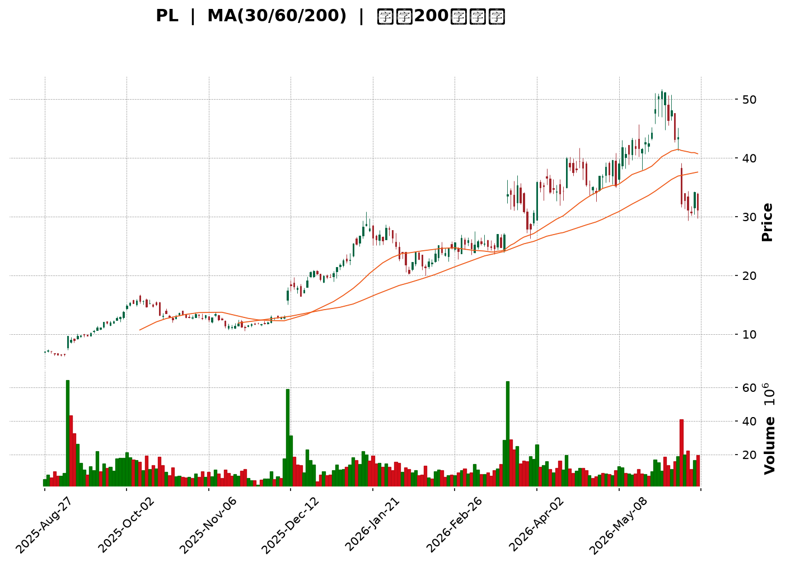
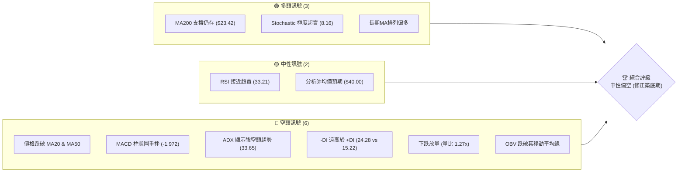
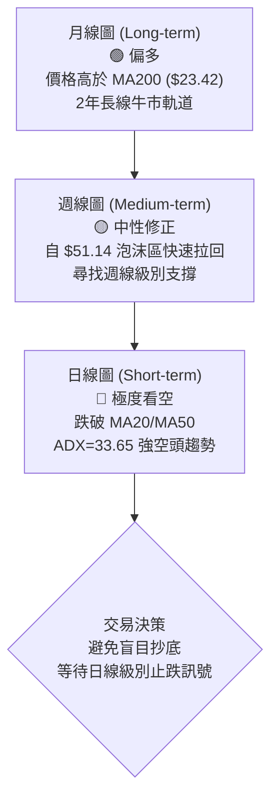
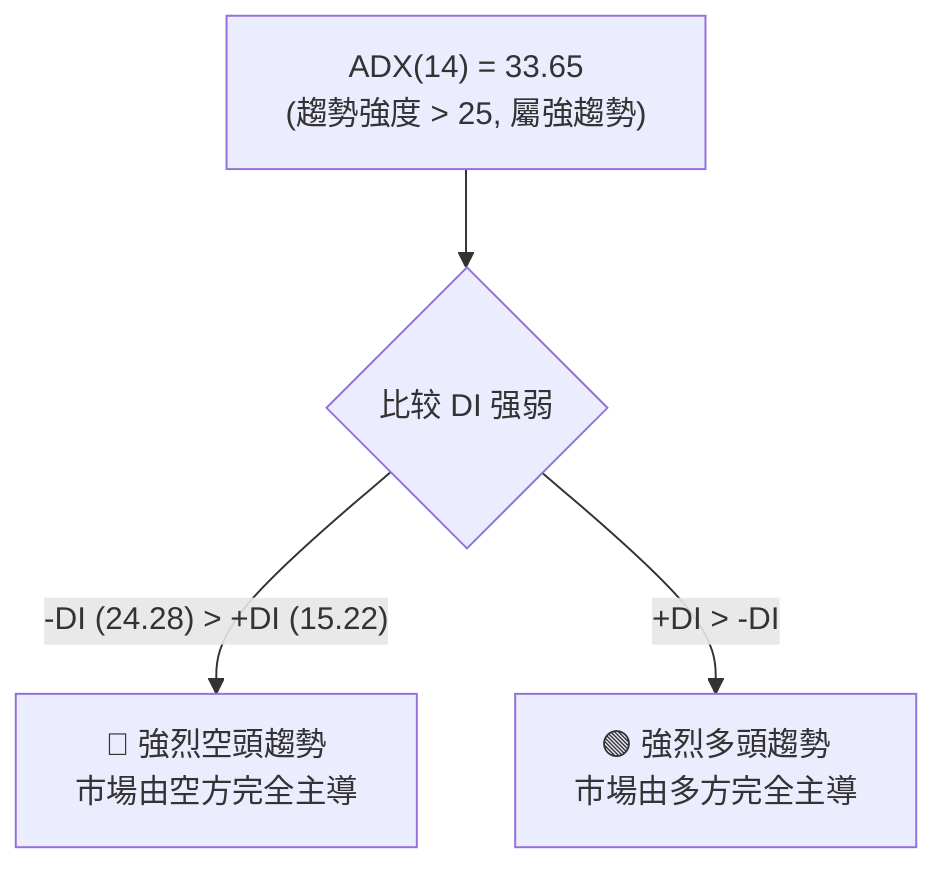
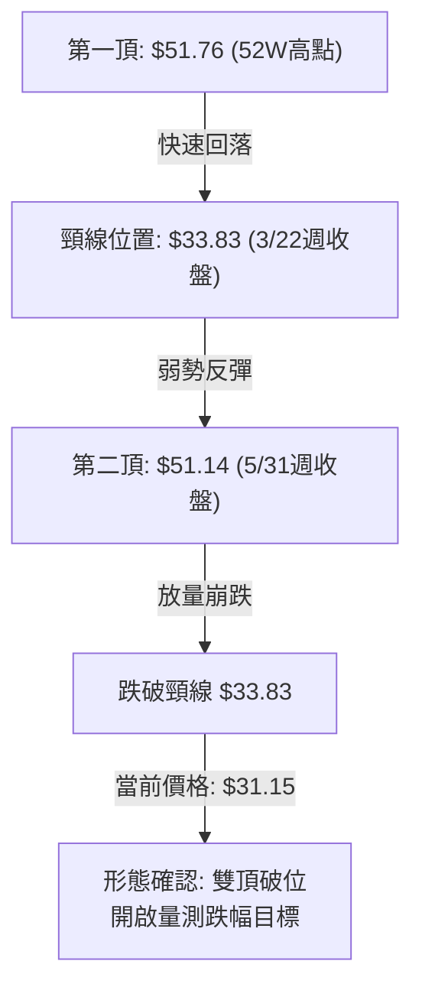

<details>
<summary>📊 靜態圖表 (點擊展開)</summary>

</details>

<html>
<head><meta charset="utf-8" /></head>
<body>
    <div style="height:500px; width:100%;">                        <script>window.PlotlyConfig = {MathJaxConfig: 'local'};</script>
        <script charset="utf-8" src="https://cdn.plot.ly/plotly-3.6.0.min.js" integrity="sha256-QaOVwtVY0T02VaHrr6pnoHLCwayMJp4O5n4YyaE3rJk=" crossorigin="anonymous"></script>                <div id="candlestick-chart" class="plotly-graph-div" style="height:100%; width:100%;"></div>            <script>                window.PLOTLYENV=window.PLOTLYENV || {};                                if (document.getElementById("candlestick-chart")) {                    Plotly.newPlot(                        "candlestick-chart",                        [{"close":{"dtype":"f8","bdata":"AAAAgOtRHEAAAABACtccQAAAAAApXBxAAAAAoJmZGkAAAABgj8IZQAAAAEAK1xlAAAAAYLgeGkAAAACA61EjQAAAAIA9CiJAAAAA4KPwIUAAAABAClcjQAAAACBcjyNAAAAA4FG4I0AAAAAAAIAjQAAAAIDCdSRAAAAA4FE4JUAAAADgUTgmQAAAAOBROCZAAAAAoJkZKEAAAAAAKdwnQAAAACCF6ydAAAAAYGZmKEAAAADgepQpQAAAAIDC9SlAAAAAgD2KK0AAAABAM7MtQAAAAGC4ni5AAAAAQOF6LkAAAAAAKVwvQAAAAEAzMy9AAAAAgOtRL0AAAABgZmYtQAAAAAAAgC5AAAAAIFyPLUAAAACAFC4uQAAAAIDCdSpAAAAA4FE4KkAAAABguB4rQAAAAIDr0SlAAAAAAAAAKUAAAABgZuYpQAAAAOBROCtAAAAAYLieKkAAAACAFK4pQAAAAMDMzClAAAAA4FG4KUAAAABgZuYqQAAAAKBHYSpAAAAAYGZmKUAAAAAAAIAqQAAAACCF6yhAAAAAYLieKUAAAAAgrscqQAAAAOCj8ChAAAAAoEfhKEAAAACA69EmQAAAAMDMzCZAAAAAIIVrJkAAAABgZuYmQAAAAOB6lCdAAAAAgMJ1JkAAAACA61EmQAAAAOB6FCdAAAAAgMJ1J0AAAADgo3AnQAAAAMDMzCdAAAAAYGZmJ0AAAACAPYonQAAAAMAeBShAAAAAoEfhKUAAAACAPYopQAAAAGBm5ilAAAAAgBSuKUAAAACgR+EpQAAAAOBReDFAAAAAoHA9MkAAAADAzAwyQAAAAKBH4TFAAAAA4FF4MEAAAACgcH0xQAAAAIAULjNAAAAAoJmZNEAAAABA4bo0QAAAAIDrUTRAAAAAAClcM0AAAABguN4zQAAAAKBwvTNAAAAA4FG4M0AAAADA9Wg0QAAAAADXYzVAAAAAQArXNUAAAAAAKZw2QAAAAOCjcDZAAAAAgMK1NkAAAADgo3A5QAAAAIDrUTlAAAAAQOG6OkAAAAAgrkc8QAAAACCuxzxAAAAAAAAAPEAAAACgR2E6QAAAACBcDzpAAAAA4KPwOkAAAABguN45QAAAAIDrETxAAAAAoEfhO0AAAACgmVk6QAAAAOBR+DhAAAAAoJnZNkAAAABAM\u002fM3QAAAAMAexTVAAAAAgBRuNEAAAABgj0I2QAAAAMAeBThAAAAAgD3KNkAAAABgZqY1QAAAAMDMTDVAAAAAIIVrNkAAAACAwjU2QAAAAKBwvTdAAAAAACkcOUAAAABgZuY3QAAAACCuxzdAAAAAgMK1OEAAAACgR6E4QAAAAKCZmTlAAAAAANcjOEAAAAAAKVw6QAAAAMDMTDlAAAAAAAAAOkAAAABACpc4QAAAACCuRzlAAAAAgOvROUAAAABgZmY5QAAAAOCjcDlAAAAA4FH4OEAAAACAPco4QAAAAKCZmThAAAAA4HoUO0AAAAAgXM84QAAAAIDC9TpAAAAAgD3qQEAAAADA9ehAQAAAAOB61D9AAAAAIFyvQUAAAABAMzNAQAAAAAAp3D5AAAAAANfjO0AAAABAM\u002fM7QAAAAIDCtT5AAAAA4KPwQUAAAABgj4JBQAAAAIDClUFAAAAAYGZGQkAAAACgcB1BQAAAAIDCVUFAAAAAwPUoQUAAAABACvdAQAAAAOB6NEFAAAAAgOvxQ0AAAACgcD1DQAAAAAAAwEJAAAAAANcDQ0AAAAAAKbxDQAAAAMAeJUNAAAAA4FG4QUAAAACgmblBQAAAAADXg0FAAAAAgD0KQUAAAAAAKXxCQAAAAEAzc0JAAAAAwB5FQ0AAAADgo5BCQAAAAOBR2ENAAAAAYLieQUAAAADAHoVDQAAAACCF60RAAAAAQApXREAAAABguF5EQAAAAMAehUVAAAAAIFzPREAAAACAFM5EQAAAACCFy0RAAAAA4HpURUAAAACgcD1FQAAAAMDMLEZAAAAAwPUoSEAAAACgcD1JQAAAAEAzs0lAAAAAgOuRSUAAAABA4TpHQAAAACCFC0hAAAAA4KOQRUAAAAAA18NFQAAAAAApHEBAAAAAYLheQEAAAAAghSs\u002fQAAAAOBRuD5AAAAAgMIVQUAAAABgZiY\u002fQA=="},"high":{"dtype":"f8","bdata":"AAAAgD2KHEAAAADAHoUdQAAAAGDjpRxAAAAAwPUoG0AAAACAPQobQAAAAEAzMxpAAAAAoJmZGkAAAAAAf2ojQAAAAAApHCNAAAAAQDOzIkAAAADA9SgkQAAAAOB6lCNAAAAA4FE4JEAAAABAtvMjQAAAAMDMzCRAAAAAIIVrJUAAAACA69EmQAAAAMDMTCZAAAAAYI9CKEAAAACAwnUoQAAAACBcjyhAAAAAwPWoKEAAAAAAAAAqQAAAAGC4HipAAAAAgD0KLEAAAADAyDYuQAAAAAAAAC9AAAAAIK7HL0AAAABgjwIwQAAAACCuxzBAAAAAoJmZL0AAAADAzAwwQAAAAGBm5i9AAAAAAACALkAAAADgelQvQAAAAEA1Hi9AAAAAwPUoK0AAAACA69EsQAAAAEAIrCpAAAAAoJkZKkAAAAAAKZwqQAAAAIAUbitAAAAAIIXrK0AAAADgo\u002fAqQAAAACCFqypAAAAAYGZmKkAAAACAwnUrQAAAAGCPwipAAAAAgD0KK0AAAADgo7AqQAAAAIA9CipAAAAAYGamKUAAAACgmZkrQAAAAKBwvSpAAAAAwMzMKUAAAACA69EoQAAAAEAzsydAAAAA4FE4J0AAAADAHsUnQAAAAIDC9ShAAAAAAAAAKUAAAAAAAAAnQAAAACBcTydAAAAAoO28J0AAAACAPQooQAAAAMAeBShAAAAAANejJ0AAAADAHoUoQAAAAKBHYShAAAAAYGZmKkAAAAAAAMApQAAAAIDCdSpAAAAAAAAAKkAAAABA4XoqQAAAAKCZ+TFAAAAAoJkZM0AAAADgo7AzQAAAACCuRzJAAAAAwMyMMkAAAABAM\u002fMxQAAAAOB61DNAAAAAYI\u002fCNEAAAACgcP00QAAAAIAU7jRAAAAAgMJVNEAAAADAHiU0QAAAAAApPDRAAAAAwMxMNEAAAAAgXM80QAAAACBcbzVAAAAAQDMTNkAAAAAAKdw2QAAAAKCZmTdAAAAAgOnGN0AAAAAgXI85QAAAAEAKlzpAAAAAwB7FOkAAAACgR2E9QAAAAGDj5T5AAAAA4FG4PUAAAAAghas8QAAAAIDA6jpAAAAAQOG6O0AAAABAM7M6QAAAAEAzszxAAAAAYGZmPEAAAABAM7M7QAAAAAAAQDtAAAAAwKHFOUAAAAAArPw3QAAAAAAAADhAAAAAgMCKNUAAAAAgrkc2QAAAAOBRGDhAAAAAQOH6N0AAAABgZoY3QAAAAMD16DVAAAAAgBTuNkAAAACAPco2QAAAAKCZmThAAAAAACkcOUAAAADgo7A5QAAAAOB6tDhAAAAAIFzPOEAAAABAYtA5QAAAAOCjsDlAAAAAQArXOEAAAACAFO46QAAAAOCjcDpAAAAAoEeBOkAAAACgcD06QAAAAACqkTtAAAAAQAoXOkAAAADgUXg6QAAAACCF6zpAAAAAIFwPOkAAAACA6QY6QAAAAAAAgDlAAAAAQAoXO0AAAADgehQ7QAAAAGCPQjtAAAAAANcjQkAAAAAghWtBQAAAACCFC0JAAAAAYGaGQkAAAAAA1dhBQAAAAGC4HkFAAAAAwPVoP0AAAACAFO48QAAAAIAULj9AAAAAwB4FQkAAAADAHiVCQAAAAGBm5kFAAAAAQOEaQ0AAAACAwpVCQAAAAIDrMUJAAAAAgBS+QUAAAAAgWDlCQAAAAIDClUFAAAAAoHAdREAAAACgcB1EQAAAAOB69ENAAAAAANfDQ0AAAABA4dpEQAAAAAAAAERAAAAAAADAQ0AAAACgcB1CQAAAAEAKp0FAAAAAAACAQUAAAAAAKXxCQAAAAOB6pEJAAAAAYI+iQ0AAAABACrdDQAAAAKBH4UNAAAAAgMJ1REAAAADAzOxDQAAAACBcj0VAAAAA4KPwREAAAACgmRlFQAAAAKCZuUVAAAAAQAqXRUAAAAAA1+NGQAAAAAAA4ERAAAAAYGbGRUAAAAAAAABGQAAAAEAMokZAAAAA4KOQSUAAAACgcH1JQAAAAKBH4UlAAAAAYI+iSUAAAAAAAGBJQAAAAGCPYklAAAAAIFzPR0AAAADAHpVGQAAAAEAKl0NAAAAAwB4FQUAAAAAgXC9BQAAAAMDMzD9AAAAAwPUoQUAAAACg+BFBQA=="},"hovertemplate":"\u003cb\u003e%{x|%Y-%m-%d}\u003c\u002fb\u003e\u003cbr\u003e\u958b: $%{open:.2f}\u003cbr\u003e\u9ad8: $%{high:.2f}\u003cbr\u003e\u4f4e: $%{low:.2f}\u003cbr\u003e\u6536: $%{close:.2f}\u003cextra\u003e\u003c\u002fextra\u003e","low":{"dtype":"f8","bdata":"AAAAYGZmG0AAAABACtcbQAAAAEAILBtAAAAAANejGUAAAADgUbgZQAAAAMD1KBlAAAAAwB4FGUAAAADA9SgdQAAAAMAeBSFAAAAA4KMwIUAAAABgj0IiQAAAACCuxyJAAAAA4FH4IkAAAACA61EjQAAAAAApXCNAAAAA4KNwJEAAAABA4TolQAAAAOCjcCVAAAAAANcjJkAAAABAClcnQAAAAEAK1yZAAAAAwB6FJ0AAAADgUbgoQAAAAKBwPShAAAAAQDMzKUAAAADA9SgsQAAAAMAehS1AAAAAoEdhLkAAAAAgXI8tQAAAAMAehS5AAAAAwPUoLkAAAAAAKRwtQAAAAIDrUS5AAAAAQAoXLUAAAABAM7MtQAAAAKBwPSpAAAAAIN0kKUAAAAAAAAArQAAAAGC4nilAAAAA4KPwJ0AAAACAFC4pQAAAACCuRypAAAAAgD2KKkAAAAAgXI8pQAAAACCuhylAAAAAQN8PKUAAAAAgrscpQAAAAIDCdSlAAAAAIIXrKEAAAAAgXA8pQAAAAADXIyhAAAAAACncJ0AAAABgENgpQAAAACBcjyhAAAAAwPWoKEAAAABAChcmQAAAAMDIdiVAAAAAYI\u002fCJUAAAACAFO4lQAAAAMDMzCZAAAAAgJcuJkAAAACAPQolQAAAAMAehSZAAAAAwB6FJkAAAABgj0InQAAAAICXbidAAAAAwMzMJkAAAADgelQnQAAAAEDheidAAAAAACncJ0AAAADAHgUpQAAAAKBwPSlAAAAAQDUeKUAAAADA9SgpQAAAAMAeBS5AAAAAYLheMUAAAAAA16MxQAAAAIAU7jBAAAAAgBRuMEAAAACAPQoxQAAAAKBw\u002fTFAAAAAACmcM0AAAACgmZkzQAAAAAApHDRAAAAAgD0KM0AAAABgj8IyQAAAAOCjcDNAAAAAQImhM0AAAAAA1fgyQAAAAKBwfTNAAAAA4FH4NEAAAADA9Wg1QAAAAEAKFzZAAAAAwCDQNUAAAADA9Sg3QAAAAGC4HjlAAAAAAAAAOUAAAABgj0I6QAAAAAApXDxAAAAAIFxvO0AAAACgRyE5QAAAAADXIzlAAAAAgBQuOUAAAADgUTg5QAAAAKAaDzpAAAAAIFzPOkAAAADAzIw5QAAAAIDrcThAAAAAQAp3NkAAAADA9eg2QAAAAEAKlzRAAAAAYGYmNEAAAAAgXM80QAAAAGBmpjVAAAAAgMK1NkAAAADA9eg0QAAAAEDh+jNAAAAAIAYhNUAAAAAAAIA1QAAAAKBwPTZAAAAAgMJ1NkAAAABgj4I3QAAAAEDhOjdAAAAAoJlZNkAAAACgcH04QAAAAIDrEThAAAAAIK7HNkAAAADgUbg3QAAAAKBHYThAAAAAgGgROUAAAABgj4I3QAAAAKCZ2TdAAAAAQDNzOEAAAABAMzM5QAAAAOCj8DhAAAAAIK5HOEAAAAAgXE84QAAAAOB4qTdAAAAAYGZmOEAAAABgj8I4QAAAAOCj8DdAAAAAgGghQEAAAABA4To\u002fQAAAAAApHD9AAAAAoEchP0AAAAAgXA9AQAAAAIA9ij5AAAAAYLg+O0AAAADA9Ug6QAAAAMAehTxAAAAA4KNwPUAAAABA4RpBQAAAAGCPYkBAAAAA4FG4QUAAAADgUfhAQAAAAKCZ+UBAAAAAAClcQEAAAACgR+E\u002fQAAAACCuZ0BAAAAAYGZ2QUAAAAAghetCQAAAAEAKd0JAAAAAYI\u002fCQkAAAAAA1yNDQAAAAIA9KkJAAAAA4KOQQUAAAADgo9BAQAAAAMDz3UBAAAAAwPVIQEAAAADASydBQAAAAOCla0FAAAAAwPXoQUAAAACgmflBQAAAAKBHwUFAAAAAQAp3QUAAAABgZuZBQAAAAMDMDENAAAAAoEchQ0AAAADAzGxDQAAAAMDMzENAAAAAwB5FREAAAACgRyFEQAAAAGCPAkNAAAAAgMJVREAAAADAHoVEQAAAAMDMjEVAAAAAgBTuRkAAAACAFI5HQAAAAAAAgEdAAAAAANdjRkAAAAAA18NGQAAAAEDhOkdAAAAAwB5VRUAAAABgZqZEQAAAAMD1qD9AAAAA4HpUP0AAAACA61E9QAAAAEAzMz5AAAAAIIVrPkAAAADAHsU9QA=="},"name":"\u50f9\u683c","open":{"dtype":"f8","bdata":"AAAAIIXrG0AAAABA4XocQAAAACBcjxxAAAAAgD0KG0AAAACAPQobQAAAAEAzMxpAAAAA4KNwGkAAAACA69EeQAAAACCuRyFAAAAAYGZmIkAAAACgR2EiQAAAAKBwPSNAAAAA4KPwI0AAAADgUbgjQAAAAAAAgCNAAAAAgML1JEAAAACA61ElQAAAAOBRuCVAAAAAQOF6JkAAAAAgrkcoQAAAAAAAACdAAAAA4FG4J0AAAAAgrscoQAAAAGBmZilAAAAAgBSuKUAAAADgUbgsQAAAAGBm5i1AAAAAoJmZL0AAAAAAAAAuQAAAAMDMjDBAAAAAgBQuL0AAAADgUbgvQAAAACCFay5AAAAAAAAALkAAAABgZuYuQAAAAOCj8C5AAAAAAAAAKkAAAACAPQosQAAAAAApXCpAAAAAAACAKUAAAABgj0IpQAAAAKCZmSpAAAAAYGbmK0AAAADAzMwqQAAAACCF6ylAAAAAQOF6KUAAAAAgrscpQAAAAMD1qCpAAAAAgMJ1KUAAAACAFK4pQAAAAMAeBSpAAAAA4FE4KEAAAACAwnUqQAAAAGBmZipAAAAAYI9CKUAAAACAPYooQAAAAAAAACZAAAAAAClcJkAAAADgehQmQAAAACCF6yZAAAAAYGZmKEAAAABA4XomQAAAAEAzsyZAAAAAwB4FJ0AAAACAPYonQAAAAIDr0SdAAAAAQDMzJ0AAAABgj8InQAAAAMD1qCdAAAAAYGbmJ0AAAADAHoUpQAAAAAApXCpAAAAAoHA9KUAAAACgmZkpQAAAAOB6lC9AAAAA4KNwMkAAAAAgXM8yQAAAAGBmpjFAAAAAgBQuMkAAAACAPQoxQAAAAKBw\u002fTFAAAAAIK7HM0AAAADAzMwzQAAAAEDhujRAAAAAwMxMNEAAAACgcN0yQAAAACCuBzRAAAAAYLi+M0AAAABA4dozQAAAAEAzszRAAAAAAACANUAAAADgUbg1QAAAAKCZ2TZAAAAAoJmZNkAAAADAzEw3QAAAAGCPQjpAAAAAAACAOUAAAAAgXM86QAAAAEAzczxAAAAAQAqXO0AAAAAAAIA8QAAAAAAAwDpAAAAAYI8COkAAAACgmZk6QAAAAOB6FDpAAAAAwMwMPEAAAABAM7M7QAAAAEAKtzlAAAAAANfjOEAAAABA4fo3QAAAAAAAADhAAAAAAAAANUAAAACAPQo1QAAAAIDC9TVAAAAAYLjeN0AAAABgZoY3QAAAAIDrkTVAAAAAAACANUAAAAAAAAA2QAAAAGBmZjZAAAAAwB4FN0AAAACgcL04QAAAAGBmZjdAAAAAAABAN0AAAADAzEw5QAAAAAAAgDhAAAAAQDOTOEAAAADgUbg3QAAAAEDhGjpAAAAAoJmZOUAAAAAAAIA5QAAAAADX4zdAAAAAQArXOEAAAACA69E5QAAAAEAKVzlAAAAA4FH4OUAAAABA4fo4QAAAAKBHITlAAAAAoJnZOEAAAAAAAIA6QAAAAAAAQDhAAAAAYGbGQEAAAAAAAEBBQAAAAEDh2kBAAAAAQDMzQEAAAAAAKXxBQAAAAKBw\u002fUBAAAAAoJnZPkAAAADAzMw8QAAAAAAAAD1AAAAA4KNwPUAAAACAwvVBQAAAAOCjsEFAAAAAQDNzQkAAAAAAAEBCQAAAAOCjcEFAAAAAoHAdQUAAAAAghctBQAAAAIDCNUFAAAAAoHB9QUAAAACA65FDQAAAAEAzk0NAAAAAACkcQ0AAAAAAAMBDQAAAAIA9qkNAAAAAgBSOQ0AAAAAAKbxBQAAAAMDMTEFAAAAA4KMwQUAAAAAA10NBQAAAACBcX0JAAAAAwB6FQkAAAACgmZlDQAAAACBcf0JAAAAAYI\u002fCQ0AAAABAMzNCQAAAAEAzU0NAAAAAIIULREAAAABAChdFQAAAAOCjUERAAAAAwPUIRUAAAAAA16NFQAAAAEAKd0RAAAAAQDMzRUAAAADAcghFQAAAAMDMrEVAAAAAwPXYR0AAAADAzAxJQAAAAEAzE0lAAAAAAACQSEAAAAAghYtIQAAAAIDClUdAAAAAIFzPR0AAAACgcJ1FQAAAAGBmJkNAAAAAoEcBQUAAAACAwrVAQAAAAADX4z5AAAAAAACAP0AAAACA6\u002fFAQA=="},"x":["2025-08-27T00:00:00-04:00","2025-08-28T00:00:00-04:00","2025-08-29T00:00:00-04:00","2025-09-02T00:00:00-04:00","2025-09-03T00:00:00-04:00","2025-09-04T00:00:00-04:00","2025-09-05T00:00:00-04:00","2025-09-08T00:00:00-04:00","2025-09-09T00:00:00-04:00","2025-09-10T00:00:00-04:00","2025-09-11T00:00:00-04:00","2025-09-12T00:00:00-04:00","2025-09-15T00:00:00-04:00","2025-09-16T00:00:00-04:00","2025-09-17T00:00:00-04:00","2025-09-18T00:00:00-04:00","2025-09-19T00:00:00-04:00","2025-09-22T00:00:00-04:00","2025-09-23T00:00:00-04:00","2025-09-24T00:00:00-04:00","2025-09-25T00:00:00-04:00","2025-09-26T00:00:00-04:00","2025-09-29T00:00:00-04:00","2025-09-30T00:00:00-04:00","2025-10-01T00:00:00-04:00","2025-10-02T00:00:00-04:00","2025-10-03T00:00:00-04:00","2025-10-06T00:00:00-04:00","2025-10-07T00:00:00-04:00","2025-10-08T00:00:00-04:00","2025-10-09T00:00:00-04:00","2025-10-10T00:00:00-04:00","2025-10-13T00:00:00-04:00","2025-10-14T00:00:00-04:00","2025-10-15T00:00:00-04:00","2025-10-16T00:00:00-04:00","2025-10-17T00:00:00-04:00","2025-10-20T00:00:00-04:00","2025-10-21T00:00:00-04:00","2025-10-22T00:00:00-04:00","2025-10-23T00:00:00-04:00","2025-10-24T00:00:00-04:00","2025-10-27T00:00:00-04:00","2025-10-28T00:00:00-04:00","2025-10-29T00:00:00-04:00","2025-10-30T00:00:00-04:00","2025-10-31T00:00:00-04:00","2025-11-03T00:00:00-05:00","2025-11-04T00:00:00-05:00","2025-11-05T00:00:00-05:00","2025-11-06T00:00:00-05:00","2025-11-07T00:00:00-05:00","2025-11-10T00:00:00-05:00","2025-11-11T00:00:00-05:00","2025-11-12T00:00:00-05:00","2025-11-13T00:00:00-05:00","2025-11-14T00:00:00-05:00","2025-11-17T00:00:00-05:00","2025-11-18T00:00:00-05:00","2025-11-19T00:00:00-05:00","2025-11-20T00:00:00-05:00","2025-11-21T00:00:00-05:00","2025-11-24T00:00:00-05:00","2025-11-25T00:00:00-05:00","2025-11-26T00:00:00-05:00","2025-11-28T00:00:00-05:00","2025-12-01T00:00:00-05:00","2025-12-02T00:00:00-05:00","2025-12-03T00:00:00-05:00","2025-12-04T00:00:00-05:00","2025-12-05T00:00:00-05:00","2025-12-08T00:00:00-05:00","2025-12-09T00:00:00-05:00","2025-12-10T00:00:00-05:00","2025-12-11T00:00:00-05:00","2025-12-12T00:00:00-05:00","2025-12-15T00:00:00-05:00","2025-12-16T00:00:00-05:00","2025-12-17T00:00:00-05:00","2025-12-18T00:00:00-05:00","2025-12-19T00:00:00-05:00","2025-12-22T00:00:00-05:00","2025-12-23T00:00:00-05:00","2025-12-24T00:00:00-05:00","2025-12-26T00:00:00-05:00","2025-12-29T00:00:00-05:00","2025-12-30T00:00:00-05:00","2025-12-31T00:00:00-05:00","2026-01-02T00:00:00-05:00","2026-01-05T00:00:00-05:00","2026-01-06T00:00:00-05:00","2026-01-07T00:00:00-05:00","2026-01-08T00:00:00-05:00","2026-01-09T00:00:00-05:00","2026-01-12T00:00:00-05:00","2026-01-13T00:00:00-05:00","2026-01-14T00:00:00-05:00","2026-01-15T00:00:00-05:00","2026-01-16T00:00:00-05:00","2026-01-20T00:00:00-05:00","2026-01-21T00:00:00-05:00","2026-01-22T00:00:00-05:00","2026-01-23T00:00:00-05:00","2026-01-26T00:00:00-05:00","2026-01-27T00:00:00-05:00","2026-01-28T00:00:00-05:00","2026-01-29T00:00:00-05:00","2026-01-30T00:00:00-05:00","2026-02-02T00:00:00-05:00","2026-02-03T00:00:00-05:00","2026-02-04T00:00:00-05:00","2026-02-05T00:00:00-05:00","2026-02-06T00:00:00-05:00","2026-02-09T00:00:00-05:00","2026-02-10T00:00:00-05:00","2026-02-11T00:00:00-05:00","2026-02-12T00:00:00-05:00","2026-02-13T00:00:00-05:00","2026-02-17T00:00:00-05:00","2026-02-18T00:00:00-05:00","2026-02-19T00:00:00-05:00","2026-02-20T00:00:00-05:00","2026-02-23T00:00:00-05:00","2026-02-24T00:00:00-05:00","2026-02-25T00:00:00-05:00","2026-02-26T00:00:00-05:00","2026-02-27T00:00:00-05:00","2026-03-02T00:00:00-05:00","2026-03-03T00:00:00-05:00","2026-03-04T00:00:00-05:00","2026-03-05T00:00:00-05:00","2026-03-06T00:00:00-05:00","2026-03-09T00:00:00-04:00","2026-03-10T00:00:00-04:00","2026-03-11T00:00:00-04:00","2026-03-12T00:00:00-04:00","2026-03-13T00:00:00-04:00","2026-03-16T00:00:00-04:00","2026-03-17T00:00:00-04:00","2026-03-18T00:00:00-04:00","2026-03-19T00:00:00-04:00","2026-03-20T00:00:00-04:00","2026-03-23T00:00:00-04:00","2026-03-24T00:00:00-04:00","2026-03-25T00:00:00-04:00","2026-03-26T00:00:00-04:00","2026-03-27T00:00:00-04:00","2026-03-30T00:00:00-04:00","2026-03-31T00:00:00-04:00","2026-04-01T00:00:00-04:00","2026-04-02T00:00:00-04:00","2026-04-06T00:00:00-04:00","2026-04-07T00:00:00-04:00","2026-04-08T00:00:00-04:00","2026-04-09T00:00:00-04:00","2026-04-10T00:00:00-04:00","2026-04-13T00:00:00-04:00","2026-04-14T00:00:00-04:00","2026-04-15T00:00:00-04:00","2026-04-16T00:00:00-04:00","2026-04-17T00:00:00-04:00","2026-04-20T00:00:00-04:00","2026-04-21T00:00:00-04:00","2026-04-22T00:00:00-04:00","2026-04-23T00:00:00-04:00","2026-04-24T00:00:00-04:00","2026-04-27T00:00:00-04:00","2026-04-28T00:00:00-04:00","2026-04-29T00:00:00-04:00","2026-04-30T00:00:00-04:00","2026-05-01T00:00:00-04:00","2026-05-04T00:00:00-04:00","2026-05-05T00:00:00-04:00","2026-05-06T00:00:00-04:00","2026-05-07T00:00:00-04:00","2026-05-08T00:00:00-04:00","2026-05-11T00:00:00-04:00","2026-05-12T00:00:00-04:00","2026-05-13T00:00:00-04:00","2026-05-14T00:00:00-04:00","2026-05-15T00:00:00-04:00","2026-05-18T00:00:00-04:00","2026-05-19T00:00:00-04:00","2026-05-20T00:00:00-04:00","2026-05-21T00:00:00-04:00","2026-05-22T00:00:00-04:00","2026-05-26T00:00:00-04:00","2026-05-27T00:00:00-04:00","2026-05-28T00:00:00-04:00","2026-05-29T00:00:00-04:00","2026-06-01T00:00:00-04:00","2026-06-02T00:00:00-04:00","2026-06-03T00:00:00-04:00","2026-06-04T00:00:00-04:00","2026-06-05T00:00:00-04:00","2026-06-08T00:00:00-04:00","2026-06-09T00:00:00-04:00","2026-06-10T00:00:00-04:00","2026-06-11T00:00:00-04:00","2026-06-12T00:00:00-04:00"],"type":"candlestick"},{"hovertemplate":"MA30: $%{y:.2f}\u003cextra\u003e\u003c\u002fextra\u003e","line":{"color":"#2196F3","dash":"dash","width":2},"mode":"lines","name":"MA30","x":["2025-08-27T00:00:00-04:00","2025-08-28T00:00:00-04:00","2025-08-29T00:00:00-04:00","2025-09-02T00:00:00-04:00","2025-09-03T00:00:00-04:00","2025-09-04T00:00:00-04:00","2025-09-05T00:00:00-04:00","2025-09-08T00:00:00-04:00","2025-09-09T00:00:00-04:00","2025-09-10T00:00:00-04:00","2025-09-11T00:00:00-04:00","2025-09-12T00:00:00-04:00","2025-09-15T00:00:00-04:00","2025-09-16T00:00:00-04:00","2025-09-17T00:00:00-04:00","2025-09-18T00:00:00-04:00","2025-09-19T00:00:00-04:00","2025-09-22T00:00:00-04:00","2025-09-23T00:00:00-04:00","2025-09-24T00:00:00-04:00","2025-09-25T00:00:00-04:00","2025-09-26T00:00:00-04:00","2025-09-29T00:00:00-04:00","2025-09-30T00:00:00-04:00","2025-10-01T00:00:00-04:00","2025-10-02T00:00:00-04:00","2025-10-03T00:00:00-04:00","2025-10-06T00:00:00-04:00","2025-10-07T00:00:00-04:00","2025-10-08T00:00:00-04:00","2025-10-09T00:00:00-04:00","2025-10-10T00:00:00-04:00","2025-10-13T00:00:00-04:00","2025-10-14T00:00:00-04:00","2025-10-15T00:00:00-04:00","2025-10-16T00:00:00-04:00","2025-10-17T00:00:00-04:00","2025-10-20T00:00:00-04:00","2025-10-21T00:00:00-04:00","2025-10-22T00:00:00-04:00","2025-10-23T00:00:00-04:00","2025-10-24T00:00:00-04:00","2025-10-27T00:00:00-04:00","2025-10-28T00:00:00-04:00","2025-10-29T00:00:00-04:00","2025-10-30T00:00:00-04:00","2025-10-31T00:00:00-04:00","2025-11-03T00:00:00-05:00","2025-11-04T00:00:00-05:00","2025-11-05T00:00:00-05:00","2025-11-06T00:00:00-05:00","2025-11-07T00:00:00-05:00","2025-11-10T00:00:00-05:00","2025-11-11T00:00:00-05:00","2025-11-12T00:00:00-05:00","2025-11-13T00:00:00-05:00","2025-11-14T00:00:00-05:00","2025-11-17T00:00:00-05:00","2025-11-18T00:00:00-05:00","2025-11-19T00:00:00-05:00","2025-11-20T00:00:00-05:00","2025-11-21T00:00:00-05:00","2025-11-24T00:00:00-05:00","2025-11-25T00:00:00-05:00","2025-11-26T00:00:00-05:00","2025-11-28T00:00:00-05:00","2025-12-01T00:00:00-05:00","2025-12-02T00:00:00-05:00","2025-12-03T00:00:00-05:00","2025-12-04T00:00:00-05:00","2025-12-05T00:00:00-05:00","2025-12-08T00:00:00-05:00","2025-12-09T00:00:00-05:00","2025-12-10T00:00:00-05:00","2025-12-11T00:00:00-05:00","2025-12-12T00:00:00-05:00","2025-12-15T00:00:00-05:00","2025-12-16T00:00:00-05:00","2025-12-17T00:00:00-05:00","2025-12-18T00:00:00-05:00","2025-12-19T00:00:00-05:00","2025-12-22T00:00:00-05:00","2025-12-23T00:00:00-05:00","2025-12-24T00:00:00-05:00","2025-12-26T00:00:00-05:00","2025-12-29T00:00:00-05:00","2025-12-30T00:00:00-05:00","2025-12-31T00:00:00-05:00","2026-01-02T00:00:00-05:00","2026-01-05T00:00:00-05:00","2026-01-06T00:00:00-05:00","2026-01-07T00:00:00-05:00","2026-01-08T00:00:00-05:00","2026-01-09T00:00:00-05:00","2026-01-12T00:00:00-05:00","2026-01-13T00:00:00-05:00","2026-01-14T00:00:00-05:00","2026-01-15T00:00:00-05:00","2026-01-16T00:00:00-05:00","2026-01-20T00:00:00-05:00","2026-01-21T00:00:00-05:00","2026-01-22T00:00:00-05:00","2026-01-23T00:00:00-05:00","2026-01-26T00:00:00-05:00","2026-01-27T00:00:00-05:00","2026-01-28T00:00:00-05:00","2026-01-29T00:00:00-05:00","2026-01-30T00:00:00-05:00","2026-02-02T00:00:00-05:00","2026-02-03T00:00:00-05:00","2026-02-04T00:00:00-05:00","2026-02-05T00:00:00-05:00","2026-02-06T00:00:00-05:00","2026-02-09T00:00:00-05:00","2026-02-10T00:00:00-05:00","2026-02-11T00:00:00-05:00","2026-02-12T00:00:00-05:00","2026-02-13T00:00:00-05:00","2026-02-17T00:00:00-05:00","2026-02-18T00:00:00-05:00","2026-02-19T00:00:00-05:00","2026-02-20T00:00:00-05:00","2026-02-23T00:00:00-05:00","2026-02-24T00:00:00-05:00","2026-02-25T00:00:00-05:00","2026-02-26T00:00:00-05:00","2026-02-27T00:00:00-05:00","2026-03-02T00:00:00-05:00","2026-03-03T00:00:00-05:00","2026-03-04T00:00:00-05:00","2026-03-05T00:00:00-05:00","2026-03-06T00:00:00-05:00","2026-03-09T00:00:00-04:00","2026-03-10T00:00:00-04:00","2026-03-11T00:00:00-04:00","2026-03-12T00:00:00-04:00","2026-03-13T00:00:00-04:00","2026-03-16T00:00:00-04:00","2026-03-17T00:00:00-04:00","2026-03-18T00:00:00-04:00","2026-03-19T00:00:00-04:00","2026-03-20T00:00:00-04:00","2026-03-23T00:00:00-04:00","2026-03-24T00:00:00-04:00","2026-03-25T00:00:00-04:00","2026-03-26T00:00:00-04:00","2026-03-27T00:00:00-04:00","2026-03-30T00:00:00-04:00","2026-03-31T00:00:00-04:00","2026-04-01T00:00:00-04:00","2026-04-02T00:00:00-04:00","2026-04-06T00:00:00-04:00","2026-04-07T00:00:00-04:00","2026-04-08T00:00:00-04:00","2026-04-09T00:00:00-04:00","2026-04-10T00:00:00-04:00","2026-04-13T00:00:00-04:00","2026-04-14T00:00:00-04:00","2026-04-15T00:00:00-04:00","2026-04-16T00:00:00-04:00","2026-04-17T00:00:00-04:00","2026-04-20T00:00:00-04:00","2026-04-21T00:00:00-04:00","2026-04-22T00:00:00-04:00","2026-04-23T00:00:00-04:00","2026-04-24T00:00:00-04:00","2026-04-27T00:00:00-04:00","2026-04-28T00:00:00-04:00","2026-04-29T00:00:00-04:00","2026-04-30T00:00:00-04:00","2026-05-01T00:00:00-04:00","2026-05-04T00:00:00-04:00","2026-05-05T00:00:00-04:00","2026-05-06T00:00:00-04:00","2026-05-07T00:00:00-04:00","2026-05-08T00:00:00-04:00","2026-05-11T00:00:00-04:00","2026-05-12T00:00:00-04:00","2026-05-13T00:00:00-04:00","2026-05-14T00:00:00-04:00","2026-05-15T00:00:00-04:00","2026-05-18T00:00:00-04:00","2026-05-19T00:00:00-04:00","2026-05-20T00:00:00-04:00","2026-05-21T00:00:00-04:00","2026-05-22T00:00:00-04:00","2026-05-26T00:00:00-04:00","2026-05-27T00:00:00-04:00","2026-05-28T00:00:00-04:00","2026-05-29T00:00:00-04:00","2026-06-01T00:00:00-04:00","2026-06-02T00:00:00-04:00","2026-06-03T00:00:00-04:00","2026-06-04T00:00:00-04:00","2026-06-05T00:00:00-04:00","2026-06-08T00:00:00-04:00","2026-06-09T00:00:00-04:00","2026-06-10T00:00:00-04:00","2026-06-11T00:00:00-04:00","2026-06-12T00:00:00-04:00"],"y":{"dtype":"f8","bdata":"AAAAAAAA+H8AAAAAAAD4fwAAAAAAAPh\u002fAAAAAAAA+H8AAAAAAAD4fwAAAAAAAPh\u002fAAAAAAAA+H8AAAAAAAD4fwAAAAAAAPh\u002fAAAAAAAA+H8AAAAAAAD4fwAAAAAAAPh\u002fAAAAAAAA+H8AAAAAAAD4fwAAAAAAAPh\u002fAAAAAAAA+H8AAAAAAAD4fwAAAAAAAPh\u002fAAAAAAAA+H8AAAAAAAD4fwAAAAAAAPh\u002fAAAAAAAA+H8AAAAAAAD4fwAAAAAAAPh\u002fAAAAAAAA+H8AAAAAAAD4fwAAAAAAAPh\u002fAAAAAAAA+H8AAAAAAAD4f+\u002fu7iZ4cCVAZmZmvuYCJkBVVVUNu4ImQKuqqqL+DSdAVVVVJb+YJ0CrqqqSXywoQO\u002fu7ibqnyhAvLu7mzYQKUCJiIj4xVIpQDMzM6MplSlAERERcWjRKUCrqqr6YgkqQBEREYHASipAmpmZyaGFKkBEREQ0XroqQM3MzJzv5ypAMzMzA1YOK0ARERGhRTYrQJqZmUnFWStA3t3dLd1kK0CJiIhYZHsrQBEREeHsgytAMzMzA1aOK0BERER0k5grQLy7uzvfjytA7+7uXix5K0B3d3fHdj4rQJqZmbm7+ypAMzMzY\u002fS2KkC8u7s7w24qQGZmZha9LSpA7+7uHiLiKUAAAACgt6UpQDMzM2NmZilAvLu7u1gyKUCrqqr61PgoQO\u002fu7h4i4ihAzczMvBHKKEC8u7sbhasoQDMzM\u002fMonChAZmZmVqujKECJiIjomKAoQDMzM1NVlShAzczM3E+NKEBERETEBI8oQGZmZmYD3ShAq6qq+tQ4KUDv7u6uVocpQKuqqpph1ylAvLu7+7gXKkAzMzPTFWAqQERERPTF0ipAvLu7+7hXK0De3d3t\u002fdQrQJqZmRn3WixAvLu7CxHRLECrqqpac2EtQO\u002fu7l7J7y1AAAAAIAaBLkBmZmb28BkvQAAAAADIvS9AZmZm5m05MEDv7u7OIpswQBERETkm+DBA3t3dZdhVMUAiIiIy7MoxQCIiIqJwPTJAMzMzK7K9MkCJiIjQlEozQImIiHCv2TNAMzMzgzJaNEAiIiICVs40QFVVVT01PjVAERERKYe2NUDe3d0t3SQ2QLy7uztRfzZAIiIiIpTRNkAzMzPDZxg3QKuqqhroVDdA3t3dbVmLN0BERESEecI3QFVVVXWT2DdAZmZmFiDXN0DNzMxsLuQ3QDMzMzPBAzhAZmZmJgYhOEDe3d2dNjA4QM3MzHyGPThAq6qqupBUOEAzMzPj7GM4QKuqqor6dzhAd3d39+GTOEAzMzMD5J44QJqZmUlTqjhAq6qqWmS7OEARERHherQ4QM3MzIzetjhAvLu7m8SgOEDe3d1NYpA4QAAAACCwcjhA7+7uDp9hOEDv7u6+WFI4QAAAANCwSzhAIiIiIiJCOEBmZmZmHz44QERERBSuJzhAZmZmFtkOOEB3d3c3iQE4QBEREfFg\u002fjdAREREhHkiOEBmZmY20Ck4QAAAAPAZVjhAAAAAsHLIOEBERETkFys5QImIiBi9bTlAVVVVhRbZOUAiIiJC0jQ6QGZmZmZmhjpAvLu7yxO1OkBVVVUFD+Y6QHd3dzeJITtAREREpHB9O0B3d3enVNw7QLy7u3uGPTxAvLu7W4+iPEARERHhevQ8QHd3d5fgQT1AREREJL+YPUDv7u4OWNk9QImIiCgVJz5AMzMzU5ydPkDe3d19IxQ\u002fQM3MzHxqfD9AMzMzo5vkP0AzMzMDVi5AQLy7u6MpZUBAvLu7q9WRQEC8u7s7Ub9AQKuqqpLR60BAERERca8JQUAAAABokT1BQCIiIor6Z0FAVVVVHRN8QUDNzMyEMopBQLy7u7u7q0FA3t3dvS2rQUBERERkgsdBQKuqqnpb9kFAIiIiku0sQkCamZmpf2NCQAAAAFAbmEJAvLu765iwQkBVVVX1tsxCQAAAAFAb6EJAAAAAEC0CQ0AzMzNDYCVDQHd3d2etTkNAMzMzI2mKQ0BmZmYmBtFDQDMzM8ODGURAMzMzw4NJREDNzMwMkGtEQHd3dye\u002fmERAd3d3t4GuREARERFR1L9EQCIiIkLupURAREREJGmaREBVVVU9JohEQCIiIpLCdURA7+7u3iR2RECJiIjgT11EQA=="},"type":"scatter"},{"hovertemplate":"MA60: $%{y:.2f}\u003cextra\u003e\u003c\u002fextra\u003e","line":{"color":"#9C27B0","dash":"dash","width":2},"mode":"lines","name":"MA60","x":["2025-08-27T00:00:00-04:00","2025-08-28T00:00:00-04:00","2025-08-29T00:00:00-04:00","2025-09-02T00:00:00-04:00","2025-09-03T00:00:00-04:00","2025-09-04T00:00:00-04:00","2025-09-05T00:00:00-04:00","2025-09-08T00:00:00-04:00","2025-09-09T00:00:00-04:00","2025-09-10T00:00:00-04:00","2025-09-11T00:00:00-04:00","2025-09-12T00:00:00-04:00","2025-09-15T00:00:00-04:00","2025-09-16T00:00:00-04:00","2025-09-17T00:00:00-04:00","2025-09-18T00:00:00-04:00","2025-09-19T00:00:00-04:00","2025-09-22T00:00:00-04:00","2025-09-23T00:00:00-04:00","2025-09-24T00:00:00-04:00","2025-09-25T00:00:00-04:00","2025-09-26T00:00:00-04:00","2025-09-29T00:00:00-04:00","2025-09-30T00:00:00-04:00","2025-10-01T00:00:00-04:00","2025-10-02T00:00:00-04:00","2025-10-03T00:00:00-04:00","2025-10-06T00:00:00-04:00","2025-10-07T00:00:00-04:00","2025-10-08T00:00:00-04:00","2025-10-09T00:00:00-04:00","2025-10-10T00:00:00-04:00","2025-10-13T00:00:00-04:00","2025-10-14T00:00:00-04:00","2025-10-15T00:00:00-04:00","2025-10-16T00:00:00-04:00","2025-10-17T00:00:00-04:00","2025-10-20T00:00:00-04:00","2025-10-21T00:00:00-04:00","2025-10-22T00:00:00-04:00","2025-10-23T00:00:00-04:00","2025-10-24T00:00:00-04:00","2025-10-27T00:00:00-04:00","2025-10-28T00:00:00-04:00","2025-10-29T00:00:00-04:00","2025-10-30T00:00:00-04:00","2025-10-31T00:00:00-04:00","2025-11-03T00:00:00-05:00","2025-11-04T00:00:00-05:00","2025-11-05T00:00:00-05:00","2025-11-06T00:00:00-05:00","2025-11-07T00:00:00-05:00","2025-11-10T00:00:00-05:00","2025-11-11T00:00:00-05:00","2025-11-12T00:00:00-05:00","2025-11-13T00:00:00-05:00","2025-11-14T00:00:00-05:00","2025-11-17T00:00:00-05:00","2025-11-18T00:00:00-05:00","2025-11-19T00:00:00-05:00","2025-11-20T00:00:00-05:00","2025-11-21T00:00:00-05:00","2025-11-24T00:00:00-05:00","2025-11-25T00:00:00-05:00","2025-11-26T00:00:00-05:00","2025-11-28T00:00:00-05:00","2025-12-01T00:00:00-05:00","2025-12-02T00:00:00-05:00","2025-12-03T00:00:00-05:00","2025-12-04T00:00:00-05:00","2025-12-05T00:00:00-05:00","2025-12-08T00:00:00-05:00","2025-12-09T00:00:00-05:00","2025-12-10T00:00:00-05:00","2025-12-11T00:00:00-05:00","2025-12-12T00:00:00-05:00","2025-12-15T00:00:00-05:00","2025-12-16T00:00:00-05:00","2025-12-17T00:00:00-05:00","2025-12-18T00:00:00-05:00","2025-12-19T00:00:00-05:00","2025-12-22T00:00:00-05:00","2025-12-23T00:00:00-05:00","2025-12-24T00:00:00-05:00","2025-12-26T00:00:00-05:00","2025-12-29T00:00:00-05:00","2025-12-30T00:00:00-05:00","2025-12-31T00:00:00-05:00","2026-01-02T00:00:00-05:00","2026-01-05T00:00:00-05:00","2026-01-06T00:00:00-05:00","2026-01-07T00:00:00-05:00","2026-01-08T00:00:00-05:00","2026-01-09T00:00:00-05:00","2026-01-12T00:00:00-05:00","2026-01-13T00:00:00-05:00","2026-01-14T00:00:00-05:00","2026-01-15T00:00:00-05:00","2026-01-16T00:00:00-05:00","2026-01-20T00:00:00-05:00","2026-01-21T00:00:00-05:00","2026-01-22T00:00:00-05:00","2026-01-23T00:00:00-05:00","2026-01-26T00:00:00-05:00","2026-01-27T00:00:00-05:00","2026-01-28T00:00:00-05:00","2026-01-29T00:00:00-05:00","2026-01-30T00:00:00-05:00","2026-02-02T00:00:00-05:00","2026-02-03T00:00:00-05:00","2026-02-04T00:00:00-05:00","2026-02-05T00:00:00-05:00","2026-02-06T00:00:00-05:00","2026-02-09T00:00:00-05:00","2026-02-10T00:00:00-05:00","2026-02-11T00:00:00-05:00","2026-02-12T00:00:00-05:00","2026-02-13T00:00:00-05:00","2026-02-17T00:00:00-05:00","2026-02-18T00:00:00-05:00","2026-02-19T00:00:00-05:00","2026-02-20T00:00:00-05:00","2026-02-23T00:00:00-05:00","2026-02-24T00:00:00-05:00","2026-02-25T00:00:00-05:00","2026-02-26T00:00:00-05:00","2026-02-27T00:00:00-05:00","2026-03-02T00:00:00-05:00","2026-03-03T00:00:00-05:00","2026-03-04T00:00:00-05:00","2026-03-05T00:00:00-05:00","2026-03-06T00:00:00-05:00","2026-03-09T00:00:00-04:00","2026-03-10T00:00:00-04:00","2026-03-11T00:00:00-04:00","2026-03-12T00:00:00-04:00","2026-03-13T00:00:00-04:00","2026-03-16T00:00:00-04:00","2026-03-17T00:00:00-04:00","2026-03-18T00:00:00-04:00","2026-03-19T00:00:00-04:00","2026-03-20T00:00:00-04:00","2026-03-23T00:00:00-04:00","2026-03-24T00:00:00-04:00","2026-03-25T00:00:00-04:00","2026-03-26T00:00:00-04:00","2026-03-27T00:00:00-04:00","2026-03-30T00:00:00-04:00","2026-03-31T00:00:00-04:00","2026-04-01T00:00:00-04:00","2026-04-02T00:00:00-04:00","2026-04-06T00:00:00-04:00","2026-04-07T00:00:00-04:00","2026-04-08T00:00:00-04:00","2026-04-09T00:00:00-04:00","2026-04-10T00:00:00-04:00","2026-04-13T00:00:00-04:00","2026-04-14T00:00:00-04:00","2026-04-15T00:00:00-04:00","2026-04-16T00:00:00-04:00","2026-04-17T00:00:00-04:00","2026-04-20T00:00:00-04:00","2026-04-21T00:00:00-04:00","2026-04-22T00:00:00-04:00","2026-04-23T00:00:00-04:00","2026-04-24T00:00:00-04:00","2026-04-27T00:00:00-04:00","2026-04-28T00:00:00-04:00","2026-04-29T00:00:00-04:00","2026-04-30T00:00:00-04:00","2026-05-01T00:00:00-04:00","2026-05-04T00:00:00-04:00","2026-05-05T00:00:00-04:00","2026-05-06T00:00:00-04:00","2026-05-07T00:00:00-04:00","2026-05-08T00:00:00-04:00","2026-05-11T00:00:00-04:00","2026-05-12T00:00:00-04:00","2026-05-13T00:00:00-04:00","2026-05-14T00:00:00-04:00","2026-05-15T00:00:00-04:00","2026-05-18T00:00:00-04:00","2026-05-19T00:00:00-04:00","2026-05-20T00:00:00-04:00","2026-05-21T00:00:00-04:00","2026-05-22T00:00:00-04:00","2026-05-26T00:00:00-04:00","2026-05-27T00:00:00-04:00","2026-05-28T00:00:00-04:00","2026-05-29T00:00:00-04:00","2026-06-01T00:00:00-04:00","2026-06-02T00:00:00-04:00","2026-06-03T00:00:00-04:00","2026-06-04T00:00:00-04:00","2026-06-05T00:00:00-04:00","2026-06-08T00:00:00-04:00","2026-06-09T00:00:00-04:00","2026-06-10T00:00:00-04:00","2026-06-11T00:00:00-04:00","2026-06-12T00:00:00-04:00"],"y":{"dtype":"f8","bdata":"AAAAAAAA+H8AAAAAAAD4fwAAAAAAAPh\u002fAAAAAAAA+H8AAAAAAAD4fwAAAAAAAPh\u002fAAAAAAAA+H8AAAAAAAD4fwAAAAAAAPh\u002fAAAAAAAA+H8AAAAAAAD4fwAAAAAAAPh\u002fAAAAAAAA+H8AAAAAAAD4fwAAAAAAAPh\u002fAAAAAAAA+H8AAAAAAAD4fwAAAAAAAPh\u002fAAAAAAAA+H8AAAAAAAD4fwAAAAAAAPh\u002fAAAAAAAA+H8AAAAAAAD4fwAAAAAAAPh\u002fAAAAAAAA+H8AAAAAAAD4fwAAAAAAAPh\u002fAAAAAAAA+H8AAAAAAAD4fwAAAAAAAPh\u002fAAAAAAAA+H8AAAAAAAD4fwAAAAAAAPh\u002fAAAAAAAA+H8AAAAAAAD4fwAAAAAAAPh\u002fAAAAAAAA+H8AAAAAAAD4fwAAAAAAAPh\u002fAAAAAAAA+H8AAAAAAAD4fwAAAAAAAPh\u002fAAAAAAAA+H8AAAAAAAD4fwAAAAAAAPh\u002fAAAAAAAA+H8AAAAAAAD4fwAAAAAAAPh\u002fAAAAAAAA+H8AAAAAAAD4fwAAAAAAAPh\u002fAAAAAAAA+H8AAAAAAAD4fwAAAAAAAPh\u002fAAAAAAAA+H8AAAAAAAD4fwAAAAAAAPh\u002fAAAAAAAA+H8AAAAAAAD4f6uqqp4azydAq6qqboTyJ0CrqqpWORQoQO\u002fu7oIyOihAiYiI8ItlKECrqqpGmpIoQO\u002fu7iIGwShARERELCTtKEAiIiKKJf8oQDMzM0upGClAvLu744k6KUCamZnx\u002fVQpQCIiIuoKcClAMzMz03iJKUBERER8saQpQJqZmYF54ilA7+7ufpUjKkAAAAAozl4qQCIiInKTmCpAzczMFEu+KkDe3d0Vve0qQKuqqmpZKytAd3d3fwdzK0ARERGxyLYrQKuqqipr9StAVVVVtR4lLEARERER9U8sQERERIzCdSxAmpmZQf2bLEAREREZWsQsQDMzM4vC9SxA3t3d9X4qLUDv7u6e\u002fm0tQKuqqmpZqy1AvLu7wwTvLUB3d3evVkcuQJqZmbGBri5AmpmZCbsiL0BmZmZeV6AvQBEREfXhEzBAMzMzFwRWMEAzMzM7UY8wQHd3d\u002fNvxDBAvLu7i5f+MEAAAADILzYxQHd3d3fpdjFAvLu7T\u002f+2MUBVVVWNCe4xQAAAAHRMIDJA3t3d9ZpLMkDv7u42QnkyQLy7uzf7oDJAIiIiSn7BMkDe3d2xVucyQAAAAGCeGDNAIiIiVsdEM0CamZkleHAzQCIiIpa1mjNAVVVV5YnKM0AzMzOvcvgzQFVVVUVvKzRA7+7u7qdmNEARERFpA500QFVVVcE80TRAREREYJ4INUCamZmJsz81QHd3d5cnejVAd3d3YzuvNUAzMzOPe+01QERERMgvJjZAERERyehdNkCJiIhgV5A2QKuqqgbzxDZAmpmZpVT8NkAiIiJKfjE3QAAAAKh\u002fUzdAREREnDZwN0BVVVV9+Iw3QN7d3YWkqTdAEREReenWN0BVVVXdJPY3QKuqqrJWFzhAMzMzY8lPOECJiIgoo4c4QN7d3SW\u002fuDhA3t3dVQ79OEAAAABwhDI5QJqZmXH2YTlAMzMzQ9KEOUBERET0\u002faQ5QBEREeHBzDlA3t3dTakIOkBVVVVVnD06QKuqquLsczpAMzMz2\u002fmuOkARERHhetQ6QCIiIpJf\u002fDpAAAAA4MEcO0BmZmYu3TQ7QERERKTiTDtAERERsZ1\u002fO0BmZmYePrM7QGZmZqYN5DtAq6qq4l4TPEBmZma2ZU08QN7d3a0AeTxA7+7uNkKZPEB3d3fXFcA8QDMzMwsC6zxAMzMzM+waPUAzMzODeVI9QCIiIoIHkz1AVVVVdUzgPUDv7u52vh8+QAAAAEiaYj5AiYiIALmXPkBVVVWF6+E+QN7d3a2OOT9AAAAAeHeHP0BEREQsh9Y\u002fQN7d3fVvFEBA7+7unqg3QECJiIikcF1AQO\u002fu7kZvg0BA7+7uXrqpQEDe3d3Zzs9AQJqZmdnO90BAq6qqWmQrQUDv7u4W2V5BQLy7uyuHlkFAZmZm9ijMQUDe3d3l0PpBQO\u002fu7jJ6K0JAiYiIxGdQQkAiIiIqFXdCQO\u002fu7vKLhUJAAAAAaB+WQkCJiIi8u6NCQGZmZhLKsEJAAAAAKOq\u002fQkBERESkcM1CQA=="},"type":"scatter"},{"hovertemplate":"MA200: $%{y:.2f}\u003cextra\u003e\u003c\u002fextra\u003e","line":{"color":"#FF6F00","dash":"solid","width":2},"mode":"lines","name":"MA200","x":["2025-08-27T00:00:00-04:00","2025-08-28T00:00:00-04:00","2025-08-29T00:00:00-04:00","2025-09-02T00:00:00-04:00","2025-09-03T00:00:00-04:00","2025-09-04T00:00:00-04:00","2025-09-05T00:00:00-04:00","2025-09-08T00:00:00-04:00","2025-09-09T00:00:00-04:00","2025-09-10T00:00:00-04:00","2025-09-11T00:00:00-04:00","2025-09-12T00:00:00-04:00","2025-09-15T00:00:00-04:00","2025-09-16T00:00:00-04:00","2025-09-17T00:00:00-04:00","2025-09-18T00:00:00-04:00","2025-09-19T00:00:00-04:00","2025-09-22T00:00:00-04:00","2025-09-23T00:00:00-04:00","2025-09-24T00:00:00-04:00","2025-09-25T00:00:00-04:00","2025-09-26T00:00:00-04:00","2025-09-29T00:00:00-04:00","2025-09-30T00:00:00-04:00","2025-10-01T00:00:00-04:00","2025-10-02T00:00:00-04:00","2025-10-03T00:00:00-04:00","2025-10-06T00:00:00-04:00","2025-10-07T00:00:00-04:00","2025-10-08T00:00:00-04:00","2025-10-09T00:00:00-04:00","2025-10-10T00:00:00-04:00","2025-10-13T00:00:00-04:00","2025-10-14T00:00:00-04:00","2025-10-15T00:00:00-04:00","2025-10-16T00:00:00-04:00","2025-10-17T00:00:00-04:00","2025-10-20T00:00:00-04:00","2025-10-21T00:00:00-04:00","2025-10-22T00:00:00-04:00","2025-10-23T00:00:00-04:00","2025-10-24T00:00:00-04:00","2025-10-27T00:00:00-04:00","2025-10-28T00:00:00-04:00","2025-10-29T00:00:00-04:00","2025-10-30T00:00:00-04:00","2025-10-31T00:00:00-04:00","2025-11-03T00:00:00-05:00","2025-11-04T00:00:00-05:00","2025-11-05T00:00:00-05:00","2025-11-06T00:00:00-05:00","2025-11-07T00:00:00-05:00","2025-11-10T00:00:00-05:00","2025-11-11T00:00:00-05:00","2025-11-12T00:00:00-05:00","2025-11-13T00:00:00-05:00","2025-11-14T00:00:00-05:00","2025-11-17T00:00:00-05:00","2025-11-18T00:00:00-05:00","2025-11-19T00:00:00-05:00","2025-11-20T00:00:00-05:00","2025-11-21T00:00:00-05:00","2025-11-24T00:00:00-05:00","2025-11-25T00:00:00-05:00","2025-11-26T00:00:00-05:00","2025-11-28T00:00:00-05:00","2025-12-01T00:00:00-05:00","2025-12-02T00:00:00-05:00","2025-12-03T00:00:00-05:00","2025-12-04T00:00:00-05:00","2025-12-05T00:00:00-05:00","2025-12-08T00:00:00-05:00","2025-12-09T00:00:00-05:00","2025-12-10T00:00:00-05:00","2025-12-11T00:00:00-05:00","2025-12-12T00:00:00-05:00","2025-12-15T00:00:00-05:00","2025-12-16T00:00:00-05:00","2025-12-17T00:00:00-05:00","2025-12-18T00:00:00-05:00","2025-12-19T00:00:00-05:00","2025-12-22T00:00:00-05:00","2025-12-23T00:00:00-05:00","2025-12-24T00:00:00-05:00","2025-12-26T00:00:00-05:00","2025-12-29T00:00:00-05:00","2025-12-30T00:00:00-05:00","2025-12-31T00:00:00-05:00","2026-01-02T00:00:00-05:00","2026-01-05T00:00:00-05:00","2026-01-06T00:00:00-05:00","2026-01-07T00:00:00-05:00","2026-01-08T00:00:00-05:00","2026-01-09T00:00:00-05:00","2026-01-12T00:00:00-05:00","2026-01-13T00:00:00-05:00","2026-01-14T00:00:00-05:00","2026-01-15T00:00:00-05:00","2026-01-16T00:00:00-05:00","2026-01-20T00:00:00-05:00","2026-01-21T00:00:00-05:00","2026-01-22T00:00:00-05:00","2026-01-23T00:00:00-05:00","2026-01-26T00:00:00-05:00","2026-01-27T00:00:00-05:00","2026-01-28T00:00:00-05:00","2026-01-29T00:00:00-05:00","2026-01-30T00:00:00-05:00","2026-02-02T00:00:00-05:00","2026-02-03T00:00:00-05:00","2026-02-04T00:00:00-05:00","2026-02-05T00:00:00-05:00","2026-02-06T00:00:00-05:00","2026-02-09T00:00:00-05:00","2026-02-10T00:00:00-05:00","2026-02-11T00:00:00-05:00","2026-02-12T00:00:00-05:00","2026-02-13T00:00:00-05:00","2026-02-17T00:00:00-05:00","2026-02-18T00:00:00-05:00","2026-02-19T00:00:00-05:00","2026-02-20T00:00:00-05:00","2026-02-23T00:00:00-05:00","2026-02-24T00:00:00-05:00","2026-02-25T00:00:00-05:00","2026-02-26T00:00:00-05:00","2026-02-27T00:00:00-05:00","2026-03-02T00:00:00-05:00","2026-03-03T00:00:00-05:00","2026-03-04T00:00:00-05:00","2026-03-05T00:00:00-05:00","2026-03-06T00:00:00-05:00","2026-03-09T00:00:00-04:00","2026-03-10T00:00:00-04:00","2026-03-11T00:00:00-04:00","2026-03-12T00:00:00-04:00","2026-03-13T00:00:00-04:00","2026-03-16T00:00:00-04:00","2026-03-17T00:00:00-04:00","2026-03-18T00:00:00-04:00","2026-03-19T00:00:00-04:00","2026-03-20T00:00:00-04:00","2026-03-23T00:00:00-04:00","2026-03-24T00:00:00-04:00","2026-03-25T00:00:00-04:00","2026-03-26T00:00:00-04:00","2026-03-27T00:00:00-04:00","2026-03-30T00:00:00-04:00","2026-03-31T00:00:00-04:00","2026-04-01T00:00:00-04:00","2026-04-02T00:00:00-04:00","2026-04-06T00:00:00-04:00","2026-04-07T00:00:00-04:00","2026-04-08T00:00:00-04:00","2026-04-09T00:00:00-04:00","2026-04-10T00:00:00-04:00","2026-04-13T00:00:00-04:00","2026-04-14T00:00:00-04:00","2026-04-15T00:00:00-04:00","2026-04-16T00:00:00-04:00","2026-04-17T00:00:00-04:00","2026-04-20T00:00:00-04:00","2026-04-21T00:00:00-04:00","2026-04-22T00:00:00-04:00","2026-04-23T00:00:00-04:00","2026-04-24T00:00:00-04:00","2026-04-27T00:00:00-04:00","2026-04-28T00:00:00-04:00","2026-04-29T00:00:00-04:00","2026-04-30T00:00:00-04:00","2026-05-01T00:00:00-04:00","2026-05-04T00:00:00-04:00","2026-05-05T00:00:00-04:00","2026-05-06T00:00:00-04:00","2026-05-07T00:00:00-04:00","2026-05-08T00:00:00-04:00","2026-05-11T00:00:00-04:00","2026-05-12T00:00:00-04:00","2026-05-13T00:00:00-04:00","2026-05-14T00:00:00-04:00","2026-05-15T00:00:00-04:00","2026-05-18T00:00:00-04:00","2026-05-19T00:00:00-04:00","2026-05-20T00:00:00-04:00","2026-05-21T00:00:00-04:00","2026-05-22T00:00:00-04:00","2026-05-26T00:00:00-04:00","2026-05-27T00:00:00-04:00","2026-05-28T00:00:00-04:00","2026-05-29T00:00:00-04:00","2026-06-01T00:00:00-04:00","2026-06-02T00:00:00-04:00","2026-06-03T00:00:00-04:00","2026-06-04T00:00:00-04:00","2026-06-05T00:00:00-04:00","2026-06-08T00:00:00-04:00","2026-06-09T00:00:00-04:00","2026-06-10T00:00:00-04:00","2026-06-11T00:00:00-04:00","2026-06-12T00:00:00-04:00"],"y":{"dtype":"f8","bdata":"AAAAAAAA+H8AAAAAAAD4fwAAAAAAAPh\u002fAAAAAAAA+H8AAAAAAAD4fwAAAAAAAPh\u002fAAAAAAAA+H8AAAAAAAD4fwAAAAAAAPh\u002fAAAAAAAA+H8AAAAAAAD4fwAAAAAAAPh\u002fAAAAAAAA+H8AAAAAAAD4fwAAAAAAAPh\u002fAAAAAAAA+H8AAAAAAAD4fwAAAAAAAPh\u002fAAAAAAAA+H8AAAAAAAD4fwAAAAAAAPh\u002fAAAAAAAA+H8AAAAAAAD4fwAAAAAAAPh\u002fAAAAAAAA+H8AAAAAAAD4fwAAAAAAAPh\u002fAAAAAAAA+H8AAAAAAAD4fwAAAAAAAPh\u002fAAAAAAAA+H8AAAAAAAD4fwAAAAAAAPh\u002fAAAAAAAA+H8AAAAAAAD4fwAAAAAAAPh\u002fAAAAAAAA+H8AAAAAAAD4fwAAAAAAAPh\u002fAAAAAAAA+H8AAAAAAAD4fwAAAAAAAPh\u002fAAAAAAAA+H8AAAAAAAD4fwAAAAAAAPh\u002fAAAAAAAA+H8AAAAAAAD4fwAAAAAAAPh\u002fAAAAAAAA+H8AAAAAAAD4fwAAAAAAAPh\u002fAAAAAAAA+H8AAAAAAAD4fwAAAAAAAPh\u002fAAAAAAAA+H8AAAAAAAD4fwAAAAAAAPh\u002fAAAAAAAA+H8AAAAAAAD4fwAAAAAAAPh\u002fAAAAAAAA+H8AAAAAAAD4fwAAAAAAAPh\u002fAAAAAAAA+H8AAAAAAAD4fwAAAAAAAPh\u002fAAAAAAAA+H8AAAAAAAD4fwAAAAAAAPh\u002fAAAAAAAA+H8AAAAAAAD4fwAAAAAAAPh\u002fAAAAAAAA+H8AAAAAAAD4fwAAAAAAAPh\u002fAAAAAAAA+H8AAAAAAAD4fwAAAAAAAPh\u002fAAAAAAAA+H8AAAAAAAD4fwAAAAAAAPh\u002fAAAAAAAA+H8AAAAAAAD4fwAAAAAAAPh\u002fAAAAAAAA+H8AAAAAAAD4fwAAAAAAAPh\u002fAAAAAAAA+H8AAAAAAAD4fwAAAAAAAPh\u002fAAAAAAAA+H8AAAAAAAD4fwAAAAAAAPh\u002fAAAAAAAA+H8AAAAAAAD4fwAAAAAAAPh\u002fAAAAAAAA+H8AAAAAAAD4fwAAAAAAAPh\u002fAAAAAAAA+H8AAAAAAAD4fwAAAAAAAPh\u002fAAAAAAAA+H8AAAAAAAD4fwAAAAAAAPh\u002fAAAAAAAA+H8AAAAAAAD4fwAAAAAAAPh\u002fAAAAAAAA+H8AAAAAAAD4fwAAAAAAAPh\u002fAAAAAAAA+H8AAAAAAAD4fwAAAAAAAPh\u002fAAAAAAAA+H8AAAAAAAD4fwAAAAAAAPh\u002fAAAAAAAA+H8AAAAAAAD4fwAAAAAAAPh\u002fAAAAAAAA+H8AAAAAAAD4fwAAAAAAAPh\u002fAAAAAAAA+H8AAAAAAAD4fwAAAAAAAPh\u002fAAAAAAAA+H8AAAAAAAD4fwAAAAAAAPh\u002fAAAAAAAA+H8AAAAAAAD4fwAAAAAAAPh\u002fAAAAAAAA+H8AAAAAAAD4fwAAAAAAAPh\u002fAAAAAAAA+H8AAAAAAAD4fwAAAAAAAPh\u002fAAAAAAAA+H8AAAAAAAD4fwAAAAAAAPh\u002fAAAAAAAA+H8AAAAAAAD4fwAAAAAAAPh\u002fAAAAAAAA+H8AAAAAAAD4fwAAAAAAAPh\u002fAAAAAAAA+H8AAAAAAAD4fwAAAAAAAPh\u002fAAAAAAAA+H8AAAAAAAD4fwAAAAAAAPh\u002fAAAAAAAA+H8AAAAAAAD4fwAAAAAAAPh\u002fAAAAAAAA+H8AAAAAAAD4fwAAAAAAAPh\u002fAAAAAAAA+H8AAAAAAAD4fwAAAAAAAPh\u002fAAAAAAAA+H8AAAAAAAD4fwAAAAAAAPh\u002fAAAAAAAA+H8AAAAAAAD4fwAAAAAAAPh\u002fAAAAAAAA+H8AAAAAAAD4fwAAAAAAAPh\u002fAAAAAAAA+H8AAAAAAAD4fwAAAAAAAPh\u002fAAAAAAAA+H8AAAAAAAD4fwAAAAAAAPh\u002fAAAAAAAA+H8AAAAAAAD4fwAAAAAAAPh\u002fAAAAAAAA+H8AAAAAAAD4fwAAAAAAAPh\u002fAAAAAAAA+H8AAAAAAAD4fwAAAAAAAPh\u002fAAAAAAAA+H8AAAAAAAD4fwAAAAAAAPh\u002fAAAAAAAA+H8AAAAAAAD4fwAAAAAAAPh\u002fAAAAAAAA+H8AAAAAAAD4fwAAAAAAAPh\u002fAAAAAAAA+H8AAAAAAAD4fwAAAAAAAPh\u002fAAAAAAAA+H8pXI8ZUWo3QA=="},"type":"scatter"}],                        {"template":{"data":{"barpolar":[{"marker":{"line":{"color":"rgb(17,17,17)","width":0.5},"pattern":{"fillmode":"overlay","size":10,"solidity":0.2}},"type":"barpolar"}],"bar":[{"error_x":{"color":"#f2f5fa"},"error_y":{"color":"#f2f5fa"},"marker":{"line":{"color":"rgb(17,17,17)","width":0.5},"pattern":{"fillmode":"overlay","size":10,"solidity":0.2}},"type":"bar"}],"carpet":[{"aaxis":{"endlinecolor":"#A2B1C6","gridcolor":"#506784","linecolor":"#506784","minorgridcolor":"#506784","startlinecolor":"#A2B1C6"},"baxis":{"endlinecolor":"#A2B1C6","gridcolor":"#506784","linecolor":"#506784","minorgridcolor":"#506784","startlinecolor":"#A2B1C6"},"type":"carpet"}],"choropleth":[{"colorbar":{"outlinewidth":0,"ticks":""},"type":"choropleth"}],"contourcarpet":[{"colorbar":{"outlinewidth":0,"ticks":""},"type":"contourcarpet"}],"contour":[{"colorbar":{"outlinewidth":0,"ticks":""},"colorscale":[[0.0,"#0d0887"],[0.1111111111111111,"#46039f"],[0.2222222222222222,"#7201a8"],[0.3333333333333333,"#9c179e"],[0.4444444444444444,"#bd3786"],[0.5555555555555556,"#d8576b"],[0.6666666666666666,"#ed7953"],[0.7777777777777778,"#fb9f3a"],[0.8888888888888888,"#fdca26"],[1.0,"#f0f921"]],"type":"contour"}],"heatmap":[{"colorbar":{"outlinewidth":0,"ticks":""},"colorscale":[[0.0,"#0d0887"],[0.1111111111111111,"#46039f"],[0.2222222222222222,"#7201a8"],[0.3333333333333333,"#9c179e"],[0.4444444444444444,"#bd3786"],[0.5555555555555556,"#d8576b"],[0.6666666666666666,"#ed7953"],[0.7777777777777778,"#fb9f3a"],[0.8888888888888888,"#fdca26"],[1.0,"#f0f921"]],"type":"heatmap"}],"histogram2dcontour":[{"colorbar":{"outlinewidth":0,"ticks":""},"colorscale":[[0.0,"#0d0887"],[0.1111111111111111,"#46039f"],[0.2222222222222222,"#7201a8"],[0.3333333333333333,"#9c179e"],[0.4444444444444444,"#bd3786"],[0.5555555555555556,"#d8576b"],[0.6666666666666666,"#ed7953"],[0.7777777777777778,"#fb9f3a"],[0.8888888888888888,"#fdca26"],[1.0,"#f0f921"]],"type":"histogram2dcontour"}],"histogram2d":[{"colorbar":{"outlinewidth":0,"ticks":""},"colorscale":[[0.0,"#0d0887"],[0.1111111111111111,"#46039f"],[0.2222222222222222,"#7201a8"],[0.3333333333333333,"#9c179e"],[0.4444444444444444,"#bd3786"],[0.5555555555555556,"#d8576b"],[0.6666666666666666,"#ed7953"],[0.7777777777777778,"#fb9f3a"],[0.8888888888888888,"#fdca26"],[1.0,"#f0f921"]],"type":"histogram2d"}],"histogram":[{"marker":{"pattern":{"fillmode":"overlay","size":10,"solidity":0.2}},"type":"histogram"}],"mesh3d":[{"colorbar":{"outlinewidth":0,"ticks":""},"type":"mesh3d"}],"parcoords":[{"line":{"colorbar":{"outlinewidth":0,"ticks":""}},"type":"parcoords"}],"pie":[{"automargin":true,"type":"pie"}],"scatter3d":[{"line":{"colorbar":{"outlinewidth":0,"ticks":""}},"marker":{"colorbar":{"outlinewidth":0,"ticks":""}},"type":"scatter3d"}],"scattercarpet":[{"marker":{"colorbar":{"outlinewidth":0,"ticks":""}},"type":"scattercarpet"}],"scattergeo":[{"marker":{"colorbar":{"outlinewidth":0,"ticks":""}},"type":"scattergeo"}],"scattergl":[{"marker":{"line":{"color":"#283442"}},"type":"scattergl"}],"scattermapbox":[{"marker":{"colorbar":{"outlinewidth":0,"ticks":""}},"type":"scattermapbox"}],"scattermap":[{"marker":{"colorbar":{"outlinewidth":0,"ticks":""}},"type":"scattermap"}],"scatterpolargl":[{"marker":{"colorbar":{"outlinewidth":0,"ticks":""}},"type":"scatterpolargl"}],"scatterpolar":[{"marker":{"colorbar":{"outlinewidth":0,"ticks":""}},"type":"scatterpolar"}],"scatter":[{"marker":{"line":{"color":"#283442"}},"type":"scatter"}],"scatterternary":[{"marker":{"colorbar":{"outlinewidth":0,"ticks":""}},"type":"scatterternary"}],"surface":[{"colorbar":{"outlinewidth":0,"ticks":""},"colorscale":[[0.0,"#0d0887"],[0.1111111111111111,"#46039f"],[0.2222222222222222,"#7201a8"],[0.3333333333333333,"#9c179e"],[0.4444444444444444,"#bd3786"],[0.5555555555555556,"#d8576b"],[0.6666666666666666,"#ed7953"],[0.7777777777777778,"#fb9f3a"],[0.8888888888888888,"#fdca26"],[1.0,"#f0f921"]],"type":"surface"}],"table":[{"cells":{"fill":{"color":"#506784"},"line":{"color":"rgb(17,17,17)"}},"header":{"fill":{"color":"#2a3f5f"},"line":{"color":"rgb(17,17,17)"}},"type":"table"}]},"layout":{"annotationdefaults":{"arrowcolor":"#f2f5fa","arrowhead":0,"arrowwidth":1},"autotypenumbers":"strict","coloraxis":{"colorbar":{"outlinewidth":0,"ticks":""}},"colorscale":{"diverging":[[0,"#8e0152"],[0.1,"#c51b7d"],[0.2,"#de77ae"],[0.3,"#f1b6da"],[0.4,"#fde0ef"],[0.5,"#f7f7f7"],[0.6,"#e6f5d0"],[0.7,"#b8e186"],[0.8,"#7fbc41"],[0.9,"#4d9221"],[1,"#276419"]],"sequential":[[0.0,"#0d0887"],[0.1111111111111111,"#46039f"],[0.2222222222222222,"#7201a8"],[0.3333333333333333,"#9c179e"],[0.4444444444444444,"#bd3786"],[0.5555555555555556,"#d8576b"],[0.6666666666666666,"#ed7953"],[0.7777777777777778,"#fb9f3a"],[0.8888888888888888,"#fdca26"],[1.0,"#f0f921"]],"sequentialminus":[[0.0,"#0d0887"],[0.1111111111111111,"#46039f"],[0.2222222222222222,"#7201a8"],[0.3333333333333333,"#9c179e"],[0.4444444444444444,"#bd3786"],[0.5555555555555556,"#d8576b"],[0.6666666666666666,"#ed7953"],[0.7777777777777778,"#fb9f3a"],[0.8888888888888888,"#fdca26"],[1.0,"#f0f921"]]},"colorway":["#636efa","#EF553B","#00cc96","#ab63fa","#FFA15A","#19d3f3","#FF6692","#B6E880","#FF97FF","#FECB52"],"font":{"color":"#f2f5fa"},"geo":{"bgcolor":"rgb(17,17,17)","lakecolor":"rgb(17,17,17)","landcolor":"rgb(17,17,17)","showlakes":true,"showland":true,"subunitcolor":"#506784"},"hoverlabel":{"align":"left"},"hovermode":"closest","mapbox":{"style":"dark"},"paper_bgcolor":"rgb(17,17,17)","plot_bgcolor":"rgb(17,17,17)","polar":{"angularaxis":{"gridcolor":"#506784","linecolor":"#506784","ticks":""},"bgcolor":"rgb(17,17,17)","radialaxis":{"gridcolor":"#506784","linecolor":"#506784","ticks":""}},"scene":{"xaxis":{"backgroundcolor":"rgb(17,17,17)","gridcolor":"#506784","gridwidth":2,"linecolor":"#506784","showbackground":true,"ticks":"","zerolinecolor":"#C8D4E3"},"yaxis":{"backgroundcolor":"rgb(17,17,17)","gridcolor":"#506784","gridwidth":2,"linecolor":"#506784","showbackground":true,"ticks":"","zerolinecolor":"#C8D4E3"},"zaxis":{"backgroundcolor":"rgb(17,17,17)","gridcolor":"#506784","gridwidth":2,"linecolor":"#506784","showbackground":true,"ticks":"","zerolinecolor":"#C8D4E3"}},"shapedefaults":{"line":{"color":"#f2f5fa"}},"sliderdefaults":{"bgcolor":"#C8D4E3","bordercolor":"rgb(17,17,17)","borderwidth":1,"tickwidth":0},"ternary":{"aaxis":{"gridcolor":"#506784","linecolor":"#506784","ticks":""},"baxis":{"gridcolor":"#506784","linecolor":"#506784","ticks":""},"bgcolor":"rgb(17,17,17)","caxis":{"gridcolor":"#506784","linecolor":"#506784","ticks":""}},"title":{"x":0.05},"updatemenudefaults":{"bgcolor":"#506784","borderwidth":0},"xaxis":{"automargin":true,"gridcolor":"#283442","linecolor":"#506784","ticks":"","title":{"standoff":15},"zerolinecolor":"#283442","zerolinewidth":2},"yaxis":{"automargin":true,"gridcolor":"#283442","linecolor":"#506784","ticks":"","title":{"standoff":15},"zerolinecolor":"#283442","zerolinewidth":2}}},"xaxis":{"rangeslider":{"visible":false},"title":{"text":"\u65e5\u671f"}},"font":{"size":11},"title":{"text":"PL  |  MA(30\u002f60\u002f200)  |  \u6700\u8fd1200\u4ea4\u6613\u65e5"},"yaxis":{"title":{"text":"\u80a1\u50f9 (USD)"}},"hovermode":"x unified","height":500},                        {"responsive": true}                    )                };            </script>        </div>
</body>
</html>

# PL 技術分析報告

> **報告日期**：2026-06-12 ｜ **語言**：繁體中文 ｜ **數據來源**：Yahoo Finance ｜ **當前價格**：$31.15

---

## 目錄

| 章節 | 內容 |
|------|------|
| [1. 技術面概覽](#1-技術面概覽) | 訊號儀表板、核心指標、評分卡 |
| [2. 趨勢分析](#2-趨勢分析) | 多時框趨勢、長中短期走勢、12個月走勢圖 |
| [3. 圖表形態分析](#3-圖表形態分析) | 形態識別、K線組合、目標價計算 |
| [4. 支撐與阻力](#4-支撐與阻力) | 關鍵價位、斐波那契回調位分析 |
| [5. 技術指標深度解讀](#5-技術指標深度解讀) | MA/RSI/MACD/布林/成交量量價關係 |
| [6. 動能與波動率](#6-動能與波動率) | 動能評估、ATR波動率、Beta與大盤相關性 |
| [7. 多時框架總結](#7-多時框架總結) | 時框架評分矩陣、綜合訊號一致性 |
| [8. 交易策略建議](#8-交易策略建議) | 多空策略、風險報酬比、止損/目標價 |
| [9. 風險提示與監控](#9-風險提示與監控) | 監控指標 Checklist、三情境分析 |

---

## 1. 技術面概覽

### 🎯 技術訊號儀表板

PL 目前正經歷從歷史高點 $51.76 回落的強烈修正波段。雖然長期多頭格局尚未完全破壞，但中短期指標均顯示空頭佔據絕對主導權。以下為多、空、中性訊號的分佈圖：



### 📊 核心指標速覽表

| 指標類別 | 指標名稱 | 當前數值 | 訊號 | 解讀 |
|----------|----------|----------|------|------|
| **價格** | 當前價格 | $31.15 | 🔴 空頭 | 價格自高點 $51.14 快速崩跌，面臨 $30.00 整數關卡保衛戰 |
| **均線** | MA20 | $41.45 | 🔴 空頭 | 價格遠低於 MA20，短期趨勢嚴重走弱，MA20 轉為強阻力 |
| **均線** | MA50 | $38.89 | 🔴 空頭 | 跌破中期生命線，且 MA200 雖在下方但斜率有走平跡象 |
| **均線** | MA200 | $23.42 | 🟢 多頭 | 價格仍高於長期年線，長期牛市結構的最後防線 |
| **動能** | RSI(14) | 33.21 | 🟡 中性 | 逼近 30 超賣區，隨時可能引發技術性反彈，但尚未見底背離 |
| **動能** | MACD | -1.980 | 🔴 空頭 | MACD 與信號線死叉向下，柱狀圖達 -1.972，空頭動能極強 |
| **動能** | Stochastic | 8.16 / 12.00 | 🟢 多頭 | %K 與 %D 均進入個位數極端超賣區，暗示短期跌勢過速 |
| **波動** | ATR(14) | $5.06 | 🔴 高波動 | 波動率佔股價比高達 16.23%，日間震盪極大，需放寬止損 |
| **趨勢** | ADX(14) | 33.65 | 🔴 強趨勢 | ADX > 25 且 -DI 主導，確認當前為強烈的單邊下跌趨勢 |
| **成交量**| 20日均量 | 15,305,702 | 🔴 空頭 | 最新成交量達 19.48M (1.27x)，呈「下跌帶量」的恐慌盤特徵 |

### 🏆 技術評分卡

根據 PL 當前各技術維度的表現，進行系統性量化評分（總分 100）：

```
技術評分卡 — PL (2026-06-12)
════════════════════════════════════════════════════
趨勢強度      ██████████████░░░░░░  70/100  🔴 空頭主導 (ADX=33.65)
動能指標      ██████░░░░░░░░░░░░░░  30/100  🔴 強烈下行 (MACD重挫)
支撐穩定度    ██████████░░░░░░░░░░  50/100  🟡 考驗 MA120 ($30.78)
成交量配合    ████████████░░░░░░░░  60/100  🔴 異常放量下跌 (出貨)
形態完整度    ████████░░░░░░░░░░░░  40/100  🟡 頂部 A 字形反轉
均線排列      ████████████░░░░░░░░  60/100  🟡 長多短空 (MA20>MA50>MA200)
════════════════════════════════════════════════════
綜合評分      ██████████░░░░░░░░░░  50/100  ⚖️ 中性偏空 (觀望築底)
════════════════════════════════════════════════════
```

---

## 2. 趨勢分析

### 🌐 多時框趨勢分析

技術分析必須遵循「由大到小」的原則。PL 目前在不同時間框架上展現出極具衝突的畫面：



### 📈 長期趨勢 — 12個月走勢圖（Unicode）

以下為 PL 過去 12 個月的月線收盤價走勢。可以清晰看到，PL 在 2025 年下半年啟動了一波波瀾壯闊的牛市，並於 2026 年 5 月達到 $51.14 的巔峰，隨後在 6 月出現了極其暴烈的「A字形」回檔。

```
PL 月線走勢圖（過去12個月）
價格軸 ($)
$52 ┤                                            ● (2026-05: $51.14)
$47 ┤
$42 ┤
$37 ┤                                    ●
$32 ┤                                                 ● (現在: $31.15)
$27 ┤                        ●       ●
$22 ┤                ●   ●
$17 ┤            ●
$12 ┤    ●   ●
$07 ┤●
     └──────────────────────────────────────────────────────────
         Jul Sep Oct Nov Dec Jan Feb Mar Apr May Jun (2026)
         25  25  25  25  25  26  26  26  26  26  26
```

**走勢特徵分析表格**：

| 階段 | 期間 | 起迄價格 | 累計漲跌幅 | 走勢特徵與量能配合 |
|------|------|----------|------------|-------------------|
| **主升段** | 2025-07 ~ 2025-10 | $6.25 → $13.45 | +115.2% | 緩步墊高，伴隨衛星發射利多，量能溫和放大。 |
| **加速段** | 2025-11 ~ 2026-01 | $11.90 → $24.97 | +109.8% | 突破前高後加速，成交量顯著放大，市場情緒亢奮。 |
| **高位震盪** | 2026-02 ~ 2026-03 | $24.14 → $27.95 | +15.8% | 呈現箱型整理，換手積極，為下一波噴發蓄勢。 |
| **末升噴發** | 2026-04 ~ 2026-05 | $36.97 → $51.14 | +38.3% | 出現拋物線式暴漲 (Parabolic Run)，RSI 一度衝破 83。 |
| **崩跌修正** | 2026-06 (至今) | $51.14 → $31.15 | -39.1% | 無預警高位崩盤，兩週內吞噬前兩個月漲幅，伴隨恐慌性殺盤。 |

### 📊 中期趨勢（週線分析）

從週線級別來看，PL 自 2026 年 5 月 31 日當週創下 $51.14 的收盤高點後，連續兩週遭遇重挫。
- **2026-06-07 當週**：收盤 $32.22，暴跌 -37.0%，週成交量高達 **100,622,400 股**。
- **2026-06-14 當週**：收盤 $31.15，繼續下跌 -3.3%，週成交量 **89,606,541 股**。

這兩週的累計成交量接近 1.9 億股，顯示高位籌碼出現了極其劇烈的鬆動。這不是一般的技術性拉回，而是機構資金的大規模獲利了結（Distribution）。

### ⚡ 趨勢強度評估（ADX 解讀）

當前的 ADX(14) 數值為 **33.65**，這是一個非常強烈的趨勢訊號。



| ADX 區間 | 趨勢強度 | PL 當前狀態 | 交易策略指引 |
|----------|----------|-------------|--------------|
| < 20 | 毫無趨勢 (橫盤整理) | | 適合網格交易、高拋低吸 |
| 20 - 25 | 趨勢萌芽期 | | 準備順勢突破交易 |
| **25 - 50** | **強烈趨勢** | **★ 處於此區間 (33.65)** | **應嚴格順勢而為，避免逆勢摸底** |
| > 50 | 極端趨勢 (易反轉) | | 尋找趨勢衰竭訊號 |

**結論**：ADX 與 -DI 的組合確認，目前的下跌並非無序震盪，而是**強烈的單邊下跌趨勢**。在 ADX 轉折向下或 -DI 跌破 20 之前，任何做多嘗試都屬於高風險的逆勢操作。

---

## 3. 圖表形態分析

### 🔍 形態識別系統

在日線與週線圖上，PL 呈現出經典的**「倒 V 型反轉（Spike Top）」**與**「雙重頂（Double Top）的變形」**。



### 🕯️ 重要K線形態分析

觀察最近四週的 K