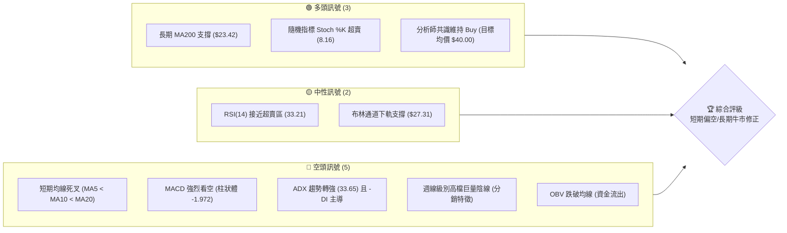
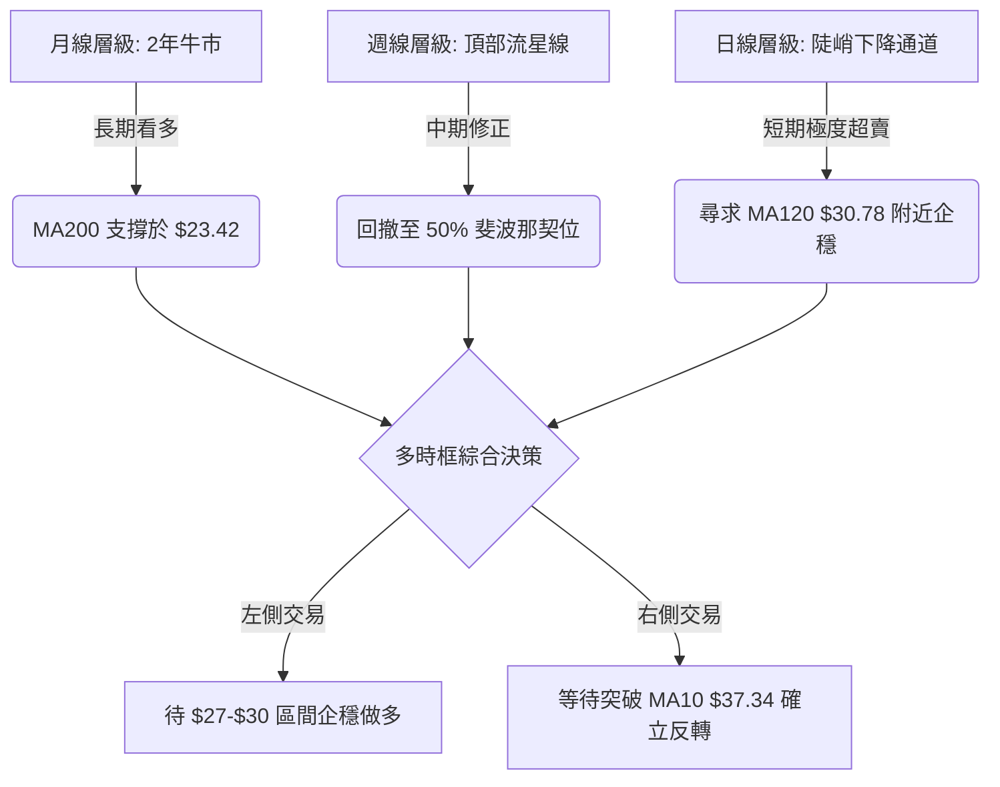
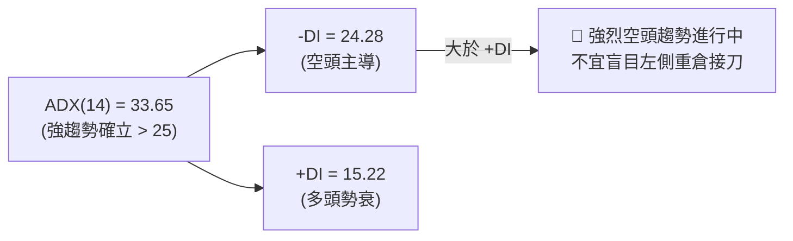
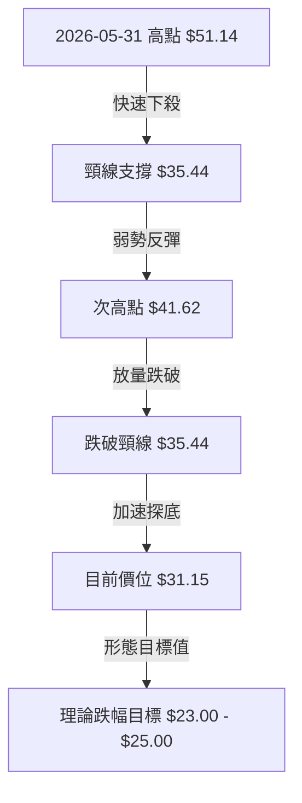
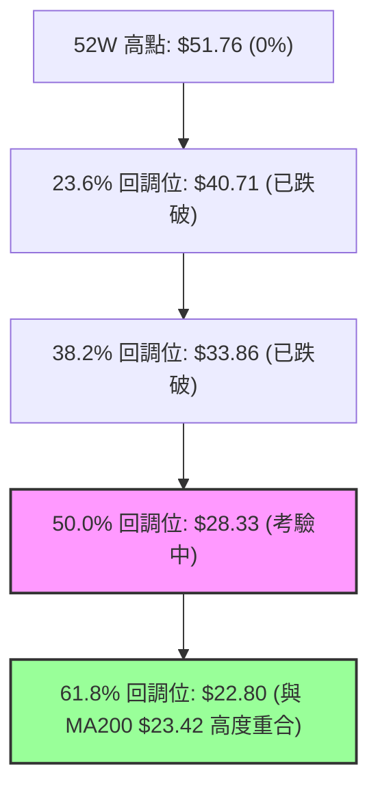
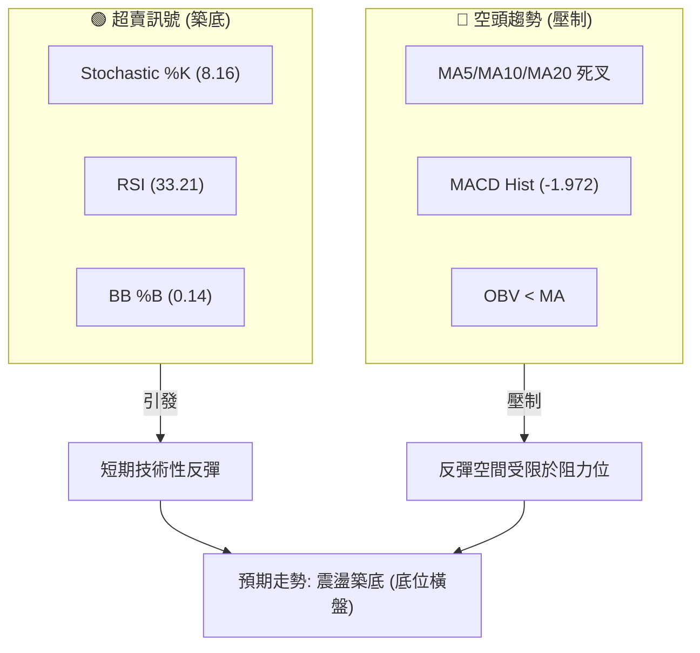
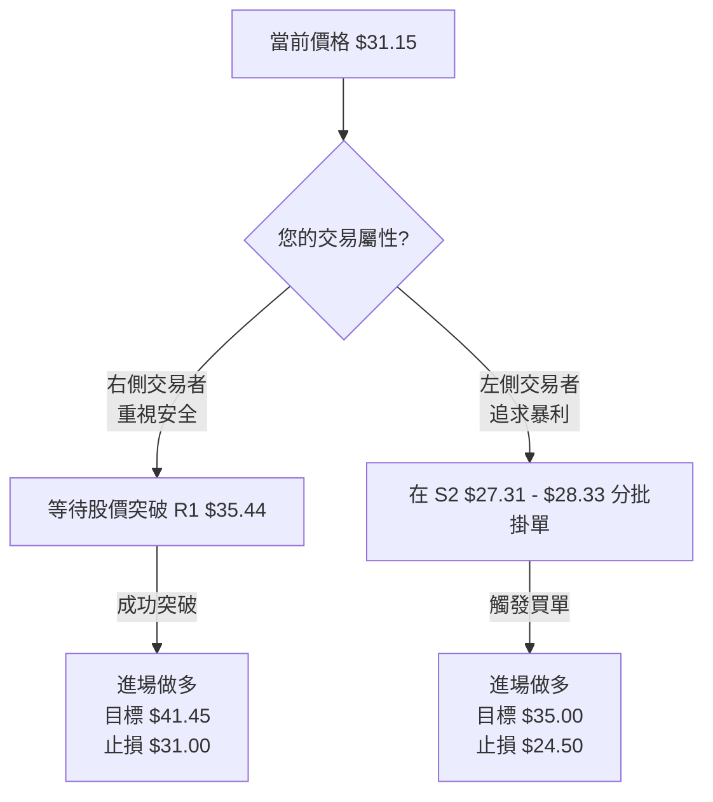
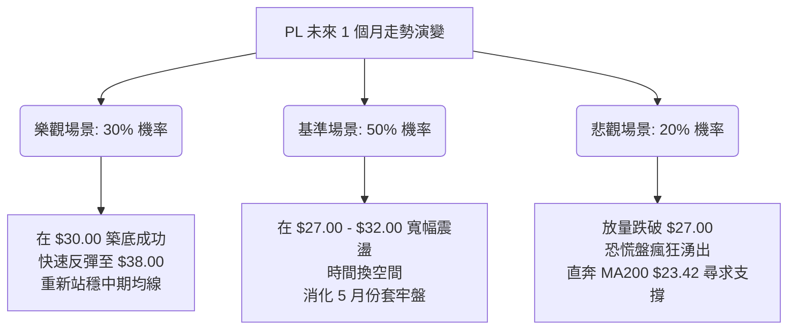

<details>
<summary>📊 靜態圖表 (點擊展開)</summary>

</details>

<html>
<head><meta charset="utf-8" /></head>
<body>
    <div style="height:500px; width:100%;">                        <script>window.PlotlyConfig = {MathJaxConfig: 'local'};</script>
        <script charset="utf-8" src="https://cdn.plot.ly/plotly-3.6.0.min.js" integrity="sha256-QaOVwtVY0T02VaHrr6pnoHLCwayMJp4O5n4YyaE3rJk=" crossorigin="anonymous"></script>                <div id="candlestick-chart" class="plotly-graph-div" style="height:100%; width:100%;"></div>            <script>                window.PLOTLYENV=window.PLOTLYENV || {};                                if (document.getElementById("candlestick-chart")) {                    Plotly.newPlot(                        "candlestick-chart",                        [{"close":{"dtype":"f8","bdata":"AAAAgOtRHEAAAABACtccQAAAAAApXBxAAAAAoJmZGkAAAABgj8IZQAAAAEAK1xlAAAAAYLgeGkAAAACA61EjQAAAAIA9CiJAAAAA4KPwIUAAAABAClcjQAAAACBcjyNAAAAA4FG4I0AAAAAAAIAjQAAAAIDCdSRAAAAA4FE4JUAAAADgUTgmQAAAAOBROCZAAAAAoJkZKEAAAAAAKdwnQAAAACCF6ydAAAAAYGZmKEAAAADgepQpQAAAAIDC9SlAAAAAgD2KK0AAAABAM7MtQAAAAGC4ni5AAAAAQOF6LkAAAAAAKVwvQAAAAEAzMy9AAAAAgOtRL0AAAABgZmYtQAAAAAAAgC5AAAAAIFyPLUAAAACAFC4uQAAAAIDCdSpAAAAA4FE4KkAAAABguB4rQAAAAIDr0SlAAAAAAAAAKUAAAABgZuYpQAAAAOBROCtAAAAAYLieKkAAAACAFK4pQAAAAMDMzClAAAAA4FG4KUAAAABgZuYqQAAAAKBHYSpAAAAAYGZmKUAAAAAAAIAqQAAAACCF6yhAAAAAYLieKUAAAAAgrscqQAAAAOCj8ChAAAAAoEfhKEAAAACA69EmQAAAAMDMzCZAAAAAIIVrJkAAAABgZuYmQAAAAOB6lCdAAAAAgMJ1JkAAAACA61EmQAAAAOB6FCdAAAAAgMJ1J0AAAADgo3AnQAAAAMDMzCdAAAAAYGZmJ0AAAACAPYonQAAAAMAeBShAAAAAoEfhKUAAAACAPYopQAAAAGBm5ilAAAAAgBSuKUAAAACgR+EpQAAAAOBReDFAAAAAoHA9MkAAAADAzAwyQAAAAKBH4TFAAAAA4FF4MEAAAACgcH0xQAAAAIAULjNAAAAAoJmZNEAAAABA4bo0QAAAAIDrUTRAAAAAAClcM0AAAABguN4zQAAAAKBwvTNAAAAA4FG4M0AAAADA9Wg0QAAAAADXYzVAAAAAQArXNUAAAAAAKZw2QAAAAOCjcDZAAAAAgMK1NkAAAADgo3A5QAAAAIDrUTlAAAAAQOG6OkAAAAAgrkc8QAAAACCuxzxAAAAAAAAAPEAAAACgR2E6QAAAACBcDzpAAAAA4KPwOkAAAABguN45QAAAAIDrETxAAAAAoEfhO0AAAACgmVk6QAAAAOBR+DhAAAAAoJnZNkAAAABAM\u002fM3QAAAAMAexTVAAAAAgBRuNEAAAABgj0I2QAAAAMAeBThAAAAAgD3KNkAAAABgZqY1QAAAAMDMTDVAAAAAIIVrNkAAAACAwjU2QAAAAKBwvTdAAAAAACkcOUAAAABgZuY3QAAAACCuxzdAAAAAgMK1OEAAAACgR6E4QAAAAKCZmTlAAAAAANcjOEAAAAAAKVw6QAAAAMDMTDlAAAAAAAAAOkAAAABACpc4QAAAACCuRzlAAAAAgOvROUAAAABgZmY5QAAAAOCjcDlAAAAA4FH4OEAAAACAPco4QAAAAKCZmThAAAAA4HoUO0AAAAAgXM84QAAAAIDC9TpAAAAAgD3qQEAAAADA9ehAQAAAAOB61D9AAAAAIFyvQUAAAABAMzNAQAAAAAAp3D5AAAAAANfjO0AAAABAM\u002fM7QAAAAIDCtT5AAAAA4KPwQUAAAABgj4JBQAAAAIDClUFAAAAAYGZGQkAAAACgcB1BQAAAAIDCVUFAAAAAwPUoQUAAAABACvdAQAAAAOB6NEFAAAAAgOvxQ0AAAACgcD1DQAAAAAAAwEJAAAAAANcDQ0AAAAAAKbxDQAAAAMAeJUNAAAAA4FG4QUAAAACgmblBQAAAAADXg0FAAAAAgD0KQUAAAAAAKXxCQAAAAEAzc0JAAAAAwB5FQ0AAAADgo5BCQAAAAOBR2ENAAAAAYLieQUAAAADAHoVDQAAAACCF60RAAAAAQApXREAAAABguF5EQAAAAMAehUVAAAAAIFzPREAAAACAFM5EQAAAACCFy0RAAAAA4HpURUAAAACgcD1FQAAAAMDMLEZAAAAAwPUoSEAAAACgcD1JQAAAAEAzs0lAAAAAgOuRSUAAAABA4TpHQAAAACCFC0hAAAAA4KOQRUAAAAAA18NFQAAAAAApHEBAAAAAYLheQEAAAAAghSs\u002fQAAAAOBRuD5AAAAAgMIVQUAAAABgZiY\u002fQA=="},"high":{"dtype":"f8","bdata":"AAAAgD2KHEAAAADAHoUdQAAAAGDjpRxAAAAAwPUoG0AAAACAPQobQAAAAEAzMxpAAAAAoJmZGkAAAAAAf2ojQAAAAAApHCNAAAAAQDOzIkAAAADA9SgkQAAAAOB6lCNAAAAA4FE4JEAAAABAtvMjQAAAAMDMzCRAAAAAIIVrJUAAAACA69EmQAAAAMDMTCZAAAAAYI9CKEAAAACAwnUoQAAAACBcjyhAAAAAwPWoKEAAAAAAAAAqQAAAAGC4HipAAAAAgD0KLEAAAADAyDYuQAAAAAAAAC9AAAAAIK7HL0AAAABgjwIwQAAAACCuxzBAAAAAoJmZL0AAAADAzAwwQAAAAGBm5i9AAAAAAACALkAAAADgelQvQAAAAEA1Hi9AAAAAwPUoK0AAAACA69EsQAAAAEAIrCpAAAAAoJkZKkAAAAAAKZwqQAAAAIAUbitAAAAAIIXrK0AAAADgo\u002fAqQAAAACCFqypAAAAAYGZmKkAAAACAwnUrQAAAAGCPwipAAAAAgD0KK0AAAADgo7AqQAAAAIA9CipAAAAAYGamKUAAAACgmZkrQAAAAKBwvSpAAAAAwMzMKUAAAACA69EoQAAAAEAzsydAAAAA4FE4J0AAAADAHsUnQAAAAIDC9ShAAAAAAAAAKUAAAAAAAAAnQAAAACBcTydAAAAAoO28J0AAAACAPQooQAAAAMAeBShAAAAAANejJ0AAAADAHoUoQAAAAKBHYShAAAAAYGZmKkAAAAAAAMApQAAAAIDCdSpAAAAAAAAAKkAAAABA4XoqQAAAAKCZ+TFAAAAAoJkZM0AAAADgo7AzQAAAACCuRzJAAAAAwMyMMkAAAABAM\u002fMxQAAAAOB61DNAAAAAYI\u002fCNEAAAACgcP00QAAAAIAU7jRAAAAAgMJVNEAAAADAHiU0QAAAAAApPDRAAAAAwMxMNEAAAAAgXM80QAAAACBcbzVAAAAAQDMTNkAAAAAAKdw2QAAAAKCZmTdAAAAAgOnGN0AAAAAgXI85QAAAAEAKlzpAAAAAwB7FOkAAAACgR2E9QAAAAGDj5T5AAAAA4FG4PUAAAAAghas8QAAAAIDA6jpAAAAAQOG6O0AAAABAM7M6QAAAAEAzszxAAAAAYGZmPEAAAABAM7M7QAAAAAAAQDtAAAAAwKHFOUAAAAAArPw3QAAAAAAAADhAAAAAgMCKNUAAAAAgrkc2QAAAAOBRGDhAAAAAQOH6N0AAAABgZoY3QAAAAMD16DVAAAAAgBTuNkAAAACAPco2QAAAAKCZmThAAAAAACkcOUAAAADgo7A5QAAAAOB6tDhAAAAAIFzPOEAAAABAYtA5QAAAAOCjsDlAAAAAQArXOEAAAACAFO46QAAAAOCjcDpAAAAAoEeBOkAAAACgcD06QAAAAACqkTtAAAAAQAoXOkAAAADgUXg6QAAAACCF6zpAAAAAIFwPOkAAAACA6QY6QAAAAAAAgDlAAAAAQAoXO0AAAADgehQ7QAAAAGCPQjtAAAAAANcjQkAAAAAghWtBQAAAACCFC0JAAAAAYGaGQkAAAAAA1dhBQAAAAGC4HkFAAAAAwPVoP0AAAACAFO48QAAAAIAULj9AAAAAwB4FQkAAAADAHiVCQAAAAGBm5kFAAAAAQOEaQ0AAAACAwpVCQAAAAIDrMUJAAAAAgBS+QUAAAAAgWDlCQAAAAIDClUFAAAAAoHAdREAAAACgcB1EQAAAAOB69ENAAAAAANfDQ0AAAABA4dpEQAAAAAAAAERAAAAAAADAQ0AAAACgcB1CQAAAAEAKp0FAAAAAAACAQUAAAAAAKXxCQAAAAOB6pEJAAAAAYI+iQ0AAAABACrdDQAAAAKBH4UNAAAAAgMJ1REAAAADAzOxDQAAAACBcj0VAAAAA4KPwREAAAACgmRlFQAAAAKCZuUVAAAAAQAqXRUAAAAAA1+NGQAAAAAAA4ERAAAAAYGbGRUAAAAAAAABGQAAAAEAMokZAAAAA4KOQSUAAAACgcH1JQAAAAKBH4UlAAAAAYI+iSUAAAAAAAGBJQAAAAGCPYklAAAAAIFzPR0AAAADAHpVGQAAAAEAKl0NAAAAAwB4FQUAAAAAgXC9BQAAAAMDMzD9AAAAAwPUoQUAAAABAMxNBQA=="},"hovertemplate":"\u003cb\u003e%{x|%Y-%m-%d}\u003c\u002fb\u003e\u003cbr\u003e\u958b: $%{open:.2f}\u003cbr\u003e\u9ad8: $%{high:.2f}\u003cbr\u003e\u4f4e: $%{low:.2f}\u003cbr\u003e\u6536: $%{close:.2f}\u003cextra\u003e\u003c\u002fextra\u003e","low":{"dtype":"f8","bdata":"AAAAYGZmG0AAAABACtcbQAAAAEAILBtAAAAAANejGUAAAADgUbgZQAAAAMD1KBlAAAAAwB4FGUAAAADA9SgdQAAAAMAeBSFAAAAA4KMwIUAAAABgj0IiQAAAACCuxyJAAAAA4FH4IkAAAACA61EjQAAAAAApXCNAAAAA4KNwJEAAAABA4TolQAAAAOCjcCVAAAAAANcjJkAAAABAClcnQAAAAEAK1yZAAAAAwB6FJ0AAAADgUbgoQAAAAKBwPShAAAAAQDMzKUAAAADA9SgsQAAAAMAehS1AAAAAoEdhLkAAAAAgXI8tQAAAAMAehS5AAAAAwPUoLkAAAAAAKRwtQAAAAIDrUS5AAAAAQAoXLUAAAABAM7MtQAAAAKBwPSpAAAAAIN0kKUAAAAAAAAArQAAAAGC4nilAAAAA4KPwJ0AAAACAFC4pQAAAACCuRypAAAAAgD2KKkAAAAAgXI8pQAAAACCuhylAAAAAQN8PKUAAAAAgrscpQAAAAIDCdSlAAAAAIIXrKEAAAAAgXA8pQAAAAADXIyhAAAAAACncJ0AAAABgENgpQAAAACBcjyhAAAAAwPWoKEAAAABAChcmQAAAAMDIdiVAAAAAYI\u002fCJUAAAACAFO4lQAAAAMDMzCZAAAAAgJcuJkAAAACAPQolQAAAAMAehSZAAAAAwB6FJkAAAABgj0InQAAAAICXbidAAAAAwMzMJkAAAADgelQnQAAAAEDheidAAAAAACncJ0AAAADAHgUpQAAAAKBwPSlAAAAAQDUeKUAAAADA9SgpQAAAAMAeBS5AAAAAYLheMUAAAAAA16MxQAAAAIAU7jBAAAAAgBRuMEAAAACAPQoxQAAAAKBw\u002fTFAAAAAACmcM0AAAACgmZkzQAAAAAApHDRAAAAAgD0KM0AAAABgj8IyQAAAAOCjcDNAAAAAQImhM0AAAAAA1fgyQAAAAKBwfTNAAAAA4FH4NEAAAADA9Wg1QAAAAEAKFzZAAAAAwCDQNUAAAADA9Sg3QAAAAGC4HjlAAAAAAAAAOUAAAABgj0I6QAAAAAApXDxAAAAAIFxvO0AAAACgRyE5QAAAAADXIzlAAAAAgBQuOUAAAADgUTg5QAAAAKAaDzpAAAAAIFzPOkAAAADAzIw5QAAAAIDrcThAAAAAQAp3NkAAAADA9eg2QAAAAEAKlzRAAAAAYGYmNEAAAAAgXM80QAAAAGBmpjVAAAAAgMK1NkAAAADA9eg0QAAAAEDh+jNAAAAAIAYhNUAAAAAAAIA1QAAAAKBwPTZAAAAAgMJ1NkAAAABgj4I3QAAAAEDhOjdAAAAAoJlZNkAAAACgcH04QAAAAIDrEThAAAAAIK7HNkAAAADgUbg3QAAAAKBHYThAAAAAgGgROUAAAABgj4I3QAAAAKCZ2TdAAAAAQDNzOEAAAABAMzM5QAAAAOCj8DhAAAAAIK5HOEAAAAAgXE84QAAAAOB4qTdAAAAAYGZmOEAAAABgj8I4QAAAAOCj8DdAAAAAgGghQEAAAABA4To\u002fQAAAAAApHD9AAAAAoEchP0AAAAAgXA9AQAAAAIA9ij5AAAAAYLg+O0AAAADA9Ug6QAAAAMAehTxAAAAA4KNwPUAAAABA4RpBQAAAAGCPYkBAAAAA4FG4QUAAAADgUfhAQAAAAKCZ+UBAAAAAAClcQEAAAACgR+E\u002fQAAAACCuZ0BAAAAAYGZ2QUAAAAAghetCQAAAAEAKd0JAAAAAYI\u002fCQkAAAAAA1yNDQAAAAIA9KkJAAAAA4KOQQUAAAADgo9BAQAAAAMDz3UBAAAAAwPVIQEAAAADASydBQAAAAOCla0FAAAAAwPXoQUAAAACgmflBQAAAAKBHwUFAAAAAQAp3QUAAAABgZuZBQAAAAMDMDENAAAAAoEchQ0AAAADAzGxDQAAAAMDMzENAAAAAwB5FREAAAACgRyFEQAAAAGCPAkNAAAAAgMJVREAAAADAHoVEQAAAAMDMjEVAAAAAgBTuRkAAAACAFI5HQAAAAAAAgEdAAAAAANdjRkAAAAAA18NGQAAAAEDhOkdAAAAAwB5VRUAAAABgZqZEQAAAAMD1qD9AAAAA4HpUP0AAAACA61E9QAAAAEAzMz5AAAAAIIVrPkAAAADAHsU9QA=="},"name":"\u50f9\u683c","open":{"dtype":"f8","bdata":"AAAAIIXrG0AAAABA4XocQAAAACBcjxxAAAAAgD0KG0AAAACAPQobQAAAAEAzMxpAAAAA4KNwGkAAAACA69EeQAAAACCuRyFAAAAAYGZmIkAAAACgR2EiQAAAAKBwPSNAAAAA4KPwI0AAAADgUbgjQAAAAAAAgCNAAAAAgML1JEAAAACA61ElQAAAAOBRuCVAAAAAQOF6JkAAAAAgrkcoQAAAAAAAACdAAAAA4FG4J0AAAAAgrscoQAAAAGBmZilAAAAAgBSuKUAAAADgUbgsQAAAAGBm5i1AAAAAoJmZL0AAAAAAAAAuQAAAAMDMjDBAAAAAgBQuL0AAAADgUbgvQAAAACCFay5AAAAAAAAALkAAAABgZuYuQAAAAOCj8C5AAAAAAAAAKkAAAACAPQosQAAAAAApXCpAAAAAAACAKUAAAABgj0IpQAAAAKCZmSpAAAAAYGbmK0AAAADAzMwqQAAAACCF6ylAAAAAQOF6KUAAAAAgrscpQAAAAMD1qCpAAAAAgMJ1KUAAAACAFK4pQAAAAMAeBSpAAAAA4FE4KEAAAACAwnUqQAAAAGBmZipAAAAAYI9CKUAAAACAPYooQAAAAAAAACZAAAAAAClcJkAAAADgehQmQAAAACCF6yZAAAAAYGZmKEAAAABA4XomQAAAAEAzsyZAAAAAwB4FJ0AAAACAPYonQAAAAIDr0SdAAAAAQDMzJ0AAAABgj8InQAAAAMD1qCdAAAAAYGbmJ0AAAADAHoUpQAAAAAApXCpAAAAAoHA9KUAAAACgmZkpQAAAAOB6lC9AAAAA4KNwMkAAAAAgXM8yQAAAAGBmpjFAAAAAgBQuMkAAAACAPQoxQAAAAKBw\u002fTFAAAAAIK7HM0AAAADAzMwzQAAAAEDhujRAAAAAwMxMNEAAAACgcN0yQAAAACCuBzRAAAAAYLi+M0AAAABA4dozQAAAAEAzszRAAAAAAACANUAAAADgUbg1QAAAAKCZ2TZAAAAAoJmZNkAAAADAzEw3QAAAAGCPQjpAAAAAAACAOUAAAAAgXM86QAAAAEAzczxAAAAAQAqXO0AAAAAAAIA8QAAAAAAAwDpAAAAAYI8COkAAAACgmZk6QAAAAOB6FDpAAAAAwMwMPEAAAABAM7M7QAAAAEAKtzlAAAAAANfjOEAAAABA4fo3QAAAAAAAADhAAAAAAAAANUAAAACAPQo1QAAAAIDC9TVAAAAAYLjeN0AAAABgZoY3QAAAAIDrkTVAAAAAAACANUAAAAAAAAA2QAAAAGBmZjZAAAAAwB4FN0AAAACgcL04QAAAAGBmZjdAAAAAAABAN0AAAADAzEw5QAAAAAAAgDhAAAAAQDOTOEAAAADgUbg3QAAAAEDhGjpAAAAAoJmZOUAAAAAAAIA5QAAAAADX4zdAAAAAQArXOEAAAACA69E5QAAAAEAKVzlAAAAA4FH4OUAAAABA4fo4QAAAAKBHITlAAAAAoJnZOEAAAAAAAIA6QAAAAAAAQDhAAAAAYGbGQEAAAAAAAEBBQAAAAEDh2kBAAAAAQDMzQEAAAAAAKXxBQAAAAKBw\u002fUBAAAAAoJnZPkAAAADAzMw8QAAAAAAAAD1AAAAA4KNwPUAAAACAwvVBQAAAAOCjsEFAAAAAQDNzQkAAAAAAAEBCQAAAAOCjcEFAAAAAoHAdQUAAAAAghctBQAAAAIDCNUFAAAAAoHB9QUAAAACA65FDQAAAAEAzk0NAAAAAACkcQ0AAAAAAAMBDQAAAAIA9qkNAAAAAgBSOQ0AAAAAAKbxBQAAAAMDMTEFAAAAA4KMwQUAAAAAA10NBQAAAACBcX0JAAAAAwB6FQkAAAACgmZlDQAAAACBcf0JAAAAAYI\u002fCQ0AAAABAMzNCQAAAAEAzU0NAAAAAIIULREAAAABAChdFQAAAAOCjUERAAAAAwPUIRUAAAAAA16NFQAAAAEAKd0RAAAAAQDMzRUAAAADAcghFQAAAAMDMrEVAAAAAwPXYR0AAAADAzAxJQAAAAEAzE0lAAAAAAACQSEAAAAAghYtIQAAAAIDClUdAAAAAIFzPR0AAAACgcJ1FQAAAAGBmJkNAAAAAoEcBQUAAAACAwrVAQAAAAADX4z5AAAAAAACAP0AAAACA6\u002fFAQA=="},"x":["2025-08-27T00:00:00-04:00","2025-08-28T00:00:00-04:00","2025-08-29T00:00:00-04:00","2025-09-02T00:00:00-04:00","2025-09-03T00:00:00-04:00","2025-09-04T00:00:00-04:00","2025-09-05T00:00:00-04:00","2025-09-08T00:00:00-04:00","2025-09-09T00:00:00-04:00","2025-09-10T00:00:00-04:00","2025-09-11T00:00:00-04:00","2025-09-12T00:00:00-04:00","2025-09-15T00:00:00-04:00","2025-09-16T00:00:00-04:00","2025-09-17T00:00:00-04:00","2025-09-18T00:00:00-04:00","2025-09-19T00:00:00-04:00","2025-09-22T00:00:00-04:00","2025-09-23T00:00:00-04:00","2025-09-24T00:00:00-04:00","2025-09-25T00:00:00-04:00","2025-09-26T00:00:00-04:00","2025-09-29T00:00:00-04:00","2025-09-30T00:00:00-04:00","2025-10-01T00:00:00-04:00","2025-10-02T00:00:00-04:00","2025-10-03T00:00:00-04:00","2025-10-06T00:00:00-04:00","2025-10-07T00:00:00-04:00","2025-10-08T00:00:00-04:00","2025-10-09T00:00:00-04:00","2025-10-10T00:00:00-04:00","2025-10-13T00:00:00-04:00","2025-10-14T00:00:00-04:00","2025-10-15T00:00:00-04:00","2025-10-16T00:00:00-04:00","2025-10-17T00:00:00-04:00","2025-10-20T00:00:00-04:00","2025-10-21T00:00:00-04:00","2025-10-22T00:00:00-04:00","2025-10-23T00:00:00-04:00","2025-10-24T00:00:00-04:00","2025-10-27T00:00:00-04:00","2025-10-28T00:00:00-04:00","2025-10-29T00:00:00-04:00","2025-10-30T00:00:00-04:00","2025-10-31T00:00:00-04:00","2025-11-03T00:00:00-05:00","2025-11-04T00:00:00-05:00","2025-11-05T00:00:00-05:00","2025-11-06T00:00:00-05:00","2025-11-07T00:00:00-05:00","2025-11-10T00:00:00-05:00","2025-11-11T00:00:00-05:00","2025-11-12T00:00:00-05:00","2025-11-13T00:00:00-05:00","2025-11-14T00:00:00-05:00","2025-11-17T00:00:00-05:00","2025-11-18T00:00:00-05:00","2025-11-19T00:00:00-05:00","2025-11-20T00:00:00-05:00","2025-11-21T00:00:00-05:00","2025-11-24T00:00:00-05:00","2025-11-25T00:00:00-05:00","2025-11-26T00:00:00-05:00","2025-11-28T00:00:00-05:00","2025-12-01T00:00:00-05:00","2025-12-02T00:00:00-05:00","2025-12-03T00:00:00-05:00","2025-12-04T00:00:00-05:00","2025-12-05T00:00:00-05:00","2025-12-08T00:00:00-05:00","2025-12-09T00:00:00-05:00","2025-12-10T00:00:00-05:00","2025-12-11T00:00:00-05:00","2025-12-12T00:00:00-05:00","2025-12-15T00:00:00-05:00","2025-12-16T00:00:00-05:00","2025-12-17T00:00:00-05:00","2025-12-18T00:00:00-05:00","2025-12-19T00:00:00-05:00","2025-12-22T00:00:00-05:00","2025-12-23T00:00:00-05:00","2025-12-24T00:00:00-05:00","2025-12-26T00:00:00-05:00","2025-12-29T00:00:00-05:00","2025-12-30T00:00:00-05:00","2025-12-31T00:00:00-05:00","2026-01-02T00:00:00-05:00","2026-01-05T00:00:00-05:00","2026-01-06T00:00:00-05:00","2026-01-07T00:00:00-05:00","2026-01-08T00:00:00-05:00","2026-01-09T00:00:00-05:00","2026-01-12T00:00:00-05:00","2026-01-13T00:00:00-05:00","2026-01-14T00:00:00-05:00","2026-01-15T00:00:00-05:00","2026-01-16T00:00:00-05:00","2026-01-20T00:00:00-05:00","2026-01-21T00:00:00-05:00","2026-01-22T00:00:00-05:00","2026-01-23T00:00:00-05:00","2026-01-26T00:00:00-05:00","2026-01-27T00:00:00-05:00","2026-01-28T00:00:00-05:00","2026-01-29T00:00:00-05:00","2026-01-30T00:00:00-05:00","2026-02-02T00:00:00-05:00","2026-02-03T00:00:00-05:00","2026-02-04T00:00:00-05:00","2026-02-05T00:00:00-05:00","2026-02-06T00:00:00-05:00","2026-02-09T00:00:00-05:00","2026-02-10T00:00:00-05:00","2026-02-11T00:00:00-05:00","2026-02-12T00:00:00-05:00","2026-02-13T00:00:00-05:00","2026-02-17T00:00:00-05:00","2026-02-18T00:00:00-05:00","2026-02-19T00:00:00-05:00","2026-02-20T00:00:00-05:00","2026-02-23T00:00:00-05:00","2026-02-24T00:00:00-05:00","2026-02-25T00:00:00-05:00","2026-02-26T00:00:00-05:00","2026-02-27T00:00:00-05:00","2026-03-02T00:00:00-05:00","2026-03-03T00:00:00-05:00","2026-03-04T00:00:00-05:00","2026-03-05T00:00:00-05:00","2026-03-06T00:00:00-05:00","2026-03-09T00:00:00-04:00","2026-03-10T00:00:00-04:00","2026-03-11T00:00:00-04:00","2026-03-12T00:00:00-04:00","2026-03-13T00:00:00-04:00","2026-03-16T00:00:00-04:00","2026-03-17T00:00:00-04:00","2026-03-18T00:00:00-04:00","2026-03-19T00:00:00-04:00","2026-03-20T00:00:00-04:00","2026-03-23T00:00:00-04:00","2026-03-24T00:00:00-04:00","2026-03-25T00:00:00-04:00","2026-03-26T00:00:00-04:00","2026-03-27T00:00:00-04:00","2026-03-30T00:00:00-04:00","2026-03-31T00:00:00-04:00","2026-04-01T00:00:00-04:00","2026-04-02T00:00:00-04:00","2026-04-06T00:00:00-04:00","2026-04-07T00:00:00-04:00","2026-04-08T00:00:00-04:00","2026-04-09T00:00:00-04:00","2026-04-10T00:00:00-04:00","2026-04-13T00:00:00-04:00","2026-04-14T00:00:00-04:00","2026-04-15T00:00:00-04:00","2026-04-16T00:00:00-04:00","2026-04-17T00:00:00-04:00","2026-04-20T00:00:00-04:00","2026-04-21T00:00:00-04:00","2026-04-22T00:00:00-04:00","2026-04-23T00:00:00-04:00","2026-04-24T00:00:00-04:00","2026-04-27T00:00:00-04:00","2026-04-28T00:00:00-04:00","2026-04-29T00:00:00-04:00","2026-04-30T00:00:00-04:00","2026-05-01T00:00:00-04:00","2026-05-04T00:00:00-04:00","2026-05-05T00:00:00-04:00","2026-05-06T00:00:00-04:00","2026-05-07T00:00:00-04:00","2026-05-08T00:00:00-04:00","2026-05-11T00:00:00-04:00","2026-05-12T00:00:00-04:00","2026-05-13T00:00:00-04:00","2026-05-14T00:00:00-04:00","2026-05-15T00:00:00-04:00","2026-05-18T00:00:00-04:00","2026-05-19T00:00:00-04:00","2026-05-20T00:00:00-04:00","2026-05-21T00:00:00-04:00","2026-05-22T00:00:00-04:00","2026-05-26T00:00:00-04:00","2026-05-27T00:00:00-04:00","2026-05-28T00:00:00-04:00","2026-05-29T00:00:00-04:00","2026-06-01T00:00:00-04:00","2026-06-02T00:00:00-04:00","2026-06-03T00:00:00-04:00","2026-06-04T00:00:00-04:00","2026-06-05T00:00:00-04:00","2026-06-08T00:00:00-04:00","2026-06-09T00:00:00-04:00","2026-06-10T00:00:00-04:00","2026-06-11T00:00:00-04:00","2026-06-12T00:00:00-04:00"],"type":"candlestick"},{"hovertemplate":"MA30: $%{y:.2f}\u003cextra\u003e\u003c\u002fextra\u003e","line":{"color":"#2196F3","dash":"dash","width":2},"mode":"lines","name":"MA30","x":["2025-08-27T00:00:00-04:00","2025-08-28T00:00:00-04:00","2025-08-29T00:00:00-04:00","2025-09-02T00:00:00-04:00","2025-09-03T00:00:00-04:00","2025-09-04T00:00:00-04:00","2025-09-05T00:00:00-04:00","2025-09-08T00:00:00-04:00","2025-09-09T00:00:00-04:00","2025-09-10T00:00:00-04:00","2025-09-11T00:00:00-04:00","2025-09-12T00:00:00-04:00","2025-09-15T00:00:00-04:00","2025-09-16T00:00:00-04:00","2025-09-17T00:00:00-04:00","2025-09-18T00:00:00-04:00","2025-09-19T00:00:00-04:00","2025-09-22T00:00:00-04:00","2025-09-23T00:00:00-04:00","2025-09-24T00:00:00-04:00","2025-09-25T00:00:00-04:00","2025-09-26T00:00:00-04:00","2025-09-29T00:00:00-04:00","2025-09-30T00:00:00-04:00","2025-10-01T00:00:00-04:00","2025-10-02T00:00:00-04:00","2025-10-03T00:00:00-04:00","2025-10-06T00:00:00-04:00","2025-10-07T00:00:00-04:00","2025-10-08T00:00:00-04:00","2025-10-09T00:00:00-04:00","2025-10-10T00:00:00-04:00","2025-10-13T00:00:00-04:00","2025-10-14T00:00:00-04:00","2025-10-15T00:00:00-04:00","2025-10-16T00:00:00-04:00","2025-10-17T00:00:00-04:00","2025-10-20T00:00:00-04:00","2025-10-21T00:00:00-04:00","2025-10-22T00:00:00-04:00","2025-10-23T00:00:00-04:00","2025-10-24T00:00:00-04:00","2025-10-27T00:00:00-04:00","2025-10-28T00:00:00-04:00","2025-10-29T00:00:00-04:00","2025-10-30T00:00:00-04:00","2025-10-31T00:00:00-04:00","2025-11-03T00:00:00-05:00","2025-11-04T00:00:00-05:00","2025-11-05T00:00:00-05:00","2025-11-06T00:00:00-05:00","2025-11-07T00:00:00-05:00","2025-11-10T00:00:00-05:00","2025-11-11T00:00:00-05:00","2025-11-12T00:00:00-05:00","2025-11-13T00:00:00-05:00","2025-11-14T00:00:00-05:00","2025-11-17T00:00:00-05:00","2025-11-18T00:00:00-05:00","2025-11-19T00:00:00-05:00","2025-11-20T00:00:00-05:00","2025-11-21T00:00:00-05:00","2025-11-24T00:00:00-05:00","2025-11-25T00:00:00-05:00","2025-11-26T00:00:00-05:00","2025-11-28T00:00:00-05:00","2025-12-01T00:00:00-05:00","2025-12-02T00:00:00-05:00","2025-12-03T00:00:00-05:00","2025-12-04T00:00:00-05:00","2025-12-05T00:00:00-05:00","2025-12-08T00:00:00-05:00","2025-12-09T00:00:00-05:00","2025-12-10T00:00:00-05:00","2025-12-11T00:00:00-05:00","2025-12-12T00:00:00-05:00","2025-12-15T00:00:00-05:00","2025-12-16T00:00:00-05:00","2025-12-17T00:00:00-05:00","2025-12-18T00:00:00-05:00","2025-12-19T00:00:00-05:00","2025-12-22T00:00:00-05:00","2025-12-23T00:00:00-05:00","2025-12-24T00:00:00-05:00","2025-12-26T00:00:00-05:00","2025-12-29T00:00:00-05:00","2025-12-30T00:00:00-05:00","2025-12-31T00:00:00-05:00","2026-01-02T00:00:00-05:00","2026-01-05T00:00:00-05:00","2026-01-06T00:00:00-05:00","2026-01-07T00:00:00-05:00","2026-01-08T00:00:00-05:00","2026-01-09T00:00:00-05:00","2026-01-12T00:00:00-05:00","2026-01-13T00:00:00-05:00","2026-01-14T00:00:00-05:00","2026-01-15T00:00:00-05:00","2026-01-16T00:00:00-05:00","2026-01-20T00:00:00-05:00","2026-01-21T00:00:00-05:00","2026-01-22T00:00:00-05:00","2026-01-23T00:00:00-05:00","2026-01-26T00:00:00-05:00","2026-01-27T00:00:00-05:00","2026-01-28T00:00:00-05:00","2026-01-29T00:00:00-05:00","2026-01-30T00:00:00-05:00","2026-02-02T00:00:00-05:00","2026-02-03T00:00:00-05:00","2026-02-04T00:00:00-05:00","2026-02-05T00:00:00-05:00","2026-02-06T00:00:00-05:00","2026-02-09T00:00:00-05:00","2026-02-10T00:00:00-05:00","2026-02-11T00:00:00-05:00","2026-02-12T00:00:00-05:00","2026-02-13T00:00:00-05:00","2026-02-17T00:00:00-05:00","2026-02-18T00:00:00-05:00","2026-02-19T00:00:00-05:00","2026-02-20T00:00:00-05:00","2026-02-23T00:00:00-05:00","2026-02-24T00:00:00-05:00","2026-02-25T00:00:00-05:00","2026-02-26T00:00:00-05:00","2026-02-27T00:00:00-05:00","2026-03-02T00:00:00-05:00","2026-03-03T00:00:00-05:00","2026-03-04T00:00:00-05:00","2026-03-05T00:00:00-05:00","2026-03-06T00:00:00-05:00","2026-03-09T00:00:00-04:00","2026-03-10T00:00:00-04:00","2026-03-11T00:00:00-04:00","2026-03-12T00:00:00-04:00","2026-03-13T00:00:00-04:00","2026-03-16T00:00:00-04:00","2026-03-17T00:00:00-04:00","2026-03-18T00:00:00-04:00","2026-03-19T00:00:00-04:00","2026-03-20T00:00:00-04:00","2026-03-23T00:00:00-04:00","2026-03-24T00:00:00-04:00","2026-03-25T00:00:00-04:00","2026-03-26T00:00:00-04:00","2026-03-27T00:00:00-04:00","2026-03-30T00:00:00-04:00","2026-03-31T00:00:00-04:00","2026-04-01T00:00:00-04:00","2026-04-02T00:00:00-04:00","2026-04-06T00:00:00-04:00","2026-04-07T00:00:00-04:00","2026-04-08T00:00:00-04:00","2026-04-09T00:00:00-04:00","2026-04-10T00:00:00-04:00","2026-04-13T00:00:00-04:00","2026-04-14T00:00:00-04:00","2026-04-15T00:00:00-04:00","2026-04-16T00:00:00-04:00","2026-04-17T00:00:00-04:00","2026-04-20T00:00:00-04:00","2026-04-21T00:00:00-04:00","2026-04-22T00:00:00-04:00","2026-04-23T00:00:00-04:00","2026-04-24T00:00:00-04:00","2026-04-27T00:00:00-04:00","2026-04-28T00:00:00-04:00","2026-04-29T00:00:00-04:00","2026-04-30T00:00:00-04:00","2026-05-01T00:00:00-04:00","2026-05-04T00:00:00-04:00","2026-05-05T00:00:00-04:00","2026-05-06T00:00:00-04:00","2026-05-07T00:00:00-04:00","2026-05-08T00:00:00-04:00","2026-05-11T00:00:00-04:00","2026-05-12T00:00:00-04:00","2026-05-13T00:00:00-04:00","2026-05-14T00:00:00-04:00","2026-05-15T00:00:00-04:00","2026-05-18T00:00:00-04:00","2026-05-19T00:00:00-04:00","2026-05-20T00:00:00-04:00","2026-05-21T00:00:00-04:00","2026-05-22T00:00:00-04:00","2026-05-26T00:00:00-04:00","2026-05-27T00:00:00-04:00","2026-05-28T00:00:00-04:00","2026-05-29T00:00:00-04:00","2026-06-01T00:00:00-04:00","2026-06-02T00:00:00-04:00","2026-06-03T00:00:00-04:00","2026-06-04T00:00:00-04:00","2026-06-05T00:00:00-04:00","2026-06-08T00:00:00-04:00","2026-06-09T00:00:00-04:00","2026-06-10T00:00:00-04:00","2026-06-11T00:00:00-04:00","2026-06-12T00:00:00-04:00"],"y":{"dtype":"f8","bdata":"AAAAAAAA+H8AAAAAAAD4fwAAAAAAAPh\u002fAAAAAAAA+H8AAAAAAAD4fwAAAAAAAPh\u002fAAAAAAAA+H8AAAAAAAD4fwAAAAAAAPh\u002fAAAAAAAA+H8AAAAAAAD4fwAAAAAAAPh\u002fAAAAAAAA+H8AAAAAAAD4fwAAAAAAAPh\u002fAAAAAAAA+H8AAAAAAAD4fwAAAAAAAPh\u002fAAAAAAAA+H8AAAAAAAD4fwAAAAAAAPh\u002fAAAAAAAA+H8AAAAAAAD4fwAAAAAAAPh\u002fAAAAAAAA+H8AAAAAAAD4fwAAAAAAAPh\u002fAAAAAAAA+H8AAAAAAAD4f+\u002fu7iZ4cCVAZmZmvuYCJkBVVVUNu4ImQKuqqqL+DSdAVVVVJb+YJ0CrqqqSXywoQO\u002fu7ibqnyhAvLu7mzYQKUCJiIj4xVIpQDMzM6MplSlAERERcWjRKUCrqqr6YgkqQBEREYHASipAmpmZyaGFKkBEREQ0XroqQM3MzJzv5ypAMzMzA1YOK0ARERGhRTYrQJqZmUnFWStA3t3dLd1kK0CJiIhYZHsrQBEREeHsgytAMzMzA1aOK0BERER0k5grQLy7uzvfjytA7+7uXix5K0B3d3fHdj4rQJqZmbm7+ypAMzMzY\u002fS2KkC8u7s7w24qQGZmZha9LSpA7+7uHiLiKUAAAACgt6UpQDMzM2NmZilAvLu7u1gyKUCrqqr61PgoQO\u002fu7h4i4ihAzczMvBHKKEC8u7sbhasoQDMzM\u002fMonChAZmZmVqujKECJiIjomKAoQDMzM1NVlShAzczM3E+NKEBERETEBI8oQGZmZmYD3ShAq6qq+tQ4KUDv7u6uVocpQKuqqpph1ylAvLu7+7gXKkAzMzPTFWAqQERERPTF0ipAvLu7+7hXK0De3d3t\u002fdQrQJqZmRn3WixAvLu7CxHRLECrqqpac2EtQO\u002fu7l7J7y1AAAAAIAaBLkBmZmb28BkvQAAAAADIvS9AZmZm5m05MEDv7u7OIpswQBERETkm+DBA3t3dZdhVMUAiIiIy7MoxQCIiIqJwPTJAMzMzK7K9MkCJiIjQlEozQImIiHCv2TNAMzMzgzJaNEAiIiICVs40QFVVVT01PjVAERERKYe2NUDe3d0t3SQ2QLy7uztRfzZAIiIiIpTRNkAzMzPDZxg3QKuqqhroVDdA3t3dbVmLN0BERESEecI3QFVVVXWT2DdAZmZmFiDXN0DNzMxsLuQ3QDMzMzPBAzhAZmZmJgYhOEDe3d2dNjA4QM3MzHyGPThAq6qqupBUOEAzMzPj7GM4QKuqqor6dzhAd3d39+GTOEAzMzMD5J44QJqZmUlTqjhAq6qqWmS7OEARERHherQ4QM3MzIzetjhAvLu7m8SgOEDe3d1NYpA4QAAAACCwcjhA7+7uDp9hOEDv7u6+WFI4QAAAANCwSzhAIiIiIiJCOEBmZmZmHz44QERERBSuJzhAZmZmFtkOOEB3d3c3iQE4QBEREfFg\u002fjdAREREhHkiOEBmZmY20Ck4QAAAAPAZVjhAAAAAsHLIOEBERETkFys5QImIiBi9bTlAVVVVhRbZOUAiIiJC0jQ6QGZmZmZmhjpAvLu7yxO1OkBVVVUFD+Y6QHd3dzeJITtAREREpHB9O0B3d3enVNw7QLy7u3uGPTxAvLu7W4+iPEARERHhevQ8QHd3d5fgQT1AREREJL+YPUDv7u4OWNk9QImIiCgVJz5AMzMzU5ydPkDe3d19IxQ\u002fQM3MzHxqfD9AMzMzo5vkP0AzMzMDVi5AQLy7u6MpZUBAvLu7q9WRQEC8u7s7Ub9AQKuqqpLR60BAERERca8JQUAAAABokT1BQCIiIor6Z0FAVVVVHRN8QUDNzMyEMopBQLy7u7u7q0FA3t3dvS2rQUBERERkgsdBQKuqqnpb9kFAIiIiku0sQkCamZmpf2NCQAAAAFAbmEJAvLu765iwQkBVVVX1tsxCQAAAAFAb6EJAAAAAEC0CQ0AzMzNDYCVDQHd3d2etTkNAMzMzI2mKQ0BmZmYmBtFDQDMzM8ODGURAMzMzw4NJREDNzMwMkGtEQHd3dye\u002fmERAd3d3t4GuREARERFR1L9EQCIiIkLupURAREREJGmaREBVVVU9JohEQCIiIpLCdURA7+7u3iR2RECJiIjgT11EQA=="},"type":"scatter"},{"hovertemplate":"MA60: $%{y:.2f}\u003cextra\u003e\u003c\u002fextra\u003e","line":{"color":"#9C27B0","dash":"dash","width":2},"mode":"lines","name":"MA60","x":["2025-08-27T00:00:00-04:00","2025-08-28T00:00:00-04:00","2025-08-29T00:00:00-04:00","2025-09-02T00:00:00-04:00","2025-09-03T00:00:00-04:00","2025-09-04T00:00:00-04:00","2025-09-05T00:00:00-04:00","2025-09-08T00:00:00-04:00","2025-09-09T00:00:00-04:00","2025-09-10T00:00:00-04:00","2025-09-11T00:00:00-04:00","2025-09-12T00:00:00-04:00","2025-09-15T00:00:00-04:00","2025-09-16T00:00:00-04:00","2025-09-17T00:00:00-04:00","2025-09-18T00:00:00-04:00","2025-09-19T00:00:00-04:00","2025-09-22T00:00:00-04:00","2025-09-23T00:00:00-04:00","2025-09-24T00:00:00-04:00","2025-09-25T00:00:00-04:00","2025-09-26T00:00:00-04:00","2025-09-29T00:00:00-04:00","2025-09-30T00:00:00-04:00","2025-10-01T00:00:00-04:00","2025-10-02T00:00:00-04:00","2025-10-03T00:00:00-04:00","2025-10-06T00:00:00-04:00","2025-10-07T00:00:00-04:00","2025-10-08T00:00:00-04:00","2025-10-09T00:00:00-04:00","2025-10-10T00:00:00-04:00","2025-10-13T00:00:00-04:00","2025-10-14T00:00:00-04:00","2025-10-15T00:00:00-04:00","2025-10-16T00:00:00-04:00","2025-10-17T00:00:00-04:00","2025-10-20T00:00:00-04:00","2025-10-21T00:00:00-04:00","2025-10-22T00:00:00-04:00","2025-10-23T00:00:00-04:00","2025-10-24T00:00:00-04:00","2025-10-27T00:00:00-04:00","2025-10-28T00:00:00-04:00","2025-10-29T00:00:00-04:00","2025-10-30T00:00:00-04:00","2025-10-31T00:00:00-04:00","2025-11-03T00:00:00-05:00","2025-11-04T00:00:00-05:00","2025-11-05T00:00:00-05:00","2025-11-06T00:00:00-05:00","2025-11-07T00:00:00-05:00","2025-11-10T00:00:00-05:00","2025-11-11T00:00:00-05:00","2025-11-12T00:00:00-05:00","2025-11-13T00:00:00-05:00","2025-11-14T00:00:00-05:00","2025-11-17T00:00:00-05:00","2025-11-18T00:00:00-05:00","2025-11-19T00:00:00-05:00","2025-11-20T00:00:00-05:00","2025-11-21T00:00:00-05:00","2025-11-24T00:00:00-05:00","2025-11-25T00:00:00-05:00","2025-11-26T00:00:00-05:00","2025-11-28T00:00:00-05:00","2025-12-01T00:00:00-05:00","2025-12-02T00:00:00-05:00","2025-12-03T00:00:00-05:00","2025-12-04T00:00:00-05:00","2025-12-05T00:00:00-05:00","2025-12-08T00:00:00-05:00","2025-12-09T00:00:00-05:00","2025-12-10T00:00:00-05:00","2025-12-11T00:00:00-05:00","2025-12-12T00:00:00-05:00","2025-12-15T00:00:00-05:00","2025-12-16T00:00:00-05:00","2025-12-17T00:00:00-05:00","2025-12-18T00:00:00-05:00","2025-12-19T00:00:00-05:00","2025-12-22T00:00:00-05:00","2025-12-23T00:00:00-05:00","2025-12-24T00:00:00-05:00","2025-12-26T00:00:00-05:00","2025-12-29T00:00:00-05:00","2025-12-30T00:00:00-05:00","2025-12-31T00:00:00-05:00","2026-01-02T00:00:00-05:00","2026-01-05T00:00:00-05:00","2026-01-06T00:00:00-05:00","2026-01-07T00:00:00-05:00","2026-01-08T00:00:00-05:00","2026-01-09T00:00:00-05:00","2026-01-12T00:00:00-05:00","2026-01-13T00:00:00-05:00","2026-01-14T00:00:00-05:00","2026-01-15T00:00:00-05:00","2026-01-16T00:00:00-05:00","2026-01-20T00:00:00-05:00","2026-01-21T00:00:00-05:00","2026-01-22T00:00:00-05:00","2026-01-23T00:00:00-05:00","2026-01-26T00:00:00-05:00","2026-01-27T00:00:00-05:00","2026-01-28T00:00:00-05:00","2026-01-29T00:00:00-05:00","2026-01-30T00:00:00-05:00","2026-02-02T00:00:00-05:00","2026-02-03T00:00:00-05:00","2026-02-04T00:00:00-05:00","2026-02-05T00:00:00-05:00","2026-02-06T00:00:00-05:00","2026-02-09T00:00:00-05:00","2026-02-10T00:00:00-05:00","2026-02-11T00:00:00-05:00","2026-02-12T00:00:00-05:00","2026-02-13T00:00:00-05:00","2026-02-17T00:00:00-05:00","2026-02-18T00:00:00-05:00","2026-02-19T00:00:00-05:00","2026-02-20T00:00:00-05:00","2026-02-23T00:00:00-05:00","2026-02-24T00:00:00-05:00","2026-02-25T00:00:00-05:00","2026-02-26T00:00:00-05:00","2026-02-27T00:00:00-05:00","2026-03-02T00:00:00-05:00","2026-03-03T00:00:00-05:00","2026-03-04T00:00:00-05:00","2026-03-05T00:00:00-05:00","2026-03-06T00:00:00-05:00","2026-03-09T00:00:00-04:00","2026-03-10T00:00:00-04:00","2026-03-11T00:00:00-04:00","2026-03-12T00:00:00-04:00","2026-03-13T00:00:00-04:00","2026-03-16T00:00:00-04:00","2026-03-17T00:00:00-04:00","2026-03-18T00:00:00-04:00","2026-03-19T00:00:00-04:00","2026-03-20T00:00:00-04:00","2026-03-23T00:00:00-04:00","2026-03-24T00:00:00-04:00","2026-03-25T00:00:00-04:00","2026-03-26T00:00:00-04:00","2026-03-27T00:00:00-04:00","2026-03-30T00:00:00-04:00","2026-03-31T00:00:00-04:00","2026-04-01T00:00:00-04:00","2026-04-02T00:00:00-04:00","2026-04-06T00:00:00-04:00","2026-04-07T00:00:00-04:00","2026-04-08T00:00:00-04:00","2026-04-09T00:00:00-04:00","2026-04-10T00:00:00-04:00","2026-04-13T00:00:00-04:00","2026-04-14T00:00:00-04:00","2026-04-15T00:00:00-04:00","2026-04-16T00:00:00-04:00","2026-04-17T00:00:00-04:00","2026-04-20T00:00:00-04:00","2026-04-21T00:00:00-04:00","2026-04-22T00:00:00-04:00","2026-04-23T00:00:00-04:00","2026-04-24T00:00:00-04:00","2026-04-27T00:00:00-04:00","2026-04-28T00:00:00-04:00","2026-04-29T00:00:00-04:00","2026-04-30T00:00:00-04:00","2026-05-01T00:00:00-04:00","2026-05-04T00:00:00-04:00","2026-05-05T00:00:00-04:00","2026-05-06T00:00:00-04:00","2026-05-07T00:00:00-04:00","2026-05-08T00:00:00-04:00","2026-05-11T00:00:00-04:00","2026-05-12T00:00:00-04:00","2026-05-13T00:00:00-04:00","2026-05-14T00:00:00-04:00","2026-05-15T00:00:00-04:00","2026-05-18T00:00:00-04:00","2026-05-19T00:00:00-04:00","2026-05-20T00:00:00-04:00","2026-05-21T00:00:00-04:00","2026-05-22T00:00:00-04:00","2026-05-26T00:00:00-04:00","2026-05-27T00:00:00-04:00","2026-05-28T00:00:00-04:00","2026-05-29T00:00:00-04:00","2026-06-01T00:00:00-04:00","2026-06-02T00:00:00-04:00","2026-06-03T00:00:00-04:00","2026-06-04T00:00:00-04:00","2026-06-05T00:00:00-04:00","2026-06-08T00:00:00-04:00","2026-06-09T00:00:00-04:00","2026-06-10T00:00:00-04:00","2026-06-11T00:00:00-04:00","2026-06-12T00:00:00-04:00"],"y":{"dtype":"f8","bdata":"AAAAAAAA+H8AAAAAAAD4fwAAAAAAAPh\u002fAAAAAAAA+H8AAAAAAAD4fwAAAAAAAPh\u002fAAAAAAAA+H8AAAAAAAD4fwAAAAAAAPh\u002fAAAAAAAA+H8AAAAAAAD4fwAAAAAAAPh\u002fAAAAAAAA+H8AAAAAAAD4fwAAAAAAAPh\u002fAAAAAAAA+H8AAAAAAAD4fwAAAAAAAPh\u002fAAAAAAAA+H8AAAAAAAD4fwAAAAAAAPh\u002fAAAAAAAA+H8AAAAAAAD4fwAAAAAAAPh\u002fAAAAAAAA+H8AAAAAAAD4fwAAAAAAAPh\u002fAAAAAAAA+H8AAAAAAAD4fwAAAAAAAPh\u002fAAAAAAAA+H8AAAAAAAD4fwAAAAAAAPh\u002fAAAAAAAA+H8AAAAAAAD4fwAAAAAAAPh\u002fAAAAAAAA+H8AAAAAAAD4fwAAAAAAAPh\u002fAAAAAAAA+H8AAAAAAAD4fwAAAAAAAPh\u002fAAAAAAAA+H8AAAAAAAD4fwAAAAAAAPh\u002fAAAAAAAA+H8AAAAAAAD4fwAAAAAAAPh\u002fAAAAAAAA+H8AAAAAAAD4fwAAAAAAAPh\u002fAAAAAAAA+H8AAAAAAAD4fwAAAAAAAPh\u002fAAAAAAAA+H8AAAAAAAD4fwAAAAAAAPh\u002fAAAAAAAA+H8AAAAAAAD4f6uqqp4azydAq6qqboTyJ0CrqqpWORQoQO\u002fu7oIyOihAiYiI8ItlKECrqqpGmpIoQO\u002fu7iIGwShARERELCTtKEAiIiKKJf8oQDMzM0upGClAvLu744k6KUCamZnx\u002fVQpQCIiIuoKcClAMzMz03iJKUBERER8saQpQJqZmYF54ilA7+7ufpUjKkAAAAAozl4qQCIiInKTmCpAzczMFEu+KkDe3d0Vve0qQKuqqmpZKytAd3d3fwdzK0ARERGxyLYrQKuqqipr9StAVVVVtR4lLEARERER9U8sQERERIzCdSxAmpmZQf2bLEAREREZWsQsQDMzM4vC9SxA3t3d9X4qLUDv7u6e\u002fm0tQKuqqmpZqy1AvLu7wwTvLUB3d3evVkcuQJqZmbGBri5AmpmZCbsiL0BmZmZeV6AvQBEREfXhEzBAMzMzFwRWMEAzMzM7UY8wQHd3d\u002fNvxDBAvLu7i5f+MEAAAADILzYxQHd3d3fpdjFAvLu7T\u002f+2MUBVVVWNCe4xQAAAAHRMIDJA3t3d9ZpLMkDv7u42QnkyQLy7uzf7oDJAIiIiSn7BMkDe3d2xVucyQAAAAGCeGDNAIiIiVsdEM0CamZkleHAzQCIiIpa1mjNAVVVV5YnKM0AzMzOvcvgzQFVVVUVvKzRA7+7u7qdmNEARERFpA500QFVVVcE80TRAREREYJ4INUCamZmJsz81QHd3d5cnejVAd3d3YzuvNUAzMzOPe+01QERERMgvJjZAERERyehdNkCJiIhgV5A2QKuqqgbzxDZAmpmZpVT8NkAiIiJKfjE3QAAAAKh\u002fUzdAREREnDZwN0BVVVV9+Iw3QN7d3YWkqTdAEREReenWN0BVVVXdJPY3QKuqqrJWFzhAMzMzY8lPOECJiIgoo4c4QN7d3SW\u002fuDhA3t3dVQ79OEAAAABwhDI5QJqZmXH2YTlAMzMzQ9KEOUBERET0\u002faQ5QBEREeHBzDlA3t3dTakIOkBVVVVVnD06QKuqquLsczpAMzMz2\u002fmuOkARERHhetQ6QCIiIpJf\u002fDpAAAAA4MEcO0BmZmYu3TQ7QERERKTiTDtAERERsZ1\u002fO0BmZmYePrM7QGZmZqYN5DtAq6qq4l4TPEBmZma2ZU08QN7d3a0AeTxA7+7uNkKZPEB3d3fXFcA8QDMzMwsC6zxAMzMzM+waPUAzMzODeVI9QCIiIoIHkz1AVVVVdUzgPUDv7u52vh8+QAAAAEiaYj5AiYiIALmXPkBVVVWF6+E+QN7d3a2OOT9AAAAAeHeHP0BEREQsh9Y\u002fQN7d3fVvFEBA7+7unqg3QECJiIikcF1AQO\u002fu7kZvg0BA7+7uXrqpQEDe3d3Zzs9AQJqZmdnO90BAq6qqWmQrQUDv7u4W2V5BQLy7uyuHlkFAZmZm9ijMQUDe3d3l0PpBQO\u002fu7jJ6K0JAiYiIxGdQQkAiIiIqFXdCQO\u002fu7vKLhUJAAAAAaB+WQkCJiIi8u6NCQGZmZhLKsEJAAAAAKOq\u002fQkBERESkcM1CQA=="},"type":"scatter"},{"hovertemplate":"MA200: $%{y:.2f}\u003cextra\u003e\u003c\u002fextra\u003e","line":{"color":"#FF6F00","dash":"solid","width":2},"mode":"lines","name":"MA200","x":["2025-08-27T00:00:00-04:00","2025-08-28T00:00:00-04:00","2025-08-29T00:00:00-04:00","2025-09-02T00:00:00-04:00","2025-09-03T00:00:00-04:00","2025-09-04T00:00:00-04:00","2025-09-05T00:00:00-04:00","2025-09-08T00:00:00-04:00","2025-09-09T00:00:00-04:00","2025-09-10T00:00:00-04:00","2025-09-11T00:00:00-04:00","2025-09-12T00:00:00-04:00","2025-09-15T00:00:00-04:00","2025-09-16T00:00:00-04:00","2025-09-17T00:00:00-04:00","2025-09-18T00:00:00-04:00","2025-09-19T00:00:00-04:00","2025-09-22T00:00:00-04:00","2025-09-23T00:00:00-04:00","2025-09-24T00:00:00-04:00","2025-09-25T00:00:00-04:00","2025-09-26T00:00:00-04:00","2025-09-29T00:00:00-04:00","2025-09-30T00:00:00-04:00","2025-10-01T00:00:00-04:00","2025-10-02T00:00:00-04:00","2025-10-03T00:00:00-04:00","2025-10-06T00:00:00-04:00","2025-10-07T00:00:00-04:00","2025-10-08T00:00:00-04:00","2025-10-09T00:00:00-04:00","2025-10-10T00:00:00-04:00","2025-10-13T00:00:00-04:00","2025-10-14T00:00:00-04:00","2025-10-15T00:00:00-04:00","2025-10-16T00:00:00-04:00","2025-10-17T00:00:00-04:00","2025-10-20T00:00:00-04:00","2025-10-21T00:00:00-04:00","2025-10-22T00:00:00-04:00","2025-10-23T00:00:00-04:00","2025-10-24T00:00:00-04:00","2025-10-27T00:00:00-04:00","2025-10-28T00:00:00-04:00","2025-10-29T00:00:00-04:00","2025-10-30T00:00:00-04:00","2025-10-31T00:00:00-04:00","2025-11-03T00:00:00-05:00","2025-11-04T00:00:00-05:00","2025-11-05T00:00:00-05:00","2025-11-06T00:00:00-05:00","2025-11-07T00:00:00-05:00","2025-11-10T00:00:00-05:00","2025-11-11T00:00:00-05:00","2025-11-12T00:00:00-05:00","2025-11-13T00:00:00-05:00","2025-11-14T00:00:00-05:00","2025-11-17T00:00:00-05:00","2025-11-18T00:00:00-05:00","2025-11-19T00:00:00-05:00","2025-11-20T00:00:00-05:00","2025-11-21T00:00:00-05:00","2025-11-24T00:00:00-05:00","2025-11-25T00:00:00-05:00","2025-11-26T00:00:00-05:00","2025-11-28T00:00:00-05:00","2025-12-01T00:00:00-05:00","2025-12-02T00:00:00-05:00","2025-12-03T00:00:00-05:00","2025-12-04T00:00:00-05:00","2025-12-05T00:00:00-05:00","2025-12-08T00:00:00-05:00","2025-12-09T00:00:00-05:00","2025-12-10T00:00:00-05:00","2025-12-11T00:00:00-05:00","2025-12-12T00:00:00-05:00","2025-12-15T00:00:00-05:00","2025-12-16T00:00:00-05:00","2025-12-17T00:00:00-05:00","2025-12-18T00:00:00-05:00","2025-12-19T00:00:00-05:00","2025-12-22T00:00:00-05:00","2025-12-23T00:00:00-05:00","2025-12-24T00:00:00-05:00","2025-12-26T00:00:00-05:00","2025-12-29T00:00:00-05:00","2025-12-30T00:00:00-05:00","2025-12-31T00:00:00-05:00","2026-01-02T00:00:00-05:00","2026-01-05T00:00:00-05:00","2026-01-06T00:00:00-05:00","2026-01-07T00:00:00-05:00","2026-01-08T00:00:00-05:00","2026-01-09T00:00:00-05:00","2026-01-12T00:00:00-05:00","2026-01-13T00:00:00-05:00","2026-01-14T00:00:00-05:00","2026-01-15T00:00:00-05:00","2026-01-16T00:00:00-05:00","2026-01-20T00:00:00-05:00","2026-01-21T00:00:00-05:00","2026-01-22T00:00:00-05:00","2026-01-23T00:00:00-05:00","2026-01-26T00:00:00-05:00","2026-01-27T00:00:00-05:00","2026-01-28T00:00:00-05:00","2026-01-29T00:00:00-05:00","2026-01-30T00:00:00-05:00","2026-02-02T00:00:00-05:00","2026-02-03T00:00:00-05:00","2026-02-04T00:00:00-05:00","2026-02-05T00:00:00-05:00","2026-02-06T00:00:00-05:00","2026-02-09T00:00:00-05:00","2026-02-10T00:00:00-05:00","2026-02-11T00:00:00-05:00","2026-02-12T00:00:00-05:00","2026-02-13T00:00:00-05:00","2026-02-17T00:00:00-05:00","2026-02-18T00:00:00-05:00","2026-02-19T00:00:00-05:00","2026-02-20T00:00:00-05:00","2026-02-23T00:00:00-05:00","2026-02-24T00:00:00-05:00","2026-02-25T00:00:00-05:00","2026-02-26T00:00:00-05:00","2026-02-27T00:00:00-05:00","2026-03-02T00:00:00-05:00","2026-03-03T00:00:00-05:00","2026-03-04T00:00:00-05:00","2026-03-05T00:00:00-05:00","2026-03-06T00:00:00-05:00","2026-03-09T00:00:00-04:00","2026-03-10T00:00:00-04:00","2026-03-11T00:00:00-04:00","2026-03-12T00:00:00-04:00","2026-03-13T00:00:00-04:00","2026-03-16T00:00:00-04:00","2026-03-17T00:00:00-04:00","2026-03-18T00:00:00-04:00","2026-03-19T00:00:00-04:00","2026-03-20T00:00:00-04:00","2026-03-23T00:00:00-04:00","2026-03-24T00:00:00-04:00","2026-03-25T00:00:00-04:00","2026-03-26T00:00:00-04:00","2026-03-27T00:00:00-04:00","2026-03-30T00:00:00-04:00","2026-03-31T00:00:00-04:00","2026-04-01T00:00:00-04:00","2026-04-02T00:00:00-04:00","2026-04-06T00:00:00-04:00","2026-04-07T00:00:00-04:00","2026-04-08T00:00:00-04:00","2026-04-09T00:00:00-04:00","2026-04-10T00:00:00-04:00","2026-04-13T00:00:00-04:00","2026-04-14T00:00:00-04:00","2026-04-15T00:00:00-04:00","2026-04-16T00:00:00-04:00","2026-04-17T00:00:00-04:00","2026-04-20T00:00:00-04:00","2026-04-21T00:00:00-04:00","2026-04-22T00:00:00-04:00","2026-04-23T00:00:00-04:00","2026-04-24T00:00:00-04:00","2026-04-27T00:00:00-04:00","2026-04-28T00:00:00-04:00","2026-04-29T00:00:00-04:00","2026-04-30T00:00:00-04:00","2026-05-01T00:00:00-04:00","2026-05-04T00:00:00-04:00","2026-05-05T00:00:00-04:00","2026-05-06T00:00:00-04:00","2026-05-07T00:00:00-04:00","2026-05-08T00:00:00-04:00","2026-05-11T00:00:00-04:00","2026-05-12T00:00:00-04:00","2026-05-13T00:00:00-04:00","2026-05-14T00:00:00-04:00","2026-05-15T00:00:00-04:00","2026-05-18T00:00:00-04:00","2026-05-19T00:00:00-04:00","2026-05-20T00:00:00-04:00","2026-05-21T00:00:00-04:00","2026-05-22T00:00:00-04:00","2026-05-26T00:00:00-04:00","2026-05-27T00:00:00-04:00","2026-05-28T00:00:00-04:00","2026-05-29T00:00:00-04:00","2026-06-01T00:00:00-04:00","2026-06-02T00:00:00-04:00","2026-06-03T00:00:00-04:00","2026-06-04T00:00:00-04:00","2026-06-05T00:00:00-04:00","2026-06-08T00:00:00-04:00","2026-06-09T00:00:00-04:00","2026-06-10T00:00:00-04:00","2026-06-11T00:00:00-04:00","2026-06-12T00:00:00-04:00"],"y":{"dtype":"f8","bdata":"AAAAAAAA+H8AAAAAAAD4fwAAAAAAAPh\u002fAAAAAAAA+H8AAAAAAAD4fwAAAAAAAPh\u002fAAAAAAAA+H8AAAAAAAD4fwAAAAAAAPh\u002fAAAAAAAA+H8AAAAAAAD4fwAAAAAAAPh\u002fAAAAAAAA+H8AAAAAAAD4fwAAAAAAAPh\u002fAAAAAAAA+H8AAAAAAAD4fwAAAAAAAPh\u002fAAAAAAAA+H8AAAAAAAD4fwAAAAAAAPh\u002fAAAAAAAA+H8AAAAAAAD4fwAAAAAAAPh\u002fAAAAAAAA+H8AAAAAAAD4fwAAAAAAAPh\u002fAAAAAAAA+H8AAAAAAAD4fwAAAAAAAPh\u002fAAAAAAAA+H8AAAAAAAD4fwAAAAAAAPh\u002fAAAAAAAA+H8AAAAAAAD4fwAAAAAAAPh\u002fAAAAAAAA+H8AAAAAAAD4fwAAAAAAAPh\u002fAAAAAAAA+H8AAAAAAAD4fwAAAAAAAPh\u002fAAAAAAAA+H8AAAAAAAD4fwAAAAAAAPh\u002fAAAAAAAA+H8AAAAAAAD4fwAAAAAAAPh\u002fAAAAAAAA+H8AAAAAAAD4fwAAAAAAAPh\u002fAAAAAAAA+H8AAAAAAAD4fwAAAAAAAPh\u002fAAAAAAAA+H8AAAAAAAD4fwAAAAAAAPh\u002fAAAAAAAA+H8AAAAAAAD4fwAAAAAAAPh\u002fAAAAAAAA+H8AAAAAAAD4fwAAAAAAAPh\u002fAAAAAAAA+H8AAAAAAAD4fwAAAAAAAPh\u002fAAAAAAAA+H8AAAAAAAD4fwAAAAAAAPh\u002fAAAAAAAA+H8AAAAAAAD4fwAAAAAAAPh\u002fAAAAAAAA+H8AAAAAAAD4fwAAAAAAAPh\u002fAAAAAAAA+H8AAAAAAAD4fwAAAAAAAPh\u002fAAAAAAAA+H8AAAAAAAD4fwAAAAAAAPh\u002fAAAAAAAA+H8AAAAAAAD4fwAAAAAAAPh\u002fAAAAAAAA+H8AAAAAAAD4fwAAAAAAAPh\u002fAAAAAAAA+H8AAAAAAAD4fwAAAAAAAPh\u002fAAAAAAAA+H8AAAAAAAD4fwAAAAAAAPh\u002fAAAAAAAA+H8AAAAAAAD4fwAAAAAAAPh\u002fAAAAAAAA+H8AAAAAAAD4fwAAAAAAAPh\u002fAAAAAAAA+H8AAAAAAAD4fwAAAAAAAPh\u002fAAAAAAAA+H8AAAAAAAD4fwAAAAAAAPh\u002fAAAAAAAA+H8AAAAAAAD4fwAAAAAAAPh\u002fAAAAAAAA+H8AAAAAAAD4fwAAAAAAAPh\u002fAAAAAAAA+H8AAAAAAAD4fwAAAAAAAPh\u002fAAAAAAAA+H8AAAAAAAD4fwAAAAAAAPh\u002fAAAAAAAA+H8AAAAAAAD4fwAAAAAAAPh\u002fAAAAAAAA+H8AAAAAAAD4fwAAAAAAAPh\u002fAAAAAAAA+H8AAAAAAAD4fwAAAAAAAPh\u002fAAAAAAAA+H8AAAAAAAD4fwAAAAAAAPh\u002fAAAAAAAA+H8AAAAAAAD4fwAAAAAAAPh\u002fAAAAAAAA+H8AAAAAAAD4fwAAAAAAAPh\u002fAAAAAAAA+H8AAAAAAAD4fwAAAAAAAPh\u002fAAAAAAAA+H8AAAAAAAD4fwAAAAAAAPh\u002fAAAAAAAA+H8AAAAAAAD4fwAAAAAAAPh\u002fAAAAAAAA+H8AAAAAAAD4fwAAAAAAAPh\u002fAAAAAAAA+H8AAAAAAAD4fwAAAAAAAPh\u002fAAAAAAAA+H8AAAAAAAD4fwAAAAAAAPh\u002fAAAAAAAA+H8AAAAAAAD4fwAAAAAAAPh\u002fAAAAAAAA+H8AAAAAAAD4fwAAAAAAAPh\u002fAAAAAAAA+H8AAAAAAAD4fwAAAAAAAPh\u002fAAAAAAAA+H8AAAAAAAD4fwAAAAAAAPh\u002fAAAAAAAA+H8AAAAAAAD4fwAAAAAAAPh\u002fAAAAAAAA+H8AAAAAAAD4fwAAAAAAAPh\u002fAAAAAAAA+H8AAAAAAAD4fwAAAAAAAPh\u002fAAAAAAAA+H8AAAAAAAD4fwAAAAAAAPh\u002fAAAAAAAA+H8AAAAAAAD4fwAAAAAAAPh\u002fAAAAAAAA+H8AAAAAAAD4fwAAAAAAAPh\u002fAAAAAAAA+H8AAAAAAAD4fwAAAAAAAPh\u002fAAAAAAAA+H8AAAAAAAD4fwAAAAAAAPh\u002fAAAAAAAA+H8AAAAAAAD4fwAAAAAAAPh\u002fAAAAAAAA+H8AAAAAAAD4fwAAAAAAAPh\u002fAAAAAAAA+H8AAAAAAAD4fwAAAAAAAPh\u002fAAAAAAAA+H8pXI8ZUWo3QA=="},"type":"scatter"}],                        {"template":{"data":{"barpolar":[{"marker":{"line":{"color":"rgb(17,17,17)","width":0.5},"pattern":{"fillmode":"overlay","size":10,"solidity":0.2}},"type":"barpolar"}],"bar":[{"error_x":{"color":"#f2f5fa"},"error_y":{"color":"#f2f5fa"},"marker":{"line":{"color":"rgb(17,17,17)","width":0.5},"pattern":{"fillmode":"overlay","size":10,"solidity":0.2}},"type":"bar"}],"carpet":[{"aaxis":{"endlinecolor":"#A2B1C6","gridcolor":"#506784","linecolor":"#506784","minorgridcolor":"#506784","startlinecolor":"#A2B1C6"},"baxis":{"endlinecolor":"#A2B1C6","gridcolor":"#506784","linecolor":"#506784","minorgridcolor":"#506784","startlinecolor":"#A2B1C6"},"type":"carpet"}],"choropleth":[{"colorbar":{"outlinewidth":0,"ticks":""},"type":"choropleth"}],"contourcarpet":[{"colorbar":{"outlinewidth":0,"ticks":""},"type":"contourcarpet"}],"contour":[{"colorbar":{"outlinewidth":0,"ticks":""},"colorscale":[[0.0,"#0d0887"],[0.1111111111111111,"#46039f"],[0.2222222222222222,"#7201a8"],[0.3333333333333333,"#9c179e"],[0.4444444444444444,"#bd3786"],[0.5555555555555556,"#d8576b"],[0.6666666666666666,"#ed7953"],[0.7777777777777778,"#fb9f3a"],[0.8888888888888888,"#fdca26"],[1.0,"#f0f921"]],"type":"contour"}],"heatmap":[{"colorbar":{"outlinewidth":0,"ticks":""},"colorscale":[[0.0,"#0d0887"],[0.1111111111111111,"#46039f"],[0.2222222222222222,"#7201a8"],[0.3333333333333333,"#9c179e"],[0.4444444444444444,"#bd3786"],[0.5555555555555556,"#d8576b"],[0.6666666666666666,"#ed7953"],[0.7777777777777778,"#fb9f3a"],[0.8888888888888888,"#fdca26"],[1.0,"#f0f921"]],"type":"heatmap"}],"histogram2dcontour":[{"colorbar":{"outlinewidth":0,"ticks":""},"colorscale":[[0.0,"#0d0887"],[0.1111111111111111,"#46039f"],[0.2222222222222222,"#7201a8"],[0.3333333333333333,"#9c179e"],[0.4444444444444444,"#bd3786"],[0.5555555555555556,"#d8576b"],[0.6666666666666666,"#ed7953"],[0.7777777777777778,"#fb9f3a"],[0.8888888888888888,"#fdca26"],[1.0,"#f0f921"]],"type":"histogram2dcontour"}],"histogram2d":[{"colorbar":{"outlinewidth":0,"ticks":""},"colorscale":[[0.0,"#0d0887"],[0.1111111111111111,"#46039f"],[0.2222222222222222,"#7201a8"],[0.3333333333333333,"#9c179e"],[0.4444444444444444,"#bd3786"],[0.5555555555555556,"#d8576b"],[0.6666666666666666,"#ed7953"],[0.7777777777777778,"#fb9f3a"],[0.8888888888888888,"#fdca26"],[1.0,"#f0f921"]],"type":"histogram2d"}],"histogram":[{"marker":{"pattern":{"fillmode":"overlay","size":10,"solidity":0.2}},"type":"histogram"}],"mesh3d":[{"colorbar":{"outlinewidth":0,"ticks":""},"type":"mesh3d"}],"parcoords":[{"line":{"colorbar":{"outlinewidth":0,"ticks":""}},"type":"parcoords"}],"pie":[{"automargin":true,"type":"pie"}],"scatter3d":[{"line":{"colorbar":{"outlinewidth":0,"ticks":""}},"marker":{"colorbar":{"outlinewidth":0,"ticks":""}},"type":"scatter3d"}],"scattercarpet":[{"marker":{"colorbar":{"outlinewidth":0,"ticks":""}},"type":"scattercarpet"}],"scattergeo":[{"marker":{"colorbar":{"outlinewidth":0,"ticks":""}},"type":"scattergeo"}],"scattergl":[{"marker":{"line":{"color":"#283442"}},"type":"scattergl"}],"scattermapbox":[{"marker":{"colorbar":{"outlinewidth":0,"ticks":""}},"type":"scattermapbox"}],"scattermap":[{"marker":{"colorbar":{"outlinewidth":0,"ticks":""}},"type":"scattermap"}],"scatterpolargl":[{"marker":{"colorbar":{"outlinewidth":0,"ticks":""}},"type":"scatterpolargl"}],"scatterpolar":[{"marker":{"colorbar":{"outlinewidth":0,"ticks":""}},"type":"scatterpolar"}],"scatter":[{"marker":{"line":{"color":"#283442"}},"type":"scatter"}],"scatterternary":[{"marker":{"colorbar":{"outlinewidth":0,"ticks":""}},"type":"scatterternary"}],"surface":[{"colorbar":{"outlinewidth":0,"ticks":""},"colorscale":[[0.0,"#0d0887"],[0.1111111111111111,"#46039f"],[0.2222222222222222,"#7201a8"],[0.3333333333333333,"#9c179e"],[0.4444444444444444,"#bd3786"],[0.5555555555555556,"#d8576b"],[0.6666666666666666,"#ed7953"],[0.7777777777777778,"#fb9f3a"],[0.8888888888888888,"#fdca26"],[1.0,"#f0f921"]],"type":"surface"}],"table":[{"cells":{"fill":{"color":"#506784"},"line":{"color":"rgb(17,17,17)"}},"header":{"fill":{"color":"#2a3f5f"},"line":{"color":"rgb(17,17,17)"}},"type":"table"}]},"layout":{"annotationdefaults":{"arrowcolor":"#f2f5fa","arrowhead":0,"arrowwidth":1},"autotypenumbers":"strict","coloraxis":{"colorbar":{"outlinewidth":0,"ticks":""}},"colorscale":{"diverging":[[0,"#8e0152"],[0.1,"#c51b7d"],[0.2,"#de77ae"],[0.3,"#f1b6da"],[0.4,"#fde0ef"],[0.5,"#f7f7f7"],[0.6,"#e6f5d0"],[0.7,"#b8e186"],[0.8,"#7fbc41"],[0.9,"#4d9221"],[1,"#276419"]],"sequential":[[0.0,"#0d0887"],[0.1111111111111111,"#46039f"],[0.2222222222222222,"#7201a8"],[0.3333333333333333,"#9c179e"],[0.4444444444444444,"#bd3786"],[0.5555555555555556,"#d8576b"],[0.6666666666666666,"#ed7953"],[0.7777777777777778,"#fb9f3a"],[0.8888888888888888,"#fdca26"],[1.0,"#f0f921"]],"sequentialminus":[[0.0,"#0d0887"],[0.1111111111111111,"#46039f"],[0.2222222222222222,"#7201a8"],[0.3333333333333333,"#9c179e"],[0.4444444444444444,"#bd3786"],[0.5555555555555556,"#d8576b"],[0.6666666666666666,"#ed7953"],[0.7777777777777778,"#fb9f3a"],[0.8888888888888888,"#fdca26"],[1.0,"#f0f921"]]},"colorway":["#636efa","#EF553B","#00cc96","#ab63fa","#FFA15A","#19d3f3","#FF6692","#B6E880","#FF97FF","#FECB52"],"font":{"color":"#f2f5fa"},"geo":{"bgcolor":"rgb(17,17,17)","lakecolor":"rgb(17,17,17)","landcolor":"rgb(17,17,17)","showlakes":true,"showland":true,"subunitcolor":"#506784"},"hoverlabel":{"align":"left"},"hovermode":"closest","mapbox":{"style":"dark"},"paper_bgcolor":"rgb(17,17,17)","plot_bgcolor":"rgb(17,17,17)","polar":{"angularaxis":{"gridcolor":"#506784","linecolor":"#506784","ticks":""},"bgcolor":"rgb(17,17,17)","radialaxis":{"gridcolor":"#506784","linecolor":"#506784","ticks":""}},"scene":{"xaxis":{"backgroundcolor":"rgb(17,17,17)","gridcolor":"#506784","gridwidth":2,"linecolor":"#506784","showbackground":true,"ticks":"","zerolinecolor":"#C8D4E3"},"yaxis":{"backgroundcolor":"rgb(17,17,17)","gridcolor":"#506784","gridwidth":2,"linecolor":"#506784","showbackground":true,"ticks":"","zerolinecolor":"#C8D4E3"},"zaxis":{"backgroundcolor":"rgb(17,17,17)","gridcolor":"#506784","gridwidth":2,"linecolor":"#506784","showbackground":true,"ticks":"","zerolinecolor":"#C8D4E3"}},"shapedefaults":{"line":{"color":"#f2f5fa"}},"sliderdefaults":{"bgcolor":"#C8D4E3","bordercolor":"rgb(17,17,17)","borderwidth":1,"tickwidth":0},"ternary":{"aaxis":{"gridcolor":"#506784","linecolor":"#506784","ticks":""},"baxis":{"gridcolor":"#506784","linecolor":"#506784","ticks":""},"bgcolor":"rgb(17,17,17)","caxis":{"gridcolor":"#506784","linecolor":"#506784","ticks":""}},"title":{"x":0.05},"updatemenudefaults":{"bgcolor":"#506784","borderwidth":0},"xaxis":{"automargin":true,"gridcolor":"#283442","linecolor":"#506784","ticks":"","title":{"standoff":15},"zerolinecolor":"#283442","zerolinewidth":2},"yaxis":{"automargin":true,"gridcolor":"#283442","linecolor":"#506784","ticks":"","title":{"standoff":15},"zerolinecolor":"#283442","zerolinewidth":2}}},"xaxis":{"rangeslider":{"visible":false},"title":{"text":"\u65e5\u671f"}},"font":{"size":11},"title":{"text":"PL  |  MA(30\u002f60\u002f200)  |  \u6700\u8fd1200\u4ea4\u6613\u65e5"},"yaxis":{"title":{"text":"\u80a1\u50f9 (USD)"}},"hovermode":"x unified","height":500},                        {"responsive": true}                    )                };            </script>        </div>
</body>
</html>

# PL 技術分析報告

> **報告日期**：2026-06-14 ｜ **語言**：繁體中文 ｜ **數據來源**：Yahoo Finance ｜ **當前價格**：$31.15

---

## 目錄

| 章節 | 內容 |
|------|------|
| [1. 技術面概覽](#1-技術面概覽) | 訊號儀表板、核心指標、評分卡 |
| [2. 趨勢分析](#2-趨勢分析) | 多時框趨勢、長中短期走勢 |
| [3. 圖表形態分析](#3-圖表形態分析) | 形態識別、K線組合、目標價 |
| [4. 支撐與阻力](#4-支撐與阻力) | 關鍵價位、斐波那契回調 |
| [5. 技術指標深度解讀](#5-技術指標深度解讀) | MA/RSI/MACD/布林/成交量 |
| [6. 動能與波動率](#6-動能與波動率) | 動能評估、ATR、Beta |
| [7. 多時框架總結](#7-多時框架總結) | 時框架評分矩陣 |
| [8. 交易策略建議](#8-交易策略建議) | 多空策略、風險報酬比 |
| [9. 風險提示與監控](#9-風險提示與監控) | 監控指標、風險場景 |

---

## 1. 技術面概覽

Planet Labs PBC (PL) 目前正經歷一波極其劇烈的短期修正行情。股價在 2026 年 5 月底達到 $51.14 的歷史高點附近後，遭遇了強烈的獲利回吐與機構拋售，短短兩週內回撤至 $31.15。雖然長期均線（MA200）依然向上運行，維持長期多頭架構，但中短期動能已全面轉弱，市場進入了高波動的築底與尋找支撐階段。

### 🎯 技術訊號儀表板



### 📊 核心指標速覽表

| 指標類別 | 指標名稱 | 當前數值 | 訊號 | 解讀 |
|----------|----------|----------|------|------|
| **價格** | 當前價格 | $31.15 | 🟡 中性 | 位於 52 週高低區間的 56.0% 處，短期超跌 |
| **均線** | MA20 | $41.45 | 🔴 空頭 | 價格遠低於 MA20，偏離率達 -24.85%，有乖離修正需求 |
| **均線** | MA50 | $38.89 | 🔴 空頭 | 價格跌破中期生命線，MA50 轉為上方中期壓力 |
| **均線** | MA200 | $23.42 | 🟢 多頭 | 價格遠高於 MA200，長期多頭趨勢底線未破 |
| **動能** | RSI(14) | 33.21 | 🟡 中性 | 接近 30 超賣邊界，暗示下跌動能可能在近期減速 |
| **動能** | MACD | -1.980 | 🔴 空頭 | MACD 雙線死叉向下，柱狀體擴大至 -1.972，空頭主導 |
| **動能** | Stoch %K | 8.16 | 🟢 多頭 | 隨機指標進入個位數極端超賣區（%K=8.16, %D=12.00） |
| **波動** | ATR(14) | $5.06 | 🔴 高波動 | 波動率佔股價 16.23%，暗示日內與隔夜波動極大 |
| **量能** | 量比 (20D) | 1.28x | 🔴 空頭 | 跌勢放量（最新量 19.6M），顯示恐慌盤與主力量能撤退 |

### 🏆 技術評分卡

```
技術評分卡 — PL (2026-06-14)
════════════════════════════════════════════════════
趨勢強度      ██████████████░░░░░░  70/100  🟡 中性偏弱
動能指標      ██████░░░░░░░░░░░░░░  30/100  🔴 空頭主導
支撐穩定度    ██████████░░░░░░░░░░  50/100  🟡 考驗中
成交量配合    ████████░░░░░░░░░░░░  40/100  🔴 異常放量跌
形態完整度    ████████████░░░░░░░░  60/100  🟡 頂部結構確立
均線排列      ████████████████░░░  80/100  🟢 長期多頭未破
════════════════════════════════════════════════════
綜合評分      ██████████░░░░░░░░░░  55/100  ⚖️ 中性偏弱 (Hold)
════════════════════════════════════════════════════
```

---

## 2. 趨勢分析

### 🌐 多時框趨勢分析

PL 在不同時間框架上展現出顯著的趨勢分裂特徵。這種分裂是典型的「牛市中段大級別回撤」特徵。



### 📈 長期趨勢 — 12個月走勢圖（Unicode）

以下為 PL 過去 12 個月的收盤價走勢圖。可以清晰看見，股價在 2025 年下半年啟動了一波極其波瀾壯闊的升勢，並於 2026 年 5 月達到巔峰，隨後在 6 月出現了斷崖式的「煙囪頂」回撤。

```
PL 月線走勢圖（過去12個月）
價格軸 ($)
$55.00 ┤                                                 ● (51.14)
$50.00 ┤                                                / \
$45.00 ┤                                               /   \
$40.00 ┤                                     ● (36.97)  |    \
$35.00 ┤                                    /          |     ● (31.15)
$30.00 ┤                         ● (27.95)  /           |
$25.00 ┤             ● (24.97)  / \________/            |
$20.00 ┤            / \________/                        |
$15.00 ┤  ● (13.45) /                                   |
$10.00 ┤ / \_______/                                    |
$ 5.00 ┤● (6.25)                                        |
       └────────────────────────────────────────────────────────────
        07   08   09   10   11   12   01   02   03   04   05   06 (月份)
       (25) (25) (25) (25) (25) (25) (26) (26) (26) (26) (26) (26)
```

**長期走勢特徵分析**：

| 階段 | 時間區間 | 收盤價區間 | 趨勢特徵描述 | 交易量狀態 |
|------|----------|------------|--------------|------------|
| 1 | 2025-07 ~ 2025-10 | $6.25 - $13.45 | **奠定底部與初次突破**：走出長期低迷，爆發性突破前高。 | 溫和放大 |
| 2 | 2025-11 ~ 2026-03 | $11.90 - $27.95 | **階梯式震盪上行**：伴隨季度財報公佈，呈現健康的「漲三退二」走勢。 | 籌碼換手充分 |
| 3 | 2026-04 ~ 2026-05 | $36.97 - $51.14 | **主升浪噴出（Blow-off Top）**：股價加速趕頂，RSI 飆升至 83.2 的極度超買區。 | 散戶瘋狂湧入，巨量 |
| 4 | 2026-06 (至今) | $51.14 - $31.15 | **流星墜落式崩盤**：無預警連續巨量大陰線，兩週內抹去前兩個月漲幅。 | 機構分銷，爆巨量 |

### 📊 中期趨勢（週線分析）

從近 20 週的週線數據來看，PL 的中期結構在 2026-05-31 當週達到高潮（收 $51.14，RSI 83.2），但隨後兩週（06-07、06-14）分別爆出 100,622,400 股與 89,767,900 股的歷史性天量，週線收盤價直接腰斬式跌至 $31.15。

*   **壓力結構**：週線級別的關鍵壓力帶位於 **$37.00 - $40.00**（前波密集交易區與週線 MA10 附近）。
*   **支撐結構**：週線級別的強支撐位於 **$27.00 - $30.00**。此區間為今年 3 月份的起漲點，同時也是週線級別布林通道下軌所在地。

### ⚡ 趨勢強度評估（ADX 解讀）



目前 **ADX 位於 33.65**，顯示市場正處於一個「高強度的單邊趨勢」中。由於 **-DI (24.28) 顯著高於 +DI (15.22)**，這個強趨勢毫無疑問是**空頭主導**的。
在 ADX > 30 且 -DI 居高臨下的情況下，任何反彈在初期都應視為「超跌反彈（Dead Cat Bounce）」，而非趨勢反轉。

---

## 3. 圖表形態分析

### 🔍 形態識別系統

在日線與週線圖表上，PL 呈現了非常典型且凶悍的**「雙重頂（Double Top）」**合併**「倒 V 型反轉（Blow-off & Mean Reversion）」**形態。



### 🕯️ 重要K線形態分析

近期日線與週線出現了極具啟示性的 K 線組合：

| 日期/週 | 收盤價 | K線形態 | 解讀 | 訊號 |
|------|--------|---------|------|------|
| **2026-05-31** | $51.14 | **高檔巨量十字星 / 流星線** | 股價盤中創下 $51.76 新高後遭遇排山倒海的拋壓，收盤留長上影線，成交量高達 61.4M，見頂訊號明確。 | 🔴 強烈看空 |
| **2026-06-07** | $32.22 | **長陰斷頭槌 (Bearish Engulfing)** | 一舉跌破前三週的 K 線實體，成交量擴大至 100.6M，主力資金不計成本出逃，確立中期頭部。 | 🔴 強烈看空 |
| **2026-06-14** | $31.15 | **低檔錘子線傾向 / 窄幅震盪** | 雖然收陰，但下影線開始試探 $27-$30 支撐區，成交量稍有萎縮（89.7M），暗示連續暴跌後賣壓開始有衰竭跡象。 | 🟡 中性偏多 (鶵形支撐) |

### 📉 ASCII 走勢形態示意圖

以下展示 PL 近期在日線上形成的「雙頂破位」形態：

```
$51.14 頂部 1 (05-31)
     ▲   ▲
    / \ / \  頂部 2 ($41.62, 05-17 前後)
   /   V   \
  /         \
 /           ▲ 頸線阻力位 ($35.44)
/             \
               \
                \  ◄ 跌破頸線加速段
                 \
                  ■ 現價 $31.15 (尋求 MA120 支撐)
                   \
                    ▼ 理論目標區 ($23.42 - $25.00)
```

### 🎯 形態目標價計算

根據雙重頂/高檔分銷形態的標準計算公式：
*   **形態高度 (H)** = 頂部最高點 ($51.14) - 頸線 ($35.44) = **$15.70**
*   **破位向下測幅目標** = 頸線 ($35.44) - 形態高度 ($15.70) = **$19.74**
*   **修正考量**：由於長期 MA200 位於 **$23.42**，且 $23.00 - $24.00 區間有極強的历史籌碼堆積，因此實際技術面修正的極限目標應修正為 **$23.00 - $25.00**，這與理論測幅目標高度重合。

---

## 4. 支撐與阻力

### 🗺️ 關鍵價位分布圖

```
PL 價位結構分布圖 (2026-06-14)
═══════════════════════════════════════════════════
$51.14 ║████████████████████████║ 強阻力 R3 (歷史天花板/雙頂)
$41.45 ║██████████████████      ║ 中期阻力 R2 (MA20 / 布林中軌)
$35.44 ║████████████            ║ 近期阻力 R1 (前頸線/MA10附近)
$31.15 ╠════════════════════════╣ ◄ 當前現價 ($31.15)
$30.78 ║▓▓▓▓▓▓▓▓▓▓▓▓▓▓▓▓        ║ 關鍵支撐 S1 (MA120 / 整數關卡)
$27.31 ║▓▓▓▓▓▓▓▓▓▓              ║ 強支撐 S2 (布林下軌 / 週線起漲點)
$23.42 ║▓▓▓▓▓▓                  ║ 終極防禦 S3 (MA200 / 斐波那契 61.8%)
═══════════════════════════════════════════════════
```

### 🚧 阻力位分析表

| 阻力級別 | 價位 | 形成原因 | 突破難度 | 重要性 |
|----------|------|----------|----------|--------|
| **R1 (弱阻力)** | **$35.44** | 前期雙頂結構的頸線位置，跌破後「支撐變阻力」。 | 🟡 中等 | 短期多頭反彈的試金石，站穩此線方能談及企穩。 |
| **R2 (強阻力)** | **$41.45** | 日線 MA20 (布林中軌) 與 MA50 ($38.89) 匯合帶。 | 🔴 極高 | 中期多空分水嶺，此處積壓了大量 5 月份的套牢盤。 |
| **R3 (極強阻力)**| **$51.14** | 歷史高點，密集分銷天量區。 | 💀 難若登天 | 除非有極重大的基本面利多，否則年內極難逾越。 |

### 🛡️ 支撐位分析表

| 支撐級別 | 價位 | 形成原因 | 守住機率 | 重要性 |
|----------|------|----------|----------|--------|
| **S1 (近期支撐)**| **$30.78** | 日線 MA120 ($30.78) 與 $30.00 整數心理關卡。 | 🟡 50% | 短期多頭防線，跌破則會引發新一輪止損盤。 |
| **S2 (強支撐)**  | **$27.31** | 日線布林通道下軌與週線起漲平台。 | 🟢 75% | 極佳的超跌反彈買點，高概率在此出現技術性抽頭。 |
| **S3 (終極支撐)**| **$23.42** | 長期牛熊分界線 MA200，斐波那契 61.8% 回撤位。 | 🟢 90% | 長期多頭的最後尊嚴，跌破則宣告長期牛市結束。 |

### 📐 斐波那契回調位分析

以 52 週低點 **$4.90** 至 52 週高點 **$51.76** 作為完整上升浪進行黃金分割計算：



*   **當前位置**：現價 **$31.15** 已跌破 38.2% 回調位 ($33.86)，目前正在向 **50% 回調位 ($28.33)** 靠攏。
*   **技術解讀**：在強勢股的修正中，50% 與 61.8%（$22.80 - $28.33）通常是機構資金重新進行戰略性建倉的「黃金買入區」。

---

## 5. 技術指標深度解讀

### 🎛️ 指標訊號總覽

技術指標目前呈現「短期極度超賣，但趨勢動能強烈看空」的典型矛盾狀態。這意味著**不宜順勢追加做空，但也不宜過早重倉抄底**。



### 📈 移動平均線排列分析

雖然大週期均線依舊呈現多頭排列（MA20 > MA50 > MA200），但小週期均線已全面失守：
*   **MA5 ($31.99) < MA10 ($37.34) < MA20 ($41.45)**。
*   現價 $31.15 處於所有短期均線下方，且 MA5 與 MA10 的斜率極度陡峭向下，顯示短期殺盤力道極強。
*   **乖離率 (Bias)**：目前價格偏離 MA20 達 **-24.85%**。歷史數據顯示，當 PL 的 MA20 偏離率達到 -25% 以下時，通常會在 3-5 個交易日內引發強烈的均值回歸（反彈）。

### 📉 RSI(14) 分析

*   **當前數值**：**33.21** ▓▓▓▓▓▓░░░░░░░░░░░░░░ (33%)
*   **背離分析**：目前日線級別**無明顯底背離**。股價創下新低的同時，RSI 亦同步創下新低。這意味著下跌是由真實的賣壓推動，並非虛擬動能衰竭。多頭需要等待股價二次探底、而 RSI 拒絕創下新低時，才是最安全的反轉買點。

### 📊 MACD 訊號解讀

*   **MACD 線**：-1.980 ｜ **Signal 線**：-0.009 ｜ **柱狀體**：-1.972
*   **解讀**：MACD 在零軸上方完成死叉後，目前正加速向下穿越零軸。柱狀體（Histogram）持續擴大，未見收斂跡象。這表明**空頭動能仍處於主導地位**，任何盲目的左側抄底都必須承擔極大的時間與價格風險。

### 📦 布林通道分析

*   **上軌**：$55.59 ｜ **中軌 (MA20)**：$41.45 ｜ **下軌**：$27.31 ｜ **%B**：0.14
*   **通道狀態**：布林通道呈現**極度擴張（Bandwidth 擴大）**狀態，這是典型的主跌段特徵。
*   **%B 解讀**：0.14 的數值意味著股價已經極度貼近下軌。當股價跌破下軌（%B < 0）時，通常會引發通道內的「彈簧效應」，將股價拉回中軌附近。

### 💹 成交量分析（量價配合度）

*   **最新成交量**：19,646,000 股
*   **20日均量**：15,313,770 股（量比 1.28x）
*   **量價背離研判**：
    在最近兩週的暴跌中，週成交量分別高達 100M 和 89M，遠超 50 日均量（12.8M）。這屬於**「放量下跌」**，在技術分析中是非常危險的訊號，表明機構資金（Smart Money）正在進行系統性的減倉。
    **OBV 指標**目前顯著低於其移動平均線，量能並未確認價格底部的形成，多頭需靜待「縮量止跌」的訊號出現。

---

## 6. 動能與波動率

### ⚡ 動能評估四象限

根據 PL 當前的動能與波動率表現，我們將其分類如下：

| 象限 | 動能強度 | 波動率水平 | 當前狀態 | 技術評估與應對策略 |
|------|----------|------------|----------|--------------------|
| **Q1 (強勢爆發)** | 超強多頭 | 低到中 | — | 暫無此特徵。 |
| **Q2 (震盪盤整)** | 弱動能 | 極低 | — | 暫無此特徵。 |
| **Q3 (高危投機)** | 強多頭 | 極高 | — | 5 月底時的狀態，目前已結束。 |
| **Q4 (恐慌拋售)** | **極弱 (空頭強)** | **極高** | **✓ (當前狀態)** | **主跌段/尋底期**：波動率極大（ATR 16%），動能極弱。此時應採取「輕倉、寬止損」或「靜待企穩」策略，嚴禁重倉槓桿交易。 |

### 📊 ATR 波動率分析

*   **ATR(14)**：**$5.06**
*   **ATR 佔比**：**16.23%**
*   **交易應用**：
    由於 ATR 高達 $5.06，這意味著該股一天的正常波動範圍就可能橫跨 16%。
    *   **止損設置**：任何技術性止損必須大於 1.5 倍 ATR（即至少 **$7.59** 的寬度），否則極易在日間隨機波動中被惡意掃出場。
    *   **倉位管理**：鑑於高 ATR，建議將 PL 的常規持倉部位減半，以控制整體的帳戶價值波動（VaR）。

### 📐 Beta 與市場相關性

*   **Beta (預估)**：**1.85**
*   **解讀**：PL 屬於高 Beta 的成長型/軍工航太板塊股票。在大盤（S&P 500 / Nasdaq）上漲時其具有極強的彈性，但在市場回撤或板塊資金輪動時，其跌幅通常是大盤的 2 至 3 倍。目前美股高估值板塊面臨修正，PL 首當其衝。

---

## 7. 多時框架總結

### 📋 時框架評分表

| 時框架 | 趨勢方向 | 動能 (RSI) | 均線排列 | 形態 | 綜合評分 | 交易建議 |
|--------|----------|------------|----------|------|----------|----------|
| **日線 (Daily)** | 🔴 強烈看空 | 🔴 弱 (33.21) | 🔴 空頭排列 (短期) | 🔴 雙頂破位 | **30/100** | 觀望，不盲目接刀 |
| **週線 (Weekly)**| 🟡 中性修正 | 🟡 中 (35.90) | 🟢 多頭未破 | 🔴 高檔流星線 | **55/100** | 尋求 $27-$30 支撐 |
| **月線 (Monthly)**| 🟢 長期看多 | 🟢 強 (58.00) | 🟢 完美多頭 | 🟡 煙囪頂修正 | **75/100** | 長線分批戰略建倉 |

### 🔲 綜合訊號矩陣

```
            【 短期 (日線) 】     【 中期 (週線) 】     【 長期 (月線) 】
趨勢指標       🔴 Bearish            🟡 Neutral            🟢 Bullish
動能指標       🔴 Bearish            🟡 Neutral            🟢 Bullish
量能配合       🔴 Bearish            🔴 Bearish            🟡 Neutral
══════════════════════════════════════════════════════════════════════════
綜合研判：長期趨勢未死，但中短期面臨極具殺傷力的「去泡沫化」過程。
          最佳策略是「耐心等待日線級別動能衰竭，在長期均線支撐區進行戰略性配置」。
```

---

## 8. 交易策略建議

### 🗺️ 策略決策流程圖



### 🟢 多頭策略詳情

#### 策略 A：左側極限超賣抄底（適合高風險承受者）
*   **進場條件**：股價回撤至日線布林下軌與 50% 斐波那契回調位匯合處（$27.31 - $28.50 區間），且日線隨機指標（Stoch）在個位數出現 K-D 金叉。
*   **進場價格**：**$28.00**
*   **目標價 T1**：**$33.80**（38.2% 斐波那契壓力位，預期收益率 +20.7%）
*   **目標價 T2**：**$37.30**（MA10 壓力位，預期收益率 +33.2%）
*   **止損價格**：**$24.90**（跌破前低 $24.97，寬度約 1.1倍 ATR）
*   **風險報酬比**：**1 : 2.93**（風險 $3.10，期望回報 $9.10）
*   **成功機率**：**60%**
*   **建議倉位**：**5%**（不宜過高）

#### 策略 B：右側趨勢確認突破（適合穩健投資者）
*   **進場條件**：日線收盤價強勢突破前頸線阻力 R1 ($35.44)，且當天成交量大於 20 日均量的 1.5 倍，確立短期底部。
*   **進場價格**：**$35.80**
*   **目標價 T1**：**$41.45**（MA20 / 布林中軌壓力，預期收益率 +15.7%）
*   **目標價 T2**：**$47.00**（補缺口與密集套牢區，預期收益率 +31.2%）
*   **止損價格**：**$31.80**（重新跌回 MA120 下方，寬度約 0.8倍 ATR）
*   **風險報酬比**：**1 : 2.80**
*   **成功機率**：**65%**
*   **建議倉位**：**10%**

---

### 🔴 空頭策略詳情

#### 策略 C：反彈遇阻順勢做空（適合波段操作者）
*   **進場條件**：股價出現超跌反彈，但在 R1 ($35.44) 或 MA50 ($38.89) 附近收出長上影線（如流星線或墓碑線），且成交量萎縮。
*   **進場價格**：**$35.00**
*   **目標價 T1**：**$28.50**（尋求布林下軌支撐，預期收益率 +18.5%）
*   **目標價 T2**：**$23.50**（直奔長期 MA200，預期收益率 +32.8%）
*   **止損價格**：**$38.50**（突破 MA50 阻力，宣告空頭波段結束）
*   **風險報酬比**：**1 : 3.28**
*   **成功機率**：**70%**
*   **建議倉位**：**8%**

---

### ⭐ 整體訊號強度評星

```
做多訊號強度：★★☆☆☆  (2/5星 — 短期仍處於主跌浪，抄底需謹慎)
做空訊號強度：★★★★☆  (4/5星 — 順勢做空或逢高套保勝率較高)
整體可信度：  ★★★☆☆  (3/5星 — 高波動市況下，技術指標易出現假突破)
```

---

## 9. 風險提示與監控

### ✅ 關鍵監控指標 Checklist

```
╔══════════════════════════════════════════════════════════════════╗
║  PL 每日交易決策監控清單 (Checklist)                              ║
╠══════════════════════════════════════════════════════════════════╣
║ [ ] 價格是否跌破 $30.78 (MA120)？                                ║
║     ↳ 若是，意味著跌勢加速，多頭應無條件減倉。                     ║
║ [ ] RSI(14) 是否跌破 30 進入極端超賣區？                          ║
║     ↳ 若是，停止追加做空，準備迎來技術性反彈。                     ║
║ [ ] 日成交量是否萎縮至 10,000,000 股以下？                       ║
║     ↳ 若是，顯示地量地價，賣壓竭盡，底部信號之一。                 ║
║ [ ] MACD 柱狀體 (Hist) 是否開始連續 3 天收窄 (縮腳)？             ║
║     ↳ 若是，動能衰竭，反彈機率極高。                               ║
╚══════════════════════════════════════════════════════════════════╝
```

### ⚠️ 風險場景分析



### 🛡️ 風險管理重要提醒

1.  **流動性與滑點風險**：PL 作為 Aerospace & Defense 板塊的中盤股，在暴跌期間市場買盤深度可能急遽萎縮。若使用市價單（Market Order）止損，可能面臨嚴重的滑點（Slippage）。**強烈建議使用限價止損單（Stop-Limit Order）**。
2.  **波動性倉位控制**：由於 PL 的 **ATR 佔比高達 16.23%**，這屬於極高風險資產。在投資組合中，PL 的總持倉權重**不應超過 5%**，以防單一股票的極端波動對整體淨值造成不可逆的傷害。
3.  **板塊聯動風險**：密切監控軍工航太與 ARK 系列科技股的整體走勢。若板塊出現集體崩塌，PL 作為高 Beta 股將難以獨善其身，屆時所有的技術支撐位均可能失效。

---

## 📋 報告總結

```
PL 技術分析報告總結
════════════════════════════════════════════════════════
報告日期：2026-06-14
當前價格：$31.15
分析評級：⚖️ 中性偏弱 (HOLD / 觀望)

關鍵結論：
├─ 長期趨勢：🟢 多頭未破 (MA200 位於 $23.42 依然向上)
├─ 中期趨勢：🔴 空頭修正 (週線兩週內暴跌 39%，爆出歷史天量)
├─ 短期趨勢：🔴 強烈看空 (日線呈現陡峭下降通道，均線全面死叉)
├─ 關鍵支撐：$30.78 (MA120) ｜ $27.31 (布林下軌)
├─ 關鍵阻力：$35.44 (前頸線) ｜ $41.45 (MA20 / 布林中軌)
└─ 分析師目標：$40.00 (均值) ｜ $22.00 (最低) ｜ $53.00 (最高)

最優策略組合：
1. 🥇 最佳機會：等待股價慣性下殺至 $27.30 - $28.30 區間，
                進行輕倉「左側抄底」，博弈 20%+ 的超跌反彈。
2. 🥈 次選機會：若股價反彈至 $35.00 附近受阻，
                順勢建立空頭部位，目標看至 $28.50。
3. 🥉 保守選擇：空倉觀望，直至日線級別 MACD 出現黃金交叉，
                且成交量顯著萎縮，確認底部信號後再行介入。
════════════════════════════════════════════════════════
```

---

> ⚠️ **免責聲明**：本報告為 AI 自動生成之技術分析，所有數據及估算均基於提供的歷史價格資訊。本報告**僅供研究與學術參考**，**不構成任何投資建議**。投資有風險，入市需謹慎。

---

*報告生成時間：2026-06-14 ｜ 數據來源：Yahoo Finance ｜ 分析框架：多時框技術分析*