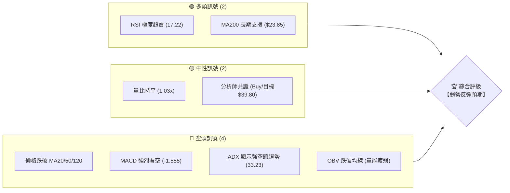
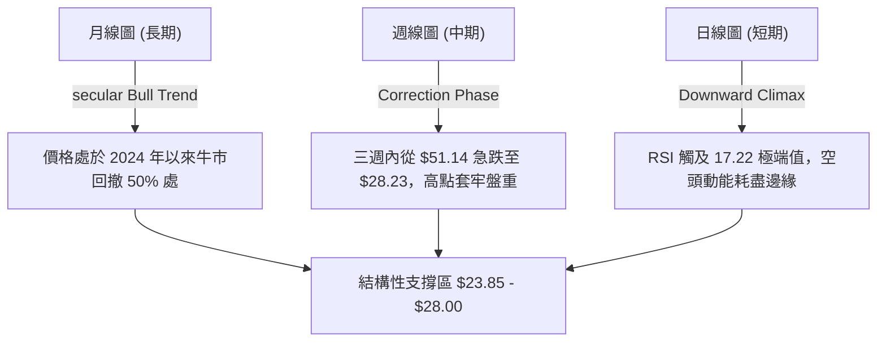
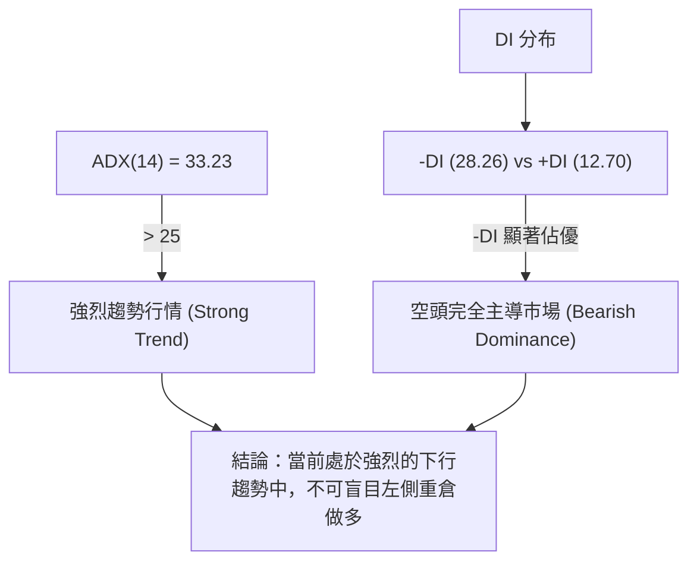
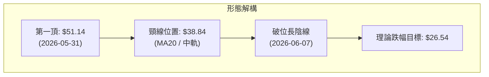
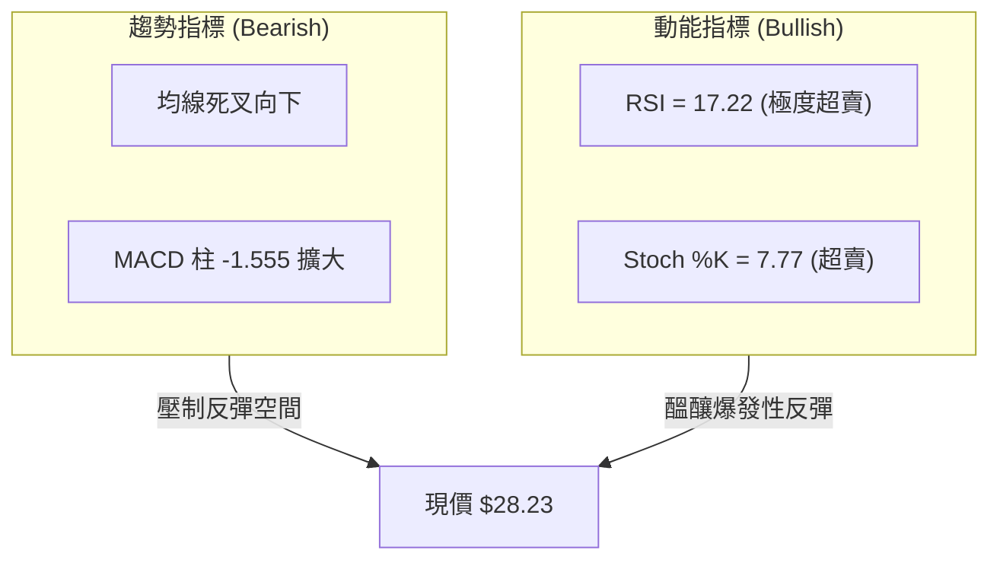
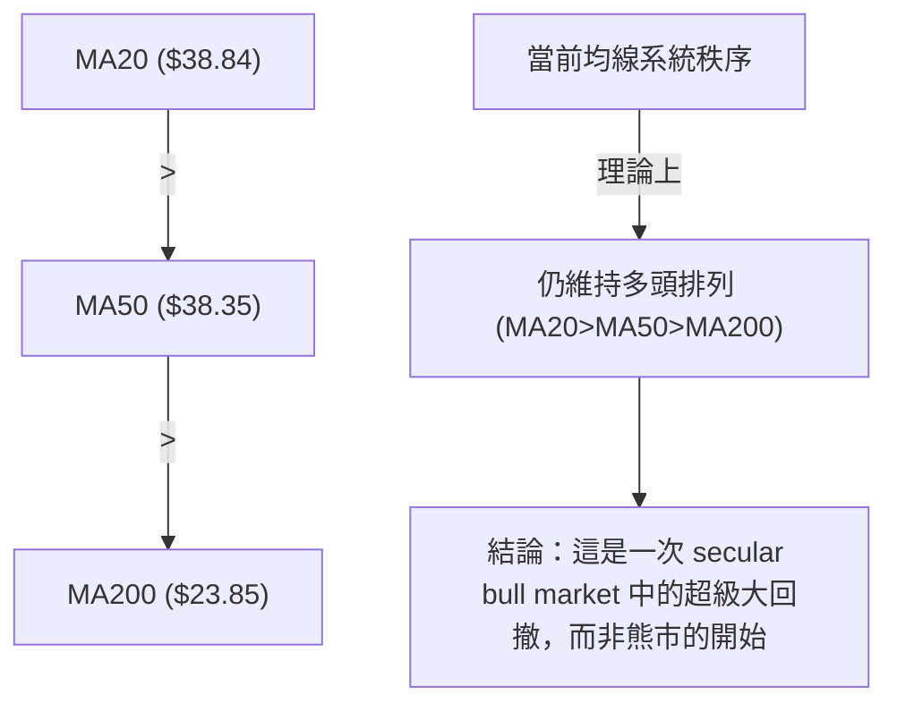
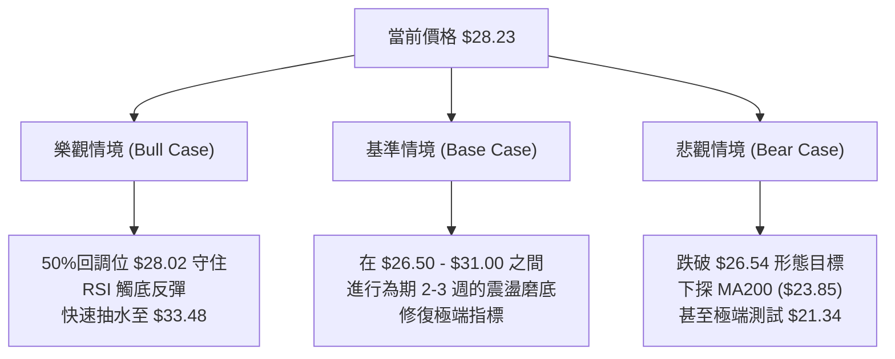

<details>
<summary>📊 靜態圖表 (點擊展開)</summary>

</details>

<html>
<head><meta charset="utf-8" /></head>
<body>
    <div style="height:500px; width:100%;">                        <script>window.PlotlyConfig = {MathJaxConfig: 'local'};</script>
        <script charset="utf-8" src="https://cdn.plot.ly/plotly-3.6.0.min.js" integrity="sha256-QaOVwtVY0T02VaHrr6pnoHLCwayMJp4O5n4YyaE3rJk=" crossorigin="anonymous"></script>                <div id="candlestick-chart" class="plotly-graph-div" style="height:100%; width:100%;"></div>            <script>                window.PLOTLYENV=window.PLOTLYENV || {};                                if (document.getElementById("candlestick-chart")) {                    Plotly.newPlot(                        "candlestick-chart",                        [{"close":{"dtype":"f8","bdata":"AAAAYI\u002fCGUAAAABACtcZQAAAAGC4HhpAAAAAgOtRI0AAAACAPQoiQAAAAOCj8CFAAAAAQApXI0AAAAAgXI8jQAAAAOBRuCNAAAAAAACAI0AAAACAwnUkQAAAAOBROCVAAAAA4FE4JkAAAADgUTgmQAAAAKCZGShAAAAAACncJ0AAAAAghesnQAAAAGBmZihAAAAA4HqUKUAAAACAwvUpQAAAAIA9iitAAAAAQDOzLUAAAABguJ4uQAAAAEDhei5AAAAAAClcL0AAAABAMzMvQAAAAIDrUS9AAAAAYGZmLUAAAAAAAIAuQAAAACBcjy1AAAAAgBQuLkAAAACAwnUqQAAAAOBROCpAAAAAYLgeK0AAAACA69EpQAAAAAAAAClAAAAAYGbmKUAAAADgUTgrQAAAAGC4nipAAAAAgBSuKUAAAADAzMwpQAAAAOBRuClAAAAAYGbmKkAAAACgR2EqQAAAAGBmZilAAAAAAACAKkAAAAAghesoQAAAAGC4nilAAAAAIK7HKkAAAADgo\u002fAoQAAAAKBH4ShAAAAAgOvRJkAAAADAzMwmQAAAACCFayZAAAAAYGbmJkAAAADgepQnQAAAAIDCdSZAAAAAgOtRJkAAAADgehQnQAAAAIDCdSdAAAAA4KNwJ0AAAADAzMwnQAAAAGBmZidAAAAAgD2KJ0AAAADAHgUoQAAAAKBH4SlAAAAAgD2KKUAAAABgZuYpQAAAAIAUrilAAAAAoEfhKUAAAADgUXgxQAAAAKBwPTJAAAAAwMwMMkAAAACgR+ExQAAAAOBReDBAAAAAoHB9MUAAAACAFC4zQAAAAKCZmTRAAAAAQOG6NEAAAACA61E0QAAAAAApXDNAAAAAYLjeM0AAAACgcL0zQAAAAOBRuDNAAAAAwPVoNEAAAAAA12M1QAAAAEAK1zVAAAAAACmcNkAAAADgo3A2QAAAAIDCtTZAAAAA4KNwOUAAAACA61E5QAAAAEDhujpAAAAAIK5HPEAAAAAgrsc8QAAAAAAAADxAAAAAoEdhOkAAAAAgXA86QAAAAOCj8DpAAAAAYLjeOUAAAACA6xE8QAAAAKBH4TtAAAAAoJlZOkAAAADgUfg4QAAAAKCZ2TZAAAAAQDPzN0AAAADAHsU1QAAAAIAUbjRAAAAAYI9CNkAAAADAHgU4QAAAAIA9yjZAAAAAYGamNUAAAADAzEw1QAAAACCFazZAAAAAgMI1NkAAAACgcL03QAAAAAApHDlAAAAAYGbmN0AAAAAgrsc3QAAAAIDCtThAAAAAoEehOEAAAACgmZk5QAAAAADXIzhAAAAAAClcOkAAAADAzEw5QAAAAAAAADpAAAAAQAqXOEAAAAAgrkc5QAAAAIDr0TlAAAAAYGZmOUAAAADgo3A5QAAAAOBR+DhAAAAAgD3KOEAAAACgmZk4QAAAAOB6FDtAAAAAIFzPOEAAAACAwvU6QAAAAIA96kBAAAAAwPXoQEAAAADgetQ\u002fQAAAACBcr0FAAAAAQDMzQEAAAAAAKdw+QAAAAADX4ztAAAAAQDPzO0AAAACAwrU+QAAAAOCj8EFAAAAAYI+CQUAAAACAwpVBQAAAAGBmRkJAAAAAoHAdQUAAAACAwlVBQAAAAMD1KEFAAAAAQAr3QEAAAADgejRBQAAAAIDr8UNAAAAAoHA9Q0AAAAAAAMBCQAAAAADXA0NAAAAAACm8Q0AAAADAHiVDQAAAAOBRuEFAAAAAoJm5QUAAAAAA14NBQAAAAIA9CkFAAAAAACl8QkAAAABAM3NCQAAAAMAeRUNAAAAA4KOQQkAAAADgUdhDQAAAAGC4nkFAAAAAwB6FQ0AAAAAghetEQAAAAEAKV0RAAAAAYLheREAAAADAHoVFQAAAACBcz0RAAAAAgBTOREAAAAAghctEQAAAAOB6VEVAAAAAoHA9RUAAAADAzCxGQAAAAMD1KEhAAAAAoHA9SUAAAABAM7NJQAAAAIDrkUlAAAAAQOE6R0AAAAAghQtIQAAAAOCjkEVAAAAAANfDRUAAAAAAKRxAQAAAAGC4XkBAAAAAIIUrP0AAAADgUbg+QAAAAIDCFUFAAAAAYGYmP0AAAADgepQ+QAAAAIDCNTxAAAAA4FE4PEAAAABA4To8QA=="},"high":{"dtype":"f8","bdata":"AAAAgD0KG0AAAABAMzMaQAAAAKCZmRpAAAAAAH9qI0AAAAAAKRwjQAAAAEAzsyJAAAAAwPUoJEAAAADgepQjQAAAAOBROCRAAAAAQLbzI0AAAADAzMwkQAAAACCFayVAAAAAgOvRJkAAAADAzEwmQAAAAGCPQihAAAAAgMJ1KEAAAAAgXI8oQAAAAMD1qChAAAAAAAAAKkAAAABguB4qQAAAAIA9CixAAAAAwMg2LkAAAAAAAAAvQAAAACCuxy9AAAAAYI8CMEAAAAAgrscwQAAAAKCZmS9AAAAAwMwMMEAAAABgZuYvQAAAAAAAgC5AAAAA4HpUL0AAAABANR4vQAAAAMD1KCtAAAAAgOvRLEAAAABACKwqQAAAAKCZGSpAAAAAACmcKkAAAACAFG4rQAAAACCF6ytAAAAA4KPwKkAAAAAghasqQAAAAGBmZipAAAAAgMJ1K0AAAABgj8IqQAAAAIA9CitAAAAA4KOwKkAAAACAPQoqQAAAAGBmpilAAAAAoJmZK0AAAACgcL0qQAAAAMDMzClAAAAAgOvRKEAAAABAM7MnQAAAAOBROCdAAAAAwB7FJ0AAAACAwvUoQAAAAAAAAClAAAAAAAAAJ0AAAAAgXE8nQAAAAKDtvCdAAAAAgD0KKEAAAADAHgUoQAAAAADXoydAAAAAwB6FKEAAAACgR2EoQAAAAGBmZipAAAAAAADAKUAAAACAwnUqQAAAAAAAACpAAAAAQOF6KkAAAACgmfkxQAAAAKCZGTNAAAAA4KOwM0AAAAAgrkcyQAAAAMDMjDJAAAAAQDPzMUAAAADgetQzQAAAAGCPwjRAAAAAoHD9NEAAAACAFO40QAAAAIDCVTRAAAAAwB4lNEAAAAAAKTw0QAAAAMDMTDRAAAAAIFzPNEAAAAAgXG81QAAAAEAzEzZAAAAAACncNkAAAACgmZk3QAAAAIDpxjdAAAAAIFyPOUAAAABACpc6QAAAAMAexTpAAAAAoEdhPUAAAABg4+U+QAAAAOBRuD1AAAAAIIWrPEAAAACAwOo6QAAAAEDhujtAAAAAQDOzOkAAAABAM7M8QAAAAGBmZjxAAAAAQDOzO0AAAAAAAEA7QAAAAMChxTlAAAAAAKz8N0AAAAAAAAA4QAAAAIDAijVAAAAAIK5HNkAAAADgURg4QAAAAEDh+jdAAAAAYGaGN0AAAADA9eg1QAAAAIAU7jZAAAAAgD3KNkAAAACgmZk4QAAAAAApHDlAAAAA4KOwOUAAAADgerQ4QAAAACBczzhAAAAAQGLQOUAAAADgo7A5QAAAAEAK1zhAAAAAgBTuOkAAAADgo3A6QAAAAKBHgTpAAAAAoHA9OkAAAAAAqpE7QAAAAEAKFzpAAAAA4FF4OkAAAAAghes6QAAAACBcDzpAAAAAgOkGOkAAAAAAAIA5QAAAAEAKFztAAAAA4HoUO0AAAABgj0I7QAAAAADXI0JAAAAAIIVrQUAAAAAghQtCQAAAAGBmhkJAAAAAANXYQUAAAABguB5BQAAAAMD1aD9AAAAAgBTuPEAAAACAFC4\u002fQAAAAMAeBUJAAAAAwB4lQkAAAABgZuZBQAAAAEDhGkNAAAAAgMKVQkAAAACA6zFCQAAAAIAUvkFAAAAAIFg5QkAAAACAwpVBQAAAAKBwHURAAAAAoHAdREAAAADgevRDQAAAAADXw0NAAAAAQOHaREAAAAAAAABEQAAAAAAAwENAAAAAoHAdQkAAAABACqdBQAAAAAAAgEFAAAAAACl8QkAAAADgeqRCQAAAAGCPokNAAAAAQAq3Q0AAAACgR+FDQAAAAIDCdURAAAAAwMzsQ0AAAAAgXI9FQAAAAOCj8ERAAAAAoJkZRUAAAACgmblFQAAAAEAKl0VAAAAAANfjRkAAAAAAAOBEQAAAAGBmxkVAAAAAAAAARkAAAABADKJGQAAAAOCjkElAAAAAoHB9SUAAAACgR+FJQAAAAGCPoklAAAAAAABgSUAAAABgj2JJQAAAACBcz0dAAAAAwB6VRkAAAABACpdDQAAAAMAeBUFAAAAAIFwvQUAAAADAzMw\u002fQAAAAMD1KEFAAAAAQDMTQUAAAACA6xFAQAAAAAAAQD9AAAAAoJlZPUAAAAAAAAA9QA=="},"hovertemplate":"\u003cb\u003e%{x|%Y-%m-%d}\u003c\u002fb\u003e\u003cbr\u003e\u958b: $%{open:.2f}\u003cbr\u003e\u9ad8: $%{high:.2f}\u003cbr\u003e\u4f4e: $%{low:.2f}\u003cbr\u003e\u6536: $%{close:.2f}\u003cextra\u003e\u003c\u002fextra\u003e","low":{"dtype":"f8","bdata":"AAAA4FG4GUAAAADA9SgZQAAAAMAeBRlAAAAAwPUoHUAAAADAHgUhQAAAAOCjMCFAAAAAYI9CIkAAAAAgrsciQAAAAOBR+CJAAAAAgOtRI0AAAAAAKVwjQAAAAOCjcCRAAAAAQOE6JUAAAADgo3AlQAAAAADXIyZAAAAAQApXJ0AAAABACtcmQAAAAMAehSdAAAAA4FG4KEAAAACgcD0oQAAAAEAzMylAAAAAwPUoLEAAAADAHoUtQAAAAKBHYS5AAAAAIFyPLUAAAADAHoUuQAAAAMD1KC5AAAAAACkcLUAAAACA61EuQAAAAEAKFy1AAAAAQDOzLUAAAACgcD0qQAAAACDdJClAAAAAAAAAK0AAAABguJ4pQAAAAOCj8CdAAAAAgBQuKUAAAAAgrkcqQAAAAIA9iipAAAAAIFyPKUAAAAAgrocpQAAAAEDfDylAAAAAIK7HKUAAAACAwnUpQAAAACCF6yhAAAAAIFwPKUAAAAAA1yMoQAAAAAAp3CdAAAAAYBDYKUAAAAAgXI8oQAAAAMD1qChAAAAAQAoXJkAAAADAyHYlQAAAAGCPwiVAAAAAgBTuJUAAAADAzMwmQAAAAICXLiZAAAAAgD0KJUAAAADAHoUmQAAAAMAehSZAAAAAYI9CJ0AAAACAl24nQAAAAMDMzCZAAAAA4HpUJ0AAAABA4XonQAAAAAAp3CdAAAAAwB4FKUAAAACgcD0pQAAAAEA1HilAAAAAwPUoKUAAAADAHgUuQAAAAGC4XjFAAAAAANejMUAAAACAFO4wQAAAAIAUbjBAAAAAgD0KMUAAAACgcP0xQAAAAAApnDNAAAAAoJmZM0AAAAAAKRw0QAAAAIA9CjNAAAAAYI\u002fCMkAAAADgo3AzQAAAAECJoTNAAAAAANX4MkAAAACgcH0zQAAAAOBR+DRAAAAAwPVoNUAAAABAChc2QAAAAMAg0DVAAAAAwPUoN0AAAABguB45QAAAAAAAADlAAAAAYI9COkAAAAAAKVw8QAAAACBcbztAAAAAoEchOUAAAAAA1yM5QAAAAIAULjlAAAAA4FE4OUAAAACgGg86QAAAACBczzpAAAAAwMyMOUAAAACA63E4QAAAAEAKdzZAAAAAwPXoNkAAAABACpc0QAAAAGBmJjRAAAAAIFzPNEAAAABgZqY1QAAAAIDCtTZAAAAAwPXoNEAAAABA4fozQAAAACAGITVAAAAAAACANUAAAACgcD02QAAAAIDCdTZAAAAAYI+CN0AAAABA4To3QAAAAKCZWTZAAAAAoHB9OEAAAACA6xE4QAAAACCuxzZAAAAA4FG4N0AAAACgR2E4QAAAAIBoETlAAAAAYI+CN0AAAACgmdk3QAAAAEAzczhAAAAAQDMzOUAAAADgo\u002fA4QAAAACCuRzhAAAAAIFxPOEAAAADgeKk3QAAAAGBmZjhAAAAAYI\u002fCOEAAAADgo\u002fA3QAAAAIBoIUBAAAAAQOE6P0AAAAAAKRw\u002fQAAAAKBHIT9AAAAAIFwPQEAAAACAPYo+QAAAAGC4PjtAAAAAwPVIOkAAAADAHoU8QAAAAOCjcD1AAAAAQOEaQUAAAABgj2JAQAAAAOBRuEFAAAAA4FH4QEAAAACgmflAQAAAAAApXEBAAAAAoEfhP0AAAAAgrmdAQAAAAGBmdkFAAAAAIIXrQkAAAABACndCQAAAAGCPwkJAAAAAANcjQ0AAAACAPSpCQAAAAOCjkEFAAAAA4KPQQEAAAADA891AQAAAAMD1SEBAAAAAwEsnQUAAAADgpWtBQAAAAMD16EFAAAAAoJn5QUAAAACgR8FBQAAAAEAKd0FAAAAAYGbmQUAAAADAzAxDQAAAAKBHIUNAAAAAwMxsQ0AAAADAzMxDQAAAAMAeRURAAAAAoEchREAAAABgjwJDQAAAAIDCVURAAAAAwB6FREAAAADAzIxFQAAAAIAU7kZAAAAAgBSOR0AAAAAAAIBHQAAAAADXY0ZAAAAAANfDRkAAAABA4TpHQAAAAMAeVUVAAAAAYGamREAAAADA9ag\u002fQAAAAOB6VD9AAAAAgOtRPUAAAABAMzM+QAAAACCFaz5AAAAAwB7FPUAAAAAAKRw+QAAAAKBDCztAAAAA4HoUPEAAAADgelQ6QA=="},"name":"\u50f9\u683c","open":{"dtype":"f8","bdata":"AAAAgD0KG0AAAABAMzMaQAAAAOCjcBpAAAAAgOvRHkAAAAAgrkchQAAAAGBmZiJAAAAAoEdhIkAAAACgcD0jQAAAAOCj8CNAAAAA4FG4I0AAAAAAAIAjQAAAAIDC9SRAAAAAgOtRJUAAAADgUbglQAAAAEDheiZAAAAAIK5HKEAAAAAAAAAnQAAAAOBRuCdAAAAAIK7HKEAAAABgZmYpQAAAAIAUrilAAAAA4FG4LEAAAABgZuYtQAAAAKCZmS9AAAAAAAAALkAAAADAzIwwQAAAAIAULi9AAAAA4FG4L0AAAAAghWsuQAAAAAAAAC5AAAAAYGbmLkAAAADgo\u002fAuQAAAAAAAACpAAAAAgD0KLEAAAAAAKVwqQAAAAAAAgClAAAAAYI9CKUAAAACgmZkqQAAAAGBm5itAAAAAwMzMKkAAAAAghespQAAAAEDheilAAAAAIK7HKUAAAADA9agqQAAAAIDCdSlAAAAAgBSuKUAAAADAHgUqQAAAAOBROChAAAAAgMJ1KkAAAABgZmYqQAAAAGCPQilAAAAAgD2KKEAAAAAAAAAmQAAAAAApXCZAAAAA4HoUJkAAAAAghesmQAAAAGBmZihAAAAAQOF6JkAAAABAM7MmQAAAAMAeBSdAAAAAgD2KJ0AAAACA69EnQAAAAEAzMydAAAAAYI\u002fCJ0AAAADA9agnQAAAAGBm5idAAAAAwB6FKUAAAAAAKVwqQAAAAKBwPSlAAAAAoJmZKUAAAADgepQvQAAAAOCjcDJAAAAAIFzPMkAAAABgZqYxQAAAAIAULjJAAAAAgD0KMUAAAACgcP0xQAAAACCuxzNAAAAAwMzMM0AAAABA4bo0QAAAAMDMTDRAAAAAoHDdMkAAAAAgrgc0QAAAAGC4vjNAAAAAQOHaM0AAAABAM7M0QAAAAAAAgDVAAAAA4FG4NUAAAACgmdk2QAAAAKCZmTZAAAAAwMxMN0AAAABgj0I6QAAAAAAAgDlAAAAAIFzPOkAAAABAM3M8QAAAAEAKlztAAAAAAACAPEAAAAAAAMA6QAAAAGCPAjpAAAAAoJmZOkAAAADgehQ6QAAAAMDMDDxAAAAAQDOzO0AAAABACrc5QAAAAADX4zhAAAAAQOH6N0AAAAAAAAA4QAAAAAAAADVAAAAAgD0KNUAAAACAwvU1QAAAAGC43jdAAAAAYGaGN0AAAACA65E1QAAAAAAAgDVAAAAAAAAANkAAAABgZmY2QAAAAMAeBTdAAAAAoHC9OEAAAABgZmY3QAAAAAAAQDdAAAAAwMxMOUAAAAAAAIA4QAAAAEAzkzhAAAAA4FG4N0AAAABA4Ro6QAAAAKCZmTlAAAAAAACAOUAAAAAA1+M3QAAAAEAK1zhAAAAAgOvROUAAAABAClc5QAAAAOBR+DlAAAAAQOH6OEAAAACgRyE5QAAAAKCZ2ThAAAAAAACAOkAAAAAAAEA4QAAAAGBmxkBAAAAAAABAQUAAAABA4dpAQAAAAEAzM0BAAAAAACl8QUAAAACgcP1AQAAAAKCZ2T5AAAAAwMzMPEAAAAAAAAA9QAAAAOCjcD1AAAAAgML1QUAAAADgo7BBQAAAAEAzc0JAAAAAAABAQkAAAADgo3BBQAAAAKBwHUFAAAAAIIXLQUAAAACAwjVBQAAAAKBwfUFAAAAAgOuRQ0AAAABAM5NDQAAAAAApHENAAAAAAADAQ0AAAACAPapDQAAAAIAUjkNAAAAAACm8QUAAAADAzExBQAAAAOCjMEFAAAAAANdDQUAAAAAgXF9CQAAAAMAehUJAAAAAoJmZQ0AAAAAgXH9CQAAAAGCPwkNAAAAAQDMzQkAAAABAM1NDQAAAACCFC0RAAAAAQAoXRUAAAADgo1BEQAAAAMD1CEVAAAAAANejRUAAAABACndEQAAAAEAzM0VAAAAAwHIIRUAAAADAzKxFQAAAAMD12EdAAAAAwMwMSUAAAABAMxNJQAAAAAAAkEhAAAAAIIWLSEAAAACAwpVHQAAAACBcz0dAAAAAoHCdRUAAAABgZiZDQAAAAKBHAUFAAAAAgMK1QEAAAAAA1+M+QAAAAAAAgD9AAAAAgOvxQEAAAACAPQpAQAAAAMAeBT5AAAAAANdjPEAAAABgZqY8QA=="},"x":["2025-09-03T00:00:00-04:00","2025-09-04T00:00:00-04:00","2025-09-05T00:00:00-04:00","2025-09-08T00:00:00-04:00","2025-09-09T00:00:00-04:00","2025-09-10T00:00:00-04:00","2025-09-11T00:00:00-04:00","2025-09-12T00:00:00-04:00","2025-09-15T00:00:00-04:00","2025-09-16T00:00:00-04:00","2025-09-17T00:00:00-04:00","2025-09-18T00:00:00-04:00","2025-09-19T00:00:00-04:00","2025-09-22T00:00:00-04:00","2025-09-23T00:00:00-04:00","2025-09-24T00:00:00-04:00","2025-09-25T00:00:00-04:00","2025-09-26T00:00:00-04:00","2025-09-29T00:00:00-04:00","2025-09-30T00:00:00-04:00","2025-10-01T00:00:00-04:00","2025-10-02T00:00:00-04:00","2025-10-03T00:00:00-04:00","2025-10-06T00:00:00-04:00","2025-10-07T00:00:00-04:00","2025-10-08T00:00:00-04:00","2025-10-09T00:00:00-04:00","2025-10-10T00:00:00-04:00","2025-10-13T00:00:00-04:00","2025-10-14T00:00:00-04:00","2025-10-15T00:00:00-04:00","2025-10-16T00:00:00-04:00","2025-10-17T00:00:00-04:00","2025-10-20T00:00:00-04:00","2025-10-21T00:00:00-04:00","2025-10-22T00:00:00-04:00","2025-10-23T00:00:00-04:00","2025-10-24T00:00:00-04:00","2025-10-27T00:00:00-04:00","2025-10-28T00:00:00-04:00","2025-10-29T00:00:00-04:00","2025-10-30T00:00:00-04:00","2025-10-31T00:00:00-04:00","2025-11-03T00:00:00-05:00","2025-11-04T00:00:00-05:00","2025-11-05T00:00:00-05:00","2025-11-06T00:00:00-05:00","2025-11-07T00:00:00-05:00","2025-11-10T00:00:00-05:00","2025-11-11T00:00:00-05:00","2025-11-12T00:00:00-05:00","2025-11-13T00:00:00-05:00","2025-11-14T00:00:00-05:00","2025-11-17T00:00:00-05:00","2025-11-18T00:00:00-05:00","2025-11-19T00:00:00-05:00","2025-11-20T00:00:00-05:00","2025-11-21T00:00:00-05:00","2025-11-24T00:00:00-05:00","2025-11-25T00:00:00-05:00","2025-11-26T00:00:00-05:00","2025-11-28T00:00:00-05:00","2025-12-01T00:00:00-05:00","2025-12-02T00:00:00-05:00","2025-12-03T00:00:00-05:00","2025-12-04T00:00:00-05:00","2025-12-05T00:00:00-05:00","2025-12-08T00:00:00-05:00","2025-12-09T00:00:00-05:00","2025-12-10T00:00:00-05:00","2025-12-11T00:00:00-05:00","2025-12-12T00:00:00-05:00","2025-12-15T00:00:00-05:00","2025-12-16T00:00:00-05:00","2025-12-17T00:00:00-05:00","2025-12-18T00:00:00-05:00","2025-12-19T00:00:00-05:00","2025-12-22T00:00:00-05:00","2025-12-23T00:00:00-05:00","2025-12-24T00:00:00-05:00","2025-12-26T00:00:00-05:00","2025-12-29T00:00:00-05:00","2025-12-30T00:00:00-05:00","2025-12-31T00:00:00-05:00","2026-01-02T00:00:00-05:00","2026-01-05T00:00:00-05:00","2026-01-06T00:00:00-05:00","2026-01-07T00:00:00-05:00","2026-01-08T00:00:00-05:00","2026-01-09T00:00:00-05:00","2026-01-12T00:00:00-05:00","2026-01-13T00:00:00-05:00","2026-01-14T00:00:00-05:00","2026-01-15T00:00:00-05:00","2026-01-16T00:00:00-05:00","2026-01-20T00:00:00-05:00","2026-01-21T00:00:00-05:00","2026-01-22T00:00:00-05:00","2026-01-23T00:00:00-05:00","2026-01-26T00:00:00-05:00","2026-01-27T00:00:00-05:00","2026-01-28T00:00:00-05:00","2026-01-29T00:00:00-05:00","2026-01-30T00:00:00-05:00","2026-02-02T00:00:00-05:00","2026-02-03T00:00:00-05:00","2026-02-04T00:00:00-05:00","2026-02-05T00:00:00-05:00","2026-02-06T00:00:00-05:00","2026-02-09T00:00:00-05:00","2026-02-10T00:00:00-05:00","2026-02-11T00:00:00-05:00","2026-02-12T00:00:00-05:00","2026-02-13T00:00:00-05:00","2026-02-17T00:00:00-05:00","2026-02-18T00:00:00-05:00","2026-02-19T00:00:00-05:00","2026-02-20T00:00:00-05:00","2026-02-23T00:00:00-05:00","2026-02-24T00:00:00-05:00","2026-02-25T00:00:00-05:00","2026-02-26T00:00:00-05:00","2026-02-27T00:00:00-05:00","2026-03-02T00:00:00-05:00","2026-03-03T00:00:00-05:00","2026-03-04T00:00:00-05:00","2026-03-05T00:00:00-05:00","2026-03-06T00:00:00-05:00","2026-03-09T00:00:00-04:00","2026-03-10T00:00:00-04:00","2026-03-11T00:00:00-04:00","2026-03-12T00:00:00-04:00","2026-03-13T00:00:00-04:00","2026-03-16T00:00:00-04:00","2026-03-17T00:00:00-04:00","2026-03-18T00:00:00-04:00","2026-03-19T00:00:00-04:00","2026-03-20T00:00:00-04:00","2026-03-23T00:00:00-04:00","2026-03-24T00:00:00-04:00","2026-03-25T00:00:00-04:00","2026-03-26T00:00:00-04:00","2026-03-27T00:00:00-04:00","2026-03-30T00:00:00-04:00","2026-03-31T00:00:00-04:00","2026-04-01T00:00:00-04:00","2026-04-02T00:00:00-04:00","2026-04-06T00:00:00-04:00","2026-04-07T00:00:00-04:00","2026-04-08T00:00:00-04:00","2026-04-09T00:00:00-04:00","2026-04-10T00:00:00-04:00","2026-04-13T00:00:00-04:00","2026-04-14T00:00:00-04:00","2026-04-15T00:00:00-04:00","2026-04-16T00:00:00-04:00","2026-04-17T00:00:00-04:00","2026-04-20T00:00:00-04:00","2026-04-21T00:00:00-04:00","2026-04-22T00:00:00-04:00","2026-04-23T00:00:00-04:00","2026-04-24T00:00:00-04:00","2026-04-27T00:00:00-04:00","2026-04-28T00:00:00-04:00","2026-04-29T00:00:00-04:00","2026-04-30T00:00:00-04:00","2026-05-01T00:00:00-04:00","2026-05-04T00:00:00-04:00","2026-05-05T00:00:00-04:00","2026-05-06T00:00:00-04:00","2026-05-07T00:00:00-04:00","2026-05-08T00:00:00-04:00","2026-05-11T00:00:00-04:00","2026-05-12T00:00:00-04:00","2026-05-13T00:00:00-04:00","2026-05-14T00:00:00-04:00","2026-05-15T00:00:00-04:00","2026-05-18T00:00:00-04:00","2026-05-19T00:00:00-04:00","2026-05-20T00:00:00-04:00","2026-05-21T00:00:00-04:00","2026-05-22T00:00:00-04:00","2026-05-26T00:00:00-04:00","2026-05-27T00:00:00-04:00","2026-05-28T00:00:00-04:00","2026-05-29T00:00:00-04:00","2026-06-01T00:00:00-04:00","2026-06-02T00:00:00-04:00","2026-06-03T00:00:00-04:00","2026-06-04T00:00:00-04:00","2026-06-05T00:00:00-04:00","2026-06-08T00:00:00-04:00","2026-06-09T00:00:00-04:00","2026-06-10T00:00:00-04:00","2026-06-11T00:00:00-04:00","2026-06-12T00:00:00-04:00","2026-06-15T00:00:00-04:00","2026-06-16T00:00:00-04:00","2026-06-17T00:00:00-04:00","2026-06-18T00:00:00-04:00"],"type":"candlestick"},{"hovertemplate":"MA30: $%{y:.2f}\u003cextra\u003e\u003c\u002fextra\u003e","line":{"color":"#2196F3","dash":"dash","width":2},"mode":"lines","name":"MA30","x":["2025-09-03T00:00:00-04:00","2025-09-04T00:00:00-04:00","2025-09-05T00:00:00-04:00","2025-09-08T00:00:00-04:00","2025-09-09T00:00:00-04:00","2025-09-10T00:00:00-04:00","2025-09-11T00:00:00-04:00","2025-09-12T00:00:00-04:00","2025-09-15T00:00:00-04:00","2025-09-16T00:00:00-04:00","2025-09-17T00:00:00-04:00","2025-09-18T00:00:00-04:00","2025-09-19T00:00:00-04:00","2025-09-22T00:00:00-04:00","2025-09-23T00:00:00-04:00","2025-09-24T00:00:00-04:00","2025-09-25T00:00:00-04:00","2025-09-26T00:00:00-04:00","2025-09-29T00:00:00-04:00","2025-09-30T00:00:00-04:00","2025-10-01T00:00:00-04:00","2025-10-02T00:00:00-04:00","2025-10-03T00:00:00-04:00","2025-10-06T00:00:00-04:00","2025-10-07T00:00:00-04:00","2025-10-08T00:00:00-04:00","2025-10-09T00:00:00-04:00","2025-10-10T00:00:00-04:00","2025-10-13T00:00:00-04:00","2025-10-14T00:00:00-04:00","2025-10-15T00:00:00-04:00","2025-10-16T00:00:00-04:00","2025-10-17T00:00:00-04:00","2025-10-20T00:00:00-04:00","2025-10-21T00:00:00-04:00","2025-10-22T00:00:00-04:00","2025-10-23T00:00:00-04:00","2025-10-24T00:00:00-04:00","2025-10-27T00:00:00-04:00","2025-10-28T00:00:00-04:00","2025-10-29T00:00:00-04:00","2025-10-30T00:00:00-04:00","2025-10-31T00:00:00-04:00","2025-11-03T00:00:00-05:00","2025-11-04T00:00:00-05:00","2025-11-05T00:00:00-05:00","2025-11-06T00:00:00-05:00","2025-11-07T00:00:00-05:00","2025-11-10T00:00:00-05:00","2025-11-11T00:00:00-05:00","2025-11-12T00:00:00-05:00","2025-11-13T00:00:00-05:00","2025-11-14T00:00:00-05:00","2025-11-17T00:00:00-05:00","2025-11-18T00:00:00-05:00","2025-11-19T00:00:00-05:00","2025-11-20T00:00:00-05:00","2025-11-21T00:00:00-05:00","2025-11-24T00:00:00-05:00","2025-11-25T00:00:00-05:00","2025-11-26T00:00:00-05:00","2025-11-28T00:00:00-05:00","2025-12-01T00:00:00-05:00","2025-12-02T00:00:00-05:00","2025-12-03T00:00:00-05:00","2025-12-04T00:00:00-05:00","2025-12-05T00:00:00-05:00","2025-12-08T00:00:00-05:00","2025-12-09T00:00:00-05:00","2025-12-10T00:00:00-05:00","2025-12-11T00:00:00-05:00","2025-12-12T00:00:00-05:00","2025-12-15T00:00:00-05:00","2025-12-16T00:00:00-05:00","2025-12-17T00:00:00-05:00","2025-12-18T00:00:00-05:00","2025-12-19T00:00:00-05:00","2025-12-22T00:00:00-05:00","2025-12-23T00:00:00-05:00","2025-12-24T00:00:00-05:00","2025-12-26T00:00:00-05:00","2025-12-29T00:00:00-05:00","2025-12-30T00:00:00-05:00","2025-12-31T00:00:00-05:00","2026-01-02T00:00:00-05:00","2026-01-05T00:00:00-05:00","2026-01-06T00:00:00-05:00","2026-01-07T00:00:00-05:00","2026-01-08T00:00:00-05:00","2026-01-09T00:00:00-05:00","2026-01-12T00:00:00-05:00","2026-01-13T00:00:00-05:00","2026-01-14T00:00:00-05:00","2026-01-15T00:00:00-05:00","2026-01-16T00:00:00-05:00","2026-01-20T00:00:00-05:00","2026-01-21T00:00:00-05:00","2026-01-22T00:00:00-05:00","2026-01-23T00:00:00-05:00","2026-01-26T00:00:00-05:00","2026-01-27T00:00:00-05:00","2026-01-28T00:00:00-05:00","2026-01-29T00:00:00-05:00","2026-01-30T00:00:00-05:00","2026-02-02T00:00:00-05:00","2026-02-03T00:00:00-05:00","2026-02-04T00:00:00-05:00","2026-02-05T00:00:00-05:00","2026-02-06T00:00:00-05:00","2026-02-09T00:00:00-05:00","2026-02-10T00:00:00-05:00","2026-02-11T00:00:00-05:00","2026-02-12T00:00:00-05:00","2026-02-13T00:00:00-05:00","2026-02-17T00:00:00-05:00","2026-02-18T00:00:00-05:00","2026-02-19T00:00:00-05:00","2026-02-20T00:00:00-05:00","2026-02-23T00:00:00-05:00","2026-02-24T00:00:00-05:00","2026-02-25T00:00:00-05:00","2026-02-26T00:00:00-05:00","2026-02-27T00:00:00-05:00","2026-03-02T00:00:00-05:00","2026-03-03T00:00:00-05:00","2026-03-04T00:00:00-05:00","2026-03-05T00:00:00-05:00","2026-03-06T00:00:00-05:00","2026-03-09T00:00:00-04:00","2026-03-10T00:00:00-04:00","2026-03-11T00:00:00-04:00","2026-03-12T00:00:00-04:00","2026-03-13T00:00:00-04:00","2026-03-16T00:00:00-04:00","2026-03-17T00:00:00-04:00","2026-03-18T00:00:00-04:00","2026-03-19T00:00:00-04:00","2026-03-20T00:00:00-04:00","2026-03-23T00:00:00-04:00","2026-03-24T00:00:00-04:00","2026-03-25T00:00:00-04:00","2026-03-26T00:00:00-04:00","2026-03-27T00:00:00-04:00","2026-03-30T00:00:00-04:00","2026-03-31T00:00:00-04:00","2026-04-01T00:00:00-04:00","2026-04-02T00:00:00-04:00","2026-04-06T00:00:00-04:00","2026-04-07T00:00:00-04:00","2026-04-08T00:00:00-04:00","2026-04-09T00:00:00-04:00","2026-04-10T00:00:00-04:00","2026-04-13T00:00:00-04:00","2026-04-14T00:00:00-04:00","2026-04-15T00:00:00-04:00","2026-04-16T00:00:00-04:00","2026-04-17T00:00:00-04:00","2026-04-20T00:00:00-04:00","2026-04-21T00:00:00-04:00","2026-04-22T00:00:00-04:00","2026-04-23T00:00:00-04:00","2026-04-24T00:00:00-04:00","2026-04-27T00:00:00-04:00","2026-04-28T00:00:00-04:00","2026-04-29T00:00:00-04:00","2026-04-30T00:00:00-04:00","2026-05-01T00:00:00-04:00","2026-05-04T00:00:00-04:00","2026-05-05T00:00:00-04:00","2026-05-06T00:00:00-04:00","2026-05-07T00:00:00-04:00","2026-05-08T00:00:00-04:00","2026-05-11T00:00:00-04:00","2026-05-12T00:00:00-04:00","2026-05-13T00:00:00-04:00","2026-05-14T00:00:00-04:00","2026-05-15T00:00:00-04:00","2026-05-18T00:00:00-04:00","2026-05-19T00:00:00-04:00","2026-05-20T00:00:00-04:00","2026-05-21T00:00:00-04:00","2026-05-22T00:00:00-04:00","2026-05-26T00:00:00-04:00","2026-05-27T00:00:00-04:00","2026-05-28T00:00:00-04:00","2026-05-29T00:00:00-04:00","2026-06-01T00:00:00-04:00","2026-06-02T00:00:00-04:00","2026-06-03T00:00:00-04:00","2026-06-04T00:00:00-04:00","2026-06-05T00:00:00-04:00","2026-06-08T00:00:00-04:00","2026-06-09T00:00:00-04:00","2026-06-10T00:00:00-04:00","2026-06-11T00:00:00-04:00","2026-06-12T00:00:00-04:00","2026-06-15T00:00:00-04:00","2026-06-16T00:00:00-04:00","2026-06-17T00:00:00-04:00","2026-06-18T00:00:00-04:00"],"y":{"dtype":"f8","bdata":"AAAAAAAA+H8AAAAAAAD4fwAAAAAAAPh\u002fAAAAAAAA+H8AAAAAAAD4fwAAAAAAAPh\u002fAAAAAAAA+H8AAAAAAAD4fwAAAAAAAPh\u002fAAAAAAAA+H8AAAAAAAD4fwAAAAAAAPh\u002fAAAAAAAA+H8AAAAAAAD4fwAAAAAAAPh\u002fAAAAAAAA+H8AAAAAAAD4fwAAAAAAAPh\u002fAAAAAAAA+H8AAAAAAAD4fwAAAAAAAPh\u002fAAAAAAAA+H8AAAAAAAD4fwAAAAAAAPh\u002fAAAAAAAA+H8AAAAAAAD4fwAAAAAAAPh\u002fAAAAAAAA+H8AAAAAAAD4f1VVVSW\u002fmCdAq6qqkl8sKEDv7u4m6p8oQLy7u5s2EClAiYiI+MVSKUAzMzOjKZUpQBEREXFo0SlAq6qq+mIJKkARERGBwEoqQJqZmcmhhSpARERENF66KkDNzMyc7+cqQDMzMwNWDitAERERoUU2K0CamZlJxVkrQN7d3S3dZCtAiYiIWGR7K0ARERHh7IMrQDMzMwNWjitAREREdJOYK0C8u7s7348rQO\u002fu7l4seStAd3d3x3Y+K0CamZm5u\u002fsqQDMzM2P0tipAvLu7O8NuKkBmZmYWvS0qQO\u002fu7h4i4ilAAAAAoLelKUAzMzNjZmYpQLy7u7tYMilAq6qq+tT4KEDv7u4eIuIoQM3MzLwRyihAvLu7G4WrKEAzMzPzKJwoQGZmZlaroyhAiYiI6JigKEAzMzNTVZUoQM3MzNxPjShARERExASPKEBmZmZmA90oQKuqqvrUOClA7+7urlaHKUCrqqqaYdcpQLy7u\u002fu4FypAMzMz0xVgKkBERET0xdIqQLy7u\u002fu4VytA3t3d7f3UK0CamZkZ91osQLy7uwsR0SxAq6qqWnNhLUDv7u5eye8tQAAAACAGgS5AZmZm9vAZL0AAAAAAyL0vQGZmZuZtOTBA7+7uziKbMEARERE5JvgwQN7d3WXYVTFAIiIiMuzKMUAiIiKicD0yQDMzMyuyvTJAiYiI0JRKM0CJiIhwr9kzQDMzM4MyWjRAIiIiAlbONEBVVVU9NT41QBERESmHtjVA3t3dLd0kNkC8u7s7UX82QCIiIiKU0TZAMzMzw2cYN0Crqqoa6FQ3QN7d3W1ZizdAREREhHnCN0BVVVV1k9g3QGZmZhYg1zdAzczMbC7kN0AzMzMzwQM4QGZmZiYGIThA3t3dnTYwOEDNzMx8hj04QKuqqrqQVDhAMzMz4+xjOECrqqqK+nc4QHd3d\u002ffhkzhAMzMzA+SeOECamZlJU6o4QKuqqlpkuzhAERER4Xq0OEDNzMyM3rY4QLy7u5vEoDhA3t3dTWKQOEAAAAAgsHI4QO\u002fu7g6fYThA7+7uvlhSOEAAAADQsEs4QCIiIiIiQjhAZmZmZh8+OEBEREQUric4QGZmZhbZDjhAd3d3N4kBOEARERHxYP43QERERIR5IjhAZmZmNtApOEAAAADwGVY4QAAAALByyDhARERE5BcrOUCJiIgYvW05QFVVVYUW2TlAIiIiQtI0OkBmZmZmZoY6QLy7u8sTtTpAVVVVBQ\u002fmOkB3d3c3iSE7QERERKRwfTtAd3d3p1TcO0C8u7t7hj08QLy7u1uPojxAERER4Xr0PEB3d3eX4EE9QERERCS\u002fmD1A7+7uDljZPUCJiIgoFSc+QDMzM1OcnT5A3t3dfSMUP0DNzMx8anw\u002fQDMzM6Ob5D9AMzMzA1YuQEC8u7ujKWVAQLy7u6vVkUBAvLu7O1G\u002fQECrqqqS0etAQBEREXGvCUFAAAAAaJE9QUAiIiKK+mdBQFVVVR0TfEFAzczMhDKKQUC8u7u7u6tBQN7d3b0tq0FAREREZILHQUCrqqp6W\u002fZBQCIiIpLtLEJAmpmZqX9jQkAAAABQG5hCQLy7u+uYsEJAVVVV9bbMQkAAAABQG+hCQAAAABAtAkNAMzMzQ2AlQ0B3d3dnrU5DQDMzMyNpikNAZmZmJgbRQ0AzMzPDgxlEQDMzM8ODSURAzczMDJBrREB3d3cnv5hEQHd3d7eBrkRAERERUdS\u002fREAiIiJC7qVEQERERCRpmkRAVVVVPSaIREAiIiKSwnVEQO\u002fu7t4kdkRAiYiI4E9dREAAAADAWEJEQCIiIqJFFkRAERERiUHwQ0AREREpXL9DQA=="},"type":"scatter"},{"hovertemplate":"MA60: $%{y:.2f}\u003cextra\u003e\u003c\u002fextra\u003e","line":{"color":"#9C27B0","dash":"dash","width":2},"mode":"lines","name":"MA60","x":["2025-09-03T00:00:00-04:00","2025-09-04T00:00:00-04:00","2025-09-05T00:00:00-04:00","2025-09-08T00:00:00-04:00","2025-09-09T00:00:00-04:00","2025-09-10T00:00:00-04:00","2025-09-11T00:00:00-04:00","2025-09-12T00:00:00-04:00","2025-09-15T00:00:00-04:00","2025-09-16T00:00:00-04:00","2025-09-17T00:00:00-04:00","2025-09-18T00:00:00-04:00","2025-09-19T00:00:00-04:00","2025-09-22T00:00:00-04:00","2025-09-23T00:00:00-04:00","2025-09-24T00:00:00-04:00","2025-09-25T00:00:00-04:00","2025-09-26T00:00:00-04:00","2025-09-29T00:00:00-04:00","2025-09-30T00:00:00-04:00","2025-10-01T00:00:00-04:00","2025-10-02T00:00:00-04:00","2025-10-03T00:00:00-04:00","2025-10-06T00:00:00-04:00","2025-10-07T00:00:00-04:00","2025-10-08T00:00:00-04:00","2025-10-09T00:00:00-04:00","2025-10-10T00:00:00-04:00","2025-10-13T00:00:00-04:00","2025-10-14T00:00:00-04:00","2025-10-15T00:00:00-04:00","2025-10-16T00:00:00-04:00","2025-10-17T00:00:00-04:00","2025-10-20T00:00:00-04:00","2025-10-21T00:00:00-04:00","2025-10-22T00:00:00-04:00","2025-10-23T00:00:00-04:00","2025-10-24T00:00:00-04:00","2025-10-27T00:00:00-04:00","2025-10-28T00:00:00-04:00","2025-10-29T00:00:00-04:00","2025-10-30T00:00:00-04:00","2025-10-31T00:00:00-04:00","2025-11-03T00:00:00-05:00","2025-11-04T00:00:00-05:00","2025-11-05T00:00:00-05:00","2025-11-06T00:00:00-05:00","2025-11-07T00:00:00-05:00","2025-11-10T00:00:00-05:00","2025-11-11T00:00:00-05:00","2025-11-12T00:00:00-05:00","2025-11-13T00:00:00-05:00","2025-11-14T00:00:00-05:00","2025-11-17T00:00:00-05:00","2025-11-18T00:00:00-05:00","2025-11-19T00:00:00-05:00","2025-11-20T00:00:00-05:00","2025-11-21T00:00:00-05:00","2025-11-24T00:00:00-05:00","2025-11-25T00:00:00-05:00","2025-11-26T00:00:00-05:00","2025-11-28T00:00:00-05:00","2025-12-01T00:00:00-05:00","2025-12-02T00:00:00-05:00","2025-12-03T00:00:00-05:00","2025-12-04T00:00:00-05:00","2025-12-05T00:00:00-05:00","2025-12-08T00:00:00-05:00","2025-12-09T00:00:00-05:00","2025-12-10T00:00:00-05:00","2025-12-11T00:00:00-05:00","2025-12-12T00:00:00-05:00","2025-12-15T00:00:00-05:00","2025-12-16T00:00:00-05:00","2025-12-17T00:00:00-05:00","2025-12-18T00:00:00-05:00","2025-12-19T00:00:00-05:00","2025-12-22T00:00:00-05:00","2025-12-23T00:00:00-05:00","2025-12-24T00:00:00-05:00","2025-12-26T00:00:00-05:00","2025-12-29T00:00:00-05:00","2025-12-30T00:00:00-05:00","2025-12-31T00:00:00-05:00","2026-01-02T00:00:00-05:00","2026-01-05T00:00:00-05:00","2026-01-06T00:00:00-05:00","2026-01-07T00:00:00-05:00","2026-01-08T00:00:00-05:00","2026-01-09T00:00:00-05:00","2026-01-12T00:00:00-05:00","2026-01-13T00:00:00-05:00","2026-01-14T00:00:00-05:00","2026-01-15T00:00:00-05:00","2026-01-16T00:00:00-05:00","2026-01-20T00:00:00-05:00","2026-01-21T00:00:00-05:00","2026-01-22T00:00:00-05:00","2026-01-23T00:00:00-05:00","2026-01-26T00:00:00-05:00","2026-01-27T00:00:00-05:00","2026-01-28T00:00:00-05:00","2026-01-29T00:00:00-05:00","2026-01-30T00:00:00-05:00","2026-02-02T00:00:00-05:00","2026-02-03T00:00:00-05:00","2026-02-04T00:00:00-05:00","2026-02-05T00:00:00-05:00","2026-02-06T00:00:00-05:00","2026-02-09T00:00:00-05:00","2026-02-10T00:00:00-05:00","2026-02-11T00:00:00-05:00","2026-02-12T00:00:00-05:00","2026-02-13T00:00:00-05:00","2026-02-17T00:00:00-05:00","2026-02-18T00:00:00-05:00","2026-02-19T00:00:00-05:00","2026-02-20T00:00:00-05:00","2026-02-23T00:00:00-05:00","2026-02-24T00:00:00-05:00","2026-02-25T00:00:00-05:00","2026-02-26T00:00:00-05:00","2026-02-27T00:00:00-05:00","2026-03-02T00:00:00-05:00","2026-03-03T00:00:00-05:00","2026-03-04T00:00:00-05:00","2026-03-05T00:00:00-05:00","2026-03-06T00:00:00-05:00","2026-03-09T00:00:00-04:00","2026-03-10T00:00:00-04:00","2026-03-11T00:00:00-04:00","2026-03-12T00:00:00-04:00","2026-03-13T00:00:00-04:00","2026-03-16T00:00:00-04:00","2026-03-17T00:00:00-04:00","2026-03-18T00:00:00-04:00","2026-03-19T00:00:00-04:00","2026-03-20T00:00:00-04:00","2026-03-23T00:00:00-04:00","2026-03-24T00:00:00-04:00","2026-03-25T00:00:00-04:00","2026-03-26T00:00:00-04:00","2026-03-27T00:00:00-04:00","2026-03-30T00:00:00-04:00","2026-03-31T00:00:00-04:00","2026-04-01T00:00:00-04:00","2026-04-02T00:00:00-04:00","2026-04-06T00:00:00-04:00","2026-04-07T00:00:00-04:00","2026-04-08T00:00:00-04:00","2026-04-09T00:00:00-04:00","2026-04-10T00:00:00-04:00","2026-04-13T00:00:00-04:00","2026-04-14T00:00:00-04:00","2026-04-15T00:00:00-04:00","2026-04-16T00:00:00-04:00","2026-04-17T00:00:00-04:00","2026-04-20T00:00:00-04:00","2026-04-21T00:00:00-04:00","2026-04-22T00:00:00-04:00","2026-04-23T00:00:00-04:00","2026-04-24T00:00:00-04:00","2026-04-27T00:00:00-04:00","2026-04-28T00:00:00-04:00","2026-04-29T00:00:00-04:00","2026-04-30T00:00:00-04:00","2026-05-01T00:00:00-04:00","2026-05-04T00:00:00-04:00","2026-05-05T00:00:00-04:00","2026-05-06T00:00:00-04:00","2026-05-07T00:00:00-04:00","2026-05-08T00:00:00-04:00","2026-05-11T00:00:00-04:00","2026-05-12T00:00:00-04:00","2026-05-13T00:00:00-04:00","2026-05-14T00:00:00-04:00","2026-05-15T00:00:00-04:00","2026-05-18T00:00:00-04:00","2026-05-19T00:00:00-04:00","2026-05-20T00:00:00-04:00","2026-05-21T00:00:00-04:00","2026-05-22T00:00:00-04:00","2026-05-26T00:00:00-04:00","2026-05-27T00:00:00-04:00","2026-05-28T00:00:00-04:00","2026-05-29T00:00:00-04:00","2026-06-01T00:00:00-04:00","2026-06-02T00:00:00-04:00","2026-06-03T00:00:00-04:00","2026-06-04T00:00:00-04:00","2026-06-05T00:00:00-04:00","2026-06-08T00:00:00-04:00","2026-06-09T00:00:00-04:00","2026-06-10T00:00:00-04:00","2026-06-11T00:00:00-04:00","2026-06-12T00:00:00-04:00","2026-06-15T00:00:00-04:00","2026-06-16T00:00:00-04:00","2026-06-17T00:00:00-04:00","2026-06-18T00:00:00-04:00"],"y":{"dtype":"f8","bdata":"AAAAAAAA+H8AAAAAAAD4fwAAAAAAAPh\u002fAAAAAAAA+H8AAAAAAAD4fwAAAAAAAPh\u002fAAAAAAAA+H8AAAAAAAD4fwAAAAAAAPh\u002fAAAAAAAA+H8AAAAAAAD4fwAAAAAAAPh\u002fAAAAAAAA+H8AAAAAAAD4fwAAAAAAAPh\u002fAAAAAAAA+H8AAAAAAAD4fwAAAAAAAPh\u002fAAAAAAAA+H8AAAAAAAD4fwAAAAAAAPh\u002fAAAAAAAA+H8AAAAAAAD4fwAAAAAAAPh\u002fAAAAAAAA+H8AAAAAAAD4fwAAAAAAAPh\u002fAAAAAAAA+H8AAAAAAAD4fwAAAAAAAPh\u002fAAAAAAAA+H8AAAAAAAD4fwAAAAAAAPh\u002fAAAAAAAA+H8AAAAAAAD4fwAAAAAAAPh\u002fAAAAAAAA+H8AAAAAAAD4fwAAAAAAAPh\u002fAAAAAAAA+H8AAAAAAAD4fwAAAAAAAPh\u002fAAAAAAAA+H8AAAAAAAD4fwAAAAAAAPh\u002fAAAAAAAA+H8AAAAAAAD4fwAAAAAAAPh\u002fAAAAAAAA+H8AAAAAAAD4fwAAAAAAAPh\u002fAAAAAAAA+H8AAAAAAAD4fwAAAAAAAPh\u002fAAAAAAAA+H8AAAAAAAD4fwAAAAAAAPh\u002fAAAAAAAA+H8AAAAAAAD4f4mIiPCLZShAq6qqRpqSKEDv7u4iBsEoQERERCwk7ShAIiIiiiX\u002fKEAzMzNLqRgpQLy7u+OJOilAmpmZ8f1UKUAiIiLqCnApQDMzM9N4iSlAREREfLGkKUCamZmBeeIpQO\u002fu7n6VIypAAAAAKM5eKkAiIiJyk5gqQM3MzBRLvipA3t3dFb3tKkCrqqpqWSsrQHd3d38HcytAERERsci2K0Crqqoqa\u002fUrQFVVVbUeJSxAEREREfVPLEBERESMwnUsQJqZmUH9myxAERERGVrELEAzMzOLwvUsQN7d3fV+Ki1A7+7unv5tLUCrqqpqWastQLy7u8ME7y1Ad3d3r1ZHLkCamZmxga4uQJqZmQm7Ii9AZmZmXlegL0ARERH14RMwQDMzMxcEVjBAMzMzO1GPMEB3d3fzb8QwQLy7u4uX\u002fjBAAAAAyC82MUB3d3d36XYxQLy7u0\u002f\u002ftjFAVVVVjQnuMUAAAAB0TCAyQN7d3fWaSzJA7+7uNkJ5MkC8u7s3+6AyQCIiIkp+wTJA3t3dsVbnMkAAAABgnhgzQCIiIlbHRDNAmpmZJXhwM0AiIiKWtZozQFVVVeWJyjNAMzMzr3L4M0BVVVVFbys0QO\u002fu7u6nZjRAERERaQOdNEBVVVXBPNE0QERERGCeCDVAmpmZibM\u002fNUB3d3eXJ3o1QHd3d2M7rzVAMzMzj3vtNUBERETILyY2QBEREcnoXTZAiYiIYFeQNkCrqqoG88Q2QJqZmaVU\u002fDZAIiIiSn4xN0AAAACof1M3QERERJw2cDdAVVVVffiMN0De3d2FpKk3QBEREXnp1jdAVVVV3ST2N0CrqqqyVhc4QDMzM2PJTzhAiYiIKKOHOEDe3d0lv7g4QN7d3VUO\u002fThAAAAAcIQyOUCamZlx9mE5QDMzM0PShDlARERE9P2kOUARERHhwcw5QN7d3U2pCDpAVVVVVZw9OkCrqqri7HM6QDMzM9v5rjpAERER4XrUOkAiIiKSX\u002fw6QAAAAODBHDtAZmZmLt00O0BERESk4kw7QBEREbGdfztAZmZmHj6zO0BmZmamDeQ7QKuqquJeEzxAZmZmtmVNPEDe3d2tAHk8QO\u002fu7jZCmTxAd3d31xXAPEAzMzMLAus8QDMzMzPsGj1AMzMzg3lSPUAiIiKCB5M9QFVVVXVM4D1A7+7udr4fPkAAAABImmI+QImIiAC5lz5AVVVVhevhPkDe3d2tjjk\u002fQAAAAHh3hz9ARERELIfWP0De3d31bxRAQO\u002fu7p6oN0BAiYiIpHBdQEDv7u5Gb4NAQO\u002fu7l66qUBA3t3d2c7PQECamZnZzvdAQKuqqlpkK0FA7+7uFtleQUC8u7srh5ZBQGZmZvYozEFA3t3d5dD6QUDv7u4yeitCQImIiMRnUEJAIiIiKhV3QkDv7u7yi4VCQAAAAGgflkJAiYiIvLujQkBmZmYSyrBCQAAAACjqv0JAREREpHDNQkARERGlKdVCQLy7u18syUJA7+7uBjq9QkBmZmbyi7VCQA=="},"type":"scatter"},{"hovertemplate":"MA200: $%{y:.2f}\u003cextra\u003e\u003c\u002fextra\u003e","line":{"color":"#FF6F00","dash":"solid","width":2},"mode":"lines","name":"MA200","x":["2025-09-03T00:00:00-04:00","2025-09-04T00:00:00-04:00","2025-09-05T00:00:00-04:00","2025-09-08T00:00:00-04:00","2025-09-09T00:00:00-04:00","2025-09-10T00:00:00-04:00","2025-09-11T00:00:00-04:00","2025-09-12T00:00:00-04:00","2025-09-15T00:00:00-04:00","2025-09-16T00:00:00-04:00","2025-09-17T00:00:00-04:00","2025-09-18T00:00:00-04:00","2025-09-19T00:00:00-04:00","2025-09-22T00:00:00-04:00","2025-09-23T00:00:00-04:00","2025-09-24T00:00:00-04:00","2025-09-25T00:00:00-04:00","2025-09-26T00:00:00-04:00","2025-09-29T00:00:00-04:00","2025-09-30T00:00:00-04:00","2025-10-01T00:00:00-04:00","2025-10-02T00:00:00-04:00","2025-10-03T00:00:00-04:00","2025-10-06T00:00:00-04:00","2025-10-07T00:00:00-04:00","2025-10-08T00:00:00-04:00","2025-10-09T00:00:00-04:00","2025-10-10T00:00:00-04:00","2025-10-13T00:00:00-04:00","2025-10-14T00:00:00-04:00","2025-10-15T00:00:00-04:00","2025-10-16T00:00:00-04:00","2025-10-17T00:00:00-04:00","2025-10-20T00:00:00-04:00","2025-10-21T00:00:00-04:00","2025-10-22T00:00:00-04:00","2025-10-23T00:00:00-04:00","2025-10-24T00:00:00-04:00","2025-10-27T00:00:00-04:00","2025-10-28T00:00:00-04:00","2025-10-29T00:00:00-04:00","2025-10-30T00:00:00-04:00","2025-10-31T00:00:00-04:00","2025-11-03T00:00:00-05:00","2025-11-04T00:00:00-05:00","2025-11-05T00:00:00-05:00","2025-11-06T00:00:00-05:00","2025-11-07T00:00:00-05:00","2025-11-10T00:00:00-05:00","2025-11-11T00:00:00-05:00","2025-11-12T00:00:00-05:00","2025-11-13T00:00:00-05:00","2025-11-14T00:00:00-05:00","2025-11-17T00:00:00-05:00","2025-11-18T00:00:00-05:00","2025-11-19T00:00:00-05:00","2025-11-20T00:00:00-05:00","2025-11-21T00:00:00-05:00","2025-11-24T00:00:00-05:00","2025-11-25T00:00:00-05:00","2025-11-26T00:00:00-05:00","2025-11-28T00:00:00-05:00","2025-12-01T00:00:00-05:00","2025-12-02T00:00:00-05:00","2025-12-03T00:00:00-05:00","2025-12-04T00:00:00-05:00","2025-12-05T00:00:00-05:00","2025-12-08T00:00:00-05:00","2025-12-09T00:00:00-05:00","2025-12-10T00:00:00-05:00","2025-12-11T00:00:00-05:00","2025-12-12T00:00:00-05:00","2025-12-15T00:00:00-05:00","2025-12-16T00:00:00-05:00","2025-12-17T00:00:00-05:00","2025-12-18T00:00:00-05:00","2025-12-19T00:00:00-05:00","2025-12-22T00:00:00-05:00","2025-12-23T00:00:00-05:00","2025-12-24T00:00:00-05:00","2025-12-26T00:00:00-05:00","2025-12-29T00:00:00-05:00","2025-12-30T00:00:00-05:00","2025-12-31T00:00:00-05:00","2026-01-02T00:00:00-05:00","2026-01-05T00:00:00-05:00","2026-01-06T00:00:00-05:00","2026-01-07T00:00:00-05:00","2026-01-08T00:00:00-05:00","2026-01-09T00:00:00-05:00","2026-01-12T00:00:00-05:00","2026-01-13T00:00:00-05:00","2026-01-14T00:00:00-05:00","2026-01-15T00:00:00-05:00","2026-01-16T00:00:00-05:00","2026-01-20T00:00:00-05:00","2026-01-21T00:00:00-05:00","2026-01-22T00:00:00-05:00","2026-01-23T00:00:00-05:00","2026-01-26T00:00:00-05:00","2026-01-27T00:00:00-05:00","2026-01-28T00:00:00-05:00","2026-01-29T00:00:00-05:00","2026-01-30T00:00:00-05:00","2026-02-02T00:00:00-05:00","2026-02-03T00:00:00-05:00","2026-02-04T00:00:00-05:00","2026-02-05T00:00:00-05:00","2026-02-06T00:00:00-05:00","2026-02-09T00:00:00-05:00","2026-02-10T00:00:00-05:00","2026-02-11T00:00:00-05:00","2026-02-12T00:00:00-05:00","2026-02-13T00:00:00-05:00","2026-02-17T00:00:00-05:00","2026-02-18T00:00:00-05:00","2026-02-19T00:00:00-05:00","2026-02-20T00:00:00-05:00","2026-02-23T00:00:00-05:00","2026-02-24T00:00:00-05:00","2026-02-25T00:00:00-05:00","2026-02-26T00:00:00-05:00","2026-02-27T00:00:00-05:00","2026-03-02T00:00:00-05:00","2026-03-03T00:00:00-05:00","2026-03-04T00:00:00-05:00","2026-03-05T00:00:00-05:00","2026-03-06T00:00:00-05:00","2026-03-09T00:00:00-04:00","2026-03-10T00:00:00-04:00","2026-03-11T00:00:00-04:00","2026-03-12T00:00:00-04:00","2026-03-13T00:00:00-04:00","2026-03-16T00:00:00-04:00","2026-03-17T00:00:00-04:00","2026-03-18T00:00:00-04:00","2026-03-19T00:00:00-04:00","2026-03-20T00:00:00-04:00","2026-03-23T00:00:00-04:00","2026-03-24T00:00:00-04:00","2026-03-25T00:00:00-04:00","2026-03-26T00:00:00-04:00","2026-03-27T00:00:00-04:00","2026-03-30T00:00:00-04:00","2026-03-31T00:00:00-04:00","2026-04-01T00:00:00-04:00","2026-04-02T00:00:00-04:00","2026-04-06T00:00:00-04:00","2026-04-07T00:00:00-04:00","2026-04-08T00:00:00-04:00","2026-04-09T00:00:00-04:00","2026-04-10T00:00:00-04:00","2026-04-13T00:00:00-04:00","2026-04-14T00:00:00-04:00","2026-04-15T00:00:00-04:00","2026-04-16T00:00:00-04:00","2026-04-17T00:00:00-04:00","2026-04-20T00:00:00-04:00","2026-04-21T00:00:00-04:00","2026-04-22T00:00:00-04:00","2026-04-23T00:00:00-04:00","2026-04-24T00:00:00-04:00","2026-04-27T00:00:00-04:00","2026-04-28T00:00:00-04:00","2026-04-29T00:00:00-04:00","2026-04-30T00:00:00-04:00","2026-05-01T00:00:00-04:00","2026-05-04T00:00:00-04:00","2026-05-05T00:00:00-04:00","2026-05-06T00:00:00-04:00","2026-05-07T00:00:00-04:00","2026-05-08T00:00:00-04:00","2026-05-11T00:00:00-04:00","2026-05-12T00:00:00-04:00","2026-05-13T00:00:00-04:00","2026-05-14T00:00:00-04:00","2026-05-15T00:00:00-04:00","2026-05-18T00:00:00-04:00","2026-05-19T00:00:00-04:00","2026-05-20T00:00:00-04:00","2026-05-21T00:00:00-04:00","2026-05-22T00:00:00-04:00","2026-05-26T00:00:00-04:00","2026-05-27T00:00:00-04:00","2026-05-28T00:00:00-04:00","2026-05-29T00:00:00-04:00","2026-06-01T00:00:00-04:00","2026-06-02T00:00:00-04:00","2026-06-03T00:00:00-04:00","2026-06-04T00:00:00-04:00","2026-06-05T00:00:00-04:00","2026-06-08T00:00:00-04:00","2026-06-09T00:00:00-04:00","2026-06-10T00:00:00-04:00","2026-06-11T00:00:00-04:00","2026-06-12T00:00:00-04:00","2026-06-15T00:00:00-04:00","2026-06-16T00:00:00-04:00","2026-06-17T00:00:00-04:00","2026-06-18T00:00:00-04:00"],"y":{"dtype":"f8","bdata":"AAAAAAAA+H8AAAAAAAD4fwAAAAAAAPh\u002fAAAAAAAA+H8AAAAAAAD4fwAAAAAAAPh\u002fAAAAAAAA+H8AAAAAAAD4fwAAAAAAAPh\u002fAAAAAAAA+H8AAAAAAAD4fwAAAAAAAPh\u002fAAAAAAAA+H8AAAAAAAD4fwAAAAAAAPh\u002fAAAAAAAA+H8AAAAAAAD4fwAAAAAAAPh\u002fAAAAAAAA+H8AAAAAAAD4fwAAAAAAAPh\u002fAAAAAAAA+H8AAAAAAAD4fwAAAAAAAPh\u002fAAAAAAAA+H8AAAAAAAD4fwAAAAAAAPh\u002fAAAAAAAA+H8AAAAAAAD4fwAAAAAAAPh\u002fAAAAAAAA+H8AAAAAAAD4fwAAAAAAAPh\u002fAAAAAAAA+H8AAAAAAAD4fwAAAAAAAPh\u002fAAAAAAAA+H8AAAAAAAD4fwAAAAAAAPh\u002fAAAAAAAA+H8AAAAAAAD4fwAAAAAAAPh\u002fAAAAAAAA+H8AAAAAAAD4fwAAAAAAAPh\u002fAAAAAAAA+H8AAAAAAAD4fwAAAAAAAPh\u002fAAAAAAAA+H8AAAAAAAD4fwAAAAAAAPh\u002fAAAAAAAA+H8AAAAAAAD4fwAAAAAAAPh\u002fAAAAAAAA+H8AAAAAAAD4fwAAAAAAAPh\u002fAAAAAAAA+H8AAAAAAAD4fwAAAAAAAPh\u002fAAAAAAAA+H8AAAAAAAD4fwAAAAAAAPh\u002fAAAAAAAA+H8AAAAAAAD4fwAAAAAAAPh\u002fAAAAAAAA+H8AAAAAAAD4fwAAAAAAAPh\u002fAAAAAAAA+H8AAAAAAAD4fwAAAAAAAPh\u002fAAAAAAAA+H8AAAAAAAD4fwAAAAAAAPh\u002fAAAAAAAA+H8AAAAAAAD4fwAAAAAAAPh\u002fAAAAAAAA+H8AAAAAAAD4fwAAAAAAAPh\u002fAAAAAAAA+H8AAAAAAAD4fwAAAAAAAPh\u002fAAAAAAAA+H8AAAAAAAD4fwAAAAAAAPh\u002fAAAAAAAA+H8AAAAAAAD4fwAAAAAAAPh\u002fAAAAAAAA+H8AAAAAAAD4fwAAAAAAAPh\u002fAAAAAAAA+H8AAAAAAAD4fwAAAAAAAPh\u002fAAAAAAAA+H8AAAAAAAD4fwAAAAAAAPh\u002fAAAAAAAA+H8AAAAAAAD4fwAAAAAAAPh\u002fAAAAAAAA+H8AAAAAAAD4fwAAAAAAAPh\u002fAAAAAAAA+H8AAAAAAAD4fwAAAAAAAPh\u002fAAAAAAAA+H8AAAAAAAD4fwAAAAAAAPh\u002fAAAAAAAA+H8AAAAAAAD4fwAAAAAAAPh\u002fAAAAAAAA+H8AAAAAAAD4fwAAAAAAAPh\u002fAAAAAAAA+H8AAAAAAAD4fwAAAAAAAPh\u002fAAAAAAAA+H8AAAAAAAD4fwAAAAAAAPh\u002fAAAAAAAA+H8AAAAAAAD4fwAAAAAAAPh\u002fAAAAAAAA+H8AAAAAAAD4fwAAAAAAAPh\u002fAAAAAAAA+H8AAAAAAAD4fwAAAAAAAPh\u002fAAAAAAAA+H8AAAAAAAD4fwAAAAAAAPh\u002fAAAAAAAA+H8AAAAAAAD4fwAAAAAAAPh\u002fAAAAAAAA+H8AAAAAAAD4fwAAAAAAAPh\u002fAAAAAAAA+H8AAAAAAAD4fwAAAAAAAPh\u002fAAAAAAAA+H8AAAAAAAD4fwAAAAAAAPh\u002fAAAAAAAA+H8AAAAAAAD4fwAAAAAAAPh\u002fAAAAAAAA+H8AAAAAAAD4fwAAAAAAAPh\u002fAAAAAAAA+H8AAAAAAAD4fwAAAAAAAPh\u002fAAAAAAAA+H8AAAAAAAD4fwAAAAAAAPh\u002fAAAAAAAA+H8AAAAAAAD4fwAAAAAAAPh\u002fAAAAAAAA+H8AAAAAAAD4fwAAAAAAAPh\u002fAAAAAAAA+H8AAAAAAAD4fwAAAAAAAPh\u002fAAAAAAAA+H8AAAAAAAD4fwAAAAAAAPh\u002fAAAAAAAA+H8AAAAAAAD4fwAAAAAAAPh\u002fAAAAAAAA+H8AAAAAAAD4fwAAAAAAAPh\u002fAAAAAAAA+H8AAAAAAAD4fwAAAAAAAPh\u002fAAAAAAAA+H8AAAAAAAD4fwAAAAAAAPh\u002fAAAAAAAA+H8AAAAAAAD4fwAAAAAAAPh\u002fAAAAAAAA+H8AAAAAAAD4fwAAAAAAAPh\u002fAAAAAAAA+H8AAAAAAAD4fwAAAAAAAPh\u002fAAAAAAAA+H8AAAAAAAD4fwAAAAAAAPh\u002fAAAAAAAA+H8AAAAAAAD4fwAAAAAAAPh\u002fAAAAAAAA+H9mZmYS8tk3QA=="},"type":"scatter"}],                        {"template":{"data":{"barpolar":[{"marker":{"line":{"color":"rgb(17,17,17)","width":0.5},"pattern":{"fillmode":"overlay","size":10,"solidity":0.2}},"type":"barpolar"}],"bar":[{"error_x":{"color":"#f2f5fa"},"error_y":{"color":"#f2f5fa"},"marker":{"line":{"color":"rgb(17,17,17)","width":0.5},"pattern":{"fillmode":"overlay","size":10,"solidity":0.2}},"type":"bar"}],"carpet":[{"aaxis":{"endlinecolor":"#A2B1C6","gridcolor":"#506784","linecolor":"#506784","minorgridcolor":"#506784","startlinecolor":"#A2B1C6"},"baxis":{"endlinecolor":"#A2B1C6","gridcolor":"#506784","linecolor":"#506784","minorgridcolor":"#506784","startlinecolor":"#A2B1C6"},"type":"carpet"}],"choropleth":[{"colorbar":{"outlinewidth":0,"ticks":""},"type":"choropleth"}],"contourcarpet":[{"colorbar":{"outlinewidth":0,"ticks":""},"type":"contourcarpet"}],"contour":[{"colorbar":{"outlinewidth":0,"ticks":""},"colorscale":[[0.0,"#0d0887"],[0.1111111111111111,"#46039f"],[0.2222222222222222,"#7201a8"],[0.3333333333333333,"#9c179e"],[0.4444444444444444,"#bd3786"],[0.5555555555555556,"#d8576b"],[0.6666666666666666,"#ed7953"],[0.7777777777777778,"#fb9f3a"],[0.8888888888888888,"#fdca26"],[1.0,"#f0f921"]],"type":"contour"}],"heatmap":[{"colorbar":{"outlinewidth":0,"ticks":""},"colorscale":[[0.0,"#0d0887"],[0.1111111111111111,"#46039f"],[0.2222222222222222,"#7201a8"],[0.3333333333333333,"#9c179e"],[0.4444444444444444,"#bd3786"],[0.5555555555555556,"#d8576b"],[0.6666666666666666,"#ed7953"],[0.7777777777777778,"#fb9f3a"],[0.8888888888888888,"#fdca26"],[1.0,"#f0f921"]],"type":"heatmap"}],"histogram2dcontour":[{"colorbar":{"outlinewidth":0,"ticks":""},"colorscale":[[0.0,"#0d0887"],[0.1111111111111111,"#46039f"],[0.2222222222222222,"#7201a8"],[0.3333333333333333,"#9c179e"],[0.4444444444444444,"#bd3786"],[0.5555555555555556,"#d8576b"],[0.6666666666666666,"#ed7953"],[0.7777777777777778,"#fb9f3a"],[0.8888888888888888,"#fdca26"],[1.0,"#f0f921"]],"type":"histogram2dcontour"}],"histogram2d":[{"colorbar":{"outlinewidth":0,"ticks":""},"colorscale":[[0.0,"#0d0887"],[0.1111111111111111,"#46039f"],[0.2222222222222222,"#7201a8"],[0.3333333333333333,"#9c179e"],[0.4444444444444444,"#bd3786"],[0.5555555555555556,"#d8576b"],[0.6666666666666666,"#ed7953"],[0.7777777777777778,"#fb9f3a"],[0.8888888888888888,"#fdca26"],[1.0,"#f0f921"]],"type":"histogram2d"}],"histogram":[{"marker":{"pattern":{"fillmode":"overlay","size":10,"solidity":0.2}},"type":"histogram"}],"mesh3d":[{"colorbar":{"outlinewidth":0,"ticks":""},"type":"mesh3d"}],"parcoords":[{"line":{"colorbar":{"outlinewidth":0,"ticks":""}},"type":"parcoords"}],"pie":[{"automargin":true,"type":"pie"}],"scatter3d":[{"line":{"colorbar":{"outlinewidth":0,"ticks":""}},"marker":{"colorbar":{"outlinewidth":0,"ticks":""}},"type":"scatter3d"}],"scattercarpet":[{"marker":{"colorbar":{"outlinewidth":0,"ticks":""}},"type":"scattercarpet"}],"scattergeo":[{"marker":{"colorbar":{"outlinewidth":0,"ticks":""}},"type":"scattergeo"}],"scattergl":[{"marker":{"line":{"color":"#283442"}},"type":"scattergl"}],"scattermapbox":[{"marker":{"colorbar":{"outlinewidth":0,"ticks":""}},"type":"scattermapbox"}],"scattermap":[{"marker":{"colorbar":{"outlinewidth":0,"ticks":""}},"type":"scattermap"}],"scatterpolargl":[{"marker":{"colorbar":{"outlinewidth":0,"ticks":""}},"type":"scatterpolargl"}],"scatterpolar":[{"marker":{"colorbar":{"outlinewidth":0,"ticks":""}},"type":"scatterpolar"}],"scatter":[{"marker":{"line":{"color":"#283442"}},"type":"scatter"}],"scatterternary":[{"marker":{"colorbar":{"outlinewidth":0,"ticks":""}},"type":"scatterternary"}],"surface":[{"colorbar":{"outlinewidth":0,"ticks":""},"colorscale":[[0.0,"#0d0887"],[0.1111111111111111,"#46039f"],[0.2222222222222222,"#7201a8"],[0.3333333333333333,"#9c179e"],[0.4444444444444444,"#bd3786"],[0.5555555555555556,"#d8576b"],[0.6666666666666666,"#ed7953"],[0.7777777777777778,"#fb9f3a"],[0.8888888888888888,"#fdca26"],[1.0,"#f0f921"]],"type":"surface"}],"table":[{"cells":{"fill":{"color":"#506784"},"line":{"color":"rgb(17,17,17)"}},"header":{"fill":{"color":"#2a3f5f"},"line":{"color":"rgb(17,17,17)"}},"type":"table"}]},"layout":{"annotationdefaults":{"arrowcolor":"#f2f5fa","arrowhead":0,"arrowwidth":1},"autotypenumbers":"strict","coloraxis":{"colorbar":{"outlinewidth":0,"ticks":""}},"colorscale":{"diverging":[[0,"#8e0152"],[0.1,"#c51b7d"],[0.2,"#de77ae"],[0.3,"#f1b6da"],[0.4,"#fde0ef"],[0.5,"#f7f7f7"],[0.6,"#e6f5d0"],[0.7,"#b8e186"],[0.8,"#7fbc41"],[0.9,"#4d9221"],[1,"#276419"]],"sequential":[[0.0,"#0d0887"],[0.1111111111111111,"#46039f"],[0.2222222222222222,"#7201a8"],[0.3333333333333333,"#9c179e"],[0.4444444444444444,"#bd3786"],[0.5555555555555556,"#d8576b"],[0.6666666666666666,"#ed7953"],[0.7777777777777778,"#fb9f3a"],[0.8888888888888888,"#fdca26"],[1.0,"#f0f921"]],"sequentialminus":[[0.0,"#0d0887"],[0.1111111111111111,"#46039f"],[0.2222222222222222,"#7201a8"],[0.3333333333333333,"#9c179e"],[0.4444444444444444,"#bd3786"],[0.5555555555555556,"#d8576b"],[0.6666666666666666,"#ed7953"],[0.7777777777777778,"#fb9f3a"],[0.8888888888888888,"#fdca26"],[1.0,"#f0f921"]]},"colorway":["#636efa","#EF553B","#00cc96","#ab63fa","#FFA15A","#19d3f3","#FF6692","#B6E880","#FF97FF","#FECB52"],"font":{"color":"#f2f5fa"},"geo":{"bgcolor":"rgb(17,17,17)","lakecolor":"rgb(17,17,17)","landcolor":"rgb(17,17,17)","showlakes":true,"showland":true,"subunitcolor":"#506784"},"hoverlabel":{"align":"left"},"hovermode":"closest","mapbox":{"style":"dark"},"paper_bgcolor":"rgb(17,17,17)","plot_bgcolor":"rgb(17,17,17)","polar":{"angularaxis":{"gridcolor":"#506784","linecolor":"#506784","ticks":""},"bgcolor":"rgb(17,17,17)","radialaxis":{"gridcolor":"#506784","linecolor":"#506784","ticks":""}},"scene":{"xaxis":{"backgroundcolor":"rgb(17,17,17)","gridcolor":"#506784","gridwidth":2,"linecolor":"#506784","showbackground":true,"ticks":"","zerolinecolor":"#C8D4E3"},"yaxis":{"backgroundcolor":"rgb(17,17,17)","gridcolor":"#506784","gridwidth":2,"linecolor":"#506784","showbackground":true,"ticks":"","zerolinecolor":"#C8D4E3"},"zaxis":{"backgroundcolor":"rgb(17,17,17)","gridcolor":"#506784","gridwidth":2,"linecolor":"#506784","showbackground":true,"ticks":"","zerolinecolor":"#C8D4E3"}},"shapedefaults":{"line":{"color":"#f2f5fa"}},"sliderdefaults":{"bgcolor":"#C8D4E3","bordercolor":"rgb(17,17,17)","borderwidth":1,"tickwidth":0},"ternary":{"aaxis":{"gridcolor":"#506784","linecolor":"#506784","ticks":""},"baxis":{"gridcolor":"#506784","linecolor":"#506784","ticks":""},"bgcolor":"rgb(17,17,17)","caxis":{"gridcolor":"#506784","linecolor":"#506784","ticks":""}},"title":{"x":0.05},"updatemenudefaults":{"bgcolor":"#506784","borderwidth":0},"xaxis":{"automargin":true,"gridcolor":"#283442","linecolor":"#506784","ticks":"","title":{"standoff":15},"zerolinecolor":"#283442","zerolinewidth":2},"yaxis":{"automargin":true,"gridcolor":"#283442","linecolor":"#506784","ticks":"","title":{"standoff":15},"zerolinecolor":"#283442","zerolinewidth":2}}},"xaxis":{"rangeslider":{"visible":false},"title":{"text":"\u65e5\u671f"}},"font":{"size":11},"title":{"text":"PL  |  MA(30\u002f60\u002f200)  |  \u6700\u8fd1200\u4ea4\u6613\u65e5"},"yaxis":{"title":{"text":"\u80a1\u50f9 (USD)"}},"hovermode":"x unified","height":500},                        {"responsive": true}                    )                };            </script>        </div>
</body>
</html>

# PL 技術分析報告

> **報告日期**：2026-06-20 ｜ **語言**：繁體中文 ｜ **數據來源**：Yahoo Finance ｜ **當前價格**：$28.23

---

## 目錄

| 章節 | 內容 |
|------|------|
| [1. 技術面概覽](#1-技術面概覽) | 訊號儀表板、核心指標、評分卡 |
| [2. 趨勢分析](#2-趨勢分析) | 多時框趨勢、長中短期走勢 |
| [3. 圖表形態分析](#3-圖表形態分析) | 形態識別、K線組合、目標價 |
| [4. 支撐與阻力](#4-支撐與阻力) | 關鍵價位、斐波那契回調 |
| [5. 技術指標深度解讀](#5-技術指標深度解讀) | MA/RSI/MACD/布林/成交量 |
| [6. 動能與波動率](#6-動能與波動率) | 動能評估、ATR、Beta |
| [7. 多時框架總結](#7-多時框架總結) | 時框架評分矩陣 |
| [8. 交易策略建議](#8-交易策略建議) | 多空策略、風險報酬比 |
| [9. 風險提示與監控](#9-風險提示與監控) | 監控指標、風險場景 |
| [10. 報告總結](#📋-報告總結) | 核心結論與最優策略組合 |

---

## 1. 技術面概覽

### 🎯 技術訊號儀表板

PL 目前正處於極端的「短期超賣」與「中軌趨勢破位」之矛盾狀態。下方 Mermaid 流程圖展示了當前多空訊號的分布與最終技術評級決策。



### 📊 核心指標速覽表

| 指標類別 | 指標名稱 | 當前數值 | 訊號 | 解讀 |
|----------|----------|----------|------|------|
| **價格** | 當前價格 | $28.23 | 🔴 | 價格經歷單月自高點 $51.14 的深幅回撤 (-44.8%） |
| **均線** | MA20 | $38.84 | 🔴 | 價格遠在 MA20 下方 (-27.32%)，短期下行趨勢陡峭 |
| **均線** | MA50 | $38.35 | 🔴 | 價格低於中線防守位，MA20 與 MA50 瀕臨死叉 |
| **均線** | MA200 | $23.85 | 🟢 | 價格仍高於長期年線，長期多頭結構尚未完全破壞 |
| **動能** | RSI(14) | 17.22 | 🟢 | 進入極度超賣區（<30），隨時可能觸發技術性反彈 |
| **動能** | MACD | -3.314 | 🔴 | MACD 柱狀圖為 -1.555，空頭動能仍處於擴張階段 |
| **趨勢** | ADX(14) | 33.23 | 🔴 | ADX > 25 且 -DI (28.26) 遠高於 +DI (12.70)，空頭趨勢極強 |
| **波動** | ATR(14) | $4.21 | 🔴 | 波動率佔股價 14.91%，屬於極高波動標的，需寬止損 |
| **量能** | OBV | < MA | 🔴 | 量能指標低於其移動平均線，買盤承接力道依然疲弱 |

### 🏆 技術評分卡

╔══════════════════════════════════════════════════════════════╗
║              技術評分卡 — PL (2026-06-20)                   ║
╠══════════════════════════════════════════════════════════════╣
║ 趨勢強度    ████████████░░░░░░░░░░  60/100  🟡 中性 (長多短空) ║
║ 動能指標    ████░░░░░░░░░░░░░░░░░░  20/100  🔴 極度疲弱        ║
║ 支撐穩定度  ██████████████░░░░░░░░  70/100  🟢 強支撐臨近      ║
║ 成交量配合  ████████░░░░░░░░░░░░░░  40/100  🔴 無量下跌/恐慌   ║
║ 形態完整度  ██████████░░░░░░░░░░░░  50/100  🟡 頂部破位        ║
║ 均線排列    ████████████░░░░░░░░░░  60/100  🟡 多頭排列遭破壞  ║
╠══════════════════════════════════════════════════════════════╣
║ 綜合評分    ██████████░░░░░░░░░░░░  50/100  ⚖️ 觀望/超賣反彈   ║
╚══════════════════════════════════════════════════════════════╝

---

## 2. 趨勢分析

### 🌐 多時框趨勢分析

技術分析必須遵循「自上而下」原則。以下 Mermaid 圖表展示了 PL 從月線（長期趨勢）到日線（短期動態）的層層演變。



### 📈 長期趨勢 — 12個月走勢圖（Unicode）

以下為 PL 過去 12 個月的月線收盤價格走勢圖。該圖清晰呈現了公司股價從 2025 年下半年的爆發性增長，到 2026 年 5 月見頂，再到 6 月急速墜落的「過山車」行情。

```
PL 月線走勢圖（2025-07 至 2026-06）
價格軸 ($)
$55.00 ┤                                                 ● (51.14)
$50.00 ┤                                                ╱ ╲
$45.00 ┤                                               ╱   ╲
$40.00 ┤                                              ╱     ╲
$35.00 ┤                                 ● (36.97)   ╱       ╲
$30.00 ┤                         ● (27.95)╲         ╱         ● (28.23)
$25.00 ┤                 ● (24.97) ╲       ╲       ╱
$20.00 ┤             ● (19.72)      ╲       ╲     ╱
$15.00 ┤     ● (13.45)               ╲       ╲   ╱
$10.00 ┤   ● (7.09)                   ╲       ╲ ╱
$5.00  ┤ ● (6.25)                      ● (24.14)
       └─┬───┬───┬───┬───┬───┬───┬───┬───┬───┬───┬───┬───
        07  08  09  10  11  12  01  02  03  04  05  06 (月份)
```

**走勢特徵分析表**：

| 階段 | 時間區間 | 價格區間 | 漲跌幅 | 成交量特徵 | 技術診斷 |
|------|----------|----------|--------|------------|----------|
| **1. 初始主升段** | 2025-07 ~ 2025-10 | $6.25 - $13.45 | +115.2% | 溫和放大 | 機構資金建倉，突破長期底部 |
| **2. 高位震盪區** | 2025-11 ~ 2026-02 | $11.90 - $24.14 | +102.8% | 巨量換手 | 籌碼洗盤，洗淨浮動籌碼 |
| **3. 末端噴出段** | 2026-03 ~ 2026-05 | $27.95 - $51.14 | +83.0%  | 買盤高潮 (Climax) | 散戶瘋狂湧入，形成最後的買盤高潮 |
| **4. 閃崩回撤段** | 2026-06 (至今) | $51.14 - $28.23 | -44.8%  | 恐慌拋售 (Panic) | 獲利盤與止損盤齊出，無支撐式墜落 |

### 📊 中期趨勢（週線分析）

從週線級別來看，PL 在 2026 年 5 月底達到 $51.14 的歷史高位後，遭遇了極其猛烈的獲利回吐。
- **K線結構**：連續三週收出大陰線，尤其是 2026-06-07 當週，成交量高達 100,622,400 股，屬於典型的**機構派發特徵**。
- **均線支撐**：股價已跌破中期 MA50 ($38.35) 與 MA60 ($37.42)。目前唯一具有中期防守意義的是長期 MA200 ($23.85)。
- **量價關係**：近三週總成交量高達 2.56 億股，顯示高位套牢籌碼極其沉重。任何反彈都將面臨層層解套盤的壓制。

### ⚡ 趨勢強度評估（ADX 解讀）

為了判斷當前是「趨勢行情」還是「盤整行情」，我們引入 ADX 指標進行量化評估：



**ADX 趨勢強度對照表**：

| ADX 數值區間 | 趨勢強度 | PL 當前位置 (33.23) | 交易策略指導 |
|--------------|----------|---------------------|--------------|
| < 20 | 無趨勢 / 盤整 | | 適合網格交易、高拋低吸 |
| 20 - 25 | 趨勢初建 | | 尋找突破機會 |
| **25 - 50** | **強趨勢** | **★ 處於此區間** | **順勢交易，當前應以逢高做空或耐心等待超賣衰竭為主** |
| > 50 | 極強趨勢 | | 趨勢即將見頂/見底，防範反轉 |

---

## 3. 圖表形態分析

### 🔍 形態識別系統

在日線與週線圖表上，PL 呈現出一個非常經典且致命的**「雙重頂 (Double Top)」**或**「尖頂噴出後閃崩」**形態。



### 🕯️ 重要K線形態分析

對近期關鍵轉折點的 K 線進行微觀分析：

| 日期/週 | 收盤價 | K線形態 | 解讀 | 訊號 |
|------|--------|---------|------|------|
| **2026-05-31** | $51.14 | **墓碑十字星 / 流星線 (Shooting Star)** | 在歷史高位收出長上影線，且成交量高達 61,484,900，顯示買盤力竭，主力資金暗中派發。 | 🔴 強烈見頂 |
| **2026-06-07** | $32.22 | **斷頭槌大陰線 (Bearish Engulfing)** | 一舉跌破 MA20 與 MA50，成交量放大至 100,622,400 的歷史天量，確認雙頂破位。 | 🔴 趨勢反轉 |
| **2026-06-21** | $28.23 | **超賣錘子線 (Potential Hammer) 嘗試** | 股價盤中創出近期新低後收復部分失地，伴隨成交量萎縮，顯示空頭殺跌動能有所減緩。 | 🟡 止跌訊號 |

### 📉 ASCII 走勢形態示意圖

以下展示雙重頂破位及目前跌至理論目標價的空間：

```
$51.14 ┼───────● (頂部 1)
       │      ╱ ╲
       │     ╱   ╲
$38.84 ┼────╱─────●─────── (頸線破位點)
       │   ╱       ╲     
       │  ╱         ╲    
$28.23 ┼─╱───────────●─── ◄ 當前價格 (接近理論跌幅目標)
       │ ╱             
$26.54 ┼╱───────────────   ◄ 雙頂理論最小跌幅目標
       └───────────────────
```

### 🎯 形態目標價計算

1. **雙頂高度**：$51.14 (頂部) - $38.84 (頸線) = $12.30
2. **破位量測目標價**：$38.84 (頸線) - $12.30 (高度) = **$26.54**
3. **當前價格與目標價差距**：目前股價 $28.23 距離理論目標價 $26.54 僅剩 **$1.69 (6.37%)** 的空間。這意味著**形態上的下跌動能已基本宣洩完畢**，此處不宜再盲目割肉或追空。

---

## 4. 支撐與阻力

### 🗺️ 關鍵價位分布圖（Unicode）

透過歷史成交量密集區（VPVR）及均線系統，我們繪製出 PL 的價位結構分布圖。這張圖是未來制定交易計畫的靈魂。

```
PL 價位結構分布圖
═══════════════════════════════════════════════════
$51.14 ║████████████████████████║ 強阻力 R3 (歷史高點 / 52W 高點)
$38.84 ║██████████████████      ║ 中期阻力 R2 (MA20 / MA50 密集壓力區)
$31.07 ║██████████              ║ 短期阻力 R1 (MA120 / 前週低點)
$28.23 ╠════════════════════════╣ ◄ 現價 (50% 斐波那契回調位)
$23.85 ║▓▓▓▓▓▓▓▓▓▓▓▓▓▓▓▓        ║ 關鍵支撐 S1 (MA200 長期年線)
$21.34 ║▓▓▓▓▓▓▓▓▓▓              ║ 強支撐 S2 (布林通道下軌 / 分析師低價下限)
═══════════════════════════════════════════════════
```

### 🚧 阻力位分析表

| 阻力級別 | 價位 | 形成原因 | 突破難度 | 重要性 |
|----------|------|----------|----------|--------|
| **R1** | **$31.07** | MA120 均線與前週成交密集區下沿 | 🟡 中等 | 短期多空分水嶺，站穩此處才能談及中期反彈 |
| **R2** | **$38.84** | MA20、MA50 均線重合區，亦為雙頂頸線 | 🔴 極高 | 此處為套牢盤大本營，若無重大利多，短期極難逾越 |
| **R3** | **$51.14** | 52週歷史高點，籌碼真空區起點 | 🔴 極高 | 長期多頭終極目標 |

### 🛡️ 支撐位分析表

| 支撐級別 | 價位 | 形成原因 | 守住機率 | 重要性 |
|----------|------|----------|----------|--------|
| **S1** | **$23.85** | **MA200 長期牛熊分界線** | 🟢 高 | 機構資金的長期成本線，具有極強的防守效應 |
| **S2** | **$21.34** | 布林通道日線下軌與分析師最低預測價 ($22.00) 疊加區 | 🟢 極高 | 歷史極端超賣底，跌破此處將引發系統性崩潰 |

### 📐 斐波那契回調位分析

我們以本輪牛市起點 $4.90 (52W 低點) 至歷史高點 $51.14 進行黃金分割率（Fibonacci Retracement）繪製：

- **0.236 回調位**：$40.23 (已跌破，轉為阻力)
- **0.382 回調位**：$33.48 (已跌破，轉為阻力)
- **0.500 回調位**：**$28.02** 
  - *分析*：**當前價格 $28.23 幾乎精確停留在 50% 回調位 ($28.02) 之上！**在技術分析中，50% 回調是強勢股修正的極限位置之一，此處極易爆發強力的 technical rebound（技術性反彈）。
- **0.618 回調位**：**$22.56** (與 MA200 的 $23.85 形成黃金支撐帶)

---

## 5. 技術指標深度解讀

### 🎛️ 指標訊號總覽

當前技術指標呈現出**「極度超賣（動能）」**與**「死叉破位（趨勢）」**的強烈衝突。



### 📈 移動平均線排列分析

雖然短期均線（MA5, MA10, MA20）呈現空頭排列，但長期均線結構仍透露出多頭的最後一線生機：



然而，股價目前收在 $28.23，已經跌破了除了 MA200 以外的所有均線。這表明**中短期趨勢完全受損，需要較長時間的橫盤整理（修復均線）才能重新出發。**

### 📉 RSI(14) 分析

PL 的 RSI 目前來到了驚人的 **17.22**。

RSI 數值強度：
███░░░░░░░░░░░░░░░░░ 17.22% (極度超賣)

- **歷史對比**：在 PL 過去 2 年的歷史中，RSI 低於 20 的次數屈指可數。這通常對應著階段性的絕對底部。
- **背離分析**：目前日線級別並無明顯的底背離（即價格創新低而 RSI 未創新低），這意味著雖然超賣，但反彈可能以「V型」快速抽水或「橫盤磨底」形式出現，而非立即反轉。

### 📊 MACD 訊號解讀

- **MACD 線**：-3.314
- **信號線 (Signal Line)**：-1.759
- **柱狀圖 (Histogram)**：-1.555
- **解讀**：MACD 雙線在零軸下方快速下行，且柱狀圖持續呈現紅色（負值）擴張。這表明**空頭殺跌動能尚未完全衰竭**。在操作上，必須等待柱狀圖至少出現連續兩天的收縮（顏色變淺），才是更安全的右側介入點。

### 📦 布林通道分析

```
PL 布林通道結構示意圖
═══════════════════════════════════════════════════
$56.34 ─────────────────────────────────── BB 上軌
               ╲
                ╲
$38.84 ──╲──────────────────────────────── BB 中軌 (MA20)
                  ╲
                   ╲   ★ 現價 $28.23 (%B = 0.20)
                    ╲
$21.34 ──────╲──────────────────────────── BB 下軌
═══════════════════════════════════════════════════
```

- **通道寬度**：BB 上軌 ($56.34) 與下軌 ($21.34) 寬度極大，顯示波動率已達極限。
- **%B 指標**：目前為 **0.20**，股價已極度逼近下軌。根據統計學原理，股價有 95% 的機率運行在布林通道內部，當 %B 接近 0 時，價格向中軌 ($38.84) 回歸的均值回歸壓力將幾何級數增加。

### 💹 成交量分析（量價配合度）

- **量價背離**：在 6 月初的暴跌中，週成交量分別高達 1.00 億股和 8,985 萬股，這是典型的**恐慌盤湧出（Capitulation）**。
- **最新動態**：本週成交量縮減至 66,301,500 股，雖然仍高於均量，但呈現**「下跌縮量」**特徵，說明高位恐慌盤已逐漸被市場吸收，賣壓開始出現枯竭跡象。

---

## 6. 動能與波動率

### ⚡ 動能評估四象限

為了更直觀地評估 PL 的交易機會，我們將其置於動能與波動率的四象限中：

| 象限 | 動能 (Momentum) | 波動率 (Volatility) | 當前狀態 | 交易策略指導 |
|------|-----------------|---------------------|----------|--------------|
| **Q1** | 強 (多頭) | 低 | | 穩健做多 (趨勢跟隨) |
| **Q2** | 弱 (空頭) | 低 | | 觀望 / 網格交易 |
| **Q3** | 強 (多頭) | 高 | | 動量突破交易 |
| **Q4** | **弱 (空頭)** | **高** | **★ PL 處於此區間** | **極高風險。避免盲目抄底，僅限以小倉位博弈超賣反彈，或在阻力位做空** |

### 📊 ATR 波動率分析

- **當前 ATR(14)**：**$4.21**
- **波動率佔比**：佔當前股價的 **14.91%**。
- **止損設定指導**：由於 ATR 高達 $4.21，這意味著 PL 的日均波動範圍極大。任何技術性止損必須設定在至少 **1.5 倍 ATR ($6.31)** 之外，否則極易在日間隨機波動中被「掃損」出場。

### 📐 Beta 與市場相關性

- **估算 Beta**：1.85
- **解讀**：PL 屬於高 Beta 科技/航太防衛板塊。在大盤（S&P 500 / Nasdaq）上漲時其具有極強的彈性，但在市場回撤或避險情緒高漲時，其下跌幅度通常是大盤的 2-3 倍。

---

## 7. 多時框架總結

### 📋 時框架評分表

透過對不同時間週期的指標進行權衡，得出以下綜合評估：

| 時框架 | 趨勢方向 | 動能 (RSI) | 均線排列 | 關鍵形態 | 綜合評分 | 交易建議 |
|--------|----------|------------|----------|----------|----------|----------|
| **日線 (短期)** | 🔴 強烈看空 | 🟢 極度超賣 (17.22) | 🔴 空頭排列 | 雙頂破位 | █████░░░░░ 5.0/10 | 輕倉博弈超賣反彈，嚴格止損 |
| **週線 (中期)** | 🔴 震盪回撤 | 🟡 偏弱 (33.2) | 🟡 破位整理 | 大陰線殺跌 | ████░░░░░░ 4.0/10 | 暫不宜中期建倉，等待築底 |
| **月線 (長期)** | 🟢 多頭趨勢 | 🟡 中性 (50.2) | 🟢 多頭排列 | 50%黃金分割 | ████████░░ 8.0/10 | 長線投資者可於 $23.85 附近分批佈局 |

### 🔲 綜合訊號矩陣

```
            【 短期 (日線) 】    【 中期 (週線) 】    【 長期 (月線) 】
趨勢 (Trend)      🔴                 🔴                 🟢
動能 (Momentum)   🟢 (超賣)           🔴                 🟡
量能 (Volume)     🟡                 🔴                 🟢
```
*結論*：**長線多頭結構未死，但中短期調整極其慘烈。此處是「短線投機者的戰場，長線投資者的考驗期」。**

---

## 8. 交易策略建議

### 🗺️ 策略決策流程圖

```mermaid
graph TD
    Start["分析現價 $28.23"] --> Decision{"交易風格選擇?"}
    Decision -->|左側交易 (超賣博弈)| PlanA["策略 A: 50%回調位即時買入"]
    Decision -->|右側交易 (穩健安全)| PlanB["策略 B: 等待 MA200 附近企穩買入"]
    Decision -->|順勢交易 (反彈做空)| PlanC["策略 C: 逢高反彈至 R1 阻力做空"]
    
    PlanA --> EntryA["進場點: $28.00 - $28.30\n止損: $25.50\n目標: $33.48"]
    PlanB --> EntryB["進場點: $23.85 - $24.50\n止損: $21.00\n目標: $31.00"]
    PlanC --> EntryC["進場點: $31.00 - $32.00\n止損: $33.50\n目標: $26.50"]
```

### 🟢 多頭策略詳情

#### 策略 A：左側超賣反彈策略（適合高風險承受者）
- **進場條件**：股價在 $28.00 - $28.30 區間企穩，日線 RSI 跌破 15 後出現首個 15 分鐘級別底背離。
- **進場價格**：**$28.10**
- **第一目標價 (T1)**：**$31.07** (MA120 阻力位，預期收益率：+10.5%)
- **第二目標價 (T2)**：**$33.48** (38.2% 斐波那契回調位，預期收益率：+19.1%)
- **止損價格**：**$25.50** (跌破雙頂理論跌幅極限，控制風險在 -9.2%)
- **風險報酬比**：**1 : 2.07** (以 $2.60 的風險博取 $5.38 的利潤)
- **成功機率**：60%
- **建議倉位**：**5%** (高風險投機倉位)

#### 策略 B：右側長線佈局策略（適合穩健價值投資者）
- **進場條件**：股價回踩長期 MA200 ($23.85) 附近，且週線收出帶長下影線的 K 線。
- **進場價格**：**$24.00**
- **第一目標價 (T1)**：**$28.00** (50% 回調位轉阻力，預期收益率：+16.6%)
- **第二目標價 (T2)**：**$33.50** (38.2% 回調位，預期收益率：+39.5%)
- **止損價格**：**$21.00** (跌破布林下軌及分析師最低預期 $22.00，控制風險在 -12.5%)
- **風險報酬比**：**1 : 3.16**
- **成功機率**：75%
- **建議倉位**：**15%** (中線配置倉位)

---

### 🔴 空頭策略詳情

#### 策略 C：順勢逢高做空策略
- **進場條件**：股價技術性反彈至 R1 阻力區 ($31.00 - $32.00)，但受阻於 MA120，日線級別收出上影線。
- **進場價格**：**$31.15**
- **第一目標價 (T1)**：**$28.00** (50% 回調位，預期收益：+10.1%)
- **第二目標價 (T2)**：**$23.85** (MA200 支撐，預期收益：+23.4%)
- **止損價格**：**$33.50** (突破 38.2% 斐波那契回調位，控制損失在 -7.5%)
- **風險報酬比**：**1 : 3.12**
- **成功機率**：65%
- **建議倉位**：**8%**

---

### ⭐ 整體訊號強度評星

```
做多訊號強度：★★★☆☆  (3/5星 - 僅限超賣反彈)
做空訊號強度：★★★★☆  (4/5星 - 中期趨勢順勢)
整體可信度：  ★★★★☆  (4/5星 - 指標極端共振)
```

---

## 9. Risk Warning & Monitoring

### ✅ 關鍵監控指標 Checklist

╔══════════════════════════════════════════════════════════════╗
║              交易執行與風險監控清單 (Daily Checklist)         ║
╠══════════════════════════════════════════════════════════════╣
║ [ ] 監控 RSI(14) 是否脫離超賣區（突破 30）？                   ║
║ [ ] 每日收盤價是否跌破黃金分割 50% 關鍵位 $28.02？            ║
║ [ ] MACD 柱狀圖是否連續兩天收縮（紅柱變短）？                  ║
║ [ ] 日成交量是否萎縮至 12,000,000 以下（賣壓枯竭訊號）？       ║
║ [ ] 是否有分析師集體下調評級至 Sell 的新聞出現？                ║
╚══════════════════════════════════════════════════════════════╝

### ⚠️ 風險場景分析

我們利用 Mermaid 決策樹對未來可能發生的三種市場情境進行壓力測試：



### 🛡️ 風險管理重要提醒

1. **嚴防「瀑布式下跌」**：PL 屬於 Aerospace & Defense 領域的高估值成長股，極易受到地緣政治、衛星發射進度及政府合約變動的影響。若出現基本面重大利空，任何技術支撐（包括 MA200）都可能被瞬間擊穿。
2. **倉位管理是第一生命線**：鑑於該股 ATR 高達 14.91%，單筆交易虧損極易超出預期。**強烈建議單筆交易的最大損失控制在總資金的 1% 以內**。

---

## 📋 報告總結

╔══════════════════════════════════════════════════════════════╗
║                    PL 技術分析報告總結                       ║
╠══════════════════════════════════════════════════════════════╣
║ 報告日期：2026-06-20                                         ║
║ 當前價格：$28.23                                             ║
║ 分析評級：⚖️ 中性偏空（短期極度超賣，中期空頭主導）            ║
║                                                              ║
║ 關鍵結論：                                                   ║
║ ├─ 長期趨勢：🟢 多頭未死（價格高於 MA200 $23.85）            ║
║ ├─ 中期趨勢：🔴 深度回撤（自高點 $51.14 回調達 44.8%）        ║
║ ├─ 短期趨勢：🟢 隨時反彈（RSI 處於歷史極端值 17.22）          ║
