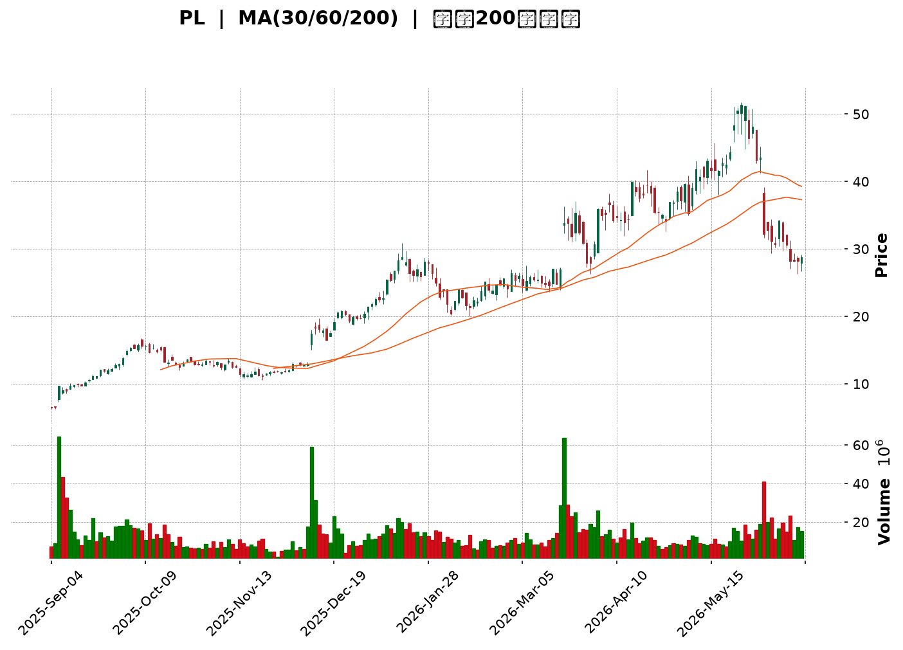
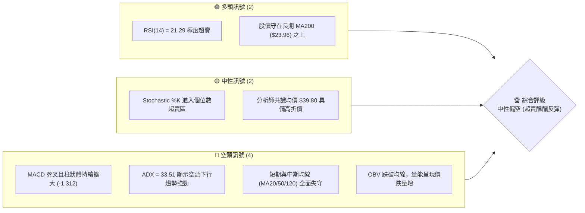
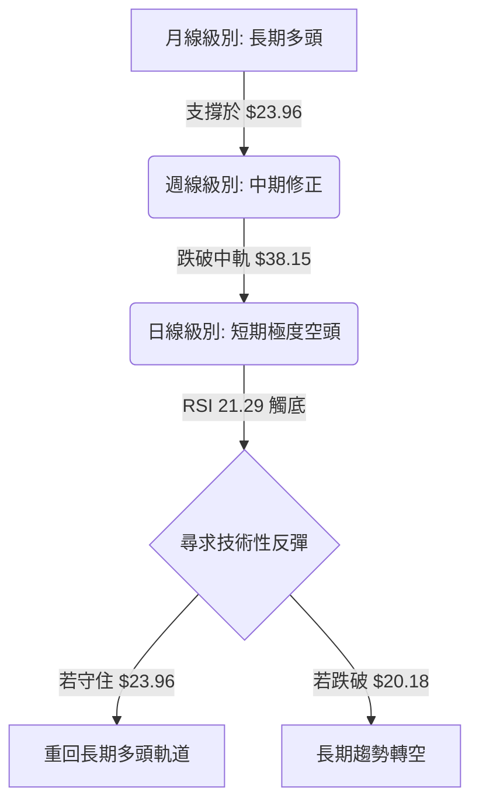
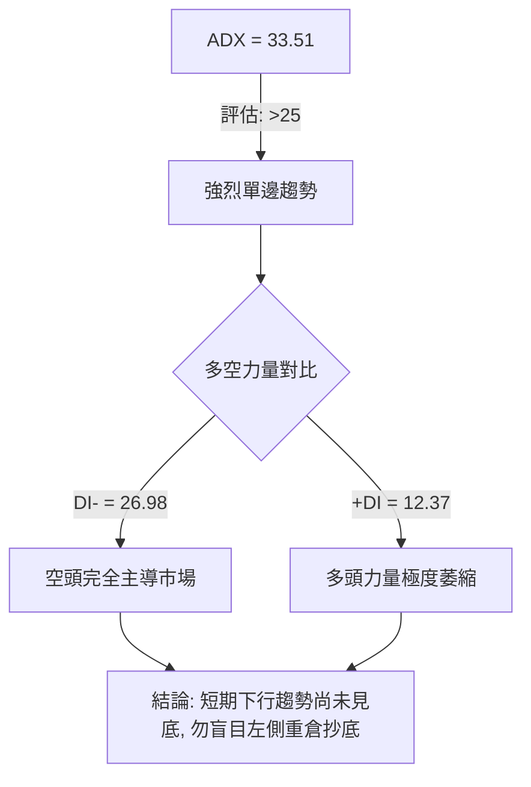
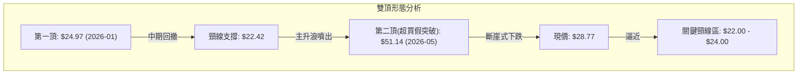
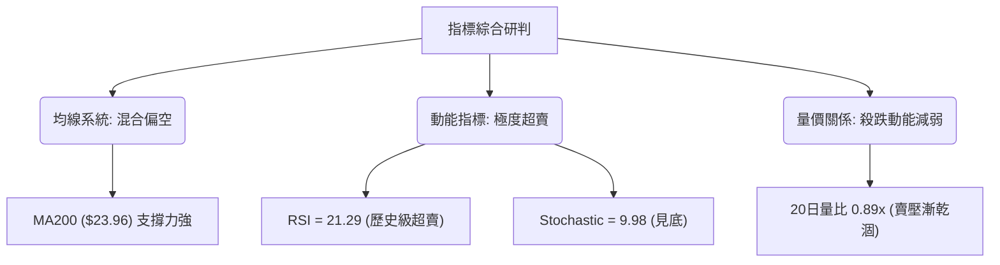
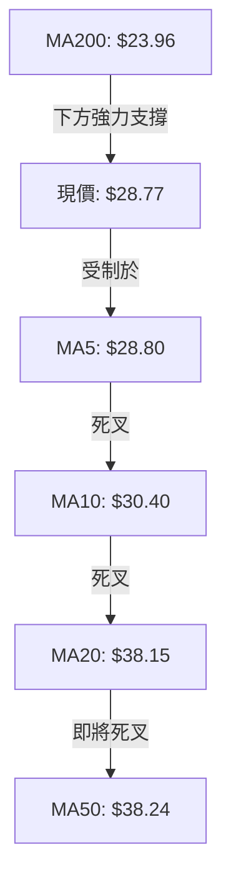
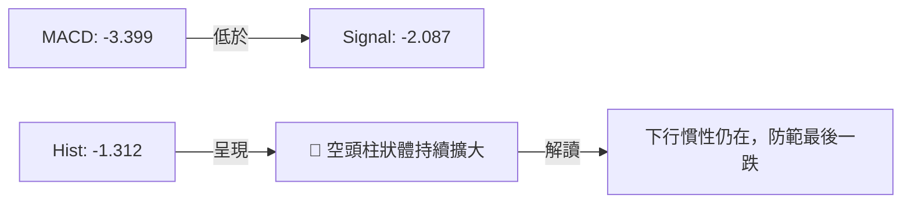

<details>
<summary>📊 靜態圖表 (點擊展開)</summary>

</details>

<html>
<head><meta charset="utf-8" /></head>
<body>
    <div style="height:500px; width:100%;">                        <script>window.PlotlyConfig = {MathJaxConfig: 'local'};</script>
        <script charset="utf-8" src="https://cdn.plot.ly/plotly-3.6.0.min.js" integrity="sha256-QaOVwtVY0T02VaHrr6pnoHLCwayMJp4O5n4YyaE3rJk=" crossorigin="anonymous"></script>                <div id="candlestick-chart" class="plotly-graph-div" style="height:100%; width:100%;"></div>            <script>                window.PLOTLYENV=window.PLOTLYENV || {};                                if (document.getElementById("candlestick-chart")) {                    Plotly.newPlot(                        "candlestick-chart",                        [{"close":{"dtype":"f8","bdata":"AAAAQArXGUAAAABguB4aQAAAAIDrUSNAAAAAgD0KIkAAAADgo\u002fAhQAAAAEAKVyNAAAAAIFyPI0AAAADgUbgjQAAAAAAAgCNAAAAAgMJ1JEAAAADgUTglQAAAAOBROCZAAAAA4FE4JkAAAACgmRkoQAAAAAAp3CdAAAAAIIXrJ0AAAABgZmYoQAAAAOB6lClAAAAAgML1KUAAAACAPYorQAAAAEAzsy1AAAAAYLieLkAAAABA4XouQAAAAAApXC9AAAAAQDMzL0AAAACA61EvQAAAAGBmZi1AAAAAAACALkAAAAAgXI8tQAAAAIAULi5AAAAAgMJ1KkAAAADgUTgqQAAAAGC4HitAAAAAgOvRKUAAAAAAAAApQAAAAGBm5ilAAAAA4FE4K0AAAABguJ4qQAAAAIAUrilAAAAAwMzMKUAAAADgUbgpQAAAAGBm5ipAAAAAoEdhKkAAAABgZmYpQAAAAAAAgCpAAAAAIIXrKEAAAABguJ4pQAAAACCuxypAAAAA4KPwKEAAAACgR+EoQAAAAIDr0SZAAAAAwMzMJkAAAAAghWsmQAAAAGBm5iZAAAAA4HqUJ0AAAACAwnUmQAAAAIDrUSZAAAAA4HoUJ0AAAACAwnUnQAAAAOCjcCdAAAAAwMzMJ0AAAABgZmYnQAAAAIA9iidAAAAAwB4FKEAAAACgR+EpQAAAAIA9iilAAAAAYGbmKUAAAACAFK4pQAAAAKBH4SlAAAAA4FF4MUAAAACgcD0yQAAAAMDMDDJAAAAAoEfhMUAAAADgUXgwQAAAAKBwfTFAAAAAgBQuM0AAAACgmZk0QAAAAEDhujRAAAAAgOtRNEAAAAAAKVwzQAAAAGC43jNAAAAAoHC9M0AAAADgUbgzQAAAAMD1aDRAAAAAANdjNUAAAABACtc1QAAAAAApnDZAAAAA4KNwNkAAAACAwrU2QAAAAOCjcDlAAAAAgOtROUAAAABA4bo6QAAAACCuRzxAAAAAIK7HPEAAAAAAAAA8QAAAAKBHYTpAAAAAIFwPOkAAAADgo\u002fA6QAAAAGC43jlAAAAAgOsRPEAAAACgR+E7QAAAAKCZWTpAAAAA4FH4OEAAAACgmdk2QAAAAEAz8zdAAAAAwB7FNUAAAACAFG40QAAAAGCPQjZAAAAAwB4FOEAAAACAPco2QAAAAGBmpjVAAAAAwMxMNUAAAAAghWs2QAAAAIDCNTZAAAAAoHC9N0AAAAAAKRw5QAAAAGBm5jdAAAAAIK7HN0AAAACAwrU4QAAAAKBHoThAAAAAoJmZOUAAAAAA1yM4QAAAAAApXDpAAAAAwMxMOUAAAAAAAAA6QAAAAEAKlzhAAAAAIK5HOUAAAACA69E5QAAAAGBmZjlAAAAA4KNwOUAAAADgUfg4QAAAAIA9yjhAAAAAoJmZOEAAAADgehQ7QAAAACBczzhAAAAAgML1OkAAAACAPepAQAAAAMD16EBAAAAA4HrUP0AAAAAgXK9BQAAAAEAzM0BAAAAAACncPkAAAAAA1+M7QAAAAEAz8ztAAAAAgMK1PkAAAADgo\u002fBBQAAAAGCPgkFAAAAAgMKVQUAAAABgZkZCQAAAAKBwHUFAAAAAgMJVQUAAAADA9ShBQAAAAEAK90BAAAAA4Ho0QUAAAACA6\u002fFDQAAAAKBwPUNAAAAAAADAQkAAAAAA1wNDQAAAAAApvENAAAAAwB4lQ0AAAADgUbhBQAAAAKCZuUFAAAAAANeDQUAAAACAPQpBQAAAAAApfEJAAAAAQDNzQkAAAADAHkVDQAAAAOCjkEJAAAAA4FHYQ0AAAABguJ5BQAAAAMAehUNAAAAAIIXrREAAAABACldEQAAAAGC4XkRAAAAAwB6FRUAAAAAgXM9EQAAAAIAUzkRAAAAAIIXLREAAAADgelRFQAAAAKBwPUVAAAAAwMwsRkAAAADA9ShIQAAAAKBwPUlAAAAAQDOzSUAAAACA65FJQAAAAEDhOkdAAAAAIIULSEAAAADgo5BFQAAAAADXw0VAAAAAACkcQEAAAABguF5AQAAAACCFKz9AAAAA4FG4PkAAAACAwhVBQAAAAGBmJj9AAAAA4HqUPkAAAACAwjU8QAAAAOBRODxAAAAAQOE6PEAAAADAHsU8QA=="},"high":{"dtype":"f8","bdata":"AAAAQDMzGkAAAACgmZkaQAAAAAB\u002faiNAAAAAACkcI0AAAABAM7MiQAAAAMD1KCRAAAAA4HqUI0AAAADgUTgkQAAAAEC28yNAAAAAwMzMJEAAAAAghWslQAAAAIDr0SZAAAAAwMxMJkAAAABgj0IoQAAAAIDCdShAAAAAIFyPKEAAAADA9agoQAAAAAAAACpAAAAAYLgeKkAAAACAPQosQAAAAMDINi5AAAAAAAAAL0AAAAAgrscvQAAAAGCPAjBAAAAAIK7HMEAAAACgmZkvQAAAAMDMDDBAAAAAYGbmL0AAAAAAAIAuQAAAAOB6VC9AAAAAQDUeL0AAAADA9SgrQAAAAIDr0SxAAAAAQAisKkAAAACgmRkqQAAAAAApnCpAAAAAgBRuK0AAAAAghesrQAAAAOCj8CpAAAAAIIWrKkAAAABgZmYqQAAAAIDCdStAAAAAYI\u002fCKkAAAACAPQorQAAAAOCjsCpAAAAAgD0KKkAAAABgZqYpQAAAAKCZmStAAAAAoHC9KkAAAADAzMwpQAAAAIDr0ShAAAAAQDOzJ0AAAADgUTgnQAAAAMAexSdAAAAAgML1KEAAAAAAAAApQAAAAAAAACdAAAAAIFxPJ0AAAACg7bwnQAAAAIA9CihAAAAAwB4FKEAAAAAA16MnQAAAAMAehShAAAAAoEdhKEAAAABgZmYqQAAAAAAAwClAAAAAgMJ1KkAAAAAAAAAqQAAAAEDheipAAAAAoJn5MUAAAACgmRkzQAAAAOCjsDNAAAAAIK5HMkAAAADAzIwyQAAAAEAz8zFAAAAA4HrUM0AAAABgj8I0QAAAAKBw\u002fTRAAAAAgBTuNEAAAACAwlU0QAAAAMAeJTRAAAAAACk8NEAAAADAzEw0QAAAACBczzRAAAAAIFxvNUAAAABAMxM2QAAAAAAp3DZAAAAAoJmZN0AAAACA6cY3QAAAACBcjzlAAAAAQAqXOkAAAADAHsU6QAAAAKBHYT1AAAAAYOPlPkAAAADgUbg9QAAAACCFqzxAAAAAgMDqOkAAAABA4bo7QAAAAEAzszpAAAAAQDOzPEAAAABgZmY8QAAAAEAzsztAAAAAAABAO0AAAADAocU5QAAAAACs\u002fDdAAAAAAAAAOEAAAACAwIo1QAAAACCuRzZAAAAA4FEYOEAAAABA4fo3QAAAAGBmhjdAAAAAwPXoNUAAAACAFO42QAAAAIA9yjZAAAAAoJmZOEAAAAAAKRw5QAAAAOCjsDlAAAAA4Hq0OEAAAAAgXM84QAAAAEBi0DlAAAAA4KOwOUAAAABACtc4QAAAAIAU7jpAAAAA4KNwOkAAAACgR4E6QAAAAKBwPTpAAAAAAKqRO0AAAABAChc6QAAAAOBReDpAAAAAIIXrOkAAAAAgXA86QAAAAIDpBjpAAAAAAACAOUAAAABAChc7QAAAAOB6FDtAAAAAYI9CO0AAAAAA1yNCQAAAACCFa0FAAAAAIIULQkAAAABgZoZCQAAAAADV2EFAAAAAYLgeQUAAAADA9Wg\u002fQAAAAIAU7jxAAAAAgBQuP0AAAADAHgVCQAAAAMAeJUJAAAAAYGbmQUAAAABA4RpDQAAAAIDClUJAAAAAgOsxQkAAAACAFL5BQAAAACBYOUJAAAAAgMKVQUAAAACgcB1EQAAAAKBwHURAAAAA4Hr0Q0AAAAAA18NDQAAAAEDh2kRAAAAAAAAAREAAAAAAAMBDQAAAAKBwHUJAAAAAQAqnQUAAAAAAAIBBQAAAAAApfEJAAAAA4HqkQkAAAABgj6JDQAAAAEAKt0NAAAAAoEfhQ0AAAACAwnVEQAAAAMDM7ENAAAAAIFyPRUAAAADgo\u002fBEQAAAAKCZGUVAAAAAoJm5RUAAAABACpdFQAAAAADX40ZAAAAAAADgREAAAABgZsZFQAAAAAAAAEZAAAAAQAyiRkAAAADgo5BJQAAAAKBwfUlAAAAAoEfhSUAAAABgj6JJQAAAAAAAYElAAAAAYI9iSUAAAAAgXM9HQAAAAMAelUZAAAAAQAqXQ0AAAADAHgVBQAAAACBcL0FAAAAAwMzMP0AAAADA9ShBQAAAAEAzE0FAAAAAgOsRQEAAAAAAAEA\u002fQAAAAKCZWT1AAAAAAAAAPUAAAABgjyI9QA=="},"hovertemplate":"\u003cb\u003e%{x|%Y-%m-%d}\u003c\u002fb\u003e\u003cbr\u003e\u958b: $%{open:.2f}\u003cbr\u003e\u9ad8: $%{high:.2f}\u003cbr\u003e\u4f4e: $%{low:.2f}\u003cbr\u003e\u6536: $%{close:.2f}\u003cextra\u003e\u003c\u002fextra\u003e","low":{"dtype":"f8","bdata":"AAAAwPUoGUAAAADAHgUZQAAAAMD1KB1AAAAAwB4FIUAAAADgozAhQAAAAGCPQiJAAAAAIK7HIkAAAADgUfgiQAAAAIDrUSNAAAAAAClcI0AAAADgo3AkQAAAAEDhOiVAAAAA4KNwJUAAAAAA1yMmQAAAAEAKVydAAAAAQArXJkAAAADAHoUnQAAAAOBRuChAAAAAoHA9KEAAAABAMzMpQAAAAMD1KCxAAAAAwB6FLUAAAACgR2EuQAAAACBcjy1AAAAAwB6FLkAAAADA9SguQAAAAAApHC1AAAAAgOtRLkAAAABAChctQAAAAEAzsy1AAAAAoHA9KkAAAAAg3SQpQAAAAAAAACtAAAAAYLieKUAAAADgo\u002fAnQAAAAIAULilAAAAAIK5HKkAAAACAPYoqQAAAACBcjylAAAAAIK6HKUAAAABA3w8pQAAAACCuxylAAAAAgMJ1KUAAAAAghesoQAAAACBcDylAAAAAANcjKEAAAAAAKdwnQAAAAGAQ2ClAAAAAIFyPKEAAAADA9agoQAAAAEAKFyZAAAAAwMh2JUAAAABgj8IlQAAAAIAU7iVAAAAAwMzMJkAAAACAly4mQAAAAIA9CiVAAAAAwB6FJkAAAADAHoUmQAAAAGCPQidAAAAAgJduJ0AAAADAzMwmQAAAAOB6VCdAAAAAQOF6J0AAAAAAKdwnQAAAAMAeBSlAAAAAoHA9KUAAAABANR4pQAAAAMD1KClAAAAAwB4FLkAAAABguF4xQAAAAADXozFAAAAAgBTuMEAAAACAFG4wQAAAAIA9CjFAAAAAoHD9MUAAAAAAKZwzQAAAAKCZmTNAAAAAACkcNEAAAACAPQozQAAAAGCPwjJAAAAA4KNwM0AAAABAiaEzQAAAAADV+DJAAAAAoHB9M0AAAADgUfg0QAAAAMD1aDVAAAAAQAoXNkAAAADAINA1QAAAAMD1KDdAAAAAYLgeOUAAAAAAAAA5QAAAAGCPQjpAAAAAAClcPEAAAAAgXG87QAAAAKBHITlAAAAAANcjOUAAAACAFC45QAAAAOBRODlAAAAAoBoPOkAAAAAgXM86QAAAAMDMjDlAAAAAgOtxOEAAAABACnc2QAAAAMD16DZAAAAAQAqXNEAAAABgZiY0QAAAACBczzRAAAAAYGamNUAAAACAwrU2QAAAAMD16DRAAAAAQOH6M0AAAAAgBiE1QAAAAAAAgDVAAAAAoHA9NkAAAACAwnU2QAAAAGCPgjdAAAAAQOE6N0AAAACgmVk2QAAAAKBwfThAAAAAgOsROEAAAAAgrsc2QAAAAOBRuDdAAAAAoEdhOEAAAACAaBE5QAAAAGCPgjdAAAAAoJnZN0AAAABAM3M4QAAAAEAzMzlAAAAA4KPwOEAAAAAgrkc4QAAAACBcTzhAAAAA4HipN0AAAABgZmY4QAAAAGCPwjhAAAAA4KPwN0AAAACAaCFAQAAAAEDhOj9AAAAAACkcP0AAAACgRyE\u002fQAAAACBcD0BAAAAAgD2KPkAAAABguD47QAAAAMD1SDpAAAAAwB6FPEAAAADgo3A9QAAAAEDhGkFAAAAAYI9iQEAAAADgUbhBQAAAAOBR+EBAAAAAoJn5QEAAAAAAKVxAQAAAAKBH4T9AAAAAIK5nQEAAAABgZnZBQAAAACCF60JAAAAAQAp3QkAAAABgj8JCQAAAAADXI0NAAAAAgD0qQkAAAADgo5BBQAAAAOCj0EBAAAAAwPPdQEAAAADA9UhAQAAAAMBLJ0FAAAAA4KVrQUAAAADA9ehBQAAAAKCZ+UFAAAAAoEfBQUAAAABACndBQAAAAGBm5kFAAAAAwMwMQ0AAAACgRyFDQAAAAMDMbENAAAAAwMzMQ0AAAADAHkVEQAAAAKBHIURAAAAAYI8CQ0AAAACAwlVEQAAAAMAehURAAAAAwMyMRUAAAACAFO5GQAAAAIAUjkdAAAAAAACAR0AAAAAA12NGQAAAAADXw0ZAAAAAQOE6R0AAAADAHlVFQAAAAGBmpkRAAAAAwPWoP0AAAADgelQ\u002fQAAAAIDrUT1AAAAAQDMzPkAAAAAghWs+QAAAAMAexT1AAAAAACkcPkAAAACgQws7QAAAAOB6FDxAAAAA4HpUOkAAAACAwrU6QA=="},"name":"\u50f9\u683c","open":{"dtype":"f8","bdata":"AAAAQDMzGkAAAADgo3AaQAAAAIDr0R5AAAAAIK5HIUAAAABgZmYiQAAAAKBHYSJAAAAAoHA9I0AAAADgo\u002fAjQAAAAOBRuCNAAAAAAACAI0AAAACAwvUkQAAAAIDrUSVAAAAA4FG4JUAAAABA4XomQAAAACCuRyhAAAAAAAAAJ0AAAADgUbgnQAAAACCuxyhAAAAAYGZmKUAAAACAFK4pQAAAAOBRuCxAAAAAYGbmLUAAAACgmZkvQAAAAAAAAC5AAAAAwMyMMEAAAACAFC4vQAAAAOBRuC9AAAAAIIVrLkAAAAAAAAAuQAAAAGBm5i5AAAAA4KPwLkAAAAAAAAAqQAAAAIA9CixAAAAAAClcKkAAAAAAAIApQAAAAGCPQilAAAAAoJmZKkAAAABgZuYrQAAAAMDMzCpAAAAAIIXrKUAAAABA4XopQAAAACCuxylAAAAAwPWoKkAAAACAwnUpQAAAAIAUrilAAAAAwB4FKkAAAADgUTgoQAAAAIDCdSpAAAAAYGZmKkAAAABgj0IpQAAAAIA9iihAAAAAAAAAJkAAAAAAKVwmQAAAAOB6FCZAAAAAIIXrJkAAAABgZmYoQAAAAEDheiZAAAAAQDOzJkAAAADAHgUnQAAAAIA9iidAAAAAgOvRJ0AAAABAMzMnQAAAAGCPwidAAAAAwPWoJ0AAAABgZuYnQAAAAMAehSlAAAAAAClcKkAAAACgcD0pQAAAAKCZmSlAAAAA4HqUL0AAAADgo3AyQAAAACBczzJAAAAAYGamMUAAAACAFC4yQAAAAIA9CjFAAAAAoHD9MUAAAAAgrsczQAAAAMDMzDNAAAAAQOG6NEAAAADAzEw0QAAAAKBw3TJAAAAAIK4HNEAAAABguL4zQAAAAEDh2jNAAAAAQDOzNEAAAAAAAIA1QAAAAOBRuDVAAAAAoJnZNkAAAACgmZk2QAAAAMDMTDdAAAAAYI9COkAAAAAAAIA5QAAAACBczzpAAAAAQDNzPEAAAABACpc7QAAAAAAAgDxAAAAAAADAOkAAAABgjwI6QAAAAKCZmTpAAAAA4HoUOkAAAADAzAw8QAAAAEAzsztAAAAAQAq3OUAAAAAA1+M4QAAAAEDh+jdAAAAAAAAAOEAAAAAAAAA1QAAAAIA9CjVAAAAAgML1NUAAAABguN43QAAAAGBmhjdAAAAAgOuRNUAAAAAAAIA1QAAAAAAAADZAAAAAYGZmNkAAAADAHgU3QAAAAKBwvThAAAAAYGZmN0AAAAAAAEA3QAAAAMDMTDlAAAAAAACAOEAAAABAM5M4QAAAAOBRuDdAAAAAQOEaOkAAAACgmZk5QAAAAAAAgDlAAAAAANfjN0AAAABACtc4QAAAAIDr0TlAAAAAQApXOUAAAADgUfg5QAAAAEDh+jhAAAAAoEchOUAAAACgmdk4QAAAAAAAgDpAAAAAAABAOEAAAABgZsZAQAAAAAAAQEFAAAAAQOHaQEAAAABAMzNAQAAAAAApfEFAAAAAoHD9QEAAAACgmdk+QAAAAMDMzDxAAAAAAAAAPUAAAADgo3A9QAAAAIDC9UFAAAAA4KOwQUAAAABAM3NCQAAAAAAAQEJAAAAA4KNwQUAAAACgcB1BQAAAACCFy0FAAAAAgMI1QUAAAACgcH1BQAAAAIDrkUNAAAAAQDOTQ0AAAAAAKRxDQAAAAAAAwENAAAAAgD2qQ0AAAACAFI5DQAAAAAApvEFAAAAAwMxMQUAAAADgozBBQAAAAADXQ0FAAAAAIFxfQkAAAADAHoVCQAAAAKCZmUNAAAAAIFx\u002fQkAAAABgj8JDQAAAAEAzM0JAAAAAQDNTQ0AAAAAghQtEQAAAAEAKF0VAAAAA4KNQREAAAADA9QhFQAAAAADXo0VAAAAAQAp3REAAAABAMzNFQAAAAMByCEVAAAAAwMysRUAAAADA9dhHQAAAAMDMDElAAAAAQDMTSUAAAAAAAJBIQAAAACCFi0hAAAAAgMKVR0AAAAAgXM9HQAAAAKBwnUVAAAAAYGYmQ0AAAACgRwFBQAAAAIDCtUBAAAAAANfjPkAAAAAAAIA\u002fQAAAAIDr8UBAAAAAgD0KQEAAAADAHgU+QAAAAADXYzxAAAAAYGamPEAAAACAwvU7QA=="},"x":["2025-09-04T00:00:00-04:00","2025-09-05T00:00:00-04:00","2025-09-08T00:00:00-04:00","2025-09-09T00:00:00-04:00","2025-09-10T00:00:00-04:00","2025-09-11T00:00:00-04:00","2025-09-12T00:00:00-04:00","2025-09-15T00:00:00-04:00","2025-09-16T00:00:00-04:00","2025-09-17T00:00:00-04:00","2025-09-18T00:00:00-04:00","2025-09-19T00:00:00-04:00","2025-09-22T00:00:00-04:00","2025-09-23T00:00:00-04:00","2025-09-24T00:00:00-04:00","2025-09-25T00:00:00-04:00","2025-09-26T00:00:00-04:00","2025-09-29T00:00:00-04:00","2025-09-30T00:00:00-04:00","2025-10-01T00:00:00-04:00","2025-10-02T00:00:00-04:00","2025-10-03T00:00:00-04:00","2025-10-06T00:00:00-04:00","2025-10-07T00:00:00-04:00","2025-10-08T00:00:00-04:00","2025-10-09T00:00:00-04:00","2025-10-10T00:00:00-04:00","2025-10-13T00:00:00-04:00","2025-10-14T00:00:00-04:00","2025-10-15T00:00:00-04:00","2025-10-16T00:00:00-04:00","2025-10-17T00:00:00-04:00","2025-10-20T00:00:00-04:00","2025-10-21T00:00:00-04:00","2025-10-22T00:00:00-04:00","2025-10-23T00:00:00-04:00","2025-10-24T00:00:00-04:00","2025-10-27T00:00:00-04:00","2025-10-28T00:00:00-04:00","2025-10-29T00:00:00-04:00","2025-10-30T00:00:00-04:00","2025-10-31T00:00:00-04:00","2025-11-03T00:00:00-05:00","2025-11-04T00:00:00-05:00","2025-11-05T00:00:00-05:00","2025-11-06T00:00:00-05:00","2025-11-07T00:00:00-05:00","2025-11-10T00:00:00-05:00","2025-11-11T00:00:00-05:00","2025-11-12T00:00:00-05:00","2025-11-13T00:00:00-05:00","2025-11-14T00:00:00-05:00","2025-11-17T00:00:00-05:00","2025-11-18T00:00:00-05:00","2025-11-19T00:00:00-05:00","2025-11-20T00:00:00-05:00","2025-11-21T00:00:00-05:00","2025-11-24T00:00:00-05:00","2025-11-25T00:00:00-05:00","2025-11-26T00:00:00-05:00","2025-11-28T00:00:00-05:00","2025-12-01T00:00:00-05:00","2025-12-02T00:00:00-05:00","2025-12-03T00:00:00-05:00","2025-12-04T00:00:00-05:00","2025-12-05T00:00:00-05:00","2025-12-08T00:00:00-05:00","2025-12-09T00:00:00-05:00","2025-12-10T00:00:00-05:00","2025-12-11T00:00:00-05:00","2025-12-12T00:00:00-05:00","2025-12-15T00:00:00-05:00","2025-12-16T00:00:00-05:00","2025-12-17T00:00:00-05:00","2025-12-18T00:00:00-05:00","2025-12-19T00:00:00-05:00","2025-12-22T00:00:00-05:00","2025-12-23T00:00:00-05:00","2025-12-24T00:00:00-05:00","2025-12-26T00:00:00-05:00","2025-12-29T00:00:00-05:00","2025-12-30T00:00:00-05:00","2025-12-31T00:00:00-05:00","2026-01-02T00:00:00-05:00","2026-01-05T00:00:00-05:00","2026-01-06T00:00:00-05:00","2026-01-07T00:00:00-05:00","2026-01-08T00:00:00-05:00","2026-01-09T00:00:00-05:00","2026-01-12T00:00:00-05:00","2026-01-13T00:00:00-05:00","2026-01-14T00:00:00-05:00","2026-01-15T00:00:00-05:00","2026-01-16T00:00:00-05:00","2026-01-20T00:00:00-05:00","2026-01-21T00:00:00-05:00","2026-01-22T00:00:00-05:00","2026-01-23T00:00:00-05:00","2026-01-26T00:00:00-05:00","2026-01-27T00:00:00-05:00","2026-01-28T00:00:00-05:00","2026-01-29T00:00:00-05:00","2026-01-30T00:00:00-05:00","2026-02-02T00:00:00-05:00","2026-02-03T00:00:00-05:00","2026-02-04T00:00:00-05:00","2026-02-05T00:00:00-05:00","2026-02-06T00:00:00-05:00","2026-02-09T00:00:00-05:00","2026-02-10T00:00:00-05:00","2026-02-11T00:00:00-05:00","2026-02-12T00:00:00-05:00","2026-02-13T00:00:00-05:00","2026-02-17T00:00:00-05:00","2026-02-18T00:00:00-05:00","2026-02-19T00:00:00-05:00","2026-02-20T00:00:00-05:00","2026-02-23T00:00:00-05:00","2026-02-24T00:00:00-05:00","2026-02-25T00:00:00-05:00","2026-02-26T00:00:00-05:00","2026-02-27T00:00:00-05:00","2026-03-02T00:00:00-05:00","2026-03-03T00:00:00-05:00","2026-03-04T00:00:00-05:00","2026-03-05T00:00:00-05:00","2026-03-06T00:00:00-05:00","2026-03-09T00:00:00-04:00","2026-03-10T00:00:00-04:00","2026-03-11T00:00:00-04:00","2026-03-12T00:00:00-04:00","2026-03-13T00:00:00-04:00","2026-03-16T00:00:00-04:00","2026-03-17T00:00:00-04:00","2026-03-18T00:00:00-04:00","2026-03-19T00:00:00-04:00","2026-03-20T00:00:00-04:00","2026-03-23T00:00:00-04:00","2026-03-24T00:00:00-04:00","2026-03-25T00:00:00-04:00","2026-03-26T00:00:00-04:00","2026-03-27T00:00:00-04:00","2026-03-30T00:00:00-04:00","2026-03-31T00:00:00-04:00","2026-04-01T00:00:00-04:00","2026-04-02T00:00:00-04:00","2026-04-06T00:00:00-04:00","2026-04-07T00:00:00-04:00","2026-04-08T00:00:00-04:00","2026-04-09T00:00:00-04:00","2026-04-10T00:00:00-04:00","2026-04-13T00:00:00-04:00","2026-04-14T00:00:00-04:00","2026-04-15T00:00:00-04:00","2026-04-16T00:00:00-04:00","2026-04-17T00:00:00-04:00","2026-04-20T00:00:00-04:00","2026-04-21T00:00:00-04:00","2026-04-22T00:00:00-04:00","2026-04-23T00:00:00-04:00","2026-04-24T00:00:00-04:00","2026-04-27T00:00:00-04:00","2026-04-28T00:00:00-04:00","2026-04-29T00:00:00-04:00","2026-04-30T00:00:00-04:00","2026-05-01T00:00:00-04:00","2026-05-04T00:00:00-04:00","2026-05-05T00:00:00-04:00","2026-05-06T00:00:00-04:00","2026-05-07T00:00:00-04:00","2026-05-08T00:00:00-04:00","2026-05-11T00:00:00-04:00","2026-05-12T00:00:00-04:00","2026-05-13T00:00:00-04:00","2026-05-14T00:00:00-04:00","2026-05-15T00:00:00-04:00","2026-05-18T00:00:00-04:00","2026-05-19T00:00:00-04:00","2026-05-20T00:00:00-04:00","2026-05-21T00:00:00-04:00","2026-05-22T00:00:00-04:00","2026-05-26T00:00:00-04:00","2026-05-27T00:00:00-04:00","2026-05-28T00:00:00-04:00","2026-05-29T00:00:00-04:00","2026-06-01T00:00:00-04:00","2026-06-02T00:00:00-04:00","2026-06-03T00:00:00-04:00","2026-06-04T00:00:00-04:00","2026-06-05T00:00:00-04:00","2026-06-08T00:00:00-04:00","2026-06-09T00:00:00-04:00","2026-06-10T00:00:00-04:00","2026-06-11T00:00:00-04:00","2026-06-12T00:00:00-04:00","2026-06-15T00:00:00-04:00","2026-06-16T00:00:00-04:00","2026-06-17T00:00:00-04:00","2026-06-18T00:00:00-04:00","2026-06-22T00:00:00-04:00"],"type":"candlestick"},{"hovertemplate":"MA30: $%{y:.2f}\u003cextra\u003e\u003c\u002fextra\u003e","line":{"color":"#2196F3","dash":"dash","width":2},"mode":"lines","name":"MA30","x":["2025-09-04T00:00:00-04:00","2025-09-05T00:00:00-04:00","2025-09-08T00:00:00-04:00","2025-09-09T00:00:00-04:00","2025-09-10T00:00:00-04:00","2025-09-11T00:00:00-04:00","2025-09-12T00:00:00-04:00","2025-09-15T00:00:00-04:00","2025-09-16T00:00:00-04:00","2025-09-17T00:00:00-04:00","2025-09-18T00:00:00-04:00","2025-09-19T00:00:00-04:00","2025-09-22T00:00:00-04:00","2025-09-23T00:00:00-04:00","2025-09-24T00:00:00-04:00","2025-09-25T00:00:00-04:00","2025-09-26T00:00:00-04:00","2025-09-29T00:00:00-04:00","2025-09-30T00:00:00-04:00","2025-10-01T00:00:00-04:00","2025-10-02T00:00:00-04:00","2025-10-03T00:00:00-04:00","2025-10-06T00:00:00-04:00","2025-10-07T00:00:00-04:00","2025-10-08T00:00:00-04:00","2025-10-09T00:00:00-04:00","2025-10-10T00:00:00-04:00","2025-10-13T00:00:00-04:00","2025-10-14T00:00:00-04:00","2025-10-15T00:00:00-04:00","2025-10-16T00:00:00-04:00","2025-10-17T00:00:00-04:00","2025-10-20T00:00:00-04:00","2025-10-21T00:00:00-04:00","2025-10-22T00:00:00-04:00","2025-10-23T00:00:00-04:00","2025-10-24T00:00:00-04:00","2025-10-27T00:00:00-04:00","2025-10-28T00:00:00-04:00","2025-10-29T00:00:00-04:00","2025-10-30T00:00:00-04:00","2025-10-31T00:00:00-04:00","2025-11-03T00:00:00-05:00","2025-11-04T00:00:00-05:00","2025-11-05T00:00:00-05:00","2025-11-06T00:00:00-05:00","2025-11-07T00:00:00-05:00","2025-11-10T00:00:00-05:00","2025-11-11T00:00:00-05:00","2025-11-12T00:00:00-05:00","2025-11-13T00:00:00-05:00","2025-11-14T00:00:00-05:00","2025-11-17T00:00:00-05:00","2025-11-18T00:00:00-05:00","2025-11-19T00:00:00-05:00","2025-11-20T00:00:00-05:00","2025-11-21T00:00:00-05:00","2025-11-24T00:00:00-05:00","2025-11-25T00:00:00-05:00","2025-11-26T00:00:00-05:00","2025-11-28T00:00:00-05:00","2025-12-01T00:00:00-05:00","2025-12-02T00:00:00-05:00","2025-12-03T00:00:00-05:00","2025-12-04T00:00:00-05:00","2025-12-05T00:00:00-05:00","2025-12-08T00:00:00-05:00","2025-12-09T00:00:00-05:00","2025-12-10T00:00:00-05:00","2025-12-11T00:00:00-05:00","2025-12-12T00:00:00-05:00","2025-12-15T00:00:00-05:00","2025-12-16T00:00:00-05:00","2025-12-17T00:00:00-05:00","2025-12-18T00:00:00-05:00","2025-12-19T00:00:00-05:00","2025-12-22T00:00:00-05:00","2025-12-23T00:00:00-05:00","2025-12-24T00:00:00-05:00","2025-12-26T00:00:00-05:00","2025-12-29T00:00:00-05:00","2025-12-30T00:00:00-05:00","2025-12-31T00:00:00-05:00","2026-01-02T00:00:00-05:00","2026-01-05T00:00:00-05:00","2026-01-06T00:00:00-05:00","2026-01-07T00:00:00-05:00","2026-01-08T00:00:00-05:00","2026-01-09T00:00:00-05:00","2026-01-12T00:00:00-05:00","2026-01-13T00:00:00-05:00","2026-01-14T00:00:00-05:00","2026-01-15T00:00:00-05:00","2026-01-16T00:00:00-05:00","2026-01-20T00:00:00-05:00","2026-01-21T00:00:00-05:00","2026-01-22T00:00:00-05:00","2026-01-23T00:00:00-05:00","2026-01-26T00:00:00-05:00","2026-01-27T00:00:00-05:00","2026-01-28T00:00:00-05:00","2026-01-29T00:00:00-05:00","2026-01-30T00:00:00-05:00","2026-02-02T00:00:00-05:00","2026-02-03T00:00:00-05:00","2026-02-04T00:00:00-05:00","2026-02-05T00:00:00-05:00","2026-02-06T00:00:00-05:00","2026-02-09T00:00:00-05:00","2026-02-10T00:00:00-05:00","2026-02-11T00:00:00-05:00","2026-02-12T00:00:00-05:00","2026-02-13T00:00:00-05:00","2026-02-17T00:00:00-05:00","2026-02-18T00:00:00-05:00","2026-02-19T00:00:00-05:00","2026-02-20T00:00:00-05:00","2026-02-23T00:00:00-05:00","2026-02-24T00:00:00-05:00","2026-02-25T00:00:00-05:00","2026-02-26T00:00:00-05:00","2026-02-27T00:00:00-05:00","2026-03-02T00:00:00-05:00","2026-03-03T00:00:00-05:00","2026-03-04T00:00:00-05:00","2026-03-05T00:00:00-05:00","2026-03-06T00:00:00-05:00","2026-03-09T00:00:00-04:00","2026-03-10T00:00:00-04:00","2026-03-11T00:00:00-04:00","2026-03-12T00:00:00-04:00","2026-03-13T00:00:00-04:00","2026-03-16T00:00:00-04:00","2026-03-17T00:00:00-04:00","2026-03-18T00:00:00-04:00","2026-03-19T00:00:00-04:00","2026-03-20T00:00:00-04:00","2026-03-23T00:00:00-04:00","2026-03-24T00:00:00-04:00","2026-03-25T00:00:00-04:00","2026-03-26T00:00:00-04:00","2026-03-27T00:00:00-04:00","2026-03-30T00:00:00-04:00","2026-03-31T00:00:00-04:00","2026-04-01T00:00:00-04:00","2026-04-02T00:00:00-04:00","2026-04-06T00:00:00-04:00","2026-04-07T00:00:00-04:00","2026-04-08T00:00:00-04:00","2026-04-09T00:00:00-04:00","2026-04-10T00:00:00-04:00","2026-04-13T00:00:00-04:00","2026-04-14T00:00:00-04:00","2026-04-15T00:00:00-04:00","2026-04-16T00:00:00-04:00","2026-04-17T00:00:00-04:00","2026-04-20T00:00:00-04:00","2026-04-21T00:00:00-04:00","2026-04-22T00:00:00-04:00","2026-04-23T00:00:00-04:00","2026-04-24T00:00:00-04:00","2026-04-27T00:00:00-04:00","2026-04-28T00:00:00-04:00","2026-04-29T00:00:00-04:00","2026-04-30T00:00:00-04:00","2026-05-01T00:00:00-04:00","2026-05-04T00:00:00-04:00","2026-05-05T00:00:00-04:00","2026-05-06T00:00:00-04:00","2026-05-07T00:00:00-04:00","2026-05-08T00:00:00-04:00","2026-05-11T00:00:00-04:00","2026-05-12T00:00:00-04:00","2026-05-13T00:00:00-04:00","2026-05-14T00:00:00-04:00","2026-05-15T00:00:00-04:00","2026-05-18T00:00:00-04:00","2026-05-19T00:00:00-04:00","2026-05-20T00:00:00-04:00","2026-05-21T00:00:00-04:00","2026-05-22T00:00:00-04:00","2026-05-26T00:00:00-04:00","2026-05-27T00:00:00-04:00","2026-05-28T00:00:00-04:00","2026-05-29T00:00:00-04:00","2026-06-01T00:00:00-04:00","2026-06-02T00:00:00-04:00","2026-06-03T00:00:00-04:00","2026-06-04T00:00:00-04:00","2026-06-05T00:00:00-04:00","2026-06-08T00:00:00-04:00","2026-06-09T00:00:00-04:00","2026-06-10T00:00:00-04:00","2026-06-11T00:00:00-04:00","2026-06-12T00:00:00-04:00","2026-06-15T00:00:00-04:00","2026-06-16T00:00:00-04:00","2026-06-17T00:00:00-04:00","2026-06-18T00:00:00-04:00","2026-06-22T00:00:00-04:00"],"y":{"dtype":"f8","bdata":"AAAAAAAA+H8AAAAAAAD4fwAAAAAAAPh\u002fAAAAAAAA+H8AAAAAAAD4fwAAAAAAAPh\u002fAAAAAAAA+H8AAAAAAAD4fwAAAAAAAPh\u002fAAAAAAAA+H8AAAAAAAD4fwAAAAAAAPh\u002fAAAAAAAA+H8AAAAAAAD4fwAAAAAAAPh\u002fAAAAAAAA+H8AAAAAAAD4fwAAAAAAAPh\u002fAAAAAAAA+H8AAAAAAAD4fwAAAAAAAPh\u002fAAAAAAAA+H8AAAAAAAD4fwAAAAAAAPh\u002fAAAAAAAA+H8AAAAAAAD4fwAAAAAAAPh\u002fAAAAAAAA+H8AAAAAAAD4f6uqqpJfLChA7+7uJuqfKEC8u7ubNhApQImIiPjFUilAMzMzoymVKUARERFxaNEpQKuqqvpiCSpAERERgcBKKkCamZnJoYUqQERERDReuipAzczMnO\u002fnKkAzMzMDVg4rQBEREaFFNitAmpmZScVZK0De3d0t3WQrQImIiFhkeytAERER4eyDK0AzMzMDVo4rQERERHSTmCtAvLu7O9+PK0Dv7u5eLHkrQHd3d8d2PitAmpmZubv7KkAzMzNj9LYqQLy7uzvDbipAZmZmFr0tKkDv7u4eIuIpQAAAAKC3pSlAMzMzY2ZmKUC8u7u7WDIpQKuqqvrU+ChA7+7uHiLiKEDNzMy8EcooQLy7uxuFqyhAMzMz8yicKEBmZmZWq6MoQImIiOiYoChAMzMzU1WVKEDNzMzcT40oQERERMQEjyhAZmZmZgPdKECrqqr61DgpQO\u002fu7q5WhylAq6qqmmHXKUC8u7v7uBcqQDMzM9MVYCpARERE9MXSKkC8u7v7uFcrQN7d3e391CtAmpmZGfdaLEC8u7sLEdEsQKuqqlpzYS1A7+7uXsnvLUAAAAAgBoEuQGZmZvbwGS9AAAAAAMi9L0BmZmbmbTkwQO\u002fu7s4imzBAEREROSb4MEDe3d1l2FUxQCIiIjLsyjFAIiIionA9MkAzMzMrsr0yQImIiNCUSjNAiYiIcK\u002fZM0AzMzODMlo0QCIiIgJWzjRAVVVVPTU+NUAREREph7Y1QN7d3S3dJDZAvLu7O1F\u002fNkAiIiIilNE2QDMzM8NnGDdAq6qqGuhUN0De3d1tWYs3QERERIR5wjdAVVVVdZPYN0BmZmYWINc3QM3MzGwu5DdAMzMzM8EDOEBmZmYmBiE4QN7d3Z02MDhAzczMfIY9OECrqqq6kFQ4QDMzM+PsYzhAq6qqivp3OEB3d3f34ZM4QDMzMwPknjhAmpmZSVOqOECrqqpaZLs4QBEREeF6tDhAzczMjN62OEC8u7ubxKA4QN7d3U1ikDhAAAAAILByOEDv7u4On2E4QO\u002fu7r5YUjhAAAAA0LBLOEAiIiIiIkI4QGZmZmYfPjhAREREFK4nOEBmZmYW2Q44QHd3dzeJAThAERER8WD+N0BERESEeSI4QGZmZjbQKThAAAAA8BlWOEAAAACwcsg4QEREROQXKzlAiYiIGL1tOUBVVVWFFtk5QCIiIkLSNDpAZmZmZmaGOkC8u7vLE7U6QFVVVQUP5jpAd3d3N4khO0BERESkcH07QHd3d6dU3DtAvLu7e4Y9PEC8u7tbj6I8QBEREeF69DxAd3d3l+BBPUBEREQkv5g9QO\u002fu7g5Y2T1AiYiIKBUnPkAzMzNTnJ0+QN7d3X0jFD9AzczMfGp8P0AzMzOjm+Q\u002fQDMzMwNWLkBAvLu7oyllQEC8u7ur1ZFAQLy7uztRv0BAq6qqktHrQEARERFxrwlBQAAAAGiRPUFAIiIiivpnQUBVVVUdE3xBQM3MzIQyikFAvLu7u7urQUDe3d29LatBQERERGSCx0FAq6qqelv2QUAiIiKS7SxCQJqZmal\u002fY0JAAAAAUBuYQkC8u7vrmLBCQFVVVfW2zEJAAAAAUBvoQkAAAAAQLQJDQDMzM0NgJUNAd3d3Z61OQ0AzMzMjaYpDQGZmZiYG0UNAMzMzw4MZREAzMzPDg0lEQM3MzAyQa0RAd3d3J7+YREB3d3e3ga5EQBEREVHUv0RAIiIiQu6lREBEREQkaZpEQFVVVT0miERAIiIiksJ1REDv7u7eJHZEQImIiOBPXURAAAAAwFhCREAiIiKiRRZEQBEREYlB8ENAERERKVy\u002fQ0CamZkxwaNDQA=="},"type":"scatter"},{"hovertemplate":"MA60: $%{y:.2f}\u003cextra\u003e\u003c\u002fextra\u003e","line":{"color":"#9C27B0","dash":"dash","width":2},"mode":"lines","name":"MA60","x":["2025-09-04T00:00:00-04:00","2025-09-05T00:00:00-04:00","2025-09-08T00:00:00-04:00","2025-09-09T00:00:00-04:00","2025-09-10T00:00:00-04:00","2025-09-11T00:00:00-04:00","2025-09-12T00:00:00-04:00","2025-09-15T00:00:00-04:00","2025-09-16T00:00:00-04:00","2025-09-17T00:00:00-04:00","2025-09-18T00:00:00-04:00","2025-09-19T00:00:00-04:00","2025-09-22T00:00:00-04:00","2025-09-23T00:00:00-04:00","2025-09-24T00:00:00-04:00","2025-09-25T00:00:00-04:00","2025-09-26T00:00:00-04:00","2025-09-29T00:00:00-04:00","2025-09-30T00:00:00-04:00","2025-10-01T00:00:00-04:00","2025-10-02T00:00:00-04:00","2025-10-03T00:00:00-04:00","2025-10-06T00:00:00-04:00","2025-10-07T00:00:00-04:00","2025-10-08T00:00:00-04:00","2025-10-09T00:00:00-04:00","2025-10-10T00:00:00-04:00","2025-10-13T00:00:00-04:00","2025-10-14T00:00:00-04:00","2025-10-15T00:00:00-04:00","2025-10-16T00:00:00-04:00","2025-10-17T00:00:00-04:00","2025-10-20T00:00:00-04:00","2025-10-21T00:00:00-04:00","2025-10-22T00:00:00-04:00","2025-10-23T00:00:00-04:00","2025-10-24T00:00:00-04:00","2025-10-27T00:00:00-04:00","2025-10-28T00:00:00-04:00","2025-10-29T00:00:00-04:00","2025-10-30T00:00:00-04:00","2025-10-31T00:00:00-04:00","2025-11-03T00:00:00-05:00","2025-11-04T00:00:00-05:00","2025-11-05T00:00:00-05:00","2025-11-06T00:00:00-05:00","2025-11-07T00:00:00-05:00","2025-11-10T00:00:00-05:00","2025-11-11T00:00:00-05:00","2025-11-12T00:00:00-05:00","2025-11-13T00:00:00-05:00","2025-11-14T00:00:00-05:00","2025-11-17T00:00:00-05:00","2025-11-18T00:00:00-05:00","2025-11-19T00:00:00-05:00","2025-11-20T00:00:00-05:00","2025-11-21T00:00:00-05:00","2025-11-24T00:00:00-05:00","2025-11-25T00:00:00-05:00","2025-11-26T00:00:00-05:00","2025-11-28T00:00:00-05:00","2025-12-01T00:00:00-05:00","2025-12-02T00:00:00-05:00","2025-12-03T00:00:00-05:00","2025-12-04T00:00:00-05:00","2025-12-05T00:00:00-05:00","2025-12-08T00:00:00-05:00","2025-12-09T00:00:00-05:00","2025-12-10T00:00:00-05:00","2025-12-11T00:00:00-05:00","2025-12-12T00:00:00-05:00","2025-12-15T00:00:00-05:00","2025-12-16T00:00:00-05:00","2025-12-17T00:00:00-05:00","2025-12-18T00:00:00-05:00","2025-12-19T00:00:00-05:00","2025-12-22T00:00:00-05:00","2025-12-23T00:00:00-05:00","2025-12-24T00:00:00-05:00","2025-12-26T00:00:00-05:00","2025-12-29T00:00:00-05:00","2025-12-30T00:00:00-05:00","2025-12-31T00:00:00-05:00","2026-01-02T00:00:00-05:00","2026-01-05T00:00:00-05:00","2026-01-06T00:00:00-05:00","2026-01-07T00:00:00-05:00","2026-01-08T00:00:00-05:00","2026-01-09T00:00:00-05:00","2026-01-12T00:00:00-05:00","2026-01-13T00:00:00-05:00","2026-01-14T00:00:00-05:00","2026-01-15T00:00:00-05:00","2026-01-16T00:00:00-05:00","2026-01-20T00:00:00-05:00","2026-01-21T00:00:00-05:00","2026-01-22T00:00:00-05:00","2026-01-23T00:00:00-05:00","2026-01-26T00:00:00-05:00","2026-01-27T00:00:00-05:00","2026-01-28T00:00:00-05:00","2026-01-29T00:00:00-05:00","2026-01-30T00:00:00-05:00","2026-02-02T00:00:00-05:00","2026-02-03T00:00:00-05:00","2026-02-04T00:00:00-05:00","2026-02-05T00:00:00-05:00","2026-02-06T00:00:00-05:00","2026-02-09T00:00:00-05:00","2026-02-10T00:00:00-05:00","2026-02-11T00:00:00-05:00","2026-02-12T00:00:00-05:00","2026-02-13T00:00:00-05:00","2026-02-17T00:00:00-05:00","2026-02-18T00:00:00-05:00","2026-02-19T00:00:00-05:00","2026-02-20T00:00:00-05:00","2026-02-23T00:00:00-05:00","2026-02-24T00:00:00-05:00","2026-02-25T00:00:00-05:00","2026-02-26T00:00:00-05:00","2026-02-27T00:00:00-05:00","2026-03-02T00:00:00-05:00","2026-03-03T00:00:00-05:00","2026-03-04T00:00:00-05:00","2026-03-05T00:00:00-05:00","2026-03-06T00:00:00-05:00","2026-03-09T00:00:00-04:00","2026-03-10T00:00:00-04:00","2026-03-11T00:00:00-04:00","2026-03-12T00:00:00-04:00","2026-03-13T00:00:00-04:00","2026-03-16T00:00:00-04:00","2026-03-17T00:00:00-04:00","2026-03-18T00:00:00-04:00","2026-03-19T00:00:00-04:00","2026-03-20T00:00:00-04:00","2026-03-23T00:00:00-04:00","2026-03-24T00:00:00-04:00","2026-03-25T00:00:00-04:00","2026-03-26T00:00:00-04:00","2026-03-27T00:00:00-04:00","2026-03-30T00:00:00-04:00","2026-03-31T00:00:00-04:00","2026-04-01T00:00:00-04:00","2026-04-02T00:00:00-04:00","2026-04-06T00:00:00-04:00","2026-04-07T00:00:00-04:00","2026-04-08T00:00:00-04:00","2026-04-09T00:00:00-04:00","2026-04-10T00:00:00-04:00","2026-04-13T00:00:00-04:00","2026-04-14T00:00:00-04:00","2026-04-15T00:00:00-04:00","2026-04-16T00:00:00-04:00","2026-04-17T00:00:00-04:00","2026-04-20T00:00:00-04:00","2026-04-21T00:00:00-04:00","2026-04-22T00:00:00-04:00","2026-04-23T00:00:00-04:00","2026-04-24T00:00:00-04:00","2026-04-27T00:00:00-04:00","2026-04-28T00:00:00-04:00","2026-04-29T00:00:00-04:00","2026-04-30T00:00:00-04:00","2026-05-01T00:00:00-04:00","2026-05-04T00:00:00-04:00","2026-05-05T00:00:00-04:00","2026-05-06T00:00:00-04:00","2026-05-07T00:00:00-04:00","2026-05-08T00:00:00-04:00","2026-05-11T00:00:00-04:00","2026-05-12T00:00:00-04:00","2026-05-13T00:00:00-04:00","2026-05-14T00:00:00-04:00","2026-05-15T00:00:00-04:00","2026-05-18T00:00:00-04:00","2026-05-19T00:00:00-04:00","2026-05-20T00:00:00-04:00","2026-05-21T00:00:00-04:00","2026-05-22T00:00:00-04:00","2026-05-26T00:00:00-04:00","2026-05-27T00:00:00-04:00","2026-05-28T00:00:00-04:00","2026-05-29T00:00:00-04:00","2026-06-01T00:00:00-04:00","2026-06-02T00:00:00-04:00","2026-06-03T00:00:00-04:00","2026-06-04T00:00:00-04:00","2026-06-05T00:00:00-04:00","2026-06-08T00:00:00-04:00","2026-06-09T00:00:00-04:00","2026-06-10T00:00:00-04:00","2026-06-11T00:00:00-04:00","2026-06-12T00:00:00-04:00","2026-06-15T00:00:00-04:00","2026-06-16T00:00:00-04:00","2026-06-17T00:00:00-04:00","2026-06-18T00:00:00-04:00","2026-06-22T00:00:00-04:00"],"y":{"dtype":"f8","bdata":"AAAAAAAA+H8AAAAAAAD4fwAAAAAAAPh\u002fAAAAAAAA+H8AAAAAAAD4fwAAAAAAAPh\u002fAAAAAAAA+H8AAAAAAAD4fwAAAAAAAPh\u002fAAAAAAAA+H8AAAAAAAD4fwAAAAAAAPh\u002fAAAAAAAA+H8AAAAAAAD4fwAAAAAAAPh\u002fAAAAAAAA+H8AAAAAAAD4fwAAAAAAAPh\u002fAAAAAAAA+H8AAAAAAAD4fwAAAAAAAPh\u002fAAAAAAAA+H8AAAAAAAD4fwAAAAAAAPh\u002fAAAAAAAA+H8AAAAAAAD4fwAAAAAAAPh\u002fAAAAAAAA+H8AAAAAAAD4fwAAAAAAAPh\u002fAAAAAAAA+H8AAAAAAAD4fwAAAAAAAPh\u002fAAAAAAAA+H8AAAAAAAD4fwAAAAAAAPh\u002fAAAAAAAA+H8AAAAAAAD4fwAAAAAAAPh\u002fAAAAAAAA+H8AAAAAAAD4fwAAAAAAAPh\u002fAAAAAAAA+H8AAAAAAAD4fwAAAAAAAPh\u002fAAAAAAAA+H8AAAAAAAD4fwAAAAAAAPh\u002fAAAAAAAA+H8AAAAAAAD4fwAAAAAAAPh\u002fAAAAAAAA+H8AAAAAAAD4fwAAAAAAAPh\u002fAAAAAAAA+H8AAAAAAAD4fwAAAAAAAPh\u002fAAAAAAAA+H8AAAAAAAD4f6uqqkaakihA7+7uIgbBKEBEREQsJO0oQCIiIool\u002fyhAMzMzS6kYKUC8u7vjiTopQJqZmfH9VClAIiIi6gpwKUAzMzPTeIkpQERERHyxpClAmpmZgXniKUDv7u5+lSMqQAAAACjOXipAIiIicpOYKkDNzMwUS74qQN7d3RW97SpAq6qqalkrK0B3d3d\u002fB3MrQBEREbHItitAq6qqKmv1K0BVVVW1HiUsQBERERH1TyxAREREjMJ1LECamZlB\u002fZssQBERERlaxCxAMzMzi8L1LEDe3d31fiotQO\u002fu7p7+bS1Aq6qqalmrLUC8u7vDBO8tQHd3d69WRy5AmpmZsYGuLkCamZkJuyIvQGZmZl5XoC9AERER9eETMEAzMzMXBFYwQDMzMztRjzBAd3d382\u002fEMEC8u7uLl\u002f4wQAAAAMgvNjFAd3d3d+l2MUC8u7tP\u002f7YxQFVVVY0J7jFAAAAAdEwgMkDe3d31mksyQO\u002fu7jZCeTJAvLu7N\u002fugMkAiIiJKfsEyQN7d3bFW5zJAAAAAYJ4YM0AiIiJWx0QzQJqZmSV4cDNAIiIilrWaM0BVVVXlicozQDMzM69y+DNAVVVVRW8rNEDv7u7up2Y0QBEREWkDnTRAVVVVwTzRNEBERERgngg1QJqZmYmzPzVAd3d3lyd6NUB3d3djO681QDMzM4977TVAREREyC8mNkARERHJ6F02QImIiGBXkDZAq6qqBvPENkCamZmlVPw2QCIiIkp+MTdAAAAAqH9TN0BEREScNnA3QFVVVX34jDdA3t3dhaSpN0ARERF56dY3QFVVVd0k9jdAq6qqslYXOEAzMzNjyU84QImIiCijhzhA3t3dJb+4OEDe3d1VDv04QAAAAHCEMjlAmpmZcfZhOUAzMzND0oQ5QERERPT9pDlAERER4cHMOUDe3d1NqQg6QFVVVVWcPTpAq6qq4uxzOkAzMzPb+a46QBEREeF61DpAIiIikl\u002f8OkAAAADgwRw7QGZmZi7dNDtAREREpOJMO0ARERGxnX87QGZmZh4+sztAZmZmpg3kO0CrqqriXhM8QGZmZrZlTTxA3t3drQB5PEDv7u42Qpk8QHd3d9cVwDxAMzMzCwLrPEAzMzMz7Bo9QDMzM4N5Uj1AIiIiggeTPUBVVVV1TOA9QO\u002fu7na+Hz5AAAAASJpiPkCJiIgAuZc+QFVVVYXr4T5A3t3drY45P0AAAAB4d4c\u002fQERERCyH1j9A3t3d9W8UQEDv7u6eqDdAQImIiKRwXUBA7+7uRm+DQEDv7u5euqlAQN7d3dnOz0BAmpmZ2c73QECrqqpaZCtBQO\u002fu7hbZXkFAvLu7K4eWQUBmZmb2KMxBQN7d3eXQ+kFA7+7uMnorQkCJiIjEZ1BCQCIiIioVd0JA7+7u8ouFQkAAAABoH5ZCQImIiLy7o0JAZmZmEsqwQkAAAAAo6r9CQERERKRwzUJAERERpSnVQkC8u7tfLMlCQO\u002fu7gY6vUJAZmZm8ou1QkC8u7t3d6dCQA=="},"type":"scatter"},{"hovertemplate":"MA200: $%{y:.2f}\u003cextra\u003e\u003c\u002fextra\u003e","line":{"color":"#FF6F00","dash":"solid","width":2},"mode":"lines","name":"MA200","x":["2025-09-04T00:00:00-04:00","2025-09-05T00:00:00-04:00","2025-09-08T00:00:00-04:00","2025-09-09T00:00:00-04:00","2025-09-10T00:00:00-04:00","2025-09-11T00:00:00-04:00","2025-09-12T00:00:00-04:00","2025-09-15T00:00:00-04:00","2025-09-16T00:00:00-04:00","2025-09-17T00:00:00-04:00","2025-09-18T00:00:00-04:00","2025-09-19T00:00:00-04:00","2025-09-22T00:00:00-04:00","2025-09-23T00:00:00-04:00","2025-09-24T00:00:00-04:00","2025-09-25T00:00:00-04:00","2025-09-26T00:00:00-04:00","2025-09-29T00:00:00-04:00","2025-09-30T00:00:00-04:00","2025-10-01T00:00:00-04:00","2025-10-02T00:00:00-04:00","2025-10-03T00:00:00-04:00","2025-10-06T00:00:00-04:00","2025-10-07T00:00:00-04:00","2025-10-08T00:00:00-04:00","2025-10-09T00:00:00-04:00","2025-10-10T00:00:00-04:00","2025-10-13T00:00:00-04:00","2025-10-14T00:00:00-04:00","2025-10-15T00:00:00-04:00","2025-10-16T00:00:00-04:00","2025-10-17T00:00:00-04:00","2025-10-20T00:00:00-04:00","2025-10-21T00:00:00-04:00","2025-10-22T00:00:00-04:00","2025-10-23T00:00:00-04:00","2025-10-24T00:00:00-04:00","2025-10-27T00:00:00-04:00","2025-10-28T00:00:00-04:00","2025-10-29T00:00:00-04:00","2025-10-30T00:00:00-04:00","2025-10-31T00:00:00-04:00","2025-11-03T00:00:00-05:00","2025-11-04T00:00:00-05:00","2025-11-05T00:00:00-05:00","2025-11-06T00:00:00-05:00","2025-11-07T00:00:00-05:00","2025-11-10T00:00:00-05:00","2025-11-11T00:00:00-05:00","2025-11-12T00:00:00-05:00","2025-11-13T00:00:00-05:00","2025-11-14T00:00:00-05:00","2025-11-17T00:00:00-05:00","2025-11-18T00:00:00-05:00","2025-11-19T00:00:00-05:00","2025-11-20T00:00:00-05:00","2025-11-21T00:00:00-05:00","2025-11-24T00:00:00-05:00","2025-11-25T00:00:00-05:00","2025-11-26T00:00:00-05:00","2025-11-28T00:00:00-05:00","2025-12-01T00:00:00-05:00","2025-12-02T00:00:00-05:00","2025-12-03T00:00:00-05:00","2025-12-04T00:00:00-05:00","2025-12-05T00:00:00-05:00","2025-12-08T00:00:00-05:00","2025-12-09T00:00:00-05:00","2025-12-10T00:00:00-05:00","2025-12-11T00:00:00-05:00","2025-12-12T00:00:00-05:00","2025-12-15T00:00:00-05:00","2025-12-16T00:00:00-05:00","2025-12-17T00:00:00-05:00","2025-12-18T00:00:00-05:00","2025-12-19T00:00:00-05:00","2025-12-22T00:00:00-05:00","2025-12-23T00:00:00-05:00","2025-12-24T00:00:00-05:00","2025-12-26T00:00:00-05:00","2025-12-29T00:00:00-05:00","2025-12-30T00:00:00-05:00","2025-12-31T00:00:00-05:00","2026-01-02T00:00:00-05:00","2026-01-05T00:00:00-05:00","2026-01-06T00:00:00-05:00","2026-01-07T00:00:00-05:00","2026-01-08T00:00:00-05:00","2026-01-09T00:00:00-05:00","2026-01-12T00:00:00-05:00","2026-01-13T00:00:00-05:00","2026-01-14T00:00:00-05:00","2026-01-15T00:00:00-05:00","2026-01-16T00:00:00-05:00","2026-01-20T00:00:00-05:00","2026-01-21T00:00:00-05:00","2026-01-22T00:00:00-05:00","2026-01-23T00:00:00-05:00","2026-01-26T00:00:00-05:00","2026-01-27T00:00:00-05:00","2026-01-28T00:00:00-05:00","2026-01-29T00:00:00-05:00","2026-01-30T00:00:00-05:00","2026-02-02T00:00:00-05:00","2026-02-03T00:00:00-05:00","2026-02-04T00:00:00-05:00","2026-02-05T00:00:00-05:00","2026-02-06T00:00:00-05:00","2026-02-09T00:00:00-05:00","2026-02-10T00:00:00-05:00","2026-02-11T00:00:00-05:00","2026-02-12T00:00:00-05:00","2026-02-13T00:00:00-05:00","2026-02-17T00:00:00-05:00","2026-02-18T00:00:00-05:00","2026-02-19T00:00:00-05:00","2026-02-20T00:00:00-05:00","2026-02-23T00:00:00-05:00","2026-02-24T00:00:00-05:00","2026-02-25T00:00:00-05:00","2026-02-26T00:00:00-05:00","2026-02-27T00:00:00-05:00","2026-03-02T00:00:00-05:00","2026-03-03T00:00:00-05:00","2026-03-04T00:00:00-05:00","2026-03-05T00:00:00-05:00","2026-03-06T00:00:00-05:00","2026-03-09T00:00:00-04:00","2026-03-10T00:00:00-04:00","2026-03-11T00:00:00-04:00","2026-03-12T00:00:00-04:00","2026-03-13T00:00:00-04:00","2026-03-16T00:00:00-04:00","2026-03-17T00:00:00-04:00","2026-03-18T00:00:00-04:00","2026-03-19T00:00:00-04:00","2026-03-20T00:00:00-04:00","2026-03-23T00:00:00-04:00","2026-03-24T00:00:00-04:00","2026-03-25T00:00:00-04:00","2026-03-26T00:00:00-04:00","2026-03-27T00:00:00-04:00","2026-03-30T00:00:00-04:00","2026-03-31T00:00:00-04:00","2026-04-01T00:00:00-04:00","2026-04-02T00:00:00-04:00","2026-04-06T00:00:00-04:00","2026-04-07T00:00:00-04:00","2026-04-08T00:00:00-04:00","2026-04-09T00:00:00-04:00","2026-04-10T00:00:00-04:00","2026-04-13T00:00:00-04:00","2026-04-14T00:00:00-04:00","2026-04-15T00:00:00-04:00","2026-04-16T00:00:00-04:00","2026-04-17T00:00:00-04:00","2026-04-20T00:00:00-04:00","2026-04-21T00:00:00-04:00","2026-04-22T00:00:00-04:00","2026-04-23T00:00:00-04:00","2026-04-24T00:00:00-04:00","2026-04-27T00:00:00-04:00","2026-04-28T00:00:00-04:00","2026-04-29T00:00:00-04:00","2026-04-30T00:00:00-04:00","2026-05-01T00:00:00-04:00","2026-05-04T00:00:00-04:00","2026-05-05T00:00:00-04:00","2026-05-06T00:00:00-04:00","2026-05-07T00:00:00-04:00","2026-05-08T00:00:00-04:00","2026-05-11T00:00:00-04:00","2026-05-12T00:00:00-04:00","2026-05-13T00:00:00-04:00","2026-05-14T00:00:00-04:00","2026-05-15T00:00:00-04:00","2026-05-18T00:00:00-04:00","2026-05-19T00:00:00-04:00","2026-05-20T00:00:00-04:00","2026-05-21T00:00:00-04:00","2026-05-22T00:00:00-04:00","2026-05-26T00:00:00-04:00","2026-05-27T00:00:00-04:00","2026-05-28T00:00:00-04:00","2026-05-29T00:00:00-04:00","2026-06-01T00:00:00-04:00","2026-06-02T00:00:00-04:00","2026-06-03T00:00:00-04:00","2026-06-04T00:00:00-04:00","2026-06-05T00:00:00-04:00","2026-06-08T00:00:00-04:00","2026-06-09T00:00:00-04:00","2026-06-10T00:00:00-04:00","2026-06-11T00:00:00-04:00","2026-06-12T00:00:00-04:00","2026-06-15T00:00:00-04:00","2026-06-16T00:00:00-04:00","2026-06-17T00:00:00-04:00","2026-06-18T00:00:00-04:00","2026-06-22T00:00:00-04:00"],"y":{"dtype":"f8","bdata":"AAAAAAAA+H8AAAAAAAD4fwAAAAAAAPh\u002fAAAAAAAA+H8AAAAAAAD4fwAAAAAAAPh\u002fAAAAAAAA+H8AAAAAAAD4fwAAAAAAAPh\u002fAAAAAAAA+H8AAAAAAAD4fwAAAAAAAPh\u002fAAAAAAAA+H8AAAAAAAD4fwAAAAAAAPh\u002fAAAAAAAA+H8AAAAAAAD4fwAAAAAAAPh\u002fAAAAAAAA+H8AAAAAAAD4fwAAAAAAAPh\u002fAAAAAAAA+H8AAAAAAAD4fwAAAAAAAPh\u002fAAAAAAAA+H8AAAAAAAD4fwAAAAAAAPh\u002fAAAAAAAA+H8AAAAAAAD4fwAAAAAAAPh\u002fAAAAAAAA+H8AAAAAAAD4fwAAAAAAAPh\u002fAAAAAAAA+H8AAAAAAAD4fwAAAAAAAPh\u002fAAAAAAAA+H8AAAAAAAD4fwAAAAAAAPh\u002fAAAAAAAA+H8AAAAAAAD4fwAAAAAAAPh\u002fAAAAAAAA+H8AAAAAAAD4fwAAAAAAAPh\u002fAAAAAAAA+H8AAAAAAAD4fwAAAAAAAPh\u002fAAAAAAAA+H8AAAAAAAD4fwAAAAAAAPh\u002fAAAAAAAA+H8AAAAAAAD4fwAAAAAAAPh\u002fAAAAAAAA+H8AAAAAAAD4fwAAAAAAAPh\u002fAAAAAAAA+H8AAAAAAAD4fwAAAAAAAPh\u002fAAAAAAAA+H8AAAAAAAD4fwAAAAAAAPh\u002fAAAAAAAA+H8AAAAAAAD4fwAAAAAAAPh\u002fAAAAAAAA+H8AAAAAAAD4fwAAAAAAAPh\u002fAAAAAAAA+H8AAAAAAAD4fwAAAAAAAPh\u002fAAAAAAAA+H8AAAAAAAD4fwAAAAAAAPh\u002fAAAAAAAA+H8AAAAAAAD4fwAAAAAAAPh\u002fAAAAAAAA+H8AAAAAAAD4fwAAAAAAAPh\u002fAAAAAAAA+H8AAAAAAAD4fwAAAAAAAPh\u002fAAAAAAAA+H8AAAAAAAD4fwAAAAAAAPh\u002fAAAAAAAA+H8AAAAAAAD4fwAAAAAAAPh\u002fAAAAAAAA+H8AAAAAAAD4fwAAAAAAAPh\u002fAAAAAAAA+H8AAAAAAAD4fwAAAAAAAPh\u002fAAAAAAAA+H8AAAAAAAD4fwAAAAAAAPh\u002fAAAAAAAA+H8AAAAAAAD4fwAAAAAAAPh\u002fAAAAAAAA+H8AAAAAAAD4fwAAAAAAAPh\u002fAAAAAAAA+H8AAAAAAAD4fwAAAAAAAPh\u002fAAAAAAAA+H8AAAAAAAD4fwAAAAAAAPh\u002fAAAAAAAA+H8AAAAAAAD4fwAAAAAAAPh\u002fAAAAAAAA+H8AAAAAAAD4fwAAAAAAAPh\u002fAAAAAAAA+H8AAAAAAAD4fwAAAAAAAPh\u002fAAAAAAAA+H8AAAAAAAD4fwAAAAAAAPh\u002fAAAAAAAA+H8AAAAAAAD4fwAAAAAAAPh\u002fAAAAAAAA+H8AAAAAAAD4fwAAAAAAAPh\u002fAAAAAAAA+H8AAAAAAAD4fwAAAAAAAPh\u002fAAAAAAAA+H8AAAAAAAD4fwAAAAAAAPh\u002fAAAAAAAA+H8AAAAAAAD4fwAAAAAAAPh\u002fAAAAAAAA+H8AAAAAAAD4fwAAAAAAAPh\u002fAAAAAAAA+H8AAAAAAAD4fwAAAAAAAPh\u002fAAAAAAAA+H8AAAAAAAD4fwAAAAAAAPh\u002fAAAAAAAA+H8AAAAAAAD4fwAAAAAAAPh\u002fAAAAAAAA+H8AAAAAAAD4fwAAAAAAAPh\u002fAAAAAAAA+H8AAAAAAAD4fwAAAAAAAPh\u002fAAAAAAAA+H8AAAAAAAD4fwAAAAAAAPh\u002fAAAAAAAA+H8AAAAAAAD4fwAAAAAAAPh\u002fAAAAAAAA+H8AAAAAAAD4fwAAAAAAAPh\u002fAAAAAAAA+H8AAAAAAAD4fwAAAAAAAPh\u002fAAAAAAAA+H8AAAAAAAD4fwAAAAAAAPh\u002fAAAAAAAA+H8AAAAAAAD4fwAAAAAAAPh\u002fAAAAAAAA+H8AAAAAAAD4fwAAAAAAAPh\u002fAAAAAAAA+H8AAAAAAAD4fwAAAAAAAPh\u002fAAAAAAAA+H8AAAAAAAD4fwAAAAAAAPh\u002fAAAAAAAA+H8AAAAAAAD4fwAAAAAAAPh\u002fAAAAAAAA+H8AAAAAAAD4fwAAAAAAAPh\u002fAAAAAAAA+H8AAAAAAAD4fwAAAAAAAPh\u002fAAAAAAAA+H8AAAAAAAD4fwAAAAAAAPh\u002fAAAAAAAA+H8AAAAAAAD4fwAAAAAAAPh\u002fAAAAAAAA+H+amZkqh\u002fY3QA=="},"type":"scatter"}],                        {"template":{"data":{"barpolar":[{"marker":{"line":{"color":"rgb(17,17,17)","width":0.5},"pattern":{"fillmode":"overlay","size":10,"solidity":0.2}},"type":"barpolar"}],"bar":[{"error_x":{"color":"#f2f5fa"},"error_y":{"color":"#f2f5fa"},"marker":{"line":{"color":"rgb(17,17,17)","width":0.5},"pattern":{"fillmode":"overlay","size":10,"solidity":0.2}},"type":"bar"}],"carpet":[{"aaxis":{"endlinecolor":"#A2B1C6","gridcolor":"#506784","linecolor":"#506784","minorgridcolor":"#506784","startlinecolor":"#A2B1C6"},"baxis":{"endlinecolor":"#A2B1C6","gridcolor":"#506784","linecolor":"#506784","minorgridcolor":"#506784","startlinecolor":"#A2B1C6"},"type":"carpet"}],"choropleth":[{"colorbar":{"outlinewidth":0,"ticks":""},"type":"choropleth"}],"contourcarpet":[{"colorbar":{"outlinewidth":0,"ticks":""},"type":"contourcarpet"}],"contour":[{"colorbar":{"outlinewidth":0,"ticks":""},"colorscale":[[0.0,"#0d0887"],[0.1111111111111111,"#46039f"],[0.2222222222222222,"#7201a8"],[0.3333333333333333,"#9c179e"],[0.4444444444444444,"#bd3786"],[0.5555555555555556,"#d8576b"],[0.6666666666666666,"#ed7953"],[0.7777777777777778,"#fb9f3a"],[0.8888888888888888,"#fdca26"],[1.0,"#f0f921"]],"type":"contour"}],"heatmap":[{"colorbar":{"outlinewidth":0,"ticks":""},"colorscale":[[0.0,"#0d0887"],[0.1111111111111111,"#46039f"],[0.2222222222222222,"#7201a8"],[0.3333333333333333,"#9c179e"],[0.4444444444444444,"#bd3786"],[0.5555555555555556,"#d8576b"],[0.6666666666666666,"#ed7953"],[0.7777777777777778,"#fb9f3a"],[0.8888888888888888,"#fdca26"],[1.0,"#f0f921"]],"type":"heatmap"}],"histogram2dcontour":[{"colorbar":{"outlinewidth":0,"ticks":""},"colorscale":[[0.0,"#0d0887"],[0.1111111111111111,"#46039f"],[0.2222222222222222,"#7201a8"],[0.3333333333333333,"#9c179e"],[0.4444444444444444,"#bd3786"],[0.5555555555555556,"#d8576b"],[0.6666666666666666,"#ed7953"],[0.7777777777777778,"#fb9f3a"],[0.8888888888888888,"#fdca26"],[1.0,"#f0f921"]],"type":"histogram2dcontour"}],"histogram2d":[{"colorbar":{"outlinewidth":0,"ticks":""},"colorscale":[[0.0,"#0d0887"],[0.1111111111111111,"#46039f"],[0.2222222222222222,"#7201a8"],[0.3333333333333333,"#9c179e"],[0.4444444444444444,"#bd3786"],[0.5555555555555556,"#d8576b"],[0.6666666666666666,"#ed7953"],[0.7777777777777778,"#fb9f3a"],[0.8888888888888888,"#fdca26"],[1.0,"#f0f921"]],"type":"histogram2d"}],"histogram":[{"marker":{"pattern":{"fillmode":"overlay","size":10,"solidity":0.2}},"type":"histogram"}],"mesh3d":[{"colorbar":{"outlinewidth":0,"ticks":""},"type":"mesh3d"}],"parcoords":[{"line":{"colorbar":{"outlinewidth":0,"ticks":""}},"type":"parcoords"}],"pie":[{"automargin":true,"type":"pie"}],"scatter3d":[{"line":{"colorbar":{"outlinewidth":0,"ticks":""}},"marker":{"colorbar":{"outlinewidth":0,"ticks":""}},"type":"scatter3d"}],"scattercarpet":[{"marker":{"colorbar":{"outlinewidth":0,"ticks":""}},"type":"scattercarpet"}],"scattergeo":[{"marker":{"colorbar":{"outlinewidth":0,"ticks":""}},"type":"scattergeo"}],"scattergl":[{"marker":{"line":{"color":"#283442"}},"type":"scattergl"}],"scattermapbox":[{"marker":{"colorbar":{"outlinewidth":0,"ticks":""}},"type":"scattermapbox"}],"scattermap":[{"marker":{"colorbar":{"outlinewidth":0,"ticks":""}},"type":"scattermap"}],"scatterpolargl":[{"marker":{"colorbar":{"outlinewidth":0,"ticks":""}},"type":"scatterpolargl"}],"scatterpolar":[{"marker":{"colorbar":{"outlinewidth":0,"ticks":""}},"type":"scatterpolar"}],"scatter":[{"marker":{"line":{"color":"#283442"}},"type":"scatter"}],"scatterternary":[{"marker":{"colorbar":{"outlinewidth":0,"ticks":""}},"type":"scatterternary"}],"surface":[{"colorbar":{"outlinewidth":0,"ticks":""},"colorscale":[[0.0,"#0d0887"],[0.1111111111111111,"#46039f"],[0.2222222222222222,"#7201a8"],[0.3333333333333333,"#9c179e"],[0.4444444444444444,"#bd3786"],[0.5555555555555556,"#d8576b"],[0.6666666666666666,"#ed7953"],[0.7777777777777778,"#fb9f3a"],[0.8888888888888888,"#fdca26"],[1.0,"#f0f921"]],"type":"surface"}],"table":[{"cells":{"fill":{"color":"#506784"},"line":{"color":"rgb(17,17,17)"}},"header":{"fill":{"color":"#2a3f5f"},"line":{"color":"rgb(17,17,17)"}},"type":"table"}]},"layout":{"annotationdefaults":{"arrowcolor":"#f2f5fa","arrowhead":0,"arrowwidth":1},"autotypenumbers":"strict","coloraxis":{"colorbar":{"outlinewidth":0,"ticks":""}},"colorscale":{"diverging":[[0,"#8e0152"],[0.1,"#c51b7d"],[0.2,"#de77ae"],[0.3,"#f1b6da"],[0.4,"#fde0ef"],[0.5,"#f7f7f7"],[0.6,"#e6f5d0"],[0.7,"#b8e186"],[0.8,"#7fbc41"],[0.9,"#4d9221"],[1,"#276419"]],"sequential":[[0.0,"#0d0887"],[0.1111111111111111,"#46039f"],[0.2222222222222222,"#7201a8"],[0.3333333333333333,"#9c179e"],[0.4444444444444444,"#bd3786"],[0.5555555555555556,"#d8576b"],[0.6666666666666666,"#ed7953"],[0.7777777777777778,"#fb9f3a"],[0.8888888888888888,"#fdca26"],[1.0,"#f0f921"]],"sequentialminus":[[0.0,"#0d0887"],[0.1111111111111111,"#46039f"],[0.2222222222222222,"#7201a8"],[0.3333333333333333,"#9c179e"],[0.4444444444444444,"#bd3786"],[0.5555555555555556,"#d8576b"],[0.6666666666666666,"#ed7953"],[0.7777777777777778,"#fb9f3a"],[0.8888888888888888,"#fdca26"],[1.0,"#f0f921"]]},"colorway":["#636efa","#EF553B","#00cc96","#ab63fa","#FFA15A","#19d3f3","#FF6692","#B6E880","#FF97FF","#FECB52"],"font":{"color":"#f2f5fa"},"geo":{"bgcolor":"rgb(17,17,17)","lakecolor":"rgb(17,17,17)","landcolor":"rgb(17,17,17)","showlakes":true,"showland":true,"subunitcolor":"#506784"},"hoverlabel":{"align":"left"},"hovermode":"closest","mapbox":{"style":"dark"},"paper_bgcolor":"rgb(17,17,17)","plot_bgcolor":"rgb(17,17,17)","polar":{"angularaxis":{"gridcolor":"#506784","linecolor":"#506784","ticks":""},"bgcolor":"rgb(17,17,17)","radialaxis":{"gridcolor":"#506784","linecolor":"#506784","ticks":""}},"scene":{"xaxis":{"backgroundcolor":"rgb(17,17,17)","gridcolor":"#506784","gridwidth":2,"linecolor":"#506784","showbackground":true,"ticks":"","zerolinecolor":"#C8D4E3"},"yaxis":{"backgroundcolor":"rgb(17,17,17)","gridcolor":"#506784","gridwidth":2,"linecolor":"#506784","showbackground":true,"ticks":"","zerolinecolor":"#C8D4E3"},"zaxis":{"backgroundcolor":"rgb(17,17,17)","gridcolor":"#506784","gridwidth":2,"linecolor":"#506784","showbackground":true,"ticks":"","zerolinecolor":"#C8D4E3"}},"shapedefaults":{"line":{"color":"#f2f5fa"}},"sliderdefaults":{"bgcolor":"#C8D4E3","bordercolor":"rgb(17,17,17)","borderwidth":1,"tickwidth":0},"ternary":{"aaxis":{"gridcolor":"#506784","linecolor":"#506784","ticks":""},"baxis":{"gridcolor":"#506784","linecolor":"#506784","ticks":""},"bgcolor":"rgb(17,17,17)","caxis":{"gridcolor":"#506784","linecolor":"#506784","ticks":""}},"title":{"x":0.05},"updatemenudefaults":{"bgcolor":"#506784","borderwidth":0},"xaxis":{"automargin":true,"gridcolor":"#283442","linecolor":"#506784","ticks":"","title":{"standoff":15},"zerolinecolor":"#283442","zerolinewidth":2},"yaxis":{"automargin":true,"gridcolor":"#283442","linecolor":"#506784","ticks":"","title":{"standoff":15},"zerolinecolor":"#283442","zerolinewidth":2}}},"xaxis":{"rangeslider":{"visible":false},"title":{"text":"\u65e5\u671f"}},"font":{"size":11},"title":{"text":"PL  |  MA(30\u002f60\u002f200)  |  \u6700\u8fd1200\u4ea4\u6613\u65e5"},"yaxis":{"title":{"text":"\u80a1\u50f9 (USD)"}},"hovermode":"x unified","height":500},                        {"responsive": true}                    )                };            </script>        </div>
</body>
</html>

# PL 技術分析報告

> **報告日期**：2026-06-22 ｜ **語言**：繁體中文 ｜ **數據來源**：Yahoo Finance ｜ **當前價格**：$28.77

---

## 目錄

| 章節 | 內容 |
|------|------|
| [1. 技術面概覽](#1-技術面概覽) | 訊號儀表板、核心指標、評分卡 |
| [2. 趨勢分析](#2-趨勢分析) | 多時框趨勢、長中短期走勢 |
| [3. 圖表形態分析](#3-圖表形態分析) | 形態識別、K線組合、目標價 |
| [4. 支撐與阻力](#4-支撐與阻力) | 關鍵價位、斐波那契回調 |
| [5. 技術指標深度解讀](#5-技術指標深度解讀) | MA/RSI/MACD/布林/成交量 |
| [6. 動能與波動率](#6-動能與波動率) | 動能評估、ATR、Beta |
| [7. 多時框架總結](#7-多時框架總結) | 時框架評分矩陣 |
| [8. 交易策略建議](#8-交易策略建議) | 多空策略、風險報酬比 |
| [9. 風險提示與監控](#9-風險提示與監控) | 監控指標、風險場景 |

---

## 1. 技術面概覽

### 🎯 技術訊號儀表板

PL 目前正處於極端的「中期超賣深幅修正」與「長期上升趨勢尋找支撐」的交界點。自 2026 年 5 月底創下 $51.14 的歷史高點後，股價在短短四週內出現了斷崖式下跌，目前回落至 $28.77。



---

### 📊 核心指標速覽表

| 指標類別 | 指標名稱 | 當前數值 | 訊號 | 解讀 |
|----------|----------|----------|------|------|
| **價格** | 當前收盤價 | $28.77 | 🟡 中性 | 位於 52 週高低點區間的 50.9%，回吐了近兩個月的所有漲幅。 |
| **均線** | MA20 / MA50 | $38.15 / $38.24 | 🔴 空頭 | 價格遠低於中短期均線，MA20 與 MA50 即將形成死叉。 |
| **均線** | MA200 | $23.96 | 🟢 多頭 | 股價仍守在長期牛熊分界線 MA200 之上，長期多頭架構未完全破壞。 |
| **動能** | RSI(14) | 21.29 | 🟢 超賣 | 進入極度超賣區（<30），技術性反彈動能正在積聚。 |
| **動能** | MACD | -3.399 / -1.312 | 🔴 空頭 | MACD 位於零軸下方，雙線開口向下，空頭動能仍佔優勢。 |
| **動能** | ADX(14) | 33.51 | 🔴 空頭 | ADX > 25 且 -DI (26.98) 遠高於 +DI (12.37)，空頭趨勢極強。 |
| **波動** | ATR(14) | $3.98 (13.84%) | 🔴 高波動 | 每日波動幅度極大，暗示洗盤劇烈，需放寬止損區間。 |
| **資金** | OBV | 弱於均線 | 🔴 空頭 | 資金呈現流出狀態，量能未能有效對價格形成支撐。 |

---

### 🏆 技術評分卡

╔══════════════════════════════════════════════════════════════╗
║             PL 技術綜合評分卡 (2026-06-22)                   ║
╠══════════════════════════════════════════════════════════════╣
║ 趨勢強度    ██████████░░░░░░░░░░  50/100 🟡 中性 (長多短空)   ║
║ 動能指標    ████░░░░░░░░░░░░░░░░  20/100 🔴 極度疲弱          ║
║ 支撐穩定度  ████████████░░░░░░░░  60/100 🟡 接近 MA200 關鍵支撐║
║ 成交量配合  ████████░░░░░░░░░░░░  40/100 🔴 殺多量能釋放中    ║
║ 形態完整度  ████████████░░░░░░░░  60/100 🟡 呈拋物線頂部崩潰  ║
║ 均線排列    ██████░░░░░░░░░░░░░░  30/100 🔴 短中期排列混亂    ║
╠══════════════════════════════════════════════════════════════╣
║ 綜合評分    ██████████░░░░░░░░░░  50/100 ⚖️ 中性偏空          ║
╚══════════════════════════════════════════════════════════════╝

---

## 2. 趨勢分析

### 🌐 多時框趨勢分析

PL 的多時框架呈現出顯著的「時框背離」特徵。月線級別仍處於自 2024 年低點（$1.86）以來的長期上升通道中；週線級別經歷了 5 月份的超買噴出後，目前正進行劇烈的均線回歸修正；日線級別則呈現短期的自由落體式下跌。



---

### 📈 長期趨勢 — 24個月走勢圖（Unicode）

以下為 PL 過去 24 個月的收盤價歷史走勢圖。可以清晰看出，股價在 2024 年中至 2025 年初處於底部築底階段，隨後在 2025 年下半年開啟主升段，並於 2026 年 5 月達到 $51.14 的頂峰，隨後在 6 月份出現了極具戲劇性的「斷崖式」回撤。

```
PL 月線走勢圖（過去24個月）
價格軸 ($)
$52.00 ┤                                                 ● (2026-05: $51.14)
$48.00 ┤
$44.00 ┤                                             ●
$40.00 ┤                                         ●
$36.00 ┤                                     ●
$32.00 ┤                                             
$28.00 ┤                                                 ● 現在 ($28.77)
$24.00 ┤                                 ●   ●   ●
$20.00 ┤                             ●
$16.00 ┤                     ●   ●
$12.00 ┤                 ●
$08.00 ┤         ●   ●
$04.00 ┤     ●   █   █
$00.00 ┼─┬─┬─┬─┬─┬─┬─┬─┬─┬─┬─┬─┬─┬─┬─┬─┬─┬─┬─┬─┬─┬─┬─┬─
        06  08  10  12  02  04  06  08  10  12  02  04  06 (月份)
        2024            2025                    2026
```

#### 走勢特徵分析表格

| 階段 | 時間區間 | 價格區間 | 累計漲跌幅 | 走勢特徵與量能配合 |
|------|----------|----------|------------|--------------------|
| **1. 底部築底期** | 2024-06 至 2024-10 | $1.86 - $2.21 | +18.8% | 長達數月的窄幅震盪，成交量低迷，籌碼高度沉澱。 |
| **2. 突破初升段** | 2024-11 至 2025-05 | $3.93 - $3.84 | -2.2% (震盪) | 出現脈衝式上漲，隨後進行了長達半年的平台整理。 |
| **3. 主升段噴出** | 2025-06 至 2026-01 | $6.10 - $24.97 | +309.3% | 伴隨成交量溫和放大，股價呈現標準的階梯式上揚。 |
| **4. 拋物線狂熱** | 2026-02 至 2026-05 | $24.14 - $51.14 | +111.8% | 股價加速趕頂，5月單月暴漲，RSI 飆升至 83.2，呈現買盤衰竭。 |
| **5. 泡沫式回撤** | 2026-06 (至今) | $51.14 - $28.77 | -43.7% | 典型的「電梯下樓」行情，跌勢極其迅猛，短期均線全數失守。 |

---

### 📊 中期趨勢（週線分析）

從週線級別來看，PL 在 2026 年 5 月底拉出一根帶有極長上影線的「流星線（Shooting Star）」，隨後連續三週以大陰線下殺，成交量在下跌初期（6月7日當週）暴增至 100,622,400 股，顯示有大量獲利盤與恐慌盤不計成本地湧出。

```
週線級別壓力與支撐示意圖：
$51.14 ─────────────────────────────────── 頂部阻力 (2026-05)
          \
           \  (A浪殺多：放量下跌)
            \
$38.15 ───────\─────────────────────────── 中期多空分水嶺 (MA20 / BB中軌)
               \
                \
$28.77 ──────────● ──────────────────────── 當前價格 (尋求50%斐波那契支撐)
                  │
$23.96 ───────────┴──────────────────────── 長期關鍵支撐 (MA200)
```

---

### ⚡ 趨勢強度評估（ADX 解讀）

PL 的 ADX(14) 目前處於 **33.51** 的高位，表明市場正處於一個「極強的單邊趨勢」中。



#### ADX 趨勢強度對照表

| ADX 數值區間 | 趨勢強度 | PL 當前位置 (33.51) | 交易策略建議 |
|--------------|----------|---------------------|--------------|
| < 20 | 無趨勢 / 橫盤整理 | | 適合進行網格交易或區間高拋低吸。 |
| 20 - 25 | 趨勢初具雛形 | | 關注突破方向，準備順勢進場。 |
| **25 - 50** | **強烈單邊趨勢** | **★ PL 處於此區間** | **順勢交易為主。由於 -DI 佔優，應以逢高做空或耐心等待左側超賣衰竭為主。** |
| > 50 | 極端趨勢 | | 趨勢即將見頂/見底，隨時可能發生均線回歸。 |

---

## 3. 圖表形態分析

### 🔍 形態識別系統

在日線與週線圖表上，PL 呈現出一個非常標準且暴力的「**倒 V 頂（V-Top）**」或「**雙重頂（Double Top）**」變體形態。



---

### 🕯️ 重要K線形態分析

分析最近 5 週的 K 線組合，可以清晰看到空頭如何一步步蠶食多頭防線：

| 週日期 | 收盤價 | K線形態 | 解讀 | 訊號強度 |
|--------|--------|---------|------|----------|
| **2026-05-31** | $51.14 | **天量長陽線** | 股價加速趕頂，RSI 飆升至 83.2，成交量 61.4M，顯示最後的買盤瘋狂湧入。 | 🟡 警惕（買盤竭盡） |
| **2026-06-07** | $32.22 | **巨量穿頭破腳大陰線** | 一週內暴跌 37%，成交量放大至 100.6M 的歷史天量。這是標準的機構出逃與多殺多形態。 | 🔴 強烈看空 |
| **2026-06-14** | $31.15 | **無力反彈陰線** | 週量依然高達 89.8M，股價反彈無力，收盤創出新低，顯示下行壓力未消。 | 🔴 持續看空 |
| **2026-06-21** | $28.23 | **下探針陰線** | 週量縮至 66.3M，最低探至 $28.23，RSI 殺至 17.2 的極端超賣區，出現初步止跌信號。 | 🟡 止跌信號出現 |
| **2026-06-28** | $28.77 | **低位十字星 (Doji)** | 目前成交量顯著萎縮至 15.1M，顯示殺跌動能暫時衰竭，多空雙方在 $28 關口展開拉鋸。 | 🟢 潛在反彈訊號 |

---

### 📉 ASCII 走勢形態示意圖

```
PL 倒V頂與平台破位示意圖
$51.14 ───────┐ (第一頂/尖峰)
              │\
              │ \
              │  \
$38.15 ───────┼───● (跌破 MA20 關鍵頸線)
              │    \
              │     \
$28.77 ───────┼──────● (當前十字星企穩區)
              │      │
$23.96 ───────┴──────┴───● (MA200 長期防線)
```

---

### 🎯 形態目標價計算

根據雙重頂/倒V頂的形態學原理，我們可以用以下公式計算其理論下行目標價與反彈目標價：

1. **最大跌幅滿足點 (測幅滿足)**：
   * 頂部價格：$51.14
   * 中期頸線位：$24.14
   * 形態高度：$51.14 - $24.14 = $27.00
   * 理論最大下跌目標價 = 頸線位 - 形態高度 = $24.14 - $27.00 = **-$2.86 (不切實際，因股價不可能為負)**。
   * *修正計算（對數百分比折算）*：跌幅約 52.8%，自 $24.14 下跌 52.8% 處於 **$11.39**。

2. **黃金分割反彈目標點 (基於本輪下跌 $51.14 -> $28.23)**：
   * 下跌波段：$22.91
   * **0.382 反彈位** = $28.23 + ($22.91 * 0.382) = **$36.98**（與 MA60/MA120 密集區重合）
   * **0.500 反彈位** = $28.23 + ($22.91 * 0.500) = **$39.68**（與分析師平均目標價 $39.80 驚人一致）
   * **0.618 反彈位** = $28.23 + ($22.91 * 0.618) = **$42.39**

---

## 4. 支撐與阻力

### 🗺️ 關鍵價位分布圖

╔══════════════════════════════════════════════════════════════╗
║                    PL 價位結構與籌碼密集分布圖               ║
╠══════════════════════════════════════════════════════════════╣
║ $51.76 ║██████████████████████████████║ 強阻力 R3 (52W 高點) ║
║ $38.24 ║██████████████████████        ║ 阻力 R2 (MA50/MA20)  ║
║ $31.15 ║██████████████                ║ 近期阻力 R1 (MA120)  ║
║ $28.77 ╠══════════════════════════════╣ ◄ 當前收盤價         ║
║ $23.96 ║▓▓▓▓▓▓▓▓▓▓▓▓▓▓▓▓▓▓▓▓        ║ 關鍵支撐 S1 (MA200)  ║
║ $20.18 ║▓▓▓▓▓▓▓▓▓▓▓▓                ║ 強支撐 S2 (BB下軌)   ║
║ $13.45 ║▓▓▓▓▓▓                      ║ 終極底線 S3 (歷史籌碼)║
╚══════════════════════════════════════════════════════════════╝

---

### 🚧 阻力位分析表

| 阻力級別 | 價位 | 形成原因 | 突破難度 | 交易策略意義 |
|----------|------|----------|----------|--------------|
| **強阻力 R3** | **$51.76** | 52 週最高點，歷史天量套牢區。 | 🔴🔴🔴🔴🔴 極難突破 | 長期多頭終極目標，觸及必有強烈回吐。 |
| **阻力 R2** | **$38.24** | MA20 ($38.15) 與 MA50 ($38.24) 雙重均線死叉壓力區。 | 🔴🔴🔴🔴 較難突破 | 中期趨勢扭轉的試金石，反彈至此應逢高減倉。 |
| **近期阻力 R1**| **$31.15** | MA120 均線位置與前低平台破位點。 | 🔴🔴 溫和阻力 | 超買反彈的第一目標位，突破則確立反彈波段。 |

---

### 🛡️ 支撐位分析表

| 支撐級別 | 價位 | 形成原因 | 守住機率 | 交易策略意義 |
|----------|------|----------|----------|--------------|
| **關鍵支撐 S1**| **$23.96** | MA200 年線，長期牛熊多空分水嶺。 | 🟢🟢🟢🟢 高機率守住 | 中長線極佳的左側建倉點，跌破則需無條件止損。 |
| **強支撐 S2** | **$20.18** | 布林通道下軌與歷史密集籌碼區（2025-12 平台）。| 🟢🟢🟢🟢🟢 極高守住率| 極端恐慌盤洗盤時的針尖位，適合右側重倉抄底。 |
| **終極底線 S3**| **$13.45** | 2025 年 10 月的歷史大雙底頸線位。 | 🟢🟢🟢🟢🟢 幾乎不可能跌破 | 長期價值投資者的終極安全邊際。 |

---

### 📐 📐 斐波那契回調位分析

我們以本輪牛市起點（2024-06 低點 $1.86）至歷史高點（2026-05 高點 $51.76）進行黃金分割測算：

```
$51.76 ─────────────────────────────────────────────────── 0.0% (歷史高點)
$39.99 ─────────────────────────────────────────────────── 23.6% (已跌破)
$32.69 ─────────────────────────────────────────────────── 38.2% (已跌破)
$26.81 ─────────────────────────────────────────────────── 50.0% (當前支撐防線 ★)
$20.93 ─────────────────────────────────────────────────── 61.8% (與 MA240 $21.07 重合)
$13.65 ─────────────────────────────────────────────────── 76.4%
$1.86  ─────────────────────────────────────────────────── 100.0% (歷史起點)
```

* **分析結論**：當前股價 $28.77 正處於 **50% 回調位 ($26.81) 附近**。這是一個極具技術性支撐意義的黃金點位。配合 RSI 的超賣，此處極易引發強烈的技術性報復反彈。

---

## 5. 技術指標深度解讀

### 🎛️ 指標訊號總覽



---

### 📈 移動平均線排列分析

PL 目前的均線系統呈現「**中短期空頭排列，長期多頭排列**」的混合狀態。



* **MA5 ($28.80) & MA10 ($30.40)**：短期下行斜率極陡，現價緊貼 MA5 運行，顯示短期空頭控盤。
* **MA20 ($38.15) & MA50 ($38.24)**：中期均線高位死叉，構成中期反彈的「天花板」。
* **MA200 ($23.96) & MA240 ($21.07)**：長期均線持續向上運行。這意味著，雖然短期修正極為慘烈，但從長週期來看，這只是一次**牛市大週期的深幅回撤**，而非熊市的開始。

---

### 📉 RSI(14) 分析

* **當前數值**：**21.29**
* **超賣狀態評估**：
  RSI(14) 跌破 30 進入深幅超賣區。回顧 PL 過去兩年歷史，RSI 低於 25 的情況極為罕見。上一次 RSI 跌至 20 附近隨後均迎來了超過 40% 的波段反彈。

```
RSI(14) 強度條：
████░░░░░░░░░░░░░░░░░░░░ 21.29 (🟢 極度超賣，反彈臨界點)
0                      30                      70                    100
```

* **背離研判**：目前日線級別呈現「價格創新低，但 RSI 未創新低」的**潛在底背離雛形**，需等待本週 K 線收盤確認。

---

### 📊 MACD(12/26/9) 訊號解讀

* **MACD 主線**：-3.399
* **信號線 (Signal Line)**：-2.087
* **柱狀體 (Histogram)**：-1.312 (🔴 看空)



* **解讀**：MACD 在零軸下方持續向下發散，雙線開口並未收窄，柱狀體維持在負值區間。這表明**中線級別的下跌動能尚未完全消耗完畢**，雖然短期有反彈，但反彈後仍有二次探底的技術需求。

---

### 📦 布林通道分析

* **布林上軌**：$56.13
* **布林中軌 (MA20)**：$38.15
* **布林下軌**：$20.18
* **當前 %B 數值**：**0.24**（極度貼近下軌）

```
布林通道現價位置示意圖：
[ $56.13 ] ─────────────────────────────────────────────── 上軌
                                 
[ $38.15 ] ─────────────────────────────────────────────── 中軌 (MA20)
                      \
                       \
[ $28.77 ] ─────────────● (現價位於下半區，%B = 0.24)
                         \
[ $20.18 ] ─────────────────────────────────────────────── 下軌
```

* **分析**：通道開口呈現急劇放大狀態，股價沿著下軌向下「拖曳」運行。%B 數值為 0.24，表明股價已經嚴重偏離正常波動區間，屬於**統計學上的異常低價區**，隨時有向中軌（$38.15）回歸的拉力。

---

### 💹 成交量分析（量價配合度）

* **最新成交量**：15,196,878
* **20日均量**：17,163,694 (量比: 0.89x)
* **50日均量**：12,914,596

#### 籌碼量能分析：
1. **放量恐慌殺跌**：6 月初從 $51.14 崩跌時，週成交量高達 100.6M，這是標準的「機構機構派發」與「散戶恐慌盤湧出」。
2. **縮量企穩**：本週成交量顯著萎縮至 15.1M（量比 0.89x），說明在 $28 附近，市場的**主動性拋盤開始枯竭**。沒有賣壓的持續跟進，股價在此處極易形成階段性底部。
3. **OBV 趨勢**：OBV 指標目前低於其移動平均線，量能指標整體疲弱，這意味著當前的企穩屬於「無量企穩」，後續若要開啟像樣的反彈，必須看到日成交量重新站上 20日均量（>17.1M）。

---

## 6. 動能與波動率

### ⚡ 動能評估四象限

根據 PL 當前的動能與波動率表現，我們將其定位於 **Q4 象限（弱動能、高波動）**。

| 象限 | 動能強度 | 波動率 | 當前狀態 | 交易策略導向 |
|------|----------|--------|----------|--------------|
| **Q1** | 強動能 | 低波動 | | 穩健單邊牛市，適合持股待漲或加倉。 |
| **Q2** | 弱動能 | 低波動 | | 橫盤築底或陰跌，適合觀望。 |
| **Q3** | 強動能 | 高波動 | | 狂熱趕頂階段，適合逐步分批獲利了結。 |
| **Q4** | **弱動能** | **高波動** | **★ PL 當前位置** | **極端暴跌修正。適合左側輕倉博弈超賣反彈，或耐心等待波動率降溫。** |

---

### 📊 ATR 波動率分析

* **ATR(14)**：**$3.98**
* **價格佔比**：**13.84%**
* **交易應用指南**：
  PL 的 ATR 高達 $3.98，意味著該股平均一天的波動幅度就接近 14%。這在美股市場中屬於**極高波動標的**。
  * **止損設置**：常規交易的止損必須給予足夠的空間，建議至少設置在 **1.5倍至2倍 ATR** 之外（即 $3.98 * 1.5 = $5.97 的波動寬容度），否則極易在日間波動中被惡意掃單。
  * **倉位控制**：由於波動率極高，建議將該股的單筆頭寸控制在總資金的 **5% - 8%** 以內。

---

### 📐 Beta 與市場相關性

* **Beta (相對標普500)**：**1.85**
* **解讀**：PL 具有極高的貝塔屬性。當大盤（SPY/QQQ）上漲 1% 時，PL 理論上漲 1.85%；反之，大盤回撤時，PL 將承受雙倍的拋壓。當前美股科技板塊若出現整體回調，PL 將首當其衝，因此必須密切關注大盤系統性風險。

---

## 7. 多時框架總結

### 📋 時框架評分表

| 時框架 | 趨勢方向 | 動能強度 | 均線排列 | 關鍵 K 線形態 | 綜合評分 | 交易建議 |
|--------|----------|----------|----------|---------------|----------|----------|
| **日線 (Daily)** | 🔴 極度看空 | 🟢 超賣 (RSI 21) | 🔴 空頭排列 | 十字星企穩 | 45/100 | 輕倉左側試探做多。 |
| **週線 (Weekly)**| 🟡 中性偏空 | 🔴 快速衰退 | 🟡 混合排列 | 大陰線後縮量 | 50/100 | 等待週線級別二探確認。 |
| **月線 (Monthly)**| 🟢 強烈看多 | 🟡 中性 | 🟢 多頭排列 | 歷史高位長上影 | 75/100 | 長期投資者逢低分批吸納。 |

---

### 🔲 綜合訊號矩陣

```
 ➡️ [短期日線: 超賣反彈] ───┐
                             ├──➡️ 結論：短期極易在 $26.81 - $28.00 築底反彈，
 ➡️ [中期週線: 殺跌減弱] ───┼──   目標指向 $36.98。但中期大趨勢已受損，
                             │     不宜期待立即創歷史新高。
 ➡️ [長期月線: 牛市回撤] ───┘
```

---

## 8. 交易策略建議

### 🗺️ 策略決策流程圖

```mermaid
graph TD
    A[PL 交易決策] --> B{風險偏好評估}
    B -->|高風險承受者 (左側交易)| C[策略 A: 50% 斐波那契超賣反彈做多]
    B -->|中風險承受者 (右側交易)| D[策略 B: 等待 MA200 企穩雙底做多]
    B -->|空頭交易者| E[策略 C: 逢高反彈至 MA120 附近做空]
    
    C --> C1["進場: $28.00 - $28.77\n止損: $25.50\n目標: $36.98"]
    D --> D1["進場: 週線企穩 $24.00\n止損: $21.50\n目標: $39.80"]
    E --> E1["進場: $36.00 - $37.00\n止損: $39.00\n目標: $28.00"]
```

---

### 🟢 多頭策略詳情

| 策略要素 | 策略 A (超賣左側突擊) | 策略 B (MA200 右側穩健) |
|----------|-----------------------|-------------------------|
| **核心邏輯** | 利用 RSI(14)=21.29 極度超賣與 50% 斐波那契支撐，博弈技術性報復反彈。 | 耐心等待股價回踩長期 MA200 ($23.96) 並形成日線級別雙底或吞噬形態後進場。 |
| **進場條件** | 股價在 $28.00 - $28.77 區間縮量橫盤，日線收出陽包陰。 | 股價觸及 $24.00 附近，且日線 RSI 回升至 35 以上。 |
| **建議進場價** | **$28.50** | **$24.20** |
| **第一目標價 T1** | **$33.86** (38.2% 斐波那契位) | **$31.15** (MA120 阻力位) |
| **第二目標價 T2** | **$36.98** (MA60 壓力區) | **$38.15** (布林中軌/MA20) |
| **止損價格** | **$25.50** (跌破 50% 斐波那契關鍵支撐) | **$21.50** (跌破 MA240 終極防線) |
| **風險報酬比** | **1 : 2.42** | **1 : 5.16** |
| **預期成功率** | 55% | 70% |
| **建議配置倉位**| 5% (輕倉) | 12% (中等倉位) |

---

### 🔴 空頭策略詳情

| 策略要素 | 策略 C (反彈遇阻做空) |
|----------|-----------------------|
| **核心邏輯** | 中期趨勢已壞，股價反彈至 MA20/MA50 密集壓力區時，順應中期趨勢放空。 |
| **進場條件** | 股價反彈至 $36.00 - $38.00 區間出現放量滯漲、長上影 K 線或週線級別吞噬。 |
| **建議進場價** | **$36.80** |
| **第一目標價 T1** | **$31.15** |
| **第二目標價 T2** | **$28.00** |
| **止損價格** | **$39.50** (突破 MA20 且站穩，宣告空頭結構破壞) |
| **風險報酬比** | **1 : 3.26** |
| **預期成功率** | 65% |
| **建議配置倉位**| 8% |

---

### ⭐ 整體訊號強度評星

```
做多訊號強度：★★★☆☆ (3/5星 - RSI極度超賣支持反彈，但趋势仍向下)
做空訊號強度：★★★☆☆ (3/5星 - 適合逢高放空，不宜在當前超賣區追空)
整體可信度：  ★★★★☆ (4/5星 - 指標共識度高，超賣區特徵極其顯著)
```

---

## 9. 風險提示與監控

### ✅ 關鍵監控指標 Checklist

╔══════════════════════════════════════════════════════════════╗
║                    每日交易監控 Checklist                    ║
╠══════════════════════════════════════════════════════════════╣
║ [ ] RSI(14) 是否成功黃金交叉脫離超賣區 (<30)？                ║
║ [ ] 日成交量是否萎縮至 12,000,000 以下 (確認賣壓竭盡)？       ║
║ [ ] 股價是否跌破 $26.81 (50% 斐波那契回撤線)？                 ║
║ [ ] MACD 柱狀體 (Histogram) 是否連續三天收窄？                 ║
║ [ ] 大盤標普500 (SPY) 是否跌破其 50 日均線 (防範系統性崩盤)？   ║
╚══════════════════════════════════════════════════════════════╝

---

### ⚠️ 風險場景分析

```mermaid
graph TD
    subgraph 樂觀情境 (30% 概率)
        A1["在 $28 附近縮量築底"] --> A2["RSI 脫離超賣區"]
        A2 --> A3["快速反彈至 $36.98 (MA60)"]
    end
    subgraph 基準情境 (50% 概率)
        B1["短期反彈至 $31.15 遇阻"] --> B2["二次下探回踩 MA200 ($23.96)"]
        B2 --> B3["在 $24 - $28 區間進行大箱體震盪"]
    end
    subgraph 悲觀情境 (20% 概率)
        C1["跌破 $26.81 支撐"] --> C2["恐慌盤再次湧出, 直奔 MA200 ($23.96)"]
        C2 --> C3["若失守 $23.96, 長期牛市宣告結束, 步入中期熊市"]
    end
```

---

### 🛡️ 風險管理重要提醒

1. **嚴防「落水狗」陷阱**：PL 屬於高貝塔、高波動的航太軍工科技股。當前的暴跌雖然帶來了極佳的超賣交易機會，但**絕對不排除因基本面未披露利空而導致的無底限陰跌**。因此，左側交易必須嚴格執行止損（推薦 $25.50），切勿死抗。
2. **倉位管理是第一生命線**：鑑於其 ATR 接近 14%，任何無止損的滿倉操作都可能在一週內導致賬戶腰斬。建議採取**分批建倉法（3-3-4 比例）**，在確認日線級別走出底部形態後再行加倉。

---

## 📋 報告總結

```
PL 技術分析報告總結
════════════════════════════════════════════════════════
報告日期：2026-06-22
當前價格：$28.77
分析評級：⚖️ 中性偏空 (短期超賣強烈，中期空頭主導，長期多頭尋求支撐)

關鍵結論：
├─ 長期趨勢：🟢 多頭未死 (股價仍遠高於 MA200 $23.96 與 MA240 $21.07)
├─ 中期趨勢：🔴 強烈空頭 (自 $51.14 暴跌 43.7%，中短期均線全數死叉)
├─ 短期趨勢：🟢 隨時反彈 (RSI 21.29 進入歷史超賣區，縮量十字星顯現)
├─ 關鍵支撐：$26.81 (50% 斐波那契位) / $23.96 (MA200 年線)
├─ 關鍵阻力：$31.15 (近期阻力) / $38.24 (中期均線密集區)
└─ 分析師目標：$39.80 (較現價有 38.3% 的潛在上漲空間)

最優策略組合：
1. 🥇 最佳機會：等待股價縮量回踩 $28.00 - $28.50 區間時，輕倉建立
   博弈超賣反彈的多單，止損設於 $25.50，目標直指 $33.86 與 $36.98。
2. 🥈 穩健選擇：耐心等待股價回踩 MA200 ($23.96 - $24.20) 區間，
   構築週線級別大雙底後，進行中長線戰略物色建倉。
════════════════════════════════════════════════════════
```

---

> ⚠️ **免責聲明**：本報告為 AI 自動生成之技術分析，所有數據及估算均基於提供的歷史價格資訊。本報告**僅供研究與學術參考**，**不構成任何投資建議**。投資有風險，入市需謹慎。

---

*報告生成時間：2026-06-22 ｜ 數據來源：Yahoo Finance ｜ 分析框架：多時框技術分析*