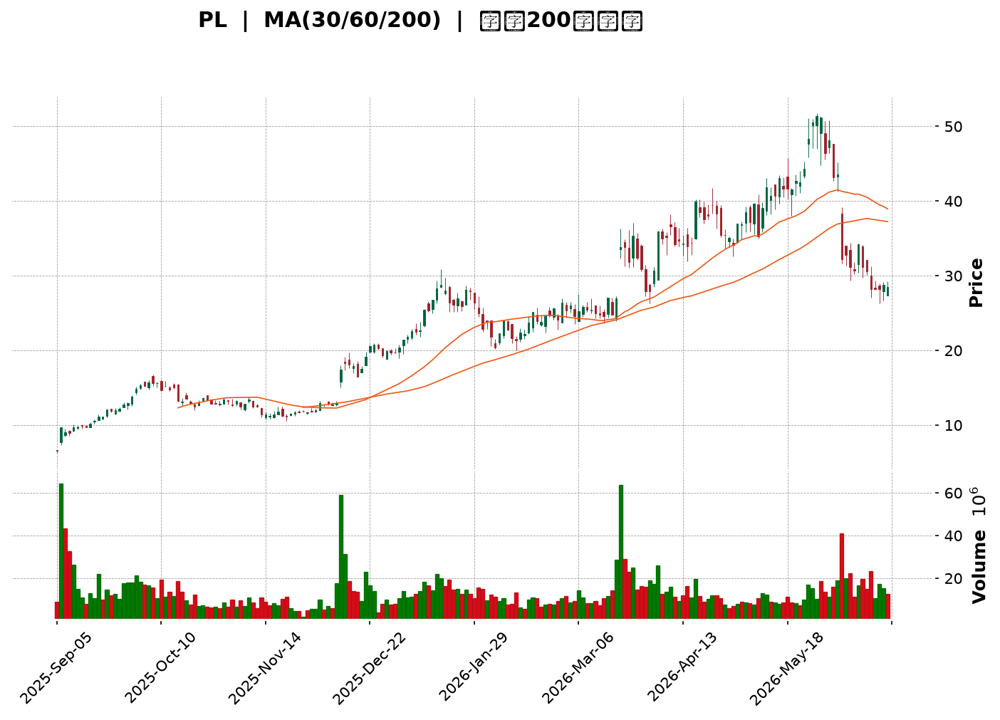
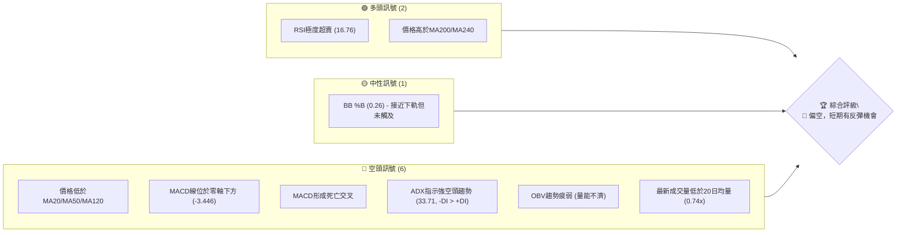
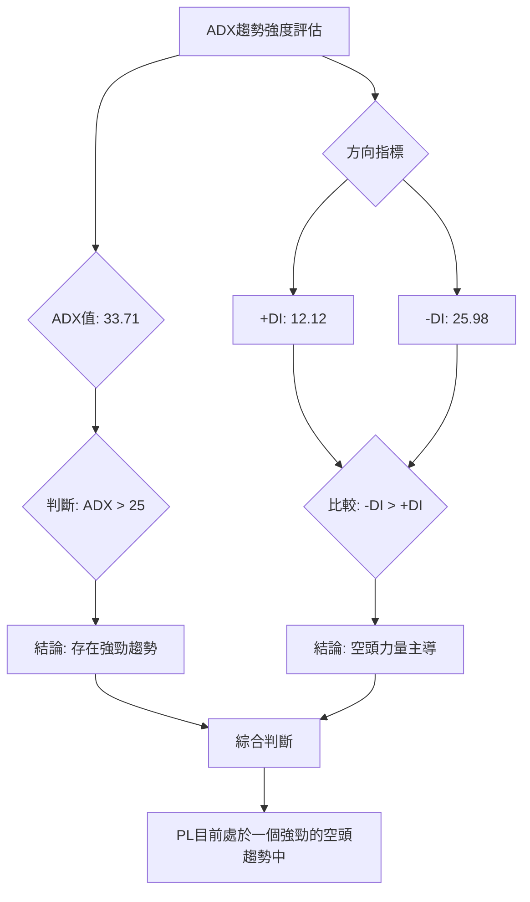
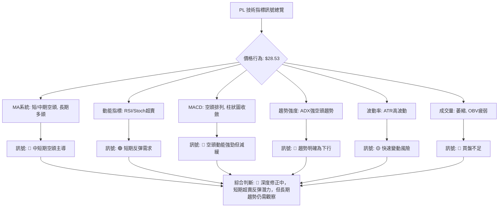

<details>
<summary>📊 靜態圖表 (點擊展開)</summary>

</details>

<html>
<head><meta charset="utf-8" /></head>
<body>
    <div style="height:500px; width:100%;">                        <script>window.PlotlyConfig = {MathJaxConfig: 'local'};</script>
        <script charset="utf-8" src="https://cdn.plot.ly/plotly-3.6.0.min.js" integrity="sha256-QaOVwtVY0T02VaHrr6pnoHLCwayMJp4O5n4YyaE3rJk=" crossorigin="anonymous"></script>                <div id="candlestick-chart" class="plotly-graph-div" style="height:100%; width:100%;"></div>            <script>                window.PLOTLYENV=window.PLOTLYENV || {};                                if (document.getElementById("candlestick-chart")) {                    Plotly.newPlot(                        "candlestick-chart",                        [{"close":{"dtype":"f8","bdata":"AAAAYLgeGkAAAACA61EjQAAAAIA9CiJAAAAA4KPwIUAAAABAClcjQAAAACBcjyNAAAAA4FG4I0AAAAAAAIAjQAAAAIDCdSRAAAAA4FE4JUAAAADgUTgmQAAAAOBROCZAAAAAoJkZKEAAAAAAKdwnQAAAACCF6ydAAAAAYGZmKEAAAADgepQpQAAAAIDC9SlAAAAAgD2KK0AAAABAM7MtQAAAAGC4ni5AAAAAQOF6LkAAAAAAKVwvQAAAAEAzMy9AAAAAgOtRL0AAAABgZmYtQAAAAAAAgC5AAAAAIFyPLUAAAACAFC4uQAAAAIDCdSpAAAAA4FE4KkAAAABguB4rQAAAAIDr0SlAAAAAAAAAKUAAAABgZuYpQAAAAOBROCtAAAAAYLieKkAAAACAFK4pQAAAAMDMzClAAAAA4FG4KUAAAABgZuYqQAAAAKBHYSpAAAAAYGZmKUAAAAAAAIAqQAAAACCF6yhAAAAAYLieKUAAAAAgrscqQAAAAOCj8ChAAAAAoEfhKEAAAACA69EmQAAAAMDMzCZAAAAAIIVrJkAAAABgZuYmQAAAAOB6lCdAAAAAgMJ1JkAAAACA61EmQAAAAOB6FCdAAAAAgMJ1J0AAAADgo3AnQAAAAMDMzCdAAAAAYGZmJ0AAAACAPYonQAAAAMAeBShAAAAAoEfhKUAAAACAPYopQAAAAGBm5ilAAAAAgBSuKUAAAACgR+EpQAAAAOBReDFAAAAAoHA9MkAAAADAzAwyQAAAAKBH4TFAAAAA4FF4MEAAAACgcH0xQAAAAIAULjNAAAAAoJmZNEAAAABA4bo0QAAAAIDrUTRAAAAAAClcM0AAAABguN4zQAAAAKBwvTNAAAAA4FG4M0AAAADA9Wg0QAAAAADXYzVAAAAAQArXNUAAAAAAKZw2QAAAAOCjcDZAAAAAgMK1NkAAAADgo3A5QAAAAIDrUTlAAAAAQOG6OkAAAAAgrkc8QAAAACCuxzxAAAAAAAAAPEAAAACgR2E6QAAAACBcDzpAAAAA4KPwOkAAAABguN45QAAAAIDrETxAAAAAoEfhO0AAAACgmVk6QAAAAOBR+DhAAAAAoJnZNkAAAABAM\u002fM3QAAAAMAexTVAAAAAgBRuNEAAAABgj0I2QAAAAMAeBThAAAAAgD3KNkAAAABgZqY1QAAAAMDMTDVAAAAAIIVrNkAAAACAwjU2QAAAAKBwvTdAAAAAACkcOUAAAABgZuY3QAAAACCuxzdAAAAAgMK1OEAAAACgR6E4QAAAAKCZmTlAAAAAANcjOEAAAAAAKVw6QAAAAMDMTDlAAAAAAAAAOkAAAABACpc4QAAAACCuRzlAAAAAgOvROUAAAABgZmY5QAAAAOCjcDlAAAAA4FH4OEAAAACAPco4QAAAAKCZmThAAAAA4HoUO0AAAAAgXM84QAAAAIDC9TpAAAAAgD3qQEAAAADA9ehAQAAAAOB61D9AAAAAIFyvQUAAAABAMzNAQAAAAAAp3D5AAAAAANfjO0AAAABAM\u002fM7QAAAAIDCtT5AAAAA4KPwQUAAAABgj4JBQAAAAIDClUFAAAAAYGZGQkAAAACgcB1BQAAAAIDCVUFAAAAAwPUoQUAAAABACvdAQAAAAOB6NEFAAAAAgOvxQ0AAAACgcD1DQAAAAAAAwEJAAAAAANcDQ0AAAAAAKbxDQAAAAMAeJUNAAAAA4FG4QUAAAACgmblBQAAAAADXg0FAAAAAgD0KQUAAAAAAKXxCQAAAAEAzc0JAAAAAwB5FQ0AAAADgo5BCQAAAAOBR2ENAAAAAYLieQUAAAADAHoVDQAAAACCF60RAAAAAQApXREAAAABguF5EQAAAAMAehUVAAAAAIFzPREAAAACAFM5EQAAAACCFy0RAAAAA4HpURUAAAACgcD1FQAAAAMDMLEZAAAAAwPUoSEAAAACgcD1JQAAAAEAzs0lAAAAAgOuRSUAAAABA4TpHQAAAACCFC0hAAAAA4KOQRUAAAAAA18NFQAAAAAApHEBAAAAAYLheQEAAAAAghSs\u002fQAAAAOBRuD5AAAAAgMIVQUAAAABgZiY\u002fQAAAAOB6lD5AAAAAgMI1PEAAAADgUTg8QAAAAEDhOjxAAAAAwB7FPEAAAAAgroc8QA=="},"high":{"dtype":"f8","bdata":"AAAAoJmZGkAAAAAAf2ojQAAAAAApHCNAAAAAQDOzIkAAAADA9SgkQAAAAOB6lCNAAAAA4FE4JEAAAABAtvMjQAAAAMDMzCRAAAAAIIVrJUAAAACA69EmQAAAAMDMTCZAAAAAYI9CKEAAAACAwnUoQAAAACBcjyhAAAAAwPWoKEAAAAAAAAAqQAAAAGC4HipAAAAAgD0KLEAAAADAyDYuQAAAAAAAAC9AAAAAIK7HL0AAAABgjwIwQAAAACCuxzBAAAAAoJmZL0AAAADAzAwwQAAAAGBm5i9AAAAAAACALkAAAADgelQvQAAAAEA1Hi9AAAAAwPUoK0AAAACA69EsQAAAAEAIrCpAAAAAoJkZKkAAAAAAKZwqQAAAAIAUbitAAAAAIIXrK0AAAADgo\u002fAqQAAAACCFqypAAAAAYGZmKkAAAACAwnUrQAAAAGCPwipAAAAAgD0KK0AAAADgo7AqQAAAAIA9CipAAAAAYGamKUAAAACgmZkrQAAAAKBwvSpAAAAAwMzMKUAAAACA69EoQAAAAEAzsydAAAAA4FE4J0AAAADAHsUnQAAAAIDC9ShAAAAAAAAAKUAAAAAAAAAnQAAAACBcTydAAAAAoO28J0AAAACAPQooQAAAAMAeBShAAAAAANejJ0AAAADAHoUoQAAAAKBHYShAAAAAYGZmKkAAAAAAAMApQAAAAIDCdSpAAAAAAAAAKkAAAABA4XoqQAAAAKCZ+TFAAAAAoJkZM0AAAADgo7AzQAAAACCuRzJAAAAAwMyMMkAAAABAM\u002fMxQAAAAOB61DNAAAAAYI\u002fCNEAAAACgcP00QAAAAIAU7jRAAAAAgMJVNEAAAADAHiU0QAAAAAApPDRAAAAAwMxMNEAAAAAgXM80QAAAACBcbzVAAAAAQDMTNkAAAAAAKdw2QAAAAKCZmTdAAAAAgOnGN0AAAAAgXI85QAAAAEAKlzpAAAAAwB7FOkAAAACgR2E9QAAAAGDj5T5AAAAA4FG4PUAAAAAghas8QAAAAIDA6jpAAAAAQOG6O0AAAABAM7M6QAAAAEAzszxAAAAAYGZmPEAAAABAM7M7QAAAAAAAQDtAAAAAwKHFOUAAAAAArPw3QAAAAAAAADhAAAAAgMCKNUAAAAAgrkc2QAAAAOBRGDhAAAAAQOH6N0AAAABgZoY3QAAAAMD16DVAAAAAgBTuNkAAAACAPco2QAAAAKCZmThAAAAAACkcOUAAAADgo7A5QAAAAOB6tDhAAAAAIFzPOEAAAABAYtA5QAAAAOCjsDlAAAAAQArXOEAAAACAFO46QAAAAOCjcDpAAAAAoEeBOkAAAACgcD06QAAAAACqkTtAAAAAQAoXOkAAAADgUXg6QAAAACCF6zpAAAAAIFwPOkAAAACA6QY6QAAAAAAAgDlAAAAAQAoXO0AAAADgehQ7QAAAAGCPQjtAAAAAANcjQkAAAAAghWtBQAAAACCFC0JAAAAAYGaGQkAAAAAA1dhBQAAAAGC4HkFAAAAAwPVoP0AAAACAFO48QAAAAIAULj9AAAAAwB4FQkAAAADAHiVCQAAAAGBm5kFAAAAAQOEaQ0AAAACAwpVCQAAAAIDrMUJAAAAAgBS+QUAAAAAgWDlCQAAAAIDClUFAAAAAoHAdREAAAACgcB1EQAAAAOB69ENAAAAAANfDQ0AAAABA4dpEQAAAAAAAAERAAAAAAADAQ0AAAACgcB1CQAAAAEAKp0FAAAAAAACAQUAAAAAAKXxCQAAAAOB6pEJAAAAAYI+iQ0AAAABACrdDQAAAAKBH4UNAAAAAgMJ1REAAAADAzOxDQAAAACBcj0VAAAAA4KPwREAAAACgmRlFQAAAAKCZuUVAAAAAQAqXRUAAAAAA1+NGQAAAAAAA4ERAAAAAYGbGRUAAAAAAAABGQAAAAEAMokZAAAAA4KOQSUAAAACgcH1JQAAAAKBH4UlAAAAAYI+iSUAAAAAAAGBJQAAAAGCPYklAAAAAIFzPR0AAAADAHpVGQAAAAEAKl0NAAAAAwB4FQUAAAAAgXC9BQAAAAMDMzD9AAAAAwPUoQUAAAABAMxNBQAAAAIDrEUBAAAAAAABAP0AAAACgmVk9QAAAAAAAAD1AAAAAYI8iPUAAAAAgLz09QA=="},"hovertemplate":"\u003cb\u003e%{x|%Y-%m-%d}\u003c\u002fb\u003e\u003cbr\u003e\u958b: $%{open:.2f}\u003cbr\u003e\u9ad8: $%{high:.2f}\u003cbr\u003e\u4f4e: $%{low:.2f}\u003cbr\u003e\u6536: $%{close:.2f}\u003cextra\u003e\u003c\u002fextra\u003e","low":{"dtype":"f8","bdata":"AAAAwB4FGUAAAADA9SgdQAAAAMAeBSFAAAAA4KMwIUAAAABgj0IiQAAAACCuxyJAAAAA4FH4IkAAAACA61EjQAAAAAApXCNAAAAA4KNwJEAAAABA4TolQAAAAOCjcCVAAAAAANcjJkAAAABAClcnQAAAAEAK1yZAAAAAwB6FJ0AAAADgUbgoQAAAAKBwPShAAAAAQDMzKUAAAADA9SgsQAAAAMAehS1AAAAAoEdhLkAAAAAgXI8tQAAAAMAehS5AAAAAwPUoLkAAAAAAKRwtQAAAAIDrUS5AAAAAQAoXLUAAAABAM7MtQAAAAKBwPSpAAAAAIN0kKUAAAAAAAAArQAAAAGC4nilAAAAA4KPwJ0AAAACAFC4pQAAAACCuRypAAAAAgD2KKkAAAAAgXI8pQAAAACCuhylAAAAAQN8PKUAAAAAgrscpQAAAAIDCdSlAAAAAIIXrKEAAAAAgXA8pQAAAAADXIyhAAAAAACncJ0AAAABgENgpQAAAACBcjyhAAAAAwPWoKEAAAABAChcmQAAAAMDIdiVAAAAAYI\u002fCJUAAAACAFO4lQAAAAMDMzCZAAAAAgJcuJkAAAACAPQolQAAAAMAehSZAAAAAwB6FJkAAAABgj0InQAAAAICXbidAAAAAwMzMJkAAAADgelQnQAAAAEDheidAAAAAACncJ0AAAADAHgUpQAAAAKBwPSlAAAAAQDUeKUAAAADA9SgpQAAAAMAeBS5AAAAAYLheMUAAAAAA16MxQAAAAIAU7jBAAAAAgBRuMEAAAACAPQoxQAAAAKBw\u002fTFAAAAAACmcM0AAAACgmZkzQAAAAAApHDRAAAAAgD0KM0AAAABgj8IyQAAAAOCjcDNAAAAAQImhM0AAAAAA1fgyQAAAAKBwfTNAAAAA4FH4NEAAAADA9Wg1QAAAAEAKFzZAAAAAwCDQNUAAAADA9Sg3QAAAAGC4HjlAAAAAAAAAOUAAAABgj0I6QAAAAAApXDxAAAAAIFxvO0AAAACgRyE5QAAAAADXIzlAAAAAgBQuOUAAAADgUTg5QAAAAKAaDzpAAAAAIFzPOkAAAADAzIw5QAAAAIDrcThAAAAAQAp3NkAAAADA9eg2QAAAAEAKlzRAAAAAYGYmNEAAAAAgXM80QAAAAGBmpjVAAAAAgMK1NkAAAADA9eg0QAAAAEDh+jNAAAAAIAYhNUAAAAAAAIA1QAAAAKBwPTZAAAAAgMJ1NkAAAABgj4I3QAAAAEDhOjdAAAAAoJlZNkAAAACgcH04QAAAAIDrEThAAAAAIK7HNkAAAADgUbg3QAAAAKBHYThAAAAAgGgROUAAAABgj4I3QAAAAKCZ2TdAAAAAQDNzOEAAAABAMzM5QAAAAOCj8DhAAAAAIK5HOEAAAAAgXE84QAAAAOB4qTdAAAAAYGZmOEAAAABgj8I4QAAAAOCj8DdAAAAAgGghQEAAAABA4To\u002fQAAAAAApHD9AAAAAoEchP0AAAAAgXA9AQAAAAIA9ij5AAAAAYLg+O0AAAADA9Ug6QAAAAMAehTxAAAAA4KNwPUAAAABA4RpBQAAAAGCPYkBAAAAA4FG4QUAAAADgUfhAQAAAAKCZ+UBAAAAAAClcQEAAAACgR+E\u002fQAAAACCuZ0BAAAAAYGZ2QUAAAAAghetCQAAAAEAKd0JAAAAAYI\u002fCQkAAAAAA1yNDQAAAAIA9KkJAAAAA4KOQQUAAAADgo9BAQAAAAMDz3UBAAAAAwPVIQEAAAADASydBQAAAAOCla0FAAAAAwPXoQUAAAACgmflBQAAAAKBHwUFAAAAAQAp3QUAAAABgZuZBQAAAAMDMDENAAAAAoEchQ0AAAADAzGxDQAAAAMDMzENAAAAAwB5FREAAAACgRyFEQAAAAGCPAkNAAAAAgMJVREAAAADAHoVEQAAAAMDMjEVAAAAAgBTuRkAAAACAFI5HQAAAAAAAgEdAAAAAANdjRkAAAAAA18NGQAAAAEDhOkdAAAAAwB5VRUAAAABgZqZEQAAAAMD1qD9AAAAA4HpUP0AAAACA61E9QAAAAEAzMz5AAAAAIIVrPkAAAADAHsU9QAAAAAApHD5AAAAAoEMLO0AAAADgehQ8QAAAAOB6VDpAAAAAgMK1OkAAAADgelQ7QA=="},"name":"\u50f9\u683c","open":{"dtype":"f8","bdata":"AAAA4KNwGkAAAACA69EeQAAAACCuRyFAAAAAYGZmIkAAAACgR2EiQAAAAKBwPSNAAAAA4KPwI0AAAADgUbgjQAAAAAAAgCNAAAAAgML1JEAAAACA61ElQAAAAOBRuCVAAAAAQOF6JkAAAAAgrkcoQAAAAAAAACdAAAAA4FG4J0AAAAAgrscoQAAAAGBmZilAAAAAgBSuKUAAAADgUbgsQAAAAGBm5i1AAAAAoJmZL0AAAAAAAAAuQAAAAMDMjDBAAAAAgBQuL0AAAADgUbgvQAAAACCFay5AAAAAAAAALkAAAABgZuYuQAAAAOCj8C5AAAAAAAAAKkAAAACAPQosQAAAAAApXCpAAAAAAACAKUAAAABgj0IpQAAAAKCZmSpAAAAAYGbmK0AAAADAzMwqQAAAACCF6ylAAAAAQOF6KUAAAAAgrscpQAAAAMD1qCpAAAAAgMJ1KUAAAACAFK4pQAAAAMAeBSpAAAAA4FE4KEAAAACAwnUqQAAAAGBmZipAAAAAYI9CKUAAAACAPYooQAAAAAAAACZAAAAAAClcJkAAAADgehQmQAAAACCF6yZAAAAAYGZmKEAAAABA4XomQAAAAEAzsyZAAAAAwB4FJ0AAAACAPYonQAAAAIDr0SdAAAAAQDMzJ0AAAABgj8InQAAAAMD1qCdAAAAAYGbmJ0AAAADAHoUpQAAAAAApXCpAAAAAoHA9KUAAAACgmZkpQAAAAOB6lC9AAAAA4KNwMkAAAAAgXM8yQAAAAGBmpjFAAAAAgBQuMkAAAACAPQoxQAAAAKBw\u002fTFAAAAAIK7HM0AAAADAzMwzQAAAAEDhujRAAAAAwMxMNEAAAACgcN0yQAAAACCuBzRAAAAAYLi+M0AAAABA4dozQAAAAEAzszRAAAAAAACANUAAAADgUbg1QAAAAKCZ2TZAAAAAoJmZNkAAAADAzEw3QAAAAGCPQjpAAAAAAACAOUAAAAAgXM86QAAAAEAzczxAAAAAQAqXO0AAAAAAAIA8QAAAAAAAwDpAAAAAYI8COkAAAACgmZk6QAAAAOB6FDpAAAAAwMwMPEAAAABAM7M7QAAAAEAKtzlAAAAAANfjOEAAAABA4fo3QAAAAAAAADhAAAAAAAAANUAAAACAPQo1QAAAAIDC9TVAAAAAYLjeN0AAAABgZoY3QAAAAIDrkTVAAAAAAACANUAAAAAAAAA2QAAAAGBmZjZAAAAAwB4FN0AAAACgcL04QAAAAGBmZjdAAAAAAABAN0AAAADAzEw5QAAAAAAAgDhAAAAAQDOTOEAAAADgUbg3QAAAAEDhGjpAAAAAoJmZOUAAAAAAAIA5QAAAAADX4zdAAAAAQArXOEAAAACA69E5QAAAAEAKVzlAAAAA4FH4OUAAAABA4fo4QAAAAKBHITlAAAAAoJnZOEAAAAAAAIA6QAAAAAAAQDhAAAAAYGbGQEAAAAAAAEBBQAAAAEDh2kBAAAAAQDMzQEAAAAAAKXxBQAAAAKBw\u002fUBAAAAAoJnZPkAAAADAzMw8QAAAAAAAAD1AAAAA4KNwPUAAAACAwvVBQAAAAOCjsEFAAAAAQDNzQkAAAAAAAEBCQAAAAOCjcEFAAAAAoHAdQUAAAAAghctBQAAAAIDCNUFAAAAAoHB9QUAAAACA65FDQAAAAEAzk0NAAAAAACkcQ0AAAAAAAMBDQAAAAIA9qkNAAAAAgBSOQ0AAAAAAKbxBQAAAAMDMTEFAAAAA4KMwQUAAAAAA10NBQAAAACBcX0JAAAAAwB6FQkAAAACgmZlDQAAAACBcf0JAAAAAYI\u002fCQ0AAAABAMzNCQAAAAEAzU0NAAAAAIIULREAAAABAChdFQAAAAOCjUERAAAAAwPUIRUAAAAAA16NFQAAAAEAKd0RAAAAAQDMzRUAAAADAcghFQAAAAMDMrEVAAAAAwPXYR0AAAADAzAxJQAAAAEAzE0lAAAAAAACQSEAAAAAghYtIQAAAAIDClUdAAAAAIFzPR0AAAACgcJ1FQAAAAGBmJkNAAAAAoEcBQUAAAACAwrVAQAAAAADX4z5AAAAAAACAP0AAAACA6\u002fFAQAAAAIA9CkBAAAAAwB4FPkAAAAAA12M8QAAAAGBmpjxAAAAAgML1O0AAAADgelQ7QA=="},"x":["2025-09-05T00:00:00-04:00","2025-09-08T00:00:00-04:00","2025-09-09T00:00:00-04:00","2025-09-10T00:00:00-04:00","2025-09-11T00:00:00-04:00","2025-09-12T00:00:00-04:00","2025-09-15T00:00:00-04:00","2025-09-16T00:00:00-04:00","2025-09-17T00:00:00-04:00","2025-09-18T00:00:00-04:00","2025-09-19T00:00:00-04:00","2025-09-22T00:00:00-04:00","2025-09-23T00:00:00-04:00","2025-09-24T00:00:00-04:00","2025-09-25T00:00:00-04:00","2025-09-26T00:00:00-04:00","2025-09-29T00:00:00-04:00","2025-09-30T00:00:00-04:00","2025-10-01T00:00:00-04:00","2025-10-02T00:00:00-04:00","2025-10-03T00:00:00-04:00","2025-10-06T00:00:00-04:00","2025-10-07T00:00:00-04:00","2025-10-08T00:00:00-04:00","2025-10-09T00:00:00-04:00","2025-10-10T00:00:00-04:00","2025-10-13T00:00:00-04:00","2025-10-14T00:00:00-04:00","2025-10-15T00:00:00-04:00","2025-10-16T00:00:00-04:00","2025-10-17T00:00:00-04:00","2025-10-20T00:00:00-04:00","2025-10-21T00:00:00-04:00","2025-10-22T00:00:00-04:00","2025-10-23T00:00:00-04:00","2025-10-24T00:00:00-04:00","2025-10-27T00:00:00-04:00","2025-10-28T00:00:00-04:00","2025-10-29T00:00:00-04:00","2025-10-30T00:00:00-04:00","2025-10-31T00:00:00-04:00","2025-11-03T00:00:00-05:00","2025-11-04T00:00:00-05:00","2025-11-05T00:00:00-05:00","2025-11-06T00:00:00-05:00","2025-11-07T00:00:00-05:00","2025-11-10T00:00:00-05:00","2025-11-11T00:00:00-05:00","2025-11-12T00:00:00-05:00","2025-11-13T00:00:00-05:00","2025-11-14T00:00:00-05:00","2025-11-17T00:00:00-05:00","2025-11-18T00:00:00-05:00","2025-11-19T00:00:00-05:00","2025-11-20T00:00:00-05:00","2025-11-21T00:00:00-05:00","2025-11-24T00:00:00-05:00","2025-11-25T00:00:00-05:00","2025-11-26T00:00:00-05:00","2025-11-28T00:00:00-05:00","2025-12-01T00:00:00-05:00","2025-12-02T00:00:00-05:00","2025-12-03T00:00:00-05:00","2025-12-04T00:00:00-05:00","2025-12-05T00:00:00-05:00","2025-12-08T00:00:00-05:00","2025-12-09T00:00:00-05:00","2025-12-10T00:00:00-05:00","2025-12-11T00:00:00-05:00","2025-12-12T00:00:00-05:00","2025-12-15T00:00:00-05:00","2025-12-16T00:00:00-05:00","2025-12-17T00:00:00-05:00","2025-12-18T00:00:00-05:00","2025-12-19T00:00:00-05:00","2025-12-22T00:00:00-05:00","2025-12-23T00:00:00-05:00","2025-12-24T00:00:00-05:00","2025-12-26T00:00:00-05:00","2025-12-29T00:00:00-05:00","2025-12-30T00:00:00-05:00","2025-12-31T00:00:00-05:00","2026-01-02T00:00:00-05:00","2026-01-05T00:00:00-05:00","2026-01-06T00:00:00-05:00","2026-01-07T00:00:00-05:00","2026-01-08T00:00:00-05:00","2026-01-09T00:00:00-05:00","2026-01-12T00:00:00-05:00","2026-01-13T00:00:00-05:00","2026-01-14T00:00:00-05:00","2026-01-15T00:00:00-05:00","2026-01-16T00:00:00-05:00","2026-01-20T00:00:00-05:00","2026-01-21T00:00:00-05:00","2026-01-22T00:00:00-05:00","2026-01-23T00:00:00-05:00","2026-01-26T00:00:00-05:00","2026-01-27T00:00:00-05:00","2026-01-28T00:00:00-05:00","2026-01-29T00:00:00-05:00","2026-01-30T00:00:00-05:00","2026-02-02T00:00:00-05:00","2026-02-03T00:00:00-05:00","2026-02-04T00:00:00-05:00","2026-02-05T00:00:00-05:00","2026-02-06T00:00:00-05:00","2026-02-09T00:00:00-05:00","2026-02-10T00:00:00-05:00","2026-02-11T00:00:00-05:00","2026-02-12T00:00:00-05:00","2026-02-13T00:00:00-05:00","2026-02-17T00:00:00-05:00","2026-02-18T00:00:00-05:00","2026-02-19T00:00:00-05:00","2026-02-20T00:00:00-05:00","2026-02-23T00:00:00-05:00","2026-02-24T00:00:00-05:00","2026-02-25T00:00:00-05:00","2026-02-26T00:00:00-05:00","2026-02-27T00:00:00-05:00","2026-03-02T00:00:00-05:00","2026-03-03T00:00:00-05:00","2026-03-04T00:00:00-05:00","2026-03-05T00:00:00-05:00","2026-03-06T00:00:00-05:00","2026-03-09T00:00:00-04:00","2026-03-10T00:00:00-04:00","2026-03-11T00:00:00-04:00","2026-03-12T00:00:00-04:00","2026-03-13T00:00:00-04:00","2026-03-16T00:00:00-04:00","2026-03-17T00:00:00-04:00","2026-03-18T00:00:00-04:00","2026-03-19T00:00:00-04:00","2026-03-20T00:00:00-04:00","2026-03-23T00:00:00-04:00","2026-03-24T00:00:00-04:00","2026-03-25T00:00:00-04:00","2026-03-26T00:00:00-04:00","2026-03-27T00:00:00-04:00","2026-03-30T00:00:00-04:00","2026-03-31T00:00:00-04:00","2026-04-01T00:00:00-04:00","2026-04-02T00:00:00-04:00","2026-04-06T00:00:00-04:00","2026-04-07T00:00:00-04:00","2026-04-08T00:00:00-04:00","2026-04-09T00:00:00-04:00","2026-04-10T00:00:00-04:00","2026-04-13T00:00:00-04:00","2026-04-14T00:00:00-04:00","2026-04-15T00:00:00-04:00","2026-04-16T00:00:00-04:00","2026-04-17T00:00:00-04:00","2026-04-20T00:00:00-04:00","2026-04-21T00:00:00-04:00","2026-04-22T00:00:00-04:00","2026-04-23T00:00:00-04:00","2026-04-24T00:00:00-04:00","2026-04-27T00:00:00-04:00","2026-04-28T00:00:00-04:00","2026-04-29T00:00:00-04:00","2026-04-30T00:00:00-04:00","2026-05-01T00:00:00-04:00","2026-05-04T00:00:00-04:00","2026-05-05T00:00:00-04:00","2026-05-06T00:00:00-04:00","2026-05-07T00:00:00-04:00","2026-05-08T00:00:00-04:00","2026-05-11T00:00:00-04:00","2026-05-12T00:00:00-04:00","2026-05-13T00:00:00-04:00","2026-05-14T00:00:00-04:00","2026-05-15T00:00:00-04:00","2026-05-18T00:00:00-04:00","2026-05-19T00:00:00-04:00","2026-05-20T00:00:00-04:00","2026-05-21T00:00:00-04:00","2026-05-22T00:00:00-04:00","2026-05-26T00:00:00-04:00","2026-05-27T00:00:00-04:00","2026-05-28T00:00:00-04:00","2026-05-29T00:00:00-04:00","2026-06-01T00:00:00-04:00","2026-06-02T00:00:00-04:00","2026-06-03T00:00:00-04:00","2026-06-04T00:00:00-04:00","2026-06-05T00:00:00-04:00","2026-06-08T00:00:00-04:00","2026-06-09T00:00:00-04:00","2026-06-10T00:00:00-04:00","2026-06-11T00:00:00-04:00","2026-06-12T00:00:00-04:00","2026-06-15T00:00:00-04:00","2026-06-16T00:00:00-04:00","2026-06-17T00:00:00-04:00","2026-06-18T00:00:00-04:00","2026-06-22T00:00:00-04:00","2026-06-23T00:00:00-04:00"],"type":"candlestick"},{"hovertemplate":"MA30: $%{y:.2f}\u003cextra\u003e\u003c\u002fextra\u003e","line":{"color":"#2196F3","dash":"dash","width":2},"mode":"lines","name":"MA30","x":["2025-09-05T00:00:00-04:00","2025-09-08T00:00:00-04:00","2025-09-09T00:00:00-04:00","2025-09-10T00:00:00-04:00","2025-09-11T00:00:00-04:00","2025-09-12T00:00:00-04:00","2025-09-15T00:00:00-04:00","2025-09-16T00:00:00-04:00","2025-09-17T00:00:00-04:00","2025-09-18T00:00:00-04:00","2025-09-19T00:00:00-04:00","2025-09-22T00:00:00-04:00","2025-09-23T00:00:00-04:00","2025-09-24T00:00:00-04:00","2025-09-25T00:00:00-04:00","2025-09-26T00:00:00-04:00","2025-09-29T00:00:00-04:00","2025-09-30T00:00:00-04:00","2025-10-01T00:00:00-04:00","2025-10-02T00:00:00-04:00","2025-10-03T00:00:00-04:00","2025-10-06T00:00:00-04:00","2025-10-07T00:00:00-04:00","2025-10-08T00:00:00-04:00","2025-10-09T00:00:00-04:00","2025-10-10T00:00:00-04:00","2025-10-13T00:00:00-04:00","2025-10-14T00:00:00-04:00","2025-10-15T00:00:00-04:00","2025-10-16T00:00:00-04:00","2025-10-17T00:00:00-04:00","2025-10-20T00:00:00-04:00","2025-10-21T00:00:00-04:00","2025-10-22T00:00:00-04:00","2025-10-23T00:00:00-04:00","2025-10-24T00:00:00-04:00","2025-10-27T00:00:00-04:00","2025-10-28T00:00:00-04:00","2025-10-29T00:00:00-04:00","2025-10-30T00:00:00-04:00","2025-10-31T00:00:00-04:00","2025-11-03T00:00:00-05:00","2025-11-04T00:00:00-05:00","2025-11-05T00:00:00-05:00","2025-11-06T00:00:00-05:00","2025-11-07T00:00:00-05:00","2025-11-10T00:00:00-05:00","2025-11-11T00:00:00-05:00","2025-11-12T00:00:00-05:00","2025-11-13T00:00:00-05:00","2025-11-14T00:00:00-05:00","2025-11-17T00:00:00-05:00","2025-11-18T00:00:00-05:00","2025-11-19T00:00:00-05:00","2025-11-20T00:00:00-05:00","2025-11-21T00:00:00-05:00","2025-11-24T00:00:00-05:00","2025-11-25T00:00:00-05:00","2025-11-26T00:00:00-05:00","2025-11-28T00:00:00-05:00","2025-12-01T00:00:00-05:00","2025-12-02T00:00:00-05:00","2025-12-03T00:00:00-05:00","2025-12-04T00:00:00-05:00","2025-12-05T00:00:00-05:00","2025-12-08T00:00:00-05:00","2025-12-09T00:00:00-05:00","2025-12-10T00:00:00-05:00","2025-12-11T00:00:00-05:00","2025-12-12T00:00:00-05:00","2025-12-15T00:00:00-05:00","2025-12-16T00:00:00-05:00","2025-12-17T00:00:00-05:00","2025-12-18T00:00:00-05:00","2025-12-19T00:00:00-05:00","2025-12-22T00:00:00-05:00","2025-12-23T00:00:00-05:00","2025-12-24T00:00:00-05:00","2025-12-26T00:00:00-05:00","2025-12-29T00:00:00-05:00","2025-12-30T00:00:00-05:00","2025-12-31T00:00:00-05:00","2026-01-02T00:00:00-05:00","2026-01-05T00:00:00-05:00","2026-01-06T00:00:00-05:00","2026-01-07T00:00:00-05:00","2026-01-08T00:00:00-05:00","2026-01-09T00:00:00-05:00","2026-01-12T00:00:00-05:00","2026-01-13T00:00:00-05:00","2026-01-14T00:00:00-05:00","2026-01-15T00:00:00-05:00","2026-01-16T00:00:00-05:00","2026-01-20T00:00:00-05:00","2026-01-21T00:00:00-05:00","2026-01-22T00:00:00-05:00","2026-01-23T00:00:00-05:00","2026-01-26T00:00:00-05:00","2026-01-27T00:00:00-05:00","2026-01-28T00:00:00-05:00","2026-01-29T00:00:00-05:00","2026-01-30T00:00:00-05:00","2026-02-02T00:00:00-05:00","2026-02-03T00:00:00-05:00","2026-02-04T00:00:00-05:00","2026-02-05T00:00:00-05:00","2026-02-06T00:00:00-05:00","2026-02-09T00:00:00-05:00","2026-02-10T00:00:00-05:00","2026-02-11T00:00:00-05:00","2026-02-12T00:00:00-05:00","2026-02-13T00:00:00-05:00","2026-02-17T00:00:00-05:00","2026-02-18T00:00:00-05:00","2026-02-19T00:00:00-05:00","2026-02-20T00:00:00-05:00","2026-02-23T00:00:00-05:00","2026-02-24T00:00:00-05:00","2026-02-25T00:00:00-05:00","2026-02-26T00:00:00-05:00","2026-02-27T00:00:00-05:00","2026-03-02T00:00:00-05:00","2026-03-03T00:00:00-05:00","2026-03-04T00:00:00-05:00","2026-03-05T00:00:00-05:00","2026-03-06T00:00:00-05:00","2026-03-09T00:00:00-04:00","2026-03-10T00:00:00-04:00","2026-03-11T00:00:00-04:00","2026-03-12T00:00:00-04:00","2026-03-13T00:00:00-04:00","2026-03-16T00:00:00-04:00","2026-03-17T00:00:00-04:00","2026-03-18T00:00:00-04:00","2026-03-19T00:00:00-04:00","2026-03-20T00:00:00-04:00","2026-03-23T00:00:00-04:00","2026-03-24T00:00:00-04:00","2026-03-25T00:00:00-04:00","2026-03-26T00:00:00-04:00","2026-03-27T00:00:00-04:00","2026-03-30T00:00:00-04:00","2026-03-31T00:00:00-04:00","2026-04-01T00:00:00-04:00","2026-04-02T00:00:00-04:00","2026-04-06T00:00:00-04:00","2026-04-07T00:00:00-04:00","2026-04-08T00:00:00-04:00","2026-04-09T00:00:00-04:00","2026-04-10T00:00:00-04:00","2026-04-13T00:00:00-04:00","2026-04-14T00:00:00-04:00","2026-04-15T00:00:00-04:00","2026-04-16T00:00:00-04:00","2026-04-17T00:00:00-04:00","2026-04-20T00:00:00-04:00","2026-04-21T00:00:00-04:00","2026-04-22T00:00:00-04:00","2026-04-23T00:00:00-04:00","2026-04-24T00:00:00-04:00","2026-04-27T00:00:00-04:00","2026-04-28T00:00:00-04:00","2026-04-29T00:00:00-04:00","2026-04-30T00:00:00-04:00","2026-05-01T00:00:00-04:00","2026-05-04T00:00:00-04:00","2026-05-05T00:00:00-04:00","2026-05-06T00:00:00-04:00","2026-05-07T00:00:00-04:00","2026-05-08T00:00:00-04:00","2026-05-11T00:00:00-04:00","2026-05-12T00:00:00-04:00","2026-05-13T00:00:00-04:00","2026-05-14T00:00:00-04:00","2026-05-15T00:00:00-04:00","2026-05-18T00:00:00-04:00","2026-05-19T00:00:00-04:00","2026-05-20T00:00:00-04:00","2026-05-21T00:00:00-04:00","2026-05-22T00:00:00-04:00","2026-05-26T00:00:00-04:00","2026-05-27T00:00:00-04:00","2026-05-28T00:00:00-04:00","2026-05-29T00:00:00-04:00","2026-06-01T00:00:00-04:00","2026-06-02T00:00:00-04:00","2026-06-03T00:00:00-04:00","2026-06-04T00:00:00-04:00","2026-06-05T00:00:00-04:00","2026-06-08T00:00:00-04:00","2026-06-09T00:00:00-04:00","2026-06-10T00:00:00-04:00","2026-06-11T00:00:00-04:00","2026-06-12T00:00:00-04:00","2026-06-15T00:00:00-04:00","2026-06-16T00:00:00-04:00","2026-06-17T00:00:00-04:00","2026-06-18T00:00:00-04:00","2026-06-22T00:00:00-04:00","2026-06-23T00:00:00-04:00"],"y":{"dtype":"f8","bdata":"AAAAAAAA+H8AAAAAAAD4fwAAAAAAAPh\u002fAAAAAAAA+H8AAAAAAAD4fwAAAAAAAPh\u002fAAAAAAAA+H8AAAAAAAD4fwAAAAAAAPh\u002fAAAAAAAA+H8AAAAAAAD4fwAAAAAAAPh\u002fAAAAAAAA+H8AAAAAAAD4fwAAAAAAAPh\u002fAAAAAAAA+H8AAAAAAAD4fwAAAAAAAPh\u002fAAAAAAAA+H8AAAAAAAD4fwAAAAAAAPh\u002fAAAAAAAA+H8AAAAAAAD4fwAAAAAAAPh\u002fAAAAAAAA+H8AAAAAAAD4fwAAAAAAAPh\u002fAAAAAAAA+H8AAAAAAAD4f+\u002fu7ibqnyhAvLu7mzYQKUCJiIj4xVIpQDMzM6MplSlAERERcWjRKUCrqqr6YgkqQBEREYHASipAmpmZyaGFKkBEREQ0XroqQM3MzJzv5ypAMzMzA1YOK0ARERGhRTYrQJqZmUnFWStA3t3dLd1kK0CJiIhYZHsrQBEREeHsgytAMzMzA1aOK0BERER0k5grQLy7uzvfjytA7+7uXix5K0B3d3fHdj4rQJqZmbm7+ypAMzMzY\u002fS2KkC8u7s7w24qQGZmZha9LSpA7+7uHiLiKUAAAACgt6UpQDMzM2NmZilAvLu7u1gyKUCrqqr61PgoQO\u002fu7h4i4ihAzczMvBHKKEC8u7sbhasoQDMzM\u002fMonChAZmZmVqujKECJiIjomKAoQDMzM1NVlShAzczM3E+NKEBERETEBI8oQGZmZmYD3ShAq6qq+tQ4KUDv7u6uVocpQKuqqpph1ylAvLu7+7gXKkAzMzPTFWAqQERERPTF0ipAvLu7+7hXK0De3d3t\u002fdQrQJqZmRn3WixAvLu7CxHRLECrqqpac2EtQO\u002fu7l7J7y1AAAAAIAaBLkBmZmb28BkvQAAAAADIvS9AZmZm5m05MEDv7u7OIpswQBERETkm+DBA3t3dZdhVMUAiIiIy7MoxQCIiIqJwPTJAMzMzK7K9MkCJiIjQlEozQImIiHCv2TNAMzMzgzJaNEAiIiICVs40QFVVVT01PjVAERERKYe2NUDe3d0t3SQ2QLy7uztRfzZAIiIiIpTRNkAzMzPDZxg3QKuqqhroVDdA3t3dbVmLN0BERESEecI3QFVVVXWT2DdAZmZmFiDXN0DNzMxsLuQ3QDMzMzPBAzhAZmZmJgYhOEDe3d2dNjA4QM3MzHyGPThAq6qqupBUOEAzMzPj7GM4QKuqqor6dzhAd3d39+GTOEAzMzMD5J44QJqZmUlTqjhAq6qqWmS7OEARERHherQ4QM3MzIzetjhAvLu7m8SgOEDe3d1NYpA4QAAAACCwcjhA7+7uDp9hOEDv7u6+WFI4QAAAANCwSzhAIiIiIiJCOEBmZmZmHz44QERERBSuJzhAZmZmFtkOOEB3d3c3iQE4QBEREfFg\u002fjdAREREhHkiOEBmZmY20Ck4QAAAAPAZVjhAAAAAsHLIOEBERETkFys5QImIiBi9bTlAVVVVhRbZOUAiIiJC0jQ6QGZmZmZmhjpAvLu7yxO1OkBVVVUFD+Y6QHd3dzeJITtAREREpHB9O0B3d3enVNw7QLy7u3uGPTxAvLu7W4+iPEARERHhevQ8QHd3d5fgQT1AREREJL+YPUDv7u4OWNk9QImIiCgVJz5AMzMzU5ydPkDe3d19IxQ\u002fQM3MzHxqfD9AMzMzo5vkP0AzMzMDVi5AQLy7u6MpZUBAvLu7q9WRQEC8u7s7Ub9AQKuqqpLR60BAERERca8JQUAAAABokT1BQCIiIor6Z0FAVVVVHRN8QUDNzMyEMopBQLy7u7u7q0FA3t3dvS2rQUBERERkgsdBQKuqqnpb9kFAIiIiku0sQkCamZmpf2NCQAAAAFAbmEJAvLu765iwQkBVVVX1tsxCQAAAAFAb6EJAAAAAEC0CQ0AzMzNDYCVDQHd3d2etTkNAMzMzI2mKQ0BmZmYmBtFDQDMzM8ODGURAMzMzw4NJREDNzMwMkGtEQHd3dye\u002fmERAd3d3t4GuREARERFR1L9EQCIiIkLupURAREREJGmaREBVVVU9JohEQCIiIpLCdURA7+7u3iR2RECJiIjgT11EQAAAAMBYQkRAIiIiokUWREARERGJQfBDQBERESlcv0NAmpmZMcGjQ0CJiIh46XZDQA=="},"type":"scatter"},{"hovertemplate":"MA60: $%{y:.2f}\u003cextra\u003e\u003c\u002fextra\u003e","line":{"color":"#9C27B0","dash":"dash","width":2},"mode":"lines","name":"MA60","x":["2025-09-05T00:00:00-04:00","2025-09-08T00:00:00-04:00","2025-09-09T00:00:00-04:00","2025-09-10T00:00:00-04:00","2025-09-11T00:00:00-04:00","2025-09-12T00:00:00-04:00","2025-09-15T00:00:00-04:00","2025-09-16T00:00:00-04:00","2025-09-17T00:00:00-04:00","2025-09-18T00:00:00-04:00","2025-09-19T00:00:00-04:00","2025-09-22T00:00:00-04:00","2025-09-23T00:00:00-04:00","2025-09-24T00:00:00-04:00","2025-09-25T00:00:00-04:00","2025-09-26T00:00:00-04:00","2025-09-29T00:00:00-04:00","2025-09-30T00:00:00-04:00","2025-10-01T00:00:00-04:00","2025-10-02T00:00:00-04:00","2025-10-03T00:00:00-04:00","2025-10-06T00:00:00-04:00","2025-10-07T00:00:00-04:00","2025-10-08T00:00:00-04:00","2025-10-09T00:00:00-04:00","2025-10-10T00:00:00-04:00","2025-10-13T00:00:00-04:00","2025-10-14T00:00:00-04:00","2025-10-15T00:00:00-04:00","2025-10-16T00:00:00-04:00","2025-10-17T00:00:00-04:00","2025-10-20T00:00:00-04:00","2025-10-21T00:00:00-04:00","2025-10-22T00:00:00-04:00","2025-10-23T00:00:00-04:00","2025-10-24T00:00:00-04:00","2025-10-27T00:00:00-04:00","2025-10-28T00:00:00-04:00","2025-10-29T00:00:00-04:00","2025-10-30T00:00:00-04:00","2025-10-31T00:00:00-04:00","2025-11-03T00:00:00-05:00","2025-11-04T00:00:00-05:00","2025-11-05T00:00:00-05:00","2025-11-06T00:00:00-05:00","2025-11-07T00:00:00-05:00","2025-11-10T00:00:00-05:00","2025-11-11T00:00:00-05:00","2025-11-12T00:00:00-05:00","2025-11-13T00:00:00-05:00","2025-11-14T00:00:00-05:00","2025-11-17T00:00:00-05:00","2025-11-18T00:00:00-05:00","2025-11-19T00:00:00-05:00","2025-11-20T00:00:00-05:00","2025-11-21T00:00:00-05:00","2025-11-24T00:00:00-05:00","2025-11-25T00:00:00-05:00","2025-11-26T00:00:00-05:00","2025-11-28T00:00:00-05:00","2025-12-01T00:00:00-05:00","2025-12-02T00:00:00-05:00","2025-12-03T00:00:00-05:00","2025-12-04T00:00:00-05:00","2025-12-05T00:00:00-05:00","2025-12-08T00:00:00-05:00","2025-12-09T00:00:00-05:00","2025-12-10T00:00:00-05:00","2025-12-11T00:00:00-05:00","2025-12-12T00:00:00-05:00","2025-12-15T00:00:00-05:00","2025-12-16T00:00:00-05:00","2025-12-17T00:00:00-05:00","2025-12-18T00:00:00-05:00","2025-12-19T00:00:00-05:00","2025-12-22T00:00:00-05:00","2025-12-23T00:00:00-05:00","2025-12-24T00:00:00-05:00","2025-12-26T00:00:00-05:00","2025-12-29T00:00:00-05:00","2025-12-30T00:00:00-05:00","2025-12-31T00:00:00-05:00","2026-01-02T00:00:00-05:00","2026-01-05T00:00:00-05:00","2026-01-06T00:00:00-05:00","2026-01-07T00:00:00-05:00","2026-01-08T00:00:00-05:00","2026-01-09T00:00:00-05:00","2026-01-12T00:00:00-05:00","2026-01-13T00:00:00-05:00","2026-01-14T00:00:00-05:00","2026-01-15T00:00:00-05:00","2026-01-16T00:00:00-05:00","2026-01-20T00:00:00-05:00","2026-01-21T00:00:00-05:00","2026-01-22T00:00:00-05:00","2026-01-23T00:00:00-05:00","2026-01-26T00:00:00-05:00","2026-01-27T00:00:00-05:00","2026-01-28T00:00:00-05:00","2026-01-29T00:00:00-05:00","2026-01-30T00:00:00-05:00","2026-02-02T00:00:00-05:00","2026-02-03T00:00:00-05:00","2026-02-04T00:00:00-05:00","2026-02-05T00:00:00-05:00","2026-02-06T00:00:00-05:00","2026-02-09T00:00:00-05:00","2026-02-10T00:00:00-05:00","2026-02-11T00:00:00-05:00","2026-02-12T00:00:00-05:00","2026-02-13T00:00:00-05:00","2026-02-17T00:00:00-05:00","2026-02-18T00:00:00-05:00","2026-02-19T00:00:00-05:00","2026-02-20T00:00:00-05:00","2026-02-23T00:00:00-05:00","2026-02-24T00:00:00-05:00","2026-02-25T00:00:00-05:00","2026-02-26T00:00:00-05:00","2026-02-27T00:00:00-05:00","2026-03-02T00:00:00-05:00","2026-03-03T00:00:00-05:00","2026-03-04T00:00:00-05:00","2026-03-05T00:00:00-05:00","2026-03-06T00:00:00-05:00","2026-03-09T00:00:00-04:00","2026-03-10T00:00:00-04:00","2026-03-11T00:00:00-04:00","2026-03-12T00:00:00-04:00","2026-03-13T00:00:00-04:00","2026-03-16T00:00:00-04:00","2026-03-17T00:00:00-04:00","2026-03-18T00:00:00-04:00","2026-03-19T00:00:00-04:00","2026-03-20T00:00:00-04:00","2026-03-23T00:00:00-04:00","2026-03-24T00:00:00-04:00","2026-03-25T00:00:00-04:00","2026-03-26T00:00:00-04:00","2026-03-27T00:00:00-04:00","2026-03-30T00:00:00-04:00","2026-03-31T00:00:00-04:00","2026-04-01T00:00:00-04:00","2026-04-02T00:00:00-04:00","2026-04-06T00:00:00-04:00","2026-04-07T00:00:00-04:00","2026-04-08T00:00:00-04:00","2026-04-09T00:00:00-04:00","2026-04-10T00:00:00-04:00","2026-04-13T00:00:00-04:00","2026-04-14T00:00:00-04:00","2026-04-15T00:00:00-04:00","2026-04-16T00:00:00-04:00","2026-04-17T00:00:00-04:00","2026-04-20T00:00:00-04:00","2026-04-21T00:00:00-04:00","2026-04-22T00:00:00-04:00","2026-04-23T00:00:00-04:00","2026-04-24T00:00:00-04:00","2026-04-27T00:00:00-04:00","2026-04-28T00:00:00-04:00","2026-04-29T00:00:00-04:00","2026-04-30T00:00:00-04:00","2026-05-01T00:00:00-04:00","2026-05-04T00:00:00-04:00","2026-05-05T00:00:00-04:00","2026-05-06T00:00:00-04:00","2026-05-07T00:00:00-04:00","2026-05-08T00:00:00-04:00","2026-05-11T00:00:00-04:00","2026-05-12T00:00:00-04:00","2026-05-13T00:00:00-04:00","2026-05-14T00:00:00-04:00","2026-05-15T00:00:00-04:00","2026-05-18T00:00:00-04:00","2026-05-19T00:00:00-04:00","2026-05-20T00:00:00-04:00","2026-05-21T00:00:00-04:00","2026-05-22T00:00:00-04:00","2026-05-26T00:00:00-04:00","2026-05-27T00:00:00-04:00","2026-05-28T00:00:00-04:00","2026-05-29T00:00:00-04:00","2026-06-01T00:00:00-04:00","2026-06-02T00:00:00-04:00","2026-06-03T00:00:00-04:00","2026-06-04T00:00:00-04:00","2026-06-05T00:00:00-04:00","2026-06-08T00:00:00-04:00","2026-06-09T00:00:00-04:00","2026-06-10T00:00:00-04:00","2026-06-11T00:00:00-04:00","2026-06-12T00:00:00-04:00","2026-06-15T00:00:00-04:00","2026-06-16T00:00:00-04:00","2026-06-17T00:00:00-04:00","2026-06-18T00:00:00-04:00","2026-06-22T00:00:00-04:00","2026-06-23T00:00:00-04:00"],"y":{"dtype":"f8","bdata":"AAAAAAAA+H8AAAAAAAD4fwAAAAAAAPh\u002fAAAAAAAA+H8AAAAAAAD4fwAAAAAAAPh\u002fAAAAAAAA+H8AAAAAAAD4fwAAAAAAAPh\u002fAAAAAAAA+H8AAAAAAAD4fwAAAAAAAPh\u002fAAAAAAAA+H8AAAAAAAD4fwAAAAAAAPh\u002fAAAAAAAA+H8AAAAAAAD4fwAAAAAAAPh\u002fAAAAAAAA+H8AAAAAAAD4fwAAAAAAAPh\u002fAAAAAAAA+H8AAAAAAAD4fwAAAAAAAPh\u002fAAAAAAAA+H8AAAAAAAD4fwAAAAAAAPh\u002fAAAAAAAA+H8AAAAAAAD4fwAAAAAAAPh\u002fAAAAAAAA+H8AAAAAAAD4fwAAAAAAAPh\u002fAAAAAAAA+H8AAAAAAAD4fwAAAAAAAPh\u002fAAAAAAAA+H8AAAAAAAD4fwAAAAAAAPh\u002fAAAAAAAA+H8AAAAAAAD4fwAAAAAAAPh\u002fAAAAAAAA+H8AAAAAAAD4fwAAAAAAAPh\u002fAAAAAAAA+H8AAAAAAAD4fwAAAAAAAPh\u002fAAAAAAAA+H8AAAAAAAD4fwAAAAAAAPh\u002fAAAAAAAA+H8AAAAAAAD4fwAAAAAAAPh\u002fAAAAAAAA+H8AAAAAAAD4fwAAAAAAAPh\u002fAAAAAAAA+H8AAAAAAAD4f+\u002fu7iIGwShARERELCTtKEAiIiKKJf8oQDMzM0upGClAvLu744k6KUCamZnx\u002fVQpQCIiIuoKcClAMzMz03iJKUBERER8saQpQJqZmYF54ilA7+7ufpUjKkAAAAAozl4qQCIiInKTmCpAzczMFEu+KkDe3d0Vve0qQKuqqmpZKytAd3d3fwdzK0ARERGxyLYrQKuqqipr9StAVVVVtR4lLEARERER9U8sQERERIzCdSxAmpmZQf2bLEAREREZWsQsQDMzM4vC9SxA3t3d9X4qLUDv7u6e\u002fm0tQKuqqmpZqy1AvLu7wwTvLUB3d3evVkcuQJqZmbGBri5AmpmZCbsiL0BmZmZeV6AvQBEREfXhEzBAMzMzFwRWMEAzMzM7UY8wQHd3d\u002fNvxDBAvLu7i5f+MEAAAADILzYxQHd3d3fpdjFAvLu7T\u002f+2MUBVVVWNCe4xQAAAAHRMIDJA3t3d9ZpLMkDv7u42QnkyQLy7uzf7oDJAIiIiSn7BMkDe3d2xVucyQAAAAGCeGDNAIiIiVsdEM0CamZkleHAzQCIiIpa1mjNAVVVV5YnKM0AzMzOvcvgzQFVVVUVvKzRA7+7u7qdmNEARERFpA500QFVVVcE80TRAREREYJ4INUCamZmJsz81QHd3d5cnejVAd3d3YzuvNUAzMzOPe+01QERERMgvJjZAERERyehdNkCJiIhgV5A2QKuqqgbzxDZAmpmZpVT8NkAiIiJKfjE3QAAAAKh\u002fUzdAREREnDZwN0BVVVV9+Iw3QN7d3YWkqTdAEREReenWN0BVVVXdJPY3QKuqqrJWFzhAMzMzY8lPOECJiIgoo4c4QN7d3SW\u002fuDhA3t3dVQ79OEAAAABwhDI5QJqZmXH2YTlAMzMzQ9KEOUBERET0\u002faQ5QBEREeHBzDlA3t3dTakIOkBVVVVVnD06QKuqquLsczpAMzMz2\u002fmuOkARERHhetQ6QCIiIpJf\u002fDpAAAAA4MEcO0BmZmYu3TQ7QERERKTiTDtAERERsZ1\u002fO0BmZmYePrM7QGZmZqYN5DtAq6qq4l4TPEBmZma2ZU08QN7d3a0AeTxA7+7uNkKZPEB3d3fXFcA8QDMzMwsC6zxAMzMzM+waPUAzMzODeVI9QCIiIoIHkz1AVVVVdUzgPUDv7u52vh8+QAAAAEiaYj5AiYiIALmXPkBVVVWF6+E+QN7d3a2OOT9AAAAAeHeHP0BEREQsh9Y\u002fQN7d3fVvFEBA7+7unqg3QECJiIikcF1AQO\u002fu7kZvg0BA7+7uXrqpQEDe3d3Zzs9AQJqZmdnO90BAq6qqWmQrQUDv7u4W2V5BQLy7uyuHlkFAZmZm9ijMQUDe3d3l0PpBQO\u002fu7jJ6K0JAiYiIxGdQQkAiIiIqFXdCQO\u002fu7vKLhUJAAAAAaB+WQkCJiIi8u6NCQGZmZhLKsEJAAAAAKOq\u002fQkBERESkcM1CQBEREaUp1UJAvLu7XyzJQkDv7u4GOr1CQGZmZvKLtUJAvLu7d3enQkBmZmbuNZ9CQA=="},"type":"scatter"},{"hovertemplate":"MA200: $%{y:.2f}\u003cextra\u003e\u003c\u002fextra\u003e","line":{"color":"#FF6F00","dash":"solid","width":2},"mode":"lines","name":"MA200","x":["2025-09-05T00:00:00-04:00","2025-09-08T00:00:00-04:00","2025-09-09T00:00:00-04:00","2025-09-10T00:00:00-04:00","2025-09-11T00:00:00-04:00","2025-09-12T00:00:00-04:00","2025-09-15T00:00:00-04:00","2025-09-16T00:00:00-04:00","2025-09-17T00:00:00-04:00","2025-09-18T00:00:00-04:00","2025-09-19T00:00:00-04:00","2025-09-22T00:00:00-04:00","2025-09-23T00:00:00-04:00","2025-09-24T00:00:00-04:00","2025-09-25T00:00:00-04:00","2025-09-26T00:00:00-04:00","2025-09-29T00:00:00-04:00","2025-09-30T00:00:00-04:00","2025-10-01T00:00:00-04:00","2025-10-02T00:00:00-04:00","2025-10-03T00:00:00-04:00","2025-10-06T00:00:00-04:00","2025-10-07T00:00:00-04:00","2025-10-08T00:00:00-04:00","2025-10-09T00:00:00-04:00","2025-10-10T00:00:00-04:00","2025-10-13T00:00:00-04:00","2025-10-14T00:00:00-04:00","2025-10-15T00:00:00-04:00","2025-10-16T00:00:00-04:00","2025-10-17T00:00:00-04:00","2025-10-20T00:00:00-04:00","2025-10-21T00:00:00-04:00","2025-10-22T00:00:00-04:00","2025-10-23T00:00:00-04:00","2025-10-24T00:00:00-04:00","2025-10-27T00:00:00-04:00","2025-10-28T00:00:00-04:00","2025-10-29T00:00:00-04:00","2025-10-30T00:00:00-04:00","2025-10-31T00:00:00-04:00","2025-11-03T00:00:00-05:00","2025-11-04T00:00:00-05:00","2025-11-05T00:00:00-05:00","2025-11-06T00:00:00-05:00","2025-11-07T00:00:00-05:00","2025-11-10T00:00:00-05:00","2025-11-11T00:00:00-05:00","2025-11-12T00:00:00-05:00","2025-11-13T00:00:00-05:00","2025-11-14T00:00:00-05:00","2025-11-17T00:00:00-05:00","2025-11-18T00:00:00-05:00","2025-11-19T00:00:00-05:00","2025-11-20T00:00:00-05:00","2025-11-21T00:00:00-05:00","2025-11-24T00:00:00-05:00","2025-11-25T00:00:00-05:00","2025-11-26T00:00:00-05:00","2025-11-28T00:00:00-05:00","2025-12-01T00:00:00-05:00","2025-12-02T00:00:00-05:00","2025-12-03T00:00:00-05:00","2025-12-04T00:00:00-05:00","2025-12-05T00:00:00-05:00","2025-12-08T00:00:00-05:00","2025-12-09T00:00:00-05:00","2025-12-10T00:00:00-05:00","2025-12-11T00:00:00-05:00","2025-12-12T00:00:00-05:00","2025-12-15T00:00:00-05:00","2025-12-16T00:00:00-05:00","2025-12-17T00:00:00-05:00","2025-12-18T00:00:00-05:00","2025-12-19T00:00:00-05:00","2025-12-22T00:00:00-05:00","2025-12-23T00:00:00-05:00","2025-12-24T00:00:00-05:00","2025-12-26T00:00:00-05:00","2025-12-29T00:00:00-05:00","2025-12-30T00:00:00-05:00","2025-12-31T00:00:00-05:00","2026-01-02T00:00:00-05:00","2026-01-05T00:00:00-05:00","2026-01-06T00:00:00-05:00","2026-01-07T00:00:00-05:00","2026-01-08T00:00:00-05:00","2026-01-09T00:00:00-05:00","2026-01-12T00:00:00-05:00","2026-01-13T00:00:00-05:00","2026-01-14T00:00:00-05:00","2026-01-15T00:00:00-05:00","2026-01-16T00:00:00-05:00","2026-01-20T00:00:00-05:00","2026-01-21T00:00:00-05:00","2026-01-22T00:00:00-05:00","2026-01-23T00:00:00-05:00","2026-01-26T00:00:00-05:00","2026-01-27T00:00:00-05:00","2026-01-28T00:00:00-05:00","2026-01-29T00:00:00-05:00","2026-01-30T00:00:00-05:00","2026-02-02T00:00:00-05:00","2026-02-03T00:00:00-05:00","2026-02-04T00:00:00-05:00","2026-02-05T00:00:00-05:00","2026-02-06T00:00:00-05:00","2026-02-09T00:00:00-05:00","2026-02-10T00:00:00-05:00","2026-02-11T00:00:00-05:00","2026-02-12T00:00:00-05:00","2026-02-13T00:00:00-05:00","2026-02-17T00:00:00-05:00","2026-02-18T00:00:00-05:00","2026-02-19T00:00:00-05:00","2026-02-20T00:00:00-05:00","2026-02-23T00:00:00-05:00","2026-02-24T00:00:00-05:00","2026-02-25T00:00:00-05:00","2026-02-26T00:00:00-05:00","2026-02-27T00:00:00-05:00","2026-03-02T00:00:00-05:00","2026-03-03T00:00:00-05:00","2026-03-04T00:00:00-05:00","2026-03-05T00:00:00-05:00","2026-03-06T00:00:00-05:00","2026-03-09T00:00:00-04:00","2026-03-10T00:00:00-04:00","2026-03-11T00:00:00-04:00","2026-03-12T00:00:00-04:00","2026-03-13T00:00:00-04:00","2026-03-16T00:00:00-04:00","2026-03-17T00:00:00-04:00","2026-03-18T00:00:00-04:00","2026-03-19T00:00:00-04:00","2026-03-20T00:00:00-04:00","2026-03-23T00:00:00-04:00","2026-03-24T00:00:00-04:00","2026-03-25T00:00:00-04:00","2026-03-26T00:00:00-04:00","2026-03-27T00:00:00-04:00","2026-03-30T00:00:00-04:00","2026-03-31T00:00:00-04:00","2026-04-01T00:00:00-04:00","2026-04-02T00:00:00-04:00","2026-04-06T00:00:00-04:00","2026-04-07T00:00:00-04:00","2026-04-08T00:00:00-04:00","2026-04-09T00:00:00-04:00","2026-04-10T00:00:00-04:00","2026-04-13T00:00:00-04:00","2026-04-14T00:00:00-04:00","2026-04-15T00:00:00-04:00","2026-04-16T00:00:00-04:00","2026-04-17T00:00:00-04:00","2026-04-20T00:00:00-04:00","2026-04-21T00:00:00-04:00","2026-04-22T00:00:00-04:00","2026-04-23T00:00:00-04:00","2026-04-24T00:00:00-04:00","2026-04-27T00:00:00-04:00","2026-04-28T00:00:00-04:00","2026-04-29T00:00:00-04:00","2026-04-30T00:00:00-04:00","2026-05-01T00:00:00-04:00","2026-05-04T00:00:00-04:00","2026-05-05T00:00:00-04:00","2026-05-06T00:00:00-04:00","2026-05-07T00:00:00-04:00","2026-05-08T00:00:00-04:00","2026-05-11T00:00:00-04:00","2026-05-12T00:00:00-04:00","2026-05-13T00:00:00-04:00","2026-05-14T00:00:00-04:00","2026-05-15T00:00:00-04:00","2026-05-18T00:00:00-04:00","2026-05-19T00:00:00-04:00","2026-05-20T00:00:00-04:00","2026-05-21T00:00:00-04:00","2026-05-22T00:00:00-04:00","2026-05-26T00:00:00-04:00","2026-05-27T00:00:00-04:00","2026-05-28T00:00:00-04:00","2026-05-29T00:00:00-04:00","2026-06-01T00:00:00-04:00","2026-06-02T00:00:00-04:00","2026-06-03T00:00:00-04:00","2026-06-04T00:00:00-04:00","2026-06-05T00:00:00-04:00","2026-06-08T00:00:00-04:00","2026-06-09T00:00:00-04:00","2026-06-10T00:00:00-04:00","2026-06-11T00:00:00-04:00","2026-06-12T00:00:00-04:00","2026-06-15T00:00:00-04:00","2026-06-16T00:00:00-04:00","2026-06-17T00:00:00-04:00","2026-06-18T00:00:00-04:00","2026-06-22T00:00:00-04:00","2026-06-23T00:00:00-04:00"],"y":{"dtype":"f8","bdata":"AAAAAAAA+H8AAAAAAAD4fwAAAAAAAPh\u002fAAAAAAAA+H8AAAAAAAD4fwAAAAAAAPh\u002fAAAAAAAA+H8AAAAAAAD4fwAAAAAAAPh\u002fAAAAAAAA+H8AAAAAAAD4fwAAAAAAAPh\u002fAAAAAAAA+H8AAAAAAAD4fwAAAAAAAPh\u002fAAAAAAAA+H8AAAAAAAD4fwAAAAAAAPh\u002fAAAAAAAA+H8AAAAAAAD4fwAAAAAAAPh\u002fAAAAAAAA+H8AAAAAAAD4fwAAAAAAAPh\u002fAAAAAAAA+H8AAAAAAAD4fwAAAAAAAPh\u002fAAAAAAAA+H8AAAAAAAD4fwAAAAAAAPh\u002fAAAAAAAA+H8AAAAAAAD4fwAAAAAAAPh\u002fAAAAAAAA+H8AAAAAAAD4fwAAAAAAAPh\u002fAAAAAAAA+H8AAAAAAAD4fwAAAAAAAPh\u002fAAAAAAAA+H8AAAAAAAD4fwAAAAAAAPh\u002fAAAAAAAA+H8AAAAAAAD4fwAAAAAAAPh\u002fAAAAAAAA+H8AAAAAAAD4fwAAAAAAAPh\u002fAAAAAAAA+H8AAAAAAAD4fwAAAAAAAPh\u002fAAAAAAAA+H8AAAAAAAD4fwAAAAAAAPh\u002fAAAAAAAA+H8AAAAAAAD4fwAAAAAAAPh\u002fAAAAAAAA+H8AAAAAAAD4fwAAAAAAAPh\u002fAAAAAAAA+H8AAAAAAAD4fwAAAAAAAPh\u002fAAAAAAAA+H8AAAAAAAD4fwAAAAAAAPh\u002fAAAAAAAA+H8AAAAAAAD4fwAAAAAAAPh\u002fAAAAAAAA+H8AAAAAAAD4fwAAAAAAAPh\u002fAAAAAAAA+H8AAAAAAAD4fwAAAAAAAPh\u002fAAAAAAAA+H8AAAAAAAD4fwAAAAAAAPh\u002fAAAAAAAA+H8AAAAAAAD4fwAAAAAAAPh\u002fAAAAAAAA+H8AAAAAAAD4fwAAAAAAAPh\u002fAAAAAAAA+H8AAAAAAAD4fwAAAAAAAPh\u002fAAAAAAAA+H8AAAAAAAD4fwAAAAAAAPh\u002fAAAAAAAA+H8AAAAAAAD4fwAAAAAAAPh\u002fAAAAAAAA+H8AAAAAAAD4fwAAAAAAAPh\u002fAAAAAAAA+H8AAAAAAAD4fwAAAAAAAPh\u002fAAAAAAAA+H8AAAAAAAD4fwAAAAAAAPh\u002fAAAAAAAA+H8AAAAAAAD4fwAAAAAAAPh\u002fAAAAAAAA+H8AAAAAAAD4fwAAAAAAAPh\u002fAAAAAAAA+H8AAAAAAAD4fwAAAAAAAPh\u002fAAAAAAAA+H8AAAAAAAD4fwAAAAAAAPh\u002fAAAAAAAA+H8AAAAAAAD4fwAAAAAAAPh\u002fAAAAAAAA+H8AAAAAAAD4fwAAAAAAAPh\u002fAAAAAAAA+H8AAAAAAAD4fwAAAAAAAPh\u002fAAAAAAAA+H8AAAAAAAD4fwAAAAAAAPh\u002fAAAAAAAA+H8AAAAAAAD4fwAAAAAAAPh\u002fAAAAAAAA+H8AAAAAAAD4fwAAAAAAAPh\u002fAAAAAAAA+H8AAAAAAAD4fwAAAAAAAPh\u002fAAAAAAAA+H8AAAAAAAD4fwAAAAAAAPh\u002fAAAAAAAA+H8AAAAAAAD4fwAAAAAAAPh\u002fAAAAAAAA+H8AAAAAAAD4fwAAAAAAAPh\u002fAAAAAAAA+H8AAAAAAAD4fwAAAAAAAPh\u002fAAAAAAAA+H8AAAAAAAD4fwAAAAAAAPh\u002fAAAAAAAA+H8AAAAAAAD4fwAAAAAAAPh\u002fAAAAAAAA+H8AAAAAAAD4fwAAAAAAAPh\u002fAAAAAAAA+H8AAAAAAAD4fwAAAAAAAPh\u002fAAAAAAAA+H8AAAAAAAD4fwAAAAAAAPh\u002fAAAAAAAA+H8AAAAAAAD4fwAAAAAAAPh\u002fAAAAAAAA+H8AAAAAAAD4fwAAAAAAAPh\u002fAAAAAAAA+H8AAAAAAAD4fwAAAAAAAPh\u002fAAAAAAAA+H8AAAAAAAD4fwAAAAAAAPh\u002fAAAAAAAA+H8AAAAAAAD4fwAAAAAAAPh\u002fAAAAAAAA+H8AAAAAAAD4fwAAAAAAAPh\u002fAAAAAAAA+H8AAAAAAAD4fwAAAAAAAPh\u002fAAAAAAAA+H8AAAAAAAD4fwAAAAAAAPh\u002fAAAAAAAA+H8AAAAAAAD4fwAAAAAAAPh\u002fAAAAAAAA+H8AAAAAAAD4fwAAAAAAAPh\u002fAAAAAAAA+H8AAAAAAAD4fwAAAAAAAPh\u002fAAAAAAAA+H8AAAAAAAD4fwAAAAAAAPh\u002fAAAAAAAA+H\u002fXo3AQxxI4QA=="},"type":"scatter"}],                        {"template":{"data":{"barpolar":[{"marker":{"line":{"color":"rgb(17,17,17)","width":0.5},"pattern":{"fillmode":"overlay","size":10,"solidity":0.2}},"type":"barpolar"}],"bar":[{"error_x":{"color":"#f2f5fa"},"error_y":{"color":"#f2f5fa"},"marker":{"line":{"color":"rgb(17,17,17)","width":0.5},"pattern":{"fillmode":"overlay","size":10,"solidity":0.2}},"type":"bar"}],"carpet":[{"aaxis":{"endlinecolor":"#A2B1C6","gridcolor":"#506784","linecolor":"#506784","minorgridcolor":"#506784","startlinecolor":"#A2B1C6"},"baxis":{"endlinecolor":"#A2B1C6","gridcolor":"#506784","linecolor":"#506784","minorgridcolor":"#506784","startlinecolor":"#A2B1C6"},"type":"carpet"}],"choropleth":[{"colorbar":{"outlinewidth":0,"ticks":""},"type":"choropleth"}],"contourcarpet":[{"colorbar":{"outlinewidth":0,"ticks":""},"type":"contourcarpet"}],"contour":[{"colorbar":{"outlinewidth":0,"ticks":""},"colorscale":[[0.0,"#0d0887"],[0.1111111111111111,"#46039f"],[0.2222222222222222,"#7201a8"],[0.3333333333333333,"#9c179e"],[0.4444444444444444,"#bd3786"],[0.5555555555555556,"#d8576b"],[0.6666666666666666,"#ed7953"],[0.7777777777777778,"#fb9f3a"],[0.8888888888888888,"#fdca26"],[1.0,"#f0f921"]],"type":"contour"}],"heatmap":[{"colorbar":{"outlinewidth":0,"ticks":""},"colorscale":[[0.0,"#0d0887"],[0.1111111111111111,"#46039f"],[0.2222222222222222,"#7201a8"],[0.3333333333333333,"#9c179e"],[0.4444444444444444,"#bd3786"],[0.5555555555555556,"#d8576b"],[0.6666666666666666,"#ed7953"],[0.7777777777777778,"#fb9f3a"],[0.8888888888888888,"#fdca26"],[1.0,"#f0f921"]],"type":"heatmap"}],"histogram2dcontour":[{"colorbar":{"outlinewidth":0,"ticks":""},"colorscale":[[0.0,"#0d0887"],[0.1111111111111111,"#46039f"],[0.2222222222222222,"#7201a8"],[0.3333333333333333,"#9c179e"],[0.4444444444444444,"#bd3786"],[0.5555555555555556,"#d8576b"],[0.6666666666666666,"#ed7953"],[0.7777777777777778,"#fb9f3a"],[0.8888888888888888,"#fdca26"],[1.0,"#f0f921"]],"type":"histogram2dcontour"}],"histogram2d":[{"colorbar":{"outlinewidth":0,"ticks":""},"colorscale":[[0.0,"#0d0887"],[0.1111111111111111,"#46039f"],[0.2222222222222222,"#7201a8"],[0.3333333333333333,"#9c179e"],[0.4444444444444444,"#bd3786"],[0.5555555555555556,"#d8576b"],[0.6666666666666666,"#ed7953"],[0.7777777777777778,"#fb9f3a"],[0.8888888888888888,"#fdca26"],[1.0,"#f0f921"]],"type":"histogram2d"}],"histogram":[{"marker":{"pattern":{"fillmode":"overlay","size":10,"solidity":0.2}},"type":"histogram"}],"mesh3d":[{"colorbar":{"outlinewidth":0,"ticks":""},"type":"mesh3d"}],"parcoords":[{"line":{"colorbar":{"outlinewidth":0,"ticks":""}},"type":"parcoords"}],"pie":[{"automargin":true,"type":"pie"}],"scatter3d":[{"line":{"colorbar":{"outlinewidth":0,"ticks":""}},"marker":{"colorbar":{"outlinewidth":0,"ticks":""}},"type":"scatter3d"}],"scattercarpet":[{"marker":{"colorbar":{"outlinewidth":0,"ticks":""}},"type":"scattercarpet"}],"scattergeo":[{"marker":{"colorbar":{"outlinewidth":0,"ticks":""}},"type":"scattergeo"}],"scattergl":[{"marker":{"line":{"color":"#283442"}},"type":"scattergl"}],"scattermapbox":[{"marker":{"colorbar":{"outlinewidth":0,"ticks":""}},"type":"scattermapbox"}],"scattermap":[{"marker":{"colorbar":{"outlinewidth":0,"ticks":""}},"type":"scattermap"}],"scatterpolargl":[{"marker":{"colorbar":{"outlinewidth":0,"ticks":""}},"type":"scatterpolargl"}],"scatterpolar":[{"marker":{"colorbar":{"outlinewidth":0,"ticks":""}},"type":"scatterpolar"}],"scatter":[{"marker":{"line":{"color":"#283442"}},"type":"scatter"}],"scatterternary":[{"marker":{"colorbar":{"outlinewidth":0,"ticks":""}},"type":"scatterternary"}],"surface":[{"colorbar":{"outlinewidth":0,"ticks":""},"colorscale":[[0.0,"#0d0887"],[0.1111111111111111,"#46039f"],[0.2222222222222222,"#7201a8"],[0.3333333333333333,"#9c179e"],[0.4444444444444444,"#bd3786"],[0.5555555555555556,"#d8576b"],[0.6666666666666666,"#ed7953"],[0.7777777777777778,"#fb9f3a"],[0.8888888888888888,"#fdca26"],[1.0,"#f0f921"]],"type":"surface"}],"table":[{"cells":{"fill":{"color":"#506784"},"line":{"color":"rgb(17,17,17)"}},"header":{"fill":{"color":"#2a3f5f"},"line":{"color":"rgb(17,17,17)"}},"type":"table"}]},"layout":{"annotationdefaults":{"arrowcolor":"#f2f5fa","arrowhead":0,"arrowwidth":1},"autotypenumbers":"strict","coloraxis":{"colorbar":{"outlinewidth":0,"ticks":""}},"colorscale":{"diverging":[[0,"#8e0152"],[0.1,"#c51b7d"],[0.2,"#de77ae"],[0.3,"#f1b6da"],[0.4,"#fde0ef"],[0.5,"#f7f7f7"],[0.6,"#e6f5d0"],[0.7,"#b8e186"],[0.8,"#7fbc41"],[0.9,"#4d9221"],[1,"#276419"]],"sequential":[[0.0,"#0d0887"],[0.1111111111111111,"#46039f"],[0.2222222222222222,"#7201a8"],[0.3333333333333333,"#9c179e"],[0.4444444444444444,"#bd3786"],[0.5555555555555556,"#d8576b"],[0.6666666666666666,"#ed7953"],[0.7777777777777778,"#fb9f3a"],[0.8888888888888888,"#fdca26"],[1.0,"#f0f921"]],"sequentialminus":[[0.0,"#0d0887"],[0.1111111111111111,"#46039f"],[0.2222222222222222,"#7201a8"],[0.3333333333333333,"#9c179e"],[0.4444444444444444,"#bd3786"],[0.5555555555555556,"#d8576b"],[0.6666666666666666,"#ed7953"],[0.7777777777777778,"#fb9f3a"],[0.8888888888888888,"#fdca26"],[1.0,"#f0f921"]]},"colorway":["#636efa","#EF553B","#00cc96","#ab63fa","#FFA15A","#19d3f3","#FF6692","#B6E880","#FF97FF","#FECB52"],"font":{"color":"#f2f5fa"},"geo":{"bgcolor":"rgb(17,17,17)","lakecolor":"rgb(17,17,17)","landcolor":"rgb(17,17,17)","showlakes":true,"showland":true,"subunitcolor":"#506784"},"hoverlabel":{"align":"left"},"hovermode":"closest","mapbox":{"style":"dark"},"paper_bgcolor":"rgb(17,17,17)","plot_bgcolor":"rgb(17,17,17)","polar":{"angularaxis":{"gridcolor":"#506784","linecolor":"#506784","ticks":""},"bgcolor":"rgb(17,17,17)","radialaxis":{"gridcolor":"#506784","linecolor":"#506784","ticks":""}},"scene":{"xaxis":{"backgroundcolor":"rgb(17,17,17)","gridcolor":"#506784","gridwidth":2,"linecolor":"#506784","showbackground":true,"ticks":"","zerolinecolor":"#C8D4E3"},"yaxis":{"backgroundcolor":"rgb(17,17,17)","gridcolor":"#506784","gridwidth":2,"linecolor":"#506784","showbackground":true,"ticks":"","zerolinecolor":"#C8D4E3"},"zaxis":{"backgroundcolor":"rgb(17,17,17)","gridcolor":"#506784","gridwidth":2,"linecolor":"#506784","showbackground":true,"ticks":"","zerolinecolor":"#C8D4E3"}},"shapedefaults":{"line":{"color":"#f2f5fa"}},"sliderdefaults":{"bgcolor":"#C8D4E3","bordercolor":"rgb(17,17,17)","borderwidth":1,"tickwidth":0},"ternary":{"aaxis":{"gridcolor":"#506784","linecolor":"#506784","ticks":""},"baxis":{"gridcolor":"#506784","linecolor":"#506784","ticks":""},"bgcolor":"rgb(17,17,17)","caxis":{"gridcolor":"#506784","linecolor":"#506784","ticks":""}},"title":{"x":0.05},"updatemenudefaults":{"bgcolor":"#506784","borderwidth":0},"xaxis":{"automargin":true,"gridcolor":"#283442","linecolor":"#506784","ticks":"","title":{"standoff":15},"zerolinecolor":"#283442","zerolinewidth":2},"yaxis":{"automargin":true,"gridcolor":"#283442","linecolor":"#506784","ticks":"","title":{"standoff":15},"zerolinecolor":"#283442","zerolinewidth":2}}},"xaxis":{"rangeslider":{"visible":false},"title":{"text":"\u65e5\u671f"}},"font":{"size":11},"title":{"text":"PL  |  MA(30\u002f60\u002f200)  |  \u6700\u8fd1200\u4ea4\u6613\u65e5"},"yaxis":{"title":{"text":"\u80a1\u50f9 (USD)"}},"hovermode":"x unified","height":500},                        {"responsive": true}                    )                };            </script>        </div>
</body>
</html>

# PL 技術分析報告

> **報告日期**：2026-06-24 ｜ **語言**：繁體中文 ｜ **數據來源**：Provided Technical Data ｜ **當前價格**：$28.53

---

## 目錄

| 章節 | 內容 |
|------|------|
| [1. 技術面概覽](#1-技術面概覽) | 訊號儀表板、核心指標、評分卡 |
| [2. 趨勢分析](#2-趨勢分析) | 多時框趨勢、長中短期走勢 |
| [3. 圖表形態分析](#3-圖表形態分析) | 形態識別、K線組合、目標價 |
| [4. 支撐與阻力](#4-支撐與阻力) | 關鍵價位、斐波那契回調 |
| [5. 技術指標深度解讀](#5-技術指標深度解讀) | MA/RSI/MACD/布林/成交量 |
| [6. 動能與波動率](#6-動能與波動率) | 動能評估、ATR、Beta |
| [7. 多時框架總結](#7-多時框架總結) | 時框架評分矩陣 |
| [8. 交易策略建議](#8-交易策略建議) | 多空策略、風險報酬比 |
| [9. 風險提示與監控](#9-風險提示與監控) | 監控指標、風險場景 |

---

## 1. 技術面概覽

### 🎯 技術訊號儀表板

PL (Planet Labs PBC) 目前股價正經歷快速且劇烈的下跌修正，短期和中期均線系統呈現空頭排列，而長期均線則提供一定支撐。動能指標RSI和Stochastic均顯示極度超賣，但MACD仍處於空頭市場且未見明顯底背離，ADX則確認了強勁的空頭趨勢。市場情緒極度悲觀，但超賣狀況為短期反彈提供了潛在機會。



### 📊 核心指標速覽表

| 指標類別 | 指標名稱 | 當前數值 | 訊號 | 解讀 |
|----------|----------|----------|------|------|
| **價格** | 當前價格 | $28.53 | 🔴 | 較52週高點大幅回落 (-44.9%) |
| **均線** | MA20 | $37.36 | 🔴 | 價格遠低於短期均線，空頭排列 |
| **均線** | MA50 | $38.11 | 🔴 | 價格遠低於中期均線，空頭排列 |
| **均線** | MA200 | $24.07 | 🟢 | 價格仍高於長期均線，提供長線支撐 |
| **動能** | RSI(14) | 16.76 | 🟢 | 極度超賣，短期存在反彈需求 |
| **動能** | MACD | -3.446 | 🔴 | 位於零軸下方，MACD線位於訊號線下方，空頭主導 |
| **波動** | ATR | $3.81 | 🔴 | 佔股價13.35%，波動率高，下跌動能強勁 |

### 🏆 技術評分卡

綜合當前所有技術指標，PL的整體技術評級為偏空，儘管短期超賣提供了潛在反彈空間，但整體趨勢和動能仍被空頭主導。

```
技術評分卡 — PL (2026-06-24)
════════════════════════════════════════════════════
趨勢強度      ██████░░░░░░░░░░░░░░  30/100  🔴 (強空頭趨勢)
動能指標      ████████░░░░░░░░░░░░  40/100  🟡 (MACD空頭，RSI/Stoch超賣)
支撐穩定度    ████████████░░░░░░░░  60/100  🟡 (MA200提供潛在支撐)
成交量配合    ████░░░░░░░░░░░░░░░░  20/100  🔴 (量能疲弱，下跌放量，反彈縮量)
形態完整度    ██████░░░░░░░░░░░░░░  30/100  🔴 (下跌趨勢，無明確底部反轉形態)
均線排列      ██████░░░░░░░░░░░░░░  30/100  🔴 (短期/中期空頭，長期多頭，混合且混亂)
════════════════════════════════════════════════════
綜合評分      ██████░░░░░░░░░░░░░░  35/100  🔴 偏空
════════════════════════════════════════════════════
```

---

## 2. 趨勢分析

### 🌐 多時框趨勢分析

PL的股價走勢呈現明顯的多時框矛盾。長期來看，股價仍位於關鍵長期均線上方，顯示其基本面或產業前景仍受部分市場參與者看好。然而，中短期內，股價經歷了劇烈的下跌，所有短期和中期均線均被跌破，且形成空頭排列，顯示市場正經歷一輪強勁的修正。

```mermaid
graph TD
    A[股價趨勢分析 - PL] --> B{時間框架}
    B --> C[長期趨勢 (月線/年線)]
    B --> D[中期趨勢 (週線/季線)]
    B --> E[短期趨勢 (日線/月線)]

    C --> C1{MA200/MA240}
    C1 --> C2[價格 ($28.53) > MA200 ($24.07)]
    C2 --> C3[價格 ($28.53) > MA240 ($21.16)]
    C3 --> C4[結論: 🟢 長期趨勢仍為上升]

    D --> D1{MA50/MA120}
    D1 --> D2[價格 ($28.53) < MA50 ($38.11)]
    D2 --> D3[價格 ($28.53) < MA120 ($31.22)]
    D3 --> D4[結論: 🔴 中期趨勢為下降]

    E --> E1{MA5/MA10/MA20}
    E1 --> E2[價格 ($28.53) < MA5 ($28.39) - 註: 數據顯示MA5略低於價格，但非常接近]
    E2 --> E3[價格 ($28.53) < MA10 ($29.97)]
    E3 --> E4[價格 ($28.53) < MA20 ($37.36)]
    E4 --> E5[結論: 🔴 短期趨勢為急速下降]

    C4 --> F[綜合判斷]
    D4 --> F
    E5 --> F
    F --> G[PL目前處於長期上升趨勢中的中短期深度回調]
```
*註：數據中MA5為$28.39，當前價格$28.53，故價格略高於MA5。但MA10、MA20均在價格上方，整體短期仍為空頭格局。*

### 📈 長期趨勢 — 12個月走勢圖（Unicode）

PL在過去12個月經歷了顯著的價格波動，從2025年6月的$6.10一路飆升至2026年5月的$51.14，隨後在2026年6月經歷了劇烈的下跌修正。

```
PL 月線走勢圖（過去12個月）
價格軸 ($)
$55 ┤                                 ● (51.14, May '26 高點)
$50 ┤
$45 ┤
$40 ┤                         ● (36.97, Apr '26)
$35 ┤
$30 ┤           ● (28.53, Jun '26 現價)
$25 ┤       ● (24.97, Jan '26)
$20 ┤     ● (19.72, Dec '25)
$15 ┤   ● (13.45, Oct '25)
$10 ┤ ● (7.09, Aug '25)
$5  ┤● (6.10, Jun '25 低點)
     └────────────────────────────
      J25 J25 A25 S25 O25 N25 D25 J26 F26 M26 A26 M26 J26
      月  月  月  月  月  月  月  月  月  月  月  月  月
      (2025)                           (2026)
```

**走勢特徵分析表格**：

| 時間段 | 起始價 | 結束價 | 漲跌幅 | 走勢特徵 |
|--------|--------|--------|--------|----------|
| 2025-06 至 2026-05 | $6.10 | $51.14 | +738.4% | 強勁上升趨勢，期間伴隨小幅回調，但整體漲勢猛烈，市場情緒極度樂觀，可能存在投機成分。 |
| 2026-05 至 2026-06 | $51.14 | $28.53 | -44.2% | 急速下跌修正，短短一個月內幾乎腰斬，賣壓沉重，市場情緒由極度樂觀轉為極度悲觀。 |
| **整體** | $6.10 | $28.53 | +367.7% | 儘管近期大幅回落，過去一年整體仍錄得可觀漲幅，但當前處於深度修正階段。 |

### 📊 中期趨勢（週線分析）

PL的中期趨勢在經歷了2026年5月的高點後，迅速轉為下降。從週線圖來看，股價在$51.14見頂後，連續數週收出大陰線，跌破了多條中期移動平均線，目前正在尋找新的支撐點。

```
PL 近期週線壓力與支撐示意圖
═══════════════════════════════════════════════════
$51.14 ║███████████████████████████████████████████║ 頂部阻力 (May 2026 高點)
$44.35 ║███████████████████████████████████████████║ 前期高點/阻力
$38.11 ║███████████████████████████████████████████║ MA50 (中期阻力)
$37.36 ║███████████████████████████████████████████║ MA20 (短期阻力)
$31.22 ║███████████████████████████████████████████║ MA120 (近期阻力/前支撐)
$28.53 ╠════════════════════════════════════════════╣ ◄ 現價
$24.07 ║▓▓▓▓▓▓▓▓▓▓▓▓▓▓▓▓▓▓▓▓▓▓▓▓▓▓▓▓▓▓▓▓▓▓▓▓▓▓▓▓▓▓▓▓║ MA200 (長期支撐)
$19.15 ║▓▓▓▓▓▓▓▓▓▓▓▓▓▓▓▓▓▓▓▓▓▓▓▓▓▓▓▓▓▓▓▓▓▓▓▓▓▓▓▓▓▓▓▓║ 布林下軌 (潛在極限支撐)
═══════════════════════════════════════════════════
```
從圖中可見，當前價格$28.53已跌破多條短期及中期均線，這些均線現在轉化為上方的強力阻力。MA200 ($24.07) 是目前最近且較為重要的長期支撐位。

### ⚡ 趨勢強度評估（ADX 解讀）

ADX (Average Directional Index) 指標用於衡量趨勢的強度，而非方向。當ADX值高於25時，通常表示存在強勁的趨勢。結合+DI和-DI，我們可以判斷趨勢的方向。



**ADX強度對照表**：

| ADX 數值範圍 | 趨勢強度 | PL 當前狀態 |
|--------------|----------|-------------|
| 0-20         | 無趨勢或弱趨勢 |             |
| 20-25        | 趨勢形成中 |             |
| 25-50        | 強趨勢     | ✅ (33.71)   |
| 50-75        | 非常強趨勢 |             |
| 75-100       | 極強趨勢   |             |

**解讀**：PL的ADX(14)值為33.71，明確顯示市場正處於一個強勁的趨勢中。由於-DI (25.98) 顯著高於+DI (12.12)，這強烈指示當前的強勢趨勢是由空頭力量主導的下降趨勢。這與價格的急劇下跌相符，表明賣壓仍在持續，且市場並非處於盤整狀態。

---

## 3. 圖表形態分析

### 🔍 形態識別系統

在PL的近期走勢中，最顯著的特徵是從2026年5月高點$51.14開始的急劇下跌。這種快速回落通常被稱為「墜落之刀」(Falling Knife) 形態，暗示價格在沒有明確支撐的情況下快速下行。目前尚未形成明確的底部反轉形態（如雙底、頭肩底或W底），因此需要保持高度警惕。

```mermaid
graph TD
    A[圖表形態識別] --> B{近期價格走勢: 從$51.14急跌至$28.53}
    B --> C[形態特徵: 快速下跌，跌幅大，無明顯底部結構]
    C --> D{初步判斷: 墜落之刀 (Falling Knife)}
    D --> E[潛在反轉形態: 尚未形成]
    E --> F[需關注: 雙底、頭肩底、楔形反轉等底部形態]
    D --> G[潛在持續形態: 熊旗、熊市整理旗形 (若有反彈)]
    G --> H[當前階段: 尋找底部，觀察止跌訊號]
```

### 🕯️ 重要K線形態分析

分析近20週的收盤價數據，特別關注近期大幅下跌階段的K線形態：

| 月份 | 收盤價 | K線形態 (週線) | 解讀 | 訊號 |
|------|--------|-----------------|------|------|
| 2026-05-24 | $44.35 | 長陽線 (前一週) | 上漲動能強勁，為後續高點鋪墊。 | 🟢 |
| 2026-05-31 | $51.14 | 長陽線 (巨大實體) | 極度強勢的買盤，可能為「高潮買入」或「軋空」行情，同時也可能是短期頂部訊號。 | 🟡 (過熱) |
| 2026-06-07 | $32.22 | 長陰線 (巨大實體) | 強烈賣壓，一週內跌幅巨大，吞噬前幾週漲幅，市場情緒急轉直下。 | 🔴 |
| 2026-06-14 | $31.15 | 中陰線 | 賣壓持續，下跌趨勢延續。 | 🔴 |
| 2026-06-21 | $28.23 | 中陰線 | 下跌動能減緩，但仍處於空頭主導，RSI進入極度超賣區。 | 🔴 |
| 2026-06-28 | $28.53 | 小陽線/十字星 (初步判斷) | 在極度超賣區出現小幅反彈，或可能形成「錘子線」/「倒錘子線」等止跌K線，需結合次日走勢確認。 | 🟡 (潛在止跌) |

**解讀**：2026年5月底的長陽線見頂，隨後6月初出現的巨大長陰線是極其強烈的看空反轉訊號，確認了短期頂部的形成。隨後的陰線確認了下跌趨勢的延續。最近一週的小幅反彈，在極度超賣的背景下，可能預示著短期止跌或技術性反彈的需求，但其力度和持續性仍有待觀察。

### 📉 ASCII 走勢形態示意圖

以下示意圖展示了PL從高點急劇下跌的「墜落之刀」形態，並標註了潛在的短期底部區域。

```
PL 墜落之刀形態示意圖 (近期走勢)
價格軸 ($)
$55 ┤
$50 ┤        ╔═══╗
$45 ┤        ║   ║ (高點 $51.14)
$40 ┤        ╚═══╝
$35 ┤             ╲
$30 ┤              ╲
$25 ┤               ╲
$20 ┤                ╲
$15 ┤                 ╲
$10 ┤                  ╲
$5  ┤                   ● (現價 $28.53)
     └───────────────────────────────────
      時間軸 (從高點急劇下跌)
```
此圖顯示了價格從高點$51.14開始的快速、幾乎垂直的下跌。在這種形態下，除非出現強大的買盤介入並形成明確的底部反轉結構，否則試圖在下跌過程中「接刀」是極其危險的。當前價格$28.53位於此形態的底部區域，市場正在尋找支撐。

### 🎯 形態目標價計算

由於目前PL尚未形成明確的底部反轉形態，因此無法從傳統的圖表形態中計算出明確的形態目標價。當前的分析重點應放在尋找潛在的支撐位和觀察止跌訊號。

然而，我們可以從斐波那契回調的角度來評估潛在的反彈目標。如果將2026年5月的最高點$51.14作為下跌的起點，並假設一個極端的下跌目標為2025年6月的低點$6.10，那麼當前價格$28.53正好處於這段漲幅的50%回調位附近。

- **斐波那契50%回調位**：
    - (高點 $51.14 + 低點 $6.10) / 2 = $28.62
    - 當前價格 $28.53 非常接近 $28.62，這是一個非常重要的心理和技術支撐位。

如果價格能在此50%回調位附近止跌並形成反彈，那麼初步的技術性反彈目標可能看向：
- **斐波那契38.2%回調位**：
    - $51.14 - ($51.14 - $6.10) * 0.382 = $34.00
- **斐波那契23.6%回調位**：
    - $51.14 - ($51.14 - $6.10) * 0.236 = $40.50

這些目標價是在假設止跌並反彈的情況下，需密切關注實際價格行為和量能配合。

---

## 4. 支撐與阻力

### 🗺️ 關鍵價位分布圖（Unicode）

PL的股價在近期急劇下跌後，上方形成了多重阻力，而下方則有關鍵的長期均線和布林通道下軌提供支撐。當前價格$28.53正位於斐波那契50%回調位附近，這個位置的攻防至關重要。

```
PL 價位結構分布圖
═══════════════════════════════════════════════════
$51.14 ║███████████████████████████████████████████║ 強阻力 R3 (歷史高點)
$40.50 ║███████████████████████████████████████████║ 阻力 R2 (斐波那契23.6%)
$38.11 ║███████████████████████████████████████████║ 關鍵阻力 R1 (MA50, MA20)
$37.36 ║███████████████████████████████████████████║ 關鍵阻力 R1 (MA20)
$34.00 ║███████████████████████████████████████████║ 斐波那契38.2%回調位
$31.22 ║███████████████████████████████████████████║ 阻力 (MA120)
$28.53 ╠════════════════════════════════════════════╣ ◄ 現價
$28.62 ║▓▓▓▓▓▓▓▓▓▓▓▓▓▓▓▓▓▓▓▓▓▓▓▓▓▓▓▓▓▓▓▓▓▓▓▓▓▓▓▓▓▓▓▓║ 斐波那契50%回調位 (關鍵支撐)
$24.07 ║▓▓▓▓▓▓▓▓▓▓▓▓▓▓▓▓▓▓▓▓▓▓▓▓▓▓▓▓▓▓▓▓▓▓▓▓▓▓▓▓▓▓▓▓║ 強支撐 S1 (MA200)
$19.15 ║▓▓▓▓▓▓▓▓▓▓▓▓▓▓▓▓▓▓▓▓▓▓▓▓▓▓▓▓▓▓▓▓▓▓▓▓▓▓▓▓▓▓▓▓║ 強支撐 S2 (布林下軌)
═══════════════════════════════════════════════════
```

### 🚧 阻力位分析表

| 阻力級別 | 價位 | 形成原因 | 突破難度 | 重要性 |
|----------|------|----------|----------|--------|
| **R1 (即時)** | $31.22 | MA120，也是近期下跌過程中的一個小平台，跌破後轉為阻力。 | 中等 | 價格若要反彈，需首先突破此位。 |
| **R1 (核心)** | $37.36 - $38.11 | MA20和MA50的匯聚區，中短期均線壓制，且是斐波那契回調位附近的強阻力區。 | 高 | 突破此區間將代表中短期趨勢可能轉變，但難度極大。 |
| **R2 (斐波那契)** | $40.50 | 從$51.14高點到$6.10低點的斐波那契23.6%回調位。 | 高 | 強勁反彈後的潛在目標，也是心理壓力位。 |
| **R3 (強阻力)** | $51.14 | 歷史最高點，也是近期下跌的起點。 | 極高 | 突破此位需要極為強大的基本面利好和成交量配合，短期內可能性極低。 |

### 🛡️ 支撐位分析表

| 支撐級別 | 價位 | 形成原因 | 守住機率 | 重要性 |
|----------|------|----------|----------|--------|
| **S1 (即時)** | $28.62 | 斐波那契50%回調位 ($51.14至$6.10)，以及當前價格$28.53附近。 | 中等 | 若能守住此位，則短期止跌反彈的可能性增加。 |
| **S2 (關鍵)** | $24.07 | MA200，重要的長期趨勢支撐位。 | 較高 | 若跌破此位，將意味著長期上升趨勢可能受損，將引發更深度的拋售。 |
| **S3 (極限)** | $19.15 | 布林通道下軌，極度超賣的技術支撐，通常是短期下跌的極限。 | 中等 | 若跌至此位並能守住，將是強勁反彈的潛在機會。 |
| **S4 (歷史)** | $12.98 | 2025年9月高點，歷史上漲突破後的支撐位。 | 較高 | 若S1-S3均告失守，此位將提供下一個重要支撐。 |

### 📐 斐波那契回調位分析

我們以PL在過去一年內的顯著漲幅（從2025年6月的$6.10到2026年5月的$51.14）為基礎，來計算當前下跌的回調位。這有助於判斷當前價格的相對位置和潛在支撐。

- **最高點 (100%)**: $51.14 (2026年5月)
- **最低點 (0%)**: $6.10 (2025年6月)
- **總漲幅**: $51.14 - $6.10 = $45.04

**斐波那契回調位計算**：
- **23.6% 回調位**: $51.14 - ($45.04 * 0.236) = $51.14 - $10.63 = $40.51
- **38.2% 回調位**: $51.14 - ($45.04 * 0.382) = $51.14 - $17.21 = $33.93
- **50.0% 回調位**: $51.14 - ($45.04 * 0.500) = $51.14 - $22.52 = $28.62
- **61.8% 回調位**: $51.14 - ($45.04 * 0.618) = $51.14 - $27.83 = $23.31
- **76.4% 回調位**: $51.14 - ($45.04 * 0.764) = $51.14 - $34.40 = $16.74

**視覺化斐波那契回調位**：

```
PL 斐波那契回調位分析
═══════════════════════════════════════════════════
$51.14 ║███████████████████████████████████████████║ 100% (高點)
$40.51 ║███████████████████████████████████████████║ 23.6% 回調位
$33.93 ║███████████████████████████████████████████║ 38.2% 回調位
$28.62 ╠════════════════════════════════════════════╣ 50% 回調位 ◄ 現價 ($28.53) 極度接近
$23.31 ║▓▓▓▓▓▓▓▓▓▓▓▓▓▓▓▓▓▓▓▓▓▓▓▓▓▓▓▓▓▓▓▓▓▓▓▓▓▓▓▓▓▓▓▓║ 61.8% 回調位
$16.74 ║▓▓▓▓▓▓▓▓▓▓▓▓▓▓▓▓▓▓▓▓▓▓▓▓▓▓▓▓▓▓▓▓▓▓▓▓▓▓▓▓▓▓▓▓║ 76.4% 回調位
$6.10  ║▓▓▓▓▓▓▓▓▓▓▓▓▓▓▓▓▓▓▓▓▓▓▓▓▓▓▓▓▓▓▓▓▓▓▓▓▓▓▓▓▓▓▓▓║ 0% (低點)
═══════════════════════════════════════════════════
```
**解讀**：當前價格$28.53非常接近斐波那契50%回調位$28.62。歷史經驗表明，50%回調位是一個重要的心理和技術支撐，如果此處能夠止跌，可能預示著短期底部的形成。然而，若此支撐失守，價格很可能進一步下探至61.8%回調位$23.31，該位置與MA200 ($24.07) 和布林下軌 ($19.15) 形成一個強大的支撐區間。

---

## 5. 技術指標深度解讀

### 🎛️ 指標訊號總覽

PL的技術指標呈現出短線極度超賣與中線空頭趨勢並存的複雜局面。RSI和Stochastic發出強烈的超賣訊號，暗示短期反彈需求，但MACD和均線系統的空頭排列以及ADX的強趨勢判斷，則確認了當前的主導趨勢為下行。成交量萎縮則使得任何反彈的可靠性存疑。



### 📈 移動平均線排列分析

PL的移動平均線系統呈現出經典的空頭趨勢排列，但長期均線仍提供支撐，顯示了多空拉鋸的複雜性。

```mermaid
graph TD
    P[當前價格: $28.53]

    subgraph 短期均線 (MA5, MA10, MA20)
        MA5["MA5: $28.39"]
        MA10["MA10: $29.97"]
        MA20["MA20: $37.36"]
    end

    subgraph 中期均線 (MA50, MA60, MA120)
        MA50["MA50: $38.11"]
        MA60["MA60: $37.24"]
        MA120["MA120: $31.22"]
    end

    subgraph 長期均線 (MA200, MA240)
        MA200["MA200: $24.07"]
        MA240["MA240: $21.16"]
    end

    P -->|低於| MA5
    P -->|低於| MA10
    P -->|遠低於| MA20
    P -->|遠低於| MA50
    P -->|遠低於| MA60
    P -->|低於| MA120
    P -->|高於| MA200
    P -->|高於| MA240

    MA5 -->|低於| MA10
    MA10 -->|低於| MA20
    MA20 -->|低於| MA50
    MA50 -->|高於| MA60 (這裏數據有誤，MA50 38.11, MA60 37.24, MA50 > MA60)
    MA60 -->|高於| MA120 (MA60 37.24, MA120 31.22, MA60 > MA120)
    MA120 -->|高於| MA200 (MA120 31.22, MA200 24.07, MA120 > MA200)
    MA200 -->|高於| MA240 (MA200 24.07, MA240 21.16, MA200 > MA240)

    MA20 -->|在MA50下方| Bearish_Crossover[死亡交叉確認]
    MA50 -->|在MA200上方| Mixed_Trend[混合趨勢]

    Bearish_Crossover --> Final_Trend[結論: 中短期空頭排列，長期多頭趨勢受考驗]
    Mixed_Trend --> Final_Trend
```
**均線排列狀態詳情**：
- **短期均線 (MA5, MA10, MA20)**: 當前價格$28.53雖然略高於MA5 ($28.39)，但明顯低於MA10 ($29.97) 和MA20 ($37.36)。MA5、MA10、MA20均呈現下降趨勢，且MA5 < MA10 < MA20（根據下降趨勢，MA5應在最下方）。這是一個明確的短期空頭排列。
- **中期均線 (MA50, MA120)**: 價格$28.53遠低於MA50 ($38.11) 和MA120 ($31.22)。MA20 ($37.36) 位於MA50 ($38.11) 之下，形成了「死亡交叉」，這是強烈的看空訊號，確認了中期趨勢的下行。
- **長期均線 (MA200, MA240)**: 價格$28.53仍高於MA200 ($24.07) 和MA240 ($21.16)。這表明儘管中短期處於深度修正，但從更長期的角度看，PL的上升趨勢尚未完全被破壞。MA200作為關鍵的長期支撐，其重要性不言而喻。

**總結**：PL的均線系統顯示出中短期趨勢已被空頭完全掌控，價格持續受到均線的壓制。然而，長期均線依然保持多頭排列，並對價格構成下方支撐。這種混合排列表示市場正處於一個關鍵的轉折點，長期趨勢的有效性正在接受考驗。

### 📉 RSI(14) 分析

RSI (Relative Strength Index) 是一個動能震盪指標，用於衡量價格變動的速率和變化，範圍介於0到100。

- **RSI(14) 數值**: 16.76
- **RSI 超買/超賣區間**：
    - 超買區: > 70
    - 超賣區: < 30 (🟢 當前狀態)
    - 極度超賣區: < 20 (🟢 當前狀態)

**RSI 數值進度條展示**：
RSI 強度: ▓▓▓▓▓▓▓▓▓▓▓▓▓▓▓▓░░░░░░░░░░░░░░░░░░░░░░░░░░░░░░░░░░░░░░░░░░░░░░░░░░░░░░░░░░░░░░░░░░░░░░░░░░ 16.76/100

**解讀**：
當前RSI數值為16.76，遠低於30的超賣線，並進入20以下的極度超賣區。這強烈暗示PL的股價在短期內被過度拋售，存在技術性反彈的需求。從歷史經驗來看，RSI進入極度超賣區後，往往會引發一定程度的買盤介入，導致價格出現反彈。

- **RSI 背離判斷**: 數據顯示「無明顯背離」。這是一個重要的觀察點。儘管RSI處於極度超賣，但如果價格持續創新低而RSI未能同步創新低（形成底背離），那將是一個更強烈的反轉訊號。目前「無明顯背離」意味著價格和RSI都在同步下跌，即賣壓依然強勁，尚未出現明確的止跌跡象。這使得單純的超賣訊號在沒有其他確認的情況下，僅被視為短期反彈的潛力，而非趨勢反轉的訊號。

**結論**：RSI的極度超賣為PL提供了短期反彈的可能性，但由於缺乏底背離訊號，且主要趨勢仍是空頭，任何反彈都應被視為技術性修正，而非趨勢逆轉。

### 📊 MACD(12/26/9) 訊號解讀

MACD (Moving Average Convergence Divergence) 指標由MACD線、訊號線和MACD柱狀圖組成，用於判斷趨勢的動能和方向。

```mermaid
graph TD
    A[MACD 指標分析 - PL] --> B{MACD 線: -3.446}
    A --> C{訊號線: -2.359}
    A --> D{MACD 柱狀圖: -1.087}

    B --> B1[MACD線 < 0: 🔴 空頭市場]
    C --> C1[訊號線 < 0: 🔴 空頭市場]
    B --> E{MACD線 < 訊號線}
    C --> E
    E --> E1[結論: 🔴 MACD形成死亡交叉，空頭動能強勁]

    D --> D1[MACD柱狀圖 < 0: 🔴 賣方力量佔優]
    D --> D2{柱狀圖變化: 從-1.555 (上週) 縮小至 -1.087 (本週)}
    D2 --> D3[結論: 🟡 空頭動能正在減緩，但仍處於負值]

    B1 & C1 & E1 & D1 & D3 --> F[綜合判斷: 🔴 空頭趨勢未變，但下行動能有所減弱，需關注柱狀圖是否轉正]
```
**解讀**：
- **MACD線 (-3.446) 和訊號線 (-2.359)**: 兩條線均位於零軸下方，表明PL處於