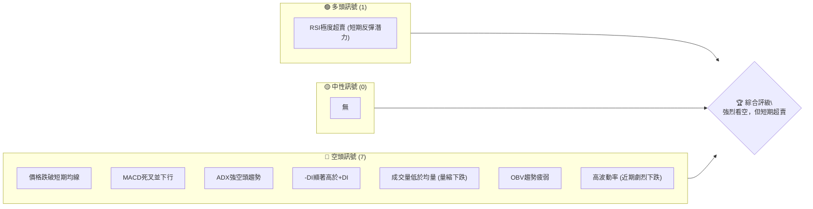
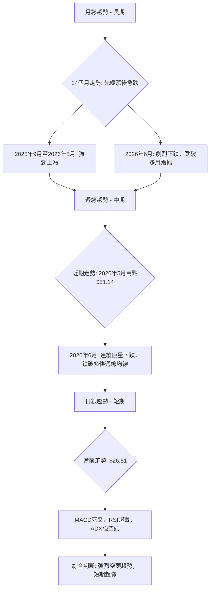
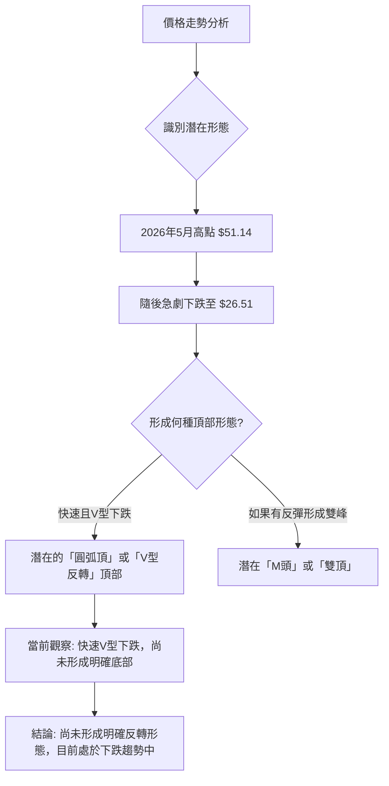
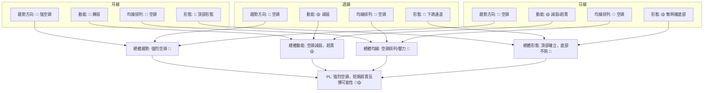

<details>
<summary>📊 靜態圖表 (點擊展開)</summary>

</details>

<html>
<head><meta charset="utf-8" /></head>
<body>
    <div style="height:500px; width:100%;">                        <script>window.PlotlyConfig = {MathJaxConfig: 'local'};</script>
        <script charset="utf-8" src="https://cdn.plot.ly/plotly-3.6.0.min.js" integrity="sha256-QaOVwtVY0T02VaHrr6pnoHLCwayMJp4O5n4YyaE3rJk=" crossorigin="anonymous"></script>                <div id="candlestick-chart" class="plotly-graph-div" style="height:100%; width:100%;"></div>            <script>                window.PLOTLYENV=window.PLOTLYENV || {};                                if (document.getElementById("candlestick-chart")) {                    Plotly.newPlot(                        "candlestick-chart",                        [{"close":{"dtype":"f8","bdata":"AAAA4KPwIUAAAABAClcjQAAAACBcjyNAAAAA4FG4I0AAAAAAAIAjQAAAAIDCdSRAAAAA4FE4JUAAAADgUTgmQAAAAOBROCZAAAAAoJkZKEAAAAAAKdwnQAAAACCF6ydAAAAAYGZmKEAAAADgepQpQAAAAIDC9SlAAAAAgD2KK0AAAABAM7MtQAAAAGC4ni5AAAAAQOF6LkAAAAAAKVwvQAAAAEAzMy9AAAAAgOtRL0AAAABgZmYtQAAAAAAAgC5AAAAAIFyPLUAAAACAFC4uQAAAAIDCdSpAAAAA4FE4KkAAAABguB4rQAAAAIDr0SlAAAAAAAAAKUAAAABgZuYpQAAAAOBROCtAAAAAYLieKkAAAACAFK4pQAAAAMDMzClAAAAA4FG4KUAAAABgZuYqQAAAAKBHYSpAAAAAYGZmKUAAAAAAAIAqQAAAACCF6yhAAAAAYLieKUAAAAAgrscqQAAAAOCj8ChAAAAAoEfhKEAAAACA69EmQAAAAMDMzCZAAAAAIIVrJkAAAABgZuYmQAAAAOB6lCdAAAAAgMJ1JkAAAACA61EmQAAAAOB6FCdAAAAAgMJ1J0AAAADgo3AnQAAAAMDMzCdAAAAAYGZmJ0AAAACAPYonQAAAAMAeBShAAAAAoEfhKUAAAACAPYopQAAAAGBm5ilAAAAAgBSuKUAAAACgR+EpQAAAAOBReDFAAAAAoHA9MkAAAADAzAwyQAAAAKBH4TFAAAAA4FF4MEAAAACgcH0xQAAAAIAULjNAAAAAoJmZNEAAAABA4bo0QAAAAIDrUTRAAAAAAClcM0AAAABguN4zQAAAAKBwvTNAAAAA4FG4M0AAAADA9Wg0QAAAAADXYzVAAAAAQArXNUAAAAAAKZw2QAAAAOCjcDZAAAAAgMK1NkAAAADgo3A5QAAAAIDrUTlAAAAAQOG6OkAAAAAgrkc8QAAAACCuxzxAAAAAAAAAPEAAAACgR2E6QAAAACBcDzpAAAAA4KPwOkAAAABguN45QAAAAIDrETxAAAAAoEfhO0AAAACgmVk6QAAAAOBR+DhAAAAAoJnZNkAAAABAM\u002fM3QAAAAMAexTVAAAAAgBRuNEAAAABgj0I2QAAAAMAeBThAAAAAgD3KNkAAAABgZqY1QAAAAMDMTDVAAAAAIIVrNkAAAACAwjU2QAAAAKBwvTdAAAAAACkcOUAAAABgZuY3QAAAACCuxzdAAAAAgMK1OEAAAACgR6E4QAAAAKCZmTlAAAAAANcjOEAAAAAAKVw6QAAAAMDMTDlAAAAAAAAAOkAAAABACpc4QAAAACCuRzlAAAAAgOvROUAAAABgZmY5QAAAAOCjcDlAAAAA4FH4OEAAAACAPco4QAAAAKCZmThAAAAA4HoUO0AAAAAgXM84QAAAAIDC9TpAAAAAgD3qQEAAAADA9ehAQAAAAOB61D9AAAAAIFyvQUAAAABAMzNAQAAAAAAp3D5AAAAAANfjO0AAAABAM\u002fM7QAAAAIDCtT5AAAAA4KPwQUAAAABgj4JBQAAAAIDClUFAAAAAYGZGQkAAAACgcB1BQAAAAIDCVUFAAAAAwPUoQUAAAABACvdAQAAAAOB6NEFAAAAAgOvxQ0AAAACgcD1DQAAAAAAAwEJAAAAAANcDQ0AAAAAAKbxDQAAAAMAeJUNAAAAA4FG4QUAAAACgmblBQAAAAADXg0FAAAAAgD0KQUAAAAAAKXxCQAAAAEAzc0JAAAAAwB5FQ0AAAADgo5BCQAAAAOBR2ENAAAAAYLieQUAAAADAHoVDQAAAACCF60RAAAAAQApXREAAAABguF5EQAAAAMAehUVAAAAAIFzPREAAAACAFM5EQAAAACCFy0RAAAAA4HpURUAAAACgcD1FQAAAAMDMLEZAAAAAwPUoSEAAAACgcD1JQAAAAEAzs0lAAAAAgOuRSUAAAABA4TpHQAAAACCFC0hAAAAA4KOQRUAAAAAA18NFQAAAAAApHEBAAAAAYLheQEAAAAAghSs\u002fQAAAAOBRuD5AAAAAgMIVQUAAAABgZiY\u002fQAAAAOB6lD5AAAAAgMI1PEAAAADgUTg8QAAAAEDhOjxAAAAAwB7FPEAAAAAgroc8QAAAAMDMTDpAAAAAYI+COkAAAAAAAAD4fw=="},"high":{"dtype":"f8","bdata":"AAAAQDOzIkAAAADA9SgkQAAAAOB6lCNAAAAA4FE4JEAAAABAtvMjQAAAAMDMzCRAAAAAIIVrJUAAAACA69EmQAAAAMDMTCZAAAAAYI9CKEAAAACAwnUoQAAAACBcjyhAAAAAwPWoKEAAAAAAAAAqQAAAAGC4HipAAAAAgD0KLEAAAADAyDYuQAAAAAAAAC9AAAAAIK7HL0AAAABgjwIwQAAAACCuxzBAAAAAoJmZL0AAAADAzAwwQAAAAGBm5i9AAAAAAACALkAAAADgelQvQAAAAEA1Hi9AAAAAwPUoK0AAAACA69EsQAAAAEAIrCpAAAAAoJkZKkAAAAAAKZwqQAAAAIAUbitAAAAAIIXrK0AAAADgo\u002fAqQAAAACCFqypAAAAAYGZmKkAAAACAwnUrQAAAAGCPwipAAAAAgD0KK0AAAADgo7AqQAAAAIA9CipAAAAAYGamKUAAAACgmZkrQAAAAKBwvSpAAAAAwMzMKUAAAACA69EoQAAAAEAzsydAAAAA4FE4J0AAAADAHsUnQAAAAIDC9ShAAAAAAAAAKUAAAAAAAAAnQAAAACBcTydAAAAAoO28J0AAAACAPQooQAAAAMAeBShAAAAAANejJ0AAAADAHoUoQAAAAKBHYShAAAAAYGZmKkAAAAAAAMApQAAAAIDCdSpAAAAAAAAAKkAAAABA4XoqQAAAAKCZ+TFAAAAAoJkZM0AAAADgo7AzQAAAACCuRzJAAAAAwMyMMkAAAABAM\u002fMxQAAAAOB61DNAAAAAYI\u002fCNEAAAACgcP00QAAAAIAU7jRAAAAAgMJVNEAAAADAHiU0QAAAAAApPDRAAAAAwMxMNEAAAAAgXM80QAAAACBcbzVAAAAAQDMTNkAAAAAAKdw2QAAAAKCZmTdAAAAAgOnGN0AAAAAgXI85QAAAAEAKlzpAAAAAwB7FOkAAAACgR2E9QAAAAGDj5T5AAAAA4FG4PUAAAAAghas8QAAAAIDA6jpAAAAAQOG6O0AAAABAM7M6QAAAAEAzszxAAAAAYGZmPEAAAABAM7M7QAAAAAAAQDtAAAAAwKHFOUAAAAAArPw3QAAAAAAAADhAAAAAgMCKNUAAAAAgrkc2QAAAAOBRGDhAAAAAQOH6N0AAAABgZoY3QAAAAMD16DVAAAAAgBTuNkAAAACAPco2QAAAAKCZmThAAAAAACkcOUAAAADgo7A5QAAAAOB6tDhAAAAAIFzPOEAAAABAYtA5QAAAAOCjsDlAAAAAQArXOEAAAACAFO46QAAAAOCjcDpAAAAAoEeBOkAAAACgcD06QAAAAACqkTtAAAAAQAoXOkAAAADgUXg6QAAAACCF6zpAAAAAIFwPOkAAAACA6QY6QAAAAAAAgDlAAAAAQAoXO0AAAADgehQ7QAAAAGCPQjtAAAAAANcjQkAAAAAghWtBQAAAACCFC0JAAAAAYGaGQkAAAAAA1dhBQAAAAGC4HkFAAAAAwPVoP0AAAACAFO48QAAAAIAULj9AAAAAwB4FQkAAAADAHiVCQAAAAGBm5kFAAAAAQOEaQ0AAAACAwpVCQAAAAIDrMUJAAAAAgBS+QUAAAAAgWDlCQAAAAIDClUFAAAAAoHAdREAAAACgcB1EQAAAAOB69ENAAAAAANfDQ0AAAABA4dpEQAAAAAAAAERAAAAAAADAQ0AAAACgcB1CQAAAAEAKp0FAAAAAAACAQUAAAAAAKXxCQAAAAOB6pEJAAAAAYI+iQ0AAAABACrdDQAAAAKBH4UNAAAAAgMJ1REAAAADAzOxDQAAAACBcj0VAAAAA4KPwREAAAACgmRlFQAAAAKCZuUVAAAAAQAqXRUAAAAAA1+NGQAAAAAAA4ERAAAAAYGbGRUAAAAAAAABGQAAAAEAMokZAAAAA4KOQSUAAAACgcH1JQAAAAKBH4UlAAAAAYI+iSUAAAAAAAGBJQAAAAGCPYklAAAAAIFzPR0AAAADAHpVGQAAAAEAKl0NAAAAAwB4FQUAAAAAgXC9BQAAAAMDMzD9AAAAAwPUoQUAAAABAMxNBQAAAAIDrEUBAAAAAAABAP0AAAACgmVk9QAAAAAAAAD1AAAAAYI8iPUAAAAAgLz09QAAAAKBH4TxAAAAAQArXOkAAAAAAAAD4fw=="},"hovertemplate":"\u003cb\u003e%{x|%Y-%m-%d}\u003c\u002fb\u003e\u003cbr\u003e\u958b: $%{open:.2f}\u003cbr\u003e\u9ad8: $%{high:.2f}\u003cbr\u003e\u4f4e: $%{low:.2f}\u003cbr\u003e\u6536: $%{close:.2f}\u003cextra\u003e\u003c\u002fextra\u003e","low":{"dtype":"f8","bdata":"AAAA4KMwIUAAAABgj0IiQAAAACCuxyJAAAAA4FH4IkAAAACA61EjQAAAAAApXCNAAAAA4KNwJEAAAABA4TolQAAAAOCjcCVAAAAAANcjJkAAAABAClcnQAAAAEAK1yZAAAAAwB6FJ0AAAADgUbgoQAAAAKBwPShAAAAAQDMzKUAAAADA9SgsQAAAAMAehS1AAAAAoEdhLkAAAAAgXI8tQAAAAMAehS5AAAAAwPUoLkAAAAAAKRwtQAAAAIDrUS5AAAAAQAoXLUAAAABAM7MtQAAAAKBwPSpAAAAAIN0kKUAAAAAAAAArQAAAAGC4nilAAAAA4KPwJ0AAAACAFC4pQAAAACCuRypAAAAAgD2KKkAAAAAgXI8pQAAAACCuhylAAAAAQN8PKUAAAAAgrscpQAAAAIDCdSlAAAAAIIXrKEAAAAAgXA8pQAAAAADXIyhAAAAAACncJ0AAAABgENgpQAAAACBcjyhAAAAAwPWoKEAAAABAChcmQAAAAMDIdiVAAAAAYI\u002fCJUAAAACAFO4lQAAAAMDMzCZAAAAAgJcuJkAAAACAPQolQAAAAMAehSZAAAAAwB6FJkAAAABgj0InQAAAAICXbidAAAAAwMzMJkAAAADgelQnQAAAAEDheidAAAAAACncJ0AAAADAHgUpQAAAAKBwPSlAAAAAQDUeKUAAAADA9SgpQAAAAMAeBS5AAAAAYLheMUAAAAAA16MxQAAAAIAU7jBAAAAAgBRuMEAAAACAPQoxQAAAAKBw\u002fTFAAAAAACmcM0AAAACgmZkzQAAAAAApHDRAAAAAgD0KM0AAAABgj8IyQAAAAOCjcDNAAAAAQImhM0AAAAAA1fgyQAAAAKBwfTNAAAAA4FH4NEAAAADA9Wg1QAAAAEAKFzZAAAAAwCDQNUAAAADA9Sg3QAAAAGC4HjlAAAAAAAAAOUAAAABgj0I6QAAAAAApXDxAAAAAIFxvO0AAAACgRyE5QAAAAADXIzlAAAAAgBQuOUAAAADgUTg5QAAAAKAaDzpAAAAAIFzPOkAAAADAzIw5QAAAAIDrcThAAAAAQAp3NkAAAADA9eg2QAAAAEAKlzRAAAAAYGYmNEAAAAAgXM80QAAAAGBmpjVAAAAAgMK1NkAAAADA9eg0QAAAAEDh+jNAAAAAIAYhNUAAAAAAAIA1QAAAAKBwPTZAAAAAgMJ1NkAAAABgj4I3QAAAAEDhOjdAAAAAoJlZNkAAAACgcH04QAAAAIDrEThAAAAAIK7HNkAAAADgUbg3QAAAAKBHYThAAAAAgGgROUAAAABgj4I3QAAAAKCZ2TdAAAAAQDNzOEAAAABAMzM5QAAAAOCj8DhAAAAAIK5HOEAAAAAgXE84QAAAAOB4qTdAAAAAYGZmOEAAAABgj8I4QAAAAOCj8DdAAAAAgGghQEAAAABA4To\u002fQAAAAAApHD9AAAAAoEchP0AAAAAgXA9AQAAAAIA9ij5AAAAAYLg+O0AAAADA9Ug6QAAAAMAehTxAAAAA4KNwPUAAAABA4RpBQAAAAGCPYkBAAAAA4FG4QUAAAADgUfhAQAAAAKCZ+UBAAAAAAClcQEAAAACgR+E\u002fQAAAACCuZ0BAAAAAYGZ2QUAAAAAghetCQAAAAEAKd0JAAAAAYI\u002fCQkAAAAAA1yNDQAAAAIA9KkJAAAAA4KOQQUAAAADgo9BAQAAAAMDz3UBAAAAAwPVIQEAAAADASydBQAAAAOCla0FAAAAAwPXoQUAAAACgmflBQAAAAKBHwUFAAAAAQAp3QUAAAABgZuZBQAAAAMDMDENAAAAAoEchQ0AAAADAzGxDQAAAAMDMzENAAAAAwB5FREAAAACgRyFEQAAAAGCPAkNAAAAAgMJVREAAAADAHoVEQAAAAMDMjEVAAAAAgBTuRkAAAACAFI5HQAAAAAAAgEdAAAAAANdjRkAAAAAA18NGQAAAAEDhOkdAAAAAwB5VRUAAAABgZqZEQAAAAMD1qD9AAAAA4HpUP0AAAACA61E9QAAAAEAzMz5AAAAAIIVrPkAAAADAHsU9QAAAAAApHD5AAAAAoEMLO0AAAADgehQ8QAAAAOB6VDpAAAAAgMK1OkAAAADgelQ7QAAAAIA9ijlAAAAAwMxMOUAAAAAAAAD4fw=="},"name":"\u50f9\u683c","open":{"dtype":"f8","bdata":"AAAAYGZmIkAAAACgR2EiQAAAAKBwPSNAAAAA4KPwI0AAAADgUbgjQAAAAAAAgCNAAAAAgML1JEAAAACA61ElQAAAAOBRuCVAAAAAQOF6JkAAAAAgrkcoQAAAAAAAACdAAAAA4FG4J0AAAAAgrscoQAAAAGBmZilAAAAAgBSuKUAAAADgUbgsQAAAAGBm5i1AAAAAoJmZL0AAAAAAAAAuQAAAAMDMjDBAAAAAgBQuL0AAAADgUbgvQAAAACCFay5AAAAAAAAALkAAAABgZuYuQAAAAOCj8C5AAAAAAAAAKkAAAACAPQosQAAAAAApXCpAAAAAAACAKUAAAABgj0IpQAAAAKCZmSpAAAAAYGbmK0AAAADAzMwqQAAAACCF6ylAAAAAQOF6KUAAAAAgrscpQAAAAMD1qCpAAAAAgMJ1KUAAAACAFK4pQAAAAMAeBSpAAAAA4FE4KEAAAACAwnUqQAAAAGBmZipAAAAAYI9CKUAAAACAPYooQAAAAAAAACZAAAAAAClcJkAAAADgehQmQAAAACCF6yZAAAAAYGZmKEAAAABA4XomQAAAAEAzsyZAAAAAwB4FJ0AAAACAPYonQAAAAIDr0SdAAAAAQDMzJ0AAAABgj8InQAAAAMD1qCdAAAAAYGbmJ0AAAADAHoUpQAAAAAApXCpAAAAAoHA9KUAAAACgmZkpQAAAAOB6lC9AAAAA4KNwMkAAAAAgXM8yQAAAAGBmpjFAAAAAgBQuMkAAAACAPQoxQAAAAKBw\u002fTFAAAAAIK7HM0AAAADAzMwzQAAAAEDhujRAAAAAwMxMNEAAAACgcN0yQAAAACCuBzRAAAAAYLi+M0AAAABA4dozQAAAAEAzszRAAAAAAACANUAAAADgUbg1QAAAAKCZ2TZAAAAAoJmZNkAAAADAzEw3QAAAAGCPQjpAAAAAAACAOUAAAAAgXM86QAAAAEAzczxAAAAAQAqXO0AAAAAAAIA8QAAAAAAAwDpAAAAAYI8COkAAAACgmZk6QAAAAOB6FDpAAAAAwMwMPEAAAABAM7M7QAAAAEAKtzlAAAAAANfjOEAAAABA4fo3QAAAAAAAADhAAAAAAAAANUAAAACAPQo1QAAAAIDC9TVAAAAAYLjeN0AAAABgZoY3QAAAAIDrkTVAAAAAAACANUAAAAAAAAA2QAAAAGBmZjZAAAAAwB4FN0AAAACgcL04QAAAAGBmZjdAAAAAAABAN0AAAADAzEw5QAAAAAAAgDhAAAAAQDOTOEAAAADgUbg3QAAAAEDhGjpAAAAAoJmZOUAAAAAAAIA5QAAAAADX4zdAAAAAQArXOEAAAACA69E5QAAAAEAKVzlAAAAA4FH4OUAAAABA4fo4QAAAAKBHITlAAAAAoJnZOEAAAAAAAIA6QAAAAAAAQDhAAAAAYGbGQEAAAAAAAEBBQAAAAEDh2kBAAAAAQDMzQEAAAAAAKXxBQAAAAKBw\u002fUBAAAAAoJnZPkAAAADAzMw8QAAAAAAAAD1AAAAA4KNwPUAAAACAwvVBQAAAAOCjsEFAAAAAQDNzQkAAAAAAAEBCQAAAAOCjcEFAAAAAoHAdQUAAAAAghctBQAAAAIDCNUFAAAAAoHB9QUAAAACA65FDQAAAAEAzk0NAAAAAACkcQ0AAAAAAAMBDQAAAAIA9qkNAAAAAgBSOQ0AAAAAAKbxBQAAAAMDMTEFAAAAA4KMwQUAAAAAA10NBQAAAACBcX0JAAAAAwB6FQkAAAACgmZlDQAAAACBcf0JAAAAAYI\u002fCQ0AAAABAMzNCQAAAAEAzU0NAAAAAIIULREAAAABAChdFQAAAAOCjUERAAAAAwPUIRUAAAAAA16NFQAAAAEAKd0RAAAAAQDMzRUAAAADAcghFQAAAAMDMrEVAAAAAwPXYR0AAAADAzAxJQAAAAEAzE0lAAAAAAACQSEAAAAAghYtIQAAAAIDClUdAAAAAIFzPR0AAAACgcJ1FQAAAAGBmJkNAAAAAoEcBQUAAAACAwrVAQAAAAADX4z5AAAAAAACAP0AAAACA6\u002fFAQAAAAIA9CkBAAAAAwB4FPkAAAAAA12M8QAAAAGBmpjxAAAAAgML1O0AAAADgelQ7QAAAAIDrETxAAAAAYI+COkAAAAAAAAD4fw=="},"x":["2025-09-10T00:00:00-04:00","2025-09-11T00:00:00-04:00","2025-09-12T00:00:00-04:00","2025-09-15T00:00:00-04:00","2025-09-16T00:00:00-04:00","2025-09-17T00:00:00-04:00","2025-09-18T00:00:00-04:00","2025-09-19T00:00:00-04:00","2025-09-22T00:00:00-04:00","2025-09-23T00:00:00-04:00","2025-09-24T00:00:00-04:00","2025-09-25T00:00:00-04:00","2025-09-26T00:00:00-04:00","2025-09-29T00:00:00-04:00","2025-09-30T00:00:00-04:00","2025-10-01T00:00:00-04:00","2025-10-02T00:00:00-04:00","2025-10-03T00:00:00-04:00","2025-10-06T00:00:00-04:00","2025-10-07T00:00:00-04:00","2025-10-08T00:00:00-04:00","2025-10-09T00:00:00-04:00","2025-10-10T00:00:00-04:00","2025-10-13T00:00:00-04:00","2025-10-14T00:00:00-04:00","2025-10-15T00:00:00-04:00","2025-10-16T00:00:00-04:00","2025-10-17T00:00:00-04:00","2025-10-20T00:00:00-04:00","2025-10-21T00:00:00-04:00","2025-10-22T00:00:00-04:00","2025-10-23T00:00:00-04:00","2025-10-24T00:00:00-04:00","2025-10-27T00:00:00-04:00","2025-10-28T00:00:00-04:00","2025-10-29T00:00:00-04:00","2025-10-30T00:00:00-04:00","2025-10-31T00:00:00-04:00","2025-11-03T00:00:00-05:00","2025-11-04T00:00:00-05:00","2025-11-05T00:00:00-05:00","2025-11-06T00:00:00-05:00","2025-11-07T00:00:00-05:00","2025-11-10T00:00:00-05:00","2025-11-11T00:00:00-05:00","2025-11-12T00:00:00-05:00","2025-11-13T00:00:00-05:00","2025-11-14T00:00:00-05:00","2025-11-17T00:00:00-05:00","2025-11-18T00:00:00-05:00","2025-11-19T00:00:00-05:00","2025-11-20T00:00:00-05:00","2025-11-21T00:00:00-05:00","2025-11-24T00:00:00-05:00","2025-11-25T00:00:00-05:00","2025-11-26T00:00:00-05:00","2025-11-28T00:00:00-05:00","2025-12-01T00:00:00-05:00","2025-12-02T00:00:00-05:00","2025-12-03T00:00:00-05:00","2025-12-04T00:00:00-05:00","2025-12-05T00:00:00-05:00","2025-12-08T00:00:00-05:00","2025-12-09T00:00:00-05:00","2025-12-10T00:00:00-05:00","2025-12-11T00:00:00-05:00","2025-12-12T00:00:00-05:00","2025-12-15T00:00:00-05:00","2025-12-16T00:00:00-05:00","2025-12-17T00:00:00-05:00","2025-12-18T00:00:00-05:00","2025-12-19T00:00:00-05:00","2025-12-22T00:00:00-05:00","2025-12-23T00:00:00-05:00","2025-12-24T00:00:00-05:00","2025-12-26T00:00:00-05:00","2025-12-29T00:00:00-05:00","2025-12-30T00:00:00-05:00","2025-12-31T00:00:00-05:00","2026-01-02T00:00:00-05:00","2026-01-05T00:00:00-05:00","2026-01-06T00:00:00-05:00","2026-01-07T00:00:00-05:00","2026-01-08T00:00:00-05:00","2026-01-09T00:00:00-05:00","2026-01-12T00:00:00-05:00","2026-01-13T00:00:00-05:00","2026-01-14T00:00:00-05:00","2026-01-15T00:00:00-05:00","2026-01-16T00:00:00-05:00","2026-01-20T00:00:00-05:00","2026-01-21T00:00:00-05:00","2026-01-22T00:00:00-05:00","2026-01-23T00:00:00-05:00","2026-01-26T00:00:00-05:00","2026-01-27T00:00:00-05:00","2026-01-28T00:00:00-05:00","2026-01-29T00:00:00-05:00","2026-01-30T00:00:00-05:00","2026-02-02T00:00:00-05:00","2026-02-03T00:00:00-05:00","2026-02-04T00:00:00-05:00","2026-02-05T00:00:00-05:00","2026-02-06T00:00:00-05:00","2026-02-09T00:00:00-05:00","2026-02-10T00:00:00-05:00","2026-02-11T00:00:00-05:00","2026-02-12T00:00:00-05:00","2026-02-13T00:00:00-05:00","2026-02-17T00:00:00-05:00","2026-02-18T00:00:00-05:00","2026-02-19T00:00:00-05:00","2026-02-20T00:00:00-05:00","2026-02-23T00:00:00-05:00","2026-02-24T00:00:00-05:00","2026-02-25T00:00:00-05:00","2026-02-26T00:00:00-05:00","2026-02-27T00:00:00-05:00","2026-03-02T00:00:00-05:00","2026-03-03T00:00:00-05:00","2026-03-04T00:00:00-05:00","2026-03-05T00:00:00-05:00","2026-03-06T00:00:00-05:00","2026-03-09T00:00:00-04:00","2026-03-10T00:00:00-04:00","2026-03-11T00:00:00-04:00","2026-03-12T00:00:00-04:00","2026-03-13T00:00:00-04:00","2026-03-16T00:00:00-04:00","2026-03-17T00:00:00-04:00","2026-03-18T00:00:00-04:00","2026-03-19T00:00:00-04:00","2026-03-20T00:00:00-04:00","2026-03-23T00:00:00-04:00","2026-03-24T00:00:00-04:00","2026-03-25T00:00:00-04:00","2026-03-26T00:00:00-04:00","2026-03-27T00:00:00-04:00","2026-03-30T00:00:00-04:00","2026-03-31T00:00:00-04:00","2026-04-01T00:00:00-04:00","2026-04-02T00:00:00-04:00","2026-04-06T00:00:00-04:00","2026-04-07T00:00:00-04:00","2026-04-08T00:00:00-04:00","2026-04-09T00:00:00-04:00","2026-04-10T00:00:00-04:00","2026-04-13T00:00:00-04:00","2026-04-14T00:00:00-04:00","2026-04-15T00:00:00-04:00","2026-04-16T00:00:00-04:00","2026-04-17T00:00:00-04:00","2026-04-20T00:00:00-04:00","2026-04-21T00:00:00-04:00","2026-04-22T00:00:00-04:00","2026-04-23T00:00:00-04:00","2026-04-24T00:00:00-04:00","2026-04-27T00:00:00-04:00","2026-04-28T00:00:00-04:00","2026-04-29T00:00:00-04:00","2026-04-30T00:00:00-04:00","2026-05-01T00:00:00-04:00","2026-05-04T00:00:00-04:00","2026-05-05T00:00:00-04:00","2026-05-06T00:00:00-04:00","2026-05-07T00:00:00-04:00","2026-05-08T00:00:00-04:00","2026-05-11T00:00:00-04:00","2026-05-12T00:00:00-04:00","2026-05-13T00:00:00-04:00","2026-05-14T00:00:00-04:00","2026-05-15T00:00:00-04:00","2026-05-18T00:00:00-04:00","2026-05-19T00:00:00-04:00","2026-05-20T00:00:00-04:00","2026-05-21T00:00:00-04:00","2026-05-22T00:00:00-04:00","2026-05-26T00:00:00-04:00","2026-05-27T00:00:00-04:00","2026-05-28T00:00:00-04:00","2026-05-29T00:00:00-04:00","2026-06-01T00:00:00-04:00","2026-06-02T00:00:00-04:00","2026-06-03T00:00:00-04:00","2026-06-04T00:00:00-04:00","2026-06-05T00:00:00-04:00","2026-06-08T00:00:00-04:00","2026-06-09T00:00:00-04:00","2026-06-10T00:00:00-04:00","2026-06-11T00:00:00-04:00","2026-06-12T00:00:00-04:00","2026-06-15T00:00:00-04:00","2026-06-16T00:00:00-04:00","2026-06-17T00:00:00-04:00","2026-06-18T00:00:00-04:00","2026-06-22T00:00:00-04:00","2026-06-23T00:00:00-04:00","2026-06-24T00:00:00-04:00","2026-06-25T00:00:00-04:00","2026-06-26T00:00:00-04:00"],"type":"candlestick"},{"hovertemplate":"MA30: $%{y:.2f}\u003cextra\u003e\u003c\u002fextra\u003e","line":{"color":"#2196F3","dash":"dash","width":2},"mode":"lines","name":"MA30","x":["2025-09-10T00:00:00-04:00","2025-09-11T00:00:00-04:00","2025-09-12T00:00:00-04:00","2025-09-15T00:00:00-04:00","2025-09-16T00:00:00-04:00","2025-09-17T00:00:00-04:00","2025-09-18T00:00:00-04:00","2025-09-19T00:00:00-04:00","2025-09-22T00:00:00-04:00","2025-09-23T00:00:00-04:00","2025-09-24T00:00:00-04:00","2025-09-25T00:00:00-04:00","2025-09-26T00:00:00-04:00","2025-09-29T00:00:00-04:00","2025-09-30T00:00:00-04:00","2025-10-01T00:00:00-04:00","2025-10-02T00:00:00-04:00","2025-10-03T00:00:00-04:00","2025-10-06T00:00:00-04:00","2025-10-07T00:00:00-04:00","2025-10-08T00:00:00-04:00","2025-10-09T00:00:00-04:00","2025-10-10T00:00:00-04:00","2025-10-13T00:00:00-04:00","2025-10-14T00:00:00-04:00","2025-10-15T00:00:00-04:00","2025-10-16T00:00:00-04:00","2025-10-17T00:00:00-04:00","2025-10-20T00:00:00-04:00","2025-10-21T00:00:00-04:00","2025-10-22T00:00:00-04:00","2025-10-23T00:00:00-04:00","2025-10-24T00:00:00-04:00","2025-10-27T00:00:00-04:00","2025-10-28T00:00:00-04:00","2025-10-29T00:00:00-04:00","2025-10-30T00:00:00-04:00","2025-10-31T00:00:00-04:00","2025-11-03T00:00:00-05:00","2025-11-04T00:00:00-05:00","2025-11-05T00:00:00-05:00","2025-11-06T00:00:00-05:00","2025-11-07T00:00:00-05:00","2025-11-10T00:00:00-05:00","2025-11-11T00:00:00-05:00","2025-11-12T00:00:00-05:00","2025-11-13T00:00:00-05:00","2025-11-14T00:00:00-05:00","2025-11-17T00:00:00-05:00","2025-11-18T00:00:00-05:00","2025-11-19T00:00:00-05:00","2025-11-20T00:00:00-05:00","2025-11-21T00:00:00-05:00","2025-11-24T00:00:00-05:00","2025-11-25T00:00:00-05:00","2025-11-26T00:00:00-05:00","2025-11-28T00:00:00-05:00","2025-12-01T00:00:00-05:00","2025-12-02T00:00:00-05:00","2025-12-03T00:00:00-05:00","2025-12-04T00:00:00-05:00","2025-12-05T00:00:00-05:00","2025-12-08T00:00:00-05:00","2025-12-09T00:00:00-05:00","2025-12-10T00:00:00-05:00","2025-12-11T00:00:00-05:00","2025-12-12T00:00:00-05:00","2025-12-15T00:00:00-05:00","2025-12-16T00:00:00-05:00","2025-12-17T00:00:00-05:00","2025-12-18T00:00:00-05:00","2025-12-19T00:00:00-05:00","2025-12-22T00:00:00-05:00","2025-12-23T00:00:00-05:00","2025-12-24T00:00:00-05:00","2025-12-26T00:00:00-05:00","2025-12-29T00:00:00-05:00","2025-12-30T00:00:00-05:00","2025-12-31T00:00:00-05:00","2026-01-02T00:00:00-05:00","2026-01-05T00:00:00-05:00","2026-01-06T00:00:00-05:00","2026-01-07T00:00:00-05:00","2026-01-08T00:00:00-05:00","2026-01-09T00:00:00-05:00","2026-01-12T00:00:00-05:00","2026-01-13T00:00:00-05:00","2026-01-14T00:00:00-05:00","2026-01-15T00:00:00-05:00","2026-01-16T00:00:00-05:00","2026-01-20T00:00:00-05:00","2026-01-21T00:00:00-05:00","2026-01-22T00:00:00-05:00","2026-01-23T00:00:00-05:00","2026-01-26T00:00:00-05:00","2026-01-27T00:00:00-05:00","2026-01-28T00:00:00-05:00","2026-01-29T00:00:00-05:00","2026-01-30T00:00:00-05:00","2026-02-02T00:00:00-05:00","2026-02-03T00:00:00-05:00","2026-02-04T00:00:00-05:00","2026-02-05T00:00:00-05:00","2026-02-06T00:00:00-05:00","2026-02-09T00:00:00-05:00","2026-02-10T00:00:00-05:00","2026-02-11T00:00:00-05:00","2026-02-12T00:00:00-05:00","2026-02-13T00:00:00-05:00","2026-02-17T00:00:00-05:00","2026-02-18T00:00:00-05:00","2026-02-19T00:00:00-05:00","2026-02-20T00:00:00-05:00","2026-02-23T00:00:00-05:00","2026-02-24T00:00:00-05:00","2026-02-25T00:00:00-05:00","2026-02-26T00:00:00-05:00","2026-02-27T00:00:00-05:00","2026-03-02T00:00:00-05:00","2026-03-03T00:00:00-05:00","2026-03-04T00:00:00-05:00","2026-03-05T00:00:00-05:00","2026-03-06T00:00:00-05:00","2026-03-09T00:00:00-04:00","2026-03-10T00:00:00-04:00","2026-03-11T00:00:00-04:00","2026-03-12T00:00:00-04:00","2026-03-13T00:00:00-04:00","2026-03-16T00:00:00-04:00","2026-03-17T00:00:00-04:00","2026-03-18T00:00:00-04:00","2026-03-19T00:00:00-04:00","2026-03-20T00:00:00-04:00","2026-03-23T00:00:00-04:00","2026-03-24T00:00:00-04:00","2026-03-25T00:00:00-04:00","2026-03-26T00:00:00-04:00","2026-03-27T00:00:00-04:00","2026-03-30T00:00:00-04:00","2026-03-31T00:00:00-04:00","2026-04-01T00:00:00-04:00","2026-04-02T00:00:00-04:00","2026-04-06T00:00:00-04:00","2026-04-07T00:00:00-04:00","2026-04-08T00:00:00-04:00","2026-04-09T00:00:00-04:00","2026-04-10T00:00:00-04:00","2026-04-13T00:00:00-04:00","2026-04-14T00:00:00-04:00","2026-04-15T00:00:00-04:00","2026-04-16T00:00:00-04:00","2026-04-17T00:00:00-04:00","2026-04-20T00:00:00-04:00","2026-04-21T00:00:00-04:00","2026-04-22T00:00:00-04:00","2026-04-23T00:00:00-04:00","2026-04-24T00:00:00-04:00","2026-04-27T00:00:00-04:00","2026-04-28T00:00:00-04:00","2026-04-29T00:00:00-04:00","2026-04-30T00:00:00-04:00","2026-05-01T00:00:00-04:00","2026-05-04T00:00:00-04:00","2026-05-05T00:00:00-04:00","2026-05-06T00:00:00-04:00","2026-05-07T00:00:00-04:00","2026-05-08T00:00:00-04:00","2026-05-11T00:00:00-04:00","2026-05-12T00:00:00-04:00","2026-05-13T00:00:00-04:00","2026-05-14T00:00:00-04:00","2026-05-15T00:00:00-04:00","2026-05-18T00:00:00-04:00","2026-05-19T00:00:00-04:00","2026-05-20T00:00:00-04:00","2026-05-21T00:00:00-04:00","2026-05-22T00:00:00-04:00","2026-05-26T00:00:00-04:00","2026-05-27T00:00:00-04:00","2026-05-28T00:00:00-04:00","2026-05-29T00:00:00-04:00","2026-06-01T00:00:00-04:00","2026-06-02T00:00:00-04:00","2026-06-03T00:00:00-04:00","2026-06-04T00:00:00-04:00","2026-06-05T00:00:00-04:00","2026-06-08T00:00:00-04:00","2026-06-09T00:00:00-04:00","2026-06-10T00:00:00-04:00","2026-06-11T00:00:00-04:00","2026-06-12T00:00:00-04:00","2026-06-15T00:00:00-04:00","2026-06-16T00:00:00-04:00","2026-06-17T00:00:00-04:00","2026-06-18T00:00:00-04:00","2026-06-22T00:00:00-04:00","2026-06-23T00:00:00-04:00","2026-06-24T00:00:00-04:00","2026-06-25T00:00:00-04:00","2026-06-26T00:00:00-04:00"],"y":{"dtype":"f8","bdata":"AAAAAAAA+H8AAAAAAAD4fwAAAAAAAPh\u002fAAAAAAAA+H8AAAAAAAD4fwAAAAAAAPh\u002fAAAAAAAA+H8AAAAAAAD4fwAAAAAAAPh\u002fAAAAAAAA+H8AAAAAAAD4fwAAAAAAAPh\u002fAAAAAAAA+H8AAAAAAAD4fwAAAAAAAPh\u002fAAAAAAAA+H8AAAAAAAD4fwAAAAAAAPh\u002fAAAAAAAA+H8AAAAAAAD4fwAAAAAAAPh\u002fAAAAAAAA+H8AAAAAAAD4fwAAAAAAAPh\u002fAAAAAAAA+H8AAAAAAAD4fwAAAAAAAPh\u002fAAAAAAAA+H8AAAAAAAD4fzMzM6MplSlAERERcWjRKUCrqqr6YgkqQBEREYHASipAmpmZyaGFKkBEREQ0XroqQM3MzJzv5ypAMzMzA1YOK0ARERGhRTYrQJqZmUnFWStA3t3dLd1kK0CJiIhYZHsrQBEREeHsgytAMzMzA1aOK0BERER0k5grQLy7uzvfjytA7+7uXix5K0B3d3fHdj4rQJqZmbm7+ypAMzMzY\u002fS2KkC8u7s7w24qQGZmZha9LSpA7+7uHiLiKUAAAACgt6UpQDMzM2NmZilAvLu7u1gyKUCrqqr61PgoQO\u002fu7h4i4ihAzczMvBHKKEC8u7sbhasoQDMzM\u002fMonChAZmZmVqujKECJiIjomKAoQDMzM1NVlShAzczM3E+NKEBERETEBI8oQGZmZmYD3ShAq6qq+tQ4KUDv7u6uVocpQKuqqpph1ylAvLu7+7gXKkAzMzPTFWAqQERERPTF0ipAvLu7+7hXK0De3d3t\u002fdQrQJqZmRn3WixAvLu7CxHRLECrqqpac2EtQO\u002fu7l7J7y1AAAAAIAaBLkBmZmb28BkvQAAAAADIvS9AZmZm5m05MEDv7u7OIpswQBERETkm+DBA3t3dZdhVMUAiIiIy7MoxQCIiIqJwPTJAMzMzK7K9MkCJiIjQlEozQImIiHCv2TNAMzMzgzJaNEAiIiICVs40QFVVVT01PjVAERERKYe2NUDe3d0t3SQ2QLy7uztRfzZAIiIiIpTRNkAzMzPDZxg3QKuqqhroVDdA3t3dbVmLN0BERESEecI3QFVVVXWT2DdAZmZmFiDXN0DNzMxsLuQ3QDMzMzPBAzhAZmZmJgYhOEDe3d2dNjA4QM3MzHyGPThAq6qqupBUOEAzMzPj7GM4QKuqqor6dzhAd3d39+GTOEAzMzMD5J44QJqZmUlTqjhAq6qqWmS7OEARERHherQ4QM3MzIzetjhAvLu7m8SgOEDe3d1NYpA4QAAAACCwcjhA7+7uDp9hOEDv7u6+WFI4QAAAANCwSzhAIiIiIiJCOEBmZmZmHz44QERERBSuJzhAZmZmFtkOOEB3d3c3iQE4QBEREfFg\u002fjdAREREhHkiOEBmZmY20Ck4QAAAAPAZVjhAAAAAsHLIOEBERETkFys5QImIiBi9bTlAVVVVhRbZOUAiIiJC0jQ6QGZmZmZmhjpAvLu7yxO1OkBVVVUFD+Y6QHd3dzeJITtAREREpHB9O0B3d3enVNw7QLy7u3uGPTxAvLu7W4+iPEARERHhevQ8QHd3d5fgQT1AREREJL+YPUDv7u4OWNk9QImIiCgVJz5AMzMzU5ydPkDe3d19IxQ\u002fQM3MzHxqfD9AMzMzo5vkP0AzMzMDVi5AQLy7u6MpZUBAvLu7q9WRQEC8u7s7Ub9AQKuqqpLR60BAERERca8JQUAAAABokT1BQCIiIor6Z0FAVVVVHRN8QUDNzMyEMopBQLy7u7u7q0FA3t3dvS2rQUBERERkgsdBQKuqqnpb9kFAIiIiku0sQkCamZmpf2NCQAAAAFAbmEJAvLu765iwQkBVVVX1tsxCQAAAAFAb6EJAAAAAEC0CQ0AzMzNDYCVDQHd3d2etTkNAMzMzI2mKQ0BmZmYmBtFDQDMzM8ODGURAMzMzw4NJREDNzMwMkGtEQHd3dye\u002fmERAd3d3t4GuREARERFR1L9EQCIiIkLupURAREREJGmaREBVVVU9JohEQCIiIpLCdURA7+7u3iR2RECJiIjgT11EQAAAAMBYQkRAIiIiokUWREARERGJQfBDQBERESlcv0NAmpmZMcGjQ0CJiIh46XZDQFVVVaWbNENAIiIiOib4QkAAAAAAAAD4fw=="},"type":"scatter"},{"hovertemplate":"MA60: $%{y:.2f}\u003cextra\u003e\u003c\u002fextra\u003e","line":{"color":"#9C27B0","dash":"dash","width":2},"mode":"lines","name":"MA60","x":["2025-09-10T00:00:00-04:00","2025-09-11T00:00:00-04:00","2025-09-12T00:00:00-04:00","2025-09-15T00:00:00-04:00","2025-09-16T00:00:00-04:00","2025-09-17T00:00:00-04:00","2025-09-18T00:00:00-04:00","2025-09-19T00:00:00-04:00","2025-09-22T00:00:00-04:00","2025-09-23T00:00:00-04:00","2025-09-24T00:00:00-04:00","2025-09-25T00:00:00-04:00","2025-09-26T00:00:00-04:00","2025-09-29T00:00:00-04:00","2025-09-30T00:00:00-04:00","2025-10-01T00:00:00-04:00","2025-10-02T00:00:00-04:00","2025-10-03T00:00:00-04:00","2025-10-06T00:00:00-04:00","2025-10-07T00:00:00-04:00","2025-10-08T00:00:00-04:00","2025-10-09T00:00:00-04:00","2025-10-10T00:00:00-04:00","2025-10-13T00:00:00-04:00","2025-10-14T00:00:00-04:00","2025-10-15T00:00:00-04:00","2025-10-16T00:00:00-04:00","2025-10-17T00:00:00-04:00","2025-10-20T00:00:00-04:00","2025-10-21T00:00:00-04:00","2025-10-22T00:00:00-04:00","2025-10-23T00:00:00-04:00","2025-10-24T00:00:00-04:00","2025-10-27T00:00:00-04:00","2025-10-28T00:00:00-04:00","2025-10-29T00:00:00-04:00","2025-10-30T00:00:00-04:00","2025-10-31T00:00:00-04:00","2025-11-03T00:00:00-05:00","2025-11-04T00:00:00-05:00","2025-11-05T00:00:00-05:00","2025-11-06T00:00:00-05:00","2025-11-07T00:00:00-05:00","2025-11-10T00:00:00-05:00","2025-11-11T00:00:00-05:00","2025-11-12T00:00:00-05:00","2025-11-13T00:00:00-05:00","2025-11-14T00:00:00-05:00","2025-11-17T00:00:00-05:00","2025-11-18T00:00:00-05:00","2025-11-19T00:00:00-05:00","2025-11-20T00:00:00-05:00","2025-11-21T00:00:00-05:00","2025-11-24T00:00:00-05:00","2025-11-25T00:00:00-05:00","2025-11-26T00:00:00-05:00","2025-11-28T00:00:00-05:00","2025-12-01T00:00:00-05:00","2025-12-02T00:00:00-05:00","2025-12-03T00:00:00-05:00","2025-12-04T00:00:00-05:00","2025-12-05T00:00:00-05:00","2025-12-08T00:00:00-05:00","2025-12-09T00:00:00-05:00","2025-12-10T00:00:00-05:00","2025-12-11T00:00:00-05:00","2025-12-12T00:00:00-05:00","2025-12-15T00:00:00-05:00","2025-12-16T00:00:00-05:00","2025-12-17T00:00:00-05:00","2025-12-18T00:00:00-05:00","2025-12-19T00:00:00-05:00","2025-12-22T00:00:00-05:00","2025-12-23T00:00:00-05:00","2025-12-24T00:00:00-05:00","2025-12-26T00:00:00-05:00","2025-12-29T00:00:00-05:00","2025-12-30T00:00:00-05:00","2025-12-31T00:00:00-05:00","2026-01-02T00:00:00-05:00","2026-01-05T00:00:00-05:00","2026-01-06T00:00:00-05:00","2026-01-07T00:00:00-05:00","2026-01-08T00:00:00-05:00","2026-01-09T00:00:00-05:00","2026-01-12T00:00:00-05:00","2026-01-13T00:00:00-05:00","2026-01-14T00:00:00-05:00","2026-01-15T00:00:00-05:00","2026-01-16T00:00:00-05:00","2026-01-20T00:00:00-05:00","2026-01-21T00:00:00-05:00","2026-01-22T00:00:00-05:00","2026-01-23T00:00:00-05:00","2026-01-26T00:00:00-05:00","2026-01-27T00:00:00-05:00","2026-01-28T00:00:00-05:00","2026-01-29T00:00:00-05:00","2026-01-30T00:00:00-05:00","2026-02-02T00:00:00-05:00","2026-02-03T00:00:00-05:00","2026-02-04T00:00:00-05:00","2026-02-05T00:00:00-05:00","2026-02-06T00:00:00-05:00","2026-02-09T00:00:00-05:00","2026-02-10T00:00:00-05:00","2026-02-11T00:00:00-05:00","2026-02-12T00:00:00-05:00","2026-02-13T00:00:00-05:00","2026-02-17T00:00:00-05:00","2026-02-18T00:00:00-05:00","2026-02-19T00:00:00-05:00","2026-02-20T00:00:00-05:00","2026-02-23T00:00:00-05:00","2026-02-24T00:00:00-05:00","2026-02-25T00:00:00-05:00","2026-02-26T00:00:00-05:00","2026-02-27T00:00:00-05:00","2026-03-02T00:00:00-05:00","2026-03-03T00:00:00-05:00","2026-03-04T00:00:00-05:00","2026-03-05T00:00:00-05:00","2026-03-06T00:00:00-05:00","2026-03-09T00:00:00-04:00","2026-03-10T00:00:00-04:00","2026-03-11T00:00:00-04:00","2026-03-12T00:00:00-04:00","2026-03-13T00:00:00-04:00","2026-03-16T00:00:00-04:00","2026-03-17T00:00:00-04:00","2026-03-18T00:00:00-04:00","2026-03-19T00:00:00-04:00","2026-03-20T00:00:00-04:00","2026-03-23T00:00:00-04:00","2026-03-24T00:00:00-04:00","2026-03-25T00:00:00-04:00","2026-03-26T00:00:00-04:00","2026-03-27T00:00:00-04:00","2026-03-30T00:00:00-04:00","2026-03-31T00:00:00-04:00","2026-04-01T00:00:00-04:00","2026-04-02T00:00:00-04:00","2026-04-06T00:00:00-04:00","2026-04-07T00:00:00-04:00","2026-04-08T00:00:00-04:00","2026-04-09T00:00:00-04:00","2026-04-10T00:00:00-04:00","2026-04-13T00:00:00-04:00","2026-04-14T00:00:00-04:00","2026-04-15T00:00:00-04:00","2026-04-16T00:00:00-04:00","2026-04-17T00:00:00-04:00","2026-04-20T00:00:00-04:00","2026-04-21T00:00:00-04:00","2026-04-22T00:00:00-04:00","2026-04-23T00:00:00-04:00","2026-04-24T00:00:00-04:00","2026-04-27T00:00:00-04:00","2026-04-28T00:00:00-04:00","2026-04-29T00:00:00-04:00","2026-04-30T00:00:00-04:00","2026-05-01T00:00:00-04:00","2026-05-04T00:00:00-04:00","2026-05-05T00:00:00-04:00","2026-05-06T00:00:00-04:00","2026-05-07T00:00:00-04:00","2026-05-08T00:00:00-04:00","2026-05-11T00:00:00-04:00","2026-05-12T00:00:00-04:00","2026-05-13T00:00:00-04:00","2026-05-14T00:00:00-04:00","2026-05-15T00:00:00-04:00","2026-05-18T00:00:00-04:00","2026-05-19T00:00:00-04:00","2026-05-20T00:00:00-04:00","2026-05-21T00:00:00-04:00","2026-05-22T00:00:00-04:00","2026-05-26T00:00:00-04:00","2026-05-27T00:00:00-04:00","2026-05-28T00:00:00-04:00","2026-05-29T00:00:00-04:00","2026-06-01T00:00:00-04:00","2026-06-02T00:00:00-04:00","2026-06-03T00:00:00-04:00","2026-06-04T00:00:00-04:00","2026-06-05T00:00:00-04:00","2026-06-08T00:00:00-04:00","2026-06-09T00:00:00-04:00","2026-06-10T00:00:00-04:00","2026-06-11T00:00:00-04:00","2026-06-12T00:00:00-04:00","2026-06-15T00:00:00-04:00","2026-06-16T00:00:00-04:00","2026-06-17T00:00:00-04:00","2026-06-18T00:00:00-04:00","2026-06-22T00:00:00-04:00","2026-06-23T00:00:00-04:00","2026-06-24T00:00:00-04:00","2026-06-25T00:00:00-04:00","2026-06-26T00:00:00-04:00"],"y":{"dtype":"f8","bdata":"AAAAAAAA+H8AAAAAAAD4fwAAAAAAAPh\u002fAAAAAAAA+H8AAAAAAAD4fwAAAAAAAPh\u002fAAAAAAAA+H8AAAAAAAD4fwAAAAAAAPh\u002fAAAAAAAA+H8AAAAAAAD4fwAAAAAAAPh\u002fAAAAAAAA+H8AAAAAAAD4fwAAAAAAAPh\u002fAAAAAAAA+H8AAAAAAAD4fwAAAAAAAPh\u002fAAAAAAAA+H8AAAAAAAD4fwAAAAAAAPh\u002fAAAAAAAA+H8AAAAAAAD4fwAAAAAAAPh\u002fAAAAAAAA+H8AAAAAAAD4fwAAAAAAAPh\u002fAAAAAAAA+H8AAAAAAAD4fwAAAAAAAPh\u002fAAAAAAAA+H8AAAAAAAD4fwAAAAAAAPh\u002fAAAAAAAA+H8AAAAAAAD4fwAAAAAAAPh\u002fAAAAAAAA+H8AAAAAAAD4fwAAAAAAAPh\u002fAAAAAAAA+H8AAAAAAAD4fwAAAAAAAPh\u002fAAAAAAAA+H8AAAAAAAD4fwAAAAAAAPh\u002fAAAAAAAA+H8AAAAAAAD4fwAAAAAAAPh\u002fAAAAAAAA+H8AAAAAAAD4fwAAAAAAAPh\u002fAAAAAAAA+H8AAAAAAAD4fwAAAAAAAPh\u002fAAAAAAAA+H8AAAAAAAD4fwAAAAAAAPh\u002fAAAAAAAA+H8AAAAAAAD4fzMzM0upGClAvLu744k6KUCamZnx\u002fVQpQCIiIuoKcClAMzMz03iJKUBERER8saQpQJqZmYF54ilA7+7ufpUjKkAAAAAozl4qQCIiInKTmCpAzczMFEu+KkDe3d0Vve0qQKuqqmpZKytAd3d3fwdzK0ARERGxyLYrQKuqqipr9StAVVVVtR4lLEARERER9U8sQERERIzCdSxAmpmZQf2bLEAREREZWsQsQDMzM4vC9SxA3t3d9X4qLUDv7u6e\u002fm0tQKuqqmpZqy1AvLu7wwTvLUB3d3evVkcuQJqZmbGBri5AmpmZCbsiL0BmZmZeV6AvQBEREfXhEzBAMzMzFwRWMEAzMzM7UY8wQHd3d\u002fNvxDBAvLu7i5f+MEAAAADILzYxQHd3d3fpdjFAvLu7T\u002f+2MUBVVVWNCe4xQAAAAHRMIDJA3t3d9ZpLMkDv7u42QnkyQLy7uzf7oDJAIiIiSn7BMkDe3d2xVucyQAAAAGCeGDNAIiIiVsdEM0CamZkleHAzQCIiIpa1mjNAVVVV5YnKM0AzMzOvcvgzQFVVVUVvKzRA7+7u7qdmNEARERFpA500QFVVVcE80TRAREREYJ4INUCamZmJsz81QHd3d5cnejVAd3d3YzuvNUAzMzOPe+01QERERMgvJjZAERERyehdNkCJiIhgV5A2QKuqqgbzxDZAmpmZpVT8NkAiIiJKfjE3QAAAAKh\u002fUzdAREREnDZwN0BVVVV9+Iw3QN7d3YWkqTdAEREReenWN0BVVVXdJPY3QKuqqrJWFzhAMzMzY8lPOECJiIgoo4c4QN7d3SW\u002fuDhA3t3dVQ79OEAAAABwhDI5QJqZmXH2YTlAMzMzQ9KEOUBERET0\u002faQ5QBEREeHBzDlA3t3dTakIOkBVVVVVnD06QKuqquLsczpAMzMz2\u002fmuOkARERHhetQ6QCIiIpJf\u002fDpAAAAA4MEcO0BmZmYu3TQ7QERERKTiTDtAERERsZ1\u002fO0BmZmYePrM7QGZmZqYN5DtAq6qq4l4TPEBmZma2ZU08QN7d3a0AeTxA7+7uNkKZPEB3d3fXFcA8QDMzMwsC6zxAMzMzM+waPUAzMzODeVI9QCIiIoIHkz1AVVVVdUzgPUDv7u52vh8+QAAAAEiaYj5AiYiIALmXPkBVVVWF6+E+QN7d3a2OOT9AAAAAeHeHP0BEREQsh9Y\u002fQN7d3fVvFEBA7+7unqg3QECJiIikcF1AQO\u002fu7kZvg0BA7+7uXrqpQEDe3d3Zzs9AQJqZmdnO90BAq6qqWmQrQUDv7u4W2V5BQLy7uyuHlkFAZmZm9ijMQUDe3d3l0PpBQO\u002fu7jJ6K0JAiYiIxGdQQkAiIiIqFXdCQO\u002fu7vKLhUJAAAAAaB+WQkCJiIi8u6NCQGZmZhLKsEJAAAAAKOq\u002fQkBERESkcM1CQBEREaUp1UJAvLu7XyzJQkDv7u4GOr1CQGZmZvKLtUJAvLu7d3enQkBmZmbuNZ9CQAAAAJB7lUJAIiIi5omSQkAAAAAAAAD4fw=="},"type":"scatter"},{"hovertemplate":"MA200: $%{y:.2f}\u003cextra\u003e\u003c\u002fextra\u003e","line":{"color":"#FF6F00","dash":"solid","width":2},"mode":"lines","name":"MA200","x":["2025-09-10T00:00:00-04:00","2025-09-11T00:00:00-04:00","2025-09-12T00:00:00-04:00","2025-09-15T00:00:00-04:00","2025-09-16T00:00:00-04:00","2025-09-17T00:00:00-04:00","2025-09-18T00:00:00-04:00","2025-09-19T00:00:00-04:00","2025-09-22T00:00:00-04:00","2025-09-23T00:00:00-04:00","2025-09-24T00:00:00-04:00","2025-09-25T00:00:00-04:00","2025-09-26T00:00:00-04:00","2025-09-29T00:00:00-04:00","2025-09-30T00:00:00-04:00","2025-10-01T00:00:00-04:00","2025-10-02T00:00:00-04:00","2025-10-03T00:00:00-04:00","2025-10-06T00:00:00-04:00","2025-10-07T00:00:00-04:00","2025-10-08T00:00:00-04:00","2025-10-09T00:00:00-04:00","2025-10-10T00:00:00-04:00","2025-10-13T00:00:00-04:00","2025-10-14T00:00:00-04:00","2025-10-15T00:00:00-04:00","2025-10-16T00:00:00-04:00","2025-10-17T00:00:00-04:00","2025-10-20T00:00:00-04:00","2025-10-21T00:00:00-04:00","2025-10-22T00:00:00-04:00","2025-10-23T00:00:00-04:00","2025-10-24T00:00:00-04:00","2025-10-27T00:00:00-04:00","2025-10-28T00:00:00-04:00","2025-10-29T00:00:00-04:00","2025-10-30T00:00:00-04:00","2025-10-31T00:00:00-04:00","2025-11-03T00:00:00-05:00","2025-11-04T00:00:00-05:00","2025-11-05T00:00:00-05:00","2025-11-06T00:00:00-05:00","2025-11-07T00:00:00-05:00","2025-11-10T00:00:00-05:00","2025-11-11T00:00:00-05:00","2025-11-12T00:00:00-05:00","2025-11-13T00:00:00-05:00","2025-11-14T00:00:00-05:00","2025-11-17T00:00:00-05:00","2025-11-18T00:00:00-05:00","2025-11-19T00:00:00-05:00","2025-11-20T00:00:00-05:00","2025-11-21T00:00:00-05:00","2025-11-24T00:00:00-05:00","2025-11-25T00:00:00-05:00","2025-11-26T00:00:00-05:00","2025-11-28T00:00:00-05:00","2025-12-01T00:00:00-05:00","2025-12-02T00:00:00-05:00","2025-12-03T00:00:00-05:00","2025-12-04T00:00:00-05:00","2025-12-05T00:00:00-05:00","2025-12-08T00:00:00-05:00","2025-12-09T00:00:00-05:00","2025-12-10T00:00:00-05:00","2025-12-11T00:00:00-05:00","2025-12-12T00:00:00-05:00","2025-12-15T00:00:00-05:00","2025-12-16T00:00:00-05:00","2025-12-17T00:00:00-05:00","2025-12-18T00:00:00-05:00","2025-12-19T00:00:00-05:00","2025-12-22T00:00:00-05:00","2025-12-23T00:00:00-05:00","2025-12-24T00:00:00-05:00","2025-12-26T00:00:00-05:00","2025-12-29T00:00:00-05:00","2025-12-30T00:00:00-05:00","2025-12-31T00:00:00-05:00","2026-01-02T00:00:00-05:00","2026-01-05T00:00:00-05:00","2026-01-06T00:00:00-05:00","2026-01-07T00:00:00-05:00","2026-01-08T00:00:00-05:00","2026-01-09T00:00:00-05:00","2026-01-12T00:00:00-05:00","2026-01-13T00:00:00-05:00","2026-01-14T00:00:00-05:00","2026-01-15T00:00:00-05:00","2026-01-16T00:00:00-05:00","2026-01-20T00:00:00-05:00","2026-01-21T00:00:00-05:00","2026-01-22T00:00:00-05:00","2026-01-23T00:00:00-05:00","2026-01-26T00:00:00-05:00","2026-01-27T00:00:00-05:00","2026-01-28T00:00:00-05:00","2026-01-29T00:00:00-05:00","2026-01-30T00:00:00-05:00","2026-02-02T00:00:00-05:00","2026-02-03T00:00:00-05:00","2026-02-04T00:00:00-05:00","2026-02-05T00:00:00-05:00","2026-02-06T00:00:00-05:00","2026-02-09T00:00:00-05:00","2026-02-10T00:00:00-05:00","2026-02-11T00:00:00-05:00","2026-02-12T00:00:00-05:00","2026-02-13T00:00:00-05:00","2026-02-17T00:00:00-05:00","2026-02-18T00:00:00-05:00","2026-02-19T00:00:00-05:00","2026-02-20T00:00:00-05:00","2026-02-23T00:00:00-05:00","2026-02-24T00:00:00-05:00","2026-02-25T00:00:00-05:00","2026-02-26T00:00:00-05:00","2026-02-27T00:00:00-05:00","2026-03-02T00:00:00-05:00","2026-03-03T00:00:00-05:00","2026-03-04T00:00:00-05:00","2026-03-05T00:00:00-05:00","2026-03-06T00:00:00-05:00","2026-03-09T00:00:00-04:00","2026-03-10T00:00:00-04:00","2026-03-11T00:00:00-04:00","2026-03-12T00:00:00-04:00","2026-03-13T00:00:00-04:00","2026-03-16T00:00:00-04:00","2026-03-17T00:00:00-04:00","2026-03-18T00:00:00-04:00","2026-03-19T00:00:00-04:00","2026-03-20T00:00:00-04:00","2026-03-23T00:00:00-04:00","2026-03-24T00:00:00-04:00","2026-03-25T00:00:00-04:00","2026-03-26T00:00:00-04:00","2026-03-27T00:00:00-04:00","2026-03-30T00:00:00-04:00","2026-03-31T00:00:00-04:00","2026-04-01T00:00:00-04:00","2026-04-02T00:00:00-04:00","2026-04-06T00:00:00-04:00","2026-04-07T00:00:00-04:00","2026-04-08T00:00:00-04:00","2026-04-09T00:00:00-04:00","2026-04-10T00:00:00-04:00","2026-04-13T00:00:00-04:00","2026-04-14T00:00:00-04:00","2026-04-15T00:00:00-04:00","2026-04-16T00:00:00-04:00","2026-04-17T00:00:00-04:00","2026-04-20T00:00:00-04:00","2026-04-21T00:00:00-04:00","2026-04-22T00:00:00-04:00","2026-04-23T00:00:00-04:00","2026-04-24T00:00:00-04:00","2026-04-27T00:00:00-04:00","2026-04-28T00:00:00-04:00","2026-04-29T00:00:00-04:00","2026-04-30T00:00:00-04:00","2026-05-01T00:00:00-04:00","2026-05-04T00:00:00-04:00","2026-05-05T00:00:00-04:00","2026-05-06T00:00:00-04:00","2026-05-07T00:00:00-04:00","2026-05-08T00:00:00-04:00","2026-05-11T00:00:00-04:00","2026-05-12T00:00:00-04:00","2026-05-13T00:00:00-04:00","2026-05-14T00:00:00-04:00","2026-05-15T00:00:00-04:00","2026-05-18T00:00:00-04:00","2026-05-19T00:00:00-04:00","2026-05-20T00:00:00-04:00","2026-05-21T00:00:00-04:00","2026-05-22T00:00:00-04:00","2026-05-26T00:00:00-04:00","2026-05-27T00:00:00-04:00","2026-05-28T00:00:00-04:00","2026-05-29T00:00:00-04:00","2026-06-01T00:00:00-04:00","2026-06-02T00:00:00-04:00","2026-06-03T00:00:00-04:00","2026-06-04T00:00:00-04:00","2026-06-05T00:00:00-04:00","2026-06-08T00:00:00-04:00","2026-06-09T00:00:00-04:00","2026-06-10T00:00:00-04:00","2026-06-11T00:00:00-04:00","2026-06-12T00:00:00-04:00","2026-06-15T00:00:00-04:00","2026-06-16T00:00:00-04:00","2026-06-17T00:00:00-04:00","2026-06-18T00:00:00-04:00","2026-06-22T00:00:00-04:00","2026-06-23T00:00:00-04:00","2026-06-24T00:00:00-04:00","2026-06-25T00:00:00-04:00","2026-06-26T00:00:00-04:00"],"y":{"dtype":"f8","bdata":"AAAAAAAA+H8AAAAAAAD4fwAAAAAAAPh\u002fAAAAAAAA+H8AAAAAAAD4fwAAAAAAAPh\u002fAAAAAAAA+H8AAAAAAAD4fwAAAAAAAPh\u002fAAAAAAAA+H8AAAAAAAD4fwAAAAAAAPh\u002fAAAAAAAA+H8AAAAAAAD4fwAAAAAAAPh\u002fAAAAAAAA+H8AAAAAAAD4fwAAAAAAAPh\u002fAAAAAAAA+H8AAAAAAAD4fwAAAAAAAPh\u002fAAAAAAAA+H8AAAAAAAD4fwAAAAAAAPh\u002fAAAAAAAA+H8AAAAAAAD4fwAAAAAAAPh\u002fAAAAAAAA+H8AAAAAAAD4fwAAAAAAAPh\u002fAAAAAAAA+H8AAAAAAAD4fwAAAAAAAPh\u002fAAAAAAAA+H8AAAAAAAD4fwAAAAAAAPh\u002fAAAAAAAA+H8AAAAAAAD4fwAAAAAAAPh\u002fAAAAAAAA+H8AAAAAAAD4fwAAAAAAAPh\u002fAAAAAAAA+H8AAAAAAAD4fwAAAAAAAPh\u002fAAAAAAAA+H8AAAAAAAD4fwAAAAAAAPh\u002fAAAAAAAA+H8AAAAAAAD4fwAAAAAAAPh\u002fAAAAAAAA+H8AAAAAAAD4fwAAAAAAAPh\u002fAAAAAAAA+H8AAAAAAAD4fwAAAAAAAPh\u002fAAAAAAAA+H8AAAAAAAD4fwAAAAAAAPh\u002fAAAAAAAA+H8AAAAAAAD4fwAAAAAAAPh\u002fAAAAAAAA+H8AAAAAAAD4fwAAAAAAAPh\u002fAAAAAAAA+H8AAAAAAAD4fwAAAAAAAPh\u002fAAAAAAAA+H8AAAAAAAD4fwAAAAAAAPh\u002fAAAAAAAA+H8AAAAAAAD4fwAAAAAAAPh\u002fAAAAAAAA+H8AAAAAAAD4fwAAAAAAAPh\u002fAAAAAAAA+H8AAAAAAAD4fwAAAAAAAPh\u002fAAAAAAAA+H8AAAAAAAD4fwAAAAAAAPh\u002fAAAAAAAA+H8AAAAAAAD4fwAAAAAAAPh\u002fAAAAAAAA+H8AAAAAAAD4fwAAAAAAAPh\u002fAAAAAAAA+H8AAAAAAAD4fwAAAAAAAPh\u002fAAAAAAAA+H8AAAAAAAD4fwAAAAAAAPh\u002fAAAAAAAA+H8AAAAAAAD4fwAAAAAAAPh\u002fAAAAAAAA+H8AAAAAAAD4fwAAAAAAAPh\u002fAAAAAAAA+H8AAAAAAAD4fwAAAAAAAPh\u002fAAAAAAAA+H8AAAAAAAD4fwAAAAAAAPh\u002fAAAAAAAA+H8AAAAAAAD4fwAAAAAAAPh\u002fAAAAAAAA+H8AAAAAAAD4fwAAAAAAAPh\u002fAAAAAAAA+H8AAAAAAAD4fwAAAAAAAPh\u002fAAAAAAAA+H8AAAAAAAD4fwAAAAAAAPh\u002fAAAAAAAA+H8AAAAAAAD4fwAAAAAAAPh\u002fAAAAAAAA+H8AAAAAAAD4fwAAAAAAAPh\u002fAAAAAAAA+H8AAAAAAAD4fwAAAAAAAPh\u002fAAAAAAAA+H8AAAAAAAD4fwAAAAAAAPh\u002fAAAAAAAA+H8AAAAAAAD4fwAAAAAAAPh\u002fAAAAAAAA+H8AAAAAAAD4fwAAAAAAAPh\u002fAAAAAAAA+H8AAAAAAAD4fwAAAAAAAPh\u002fAAAAAAAA+H8AAAAAAAD4fwAAAAAAAPh\u002fAAAAAAAA+H8AAAAAAAD4fwAAAAAAAPh\u002fAAAAAAAA+H8AAAAAAAD4fwAAAAAAAPh\u002fAAAAAAAA+H8AAAAAAAD4fwAAAAAAAPh\u002fAAAAAAAA+H8AAAAAAAD4fwAAAAAAAPh\u002fAAAAAAAA+H8AAAAAAAD4fwAAAAAAAPh\u002fAAAAAAAA+H8AAAAAAAD4fwAAAAAAAPh\u002fAAAAAAAA+H8AAAAAAAD4fwAAAAAAAPh\u002fAAAAAAAA+H8AAAAAAAD4fwAAAAAAAPh\u002fAAAAAAAA+H8AAAAAAAD4fwAAAAAAAPh\u002fAAAAAAAA+H8AAAAAAAD4fwAAAAAAAPh\u002fAAAAAAAA+H8AAAAAAAD4fwAAAAAAAPh\u002fAAAAAAAA+H8AAAAAAAD4fwAAAAAAAPh\u002fAAAAAAAA+H8AAAAAAAD4fwAAAAAAAPh\u002fAAAAAAAA+H8AAAAAAAD4fwAAAAAAAPh\u002fAAAAAAAA+H8AAAAAAAD4fwAAAAAAAPh\u002fAAAAAAAA+H8AAAAAAAD4fwAAAAAAAPh\u002fAAAAAAAA+H8AAAAAAAD4fwAAAAAAAPh\u002fAAAAAAAA+H8AAAAAAAD4fwAAAAAAAPh\u002fAAAAAAAA+H8AAAAAAAD4fw=="},"type":"scatter"}],                        {"template":{"data":{"barpolar":[{"marker":{"line":{"color":"rgb(17,17,17)","width":0.5},"pattern":{"fillmode":"overlay","size":10,"solidity":0.2}},"type":"barpolar"}],"bar":[{"error_x":{"color":"#f2f5fa"},"error_y":{"color":"#f2f5fa"},"marker":{"line":{"color":"rgb(17,17,17)","width":0.5},"pattern":{"fillmode":"overlay","size":10,"solidity":0.2}},"type":"bar"}],"carpet":[{"aaxis":{"endlinecolor":"#A2B1C6","gridcolor":"#506784","linecolor":"#506784","minorgridcolor":"#506784","startlinecolor":"#A2B1C6"},"baxis":{"endlinecolor":"#A2B1C6","gridcolor":"#506784","linecolor":"#506784","minorgridcolor":"#506784","startlinecolor":"#A2B1C6"},"type":"carpet"}],"choropleth":[{"colorbar":{"outlinewidth":0,"ticks":""},"type":"choropleth"}],"contourcarpet":[{"colorbar":{"outlinewidth":0,"ticks":""},"type":"contourcarpet"}],"contour":[{"colorbar":{"outlinewidth":0,"ticks":""},"colorscale":[[0.0,"#0d0887"],[0.1111111111111111,"#46039f"],[0.2222222222222222,"#7201a8"],[0.3333333333333333,"#9c179e"],[0.4444444444444444,"#bd3786"],[0.5555555555555556,"#d8576b"],[0.6666666666666666,"#ed7953"],[0.7777777777777778,"#fb9f3a"],[0.8888888888888888,"#fdca26"],[1.0,"#f0f921"]],"type":"contour"}],"heatmap":[{"colorbar":{"outlinewidth":0,"ticks":""},"colorscale":[[0.0,"#0d0887"],[0.1111111111111111,"#46039f"],[0.2222222222222222,"#7201a8"],[0.3333333333333333,"#9c179e"],[0.4444444444444444,"#bd3786"],[0.5555555555555556,"#d8576b"],[0.6666666666666666,"#ed7953"],[0.7777777777777778,"#fb9f3a"],[0.8888888888888888,"#fdca26"],[1.0,"#f0f921"]],"type":"heatmap"}],"histogram2dcontour":[{"colorbar":{"outlinewidth":0,"ticks":""},"colorscale":[[0.0,"#0d0887"],[0.1111111111111111,"#46039f"],[0.2222222222222222,"#7201a8"],[0.3333333333333333,"#9c179e"],[0.4444444444444444,"#bd3786"],[0.5555555555555556,"#d8576b"],[0.6666666666666666,"#ed7953"],[0.7777777777777778,"#fb9f3a"],[0.8888888888888888,"#fdca26"],[1.0,"#f0f921"]],"type":"histogram2dcontour"}],"histogram2d":[{"colorbar":{"outlinewidth":0,"ticks":""},"colorscale":[[0.0,"#0d0887"],[0.1111111111111111,"#46039f"],[0.2222222222222222,"#7201a8"],[0.3333333333333333,"#9c179e"],[0.4444444444444444,"#bd3786"],[0.5555555555555556,"#d8576b"],[0.6666666666666666,"#ed7953"],[0.7777777777777778,"#fb9f3a"],[0.8888888888888888,"#fdca26"],[1.0,"#f0f921"]],"type":"histogram2d"}],"histogram":[{"marker":{"pattern":{"fillmode":"overlay","size":10,"solidity":0.2}},"type":"histogram"}],"mesh3d":[{"colorbar":{"outlinewidth":0,"ticks":""},"type":"mesh3d"}],"parcoords":[{"line":{"colorbar":{"outlinewidth":0,"ticks":""}},"type":"parcoords"}],"pie":[{"automargin":true,"type":"pie"}],"scatter3d":[{"line":{"colorbar":{"outlinewidth":0,"ticks":""}},"marker":{"colorbar":{"outlinewidth":0,"ticks":""}},"type":"scatter3d"}],"scattercarpet":[{"marker":{"colorbar":{"outlinewidth":0,"ticks":""}},"type":"scattercarpet"}],"scattergeo":[{"marker":{"colorbar":{"outlinewidth":0,"ticks":""}},"type":"scattergeo"}],"scattergl":[{"marker":{"line":{"color":"#283442"}},"type":"scattergl"}],"scattermapbox":[{"marker":{"colorbar":{"outlinewidth":0,"ticks":""}},"type":"scattermapbox"}],"scattermap":[{"marker":{"colorbar":{"outlinewidth":0,"ticks":""}},"type":"scattermap"}],"scatterpolargl":[{"marker":{"colorbar":{"outlinewidth":0,"ticks":""}},"type":"scatterpolargl"}],"scatterpolar":[{"marker":{"colorbar":{"outlinewidth":0,"ticks":""}},"type":"scatterpolar"}],"scatter":[{"marker":{"line":{"color":"#283442"}},"type":"scatter"}],"scatterternary":[{"marker":{"colorbar":{"outlinewidth":0,"ticks":""}},"type":"scatterternary"}],"surface":[{"colorbar":{"outlinewidth":0,"ticks":""},"colorscale":[[0.0,"#0d0887"],[0.1111111111111111,"#46039f"],[0.2222222222222222,"#7201a8"],[0.3333333333333333,"#9c179e"],[0.4444444444444444,"#bd3786"],[0.5555555555555556,"#d8576b"],[0.6666666666666666,"#ed7953"],[0.7777777777777778,"#fb9f3a"],[0.8888888888888888,"#fdca26"],[1.0,"#f0f921"]],"type":"surface"}],"table":[{"cells":{"fill":{"color":"#506784"},"line":{"color":"rgb(17,17,17)"}},"header":{"fill":{"color":"#2a3f5f"},"line":{"color":"rgb(17,17,17)"}},"type":"table"}]},"layout":{"annotationdefaults":{"arrowcolor":"#f2f5fa","arrowhead":0,"arrowwidth":1},"autotypenumbers":"strict","coloraxis":{"colorbar":{"outlinewidth":0,"ticks":""}},"colorscale":{"diverging":[[0,"#8e0152"],[0.1,"#c51b7d"],[0.2,"#de77ae"],[0.3,"#f1b6da"],[0.4,"#fde0ef"],[0.5,"#f7f7f7"],[0.6,"#e6f5d0"],[0.7,"#b8e186"],[0.8,"#7fbc41"],[0.9,"#4d9221"],[1,"#276419"]],"sequential":[[0.0,"#0d0887"],[0.1111111111111111,"#46039f"],[0.2222222222222222,"#7201a8"],[0.3333333333333333,"#9c179e"],[0.4444444444444444,"#bd3786"],[0.5555555555555556,"#d8576b"],[0.6666666666666666,"#ed7953"],[0.7777777777777778,"#fb9f3a"],[0.8888888888888888,"#fdca26"],[1.0,"#f0f921"]],"sequentialminus":[[0.0,"#0d0887"],[0.1111111111111111,"#46039f"],[0.2222222222222222,"#7201a8"],[0.3333333333333333,"#9c179e"],[0.4444444444444444,"#bd3786"],[0.5555555555555556,"#d8576b"],[0.6666666666666666,"#ed7953"],[0.7777777777777778,"#fb9f3a"],[0.8888888888888888,"#fdca26"],[1.0,"#f0f921"]]},"colorway":["#636efa","#EF553B","#00cc96","#ab63fa","#FFA15A","#19d3f3","#FF6692","#B6E880","#FF97FF","#FECB52"],"font":{"color":"#f2f5fa"},"geo":{"bgcolor":"rgb(17,17,17)","lakecolor":"rgb(17,17,17)","landcolor":"rgb(17,17,17)","showlakes":true,"showland":true,"subunitcolor":"#506784"},"hoverlabel":{"align":"left"},"hovermode":"closest","mapbox":{"style":"dark"},"paper_bgcolor":"rgb(17,17,17)","plot_bgcolor":"rgb(17,17,17)","polar":{"angularaxis":{"gridcolor":"#506784","linecolor":"#506784","ticks":""},"bgcolor":"rgb(17,17,17)","radialaxis":{"gridcolor":"#506784","linecolor":"#506784","ticks":""}},"scene":{"xaxis":{"backgroundcolor":"rgb(17,17,17)","gridcolor":"#506784","gridwidth":2,"linecolor":"#506784","showbackground":true,"ticks":"","zerolinecolor":"#C8D4E3"},"yaxis":{"backgroundcolor":"rgb(17,17,17)","gridcolor":"#506784","gridwidth":2,"linecolor":"#506784","showbackground":true,"ticks":"","zerolinecolor":"#C8D4E3"},"zaxis":{"backgroundcolor":"rgb(17,17,17)","gridcolor":"#506784","gridwidth":2,"linecolor":"#506784","showbackground":true,"ticks":"","zerolinecolor":"#C8D4E3"}},"shapedefaults":{"line":{"color":"#f2f5fa"}},"sliderdefaults":{"bgcolor":"#C8D4E3","bordercolor":"rgb(17,17,17)","borderwidth":1,"tickwidth":0},"ternary":{"aaxis":{"gridcolor":"#506784","linecolor":"#506784","ticks":""},"baxis":{"gridcolor":"#506784","linecolor":"#506784","ticks":""},"bgcolor":"rgb(17,17,17)","caxis":{"gridcolor":"#506784","linecolor":"#506784","ticks":""}},"title":{"x":0.05},"updatemenudefaults":{"bgcolor":"#506784","borderwidth":0},"xaxis":{"automargin":true,"gridcolor":"#283442","linecolor":"#506784","ticks":"","title":{"standoff":15},"zerolinecolor":"#283442","zerolinewidth":2},"yaxis":{"automargin":true,"gridcolor":"#283442","linecolor":"#506784","ticks":"","title":{"standoff":15},"zerolinecolor":"#283442","zerolinewidth":2}}},"xaxis":{"rangeslider":{"visible":false},"title":{"text":"\u65e5\u671f"}},"font":{"size":11},"title":{"text":"PL  |  MA(30\u002f60\u002f200)  |  \u6700\u8fd1200\u4ea4\u6613\u65e5"},"yaxis":{"title":{"text":"\u80a1\u50f9 (USD)"}},"hovermode":"x unified","height":500},                        {"responsive": true}                    )                };            </script>        </div>
</body>
</html>

# PL 技術分析報告

> **報告日期**：2026-06-27 ｜ **語言**：繁體中文 ｜ **數據來源**：Yahoo Finance ｜ **當前價格**：$26.51

---

## 目錄

| 章節 | 內容 |
|------|------|
| [1. 技術面概覽](#1-技術面概覽) | 訊號儀表板、核心指標、評分卡 |
| [2. 趨勢分析](#2-趨勢分析) | 多時框趨勢、長中短期走勢 |
| [3. 圖表形態分析](#3-圖表形態分析) | 形態識別、K線組合、目標價 |
| [4. 支撐與阻力](#4-支撐與阻力) | 關鍵價位、斐波那契回調 |
| [5. 技術指標深度解讀](#5-技術指標深度解讀) | MA/RSI/MACD/布林/成交量 |
| [6. 動能與波動率](#6-動能與波動率) | 動能評估、ATR、Beta |
| [7. 多時框架總結](#7-多時框架總結) | 時框架評分矩陣 |
| [8. 交易策略建議](#8-交易策略建議) | 多空策略、風險報酬比 |
| [9. 風險提示與監控](#9-風險提示與監控) | 監控指標、風險場景 |
| [10. 報告總結](#10-報告總結) | 綜合評級與關鍵結論 |

---

## 1. 技術面概覽

本章節提供PL股票技術面的快速總覽，透過視覺化儀表板與評分卡，幫助投資者迅速掌握當前市場訊號與股票狀態。

### 🎯 技術訊號儀表板

PL當前技術訊號呈現顯著的空頭主導態勢，多數指標指向下跌壓力，儘管RSI顯示極度超賣，可能醞釀短期反彈。



**解讀**：目前市場對PL的技術面判斷呈現壓倒性的空頭訊號。價格已從高點大幅回落，並跌破多數短期移動平均線。MACD指標的死叉確認了下跌動能，而ADX則明確指示當前處於強勁的空頭趨勢中，且空頭力量佔據主導地位。成交量未見顯著放大，顯示下跌過程中買盤承接力道不足。唯一的潛在多頭訊號來自RSI指標的極度超賣，這可能預示著短期內存在技術性反彈的可能性，但其強度和持續性仍需觀察。

### 📊 核心指標速覽表

| 指標類別 | 指標名稱 | 當前數值 | 訊號 | 解讀 |
|----------|----------|----------|------|------|
| **價格** | 當前收盤價 | $26.51 | 🔴 | 較52週高點下跌48.33%，位於52週區間的45.39%位置，顯示近期大幅回落。 |
| **均線** | 週MA20 | $34.17 | 🔴 | 價格 ($26.51) 顯著低於週MA20，指示中期趨勢轉弱。 (日線MA數據缺失，此處使用週MA20) |
| **均線** | MA50 (日線) | N/A | 🔴 | 數據缺失，但考慮價格大幅下跌，預計價格已在MA50下方。 |
| **均線** | MA200 (日線) | N/A | 🔴 | 數據缺失，但考慮價格大幅下跌，預計價格已在MA200下方或正在測試。 |
| **動能** | RSI(14) | 17.2 (2026-06-21) | 🟢 | 處於極度超賣區 (低於30)，可能醞釀短期技術性反彈。 |
| **動能** | MACD Hist | -0.697 | 🔴 | MACD柱狀圖為負值，且MACD線位於訊號線下方，確認空頭動能。 |
| **趨勢** | ADX(14) | 35.48 | 🔴 | 強趨勢 (大於25)，但-DI顯著高於+DI (25.44 vs 10.19)，表明為強勁空頭趨勢。 |
| **波動** | ATR(14) | N/A | 🔴 | 數據缺失，但近期價格從$51.14跌至$26.51，顯示波動劇烈，風險較高。 |
| **成交量** | 量比 (vs 20日均量) | 0.72x | 🔴 | 成交量低於20日均量，顯示下跌過程中量能萎縮，但仍有一定拋壓。 |

### 🏆 技術評分卡

綜合當前技術指標，PL的技術評分顯示其處於弱勢，空頭訊號強烈。

```
技術評分卡 — PL (2026-06-27)
════════════════════════════════════════════════════
趨勢強度      ████████████░░░░░░░░  60/100  🔴 (強空頭趨勢)
動能指標      ████░░░░░░░░░░░░░░░░  20/100  🔴 (MACD空頭，RSI超賣)
支撐穩定度    ██████░░░░░░░░░░░░░░  30/100  🔴 (近期跌破多個支撐)
成交量配合    ████░░░░░░░░░░░░░░░░  20/100  🔴 (量價配合疲弱)
形態完整度    ██████░░░░░░░░░░░░░░  30/100  🔴 (近期下跌無明確底部形態)
均線排列      ████░░░░░░░░░░░░░░░░  20/100  🔴 (價格位於短期均線下方)
════════════════════════════════════════════════════
綜合評分      ██████░░░░░░░░░░░░░░  30/100  評級：強烈看空
════════════════════════════════════════════════════
```
**評分解讀**：
- **趨勢強度 (60/100 🔴)**：ADX高於25，顯示趨勢強勁，但-DI顯著高於+DI，確認為強勁的空頭趨勢。
- **動能指標 (20/100 🔴)**：MACD呈現死叉且柱狀圖為負值，動能向下。RSI雖處於超賣區，但整體動能仍為空方主導。
- **支撐穩定度 (30/100 🔴)**：價格近期快速下跌，跌破了多個潛在支撐位，顯示支撐力量薄弱。
- **成交量配合 (20/100 🔴)**：下跌過程中成交量萎縮，但未能形成止跌放量訊號，OBV也顯示量能疲弱，量價配合不佳。
- **形態完整度 (30/100 🔴)**：近期價格急劇下跌，尚未形成明確的反轉或底部形態，市場結構偏弱。
- **均線排列 (20/100 🔴)**：價格已跌破週MA20，且日線MA數據雖缺失，但根據價格行為判斷，短期均線應已呈現空頭排列或混合排列中的弱勢格局。

**綜合評分**：30/100，整體評級為「強烈看空」。儘管RSI極度超賣可能引發短期技術性反彈，但主要趨勢和動能指標均指向進一步下行風險。

---

## 2. 趨勢分析

本章節將透過多時框架分析、長期走勢圖與ADX指標，深入探討PL股票的趨勢方向與強度。

### 🌐 多時框趨勢分析

PL股票在各時框架下呈現出不同的趨勢特徵，但近期在月線、週線和日線上均顯示出強烈的空頭壓力。



**解讀**：
- **長期 (月線)**：從24個月的歷史數據來看，PL經歷了從2024年中到2025年底的緩慢築底和上漲階段，隨後在2026年初進入加速上漲，並於2026年5月達到歷史高點$51.14。然而，2026年6月出現了毀滅性的下跌，一個月內跌幅近50%，吞噬了過去數月的漲幅，長期趨勢由盛轉衰，形成巨大的回調壓力。
- **中期 (週線)**：週線圖上，PL在2026年5月達到頂峰後，隨即進入快速下跌通道。連續數週的陰線伴隨著巨量，顯示拋壓沉重。價格已跌破了關鍵的週線支撐位和多條週線移動平均線，中期趨勢已轉為明確的空頭。
- **短期 (日線)**：根據當前技術數據快照，日線層面呈現強烈的空頭訊號。MACD指標已形成死叉，並持續向下運行。RSI指標已進入極度超賣區 (17.2)，可能暗示短期內存在技術性反彈需求。然而，ADX指標顯示當前處於強勁的趨勢中，且空頭力量 (-DI) 顯著強於多頭 (+DI)，表明短期內空頭趨勢仍將持續。

### 📈 長期趨勢 — 12個月走勢圖（Unicode）

下圖展示了PL過去12個月的月線收盤價走勢，清晰可見其從底部爬升至高點，隨後快速回落的過程。

```
PL 月線走勢圖（過去12個月）
價格軸 ($)
$51.14 ┤                                     ●(2026-05 高點)
$40.00 ┤                                   ／
$36.97 ┤                                 ●
$27.95 ┤                            ●
$26.51 ┤───────────────────────────●←現在 (2026-06)
$24.97 ┤                          ●
$19.72 ┤                      ●
$13.45 ┤                  ●
$12.98 ┤                ●
$7.09  ┤            ●
$6.25  ┤          ●
$6.10  ┤        ●
$3.84  ┤      ●
$3.29  ┤    ●
$3.38  ┤  ●
     └────────────────────────────────────────────────
      2025-06  2025-07  2025-08  2025-09  2025-10  2025-11  2025-12  2026-01  2026-02  2026-03  2026-04  2026-05  2026-06
```

**走勢特徵分析表格**：

| 階段 | 時間區間 | 價格範圍 | 漲跌幅 | 特徵與解讀 |
|------|------------|----------|--------|------------|
| 1 | 2025-06至2025-08 | $3.84 - $7.09 | +84.6% | 底部區間震盪築底後，開始穩步上漲。 |
| 2 | 2025-09至2025-12 | $12.98 - $19.72 | +51.9% | 加速上漲階段，突破關鍵阻力位，多頭動能強勁。 |
| 3 | 2026-01至2026-05 | $24.97 - $51.14 | +104.8% | 主升浪階段，價格呈現爆炸式增長，創歷史新高，市場情緒極度樂觀。 |
| 4 | 2026-06 | $51.14 - $26.51 | -48.3% | 急速回落階段，一個月內價格腰斬，大量獲利盤出逃，市場情緒恐慌，多頭潰敗。 |

**結論**：PL在過去一年中經歷了從底部到頂部的完整週期。2026年6月的劇烈下跌是其長期上漲趨勢的終結，目前已確立為一個強勁的下跌趨勢。

### 📊 中期趨勢（週線分析）

儘管缺乏詳細週線數據，但根據20週收盤走勢，可以繪製出近期壓力與支撐的示意圖。

```
PL 近期週線壓力與支撐示意圖
價格軸 ($)
$51.14 ┤                   ●(歷史高點，強阻力)
$45.00 ┤                   │
$39.04 ┤                   ─(近期阻力位)
$34.17 ┤                   ──(週MA20，重要阻力)
$32.22 ┤                 ─(近期下跌反彈阻力)
$26.51 ╠═══════════════════╣ ◄ 現價
$22.42 ┤                 ─(近期支撐位)
$19.72 ┤               ──(歷史平台支撐)
$12.98 ┤             ───(長期趨勢線支撐)
       └──────────────────────────────────
        近期走勢圖
```
**解讀**：從近期週線走勢來看，PL在2026年5月達到$51.14的歷史高點後，遭遇了猛烈的拋售，價格迅速跌破了多個關鍵支撐。當前價格$26.51已遠低於近期高點，並跌破了週MA20 ($34.17)，顯示中期趨勢已轉為空頭。上方的$32.22 (2026-06-07低點) 和 $39.04 (2026-05-10低點) 已轉化為重要的阻力位。下方則需關注$22.42 (2026-02-15低點) 和更長期的平台支撐$19.72。

### ⚡ 趨勢強度評估（ADX 解讀）

ADX指標用於衡量趨勢的強度，而非方向。PL的ADX數值顯示當前趨勢非常強勁，且方向由空頭主導。

```mermaid
graph TD
    A[ADX(14) 值: 35.48] --> B{判斷趨勢強度};
    B -- ADX > 25 --> C[強趨勢行情];
    B -- ADX < 20 --> D[盤整行情];
    C --> E{判斷趨勢方向};
    E -- -DI (25.44) > +DI (10.19) --> F[空頭趨勢主導];
    E -- +DI > -DI --> G[多頭趨勢主導];
    F --> H[結論: PL處於強勁的空頭趨勢中];
```

**ADX強度對照表**：

| ADX數值範圍 | 趨勢強度 | 市場狀態 |
|--------------|----------|----------|
| 0-20         | 無趨勢或弱趨勢 | 盤整 |
| 20-25        | 趨勢形成中 | 趨勢初期 |
| 25-50        | 強趨勢     | 趨勢行情 |
| 50-75        | 非常強趨勢 | 強趨勢行情 |
| 75-100       | 極強趨勢   | 極端趨勢行情 |

**解讀**：PL的ADX(14)數值為35.48，顯著高於25，這明確表明當前股票處於一個「強趨勢行情」中。進一步觀察方向指標，-DI為25.44，而+DI僅為10.19。由於-DI顯著高於+DI，這指示了當前強趨勢的方向是「空頭主導」。
**結論**：PL目前正經歷一個強勁的下跌趨勢，而非盤整行情。空頭力量非常強大，且趨勢在短期內可能持續。

---

## 3. 圖表形態分析

本章節將識別PL在近期走勢中可能形成的圖表形態和K線組合，並據此推導潛在的價格目標。

### 🔍 形態識別系統

根據過去12個月的走勢，PL在2026年5月的高點後形成了潛在的頂部形態。



**解讀**：從2026年5月$51.14的高點到2026年6月$26.51的快速下跌，PL的走勢呈現出一個急劇的「V型反轉」頂部形態。這種形態通常發生在市場情緒極度樂觀後，因某種催化劑（如財報不及預期、市場情緒轉變等）導致大量獲利盤集中出逃，形成恐慌性拋售。目前尚未觀察到明顯的底部形態，如頭肩底、雙底或圓弧底，這意味著下跌趨勢可能尚未結束，或至少需要更長的時間來築底。

### 🕯️ 重要K線形態分析

根據近20週的週線收盤數據，我們可以觀察到一些重要的K線形態，尤其是在價格高點和近期下跌過程中。

| 月份 | 收盤價 | K線形態 | 解讀 | 訊號 |
|------|--------|---------|------|------|
| 2026-05-31 | $51.14 | 巨量長上影線/射擊之星 (週線) | 在高點放出巨量，但收盤價相對開盤價漲幅有限，且留下長上影線，顯示上方拋壓沉重，是潛在的見頂訊號。 | 🔴 |
| 2026-06-07 | $32.22 | 巨量長陰線 (週線) | 價格從高點大幅下跌，形成一根帶巨量的長陰線，確認了頂部反轉和下跌趨勢的開始。 | 🔴 |
| 2026-06-14 | $31.15 | 大陰線 | 延續上週跌勢，空頭力量強勁，多頭無力反抗。 | 🔴 |
| 2026-06-21 | $28.23 | 大陰線 | 延續跌勢，RSI已達17.2，顯示極度超賣，但尚未止跌。 | 🔴 |
| 2026-06-28 | $26.51 | 中陰線 (截至目前) | 跌勢稍緩，但仍收陰線，空頭佔優，無明確止跌訊號。 | 🔴 |

**解讀**：
- **2026年5月31日週**：PL達到$51.14的歷史高點，當週收出一個巨量的長上影線K線。這種K線形態在高位出現，通常被視為「射擊之星」或「墓碑線」的變體，強烈暗示多頭動能耗盡，上方有巨大的拋壓，是見頂的典型訊號。
- **2026年6月7日週起**：隨後幾週，PL連續收出巨量長陰線，這確認了頂部形態的形成和下跌趨勢的啟動。特別是6月7日週的巨量下跌，更是恐慌性拋售的體現。
- **當前**：在連續下跌後，儘管RSI已處於極度超賣區，但最新的週K線仍為陰線，且未見明顯的止跌企穩形態（如錘子線、啟明星等），表明空頭力量仍在釋放。

### 📉 ASCII 走勢形態示意圖

以下示意圖描繪了PL從5月高點到6月下跌的V型反轉頂部形態。

```
PL V型反轉頂部示意圖
價格軸 ($)
$51.14 ┤              ●(高點)
$40.00 ┤             / \
$30.00 ┤            /   \
$26.51 ╠═══════════╣     ●← 現價
$20.00 ┤          /
$10.00 ┤         /
       └─────────────────────────
        時間軸
        (快速上漲) (快速下跌)
```

**解讀**：圖中清晰顯示了價格在短時間內從高點迅速下跌，形成一個尖銳的頂部，這是一種強烈的反轉形態，預示著趨勢的徹底逆轉。

### 🎯 形態目標價計算

鑑於PL當前處於V型反轉後的下跌趨勢，且尚未形成明確的底部形態，計算形態目標價更多是基於回撤和潛在跌幅的預估，而非傳統的頂部形態測量（如頭肩頂）。由於下跌幅度極大，我們將嘗試基於歷史支撐點和高點回撤率來估算潛在目標。

- **近期高點**：$51.14 (2026-05-31)
- **近期低點**：$26.51 (2026-06-28)

**形態目標價預估方法 (基於斐波那契擴展或高點回撤)**：
由於是V型反轉，傳統形態測量不適用。我們將參考斐波那契回撤和歷史平台支撐。
1.  **高點下跌50%**：$51.14 * 0.50 = $25.57
2.  **高點下跌61.8%**：$51.14 * 0.382 = $19.54 (即回撤61.8%至$19.54)
3.  **歷史平台支撐**：$19.72 (2025年12月高點，轉為支撐)

**形態目標價計算**：
- **潛在下跌目標價 T1**：$25.57 (接近$26.51，暗示可能進一步下跌)
- **潛在下跌目標價 T2**：$19.54 (接近2025年12月高點$19.72，該位置可能提供強勁支撐)

**結論**：由於PL處於強勁下跌趨勢中，且未見明確底部形態，其短期內可能繼續下探。第一個潛在目標是$25.57，若此處失守，則可能下探至$19.54-$19.72區間，該區間在歷史上曾是重要的阻力位，現在可能轉化為強勁支撐。

---

## 4. 支撐與阻力

本章節將詳細分析PL股票的關鍵支撐與阻力價位，並結合斐波那契回調理論，提供精確的價格區間。

### 🗺️ 關鍵價位分布圖（Unicode）

下圖展示了PL當前價格 ($26.51) 附近的關鍵阻力與支撐位。

```
PL 價位結構分布圖 (2026-06-27)
═══════════════════════════════════════════════════
$51.14 ║████████████████████████║ 歷史高點 / 強阻力 R3
$39.04 ║████████████████████    ║ 阻力 R2 (5月10日低點)
$34.17 ║████████████████████████║ 關鍵阻力 R1 (週MA20)
$26.51 ╠════════════════════════╣ ◄ 現價
$25.57 ║▓▓▓▓▓▓▓▓▓▓▓▓▓▓▓▓        ║ 近期支撐 S1 (50%回撤位)
$22.42 ║████████████████████████║ 強支撐 S2 (2月15日低點)
$19.72 ║████████████████████████║ 強支撐 S3 (12月高點/61.8%回撤)
═══════════════════════════════════════════════════
```

**解讀**：當前PL價格為$26.51，正處於一個關鍵的節點。上方阻力重重，下方支撐則相對稀疏。

### 🚧 阻力位分析表

| 阻力級別 | 價位 | 形成原因 | 突破難度 | 重要性 |
|----------|------|----------|----------|--------|
| **R1** | $34.17 | 週MA20。這是中期趨勢的關鍵分界線，價格若要反轉上漲，必須突破並站穩此線。 | 中等偏高 | 🟢 |
| **R2** | $39.04 | 2026年5月10日週的低點，下跌後反彈容易受此位置壓制。同時也是近期下跌過程中的一個反彈高點。 | 高 | 🟡 |
| **R3** | $51.14 | 2026年5月31日週的歷史高點。代表了多頭的頂峰，短期內幾乎不可能突破。 | 極高 | 🔴 |

**解讀**：PL目前面臨強大的阻力壓力。最近的阻力位於週MA20的$34.17，這代表了中期趨勢的反轉點。若能突破並站穩，則可能出現更強的反彈。然而，上方還有$39.04和歷史高點$51.14等更強的阻力位，這些價位在短期內難以逾越。

### 🛡️ 支撐位分析表

| 支撐級別 | 價位 | 形成原因 | 守住機率 | 重要性 |
|----------|------|----------|----------|--------|
| **S1** | $25.57 | 從歷史高點$51.14計算的50%斐波那契回撤位，以及形態下跌的第一個潛在目標。 | 中等 | 🟡 |
| **S2** | $22.42 | 2026年2月15日週的低點，是上一輪上漲過程中的重要回調位。 | 中等偏高 | 🟢 |
| **S3** | $19.72 | 2025年12月高點，歷史上曾是重要阻力，現在可能轉化為強勁支撐。同時也是61.8%斐波那契回撤位附近。 | 高 | 🟢 |

**解讀**：PL目前價格$26.51已非常接近第一個潛在支撐$25.57。若此處無法有效止跌，則下一個重要支撐將是$22.42，該位置在歷史上曾提供過支撐。更為關鍵和強勁的支撐位於$19.72，此處不僅是歷史上的重要平台，也接近從歷史高點回撤61.8%的斐波那契黃金分割位，預計會有較強的買盤承接。

### 📐 斐波那契回調位分析

我們以2025年6月低點（約$1.86）到2026年5月高點（$51.14）作為主要斐波那契回調區間進行分析。

- **起點 (低點)**：$1.86 (2024-06) - *更精確地應使用2024-06的低點，但數據中最低為2024-06的收盤價，我們使用$1.86作為參考低點。*
- **終點 (高點)**：$51.14 (2026-05)
- **總漲幅**：$51.14 - $1.86 = $49.28

**斐波那契回調位計算**：
- **23.6% 回調**：$51.14 - ($49.28 * 0.236) = $51.14 - $11.63 = **$39.51** (接近R2)
- **38.2% 回調**：$51.14 - ($49.28 * 0.382) = $51.14 - $18.82 = **$32.32** (接近R1)
- **50.0% 回調**：$51.14 - ($49.28 * 0.500) = $51.14 - $24.64 = **$26.50** (與現價$26.51非常接近！)
- **61.8% 回調**：$51.14 - ($49.28 * 0.618) = $51.14 - $30.45 = **$20.69** (接近S3)
- **76.4% 回調**：$51.14 - ($49.28 * 0.764) = $51.14 - $37.66 = **$13.48** (接近2025-10高點)

**視覺化斐波那契回調位**：

```
PL 斐波那契回調位圖
價格軸 ($)
$51.14 ┤───────────────────────────(0% 回調 - 高點)
$39.51 ║████████████████████████║ (23.6% 回調) ← 阻力
$32.32 ║████████████████████    ║ (38.2% 回調) ← 阻力
$26.51 ╠════════════════════════╣ ◄ 現價 (恰好位於50%回調位)
$26.50 ║▓▓▓▓▓▓▓▓▓▓▓▓▓▓▓▓        ║ (50.0% 回調) ← 關鍵支撐
$20.69 ║████████████████████████║ (61.8% 回調) ← 強支撐
$13.48 ║████████████████████████║ (76.4% 回調) ← 次強支撐
$1.86  ┤───────────────────────────(100% 回調 - 低點)
```

**結論**：PL當前價格$26.51正位於從歷史高點到低點的**50%斐波那契回調位** ($26.50) 附近。這個位置通常是重要的心理和技術支撐，也是市場對前期漲幅進行「半價」修正的常見點位。若此處能有效止跌並築底，則可能迎來反彈。然而，一旦跌破50%回調位，下一個重要支撐將是61.8%回調位 ($20.69)，這是一個更為強勁的技術支撐區域。

---

## 5. 技術指標深度解讀

本章節將對PL的核心技術指標進行深入分析，包括移動平均線、RSI、MACD、布林通道和成交量，並探討它們之間的相互關係。

### 🎛️ 指標訊號總覽

當前PL的技術指標呈現出顯著的空頭共振訊號，儘管RSI的超賣提供了短期反彈的可能性。

```mermaid
graph TD
    A[價格走勢] --> B[均線系統: 混合排列, 價格在短期MA下方];
    A --> C[RSI(14): 17.2 (極度超賣)];
    A --> D[MACD: 死叉, 柱狀圖為負值];
    A --> E[ADX(14): 35.48 (-DI > +DI, 強空頭趨勢)];
    A --> F[成交量: 低於均量, OBV疲弱];

    B --> G[均線空頭訊號 🔴];
    C --> H[RSI超賣訊號 🟢 (短期反彈潛力)];
    D --> I[MACD空頭訊號 🔴];
    E --> J[ADX強空頭訊號 🔴];
    F --> K[成交量確認空頭 🔴];

    G & I & J & K --> L[整體空頭壓力巨大];
    H --> M[短期反彈可能性];
    L & M --> N{綜合判斷: 強烈空頭，短期超賣需警惕};
```

**解讀**：PL的技術指標目前呈現出高度一致的空頭訊號。價格已跌破短期均線，MACD發出死叉訊號，ADX則確認了強勁的空頭趨勢。成交量的疲弱也未能為下跌提供止跌訊號。唯一的亮點是RSI指標處於極度超賣區，這通常預示著股價可能在短期內出現技術性反彈。然而，這種反彈的強度和持續性，在整體空頭趨勢下，仍需謹慎評估。

### 📈 移動平均線排列分析

由於日線MA數據缺失，我們將根據提供的「均線排列: 混合排列」和價格相對於週MA20的關係，以及MA趨勢線的視覺化提示進行分析。

```mermaid
graph TD
    A[當前價格 $26.51] --> B{與 MA20 (週線) 比較};
    B -- 低於 $34.17 (週MA20) --> C[短期趨勢轉弱 🔴];
    C --> D{日線MA數據缺失};
    D --> E[參考「均線排列: 混合排列」];
    E --> F[推斷: 價格可能已跌破短期MA，但中長期MA可能尚未完全空頭排列];
    F --> G[綜合判斷: 短期均線壓力大，中期趨勢正在惡化];
```

**解讀**：
- **日線MA數據缺失**：雖然無法提供精確的日線MA20、MA50、MA200數值，但根據價格從$51.14跌至$26.51的劇烈程度，可以合理推斷當前價格已遠遠跌破了所有短期移動平均線。
- **週MA20分析**：我們計算的週MA20為$34.17。當前價格$26.51顯著低於週MA20，這是一個明確的中期趨勢轉弱訊號。週MA20已成為一個重要的中期阻力位。
- **均線排列**：數據中提到「均線排列: 混合排列」。這通常意味著短期均線可能已經向下穿越中期均線，但長期均線可能尚未完全形成空頭排列。然而，考慮到價格的急劇下跌，這種「混合排列」實際上是趨勢惡化過程中的一個階段，最終可能演變為完全的空頭排列。
- **MA走勢 (Unicode)**：儘管沒有數值，提供的MA走勢視覺化 (`▅▆▆▆▆▆▆▆▇█████▇▆▅▄▃▂▂▂▂▂▁▁▁▁▁`) 顯示了短期MA在價格下跌後也迅速下行，而長期MA則相對平緩。這進一步印證了短期趨勢的惡化。

**結論**：價格已跌破短期和中期均線，均線系統對PL構成強大阻力。儘管長期均線可能尚未完全空頭排列，但其趨勢正在惡化，顯示出強烈的賣壓。

### 📉 RSI(14) 分析

RSI指標衡量價格變動的速度和變化，用於判斷股票的超買或超賣狀態。

- **RSI(14) 數值**：17.2 (2026-06-21)
- **RSI 超買區**：>70
- **RSI 超賣區**：<30
- **RSI 中性區**：30-70

**RSI 數值進度條**：
RSI(14): █▓▓▓▓▓▓▓▓▓▓▓▓▓▓▓▓▓▓░░░░░░░░░░░░ 17.2 (極度超賣) 🟢

**超買超賣區間分析**：
PL的RSI數值為17.2，顯著低於30，這表明股票已進入「極度超賣」區間。通常，當RSI進入超賣區時，意味著股價可能被市場過度拋售，存在技術性反彈的需求。
- **2026-05-31週**：RSI高達83.2，處於極度超買區，隨後價格見頂回落，這是典型的RSI超買後的回調。
- **當前**：RSI跌至17.2，表明賣壓已達極致，短期內可能會有買盤介入，引發反彈。

**背離判斷 (頂背離/底背離)**：
- **頂背離**：在2026年5月31日週價格創出新高$51.14時，RSI高達83.2，並未形成明顯的頂背離。然而，從隨後價格快速下跌的力度來看，市場情緒的快速轉變比RSI背離更為劇烈。
- **底背離**：目前RSI處於極度超賣狀態 (17.2)，但價格仍在持續下跌，尚未看到價格創出新低而RSI不再創出新低的「底背離」訊號。若未來價格繼續創出新低，但RSI開始回升或不再創出新低，則可能形成底背離，預示著潛在的底部反轉。
**結論**：目前RSI處於極度超賣，預示短期內有技術性反彈的可能性，但尚未出現明確的底背離訊號來確認底部。

### 📊 MACD(12/26/9) 訊號解讀

MACD指標用於判斷趨勢的動能和方向。

- **MACD線**：-3.701
- **MACD訊號線**：-3.003
- **MACD柱狀圖 (Hist)**：-0.697

**MACD 指標關係圖**：

```mermaid
graph TD
    A[MACD線 (-3.701)] --> B[訊號線 (-3.003)];
    A -- 位於下方 --> C[形成死叉 🔴];
    C --> D[MACD柱狀圖 (-0.697) 為負值];
    D --> E[柱狀圖持續縮短 (由-1.555到-0.697)];
    E --> F[解讀: 空頭動能正在減弱，可能醞釀反彈或跌勢暫緩];
    F --> G[但MACD線仍在訊號線下方，整體仍是空頭主導 🔴];
```

**解讀**：
- **死叉確認**：MACD線 (-3.701) 位於訊號線 (-3.003) 的下方，這是一個明確的「死叉」空頭訊號，確認了下跌趨勢的動能。
- **柱狀圖分析**：MACD柱狀圖為負值 (-0.697)，表明空頭動能仍佔主導。然而，值得注意的是，最近的柱狀圖數值從2026-06-14的-1.972，到2026-06-21的-1.555，再到2026-06-28的-0.697，呈現出「負值縮小」的趨勢。這通常暗示空頭動能正在減弱，下跌的力度可能正在放緩，可能預示著短期內跌勢會暫時企穩或出現反彈。
**背離判斷**：目前MACD柱狀圖雖然負值縮小，但價格仍在下跌，尚未形成明顯的底背離訊號（即價格創出新低，但MACD線或柱狀圖不再創出新低）。需要進一步觀察。

**結論**：MACD指標確認了當前的空頭趨勢，但柱狀圖負值縮小，暗示下跌動能可能正在減弱，與RSI的超賣訊號相互印證，預示短期內可能出現反彈，但整體趨勢仍偏空。

### 📦 布林通道分析

由於布林通道數據缺失，我們無法提供精確的數值。但根據當前價格的劇烈波動，我們可以推斷布林通道的可能狀態。

**布林通道示意圖 (推測)**：

```
PL 布林通道示意圖 (推測)
價格軸 ($)
$N/A ┤             ───────────(上軌)
$N/A ┤            /           \
$N/A ┤           /             \
$N/A ┤          /               \
$N/A ┤         /                 \
$N/A ┤        /                   \
$N/A ┤       /                     \
$N/A ┤      /                       \
$N/A ┤     /                         \
$34.17 ┤    ───────────(中軌 - 週MA20)
$N/A ┤   /                         \
$N/A ┤  /                           \
$N/A ┤ /                             \
$26.51 ╠═════════════════════════════╣ ◄ 現價 (推測在下軌附近或突破下軌)
$N/A ┤───────────────────────────(下軌)
       └──────────────────────────────────
        時間軸
```

**解讀**：
- **數據缺失**：由於缺乏布林通道的具體數值 (上軌、中軌、下軌)，無法進行精確分析。
- **推斷**：考慮到PL在2026年5月從$51.14高點急劇下跌至$26.51，這種劇烈的價格波動通常會導致布林通道「開口擴大」，反映出市場波動性的增加。當前價格已大幅下跌，且RSI處於超賣區，很可能價格已觸及或跌破布林通道的下軌。
- **意義**：如果價格跌破布林通道下軌，通常被視為股價超賣的訊號，可能預示著短期內存在反彈修正的需求。然而，在強勁的下跌趨勢中，價格可能會沿著下軌運行，甚至持續跌破下軌，形成「通道外運行」的極端超賣現象，這需要結合其他指標綜合判斷。

**結論**：儘管缺乏數據，但根據價格行為推斷，PL的布林通道可能已大幅擴張，且價格可能觸及或跌破下軌，支持RSI超賣的判斷，暗示短期存在技術性反彈的可能性，但缺乏精確數據限制了進一步分析。

### 💹 成交量分析（量價配合度）

成交量是確認價格趨勢的重要指標。

- **最新成交量**：12,297,121
- **20日均量**：16,998,881
- **50日均量**：12,925,074
- **量比 (vs 20日均量)**：0.72x
- **OBV趨勢**：OBV < MA → 量能疲弱 🔴

**成交量與價格走勢關係圖**：

```mermaid
graph TD
    A[價格從高點 $51.14 急劇下跌到 $26.51] --> B{成交量分析};
    B --> C[最新成交量 (12.3M) < 20日均量 (17.0M)];
    B --> D[最新成交量 (12.3M) 接近 50日均量 (12.9M)];
    C --> E[量比 0.72x (量能萎縮)];
    D --> E;
    E --> F[OBV趨勢: OBV < MA (量能疲弱)];
    F --> G[量價配合: 下跌過程中量能萎縮，未見止跌放量];
    G --> H[結論: 賣壓仍存，買盤承接力不足，下跌趨勢未止 🔴];
```

**解讀**：
- **量能萎縮**：最新成交量12,297,121股，顯著低於20日均量16,998,881股，量比為0.72x。這表明在價格下跌的過程中，成交量呈現萎縮狀態。
- **量價背離**：在下跌趨勢中，如果伴隨縮量，通常有兩種解讀：
    1.  **積極面**：賣壓逐漸減輕，拋售動能衰竭，可能預示著底部即將形成。
    2.  **消極面**：買盤承接意願不足，市場缺乏新資金入場，下跌趨勢可能持續。
    結合PL的整體空頭趨勢和MACD柱狀圖負值縮小，當前縮量下跌可能傾向於第一種解讀，即賣壓減輕，但尚未有足夠的買盤湧入來逆轉趨勢。
- **OBV趨勢**：OBV趨勢顯示「OBV < MA → 量能疲弱」。這是一個看空訊號，說明儘管價格下跌，但總體買賣壓力仍傾向於賣方，累積的買入量不足以支撐股價。

**結論**：PL的成交量分析顯示，近期下跌過程中量能萎縮，且OBV趨勢疲弱。這暗示賣壓可能有所減輕，但市場缺乏積極的買盤承接，導致股價持續疲軟。量價配合度不佳，未能提供明確的止跌訊號。

---

## 6. 動能與波動率

本章節將評估PL股票的動能強度和波動性，並分析其與市場的相關性，以全面理解其風險收益特徵。

### ⚡ 動能評估四象限

由於無法使用quadrantChart，我們將使用表格形式分析PL在動能強度和波動率兩個維度上的位置。

| 象限 | 動能 | 波動 | 當前狀態 (PL) | 評估 |
|------|------|------|---------------|------|
| Q1 | 強 | 低 | - | 最佳機會 (趨勢穩定向上，風險低) |
| Q2 | 弱 | 低 | - | 謹慎觀望 (盤整或趨勢不明，風險低) |
| Q3 | 強 | 高 | ✓ | 高風險高收益 (強勁趨勢，但波動劇烈，如PL目前處於強空頭趨勢，高波動) |
| Q4 | 弱 | 高 | - | 避免進場 (趨勢不明或下跌，波動劇烈，風險高) |

**動能評估流程圖**：

```mermaid
graph TD
    A[PL 動能評估] --> B{當前價格趨勢};
    B -- 急劇下跌 --> C[強勁空頭動能 🔴];
    C --> D{波動率評估};
    D -- 2026年6月跌幅近50% --> E[極高波動率 🔴];
    E --> F[綜合判斷: 處於「強動能 (空頭), 高波動」象限 (Q3)];
    F --> G[投資建議: 高風險，不適合追空，等待趨勢穩定或底部形態];
```

**解讀**：
PL目前處於「強動能 (空頭), 高波動」的象限。
- **動能**：ADX顯示強勁趨勢，MACD死叉，RSI超賣，均指向強大的空頭動能。價格從$51.14跌至$26.51，下跌動能非常強勁。
- **波動率**：在短短一個月內，股價從高點腰斬，顯示其波動性極高。ATR數據雖然缺失，但從價格走勢可判斷波動劇烈。

**結論**：PL目前屬於高風險標的。強勁的下跌動能和極高的波動率意味著其價格可能在短期內繼續劇烈波動，不適合一般投資者或風險厭惡型投資者。對於激進型交易者，可能在超賣反彈時尋找機會，但風險極高。

### 📊 ATR 波動率分析

ATR (Average True Range) 用於衡量股票的波動性。由於數據缺失，我們無法提供精確的ATR數值。

- **ATR(14)**：N/A (數據缺失)

**解讀**：
- **數據缺失影響**：ATR數據的缺失限制了我們對PL每日波動幅度的量化分析。然而，根據2026年6月價格從$51.14跌至$26.51的實際走勢，可以明確判斷PL的波動性非常高。
- **近期波動特徵**：在短短一個月內，股價下跌了近50%，這表明每日的價格波動幅度是巨大的。高波動性意味著：
    1.  **高風險**：價格可能在短時間內大幅下跌，導致投資者承受巨大損失。
    2.  **高機會**：對於短期交易者而言，高波動性也意味著更大的潛在獲利空間，但同時也伴隨著更高的風險。
- **止損距離建議 (基於推斷)**：由於ATR缺失，無法給出精確的止損距離。但鑑於其極高的波動性，任何交易策略都應設置較寬的止損區間，例如至少為當前價格的10%-15%，以避免被短期波動「洗出」。或者，更保守的做法是等待波動性降低或趨勢明確後再考慮入場。

**結論**：PL目前波動劇烈，交易風險極高。在沒有明確ATR數據的情況下，建議投資者對其波動性保持高度警惕，並在制定交易策略時預留足夠的止損空間。

### 📐 Beta 與市場相關性

Beta值衡量股票相對於大盤的波動性。由於未提供Beta數據，我們將基於其產業背景和近期走勢進行定性分析。

- **Beta 值**：N/A (數據缺失)
- **產業**：航太與國防 (Aerospace & Defense)
- **公司性質**：Planet Labs PBC 是一家提供地球影像數據服務的公司，屬於科技與工業的交叉領域。

**解讀**：
- **數據缺失影響**：缺乏Beta值，無法精確量化PL與大盤的相關性。
- **行業特徵**：航太與國防行業通常被認為是防禦性較強的行業，但在科技創新領域，例如衛星數據服務，其成長性可能更高，但也更容易受到市場情緒和行業競爭的影響。
- **近期走勢推斷**：PL在2026年初經歷了爆發式增長，並在2026年6月經歷了劇烈下跌。這種極端的價格行為通常表明其與市場的相關性可能較低，或者在特定時期受到自身特定因素的影響遠大於大盤。例如，在牛市中可能表現出高Beta的特徵 (漲幅大於大盤)，而在熊市或特定利空消息下則可能表現出極端下跌。
- **結論**：由於缺乏Beta數據，無法給出精確結論。但從其近期價格表現來看，PL的波動性極大，可能不完全與大盤走勢同步。它可能表現出較高的「特定風險」，即公司自身事件或行業動態對其價格的影響，可能大於系統性風險。投資者應將其視為高風險、高成長潛力但同時高波動的個股。

---

## 7. 多時框架總結

本章節將對PL在不同時間框架下的技術訊號進行綜合評估，以提供一個全面的市場視角。

### 📋 時框架評分表

| 時框架 | 趨勢方向 | 動能 | 均線排列 | 形態 | 綜合評分 | 建議 |
|--------|----------|------|----------|------|----------|------|
| **長期** | 🔴 強空頭 | 🔴 轉弱 | 🔴 空頭 | 🔴 頂部形態 | 2/10 | 觀望/避險 |
| **中期** | 🔴 空頭 | 🔴 減弱 | 🔴 空頭 | 🔴 下跌通道 | 3/10 | 減持/規避 |
| **短期** | 🔴 空頭 | 🟡 減弱/超賣 | 🔴 空頭 | 🟡 無底部 | 4/10 | 謹慎反彈/觀望 |

**解讀**：
- **長期 (月線)**：PL在2026年6月的劇烈下跌，徹底逆轉了之前長期的上漲趨勢，形成了明顯的長期頂部形態。目前長期趨勢已轉為強勁的空頭，股價跌破多個關鍵長期支撐。綜合評分極低，建議長期投資者應規避風險或重新評估其投資價值。
- **中期 (週線)**：週線圖上，PL處於明確的下跌通道中，價格已跌破週MA20，且MACD等動能指標確認空頭趨勢。儘管MACD柱狀圖負值縮小，暗示中期下跌動能有所減弱，但仍未見反轉訊號。綜合評分偏低，建議中期投資者應以減持或規避風險為主。
- **短期 (日線)**：日線層面同樣處於空頭趨勢，價格在短期均線下方運行。然而，RSI已達極度超賣區 (17.2)，MACD柱狀圖負值縮小，這兩點暗示短期內可能會有技術性反彈的需求。但由於缺乏明確的底部形態和止跌訊號，這種反彈的持續性存疑。綜合評分略高於中長期，但仍偏弱，建議短期交易者謹慎觀望，不宜盲目抄底。

### 🔲 綜合訊號矩陣

下圖展示了PL在不同時間框架下各技術維度訊號的一致性。



**解讀**：PL在所有時間框架下，趨勢方向和均線排列均呈現強烈的空頭訊號。這表明當前市場處於一個明確的下跌趨勢中。動能指標在中短期框架下顯示出空頭動能減弱和超賣的跡象，這為短期技術性反彈提供了可能性。然而，形態分析則確認了長期頂部形態的形成，且中短期尚未出現明確的底部反轉形態。因此，儘管短期有反彈需求，但整體市場結構仍然極度疲弱，多頭力量難以在短期內逆轉大趨勢。

---

## 8. 交易策略建議

基於上述詳盡的技術分析，PL目前處於強烈的空頭趨勢中，但短期RSI超賣和MACD動能減弱提示了潛在的技術性反彈。因此，我們將制定針對兩種情境的交易策略。

### 🗺️ 策略決策流程圖

```mermaid
graph TD
    A[PL當前狀態: 價格 $26.51] --> B{主要趨勢: 強烈空頭 🔴};
    B --> C{短期訊號: RSI極度超賣 (17.2) 🟢};
    C --> D{MACD柱狀圖: 負值縮小 🟡};

    D --> E{是否形成明確止跌形態?};
    E -- 否 --> F[首選策略: 觀望或逢高做空];
    E -- 是 (例如放量陽線，突破短期MA) --> G[次選策略: 謹慎短線抄底/搶反彈];

    F --> H[風險: 趨勢延續，下跌空間大];
    G --> I[風險: 反彈無力，再次下跌];

    H --> J[止損點位設置];
    I --> J;
    J --> K[目標價位設定];
```

### 🟢 多頭策略詳情 (謹慎搶反彈)

**適用情境**：僅適用於高風險偏好者，且需有明確的止跌K線形態 (如放量錘子線、啟明星) 或價格有效站穩50%斐波那契回調位 ($26.50) 之上。此為逆勢操作，風險極高。

| 策略要素 | 策略 A (超賣反彈) |
|----------|--------------------|
| 進場條件 | 價格在$26.50-27.00區間出現明顯止跌訊號 (如放量陽線)，或確認站穩$26.50支撐。 |
| 進場價格 | **$27.00** |
| 目標價 T1 | **$32.30** (38.2%斐波那契回調位，接近近期阻力) |
| 目標價 T2 | **$34.17** (週MA20，重要中期阻力) |
| 止損價格 | **$24.50** (跌破50%斐波那契回調位$26.50及近期低點) |
| 風險報酬比 | T1: (32.30-27.00) / (27.00-24.50) = 5.30 / 2.50 = **2.12:1** |
| | T2: (34.17-27.00) / (27.00-24.50) = 7.17 / 2.50 = **2.87:1** |
| 成功機率 | **35%** (逆勢操作，成功率較低) |
| 建議倉位 | **輕倉 (不超過總資金的5%)** |

**補充說明**：此策略為逆勢操作，風險極高。即使RSI超賣，MACD動能減弱，也不保證反彈的強度和持續性。必須嚴格執行止損，並密切關注市場情緒和成交量變化。

### 🔴 空頭策略詳情 (逢高做空)

**適用情境**：若短期反彈無力，或價格反彈至關鍵阻力位後再次出現下跌訊號，可考慮逢高做空。這是順勢操作，但需注意RSI超賣可能引發的短期波動。

| 策略要素 | 策略 B (反彈受阻做空) |
|----------|--------------------|
| 進場條件 | 價格反彈至$32.30-$34.17區間 (R1/38.2%斐波那契回調位/週MA20)，且出現明確的受阻下跌K線形態 (如長上影線、吞噬形態)。 |
| 進場價格 | **$33.00** (在反彈至阻力區間後，確認受阻下跌時進場) |
| 目標價 T1 | **$26.50** (50%斐波那契回調位，即當前價格附近，作為第一止盈點) |
| 目標價 T2 | **$22.42** (2月15日低點支撐位 S2) |
| 止損價格 | **$36.00** (突破週MA20並站穩，或突破38.2%斐波那契回調位) |
| 風險報酬比 | T1: (33.00-26.50) / (36.00-33.00) = 6.50 / 3.00 = **2.17:1** |
| | T2: (33.00-22.42) / (36.00-33.00) = 10.58 / 3.00 = **3.53:1** |
| 成功機率 | **60%** (順勢操作，成功率相對較高) |
| 建議倉位 | **中等倉位 (總資金的5%-10%)** |

**補充說明**：此策略為順勢操作，但仍需注意短期反彈的波動性。若反彈力度超出預期，應嚴格執行止損。若價格直接跌破$25.57而未反彈，則可考慮在跌破此支撐後追空，目標價為$22.42和$19.72。

### ⭐ 整體訊號強度評星

綜合分析，PL目前處於強勢空頭趨勢，但短期超賣。

```
做多訊號強度：★★☆☆☆  (2/5星 - 僅基於超賣反彈潛力，風險極高)
做空訊號強度：★★★★☆  (4/5星 - 趨勢明確，阻力強勁)
整體可信度：  ★★★☆☆  (3/5星 - 趨勢明確但短期有反彈干擾)
```

**結論**：對於PL，當前最穩健的策略是「觀望」或「逢高做空」。考慮到其強勁的下跌趨勢，任何做多策略都應被視為高風險的逆勢操作，且需嚴格的風險控制。

---

## 9. 風險提示與監控

本章節將列出投資PL股票的潛在風險，並提供關鍵監控指標和風險管理建議。

### ✅ 關鍵監控指標 Checklist

以下是交易PL時需要密切關注的技術指標和價格行為。

```
關鍵監控指標 Checklist — PL
════════════════════════════════════════════════════
├─ 價格行為：
│  ├─ 是否有效跌破 $25.57 (50%斐波那契回調)?
│  ├─ 是否有效守住 $22.42 (S2支撐)?
│  └─ 是否有放量陽線出現，形成底部K線形態?
├─ 動能指標：
│  ├─ RSI是否從超賣區 (17.2) 回升並站穩30以上?
│  ├─ MACD柱狀圖負值是否持續縮小，甚至轉正?
│  └─ MACD線是否金叉訊號線?
├─ 趨勢指標：
│  ├─ ADX是否回落至20以下 (趨勢減弱)?
│  └─ +DI是否開始上升並超越-DI (多頭佔優)?
├─ 成交量：
│  ├─ 下跌過程中是否持續縮量，但未見止跌放量?
│  └─ 反彈時是否伴隨明顯放量?
├─ 均線系統：
│  ├─ 價格是否能站上週MA20 ($34.17)?
│  └─ 短期均線是否開始轉為多頭排列?
════════════════════════════════════════════════════
```

### ⚠️ 風險場景分析

PL的未來走勢存在多種可能性，我們將分析樂觀、基本和悲觀三種情境。

```mermaid
graph TD
    A[PL 當前狀態: 強空頭，短期超賣] --> B{市場發展情境};

    subgraph 樂觀情境 ["🟢 價格反彈 (小機率)"]
        O1[RSI超賣引發強勁反彈]
        O2[價格站穩 $26.50 (50%回調)]
        O3[MACD金叉，量能放大]
        O4[目標: $34.17 (週MA20)]
    end

    subgraph 基本情境 ["🟡 震盪築底/緩跌 (中機率)"]
        B1[價格在 $22.42-$26.50 區間震盪]
        B2[空頭動能減弱，RSI在低位徘徊]
        B3[成交量萎縮，市場情緒觀望]
        B4[目標: 需數週或數月築底]
    end

    subgraph 悲觀情境 ["🔴 繼續下跌 (高機率)"]
        P1[跌破 $26.50 支撐，RSI未能有效反彈]
        P2[MACD死叉延續，空頭力量再次增強]
        P3[成交量在下跌中放大，恐慌性拋售]
        P4[目標: $22.42, $19.72 (S2, S3)]
    end

    B --> O1 & B1 & P1;
    O1 --> O4;
    B1 --> B4;
    P1 --> P4;
```

**解讀**：
- **樂觀情境 (小機率)**：儘管RSI極度超賣，但要在強勁的空頭趨勢中實現強勁反彈，需要極大的催化劑和買盤力量。若發生，價格可能反彈至週MA20 ($34.17)。
- **基本情境 (中機率)**：在經歷大幅下跌後，價格可能會在當前支撐位附近 ($26.50) 進行震盪築底，或緩慢下跌至下一個關鍵支撐 ($22.42)，以消化賣壓和等待新的買盤入場。這需要較長的時間。
- **悲觀情境 (高機率)**：在當前強烈的空頭趨勢下，最有可能的是價格繼續下跌。若$26.50的50%回調支撐未能守住，價格將進一步下探至$22.42甚至$19.72的強勁支撐區。這是當前最應警惕的風險。

### 🛡️ 風險管理重要提醒

1.  **嚴格止損**：無論採取何種策略，都必須設定並嚴格執行止損點。在PL這樣高波動的股票上，止損是保護資金的生命線。
2.  **倉位控制**：鑑於PL的高波動性和不確定性，建議採用小倉位或輕倉操作，切勿重倉。
3.  **避免盲目抄底**：RSI超賣僅是反彈的必要條件，而非充分條件。在沒有明確底部形態和放量止跌訊號出現前，盲目抄底風險極高。
4.  **關注基本面**：雖然是技術分析報告，但任何技術走勢背後都有基本面因素。PL的盈利能力、營收增長、市場競爭格局等基本面因素可能導致其股價的劇烈波動。
5.  **耐心等待**：在強空頭趨勢中，耐心是關鍵。等待趨勢明確反轉，或至少出現穩固的築底形態後再考慮入場，可以有效降低風險。
6.  **避免槓桿**：在波動劇烈的股票上使用槓桿會成倍放大風險，應堅決避免。

---

## 📋 報告總結

```
PL 技術分析報告總結
════════════════════════════════════════════════════════
報告日期：2026-06-27
當前價格：$26.51
分析評級：⚖️ 強烈看空，短期超賣反彈潛力 (🔴🟡)

關鍵結論：
├─ 長期趨勢：🔴 強烈空頭，已形成V型反轉頂部形態。
├─ 中期趨勢：🔴 空頭主導，價格已跌破週MA20 ($34.17)。
├─ 短期趨勢：🔴 空頭，但RSI極度超賣 (17.2) 且MACD負值縮小，可能醞釀短期技術性反彈。
├─ 關鍵支撐：$26.50 (50%斐波那契回調)，$22.42 (S2)，$19.72 (S3/61.8%斐波那契)。
├─ 關鍵阻力：$32.32 (38.2%斐波那契)，$34.17 (週MA20)，$39.51 (23.6%斐波那契)。
└─ 分析師目標 (均值)：$39.80 (遠高於現價，需謹慎對待，可能未完全反映近期下跌)。

最優策略組合：
1. 🥇 **最佳機會**：**逢高做空**。若價格反彈至$32.30-$34.17阻力區間並確認受阻下跌，進場做空。
   - **進場**：$33.00
   - **止損**：$36.00
   - **目標 T1**：$26.50
   - **目標 T2**：$22.42
   - **風險報酬比**：2.17:1 至 3.53:1
2. 🥈 **次選機會**：**觀望，等待底部形態確認**。在強空頭趨勢下，不建議盲目做多。等待價格築底，並出現明確的底部反轉訊號 (如放量陽線、RSI底背離、MACD金叉)。
3. 🥉 **保守選擇**：**謹慎短線抄底/搶反彈**。僅限於高風險承受能力者，在$26.50附近出現明確止跌訊號時，輕倉嘗試。
   - **進場**：$27.00
   - **止損**：$24.50
   - **目標 T1**：$32.30
   - **目標 T2**：$34.17
   - **風險報酬比**：2.12:1 至 2.87:1
════════════════════════════════════════════════════════
```

---

> ⚠️ **免責聲明**：本報告為 AI 自動生成之技術分析，所有數據及估算均基於提供的歷史價格資訊。本報告**僅供研究與學術參考**，**不構成任何投資建議**。投資有風險，入市需謹慎。

---

*報告生成時間：2026-06-27 ｜ 數據來源：Yahoo Finance ｜ 分析框架：多時框技術分析*