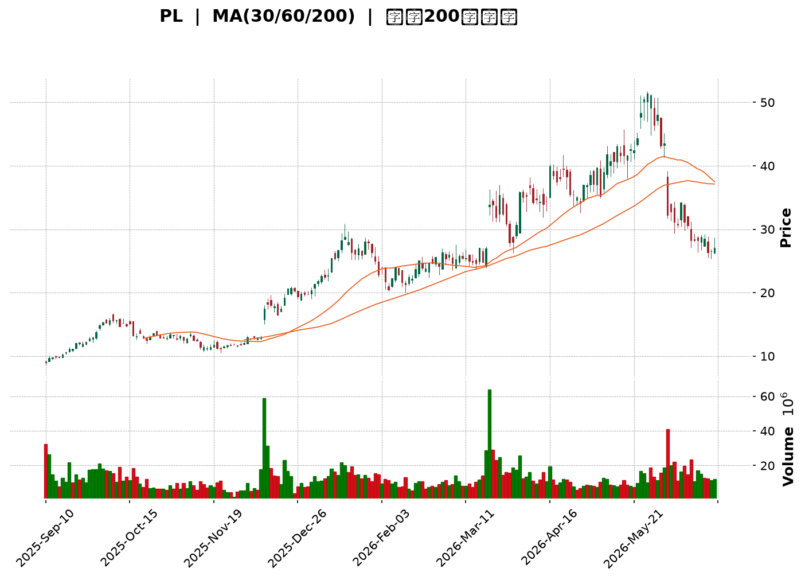
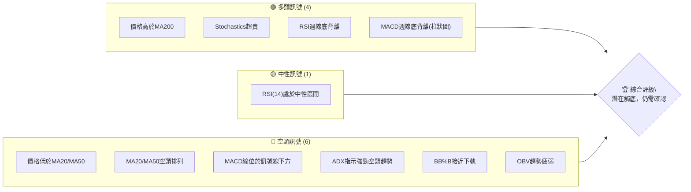
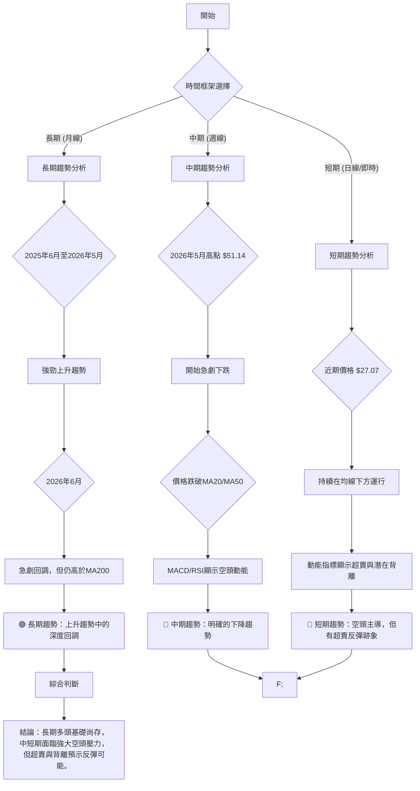
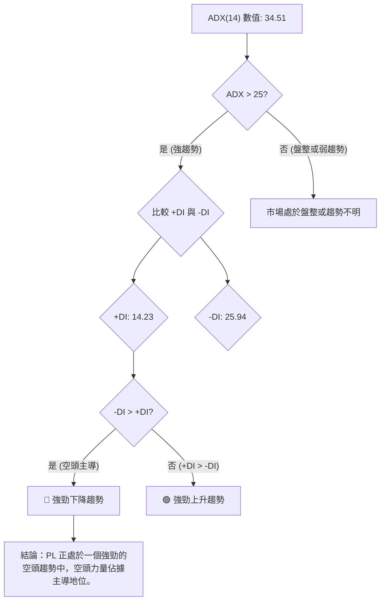
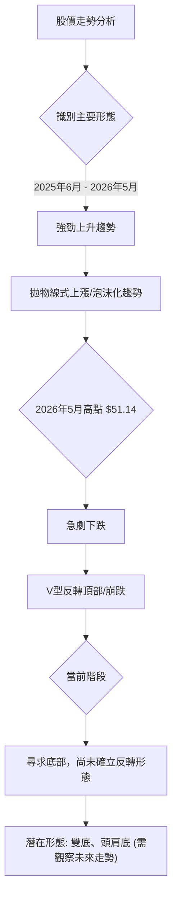
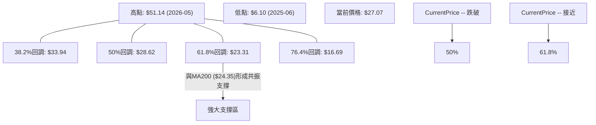
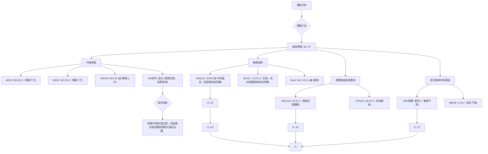

<details>
<summary>📊 靜態圖表 (點擊展開)</summary>

</details>

<html>
<head><meta charset="utf-8" /></head>
<body>
    <div style="height:500px; width:100%;">                        <script>window.PlotlyConfig = {MathJaxConfig: 'local'};</script>
        <script charset="utf-8" src="https://cdn.plot.ly/plotly-3.6.0.min.js" integrity="sha256-QaOVwtVY0T02VaHrr6pnoHLCwayMJp4O5n4YyaE3rJk=" crossorigin="anonymous"></script>                <div id="candlestick-chart" class="plotly-graph-div" style="height:100%; width:100%;"></div>            <script>                window.PLOTLYENV=window.PLOTLYENV || {};                                if (document.getElementById("candlestick-chart")) {                    Plotly.newPlot(                        "candlestick-chart",                        [{"close":{"dtype":"f8","bdata":"AAAA4KPwIUAAAABAClcjQAAAACBcjyNAAAAA4FG4I0AAAAAAAIAjQAAAAIDCdSRAAAAA4FE4JUAAAADgUTgmQAAAAOBROCZAAAAAoJkZKEAAAAAAKdwnQAAAACCF6ydAAAAAYGZmKEAAAADgepQpQAAAAIDC9SlAAAAAgD2KK0AAAABAM7MtQAAAAGC4ni5AAAAAQOF6LkAAAAAAKVwvQAAAAEAzMy9AAAAAgOtRL0AAAABgZmYtQAAAAAAAgC5AAAAAIFyPLUAAAACAFC4uQAAAAIDCdSpAAAAA4FE4KkAAAABguB4rQAAAAIDr0SlAAAAAAAAAKUAAAABgZuYpQAAAAOBROCtAAAAAYLieKkAAAACAFK4pQAAAAMDMzClAAAAA4FG4KUAAAABgZuYqQAAAAKBHYSpAAAAAYGZmKUAAAAAAAIAqQAAAACCF6yhAAAAAYLieKUAAAAAgrscqQAAAAOCj8ChAAAAAoEfhKEAAAACA69EmQAAAAMDMzCZAAAAAIIVrJkAAAABgZuYmQAAAAOB6lCdAAAAAgMJ1JkAAAACA61EmQAAAAOB6FCdAAAAAgMJ1J0AAAADgo3AnQAAAAMDMzCdAAAAAYGZmJ0AAAACAPYonQAAAAMAeBShAAAAAoEfhKUAAAACAPYopQAAAAGBm5ilAAAAAgBSuKUAAAACgR+EpQAAAAOBReDFAAAAAoHA9MkAAAADAzAwyQAAAAKBH4TFAAAAA4FF4MEAAAACgcH0xQAAAAIAULjNAAAAAoJmZNEAAAABA4bo0QAAAAIDrUTRAAAAAAClcM0AAAABguN4zQAAAAKBwvTNAAAAA4FG4M0AAAADA9Wg0QAAAAADXYzVAAAAAQArXNUAAAAAAKZw2QAAAAOCjcDZAAAAAgMK1NkAAAADgo3A5QAAAAIDrUTlAAAAAQOG6OkAAAAAgrkc8QAAAACCuxzxAAAAAAAAAPEAAAACgR2E6QAAAACBcDzpAAAAA4KPwOkAAAABguN45QAAAAIDrETxAAAAAoEfhO0AAAACgmVk6QAAAAOBR+DhAAAAAoJnZNkAAAABAM\u002fM3QAAAAMAexTVAAAAAgBRuNEAAAABgj0I2QAAAAMAeBThAAAAAgD3KNkAAAABgZqY1QAAAAMDMTDVAAAAAIIVrNkAAAACAwjU2QAAAAKBwvTdAAAAAACkcOUAAAABgZuY3QAAAACCuxzdAAAAAgMK1OEAAAACgR6E4QAAAAKCZmTlAAAAAANcjOEAAAAAAKVw6QAAAAMDMTDlAAAAAAAAAOkAAAABACpc4QAAAACCuRzlAAAAAgOvROUAAAABgZmY5QAAAAOCjcDlAAAAA4FH4OEAAAACAPco4QAAAAKCZmThAAAAA4HoUO0AAAAAgXM84QAAAAIDC9TpAAAAAgD3qQEAAAADA9ehAQAAAAOB61D9AAAAAIFyvQUAAAABAMzNAQAAAAAAp3D5AAAAAANfjO0AAAABAM\u002fM7QAAAAIDCtT5AAAAA4KPwQUAAAABgj4JBQAAAAIDClUFAAAAAYGZGQkAAAACgcB1BQAAAAIDCVUFAAAAAwPUoQUAAAABACvdAQAAAAOB6NEFAAAAAgOvxQ0AAAACgcD1DQAAAAAAAwEJAAAAAANcDQ0AAAAAAKbxDQAAAAMAeJUNAAAAA4FG4QUAAAACgmblBQAAAAADXg0FAAAAAgD0KQUAAAAAAKXxCQAAAAEAzc0JAAAAAwB5FQ0AAAADgo5BCQAAAAOBR2ENAAAAAYLieQUAAAADAHoVDQAAAACCF60RAAAAAQApXREAAAABguF5EQAAAAMAehUVAAAAAIFzPREAAAACAFM5EQAAAACCFy0RAAAAA4HpURUAAAACgcD1FQAAAAMDMLEZAAAAAwPUoSEAAAACgcD1JQAAAAEAzs0lAAAAAgOuRSUAAAABA4TpHQAAAACCFC0hAAAAA4KOQRUAAAAAA18NFQAAAAAApHEBAAAAAYLheQEAAAAAghSs\u002fQAAAAOBRuD5AAAAAgMIVQUAAAABgZiY\u002fQAAAAOB6lD5AAAAAgMI1PEAAAADgUTg8QAAAAEDhOjxAAAAAwB7FPEAAAAAgroc8QAAAAMDMTDpAAAAAYI+COkAAAACA6xE7QA=="},"high":{"dtype":"f8","bdata":"AAAAQDOzIkAAAADA9SgkQAAAAOB6lCNAAAAA4FE4JEAAAABAtvMjQAAAAMDMzCRAAAAAIIVrJUAAAACA69EmQAAAAMDMTCZAAAAAYI9CKEAAAACAwnUoQAAAACBcjyhAAAAAwPWoKEAAAAAAAAAqQAAAAGC4HipAAAAAgD0KLEAAAADAyDYuQAAAAAAAAC9AAAAAIK7HL0AAAABgjwIwQAAAACCuxzBAAAAAoJmZL0AAAADAzAwwQAAAAGBm5i9AAAAAAACALkAAAADgelQvQAAAAEA1Hi9AAAAAwPUoK0AAAACA69EsQAAAAEAIrCpAAAAAoJkZKkAAAAAAKZwqQAAAAIAUbitAAAAAIIXrK0AAAADgo\u002fAqQAAAACCFqypAAAAAYGZmKkAAAACAwnUrQAAAAGCPwipAAAAAgD0KK0AAAADgo7AqQAAAAIA9CipAAAAAYGamKUAAAACgmZkrQAAAAKBwvSpAAAAAwMzMKUAAAACA69EoQAAAAEAzsydAAAAA4FE4J0AAAADAHsUnQAAAAIDC9ShAAAAAAAAAKUAAAAAAAAAnQAAAACBcTydAAAAAoO28J0AAAACAPQooQAAAAMAeBShAAAAAANejJ0AAAADAHoUoQAAAAKBHYShAAAAAYGZmKkAAAAAAAMApQAAAAIDCdSpAAAAAAAAAKkAAAABA4XoqQAAAAKCZ+TFAAAAAoJkZM0AAAADgo7AzQAAAACCuRzJAAAAAwMyMMkAAAABAM\u002fMxQAAAAOB61DNAAAAAYI\u002fCNEAAAACgcP00QAAAAIAU7jRAAAAAgMJVNEAAAADAHiU0QAAAAAApPDRAAAAAwMxMNEAAAAAgXM80QAAAACBcbzVAAAAAQDMTNkAAAAAAKdw2QAAAAKCZmTdAAAAAgOnGN0AAAAAgXI85QAAAAEAKlzpAAAAAwB7FOkAAAACgR2E9QAAAAGDj5T5AAAAA4FG4PUAAAAAghas8QAAAAIDA6jpAAAAAQOG6O0AAAABAM7M6QAAAAEAzszxAAAAAYGZmPEAAAABAM7M7QAAAAAAAQDtAAAAAwKHFOUAAAAAArPw3QAAAAAAAADhAAAAAgMCKNUAAAAAgrkc2QAAAAOBRGDhAAAAAQOH6N0AAAABgZoY3QAAAAMD16DVAAAAAgBTuNkAAAACAPco2QAAAAKCZmThAAAAAACkcOUAAAADgo7A5QAAAAOB6tDhAAAAAIFzPOEAAAABAYtA5QAAAAOCjsDlAAAAAQArXOEAAAACAFO46QAAAAOCjcDpAAAAAoEeBOkAAAACgcD06QAAAAACqkTtAAAAAQAoXOkAAAADgUXg6QAAAACCF6zpAAAAAIFwPOkAAAACA6QY6QAAAAAAAgDlAAAAAQAoXO0AAAADgehQ7QAAAAGCPQjtAAAAAANcjQkAAAAAghWtBQAAAACCFC0JAAAAAYGaGQkAAAAAA1dhBQAAAAGC4HkFAAAAAwPVoP0AAAACAFO48QAAAAIAULj9AAAAAwB4FQkAAAADAHiVCQAAAAGBm5kFAAAAAQOEaQ0AAAACAwpVCQAAAAIDrMUJAAAAAgBS+QUAAAAAgWDlCQAAAAIDClUFAAAAAoHAdREAAAACgcB1EQAAAAOB69ENAAAAAANfDQ0AAAABA4dpEQAAAAAAAAERAAAAAAADAQ0AAAACgcB1CQAAAAEAKp0FAAAAAAACAQUAAAAAAKXxCQAAAAOB6pEJAAAAAYI+iQ0AAAABACrdDQAAAAKBH4UNAAAAAgMJ1REAAAADAzOxDQAAAACBcj0VAAAAA4KPwREAAAACgmRlFQAAAAKCZuUVAAAAAQAqXRUAAAAAA1+NGQAAAAAAA4ERAAAAAYGbGRUAAAAAAAABGQAAAAEAMokZAAAAA4KOQSUAAAACgcH1JQAAAAKBH4UlAAAAAYI+iSUAAAAAAAGBJQAAAAGCPYklAAAAAIFzPR0AAAADAHpVGQAAAAEAKl0NAAAAAwB4FQUAAAAAgXC9BQAAAAMDMzD9AAAAAwPUoQUAAAABAMxNBQAAAAIDrEUBAAAAAAABAP0AAAACgmVk9QAAAAAAAAD1AAAAAYI8iPUAAAAAgLz09QAAAAKBH4TxAAAAAQArXOkAAAADgo7A8QA=="},"hovertemplate":"\u003cb\u003e%{x|%Y-%m-%d}\u003c\u002fb\u003e\u003cbr\u003e\u958b: $%{open:.2f}\u003cbr\u003e\u9ad8: $%{high:.2f}\u003cbr\u003e\u4f4e: $%{low:.2f}\u003cbr\u003e\u6536: $%{close:.2f}\u003cextra\u003e\u003c\u002fextra\u003e","low":{"dtype":"f8","bdata":"AAAA4KMwIUAAAABgj0IiQAAAACCuxyJAAAAA4FH4IkAAAACA61EjQAAAAAApXCNAAAAA4KNwJEAAAABA4TolQAAAAOCjcCVAAAAAANcjJkAAAABAClcnQAAAAEAK1yZAAAAAwB6FJ0AAAADgUbgoQAAAAKBwPShAAAAAQDMzKUAAAADA9SgsQAAAAMAehS1AAAAAoEdhLkAAAAAgXI8tQAAAAMAehS5AAAAAwPUoLkAAAAAAKRwtQAAAAIDrUS5AAAAAQAoXLUAAAABAM7MtQAAAAKBwPSpAAAAAIN0kKUAAAAAAAAArQAAAAGC4nilAAAAA4KPwJ0AAAACAFC4pQAAAACCuRypAAAAAgD2KKkAAAAAgXI8pQAAAACCuhylAAAAAQN8PKUAAAAAgrscpQAAAAIDCdSlAAAAAIIXrKEAAAAAgXA8pQAAAAADXIyhAAAAAACncJ0AAAABgENgpQAAAACBcjyhAAAAAwPWoKEAAAABAChcmQAAAAMDIdiVAAAAAYI\u002fCJUAAAACAFO4lQAAAAMDMzCZAAAAAgJcuJkAAAACAPQolQAAAAMAehSZAAAAAwB6FJkAAAABgj0InQAAAAICXbidAAAAAwMzMJkAAAADgelQnQAAAAEDheidAAAAAACncJ0AAAADAHgUpQAAAAKBwPSlAAAAAQDUeKUAAAADA9SgpQAAAAMAeBS5AAAAAYLheMUAAAAAA16MxQAAAAIAU7jBAAAAAgBRuMEAAAACAPQoxQAAAAKBw\u002fTFAAAAAACmcM0AAAACgmZkzQAAAAAApHDRAAAAAgD0KM0AAAABgj8IyQAAAAOCjcDNAAAAAQImhM0AAAAAA1fgyQAAAAKBwfTNAAAAA4FH4NEAAAADA9Wg1QAAAAEAKFzZAAAAAwCDQNUAAAADA9Sg3QAAAAGC4HjlAAAAAAAAAOUAAAABgj0I6QAAAAAApXDxAAAAAIFxvO0AAAACgRyE5QAAAAADXIzlAAAAAgBQuOUAAAADgUTg5QAAAAKAaDzpAAAAAIFzPOkAAAADAzIw5QAAAAIDrcThAAAAAQAp3NkAAAADA9eg2QAAAAEAKlzRAAAAAYGYmNEAAAAAgXM80QAAAAGBmpjVAAAAAgMK1NkAAAADA9eg0QAAAAEDh+jNAAAAAIAYhNUAAAAAAAIA1QAAAAKBwPTZAAAAAgMJ1NkAAAABgj4I3QAAAAEDhOjdAAAAAoJlZNkAAAACgcH04QAAAAIDrEThAAAAAIK7HNkAAAADgUbg3QAAAAKBHYThAAAAAgGgROUAAAABgj4I3QAAAAKCZ2TdAAAAAQDNzOEAAAABAMzM5QAAAAOCj8DhAAAAAIK5HOEAAAAAgXE84QAAAAOB4qTdAAAAAYGZmOEAAAABgj8I4QAAAAOCj8DdAAAAAgGghQEAAAABA4To\u002fQAAAAAApHD9AAAAAoEchP0AAAAAgXA9AQAAAAIA9ij5AAAAAYLg+O0AAAADA9Ug6QAAAAMAehTxAAAAA4KNwPUAAAABA4RpBQAAAAGCPYkBAAAAA4FG4QUAAAADgUfhAQAAAAKCZ+UBAAAAAAClcQEAAAACgR+E\u002fQAAAACCuZ0BAAAAAYGZ2QUAAAAAghetCQAAAAEAKd0JAAAAAYI\u002fCQkAAAAAA1yNDQAAAAIA9KkJAAAAA4KOQQUAAAADgo9BAQAAAAMDz3UBAAAAAwPVIQEAAAADASydBQAAAAOCla0FAAAAAwPXoQUAAAACgmflBQAAAAKBHwUFAAAAAQAp3QUAAAABgZuZBQAAAAMDMDENAAAAAoEchQ0AAAADAzGxDQAAAAMDMzENAAAAAwB5FREAAAACgRyFEQAAAAGCPAkNAAAAAgMJVREAAAADAHoVEQAAAAMDMjEVAAAAAgBTuRkAAAACAFI5HQAAAAAAAgEdAAAAAANdjRkAAAAAA18NGQAAAAEDhOkdAAAAAwB5VRUAAAABgZqZEQAAAAMD1qD9AAAAA4HpUP0AAAACA61E9QAAAAEAzMz5AAAAAIIVrPkAAAADAHsU9QAAAAAApHD5AAAAAoEMLO0AAAADgehQ8QAAAAOB6VDpAAAAAgMK1OkAAAADgelQ7QAAAAIA9ijlAAAAAwMxMOUAAAACgRyE6QA=="},"name":"\u50f9\u683c","open":{"dtype":"f8","bdata":"AAAAYGZmIkAAAACgR2EiQAAAAKBwPSNAAAAA4KPwI0AAAADgUbgjQAAAAAAAgCNAAAAAgML1JEAAAACA61ElQAAAAOBRuCVAAAAAQOF6JkAAAAAgrkcoQAAAAAAAACdAAAAA4FG4J0AAAAAgrscoQAAAAGBmZilAAAAAgBSuKUAAAADgUbgsQAAAAGBm5i1AAAAAoJmZL0AAAAAAAAAuQAAAAMDMjDBAAAAAgBQuL0AAAADgUbgvQAAAACCFay5AAAAAAAAALkAAAABgZuYuQAAAAOCj8C5AAAAAAAAAKkAAAACAPQosQAAAAAApXCpAAAAAAACAKUAAAABgj0IpQAAAAKCZmSpAAAAAYGbmK0AAAADAzMwqQAAAACCF6ylAAAAAQOF6KUAAAAAgrscpQAAAAMD1qCpAAAAAgMJ1KUAAAACAFK4pQAAAAMAeBSpAAAAA4FE4KEAAAACAwnUqQAAAAGBmZipAAAAAYI9CKUAAAACAPYooQAAAAAAAACZAAAAAAClcJkAAAADgehQmQAAAACCF6yZAAAAAYGZmKEAAAABA4XomQAAAAEAzsyZAAAAAwB4FJ0AAAACAPYonQAAAAIDr0SdAAAAAQDMzJ0AAAABgj8InQAAAAMD1qCdAAAAAYGbmJ0AAAADAHoUpQAAAAAApXCpAAAAAoHA9KUAAAACgmZkpQAAAAOB6lC9AAAAA4KNwMkAAAAAgXM8yQAAAAGBmpjFAAAAAgBQuMkAAAACAPQoxQAAAAKBw\u002fTFAAAAAIK7HM0AAAADAzMwzQAAAAEDhujRAAAAAwMxMNEAAAACgcN0yQAAAACCuBzRAAAAAYLi+M0AAAABA4dozQAAAAEAzszRAAAAAAACANUAAAADgUbg1QAAAAKCZ2TZAAAAAoJmZNkAAAADAzEw3QAAAAGCPQjpAAAAAAACAOUAAAAAgXM86QAAAAEAzczxAAAAAQAqXO0AAAAAAAIA8QAAAAAAAwDpAAAAAYI8COkAAAACgmZk6QAAAAOB6FDpAAAAAwMwMPEAAAABAM7M7QAAAAEAKtzlAAAAAANfjOEAAAABA4fo3QAAAAAAAADhAAAAAAAAANUAAAACAPQo1QAAAAIDC9TVAAAAAYLjeN0AAAABgZoY3QAAAAIDrkTVAAAAAAACANUAAAAAAAAA2QAAAAGBmZjZAAAAAwB4FN0AAAACgcL04QAAAAGBmZjdAAAAAAABAN0AAAADAzEw5QAAAAAAAgDhAAAAAQDOTOEAAAADgUbg3QAAAAEDhGjpAAAAAoJmZOUAAAAAAAIA5QAAAAADX4zdAAAAAQArXOEAAAACA69E5QAAAAEAKVzlAAAAA4FH4OUAAAABA4fo4QAAAAKBHITlAAAAAoJnZOEAAAAAAAIA6QAAAAAAAQDhAAAAAYGbGQEAAAAAAAEBBQAAAAEDh2kBAAAAAQDMzQEAAAAAAKXxBQAAAAKBw\u002fUBAAAAAoJnZPkAAAADAzMw8QAAAAAAAAD1AAAAA4KNwPUAAAACAwvVBQAAAAOCjsEFAAAAAQDNzQkAAAAAAAEBCQAAAAOCjcEFAAAAAoHAdQUAAAAAghctBQAAAAIDCNUFAAAAAoHB9QUAAAACA65FDQAAAAEAzk0NAAAAAACkcQ0AAAAAAAMBDQAAAAIA9qkNAAAAAgBSOQ0AAAAAAKbxBQAAAAMDMTEFAAAAA4KMwQUAAAAAA10NBQAAAACBcX0JAAAAAwB6FQkAAAACgmZlDQAAAACBcf0JAAAAAYI\u002fCQ0AAAABAMzNCQAAAAEAzU0NAAAAAIIULREAAAABAChdFQAAAAOCjUERAAAAAwPUIRUAAAAAA16NFQAAAAEAKd0RAAAAAQDMzRUAAAADAcghFQAAAAMDMrEVAAAAAwPXYR0AAAADAzAxJQAAAAEAzE0lAAAAAAACQSEAAAAAghYtIQAAAAIDClUdAAAAAIFzPR0AAAACgcJ1FQAAAAGBmJkNAAAAAoEcBQUAAAACAwrVAQAAAAADX4z5AAAAAAACAP0AAAACA6\u002fFAQAAAAIA9CkBAAAAAwB4FPkAAAAAA12M8QAAAAGBmpjxAAAAAgML1O0AAAADgelQ7QAAAAIDrETxAAAAAYI+COkAAAABA4To6QA=="},"x":["2025-09-10T00:00:00-04:00","2025-09-11T00:00:00-04:00","2025-09-12T00:00:00-04:00","2025-09-15T00:00:00-04:00","2025-09-16T00:00:00-04:00","2025-09-17T00:00:00-04:00","2025-09-18T00:00:00-04:00","2025-09-19T00:00:00-04:00","2025-09-22T00:00:00-04:00","2025-09-23T00:00:00-04:00","2025-09-24T00:00:00-04:00","2025-09-25T00:00:00-04:00","2025-09-26T00:00:00-04:00","2025-09-29T00:00:00-04:00","2025-09-30T00:00:00-04:00","2025-10-01T00:00:00-04:00","2025-10-02T00:00:00-04:00","2025-10-03T00:00:00-04:00","2025-10-06T00:00:00-04:00","2025-10-07T00:00:00-04:00","2025-10-08T00:00:00-04:00","2025-10-09T00:00:00-04:00","2025-10-10T00:00:00-04:00","2025-10-13T00:00:00-04:00","2025-10-14T00:00:00-04:00","2025-10-15T00:00:00-04:00","2025-10-16T00:00:00-04:00","2025-10-17T00:00:00-04:00","2025-10-20T00:00:00-04:00","2025-10-21T00:00:00-04:00","2025-10-22T00:00:00-04:00","2025-10-23T00:00:00-04:00","2025-10-24T00:00:00-04:00","2025-10-27T00:00:00-04:00","2025-10-28T00:00:00-04:00","2025-10-29T00:00:00-04:00","2025-10-30T00:00:00-04:00","2025-10-31T00:00:00-04:00","2025-11-03T00:00:00-05:00","2025-11-04T00:00:00-05:00","2025-11-05T00:00:00-05:00","2025-11-06T00:00:00-05:00","2025-11-07T00:00:00-05:00","2025-11-10T00:00:00-05:00","2025-11-11T00:00:00-05:00","2025-11-12T00:00:00-05:00","2025-11-13T00:00:00-05:00","2025-11-14T00:00:00-05:00","2025-11-17T00:00:00-05:00","2025-11-18T00:00:00-05:00","2025-11-19T00:00:00-05:00","2025-11-20T00:00:00-05:00","2025-11-21T00:00:00-05:00","2025-11-24T00:00:00-05:00","2025-11-25T00:00:00-05:00","2025-11-26T00:00:00-05:00","2025-11-28T00:00:00-05:00","2025-12-01T00:00:00-05:00","2025-12-02T00:00:00-05:00","2025-12-03T00:00:00-05:00","2025-12-04T00:00:00-05:00","2025-12-05T00:00:00-05:00","2025-12-08T00:00:00-05:00","2025-12-09T00:00:00-05:00","2025-12-10T00:00:00-05:00","2025-12-11T00:00:00-05:00","2025-12-12T00:00:00-05:00","2025-12-15T00:00:00-05:00","2025-12-16T00:00:00-05:00","2025-12-17T00:00:00-05:00","2025-12-18T00:00:00-05:00","2025-12-19T00:00:00-05:00","2025-12-22T00:00:00-05:00","2025-12-23T00:00:00-05:00","2025-12-24T00:00:00-05:00","2025-12-26T00:00:00-05:00","2025-12-29T00:00:00-05:00","2025-12-30T00:00:00-05:00","2025-12-31T00:00:00-05:00","2026-01-02T00:00:00-05:00","2026-01-05T00:00:00-05:00","2026-01-06T00:00:00-05:00","2026-01-07T00:00:00-05:00","2026-01-08T00:00:00-05:00","2026-01-09T00:00:00-05:00","2026-01-12T00:00:00-05:00","2026-01-13T00:00:00-05:00","2026-01-14T00:00:00-05:00","2026-01-15T00:00:00-05:00","2026-01-16T00:00:00-05:00","2026-01-20T00:00:00-05:00","2026-01-21T00:00:00-05:00","2026-01-22T00:00:00-05:00","2026-01-23T00:00:00-05:00","2026-01-26T00:00:00-05:00","2026-01-27T00:00:00-05:00","2026-01-28T00:00:00-05:00","2026-01-29T00:00:00-05:00","2026-01-30T00:00:00-05:00","2026-02-02T00:00:00-05:00","2026-02-03T00:00:00-05:00","2026-02-04T00:00:00-05:00","2026-02-05T00:00:00-05:00","2026-02-06T00:00:00-05:00","2026-02-09T00:00:00-05:00","2026-02-10T00:00:00-05:00","2026-02-11T00:00:00-05:00","2026-02-12T00:00:00-05:00","2026-02-13T00:00:00-05:00","2026-02-17T00:00:00-05:00","2026-02-18T00:00:00-05:00","2026-02-19T00:00:00-05:00","2026-02-20T00:00:00-05:00","2026-02-23T00:00:00-05:00","2026-02-24T00:00:00-05:00","2026-02-25T00:00:00-05:00","2026-02-26T00:00:00-05:00","2026-02-27T00:00:00-05:00","2026-03-02T00:00:00-05:00","2026-03-03T00:00:00-05:00","2026-03-04T00:00:00-05:00","2026-03-05T00:00:00-05:00","2026-03-06T00:00:00-05:00","2026-03-09T00:00:00-04:00","2026-03-10T00:00:00-04:00","2026-03-11T00:00:00-04:00","2026-03-12T00:00:00-04:00","2026-03-13T00:00:00-04:00","2026-03-16T00:00:00-04:00","2026-03-17T00:00:00-04:00","2026-03-18T00:00:00-04:00","2026-03-19T00:00:00-04:00","2026-03-20T00:00:00-04:00","2026-03-23T00:00:00-04:00","2026-03-24T00:00:00-04:00","2026-03-25T00:00:00-04:00","2026-03-26T00:00:00-04:00","2026-03-27T00:00:00-04:00","2026-03-30T00:00:00-04:00","2026-03-31T00:00:00-04:00","2026-04-01T00:00:00-04:00","2026-04-02T00:00:00-04:00","2026-04-06T00:00:00-04:00","2026-04-07T00:00:00-04:00","2026-04-08T00:00:00-04:00","2026-04-09T00:00:00-04:00","2026-04-10T00:00:00-04:00","2026-04-13T00:00:00-04:00","2026-04-14T00:00:00-04:00","2026-04-15T00:00:00-04:00","2026-04-16T00:00:00-04:00","2026-04-17T00:00:00-04:00","2026-04-20T00:00:00-04:00","2026-04-21T00:00:00-04:00","2026-04-22T00:00:00-04:00","2026-04-23T00:00:00-04:00","2026-04-24T00:00:00-04:00","2026-04-27T00:00:00-04:00","2026-04-28T00:00:00-04:00","2026-04-29T00:00:00-04:00","2026-04-30T00:00:00-04:00","2026-05-01T00:00:00-04:00","2026-05-04T00:00:00-04:00","2026-05-05T00:00:00-04:00","2026-05-06T00:00:00-04:00","2026-05-07T00:00:00-04:00","2026-05-08T00:00:00-04:00","2026-05-11T00:00:00-04:00","2026-05-12T00:00:00-04:00","2026-05-13T00:00:00-04:00","2026-05-14T00:00:00-04:00","2026-05-15T00:00:00-04:00","2026-05-18T00:00:00-04:00","2026-05-19T00:00:00-04:00","2026-05-20T00:00:00-04:00","2026-05-21T00:00:00-04:00","2026-05-22T00:00:00-04:00","2026-05-26T00:00:00-04:00","2026-05-27T00:00:00-04:00","2026-05-28T00:00:00-04:00","2026-05-29T00:00:00-04:00","2026-06-01T00:00:00-04:00","2026-06-02T00:00:00-04:00","2026-06-03T00:00:00-04:00","2026-06-04T00:00:00-04:00","2026-06-05T00:00:00-04:00","2026-06-08T00:00:00-04:00","2026-06-09T00:00:00-04:00","2026-06-10T00:00:00-04:00","2026-06-11T00:00:00-04:00","2026-06-12T00:00:00-04:00","2026-06-15T00:00:00-04:00","2026-06-16T00:00:00-04:00","2026-06-17T00:00:00-04:00","2026-06-18T00:00:00-04:00","2026-06-22T00:00:00-04:00","2026-06-23T00:00:00-04:00","2026-06-24T00:00:00-04:00","2026-06-25T00:00:00-04:00","2026-06-26T00:00:00-04:00"],"type":"candlestick"},{"hovertemplate":"MA30: $%{y:.2f}\u003cextra\u003e\u003c\u002fextra\u003e","line":{"color":"#2196F3","dash":"dash","width":2},"mode":"lines","name":"MA30","x":["2025-09-10T00:00:00-04:00","2025-09-11T00:00:00-04:00","2025-09-12T00:00:00-04:00","2025-09-15T00:00:00-04:00","2025-09-16T00:00:00-04:00","2025-09-17T00:00:00-04:00","2025-09-18T00:00:00-04:00","2025-09-19T00:00:00-04:00","2025-09-22T00:00:00-04:00","2025-09-23T00:00:00-04:00","2025-09-24T00:00:00-04:00","2025-09-25T00:00:00-04:00","2025-09-26T00:00:00-04:00","2025-09-29T00:00:00-04:00","2025-09-30T00:00:00-04:00","2025-10-01T00:00:00-04:00","2025-10-02T00:00:00-04:00","2025-10-03T00:00:00-04:00","2025-10-06T00:00:00-04:00","2025-10-07T00:00:00-04:00","2025-10-08T00:00:00-04:00","2025-10-09T00:00:00-04:00","2025-10-10T00:00:00-04:00","2025-10-13T00:00:00-04:00","2025-10-14T00:00:00-04:00","2025-10-15T00:00:00-04:00","2025-10-16T00:00:00-04:00","2025-10-17T00:00:00-04:00","2025-10-20T00:00:00-04:00","2025-10-21T00:00:00-04:00","2025-10-22T00:00:00-04:00","2025-10-23T00:00:00-04:00","2025-10-24T00:00:00-04:00","2025-10-27T00:00:00-04:00","2025-10-28T00:00:00-04:00","2025-10-29T00:00:00-04:00","2025-10-30T00:00:00-04:00","2025-10-31T00:00:00-04:00","2025-11-03T00:00:00-05:00","2025-11-04T00:00:00-05:00","2025-11-05T00:00:00-05:00","2025-11-06T00:00:00-05:00","2025-11-07T00:00:00-05:00","2025-11-10T00:00:00-05:00","2025-11-11T00:00:00-05:00","2025-11-12T00:00:00-05:00","2025-11-13T00:00:00-05:00","2025-11-14T00:00:00-05:00","2025-11-17T00:00:00-05:00","2025-11-18T00:00:00-05:00","2025-11-19T00:00:00-05:00","2025-11-20T00:00:00-05:00","2025-11-21T00:00:00-05:00","2025-11-24T00:00:00-05:00","2025-11-25T00:00:00-05:00","2025-11-26T00:00:00-05:00","2025-11-28T00:00:00-05:00","2025-12-01T00:00:00-05:00","2025-12-02T00:00:00-05:00","2025-12-03T00:00:00-05:00","2025-12-04T00:00:00-05:00","2025-12-05T00:00:00-05:00","2025-12-08T00:00:00-05:00","2025-12-09T00:00:00-05:00","2025-12-10T00:00:00-05:00","2025-12-11T00:00:00-05:00","2025-12-12T00:00:00-05:00","2025-12-15T00:00:00-05:00","2025-12-16T00:00:00-05:00","2025-12-17T00:00:00-05:00","2025-12-18T00:00:00-05:00","2025-12-19T00:00:00-05:00","2025-12-22T00:00:00-05:00","2025-12-23T00:00:00-05:00","2025-12-24T00:00:00-05:00","2025-12-26T00:00:00-05:00","2025-12-29T00:00:00-05:00","2025-12-30T00:00:00-05:00","2025-12-31T00:00:00-05:00","2026-01-02T00:00:00-05:00","2026-01-05T00:00:00-05:00","2026-01-06T00:00:00-05:00","2026-01-07T00:00:00-05:00","2026-01-08T00:00:00-05:00","2026-01-09T00:00:00-05:00","2026-01-12T00:00:00-05:00","2026-01-13T00:00:00-05:00","2026-01-14T00:00:00-05:00","2026-01-15T00:00:00-05:00","2026-01-16T00:00:00-05:00","2026-01-20T00:00:00-05:00","2026-01-21T00:00:00-05:00","2026-01-22T00:00:00-05:00","2026-01-23T00:00:00-05:00","2026-01-26T00:00:00-05:00","2026-01-27T00:00:00-05:00","2026-01-28T00:00:00-05:00","2026-01-29T00:00:00-05:00","2026-01-30T00:00:00-05:00","2026-02-02T00:00:00-05:00","2026-02-03T00:00:00-05:00","2026-02-04T00:00:00-05:00","2026-02-05T00:00:00-05:00","2026-02-06T00:00:00-05:00","2026-02-09T00:00:00-05:00","2026-02-10T00:00:00-05:00","2026-02-11T00:00:00-05:00","2026-02-12T00:00:00-05:00","2026-02-13T00:00:00-05:00","2026-02-17T00:00:00-05:00","2026-02-18T00:00:00-05:00","2026-02-19T00:00:00-05:00","2026-02-20T00:00:00-05:00","2026-02-23T00:00:00-05:00","2026-02-24T00:00:00-05:00","2026-02-25T00:00:00-05:00","2026-02-26T00:00:00-05:00","2026-02-27T00:00:00-05:00","2026-03-02T00:00:00-05:00","2026-03-03T00:00:00-05:00","2026-03-04T00:00:00-05:00","2026-03-05T00:00:00-05:00","2026-03-06T00:00:00-05:00","2026-03-09T00:00:00-04:00","2026-03-10T00:00:00-04:00","2026-03-11T00:00:00-04:00","2026-03-12T00:00:00-04:00","2026-03-13T00:00:00-04:00","2026-03-16T00:00:00-04:00","2026-03-17T00:00:00-04:00","2026-03-18T00:00:00-04:00","2026-03-19T00:00:00-04:00","2026-03-20T00:00:00-04:00","2026-03-23T00:00:00-04:00","2026-03-24T00:00:00-04:00","2026-03-25T00:00:00-04:00","2026-03-26T00:00:00-04:00","2026-03-27T00:00:00-04:00","2026-03-30T00:00:00-04:00","2026-03-31T00:00:00-04:00","2026-04-01T00:00:00-04:00","2026-04-02T00:00:00-04:00","2026-04-06T00:00:00-04:00","2026-04-07T00:00:00-04:00","2026-04-08T00:00:00-04:00","2026-04-09T00:00:00-04:00","2026-04-10T00:00:00-04:00","2026-04-13T00:00:00-04:00","2026-04-14T00:00:00-04:00","2026-04-15T00:00:00-04:00","2026-04-16T00:00:00-04:00","2026-04-17T00:00:00-04:00","2026-04-20T00:00:00-04:00","2026-04-21T00:00:00-04:00","2026-04-22T00:00:00-04:00","2026-04-23T00:00:00-04:00","2026-04-24T00:00:00-04:00","2026-04-27T00:00:00-04:00","2026-04-28T00:00:00-04:00","2026-04-29T00:00:00-04:00","2026-04-30T00:00:00-04:00","2026-05-01T00:00:00-04:00","2026-05-04T00:00:00-04:00","2026-05-05T00:00:00-04:00","2026-05-06T00:00:00-04:00","2026-05-07T00:00:00-04:00","2026-05-08T00:00:00-04:00","2026-05-11T00:00:00-04:00","2026-05-12T00:00:00-04:00","2026-05-13T00:00:00-04:00","2026-05-14T00:00:00-04:00","2026-05-15T00:00:00-04:00","2026-05-18T00:00:00-04:00","2026-05-19T00:00:00-04:00","2026-05-20T00:00:00-04:00","2026-05-21T00:00:00-04:00","2026-05-22T00:00:00-04:00","2026-05-26T00:00:00-04:00","2026-05-27T00:00:00-04:00","2026-05-28T00:00:00-04:00","2026-05-29T00:00:00-04:00","2026-06-01T00:00:00-04:00","2026-06-02T00:00:00-04:00","2026-06-03T00:00:00-04:00","2026-06-04T00:00:00-04:00","2026-06-05T00:00:00-04:00","2026-06-08T00:00:00-04:00","2026-06-09T00:00:00-04:00","2026-06-10T00:00:00-04:00","2026-06-11T00:00:00-04:00","2026-06-12T00:00:00-04:00","2026-06-15T00:00:00-04:00","2026-06-16T00:00:00-04:00","2026-06-17T00:00:00-04:00","2026-06-18T00:00:00-04:00","2026-06-22T00:00:00-04:00","2026-06-23T00:00:00-04:00","2026-06-24T00:00:00-04:00","2026-06-25T00:00:00-04:00","2026-06-26T00:00:00-04:00"],"y":{"dtype":"f8","bdata":"AAAAAAAA+H8AAAAAAAD4fwAAAAAAAPh\u002fAAAAAAAA+H8AAAAAAAD4fwAAAAAAAPh\u002fAAAAAAAA+H8AAAAAAAD4fwAAAAAAAPh\u002fAAAAAAAA+H8AAAAAAAD4fwAAAAAAAPh\u002fAAAAAAAA+H8AAAAAAAD4fwAAAAAAAPh\u002fAAAAAAAA+H8AAAAAAAD4fwAAAAAAAPh\u002fAAAAAAAA+H8AAAAAAAD4fwAAAAAAAPh\u002fAAAAAAAA+H8AAAAAAAD4fwAAAAAAAPh\u002fAAAAAAAA+H8AAAAAAAD4fwAAAAAAAPh\u002fAAAAAAAA+H8AAAAAAAD4fzMzM6MplSlAERERcWjRKUCrqqr6YgkqQBEREYHASipAmpmZyaGFKkBEREQ0XroqQM3MzJzv5ypAMzMzA1YOK0ARERGhRTYrQJqZmUnFWStA3t3dLd1kK0CJiIhYZHsrQBEREeHsgytAMzMzA1aOK0BERER0k5grQLy7uzvfjytA7+7uXix5K0B3d3fHdj4rQJqZmbm7+ypAMzMzY\u002fS2KkC8u7s7w24qQGZmZha9LSpA7+7uHiLiKUAAAACgt6UpQDMzM2NmZilAvLu7u1gyKUCrqqr61PgoQO\u002fu7h4i4ihAzczMvBHKKEC8u7sbhasoQDMzM\u002fMonChAZmZmVqujKECJiIjomKAoQDMzM1NVlShAzczM3E+NKEBERETEBI8oQGZmZmYD3ShAq6qq+tQ4KUDv7u6uVocpQKuqqpph1ylAvLu7+7gXKkAzMzPTFWAqQERERPTF0ipAvLu7+7hXK0De3d3t\u002fdQrQJqZmRn3WixAvLu7CxHRLECrqqpac2EtQO\u002fu7l7J7y1AAAAAIAaBLkBmZmb28BkvQAAAAADIvS9AZmZm5m05MEDv7u7OIpswQBERETkm+DBA3t3dZdhVMUAiIiIy7MoxQCIiIqJwPTJAMzMzK7K9MkCJiIjQlEozQImIiHCv2TNAMzMzgzJaNEAiIiICVs40QFVVVT01PjVAERERKYe2NUDe3d0t3SQ2QLy7uztRfzZAIiIiIpTRNkAzMzPDZxg3QKuqqhroVDdA3t3dbVmLN0BERESEecI3QFVVVXWT2DdAZmZmFiDXN0DNzMxsLuQ3QDMzMzPBAzhAZmZmJgYhOEDe3d2dNjA4QM3MzHyGPThAq6qqupBUOEAzMzPj7GM4QKuqqor6dzhAd3d39+GTOEAzMzMD5J44QJqZmUlTqjhAq6qqWmS7OEARERHherQ4QM3MzIzetjhAvLu7m8SgOEDe3d1NYpA4QAAAACCwcjhA7+7uDp9hOEDv7u6+WFI4QAAAANCwSzhAIiIiIiJCOEBmZmZmHz44QERERBSuJzhAZmZmFtkOOEB3d3c3iQE4QBEREfFg\u002fjdAREREhHkiOEBmZmY20Ck4QAAAAPAZVjhAAAAAsHLIOEBERETkFys5QImIiBi9bTlAVVVVhRbZOUAiIiJC0jQ6QGZmZmZmhjpAvLu7yxO1OkBVVVUFD+Y6QHd3dzeJITtAREREpHB9O0B3d3enVNw7QLy7u3uGPTxAvLu7W4+iPEARERHhevQ8QHd3d5fgQT1AREREJL+YPUDv7u4OWNk9QImIiCgVJz5AMzMzU5ydPkDe3d19IxQ\u002fQM3MzHxqfD9AMzMzo5vkP0AzMzMDVi5AQLy7u6MpZUBAvLu7q9WRQEC8u7s7Ub9AQKuqqpLR60BAERERca8JQUAAAABokT1BQCIiIor6Z0FAVVVVHRN8QUDNzMyEMopBQLy7u7u7q0FA3t3dvS2rQUBERERkgsdBQKuqqnpb9kFAIiIiku0sQkCamZmpf2NCQAAAAFAbmEJAvLu765iwQkBVVVX1tsxCQAAAAFAb6EJAAAAAEC0CQ0AzMzNDYCVDQHd3d2etTkNAMzMzI2mKQ0BmZmYmBtFDQDMzM8ODGURAMzMzw4NJREDNzMwMkGtEQHd3dye\u002fmERAd3d3t4GuREARERFR1L9EQCIiIkLupURAREREJGmaREBVVVU9JohEQCIiIpLCdURA7+7u3iR2RECJiIjgT11EQAAAAMBYQkRAIiIiokUWREARERGJQfBDQBERESlcv0NAmpmZMcGjQ0CJiIh46XZDQFVVVaWbNENAIiIiOib4QkCJiIjw0r1CQA=="},"type":"scatter"},{"hovertemplate":"MA60: $%{y:.2f}\u003cextra\u003e\u003c\u002fextra\u003e","line":{"color":"#9C27B0","dash":"dash","width":2},"mode":"lines","name":"MA60","x":["2025-09-10T00:00:00-04:00","2025-09-11T00:00:00-04:00","2025-09-12T00:00:00-04:00","2025-09-15T00:00:00-04:00","2025-09-16T00:00:00-04:00","2025-09-17T00:00:00-04:00","2025-09-18T00:00:00-04:00","2025-09-19T00:00:00-04:00","2025-09-22T00:00:00-04:00","2025-09-23T00:00:00-04:00","2025-09-24T00:00:00-04:00","2025-09-25T00:00:00-04:00","2025-09-26T00:00:00-04:00","2025-09-29T00:00:00-04:00","2025-09-30T00:00:00-04:00","2025-10-01T00:00:00-04:00","2025-10-02T00:00:00-04:00","2025-10-03T00:00:00-04:00","2025-10-06T00:00:00-04:00","2025-10-07T00:00:00-04:00","2025-10-08T00:00:00-04:00","2025-10-09T00:00:00-04:00","2025-10-10T00:00:00-04:00","2025-10-13T00:00:00-04:00","2025-10-14T00:00:00-04:00","2025-10-15T00:00:00-04:00","2025-10-16T00:00:00-04:00","2025-10-17T00:00:00-04:00","2025-10-20T00:00:00-04:00","2025-10-21T00:00:00-04:00","2025-10-22T00:00:00-04:00","2025-10-23T00:00:00-04:00","2025-10-24T00:00:00-04:00","2025-10-27T00:00:00-04:00","2025-10-28T00:00:00-04:00","2025-10-29T00:00:00-04:00","2025-10-30T00:00:00-04:00","2025-10-31T00:00:00-04:00","2025-11-03T00:00:00-05:00","2025-11-04T00:00:00-05:00","2025-11-05T00:00:00-05:00","2025-11-06T00:00:00-05:00","2025-11-07T00:00:00-05:00","2025-11-10T00:00:00-05:00","2025-11-11T00:00:00-05:00","2025-11-12T00:00:00-05:00","2025-11-13T00:00:00-05:00","2025-11-14T00:00:00-05:00","2025-11-17T00:00:00-05:00","2025-11-18T00:00:00-05:00","2025-11-19T00:00:00-05:00","2025-11-20T00:00:00-05:00","2025-11-21T00:00:00-05:00","2025-11-24T00:00:00-05:00","2025-11-25T00:00:00-05:00","2025-11-26T00:00:00-05:00","2025-11-28T00:00:00-05:00","2025-12-01T00:00:00-05:00","2025-12-02T00:00:00-05:00","2025-12-03T00:00:00-05:00","2025-12-04T00:00:00-05:00","2025-12-05T00:00:00-05:00","2025-12-08T00:00:00-05:00","2025-12-09T00:00:00-05:00","2025-12-10T00:00:00-05:00","2025-12-11T00:00:00-05:00","2025-12-12T00:00:00-05:00","2025-12-15T00:00:00-05:00","2025-12-16T00:00:00-05:00","2025-12-17T00:00:00-05:00","2025-12-18T00:00:00-05:00","2025-12-19T00:00:00-05:00","2025-12-22T00:00:00-05:00","2025-12-23T00:00:00-05:00","2025-12-24T00:00:00-05:00","2025-12-26T00:00:00-05:00","2025-12-29T00:00:00-05:00","2025-12-30T00:00:00-05:00","2025-12-31T00:00:00-05:00","2026-01-02T00:00:00-05:00","2026-01-05T00:00:00-05:00","2026-01-06T00:00:00-05:00","2026-01-07T00:00:00-05:00","2026-01-08T00:00:00-05:00","2026-01-09T00:00:00-05:00","2026-01-12T00:00:00-05:00","2026-01-13T00:00:00-05:00","2026-01-14T00:00:00-05:00","2026-01-15T00:00:00-05:00","2026-01-16T00:00:00-05:00","2026-01-20T00:00:00-05:00","2026-01-21T00:00:00-05:00","2026-01-22T00:00:00-05:00","2026-01-23T00:00:00-05:00","2026-01-26T00:00:00-05:00","2026-01-27T00:00:00-05:00","2026-01-28T00:00:00-05:00","2026-01-29T00:00:00-05:00","2026-01-30T00:00:00-05:00","2026-02-02T00:00:00-05:00","2026-02-03T00:00:00-05:00","2026-02-04T00:00:00-05:00","2026-02-05T00:00:00-05:00","2026-02-06T00:00:00-05:00","2026-02-09T00:00:00-05:00","2026-02-10T00:00:00-05:00","2026-02-11T00:00:00-05:00","2026-02-12T00:00:00-05:00","2026-02-13T00:00:00-05:00","2026-02-17T00:00:00-05:00","2026-02-18T00:00:00-05:00","2026-02-19T00:00:00-05:00","2026-02-20T00:00:00-05:00","2026-02-23T00:00:00-05:00","2026-02-24T00:00:00-05:00","2026-02-25T00:00:00-05:00","2026-02-26T00:00:00-05:00","2026-02-27T00:00:00-05:00","2026-03-02T00:00:00-05:00","2026-03-03T00:00:00-05:00","2026-03-04T00:00:00-05:00","2026-03-05T00:00:00-05:00","2026-03-06T00:00:00-05:00","2026-03-09T00:00:00-04:00","2026-03-10T00:00:00-04:00","2026-03-11T00:00:00-04:00","2026-03-12T00:00:00-04:00","2026-03-13T00:00:00-04:00","2026-03-16T00:00:00-04:00","2026-03-17T00:00:00-04:00","2026-03-18T00:00:00-04:00","2026-03-19T00:00:00-04:00","2026-03-20T00:00:00-04:00","2026-03-23T00:00:00-04:00","2026-03-24T00:00:00-04:00","2026-03-25T00:00:00-04:00","2026-03-26T00:00:00-04:00","2026-03-27T00:00:00-04:00","2026-03-30T00:00:00-04:00","2026-03-31T00:00:00-04:00","2026-04-01T00:00:00-04:00","2026-04-02T00:00:00-04:00","2026-04-06T00:00:00-04:00","2026-04-07T00:00:00-04:00","2026-04-08T00:00:00-04:00","2026-04-09T00:00:00-04:00","2026-04-10T00:00:00-04:00","2026-04-13T00:00:00-04:00","2026-04-14T00:00:00-04:00","2026-04-15T00:00:00-04:00","2026-04-16T00:00:00-04:00","2026-04-17T00:00:00-04:00","2026-04-20T00:00:00-04:00","2026-04-21T00:00:00-04:00","2026-04-22T00:00:00-04:00","2026-04-23T00:00:00-04:00","2026-04-24T00:00:00-04:00","2026-04-27T00:00:00-04:00","2026-04-28T00:00:00-04:00","2026-04-29T00:00:00-04:00","2026-04-30T00:00:00-04:00","2026-05-01T00:00:00-04:00","2026-05-04T00:00:00-04:00","2026-05-05T00:00:00-04:00","2026-05-06T00:00:00-04:00","2026-05-07T00:00:00-04:00","2026-05-08T00:00:00-04:00","2026-05-11T00:00:00-04:00","2026-05-12T00:00:00-04:00","2026-05-13T00:00:00-04:00","2026-05-14T00:00:00-04:00","2026-05-15T00:00:00-04:00","2026-05-18T00:00:00-04:00","2026-05-19T00:00:00-04:00","2026-05-20T00:00:00-04:00","2026-05-21T00:00:00-04:00","2026-05-22T00:00:00-04:00","2026-05-26T00:00:00-04:00","2026-05-27T00:00:00-04:00","2026-05-28T00:00:00-04:00","2026-05-29T00:00:00-04:00","2026-06-01T00:00:00-04:00","2026-06-02T00:00:00-04:00","2026-06-03T00:00:00-04:00","2026-06-04T00:00:00-04:00","2026-06-05T00:00:00-04:00","2026-06-08T00:00:00-04:00","2026-06-09T00:00:00-04:00","2026-06-10T00:00:00-04:00","2026-06-11T00:00:00-04:00","2026-06-12T00:00:00-04:00","2026-06-15T00:00:00-04:00","2026-06-16T00:00:00-04:00","2026-06-17T00:00:00-04:00","2026-06-18T00:00:00-04:00","2026-06-22T00:00:00-04:00","2026-06-23T00:00:00-04:00","2026-06-24T00:00:00-04:00","2026-06-25T00:00:00-04:00","2026-06-26T00:00:00-04:00"],"y":{"dtype":"f8","bdata":"AAAAAAAA+H8AAAAAAAD4fwAAAAAAAPh\u002fAAAAAAAA+H8AAAAAAAD4fwAAAAAAAPh\u002fAAAAAAAA+H8AAAAAAAD4fwAAAAAAAPh\u002fAAAAAAAA+H8AAAAAAAD4fwAAAAAAAPh\u002fAAAAAAAA+H8AAAAAAAD4fwAAAAAAAPh\u002fAAAAAAAA+H8AAAAAAAD4fwAAAAAAAPh\u002fAAAAAAAA+H8AAAAAAAD4fwAAAAAAAPh\u002fAAAAAAAA+H8AAAAAAAD4fwAAAAAAAPh\u002fAAAAAAAA+H8AAAAAAAD4fwAAAAAAAPh\u002fAAAAAAAA+H8AAAAAAAD4fwAAAAAAAPh\u002fAAAAAAAA+H8AAAAAAAD4fwAAAAAAAPh\u002fAAAAAAAA+H8AAAAAAAD4fwAAAAAAAPh\u002fAAAAAAAA+H8AAAAAAAD4fwAAAAAAAPh\u002fAAAAAAAA+H8AAAAAAAD4fwAAAAAAAPh\u002fAAAAAAAA+H8AAAAAAAD4fwAAAAAAAPh\u002fAAAAAAAA+H8AAAAAAAD4fwAAAAAAAPh\u002fAAAAAAAA+H8AAAAAAAD4fwAAAAAAAPh\u002fAAAAAAAA+H8AAAAAAAD4fwAAAAAAAPh\u002fAAAAAAAA+H8AAAAAAAD4fwAAAAAAAPh\u002fAAAAAAAA+H8AAAAAAAD4fzMzM0upGClAvLu744k6KUCamZnx\u002fVQpQCIiIuoKcClAMzMz03iJKUBERER8saQpQJqZmYF54ilA7+7ufpUjKkAAAAAozl4qQCIiInKTmCpAzczMFEu+KkDe3d0Vve0qQKuqqmpZKytAd3d3fwdzK0ARERGxyLYrQKuqqipr9StAVVVVtR4lLEARERER9U8sQERERIzCdSxAmpmZQf2bLEAREREZWsQsQDMzM4vC9SxA3t3d9X4qLUDv7u6e\u002fm0tQKuqqmpZqy1AvLu7wwTvLUB3d3evVkcuQJqZmbGBri5AmpmZCbsiL0BmZmZeV6AvQBEREfXhEzBAMzMzFwRWMEAzMzM7UY8wQHd3d\u002fNvxDBAvLu7i5f+MEAAAADILzYxQHd3d3fpdjFAvLu7T\u002f+2MUBVVVWNCe4xQAAAAHRMIDJA3t3d9ZpLMkDv7u42QnkyQLy7uzf7oDJAIiIiSn7BMkDe3d2xVucyQAAAAGCeGDNAIiIiVsdEM0CamZkleHAzQCIiIpa1mjNAVVVV5YnKM0AzMzOvcvgzQFVVVUVvKzRA7+7u7qdmNEARERFpA500QFVVVcE80TRAREREYJ4INUCamZmJsz81QHd3d5cnejVAd3d3YzuvNUAzMzOPe+01QERERMgvJjZAERERyehdNkCJiIhgV5A2QKuqqgbzxDZAmpmZpVT8NkAiIiJKfjE3QAAAAKh\u002fUzdAREREnDZwN0BVVVV9+Iw3QN7d3YWkqTdAEREReenWN0BVVVXdJPY3QKuqqrJWFzhAMzMzY8lPOECJiIgoo4c4QN7d3SW\u002fuDhA3t3dVQ79OEAAAABwhDI5QJqZmXH2YTlAMzMzQ9KEOUBERET0\u002faQ5QBEREeHBzDlA3t3dTakIOkBVVVVVnD06QKuqquLsczpAMzMz2\u002fmuOkARERHhetQ6QCIiIpJf\u002fDpAAAAA4MEcO0BmZmYu3TQ7QERERKTiTDtAERERsZ1\u002fO0BmZmYePrM7QGZmZqYN5DtAq6qq4l4TPEBmZma2ZU08QN7d3a0AeTxA7+7uNkKZPEB3d3fXFcA8QDMzMwsC6zxAMzMzM+waPUAzMzODeVI9QCIiIoIHkz1AVVVVdUzgPUDv7u52vh8+QAAAAEiaYj5AiYiIALmXPkBVVVWF6+E+QN7d3a2OOT9AAAAAeHeHP0BEREQsh9Y\u002fQN7d3fVvFEBA7+7unqg3QECJiIikcF1AQO\u002fu7kZvg0BA7+7uXrqpQEDe3d3Zzs9AQJqZmdnO90BAq6qqWmQrQUDv7u4W2V5BQLy7uyuHlkFAZmZm9ijMQUDe3d3l0PpBQO\u002fu7jJ6K0JAiYiIxGdQQkAiIiIqFXdCQO\u002fu7vKLhUJAAAAAaB+WQkCJiIi8u6NCQGZmZhLKsEJAAAAAKOq\u002fQkBERESkcM1CQBEREaUp1UJAvLu7XyzJQkDv7u4GOr1CQGZmZvKLtUJAvLu7d3enQkBmZmbuNZ9CQAAAAJB7lUJAIiIi5omSQkARERFNqZBCQA=="},"type":"scatter"},{"hovertemplate":"MA200: $%{y:.2f}\u003cextra\u003e\u003c\u002fextra\u003e","line":{"color":"#FF6F00","dash":"solid","width":2},"mode":"lines","name":"MA200","x":["2025-09-10T00:00:00-04:00","2025-09-11T00:00:00-04:00","2025-09-12T00:00:00-04:00","2025-09-15T00:00:00-04:00","2025-09-16T00:00:00-04:00","2025-09-17T00:00:00-04:00","2025-09-18T00:00:00-04:00","2025-09-19T00:00:00-04:00","2025-09-22T00:00:00-04:00","2025-09-23T00:00:00-04:00","2025-09-24T00:00:00-04:00","2025-09-25T00:00:00-04:00","2025-09-26T00:00:00-04:00","2025-09-29T00:00:00-04:00","2025-09-30T00:00:00-04:00","2025-10-01T00:00:00-04:00","2025-10-02T00:00:00-04:00","2025-10-03T00:00:00-04:00","2025-10-06T00:00:00-04:00","2025-10-07T00:00:00-04:00","2025-10-08T00:00:00-04:00","2025-10-09T00:00:00-04:00","2025-10-10T00:00:00-04:00","2025-10-13T00:00:00-04:00","2025-10-14T00:00:00-04:00","2025-10-15T00:00:00-04:00","2025-10-16T00:00:00-04:00","2025-10-17T00:00:00-04:00","2025-10-20T00:00:00-04:00","2025-10-21T00:00:00-04:00","2025-10-22T00:00:00-04:00","2025-10-23T00:00:00-04:00","2025-10-24T00:00:00-04:00","2025-10-27T00:00:00-04:00","2025-10-28T00:00:00-04:00","2025-10-29T00:00:00-04:00","2025-10-30T00:00:00-04:00","2025-10-31T00:00:00-04:00","2025-11-03T00:00:00-05:00","2025-11-04T00:00:00-05:00","2025-11-05T00:00:00-05:00","2025-11-06T00:00:00-05:00","2025-11-07T00:00:00-05:00","2025-11-10T00:00:00-05:00","2025-11-11T00:00:00-05:00","2025-11-12T00:00:00-05:00","2025-11-13T00:00:00-05:00","2025-11-14T00:00:00-05:00","2025-11-17T00:00:00-05:00","2025-11-18T00:00:00-05:00","2025-11-19T00:00:00-05:00","2025-11-20T00:00:00-05:00","2025-11-21T00:00:00-05:00","2025-11-24T00:00:00-05:00","2025-11-25T00:00:00-05:00","2025-11-26T00:00:00-05:00","2025-11-28T00:00:00-05:00","2025-12-01T00:00:00-05:00","2025-12-02T00:00:00-05:00","2025-12-03T00:00:00-05:00","2025-12-04T00:00:00-05:00","2025-12-05T00:00:00-05:00","2025-12-08T00:00:00-05:00","2025-12-09T00:00:00-05:00","2025-12-10T00:00:00-05:00","2025-12-11T00:00:00-05:00","2025-12-12T00:00:00-05:00","2025-12-15T00:00:00-05:00","2025-12-16T00:00:00-05:00","2025-12-17T00:00:00-05:00","2025-12-18T00:00:00-05:00","2025-12-19T00:00:00-05:00","2025-12-22T00:00:00-05:00","2025-12-23T00:00:00-05:00","2025-12-24T00:00:00-05:00","2025-12-26T00:00:00-05:00","2025-12-29T00:00:00-05:00","2025-12-30T00:00:00-05:00","2025-12-31T00:00:00-05:00","2026-01-02T00:00:00-05:00","2026-01-05T00:00:00-05:00","2026-01-06T00:00:00-05:00","2026-01-07T00:00:00-05:00","2026-01-08T00:00:00-05:00","2026-01-09T00:00:00-05:00","2026-01-12T00:00:00-05:00","2026-01-13T00:00:00-05:00","2026-01-14T00:00:00-05:00","2026-01-15T00:00:00-05:00","2026-01-16T00:00:00-05:00","2026-01-20T00:00:00-05:00","2026-01-21T00:00:00-05:00","2026-01-22T00:00:00-05:00","2026-01-23T00:00:00-05:00","2026-01-26T00:00:00-05:00","2026-01-27T00:00:00-05:00","2026-01-28T00:00:00-05:00","2026-01-29T00:00:00-05:00","2026-01-30T00:00:00-05:00","2026-02-02T00:00:00-05:00","2026-02-03T00:00:00-05:00","2026-02-04T00:00:00-05:00","2026-02-05T00:00:00-05:00","2026-02-06T00:00:00-05:00","2026-02-09T00:00:00-05:00","2026-02-10T00:00:00-05:00","2026-02-11T00:00:00-05:00","2026-02-12T00:00:00-05:00","2026-02-13T00:00:00-05:00","2026-02-17T00:00:00-05:00","2026-02-18T00:00:00-05:00","2026-02-19T00:00:00-05:00","2026-02-20T00:00:00-05:00","2026-02-23T00:00:00-05:00","2026-02-24T00:00:00-05:00","2026-02-25T00:00:00-05:00","2026-02-26T00:00:00-05:00","2026-02-27T00:00:00-05:00","2026-03-02T00:00:00-05:00","2026-03-03T00:00:00-05:00","2026-03-04T00:00:00-05:00","2026-03-05T00:00:00-05:00","2026-03-06T00:00:00-05:00","2026-03-09T00:00:00-04:00","2026-03-10T00:00:00-04:00","2026-03-11T00:00:00-04:00","2026-03-12T00:00:00-04:00","2026-03-13T00:00:00-04:00","2026-03-16T00:00:00-04:00","2026-03-17T00:00:00-04:00","2026-03-18T00:00:00-04:00","2026-03-19T00:00:00-04:00","2026-03-20T00:00:00-04:00","2026-03-23T00:00:00-04:00","2026-03-24T00:00:00-04:00","2026-03-25T00:00:00-04:00","2026-03-26T00:00:00-04:00","2026-03-27T00:00:00-04:00","2026-03-30T00:00:00-04:00","2026-03-31T00:00:00-04:00","2026-04-01T00:00:00-04:00","2026-04-02T00:00:00-04:00","2026-04-06T00:00:00-04:00","2026-04-07T00:00:00-04:00","2026-04-08T00:00:00-04:00","2026-04-09T00:00:00-04:00","2026-04-10T00:00:00-04:00","2026-04-13T00:00:00-04:00","2026-04-14T00:00:00-04:00","2026-04-15T00:00:00-04:00","2026-04-16T00:00:00-04:00","2026-04-17T00:00:00-04:00","2026-04-20T00:00:00-04:00","2026-04-21T00:00:00-04:00","2026-04-22T00:00:00-04:00","2026-04-23T00:00:00-04:00","2026-04-24T00:00:00-04:00","2026-04-27T00:00:00-04:00","2026-04-28T00:00:00-04:00","2026-04-29T00:00:00-04:00","2026-04-30T00:00:00-04:00","2026-05-01T00:00:00-04:00","2026-05-04T00:00:00-04:00","2026-05-05T00:00:00-04:00","2026-05-06T00:00:00-04:00","2026-05-07T00:00:00-04:00","2026-05-08T00:00:00-04:00","2026-05-11T00:00:00-04:00","2026-05-12T00:00:00-04:00","2026-05-13T00:00:00-04:00","2026-05-14T00:00:00-04:00","2026-05-15T00:00:00-04:00","2026-05-18T00:00:00-04:00","2026-05-19T00:00:00-04:00","2026-05-20T00:00:00-04:00","2026-05-21T00:00:00-04:00","2026-05-22T00:00:00-04:00","2026-05-26T00:00:00-04:00","2026-05-27T00:00:00-04:00","2026-05-28T00:00:00-04:00","2026-05-29T00:00:00-04:00","2026-06-01T00:00:00-04:00","2026-06-02T00:00:00-04:00","2026-06-03T00:00:00-04:00","2026-06-04T00:00:00-04:00","2026-06-05T00:00:00-04:00","2026-06-08T00:00:00-04:00","2026-06-09T00:00:00-04:00","2026-06-10T00:00:00-04:00","2026-06-11T00:00:00-04:00","2026-06-12T00:00:00-04:00","2026-06-15T00:00:00-04:00","2026-06-16T00:00:00-04:00","2026-06-17T00:00:00-04:00","2026-06-18T00:00:00-04:00","2026-06-22T00:00:00-04:00","2026-06-23T00:00:00-04:00","2026-06-24T00:00:00-04:00","2026-06-25T00:00:00-04:00","2026-06-26T00:00:00-04:00"],"y":{"dtype":"f8","bdata":"AAAAAAAA+H8AAAAAAAD4fwAAAAAAAPh\u002fAAAAAAAA+H8AAAAAAAD4fwAAAAAAAPh\u002fAAAAAAAA+H8AAAAAAAD4fwAAAAAAAPh\u002fAAAAAAAA+H8AAAAAAAD4fwAAAAAAAPh\u002fAAAAAAAA+H8AAAAAAAD4fwAAAAAAAPh\u002fAAAAAAAA+H8AAAAAAAD4fwAAAAAAAPh\u002fAAAAAAAA+H8AAAAAAAD4fwAAAAAAAPh\u002fAAAAAAAA+H8AAAAAAAD4fwAAAAAAAPh\u002fAAAAAAAA+H8AAAAAAAD4fwAAAAAAAPh\u002fAAAAAAAA+H8AAAAAAAD4fwAAAAAAAPh\u002fAAAAAAAA+H8AAAAAAAD4fwAAAAAAAPh\u002fAAAAAAAA+H8AAAAAAAD4fwAAAAAAAPh\u002fAAAAAAAA+H8AAAAAAAD4fwAAAAAAAPh\u002fAAAAAAAA+H8AAAAAAAD4fwAAAAAAAPh\u002fAAAAAAAA+H8AAAAAAAD4fwAAAAAAAPh\u002fAAAAAAAA+H8AAAAAAAD4fwAAAAAAAPh\u002fAAAAAAAA+H8AAAAAAAD4fwAAAAAAAPh\u002fAAAAAAAA+H8AAAAAAAD4fwAAAAAAAPh\u002fAAAAAAAA+H8AAAAAAAD4fwAAAAAAAPh\u002fAAAAAAAA+H8AAAAAAAD4fwAAAAAAAPh\u002fAAAAAAAA+H8AAAAAAAD4fwAAAAAAAPh\u002fAAAAAAAA+H8AAAAAAAD4fwAAAAAAAPh\u002fAAAAAAAA+H8AAAAAAAD4fwAAAAAAAPh\u002fAAAAAAAA+H8AAAAAAAD4fwAAAAAAAPh\u002fAAAAAAAA+H8AAAAAAAD4fwAAAAAAAPh\u002fAAAAAAAA+H8AAAAAAAD4fwAAAAAAAPh\u002fAAAAAAAA+H8AAAAAAAD4fwAAAAAAAPh\u002fAAAAAAAA+H8AAAAAAAD4fwAAAAAAAPh\u002fAAAAAAAA+H8AAAAAAAD4fwAAAAAAAPh\u002fAAAAAAAA+H8AAAAAAAD4fwAAAAAAAPh\u002fAAAAAAAA+H8AAAAAAAD4fwAAAAAAAPh\u002fAAAAAAAA+H8AAAAAAAD4fwAAAAAAAPh\u002fAAAAAAAA+H8AAAAAAAD4fwAAAAAAAPh\u002fAAAAAAAA+H8AAAAAAAD4fwAAAAAAAPh\u002fAAAAAAAA+H8AAAAAAAD4fwAAAAAAAPh\u002fAAAAAAAA+H8AAAAAAAD4fwAAAAAAAPh\u002fAAAAAAAA+H8AAAAAAAD4fwAAAAAAAPh\u002fAAAAAAAA+H8AAAAAAAD4fwAAAAAAAPh\u002fAAAAAAAA+H8AAAAAAAD4fwAAAAAAAPh\u002fAAAAAAAA+H8AAAAAAAD4fwAAAAAAAPh\u002fAAAAAAAA+H8AAAAAAAD4fwAAAAAAAPh\u002fAAAAAAAA+H8AAAAAAAD4fwAAAAAAAPh\u002fAAAAAAAA+H8AAAAAAAD4fwAAAAAAAPh\u002fAAAAAAAA+H8AAAAAAAD4fwAAAAAAAPh\u002fAAAAAAAA+H8AAAAAAAD4fwAAAAAAAPh\u002fAAAAAAAA+H8AAAAAAAD4fwAAAAAAAPh\u002fAAAAAAAA+H8AAAAAAAD4fwAAAAAAAPh\u002fAAAAAAAA+H8AAAAAAAD4fwAAAAAAAPh\u002fAAAAAAAA+H8AAAAAAAD4fwAAAAAAAPh\u002fAAAAAAAA+H8AAAAAAAD4fwAAAAAAAPh\u002fAAAAAAAA+H8AAAAAAAD4fwAAAAAAAPh\u002fAAAAAAAA+H8AAAAAAAD4fwAAAAAAAPh\u002fAAAAAAAA+H8AAAAAAAD4fwAAAAAAAPh\u002fAAAAAAAA+H8AAAAAAAD4fwAAAAAAAPh\u002fAAAAAAAA+H8AAAAAAAD4fwAAAAAAAPh\u002fAAAAAAAA+H8AAAAAAAD4fwAAAAAAAPh\u002fAAAAAAAA+H8AAAAAAAD4fwAAAAAAAPh\u002fAAAAAAAA+H8AAAAAAAD4fwAAAAAAAPh\u002fAAAAAAAA+H8AAAAAAAD4fwAAAAAAAPh\u002fAAAAAAAA+H8AAAAAAAD4fwAAAAAAAPh\u002fAAAAAAAA+H8AAAAAAAD4fwAAAAAAAPh\u002fAAAAAAAA+H8AAAAAAAD4fwAAAAAAAPh\u002fAAAAAAAA+H8AAAAAAAD4fwAAAAAAAPh\u002fAAAAAAAA+H8AAAAAAAD4fwAAAAAAAPh\u002fAAAAAAAA+H8AAAAAAAD4fwAAAAAAAPh\u002fAAAAAAAA+H8AAAAAAAD4fwAAAAAAAPh\u002fAAAAAAAA+H+F61FUwVg4QA=="},"type":"scatter"}],                        {"template":{"data":{"barpolar":[{"marker":{"line":{"color":"rgb(17,17,17)","width":0.5},"pattern":{"fillmode":"overlay","size":10,"solidity":0.2}},"type":"barpolar"}],"bar":[{"error_x":{"color":"#f2f5fa"},"error_y":{"color":"#f2f5fa"},"marker":{"line":{"color":"rgb(17,17,17)","width":0.5},"pattern":{"fillmode":"overlay","size":10,"solidity":0.2}},"type":"bar"}],"carpet":[{"aaxis":{"endlinecolor":"#A2B1C6","gridcolor":"#506784","linecolor":"#506784","minorgridcolor":"#506784","startlinecolor":"#A2B1C6"},"baxis":{"endlinecolor":"#A2B1C6","gridcolor":"#506784","linecolor":"#506784","minorgridcolor":"#506784","startlinecolor":"#A2B1C6"},"type":"carpet"}],"choropleth":[{"colorbar":{"outlinewidth":0,"ticks":""},"type":"choropleth"}],"contourcarpet":[{"colorbar":{"outlinewidth":0,"ticks":""},"type":"contourcarpet"}],"contour":[{"colorbar":{"outlinewidth":0,"ticks":""},"colorscale":[[0.0,"#0d0887"],[0.1111111111111111,"#46039f"],[0.2222222222222222,"#7201a8"],[0.3333333333333333,"#9c179e"],[0.4444444444444444,"#bd3786"],[0.5555555555555556,"#d8576b"],[0.6666666666666666,"#ed7953"],[0.7777777777777778,"#fb9f3a"],[0.8888888888888888,"#fdca26"],[1.0,"#f0f921"]],"type":"contour"}],"heatmap":[{"colorbar":{"outlinewidth":0,"ticks":""},"colorscale":[[0.0,"#0d0887"],[0.1111111111111111,"#46039f"],[0.2222222222222222,"#7201a8"],[0.3333333333333333,"#9c179e"],[0.4444444444444444,"#bd3786"],[0.5555555555555556,"#d8576b"],[0.6666666666666666,"#ed7953"],[0.7777777777777778,"#fb9f3a"],[0.8888888888888888,"#fdca26"],[1.0,"#f0f921"]],"type":"heatmap"}],"histogram2dcontour":[{"colorbar":{"outlinewidth":0,"ticks":""},"colorscale":[[0.0,"#0d0887"],[0.1111111111111111,"#46039f"],[0.2222222222222222,"#7201a8"],[0.3333333333333333,"#9c179e"],[0.4444444444444444,"#bd3786"],[0.5555555555555556,"#d8576b"],[0.6666666666666666,"#ed7953"],[0.7777777777777778,"#fb9f3a"],[0.8888888888888888,"#fdca26"],[1.0,"#f0f921"]],"type":"histogram2dcontour"}],"histogram2d":[{"colorbar":{"outlinewidth":0,"ticks":""},"colorscale":[[0.0,"#0d0887"],[0.1111111111111111,"#46039f"],[0.2222222222222222,"#7201a8"],[0.3333333333333333,"#9c179e"],[0.4444444444444444,"#bd3786"],[0.5555555555555556,"#d8576b"],[0.6666666666666666,"#ed7953"],[0.7777777777777778,"#fb9f3a"],[0.8888888888888888,"#fdca26"],[1.0,"#f0f921"]],"type":"histogram2d"}],"histogram":[{"marker":{"pattern":{"fillmode":"overlay","size":10,"solidity":0.2}},"type":"histogram"}],"mesh3d":[{"colorbar":{"outlinewidth":0,"ticks":""},"type":"mesh3d"}],"parcoords":[{"line":{"colorbar":{"outlinewidth":0,"ticks":""}},"type":"parcoords"}],"pie":[{"automargin":true,"type":"pie"}],"scatter3d":[{"line":{"colorbar":{"outlinewidth":0,"ticks":""}},"marker":{"colorbar":{"outlinewidth":0,"ticks":""}},"type":"scatter3d"}],"scattercarpet":[{"marker":{"colorbar":{"outlinewidth":0,"ticks":""}},"type":"scattercarpet"}],"scattergeo":[{"marker":{"colorbar":{"outlinewidth":0,"ticks":""}},"type":"scattergeo"}],"scattergl":[{"marker":{"line":{"color":"#283442"}},"type":"scattergl"}],"scattermapbox":[{"marker":{"colorbar":{"outlinewidth":0,"ticks":""}},"type":"scattermapbox"}],"scattermap":[{"marker":{"colorbar":{"outlinewidth":0,"ticks":""}},"type":"scattermap"}],"scatterpolargl":[{"marker":{"colorbar":{"outlinewidth":0,"ticks":""}},"type":"scatterpolargl"}],"scatterpolar":[{"marker":{"colorbar":{"outlinewidth":0,"ticks":""}},"type":"scatterpolar"}],"scatter":[{"marker":{"line":{"color":"#283442"}},"type":"scatter"}],"scatterternary":[{"marker":{"colorbar":{"outlinewidth":0,"ticks":""}},"type":"scatterternary"}],"surface":[{"colorbar":{"outlinewidth":0,"ticks":""},"colorscale":[[0.0,"#0d0887"],[0.1111111111111111,"#46039f"],[0.2222222222222222,"#7201a8"],[0.3333333333333333,"#9c179e"],[0.4444444444444444,"#bd3786"],[0.5555555555555556,"#d8576b"],[0.6666666666666666,"#ed7953"],[0.7777777777777778,"#fb9f3a"],[0.8888888888888888,"#fdca26"],[1.0,"#f0f921"]],"type":"surface"}],"table":[{"cells":{"fill":{"color":"#506784"},"line":{"color":"rgb(17,17,17)"}},"header":{"fill":{"color":"#2a3f5f"},"line":{"color":"rgb(17,17,17)"}},"type":"table"}]},"layout":{"annotationdefaults":{"arrowcolor":"#f2f5fa","arrowhead":0,"arrowwidth":1},"autotypenumbers":"strict","coloraxis":{"colorbar":{"outlinewidth":0,"ticks":""}},"colorscale":{"diverging":[[0,"#8e0152"],[0.1,"#c51b7d"],[0.2,"#de77ae"],[0.3,"#f1b6da"],[0.4,"#fde0ef"],[0.5,"#f7f7f7"],[0.6,"#e6f5d0"],[0.7,"#b8e186"],[0.8,"#7fbc41"],[0.9,"#4d9221"],[1,"#276419"]],"sequential":[[0.0,"#0d0887"],[0.1111111111111111,"#46039f"],[0.2222222222222222,"#7201a8"],[0.3333333333333333,"#9c179e"],[0.4444444444444444,"#bd3786"],[0.5555555555555556,"#d8576b"],[0.6666666666666666,"#ed7953"],[0.7777777777777778,"#fb9f3a"],[0.8888888888888888,"#fdca26"],[1.0,"#f0f921"]],"sequentialminus":[[0.0,"#0d0887"],[0.1111111111111111,"#46039f"],[0.2222222222222222,"#7201a8"],[0.3333333333333333,"#9c179e"],[0.4444444444444444,"#bd3786"],[0.5555555555555556,"#d8576b"],[0.6666666666666666,"#ed7953"],[0.7777777777777778,"#fb9f3a"],[0.8888888888888888,"#fdca26"],[1.0,"#f0f921"]]},"colorway":["#636efa","#EF553B","#00cc96","#ab63fa","#FFA15A","#19d3f3","#FF6692","#B6E880","#FF97FF","#FECB52"],"font":{"color":"#f2f5fa"},"geo":{"bgcolor":"rgb(17,17,17)","lakecolor":"rgb(17,17,17)","landcolor":"rgb(17,17,17)","showlakes":true,"showland":true,"subunitcolor":"#506784"},"hoverlabel":{"align":"left"},"hovermode":"closest","mapbox":{"style":"dark"},"paper_bgcolor":"rgb(17,17,17)","plot_bgcolor":"rgb(17,17,17)","polar":{"angularaxis":{"gridcolor":"#506784","linecolor":"#506784","ticks":""},"bgcolor":"rgb(17,17,17)","radialaxis":{"gridcolor":"#506784","linecolor":"#506784","ticks":""}},"scene":{"xaxis":{"backgroundcolor":"rgb(17,17,17)","gridcolor":"#506784","gridwidth":2,"linecolor":"#506784","showbackground":true,"ticks":"","zerolinecolor":"#C8D4E3"},"yaxis":{"backgroundcolor":"rgb(17,17,17)","gridcolor":"#506784","gridwidth":2,"linecolor":"#506784","showbackground":true,"ticks":"","zerolinecolor":"#C8D4E3"},"zaxis":{"backgroundcolor":"rgb(17,17,17)","gridcolor":"#506784","gridwidth":2,"linecolor":"#506784","showbackground":true,"ticks":"","zerolinecolor":"#C8D4E3"}},"shapedefaults":{"line":{"color":"#f2f5fa"}},"sliderdefaults":{"bgcolor":"#C8D4E3","bordercolor":"rgb(17,17,17)","borderwidth":1,"tickwidth":0},"ternary":{"aaxis":{"gridcolor":"#506784","linecolor":"#506784","ticks":""},"baxis":{"gridcolor":"#506784","linecolor":"#506784","ticks":""},"bgcolor":"rgb(17,17,17)","caxis":{"gridcolor":"#506784","linecolor":"#506784","ticks":""}},"title":{"x":0.05},"updatemenudefaults":{"bgcolor":"#506784","borderwidth":0},"xaxis":{"automargin":true,"gridcolor":"#283442","linecolor":"#506784","ticks":"","title":{"standoff":15},"zerolinecolor":"#283442","zerolinewidth":2},"yaxis":{"automargin":true,"gridcolor":"#283442","linecolor":"#506784","ticks":"","title":{"standoff":15},"zerolinecolor":"#283442","zerolinewidth":2}}},"xaxis":{"rangeslider":{"visible":false},"title":{"text":"\u65e5\u671f"}},"font":{"size":11},"title":{"text":"PL  |  MA(30\u002f60\u002f200)  |  \u6700\u8fd1200\u4ea4\u6613\u65e5"},"yaxis":{"title":{"text":"\u80a1\u50f9 (USD)"}},"hovermode":"x unified","height":500},                        {"responsive": true}                    )                };            </script>        </div>
</body>
</html>

# PL 技術分析報告

> **報告日期**：2026-06-27 ｜ **語言**：繁體中文 ｜ **數據來源**：提供資料 ｜ **當前價格**：$27.07

---

## 目錄

| 章節 | 內容 |
|------|------|
| [1. 技術面概覽](#1-技術面概覽) | 訊號儀表板、核心指標、評分卡 |
| [2. 趨勢分析](#2-趨勢分析) | 多時框趨勢、長中短期走勢 |
| [3. 圖表形態分析](#3-圖表形態分析) | 形態識別、K線組合、目標價 |
| [4. 支撐與阻力](#4-支撐與阻力) | 關鍵價位、斐波那契回調 |
| [5. 技術指標深度解讀](#5-技術指標深度解讀) | MA/RSI/MACD/布林/成交量 |
| [6. 動能與波動率](#6-動能與波動率) | 動能評估、ATR、Beta |
| [7. 多時框架總結](#7-多時框架總結) | 時框架評分矩陣 |
| [8. 交易策略建議](#8-交易策略建議) | 多空策略、風險報酬比 |
| [9. 風險提示與監控](#9-風險提示與監控) | 監控指標、風險場景 |

---

## 1. 技術面概覽

本章節提供 PL 股票當前技術面的快速總覽，透過儀表板、核心指標速覽及專業評分卡，協助投資者迅速掌握其多空訊號分佈與整體技術強度。

### 🎯 技術訊號儀表板

PL 的技術訊號呈現多空交織的複雜局面。短期與中期趨勢明確偏空，但長期支撐及關鍵動能指標的底背離現象，暗示潛在的觸底反彈機會。



### 📊 核心指標速覽表

下表彙整了 PL 當前主要的技術指標數值及其所發出的多空訊號，提供一目了然的技術面狀態。

| 指標類別 | 指標名稱 | 當前數值 | 訊號 | 解讀 |
|----------|----------|----------|------|------|
| **價格** | 當前價格 | $27.07 | 🔴 | 較52週高點大幅回落，處於下降趨勢 |
| **均線** | MA20 | $33.85 | 🔴 | 價格遠低於短期均線，空頭壓力大 |
| **均線** | MA50 | $37.66 | 🔴 | 價格遠低於中期均線，空頭趨勢確立 |
| **均線** | MA200 | $24.35 | 🟢 | 價格仍位於長期均線上方，長期支撐尚存 |
| **動能** | RSI(14) | 33.65 | 🟡 | 接近超賣區，但尚未進入，有反彈潛力 |
| **動能** | MACD | -3.676 | 🔴 | MACD線位於訊號線下方，柱狀圖為負，空頭動能強勁 |
| **動能** | Stoch %K | 19.51 | 🟢 | 進入超賣區，預示短期可能反彈 |
| **趨勢** | ADX(14) | 34.51 | 🔴 | ADX值高於25，且-DI主導，顯示強勁空頭趨勢 |
| **波動** | ATR(14) | $2.83 | 🔴 | 相對於股價的10.45%，波動率極高，風險與機會並存 |
| **布林** | BB %B | 0.29 | 🔴 | 股價接近布林通道下軌，顯示股價偏弱 |
| **成交量** | OBV趨勢 | 疲弱 | 🔴 | 成交量未配合價格下跌而放大，或在下跌中持續萎縮，量能疲軟 |

### 🏆 技術評分卡

綜合評分卡反映了 PL 在各項技術維度上的表現。儘管短期空頭壓力巨大，但長期支撐與動能指標的背離為其帶來一線生機。

```
╔══════════════════════════════════════════════════════════════╗
║             技術評分卡 — PL (2026-06-27)                       ║
╠══════════════════════════════════════════════════════════════╣
║趨勢強度      ██████░░░░░░░░░░░░░░  30/100  🔴 (短期空頭強勁，長期趨勢受考驗) ║
║動能指標      ████████░░░░░░░░░░░░  40/100  🟡 (MACD空頭，RSI/Stoch超賣與背離)║
║支撐穩定度    ██████████░░░░░░░░░░  50/100  🟡 (MA200與斐波那契提供重要支撐) ║
║成交量配合    ████░░░░░░░░░░░░░░░░  20/100  🔴 (OBV疲弱，量價配合不佳)     ║
║形態完整度    ██████░░░░░░░░░░░░░░  30/100  🔴 (V型反轉下跌，底部形態未確立) ║
║均線排列      ██████░░░░░░░░░░░░░░  30/100  🔴 (短期空頭排列，長期均線支撐) ║
╠══════════════════════════════════════════════════════════════╣
║綜合評分      ██████░░░░░░░░░░░░░░  35/100  🔴 (短期承壓，但有潛在反轉訊號) ║
╚══════════════════════════════════════════════════════════════╝
```

---

## 2. 趨勢分析

本章節將透過多時框架的視角，深入剖析 PL 股票的長期、中期及短期趨勢，並利用 ADX 指標評估趨勢的強度與方向。

### 🌐 多時框趨勢分析

PL 股票在不同時間框架下呈現出截然不同的趨勢特徵，這要求投資者必須進行細緻的多時框分析以避免誤判。



### 📈 長期趨勢 — 12個月走勢圖（Unicode）

過去12個月的月線走勢圖清晰地描繪了 PL 從低位啟動的強勁上升趨勢，以及近期經歷的劇烈修正。

```
PL 月線走勢圖（過去12個月）
價格軸 ($)  
$55 ┤                                  ● (51.14) 2026年5月高點
$50 ┤
$45 ┤
$40 ┤                         ● (36.97)
$35 ┤
$30 ┤                      ● (27.95)         ● (27.07) ← 現價 (2026年6月)
$25 ┤               ● (24.97) ● (24.14)
$20 ┤          ● (19.72)
$15 ┤      ● (12.98) ● (13.45)
$10 ┤            ● (11.90)
$ 5 ┤● (6.10) ● (6.25) ● (7.09) 2025年6-8月低點區
    └───────────────────────────────────────────────
      Jun  Jul  Aug  Sep  Oct  Nov  Dec  Jan  Feb  Mar  Apr  May  Jun
      2025                                        2026
```

**走勢特徵分析表格**：
下表細分了 PL 在過去12個月內的關鍵走勢階段，揭示了其價格行為的演變。

| 階段 | 時間區間 | 價格區間 | 走勢特徵 | 漲跌幅 | 評論 |
|------|----------|----------|----------|--------|------|
| 1 | 2025年6月-8月 | $6.10 - $7.09 | 緩慢築底與溫和上升 | +16.2% | 消化前期跌幅，積蓄上漲動能 |
| 2 | 2025年9月-10月 | $7.09 - $13.45 | 加速上漲 | +89.7% | 突破關鍵阻力，市場關注度提升 |
| 3 | 2025年11月 | $13.45 - $11.90 | 短期回調 | -11.6% | 獲利了結壓力，但未破壞上升結構 |
| 4 | 2025年12月-2026年1月 | $11.90 - $24.97 | 強勁拉升 | +110.0% | 第二波主升浪，動能充沛 |
| 5 | 2026年2月-3月 | $24.97 - $27.95 | 高位震盪整理 | +11.9% | 消化前期漲幅，為後續上攻蓄力 |
| 6 | 2026年4月-5月 | $27.95 - $51.14 | 最終加速衝頂 | +82.9% | 資金追逐，達到歷史高點，出現拋物線形態 |
| 7 | 2026年6月 | $51.14 - $27.07 | 劇烈回調 | -47.1% | 獲利盤恐慌性出逃，股價大幅修正，接近腰斬 |

### 📊 中期趨勢（週線分析）

中期來看，PL 股票自2026年5月高點 $51.14 之後，進入了明確的下降趨勢。價格已跌破多條中期移動平均線，並在當前價位附近尋求支撐。

```
PL 近期壓力與支撐示意圖 (週線)

價格軸 ($)
$55.00 ┤                                        R (51.14) 歷史高點
$50.00 ┤                                      /
$45.00 ┤                                    /
$40.00 ┤                                  /
$37.66 ┤───────────────── R (MA50)
$35.00 ┤                                /
$33.85 ┤─────────────── R (MA20)
$30.00 ┤                              /
$27.07 ├───────────────────────────● 現價
$25.00 ┤                            /
$24.35 ┤─────────────── S (MA200)
$20.00 ┤                          /
$18.05 ┤─────────────── S (BB下軌)
$15.00 ┤                        /
       └────────────────────────────────────────────
          May 2026             Jun 2026
```
圖中可見，當前價格 $27.07 位於 MA20 ($33.85) 及 MA50 ($37.66) 之下，這些均線已轉變為中期阻力。MA200 ($24.35) 則成為重要的中期支撐位，若能守住此位，則長期上升趨勢的結構仍有機會維持。若跌破，則可能進一步探底。

### ⚡ 趨勢強度評估（ADX 解讀）

ADX 指標是用於衡量趨勢強度的重要工具。PL 的 ADX 讀數顯示當前市場存在明確且強勁的趨勢。



**ADX 強度對照表**：

| ADX 數值範圍 | 趨勢強度 | 市場類型 | 當前 PL 狀態 |
|--------------|----------|----------|--------------|
| 0-20         | 無趨勢或弱趨勢 | 盤整行情 | 否 |
| 20-25        | 新興趨勢或中等趨勢 | 趨勢形成中 | 否 |
| 25-50        | 強趨勢     | 趨勢行情 | 是 (34.51) |
| 50-75        | 非常強趨勢 | 極端趨勢行情 | 否 |
| 75-100       | 極端趨勢   | 極端趨勢行情 | 否 |

**解讀**：PL 的 ADX(14) 數值為 34.51，顯著高於 25，這明確表示當前市場正處於一個強勁的趨勢行情中，而非盤整。進一步觀察 +DI (14.23) 和 -DI (25.94)，由於 -DI 遠大於 +DI，這確認了當前的強勁趨勢是由空頭力量主導的下降趨勢。這意味著空頭動能強勁，買方力量相對弱勢，投資者應警惕進一步下跌的風險。

---

## 3. 圖表形態分析

本章節將識別 PL 股價走勢中可能形成的圖表形態，分析其 K 線組合，並據此推導潛在的價格目標。

### 🔍 形態識別系統

從提供的月線和週線數據來看，PL 在過去一年經歷了從底部強勁拉升，並在近期達到高峰後急劇回落的走勢。此類走勢在技術分析中常被識別為「V型反轉頂部」或「拋物線式上漲後崩跌」。目前，股價正處於崩跌後的探底階段，尚未形成明確的底部反轉形態。



**已識別形態**：
- **V型反轉頂部 (V-Top Reversal)**：股價從 $6.10 快速飆升至 $51.14，隨後在一個月內幾乎腰斬。這種形態通常發生在極度樂觀情緒達到頂峰後，買盤枯竭，賣盤湧現，導致價格快速且劇烈地反轉下跌。
- **拋物線式上漲 (Parabolic Advance)**：在達到頂部之前，股價呈現加速上漲的趨勢，斜率越來越陡峭，最終形成一個「泡沫」。這種形態一旦破裂，往往會伴隨劇烈的下跌。

**未識別但需關注的潛在形態**：
- **底部形態**：目前股價仍在下跌通道中，尚未出現如雙底 (Double Bottom)、頭肩底 (Head and Shoulders Bottom) 或圓弧底 (Rounding Bottom) 等明確的底部反轉形態。投資者需密切關注未來幾週的價格行為，以判斷是否有築底跡象。

### 🕯️ 重要K線形態分析

由於提供的數據是月線收盤價和週線收盤價，我們將主要從週線數據推斷 K 線形態。

| 月份/週別 | 收盤價 | RSI | MACD柱 | K線形態推斷 | 解讀 | 訊號 |
|-----------|--------|-----|--------|--------------|------|------|
| 2026-05-24 | $44.35 | 62.6 | +0.185 | 長陽線或中陽線 | 延續上升趨勢，買盤強勁 | 🟢 |
| 2026-05-31 | $51.14 | 83.2 | +0.904 | 超長陽線/射擊之星(需日線確認) | 創歷史新高，RSI超買，動能極強，但潛藏回調風險 | 🟡 |
| 2026-06-07 | $32.22 | 35.9 | -1.311 | 長陰線/烏雲蓋頂(需日線確認) | 巨量下跌，確認頂部反轉，賣盤強勁 | 🔴 |
| 2026-06-14 | $31.15 | 33.2 | -1.972 | 中陰線 | 延續下跌，空頭主導 | 🔴 |
| 2026-06-21 | $28.23 | 17.2 | -1.555 | 中陰線，RSI超賣 | 延續下跌，RSI進入極端超賣區，賣壓雖大但可能接近尾聲 | 🔴 |
| 2026-06-28 | $27.07 | 33.7 | -0.677 | 小陰線/十字星(需日線確認) | 價格繼續微跌，但RSI從低點反彈，MACD柱狀圖負值收窄，暗示空頭動能減弱，出現週線底背離 | 🟢 |

### 📉 ASCII 走勢形態示意圖

以下示意圖描繪了 PL 從拋物線式上漲到 V 型反轉下跌的過程，並標示了關鍵的轉折點。

```
PL V型反轉頂部形態示意圖

價格軸 ($)
$55 ┤                                 ▲ (51.14) 頂點
$50 ┤                               /   \
$45 ┤                             /       \
$40 ┤                           /           \
$35 ┤                         /               \
$30 ┤                       /                   ● (27.07) 現價
$25 ┤                     /                     /
$20 ┤                   /                     /
$15 ┤                 /                     /
$10 ┤               /                     /
$ 5 ┤             ● 起始點 (約6.10)
    └───────────────────────────────────────────────────
      時間軸 (2025年6月 - 2026年6月)

形態特徵:
- 拋物線式上漲: 股價加速上升，斜率越來越陡峭。
- V型頂部: 快速上漲後，缺乏盤整直接急劇下跌。
- 頂點: 51.14美元，是多頭力量耗盡的標誌。
- 現價: 27.07美元，已從頂點大幅回落，目前在尋找支撐。
```

### 🎯 形態目標價計算

對於 V 型反轉頂部形態，其下跌目標通常是形態啟動點或重要的長期支撐位。

1.  **基於歷史高點與低點的斐波那契回調**：
    我們將以 2025 年 6 月的低點 $6.10 作為主要上升趨勢的起點，2026 年 5 月的 $51.14 作為頂點，計算其回調目標。
    -   總漲幅：$51.14 - $6.10 = $45.04
    -   **斐波那契 38.2% 回調位**：$51.14 - ($45.04 * 0.382) = $33.94
    -   **斐波那契 50% 回調位**：$51.14 - ($45.04 * 0.50) = $28.62
    -   **斐波那契 61.8% 回調位**：$51.14 - ($45.04 * 0.618) = $23.31
    -   **斐波那契 76.4% 回調位**：$51.14 - ($45.04 * 0.764) = $16.69

    當前價格 $27.07 已經跌破 50% 回調位 $28.62，並向 61.8% 回調位 $23.31 靠近。這表明下跌趨勢強勁，61.8% 回調位將是下一個重要的心理和技術支撐。

2.  **形態高度目標價**：
    V 型反轉形態通常沒有明確的頸線。但如果將 $51.14 視為頂部，且下方沒有明顯的盤整區域，那麼其下跌目標可能指向先前的重要支撐區或形態啟動點。
    -   若以 $51.14 為高點，近期回調至 $27.07。若股價繼續下跌，則其潛在目標可能指向 $24.35 (MA200) 或 $23.31 (Fib 61.8%)。
    -   如果市場情緒極度悲觀，不排除回測更低的支撐，例如 $19.72 (2025年12月高點) 或 $18.05 (布林通道下軌)。

**結論**：從形態分析來看，PL 處於 V 型反轉頂部後的下跌階段，尚未有明確的底部反轉形態。當前價格已跌破斐波那契 50% 回調位，下一個重要支撐位於 61.8% 回調位 $23.31 附近。

---

## 4. 支撐與阻力

支撐與阻力是技術分析的基石，它們標示了買賣雙方力量平衡的關鍵價位。本章節將詳細分析 PL 的關鍵支撐與阻力位。

### 🗺️ 關鍵價位分布圖（Unicode）

以下圖表直觀地展示了 PL 當前價格周圍的關鍵支撐與阻力水平，這些價位將在未來的價格走勢中扮演重要角色。

```
PL 價位結構分布圖
═══════════════════════════════════════════════════
$51.14 ║████████████████████████║ 極強阻力 R4 (歷史高點)
$49.65 ║████████████████████████║ 強阻力 R3 (布林通道上軌)
$37.66 ║████████████████████    ║ 阻力 R2 (MA50)
$33.94 ║████████████████████████║ 關鍵阻力 R1 (MA20, 斐波那契38.2%回調)
$27.07 ╠════════════════════════╣ ◄ 現價
$24.97 ║▓▓▓▓▓▓▓▓▓▓▓▓▓▓▓▓        ║ 近期支撐 S1 (2026年1月高點)
$24.35 ║████████████████████████║ 強支撐 S2 (MA200)
$23.31 ║████████████████████████║ 強支撐 S3 (斐波那契61.8%回調)
$19.72 ║████████████████████████║ 次要支撐 S4 (2025年12月高點)
$18.05 ║████████████████████████║ 極強支撐 S5 (布林通道下軌)
═══════════════════════════════════════════════════
```

### 🚧 阻力位分析表

阻力位是價格上漲時可能遇到賣壓的水平。PL 當前面臨多重阻力。

| 阻力級別 | 價位 | 形成原因 | 突破難度 | 重要性 |
|----------|------|----------|----------|--------|
| **R1**   | $33.94 | MA20 ($33.85) 與斐波那契 38.2% 回調位 ($33.94) 重疊，是短期反彈的關鍵關口。 | 中等 | 高 (短期反彈目標) |
| **R2**   | $37.66 | MA50 ($37.66)，是中期下降趨勢的重要阻力。 | 中等偏高 | 高 (中期趨勢反轉確認) |
| **R3**   | $49.65 | 布林通道上軌 ($49.65)，在極端波動下可能被觸及，但通常伴隨強大賣壓。 | 高 | 中 (極端情況下的阻力) |
| **R4**   | $51.14 | 歷史最高點 ($51.14)，代表了市場的歷史最高情緒。 | 極高 | 極高 (長期趨勢反轉的終極目標) |

### 🛡️ 支撐位分析表

支撐位是價格下跌時可能遇到買盤承接的水平。PL 當前正在測試關鍵支撐。

| 支撐級別 | 價位 | 形成原因 | 守住機率 | 重要性 |
|----------|------|----------|----------|--------|
| **S1**   | $24.97 | 2026年1月高點，歷史價格行為形成的心理支撐。 | 中等 | 中 (短期跌勢的緩衝區) |
| **S2**   | $24.35 | MA200 ($24.35)，是長期上升趨勢的生命線，具有極強的技術意義。 | 高 | 極高 (長期趨勢存續的關鍵) |
| **S3**   | $23.31 | 斐波那契 61.8% 回調位 ($23.31)，通常被視為深度回調的最終防線。 | 高 | 極高 (決定深度回調是否結束) |
| **S4**   | $19.72 | 2025年12月高點，若 S2/S3 失守，此位將提供進一步支撐。 | 中等 | 中 (次要防線) |
| **S5**   | $18.05 | 布林通道下軌 ($18.05)，在極端下跌中可能提供強勁支撐。 | 中等 | 高 (極端超賣支撐) |

### 📐 斐波那契回調位分析

斐波那契回調位是衡量價格回調幅度的重要工具。我們以 PL 從 2025 年 6 月低點 $6.10 到 2026 年 5 月高點 $51.14 的整個上升波段進行回調分析。

-   **上升波段**：低點 $6.10 (2025-06) 至 高點 $51.14 (2026-05)
-   **總漲幅**：$51.14 - $6.10 = $45.04

**斐波那契回調位計算**：
-   **38.2% 回調位**：$51.14 - ($45.04 × 0.382) = $33.94
-   **50% 回調位**：$51.14 - ($45.04 × 0.50) = $28.62
-   **61.8% 回調位**：$51.14 - ($45.04 × 0.618) = $23.31
-   **76.4% 回調位**：$51.14 - ($45.04 × 0.764) = $16.69

**當前價格 $27.07 的位置**：
目前價格 $27.07 已經跌破了 50% 回調位 ($28.62)，這是一個顯著的空頭訊號，表明此輪回調幅度較深。下一個關鍵的斐波那契支撐是 61.8% 回調位 $23.31。這個位置與 MA200 ($24.35) 非常接近，形成了強大的共振支撐區。若此區間能夠守住，則有望止跌反彈；若失守，則可能面臨更深度的回調，甚至回測 76.4% 回調位 $16.69。

**視覺化**：


---

## 5. 技術指標深度解讀

本章節將對 PL 的關鍵技術指標進行詳盡的分析，包括移動平均線、RSI、MACD、布林通道和成交量，並探討它們之間的相互確認或矛盾。

### 🎛️ 指標訊號總覽

以下流程圖展示了 PL 各主要技術指標當前發出的訊號及其綜合影響，揭示了市場的複雜性。



### 📈 移動平均線排列分析

PL 的移動平均線系統呈現出一個短期和中期偏空，但長期仍有支撐的複雜局面。

**均線當前狀態**：
-   **MA5 ($27.44)**：位於當前價格上方，且呈下降趨勢。
-   **MA10 ($28.36)**：位於當前價格上方，且呈下降趨勢。
-   **MA20 ($33.85)**：位於當前價格上方，且呈急劇下降趨勢。
-   **MA50 ($37.66)**：位於當前價格上方，且呈急劇下降趨勢。
-   **MA200 ($24.35)**：位於當前價格下方，且呈上升趨勢。

**均線排列**：
-   **短期均線 (MA5,