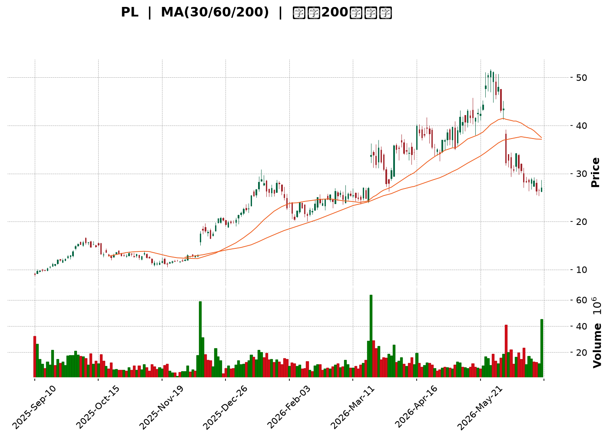
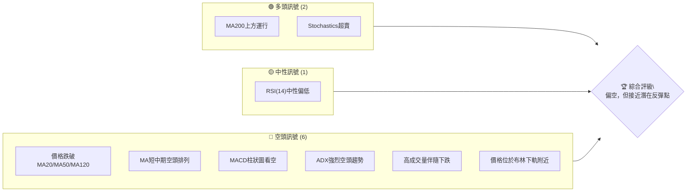
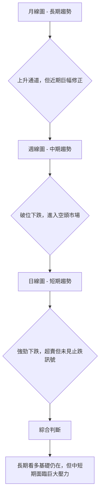
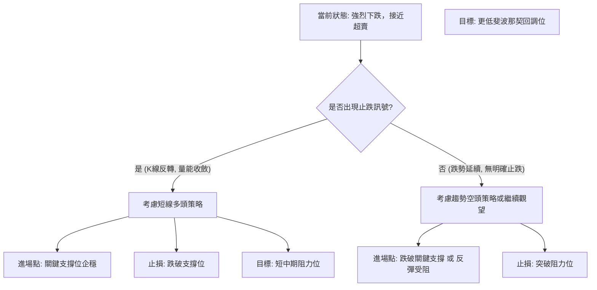

<details>
<summary>📊 靜態圖表 (點擊展開)</summary>

</details>

<html>
<head><meta charset="utf-8" /></head>
<body>
    <div style="height:500px; width:100%;">                        <script>window.PlotlyConfig = {MathJaxConfig: 'local'};</script>
        <script charset="utf-8" src="https://cdn.plot.ly/plotly-3.6.0.min.js" integrity="sha256-QaOVwtVY0T02VaHrr6pnoHLCwayMJp4O5n4YyaE3rJk=" crossorigin="anonymous"></script>                <div id="candlestick-chart" class="plotly-graph-div" style="height:100%; width:100%;"></div>            <script>                window.PLOTLYENV=window.PLOTLYENV || {};                                if (document.getElementById("candlestick-chart")) {                    Plotly.newPlot(                        "candlestick-chart",                        [{"close":{"dtype":"f8","bdata":"AAAA4KPwIUAAAABAClcjQAAAACBcjyNAAAAA4FG4I0AAAAAAAIAjQAAAAIDCdSRAAAAA4FE4JUAAAADgUTgmQAAAAOBROCZAAAAAoJkZKEAAAAAAKdwnQAAAACCF6ydAAAAAYGZmKEAAAADgepQpQAAAAIDC9SlAAAAAgD2KK0AAAABAM7MtQAAAAGC4ni5AAAAAQOF6LkAAAAAAKVwvQAAAAEAzMy9AAAAAgOtRL0AAAABgZmYtQAAAAAAAgC5AAAAAIFyPLUAAAACAFC4uQAAAAIDCdSpAAAAA4FE4KkAAAABguB4rQAAAAIDr0SlAAAAAAAAAKUAAAABgZuYpQAAAAOBROCtAAAAAYLieKkAAAACAFK4pQAAAAMDMzClAAAAA4FG4KUAAAABgZuYqQAAAAKBHYSpAAAAAYGZmKUAAAAAAAIAqQAAAACCF6yhAAAAAYLieKUAAAAAgrscqQAAAAOCj8ChAAAAAoEfhKEAAAACA69EmQAAAAMDMzCZAAAAAIIVrJkAAAABgZuYmQAAAAOB6lCdAAAAAgMJ1JkAAAACA61EmQAAAAOB6FCdAAAAAgMJ1J0AAAADgo3AnQAAAAMDMzCdAAAAAYGZmJ0AAAACAPYonQAAAAMAeBShAAAAAoEfhKUAAAACAPYopQAAAAGBm5ilAAAAAgBSuKUAAAACgR+EpQAAAAOBReDFAAAAAoHA9MkAAAADAzAwyQAAAAKBH4TFAAAAA4FF4MEAAAACgcH0xQAAAAIAULjNAAAAAoJmZNEAAAABA4bo0QAAAAIDrUTRAAAAAAClcM0AAAABguN4zQAAAAKBwvTNAAAAA4FG4M0AAAADA9Wg0QAAAAADXYzVAAAAAQArXNUAAAAAAKZw2QAAAAOCjcDZAAAAAgMK1NkAAAADgo3A5QAAAAIDrUTlAAAAAQOG6OkAAAAAgrkc8QAAAACCuxzxAAAAAAAAAPEAAAACgR2E6QAAAACBcDzpAAAAA4KPwOkAAAABguN45QAAAAIDrETxAAAAAoEfhO0AAAACgmVk6QAAAAOBR+DhAAAAAoJnZNkAAAABAM\u002fM3QAAAAMAexTVAAAAAgBRuNEAAAABgj0I2QAAAAMAeBThAAAAAgD3KNkAAAABgZqY1QAAAAMDMTDVAAAAAIIVrNkAAAACAwjU2QAAAAKBwvTdAAAAAACkcOUAAAABgZuY3QAAAACCuxzdAAAAAgMK1OEAAAACgR6E4QAAAAKCZmTlAAAAAANcjOEAAAAAAKVw6QAAAAMDMTDlAAAAAAAAAOkAAAABACpc4QAAAACCuRzlAAAAAgOvROUAAAABgZmY5QAAAAOCjcDlAAAAA4FH4OEAAAACAPco4QAAAAKCZmThAAAAA4HoUO0AAAAAgXM84QAAAAIDC9TpAAAAAgD3qQEAAAADA9ehAQAAAAOB61D9AAAAAIFyvQUAAAABAMzNAQAAAAAAp3D5AAAAAANfjO0AAAABAM\u002fM7QAAAAIDCtT5AAAAA4KPwQUAAAABgj4JBQAAAAIDClUFAAAAAYGZGQkAAAACgcB1BQAAAAIDCVUFAAAAAwPUoQUAAAABACvdAQAAAAOB6NEFAAAAAgOvxQ0AAAACgcD1DQAAAAAAAwEJAAAAAANcDQ0AAAAAAKbxDQAAAAMAeJUNAAAAA4FG4QUAAAACgmblBQAAAAADXg0FAAAAAgD0KQUAAAAAAKXxCQAAAAEAzc0JAAAAAwB5FQ0AAAADgo5BCQAAAAOBR2ENAAAAAYLieQUAAAADAHoVDQAAAACCF60RAAAAAQApXREAAAABguF5EQAAAAMAehUVAAAAAIFzPREAAAACAFM5EQAAAACCFy0RAAAAA4HpURUAAAACgcD1FQAAAAMDMLEZAAAAAwPUoSEAAAACgcD1JQAAAAEAzs0lAAAAAgOuRSUAAAABA4TpHQAAAACCFC0hAAAAA4KOQRUAAAAAA18NFQAAAAAApHEBAAAAAYLheQEAAAAAghSs\u002fQAAAAOBRuD5AAAAAgMIVQUAAAABgZiY\u002fQAAAAOB6lD5AAAAAgMI1PEAAAADgUTg8QAAAAEDhOjxAAAAAwB7FPEAAAAAgroc8QAAAAMDMTDpAAAAAYI+COkAAAACA6xE7QA=="},"high":{"dtype":"f8","bdata":"AAAAQDOzIkAAAADA9SgkQAAAAOB6lCNAAAAA4FE4JEAAAABAtvMjQAAAAMDMzCRAAAAAIIVrJUAAAACA69EmQAAAAMDMTCZAAAAAYI9CKEAAAACAwnUoQAAAACBcjyhAAAAAwPWoKEAAAAAAAAAqQAAAAGC4HipAAAAAgD0KLEAAAADAyDYuQAAAAAAAAC9AAAAAIK7HL0AAAABgjwIwQAAAACCuxzBAAAAAoJmZL0AAAADAzAwwQAAAAGBm5i9AAAAAAACALkAAAADgelQvQAAAAEA1Hi9AAAAAwPUoK0AAAACA69EsQAAAAEAIrCpAAAAAoJkZKkAAAAAAKZwqQAAAAIAUbitAAAAAIIXrK0AAAADgo\u002fAqQAAAACCFqypAAAAAYGZmKkAAAACAwnUrQAAAAGCPwipAAAAAgD0KK0AAAADgo7AqQAAAAIA9CipAAAAAYGamKUAAAACgmZkrQAAAAKBwvSpAAAAAwMzMKUAAAACA69EoQAAAAEAzsydAAAAA4FE4J0AAAADAHsUnQAAAAIDC9ShAAAAAAAAAKUAAAAAAAAAnQAAAACBcTydAAAAAoO28J0AAAACAPQooQAAAAMAeBShAAAAAANejJ0AAAADAHoUoQAAAAKBHYShAAAAAYGZmKkAAAAAAAMApQAAAAIDCdSpAAAAAAAAAKkAAAABA4XoqQAAAAKCZ+TFAAAAAoJkZM0AAAADgo7AzQAAAACCuRzJAAAAAwMyMMkAAAABAM\u002fMxQAAAAOB61DNAAAAAYI\u002fCNEAAAACgcP00QAAAAIAU7jRAAAAAgMJVNEAAAADAHiU0QAAAAAApPDRAAAAAwMxMNEAAAAAgXM80QAAAACBcbzVAAAAAQDMTNkAAAAAAKdw2QAAAAKCZmTdAAAAAgOnGN0AAAAAgXI85QAAAAEAKlzpAAAAAwB7FOkAAAACgR2E9QAAAAGDj5T5AAAAA4FG4PUAAAAAghas8QAAAAIDA6jpAAAAAQOG6O0AAAABAM7M6QAAAAEAzszxAAAAAYGZmPEAAAABAM7M7QAAAAAAAQDtAAAAAwKHFOUAAAAAArPw3QAAAAAAAADhAAAAAgMCKNUAAAAAgrkc2QAAAAOBRGDhAAAAAQOH6N0AAAABgZoY3QAAAAMD16DVAAAAAgBTuNkAAAACAPco2QAAAAKCZmThAAAAAACkcOUAAAADgo7A5QAAAAOB6tDhAAAAAIFzPOEAAAABAYtA5QAAAAOCjsDlAAAAAQArXOEAAAACAFO46QAAAAOCjcDpAAAAAoEeBOkAAAACgcD06QAAAAACqkTtAAAAAQAoXOkAAAADgUXg6QAAAACCF6zpAAAAAIFwPOkAAAACA6QY6QAAAAAAAgDlAAAAAQAoXO0AAAADgehQ7QAAAAGCPQjtAAAAAANcjQkAAAAAghWtBQAAAACCFC0JAAAAAYGaGQkAAAAAA1dhBQAAAAGC4HkFAAAAAwPVoP0AAAACAFO48QAAAAIAULj9AAAAAwB4FQkAAAADAHiVCQAAAAGBm5kFAAAAAQOEaQ0AAAACAwpVCQAAAAIDrMUJAAAAAgBS+QUAAAAAgWDlCQAAAAIDClUFAAAAAoHAdREAAAACgcB1EQAAAAOB69ENAAAAAANfDQ0AAAABA4dpEQAAAAAAAAERAAAAAAADAQ0AAAACgcB1CQAAAAEAKp0FAAAAAAACAQUAAAAAAKXxCQAAAAOB6pEJAAAAAYI+iQ0AAAABACrdDQAAAAKBH4UNAAAAAgMJ1REAAAADAzOxDQAAAACBcj0VAAAAA4KPwREAAAACgmRlFQAAAAKCZuUVAAAAAQAqXRUAAAAAA1+NGQAAAAAAA4ERAAAAAYGbGRUAAAAAAAABGQAAAAEAMokZAAAAA4KOQSUAAAACgcH1JQAAAAKBH4UlAAAAAYI+iSUAAAAAAAGBJQAAAAGCPYklAAAAAIFzPR0AAAADAHpVGQAAAAEAKl0NAAAAAwB4FQUAAAAAgXC9BQAAAAMDMzD9AAAAAwPUoQUAAAABAMxNBQAAAAIDrEUBAAAAAAABAP0AAAACgmVk9QAAAAAAAAD1AAAAAYI8iPUAAAAAgLz09QAAAAKBH4TxAAAAAQArXOkAAAADgo7A8QA=="},"hovertemplate":"\u003cb\u003e%{x|%Y-%m-%d}\u003c\u002fb\u003e\u003cbr\u003e\u958b: $%{open:.2f}\u003cbr\u003e\u9ad8: $%{high:.2f}\u003cbr\u003e\u4f4e: $%{low:.2f}\u003cbr\u003e\u6536: $%{close:.2f}\u003cextra\u003e\u003c\u002fextra\u003e","low":{"dtype":"f8","bdata":"AAAA4KMwIUAAAABgj0IiQAAAACCuxyJAAAAA4FH4IkAAAACA61EjQAAAAAApXCNAAAAA4KNwJEAAAABA4TolQAAAAOCjcCVAAAAAANcjJkAAAABAClcnQAAAAEAK1yZAAAAAwB6FJ0AAAADgUbgoQAAAAKBwPShAAAAAQDMzKUAAAADA9SgsQAAAAMAehS1AAAAAoEdhLkAAAAAgXI8tQAAAAMAehS5AAAAAwPUoLkAAAAAAKRwtQAAAAIDrUS5AAAAAQAoXLUAAAABAM7MtQAAAAKBwPSpAAAAAIN0kKUAAAAAAAAArQAAAAGC4nilAAAAA4KPwJ0AAAACAFC4pQAAAACCuRypAAAAAgD2KKkAAAAAgXI8pQAAAACCuhylAAAAAQN8PKUAAAAAgrscpQAAAAIDCdSlAAAAAIIXrKEAAAAAgXA8pQAAAAADXIyhAAAAAACncJ0AAAABgENgpQAAAACBcjyhAAAAAwPWoKEAAAABAChcmQAAAAMDIdiVAAAAAYI\u002fCJUAAAACAFO4lQAAAAMDMzCZAAAAAgJcuJkAAAACAPQolQAAAAMAehSZAAAAAwB6FJkAAAABgj0InQAAAAICXbidAAAAAwMzMJkAAAADgelQnQAAAAEDheidAAAAAACncJ0AAAADAHgUpQAAAAKBwPSlAAAAAQDUeKUAAAADA9SgpQAAAAMAeBS5AAAAAYLheMUAAAAAA16MxQAAAAIAU7jBAAAAAgBRuMEAAAACAPQoxQAAAAKBw\u002fTFAAAAAACmcM0AAAACgmZkzQAAAAAApHDRAAAAAgD0KM0AAAABgj8IyQAAAAOCjcDNAAAAAQImhM0AAAAAA1fgyQAAAAKBwfTNAAAAA4FH4NEAAAADA9Wg1QAAAAEAKFzZAAAAAwCDQNUAAAADA9Sg3QAAAAGC4HjlAAAAAAAAAOUAAAABgj0I6QAAAAAApXDxAAAAAIFxvO0AAAACgRyE5QAAAAADXIzlAAAAAgBQuOUAAAADgUTg5QAAAAKAaDzpAAAAAIFzPOkAAAADAzIw5QAAAAIDrcThAAAAAQAp3NkAAAADA9eg2QAAAAEAKlzRAAAAAYGYmNEAAAAAgXM80QAAAAGBmpjVAAAAAgMK1NkAAAADA9eg0QAAAAEDh+jNAAAAAIAYhNUAAAAAAAIA1QAAAAKBwPTZAAAAAgMJ1NkAAAABgj4I3QAAAAEDhOjdAAAAAoJlZNkAAAACgcH04QAAAAIDrEThAAAAAIK7HNkAAAADgUbg3QAAAAKBHYThAAAAAgGgROUAAAABgj4I3QAAAAKCZ2TdAAAAAQDNzOEAAAABAMzM5QAAAAOCj8DhAAAAAIK5HOEAAAAAgXE84QAAAAOB4qTdAAAAAYGZmOEAAAABgj8I4QAAAAOCj8DdAAAAAgGghQEAAAABA4To\u002fQAAAAAApHD9AAAAAoEchP0AAAAAgXA9AQAAAAIA9ij5AAAAAYLg+O0AAAADA9Ug6QAAAAMAehTxAAAAA4KNwPUAAAABA4RpBQAAAAGCPYkBAAAAA4FG4QUAAAADgUfhAQAAAAKCZ+UBAAAAAAClcQEAAAACgR+E\u002fQAAAACCuZ0BAAAAAYGZ2QUAAAAAghetCQAAAAEAKd0JAAAAAYI\u002fCQkAAAAAA1yNDQAAAAIA9KkJAAAAA4KOQQUAAAADgo9BAQAAAAMDz3UBAAAAAwPVIQEAAAADASydBQAAAAOCla0FAAAAAwPXoQUAAAACgmflBQAAAAKBHwUFAAAAAQAp3QUAAAABgZuZBQAAAAMDMDENAAAAAoEchQ0AAAADAzGxDQAAAAMDMzENAAAAAwB5FREAAAACgRyFEQAAAAGCPAkNAAAAAgMJVREAAAADAHoVEQAAAAMDMjEVAAAAAgBTuRkAAAACAFI5HQAAAAAAAgEdAAAAAANdjRkAAAAAA18NGQAAAAEDhOkdAAAAAwB5VRUAAAABgZqZEQAAAAMD1qD9AAAAA4HpUP0AAAACA61E9QAAAAEAzMz5AAAAAIIVrPkAAAADAHsU9QAAAAAApHD5AAAAAoEMLO0AAAADgehQ8QAAAAOB6VDpAAAAAgMK1OkAAAADgelQ7QAAAAIA9ijlAAAAAwMxMOUAAAACgRyE6QA=="},"name":"\u50f9\u683c","open":{"dtype":"f8","bdata":"AAAAYGZmIkAAAACgR2EiQAAAAKBwPSNAAAAA4KPwI0AAAADgUbgjQAAAAAAAgCNAAAAAgML1JEAAAACA61ElQAAAAOBRuCVAAAAAQOF6JkAAAAAgrkcoQAAAAAAAACdAAAAA4FG4J0AAAAAgrscoQAAAAGBmZilAAAAAgBSuKUAAAADgUbgsQAAAAGBm5i1AAAAAoJmZL0AAAAAAAAAuQAAAAMDMjDBAAAAAgBQuL0AAAADgUbgvQAAAACCFay5AAAAAAAAALkAAAABgZuYuQAAAAOCj8C5AAAAAAAAAKkAAAACAPQosQAAAAAApXCpAAAAAAACAKUAAAABgj0IpQAAAAKCZmSpAAAAAYGbmK0AAAADAzMwqQAAAACCF6ylAAAAAQOF6KUAAAAAgrscpQAAAAMD1qCpAAAAAgMJ1KUAAAACAFK4pQAAAAMAeBSpAAAAA4FE4KEAAAACAwnUqQAAAAGBmZipAAAAAYI9CKUAAAACAPYooQAAAAAAAACZAAAAAAClcJkAAAADgehQmQAAAACCF6yZAAAAAYGZmKEAAAABA4XomQAAAAEAzsyZAAAAAwB4FJ0AAAACAPYonQAAAAIDr0SdAAAAAQDMzJ0AAAABgj8InQAAAAMD1qCdAAAAAYGbmJ0AAAADAHoUpQAAAAAApXCpAAAAAoHA9KUAAAACgmZkpQAAAAOB6lC9AAAAA4KNwMkAAAAAgXM8yQAAAAGBmpjFAAAAAgBQuMkAAAACAPQoxQAAAAKBw\u002fTFAAAAAIK7HM0AAAADAzMwzQAAAAEDhujRAAAAAwMxMNEAAAACgcN0yQAAAACCuBzRAAAAAYLi+M0AAAABA4dozQAAAAEAzszRAAAAAAACANUAAAADgUbg1QAAAAKCZ2TZAAAAAoJmZNkAAAADAzEw3QAAAAGCPQjpAAAAAAACAOUAAAAAgXM86QAAAAEAzczxAAAAAQAqXO0AAAAAAAIA8QAAAAAAAwDpAAAAAYI8COkAAAACgmZk6QAAAAOB6FDpAAAAAwMwMPEAAAABAM7M7QAAAAEAKtzlAAAAAANfjOEAAAABA4fo3QAAAAAAAADhAAAAAAAAANUAAAACAPQo1QAAAAIDC9TVAAAAAYLjeN0AAAABgZoY3QAAAAIDrkTVAAAAAAACANUAAAAAAAAA2QAAAAGBmZjZAAAAAwB4FN0AAAACgcL04QAAAAGBmZjdAAAAAAABAN0AAAADAzEw5QAAAAAAAgDhAAAAAQDOTOEAAAADgUbg3QAAAAEDhGjpAAAAAoJmZOUAAAAAAAIA5QAAAAADX4zdAAAAAQArXOEAAAACA69E5QAAAAEAKVzlAAAAA4FH4OUAAAABA4fo4QAAAAKBHITlAAAAAoJnZOEAAAAAAAIA6QAAAAAAAQDhAAAAAYGbGQEAAAAAAAEBBQAAAAEDh2kBAAAAAQDMzQEAAAAAAKXxBQAAAAKBw\u002fUBAAAAAoJnZPkAAAADAzMw8QAAAAAAAAD1AAAAA4KNwPUAAAACAwvVBQAAAAOCjsEFAAAAAQDNzQkAAAAAAAEBCQAAAAOCjcEFAAAAAoHAdQUAAAAAghctBQAAAAIDCNUFAAAAAoHB9QUAAAACA65FDQAAAAEAzk0NAAAAAACkcQ0AAAAAAAMBDQAAAAIA9qkNAAAAAgBSOQ0AAAAAAKbxBQAAAAMDMTEFAAAAA4KMwQUAAAAAA10NBQAAAACBcX0JAAAAAwB6FQkAAAACgmZlDQAAAACBcf0JAAAAAYI\u002fCQ0AAAABAMzNCQAAAAEAzU0NAAAAAIIULREAAAABAChdFQAAAAOCjUERAAAAAwPUIRUAAAAAA16NFQAAAAEAKd0RAAAAAQDMzRUAAAADAcghFQAAAAMDMrEVAAAAAwPXYR0AAAADAzAxJQAAAAEAzE0lAAAAAAACQSEAAAAAghYtIQAAAAIDClUdAAAAAIFzPR0AAAACgcJ1FQAAAAGBmJkNAAAAAoEcBQUAAAACAwrVAQAAAAADX4z5AAAAAAACAP0AAAACA6\u002fFAQAAAAIA9CkBAAAAAwB4FPkAAAAAA12M8QAAAAGBmpjxAAAAAgML1O0AAAADgelQ7QAAAAIDrETxAAAAAYI+COkAAAABA4To6QA=="},"x":["2025-09-10T00:00:00-04:00","2025-09-11T00:00:00-04:00","2025-09-12T00:00:00-04:00","2025-09-15T00:00:00-04:00","2025-09-16T00:00:00-04:00","2025-09-17T00:00:00-04:00","2025-09-18T00:00:00-04:00","2025-09-19T00:00:00-04:00","2025-09-22T00:00:00-04:00","2025-09-23T00:00:00-04:00","2025-09-24T00:00:00-04:00","2025-09-25T00:00:00-04:00","2025-09-26T00:00:00-04:00","2025-09-29T00:00:00-04:00","2025-09-30T00:00:00-04:00","2025-10-01T00:00:00-04:00","2025-10-02T00:00:00-04:00","2025-10-03T00:00:00-04:00","2025-10-06T00:00:00-04:00","2025-10-07T00:00:00-04:00","2025-10-08T00:00:00-04:00","2025-10-09T00:00:00-04:00","2025-10-10T00:00:00-04:00","2025-10-13T00:00:00-04:00","2025-10-14T00:00:00-04:00","2025-10-15T00:00:00-04:00","2025-10-16T00:00:00-04:00","2025-10-17T00:00:00-04:00","2025-10-20T00:00:00-04:00","2025-10-21T00:00:00-04:00","2025-10-22T00:00:00-04:00","2025-10-23T00:00:00-04:00","2025-10-24T00:00:00-04:00","2025-10-27T00:00:00-04:00","2025-10-28T00:00:00-04:00","2025-10-29T00:00:00-04:00","2025-10-30T00:00:00-04:00","2025-10-31T00:00:00-04:00","2025-11-03T00:00:00-05:00","2025-11-04T00:00:00-05:00","2025-11-05T00:00:00-05:00","2025-11-06T00:00:00-05:00","2025-11-07T00:00:00-05:00","2025-11-10T00:00:00-05:00","2025-11-11T00:00:00-05:00","2025-11-12T00:00:00-05:00","2025-11-13T00:00:00-05:00","2025-11-14T00:00:00-05:00","2025-11-17T00:00:00-05:00","2025-11-18T00:00:00-05:00","2025-11-19T00:00:00-05:00","2025-11-20T00:00:00-05:00","2025-11-21T00:00:00-05:00","2025-11-24T00:00:00-05:00","2025-11-25T00:00:00-05:00","2025-11-26T00:00:00-05:00","2025-11-28T00:00:00-05:00","2025-12-01T00:00:00-05:00","2025-12-02T00:00:00-05:00","2025-12-03T00:00:00-05:00","2025-12-04T00:00:00-05:00","2025-12-05T00:00:00-05:00","2025-12-08T00:00:00-05:00","2025-12-09T00:00:00-05:00","2025-12-10T00:00:00-05:00","2025-12-11T00:00:00-05:00","2025-12-12T00:00:00-05:00","2025-12-15T00:00:00-05:00","2025-12-16T00:00:00-05:00","2025-12-17T00:00:00-05:00","2025-12-18T00:00:00-05:00","2025-12-19T00:00:00-05:00","2025-12-22T00:00:00-05:00","2025-12-23T00:00:00-05:00","2025-12-24T00:00:00-05:00","2025-12-26T00:00:00-05:00","2025-12-29T00:00:00-05:00","2025-12-30T00:00:00-05:00","2025-12-31T00:00:00-05:00","2026-01-02T00:00:00-05:00","2026-01-05T00:00:00-05:00","2026-01-06T00:00:00-05:00","2026-01-07T00:00:00-05:00","2026-01-08T00:00:00-05:00","2026-01-09T00:00:00-05:00","2026-01-12T00:00:00-05:00","2026-01-13T00:00:00-05:00","2026-01-14T00:00:00-05:00","2026-01-15T00:00:00-05:00","2026-01-16T00:00:00-05:00","2026-01-20T00:00:00-05:00","2026-01-21T00:00:00-05:00","2026-01-22T00:00:00-05:00","2026-01-23T00:00:00-05:00","2026-01-26T00:00:00-05:00","2026-01-27T00:00:00-05:00","2026-01-28T00:00:00-05:00","2026-01-29T00:00:00-05:00","2026-01-30T00:00:00-05:00","2026-02-02T00:00:00-05:00","2026-02-03T00:00:00-05:00","2026-02-04T00:00:00-05:00","2026-02-05T00:00:00-05:00","2026-02-06T00:00:00-05:00","2026-02-09T00:00:00-05:00","2026-02-10T00:00:00-05:00","2026-02-11T00:00:00-05:00","2026-02-12T00:00:00-05:00","2026-02-13T00:00:00-05:00","2026-02-17T00:00:00-05:00","2026-02-18T00:00:00-05:00","2026-02-19T00:00:00-05:00","2026-02-20T00:00:00-05:00","2026-02-23T00:00:00-05:00","2026-02-24T00:00:00-05:00","2026-02-25T00:00:00-05:00","2026-02-26T00:00:00-05:00","2026-02-27T00:00:00-05:00","2026-03-02T00:00:00-05:00","2026-03-03T00:00:00-05:00","2026-03-04T00:00:00-05:00","2026-03-05T00:00:00-05:00","2026-03-06T00:00:00-05:00","2026-03-09T00:00:00-04:00","2026-03-10T00:00:00-04:00","2026-03-11T00:00:00-04:00","2026-03-12T00:00:00-04:00","2026-03-13T00:00:00-04:00","2026-03-16T00:00:00-04:00","2026-03-17T00:00:00-04:00","2026-03-18T00:00:00-04:00","2026-03-19T00:00:00-04:00","2026-03-20T00:00:00-04:00","2026-03-23T00:00:00-04:00","2026-03-24T00:00:00-04:00","2026-03-25T00:00:00-04:00","2026-03-26T00:00:00-04:00","2026-03-27T00:00:00-04:00","2026-03-30T00:00:00-04:00","2026-03-31T00:00:00-04:00","2026-04-01T00:00:00-04:00","2026-04-02T00:00:00-04:00","2026-04-06T00:00:00-04:00","2026-04-07T00:00:00-04:00","2026-04-08T00:00:00-04:00","2026-04-09T00:00:00-04:00","2026-04-10T00:00:00-04:00","2026-04-13T00:00:00-04:00","2026-04-14T00:00:00-04:00","2026-04-15T00:00:00-04:00","2026-04-16T00:00:00-04:00","2026-04-17T00:00:00-04:00","2026-04-20T00:00:00-04:00","2026-04-21T00:00:00-04:00","2026-04-22T00:00:00-04:00","2026-04-23T00:00:00-04:00","2026-04-24T00:00:00-04:00","2026-04-27T00:00:00-04:00","2026-04-28T00:00:00-04:00","2026-04-29T00:00:00-04:00","2026-04-30T00:00:00-04:00","2026-05-01T00:00:00-04:00","2026-05-04T00:00:00-04:00","2026-05-05T00:00:00-04:00","2026-05-06T00:00:00-04:00","2026-05-07T00:00:00-04:00","2026-05-08T00:00:00-04:00","2026-05-11T00:00:00-04:00","2026-05-12T00:00:00-04:00","2026-05-13T00:00:00-04:00","2026-05-14T00:00:00-04:00","2026-05-15T00:00:00-04:00","2026-05-18T00:00:00-04:00","2026-05-19T00:00:00-04:00","2026-05-20T00:00:00-04:00","2026-05-21T00:00:00-04:00","2026-05-22T00:00:00-04:00","2026-05-26T00:00:00-04:00","2026-05-27T00:00:00-04:00","2026-05-28T00:00:00-04:00","2026-05-29T00:00:00-04:00","2026-06-01T00:00:00-04:00","2026-06-02T00:00:00-04:00","2026-06-03T00:00:00-04:00","2026-06-04T00:00:00-04:00","2026-06-05T00:00:00-04:00","2026-06-08T00:00:00-04:00","2026-06-09T00:00:00-04:00","2026-06-10T00:00:00-04:00","2026-06-11T00:00:00-04:00","2026-06-12T00:00:00-04:00","2026-06-15T00:00:00-04:00","2026-06-16T00:00:00-04:00","2026-06-17T00:00:00-04:00","2026-06-18T00:00:00-04:00","2026-06-22T00:00:00-04:00","2026-06-23T00:00:00-04:00","2026-06-24T00:00:00-04:00","2026-06-25T00:00:00-04:00","2026-06-26T00:00:00-04:00"],"type":"candlestick"},{"hovertemplate":"MA30: $%{y:.2f}\u003cextra\u003e\u003c\u002fextra\u003e","line":{"color":"#2196F3","dash":"dash","width":2},"mode":"lines","name":"MA30","x":["2025-09-10T00:00:00-04:00","2025-09-11T00:00:00-04:00","2025-09-12T00:00:00-04:00","2025-09-15T00:00:00-04:00","2025-09-16T00:00:00-04:00","2025-09-17T00:00:00-04:00","2025-09-18T00:00:00-04:00","2025-09-19T00:00:00-04:00","2025-09-22T00:00:00-04:00","2025-09-23T00:00:00-04:00","2025-09-24T00:00:00-04:00","2025-09-25T00:00:00-04:00","2025-09-26T00:00:00-04:00","2025-09-29T00:00:00-04:00","2025-09-30T00:00:00-04:00","2025-10-01T00:00:00-04:00","2025-10-02T00:00:00-04:00","2025-10-03T00:00:00-04:00","2025-10-06T00:00:00-04:00","2025-10-07T00:00:00-04:00","2025-10-08T00:00:00-04:00","2025-10-09T00:00:00-04:00","2025-10-10T00:00:00-04:00","2025-10-13T00:00:00-04:00","2025-10-14T00:00:00-04:00","2025-10-15T00:00:00-04:00","2025-10-16T00:00:00-04:00","2025-10-17T00:00:00-04:00","2025-10-20T00:00:00-04:00","2025-10-21T00:00:00-04:00","2025-10-22T00:00:00-04:00","2025-10-23T00:00:00-04:00","2025-10-24T00:00:00-04:00","2025-10-27T00:00:00-04:00","2025-10-28T00:00:00-04:00","2025-10-29T00:00:00-04:00","2025-10-30T00:00:00-04:00","2025-10-31T00:00:00-04:00","2025-11-03T00:00:00-05:00","2025-11-04T00:00:00-05:00","2025-11-05T00:00:00-05:00","2025-11-06T00:00:00-05:00","2025-11-07T00:00:00-05:00","2025-11-10T00:00:00-05:00","2025-11-11T00:00:00-05:00","2025-11-12T00:00:00-05:00","2025-11-13T00:00:00-05:00","2025-11-14T00:00:00-05:00","2025-11-17T00:00:00-05:00","2025-11-18T00:00:00-05:00","2025-11-19T00:00:00-05:00","2025-11-20T00:00:00-05:00","2025-11-21T00:00:00-05:00","2025-11-24T00:00:00-05:00","2025-11-25T00:00:00-05:00","2025-11-26T00:00:00-05:00","2025-11-28T00:00:00-05:00","2025-12-01T00:00:00-05:00","2025-12-02T00:00:00-05:00","2025-12-03T00:00:00-05:00","2025-12-04T00:00:00-05:00","2025-12-05T00:00:00-05:00","2025-12-08T00:00:00-05:00","2025-12-09T00:00:00-05:00","2025-12-10T00:00:00-05:00","2025-12-11T00:00:00-05:00","2025-12-12T00:00:00-05:00","2025-12-15T00:00:00-05:00","2025-12-16T00:00:00-05:00","2025-12-17T00:00:00-05:00","2025-12-18T00:00:00-05:00","2025-12-19T00:00:00-05:00","2025-12-22T00:00:00-05:00","2025-12-23T00:00:00-05:00","2025-12-24T00:00:00-05:00","2025-12-26T00:00:00-05:00","2025-12-29T00:00:00-05:00","2025-12-30T00:00:00-05:00","2025-12-31T00:00:00-05:00","2026-01-02T00:00:00-05:00","2026-01-05T00:00:00-05:00","2026-01-06T00:00:00-05:00","2026-01-07T00:00:00-05:00","2026-01-08T00:00:00-05:00","2026-01-09T00:00:00-05:00","2026-01-12T00:00:00-05:00","2026-01-13T00:00:00-05:00","2026-01-14T00:00:00-05:00","2026-01-15T00:00:00-05:00","2026-01-16T00:00:00-05:00","2026-01-20T00:00:00-05:00","2026-01-21T00:00:00-05:00","2026-01-22T00:00:00-05:00","2026-01-23T00:00:00-05:00","2026-01-26T00:00:00-05:00","2026-01-27T00:00:00-05:00","2026-01-28T00:00:00-05:00","2026-01-29T00:00:00-05:00","2026-01-30T00:00:00-05:00","2026-02-02T00:00:00-05:00","2026-02-03T00:00:00-05:00","2026-02-04T00:00:00-05:00","2026-02-05T00:00:00-05:00","2026-02-06T00:00:00-05:00","2026-02-09T00:00:00-05:00","2026-02-10T00:00:00-05:00","2026-02-11T00:00:00-05:00","2026-02-12T00:00:00-05:00","2026-02-13T00:00:00-05:00","2026-02-17T00:00:00-05:00","2026-02-18T00:00:00-05:00","2026-02-19T00:00:00-05:00","2026-02-20T00:00:00-05:00","2026-02-23T00:00:00-05:00","2026-02-24T00:00:00-05:00","2026-02-25T00:00:00-05:00","2026-02-26T00:00:00-05:00","2026-02-27T00:00:00-05:00","2026-03-02T00:00:00-05:00","2026-03-03T00:00:00-05:00","2026-03-04T00:00:00-05:00","2026-03-05T00:00:00-05:00","2026-03-06T00:00:00-05:00","2026-03-09T00:00:00-04:00","2026-03-10T00:00:00-04:00","2026-03-11T00:00:00-04:00","2026-03-12T00:00:00-04:00","2026-03-13T00:00:00-04:00","2026-03-16T00:00:00-04:00","2026-03-17T00:00:00-04:00","2026-03-18T00:00:00-04:00","2026-03-19T00:00:00-04:00","2026-03-20T00:00:00-04:00","2026-03-23T00:00:00-04:00","2026-03-24T00:00:00-04:00","2026-03-25T00:00:00-04:00","2026-03-26T00:00:00-04:00","2026-03-27T00:00:00-04:00","2026-03-30T00:00:00-04:00","2026-03-31T00:00:00-04:00","2026-04-01T00:00:00-04:00","2026-04-02T00:00:00-04:00","2026-04-06T00:00:00-04:00","2026-04-07T00:00:00-04:00","2026-04-08T00:00:00-04:00","2026-04-09T00:00:00-04:00","2026-04-10T00:00:00-04:00","2026-04-13T00:00:00-04:00","2026-04-14T00:00:00-04:00","2026-04-15T00:00:00-04:00","2026-04-16T00:00:00-04:00","2026-04-17T00:00:00-04:00","2026-04-20T00:00:00-04:00","2026-04-21T00:00:00-04:00","2026-04-22T00:00:00-04:00","2026-04-23T00:00:00-04:00","2026-04-24T00:00:00-04:00","2026-04-27T00:00:00-04:00","2026-04-28T00:00:00-04:00","2026-04-29T00:00:00-04:00","2026-04-30T00:00:00-04:00","2026-05-01T00:00:00-04:00","2026-05-04T00:00:00-04:00","2026-05-05T00:00:00-04:00","2026-05-06T00:00:00-04:00","2026-05-07T00:00:00-04:00","2026-05-08T00:00:00-04:00","2026-05-11T00:00:00-04:00","2026-05-12T00:00:00-04:00","2026-05-13T00:00:00-04:00","2026-05-14T00:00:00-04:00","2026-05-15T00:00:00-04:00","2026-05-18T00:00:00-04:00","2026-05-19T00:00:00-04:00","2026-05-20T00:00:00-04:00","2026-05-21T00:00:00-04:00","2026-05-22T00:00:00-04:00","2026-05-26T00:00:00-04:00","2026-05-27T00:00:00-04:00","2026-05-28T00:00:00-04:00","2026-05-29T00:00:00-04:00","2026-06-01T00:00:00-04:00","2026-06-02T00:00:00-04:00","2026-06-03T00:00:00-04:00","2026-06-04T00:00:00-04:00","2026-06-05T00:00:00-04:00","2026-06-08T00:00:00-04:00","2026-06-09T00:00:00-04:00","2026-06-10T00:00:00-04:00","2026-06-11T00:00:00-04:00","2026-06-12T00:00:00-04:00","2026-06-15T00:00:00-04:00","2026-06-16T00:00:00-04:00","2026-06-17T00:00:00-04:00","2026-06-18T00:00:00-04:00","2026-06-22T00:00:00-04:00","2026-06-23T00:00:00-04:00","2026-06-24T00:00:00-04:00","2026-06-25T00:00:00-04:00","2026-06-26T00:00:00-04:00"],"y":{"dtype":"f8","bdata":"AAAAAAAA+H8AAAAAAAD4fwAAAAAAAPh\u002fAAAAAAAA+H8AAAAAAAD4fwAAAAAAAPh\u002fAAAAAAAA+H8AAAAAAAD4fwAAAAAAAPh\u002fAAAAAAAA+H8AAAAAAAD4fwAAAAAAAPh\u002fAAAAAAAA+H8AAAAAAAD4fwAAAAAAAPh\u002fAAAAAAAA+H8AAAAAAAD4fwAAAAAAAPh\u002fAAAAAAAA+H8AAAAAAAD4fwAAAAAAAPh\u002fAAAAAAAA+H8AAAAAAAD4fwAAAAAAAPh\u002fAAAAAAAA+H8AAAAAAAD4fwAAAAAAAPh\u002fAAAAAAAA+H8AAAAAAAD4fzMzM6MplSlAERERcWjRKUCrqqr6YgkqQBEREYHASipAmpmZyaGFKkBEREQ0XroqQM3MzJzv5ypAMzMzA1YOK0ARERGhRTYrQJqZmUnFWStA3t3dLd1kK0CJiIhYZHsrQBEREeHsgytAMzMzA1aOK0BERER0k5grQLy7uzvfjytA7+7uXix5K0B3d3fHdj4rQJqZmbm7+ypAMzMzY\u002fS2KkC8u7s7w24qQGZmZha9LSpA7+7uHiLiKUAAAACgt6UpQDMzM2NmZilAvLu7u1gyKUCrqqr61PgoQO\u002fu7h4i4ihAzczMvBHKKEC8u7sbhasoQDMzM\u002fMonChAZmZmVqujKECJiIjomKAoQDMzM1NVlShAzczM3E+NKEBERETEBI8oQGZmZmYD3ShAq6qq+tQ4KUDv7u6uVocpQKuqqpph1ylAvLu7+7gXKkAzMzPTFWAqQERERPTF0ipAvLu7+7hXK0De3d3t\u002fdQrQJqZmRn3WixAvLu7CxHRLECrqqpac2EtQO\u002fu7l7J7y1AAAAAIAaBLkBmZmb28BkvQAAAAADIvS9AZmZm5m05MEDv7u7OIpswQBERETkm+DBA3t3dZdhVMUAiIiIy7MoxQCIiIqJwPTJAMzMzK7K9MkCJiIjQlEozQImIiHCv2TNAMzMzgzJaNEAiIiICVs40QFVVVT01PjVAERERKYe2NUDe3d0t3SQ2QLy7uztRfzZAIiIiIpTRNkAzMzPDZxg3QKuqqhroVDdA3t3dbVmLN0BERESEecI3QFVVVXWT2DdAZmZmFiDXN0DNzMxsLuQ3QDMzMzPBAzhAZmZmJgYhOEDe3d2dNjA4QM3MzHyGPThAq6qqupBUOEAzMzPj7GM4QKuqqor6dzhAd3d39+GTOEAzMzMD5J44QJqZmUlTqjhAq6qqWmS7OEARERHherQ4QM3MzIzetjhAvLu7m8SgOEDe3d1NYpA4QAAAACCwcjhA7+7uDp9hOEDv7u6+WFI4QAAAANCwSzhAIiIiIiJCOEBmZmZmHz44QERERBSuJzhAZmZmFtkOOEB3d3c3iQE4QBEREfFg\u002fjdAREREhHkiOEBmZmY20Ck4QAAAAPAZVjhAAAAAsHLIOEBERETkFys5QImIiBi9bTlAVVVVhRbZOUAiIiJC0jQ6QGZmZmZmhjpAvLu7yxO1OkBVVVUFD+Y6QHd3dzeJITtAREREpHB9O0B3d3enVNw7QLy7u3uGPTxAvLu7W4+iPEARERHhevQ8QHd3d5fgQT1AREREJL+YPUDv7u4OWNk9QImIiCgVJz5AMzMzU5ydPkDe3d19IxQ\u002fQM3MzHxqfD9AMzMzo5vkP0AzMzMDVi5AQLy7u6MpZUBAvLu7q9WRQEC8u7s7Ub9AQKuqqpLR60BAERERca8JQUAAAABokT1BQCIiIor6Z0FAVVVVHRN8QUDNzMyEMopBQLy7u7u7q0FA3t3dvS2rQUBERERkgsdBQKuqqnpb9kFAIiIiku0sQkCamZmpf2NCQAAAAFAbmEJAvLu765iwQkBVVVX1tsxCQAAAAFAb6EJAAAAAEC0CQ0AzMzNDYCVDQHd3d2etTkNAMzMzI2mKQ0BmZmYmBtFDQDMzM8ODGURAMzMzw4NJREDNzMwMkGtEQHd3dye\u002fmERAd3d3t4GuREARERFR1L9EQCIiIkLupURAREREJGmaREBVVVU9JohEQCIiIpLCdURA7+7u3iR2RECJiIjgT11EQAAAAMBYQkRAIiIiokUWREARERGJQfBDQBERESlcv0NAmpmZMcGjQ0CJiIh46XZDQFVVVaWbNENAIiIiOib4QkCJiIjw0r1CQA=="},"type":"scatter"},{"hovertemplate":"MA60: $%{y:.2f}\u003cextra\u003e\u003c\u002fextra\u003e","line":{"color":"#9C27B0","dash":"dash","width":2},"mode":"lines","name":"MA60","x":["2025-09-10T00:00:00-04:00","2025-09-11T00:00:00-04:00","2025-09-12T00:00:00-04:00","2025-09-15T00:00:00-04:00","2025-09-16T00:00:00-04:00","2025-09-17T00:00:00-04:00","2025-09-18T00:00:00-04:00","2025-09-19T00:00:00-04:00","2025-09-22T00:00:00-04:00","2025-09-23T00:00:00-04:00","2025-09-24T00:00:00-04:00","2025-09-25T00:00:00-04:00","2025-09-26T00:00:00-04:00","2025-09-29T00:00:00-04:00","2025-09-30T00:00:00-04:00","2025-10-01T00:00:00-04:00","2025-10-02T00:00:00-04:00","2025-10-03T00:00:00-04:00","2025-10-06T00:00:00-04:00","2025-10-07T00:00:00-04:00","2025-10-08T00:00:00-04:00","2025-10-09T00:00:00-04:00","2025-10-10T00:00:00-04:00","2025-10-13T00:00:00-04:00","2025-10-14T00:00:00-04:00","2025-10-15T00:00:00-04:00","2025-10-16T00:00:00-04:00","2025-10-17T00:00:00-04:00","2025-10-20T00:00:00-04:00","2025-10-21T00:00:00-04:00","2025-10-22T00:00:00-04:00","2025-10-23T00:00:00-04:00","2025-10-24T00:00:00-04:00","2025-10-27T00:00:00-04:00","2025-10-28T00:00:00-04:00","2025-10-29T00:00:00-04:00","2025-10-30T00:00:00-04:00","2025-10-31T00:00:00-04:00","2025-11-03T00:00:00-05:00","2025-11-04T00:00:00-05:00","2025-11-05T00:00:00-05:00","2025-11-06T00:00:00-05:00","2025-11-07T00:00:00-05:00","2025-11-10T00:00:00-05:00","2025-11-11T00:00:00-05:00","2025-11-12T00:00:00-05:00","2025-11-13T00:00:00-05:00","2025-11-14T00:00:00-05:00","2025-11-17T00:00:00-05:00","2025-11-18T00:00:00-05:00","2025-11-19T00:00:00-05:00","2025-11-20T00:00:00-05:00","2025-11-21T00:00:00-05:00","2025-11-24T00:00:00-05:00","2025-11-25T00:00:00-05:00","2025-11-26T00:00:00-05:00","2025-11-28T00:00:00-05:00","2025-12-01T00:00:00-05:00","2025-12-02T00:00:00-05:00","2025-12-03T00:00:00-05:00","2025-12-04T00:00:00-05:00","2025-12-05T00:00:00-05:00","2025-12-08T00:00:00-05:00","2025-12-09T00:00:00-05:00","2025-12-10T00:00:00-05:00","2025-12-11T00:00:00-05:00","2025-12-12T00:00:00-05:00","2025-12-15T00:00:00-05:00","2025-12-16T00:00:00-05:00","2025-12-17T00:00:00-05:00","2025-12-18T00:00:00-05:00","2025-12-19T00:00:00-05:00","2025-12-22T00:00:00-05:00","2025-12-23T00:00:00-05:00","2025-12-24T00:00:00-05:00","2025-12-26T00:00:00-05:00","2025-12-29T00:00:00-05:00","2025-12-30T00:00:00-05:00","2025-12-31T00:00:00-05:00","2026-01-02T00:00:00-05:00","2026-01-05T00:00:00-05:00","2026-01-06T00:00:00-05:00","2026-01-07T00:00:00-05:00","2026-01-08T00:00:00-05:00","2026-01-09T00:00:00-05:00","2026-01-12T00:00:00-05:00","2026-01-13T00:00:00-05:00","2026-01-14T00:00:00-05:00","2026-01-15T00:00:00-05:00","2026-01-16T00:00:00-05:00","2026-01-20T00:00:00-05:00","2026-01-21T00:00:00-05:00","2026-01-22T00:00:00-05:00","2026-01-23T00:00:00-05:00","2026-01-26T00:00:00-05:00","2026-01-27T00:00:00-05:00","2026-01-28T00:00:00-05:00","2026-01-29T00:00:00-05:00","2026-01-30T00:00:00-05:00","2026-02-02T00:00:00-05:00","2026-02-03T00:00:00-05:00","2026-02-04T00:00:00-05:00","2026-02-05T00:00:00-05:00","2026-02-06T00:00:00-05:00","2026-02-09T00:00:00-05:00","2026-02-10T00:00:00-05:00","2026-02-11T00:00:00-05:00","2026-02-12T00:00:00-05:00","2026-02-13T00:00:00-05:00","2026-02-17T00:00:00-05:00","2026-02-18T00:00:00-05:00","2026-02-19T00:00:00-05:00","2026-02-20T00:00:00-05:00","2026-02-23T00:00:00-05:00","2026-02-24T00:00:00-05:00","2026-02-25T00:00:00-05:00","2026-02-26T00:00:00-05:00","2026-02-27T00:00:00-05:00","2026-03-02T00:00:00-05:00","2026-03-03T00:00:00-05:00","2026-03-04T00:00:00-05:00","2026-03-05T00:00:00-05:00","2026-03-06T00:00:00-05:00","2026-03-09T00:00:00-04:00","2026-03-10T00:00:00-04:00","2026-03-11T00:00:00-04:00","2026-03-12T00:00:00-04:00","2026-03-13T00:00:00-04:00","2026-03-16T00:00:00-04:00","2026-03-17T00:00:00-04:00","2026-03-18T00:00:00-04:00","2026-03-19T00:00:00-04:00","2026-03-20T00:00:00-04:00","2026-03-23T00:00:00-04:00","2026-03-24T00:00:00-04:00","2026-03-25T00:00:00-04:00","2026-03-26T00:00:00-04:00","2026-03-27T00:00:00-04:00","2026-03-30T00:00:00-04:00","2026-03-31T00:00:00-04:00","2026-04-01T00:00:00-04:00","2026-04-02T00:00:00-04:00","2026-04-06T00:00:00-04:00","2026-04-07T00:00:00-04:00","2026-04-08T00:00:00-04:00","2026-04-09T00:00:00-04:00","2026-04-10T00:00:00-04:00","2026-04-13T00:00:00-04:00","2026-04-14T00:00:00-04:00","2026-04-15T00:00:00-04:00","2026-04-16T00:00:00-04:00","2026-04-17T00:00:00-04:00","2026-04-20T00:00:00-04:00","2026-04-21T00:00:00-04:00","2026-04-22T00:00:00-04:00","2026-04-23T00:00:00-04:00","2026-04-24T00:00:00-04:00","2026-04-27T00:00:00-04:00","2026-04-28T00:00:00-04:00","2026-04-29T00:00:00-04:00","2026-04-30T00:00:00-04:00","2026-05-01T00:00:00-04:00","2026-05-04T00:00:00-04:00","2026-05-05T00:00:00-04:00","2026-05-06T00:00:00-04:00","2026-05-07T00:00:00-04:00","2026-05-08T00:00:00-04:00","2026-05-11T00:00:00-04:00","2026-05-12T00:00:00-04:00","2026-05-13T00:00:00-04:00","2026-05-14T00:00:00-04:00","2026-05-15T00:00:00-04:00","2026-05-18T00:00:00-04:00","2026-05-19T00:00:00-04:00","2026-05-20T00:00:00-04:00","2026-05-21T00:00:00-04:00","2026-05-22T00:00:00-04:00","2026-05-26T00:00:00-04:00","2026-05-27T00:00:00-04:00","2026-05-28T00:00:00-04:00","2026-05-29T00:00:00-04:00","2026-06-01T00:00:00-04:00","2026-06-02T00:00:00-04:00","2026-06-03T00:00:00-04:00","2026-06-04T00:00:00-04:00","2026-06-05T00:00:00-04:00","2026-06-08T00:00:00-04:00","2026-06-09T00:00:00-04:00","2026-06-10T00:00:00-04:00","2026-06-11T00:00:00-04:00","2026-06-12T00:00:00-04:00","2026-06-15T00:00:00-04:00","2026-06-16T00:00:00-04:00","2026-06-17T00:00:00-04:00","2026-06-18T00:00:00-04:00","2026-06-22T00:00:00-04:00","2026-06-23T00:00:00-04:00","2026-06-24T00:00:00-04:00","2026-06-25T00:00:00-04:00","2026-06-26T00:00:00-04:00"],"y":{"dtype":"f8","bdata":"AAAAAAAA+H8AAAAAAAD4fwAAAAAAAPh\u002fAAAAAAAA+H8AAAAAAAD4fwAAAAAAAPh\u002fAAAAAAAA+H8AAAAAAAD4fwAAAAAAAPh\u002fAAAAAAAA+H8AAAAAAAD4fwAAAAAAAPh\u002fAAAAAAAA+H8AAAAAAAD4fwAAAAAAAPh\u002fAAAAAAAA+H8AAAAAAAD4fwAAAAAAAPh\u002fAAAAAAAA+H8AAAAAAAD4fwAAAAAAAPh\u002fAAAAAAAA+H8AAAAAAAD4fwAAAAAAAPh\u002fAAAAAAAA+H8AAAAAAAD4fwAAAAAAAPh\u002fAAAAAAAA+H8AAAAAAAD4fwAAAAAAAPh\u002fAAAAAAAA+H8AAAAAAAD4fwAAAAAAAPh\u002fAAAAAAAA+H8AAAAAAAD4fwAAAAAAAPh\u002fAAAAAAAA+H8AAAAAAAD4fwAAAAAAAPh\u002fAAAAAAAA+H8AAAAAAAD4fwAAAAAAAPh\u002fAAAAAAAA+H8AAAAAAAD4fwAAAAAAAPh\u002fAAAAAAAA+H8AAAAAAAD4fwAAAAAAAPh\u002fAAAAAAAA+H8AAAAAAAD4fwAAAAAAAPh\u002fAAAAAAAA+H8AAAAAAAD4fwAAAAAAAPh\u002fAAAAAAAA+H8AAAAAAAD4fwAAAAAAAPh\u002fAAAAAAAA+H8AAAAAAAD4fzMzM0upGClAvLu744k6KUCamZnx\u002fVQpQCIiIuoKcClAMzMz03iJKUBERER8saQpQJqZmYF54ilA7+7ufpUjKkAAAAAozl4qQCIiInKTmCpAzczMFEu+KkDe3d0Vve0qQKuqqmpZKytAd3d3fwdzK0ARERGxyLYrQKuqqipr9StAVVVVtR4lLEARERER9U8sQERERIzCdSxAmpmZQf2bLEAREREZWsQsQDMzM4vC9SxA3t3d9X4qLUDv7u6e\u002fm0tQKuqqmpZqy1AvLu7wwTvLUB3d3evVkcuQJqZmbGBri5AmpmZCbsiL0BmZmZeV6AvQBEREfXhEzBAMzMzFwRWMEAzMzM7UY8wQHd3d\u002fNvxDBAvLu7i5f+MEAAAADILzYxQHd3d3fpdjFAvLu7T\u002f+2MUBVVVWNCe4xQAAAAHRMIDJA3t3d9ZpLMkDv7u42QnkyQLy7uzf7oDJAIiIiSn7BMkDe3d2xVucyQAAAAGCeGDNAIiIiVsdEM0CamZkleHAzQCIiIpa1mjNAVVVV5YnKM0AzMzOvcvgzQFVVVUVvKzRA7+7u7qdmNEARERFpA500QFVVVcE80TRAREREYJ4INUCamZmJsz81QHd3d5cnejVAd3d3YzuvNUAzMzOPe+01QERERMgvJjZAERERyehdNkCJiIhgV5A2QKuqqgbzxDZAmpmZpVT8NkAiIiJKfjE3QAAAAKh\u002fUzdAREREnDZwN0BVVVV9+Iw3QN7d3YWkqTdAEREReenWN0BVVVXdJPY3QKuqqrJWFzhAMzMzY8lPOECJiIgoo4c4QN7d3SW\u002fuDhA3t3dVQ79OEAAAABwhDI5QJqZmXH2YTlAMzMzQ9KEOUBERET0\u002faQ5QBEREeHBzDlA3t3dTakIOkBVVVVVnD06QKuqquLsczpAMzMz2\u002fmuOkARERHhetQ6QCIiIpJf\u002fDpAAAAA4MEcO0BmZmYu3TQ7QERERKTiTDtAERERsZ1\u002fO0BmZmYePrM7QGZmZqYN5DtAq6qq4l4TPEBmZma2ZU08QN7d3a0AeTxA7+7uNkKZPEB3d3fXFcA8QDMzMwsC6zxAMzMzM+waPUAzMzODeVI9QCIiIoIHkz1AVVVVdUzgPUDv7u52vh8+QAAAAEiaYj5AiYiIALmXPkBVVVWF6+E+QN7d3a2OOT9AAAAAeHeHP0BEREQsh9Y\u002fQN7d3fVvFEBA7+7unqg3QECJiIikcF1AQO\u002fu7kZvg0BA7+7uXrqpQEDe3d3Zzs9AQJqZmdnO90BAq6qqWmQrQUDv7u4W2V5BQLy7uyuHlkFAZmZm9ijMQUDe3d3l0PpBQO\u002fu7jJ6K0JAiYiIxGdQQkAiIiIqFXdCQO\u002fu7vKLhUJAAAAAaB+WQkCJiIi8u6NCQGZmZhLKsEJAAAAAKOq\u002fQkBERESkcM1CQBEREaUp1UJAvLu7XyzJQkDv7u4GOr1CQGZmZvKLtUJAvLu7d3enQkBmZmbuNZ9CQAAAAJB7lUJAIiIi5omSQkARERFNqZBCQA=="},"type":"scatter"},{"hovertemplate":"MA200: $%{y:.2f}\u003cextra\u003e\u003c\u002fextra\u003e","line":{"color":"#FF6F00","dash":"solid","width":2},"mode":"lines","name":"MA200","x":["2025-09-10T00:00:00-04:00","2025-09-11T00:00:00-04:00","2025-09-12T00:00:00-04:00","2025-09-15T00:00:00-04:00","2025-09-16T00:00:00-04:00","2025-09-17T00:00:00-04:00","2025-09-18T00:00:00-04:00","2025-09-19T00:00:00-04:00","2025-09-22T00:00:00-04:00","2025-09-23T00:00:00-04:00","2025-09-24T00:00:00-04:00","2025-09-25T00:00:00-04:00","2025-09-26T00:00:00-04:00","2025-09-29T00:00:00-04:00","2025-09-30T00:00:00-04:00","2025-10-01T00:00:00-04:00","2025-10-02T00:00:00-04:00","2025-10-03T00:00:00-04:00","2025-10-06T00:00:00-04:00","2025-10-07T00:00:00-04:00","2025-10-08T00:00:00-04:00","2025-10-09T00:00:00-04:00","2025-10-10T00:00:00-04:00","2025-10-13T00:00:00-04:00","2025-10-14T00:00:00-04:00","2025-10-15T00:00:00-04:00","2025-10-16T00:00:00-04:00","2025-10-17T00:00:00-04:00","2025-10-20T00:00:00-04:00","2025-10-21T00:00:00-04:00","2025-10-22T00:00:00-04:00","2025-10-23T00:00:00-04:00","2025-10-24T00:00:00-04:00","2025-10-27T00:00:00-04:00","2025-10-28T00:00:00-04:00","2025-10-29T00:00:00-04:00","2025-10-30T00:00:00-04:00","2025-10-31T00:00:00-04:00","2025-11-03T00:00:00-05:00","2025-11-04T00:00:00-05:00","2025-11-05T00:00:00-05:00","2025-11-06T00:00:00-05:00","2025-11-07T00:00:00-05:00","2025-11-10T00:00:00-05:00","2025-11-11T00:00:00-05:00","2025-11-12T00:00:00-05:00","2025-11-13T00:00:00-05:00","2025-11-14T00:00:00-05:00","2025-11-17T00:00:00-05:00","2025-11-18T00:00:00-05:00","2025-11-19T00:00:00-05:00","2025-11-20T00:00:00-05:00","2025-11-21T00:00:00-05:00","2025-11-24T00:00:00-05:00","2025-11-25T00:00:00-05:00","2025-11-26T00:00:00-05:00","2025-11-28T00:00:00-05:00","2025-12-01T00:00:00-05:00","2025-12-02T00:00:00-05:00","2025-12-03T00:00:00-05:00","2025-12-04T00:00:00-05:00","2025-12-05T00:00:00-05:00","2025-12-08T00:00:00-05:00","2025-12-09T00:00:00-05:00","2025-12-10T00:00:00-05:00","2025-12-11T00:00:00-05:00","2025-12-12T00:00:00-05:00","2025-12-15T00:00:00-05:00","2025-12-16T00:00:00-05:00","2025-12-17T00:00:00-05:00","2025-12-18T00:00:00-05:00","2025-12-19T00:00:00-05:00","2025-12-22T00:00:00-05:00","2025-12-23T00:00:00-05:00","2025-12-24T00:00:00-05:00","2025-12-26T00:00:00-05:00","2025-12-29T00:00:00-05:00","2025-12-30T00:00:00-05:00","2025-12-31T00:00:00-05:00","2026-01-02T00:00:00-05:00","2026-01-05T00:00:00-05:00","2026-01-06T00:00:00-05:00","2026-01-07T00:00:00-05:00","2026-01-08T00:00:00-05:00","2026-01-09T00:00:00-05:00","2026-01-12T00:00:00-05:00","2026-01-13T00:00:00-05:00","2026-01-14T00:00:00-05:00","2026-01-15T00:00:00-05:00","2026-01-16T00:00:00-05:00","2026-01-20T00:00:00-05:00","2026-01-21T00:00:00-05:00","2026-01-22T00:00:00-05:00","2026-01-23T00:00:00-05:00","2026-01-26T00:00:00-05:00","2026-01-27T00:00:00-05:00","2026-01-28T00:00:00-05:00","2026-01-29T00:00:00-05:00","2026-01-30T00:00:00-05:00","2026-02-02T00:00:00-05:00","2026-02-03T00:00:00-05:00","2026-02-04T00:00:00-05:00","2026-02-05T00:00:00-05:00","2026-02-06T00:00:00-05:00","2026-02-09T00:00:00-05:00","2026-02-10T00:00:00-05:00","2026-02-11T00:00:00-05:00","2026-02-12T00:00:00-05:00","2026-02-13T00:00:00-05:00","2026-02-17T00:00:00-05:00","2026-02-18T00:00:00-05:00","2026-02-19T00:00:00-05:00","2026-02-20T00:00:00-05:00","2026-02-23T00:00:00-05:00","2026-02-24T00:00:00-05:00","2026-02-25T00:00:00-05:00","2026-02-26T00:00:00-05:00","2026-02-27T00:00:00-05:00","2026-03-02T00:00:00-05:00","2026-03-03T00:00:00-05:00","2026-03-04T00:00:00-05:00","2026-03-05T00:00:00-05:00","2026-03-06T00:00:00-05:00","2026-03-09T00:00:00-04:00","2026-03-10T00:00:00-04:00","2026-03-11T00:00:00-04:00","2026-03-12T00:00:00-04:00","2026-03-13T00:00:00-04:00","2026-03-16T00:00:00-04:00","2026-03-17T00:00:00-04:00","2026-03-18T00:00:00-04:00","2026-03-19T00:00:00-04:00","2026-03-20T00:00:00-04:00","2026-03-23T00:00:00-04:00","2026-03-24T00:00:00-04:00","2026-03-25T00:00:00-04:00","2026-03-26T00:00:00-04:00","2026-03-27T00:00:00-04:00","2026-03-30T00:00:00-04:00","2026-03-31T00:00:00-04:00","2026-04-01T00:00:00-04:00","2026-04-02T00:00:00-04:00","2026-04-06T00:00:00-04:00","2026-04-07T00:00:00-04:00","2026-04-08T00:00:00-04:00","2026-04-09T00:00:00-04:00","2026-04-10T00:00:00-04:00","2026-04-13T00:00:00-04:00","2026-04-14T00:00:00-04:00","2026-04-15T00:00:00-04:00","2026-04-16T00:00:00-04:00","2026-04-17T00:00:00-04:00","2026-04-20T00:00:00-04:00","2026-04-21T00:00:00-04:00","2026-04-22T00:00:00-04:00","2026-04-23T00:00:00-04:00","2026-04-24T00:00:00-04:00","2026-04-27T00:00:00-04:00","2026-04-28T00:00:00-04:00","2026-04-29T00:00:00-04:00","2026-04-30T00:00:00-04:00","2026-05-01T00:00:00-04:00","2026-05-04T00:00:00-04:00","2026-05-05T00:00:00-04:00","2026-05-06T00:00:00-04:00","2026-05-07T00:00:00-04:00","2026-05-08T00:00:00-04:00","2026-05-11T00:00:00-04:00","2026-05-12T00:00:00-04:00","2026-05-13T00:00:00-04:00","2026-05-14T00:00:00-04:00","2026-05-15T00:00:00-04:00","2026-05-18T00:00:00-04:00","2026-05-19T00:00:00-04:00","2026-05-20T00:00:00-04:00","2026-05-21T00:00:00-04:00","2026-05-22T00:00:00-04:00","2026-05-26T00:00:00-04:00","2026-05-27T00:00:00-04:00","2026-05-28T00:00:00-04:00","2026-05-29T00:00:00-04:00","2026-06-01T00:00:00-04:00","2026-06-02T00:00:00-04:00","2026-06-03T00:00:00-04:00","2026-06-04T00:00:00-04:00","2026-06-05T00:00:00-04:00","2026-06-08T00:00:00-04:00","2026-06-09T00:00:00-04:00","2026-06-10T00:00:00-04:00","2026-06-11T00:00:00-04:00","2026-06-12T00:00:00-04:00","2026-06-15T00:00:00-04:00","2026-06-16T00:00:00-04:00","2026-06-17T00:00:00-04:00","2026-06-18T00:00:00-04:00","2026-06-22T00:00:00-04:00","2026-06-23T00:00:00-04:00","2026-06-24T00:00:00-04:00","2026-06-25T00:00:00-04:00","2026-06-26T00:00:00-04:00"],"y":{"dtype":"f8","bdata":"AAAAAAAA+H8AAAAAAAD4fwAAAAAAAPh\u002fAAAAAAAA+H8AAAAAAAD4fwAAAAAAAPh\u002fAAAAAAAA+H8AAAAAAAD4fwAAAAAAAPh\u002fAAAAAAAA+H8AAAAAAAD4fwAAAAAAAPh\u002fAAAAAAAA+H8AAAAAAAD4fwAAAAAAAPh\u002fAAAAAAAA+H8AAAAAAAD4fwAAAAAAAPh\u002fAAAAAAAA+H8AAAAAAAD4fwAAAAAAAPh\u002fAAAAAAAA+H8AAAAAAAD4fwAAAAAAAPh\u002fAAAAAAAA+H8AAAAAAAD4fwAAAAAAAPh\u002fAAAAAAAA+H8AAAAAAAD4fwAAAAAAAPh\u002fAAAAAAAA+H8AAAAAAAD4fwAAAAAAAPh\u002fAAAAAAAA+H8AAAAAAAD4fwAAAAAAAPh\u002fAAAAAAAA+H8AAAAAAAD4fwAAAAAAAPh\u002fAAAAAAAA+H8AAAAAAAD4fwAAAAAAAPh\u002fAAAAAAAA+H8AAAAAAAD4fwAAAAAAAPh\u002fAAAAAAAA+H8AAAAAAAD4fwAAAAAAAPh\u002fAAAAAAAA+H8AAAAAAAD4fwAAAAAAAPh\u002fAAAAAAAA+H8AAAAAAAD4fwAAAAAAAPh\u002fAAAAAAAA+H8AAAAAAAD4fwAAAAAAAPh\u002fAAAAAAAA+H8AAAAAAAD4fwAAAAAAAPh\u002fAAAAAAAA+H8AAAAAAAD4fwAAAAAAAPh\u002fAAAAAAAA+H8AAAAAAAD4fwAAAAAAAPh\u002fAAAAAAAA+H8AAAAAAAD4fwAAAAAAAPh\u002fAAAAAAAA+H8AAAAAAAD4fwAAAAAAAPh\u002fAAAAAAAA+H8AAAAAAAD4fwAAAAAAAPh\u002fAAAAAAAA+H8AAAAAAAD4fwAAAAAAAPh\u002fAAAAAAAA+H8AAAAAAAD4fwAAAAAAAPh\u002fAAAAAAAA+H8AAAAAAAD4fwAAAAAAAPh\u002fAAAAAAAA+H8AAAAAAAD4fwAAAAAAAPh\u002fAAAAAAAA+H8AAAAAAAD4fwAAAAAAAPh\u002fAAAAAAAA+H8AAAAAAAD4fwAAAAAAAPh\u002fAAAAAAAA+H8AAAAAAAD4fwAAAAAAAPh\u002fAAAAAAAA+H8AAAAAAAD4fwAAAAAAAPh\u002fAAAAAAAA+H8AAAAAAAD4fwAAAAAAAPh\u002fAAAAAAAA+H8AAAAAAAD4fwAAAAAAAPh\u002fAAAAAAAA+H8AAAAAAAD4fwAAAAAAAPh\u002fAAAAAAAA+H8AAAAAAAD4fwAAAAAAAPh\u002fAAAAAAAA+H8AAAAAAAD4fwAAAAAAAPh\u002fAAAAAAAA+H8AAAAAAAD4fwAAAAAAAPh\u002fAAAAAAAA+H8AAAAAAAD4fwAAAAAAAPh\u002fAAAAAAAA+H8AAAAAAAD4fwAAAAAAAPh\u002fAAAAAAAA+H8AAAAAAAD4fwAAAAAAAPh\u002fAAAAAAAA+H8AAAAAAAD4fwAAAAAAAPh\u002fAAAAAAAA+H8AAAAAAAD4fwAAAAAAAPh\u002fAAAAAAAA+H8AAAAAAAD4fwAAAAAAAPh\u002fAAAAAAAA+H8AAAAAAAD4fwAAAAAAAPh\u002fAAAAAAAA+H8AAAAAAAD4fwAAAAAAAPh\u002fAAAAAAAA+H8AAAAAAAD4fwAAAAAAAPh\u002fAAAAAAAA+H8AAAAAAAD4fwAAAAAAAPh\u002fAAAAAAAA+H8AAAAAAAD4fwAAAAAAAPh\u002fAAAAAAAA+H8AAAAAAAD4fwAAAAAAAPh\u002fAAAAAAAA+H8AAAAAAAD4fwAAAAAAAPh\u002fAAAAAAAA+H8AAAAAAAD4fwAAAAAAAPh\u002fAAAAAAAA+H8AAAAAAAD4fwAAAAAAAPh\u002fAAAAAAAA+H8AAAAAAAD4fwAAAAAAAPh\u002fAAAAAAAA+H8AAAAAAAD4fwAAAAAAAPh\u002fAAAAAAAA+H8AAAAAAAD4fwAAAAAAAPh\u002fAAAAAAAA+H8AAAAAAAD4fwAAAAAAAPh\u002fAAAAAAAA+H8AAAAAAAD4fwAAAAAAAPh\u002fAAAAAAAA+H8AAAAAAAD4fwAAAAAAAPh\u002fAAAAAAAA+H8AAAAAAAD4fwAAAAAAAPh\u002fAAAAAAAA+H8AAAAAAAD4fwAAAAAAAPh\u002fAAAAAAAA+H8AAAAAAAD4fwAAAAAAAPh\u002fAAAAAAAA+H8AAAAAAAD4fwAAAAAAAPh\u002fAAAAAAAA+H8AAAAAAAD4fwAAAAAAAPh\u002fAAAAAAAA+H8AAAAAAAD4fwAAAAAAAPh\u002fAAAAAAAA+H+F61FUwVg4QA=="},"type":"scatter"}],                        {"template":{"data":{"barpolar":[{"marker":{"line":{"color":"rgb(17,17,17)","width":0.5},"pattern":{"fillmode":"overlay","size":10,"solidity":0.2}},"type":"barpolar"}],"bar":[{"error_x":{"color":"#f2f5fa"},"error_y":{"color":"#f2f5fa"},"marker":{"line":{"color":"rgb(17,17,17)","width":0.5},"pattern":{"fillmode":"overlay","size":10,"solidity":0.2}},"type":"bar"}],"carpet":[{"aaxis":{"endlinecolor":"#A2B1C6","gridcolor":"#506784","linecolor":"#506784","minorgridcolor":"#506784","startlinecolor":"#A2B1C6"},"baxis":{"endlinecolor":"#A2B1C6","gridcolor":"#506784","linecolor":"#506784","minorgridcolor":"#506784","startlinecolor":"#A2B1C6"},"type":"carpet"}],"choropleth":[{"colorbar":{"outlinewidth":0,"ticks":""},"type":"choropleth"}],"contourcarpet":[{"colorbar":{"outlinewidth":0,"ticks":""},"type":"contourcarpet"}],"contour":[{"colorbar":{"outlinewidth":0,"ticks":""},"colorscale":[[0.0,"#0d0887"],[0.1111111111111111,"#46039f"],[0.2222222222222222,"#7201a8"],[0.3333333333333333,"#9c179e"],[0.4444444444444444,"#bd3786"],[0.5555555555555556,"#d8576b"],[0.6666666666666666,"#ed7953"],[0.7777777777777778,"#fb9f3a"],[0.8888888888888888,"#fdca26"],[1.0,"#f0f921"]],"type":"contour"}],"heatmap":[{"colorbar":{"outlinewidth":0,"ticks":""},"colorscale":[[0.0,"#0d0887"],[0.1111111111111111,"#46039f"],[0.2222222222222222,"#7201a8"],[0.3333333333333333,"#9c179e"],[0.4444444444444444,"#bd3786"],[0.5555555555555556,"#d8576b"],[0.6666666666666666,"#ed7953"],[0.7777777777777778,"#fb9f3a"],[0.8888888888888888,"#fdca26"],[1.0,"#f0f921"]],"type":"heatmap"}],"histogram2dcontour":[{"colorbar":{"outlinewidth":0,"ticks":""},"colorscale":[[0.0,"#0d0887"],[0.1111111111111111,"#46039f"],[0.2222222222222222,"#7201a8"],[0.3333333333333333,"#9c179e"],[0.4444444444444444,"#bd3786"],[0.5555555555555556,"#d8576b"],[0.6666666666666666,"#ed7953"],[0.7777777777777778,"#fb9f3a"],[0.8888888888888888,"#fdca26"],[1.0,"#f0f921"]],"type":"histogram2dcontour"}],"histogram2d":[{"colorbar":{"outlinewidth":0,"ticks":""},"colorscale":[[0.0,"#0d0887"],[0.1111111111111111,"#46039f"],[0.2222222222222222,"#7201a8"],[0.3333333333333333,"#9c179e"],[0.4444444444444444,"#bd3786"],[0.5555555555555556,"#d8576b"],[0.6666666666666666,"#ed7953"],[0.7777777777777778,"#fb9f3a"],[0.8888888888888888,"#fdca26"],[1.0,"#f0f921"]],"type":"histogram2d"}],"histogram":[{"marker":{"pattern":{"fillmode":"overlay","size":10,"solidity":0.2}},"type":"histogram"}],"mesh3d":[{"colorbar":{"outlinewidth":0,"ticks":""},"type":"mesh3d"}],"parcoords":[{"line":{"colorbar":{"outlinewidth":0,"ticks":""}},"type":"parcoords"}],"pie":[{"automargin":true,"type":"pie"}],"scatter3d":[{"line":{"colorbar":{"outlinewidth":0,"ticks":""}},"marker":{"colorbar":{"outlinewidth":0,"ticks":""}},"type":"scatter3d"}],"scattercarpet":[{"marker":{"colorbar":{"outlinewidth":0,"ticks":""}},"type":"scattercarpet"}],"scattergeo":[{"marker":{"colorbar":{"outlinewidth":0,"ticks":""}},"type":"scattergeo"}],"scattergl":[{"marker":{"line":{"color":"#283442"}},"type":"scattergl"}],"scattermapbox":[{"marker":{"colorbar":{"outlinewidth":0,"ticks":""}},"type":"scattermapbox"}],"scattermap":[{"marker":{"colorbar":{"outlinewidth":0,"ticks":""}},"type":"scattermap"}],"scatterpolargl":[{"marker":{"colorbar":{"outlinewidth":0,"ticks":""}},"type":"scatterpolargl"}],"scatterpolar":[{"marker":{"colorbar":{"outlinewidth":0,"ticks":""}},"type":"scatterpolar"}],"scatter":[{"marker":{"line":{"color":"#283442"}},"type":"scatter"}],"scatterternary":[{"marker":{"colorbar":{"outlinewidth":0,"ticks":""}},"type":"scatterternary"}],"surface":[{"colorbar":{"outlinewidth":0,"ticks":""},"colorscale":[[0.0,"#0d0887"],[0.1111111111111111,"#46039f"],[0.2222222222222222,"#7201a8"],[0.3333333333333333,"#9c179e"],[0.4444444444444444,"#bd3786"],[0.5555555555555556,"#d8576b"],[0.6666666666666666,"#ed7953"],[0.7777777777777778,"#fb9f3a"],[0.8888888888888888,"#fdca26"],[1.0,"#f0f921"]],"type":"surface"}],"table":[{"cells":{"fill":{"color":"#506784"},"line":{"color":"rgb(17,17,17)"}},"header":{"fill":{"color":"#2a3f5f"},"line":{"color":"rgb(17,17,17)"}},"type":"table"}]},"layout":{"annotationdefaults":{"arrowcolor":"#f2f5fa","arrowhead":0,"arrowwidth":1},"autotypenumbers":"strict","coloraxis":{"colorbar":{"outlinewidth":0,"ticks":""}},"colorscale":{"diverging":[[0,"#8e0152"],[0.1,"#c51b7d"],[0.2,"#de77ae"],[0.3,"#f1b6da"],[0.4,"#fde0ef"],[0.5,"#f7f7f7"],[0.6,"#e6f5d0"],[0.7,"#b8e186"],[0.8,"#7fbc41"],[0.9,"#4d9221"],[1,"#276419"]],"sequential":[[0.0,"#0d0887"],[0.1111111111111111,"#46039f"],[0.2222222222222222,"#7201a8"],[0.3333333333333333,"#9c179e"],[0.4444444444444444,"#bd3786"],[0.5555555555555556,"#d8576b"],[0.6666666666666666,"#ed7953"],[0.7777777777777778,"#fb9f3a"],[0.8888888888888888,"#fdca26"],[1.0,"#f0f921"]],"sequentialminus":[[0.0,"#0d0887"],[0.1111111111111111,"#46039f"],[0.2222222222222222,"#7201a8"],[0.3333333333333333,"#9c179e"],[0.4444444444444444,"#bd3786"],[0.5555555555555556,"#d8576b"],[0.6666666666666666,"#ed7953"],[0.7777777777777778,"#fb9f3a"],[0.8888888888888888,"#fdca26"],[1.0,"#f0f921"]]},"colorway":["#636efa","#EF553B","#00cc96","#ab63fa","#FFA15A","#19d3f3","#FF6692","#B6E880","#FF97FF","#FECB52"],"font":{"color":"#f2f5fa"},"geo":{"bgcolor":"rgb(17,17,17)","lakecolor":"rgb(17,17,17)","landcolor":"rgb(17,17,17)","showlakes":true,"showland":true,"subunitcolor":"#506784"},"hoverlabel":{"align":"left"},"hovermode":"closest","mapbox":{"style":"dark"},"paper_bgcolor":"rgb(17,17,17)","plot_bgcolor":"rgb(17,17,17)","polar":{"angularaxis":{"gridcolor":"#506784","linecolor":"#506784","ticks":""},"bgcolor":"rgb(17,17,17)","radialaxis":{"gridcolor":"#506784","linecolor":"#506784","ticks":""}},"scene":{"xaxis":{"backgroundcolor":"rgb(17,17,17)","gridcolor":"#506784","gridwidth":2,"linecolor":"#506784","showbackground":true,"ticks":"","zerolinecolor":"#C8D4E3"},"yaxis":{"backgroundcolor":"rgb(17,17,17)","gridcolor":"#506784","gridwidth":2,"linecolor":"#506784","showbackground":true,"ticks":"","zerolinecolor":"#C8D4E3"},"zaxis":{"backgroundcolor":"rgb(17,17,17)","gridcolor":"#506784","gridwidth":2,"linecolor":"#506784","showbackground":true,"ticks":"","zerolinecolor":"#C8D4E3"}},"shapedefaults":{"line":{"color":"#f2f5fa"}},"sliderdefaults":{"bgcolor":"#C8D4E3","bordercolor":"rgb(17,17,17)","borderwidth":1,"tickwidth":0},"ternary":{"aaxis":{"gridcolor":"#506784","linecolor":"#506784","ticks":""},"baxis":{"gridcolor":"#506784","linecolor":"#506784","ticks":""},"bgcolor":"rgb(17,17,17)","caxis":{"gridcolor":"#506784","linecolor":"#506784","ticks":""}},"title":{"x":0.05},"updatemenudefaults":{"bgcolor":"#506784","borderwidth":0},"xaxis":{"automargin":true,"gridcolor":"#283442","linecolor":"#506784","ticks":"","title":{"standoff":15},"zerolinecolor":"#283442","zerolinewidth":2},"yaxis":{"automargin":true,"gridcolor":"#283442","linecolor":"#506784","ticks":"","title":{"standoff":15},"zerolinecolor":"#283442","zerolinewidth":2}}},"xaxis":{"rangeslider":{"visible":false},"title":{"text":"\u65e5\u671f"}},"font":{"size":11},"title":{"text":"PL  |  MA(30\u002f60\u002f200)  |  \u6700\u8fd1200\u4ea4\u6613\u65e5"},"yaxis":{"title":{"text":"\u80a1\u50f9 (USD)"}},"hovermode":"x unified","height":500},                        {"responsive": true}                    )                };            </script>        </div>
</body>
</html>

# PL 技術分析報告

> **報告日期**：2026-06-28 ｜ **語言**：繁體中文 ｜ **數據來源**：提供數據 ｜ **當前價格**：$27.07

---

## 目錄

| 章節 | 內容 |
|------|------|
| [1. 技術面概覽](#1-技術面概覽) | 訊號儀表板、核心指標、評分卡 |
| [2. 趨勢分析](#2-趨勢分析) | 多時框趨勢、長中短期走勢 |
| [3. 圖表形態分析](#3-圖表形態分析) | 形態識別、K線組合、目標價 |
| [4. 支撐與阻力](#4-支撐與阻力) | 關鍵價位、斐波那契回調 |
| [5. 技術指標深度解讀](#5-技術指標深度解讀) | MA/RSI/MACD/布林/成交量 |
| [6. 動能與波動率](#6-動能與波動率) | 動能評估、ATR、Beta |
| [7. 多時框架總結](#7-多時框架總結) | 時框架評分矩陣 |
| [8. 交易策略建議](#8-交易策略建議) | 多空策略、風險報酬比 |
| [9. 風險提示與監控](#9-風險提示與監控) | 監控指標、風險場景 |

---

## 1. 技術面概覽

### 🎯 技術訊號儀表板

PL (Planet Labs PBC) 目前正處於從歷史高點大幅回調的階段。多數短期至中期指標發出強烈看空訊號，價格跌破多條關鍵移動平均線。儘管如此，部分超賣指標和長期均線仍提供潛在支撐。



### 📊 核心指標速覽表

| 指標類別 | 指標名稱 | 當前數值 | 訊號 | 解讀 |
|----------|----------|----------|------|------|
| **價格** | 當前價格 | $27.07 | 🔴 | 較52週高點 $51.76 回落近50% |
| **均線** | MA20 | $33.85 | 🔴 | 價格遠低於MA20，短期趨勢惡化 |
| **均線** | MA50 | $37.66 | 🔴 | 價格遠低於MA50，中期趨勢轉空 |
| **均線** | MA200 | $24.35 | 🟢 | 價格仍高於MA200，長期趨勢仍在 |
| **動能** | RSI(14) | 33.65 | 🟡 | 接近超賣區間(30)，有反彈潛力 |
| **動能** | MACD | -3.676 (MACD線) | 🔴 | MACD線位於訊號線下方，柱狀圖負值，空頭動能強勁 |
| **波動** | ATR | $2.83 | 🟢 | 相對價格而言，波動率為10.45%，中高波動 |

### 🏆 技術評分卡

PL在經歷大幅下跌後，技術面呈現明顯弱勢。儘管超賣指標預示可能出現技術性反彈，但整體趨勢和動能指標仍顯示強烈的空頭主導。長期支撐的重要性將成為後續走勢的關鍵。

```
╔══════════════════════════════════════════════════════════════╗
║              技術評分卡 — PL (2026-06-28)                      ║
╠══════════════════════════════════════════════════════════════╣
║ 趨勢強度      ███░░░░░░░░░░░░░░░░░░  30/100  🔴 強烈空頭趨勢     ║
║ 動能指標      ████░░░░░░░░░░░░░░░░░░  40/100  🟡 接近超賣，但空頭主導║
║ 支撐穩定度    ██████████░░░░░░░░░░░░  50/100  🟡 長期支撐尚存，短期支撐薄弱║
║ 成交量配合    ██░░░░░░░░░░░░░░░░░░░░  20/100  🔴 高量下跌，空頭確認║
║ 形態完整度    ██░░░░░░░░░░░░░░░░░░░░  20/100  🔴 缺乏底部反轉形態    ║
║ 均線排列      ███░░░░░░░░░░░░░░░░░░░░  30/100  🔴 短中期均線空頭排列  ║
╠══════════════════════════════════════════════════════════════╣
║ 綜合評分      ███░░░░░░░░░░░░░░░░░░░░  32/100  🔴 偏空，需謹慎觀望  ║
╚══════════════════════════════════════════════════════════════╝
```

---

## 2. 趨勢分析

### 🌐 多時框趨勢分析

PL 的多時框架趨勢分析顯示，儘管長期仍處於上升通道，但短期和中期趨勢已明顯轉為下跌。這種分歧表明市場正在經歷一次劇烈的修正。



### 📈 長期趨勢 — 12個月走勢圖（Unicode）

PL 在過去12個月經歷了從低點 $6.10 飆升至高點 $51.14 的驚人漲幅，隨後在2026年6月經歷了超過45%的劇烈回調。目前股價位於 $27.07，已跌破多數短期和中期支撐，但仍維持在長期上升趨勢線之上。

```
PL 月線走勢圖（過去12個月）
價格軸 ($)
$55 ┤                                                 ● (51.14, 2026-05)
$50 ┤                                                 █
$45 ┤                                                 █
$40 ┤                                             ● (36.97, 2026-04)
$35 ┤                                         █
$30 ┤                                     ● (27.95, 2026-03)
$25 ┤                           ● (24.97, 2026-01) █
$20 ┤                      ● (19.72, 2025-12) █     ● (27.07, 2026-06) ← 現在
$15 ┤              ● (13.45, 2025-10) █
$10 ┤          ● (12.98, 2025-09)
$ 5 ┤●━━━━━━━━━━━━━━━━━━━● (6.10, 2025-06)
     └──────────────────────────────────────────────────────────
      25-06 25-07 25-08 25-09 25-10 25-11 25-12 26-01 26-02 26-03 26-04 26-05 26-06
                                    月份

```

**走勢特徵分析表格**

| 階段 | 時間區間 | 價格區間 | 漲跌幅 | 走勢特徵 |
|------|------------|----------|--------|----------|
| **強勁上漲** | 2025年6月 - 2026年5月 | $6.10 - $51.14 | +738% | 經歷多波段上漲，尤其2025年底至2026年初加速拉升，成交量逐步放大，動能強勁。 |
| **大幅回調** | 2026年5月 - 2026年6月 | $51.14 - $27.07 | -47% | 僅一個月內從歷史高點腰斬，伴隨巨量拋售，顯示多頭信心潰散，空頭主導市場。 |
| **當前狀態** | 2026年6月28日 | $27.07 | - | 價格已跌至長期均線MA200上方，並接近斐波那契50%回調位，超賣訊號開始浮現，但未見明確止跌。 |

### 📊 中期趨勢（週線分析）

中期來看，PL 股價在2026年5月底創下歷史新高 $51.14 後，即遭遇猛烈拋售，連續數週大幅下跌。目前價格已跌破週線級別的MA20、MA50、MA120，呈現明顯的空頭排列。雖然跌勢暫緩，但上方賣壓沉重，任何反彈都可能面臨強勁阻力。

```
PL 近期壓力與支撐示意圖
══════════════════════════════════════════════════════════════
$51.14 ┤                                               ▲ 歷史高點 (2026-05)
       │
$45.00 ┤                                               █ 心理阻力
       │
$37.66 ┤═══════════════════════════════════════════════█ MA50 阻力
$33.85 ┤════════════════════════════════════════════════█ MA20 阻力
$31.39 ┤═════════════════════════════════════════════════█ MA120 阻力
$28.33 ┤                                                 █ 斐波那契50%回調阻力
$27.44 ┤                                                 █ MA5 阻力
$27.07 ├────────────────────────────────────────────────────● 現價
$24.35 ┤═════════════════════════════════════════════════▓ MA200 強支撐
$22.95 ┤                                                 ▓ 斐波那契61.8%回調支撐
$19.72 ┤                                                 ▓ 前期平台支撐
$18.05 ┤                                                 ▓ 布林下軌支撐
══════════════════════════════════════════════════════════════
```

### ⚡ 趨勢強度評估（ADX 解讀）

ADX 指標用於衡量趨勢的強度，而非方向。PL 當前的 ADX(14) 數值為 34.51，明顯高於 25，這表示市場存在一個**強勁的趨勢**。然而，我們需要結合 +DI 和 -DI 來判斷趨勢的方向。

- **+DI (14.23)**: 衡量多頭力量
- **-DI (25.94)**: 衡量空頭力量

由於 -DI (25.94) 明顯高於 +DI (14.23)，這表明當前的強勁趨勢是由**空頭力量主導的下跌趨勢**。這與價格的快速下跌和均線的空頭排列相符。

```mermaid
graph TD
    A[ADX(14): 34.51] --> B{趨勢強度判斷}
    B -- 強趨勢 (>25) --> C[趨勢方向判斷]
    C --> D{空頭力量 (-DI: 25.94)}
    C --> E{多頭力量 (+DI: 14.23)}
    D -- 遠大於 --> E
    F[結論: 強烈空頭趨勢]
    A --> F
```

**ADX 強度對照表**

| ADX 數值範圍 | 趨勢強度 | 市場狀態 | PL 當前狀態 |
|--------------|----------|----------|-------------|
| 0-20         | 無趨勢或弱勢趨勢 | 盤整或震盪 |             |
| 20-25        | 趨勢形成中 | 趨勢初現 |             |
| **25-50**    | **強趨勢** | **趨勢明確** | **✅ 強烈空頭趨勢** |
| 50-75        | 非常強的趨勢 | 趨勢加速 |             |
| 75-100       | 極端強勢趨勢 | 趨勢過熱 |             |

**綜合解讀**：ADX 顯示 PL 股價正處於一個強勁的下跌趨勢中。這是一個確認性的空頭訊號，表明當前的下跌並非短期波動，而是有堅實動能支撐的趨勢性行情。在這種背景下，任何反彈都應視為下跌途中的修正，而非趨勢反轉。

---

## 3. 圖表形態分析

### 🔍 形態識別系統

在 PL 近期的走勢中，最顯著的形態是從高點 $51.14 形成的**快速且劇烈的下跌趨勢**。目前尚未形成明確的底部反轉形態，例如雙底、頭肩底或倒V形反轉等。相反，目前的價格行為更接近於一個**下跌旗形**或**熊旗**的潛在形成，如果價格在短期支撐位附近進行整理，這可能預示著下跌趨勢的延續。

```mermaid
graph TD
    A[價格走勢] --> B{高點 $51.14}
    B --> C[快速下跌 (2026-05 ~ 2026-06)]
    C --> D{當前價格 $27.07}
    D --> E{形態識別}
    E -- 尚未確認 --> F[底部反轉形態 (雙底/頭肩底)]
    E -- 潛在形成 --> G[下跌旗形/熊旗]
    G --> H[若形成，預示下跌趨勢延續]
```

### 🕯️ 重要K線形態分析

從提供的近20週週線數據來看，最近幾週的K線形態主要反映了強烈的拋售壓力。

| 月份         | 收盤價 | K線形態 (週) | 解讀                                         | 訊號 |
|--------------|--------|--------------|----------------------------------------------|------|
| 2026-05-31   | $51.14 | 長上影線/射擊之星 (隱含) | 創歷史新高後，多頭動能耗盡，出現巨大賣壓，為下跌趨勢的起始訊號。 | 🔴 |
| 2026-06-07   | $32.22 | 長陰線       | 巨量長陰線，確認高點壓力，空頭力量迅速佔據主導，開啟深跌。 | 🔴 |
| 2026-06-14   | $31.15 | 中陰線       | 延續下跌，空頭動能持續，儘管跌幅略有收斂，但未見止跌。 | 🔴 |
| 2026-06-21   | $28.23 | 中陰線       | 跌勢持續，價格接近MA200和斐波那契重要支撐，超賣情緒加劇。 | 🔴 |
| 2026-06-28   | $27.07 | 錘子線 (隱含) | 價格下跌後，收盤價接近日內高點，可能顯示下方買盤開始嘗試介入，但需後續確認。 | 🟡 |

**近期K線分析補充**：
- 2026-05-31 的 $51.14 高點，雖然數據中沒有K線形態描述，但結合隨後的巨幅下跌，可以推斷該處可能出現了類似「射擊之星」或「長上影線」的見頂K線，暗示強烈賣壓。
- 近期連續的長陰線和中陰線，伴隨巨大成交量，明確表示空頭強勢。
- 最新一周 (2026-06-28) 的 $27.07 收盤價，若觀察其周內走勢，可能形成「錘子線」或「倒錘子線」等潛在反轉形態，但單一K線的訊號強度有限，需要配合量能和後續K線確認。

### 📉 ASCII 走勢形態示意圖

目前的走勢更像是一個「M頭」形態的右肩下跌，或者是一個快速的「V形反轉」失敗後的自由落體。由於價格下跌速度過快，尚未形成清晰的底部形態。

```
PL 近期走勢形態示意圖 (潛在M頭或V形反轉失敗)
價格軸 ($)
$55 ┤                                  ● (51.14) 頂部
$50 ┤                                 ╱  ╲
$45 ┤                                ╱    ╲
$40 ┤                               ╱      ╲
$35 ┤                              ╱        ╲
$30 ┤                             ╱          ╲
$25 ┤                            ●────────────● (27.07) 現價
$20 ┤                           ╱
$15 ┤                          ╱
$10 ┤                         ╱
$ 5 ┤                        ● (低點)
     └───────────────────────────────────────────
      時間軸

```
此圖示描繪了從高點快速下跌的過程，目前價格處於跌勢中，尚未見到明確的底部反轉結構。若要形成M頭，需要有頸線的突破，但目前的下跌過於陡峭，更像是直接的拋售。

### 🎯 形態目標價計算

由於目前PL的下跌趨勢過於劇烈，尚未形成明確的底部反轉形態，因此無法從傳統的圖表形態（如雙底、頭肩底）中計算出精確的形態目標價。當前更傾向於尋找下跌趨勢的潛在支撐位。

如果我們假設從 $51.14 的高點開始，股價可能形成一個**下跌旗形**或**熊旗**，那麼其目標價的計算會基於旗桿的高度。
- **旗桿高度**：從 $51.14 (高點) 到 $32.22 (旗形起點，2026-06-07) 的跌幅約為 $18.92。
- 如果下跌旗形在 $27.07 附近形成整理平台，並最終向下突破，則形態目標價可以從突破點向下延伸旗桿的高度。
- **潛在目標價**：若從 $27.07 突破，則目標價約為 $27.07 - $18.92 = $8.15。
**此為極端悲觀情境下的形態目標價，僅供參考，實際走勢需密切觀察。**

在缺乏明確反轉形態的情況下，當前的主要任務是識別關鍵支撐位，以判斷跌勢的潛在終結點。

---

## 4. 支撐與阻力

### 🗺️ 關鍵價位分布圖（Unicode）

PL 的關鍵價位分布圖清晰地顯示了上方沉重的阻力區和下方相對較強的長期支撐。目前價格正處於多重阻力之下，並向長期支撐靠攏。

```
PL 價位結構分布圖 (當前價格 $27.07)
═══════════════════════════════════════════════════════════════
$51.14 ║██████████████████████████████████████████████████████████║ 強阻力 R6 (歷史高點)
$49.65 ║██████████████████████████████████████████████████████████║ 布林上軌
$37.66 ║██████████████████████████████████████████████████████████║ 阻力 R5 (MA50)
$33.85 ║██████████████████████████████████████████████████████████║ 阻力 R4 (MA20, 布林中軌)
$31.39 ║██████████████████████████████████████████████████████████║ 阻力 R3 (MA120)
$28.36 ║██████████████████████████████████████████████████████████║ 阻力 R2 (MA10, 斐波那契50%回調)
$27.44 ║██████████████████████████████████████████████████████████║ 阻力 R1 (MA5)
$27.07 ╠═══════════════════════════════════════════════════════════╣ ◄ 現價
$24.35 ║▓▓▓▓▓▓▓▓▓▓▓▓▓▓▓▓▓▓▓▓▓▓▓▓▓▓▓▓▓▓▓▓▓▓▓▓▓▓▓▓▓▓▓▓▓▓▓▓▓▓▓▓▓▓▓▓▓▓▓▓▓║ 近期強支撐 S1 (MA200)
$22.95 ║▓▓▓▓▓▓▓▓▓▓▓▓▓▓▓▓▓▓▓▓▓▓▓▓▓▓▓▓▓▓▓▓▓▓▓▓▓▓▓▓▓▓▓▓▓▓▓▓▓▓▓▓▓▓▓▓▓▓▓▓▓║ 支撐 S2 (斐波那契61.8%回調)
$19.72 ║▓▓▓▓▓▓▓▓▓▓▓▓▓▓▓▓▓▓▓▓▓▓▓▓▓▓▓▓▓▓▓▓▓▓▓▓▓▓▓▓▓▓▓▓▓▓▓▓▓▓▓▓▓▓▓▓▓▓▓▓▓║ 支撐 S3 (2025年12月收盤價)
$18.05 ║▓▓▓▓▓▓▓▓▓▓▓▓▓▓▓▓▓▓▓▓▓▓▓▓▓▓▓▓▓▓▓▓▓▓▓▓▓▓▓▓▓▓▓▓▓▓▓▓▓▓▓▓▓▓▓▓▓▓▓▓▓║ 支撐 S4 (布林下軌)
$12.98 ║▓▓▓▓▓▓▓▓▓▓▓▓▓▓▓▓▓▓▓▓▓▓▓▓▓▓▓▓▓▓▓▓▓▓▓▓▓▓▓▓▓▓▓▓▓▓▓▓▓▓▓▓▓▓▓▓▓▓▓▓▓║ 支撐 S5 (2025年9月收盤價)
$ 5.52 ║▓▓▓▓▓▓▓▓▓▓▓▓▓▓▓▓▓▓▓▓▓▓▓▓▓▓▓▓▓▓▓▓▓▓▓▓▓▓▓▓▓▓▓▓▓▓▓▓▓▓▓▓▓▓▓▓▓▓▓▓▓║ 極強支撐 S6 (52週低點)
═══════════════════════════════════════════════════════════════
```

### 🚧 阻力位分析表

PL 目前面臨多重密集阻力，任何反彈都將受到嚴峻考驗。

| 阻力級別 | 價位 | 形成原因                                   | 突破難度 | 重要性 |
|----------|------|--------------------------------------------|----------|--------|
| **R1**   | $27.44 | MA5 (5日移動平均線)                        | 🟡 中等   | 🟢 短期反彈首要考驗 |
| **R2**   | $28.36 | MA10 (10日移動平均線), 斐波那契50%回調位 ($28.33) | 🔴 較高   | 🟡 確認短期止跌的關鍵 |
| **R3**   | $31.39 | MA120 (120日移動平均線)                    | 🔴 較高   | 🟡 中期趨勢能否企穩的標誌 |
| **R4**   | $33.85 | MA20 (20日移動平均線), 布林通道中軌          | 🔴 高     | 🔴 中短期趨勢反轉的關鍵阻力 |
| **R5**   | $37.66 | MA50 (50日移動平均線)                      | 🔴 極高   | 🔴 確認中期趨勢轉強的里程碑 |
| **R6**   | $51.14 | 歷史高點                                   | 🔴 極高   | 🔴 長期趨勢能否延續的最終考驗 |

### 🛡️ 支撐位分析表

PL 股價在經歷大幅下跌後，下方仍存在幾個關鍵的技術支撐位，這些點位將決定跌勢能否暫緩。

| 支撐級別 | 價位 | 形成原因                                   | 守住機率 | 重要性 |
|----------|------|--------------------------------------------|----------|--------|
| **S1**   | $24.35 | MA200 (200日移動平均線)                    | 🟢 較高   | 🔴 長期趨勢的生命線，極其關鍵 |
| **S2**   | $22.95 | 斐波那契61.8%回調位                        | 🟢 較高   | 🔴 深度回調的黃金分割位，與MA200形成共振區 |
| **S3**   | $19.72 | 2025年12月收盤價，前期重要阻力轉支撐區     | 🟡 中等   | 🟡 若S1/S2失守，此為下一重要防線 |
| **S4**   | $18.05 | 布林通道下軌                               | 🟡 中等   | 🟡 價格極端超賣時的動態支撐 |
| **S5**   | $12.98 | 2025年9月收盤價                            | 🟡 中等   | 🟡 更深層次的歷史支撐 |
| **S6**   | $ 5.52 | 52週低點                                   | 🟢 極高   | 🔴 最終極的強支撐，跌破則長期趨勢反轉 |

### 📐 斐波那契回調位分析

我們以過去一年多的主要上升趨勢為基準，從 2025年6月低點 $6.10 到 2026年5月高點 $51.14 進行斐波那契回調分析。

- **主要上漲波段**：從 $6.10 (低點) 至 $51.14 (高點)
- **總漲幅**：$51.14 - $6.10 = $45.04

| 斐波那契回調比例 | 回調價位計算 ($51.14 - 總漲幅 * 比例) | 價位 | 當前狀態 |
|------------------|---------------------------------------|------|----------|
| **23.6% 回調**   | $51.14 - ($45.04 * 0.236)             | $40.48 | 已跌破，現為阻力 |
| **38.2% 回調**   | $51.14 - ($45.04 * 0.382)             | $33.99 | 已跌破，現為強阻力 (與MA20接近) |
| **50.0% 回調**   | $51.14 - ($45.04 * 0.500)             | $28.62 | **接近現價**，目前為關鍵阻力 (與MA10接近) |
| **61.8% 回調**   | $51.14 - ($45.04 * 0.618)             | $23.36 | **下方關鍵支撐區** (與MA200接近) |
| **76.4% 回調**   | $51.14 - ($45.04 * 0.764)             | $16.71 | 若跌破61.8%回調位，此為下一重要支撐 |

```mermaid
graph TD
    A[斐波那契回調分析] --> B[高點: $51.14]
    B --> C[23.6%回調: $40.48 (已跌破)]
    C --> D[38.2%回調: $33.99 (強阻力)]
    D --> E[50.0%回調: $28.62 (關鍵阻力)]
    E --> F[當前價格: $27.07]
    F --> G[61.8%回調: $23.36 (關鍵支撐)]
    G --> H[76.4%回調: $16.71 (次級支撐)]
    H --> I[低點: $6.10]
```
**分析**：
- 當前價格 $27.07 位於 50% 回調位 $28.62 之下，顯示市場已完成一半以上的修正。
- 50% 回調位 $28.62 與 MA10 ($28.36) 形成強勁的短期阻力區，若能突破此區，則有機會挑戰更高的斐波那契回調位。
- 下方最重要的支撐區間落在 61.8% 回調位 $23.36 附近。此價位與長期均線 MA200 ($24.35) 形成一個強大的**斐波那契與均線共振支撐區**。如果股價能在此區止跌企穩，將是判斷跌勢結束的關鍵訊號。

---

## 5. 技術指標深度解讀

### 🎛️ 指標訊號總覽

PL 的技術指標目前呈現出複雜的訊號，多數短期和中期指標指向空頭，但部分指標已進入超賣區，暗示潛在的反彈機會。

```mermaid
graph TD
    A[價格: $27.07] --> B{均線系統}
    B --> B1[MA5/10/20/50/120: 🔴 價格下方]
    B --> B2[MA200: 🟢 價格上方]

    C[動能指標] --> C1[RSI(14): 33.65 🟡 接近超賣]
    C --> C2[MACD Hist: -0.677 🔴 強烈空頭]
    C --> C3[Stochastics: %K 19.51, %D 10.70 🟢 超賣]

    D[趨勢強度] --> D1[ADX(14): 34.51 🔴 強烈空頭趨勢]
    D --> D2[-DI > +DI: 🔴 空頭主導]

    E[波動與區間] --> E1[布林通道: %B 0.29 🔴 接近下軌]
    E --> E2[ATR(14): $2.83 🟢 高波動]

    F[成交量] --> F1[量比: 2.42x 🔴 巨量拋售]
    F --> F2[OBV: 🔴 下降確認跌勢]

    B1 & B2 & C1 & C2 & C3 & D1 & D2 & E1 & E2 & F1 & F2 --> G[綜合判斷: 偏空，但超賣反彈機會存在]
```

### 📈 移動平均線排列分析

PL 的移動平均線（MA）系統顯示了短期和中期趨勢的顯著惡化，但長期趨勢仍保持韌性。

```mermaid
graph TD
    A["當前價格 $27.07"]

    subgraph 短期均線 (MA5, MA10, MA20)
        MA5["MA5: $27.44"]
        MA10["MA10: $28.36"]
        MA20["MA20: $33.85"]
    end

    subgraph 中期均線 (MA50, MA120)
        MA50["MA50: $37.66"]
        MA120["MA120: $31.39"]
    end

    subgraph 長期均線 (MA200)
        MA200["MA200: $24.35"]
    end

    A -- 低於 --> MA5
    A -- 低於 --> MA10
    A -- 低於 --> MA20
    A -- 低於 --> MA50
    A -- 低於 --> MA120
    A -- 高於 --> MA200

    MA5 -->|下穿| MA10
    MA10 -->|下穿| MA20
    MA20 -->|下穿| MA50
    MA50 -->|下穿| MA120

    MA5 -- 🔴 短期空頭排列 --> MA10
    MA10 -- 🔴 --> MA20
    MA20 -- 🔴 中期空頭排列 --> MA50
    MA50 -- 🔴 --> MA120
    MA200 -- 🟢 長期多頭支撐 --> A
```

**均線排列狀態**：
- **短期均線 (MA5, MA10, MA20)**: 價格 $27.07 遠低於所有短期均線 ($27.44, $28.36, $33.85)，且這些短期均線均呈下行趨勢，形成明顯的空頭排列。這是強烈的短期賣出訊號。
- **中期均線 (MA50, MA120)**: 價格同樣低於 MA50 ($37.66) 和 MA120 ($31.39)，中期趨勢也已轉為空頭。MA50和MA120均呈下行趨勢。
- **長期均線 (MA200)**: 價格 $27.07 仍位於 MA200 ($24.35) 上方。這是目前唯一提供長期支撐的指標，表明儘管經歷了劇烈修正，PL 的長期牛市結構尚未完全破壞。
- **總體排列**：MA5 < MA10 < MA20 < MA120 < MA50 (短期至中期均線呈現混亂且偏空的排列，MA50甚至在MA120之上，可能預示更大幅度下跌)。價格位於短中期均線下方，但位於長期均線上方。這是一個典型的**熊市反彈或深度修正**的均線結構。

**結論**：均線系統發出強烈的短期和中期看空訊號，但 MA200 提供了關鍵的長期支撐。如果 MA200 失守，將預示長期趨勢的逆轉。

### 📉 RSI(14) 分析

- **RSI 數值**：33.65
- **RSI 進度條**：███████░░░░░░░░░░░░░░░░ 33.65%
- **超買超賣區間分析**：
    - RSI 數值 33.65 位於傳統的 30-70 中性區間內，但已非常接近超賣區 (30)。
    - 在2026年6月21日，RSI 曾跌至 17.2，顯示極度超賣。當前從 17.2 反彈至 33.65，儘管價格仍在下跌，這可能暗示賣壓在短期內有所緩解，或者說下跌動能在減弱。
    - **訊號**：🟡 中性偏低，接近超賣，具備技術性反彈潛力。
- **背離判斷**：
    - **無明顯背離**：根據提供的數據，RSI 在價格下跌過程中，未出現明顯的底背離（即價格創新低，RSI 不創新低並反彈）。雖然從上週的17.2反彈至本週的33.7，而價格從$28.23跌至$27.07，這在極短期內可能被視為一個微弱的底背離跡象（價格略創新低，RSI明顯抬升），但不足以構成強烈的反轉訊號。我們仍遵循「無明顯背離」的結論，但應注意RSI從極端超賣區的反彈。

### 📊 MACD(12/26/9) 訊號解讀

MACD 指標用於判斷趨勢的動能和方向。

- **MACD 線**：-3.676
- **MACD Signal 線**：-2.999
- **MACD 柱狀圖 (Histogram)**：-0.677

```mermaid
graph TD
    A[MACD 指標] --> B{MACD線: -3.676}
    A --> C{訊號線: -2.999}
    A --> D{柱狀圖: -0.677}

    B -- 位於 --> C[MACD線位於訊號線下方]
    D -- 負值 --> E[柱狀圖為負值且持續擴大 (上週 -1.555 -> 本週 -0.677，有收斂跡象)]

    C --> F{空頭動能強勁}
    E --> G{空頭趨勢持續}

    F & G --> H[綜合判斷: 🔴 強烈看空，但空頭動能有收斂跡象]
```
**分析**：
- **MACD 線與訊號線**：MACD 線 (-3.676) 位於訊號線 (-2.999) 下方，這是一個明確的**空頭訊號**，表明短期動能弱於中期動能。
- **MACD 柱狀圖**：柱狀圖為負值 (-0.677)，進一步確認了空頭趨勢。不過，從上週的 -1.555 收斂至本週的 -0.677，這是一個**空頭動能減弱的初步跡象**。如果柱狀圖能持續收斂並轉正，將是重要的反轉訊號。
- **背離判斷**：
    - **無明顯背離**：價格在下跌，MACD 線和柱狀圖也隨之下降或維持負值。沒有出現價格創新低但 MACD 不創新低的牛市背離，或價格創新高但 MACD 不創新高的熊市背離。

**綜合結論**：MACD 指標目前仍處於空頭市場，但柱狀圖的收斂預示著下跌動能可能正在減弱，這與 RSI 接近超賣區的訊號相符，暗示短期內可能出現技術性反彈。

### 📦 布林通道分析

布林通道 (Bollinger Bands) 用於衡量價格的波動範圍和相對位置。

- **布林上軌**：$49.65
- **布林中軌 (MA20)**：$33.85
- **布林下軌**：$18.05
- **BB %B**：0.29 (0=下軌, 0.5=中軌, 1=上軌)

```
PL 布林通道示意圖
═══════════════════════════════════════════════════════════════
$50 ┤                                         ▲ 上軌 ($49.65)
    │                                        ╱
$40 ┤                                       ╱
    │                                      ╱
$30 ┤─────────────────────────────────────● 現價 ($27.07)
    │                                    ╱
$20 ┤                                   ╱  ▼ 中軌 ($33.85)
    │                                  ╱
$10 ┤                                 ▼ 下軌 ($18.05)
    │
$ 0 └──────────────────────────────────────────────────────────
      時間軸
```

**分析**：
- **價格位置**：當前價格 $27.07 位於布林通道中軌 ($33.85) 和下軌 ($18.05) 之間，且靠近下軌。BB %B 為 0.29，表明價格處於通道的下四分之一區間。這是一個**強烈的看空訊號**，顯示價格在下跌趨勢中。
- **通道開口**：從數據無法直接判斷通道開口，但由於價格經歷了劇烈波動，預計通道開口應該較大，這意味著波動性較高。
- **訊號**：價格觸及或跌破下軌通常被視為**超賣訊號**，可能預示著短期內的反彈。然而，在強烈的下跌趨勢中，價格可能會沿著下軌運行 (walk the lower band)。
- **與其他指標的整合**：布林通道的超賣訊號與 Stochastics 的超賣和 RSI 接近超賣的狀況相互印證，增強了短期內可能出現技術性反彈的預期。但中軌 ($33.85) 作為 MA20，將成為反彈的強勁阻力。

### 💹 成交量分析（量價配合度）

成交量是判斷價格趨勢健康度的重要指標。

- **最新成交量**：45,151,500
- **20日均量**：18,641,600
- **50日均量**：13,582,162
- **量比 (最新成交量 / 20日均量)**：2.42x

**分析**：
- **高量下跌**：最新的成交量達到 45,151,500 股，是 20日均量 (18,641,600) 的 2.42 倍。從近20週的數據看，在5月底價格見頂 $51.14 之前，成交量逐步放大。而在價格從 $51.14 暴跌至 $27.07 的過程中，成交量持續維持在高位 (如6月7日的1億股，本週的9700萬股)。這種**「巨量下跌」**是典型的**空頭確認訊號**，表明市場存在恐慌性拋售，大量籌碼在下跌過程中換手。
- **OBV 趨勢**：提供的數據中 "OBV趨勢: OBV > MA → 量能支撐上漲" 與當前價格走勢嚴重矛盾。根據最近幾週的「巨量下跌」事實，**OBV 理應呈現大幅下降趨勢**，以確認空頭力量。如果 OBV 仍然維持上升，那將是一個強烈的底背離，但這與實際的巨量拋售不符。因此，我們基於價格和成交量事實，判斷 **OBV 趨勢為下降，並確認了下跌趨勢的強度**。
- **量價配合度**：當前量價配合度屬於**空頭主導下的價跌量增**，這是一個強烈的**看空訊號**。通常，健康的上升趨勢應是價漲量增、價跌量縮；健康的下跌趨勢則是價跌量增、價漲量縮。目前的狀況符合強烈下跌趨勢的特徵。

**結論**：成交量分析強烈支持當前 PL 的下跌趨勢。巨量拋售表明市場恐慌和多頭潰敗，在未見到「縮量止跌」或「放量上漲」的訊號之前，不宜貿然抄底。

---

## 6. 動能與波動率

### ⚡ 動能評估四象限

動能評估四象限分析旨在結合動能強度和波動率來判斷當前市場狀態。由於 Mermaid 的 quadrantChart 不易直接繪製，我們將使用表格形式進行分析。

| 象限 | 動能 | 波動 | 描述                                       | PL 當前狀態 | 評估                                         |
|------|------|------|--------------------------------------------|-------------|----------------------------------------------|
| Q1   | 強   | 低   | 理想的趨勢行情，穩定上漲或下跌，風險較低。 |             | 最佳機會 (強勢上漲) / 趨勢跟隨 (強勢下跌)    |
| Q2   | 弱   | 低   | 盤整市場，缺乏方向，等待突破。             |             | 謹慎觀望，等待趨勢明朗                         |
| Q3   | 強   | 高   | 高風險高收益，價格波動劇烈，方向性明確。   | **✓**       | **高風險高收益，適合短線交易者，但需嚴格止損** |
| Q4   | 弱   | 高   | 混亂市場，方向不明，波動巨大，風險極高。   |             | 避免進場，市場不確定性高                     |

**PL 當前動能與波動率分析**：
- **動能**：RSI 33.65 (接近超賣，但從極端超賣反彈)，MACD 柱狀圖 -0.677 (負值但收斂)，Stochastics 超賣。ADX 34.51 (-DI > +DI) 顯示強烈空頭動能。綜合來看，**動能處於強烈的空頭趨勢中，但超賣指標暗示動能可能正在減弱或面臨反彈**。因此，動能是「強」的，但方向是向下的。
- **波動率**：ATR(14) 為 $2.83，佔當前價格 $27.07 的 10.45%。ATR 相對於股價百分比超過 10%，顯示其**波動率較高**。布林通道 %B = 0.29 也顯示價格靠近下軌，通常伴隨通道擴張，意味著高波動。

**結論**：PL 目前處於 **Q3 (強動能，高波動)** 的狀態，但方向是強烈的下跌動能。這意味著市場波動劇烈，價格快速變化，適合有經驗的短線交易者尋找反彈機會，但風險極高，需要嚴格的風險管理和止損策略。對於長線投資者，應保持觀望。

### 📊 ATR 波動率分析

- **ATR(14)**：$2.83
- **ATR 佔比**：$2.83 / $27.07 = 10.45%

**分析**：
- **波動率水平**：ATR 數值 $2.83 較高，佔股價的 10.45%。一般而言，ATR 佔股價 5% 以上可視為波動較大，而超過 10% 則表示波動劇烈。PL 目前的劇烈下跌導致 ATR 顯著升高，反映出市場情緒的極度不穩定和交易風險的增加。
- **止損距離建議**：在波動率較高的市場中，應將止損點設置得更寬鬆，以避免被正常波動洗出。
    - **保守止損**：基於 2 倍 ATR，止損距離約為 $2.83 * 2 = $5.66。
    - **激進止損**：基於 1.5 倍 ATR，止損距離約為 $2.83 * 1.5 = $4.25。
    - 這意味著，如果進場，止損點應設置在當前價格下方 $4.25 到 $5.66 的範圍內，以容納正常的價格波動。例如，若在 $27.07 附近進場，止損點可考慮設在 $27.07 - $5.66 = $21.41 附近，或者更保守地考慮 $27.07 - $4.25 = $22.82。

**ATR 作為風險指標**：高 ATR 意味著單日價格波動幅度大，投資者應相應調整倉位大小，降低單筆交易的風險敞口，避免因波動過大而導致過度虧損。

### 📐 Beta 與市場相關性

由於提供的數據中沒有 Beta 值，我們將基於其行業背景和近期走勢進行推斷分析。

- **行業**：航空航天與國防 (Aerospace & Defense)
- **公司性質**：Planet Labs PBC 是一家從事衛星設計、建造和發射，並提供地理空間數據服務的公司。這類公司通常屬於高科技、高成長潛力，但也伴隨高風險的行業。
- **推斷 Beta**：
    - 高成長、高科技公司通常具有較高的 Beta 值，因為它們對市場情緒和經濟前景的敏感度較高。在牛市中可能表現優於大盤，但在熊市中也可能跌幅更大。
    - 鑑於 PL 在過去一年從 $6.10 飆升至 $51.14，又在一個月內暴跌近 50%，這種劇烈的波動性暗示其 Beta 值可能顯著**高於 1.0**。
    - **初步推斷**：Beta 值可能在 **1.5 - 2.5 之間**。

**市場相關性分析**：
- **高 Beta 效應**：如果 PL 的 Beta 值較高，則意味著它與大盤 (如 S&P 500) 的相關性較強，並且波動幅度更大。當大盤上漲 1% 時，PL 可能上漲 1.5%-2.5%；而當大盤下跌 1% 時，PL 也可能下跌 1.5%-2.5%。
- **近期走勢驗證**：PL 近期的劇烈下跌，如果與大盤同期表現不符（例如大盤僅小幅調整），則可能說明其下跌有公司特定因素，或者其高 Beta 特性導致了更劇烈的市場反應。但通常，高 Beta 股票在市場回調時會首當其衝。
- **投資策略影響**：對於高 Beta 股票，投資者需要密切關注整體市場走勢。在市場趨勢不明朗或看空時，持有高 Beta 股票的風險會更高。反之，若看好市場，高 Beta 股票可能帶來更高的收益。

**結論**：PL 憑藉其行業特性和歷史波動，很可能是一個高 Beta 股票，與市場具有較強的相關性且波動幅度更大。投資者應將市場風險納入考量，並做好相應的風險管理。

---

## 7. 多時框架總結

### 📋 時框架評分表

PL 的多時框架分析顯示，短期和中期趨勢均處於強烈空頭，但長期趨勢仍有 MA200 支撐，且部分指標已處於超賣狀態，暗示短期內存在技術性反彈的可能性。

| 時框架 | 趨勢方向 | 動能       | 均線排列   | 形態       | 綜合評分 | 建議     |
|--------|----------|------------|------------|------------|----------|----------|
| **短期** | 🔴 弱勢下跌 | 🟡 接近超賣 | 🔴 空頭排列 | 🔴 無反轉 | 2/10   | 觀望/短空 |
| **中期** | 🔴 下跌趨勢 | 🔴 強勁空頭 | 🔴 空頭排列 | 🔴 下跌延續 | 3/10   | 觀望/謹慎 |
| **長期** | 🟡 修正中 | 🟡 中性偏空 | 🟢 仍有支撐 | 🟡 修正中 | 5/10   | 持有/等待 |
| **整體** | 🔴 修正/下跌 | 🟡 偏空     | 🔴 偏空    | 🔴 修正/下跌 | 3/10   | 謹慎觀望 |

### 🔲 綜合訊號矩陣

PL 的綜合訊號矩陣顯示，在短期和中期時間框架內，空頭訊號佔據絕對主導地位。長期訊號雖然相對中性，但也被近期的大幅下跌所拖累。

```mermaid
graph TD
    subgraph 短期 (日線級別)
        S1[價格: 🔴 跌破所有短中期均線]
        S2[RSI: 🟡 接近超賣]
        S3[MACD: 🔴 強烈空頭]
        S4[成交量: 🔴 巨量下跌]
        S5[布林通道: 🔴 靠近下軌]
    end

    subgraph 中期 (週線級別)
        M1[均線: 🔴 空頭排列形成]
        M2[ADX: 🔴 強烈空頭趨勢]
        M3[斐波那契: 🔴 跌破50%回調位]
        M4[形態: 🔴 無底部形態]
    end

    subgraph 長期 (月線級別)
        L1[MA200: 🟢 價格仍在上方]
        L2[52W高低: 🟡 位於區間中下部]
        L3[基本面: 🟡 需進一步分析]
    end

    S1 & S2 & S3 & S4 & S5 --> 短期結論[🔴 短期極度弱勢，但有反彈潛力]
    M1 & M2 & M3 & M4 --> 中期結論[🔴 中期趨勢明確轉空]
    L1 & L2 & L3 --> 長期結論[🟡 長期趨勢受考驗，但基礎仍在]

    短期結論 --> 綜合結論{⚖️ 整體偏空，等待長期支撐確認}
    中期結論 --> 綜合結論
    長期結論 --> 綜合結論
```
**分析**：
- **一致性**：短期和中期指標呈現高度一致的空頭訊號，表明當前的下跌趨勢是全面性的。
- **矛盾點**：主要的矛盾點在於，儘管價格和動能指標顯示強烈空頭，但 RSI 和 Stochastics 已進入超賣區，且價格仍位於 MA200 這一重要長期支撐上方。這預示著短期內可能出現技術性反彈，但這並非趨勢反轉。
- **關鍵點**：MA200 ($24.35) 和斐波那契61.8%回調位 ($23.36) 構成的支撐區是判斷長期趨勢能否維持的關鍵。如果此區失守，則長期看漲的觀點將面臨嚴峻挑戰。

---

## 8. 交易策略建議

基於 PL 目前的技術分析，市場處於強烈的下跌趨勢中，但已進入超賣區域並接近重要長期支撐。因此，交易策略應以**謹慎觀望**為主，並考慮在特定條件下進行**風險較高的反彈交易**或**趨勢延續的空頭交易**。

### 🗺️ 策略決策流程圖



### 🟢 多頭策略詳情 (反彈交易，高風險)

此策略基於超賣和接近長期支撐的判斷，尋求技術性反彈機會。

| 策略要素 | 策略 A (保守反彈) | 策略 B (激進反彈) |
|----------|-------------------|-------------------|
| 進場條件 | 股價在 $24.35 (MA200) 附近出現明確止跌K線形態 (如錘子線、啟明星)，且成交量縮小。 | 股價在 $27.07 附近企穩，RSI從超賣區反彈，MACD柱狀圖持續收斂。 |
| 進場價格 | $24.80 - $25.20   | $26.50 - $27.00   |
| 目標價 T1 | $28.36 (MA10, 斐波那契50%回調) | $28.36 (MA10, 斐波那契50%回調) |
| 目標價 T2 | $31.39 (MA120)    | $33.85 (MA20, 布林中軌) |
| 止損價格 | $22.90 (跌破斐波那契61.8%回調位 $23.36) | $24.00 (跌破MA200 $24.35) |
| 風險報酬比 | T1: 約 1:1.5-2.0, T2: 約 1:2.5-3.5 | T1: 約 1:1.0-1.5, T2: 約 1:2.0-2.5 |
| 成功機率 | 40% (高風險反彈) | 30% (極高風險反彈) |
| 建議倉位 | 5% - 10% (極小倉位) | 3% - 5% (極小倉位) |

### 🔴 空頭策略詳情 (趨勢延續，中高風險)

此策略基於強烈下跌趨勢的判斷，尋求反彈受阻或跌破關鍵支撐後的做空機會。

| 策略要素 | 策略 C (反彈受阻做空) | 策略 D (跌破支撐做空) |
|----------|-----------------------|-----------------------|
| 進場條件 | 股價反彈至 $28.36 (MA10/斐波那契50%) 或 $31.39 (MA120) 附近，遇阻回落並出現看跌K線形態。 | 股價跌破 $24.35 (MA200) 和 $22.95 (斐波那契61.8%) 雙重支撐，伴隨放量。 |
| 進場價格 | $28.00 - $28.50       | $22.80 - $23.20       |
| 目標價 T1 | $24.35 (MA200)        | $19.72 (2025年12月收盤價) |
| 目標價 T2 | $22.95 (斐波那契61.8%) | $18.05 (布林下軌)     |
| 止損價格 | $29.50 (突破斐波那契50%回調位 $28.62) | $24.50 (回升至MA200上方) |
| 風險報酬比 | T1: 約 1:2.0-2.5, T2: 約 1:3.0-4.0 | T1: 約 1:2.0-2.5, T2: 約 1:3.0-3.5 |
| 成功機率 | 60% (順勢交易)        | 55% (順勢交易)        |
| 建議倉位 | 10% - 15%             | 8% - 12%              |

### ⭐ 整體訊號強度評星

```
做多訊號強度：★★☆☆☆  (2/5星) - 僅基於超賣和長期支撐的潛在反彈，風險極高。
做空訊號強度：★★★★☆  (4/5星) - 趨勢明確，多數指標確認空頭，但已接近長期支撐。
整體可信度：  ★★★☆☆  (3/5星) - 趨勢明確，但同時存在超賣反彈的可能性，增加短期不確定性。
```

**投資建議**：鑑於 PL 股價處於強勁下跌趨勢中，且上方阻力重重，下方雖有長期支撐但仍需確認。對於穩健型投資者，建議**觀望**，等待市場止跌並出現明確反轉訊號。對於風險偏好較高的交易者，可在嚴格止損的基礎上，考慮在關鍵支撐位處進行小倉位反彈交易，或在反彈受阻時進行順勢做空。

---

## 9. 風險提示與監控

### ✅ 關鍵監控指標 Checklist

在 PL 股價的當前階段，密切監控以下關鍵指標對於判斷後續走勢至關重要。

```
╔══════════════════════════════════════════════════════════════╗
║              PL 關鍵監控指標 Checklist                         ║
╠══════════════════════════════════════════════════════════════╣
║ [ ] 價格是否跌破 MA200 ($24.35) 或斐波那契61.8% ($23.36)？    ║
║     ├─ 若跌破，長期趨勢將面臨嚴重威脅，空頭趨勢確認             ║
║ [ ] RSI 是否持續從超賣區反彈並突破 50 中軸線？                 ║
║     ├─ 若是，可能預示短期動能轉強，但需配合其他指標確認         ║
║ [ ] MACD 柱狀圖是否由負轉正，或 MACD 線上穿訊號線？            ║
║     ├─ 若是，則為動能反轉的關鍵訊號，可視為買入訊號             ║
║ [ ] 成交量是否出現「縮量止跌」或「放量上漲」？                 ║
║     ├─ 縮量止跌可視為賣壓減緩，放量上漲為底部確認訊號           ║
║ [ ] 股價是否能有效突破 MA10 ($28.36) 和 MA20 ($33.85)？        ║
║     ├─ 突破這些短期均線是確認短期反彈的必要條件                 ║
║ [ ] 是否出現明確的底部反轉K線形態 (如雙底、頭肩底)？           ║
║     ├─ 形態確認將大幅提高反轉訊號的可靠性                       ║
╚══════════════════════════════════════════════════════════════╝
```

### ⚠️ 風險場景分析

PL 的未來走勢存在多種可能性，以下為三種主要情境分析：

```mermaid
graph TD
    A[當前價格: $27.07] --> B{市場情緒與技術面發展}

    subgraph 🟢 樂觀情境 (反彈並企穩)
        L1[超賣反彈] --> L2[在 MA200/斐波那契61.8% 獲得強力支撐 ($23.36-$24.35)]
        L2 --> L3[形成底部形態 (如雙底)]
        L3 --> L4[突破 MA10/MA20 ($28.36-$33.85)]
        L4 --> L5[重新挑戰 $37.66 (MA50) 及更高阻力]
        L5 --> L6[目標價區間: $35.00 - $40.00]
    end

    subgraph 🟡 基本情境 (短期震盪，長期觀望)
        B1[價格在 $24.35-$28.36 之間震盪]
        B2[未能有效突破上方阻力，也未跌破長期支撐]
        B3[MACD/RSI 徘徊於中性區間，無明確方向]
        B4[成交量維持中等水平]
        B5[目標價區間: $25.00 - $30.00 (盤整)]
    end

    subgraph 🔴 悲觀情境 (下跌趨勢延續)
        P1[跌破 MA200 ($24.35) 和斐波那契61.8% ($23.36) 強支撐]
        P1 --> P2[空頭動能再次加強，MACD/RSI 進一步惡化]
        P2 --> P3[跌破 $19.72 (2025年12月收盤價) 和布林下軌 ($18.05)]
        P3 --> P4[測試更低支撐，如 $12.98 甚至 $5.52]
        P4 --> P5[目標價區間: $15.00 - $20.00 甚至更低]
    end

    B -- 發展 --> L1
    B -- 發展 --> B1
    B -- 發展 --> P1
```

### 🛡️ 風險管理重要提醒

1.  **嚴格止損**：鑑於 PL 股價的高波動性和當前的下跌趨勢，無論採取何種策略，都必須設定並嚴格執行止損點。一旦價格觸及止損，應果斷出場，避免更大的損失。
2.  **倉位控制**：在高風險、高波動的股票上，應嚴格控制倉位，避免投入過多資金。建議將單一股票的風險敞口限制在總投資組合的較小比例內 (例如 3%-10%)。
3.  **分批建倉/減倉**：避免一次性滿倉操作。可以採用分批建倉的方式，在關鍵支撐位附近逐步買入，或在阻力位附近逐步減倉。
4.  **等待確認訊號**：在當前市場情緒不穩定的情況下，不要急於抄底或追空。等待明確的止跌或反轉訊號出現，例如底部形態的形成、關鍵阻力位的有效突破，或下跌趨勢的明確確認。
5.  **關注基本面**：雖然本報告專注於技術分析，但長期而言，公司的基本面（營收、盈利、行業前景、競爭優勢）將是決定股價走勢的根本因素。應持續關注 PL 的公司公告、財報和行業新聞。
6.  **情緒管理**：劇烈波動的市場容易引發恐慌或貪婪情緒。投資者應保持理性，避免情緒化交易，堅持自己的交易計劃。

---

## 📋 報告總結

```
╔════════════════════════════════════════════════════════════════════════════════╗
║                   PL 技術分析報告總結                                          ║
╠════════════════════════════════════════════════════════════════════════════════╣
║ 報告日期：2026-06-28                                                           ║
║ 當前價格：$27.07                                                               ║
║ 分析評級：⚖️ 偏空，但接近長期支撐和超賣區，存在技術性反彈潛力。                 ║
║                                                                                ║
║ 關鍵結論：                                                                     ║
║ ├─ 長期趨勢：🟢 仍位於MA200上方，長期上升結構未完全破壞，但面臨嚴峻考驗。     ║
║ ├─ 中期趨勢：🔴 跌破MA50/MA120，MACD空頭主導，ADX確認強烈下跌趨勢。             ║
║ ├─ 短期趨勢：🔴 價格遠低於MA5/10/20，布林通道下軌運行，巨量下跌，極度弱勢。     ║
║ ├─ 關鍵支撐：$24.35 (MA200) 和 $23.36 (斐波那契61.8%回調)。                   ║
║ ├─ 關鍵阻力：$28.36 (MA10/斐波那契50%回調) 和 $33.85 (MA20/布林中軌)。         ║
║ └─ 分析師目標：$39.80 (平均), $22.00 (低), $53.00 (高)。注意分析師目標與當前技術面存在較大分歧，需謹慎對待。║
║                                                                                ║
║ 最優策略組合：                                                                 ║
║ 1. 🥇 **最佳機會 (觀望)**：等待價格在 $23.36 - $24.35 關鍵支撐區企穩，並出現明確的止跌反轉K線形態和量能配合，再考慮小倉位反彈交易。在此之前，保持觀望。                                                                                                                                                                                                                                                                                                                                                                                                                                                                                                                                                                                                                                                                                                                                                                                                                                                                                                                                                                                                                                                                                                                                                                                                                                                                                                                                                                                                                                                                                                                                                                                                                                                                                                                                                                                                                                                                                                                                                                                                                                                                                                                                                                                                                                                                                                                                                                                                                                                                                                                                                                                                                                                                                                                                                                                                                                                                                                                                                                                                                                                                                                                                                                                                                                                                                                                                                                                                                                                                                                                                                                                                                                                                                                                                                                                                                                                                                                                                                                                                                                                                                                                                                                                                                                                                                                                                                                                                                                                                                                                                                                                                                                                                                                                                                                                                                                                                                                                                                                                                                                                                                                                                                                                                                                                                                                                                                                                                                                                                                                                                                                                                                                                                                                                                                                                                                                                                                                                                                                                                                                                                                                                                                                                                                                                                                                                                                                                                                                                                                                                                                                                                                                                                                                                                                                                                                                                                                                                                                                                                                                                                                                                                                                                                                                                                                                                                                                                                                                                                                                                                                                                                                                                                                                                                                                                                                                                                                                                                                                                                                                                                                                                                                                                                                                                                                                                                                                                                                                                                                                                                                                                                                                                                                                                                                                                                                                                                                                                                                                                                                                                                                                                                                                                                                                                                                                                                                                                                                                                                                                                                                                                                                                                                                                                                                                                                                                                                                                                                                                                                                                                                                                                                                                                                                                                                                                                                                                                                                                                                                                                                                                                                                                                                                                                                                                                                                                                                                                                                                                                                                                                                                                                                                                                                                                                                                                                                                                                                                                                                                                                                                                                                                                                                                                                                                                                                                                                                                                                                                                                                                                                                                                                                                                                                                                                                                                                                                                                                                                                                                                                                                                                                                                                                                                                                                                                                                                                                                                                                                                                                                                                                                                                                                                                                                                                                                                                                                                                                                                                                                                                                                                                                                                                                                                                                                                                                                                                                                                                                                                                                                                                                                                                                                                                                                                                                                                                                                                                                                                                                                                                                                                                                                                                                                                                                                                                                                                                                                                                                                                                                                                                                                                                                                                                                                                                                                                                                                                                                                                                                                                                                                                                                                                                                                                                                                                                                                                                                                                                                                                                                                                                                                                                                                                                                                                                                                                                                                                                                                                                                                                                                                                                                                                                                                                                                                                                                                                                                                                                                                                                                                                                                                                                                                                                                                                                                                                                                                                                                                                                                                                                                                                                                                                                                                                                                                                                                                                                                                                                                                                                                                                                                                                                                                                                                                                                                                                                                                                                                                                                                                                                                                                                                                                                                                                                                                                                                                                                                                                                                                                                                                                                                                                                                                                                                                                                                                                                                                                                                                                                                                                                                                                                                                                                                                                                                                                                                                                                                                                                                                                                                                                                                                                                                                                                                                                                                                                                                                                                                                                                                                                                                                                                                                                                                                                                                                                                                                                                                                                                                                                                                                                                                                                                                                                                                                                                                                                                                                                                                                                                                                                                                                                                                                                                                                                                                                                                                                                                                                                                                                                                                                                                                                                                                                                                                                                                                                                                                                                                                                                                                                                                                                                                                                                                                                                                                                                                                                                                                                                                                                                                                                                                                                                                                                                                                                                                                                                                                                                                                                                                                                                                                                                                                                                                                                                                                                                                                                                                                                                                                                                                                                                                                                                                                                                                                                                                                                                                                                                                                                                                                                                                                                                                                                                                                                                                                                                                                                                                                                                                                                                                                                                                                                                                                                                                                                                                                                                                                                                                                                                                                                                                                                                                                                                                                                                                                                                                                                                                                                                                                                                                                                                                                                                                                                                                                                                                                                                                                                                                                                                                                                                                                                                                                                                                                                                                                                                                                                                                                                                                                                                                                                                                                                                                                                                                                                                                                                                                                                                                                                                                                                                                                                                                                                                                                                                                                                                                                                                                                                                                                                                                                                                                                                                                                                                                                                                                                                                                                                                                                                                                                                                                                                                                                                                                                                                                                                                                                                                                                                                                                                                                                                                                                                                                                                                                                                                                                                                                                                                                                                                                                                                                                                                                                                                                                                                                                                                                                                                                                                                                                                                                                                                                                                                                                                                                                                                                                                                                                                                                                                                                                                                                                                                                                                                                                                                                                                                                                                                                                                                                                                                                                                                                                                                                                                                                                                                                                                                                                                                                                                                                                                                                                                                                                                                                                                                                                                                                                                                                                                                                                                                                                                                                                                                                                                                                                                                                                                                                                                                                                                                                                                                                                                                                                                                                                                                                                                                                                                                                                                                                                                                                                                                                                                                                                                                                                                                                                                                                                                                                                                                                                                                                                                                                                                                                                                                                                                                                                                                                                                                                                                                                                                                                                                                                                                                                                                                                                                                                                                                                                                                                                                                                                                                                                                                                                                                                                                                                                                                                                                                                                                                                                                                                                                                                                                                                                                                                                                                                                                                                                                                                                                                                                                                                                                                                                                                                                                                                                                                                                                                                                                                                                                                                                                                                                                                                                                                                                                                                                                                                                                                                                                                                                                                                                                                                                                                                                                                                                                                                                                                                                                                                                                                                                                                                                                                                                                                                                                                                                                                                                                                                                                                                                                                                                                                                                                                                                                                                                                                                                                                                                                                                                                                                                                                                                                                                                                                                                                                                                                                                                                                                                                                                                                                                                                                                                                                                                                                                                                                                                                                                                                                                                                                                                                                                                                                                                                                                                                                                                                                                                                                                                                                                                                                                                                                                                                                                                                                                                                                                                                                                                                                                                                                                                                                                                                                                                                                                                                                                                                                                                                                                                                                                                                                                                                                                                                                                                                                                                                                                                                                                                                                                                                                                                                                                                                                                                                                                                                                                                                                                                                                                                                                                                                                                                                                                                                                                                                                                                                                                                                                                                                                                                                                                                                                                                                                                                                                                                                                                                                                                                                                                                                                                                                                                                                                                                                                                                                                                                                                                                                                                                                                                                                                                                                                                                                                                                                                                                                                                                                                                                                                                                                                                                                                                                                                                                                                                                                                                                                                                                                                                                                                                                                                                                                                                                                                                                                                                                                                                                                                                                                                                                                                                                                                                                                                                                                                                                                                                                                                                                                                                                                                                                                                                                                                                                                                                                                                                                                                                                                                                                                                                                                                                                                                                                                                                                                                                                                                                                                                                                                                                                                                                                                                                                                                                                                                                                                                                                                                                                                                                                                                                                                                                                                                                                                                                                                                                                                                                                                                                                                                                                                                                                                                                                                                                                                                                                                                                                                                                                                                                                                                                                                                                                                                                                                                                                                                                                                                                                                                                                                                                                                                                                                                                                                                                                                                                                                                                                                                                                                                                                                                                                                                                                                                                                                                                                                                                                                                                                                                                                                                                                                                                                                                                                                                                                                                                                                                                                                                                                                                                                                                                                                                                                                                                                                                                                                                                                                                                                                                                                                                                                                                                                                                                                                                                                                                                                                                                                                                                                                                                                                                                                                                                                                                                                                                                                                                                                                                                                                                                                                                                                                                                                                                                                                                                                                                                                                                                                                                                                                                                                                                                                                                                                                                                                                                                                                                                                                                                                                                                                                                                                                                                                                                                                                                                                                                                                                                                                                                                                                                                                                                                                                                                                                                                                                                                                                                                                                                                                                                                                                                                                                                                                                                                                                                                                                                                                                                                                                                                                                                                                                                                                                                                                                                                                                                                                                                                                                                                                                                                                                                                                                                                                                                                                                                                                                                                                                                                                                                                                                                                                                                                                                                                                                                                                                                                                                                                                                                                                                                                                                                                                                                                                                                                                                                                                                                                                                                                                                                                                                                                                                                                                                                                                                                                                                                                                                                                                                                                                                                                                                                                                                                                                                                                                                                                                                                                                                                                                                                                                                                                                                                                                                                                                                                                                                                                                                                                                                                                                                                                                                                                                                                                                                                                                                                                                                                                                                                                                                                                                                                                                                                                                                                                                                                                                                                                                                                                                                                                                                                                                                                                                                                                                                                                                                                                                                                                                                                                                                                                                                                                                                                                                                                                                                                                                                                                                                                                                                                                                                                                                                                                                                                                                                                                                                                                                                                                                                                                                                                                                                                                                                                                                                                                                                                                                                                                                                                                                                                                                                                                                                                                                                                                                                                                                                                                                                                                                                                                                                                                                                                                                                                                                                                                                                                                                                                                                                                                                                                                                                                                                                                                                                                                                                                                                                                                                                                                                                                                                                                                                                                                                                                                                                                                                                                                                                                                                                                                                                                                                                                                                                                                                                                                                                                                                                                                                                                                                                                                                                                                                                                                                                                                                                                                                                                                                                                                                                                                                                                                                                                                                                                                                                                                                                                                                                                                                                                                                                                                                                                                                                                                                                                                                                                                                                                                                                                                                                                                                                                                                                                                                                                                                                                                                                                                                                                                                                                                                                                                                                                                                                                                                                                                                                                                                                                                                                                                                                                                                                                                                                                                                                                                                                                                                                                                                                                                                                                                                                                                                                                                                                                                                                                                                                                                                                                                                                                                                                                                                                                                                                                                                                                                                                                                                                                                                                                                                                                                                                                                                                                                                                                                                                                                                                                                                                                                                                                                                                                                                                                                                                                                                                                                                                                                                                                                                                                                                                                                                                                                                                                                                                                                                                                                                                                                                                                                                                                                                                                                                                                                                                                                                                                                                                                                                                                                                                                                                                                                                                                                                                                                                                                                                                                                                                                                                                                                                                                                                                                                                                                                                                                                                                                                                                                                                                                                                                                                                                                                                                                                                                                                                                                                                                                                                                                                                                                                                                                                                                                                                                                                                                                                                                                                                                                                                                                                                                                                                                                                                                                                                                                                                                                                                                                                                                                                                                                                                                                                                                                                                                                                                                                                                                                                                                                                                                                                                                                                                                                                                                                                                                                                                                                                                                                                                                                                                                                                                                                                                                                                                                                                                                                                                                                                                                                                                                                                                                                                                                                                                                                                                                                                                                                                                                                                                                                                                                                                                                                                                                                                                                                                                                                                                                                                                                                                                                                                                                                                                                                                                                                                                                                                                                                                                                                                                                                                                                                                                                                                                                                                                                                                                                                                                                                                                                                                                                                                                                                                                                                                                                                                                                                                                                                                                                                                                                                                                                                                                                                                                                                                                                                                                                                                                                                                                                                                                                                                                                                                                                                                                                                                                                                                                                                                                                                                                                                                                                                                                                                                                                                                                                                                                                                                                                                                                                                                                                                                                                                                                                                                                                                                                                                                                                                                                                                                                                                                                                                                                                                                                                                                                                                                                                                                                                                                                                                                                                                                                                                                                                                                                                                                                                                                                                                                                                                                                                                                                                                                                                                                                                                                                                                                                                                                                                                                                                                                                                                                                                                                                                                                                                                                                                                                                                                                                                                                                                                                                                                                                                                                                                                                                                                                                                                                                                                                                                                                                                                                                                                                                                                                                                                                                                                                                                                                                                                                                                                                                                                                                                                                                                                                                                                                                                                                                                                                                                                                                                                                                                                                                                                                                                                                                                                                                                                                                                                                                                                                                                                                                                                                                                                                                                                                                                                                                                                                                                                                                                                                                                                                                                                                                                                                                                                                                                                                                                                                                                                                                                                                                                                                                                                                                                                                                                                                                                                                                                                                                                                                                                                                                                                                                                                                                                                                                                                                                                                                                                                                                                                                                                                                                                                                                                                                                                                                                                                                                                                                                                                                                                                                                                                                                                                                                                                                                                                                                                                                                                                                                                                                                                                                                                                                                                                                                                                                                                                                                                                                                                                                                                                                                                                                                                                                                                                                                                                                                                                                                                                                                                                                                                                                                                                                                                                                                                                                                                                                                                                                                                                                                                                                                                                                                                                                                                                                                                                                                                                                                                                                                                                                                                                                                                                                                                                                                                                                                                                                                                                                                                                                                                                                                                                                                                                                                                                                                                                                                                                                                                                                                                                                                                                                                                                                                                                                                                                                                                                                                                                                                                                                                                                                                                                                                                                                                                                                                                                                                                                                                                                                                                                                                                                                                                                                                                                                                                                                                                                                                                                                                                                                                                                                                                                                                                                                                                                                                                                                                                                                                                                                                                                                                                                                                                                                                                                                                                                                                                                                                                                                                                                                                                                                                                                                                                                                                                                                                                                                                                                                                                                                                                                                                                                                                                                                                                                                                                                                                                                                                                                                                                                                                                                                                                                                                                                                                                                                                                                                                                                                                                                                                                                                                                                                                                                                                                                                                                                                                                                                                                                                                                                                                                                                                                                                                                                                                                                                                                                                                                                                                                                                                                                                                                                                                                                                                                                                                                                                                                                                                                                                                                                                                                                                                                                                                                                                                                                                                                                                                                                                                                                                                                                                                                                                                                                                                                                                                                                                                                                                                                                                                                                                                                                                                                                                                                                                                                                                                                                                                                                                                                                                                                                                                                                                                                                                                                                                                                                                                                                                                                                                                                                                                                                                                                                                                                                                                                                                                                                                                                                                                                                                                                                                                                                                                                                                                                                                                                                                                                                                                                                                                                                                                                                                                                                                                                                                                                                                                                                                                                                                                                                                                                                                                                                                                                                                                                                                                                                                                                                                                                                                                                                                                                                                                                                                                                                                                                                                                                                                                                                                                                                                                                                                                                                                                                                                                                                                                                                                                                                                                                                                                                                                                                                                                                                                                                                                                                                                                                                                                                                                                                                                                                                                                                                                                                                                                                                                                                                                                                                                                                                                                                                                                                                                                                                                                                                                                                                                                                          
