<details>
<summary>📊 靜態圖表 (點擊展開)</summary>
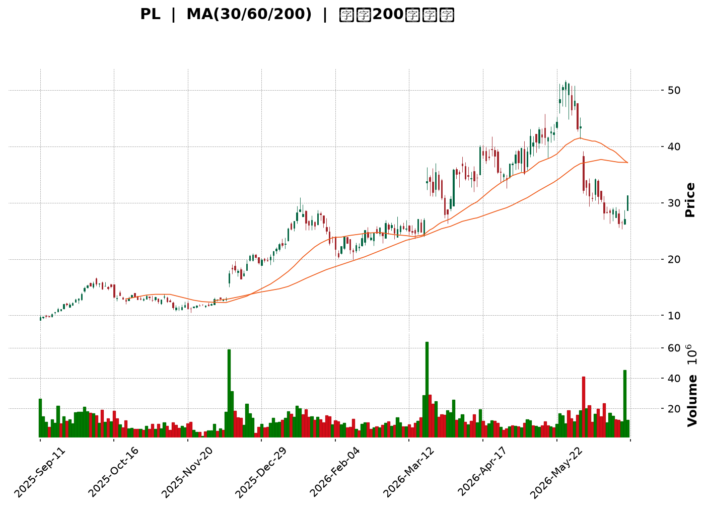
</details>

<html>
<head><meta charset="utf-8" /></head>
<body>
    <div style="height:500px; width:100%;">                        <script>window.PlotlyConfig = {MathJaxConfig: 'local'};</script>
        <script charset="utf-8" src="https://cdn.plot.ly/plotly-3.6.0.min.js" integrity="sha256-QaOVwtVY0T02VaHrr6pnoHLCwayMJp4O5n4YyaE3rJk=" crossorigin="anonymous"></script>                <div id="candlestick-chart" class="plotly-graph-div" style="height:100%; width:100%;"></div>            <script>                window.PLOTLYENV=window.PLOTLYENV || {};                                if (document.getElementById("candlestick-chart")) {                    Plotly.newPlot(                        "candlestick-chart",                        [{"close":{"dtype":"f8","bdata":"AAAAQApXI0AAAAAgXI8jQAAAAOBRuCNAAAAAAACAI0AAAACAwnUkQAAAAOBROCVAAAAA4FE4JkAAAADgUTgmQAAAAKCZGShAAAAAACncJ0AAAAAghesnQAAAAGBmZihAAAAA4HqUKUAAAACAwvUpQAAAAIA9iitAAAAAQDOzLUAAAABguJ4uQAAAAEDhei5AAAAAAClcL0AAAABAMzMvQAAAAIDrUS9AAAAAYGZmLUAAAAAAAIAuQAAAACBcjy1AAAAAgBQuLkAAAACAwnUqQAAAAOBROCpAAAAAYLgeK0AAAACA69EpQAAAAAAAAClAAAAAYGbmKUAAAADgUTgrQAAAAGC4nipAAAAAgBSuKUAAAADAzMwpQAAAAOBRuClAAAAAYGbmKkAAAACgR2EqQAAAAGBmZilAAAAAAACAKkAAAAAghesoQAAAAGC4nilAAAAAIK7HKkAAAADgo\u002fAoQAAAAKBH4ShAAAAAgOvRJkAAAADAzMwmQAAAACCFayZAAAAAYGbmJkAAAADgepQnQAAAAIDCdSZAAAAAgOtRJkAAAADgehQnQAAAAIDCdSdAAAAA4KNwJ0AAAADAzMwnQAAAAGBmZidAAAAAgD2KJ0AAAADAHgUoQAAAAKBH4SlAAAAAgD2KKUAAAABgZuYpQAAAAIAUrilAAAAAoEfhKUAAAADgUXgxQAAAAKBwPTJAAAAAwMwMMkAAAACgR+ExQAAAAOBReDBAAAAAoHB9MUAAAACAFC4zQAAAAKCZmTRAAAAAQOG6NEAAAACA61E0QAAAAAApXDNAAAAAYLjeM0AAAACgcL0zQAAAAOBRuDNAAAAAwPVoNEAAAAAA12M1QAAAAEAK1zVAAAAAACmcNkAAAADgo3A2QAAAAIDCtTZAAAAA4KNwOUAAAACA61E5QAAAAEDhujpAAAAAIK5HPEAAAAAgrsc8QAAAAAAAADxAAAAAoEdhOkAAAAAgXA86QAAAAOCj8DpAAAAAYLjeOUAAAACA6xE8QAAAAKBH4TtAAAAAoJlZOkAAAADgUfg4QAAAAKCZ2TZAAAAAQDPzN0AAAADAHsU1QAAAAIAUbjRAAAAAYI9CNkAAAADAHgU4QAAAAIA9yjZAAAAAYGamNUAAAADAzEw1QAAAACCFazZAAAAAgMI1NkAAAACgcL03QAAAAAApHDlAAAAAYGbmN0AAAAAgrsc3QAAAAIDCtThAAAAAoEehOEAAAACgmZk5QAAAAADXIzhAAAAAAClcOkAAAADAzEw5QAAAAAAAADpAAAAAQAqXOEAAAAAgrkc5QAAAAIDr0TlAAAAAYGZmOUAAAADgo3A5QAAAAOBR+DhAAAAAgD3KOEAAAACgmZk4QAAAAOB6FDtAAAAAIFzPOEAAAACAwvU6QAAAAIA96kBAAAAAwPXoQEAAAADgetQ\u002fQAAAACBcr0FAAAAAQDMzQEAAAAAAKdw+QAAAAADX4ztAAAAAQDPzO0AAAACAwrU+QAAAAOCj8EFAAAAAYI+CQUAAAACAwpVBQAAAAGBmRkJAAAAAoHAdQUAAAACAwlVBQAAAAMD1KEFAAAAAQAr3QEAAAADgejRBQAAAAIDr8UNAAAAAoHA9Q0AAAAAAAMBCQAAAAADXA0NAAAAAACm8Q0AAAADAHiVDQAAAAOBRuEFAAAAAoJm5QUAAAAAA14NBQAAAAIA9CkFAAAAAACl8QkAAAABAM3NCQAAAAMAeRUNAAAAA4KOQQkAAAADgUdhDQAAAAGC4nkFAAAAAwB6FQ0AAAAAghetEQAAAAEAKV0RAAAAAYLheREAAAADAHoVFQAAAACBcz0RAAAAAgBTOREAAAAAghctEQAAAAOB6VEVAAAAAoHA9RUAAAADAzCxGQAAAAMD1KEhAAAAAoHA9SUAAAABAM7NJQAAAAIDrkUlAAAAAQOE6R0AAAAAghQtIQAAAAOCjkEVAAAAAANfDRUAAAAAAKRxAQAAAAGC4XkBAAAAAIIUrP0AAAADgUbg+QAAAAIDCFUFAAAAAYGYmP0AAAADgepQ+QAAAAIDCNTxAAAAA4FE4PEAAAABA4To8QAAAAMAexTxAAAAAIK6HPEAAAADAzEw6QAAAAGCPgjpAAAAAgOsRO0AAAAAgrkc\u002fQA=="},"high":{"dtype":"f8","bdata":"AAAAwPUoJEAAAADgepQjQAAAAOBROCRAAAAAQLbzI0AAAADAzMwkQAAAACCFayVAAAAAgOvRJkAAAADAzEwmQAAAAGCPQihAAAAAgMJ1KEAAAAAgXI8oQAAAAMD1qChAAAAAAAAAKkAAAABguB4qQAAAAIA9CixAAAAAwMg2LkAAAAAAAAAvQAAAACCuxy9AAAAAYI8CMEAAAAAgrscwQAAAAKCZmS9AAAAAwMwMMEAAAABgZuYvQAAAAAAAgC5AAAAA4HpUL0AAAABANR4vQAAAAMD1KCtAAAAAgOvRLEAAAABACKwqQAAAAKCZGSpAAAAAACmcKkAAAACAFG4rQAAAACCF6ytAAAAA4KPwKkAAAAAghasqQAAAAGBmZipAAAAAgMJ1K0AAAABgj8IqQAAAAIA9CitAAAAA4KOwKkAAAACAPQoqQAAAAGBmpilAAAAAoJmZK0AAAACgcL0qQAAAAMDMzClAAAAAgOvRKEAAAABAM7MnQAAAAOBROCdAAAAAwB7FJ0AAAACAwvUoQAAAAAAAAClAAAAAAAAAJ0AAAAAgXE8nQAAAAKDtvCdAAAAAgD0KKEAAAADAHgUoQAAAAADXoydAAAAAwB6FKEAAAACgR2EoQAAAAGBmZipAAAAAAADAKUAAAACAwnUqQAAAAAAAACpAAAAAQOF6KkAAAACgmfkxQAAAAKCZGTNAAAAA4KOwM0AAAAAgrkcyQAAAAMDMjDJAAAAAQDPzMUAAAADgetQzQAAAAGCPwjRAAAAAoHD9NEAAAACAFO40QAAAAIDCVTRAAAAAwB4lNEAAAAAAKTw0QAAAAMDMTDRAAAAAIFzPNEAAAAAgXG81QAAAAEAzEzZAAAAAACncNkAAAACgmZk3QAAAAIDpxjdAAAAAIFyPOUAAAABACpc6QAAAAMAexTpAAAAAoEdhPUAAAABg4+U+QAAAAOBRuD1AAAAAIIWrPEAAAACAwOo6QAAAAEDhujtAAAAAQDOzOkAAAABAM7M8QAAAAGBmZjxAAAAAQDOzO0AAAAAAAEA7QAAAAMChxTlAAAAAAKz8N0AAAAAAAAA4QAAAAIDAijVAAAAAIK5HNkAAAADgURg4QAAAAEDh+jdAAAAAYGaGN0AAAADA9eg1QAAAAIAU7jZAAAAAgD3KNkAAAACgmZk4QAAAAAApHDlAAAAA4KOwOUAAAADgerQ4QAAAACBczzhAAAAAQGLQOUAAAADgo7A5QAAAAEAK1zhAAAAAgBTuOkAAAADgo3A6QAAAAKBHgTpAAAAAoHA9OkAAAAAAqpE7QAAAAEAKFzpAAAAA4FF4OkAAAAAghes6QAAAACBcDzpAAAAAgOkGOkAAAAAAAIA5QAAAAEAKFztAAAAA4HoUO0AAAABgj0I7QAAAAADXI0JAAAAAIIVrQUAAAAAghQtCQAAAAGBmhkJAAAAAANXYQUAAAABguB5BQAAAAMD1aD9AAAAAgBTuPEAAAACAFC4\u002fQAAAAMAeBUJAAAAAwB4lQkAAAABgZuZBQAAAAEDhGkNAAAAAgMKVQkAAAACA6zFCQAAAAIAUvkFAAAAAIFg5QkAAAACAwpVBQAAAAKBwHURAAAAAoHAdREAAAADgevRDQAAAAADXw0NAAAAAQOHaREAAAAAAAABEQAAAAAAAwENAAAAAoHAdQkAAAABACqdBQAAAAAAAgEFAAAAAACl8QkAAAADgeqRCQAAAAGCPokNAAAAAQAq3Q0AAAACgR+FDQAAAAIDCdURAAAAAwMzsQ0AAAAAgXI9FQAAAAOCj8ERAAAAAoJkZRUAAAACgmblFQAAAAEAKl0VAAAAAANfjRkAAAAAAAOBEQAAAAGBmxkVAAAAAAAAARkAAAABADKJGQAAAAOCjkElAAAAAoHB9SUAAAACgR+FJQAAAAGCPoklAAAAAAABgSUAAAABgj2JJQAAAACBcz0dAAAAAwB6VRkAAAABACpdDQAAAAMAeBUFAAAAAIFwvQUAAAADAzMw\u002fQAAAAMD1KEFAAAAAQDMTQUAAAACA6xFAQAAAAAAAQD9AAAAAoJlZPUAAAAAAAAA9QAAAAGCPIj1AAAAAIC89PUAAAACgR+E8QAAAAEAK1zpAAAAA4KOwPEAAAAAgrkc\u002fQA=="},"hovertemplate":"\u003cb\u003e%{x|%Y-%m-%d}\u003c\u002fb\u003e\u003cbr\u003e\u958b: $%{open:.2f}\u003cbr\u003e\u9ad8: $%{high:.2f}\u003cbr\u003e\u4f4e: $%{low:.2f}\u003cbr\u003e\u6536: $%{close:.2f}\u003cextra\u003e\u003c\u002fextra\u003e","low":{"dtype":"f8","bdata":"AAAAYI9CIkAAAAAgrsciQAAAAOBR+CJAAAAAgOtRI0AAAAAAKVwjQAAAAOCjcCRAAAAAQOE6JUAAAADgo3AlQAAAAADXIyZAAAAAQApXJ0AAAABACtcmQAAAAMAehSdAAAAA4FG4KEAAAACgcD0oQAAAAEAzMylAAAAAwPUoLEAAAADAHoUtQAAAAKBHYS5AAAAAIFyPLUAAAADAHoUuQAAAAMD1KC5AAAAAACkcLUAAAACA61EuQAAAAEAKFy1AAAAAQDOzLUAAAACgcD0qQAAAACDdJClAAAAAAAAAK0AAAABguJ4pQAAAAOCj8CdAAAAAgBQuKUAAAAAgrkcqQAAAAIA9iipAAAAAIFyPKUAAAAAgrocpQAAAAEDfDylAAAAAIK7HKUAAAACAwnUpQAAAACCF6yhAAAAAIFwPKUAAAAAA1yMoQAAAAAAp3CdAAAAAYBDYKUAAAAAgXI8oQAAAAMD1qChAAAAAQAoXJkAAAADAyHYlQAAAAGCPwiVAAAAAgBTuJUAAAADAzMwmQAAAAICXLiZAAAAAgD0KJUAAAADAHoUmQAAAAMAehSZAAAAAYI9CJ0AAAACAl24nQAAAAMDMzCZAAAAA4HpUJ0AAAABA4XonQAAAAAAp3CdAAAAAwB4FKUAAAACgcD0pQAAAAEA1HilAAAAAwPUoKUAAAADAHgUuQAAAAGC4XjFAAAAAANejMUAAAACAFO4wQAAAAIAUbjBAAAAAgD0KMUAAAACgcP0xQAAAAAApnDNAAAAAoJmZM0AAAAAAKRw0QAAAAIA9CjNAAAAAYI\u002fCMkAAAADgo3AzQAAAAECJoTNAAAAAANX4MkAAAACgcH0zQAAAAOBR+DRAAAAAwPVoNUAAAABAChc2QAAAAMAg0DVAAAAAwPUoN0AAAABguB45QAAAAAAAADlAAAAAYI9COkAAAAAAKVw8QAAAACBcbztAAAAAoEchOUAAAAAA1yM5QAAAAIAULjlAAAAA4FE4OUAAAACgGg86QAAAACBczzpAAAAAwMyMOUAAAACA63E4QAAAAEAKdzZAAAAAwPXoNkAAAABACpc0QAAAAGBmJjRAAAAAIFzPNEAAAABgZqY1QAAAAIDCtTZAAAAAwPXoNEAAAABA4fozQAAAACAGITVAAAAAAACANUAAAACgcD02QAAAAIDCdTZAAAAAYI+CN0AAAABA4To3QAAAAKCZWTZAAAAAoHB9OEAAAACA6xE4QAAAACCuxzZAAAAA4FG4N0AAAACgR2E4QAAAAIBoETlAAAAAYI+CN0AAAACgmdk3QAAAAEAzczhAAAAAQDMzOUAAAADgo\u002fA4QAAAACCuRzhAAAAAIFxPOEAAAADgeKk3QAAAAGBmZjhAAAAAYI\u002fCOEAAAADgo\u002fA3QAAAAIBoIUBAAAAAQOE6P0AAAAAAKRw\u002fQAAAAKBHIT9AAAAAIFwPQEAAAACAPYo+QAAAAGC4PjtAAAAAwPVIOkAAAADAHoU8QAAAAOCjcD1AAAAAQOEaQUAAAABgj2JAQAAAAOBRuEFAAAAA4FH4QEAAAACgmflAQAAAAAApXEBAAAAAoEfhP0AAAAAgrmdAQAAAAGBmdkFAAAAAIIXrQkAAAABACndCQAAAAGCPwkJAAAAAANcjQ0AAAACAPSpCQAAAAOCjkEFAAAAA4KPQQEAAAADA891AQAAAAMD1SEBAAAAAwEsnQUAAAADgpWtBQAAAAMD16EFAAAAAoJn5QUAAAACgR8FBQAAAAEAKd0FAAAAAYGbmQUAAAADAzAxDQAAAAKBHIUNAAAAAwMxsQ0AAAADAzMxDQAAAAMAeRURAAAAAoEchREAAAABgjwJDQAAAAIDCVURAAAAAwB6FREAAAADAzIxFQAAAAIAU7kZAAAAAgBSOR0AAAAAAAIBHQAAAAADXY0ZAAAAAANfDRkAAAABA4TpHQAAAAMAeVUVAAAAAYGamREAAAADA9ag\u002fQAAAAOB6VD9AAAAAgOtRPUAAAABAMzM+QAAAACCFaz5AAAAAwB7FPUAAAAAAKRw+QAAAAKBDCztAAAAA4HoUPEAAAADgelQ6QAAAAIDCtTpAAAAA4HpUO0AAAACAPYo5QAAAAMDMTDlAAAAAoEchOkAAAACgmZk8QA=="},"name":"\u50f9\u683c","open":{"dtype":"f8","bdata":"AAAAoEdhIkAAAACgcD0jQAAAAOCj8CNAAAAA4FG4I0AAAAAAAIAjQAAAAIDC9SRAAAAAgOtRJUAAAADgUbglQAAAAEDheiZAAAAAIK5HKEAAAAAAAAAnQAAAAOBRuCdAAAAAIK7HKEAAAABgZmYpQAAAAIAUrilAAAAA4FG4LEAAAABgZuYtQAAAAKCZmS9AAAAAAAAALkAAAADAzIwwQAAAAIAULi9AAAAA4FG4L0AAAAAghWsuQAAAAAAAAC5AAAAAYGbmLkAAAADgo\u002fAuQAAAAAAAACpAAAAAgD0KLEAAAAAAKVwqQAAAAAAAgClAAAAAYI9CKUAAAACgmZkqQAAAAGBm5itAAAAAwMzMKkAAAAAghespQAAAAEDheilAAAAAIK7HKUAAAADA9agqQAAAAIDCdSlAAAAAgBSuKUAAAADAHgUqQAAAAOBROChAAAAAgMJ1KkAAAABgZmYqQAAAAGCPQilAAAAAgD2KKEAAAAAAAAAmQAAAAAApXCZAAAAA4HoUJkAAAAAghesmQAAAAGBmZihAAAAAQOF6JkAAAABAM7MmQAAAAMAeBSdAAAAAgD2KJ0AAAACA69EnQAAAAEAzMydAAAAAYI\u002fCJ0AAAADA9agnQAAAAGBm5idAAAAAwB6FKUAAAAAAKVwqQAAAAKBwPSlAAAAAoJmZKUAAAADgepQvQAAAAOCjcDJAAAAAIFzPMkAAAABgZqYxQAAAAIAULjJAAAAAgD0KMUAAAACgcP0xQAAAACCuxzNAAAAAwMzMM0AAAABA4bo0QAAAAMDMTDRAAAAAoHDdMkAAAAAgrgc0QAAAAGC4vjNAAAAAQOHaM0AAAABAM7M0QAAAAAAAgDVAAAAA4FG4NUAAAACgmdk2QAAAAKCZmTZAAAAAwMxMN0AAAABgj0I6QAAAAAAAgDlAAAAAIFzPOkAAAABAM3M8QAAAAEAKlztAAAAAAACAPEAAAAAAAMA6QAAAAGCPAjpAAAAAoJmZOkAAAADgehQ6QAAAAMDMDDxAAAAAQDOzO0AAAABACrc5QAAAAADX4zhAAAAAQOH6N0AAAAAAAAA4QAAAAAAAADVAAAAAgD0KNUAAAACAwvU1QAAAAGC43jdAAAAAYGaGN0AAAACA65E1QAAAAAAAgDVAAAAAAAAANkAAAABgZmY2QAAAAMAeBTdAAAAAoHC9OEAAAABgZmY3QAAAAAAAQDdAAAAAwMxMOUAAAAAAAIA4QAAAAEAzkzhAAAAA4FG4N0AAAABA4Ro6QAAAAKCZmTlAAAAAAACAOUAAAAAA1+M3QAAAAEAK1zhAAAAAgOvROUAAAABAClc5QAAAAOBR+DlAAAAAQOH6OEAAAACgRyE5QAAAAKCZ2ThAAAAAAACAOkAAAAAAAEA4QAAAAGBmxkBAAAAAAABAQUAAAABA4dpAQAAAAEAzM0BAAAAAACl8QUAAAACgcP1AQAAAAKCZ2T5AAAAAwMzMPEAAAAAAAAA9QAAAAOCjcD1AAAAAgML1QUAAAADgo7BBQAAAAEAzc0JAAAAAAABAQkAAAADgo3BBQAAAAKBwHUFAAAAAIIXLQUAAAACAwjVBQAAAAKBwfUFAAAAAgOuRQ0AAAABAM5NDQAAAAAApHENAAAAAAADAQ0AAAACAPapDQAAAAIAUjkNAAAAAACm8QUAAAADAzExBQAAAAOCjMEFAAAAAANdDQUAAAAAgXF9CQAAAAMAehUJAAAAAoJmZQ0AAAAAgXH9CQAAAAGCPwkNAAAAAQDMzQkAAAABAM1NDQAAAACCFC0RAAAAAQAoXRUAAAADgo1BEQAAAAMD1CEVAAAAAANejRUAAAABACndEQAAAAEAzM0VAAAAAwHIIRUAAAADAzKxFQAAAAMD12EdAAAAAwMwMSUAAAABAMxNJQAAAAAAAkEhAAAAAIIWLSEAAAACAwpVHQAAAACBcz0dAAAAAoHCdRUAAAABgZiZDQAAAAKBHAUFAAAAAgMK1QEAAAAAA1+M+QAAAAAAAgD9AAAAAgOvxQEAAAACAPQpAQAAAAMAeBT5AAAAAANdjPEAAAABgZqY8QAAAAIDC9TtAAAAA4HpUO0AAAACA6xE8QAAAAGCPgjpAAAAAQOE6OkAAAACgmZk8QA=="},"x":["2025-09-11T00:00:00-04:00","2025-09-12T00:00:00-04:00","2025-09-15T00:00:00-04:00","2025-09-16T00:00:00-04:00","2025-09-17T00:00:00-04:00","2025-09-18T00:00:00-04:00","2025-09-19T00:00:00-04:00","2025-09-22T00:00:00-04:00","2025-09-23T00:00:00-04:00","2025-09-24T00:00:00-04:00","2025-09-25T00:00:00-04:00","2025-09-26T00:00:00-04:00","2025-09-29T00:00:00-04:00","2025-09-30T00:00:00-04:00","2025-10-01T00:00:00-04:00","2025-10-02T00:00:00-04:00","2025-10-03T00:00:00-04:00","2025-10-06T00:00:00-04:00","2025-10-07T00:00:00-04:00","2025-10-08T00:00:00-04:00","2025-10-09T00:00:00-04:00","2025-10-10T00:00:00-04:00","2025-10-13T00:00:00-04:00","2025-10-14T00:00:00-04:00","2025-10-15T00:00:00-04:00","2025-10-16T00:00:00-04:00","2025-10-17T00:00:00-04:00","2025-10-20T00:00:00-04:00","2025-10-21T00:00:00-04:00","2025-10-22T00:00:00-04:00","2025-10-23T00:00:00-04:00","2025-10-24T00:00:00-04:00","2025-10-27T00:00:00-04:00","2025-10-28T00:00:00-04:00","2025-10-29T00:00:00-04:00","2025-10-30T00:00:00-04:00","2025-10-31T00:00:00-04:00","2025-11-03T00:00:00-05:00","2025-11-04T00:00:00-05:00","2025-11-05T00:00:00-05:00","2025-11-06T00:00:00-05:00","2025-11-07T00:00:00-05:00","2025-11-10T00:00:00-05:00","2025-11-11T00:00:00-05:00","2025-11-12T00:00:00-05:00","2025-11-13T00:00:00-05:00","2025-11-14T00:00:00-05:00","2025-11-17T00:00:00-05:00","2025-11-18T00:00:00-05:00","2025-11-19T00:00:00-05:00","2025-11-20T00:00:00-05:00","2025-11-21T00:00:00-05:00","2025-11-24T00:00:00-05:00","2025-11-25T00:00:00-05:00","2025-11-26T00:00:00-05:00","2025-11-28T00:00:00-05:00","2025-12-01T00:00:00-05:00","2025-12-02T00:00:00-05:00","2025-12-03T00:00:00-05:00","2025-12-04T00:00:00-05:00","2025-12-05T00:00:00-05:00","2025-12-08T00:00:00-05:00","2025-12-09T00:00:00-05:00","2025-12-10T00:00:00-05:00","2025-12-11T00:00:00-05:00","2025-12-12T00:00:00-05:00","2025-12-15T00:00:00-05:00","2025-12-16T00:00:00-05:00","2025-12-17T00:00:00-05:00","2025-12-18T00:00:00-05:00","2025-12-19T00:00:00-05:00","2025-12-22T00:00:00-05:00","2025-12-23T00:00:00-05:00","2025-12-24T00:00:00-05:00","2025-12-26T00:00:00-05:00","2025-12-29T00:00:00-05:00","2025-12-30T00:00:00-05:00","2025-12-31T00:00:00-05:00","2026-01-02T00:00:00-05:00","2026-01-05T00:00:00-05:00","2026-01-06T00:00:00-05:00","2026-01-07T00:00:00-05:00","2026-01-08T00:00:00-05:00","2026-01-09T00:00:00-05:00","2026-01-12T00:00:00-05:00","2026-01-13T00:00:00-05:00","2026-01-14T00:00:00-05:00","2026-01-15T00:00:00-05:00","2026-01-16T00:00:00-05:00","2026-01-20T00:00:00-05:00","2026-01-21T00:00:00-05:00","2026-01-22T00:00:00-05:00","2026-01-23T00:00:00-05:00","2026-01-26T00:00:00-05:00","2026-01-27T00:00:00-05:00","2026-01-28T00:00:00-05:00","2026-01-29T00:00:00-05:00","2026-01-30T00:00:00-05:00","2026-02-02T00:00:00-05:00","2026-02-03T00:00:00-05:00","2026-02-04T00:00:00-05:00","2026-02-05T00:00:00-05:00","2026-02-06T00:00:00-05:00","2026-02-09T00:00:00-05:00","2026-02-10T00:00:00-05:00","2026-02-11T00:00:00-05:00","2026-02-12T00:00:00-05:00","2026-02-13T00:00:00-05:00","2026-02-17T00:00:00-05:00","2026-02-18T00:00:00-05:00","2026-02-19T00:00:00-05:00","2026-02-20T00:00:00-05:00","2026-02-23T00:00:00-05:00","2026-02-24T00:00:00-05:00","2026-02-25T00:00:00-05:00","2026-02-26T00:00:00-05:00","2026-02-27T00:00:00-05:00","2026-03-02T00:00:00-05:00","2026-03-03T00:00:00-05:00","2026-03-04T00:00:00-05:00","2026-03-05T00:00:00-05:00","2026-03-06T00:00:00-05:00","2026-03-09T00:00:00-04:00","2026-03-10T00:00:00-04:00","2026-03-11T00:00:00-04:00","2026-03-12T00:00:00-04:00","2026-03-13T00:00:00-04:00","2026-03-16T00:00:00-04:00","2026-03-17T00:00:00-04:00","2026-03-18T00:00:00-04:00","2026-03-19T00:00:00-04:00","2026-03-20T00:00:00-04:00","2026-03-23T00:00:00-04:00","2026-03-24T00:00:00-04:00","2026-03-25T00:00:00-04:00","2026-03-26T00:00:00-04:00","2026-03-27T00:00:00-04:00","2026-03-30T00:00:00-04:00","2026-03-31T00:00:00-04:00","2026-04-01T00:00:00-04:00","2026-04-02T00:00:00-04:00","2026-04-06T00:00:00-04:00","2026-04-07T00:00:00-04:00","2026-04-08T00:00:00-04:00","2026-04-09T00:00:00-04:00","2026-04-10T00:00:00-04:00","2026-04-13T00:00:00-04:00","2026-04-14T00:00:00-04:00","2026-04-15T00:00:00-04:00","2026-04-16T00:00:00-04:00","2026-04-17T00:00:00-04:00","2026-04-20T00:00:00-04:00","2026-04-21T00:00:00-04:00","2026-04-22T00:00:00-04:00","2026-04-23T00:00:00-04:00","2026-04-24T00:00:00-04:00","2026-04-27T00:00:00-04:00","2026-04-28T00:00:00-04:00","2026-04-29T00:00:00-04:00","2026-04-30T00:00:00-04:00","2026-05-01T00:00:00-04:00","2026-05-04T00:00:00-04:00","2026-05-05T00:00:00-04:00","2026-05-06T00:00:00-04:00","2026-05-07T00:00:00-04:00","2026-05-08T00:00:00-04:00","2026-05-11T00:00:00-04:00","2026-05-12T00:00:00-04:00","2026-05-13T00:00:00-04:00","2026-05-14T00:00:00-04:00","2026-05-15T00:00:00-04:00","2026-05-18T00:00:00-04:00","2026-05-19T00:00:00-04:00","2026-05-20T00:00:00-04:00","2026-05-21T00:00:00-04:00","2026-05-22T00:00:00-04:00","2026-05-26T00:00:00-04:00","2026-05-27T00:00:00-04:00","2026-05-28T00:00:00-04:00","2026-05-29T00:00:00-04:00","2026-06-01T00:00:00-04:00","2026-06-02T00:00:00-04:00","2026-06-03T00:00:00-04:00","2026-06-04T00:00:00-04:00","2026-06-05T00:00:00-04:00","2026-06-08T00:00:00-04:00","2026-06-09T00:00:00-04:00","2026-06-10T00:00:00-04:00","2026-06-11T00:00:00-04:00","2026-06-12T00:00:00-04:00","2026-06-15T00:00:00-04:00","2026-06-16T00:00:00-04:00","2026-06-17T00:00:00-04:00","2026-06-18T00:00:00-04:00","2026-06-22T00:00:00-04:00","2026-06-23T00:00:00-04:00","2026-06-24T00:00:00-04:00","2026-06-25T00:00:00-04:00","2026-06-26T00:00:00-04:00","2026-06-29T00:00:00-04:00"],"type":"candlestick"},{"hovertemplate":"MA30: $%{y:.2f}\u003cextra\u003e\u003c\u002fextra\u003e","line":{"color":"#2196F3","dash":"dash","width":2},"mode":"lines","name":"MA30","x":["2025-09-11T00:00:00-04:00","2025-09-12T00:00:00-04:00","2025-09-15T00:00:00-04:00","2025-09-16T00:00:00-04:00","2025-09-17T00:00:00-04:00","2025-09-18T00:00:00-04:00","2025-09-19T00:00:00-04:00","2025-09-22T00:00:00-04:00","2025-09-23T00:00:00-04:00","2025-09-24T00:00:00-04:00","2025-09-25T00:00:00-04:00","2025-09-26T00:00:00-04:00","2025-09-29T00:00:00-04:00","2025-09-30T00:00:00-04:00","2025-10-01T00:00:00-04:00","2025-10-02T00:00:00-04:00","2025-10-03T00:00:00-04:00","2025-10-06T00:00:00-04:00","2025-10-07T00:00:00-04:00","2025-10-08T00:00:00-04:00","2025-10-09T00:00:00-04:00","2025-10-10T00:00:00-04:00","2025-10-13T00:00:00-04:00","2025-10-14T00:00:00-04:00","2025-10-15T00:00:00-04:00","2025-10-16T00:00:00-04:00","2025-10-17T00:00:00-04:00","2025-10-20T00:00:00-04:00","2025-10-21T00:00:00-04:00","2025-10-22T00:00:00-04:00","2025-10-23T00:00:00-04:00","2025-10-24T00:00:00-04:00","2025-10-27T00:00:00-04:00","2025-10-28T00:00:00-04:00","2025-10-29T00:00:00-04:00","2025-10-30T00:00:00-04:00","2025-10-31T00:00:00-04:00","2025-11-03T00:00:00-05:00","2025-11-04T00:00:00-05:00","2025-11-05T00:00:00-05:00","2025-11-06T00:00:00-05:00","2025-11-07T00:00:00-05:00","2025-11-10T00:00:00-05:00","2025-11-11T00:00:00-05:00","2025-11-12T00:00:00-05:00","2025-11-13T00:00:00-05:00","2025-11-14T00:00:00-05:00","2025-11-17T00:00:00-05:00","2025-11-18T00:00:00-05:00","2025-11-19T00:00:00-05:00","2025-11-20T00:00:00-05:00","2025-11-21T00:00:00-05:00","2025-11-24T00:00:00-05:00","2025-11-25T00:00:00-05:00","2025-11-26T00:00:00-05:00","2025-11-28T00:00:00-05:00","2025-12-01T00:00:00-05:00","2025-12-02T00:00:00-05:00","2025-12-03T00:00:00-05:00","2025-12-04T00:00:00-05:00","2025-12-05T00:00:00-05:00","2025-12-08T00:00:00-05:00","2025-12-09T00:00:00-05:00","2025-12-10T00:00:00-05:00","2025-12-11T00:00:00-05:00","2025-12-12T00:00:00-05:00","2025-12-15T00:00:00-05:00","2025-12-16T00:00:00-05:00","2025-12-17T00:00:00-05:00","2025-12-18T00:00:00-05:00","2025-12-19T00:00:00-05:00","2025-12-22T00:00:00-05:00","2025-12-23T00:00:00-05:00","2025-12-24T00:00:00-05:00","2025-12-26T00:00:00-05:00","2025-12-29T00:00:00-05:00","2025-12-30T00:00:00-05:00","2025-12-31T00:00:00-05:00","2026-01-02T00:00:00-05:00","2026-01-05T00:00:00-05:00","2026-01-06T00:00:00-05:00","2026-01-07T00:00:00-05:00","2026-01-08T00:00:00-05:00","2026-01-09T00:00:00-05:00","2026-01-12T00:00:00-05:00","2026-01-13T00:00:00-05:00","2026-01-14T00:00:00-05:00","2026-01-15T00:00:00-05:00","2026-01-16T00:00:00-05:00","2026-01-20T00:00:00-05:00","2026-01-21T00:00:00-05:00","2026-01-22T00:00:00-05:00","2026-01-23T00:00:00-05:00","2026-01-26T00:00:00-05:00","2026-01-27T00:00:00-05:00","2026-01-28T00:00:00-05:00","2026-01-29T00:00:00-05:00","2026-01-30T00:00:00-05:00","2026-02-02T00:00:00-05:00","2026-02-03T00:00:00-05:00","2026-02-04T00:00:00-05:00","2026-02-05T00:00:00-05:00","2026-02-06T00:00:00-05:00","2026-02-09T00:00:00-05:00","2026-02-10T00:00:00-05:00","2026-02-11T00:00:00-05:00","2026-02-12T00:00:00-05:00","2026-02-13T00:00:00-05:00","2026-02-17T00:00:00-05:00","2026-02-18T00:00:00-05:00","2026-02-19T00:00:00-05:00","2026-02-20T00:00:00-05:00","2026-02-23T00:00:00-05:00","2026-02-24T00:00:00-05:00","2026-02-25T00:00:00-05:00","2026-02-26T00:00:00-05:00","2026-02-27T00:00:00-05:00","2026-03-02T00:00:00-05:00","2026-03-03T00:00:00-05:00","2026-03-04T00:00:00-05:00","2026-03-05T00:00:00-05:00","2026-03-06T00:00:00-05:00","2026-03-09T00:00:00-04:00","2026-03-10T00:00:00-04:00","2026-03-11T00:00:00-04:00","2026-03-12T00:00:00-04:00","2026-03-13T00:00:00-04:00","2026-03-16T00:00:00-04:00","2026-03-17T00:00:00-04:00","2026-03-18T00:00:00-04:00","2026-03-19T00:00:00-04:00","2026-03-20T00:00:00-04:00","2026-03-23T00:00:00-04:00","2026-03-24T00:00:00-04:00","2026-03-25T00:00:00-04:00","2026-03-26T00:00:00-04:00","2026-03-27T00:00:00-04:00","2026-03-30T00:00:00-04:00","2026-03-31T00:00:00-04:00","2026-04-01T00:00:00-04:00","2026-04-02T00:00:00-04:00","2026-04-06T00:00:00-04:00","2026-04-07T00:00:00-04:00","2026-04-08T00:00:00-04:00","2026-04-09T00:00:00-04:00","2026-04-10T00:00:00-04:00","2026-04-13T00:00:00-04:00","2026-04-14T00:00:00-04:00","2026-04-15T00:00:00-04:00","2026-04-16T00:00:00-04:00","2026-04-17T00:00:00-04:00","2026-04-20T00:00:00-04:00","2026-04-21T00:00:00-04:00","2026-04-22T00:00:00-04:00","2026-04-23T00:00:00-04:00","2026-04-24T00:00:00-04:00","2026-04-27T00:00:00-04:00","2026-04-28T00:00:00-04:00","2026-04-29T00:00:00-04:00","2026-04-30T00:00:00-04:00","2026-05-01T00:00:00-04:00","2026-05-04T00:00:00-04:00","2026-05-05T00:00:00-04:00","2026-05-06T00:00:00-04:00","2026-05-07T00:00:00-04:00","2026-05-08T00:00:00-04:00","2026-05-11T00:00:00-04:00","2026-05-12T00:00:00-04:00","2026-05-13T00:00:00-04:00","2026-05-14T00:00:00-04:00","2026-05-15T00:00:00-04:00","2026-05-18T00:00:00-04:00","2026-05-19T00:00:00-04:00","2026-05-20T00:00:00-04:00","2026-05-21T00:00:00-04:00","2026-05-22T00:00:00-04:00","2026-05-26T00:00:00-04:00","2026-05-27T00:00:00-04:00","2026-05-28T00:00:00-04:00","2026-05-29T00:00:00-04:00","2026-06-01T00:00:00-04:00","2026-06-02T00:00:00-04:00","2026-06-03T00:00:00-04:00","2026-06-04T00:00:00-04:00","2026-06-05T00:00:00-04:00","2026-06-08T00:00:00-04:00","2026-06-09T00:00:00-04:00","2026-06-10T00:00:00-04:00","2026-06-11T00:00:00-04:00","2026-06-12T00:00:00-04:00","2026-06-15T00:00:00-04:00","2026-06-16T00:00:00-04:00","2026-06-17T00:00:00-04:00","2026-06-18T00:00:00-04:00","2026-06-22T00:00:00-04:00","2026-06-23T00:00:00-04:00","2026-06-24T00:00:00-04:00","2026-06-25T00:00:00-04:00","2026-06-26T00:00:00-04:00","2026-06-29T00:00:00-04:00"],"y":{"dtype":"f8","bdata":"AAAAAAAA+H8AAAAAAAD4fwAAAAAAAPh\u002fAAAAAAAA+H8AAAAAAAD4fwAAAAAAAPh\u002fAAAAAAAA+H8AAAAAAAD4fwAAAAAAAPh\u002fAAAAAAAA+H8AAAAAAAD4fwAAAAAAAPh\u002fAAAAAAAA+H8AAAAAAAD4fwAAAAAAAPh\u002fAAAAAAAA+H8AAAAAAAD4fwAAAAAAAPh\u002fAAAAAAAA+H8AAAAAAAD4fwAAAAAAAPh\u002fAAAAAAAA+H8AAAAAAAD4fwAAAAAAAPh\u002fAAAAAAAA+H8AAAAAAAD4fwAAAAAAAPh\u002fAAAAAAAA+H8AAAAAAAD4fxEREXFo0SlAq6qq+mIJKkARERGBwEoqQJqZmcmhhSpARERENF66KkDNzMyc7+cqQDMzMwNWDitAERERoUU2K0CamZlJxVkrQN7d3S3dZCtAiYiIWGR7K0ARERHh7IMrQDMzMwNWjitAREREdJOYK0C8u7s7348rQO\u002fu7l4seStAd3d3x3Y+K0CamZm5u\u002fsqQDMzM2P0tipAvLu7O8NuKkBmZmYWvS0qQO\u002fu7h4i4ilAAAAAoLelKUAzMzNjZmYpQLy7u7tYMilAq6qq+tT4KEDv7u4eIuIoQM3MzLwRyihAvLu7G4WrKEAzMzPzKJwoQGZmZlaroyhAiYiI6JigKEAzMzNTVZUoQM3MzNxPjShARERExASPKEBmZmZmA90oQKuqqvrUOClA7+7urlaHKUCrqqqaYdcpQLy7u\u002fu4FypAMzMz0xVgKkBERET0xdIqQLy7u\u002fu4VytA3t3d7f3UK0CamZkZ91osQLy7uwsR0SxAq6qqWnNhLUDv7u5eye8tQAAAACAGgS5AZmZm9vAZL0AAAAAAyL0vQGZmZuZtOTBA7+7uziKbMEARERE5JvgwQN7d3WXYVTFAIiIiMuzKMUAiIiKicD0yQDMzMyuyvTJAiYiI0JRKM0CJiIhwr9kzQDMzM4MyWjRAIiIiAlbONEBVVVU9NT41QBERESmHtjVA3t3dLd0kNkC8u7s7UX82QCIiIiKU0TZAMzMzw2cYN0Crqqoa6FQ3QN7d3W1ZizdAREREhHnCN0BVVVV1k9g3QGZmZhYg1zdAzczMbC7kN0AzMzMzwQM4QGZmZiYGIThA3t3dnTYwOEDNzMx8hj04QKuqqrqQVDhAMzMz4+xjOECrqqqK+nc4QHd3d\u002ffhkzhAMzMzA+SeOECamZlJU6o4QKuqqlpkuzhAERER4Xq0OEDNzMyM3rY4QLy7u5vEoDhA3t3dTWKQOEAAAAAgsHI4QO\u002fu7g6fYThA7+7uvlhSOEAAAADQsEs4QCIiIiIiQjhAZmZmZh8+OEBEREQUric4QGZmZhbZDjhAd3d3N4kBOEARERHxYP43QERERIR5IjhAZmZmNtApOEAAAADwGVY4QAAAALByyDhARERE5BcrOUCJiIgYvW05QFVVVYUW2TlAIiIiQtI0OkBmZmZmZoY6QLy7u8sTtTpAVVVVBQ\u002fmOkB3d3c3iSE7QERERKRwfTtAd3d3p1TcO0C8u7t7hj08QLy7u1uPojxAERER4Xr0PEB3d3eX4EE9QERERCS\u002fmD1A7+7uDljZPUCJiIgoFSc+QDMzM1OcnT5A3t3dfSMUP0DNzMx8anw\u002fQDMzM6Ob5D9AMzMzA1YuQEC8u7ujKWVAQLy7u6vVkUBAvLu7O1G\u002fQECrqqqS0etAQBEREXGvCUFAAAAAaJE9QUAiIiKK+mdBQFVVVR0TfEFAzczMhDKKQUC8u7u7u6tBQN7d3b0tq0FAREREZILHQUCrqqp6W\u002fZBQCIiIpLtLEJAmpmZqX9jQkAAAABQG5hCQLy7u+uYsEJAVVVV9bbMQkAAAABQG+hCQAAAABAtAkNAMzMzQ2AlQ0B3d3dnrU5DQDMzMyNpikNAZmZmJgbRQ0AzMzPDgxlEQDMzM8ODSURAzczMDJBrREB3d3cnv5hEQHd3d7eBrkRAERERUdS\u002fREAiIiJC7qVEQERERCRpmkRAVVVVPSaIREAiIiKSwnVEQO\u002fu7t4kdkRAiYiI4E9dREAAAADAWEJEQCIiIqJFFkRAERERiUHwQ0AREREpXL9DQJqZmTHBo0NAiYiIeOl2Q0BVVVWlmzRDQCIiIjom+EJAiYiI8NK9QkAiIiLipYtCQA=="},"type":"scatter"},{"hovertemplate":"MA60: $%{y:.2f}\u003cextra\u003e\u003c\u002fextra\u003e","line":{"color":"#9C27B0","dash":"dash","width":2},"mode":"lines","name":"MA60","x":["2025-09-11T00:00:00-04:00","2025-09-12T00:00:00-04:00","2025-09-15T00:00:00-04:00","2025-09-16T00:00:00-04:00","2025-09-17T00:00:00-04:00","2025-09-18T00:00:00-04:00","2025-09-19T00:00:00-04:00","2025-09-22T00:00:00-04:00","2025-09-23T00:00:00-04:00","2025-09-24T00:00:00-04:00","2025-09-25T00:00:00-04:00","2025-09-26T00:00:00-04:00","2025-09-29T00:00:00-04:00","2025-09-30T00:00:00-04:00","2025-10-01T00:00:00-04:00","2025-10-02T00:00:00-04:00","2025-10-03T00:00:00-04:00","2025-10-06T00:00:00-04:00","2025-10-07T00:00:00-04:00","2025-10-08T00:00:00-04:00","2025-10-09T00:00:00-04:00","2025-10-10T00:00:00-04:00","2025-10-13T00:00:00-04:00","2025-10-14T00:00:00-04:00","2025-10-15T00:00:00-04:00","2025-10-16T00:00:00-04:00","2025-10-17T00:00:00-04:00","2025-10-20T00:00:00-04:00","2025-10-21T00:00:00-04:00","2025-10-22T00:00:00-04:00","2025-10-23T00:00:00-04:00","2025-10-24T00:00:00-04:00","2025-10-27T00:00:00-04:00","2025-10-28T00:00:00-04:00","2025-10-29T00:00:00-04:00","2025-10-30T00:00:00-04:00","2025-10-31T00:00:00-04:00","2025-11-03T00:00:00-05:00","2025-11-04T00:00:00-05:00","2025-11-05T00:00:00-05:00","2025-11-06T00:00:00-05:00","2025-11-07T00:00:00-05:00","2025-11-10T00:00:00-05:00","2025-11-11T00:00:00-05:00","2025-11-12T00:00:00-05:00","2025-11-13T00:00:00-05:00","2025-11-14T00:00:00-05:00","2025-11-17T00:00:00-05:00","2025-11-18T00:00:00-05:00","2025-11-19T00:00:00-05:00","2025-11-20T00:00:00-05:00","2025-11-21T00:00:00-05:00","2025-11-24T00:00:00-05:00","2025-11-25T00:00:00-05:00","2025-11-26T00:00:00-05:00","2025-11-28T00:00:00-05:00","2025-12-01T00:00:00-05:00","2025-12-02T00:00:00-05:00","2025-12-03T00:00:00-05:00","2025-12-04T00:00:00-05:00","2025-12-05T00:00:00-05:00","2025-12-08T00:00:00-05:00","2025-12-09T00:00:00-05:00","2025-12-10T00:00:00-05:00","2025-12-11T00:00:00-05:00","2025-12-12T00:00:00-05:00","2025-12-15T00:00:00-05:00","2025-12-16T00:00:00-05:00","2025-12-17T00:00:00-05:00","2025-12-18T00:00:00-05:00","2025-12-19T00:00:00-05:00","2025-12-22T00:00:00-05:00","2025-12-23T00:00:00-05:00","2025-12-24T00:00:00-05:00","2025-12-26T00:00:00-05:00","2025-12-29T00:00:00-05:00","2025-12-30T00:00:00-05:00","2025-12-31T00:00:00-05:00","2026-01-02T00:00:00-05:00","2026-01-05T00:00:00-05:00","2026-01-06T00:00:00-05:00","2026-01-07T00:00:00-05:00","2026-01-08T00:00:00-05:00","2026-01-09T00:00:00-05:00","2026-01-12T00:00:00-05:00","2026-01-13T00:00:00-05:00","2026-01-14T00:00:00-05:00","2026-01-15T00:00:00-05:00","2026-01-16T00:00:00-05:00","2026-01-20T00:00:00-05:00","2026-01-21T00:00:00-05:00","2026-01-22T00:00:00-05:00","2026-01-23T00:00:00-05:00","2026-01-26T00:00:00-05:00","2026-01-27T00:00:00-05:00","2026-01-28T00:00:00-05:00","2026-01-29T00:00:00-05:00","2026-01-30T00:00:00-05:00","2026-02-02T00:00:00-05:00","2026-02-03T00:00:00-05:00","2026-02-04T00:00:00-05:00","2026-02-05T00:00:00-05:00","2026-02-06T00:00:00-05:00","2026-02-09T00:00:00-05:00","2026-02-10T00:00:00-05:00","2026-02-11T00:00:00-05:00","2026-02-12T00:00:00-05:00","2026-02-13T00:00:00-05:00","2026-02-17T00:00:00-05:00","2026-02-18T00:00:00-05:00","2026-02-19T00:00:00-05:00","2026-02-20T00:00:00-05:00","2026-02-23T00:00:00-05:00","2026-02-24T00:00:00-05:00","2026-02-25T00:00:00-05:00","2026-02-26T00:00:00-05:00","2026-02-27T00:00:00-05:00","2026-03-02T00:00:00-05:00","2026-03-03T00:00:00-05:00","2026-03-04T00:00:00-05:00","2026-03-05T00:00:00-05:00","2026-03-06T00:00:00-05:00","2026-03-09T00:00:00-04:00","2026-03-10T00:00:00-04:00","2026-03-11T00:00:00-04:00","2026-03-12T00:00:00-04:00","2026-03-13T00:00:00-04:00","2026-03-16T00:00:00-04:00","2026-03-17T00:00:00-04:00","2026-03-18T00:00:00-04:00","2026-03-19T00:00:00-04:00","2026-03-20T00:00:00-04:00","2026-03-23T00:00:00-04:00","2026-03-24T00:00:00-04:00","2026-03-25T00:00:00-04:00","2026-03-26T00:00:00-04:00","2026-03-27T00:00:00-04:00","2026-03-30T00:00:00-04:00","2026-03-31T00:00:00-04:00","2026-04-01T00:00:00-04:00","2026-04-02T00:00:00-04:00","2026-04-06T00:00:00-04:00","2026-04-07T00:00:00-04:00","2026-04-08T00:00:00-04:00","2026-04-09T00:00:00-04:00","2026-04-10T00:00:00-04:00","2026-04-13T00:00:00-04:00","2026-04-14T00:00:00-04:00","2026-04-15T00:00:00-04:00","2026-04-16T00:00:00-04:00","2026-04-17T00:00:00-04:00","2026-04-20T00:00:00-04:00","2026-04-21T00:00:00-04:00","2026-04-22T00:00:00-04:00","2026-04-23T00:00:00-04:00","2026-04-24T00:00:00-04:00","2026-04-27T00:00:00-04:00","2026-04-28T00:00:00-04:00","2026-04-29T00:00:00-04:00","2026-04-30T00:00:00-04:00","2026-05-01T00:00:00-04:00","2026-05-04T00:00:00-04:00","2026-05-05T00:00:00-04:00","2026-05-06T00:00:00-04:00","2026-05-07T00:00:00-04:00","2026-05-08T00:00:00-04:00","2026-05-11T00:00:00-04:00","2026-05-12T00:00:00-04:00","2026-05-13T00:00:00-04:00","2026-05-14T00:00:00-04:00","2026-05-15T00:00:00-04:00","2026-05-18T00:00:00-04:00","2026-05-19T00:00:00-04:00","2026-05-20T00:00:00-04:00","2026-05-21T00:00:00-04:00","2026-05-22T00:00:00-04:00","2026-05-26T00:00:00-04:00","2026-05-27T00:00:00-04:00","2026-05-28T00:00:00-04:00","2026-05-29T00:00:00-04:00","2026-06-01T00:00:00-04:00","2026-06-02T00:00:00-04:00","2026-06-03T00:00:00-04:00","2026-06-04T00:00:00-04:00","2026-06-05T00:00:00-04:00","2026-06-08T00:00:00-04:00","2026-06-09T00:00:00-04:00","2026-06-10T00:00:00-04:00","2026-06-11T00:00:00-04:00","2026-06-12T00:00:00-04:00","2026-06-15T00:00:00-04:00","2026-06-16T00:00:00-04:00","2026-06-17T00:00:00-04:00","2026-06-18T00:00:00-04:00","2026-06-22T00:00:00-04:00","2026-06-23T00:00:00-04:00","2026-06-24T00:00:00-04:00","2026-06-25T00:00:00-04:00","2026-06-26T00:00:00-04:00","2026-06-29T00:00:00-04:00"],"y":{"dtype":"f8","bdata":"AAAAAAAA+H8AAAAAAAD4fwAAAAAAAPh\u002fAAAAAAAA+H8AAAAAAAD4fwAAAAAAAPh\u002fAAAAAAAA+H8AAAAAAAD4fwAAAAAAAPh\u002fAAAAAAAA+H8AAAAAAAD4fwAAAAAAAPh\u002fAAAAAAAA+H8AAAAAAAD4fwAAAAAAAPh\u002fAAAAAAAA+H8AAAAAAAD4fwAAAAAAAPh\u002fAAAAAAAA+H8AAAAAAAD4fwAAAAAAAPh\u002fAAAAAAAA+H8AAAAAAAD4fwAAAAAAAPh\u002fAAAAAAAA+H8AAAAAAAD4fwAAAAAAAPh\u002fAAAAAAAA+H8AAAAAAAD4fwAAAAAAAPh\u002fAAAAAAAA+H8AAAAAAAD4fwAAAAAAAPh\u002fAAAAAAAA+H8AAAAAAAD4fwAAAAAAAPh\u002fAAAAAAAA+H8AAAAAAAD4fwAAAAAAAPh\u002fAAAAAAAA+H8AAAAAAAD4fwAAAAAAAPh\u002fAAAAAAAA+H8AAAAAAAD4fwAAAAAAAPh\u002fAAAAAAAA+H8AAAAAAAD4fwAAAAAAAPh\u002fAAAAAAAA+H8AAAAAAAD4fwAAAAAAAPh\u002fAAAAAAAA+H8AAAAAAAD4fwAAAAAAAPh\u002fAAAAAAAA+H8AAAAAAAD4fwAAAAAAAPh\u002fAAAAAAAA+H8AAAAAAAD4f7y7u+OJOilAmpmZ8f1UKUAiIiLqCnApQDMzM9N4iSlAREREfLGkKUCamZmBeeIpQO\u002fu7n6VIypAAAAAKM5eKkAiIiJyk5gqQM3MzBRLvipA3t3dFb3tKkCrqqpqWSsrQHd3d38HcytAERERsci2K0Crqqoqa\u002fUrQFVVVbUeJSxAEREREfVPLEBERESMwnUsQJqZmUH9myxAERERGVrELEAzMzOLwvUsQN7d3fV+Ki1A7+7unv5tLUCrqqpqWastQLy7u8ME7y1Ad3d3r1ZHLkCamZmxga4uQJqZmQm7Ii9AZmZmXlegL0ARERH14RMwQDMzMxcEVjBAMzMzO1GPMEB3d3fzb8QwQLy7u4uX\u002fjBAAAAAyC82MUB3d3d36XYxQLy7u0\u002f\u002ftjFAVVVVjQnuMUAAAAB0TCAyQN7d3fWaSzJA7+7uNkJ5MkC8u7s3+6AyQCIiIkp+wTJA3t3dsVbnMkAAAABgnhgzQCIiIlbHRDNAmpmZJXhwM0AiIiKWtZozQFVVVeWJyjNAMzMzr3L4M0BVVVVFbys0QO\u002fu7u6nZjRAERERaQOdNEBVVVXBPNE0QERERGCeCDVAmpmZibM\u002fNUB3d3eXJ3o1QHd3d2M7rzVAMzMzj3vtNUBERETILyY2QBEREcnoXTZAiYiIYFeQNkCrqqoG88Q2QJqZmaVU\u002fDZAIiIiSn4xN0AAAACof1M3QERERJw2cDdAVVVVffiMN0De3d2FpKk3QBEREXnp1jdAVVVV3ST2N0CrqqqyVhc4QDMzM2PJTzhAiYiIKKOHOEDe3d0lv7g4QN7d3VUO\u002fThAAAAAcIQyOUCamZlx9mE5QDMzM0PShDlARERE9P2kOUARERHhwcw5QN7d3U2pCDpAVVVVVZw9OkCrqqri7HM6QDMzM9v5rjpAERER4XrUOkAiIiKSX\u002fw6QAAAAODBHDtAZmZmLt00O0BERESk4kw7QBEREbGdfztAZmZmHj6zO0BmZmamDeQ7QKuqquJeEzxAZmZmtmVNPEDe3d2tAHk8QO\u002fu7jZCmTxAd3d31xXAPEAzMzMLAus8QDMzMzPsGj1AMzMzg3lSPUAiIiKCB5M9QFVVVXVM4D1A7+7udr4fPkAAAABImmI+QImIiAC5lz5AVVVVhevhPkDe3d2tjjk\u002fQAAAAHh3hz9ARERELIfWP0De3d31bxRAQO\u002fu7p6oN0BAiYiIpHBdQEDv7u5Gb4NAQO\u002fu7l66qUBA3t3d2c7PQECamZnZzvdAQKuqqlpkK0FA7+7uFtleQUC8u7srh5ZBQGZmZvYozEFA3t3d5dD6QUDv7u4yeitCQImIiMRnUEJAIiIiKhV3QkDv7u7yi4VCQAAAAGgflkJAiYiIvLujQkBmZmYSyrBCQAAAACjqv0JAREREpHDNQkARERGlKdVCQLy7u18syUJA7+7uBjq9QkBmZmbyi7VCQLy7u3d3p0JAZmZm7jWfQkAAAACQe5VCQCIiIuaJkkJAERERTamQQkARERGZ4JFCQA=="},"type":"scatter"},{"hovertemplate":"MA200: $%{y:.2f}\u003cextra\u003e\u003c\u002fextra\u003e","line":{"color":"#FF6F00","dash":"solid","width":2},"mode":"lines","name":"MA200","x":["2025-09-11T00:00:00-04:00","2025-09-12T00:00:00-04:00","2025-09-15T00:00:00-04:00","2025-09-16T00:00:00-04:00","2025-09-17T00:00:00-04:00","2025-09-18T00:00:00-04:00","2025-09-19T00:00:00-04:00","2025-09-22T00:00:00-04:00","2025-09-23T00:00:00-04:00","2025-09-24T00:00:00-04:00","2025-09-25T00:00:00-04:00","2025-09-26T00:00:00-04:00","2025-09-29T00:00:00-04:00","2025-09-30T00:00:00-04:00","2025-10-01T00:00:00-04:00","2025-10-02T00:00:00-04:00","2025-10-03T00:00:00-04:00","2025-10-06T00:00:00-04:00","2025-10-07T00:00:00-04:00","2025-10-08T00:00:00-04:00","2025-10-09T00:00:00-04:00","2025-10-10T00:00:00-04:00","2025-10-13T00:00:00-04:00","2025-10-14T00:00:00-04:00","2025-10-15T00:00:00-04:00","2025-10-16T00:00:00-04:00","2025-10-17T00:00:00-04:00","2025-10-20T00:00:00-04:00","2025-10-21T00:00:00-04:00","2025-10-22T00:00:00-04:00","2025-10-23T00:00:00-04:00","2025-10-24T00:00:00-04:00","2025-10-27T00:00:00-04:00","2025-10-28T00:00:00-04:00","2025-10-29T00:00:00-04:00","2025-10-30T00:00:00-04:00","2025-10-31T00:00:00-04:00","2025-11-03T00:00:00-05:00","2025-11-04T00:00:00-05:00","2025-11-05T00:00:00-05:00","2025-11-06T00:00:00-05:00","2025-11-07T00:00:00-05:00","2025-11-10T00:00:00-05:00","2025-11-11T00:00:00-05:00","2025-11-12T00:00:00-05:00","2025-11-13T00:00:00-05:00","2025-11-14T00:00:00-05:00","2025-11-17T00:00:00-05:00","2025-11-18T00:00:00-05:00","2025-11-19T00:00:00-05:00","2025-11-20T00:00:00-05:00","2025-11-21T00:00:00-05:00","2025-11-24T00:00:00-05:00","2025-11-25T00:00:00-05:00","2025-11-26T00:00:00-05:00","2025-11-28T00:00:00-05:00","2025-12-01T00:00:00-05:00","2025-12-02T00:00:00-05:00","2025-12-03T00:00:00-05:00","2025-12-04T00:00:00-05:00","2025-12-05T00:00:00-05:00","2025-12-08T00:00:00-05:00","2025-12-09T00:00:00-05:00","2025-12-10T00:00:00-05:00","2025-12-11T00:00:00-05:00","2025-12-12T00:00:00-05:00","2025-12-15T00:00:00-05:00","2025-12-16T00:00:00-05:00","2025-12-17T00:00:00-05:00","2025-12-18T00:00:00-05:00","2025-12-19T00:00:00-05:00","2025-12-22T00:00:00-05:00","2025-12-23T00:00:00-05:00","2025-12-24T00:00:00-05:00","2025-12-26T00:00:00-05:00","2025-12-29T00:00:00-05:00","2025-12-30T00:00:00-05:00","2025-12-31T00:00:00-05:00","2026-01-02T00:00:00-05:00","2026-01-05T00:00:00-05:00","2026-01-06T00:00:00-05:00","2026-01-07T00:00:00-05:00","2026-01-08T00:00:00-05:00","2026-01-09T00:00:00-05:00","2026-01-12T00:00:00-05:00","2026-01-13T00:00:00-05:00","2026-01-14T00:00:00-05:00","2026-01-15T00:00:00-05:00","2026-01-16T00:00:00-05:00","2026-01-20T00:00:00-05:00","2026-01-21T00:00:00-05:00","2026-01-22T00:00:00-05:00","2026-01-23T00:00:00-05:00","2026-01-26T00:00:00-05:00","2026-01-27T00:00:00-05:00","2026-01-28T00:00:00-05:00","2026-01-29T00:00:00-05:00","2026-01-30T00:00:00-05:00","2026-02-02T00:00:00-05:00","2026-02-03T00:00:00-05:00","2026-02-04T00:00:00-05:00","2026-02-05T00:00:00-05:00","2026-02-06T00:00:00-05:00","2026-02-09T00:00:00-05:00","2026-02-10T00:00:00-05:00","2026-02-11T00:00:00-05:00","2026-02-12T00:00:00-05:00","2026-02-13T00:00:00-05:00","2026-02-17T00:00:00-05:00","2026-02-18T00:00:00-05:00","2026-02-19T00:00:00-05:00","2026-02-20T00:00:00-05:00","2026-02-23T00:00:00-05:00","2026-02-24T00:00:00-05:00","2026-02-25T00:00:00-05:00","2026-02-26T00:00:00-05:00","2026-02-27T00:00:00-05:00","2026-03-02T00:00:00-05:00","2026-03-03T00:00:00-05:00","2026-03-04T00:00:00-05:00","2026-03-05T00:00:00-05:00","2026-03-06T00:00:00-05:00","2026-03-09T00:00:00-04:00","2026-03-10T00:00:00-04:00","2026-03-11T00:00:00-04:00","2026-03-12T00:00:00-04:00","2026-03-13T00:00:00-04:00","2026-03-16T00:00:00-04:00","2026-03-17T00:00:00-04:00","2026-03-18T00:00:00-04:00","2026-03-19T00:00:00-04:00","2026-03-20T00:00:00-04:00","2026-03-23T00:00:00-04:00","2026-03-24T00:00:00-04:00","2026-03-25T00:00:00-04:00","2026-03-26T00:00:00-04:00","2026-03-27T00:00:00-04:00","2026-03-30T00:00:00-04:00","2026-03-31T00:00:00-04:00","2026-04-01T00:00:00-04:00","2026-04-02T00:00:00-04:00","2026-04-06T00:00:00-04:00","2026-04-07T00:00:00-04:00","2026-04-08T00:00:00-04:00","2026-04-09T00:00:00-04:00","2026-04-10T00:00:00-04:00","2026-04-13T00:00:00-04:00","2026-04-14T00:00:00-04:00","2026-04-15T00:00:00-04:00","2026-04-16T00:00:00-04:00","2026-04-17T00:00:00-04:00","2026-04-20T00:00:00-04:00","2026-04-21T00:00:00-04:00","2026-04-22T00:00:00-04:00","2026-04-23T00:00:00-04:00","2026-04-24T00:00:00-04:00","2026-04-27T00:00:00-04:00","2026-04-28T00:00:00-04:00","2026-04-29T00:00:00-04:00","2026-04-30T00:00:00-04:00","2026-05-01T00:00:00-04:00","2026-05-04T00:00:00-04:00","2026-05-05T00:00:00-04:00","2026-05-06T00:00:00-04:00","2026-05-07T00:00:00-04:00","2026-05-08T00:00:00-04:00","2026-05-11T00:00:00-04:00","2026-05-12T00:00:00-04:00","2026-05-13T00:00:00-04:00","2026-05-14T00:00:00-04:00","2026-05-15T00:00:00-04:00","2026-05-18T00:00:00-04:00","2026-05-19T00:00:00-04:00","2026-05-20T00:00:00-04:00","2026-05-21T00:00:00-04:00","2026-05-22T00:00:00-04:00","2026-05-26T00:00:00-04:00","2026-05-27T00:00:00-04:00","2026-05-28T00:00:00-04:00","2026-05-29T00:00:00-04:00","2026-06-01T00:00:00-04:00","2026-06-02T00:00:00-04:00","2026-06-03T00:00:00-04:00","2026-06-04T00:00:00-04:00","2026-06-05T00:00:00-04:00","2026-06-08T00:00:00-04:00","2026-06-09T00:00:00-04:00","2026-06-10T00:00:00-04:00","2026-06-11T00:00:00-04:00","2026-06-12T00:00:00-04:00","2026-06-15T00:00:00-04:00","2026-06-16T00:00:00-04:00","2026-06-17T00:00:00-04:00","2026-06-18T00:00:00-04:00","2026-06-22T00:00:00-04:00","2026-06-23T00:00:00-04:00","2026-06-24T00:00:00-04:00","2026-06-25T00:00:00-04:00","2026-06-26T00:00:00-04:00","2026-06-29T00:00:00-04:00"],"y":{"dtype":"f8","bdata":"AAAAAAAA+H8AAAAAAAD4fwAAAAAAAPh\u002fAAAAAAAA+H8AAAAAAAD4fwAAAAAAAPh\u002fAAAAAAAA+H8AAAAAAAD4fwAAAAAAAPh\u002fAAAAAAAA+H8AAAAAAAD4fwAAAAAAAPh\u002fAAAAAAAA+H8AAAAAAAD4fwAAAAAAAPh\u002fAAAAAAAA+H8AAAAAAAD4fwAAAAAAAPh\u002fAAAAAAAA+H8AAAAAAAD4fwAAAAAAAPh\u002fAAAAAAAA+H8AAAAAAAD4fwAAAAAAAPh\u002fAAAAAAAA+H8AAAAAAAD4fwAAAAAAAPh\u002fAAAAAAAA+H8AAAAAAAD4fwAAAAAAAPh\u002fAAAAAAAA+H8AAAAAAAD4fwAAAAAAAPh\u002fAAAAAAAA+H8AAAAAAAD4fwAAAAAAAPh\u002fAAAAAAAA+H8AAAAAAAD4fwAAAAAAAPh\u002fAAAAAAAA+H8AAAAAAAD4fwAAAAAAAPh\u002fAAAAAAAA+H8AAAAAAAD4fwAAAAAAAPh\u002fAAAAAAAA+H8AAAAAAAD4fwAAAAAAAPh\u002fAAAAAAAA+H8AAAAAAAD4fwAAAAAAAPh\u002fAAAAAAAA+H8AAAAAAAD4fwAAAAAAAPh\u002fAAAAAAAA+H8AAAAAAAD4fwAAAAAAAPh\u002fAAAAAAAA+H8AAAAAAAD4fwAAAAAAAPh\u002fAAAAAAAA+H8AAAAAAAD4fwAAAAAAAPh\u002fAAAAAAAA+H8AAAAAAAD4fwAAAAAAAPh\u002fAAAAAAAA+H8AAAAAAAD4fwAAAAAAAPh\u002fAAAAAAAA+H8AAAAAAAD4fwAAAAAAAPh\u002fAAAAAAAA+H8AAAAAAAD4fwAAAAAAAPh\u002fAAAAAAAA+H8AAAAAAAD4fwAAAAAAAPh\u002fAAAAAAAA+H8AAAAAAAD4fwAAAAAAAPh\u002fAAAAAAAA+H8AAAAAAAD4fwAAAAAAAPh\u002fAAAAAAAA+H8AAAAAAAD4fwAAAAAAAPh\u002fAAAAAAAA+H8AAAAAAAD4fwAAAAAAAPh\u002fAAAAAAAA+H8AAAAAAAD4fwAAAAAAAPh\u002fAAAAAAAA+H8AAAAAAAD4fwAAAAAAAPh\u002fAAAAAAAA+H8AAAAAAAD4fwAAAAAAAPh\u002fAAAAAAAA+H8AAAAAAAD4fwAAAAAAAPh\u002fAAAAAAAA+H8AAAAAAAD4fwAAAAAAAPh\u002fAAAAAAAA+H8AAAAAAAD4fwAAAAAAAPh\u002fAAAAAAAA+H8AAAAAAAD4fwAAAAAAAPh\u002fAAAAAAAA+H8AAAAAAAD4fwAAAAAAAPh\u002fAAAAAAAA+H8AAAAAAAD4fwAAAAAAAPh\u002fAAAAAAAA+H8AAAAAAAD4fwAAAAAAAPh\u002fAAAAAAAA+H8AAAAAAAD4fwAAAAAAAPh\u002fAAAAAAAA+H8AAAAAAAD4fwAAAAAAAPh\u002fAAAAAAAA+H8AAAAAAAD4fwAAAAAAAPh\u002fAAAAAAAA+H8AAAAAAAD4fwAAAAAAAPh\u002fAAAAAAAA+H8AAAAAAAD4fwAAAAAAAPh\u002fAAAAAAAA+H8AAAAAAAD4fwAAAAAAAPh\u002fAAAAAAAA+H8AAAAAAAD4fwAAAAAAAPh\u002fAAAAAAAA+H8AAAAAAAD4fwAAAAAAAPh\u002fAAAAAAAA+H8AAAAAAAD4fwAAAAAAAPh\u002fAAAAAAAA+H8AAAAAAAD4fwAAAAAAAPh\u002fAAAAAAAA+H8AAAAAAAD4fwAAAAAAAPh\u002fAAAAAAAA+H8AAAAAAAD4fwAAAAAAAPh\u002fAAAAAAAA+H8AAAAAAAD4fwAAAAAAAPh\u002fAAAAAAAA+H8AAAAAAAD4fwAAAAAAAPh\u002fAAAAAAAA+H8AAAAAAAD4fwAAAAAAAPh\u002fAAAAAAAA+H8AAAAAAAD4fwAAAAAAAPh\u002fAAAAAAAA+H8AAAAAAAD4fwAAAAAAAPh\u002fAAAAAAAA+H8AAAAAAAD4fwAAAAAAAPh\u002fAAAAAAAA+H8AAAAAAAD4fwAAAAAAAPh\u002fAAAAAAAA+H8AAAAAAAD4fwAAAAAAAPh\u002fAAAAAAAA+H8AAAAAAAD4fwAAAAAAAPh\u002fAAAAAAAA+H8AAAAAAAD4fwAAAAAAAPh\u002fAAAAAAAA+H8AAAAAAAD4fwAAAAAAAPh\u002fAAAAAAAA+H8AAAAAAAD4fwAAAAAAAPh\u002fAAAAAAAA+H8AAAAAAAD4fwAAAAAAAPh\u002fAAAAAAAA+H8AAAAAAAD4fwAAAAAAAPh\u002fAAAAAAAA+H\u002fNzMzeT3U4QA=="},"type":"scatter"}],                        {"template":{"data":{"barpolar":[{"marker":{"line":{"color":"rgb(17,17,17)","width":0.5},"pattern":{"fillmode":"overlay","size":10,"solidity":0.2}},"type":"barpolar"}],"bar":[{"error_x":{"color":"#f2f5fa"},"error_y":{"color":"#f2f5fa"},"marker":{"line":{"color":"rgb(17,17,17)","width":0.5},"pattern":{"fillmode":"overlay","size":10,"solidity":0.2}},"type":"bar"}],"carpet":[{"aaxis":{"endlinecolor":"#A2B1C6","gridcolor":"#506784","linecolor":"#506784","minorgridcolor":"#506784","startlinecolor":"#A2B1C6"},"baxis":{"endlinecolor":"#A2B1C6","gridcolor":"#506784","linecolor":"#506784","minorgridcolor":"#506784","startlinecolor":"#A2B1C6"},"type":"carpet"}],"choropleth":[{"colorbar":{"outlinewidth":0,"ticks":""},"type":"choropleth"}],"contourcarpet":[{"colorbar":{"outlinewidth":0,"ticks":""},"type":"contourcarpet"}],"contour":[{"colorbar":{"outlinewidth":0,"ticks":""},"colorscale":[[0.0,"#0d0887"],[0.1111111111111111,"#46039f"],[0.2222222222222222,"#7201a8"],[0.3333333333333333,"#9c179e"],[0.4444444444444444,"#bd3786"],[0.5555555555555556,"#d8576b"],[0.6666666666666666,"#ed7953"],[0.7777777777777778,"#fb9f3a"],[0.8888888888888888,"#fdca26"],[1.0,"#f0f921"]],"type":"contour"}],"heatmap":[{"colorbar":{"outlinewidth":0,"ticks":""},"colorscale":[[0.0,"#0d0887"],[0.1111111111111111,"#46039f"],[0.2222222222222222,"#7201a8"],[0.3333333333333333,"#9c179e"],[0.4444444444444444,"#bd3786"],[0.5555555555555556,"#d8576b"],[0.6666666666666666,"#ed7953"],[0.7777777777777778,"#fb9f3a"],[0.8888888888888888,"#fdca26"],[1.0,"#f0f921"]],"type":"heatmap"}],"histogram2dcontour":[{"colorbar":{"outlinewidth":0,"ticks":""},"colorscale":[[0.0,"#0d0887"],[0.1111111111111111,"#46039f"],[0.2222222222222222,"#7201a8"],[0.3333333333333333,"#9c179e"],[0.4444444444444444,"#bd3786"],[0.5555555555555556,"#d8576b"],[0.6666666666666666,"#ed7953"],[0.7777777777777778,"#fb9f3a"],[0.8888888888888888,"#fdca26"],[1.0,"#f0f921"]],"type":"histogram2dcontour"}],"histogram2d":[{"colorbar":{"outlinewidth":0,"ticks":""},"colorscale":[[0.0,"#0d0887"],[0.1111111111111111,"#46039f"],[0.2222222222222222,"#7201a8"],[0.3333333333333333,"#9c179e"],[0.4444444444444444,"#bd3786"],[0.5555555555555556,"#d8576b"],[0.6666666666666666,"#ed7953"],[0.7777777777777778,"#fb9f3a"],[0.8888888888888888,"#fdca26"],[1.0,"#f0f921"]],"type":"histogram2d"}],"histogram":[{"marker":{"pattern":{"fillmode":"overlay","size":10,"solidity":0.2}},"type":"histogram"}],"mesh3d":[{"colorbar":{"outlinewidth":0,"ticks":""},"type":"mesh3d"}],"parcoords":[{"line":{"colorbar":{"outlinewidth":0,"ticks":""}},"type":"parcoords"}],"pie":[{"automargin":true,"type":"pie"}],"scatter3d":[{"line":{"colorbar":{"outlinewidth":0,"ticks":""}},"marker":{"colorbar":{"outlinewidth":0,"ticks":""}},"type":"scatter3d"}],"scattercarpet":[{"marker":{"colorbar":{"outlinewidth":0,"ticks":""}},"type":"scattercarpet"}],"scattergeo":[{"marker":{"colorbar":{"outlinewidth":0,"ticks":""}},"type":"scattergeo"}],"scattergl":[{"marker":{"line":{"color":"#283442"}},"type":"scattergl"}],"scattermapbox":[{"marker":{"colorbar":{"outlinewidth":0,"ticks":""}},"type":"scattermapbox"}],"scattermap":[{"marker":{"colorbar":{"outlinewidth":0,"ticks":""}},"type":"scattermap"}],"scatterpolargl":[{"marker":{"colorbar":{"outlinewidth":0,"ticks":""}},"type":"scatterpolargl"}],"scatterpolar":[{"marker":{"colorbar":{"outlinewidth":0,"ticks":""}},"type":"scatterpolar"}],"scatter":[{"marker":{"line":{"color":"#283442"}},"type":"scatter"}],"scatterternary":[{"marker":{"colorbar":{"outlinewidth":0,"ticks":""}},"type":"scatterternary"}],"surface":[{"colorbar":{"outlinewidth":0,"ticks":""},"colorscale":[[0.0,"#0d0887"],[0.1111111111111111,"#46039f"],[0.2222222222222222,"#7201a8"],[0.3333333333333333,"#9c179e"],[0.4444444444444444,"#bd3786"],[0.5555555555555556,"#d8576b"],[0.6666666666666666,"#ed7953"],[0.7777777777777778,"#fb9f3a"],[0.8888888888888888,"#fdca26"],[1.0,"#f0f921"]],"type":"surface"}],"table":[{"cells":{"fill":{"color":"#506784"},"line":{"color":"rgb(17,17,17)"}},"header":{"fill":{"color":"#2a3f5f"},"line":{"color":"rgb(17,17,17)"}},"type":"table"}]},"layout":{"annotationdefaults":{"arrowcolor":"#f2f5fa","arrowhead":0,"arrowwidth":1},"autotypenumbers":"strict","coloraxis":{"colorbar":{"outlinewidth":0,"ticks":""}},"colorscale":{"diverging":[[0,"#8e0152"],[0.1,"#c51b7d"],[0.2,"#de77ae"],[0.3,"#f1b6da"],[0.4,"#fde0ef"],[0.5,"#f7f7f7"],[0.6,"#e6f5d0"],[0.7,"#b8e186"],[0.8,"#7fbc41"],[0.9,"#4d9221"],[1,"#276419"]],"sequential":[[0.0,"#0d0887"],[0.1111111111111111,"#46039f"],[0.2222222222222222,"#7201a8"],[0.3333333333333333,"#9c179e"],[0.4444444444444444,"#bd3786"],[0.5555555555555556,"#d8576b"],[0.6666666666666666,"#ed7953"],[0.7777777777777778,"#fb9f3a"],[0.8888888888888888,"#fdca26"],[1.0,"#f0f921"]],"sequentialminus":[[0.0,"#0d0887"],[0.1111111111111111,"#46039f"],[0.2222222222222222,"#7201a8"],[0.3333333333333333,"#9c179e"],[0.4444444444444444,"#bd3786"],[0.5555555555555556,"#d8576b"],[0.6666666666666666,"#ed7953"],[0.7777777777777778,"#fb9f3a"],[0.8888888888888888,"#fdca26"],[1.0,"#f0f921"]]},"colorway":["#636efa","#EF553B","#00cc96","#ab63fa","#FFA15A","#19d3f3","#FF6692","#B6E880","#FF97FF","#FECB52"],"font":{"color":"#f2f5fa"},"geo":{"bgcolor":"rgb(17,17,17)","lakecolor":"rgb(17,17,17)","landcolor":"rgb(17,17,17)","showlakes":true,"showland":true,"subunitcolor":"#506784"},"hoverlabel":{"align":"left"},"hovermode":"closest","mapbox":{"style":"dark"},"paper_bgcolor":"rgb(17,17,17)","plot_bgcolor":"rgb(17,17,17)","polar":{"angularaxis":{"gridcolor":"#506784","linecolor":"#506784","ticks":""},"bgcolor":"rgb(17,17,17)","radialaxis":{"gridcolor":"#506784","linecolor":"#506784","ticks":""}},"scene":{"xaxis":{"backgroundcolor":"rgb(17,17,17)","gridcolor":"#506784","gridwidth":2,"linecolor":"#506784","showbackground":true,"ticks":"","zerolinecolor":"#C8D4E3"},"yaxis":{"backgroundcolor":"rgb(17,17,17)","gridcolor":"#506784","gridwidth":2,"linecolor":"#506784","showbackground":true,"ticks":"","zerolinecolor":"#C8D4E3"},"zaxis":{"backgroundcolor":"rgb(17,17,17)","gridcolor":"#506784","gridwidth":2,"linecolor":"#506784","showbackground":true,"ticks":"","zerolinecolor":"#C8D4E3"}},"shapedefaults":{"line":{"color":"#f2f5fa"}},"sliderdefaults":{"bgcolor":"#C8D4E3","bordercolor":"rgb(17,17,17)","borderwidth":1,"tickwidth":0},"ternary":{"aaxis":{"gridcolor":"#506784","linecolor":"#506784","ticks":""},"baxis":{"gridcolor":"#506784","linecolor":"#506784","ticks":""},"bgcolor":"rgb(17,17,17)","caxis":{"gridcolor":"#506784","linecolor":"#506784","ticks":""}},"title":{"x":0.05},"updatemenudefaults":{"bgcolor":"#506784","borderwidth":0},"xaxis":{"automargin":true,"gridcolor":"#283442","linecolor":"#506784","ticks":"","title":{"standoff":15},"zerolinecolor":"#283442","zerolinewidth":2},"yaxis":{"automargin":true,"gridcolor":"#283442","linecolor":"#506784","ticks":"","title":{"standoff":15},"zerolinecolor":"#283442","zerolinewidth":2}}},"xaxis":{"rangeslider":{"visible":false},"title":{"text":"\u65e5\u671f"}},"font":{"size":11},"title":{"text":"PL  |  MA(30\u002f60\u002f200)  |  \u6700\u8fd1200\u4ea4\u6613\u65e5"},"yaxis":{"title":{"text":"\u80a1\u50f9 (USD)"}},"hovermode":"x unified","height":500},                        {"responsive": true}                    )                };            </script>        </div>
</body>
</html>

# PL 技術分析報告

> **報告日期**：2026-06-29 ｜ **語言**：繁體中文 ｜ **數據來源**：Yahoo Finance ｜ **當前價格**：$31.28

---

## 目錄

| 章節 | 內容 |
|------|------|
| [1. 技術面概覽](#1-技術面概覽) | 訊號儀表板、核心指標、評分卡 |
| [2. 趨勢分析](#2-趨勢分析) | 多時框趨勢、長中短期走勢 |
| [3. 圖表形態分析](#3-圖表形態分析) | 形態識別、K線組合、目標價 |
| [4. 支撐與阻力](#4-支撐與阻力) | 關鍵價位、斐波那契回調 |
| [5. 技術指標深度解讀](#5-技術指標深度解讀) | MA/RSI/MACD/布林/成交量 |
| [6. 動能與波動率](#6-動能與波動率) | 動能評估、ATR、Beta |
| [7. 多時框架總結](#7-多時框架總結) | 時框架評分矩陣 |
| [8. 交易策略建議](#8-交易策略建議) | 多空策略、風險報酬比 |
| [9. 風險提示與監控](#9-風險提示與監控) | 監控指標、風險場景 |

---

## 1. 技術面概覽

本章節提供 PL 股票技術分析的快速總覽，透過訊號儀表板、核心指標速覽及技術評分卡，讓投資者迅速掌握當前市場狀態與潛在交易機會。

### 🎯 技術訊號儀表板

當前 PL 的技術訊號呈現短期偏空但長期仍有支撐的複雜局面。價格在經歷大幅回調後，正試圖尋找底部，但反彈動能不足。

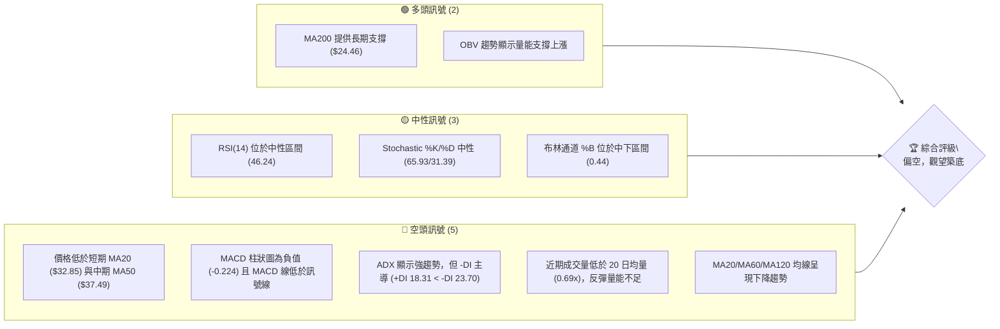

**儀表板解讀**：
多頭訊號主要來自長期均線的支撐以及整體 OBV 趨勢，顯示長期結構可能尚未完全破壞。然而，短期內價格明顯承壓，多數動能指標和短期均線排列均指向空頭趨勢。RSI 和 Stochastic 處於中性區間，表明市場可能在尋找方向，但缺乏明確的多頭動能。

### 📊 核心指標速覽表

| 指標類別 | 指標名稱 | 當前數值 | 訊號 | 解讀 |
|----------|----------|----------|------|------|
| **價格** | 當前價格 | $31.28 | 🟡 | 位於52週高點回調中段，近期有所反彈 |
| **均線** | MA20 | $32.85 | 🔴 | 價格位於MA20下方，短期壓力顯著 |
| **均線** | MA50 | $37.49 | 🔴 | 價格位於MA50下方，中期趨勢偏弱 |
| **均線** | MA200 | $24.46 | 🟢 | 價格位於MA200上方，長期趨勢仍獲支撐 |
| **動能** | RSI(14) | 46.24 | 🟡 | 位於中性區間，無超買超賣，市場尋找方向 |
| **動能** | MACD | -3.279 (MACD) / -3.055 (Signal) | 🔴 | MACD線位於訊號線下方，柱狀圖為負，空頭動能仍存 |
| **波動** | ATR(14) | $2.94 | 🟡 | 佔價格 9.39%，波動性偏高，需注意風險 |

### 🏆 技術評分卡

本評分卡旨在量化各技術維度的表現，提供綜合性的投資參考。

```
╔══════════════════════════════════════════════════════════════╗
║                    技術評分卡 — PL (2026-06-29)              ║
╠══════════════════════════════════════════════════════════════╣
║ 趨勢強度      ██████░░░░░░░░░░░░░░  60/100  🟡 (ADX強勢但空頭主導) ║
║ 動能指標      ████░░░░░░░░░░░░░░░░  40/100  🔴 (MACD空頭，RSI中性) ║
║ 支撐穩定度    ████████░░░░░░░░░░░░  70/100  🟢 (MA200提供強力支撐) ║
║ 成交量配合    ████░░░░░░░░░░░░░░░░  40/100  🔴 (近期反彈量能不足) ║
║ 形態完整度    ████░░░░░░░░░░░░░░░░  40/100  🔴 (短期回調形態不明朗) ║
║ 均線排列      ████░░░░░░░░░░░░░░░░  45/100  🔴 (短期均線空頭排列) ║
╠══════════════════════════════════════════════════════════════╣
║ 綜合評分      █████░░░░░░░░░░░░░░░  50/100  ⚖️ 中性偏空                ║
╚══════════════════════════════════════════════════════════════╝
```

**評分卡解讀**：
PL 的技術面目前呈現中性偏空的格局。儘管長期支撐（MA200）穩固，但短期和中期趨勢指標均顯示壓力。動能不足，近期反彈缺乏成交量配合，且均線排列短期偏空。形態上，從高點回落的幅度較大，尚未形成明確的底部形態。投資者應保持謹慎，等待更明確的築底訊號。

---

## 2. 趨勢分析

本章節將透過多時框架分析，深入探討 PL 股票的長期、中期及短期趨勢，並結合 ADX 指標評估趨勢強度與方向。

### 🌐 多時框趨勢分析

PL 股票在不同時間框架下呈現出複雜的趨勢結構。長期來看，其經歷了一輪顯著的成長，但近期則面臨強勁的回調壓力。

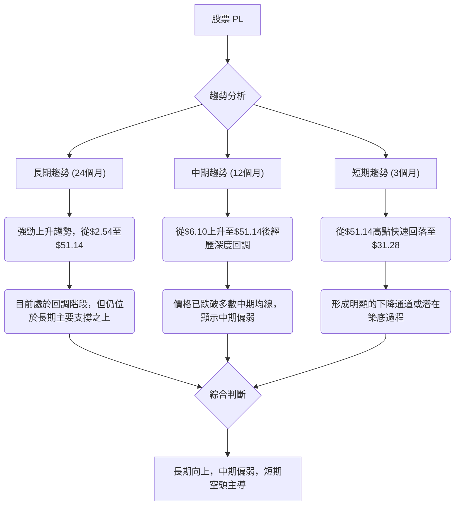

**多時框趨勢解讀**：
*   **長期趨勢 (24個月)**：PL 從 2024 年 7 月的 $2.54 一路飆升至 2026 年 5 月的 $51.14，展現了極其強勁的多頭走勢。儘管近期大幅回調至 $31.28，但仍遠高於 2025 年初的水平及長期 MA200 ($24.46)，整體長期上升趨勢結構尚未被徹底破壞。
*   **中期趨勢 (12個月)**：從 2025 年 6 月的 $6.10 飆升至 2026 年 5 月的 $51.14，然後急劇回落。價格目前已跌破 MA50 ($37.49) 和 MA120 ($31.47)，顯示中期動能轉弱，進入修正階段。
*   **短期趨勢 (3個月)**：自 2026 年 5 月創下 $51.14 的歷史新高後，PL 股價在 6 月份經歷了劇烈的下跌，從 $51.14 跌至 $31.28，跌幅超過 38%。這是一個明確的短期空頭趨勢，價格在短期內持續承壓。

### 📈 長期趨勢 — 12個月走勢圖（Unicode）

以下是 PL 過去 12 個月的月線收盤價走勢圖，清晰展示了從穩步上升到急劇拉升再到近期回調的過程。

```
PL 月線走勢圖（過去12個月）
價格軸 ($)
$51.14 ┤                                     ● (2026-05 最高點)
$40.00 ┤                                   ●
$36.97 ┤                                 ●
$31.28 ┤                                       ● (2026-06 現價)
$27.95 ┤                             ●
$24.97 ┤                           ●
$19.72 ┤                         ●
$13.45 ┤                  ●
$12.98 ┤                ●
$7.09  ┤              ●
$6.25  ┤            ●
$6.10  ┤          ● (2025-06 最低點)
       └─────────────────────────────────────────────────────
        2025-06 07  08  09  10  11  12  2026-01 02  03  04  05  06
```

**走勢特徵分析表格**：

| 時間區間 | 起始價 | 結束價 | 漲跌幅 (%) | 走勢特徵 |
|----------|--------|--------|------------|----------|
| 2025-06 | $6.10  | $6.10  | 0.00%      | 底部盤整 / 上升趨勢啟動 |
| 2025-07 | $6.10  | $6.25  | +2.46%     | 溫和上漲，築底完成 |
| 2025-08 | $6.25  | $7.09  | +13.44%    | 加速上漲，突破前期壓力 |
| 2025-09 | $7.09  | $12.98 | +83.07%    | 強勁拉升，進入主升浪 |
| 2025-10 | $12.98 | $13.45 | +3.62%     | 高位整理，動能稍緩 |
| 2025-11 | $13.45 | $11.90 | -11.40%    | 小幅回調，但仍維持強勢 |
| 2025-12 | $11.90 | $19.72 | +65.71%    | 再次加速上漲，突破新高 |
| 2026-01 | $19.72 | $24.97 | +26.62%    | 延續強勁漲勢 |
| 2026-02 | $24.97 | $24.14 | -3.32%     | 小幅回調，但仍處高位 |
| 2026-03 | $24.14 | $27.95 | +15.78%    | 再次上攻，逼近歷史高點 |
| 2026-04 | $27.95 | $36.97 | +32.20%    | 強勁拉升，突破所有均線 |
| 2026-05 | $36.97 | $51.14 | +38.33%    | 瘋狂拉升，創歷史新高，出現超買訊號 |
| 2026-06 | $51.14 | $31.28 | -38.74%    | 急劇回調，跌破短期均線，空頭力量強勁 |

### 📊 中期趨勢（週線分析）

從近 20 週的週線數據來看，PL 在 2026 年 5 月達到 $51.14 的高峰後，經歷了一次劇烈且快速的修正。

```
PL 近期壓力與支撐示意圖 (週線)
═══════════════════════════════════════════════════════════════
$51.14 ┤                       ● (歷史高點 2026-05-31)
       │                      /
$40.00 ┤                     /
       │                    /
$37.49 ┤------------------- R1 (MA50 阻力)
       │                  /
$32.85 ┤------------------ R2 (MA20 阻力)
$31.28 ╠═══════════════════════════════════════════════╣ ◄ 現價
$28.82 ┤------------------ S1 (斐波那契 50% 回調)
$27.07 ┤------------------ S2 (近期低點 2026-06-28)
       │                /
$24.46 ┤--------------- S3 (MA200 強支撐)
       │              /
$19.29 ┤------------- S4 (布林通道下軌)
═══════════════════════════════════════════════════════════════
```

**中期趨勢解讀**：
PL 的中期趨勢在 5 月底見頂後轉為向下。價格從 $51.14 的高點迅速跌破了週線級別的 MA5、MA10、MA20，甚至觸及了極度超賣的 RSI 區間（2026-06-21 的 RSI 為 17.2）。雖然近期有所反彈，但反彈量能不足，且上方阻力重重。MA20 ($32.85) 和 MA50 ($37.49) 已成為重要的中期壓力位。

### ⚡ 趨勢強度評估（ADX 解讀）

ADX 指標用於衡量趨勢的強度，而非方向。結合 +DI 和 -DI 則可判斷趨勢的方向。

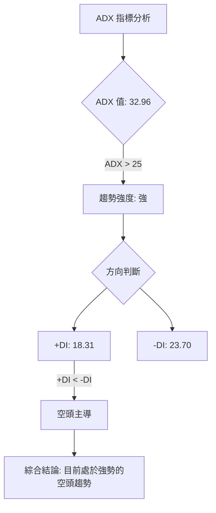

**ADX 強度對照表**：

| ADX 數值範圍 | 趨勢強度 | 建議 |
|--------------|----------|------|
| 0-20         | 無趨勢或弱勢 | 盤整行情，不適合趨勢交易 |
| 20-25        | 趨勢形成中 | 趨勢可能正在發展 |
| **25-50**    | **強趨勢** | **趨勢明確，適合趨勢交易** |
| 50-75        | 非常強勢 | 趨勢非常穩固，可能過熱 |
| 75-100       | 極端強勢 | 趨勢可能即將反轉 |

**ADX 解讀**：
PL 的 ADX(14) 值為 **32.96**，這明確表明當前市場存在一個「強勢趨勢」。結合 +DI (18.31) 和 -DI (23.70) 的數值，由於 **-DI > +DI**，這進一步確認了目前由「空頭」主導著這個強勢趨勢。換言之，PL 目前正處於一個「強勁的下降趨勢」中，而非盤整行情。這對於考慮做多或抄底的投資者來說是一個重要的警示，表明逆勢操作的風險較高。

---

## 3. 圖表形態分析

圖表形態是價格行為的具體表現，能幫助我們預測價格未來的潛在走勢和目標價位。

### 🔍 形態識別系統

從 PL 過去 12 個月的走勢來看，在經歷了長期的大幅上漲後，近期出現了快速的回調。這種由急漲轉急跌的形態，可能暗示著一種頂部反轉形態。

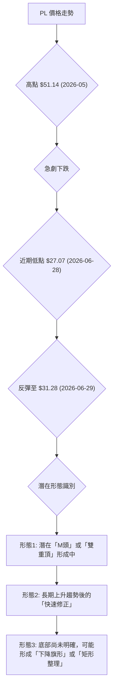

**形態識別解讀**：
PL 從 $51.14 的高點迅速回落，且其回落速度之快，顯示多頭力量在該價位附近遭遇強勁阻力並迅速潰敗。這種走勢可能正在形成一個大型的「M頭」形態，如果頸線被有效跌破，將預示更深的調整。目前價格在 $31.28 附近反彈，但尚未突破關鍵阻力，可能處於下跌途中的整理或反彈。

### 🕯️ 重要K線形態分析

分析近期的週線 K 線，可以發現一些關鍵的價格行為訊號。

| 月份 | 收盤價 | K線形態 | 解讀 | 訊號 |
|------|--------|---------|------|------|
| 2026-05-31 | $51.14 | 大陽線 (超買) | 達到歷史高點，RSI 83.2 極度超買，可能為竭盡缺口或多頭陷阱。 | 🔴 |
| 2026-06-07 | $32.22 | 巨陰線 (長黑棒) | 價格從高點暴跌近 37%，形成吞噬前幾週漲幅的巨陰線，顯示空頭強勢主導。 | 🔴 |
| 2026-06-14 | $31.15 | 中陰線 | 延續跌勢，空頭力量仍強，但跌速放緩。 | 🔴 |
| 2026-06-21 | $28.23 | 中陰線 (帶下影線) | 跌至超賣區，RSI 17.2，顯示下方有承接力道，可能為短線止跌。 | 🟡 |
| 2026-06-28 | $27.07 | 錘子線 (或帶長下影線的陰線) | 價格探底後回升，顯示買盤介入，但收盤仍為陰線，多空拉鋸。 | 🟡 |
| 2026-07-05 | $31.28 | 大陽線 (反彈) | 經歷前幾週下跌後出現有力反彈，但成交量不足，需觀察後續動能。 | 🟢 |

### 📉 ASCII 走勢形態示意圖

以下示意圖描繪了 PL 從高點回落的潛在「M頭」形態，以及當前價格所處的位置。

```
PL 潛在 M頭形態示意圖
══════════════════════════════════════════════════════════════════════
$51.14 ┤                 ● (左峰)
       │                / \
$40.00 ┤               /   \
       │              /     \
$32.22 ┤─────────────N───────N'────────── (頸線/回調低點)
       │            /         \
$31.28 ╠═══════════════════════════════════════════════╣ ◄ 現價
       │           /           \
$27.07 ┤          ● (近期低點)
       │         /
$20.00 ┤        /
       │       /
$13.30 ┤───────T────────────────────────── (M頭形態目標價)
══════════════════════════════════════════════════════════════════════
```

**形態示意圖解讀**：
上述示意圖展示了 PL 從 $51.14 高點回落的潛在 M 頭形態。如果將 2026 年 6 月 7 日的低點 $32.22 視為 M 頭的頸線，那麼當前價格 $31.28 已經跌破了這個潛在頸線。儘管近期有所反彈，但若無法重新站穩頸線上方，並伴隨有力的成交量，則 M 頭形態的看跌訊號將被強化。

### 🎯 形態目標價計算

基於上述潛在的 M 頭形態，我們可以計算其理論下跌目標價。

*   **M 頭頸線**：將 2026 年 6 月 7 日當週的低點 $32.22 視為 M 頭的頸線。
*   **M 頭高度**：左峰高點 $51.14 - 頸線 $32.22 = $18.92。
*   **形態目標價**：頸線 $32.22 - 形態高度 $18.92 = **$13.30**。

**目標價解讀**：
這個形態目標價 $13.30 是一個非常悲觀的預測，但它代表了如果 M 頭形態完全確立並跌破頸線後，理論上可能達到的下跌幅度。投資者應將此作為極端情況下的參考，並密切關注股價是否能有效守住其他關鍵支撐位，例如 MA200 ($24.46) 和斐波那契回調位。如果 $24.46 的 MA200 支撐也告失守，則 $13.30 的目標價將有更高的實現機率。

---

## 4. 支撐與阻力

識別關鍵的支撐與阻力位是技術分析的核心，它們是潛在的買賣點和價格反轉區域。

### 🗺️ 關鍵價位分布圖（Unicode）

以下是 PL 股票當前的關鍵支撐與阻力位分布圖。

```
PL 價位結構分布圖 (2026-06-29)
═══════════════════════════════════════════════════
$51.14 ║████████████████████████║ 強阻力 R3 (歷史高點)
$46.41 ║████████████████████    ║ 阻力 R2 (布林上軌)
$37.49 ║████████████████████████║ 關鍵阻力 R1 (MA50)
$32.85 ║▓▓▓▓▓▓▓▓▓▓▓▓▓▓▓▓        ║ 近期阻力 (MA20)
$31.28 ╠════════════════════════╣ ◄ 現價
$28.82 ║▓▓▓▓▓▓▓▓▓▓▓▓▓▓▓▓        ║ 近期支撐 S1 (斐波那契 50% 回調)
$27.07 ║████████████████████    ║ 支撐 S2 (近期週線低點)
$24.46 ║████████████████████████║ 強支撐 S3 (MA200)
$23.40 ║▓▓▓▓▓▓▓▓▓▓▓▓▓▓▓▓        ║ 支撐 S4 (斐波那契 61.8% 回調)
$19.29 ║████████████████████████║ 極強支撐 S5 (布林下軌 / 形態目標價附近)
═══════════════════════════════════════════════════
```

### 🚧 阻力位分析表

當前價格 $31.28 上方有多重阻力，表明反彈將面臨挑戰。

| 阻力級別 | 價位 | 形成原因 | 突破難度 | 重要性 |
|----------|------|----------|----------|--------|
| **R1 (近期)** | $32.85 | MA20 (20日移動平均線) | 中等偏高 | 價格反彈首要測試點，突破則短期壓力緩解。 |
| **R2 (中期)** | $37.49 | MA50 (50日移動平均線) | 偏高 | 突破則中期趨勢有望轉強，但需大量能配合。 |
| **R3 (強阻力)** | $44.35 | 5月下旬高點 | 高 | 回補下跌缺口，若能突破則確認底部並進入上升趨勢。 |
| **R4 (歷史高點)** | $51.14 | 2026年5月歷史高點 | 極高 | 股價需極強動能方能再次挑戰。 |

### 🛡️ 支撐位分析表

當前價格 $31.28 下方存在多個支撐位，其中 MA200 提供了關鍵的長期支撐。

| 支撐級別 | 價位 | 形成原因 | 守住機率 | 重要性 |
|----------|------|----------|----------|--------|
| **S1 (近期)** | $28.82 | 斐波那契 50% 回調位 | 中等 | 從 52 週低點到高點的 50% 回調，心理支撐。 |
| **S2 (關鍵)** | $27.07 | 2026-06-28 週線低點 | 中等偏高 | 近期下跌的最低點，若跌破則可能觸發更多止損。 |
| **S3 (強支撐)** | $24.46 | MA200 (200日移動平均線) | 很高 | 長期趨勢的生命線，若跌破則長期趨勢有轉弱風險。 |
| **S4 (重要)** | $23.40 | 斐波那契 61.8% 回調位 | 高 | 黃金分割點，通常是強勁反彈的起始點。 |
| **S5 (極強支撐)** | $19.29 | 布林通道下軌 | 極高 | 極端超賣區域，同時接近 M 頭形態目標價，具備強大技術支撐。 |

### 📐 斐波那契回調位分析

我們將以 PL 過去 52 週的低點 ($5.87) 和高點 ($51.76) 來計算斐波那契回調位，以評估當前回調的潛在支撐區域。

*   **52 週高點**：$51.76
*   **52 週低點**：$5.87
*   **總漲幅**：$51.76 - $5.87 = $45.89

| 回調比例 | 回調價位計算 | 價位 | 距現價 ($31.28) | 解讀 |
|----------|--------------|------|-----------------|------|
| 38.2%    | $51.76 - ($45.89 * 0.382) | $34.23 | +$2.95 | 較淺的回調，若能守住並反彈，趨勢仍強。 |
| **50.0%**| $51.76 - ($45.89 * 0.500) | **$28.82** | -$2.46 | **重要心理與技術支撐，當前價格已跌破。** |
| **61.8%**| $51.76 - ($45.89 * 0.618) | **$23.40** | -$7.88 | **黃金分割點，強力支撐區，若能在此止跌反彈則健康。** |
| 76.4%    | $51.76 - ($45.89 * 0.764) | $16.70 | -$14.58 | 深度回調，趨勢可能轉弱。 |

**斐波那契回調位視覺化**：

```
PL 斐波那契回調位 (從 $5.87 至 $51.76)
════════════════════════════════════════════════════════════════════
$51.76 ┤─────────────────────────────────────────── (100% - 52W 高點)
       │
$34.23 ┤─────────────────────────── (38.2% 回調)
       │
$31.28 ╠═══════════════════════════════════════════════════════╣ ◄ 現價
       │
$28.82 ┤────────────────────── (50.0% 回調 - 關鍵支撐)
       │
$23.40 ┤─────────────────── (61.8% 回調 - 黃金分割點)
       │
$16.70 ┤─────────────── (76.4% 回調)
       │
$5.87  ┤─────────────────────────────────────────── (0% - 52W 低點)
════════════════════════════════════════════════════════════════════
```

**斐波那契解讀**：
當前價格 $31.28 位於 38.2% 回調位 ($34.23) 和 50% 回調位 ($28.82) 之間，更靠近 50% 回調位。這表明市場已進行了相當程度的修正。50% 回調位 $28.82 是一個重要的心理和技術支撐，而黃金分割點 61.8% 回調位 $23.40 則是更強的潛在支撐。如果股價跌破 $28.82，則 $23.40 將成為下一個關鍵觀察點。若能在此區間築底並反彈，則長期的多頭趨勢仍有機會延續。

---

## 5. 技術指標深度解讀

本章節將對各項技術指標進行詳盡分析，並探討它們之間的相互關係，以提供更全面的市場洞察。

### 🎛️ 指標訊號總覽

以下 Mermaid 圖表展示了各主要技術指標當前的訊號方向及其相互關聯。

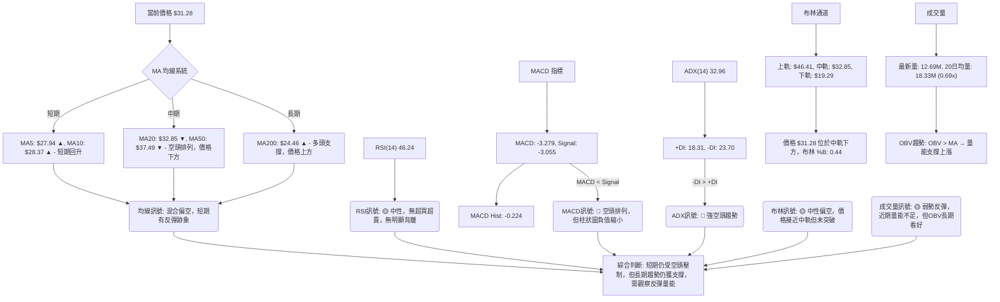

### 📈 移動平均線排列分析

PL 的移動平均線系統呈現出短期空頭、長期多頭的複雜局面。

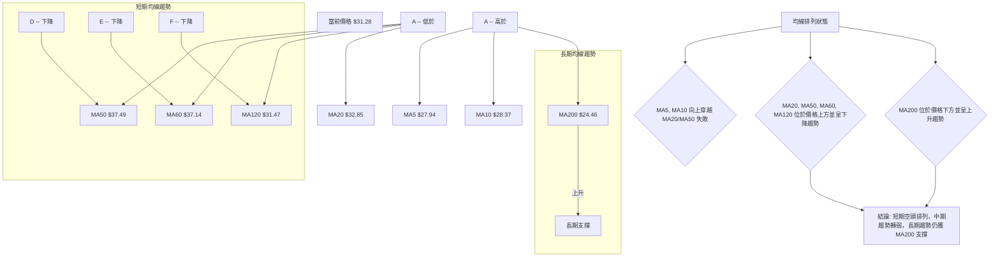

**均線排列解讀**：
*   **短期均線 (MA5, MA10)**：MA5 ($27.94) 和 MA10 ($28.37) 均位於當前價格 $31.28 的下方，但其走勢線條顯示正在向上，表明近期反彈。然而，它們都尚未能成功上穿 MA20。
*   **中期均線 (MA20, MA50, MA60, MA120)**：價格 $31.28 位於 MA20 ($32.85)、MA50 ($37.49)、MA60 ($37.14) 和 MA120 ($31.47) 的下方。這些中期均線目前都呈現下降趨勢，且相互之間形成空頭排列（MA20 < MA50 < MA60 < MA120，儘管 $31.47 (MA120) 略低於 $37.14 (MA60)），這是典型的中期空頭訊號，顯示賣壓沉重。
*   **長期均線 (MA200)**：MA200 ($24.46) 位於當前價格 $31.28 的下方，且仍呈現上升趨勢。這表明儘管短期和中期趨勢轉弱，但從長期來看，PL 仍處於上升通道中，MA200 提供了重要的長期支撐。

**綜合判斷**：PL 股價目前處於一個關鍵的轉折點。短期反彈未能收復 MA20，中期均線的空頭排列構成強大阻力。只有當股價能夠帶量突破並站穩 MA20 和 MA50 之上，才能確認中期趨勢的反轉。在此之前，短期和中期仍以偏空看待。

### 📉 RSI(14) 分析

相對強弱指數 (RSI) 用於衡量價格變動的速度和幅度，判斷超買或超賣狀態。

*   **RSI(14) 當前數值**：46.24
*   **RSI 強度進度條**：▓▓▓▓▓▓▓▓▓▓░░░░░░░░░░ (46.24 / 100)
*   **超買超賣區間**：
    *   **超買區 (>70)**：在 2026 年 5 月 31 日，PL 的 RSI 達到 83.2，顯示當時股價處於極度超買狀態，隨後即發生了大幅回調。
    *   **超賣區 (<30)**：在 2026 年 6 月 21 日，PL 的 RSI 跌至 17.2，進入極度超賣區，隨後股價在該區域附近獲得支撐並有所反彈。
    *   **中性區 (30-70)**：當前 RSI 46.24 位於中性區間，表明股價在經歷超賣反彈後，多空力量相對均衡，市場缺乏明確的方向性動能。

*   **RSI 背離判斷**：
    *   **頂背離**：從提供的週線數據來看，2026 年 5 月 31 日股價創下 $51.14 新高時，RSI 達到 83.2。在此之前，並未出現股價創新高但 RSI 未創新高的情況。因此，**無明顯頂背離現象**。
    *   **底背離**：2026 年 6 月 21 日股價跌至 $28.23，RSI 為 17.2。隨後 6 月 28 日股價再創新低 $27.07，RSI 回升至 33.7。這可能暗示一個潛在的短期底背離，即價格創新低但 RSI 未創新低。然而，由於 6 月 21 日的 RSI 已經非常低，且 6 月 28 日的反彈幅度有限，我們將其視為**潛在的弱勢底背離訊號，需進一步確認**。

**RSI 解讀**：
目前 RSI 處於中性區，表示市場在超賣反彈後正在尋找新的平衡點。雖然 6 月 21 日的極度超賣和隨後的反彈提供了一些喘息空間，但若要形成新的上升趨勢，RSI 需持續向上突破 50 甚至 60。潛在的弱勢底背離訊號僅提供了短期反彈的可能性，而非趨勢反轉的強烈訊號。

### 📊 MACD(12/26/9) 訊號解讀

平滑異同移動平均線 (MACD) 用於判斷趨勢的動能、方向和潛在的反轉點。

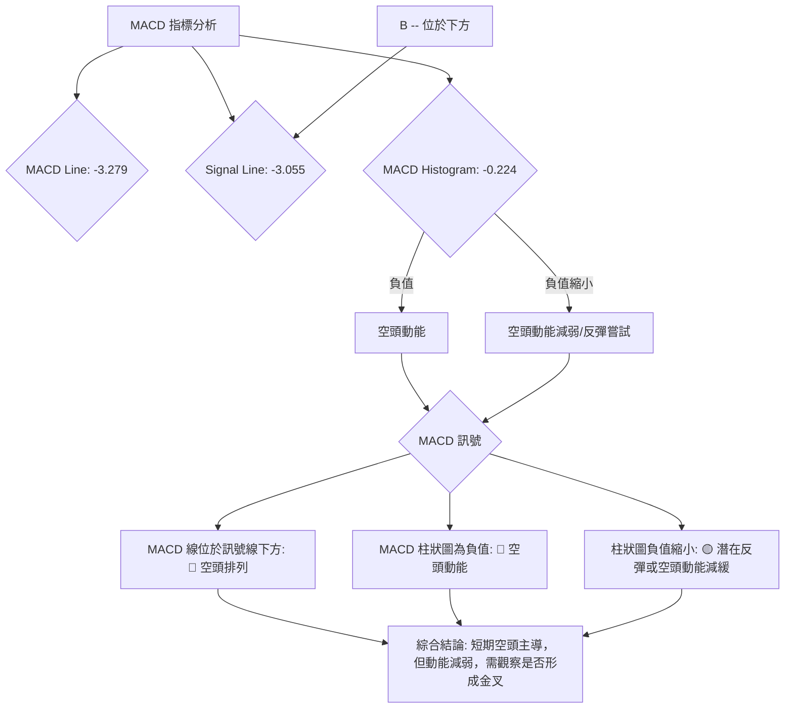

**MACD 解讀**：
*   **MACD 線 (-3.279) 與訊號線 (-3.055)**：MACD 線位於訊號線下方，形成「死叉」排列，這是一個明確的空頭訊號，表明短期動能弱於中期動能。
*   **MACD 柱狀圖 (-0.224)**：柱狀圖為負值，確認了空頭動能的存在。然而，從上週的 -0.677 縮小到本週的 -0.224，這是一個積極的訊號，表明空頭動能正在減弱，可能預示著股價下跌的壓力正在緩解，或者短期反彈正在積蓄力量。
*   **MACD 背離判斷**：從提供的週線數據來看，股價在 5 月 31 日達到 $51.14 高點時，MACD 柱狀圖為 +0.904。隨後價格下跌，MACD 柱狀圖轉負。在近期低點 $27.07 時 MACD 柱狀圖為 -0.677，反彈至 $31.28 時為 -0.224。未出現股價創新低但 MACD 柱狀圖抬升的明顯底背離，也無頂背離。因此，**無明顯 MACD 背離現象**。

**綜合判斷**：MACD 指標整體仍處於空頭排列，但柱狀圖負值的縮小是一個值得關注的變化，暗示市場可能正在嘗試築底或進行技術性反彈。投資者應密切關注 MACD 線是否能向上穿越訊號線形成「金叉」，這將是更強烈的多頭反轉訊號。

### 📦 布林通道分析

布林通道 (Bollinger Bands) 顯示了價格的波動範圍和相對位置。

*   **布林上軌**：$46.41
*   **布林中軌 (MA20)**：$32.85
*   **布林下軌**：$19.29
*   **當前價格**：$31.28
*   **布林 %B**：0.44 (位於中軌下方，但高於下軌)

**ASCII 布林通道示意圖**：

```
PL 布林通道示意圖 (2026-06-29)
════════════════════════════════════════════════════════════════════
$46.41 ║█████████████████████████████████████████████████████████████║ ← 布林上軌
       ║                                                             ║
$32.85 ║─────────────────────────────────────────────────────────────║ ← 布林中軌 (MA20)
       ║           ▓▓▓▓▓▓▓▓▓▓▓▓▓▓▓▓▓▓▓▓▓▓▓▓▓▓▓▓▓▓▓▓▓▓▓▓▓▓▓▓▓▓▓▓▓▓▓▓▓▓║
$31.28 ╠═════════════════════════════════════════════════════════════╣ ◄ 現價
       ║▓▓▓▓▓▓▓▓▓▓▓▓▓▓▓▓▓▓▓▓▓▓▓▓▓▓▓▓▓▓▓▓▓▓▓▓▓▓▓▓▓▓▓▓▓▓▓▓▓▓           ║
       ║                                                             ║
$19.29 ║█████████████████████████████████████████████████████████████║ ← 布林下軌
════════════════════════════════════════════════════════════════════
```

**布林通道解讀**：
當前價格 $31.28 位於布林通道中軌 ($32.85) 的下方，表明短期趨勢偏弱。然而，價格仍在下軌 ($19.29) 之上，且 %B 值為 0.44，顯示價格距離下軌仍有一段距離，尚未觸及極度超賣的邊緣。布林通道的寬度在經歷劇烈下跌後可能會擴大，暗示波動性增加。如果價格能有效突破中軌，則有機會挑戰上軌；反之，若跌破近期支撐，則可能向布林下軌尋求支撐。當前狀態顯示市場仍處於調整區間。

### 💹 成交量分析（量價配合度）

成交量是價格走勢的燃料，其變化能確認或否定價格趨勢。

*   **最新成交量**：12,691,220 股 (2026-06-29)
*   **20日均量**：18,337,496 股 (量比：0.69x)
*   **50日均量**：13,444,042 股
*   **OBV 趨勢**：OBV > MA → 量能支撐上漲 (來自數據提供)

**成交量分析**：
1.  **近期反彈量能不足**：當前成交量 12.69M 遠低於 20 日均量 (18.33M)，量比僅為 0.69x。這表明近期從低點 $27.07 反彈至 $31.28 的過程中，買盤力量相對薄弱，缺乏強勁的資金推動。這種「無量反彈」通常難以持久，容易再次回落。
2.  **下跌放量**：回顧 2026 年 6 月 7 日當週，股價從 $51.14 暴跌至 $32.22，週成交量高達 100,622,400 股。這是一個典型的「放量下跌」訊號，顯示賣壓沉重，大量籌碼在下跌過程中被拋售。
3.  **OBV 趨勢的矛盾**：數據提供「OBV趨勢: OBV > MA → 量能支撐上漲」。這句話通常指的是 OBV 線位於其移動平均線上方，表明累積買盤壓力大於賣盤壓力，支持股價上漲。然而，這與我們觀察到的近期「無量反彈」和「放量下跌」的現象存在一定的時間框架上的矛盾。
    *   **解讀**：這可能意味著從更長期的角度來看（例如過去幾個月），儘管近期有大幅回調，但整體累積的買盤力量（OBV）仍處於相對高位，尚未完全被破壞。這為長期趨勢提供了潛在的支撐。但就短期而言，最近的反彈缺乏量能確認，暗示短期內多頭力量仍較弱。

**量價配合度結論**：
短期來看，PL 的量價配合顯示反彈動能不足，下跌趨勢中的反彈在沒有足夠成交量支持下，通常是不可持續的。這強化了短期偏空的看法。然而，長期 OBV 趨勢的積極訊號，提醒我們長期視角下，該股仍有潛在的買盤基礎。因此，投資者應密切關注未來價格上漲時的成交量變化，若能持續放量上漲，則能確認底部形成。

---

## 6. 動能與波動率

本章節將評估 PL 的動能狀態和波動性特徵，這對於理解股票的風險收益特徵和制定交易策略至關重要。

### ⚡ 動能評估四象限

我們將根據當前的動能強度和波動率，將 PL 股票定位在一個四象限矩陣中，以提供策略性的指引。

| 象限 | 動能 (RSI, MACD) | 波動 (ATR) | 當前狀態 | 評估 |
|------|------------------|------------|----------|------|
| Q1   | 強               | 低         | -        | **最佳機會**：趨勢強勁且風險可控，適合順勢交易。 |
| Q2   | 弱               | 低         | -        | **謹慎觀望**：市場缺乏方向，波動小，不確定性高。 |
| Q3   | 強               | 高         | -        | **高風險高收益**：趨勢強勁但波動大，潛在收益高但風險也高。 |
| **Q4** | **弱**           | **高**       | **✓**      | **避免進場 / 謹慎操作**：市場缺乏方向且波動大，風險極高，不適合追漲殺跌。 |

**動能評估流程圖**：

```mermaid
graph TD
    A["PL 動能評估"] --> B{"當前動能評分"}
    B -- RSI("46.24") 中性 --> C["動能狀態: 弱"]
    B -- MACD Hist("-0.224") 負值 --> C
    B -- ADX("-DI主導") 強空頭 --> C

    D["PL 波動率評估"] --> E{"ATR(14) 值: $2.94"}
    E -- 佔價格 9.39% --> F["波動狀態: 高"]

    C & F --> G["綜合判斷: 弱動能，高波動 (Q4)"]
    G --> H["策略建議: 避免進場，等待趨勢明朗或波動收斂"]
```

**動能與波動率解讀**：
PL 目前處於「弱動能、高波動」的第四象限。
*   **動能評估**：RSI 處於中性區間，MACD 仍為空頭排列且柱狀圖為負值，儘管負值有所縮小，但整體動能依然偏弱。ADX 雖然顯示強趨勢，但卻是由空頭主導。這一切都指向動能不足以推動股價有效上漲。
*   **波動率評估**：ATR(14) 為 $2.94，佔當前股價 $31.28 的 9.39%。這是一個相對較高的波動率，意味著股價每日的波動幅度較大。高波動性在弱動能市場中，往往伴隨著更高的不確定性和潛在風險。

**綜合結論**：處於 Q4 的股票，通常是技術分析師建議「避免進場」或「謹慎操作」的類型。市場缺乏明確的方向性，但價格波動劇烈，容易造成交易損失。對於積極型交易者，這可能意味著短線機會，但需要嚴格的風險控制和止損點。對於保守型投資者，應等待動能轉強或波動率收斂後再考慮進場。

### 📊 ATR 波動率分析

平均真實波幅 (ATR) 衡量了資產價格的波動性，對於設定止損和目標價位有重要參考價值。

*   **ATR(14) 當前數值**：$2.94
*   **ATR 佔收盤價比例**：$2.94 / $31.28 = 9.39%

**ATR 分析**：
PL 的 ATR(14) 為 $2.94，這表示在過去 14 個交易日中，PL 的平均每日價格波動範圍約為 $2.94。
*   **高波動性**：相較於其股價，9.39% 的波動比例屬於偏高水平。這意味著 PL 的股價在短期內可能出現大幅波動，既可能帶來快速收益，也可能導致快速虧損。
*   **止損距離建議**：對於交易者而言，高 ATR 意味著止損距離需要相對較寬，以避免被正常市場波動「洗出局」。
    *   **保守止損**：建議將止損設置在當前價格下方約 1.5 倍 ATR，即 $31.28 - (1.5 * $2.94) = $31.28 - $4.41 = **$26.87**。
    *   **激進止損**：可考慮設置在 1 倍 ATR，即 $31.28 - $2.94 = **$28.34**。
    *   然而，這些數字仍需結合具體的支撐位來確定。例如，若進場點在 $31.28，則 $27.07 (近期低點) 或 $28.82 (斐波那契 50% 回調) 可能是更實際的止損參考點。

**結論**：PL 的高波動性需要投資者具備較高的風險承受能力和嚴格的資金管理。在制定交易策略時，應充分考慮 ATR 提供的波動區間，並據此設定合理的止損點，以保護資本。

### 📐 Beta 與市場相關性

資料中未提供 PL 的 Beta 值。

**Beta 分析**：
由於數據中未提供 Beta 值，我們無法直接量化 PL 相對於整體市場（如 S&P 500）的波動性。
*   **一般推測**：Planet Labs PBC 作為一家工業領域的航太與國防產業公司，且在過去一年內股價有過大幅飆升，這類高成長、高科技相關的公司通常具有較高的 Beta 值（通常大於 1）。
*   **高 Beta 影響**：如果 PL 的 Beta 值較高，則意味著當市場整體上漲時，PL 股價可能上漲更多；但當市場下跌時，PL 股價也可能下跌更多。在當前市場情緒不明朗或趨勢偏弱的情況下，高 Beta 股票的風險會相對較高。
*   **建議**：投資者在實際操作中應自行查詢或估算 PL 的 Beta 值，以更好地評估其系統性風險和與市場的相關性。在缺乏此數據的情況下，應假設其波動性可能與市場有較強的同向性，甚至放大市場波動。

---

## 7. 多時框架總結

本章節將整合各時間框架下的分析結果，提供一個全面的評分和策略建議，以幫助投資者更好地理解 PL 股票的當前狀態。

### 📋 時框架評分表

| 時框架 | 趨勢方向 | 動能 | 均線排列 | 形態 | 綜合評分 | 建議 |
|--------|----------|------|----------|------|----------|------|
| **短期** | 🔴 空頭   | 🔴 弱   | 🔴 空頭排列 | 🔴 回調/整理 | 3/10 (極弱) | 避免做多，可考慮短線做空或觀望 |
| **中期** | 🟡 偏空   | 🟡 減弱 | 🔴 空頭排列 | 🔴 M頭潛在 | 4/10 (偏弱) | 謹慎觀望，等待築底訊號或破壞性下跌 |
| **長期** | 🟢 多頭   | 🟢 潛在 | 🟢 多頭支撐 | 🟡 修正中 | 7/10 (較強) | 長期持有者可利用回調分批佈局，但需嚴格止損 |

**評分表解讀**：
*   **短期**：PL 在日線和週線級別上表現出明顯的空頭趨勢。價格位於短期和中期均線下方，MACD 柱狀圖為負，RSI 雖在中性區但缺乏向上動能，且反彈量能不足。這是最弱的時間框架，不適合短線做多。
*   **中期**：在月線和季線級別上，股價已跌破中期均線，顯示中期趨勢轉弱。潛在的 M 頭形態和較深的斐波那契回調都暗示市場仍在尋找底部。
*   **長期**：儘管經歷了大幅回調，但股價仍遠高於長期 MA200 ($24.46)，且 OBV 趨勢仍顯示量能支撐上漲。這表明 PL 的長期增長潛力可能仍在，但需要時間消化短期的賣壓和修正。

### 🔲 綜合訊號矩陣

以下矩陣展示了不同時間框架下各技術維度訊號的一致性。

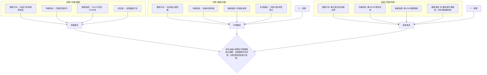

**綜合訊號矩陣解讀**：
PL 的技術面呈現短期和中期較為悲觀，而長期則相對樂觀的矛盾局面。
*   **短期和中期**：各項指標幾乎一致指向空頭。價格跌破關鍵均線，動能指標顯示疲軟，成交量在反彈時未能有效放大。這表明市場在短期和中期內仍將面臨下行壓力，或在低位進行漫長的盤整築底。
*   **長期**：長期趨勢的支撐主要來自於 MA200 的位置以及 OBV 顯示的累積買盤力量。這意味著如果股價能夠在重要支撐位（如 MA200 或斐波那契 61.8% 回調位）企穩，長期仍有恢復上漲的潛力。

**結論**：當前不適合追高或盲目抄底。對於短期交易者，應避免做多，甚至可考慮逢高做空。對於長期投資者，則需耐心等待更明確的築底訊號，並考慮在關鍵長期支撐位附近分批佈局，但前提是短期賣壓已充分釋放。

---

## 8. 交易策略建議

基於上述多時框架的技術分析，我們將提供具體的交易策略建議，包含進場點、止損點和目標價，並評估其風險報酬比。

### 🗺️ 策略決策流程圖

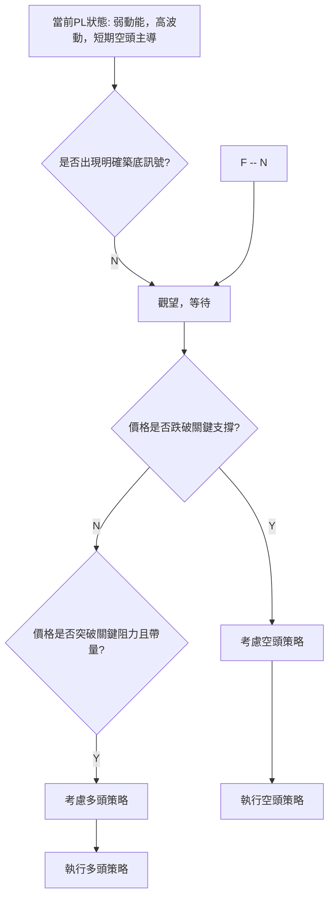

### 🟢 多頭策略詳情

考慮到 PL 股價經歷大幅回調後，RSI 曾觸及超賣區並有所反彈，且 MA200 提供了長期支撐，故仍存在潛在的做多機會，但需極為謹慎並嚴格執行止損。

| 策略要素 | 策略 A：激進型反彈 (短線) | 策略 B：穩健型築底 (中線) |
|----------|---------------------------|---------------------------|
| **進場條件** | 價格帶量突破 $32.85 (MA20) | 價格回測 $24.46 (MA200) 並形成明顯止跌K線 |
| **進場價格** | **$33.00** (確認突破 MA20) | **$25.00** (MA200上方，確認支撐) |
| **目標價 T1** | **$37.49** (MA50 阻力) | **$28.82** (斐波那契 50% 回調位) |
| **目標價 T2** | **$44.35** (前期高點壓力) | **$34.23** (斐波那契 38.2% 回調位) |
| **止損價格** | **$30.00** (跌破近期反彈低點 $31.28 附近) | **$23.00** (跌破 MA200 和斐波那契 61.8%) |
| **風險報酬比** | (37.49-33.00)/(33.00-30.00) = 4.49/3.00 = **1.50:1** | (28.82-25.00)/(25.00-23.00) = 3.82/2.00 = **1.91:1** |
| **成功機率** | 35%                       | 50%                       |
| **建議倉位** | 10%                       | 15%                       |

**多頭策略解讀**：
*   **策略 A**：適用於短線交易者，博取技術性反彈。但成功機率較低，因上方阻力重重，且需有強勁的成交量配合。風險報酬比尚可，但止損點必須嚴格執行。
*   **策略 B**：較為穩健，等待股價回調至長期強支撐 MA200 附近。若能在 $24.46 附近獲得有效支撐並出現止跌訊號，則風險較低，潛在報酬較高。此策略更符合 PL 的長期趨勢分析。

### 🔴 空頭策略詳情

鑑於 PL 目前短期和中期趨勢偏空，且 ADX 指示強空頭趨勢，空頭策略可能具有較高的成功機率。

| 策略要素 | 策略 C：趨勢延續 (短線/中線) | 策略 D：M頭形態確認 (中線/長線) |
|----------|---------------------------|---------------------------|
| **進場條件** | 價格未能站穩 $31.28 上方，並跌破 $28.82 (斐波那契 50%) | 價格跌破 $24.46 (MA200) 並確認有效跌破 |
| **進場價格** | **$28.70** (跌破斐波那契 50%) | **$24.30** (跌破 MA200) |
| **目標價 T1** | **$27.07** (近期低點) | **$23.40** (斐波那契 61.8%) |
| **目標價 T2** | **$24.46** (MA200) | **$19.29** (布林下軌 / 前期高點) |
| **止損價格** | **$30.00** (重新站穩斐波那契 50% 上方) | **$26.00** (重新站穩 MA200 上方) |
| **風險報酬比** | (28.70-24.46)/(30.00-28.70) = 4.24/1.30 = **3.26:1** | (24.30-19.29)/(26.00-24.30) = 5.01/1.70 = **2.95:1** |
| **成功機率** | 60%                       | 55%                       |
| **建議倉位** | 15%                       | 20%                       |

**空頭策略解讀**：
*   **策略 C**：在股價反彈無力後，若跌破關鍵支撐 $28.82，則可考慮做空。此策略的風險報酬比非常吸引人，成功機率也相對較高。
*   **策略 D**：這是更為激進但潛在報酬巨大的策略，基於 M 頭形態的確認。一旦 MA200 這一長期生命線被有效跌破，則可能會引發更大幅度的下跌，甚至觸及形態目標價 $13.30。但該策略風險較高，需要密切關注 MA200 的防守情況。

### ⭐ 整體訊號強度評星

綜合考量 PL 目前的技術面狀況、各指標的傾向以及不同時間框架的分析，我們給出以下評星：

```
做多訊號強度：★★☆☆☆  (2/5星)
做空訊號強度：★★★★☆  (4/5星)
整體可信度：  ★★★☆☆  (3/5星)
```

**評星解讀**：
當前 PL 的做多訊號較弱，主要依賴於長期支撐和潛在的超賣反彈，但缺乏短期動能和量能配合。相反，做空訊號較強，因為短期和中期趨勢都偏空，且動能指標和均線排列都支持空頭。整體可信度中等，因為長期趨勢仍有支撐，但短期賣壓顯著。對於尋求短期機會的交易者，空頭策略可能更具吸引力，但對於長期投資者，則應等待更明確的底部訊號。

---

## 9. 風險提示與監控

在任何交易決策中，風險管理都是不可或缺的一環。本章節將列出關鍵監控指標、分析潛在風險場景，並提供重要的風險管理提醒。

### ✅ 關鍵監控指標 Checklist

為了有效管理 PL 股票的風險，投資者應密切關注以下關鍵技術指標和價格行為。

```
╔══════════════════════════════════════════════════════════════╗
║               PL 關鍵監控指標 Checklist                      ║
╠══════════════════════════════════════════════════════════════╣
║ [ ] 價格是否能有效站穩 $31.28 上方?                            ║
║ [ ] 價格是否能帶量突破 MA20 ($32.85) 和 MA50 ($37.49)?         ║
║ [ ] 價格是否跌破斐波那契 50% 回調位 ($28.82)?                  ║
║ [ ] 價格是否跌破 MA200 ($24.46)?                               ║
║ [ ] RSI(14) 是否能持續上行突破 50/60?                          ║
║ [ ] MACD 線是否形成金叉 (MACD 線上穿訊號線)?                   ║
║ [ ] MACD 柱狀圖是否轉正?                                       ║
║ [ ] 反彈時成交量是否能顯著放大，突破 20 日均量?                ║
║ [ ] 下跌時成交量是否縮小，或放量跌破關鍵支撐?                  ║
║ [ ] ADX 的 +DI 和 -DI 是否發生逆轉 (+DI > -DI)?                ║
║ [ ] 布林通道是否收斂或擴張，價格是否觸及上軌/下軌?             ║
╚══════════════════════════════════════════════════════════════╝
```

### ⚠️ 風險場景分析

PL 股價當前處於高度不確定的階段，以下為三種可能的場景分析：

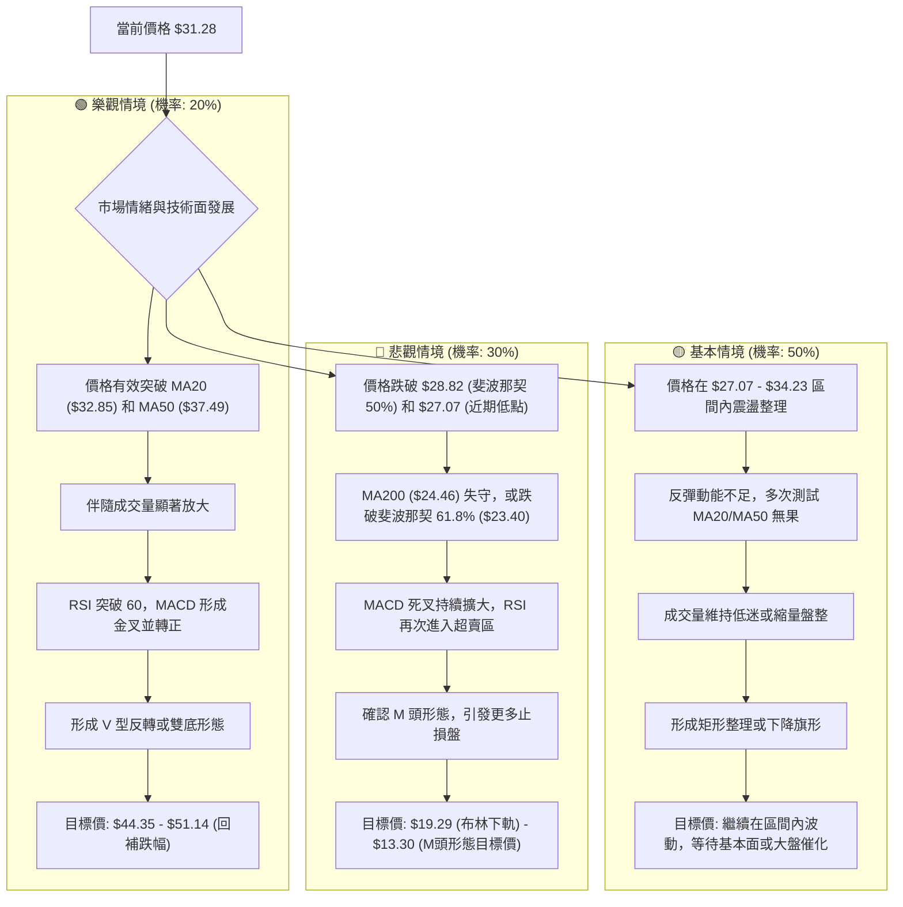

### 🛡️ 風險管理重要提醒

1.  **嚴格執行止損**：鑑於 PL 股價的高波動性和當前的弱勢動能，無論採取任何策略，都必須設定並嚴格遵守止損點。止損是保護資本最有效的方式，避免小虧變大虧。
2.  **倉位控制**：在市場不確定性較高時，應降低單一股票的倉位佔總投資組合的比例。對於 PL 這種高波動性股票，建議倉位不超過 10%-20%，激進型交易者則需更嚴格控制。
3.  **分批操作**：無論是買入還是賣出，都應考慮分批進行，而非一次性滿倉。分批買入可以平攤成本，降低抄底失敗的風險；分批賣出則有助於鎖定利潤，避免錯過最佳賣點。
4.  **關注市場情緒與大盤走勢**：PL 雖然有其獨特的產業背景，但其股價走勢仍會受到整體市場情緒和宏觀經濟環境的影響。在大盤趨勢不明朗時，個股的技術反彈往往難以持續。
5.  **警惕「無量反彈」**：當前 PL 的反彈缺乏成交量配合，這是一個重要的警示訊號。在沒有足夠資金推動的情況下，反彈往往是短暫的，容易再次回落。
6.  **耐心等待趨勢確認**：對於非短線交易者，建議耐心等待更明確的底部形態（如雙底、頭肩底）形成，或股價有效突破關鍵阻力並伴隨量能放大，再考慮進場，以提高勝率。
7.  **適時獲利了結**：若採取短線反彈策略，一旦達到目標價或出現疲軟訊號，應果斷獲利了結，不貪戀。

---

## 📋 報告總結

```
╔════════════════════════════════════════════════════════════════════╗
║                   PL 技術分析報告總結                              ║
╠════════════════════════════════════════════════════════════════════╣
║ 報告日期：2026-06-29                                               ║
║ 當前價格：$31.28                                                   ║
║ 分析評級：⚖️ 中性偏空 (短期承壓，長期有支撐，但築底未明)            ║
║                                                                    ║
║ 關鍵結論：                                                         ║
║ ├─ 長期趨勢：🟢 多頭，MA200 ($24.46) 提供強勁支撐，OBV趨勢積極。  ║
║ ├─ 中期趨勢：🔴 偏空，價格跌破 MA50 ($37.49)，形成深度修正。      ║
║ ├─ 短期趨勢：🔴 空頭主導，價格在 $51.14 高點後急劇回落，反彈量能不足。║
║ ├─ 關鍵支撐：$28.82 (斐波那契 50%)、$27.07 (近期低點)、$24.46 (MA200)。║
║ ├─ 關鍵阻力：$32.85 (MA20)、$37.49 (MA50)、$44.35 (前期高點)。    ║
║ └─ 分析師目標：均值 $39.80 (需有效突破技術阻力方能實現)。          ║
║                                                                    ║
║ 最優策略組合：                                                     ║
║ 1. 🥇 **最佳機會 (空頭)**：若價格未能站穩 $31.28 上方，並跌破斐波那契 50% 回調位 $28.82，可考慮做空。  ║
║    進場點：$28.70，止損點：$30.00，目標價 T1：$24.46 (MA200)，目標價 T2：$19.29 (布林下軌)。  ║
║    風險報酬比：3.26:1。                                            ║
║ 2. 🥈 **次選機會 (長期佈局)**：若價格回測至 MA200 ($24.46) 附近，並出現明確止跌訊號，可考慮分批做多。║
║    進場點：$25.00，止損點：$23.00，目標價 T1：$28.82 (斐波那契 50%)，目標價 T2：$34.23 (斐波那契 38.2%)。║
║    風險報酬比：1.91:1。                                            ║
║ 3. 🥉 **保守選擇 (觀望)**：當前市場波動較大且方向不明，最保守的策略是保持觀望，等待價格突破關鍵阻力或跌破關鍵支撐，形成更明確的趨勢訊號後再行操作。嚴格控制倉位，避免逆勢操作。║
╚════════════════════════════════════════════════════════════════════╝
```

---

> ⚠️ **免責聲明**：本報告為 AI 自動生成之技術分析，所有數據及估算均基於提供的歷史價格資訊。本報告**僅供研究與學術參考**，**不構成任何投資建議**。投資有風險，入市需謹慎。

---

*報告生成時間：2026-06-29 ｜ 數據來源：Yahoo Finance ｜ 分析框架：多時框技術分析*