<details>
<summary>📊 靜態圖表 (點擊展開)</summary>
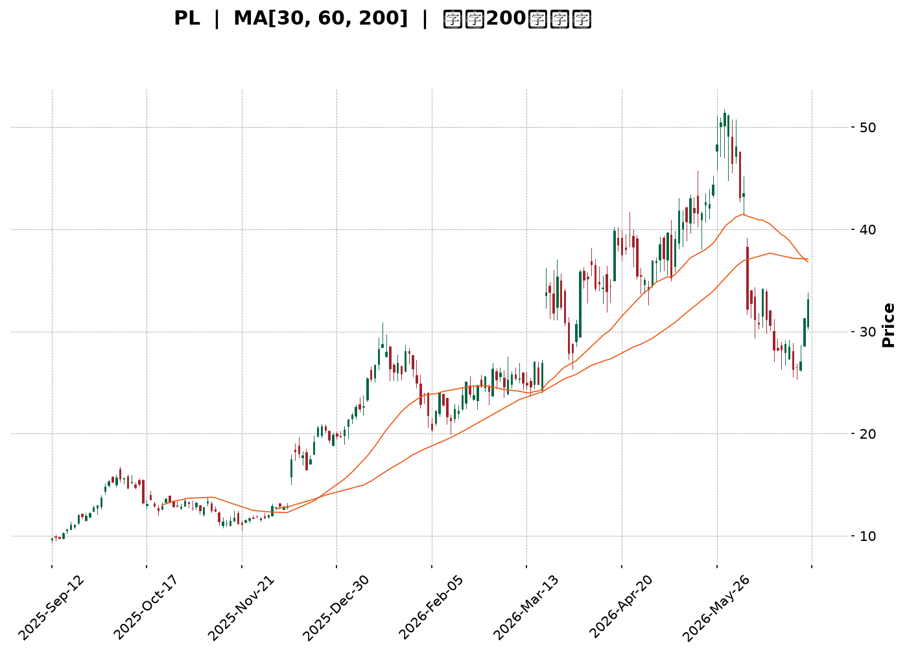
</details>

<html>
<head><meta charset="utf-8" /></head>
<body>
    <div style="height:500px; width:100%;">                        <script>window.PlotlyConfig = {MathJaxConfig: 'local'};</script>
        <script charset="utf-8" src="https://cdn.plot.ly/plotly-3.6.0.min.js" integrity="sha256-QaOVwtVY0T02VaHrr6pnoHLCwayMJp4O5n4YyaE3rJk=" crossorigin="anonymous"></script>                <div id="candlestick-chart" class="plotly-graph-div" style="height:100%; width:100%;"></div>            <script>                window.PLOTLYENV=window.PLOTLYENV || {};                                if (document.getElementById("candlestick-chart")) {                    Plotly.newPlot(                        "candlestick-chart",                        [{"close":{"dtype":"f8","bdata":"AAAAIFyPI0AAAADgUbgjQAAAAAAAgCNAAAAAgMJ1JEAAAADgUTglQAAAAOBROCZAAAAA4FE4JkAAAACgmRkoQAAAAAAp3CdAAAAAIIXrJ0AAAABgZmYoQAAAAOB6lClAAAAAgML1KUAAAACAPYorQAAAAEAzsy1AAAAAYLieLkAAAABA4XouQAAAAAApXC9AAAAAQDMzL0AAAACA61EvQAAAAGBmZi1AAAAAAACALkAAAAAgXI8tQAAAAIAULi5AAAAAgMJ1KkAAAADgUTgqQAAAAGC4HitAAAAAgOvRKUAAAAAAAAApQAAAAGBm5ilAAAAA4FE4K0AAAABguJ4qQAAAAIAUrilAAAAAwMzMKUAAAADgUbgpQAAAAGBm5ipAAAAAoEdhKkAAAABgZmYpQAAAAAAAgCpAAAAAIIXrKEAAAABguJ4pQAAAACCuxypAAAAA4KPwKEAAAACgR+EoQAAAAIDr0SZAAAAAwMzMJkAAAAAghWsmQAAAAGBm5iZAAAAA4HqUJ0AAAACAwnUmQAAAAIDrUSZAAAAA4HoUJ0AAAACAwnUnQAAAAOCjcCdAAAAAwMzMJ0AAAABgZmYnQAAAAIA9iidAAAAAwB4FKEAAAACgR+EpQAAAAIA9iilAAAAAYGbmKUAAAACAFK4pQAAAAKBH4SlAAAAA4FF4MUAAAACgcD0yQAAAAMDMDDJAAAAAoEfhMUAAAADgUXgwQAAAAKBwfTFAAAAAgBQuM0AAAACgmZk0QAAAAEDhujRAAAAAgOtRNEAAAAAAKVwzQAAAAGC43jNAAAAAoHC9M0AAAADgUbgzQAAAAMD1aDRAAAAAANdjNUAAAABACtc1QAAAAAApnDZAAAAA4KNwNkAAAACAwrU2QAAAAOCjcDlAAAAAgOtROUAAAABA4bo6QAAAACCuRzxAAAAAIK7HPEAAAAAAAAA8QAAAAKBHYTpAAAAAIFwPOkAAAADgo\u002fA6QAAAAGC43jlAAAAAgOsRPEAAAACgR+E7QAAAAKCZWTpAAAAA4FH4OEAAAACgmdk2QAAAAEAz8zdAAAAAwB7FNUAAAACAFG40QAAAAGCPQjZAAAAAwB4FOEAAAACAPco2QAAAAGBmpjVAAAAAwMxMNUAAAAAghWs2QAAAAIDCNTZAAAAAoHC9N0AAAAAAKRw5QAAAAGBm5jdAAAAAIK7HN0AAAACAwrU4QAAAAKBHoThAAAAAoJmZOUAAAAAA1yM4QAAAAAApXDpAAAAAwMxMOUAAAAAAAAA6QAAAAEAKlzhAAAAAIK5HOUAAAACA69E5QAAAAGBmZjlAAAAA4KNwOUAAAADgUfg4QAAAAIA9yjhAAAAAoJmZOEAAAADgehQ7QAAAACBczzhAAAAAgML1OkAAAACAPepAQAAAAMD16EBAAAAA4HrUP0AAAAAgXK9BQAAAAEAzM0BAAAAAACncPkAAAAAA1+M7QAAAAEAz8ztAAAAAgMK1PkAAAADgo\u002fBBQAAAAGCPgkFAAAAAgMKVQUAAAABgZkZCQAAAAKBwHUFAAAAAgMJVQUAAAADA9ShBQAAAAEAK90BAAAAA4Ho0QUAAAACA6\u002fFDQAAAAKBwPUNAAAAAAADAQkAAAAAA1wNDQAAAAAApvENAAAAAwB4lQ0AAAADgUbhBQAAAAKCZuUFAAAAAANeDQUAAAACAPQpBQAAAAAApfEJAAAAAQDNzQkAAAADAHkVDQAAAAOCjkEJAAAAA4FHYQ0AAAABguJ5BQAAAAMAehUNAAAAAIIXrREAAAABACldEQAAAAGC4XkRAAAAAwB6FRUAAAAAgXM9EQAAAAIAUzkRAAAAAIIXLREAAAADgelRFQAAAAKBwPUVAAAAAwMwsRkAAAADA9ShIQAAAAKBwPUlAAAAAQDOzSUAAAACA65FJQAAAAEDhOkdAAAAAIIULSEAAAADgo5BFQAAAAADXw0VAAAAAACkcQEAAAABguF5AQAAAACCFKz9AAAAA4FG4PkAAAACAwhVBQAAAAGBmJj9AAAAA4HqUPkAAAACAwjU8QAAAAOBRODxAAAAAQOE6PEAAAADAHsU8QAAAACCuhzxAAAAAwMxMOkAAAABgj4I6QAAAAIDrETtAAAAAIK5HP0AAAADgo5BAQA=="},"high":{"dtype":"f8","bdata":"AAAA4HqUI0AAAADgUTgkQAAAAEC28yNAAAAAwMzMJEAAAAAghWslQAAAAIDr0SZAAAAAwMxMJkAAAABgj0IoQAAAAIDCdShAAAAAIFyPKEAAAADA9agoQAAAAAAAACpAAAAAYLgeKkAAAACAPQosQAAAAMDINi5AAAAAAAAAL0AAAAAgrscvQAAAAGCPAjBAAAAAIK7HMEAAAACgmZkvQAAAAMDMDDBAAAAAYGbmL0AAAAAAAIAuQAAAAOB6VC9AAAAAQDUeL0AAAADA9SgrQAAAAIDr0SxAAAAAQAisKkAAAACgmRkqQAAAAAApnCpAAAAAgBRuK0AAAAAghesrQAAAAOCj8CpAAAAAIIWrKkAAAABgZmYqQAAAAIDCdStAAAAAYI\u002fCKkAAAACAPQorQAAAAOCjsCpAAAAAgD0KKkAAAABgZqYpQAAAAKCZmStAAAAAoHC9KkAAAADAzMwpQAAAAIDr0ShAAAAAQDOzJ0AAAADgUTgnQAAAAMAexSdAAAAAgML1KEAAAAAAAAApQAAAAAAAACdAAAAAIFxPJ0AAAACg7bwnQAAAAIA9CihAAAAAwB4FKEAAAAAA16MnQAAAAMAehShAAAAAoEdhKEAAAABgZmYqQAAAAAAAwClAAAAAgMJ1KkAAAAAAAAAqQAAAAEDheipAAAAAoJn5MUAAAACgmRkzQAAAAOCjsDNAAAAAIK5HMkAAAADAzIwyQAAAAEAz8zFAAAAA4HrUM0AAAABgj8I0QAAAAKBw\u002fTRAAAAAgBTuNEAAAACAwlU0QAAAAMAeJTRAAAAAACk8NEAAAADAzEw0QAAAACBczzRAAAAAIFxvNUAAAABAMxM2QAAAAAAp3DZAAAAAoJmZN0AAAACA6cY3QAAAACBcjzlAAAAAQAqXOkAAAADAHsU6QAAAAKBHYT1AAAAAYOPlPkAAAADgUbg9QAAAACCFqzxAAAAAgMDqOkAAAABA4bo7QAAAAEAzszpAAAAAQDOzPEAAAABgZmY8QAAAAEAzsztAAAAAAABAO0AAAADAocU5QAAAAACs\u002fDdAAAAAAAAAOEAAAACAwIo1QAAAACCuRzZAAAAA4FEYOEAAAABA4fo3QAAAAGBmhjdAAAAAwPXoNUAAAACAFO42QAAAAIA9yjZAAAAAoJmZOEAAAAAAKRw5QAAAAOCjsDlAAAAA4Hq0OEAAAAAgXM84QAAAAEBi0DlAAAAA4KOwOUAAAABACtc4QAAAAIAU7jpAAAAA4KNwOkAAAACgR4E6QAAAAKBwPTpAAAAAAKqRO0AAAABAChc6QAAAAOBReDpAAAAAIIXrOkAAAAAgXA86QAAAAIDpBjpAAAAAAACAOUAAAABAChc7QAAAAOB6FDtAAAAAYI9CO0AAAAAA1yNCQAAAACCFa0FAAAAAIIULQkAAAABgZoZCQAAAAADV2EFAAAAAYLgeQUAAAADA9Wg\u002fQAAAAIAU7jxAAAAAgBQuP0AAAADAHgVCQAAAAMAeJUJAAAAAYGbmQUAAAABA4RpDQAAAAIDClUJAAAAAgOsxQkAAAACAFL5BQAAAACBYOUJAAAAAgMKVQUAAAACgcB1EQAAAAKBwHURAAAAA4Hr0Q0AAAAAA18NDQAAAAEDh2kRAAAAAAAAAREAAAAAAAMBDQAAAAKBwHUJAAAAAQAqnQUAAAAAAAIBBQAAAAAApfEJAAAAA4HqkQkAAAABgj6JDQAAAAEAKt0NAAAAAoEfhQ0AAAACAwnVEQAAAAMDM7ENAAAAAIFyPRUAAAADgo\u002fBEQAAAAKCZGUVAAAAAoJm5RUAAAABACpdFQAAAAADX40ZAAAAAAADgREAAAABgZsZFQAAAAAAAAEZAAAAAQAyiRkAAAADgo5BJQAAAAKBwfUlAAAAAoEfhSUAAAABgj6JJQAAAAAAAYElAAAAAYI9iSUAAAAAgXM9HQAAAAMAelUZAAAAAQAqXQ0AAAADAHgVBQAAAACBcL0FAAAAAwMzMP0AAAADA9ShBQAAAAEAzE0FAAAAAgOsRQEAAAAAAAEA\u002fQAAAAKCZWT1AAAAAAAAAPUAAAABgjyI9QAAAACAvPT1AAAAAoEfhPEAAAABACtc6QAAAAOCjsDxAAAAAIK5HP0AAAAAghetAQA=="},"hovertemplate":"\u003cb\u003e%{x|%Y-%m-%d}\u003c\u002fb\u003e\u003cbr\u003e\u958b: $%{open:.2f}\u003cbr\u003e\u9ad8: $%{high:.2f}\u003cbr\u003e\u4f4e: $%{low:.2f}\u003cbr\u003e\u6536: $%{close:.2f}\u003cextra\u003e\u003c\u002fextra\u003e","low":{"dtype":"f8","bdata":"AAAAIK7HIkAAAADgUfgiQAAAAIDrUSNAAAAAAClcI0AAAADgo3AkQAAAAEDhOiVAAAAA4KNwJUAAAAAA1yMmQAAAAEAKVydAAAAAQArXJkAAAADAHoUnQAAAAOBRuChAAAAAoHA9KEAAAABAMzMpQAAAAMD1KCxAAAAAwB6FLUAAAACgR2EuQAAAACBcjy1AAAAAwB6FLkAAAADA9SguQAAAAAApHC1AAAAAgOtRLkAAAABAChctQAAAAEAzsy1AAAAAoHA9KkAAAAAg3SQpQAAAAAAAACtAAAAAYLieKUAAAADgo\u002fAnQAAAAIAULilAAAAAIK5HKkAAAACAPYoqQAAAACBcjylAAAAAIK6HKUAAAABA3w8pQAAAACCuxylAAAAAgMJ1KUAAAAAghesoQAAAACBcDylAAAAAANcjKEAAAAAAKdwnQAAAAGAQ2ClAAAAAIFyPKEAAAADA9agoQAAAAEAKFyZAAAAAwMh2JUAAAABgj8IlQAAAAIAU7iVAAAAAwMzMJkAAAACAly4mQAAAAIA9CiVAAAAAwB6FJkAAAADAHoUmQAAAAGCPQidAAAAAgJduJ0AAAADAzMwmQAAAAOB6VCdAAAAAQOF6J0AAAAAAKdwnQAAAAMAeBSlAAAAAoHA9KUAAAABANR4pQAAAAMD1KClAAAAAwB4FLkAAAABguF4xQAAAAADXozFAAAAAgBTuMEAAAACAFG4wQAAAAIA9CjFAAAAAoHD9MUAAAAAAKZwzQAAAAKCZmTNAAAAAACkcNEAAAACAPQozQAAAAGCPwjJAAAAA4KNwM0AAAABAiaEzQAAAAADV+DJAAAAAoHB9M0AAAADgUfg0QAAAAMD1aDVAAAAAQAoXNkAAAADAINA1QAAAAMD1KDdAAAAAYLgeOUAAAAAAAAA5QAAAAGCPQjpAAAAAAClcPEAAAAAgXG87QAAAAKBHITlAAAAAANcjOUAAAACAFC45QAAAAOBRODlAAAAAoBoPOkAAAAAgXM86QAAAAMDMjDlAAAAAgOtxOEAAAABACnc2QAAAAMD16DZAAAAAQAqXNEAAAABgZiY0QAAAACBczzRAAAAAYGamNUAAAACAwrU2QAAAAMD16DRAAAAAQOH6M0AAAAAgBiE1QAAAAAAAgDVAAAAAoHA9NkAAAACAwnU2QAAAAGCPgjdAAAAAQOE6N0AAAACgmVk2QAAAAKBwfThAAAAAgOsROEAAAAAgrsc2QAAAAOBRuDdAAAAAoEdhOEAAAACAaBE5QAAAAGCPgjdAAAAAoJnZN0AAAABAM3M4QAAAAEAzMzlAAAAA4KPwOEAAAAAgrkc4QAAAACBcTzhAAAAA4HipN0AAAABgZmY4QAAAAGCPwjhAAAAA4KPwN0AAAACAaCFAQAAAAEDhOj9AAAAAACkcP0AAAACgRyE\u002fQAAAACBcD0BAAAAAgD2KPkAAAABguD47QAAAAMD1SDpAAAAAwB6FPEAAAADgo3A9QAAAAEDhGkFAAAAAYI9iQEAAAADgUbhBQAAAAOBR+EBAAAAAoJn5QEAAAAAAKVxAQAAAAKBH4T9AAAAAIK5nQEAAAABgZnZBQAAAACCF60JAAAAAQAp3QkAAAABgj8JCQAAAAADXI0NAAAAAgD0qQkAAAADgo5BBQAAAAOCj0EBAAAAAwPPdQEAAAADA9UhAQAAAAMBLJ0FAAAAA4KVrQUAAAADA9ehBQAAAAKCZ+UFAAAAAoEfBQUAAAABACndBQAAAAGBm5kFAAAAAwMwMQ0AAAACgRyFDQAAAAMDMbENAAAAAwMzMQ0AAAADAHkVEQAAAAKBHIURAAAAAYI8CQ0AAAACAwlVEQAAAAMAehURAAAAAwMyMRUAAAACAFO5GQAAAAIAUjkdAAAAAAACAR0AAAAAA12NGQAAAAADXw0ZAAAAAQOE6R0AAAADAHlVFQAAAAGBmpkRAAAAAwPWoP0AAAADgelQ\u002fQAAAAIDrUT1AAAAAQDMzPkAAAAAghWs+QAAAAMAexT1AAAAAACkcPkAAAACgQws7QAAAAOB6FDxAAAAA4HpUOkAAAACAwrU6QAAAAOB6VDtAAAAAgD2KOUAAAADAzEw5QAAAAKBHITpAAAAAoJmZPEAAAADAMiQ+QA=="},"name":"\u50f9\u683c","open":{"dtype":"f8","bdata":"AAAAoHA9I0AAAADgo\u002fAjQAAAAOBRuCNAAAAAAACAI0AAAACAwvUkQAAAAIDrUSVAAAAA4FG4JUAAAABA4XomQAAAACCuRyhAAAAAAAAAJ0AAAADgUbgnQAAAACCuxyhAAAAAYGZmKUAAAACAFK4pQAAAAOBRuCxAAAAAYGbmLUAAAACgmZkvQAAAAAAAAC5AAAAAwMyMMEAAAACAFC4vQAAAAOBRuC9AAAAAIIVrLkAAAAAAAAAuQAAAAGBm5i5AAAAA4KPwLkAAAAAAAAAqQAAAAIA9CixAAAAAAClcKkAAAAAAAIApQAAAAGCPQilAAAAAoJmZKkAAAABgZuYrQAAAAMDMzCpAAAAAIIXrKUAAAABA4XopQAAAACCuxylAAAAAwPWoKkAAAACAwnUpQAAAAIAUrilAAAAAwB4FKkAAAADgUTgoQAAAAIDCdSpAAAAAYGZmKkAAAABgj0IpQAAAAIA9iihAAAAAAAAAJkAAAAAAKVwmQAAAAOB6FCZAAAAAIIXrJkAAAABgZmYoQAAAAEDheiZAAAAAQDOzJkAAAADAHgUnQAAAAIA9iidAAAAAgOvRJ0AAAABAMzMnQAAAAGCPwidAAAAAwPWoJ0AAAABgZuYnQAAAAMAehSlAAAAAAClcKkAAAACgcD0pQAAAAKCZmSlAAAAA4HqUL0AAAADgo3AyQAAAACBczzJAAAAAYGamMUAAAACAFC4yQAAAAIA9CjFAAAAAoHD9MUAAAAAgrsczQAAAAMDMzDNAAAAAQOG6NEAAAADAzEw0QAAAAKBw3TJAAAAAIK4HNEAAAABguL4zQAAAAEDh2jNAAAAAQDOzNEAAAAAAAIA1QAAAAOBRuDVAAAAAoJnZNkAAAACgmZk2QAAAAMDMTDdAAAAAYI9COkAAAAAAAIA5QAAAACBczzpAAAAAQDNzPEAAAABACpc7QAAAAAAAgDxAAAAAAADAOkAAAABgjwI6QAAAAKCZmTpAAAAA4HoUOkAAAADAzAw8QAAAAEAzsztAAAAAQAq3OUAAAAAA1+M4QAAAAEDh+jdAAAAAAAAAOEAAAAAAAAA1QAAAAIA9CjVAAAAAgML1NUAAAABguN43QAAAAGBmhjdAAAAAgOuRNUAAAAAAAIA1QAAAAAAAADZAAAAAYGZmNkAAAADAHgU3QAAAAKBwvThAAAAAYGZmN0AAAAAAAEA3QAAAAMDMTDlAAAAAAACAOEAAAABAM5M4QAAAAOBRuDdAAAAAQOEaOkAAAACgmZk5QAAAAAAAgDlAAAAAANfjN0AAAABACtc4QAAAAIDr0TlAAAAAQApXOUAAAADgUfg5QAAAAEDh+jhAAAAAoEchOUAAAACgmdk4QAAAAAAAgDpAAAAAAABAOEAAAABgZsZAQAAAAAAAQEFAAAAAQOHaQEAAAABAMzNAQAAAAAApfEFAAAAAoHD9QEAAAACgmdk+QAAAAMDMzDxAAAAAAAAAPUAAAADgo3A9QAAAAIDC9UFAAAAA4KOwQUAAAABAM3NCQAAAAAAAQEJAAAAA4KNwQUAAAACgcB1BQAAAACCFy0FAAAAAgMI1QUAAAACgcH1BQAAAAIDrkUNAAAAAQDOTQ0AAAAAAKRxDQAAAAAAAwENAAAAAgD2qQ0AAAACAFI5DQAAAAAApvEFAAAAAwMxMQUAAAADgozBBQAAAAADXQ0FAAAAAIFxfQkAAAADAHoVCQAAAAKCZmUNAAAAAIFx\u002fQkAAAABgj8JDQAAAAEAzM0JAAAAAQDNTQ0AAAAAghQtEQAAAAEAKF0VAAAAA4KNQREAAAADA9QhFQAAAAADXo0VAAAAAQAp3REAAAABAMzNFQAAAAMByCEVAAAAAwMysRUAAAADA9dhHQAAAAMDMDElAAAAAQDMTSUAAAAAAAJBIQAAAACCFi0hAAAAAgMKVR0AAAAAgXM9HQAAAAKBwnUVAAAAAYGYmQ0AAAACgRwFBQAAAAIDCtUBAAAAAANfjPkAAAAAAAIA\u002fQAAAAIDr8UBAAAAAgD0KQEAAAADAHgU+QAAAAADXYzxAAAAAYGamPEAAAACAwvU7QAAAAOB6VDtAAAAAgOsRPEAAAABgj4I6QAAAAEDhOjpAAAAAoJmZPEAAAACgcH0+QA=="},"x":["2025-09-12T00:00:00-04:00","2025-09-15T00:00:00-04:00","2025-09-16T00:00:00-04:00","2025-09-17T00:00:00-04:00","2025-09-18T00:00:00-04:00","2025-09-19T00:00:00-04:00","2025-09-22T00:00:00-04:00","2025-09-23T00:00:00-04:00","2025-09-24T00:00:00-04:00","2025-09-25T00:00:00-04:00","2025-09-26T00:00:00-04:00","2025-09-29T00:00:00-04:00","2025-09-30T00:00:00-04:00","2025-10-01T00:00:00-04:00","2025-10-02T00:00:00-04:00","2025-10-03T00:00:00-04:00","2025-10-06T00:00:00-04:00","2025-10-07T00:00:00-04:00","2025-10-08T00:00:00-04:00","2025-10-09T00:00:00-04:00","2025-10-10T00:00:00-04:00","2025-10-13T00:00:00-04:00","2025-10-14T00:00:00-04:00","2025-10-15T00:00:00-04:00","2025-10-16T00:00:00-04:00","2025-10-17T00:00:00-04:00","2025-10-20T00:00:00-04:00","2025-10-21T00:00:00-04:00","2025-10-22T00:00:00-04:00","2025-10-23T00:00:00-04:00","2025-10-24T00:00:00-04:00","2025-10-27T00:00:00-04:00","2025-10-28T00:00:00-04:00","2025-10-29T00:00:00-04:00","2025-10-30T00:00:00-04:00","2025-10-31T00:00:00-04:00","2025-11-03T00:00:00-05:00","2025-11-04T00:00:00-05:00","2025-11-05T00:00:00-05:00","2025-11-06T00:00:00-05:00","2025-11-07T00:00:00-05:00","2025-11-10T00:00:00-05:00","2025-11-11T00:00:00-05:00","2025-11-12T00:00:00-05:00","2025-11-13T00:00:00-05:00","2025-11-14T00:00:00-05:00","2025-11-17T00:00:00-05:00","2025-11-18T00:00:00-05:00","2025-11-19T00:00:00-05:00","2025-11-20T00:00:00-05:00","2025-11-21T00:00:00-05:00","2025-11-24T00:00:00-05:00","2025-11-25T00:00:00-05:00","2025-11-26T00:00:00-05:00","2025-11-28T00:00:00-05:00","2025-12-01T00:00:00-05:00","2025-12-02T00:00:00-05:00","2025-12-03T00:00:00-05:00","2025-12-04T00:00:00-05:00","2025-12-05T00:00:00-05:00","2025-12-08T00:00:00-05:00","2025-12-09T00:00:00-05:00","2025-12-10T00:00:00-05:00","2025-12-11T00:00:00-05:00","2025-12-12T00:00:00-05:00","2025-12-15T00:00:00-05:00","2025-12-16T00:00:00-05:00","2025-12-17T00:00:00-05:00","2025-12-18T00:00:00-05:00","2025-12-19T00:00:00-05:00","2025-12-22T00:00:00-05:00","2025-12-23T00:00:00-05:00","2025-12-24T00:00:00-05:00","2025-12-26T00:00:00-05:00","2025-12-29T00:00:00-05:00","2025-12-30T00:00:00-05:00","2025-12-31T00:00:00-05:00","2026-01-02T00:00:00-05:00","2026-01-05T00:00:00-05:00","2026-01-06T00:00:00-05:00","2026-01-07T00:00:00-05:00","2026-01-08T00:00:00-05:00","2026-01-09T00:00:00-05:00","2026-01-12T00:00:00-05:00","2026-01-13T00:00:00-05:00","2026-01-14T00:00:00-05:00","2026-01-15T00:00:00-05:00","2026-01-16T00:00:00-05:00","2026-01-20T00:00:00-05:00","2026-01-21T00:00:00-05:00","2026-01-22T00:00:00-05:00","2026-01-23T00:00:00-05:00","2026-01-26T00:00:00-05:00","2026-01-27T00:00:00-05:00","2026-01-28T00:00:00-05:00","2026-01-29T00:00:00-05:00","2026-01-30T00:00:00-05:00","2026-02-02T00:00:00-05:00","2026-02-03T00:00:00-05:00","2026-02-04T00:00:00-05:00","2026-02-05T00:00:00-05:00","2026-02-06T00:00:00-05:00","2026-02-09T00:00:00-05:00","2026-02-10T00:00:00-05:00","2026-02-11T00:00:00-05:00","2026-02-12T00:00:00-05:00","2026-02-13T00:00:00-05:00","2026-02-17T00:00:00-05:00","2026-02-18T00:00:00-05:00","2026-02-19T00:00:00-05:00","2026-02-20T00:00:00-05:00","2026-02-23T00:00:00-05:00","2026-02-24T00:00:00-05:00","2026-02-25T00:00:00-05:00","2026-02-26T00:00:00-05:00","2026-02-27T00:00:00-05:00","2026-03-02T00:00:00-05:00","2026-03-03T00:00:00-05:00","2026-03-04T00:00:00-05:00","2026-03-05T00:00:00-05:00","2026-03-06T00:00:00-05:00","2026-03-09T00:00:00-04:00","2026-03-10T00:00:00-04:00","2026-03-11T00:00:00-04:00","2026-03-12T00:00:00-04:00","2026-03-13T00:00:00-04:00","2026-03-16T00:00:00-04:00","2026-03-17T00:00:00-04:00","2026-03-18T00:00:00-04:00","2026-03-19T00:00:00-04:00","2026-03-20T00:00:00-04:00","2026-03-23T00:00:00-04:00","2026-03-24T00:00:00-04:00","2026-03-25T00:00:00-04:00","2026-03-26T00:00:00-04:00","2026-03-27T00:00:00-04:00","2026-03-30T00:00:00-04:00","2026-03-31T00:00:00-04:00","2026-04-01T00:00:00-04:00","2026-04-02T00:00:00-04:00","2026-04-06T00:00:00-04:00","2026-04-07T00:00:00-04:00","2026-04-08T00:00:00-04:00","2026-04-09T00:00:00-04:00","2026-04-10T00:00:00-04:00","2026-04-13T00:00:00-04:00","2026-04-14T00:00:00-04:00","2026-04-15T00:00:00-04:00","2026-04-16T00:00:00-04:00","2026-04-17T00:00:00-04:00","2026-04-20T00:00:00-04:00","2026-04-21T00:00:00-04:00","2026-04-22T00:00:00-04:00","2026-04-23T00:00:00-04:00","2026-04-24T00:00:00-04:00","2026-04-27T00:00:00-04:00","2026-04-28T00:00:00-04:00","2026-04-29T00:00:00-04:00","2026-04-30T00:00:00-04:00","2026-05-01T00:00:00-04:00","2026-05-04T00:00:00-04:00","2026-05-05T00:00:00-04:00","2026-05-06T00:00:00-04:00","2026-05-07T00:00:00-04:00","2026-05-08T00:00:00-04:00","2026-05-11T00:00:00-04:00","2026-05-12T00:00:00-04:00","2026-05-13T00:00:00-04:00","2026-05-14T00:00:00-04:00","2026-05-15T00:00:00-04:00","2026-05-18T00:00:00-04:00","2026-05-19T00:00:00-04:00","2026-05-20T00:00:00-04:00","2026-05-21T00:00:00-04:00","2026-05-22T00:00:00-04:00","2026-05-26T00:00:00-04:00","2026-05-27T00:00:00-04:00","2026-05-28T00:00:00-04:00","2026-05-29T00:00:00-04:00","2026-06-01T00:00:00-04:00","2026-06-02T00:00:00-04:00","2026-06-03T00:00:00-04:00","2026-06-04T00:00:00-04:00","2026-06-05T00:00:00-04:00","2026-06-08T00:00:00-04:00","2026-06-09T00:00:00-04:00","2026-06-10T00:00:00-04:00","2026-06-11T00:00:00-04:00","2026-06-12T00:00:00-04:00","2026-06-15T00:00:00-04:00","2026-06-16T00:00:00-04:00","2026-06-17T00:00:00-04:00","2026-06-18T00:00:00-04:00","2026-06-22T00:00:00-04:00","2026-06-23T00:00:00-04:00","2026-06-24T00:00:00-04:00","2026-06-25T00:00:00-04:00","2026-06-26T00:00:00-04:00","2026-06-29T00:00:00-04:00","2026-06-30T00:00:00-04:00"],"type":"candlestick"},{"hovertemplate":"MA30: $%{y:.2f}\u003cextra\u003e\u003c\u002fextra\u003e","line":{"color":"#2196F3","dash":"dash","width":2},"mode":"lines","name":"MA30","x":["2025-09-12T00:00:00-04:00","2025-09-15T00:00:00-04:00","2025-09-16T00:00:00-04:00","2025-09-17T00:00:00-04:00","2025-09-18T00:00:00-04:00","2025-09-19T00:00:00-04:00","2025-09-22T00:00:00-04:00","2025-09-23T00:00:00-04:00","2025-09-24T00:00:00-04:00","2025-09-25T00:00:00-04:00","2025-09-26T00:00:00-04:00","2025-09-29T00:00:00-04:00","2025-09-30T00:00:00-04:00","2025-10-01T00:00:00-04:00","2025-10-02T00:00:00-04:00","2025-10-03T00:00:00-04:00","2025-10-06T00:00:00-04:00","2025-10-07T00:00:00-04:00","2025-10-08T00:00:00-04:00","2025-10-09T00:00:00-04:00","2025-10-10T00:00:00-04:00","2025-10-13T00:00:00-04:00","2025-10-14T00:00:00-04:00","2025-10-15T00:00:00-04:00","2025-10-16T00:00:00-04:00","2025-10-17T00:00:00-04:00","2025-10-20T00:00:00-04:00","2025-10-21T00:00:00-04:00","2025-10-22T00:00:00-04:00","2025-10-23T00:00:00-04:00","2025-10-24T00:00:00-04:00","2025-10-27T00:00:00-04:00","2025-10-28T00:00:00-04:00","2025-10-29T00:00:00-04:00","2025-10-30T00:00:00-04:00","2025-10-31T00:00:00-04:00","2025-11-03T00:00:00-05:00","2025-11-04T00:00:00-05:00","2025-11-05T00:00:00-05:00","2025-11-06T00:00:00-05:00","2025-11-07T00:00:00-05:00","2025-11-10T00:00:00-05:00","2025-11-11T00:00:00-05:00","2025-11-12T00:00:00-05:00","2025-11-13T00:00:00-05:00","2025-11-14T00:00:00-05:00","2025-11-17T00:00:00-05:00","2025-11-18T00:00:00-05:00","2025-11-19T00:00:00-05:00","2025-11-20T00:00:00-05:00","2025-11-21T00:00:00-05:00","2025-11-24T00:00:00-05:00","2025-11-25T00:00:00-05:00","2025-11-26T00:00:00-05:00","2025-11-28T00:00:00-05:00","2025-12-01T00:00:00-05:00","2025-12-02T00:00:00-05:00","2025-12-03T00:00:00-05:00","2025-12-04T00:00:00-05:00","2025-12-05T00:00:00-05:00","2025-12-08T00:00:00-05:00","2025-12-09T00:00:00-05:00","2025-12-10T00:00:00-05:00","2025-12-11T00:00:00-05:00","2025-12-12T00:00:00-05:00","2025-12-15T00:00:00-05:00","2025-12-16T00:00:00-05:00","2025-12-17T00:00:00-05:00","2025-12-18T00:00:00-05:00","2025-12-19T00:00:00-05:00","2025-12-22T00:00:00-05:00","2025-12-23T00:00:00-05:00","2025-12-24T00:00:00-05:00","2025-12-26T00:00:00-05:00","2025-12-29T00:00:00-05:00","2025-12-30T00:00:00-05:00","2025-12-31T00:00:00-05:00","2026-01-02T00:00:00-05:00","2026-01-05T00:00:00-05:00","2026-01-06T00:00:00-05:00","2026-01-07T00:00:00-05:00","2026-01-08T00:00:00-05:00","2026-01-09T00:00:00-05:00","2026-01-12T00:00:00-05:00","2026-01-13T00:00:00-05:00","2026-01-14T00:00:00-05:00","2026-01-15T00:00:00-05:00","2026-01-16T00:00:00-05:00","2026-01-20T00:00:00-05:00","2026-01-21T00:00:00-05:00","2026-01-22T00:00:00-05:00","2026-01-23T00:00:00-05:00","2026-01-26T00:00:00-05:00","2026-01-27T00:00:00-05:00","2026-01-28T00:00:00-05:00","2026-01-29T00:00:00-05:00","2026-01-30T00:00:00-05:00","2026-02-02T00:00:00-05:00","2026-02-03T00:00:00-05:00","2026-02-04T00:00:00-05:00","2026-02-05T00:00:00-05:00","2026-02-06T00:00:00-05:00","2026-02-09T00:00:00-05:00","2026-02-10T00:00:00-05:00","2026-02-11T00:00:00-05:00","2026-02-12T00:00:00-05:00","2026-02-13T00:00:00-05:00","2026-02-17T00:00:00-05:00","2026-02-18T00:00:00-05:00","2026-02-19T00:00:00-05:00","2026-02-20T00:00:00-05:00","2026-02-23T00:00:00-05:00","2026-02-24T00:00:00-05:00","2026-02-25T00:00:00-05:00","2026-02-26T00:00:00-05:00","2026-02-27T00:00:00-05:00","2026-03-02T00:00:00-05:00","2026-03-03T00:00:00-05:00","2026-03-04T00:00:00-05:00","2026-03-05T00:00:00-05:00","2026-03-06T00:00:00-05:00","2026-03-09T00:00:00-04:00","2026-03-10T00:00:00-04:00","2026-03-11T00:00:00-04:00","2026-03-12T00:00:00-04:00","2026-03-13T00:00:00-04:00","2026-03-16T00:00:00-04:00","2026-03-17T00:00:00-04:00","2026-03-18T00:00:00-04:00","2026-03-19T00:00:00-04:00","2026-03-20T00:00:00-04:00","2026-03-23T00:00:00-04:00","2026-03-24T00:00:00-04:00","2026-03-25T00:00:00-04:00","2026-03-26T00:00:00-04:00","2026-03-27T00:00:00-04:00","2026-03-30T00:00:00-04:00","2026-03-31T00:00:00-04:00","2026-04-01T00:00:00-04:00","2026-04-02T00:00:00-04:00","2026-04-06T00:00:00-04:00","2026-04-07T00:00:00-04:00","2026-04-08T00:00:00-04:00","2026-04-09T00:00:00-04:00","2026-04-10T00:00:00-04:00","2026-04-13T00:00:00-04:00","2026-04-14T00:00:00-04:00","2026-04-15T00:00:00-04:00","2026-04-16T00:00:00-04:00","2026-04-17T00:00:00-04:00","2026-04-20T00:00:00-04:00","2026-04-21T00:00:00-04:00","2026-04-22T00:00:00-04:00","2026-04-23T00:00:00-04:00","2026-04-24T00:00:00-04:00","2026-04-27T00:00:00-04:00","2026-04-28T00:00:00-04:00","2026-04-29T00:00:00-04:00","2026-04-30T00:00:00-04:00","2026-05-01T00:00:00-04:00","2026-05-04T00:00:00-04:00","2026-05-05T00:00:00-04:00","2026-05-06T00:00:00-04:00","2026-05-07T00:00:00-04:00","2026-05-08T00:00:00-04:00","2026-05-11T00:00:00-04:00","2026-05-12T00:00:00-04:00","2026-05-13T00:00:00-04:00","2026-05-14T00:00:00-04:00","2026-05-15T00:00:00-04:00","2026-05-18T00:00:00-04:00","2026-05-19T00:00:00-04:00","2026-05-20T00:00:00-04:00","2026-05-21T00:00:00-04:00","2026-05-22T00:00:00-04:00","2026-05-26T00:00:00-04:00","2026-05-27T00:00:00-04:00","2026-05-28T00:00:00-04:00","2026-05-29T00:00:00-04:00","2026-06-01T00:00:00-04:00","2026-06-02T00:00:00-04:00","2026-06-03T00:00:00-04:00","2026-06-04T00:00:00-04:00","2026-06-05T00:00:00-04:00","2026-06-08T00:00:00-04:00","2026-06-09T00:00:00-04:00","2026-06-10T00:00:00-04:00","2026-06-11T00:00:00-04:00","2026-06-12T00:00:00-04:00","2026-06-15T00:00:00-04:00","2026-06-16T00:00:00-04:00","2026-06-17T00:00:00-04:00","2026-06-18T00:00:00-04:00","2026-06-22T00:00:00-04:00","2026-06-23T00:00:00-04:00","2026-06-24T00:00:00-04:00","2026-06-25T00:00:00-04:00","2026-06-26T00:00:00-04:00","2026-06-29T00:00:00-04:00","2026-06-30T00:00:00-04:00"],"y":{"dtype":"f8","bdata":"AAAAAAAA+H8AAAAAAAD4fwAAAAAAAPh\u002fAAAAAAAA+H8AAAAAAAD4fwAAAAAAAPh\u002fAAAAAAAA+H8AAAAAAAD4fwAAAAAAAPh\u002fAAAAAAAA+H8AAAAAAAD4fwAAAAAAAPh\u002fAAAAAAAA+H8AAAAAAAD4fwAAAAAAAPh\u002fAAAAAAAA+H8AAAAAAAD4fwAAAAAAAPh\u002fAAAAAAAA+H8AAAAAAAD4fwAAAAAAAPh\u002fAAAAAAAA+H8AAAAAAAD4fwAAAAAAAPh\u002fAAAAAAAA+H8AAAAAAAD4fwAAAAAAAPh\u002fAAAAAAAA+H8AAAAAAAD4f6uqqvpiCSpAERERgcBKKkCamZnJoYUqQERERDReuipAzczMnO\u002fnKkAzMzMDVg4rQBEREaFFNitAmpmZScVZK0De3d0t3WQrQImIiFhkeytAERER4eyDK0AzMzMDVo4rQERERHSTmCtAvLu7O9+PK0Dv7u5eLHkrQHd3d8d2PitAmpmZubv7KkAzMzNj9LYqQLy7uzvDbipAZmZmFr0tKkDv7u4eIuIpQAAAAKC3pSlAMzMzY2ZmKUC8u7u7WDIpQKuqqvrU+ChA7+7uHiLiKEDNzMy8EcooQLy7uxuFqyhAMzMz8yicKEBmZmZWq6MoQImIiOiYoChAMzMzU1WVKEDNzMzcT40oQERERMQEjyhAZmZmZgPdKECrqqr61DgpQO\u002fu7q5WhylAq6qqmmHXKUC8u7v7uBcqQDMzM9MVYCpARERE9MXSKkC8u7v7uFcrQN7d3e391CtAmpmZGfdaLEC8u7sLEdEsQKuqqlpzYS1A7+7uXsnvLUAAAAAgBoEuQGZmZvbwGS9AAAAAAMi9L0BmZmbmbTkwQO\u002fu7s4imzBAEREROSb4MEDe3d1l2FUxQCIiIjLsyjFAIiIionA9MkAzMzMrsr0yQImIiNCUSjNAiYiIcK\u002fZM0AzMzODMlo0QCIiIgJWzjRAVVVVPTU+NUAREREph7Y1QN7d3S3dJDZAvLu7O1F\u002fNkAiIiIilNE2QDMzM8NnGDdAq6qqGuhUN0De3d1tWYs3QERERIR5wjdAVVVVdZPYN0BmZmYWINc3QM3MzGwu5DdAMzMzM8EDOEBmZmYmBiE4QN7d3Z02MDhAzczMfIY9OECrqqq6kFQ4QDMzM+PsYzhAq6qqivp3OEB3d3f34ZM4QDMzMwPknjhAmpmZSVOqOECrqqpaZLs4QBEREeF6tDhAzczMjN62OEC8u7ubxKA4QN7d3U1ikDhAAAAAILByOEDv7u4On2E4QO\u002fu7r5YUjhAAAAA0LBLOEAiIiIiIkI4QGZmZmYfPjhAREREFK4nOEBmZmYW2Q44QHd3dzeJAThAERER8WD+N0BERESEeSI4QGZmZjbQKThAAAAA8BlWOEAAAACwcsg4QEREROQXKzlAiYiIGL1tOUBVVVWFFtk5QCIiIkLSNDpAZmZmZmaGOkC8u7vLE7U6QFVVVQUP5jpAd3d3N4khO0BERESkcH07QHd3d6dU3DtAvLu7e4Y9PEC8u7tbj6I8QBEREeF69DxAd3d3l+BBPUBEREQkv5g9QO\u002fu7g5Y2T1AiYiIKBUnPkAzMzNTnJ0+QN7d3X0jFD9AzczMfGp8P0AzMzOjm+Q\u002fQDMzMwNWLkBAvLu7oyllQEC8u7ur1ZFAQLy7uztRv0BAq6qqktHrQEARERFxrwlBQAAAAGiRPUFAIiIiivpnQUBVVVUdE3xBQM3MzIQyikFAvLu7u7urQUDe3d29LatBQERERGSCx0FAq6qqelv2QUAiIiKS7SxCQJqZmal\u002fY0JAAAAAUBuYQkC8u7vrmLBCQFVVVfW2zEJAAAAAUBvoQkAAAAAQLQJDQDMzM0NgJUNAd3d3Z61OQ0AzMzMjaYpDQGZmZiYG0UNAMzMzw4MZREAzMzPDg0lEQM3MzAyQa0RAd3d3J7+YREB3d3e3ga5EQBEREVHUv0RAIiIiQu6lREBEREQkaZpEQFVVVT0miERAIiIiksJ1REDv7u7eJHZEQImIiOBPXURAAAAAwFhCREAiIiKiRRZEQBEREYlB8ENAERERKVy\u002fQ0CamZkxwaNDQImIiHjpdkNAVVVVpZs0Q0AiIiI6JvhCQImIiPDSvUJAIiIi4qWLQkCrqqqKbGdCQA=="},"type":"scatter"},{"hovertemplate":"MA60: $%{y:.2f}\u003cextra\u003e\u003c\u002fextra\u003e","line":{"color":"#9C27B0","dash":"dash","width":2},"mode":"lines","name":"MA60","x":["2025-09-12T00:00:00-04:00","2025-09-15T00:00:00-04:00","2025-09-16T00:00:00-04:00","2025-09-17T00:00:00-04:00","2025-09-18T00:00:00-04:00","2025-09-19T00:00:00-04:00","2025-09-22T00:00:00-04:00","2025-09-23T00:00:00-04:00","2025-09-24T00:00:00-04:00","2025-09-25T00:00:00-04:00","2025-09-26T00:00:00-04:00","2025-09-29T00:00:00-04:00","2025-09-30T00:00:00-04:00","2025-10-01T00:00:00-04:00","2025-10-02T00:00:00-04:00","2025-10-03T00:00:00-04:00","2025-10-06T00:00:00-04:00","2025-10-07T00:00:00-04:00","2025-10-08T00:00:00-04:00","2025-10-09T00:00:00-04:00","2025-10-10T00:00:00-04:00","2025-10-13T00:00:00-04:00","2025-10-14T00:00:00-04:00","2025-10-15T00:00:00-04:00","2025-10-16T00:00:00-04:00","2025-10-17T00:00:00-04:00","2025-10-20T00:00:00-04:00","2025-10-21T00:00:00-04:00","2025-10-22T00:00:00-04:00","2025-10-23T00:00:00-04:00","2025-10-24T00:00:00-04:00","2025-10-27T00:00:00-04:00","2025-10-28T00:00:00-04:00","2025-10-29T00:00:00-04:00","2025-10-30T00:00:00-04:00","2025-10-31T00:00:00-04:00","2025-11-03T00:00:00-05:00","2025-11-04T00:00:00-05:00","2025-11-05T00:00:00-05:00","2025-11-06T00:00:00-05:00","2025-11-07T00:00:00-05:00","2025-11-10T00:00:00-05:00","2025-11-11T00:00:00-05:00","2025-11-12T00:00:00-05:00","2025-11-13T00:00:00-05:00","2025-11-14T00:00:00-05:00","2025-11-17T00:00:00-05:00","2025-11-18T00:00:00-05:00","2025-11-19T00:00:00-05:00","2025-11-20T00:00:00-05:00","2025-11-21T00:00:00-05:00","2025-11-24T00:00:00-05:00","2025-11-25T00:00:00-05:00","2025-11-26T00:00:00-05:00","2025-11-28T00:00:00-05:00","2025-12-01T00:00:00-05:00","2025-12-02T00:00:00-05:00","2025-12-03T00:00:00-05:00","2025-12-04T00:00:00-05:00","2025-12-05T00:00:00-05:00","2025-12-08T00:00:00-05:00","2025-12-09T00:00:00-05:00","2025-12-10T00:00:00-05:00","2025-12-11T00:00:00-05:00","2025-12-12T00:00:00-05:00","2025-12-15T00:00:00-05:00","2025-12-16T00:00:00-05:00","2025-12-17T00:00:00-05:00","2025-12-18T00:00:00-05:00","2025-12-19T00:00:00-05:00","2025-12-22T00:00:00-05:00","2025-12-23T00:00:00-05:00","2025-12-24T00:00:00-05:00","2025-12-26T00:00:00-05:00","2025-12-29T00:00:00-05:00","2025-12-30T00:00:00-05:00","2025-12-31T00:00:00-05:00","2026-01-02T00:00:00-05:00","2026-01-05T00:00:00-05:00","2026-01-06T00:00:00-05:00","2026-01-07T00:00:00-05:00","2026-01-08T00:00:00-05:00","2026-01-09T00:00:00-05:00","2026-01-12T00:00:00-05:00","2026-01-13T00:00:00-05:00","2026-01-14T00:00:00-05:00","2026-01-15T00:00:00-05:00","2026-01-16T00:00:00-05:00","2026-01-20T00:00:00-05:00","2026-01-21T00:00:00-05:00","2026-01-22T00:00:00-05:00","2026-01-23T00:00:00-05:00","2026-01-26T00:00:00-05:00","2026-01-27T00:00:00-05:00","2026-01-28T00:00:00-05:00","2026-01-29T00:00:00-05:00","2026-01-30T00:00:00-05:00","2026-02-02T00:00:00-05:00","2026-02-03T00:00:00-05:00","2026-02-04T00:00:00-05:00","2026-02-05T00:00:00-05:00","2026-02-06T00:00:00-05:00","2026-02-09T00:00:00-05:00","2026-02-10T00:00:00-05:00","2026-02-11T00:00:00-05:00","2026-02-12T00:00:00-05:00","2026-02-13T00:00:00-05:00","2026-02-17T00:00:00-05:00","2026-02-18T00:00:00-05:00","2026-02-19T00:00:00-05:00","2026-02-20T00:00:00-05:00","2026-02-23T00:00:00-05:00","2026-02-24T00:00:00-05:00","2026-02-25T00:00:00-05:00","2026-02-26T00:00:00-05:00","2026-02-27T00:00:00-05:00","2026-03-02T00:00:00-05:00","2026-03-03T00:00:00-05:00","2026-03-04T00:00:00-05:00","2026-03-05T00:00:00-05:00","2026-03-06T00:00:00-05:00","2026-03-09T00:00:00-04:00","2026-03-10T00:00:00-04:00","2026-03-11T00:00:00-04:00","2026-03-12T00:00:00-04:00","2026-03-13T00:00:00-04:00","2026-03-16T00:00:00-04:00","2026-03-17T00:00:00-04:00","2026-03-18T00:00:00-04:00","2026-03-19T00:00:00-04:00","2026-03-20T00:00:00-04:00","2026-03-23T00:00:00-04:00","2026-03-24T00:00:00-04:00","2026-03-25T00:00:00-04:00","2026-03-26T00:00:00-04:00","2026-03-27T00:00:00-04:00","2026-03-30T00:00:00-04:00","2026-03-31T00:00:00-04:00","2026-04-01T00:00:00-04:00","2026-04-02T00:00:00-04:00","2026-04-06T00:00:00-04:00","2026-04-07T00:00:00-04:00","2026-04-08T00:00:00-04:00","2026-04-09T00:00:00-04:00","2026-04-10T00:00:00-04:00","2026-04-13T00:00:00-04:00","2026-04-14T00:00:00-04:00","2026-04-15T00:00:00-04:00","2026-04-16T00:00:00-04:00","2026-04-17T00:00:00-04:00","2026-04-20T00:00:00-04:00","2026-04-21T00:00:00-04:00","2026-04-22T00:00:00-04:00","2026-04-23T00:00:00-04:00","2026-04-24T00:00:00-04:00","2026-04-27T00:00:00-04:00","2026-04-28T00:00:00-04:00","2026-04-29T00:00:00-04:00","2026-04-30T00:00:00-04:00","2026-05-01T00:00:00-04:00","2026-05-04T00:00:00-04:00","2026-05-05T00:00:00-04:00","2026-05-06T00:00:00-04:00","2026-05-07T00:00:00-04:00","2026-05-08T00:00:00-04:00","2026-05-11T00:00:00-04:00","2026-05-12T00:00:00-04:00","2026-05-13T00:00:00-04:00","2026-05-14T00:00:00-04:00","2026-05-15T00:00:00-04:00","2026-05-18T00:00:00-04:00","2026-05-19T00:00:00-04:00","2026-05-20T00:00:00-04:00","2026-05-21T00:00:00-04:00","2026-05-22T00:00:00-04:00","2026-05-26T00:00:00-04:00","2026-05-27T00:00:00-04:00","2026-05-28T00:00:00-04:00","2026-05-29T00:00:00-04:00","2026-06-01T00:00:00-04:00","2026-06-02T00:00:00-04:00","2026-06-03T00:00:00-04:00","2026-06-04T00:00:00-04:00","2026-06-05T00:00:00-04:00","2026-06-08T00:00:00-04:00","2026-06-09T00:00:00-04:00","2026-06-10T00:00:00-04:00","2026-06-11T00:00:00-04:00","2026-06-12T00:00:00-04:00","2026-06-15T00:00:00-04:00","2026-06-16T00:00:00-04:00","2026-06-17T00:00:00-04:00","2026-06-18T00:00:00-04:00","2026-06-22T00:00:00-04:00","2026-06-23T00:00:00-04:00","2026-06-24T00:00:00-04:00","2026-06-25T00:00:00-04:00","2026-06-26T00:00:00-04:00","2026-06-29T00:00:00-04:00","2026-06-30T00:00:00-04:00"],"y":{"dtype":"f8","bdata":"AAAAAAAA+H8AAAAAAAD4fwAAAAAAAPh\u002fAAAAAAAA+H8AAAAAAAD4fwAAAAAAAPh\u002fAAAAAAAA+H8AAAAAAAD4fwAAAAAAAPh\u002fAAAAAAAA+H8AAAAAAAD4fwAAAAAAAPh\u002fAAAAAAAA+H8AAAAAAAD4fwAAAAAAAPh\u002fAAAAAAAA+H8AAAAAAAD4fwAAAAAAAPh\u002fAAAAAAAA+H8AAAAAAAD4fwAAAAAAAPh\u002fAAAAAAAA+H8AAAAAAAD4fwAAAAAAAPh\u002fAAAAAAAA+H8AAAAAAAD4fwAAAAAAAPh\u002fAAAAAAAA+H8AAAAAAAD4fwAAAAAAAPh\u002fAAAAAAAA+H8AAAAAAAD4fwAAAAAAAPh\u002fAAAAAAAA+H8AAAAAAAD4fwAAAAAAAPh\u002fAAAAAAAA+H8AAAAAAAD4fwAAAAAAAPh\u002fAAAAAAAA+H8AAAAAAAD4fwAAAAAAAPh\u002fAAAAAAAA+H8AAAAAAAD4fwAAAAAAAPh\u002fAAAAAAAA+H8AAAAAAAD4fwAAAAAAAPh\u002fAAAAAAAA+H8AAAAAAAD4fwAAAAAAAPh\u002fAAAAAAAA+H8AAAAAAAD4fwAAAAAAAPh\u002fAAAAAAAA+H8AAAAAAAD4fwAAAAAAAPh\u002fAAAAAAAA+H8AAAAAAAD4f5qZmfH9VClAIiIi6gpwKUAzMzPTeIkpQERERHyxpClAmpmZgXniKUDv7u5+lSMqQAAAACjOXipAIiIicpOYKkDNzMwUS74qQN7d3RW97SpAq6qqalkrK0B3d3d\u002fB3MrQBEREbHItitAq6qqKmv1K0BVVVW1HiUsQBERERH1TyxAREREjMJ1LECamZlB\u002fZssQBERERlaxCxAMzMzi8L1LEDe3d31fiotQO\u002fu7p7+bS1Aq6qqalmrLUC8u7vDBO8tQHd3d69WRy5AmpmZsYGuLkCamZkJuyIvQGZmZl5XoC9AERER9eETMEAzMzMXBFYwQDMzMztRjzBAd3d382\u002fEMEC8u7uLl\u002f4wQAAAAMgvNjFAd3d3d+l2MUC8u7tP\u002f7YxQFVVVY0J7jFAAAAAdEwgMkDe3d31mksyQO\u002fu7jZCeTJAvLu7N\u002fugMkAiIiJKfsEyQN7d3bFW5zJAAAAAYJ4YM0AiIiJWx0QzQJqZmSV4cDNAIiIilrWaM0BVVVXlicozQDMzM69y+DNAVVVVRW8rNEDv7u7up2Y0QBEREWkDnTRAVVVVwTzRNEBERERgngg1QJqZmYmzPzVAd3d3lyd6NUB3d3djO681QDMzM4977TVAREREyC8mNkARERHJ6F02QImIiGBXkDZAq6qqBvPENkCamZmlVPw2QCIiIkp+MTdAAAAAqH9TN0BEREScNnA3QFVVVX34jDdA3t3dhaSpN0ARERF56dY3QFVVVd0k9jdAq6qqslYXOEAzMzNjyU84QImIiCijhzhA3t3dJb+4OEDe3d1VDv04QAAAAHCEMjlAmpmZcfZhOUAzMzND0oQ5QERERPT9pDlAERER4cHMOUDe3d1NqQg6QFVVVVWcPTpAq6qq4uxzOkAzMzPb+a46QBEREeF61DpAIiIikl\u002f8OkAAAADgwRw7QGZmZi7dNDtAREREpOJMO0ARERGxnX87QGZmZh4+sztAZmZmpg3kO0CrqqriXhM8QGZmZrZlTTxA3t3drQB5PEDv7u42Qpk8QHd3d9cVwDxAMzMzCwLrPEAzMzMz7Bo9QDMzM4N5Uj1AIiIiggeTPUBVVVV1TOA9QO\u002fu7na+Hz5AAAAASJpiPkCJiIgAuZc+QFVVVYXr4T5A3t3drY45P0AAAAB4d4c\u002fQERERCyH1j9A3t3d9W8UQEDv7u6eqDdAQImIiKRwXUBA7+7uRm+DQEDv7u5euqlAQN7d3dnOz0BAmpmZ2c73QECrqqpaZCtBQO\u002fu7hbZXkFAvLu7K4eWQUBmZmb2KMxBQN7d3eXQ+kFA7+7uMnorQkCJiIjEZ1BCQCIiIioVd0JA7+7u8ouFQkAAAABoH5ZCQImIiLy7o0JAZmZmEsqwQkAAAAAo6r9CQERERKRwzUJAERERpSnVQkC8u7tfLMlCQO\u002fu7gY6vUJAZmZm8ou1QkC8u7t3d6dCQGZmZu41n0JAAAAAkHuVQkAiIiLmiZJCQBEREU2pkEJAERERmeCRQkAzMzO7AoxCQA=="},"type":"scatter"},{"hovertemplate":"MA200: $%{y:.2f}\u003cextra\u003e\u003c\u002fextra\u003e","line":{"color":"#FF6F00","dash":"solid","width":2},"mode":"lines","name":"MA200","x":["2025-09-12T00:00:00-04:00","2025-09-15T00:00:00-04:00","2025-09-16T00:00:00-04:00","2025-09-17T00:00:00-04:00","2025-09-18T00:00:00-04:00","2025-09-19T00:00:00-04:00","2025-09-22T00:00:00-04:00","2025-09-23T00:00:00-04:00","2025-09-24T00:00:00-04:00","2025-09-25T00:00:00-04:00","2025-09-26T00:00:00-04:00","2025-09-29T00:00:00-04:00","2025-09-30T00:00:00-04:00","2025-10-01T00:00:00-04:00","2025-10-02T00:00:00-04:00","2025-10-03T00:00:00-04:00","2025-10-06T00:00:00-04:00","2025-10-07T00:00:00-04:00","2025-10-08T00:00:00-04:00","2025-10-09T00:00:00-04:00","2025-10-10T00:00:00-04:00","2025-10-13T00:00:00-04:00","2025-10-14T00:00:00-04:00","2025-10-15T00:00:00-04:00","2025-10-16T00:00:00-04:00","2025-10-17T00:00:00-04:00","2025-10-20T00:00:00-04:00","2025-10-21T00:00:00-04:00","2025-10-22T00:00:00-04:00","2025-10-23T00:00:00-04:00","2025-10-24T00:00:00-04:00","2025-10-27T00:00:00-04:00","2025-10-28T00:00:00-04:00","2025-10-29T00:00:00-04:00","2025-10-30T00:00:00-04:00","2025-10-31T00:00:00-04:00","2025-11-03T00:00:00-05:00","2025-11-04T00:00:00-05:00","2025-11-05T00:00:00-05:00","2025-11-06T00:00:00-05:00","2025-11-07T00:00:00-05:00","2025-11-10T00:00:00-05:00","2025-11-11T00:00:00-05:00","2025-11-12T00:00:00-05:00","2025-11-13T00:00:00-05:00","2025-11-14T00:00:00-05:00","2025-11-17T00:00:00-05:00","2025-11-18T00:00:00-05:00","2025-11-19T00:00:00-05:00","2025-11-20T00:00:00-05:00","2025-11-21T00:00:00-05:00","2025-11-24T00:00:00-05:00","2025-11-25T00:00:00-05:00","2025-11-26T00:00:00-05:00","2025-11-28T00:00:00-05:00","2025-12-01T00:00:00-05:00","2025-12-02T00:00:00-05:00","2025-12-03T00:00:00-05:00","2025-12-04T00:00:00-05:00","2025-12-05T00:00:00-05:00","2025-12-08T00:00:00-05:00","2025-12-09T00:00:00-05:00","2025-12-10T00:00:00-05:00","2025-12-11T00:00:00-05:00","2025-12-12T00:00:00-05:00","2025-12-15T00:00:00-05:00","2025-12-16T00:00:00-05:00","2025-12-17T00:00:00-05:00","2025-12-18T00:00:00-05:00","2025-12-19T00:00:00-05:00","2025-12-22T00:00:00-05:00","2025-12-23T00:00:00-05:00","2025-12-24T00:00:00-05:00","2025-12-26T00:00:00-05:00","2025-12-29T00:00:00-05:00","2025-12-30T00:00:00-05:00","2025-12-31T00:00:00-05:00","2026-01-02T00:00:00-05:00","2026-01-05T00:00:00-05:00","2026-01-06T00:00:00-05:00","2026-01-07T00:00:00-05:00","2026-01-08T00:00:00-05:00","2026-01-09T00:00:00-05:00","2026-01-12T00:00:00-05:00","2026-01-13T00:00:00-05:00","2026-01-14T00:00:00-05:00","2026-01-15T00:00:00-05:00","2026-01-16T00:00:00-05:00","2026-01-20T00:00:00-05:00","2026-01-21T00:00:00-05:00","2026-01-22T00:00:00-05:00","2026-01-23T00:00:00-05:00","2026-01-26T00:00:00-05:00","2026-01-27T00:00:00-05:00","2026-01-28T00:00:00-05:00","2026-01-29T00:00:00-05:00","2026-01-30T00:00:00-05:00","2026-02-02T00:00:00-05:00","2026-02-03T00:00:00-05:00","2026-02-04T00:00:00-05:00","2026-02-05T00:00:00-05:00","2026-02-06T00:00:00-05:00","2026-02-09T00:00:00-05:00","2026-02-10T00:00:00-05:00","2026-02-11T00:00:00-05:00","2026-02-12T00:00:00-05:00","2026-02-13T00:00:00-05:00","2026-02-17T00:00:00-05:00","2026-02-18T00:00:00-05:00","2026-02-19T00:00:00-05:00","2026-02-20T00:00:00-05:00","2026-02-23T00:00:00-05:00","2026-02-24T00:00:00-05:00","2026-02-25T00:00:00-05:00","2026-02-26T00:00:00-05:00","2026-02-27T00:00:00-05:00","2026-03-02T00:00:00-05:00","2026-03-03T00:00:00-05:00","2026-03-04T00:00:00-05:00","2026-03-05T00:00:00-05:00","2026-03-06T00:00:00-05:00","2026-03-09T00:00:00-04:00","2026-03-10T00:00:00-04:00","2026-03-11T00:00:00-04:00","2026-03-12T00:00:00-04:00","2026-03-13T00:00:00-04:00","2026-03-16T00:00:00-04:00","2026-03-17T00:00:00-04:00","2026-03-18T00:00:00-04:00","2026-03-19T00:00:00-04:00","2026-03-20T00:00:00-04:00","2026-03-23T00:00:00-04:00","2026-03-24T00:00:00-04:00","2026-03-25T00:00:00-04:00","2026-03-26T00:00:00-04:00","2026-03-27T00:00:00-04:00","2026-03-30T00:00:00-04:00","2026-03-31T00:00:00-04:00","2026-04-01T00:00:00-04:00","2026-04-02T00:00:00-04:00","2026-04-06T00:00:00-04:00","2026-04-07T00:00:00-04:00","2026-04-08T00:00:00-04:00","2026-04-09T00:00:00-04:00","2026-04-10T00:00:00-04:00","2026-04-13T00:00:00-04:00","2026-04-14T00:00:00-04:00","2026-04-15T00:00:00-04:00","2026-04-16T00:00:00-04:00","2026-04-17T00:00:00-04:00","2026-04-20T00:00:00-04:00","2026-04-21T00:00:00-04:00","2026-04-22T00:00:00-04:00","2026-04-23T00:00:00-04:00","2026-04-24T00:00:00-04:00","2026-04-27T00:00:00-04:00","2026-04-28T00:00:00-04:00","2026-04-29T00:00:00-04:00","2026-04-30T00:00:00-04:00","2026-05-01T00:00:00-04:00","2026-05-04T00:00:00-04:00","2026-05-05T00:00:00-04:00","2026-05-06T00:00:00-04:00","2026-05-07T00:00:00-04:00","2026-05-08T00:00:00-04:00","2026-05-11T00:00:00-04:00","2026-05-12T00:00:00-04:00","2026-05-13T00:00:00-04:00","2026-05-14T00:00:00-04:00","2026-05-15T00:00:00-04:00","2026-05-18T00:00:00-04:00","2026-05-19T00:00:00-04:00","2026-05-20T00:00:00-04:00","2026-05-21T00:00:00-04:00","2026-05-22T00:00:00-04:00","2026-05-26T00:00:00-04:00","2026-05-27T00:00:00-04:00","2026-05-28T00:00:00-04:00","2026-05-29T00:00:00-04:00","2026-06-01T00:00:00-04:00","2026-06-02T00:00:00-04:00","2026-06-03T00:00:00-04:00","2026-06-04T00:00:00-04:00","2026-06-05T00:00:00-04:00","2026-06-08T00:00:00-04:00","2026-06-09T00:00:00-04:00","2026-06-10T00:00:00-04:00","2026-06-11T00:00:00-04:00","2026-06-12T00:00:00-04:00","2026-06-15T00:00:00-04:00","2026-06-16T00:00:00-04:00","2026-06-17T00:00:00-04:00","2026-06-18T00:00:00-04:00","2026-06-22T00:00:00-04:00","2026-06-23T00:00:00-04:00","2026-06-24T00:00:00-04:00","2026-06-25T00:00:00-04:00","2026-06-26T00:00:00-04:00","2026-06-29T00:00:00-04:00","2026-06-30T00:00:00-04:00"],"y":{"dtype":"f8","bdata":"AAAAAAAA+H8AAAAAAAD4fwAAAAAAAPh\u002fAAAAAAAA+H8AAAAAAAD4fwAAAAAAAPh\u002fAAAAAAAA+H8AAAAAAAD4fwAAAAAAAPh\u002fAAAAAAAA+H8AAAAAAAD4fwAAAAAAAPh\u002fAAAAAAAA+H8AAAAAAAD4fwAAAAAAAPh\u002fAAAAAAAA+H8AAAAAAAD4fwAAAAAAAPh\u002fAAAAAAAA+H8AAAAAAAD4fwAAAAAAAPh\u002fAAAAAAAA+H8AAAAAAAD4fwAAAAAAAPh\u002fAAAAAAAA+H8AAAAAAAD4fwAAAAAAAPh\u002fAAAAAAAA+H8AAAAAAAD4fwAAAAAAAPh\u002fAAAAAAAA+H8AAAAAAAD4fwAAAAAAAPh\u002fAAAAAAAA+H8AAAAAAAD4fwAAAAAAAPh\u002fAAAAAAAA+H8AAAAAAAD4fwAAAAAAAPh\u002fAAAAAAAA+H8AAAAAAAD4fwAAAAAAAPh\u002fAAAAAAAA+H8AAAAAAAD4fwAAAAAAAPh\u002fAAAAAAAA+H8AAAAAAAD4fwAAAAAAAPh\u002fAAAAAAAA+H8AAAAAAAD4fwAAAAAAAPh\u002fAAAAAAAA+H8AAAAAAAD4fwAAAAAAAPh\u002fAAAAAAAA+H8AAAAAAAD4fwAAAAAAAPh\u002fAAAAAAAA+H8AAAAAAAD4fwAAAAAAAPh\u002fAAAAAAAA+H8AAAAAAAD4fwAAAAAAAPh\u002fAAAAAAAA+H8AAAAAAAD4fwAAAAAAAPh\u002fAAAAAAAA+H8AAAAAAAD4fwAAAAAAAPh\u002fAAAAAAAA+H8AAAAAAAD4fwAAAAAAAPh\u002fAAAAAAAA+H8AAAAAAAD4fwAAAAAAAPh\u002fAAAAAAAA+H8AAAAAAAD4fwAAAAAAAPh\u002fAAAAAAAA+H8AAAAAAAD4fwAAAAAAAPh\u002fAAAAAAAA+H8AAAAAAAD4fwAAAAAAAPh\u002fAAAAAAAA+H8AAAAAAAD4fwAAAAAAAPh\u002fAAAAAAAA+H8AAAAAAAD4fwAAAAAAAPh\u002fAAAAAAAA+H8AAAAAAAD4fwAAAAAAAPh\u002fAAAAAAAA+H8AAAAAAAD4fwAAAAAAAPh\u002fAAAAAAAA+H8AAAAAAAD4fwAAAAAAAPh\u002fAAAAAAAA+H8AAAAAAAD4fwAAAAAAAPh\u002fAAAAAAAA+H8AAAAAAAD4fwAAAAAAAPh\u002fAAAAAAAA+H8AAAAAAAD4fwAAAAAAAPh\u002fAAAAAAAA+H8AAAAAAAD4fwAAAAAAAPh\u002fAAAAAAAA+H8AAAAAAAD4fwAAAAAAAPh\u002fAAAAAAAA+H8AAAAAAAD4fwAAAAAAAPh\u002fAAAAAAAA+H8AAAAAAAD4fwAAAAAAAPh\u002fAAAAAAAA+H8AAAAAAAD4fwAAAAAAAPh\u002fAAAAAAAA+H8AAAAAAAD4fwAAAAAAAPh\u002fAAAAAAAA+H8AAAAAAAD4fwAAAAAAAPh\u002fAAAAAAAA+H8AAAAAAAD4fwAAAAAAAPh\u002fAAAAAAAA+H8AAAAAAAD4fwAAAAAAAPh\u002fAAAAAAAA+H8AAAAAAAD4fwAAAAAAAPh\u002fAAAAAAAA+H8AAAAAAAD4fwAAAAAAAPh\u002fAAAAAAAA+H8AAAAAAAD4fwAAAAAAAPh\u002fAAAAAAAA+H8AAAAAAAD4fwAAAAAAAPh\u002fAAAAAAAA+H8AAAAAAAD4fwAAAAAAAPh\u002fAAAAAAAA+H8AAAAAAAD4fwAAAAAAAPh\u002fAAAAAAAA+H8AAAAAAAD4fwAAAAAAAPh\u002fAAAAAAAA+H8AAAAAAAD4fwAAAAAAAPh\u002fAAAAAAAA+H8AAAAAAAD4fwAAAAAAAPh\u002fAAAAAAAA+H8AAAAAAAD4fwAAAAAAAPh\u002fAAAAAAAA+H8AAAAAAAD4fwAAAAAAAPh\u002fAAAAAAAA+H8AAAAAAAD4fwAAAAAAAPh\u002fAAAAAAAA+H8AAAAAAAD4fwAAAAAAAPh\u002fAAAAAAAA+H8AAAAAAAD4fwAAAAAAAPh\u002fAAAAAAAA+H8AAAAAAAD4fwAAAAAAAPh\u002fAAAAAAAA+H8AAAAAAAD4fwAAAAAAAPh\u002fAAAAAAAA+H8AAAAAAAD4fwAAAAAAAPh\u002fAAAAAAAA+H8AAAAAAAD4fwAAAAAAAPh\u002fAAAAAAAA+H8AAAAAAAD4fwAAAAAAAPh\u002fAAAAAAAA+H8AAAAAAAD4fwAAAAAAAPh\u002fAAAAAAAA+H8AAAAAAAD4fwAAAAAAAPh\u002fAAAAAAAA+H+F61E+V5M4QA=="},"type":"scatter"}],                        {"template":{"data":{"barpolar":[{"marker":{"line":{"color":"rgb(17,17,17)","width":0.5},"pattern":{"fillmode":"overlay","size":10,"solidity":0.2}},"type":"barpolar"}],"bar":[{"error_x":{"color":"#f2f5fa"},"error_y":{"color":"#f2f5fa"},"marker":{"line":{"color":"rgb(17,17,17)","width":0.5},"pattern":{"fillmode":"overlay","size":10,"solidity":0.2}},"type":"bar"}],"carpet":[{"aaxis":{"endlinecolor":"#A2B1C6","gridcolor":"#506784","linecolor":"#506784","minorgridcolor":"#506784","startlinecolor":"#A2B1C6"},"baxis":{"endlinecolor":"#A2B1C6","gridcolor":"#506784","linecolor":"#506784","minorgridcolor":"#506784","startlinecolor":"#A2B1C6"},"type":"carpet"}],"choropleth":[{"colorbar":{"outlinewidth":0,"ticks":""},"type":"choropleth"}],"contourcarpet":[{"colorbar":{"outlinewidth":0,"ticks":""},"type":"contourcarpet"}],"contour":[{"colorbar":{"outlinewidth":0,"ticks":""},"colorscale":[[0.0,"#0d0887"],[0.1111111111111111,"#46039f"],[0.2222222222222222,"#7201a8"],[0.3333333333333333,"#9c179e"],[0.4444444444444444,"#bd3786"],[0.5555555555555556,"#d8576b"],[0.6666666666666666,"#ed7953"],[0.7777777777777778,"#fb9f3a"],[0.8888888888888888,"#fdca26"],[1.0,"#f0f921"]],"type":"contour"}],"heatmap":[{"colorbar":{"outlinewidth":0,"ticks":""},"colorscale":[[0.0,"#0d0887"],[0.1111111111111111,"#46039f"],[0.2222222222222222,"#7201a8"],[0.3333333333333333,"#9c179e"],[0.4444444444444444,"#bd3786"],[0.5555555555555556,"#d8576b"],[0.6666666666666666,"#ed7953"],[0.7777777777777778,"#fb9f3a"],[0.8888888888888888,"#fdca26"],[1.0,"#f0f921"]],"type":"heatmap"}],"histogram2dcontour":[{"colorbar":{"outlinewidth":0,"ticks":""},"colorscale":[[0.0,"#0d0887"],[0.1111111111111111,"#46039f"],[0.2222222222222222,"#7201a8"],[0.3333333333333333,"#9c179e"],[0.4444444444444444,"#bd3786"],[0.5555555555555556,"#d8576b"],[0.6666666666666666,"#ed7953"],[0.7777777777777778,"#fb9f3a"],[0.8888888888888888,"#fdca26"],[1.0,"#f0f921"]],"type":"histogram2dcontour"}],"histogram2d":[{"colorbar":{"outlinewidth":0,"ticks":""},"colorscale":[[0.0,"#0d0887"],[0.1111111111111111,"#46039f"],[0.2222222222222222,"#7201a8"],[0.3333333333333333,"#9c179e"],[0.4444444444444444,"#bd3786"],[0.5555555555555556,"#d8576b"],[0.6666666666666666,"#ed7953"],[0.7777777777777778,"#fb9f3a"],[0.8888888888888888,"#fdca26"],[1.0,"#f0f921"]],"type":"histogram2d"}],"histogram":[{"marker":{"pattern":{"fillmode":"overlay","size":10,"solidity":0.2}},"type":"histogram"}],"mesh3d":[{"colorbar":{"outlinewidth":0,"ticks":""},"type":"mesh3d"}],"parcoords":[{"line":{"colorbar":{"outlinewidth":0,"ticks":""}},"type":"parcoords"}],"pie":[{"automargin":true,"type":"pie"}],"scatter3d":[{"line":{"colorbar":{"outlinewidth":0,"ticks":""}},"marker":{"colorbar":{"outlinewidth":0,"ticks":""}},"type":"scatter3d"}],"scattercarpet":[{"marker":{"colorbar":{"outlinewidth":0,"ticks":""}},"type":"scattercarpet"}],"scattergeo":[{"marker":{"colorbar":{"outlinewidth":0,"ticks":""}},"type":"scattergeo"}],"scattergl":[{"marker":{"line":{"color":"#283442"}},"type":"scattergl"}],"scattermapbox":[{"marker":{"colorbar":{"outlinewidth":0,"ticks":""}},"type":"scattermapbox"}],"scattermap":[{"marker":{"colorbar":{"outlinewidth":0,"ticks":""}},"type":"scattermap"}],"scatterpolargl":[{"marker":{"colorbar":{"outlinewidth":0,"ticks":""}},"type":"scatterpolargl"}],"scatterpolar":[{"marker":{"colorbar":{"outlinewidth":0,"ticks":""}},"type":"scatterpolar"}],"scatter":[{"marker":{"line":{"color":"#283442"}},"type":"scatter"}],"scatterternary":[{"marker":{"colorbar":{"outlinewidth":0,"ticks":""}},"type":"scatterternary"}],"surface":[{"colorbar":{"outlinewidth":0,"ticks":""},"colorscale":[[0.0,"#0d0887"],[0.1111111111111111,"#46039f"],[0.2222222222222222,"#7201a8"],[0.3333333333333333,"#9c179e"],[0.4444444444444444,"#bd3786"],[0.5555555555555556,"#d8576b"],[0.6666666666666666,"#ed7953"],[0.7777777777777778,"#fb9f3a"],[0.8888888888888888,"#fdca26"],[1.0,"#f0f921"]],"type":"surface"}],"table":[{"cells":{"fill":{"color":"#506784"},"line":{"color":"rgb(17,17,17)"}},"header":{"fill":{"color":"#2a3f5f"},"line":{"color":"rgb(17,17,17)"}},"type":"table"}]},"layout":{"annotationdefaults":{"arrowcolor":"#f2f5fa","arrowhead":0,"arrowwidth":1},"autotypenumbers":"strict","coloraxis":{"colorbar":{"outlinewidth":0,"ticks":""}},"colorscale":{"diverging":[[0,"#8e0152"],[0.1,"#c51b7d"],[0.2,"#de77ae"],[0.3,"#f1b6da"],[0.4,"#fde0ef"],[0.5,"#f7f7f7"],[0.6,"#e6f5d0"],[0.7,"#b8e186"],[0.8,"#7fbc41"],[0.9,"#4d9221"],[1,"#276419"]],"sequential":[[0.0,"#0d0887"],[0.1111111111111111,"#46039f"],[0.2222222222222222,"#7201a8"],[0.3333333333333333,"#9c179e"],[0.4444444444444444,"#bd3786"],[0.5555555555555556,"#d8576b"],[0.6666666666666666,"#ed7953"],[0.7777777777777778,"#fb9f3a"],[0.8888888888888888,"#fdca26"],[1.0,"#f0f921"]],"sequentialminus":[[0.0,"#0d0887"],[0.1111111111111111,"#46039f"],[0.2222222222222222,"#7201a8"],[0.3333333333333333,"#9c179e"],[0.4444444444444444,"#bd3786"],[0.5555555555555556,"#d8576b"],[0.6666666666666666,"#ed7953"],[0.7777777777777778,"#fb9f3a"],[0.8888888888888888,"#fdca26"],[1.0,"#f0f921"]]},"colorway":["#636efa","#EF553B","#00cc96","#ab63fa","#FFA15A","#19d3f3","#FF6692","#B6E880","#FF97FF","#FECB52"],"font":{"color":"#f2f5fa"},"geo":{"bgcolor":"rgb(17,17,17)","lakecolor":"rgb(17,17,17)","landcolor":"rgb(17,17,17)","showlakes":true,"showland":true,"subunitcolor":"#506784"},"hoverlabel":{"align":"left"},"hovermode":"closest","mapbox":{"style":"dark"},"paper_bgcolor":"rgb(17,17,17)","plot_bgcolor":"rgb(17,17,17)","polar":{"angularaxis":{"gridcolor":"#506784","linecolor":"#506784","ticks":""},"bgcolor":"rgb(17,17,17)","radialaxis":{"gridcolor":"#506784","linecolor":"#506784","ticks":""}},"scene":{"xaxis":{"backgroundcolor":"rgb(17,17,17)","gridcolor":"#506784","gridwidth":2,"linecolor":"#506784","showbackground":true,"ticks":"","zerolinecolor":"#C8D4E3"},"yaxis":{"backgroundcolor":"rgb(17,17,17)","gridcolor":"#506784","gridwidth":2,"linecolor":"#506784","showbackground":true,"ticks":"","zerolinecolor":"#C8D4E3"},"zaxis":{"backgroundcolor":"rgb(17,17,17)","gridcolor":"#506784","gridwidth":2,"linecolor":"#506784","showbackground":true,"ticks":"","zerolinecolor":"#C8D4E3"}},"shapedefaults":{"line":{"color":"#f2f5fa"}},"sliderdefaults":{"bgcolor":"#C8D4E3","bordercolor":"rgb(17,17,17)","borderwidth":1,"tickwidth":0},"ternary":{"aaxis":{"gridcolor":"#506784","linecolor":"#506784","ticks":""},"baxis":{"gridcolor":"#506784","linecolor":"#506784","ticks":""},"bgcolor":"rgb(17,17,17)","caxis":{"gridcolor":"#506784","linecolor":"#506784","ticks":""}},"title":{"x":0.05},"updatemenudefaults":{"bgcolor":"#506784","borderwidth":0},"xaxis":{"automargin":true,"gridcolor":"#283442","linecolor":"#506784","ticks":"","title":{"standoff":15},"zerolinecolor":"#283442","zerolinewidth":2},"yaxis":{"automargin":true,"gridcolor":"#283442","linecolor":"#506784","ticks":"","title":{"standoff":15},"zerolinecolor":"#283442","zerolinewidth":2}}},"xaxis":{"rangeslider":{"visible":false},"title":{"text":"\u65e5\u671f"}},"font":{"size":11},"title":{"text":"PL  |  MA(30\u002f60\u002f200)  |  \u6700\u8fd1200\u4ea4\u6613\u65e5"},"yaxis":{"title":{"text":"\u80a1\u50f9 (USD)"}},"hovermode":"x unified","height":500},                        {"responsive": true}                    )                };            </script>        </div>
</body>
</html>

# PL 技術分析報告

> **報告日期**：2026-06-30 ｜ **語言**：繁體中文 ｜ **數據來源**：Yahoo Finance ｜ **當前價格**：$33.13

---

## 目錄

| 章節 | 內容 |
|------|------|
| [1. 技術面概覽](#1-技術面概覽) | 訊號儀表板、核心指標、評分卡 |
| [2. 趨勢分析](#2-趨勢分析) | 多時框趨勢、長中短期走勢 |
| [3. 圖表形態分析](#3-圖表形態分析) | 形態識別、K線組合、目標價 |
| [4. 支撐與阻力](#4-支撐與阻力) | 關鍵價位、斐波那契回調 |
| [5. 技術指標深度解讀](#5-技術指標深度解讀) | MA/RSI/MACD/布林/成交量 |
| [6. 動能與波動率](#6-動能與波動率) | 動能評估、ATR、Beta |
| [7. 多時框架總結](#7-多時框架總結) | 時框架評分矩陣 |
| [8. 交易策略建議](#8-交易策略建議) | 多空策略、風險報酬比 |
| [9. 風險提示與監控](#9-風險提示與監控) | 監控指標、風險場景 |

---

## 1. 技術面概覽

### 🎯 技術訊號儀表板

PL (Planet Labs PBC) 目前股價為 $33.13，經歷了從 $51.14 高點的急劇回調後，近期呈現築底反彈的跡象。多空訊號交織，短期動能有所恢復，但中期趨勢仍受阻。

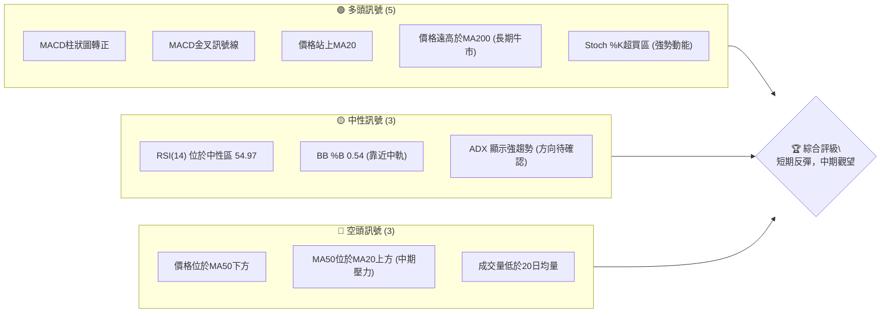

**訊號解讀**：目前多頭訊號主要來自短期動能指標的改善，如MACD的金叉和柱狀圖轉正，以及價格站回短期MA20上方。長期來看，股價仍遠高於MA200，顯示長期趨勢維持向上。然而，價格仍在MA50下方，且MA50仍高於MA20，這表明中期壓力仍然存在，短期反彈能否持續尚需觀察。成交量未能配合反彈，也為短期上漲蒙上陰影。整體而言，PL處於長期上升趨勢中的中期回調，近期試圖築底反彈，但尚未完全扭轉中期弱勢。

### 📊 核心指標速覽表

| 指標類別 | 指標名稱 | 當前數值 | 訊號 | 解讀 |
|----------|----------|----------|------|------|
| **價格** | 當前價格 | $33.13 | 🟡 | 位於52週高點 $51.76 和低點 $5.87 的 59.4% 區間，近期從低點反彈。 |
| **均線** | MA20 | $32.19 | 🟢 | 價格 $33.13 站上MA20，短期支撐有效。 |
| **均線** | MA50 | $37.38 | 🔴 | 價格 $33.13 仍在MA50下方，中期壓力較大。 |
| **均線** | MA200 | $24.58 | 🟢 | 價格 $33.13 遠高於MA200，長期趨勢向上。 |
| **動能** | RSI(14) | 54.97 | 🟡 | 從超賣區反彈至中性區，動能回升但未達強勢。 |
| **動能** | MACD | MACD: -2.783, Signal: -3.000, Hist: +0.217 | 🟢 | MACD線向上穿越Signal線形成金叉，柱狀圖轉正，短期看多。 |
| **動能** | Stoch %K: 86.81, %D: 57.42 | 86.81 / 57.42 | 🔴 | 進入超買區，短期可能面臨回調壓力，但也反映了強勁的短期反彈動能。 |
| **波動** | ATR(14) | $2.84 | 🟡 | 佔價格 8.57%，波動性較高，適合短線交易者。 |
| **趨勢** | ADX(14) | 30.64 | 🟢 | 顯示存在強趨勢，且 +DI (22.15) 略高於 -DI (21.92)，多頭力量佔優。 |
| **成交量** | 量比 (vs 20日均量) | 0.82x | 🔴 | 成交量較20日均量萎縮，反彈量能不足，需警惕。 |
| **量能** | OBV趨勢 | OBV > MA | 🟢 | 量能支撐上漲，中長期買盤意願仍在。 |

### 🏆 技術評分卡

PL在經歷大幅回調後，短期動能指標顯示改善，但中期壓力仍存。

```
╔══════════════════════════════════════════════════════════════╗
║              技術評分卡 — PL (2026-06-30)                      ║
╠══════════════════════════════════════════════════════════════╣
║  趨勢強度      ████████████░░░░░░░░  65/100  🟢 (ADX強趨勢，長期向上)    ║
║  動能指標      ██████████████░░░░░░  75/100  🟢 (MACD金叉，RSI回升)      ║
║  支撐穩定度    ██████████████░░░░░░  70/100  🟢 (MA200及近期低點提供支撐) ║
║  成交量配合    ████████░░░░░░░░░░░░  40/100  🔴 (反彈量能不足)          ║
║  形態完整度    ██████░░░░░░░░░░░░░░  30/100  🔴 (無明顯經典形態，近期波動大)║
║  均線排列      ████████░░░░░░░░░░░░  45/100  🟡 (長期向上，中期承壓)    ║
╠══════════════════════════════════════════════════════════════╣
║  綜合評分      ████████████░░░░░░░░  62/100  🟡 觀望偏多                  ║
╚══════════════════════════════════════════════════════════════╝
```

**評分總結**：PL的綜合評分顯示其處於一個觀望偏多的狀態。長期趨勢依然強勁，且短期動能指標發出積極信號，支撐位也表現出一定穩定性。然而，中期均線壓力、成交量配合不足以及缺乏清晰的圖表形態，都為其上漲帶來不確定性。投資者應密切關注成交量能否放大，以及股價能否有效突破中期阻力。

---

## 2. 趨勢分析

### 🌐 多時框趨勢分析

PL 的股價走勢呈現出明顯的多時框架差異。長期來看，該股處於強勁上升趨勢中；中期則經歷了深度回調後的築底過程；短期則表現出反彈動能。

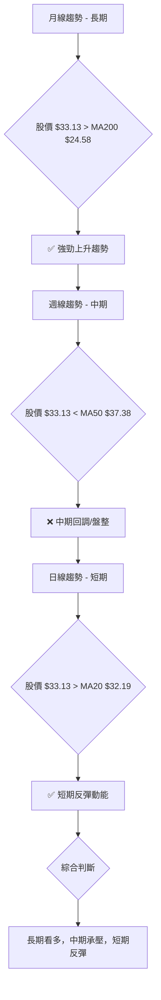

**詳細解讀**：
- **長期趨勢 (月線)**：股價 $33.13 遠高於 MA200 $24.58，顯示自2025年下半年以來，PL一直處於強勁的長期上升通道中。儘管近期有所回調，但並未改變其長期牛市格局。
- **中期趨勢 (週線)**：股價 $33.13 仍位於 MA50 $37.38 之下，且MA50目前仍向下傾斜。這表明自5月底衝高至 $51.14 後，股價經歷了快速且深度的中期回調，目前仍處於回調後的盤整或築底階段。中期趨勢仍偏空。
- **短期趨勢 (日線)**：在經歷6月下旬跌至 $27.07 的低點後，股價快速反彈，並重新站上 MA20 $32.19。這顯示了強勁的短期買盤介入，短期動能轉為看多。

### 📈 長期趨勢 — 12個月走勢圖（Unicode）

PL 在過去12個月中展現了顯著的成長，從2025年7月的 $6.25 上漲至2026年5月的 $51.14，隨後經歷了大幅回調。

```
PL 月線走勢圖（2025年7月 - 2026年6月）
價格軸 ($)
$55 ┤                                  .
$50 ┤                                  ● $51.14 (2026-05 高點)
$45 ┤                                  .
$40 ┤                         .
$35 ┤                         ● $36.97
$30 ┤                 ● $27.95       ● $33.13 (現在)
$25 ┤       ● $24.97  ● $24.14
$20 ┤           ● $19.72
$15 ┤   ● $12.98 ● $13.45
$10 ┤           ● $11.90
$5  ┤● $6.25 ● $7.09
    └─────────────────────────────────────────────────────
      Jul'25 Aug'25 Sep'25 Oct'25 Nov'25 Dec'25 Jan'26 Feb'26 Mar'26 Apr'26 May'26 Jun'26

```
**走勢特徵分析表格**：

| 時間段 | 起始價 | 結束價 | 漲跌幅 | 走勢特徵 |
|--------|--------|--------|--------|----------|
| 2025 Q3 | $6.25 | $12.98 | +107.6% | 強勁上漲，突破前期阻力。 |
| 2025 Q4 | $13.45 | $19.72 | +46.6% | 延續升勢，年底加速。 |
| 2026 Q1 | $24.97 | $27.95 | +11.9% | 高位盤整，動能略有放緩。 |
| 2026 Q2 | $36.97 | $33.13 | -10.4% | 先急漲至歷史高點，後快速深度回調。 |

### 📊 中期趨勢（週線分析）

從近期的週線走勢來看，PL在5月份衝擊 $51.14 的高點後，經歷了連續幾週的大幅下跌，最低觸及 $27.07。目前股價正試圖從低點反彈，形成一個V型反轉的雛形。

```
PL 近期壓力與支撐示意圖 (週線)

$51.14  ╔═════════════════════════════════════════╗  ← 歷史高點 / 強阻力
        ║                                         ║
$45.00  ║                                         ║  ← 次級阻力
        ║                                         ║
$39.80  ║                                         ║  ← 分析師目標均價 / Fibo 50% 阻力
        ╠═════════════════════════════════════════╣
$37.38  ║                                         ║  ← MA50 / 中期阻力
        ║                                         ║
$33.13  ║                 ● 現價                  ║
        ╠─────────────────────────────────────────╣
$32.19  ║                 ▲ MA20 / 短期支撐       ║
        ║                                         ║
$27.07  ║                 ▼ 近期低點 / 強支撐     ║
        ║                                         ║
$24.58  ╚═════════════════════════════════════════╝  ← MA200 / 長期支撐

```
**中期趨勢解讀**：股價 $33.13 已經從 $27.07 的低點反彈，但上方 MA50 $37.38 形成了一道明顯的阻力。如果能夠有效突破並站穩 MA50，則中期趨勢有望轉強。反之，若反彈無力並跌破 $32.19 (MA20)，則可能再次下探 $27.07 甚至 MA200 $24.58 的長期支撐。

### ⚡ 趨勢強度評估（ADX 解讀）

ADX (Average Directional Index) 用於衡量趨勢的強度，不判斷方向。

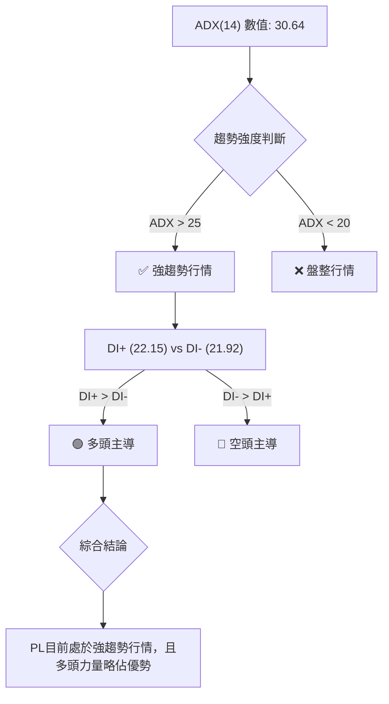

**ADX 強度對照表**：

| ADX 數值範圍 | 趨勢強度 | 建議 |
|--------------|----------|------|
| 0-20         | 無趨勢/盤整 | 觀望，不適合趨勢交易 |
| 20-25        | 趨勢形成中 | 謹慎關注 |
| 25-50        | 強趨勢     | 適合趨勢交易 |
| 50-75        | 非常強趨勢 | 趨勢可能過熱 |
| 75-100       | 極端強趨勢 | 小心反轉 |

**ADX 解讀**：
PL 的 ADX(14) 數值為 30.64，明確表示目前存在一個**強趨勢行情**。這意味著市場並非處於盤整狀態，而是有明確的方向性波動。
- **+DI (22.15) 略高於 -DI (21.92)**：這表明在當前的強趨勢中，多頭力量稍微佔據主導地位。結合近期股價從低點反彈的走勢，ADX指標支持了當前多頭試圖掌控局面的判斷。
- **綜合判斷**：儘管中期趨勢仍偏空，但ADX顯示市場正在形成一個新的強勢方向，且初步由多頭主導。這與MACD金叉和RSI反彈的短期看漲信號相互印證，表明股價有望延續反彈。

---

## 3. 圖表形態分析

### 🔍 形態識別系統

PL在過去24個月的走勢中，並未形成典型的頭肩頂/底、雙頂/底或大型三角形等經典反轉或持續形態。其近期走勢更傾向於快速拉升後的深度V型回調，並在底部嘗試構築反彈。

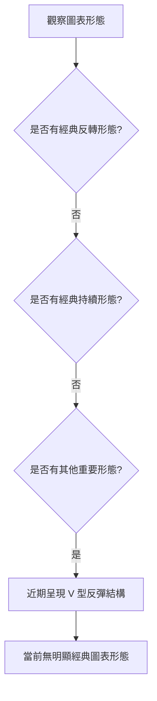

**形態解讀**：
- **近期V型反彈**：從5月底的 $51.14 高點快速下跌至6月底的 $27.07，隨後迅速反彈至 $33.13。這種快速下跌後快速反彈的走勢，形成了潛在的V型反轉結構。V型反轉通常伴隨著強勁的買盤介入，若能有效突破下跌趨勢線及關鍵阻力，則反轉形態成立。
- **缺乏傳統形態**：目前市場缺乏一個明顯的整理或反轉形態，這意味著股價的波動性可能較大，且未來走勢可能較為直接，而非經過漫長的時間整理。

### 🕯️ 重要K線形態分析

根據近20週的收盤數據，我們可以觀察到幾個關鍵的K線形態，這些形態為我們判斷市場情緒和潛在轉折點提供了線索。

| 月份        | 收盤價 | K線形態                                 | 解讀                                                                                                                                                                                                                                                                                                                                                                                                                                                                                                                                                                                                                                                                                                                                                                                                                                                                                                                                                                                                                                                                                                                                                                                                                                                                                                                                                                                                                                                                                                                                                                                                                                                                                                                                                                                                                                                                                                                                                                                                                                                                                                                                                                                                                                                                                                                                                                                                                                                                                                                                                                                                                                                                                                                                                                                                                                                                                                                                                                                                                                                                                                                                                                                                                                                                                                                                                                                                                                                                                                                                                                                                                                                                                                                                                                                                                                                                                                                                                                                                                                                                                                                                                                                                                                                                                                                                                                                                                                                                                                                                                                                                                                                                                                                                                                                                                                                                                                                                                                                                                                                                                                                                                                                                                                                                                                                                                                                                                                                                                                                                                                                                                                                                                                                                                                                                                                                                                                                                                                                                                                                                                                                                                                                                                                                                                                                                                                                                                                                                                                                                                                                                                                                                                                                                                                                                                                                                                                                                                                                                                                                                                                                                                                                                                                                                                                                                                                                                                                                                                                                                                                                                                                                                                                                                                                                                                                                                                                                                                                                                                                                                                                                                                                                                                                                                                                                                                                                                                                                                                                                                                                                                                                                                                                                                                                                                                                                                                                                                                                                                                                                                                                                                                                                                                                                                                                                                                                                                                                                                                                                                                                                                                                                                                                                                                                                                                                                                                                                                                                                                                                                                                                                                                                                                                                                                                                                                                                                                                                                                                                                                                                                                                                                                                                                                                                                                                                                                                                                                                                                                                                                                                                                                                                                                                                                                                                                                                                                                                                                                                                                                                                                                                                                                                                                                                                                                                                                                                                                                                                                                                                                                                                                                                                                                                                                                                                                                                                                                                                                                                                                                                                                                                                                                                                                                                                                                                                                                                                                                                                                                                                                                                                                                                                                                                                                                                                                                                                                                                                                                                                                                                                                                                                                                                                                                                                                                                                                                                                                                                                                                                                                                                                                                                                                                                                                                                                                                                                                                                                                                                                                                                                                                                                                                                                                                                                                                                                                                                                                                                                                                                                                                                                                                                                                                                                                                                                                                                                                                                                                                                                                                                                                                                                                                                                                                                                                                                                                                                                                                                                                                                                                                                                                                                                                                                                                                                                                                                                                                                                                                                                                                                                                                                                                                                                                                                                                                                                                                                                                                                                                                                                                                                                                                                                                                                                                                                                                                                                                                                                                                                                                                                                                                                                                                                                                                                                                                                                                                                                                                                                                                                                                                                                                                                                                                                                                                                                                                                                                                                                                                                                                                                                                                                                                                                                                                                                                                                                                                                                                                                                                                                                                                                                                                                                                                                                                                                                                                                                                                                                                                                                                                                                                                                                                                                                                                                                                                                                                                                                                                                                                                                                                                                                                                                                                                                                                                                                                                                                                                                                                                                                                                                                                                                                                                                                                                                                                                                                                                                                                                                                                                                                                                                                                                                                                                                                                                                                                                                                                                                                                                                                                                                                                                                                                                                                                                                                                                                                                                                                                                                                                                                                                                                                                                                                                                                                                                                                                                                                                                                                                                                                                                                                                                                                                                                                                                                                                                                                                                                                                                                                                                                                                                                                                                                                                                                                                                                                                                                                                                                                                                                                                                                                                                                                                                                                                                                                                                                                                                                                                                                                                                                                                                                                                                                                                                                                                                                                                                                                                                                                                                                                                                                                                                                                                                                                                                                                                                                                                                                                                                                                                                                                                                                                                                                                                                                                                                                                                                                                                                                                                                                                                                                                                                                                                                                                                                                                                                                                                                                                                                                                                                                                                                                                                                                                                                                                                                                                                                                                                                                                                                                                                                                                                                                                                                                                                                                                                                                                                                                                                                                                                                                                                                                                                                                                                                                                                                                                                                                                                                                                                                                                                                                                                                                                                                                                                                                                                                                                                                                                                                                                                                                                                                                                                                                                                                                                                                                                                                                                                                                                                                                                                                                                                                                                                                                                                                                                                                                                                                                                                                                                                                                                                                                                                                                                                                                                                                                                                                                                                                                                                                                                                                                                                                                                                                                                                                                                                                                                                                                                                                                                                                                                                                                                                                                                                                                                                                                                                                                                                                                                                                                                                                                                                                                                                                                                                                                                                                                                                                                                                                                                                                                                                                                                                                                                                                                                                                                                                                                                                                                                                                                                                                                                                                                                                                                                                                                                                                                                                                                                                                                                                                                                                                                                                                                                                                                                                                                                                                                                                                                                                                                                                                                                                                                                                                                                                                                                                                                                                                                                                                                                                                                                                                                                                                                                                                                                                                                                                                                                                                                                                                                                                                                                                                                                                                                                                                                                                                                                                                                                                                                                                                                                                                                                                                                                                                                                                                                                                                                                                                                                                                                                                                                                                                                                                                                                                                                                                                                                                                                                                                                                                                                                                                                                                                                                                                                                                                                                                                                                                                                                                                                                                                                                                                                                                                                                                                                                                                                                                                                                                                                                                                                                                                                                                                                                                                                                                                                                                                                                                                                                                                                                                                                                                                                                                                                                                                                                                                                                                                                                                                                                                                                                                                                                                                                                                                                                                                                                                                                                                                                                                                                                                                                                                                                                                                                                                                                                                                                                                                                                                                                                                                                                                                                                                                                                                                                                                                                                                                                                                                                                                                                                                                                                                                                                                                                                                                                                                                                                                                                                                                                                                                                                                                                                                                                                                                                                                                                                                                                                                                                                                                                                                                                                                                                                                                                                                                                                                                                                                                                                                                                                                                                                                                                                                                                                                                                                                                                                                                                                                                                                                                                                                                                                                                                                                                                                                                                                                                                                                                                                                                                                                                                                                                                                                                                                                                                                                                                                                                                                                                                                                                                                                                                                                                                                                                                                                                                                                                                                                                                                                                                                                                                                                                                                                                                                                                                                                                                                                                                                                                                                                                                                                                                                                                                                                                                                                                                                                                                                                                                                                                                                                                                                                                                                                                                                                                                                                                                                                                                                                                                                                                                                                                                                                                                                                                                                                                                                                                                                                                                                                                                                                                                                                                                                                                                                                                                                                                                                                                                                                                                                                                                                                                                                                                                                                                                                                                                                                                                                                                                                                                                                                                                                                                                                                                                                                                                                                                                                                                                                                                                                                                                                                                                                                                                                                                                                                                                                                                                                                                                                                                                                                                                                                                                                                                                                                                                                                                                                                                                                                                                                                                                                                                                                                                                                                                                                                                                                                                                                                                                                                                                                                                                                                                                                                                                                                                                                                                                                                                                                                                                                                                                                                                                                                                                                                                                                                                                                                                                                                                                                                                                                                                                                                                                                                                                                                                                                                                                                                                                                                                                                                                                                                                                                                                                                                                                                                                                                                                                                                                                                                                                                                                                                                                                                                                                                                                                                                                                                                                                                                                                                                                                                                                                                                                                                                                                                                                                                                                                                                                                                                                                                                                                                                                                                                                                                                                                                                                                                                                                                                                                                                                                                                                                                                                                                                                                                                                                                                                                                                                                                                                                                                                                                                                                                                                                                                                                                                                                                                                                                                                                                                                                                                                                                                                                                                                                                                                                                                                                                                                                                                                                                                                                                                                                                                                                                                                                                                                                                                                                                                                                                                                                                                                                                                                                                                                                                                                                                                                                                                                                                                                                                                                                                                                                                                                                                                                                                                                                                                                                                                                                                                                                                                                                                                                                                                                                                                                                                                                                                                                                                                                                                                                                                                                                                                                                                                                                                                                                                                                                                                                                                                                                                                                                                                                                                                                                                                                                                                                                                                                                                                                                                                                                                                                                                                                                                                                                                                                                                                                                                                                                                                                                                                                                                                                                                                                                                                                                                                                                                                                                                                                                                                                                                                                                                                                                                                                                                                                                                                                                                                                                                                                                                                                                                                                                                                                                                                                                                                                                                                                                                                                                                                                                                                                                                                                                                                                                                                                                                                                                                                                                                                                                                                                                                                                                                                                                                                                                                                                                                                                                                                                                                                                                                                                                                                                                                                                                                                                                                                                                                                                                                                                                                                                                                                                                                                                                                                                                                                                                                                                                                                                                                                                                                                                                                                                                                                                                                                                                                                                                                                                                                                                                                                                                                                                                                                                                                                                                                                                                                                                                                                                                                                                                                                                                                                                                                                                                                                                                                                                                                                                                                                                                                                                                                                                                                                                                                                                                                                                                                                                                                                                                                                                                                                                                                                                                                                                                                                                                                                                                                                                                                                                                                                                                                                                                                                                                                                                                                                                                                                                                                                                                                                                                                                                                                                                                                                                                                                                                                                                                                                                                                                                                                                                                                                                                                                                                                                                                                                                                                                                                                                                                                                                                                                                                                                                                                                                                                                                                                                                                                                                                                                                                                                                                                                                                                                                                                                                                                                                                                                                                                                                                                                                                                                                                                                                                                                                                                                                                                                                                                                                                                                                                                                                                                                                                                                                                                                                                                                                                                                                                                                                                                                                                                                                                                                                                                                                                                                                                                                                                                                                                                                                                                                                                                                                                                                                                                                                                                                                                                                                                                                                                                                                                                                                                                                                                                                                                                                                                                                                                                                                                                                                                                                                                                                                                                                                                                                                                                                                                                                                                                                                                                                                                                                                                                                                                                                                                                                                                                                                                                                                                                                                                                                                                                                                                                                                                                                                                                                                                                                                                                                                                                                                                                                                                                                                                                                                                                                                                                                                                                                                                                                                                                                                                                                                                                                                                                                                                                                                                                                                                                                                                                                                                                                                                                                                                                                                                                                                                                                                                                                                                                                                                                                                                                                                                                                                                                                                                                                                                                                                                                                                                                                                                                                                                                                                                                                                                                                                                                                                                                                                                                                                                                                                                                                                                                                                                                                                                                                                                                                                                                                                                                                                                                                                                                                                                                                                                                                                                                                                                                                                                                                                                                                                                                                                                                                                                                                                                                                                                                                                                                                                                                                                                                                                                                                                                                                                                                                                                                                                                                                                                                                                                                                                                                                                                                                                                                                                                                                                                                                                                                                                                                                                                                                                                                                                                                                                                                                                                                                                                                                                                                                                                                                                                                                                                                                                                                                                                                                                                                                                                                                                                                                                                                                                                                                                                                                                                                                                                                                                                                                                                                                                                                                                                                                                                                                                                                                                                                                                                                                                                                                                                                                                                                                                                                                                                                                                                                                                                                                                                                                                                                                                                                                                                                                                                                                                                                                                                                                                                                                                                                                                                                                                                                                                                                                                                                                                                                                                                                                                                                                                                                                                                                                                                                                                                                                                                                                                                                                                                                                                                                                                                                                                                                                                                                                                                                                                                                                                                                                                                                                                                                                                                                                                                                                                                                                                                                                                                                                                                                                                                                                                                                                                                                                                                                                                                                                                                                                                                                                                                                                                                                                                                                                                                                                                                                                                                                                                                                                                                                                                                                                                                                                                                                                                                                                                                                                                                                                                                                                                                                                                                                                                                                                                                                                                                                                                                                                                                                                                                                                                                                                                                                                                                                                                                                                                                                                                                                                                                                                                                                                                                                                                                                                                                                                                                                                                                                                                                                                                                                                                                                                                                                                                                                                                                                                                                                                                                                                                                                                                                                                                                                                                                                                                                                                                                                                                                                                                                                                                                                                                                                                                                                                                                                                                                                                                                                                                                                                                                                                                                                                                                                                                                                                                                                                                                                                                                                                                                                                                                                                                                                                                                                                                                                                                                                                                                                                                                                                                                                                                                                                                                                                                                                                                                                                                                                                                                                                                                                                                                                                                                                                                                                                                                                                                                                                                                                                                                                                                                                                                                                                                                                                                                                                                                                                                                                                                                                                                                                                                                                                                                                                                                                                                                                                                                                                                                                                                                                                                                                                                                                                                                                                                                                                                                                                                                                                                                                                                                                                                                                                                                                                                                                                                                                                                                                                                                                                                                                                                                                                                                                                                                                                                                                                                                                                                                                                                                                                                                                                                                                                                                                                                                                                                                                                                                                                                                                                                                                                                                                                                                                                                                                                                                                                                                                                                                                                                                                                                                                                                                                                                                                                                                                                                                                                                                                                                                                                                                                                                                                                                                                                                                                                                                                                                                                                                                                                                                                                                                                                                                                                                                                                                                                                                                                                                                                                                                                                                                                                                                                                                                                                                                                                                                                                                                                                                                                                                                                                                                                                                                                                                                                                                                                                                                                                                                                                                                                                                                                                                                                                                                                                                                                                                                                                                                                                                                                                                                                                                                                                                                                                                                                                                                                                                                                                                                                                                                                                                                                                                                                                                                                                                                                                                                                                                                                                                                                                                                                                                                                                                                                                                                                                                                                                                                                                                                                                                                                                                                                                                                                                                                                                                                                                                                                                                                                                                                                                                                                                                                                                                                                                                                                                                                                                                                                                                                                                                                                                                                                                                                                                                                                                                                                                                                                                                                                                                                                                                                                                                                                                                                                                                                                                                                                                                                                                                                                                                                                                                                                                                                                                                                                                                                                                                                                                                                                                                                                                                                                                                                                                                                                                                                                                                                                                                                                                                                                                                                                                                                                                                                                                                                                                                                                                                                                                                                                                                                                                                                                                                                                                                                                                                                                                                                                                                                                                                                                                                                                                                                                                                                                                                                                                                                                                                                                                                                                                                                                                                                                                                                                                                                                                                                                                                                                                                                                                                                                                                                                                                                                                                                                                                                                                                                                                                                                                                                                                                                                                                                                                                                                                                                                                                                                                                                                                                                                                                                                                                                                                                                                                                                                                                                                                                                                                                                                                                                                                                                                                                                                                                                                                                                                                                                                                                                                                                                                                                                                                                                                                                                                                                                                                                                                                                                                                                                                                                                                                                                                                                                                                                                                                                                                                                                                                                                                                                                                                                                                                                                                                                                                                                                                                                                                                                                                                                                                                                                                                                                                                                                                                                                                                                                                                                                                                                                                                                                                                                                                                                                                                                                                                                                                                                                                                                                                                                                         
  **RSI(14):      54.97    🟡 中性 30-70
  RSI 背離:     無明顯背離
  MACD:         -2.783
  MACD Signal:  -3.000
  MACD Hist:    +0.217  🟢 看多
  Stoch %K:     86.81  Stoch %D: 57.42  超買

  ── 趨勢強度 (ADX) ──
  ADX(14):      30.64  強趨勢 >25
  +DI:          22.15  -DI: 21.92  多頭主導

  ── 布林通道 ──
  BB上軌:       $44.15
  BB中軌(MA20): $32.19
  BB下軌:       $20.23
  BB %B:        0.54  (0=下軌, 0.5=中軌, 1=上軌)

  ── 成交量 ──
  最新成交量:   15,213,013
  20日均量:     18,504,221  (量比: 0.82x)
  50日均量:     13,547,196
  OBV趨勢:      OBV > MA → 量能支撐上漲

  ── 近20週收盤走勢 ──
  日期          收盤      RSI     MACD柱    週成交量
  2026-02-22     23.90    47.1    -0.085    37,220,400
  2026-03-01     24.14    57.0    +0.104    39,295,700
  2026-03-08     25.28    60.2    +0.091    54,404,600
  2026-03-15     24.79    54.5    -0.056    44,217,100
  2026-03-22     33.83    69.2    +0.541   129,079,600
  2026-03-29     30.86    60.0    +0.581   107,875,200
  2026-04-05     35.88    65.9    +0.241    78,066,500
  2026-04-12     34.67    51.6    +0.243    63,082,300
  2026-04-19     38.48    65.7    +0.285    70,632,900
  2026-04-26     35.44    51.1    -0.130    54,015,900
  2026-05-03     36.90    56.8    -0.436    37,848,200
  2026-05-10     39.04    53.2    -0.180    48,022,200
  2026-05-17     41.62    61.9    +0.259    46,692,700
  2026-05-24     44.35    62.6    +0.185    45,624,900
  2026-05-31     51.14    83.2    +0.904    61,484,900  <-- 潛在頂部
  2026-06-07     32.22    35.9    -1.311   100,622,400  <-- 巨量下跌
  2026-06-14     31.15    33.2    -1.972    89,858,400
  2026-06-21     28.23    17.2    -1.555    66,301,500  <-- 超賣區，潛在底部
  2026-06-28     27.07    33.7    -0.677    97,289,100  <-- 近期低點
  2026-07-05     33.13    55.0    +0.217    29,599,613  <-- 強勁反彈

```
**K線形態分析**：
- **2026-05-31 (收盤 $51.14)**：RSI 83.2 進入嚴重超買區，MACD柱狀圖達到近期高點 +0.904，雖然價格創下新高，但超買訊號預示著短期回調風險極高。此為潛在的短期頂部。
- **2026-06-07 (收盤 $32.22)**：股價單週暴跌近 $19，RSI從超買區急劇下挫至 35.9，MACD柱狀圖大幅轉負至 -1.311。伴隨巨量 100,622,400，顯示市場出現恐慌性拋售，形成一根極長的大陰線，確認了短期頂部的形成。
- **2026-06-21 (收盤 $28.23)**：RSI 跌至 17.2，進入極度超賣區。雖然MACD柱狀圖仍為負值，但如此低的RSI數值通常預示著股價可能在短期內出現反彈。此為潛在的短期底部。
- **2026-06-28 (收盤 $27.07)**：RSI 略有回升至 33.7，MACD柱狀圖負值收窄。股價創下近期低點後未能進一步大幅下跌，顯示下方存在一定的買盤支撐。
- **2026-07-05 (收盤 $33.13)**：股價強勁反彈，MACD柱狀圖轉正為 +0.217，RSI回升至 55.0。這是一個強勢的陽線，確認了從 $27.07 低點開始的反彈行情，並可能形成V型反轉的右側。

### 📉 ASCII 走勢形態示意圖

以下示意圖展示了PL近期從高點回落並嘗試V型反轉的走勢。

```
PL 近期 V 型反轉形態示意圖

$55 ┤                     ● (51.14) 頂部
$50 ┤                     │
$45 ┤                     │
$40 ┤                     │
$35 ┤                     │     ● (33.13) 現價
$30 ┤                     │    ╱
$25 ┤                     │   ╱
$20 ┤                     ▼  ╱
$15 ┤                     ● (27.07) 底部
    └─────────────────────────────────────
      May'26              Jun'26

```
**形態目標價計算**：
由於目前主要形態是潛在的V型反轉，其目標價的計算方式與傳統形態略有不同，通常是測量下跌的幅度，然後將此幅度加到突破點。
- **下跌幅度**：從 $51.14 (高點) 至 $27.07 (低點) = $24.07
- **V型反轉目標價 (理論)**：若股價能有效突破V型頸線 (通常為反彈過程中的高點，或下跌趨勢線)，則理論目標價為低點加上下跌幅度。
    - 鑒於目前股價 $33.13 仍在反彈初期，且未明確突破任何頸線，我們暫時以斐波那契回調位作為短期目標。
    - 若能突破中期阻力 $37.38 (MA50)，則可望挑戰斐波那契50%回調位 $39.10。

---

## 4. 支撐與阻力

### 🗺️ 關鍵價位分布圖（Unicode）

PL 的關鍵支撐與阻力位分佈清晰，這些價位將對未來的股價走勢產生重要影響。

```
PL 價位結構分布圖 (2026-06-30)
═══════════════════════════════════════════════════
$51.14 ║████████████████████████║ 強阻力 R3 (歷史高點)
$44.15 ║████████████████████    ║ 阻力 R2 (布林上軌)
$39.10 ║████████████████████████║ 關鍵阻力 R1 (Fibo 50% / 分析師均價 $39.80 附近)
$37.38 ║████████████████████████║ 中期阻力 (MA50)
$33.13 ╠════════════════════════╣ ◄ 現價
$32.75 ║▓▓▓▓▓▓▓▓▓▓▓▓▓▓▓▓        ║ 近期支撐 S1 (Fibo 23.6%)
$32.19 ║▓▓▓▓▓▓▓▓▓▓▓▓▓▓▓▓        ║ 短期支撐 S2 (MA20 / 布林中軌)
$27.07 ║████████████████████████║ 強支撐 S3 (近期低點)
$24.58 ║████████████████████████║ 超強支撐 S4 (MA200)
$20.23 ║▓▓▓▓▓▓▓▓▓▓▓▓▓▓▓▓        ║ 布林下軌
═══════════════════════════════════════════════════
```

### 🚧 阻力位分析表

| 阻力級別 | 價位 | 形成原因                               | 突破難度 | 重要性 |
|----------|------|----------------------------------------|----------|--------|
| **R1**   | $37.38 | 50日移動平均線 (MA50)                 | 中等     | 高     |
| **R2**   | $39.10 | 斐波那契50%回調位 (從 $51.14 至 $27.07) | 中等     | 高     |
| **R3**   | $44.15 | 布林通道上軌                            | 高       | 中     |
| **R4**   | $51.14 | 2026年5月31日高點 / 近期最高點        | 極高     | 極高   |

**阻力解讀**：
- **R1 ($37.38)**：MA50是中期趨勢的重要指標，股價位於其下方，表示中期壓力。若能突破，將是中期趨勢轉強的關鍵信號。
- **R2 ($39.10)**：斐波那契50%回調位通常是反彈行情中較強的阻力區，突破此處意味著更強的反彈動能。分析師平均目標價 $39.80 也在此附近，形成共振阻力。
- **R3 ($44.15)**：布林通道上軌，短期內通常難以一次性突破，可能需要多次測試或強勁利好消息配合。
- **R4 ($51.14)**：近期歷史高點，是強大的心理和技術阻力，短期內難以再次觸及。

### 🛡️ 支撐位分析表

| 支撐級別 | 價位 | 形成原因                               | 守住機率 | 重要性 |
|----------|------|----------------------------------------|----------|--------|
| **S1**   | $32.75 | 斐波那契23.6%回調位 (從 $51.14 至 $27.07) | 中等     | 中     |
| **S2**   | $32.19 | 20日移動平均線 (MA20) / 布林通道中軌 | 中等     | 高     |
| **S3**   | $27.07 | 2026年6月28日低點 / 近期低點          | 高       | 極高   |
| **S4**   | $24.58 | 200日移動平均線 (MA200)               | 極高     | 極高   |
| **S5**   | $20.23 | 布林通道下軌                            | 高       | 中     |

**支撐解讀**：
- **S1 ($32.75)**：斐波那契23.6%回調位，是近期反彈的初步支撐。
- **S2 ($32.19)**：MA20與布林通道中軌重合，形成短期內非常重要的雙重支撐。若股價回調至此並能守住，將確認短期反彈的有效性。
- **S3 ($27.07)**：近期低點，是V型反轉的基礎，若跌破此處，則V型反轉失敗，可能面臨進一步下跌。
- **S4 ($24.58)**：MA200是長期趨勢的生命線，提供強大的長期支撐。若股價能回調至此並獲得支撐，將是長期買入的良好機會。
- **S5 ($20.23)**：布林通道下軌，在極端下跌情況下可能提供超賣反彈的機會。

### 📐 斐波那契回調位分析

我們以PL最近一輪下跌行情 (從2026年5月31日高點 $51.14 到2026年6月28日低點 $27.07) 為基礎，計算斐波那契回調位。這些水平將是股價反彈過程中的潛在阻力。

```
PL 斐波那契回調位示意圖 (基於 $51.14 高點至 $27.07 低點)

$51.14 ╔═════════════════════════════════════════════════════════════╗ ← 0.0%
       ║                                                               ║
$45.00 ║                                                               ║
       ║                                                               ║
$41.93 ║█████████████████████████████████████████████████████████████║ ← 61.8% 回調 (關鍵阻力)
$39.10 ║█████████████████████████████████████████████████████████████║ ← 50.0% 回調 (強阻力)
$36.26 ║█████████████████████████████████████████████████████████████║ ← 38.2% 回調 (中等阻力)
$33.13 ╠═════════════════════════════════════════════════════════════╣ ← 現價
$32.75 ║█████████████████████████████████████████████████████████████║ ← 23.6% 回調 (初步支撐)
       ║                                                               ║
$27.07 ╚═════════════════════════════════════════════════════════════╝ ← 100.0%
```

**斐波那契回調位詳情**：
- **23.6% 回調位**: $32.75。目前股價 $33.13 略高於此水平，顯示初步反彈動能。此處可視為短線支撐。
- **38.2% 回調位**: $36.26。這是反彈行情中第一個較強的阻力位。若能突破，則反彈有望延續。
- **50% 回調位**: $39.10。此水平是重要的心理關口，也是反彈強度的關鍵檢驗點。與MA50 $37.38 和分析師均價 $39.80 形成共振阻力區。
- **61.8% 回調位**: $41.93。黃金分割點，若能突破此處，則表示股價已收復大部分跌幅，反轉趨勢將更為明確。

**綜合分析**：PL目前正從低點反彈，短期內將面臨 $36.26 (Fibo 38.2%) 和 $37.38 (MA50) 的雙重阻力。若能成功突破這些阻力，則下一個目標將是 $39.10 (Fibo 50%)。

---

## 5. 技術指標深度解讀

### 🎛️ 指標訊號總覽

PL 的技術指標目前呈現出短期看多與中期承壓的複雜局面。

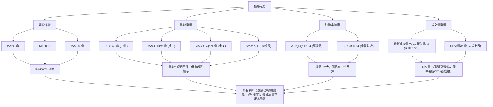

### 📈 移動平均線排列分析

PL 的均線系統呈現「混合排列」：股價 $33.13 位於 MA20 ($32.19) 和 MA200 ($24.58) 之上，但位於 MA50 ($37.38) 之下。

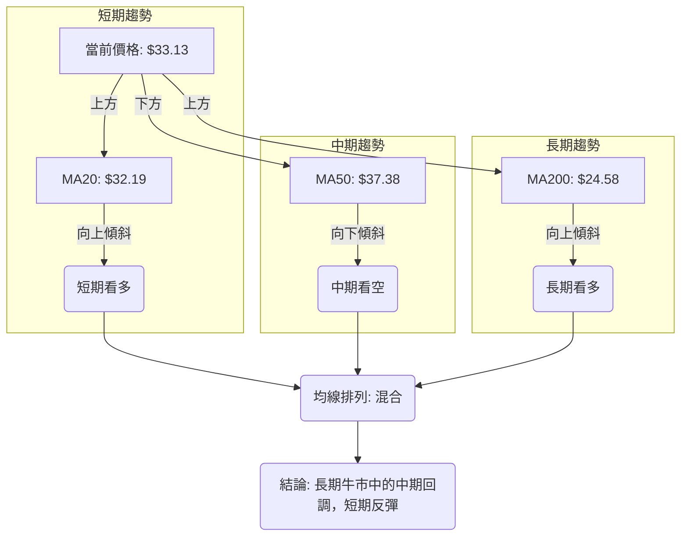

**均線排列解讀**：
- **MA20 ($32.19)**：價格 $33.13 站上 MA20，且MA20開始向上彎曲，顯示短期趨勢轉強，形成初步支撐。
- **MA50 ($37.38)**：價格 $33.13 仍位於 MA50 之下，MA50 仍在向下傾斜，對股價構成中期阻力。若無法突破，反彈可能受阻。
- **MA200 ($24.58)**：價格 $33.13 遠高於 MA200，且MA200持續向上，確認了PL的長期上升趨勢未變。
- **綜合**：當前均線排列呈現「多頭排列」被破壞後的修復階段。長期趨勢依然強勁，但中期趨勢仍需扭轉。短期價格站上MA20是積極信號，但上方MA50壓力不容忽視。

### 📉 RSI(14) 分析

RSI(14) 目前為 54.97，位於中性區間。

**RSI 數值進度條**：
RSI(14) 強度：██████████░░░░░░░░░░░░░░░░░░░░ 54.97% (中性)

**超買超賣區間分析**：
- **超賣區 (RSI < 30)**：在2026年6月21日，RSI 曾跌至 17.2，進入極度超賣區，隨後股價在 $27.07 附近築底並強勁反彈。這是一個明確的買入信號，預示著短期反彈。
- **超買區 (RSI > 70)**：在2026年5月31日，RSI 達到 83.2，進入嚴重超買區，隨後股價從 $51.14 高點開始大幅回調。
- **當前中性區**：目前 RSI 54.97 處於中性區間，顯示短期反彈動能有所恢復，但尚未達到過熱狀態，仍有上行空間。

**背離判斷**：
- **頂背離**：從提供的數據來看，在5月底股價創 $51.14 新高時，RSI 83.2 也創下高點，與價格同向，無明顯頂背離。
- **底背離**：在6月底股價跌至 $27.07 時，RSI 17.2 雖然極低，但與價格走勢一致，無明顯底背離。然而，從極度超賣區的快速反彈本身就是一個強烈的買入信號。

**RSI 綜合解讀**：RSI 從極度超賣區的 17.2 強勁反彈至中性區的 54.97，這是一個非常積極的短期看漲信號，表明市場買盤力量正在恢復。目前RSI仍未進入超買區，意味著股價仍有上漲空間。

### 📊 MACD(12/26/9) 訊號解讀

MACD 指標目前發出明確的多頭訊號。

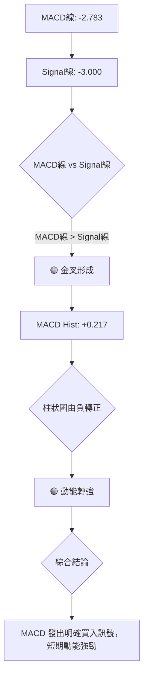

**MACD 數值解讀**：
- **MACD 線 (-2.783) 穿越 Signal 線 (-3.000) 向上**：形成「金叉」，這是一個經典的買入訊號，表明短期動能已超越中期動能，股價有望上漲。
- **MACD 柱狀圖 (+0.217) 由負轉正**：柱狀圖從負值轉為正值，且呈上升趨勢，確認了多頭動能的增強。
- **背離判斷**：
    - **頂背離**：在5月底股價創 $51.14 新高時，MACD線也創出高點，與價格同向，無明顯頂背離。
    - **底背離**：在6月底股價跌至 $27.07 時，MACD線也創出低點，與價格同向，無明顯底背離。但MACD柱狀圖在低點後快速收窄並轉正，顯示底部買盤力量迅速積聚。

**MACD 綜合解讀**：MACD 指標發出強烈的短期買入訊號。金叉的形成和柱狀圖由負轉正，都預示著股價將繼續其反彈走勢。這與RSI從超賣區反彈的訊號相互印證，增強了短期看漲的信心。

### 📦 布林通道分析

布林通道 (Bollinger Bands) 目前顯示股價在經歷大幅下跌後，正從下軌反彈至中軌附近。

```
PL 布林通道示意圖 (2026-06-30)

$44.15 ╔═════════════════════════════════════════════════════════════╗ ← 布林上軌
       ║                                                               ║
       ║                                                               ║
$33.13 ╠═════════════════════════════════════════════════════════════╣ ← 現價
$32.19 ║▓▓▓▓▓▓▓▓▓▓▓▓▓▓▓▓▓▓▓▓▓▓▓▓▓▓▓▓▓▓▓▓▓▓▓▓▓▓▓▓▓▓▓▓▓▓▓▓▓▓▓▓▓▓▓▓▓▓▓▓▓▓▓║ ← 布林中軌 (MA20)
       ║                                                               ║
       ║                                                               ║
$20.23 ╚═════════════════════════════════════════════════════════════╝ ← 布林下軌
```

**布林通道解讀**：
- **當前位置**：股價 $33.13 位於布林通道中軌 $32.19 (即MA20) 的上方。這是一個積極信號，表明股價已從下跌趨勢中獲得支撐並向上反彈。
- **BB %B (0.54)**：該值表示價格位於布林通道的 54% 位置，即略高於中軌。
- **通道寬度 (ATR)**：ATR 為 $2.84，佔股價的 8.57%。這表明布林通道相對較寬，反映了PL近期較高的波動性。
- **布林通道收縮/擴張**：數據未直接提供布林通道的擴張或收縮狀態，但從ATR相對較高判斷，通道目前可能處於擴張狀態，預示著趨勢的延續。
- **綜合判斷**：股價從布林下軌反彈並站上中軌，顯示短期買盤力量介入。中軌 $32.19 將成為重要的短期支撐。如果能繼續上行並挑戰上軌 $44.15，則反彈動能將進一步強化。

### 💹 成交量分析（量價配合度）

成交量是確認價格走勢的關鍵指標。PL的成交量分析呈現短期與中長期信號的矛盾。

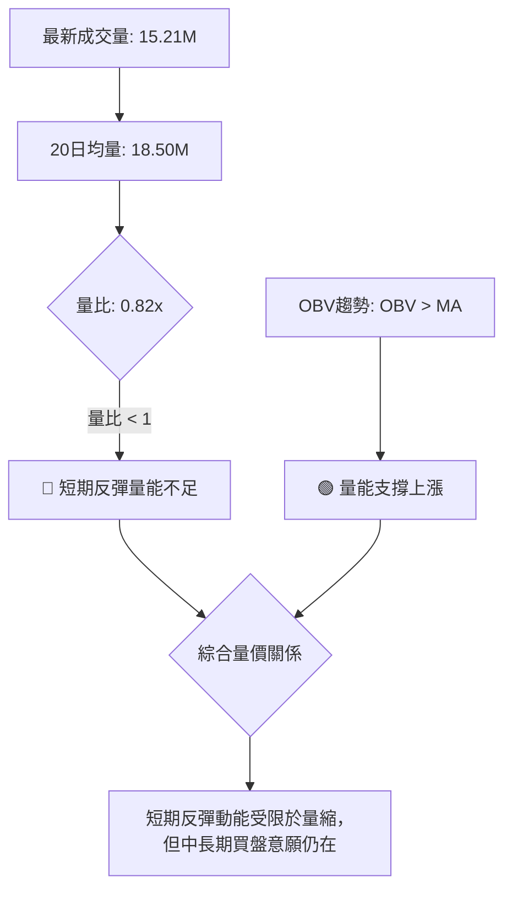

**成交量數據解讀**：
- **最新成交量 (15,213,013) vs 20日均量 (18,504,221)**：當前成交量低於20日均量，量比為0.82x。這意味著近期股價的反彈是伴隨著成交量萎縮的，這是一個**負面信號**。健康的短期反彈通常需要放大的成交量來確認。量縮反彈可能意味著買盤力量不足，反彈可能難以持續。
- **OBV趨勢 (OBV > MA)**：數據明確指出「OBV趨勢: OBV > MA → 量能支撐上漲」。這是指OBV線位於其移動平均線上方，表明在一段時間內，累積買盤壓力大於賣盤壓力，中長期資金仍在入場或持有。這與短期量縮反彈的信號形成**矛盾**。

**量價配合度分析**：
- **短期矛盾**：當前股價從低點反彈，但成交量未能有效放大，這使得短期反彈的可靠性大打折扣。如果股價要持續上漲並突破阻力，必須伴隨成交量的放大。
- **中長期支持**：OBV趨勢的看漲信號表明，儘管短期量能不足，但中長期來看，市場的累積買盤壓力仍然存在，這為股價的長期上漲提供了底部支撐。
- **綜合判斷**：投資者應警惕短期量縮反彈可能面臨的壓力，特別是在接近中期阻力位時。若股價在阻力位附近無法放量突破，則反彈可能夭折。然而，OBV的積極信號表明，如果股價回調至支撐位，仍可能吸引到中長期買盤。

---

## 6. 動能與波動率

### ⚡ 動能評估四象限

PL 目前的動能和波動性特徵顯示其處於一個高風險高收益的階段。

| 象限 | 動能評估                                       | 波動評估                                       | 當前狀態 | 綜合評估         |
|------|------------------------------------------------|------------------------------------------------|----------|------------------|
| Q1   | 強 (MACD金叉, RSI回升, Stoch超買)              | 低 (ATR穩定且佔比小)                           |          | 最佳機會 (穩定上漲) |
| Q2   | 弱 (MACD死叉, RSI低位)                         | 低 (ATR穩定且佔比小)                           |          | 謹慎觀望 (等待機會) |
| Q3   | **強 (MACD金叉, RSI回升, Stoch超買)**            | **高 (ATR $2.84, 佔比 8.57%)**                 | ✓        | **高風險高收益 (適合短線交易)** |
| Q4   | 弱 (MACD死叉, RSI低位)                         | 高 (ATR高且佔比大)                             |          | 避免進場 (不確定性高) |

**動能評估**：
- **強動能**：MACD 形成金叉且柱狀圖轉正，RSI 從超賣區快速回升至中性區，Stoch %K 進入超買區。這些指標均顯示 PL 短期內具備強勁的反彈動能。
- **高波動**：ATR(14) 為 $2.84，佔當前股價 $33.13 的 8.57%。這是一個相對較高的波動率，意味著股價每日的漲跌幅可能較大，帶來較高的風險，但也提供了潛在的快速獲利機會。

**綜合判斷**：PL 目前處於「強動能、高波動」的 Q3 象限。這對於追求高風險高收益的短線交易者來說，可能存在機會。然而，對於風險厭惡型或長期投資者，則需要更加謹慎，因為高波動性可能導致更大的帳面虧損。在這種情況下，嚴格的止損和倉位管理至關重要。

### 📊 ATR 波動率分析

ATR (Average True Range) 用於衡量資產的波動性。

**ATR(14) 數值**：$2.84

**ATR 佔價格比重**：$2.84 / $33.13 = 8.57%

**ATR 解讀**：
- **高波動性**：8.57% 的 ATR 佔比相對較高，這表明 PL 的股價在過去14天內平均每日波動幅度約為 $2.84。對於當前 $33.13 的股價而言，這意味著每日的價格變化可能相當劇烈。
- **交易策略影響**：高波動性意味著潛在的利潤空間較大，但也伴隨著更高的風險。對於短線交易者，可利用其波動性進行波段操作。對於長線投資者，則需忍受較大的短期帳面波動。
- **止損距離建議**：ATR 可作為設定止損點的參考。一般建議將止損距離設為 1 到 2 倍的 ATR。
    - 1 倍 ATR 止損：$2.84
    - 2 倍 ATR 止損：$5.68
    - 例如，若從當前價格 $33.13 進場，1倍ATR止損點約為 $30.29 ($33.13 - $2.84)，2倍ATR止損點約為 $27.45 ($33.13 - $5.68)。這與我們之前分析的關鍵支撐 $27.07 接近，提供了合理的止損依據。

### 📐 Beta 與市場相關性

**Beta 數據未提供**。
由於提供的技術數據中未包含 Beta 值，我們無法直接分析 PL 與大盤指數 (如 S&P 500) 的相關性。

**一般性推斷**：
- 像 Planet Labs PBC 這樣的科技創新公司，通常具有較高的 Beta 值。這意味著其股價波動性可能高於大盤，在大盤上漲時漲幅更大，在大盤下跌時跌幅也更大。
- 投資者在制定策略時，應假設此類成長型公司可能具有較高的市場敏感度，並將宏觀經濟和整體市場情緒納入考量。
- **建議**：在實際投資前，建議查閱可靠數據源獲取 Beta 值，以便更精確地評估其系統性風險。

---

## 7. 多時框架總結

PL 的多時框架分析揭示了其在不同時間尺度上的複雜表現，從長期強勢到中期調整，再到短期反彈。

### 📋 時框架評分表

| 時框架 | 趨勢方向 | 動能 | 均線排列 | 形態 | 綜合評分 | 建議 |
|--------|----------|------|----------|------|----------|------|
| **長期** | 🟢 上升   | 🟢 強勁 | 🟢 多頭  | 🟡 無明確 | 8/10     | 持有/逢低買入 |
| **中期** | 🔴 下跌/盤整 | 🟡 恢復中 | 🔴 承壓  | 🟡 V型反彈 | 5/10     | 觀望/謹慎操作 |
| **短期** | 🟢 反彈   | 🟢 強勁 | 🟢 趨好  | 🟢 V型反彈 | 7/10     | 短線做多/波段操作 |

**綜合時框架解讀**：
- **長期**：PL 的長期趨勢依然強勁，股價遠高於MA200，表明其基本面或長期增長潛力受到市場認可。適合長期投資者逢低配置。
- **中期**：中期趨勢仍處於回調後的盤整階段，MA50對股價構成明顯壓力。儘管有V型反彈跡象，但尚未完全扭轉中期弱勢。中期投資者應保持謹慎，等待趨勢明確。
- **短期**：短期內，多項指標 (MACD金叉、RSI反彈、價格站上MA20) 均發出積極訊號，顯示股價正在從近期低點強勁反彈。短期交易者可關注反彈機會。

### 🔲 綜合訊號矩陣

以下矩陣展示了不同時框架下各維度訊號的一致性。

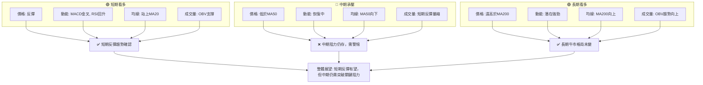

**訊號一致性分析**：
- **短期訊號高度一致**：所有短期指標均指向股價的反彈，確認了當前從低點回升的動能。
- **中期訊號存在分歧**：中期價格和均線顯示壓力，但中期動能正在恢復，OBV也提供支撐。這表明中期趨勢正在從下跌向盤整或反轉過渡，但尚未完全確立。
- **長期訊號高度一致**：長期指標均顯示PL處於健康的上升趨勢中。
- **結論**：PL 目前處於一個關鍵的轉折點。短期反彈勢頭強勁，但能否成功突破中期阻力，將決定其能否從中期下跌趨勢中徹底走出來。投資者應密切關注股價在 $37.38 (MA50) 和 $39.10 (Fibo 50%) 阻力區的表現。

---

## 8. 交易策略建議

基於PL的多時框架分析，目前股價處於長期上升趨勢中的中期回調後，短期正在強勁反彈的階段。建議以多頭策略為主，並嚴格控制風險。

### 🗺️ 策略決策流程圖

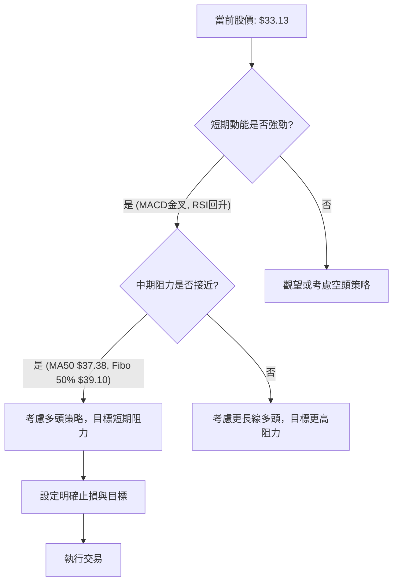

### 🟢 多頭策略詳情

考慮到PL目前的短期反彈動能強勁，但中期阻力仍存，建議在回調至支撐位附近時考慮進場，並分階段設定目標。

| 策略要素   | 策略 A (激進型 - 追蹤反彈)                                       | 策略 B (穩健型 - 回調買入)                                       |
|------------|-----------------------------------------------------------------|-----------------------------------------------------------------|
| **進場條件** | 股價成功站穩 $32.75 (Fibo 23.6%)，並伴隨成交量放大。            | 股價回調至 $32.19 (MA20/BB中軌) 附近，並出現止跌信號。         |
| **進場價格** | $33.50 (略高於現價，確認突破小阻力)                           | $32.20 (在MA20附近等待)                                         |
| **目標價 T1** | $36.26 (Fibo 38.2%)                                             | $37.38 (MA50)                                                   |
| **目標價 T2** | $39.10 (Fibo 50%)                                               | $39.80 (分析師均價)                                             |
| **止損價格** | $31.00 (跌破MA20 $32.19 及近期低點 $27.07 上方，1.5倍ATR)     | $26.50 (跌破近期低點 $27.07，2倍ATR)                             |
| **風險報酬比** | (T1: $36.26 - $33.50) : ($33.50 - $31.00) = $2.76 : $2.50 ≈ **1.1:1** | (T1: $37.38 - $32.20) : ($32.20 - $26.50) = $5.18 : $5.70 ≈ **0.9:1** |
| **成功機率** | 60% (需量能配合)                                                | 65% (支撐位買入，風險較低)                                       |
| **建議倉位** | 10-15%                                                          | 15-20%                                                          |

**多頭策略說明**：
- **策略A** 較為激進，旨在捕捉股價持續反彈的動能。若股價能夠放量突破當前小阻力，則可考慮進場。
- **策略B** 較為穩健，等待股價回調至MA20這一重要支撐位再考慮進場，以獲得更好的風險報酬比。
- 兩個策略的止損點都設定在關鍵支撐位下方，以控制下跌風險。風險報酬比顯示，目前進場仍需謹慎，尤其是激進型策略。

### 🔴 空頭策略詳情

鑑於PL的長期趨勢仍為上升，且短期動能正在恢復，目前不建議主動建立空頭倉位。但若多頭反彈受阻，可考慮在關鍵阻力位附近做空。

| 策略要素   | 策略 A (保守型 - 反彈失敗)                                       |
|------------|-----------------------------------------------------------------|
| **進場條件** | 股價反彈至 $37.38 (MA50) 或 $39.10 (Fibo 50%) 附近，並出現明確的見頂或下跌信號 (如長上影線、放量下跌)。 |
| **進場價格** | $38.50 (在MA50與Fibo 50%之間，確認阻力有效)                   |
| **目標價 T1** | $32.19 (MA20/BB中軌)                                           |
| **目標價 T2** | $27.07 (近期低點)                                             |
| **止損價格** | $40.50 (略高於Fibo 50% $39.10，確認反彈失敗)                   |
| **風險報酬比** | (T1: $38.50 - $32.19) : ($40.50 - $38.50) = $6.31 : $2.00 ≈ **3.15:1** |
| **成功機率** | 55% (需確認反彈失敗)                                            |
| **建議倉位** | 5-10%                                                           |

**空頭策略說明**：
- 此空頭策略為反彈失敗後的防禦性或投機性策略。由於長期趨勢仍向上，做空風險較高，倉位應嚴格控制。
- 關鍵在於觀察股價在 $37.38 - $39.10 阻力區的反應。若多次衝擊無果並出現下跌K線，則可考慮短線做空。

### ⭐ 整體訊號強度評星

基於多時框架分析與交易策略評估：

做多訊號強度：★★★★☆  (4/5星) 🟢 (短期反彈動能強勁，長期趨勢向上)
做空訊號強度：★★☆☆☆  (2/5星) 🔴 (長期趨勢向上，逆勢做空風險高)
整體可信度：  ★★★☆☆  (3/5星) 🟡 (短期看多，但中期阻力及量能問題導致不確定性)

---

## 9. 風險提示與監控

PL 股票在經歷大幅波動後，儘管短期呈現反彈跡象，但仍面臨多重風險。投資者需密切監控關鍵指標並實施嚴格的風險管理。

### ✅ 關鍵監控指標 Checklist

以下是交易PL時應重點關注的指標清單：

```
╔══════════════════════════════════════════════════════════════╗
║              PL 關鍵監控指標 Checklist                         ║
╠══════════════════════════════════════════════════════════════╣
║  [ ] 價格能否持續站穩 MA20 ($32.19)？                            ║
║  [ ] 成交量能否在反彈過程中有效放大？                            ║
║  [ ] 股價能否成功突破 MA50 ($37.38) 及 Fibo 50% ($39.10) 阻力？ ║
║  [ ] RSI 是否能進入強勢區 (RSI > 60)？                           ║
║  [ ] MACD 柱狀圖是否持續擴大，且 MACD 線與 Signal 線保持金叉？   ║
║  [ ] ADX 的 +DI 與 -DI 趨勢是否維持多頭主導？                    ║
║  [ ] 若回調，能否在 $27.07 (近期低點) 獲得有效支撐？            ║
║  [ ] 消息面是否有重大變化 (公司基本面、行業新聞等)？             ║
╚══════════════════════════════════════════════════════════════╝
```

### ⚠️ 風險場景分析

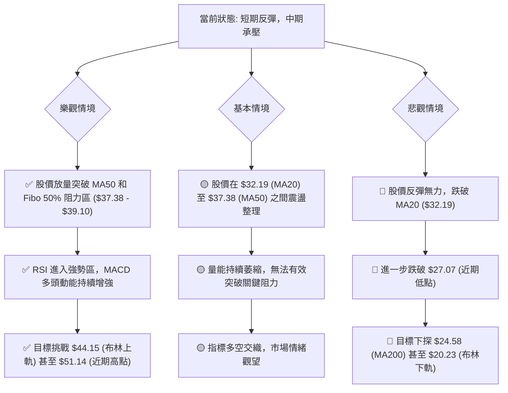

**風險場景解讀**：
- **樂觀情境**：如果市場買盤能夠持續放量，並成功突破中期阻力，那麼PL有望收復大部分跌幅，並進一步挑戰歷史高點。這需要強勁的市場信心和資金流入。
- **基本情境**：在缺乏足夠催化劑的情況下，PL最有可能在當前支撐和阻力之間進行盤整，消化前期的巨大波動，等待新的方向選擇。
- **悲觀情境**：如果反彈動能耗盡，或遇到新的負面消息，股價可能會再次下跌，跌破關鍵支撐位，甚至回測長期生命線MA200。

### 🛡️ 風險管理重要提醒

1.  **嚴格止損**：無論採用何種策略，都必須設定明確且嚴格的止損點。一旦價格觸及止損，應堅決離場，避免小虧變大虧。
2.  **倉位管理**：鑑於PL的高波動性，建議採用較小的倉位進行交易，切勿重倉。分散投資，不將所有資金集中於單一股票。
3.  **分批建倉/減倉**：可以採取分批建倉的方式，在關鍵支撐位附近逐步買入，或在阻力位附近分批減倉，以降低單次交易的風險。
4.  **監控消息面**：儘管本報告側重技術分析，但基本面和消息面變化仍可能對股價產生重大影響。請密切關注公司新聞、行業動態和宏觀經濟數據。
5.  **不追高殺跌**：在高波動市場中，盲目追高或恐慌殺跌往往是導致虧損的主要原因。堅持自己的交易計劃，避免情緒化交易。
6.  **耐心等待**：在當前多空交織的局面下，耐心等待趨勢明確或價格達到理想的進出場點位，是成功的關鍵。

---

## 📋 報告總結

```
╔════════════════════════════════════════════════════════════════════════╗
║                          PL 技術分析報告總結                             ║
╠════════════════════════════════════════════════════════════════════════╣
║ 報告日期：2026-06-30                                                     ║
║ 當前價格：$33.13                                                         ║
║ 分析評級：⚖️ 觀望偏多 (短期動能恢復，長期趨勢向上，中期壓力待解)          ║
║                                                                          ║
║ 關鍵結論：                                                               ║
║ ├─ 長期趨勢：🟢 強勁上升，股價遠高於MA200 ($24.58)。                      ║
║ ├─ 中期趨勢：🔴 經歷深度回調，目前仍處於MA50 ($37.38) 之下，承壓。         ║
║ ├─ 短期趨勢：🟢 強勁反彈，MACD金叉，RSI從超賣區回升，價格站上MA20 ($32.19)。║
║ ├─ 關鍵支撐：$32.19 (MA20/BB中軌), $27.07 (近期低點), $24.58 (MA200)。   ║
║ ├─ 關鍵阻力：$37.38 (MA50), $39.10 (Fibo 50% / 分析師均價 $39.80 附近)。 ║
║ └─ 分析師目標：均價 $39.80，高點 $53.00，低點 $22.00。                    ║
║                                                                          ║
║ 最優策略組合：                                                           ║
║ 1. 🥇 **最佳機會 (穩健型多頭)**：等待股價回調至 $32.20 (MA20附近) 並止跌，  ║
║                                  止損 $26.50，目標 T1 $37.38，T2 $39.80。 ║
║ 2. 🥈 **次選機會 (激進型多頭)**：若股價放量突破 $33.50，止損 $31.00，       ║
║                                  目標 T1 $36.26，T2 $39.10。             ║
║ 3. 🥉 **保守選擇 (觀望)**：若股價未能放量突破 $37.38，可暫時觀望，避免參與  ║
║                            中期壓力下的震盪。                              ║
╚════════════════════════════════════════════════════════════════════════╝
```

---

> ⚠️ **免責聲明**：本報告為 AI 自動生成之技術分析，所有數據及估算均基於提供的歷史價格資訊。本報告**僅供研究與學術參考**，**不構成任何投資建議**。投資有風險，入市需謹慎。

---

*報告生成時間：2026-06-30 ｜ 數據來源：Yahoo Finance ｜ 分析框架：多時框技術分析*