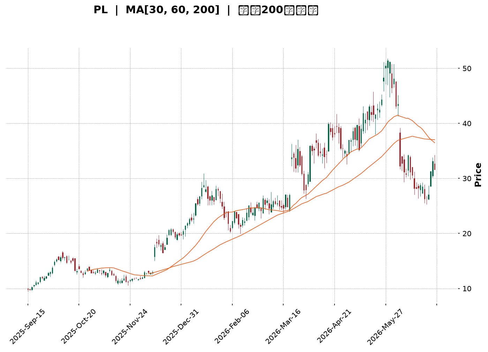
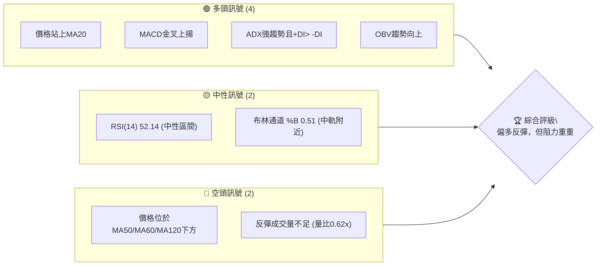
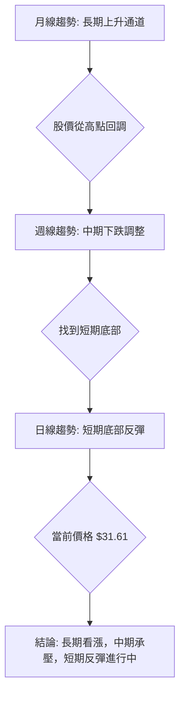
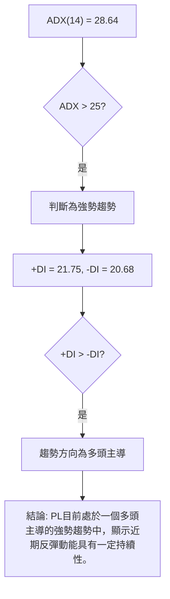
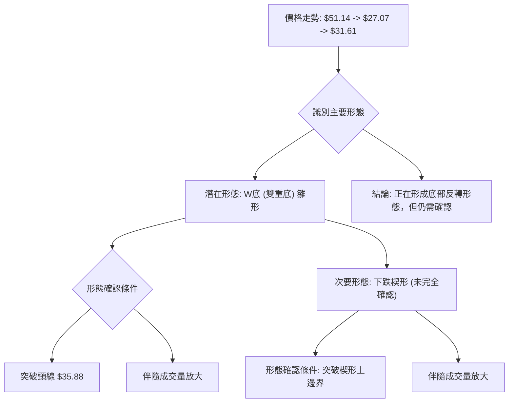
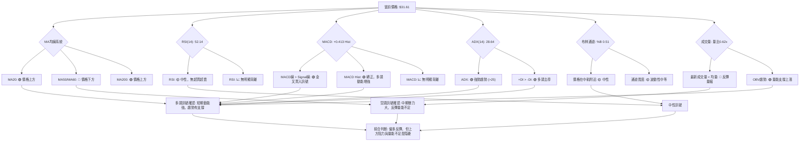
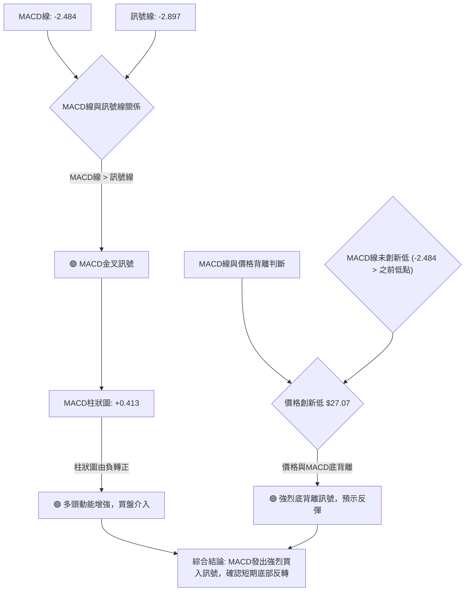
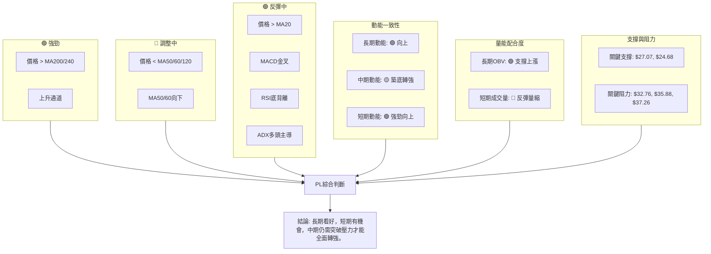
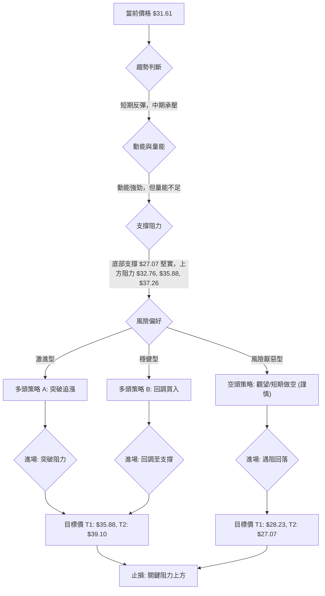
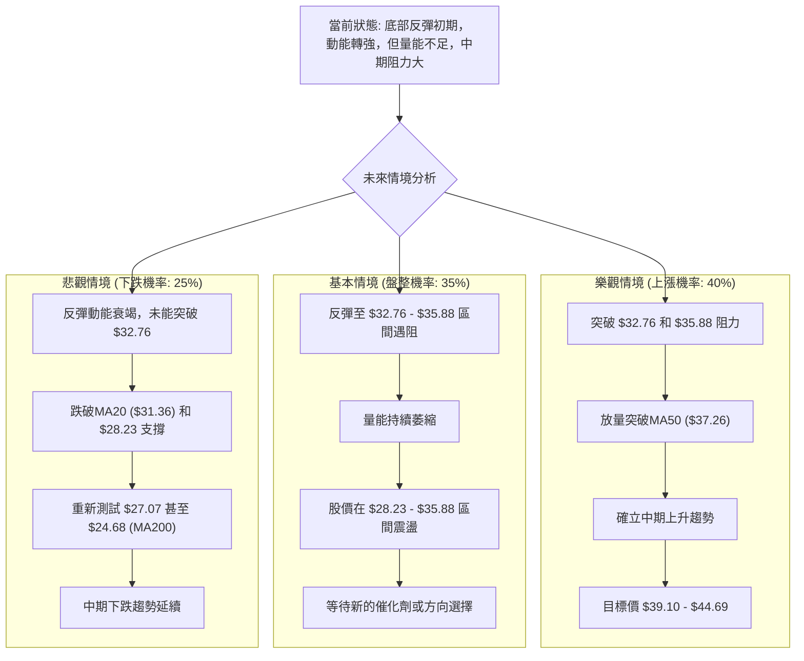

<details>
<summary>📊 靜態圖表 (點擊展開)</summary>

</details>

<html>
<head><meta charset="utf-8" /></head>
<body>
    <div style="height:500px; width:100%;">                        <script>window.PlotlyConfig = {MathJaxConfig: 'local'};</script>
        <script charset="utf-8" src="https://cdn.plot.ly/plotly-3.6.0.min.js" integrity="sha256-QaOVwtVY0T02VaHrr6pnoHLCwayMJp4O5n4YyaE3rJk=" crossorigin="anonymous"></script>                <div id="candlestick-chart" class="plotly-graph-div" style="height:100%; width:100%;"></div>            <script>                window.PLOTLYENV=window.PLOTLYENV || {};                                if (document.getElementById("candlestick-chart")) {                    Plotly.newPlot(                        "candlestick-chart",                        [{"close":{"dtype":"f8","bdata":"AAAA4FG4I0AAAAAAAIAjQAAAAIDCdSRAAAAA4FE4JUAAAADgUTgmQAAAAOBROCZAAAAAoJkZKEAAAAAAKdwnQAAAACCF6ydAAAAAYGZmKEAAAADgepQpQAAAAIDC9SlAAAAAgD2KK0AAAABAM7MtQAAAAGC4ni5AAAAAQOF6LkAAAAAAKVwvQAAAAEAzMy9AAAAAgOtRL0AAAABgZmYtQAAAAAAAgC5AAAAAIFyPLUAAAACAFC4uQAAAAIDCdSpAAAAA4FE4KkAAAABguB4rQAAAAIDr0SlAAAAAAAAAKUAAAABgZuYpQAAAAOBROCtAAAAAYLieKkAAAACAFK4pQAAAAMDMzClAAAAA4FG4KUAAAABgZuYqQAAAAKBHYSpAAAAAYGZmKUAAAAAAAIAqQAAAACCF6yhAAAAAYLieKUAAAAAgrscqQAAAAOCj8ChAAAAAoEfhKEAAAACA69EmQAAAAMDMzCZAAAAAIIVrJkAAAABgZuYmQAAAAOB6lCdAAAAAgMJ1JkAAAACA61EmQAAAAOB6FCdAAAAAgMJ1J0AAAADgo3AnQAAAAMDMzCdAAAAAYGZmJ0AAAACAPYonQAAAAMAeBShAAAAAoEfhKUAAAACAPYopQAAAAGBm5ilAAAAAgBSuKUAAAACgR+EpQAAAAOBReDFAAAAAoHA9MkAAAADAzAwyQAAAAKBH4TFAAAAA4FF4MEAAAACgcH0xQAAAAIAULjNAAAAAoJmZNEAAAABA4bo0QAAAAIDrUTRAAAAAAClcM0AAAABguN4zQAAAAKBwvTNAAAAA4FG4M0AAAADA9Wg0QAAAAADXYzVAAAAAQArXNUAAAAAAKZw2QAAAAOCjcDZAAAAAgMK1NkAAAADgo3A5QAAAAIDrUTlAAAAAQOG6OkAAAAAgrkc8QAAAACCuxzxAAAAAAAAAPEAAAACgR2E6QAAAACBcDzpAAAAA4KPwOkAAAABguN45QAAAAIDrETxAAAAAoEfhO0AAAACgmVk6QAAAAOBR+DhAAAAAoJnZNkAAAABAM\u002fM3QAAAAMAexTVAAAAAgBRuNEAAAABgj0I2QAAAAMAeBThAAAAAgD3KNkAAAABgZqY1QAAAAMDMTDVAAAAAIIVrNkAAAACAwjU2QAAAAKBwvTdAAAAAACkcOUAAAABgZuY3QAAAACCuxzdAAAAAgMK1OEAAAACgR6E4QAAAAKCZmTlAAAAAANcjOEAAAAAAKVw6QAAAAMDMTDlAAAAAAAAAOkAAAABACpc4QAAAACCuRzlAAAAAgOvROUAAAABgZmY5QAAAAOCjcDlAAAAA4FH4OEAAAACAPco4QAAAAKCZmThAAAAA4HoUO0AAAAAgXM84QAAAAIDC9TpAAAAAgD3qQEAAAADA9ehAQAAAAOB61D9AAAAAIFyvQUAAAABAMzNAQAAAAAAp3D5AAAAAANfjO0AAAABAM\u002fM7QAAAAIDCtT5AAAAA4KPwQUAAAABgj4JBQAAAAIDClUFAAAAAYGZGQkAAAACgcB1BQAAAAIDCVUFAAAAAwPUoQUAAAABACvdAQAAAAOB6NEFAAAAAgOvxQ0AAAACgcD1DQAAAAAAAwEJAAAAAANcDQ0AAAAAAKbxDQAAAAMAeJUNAAAAA4FG4QUAAAACgmblBQAAAAADXg0FAAAAAgD0KQUAAAAAAKXxCQAAAAEAzc0JAAAAAwB5FQ0AAAADgo5BCQAAAAOBR2ENAAAAAYLieQUAAAADAHoVDQAAAACCF60RAAAAAQApXREAAAABguF5EQAAAAMAehUVAAAAAIFzPREAAAACAFM5EQAAAACCFy0RAAAAA4HpURUAAAACgcD1FQAAAAMDMLEZAAAAAwPUoSEAAAACgcD1JQAAAAEAzs0lAAAAAgOuRSUAAAABA4TpHQAAAACCFC0hAAAAA4KOQRUAAAAAA18NFQAAAAAApHEBAAAAAYLheQEAAAAAghSs\u002fQAAAAOBRuD5AAAAAgMIVQUAAAABgZiY\u002fQAAAAOB6lD5AAAAAgMI1PEAAAADgUTg8QAAAAEDhOjxAAAAAwB7FPEAAAAAgroc8QAAAAMDMTDpAAAAAYI+COkAAAACA6xE7QAAAACCuRz9AAAAA4KOQQEAAAAAAKZw\u002fQA=="},"high":{"dtype":"f8","bdata":"AAAA4FE4JEAAAABAtvMjQAAAAMDMzCRAAAAAIIVrJUAAAACA69EmQAAAAMDMTCZAAAAAYI9CKEAAAACAwnUoQAAAACBcjyhAAAAAwPWoKEAAAAAAAAAqQAAAAGC4HipAAAAAgD0KLEAAAADAyDYuQAAAAAAAAC9AAAAAIK7HL0AAAABgjwIwQAAAACCuxzBAAAAAoJmZL0AAAADAzAwwQAAAAGBm5i9AAAAAAACALkAAAADgelQvQAAAAEA1Hi9AAAAAwPUoK0AAAACA69EsQAAAAEAIrCpAAAAAoJkZKkAAAAAAKZwqQAAAAIAUbitAAAAAIIXrK0AAAADgo\u002fAqQAAAACCFqypAAAAAYGZmKkAAAACAwnUrQAAAAGCPwipAAAAAgD0KK0AAAADgo7AqQAAAAIA9CipAAAAAYGamKUAAAACgmZkrQAAAAKBwvSpAAAAAwMzMKUAAAACA69EoQAAAAEAzsydAAAAA4FE4J0AAAADAHsUnQAAAAIDC9ShAAAAAAAAAKUAAAAAAAAAnQAAAACBcTydAAAAAoO28J0AAAACAPQooQAAAAMAeBShAAAAAANejJ0AAAADAHoUoQAAAAKBHYShAAAAAYGZmKkAAAAAAAMApQAAAAIDCdSpAAAAAAAAAKkAAAABA4XoqQAAAAKCZ+TFAAAAAoJkZM0AAAADgo7AzQAAAACCuRzJAAAAAwMyMMkAAAABAM\u002fMxQAAAAOB61DNAAAAAYI\u002fCNEAAAACgcP00QAAAAIAU7jRAAAAAgMJVNEAAAADAHiU0QAAAAAApPDRAAAAAwMxMNEAAAAAgXM80QAAAACBcbzVAAAAAQDMTNkAAAAAAKdw2QAAAAKCZmTdAAAAAgOnGN0AAAAAgXI85QAAAAEAKlzpAAAAAwB7FOkAAAACgR2E9QAAAAGDj5T5AAAAA4FG4PUAAAAAghas8QAAAAIDA6jpAAAAAQOG6O0AAAABAM7M6QAAAAEAzszxAAAAAYGZmPEAAAABAM7M7QAAAAAAAQDtAAAAAwKHFOUAAAAAArPw3QAAAAAAAADhAAAAAgMCKNUAAAAAgrkc2QAAAAOBRGDhAAAAAQOH6N0AAAABgZoY3QAAAAMD16DVAAAAAgBTuNkAAAACAPco2QAAAAKCZmThAAAAAACkcOUAAAADgo7A5QAAAAOB6tDhAAAAAIFzPOEAAAABAYtA5QAAAAOCjsDlAAAAAQArXOEAAAACAFO46QAAAAOCjcDpAAAAAoEeBOkAAAACgcD06QAAAAACqkTtAAAAAQAoXOkAAAADgUXg6QAAAACCF6zpAAAAAIFwPOkAAAACA6QY6QAAAAAAAgDlAAAAAQAoXO0AAAADgehQ7QAAAAGCPQjtAAAAAANcjQkAAAAAghWtBQAAAACCFC0JAAAAAYGaGQkAAAAAA1dhBQAAAAGC4HkFAAAAAwPVoP0AAAACAFO48QAAAAIAULj9AAAAAwB4FQkAAAADAHiVCQAAAAGBm5kFAAAAAQOEaQ0AAAACAwpVCQAAAAIDrMUJAAAAAgBS+QUAAAAAgWDlCQAAAAIDClUFAAAAAoHAdREAAAACgcB1EQAAAAOB69ENAAAAAANfDQ0AAAABA4dpEQAAAAAAAAERAAAAAAADAQ0AAAACgcB1CQAAAAEAKp0FAAAAAAACAQUAAAAAAKXxCQAAAAOB6pEJAAAAAYI+iQ0AAAABACrdDQAAAAKBH4UNAAAAAgMJ1REAAAADAzOxDQAAAACBcj0VAAAAA4KPwREAAAACgmRlFQAAAAKCZuUVAAAAAQAqXRUAAAAAA1+NGQAAAAAAA4ERAAAAAYGbGRUAAAAAAAABGQAAAAEAMokZAAAAA4KOQSUAAAACgcH1JQAAAAKBH4UlAAAAAYI+iSUAAAAAAAGBJQAAAAGCPYklAAAAAIFzPR0AAAADAHpVGQAAAAEAKl0NAAAAAwB4FQUAAAAAgXC9BQAAAAMDMzD9AAAAAwPUoQUAAAABAMxNBQAAAAIDrEUBAAAAAAABAP0AAAACgmVk9QAAAAAAAAD1AAAAAYI8iPUAAAAAgLz09QAAAAKBH4TxAAAAAQArXOkAAAADgo7A8QAAAACCuRz9AAAAAwMzsQEAAAAAAACBBQA=="},"hovertemplate":"\u003cb\u003e%{x|%Y-%m-%d}\u003c\u002fb\u003e\u003cbr\u003e\u958b: $%{open:.2f}\u003cbr\u003e\u9ad8: $%{high:.2f}\u003cbr\u003e\u4f4e: $%{low:.2f}\u003cbr\u003e\u6536: $%{close:.2f}\u003cextra\u003e\u003c\u002fextra\u003e","low":{"dtype":"f8","bdata":"AAAA4FH4IkAAAACA61EjQAAAAAApXCNAAAAA4KNwJEAAAABA4TolQAAAAOCjcCVAAAAAANcjJkAAAABAClcnQAAAAEAK1yZAAAAAwB6FJ0AAAADgUbgoQAAAAKBwPShAAAAAQDMzKUAAAADA9SgsQAAAAMAehS1AAAAAoEdhLkAAAAAgXI8tQAAAAMAehS5AAAAAwPUoLkAAAAAAKRwtQAAAAIDrUS5AAAAAQAoXLUAAAABAM7MtQAAAAKBwPSpAAAAAIN0kKUAAAAAAAAArQAAAAGC4nilAAAAA4KPwJ0AAAACAFC4pQAAAACCuRypAAAAAgD2KKkAAAAAgXI8pQAAAACCuhylAAAAAQN8PKUAAAAAgrscpQAAAAIDCdSlAAAAAIIXrKEAAAAAgXA8pQAAAAADXIyhAAAAAACncJ0AAAABgENgpQAAAACBcjyhAAAAAwPWoKEAAAABAChcmQAAAAMDIdiVAAAAAYI\u002fCJUAAAACAFO4lQAAAAMDMzCZAAAAAgJcuJkAAAACAPQolQAAAAMAehSZAAAAAwB6FJkAAAABgj0InQAAAAICXbidAAAAAwMzMJkAAAADgelQnQAAAAEDheidAAAAAACncJ0AAAADAHgUpQAAAAKBwPSlAAAAAQDUeKUAAAADA9SgpQAAAAMAeBS5AAAAAYLheMUAAAAAA16MxQAAAAIAU7jBAAAAAgBRuMEAAAACAPQoxQAAAAKBw\u002fTFAAAAAACmcM0AAAACgmZkzQAAAAAApHDRAAAAAgD0KM0AAAABgj8IyQAAAAOCjcDNAAAAAQImhM0AAAAAA1fgyQAAAAKBwfTNAAAAA4FH4NEAAAADA9Wg1QAAAAEAKFzZAAAAAwCDQNUAAAADA9Sg3QAAAAGC4HjlAAAAAAAAAOUAAAABgj0I6QAAAAAApXDxAAAAAIFxvO0AAAACgRyE5QAAAAADXIzlAAAAAgBQuOUAAAADgUTg5QAAAAKAaDzpAAAAAIFzPOkAAAADAzIw5QAAAAIDrcThAAAAAQAp3NkAAAADA9eg2QAAAAEAKlzRAAAAAYGYmNEAAAAAgXM80QAAAAGBmpjVAAAAAgMK1NkAAAADA9eg0QAAAAEDh+jNAAAAAIAYhNUAAAAAAAIA1QAAAAKBwPTZAAAAAgMJ1NkAAAABgj4I3QAAAAEDhOjdAAAAAoJlZNkAAAACgcH04QAAAAIDrEThAAAAAIK7HNkAAAADgUbg3QAAAAKBHYThAAAAAgGgROUAAAABgj4I3QAAAAKCZ2TdAAAAAQDNzOEAAAABAMzM5QAAAAOCj8DhAAAAAIK5HOEAAAAAgXE84QAAAAOB4qTdAAAAAYGZmOEAAAABgj8I4QAAAAOCj8DdAAAAAgGghQEAAAABA4To\u002fQAAAAAApHD9AAAAAoEchP0AAAAAgXA9AQAAAAIA9ij5AAAAAYLg+O0AAAADA9Ug6QAAAAMAehTxAAAAA4KNwPUAAAABA4RpBQAAAAGCPYkBAAAAA4FG4QUAAAADgUfhAQAAAAKCZ+UBAAAAAAClcQEAAAACgR+E\u002fQAAAACCuZ0BAAAAAYGZ2QUAAAAAghetCQAAAAEAKd0JAAAAAYI\u002fCQkAAAAAA1yNDQAAAAIA9KkJAAAAA4KOQQUAAAADgo9BAQAAAAMDz3UBAAAAAwPVIQEAAAADASydBQAAAAOCla0FAAAAAwPXoQUAAAACgmflBQAAAAKBHwUFAAAAAQAp3QUAAAABgZuZBQAAAAMDMDENAAAAAoEchQ0AAAADAzGxDQAAAAMDMzENAAAAAwB5FREAAAACgRyFEQAAAAGCPAkNAAAAAgMJVREAAAADAHoVEQAAAAMDMjEVAAAAAgBTuRkAAAACAFI5HQAAAAAAAgEdAAAAAANdjRkAAAAAA18NGQAAAAEDhOkdAAAAAwB5VRUAAAABgZqZEQAAAAMD1qD9AAAAA4HpUP0AAAACA61E9QAAAAEAzMz5AAAAAIIVrPkAAAADAHsU9QAAAAAApHD5AAAAAoEMLO0AAAADgehQ8QAAAAOB6VDpAAAAAgMK1OkAAAADgelQ7QAAAAIA9ijlAAAAAwMxMOUAAAACgRyE6QAAAAKCZmTxAAAAAoBgkPkAAAADA9Yg\u002fQA=="},"name":"\u50f9\u683c","open":{"dtype":"f8","bdata":"AAAA4KPwI0AAAADgUbgjQAAAAAAAgCNAAAAAgML1JEAAAACA61ElQAAAAOBRuCVAAAAAQOF6JkAAAAAgrkcoQAAAAAAAACdAAAAA4FG4J0AAAAAgrscoQAAAAGBmZilAAAAAgBSuKUAAAADgUbgsQAAAAGBm5i1AAAAAoJmZL0AAAAAAAAAuQAAAAMDMjDBAAAAAgBQuL0AAAADgUbgvQAAAACCFay5AAAAAAAAALkAAAABgZuYuQAAAAOCj8C5AAAAAAAAAKkAAAACAPQosQAAAAAApXCpAAAAAAACAKUAAAABgj0IpQAAAAKCZmSpAAAAAYGbmK0AAAADAzMwqQAAAACCF6ylAAAAAQOF6KUAAAAAgrscpQAAAAMD1qCpAAAAAgMJ1KUAAAACAFK4pQAAAAMAeBSpAAAAA4FE4KEAAAACAwnUqQAAAAGBmZipAAAAAYI9CKUAAAACAPYooQAAAAAAAACZAAAAAAClcJkAAAADgehQmQAAAACCF6yZAAAAAYGZmKEAAAABA4XomQAAAAEAzsyZAAAAAwB4FJ0AAAACAPYonQAAAAIDr0SdAAAAAQDMzJ0AAAABgj8InQAAAAMD1qCdAAAAAYGbmJ0AAAADAHoUpQAAAAAApXCpAAAAAoHA9KUAAAACgmZkpQAAAAOB6lC9AAAAA4KNwMkAAAAAgXM8yQAAAAGBmpjFAAAAAgBQuMkAAAACAPQoxQAAAAKBw\u002fTFAAAAAIK7HM0AAAADAzMwzQAAAAEDhujRAAAAAwMxMNEAAAACgcN0yQAAAACCuBzRAAAAAYLi+M0AAAABA4dozQAAAAEAzszRAAAAAAACANUAAAADgUbg1QAAAAKCZ2TZAAAAAoJmZNkAAAADAzEw3QAAAAGCPQjpAAAAAAACAOUAAAAAgXM86QAAAAEAzczxAAAAAQAqXO0AAAAAAAIA8QAAAAAAAwDpAAAAAYI8COkAAAACgmZk6QAAAAOB6FDpAAAAAwMwMPEAAAABAM7M7QAAAAEAKtzlAAAAAANfjOEAAAABA4fo3QAAAAAAAADhAAAAAAAAANUAAAACAPQo1QAAAAIDC9TVAAAAAYLjeN0AAAABgZoY3QAAAAIDrkTVAAAAAAACANUAAAAAAAAA2QAAAAGBmZjZAAAAAwB4FN0AAAACgcL04QAAAAGBmZjdAAAAAAABAN0AAAADAzEw5QAAAAAAAgDhAAAAAQDOTOEAAAADgUbg3QAAAAEDhGjpAAAAAoJmZOUAAAAAAAIA5QAAAAADX4zdAAAAAQArXOEAAAACA69E5QAAAAEAKVzlAAAAA4FH4OUAAAABA4fo4QAAAAKBHITlAAAAAoJnZOEAAAAAAAIA6QAAAAAAAQDhAAAAAYGbGQEAAAAAAAEBBQAAAAEDh2kBAAAAAQDMzQEAAAAAAKXxBQAAAAKBw\u002fUBAAAAAoJnZPkAAAADAzMw8QAAAAAAAAD1AAAAA4KNwPUAAAACAwvVBQAAAAOCjsEFAAAAAQDNzQkAAAAAAAEBCQAAAAOCjcEFAAAAAoHAdQUAAAAAghctBQAAAAIDCNUFAAAAAoHB9QUAAAACA65FDQAAAAEAzk0NAAAAAACkcQ0AAAAAAAMBDQAAAAIA9qkNAAAAAgBSOQ0AAAAAAKbxBQAAAAMDMTEFAAAAA4KMwQUAAAAAA10NBQAAAACBcX0JAAAAAwB6FQkAAAACgmZlDQAAAACBcf0JAAAAAYI\u002fCQ0AAAABAMzNCQAAAAEAzU0NAAAAAIIULREAAAABAChdFQAAAAOCjUERAAAAAwPUIRUAAAAAA16NFQAAAAEAKd0RAAAAAQDMzRUAAAADAcghFQAAAAMDMrEVAAAAAwPXYR0AAAADAzAxJQAAAAEAzE0lAAAAAAACQSEAAAAAghYtIQAAAAIDClUdAAAAAIFzPR0AAAACgcJ1FQAAAAGBmJkNAAAAAoEcBQUAAAACAwrVAQAAAAADX4z5AAAAAAACAP0AAAACA6\u002fFAQAAAAIA9CkBAAAAAwB4FPkAAAAAA12M8QAAAAGBmpjxAAAAAgML1O0AAAADgelQ7QAAAAIDrETxAAAAAYI+COkAAAABA4To6QAAAAKCZmTxAAAAAoHB9PkAAAACgmVlAQA=="},"x":["2025-09-15T00:00:00-04:00","2025-09-16T00:00:00-04:00","2025-09-17T00:00:00-04:00","2025-09-18T00:00:00-04:00","2025-09-19T00:00:00-04:00","2025-09-22T00:00:00-04:00","2025-09-23T00:00:00-04:00","2025-09-24T00:00:00-04:00","2025-09-25T00:00:00-04:00","2025-09-26T00:00:00-04:00","2025-09-29T00:00:00-04:00","2025-09-30T00:00:00-04:00","2025-10-01T00:00:00-04:00","2025-10-02T00:00:00-04:00","2025-10-03T00:00:00-04:00","2025-10-06T00:00:00-04:00","2025-10-07T00:00:00-04:00","2025-10-08T00:00:00-04:00","2025-10-09T00:00:00-04:00","2025-10-10T00:00:00-04:00","2025-10-13T00:00:00-04:00","2025-10-14T00:00:00-04:00","2025-10-15T00:00:00-04:00","2025-10-16T00:00:00-04:00","2025-10-17T00:00:00-04:00","2025-10-20T00:00:00-04:00","2025-10-21T00:00:00-04:00","2025-10-22T00:00:00-04:00","2025-10-23T00:00:00-04:00","2025-10-24T00:00:00-04:00","2025-10-27T00:00:00-04:00","2025-10-28T00:00:00-04:00","2025-10-29T00:00:00-04:00","2025-10-30T00:00:00-04:00","2025-10-31T00:00:00-04:00","2025-11-03T00:00:00-05:00","2025-11-04T00:00:00-05:00","2025-11-05T00:00:00-05:00","2025-11-06T00:00:00-05:00","2025-11-07T00:00:00-05:00","2025-11-10T00:00:00-05:00","2025-11-11T00:00:00-05:00","2025-11-12T00:00:00-05:00","2025-11-13T00:00:00-05:00","2025-11-14T00:00:00-05:00","2025-11-17T00:00:00-05:00","2025-11-18T00:00:00-05:00","2025-11-19T00:00:00-05:00","2025-11-20T00:00:00-05:00","2025-11-21T00:00:00-05:00","2025-11-24T00:00:00-05:00","2025-11-25T00:00:00-05:00","2025-11-26T00:00:00-05:00","2025-11-28T00:00:00-05:00","2025-12-01T00:00:00-05:00","2025-12-02T00:00:00-05:00","2025-12-03T00:00:00-05:00","2025-12-04T00:00:00-05:00","2025-12-05T00:00:00-05:00","2025-12-08T00:00:00-05:00","2025-12-09T00:00:00-05:00","2025-12-10T00:00:00-05:00","2025-12-11T00:00:00-05:00","2025-12-12T00:00:00-05:00","2025-12-15T00:00:00-05:00","2025-12-16T00:00:00-05:00","2025-12-17T00:00:00-05:00","2025-12-18T00:00:00-05:00","2025-12-19T00:00:00-05:00","2025-12-22T00:00:00-05:00","2025-12-23T00:00:00-05:00","2025-12-24T00:00:00-05:00","2025-12-26T00:00:00-05:00","2025-12-29T00:00:00-05:00","2025-12-30T00:00:00-05:00","2025-12-31T00:00:00-05:00","2026-01-02T00:00:00-05:00","2026-01-05T00:00:00-05:00","2026-01-06T00:00:00-05:00","2026-01-07T00:00:00-05:00","2026-01-08T00:00:00-05:00","2026-01-09T00:00:00-05:00","2026-01-12T00:00:00-05:00","2026-01-13T00:00:00-05:00","2026-01-14T00:00:00-05:00","2026-01-15T00:00:00-05:00","2026-01-16T00:00:00-05:00","2026-01-20T00:00:00-05:00","2026-01-21T00:00:00-05:00","2026-01-22T00:00:00-05:00","2026-01-23T00:00:00-05:00","2026-01-26T00:00:00-05:00","2026-01-27T00:00:00-05:00","2026-01-28T00:00:00-05:00","2026-01-29T00:00:00-05:00","2026-01-30T00:00:00-05:00","2026-02-02T00:00:00-05:00","2026-02-03T00:00:00-05:00","2026-02-04T00:00:00-05:00","2026-02-05T00:00:00-05:00","2026-02-06T00:00:00-05:00","2026-02-09T00:00:00-05:00","2026-02-10T00:00:00-05:00","2026-02-11T00:00:00-05:00","2026-02-12T00:00:00-05:00","2026-02-13T00:00:00-05:00","2026-02-17T00:00:00-05:00","2026-02-18T00:00:00-05:00","2026-02-19T00:00:00-05:00","2026-02-20T00:00:00-05:00","2026-02-23T00:00:00-05:00","2026-02-24T00:00:00-05:00","2026-02-25T00:00:00-05:00","2026-02-26T00:00:00-05:00","2026-02-27T00:00:00-05:00","2026-03-02T00:00:00-05:00","2026-03-03T00:00:00-05:00","2026-03-04T00:00:00-05:00","2026-03-05T00:00:00-05:00","2026-03-06T00:00:00-05:00","2026-03-09T00:00:00-04:00","2026-03-10T00:00:00-04:00","2026-03-11T00:00:00-04:00","2026-03-12T00:00:00-04:00","2026-03-13T00:00:00-04:00","2026-03-16T00:00:00-04:00","2026-03-17T00:00:00-04:00","2026-03-18T00:00:00-04:00","2026-03-19T00:00:00-04:00","2026-03-20T00:00:00-04:00","2026-03-23T00:00:00-04:00","2026-03-24T00:00:00-04:00","2026-03-25T00:00:00-04:00","2026-03-26T00:00:00-04:00","2026-03-27T00:00:00-04:00","2026-03-30T00:00:00-04:00","2026-03-31T00:00:00-04:00","2026-04-01T00:00:00-04:00","2026-04-02T00:00:00-04:00","2026-04-06T00:00:00-04:00","2026-04-07T00:00:00-04:00","2026-04-08T00:00:00-04:00","2026-04-09T00:00:00-04:00","2026-04-10T00:00:00-04:00","2026-04-13T00:00:00-04:00","2026-04-14T00:00:00-04:00","2026-04-15T00:00:00-04:00","2026-04-16T00:00:00-04:00","2026-04-17T00:00:00-04:00","2026-04-20T00:00:00-04:00","2026-04-21T00:00:00-04:00","2026-04-22T00:00:00-04:00","2026-04-23T00:00:00-04:00","2026-04-24T00:00:00-04:00","2026-04-27T00:00:00-04:00","2026-04-28T00:00:00-04:00","2026-04-29T00:00:00-04:00","2026-04-30T00:00:00-04:00","2026-05-01T00:00:00-04:00","2026-05-04T00:00:00-04:00","2026-05-05T00:00:00-04:00","2026-05-06T00:00:00-04:00","2026-05-07T00:00:00-04:00","2026-05-08T00:00:00-04:00","2026-05-11T00:00:00-04:00","2026-05-12T00:00:00-04:00","2026-05-13T00:00:00-04:00","2026-05-14T00:00:00-04:00","2026-05-15T00:00:00-04:00","2026-05-18T00:00:00-04:00","2026-05-19T00:00:00-04:00","2026-05-20T00:00:00-04:00","2026-05-21T00:00:00-04:00","2026-05-22T00:00:00-04:00","2026-05-26T00:00:00-04:00","2026-05-27T00:00:00-04:00","2026-05-28T00:00:00-04:00","2026-05-29T00:00:00-04:00","2026-06-01T00:00:00-04:00","2026-06-02T00:00:00-04:00","2026-06-03T00:00:00-04:00","2026-06-04T00:00:00-04:00","2026-06-05T00:00:00-04:00","2026-06-08T00:00:00-04:00","2026-06-09T00:00:00-04:00","2026-06-10T00:00:00-04:00","2026-06-11T00:00:00-04:00","2026-06-12T00:00:00-04:00","2026-06-15T00:00:00-04:00","2026-06-16T00:00:00-04:00","2026-06-17T00:00:00-04:00","2026-06-18T00:00:00-04:00","2026-06-22T00:00:00-04:00","2026-06-23T00:00:00-04:00","2026-06-24T00:00:00-04:00","2026-06-25T00:00:00-04:00","2026-06-26T00:00:00-04:00","2026-06-29T00:00:00-04:00","2026-06-30T00:00:00-04:00","2026-07-01T00:00:00-04:00"],"type":"candlestick"},{"hovertemplate":"MA30: $%{y:.2f}\u003cextra\u003e\u003c\u002fextra\u003e","line":{"color":"#2196F3","dash":"dash","width":2},"mode":"lines","name":"MA30","x":["2025-09-15T00:00:00-04:00","2025-09-16T00:00:00-04:00","2025-09-17T00:00:00-04:00","2025-09-18T00:00:00-04:00","2025-09-19T00:00:00-04:00","2025-09-22T00:00:00-04:00","2025-09-23T00:00:00-04:00","2025-09-24T00:00:00-04:00","2025-09-25T00:00:00-04:00","2025-09-26T00:00:00-04:00","2025-09-29T00:00:00-04:00","2025-09-30T00:00:00-04:00","2025-10-01T00:00:00-04:00","2025-10-02T00:00:00-04:00","2025-10-03T00:00:00-04:00","2025-10-06T00:00:00-04:00","2025-10-07T00:00:00-04:00","2025-10-08T00:00:00-04:00","2025-10-09T00:00:00-04:00","2025-10-10T00:00:00-04:00","2025-10-13T00:00:00-04:00","2025-10-14T00:00:00-04:00","2025-10-15T00:00:00-04:00","2025-10-16T00:00:00-04:00","2025-10-17T00:00:00-04:00","2025-10-20T00:00:00-04:00","2025-10-21T00:00:00-04:00","2025-10-22T00:00:00-04:00","2025-10-23T00:00:00-04:00","2025-10-24T00:00:00-04:00","2025-10-27T00:00:00-04:00","2025-10-28T00:00:00-04:00","2025-10-29T00:00:00-04:00","2025-10-30T00:00:00-04:00","2025-10-31T00:00:00-04:00","2025-11-03T00:00:00-05:00","2025-11-04T00:00:00-05:00","2025-11-05T00:00:00-05:00","2025-11-06T00:00:00-05:00","2025-11-07T00:00:00-05:00","2025-11-10T00:00:00-05:00","2025-11-11T00:00:00-05:00","2025-11-12T00:00:00-05:00","2025-11-13T00:00:00-05:00","2025-11-14T00:00:00-05:00","2025-11-17T00:00:00-05:00","2025-11-18T00:00:00-05:00","2025-11-19T00:00:00-05:00","2025-11-20T00:00:00-05:00","2025-11-21T00:00:00-05:00","2025-11-24T00:00:00-05:00","2025-11-25T00:00:00-05:00","2025-11-26T00:00:00-05:00","2025-11-28T00:00:00-05:00","2025-12-01T00:00:00-05:00","2025-12-02T00:00:00-05:00","2025-12-03T00:00:00-05:00","2025-12-04T00:00:00-05:00","2025-12-05T00:00:00-05:00","2025-12-08T00:00:00-05:00","2025-12-09T00:00:00-05:00","2025-12-10T00:00:00-05:00","2025-12-11T00:00:00-05:00","2025-12-12T00:00:00-05:00","2025-12-15T00:00:00-05:00","2025-12-16T00:00:00-05:00","2025-12-17T00:00:00-05:00","2025-12-18T00:00:00-05:00","2025-12-19T00:00:00-05:00","2025-12-22T00:00:00-05:00","2025-12-23T00:00:00-05:00","2025-12-24T00:00:00-05:00","2025-12-26T00:00:00-05:00","2025-12-29T00:00:00-05:00","2025-12-30T00:00:00-05:00","2025-12-31T00:00:00-05:00","2026-01-02T00:00:00-05:00","2026-01-05T00:00:00-05:00","2026-01-06T00:00:00-05:00","2026-01-07T00:00:00-05:00","2026-01-08T00:00:00-05:00","2026-01-09T00:00:00-05:00","2026-01-12T00:00:00-05:00","2026-01-13T00:00:00-05:00","2026-01-14T00:00:00-05:00","2026-01-15T00:00:00-05:00","2026-01-16T00:00:00-05:00","2026-01-20T00:00:00-05:00","2026-01-21T00:00:00-05:00","2026-01-22T00:00:00-05:00","2026-01-23T00:00:00-05:00","2026-01-26T00:00:00-05:00","2026-01-27T00:00:00-05:00","2026-01-28T00:00:00-05:00","2026-01-29T00:00:00-05:00","2026-01-30T00:00:00-05:00","2026-02-02T00:00:00-05:00","2026-02-03T00:00:00-05:00","2026-02-04T00:00:00-05:00","2026-02-05T00:00:00-05:00","2026-02-06T00:00:00-05:00","2026-02-09T00:00:00-05:00","2026-02-10T00:00:00-05:00","2026-02-11T00:00:00-05:00","2026-02-12T00:00:00-05:00","2026-02-13T00:00:00-05:00","2026-02-17T00:00:00-05:00","2026-02-18T00:00:00-05:00","2026-02-19T00:00:00-05:00","2026-02-20T00:00:00-05:00","2026-02-23T00:00:00-05:00","2026-02-24T00:00:00-05:00","2026-02-25T00:00:00-05:00","2026-02-26T00:00:00-05:00","2026-02-27T00:00:00-05:00","2026-03-02T00:00:00-05:00","2026-03-03T00:00:00-05:00","2026-03-04T00:00:00-05:00","2026-03-05T00:00:00-05:00","2026-03-06T00:00:00-05:00","2026-03-09T00:00:00-04:00","2026-03-10T00:00:00-04:00","2026-03-11T00:00:00-04:00","2026-03-12T00:00:00-04:00","2026-03-13T00:00:00-04:00","2026-03-16T00:00:00-04:00","2026-03-17T00:00:00-04:00","2026-03-18T00:00:00-04:00","2026-03-19T00:00:00-04:00","2026-03-20T00:00:00-04:00","2026-03-23T00:00:00-04:00","2026-03-24T00:00:00-04:00","2026-03-25T00:00:00-04:00","2026-03-26T00:00:00-04:00","2026-03-27T00:00:00-04:00","2026-03-30T00:00:00-04:00","2026-03-31T00:00:00-04:00","2026-04-01T00:00:00-04:00","2026-04-02T00:00:00-04:00","2026-04-06T00:00:00-04:00","2026-04-07T00:00:00-04:00","2026-04-08T00:00:00-04:00","2026-04-09T00:00:00-04:00","2026-04-10T00:00:00-04:00","2026-04-13T00:00:00-04:00","2026-04-14T00:00:00-04:00","2026-04-15T00:00:00-04:00","2026-04-16T00:00:00-04:00","2026-04-17T00:00:00-04:00","2026-04-20T00:00:00-04:00","2026-04-21T00:00:00-04:00","2026-04-22T00:00:00-04:00","2026-04-23T00:00:00-04:00","2026-04-24T00:00:00-04:00","2026-04-27T00:00:00-04:00","2026-04-28T00:00:00-04:00","2026-04-29T00:00:00-04:00","2026-04-30T00:00:00-04:00","2026-05-01T00:00:00-04:00","2026-05-04T00:00:00-04:00","2026-05-05T00:00:00-04:00","2026-05-06T00:00:00-04:00","2026-05-07T00:00:00-04:00","2026-05-08T00:00:00-04:00","2026-05-11T00:00:00-04:00","2026-05-12T00:00:00-04:00","2026-05-13T00:00:00-04:00","2026-05-14T00:00:00-04:00","2026-05-15T00:00:00-04:00","2026-05-18T00:00:00-04:00","2026-05-19T00:00:00-04:00","2026-05-20T00:00:00-04:00","2026-05-21T00:00:00-04:00","2026-05-22T00:00:00-04:00","2026-05-26T00:00:00-04:00","2026-05-27T00:00:00-04:00","2026-05-28T00:00:00-04:00","2026-05-29T00:00:00-04:00","2026-06-01T00:00:00-04:00","2026-06-02T00:00:00-04:00","2026-06-03T00:00:00-04:00","2026-06-04T00:00:00-04:00","2026-06-05T00:00:00-04:00","2026-06-08T00:00:00-04:00","2026-06-09T00:00:00-04:00","2026-06-10T00:00:00-04:00","2026-06-11T00:00:00-04:00","2026-06-12T00:00:00-04:00","2026-06-15T00:00:00-04:00","2026-06-16T00:00:00-04:00","2026-06-17T00:00:00-04:00","2026-06-18T00:00:00-04:00","2026-06-22T00:00:00-04:00","2026-06-23T00:00:00-04:00","2026-06-24T00:00:00-04:00","2026-06-25T00:00:00-04:00","2026-06-26T00:00:00-04:00","2026-06-29T00:00:00-04:00","2026-06-30T00:00:00-04:00","2026-07-01T00:00:00-04:00"],"y":{"dtype":"f8","bdata":"AAAAAAAA+H8AAAAAAAD4fwAAAAAAAPh\u002fAAAAAAAA+H8AAAAAAAD4fwAAAAAAAPh\u002fAAAAAAAA+H8AAAAAAAD4fwAAAAAAAPh\u002fAAAAAAAA+H8AAAAAAAD4fwAAAAAAAPh\u002fAAAAAAAA+H8AAAAAAAD4fwAAAAAAAPh\u002fAAAAAAAA+H8AAAAAAAD4fwAAAAAAAPh\u002fAAAAAAAA+H8AAAAAAAD4fwAAAAAAAPh\u002fAAAAAAAA+H8AAAAAAAD4fwAAAAAAAPh\u002fAAAAAAAA+H8AAAAAAAD4fwAAAAAAAPh\u002fAAAAAAAA+H8AAAAAAAD4fxEREYHASipAmpmZyaGFKkBEREQ0XroqQM3MzJzv5ypAMzMzA1YOK0ARERGhRTYrQJqZmUnFWStA3t3dLd1kK0CJiIhYZHsrQBEREeHsgytAMzMzA1aOK0BERER0k5grQLy7uzvfjytA7+7uXix5K0B3d3fHdj4rQJqZmbm7+ypAMzMzY\u002fS2KkC8u7s7w24qQGZmZha9LSpA7+7uHiLiKUAAAACgt6UpQDMzM2NmZilAvLu7u1gyKUCrqqr61PgoQO\u002fu7h4i4ihAzczMvBHKKEC8u7sbhasoQDMzM\u002fMonChAZmZmVqujKECJiIjomKAoQDMzM1NVlShAzczM3E+NKEBERETEBI8oQGZmZmYD3ShAq6qq+tQ4KUDv7u6uVocpQKuqqpph1ylAvLu7+7gXKkAzMzPTFWAqQERERPTF0ipAvLu7+7hXK0De3d3t\u002fdQrQJqZmRn3WixAvLu7CxHRLECrqqpac2EtQO\u002fu7l7J7y1AAAAAIAaBLkBmZmb28BkvQAAAAADIvS9AZmZm5m05MEDv7u7OIpswQBERETkm+DBA3t3dZdhVMUAiIiIy7MoxQCIiIqJwPTJAMzMzK7K9MkCJiIjQlEozQImIiHCv2TNAMzMzgzJaNEAiIiICVs40QFVVVT01PjVAERERKYe2NUDe3d0t3SQ2QLy7uztRfzZAIiIiIpTRNkAzMzPDZxg3QKuqqhroVDdA3t3dbVmLN0BERESEecI3QFVVVXWT2DdAZmZmFiDXN0DNzMxsLuQ3QDMzMzPBAzhAZmZmJgYhOEDe3d2dNjA4QM3MzHyGPThAq6qqupBUOEAzMzPj7GM4QKuqqor6dzhAd3d39+GTOEAzMzMD5J44QJqZmUlTqjhAq6qqWmS7OEARERHherQ4QM3MzIzetjhAvLu7m8SgOEDe3d1NYpA4QAAAACCwcjhA7+7uDp9hOEDv7u6+WFI4QAAAANCwSzhAIiIiIiJCOEBmZmZmHz44QERERBSuJzhAZmZmFtkOOEB3d3c3iQE4QBEREfFg\u002fjdAREREhHkiOEBmZmY20Ck4QAAAAPAZVjhAAAAAsHLIOEBERETkFys5QImIiBi9bTlAVVVVhRbZOUAiIiJC0jQ6QGZmZmZmhjpAvLu7yxO1OkBVVVUFD+Y6QHd3dzeJITtAREREpHB9O0B3d3enVNw7QLy7u3uGPTxAvLu7W4+iPEARERHhevQ8QHd3d5fgQT1AREREJL+YPUDv7u4OWNk9QImIiCgVJz5AMzMzU5ydPkDe3d19IxQ\u002fQM3MzHxqfD9AMzMzo5vkP0AzMzMDVi5AQLy7u6MpZUBAvLu7q9WRQEC8u7s7Ub9AQKuqqpLR60BAERERca8JQUAAAABokT1BQCIiIor6Z0FAVVVVHRN8QUDNzMyEMopBQLy7u7u7q0FA3t3dvS2rQUBERERkgsdBQKuqqnpb9kFAIiIiku0sQkCamZmpf2NCQAAAAFAbmEJAvLu765iwQkBVVVX1tsxCQAAAAFAb6EJAAAAAEC0CQ0AzMzNDYCVDQHd3d2etTkNAMzMzI2mKQ0BmZmYmBtFDQDMzM8ODGURAMzMzw4NJREDNzMwMkGtEQHd3dye\u002fmERAd3d3t4GuREARERFR1L9EQCIiIkLupURAREREJGmaREBVVVU9JohEQCIiIpLCdURA7+7u3iR2RECJiIjgT11EQAAAAMBYQkRAIiIiokUWREARERGJQfBDQBERESlcv0NAmpmZMcGjQ0CJiIh46XZDQFVVVaWbNENAIiIiOib4QkCJiIjw0r1CQCIiIuKli0JAq6qqimxnQkAAAADgwTxCQA=="},"type":"scatter"},{"hovertemplate":"MA60: $%{y:.2f}\u003cextra\u003e\u003c\u002fextra\u003e","line":{"color":"#9C27B0","dash":"dash","width":2},"mode":"lines","name":"MA60","x":["2025-09-15T00:00:00-04:00","2025-09-16T00:00:00-04:00","2025-09-17T00:00:00-04:00","2025-09-18T00:00:00-04:00","2025-09-19T00:00:00-04:00","2025-09-22T00:00:00-04:00","2025-09-23T00:00:00-04:00","2025-09-24T00:00:00-04:00","2025-09-25T00:00:00-04:00","2025-09-26T00:00:00-04:00","2025-09-29T00:00:00-04:00","2025-09-30T00:00:00-04:00","2025-10-01T00:00:00-04:00","2025-10-02T00:00:00-04:00","2025-10-03T00:00:00-04:00","2025-10-06T00:00:00-04:00","2025-10-07T00:00:00-04:00","2025-10-08T00:00:00-04:00","2025-10-09T00:00:00-04:00","2025-10-10T00:00:00-04:00","2025-10-13T00:00:00-04:00","2025-10-14T00:00:00-04:00","2025-10-15T00:00:00-04:00","2025-10-16T00:00:00-04:00","2025-10-17T00:00:00-04:00","2025-10-20T00:00:00-04:00","2025-10-21T00:00:00-04:00","2025-10-22T00:00:00-04:00","2025-10-23T00:00:00-04:00","2025-10-24T00:00:00-04:00","2025-10-27T00:00:00-04:00","2025-10-28T00:00:00-04:00","2025-10-29T00:00:00-04:00","2025-10-30T00:00:00-04:00","2025-10-31T00:00:00-04:00","2025-11-03T00:00:00-05:00","2025-11-04T00:00:00-05:00","2025-11-05T00:00:00-05:00","2025-11-06T00:00:00-05:00","2025-11-07T00:00:00-05:00","2025-11-10T00:00:00-05:00","2025-11-11T00:00:00-05:00","2025-11-12T00:00:00-05:00","2025-11-13T00:00:00-05:00","2025-11-14T00:00:00-05:00","2025-11-17T00:00:00-05:00","2025-11-18T00:00:00-05:00","2025-11-19T00:00:00-05:00","2025-11-20T00:00:00-05:00","2025-11-21T00:00:00-05:00","2025-11-24T00:00:00-05:00","2025-11-25T00:00:00-05:00","2025-11-26T00:00:00-05:00","2025-11-28T00:00:00-05:00","2025-12-01T00:00:00-05:00","2025-12-02T00:00:00-05:00","2025-12-03T00:00:00-05:00","2025-12-04T00:00:00-05:00","2025-12-05T00:00:00-05:00","2025-12-08T00:00:00-05:00","2025-12-09T00:00:00-05:00","2025-12-10T00:00:00-05:00","2025-12-11T00:00:00-05:00","2025-12-12T00:00:00-05:00","2025-12-15T00:00:00-05:00","2025-12-16T00:00:00-05:00","2025-12-17T00:00:00-05:00","2025-12-18T00:00:00-05:00","2025-12-19T00:00:00-05:00","2025-12-22T00:00:00-05:00","2025-12-23T00:00:00-05:00","2025-12-24T00:00:00-05:00","2025-12-26T00:00:00-05:00","2025-12-29T00:00:00-05:00","2025-12-30T00:00:00-05:00","2025-12-31T00:00:00-05:00","2026-01-02T00:00:00-05:00","2026-01-05T00:00:00-05:00","2026-01-06T00:00:00-05:00","2026-01-07T00:00:00-05:00","2026-01-08T00:00:00-05:00","2026-01-09T00:00:00-05:00","2026-01-12T00:00:00-05:00","2026-01-13T00:00:00-05:00","2026-01-14T00:00:00-05:00","2026-01-15T00:00:00-05:00","2026-01-16T00:00:00-05:00","2026-01-20T00:00:00-05:00","2026-01-21T00:00:00-05:00","2026-01-22T00:00:00-05:00","2026-01-23T00:00:00-05:00","2026-01-26T00:00:00-05:00","2026-01-27T00:00:00-05:00","2026-01-28T00:00:00-05:00","2026-01-29T00:00:00-05:00","2026-01-30T00:00:00-05:00","2026-02-02T00:00:00-05:00","2026-02-03T00:00:00-05:00","2026-02-04T00:00:00-05:00","2026-02-05T00:00:00-05:00","2026-02-06T00:00:00-05:00","2026-02-09T00:00:00-05:00","2026-02-10T00:00:00-05:00","2026-02-11T00:00:00-05:00","2026-02-12T00:00:00-05:00","2026-02-13T00:00:00-05:00","2026-02-17T00:00:00-05:00","2026-02-18T00:00:00-05:00","2026-02-19T00:00:00-05:00","2026-02-20T00:00:00-05:00","2026-02-23T00:00:00-05:00","2026-02-24T00:00:00-05:00","2026-02-25T00:00:00-05:00","2026-02-26T00:00:00-05:00","2026-02-27T00:00:00-05:00","2026-03-02T00:00:00-05:00","2026-03-03T00:00:00-05:00","2026-03-04T00:00:00-05:00","2026-03-05T00:00:00-05:00","2026-03-06T00:00:00-05:00","2026-03-09T00:00:00-04:00","2026-03-10T00:00:00-04:00","2026-03-11T00:00:00-04:00","2026-03-12T00:00:00-04:00","2026-03-13T00:00:00-04:00","2026-03-16T00:00:00-04:00","2026-03-17T00:00:00-04:00","2026-03-18T00:00:00-04:00","2026-03-19T00:00:00-04:00","2026-03-20T00:00:00-04:00","2026-03-23T00:00:00-04:00","2026-03-24T00:00:00-04:00","2026-03-25T00:00:00-04:00","2026-03-26T00:00:00-04:00","2026-03-27T00:00:00-04:00","2026-03-30T00:00:00-04:00","2026-03-31T00:00:00-04:00","2026-04-01T00:00:00-04:00","2026-04-02T00:00:00-04:00","2026-04-06T00:00:00-04:00","2026-04-07T00:00:00-04:00","2026-04-08T00:00:00-04:00","2026-04-09T00:00:00-04:00","2026-04-10T00:00:00-04:00","2026-04-13T00:00:00-04:00","2026-04-14T00:00:00-04:00","2026-04-15T00:00:00-04:00","2026-04-16T00:00:00-04:00","2026-04-17T00:00:00-04:00","2026-04-20T00:00:00-04:00","2026-04-21T00:00:00-04:00","2026-04-22T00:00:00-04:00","2026-04-23T00:00:00-04:00","2026-04-24T00:00:00-04:00","2026-04-27T00:00:00-04:00","2026-04-28T00:00:00-04:00","2026-04-29T00:00:00-04:00","2026-04-30T00:00:00-04:00","2026-05-01T00:00:00-04:00","2026-05-04T00:00:00-04:00","2026-05-05T00:00:00-04:00","2026-05-06T00:00:00-04:00","2026-05-07T00:00:00-04:00","2026-05-08T00:00:00-04:00","2026-05-11T00:00:00-04:00","2026-05-12T00:00:00-04:00","2026-05-13T00:00:00-04:00","2026-05-14T00:00:00-04:00","2026-05-15T00:00:00-04:00","2026-05-18T00:00:00-04:00","2026-05-19T00:00:00-04:00","2026-05-20T00:00:00-04:00","2026-05-21T00:00:00-04:00","2026-05-22T00:00:00-04:00","2026-05-26T00:00:00-04:00","2026-05-27T00:00:00-04:00","2026-05-28T00:00:00-04:00","2026-05-29T00:00:00-04:00","2026-06-01T00:00:00-04:00","2026-06-02T00:00:00-04:00","2026-06-03T00:00:00-04:00","2026-06-04T00:00:00-04:00","2026-06-05T00:00:00-04:00","2026-06-08T00:00:00-04:00","2026-06-09T00:00:00-04:00","2026-06-10T00:00:00-04:00","2026-06-11T00:00:00-04:00","2026-06-12T00:00:00-04:00","2026-06-15T00:00:00-04:00","2026-06-16T00:00:00-04:00","2026-06-17T00:00:00-04:00","2026-06-18T00:00:00-04:00","2026-06-22T00:00:00-04:00","2026-06-23T00:00:00-04:00","2026-06-24T00:00:00-04:00","2026-06-25T00:00:00-04:00","2026-06-26T00:00:00-04:00","2026-06-29T00:00:00-04:00","2026-06-30T00:00:00-04:00","2026-07-01T00:00:00-04:00"],"y":{"dtype":"f8","bdata":"AAAAAAAA+H8AAAAAAAD4fwAAAAAAAPh\u002fAAAAAAAA+H8AAAAAAAD4fwAAAAAAAPh\u002fAAAAAAAA+H8AAAAAAAD4fwAAAAAAAPh\u002fAAAAAAAA+H8AAAAAAAD4fwAAAAAAAPh\u002fAAAAAAAA+H8AAAAAAAD4fwAAAAAAAPh\u002fAAAAAAAA+H8AAAAAAAD4fwAAAAAAAPh\u002fAAAAAAAA+H8AAAAAAAD4fwAAAAAAAPh\u002fAAAAAAAA+H8AAAAAAAD4fwAAAAAAAPh\u002fAAAAAAAA+H8AAAAAAAD4fwAAAAAAAPh\u002fAAAAAAAA+H8AAAAAAAD4fwAAAAAAAPh\u002fAAAAAAAA+H8AAAAAAAD4fwAAAAAAAPh\u002fAAAAAAAA+H8AAAAAAAD4fwAAAAAAAPh\u002fAAAAAAAA+H8AAAAAAAD4fwAAAAAAAPh\u002fAAAAAAAA+H8AAAAAAAD4fwAAAAAAAPh\u002fAAAAAAAA+H8AAAAAAAD4fwAAAAAAAPh\u002fAAAAAAAA+H8AAAAAAAD4fwAAAAAAAPh\u002fAAAAAAAA+H8AAAAAAAD4fwAAAAAAAPh\u002fAAAAAAAA+H8AAAAAAAD4fwAAAAAAAPh\u002fAAAAAAAA+H8AAAAAAAD4fwAAAAAAAPh\u002fAAAAAAAA+H8AAAAAAAD4fyIiIuoKcClAMzMz03iJKUBERER8saQpQJqZmYF54ilA7+7ufpUjKkAAAAAozl4qQCIiInKTmCpAzczMFEu+KkDe3d0Vve0qQKuqqmpZKytAd3d3fwdzK0ARERGxyLYrQKuqqipr9StAVVVVtR4lLEARERER9U8sQERERIzCdSxAmpmZQf2bLEAREREZWsQsQDMzM4vC9SxA3t3d9X4qLUDv7u6e\u002fm0tQKuqqmpZqy1AvLu7wwTvLUB3d3evVkcuQJqZmbGBri5AmpmZCbsiL0BmZmZeV6AvQBEREfXhEzBAMzMzFwRWMEAzMzM7UY8wQHd3d\u002fNvxDBAvLu7i5f+MEAAAADILzYxQHd3d3fpdjFAvLu7T\u002f+2MUBVVVWNCe4xQAAAAHRMIDJA3t3d9ZpLMkDv7u42QnkyQLy7uzf7oDJAIiIiSn7BMkDe3d2xVucyQAAAAGCeGDNAIiIiVsdEM0CamZkleHAzQCIiIpa1mjNAVVVV5YnKM0AzMzOvcvgzQFVVVUVvKzRA7+7u7qdmNEARERFpA500QFVVVcE80TRAREREYJ4INUCamZmJsz81QHd3d5cnejVAd3d3YzuvNUAzMzOPe+01QERERMgvJjZAERERyehdNkCJiIhgV5A2QKuqqgbzxDZAmpmZpVT8NkAiIiJKfjE3QAAAAKh\u002fUzdAREREnDZwN0BVVVV9+Iw3QN7d3YWkqTdAEREReenWN0BVVVXdJPY3QKuqqrJWFzhAMzMzY8lPOECJiIgoo4c4QN7d3SW\u002fuDhA3t3dVQ79OEAAAABwhDI5QJqZmXH2YTlAMzMzQ9KEOUBERET0\u002faQ5QBEREeHBzDlA3t3dTakIOkBVVVVVnD06QKuqquLsczpAMzMz2\u002fmuOkARERHhetQ6QCIiIpJf\u002fDpAAAAA4MEcO0BmZmYu3TQ7QERERKTiTDtAERERsZ1\u002fO0BmZmYePrM7QGZmZqYN5DtAq6qq4l4TPEBmZma2ZU08QN7d3a0AeTxA7+7uNkKZPEB3d3fXFcA8QDMzMwsC6zxAMzMzM+waPUAzMzODeVI9QCIiIoIHkz1AVVVVdUzgPUDv7u52vh8+QAAAAEiaYj5AiYiIALmXPkBVVVWF6+E+QN7d3a2OOT9AAAAAeHeHP0BEREQsh9Y\u002fQN7d3fVvFEBA7+7unqg3QECJiIikcF1AQO\u002fu7kZvg0BA7+7uXrqpQEDe3d3Zzs9AQJqZmdnO90BAq6qqWmQrQUDv7u4W2V5BQLy7uyuHlkFAZmZm9ijMQUDe3d3l0PpBQO\u002fu7jJ6K0JAiYiIxGdQQkAiIiIqFXdCQO\u002fu7vKLhUJAAAAAaB+WQkCJiIi8u6NCQGZmZhLKsEJAAAAAKOq\u002fQkBERESkcM1CQBEREaUp1UJAvLu7XyzJQkDv7u4GOr1CQGZmZvKLtUJAvLu7d3enQkBmZmbuNZ9CQAAAAJB7lUJAIiIi5omSQkARERFNqZBCQBEREZngkUJAMzMzuwKMQkCrqqpqvIRCQA=="},"type":"scatter"},{"hovertemplate":"MA200: $%{y:.2f}\u003cextra\u003e\u003c\u002fextra\u003e","line":{"color":"#FF6F00","dash":"solid","width":2},"mode":"lines","name":"MA200","x":["2025-09-15T00:00:00-04:00","2025-09-16T00:00:00-04:00","2025-09-17T00:00:00-04:00","2025-09-18T00:00:00-04:00","2025-09-19T00:00:00-04:00","2025-09-22T00:00:00-04:00","2025-09-23T00:00:00-04:00","2025-09-24T00:00:00-04:00","2025-09-25T00:00:00-04:00","2025-09-26T00:00:00-04:00","2025-09-29T00:00:00-04:00","2025-09-30T00:00:00-04:00","2025-10-01T00:00:00-04:00","2025-10-02T00:00:00-04:00","2025-10-03T00:00:00-04:00","2025-10-06T00:00:00-04:00","2025-10-07T00:00:00-04:00","2025-10-08T00:00:00-04:00","2025-10-09T00:00:00-04:00","2025-10-10T00:00:00-04:00","2025-10-13T00:00:00-04:00","2025-10-14T00:00:00-04:00","2025-10-15T00:00:00-04:00","2025-10-16T00:00:00-04:00","2025-10-17T00:00:00-04:00","2025-10-20T00:00:00-04:00","2025-10-21T00:00:00-04:00","2025-10-22T00:00:00-04:00","2025-10-23T00:00:00-04:00","2025-10-24T00:00:00-04:00","2025-10-27T00:00:00-04:00","2025-10-28T00:00:00-04:00","2025-10-29T00:00:00-04:00","2025-10-30T00:00:00-04:00","2025-10-31T00:00:00-04:00","2025-11-03T00:00:00-05:00","2025-11-04T00:00:00-05:00","2025-11-05T00:00:00-05:00","2025-11-06T00:00:00-05:00","2025-11-07T00:00:00-05:00","2025-11-10T00:00:00-05:00","2025-11-11T00:00:00-05:00","2025-11-12T00:00:00-05:00","2025-11-13T00:00:00-05:00","2025-11-14T00:00:00-05:00","2025-11-17T00:00:00-05:00","2025-11-18T00:00:00-05:00","2025-11-19T00:00:00-05:00","2025-11-20T00:00:00-05:00","2025-11-21T00:00:00-05:00","2025-11-24T00:00:00-05:00","2025-11-25T00:00:00-05:00","2025-11-26T00:00:00-05:00","2025-11-28T00:00:00-05:00","2025-12-01T00:00:00-05:00","2025-12-02T00:00:00-05:00","2025-12-03T00:00:00-05:00","2025-12-04T00:00:00-05:00","2025-12-05T00:00:00-05:00","2025-12-08T00:00:00-05:00","2025-12-09T00:00:00-05:00","2025-12-10T00:00:00-05:00","2025-12-11T00:00:00-05:00","2025-12-12T00:00:00-05:00","2025-12-15T00:00:00-05:00","2025-12-16T00:00:00-05:00","2025-12-17T00:00:00-05:00","2025-12-18T00:00:00-05:00","2025-12-19T00:00:00-05:00","2025-12-22T00:00:00-05:00","2025-12-23T00:00:00-05:00","2025-12-24T00:00:00-05:00","2025-12-26T00:00:00-05:00","2025-12-29T00:00:00-05:00","2025-12-30T00:00:00-05:00","2025-12-31T00:00:00-05:00","2026-01-02T00:00:00-05:00","2026-01-05T00:00:00-05:00","2026-01-06T00:00:00-05:00","2026-01-07T00:00:00-05:00","2026-01-08T00:00:00-05:00","2026-01-09T00:00:00-05:00","2026-01-12T00:00:00-05:00","2026-01-13T00:00:00-05:00","2026-01-14T00:00:00-05:00","2026-01-15T00:00:00-05:00","2026-01-16T00:00:00-05:00","2026-01-20T00:00:00-05:00","2026-01-21T00:00:00-05:00","2026-01-22T00:00:00-05:00","2026-01-23T00:00:00-05:00","2026-01-26T00:00:00-05:00","2026-01-27T00:00:00-05:00","2026-01-28T00:00:00-05:00","2026-01-29T00:00:00-05:00","2026-01-30T00:00:00-05:00","2026-02-02T00:00:00-05:00","2026-02-03T00:00:00-05:00","2026-02-04T00:00:00-05:00","2026-02-05T00:00:00-05:00","2026-02-06T00:00:00-05:00","2026-02-09T00:00:00-05:00","2026-02-10T00:00:00-05:00","2026-02-11T00:00:00-05:00","2026-02-12T00:00:00-05:00","2026-02-13T00:00:00-05:00","2026-02-17T00:00:00-05:00","2026-02-18T00:00:00-05:00","2026-02-19T00:00:00-05:00","2026-02-20T00:00:00-05:00","2026-02-23T00:00:00-05:00","2026-02-24T00:00:00-05:00","2026-02-25T00:00:00-05:00","2026-02-26T00:00:00-05:00","2026-02-27T00:00:00-05:00","2026-03-02T00:00:00-05:00","2026-03-03T00:00:00-05:00","2026-03-04T00:00:00-05:00","2026-03-05T00:00:00-05:00","2026-03-06T00:00:00-05:00","2026-03-09T00:00:00-04:00","2026-03-10T00:00:00-04:00","2026-03-11T00:00:00-04:00","2026-03-12T00:00:00-04:00","2026-03-13T00:00:00-04:00","2026-03-16T00:00:00-04:00","2026-03-17T00:00:00-04:00","2026-03-18T00:00:00-04:00","2026-03-19T00:00:00-04:00","2026-03-20T00:00:00-04:00","2026-03-23T00:00:00-04:00","2026-03-24T00:00:00-04:00","2026-03-25T00:00:00-04:00","2026-03-26T00:00:00-04:00","2026-03-27T00:00:00-04:00","2026-03-30T00:00:00-04:00","2026-03-31T00:00:00-04:00","2026-04-01T00:00:00-04:00","2026-04-02T00:00:00-04:00","2026-04-06T00:00:00-04:00","2026-04-07T00:00:00-04:00","2026-04-08T00:00:00-04:00","2026-04-09T00:00:00-04:00","2026-04-10T00:00:00-04:00","2026-04-13T00:00:00-04:00","2026-04-14T00:00:00-04:00","2026-04-15T00:00:00-04:00","2026-04-16T00:00:00-04:00","2026-04-17T00:00:00-04:00","2026-04-20T00:00:00-04:00","2026-04-21T00:00:00-04:00","2026-04-22T00:00:00-04:00","2026-04-23T00:00:00-04:00","2026-04-24T00:00:00-04:00","2026-04-27T00:00:00-04:00","2026-04-28T00:00:00-04:00","2026-04-29T00:00:00-04:00","2026-04-30T00:00:00-04:00","2026-05-01T00:00:00-04:00","2026-05-04T00:00:00-04:00","2026-05-05T00:00:00-04:00","2026-05-06T00:00:00-04:00","2026-05-07T00:00:00-04:00","2026-05-08T00:00:00-04:00","2026-05-11T00:00:00-04:00","2026-05-12T00:00:00-04:00","2026-05-13T00:00:00-04:00","2026-05-14T00:00:00-04:00","2026-05-15T00:00:00-04:00","2026-05-18T00:00:00-04:00","2026-05-19T00:00:00-04:00","2026-05-20T00:00:00-04:00","2026-05-21T00:00:00-04:00","2026-05-22T00:00:00-04:00","2026-05-26T00:00:00-04:00","2026-05-27T00:00:00-04:00","2026-05-28T00:00:00-04:00","2026-05-29T00:00:00-04:00","2026-06-01T00:00:00-04:00","2026-06-02T00:00:00-04:00","2026-06-03T00:00:00-04:00","2026-06-04T00:00:00-04:00","2026-06-05T00:00:00-04:00","2026-06-08T00:00:00-04:00","2026-06-09T00:00:00-04:00","2026-06-10T00:00:00-04:00","2026-06-11T00:00:00-04:00","2026-06-12T00:00:00-04:00","2026-06-15T00:00:00-04:00","2026-06-16T00:00:00-04:00","2026-06-17T00:00:00-04:00","2026-06-18T00:00:00-04:00","2026-06-22T00:00:00-04:00","2026-06-23T00:00:00-04:00","2026-06-24T00:00:00-04:00","2026-06-25T00:00:00-04:00","2026-06-26T00:00:00-04:00","2026-06-29T00:00:00-04:00","2026-06-30T00:00:00-04:00","2026-07-01T00:00:00-04:00"],"y":{"dtype":"f8","bdata":"AAAAAAAA+H8AAAAAAAD4fwAAAAAAAPh\u002fAAAAAAAA+H8AAAAAAAD4fwAAAAAAAPh\u002fAAAAAAAA+H8AAAAAAAD4fwAAAAAAAPh\u002fAAAAAAAA+H8AAAAAAAD4fwAAAAAAAPh\u002fAAAAAAAA+H8AAAAAAAD4fwAAAAAAAPh\u002fAAAAAAAA+H8AAAAAAAD4fwAAAAAAAPh\u002fAAAAAAAA+H8AAAAAAAD4fwAAAAAAAPh\u002fAAAAAAAA+H8AAAAAAAD4fwAAAAAAAPh\u002fAAAAAAAA+H8AAAAAAAD4fwAAAAAAAPh\u002fAAAAAAAA+H8AAAAAAAD4fwAAAAAAAPh\u002fAAAAAAAA+H8AAAAAAAD4fwAAAAAAAPh\u002fAAAAAAAA+H8AAAAAAAD4fwAAAAAAAPh\u002fAAAAAAAA+H8AAAAAAAD4fwAAAAAAAPh\u002fAAAAAAAA+H8AAAAAAAD4fwAAAAAAAPh\u002fAAAAAAAA+H8AAAAAAAD4fwAAAAAAAPh\u002fAAAAAAAA+H8AAAAAAAD4fwAAAAAAAPh\u002fAAAAAAAA+H8AAAAAAAD4fwAAAAAAAPh\u002fAAAAAAAA+H8AAAAAAAD4fwAAAAAAAPh\u002fAAAAAAAA+H8AAAAAAAD4fwAAAAAAAPh\u002fAAAAAAAA+H8AAAAAAAD4fwAAAAAAAPh\u002fAAAAAAAA+H8AAAAAAAD4fwAAAAAAAPh\u002fAAAAAAAA+H8AAAAAAAD4fwAAAAAAAPh\u002fAAAAAAAA+H8AAAAAAAD4fwAAAAAAAPh\u002fAAAAAAAA+H8AAAAAAAD4fwAAAAAAAPh\u002fAAAAAAAA+H8AAAAAAAD4fwAAAAAAAPh\u002fAAAAAAAA+H8AAAAAAAD4fwAAAAAAAPh\u002fAAAAAAAA+H8AAAAAAAD4fwAAAAAAAPh\u002fAAAAAAAA+H8AAAAAAAD4fwAAAAAAAPh\u002fAAAAAAAA+H8AAAAAAAD4fwAAAAAAAPh\u002fAAAAAAAA+H8AAAAAAAD4fwAAAAAAAPh\u002fAAAAAAAA+H8AAAAAAAD4fwAAAAAAAPh\u002fAAAAAAAA+H8AAAAAAAD4fwAAAAAAAPh\u002fAAAAAAAA+H8AAAAAAAD4fwAAAAAAAPh\u002fAAAAAAAA+H8AAAAAAAD4fwAAAAAAAPh\u002fAAAAAAAA+H8AAAAAAAD4fwAAAAAAAPh\u002fAAAAAAAA+H8AAAAAAAD4fwAAAAAAAPh\u002fAAAAAAAA+H8AAAAAAAD4fwAAAAAAAPh\u002fAAAAAAAA+H8AAAAAAAD4fwAAAAAAAPh\u002fAAAAAAAA+H8AAAAAAAD4fwAAAAAAAPh\u002fAAAAAAAA+H8AAAAAAAD4fwAAAAAAAPh\u002fAAAAAAAA+H8AAAAAAAD4fwAAAAAAAPh\u002fAAAAAAAA+H8AAAAAAAD4fwAAAAAAAPh\u002fAAAAAAAA+H8AAAAAAAD4fwAAAAAAAPh\u002fAAAAAAAA+H8AAAAAAAD4fwAAAAAAAPh\u002fAAAAAAAA+H8AAAAAAAD4fwAAAAAAAPh\u002fAAAAAAAA+H8AAAAAAAD4fwAAAAAAAPh\u002fAAAAAAAA+H8AAAAAAAD4fwAAAAAAAPh\u002fAAAAAAAA+H8AAAAAAAD4fwAAAAAAAPh\u002fAAAAAAAA+H8AAAAAAAD4fwAAAAAAAPh\u002fAAAAAAAA+H8AAAAAAAD4fwAAAAAAAPh\u002fAAAAAAAA+H8AAAAAAAD4fwAAAAAAAPh\u002fAAAAAAAA+H8AAAAAAAD4fwAAAAAAAPh\u002fAAAAAAAA+H8AAAAAAAD4fwAAAAAAAPh\u002fAAAAAAAA+H8AAAAAAAD4fwAAAAAAAPh\u002fAAAAAAAA+H8AAAAAAAD4fwAAAAAAAPh\u002fAAAAAAAA+H8AAAAAAAD4fwAAAAAAAPh\u002fAAAAAAAA+H8AAAAAAAD4fwAAAAAAAPh\u002fAAAAAAAA+H8AAAAAAAD4fwAAAAAAAPh\u002fAAAAAAAA+H8AAAAAAAD4fwAAAAAAAPh\u002fAAAAAAAA+H8AAAAAAAD4fwAAAAAAAPh\u002fAAAAAAAA+H8AAAAAAAD4fwAAAAAAAPh\u002fAAAAAAAA+H8AAAAAAAD4fwAAAAAAAPh\u002fAAAAAAAA+H8AAAAAAAD4fwAAAAAAAPh\u002fAAAAAAAA+H8AAAAAAAD4fwAAAAAAAPh\u002fAAAAAAAA+H8AAAAAAAD4fwAAAAAAAPh\u002fAAAAAAAA+H8AAAAAAAD4fwAAAAAAAPh\u002fAAAAAAAA+H+4HoV\u002fSK84QA=="},"type":"scatter"}],                        {"template":{"data":{"barpolar":[{"marker":{"line":{"color":"rgb(17,17,17)","width":0.5},"pattern":{"fillmode":"overlay","size":10,"solidity":0.2}},"type":"barpolar"}],"bar":[{"error_x":{"color":"#f2f5fa"},"error_y":{"color":"#f2f5fa"},"marker":{"line":{"color":"rgb(17,17,17)","width":0.5},"pattern":{"fillmode":"overlay","size":10,"solidity":0.2}},"type":"bar"}],"carpet":[{"aaxis":{"endlinecolor":"#A2B1C6","gridcolor":"#506784","linecolor":"#506784","minorgridcolor":"#506784","startlinecolor":"#A2B1C6"},"baxis":{"endlinecolor":"#A2B1C6","gridcolor":"#506784","linecolor":"#506784","minorgridcolor":"#506784","startlinecolor":"#A2B1C6"},"type":"carpet"}],"choropleth":[{"colorbar":{"outlinewidth":0,"ticks":""},"type":"choropleth"}],"contourcarpet":[{"colorbar":{"outlinewidth":0,"ticks":""},"type":"contourcarpet"}],"contour":[{"colorbar":{"outlinewidth":0,"ticks":""},"colorscale":[[0.0,"#0d0887"],[0.1111111111111111,"#46039f"],[0.2222222222222222,"#7201a8"],[0.3333333333333333,"#9c179e"],[0.4444444444444444,"#bd3786"],[0.5555555555555556,"#d8576b"],[0.6666666666666666,"#ed7953"],[0.7777777777777778,"#fb9f3a"],[0.8888888888888888,"#fdca26"],[1.0,"#f0f921"]],"type":"contour"}],"heatmap":[{"colorbar":{"outlinewidth":0,"ticks":""},"colorscale":[[0.0,"#0d0887"],[0.1111111111111111,"#46039f"],[0.2222222222222222,"#7201a8"],[0.3333333333333333,"#9c179e"],[0.4444444444444444,"#bd3786"],[0.5555555555555556,"#d8576b"],[0.6666666666666666,"#ed7953"],[0.7777777777777778,"#fb9f3a"],[0.8888888888888888,"#fdca26"],[1.0,"#f0f921"]],"type":"heatmap"}],"histogram2dcontour":[{"colorbar":{"outlinewidth":0,"ticks":""},"colorscale":[[0.0,"#0d0887"],[0.1111111111111111,"#46039f"],[0.2222222222222222,"#7201a8"],[0.3333333333333333,"#9c179e"],[0.4444444444444444,"#bd3786"],[0.5555555555555556,"#d8576b"],[0.6666666666666666,"#ed7953"],[0.7777777777777778,"#fb9f3a"],[0.8888888888888888,"#fdca26"],[1.0,"#f0f921"]],"type":"histogram2dcontour"}],"histogram2d":[{"colorbar":{"outlinewidth":0,"ticks":""},"colorscale":[[0.0,"#0d0887"],[0.1111111111111111,"#46039f"],[0.2222222222222222,"#7201a8"],[0.3333333333333333,"#9c179e"],[0.4444444444444444,"#bd3786"],[0.5555555555555556,"#d8576b"],[0.6666666666666666,"#ed7953"],[0.7777777777777778,"#fb9f3a"],[0.8888888888888888,"#fdca26"],[1.0,"#f0f921"]],"type":"histogram2d"}],"histogram":[{"marker":{"pattern":{"fillmode":"overlay","size":10,"solidity":0.2}},"type":"histogram"}],"mesh3d":[{"colorbar":{"outlinewidth":0,"ticks":""},"type":"mesh3d"}],"parcoords":[{"line":{"colorbar":{"outlinewidth":0,"ticks":""}},"type":"parcoords"}],"pie":[{"automargin":true,"type":"pie"}],"scatter3d":[{"line":{"colorbar":{"outlinewidth":0,"ticks":""}},"marker":{"colorbar":{"outlinewidth":0,"ticks":""}},"type":"scatter3d"}],"scattercarpet":[{"marker":{"colorbar":{"outlinewidth":0,"ticks":""}},"type":"scattercarpet"}],"scattergeo":[{"marker":{"colorbar":{"outlinewidth":0,"ticks":""}},"type":"scattergeo"}],"scattergl":[{"marker":{"line":{"color":"#283442"}},"type":"scattergl"}],"scattermapbox":[{"marker":{"colorbar":{"outlinewidth":0,"ticks":""}},"type":"scattermapbox"}],"scattermap":[{"marker":{"colorbar":{"outlinewidth":0,"ticks":""}},"type":"scattermap"}],"scatterpolargl":[{"marker":{"colorbar":{"outlinewidth":0,"ticks":""}},"type":"scatterpolargl"}],"scatterpolar":[{"marker":{"colorbar":{"outlinewidth":0,"ticks":""}},"type":"scatterpolar"}],"scatter":[{"marker":{"line":{"color":"#283442"}},"type":"scatter"}],"scatterternary":[{"marker":{"colorbar":{"outlinewidth":0,"ticks":""}},"type":"scatterternary"}],"surface":[{"colorbar":{"outlinewidth":0,"ticks":""},"colorscale":[[0.0,"#0d0887"],[0.1111111111111111,"#46039f"],[0.2222222222222222,"#7201a8"],[0.3333333333333333,"#9c179e"],[0.4444444444444444,"#bd3786"],[0.5555555555555556,"#d8576b"],[0.6666666666666666,"#ed7953"],[0.7777777777777778,"#fb9f3a"],[0.8888888888888888,"#fdca26"],[1.0,"#f0f921"]],"type":"surface"}],"table":[{"cells":{"fill":{"color":"#506784"},"line":{"color":"rgb(17,17,17)"}},"header":{"fill":{"color":"#2a3f5f"},"line":{"color":"rgb(17,17,17)"}},"type":"table"}]},"layout":{"annotationdefaults":{"arrowcolor":"#f2f5fa","arrowhead":0,"arrowwidth":1},"autotypenumbers":"strict","coloraxis":{"colorbar":{"outlinewidth":0,"ticks":""}},"colorscale":{"diverging":[[0,"#8e0152"],[0.1,"#c51b7d"],[0.2,"#de77ae"],[0.3,"#f1b6da"],[0.4,"#fde0ef"],[0.5,"#f7f7f7"],[0.6,"#e6f5d0"],[0.7,"#b8e186"],[0.8,"#7fbc41"],[0.9,"#4d9221"],[1,"#276419"]],"sequential":[[0.0,"#0d0887"],[0.1111111111111111,"#46039f"],[0.2222222222222222,"#7201a8"],[0.3333333333333333,"#9c179e"],[0.4444444444444444,"#bd3786"],[0.5555555555555556,"#d8576b"],[0.6666666666666666,"#ed7953"],[0.7777777777777778,"#fb9f3a"],[0.8888888888888888,"#fdca26"],[1.0,"#f0f921"]],"sequentialminus":[[0.0,"#0d0887"],[0.1111111111111111,"#46039f"],[0.2222222222222222,"#7201a8"],[0.3333333333333333,"#9c179e"],[0.4444444444444444,"#bd3786"],[0.5555555555555556,"#d8576b"],[0.6666666666666666,"#ed7953"],[0.7777777777777778,"#fb9f3a"],[0.8888888888888888,"#fdca26"],[1.0,"#f0f921"]]},"colorway":["#636efa","#EF553B","#00cc96","#ab63fa","#FFA15A","#19d3f3","#FF6692","#B6E880","#FF97FF","#FECB52"],"font":{"color":"#f2f5fa"},"geo":{"bgcolor":"rgb(17,17,17)","lakecolor":"rgb(17,17,17)","landcolor":"rgb(17,17,17)","showlakes":true,"showland":true,"subunitcolor":"#506784"},"hoverlabel":{"align":"left"},"hovermode":"closest","mapbox":{"style":"dark"},"paper_bgcolor":"rgb(17,17,17)","plot_bgcolor":"rgb(17,17,17)","polar":{"angularaxis":{"gridcolor":"#506784","linecolor":"#506784","ticks":""},"bgcolor":"rgb(17,17,17)","radialaxis":{"gridcolor":"#506784","linecolor":"#506784","ticks":""}},"scene":{"xaxis":{"backgroundcolor":"rgb(17,17,17)","gridcolor":"#506784","gridwidth":2,"linecolor":"#506784","showbackground":true,"ticks":"","zerolinecolor":"#C8D4E3"},"yaxis":{"backgroundcolor":"rgb(17,17,17)","gridcolor":"#506784","gridwidth":2,"linecolor":"#506784","showbackground":true,"ticks":"","zerolinecolor":"#C8D4E3"},"zaxis":{"backgroundcolor":"rgb(17,17,17)","gridcolor":"#506784","gridwidth":2,"linecolor":"#506784","showbackground":true,"ticks":"","zerolinecolor":"#C8D4E3"}},"shapedefaults":{"line":{"color":"#f2f5fa"}},"sliderdefaults":{"bgcolor":"#C8D4E3","bordercolor":"rgb(17,17,17)","borderwidth":1,"tickwidth":0},"ternary":{"aaxis":{"gridcolor":"#506784","linecolor":"#506784","ticks":""},"baxis":{"gridcolor":"#506784","linecolor":"#506784","ticks":""},"bgcolor":"rgb(17,17,17)","caxis":{"gridcolor":"#506784","linecolor":"#506784","ticks":""}},"title":{"x":0.05},"updatemenudefaults":{"bgcolor":"#506784","borderwidth":0},"xaxis":{"automargin":true,"gridcolor":"#283442","linecolor":"#506784","ticks":"","title":{"standoff":15},"zerolinecolor":"#283442","zerolinewidth":2},"yaxis":{"automargin":true,"gridcolor":"#283442","linecolor":"#506784","ticks":"","title":{"standoff":15},"zerolinecolor":"#283442","zerolinewidth":2}}},"xaxis":{"rangeslider":{"visible":false},"title":{"text":"\u65e5\u671f"}},"font":{"size":11},"title":{"text":"PL  |  MA(30\u002f60\u002f200)  |  \u6700\u8fd1200\u4ea4\u6613\u65e5"},"yaxis":{"title":{"text":"\u80a1\u50f9 (USD)"}},"hovermode":"x unified","height":500},                        {"responsive": true}                    )                };            </script>        </div>
</body>
</html>

# PL 技術分析報告

> **報告日期**：2026-07-01 ｜ **語言**：繁體中文 ｜ **數據來源**：Yahoo Finance ｜ **當前價格**：$31.61

---

## 目錄

| 章節 | 內容 |
|------|------|
| [1. 技術面概覽](#1-技術面概覽) | 訊號儀表板、核心指標、評分卡 |
| [2. 趨勢分析](#2-趨勢分析) | 多時框趨勢、長中短期走勢 |
| [3. 圖表形態分析](#3-圖表形態分析) | 形態識別、K線組合、目標價 |
| [4. 支撐與阻力](#4-支撐與阻力) | 關鍵價位、斐波那契回調 |
| [5. 技術指標深度解讀](#5-技術指標深度解讀) | MA/RSI/MACD/布林/成交量 |
| [6. 動能與波動率](#6-動能與波動率) | 動能評估、ATR、Beta |
| [7. 多時框架總結](#7-多時框架總結) | 時框架評分矩陣 |
| [8. 交易策略建議](#8-交易策略建議) | 多空策略、風險報酬比 |
| [9. 風險提示與監控](#9-風險提示與監控) | 監控指標、風險場景 |

---

## 1. 技術面概覽

Planet Labs PBC (PL) 在經歷了從 $51.14 高點的急劇回調後，近期在 $27.07 附近找到支撐並展開反彈。當前價格 $31.61 正處於短期均線之上，但仍在中期均線下方。動能指標MACD給出買入訊號，而RSI則回到中性區間。ADX顯示當前市場存在強勢趨勢，且多頭佔據主導。然而，反彈的成交量相對不足，這需要警惕。

### 🎯 技術訊號儀表板

以下儀表板展示了PL當前技術訊號的綜合分佈情況。



**解讀**：目前多頭訊號數量稍佔優勢，主要來自於短期價格動能和趨勢強度。然而，價格仍受制於中期均線的壓力，且反彈量能不足是潛在的隱憂。整體而言，市場正處於一個從底部反彈的初期階段，但能否持續突破仍需觀察。

### 📊 核心指標速覽表

| 指標類別 | 指標名稱 | 當前數值 | 訊號 | 解讀 |
|----------|----------|----------|------|------|
| **價格** | 當前價格 | $31.61 | 🟢 | 位於近期底部反彈區間 |
| **均線** | MA20 | $31.36 | 🟢 | 價格在MA20上方，短期支撐 |
| **均線** | MA50 | $37.26 | 🔴 | 價格在MA50下方，中期阻力 |
| **均線** | MA200 | $24.68 | 🟢 | 價格在MA200上方，長期看多 |
| **動能** | RSI(14) | 52.14 | 🟡 | 中性區間，未超買超賣 |
| **動能** | MACD | +0.413 (柱狀圖) | 🟢 | MACD線金叉訊號線，多頭動能增強 |
| **趨勢** | ADX(14) | 28.64 | 🟢 | 強勢趨勢，多頭主導 (+DI > -DI) |
| **波動** | ATR(14) | $2.92 | 🟡 | 波動性中等偏高 (9.24% of price) |
| **成交量** | 量比 (vs 20MA) | 0.62x | 🔴 | 成交量萎縮，反彈動能存疑 |

### 🏆 技術評分卡

PL當前的技術面綜合評估如下：

```
技術評分卡 — PL (2026-07-01)
════════════════════════════════════════════════════
趨勢強度      ██████████████░░░░░░  70/100  🟢 (ADX強勢，多頭主導)
動能指標      ██████████░░░░░░░░░░  50/100  🟡 (MACD金叉，RSI中性)
支撐穩定度    ██████████████░░░░░░  70/100  🟢 (MA200強支撐，近期底部明確)
成交量配合    ████░░░░░░░░░░░░░░░░  20/100  🔴 (反彈量縮，量價配合度差)
形態完整度    ████████░░░░░░░░░░░░  40/100  🟡 (近期W底雛形，但未確認)
均線排列      ██████░░░░░░░░░░░░░░  30/100  🔴 (短期均線多頭，中期均線空頭排列，混合)
════════════════════════════════════════════════════
綜合評分      ████████░░░░░░░░░░░░  47/100  ⚖️ 中性偏多 (從底部反彈，但上方壓力大)
════════════════════════════════════════════════════
```

**評分解讀**：PL的趨勢強度和支撐穩定度表現良好，顯示長期底部堅實且近期有反彈動能。然而，成交量配合度、均線排列和形態完整度得分較低，反映出反彈的質量仍有待觀察，上方阻力較大。綜合來看，PL目前處於一個技術性反彈的階段，但要轉變為強勢上漲趨勢，需要更多量能的配合和中期均線的突破。

---

## 2. 趨勢分析

### 🌐 多時框趨勢分析

PL的多時框架趨勢分析顯示，長期趨勢仍處於上升通道，但中期經歷了大幅回調，短期則呈現底部反彈的跡象。



**詳細解讀**：
*   **月線趨勢（長期）**：根據24個月歷史數據，PL從2024年7月的 $2.54 上漲至2026年5月的 $51.14，呈現出顯著的長期上升趨勢。儘管近期有回調，但整體結構仍是上升通道。月線圖上，MA240 ($21.73) 仍遠在價格下方，形成強勁的長期支撐。
*   **週線趨勢（中期）**：從2026年5月底的 $51.14 高點開始，PL經歷了快速而深度的回調，股價在短短數週內跌至 $27.07。這波中期下跌趨勢由MA50 ($37.26) 和MA60 ($37.04) 的下壓所主導，這些均線已從支撐轉變為阻力。
*   **日線趨勢（短期）**：在2026年6月28日觸及 $27.07 後，PL開始反彈，並在今天收盤於 $31.61。MACD金叉和ADX多頭主導訊號表明短期動能轉強。價格已經站上MA20 ($31.36)，顯示短期趨勢有所改善，但上方仍有MA50等壓力。

### 📈 長期趨勢 — 12個月走勢圖（Unicode）

以下為PL過去12個月的月線收盤價走勢圖，標註了關鍵高點和低點。

```
PL 月線走勢圖（過去12個月）
價格軸 ($)
$51.14 ┤                                         ●(2026-05高點)
$40.00 ┤                                    ●
$36.97 ┤                                  ●
$31.61 ┤                                           ●←現在
$27.95 ┤                             ●
$24.97 ┤                           ●
$19.72 ┤                         ●
$13.45 ┤                  ●
$12.98 ┤                ●
 $7.09 ┤            ●
 $6.25 ┤          ●
 $6.10 ┤        ●
 $5.87 ┤          ●(52W低點)
     └───────────────────────────────────────────────────────────
      2025-07 2025-08 2025-09 2025-10 2025-11 2025-12 2026-01 2026-02 2026-03 2026-04 2026-05 2026-06 2026-07
```

**走勢特徵分析表格**：

| 時間區間 | 起始價 | 結束價 | 漲跌幅 | 走勢特徵 |
|----------|--------|--------|--------|----------|
| 2025-07至2025-09 | $6.25 | $12.98 | +107.68% | 第一波強勁上漲，突破多重阻力，成交量放大。 |
| 2025-09至2025-11 | $12.98 | $11.90 | -8.32% | 小幅回調整理，為後續上漲積蓄動能。 |
| 2025-11至2026-01 | $11.90 | $24.97 | +109.83% | 第二波強勁上漲，創下階段性新高，市場情緒極度樂觀。 |
| 2026-01至2026-03 | $24.97 | $27.95 | +11.93% | 震盪整理，漲勢趨緩，顯示高位壓力漸增。 |
| 2026-03至2026-05 | $27.95 | $51.14 | +82.97% | 第三波加速上漲，創歷史新高，伴隨超買訊號。 |
| 2026-05至2026-06 | $51.14 | $33.13 | -35.19% | 快速深度回調，跌破多條短期均線，獲利了結壓力巨大。 |
| 2026-06至2026-07 | $33.13 | $31.61 | -4.59% | 延續回調，但在 $27.07 附近找到支撐，目前處於反彈初期。 |

### 📊 中期趨勢（週線分析）

PL中期趨勢在 $51.14 達到頂部後進入調整。目前價格 $31.61 位於中期壓力區 $37.26 (MA50) 和 $37.04 (MA60) 之下，顯示中期賣壓依然存在。

```
PL 近期壓力與支撐示意圖 (週線)
價格軸 ($)
$51.14 ┤                                     ● (歷史高點)
       │                                     ║
$40.69 ┤─────────────────────────────────────║─────── (布林上軌 / 強阻力)
       │                                     ║
$39.10 ┤─────────────────────────────────────║─────── (斐波那契50%回調阻力)
$37.26 ┤─────────────────────────────────────║─────── (MA50 / 中期阻力)
$37.04 ┤─────────────────────────────────────║─────── (MA60 / 中期阻力)
       │                                     ║
$31.61 ├─────────────────────────────────────◎─────── (現價)
$31.36 ┤─────────────────────────────────────║─────── (MA20 / 短期支撐)
       │                                     ║
$27.07 ┤─────────────────────────────────────║─────── (近期低點 / 關鍵支撐)
$24.68 ┤─────────────────────────────────────║─────── (MA200 / 長期支撐)
$22.04 ┤─────────────────────────────────────║─────── (布林下軌 / 強支撐)
       └──────────────────────────────────────────────────────────
```

**解讀**：從週線圖來看，PL在經歷大幅下跌後，目前的 $31.61 位於MA20上方，但仍面臨 $37.26 (MA50) 和 $37.04 (MA60) 的強大中期阻力。這些均線形成了一個重要的阻力區，若要確立中期反轉，必須有效突破此區域。近期低點 $27.07 成為短期關鍵支撐。

### ⚡ 趨勢強度評估（ADX 解讀）

ADX指標用於衡量趨勢的強度，而非方向。當前ADX(14)數值為28.64，顯示PL正處於一個強勢趨勢之中。



**ADX 強度對照表**：

| ADX 數值 | 趨勢強度 | 市場狀態 |
|----------|----------|----------|
| 0-20     | 無趨勢或弱趨勢 | 盤整行情 |
| 20-25    | 趨勢形成或中等強度 | 趨勢行情初期 |
| **25-50**| **強趨勢**   | **明顯趨勢行情** |
| 50-75    | 非常強勢趨勢 | 趨勢加速，可能過熱 |
| 75-100   | 極端強勢趨勢 | 市場極端情緒 |

**解讀**：ADX數值28.64明確指示PL處於強勢趨勢。同時，+DI (21.75) 高於 -DI (20.68)，表明當前的強勢趨勢是由多頭力量所主導。這與近期從 $27.07 反彈的走勢相符，ADX確認了這個反彈並非弱勢盤整，而是具備一定強度的多頭趨勢。然而，需要注意的是，ADX並未指示趨勢方向，僅僅是強度。結合其他指標判斷，這個強趨勢目前是向上反彈。

---

## 3. 圖表形態分析

### 🔍 形態識別系統

PL近期走勢從 $51.14 高點急劇下跌至 $27.07，隨後開始反彈。目前正在形成一個潛在的底部反轉形態。



**解讀**：
PL在 $27.07 附近形成了一個明顯的低點，隨後反彈。若股價能再次回測此低點附近（或更高低點）並再次反彈，形成第二個底部，則「W底」形態將更為清晰。目前的走勢更像是從一個低點的反彈。
*   **潛在W底（雙重底）形態**：近期從 $51.14 下跌至 $27.07，隨後反彈至 $31.61。如果股價再次回落至 $27.07-$28.23 區間並再次上漲，將形成一個W底的右腳。這個形態的頸線可以初步定在最近一次反彈的高點，例如 $35.88 (2026-04-05週的收盤價，但近期高點是 $51.14，我會用近期反彈高點來定義頸線)。從週線數據看，最近的反彈高點是 $35.88 (2026-04-05週)，但這是在大跌之前。大跌後的反彈高點是 $51.14，這不符合W底的頸線定義。我會以大跌前的 $35.88作為一個參考的近期反彈高點，或者更精確地說，以 $35.88 作為大跌前的一個重要壓力位。然而，考慮到從 $51.14 的急跌，更合理的頸線應該是下跌後的第一個反彈高點。從週線數據看，從 $27.07 反彈到 $31.61，這個反彈還沒有形成一個明顯的頸線。我會將 $35.88 視為一個潛在的近期阻力位，而非W底的頸線。為了更符合W底的定義，我需要識別一個在兩個底部之間的高點。從近20週數據看，從 $27.07 反彈後，如果未來能漲到 $35.88 再回落，那 $35.88 就可以作為頸線。目前還未形成。
    **修正**：由於數據中沒有明確的雙重底形態的頸線，我將以近期反彈的過程中，遇到的重要阻力位作為潛在的頸線參考，並強調形態的未確認性。從週線數據看，從 $27.07 反彈後，近期反彈的第一個阻力位可能是 $35.88 (4月5日週收盤價)。

### 🕯️ 重要K線形態分析

根據近20週的收盤走勢，我們可以觀察到一些關鍵的K線形態和價格行為。

| 日期       | 收盤價 | K線形態 (週線) | 解讀                                   | 訊號 |
|------------|--------|----------------|----------------------------------------|------|
| 2026-05-31 | $51.14 | 射擊之星/烏雲罩頂 | 股價達歷史高點，出現超買訊號，隨後急速下跌，暗示頂部反轉。 | 🔴 |
| 2026-06-07 | $32.22 | 長陰線           | 大幅下跌，實體巨大，且伴隨巨量，確認頂部壓力與賣壓釋放。 | 🔴 |
| 2026-06-14 | $31.15 | 陰線             | 延續下跌趨勢，但跌幅收斂，顯示賣壓有所減輕。 | 🔴 |
| 2026-06-21 | $28.23 | 陰線             | 繼續下跌，接近前期低點，但RSI已達超賣區。 | 🔴 |
| 2026-06-28 | $27.07 | 錘子線/十字星   | 觸及 $27.07 低點後有下影線，顯示下方有買盤承接，潛在築底訊號。 | 🟢 |
| 2026-07-05 | $31.61 | 長陽線           | 從底部強勢反彈，收盤價站上MA20，確認短期買盤介入。 | 🟢 |

### 📉 ASCII 走勢形態示意圖

以下示意圖展示了PL近期從高點回落後，在 $27.07 附近形成潛在底部反轉的形態。

```
PL 潛在W底 (雙重底) 形態示意圖
價格軸 ($)
$51.14 ┤              ●(頂部)
       │             / \
       │            /   \
$40.00 ┤           /     \
       │          /       \
$35.88 ┤───────────R──────────── (潛在頸線/阻力)
       │         /         \
$31.61 ┤        /           ◎ (現價)
       │       /           /
$27.07 ┤───────●─────────●────── (底部S1)
       │      /
       │     /
     └────────────────────────────────────
      高點   下跌   反彈   下跌   反彈 (現在)
```

**解讀**：圖中顯示股價在 $51.14 形成頂部後快速下跌，並在 $27.07 附近形成第一個底部。隨後股價反彈至 $31.61。若股價在此基礎上繼續上行並突破 $35.88 的潛在頸線/阻力位，將確認W底形態的成立。目前來看，這只是W底的右腳開始階段，尚未完全確認。

### 🎯 形態目標價計算

由於W底形態尚未完全確認，我們只能基於潛在形態進行初步估算。若以 $27.07 為底部，以 $35.88 為潛在頸線，則形態高度為 $35.88 - $27.07 = $8.81。

*   **形態目標價計算方法**：通常，W底形態的目標價是頸線價位加上形態高度。
*   **潛在頸線**：$35.88 (此為大跌前的一個關鍵高點，作為潛在阻力參考)
*   **底部價位**：$27.07
*   **形態高度**：$35.88 - $27.07 = $8.81

*   **目標價 T1 (基於潛在W底) = 頸線 + 形態高度 = $35.88 + $8.81 = $44.69**

**注意事項**：此目標價僅為初步估算，需等待W底形態正式突破頸線並伴隨成交量放大才能確認。在形態確認之前，這個目標價僅作為參考。

---

## 4. 支撐與阻力

精確識別支撐與阻力位對於技術分析至關重要，它們代表了多空力量轉變的關鍵價格點。

### 🗺️ 關鍵價位分布圖（Unicode）

以下圖表展示了PL當前價格 ($31.61) 周圍的關鍵支撐與阻力位。

```
PL 價位結構分布圖
═══════════════════════════════════════════════════
$51.14 ║████████████████████████║ 強阻力 R4 (歷史高點)
$45.47 ║████████████████████    ║ 阻力 R3 (斐波那契76.4%)
$42.06 ║████████████████████████║ 阻力 R2 (斐波那契61.8%)
$40.69 ║████████████████████    ║ 阻力 R1 (布林上軌)
$39.10 ║████████████████████████║ 關鍵阻力 R0 (斐波那契50% / 心理關口)
$37.26 ║████████████████████    ║ 中期阻力 (MA50)
$35.88 ║████████████████████████║ 近期阻力 (前反彈高點)
$32.76 ║▓▓▓▓▓▓▓▓▓▓▓▓▓▓▓▓        ║ 短期阻力 (斐波那契23.6%)
$31.61 ╠════════════════════════╣ ◄ 現價
$31.36 ║▓▓▓▓▓▓▓▓▓▓▓▓▓▓▓▓        ║ 近期支撐 S0 (MA20)
$28.23 ║████████████████████████║ 強支撐 S1 (近期盤整低點)
$27.07 ║████████████████████    ║ 關鍵支撐 S2 (近期最低點)
$24.68 ║████████████████████████║ 強支撐 S3 (MA200 / 長期支撐)
$22.04 ║████████████████████    ║ 強支撐 S4 (布林下軌)
═══════════════════════════════════════════════════
```

### 🚧 阻力位分析表

| 阻力級別 | 價位 | 形成原因 | 突破難度 | 重要性 |
|----------|------|----------|----------|--------|
| **R0**   | $32.76 | 斐波那契23.6%回調位 | 中等     | 🟢 短期反彈首要挑戰 |
| **R1**   | $35.88 | 前期反彈高點/心理關口 | 中等     | 🟡 若突破，反彈有望加速 |
| **R2**   | $37.26 | MA50/MA60雙重阻力 | 高       | 🔴 突破此區間才能確立中期反轉 |
| **R3**   | $39.10 | 斐波那契50%回調位/心理關口 | 高       | 🔴 重要的回調壓力位 |
| **R4**   | $40.69 | 布林通道上軌 | 高       | 🔴 股價過熱的潛在頂部 |
| **R5**   | $51.14 | 歷史高點 | 極高     | 🔴 長期上漲趨勢的終極考驗 |

### 🛡️ 支撐位分析表

| 支撐級別 | 價位 | 形成原因 | 守住機率 | 重要性 |
|----------|------|----------|----------|--------|
| **S0**   | $31.36 | MA20 | 高       | 🟢 短期反彈的即時支撐 |
| **S1**   | $28.23 | 近期盤整區間下緣 | 高       | 🟢 若跌破此處，反彈可能終結 |
| **S2**   | $27.07 | 近期最低點/W底底部 | 極高     | 🟢 關鍵心理和技術支撐，不容有失 |
| **S3**   | $24.68 | MA200 | 極高     | 🟢 強大的長期趨勢支撐 |
| **S4**   | $22.04 | 布林通道下軌 | 極高     | 🟢 極端下跌的強力支撐 |

### 📐 斐波那契回調位分析

我們以最近一波從 $51.14 (2026-05-31) 高點下跌至 $27.07 (2026-06-28) 低點的區間進行斐波那契回調分析，以識別潛在的反彈阻力位。

*   **高點**：$51.14
*   **低點**：$27.07
*   **下跌幅度**：$51.14 - $27.07 = $24.07

| 回調級別 | 價位計算 ($27.07 + 下跌幅度 * 百分比) | 斐波那契回調位 | 意義 |
|----------|----------------------------------------|----------------|------|
| 23.6%    | $27.07 + ($24.07 * 0.236) = $32.76     | **$32.76**     | 短期反彈的第一個技術阻力 |
| 38.2%    | $27.07 + ($24.07 * 0.382) = $36.26     | **$36.26**     | 反彈較強時的重要阻力，接近MA50 |
| 50.0%    | $27.07 + ($24.07 * 0.500) = $39.10     | **$39.10**     | 心理關口，若突破可能意味著更深度的反彈 |
| 61.8%    | $27.07 + ($24.07 * 0.618) = $42.06     | **$42.06**     | 黃金分割位，強勁的反彈阻力 |
| 76.4%    | $27.07 + ($24.07 * 0.764) = $45.47     | **$45.47**     | 較少見，但若達到則表明空頭力量大幅減弱 |

**視覺化示意**：
```
PL 斐波那契回調位示意圖
價格軸 ($)
$51.14 ┤─────────────────────────────────────────── (高點)
       │
$45.47 ┤──────────── R(76.4%)
       │
$42.06 ┤──────────── R(61.8%)
       │
$39.10 ┤──────────── R(50.0%)
       │
$36.26 ┤──────────── R(38.2%)
       │
$32.76 ┤──────────── R(23.6%)
$31.61 ├─────────────────── ◎ 現價
       │
$27.07 ┤─────────────────────────────────────────── (低點)
     └──────────────────────────────────────────────────────────
```
**解讀**：當前價格 $31.61 位於23.6%回調位 $32.76 之下，表明此輪反彈仍處於早期階段，上方 $32.76 將構成即時阻力。若能突破 $32.76，下一個重要阻力將是 $36.26 (38.2%回調位)，這也與MA50/MA60的中期阻力區域重合，因此突破難度較大。

---

## 5. 技術指標深度解讀

本節將對各項技術指標進行詳盡分析，並探討它們之間的相互關係與訊號確認。

### 🎛️ 指標訊號總覽

以下Mermaid圖展示了各主要技術指標當前發出的訊號及其關係。



### 📈 移動平均線排列分析

PL的移動平均線系統呈現混合訊號，短期均線開始多頭排列，但中期均線仍形成壓力。

```mermaid
graph TD
    A["當前價格: $31.61"] --> B("MA5: $29.92")
    A --> C("MA10: $28.97")
    A --> D("MA20: $31.36")
    A --> E("MA50: $37.26")
    A --> F("MA60: $37.04")
    A --> G("MA120: $31.64")
    A --> H("MA200: $24.68")
    A --> I("MA240: $21.73")

    B -- 價格上方 --> 🟢["短期多頭"]
    C -- 價格上方 --> 🟢["短期多頭"]
    D -- 價格上方 --> 🟢["短期多頭"]
    E -- 價格下方 --> 🔴["中期空頭"]
    F -- 價格下方 --> 🔴["中期空頭"]
    G -- 價格下方 --> 🔴["中期空頭"]
    H -- 價格上方 --> 🟢["長期多頭"]
    I -- 價格上方 --> 🟢["長期多頭"]

    subgraph 均線排列判斷
        J["MA5 > MA10 > MA20"] --> K["短期多頭排列雛形"]
        E & F & G --> L["中期空頭排列"]
        H & I --> M["長期均線支撐強勁"]
    end

    K & L & M --> N["綜合: 短期反彈強勁，但中期壓力重重，長期趨勢向上"]
```

**解讀**：
*   **短期均線**：MA5 ($29.92)、MA10 ($28.97)、MA20 ($31.36) 均位於當前價格 $31.61 之下，且MA5 > MA10 > MA20，形成初步的多頭排列，顯示短期買盤積極，支撐股價上行。
*   **中期均線**：MA50 ($37.26)、MA60 ($37.04)、MA120 ($31.64) 均位於當前價格 $31.61 之上，對股價構成明顯阻力。MA50和MA60的趨勢向下，表明中期下跌趨勢尚未完全扭轉。
*   **長期均線**：MA200 ($24.68) 和 MA240 ($21.73) 遠低於當前價格，且呈現上升趨勢，為股價提供了強大的長期支撐，確認了PL的長期牛市結構。

**總結**：均線系統顯示PL正處於短期反彈，並嘗試向上突破，但上方中期均線的阻力是其主要挑戰。若能放量突破MA50，將是中期趨勢轉強的重要訊號。

### 📉 RSI(14) 分析

RSI(14) 指標衡量股價的相對強弱，數值介於 0-100 之間。

*   **當前RSI(14)**：52.14
*   **RSI 進度條**：██████████░░░░░░░░░░ 52.14%

**超買超賣區間分析**：
*   **超買區 (RSI > 70)**：股價可能過熱，存在回調風險。PL在2026年5月31日週達到 $51.14 高點時，RSI高達83.2，明確處於嚴重超買區，隨後發生了深度回調，驗證了RSI的預警作用。
*   **超賣區 (RSI < 30)**：股價可能被低估，存在反彈機會。PL在2026年6月21日週跌至 $28.23 時，RSI降至17.2，進入超賣區，隨後在 $27.07 附近築底並展開反彈。
*   **中性區 (30 < RSI < 70)**：當前RSI為52.14，位於中性區間。這表明股價既不過熱也不超賣，市場情緒相對平衡，有上漲或下跌的空間。

**背離判斷 (頂背離/底背離)**：
*   **頂背離 (價格創新高，RSI未創新高)**：從提供的近20週數據看，在2026年5月31日週，股價創出 $51.14 新高，RSI達到83.2。此後價格下跌。雖然RSI處於高位，但沒有明確的價格創新高而RSI未創新高的頂背離形態。相反，RSI過高本身就是一個警示。
*   **底背離 (價格創新低，RSI未創新低)**：在2026年6月21日週，價格跌至 $28.23，RSI為17.2。隨後在2026年6月28日週，價格繼續下跌至 $27.07 (創近期新低)，但RSI從17.2回升至33.7。這是一個明確的**底背離訊號**！價格創新低 ($27.07 < $28.23)，而RSI卻從17.2上升到33.7 (未創新低)，強烈暗示下跌動能減弱，預示著隨後的底部反彈。此訊號已得到驗證，股價從 $27.07 反彈至 $31.61。

**結論**：RSI在底部提供了明確的底背離買入訊號，成功預示了近期反彈。目前RSI回到中性區，表明反彈有持續空間，但需觀察能否突破中期阻力。

### 📊 MACD(12/26/9) 訊號解讀

MACD指標由MACD線、訊號線和MACD柱狀圖組成，用於判斷趨勢方向和動能。

*   **MACD線**：-2.484
*   **訊號線**：-2.897
*   **MACD柱狀圖 (Hist)**：+0.413 (MACD線 - 訊號線)



**MACD背離分析**：
*   **底背離**：在2026年6月28日週，股價跌至 $27.07 的新低。而MACD柱狀圖在2026年6月14日週達到最低點 -1.972 後，在2026年6月21日週回升至 -1.555，2026年6月28日週進一步回升至 -0.677。儘管價格創新低，但MACD柱狀圖和MACD線（從數據推斷，MACD線隨柱狀圖從低點回升）均未創新低，形成明確的**MACD底背離訊號**。這與RSI底背離相互印證，提供了極為可靠的短期底部反轉訊號。

**結論**：MACD指標在底部提供了強烈的底背離和金叉買入訊號，與RSI相互確認，是PL近期反彈的關鍵驅動力。柱狀圖轉正並持續放大，顯示多頭動能正在累積。

### 📦 布林通道分析

布林通道由中軌 (MA20)、上軌和下軌組成，用於衡量股價的波動範圍和相對位置。

*   **BB上軌**：$40.69
*   **BB中軌 (MA20)**：$31.36
*   **BB下軌**：$22.04
*   **當前收盤價**：$31.61
*   **BB %B**：0.51 (0=下軌, 0.5=中軌, 1=上軌)

```
PL 布林通道示意圖
價格軸 ($)
$50.00 ┤                                        
$40.69 ┤───────────────────────────────────────── (上軌)
       │                                         
       │                                         
$31.61 ├─────────────────── ◎ 現價
$31.36 ┤───────────────────────────────────────── (中軌 MA20)
       │                                         
       │                                         
$22.04 ┤───────────────────────────────────────── (下軌)
$20.00 ┤                                         
     └─────────────────────────────────────────
```

**解讀**：
*   **價格位置**：當前價格 $31.61 位於布林通道中軌 $31.36 的上方，且BB %B 為0.51，這表明股價剛從中軌下方穿越至上方，趨勢略偏多，但尚未觸及上軌，預示仍有上漲空間。
*   **通道寬度**：從上軌 $40.69 到下軌 $22.04，通道寬度為 $18.65。相對於當前股價 $31.61，波動率約為 59%，屬於中等偏高。這是在經歷大幅下跌和反彈後的正常現象，顯示市場波動性仍然較大。
*   **收口/擴張**：如果通道開始收窄，可能預示著盤整區間的形成；如果通道擴張，則可能預示著趨勢的延續。從歷史數據來看，在 $51.14 高點時通道擴張，隨後下跌通道擴張，現在反彈後，通道可能會逐步收窄或保持較寬。
*   **訊號**：價格從下軌反彈並站上中軌，是一個初步的買入訊號，但由於上方有 MA50 等阻力，股價可能會在中軌和上軌之間震盪。

### 💹 成交量分析（量價配合度）

成交量是價格走勢的燃料。量價配合度是判斷趨勢可靠性的關鍵。

*   **最新成交量**：11,432,567
*   **20日均量**：18,532,858
*   **50日均量**：13,606,473
*   **量比 (最新/20日均量)**：0.62x (較低)
*   **OBV趨勢**：OBV > MA → 量能支撐上漲 (🟢)

**量價配合度分析**：
1.  **高點下跌時的成交量**：在2026年5月31日週達到 $51.14 高點時，週成交量為61,484,900。隨後在2026年6月7日週大跌至 $32.22，週成交量達100,622,400，顯示在下跌過程中伴隨了巨量，這通常是大量籌碼派發的訊號，確認了下跌趨勢的有效性。
2.  **底部反彈時的成交量**：PL在 $27.07 附近築底後開始反彈。2026年6月28日週收盤 $27.07，週成交量為97,289,100，仍處於高位，顯示在低點有大量換手。而最新一週收盤 $31.61，週成交量降至41,561,567，量比為0.62x。這表明雖然股價反彈，但相對於前期的巨量，當前的反彈量能有所萎縮。
3.  **OBV趨勢**：數據顯示 "OBV > MA → 量能支撐上漲"。這是一個重要的多頭訊號。OBV是累積成交量，當其趨勢向上時，即使個別交易日量能縮小，也意味著整體買盤力量仍在累積或保持優勢。這與短期反彈的價格走勢相符，OBV確認了長期買盤的支撐，但短期量縮仍需警惕。

**結論**：近期反彈的成交量相對萎縮，這是一個**紅色警訊**。健康的趨勢反轉通常需要伴隨成交量的放大，以確認買盤的強度。目前量能不足可能導致反彈缺乏持續性，容易遇到上方阻力而回調。然而，OBV的向上趨勢提供了一定的信心，暗示長期資金仍在支持。這是一個矛盾訊號，需要密切關注後續量能變化。

---

## 6. 動能與波動率

### ⚡ 動能評估四象限

PL當前處於從深度回調中反彈的初期，動能正在恢復，但波動率仍然較高。

| 象限   | 動能     | 波動     | 當前狀態                                   | 評估                                      |
|--------|----------|----------|--------------------------------------------|-------------------------------------------|
| Q1     | 強 (MACD金叉, ADX強趨勢) | 低 (通道收窄) | -                                          | 最佳機會 (目前不符合)                     |
| Q2     | 弱 (MACD死叉, ADX弱趨勢) | 低 (通道收窄) | -                                          | 謹慎觀望 (目前不符合)                     |
| **Q3** | **強 (MACD金叉, ADX強趨勢)** | **高 (ATR高, 通道寬)** | **✓ PL目前處於此象限**               | **高風險高收益 (適合激進型投資者)**     |
| Q4     | 弱 (MACD死叉, ADX弱趨勢) | 高 (ATR高, 通道寬) | -                                          | 避免進場 (目前不符合)                     |

**當前PL的動能與波動率分析**：
*   **動能**：MACD已形成金叉，柱狀圖轉正，且ADX顯示強勢趨勢(+DI > -DI)，RSI從超賣區回升至中性區。這些指標共同表明PL的動能正在從底部快速恢復，並轉為多頭主導。因此，動能評估為「強」。
*   **波動率**：ATR(14)為 $2.92，佔股價 $31.61 的9.24%，這是一個相對較高的波動率。布林通道的寬度也較大。這表明PL的股價波動劇烈，單日漲跌幅可能較大。因此，波動率評估為「高」。

**結論**：PL目前處於「強動能，高波動」的Q3象限。這代表著潛在的高收益機會，但也伴隨著較高的風險。對於尋求快速收益且能承受較高風險的交易者來說，可能存在機會。但對於風險厭惡型投資者，則需謹慎。

### 📊 ATR 波動率分析

平均真實波幅 (Average True Range, ATR) 衡量股價的波動性，而非方向。

*   **ATR(14)**：$2.92
*   **佔當前價格比例**：$2.92 / $31.61 = 9.24%

**解讀**：
ATR數值 $2.92 意味著PL在過去14個交易日中，平均每日最大波動範圍為 $2.92。9.24% 的比例顯示PL的波動性較高，這與其從 $51.14 經歷大幅下跌並反彈的背景相符。高波動性意味著潛在的快速價格變化，既可能帶來高收益，也可能導致快速虧損。

**止損距離建議**：
在波動性較高的股票中，止損點的設置需要考慮ATR。一般而言，止損點可以設置在當前價格下方1-2倍ATR的距離。
*   **激進型止損**：當前價格 - 1 * ATR = $31.61 - $2.92 = $28.69
*   **保守型止損**：當前價格 - 2 * ATR = $31.61 - ($2.92 * 2) = $25.77

建議將止損點設置在近期關鍵支撐 $27.07 之下，例如 $26.50，或者在 $28.69 附近作為短期交易的快速止損。這有助於在股價回調時限制損失。

### 📐 Beta 與市場相關性

Beta 值衡量單一股票相對於整體市場（通常是S&P 500指數）的波動性。
**數據說明**：提供的技術數據中未包含PL的Beta值。

**一般性分析**：
由於未提供具體Beta值，我們無法進行精確的市場相關性分析。然而，根據其行業（Industrials - Aerospace & Defense）的性質，這類公司通常會受到宏觀經濟環境、政府訂單、技術創新等因素的影響。
*   **高Beta (>1)**：如果PL的Beta值大於1，則意味著它比市場波動更大。在牛市中，它可能漲幅超過大盤；在熊市中，跌幅也可能超過大盤。這類股票適合追求高收益的投資者，但風險也相對較高。
*   **低Beta (<1)**：如果Beta值小於1，則意味著它比市場波動更小，在市場波動時更具防禦性。
*   **負Beta**：極少數股票會與市場呈反向關係。

**結論**：在沒有具體Beta值的情況下，我們推測PL作為一家高成長、高科技的工業類公司，其股價波動性可能相對較高，Beta值很可能大於1。這意味著其股價表現可能較大盤更為劇烈，投資者需做好相應的風險管理。

---

## 7. 多時框架總結

綜合多個時間框架的分析，可以更全面地理解PL的當前市場狀況和未來潛在走勢。

### 📋 時框架評分表

| 時框架 | 趨勢方向 | 動能 | 均線排列 | 形態 | 綜合評分 | 建議 |
|--------|----------|------|----------|------|----------|------|
| **長期** | 🟢 上升   | 🟢 強 | 🟢 多頭   | 🟢 上升通道 | 90/100   | 持有/逢低買入 |
| **中期** | 🔴 下跌   | 🟡 轉強 | 🔴 空頭   | 🔴 盤整下跌 | 40/100   | 觀望/等待確認 |
| **短期** | 🟢 反彈   | 🟢 強 | 🟡 混合   | 🟢 W底雛形 | 70/100   | 逢低買入/短線操作 |

**解讀**：
*   **長期**：PL的長期趨勢依然強勁，價格遠高於MA200和MA240，顯示其基本面和市場前景受到長期資金的青睞。這為中期和短期的反彈提供了堅實的基礎。
*   **中期**：中期趨勢仍處於下跌調整中，價格位於MA50和MA60下方，這些均線形成強大阻力。儘管短期動能轉強，但中期趨勢的反轉尚未確認。
*   **短期**：短期內，PL從 $27.07 的底部展開了強勁反彈，MACD金叉、RSI底背離、ADX多頭主導等訊號都支持短期反彈趨勢。然而，反彈量能不足和上方中期均線的壓力是需要關注的風險。

### 🔲 綜合訊號矩陣

以下Mermaid圖展示了不同時間框架下各技術維度訊號的一致性分析。



**結論**：PL的長期上漲趨勢仍然完好，為中期和短期提供了堅實的基礎。短期內，股價從超賣區反彈，動能指標給出買入訊號，顯示短期有上漲潛力。然而，中期均線的下壓形成強大阻力，且反彈成交量不足，這使得短期反彈的持續性面臨考驗。投資者應關注能否放量突破中期阻力位，以及關鍵支撐位 $27.07 是否能夠守穩。

---

## 8. 交易策略建議

基於上述多時框架的技術分析，我們提出以下交易策略建議。

### 🗺️ 策略決策流程圖



### 🟢 多頭策略詳情

考慮到PL的長期趨勢向上，且短期已出現底部反轉訊號，以下提供兩種多頭策略。

| 策略要素 | 策略 A (激進型: 突破追漲) | 策略 B (穩健型: 回調買入) |
|----------|---------------------------|---------------------------|
| **進場條件** | 股價放量突破短期阻力位 $32.76，且MACD柱狀圖持續放大。 | 股價回調至MA20或近期支撐位 $28.23-$31.36 區間，並出現止跌訊號。 |
| **進場價格** | **$33.00 - $33.50** (突破 $32.76 後確認) | **$29.50 - $30.50** (接近 $30 心理關口及MA10/MA50交匯) |
| **目標價 T1** | **$35.88** (前反彈高點/心理關口) | **$35.88** (前反彈高點/心理關口) |
| **目標價 T2** | **$39.10** (斐波那契50%回調位/MA50附近) | **$39.10** (斐波那契50%回調位/MA50附近) |
| **止損價格** | **$31.00** (跌破MA20 $31.36 及近期反彈支撐) | **$26.50** (跌破近期最低點 $27.07) |
| **風險報酬比** | (T1: $35.88 - $33.00) / ($33.00 - $31.00) = $2.88 / $2.00 = **1.44:1** | (T1: $35.88 - $30.00) / ($30.00 - $26.50) = $5.88 / $3.50 = **1.68:1** |
| **成功機率** | 55% (需量能配合) | 65% (底部支撐強勁) |
| **建議倉位** | 10-15% | 15-20% |

### 🔴 空頭策略詳情

雖然長期趨勢偏多，但中期仍有壓力，且反彈量能不足，存在短期回調風險。此策略僅適用於短線交易者。

| 策略要素 | 空頭策略 (謹慎型: 遇阻做空) |
|----------|---------------------------|
| **進場條件** | 股價反彈至中期阻力位 $35.88-$37.26 區間，未能有效突破並出現明顯看跌K線形態 (如射擊之星)。 |
| **進場價格** | **$36.00 - $36.50** (接近MA50/MA60阻力區) |
| **目標價 T1** | **$32.76** (斐波那契23.6%回調位) |
| **目標價 T2** | **$31.36** (MA20支撐) |
| **止損價格** | **$38.00** (突破MA50/MA60阻力區) |
| **風險報酬比** | (T1: $36.00 - $32.76) / ($38.00 - $36.00) = $3.24 / $2.00 = **1.62:1** |
| **成功機率** | 40% (逆勢操作，風險較高) |
| **建議倉位** | 5-10% (極小倉位) |

### ⭐ 整體訊號強度評星

```
做多訊號強度：★★★★☆  (4/5星) (長期趨勢向上，短期動能強，底部形態形成)
做空訊號強度：★★☆☆☆  (2/5星) (中期有阻力，反彈量能不足，但整體趨勢偏多，逆勢風險高)
整體可信度：  ★★★☆☆  (3/5星) (底部反轉初期，仍有不確定性，但訊號互相驗證)
```

---

## 9. 風險提示與監控

任何投資都存在風險，技術分析旨在提高決策的成功率，但無法消除風險。

### ✅ 關鍵監控指標 Checklist

以下是投資PL時需要密切關注的關鍵技術指標清單：

```
關鍵監控指標 Checklist — PL (2026-07-01)
════════════════════════════════════════════════════
├─ 價格行為：
│  ├─ 是否守穩 $27.07 關鍵支撐？               [ ]
│  └─ 能否突破 $32.76, $35.88, $37.26 阻力？   [ ]
├─ 成交量：
│  ├─ 反彈是否伴隨量能放大？                   [ ]
│  └─ OBV趨勢是否持續向上？                   [ ]
├─ 移動平均線：
│  ├─ 價格能否站穩MA20？                       [✓]
│  └─ 短期均線能否形成多頭排列並突破MA50？     [ ]
├─ 動能指標：
│  ├─ MACD金叉是否持續，柱狀圖是否放大？       [✓]
│  └─ RSI是否維持在中性區間或向上？           [✓]
├─ 趨勢強度：
│  └─ ADX是否維持強勢，+DI是否主導？           [✓]
════════════════════════════════════════════════════
```

### ⚠️ 風險場景分析



### 🛡️ 風險管理重要提醒

1.  **倉位管理**：在高波動性的股票中，切忌重倉。建議將單一股票的倉位控制在總投資組合的10-20%以內，並根據風險承受能力調整。
2.  **止損原則**：嚴格執行止損策略。一旦股價觸及止損位，無論是否盈利，都應果斷離場，避免小虧變大虧。
3.  **分批建倉/減倉**：可以考慮在關鍵支撐位附近分批建倉，或在達到目標價時分批減倉，以降低平均成本/提高平均賣出價，並控制風險。
4.  **關注量能**：成交量是趨勢確認的關鍵。若股價反彈但量能持續萎縮，應提高警惕；若下跌但量能放大，則應考慮減倉。
5.  **基本面配合**：雖然本報告是技術分析，但仍建議關注公司的基本面消息，如財報、新訂單、行業政策等，技術面與基本面的共振將使投資更具信心。
6.  **市場情緒**：衛星和太空產業是新興高科技領域，市場情緒波動較大，容易受到消息面和宏觀經濟環境的影響。保持理性，避免追漲殺跌。

---

## 📋 報告總結

```
PL 技術分析報告總結
════════════════════════════════════════════════════════
報告日期：2026-07-01
當前價格：$31.61
分析評級：⚖️ 中性偏多 (從底部反彈，動能轉強，但上方阻力與量能不足是隱憂)

關鍵結論：
├─ 長期趨勢：🟢 強勁上升，MA200 ($24.68) 提供堅實支撐。
├─ 中期趨勢：🔴 處於下跌調整中，MA50 ($37.26) 構成重要阻力。
├─ 短期趨勢：🟢 底部反彈，MACD金叉和RSI底背離確認動能轉強。
├─ 關鍵支撐：$27.07 (近期低點)，其次是 $28.23 和 $31.36 (MA20)。
├─ 關鍵阻力：$32.76 (斐波那契23.6%)， $35.88 (前反彈高點)， $37.26 (MA50)。
└─ 分析師目標：$39.80 (平均目標價，顯示潛在上漲空間)

最優策略組合：
1. 🥇 最佳機會：穩健型多頭策略 (回調買入)，在 $29.50 - $30.50 區間逢低佈局，止損 $26.50，目標 $35.88 / $39.10。風險報酬比約 1.68:1。
2. 🥈 次選機會：激進型多頭策略 (突破追漲)，待股價放量突破 $32.76 後，在 $33.00 - $33.50 進場，止損 $31.00，目標 $35.88 / $39.10。風險報酬比約 1.44:1。
3. 🥉 保守選擇：觀望，等待股價有效突破MA50 ($37.26) 並伴隨成交量放大，或跌破 $27.07 關鍵支撐後再做判斷。
════════════════════════════════════════════════════════
```

---

> ⚠️ **免責聲明**：本報告為 AI 自動生成之技術分析，所有數據及估算均基於提供的歷史價格資訊。本報告**僅供研究與學術參考**，**不構成任何投資建議**。投資有風險，入市需謹慎。

---

*報告生成時間：2026-07-01 ｜ 數據來源：Yahoo Finance ｜ 分析框架：多時框技術分析*