<details>
<summary>📊 靜態圖表 (點擊展開)</summary>
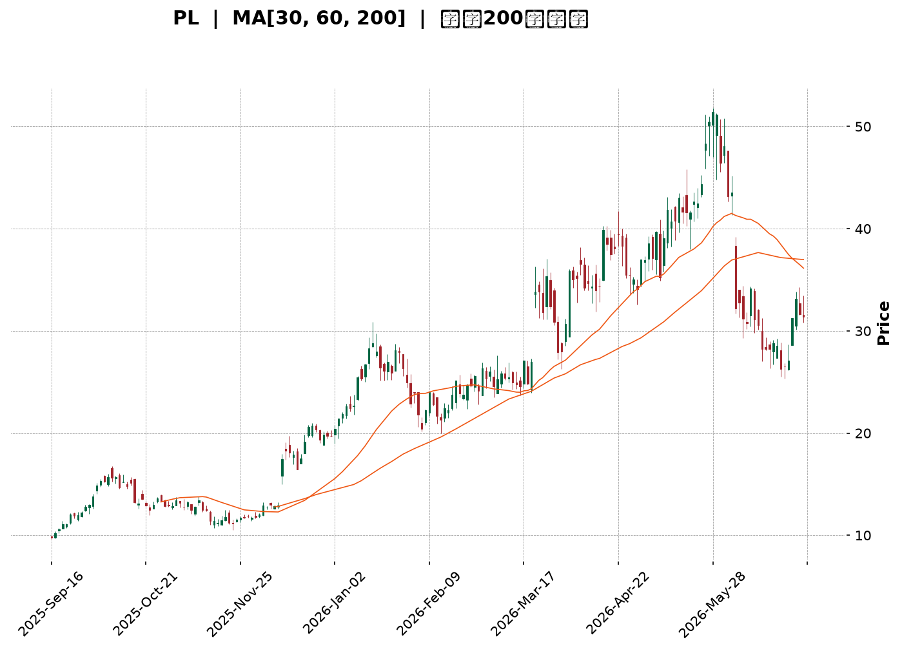
</details>

<html>
<head><meta charset="utf-8" /></head>
<body>
    <div style="height:500px; width:100%;">                        <script>window.PlotlyConfig = {MathJaxConfig: 'local'};</script>
        <script charset="utf-8" src="https://cdn.plot.ly/plotly-3.6.0.min.js" integrity="sha256-QaOVwtVY0T02VaHrr6pnoHLCwayMJp4O5n4YyaE3rJk=" crossorigin="anonymous"></script>                <div id="candlestick-chart" class="plotly-graph-div" style="height:100%; width:100%;"></div>            <script>                window.PLOTLYENV=window.PLOTLYENV || {};                                if (document.getElementById("candlestick-chart")) {                    Plotly.newPlot(                        "candlestick-chart",                        [{"close":{"dtype":"f8","bdata":"AAAAAACAI0AAAACAwnUkQAAAAOBROCVAAAAA4FE4JkAAAADgUTgmQAAAAKCZGShAAAAAACncJ0AAAAAghesnQAAAAGBmZihAAAAA4HqUKUAAAACAwvUpQAAAAIA9iitAAAAAQDOzLUAAAABguJ4uQAAAAEDhei5AAAAAAClcL0AAAABAMzMvQAAAAIDrUS9AAAAAYGZmLUAAAAAAAIAuQAAAACBcjy1AAAAAgBQuLkAAAACAwnUqQAAAAOBROCpAAAAAYLgeK0AAAACA69EpQAAAAAAAAClAAAAAYGbmKUAAAADgUTgrQAAAAGC4nipAAAAAgBSuKUAAAADAzMwpQAAAAOBRuClAAAAAYGbmKkAAAACgR2EqQAAAAGBmZilAAAAAAACAKkAAAAAghesoQAAAAGC4nilAAAAAIK7HKkAAAADgo\u002fAoQAAAAKBH4ShAAAAAgOvRJkAAAADAzMwmQAAAACCFayZAAAAAYGbmJkAAAADgepQnQAAAAIDCdSZAAAAAgOtRJkAAAADgehQnQAAAAIDCdSdAAAAA4KNwJ0AAAADAzMwnQAAAAGBmZidAAAAAgD2KJ0AAAADAHgUoQAAAAKBH4SlAAAAAgD2KKUAAAABgZuYpQAAAAIAUrilAAAAAoEfhKUAAAADgUXgxQAAAAKBwPTJAAAAAwMwMMkAAAACgR+ExQAAAAOBReDBAAAAAoHB9MUAAAACAFC4zQAAAAKCZmTRAAAAAQOG6NEAAAACA61E0QAAAAAApXDNAAAAAYLjeM0AAAACgcL0zQAAAAOBRuDNAAAAAwPVoNEAAAAAA12M1QAAAAEAK1zVAAAAAACmcNkAAAADgo3A2QAAAAIDCtTZAAAAA4KNwOUAAAACA61E5QAAAAEDhujpAAAAAIK5HPEAAAAAgrsc8QAAAAAAAADxAAAAAoEdhOkAAAAAgXA86QAAAAOCj8DpAAAAAYLjeOUAAAACA6xE8QAAAAKBH4TtAAAAAoJlZOkAAAADgUfg4QAAAAKCZ2TZAAAAAQDPzN0AAAADAHsU1QAAAAIAUbjRAAAAAYI9CNkAAAADAHgU4QAAAAIA9yjZAAAAAYGamNUAAAADAzEw1QAAAACCFazZAAAAAgMI1NkAAAACgcL03QAAAAAApHDlAAAAAYGbmN0AAAAAgrsc3QAAAAIDCtThAAAAAoEehOEAAAACgmZk5QAAAAADXIzhAAAAAAClcOkAAAADAzEw5QAAAAAAAADpAAAAAQAqXOEAAAAAgrkc5QAAAAIDr0TlAAAAAYGZmOUAAAADgo3A5QAAAAOBR+DhAAAAAgD3KOEAAAACgmZk4QAAAAOB6FDtAAAAAIFzPOEAAAACAwvU6QAAAAIA96kBAAAAAwPXoQEAAAADgetQ\u002fQAAAACBcr0FAAAAAQDMzQEAAAAAAKdw+QAAAAADX4ztAAAAAQDPzO0AAAACAwrU+QAAAAOCj8EFAAAAAYI+CQUAAAACAwpVBQAAAAGBmRkJAAAAAoHAdQUAAAACAwlVBQAAAAMD1KEFAAAAAQAr3QEAAAADgejRBQAAAAIDr8UNAAAAAoHA9Q0AAAAAAAMBCQAAAAADXA0NAAAAAACm8Q0AAAADAHiVDQAAAAOBRuEFAAAAAoJm5QUAAAAAA14NBQAAAAIA9CkFAAAAAACl8QkAAAABAM3NCQAAAAMAeRUNAAAAA4KOQQkAAAADgUdhDQAAAAGC4nkFAAAAAwB6FQ0AAAAAghetEQAAAAEAKV0RAAAAAYLheREAAAADAHoVFQAAAACBcz0RAAAAAgBTOREAAAAAghctEQAAAAOB6VEVAAAAAoHA9RUAAAADAzCxGQAAAAMD1KEhAAAAAoHA9SUAAAABAM7NJQAAAAIDrkUlAAAAAQOE6R0AAAAAghQtIQAAAAOCjkEVAAAAAANfDRUAAAAAAKRxAQAAAAGC4XkBAAAAAIIUrP0AAAADgUbg+QAAAAIDCFUFAAAAAYGYmP0AAAADgepQ+QAAAAIDCNTxAAAAA4FE4PEAAAABA4To8QAAAAMAexTxAAAAAIK6HPEAAAADAzEw6QAAAAGCPgjpAAAAAgOsRO0AAAAAgrkc\u002fQAAAAOCjkEBAAAAAACmcP0AAAACgR2E\u002fQA=="},"high":{"dtype":"f8","bdata":"AAAAQLbzI0AAAADAzMwkQAAAACCFayVAAAAAgOvRJkAAAADAzEwmQAAAAGCPQihAAAAAgMJ1KEAAAAAgXI8oQAAAAMD1qChAAAAAAAAAKkAAAABguB4qQAAAAIA9CixAAAAAwMg2LkAAAAAAAAAvQAAAACCuxy9AAAAAYI8CMEAAAAAgrscwQAAAAKCZmS9AAAAAwMwMMEAAAABgZuYvQAAAAAAAgC5AAAAA4HpUL0AAAABANR4vQAAAAMD1KCtAAAAAgOvRLEAAAABACKwqQAAAAKCZGSpAAAAAACmcKkAAAACAFG4rQAAAACCF6ytAAAAA4KPwKkAAAAAghasqQAAAAGBmZipAAAAAgMJ1K0AAAABgj8IqQAAAAIA9CitAAAAA4KOwKkAAAACAPQoqQAAAAGBmpilAAAAAoJmZK0AAAACgcL0qQAAAAMDMzClAAAAAgOvRKEAAAABAM7MnQAAAAOBROCdAAAAAwB7FJ0AAAACAwvUoQAAAAAAAAClAAAAAAAAAJ0AAAAAgXE8nQAAAAKDtvCdAAAAAgD0KKEAAAADAHgUoQAAAAADXoydAAAAAwB6FKEAAAACgR2EoQAAAAGBmZipAAAAAAADAKUAAAACAwnUqQAAAAAAAACpAAAAAQOF6KkAAAACgmfkxQAAAAKCZGTNAAAAA4KOwM0AAAAAgrkcyQAAAAMDMjDJAAAAAQDPzMUAAAADgetQzQAAAAGCPwjRAAAAAoHD9NEAAAACAFO40QAAAAIDCVTRAAAAAwB4lNEAAAAAAKTw0QAAAAMDMTDRAAAAAIFzPNEAAAAAgXG81QAAAAEAzEzZAAAAAACncNkAAAACgmZk3QAAAAIDpxjdAAAAAIFyPOUAAAABACpc6QAAAAMAexTpAAAAAoEdhPUAAAABg4+U+QAAAAOBRuD1AAAAAIIWrPEAAAACAwOo6QAAAAEDhujtAAAAAQDOzOkAAAABAM7M8QAAAAGBmZjxAAAAAQDOzO0AAAAAAAEA7QAAAAMChxTlAAAAAAKz8N0AAAAAAAAA4QAAAAIDAijVAAAAAIK5HNkAAAADgURg4QAAAAEDh+jdAAAAAYGaGN0AAAADA9eg1QAAAAIAU7jZAAAAAgD3KNkAAAACgmZk4QAAAAAApHDlAAAAA4KOwOUAAAADgerQ4QAAAACBczzhAAAAAQGLQOUAAAADgo7A5QAAAAEAK1zhAAAAAgBTuOkAAAADgo3A6QAAAAKBHgTpAAAAAoHA9OkAAAAAAqpE7QAAAAEAKFzpAAAAA4FF4OkAAAAAghes6QAAAACBcDzpAAAAAgOkGOkAAAAAAAIA5QAAAAEAKFztAAAAA4HoUO0AAAABgj0I7QAAAAADXI0JAAAAAIIVrQUAAAAAghQtCQAAAAGBmhkJAAAAAANXYQUAAAABguB5BQAAAAMD1aD9AAAAAgBTuPEAAAACAFC4\u002fQAAAAMAeBUJAAAAAwB4lQkAAAABgZuZBQAAAAEDhGkNAAAAAgMKVQkAAAACA6zFCQAAAAIAUvkFAAAAAIFg5QkAAAACAwpVBQAAAAKBwHURAAAAAoHAdREAAAADgevRDQAAAAADXw0NAAAAAQOHaREAAAAAAAABEQAAAAAAAwENAAAAAoHAdQkAAAABACqdBQAAAAAAAgEFAAAAAACl8QkAAAADgeqRCQAAAAGCPokNAAAAAQAq3Q0AAAACgR+FDQAAAAIDCdURAAAAAwMzsQ0AAAAAgXI9FQAAAAOCj8ERAAAAAoJkZRUAAAACgmblFQAAAAEAKl0VAAAAAANfjRkAAAAAAAOBEQAAAAGBmxkVAAAAAAAAARkAAAABADKJGQAAAAOCjkElAAAAAoHB9SUAAAACgR+FJQAAAAGCPoklAAAAAAABgSUAAAABgj2JJQAAAACBcz0dAAAAAwB6VRkAAAABACpdDQAAAAMAeBUFAAAAAIFwvQUAAAADAzMw\u002fQAAAAMD1KEFAAAAAQDMTQUAAAACA6xFAQAAAAAAAQD9AAAAAoJlZPUAAAAAAAAA9QAAAAGCPIj1AAAAAIC89PUAAAACgR+E8QAAAAEAK1zpAAAAA4KOwPEAAAAAgrkc\u002fQAAAAMDM7EBAAAAAAAAgQUAAAACgmblAQA=="},"hovertemplate":"\u003cb\u003e%{x|%Y-%m-%d}\u003c\u002fb\u003e\u003cbr\u003e\u958b: $%{open:.2f}\u003cbr\u003e\u9ad8: $%{high:.2f}\u003cbr\u003e\u4f4e: $%{low:.2f}\u003cbr\u003e\u6536: $%{close:.2f}\u003cextra\u003e\u003c\u002fextra\u003e","low":{"dtype":"f8","bdata":"AAAAgOtRI0AAAAAAKVwjQAAAAOCjcCRAAAAAQOE6JUAAAADgo3AlQAAAAADXIyZAAAAAQApXJ0AAAABACtcmQAAAAMAehSdAAAAA4FG4KEAAAACgcD0oQAAAAEAzMylAAAAAwPUoLEAAAADAHoUtQAAAAKBHYS5AAAAAIFyPLUAAAADAHoUuQAAAAMD1KC5AAAAAACkcLUAAAACA61EuQAAAAEAKFy1AAAAAQDOzLUAAAACgcD0qQAAAACDdJClAAAAAAAAAK0AAAABguJ4pQAAAAOCj8CdAAAAAgBQuKUAAAAAgrkcqQAAAAIA9iipAAAAAIFyPKUAAAAAgrocpQAAAAEDfDylAAAAAIK7HKUAAAACAwnUpQAAAACCF6yhAAAAAIFwPKUAAAAAA1yMoQAAAAAAp3CdAAAAAYBDYKUAAAAAgXI8oQAAAAMD1qChAAAAAQAoXJkAAAADAyHYlQAAAAGCPwiVAAAAAgBTuJUAAAADAzMwmQAAAAICXLiZAAAAAgD0KJUAAAADAHoUmQAAAAMAehSZAAAAAYI9CJ0AAAACAl24nQAAAAMDMzCZAAAAA4HpUJ0AAAABA4XonQAAAAAAp3CdAAAAAwB4FKUAAAACgcD0pQAAAAEA1HilAAAAAwPUoKUAAAADAHgUuQAAAAGC4XjFAAAAAANejMUAAAACAFO4wQAAAAIAUbjBAAAAAgD0KMUAAAACgcP0xQAAAAAApnDNAAAAAoJmZM0AAAAAAKRw0QAAAAIA9CjNAAAAAYI\u002fCMkAAAADgo3AzQAAAAECJoTNAAAAAANX4MkAAAACgcH0zQAAAAOBR+DRAAAAAwPVoNUAAAABAChc2QAAAAMAg0DVAAAAAwPUoN0AAAABguB45QAAAAAAAADlAAAAAYI9COkAAAAAAKVw8QAAAACBcbztAAAAAoEchOUAAAAAA1yM5QAAAAIAULjlAAAAA4FE4OUAAAACgGg86QAAAACBczzpAAAAAwMyMOUAAAACA63E4QAAAAEAKdzZAAAAAwPXoNkAAAABACpc0QAAAAGBmJjRAAAAAIFzPNEAAAABgZqY1QAAAAIDCtTZAAAAAwPXoNEAAAABA4fozQAAAACAGITVAAAAAAACANUAAAACgcD02QAAAAIDCdTZAAAAAYI+CN0AAAABA4To3QAAAAKCZWTZAAAAAoHB9OEAAAACA6xE4QAAAACCuxzZAAAAA4FG4N0AAAACgR2E4QAAAAIBoETlAAAAAYI+CN0AAAACgmdk3QAAAAEAzczhAAAAAQDMzOUAAAADgo\u002fA4QAAAACCuRzhAAAAAIFxPOEAAAADgeKk3QAAAAGBmZjhAAAAAYI\u002fCOEAAAADgo\u002fA3QAAAAIBoIUBAAAAAQOE6P0AAAAAAKRw\u002fQAAAAKBHIT9AAAAAIFwPQEAAAACAPYo+QAAAAGC4PjtAAAAAwPVIOkAAAADAHoU8QAAAAOCjcD1AAAAAQOEaQUAAAABgj2JAQAAAAOBRuEFAAAAA4FH4QEAAAACgmflAQAAAAAApXEBAAAAAoEfhP0AAAAAgrmdAQAAAAGBmdkFAAAAAIIXrQkAAAABACndCQAAAAGCPwkJAAAAAANcjQ0AAAACAPSpCQAAAAOCjkEFAAAAA4KPQQEAAAADA891AQAAAAMD1SEBAAAAAwEsnQUAAAADgpWtBQAAAAMD16EFAAAAAoJn5QUAAAACgR8FBQAAAAEAKd0FAAAAAYGbmQUAAAADAzAxDQAAAAKBHIUNAAAAAwMxsQ0AAAADAzMxDQAAAAMAeRURAAAAAoEchREAAAABgjwJDQAAAAIDCVURAAAAAwB6FREAAAADAzIxFQAAAAIAU7kZAAAAAgBSOR0AAAAAAAIBHQAAAAADXY0ZAAAAAANfDRkAAAABA4TpHQAAAAMAeVUVAAAAAYGamREAAAADA9ag\u002fQAAAAOB6VD9AAAAAgOtRPUAAAABAMzM+QAAAACCFaz5AAAAAwB7FPUAAAAAAKRw+QAAAAKBDCztAAAAA4HoUPEAAAADgelQ6QAAAAIDCtTpAAAAA4HpUO0AAAACAPYo5QAAAAMDMTDlAAAAAoEchOkAAAACgmZk8QAAAAKAYJD5AAAAAwPWIP0AAAACAPco+QA=="},"name":"\u50f9\u683c","open":{"dtype":"f8","bdata":"AAAA4FG4I0AAAAAAAIAjQAAAAIDC9SRAAAAAgOtRJUAAAADgUbglQAAAAEDheiZAAAAAIK5HKEAAAAAAAAAnQAAAAOBRuCdAAAAAIK7HKEAAAABgZmYpQAAAAIAUrilAAAAA4FG4LEAAAABgZuYtQAAAAKCZmS9AAAAAAAAALkAAAADAzIwwQAAAAIAULi9AAAAA4FG4L0AAAAAghWsuQAAAAAAAAC5AAAAAYGbmLkAAAADgo\u002fAuQAAAAAAAACpAAAAAgD0KLEAAAAAAKVwqQAAAAAAAgClAAAAAYI9CKUAAAACgmZkqQAAAAGBm5itAAAAAwMzMKkAAAAAghespQAAAAEDheilAAAAAIK7HKUAAAADA9agqQAAAAIDCdSlAAAAAgBSuKUAAAADAHgUqQAAAAOBROChAAAAAgMJ1KkAAAABgZmYqQAAAAGCPQilAAAAAgD2KKEAAAAAAAAAmQAAAAAApXCZAAAAA4HoUJkAAAAAghesmQAAAAGBmZihAAAAAQOF6JkAAAABAM7MmQAAAAMAeBSdAAAAAgD2KJ0AAAACA69EnQAAAAEAzMydAAAAAYI\u002fCJ0AAAADA9agnQAAAAGBm5idAAAAAwB6FKUAAAAAAKVwqQAAAAKBwPSlAAAAAoJmZKUAAAADgepQvQAAAAOCjcDJAAAAAIFzPMkAAAABgZqYxQAAAAIAULjJAAAAAgD0KMUAAAACgcP0xQAAAACCuxzNAAAAAwMzMM0AAAABA4bo0QAAAAMDMTDRAAAAAoHDdMkAAAAAgrgc0QAAAAGC4vjNAAAAAQOHaM0AAAABAM7M0QAAAAAAAgDVAAAAA4FG4NUAAAACgmdk2QAAAAKCZmTZAAAAAwMxMN0AAAABgj0I6QAAAAAAAgDlAAAAAIFzPOkAAAABAM3M8QAAAAEAKlztAAAAAAACAPEAAAAAAAMA6QAAAAGCPAjpAAAAAoJmZOkAAAADgehQ6QAAAAMDMDDxAAAAAQDOzO0AAAABACrc5QAAAAADX4zhAAAAAQOH6N0AAAAAAAAA4QAAAAAAAADVAAAAAgD0KNUAAAACAwvU1QAAAAGC43jdAAAAAYGaGN0AAAACA65E1QAAAAAAAgDVAAAAAAAAANkAAAABgZmY2QAAAAMAeBTdAAAAAoHC9OEAAAABgZmY3QAAAAAAAQDdAAAAAwMxMOUAAAAAAAIA4QAAAAEAzkzhAAAAA4FG4N0AAAABA4Ro6QAAAAKCZmTlAAAAAAACAOUAAAAAA1+M3QAAAAEAK1zhAAAAAgOvROUAAAABAClc5QAAAAOBR+DlAAAAAQOH6OEAAAACgRyE5QAAAAKCZ2ThAAAAAAACAOkAAAAAAAEA4QAAAAGBmxkBAAAAAAABAQUAAAABA4dpAQAAAAEAzM0BAAAAAACl8QUAAAACgcP1AQAAAAKCZ2T5AAAAAwMzMPEAAAAAAAAA9QAAAAOCjcD1AAAAAgML1QUAAAADgo7BBQAAAAEAzc0JAAAAAAABAQkAAAADgo3BBQAAAAKBwHUFAAAAAIIXLQUAAAACAwjVBQAAAAKBwfUFAAAAAgOuRQ0AAAABAM5NDQAAAAAApHENAAAAAAADAQ0AAAACAPapDQAAAAIAUjkNAAAAAACm8QUAAAADAzExBQAAAAOCjMEFAAAAAANdDQUAAAAAgXF9CQAAAAMAehUJAAAAAoJmZQ0AAAAAgXH9CQAAAAGCPwkNAAAAAQDMzQkAAAABAM1NDQAAAACCFC0RAAAAAQAoXRUAAAADgo1BEQAAAAMD1CEVAAAAAANejRUAAAABACndEQAAAAEAzM0VAAAAAwHIIRUAAAADAzKxFQAAAAMD12EdAAAAAwMwMSUAAAABAMxNJQAAAAAAAkEhAAAAAIIWLSEAAAACAwpVHQAAAACBcz0dAAAAAoHCdRUAAAABgZiZDQAAAAKBHAUFAAAAAgMK1QEAAAAAA1+M+QAAAAAAAgD9AAAAAgOvxQEAAAACAPQpAQAAAAMAeBT5AAAAAANdjPEAAAABgZqY8QAAAAIDC9TtAAAAA4HpUO0AAAACA6xE8QAAAAGCPgjpAAAAAQOE6OkAAAACgmZk8QAAAAKBwfT5AAAAAoJlZQEAAAABACpc\u002fQA=="},"x":["2025-09-16T00:00:00-04:00","2025-09-17T00:00:00-04:00","2025-09-18T00:00:00-04:00","2025-09-19T00:00:00-04:00","2025-09-22T00:00:00-04:00","2025-09-23T00:00:00-04:00","2025-09-24T00:00:00-04:00","2025-09-25T00:00:00-04:00","2025-09-26T00:00:00-04:00","2025-09-29T00:00:00-04:00","2025-09-30T00:00:00-04:00","2025-10-01T00:00:00-04:00","2025-10-02T00:00:00-04:00","2025-10-03T00:00:00-04:00","2025-10-06T00:00:00-04:00","2025-10-07T00:00:00-04:00","2025-10-08T00:00:00-04:00","2025-10-09T00:00:00-04:00","2025-10-10T00:00:00-04:00","2025-10-13T00:00:00-04:00","2025-10-14T00:00:00-04:00","2025-10-15T00:00:00-04:00","2025-10-16T00:00:00-04:00","2025-10-17T00:00:00-04:00","2025-10-20T00:00:00-04:00","2025-10-21T00:00:00-04:00","2025-10-22T00:00:00-04:00","2025-10-23T00:00:00-04:00","2025-10-24T00:00:00-04:00","2025-10-27T00:00:00-04:00","2025-10-28T00:00:00-04:00","2025-10-29T00:00:00-04:00","2025-10-30T00:00:00-04:00","2025-10-31T00:00:00-04:00","2025-11-03T00:00:00-05:00","2025-11-04T00:00:00-05:00","2025-11-05T00:00:00-05:00","2025-11-06T00:00:00-05:00","2025-11-07T00:00:00-05:00","2025-11-10T00:00:00-05:00","2025-11-11T00:00:00-05:00","2025-11-12T00:00:00-05:00","2025-11-13T00:00:00-05:00","2025-11-14T00:00:00-05:00","2025-11-17T00:00:00-05:00","2025-11-18T00:00:00-05:00","2025-11-19T00:00:00-05:00","2025-11-20T00:00:00-05:00","2025-11-21T00:00:00-05:00","2025-11-24T00:00:00-05:00","2025-11-25T00:00:00-05:00","2025-11-26T00:00:00-05:00","2025-11-28T00:00:00-05:00","2025-12-01T00:00:00-05:00","2025-12-02T00:00:00-05:00","2025-12-03T00:00:00-05:00","2025-12-04T00:00:00-05:00","2025-12-05T00:00:00-05:00","2025-12-08T00:00:00-05:00","2025-12-09T00:00:00-05:00","2025-12-10T00:00:00-05:00","2025-12-11T00:00:00-05:00","2025-12-12T00:00:00-05:00","2025-12-15T00:00:00-05:00","2025-12-16T00:00:00-05:00","2025-12-17T00:00:00-05:00","2025-12-18T00:00:00-05:00","2025-12-19T00:00:00-05:00","2025-12-22T00:00:00-05:00","2025-12-23T00:00:00-05:00","2025-12-24T00:00:00-05:00","2025-12-26T00:00:00-05:00","2025-12-29T00:00:00-05:00","2025-12-30T00:00:00-05:00","2025-12-31T00:00:00-05:00","2026-01-02T00:00:00-05:00","2026-01-05T00:00:00-05:00","2026-01-06T00:00:00-05:00","2026-01-07T00:00:00-05:00","2026-01-08T00:00:00-05:00","2026-01-09T00:00:00-05:00","2026-01-12T00:00:00-05:00","2026-01-13T00:00:00-05:00","2026-01-14T00:00:00-05:00","2026-01-15T00:00:00-05:00","2026-01-16T00:00:00-05:00","2026-01-20T00:00:00-05:00","2026-01-21T00:00:00-05:00","2026-01-22T00:00:00-05:00","2026-01-23T00:00:00-05:00","2026-01-26T00:00:00-05:00","2026-01-27T00:00:00-05:00","2026-01-28T00:00:00-05:00","2026-01-29T00:00:00-05:00","2026-01-30T00:00:00-05:00","2026-02-02T00:00:00-05:00","2026-02-03T00:00:00-05:00","2026-02-04T00:00:00-05:00","2026-02-05T00:00:00-05:00","2026-02-06T00:00:00-05:00","2026-02-09T00:00:00-05:00","2026-02-10T00:00:00-05:00","2026-02-11T00:00:00-05:00","2026-02-12T00:00:00-05:00","2026-02-13T00:00:00-05:00","2026-02-17T00:00:00-05:00","2026-02-18T00:00:00-05:00","2026-02-19T00:00:00-05:00","2026-02-20T00:00:00-05:00","2026-02-23T00:00:00-05:00","2026-02-24T00:00:00-05:00","2026-02-25T00:00:00-05:00","2026-02-26T00:00:00-05:00","2026-02-27T00:00:00-05:00","2026-03-02T00:00:00-05:00","2026-03-03T00:00:00-05:00","2026-03-04T00:00:00-05:00","2026-03-05T00:00:00-05:00","2026-03-06T00:00:00-05:00","2026-03-09T00:00:00-04:00","2026-03-10T00:00:00-04:00","2026-03-11T00:00:00-04:00","2026-03-12T00:00:00-04:00","2026-03-13T00:00:00-04:00","2026-03-16T00:00:00-04:00","2026-03-17T00:00:00-04:00","2026-03-18T00:00:00-04:00","2026-03-19T00:00:00-04:00","2026-03-20T00:00:00-04:00","2026-03-23T00:00:00-04:00","2026-03-24T00:00:00-04:00","2026-03-25T00:00:00-04:00","2026-03-26T00:00:00-04:00","2026-03-27T00:00:00-04:00","2026-03-30T00:00:00-04:00","2026-03-31T00:00:00-04:00","2026-04-01T00:00:00-04:00","2026-04-02T00:00:00-04:00","2026-04-06T00:00:00-04:00","2026-04-07T00:00:00-04:00","2026-04-08T00:00:00-04:00","2026-04-09T00:00:00-04:00","2026-04-10T00:00:00-04:00","2026-04-13T00:00:00-04:00","2026-04-14T00:00:00-04:00","2026-04-15T00:00:00-04:00","2026-04-16T00:00:00-04:00","2026-04-17T00:00:00-04:00","2026-04-20T00:00:00-04:00","2026-04-21T00:00:00-04:00","2026-04-22T00:00:00-04:00","2026-04-23T00:00:00-04:00","2026-04-24T00:00:00-04:00","2026-04-27T00:00:00-04:00","2026-04-28T00:00:00-04:00","2026-04-29T00:00:00-04:00","2026-04-30T00:00:00-04:00","2026-05-01T00:00:00-04:00","2026-05-04T00:00:00-04:00","2026-05-05T00:00:00-04:00","2026-05-06T00:00:00-04:00","2026-05-07T00:00:00-04:00","2026-05-08T00:00:00-04:00","2026-05-11T00:00:00-04:00","2026-05-12T00:00:00-04:00","2026-05-13T00:00:00-04:00","2026-05-14T00:00:00-04:00","2026-05-15T00:00:00-04:00","2026-05-18T00:00:00-04:00","2026-05-19T00:00:00-04:00","2026-05-20T00:00:00-04:00","2026-05-21T00:00:00-04:00","2026-05-22T00:00:00-04:00","2026-05-26T00:00:00-04:00","2026-05-27T00:00:00-04:00","2026-05-28T00:00:00-04:00","2026-05-29T00:00:00-04:00","2026-06-01T00:00:00-04:00","2026-06-02T00:00:00-04:00","2026-06-03T00:00:00-04:00","2026-06-04T00:00:00-04:00","2026-06-05T00:00:00-04:00","2026-06-08T00:00:00-04:00","2026-06-09T00:00:00-04:00","2026-06-10T00:00:00-04:00","2026-06-11T00:00:00-04:00","2026-06-12T00:00:00-04:00","2026-06-15T00:00:00-04:00","2026-06-16T00:00:00-04:00","2026-06-17T00:00:00-04:00","2026-06-18T00:00:00-04:00","2026-06-22T00:00:00-04:00","2026-06-23T00:00:00-04:00","2026-06-24T00:00:00-04:00","2026-06-25T00:00:00-04:00","2026-06-26T00:00:00-04:00","2026-06-29T00:00:00-04:00","2026-06-30T00:00:00-04:00","2026-07-01T00:00:00-04:00","2026-07-02T00:00:00-04:00"],"type":"candlestick"},{"hovertemplate":"MA30: $%{y:.2f}\u003cextra\u003e\u003c\u002fextra\u003e","line":{"color":"#2196F3","dash":"dash","width":2},"mode":"lines","name":"MA30","x":["2025-09-16T00:00:00-04:00","2025-09-17T00:00:00-04:00","2025-09-18T00:00:00-04:00","2025-09-19T00:00:00-04:00","2025-09-22T00:00:00-04:00","2025-09-23T00:00:00-04:00","2025-09-24T00:00:00-04:00","2025-09-25T00:00:00-04:00","2025-09-26T00:00:00-04:00","2025-09-29T00:00:00-04:00","2025-09-30T00:00:00-04:00","2025-10-01T00:00:00-04:00","2025-10-02T00:00:00-04:00","2025-10-03T00:00:00-04:00","2025-10-06T00:00:00-04:00","2025-10-07T00:00:00-04:00","2025-10-08T00:00:00-04:00","2025-10-09T00:00:00-04:00","2025-10-10T00:00:00-04:00","2025-10-13T00:00:00-04:00","2025-10-14T00:00:00-04:00","2025-10-15T00:00:00-04:00","2025-10-16T00:00:00-04:00","2025-10-17T00:00:00-04:00","2025-10-20T00:00:00-04:00","2025-10-21T00:00:00-04:00","2025-10-22T00:00:00-04:00","2025-10-23T00:00:00-04:00","2025-10-24T00:00:00-04:00","2025-10-27T00:00:00-04:00","2025-10-28T00:00:00-04:00","2025-10-29T00:00:00-04:00","2025-10-30T00:00:00-04:00","2025-10-31T00:00:00-04:00","2025-11-03T00:00:00-05:00","2025-11-04T00:00:00-05:00","2025-11-05T00:00:00-05:00","2025-11-06T00:00:00-05:00","2025-11-07T00:00:00-05:00","2025-11-10T00:00:00-05:00","2025-11-11T00:00:00-05:00","2025-11-12T00:00:00-05:00","2025-11-13T00:00:00-05:00","2025-11-14T00:00:00-05:00","2025-11-17T00:00:00-05:00","2025-11-18T00:00:00-05:00","2025-11-19T00:00:00-05:00","2025-11-20T00:00:00-05:00","2025-11-21T00:00:00-05:00","2025-11-24T00:00:00-05:00","2025-11-25T00:00:00-05:00","2025-11-26T00:00:00-05:00","2025-11-28T00:00:00-05:00","2025-12-01T00:00:00-05:00","2025-12-02T00:00:00-05:00","2025-12-03T00:00:00-05:00","2025-12-04T00:00:00-05:00","2025-12-05T00:00:00-05:00","2025-12-08T00:00:00-05:00","2025-12-09T00:00:00-05:00","2025-12-10T00:00:00-05:00","2025-12-11T00:00:00-05:00","2025-12-12T00:00:00-05:00","2025-12-15T00:00:00-05:00","2025-12-16T00:00:00-05:00","2025-12-17T00:00:00-05:00","2025-12-18T00:00:00-05:00","2025-12-19T00:00:00-05:00","2025-12-22T00:00:00-05:00","2025-12-23T00:00:00-05:00","2025-12-24T00:00:00-05:00","2025-12-26T00:00:00-05:00","2025-12-29T00:00:00-05:00","2025-12-30T00:00:00-05:00","2025-12-31T00:00:00-05:00","2026-01-02T00:00:00-05:00","2026-01-05T00:00:00-05:00","2026-01-06T00:00:00-05:00","2026-01-07T00:00:00-05:00","2026-01-08T00:00:00-05:00","2026-01-09T00:00:00-05:00","2026-01-12T00:00:00-05:00","2026-01-13T00:00:00-05:00","2026-01-14T00:00:00-05:00","2026-01-15T00:00:00-05:00","2026-01-16T00:00:00-05:00","2026-01-20T00:00:00-05:00","2026-01-21T00:00:00-05:00","2026-01-22T00:00:00-05:00","2026-01-23T00:00:00-05:00","2026-01-26T00:00:00-05:00","2026-01-27T00:00:00-05:00","2026-01-28T00:00:00-05:00","2026-01-29T00:00:00-05:00","2026-01-30T00:00:00-05:00","2026-02-02T00:00:00-05:00","2026-02-03T00:00:00-05:00","2026-02-04T00:00:00-05:00","2026-02-05T00:00:00-05:00","2026-02-06T00:00:00-05:00","2026-02-09T00:00:00-05:00","2026-02-10T00:00:00-05:00","2026-02-11T00:00:00-05:00","2026-02-12T00:00:00-05:00","2026-02-13T00:00:00-05:00","2026-02-17T00:00:00-05:00","2026-02-18T00:00:00-05:00","2026-02-19T00:00:00-05:00","2026-02-20T00:00:00-05:00","2026-02-23T00:00:00-05:00","2026-02-24T00:00:00-05:00","2026-02-25T00:00:00-05:00","2026-02-26T00:00:00-05:00","2026-02-27T00:00:00-05:00","2026-03-02T00:00:00-05:00","2026-03-03T00:00:00-05:00","2026-03-04T00:00:00-05:00","2026-03-05T00:00:00-05:00","2026-03-06T00:00:00-05:00","2026-03-09T00:00:00-04:00","2026-03-10T00:00:00-04:00","2026-03-11T00:00:00-04:00","2026-03-12T00:00:00-04:00","2026-03-13T00:00:00-04:00","2026-03-16T00:00:00-04:00","2026-03-17T00:00:00-04:00","2026-03-18T00:00:00-04:00","2026-03-19T00:00:00-04:00","2026-03-20T00:00:00-04:00","2026-03-23T00:00:00-04:00","2026-03-24T00:00:00-04:00","2026-03-25T00:00:00-04:00","2026-03-26T00:00:00-04:00","2026-03-27T00:00:00-04:00","2026-03-30T00:00:00-04:00","2026-03-31T00:00:00-04:00","2026-04-01T00:00:00-04:00","2026-04-02T00:00:00-04:00","2026-04-06T00:00:00-04:00","2026-04-07T00:00:00-04:00","2026-04-08T00:00:00-04:00","2026-04-09T00:00:00-04:00","2026-04-10T00:00:00-04:00","2026-04-13T00:00:00-04:00","2026-04-14T00:00:00-04:00","2026-04-15T00:00:00-04:00","2026-04-16T00:00:00-04:00","2026-04-17T00:00:00-04:00","2026-04-20T00:00:00-04:00","2026-04-21T00:00:00-04:00","2026-04-22T00:00:00-04:00","2026-04-23T00:00:00-04:00","2026-04-24T00:00:00-04:00","2026-04-27T00:00:00-04:00","2026-04-28T00:00:00-04:00","2026-04-29T00:00:00-04:00","2026-04-30T00:00:00-04:00","2026-05-01T00:00:00-04:00","2026-05-04T00:00:00-04:00","2026-05-05T00:00:00-04:00","2026-05-06T00:00:00-04:00","2026-05-07T00:00:00-04:00","2026-05-08T00:00:00-04:00","2026-05-11T00:00:00-04:00","2026-05-12T00:00:00-04:00","2026-05-13T00:00:00-04:00","2026-05-14T00:00:00-04:00","2026-05-15T00:00:00-04:00","2026-05-18T00:00:00-04:00","2026-05-19T00:00:00-04:00","2026-05-20T00:00:00-04:00","2026-05-21T00:00:00-04:00","2026-05-22T00:00:00-04:00","2026-05-26T00:00:00-04:00","2026-05-27T00:00:00-04:00","2026-05-28T00:00:00-04:00","2026-05-29T00:00:00-04:00","2026-06-01T00:00:00-04:00","2026-06-02T00:00:00-04:00","2026-06-03T00:00:00-04:00","2026-06-04T00:00:00-04:00","2026-06-05T00:00:00-04:00","2026-06-08T00:00:00-04:00","2026-06-09T00:00:00-04:00","2026-06-10T00:00:00-04:00","2026-06-11T00:00:00-04:00","2026-06-12T00:00:00-04:00","2026-06-15T00:00:00-04:00","2026-06-16T00:00:00-04:00","2026-06-17T00:00:00-04:00","2026-06-18T00:00:00-04:00","2026-06-22T00:00:00-04:00","2026-06-23T00:00:00-04:00","2026-06-24T00:00:00-04:00","2026-06-25T00:00:00-04:00","2026-06-26T00:00:00-04:00","2026-06-29T00:00:00-04:00","2026-06-30T00:00:00-04:00","2026-07-01T00:00:00-04:00","2026-07-02T00:00:00-04:00"],"y":{"dtype":"f8","bdata":"AAAAAAAA+H8AAAAAAAD4fwAAAAAAAPh\u002fAAAAAAAA+H8AAAAAAAD4fwAAAAAAAPh\u002fAAAAAAAA+H8AAAAAAAD4fwAAAAAAAPh\u002fAAAAAAAA+H8AAAAAAAD4fwAAAAAAAPh\u002fAAAAAAAA+H8AAAAAAAD4fwAAAAAAAPh\u002fAAAAAAAA+H8AAAAAAAD4fwAAAAAAAPh\u002fAAAAAAAA+H8AAAAAAAD4fwAAAAAAAPh\u002fAAAAAAAA+H8AAAAAAAD4fwAAAAAAAPh\u002fAAAAAAAA+H8AAAAAAAD4fwAAAAAAAPh\u002fAAAAAAAA+H8AAAAAAAD4f5qZmcmhhSpARERENF66KkDNzMyc7+cqQDMzMwNWDitAERERoUU2K0CamZlJxVkrQN7d3S3dZCtAiYiIWGR7K0ARERHh7IMrQDMzMwNWjitAREREdJOYK0C8u7s7348rQO\u002fu7l4seStAd3d3x3Y+K0CamZm5u\u002fsqQDMzM2P0tipAvLu7O8NuKkBmZmYWvS0qQO\u002fu7h4i4ilAAAAAoLelKUAzMzNjZmYpQLy7u7tYMilAq6qq+tT4KEDv7u4eIuIoQM3MzLwRyihAvLu7G4WrKEAzMzPzKJwoQGZmZlaroyhAiYiI6JigKEAzMzNTVZUoQM3MzNxPjShARERExASPKEBmZmZmA90oQKuqqvrUOClA7+7urlaHKUCrqqqaYdcpQLy7u\u002fu4FypAMzMz0xVgKkBERET0xdIqQLy7u\u002fu4VytA3t3d7f3UK0CamZkZ91osQLy7uwsR0SxAq6qqWnNhLUDv7u5eye8tQAAAACAGgS5AZmZm9vAZL0AAAAAAyL0vQGZmZuZtOTBA7+7uziKbMEARERE5JvgwQN7d3WXYVTFAIiIiMuzKMUAiIiKicD0yQDMzMyuyvTJAiYiI0JRKM0CJiIhwr9kzQDMzM4MyWjRAIiIiAlbONEBVVVU9NT41QBERESmHtjVA3t3dLd0kNkC8u7s7UX82QCIiIiKU0TZAMzMzw2cYN0Crqqoa6FQ3QN7d3W1ZizdAREREhHnCN0BVVVV1k9g3QGZmZhYg1zdAzczMbC7kN0AzMzMzwQM4QGZmZiYGIThA3t3dnTYwOEDNzMx8hj04QKuqqrqQVDhAMzMz4+xjOECrqqqK+nc4QHd3d\u002ffhkzhAMzMzA+SeOECamZlJU6o4QKuqqlpkuzhAERER4Xq0OEDNzMyM3rY4QLy7u5vEoDhA3t3dTWKQOEAAAAAgsHI4QO\u002fu7g6fYThA7+7uvlhSOEAAAADQsEs4QCIiIiIiQjhAZmZmZh8+OEBEREQUric4QGZmZhbZDjhAd3d3N4kBOEARERHxYP43QERERIR5IjhAZmZmNtApOEAAAADwGVY4QAAAALByyDhARERE5BcrOUCJiIgYvW05QFVVVYUW2TlAIiIiQtI0OkBmZmZmZoY6QLy7u8sTtTpAVVVVBQ\u002fmOkB3d3c3iSE7QERERKRwfTtAd3d3p1TcO0C8u7t7hj08QLy7u1uPojxAERER4Xr0PEB3d3eX4EE9QERERCS\u002fmD1A7+7uDljZPUCJiIgoFSc+QDMzM1OcnT5A3t3dfSMUP0DNzMx8anw\u002fQDMzM6Ob5D9AMzMzA1YuQEC8u7ujKWVAQLy7u6vVkUBAvLu7O1G\u002fQECrqqqS0etAQBEREXGvCUFAAAAAaJE9QUAiIiKK+mdBQFVVVR0TfEFAzczMhDKKQUC8u7u7u6tBQN7d3b0tq0FAREREZILHQUCrqqp6W\u002fZBQCIiIpLtLEJAmpmZqX9jQkAAAABQG5hCQLy7u+uYsEJAVVVV9bbMQkAAAABQG+hCQAAAABAtAkNAMzMzQ2AlQ0B3d3dnrU5DQDMzMyNpikNAZmZmJgbRQ0AzMzPDgxlEQDMzM8ODSURAzczMDJBrREB3d3cnv5hEQHd3d7eBrkRAERERUdS\u002fREAiIiJC7qVEQERERCRpmkRAVVVVPSaIREAiIiKSwnVEQO\u002fu7t4kdkRAiYiI4E9dREAAAADAWEJEQCIiIqJFFkRAERERiUHwQ0AREREpXL9DQJqZmTHBo0NAiYiIeOl2Q0BVVVWlmzRDQCIiIjom+EJAiYiI8NK9QkAiIiLipYtCQKuqqopsZ0JAAAAA4ME8QkDNzMzUMRFCQA=="},"type":"scatter"},{"hovertemplate":"MA60: $%{y:.2f}\u003cextra\u003e\u003c\u002fextra\u003e","line":{"color":"#9C27B0","dash":"dash","width":2},"mode":"lines","name":"MA60","x":["2025-09-16T00:00:00-04:00","2025-09-17T00:00:00-04:00","2025-09-18T00:00:00-04:00","2025-09-19T00:00:00-04:00","2025-09-22T00:00:00-04:00","2025-09-23T00:00:00-04:00","2025-09-24T00:00:00-04:00","2025-09-25T00:00:00-04:00","2025-09-26T00:00:00-04:00","2025-09-29T00:00:00-04:00","2025-09-30T00:00:00-04:00","2025-10-01T00:00:00-04:00","2025-10-02T00:00:00-04:00","2025-10-03T00:00:00-04:00","2025-10-06T00:00:00-04:00","2025-10-07T00:00:00-04:00","2025-10-08T00:00:00-04:00","2025-10-09T00:00:00-04:00","2025-10-10T00:00:00-04:00","2025-10-13T00:00:00-04:00","2025-10-14T00:00:00-04:00","2025-10-15T00:00:00-04:00","2025-10-16T00:00:00-04:00","2025-10-17T00:00:00-04:00","2025-10-20T00:00:00-04:00","2025-10-21T00:00:00-04:00","2025-10-22T00:00:00-04:00","2025-10-23T00:00:00-04:00","2025-10-24T00:00:00-04:00","2025-10-27T00:00:00-04:00","2025-10-28T00:00:00-04:00","2025-10-29T00:00:00-04:00","2025-10-30T00:00:00-04:00","2025-10-31T00:00:00-04:00","2025-11-03T00:00:00-05:00","2025-11-04T00:00:00-05:00","2025-11-05T00:00:00-05:00","2025-11-06T00:00:00-05:00","2025-11-07T00:00:00-05:00","2025-11-10T00:00:00-05:00","2025-11-11T00:00:00-05:00","2025-11-12T00:00:00-05:00","2025-11-13T00:00:00-05:00","2025-11-14T00:00:00-05:00","2025-11-17T00:00:00-05:00","2025-11-18T00:00:00-05:00","2025-11-19T00:00:00-05:00","2025-11-20T00:00:00-05:00","2025-11-21T00:00:00-05:00","2025-11-24T00:00:00-05:00","2025-11-25T00:00:00-05:00","2025-11-26T00:00:00-05:00","2025-11-28T00:00:00-05:00","2025-12-01T00:00:00-05:00","2025-12-02T00:00:00-05:00","2025-12-03T00:00:00-05:00","2025-12-04T00:00:00-05:00","2025-12-05T00:00:00-05:00","2025-12-08T00:00:00-05:00","2025-12-09T00:00:00-05:00","2025-12-10T00:00:00-05:00","2025-12-11T00:00:00-05:00","2025-12-12T00:00:00-05:00","2025-12-15T00:00:00-05:00","2025-12-16T00:00:00-05:00","2025-12-17T00:00:00-05:00","2025-12-18T00:00:00-05:00","2025-12-19T00:00:00-05:00","2025-12-22T00:00:00-05:00","2025-12-23T00:00:00-05:00","2025-12-24T00:00:00-05:00","2025-12-26T00:00:00-05:00","2025-12-29T00:00:00-05:00","2025-12-30T00:00:00-05:00","2025-12-31T00:00:00-05:00","2026-01-02T00:00:00-05:00","2026-01-05T00:00:00-05:00","2026-01-06T00:00:00-05:00","2026-01-07T00:00:00-05:00","2026-01-08T00:00:00-05:00","2026-01-09T00:00:00-05:00","2026-01-12T00:00:00-05:00","2026-01-13T00:00:00-05:00","2026-01-14T00:00:00-05:00","2026-01-15T00:00:00-05:00","2026-01-16T00:00:00-05:00","2026-01-20T00:00:00-05:00","2026-01-21T00:00:00-05:00","2026-01-22T00:00:00-05:00","2026-01-23T00:00:00-05:00","2026-01-26T00:00:00-05:00","2026-01-27T00:00:00-05:00","2026-01-28T00:00:00-05:00","2026-01-29T00:00:00-05:00","2026-01-30T00:00:00-05:00","2026-02-02T00:00:00-05:00","2026-02-03T00:00:00-05:00","2026-02-04T00:00:00-05:00","2026-02-05T00:00:00-05:00","2026-02-06T00:00:00-05:00","2026-02-09T00:00:00-05:00","2026-02-10T00:00:00-05:00","2026-02-11T00:00:00-05:00","2026-02-12T00:00:00-05:00","2026-02-13T00:00:00-05:00","2026-02-17T00:00:00-05:00","2026-02-18T00:00:00-05:00","2026-02-19T00:00:00-05:00","2026-02-20T00:00:00-05:00","2026-02-23T00:00:00-05:00","2026-02-24T00:00:00-05:00","2026-02-25T00:00:00-05:00","2026-02-26T00:00:00-05:00","2026-02-27T00:00:00-05:00","2026-03-02T00:00:00-05:00","2026-03-03T00:00:00-05:00","2026-03-04T00:00:00-05:00","2026-03-05T00:00:00-05:00","2026-03-06T00:00:00-05:00","2026-03-09T00:00:00-04:00","2026-03-10T00:00:00-04:00","2026-03-11T00:00:00-04:00","2026-03-12T00:00:00-04:00","2026-03-13T00:00:00-04:00","2026-03-16T00:00:00-04:00","2026-03-17T00:00:00-04:00","2026-03-18T00:00:00-04:00","2026-03-19T00:00:00-04:00","2026-03-20T00:00:00-04:00","2026-03-23T00:00:00-04:00","2026-03-24T00:00:00-04:00","2026-03-25T00:00:00-04:00","2026-03-26T00:00:00-04:00","2026-03-27T00:00:00-04:00","2026-03-30T00:00:00-04:00","2026-03-31T00:00:00-04:00","2026-04-01T00:00:00-04:00","2026-04-02T00:00:00-04:00","2026-04-06T00:00:00-04:00","2026-04-07T00:00:00-04:00","2026-04-08T00:00:00-04:00","2026-04-09T00:00:00-04:00","2026-04-10T00:00:00-04:00","2026-04-13T00:00:00-04:00","2026-04-14T00:00:00-04:00","2026-04-15T00:00:00-04:00","2026-04-16T00:00:00-04:00","2026-04-17T00:00:00-04:00","2026-04-20T00:00:00-04:00","2026-04-21T00:00:00-04:00","2026-04-22T00:00:00-04:00","2026-04-23T00:00:00-04:00","2026-04-24T00:00:00-04:00","2026-04-27T00:00:00-04:00","2026-04-28T00:00:00-04:00","2026-04-29T00:00:00-04:00","2026-04-30T00:00:00-04:00","2026-05-01T00:00:00-04:00","2026-05-04T00:00:00-04:00","2026-05-05T00:00:00-04:00","2026-05-06T00:00:00-04:00","2026-05-07T00:00:00-04:00","2026-05-08T00:00:00-04:00","2026-05-11T00:00:00-04:00","2026-05-12T00:00:00-04:00","2026-05-13T00:00:00-04:00","2026-05-14T00:00:00-04:00","2026-05-15T00:00:00-04:00","2026-05-18T00:00:00-04:00","2026-05-19T00:00:00-04:00","2026-05-20T00:00:00-04:00","2026-05-21T00:00:00-04:00","2026-05-22T00:00:00-04:00","2026-05-26T00:00:00-04:00","2026-05-27T00:00:00-04:00","2026-05-28T00:00:00-04:00","2026-05-29T00:00:00-04:00","2026-06-01T00:00:00-04:00","2026-06-02T00:00:00-04:00","2026-06-03T00:00:00-04:00","2026-06-04T00:00:00-04:00","2026-06-05T00:00:00-04:00","2026-06-08T00:00:00-04:00","2026-06-09T00:00:00-04:00","2026-06-10T00:00:00-04:00","2026-06-11T00:00:00-04:00","2026-06-12T00:00:00-04:00","2026-06-15T00:00:00-04:00","2026-06-16T00:00:00-04:00","2026-06-17T00:00:00-04:00","2026-06-18T00:00:00-04:00","2026-06-22T00:00:00-04:00","2026-06-23T00:00:00-04:00","2026-06-24T00:00:00-04:00","2026-06-25T00:00:00-04:00","2026-06-26T00:00:00-04:00","2026-06-29T00:00:00-04:00","2026-06-30T00:00:00-04:00","2026-07-01T00:00:00-04:00","2026-07-02T00:00:00-04:00"],"y":{"dtype":"f8","bdata":"AAAAAAAA+H8AAAAAAAD4fwAAAAAAAPh\u002fAAAAAAAA+H8AAAAAAAD4fwAAAAAAAPh\u002fAAAAAAAA+H8AAAAAAAD4fwAAAAAAAPh\u002fAAAAAAAA+H8AAAAAAAD4fwAAAAAAAPh\u002fAAAAAAAA+H8AAAAAAAD4fwAAAAAAAPh\u002fAAAAAAAA+H8AAAAAAAD4fwAAAAAAAPh\u002fAAAAAAAA+H8AAAAAAAD4fwAAAAAAAPh\u002fAAAAAAAA+H8AAAAAAAD4fwAAAAAAAPh\u002fAAAAAAAA+H8AAAAAAAD4fwAAAAAAAPh\u002fAAAAAAAA+H8AAAAAAAD4fwAAAAAAAPh\u002fAAAAAAAA+H8AAAAAAAD4fwAAAAAAAPh\u002fAAAAAAAA+H8AAAAAAAD4fwAAAAAAAPh\u002fAAAAAAAA+H8AAAAAAAD4fwAAAAAAAPh\u002fAAAAAAAA+H8AAAAAAAD4fwAAAAAAAPh\u002fAAAAAAAA+H8AAAAAAAD4fwAAAAAAAPh\u002fAAAAAAAA+H8AAAAAAAD4fwAAAAAAAPh\u002fAAAAAAAA+H8AAAAAAAD4fwAAAAAAAPh\u002fAAAAAAAA+H8AAAAAAAD4fwAAAAAAAPh\u002fAAAAAAAA+H8AAAAAAAD4fwAAAAAAAPh\u002fAAAAAAAA+H8AAAAAAAD4fzMzM9N4iSlAREREfLGkKUCamZmBeeIpQO\u002fu7n6VIypAAAAAKM5eKkAiIiJyk5gqQM3MzBRLvipA3t3dFb3tKkCrqqpqWSsrQHd3d38HcytAERERsci2K0Crqqoqa\u002fUrQFVVVbUeJSxAEREREfVPLEBERESMwnUsQJqZmUH9myxAERERGVrELEAzMzOLwvUsQN7d3fV+Ki1A7+7unv5tLUCrqqpqWastQLy7u8ME7y1Ad3d3r1ZHLkCamZmxga4uQJqZmQm7Ii9AZmZmXlegL0ARERH14RMwQDMzMxcEVjBAMzMzO1GPMEB3d3fzb8QwQLy7u4uX\u002fjBAAAAAyC82MUB3d3d36XYxQLy7u0\u002f\u002ftjFAVVVVjQnuMUAAAAB0TCAyQN7d3fWaSzJA7+7uNkJ5MkC8u7s3+6AyQCIiIkp+wTJA3t3dsVbnMkAAAABgnhgzQCIiIlbHRDNAmpmZJXhwM0AiIiKWtZozQFVVVeWJyjNAMzMzr3L4M0BVVVVFbys0QO\u002fu7u6nZjRAERERaQOdNEBVVVXBPNE0QERERGCeCDVAmpmZibM\u002fNUB3d3eXJ3o1QHd3d2M7rzVAMzMzj3vtNUBERETILyY2QBEREcnoXTZAiYiIYFeQNkCrqqoG88Q2QJqZmaVU\u002fDZAIiIiSn4xN0AAAACof1M3QERERJw2cDdAVVVVffiMN0De3d2FpKk3QBEREXnp1jdAVVVV3ST2N0CrqqqyVhc4QDMzM2PJTzhAiYiIKKOHOEDe3d0lv7g4QN7d3VUO\u002fThAAAAAcIQyOUCamZlx9mE5QDMzM0PShDlARERE9P2kOUARERHhwcw5QN7d3U2pCDpAVVVVVZw9OkCrqqri7HM6QDMzM9v5rjpAERER4XrUOkAiIiKSX\u002fw6QAAAAODBHDtAZmZmLt00O0BERESk4kw7QBEREbGdfztAZmZmHj6zO0BmZmamDeQ7QKuqquJeEzxAZmZmtmVNPEDe3d2tAHk8QO\u002fu7jZCmTxAd3d31xXAPEAzMzMLAus8QDMzMzPsGj1AMzMzg3lSPUAiIiKCB5M9QFVVVXVM4D1A7+7udr4fPkAAAABImmI+QImIiAC5lz5AVVVVhevhPkDe3d2tjjk\u002fQAAAAHh3hz9ARERELIfWP0De3d31bxRAQO\u002fu7p6oN0BAiYiIpHBdQEDv7u5Gb4NAQO\u002fu7l66qUBA3t3d2c7PQECamZnZzvdAQKuqqlpkK0FA7+7uFtleQUC8u7srh5ZBQGZmZvYozEFA3t3d5dD6QUDv7u4yeitCQImIiMRnUEJAIiIiKhV3QkDv7u7yi4VCQAAAAGgflkJAiYiIvLujQkBmZmYSyrBCQAAAACjqv0JAREREpHDNQkARERGlKdVCQLy7u18syUJA7+7uBjq9QkBmZmbyi7VCQLy7u3d3p0JAZmZm7jWfQkAAAACQe5VCQCIiIuaJkkJAERERTamQQkARERGZ4JFCQDMzM7sCjEJAq6qqaryEQkBmZmaSpnxCQA=="},"type":"scatter"},{"hovertemplate":"MA200: $%{y:.2f}\u003cextra\u003e\u003c\u002fextra\u003e","line":{"color":"#FF6F00","dash":"solid","width":2},"mode":"lines","name":"MA200","x":["2025-09-16T00:00:00-04:00","2025-09-17T00:00:00-04:00","2025-09-18T00:00:00-04:00","2025-09-19T00:00:00-04:00","2025-09-22T00:00:00-04:00","2025-09-23T00:00:00-04:00","2025-09-24T00:00:00-04:00","2025-09-25T00:00:00-04:00","2025-09-26T00:00:00-04:00","2025-09-29T00:00:00-04:00","2025-09-30T00:00:00-04:00","2025-10-01T00:00:00-04:00","2025-10-02T00:00:00-04:00","2025-10-03T00:00:00-04:00","2025-10-06T00:00:00-04:00","2025-10-07T00:00:00-04:00","2025-10-08T00:00:00-04:00","2025-10-09T00:00:00-04:00","2025-10-10T00:00:00-04:00","2025-10-13T00:00:00-04:00","2025-10-14T00:00:00-04:00","2025-10-15T00:00:00-04:00","2025-10-16T00:00:00-04:00","2025-10-17T00:00:00-04:00","2025-10-20T00:00:00-04:00","2025-10-21T00:00:00-04:00","2025-10-22T00:00:00-04:00","2025-10-23T00:00:00-04:00","2025-10-24T00:00:00-04:00","2025-10-27T00:00:00-04:00","2025-10-28T00:00:00-04:00","2025-10-29T00:00:00-04:00","2025-10-30T00:00:00-04:00","2025-10-31T00:00:00-04:00","2025-11-03T00:00:00-05:00","2025-11-04T00:00:00-05:00","2025-11-05T00:00:00-05:00","2025-11-06T00:00:00-05:00","2025-11-07T00:00:00-05:00","2025-11-10T00:00:00-05:00","2025-11-11T00:00:00-05:00","2025-11-12T00:00:00-05:00","2025-11-13T00:00:00-05:00","2025-11-14T00:00:00-05:00","2025-11-17T00:00:00-05:00","2025-11-18T00:00:00-05:00","2025-11-19T00:00:00-05:00","2025-11-20T00:00:00-05:00","2025-11-21T00:00:00-05:00","2025-11-24T00:00:00-05:00","2025-11-25T00:00:00-05:00","2025-11-26T00:00:00-05:00","2025-11-28T00:00:00-05:00","2025-12-01T00:00:00-05:00","2025-12-02T00:00:00-05:00","2025-12-03T00:00:00-05:00","2025-12-04T00:00:00-05:00","2025-12-05T00:00:00-05:00","2025-12-08T00:00:00-05:00","2025-12-09T00:00:00-05:00","2025-12-10T00:00:00-05:00","2025-12-11T00:00:00-05:00","2025-12-12T00:00:00-05:00","2025-12-15T00:00:00-05:00","2025-12-16T00:00:00-05:00","2025-12-17T00:00:00-05:00","2025-12-18T00:00:00-05:00","2025-12-19T00:00:00-05:00","2025-12-22T00:00:00-05:00","2025-12-23T00:00:00-05:00","2025-12-24T00:00:00-05:00","2025-12-26T00:00:00-05:00","2025-12-29T00:00:00-05:00","2025-12-30T00:00:00-05:00","2025-12-31T00:00:00-05:00","2026-01-02T00:00:00-05:00","2026-01-05T00:00:00-05:00","2026-01-06T00:00:00-05:00","2026-01-07T00:00:00-05:00","2026-01-08T00:00:00-05:00","2026-01-09T00:00:00-05:00","2026-01-12T00:00:00-05:00","2026-01-13T00:00:00-05:00","2026-01-14T00:00:00-05:00","2026-01-15T00:00:00-05:00","2026-01-16T00:00:00-05:00","2026-01-20T00:00:00-05:00","2026-01-21T00:00:00-05:00","2026-01-22T00:00:00-05:00","2026-01-23T00:00:00-05:00","2026-01-26T00:00:00-05:00","2026-01-27T00:00:00-05:00","2026-01-28T00:00:00-05:00","2026-01-29T00:00:00-05:00","2026-01-30T00:00:00-05:00","2026-02-02T00:00:00-05:00","2026-02-03T00:00:00-05:00","2026-02-04T00:00:00-05:00","2026-02-05T00:00:00-05:00","2026-02-06T00:00:00-05:00","2026-02-09T00:00:00-05:00","2026-02-10T00:00:00-05:00","2026-02-11T00:00:00-05:00","2026-02-12T00:00:00-05:00","2026-02-13T00:00:00-05:00","2026-02-17T00:00:00-05:00","2026-02-18T00:00:00-05:00","2026-02-19T00:00:00-05:00","2026-02-20T00:00:00-05:00","2026-02-23T00:00:00-05:00","2026-02-24T00:00:00-05:00","2026-02-25T00:00:00-05:00","2026-02-26T00:00:00-05:00","2026-02-27T00:00:00-05:00","2026-03-02T00:00:00-05:00","2026-03-03T00:00:00-05:00","2026-03-04T00:00:00-05:00","2026-03-05T00:00:00-05:00","2026-03-06T00:00:00-05:00","2026-03-09T00:00:00-04:00","2026-03-10T00:00:00-04:00","2026-03-11T00:00:00-04:00","2026-03-12T00:00:00-04:00","2026-03-13T00:00:00-04:00","2026-03-16T00:00:00-04:00","2026-03-17T00:00:00-04:00","2026-03-18T00:00:00-04:00","2026-03-19T00:00:00-04:00","2026-03-20T00:00:00-04:00","2026-03-23T00:00:00-04:00","2026-03-24T00:00:00-04:00","2026-03-25T00:00:00-04:00","2026-03-26T00:00:00-04:00","2026-03-27T00:00:00-04:00","2026-03-30T00:00:00-04:00","2026-03-31T00:00:00-04:00","2026-04-01T00:00:00-04:00","2026-04-02T00:00:00-04:00","2026-04-06T00:00:00-04:00","2026-04-07T00:00:00-04:00","2026-04-08T00:00:00-04:00","2026-04-09T00:00:00-04:00","2026-04-10T00:00:00-04:00","2026-04-13T00:00:00-04:00","2026-04-14T00:00:00-04:00","2026-04-15T00:00:00-04:00","2026-04-16T00:00:00-04:00","2026-04-17T00:00:00-04:00","2026-04-20T00:00:00-04:00","2026-04-21T00:00:00-04:00","2026-04-22T00:00:00-04:00","2026-04-23T00:00:00-04:00","2026-04-24T00:00:00-04:00","2026-04-27T00:00:00-04:00","2026-04-28T00:00:00-04:00","2026-04-29T00:00:00-04:00","2026-04-30T00:00:00-04:00","2026-05-01T00:00:00-04:00","2026-05-04T00:00:00-04:00","2026-05-05T00:00:00-04:00","2026-05-06T00:00:00-04:00","2026-05-07T00:00:00-04:00","2026-05-08T00:00:00-04:00","2026-05-11T00:00:00-04:00","2026-05-12T00:00:00-04:00","2026-05-13T00:00:00-04:00","2026-05-14T00:00:00-04:00","2026-05-15T00:00:00-04:00","2026-05-18T00:00:00-04:00","2026-05-19T00:00:00-04:00","2026-05-20T00:00:00-04:00","2026-05-21T00:00:00-04:00","2026-05-22T00:00:00-04:00","2026-05-26T00:00:00-04:00","2026-05-27T00:00:00-04:00","2026-05-28T00:00:00-04:00","2026-05-29T00:00:00-04:00","2026-06-01T00:00:00-04:00","2026-06-02T00:00:00-04:00","2026-06-03T00:00:00-04:00","2026-06-04T00:00:00-04:00","2026-06-05T00:00:00-04:00","2026-06-08T00:00:00-04:00","2026-06-09T00:00:00-04:00","2026-06-10T00:00:00-04:00","2026-06-11T00:00:00-04:00","2026-06-12T00:00:00-04:00","2026-06-15T00:00:00-04:00","2026-06-16T00:00:00-04:00","2026-06-17T00:00:00-04:00","2026-06-18T00:00:00-04:00","2026-06-22T00:00:00-04:00","2026-06-23T00:00:00-04:00","2026-06-24T00:00:00-04:00","2026-06-25T00:00:00-04:00","2026-06-26T00:00:00-04:00","2026-06-29T00:00:00-04:00","2026-06-30T00:00:00-04:00","2026-07-01T00:00:00-04:00","2026-07-02T00:00:00-04:00"],"y":{"dtype":"f8","bdata":"AAAAAAAA+H8AAAAAAAD4fwAAAAAAAPh\u002fAAAAAAAA+H8AAAAAAAD4fwAAAAAAAPh\u002fAAAAAAAA+H8AAAAAAAD4fwAAAAAAAPh\u002fAAAAAAAA+H8AAAAAAAD4fwAAAAAAAPh\u002fAAAAAAAA+H8AAAAAAAD4fwAAAAAAAPh\u002fAAAAAAAA+H8AAAAAAAD4fwAAAAAAAPh\u002fAAAAAAAA+H8AAAAAAAD4fwAAAAAAAPh\u002fAAAAAAAA+H8AAAAAAAD4fwAAAAAAAPh\u002fAAAAAAAA+H8AAAAAAAD4fwAAAAAAAPh\u002fAAAAAAAA+H8AAAAAAAD4fwAAAAAAAPh\u002fAAAAAAAA+H8AAAAAAAD4fwAAAAAAAPh\u002fAAAAAAAA+H8AAAAAAAD4fwAAAAAAAPh\u002fAAAAAAAA+H8AAAAAAAD4fwAAAAAAAPh\u002fAAAAAAAA+H8AAAAAAAD4fwAAAAAAAPh\u002fAAAAAAAA+H8AAAAAAAD4fwAAAAAAAPh\u002fAAAAAAAA+H8AAAAAAAD4fwAAAAAAAPh\u002fAAAAAAAA+H8AAAAAAAD4fwAAAAAAAPh\u002fAAAAAAAA+H8AAAAAAAD4fwAAAAAAAPh\u002fAAAAAAAA+H8AAAAAAAD4fwAAAAAAAPh\u002fAAAAAAAA+H8AAAAAAAD4fwAAAAAAAPh\u002fAAAAAAAA+H8AAAAAAAD4fwAAAAAAAPh\u002fAAAAAAAA+H8AAAAAAAD4fwAAAAAAAPh\u002fAAAAAAAA+H8AAAAAAAD4fwAAAAAAAPh\u002fAAAAAAAA+H8AAAAAAAD4fwAAAAAAAPh\u002fAAAAAAAA+H8AAAAAAAD4fwAAAAAAAPh\u002fAAAAAAAA+H8AAAAAAAD4fwAAAAAAAPh\u002fAAAAAAAA+H8AAAAAAAD4fwAAAAAAAPh\u002fAAAAAAAA+H8AAAAAAAD4fwAAAAAAAPh\u002fAAAAAAAA+H8AAAAAAAD4fwAAAAAAAPh\u002fAAAAAAAA+H8AAAAAAAD4fwAAAAAAAPh\u002fAAAAAAAA+H8AAAAAAAD4fwAAAAAAAPh\u002fAAAAAAAA+H8AAAAAAAD4fwAAAAAAAPh\u002fAAAAAAAA+H8AAAAAAAD4fwAAAAAAAPh\u002fAAAAAAAA+H8AAAAAAAD4fwAAAAAAAPh\u002fAAAAAAAA+H8AAAAAAAD4fwAAAAAAAPh\u002fAAAAAAAA+H8AAAAAAAD4fwAAAAAAAPh\u002fAAAAAAAA+H8AAAAAAAD4fwAAAAAAAPh\u002fAAAAAAAA+H8AAAAAAAD4fwAAAAAAAPh\u002fAAAAAAAA+H8AAAAAAAD4fwAAAAAAAPh\u002fAAAAAAAA+H8AAAAAAAD4fwAAAAAAAPh\u002fAAAAAAAA+H8AAAAAAAD4fwAAAAAAAPh\u002fAAAAAAAA+H8AAAAAAAD4fwAAAAAAAPh\u002fAAAAAAAA+H8AAAAAAAD4fwAAAAAAAPh\u002fAAAAAAAA+H8AAAAAAAD4fwAAAAAAAPh\u002fAAAAAAAA+H8AAAAAAAD4fwAAAAAAAPh\u002fAAAAAAAA+H8AAAAAAAD4fwAAAAAAAPh\u002fAAAAAAAA+H8AAAAAAAD4fwAAAAAAAPh\u002fAAAAAAAA+H8AAAAAAAD4fwAAAAAAAPh\u002fAAAAAAAA+H8AAAAAAAD4fwAAAAAAAPh\u002fAAAAAAAA+H8AAAAAAAD4fwAAAAAAAPh\u002fAAAAAAAA+H8AAAAAAAD4fwAAAAAAAPh\u002fAAAAAAAA+H8AAAAAAAD4fwAAAAAAAPh\u002fAAAAAAAA+H8AAAAAAAD4fwAAAAAAAPh\u002fAAAAAAAA+H8AAAAAAAD4fwAAAAAAAPh\u002fAAAAAAAA+H8AAAAAAAD4fwAAAAAAAPh\u002fAAAAAAAA+H8AAAAAAAD4fwAAAAAAAPh\u002fAAAAAAAA+H8AAAAAAAD4fwAAAAAAAPh\u002fAAAAAAAA+H8AAAAAAAD4fwAAAAAAAPh\u002fAAAAAAAA+H8AAAAAAAD4fwAAAAAAAPh\u002fAAAAAAAA+H8AAAAAAAD4fwAAAAAAAPh\u002fAAAAAAAA+H8AAAAAAAD4fwAAAAAAAPh\u002fAAAAAAAA+H8AAAAAAAD4fwAAAAAAAPh\u002fAAAAAAAA+H8AAAAAAAD4fwAAAAAAAPh\u002fAAAAAAAA+H8AAAAAAAD4fwAAAAAAAPh\u002fAAAAAAAA+H8AAAAAAAD4fwAAAAAAAPh\u002fAAAAAAAA+H8AAAAAAAD4fwAAAAAAAPh\u002fAAAAAAAA+H8fhesr1Mo4QA=="},"type":"scatter"}],                        {"template":{"data":{"barpolar":[{"marker":{"line":{"color":"rgb(17,17,17)","width":0.5},"pattern":{"fillmode":"overlay","size":10,"solidity":0.2}},"type":"barpolar"}],"bar":[{"error_x":{"color":"#f2f5fa"},"error_y":{"color":"#f2f5fa"},"marker":{"line":{"color":"rgb(17,17,17)","width":0.5},"pattern":{"fillmode":"overlay","size":10,"solidity":0.2}},"type":"bar"}],"carpet":[{"aaxis":{"endlinecolor":"#A2B1C6","gridcolor":"#506784","linecolor":"#506784","minorgridcolor":"#506784","startlinecolor":"#A2B1C6"},"baxis":{"endlinecolor":"#A2B1C6","gridcolor":"#506784","linecolor":"#506784","minorgridcolor":"#506784","startlinecolor":"#A2B1C6"},"type":"carpet"}],"choropleth":[{"colorbar":{"outlinewidth":0,"ticks":""},"type":"choropleth"}],"contourcarpet":[{"colorbar":{"outlinewidth":0,"ticks":""},"type":"contourcarpet"}],"contour":[{"colorbar":{"outlinewidth":0,"ticks":""},"colorscale":[[0.0,"#0d0887"],[0.1111111111111111,"#46039f"],[0.2222222222222222,"#7201a8"],[0.3333333333333333,"#9c179e"],[0.4444444444444444,"#bd3786"],[0.5555555555555556,"#d8576b"],[0.6666666666666666,"#ed7953"],[0.7777777777777778,"#fb9f3a"],[0.8888888888888888,"#fdca26"],[1.0,"#f0f921"]],"type":"contour"}],"heatmap":[{"colorbar":{"outlinewidth":0,"ticks":""},"colorscale":[[0.0,"#0d0887"],[0.1111111111111111,"#46039f"],[0.2222222222222222,"#7201a8"],[0.3333333333333333,"#9c179e"],[0.4444444444444444,"#bd3786"],[0.5555555555555556,"#d8576b"],[0.6666666666666666,"#ed7953"],[0.7777777777777778,"#fb9f3a"],[0.8888888888888888,"#fdca26"],[1.0,"#f0f921"]],"type":"heatmap"}],"histogram2dcontour":[{"colorbar":{"outlinewidth":0,"ticks":""},"colorscale":[[0.0,"#0d0887"],[0.1111111111111111,"#46039f"],[0.2222222222222222,"#7201a8"],[0.3333333333333333,"#9c179e"],[0.4444444444444444,"#bd3786"],[0.5555555555555556,"#d8576b"],[0.6666666666666666,"#ed7953"],[0.7777777777777778,"#fb9f3a"],[0.8888888888888888,"#fdca26"],[1.0,"#f0f921"]],"type":"histogram2dcontour"}],"histogram2d":[{"colorbar":{"outlinewidth":0,"ticks":""},"colorscale":[[0.0,"#0d0887"],[0.1111111111111111,"#46039f"],[0.2222222222222222,"#7201a8"],[0.3333333333333333,"#9c179e"],[0.4444444444444444,"#bd3786"],[0.5555555555555556,"#d8576b"],[0.6666666666666666,"#ed7953"],[0.7777777777777778,"#fb9f3a"],[0.8888888888888888,"#fdca26"],[1.0,"#f0f921"]],"type":"histogram2d"}],"histogram":[{"marker":{"pattern":{"fillmode":"overlay","size":10,"solidity":0.2}},"type":"histogram"}],"mesh3d":[{"colorbar":{"outlinewidth":0,"ticks":""},"type":"mesh3d"}],"parcoords":[{"line":{"colorbar":{"outlinewidth":0,"ticks":""}},"type":"parcoords"}],"pie":[{"automargin":true,"type":"pie"}],"scatter3d":[{"line":{"colorbar":{"outlinewidth":0,"ticks":""}},"marker":{"colorbar":{"outlinewidth":0,"ticks":""}},"type":"scatter3d"}],"scattercarpet":[{"marker":{"colorbar":{"outlinewidth":0,"ticks":""}},"type":"scattercarpet"}],"scattergeo":[{"marker":{"colorbar":{"outlinewidth":0,"ticks":""}},"type":"scattergeo"}],"scattergl":[{"marker":{"line":{"color":"#283442"}},"type":"scattergl"}],"scattermapbox":[{"marker":{"colorbar":{"outlinewidth":0,"ticks":""}},"type":"scattermapbox"}],"scattermap":[{"marker":{"colorbar":{"outlinewidth":0,"ticks":""}},"type":"scattermap"}],"scatterpolargl":[{"marker":{"colorbar":{"outlinewidth":0,"ticks":""}},"type":"scatterpolargl"}],"scatterpolar":[{"marker":{"colorbar":{"outlinewidth":0,"ticks":""}},"type":"scatterpolar"}],"scatter":[{"marker":{"line":{"color":"#283442"}},"type":"scatter"}],"scatterternary":[{"marker":{"colorbar":{"outlinewidth":0,"ticks":""}},"type":"scatterternary"}],"surface":[{"colorbar":{"outlinewidth":0,"ticks":""},"colorscale":[[0.0,"#0d0887"],[0.1111111111111111,"#46039f"],[0.2222222222222222,"#7201a8"],[0.3333333333333333,"#9c179e"],[0.4444444444444444,"#bd3786"],[0.5555555555555556,"#d8576b"],[0.6666666666666666,"#ed7953"],[0.7777777777777778,"#fb9f3a"],[0.8888888888888888,"#fdca26"],[1.0,"#f0f921"]],"type":"surface"}],"table":[{"cells":{"fill":{"color":"#506784"},"line":{"color":"rgb(17,17,17)"}},"header":{"fill":{"color":"#2a3f5f"},"line":{"color":"rgb(17,17,17)"}},"type":"table"}]},"layout":{"annotationdefaults":{"arrowcolor":"#f2f5fa","arrowhead":0,"arrowwidth":1},"autotypenumbers":"strict","coloraxis":{"colorbar":{"outlinewidth":0,"ticks":""}},"colorscale":{"diverging":[[0,"#8e0152"],[0.1,"#c51b7d"],[0.2,"#de77ae"],[0.3,"#f1b6da"],[0.4,"#fde0ef"],[0.5,"#f7f7f7"],[0.6,"#e6f5d0"],[0.7,"#b8e186"],[0.8,"#7fbc41"],[0.9,"#4d9221"],[1,"#276419"]],"sequential":[[0.0,"#0d0887"],[0.1111111111111111,"#46039f"],[0.2222222222222222,"#7201a8"],[0.3333333333333333,"#9c179e"],[0.4444444444444444,"#bd3786"],[0.5555555555555556,"#d8576b"],[0.6666666666666666,"#ed7953"],[0.7777777777777778,"#fb9f3a"],[0.8888888888888888,"#fdca26"],[1.0,"#f0f921"]],"sequentialminus":[[0.0,"#0d0887"],[0.1111111111111111,"#46039f"],[0.2222222222222222,"#7201a8"],[0.3333333333333333,"#9c179e"],[0.4444444444444444,"#bd3786"],[0.5555555555555556,"#d8576b"],[0.6666666666666666,"#ed7953"],[0.7777777777777778,"#fb9f3a"],[0.8888888888888888,"#fdca26"],[1.0,"#f0f921"]]},"colorway":["#636efa","#EF553B","#00cc96","#ab63fa","#FFA15A","#19d3f3","#FF6692","#B6E880","#FF97FF","#FECB52"],"font":{"color":"#f2f5fa"},"geo":{"bgcolor":"rgb(17,17,17)","lakecolor":"rgb(17,17,17)","landcolor":"rgb(17,17,17)","showlakes":true,"showland":true,"subunitcolor":"#506784"},"hoverlabel":{"align":"left"},"hovermode":"closest","mapbox":{"style":"dark"},"paper_bgcolor":"rgb(17,17,17)","plot_bgcolor":"rgb(17,17,17)","polar":{"angularaxis":{"gridcolor":"#506784","linecolor":"#506784","ticks":""},"bgcolor":"rgb(17,17,17)","radialaxis":{"gridcolor":"#506784","linecolor":"#506784","ticks":""}},"scene":{"xaxis":{"backgroundcolor":"rgb(17,17,17)","gridcolor":"#506784","gridwidth":2,"linecolor":"#506784","showbackground":true,"ticks":"","zerolinecolor":"#C8D4E3"},"yaxis":{"backgroundcolor":"rgb(17,17,17)","gridcolor":"#506784","gridwidth":2,"linecolor":"#506784","showbackground":true,"ticks":"","zerolinecolor":"#C8D4E3"},"zaxis":{"backgroundcolor":"rgb(17,17,17)","gridcolor":"#506784","gridwidth":2,"linecolor":"#506784","showbackground":true,"ticks":"","zerolinecolor":"#C8D4E3"}},"shapedefaults":{"line":{"color":"#f2f5fa"}},"sliderdefaults":{"bgcolor":"#C8D4E3","bordercolor":"rgb(17,17,17)","borderwidth":1,"tickwidth":0},"ternary":{"aaxis":{"gridcolor":"#506784","linecolor":"#506784","ticks":""},"baxis":{"gridcolor":"#506784","linecolor":"#506784","ticks":""},"bgcolor":"rgb(17,17,17)","caxis":{"gridcolor":"#506784","linecolor":"#506784","ticks":""}},"title":{"x":0.05},"updatemenudefaults":{"bgcolor":"#506784","borderwidth":0},"xaxis":{"automargin":true,"gridcolor":"#283442","linecolor":"#506784","ticks":"","title":{"standoff":15},"zerolinecolor":"#283442","zerolinewidth":2},"yaxis":{"automargin":true,"gridcolor":"#283442","linecolor":"#506784","ticks":"","title":{"standoff":15},"zerolinecolor":"#283442","zerolinewidth":2}}},"xaxis":{"rangeslider":{"visible":false},"title":{"text":"\u65e5\u671f"}},"font":{"size":11},"title":{"text":"PL  |  MA(30\u002f60\u002f200)  |  \u6700\u8fd1200\u4ea4\u6613\u65e5"},"yaxis":{"title":{"text":"\u80a1\u50f9 (USD)"}},"hovermode":"x unified","height":500},                        {"responsive": true}                    )                };            </script>        </div>
</body>
</html>

# PL 技術分析報告

> **報告日期**：2026-07-02 ｜ **語言**：繁體中文 ｜ **數據來源**：Yahoo Finance ｜ **當前價格**：$31.38

---

## 目錄

| 章節 | 內容 |
|------|------|
| [1. 技術面概覽](#1-技術面概覽) | 訊號儀表板、核心指標、評分卡 |
| [2. 趨勢分析](#2-趨勢分析) | 多時框趨勢、長中短期走勢 |
| [3. 圖表形態分析](#3-圖表形態分析) | 形態識別、K線組合、目標價 |
| [4. 支撐與阻力](#4-支撐與阻力) | 關鍵價位、斐波那契回調 |
| [5. 技術指標深度解讀](#5-技術指標深度解讀) | MA/RSI/MACD/布林/成交量 |
| [6. 動能與波動率](#6-動能與波動率) | 動能評估、ATR、Beta |
| [7. 多時框架總結](#7-多時框架總結) | 時框架評分矩陣 |
| [8. 交易策略建議](#8-交易策略建議) | 多空策略、風險報酬比 |
| [9. 風險提示與監控](#9-風險提示與監控) | 監控指標、風險場景 |

---

## 1. 技術面概覽

本章節提供PL股票技術面的快速總覽，透過訊號儀表板、核心指標速覽及專業評分卡，幫助投資者迅速掌握當前市場狀態與潛在交易機會。

### 🎯 技術訊號儀表板

當前PL的技術訊號呈現複雜局面，短期內出現多頭反彈訊號，但整體中期趨勢仍受阻力壓制，多空力量拉鋸。

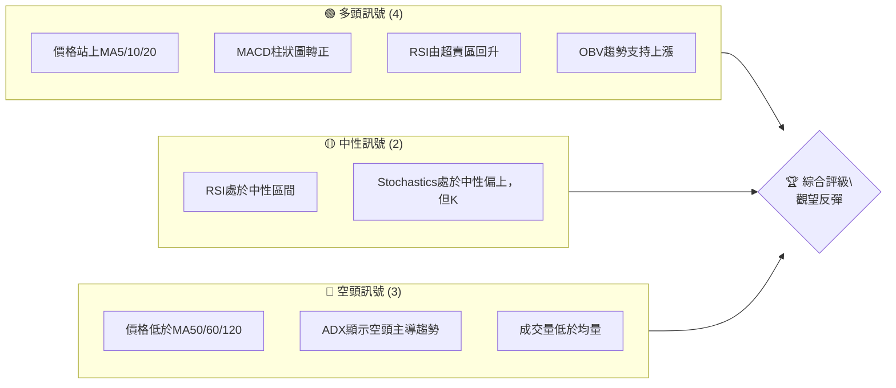

**解讀**：多頭訊號主要來自短期價格行為及動能指標的回暖，顯示經過前期的劇烈下跌後，市場出現技術性反彈。然而，中期均線的壓制、ADX指示的空頭主導趨勢以及成交量的不足，表明此反彈的持續性仍面臨挑戰。目前的市場環境建議採取觀望態度，等待更明確的趨勢確認。

### 📊 核心指標速覽表

下表彙整了PL當前主要的技術指標數據及其初步解讀。

| 指標類別 | 指標名稱 | 當前數值 | 訊號 | 解讀 |
|----------|----------|----------|------|------|
| **價格** | 當前價格 | $31.38 | 🟡 | 位於52週區間中段偏下，近期從低點反彈。 |
| **均線** | MA20 | $30.78 | 🟢 | 價格站上短期MA20，短期動能轉強。 |
| **均線** | MA50 | $37.13 | 🔴 | 價格位於中期MA50下方，中期趨勢偏空。 |
| **均線** | MA200 | $24.79 | 🟢 | 價格遠高於長期MA200，長期趨勢仍為多頭。 |
| **動能** | RSI(14) | 42.06 | 🟡 | 從超賣區17.2回升，處於中性區間，顯示反彈動能。 |
| **動能** | MACD | +0.526 (Hist) | 🟢 | MACD柱狀圖由負轉正，MACD線穿越訊號線，短期動能轉多。 |
| **波動** | ATR | $2.83 | 🔴 | ATR佔價格9.02%，波動性偏高，風險控制需更嚴謹。 |
| **趨勢** | ADX(14) | 26.69 | 🔴 | ADX數值顯示趨勢強度較強，但-DI高於+DI，指示空頭趨勢主導。 |
| **成交量** | 量比 (vs 20日均量) | 0.55x | 🔴 | 當前成交量顯著低於20日均量，反彈缺乏量能支持。 |

### 🏆 技術評分卡

綜合各項技術指標表現，以下是PL的專業技術評分卡。

╔══════════════════════════════════════════════════════════════╗
║              技術評分卡 — PL (2026-07-02)                      ║
╠══════════════════════════════════════════════════════════════╣
║ 趨勢強度      ██████░░░░░░░░░░░░░░  30/100  🔴 ADX顯示空頭趨勢主導              ║
║ 動能指標      ████████░░░░░░░░░░░░  45/100  🟢 MACD轉正，RSI從低位回升           ║
║ 支撐穩定度    ██████████░░░░░░░░░░  50/100  🟡 短期支撐尚可，但中期缺乏強力支撐  ║
║ 成交量配合    ███░░░░░░░░░░░░░░░░░  15/100  🔴 反彈量能不足，存在量價背離風險    ║
║ 形態完整度    ████░░░░░░░░░░░░░░░░  20/100  🔴 無明顯底部形態，或頂部形態未完成  ║
║ 均線排列      ██████░░░░░░░░░░░░░░  30/100  🟡 短期均線向上，但中期均線仍向下壓制║
╠══════════════════════════════════════════════════════════════╣
║ 綜合評分      ████░░░░░░░░░░░░░░░░  32/100  🟡 觀望反彈，短期有機會，中期仍需謹慎║
╚══════════════════════════════════════════════════════════════╝

**評分解讀**：PL的綜合技術評分顯示其目前處於較為疲軟的狀態。儘管短期動能指標有所改善，但趨勢強度、成交量配合度及圖表形態均未提供明確的看多訊號。中期均線的下行壓力和ADX指示的空頭趨勢，使得任何反彈都可能面臨較大阻力。投資者應保持謹慎，避免盲目追高，等待更穩固的底部形態和量能配合。

---

## 2. 趨勢分析

對PL進行多時框架趨勢分析，可以全面了解其股價在不同時間維度上的走勢特徵，從宏觀到微觀捕捉潛在的轉折點和持續趨勢。

### 🌐 多時框趨勢分析

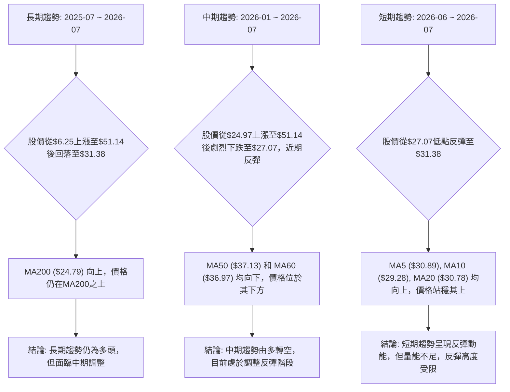

**綜合解讀**：PL的長期趨勢仍處於上升通道中，MA200持續向上提供堅實支撐。然而，中期趨勢已轉為空頭，股價在達到52週高點後經歷了顯著回調，目前仍運行在多條中期均線下方。短期內，股價從低點反彈，並站穩短期均線之上，顯示出一定的買盤支撐和動能恢復，但這種反彈的持續性受到中期趨勢壓制和成交量不足的挑戰。

### 📈 長期趨勢 — 12個月走勢圖（Unicode）

以下是PL過去12個月的月線收盤價格走勢圖，清晰展示了其從強勁上漲到近期回調的歷程。

```
PL 月線走勢圖（過去12個月）
價格軸 ($)
$51.14 ┤                                      ● (2026-05)
$46.65 ┤
$42.16 ┤
$37.67 ┤                            ● (2026-04)
$33.18 ┤                                ● (2026-06)
$31.38 ┤                                        ● (2026-07, 現價)
$28.69 ┤                          ● (2026-03)
$24.20 ┤                ● ● (2026-01, 2026-02)
$19.71 ┤              ● (2025-12)
$15.22 ┤
$10.73 ┤          ● ● (2025-09, 2025-10)
$ 6.24 ┤● ● (2025-07, 2025-08)
       └─────────────────────────────────────────────────────
        Jul Aug Sep Oct Nov Dec Jan Feb Mar Apr May Jun Jul
        '25 '25 '25 '25 '25 '25 '26 '26 '26 '26 '26 '26 '26
```

**走勢特徵分析表格**：

| 時間段 | 起始價 | 結束價 | 漲跌幅 | 主要特徵 |
|--------|--------|--------|--------|----------|
| 2025-07 ~ 2025-10 | $6.25 | $13.45 | +115.2% | 溫和上漲，築底成功後的初期突破。 |
| 2025-11 ~ 2026-01 | $11.90 | $24.97 | +109.8% | 加速上漲，突破關鍵阻力，多頭力量強勁。 |
| 2026-02 ~ 2026-05 | $24.14 | $51.14 | +111.8% | 瘋狂拉升階段，伴隨巨量，市場情緒極度樂觀。 |
| 22026-06 ~ 2026-07 | $51.14 | $31.38 | -38.6% | 快速回調，從高點急劇下跌，顯示獲利了結壓力巨大。 |

### 📊 中期趨勢（週線分析）

從近20週的週線數據來看，PL經歷了一波強勁上漲，隨後在2026年5月底達到頂峰$51.14，之後便開始劇烈回調。目前股價在$31.38，位於布林通道中軌附近，並試圖從近期低點反彈。

```
PL 近期壓力與支撐示意圖 (週線)
$51.76 ┤                                  (52W 高點)
       │
$44.35 ┤                                  (前高點壓力)
       │
$39.11 ┤                                  (Fib 50% 回調阻力)
$37.13 ┤─ R1 ─ MA50/MA60 阻力
$31.38 ╠═════════════════════════════════════════════════════════╣ ◄ 現價
$30.78 ┤─ S1 ─ MA20 / 布林中軌 支撐
$27.07 ┤                                  (近期低點支撐)
       │
$24.79 ┤─ S2 ─ MA200 支撐
$23.27 ┤                                  (布林下軌支撐)
       └───────────────────────────────────────────────────────────
```

**中期趨勢判斷**：股價在2026年5月31日達到$51.14的高點後，經歷了快速且深度的回調，最低觸及$27.07。目前股價在短期內有所反彈，但仍受制於中期均線（MA50 $37.13, MA60 $36.97）的壓制。這表明中期趨勢已從上升轉為下降，當前的反彈被視為下跌趨勢中的技術性修正。要改變中期空頭趨勢，股價必須有效突破並站穩$37.13以上，並伴隨量能放大。

### ⚡ 趨勢強度評估（ADX 解讀）

ADX (Average Directional Index) 指標用於衡量趨勢的強度，而非方向。+DI 和 -DI 則指示趨勢的方向。

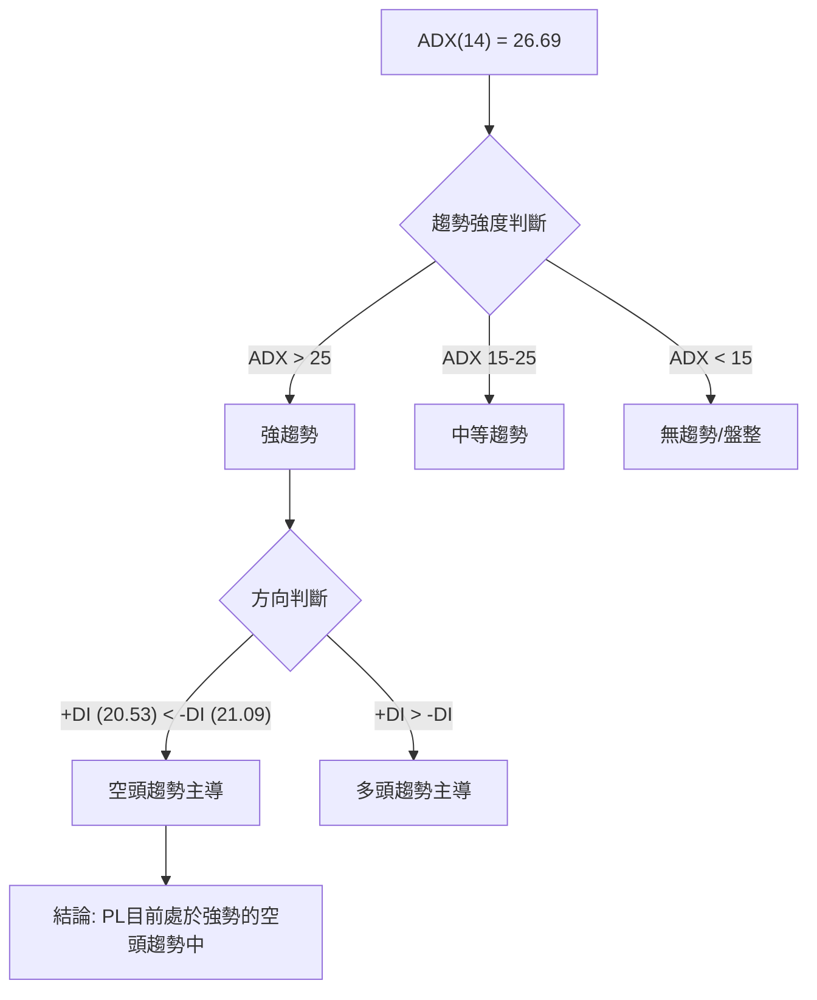

**ADX 強度對照表**：

| ADX 數值 | 趨勢強度 |
|----------|----------|
| 0-20     | 無趨勢或弱趨勢 |
| 20-25    | 中等趨勢 |
| 25-50    | 強趨勢 |
| 50-75    | 非常強趨勢 |
| 75-100   | 極強趨勢 |

**解讀**：PL的ADX數值為26.69，明確指示目前市場存在一個**強趨勢**。然而，+DI (20.53) 低於 -DI (21.09)，這意味著當前的強趨勢是由**空頭力量主導**。這與股價從高點大幅回落的走勢相符。儘管近期股價有所反彈，但ADX指標警示這可能只是空頭趨勢中的一次修正，而非趨勢反轉。投資者應警惕空頭趨勢的延續性，並在交易時嚴格控制風險。

---

## 3. 圖表形態分析

圖表形態是技術分析的核心，透過識別重複出現的價格結構，可以預測未來價格的潛在走勢和目標價位。

### 🔍 形態識別系統

回顧PL過去24個月的價格走勢，其主要特徵是從低位經歷了一波長期且強勁的單邊上漲，隨後在2026年5月達到歷史高點$51.14後，出現了快速而劇烈的下跌。目前股價正處於下跌後的反彈階段。

```mermaid
graph TD
    A["股價歷史走勢分析"] --> B{"從$2.21 (2024-10) 啟動長期牛市"}
    B --> C["一路攀升至$51.14 (2026-05)"]
    C --> D{"高點後劇烈回調至$27.07 (2026-06-28)"}
    D --> E{"近期從低點反彈至$31.38"}
    E --> F["當前形態判斷: 潛在V形反轉或熊旗/下跌中繼"]
    F -- 如果突破阻力並放量 --> G["可能形成V形反轉"]
    F -- 如果受阻於關鍵阻力且量能不足 --> H["可能形成熊旗或下跌中繼"]
    F -- 需關注 $33.13 和 $36.26 關鍵阻力位 -- F
```

**形態解讀**：目前PL的圖表形態尚未形成清晰的經典反轉或持續形態。從$51.14到$27.07的快速下跌後，股價出現了反彈，這可能發展為兩種主要形態：
1.  **潛在的V形反轉**：如果反彈能夠持續放量突破關鍵阻力位，並站穩中期均線之上，則可能確認V形反轉，開啟新的上漲趨勢。
2.  **熊旗 (Bear Flag) 或下跌中繼形態**：如果反彈在觸及關鍵阻力位（如斐波那契回調位、中期均線）後無力向上，並伴隨成交量縮小，則可能形成熊旗形態，預示著更深度的下跌。

由於目前正處於反彈初期，形態尚未完全確立，需要密切關注後續價格行為和成交量變化。

### 🕯️ 重要K線形態分析

分析近20週的週線收盤走勢，識別關鍵K線形態及其對趨勢的影響。

| 月份 (週結束) | 收盤價 | K線形態 (週線) | 解讀 | 訊號 |
|---------------|--------|-----------------|------|------|
| 2026-03-22    | $33.83 | 大陽線 (Marubozu) | 強勁上漲，多頭力量強大，突破區間。 | 🟢 |
| 2026-03-29    | $30.86 | 陰線 (Doji-like) | 上漲後遭遇賣壓，多空力量平衡，漲勢放緩。 | 🟡 |
| 2026-04-05    | $35.88 | 陽線 (Long White) | 再次向上突破，買盤積極，但未創新高。 | 🟢 |
| 2026-04-26    | $35.44 | 陰線 (Engulfing-like) | 吞噬前一週陽線實體，空頭力量開始顯現。 | 🔴 |
| 2026-05-31    | $51.14 | 大陽線 (Marubozu) | 極度強勢的突破，形成短期頂部，RSI過熱。 | 🔴 (頂部訊號) |
| 2026-06-07    | $32.22 | 大陰線 (Marubozu) | 巨量暴跌，完全吞噬前一週漲幅，空頭力量極強。 | 🔴 |
| 2026-06-14    | $31.15 | 陰線 (Doji-like) | 恐慌性下跌後，多空暫時平衡，下跌速度放緩。 | 🟡 |
| 2026-06-21    | $28.23 | 陰線 (Long Black) | 延續下跌，空頭仍佔優勢，但量能有所萎縮。 | 🔴 |
| 2026-06-28    | $27.07 | 陰線 (Small Body) | 下跌動能減弱，接近短期支撐，可能醞釀反彈。 | 🟡 |
| 2026-07-05    | $31.38 | 陽線 (Marubozu-like) | 從低點強勢反彈，短期買盤介入，MACD轉正。 | 🟢 |

**K線總結**：PL在5月底的$51.14高點出現了一根極強的大陽線，但伴隨RSI嚴重超買，隨後緊接著是巨量大陰線，形成了經典的「射擊之星」或「烏雲罩頂」的初期形態，預示著頂部反轉。隨後的下跌由一系列陰線確認。近期從$27.07開始的陽線反彈，顯示了短期買盤的介入，但需要更多陽線和成交量確認其底部有效性。

### 📉 ASCII 走勢形態示意圖

以下示意圖展示了PL近期從高點回落後的潛在形態發展。

```
PL 潛在形態示意圖 (近期)
═══════════════════════════════════════════════════════════════
$51.14 ┤ ●(2026-05-31 高點)
       │  \
       │   \
       │    \
       │     \
       │      \
$36.26 ┤ ─────── R1 (Fib 38.2%)
       │       /
$31.38 ╠═══════● (現價)
$30.78 ┤ ─────── S1 (MA20/BB中軌)
       │      /
       │     /
       │    /
       │   /
$27.07 ┤ ●(2026-06-28 低點)
       └────────────────────────────────────────────────────────
         時間軸

**形態觀察**：目前股價正從$27.07的低點反彈，形成了一個V形底部的一部分。關鍵在於能否突破R1 ($36.26) 和更上方的R2 ($39.11)。如果反彈受阻於這些阻力位，並伴隨成交量萎縮，則很可能形成一個「熊旗」形態，預示著下跌趨勢的延續。反之，如果能放量突破並站穩，則V形反轉的可能性增加。

### 🎯 形態目標價計算

由於目前尚未形成明確且完整的經典圖表形態，因此不進行傳統形態的目標價計算。我們將轉而根據斐波那契回調和擴展位來設定潛在的目標價位。

**基於近期下跌波段 ($51.14 -> $27.07) 的反彈目標**：
*   **下跌幅度**：$51.14 - $27.07 = $24.07
*   **斐波那契回調位 (作為反彈目標)**：
    *   **目標價 T1 (38.2% 回調)**: $27.07 + ($24.07 * 0.382) = **$36.26**
    *   **目標價 T2 (50% 回調)**: $27.07 + ($24.07 * 0.500) = **$39.11**
    *   **目標價 T3 (61.8% 回調)**: $27.07 + ($24.07 * 0.618) = **$41.94**

**解讀**：這些斐波那契回調位將作為PL反彈過程中的重要阻力點和潛在的獲利了結目標。若股價能夠有效突破$36.26，下一個目標將是$39.11。然而，若無法突破$36.26，則反彈可能結束，股價有機會再次測試$27.07的低點。

---

## 4. 支撐與阻力

支撐與阻力是技術分析的基石，它們代表了歷史上買賣雙方力量平衡的關鍵價位。理解這些價位對於判斷股價潛在的轉折點至關重要。

### 🗺️ 關鍵價位分布圖（Unicode）

以下是PL當前價格$31.38附近的關鍵支撐與阻力分布圖。

```
PL 價位結構分布圖 (2026-07-02)
═══════════════════════════════════════════════════
$51.76 ║████████████████████████║ 強阻力 R4 (52週高點)
$44.35 ║████████████████████    ║ 阻力 R3 (歷史高點區域)
$41.94 ║████████████████████████║ 關鍵阻力 R2 (Fib 61.8% 回調)
$39.11 ║████████████████████    ║ 阻力 R1 (Fib 50% 回調 / BB上軌附近)
$37.13 ║████████████████████████║ 關鍵阻力 R0 (MA50 / MA60)
$36.26 ║████████████████████    ║ 阻力 (Fib 38.2% 回調)
$33.13 ║████████████████████████║ 近期阻力 (2026-06月收盤)
$31.38 ╠════════════════════════╣ ◄ 現價
$30.78 ║▓▓▓▓▓▓▓▓▓▓▓▓▓▓▓▓        ║ 近期支撐 S0 (MA20 / 布林中軌)
$28.23 ║████████████████████████║ 支撐 S1 (近期週線低點)
$27.07 ║████████████████████    ║ 強支撐 S2 (近期下跌波段低點)
$24.79 ║████████████████████████║ 強支撐 S3 (MA200)
$23.27 ║████████████████████    ║ 強支撐 S4 (布林下軌)
$ 5.87 ║████████████████████████║ 極強支撐 S5 (52週低點)
═══════════════════════════════════════════════════
```

### 🚧 阻力位分析表

| 阻力級別 | 價位 | 形成原因 | 突破難度 | 重要性 |
|----------|------|----------|----------|--------|
| **R0**   | $33.13 | 2026年6月收盤價，近期下跌前的支撐轉阻力。 | 中等 | 🟢 決定短期反彈能否延續 |
| **R1**   | $36.26 | 斐波那契38.2%回調位，也是近期反彈的初步考驗。 | 較高 | 🟡 確認反彈強度 |
| **R2**   | $37.13 | MA50與MA60，中期下跌趨勢的關鍵阻力，多空分界線。 | 高 | 🔴 決定中期趨勢能否扭轉 |
| **R3**   | $39.11 | 斐波那契50%回調位，與布林上軌接近，強勁阻力。 | 很高 | 🔴 突破則反彈強勢 |
| **R4**   | $41.94 | 斐波那契61.8%回調位，也是前一波下跌的起點附近。 | 極高 | 🔴 確認V形反轉的關鍵 |
| **R5**   | $51.14 | 歷史高點，強大的心理和技術阻力。 | 極高 | 🔴 趨勢反轉的終極目標 |

### 🛡️ 支撐位分析表

| 支撐級別 | 價位 | 形成原因 | 守住機率 | 重要性 |
|----------|------|----------|----------|--------|
| **S0**   | $30.78 | MA20與布林通道中軌，近期反彈的直接支撐。 | 中等 | 🟢 短期反彈能否持續 |
| **S1**   | $28.23 | 近期週線低點，心理支撐位。 | 較高 | 🟡 若跌破，將測試更低點 |
| **S2**   | $27.07 | 近期下跌波段的最低點，V形反彈的起點。 | 高 | 🔴 底部是否成立的關鍵 |
| **S3**   | $24.79 | MA200，長期上升趨勢的生命線，極強支撐。 | 極高 | 🔴 長期趨勢的最後防線 |
| **S4**   | $23.27 | 布林通道下軌，極端超賣區間的支撐。 | 極高 | 🔴 提供極端回調的緩衝 |

### 📐 斐波那契回調位分析

我們以最近一波主要下跌趨勢（自2026-05-31高點$51.14至2026-06-28低點$27.07）作為基礎，計算其斐波那契回調位。這些回調位在反彈過程中通常作為重要的潛在阻力。

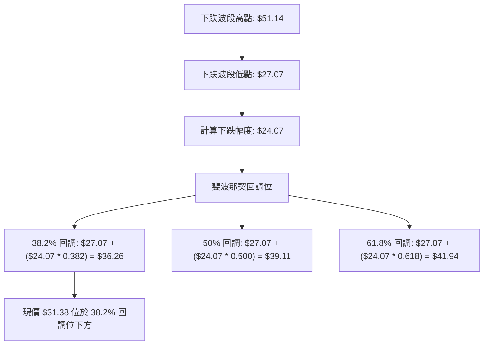

**視覺化與解讀**：
目前PL的股價$31.38位於斐波那契38.2%回調位$36.26下方。這意味著如果反彈要持續，首先需要突破$36.26這個初步阻力。
*   **$36.26 (38.2% 回調)**：這是反彈的第一個重要考驗。突破此位將增強多頭信心。
*   **$39.11 (50% 回調)**：通常被視為一個強勁的心理和技術阻力位。若能突破此位，則代表反彈力度較強。
*   **$41.94 (61.8% 回調)**：被認為是趨勢反轉或至少是深度回調的關鍵點。若能突破此位，則V形反轉的可能性大增。

這些斐波那契回調位將作為PL未來幾週反彈行情的關鍵阻力參考。

---

## 5. 技術指標深度解讀

本章節將深入分析PL的各項技術指標，包括移動平均線、RSI、MACD、布林通道和成交量，並探討它們之間的相互確認或矛盾，以提供更全面的市場洞察。

### 🎛️ 指標訊號總覽

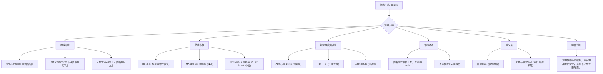

### 📈 移動平均線排列分析

PL的移動平均線呈現混合排列，這反映了不同時間框架下趨勢的複雜性。

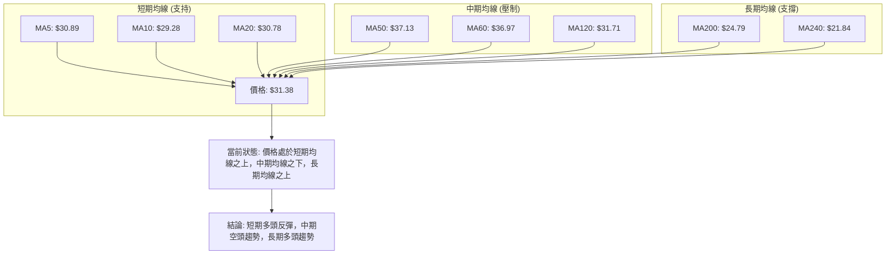

**詳細解讀**：
*   **短期均線 (MA5, MA10, MA20)**：目前價格 $31.38 均在這些短期均線之上，且這些短期均線本身呈現向上排列。這是一個明確的**短期看多訊號**，表明股價從近期低點開始反彈，短期動能強勁。
*   **中期均線 (MA50, MA60, MA120)**：價格 $31.38 位於 MA50 ($37.13)、MA60 ($36.97) 和 MA120 ($31.71) 之下。這些中期均線目前仍呈現向下趨勢或走平，對股價構成上方阻力。這是一個明確的**中期看空訊號**，表明前期的下跌趨勢仍在延續，反彈可能受阻。
*   **長期均線 (MA200, MA240)**：價格 $31.38 遠高於 MA200 ($24.79) 和 MA240 ($21.84)，且這些長期均線保持向上趨勢。這是一個強烈的**長期看多訊號**，表明儘管經歷了中期調整，PL的長期上升趨勢基礎依然穩固。

**綜合判斷**：均線系統顯示PL目前處於一個「短期反彈、中期下跌、長期上漲」的複雜局面。短期反彈有機會向上挑戰中期阻力，但若無法突破，則可能再次回落。投資者需關注股價能否有效突破MA50和MA60。

### 📉 RSI(14) 分析

RSI (Relative Strength Index) 衡量股價變動的速度和幅度，判斷超買或超賣狀況。

**RSI 數值進度條展示**：
RSI(14): 42.06  ████████░░░░░░░░░░░░  42.06/100  🟡

**超買超賣區間分析**：
*   **超買區 (>70)**：在2026-05-31，RSI曾高達83.2，進入極度超買區，這是一個強烈的頂部警示訊號，隨後股價確實發生了劇烈回調。
*   **超賣區 (<30)**：在2026-06-21，RSI曾低至17.2，進入極度超賣區，這是一個強烈的底部反彈訊號，隨後股價從$27.07開始反彈。
*   **當前狀態 (42.06)**：RSI目前位於中性區間（30-70），但已從超賣區顯著回升。這表明短期下跌動能已經衰竭，買盤介入促使股價反彈，但尚未達到超買狀態，仍有向上空間。

**背離判斷 (頂背離/底背離)**：
*   **頂背離**：在2026-05-31，股價創出歷史新高$51.14，RSI也創出83.2的新高，沒有形成頂背離。這表明高點是受到強勁動能支持的。
*   **底背離**：在2026-06-21，RSI達到17.2的低點，隨後價格在2026-06-28觸及$27.07的低點，RSI為33.7。雖然價格形成了較低的低點，但RSI並沒有形成更低的低點，反而從17.2回升到33.7，這是一個**潛在的底部背離訊號**。RSI的底部背離在價格下跌趨勢中，當價格創新低而RSI未能創新低時出現，預示著下跌動能減弱，可能出現反彈或反轉。PL的情況是RSI先於價格到達極端，並在價格形成低點時已有所回升，這強化了短期反彈的可能性。

### 📊 MACD(12/26/9) 訊號解讀

MACD (Moving Average Convergence Divergence) 是一個趨勢追蹤動量指標，用於識別趨勢的強度、方向、動量和持續時間。

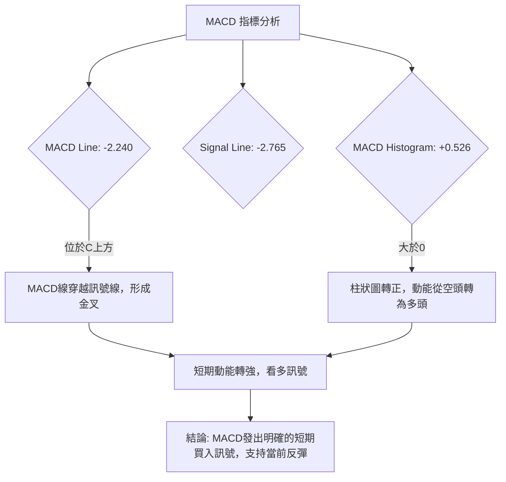

**詳細解讀**：
*   **MACD線 (-2.240) 與訊號線 (-2.765)**：MACD線已上穿訊號線，形成**黃金交叉**。這是典型的短期買入訊號，表明短期均線（12日EMA）開始向上加速，超越長期均線（26日EMA），動能從下降轉為上升。
*   **MACD柱狀圖 (+0.526)**：柱狀圖從負值轉為正值，並持續放大。這進一步確認了MACD線的金叉訊號，表示多頭動能正在增強。柱狀圖的正值顯示了當前多頭動能的累積。

**綜合判斷**：MACD指標給出了明確的短期看多訊號，與RSI從超賣區回升的判斷一致，共同支持了當前股價的反彈。這是一個強烈的短期動能恢復的跡象。

### 📦 布林通道分析

布林通道 (Bollinger Bands) 由中軌（20日均線）、上軌和下軌組成，用於衡量價格波動性和判斷超買超賣區域。

```
PL 布林通道示意圖 (現價 $31.38)
$38.29 ║█████████████████████████████████████████║  ← BB上軌
       ║                                         ║
       ║                                         ║
       ║                                         ║
$31.38 ╠═════════════════════════════════════════╣  ← 現價
$30.78 ║▓▓▓▓▓▓▓▓▓▓▓▓▓▓▓▓▓▓▓▓▓▓▓▓▓▓▓▓▓▓▓▓▓▓▓▓▓▓▓▓▓║  ← BB中軌 (MA20)
       ║                                         ║
       ║                                         ║
       ║                                         ║
$23.27 ║█████████████████████████████████████████║  ← BB下軌
       └─────────────────────────────────────────
         時間軸
```

**詳細解讀**：
*   **價格與中軌**：當前價格 $31.38 位於布林通道中軌 $30.78 之上。這是一個看多訊號，表明短期內股價強於20日均線。
*   **布林通道 %B (0.54)**：%B值為0.54，略高於0.5，表示價格位於中軌上方，但距離上軌仍有一定距離，顯示還有上漲空間。
*   **通道寬度**：從數據中可以看出，布林通道上軌 $38.29 和下軌 $23.27 之間有較大的距離 ($15.02)，ATR也高達9.02%，這表明近期股價波動性較大，通道處於擴張狀態。通常在大幅下跌後，通道會擴張，隨後會進入收斂階段，預示著新的趨勢形成。
*   **近期走勢**：股價在2026-06-21跌至$28.23，接近布林下軌（當時可能更低），隨後從低點反彈，並成功站上中軌。這是一個從超賣區反彈的典型走勢。

**綜合判斷**：布林通道顯示PL從下軌反彈並站上中軌，短期走勢偏強。然而，通道的擴張提醒投資者高波動性仍在持續。若價格能進一步向上軌靠攏並突破，則反彈動能將進一步確認。

### 💹 成交量分析（量價配合度）

成交量是價格走勢的「燃料」，其變化能驗證價格趨勢的可靠性。

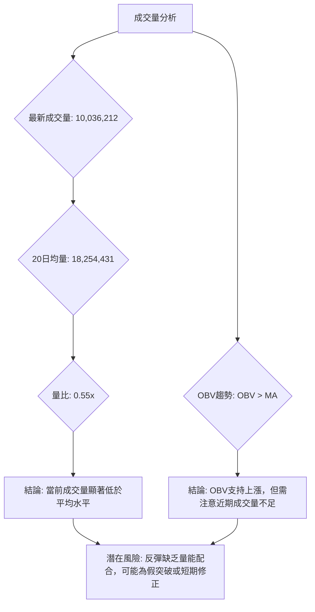

**詳細解讀**：
*   **最新成交量與均量比較**：最新成交量為10,036,212股，遠低於20日均量18,254,431股和50日均量13,605,320股。量比僅為0.55x。這是一個**重要的警示訊號**。儘管股價近期有所反彈，但成交量未能有效放大，表明當前買盤力量不足，市場對反彈的信心不夠堅定。
*   **量價背離風險**：在下跌趨勢中，低量反彈通常被視為「熊市反彈」或「死貓跳」，即反彈缺乏持續性，可能在觸及阻力後再次下跌。當前PL的低量反彈存在這種量價背離的風險。
*   **OBV趨勢**：數據提供「OBV > MA → 量能支撐上漲」，這是一個相對樂觀的判斷。OBV (On Balance Volume) 衡量累積買賣壓力。如果OBV仍在上升，即使近期成交量萎縮，也可能說明潛在的買盤壓力仍在累積。然而，在當前低量反彈的背景下，OBV的上升動能可能有限，需要密切關注。

**綜合判斷**：成交量是PL當前反彈行情中最薄弱的一環。儘管價格和動能指標顯示短期反彈，但缺乏成交量的配合使其持續性存疑。若要確認有效反轉，必須看到成交量顯著放大，以確認買盤的真實介入。

---

## 6. 動能與波動率

動能和波動率是技術分析中衡量市場活力的兩個重要維度。動能指示價格變化的速度和力量，而波動率則量化價格變動的幅度。

### ⚡ 動能評估四象限

由於Mermaid的`quadrantChart`功能在AI環境下可能受限，我們將採用表格和流程圖結合的方式來呈現動能評估。

| 象限 | 動能 (MACD/RSI) | 波動 (ATR) | 當前狀態 | 評估 |
|------|-----------------|------------|----------|------|
| Q1   | 強 (🟢)         | 低 (🟢)    | -        | 最佳機會，穩定上漲 |
| Q2   | 弱 (🔴)         | 低 (🟢)    | -        | 觀望或尋找潛在底部 |
| Q3   | 強 (🟢)         | 高 (🔴)    | ✓        | 高風險高收益，把握反彈機會 |
| Q4   | 弱 (🔴)         | 高 (🔴)    | -        | 避免進場，趨勢不確定 |

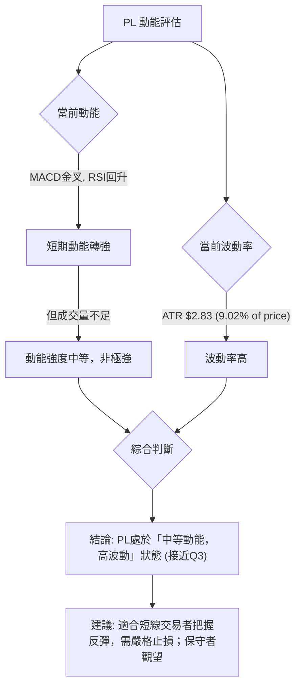

**動能評估解讀**：
PL的MACD柱狀圖轉正，MACD線形成金叉，RSI從超賣區回升至中性區間，這些都表明短期動能正在增強。然而，成交量未能配合反彈，使得動能的持續性存疑，因此將其評為「中等動能」而非「強動能」。
ATR高達9.02%，顯示PL的股價波動性較高。綜合來看，PL目前處於一個「中等動能，高波動」的狀態。這通常意味著市場存在較大的不確定性，價格可能在短期內快速變化。對於短線交易者而言，這提供了把握反彈的機會，但同時也伴隨著較高的風險，需要嚴格的風險管理。對於長期投資者或保守型交易者，當前階段可能更適合觀望，等待趨勢更加明朗。

### 📊 ATR 波動率分析

ATR (Average True Range) 衡量一定時期內價格波動的平均範圍，是衡量波動性的重要指標，常用於設置止損點。

**ATR(14): $2.83 (9.02% of price)**

**詳細分析**：
*   **波動性判斷**：PL的ATR值為$2.83，佔當前股價$31.38的9.02%。通常，ATR佔股價的比例超過5%就被認為是高波動性股票。PL的9.02%表明其波動性非常高，每日價格波動幅度較大。這對日內交易者可能提供機會，但也增加了持倉風險。
*   **止損距離建議**：在高波動性的股票中，止損點的設置需要比低波動性股票更寬鬆，以避免被正常波動洗出。
    *   **保守止損**：可設置為1.5倍ATR，即 1.5 * $2.83 = $4.25。若進場價為$31.38，止損點可在 $31.38 - $4.25 = $27.13 附近。
    *   **激進止損**：可設置為1倍ATR，即 $2.83。若進場價為$31.38，止損點可在 $31.38 - $2.83 = $28.55 附近。
    *   **結合支撐位**：在實際操作中，應將ATR計算出的止損距離與關鍵支撐位結合。例如，若S2支撐位在$27.07，則將止損設在$27.07下方，如$26.90，會更合理。

**結論**：PL的高波動性要求交易者在設置止損和倉位管理上更加謹慎。過於緊密的止損容易被市場噪音觸發，而過於寬鬆的止損則可能導致較大的損失。建議結合ATR和關鍵支撐/阻力位來動態調整止損。

### 📐 Beta 與市場相關性

數據中未提供PL的Beta值。

**分析**：由於缺乏Beta數據，我們無法精確量化PL與大盤指數（如S&P 500或Nasdaq）的相關性及波動性放大程度。
**一般產業觀察**：PL屬於「工業」板塊下的「航空航天與國防」產業。該產業通常被認為是具有一定成長性和技術壁壘的行業。在牛市中，這類高成長、高科技含量的公司往往會表現出較高的Beta值，即波動性高於大盤；而在熊市中，其跌幅也可能大於大盤。
**當前判斷**：考慮到PL近期從高點劇烈回調，以及其ATR所顯示的高波動性，即使沒有具體Beta值，我們也可以推斷PL很可能是一支高Beta股票。這意味著在市場情緒良好時，PL有潛力提供更高的回報；但在市場情緒低迷或大盤下跌時，其風險也會相對較高。投資者應將PL視為一個具有較高風險和潛在回報的標的，並在整體市場環境不確定時保持警惕。

---

## 7. 多時框架總結

本章節將對PL在不同時間框架下的技術訊號進行綜合評估，以形成一個全面的市場判斷，並識別各時框架之間的一致性或矛盾。

### 📋 時框架評分表

| 時框架 | 趨勢方向 | 動能 | 均線排列 | 形態 | 綜合評分 | 建議 |
|--------|----------|------|----------|------|----------|------|
| **長期** | 🟢 上升   | 🟢 強 | 🟢 多頭   | 🟡 潛在頂部回調 | 7/10 | 持有/觀望 |
| **中期** | 🔴 下跌   | 🔴 弱 | 🔴 空頭   | 🔴 下跌中繼/熊旗 | 3/10 | 減倉/觀望 |
| **短期** | 🟢 反彈   | 🟢 強 | 🟢 多頭   | 🟡 潛在V形反轉 | 6/10 | 短線交易 |

**詳細解讀**：
*   **長期 (月線)**：PL的長期趨勢依然強勁，價格遠高於MA200，表明其基本面或長期市場前景仍受看好。然而，經歷了從$51.14的回調，長期趨勢面臨中期壓力。
*   **中期 (週線)**：中期趨勢已轉為下跌。價格位於MA50/MA60下方，ADX顯示空頭主導。儘管短期有所反彈，但中期阻力巨大，反彈能否持續是關鍵。
*   **短期 (日線)**：短期內，MACD金叉，RSI從超賣區回升，價格站上短期均線，顯示出明確的反彈動能。然而，成交量不足是主要隱憂。

### 🔲 綜合訊號矩陣

```mermaid
graph TD
    subgraph 短期 (Short-Term) [🟢 強反彈訊號]
        ST1["MA5/10/20 向上"]
        ST2["MACD 金叉"]
        ST3["RSI 從超賣回升"]
        ST4["價格站上布林中軌"]
    end

    subgraph 中期 (Mid-Term) [🔴 強空頭訊號]
        MT1["MA50/60/120 向下且壓制價格"]
        MT2["ADX 強趨勢且 -DI > +DI"]
        MT3["價格未能突破斐波那契38.2%回調位"]
        MT4["高點後的劇烈下跌"]
    end

    subgraph 長期 (Long-Term) [🟢 穩固多頭基礎]
        LT1["價格遠高於MA200/240"]
        LT2["MA200/240 持續向上"]
    end

    ST1 --> CONFLICT{"訊號一致性分析"}
    ST2 --> CONFLICT
    ST3 --> CONFLICT
    ST4 --> CONFLICT

    MT1 --> CONFLICT
    MT2 --> CONFLICT
    MT3 --> CONFLICT
    MT4 --> CONFLICT

    LT1 --> CONFLICT
    LT2 --> CONFLICT

    CONFLICT --> C1["短期反彈動能與中期空頭趨勢存在矛盾"]
    C1 --> C2["長期趨勢的支撐與中期調整形成拉鋸"]
    C2 --> C3["關鍵在於短期反彈能否突破中期阻力，並伴隨量能放大"]
    C3 --> FINAL_VERDICT{"總體判斷: 市場處於關鍵轉折點，短期反彈與中期下跌趨勢角力，需密切關注量能與關鍵阻力突破情況。"}
```

**綜合判斷**：
PL目前的多時框架訊號呈現明顯的矛盾。短期動能指標顯示強勁反彈，但中期趨勢指標卻指向空頭主導，長期趨勢則提供底部支撐。這種情況通常發生在股價經歷劇烈下跌後，市場試圖尋找新的平衡點。當前的反彈被視為對中期下跌趨勢的修正，其能否轉化為趨勢反轉，關鍵在於能否帶量突破重要的中期阻力位（如MA50 $37.13和斐波那契50%回調位 $39.11）。如果反彈無力突破這些阻力，或成交量持續萎縮，則中期空頭趨勢可能將繼續主導。

---

## 8. 交易策略建議

基於上述詳盡的多時框架技術分析，我們為PL制定以下交易策略建議。由於當前市場訊號複雜，短期反彈與中期下跌趨勢並存，建議採取謹慎的短線操作或觀望策略。

### 🗺️ 策略決策流程圖

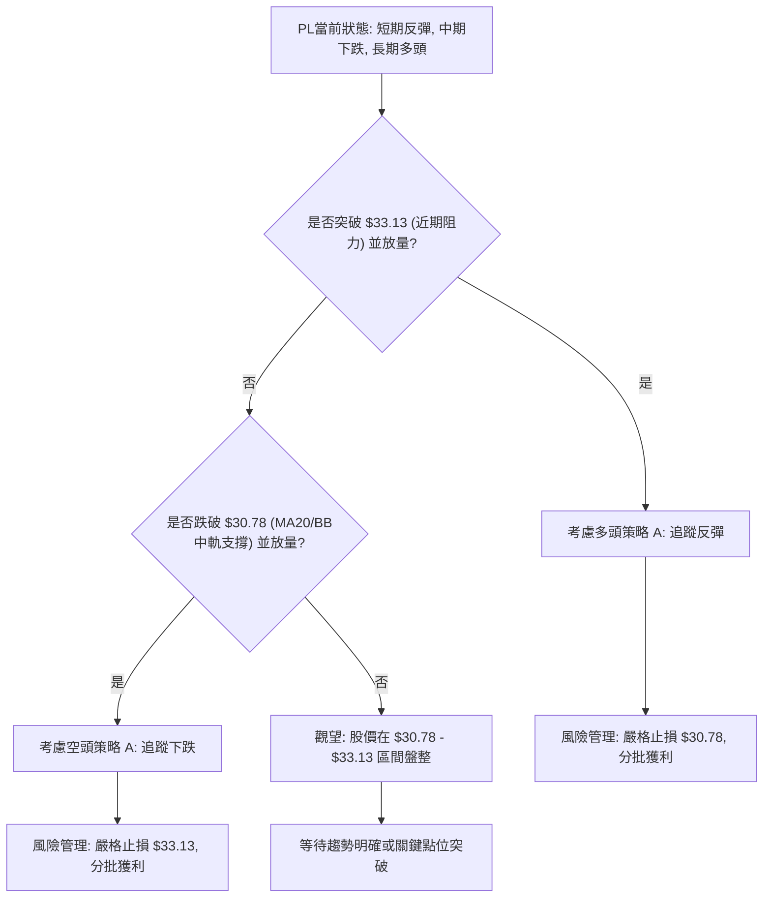

### 🟢 多頭策略詳情

此策略適用於認為PL短期反彈將延續並有機會挑戰中期阻力的交易者。

| 策略要素 | 策略 A：突破追漲 | 策略 B：回調買入 |
|----------|------------------|------------------|
| **進場條件** | 股價有效突破 $33.13 (近期阻力)，並伴隨成交量放大至20日均量以上。 | 股價回調至 $30.78 (MA20/BB中軌) 附近獲得支撐，出現止跌K線形態。 |
| **進場價格** | $33.25 (確認突破後) | $30.85 (支撐確認後) |
| **目標價 T1** | $36.26 (Fib 38.2% 回調位) | $33.13 (近期阻力) |
| **目標價 T2** | $39.11 (Fib 50% 回調位 / MA50附近) | $36.26 (Fib 38.2% 回調位) |
| **止損價格** | $30.78 (MA20/BB中軌下方) | $29.90 (MA10下方) |
| **風險報酬比** | (T1) $3.01:$2.47 = 1.22:1 <br> (T2) $5.86:$2.47 = 2.37:1 | (T1) $2.28:$0.95 = 2.40:1 <br> (T2) $5.41:$0.95 = 5.69:1 |
| **成功機率** | 45% (受中期阻力影響) | 55% (反彈動能支撐) |
| **建議倉位** | 輕倉 (5-10%) | 輕倉 (5-10%) |

**多頭策略解讀**：策略A是追逐突破的動能，風險較高但潛在報酬也較大。策略B是利用回調支撐買入，風險相對較低，但需要耐心等待回調機會。兩種策略都強調輕倉和嚴格止損，以應對高波動性和不確定性。

### 🔴 空頭策略詳情

此策略適用於認為PL反彈無力，將延續中期下跌趨勢的交易者。

| 策略要素 | 策略 A：跌破追空 | 策略 B：反彈做空 |
|----------|------------------|------------------|
| **進場條件** | 股價有效跌破 $30.78 (MA20/BB中軌)，並伴隨成交量放大。 | 股價反彈至 $33.13 或 $36.26 附近受阻，出現看跌K線形態，且量能萎縮。 |
| **進場價格** | $30.65 (確認跌破後) | $33.00 (阻力確認後) |
| **目標價 T1** | $28.23 (近期週線低點) | $30.78 (MA20/BB中軌) |
| **目標價 T2** | $27.07 (近期下跌波段低點) | $27.07 (近期下跌波段低點) |
| **止損價格** | $31.38 (現價上方) | $34.00 (近期阻力上方) |
| **風險報酬比** | (T1) $2.42:$0.73 = 3.32:1 <br> (T2) $3.58:$0.73 = 4.90:1 | (T1) $2.22:$1.00 = 2.22:1 <br> (T2) $5.93:$1.00 = 5.93:1 |
| **成功機率** | 50% (中期趨勢支持) | 60% (中期趨勢支持) |
| **建議倉位** | 輕倉 (5-10%) | 輕倉 (5-10%) |

**空頭策略解讀**：策略A是追逐跌破的動能，適用於確認短期反彈失敗的情況。策略B是利用反彈至阻力位時進行做空，勝率可能更高，因為符合中期空頭趨勢。兩種策略都強調嚴格的風險控制，並密切關注量能變化。

### ⭐ 整體訊號強度評星

綜合各項指標和策略的評估：

```
做多訊號強度：★★☆☆☆  (2/5星) - 短期動能回暖，但中期阻力重重且量能不足。
做空訊號強度：★★★☆☆  (3/5星) - 中期趨勢偏空，反彈缺乏量能支持，下跌風險仍在。
整體可信度：  ★★★☆☆  (3/5星) - 訊號複雜，多空拉鋸，等待趨勢明朗化。
```

**結論**：目前PL的技術面處於多空拉鋸的關鍵時刻。短期反彈動能存在，但中期下跌趨勢仍未被逆轉，且成交量不足是反彈的最大隱患。建議投資者保持謹慎，避免重倉，並根據市場對關鍵支撐和阻力位的反應來靈活調整策略。

---

## 9. 風險提示與監控

在當前PL股票技術面複雜且波動性較高的情況下，有效的風險管理和持續監控是至關重要的。

### ✅ 關鍵監控指標 Checklist

以下是交易PL時需要密切關注的關鍵技術指標和價位清單。

╔══════════════════════════════════════════════════════════════╗
║              PL 關鍵監控指標 Checklist                         ║
╠══════════════════════════════════════════════════════════════╣
║ [ ] 價格是否有效突破 $33.13 (近期阻力)？                      ║
║ [ ] 價格是否跌破 $30.78 (MA20/布林中軌)？                      ║
║ [ ] 成交量是否放大至20日均量以上 (特別是上漲時)？             ║
║ [ ] MACD柱狀圖是否持續為正並增長？                             ║
║ [ ] RSI是否能突破50並向70邁進？                                ║
║ [ ] ADX的+/-DI線是否發生交叉，趨勢方向是否改變？              ║
║ [ ] 布林通道是否收斂或繼續擴張？                               ║
║ [ ] 52週高點 ($51.76) 和低點 ($5.87) 的心理影響。              ║
║ [ ] 整體市場情緒和行業動態。                                   ║
╚══════════════════════════════════════════════════════════════╝

### ⚠️ 風險場景分析

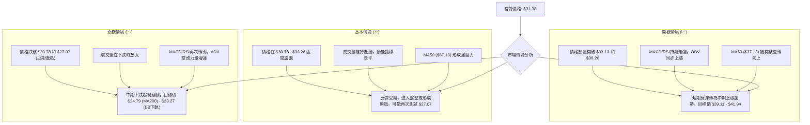

**情境解讀**：
*   **樂觀情境**：如果PL能夠在未來幾週內帶量突破關鍵阻力位，特別是MA50 ($37.13) 和斐波那契50%回調位 ($39.11)，則表明市場對其反彈的信心增強，中期下跌趨勢可能被扭轉。此時可考慮積極的多頭策略。
*   **基本情境**：在缺乏量能支持下，反彈可能在觸及阻力後無力上攻，轉為區間震盪或形成熊旗。這種情況下，股價可能在$30.78至$36.26之間波動，最終可能再次測試$27.07的低點。建議觀望或進行短線區間操作。
*   **悲觀情境**：若股價跌破 $30.78 和 $27.07 等關鍵支撐，且伴隨成交量放大，則表明中期下跌趨勢將延續，甚至可能挑戰長期MA200 ($24.79) 或布林下軌 ($23.27)。此時應考慮空頭策略或堅決止損。

### 🛡️ 風險管理重要提醒

1.  **倉位管理**：由於PL波動性高且趨勢不確定，建議採取輕倉策略，將單一股票的投資佔總投資組合的比例限制在較低水平 (例如5%-10%)。
2.  **嚴格止損**：必須為每筆交易設定明確的止損點，並嚴格執行。ATR指標可作為設置止損的參考，並結合關鍵支撐位。切勿讓小虧損演變成大損失。
3.  **分批進出**：在趨勢未明朗前，可採用分批建倉或分批獲利了結的方式，降低單次交易的風險。
4.  **密切監控**：持續關注上述關鍵監控指標，特別是成交量、MA50/MA60的走勢以及斐波那契回調位的反應。
5.  **不追漲殺跌**：在高波動市場中，盲目追逐短期漲跌容易被套。應耐心等待明確的入場或出場訊號。
6.  **基本面結合**：雖然本報告為技術分析，但建議結合基本面研究，了解公司財報、新聞事件等，以更全面地評估投資風險。

---

## 📋 報告總結

```
PL 技術分析報告總結
════════════════════════════════════════════════════════
報告日期：2026-07-02
當前價格：$31.38
分析評級：⚖️ 觀望反彈 (短期有動能，中期趨勢未轉，量能不足)

關鍵結論：
├─ 長期趨勢：🟢 仍處於上升通道，MA200提供堅實支撐。
├─ 中期趨勢：🔴 由多轉空，股價受MA50/MA60壓制，ADX顯示空頭主導。
├─ 短期趨勢：🟢 從$27.07低點強勢反彈，MACD金叉，RSI從超賣區回升。
├─ 關鍵支撐：$30.78 (MA20/BB中軌), $27.07 (近期低點), $24.79 (MA200)。
├─ 關鍵阻力：$33.13 (近期阻力), $36.26 (Fib 38.2%), $37.13 (MA50/MA60)。
└─ 分析師目標：$39.80 (分析師共識平均目標價，高於當前價格，但需技術面確認)。

最優策略組合：
1. 🥇 **最佳機會 (謹慎做多)**：若股價放量突破 $33.13，且MACD柱狀圖持續放大，可考慮在 $33.25 進場，目標 $36.26 和 $39.11，止損 $30.78。
2. 🥈 **次選機會 (觀望盤整)**：若股價在 $30.78 - $33.13 區間震盪，成交量低迷，則保持觀望，等待趨勢明朗。
3. 🥉 **保守選擇 (逢高做空)**：若反彈至 $33.13 或 $36.26 附近受阻，出現看跌K線，且量能萎縮，可考慮在 $33.00 附近做空，目標 $30.78 和 $27.07，止損 $34.00。
════════════════════════════════════════════════════════
```

---

> ⚠️ **免責聲明**：本報告為 AI 自動生成之技術分析，所有數據及估算均基於提供的歷史價格資訊。本報告**僅供研究與學術參考**，**不構成任何投資建議**。投資有風險，入市需謹慎。

---

*報告生成時間：2026-07-02 ｜ 數據來源：Yahoo Finance ｜ 分析框架：多時框技術分析*