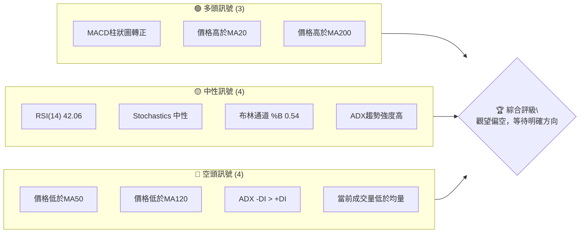
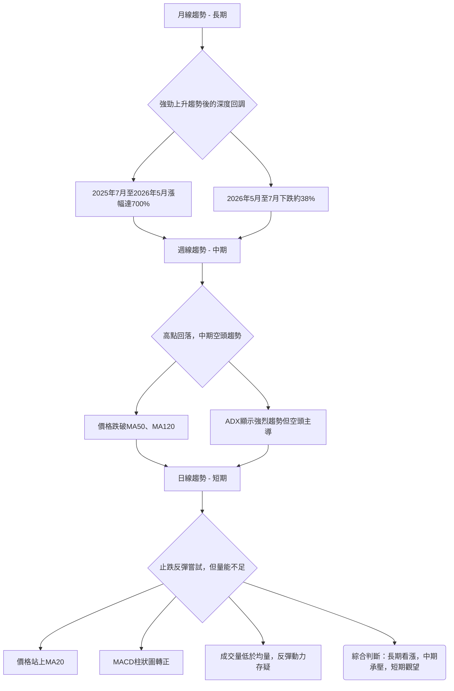
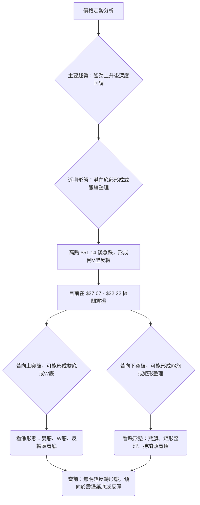
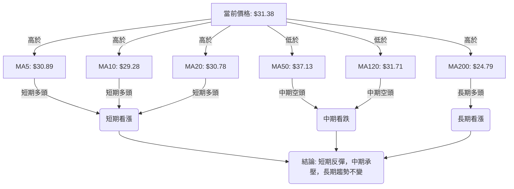
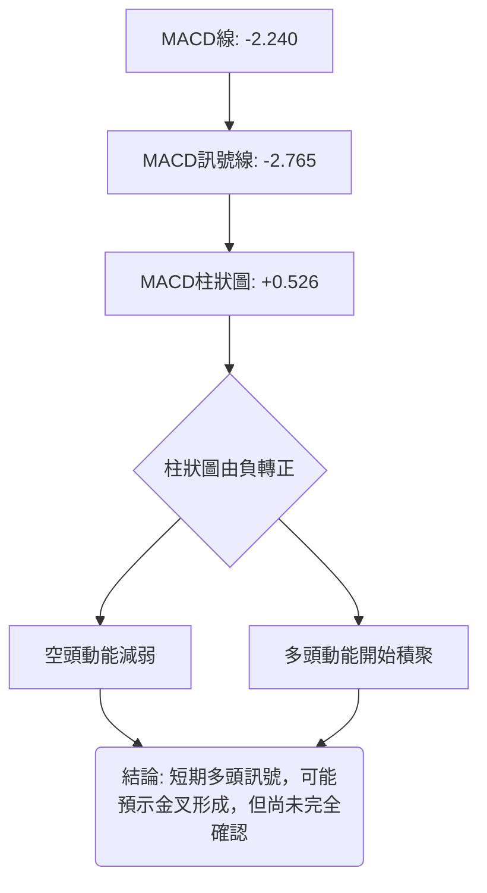

<details>
<summary>📊 靜態圖表 (點擊展開)</summary>

</details>

<html>
<head><meta charset="utf-8" /></head>
<body>
    <div style="height:500px; width:100%;">                        <script>window.PlotlyConfig = {MathJaxConfig: 'local'};</script>
        <script charset="utf-8" src="https://cdn.plot.ly/plotly-3.6.0.min.js" integrity="sha256-QaOVwtVY0T02VaHrr6pnoHLCwayMJp4O5n4YyaE3rJk=" crossorigin="anonymous"></script>                <div id="candlestick-chart" class="plotly-graph-div" style="height:100%; width:100%;"></div>            <script>                window.PLOTLYENV=window.PLOTLYENV || {};                                if (document.getElementById("candlestick-chart")) {                    Plotly.newPlot(                        "candlestick-chart",                        [{"close":{"dtype":"f8","bdata":"AAAAAACAI0AAAACAwnUkQAAAAOBROCVAAAAA4FE4JkAAAADgUTgmQAAAAKCZGShAAAAAACncJ0AAAAAghesnQAAAAGBmZihAAAAA4HqUKUAAAACAwvUpQAAAAIA9iitAAAAAQDOzLUAAAABguJ4uQAAAAEDhei5AAAAAAClcL0AAAABAMzMvQAAAAIDrUS9AAAAAYGZmLUAAAAAAAIAuQAAAACBcjy1AAAAAgBQuLkAAAACAwnUqQAAAAOBROCpAAAAAYLgeK0AAAACA69EpQAAAAAAAAClAAAAAYGbmKUAAAADgUTgrQAAAAGC4nipAAAAAgBSuKUAAAADAzMwpQAAAAOBRuClAAAAAYGbmKkAAAACgR2EqQAAAAGBmZilAAAAAAACAKkAAAAAghesoQAAAAGC4nilAAAAAIK7HKkAAAADgo\u002fAoQAAAAKBH4ShAAAAAgOvRJkAAAADAzMwmQAAAACCFayZAAAAAYGbmJkAAAADgepQnQAAAAIDCdSZAAAAAgOtRJkAAAADgehQnQAAAAIDCdSdAAAAA4KNwJ0AAAADAzMwnQAAAAGBmZidAAAAAgD2KJ0AAAADAHgUoQAAAAKBH4SlAAAAAgD2KKUAAAABgZuYpQAAAAIAUrilAAAAAoEfhKUAAAADgUXgxQAAAAKBwPTJAAAAAwMwMMkAAAACgR+ExQAAAAOBReDBAAAAAoHB9MUAAAACAFC4zQAAAAKCZmTRAAAAAQOG6NEAAAACA61E0QAAAAAApXDNAAAAAYLjeM0AAAACgcL0zQAAAAOBRuDNAAAAAwPVoNEAAAAAA12M1QAAAAEAK1zVAAAAAACmcNkAAAADgo3A2QAAAAIDCtTZAAAAA4KNwOUAAAACA61E5QAAAAEDhujpAAAAAIK5HPEAAAAAgrsc8QAAAAAAAADxAAAAAoEdhOkAAAAAgXA86QAAAAOCj8DpAAAAAYLjeOUAAAACA6xE8QAAAAKBH4TtAAAAAoJlZOkAAAADgUfg4QAAAAKCZ2TZAAAAAQDPzN0AAAADAHsU1QAAAAIAUbjRAAAAAYI9CNkAAAADAHgU4QAAAAIA9yjZAAAAAYGamNUAAAADAzEw1QAAAACCFazZAAAAAgMI1NkAAAACgcL03QAAAAAApHDlAAAAAYGbmN0AAAAAgrsc3QAAAAIDCtThAAAAAoEehOEAAAACgmZk5QAAAAADXIzhAAAAAAClcOkAAAADAzEw5QAAAAAAAADpAAAAAQAqXOEAAAAAgrkc5QAAAAIDr0TlAAAAAYGZmOUAAAADgo3A5QAAAAOBR+DhAAAAAgD3KOEAAAACgmZk4QAAAAOB6FDtAAAAAIFzPOEAAAACAwvU6QAAAAIA96kBAAAAAwPXoQEAAAADgetQ\u002fQAAAACBcr0FAAAAAQDMzQEAAAAAAKdw+QAAAAADX4ztAAAAAQDPzO0AAAACAwrU+QAAAAOCj8EFAAAAAYI+CQUAAAACAwpVBQAAAAGBmRkJAAAAAoHAdQUAAAACAwlVBQAAAAMD1KEFAAAAAQAr3QEAAAADgejRBQAAAAIDr8UNAAAAAoHA9Q0AAAAAAAMBCQAAAAADXA0NAAAAAACm8Q0AAAADAHiVDQAAAAOBRuEFAAAAAoJm5QUAAAAAA14NBQAAAAIA9CkFAAAAAACl8QkAAAABAM3NCQAAAAMAeRUNAAAAA4KOQQkAAAADgUdhDQAAAAGC4nkFAAAAAwB6FQ0AAAAAghetEQAAAAEAKV0RAAAAAYLheREAAAADAHoVFQAAAACBcz0RAAAAAgBTOREAAAAAghctEQAAAAOB6VEVAAAAAoHA9RUAAAADAzCxGQAAAAMD1KEhAAAAAoHA9SUAAAABAM7NJQAAAAIDrkUlAAAAAQOE6R0AAAAAghQtIQAAAAOCjkEVAAAAAANfDRUAAAAAAKRxAQAAAAGC4XkBAAAAAIIUrP0AAAADgUbg+QAAAAIDCFUFAAAAAYGYmP0AAAADgepQ+QAAAAIDCNTxAAAAA4FE4PEAAAABA4To8QAAAAMAexTxAAAAAIK6HPEAAAADAzEw6QAAAAGCPgjpAAAAAgOsRO0AAAAAgrkc\u002fQAAAAOCjkEBAAAAAACmcP0AAAACgR2E\u002fQA=="},"high":{"dtype":"f8","bdata":"AAAAQLbzI0AAAADAzMwkQAAAACCFayVAAAAAgOvRJkAAAADAzEwmQAAAAGCPQihAAAAAgMJ1KEAAAAAgXI8oQAAAAMD1qChAAAAAAAAAKkAAAABguB4qQAAAAIA9CixAAAAAwMg2LkAAAAAAAAAvQAAAACCuxy9AAAAAYI8CMEAAAAAgrscwQAAAAKCZmS9AAAAAwMwMMEAAAABgZuYvQAAAAAAAgC5AAAAA4HpUL0AAAABANR4vQAAAAMD1KCtAAAAAgOvRLEAAAABACKwqQAAAAKCZGSpAAAAAACmcKkAAAACAFG4rQAAAACCF6ytAAAAA4KPwKkAAAAAghasqQAAAAGBmZipAAAAAgMJ1K0AAAABgj8IqQAAAAIA9CitAAAAA4KOwKkAAAACAPQoqQAAAAGBmpilAAAAAoJmZK0AAAACgcL0qQAAAAMDMzClAAAAAgOvRKEAAAABAM7MnQAAAAOBROCdAAAAAwB7FJ0AAAACAwvUoQAAAAAAAAClAAAAAAAAAJ0AAAAAgXE8nQAAAAKDtvCdAAAAAgD0KKEAAAADAHgUoQAAAAADXoydAAAAAwB6FKEAAAACgR2EoQAAAAGBmZipAAAAAAADAKUAAAACAwnUqQAAAAAAAACpAAAAAQOF6KkAAAACgmfkxQAAAAKCZGTNAAAAA4KOwM0AAAAAgrkcyQAAAAMDMjDJAAAAAQDPzMUAAAADgetQzQAAAAGCPwjRAAAAAoHD9NEAAAACAFO40QAAAAIDCVTRAAAAAwB4lNEAAAAAAKTw0QAAAAMDMTDRAAAAAIFzPNEAAAAAgXG81QAAAAEAzEzZAAAAAACncNkAAAACgmZk3QAAAAIDpxjdAAAAAIFyPOUAAAABACpc6QAAAAMAexTpAAAAAoEdhPUAAAABg4+U+QAAAAOBRuD1AAAAAIIWrPEAAAACAwOo6QAAAAEDhujtAAAAAQDOzOkAAAABAM7M8QAAAAGBmZjxAAAAAQDOzO0AAAAAAAEA7QAAAAMChxTlAAAAAAKz8N0AAAAAAAAA4QAAAAIDAijVAAAAAIK5HNkAAAADgURg4QAAAAEDh+jdAAAAAYGaGN0AAAADA9eg1QAAAAIAU7jZAAAAAgD3KNkAAAACgmZk4QAAAAAApHDlAAAAA4KOwOUAAAADgerQ4QAAAACBczzhAAAAAQGLQOUAAAADgo7A5QAAAAEAK1zhAAAAAgBTuOkAAAADgo3A6QAAAAKBHgTpAAAAAoHA9OkAAAAAAqpE7QAAAAEAKFzpAAAAA4FF4OkAAAAAghes6QAAAACBcDzpAAAAAgOkGOkAAAAAAAIA5QAAAAEAKFztAAAAA4HoUO0AAAABgj0I7QAAAAADXI0JAAAAAIIVrQUAAAAAghQtCQAAAAGBmhkJAAAAAANXYQUAAAABguB5BQAAAAMD1aD9AAAAAgBTuPEAAAACAFC4\u002fQAAAAMAeBUJAAAAAwB4lQkAAAABgZuZBQAAAAEDhGkNAAAAAgMKVQkAAAACA6zFCQAAAAIAUvkFAAAAAIFg5QkAAAACAwpVBQAAAAKBwHURAAAAAoHAdREAAAADgevRDQAAAAADXw0NAAAAAQOHaREAAAAAAAABEQAAAAAAAwENAAAAAoHAdQkAAAABACqdBQAAAAAAAgEFAAAAAACl8QkAAAADgeqRCQAAAAGCPokNAAAAAQAq3Q0AAAACgR+FDQAAAAIDCdURAAAAAwMzsQ0AAAAAgXI9FQAAAAOCj8ERAAAAAoJkZRUAAAACgmblFQAAAAEAKl0VAAAAAANfjRkAAAAAAAOBEQAAAAGBmxkVAAAAAAAAARkAAAABADKJGQAAAAOCjkElAAAAAoHB9SUAAAACgR+FJQAAAAGCPoklAAAAAAABgSUAAAABgj2JJQAAAACBcz0dAAAAAwB6VRkAAAABACpdDQAAAAMAeBUFAAAAAIFwvQUAAAADAzMw\u002fQAAAAMD1KEFAAAAAQDMTQUAAAACA6xFAQAAAAAAAQD9AAAAAoJlZPUAAAAAAAAA9QAAAAGCPIj1AAAAAIC89PUAAAACgR+E8QAAAAEAK1zpAAAAA4KOwPEAAAAAgrkc\u002fQAAAAMDM7EBAAAAAAAAgQUAAAACgmblAQA=="},"hovertemplate":"\u003cb\u003e%{x|%Y-%m-%d}\u003c\u002fb\u003e\u003cbr\u003e\u958b: $%{open:.2f}\u003cbr\u003e\u9ad8: $%{high:.2f}\u003cbr\u003e\u4f4e: $%{low:.2f}\u003cbr\u003e\u6536: $%{close:.2f}\u003cextra\u003e\u003c\u002fextra\u003e","low":{"dtype":"f8","bdata":"AAAAgOtRI0AAAAAAKVwjQAAAAOCjcCRAAAAAQOE6JUAAAADgo3AlQAAAAADXIyZAAAAAQApXJ0AAAABACtcmQAAAAMAehSdAAAAA4FG4KEAAAACgcD0oQAAAAEAzMylAAAAAwPUoLEAAAADAHoUtQAAAAKBHYS5AAAAAIFyPLUAAAADAHoUuQAAAAMD1KC5AAAAAACkcLUAAAACA61EuQAAAAEAKFy1AAAAAQDOzLUAAAACgcD0qQAAAACDdJClAAAAAAAAAK0AAAABguJ4pQAAAAOCj8CdAAAAAgBQuKUAAAAAgrkcqQAAAAIA9iipAAAAAIFyPKUAAAAAgrocpQAAAAEDfDylAAAAAIK7HKUAAAACAwnUpQAAAACCF6yhAAAAAIFwPKUAAAAAA1yMoQAAAAAAp3CdAAAAAYBDYKUAAAAAgXI8oQAAAAMD1qChAAAAAQAoXJkAAAADAyHYlQAAAAGCPwiVAAAAAgBTuJUAAAADAzMwmQAAAAICXLiZAAAAAgD0KJUAAAADAHoUmQAAAAMAehSZAAAAAYI9CJ0AAAACAl24nQAAAAMDMzCZAAAAA4HpUJ0AAAABA4XonQAAAAAAp3CdAAAAAwB4FKUAAAACgcD0pQAAAAEA1HilAAAAAwPUoKUAAAADAHgUuQAAAAGC4XjFAAAAAANejMUAAAACAFO4wQAAAAIAUbjBAAAAAgD0KMUAAAACgcP0xQAAAAAApnDNAAAAAoJmZM0AAAAAAKRw0QAAAAIA9CjNAAAAAYI\u002fCMkAAAADgo3AzQAAAAECJoTNAAAAAANX4MkAAAACgcH0zQAAAAOBR+DRAAAAAwPVoNUAAAABAChc2QAAAAMAg0DVAAAAAwPUoN0AAAABguB45QAAAAAAAADlAAAAAYI9COkAAAAAAKVw8QAAAACBcbztAAAAAoEchOUAAAAAA1yM5QAAAAIAULjlAAAAA4FE4OUAAAACgGg86QAAAACBczzpAAAAAwMyMOUAAAACA63E4QAAAAEAKdzZAAAAAwPXoNkAAAABACpc0QAAAAGBmJjRAAAAAIFzPNEAAAABgZqY1QAAAAIDCtTZAAAAAwPXoNEAAAABA4fozQAAAACAGITVAAAAAAACANUAAAACgcD02QAAAAIDCdTZAAAAAYI+CN0AAAABA4To3QAAAAKCZWTZAAAAAoHB9OEAAAACA6xE4QAAAACCuxzZAAAAA4FG4N0AAAACgR2E4QAAAAIBoETlAAAAAYI+CN0AAAACgmdk3QAAAAEAzczhAAAAAQDMzOUAAAADgo\u002fA4QAAAACCuRzhAAAAAIFxPOEAAAADgeKk3QAAAAGBmZjhAAAAAYI\u002fCOEAAAADgo\u002fA3QAAAAIBoIUBAAAAAQOE6P0AAAAAAKRw\u002fQAAAAKBHIT9AAAAAIFwPQEAAAACAPYo+QAAAAGC4PjtAAAAAwPVIOkAAAADAHoU8QAAAAOCjcD1AAAAAQOEaQUAAAABgj2JAQAAAAOBRuEFAAAAA4FH4QEAAAACgmflAQAAAAAApXEBAAAAAoEfhP0AAAAAgrmdAQAAAAGBmdkFAAAAAIIXrQkAAAABACndCQAAAAGCPwkJAAAAAANcjQ0AAAACAPSpCQAAAAOCjkEFAAAAA4KPQQEAAAADA891AQAAAAMD1SEBAAAAAwEsnQUAAAADgpWtBQAAAAMD16EFAAAAAoJn5QUAAAACgR8FBQAAAAEAKd0FAAAAAYGbmQUAAAADAzAxDQAAAAKBHIUNAAAAAwMxsQ0AAAADAzMxDQAAAAMAeRURAAAAAoEchREAAAABgjwJDQAAAAIDCVURAAAAAwB6FREAAAADAzIxFQAAAAIAU7kZAAAAAgBSOR0AAAAAAAIBHQAAAAADXY0ZAAAAAANfDRkAAAABA4TpHQAAAAMAeVUVAAAAAYGamREAAAADA9ag\u002fQAAAAOB6VD9AAAAAgOtRPUAAAABAMzM+QAAAACCFaz5AAAAAwB7FPUAAAAAAKRw+QAAAAKBDCztAAAAA4HoUPEAAAADgelQ6QAAAAIDCtTpAAAAA4HpUO0AAAACAPYo5QAAAAMDMTDlAAAAAoEchOkAAAACgmZk8QAAAAKAYJD5AAAAAwPWIP0AAAACAPco+QA=="},"name":"\u50f9\u683c","open":{"dtype":"f8","bdata":"AAAA4FG4I0AAAAAAAIAjQAAAAIDC9SRAAAAAgOtRJUAAAADgUbglQAAAAEDheiZAAAAAIK5HKEAAAAAAAAAnQAAAAOBRuCdAAAAAIK7HKEAAAABgZmYpQAAAAIAUrilAAAAA4FG4LEAAAABgZuYtQAAAAKCZmS9AAAAAAAAALkAAAADAzIwwQAAAAIAULi9AAAAA4FG4L0AAAAAghWsuQAAAAAAAAC5AAAAAYGbmLkAAAADgo\u002fAuQAAAAAAAACpAAAAAgD0KLEAAAAAAKVwqQAAAAAAAgClAAAAAYI9CKUAAAACgmZkqQAAAAGBm5itAAAAAwMzMKkAAAAAghespQAAAAEDheilAAAAAIK7HKUAAAADA9agqQAAAAIDCdSlAAAAAgBSuKUAAAADAHgUqQAAAAOBROChAAAAAgMJ1KkAAAABgZmYqQAAAAGCPQilAAAAAgD2KKEAAAAAAAAAmQAAAAAApXCZAAAAA4HoUJkAAAAAghesmQAAAAGBmZihAAAAAQOF6JkAAAABAM7MmQAAAAMAeBSdAAAAAgD2KJ0AAAACA69EnQAAAAEAzMydAAAAAYI\u002fCJ0AAAADA9agnQAAAAGBm5idAAAAAwB6FKUAAAAAAKVwqQAAAAKBwPSlAAAAAoJmZKUAAAADgepQvQAAAAOCjcDJAAAAAIFzPMkAAAABgZqYxQAAAAIAULjJAAAAAgD0KMUAAAACgcP0xQAAAACCuxzNAAAAAwMzMM0AAAABA4bo0QAAAAMDMTDRAAAAAoHDdMkAAAAAgrgc0QAAAAGC4vjNAAAAAQOHaM0AAAABAM7M0QAAAAAAAgDVAAAAA4FG4NUAAAACgmdk2QAAAAKCZmTZAAAAAwMxMN0AAAABgj0I6QAAAAAAAgDlAAAAAIFzPOkAAAABAM3M8QAAAAEAKlztAAAAAAACAPEAAAAAAAMA6QAAAAGCPAjpAAAAAoJmZOkAAAADgehQ6QAAAAMDMDDxAAAAAQDOzO0AAAABACrc5QAAAAADX4zhAAAAAQOH6N0AAAAAAAAA4QAAAAAAAADVAAAAAgD0KNUAAAACAwvU1QAAAAGC43jdAAAAAYGaGN0AAAACA65E1QAAAAAAAgDVAAAAAAAAANkAAAABgZmY2QAAAAMAeBTdAAAAAoHC9OEAAAABgZmY3QAAAAAAAQDdAAAAAwMxMOUAAAAAAAIA4QAAAAEAzkzhAAAAA4FG4N0AAAABA4Ro6QAAAAKCZmTlAAAAAAACAOUAAAAAA1+M3QAAAAEAK1zhAAAAAgOvROUAAAABAClc5QAAAAOBR+DlAAAAAQOH6OEAAAACgRyE5QAAAAKCZ2ThAAAAAAACAOkAAAAAAAEA4QAAAAGBmxkBAAAAAAABAQUAAAABA4dpAQAAAAEAzM0BAAAAAACl8QUAAAACgcP1AQAAAAKCZ2T5AAAAAwMzMPEAAAAAAAAA9QAAAAOCjcD1AAAAAgML1QUAAAADgo7BBQAAAAEAzc0JAAAAAAABAQkAAAADgo3BBQAAAAKBwHUFAAAAAIIXLQUAAAACAwjVBQAAAAKBwfUFAAAAAgOuRQ0AAAABAM5NDQAAAAAApHENAAAAAAADAQ0AAAACAPapDQAAAAIAUjkNAAAAAACm8QUAAAADAzExBQAAAAOCjMEFAAAAAANdDQUAAAAAgXF9CQAAAAMAehUJAAAAAoJmZQ0AAAAAgXH9CQAAAAGCPwkNAAAAAQDMzQkAAAABAM1NDQAAAACCFC0RAAAAAQAoXRUAAAADgo1BEQAAAAMD1CEVAAAAAANejRUAAAABACndEQAAAAEAzM0VAAAAAwHIIRUAAAADAzKxFQAAAAMD12EdAAAAAwMwMSUAAAABAMxNJQAAAAAAAkEhAAAAAIIWLSEAAAACAwpVHQAAAACBcz0dAAAAAoHCdRUAAAABgZiZDQAAAAKBHAUFAAAAAgMK1QEAAAAAA1+M+QAAAAAAAgD9AAAAAgOvxQEAAAACAPQpAQAAAAMAeBT5AAAAAANdjPEAAAABgZqY8QAAAAIDC9TtAAAAA4HpUO0AAAACA6xE8QAAAAGCPgjpAAAAAQOE6OkAAAACgmZk8QAAAAKBwfT5AAAAAoJlZQEAAAABACpc\u002fQA=="},"x":["2025-09-16T00:00:00-04:00","2025-09-17T00:00:00-04:00","2025-09-18T00:00:00-04:00","2025-09-19T00:00:00-04:00","2025-09-22T00:00:00-04:00","2025-09-23T00:00:00-04:00","2025-09-24T00:00:00-04:00","2025-09-25T00:00:00-04:00","2025-09-26T00:00:00-04:00","2025-09-29T00:00:00-04:00","2025-09-30T00:00:00-04:00","2025-10-01T00:00:00-04:00","2025-10-02T00:00:00-04:00","2025-10-03T00:00:00-04:00","2025-10-06T00:00:00-04:00","2025-10-07T00:00:00-04:00","2025-10-08T00:00:00-04:00","2025-10-09T00:00:00-04:00","2025-10-10T00:00:00-04:00","2025-10-13T00:00:00-04:00","2025-10-14T00:00:00-04:00","2025-10-15T00:00:00-04:00","2025-10-16T00:00:00-04:00","2025-10-17T00:00:00-04:00","2025-10-20T00:00:00-04:00","2025-10-21T00:00:00-04:00","2025-10-22T00:00:00-04:00","2025-10-23T00:00:00-04:00","2025-10-24T00:00:00-04:00","2025-10-27T00:00:00-04:00","2025-10-28T00:00:00-04:00","2025-10-29T00:00:00-04:00","2025-10-30T00:00:00-04:00","2025-10-31T00:00:00-04:00","2025-11-03T00:00:00-05:00","2025-11-04T00:00:00-05:00","2025-11-05T00:00:00-05:00","2025-11-06T00:00:00-05:00","2025-11-07T00:00:00-05:00","2025-11-10T00:00:00-05:00","2025-11-11T00:00:00-05:00","2025-11-12T00:00:00-05:00","2025-11-13T00:00:00-05:00","2025-11-14T00:00:00-05:00","2025-11-17T00:00:00-05:00","2025-11-18T00:00:00-05:00","2025-11-19T00:00:00-05:00","2025-11-20T00:00:00-05:00","2025-11-21T00:00:00-05:00","2025-11-24T00:00:00-05:00","2025-11-25T00:00:00-05:00","2025-11-26T00:00:00-05:00","2025-11-28T00:00:00-05:00","2025-12-01T00:00:00-05:00","2025-12-02T00:00:00-05:00","2025-12-03T00:00:00-05:00","2025-12-04T00:00:00-05:00","2025-12-05T00:00:00-05:00","2025-12-08T00:00:00-05:00","2025-12-09T00:00:00-05:00","2025-12-10T00:00:00-05:00","2025-12-11T00:00:00-05:00","2025-12-12T00:00:00-05:00","2025-12-15T00:00:00-05:00","2025-12-16T00:00:00-05:00","2025-12-17T00:00:00-05:00","2025-12-18T00:00:00-05:00","2025-12-19T00:00:00-05:00","2025-12-22T00:00:00-05:00","2025-12-23T00:00:00-05:00","2025-12-24T00:00:00-05:00","2025-12-26T00:00:00-05:00","2025-12-29T00:00:00-05:00","2025-12-30T00:00:00-05:00","2025-12-31T00:00:00-05:00","2026-01-02T00:00:00-05:00","2026-01-05T00:00:00-05:00","2026-01-06T00:00:00-05:00","2026-01-07T00:00:00-05:00","2026-01-08T00:00:00-05:00","2026-01-09T00:00:00-05:00","2026-01-12T00:00:00-05:00","2026-01-13T00:00:00-05:00","2026-01-14T00:00:00-05:00","2026-01-15T00:00:00-05:00","2026-01-16T00:00:00-05:00","2026-01-20T00:00:00-05:00","2026-01-21T00:00:00-05:00","2026-01-22T00:00:00-05:00","2026-01-23T00:00:00-05:00","2026-01-26T00:00:00-05:00","2026-01-27T00:00:00-05:00","2026-01-28T00:00:00-05:00","2026-01-29T00:00:00-05:00","2026-01-30T00:00:00-05:00","2026-02-02T00:00:00-05:00","2026-02-03T00:00:00-05:00","2026-02-04T00:00:00-05:00","2026-02-05T00:00:00-05:00","2026-02-06T00:00:00-05:00","2026-02-09T00:00:00-05:00","2026-02-10T00:00:00-05:00","2026-02-11T00:00:00-05:00","2026-02-12T00:00:00-05:00","2026-02-13T00:00:00-05:00","2026-02-17T00:00:00-05:00","2026-02-18T00:00:00-05:00","2026-02-19T00:00:00-05:00","2026-02-20T00:00:00-05:00","2026-02-23T00:00:00-05:00","2026-02-24T00:00:00-05:00","2026-02-25T00:00:00-05:00","2026-02-26T00:00:00-05:00","2026-02-27T00:00:00-05:00","2026-03-02T00:00:00-05:00","2026-03-03T00:00:00-05:00","2026-03-04T00:00:00-05:00","2026-03-05T00:00:00-05:00","2026-03-06T00:00:00-05:00","2026-03-09T00:00:00-04:00","2026-03-10T00:00:00-04:00","2026-03-11T00:00:00-04:00","2026-03-12T00:00:00-04:00","2026-03-13T00:00:00-04:00","2026-03-16T00:00:00-04:00","2026-03-17T00:00:00-04:00","2026-03-18T00:00:00-04:00","2026-03-19T00:00:00-04:00","2026-03-20T00:00:00-04:00","2026-03-23T00:00:00-04:00","2026-03-24T00:00:00-04:00","2026-03-25T00:00:00-04:00","2026-03-26T00:00:00-04:00","2026-03-27T00:00:00-04:00","2026-03-30T00:00:00-04:00","2026-03-31T00:00:00-04:00","2026-04-01T00:00:00-04:00","2026-04-02T00:00:00-04:00","2026-04-06T00:00:00-04:00","2026-04-07T00:00:00-04:00","2026-04-08T00:00:00-04:00","2026-04-09T00:00:00-04:00","2026-04-10T00:00:00-04:00","2026-04-13T00:00:00-04:00","2026-04-14T00:00:00-04:00","2026-04-15T00:00:00-04:00","2026-04-16T00:00:00-04:00","2026-04-17T00:00:00-04:00","2026-04-20T00:00:00-04:00","2026-04-21T00:00:00-04:00","2026-04-22T00:00:00-04:00","2026-04-23T00:00:00-04:00","2026-04-24T00:00:00-04:00","2026-04-27T00:00:00-04:00","2026-04-28T00:00:00-04:00","2026-04-29T00:00:00-04:00","2026-04-30T00:00:00-04:00","2026-05-01T00:00:00-04:00","2026-05-04T00:00:00-04:00","2026-05-05T00:00:00-04:00","2026-05-06T00:00:00-04:00","2026-05-07T00:00:00-04:00","2026-05-08T00:00:00-04:00","2026-05-11T00:00:00-04:00","2026-05-12T00:00:00-04:00","2026-05-13T00:00:00-04:00","2026-05-14T00:00:00-04:00","2026-05-15T00:00:00-04:00","2026-05-18T00:00:00-04:00","2026-05-19T00:00:00-04:00","2026-05-20T00:00:00-04:00","2026-05-21T00:00:00-04:00","2026-05-22T00:00:00-04:00","2026-05-26T00:00:00-04:00","2026-05-27T00:00:00-04:00","2026-05-28T00:00:00-04:00","2026-05-29T00:00:00-04:00","2026-06-01T00:00:00-04:00","2026-06-02T00:00:00-04:00","2026-06-03T00:00:00-04:00","2026-06-04T00:00:00-04:00","2026-06-05T00:00:00-04:00","2026-06-08T00:00:00-04:00","2026-06-09T00:00:00-04:00","2026-06-10T00:00:00-04:00","2026-06-11T00:00:00-04:00","2026-06-12T00:00:00-04:00","2026-06-15T00:00:00-04:00","2026-06-16T00:00:00-04:00","2026-06-17T00:00:00-04:00","2026-06-18T00:00:00-04:00","2026-06-22T00:00:00-04:00","2026-06-23T00:00:00-04:00","2026-06-24T00:00:00-04:00","2026-06-25T00:00:00-04:00","2026-06-26T00:00:00-04:00","2026-06-29T00:00:00-04:00","2026-06-30T00:00:00-04:00","2026-07-01T00:00:00-04:00","2026-07-02T00:00:00-04:00"],"type":"candlestick"},{"hovertemplate":"MA30: $%{y:.2f}\u003cextra\u003e\u003c\u002fextra\u003e","line":{"color":"#2196F3","dash":"dash","width":2},"mode":"lines","name":"MA30","x":["2025-09-16T00:00:00-04:00","2025-09-17T00:00:00-04:00","2025-09-18T00:00:00-04:00","2025-09-19T00:00:00-04:00","2025-09-22T00:00:00-04:00","2025-09-23T00:00:00-04:00","2025-09-24T00:00:00-04:00","2025-09-25T00:00:00-04:00","2025-09-26T00:00:00-04:00","2025-09-29T00:00:00-04:00","2025-09-30T00:00:00-04:00","2025-10-01T00:00:00-04:00","2025-10-02T00:00:00-04:00","2025-10-03T00:00:00-04:00","2025-10-06T00:00:00-04:00","2025-10-07T00:00:00-04:00","2025-10-08T00:00:00-04:00","2025-10-09T00:00:00-04:00","2025-10-10T00:00:00-04:00","2025-10-13T00:00:00-04:00","2025-10-14T00:00:00-04:00","2025-10-15T00:00:00-04:00","2025-10-16T00:00:00-04:00","2025-10-17T00:00:00-04:00","2025-10-20T00:00:00-04:00","2025-10-21T00:00:00-04:00","2025-10-22T00:00:00-04:00","2025-10-23T00:00:00-04:00","2025-10-24T00:00:00-04:00","2025-10-27T00:00:00-04:00","2025-10-28T00:00:00-04:00","2025-10-29T00:00:00-04:00","2025-10-30T00:00:00-04:00","2025-10-31T00:00:00-04:00","2025-11-03T00:00:00-05:00","2025-11-04T00:00:00-05:00","2025-11-05T00:00:00-05:00","2025-11-06T00:00:00-05:00","2025-11-07T00:00:00-05:00","2025-11-10T00:00:00-05:00","2025-11-11T00:00:00-05:00","2025-11-12T00:00:00-05:00","2025-11-13T00:00:00-05:00","2025-11-14T00:00:00-05:00","2025-11-17T00:00:00-05:00","2025-11-18T00:00:00-05:00","2025-11-19T00:00:00-05:00","2025-11-20T00:00:00-05:00","2025-11-21T00:00:00-05:00","2025-11-24T00:00:00-05:00","2025-11-25T00:00:00-05:00","2025-11-26T00:00:00-05:00","2025-11-28T00:00:00-05:00","2025-12-01T00:00:00-05:00","2025-12-02T00:00:00-05:00","2025-12-03T00:00:00-05:00","2025-12-04T00:00:00-05:00","2025-12-05T00:00:00-05:00","2025-12-08T00:00:00-05:00","2025-12-09T00:00:00-05:00","2025-12-10T00:00:00-05:00","2025-12-11T00:00:00-05:00","2025-12-12T00:00:00-05:00","2025-12-15T00:00:00-05:00","2025-12-16T00:00:00-05:00","2025-12-17T00:00:00-05:00","2025-12-18T00:00:00-05:00","2025-12-19T00:00:00-05:00","2025-12-22T00:00:00-05:00","2025-12-23T00:00:00-05:00","2025-12-24T00:00:00-05:00","2025-12-26T00:00:00-05:00","2025-12-29T00:00:00-05:00","2025-12-30T00:00:00-05:00","2025-12-31T00:00:00-05:00","2026-01-02T00:00:00-05:00","2026-01-05T00:00:00-05:00","2026-01-06T00:00:00-05:00","2026-01-07T00:00:00-05:00","2026-01-08T00:00:00-05:00","2026-01-09T00:00:00-05:00","2026-01-12T00:00:00-05:00","2026-01-13T00:00:00-05:00","2026-01-14T00:00:00-05:00","2026-01-15T00:00:00-05:00","2026-01-16T00:00:00-05:00","2026-01-20T00:00:00-05:00","2026-01-21T00:00:00-05:00","2026-01-22T00:00:00-05:00","2026-01-23T00:00:00-05:00","2026-01-26T00:00:00-05:00","2026-01-27T00:00:00-05:00","2026-01-28T00:00:00-05:00","2026-01-29T00:00:00-05:00","2026-01-30T00:00:00-05:00","2026-02-02T00:00:00-05:00","2026-02-03T00:00:00-05:00","2026-02-04T00:00:00-05:00","2026-02-05T00:00:00-05:00","2026-02-06T00:00:00-05:00","2026-02-09T00:00:00-05:00","2026-02-10T00:00:00-05:00","2026-02-11T00:00:00-05:00","2026-02-12T00:00:00-05:00","2026-02-13T00:00:00-05:00","2026-02-17T00:00:00-05:00","2026-02-18T00:00:00-05:00","2026-02-19T00:00:00-05:00","2026-02-20T00:00:00-05:00","2026-02-23T00:00:00-05:00","2026-02-24T00:00:00-05:00","2026-02-25T00:00:00-05:00","2026-02-26T00:00:00-05:00","2026-02-27T00:00:00-05:00","2026-03-02T00:00:00-05:00","2026-03-03T00:00:00-05:00","2026-03-04T00:00:00-05:00","2026-03-05T00:00:00-05:00","2026-03-06T00:00:00-05:00","2026-03-09T00:00:00-04:00","2026-03-10T00:00:00-04:00","2026-03-11T00:00:00-04:00","2026-03-12T00:00:00-04:00","2026-03-13T00:00:00-04:00","2026-03-16T00:00:00-04:00","2026-03-17T00:00:00-04:00","2026-03-18T00:00:00-04:00","2026-03-19T00:00:00-04:00","2026-03-20T00:00:00-04:00","2026-03-23T00:00:00-04:00","2026-03-24T00:00:00-04:00","2026-03-25T00:00:00-04:00","2026-03-26T00:00:00-04:00","2026-03-27T00:00:00-04:00","2026-03-30T00:00:00-04:00","2026-03-31T00:00:00-04:00","2026-04-01T00:00:00-04:00","2026-04-02T00:00:00-04:00","2026-04-06T00:00:00-04:00","2026-04-07T00:00:00-04:00","2026-04-08T00:00:00-04:00","2026-04-09T00:00:00-04:00","2026-04-10T00:00:00-04:00","2026-04-13T00:00:00-04:00","2026-04-14T00:00:00-04:00","2026-04-15T00:00:00-04:00","2026-04-16T00:00:00-04:00","2026-04-17T00:00:00-04:00","2026-04-20T00:00:00-04:00","2026-04-21T00:00:00-04:00","2026-04-22T00:00:00-04:00","2026-04-23T00:00:00-04:00","2026-04-24T00:00:00-04:00","2026-04-27T00:00:00-04:00","2026-04-28T00:00:00-04:00","2026-04-29T00:00:00-04:00","2026-04-30T00:00:00-04:00","2026-05-01T00:00:00-04:00","2026-05-04T00:00:00-04:00","2026-05-05T00:00:00-04:00","2026-05-06T00:00:00-04:00","2026-05-07T00:00:00-04:00","2026-05-08T00:00:00-04:00","2026-05-11T00:00:00-04:00","2026-05-12T00:00:00-04:00","2026-05-13T00:00:00-04:00","2026-05-14T00:00:00-04:00","2026-05-15T00:00:00-04:00","2026-05-18T00:00:00-04:00","2026-05-19T00:00:00-04:00","2026-05-20T00:00:00-04:00","2026-05-21T00:00:00-04:00","2026-05-22T00:00:00-04:00","2026-05-26T00:00:00-04:00","2026-05-27T00:00:00-04:00","2026-05-28T00:00:00-04:00","2026-05-29T00:00:00-04:00","2026-06-01T00:00:00-04:00","2026-06-02T00:00:00-04:00","2026-06-03T00:00:00-04:00","2026-06-04T00:00:00-04:00","2026-06-05T00:00:00-04:00","2026-06-08T00:00:00-04:00","2026-06-09T00:00:00-04:00","2026-06-10T00:00:00-04:00","2026-06-11T00:00:00-04:00","2026-06-12T00:00:00-04:00","2026-06-15T00:00:00-04:00","2026-06-16T00:00:00-04:00","2026-06-17T00:00:00-04:00","2026-06-18T00:00:00-04:00","2026-06-22T00:00:00-04:00","2026-06-23T00:00:00-04:00","2026-06-24T00:00:00-04:00","2026-06-25T00:00:00-04:00","2026-06-26T00:00:00-04:00","2026-06-29T00:00:00-04:00","2026-06-30T00:00:00-04:00","2026-07-01T00:00:00-04:00","2026-07-02T00:00:00-04:00"],"y":{"dtype":"f8","bdata":"AAAAAAAA+H8AAAAAAAD4fwAAAAAAAPh\u002fAAAAAAAA+H8AAAAAAAD4fwAAAAAAAPh\u002fAAAAAAAA+H8AAAAAAAD4fwAAAAAAAPh\u002fAAAAAAAA+H8AAAAAAAD4fwAAAAAAAPh\u002fAAAAAAAA+H8AAAAAAAD4fwAAAAAAAPh\u002fAAAAAAAA+H8AAAAAAAD4fwAAAAAAAPh\u002fAAAAAAAA+H8AAAAAAAD4fwAAAAAAAPh\u002fAAAAAAAA+H8AAAAAAAD4fwAAAAAAAPh\u002fAAAAAAAA+H8AAAAAAAD4fwAAAAAAAPh\u002fAAAAAAAA+H8AAAAAAAD4f5qZmcmhhSpARERENF66KkDNzMyc7+cqQDMzMwNWDitAERERoUU2K0CamZlJxVkrQN7d3S3dZCtAiYiIWGR7K0ARERHh7IMrQDMzMwNWjitAREREdJOYK0C8u7s7348rQO\u002fu7l4seStAd3d3x3Y+K0CamZm5u\u002fsqQDMzM2P0tipAvLu7O8NuKkBmZmYWvS0qQO\u002fu7h4i4ilAAAAAoLelKUAzMzNjZmYpQLy7u7tYMilAq6qq+tT4KEDv7u4eIuIoQM3MzLwRyihAvLu7G4WrKEAzMzPzKJwoQGZmZlaroyhAiYiI6JigKEAzMzNTVZUoQM3MzNxPjShARERExASPKEBmZmZmA90oQKuqqvrUOClA7+7urlaHKUCrqqqaYdcpQLy7u\u002fu4FypAMzMz0xVgKkBERET0xdIqQLy7u\u002fu4VytA3t3d7f3UK0CamZkZ91osQLy7uwsR0SxAq6qqWnNhLUDv7u5eye8tQAAAACAGgS5AZmZm9vAZL0AAAAAAyL0vQGZmZuZtOTBA7+7uziKbMEARERE5JvgwQN7d3WXYVTFAIiIiMuzKMUAiIiKicD0yQDMzMyuyvTJAiYiI0JRKM0CJiIhwr9kzQDMzM4MyWjRAIiIiAlbONEBVVVU9NT41QBERESmHtjVA3t3dLd0kNkC8u7s7UX82QCIiIiKU0TZAMzMzw2cYN0Crqqoa6FQ3QN7d3W1ZizdAREREhHnCN0BVVVV1k9g3QGZmZhYg1zdAzczMbC7kN0AzMzMzwQM4QGZmZiYGIThA3t3dnTYwOEDNzMx8hj04QKuqqrqQVDhAMzMz4+xjOECrqqqK+nc4QHd3d\u002ffhkzhAMzMzA+SeOECamZlJU6o4QKuqqlpkuzhAERER4Xq0OEDNzMyM3rY4QLy7u5vEoDhA3t3dTWKQOEAAAAAgsHI4QO\u002fu7g6fYThA7+7uvlhSOEAAAADQsEs4QCIiIiIiQjhAZmZmZh8+OEBEREQUric4QGZmZhbZDjhAd3d3N4kBOEARERHxYP43QERERIR5IjhAZmZmNtApOEAAAADwGVY4QAAAALByyDhARERE5BcrOUCJiIgYvW05QFVVVYUW2TlAIiIiQtI0OkBmZmZmZoY6QLy7u8sTtTpAVVVVBQ\u002fmOkB3d3c3iSE7QERERKRwfTtAd3d3p1TcO0C8u7t7hj08QLy7u1uPojxAERER4Xr0PEB3d3eX4EE9QERERCS\u002fmD1A7+7uDljZPUCJiIgoFSc+QDMzM1OcnT5A3t3dfSMUP0DNzMx8anw\u002fQDMzM6Ob5D9AMzMzA1YuQEC8u7ujKWVAQLy7u6vVkUBAvLu7O1G\u002fQECrqqqS0etAQBEREXGvCUFAAAAAaJE9QUAiIiKK+mdBQFVVVR0TfEFAzczMhDKKQUC8u7u7u6tBQN7d3b0tq0FAREREZILHQUCrqqp6W\u002fZBQCIiIpLtLEJAmpmZqX9jQkAAAABQG5hCQLy7u+uYsEJAVVVV9bbMQkAAAABQG+hCQAAAABAtAkNAMzMzQ2AlQ0B3d3dnrU5DQDMzMyNpikNAZmZmJgbRQ0AzMzPDgxlEQDMzM8ODSURAzczMDJBrREB3d3cnv5hEQHd3d7eBrkRAERERUdS\u002fREAiIiJC7qVEQERERCRpmkRAVVVVPSaIREAiIiKSwnVEQO\u002fu7t4kdkRAiYiI4E9dREAAAADAWEJEQCIiIqJFFkRAERERiUHwQ0AREREpXL9DQJqZmTHBo0NAiYiIeOl2Q0BVVVWlmzRDQCIiIjom+EJAiYiI8NK9QkAiIiLipYtCQKuqqopsZ0JAAAAA4ME8QkDNzMzUMRFCQA=="},"type":"scatter"},{"hovertemplate":"MA60: $%{y:.2f}\u003cextra\u003e\u003c\u002fextra\u003e","line":{"color":"#9C27B0","dash":"dash","width":2},"mode":"lines","name":"MA60","x":["2025-09-16T00:00:00-04:00","2025-09-17T00:00:00-04:00","2025-09-18T00:00:00-04:00","2025-09-19T00:00:00-04:00","2025-09-22T00:00:00-04:00","2025-09-23T00:00:00-04:00","2025-09-24T00:00:00-04:00","2025-09-25T00:00:00-04:00","2025-09-26T00:00:00-04:00","2025-09-29T00:00:00-04:00","2025-09-30T00:00:00-04:00","2025-10-01T00:00:00-04:00","2025-10-02T00:00:00-04:00","2025-10-03T00:00:00-04:00","2025-10-06T00:00:00-04:00","2025-10-07T00:00:00-04:00","2025-10-08T00:00:00-04:00","2025-10-09T00:00:00-04:00","2025-10-10T00:00:00-04:00","2025-10-13T00:00:00-04:00","2025-10-14T00:00:00-04:00","2025-10-15T00:00:00-04:00","2025-10-16T00:00:00-04:00","2025-10-17T00:00:00-04:00","2025-10-20T00:00:00-04:00","2025-10-21T00:00:00-04:00","2025-10-22T00:00:00-04:00","2025-10-23T00:00:00-04:00","2025-10-24T00:00:00-04:00","2025-10-27T00:00:00-04:00","2025-10-28T00:00:00-04:00","2025-10-29T00:00:00-04:00","2025-10-30T00:00:00-04:00","2025-10-31T00:00:00-04:00","2025-11-03T00:00:00-05:00","2025-11-04T00:00:00-05:00","2025-11-05T00:00:00-05:00","2025-11-06T00:00:00-05:00","2025-11-07T00:00:00-05:00","2025-11-10T00:00:00-05:00","2025-11-11T00:00:00-05:00","2025-11-12T00:00:00-05:00","2025-11-13T00:00:00-05:00","2025-11-14T00:00:00-05:00","2025-11-17T00:00:00-05:00","2025-11-18T00:00:00-05:00","2025-11-19T00:00:00-05:00","2025-11-20T00:00:00-05:00","2025-11-21T00:00:00-05:00","2025-11-24T00:00:00-05:00","2025-11-25T00:00:00-05:00","2025-11-26T00:00:00-05:00","2025-11-28T00:00:00-05:00","2025-12-01T00:00:00-05:00","2025-12-02T00:00:00-05:00","2025-12-03T00:00:00-05:00","2025-12-04T00:00:00-05:00","2025-12-05T00:00:00-05:00","2025-12-08T00:00:00-05:00","2025-12-09T00:00:00-05:00","2025-12-10T00:00:00-05:00","2025-12-11T00:00:00-05:00","2025-12-12T00:00:00-05:00","2025-12-15T00:00:00-05:00","2025-12-16T00:00:00-05:00","2025-12-17T00:00:00-05:00","2025-12-18T00:00:00-05:00","2025-12-19T00:00:00-05:00","2025-12-22T00:00:00-05:00","2025-12-23T00:00:00-05:00","2025-12-24T00:00:00-05:00","2025-12-26T00:00:00-05:00","2025-12-29T00:00:00-05:00","2025-12-30T00:00:00-05:00","2025-12-31T00:00:00-05:00","2026-01-02T00:00:00-05:00","2026-01-05T00:00:00-05:00","2026-01-06T00:00:00-05:00","2026-01-07T00:00:00-05:00","2026-01-08T00:00:00-05:00","2026-01-09T00:00:00-05:00","2026-01-12T00:00:00-05:00","2026-01-13T00:00:00-05:00","2026-01-14T00:00:00-05:00","2026-01-15T00:00:00-05:00","2026-01-16T00:00:00-05:00","2026-01-20T00:00:00-05:00","2026-01-21T00:00:00-05:00","2026-01-22T00:00:00-05:00","2026-01-23T00:00:00-05:00","2026-01-26T00:00:00-05:00","2026-01-27T00:00:00-05:00","2026-01-28T00:00:00-05:00","2026-01-29T00:00:00-05:00","2026-01-30T00:00:00-05:00","2026-02-02T00:00:00-05:00","2026-02-03T00:00:00-05:00","2026-02-04T00:00:00-05:00","2026-02-05T00:00:00-05:00","2026-02-06T00:00:00-05:00","2026-02-09T00:00:00-05:00","2026-02-10T00:00:00-05:00","2026-02-11T00:00:00-05:00","2026-02-12T00:00:00-05:00","2026-02-13T00:00:00-05:00","2026-02-17T00:00:00-05:00","2026-02-18T00:00:00-05:00","2026-02-19T00:00:00-05:00","2026-02-20T00:00:00-05:00","2026-02-23T00:00:00-05:00","2026-02-24T00:00:00-05:00","2026-02-25T00:00:00-05:00","2026-02-26T00:00:00-05:00","2026-02-27T00:00:00-05:00","2026-03-02T00:00:00-05:00","2026-03-03T00:00:00-05:00","2026-03-04T00:00:00-05:00","2026-03-05T00:00:00-05:00","2026-03-06T00:00:00-05:00","2026-03-09T00:00:00-04:00","2026-03-10T00:00:00-04:00","2026-03-11T00:00:00-04:00","2026-03-12T00:00:00-04:00","2026-03-13T00:00:00-04:00","2026-03-16T00:00:00-04:00","2026-03-17T00:00:00-04:00","2026-03-18T00:00:00-04:00","2026-03-19T00:00:00-04:00","2026-03-20T00:00:00-04:00","2026-03-23T00:00:00-04:00","2026-03-24T00:00:00-04:00","2026-03-25T00:00:00-04:00","2026-03-26T00:00:00-04:00","2026-03-27T00:00:00-04:00","2026-03-30T00:00:00-04:00","2026-03-31T00:00:00-04:00","2026-04-01T00:00:00-04:00","2026-04-02T00:00:00-04:00","2026-04-06T00:00:00-04:00","2026-04-07T00:00:00-04:00","2026-04-08T00:00:00-04:00","2026-04-09T00:00:00-04:00","2026-04-10T00:00:00-04:00","2026-04-13T00:00:00-04:00","2026-04-14T00:00:00-04:00","2026-04-15T00:00:00-04:00","2026-04-16T00:00:00-04:00","2026-04-17T00:00:00-04:00","2026-04-20T00:00:00-04:00","2026-04-21T00:00:00-04:00","2026-04-22T00:00:00-04:00","2026-04-23T00:00:00-04:00","2026-04-24T00:00:00-04:00","2026-04-27T00:00:00-04:00","2026-04-28T00:00:00-04:00","2026-04-29T00:00:00-04:00","2026-04-30T00:00:00-04:00","2026-05-01T00:00:00-04:00","2026-05-04T00:00:00-04:00","2026-05-05T00:00:00-04:00","2026-05-06T00:00:00-04:00","2026-05-07T00:00:00-04:00","2026-05-08T00:00:00-04:00","2026-05-11T00:00:00-04:00","2026-05-12T00:00:00-04:00","2026-05-13T00:00:00-04:00","2026-05-14T00:00:00-04:00","2026-05-15T00:00:00-04:00","2026-05-18T00:00:00-04:00","2026-05-19T00:00:00-04:00","2026-05-20T00:00:00-04:00","2026-05-21T00:00:00-04:00","2026-05-22T00:00:00-04:00","2026-05-26T00:00:00-04:00","2026-05-27T00:00:00-04:00","2026-05-28T00:00:00-04:00","2026-05-29T00:00:00-04:00","2026-06-01T00:00:00-04:00","2026-06-02T00:00:00-04:00","2026-06-03T00:00:00-04:00","2026-06-04T00:00:00-04:00","2026-06-05T00:00:00-04:00","2026-06-08T00:00:00-04:00","2026-06-09T00:00:00-04:00","2026-06-10T00:00:00-04:00","2026-06-11T00:00:00-04:00","2026-06-12T00:00:00-04:00","2026-06-15T00:00:00-04:00","2026-06-16T00:00:00-04:00","2026-06-17T00:00:00-04:00","2026-06-18T00:00:00-04:00","2026-06-22T00:00:00-04:00","2026-06-23T00:00:00-04:00","2026-06-24T00:00:00-04:00","2026-06-25T00:00:00-04:00","2026-06-26T00:00:00-04:00","2026-06-29T00:00:00-04:00","2026-06-30T00:00:00-04:00","2026-07-01T00:00:00-04:00","2026-07-02T00:00:00-04:00"],"y":{"dtype":"f8","bdata":"AAAAAAAA+H8AAAAAAAD4fwAAAAAAAPh\u002fAAAAAAAA+H8AAAAAAAD4fwAAAAAAAPh\u002fAAAAAAAA+H8AAAAAAAD4fwAAAAAAAPh\u002fAAAAAAAA+H8AAAAAAAD4fwAAAAAAAPh\u002fAAAAAAAA+H8AAAAAAAD4fwAAAAAAAPh\u002fAAAAAAAA+H8AAAAAAAD4fwAAAAAAAPh\u002fAAAAAAAA+H8AAAAAAAD4fwAAAAAAAPh\u002fAAAAAAAA+H8AAAAAAAD4fwAAAAAAAPh\u002fAAAAAAAA+H8AAAAAAAD4fwAAAAAAAPh\u002fAAAAAAAA+H8AAAAAAAD4fwAAAAAAAPh\u002fAAAAAAAA+H8AAAAAAAD4fwAAAAAAAPh\u002fAAAAAAAA+H8AAAAAAAD4fwAAAAAAAPh\u002fAAAAAAAA+H8AAAAAAAD4fwAAAAAAAPh\u002fAAAAAAAA+H8AAAAAAAD4fwAAAAAAAPh\u002fAAAAAAAA+H8AAAAAAAD4fwAAAAAAAPh\u002fAAAAAAAA+H8AAAAAAAD4fwAAAAAAAPh\u002fAAAAAAAA+H8AAAAAAAD4fwAAAAAAAPh\u002fAAAAAAAA+H8AAAAAAAD4fwAAAAAAAPh\u002fAAAAAAAA+H8AAAAAAAD4fwAAAAAAAPh\u002fAAAAAAAA+H8AAAAAAAD4fzMzM9N4iSlAREREfLGkKUCamZmBeeIpQO\u002fu7n6VIypAAAAAKM5eKkAiIiJyk5gqQM3MzBRLvipA3t3dFb3tKkCrqqpqWSsrQHd3d38HcytAERERsci2K0Crqqoqa\u002fUrQFVVVbUeJSxAEREREfVPLEBERESMwnUsQJqZmUH9myxAERERGVrELEAzMzOLwvUsQN7d3fV+Ki1A7+7unv5tLUCrqqpqWastQLy7u8ME7y1Ad3d3r1ZHLkCamZmxga4uQJqZmQm7Ii9AZmZmXlegL0ARERH14RMwQDMzMxcEVjBAMzMzO1GPMEB3d3fzb8QwQLy7u4uX\u002fjBAAAAAyC82MUB3d3d36XYxQLy7u0\u002f\u002ftjFAVVVVjQnuMUAAAAB0TCAyQN7d3fWaSzJA7+7uNkJ5MkC8u7s3+6AyQCIiIkp+wTJA3t3dsVbnMkAAAABgnhgzQCIiIlbHRDNAmpmZJXhwM0AiIiKWtZozQFVVVeWJyjNAMzMzr3L4M0BVVVVFbys0QO\u002fu7u6nZjRAERERaQOdNEBVVVXBPNE0QERERGCeCDVAmpmZibM\u002fNUB3d3eXJ3o1QHd3d2M7rzVAMzMzj3vtNUBERETILyY2QBEREcnoXTZAiYiIYFeQNkCrqqoG88Q2QJqZmaVU\u002fDZAIiIiSn4xN0AAAACof1M3QERERJw2cDdAVVVVffiMN0De3d2FpKk3QBEREXnp1jdAVVVV3ST2N0CrqqqyVhc4QDMzM2PJTzhAiYiIKKOHOEDe3d0lv7g4QN7d3VUO\u002fThAAAAAcIQyOUCamZlx9mE5QDMzM0PShDlARERE9P2kOUARERHhwcw5QN7d3U2pCDpAVVVVVZw9OkCrqqri7HM6QDMzM9v5rjpAERER4XrUOkAiIiKSX\u002fw6QAAAAODBHDtAZmZmLt00O0BERESk4kw7QBEREbGdfztAZmZmHj6zO0BmZmamDeQ7QKuqquJeEzxAZmZmtmVNPEDe3d2tAHk8QO\u002fu7jZCmTxAd3d31xXAPEAzMzMLAus8QDMzMzPsGj1AMzMzg3lSPUAiIiKCB5M9QFVVVXVM4D1A7+7udr4fPkAAAABImmI+QImIiAC5lz5AVVVVhevhPkDe3d2tjjk\u002fQAAAAHh3hz9ARERELIfWP0De3d31bxRAQO\u002fu7p6oN0BAiYiIpHBdQEDv7u5Gb4NAQO\u002fu7l66qUBA3t3d2c7PQECamZnZzvdAQKuqqlpkK0FA7+7uFtleQUC8u7srh5ZBQGZmZvYozEFA3t3d5dD6QUDv7u4yeitCQImIiMRnUEJAIiIiKhV3QkDv7u7yi4VCQAAAAGgflkJAiYiIvLujQkBmZmYSyrBCQAAAACjqv0JAREREpHDNQkARERGlKdVCQLy7u18syUJA7+7uBjq9QkBmZmbyi7VCQLy7u3d3p0JAZmZm7jWfQkAAAACQe5VCQCIiIuaJkkJAERERTamQQkARERGZ4JFCQDMzM7sCjEJAq6qqaryEQkBmZmaSpnxCQA=="},"type":"scatter"},{"hovertemplate":"MA200: $%{y:.2f}\u003cextra\u003e\u003c\u002fextra\u003e","line":{"color":"#FF6F00","dash":"solid","width":2},"mode":"lines","name":"MA200","x":["2025-09-16T00:00:00-04:00","2025-09-17T00:00:00-04:00","2025-09-18T00:00:00-04:00","2025-09-19T00:00:00-04:00","2025-09-22T00:00:00-04:00","2025-09-23T00:00:00-04:00","2025-09-24T00:00:00-04:00","2025-09-25T00:00:00-04:00","2025-09-26T00:00:00-04:00","2025-09-29T00:00:00-04:00","2025-09-30T00:00:00-04:00","2025-10-01T00:00:00-04:00","2025-10-02T00:00:00-04:00","2025-10-03T00:00:00-04:00","2025-10-06T00:00:00-04:00","2025-10-07T00:00:00-04:00","2025-10-08T00:00:00-04:00","2025-10-09T00:00:00-04:00","2025-10-10T00:00:00-04:00","2025-10-13T00:00:00-04:00","2025-10-14T00:00:00-04:00","2025-10-15T00:00:00-04:00","2025-10-16T00:00:00-04:00","2025-10-17T00:00:00-04:00","2025-10-20T00:00:00-04:00","2025-10-21T00:00:00-04:00","2025-10-22T00:00:00-04:00","2025-10-23T00:00:00-04:00","2025-10-24T00:00:00-04:00","2025-10-27T00:00:00-04:00","2025-10-28T00:00:00-04:00","2025-10-29T00:00:00-04:00","2025-10-30T00:00:00-04:00","2025-10-31T00:00:00-04:00","2025-11-03T00:00:00-05:00","2025-11-04T00:00:00-05:00","2025-11-05T00:00:00-05:00","2025-11-06T00:00:00-05:00","2025-11-07T00:00:00-05:00","2025-11-10T00:00:00-05:00","2025-11-11T00:00:00-05:00","2025-11-12T00:00:00-05:00","2025-11-13T00:00:00-05:00","2025-11-14T00:00:00-05:00","2025-11-17T00:00:00-05:00","2025-11-18T00:00:00-05:00","2025-11-19T00:00:00-05:00","2025-11-20T00:00:00-05:00","2025-11-21T00:00:00-05:00","2025-11-24T00:00:00-05:00","2025-11-25T00:00:00-05:00","2025-11-26T00:00:00-05:00","2025-11-28T00:00:00-05:00","2025-12-01T00:00:00-05:00","2025-12-02T00:00:00-05:00","2025-12-03T00:00:00-05:00","2025-12-04T00:00:00-05:00","2025-12-05T00:00:00-05:00","2025-12-08T00:00:00-05:00","2025-12-09T00:00:00-05:00","2025-12-10T00:00:00-05:00","2025-12-11T00:00:00-05:00","2025-12-12T00:00:00-05:00","2025-12-15T00:00:00-05:00","2025-12-16T00:00:00-05:00","2025-12-17T00:00:00-05:00","2025-12-18T00:00:00-05:00","2025-12-19T00:00:00-05:00","2025-12-22T00:00:00-05:00","2025-12-23T00:00:00-05:00","2025-12-24T00:00:00-05:00","2025-12-26T00:00:00-05:00","2025-12-29T00:00:00-05:00","2025-12-30T00:00:00-05:00","2025-12-31T00:00:00-05:00","2026-01-02T00:00:00-05:00","2026-01-05T00:00:00-05:00","2026-01-06T00:00:00-05:00","2026-01-07T00:00:00-05:00","2026-01-08T00:00:00-05:00","2026-01-09T00:00:00-05:00","2026-01-12T00:00:00-05:00","2026-01-13T00:00:00-05:00","2026-01-14T00:00:00-05:00","2026-01-15T00:00:00-05:00","2026-01-16T00:00:00-05:00","2026-01-20T00:00:00-05:00","2026-01-21T00:00:00-05:00","2026-01-22T00:00:00-05:00","2026-01-23T00:00:00-05:00","2026-01-26T00:00:00-05:00","2026-01-27T00:00:00-05:00","2026-01-28T00:00:00-05:00","2026-01-29T00:00:00-05:00","2026-01-30T00:00:00-05:00","2026-02-02T00:00:00-05:00","2026-02-03T00:00:00-05:00","2026-02-04T00:00:00-05:00","2026-02-05T00:00:00-05:00","2026-02-06T00:00:00-05:00","2026-02-09T00:00:00-05:00","2026-02-10T00:00:00-05:00","2026-02-11T00:00:00-05:00","2026-02-12T00:00:00-05:00","2026-02-13T00:00:00-05:00","2026-02-17T00:00:00-05:00","2026-02-18T00:00:00-05:00","2026-02-19T00:00:00-05:00","2026-02-20T00:00:00-05:00","2026-02-23T00:00:00-05:00","2026-02-24T00:00:00-05:00","2026-02-25T00:00:00-05:00","2026-02-26T00:00:00-05:00","2026-02-27T00:00:00-05:00","2026-03-02T00:00:00-05:00","2026-03-03T00:00:00-05:00","2026-03-04T00:00:00-05:00","2026-03-05T00:00:00-05:00","2026-03-06T00:00:00-05:00","2026-03-09T00:00:00-04:00","2026-03-10T00:00:00-04:00","2026-03-11T00:00:00-04:00","2026-03-12T00:00:00-04:00","2026-03-13T00:00:00-04:00","2026-03-16T00:00:00-04:00","2026-03-17T00:00:00-04:00","2026-03-18T00:00:00-04:00","2026-03-19T00:00:00-04:00","2026-03-20T00:00:00-04:00","2026-03-23T00:00:00-04:00","2026-03-24T00:00:00-04:00","2026-03-25T00:00:00-04:00","2026-03-26T00:00:00-04:00","2026-03-27T00:00:00-04:00","2026-03-30T00:00:00-04:00","2026-03-31T00:00:00-04:00","2026-04-01T00:00:00-04:00","2026-04-02T00:00:00-04:00","2026-04-06T00:00:00-04:00","2026-04-07T00:00:00-04:00","2026-04-08T00:00:00-04:00","2026-04-09T00:00:00-04:00","2026-04-10T00:00:00-04:00","2026-04-13T00:00:00-04:00","2026-04-14T00:00:00-04:00","2026-04-15T00:00:00-04:00","2026-04-16T00:00:00-04:00","2026-04-17T00:00:00-04:00","2026-04-20T00:00:00-04:00","2026-04-21T00:00:00-04:00","2026-04-22T00:00:00-04:00","2026-04-23T00:00:00-04:00","2026-04-24T00:00:00-04:00","2026-04-27T00:00:00-04:00","2026-04-28T00:00:00-04:00","2026-04-29T00:00:00-04:00","2026-04-30T00:00:00-04:00","2026-05-01T00:00:00-04:00","2026-05-04T00:00:00-04:00","2026-05-05T00:00:00-04:00","2026-05-06T00:00:00-04:00","2026-05-07T00:00:00-04:00","2026-05-08T00:00:00-04:00","2026-05-11T00:00:00-04:00","2026-05-12T00:00:00-04:00","2026-05-13T00:00:00-04:00","2026-05-14T00:00:00-04:00","2026-05-15T00:00:00-04:00","2026-05-18T00:00:00-04:00","2026-05-19T00:00:00-04:00","2026-05-20T00:00:00-04:00","2026-05-21T00:00:00-04:00","2026-05-22T00:00:00-04:00","2026-05-26T00:00:00-04:00","2026-05-27T00:00:00-04:00","2026-05-28T00:00:00-04:00","2026-05-29T00:00:00-04:00","2026-06-01T00:00:00-04:00","2026-06-02T00:00:00-04:00","2026-06-03T00:00:00-04:00","2026-06-04T00:00:00-04:00","2026-06-05T00:00:00-04:00","2026-06-08T00:00:00-04:00","2026-06-09T00:00:00-04:00","2026-06-10T00:00:00-04:00","2026-06-11T00:00:00-04:00","2026-06-12T00:00:00-04:00","2026-06-15T00:00:00-04:00","2026-06-16T00:00:00-04:00","2026-06-17T00:00:00-04:00","2026-06-18T00:00:00-04:00","2026-06-22T00:00:00-04:00","2026-06-23T00:00:00-04:00","2026-06-24T00:00:00-04:00","2026-06-25T00:00:00-04:00","2026-06-26T00:00:00-04:00","2026-06-29T00:00:00-04:00","2026-06-30T00:00:00-04:00","2026-07-01T00:00:00-04:00","2026-07-02T00:00:00-04:00"],"y":{"dtype":"f8","bdata":"AAAAAAAA+H8AAAAAAAD4fwAAAAAAAPh\u002fAAAAAAAA+H8AAAAAAAD4fwAAAAAAAPh\u002fAAAAAAAA+H8AAAAAAAD4fwAAAAAAAPh\u002fAAAAAAAA+H8AAAAAAAD4fwAAAAAAAPh\u002fAAAAAAAA+H8AAAAAAAD4fwAAAAAAAPh\u002fAAAAAAAA+H8AAAAAAAD4fwAAAAAAAPh\u002fAAAAAAAA+H8AAAAAAAD4fwAAAAAAAPh\u002fAAAAAAAA+H8AAAAAAAD4fwAAAAAAAPh\u002fAAAAAAAA+H8AAAAAAAD4fwAAAAAAAPh\u002fAAAAAAAA+H8AAAAAAAD4fwAAAAAAAPh\u002fAAAAAAAA+H8AAAAAAAD4fwAAAAAAAPh\u002fAAAAAAAA+H8AAAAAAAD4fwAAAAAAAPh\u002fAAAAAAAA+H8AAAAAAAD4fwAAAAAAAPh\u002fAAAAAAAA+H8AAAAAAAD4fwAAAAAAAPh\u002fAAAAAAAA+H8AAAAAAAD4fwAAAAAAAPh\u002fAAAAAAAA+H8AAAAAAAD4fwAAAAAAAPh\u002fAAAAAAAA+H8AAAAAAAD4fwAAAAAAAPh\u002fAAAAAAAA+H8AAAAAAAD4fwAAAAAAAPh\u002fAAAAAAAA+H8AAAAAAAD4fwAAAAAAAPh\u002fAAAAAAAA+H8AAAAAAAD4fwAAAAAAAPh\u002fAAAAAAAA+H8AAAAAAAD4fwAAAAAAAPh\u002fAAAAAAAA+H8AAAAAAAD4fwAAAAAAAPh\u002fAAAAAAAA+H8AAAAAAAD4fwAAAAAAAPh\u002fAAAAAAAA+H8AAAAAAAD4fwAAAAAAAPh\u002fAAAAAAAA+H8AAAAAAAD4fwAAAAAAAPh\u002fAAAAAAAA+H8AAAAAAAD4fwAAAAAAAPh\u002fAAAAAAAA+H8AAAAAAAD4fwAAAAAAAPh\u002fAAAAAAAA+H8AAAAAAAD4fwAAAAAAAPh\u002fAAAAAAAA+H8AAAAAAAD4fwAAAAAAAPh\u002fAAAAAAAA+H8AAAAAAAD4fwAAAAAAAPh\u002fAAAAAAAA+H8AAAAAAAD4fwAAAAAAAPh\u002fAAAAAAAA+H8AAAAAAAD4fwAAAAAAAPh\u002fAAAAAAAA+H8AAAAAAAD4fwAAAAAAAPh\u002fAAAAAAAA+H8AAAAAAAD4fwAAAAAAAPh\u002fAAAAAAAA+H8AAAAAAAD4fwAAAAAAAPh\u002fAAAAAAAA+H8AAAAAAAD4fwAAAAAAAPh\u002fAAAAAAAA+H8AAAAAAAD4fwAAAAAAAPh\u002fAAAAAAAA+H8AAAAAAAD4fwAAAAAAAPh\u002fAAAAAAAA+H8AAAAAAAD4fwAAAAAAAPh\u002fAAAAAAAA+H8AAAAAAAD4fwAAAAAAAPh\u002fAAAAAAAA+H8AAAAAAAD4fwAAAAAAAPh\u002fAAAAAAAA+H8AAAAAAAD4fwAAAAAAAPh\u002fAAAAAAAA+H8AAAAAAAD4fwAAAAAAAPh\u002fAAAAAAAA+H8AAAAAAAD4fwAAAAAAAPh\u002fAAAAAAAA+H8AAAAAAAD4fwAAAAAAAPh\u002fAAAAAAAA+H8AAAAAAAD4fwAAAAAAAPh\u002fAAAAAAAA+H8AAAAAAAD4fwAAAAAAAPh\u002fAAAAAAAA+H8AAAAAAAD4fwAAAAAAAPh\u002fAAAAAAAA+H8AAAAAAAD4fwAAAAAAAPh\u002fAAAAAAAA+H8AAAAAAAD4fwAAAAAAAPh\u002fAAAAAAAA+H8AAAAAAAD4fwAAAAAAAPh\u002fAAAAAAAA+H8AAAAAAAD4fwAAAAAAAPh\u002fAAAAAAAA+H8AAAAAAAD4fwAAAAAAAPh\u002fAAAAAAAA+H8AAAAAAAD4fwAAAAAAAPh\u002fAAAAAAAA+H8AAAAAAAD4fwAAAAAAAPh\u002fAAAAAAAA+H8AAAAAAAD4fwAAAAAAAPh\u002fAAAAAAAA+H8AAAAAAAD4fwAAAAAAAPh\u002fAAAAAAAA+H8AAAAAAAD4fwAAAAAAAPh\u002fAAAAAAAA+H8AAAAAAAD4fwAAAAAAAPh\u002fAAAAAAAA+H8AAAAAAAD4fwAAAAAAAPh\u002fAAAAAAAA+H8AAAAAAAD4fwAAAAAAAPh\u002fAAAAAAAA+H8AAAAAAAD4fwAAAAAAAPh\u002fAAAAAAAA+H8AAAAAAAD4fwAAAAAAAPh\u002fAAAAAAAA+H8AAAAAAAD4fwAAAAAAAPh\u002fAAAAAAAA+H8AAAAAAAD4fwAAAAAAAPh\u002fAAAAAAAA+H8AAAAAAAD4fwAAAAAAAPh\u002fAAAAAAAA+H8fhesr1Mo4QA=="},"type":"scatter"}],                        {"template":{"data":{"barpolar":[{"marker":{"line":{"color":"rgb(17,17,17)","width":0.5},"pattern":{"fillmode":"overlay","size":10,"solidity":0.2}},"type":"barpolar"}],"bar":[{"error_x":{"color":"#f2f5fa"},"error_y":{"color":"#f2f5fa"},"marker":{"line":{"color":"rgb(17,17,17)","width":0.5},"pattern":{"fillmode":"overlay","size":10,"solidity":0.2}},"type":"bar"}],"carpet":[{"aaxis":{"endlinecolor":"#A2B1C6","gridcolor":"#506784","linecolor":"#506784","minorgridcolor":"#506784","startlinecolor":"#A2B1C6"},"baxis":{"endlinecolor":"#A2B1C6","gridcolor":"#506784","linecolor":"#506784","minorgridcolor":"#506784","startlinecolor":"#A2B1C6"},"type":"carpet"}],"choropleth":[{"colorbar":{"outlinewidth":0,"ticks":""},"type":"choropleth"}],"contourcarpet":[{"colorbar":{"outlinewidth":0,"ticks":""},"type":"contourcarpet"}],"contour":[{"colorbar":{"outlinewidth":0,"ticks":""},"colorscale":[[0.0,"#0d0887"],[0.1111111111111111,"#46039f"],[0.2222222222222222,"#7201a8"],[0.3333333333333333,"#9c179e"],[0.4444444444444444,"#bd3786"],[0.5555555555555556,"#d8576b"],[0.6666666666666666,"#ed7953"],[0.7777777777777778,"#fb9f3a"],[0.8888888888888888,"#fdca26"],[1.0,"#f0f921"]],"type":"contour"}],"heatmap":[{"colorbar":{"outlinewidth":0,"ticks":""},"colorscale":[[0.0,"#0d0887"],[0.1111111111111111,"#46039f"],[0.2222222222222222,"#7201a8"],[0.3333333333333333,"#9c179e"],[0.4444444444444444,"#bd3786"],[0.5555555555555556,"#d8576b"],[0.6666666666666666,"#ed7953"],[0.7777777777777778,"#fb9f3a"],[0.8888888888888888,"#fdca26"],[1.0,"#f0f921"]],"type":"heatmap"}],"histogram2dcontour":[{"colorbar":{"outlinewidth":0,"ticks":""},"colorscale":[[0.0,"#0d0887"],[0.1111111111111111,"#46039f"],[0.2222222222222222,"#7201a8"],[0.3333333333333333,"#9c179e"],[0.4444444444444444,"#bd3786"],[0.5555555555555556,"#d8576b"],[0.6666666666666666,"#ed7953"],[0.7777777777777778,"#fb9f3a"],[0.8888888888888888,"#fdca26"],[1.0,"#f0f921"]],"type":"histogram2dcontour"}],"histogram2d":[{"colorbar":{"outlinewidth":0,"ticks":""},"colorscale":[[0.0,"#0d0887"],[0.1111111111111111,"#46039f"],[0.2222222222222222,"#7201a8"],[0.3333333333333333,"#9c179e"],[0.4444444444444444,"#bd3786"],[0.5555555555555556,"#d8576b"],[0.6666666666666666,"#ed7953"],[0.7777777777777778,"#fb9f3a"],[0.8888888888888888,"#fdca26"],[1.0,"#f0f921"]],"type":"histogram2d"}],"histogram":[{"marker":{"pattern":{"fillmode":"overlay","size":10,"solidity":0.2}},"type":"histogram"}],"mesh3d":[{"colorbar":{"outlinewidth":0,"ticks":""},"type":"mesh3d"}],"parcoords":[{"line":{"colorbar":{"outlinewidth":0,"ticks":""}},"type":"parcoords"}],"pie":[{"automargin":true,"type":"pie"}],"scatter3d":[{"line":{"colorbar":{"outlinewidth":0,"ticks":""}},"marker":{"colorbar":{"outlinewidth":0,"ticks":""}},"type":"scatter3d"}],"scattercarpet":[{"marker":{"colorbar":{"outlinewidth":0,"ticks":""}},"type":"scattercarpet"}],"scattergeo":[{"marker":{"colorbar":{"outlinewidth":0,"ticks":""}},"type":"scattergeo"}],"scattergl":[{"marker":{"line":{"color":"#283442"}},"type":"scattergl"}],"scattermapbox":[{"marker":{"colorbar":{"outlinewidth":0,"ticks":""}},"type":"scattermapbox"}],"scattermap":[{"marker":{"colorbar":{"outlinewidth":0,"ticks":""}},"type":"scattermap"}],"scatterpolargl":[{"marker":{"colorbar":{"outlinewidth":0,"ticks":""}},"type":"scatterpolargl"}],"scatterpolar":[{"marker":{"colorbar":{"outlinewidth":0,"ticks":""}},"type":"scatterpolar"}],"scatter":[{"marker":{"line":{"color":"#283442"}},"type":"scatter"}],"scatterternary":[{"marker":{"colorbar":{"outlinewidth":0,"ticks":""}},"type":"scatterternary"}],"surface":[{"colorbar":{"outlinewidth":0,"ticks":""},"colorscale":[[0.0,"#0d0887"],[0.1111111111111111,"#46039f"],[0.2222222222222222,"#7201a8"],[0.3333333333333333,"#9c179e"],[0.4444444444444444,"#bd3786"],[0.5555555555555556,"#d8576b"],[0.6666666666666666,"#ed7953"],[0.7777777777777778,"#fb9f3a"],[0.8888888888888888,"#fdca26"],[1.0,"#f0f921"]],"type":"surface"}],"table":[{"cells":{"fill":{"color":"#506784"},"line":{"color":"rgb(17,17,17)"}},"header":{"fill":{"color":"#2a3f5f"},"line":{"color":"rgb(17,17,17)"}},"type":"table"}]},"layout":{"annotationdefaults":{"arrowcolor":"#f2f5fa","arrowhead":0,"arrowwidth":1},"autotypenumbers":"strict","coloraxis":{"colorbar":{"outlinewidth":0,"ticks":""}},"colorscale":{"diverging":[[0,"#8e0152"],[0.1,"#c51b7d"],[0.2,"#de77ae"],[0.3,"#f1b6da"],[0.4,"#fde0ef"],[0.5,"#f7f7f7"],[0.6,"#e6f5d0"],[0.7,"#b8e186"],[0.8,"#7fbc41"],[0.9,"#4d9221"],[1,"#276419"]],"sequential":[[0.0,"#0d0887"],[0.1111111111111111,"#46039f"],[0.2222222222222222,"#7201a8"],[0.3333333333333333,"#9c179e"],[0.4444444444444444,"#bd3786"],[0.5555555555555556,"#d8576b"],[0.6666666666666666,"#ed7953"],[0.7777777777777778,"#fb9f3a"],[0.8888888888888888,"#fdca26"],[1.0,"#f0f921"]],"sequentialminus":[[0.0,"#0d0887"],[0.1111111111111111,"#46039f"],[0.2222222222222222,"#7201a8"],[0.3333333333333333,"#9c179e"],[0.4444444444444444,"#bd3786"],[0.5555555555555556,"#d8576b"],[0.6666666666666666,"#ed7953"],[0.7777777777777778,"#fb9f3a"],[0.8888888888888888,"#fdca26"],[1.0,"#f0f921"]]},"colorway":["#636efa","#EF553B","#00cc96","#ab63fa","#FFA15A","#19d3f3","#FF6692","#B6E880","#FF97FF","#FECB52"],"font":{"color":"#f2f5fa"},"geo":{"bgcolor":"rgb(17,17,17)","lakecolor":"rgb(17,17,17)","landcolor":"rgb(17,17,17)","showlakes":true,"showland":true,"subunitcolor":"#506784"},"hoverlabel":{"align":"left"},"hovermode":"closest","mapbox":{"style":"dark"},"paper_bgcolor":"rgb(17,17,17)","plot_bgcolor":"rgb(17,17,17)","polar":{"angularaxis":{"gridcolor":"#506784","linecolor":"#506784","ticks":""},"bgcolor":"rgb(17,17,17)","radialaxis":{"gridcolor":"#506784","linecolor":"#506784","ticks":""}},"scene":{"xaxis":{"backgroundcolor":"rgb(17,17,17)","gridcolor":"#506784","gridwidth":2,"linecolor":"#506784","showbackground":true,"ticks":"","zerolinecolor":"#C8D4E3"},"yaxis":{"backgroundcolor":"rgb(17,17,17)","gridcolor":"#506784","gridwidth":2,"linecolor":"#506784","showbackground":true,"ticks":"","zerolinecolor":"#C8D4E3"},"zaxis":{"backgroundcolor":"rgb(17,17,17)","gridcolor":"#506784","gridwidth":2,"linecolor":"#506784","showbackground":true,"ticks":"","zerolinecolor":"#C8D4E3"}},"shapedefaults":{"line":{"color":"#f2f5fa"}},"sliderdefaults":{"bgcolor":"#C8D4E3","bordercolor":"rgb(17,17,17)","borderwidth":1,"tickwidth":0},"ternary":{"aaxis":{"gridcolor":"#506784","linecolor":"#506784","ticks":""},"baxis":{"gridcolor":"#506784","linecolor":"#506784","ticks":""},"bgcolor":"rgb(17,17,17)","caxis":{"gridcolor":"#506784","linecolor":"#506784","ticks":""}},"title":{"x":0.05},"updatemenudefaults":{"bgcolor":"#506784","borderwidth":0},"xaxis":{"automargin":true,"gridcolor":"#283442","linecolor":"#506784","ticks":"","title":{"standoff":15},"zerolinecolor":"#283442","zerolinewidth":2},"yaxis":{"automargin":true,"gridcolor":"#283442","linecolor":"#506784","ticks":"","title":{"standoff":15},"zerolinecolor":"#283442","zerolinewidth":2}}},"xaxis":{"rangeslider":{"visible":false},"title":{"text":"\u65e5\u671f"}},"font":{"size":11},"title":{"text":"PL  |  MA(30\u002f60\u002f200)  |  \u6700\u8fd1200\u4ea4\u6613\u65e5"},"yaxis":{"title":{"text":"\u80a1\u50f9 (USD)"}},"hovermode":"x unified","height":500},                        {"responsive": true}                    )                };            </script>        </div>
</body>
</html>

# PL 技術分析報告

> **報告日期**：2026-07-03 ｜ **語言**：繁體中文 ｜ **數據來源**：Yahoo Finance ｜ **當前價格**：$31.38

---

## 目錄

| 章節 | 內容 |
|------|------|
| [1. 技術面概覽](#1-技術面概覽) | 訊號儀表板、核心指標、評分卡 |
| [2. 趨勢分析](#2-趨勢分析) | 多時框趨勢、長中短期走勢 |
| [3. 圖表形態分析](#3-圖表形態分析) | 形態識別、K線組合、目標價 |
| [4. 支撐與阻力](#4-支撐與阻力) | 關鍵價位、斐波那契回調 |
| [5. 技術指標深度解讀](#5-技術指標深度解讀) | MA/RSI/MACD/布林/成交量 |
| [6. 動能與波動率](#6-動能與波動率) | 動能評估、ATR、Beta |
| [7. 多時框架總結](#7-多時框架總結) | 時框架評分矩陣 |
| [8. 交易策略建議](#8-交易策略建議) | 多空策略、風險報酬比 |
| [9. 風險提示與監控](#9-風險提示與監控) | 監控指標、風險場景 |

---

## 1. 技術面概覽

本章節提供 PL 股票的即時技術訊號總覽，透過多個維度進行初步評估，為後續深入分析奠定基礎。

### 🎯 技術訊號儀表板

PL 目前的技術訊號呈現多空交織的複雜局面。短期動能指標顯示止跌回穩跡象，但中期趨勢仍處於空頭掌控，且成交量配合度不佳。



### 📊 核心指標速覽表

| 指標類別 | 指標名稱 | 當前數值 | 訊號 | 解讀 |
|----------|----------|----------|------|------|
| **價格** | 當前價格 | $31.38 | 🟡 | 位於52週高點 $51.76 和低點 $5.87 區間的 55.6%，處於近期大幅下跌後的反彈初期。 |
| **均線** | MA20 | $30.78 | 🟢 | 價格位於 MA20 上方，短期有止跌回穩跡象。 |
| **均線** | MA50 | $37.13 | 🔴 | 價格位於 MA50 下方，中期趨勢仍偏空。 |
| **均線** | MA200 | $24.79 | 🟢 | 價格位於 MA200 上方，長期多頭趨勢不變。 |
| **動能** | RSI(14) | 42.06 | 🟡 | 處於中性區間 (30-70)，未超買也未超賣，無明確方向指引。 |
| **動能** | MACD | -2.240 | 🟢 | MACD柱狀圖轉正 (+0.526)，顯示短期空頭動能減弱，多頭動能開始積聚。 |
| **波動** | ATR(14) | $2.83 | 🟡 | 佔股價 9.02%，波動性中等偏高，適合短線交易者，但風險較大。 |
| **趨勢** | ADX(14) | 26.69 | 🟡 | ADX 強度高於 25，表明存在強烈趨勢，但 -DI 略高於 +DI，顯示當前趨勢由空頭主導。 |
| **成交量** | 量比 (vs 20日均量) | 0.55x | 🔴 | 成交量顯著低於 20 日均量，顯示當前反彈缺乏買盤支撐。 |

### 🏆 技術評分卡

綜合來看，PL 的技術評分顯示其處於一個關鍵的轉折點。長期趨勢仍為多頭，但中期空頭壓力沉重，短期雖有反彈跡象，但動能和成交量配合不足，需謹慎觀察。

```
╔══════════════════════════════════════════════════════════════╗
║                技術評分卡 — PL (2026-07-03)                  ║
╠══════════════════════════════════════════════════════════════╣
║趨勢強度      █████████████░░░░░░░░  65/100  🟡 (ADX強勢但方向不明)║
║動能指標      ██████████░░░░░░░░░░  50/100  🟡 (MACD轉正但RSI中性)║
║支撐穩定度    ███████████████░░░░░  75/100  🟢 (MA200及斐波那契強支撐)║
║成交量配合    ████░░░░░░░░░░░░░░░░  20/100  🔴 (成交量顯著不足)║
║形態完整度    ██████░░░░░░░░░░░░░░  30/100  🔴 (近期大幅波動，形態不明)║
║均線排列      ████████░░░░░░░░░░░░  40/100  🟡 (混合排列，中期承壓)║
╠══════════════════════════════════════════════════════════════╣
║綜合評分      ████████░░░░░░░░░░░░  47/100  ⚖️ 觀望偏空              ║
╚══════════════════════════════════════════════════════════════╝
```

---

## 2. 趨勢分析

本章節將深入分析 PL 在不同時間框架下的價格趨勢，從長期月線到中期週線，並結合 ADX 指標評估趨勢強度與方向。

### 🌐 多時框趨勢分析

PL 的多時框架趨勢分析揭示了長期多頭趨勢中的中期回調，短期則呈現止跌反彈的嘗試。這種多空交織的局面需要投資者保持高度警惕。



### 📈 長期趨勢 — 12個月走勢圖（Unicode）

PL 在過去 12 個月經歷了劇烈的價格波動。從 2025 年 7 月的低點 $6.25 一路飆升至 2026 年 5 月的歷史高點 $51.14，漲幅驚人。然而，在觸及高點後，隨即經歷了大幅度的修正，目前價格穩定在 $31.38 附近，但仍遠低於前期高點。

```
PL 月線走勢圖（過去12個月）
價格軸 ($)
$50 ┤                               ● $51.14 (2026-05)
$45 ┤                             ／
$40 ┤                           ／
$35 ┤                         ／
$30 ┤                       ● $31.38 (現在)
$25 ┤                   ● $24.97 (2026-01)
$20 ┤                 ／
$15 ┤               ● $13.45 (2025-10)
$10 ┤             ／
$ 5 ┤●━━━━━━━━━━━━━━━━━━━━━━━━━━━━━━ $6.25 (2025-07)
     └──────────────────────────────────────────
      25-07 25-08 25-09 25-10 25-11 25-12 26-01 26-02 26-03 26-04 26-05 26-06 26-07
                                (月份)
```

**走勢特徵分析表格**：

| 時間區間 | 主要走勢 | 漲跌幅 (約) | 關鍵點位 | 特徵與解讀 |
|----------|----------|--------------|----------|------------|
| 2025-07 ~ 2025-12 | 強勁上升 | +215%        | $6.25 → $19.72 | 股價從低點迅速啟動，呈現強勁多頭趨勢，市場信心快速累積。 |
| 2026-01 ~ 2026-05 | 加速上漲 | +159%        | $19.72 → $51.14 | 漲勢進一步加速，特別是 2026 年 4 月和 5 月，達到市場狂熱階段，創下歷史新高。 |
| 2026-06 ~ 2026-07 | 深度回調 | -38%         | $51.14 → $31.38 | 觸及高點後遭遇巨量拋壓，價格迅速回落，表明市場情緒由極度樂觀轉為謹慎，多頭獲利了結。 |

### 📊 中期趨勢（週線分析）

從中期週線來看，PL 在達到 $51.14 的高點後，呈現明顯的下跌趨勢。儘管近期價格有所反彈，但仍處於中期下降通道中，多頭力量尚未能完全扭轉頹勢。當前價格 $31.38 位於 MA50 ($37.13) 和 MA120 ($31.71) 之下，顯示中期賣壓依然存在。

**近期壓力與支撐示意圖**
```
PL 近期週線走勢與關鍵價位
價格軸 ($)
$55 ┤                               ● (前期高點 $51.14)
$50 ┤                             ╱
$45 ┤                           ╱
$40 ┤                         ╱
$35 ┤                       ╱  ─────────── R1 ($37.13, MA50)
$30 ┤                     ● ($31.38, 現價)
$25 ┤                   ╱   ─────────── S1 ($24.79, MA200)
$20 ┤                 ╱
$15 ┤               ╱
$10 ┤             ╱
$ 5 ┤           ╱
     └───────────────────────────────────────────
      時間軸
```

### ⚡ 趨勢強度評估（ADX 解讀）

ADX 指標用於衡量趨勢的強度，而非方向。PL 的 ADX(14) 為 26.69，高於 25 的閾值，這表明市場存在一個強烈的趨勢。然而，趨勢的方向需要結合 +DI 和 -DI 來判斷。

```mermaid
graph TD
    A[ADX(14) = 26.69] --> B{趨勢強度：強勢}
    B --> C[ADX > 25，表明存在明確趨勢]
    C --> D{趨勢方向：空頭主導}
    D --> D1[+DI = 20.53]
    D --> D2[-DI = 21.09]
    D1 & D2 --> E[-DI > +DI，空頭力量佔優]
    E --> F(結論：PL 處於一個強烈的下跌趨勢或深度回調中)
```

**ADX 強度對照表**：

| ADX 數值範圍 | 趨勢強度 | 市場狀態 |
|--------------|----------|----------|
| 0-20         | 無趨勢或弱勢 | 盤整或震盪 |
| 20-25        | 新興趨勢 | 趨勢可能正在形成 |
| **25-50**    | **強趨勢** | **趨勢明確，動能強勁** |
| 50-75        | 非常強趨勢 | 趨勢極度強勁，可能過熱 |
| 75-100       | 極端趨勢 | 極端情況，罕見 |

當前 PL 的 ADX 為 26.69，明確指示存在強勢趨勢。但由於 -DI (21.09) 略高於 +DI (20.53)，這意味著當前的強勢趨勢是由空頭力量主導的下跌趨勢，或者是在一個更大的多頭趨勢中的強勢回調階段。儘管 MACD 柱狀圖顯示短期有反彈跡象，ADX 的解讀提醒我們，中期下跌壓力仍未完全解除。

---

## 3. 圖表形態分析

本章節將嘗試識別 PL 價格走勢中可能形成的圖表形態和關鍵 K 線組合，並據此推導潛在的價格目標。由於數據為週線收盤價，對於日線級別的精細形態識別存在局限，我們將著重於較為宏觀的形態。

### 🔍 形態識別系統

從提供的週線收盤價數據來看，PL 在經歷了從 2025 年 7 月到 2026 年 5 月的強勁上升趨勢後，於 2026 年 5 月達到 $51.14 的高點，隨後在 6 月份經歷了急速的下跌。這種 V 型反轉（或稱倒 V 型反轉）是市場情緒快速變化的典型表現。目前價格似乎在 $27.07 至 $32.22 之間尋求短期穩定，可能正在形成一個底部區間或熊旗形態。



### 🕯️ 重要K線形態分析

根據近 20 週的收盤價數據，我們可以觀察到一些關鍵的週線 K 線行為，這些行為反映了市場情緒的變化。

| 月份 | 收盤價 | K線形態 (根據週收盤價推斷) | 解讀 | 訊號 |
|------|--------|------------------------------|------|------|
| 2026-05-24 | $44.35 | **長陽線** (接續上漲)       | 買盤強勁，持續推升價格。 | 🟢 |
| 2026-05-31 | $51.14 | **巨量長陽線** (創新高)     | 市場極度樂觀，但RSI已達83.2，暗示超買風險。 | 🟡 |
| 2026-06-07 | $32.22 | **巨量長陰線** (吞噬前週陽線) | 賣壓突襲，空頭力量強大，完全吞噬前週漲幅，市場情緒急轉直下。 | 🔴 |
| 2026-06-14 | $31.15 | **中陰線** (延續跌勢)       | 跌勢持續，多頭無力反擊。 | 🔴 |
| 2026-06-21 | $28.23 | **中陰線** (跌破前低)       | 跌勢加速，市場恐慌情緒蔓延。 | 🔴 |
| 2026-06-28 | $27.07 | **長陰線** (創短期新低)     | 空頭力量達到頂峰，但RSI僅33.7，接近超賣。 | 🔴 |
| 2026-07-05 | $31.38 | **長陽線** (反彈，收復部分失地) | 止跌反彈，多頭嘗試收復失地，但成交量較低，反彈持續性存疑。 | 🟡 |

### 📉 ASCII 走勢形態示意圖

以下圖示描繪了 PL 從高點回落後的近期走勢，顯示了潛在的熊旗或橫盤整理形態。

```
PL 近期走勢形態示意圖
價格軸 ($)
$55 ┤                     ● (高點 $51.14)
$50 ┤                   ／
$45 ┤                 ／
$40 ┤               ／
$35 ┤             ／
$30 ┤           ●───────● (現價 $31.38, 可能形成底部)
$25 ┤         ／│     ／│
$20 ┤       ／  │   ／  │
$15 ┤     ／    │ ／    │
$10 ┤   ／      ●───────● (潛在支撐 $27.07)
$ 5 ┤ ／
     └───────────────────────────────────
      時間軸
      
      形態解讀：
      從 $51.14 高點急跌至 $27.07，形成旗杆。
      隨後在 $27.07 至 $32.22 之間震盪，形成旗面。
      這可能是一個熊旗形態，暗示下跌趨勢可能延續。
      若能有效突破旗面上沿 ($32.22)，則可能轉為築底反彈。
      若跌破旗面下沿 ($27.07)，則下跌目標將被觸發。
```

### 🎯 形態目標價計算

基於上述對潛在「熊旗」形態的觀察：
- **旗杆高度**：高點 $51.14 - 低點 $27.07 = $24.07
- **旗面下沿**：$27.07
- **形態目標價**：若熊旗形態確認並向下突破，則理論下跌目標價為旗面下沿減去旗杆高度。
  - 目標價 = $27.07 - $24.07 = $3.00
  *此目標價極低，主要反映極端悲觀情境下的理論測算，實際走勢需結合基本面與市場情緒。更實際的下跌目標應參考強支撐位。*

然而，如果價格能成功在 $27.07 附近築底並向上突破，則可能形成一個雙底或 W 底形態。
- **潛在雙底頸線**：若近期反彈能突破 $32.22 (近期反彈高點)，並站穩 $37.13 (MA50)，則雙底形態初步確立。
- **雙底目標價**：若以 $27.07 為底部，頸線為 $37.13 (MA50)，則目標價為 $37.13 + ($37.13 - $27.07) = $37.13 + $10.06 = $47.19。
*此目標價反映了較為樂觀的築底反彈情境，需有明確的突破訊號和量能配合。*

**當前階段，由於形態尚未完全確立，且多空力量拉鋸，我們暫不給出明確的形態目標價，而是將其視為潛在的參考，並強調觀察形態的最終確認。**

---

## 4. 支撐與阻力

本章節將詳細分析 PL 股票的關鍵支撐與阻力價位，這些價位是買賣雙方力量轉換的關鍵點，對於制定交易策略至關重要。

### 🗺️ 關鍵價位分布圖（Unicode）

當前 PL 的價格 $31.38 處於多個重要均線和斐波那契回調位之間，形成了一個複雜的支撐與阻力結構。

```
PL 價位結構分布圖
═══════════════════════════════════════════════════
$51.14 ║████████████████████████║ 強阻力 R4 (歷史高點)
$39.80 ║████████████████████    ║ 阻力 R3 (分析師平均目標價)
$38.29 ║████████████████████████║ 關鍵阻力 R2 (布林上軌)
$37.13 ║████████████████████████║ 關鍵阻力 R1 (MA50, 斐波那契50%回調)
$32.83 ║▓▓▓▓▓▓▓▓▓▓▓▓▓▓▓▓▓▓▓▓▓▓▓▓║ 阻力 R0 (斐波那契61.8%回調)
$31.71 ║▓▓▓▓▓▓▓▓▓▓▓▓▓▓▓▓▓▓▓▓▓▓▓▓║ 阻力 R-0 (MA120)
$31.38 ╠════════════════════════╣ ◄ 現價
$30.78 ║▓▓▓▓▓▓▓▓▓▓▓▓▓▓▓▓        ║ 近期支撐 S0 (MA20, 布林中軌)
$27.07 ║▓▓▓▓▓▓▓▓▓▓▓▓▓▓▓▓▓▓▓▓▓▓▓▓║ 支撐 S1 (近期低點)
$24.79 ║████████████████████████║ 強支撐 S2 (MA200)
$23.27 ║████████████████████████║ 強支撐 S3 (布林下軌)
$22.00 ║████████████████████████║ 極強支撐 S4 (分析師最低目標價)
═══════════════════════════════════════════════════
```

### 🚧 阻力位分析表

| 阻力級別 | 價位 | 形成原因 | 突破難度 | 重要性 |
|----------|------|----------|----------|--------|
| **R0**   | $31.71 | MA120 | 中等     | 價格近期若要反彈，首先需突破此中長期均線，是中期趨勢轉強的初步訊號。 |
| **R1**   | $32.83 | 斐波那契61.8%回調位 (從$24.97-$51.14) | 中高     | 重要的回調壓力位，若能突破並站穩，則近期反彈有望延續。 |
| **R2**   | $37.13 | MA50 | 高       | 中期趨勢線，其下方代表中期空頭主導。突破此線是中期趨勢逆轉的關鍵。此處也接近斐波那契50%回調位。 |
| **R3**   | $38.29 | 布林通道上軌 | 高       | 在布林通道收斂或擴張時提供動態阻力。突破顯示強勁多頭動能。 |
| **R4**   | $39.80 | 分析師平均目標價 | 高       | 市場對 PL 的平均預期，具備心理和參考價值。 |
| **R5**   | $51.14 | 52週高點/歷史高點 | 極高     | 極強的心理和技術阻力，需要極大的買盤和利好消息才能突破。 |

### 🛡️ 支撐位分析表

| 支撐級別 | 價位 | 形成原因 | 守住機率 | 重要性 |
|----------|------|----------|----------|--------|
| **S0**   | $30.78 | MA20 / 布林通道中軌 | 中等     | 短期均線與布林中軌重合，提供即時支撐，是近期反彈的基礎。 |
| **S1**   | $27.07 | 近期低點 (2026-06-28) | 中高     | 近期市場情緒最低點，若跌破可能引發進一步拋售。 |
| **S2**   | $24.79 | MA200 | 極高     | 長期牛熊分界線，其上方代表長期多頭趨勢。是強大的長期結構性支撐。 |
| **S3**   | $23.27 | 布林通道下軌 | 高       | 布林通道極端位置，通常是超賣區域，可能引發技術性反彈。 |
| **S4**   | $22.00 | 分析師最低目標價 | 極高     | 市場對 PL 的悲觀預期，具備心理和參考價值，是極端情況下的最終防線。 |

### 📐 斐波那契回調位分析

為了評估從近期大漲後的修正幅度，我們採用 2026 年 1 月低點 $24.97 到 2026 年 5 月高點 $51.14 的主要上升波段進行斐波那契回調分析。當前價格 $31.38 位於 61.8% 回調位附近，這是一個關鍵的技術支撐區域。

- **上升波段起點**：$24.97 (2026-01)
- **上升波段終點**：$51.14 (2026-05)
- **總漲幅**：$51.14 - $24.97 = $26.17

```mermaid
graph TD
    A[斐波那契回調分析] --> B{上升波段: $24.97 --> $51.14}
    B --> C[回調位計算]
    C --> C1[38.2% 回調: $51.14 - ($26.17 * 0.382) = $41.11]
    C --> C2[50% 回調: $51.14 - ($26.17 * 0.500) = $37.05]
    C --> C3[61.8% 回調: $51.14 - ($26.17 * 0.618) = $32.83]
    C --> C4[76.4% 回調: $51.14 - ($26.17 * 0.764) = $31.02]
    C3 --> D{當前價格 $31.38 位於 61.8% 回調位 $32.83 附近}
    D --> E(結論: 61.8% 回調位是重要支撐，若跌破則可能測試 76.4% 回調位)
```

**斐波那契回調位一覽**：

| 回調比例 | 價位 | 解讀 |
|----------|------|------|
| **38.2%** | $41.11 | 若價格反彈，此為第一道重要阻力。 |
| **50.0%** | $37.05 | 與 MA50 ($37.13) 重合，構成強大阻力區域。 |
| **61.8%** | $32.83 | **關鍵支撐**。當前價格 $31.38 略低於此位，顯示此處支撐正在接受考驗。若能站穩並反彈，則有機會築底。 |
| **76.4%** | $31.02 | 若 61.8% 回調位失守，此為下一個潛在支撐。當前價格非常接近此位。 |

總結來看，PL 在 $30.78 (MA20) 和 $32.83 (斐波那契61.8%) 之間形成了近期關鍵支撐區。一旦這些支撐位失守，下方 $27.07 (近期低點)、$24.79 (MA200) 和 $23.27 (布林下軌) 將成為更重要的防線。而上方的 $37.13 (MA50/斐波那契50%) 和 $38.29 (布林上軌) 則是強大的反彈阻力。

---

## 5. 技術指標深度解讀

本章節將對 PL 的多個技術指標進行深入分析，包括移動平均線、RSI、MACD、布林通道和成交量，並探討它們之間的相互關係和訊號確認。

### 🎛️ 指標訊號總覽

PL 的技術指標目前呈現複雜的交叉訊號。短期指標如 MACD 柱狀圖顯示多頭動能正在恢復，價格也站上 MA20，但中期均線仍構成壓力，且成交量不足，ADX 則指出當前趨勢由空頭主導。

```mermaid
graph TD
    A[當前價格 $31.38]
    B[MA20: $30.78]
    C[MA50: $37.13]
    D[MA200: $24.79]
    E[RSI(14): 42.06]
    F[MACD Hist: +0.526]
    G[ADX(14): 26.69]
    H[+DI: 20.53]
    I[-DI: 21.09]
    J[布林中軌: $30.78]
    K[BB %B: 0.54]
    L[成交量: 10M]
    M[20日均量: 18M]
    N[OBV趨勢: OBV > MA]

    A -->|高於| B
    A -->|低於| C
    A -->|高於| D
    E -->|中性| O[市場觀望]
    F -->|多頭動能恢復| P[短期看多]
    G -->|強趨勢| Q[趨勢明確]
    H -->|低於| I
    I -->|空頭主導| R[中期看空]
    A -->|接近| J
    K -->|中性| O
    L -->|低於| M
    M -->|量能不足| S[反彈存疑]
    N -->|長期累積| T[長期買盤支撐]

    P & Q & R & S & T --> Z(綜合判斷: 短期反彈，中期承壓，長期趨勢受考驗，量能是關鍵)
```

### 📈 移動平均線排列分析

PL 的均線系統呈現「混合排列」狀態，這反映了不同時間框架下趨勢方向的差異和市場的複雜性。

**均線排列狀態**：
- **短期均線 (MA5 $30.89, MA10 $29.28)**：價格 $31.38 高於這兩條均線，顯示短期內買盤力量佔優，價格出現反彈。
- **中期均線 (MA20 $30.78, MA50 $37.13, MA120 $31.71)**：價格高於 MA20，但低於 MA50 和 MA120。這表示短期反彈正在挑戰中期壓力，但中期下行趨勢尚未改變。MA50 尤其是一個重要的中期阻力。
- **長期均線 (MA200 $24.79)**：價格顯著高於 MA200，表明 PL 的長期上升趨勢依然保持完好。



**結論**：PL 處於一個短期反彈與中期下跌趨勢拉鋸的階段。價格成功站上短期均線，但上方 MA50 和 MA120 的阻力不容小覷。長期來看，MA200 提供了堅實的基礎支撐。

### 📉 RSI(14) 分析

相對強弱指數 (RSI) 用於衡量價格變動的速度和變化，以識別超買或超賣狀況。

- **RSI 數值**：PL 的 RSI(14) 為 42.06。
- **超買超賣區間分析**：RSI 位於 30 (超賣) 和 70 (超買) 之間的中性區域。這表示當前市場既不處於極度超買狀態，也未達到極度超賣，因此沒有來自 RSI 的明確買入或賣出訊號。RSI 從 6 月份的低點 17.2 (超賣) 反彈至 42.06，顯示空頭壓力有所緩解，但尚未轉為強勢多頭。

```
RSI(14) 強度：▓▓▓▓▓▓▓▓░░░░░░░░░░░░ 42.06 / 100 🟡 中性
```

- **背離判斷**：數據顯示「無明顯背離」。這意味著在價格創新高/新低時，RSI 並未出現相反的走勢。因此，目前 RSI 並未發出潛在趨勢反轉的預警訊號。

**RSI 結論**：RSI 處於中性區間，表明市場目前缺乏強勁的單邊動能。其從超賣區的反彈是積極的訊號，但尚未突破 50 的多空分界線，暗示反彈的力度仍需觀察。

### 📊 MACD(12/26/9) 訊號解讀

移動平均線聚合散度指標 (MACD) 用於識別趨勢的動能和方向。

- **MACD 值**：MACD 線為 -2.240，訊號線為 -2.765。
- **MACD 柱狀圖 (Hist)**：+0.526。
- **訊號解讀**：
    - MACD 線仍位於訊號線下方，但兩者之間的距離正在縮小，且 MACD 柱狀圖從負值轉為正值 (+0.526)。這是一個重要的短期看多訊號，表明空頭動能正在消退，多頭動能開始積聚。
    - 雖然 MACD 線尚未上穿訊號線形成「金叉」，但柱狀圖轉正通常是金叉的前兆，顯示短期內買盤力量正在增強。



- **背離判斷**：數據顯示「無明顯背離」。這與 RSI 的情況一致，MACD 目前沒有提供趨勢反轉的早期預警。

**MACD 結論**：MACD 柱狀圖轉正是一個積極的短期訊號，表明 PL 有望在短期內繼續反彈。然而，由於 MACD 線仍未上穿訊號線，且價格仍在中期均線下方，因此應謹慎對待，等待更明確的買入訊號。

### 📦 布林通道分析

布林通道 (Bollinger Bands) 提供了價格波動的動態區間，以及超買超賣的參考。

- **布林上軌**：$38.29
- **布林中軌 (MA20)**：$30.78
- **布林下軌**：$23.27
- **BB %B**：0.54 (0=下軌, 0.5=中軌, 1=上軌)

```
PL 布林通道示意圖
價格軸 ($)
$40 ┤               ┌───────────┐ ($38.29, 上軌)
$35 ┤               │           │
$30 ┤ ───────────●─────────── ($30.78, 中軌 MA20)
$25 ┤           │  ● ($31.38, 現價) │
$20 ┤           └───────────┘ ($23.27, 下軌)
     └───────────────────────────────────
      時間軸
```

**布林通道解讀**：
- 當前價格 $31.38 位於布林中軌 $30.78 附近，且 BB %B 為 0.54，略高於中軌。這表明價格在經歷大幅下跌後，正在中軌附近尋求平衡。
- 通道寬度：從數據中無法直接判斷通道是收窄還是擴張，但ATR($2.83) 較高，暗示波動性不低。若通道收窄，則可能預示著趨勢的盤整和即將到來的突破；若通道擴張，則意味著趨勢的延續。
- 價格從布林下軌附近反彈至中軌，這是止跌的初步訊號。若能有效站穩中軌並向上突破，則有望挑戰上軌。

**布林通道結論**：價格在中軌附近震盪，顯示短期內多空力量相對均衡。若能突破中軌並向上運行，則反彈有望持續；若跌破中軌，則可能重新測試下軌。

### 💹 成交量分析（量價配合度）

成交量是價格走勢的能量來源，其變化對趨勢的確認至關重要。

- **最新成交量**：10,083,600
- **20日均量**：18,256,800
- **量比 (vs 20日均量)**：0.55x (顯著低於平均水平)
- **OBV 趨勢**：OBV > MA → 量能支撐上漲

**量價配合度解讀**：
- **當前成交量不足**：最新成交量僅為 20 日均量的 0.55 倍，這是一個明顯的弱勢訊號。儘管價格出現反彈，但缺乏足夠的買盤量能支撐，使得反彈的持續性存疑。通常，有效的反彈或上漲趨勢需要伴隨成交量的放大。
- **OBV 趨勢的矛盾**：數據顯示「OBV > MA → 量能支撐上漲」。這可能意味著在更長的時間框架內 (例如過去一段時間)，累計的買盤壓力 (OBV) 仍然高於其移動平均線，表明長期資金呈現淨流入，或者說在下跌過程中，儘管短期拋壓大，但仍有資金在低位吸籌。然而，這與當前成交量低迷的現象形成對比。
    - **解釋**：OBV 是一個累計指標，其趨勢反映的是資金的長期累積或流出。即使當前單日成交量較低，但如果 OBV 仍在其均線上方，說明在最近的價格下跌中，買盤累積的總量仍然超過賣盤累積的總量，這可以被解讀為長期投資者仍在逢低買入或持倉。但短期而言，缺乏活躍交易量會限制價格的上漲空間。

**成交量結論**：當前價格反彈缺乏成交量的有效配合，短期反彈動力存疑。然而，OBV 趨勢顯示長期資金可能仍在累積，這為未來的上漲潛力提供了一線希望。投資者應密切關注未來成交量能否放大，以確認反彈的有效性。

---

## 6. 動能與波動率

本章節將評估 PL 的動能強度和價格波動性，這對於理解股票的交易特性和風險管理至關重要。

### ⚡ 動能評估四象限

PL 目前的動能評估結果顯示，儘管短期有止跌反彈跡象，但整體動能仍偏弱，且波動性較高。

| 象限 | 動能 (整體) | 波動率 | 當前狀態 | 評估 |
|------|-------------|--------|----------|------|
| Q1 | 強          | 低     | -        | 最佳機會 (穩定上漲) |
| Q2 | 弱          | 低     | -        | 謹慎觀望 (盤整築底) |
| Q3 | 強          | 高     | -        | 高風險高收益 (快速上漲或下跌) |
| **Q4** | **弱**      | **高** | **✓**    | **避免進場或極短線操作 (震盪尋底或反彈)** |

**評估解讀**：
- **動能**：從 MACD 柱狀圖轉正和價格站上 MA20 來看，短期動能正在恢復。然而，RSI 仍在中性區間，且 ADX 的 -DI 仍主導，表明整體多頭動能尚未完全確立，中期趨勢仍偏弱。因此，我們將其歸類為「弱動能」。
- **波動率**：ATR(14) 為 $2.83，佔股價 $31.38 的 9.02%。這個百分比相對較高，顯示 PL 股價具有較大的每日波動幅度，屬於「高波動」股票。
- **綜合判斷**：PL 處於「弱動能、高波動」的第四象限。這表示股票在尋找方向的過程中，價格波動劇烈，但缺乏明確的單邊趨勢。這種環境對於長線投資者來說風險較高，而對於短線交易者而言，則可能提供高風險高收益的機會，但需要嚴格的風險控制。

```mermaid
graph TD
    A[PL 動能與波動評估] --> B{動能評分}
    A --> C{波動率評分}

    B --> B1[短期MACD柱轉正: 🟢]
    B --> B2[RSI中性: 🟡]
    B --> B3[中期MA50壓力: 🔴]
    B --> B4[ADX空頭主導: 🔴]
    B1 & B2 & B3 & B4 --> B_Final(綜合動能: 弱)

    C --> C1[ATR(14) $2.83]
    C --> C2[佔股價 9.02%]
    C1 & C2 --> C_Final(波動率: 高)

    B_Final & C_Final --> D(結論: 處於「弱動能，高波動」象限)
```

### 📊 ATR 波動率分析

平均真實波幅 (ATR) 衡量資產價格在特定時間段內的波動性。

- **ATR(14)**：$2.83
- **佔當前價格百分比**：($2.83 / $31.38) * 100% = 9.02%

**ATR 解讀**：
- ATR 數值 $2.83 較高，佔股價的 9.02%。這表明 PL 的每日價格波動幅度較大，屬於高波動性股票。高波動性意味著價格在短期內可能出現大幅度漲跌，帶來更高的潛在收益，但也伴隨著更高的風險。
- **止損距離建議**：對於高波動性股票，建議將止損距離設置為 ATR 的 1.5 到 2 倍，以避免被正常波動洗出場。
    - **建議止損距離**：1.5 * $2.83 = $4.245
    - **保守止損距離**：2.0 * $2.83 = $5.66
    - 例如，若從 $31.38 進場，止損點可考慮設置在 $31.38 - $4.245 = $27.135 或 $31.38 - $5.66 = $25.72 附近，這些點位與近期支撐和 MA200 形成共振，增加了其有效性。

```
ATR(14) 波動率：▓▓▓▓▓▓▓▓▓▓▓▓▓▓▓▓▓░░░ 9.02% (高波動)
```

### 📐 Beta 與市場相關性

數據中未提供 PL 的 Beta 值。然而，根據其所屬的「工業」板塊和「航空航天與國防」行業，我們可以做出以下推斷：

- **行業特性**：航空航天與國防行業通常受到政府採購、地緣政治事件和宏觀經濟周期的影響。雖然部分高科技領域可能具有成長股的特徵，但整體而言，該行業的波動性可能與市場平均水平相當或略高。
- **市場相關性推斷**：如果 PL 的業務與宏觀經濟週期相關性較高，其 Beta 值可能大於 1，意味著其股價波動幅度可能大於大盤。考慮到其作為新興技術公司，可能具有較高的成長性和市場關注度，其股價對市場情緒的敏感度也可能較高，因此 Beta 值很可能在 1.2 至 1.5 之間，屬於中高 Beta 股票。
- **影響**：高 Beta 股票在牛市中漲幅可能更大，但在熊市中跌幅也可能更深。投資者在配置 PL 時，應考慮其對整體市場波動的放大效應。

**結論**：PL 具有較高的波動性，其股價走勢可能較為劇烈。在缺乏明確 Beta 值的情況下，投資者應假設其對市場波動具有放大效應，並在制定交易策略和風險管理時充分考慮這一點。

---

## 7. 多時框架總結

本章節將整合 PL 在不同時間框架下的技術分析結果，提供一個全面的視角，以評估其當前市場狀態和未來潛力。

### 📋 時框架評分表

| 時框架 | 趨勢方向 | 動能 | 均線排列 | 形態 | 綜合評分 | 建議 |
|--------|----------|------|----------|------|----------|------|
| **短期 (日線)** | 🟢 反彈中 | 🟢 增強中 | 🟢 價格>MA20 | 🟡 止跌築底 | 6.5/10 | 輕倉試多/觀望 |
| **中期 (週線)** | 🔴 下跌趨勢 | 🟡 弱勢反彈 | 🔴 價格<MA50/MA120 | 🔴 熊旗/盤整 | 3.5/10 | 觀望/逢高減碼 |
| **長期 (月線)** | 🟢 上升趨勢 | 🟡 修正中 | 🟢 價格>MA200 | 🟡 深度回調 | 7.0/10 | 長線持有/逢低佈局 |

**解釋**：
- **短期**：價格已站上 MA20，MACD 柱狀圖轉正，顯示短期空頭力量減弱，多頭嘗試反彈。但成交量不足，RSI 仍中性。
- **中期**：價格仍受制於 MA50 和 MA120，ADX 指標顯示強勢趨勢但空頭主導。中期趨勢仍是下跌，反彈面臨較大阻力。
- **長期**：儘管經歷深度回調，但價格依然堅定地維持在長期生命線 MA200 之上，表明其長期多頭格局未變，目前的下跌可視為牛市中的健康修正。

### 🔲 綜合訊號矩陣

PL 的綜合訊號矩陣顯示，短期多頭訊號與中期空頭訊號相互抵消，而長期趨勢仍為多頭。這表明市場處於一個複雜的轉折點，需要耐心等待方向的明確。

```mermaid
graph TD
    subgraph 短期訊號 (🟢)
        A[價格站上MA20]
        B[MACD柱狀圖轉正]
        C[RSI從超賣區反彈]
    end

    subgraph 中期訊號 (🔴)
        D[價格低於MA50/MA120]
        E[ADX空頭主導]
        F[成交量不足]
        G[斐波那契61.8%壓力]
    end

    subgraph 長期訊號 (🟢)
        H[價格高於MA200]
        I[OBV趨勢支持上漲]
        J[歷史高點後的修正]
    end

    短期訊號 --> K{多空拉鋸}
    中期訊號 --> K
    長期訊號 --> K

    K --> L(綜合判斷: 市場處於長期多頭趨勢中的中期修正與短期反彈的複雜階段，方向不明朗，觀望為宜。)
```

**綜合分析**：
- **一致性**：短期和中期訊號存在明顯矛盾。短期指標顯示止跌企穩，但中期指標仍偏空。長期指標則支持多頭。這種不一致性是當前市場不確定性的主要來源。
- **市場情緒**：經歷了高點急跌後，市場情緒由狂熱轉為謹慎。儘管有短期反彈，但買盤信心尚未完全恢復，觀望情緒濃厚。
- **關鍵點**：能否有效突破中期阻力 (如 MA50 $37.13 和斐波那契 50% 回調位 $37.05) 將是判斷中期趨勢能否逆轉的關鍵。同時，下方 MA200 ($24.79) 和分析師最低目標價 ($22.00) 提供了堅實的長期支撐。

**總結**：PL 目前處於長期上升趨勢中的一個中期深度回調階段，短期雖有反彈跡象，但中期壓力沉重且量能不足。投資者應保持耐心，等待更明確的趨勢訊號和量價配合。

---

## 8. 交易策略建議

基於上述多時框架的深入分析，PL 目前處於一個多空交織的複雜局面。短期有反彈潛力，但中期壓力巨大，且量能不足。因此，交易策略應以謹慎為主，並嚴格控制風險。

### 🗺️ 策略決策流程圖

```mermaid
graph TD
    A[當前狀態: 弱動能, 高波動] --> B{短期反彈 vs 中期壓力}
    B --> C{是否突破關鍵阻力 ($37.13)?}
    C -->|是| D[考慮多頭策略]
    C -->|否| E[考慮觀望或謹慎空頭策略]

    D --> D1[尋找回調支撐位進場]
    D1 --> D2[目標價位: 前期高點或分析師目標]
    D1 --> D3[嚴格止損: 跌破關鍵支撐]

    E --> E1[等待趨勢明確或逢高減碼]
    E1 --> E2[若跌破關鍵支撐 ($30.78), 考慮空頭策略]
    E2 --> E3[目標價位: 下方強支撐]
    E2 --> E4[嚴格止損: 突破阻力]
```

### 🟢 多頭策略詳情

考慮到 MACD 柱狀圖轉正和價格站上 MA20，短期內可能存在反彈機會。但由於量能不足和中期壓力，此策略風險較高，建議輕倉操作或等待更明確訊號。

| 策略要素 | 策略 A：突破回踩多頭 | 策略 B：激進反彈多頭 (高風險) |
|----------|----------------------|------------------------------|
| 進場條件 | 價格突破斐波那契 61.8% 回調位 $32.83 並回踩確認支撐有效 | 價格穩定於 MA20 ($30.78) 之上，MACD 線上穿訊號線 |
| 進場價格 | $32.83 - $33.00 區間  | $31.50 - $31.80 區間          |
| 目標價 T1 | $37.05 (斐波那契 50% 回調位) | $32.83 (斐波那契 61.8% 回調位) |
| 目標價 T2 | $39.80 (分析師平均目標) | $37.05 (斐波那契 50% 回調位) |
| 止損價格 | $30.78 (MA20/布林中軌) | $29.50 (近期低點下方)          |
| 風險報酬比 | T1: (37.05-33.00)/(33.00-30.78) = 1.83:1 | T1: (32.83-31.80)/(31.80-29.50) = 0.45:1 |
| 成功機率 | 40%                  | 30%                          |
| 建議倉位 | 5% - 10%             | 3% - 5%                      |

### 🔴 空頭策略詳情

儘管短期有反彈，但中期趨勢仍偏空，且量能不足，若反彈無力並再次跌破關鍵支撐，則空頭機會浮現。

| 策略要素 | 策略 C：反彈受阻空頭 | 策略 D：跌破支撐空頭 |
|----------|----------------------|----------------------|
| 進場條件 | 價格反彈至 MA50 ($37.13) 或斐波那契 50% ($37.05) 附近受阻，出現看跌 K 線形態 | 價格跌破 MA20 ($30.78) 並確認下方支撐 $27.07 失守 |
| 進場價格 | $36.80 - $37.00 區間  | $26.80 - $27.00 區間  |
| 目標價 T1 | $31.38 (當前價格)     | $24.79 (MA200)       |
| 目標價 T2 | $27.07 (近期低點)     | $22.00 (分析師最低目標) |
| 止損價格 | $38.29 (布林上軌)     | $30.78 (MA20)        |
| 風險報酬比 | T1: (36.80-31.38)/(38.29-36.80) = 3.64:1 | T1: (26.80-24.79)/(30.78-26.80) = 0.50:1 |
| 成功機率 | 55%                  | 60%                  |
| 建議倉位 | 5% - 10%             | 10% - 15%            |

### ⭐ 整體訊號強度評星

基於當前 PL 複雜的技術面，我們給出以下評星：

```
做多訊號強度：★★☆☆☆  (2/5星) - 短期有反彈但量能不足，中期壓力大。
做空訊號強度：★★★☆☆  (3/5星) - 中期下跌趨勢未變，反彈若受阻則空頭機會較大。
整體可信度：  ★★★☆☆  (3/5星) - 市場方向不明，需謹慎選擇策略並嚴格執行。
```

**總結**：PL 股價目前處於一個關鍵的轉折點。激進的多頭策略風險較高，建議等待更明確的突破訊號和量能配合。相對而言，若價格反彈至中期阻力位附近受阻，或跌破關鍵支撐，則空頭策略的勝率可能更高。無論選擇何種策略，嚴格的止損和倉位管理是成功的關鍵。

---

## 9. 風險提示與監控

本章節將列出 PL 股票交易中需要關注的風險因素，並提供關鍵監控指標和風險管理建議，以幫助投資者更好地應對市場的不確定性。

### ✅ 關鍵監控指標 Checklist

以下是交易 PL 時需要密切關注的關鍵技術指標和價格水平：

```
╔══════════════════════════════════════════════════════════════╗
║              PL 關鍵監控指標 Checklist                       ║
╠══════════════════════════════════════════════════════════════╣
║ [ ] 價格是否有效站穩 MA20 ($30.78)？                       ║
║ [ ] 價格能否突破斐波那契 61.8% 回調位 ($32.83)？           ║
║ [ ] 價格能否突破 MA50 ($37.13) 和斐波那契 50% 回調位 ($37.05)？║
║ [ ] 成交量能否顯著放大，配合價格上漲？                     ║
║ [ ] MACD 線是否形成金叉 (上穿訊號線)？                     ║
║ [ ] RSI 是否能突破 50 進入強勢區？                         ║
║ [ ] ADX 的 +DI 是否能上穿 -DI？                             ║
║ [ ] 價格是否跌破近期低點 ($27.07)？                         ║
║ [ ] 是否有新的基本面消息 (如財報、分析師評級變動) 出現？   ║
╚══════════════════════════════════════════════════════════════╝
```

### ⚠️ 風險場景分析

PL 的未來走勢存在多種可能性，以下是三種主要的情境分析：

```mermaid
graph TD
    A[當前狀態: $31.38] --> B{樂觀情境: 強勁反彈}
    A --> C{基本情境: 震盪築底}
    A --> D{悲觀情境: 趨勢延續下跌}

    B --> B1[觸底反彈，突破中期壓力]
    B1 --> B2[量能有效放大，MACD金叉]
    B2 --> B3[目標: $39.80 (分析師平均), 甚至挑戰 $51.14 (前期高點)]
    B3 --> B_Outcome[結果: 強勢多頭，確認築底成功]

    C --> C1[在 $27.07 - $37.13 區間內橫盤震盪]
    C1 --> C2[量能維持低迷，指標訊號反覆]
    C2 --> C3[目標: 無明確方向，等待突破]
    C3 --> C_Outcome[結果: 觀望為主，等待趨勢明確]

    D --> D1[反彈無力，跌破 MA20 ($30.78)]
    D1 --> D2[成交量放大，MACD死叉]
    D2 --> D3[目標: $24.79 (MA200), $23.27 (布林下軌), 甚至 $22.00 (分析師最低)]
    D3 --> D_Outcome[結果: 中期空頭趨勢確認，謹慎做空或離場]
```

### 🛡️ 風險管理重要提醒

1.  **倉位管理**：鑑於 PL 股價的高波動性和當前不明朗的趨勢，建議採用較小的倉位進行交易。單一股票的倉位不應超過總投資組合的 5-10%，對於高風險策略則應更低。
2.  **嚴格止損**：無論採取何種交易策略，都必須預設並嚴格執行止損點。ATR 分析提供了合理的止損距離參考。止損是保護本金、控制風險的關鍵。
3.  **分批進場/出場**：在趨勢不明朗時，可以考慮分批進場以平攤成本，分批出場以鎖定利潤，避免一次性重倉操作帶來的巨大風險。
4.  **關注基本面**：雖然本報告是技術分析，但基本面（如財報、新聞、行業發展）對股價的長期走勢具有決定性影響。應將技術分析與基本面分析結合，形成更全面的投資判斷。
5.  **多空平衡**：市場可能在多頭和空頭之間快速轉換。保持彈性，不要過度執著於單一方向的判斷。
6.  **情緒控制**：在波動劇烈的市場中，情緒容易受影響。保持冷靜和客觀，避免盲目追漲殺跌。

---

## 📋 報告總結

```
╔══════════════════════════════════════════════════════════════╗
║                    PL 技術分析報告總結                       ║
╠══════════════════════════════════════════════════════════════╣
║報告日期：2026-07-03                                          ║
║當前價格：$31.38                                              ║
║分析評級：⚖️ 觀望偏空 (短期反彈，中期承壓，量能不足)           ║
║                                                              ║
║關鍵結論：                                                    ║
║├─ 長期趨勢：🟢 強勁上升趨勢中的深度回調，MA200提供堅實支撐。║
║├─ 中期趨勢：🔴 高點回落，價格位於MA50/MA120之下，空頭主導。║
║├─ 短期趨勢：🟢 止跌反彈嘗試，MACD柱狀圖轉正，但量能不足。     ║
║├─ 關鍵支撐：$30.78 (MA20)、$27.07 (近期低點)、$24.79 (MA200)。║
║├─ 關鍵阻力：$32.83 (斐波那契61.8%)、$37.13 (MA50)。         ║
║└─ 分析師目標：$39.80 (平均), $22.00 (低), $53.00 (高)。      ║
║                                                              ║
║最優策略組合：                                                ║
║1. 🥇 最佳機會：等待價格有效突破 $32.83 並伴隨量能放大，回踩確認後輕倉試多，目標 $37.05。║
║2. 🥈 次選機會：若反彈至 $37.13 (MA50) 附近受阻，出現明確看跌訊號，考慮逢高減碼或謹慎做空，目標 $31.38 或 $27.07。║
║3. 🥉 保守選擇：維持觀望，等待市場趨勢更加明確，或價格回調至 $24.79 (MA200) 附近尋找長期佈局機會。║
╚══════════════════════════════════════════════════════════════╝
```

---

> ⚠️ **免責聲明**：本報告為 AI 自動生成之技術分析，所有數據及估算均基於提供的歷史價格資訊。本報告**僅供研究與學術參考**，**不構成任何投資建議**。投資有風險，入市需謹慎。

---

*報告生成時間：2026-07-03 ｜ 數據來源：Yahoo Finance ｜ 分析框架：多時框技術分析*