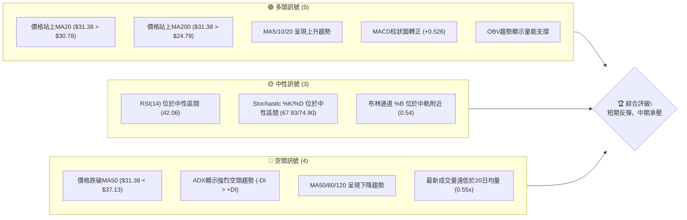
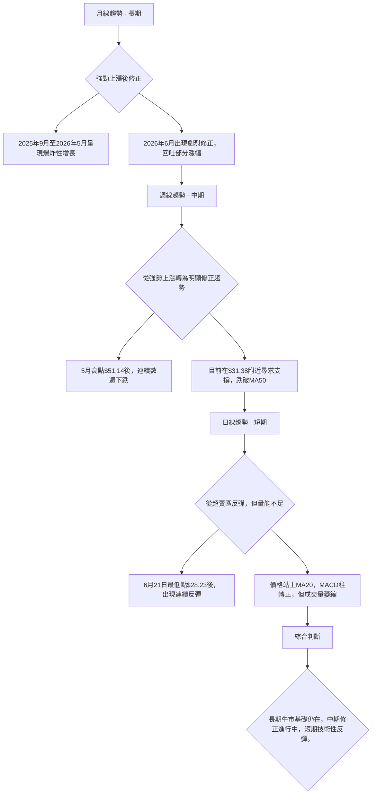
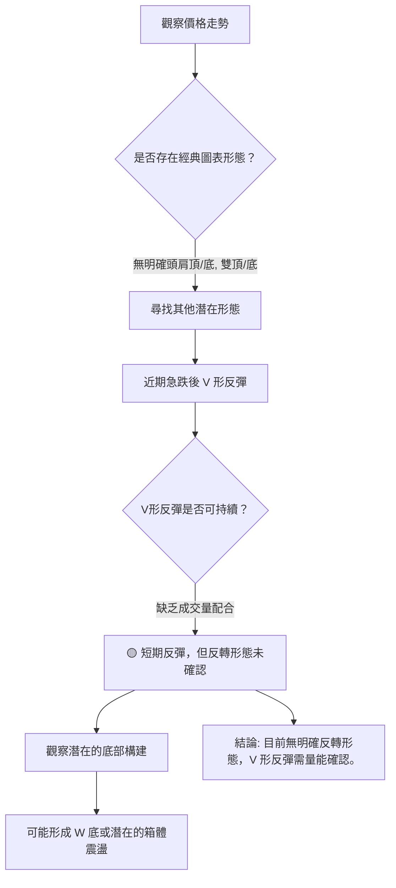
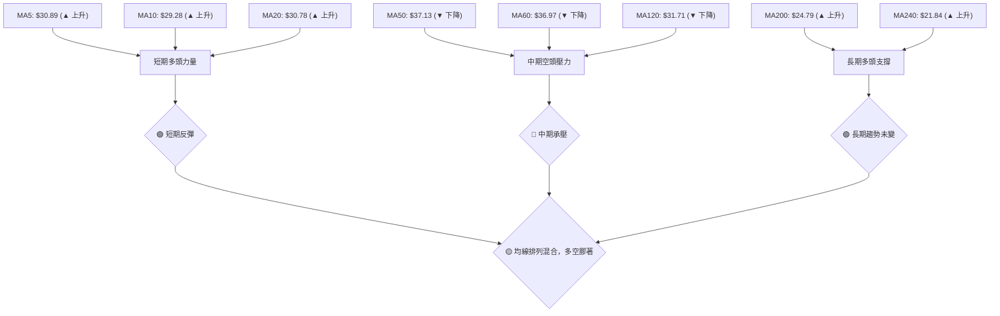
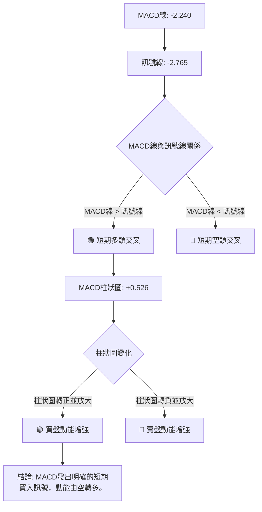

<details>
<summary>📊 靜態圖表 (點擊展開)</summary>

</details>

<html>
<head><meta charset="utf-8" /></head>
<body>
    <div style="height:500px; width:100%;">                        <script>window.PlotlyConfig = {MathJaxConfig: 'local'};</script>
        <script charset="utf-8" src="https://cdn.plot.ly/plotly-3.6.0.min.js" integrity="sha256-QaOVwtVY0T02VaHrr6pnoHLCwayMJp4O5n4YyaE3rJk=" crossorigin="anonymous"></script>                <div id="candlestick-chart" class="plotly-graph-div" style="height:100%; width:100%;"></div>            <script>                window.PLOTLYENV=window.PLOTLYENV || {};                                if (document.getElementById("candlestick-chart")) {                    Plotly.newPlot(                        "candlestick-chart",                        [{"close":{"dtype":"f8","bdata":"AAAAAACAI0AAAACAwnUkQAAAAOBROCVAAAAA4FE4JkAAAADgUTgmQAAAAKCZGShAAAAAACncJ0AAAAAghesnQAAAAGBmZihAAAAA4HqUKUAAAACAwvUpQAAAAIA9iitAAAAAQDOzLUAAAABguJ4uQAAAAEDhei5AAAAAAClcL0AAAABAMzMvQAAAAIDrUS9AAAAAYGZmLUAAAAAAAIAuQAAAACBcjy1AAAAAgBQuLkAAAACAwnUqQAAAAOBROCpAAAAAYLgeK0AAAACA69EpQAAAAAAAAClAAAAAYGbmKUAAAADgUTgrQAAAAGC4nipAAAAAgBSuKUAAAADAzMwpQAAAAOBRuClAAAAAYGbmKkAAAACgR2EqQAAAAGBmZilAAAAAAACAKkAAAAAghesoQAAAAGC4nilAAAAAIK7HKkAAAADgo\u002fAoQAAAAKBH4ShAAAAAgOvRJkAAAADAzMwmQAAAACCFayZAAAAAYGbmJkAAAADgepQnQAAAAIDCdSZAAAAAgOtRJkAAAADgehQnQAAAAIDCdSdAAAAA4KNwJ0AAAADAzMwnQAAAAGBmZidAAAAAgD2KJ0AAAADAHgUoQAAAAKBH4SlAAAAAgD2KKUAAAABgZuYpQAAAAIAUrilAAAAAoEfhKUAAAADgUXgxQAAAAKBwPTJAAAAAwMwMMkAAAACgR+ExQAAAAOBReDBAAAAAoHB9MUAAAACAFC4zQAAAAKCZmTRAAAAAQOG6NEAAAACA61E0QAAAAAApXDNAAAAAYLjeM0AAAACgcL0zQAAAAOBRuDNAAAAAwPVoNEAAAAAA12M1QAAAAEAK1zVAAAAAACmcNkAAAADgo3A2QAAAAIDCtTZAAAAA4KNwOUAAAACA61E5QAAAAEDhujpAAAAAIK5HPEAAAAAgrsc8QAAAAAAAADxAAAAAoEdhOkAAAAAgXA86QAAAAOCj8DpAAAAAYLjeOUAAAACA6xE8QAAAAKBH4TtAAAAAoJlZOkAAAADgUfg4QAAAAKCZ2TZAAAAAQDPzN0AAAADAHsU1QAAAAIAUbjRAAAAAYI9CNkAAAADAHgU4QAAAAIA9yjZAAAAAYGamNUAAAADAzEw1QAAAACCFazZAAAAAgMI1NkAAAACgcL03QAAAAAApHDlAAAAAYGbmN0AAAAAgrsc3QAAAAIDCtThAAAAAoEehOEAAAACgmZk5QAAAAADXIzhAAAAAAClcOkAAAADAzEw5QAAAAAAAADpAAAAAQAqXOEAAAAAgrkc5QAAAAIDr0TlAAAAAYGZmOUAAAADgo3A5QAAAAOBR+DhAAAAAgD3KOEAAAACgmZk4QAAAAOB6FDtAAAAAIFzPOEAAAACAwvU6QAAAAIA96kBAAAAAwPXoQEAAAADgetQ\u002fQAAAACBcr0FAAAAAQDMzQEAAAAAAKdw+QAAAAADX4ztAAAAAQDPzO0AAAACAwrU+QAAAAOCj8EFAAAAAYI+CQUAAAACAwpVBQAAAAGBmRkJAAAAAoHAdQUAAAACAwlVBQAAAAMD1KEFAAAAAQAr3QEAAAADgejRBQAAAAIDr8UNAAAAAoHA9Q0AAAAAAAMBCQAAAAADXA0NAAAAAACm8Q0AAAADAHiVDQAAAAOBRuEFAAAAAoJm5QUAAAAAA14NBQAAAAIA9CkFAAAAAACl8QkAAAABAM3NCQAAAAMAeRUNAAAAA4KOQQkAAAADgUdhDQAAAAGC4nkFAAAAAwB6FQ0AAAAAghetEQAAAAEAKV0RAAAAAYLheREAAAADAHoVFQAAAACBcz0RAAAAAgBTOREAAAAAghctEQAAAAOB6VEVAAAAAoHA9RUAAAADAzCxGQAAAAMD1KEhAAAAAoHA9SUAAAABAM7NJQAAAAIDrkUlAAAAAQOE6R0AAAAAghQtIQAAAAOCjkEVAAAAAANfDRUAAAAAAKRxAQAAAAGC4XkBAAAAAIIUrP0AAAADgUbg+QAAAAIDCFUFAAAAAYGYmP0AAAADgepQ+QAAAAIDCNTxAAAAA4FE4PEAAAABA4To8QAAAAMAexTxAAAAAIK6HPEAAAADAzEw6QAAAAGCPgjpAAAAAgOsRO0AAAAAgrkc\u002fQAAAAOCjkEBAAAAAACmcP0AAAACgR2E\u002fQA=="},"high":{"dtype":"f8","bdata":"AAAAQLbzI0AAAADAzMwkQAAAACCFayVAAAAAgOvRJkAAAADAzEwmQAAAAGCPQihAAAAAgMJ1KEAAAAAgXI8oQAAAAMD1qChAAAAAAAAAKkAAAABguB4qQAAAAIA9CixAAAAAwMg2LkAAAAAAAAAvQAAAACCuxy9AAAAAYI8CMEAAAAAgrscwQAAAAKCZmS9AAAAAwMwMMEAAAABgZuYvQAAAAAAAgC5AAAAA4HpUL0AAAABANR4vQAAAAMD1KCtAAAAAgOvRLEAAAABACKwqQAAAAKCZGSpAAAAAACmcKkAAAACAFG4rQAAAACCF6ytAAAAA4KPwKkAAAAAghasqQAAAAGBmZipAAAAAgMJ1K0AAAABgj8IqQAAAAIA9CitAAAAA4KOwKkAAAACAPQoqQAAAAGBmpilAAAAAoJmZK0AAAACgcL0qQAAAAMDMzClAAAAAgOvRKEAAAABAM7MnQAAAAOBROCdAAAAAwB7FJ0AAAACAwvUoQAAAAAAAAClAAAAAAAAAJ0AAAAAgXE8nQAAAAKDtvCdAAAAAgD0KKEAAAADAHgUoQAAAAADXoydAAAAAwB6FKEAAAACgR2EoQAAAAGBmZipAAAAAAADAKUAAAACAwnUqQAAAAAAAACpAAAAAQOF6KkAAAACgmfkxQAAAAKCZGTNAAAAA4KOwM0AAAAAgrkcyQAAAAMDMjDJAAAAAQDPzMUAAAADgetQzQAAAAGCPwjRAAAAAoHD9NEAAAACAFO40QAAAAIDCVTRAAAAAwB4lNEAAAAAAKTw0QAAAAMDMTDRAAAAAIFzPNEAAAAAgXG81QAAAAEAzEzZAAAAAACncNkAAAACgmZk3QAAAAIDpxjdAAAAAIFyPOUAAAABACpc6QAAAAMAexTpAAAAAoEdhPUAAAABg4+U+QAAAAOBRuD1AAAAAIIWrPEAAAACAwOo6QAAAAEDhujtAAAAAQDOzOkAAAABAM7M8QAAAAGBmZjxAAAAAQDOzO0AAAAAAAEA7QAAAAMChxTlAAAAAAKz8N0AAAAAAAAA4QAAAAIDAijVAAAAAIK5HNkAAAADgURg4QAAAAEDh+jdAAAAAYGaGN0AAAADA9eg1QAAAAIAU7jZAAAAAgD3KNkAAAACgmZk4QAAAAAApHDlAAAAA4KOwOUAAAADgerQ4QAAAACBczzhAAAAAQGLQOUAAAADgo7A5QAAAAEAK1zhAAAAAgBTuOkAAAADgo3A6QAAAAKBHgTpAAAAAoHA9OkAAAAAAqpE7QAAAAEAKFzpAAAAA4FF4OkAAAAAghes6QAAAACBcDzpAAAAAgOkGOkAAAAAAAIA5QAAAAEAKFztAAAAA4HoUO0AAAABgj0I7QAAAAADXI0JAAAAAIIVrQUAAAAAghQtCQAAAAGBmhkJAAAAAANXYQUAAAABguB5BQAAAAMD1aD9AAAAAgBTuPEAAAACAFC4\u002fQAAAAMAeBUJAAAAAwB4lQkAAAABgZuZBQAAAAEDhGkNAAAAAgMKVQkAAAACA6zFCQAAAAIAUvkFAAAAAIFg5QkAAAACAwpVBQAAAAKBwHURAAAAAoHAdREAAAADgevRDQAAAAADXw0NAAAAAQOHaREAAAAAAAABEQAAAAAAAwENAAAAAoHAdQkAAAABACqdBQAAAAAAAgEFAAAAAACl8QkAAAADgeqRCQAAAAGCPokNAAAAAQAq3Q0AAAACgR+FDQAAAAIDCdURAAAAAwMzsQ0AAAAAgXI9FQAAAAOCj8ERAAAAAoJkZRUAAAACgmblFQAAAAEAKl0VAAAAAANfjRkAAAAAAAOBEQAAAAGBmxkVAAAAAAAAARkAAAABADKJGQAAAAOCjkElAAAAAoHB9SUAAAACgR+FJQAAAAGCPoklAAAAAAABgSUAAAABgj2JJQAAAACBcz0dAAAAAwB6VRkAAAABACpdDQAAAAMAeBUFAAAAAIFwvQUAAAADAzMw\u002fQAAAAMD1KEFAAAAAQDMTQUAAAACA6xFAQAAAAAAAQD9AAAAAoJlZPUAAAAAAAAA9QAAAAGCPIj1AAAAAIC89PUAAAACgR+E8QAAAAEAK1zpAAAAA4KOwPEAAAAAgrkc\u002fQAAAAMDM7EBAAAAAAAAgQUAAAACgmblAQA=="},"hovertemplate":"\u003cb\u003e%{x|%Y-%m-%d}\u003c\u002fb\u003e\u003cbr\u003e\u958b: $%{open:.2f}\u003cbr\u003e\u9ad8: $%{high:.2f}\u003cbr\u003e\u4f4e: $%{low:.2f}\u003cbr\u003e\u6536: $%{close:.2f}\u003cextra\u003e\u003c\u002fextra\u003e","low":{"dtype":"f8","bdata":"AAAAgOtRI0AAAAAAKVwjQAAAAOCjcCRAAAAAQOE6JUAAAADgo3AlQAAAAADXIyZAAAAAQApXJ0AAAABACtcmQAAAAMAehSdAAAAA4FG4KEAAAACgcD0oQAAAAEAzMylAAAAAwPUoLEAAAADAHoUtQAAAAKBHYS5AAAAAIFyPLUAAAADAHoUuQAAAAMD1KC5AAAAAACkcLUAAAACA61EuQAAAAEAKFy1AAAAAQDOzLUAAAACgcD0qQAAAACDdJClAAAAAAAAAK0AAAABguJ4pQAAAAOCj8CdAAAAAgBQuKUAAAAAgrkcqQAAAAIA9iipAAAAAIFyPKUAAAAAgrocpQAAAAEDfDylAAAAAIK7HKUAAAACAwnUpQAAAACCF6yhAAAAAIFwPKUAAAAAA1yMoQAAAAAAp3CdAAAAAYBDYKUAAAAAgXI8oQAAAAMD1qChAAAAAQAoXJkAAAADAyHYlQAAAAGCPwiVAAAAAgBTuJUAAAADAzMwmQAAAAICXLiZAAAAAgD0KJUAAAADAHoUmQAAAAMAehSZAAAAAYI9CJ0AAAACAl24nQAAAAMDMzCZAAAAA4HpUJ0AAAABA4XonQAAAAAAp3CdAAAAAwB4FKUAAAACgcD0pQAAAAEA1HilAAAAAwPUoKUAAAADAHgUuQAAAAGC4XjFAAAAAANejMUAAAACAFO4wQAAAAIAUbjBAAAAAgD0KMUAAAACgcP0xQAAAAAApnDNAAAAAoJmZM0AAAAAAKRw0QAAAAIA9CjNAAAAAYI\u002fCMkAAAADgo3AzQAAAAECJoTNAAAAAANX4MkAAAACgcH0zQAAAAOBR+DRAAAAAwPVoNUAAAABAChc2QAAAAMAg0DVAAAAAwPUoN0AAAABguB45QAAAAAAAADlAAAAAYI9COkAAAAAAKVw8QAAAACBcbztAAAAAoEchOUAAAAAA1yM5QAAAAIAULjlAAAAA4FE4OUAAAACgGg86QAAAACBczzpAAAAAwMyMOUAAAACA63E4QAAAAEAKdzZAAAAAwPXoNkAAAABACpc0QAAAAGBmJjRAAAAAIFzPNEAAAABgZqY1QAAAAIDCtTZAAAAAwPXoNEAAAABA4fozQAAAACAGITVAAAAAAACANUAAAACgcD02QAAAAIDCdTZAAAAAYI+CN0AAAABA4To3QAAAAKCZWTZAAAAAoHB9OEAAAACA6xE4QAAAACCuxzZAAAAA4FG4N0AAAACgR2E4QAAAAIBoETlAAAAAYI+CN0AAAACgmdk3QAAAAEAzczhAAAAAQDMzOUAAAADgo\u002fA4QAAAACCuRzhAAAAAIFxPOEAAAADgeKk3QAAAAGBmZjhAAAAAYI\u002fCOEAAAADgo\u002fA3QAAAAIBoIUBAAAAAQOE6P0AAAAAAKRw\u002fQAAAAKBHIT9AAAAAIFwPQEAAAACAPYo+QAAAAGC4PjtAAAAAwPVIOkAAAADAHoU8QAAAAOCjcD1AAAAAQOEaQUAAAABgj2JAQAAAAOBRuEFAAAAA4FH4QEAAAACgmflAQAAAAAApXEBAAAAAoEfhP0AAAAAgrmdAQAAAAGBmdkFAAAAAIIXrQkAAAABACndCQAAAAGCPwkJAAAAAANcjQ0AAAACAPSpCQAAAAOCjkEFAAAAA4KPQQEAAAADA891AQAAAAMD1SEBAAAAAwEsnQUAAAADgpWtBQAAAAMD16EFAAAAAoJn5QUAAAACgR8FBQAAAAEAKd0FAAAAAYGbmQUAAAADAzAxDQAAAAKBHIUNAAAAAwMxsQ0AAAADAzMxDQAAAAMAeRURAAAAAoEchREAAAABgjwJDQAAAAIDCVURAAAAAwB6FREAAAADAzIxFQAAAAIAU7kZAAAAAgBSOR0AAAAAAAIBHQAAAAADXY0ZAAAAAANfDRkAAAABA4TpHQAAAAMAeVUVAAAAAYGamREAAAADA9ag\u002fQAAAAOB6VD9AAAAAgOtRPUAAAABAMzM+QAAAACCFaz5AAAAAwB7FPUAAAAAAKRw+QAAAAKBDCztAAAAA4HoUPEAAAADgelQ6QAAAAIDCtTpAAAAA4HpUO0AAAACAPYo5QAAAAMDMTDlAAAAAoEchOkAAAACgmZk8QAAAAKAYJD5AAAAAwPWIP0AAAACAPco+QA=="},"name":"\u50f9\u683c","open":{"dtype":"f8","bdata":"AAAA4FG4I0AAAAAAAIAjQAAAAIDC9SRAAAAAgOtRJUAAAADgUbglQAAAAEDheiZAAAAAIK5HKEAAAAAAAAAnQAAAAOBRuCdAAAAAIK7HKEAAAABgZmYpQAAAAIAUrilAAAAA4FG4LEAAAABgZuYtQAAAAKCZmS9AAAAAAAAALkAAAADAzIwwQAAAAIAULi9AAAAA4FG4L0AAAAAghWsuQAAAAAAAAC5AAAAAYGbmLkAAAADgo\u002fAuQAAAAAAAACpAAAAAgD0KLEAAAAAAKVwqQAAAAAAAgClAAAAAYI9CKUAAAACgmZkqQAAAAGBm5itAAAAAwMzMKkAAAAAghespQAAAAEDheilAAAAAIK7HKUAAAADA9agqQAAAAIDCdSlAAAAAgBSuKUAAAADAHgUqQAAAAOBROChAAAAAgMJ1KkAAAABgZmYqQAAAAGCPQilAAAAAgD2KKEAAAAAAAAAmQAAAAAApXCZAAAAA4HoUJkAAAAAghesmQAAAAGBmZihAAAAAQOF6JkAAAABAM7MmQAAAAMAeBSdAAAAAgD2KJ0AAAACA69EnQAAAAEAzMydAAAAAYI\u002fCJ0AAAADA9agnQAAAAGBm5idAAAAAwB6FKUAAAAAAKVwqQAAAAKBwPSlAAAAAoJmZKUAAAADgepQvQAAAAOCjcDJAAAAAIFzPMkAAAABgZqYxQAAAAIAULjJAAAAAgD0KMUAAAACgcP0xQAAAACCuxzNAAAAAwMzMM0AAAABA4bo0QAAAAMDMTDRAAAAAoHDdMkAAAAAgrgc0QAAAAGC4vjNAAAAAQOHaM0AAAABAM7M0QAAAAAAAgDVAAAAA4FG4NUAAAACgmdk2QAAAAKCZmTZAAAAAwMxMN0AAAABgj0I6QAAAAAAAgDlAAAAAIFzPOkAAAABAM3M8QAAAAEAKlztAAAAAAACAPEAAAAAAAMA6QAAAAGCPAjpAAAAAoJmZOkAAAADgehQ6QAAAAMDMDDxAAAAAQDOzO0AAAABACrc5QAAAAADX4zhAAAAAQOH6N0AAAAAAAAA4QAAAAAAAADVAAAAAgD0KNUAAAACAwvU1QAAAAGC43jdAAAAAYGaGN0AAAACA65E1QAAAAAAAgDVAAAAAAAAANkAAAABgZmY2QAAAAMAeBTdAAAAAoHC9OEAAAABgZmY3QAAAAAAAQDdAAAAAwMxMOUAAAAAAAIA4QAAAAEAzkzhAAAAA4FG4N0AAAABA4Ro6QAAAAKCZmTlAAAAAAACAOUAAAAAA1+M3QAAAAEAK1zhAAAAAgOvROUAAAABAClc5QAAAAOBR+DlAAAAAQOH6OEAAAACgRyE5QAAAAKCZ2ThAAAAAAACAOkAAAAAAAEA4QAAAAGBmxkBAAAAAAABAQUAAAABA4dpAQAAAAEAzM0BAAAAAACl8QUAAAACgcP1AQAAAAKCZ2T5AAAAAwMzMPEAAAAAAAAA9QAAAAOCjcD1AAAAAgML1QUAAAADgo7BBQAAAAEAzc0JAAAAAAABAQkAAAADgo3BBQAAAAKBwHUFAAAAAIIXLQUAAAACAwjVBQAAAAKBwfUFAAAAAgOuRQ0AAAABAM5NDQAAAAAApHENAAAAAAADAQ0AAAACAPapDQAAAAIAUjkNAAAAAACm8QUAAAADAzExBQAAAAOCjMEFAAAAAANdDQUAAAAAgXF9CQAAAAMAehUJAAAAAoJmZQ0AAAAAgXH9CQAAAAGCPwkNAAAAAQDMzQkAAAABAM1NDQAAAACCFC0RAAAAAQAoXRUAAAADgo1BEQAAAAMD1CEVAAAAAANejRUAAAABACndEQAAAAEAzM0VAAAAAwHIIRUAAAADAzKxFQAAAAMD12EdAAAAAwMwMSUAAAABAMxNJQAAAAAAAkEhAAAAAIIWLSEAAAACAwpVHQAAAACBcz0dAAAAAoHCdRUAAAABgZiZDQAAAAKBHAUFAAAAAgMK1QEAAAAAA1+M+QAAAAAAAgD9AAAAAgOvxQEAAAACAPQpAQAAAAMAeBT5AAAAAANdjPEAAAABgZqY8QAAAAIDC9TtAAAAA4HpUO0AAAACA6xE8QAAAAGCPgjpAAAAAQOE6OkAAAACgmZk8QAAAAKBwfT5AAAAAoJlZQEAAAABACpc\u002fQA=="},"x":["2025-09-16T00:00:00-04:00","2025-09-17T00:00:00-04:00","2025-09-18T00:00:00-04:00","2025-09-19T00:00:00-04:00","2025-09-22T00:00:00-04:00","2025-09-23T00:00:00-04:00","2025-09-24T00:00:00-04:00","2025-09-25T00:00:00-04:00","2025-09-26T00:00:00-04:00","2025-09-29T00:00:00-04:00","2025-09-30T00:00:00-04:00","2025-10-01T00:00:00-04:00","2025-10-02T00:00:00-04:00","2025-10-03T00:00:00-04:00","2025-10-06T00:00:00-04:00","2025-10-07T00:00:00-04:00","2025-10-08T00:00:00-04:00","2025-10-09T00:00:00-04:00","2025-10-10T00:00:00-04:00","2025-10-13T00:00:00-04:00","2025-10-14T00:00:00-04:00","2025-10-15T00:00:00-04:00","2025-10-16T00:00:00-04:00","2025-10-17T00:00:00-04:00","2025-10-20T00:00:00-04:00","2025-10-21T00:00:00-04:00","2025-10-22T00:00:00-04:00","2025-10-23T00:00:00-04:00","2025-10-24T00:00:00-04:00","2025-10-27T00:00:00-04:00","2025-10-28T00:00:00-04:00","2025-10-29T00:00:00-04:00","2025-10-30T00:00:00-04:00","2025-10-31T00:00:00-04:00","2025-11-03T00:00:00-05:00","2025-11-04T00:00:00-05:00","2025-11-05T00:00:00-05:00","2025-11-06T00:00:00-05:00","2025-11-07T00:00:00-05:00","2025-11-10T00:00:00-05:00","2025-11-11T00:00:00-05:00","2025-11-12T00:00:00-05:00","2025-11-13T00:00:00-05:00","2025-11-14T00:00:00-05:00","2025-11-17T00:00:00-05:00","2025-11-18T00:00:00-05:00","2025-11-19T00:00:00-05:00","2025-11-20T00:00:00-05:00","2025-11-21T00:00:00-05:00","2025-11-24T00:00:00-05:00","2025-11-25T00:00:00-05:00","2025-11-26T00:00:00-05:00","2025-11-28T00:00:00-05:00","2025-12-01T00:00:00-05:00","2025-12-02T00:00:00-05:00","2025-12-03T00:00:00-05:00","2025-12-04T00:00:00-05:00","2025-12-05T00:00:00-05:00","2025-12-08T00:00:00-05:00","2025-12-09T00:00:00-05:00","2025-12-10T00:00:00-05:00","2025-12-11T00:00:00-05:00","2025-12-12T00:00:00-05:00","2025-12-15T00:00:00-05:00","2025-12-16T00:00:00-05:00","2025-12-17T00:00:00-05:00","2025-12-18T00:00:00-05:00","2025-12-19T00:00:00-05:00","2025-12-22T00:00:00-05:00","2025-12-23T00:00:00-05:00","2025-12-24T00:00:00-05:00","2025-12-26T00:00:00-05:00","2025-12-29T00:00:00-05:00","2025-12-30T00:00:00-05:00","2025-12-31T00:00:00-05:00","2026-01-02T00:00:00-05:00","2026-01-05T00:00:00-05:00","2026-01-06T00:00:00-05:00","2026-01-07T00:00:00-05:00","2026-01-08T00:00:00-05:00","2026-01-09T00:00:00-05:00","2026-01-12T00:00:00-05:00","2026-01-13T00:00:00-05:00","2026-01-14T00:00:00-05:00","2026-01-15T00:00:00-05:00","2026-01-16T00:00:00-05:00","2026-01-20T00:00:00-05:00","2026-01-21T00:00:00-05:00","2026-01-22T00:00:00-05:00","2026-01-23T00:00:00-05:00","2026-01-26T00:00:00-05:00","2026-01-27T00:00:00-05:00","2026-01-28T00:00:00-05:00","2026-01-29T00:00:00-05:00","2026-01-30T00:00:00-05:00","2026-02-02T00:00:00-05:00","2026-02-03T00:00:00-05:00","2026-02-04T00:00:00-05:00","2026-02-05T00:00:00-05:00","2026-02-06T00:00:00-05:00","2026-02-09T00:00:00-05:00","2026-02-10T00:00:00-05:00","2026-02-11T00:00:00-05:00","2026-02-12T00:00:00-05:00","2026-02-13T00:00:00-05:00","2026-02-17T00:00:00-05:00","2026-02-18T00:00:00-05:00","2026-02-19T00:00:00-05:00","2026-02-20T00:00:00-05:00","2026-02-23T00:00:00-05:00","2026-02-24T00:00:00-05:00","2026-02-25T00:00:00-05:00","2026-02-26T00:00:00-05:00","2026-02-27T00:00:00-05:00","2026-03-02T00:00:00-05:00","2026-03-03T00:00:00-05:00","2026-03-04T00:00:00-05:00","2026-03-05T00:00:00-05:00","2026-03-06T00:00:00-05:00","2026-03-09T00:00:00-04:00","2026-03-10T00:00:00-04:00","2026-03-11T00:00:00-04:00","2026-03-12T00:00:00-04:00","2026-03-13T00:00:00-04:00","2026-03-16T00:00:00-04:00","2026-03-17T00:00:00-04:00","2026-03-18T00:00:00-04:00","2026-03-19T00:00:00-04:00","2026-03-20T00:00:00-04:00","2026-03-23T00:00:00-04:00","2026-03-24T00:00:00-04:00","2026-03-25T00:00:00-04:00","2026-03-26T00:00:00-04:00","2026-03-27T00:00:00-04:00","2026-03-30T00:00:00-04:00","2026-03-31T00:00:00-04:00","2026-04-01T00:00:00-04:00","2026-04-02T00:00:00-04:00","2026-04-06T00:00:00-04:00","2026-04-07T00:00:00-04:00","2026-04-08T00:00:00-04:00","2026-04-09T00:00:00-04:00","2026-04-10T00:00:00-04:00","2026-04-13T00:00:00-04:00","2026-04-14T00:00:00-04:00","2026-04-15T00:00:00-04:00","2026-04-16T00:00:00-04:00","2026-04-17T00:00:00-04:00","2026-04-20T00:00:00-04:00","2026-04-21T00:00:00-04:00","2026-04-22T00:00:00-04:00","2026-04-23T00:00:00-04:00","2026-04-24T00:00:00-04:00","2026-04-27T00:00:00-04:00","2026-04-28T00:00:00-04:00","2026-04-29T00:00:00-04:00","2026-04-30T00:00:00-04:00","2026-05-01T00:00:00-04:00","2026-05-04T00:00:00-04:00","2026-05-05T00:00:00-04:00","2026-05-06T00:00:00-04:00","2026-05-07T00:00:00-04:00","2026-05-08T00:00:00-04:00","2026-05-11T00:00:00-04:00","2026-05-12T00:00:00-04:00","2026-05-13T00:00:00-04:00","2026-05-14T00:00:00-04:00","2026-05-15T00:00:00-04:00","2026-05-18T00:00:00-04:00","2026-05-19T00:00:00-04:00","2026-05-20T00:00:00-04:00","2026-05-21T00:00:00-04:00","2026-05-22T00:00:00-04:00","2026-05-26T00:00:00-04:00","2026-05-27T00:00:00-04:00","2026-05-28T00:00:00-04:00","2026-05-29T00:00:00-04:00","2026-06-01T00:00:00-04:00","2026-06-02T00:00:00-04:00","2026-06-03T00:00:00-04:00","2026-06-04T00:00:00-04:00","2026-06-05T00:00:00-04:00","2026-06-08T00:00:00-04:00","2026-06-09T00:00:00-04:00","2026-06-10T00:00:00-04:00","2026-06-11T00:00:00-04:00","2026-06-12T00:00:00-04:00","2026-06-15T00:00:00-04:00","2026-06-16T00:00:00-04:00","2026-06-17T00:00:00-04:00","2026-06-18T00:00:00-04:00","2026-06-22T00:00:00-04:00","2026-06-23T00:00:00-04:00","2026-06-24T00:00:00-04:00","2026-06-25T00:00:00-04:00","2026-06-26T00:00:00-04:00","2026-06-29T00:00:00-04:00","2026-06-30T00:00:00-04:00","2026-07-01T00:00:00-04:00","2026-07-02T00:00:00-04:00"],"type":"candlestick"},{"hovertemplate":"MA30: $%{y:.2f}\u003cextra\u003e\u003c\u002fextra\u003e","line":{"color":"#2196F3","dash":"dash","width":2},"mode":"lines","name":"MA30","x":["2025-09-16T00:00:00-04:00","2025-09-17T00:00:00-04:00","2025-09-18T00:00:00-04:00","2025-09-19T00:00:00-04:00","2025-09-22T00:00:00-04:00","2025-09-23T00:00:00-04:00","2025-09-24T00:00:00-04:00","2025-09-25T00:00:00-04:00","2025-09-26T00:00:00-04:00","2025-09-29T00:00:00-04:00","2025-09-30T00:00:00-04:00","2025-10-01T00:00:00-04:00","2025-10-02T00:00:00-04:00","2025-10-03T00:00:00-04:00","2025-10-06T00:00:00-04:00","2025-10-07T00:00:00-04:00","2025-10-08T00:00:00-04:00","2025-10-09T00:00:00-04:00","2025-10-10T00:00:00-04:00","2025-10-13T00:00:00-04:00","2025-10-14T00:00:00-04:00","2025-10-15T00:00:00-04:00","2025-10-16T00:00:00-04:00","2025-10-17T00:00:00-04:00","2025-10-20T00:00:00-04:00","2025-10-21T00:00:00-04:00","2025-10-22T00:00:00-04:00","2025-10-23T00:00:00-04:00","2025-10-24T00:00:00-04:00","2025-10-27T00:00:00-04:00","2025-10-28T00:00:00-04:00","2025-10-29T00:00:00-04:00","2025-10-30T00:00:00-04:00","2025-10-31T00:00:00-04:00","2025-11-03T00:00:00-05:00","2025-11-04T00:00:00-05:00","2025-11-05T00:00:00-05:00","2025-11-06T00:00:00-05:00","2025-11-07T00:00:00-05:00","2025-11-10T00:00:00-05:00","2025-11-11T00:00:00-05:00","2025-11-12T00:00:00-05:00","2025-11-13T00:00:00-05:00","2025-11-14T00:00:00-05:00","2025-11-17T00:00:00-05:00","2025-11-18T00:00:00-05:00","2025-11-19T00:00:00-05:00","2025-11-20T00:00:00-05:00","2025-11-21T00:00:00-05:00","2025-11-24T00:00:00-05:00","2025-11-25T00:00:00-05:00","2025-11-26T00:00:00-05:00","2025-11-28T00:00:00-05:00","2025-12-01T00:00:00-05:00","2025-12-02T00:00:00-05:00","2025-12-03T00:00:00-05:00","2025-12-04T00:00:00-05:00","2025-12-05T00:00:00-05:00","2025-12-08T00:00:00-05:00","2025-12-09T00:00:00-05:00","2025-12-10T00:00:00-05:00","2025-12-11T00:00:00-05:00","2025-12-12T00:00:00-05:00","2025-12-15T00:00:00-05:00","2025-12-16T00:00:00-05:00","2025-12-17T00:00:00-05:00","2025-12-18T00:00:00-05:00","2025-12-19T00:00:00-05:00","2025-12-22T00:00:00-05:00","2025-12-23T00:00:00-05:00","2025-12-24T00:00:00-05:00","2025-12-26T00:00:00-05:00","2025-12-29T00:00:00-05:00","2025-12-30T00:00:00-05:00","2025-12-31T00:00:00-05:00","2026-01-02T00:00:00-05:00","2026-01-05T00:00:00-05:00","2026-01-06T00:00:00-05:00","2026-01-07T00:00:00-05:00","2026-01-08T00:00:00-05:00","2026-01-09T00:00:00-05:00","2026-01-12T00:00:00-05:00","2026-01-13T00:00:00-05:00","2026-01-14T00:00:00-05:00","2026-01-15T00:00:00-05:00","2026-01-16T00:00:00-05:00","2026-01-20T00:00:00-05:00","2026-01-21T00:00:00-05:00","2026-01-22T00:00:00-05:00","2026-01-23T00:00:00-05:00","2026-01-26T00:00:00-05:00","2026-01-27T00:00:00-05:00","2026-01-28T00:00:00-05:00","2026-01-29T00:00:00-05:00","2026-01-30T00:00:00-05:00","2026-02-02T00:00:00-05:00","2026-02-03T00:00:00-05:00","2026-02-04T00:00:00-05:00","2026-02-05T00:00:00-05:00","2026-02-06T00:00:00-05:00","2026-02-09T00:00:00-05:00","2026-02-10T00:00:00-05:00","2026-02-11T00:00:00-05:00","2026-02-12T00:00:00-05:00","2026-02-13T00:00:00-05:00","2026-02-17T00:00:00-05:00","2026-02-18T00:00:00-05:00","2026-02-19T00:00:00-05:00","2026-02-20T00:00:00-05:00","2026-02-23T00:00:00-05:00","2026-02-24T00:00:00-05:00","2026-02-25T00:00:00-05:00","2026-02-26T00:00:00-05:00","2026-02-27T00:00:00-05:00","2026-03-02T00:00:00-05:00","2026-03-03T00:00:00-05:00","2026-03-04T00:00:00-05:00","2026-03-05T00:00:00-05:00","2026-03-06T00:00:00-05:00","2026-03-09T00:00:00-04:00","2026-03-10T00:00:00-04:00","2026-03-11T00:00:00-04:00","2026-03-12T00:00:00-04:00","2026-03-13T00:00:00-04:00","2026-03-16T00:00:00-04:00","2026-03-17T00:00:00-04:00","2026-03-18T00:00:00-04:00","2026-03-19T00:00:00-04:00","2026-03-20T00:00:00-04:00","2026-03-23T00:00:00-04:00","2026-03-24T00:00:00-04:00","2026-03-25T00:00:00-04:00","2026-03-26T00:00:00-04:00","2026-03-27T00:00:00-04:00","2026-03-30T00:00:00-04:00","2026-03-31T00:00:00-04:00","2026-04-01T00:00:00-04:00","2026-04-02T00:00:00-04:00","2026-04-06T00:00:00-04:00","2026-04-07T00:00:00-04:00","2026-04-08T00:00:00-04:00","2026-04-09T00:00:00-04:00","2026-04-10T00:00:00-04:00","2026-04-13T00:00:00-04:00","2026-04-14T00:00:00-04:00","2026-04-15T00:00:00-04:00","2026-04-16T00:00:00-04:00","2026-04-17T00:00:00-04:00","2026-04-20T00:00:00-04:00","2026-04-21T00:00:00-04:00","2026-04-22T00:00:00-04:00","2026-04-23T00:00:00-04:00","2026-04-24T00:00:00-04:00","2026-04-27T00:00:00-04:00","2026-04-28T00:00:00-04:00","2026-04-29T00:00:00-04:00","2026-04-30T00:00:00-04:00","2026-05-01T00:00:00-04:00","2026-05-04T00:00:00-04:00","2026-05-05T00:00:00-04:00","2026-05-06T00:00:00-04:00","2026-05-07T00:00:00-04:00","2026-05-08T00:00:00-04:00","2026-05-11T00:00:00-04:00","2026-05-12T00:00:00-04:00","2026-05-13T00:00:00-04:00","2026-05-14T00:00:00-04:00","2026-05-15T00:00:00-04:00","2026-05-18T00:00:00-04:00","2026-05-19T00:00:00-04:00","2026-05-20T00:00:00-04:00","2026-05-21T00:00:00-04:00","2026-05-22T00:00:00-04:00","2026-05-26T00:00:00-04:00","2026-05-27T00:00:00-04:00","2026-05-28T00:00:00-04:00","2026-05-29T00:00:00-04:00","2026-06-01T00:00:00-04:00","2026-06-02T00:00:00-04:00","2026-06-03T00:00:00-04:00","2026-06-04T00:00:00-04:00","2026-06-05T00:00:00-04:00","2026-06-08T00:00:00-04:00","2026-06-09T00:00:00-04:00","2026-06-10T00:00:00-04:00","2026-06-11T00:00:00-04:00","2026-06-12T00:00:00-04:00","2026-06-15T00:00:00-04:00","2026-06-16T00:00:00-04:00","2026-06-17T00:00:00-04:00","2026-06-18T00:00:00-04:00","2026-06-22T00:00:00-04:00","2026-06-23T00:00:00-04:00","2026-06-24T00:00:00-04:00","2026-06-25T00:00:00-04:00","2026-06-26T00:00:00-04:00","2026-06-29T00:00:00-04:00","2026-06-30T00:00:00-04:00","2026-07-01T00:00:00-04:00","2026-07-02T00:00:00-04:00"],"y":{"dtype":"f8","bdata":"AAAAAAAA+H8AAAAAAAD4fwAAAAAAAPh\u002fAAAAAAAA+H8AAAAAAAD4fwAAAAAAAPh\u002fAAAAAAAA+H8AAAAAAAD4fwAAAAAAAPh\u002fAAAAAAAA+H8AAAAAAAD4fwAAAAAAAPh\u002fAAAAAAAA+H8AAAAAAAD4fwAAAAAAAPh\u002fAAAAAAAA+H8AAAAAAAD4fwAAAAAAAPh\u002fAAAAAAAA+H8AAAAAAAD4fwAAAAAAAPh\u002fAAAAAAAA+H8AAAAAAAD4fwAAAAAAAPh\u002fAAAAAAAA+H8AAAAAAAD4fwAAAAAAAPh\u002fAAAAAAAA+H8AAAAAAAD4f5qZmcmhhSpARERENF66KkDNzMyc7+cqQDMzMwNWDitAERERoUU2K0CamZlJxVkrQN7d3S3dZCtAiYiIWGR7K0ARERHh7IMrQDMzMwNWjitAREREdJOYK0C8u7s7348rQO\u002fu7l4seStAd3d3x3Y+K0CamZm5u\u002fsqQDMzM2P0tipAvLu7O8NuKkBmZmYWvS0qQO\u002fu7h4i4ilAAAAAoLelKUAzMzNjZmYpQLy7u7tYMilAq6qq+tT4KEDv7u4eIuIoQM3MzLwRyihAvLu7G4WrKEAzMzPzKJwoQGZmZlaroyhAiYiI6JigKEAzMzNTVZUoQM3MzNxPjShARERExASPKEBmZmZmA90oQKuqqvrUOClA7+7urlaHKUCrqqqaYdcpQLy7u\u002fu4FypAMzMz0xVgKkBERET0xdIqQLy7u\u002fu4VytA3t3d7f3UK0CamZkZ91osQLy7uwsR0SxAq6qqWnNhLUDv7u5eye8tQAAAACAGgS5AZmZm9vAZL0AAAAAAyL0vQGZmZuZtOTBA7+7uziKbMEARERE5JvgwQN7d3WXYVTFAIiIiMuzKMUAiIiKicD0yQDMzMyuyvTJAiYiI0JRKM0CJiIhwr9kzQDMzM4MyWjRAIiIiAlbONEBVVVU9NT41QBERESmHtjVA3t3dLd0kNkC8u7s7UX82QCIiIiKU0TZAMzMzw2cYN0Crqqoa6FQ3QN7d3W1ZizdAREREhHnCN0BVVVV1k9g3QGZmZhYg1zdAzczMbC7kN0AzMzMzwQM4QGZmZiYGIThA3t3dnTYwOEDNzMx8hj04QKuqqrqQVDhAMzMz4+xjOECrqqqK+nc4QHd3d\u002ffhkzhAMzMzA+SeOECamZlJU6o4QKuqqlpkuzhAERER4Xq0OEDNzMyM3rY4QLy7u5vEoDhA3t3dTWKQOEAAAAAgsHI4QO\u002fu7g6fYThA7+7uvlhSOEAAAADQsEs4QCIiIiIiQjhAZmZmZh8+OEBEREQUric4QGZmZhbZDjhAd3d3N4kBOEARERHxYP43QERERIR5IjhAZmZmNtApOEAAAADwGVY4QAAAALByyDhARERE5BcrOUCJiIgYvW05QFVVVYUW2TlAIiIiQtI0OkBmZmZmZoY6QLy7u8sTtTpAVVVVBQ\u002fmOkB3d3c3iSE7QERERKRwfTtAd3d3p1TcO0C8u7t7hj08QLy7u1uPojxAERER4Xr0PEB3d3eX4EE9QERERCS\u002fmD1A7+7uDljZPUCJiIgoFSc+QDMzM1OcnT5A3t3dfSMUP0DNzMx8anw\u002fQDMzM6Ob5D9AMzMzA1YuQEC8u7ujKWVAQLy7u6vVkUBAvLu7O1G\u002fQECrqqqS0etAQBEREXGvCUFAAAAAaJE9QUAiIiKK+mdBQFVVVR0TfEFAzczMhDKKQUC8u7u7u6tBQN7d3b0tq0FAREREZILHQUCrqqp6W\u002fZBQCIiIpLtLEJAmpmZqX9jQkAAAABQG5hCQLy7u+uYsEJAVVVV9bbMQkAAAABQG+hCQAAAABAtAkNAMzMzQ2AlQ0B3d3dnrU5DQDMzMyNpikNAZmZmJgbRQ0AzMzPDgxlEQDMzM8ODSURAzczMDJBrREB3d3cnv5hEQHd3d7eBrkRAERERUdS\u002fREAiIiJC7qVEQERERCRpmkRAVVVVPSaIREAiIiKSwnVEQO\u002fu7t4kdkRAiYiI4E9dREAAAADAWEJEQCIiIqJFFkRAERERiUHwQ0AREREpXL9DQJqZmTHBo0NAiYiIeOl2Q0BVVVWlmzRDQCIiIjom+EJAiYiI8NK9QkAiIiLipYtCQKuqqopsZ0JAAAAA4ME8QkDNzMzUMRFCQA=="},"type":"scatter"},{"hovertemplate":"MA60: $%{y:.2f}\u003cextra\u003e\u003c\u002fextra\u003e","line":{"color":"#9C27B0","dash":"dash","width":2},"mode":"lines","name":"MA60","x":["2025-09-16T00:00:00-04:00","2025-09-17T00:00:00-04:00","2025-09-18T00:00:00-04:00","2025-09-19T00:00:00-04:00","2025-09-22T00:00:00-04:00","2025-09-23T00:00:00-04:00","2025-09-24T00:00:00-04:00","2025-09-25T00:00:00-04:00","2025-09-26T00:00:00-04:00","2025-09-29T00:00:00-04:00","2025-09-30T00:00:00-04:00","2025-10-01T00:00:00-04:00","2025-10-02T00:00:00-04:00","2025-10-03T00:00:00-04:00","2025-10-06T00:00:00-04:00","2025-10-07T00:00:00-04:00","2025-10-08T00:00:00-04:00","2025-10-09T00:00:00-04:00","2025-10-10T00:00:00-04:00","2025-10-13T00:00:00-04:00","2025-10-14T00:00:00-04:00","2025-10-15T00:00:00-04:00","2025-10-16T00:00:00-04:00","2025-10-17T00:00:00-04:00","2025-10-20T00:00:00-04:00","2025-10-21T00:00:00-04:00","2025-10-22T00:00:00-04:00","2025-10-23T00:00:00-04:00","2025-10-24T00:00:00-04:00","2025-10-27T00:00:00-04:00","2025-10-28T00:00:00-04:00","2025-10-29T00:00:00-04:00","2025-10-30T00:00:00-04:00","2025-10-31T00:00:00-04:00","2025-11-03T00:00:00-05:00","2025-11-04T00:00:00-05:00","2025-11-05T00:00:00-05:00","2025-11-06T00:00:00-05:00","2025-11-07T00:00:00-05:00","2025-11-10T00:00:00-05:00","2025-11-11T00:00:00-05:00","2025-11-12T00:00:00-05:00","2025-11-13T00:00:00-05:00","2025-11-14T00:00:00-05:00","2025-11-17T00:00:00-05:00","2025-11-18T00:00:00-05:00","2025-11-19T00:00:00-05:00","2025-11-20T00:00:00-05:00","2025-11-21T00:00:00-05:00","2025-11-24T00:00:00-05:00","2025-11-25T00:00:00-05:00","2025-11-26T00:00:00-05:00","2025-11-28T00:00:00-05:00","2025-12-01T00:00:00-05:00","2025-12-02T00:00:00-05:00","2025-12-03T00:00:00-05:00","2025-12-04T00:00:00-05:00","2025-12-05T00:00:00-05:00","2025-12-08T00:00:00-05:00","2025-12-09T00:00:00-05:00","2025-12-10T00:00:00-05:00","2025-12-11T00:00:00-05:00","2025-12-12T00:00:00-05:00","2025-12-15T00:00:00-05:00","2025-12-16T00:00:00-05:00","2025-12-17T00:00:00-05:00","2025-12-18T00:00:00-05:00","2025-12-19T00:00:00-05:00","2025-12-22T00:00:00-05:00","2025-12-23T00:00:00-05:00","2025-12-24T00:00:00-05:00","2025-12-26T00:00:00-05:00","2025-12-29T00:00:00-05:00","2025-12-30T00:00:00-05:00","2025-12-31T00:00:00-05:00","2026-01-02T00:00:00-05:00","2026-01-05T00:00:00-05:00","2026-01-06T00:00:00-05:00","2026-01-07T00:00:00-05:00","2026-01-08T00:00:00-05:00","2026-01-09T00:00:00-05:00","2026-01-12T00:00:00-05:00","2026-01-13T00:00:00-05:00","2026-01-14T00:00:00-05:00","2026-01-15T00:00:00-05:00","2026-01-16T00:00:00-05:00","2026-01-20T00:00:00-05:00","2026-01-21T00:00:00-05:00","2026-01-22T00:00:00-05:00","2026-01-23T00:00:00-05:00","2026-01-26T00:00:00-05:00","2026-01-27T00:00:00-05:00","2026-01-28T00:00:00-05:00","2026-01-29T00:00:00-05:00","2026-01-30T00:00:00-05:00","2026-02-02T00:00:00-05:00","2026-02-03T00:00:00-05:00","2026-02-04T00:00:00-05:00","2026-02-05T00:00:00-05:00","2026-02-06T00:00:00-05:00","2026-02-09T00:00:00-05:00","2026-02-10T00:00:00-05:00","2026-02-11T00:00:00-05:00","2026-02-12T00:00:00-05:00","2026-02-13T00:00:00-05:00","2026-02-17T00:00:00-05:00","2026-02-18T00:00:00-05:00","2026-02-19T00:00:00-05:00","2026-02-20T00:00:00-05:00","2026-02-23T00:00:00-05:00","2026-02-24T00:00:00-05:00","2026-02-25T00:00:00-05:00","2026-02-26T00:00:00-05:00","2026-02-27T00:00:00-05:00","2026-03-02T00:00:00-05:00","2026-03-03T00:00:00-05:00","2026-03-04T00:00:00-05:00","2026-03-05T00:00:00-05:00","2026-03-06T00:00:00-05:00","2026-03-09T00:00:00-04:00","2026-03-10T00:00:00-04:00","2026-03-11T00:00:00-04:00","2026-03-12T00:00:00-04:00","2026-03-13T00:00:00-04:00","2026-03-16T00:00:00-04:00","2026-03-17T00:00:00-04:00","2026-03-18T00:00:00-04:00","2026-03-19T00:00:00-04:00","2026-03-20T00:00:00-04:00","2026-03-23T00:00:00-04:00","2026-03-24T00:00:00-04:00","2026-03-25T00:00:00-04:00","2026-03-26T00:00:00-04:00","2026-03-27T00:00:00-04:00","2026-03-30T00:00:00-04:00","2026-03-31T00:00:00-04:00","2026-04-01T00:00:00-04:00","2026-04-02T00:00:00-04:00","2026-04-06T00:00:00-04:00","2026-04-07T00:00:00-04:00","2026-04-08T00:00:00-04:00","2026-04-09T00:00:00-04:00","2026-04-10T00:00:00-04:00","2026-04-13T00:00:00-04:00","2026-04-14T00:00:00-04:00","2026-04-15T00:00:00-04:00","2026-04-16T00:00:00-04:00","2026-04-17T00:00:00-04:00","2026-04-20T00:00:00-04:00","2026-04-21T00:00:00-04:00","2026-04-22T00:00:00-04:00","2026-04-23T00:00:00-04:00","2026-04-24T00:00:00-04:00","2026-04-27T00:00:00-04:00","2026-04-28T00:00:00-04:00","2026-04-29T00:00:00-04:00","2026-04-30T00:00:00-04:00","2026-05-01T00:00:00-04:00","2026-05-04T00:00:00-04:00","2026-05-05T00:00:00-04:00","2026-05-06T00:00:00-04:00","2026-05-07T00:00:00-04:00","2026-05-08T00:00:00-04:00","2026-05-11T00:00:00-04:00","2026-05-12T00:00:00-04:00","2026-05-13T00:00:00-04:00","2026-05-14T00:00:00-04:00","2026-05-15T00:00:00-04:00","2026-05-18T00:00:00-04:00","2026-05-19T00:00:00-04:00","2026-05-20T00:00:00-04:00","2026-05-21T00:00:00-04:00","2026-05-22T00:00:00-04:00","2026-05-26T00:00:00-04:00","2026-05-27T00:00:00-04:00","2026-05-28T00:00:00-04:00","2026-05-29T00:00:00-04:00","2026-06-01T00:00:00-04:00","2026-06-02T00:00:00-04:00","2026-06-03T00:00:00-04:00","2026-06-04T00:00:00-04:00","2026-06-05T00:00:00-04:00","2026-06-08T00:00:00-04:00","2026-06-09T00:00:00-04:00","2026-06-10T00:00:00-04:00","2026-06-11T00:00:00-04:00","2026-06-12T00:00:00-04:00","2026-06-15T00:00:00-04:00","2026-06-16T00:00:00-04:00","2026-06-17T00:00:00-04:00","2026-06-18T00:00:00-04:00","2026-06-22T00:00:00-04:00","2026-06-23T00:00:00-04:00","2026-06-24T00:00:00-04:00","2026-06-25T00:00:00-04:00","2026-06-26T00:00:00-04:00","2026-06-29T00:00:00-04:00","2026-06-30T00:00:00-04:00","2026-07-01T00:00:00-04:00","2026-07-02T00:00:00-04:00"],"y":{"dtype":"f8","bdata":"AAAAAAAA+H8AAAAAAAD4fwAAAAAAAPh\u002fAAAAAAAA+H8AAAAAAAD4fwAAAAAAAPh\u002fAAAAAAAA+H8AAAAAAAD4fwAAAAAAAPh\u002fAAAAAAAA+H8AAAAAAAD4fwAAAAAAAPh\u002fAAAAAAAA+H8AAAAAAAD4fwAAAAAAAPh\u002fAAAAAAAA+H8AAAAAAAD4fwAAAAAAAPh\u002fAAAAAAAA+H8AAAAAAAD4fwAAAAAAAPh\u002fAAAAAAAA+H8AAAAAAAD4fwAAAAAAAPh\u002fAAAAAAAA+H8AAAAAAAD4fwAAAAAAAPh\u002fAAAAAAAA+H8AAAAAAAD4fwAAAAAAAPh\u002fAAAAAAAA+H8AAAAAAAD4fwAAAAAAAPh\u002fAAAAAAAA+H8AAAAAAAD4fwAAAAAAAPh\u002fAAAAAAAA+H8AAAAAAAD4fwAAAAAAAPh\u002fAAAAAAAA+H8AAAAAAAD4fwAAAAAAAPh\u002fAAAAAAAA+H8AAAAAAAD4fwAAAAAAAPh\u002fAAAAAAAA+H8AAAAAAAD4fwAAAAAAAPh\u002fAAAAAAAA+H8AAAAAAAD4fwAAAAAAAPh\u002fAAAAAAAA+H8AAAAAAAD4fwAAAAAAAPh\u002fAAAAAAAA+H8AAAAAAAD4fwAAAAAAAPh\u002fAAAAAAAA+H8AAAAAAAD4fzMzM9N4iSlAREREfLGkKUCamZmBeeIpQO\u002fu7n6VIypAAAAAKM5eKkAiIiJyk5gqQM3MzBRLvipA3t3dFb3tKkCrqqpqWSsrQHd3d38HcytAERERsci2K0Crqqoqa\u002fUrQFVVVbUeJSxAEREREfVPLEBERESMwnUsQJqZmUH9myxAERERGVrELEAzMzOLwvUsQN7d3fV+Ki1A7+7unv5tLUCrqqpqWastQLy7u8ME7y1Ad3d3r1ZHLkCamZmxga4uQJqZmQm7Ii9AZmZmXlegL0ARERH14RMwQDMzMxcEVjBAMzMzO1GPMEB3d3fzb8QwQLy7u4uX\u002fjBAAAAAyC82MUB3d3d36XYxQLy7u0\u002f\u002ftjFAVVVVjQnuMUAAAAB0TCAyQN7d3fWaSzJA7+7uNkJ5MkC8u7s3+6AyQCIiIkp+wTJA3t3dsVbnMkAAAABgnhgzQCIiIlbHRDNAmpmZJXhwM0AiIiKWtZozQFVVVeWJyjNAMzMzr3L4M0BVVVVFbys0QO\u002fu7u6nZjRAERERaQOdNEBVVVXBPNE0QERERGCeCDVAmpmZibM\u002fNUB3d3eXJ3o1QHd3d2M7rzVAMzMzj3vtNUBERETILyY2QBEREcnoXTZAiYiIYFeQNkCrqqoG88Q2QJqZmaVU\u002fDZAIiIiSn4xN0AAAACof1M3QERERJw2cDdAVVVVffiMN0De3d2FpKk3QBEREXnp1jdAVVVV3ST2N0CrqqqyVhc4QDMzM2PJTzhAiYiIKKOHOEDe3d0lv7g4QN7d3VUO\u002fThAAAAAcIQyOUCamZlx9mE5QDMzM0PShDlARERE9P2kOUARERHhwcw5QN7d3U2pCDpAVVVVVZw9OkCrqqri7HM6QDMzM9v5rjpAERER4XrUOkAiIiKSX\u002fw6QAAAAODBHDtAZmZmLt00O0BERESk4kw7QBEREbGdfztAZmZmHj6zO0BmZmamDeQ7QKuqquJeEzxAZmZmtmVNPEDe3d2tAHk8QO\u002fu7jZCmTxAd3d31xXAPEAzMzMLAus8QDMzMzPsGj1AMzMzg3lSPUAiIiKCB5M9QFVVVXVM4D1A7+7udr4fPkAAAABImmI+QImIiAC5lz5AVVVVhevhPkDe3d2tjjk\u002fQAAAAHh3hz9ARERELIfWP0De3d31bxRAQO\u002fu7p6oN0BAiYiIpHBdQEDv7u5Gb4NAQO\u002fu7l66qUBA3t3d2c7PQECamZnZzvdAQKuqqlpkK0FA7+7uFtleQUC8u7srh5ZBQGZmZvYozEFA3t3d5dD6QUDv7u4yeitCQImIiMRnUEJAIiIiKhV3QkDv7u7yi4VCQAAAAGgflkJAiYiIvLujQkBmZmYSyrBCQAAAACjqv0JAREREpHDNQkARERGlKdVCQLy7u18syUJA7+7uBjq9QkBmZmbyi7VCQLy7u3d3p0JAZmZm7jWfQkAAAACQe5VCQCIiIuaJkkJAERERTamQQkARERGZ4JFCQDMzM7sCjEJAq6qqaryEQkBmZmaSpnxCQA=="},"type":"scatter"},{"hovertemplate":"MA200: $%{y:.2f}\u003cextra\u003e\u003c\u002fextra\u003e","line":{"color":"#FF6F00","dash":"solid","width":2},"mode":"lines","name":"MA200","x":["2025-09-16T00:00:00-04:00","2025-09-17T00:00:00-04:00","2025-09-18T00:00:00-04:00","2025-09-19T00:00:00-04:00","2025-09-22T00:00:00-04:00","2025-09-23T00:00:00-04:00","2025-09-24T00:00:00-04:00","2025-09-25T00:00:00-04:00","2025-09-26T00:00:00-04:00","2025-09-29T00:00:00-04:00","2025-09-30T00:00:00-04:00","2025-10-01T00:00:00-04:00","2025-10-02T00:00:00-04:00","2025-10-03T00:00:00-04:00","2025-10-06T00:00:00-04:00","2025-10-07T00:00:00-04:00","2025-10-08T00:00:00-04:00","2025-10-09T00:00:00-04:00","2025-10-10T00:00:00-04:00","2025-10-13T00:00:00-04:00","2025-10-14T00:00:00-04:00","2025-10-15T00:00:00-04:00","2025-10-16T00:00:00-04:00","2025-10-17T00:00:00-04:00","2025-10-20T00:00:00-04:00","2025-10-21T00:00:00-04:00","2025-10-22T00:00:00-04:00","2025-10-23T00:00:00-04:00","2025-10-24T00:00:00-04:00","2025-10-27T00:00:00-04:00","2025-10-28T00:00:00-04:00","2025-10-29T00:00:00-04:00","2025-10-30T00:00:00-04:00","2025-10-31T00:00:00-04:00","2025-11-03T00:00:00-05:00","2025-11-04T00:00:00-05:00","2025-11-05T00:00:00-05:00","2025-11-06T00:00:00-05:00","2025-11-07T00:00:00-05:00","2025-11-10T00:00:00-05:00","2025-11-11T00:00:00-05:00","2025-11-12T00:00:00-05:00","2025-11-13T00:00:00-05:00","2025-11-14T00:00:00-05:00","2025-11-17T00:00:00-05:00","2025-11-18T00:00:00-05:00","2025-11-19T00:00:00-05:00","2025-11-20T00:00:00-05:00","2025-11-21T00:00:00-05:00","2025-11-24T00:00:00-05:00","2025-11-25T00:00:00-05:00","2025-11-26T00:00:00-05:00","2025-11-28T00:00:00-05:00","2025-12-01T00:00:00-05:00","2025-12-02T00:00:00-05:00","2025-12-03T00:00:00-05:00","2025-12-04T00:00:00-05:00","2025-12-05T00:00:00-05:00","2025-12-08T00:00:00-05:00","2025-12-09T00:00:00-05:00","2025-12-10T00:00:00-05:00","2025-12-11T00:00:00-05:00","2025-12-12T00:00:00-05:00","2025-12-15T00:00:00-05:00","2025-12-16T00:00:00-05:00","2025-12-17T00:00:00-05:00","2025-12-18T00:00:00-05:00","2025-12-19T00:00:00-05:00","2025-12-22T00:00:00-05:00","2025-12-23T00:00:00-05:00","2025-12-24T00:00:00-05:00","2025-12-26T00:00:00-05:00","2025-12-29T00:00:00-05:00","2025-12-30T00:00:00-05:00","2025-12-31T00:00:00-05:00","2026-01-02T00:00:00-05:00","2026-01-05T00:00:00-05:00","2026-01-06T00:00:00-05:00","2026-01-07T00:00:00-05:00","2026-01-08T00:00:00-05:00","2026-01-09T00:00:00-05:00","2026-01-12T00:00:00-05:00","2026-01-13T00:00:00-05:00","2026-01-14T00:00:00-05:00","2026-01-15T00:00:00-05:00","2026-01-16T00:00:00-05:00","2026-01-20T00:00:00-05:00","2026-01-21T00:00:00-05:00","2026-01-22T00:00:00-05:00","2026-01-23T00:00:00-05:00","2026-01-26T00:00:00-05:00","2026-01-27T00:00:00-05:00","2026-01-28T00:00:00-05:00","2026-01-29T00:00:00-05:00","2026-01-30T00:00:00-05:00","2026-02-02T00:00:00-05:00","2026-02-03T00:00:00-05:00","2026-02-04T00:00:00-05:00","2026-02-05T00:00:00-05:00","2026-02-06T00:00:00-05:00","2026-02-09T00:00:00-05:00","2026-02-10T00:00:00-05:00","2026-02-11T00:00:00-05:00","2026-02-12T00:00:00-05:00","2026-02-13T00:00:00-05:00","2026-02-17T00:00:00-05:00","2026-02-18T00:00:00-05:00","2026-02-19T00:00:00-05:00","2026-02-20T00:00:00-05:00","2026-02-23T00:00:00-05:00","2026-02-24T00:00:00-05:00","2026-02-25T00:00:00-05:00","2026-02-26T00:00:00-05:00","2026-02-27T00:00:00-05:00","2026-03-02T00:00:00-05:00","2026-03-03T00:00:00-05:00","2026-03-04T00:00:00-05:00","2026-03-05T00:00:00-05:00","2026-03-06T00:00:00-05:00","2026-03-09T00:00:00-04:00","2026-03-10T00:00:00-04:00","2026-03-11T00:00:00-04:00","2026-03-12T00:00:00-04:00","2026-03-13T00:00:00-04:00","2026-03-16T00:00:00-04:00","2026-03-17T00:00:00-04:00","2026-03-18T00:00:00-04:00","2026-03-19T00:00:00-04:00","2026-03-20T00:00:00-04:00","2026-03-23T00:00:00-04:00","2026-03-24T00:00:00-04:00","2026-03-25T00:00:00-04:00","2026-03-26T00:00:00-04:00","2026-03-27T00:00:00-04:00","2026-03-30T00:00:00-04:00","2026-03-31T00:00:00-04:00","2026-04-01T00:00:00-04:00","2026-04-02T00:00:00-04:00","2026-04-06T00:00:00-04:00","2026-04-07T00:00:00-04:00","2026-04-08T00:00:00-04:00","2026-04-09T00:00:00-04:00","2026-04-10T00:00:00-04:00","2026-04-13T00:00:00-04:00","2026-04-14T00:00:00-04:00","2026-04-15T00:00:00-04:00","2026-04-16T00:00:00-04:00","2026-04-17T00:00:00-04:00","2026-04-20T00:00:00-04:00","2026-04-21T00:00:00-04:00","2026-04-22T00:00:00-04:00","2026-04-23T00:00:00-04:00","2026-04-24T00:00:00-04:00","2026-04-27T00:00:00-04:00","2026-04-28T00:00:00-04:00","2026-04-29T00:00:00-04:00","2026-04-30T00:00:00-04:00","2026-05-01T00:00:00-04:00","2026-05-04T00:00:00-04:00","2026-05-05T00:00:00-04:00","2026-05-06T00:00:00-04:00","2026-05-07T00:00:00-04:00","2026-05-08T00:00:00-04:00","2026-05-11T00:00:00-04:00","2026-05-12T00:00:00-04:00","2026-05-13T00:00:00-04:00","2026-05-14T00:00:00-04:00","2026-05-15T00:00:00-04:00","2026-05-18T00:00:00-04:00","2026-05-19T00:00:00-04:00","2026-05-20T00:00:00-04:00","2026-05-21T00:00:00-04:00","2026-05-22T00:00:00-04:00","2026-05-26T00:00:00-04:00","2026-05-27T00:00:00-04:00","2026-05-28T00:00:00-04:00","2026-05-29T00:00:00-04:00","2026-06-01T00:00:00-04:00","2026-06-02T00:00:00-04:00","2026-06-03T00:00:00-04:00","2026-06-04T00:00:00-04:00","2026-06-05T00:00:00-04:00","2026-06-08T00:00:00-04:00","2026-06-09T00:00:00-04:00","2026-06-10T00:00:00-04:00","2026-06-11T00:00:00-04:00","2026-06-12T00:00:00-04:00","2026-06-15T00:00:00-04:00","2026-06-16T00:00:00-04:00","2026-06-17T00:00:00-04:00","2026-06-18T00:00:00-04:00","2026-06-22T00:00:00-04:00","2026-06-23T00:00:00-04:00","2026-06-24T00:00:00-04:00","2026-06-25T00:00:00-04:00","2026-06-26T00:00:00-04:00","2026-06-29T00:00:00-04:00","2026-06-30T00:00:00-04:00","2026-07-01T00:00:00-04:00","2026-07-02T00:00:00-04:00"],"y":{"dtype":"f8","bdata":"AAAAAAAA+H8AAAAAAAD4fwAAAAAAAPh\u002fAAAAAAAA+H8AAAAAAAD4fwAAAAAAAPh\u002fAAAAAAAA+H8AAAAAAAD4fwAAAAAAAPh\u002fAAAAAAAA+H8AAAAAAAD4fwAAAAAAAPh\u002fAAAAAAAA+H8AAAAAAAD4fwAAAAAAAPh\u002fAAAAAAAA+H8AAAAAAAD4fwAAAAAAAPh\u002fAAAAAAAA+H8AAAAAAAD4fwAAAAAAAPh\u002fAAAAAAAA+H8AAAAAAAD4fwAAAAAAAPh\u002fAAAAAAAA+H8AAAAAAAD4fwAAAAAAAPh\u002fAAAAAAAA+H8AAAAAAAD4fwAAAAAAAPh\u002fAAAAAAAA+H8AAAAAAAD4fwAAAAAAAPh\u002fAAAAAAAA+H8AAAAAAAD4fwAAAAAAAPh\u002fAAAAAAAA+H8AAAAAAAD4fwAAAAAAAPh\u002fAAAAAAAA+H8AAAAAAAD4fwAAAAAAAPh\u002fAAAAAAAA+H8AAAAAAAD4fwAAAAAAAPh\u002fAAAAAAAA+H8AAAAAAAD4fwAAAAAAAPh\u002fAAAAAAAA+H8AAAAAAAD4fwAAAAAAAPh\u002fAAAAAAAA+H8AAAAAAAD4fwAAAAAAAPh\u002fAAAAAAAA+H8AAAAAAAD4fwAAAAAAAPh\u002fAAAAAAAA+H8AAAAAAAD4fwAAAAAAAPh\u002fAAAAAAAA+H8AAAAAAAD4fwAAAAAAAPh\u002fAAAAAAAA+H8AAAAAAAD4fwAAAAAAAPh\u002fAAAAAAAA+H8AAAAAAAD4fwAAAAAAAPh\u002fAAAAAAAA+H8AAAAAAAD4fwAAAAAAAPh\u002fAAAAAAAA+H8AAAAAAAD4fwAAAAAAAPh\u002fAAAAAAAA+H8AAAAAAAD4fwAAAAAAAPh\u002fAAAAAAAA+H8AAAAAAAD4fwAAAAAAAPh\u002fAAAAAAAA+H8AAAAAAAD4fwAAAAAAAPh\u002fAAAAAAAA+H8AAAAAAAD4fwAAAAAAAPh\u002fAAAAAAAA+H8AAAAAAAD4fwAAAAAAAPh\u002fAAAAAAAA+H8AAAAAAAD4fwAAAAAAAPh\u002fAAAAAAAA+H8AAAAAAAD4fwAAAAAAAPh\u002fAAAAAAAA+H8AAAAAAAD4fwAAAAAAAPh\u002fAAAAAAAA+H8AAAAAAAD4fwAAAAAAAPh\u002fAAAAAAAA+H8AAAAAAAD4fwAAAAAAAPh\u002fAAAAAAAA+H8AAAAAAAD4fwAAAAAAAPh\u002fAAAAAAAA+H8AAAAAAAD4fwAAAAAAAPh\u002fAAAAAAAA+H8AAAAAAAD4fwAAAAAAAPh\u002fAAAAAAAA+H8AAAAAAAD4fwAAAAAAAPh\u002fAAAAAAAA+H8AAAAAAAD4fwAAAAAAAPh\u002fAAAAAAAA+H8AAAAAAAD4fwAAAAAAAPh\u002fAAAAAAAA+H8AAAAAAAD4fwAAAAAAAPh\u002fAAAAAAAA+H8AAAAAAAD4fwAAAAAAAPh\u002fAAAAAAAA+H8AAAAAAAD4fwAAAAAAAPh\u002fAAAAAAAA+H8AAAAAAAD4fwAAAAAAAPh\u002fAAAAAAAA+H8AAAAAAAD4fwAAAAAAAPh\u002fAAAAAAAA+H8AAAAAAAD4fwAAAAAAAPh\u002fAAAAAAAA+H8AAAAAAAD4fwAAAAAAAPh\u002fAAAAAAAA+H8AAAAAAAD4fwAAAAAAAPh\u002fAAAAAAAA+H8AAAAAAAD4fwAAAAAAAPh\u002fAAAAAAAA+H8AAAAAAAD4fwAAAAAAAPh\u002fAAAAAAAA+H8AAAAAAAD4fwAAAAAAAPh\u002fAAAAAAAA+H8AAAAAAAD4fwAAAAAAAPh\u002fAAAAAAAA+H8AAAAAAAD4fwAAAAAAAPh\u002fAAAAAAAA+H8AAAAAAAD4fwAAAAAAAPh\u002fAAAAAAAA+H8AAAAAAAD4fwAAAAAAAPh\u002fAAAAAAAA+H8AAAAAAAD4fwAAAAAAAPh\u002fAAAAAAAA+H8AAAAAAAD4fwAAAAAAAPh\u002fAAAAAAAA+H8AAAAAAAD4fwAAAAAAAPh\u002fAAAAAAAA+H8AAAAAAAD4fwAAAAAAAPh\u002fAAAAAAAA+H8AAAAAAAD4fwAAAAAAAPh\u002fAAAAAAAA+H8AAAAAAAD4fwAAAAAAAPh\u002fAAAAAAAA+H8AAAAAAAD4fwAAAAAAAPh\u002fAAAAAAAA+H8AAAAAAAD4fwAAAAAAAPh\u002fAAAAAAAA+H8AAAAAAAD4fwAAAAAAAPh\u002fAAAAAAAA+H8AAAAAAAD4fwAAAAAAAPh\u002fAAAAAAAA+H8fhesr1Mo4QA=="},"type":"scatter"}],                        {"template":{"data":{"barpolar":[{"marker":{"line":{"color":"rgb(17,17,17)","width":0.5},"pattern":{"fillmode":"overlay","size":10,"solidity":0.2}},"type":"barpolar"}],"bar":[{"error_x":{"color":"#f2f5fa"},"error_y":{"color":"#f2f5fa"},"marker":{"line":{"color":"rgb(17,17,17)","width":0.5},"pattern":{"fillmode":"overlay","size":10,"solidity":0.2}},"type":"bar"}],"carpet":[{"aaxis":{"endlinecolor":"#A2B1C6","gridcolor":"#506784","linecolor":"#506784","minorgridcolor":"#506784","startlinecolor":"#A2B1C6"},"baxis":{"endlinecolor":"#A2B1C6","gridcolor":"#506784","linecolor":"#506784","minorgridcolor":"#506784","startlinecolor":"#A2B1C6"},"type":"carpet"}],"choropleth":[{"colorbar":{"outlinewidth":0,"ticks":""},"type":"choropleth"}],"contourcarpet":[{"colorbar":{"outlinewidth":0,"ticks":""},"type":"contourcarpet"}],"contour":[{"colorbar":{"outlinewidth":0,"ticks":""},"colorscale":[[0.0,"#0d0887"],[0.1111111111111111,"#46039f"],[0.2222222222222222,"#7201a8"],[0.3333333333333333,"#9c179e"],[0.4444444444444444,"#bd3786"],[0.5555555555555556,"#d8576b"],[0.6666666666666666,"#ed7953"],[0.7777777777777778,"#fb9f3a"],[0.8888888888888888,"#fdca26"],[1.0,"#f0f921"]],"type":"contour"}],"heatmap":[{"colorbar":{"outlinewidth":0,"ticks":""},"colorscale":[[0.0,"#0d0887"],[0.1111111111111111,"#46039f"],[0.2222222222222222,"#7201a8"],[0.3333333333333333,"#9c179e"],[0.4444444444444444,"#bd3786"],[0.5555555555555556,"#d8576b"],[0.6666666666666666,"#ed7953"],[0.7777777777777778,"#fb9f3a"],[0.8888888888888888,"#fdca26"],[1.0,"#f0f921"]],"type":"heatmap"}],"histogram2dcontour":[{"colorbar":{"outlinewidth":0,"ticks":""},"colorscale":[[0.0,"#0d0887"],[0.1111111111111111,"#46039f"],[0.2222222222222222,"#7201a8"],[0.3333333333333333,"#9c179e"],[0.4444444444444444,"#bd3786"],[0.5555555555555556,"#d8576b"],[0.6666666666666666,"#ed7953"],[0.7777777777777778,"#fb9f3a"],[0.8888888888888888,"#fdca26"],[1.0,"#f0f921"]],"type":"histogram2dcontour"}],"histogram2d":[{"colorbar":{"outlinewidth":0,"ticks":""},"colorscale":[[0.0,"#0d0887"],[0.1111111111111111,"#46039f"],[0.2222222222222222,"#7201a8"],[0.3333333333333333,"#9c179e"],[0.4444444444444444,"#bd3786"],[0.5555555555555556,"#d8576b"],[0.6666666666666666,"#ed7953"],[0.7777777777777778,"#fb9f3a"],[0.8888888888888888,"#fdca26"],[1.0,"#f0f921"]],"type":"histogram2d"}],"histogram":[{"marker":{"pattern":{"fillmode":"overlay","size":10,"solidity":0.2}},"type":"histogram"}],"mesh3d":[{"colorbar":{"outlinewidth":0,"ticks":""},"type":"mesh3d"}],"parcoords":[{"line":{"colorbar":{"outlinewidth":0,"ticks":""}},"type":"parcoords"}],"pie":[{"automargin":true,"type":"pie"}],"scatter3d":[{"line":{"colorbar":{"outlinewidth":0,"ticks":""}},"marker":{"colorbar":{"outlinewidth":0,"ticks":""}},"type":"scatter3d"}],"scattercarpet":[{"marker":{"colorbar":{"outlinewidth":0,"ticks":""}},"type":"scattercarpet"}],"scattergeo":[{"marker":{"colorbar":{"outlinewidth":0,"ticks":""}},"type":"scattergeo"}],"scattergl":[{"marker":{"line":{"color":"#283442"}},"type":"scattergl"}],"scattermapbox":[{"marker":{"colorbar":{"outlinewidth":0,"ticks":""}},"type":"scattermapbox"}],"scattermap":[{"marker":{"colorbar":{"outlinewidth":0,"ticks":""}},"type":"scattermap"}],"scatterpolargl":[{"marker":{"colorbar":{"outlinewidth":0,"ticks":""}},"type":"scatterpolargl"}],"scatterpolar":[{"marker":{"colorbar":{"outlinewidth":0,"ticks":""}},"type":"scatterpolar"}],"scatter":[{"marker":{"line":{"color":"#283442"}},"type":"scatter"}],"scatterternary":[{"marker":{"colorbar":{"outlinewidth":0,"ticks":""}},"type":"scatterternary"}],"surface":[{"colorbar":{"outlinewidth":0,"ticks":""},"colorscale":[[0.0,"#0d0887"],[0.1111111111111111,"#46039f"],[0.2222222222222222,"#7201a8"],[0.3333333333333333,"#9c179e"],[0.4444444444444444,"#bd3786"],[0.5555555555555556,"#d8576b"],[0.6666666666666666,"#ed7953"],[0.7777777777777778,"#fb9f3a"],[0.8888888888888888,"#fdca26"],[1.0,"#f0f921"]],"type":"surface"}],"table":[{"cells":{"fill":{"color":"#506784"},"line":{"color":"rgb(17,17,17)"}},"header":{"fill":{"color":"#2a3f5f"},"line":{"color":"rgb(17,17,17)"}},"type":"table"}]},"layout":{"annotationdefaults":{"arrowcolor":"#f2f5fa","arrowhead":0,"arrowwidth":1},"autotypenumbers":"strict","coloraxis":{"colorbar":{"outlinewidth":0,"ticks":""}},"colorscale":{"diverging":[[0,"#8e0152"],[0.1,"#c51b7d"],[0.2,"#de77ae"],[0.3,"#f1b6da"],[0.4,"#fde0ef"],[0.5,"#f7f7f7"],[0.6,"#e6f5d0"],[0.7,"#b8e186"],[0.8,"#7fbc41"],[0.9,"#4d9221"],[1,"#276419"]],"sequential":[[0.0,"#0d0887"],[0.1111111111111111,"#46039f"],[0.2222222222222222,"#7201a8"],[0.3333333333333333,"#9c179e"],[0.4444444444444444,"#bd3786"],[0.5555555555555556,"#d8576b"],[0.6666666666666666,"#ed7953"],[0.7777777777777778,"#fb9f3a"],[0.8888888888888888,"#fdca26"],[1.0,"#f0f921"]],"sequentialminus":[[0.0,"#0d0887"],[0.1111111111111111,"#46039f"],[0.2222222222222222,"#7201a8"],[0.3333333333333333,"#9c179e"],[0.4444444444444444,"#bd3786"],[0.5555555555555556,"#d8576b"],[0.6666666666666666,"#ed7953"],[0.7777777777777778,"#fb9f3a"],[0.8888888888888888,"#fdca26"],[1.0,"#f0f921"]]},"colorway":["#636efa","#EF553B","#00cc96","#ab63fa","#FFA15A","#19d3f3","#FF6692","#B6E880","#FF97FF","#FECB52"],"font":{"color":"#f2f5fa"},"geo":{"bgcolor":"rgb(17,17,17)","lakecolor":"rgb(17,17,17)","landcolor":"rgb(17,17,17)","showlakes":true,"showland":true,"subunitcolor":"#506784"},"hoverlabel":{"align":"left"},"hovermode":"closest","mapbox":{"style":"dark"},"paper_bgcolor":"rgb(17,17,17)","plot_bgcolor":"rgb(17,17,17)","polar":{"angularaxis":{"gridcolor":"#506784","linecolor":"#506784","ticks":""},"bgcolor":"rgb(17,17,17)","radialaxis":{"gridcolor":"#506784","linecolor":"#506784","ticks":""}},"scene":{"xaxis":{"backgroundcolor":"rgb(17,17,17)","gridcolor":"#506784","gridwidth":2,"linecolor":"#506784","showbackground":true,"ticks":"","zerolinecolor":"#C8D4E3"},"yaxis":{"backgroundcolor":"rgb(17,17,17)","gridcolor":"#506784","gridwidth":2,"linecolor":"#506784","showbackground":true,"ticks":"","zerolinecolor":"#C8D4E3"},"zaxis":{"backgroundcolor":"rgb(17,17,17)","gridcolor":"#506784","gridwidth":2,"linecolor":"#506784","showbackground":true,"ticks":"","zerolinecolor":"#C8D4E3"}},"shapedefaults":{"line":{"color":"#f2f5fa"}},"sliderdefaults":{"bgcolor":"#C8D4E3","bordercolor":"rgb(17,17,17)","borderwidth":1,"tickwidth":0},"ternary":{"aaxis":{"gridcolor":"#506784","linecolor":"#506784","ticks":""},"baxis":{"gridcolor":"#506784","linecolor":"#506784","ticks":""},"bgcolor":"rgb(17,17,17)","caxis":{"gridcolor":"#506784","linecolor":"#506784","ticks":""}},"title":{"x":0.05},"updatemenudefaults":{"bgcolor":"#506784","borderwidth":0},"xaxis":{"automargin":true,"gridcolor":"#283442","linecolor":"#506784","ticks":"","title":{"standoff":15},"zerolinecolor":"#283442","zerolinewidth":2},"yaxis":{"automargin":true,"gridcolor":"#283442","linecolor":"#506784","ticks":"","title":{"standoff":15},"zerolinecolor":"#283442","zerolinewidth":2}}},"xaxis":{"rangeslider":{"visible":false},"title":{"text":"\u65e5\u671f"}},"font":{"size":11},"title":{"text":"PL  |  MA(30\u002f60\u002f200)  |  \u6700\u8fd1200\u4ea4\u6613\u65e5"},"yaxis":{"title":{"text":"\u80a1\u50f9 (USD)"}},"hovermode":"x unified","height":500},                        {"responsive": true}                    )                };            </script>        </div>
</body>
</html>

# PL 技術分析報告

> **報告日期**：2026-07-04 ｜ **語言**：繁體中文 ｜ **數據來源**：提供數據 ｜ **當前價格**：$31.38

---

## 目錄

| 章節 | 內容 |
|------|------|
| [1. 技術面概覽](#1-技術面概覽) | 訊號儀表板、核心指標、評分卡 |
| [2. 趨勢分析](#2-趨勢分析) | 多時框趨勢、長中短期走勢 |
| [3. 圖表形態分析](#3-圖表形態分析) | 形態識別、K線組合、目標價 |
| [4. 支撐與阻力](#4-支撐與阻力) | 關鍵價位、斐波那契回調 |
| [5. 技術指標深度解讀](#5-技術指標深度解讀) | MA/RSI/MACD/布林/成交量 |
| [6. 動能與波動率](#6-動能與波動率) | 動能評估、ATR、Beta |
| [7. 多時框架總結](#7-多時框架總結) | 時框架評分矩陣 |
| [8. 交易策略建議](#8-交易策略建議) | 多空策略、風險報酬比 |
| [9. 風險提示與監控](#9-風險提示與監控) | 監控指標、風險場景 |

---

## 1. 技術面概覽

本章節提供 PL 股票技術分析的快速總覽，透過視覺化儀表板、核心指標速覽及專業評分卡，讓投資者迅速掌握當前市場訊號與潛在機會。

### 🎯 技術訊號儀表板

以下 Mermaid 圖表展示了 PL 當前技術訊號的多空分佈情況，提供了即時的市場情緒洞察。


**解讀**：目前 PL 存在多頭訊號與空頭訊號的顯著拉鋸。短期內，價格成功站回 MA20，且 MACD 柱狀圖轉正，顯示出從近期低點反彈的動能。然而，中期均線（MA50、MA60、MA120）仍處於下降趨勢，且 ADX 指標明確指出當前市場由空頭主導的強勢趨勢。此外，近期反彈的成交量萎縮，也為反彈的可持續性帶來隱憂。整體而言，市場處於短期反彈與中期下跌趨勢抗衡的複雜局面。

### 📊 核心指標速覽表

下表彙整了 PL 當前關鍵技術指標的數值、訊號與初步解讀，提供快速參考。

| 指標類別 | 指標名稱 | 當前數值 | 訊號 | 解讀 |
|----------|----------|----------|------|------|
| **價格** | 當前價格 | $31.38 | 🟡 | 位於52週高點下方，但從近期低點反彈 |
| **均線** | MA20 | $30.78 | 🟢 | 價格位於MA20上方，短期偏多 |
| **均線** | MA50 | $37.13 | 🔴 | 價格位於MA50下方，中期偏空 |
| **均線** | MA200 | $24.79 | 🟢 | 價格位於MA200上方，長期偏多 |
| **動能** | RSI(14) | 42.06 | 🟡 | 處於中性區間，但從超賣區回升 |
| **動能** | MACD | -2.240 | 🟢 | MACD線剛穿越訊號線，柱狀圖轉正，短期動能轉強 |
| **波動** | ATR(14) | $2.83 | 🔴 | 9.02%的日均波動，顯示高波動性 |
| **趨勢** | ADX(14) | 26.69 | 🔴 | 趨勢強度強勁，但-DI > +DI，空頭主導 |
| **成交量** | 量比(20日) | 0.55x | 🔴 | 當日成交量顯著低於20日均量，反彈量能不足 |

### 🏆 技術評分卡

下方的技術評分卡綜合評估了 PL 在各個技術維度的表現，並給出總體評級。

╔══════════════════════════════════════════════════════════════╗
║              技術評分卡 — PL (2026-07-04)                      ║
╠══════════════════════════════════════════════════════════════╣
║ 趨勢強度      ████████░░░░░░░░░░░░  40/100  🔴                 ║
║   *理由：ADX顯示強趨勢但空頭佔優，中期均線向下。                ║
║ 動能指標      ██████████░░░░░░░░░░  50/100  🟡                 ║
║   *理由：RSI中性回升，MACD柱轉正，但KDJ仍偏高。                 ║
║ 支撐穩定度    ████████████░░░░░░░░  60/100  🟡                 ║
║   *理由：MA20與布林中軌提供即時支撐，但重要長期支撐較遠。       ║
║ 成交量配合    ██████░░░░░░░░░░░░░░  30/100  🔴                 ║
║   *理由：OBV長期支撐，但近期反彈量能不足，存在量價背離風險。     ║
║ 形態完整度    ██████░░░░░░░░░░░░░░  30/100  🟡                 ║
║   *理由：近期呈現V形反彈，但尚未形成明確反轉形態。              ║
║ 均線排列      ██████░░░░░░░░░░░░░░  40/100  🔴                 ║
║   *理由：短多、中空、長多混合排列，顯示多空膠著。               ║
╠══════════════════════════════════════════════════════════════╣
║ 綜合評分      ████████░░░░░░░░░░░░  45/100  🟡                 ║
║   *評級：中性偏弱，短期反彈面臨中期趨勢壓力。                   ║
╚══════════════════════════════════════════════════════════════╝
**綜合評級解讀**：PL 的技術面目前呈現中性偏弱的態勢。儘管短期內出現技術性反彈跡象，但中期趨勢的下行壓力、ADX 指標顯示的強勁空頭趨勢，以及反彈量能的不足，都限制了其上漲空間。投資者應對潛在風險保持警惕，並等待更明確的多頭趨勢確認。

---

## 2. 趨勢分析

本章節將對 PL 的股價趨勢進行多時框架的深入分析，從長期、中期到短期，層層剖析其走勢特徵與趨勢強度。

### 🌐 多時框趨勢分析

以下 Mermaid 圖表展示了 PL 股票在不同時間框架下的趨勢判斷，從宏觀到微觀進行分析。


**解讀**：
- **長期趨勢 (月線)**：PL 從2024年下半年開始，經歷了從約$2-$3區間到2026年5月高點$51.14的爆炸性增長，顯示出強勁的長期牛市格局。儘管最近一個月出現劇烈修正，但其長期上升趨勢的基礎仍然存在。
- **中期趨勢 (週線)**：自2026年5月高點$51.14以來，PL 進入了明顯的修正階段。股價在短短數週內大幅下跌，跌破了重要的中期均線 MA50，表明中期趨勢已轉為空頭。目前股價在低位震盪，試圖築底。
- **短期趨勢 (日線)**：經過6月的急跌，PL 在6月21日觸及$28.23的低點，隨後出現技術性反彈。價格已站上 MA20，MACD 指標也顯示出短期動能的恢復。然而，這次反彈的成交量顯著不足，這使得反彈的持續性面臨考驗。

### 📈 長期趨勢 — 12個月走勢圖（Unicode）

以下 ASCII 圖表展示了 PL 過去12個月的月線收盤價走勢，標注了關鍵高低點，以便觀察其長期趨勢演變。

```
PL 月線走勢圖（過去12個月）
價格軸 ($)
$55 ┤                                     ● $51.14 (2026-05 高點)
$50 ┤
$45 ┤
$40 ┤                              ● $36.97
$35 ┤                                  ● $33.13
$30 ┤                                        ● $31.38 (現在)
$25 ┤            ● $24.97
$20 ┤          ● $19.72
$15 ┤      ● $13.45
$10 ┤    ● $7.09
$ 5 ┤● $6.25
     └────────────────────────────────────────────────────────
      2025-07  2025-08  2025-09  2025-10  2025-11  2025-12  2026-01  2026-02  2026-03  2026-04  2026-05  2026-06  2026-07
```
**走勢特徵分析表格**：
下表詳細分析了 PL 過去12個月各階段的價格走勢特徵。

| 階段日期 | 起始價 | 結束價 | 漲跌幅 | 走勢特徵 | 評估 |
|----------|--------|--------|--------|----------|------|
| 2025-07 ~ 2025-08 | $6.25 | $7.09 | +13.44% | 溫和上漲，築底完成 | 🟡 |
| 2025-09 ~ 2025-10 | $7.09 | $13.45 | +89.70% | 首次爆發性上漲，突破阻力 | 🟢 |
| 2025-11 | $13.45 | $11.90 | -11.40% | 短暫回調，消化獲利籌碼 | 🟡 |
| 2025-12 ~ 2026-02 | $11.90 | $24.14 | +102.86% | 第二波強勁上漲，加速趕頂 | 🟢 |
| 2026-03 ~ 2026-05 | $24.14 | $51.14 | +111.85% | 第三波瘋狂上漲，達到歷史高點 | 🟢 |
| 2026-06 ~ 2026-07 | $51.14 | $31.38 | -38.63% | 劇烈修正，回吐大量漲幅 | 🔴 |

**長期趨勢總結**：PL 在過去一年中經歷了顯著的牛市行情，從低位迅速拉升至歷史高點。最近的劇烈修正雖然幅度較大，但從更長遠的角度看，可能只是長期牛市中的一次深度回調。關鍵在於觀察其能否在現有水平成功築底並恢復上漲動能。

### 📊 中期趨勢（週線分析）

中期來看，PL 的股價在經歷了2026年5月的歷史高點$51.14之後，進入了快速且深度的修正階段。目前股價在$31.38，遠低於5月高點，並跌破了中期關鍵支撐 MA50。

**近期壓力與支撐示意圖**：
```
PL 中期走勢結構示意圖 (週線)
價格軸 ($)
$55 ┤                          R3: $51.14 (歷史高點)
$50 ┤
$45 ┤
$40 ┤              R2: $38.29 (布林上軌)
$35 ┤              R1: $37.13 (MA50)
$30 ╠════════════════════════╣ ◄ 現價 $31.38
$25 ┤              S1: $30.78 (MA20 / 布林中軌)
$20 ┤              S2: $27.07 (6月低點)
$15 ┤              S3: $24.79 (MA200)
$10 ┤
     └────────────────────────────
      時間軸 (週)
```
**解讀**：
- **中期下跌趨勢**：從5月高點$51.14到6月低點$27.07，股價呈現明顯的中期下跌趨勢。在此期間，股價連續跌破多個關鍵支撐位，且成交量在下跌初期顯著放大，顯示市場恐慌性拋售。
- **目前位置**：股價目前位於 MA50 ($37.13) 下方，顯示中期趨勢依然偏空。但同時，股價位於 MA20 ($30.78) 上方，且短期 MACD 柱狀圖轉正，暗示短期有反彈需求。
- **關鍵阻力**：中期上方的主要阻力位於 MA50 ($37.13) 和布林上軌 ($38.29)。若能有效突破並站穩這些水平，則中期下跌趨勢可能有所緩解。
- **關鍵支撐**：下方的關鍵支撐首先是 MA20 ($30.78) 和布林中軌 ($30.78)，其次是6月的低點 $27.07。MA200 ($24.79) 則提供更為堅實的長期支撐。

### ⚡ 趨勢強度評估（ADX 解讀）

ADX 指標用於衡量趨勢的強度，而不判斷方向。結合 +DI 和 -DI 則可判斷趨勢方向。

```mermaid
graph TD
    A[ADX(14) 數值: 26.69] --> B{判斷趨勢強度}
    B -- ADX > 25 --> C[強趨勢]
    B -- ADX 20-25 --> D[趨勢形成中]
    B -- ADX < 20 --> E[無趨勢/盤整]
    C --> F[結合 +DI/-DI 判斷方向]
    F -- +DI (20.53) < -DI (21.09) --> G[🔴 空頭主導的強趨勢]
    F -- +DI > -DI --> H[🟢 多頭主導的強趨勢]
    G --> I[結論: PL 目前處於強烈的空頭趨勢中，儘管短期有反彈，但主要趨勢仍向下。]
```
**ADX 強度對照表**：
| ADX 數值 | 趨勢強度 | 市場狀態 | 交易策略 |
|----------|----------|----------|----------|
| 0-20 | 無趨勢或弱趨勢 | 盤整行情 | 區間交易 |
| 20-25 | 趨勢形成中 | 趨勢初現 | 觀察、輕倉試探 |
| 25-50 | 強趨勢 | 明顯趨勢 | 順勢交易 |
| 50-75 | 非常強趨勢 | 趨勢加速 | 順勢加碼 |
| 75-100 | 極強趨勢 | 趨勢過熱 | 警惕反轉 |

**PL 當前 ADX 解讀**：
- **ADX(14) = 26.69**：此數值高於25，明確指出 PL 目前處於一個**強勁的趨勢**中。
- **+DI = 20.53，-DI = 21.09**：由於 -DI 略高於 +DI，這表明當前的強趨勢是由**空頭主導**。
- **綜合判斷**：儘管近期股價從低點反彈，但 ADX 指標明確告訴我們，市場的主要動能仍然是來自於空頭。這意味著當前的反彈可能只是對此前大幅下跌的技術性修正，或是空頭趨勢中的一次喘息。投資者在考慮做多時，必須意識到這是逆勢操作，需要更嚴格的風險控制。

---

## 3. 圖表形態分析

本章節將深入分析 PL 股票的圖表形態，識別潛在的反轉或持續形態，並據此推導可能的價格目標。

### 🔍 形態識別系統

以下 Mermaid 圖表展示了當前 PL 股價走勢中可能識別出的圖表形態及其潛在影響。


**解讀**：
PL 股價在經歷了5月至6月的急劇下跌後，於6月底至7月初呈現出一個相對陡峭的 **V 形反彈**。這種形態通常發生在市場恐慌性拋售後，買盤迅速入場推高股價。然而，V 形反彈的持續性往往受到質疑，尤其是當反彈缺乏足夠的成交量配合時。目前，PL 的反彈量能偏低（最新成交量遠低於均量），這削弱了 V 形反轉的說服力，更傾向於認為這是一個技術性修正或短期超跌反彈。

### 🕯️ 重要K線形態分析

下表分析了 PL 近期重要的週K線形態及其市場含義。

| 日期 (週結束) | 收盤價 | K線形態 | 解讀 | 訊號 |
|---------------|--------|---------|------|------|
| 2026-05-31    | $51.14 | 長上影線陽線 | 股價衝高回落，顯示上方賣壓沉重，可能為潛在頂部訊號。RSI高達83.2，過熱。 | 🔴 |
| 2026-06-07    | $32.22 | 長陰線 (烏雲蓋頂) | 前一週高點後，本週大幅下跌，吞噬前週部分漲幅，構成烏雲蓋頂或看跌吞噬，確認頂部壓力。 | 🔴 |
| 2026-06-14    | $31.15 | 中陰線 | 延續下跌趨勢，恐慌情緒蔓延。 | 🔴 |
| 2026-06-21    | $28.23 | 長陰線 | 股價加速下跌，創近期新低，RSI跌至17.2，嚴重超賣。 | 🔴 |
| 2026-06-28    | $27.07 | 長下影線陰線 | 盤中一度大幅下跌，但尾盤買盤介入，收復部分跌幅，顯示下方有承接力量，可能為止跌訊號。 | 🟡 |
| 2026-07-05    | $31.38 | 中陽線 | 股價從低點反彈，MACD柱轉正，顯示短期多頭力量介入。 | 🟢 |

**總結**：5月底的長上影線陽線和隨後的長陰線（烏雲蓋頂）明確發出了頂部反轉的訊號。6月下旬的長下影線陰線和本週的中陽線則顯示，在經歷大幅下跌後，股價在低位獲得支撐並開始技術性反彈。

### 📉 ASCII 走勢形態示意圖

以下 ASCII 圖表展示了 PL 近期從下跌到 V 形反彈的走勢形態示意圖。

```
PL 近期走勢形態示意圖 (週線)
價格軸 ($)
$55 ┤                     ● (51.14)
$50 ┤                    ╱
$45 ┤                   ╱
$40 ┤                  ╱
$35 ┤                 ╱
$30 ┤                ╱
$25 ┤               ● (27.07)
$20 ┤              ╱
     └────────────────────────────────────────────────────────
      時間軸 (從高點下跌並 V 形反彈)

```
**形態描述**：
從5月高點$51.14開始，股價呈現陡峭的下跌趨勢，至6月底最低點$27.07。隨後，在7月初股價呈現快速的 V 形反彈，目前收於$31.38。這種形態表明市場在經歷快速下跌後，出現了強勁的買盤回補，但其持續性仍需觀察。目前尚未形成典型的 W 底或頭肩底等明確反轉形態。

### 🎯 形態目標價計算

由於目前主要形態為 V 形反彈，尚未形成明確且可測量的反轉形態（如雙底或頭肩底），因此無法直接計算由形態驅動的目標價。我們將基於最近的波動區間和斐波那契回調/擴展來設定目標價。

**基於 V 形反彈的潛在目標**：
如果 V 形反彈能夠持續，其首要目標將是回補下跌缺口或測試前期的阻力位。
1. **短期目標**：回補部分下跌缺口並測試 MA50 阻力。
   - 阻力位 R1 (MA50): $37.13
   - 阻力位 R2 (布林上軌): $38.29
2. **中期目標**：如果反彈動能強勁，可能挑戰下跌浪的斐波那契回調位。
   - 從高點 $51.14 到低點 $27.07 的 0.382 回調位約為 $36.27。
   - 從高點 $51.14 到低點 $27.07 的 0.500 回調位約為 $39.10。
   - 從高點 $51.14 到低點 $27.07 的 0.618 回調位約為 $41.93。

**結論**：在缺乏明確反轉形態的情況下，應將前期阻力位和斐波那契回調位作為反彈的潛在目標。當前股價 $31.38 距離這些目標仍有一定空間，但需密切關注量能配合情況。

---

## 4. 支撐與阻力

本章節將詳細分析 PL 股價的關鍵支撐與阻力位，這些價位對於判斷股價的潛在轉折點和規劃交易策略至關重要。

### 🗺️ 關鍵價位分布圖（Unicode）

以下 ASCII 圖表展示了 PL 股票當前的價位結構分布，清晰標示了關鍵的支撐與阻力區間。

```
PL 價位結構分布圖 (2026-07-04)
═══════════════════════════════════════════════════
$51.14 ║████████████████████████║ 強阻力 R3 (歷史高點)
$45.00 ║████████████████████    ║ 阻力 R2 (前期高點區間)
$38.29 ║████████████████████████║ 關鍵阻力 R1 (布林上軌)
$37.13 ║████████████████████████║ 關鍵阻力 R1 (MA50)
$31.38 ╠════════════════════════╣ ◄ 現價
$30.78 ║▓▓▓▓▓▓▓▓▓▓▓▓▓▓▓▓        ║ 近期支撐 S1 (MA20 / 布林中軌)
$27.07 ║████████████████████████║ 強支撐 S2 (6月底低點)
$24.79 ║████████████████████████║ 強支撐 S3 (MA200)
$23.27 ║████████████████████████║ 強支撐 S3 (布林下軌)
═══════════════════════════════════════════════════
```
**解讀**：
- **現價**：$31.38
- **阻力位**：上方阻力密集，首先是MA50 ($37.13) 和布林上軌 ($38.29)，這些是中期反彈的關鍵考驗。更強的阻力位於前期高點區間 ($45.00附近) 和歷史高點 ($51.14)。
- **支撐位**：下方支撐首先是MA20 ($30.78) 和布林中軌 ($30.78)，提供即時支撐。其次是6月底的低點 $27.07，這是近期下跌的底部。MA200 ($24.79) 和布林下軌 ($23.27) 則構成了更堅實的長期支撐。

### 🚧 阻力位分析表

下表詳細列出了 PL 股票當前的關鍵阻力位及其重要性。

| 阻力級別 | 價位 | 形成原因 | 突破難度 | 重要性 |
|----------|------|----------|----------|--------|
| **R1 (即時)** | $37.13 | MA50均線壓制 | 中等偏高 | 🟡 |
| **R1 (即時)** | $38.29 | 布林通道上軌 | 中等偏高 | 🟡 |
| **R2 (短期)** | $41.93 | 斐波那契0.618回調位 | 高 | 🔴 |
| **R3 (中期)** | $45.00 | 前期震盪高點，心理關口 | 高 | 🔴 |
| **R4 (長期)** | $51.14 | 歷史最高點，強勁賣壓區 | 極高 | 🔴 |

**解讀**：目前股價在 $31.38，上方阻力重重。首先要面對 MA50 和布林通道上軌的雙重壓制，這兩者構成短期反彈的關鍵阻力。若能突破，下一個重要阻力將是斐波那契回調位 $41.93 和前期高點 $45.00。歷史最高點 $51.14 則代表了極強的賣壓區，短期內突破難度極大。

### 🛡️ 支撐位分析表

下表詳細列出了 PL 股票當前的關鍵支撐位及其重要性。

| 支撐級別 | 價位 | 形成原因 | 守住機率 | 重要性 |
|----------|------|----------|----------|--------|
| **S1 (即時)** | $30.78 | MA20均線與布林中軌重疊 | 中等偏高 | 🟢 |
| **S2 (短期)** | $29.28 | MA10均線 | 中等 | 🟡 |
| **S3 (中期)** | $27.07 | 6月底低點，V形反彈起點 | 高 | 🟢 |
| **S4 (長期)** | $24.79 | MA200均線 | 極高 | 🟢 |
| **S4 (長期)** | $23.27 | 布林通道下軌 | 極高 | 🟢 |

**解讀**：股價 $31.38 剛好位於 MA20 和布林中軌上方，這些是當前最直接的支撐。如果這些支撐被跌破，則6月底的低點 $27.07 將是下一個關鍵支撐，守住此點是維持短期反彈勢頭的關鍵。更為堅實的長期支撐則由 MA200 和布林下軌提供，這些價位在大幅下跌時通常能提供強勁的買盤承接。

### 📐 斐波那契回調位分析

我們將以 PL 股價從2026年5月31日高點 $51.14 到2026年6月28日低點 $27.07 的下跌波段為基礎，計算其斐波那契回調位，以判斷潛在的反彈目標。

- **波段高點 (100%)**：$51.14 (2026-05-31)
- **波段低點 (0%)**：$27.07 (2026-06-28)
- **下跌幅度**：$51.14 - $27.07 = $24.07

**斐波那契回調位計算**：
- **23.6% 回調**：$27.07 + ($24.07 * 0.236) = $27.07 + $5.68 = **$32.75**
- **38.2% 回調**：$27.07 + ($24.07 * 0.382) = $27.07 + $9.19 = **$36.26**
- **50.0% 回調**：$27.07 + ($24.07 * 0.500) = $27.07 + $12.04 = **$39.11**
- **61.8% 回調**：$27.07 + ($24.07 * 0.618) = $27.07 + $14.87 = **$41.94**
- **76.4% 回調**：$27.07 + ($24.07 * 0.764) = $27.07 + $18.38 = **$45.45**

**視覺化斐波那契回調位**：
```
PL 斐波那契回調位 (基於 5/31 高點 $51.14 至 6/28 低點 $27.07)
══════════════════════════════════════════════════════════════
$51.14 ║█████████████████████████████████████████████████████████████ 100% (高點)
$45.45 ║█████████████████████████████████████████████████████████████ 76.4% 回調
$41.94 ║█████████████████████████████████████████████████████████████ 61.8% 回調
$39.11 ║█████████████████████████████████████████████████████████████ 50.0% 回調
$36.26 ║█████████████████████████████████████████████████████████████ 38.2% 回調
$32.75 ║█████████████████████████████████████████████████████████████ 23.6% 回調
$31.38 ╠═══════════════════════════════════════════════════════════════╣ ◄ 現價
$27.07 ║█████████████████████████████████████████████████████████████ 0% (低點)
══════════════════════════════════════════════════════════════
```
**斐波那契回調分析**：
- 目前股價 $31.38 位於 23.6% 回調位 $32.75 之下，顯示反彈動能尚未完全確立，或在挑戰第一個回調位。
- **$32.75 (23.6%)**：這是反彈的第一個阻力位，若能有效突破並站穩，則反彈有望持續。
- **$36.26 (38.2%)**：此水平接近 MA50 ($37.13) 和布林上軌 ($38.29)，形成一個重要的阻力區間。突破此區間將是對中期趨勢的重要挑戰。
- **$39.11 (50%)**：這是下跌波段的中心點，若能回補一半跌幅，則表明多頭力量顯著增強。
- **$41.94 (61.8%)**：黃金分割位，通常被認為是強勁阻力。若能突破，則可能預示著趨勢的逆轉。

**結論**：斐波那契回調位為 PL 的潛在反彈目標提供了清晰的參考。投資者應密切關注股價在這些關鍵水平的表現，特別是 $32.75 和 $36.26 附近的反應。

---

## 5. 技術指標深度解讀

本章節將對 PL 股票的各項關鍵技術指標進行深入分析，探討它們如何相互作用，並為未來的價格走勢提供線索。

### 🎛️ 指標訊號總覽

以下 Mermaid 圖表展示了各個技術指標之間的訊號關係和綜合判斷。

```mermaid
graph TD
    A[價格 $31.38] --> B{均線系統}
    B --> B1[MA20: $30.78 🟢]
    B --> B2[MA50: $37.13 🔴]
    B --> B3[MA200: $24.79 🟢]
    B1 -- 價格站上MA20 --> C[短期看多]
    B2 -- 價格跌破MA50 --> D[中期看空]
    B3 -- 價格站上MA200 --> E[長期看多]

    A --> F{動能指標}
    F --> F1[RSI(14): 42.06 🟡]
    F --> F2[MACD Hist: +0.526 🟢]
    F1 -- 從超賣區回升 --> G[動能恢復]
    F2 -- 柱狀圖轉正 --> H[短期買盤介入]

    A --> I{趨勢強度}
    I --> I1[ADX(14): 26.69 🟢]
    I --> I2[+DI: 20.53, -DI: 21.09 🔴]
    I1 -- 強趨勢 --> J[但方向由-DI主導]
    I2 -- -DI > +DI --> K[空頭趨勢強勁]

    A --> L{波動率}
    L --> L1[ATR(14): $2.83 🔴]
    L --> L2[布林通道 %B: 0.54 🟡]
    L1 -- 高波動 --> M[操作風險較高]
    L2 -- 位於中軌 --> N[短期震盪]

    A --> O{成交量}
    O --> O1[最新成交量: 10M 🔴]
    O --> O2[20日均量: 18M]
    O3[OBV趨勢: OBV > MA 🟢]
    O1 -- 量比0.55x --> P[反彈量能不足]
    O3 -- 長期量能支撐 --> Q[但短期反彈存疑]

    C & E & G & H & Q --> R[🟢 短期反彈訊號強烈，長期趨勢仍在]
    D & K & M & P --> S[🔴 中期壓力巨大，空頭趨勢未改變，反彈量能不足]
    R & S --> T{"綜合判斷: 短線反彈，中長線多空對決"}
```
**綜合解讀**：PL 的技術指標呈現複雜的混合訊號。短期來看，價格站上 MA20，MACD 柱狀圖轉正，RSI 從超賣區回升，這些都支持短期反彈的判斷。然而，中期均線 MA50 仍在價格上方形成壓制，ADX 顯示的強勁空頭趨勢 (-DI > +DI) 更是警示，表明市場主要趨勢仍偏向下行。此外，反彈量能不足是一個顯著的隱憂，可能限制反彈的高度和持續性。高 ATR 則提示了操作的高波動風險。

### 📈 移動平均線排列分析

PL 的移動平均線系統呈現出一個「短多、中空、長多」的混合排列，這反映了其當前複雜的多空局面。


**當前均線排列狀態**：
| 均線 | 數值 | 走勢 | 價格相對位置 | 訊號 | 解讀 |
|------|--------|------|--------------|------|------|
| MA5 | $30.89 | ▲ 上升 | 價格上方 | 🟢 | 短期買盤積極 |
| MA10 | $29.28 | ▲ 上升 | 價格上方 | 🟢 | 短期動能增強 |
| MA20 | $30.78 | ▲ 上升 | 價格上方 | 🟢 | 短期趨勢偏多 |
| MA50 | $37.13 | ▼ 下降 | 價格下方 | 🔴 | 中期趨勢偏空，形成壓力 |
| MA60 | $36.97 | ▼ 下降 | 價格下方 | 🔴 | 中期趨勢偏空 |
| MA120 | $31.71 | ▼ 下降 | 價格下方 | 🔴 | 中期趨勢偏空 |
| MA200 | $24.79 | ▲ 上升 | 價格上方 | 🟢 | 長期趨勢偏多，提供強支撐 |
| MA240 | $21.84 | ▲ 上升 | 價格上方 | 🟢 | 長期趨勢偏多 |

**結論**：短期均線（MA5、MA10、MA20）均呈現上升趨勢且價格位於其上方，顯示短期反彈動能強勁。然而，中期均線（MA50、MA60、MA120）仍在下降，且價格位於 MA50 和 MA120 之下，表明中期下跌趨勢尚未扭轉，這些均線將構成重要的阻力。長期均線（MA200、MA240）保持上升，且價格位於其上方，這為股價提供了堅實的長期支撐，也說明 PL 的長期牛市格局並未被破壞，只是進入深度修正。

### 📉 RSI(14) 分析

**RSI 數值進度條**：
RSI(14): 42.06 ▓▓▓▓▓▓▓▓░░░░░░░░░░░░ (42.06/100) 🟡 中性

**RSI 超買超賣區間分析**：
- **超買區 (RSI > 70)**：在2026年5月31日，PL 的 RSI 達到 83.2，遠超超買區，這是一個強烈的頂部反轉訊號，預示著股價過熱和隨後的回調風險。事實上，股價隨後從 $51.14 急劇下跌。
- **超賣區 (RSI < 30)**：在2026年6月21日，RSI 跌至 17.2，進入嚴重超賣區。這通常是股價短期見底的訊號，預示著可能出現技術性反彈。隨後股價確實從低點反彈。
- **當前 RSI (42.06)**：目前 RSI 位於中性區間，但顯著高於6月下旬的超賣水平，顯示買盤正在介入，動能有所恢復。但由於仍低於50，短期多頭力量尚未完全佔優。

**RSI 背離判斷**：
- **頂背離**：在股價創新高時，RSI 未能創新高，形成背離。PL 在2026年5月31日達到 $51.14 的歷史新高時，RSI 也達到 83.2 的高點，並未出現頂背離。
- **底背離**：在股價創新低時，RSI 未能創新低，形成背離。在2026年6月21日股價下跌至 $28.23 (RSI 17.2) 後，6月28日股價繼續下跌至 $27.07，但 RSI 卻從 17.2 回升至 33.7。這裡存在一個**潛在的短期底背離**訊號，股價創更低點但 RSI 反而上升，這為隨後的反彈提供了技術依據。
- **結論**：存在潛在的短期底背離，支持當前從低點反彈的走勢。

### 📊 MACD(12/26/9) 訊號解讀

MACD 指標是衡量動能和趨勢變化的重要工具。


**MACD 訊號分析**：
- **MACD 線 (-2.240) 與訊號線 (-2.765)**：當前 MACD 線位於訊號線上方，形成了一個**黃金交叉**，這是一個明確的短期買入訊號。這表明短期內股價的下跌動能已經減弱，並開始轉為上漲動能。
- **MACD 柱狀圖 (+0.526)**：柱狀圖從負值轉為正值，並呈現放大趨勢，進一步確認了短期買盤力量的增強。這與 RSI 從超賣區反彈的訊號相互印證，增強了短期反彈的可信度。
- **背離判斷**：
    - **頂背離**：在5月股價衝高時，MACD 並未出現明顯的頂背離。
    - **底背離**：在6月下旬股價創下 $27.07 的低點時，MACD 柱狀圖在下跌過程中負值縮小，並在股價反彈前轉正，儘管 MACD 線本身未創下新低，但柱狀圖的變化與 RSI 底背離相呼應，顯示下跌動能的衰竭，支持短期反彈。
- **結論**：MACD 指標目前發出明確的短期多頭訊號，顯示從底部反彈的動能正在積聚。

### 📦 布林通道分析

布林通道能衡量價格的波動區間和相對高低。

**ASCII 布林通道示意圖**：
```
PL 布林通道示意圖
價格軸 ($)
$40 ┤                     布林上軌: $38.29
$35 ┤
$30 ╠════════════════════════╣ ◄ 現價 $31.38
$25 ┤                     布林中軌(MA20): $30.78
$20 ┤                     布林下軌: $23.27
     └────────────────────────────
      時間軸 (近期)
```
**布林通道分析**：
- **布林上軌**：$38.29
- **布林中軌 (MA20)**：$30.78
- **布林下軌**：$23.27
- **當前價格**：$31.38
- **%B (0.54)**：股價位於布林中軌略上方，表明從下軌的反彈正在進行，但尚未觸及上軌。
- **通道寬度 (ATR $2.83)**：ATR 數值較高 (9.02% of price)，顯示布林通道寬度較大，市場波動性較高。這意味著價格在通道內移動時，幅度會比較大，為交易提供了機會，但也增加了風險。
- **訊號解讀**：
    - 價格從布林下軌附近反彈，並成功站上布林中軌，這是一個短期的看漲訊號。
    - 布林通道目前處於擴張狀態，顯示市場在經歷大幅下跌後，波動性有所增加，可能預示著趨勢的延續或反轉前的震盪。
    - 中軌 $30.78 作為即時支撐，若能守住，則反彈有望繼續挑戰上軌 $38.29。

### 💹 成交量分析（量價配合度）

成交量是價格走勢的先行指標和確認工具。

- **最新成交量**：10,083,600
- **20日均量**：18,256,800 (量比: 0.55x)
- **50日均量**：13,606,268
- **OBV趨勢**：OBV > MA → 量能支撐上漲 🟢

**量價配合度分析**：
1. **近期下跌階段 (2026年6月)**：從數據來看，在5月31日股價達到 $51.14 高點時，週成交量為 61.4M。隨後在6月7日和6月14日股價大幅下跌時，週成交量分別達到 100.6M 和 89.8M。這顯示在股價下跌時伴隨著**大量拋售**，是健康的空頭訊號，確認了下跌趨勢的有效性。
2. **近期反彈階段 (2026年7月)**：最新的日成交量為 10,083,600 股，遠低於20日均量 18,256,800 股，量比僅為 0.55x。這是一個重要的警示訊號：**反彈缺乏量能配合**。通常，健康的價格反彈或上漲需要伴隨成交量的放大，以確認買盤的積極性。當前這種縮量反彈，可能意味著多頭力量不夠堅實，反彈的高度和持續性將受到限制。
3. **OBV 趨勢**：提供的數據顯示 "OBV > MA → 量能支撐上漲"。這表明從更長期的角度來看，OBV 趨勢仍然是向上的，這與 PL 的長期牛市格局相符。儘管近期成交量萎縮，但 OBV 的長期支撐訊號提示，潛在的買盤力量仍然存在，只是在短期反彈中尚未完全釋放。
- **結論**：量價配合度目前存在矛盾。長期來看，OBV 顯示量能支撐上漲，但短期反彈卻面臨量能不足的困境。這種**量價背離**（價格反彈但成交量萎縮）是一個潛在的風險訊號，可能預示著反彈的脆弱性。投資者應密切關注未來成交量的變化，若反彈無法伴隨成交量放大，則需警惕再次下跌的風險。

---

## 6. 動能與波動率

本章節將評估 PL 股票的動能狀態和波動率特徵，這對於理解其短期行為和風險管理至關重要。

### ⚡ 動能評估四象限

由於 Mermaid 的 quadrantChart 不直接支持，我們將使用表格形式來展示 PL 在動能強度和波動率兩個維度上的位置及評估。

| 象限 | 動能強度 | 波動率 | 當前狀態 (PL) | 評估 |
|------|----------|--------|-----------------|------|
| Q1 | 強 | 低 | - | **最佳機會**：趨勢強勁且穩定，風險較低。 |
| Q2 | 弱 | 低 | - | **謹慎觀望**：趨勢不明顯，缺乏交易機會。 |
| Q3 | 強 | 高 | ✓ | **高風險高收益**：趨勢明確但波動劇烈，需要嚴格的風險管理。 |
| Q4 | 弱 | 高 | - | **避免進場**：市場混亂，風險極高，難以操作。 |

**PL 動能與波動率分析**：
- **動能強度**：
    - RSI 從超賣區 (17.2) 回升至中性區 (42.06)，顯示動能從極弱轉為恢復。
    - MACD 柱狀圖轉正 (+0.526) 並形成黃金交叉，表明短期買盤動能正在增強。
    - 儘管 ADX 顯示空頭主導的強趨勢，但這是對前期下跌趨勢的量度。短期指標顯示動能正在從下跌轉為反彈。
    - **動能評估**：短期動能已從底部轉強，但中期仍面臨空頭趨勢的壓力。可視為**中等至強動能 (短期)**。
- **波動率**：
    - ATR(14) 為 $2.83，佔當前股價 $31.38 的 9.02%。這是一個相對較高的百分比，表明 PL 的日均波動幅度較大。
    - 布林通道的擴張也印證了市場波動性的增加。
    - **波動率評估**：**高波動率**。

**PL 當前象限位置**：
綜合來看，PL 目前處於 **Q3 (強動能, 高波動)** 象限。
- **理由**：短期動能指標（RSI、MACD）顯示股價正從底部強勁反彈，買盤動能顯著增強。同時，其 ATR 數值高企，顯示該股票本身波動劇烈，且近期經歷了大幅下跌和反彈，市場情緒不穩定，導致波動性進一步放大。
- **投資建議**：對於追求高風險高收益的交易者來說，這種高波動性提供了潛在的快速獲利機會。然而，這也意味著更高的風險，任何操作都必須伴隨嚴格的止損和倉位管理。對於保守型投資者，應謹慎觀望，等待波動性降低或趨勢更加明確。

### 📊 ATR 波動率分析

- **ATR(14) = $2.83**
- **價格的百分比**：$2.83 / $31.38 = 9.02%

**ATR 分析**：
- **高波動性**：ATR 數值 $2.83 相對於 $31.38 的股價而言，是一個相當高的值 (9.02%)。這表示 PL 股票在過去14天內，平均每天的價格波動範圍約為 $2.83。這種高波動性是其產業特性（高成長、新興科技）和近期劇烈價格變動（從 $51.14 跌至 $27.07 後反彈）的體現。
- **交易影響**：
    - **機會**：高波動性意味著價格在短時間內可能產生較大漲跌幅，為短線交易者提供了更多的獲利機會。
    - **風險**：同時，高波動性也增加了交易風險。止損點設定過窄容易被洗盤出局，止損點過寬則會面臨較大虧損。
- **止損距離建議**：
    - 鑑於高波動性，建議將止損點設定在至少 1.5 到 2 倍 ATR 的距離。
    - 以當前價格 $31.38 計算：
        - 1.5x ATR 止損距離：$2.83 * 1.5 = $4.25
        - 2.0x ATR 止損距離：$2.83 * 2.0 = $5.66
    - 例如，如果進場點為 $31.38，若考慮 1.5 倍 ATR 止損，則止損點約為 $31.38 - $4.25 = $27.13。這個價位接近6月底的低點 $27.07，具有一定的邏輯支撐。
- **結論**：PL 股票具有較高的波動性，交易者需要為較大的價格擺動做好準備，並採用相對寬鬆的止損設定，以避免被短期波動震出。

### 📐 Beta 與市場相關性

提供的數據中沒有明確的 Beta 數值。然而，根據公司概述，PL 是一家位於「工業」板塊「航空航天與國防」行業的公司，提供高頻率的地球影像數據服務。這類新興科技和高成長潛力的公司通常具有以下特點：
- **高 Beta 值**：高成長型的科技公司，特別是在其發展初期或經歷快速擴張階段，往往對市場的整體波動更敏感。當大盤上漲時，它們通常漲幅更大；當大盤下跌時，它們也可能跌得更深。因此，PL 很可能具有一個相對較高的 Beta 值（例如，可能在 1.5 - 2.5 之間）。
- **市場相關性**：高 Beta 值意味著其股價走勢與大盤（如 S&P 500 或 Nasdaq）具有較高的正相關性。投資者在分析 PL 時，除了關注其個股基本面和技術面外，還需密切留意大盤的整體走勢。若大盤進入熊市或深度回調，PL 的股價可能承受更大的下行壓力。
- **結論**：由於缺乏具體數據，我們推斷 PL 具有較高的 Beta 值，其股價走勢與市場整體表現具有較強的正相關性。這意味著在市場環境不佳時，PL 的風險會被放大，投資者應將大盤風險納入考量。

---

## 7. 多時框架總結

本章節將綜合前述分析，從多個時間框架對 PL 的趨勢、動能和形態進行總結，並給出一致性評估。

### 📋 時框架評分表

下表彙整了 PL 股票在不同時間框架下的技術評估。

| 時框架 | 趨勢方向 | 動能 | 均線排列 | 形態 | 綜合評分 (1-10) | 建議 |
|--------|----------|------|----------|------|-----------------|------|
| **短期 (日線)** | 🟢 反彈 | 🟢 強勁 | 🟢 短多 | 🟡 V形反彈 | 7/10 🟢 | 積極觀察反彈持續性，注意量能 |
| **中期 (週線)** | 🔴 下跌 | 🟡 減弱 | 🔴 中空 | 🟡 築底中 | 4/10 🔴 | 謹慎，等待趨勢扭轉訊號 |
| **長期 (月線)** | 🟢 上漲 | 🟢 強勁 | 🟢 長多 | 🟢 趨勢回調 | 8/10 🟢 | 長期看好，但需耐心等待修正結束 |

**綜合評分解讀**：
- **短期**：PL 目前處於從超賣區反彈的階段，MACD 黃金交叉，RSI 回升，價格站上 MA20，短期動能強勁。V 形反彈形態正在形成，但量能不足是其主要隱憂。
- **中期**：股價在5月見頂後經歷了劇烈下跌，MA50 等中期均線形成壓力，ADX 指標顯示空頭主導的強趨勢。雖然短期有反彈，但中期下跌趨勢尚未改變，股價仍在尋求底部支撐。
- **長期**：儘管經歷了大幅修正，但 MA200 等長期均線仍呈現上升趨勢，且股價位於其上方，表明 PL 的長期牛市格局並未被破壞。這是一次深度的牛市回調。

### 🔲 綜合訊號矩陣

以下矩陣分析了短期、中期和長期訊號之間的一致性。

```
PL 綜合訊號矩陣 (2026-07-04)
══════════════════════════════════════════════════════════════
| 維度       | 短期 (日線)    | 中期 (週線)    | 長期 (月線)    | 一致性 |
|════════════|════════════════|════════════════|════════════════|════════|
| **趨勢方向** | 🟢 反彈         | 🔴 下跌         | 🟢 上漲         | 不一致 |
| **動能**   | 🟢 增強         | 🟡 減弱         | 🟢 穩固         | 不一致 |
| **均線排列** | 🟢 短期多頭     | 🔴 中期空頭     | 🟢 長期多頭     | 不一致 |
| **圖表形態** | 🟡 V形反彈     | 🟡 築底中       | 🟢 趨勢回調     | 不一致 |
|════════════|════════════════|════════════════|════════════════|════════|
| **整體評估** | 🟢 短期反彈強勁 | 🔴 中期壓力巨大 | 🟢 長期前景良好 | 複雜且矛盾 |
══════════════════════════════════════════════════════════════
```
**一致性分析**：
PL 的多時框架訊號呈現高度不一致性，顯示市場處於複雜的多空對決局面：
- **短期與中期/長期矛盾**：短期指標顯示強勁的反彈動能，與中期下跌趨勢和長期上漲趨勢形成矛盾。這種情況通常發生在經歷大幅下跌後，股價在長期牛市背景下進行中期修正，並在短期出現技術性反彈。
- **核心矛盾點**：短期反彈的量能不足是關鍵的矛盾點，這使得短期反彈的持續性受到質疑。中期趨勢的空頭主導 (ADX) 也是需要警惕的重要因素。
- **總結**：投資者應認識到，目前股價在短期內可能會有進一步的反彈空間，但中期下行壓力巨大，反彈後仍有可能再次測試低點。長期來看，只要其基本面沒有惡化，目前的修正可能提供長線入場機會，但需等待中期趨勢轉強的確認訊號。

---

## 8. 交易策略建議

基於上述詳盡的技術分析，本章節將為 PL 股票提供具體的交易策略建議，包含多頭和空頭兩種情境下的進場、止損和目標價位。

### 🗺️ 策略決策流程圖

以下 Mermaid 圖表展示了針對 PL 股票當前複雜局面的策略決策邏輯。

```mermaid
graph TD
    A[PL 當前狀態: 短期反彈，中期承壓，長期看好] --> B{判斷主要風險與機會}
    B -- 短期反彈動能增強但量能不足 --> C[🟢 考慮短期做多策略 (風險較高)]
    B -- 中期空頭趨勢強勁，反彈可能受阻 --> D[🔴 考慮反彈受阻後的做空策略 (中期)]
    C --> E{多頭策略細節}
    D --> F{空頭策略細節}
    E --> G[進場、止損、目標價、風報比]
    F --> G
    G --> H[綜合評估與風險管理]
```
**決策邏輯**：
1. **短期反彈機會**：由於 MACD 黃金交叉、RSI 從超賣區回升、價格站上 MA20，短期內存在做多機會。但需注意量能不足和中期趨勢壓力。
2. **中期下跌風險**：如果短期反彈受阻於中期阻力位（如 MA50 或斐波那契回調位），且量能持續萎縮，則可能再次下跌，屆時可考慮做空。

### 🟢 多頭策略詳情

此策略基於 PL 從近期低點 $27.07 的 V 形反彈，以及短期動能指標轉強的訊號。

| 策略要素 | 策略 A (積極型) - 追蹤反彈 | 策略 B (保守型) - 等待回調支撐 |
|----------|-----------------------------|---------------------------------|
| **進場條件** | 價格有效站穩 MA20 上方 | 價格回調至 MA20 或 $30.00 附近獲得支撐 |
| **進場價格** | $31.50 - $31.80 (當前價位附近，確認突破小阻力) | $30.50 - $30.80 (MA20 $30.78 附近) |
| **目標價 T1** | $36.26 (斐波那契 38.2% 回調位) | $36.26 (斐波那契 38.2% 回調位) |
| **目標價 T2** | $39.11 (斐波那契 50% 回調位) | $39.11 (斐波那契 50% 回調位) |
| **止損價格** | $27.00 (略低於6月底低點 $27.07) | $27.00 (略低於6月底低點 $27.07) |
| **風險報酬比** | T1: (36.26-31.50)/(31.50-27.00) ≈ 1.06:1 | T1: (36.26-30.50)/(30.50-27.00) ≈ 1.65:1 |
|          | T2: (39.11-31.50)/(31.50-27.00) ≈ 1.69:1 | T2: (39.11-30.50)/(30.50-27.00) ≈ 2.46:1 |
| **成功機率** | 55% | 60% |
| **建議倉位** | 輕倉 (不超過總資金 5%) | 輕倉至中倉 (不超過總資金 8%) |

**策略 A 解讀**：在確認短期反彈動能後立即進場，優點是可能不錯過反彈機會，但風險報酬比相對較低。
**策略 B 解讀**：等待價格回調至更強的支撐位再進場，優點是風險報酬比更優，但可能錯過反彈機會。

### 🔴 空頭策略詳情

此策略基於 PL 中期下跌趨勢的延續，以及短期反彈可能受阻的判斷。

| 策略要素 | 策略 C (反彈受阻) - 逢高做空 | 策略 D (跌破支撐) - 順勢做空 |
|----------|-----------------------------|---------------------------------|
| **進場條件** | 價格反彈至 MA50 或斐波那契 38.2% 回調位受阻，出現看跌K線形態，且量能萎縮 | 價格跌破 $27.07 (6月底低點) |
| **進場價格** | $36.50 - $37.00 (MA50 $37.13 附近) | $26.80 - $27.00 (跌破 $27.07 後) |
| **目標價 T1** | $30.78 (MA20 / 布林中軌) | $24.79 (MA200) |
| **目標價 T2** | $27.07 (6月底低點) | $23.27 (布林下軌) |
| **止損價格** | $38.50 (略高於 MA50 和布林上軌) | $30.80 (MA20 / 布林中軌) |
| **風險報酬比** | T1: (36.50-30.78)/(38.50-36.50) ≈ 2.86:1 | T1: (26.80-24.79)/(30.80-26.80) ≈ 0.50:1 |
|          | T2: (36.50-27.07)/(38.50-36.50) ≈ 4.72:1 | T2: (26.80-23.27)/(30.80-26.80) ≈ 0.88:1 |
| **成功機率** | 60% | 50% |
| **建議倉位** | 輕倉 (不超過總資金 5%) | 輕倉 (不超過總資金 5%) |

**策略 C 解讀**：利用中期阻力位進行逆勢做空，風險報酬比高，但需要精準判斷反彈結束時機。
**策略 D 解讀**：順勢做空，一旦跌破關鍵支撐則可能加速下跌，但風險報酬比相對較低。

### ⭐ 整體訊號強度評星

```
做多訊號強度：★★★☆☆  (3/5星)
做空訊號強度：★★★★☆  (4/5星)
整體可信度：  ★★★☆☆  (3/5星)
```
**評星解讀**：
- **做多訊號強度**：短期動能指標（RSI、MACD）發出買入訊號，且價格站上短期均線，但反彈量能不足且面臨中期趨勢壓力，因此做多訊號強度為中等。
- **做空訊號強度**：中期趨勢仍偏空，ADX 顯示強勁空頭趨勢，且反彈量能不足存在量價背離風險。一旦反彈受阻，下跌空間較大，因此做空訊號強度相對較高。
- **整體可信度**：由於多空訊號交織且存在矛盾，市場方向尚不明朗，整體分析的可信度為中等。投資者應保持靈活，並根據市場的進一步確認訊號調整策略。

---

## 9. 風險提示與監控

本章節將詳細闡述 PL 股票交易中可能面臨的風險，並提供關鍵監控指標與風險管理建議，確保投資者能全面考量潛在風險。

### ✅ 關鍵監控指標 Checklist

以下 ASCII 方框圖列出了在交易 PL 股票時需要密切關注的關鍵技術指標和事件。

╔══════════════════════════════════════════════════════════════╗
║              PL 關鍵監控指標 Checklist                         ║
╠══════════════════════════════════════════════════════════════╣
║ [ ] **價格行為**：                                             ║
║     ├─ 價格是否能維持在 MA20 ($30.78) 上方？                 ║
║     ├─ 能否突破並站穩 MA50 ($37.13) 和斐波那契 38.2% ($36.26)？║
║     └─ 是否跌破近期低點 $27.07？                              ║
║ [ ] **成交量**：                                               ║
║     ├─ 反彈時成交量是否能放大？                               ║
║     └─ 下跌時成交量是否萎縮？                                 ║
║ [ ] **動能指標**：                                             ║
║     ├─ RSI 是否能突破 50 中軸線？                             ║
║     ├─ MACD 柱狀圖是否持續放大？                              ║
║     └─ 是否出現新的 RSI 或 MACD 背離？                       ║
║ [ ] **趨勢強度**：                                             ║
║     └─ ADX 的 -DI 是否能持續下降，或 +DI 能否超越 -DI？       ║
║ [ ] **市場情緒**：                                             ║
║     └─ 分析師評級是否發生重大變化？                           ║
║ [ ] **基本面事件**：                                           ║
║     └─ 監控公司相關新聞、財報發布、行業動態等。               ║
╚══════════════════════════════════════════════════════════════╝
**監控重點**：當前最關鍵的監控點是反彈的量能配合。如果價格持續上漲但成交量未能有效放大，則反彈的持續性將受到嚴重質疑。同時，中期阻力位 MA50 和斐波那契回調位 $36.26-$39.11 的突破情況，將是判斷反彈能否演變為趨勢反轉的關鍵。

### ⚠️ 風險場景分析

以下 Mermaid 圖表展示了 PL 股票在未來可能發展的三種情境分析：樂觀、基本和悲觀。

```mermaid
graph TD
    A[PL 當前狀態: 短期反彈，中期承壓] --> B{樂觀情境 (Bull Case)}
    B --> B1[基本面利好刺激，分析師上調評級]
    B --> B2[股價帶量突破 MA50 ($37.13) 和斐波那契 50% ($39.11)]
    B --> B3[形成明確底部形態 (如 W 底)，確認趨勢反轉]
    B --> B4[目標價: $45.00 - $51.14 (挑戰歷史高點)]

    A --> C{基本情境 (Base Case)}
    C --> C1[短期反彈至斐波那契 38.2%-50% ($36.26-$39.11) 受阻]
    C --> C2[量能未能有效放大，反彈動能衰竭]
    C --> C3[股價在 $27.07 - $39.11 區間內震盪整理，構築底部]
    C --> C4[目標價: 區間震盪，無明確單邊趨勢]

    A --> D{悲觀情境 (Bear Case)}
    D --> D1[短期反彈失敗，跌破 MA20 ($30.78) 和 $27.07 關鍵支撐]
    D --> D2[市場情緒惡化，大盤進入熊市或行業利空]
    D --> D3[形成下降趨勢延續形態 (如頭肩頂確認)]
    D --> D4[目標價: $24.79 (MA200) - $23.27 (布林下軌)，甚至更低]
```
**情境分析解讀**：
- **樂觀情境**：如果 PL 能在短期內獲得基本面利好支撐，並帶量突破中期阻力位，則有望完成底部反轉，向歷史高點挑戰。
- **基本情境**：在缺乏強勁催化劑的情況下，股價很可能在短期反彈後，於中期阻力位附近受阻，進入一個較長時間的震盪築底階段。
- **悲觀情境**：如果短期反彈失敗，且跌破關鍵支撐，則中期下跌趨勢將會延續，股價可能進一步探底，甚至挑戰長期支撐位。

### 🛡️ 風險管理重要提醒

1.  **倉位管理**：鑑於 PL 股票的高波動性和當前複雜的多空局面，建議投資者採取**輕倉操作**。即使對潛在機會充滿信心，也應避免將過多資金集中於單一股票，以控制整體投資組合風險。
2.  **嚴格止損**：在任何交易策略中，都必須設定並嚴格執行止損點。PL 股票的 ATR 較高，意味著價格波動劇烈，止損點應根據 ATR 進行合理設定（建議 1.5-2 倍 ATR），以避免因短期波動而遭受過大損失。
3.  **趨勢確認**：在趨勢不明朗或多空訊號矛盾時，應耐心等待更明確的趨勢確認訊號。例如，等待股價有效站穩 MA50 或 MA200，或者形成清晰的反轉形態並伴隨量能放大，再考慮加大倉位。
4.  **量能監控**：成交量是判斷價格走勢健康與否的關鍵。尤其是對於反彈行情，如果量能未能有效放大，則需警惕其持續性。縮量上漲通常是不可靠的訊號。
5.  **基本面跟蹤**：除了技術分析，也應持續關注 PL 的公司基本面、財報、行業新聞和分析師評級變化。任何基本面的惡化都可能迅速改變技術面的走向。
6.  **市場環境**：PL 可能具有較高的 Beta 值，對大盤走勢敏感。因此，應將大盤的整體趨勢和風險納入考量，避免在系統性風險較高時逆勢操作。

---

## 📋 報告總結

```
PL 技術分析報告總結
════════════════════════════════════════════════════════
報告日期：2026-07-04
當前價格：$31.38
分析評級：⚖️ 中性偏弱 (短期反彈，中期承壓，長期潛力仍在)

關鍵結論：
├─ 長期趨勢：🟢 上漲 (MA200向上，價格在其上方，長期牛市格局未變，處於深度回調)
├─ 中期趨勢：🔴 下跌 (價格跌破MA50，MA50向下，ADX顯示強勁空頭趨勢)
├─ 短期趨勢：🟢 反彈 (從超賣區V形反彈，MACD金叉，RSI回升，價格站上MA20)
├─ 關鍵支撐：$30.78 (MA20/布林中軌)，其次 $27.07 (6月底低點)，強支撐 $24.79 (MA200)
├─ 關鍵阻力：$32.75 (斐波那契23.6%)，其次 $36.26 (斐波那契38.2%)，強阻力 $37.13 (MA50)
└─ 分析師目標：$39.80 (平均目標價，顯示潛在上漲空間)

最優策略組合：
1. 🥇 **最佳機會 (保守做多)**：等待價格回調至 $30.50-$30.80 區間（MA20附近）獲得明確支撐，且量能適度放大時，輕倉入場。止損設於 $27.00，目標價為 $36.26 及 $39.11。此策略風險報酬比更優。
2. 🥈 **次選機會 (積極做多)**：若價格能帶量突破 $32.75 (斐波那契23.6%)，並站穩，可輕倉追蹤反彈。進場 $31.50-$31.80，止損 $27.00，目標價同上。此策略需警惕量能不足風險。
3. 🥉 **保守選擇 (觀望/逢高做空)**：若短期反彈在 $36.26-$39.11 區間 (斐波那契38.2%-50%回調位及MA50) 受阻，出現明顯看跌訊號且量能萎縮，可考慮輕倉做空。止損設於反彈高點上方，目標價為 $30.78 及 $27.07。
════════════════════════════════════════════════════════════
```

---

> ⚠️ **免責聲明**：本報告為 AI 自動生成之技術分析，所有數據及估算均基於提供的歷史價格資訊。本報告**僅供研究與學術參考**，**不構成任何投資建議**。投資有風險，入市需謹慎。

---

*報告生成時間：2026-07-04 ｜ 數據來源：Yahoo Finance ｜ 分析框架：多時框技術分析*