<details>
<summary>📊 靜態圖表 (點擊展開)</summary>
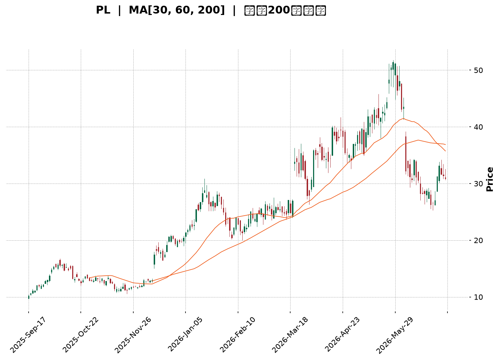
</details>

<html>
<head><meta charset="utf-8" /></head>
<body>
    <div style="height:500px; width:100%;">                        <script>window.PlotlyConfig = {MathJaxConfig: 'local'};</script>
        <script charset="utf-8" src="https://cdn.plot.ly/plotly-3.6.0.min.js" integrity="sha256-QaOVwtVY0T02VaHrr6pnoHLCwayMJp4O5n4YyaE3rJk=" crossorigin="anonymous"></script>                <div id="candlestick-chart" class="plotly-graph-div" style="height:100%; width:100%;"></div>            <script>                window.PLOTLYENV=window.PLOTLYENV || {};                                if (document.getElementById("candlestick-chart")) {                    Plotly.newPlot(                        "candlestick-chart",                        [{"close":{"dtype":"f8","bdata":"AAAAgMJ1JEAAAADgUTglQAAAAOBROCZAAAAA4FE4JkAAAACgmRkoQAAAAAAp3CdAAAAAIIXrJ0AAAABgZmYoQAAAAOB6lClAAAAAgML1KUAAAACAPYorQAAAAEAzsy1AAAAAYLieLkAAAABA4XouQAAAAAApXC9AAAAAQDMzL0AAAACA61EvQAAAAGBmZi1AAAAAAACALkAAAAAgXI8tQAAAAIAULi5AAAAAgMJ1KkAAAADgUTgqQAAAAGC4HitAAAAAgOvRKUAAAAAAAAApQAAAAGBm5ilAAAAA4FE4K0AAAABguJ4qQAAAAIAUrilAAAAAwMzMKUAAAADgUbgpQAAAAGBm5ipAAAAAoEdhKkAAAABgZmYpQAAAAAAAgCpAAAAAIIXrKEAAAABguJ4pQAAAACCuxypAAAAA4KPwKEAAAACgR+EoQAAAAIDr0SZAAAAAwMzMJkAAAAAghWsmQAAAAGBm5iZAAAAA4HqUJ0AAAACAwnUmQAAAAIDrUSZAAAAA4HoUJ0AAAACAwnUnQAAAAOCjcCdAAAAAwMzMJ0AAAABgZmYnQAAAAIA9iidAAAAAwB4FKEAAAACgR+EpQAAAAIA9iilAAAAAYGbmKUAAAACAFK4pQAAAAKBH4SlAAAAA4FF4MUAAAACgcD0yQAAAAMDMDDJAAAAAoEfhMUAAAADgUXgwQAAAAKBwfTFAAAAAgBQuM0AAAACgmZk0QAAAAEDhujRAAAAAgOtRNEAAAAAAKVwzQAAAAGC43jNAAAAAoHC9M0AAAADgUbgzQAAAAMD1aDRAAAAAANdjNUAAAABACtc1QAAAAAApnDZAAAAA4KNwNkAAAACAwrU2QAAAAOCjcDlAAAAAgOtROUAAAABA4bo6QAAAACCuRzxAAAAAIK7HPEAAAAAAAAA8QAAAAKBHYTpAAAAAIFwPOkAAAADgo\u002fA6QAAAAGC43jlAAAAAgOsRPEAAAACgR+E7QAAAAKCZWTpAAAAA4FH4OEAAAACgmdk2QAAAAEAz8zdAAAAAwB7FNUAAAACAFG40QAAAAGCPQjZAAAAAwB4FOEAAAACAPco2QAAAAGBmpjVAAAAAwMxMNUAAAAAghWs2QAAAAIDCNTZAAAAAoHC9N0AAAAAAKRw5QAAAAGBm5jdAAAAAIK7HN0AAAACAwrU4QAAAAKBHoThAAAAAoJmZOUAAAAAA1yM4QAAAAAApXDpAAAAAwMxMOUAAAAAAAAA6QAAAAEAKlzhAAAAAIK5HOUAAAACA69E5QAAAAGBmZjlAAAAA4KNwOUAAAADgUfg4QAAAAIA9yjhAAAAAoJmZOEAAAADgehQ7QAAAACBczzhAAAAAgML1OkAAAACAPepAQAAAAMD16EBAAAAA4HrUP0AAAAAgXK9BQAAAAEAzM0BAAAAAACncPkAAAAAA1+M7QAAAAEAz8ztAAAAAgMK1PkAAAADgo\u002fBBQAAAAGCPgkFAAAAAgMKVQUAAAABgZkZCQAAAAKBwHUFAAAAAgMJVQUAAAADA9ShBQAAAAEAK90BAAAAA4Ho0QUAAAACA6\u002fFDQAAAAKBwPUNAAAAAAADAQkAAAAAA1wNDQAAAAAApvENAAAAAwB4lQ0AAAADgUbhBQAAAAKCZuUFAAAAAANeDQUAAAACAPQpBQAAAAAApfEJAAAAAQDNzQkAAAADAHkVDQAAAAOCjkEJAAAAA4FHYQ0AAAABguJ5BQAAAAMAehUNAAAAAIIXrREAAAABACldEQAAAAGC4XkRAAAAAwB6FRUAAAAAgXM9EQAAAAIAUzkRAAAAAIIXLREAAAADgelRFQAAAAKBwPUVAAAAAwMwsRkAAAADA9ShIQAAAAKBwPUlAAAAAQDOzSUAAAACA65FJQAAAAEDhOkdAAAAAIIULSEAAAADgo5BFQAAAAADXw0VAAAAAACkcQEAAAABguF5AQAAAACCFKz9AAAAA4FG4PkAAAACAwhVBQAAAAGBmJj9AAAAA4HqUPkAAAACAwjU8QAAAAOBRODxAAAAAQOE6PEAAAADAHsU8QAAAACCuhzxAAAAAwMxMOkAAAABgj4I6QAAAAIDrETtAAAAAIK5HP0AAAADgo5BAQAAAAAApnD9AAAAAoEdhP0AAAAAAKdw+QA=="},"high":{"dtype":"f8","bdata":"AAAAwMzMJEAAAAAghWslQAAAAIDr0SZAAAAAwMxMJkAAAABgj0IoQAAAAIDCdShAAAAAIFyPKEAAAADA9agoQAAAAAAAACpAAAAAYLgeKkAAAACAPQosQAAAAMDINi5AAAAAAAAAL0AAAAAgrscvQAAAAGCPAjBAAAAAIK7HMEAAAACgmZkvQAAAAMDMDDBAAAAAYGbmL0AAAAAAAIAuQAAAAOB6VC9AAAAAQDUeL0AAAADA9SgrQAAAAIDr0SxAAAAAQAisKkAAAACgmRkqQAAAAAApnCpAAAAAgBRuK0AAAAAghesrQAAAAOCj8CpAAAAAIIWrKkAAAABgZmYqQAAAAIDCdStAAAAAYI\u002fCKkAAAACAPQorQAAAAOCjsCpAAAAAgD0KKkAAAABgZqYpQAAAAKCZmStAAAAAoHC9KkAAAADAzMwpQAAAAIDr0ShAAAAAQDOzJ0AAAADgUTgnQAAAAMAexSdAAAAAgML1KEAAAAAAAAApQAAAAAAAACdAAAAAIFxPJ0AAAACg7bwnQAAAAIA9CihAAAAAwB4FKEAAAAAA16MnQAAAAMAehShAAAAAoEdhKEAAAABgZmYqQAAAAAAAwClAAAAAgMJ1KkAAAAAAAAAqQAAAAEDheipAAAAAoJn5MUAAAACgmRkzQAAAAOCjsDNAAAAAIK5HMkAAAADAzIwyQAAAAEAz8zFAAAAA4HrUM0AAAABgj8I0QAAAAKBw\u002fTRAAAAAgBTuNEAAAACAwlU0QAAAAMAeJTRAAAAAACk8NEAAAADAzEw0QAAAACBczzRAAAAAIFxvNUAAAABAMxM2QAAAAAAp3DZAAAAAoJmZN0AAAACA6cY3QAAAACBcjzlAAAAAQAqXOkAAAADAHsU6QAAAAKBHYT1AAAAAYOPlPkAAAADgUbg9QAAAACCFqzxAAAAAgMDqOkAAAABA4bo7QAAAAEAzszpAAAAAQDOzPEAAAABgZmY8QAAAAEAzsztAAAAAAABAO0AAAADAocU5QAAAAACs\u002fDdAAAAAAAAAOEAAAACAwIo1QAAAACCuRzZAAAAA4FEYOEAAAABA4fo3QAAAAGBmhjdAAAAAwPXoNUAAAACAFO42QAAAAIA9yjZAAAAAoJmZOEAAAAAAKRw5QAAAAOCjsDlAAAAA4Hq0OEAAAAAgXM84QAAAAEBi0DlAAAAA4KOwOUAAAABACtc4QAAAAIAU7jpAAAAA4KNwOkAAAACgR4E6QAAAAKBwPTpAAAAAAKqRO0AAAABAChc6QAAAAOBReDpAAAAAIIXrOkAAAAAgXA86QAAAAIDpBjpAAAAAAACAOUAAAABAChc7QAAAAOB6FDtAAAAAYI9CO0AAAAAA1yNCQAAAACCFa0FAAAAAIIULQkAAAABgZoZCQAAAAADV2EFAAAAAYLgeQUAAAADA9Wg\u002fQAAAAIAU7jxAAAAAgBQuP0AAAADAHgVCQAAAAMAeJUJAAAAAYGbmQUAAAABA4RpDQAAAAIDClUJAAAAAgOsxQkAAAACAFL5BQAAAACBYOUJAAAAAgMKVQUAAAACgcB1EQAAAAKBwHURAAAAA4Hr0Q0AAAAAA18NDQAAAAEDh2kRAAAAAAAAAREAAAAAAAMBDQAAAAKBwHUJAAAAAQAqnQUAAAAAAAIBBQAAAAAApfEJAAAAA4HqkQkAAAABgj6JDQAAAAEAKt0NAAAAAoEfhQ0AAAACAwnVEQAAAAMDM7ENAAAAAIFyPRUAAAADgo\u002fBEQAAAAKCZGUVAAAAAoJm5RUAAAABACpdFQAAAAADX40ZAAAAAAADgREAAAABgZsZFQAAAAAAAAEZAAAAAQAyiRkAAAADgo5BJQAAAAKBwfUlAAAAAoEfhSUAAAABgj6JJQAAAAAAAYElAAAAAYI9iSUAAAAAgXM9HQAAAAMAelUZAAAAAQAqXQ0AAAADAHgVBQAAAACBcL0FAAAAAwMzMP0AAAADA9ShBQAAAAEAzE0FAAAAAgOsRQEAAAAAAAEA\u002fQAAAAKCZWT1AAAAAAAAAPUAAAABgjyI9QAAAACAvPT1AAAAAoEfhPEAAAABACtc6QAAAAOCjsDxAAAAAIK5HP0AAAADAzOxAQAAAAAAAIEFAAAAAoJm5QEAAAACAFE5AQA=="},"hovertemplate":"\u003cb\u003e%{x|%Y-%m-%d}\u003c\u002fb\u003e\u003cbr\u003e\u958b: $%{open:.2f}\u003cbr\u003e\u9ad8: $%{high:.2f}\u003cbr\u003e\u4f4e: $%{low:.2f}\u003cbr\u003e\u6536: $%{close:.2f}\u003cextra\u003e\u003c\u002fextra\u003e","low":{"dtype":"f8","bdata":"AAAAAClcI0AAAADgo3AkQAAAAEDhOiVAAAAA4KNwJUAAAAAA1yMmQAAAAEAKVydAAAAAQArXJkAAAADAHoUnQAAAAOBRuChAAAAAoHA9KEAAAABAMzMpQAAAAMD1KCxAAAAAwB6FLUAAAACgR2EuQAAAACBcjy1AAAAAwB6FLkAAAADA9SguQAAAAAApHC1AAAAAgOtRLkAAAABAChctQAAAAEAzsy1AAAAAoHA9KkAAAAAg3SQpQAAAAAAAACtAAAAAYLieKUAAAADgo\u002fAnQAAAAIAULilAAAAAIK5HKkAAAACAPYoqQAAAACBcjylAAAAAIK6HKUAAAABA3w8pQAAAACCuxylAAAAAgMJ1KUAAAAAghesoQAAAACBcDylAAAAAANcjKEAAAAAAKdwnQAAAAGAQ2ClAAAAAIFyPKEAAAADA9agoQAAAAEAKFyZAAAAAwMh2JUAAAABgj8IlQAAAAIAU7iVAAAAAwMzMJkAAAACAly4mQAAAAIA9CiVAAAAAwB6FJkAAAADAHoUmQAAAAGCPQidAAAAAgJduJ0AAAADAzMwmQAAAAOB6VCdAAAAAQOF6J0AAAAAAKdwnQAAAAMAeBSlAAAAAoHA9KUAAAABANR4pQAAAAMD1KClAAAAAwB4FLkAAAABguF4xQAAAAADXozFAAAAAgBTuMEAAAACAFG4wQAAAAIA9CjFAAAAAoHD9MUAAAAAAKZwzQAAAAKCZmTNAAAAAACkcNEAAAACAPQozQAAAAGCPwjJAAAAA4KNwM0AAAABAiaEzQAAAAADV+DJAAAAAoHB9M0AAAADgUfg0QAAAAMD1aDVAAAAAQAoXNkAAAADAINA1QAAAAMD1KDdAAAAAYLgeOUAAAAAAAAA5QAAAAGCPQjpAAAAAAClcPEAAAAAgXG87QAAAAKBHITlAAAAAANcjOUAAAACAFC45QAAAAOBRODlAAAAAoBoPOkAAAAAgXM86QAAAAMDMjDlAAAAAgOtxOEAAAABACnc2QAAAAMD16DZAAAAAQAqXNEAAAABgZiY0QAAAACBczzRAAAAAYGamNUAAAACAwrU2QAAAAMD16DRAAAAAQOH6M0AAAAAgBiE1QAAAAAAAgDVAAAAAoHA9NkAAAACAwnU2QAAAAGCPgjdAAAAAQOE6N0AAAACgmVk2QAAAAKBwfThAAAAAgOsROEAAAAAgrsc2QAAAAOBRuDdAAAAAoEdhOEAAAACAaBE5QAAAAGCPgjdAAAAAoJnZN0AAAABAM3M4QAAAAEAzMzlAAAAA4KPwOEAAAAAgrkc4QAAAACBcTzhAAAAA4HipN0AAAABgZmY4QAAAAGCPwjhAAAAA4KPwN0AAAACAaCFAQAAAAEDhOj9AAAAAACkcP0AAAACgRyE\u002fQAAAACBcD0BAAAAAgD2KPkAAAABguD47QAAAAMD1SDpAAAAAwB6FPEAAAADgo3A9QAAAAEDhGkFAAAAAYI9iQEAAAADgUbhBQAAAAOBR+EBAAAAAoJn5QEAAAAAAKVxAQAAAAKBH4T9AAAAAIK5nQEAAAABgZnZBQAAAACCF60JAAAAAQAp3QkAAAABgj8JCQAAAAADXI0NAAAAAgD0qQkAAAADgo5BBQAAAAOCj0EBAAAAAwPPdQEAAAADA9UhAQAAAAMBLJ0FAAAAA4KVrQUAAAADA9ehBQAAAAKCZ+UFAAAAAoEfBQUAAAABACndBQAAAAGBm5kFAAAAAwMwMQ0AAAACgRyFDQAAAAMDMbENAAAAAwMzMQ0AAAADAHkVEQAAAAKBHIURAAAAAYI8CQ0AAAACAwlVEQAAAAMAehURAAAAAwMyMRUAAAACAFO5GQAAAAIAUjkdAAAAAAACAR0AAAAAA12NGQAAAAADXw0ZAAAAAQOE6R0AAAADAHlVFQAAAAGBmpkRAAAAAwPWoP0AAAADgelQ\u002fQAAAAIDrUT1AAAAAQDMzPkAAAAAghWs+QAAAAMAexT1AAAAAACkcPkAAAACgQws7QAAAAOB6FDxAAAAA4HpUOkAAAACAwrU6QAAAAOB6VDtAAAAAgD2KOUAAAADAzEw5QAAAAKBHITpAAAAAoJmZPEAAAACgGCQ+QAAAAMD1iD9AAAAAgD3KPkAAAAAArJw+QA=="},"name":"\u50f9\u683c","open":{"dtype":"f8","bdata":"AAAAAACAI0AAAACAwvUkQAAAAIDrUSVAAAAA4FG4JUAAAABA4XomQAAAACCuRyhAAAAAAAAAJ0AAAADgUbgnQAAAACCuxyhAAAAAYGZmKUAAAACAFK4pQAAAAOBRuCxAAAAAYGbmLUAAAACgmZkvQAAAAAAAAC5AAAAAwMyMMEAAAACAFC4vQAAAAOBRuC9AAAAAIIVrLkAAAAAAAAAuQAAAAGBm5i5AAAAA4KPwLkAAAAAAAAAqQAAAAIA9CixAAAAAAClcKkAAAAAAAIApQAAAAGCPQilAAAAAoJmZKkAAAABgZuYrQAAAAMDMzCpAAAAAIIXrKUAAAABA4XopQAAAACCuxylAAAAAwPWoKkAAAACAwnUpQAAAAIAUrilAAAAAwB4FKkAAAADgUTgoQAAAAIDCdSpAAAAAYGZmKkAAAABgj0IpQAAAAIA9iihAAAAAAAAAJkAAAAAAKVwmQAAAAOB6FCZAAAAAIIXrJkAAAABgZmYoQAAAAEDheiZAAAAAQDOzJkAAAADAHgUnQAAAAIA9iidAAAAAgOvRJ0AAAABAMzMnQAAAAGCPwidAAAAAwPWoJ0AAAABgZuYnQAAAAMAehSlAAAAAAClcKkAAAACgcD0pQAAAAKCZmSlAAAAA4HqUL0AAAADgo3AyQAAAACBczzJAAAAAYGamMUAAAACAFC4yQAAAAIA9CjFAAAAAoHD9MUAAAAAgrsczQAAAAMDMzDNAAAAAQOG6NEAAAADAzEw0QAAAAKBw3TJAAAAAIK4HNEAAAABguL4zQAAAAEDh2jNAAAAAQDOzNEAAAAAAAIA1QAAAAOBRuDVAAAAAoJnZNkAAAACgmZk2QAAAAMDMTDdAAAAAYI9COkAAAAAAAIA5QAAAACBczzpAAAAAQDNzPEAAAABACpc7QAAAAAAAgDxAAAAAAADAOkAAAABgjwI6QAAAAKCZmTpAAAAA4HoUOkAAAADAzAw8QAAAAEAzsztAAAAAQAq3OUAAAAAA1+M4QAAAAEDh+jdAAAAAAAAAOEAAAAAAAAA1QAAAAIA9CjVAAAAAgML1NUAAAABguN43QAAAAGBmhjdAAAAAgOuRNUAAAAAAAIA1QAAAAAAAADZAAAAAYGZmNkAAAADAHgU3QAAAAKBwvThAAAAAYGZmN0AAAAAAAEA3QAAAAMDMTDlAAAAAAACAOEAAAABAM5M4QAAAAOBRuDdAAAAAQOEaOkAAAACgmZk5QAAAAAAAgDlAAAAAANfjN0AAAABACtc4QAAAAIDr0TlAAAAAQApXOUAAAADgUfg5QAAAAEDh+jhAAAAAoEchOUAAAACgmdk4QAAAAAAAgDpAAAAAAABAOEAAAABgZsZAQAAAAAAAQEFAAAAAQOHaQEAAAABAMzNAQAAAAAApfEFAAAAAoHD9QEAAAACgmdk+QAAAAMDMzDxAAAAAAAAAPUAAAADgo3A9QAAAAIDC9UFAAAAA4KOwQUAAAABAM3NCQAAAAAAAQEJAAAAA4KNwQUAAAACgcB1BQAAAACCFy0FAAAAAgMI1QUAAAACgcH1BQAAAAIDrkUNAAAAAQDOTQ0AAAAAAKRxDQAAAAAAAwENAAAAAgD2qQ0AAAACAFI5DQAAAAAApvEFAAAAAwMxMQUAAAADgozBBQAAAAADXQ0FAAAAAIFxfQkAAAADAHoVCQAAAAKCZmUNAAAAAIFx\u002fQkAAAABgj8JDQAAAAEAzM0JAAAAAQDNTQ0AAAAAghQtEQAAAAEAKF0VAAAAA4KNQREAAAADA9QhFQAAAAADXo0VAAAAAQAp3REAAAABAMzNFQAAAAMByCEVAAAAAwMysRUAAAADA9dhHQAAAAMDMDElAAAAAQDMTSUAAAAAAAJBIQAAAACCFi0hAAAAAgMKVR0AAAAAgXM9HQAAAAKBwnUVAAAAAYGYmQ0AAAACgRwFBQAAAAIDCtUBAAAAAANfjPkAAAAAAAIA\u002fQAAAAIDr8UBAAAAAgD0KQEAAAADAHgU+QAAAAADXYzxAAAAAYGamPEAAAACAwvU7QAAAAOB6VDtAAAAAgOsRPEAAAABgj4I6QAAAAEDhOjpAAAAAoJmZPEAAAACgcH0+QAAAAKCZWUBAAAAAQAqXP0AAAADgehQ\u002fQA=="},"x":["2025-09-17T00:00:00-04:00","2025-09-18T00:00:00-04:00","2025-09-19T00:00:00-04:00","2025-09-22T00:00:00-04:00","2025-09-23T00:00:00-04:00","2025-09-24T00:00:00-04:00","2025-09-25T00:00:00-04:00","2025-09-26T00:00:00-04:00","2025-09-29T00:00:00-04:00","2025-09-30T00:00:00-04:00","2025-10-01T00:00:00-04:00","2025-10-02T00:00:00-04:00","2025-10-03T00:00:00-04:00","2025-10-06T00:00:00-04:00","2025-10-07T00:00:00-04:00","2025-10-08T00:00:00-04:00","2025-10-09T00:00:00-04:00","2025-10-10T00:00:00-04:00","2025-10-13T00:00:00-04:00","2025-10-14T00:00:00-04:00","2025-10-15T00:00:00-04:00","2025-10-16T00:00:00-04:00","2025-10-17T00:00:00-04:00","2025-10-20T00:00:00-04:00","2025-10-21T00:00:00-04:00","2025-10-22T00:00:00-04:00","2025-10-23T00:00:00-04:00","2025-10-24T00:00:00-04:00","2025-10-27T00:00:00-04:00","2025-10-28T00:00:00-04:00","2025-10-29T00:00:00-04:00","2025-10-30T00:00:00-04:00","2025-10-31T00:00:00-04:00","2025-11-03T00:00:00-05:00","2025-11-04T00:00:00-05:00","2025-11-05T00:00:00-05:00","2025-11-06T00:00:00-05:00","2025-11-07T00:00:00-05:00","2025-11-10T00:00:00-05:00","2025-11-11T00:00:00-05:00","2025-11-12T00:00:00-05:00","2025-11-13T00:00:00-05:00","2025-11-14T00:00:00-05:00","2025-11-17T00:00:00-05:00","2025-11-18T00:00:00-05:00","2025-11-19T00:00:00-05:00","2025-11-20T00:00:00-05:00","2025-11-21T00:00:00-05:00","2025-11-24T00:00:00-05:00","2025-11-25T00:00:00-05:00","2025-11-26T00:00:00-05:00","2025-11-28T00:00:00-05:00","2025-12-01T00:00:00-05:00","2025-12-02T00:00:00-05:00","2025-12-03T00:00:00-05:00","2025-12-04T00:00:00-05:00","2025-12-05T00:00:00-05:00","2025-12-08T00:00:00-05:00","2025-12-09T00:00:00-05:00","2025-12-10T00:00:00-05:00","2025-12-11T00:00:00-05:00","2025-12-12T00:00:00-05:00","2025-12-15T00:00:00-05:00","2025-12-16T00:00:00-05:00","2025-12-17T00:00:00-05:00","2025-12-18T00:00:00-05:00","2025-12-19T00:00:00-05:00","2025-12-22T00:00:00-05:00","2025-12-23T00:00:00-05:00","2025-12-24T00:00:00-05:00","2025-12-26T00:00:00-05:00","2025-12-29T00:00:00-05:00","2025-12-30T00:00:00-05:00","2025-12-31T00:00:00-05:00","2026-01-02T00:00:00-05:00","2026-01-05T00:00:00-05:00","2026-01-06T00:00:00-05:00","2026-01-07T00:00:00-05:00","2026-01-08T00:00:00-05:00","2026-01-09T00:00:00-05:00","2026-01-12T00:00:00-05:00","2026-01-13T00:00:00-05:00","2026-01-14T00:00:00-05:00","2026-01-15T00:00:00-05:00","2026-01-16T00:00:00-05:00","2026-01-20T00:00:00-05:00","2026-01-21T00:00:00-05:00","2026-01-22T00:00:00-05:00","2026-01-23T00:00:00-05:00","2026-01-26T00:00:00-05:00","2026-01-27T00:00:00-05:00","2026-01-28T00:00:00-05:00","2026-01-29T00:00:00-05:00","2026-01-30T00:00:00-05:00","2026-02-02T00:00:00-05:00","2026-02-03T00:00:00-05:00","2026-02-04T00:00:00-05:00","2026-02-05T00:00:00-05:00","2026-02-06T00:00:00-05:00","2026-02-09T00:00:00-05:00","2026-02-10T00:00:00-05:00","2026-02-11T00:00:00-05:00","2026-02-12T00:00:00-05:00","2026-02-13T00:00:00-05:00","2026-02-17T00:00:00-05:00","2026-02-18T00:00:00-05:00","2026-02-19T00:00:00-05:00","2026-02-20T00:00:00-05:00","2026-02-23T00:00:00-05:00","2026-02-24T00:00:00-05:00","2026-02-25T00:00:00-05:00","2026-02-26T00:00:00-05:00","2026-02-27T00:00:00-05:00","2026-03-02T00:00:00-05:00","2026-03-03T00:00:00-05:00","2026-03-04T00:00:00-05:00","2026-03-05T00:00:00-05:00","2026-03-06T00:00:00-05:00","2026-03-09T00:00:00-04:00","2026-03-10T00:00:00-04:00","2026-03-11T00:00:00-04:00","2026-03-12T00:00:00-04:00","2026-03-13T00:00:00-04:00","2026-03-16T00:00:00-04:00","2026-03-17T00:00:00-04:00","2026-03-18T00:00:00-04:00","2026-03-19T00:00:00-04:00","2026-03-20T00:00:00-04:00","2026-03-23T00:00:00-04:00","2026-03-24T00:00:00-04:00","2026-03-25T00:00:00-04:00","2026-03-26T00:00:00-04:00","2026-03-27T00:00:00-04:00","2026-03-30T00:00:00-04:00","2026-03-31T00:00:00-04:00","2026-04-01T00:00:00-04:00","2026-04-02T00:00:00-04:00","2026-04-06T00:00:00-04:00","2026-04-07T00:00:00-04:00","2026-04-08T00:00:00-04:00","2026-04-09T00:00:00-04:00","2026-04-10T00:00:00-04:00","2026-04-13T00:00:00-04:00","2026-04-14T00:00:00-04:00","2026-04-15T00:00:00-04:00","2026-04-16T00:00:00-04:00","2026-04-17T00:00:00-04:00","2026-04-20T00:00:00-04:00","2026-04-21T00:00:00-04:00","2026-04-22T00:00:00-04:00","2026-04-23T00:00:00-04:00","2026-04-24T00:00:00-04:00","2026-04-27T00:00:00-04:00","2026-04-28T00:00:00-04:00","2026-04-29T00:00:00-04:00","2026-04-30T00:00:00-04:00","2026-05-01T00:00:00-04:00","2026-05-04T00:00:00-04:00","2026-05-05T00:00:00-04:00","2026-05-06T00:00:00-04:00","2026-05-07T00:00:00-04:00","2026-05-08T00:00:00-04:00","2026-05-11T00:00:00-04:00","2026-05-12T00:00:00-04:00","2026-05-13T00:00:00-04:00","2026-05-14T00:00:00-04:00","2026-05-15T00:00:00-04:00","2026-05-18T00:00:00-04:00","2026-05-19T00:00:00-04:00","2026-05-20T00:00:00-04:00","2026-05-21T00:00:00-04:00","2026-05-22T00:00:00-04:00","2026-05-26T00:00:00-04:00","2026-05-27T00:00:00-04:00","2026-05-28T00:00:00-04:00","2026-05-29T00:00:00-04:00","2026-06-01T00:00:00-04:00","2026-06-02T00:00:00-04:00","2026-06-03T00:00:00-04:00","2026-06-04T00:00:00-04:00","2026-06-05T00:00:00-04:00","2026-06-08T00:00:00-04:00","2026-06-09T00:00:00-04:00","2026-06-10T00:00:00-04:00","2026-06-11T00:00:00-04:00","2026-06-12T00:00:00-04:00","2026-06-15T00:00:00-04:00","2026-06-16T00:00:00-04:00","2026-06-17T00:00:00-04:00","2026-06-18T00:00:00-04:00","2026-06-22T00:00:00-04:00","2026-06-23T00:00:00-04:00","2026-06-24T00:00:00-04:00","2026-06-25T00:00:00-04:00","2026-06-26T00:00:00-04:00","2026-06-29T00:00:00-04:00","2026-06-30T00:00:00-04:00","2026-07-01T00:00:00-04:00","2026-07-02T00:00:00-04:00","2026-07-06T00:00:00-04:00"],"type":"candlestick"},{"hovertemplate":"MA30: $%{y:.2f}\u003cextra\u003e\u003c\u002fextra\u003e","line":{"color":"#2196F3","dash":"dash","width":2},"mode":"lines","name":"MA30","x":["2025-09-17T00:00:00-04:00","2025-09-18T00:00:00-04:00","2025-09-19T00:00:00-04:00","2025-09-22T00:00:00-04:00","2025-09-23T00:00:00-04:00","2025-09-24T00:00:00-04:00","2025-09-25T00:00:00-04:00","2025-09-26T00:00:00-04:00","2025-09-29T00:00:00-04:00","2025-09-30T00:00:00-04:00","2025-10-01T00:00:00-04:00","2025-10-02T00:00:00-04:00","2025-10-03T00:00:00-04:00","2025-10-06T00:00:00-04:00","2025-10-07T00:00:00-04:00","2025-10-08T00:00:00-04:00","2025-10-09T00:00:00-04:00","2025-10-10T00:00:00-04:00","2025-10-13T00:00:00-04:00","2025-10-14T00:00:00-04:00","2025-10-15T00:00:00-04:00","2025-10-16T00:00:00-04:00","2025-10-17T00:00:00-04:00","2025-10-20T00:00:00-04:00","2025-10-21T00:00:00-04:00","2025-10-22T00:00:00-04:00","2025-10-23T00:00:00-04:00","2025-10-24T00:00:00-04:00","2025-10-27T00:00:00-04:00","2025-10-28T00:00:00-04:00","2025-10-29T00:00:00-04:00","2025-10-30T00:00:00-04:00","2025-10-31T00:00:00-04:00","2025-11-03T00:00:00-05:00","2025-11-04T00:00:00-05:00","2025-11-05T00:00:00-05:00","2025-11-06T00:00:00-05:00","2025-11-07T00:00:00-05:00","2025-11-10T00:00:00-05:00","2025-11-11T00:00:00-05:00","2025-11-12T00:00:00-05:00","2025-11-13T00:00:00-05:00","2025-11-14T00:00:00-05:00","2025-11-17T00:00:00-05:00","2025-11-18T00:00:00-05:00","2025-11-19T00:00:00-05:00","2025-11-20T00:00:00-05:00","2025-11-21T00:00:00-05:00","2025-11-24T00:00:00-05:00","2025-11-25T00:00:00-05:00","2025-11-26T00:00:00-05:00","2025-11-28T00:00:00-05:00","2025-12-01T00:00:00-05:00","2025-12-02T00:00:00-05:00","2025-12-03T00:00:00-05:00","2025-12-04T00:00:00-05:00","2025-12-05T00:00:00-05:00","2025-12-08T00:00:00-05:00","2025-12-09T00:00:00-05:00","2025-12-10T00:00:00-05:00","2025-12-11T00:00:00-05:00","2025-12-12T00:00:00-05:00","2025-12-15T00:00:00-05:00","2025-12-16T00:00:00-05:00","2025-12-17T00:00:00-05:00","2025-12-18T00:00:00-05:00","2025-12-19T00:00:00-05:00","2025-12-22T00:00:00-05:00","2025-12-23T00:00:00-05:00","2025-12-24T00:00:00-05:00","2025-12-26T00:00:00-05:00","2025-12-29T00:00:00-05:00","2025-12-30T00:00:00-05:00","2025-12-31T00:00:00-05:00","2026-01-02T00:00:00-05:00","2026-01-05T00:00:00-05:00","2026-01-06T00:00:00-05:00","2026-01-07T00:00:00-05:00","2026-01-08T00:00:00-05:00","2026-01-09T00:00:00-05:00","2026-01-12T00:00:00-05:00","2026-01-13T00:00:00-05:00","2026-01-14T00:00:00-05:00","2026-01-15T00:00:00-05:00","2026-01-16T00:00:00-05:00","2026-01-20T00:00:00-05:00","2026-01-21T00:00:00-05:00","2026-01-22T00:00:00-05:00","2026-01-23T00:00:00-05:00","2026-01-26T00:00:00-05:00","2026-01-27T00:00:00-05:00","2026-01-28T00:00:00-05:00","2026-01-29T00:00:00-05:00","2026-01-30T00:00:00-05:00","2026-02-02T00:00:00-05:00","2026-02-03T00:00:00-05:00","2026-02-04T00:00:00-05:00","2026-02-05T00:00:00-05:00","2026-02-06T00:00:00-05:00","2026-02-09T00:00:00-05:00","2026-02-10T00:00:00-05:00","2026-02-11T00:00:00-05:00","2026-02-12T00:00:00-05:00","2026-02-13T00:00:00-05:00","2026-02-17T00:00:00-05:00","2026-02-18T00:00:00-05:00","2026-02-19T00:00:00-05:00","2026-02-20T00:00:00-05:00","2026-02-23T00:00:00-05:00","2026-02-24T00:00:00-05:00","2026-02-25T00:00:00-05:00","2026-02-26T00:00:00-05:00","2026-02-27T00:00:00-05:00","2026-03-02T00:00:00-05:00","2026-03-03T00:00:00-05:00","2026-03-04T00:00:00-05:00","2026-03-05T00:00:00-05:00","2026-03-06T00:00:00-05:00","2026-03-09T00:00:00-04:00","2026-03-10T00:00:00-04:00","2026-03-11T00:00:00-04:00","2026-03-12T00:00:00-04:00","2026-03-13T00:00:00-04:00","2026-03-16T00:00:00-04:00","2026-03-17T00:00:00-04:00","2026-03-18T00:00:00-04:00","2026-03-19T00:00:00-04:00","2026-03-20T00:00:00-04:00","2026-03-23T00:00:00-04:00","2026-03-24T00:00:00-04:00","2026-03-25T00:00:00-04:00","2026-03-26T00:00:00-04:00","2026-03-27T00:00:00-04:00","2026-03-30T00:00:00-04:00","2026-03-31T00:00:00-04:00","2026-04-01T00:00:00-04:00","2026-04-02T00:00:00-04:00","2026-04-06T00:00:00-04:00","2026-04-07T00:00:00-04:00","2026-04-08T00:00:00-04:00","2026-04-09T00:00:00-04:00","2026-04-10T00:00:00-04:00","2026-04-13T00:00:00-04:00","2026-04-14T00:00:00-04:00","2026-04-15T00:00:00-04:00","2026-04-16T00:00:00-04:00","2026-04-17T00:00:00-04:00","2026-04-20T00:00:00-04:00","2026-04-21T00:00:00-04:00","2026-04-22T00:00:00-04:00","2026-04-23T00:00:00-04:00","2026-04-24T00:00:00-04:00","2026-04-27T00:00:00-04:00","2026-04-28T00:00:00-04:00","2026-04-29T00:00:00-04:00","2026-04-30T00:00:00-04:00","2026-05-01T00:00:00-04:00","2026-05-04T00:00:00-04:00","2026-05-05T00:00:00-04:00","2026-05-06T00:00:00-04:00","2026-05-07T00:00:00-04:00","2026-05-08T00:00:00-04:00","2026-05-11T00:00:00-04:00","2026-05-12T00:00:00-04:00","2026-05-13T00:00:00-04:00","2026-05-14T00:00:00-04:00","2026-05-15T00:00:00-04:00","2026-05-18T00:00:00-04:00","2026-05-19T00:00:00-04:00","2026-05-20T00:00:00-04:00","2026-05-21T00:00:00-04:00","2026-05-22T00:00:00-04:00","2026-05-26T00:00:00-04:00","2026-05-27T00:00:00-04:00","2026-05-28T00:00:00-04:00","2026-05-29T00:00:00-04:00","2026-06-01T00:00:00-04:00","2026-06-02T00:00:00-04:00","2026-06-03T00:00:00-04:00","2026-06-04T00:00:00-04:00","2026-06-05T00:00:00-04:00","2026-06-08T00:00:00-04:00","2026-06-09T00:00:00-04:00","2026-06-10T00:00:00-04:00","2026-06-11T00:00:00-04:00","2026-06-12T00:00:00-04:00","2026-06-15T00:00:00-04:00","2026-06-16T00:00:00-04:00","2026-06-17T00:00:00-04:00","2026-06-18T00:00:00-04:00","2026-06-22T00:00:00-04:00","2026-06-23T00:00:00-04:00","2026-06-24T00:00:00-04:00","2026-06-25T00:00:00-04:00","2026-06-26T00:00:00-04:00","2026-06-29T00:00:00-04:00","2026-06-30T00:00:00-04:00","2026-07-01T00:00:00-04:00","2026-07-02T00:00:00-04:00","2026-07-06T00:00:00-04:00"],"y":{"dtype":"f8","bdata":"AAAAAAAA+H8AAAAAAAD4fwAAAAAAAPh\u002fAAAAAAAA+H8AAAAAAAD4fwAAAAAAAPh\u002fAAAAAAAA+H8AAAAAAAD4fwAAAAAAAPh\u002fAAAAAAAA+H8AAAAAAAD4fwAAAAAAAPh\u002fAAAAAAAA+H8AAAAAAAD4fwAAAAAAAPh\u002fAAAAAAAA+H8AAAAAAAD4fwAAAAAAAPh\u002fAAAAAAAA+H8AAAAAAAD4fwAAAAAAAPh\u002fAAAAAAAA+H8AAAAAAAD4fwAAAAAAAPh\u002fAAAAAAAA+H8AAAAAAAD4fwAAAAAAAPh\u002fAAAAAAAA+H8AAAAAAAD4f0RERDReuipAzczMnO\u002fnKkAzMzMDVg4rQBEREaFFNitAmpmZScVZK0De3d0t3WQrQImIiFhkeytAERER4eyDK0AzMzMDVo4rQERERHSTmCtAvLu7O9+PK0Dv7u5eLHkrQHd3d8d2PitAmpmZubv7KkAzMzNj9LYqQLy7uzvDbipAZmZmFr0tKkDv7u4eIuIpQAAAAKC3pSlAMzMzY2ZmKUC8u7u7WDIpQKuqqvrU+ChA7+7uHiLiKEDNzMy8EcooQLy7uxuFqyhAMzMz8yicKEBmZmZWq6MoQImIiOiYoChAMzMzU1WVKEDNzMzcT40oQERERMQEjyhAZmZmZgPdKECrqqr61DgpQO\u002fu7q5WhylAq6qqmmHXKUC8u7v7uBcqQDMzM9MVYCpARERE9MXSKkC8u7v7uFcrQN7d3e391CtAmpmZGfdaLEC8u7sLEdEsQKuqqlpzYS1A7+7uXsnvLUAAAAAgBoEuQGZmZvbwGS9AAAAAAMi9L0BmZmbmbTkwQO\u002fu7s4imzBAEREROSb4MEDe3d1l2FUxQCIiIjLsyjFAIiIionA9MkAzMzMrsr0yQImIiNCUSjNAiYiIcK\u002fZM0AzMzODMlo0QCIiIgJWzjRAVVVVPTU+NUAREREph7Y1QN7d3S3dJDZAvLu7O1F\u002fNkAiIiIilNE2QDMzM8NnGDdAq6qqGuhUN0De3d1tWYs3QERERIR5wjdAVVVVdZPYN0BmZmYWINc3QM3MzGwu5DdAMzMzM8EDOEBmZmYmBiE4QN7d3Z02MDhAzczMfIY9OECrqqq6kFQ4QDMzM+PsYzhAq6qqivp3OEB3d3f34ZM4QDMzMwPknjhAmpmZSVOqOECrqqpaZLs4QBEREeF6tDhAzczMjN62OEC8u7ubxKA4QN7d3U1ikDhAAAAAILByOEDv7u4On2E4QO\u002fu7r5YUjhAAAAA0LBLOEAiIiIiIkI4QGZmZmYfPjhAREREFK4nOEBmZmYW2Q44QHd3dzeJAThAERER8WD+N0BERESEeSI4QGZmZjbQKThAAAAA8BlWOEAAAACwcsg4QEREROQXKzlAiYiIGL1tOUBVVVWFFtk5QCIiIkLSNDpAZmZmZmaGOkC8u7vLE7U6QFVVVQUP5jpAd3d3N4khO0BERESkcH07QHd3d6dU3DtAvLu7e4Y9PEC8u7tbj6I8QBEREeF69DxAd3d3l+BBPUBEREQkv5g9QO\u002fu7g5Y2T1AiYiIKBUnPkAzMzNTnJ0+QN7d3X0jFD9AzczMfGp8P0AzMzOjm+Q\u002fQDMzMwNWLkBAvLu7oyllQEC8u7ur1ZFAQLy7uztRv0BAq6qqktHrQEARERFxrwlBQAAAAGiRPUFAIiIiivpnQUBVVVUdE3xBQM3MzIQyikFAvLu7u7urQUDe3d29LatBQERERGSCx0FAq6qqelv2QUAiIiKS7SxCQJqZmal\u002fY0JAAAAAUBuYQkC8u7vrmLBCQFVVVfW2zEJAAAAAUBvoQkAAAAAQLQJDQDMzM0NgJUNAd3d3Z61OQ0AzMzMjaYpDQGZmZiYG0UNAMzMzw4MZREAzMzPDg0lEQM3MzAyQa0RAd3d3J7+YREB3d3e3ga5EQBEREVHUv0RAIiIiQu6lREBEREQkaZpEQFVVVT0miERAIiIiksJ1REDv7u7eJHZEQImIiOBPXURAAAAAwFhCREAiIiKiRRZEQBEREYlB8ENAERERKVy\u002fQ0CamZkxwaNDQImIiHjpdkNAVVVVpZs0Q0AiIiI6JvhCQImIiPDSvUJAIiIi4qWLQkCrqqqKbGdCQAAAAODBPEJAzczM1DERQkDe3d0V2d5BQA=="},"type":"scatter"},{"hovertemplate":"MA60: $%{y:.2f}\u003cextra\u003e\u003c\u002fextra\u003e","line":{"color":"#9C27B0","dash":"dash","width":2},"mode":"lines","name":"MA60","x":["2025-09-17T00:00:00-04:00","2025-09-18T00:00:00-04:00","2025-09-19T00:00:00-04:00","2025-09-22T00:00:00-04:00","2025-09-23T00:00:00-04:00","2025-09-24T00:00:00-04:00","2025-09-25T00:00:00-04:00","2025-09-26T00:00:00-04:00","2025-09-29T00:00:00-04:00","2025-09-30T00:00:00-04:00","2025-10-01T00:00:00-04:00","2025-10-02T00:00:00-04:00","2025-10-03T00:00:00-04:00","2025-10-06T00:00:00-04:00","2025-10-07T00:00:00-04:00","2025-10-08T00:00:00-04:00","2025-10-09T00:00:00-04:00","2025-10-10T00:00:00-04:00","2025-10-13T00:00:00-04:00","2025-10-14T00:00:00-04:00","2025-10-15T00:00:00-04:00","2025-10-16T00:00:00-04:00","2025-10-17T00:00:00-04:00","2025-10-20T00:00:00-04:00","2025-10-21T00:00:00-04:00","2025-10-22T00:00:00-04:00","2025-10-23T00:00:00-04:00","2025-10-24T00:00:00-04:00","2025-10-27T00:00:00-04:00","2025-10-28T00:00:00-04:00","2025-10-29T00:00:00-04:00","2025-10-30T00:00:00-04:00","2025-10-31T00:00:00-04:00","2025-11-03T00:00:00-05:00","2025-11-04T00:00:00-05:00","2025-11-05T00:00:00-05:00","2025-11-06T00:00:00-05:00","2025-11-07T00:00:00-05:00","2025-11-10T00:00:00-05:00","2025-11-11T00:00:00-05:00","2025-11-12T00:00:00-05:00","2025-11-13T00:00:00-05:00","2025-11-14T00:00:00-05:00","2025-11-17T00:00:00-05:00","2025-11-18T00:00:00-05:00","2025-11-19T00:00:00-05:00","2025-11-20T00:00:00-05:00","2025-11-21T00:00:00-05:00","2025-11-24T00:00:00-05:00","2025-11-25T00:00:00-05:00","2025-11-26T00:00:00-05:00","2025-11-28T00:00:00-05:00","2025-12-01T00:00:00-05:00","2025-12-02T00:00:00-05:00","2025-12-03T00:00:00-05:00","2025-12-04T00:00:00-05:00","2025-12-05T00:00:00-05:00","2025-12-08T00:00:00-05:00","2025-12-09T00:00:00-05:00","2025-12-10T00:00:00-05:00","2025-12-11T00:00:00-05:00","2025-12-12T00:00:00-05:00","2025-12-15T00:00:00-05:00","2025-12-16T00:00:00-05:00","2025-12-17T00:00:00-05:00","2025-12-18T00:00:00-05:00","2025-12-19T00:00:00-05:00","2025-12-22T00:00:00-05:00","2025-12-23T00:00:00-05:00","2025-12-24T00:00:00-05:00","2025-12-26T00:00:00-05:00","2025-12-29T00:00:00-05:00","2025-12-30T00:00:00-05:00","2025-12-31T00:00:00-05:00","2026-01-02T00:00:00-05:00","2026-01-05T00:00:00-05:00","2026-01-06T00:00:00-05:00","2026-01-07T00:00:00-05:00","2026-01-08T00:00:00-05:00","2026-01-09T00:00:00-05:00","2026-01-12T00:00:00-05:00","2026-01-13T00:00:00-05:00","2026-01-14T00:00:00-05:00","2026-01-15T00:00:00-05:00","2026-01-16T00:00:00-05:00","2026-01-20T00:00:00-05:00","2026-01-21T00:00:00-05:00","2026-01-22T00:00:00-05:00","2026-01-23T00:00:00-05:00","2026-01-26T00:00:00-05:00","2026-01-27T00:00:00-05:00","2026-01-28T00:00:00-05:00","2026-01-29T00:00:00-05:00","2026-01-30T00:00:00-05:00","2026-02-02T00:00:00-05:00","2026-02-03T00:00:00-05:00","2026-02-04T00:00:00-05:00","2026-02-05T00:00:00-05:00","2026-02-06T00:00:00-05:00","2026-02-09T00:00:00-05:00","2026-02-10T00:00:00-05:00","2026-02-11T00:00:00-05:00","2026-02-12T00:00:00-05:00","2026-02-13T00:00:00-05:00","2026-02-17T00:00:00-05:00","2026-02-18T00:00:00-05:00","2026-02-19T00:00:00-05:00","2026-02-20T00:00:00-05:00","2026-02-23T00:00:00-05:00","2026-02-24T00:00:00-05:00","2026-02-25T00:00:00-05:00","2026-02-26T00:00:00-05:00","2026-02-27T00:00:00-05:00","2026-03-02T00:00:00-05:00","2026-03-03T00:00:00-05:00","2026-03-04T00:00:00-05:00","2026-03-05T00:00:00-05:00","2026-03-06T00:00:00-05:00","2026-03-09T00:00:00-04:00","2026-03-10T00:00:00-04:00","2026-03-11T00:00:00-04:00","2026-03-12T00:00:00-04:00","2026-03-13T00:00:00-04:00","2026-03-16T00:00:00-04:00","2026-03-17T00:00:00-04:00","2026-03-18T00:00:00-04:00","2026-03-19T00:00:00-04:00","2026-03-20T00:00:00-04:00","2026-03-23T00:00:00-04:00","2026-03-24T00:00:00-04:00","2026-03-25T00:00:00-04:00","2026-03-26T00:00:00-04:00","2026-03-27T00:00:00-04:00","2026-03-30T00:00:00-04:00","2026-03-31T00:00:00-04:00","2026-04-01T00:00:00-04:00","2026-04-02T00:00:00-04:00","2026-04-06T00:00:00-04:00","2026-04-07T00:00:00-04:00","2026-04-08T00:00:00-04:00","2026-04-09T00:00:00-04:00","2026-04-10T00:00:00-04:00","2026-04-13T00:00:00-04:00","2026-04-14T00:00:00-04:00","2026-04-15T00:00:00-04:00","2026-04-16T00:00:00-04:00","2026-04-17T00:00:00-04:00","2026-04-20T00:00:00-04:00","2026-04-21T00:00:00-04:00","2026-04-22T00:00:00-04:00","2026-04-23T00:00:00-04:00","2026-04-24T00:00:00-04:00","2026-04-27T00:00:00-04:00","2026-04-28T00:00:00-04:00","2026-04-29T00:00:00-04:00","2026-04-30T00:00:00-04:00","2026-05-01T00:00:00-04:00","2026-05-04T00:00:00-04:00","2026-05-05T00:00:00-04:00","2026-05-06T00:00:00-04:00","2026-05-07T00:00:00-04:00","2026-05-08T00:00:00-04:00","2026-05-11T00:00:00-04:00","2026-05-12T00:00:00-04:00","2026-05-13T00:00:00-04:00","2026-05-14T00:00:00-04:00","2026-05-15T00:00:00-04:00","2026-05-18T00:00:00-04:00","2026-05-19T00:00:00-04:00","2026-05-20T00:00:00-04:00","2026-05-21T00:00:00-04:00","2026-05-22T00:00:00-04:00","2026-05-26T00:00:00-04:00","2026-05-27T00:00:00-04:00","2026-05-28T00:00:00-04:00","2026-05-29T00:00:00-04:00","2026-06-01T00:00:00-04:00","2026-06-02T00:00:00-04:00","2026-06-03T00:00:00-04:00","2026-06-04T00:00:00-04:00","2026-06-05T00:00:00-04:00","2026-06-08T00:00:00-04:00","2026-06-09T00:00:00-04:00","2026-06-10T00:00:00-04:00","2026-06-11T00:00:00-04:00","2026-06-12T00:00:00-04:00","2026-06-15T00:00:00-04:00","2026-06-16T00:00:00-04:00","2026-06-17T00:00:00-04:00","2026-06-18T00:00:00-04:00","2026-06-22T00:00:00-04:00","2026-06-23T00:00:00-04:00","2026-06-24T00:00:00-04:00","2026-06-25T00:00:00-04:00","2026-06-26T00:00:00-04:00","2026-06-29T00:00:00-04:00","2026-06-30T00:00:00-04:00","2026-07-01T00:00:00-04:00","2026-07-02T00:00:00-04:00","2026-07-06T00:00:00-04:00"],"y":{"dtype":"f8","bdata":"AAAAAAAA+H8AAAAAAAD4fwAAAAAAAPh\u002fAAAAAAAA+H8AAAAAAAD4fwAAAAAAAPh\u002fAAAAAAAA+H8AAAAAAAD4fwAAAAAAAPh\u002fAAAAAAAA+H8AAAAAAAD4fwAAAAAAAPh\u002fAAAAAAAA+H8AAAAAAAD4fwAAAAAAAPh\u002fAAAAAAAA+H8AAAAAAAD4fwAAAAAAAPh\u002fAAAAAAAA+H8AAAAAAAD4fwAAAAAAAPh\u002fAAAAAAAA+H8AAAAAAAD4fwAAAAAAAPh\u002fAAAAAAAA+H8AAAAAAAD4fwAAAAAAAPh\u002fAAAAAAAA+H8AAAAAAAD4fwAAAAAAAPh\u002fAAAAAAAA+H8AAAAAAAD4fwAAAAAAAPh\u002fAAAAAAAA+H8AAAAAAAD4fwAAAAAAAPh\u002fAAAAAAAA+H8AAAAAAAD4fwAAAAAAAPh\u002fAAAAAAAA+H8AAAAAAAD4fwAAAAAAAPh\u002fAAAAAAAA+H8AAAAAAAD4fwAAAAAAAPh\u002fAAAAAAAA+H8AAAAAAAD4fwAAAAAAAPh\u002fAAAAAAAA+H8AAAAAAAD4fwAAAAAAAPh\u002fAAAAAAAA+H8AAAAAAAD4fwAAAAAAAPh\u002fAAAAAAAA+H8AAAAAAAD4fwAAAAAAAPh\u002fAAAAAAAA+H8AAAAAAAD4f0RERHyxpClAmpmZgXniKUDv7u5+lSMqQAAAACjOXipAIiIicpOYKkDNzMwUS74qQN7d3RW97SpAq6qqalkrK0B3d3d\u002fB3MrQBEREbHItitAq6qqKmv1K0BVVVW1HiUsQBERERH1TyxAREREjMJ1LECamZlB\u002fZssQBERERlaxCxAMzMzi8L1LEDe3d31fiotQO\u002fu7p7+bS1Aq6qqalmrLUC8u7vDBO8tQHd3d69WRy5AmpmZsYGuLkCamZkJuyIvQGZmZl5XoC9AERER9eETMEAzMzMXBFYwQDMzMztRjzBAd3d382\u002fEMEC8u7uLl\u002f4wQAAAAMgvNjFAd3d3d+l2MUC8u7tP\u002f7YxQFVVVY0J7jFAAAAAdEwgMkDe3d31mksyQO\u002fu7jZCeTJAvLu7N\u002fugMkAiIiJKfsEyQN7d3bFW5zJAAAAAYJ4YM0AiIiJWx0QzQJqZmSV4cDNAIiIilrWaM0BVVVXlicozQDMzM69y+DNAVVVVRW8rNEDv7u7up2Y0QBEREWkDnTRAVVVVwTzRNEBERERgngg1QJqZmYmzPzVAd3d3lyd6NUB3d3djO681QDMzM4977TVAREREyC8mNkARERHJ6F02QImIiGBXkDZAq6qqBvPENkCamZmlVPw2QCIiIkp+MTdAAAAAqH9TN0BEREScNnA3QFVVVX34jDdA3t3dhaSpN0ARERF56dY3QFVVVd0k9jdAq6qqslYXOEAzMzNjyU84QImIiCijhzhA3t3dJb+4OEDe3d1VDv04QAAAAHCEMjlAmpmZcfZhOUAzMzND0oQ5QERERPT9pDlAERER4cHMOUDe3d1NqQg6QFVVVVWcPTpAq6qq4uxzOkAzMzPb+a46QBEREeF61DpAIiIikl\u002f8OkAAAADgwRw7QGZmZi7dNDtAREREpOJMO0ARERGxnX87QGZmZh4+sztAZmZmpg3kO0CrqqriXhM8QGZmZrZlTTxA3t3drQB5PEDv7u42Qpk8QHd3d9cVwDxAMzMzCwLrPEAzMzMz7Bo9QDMzM4N5Uj1AIiIiggeTPUBVVVV1TOA9QO\u002fu7na+Hz5AAAAASJpiPkCJiIgAuZc+QFVVVYXr4T5A3t3drY45P0AAAAB4d4c\u002fQERERCyH1j9A3t3d9W8UQEDv7u6eqDdAQImIiKRwXUBA7+7uRm+DQEDv7u5euqlAQN7d3dnOz0BAmpmZ2c73QECrqqpaZCtBQO\u002fu7hbZXkFAvLu7K4eWQUBmZmb2KMxBQN7d3eXQ+kFA7+7uMnorQkCJiIjEZ1BCQCIiIioVd0JA7+7u8ouFQkAAAABoH5ZCQImIiLy7o0JAZmZmEsqwQkAAAAAo6r9CQERERKRwzUJAERERpSnVQkC8u7tfLMlCQO\u002fu7gY6vUJAZmZm8ou1QkC8u7t3d6dCQGZmZu41n0JAAAAAkHuVQkAiIiLmiZJCQBEREU2pkEJAERERmeCRQkAzMzO7AoxCQKuqqmq8hEJAZmZmkqZ8QkDv7u4Sg3BCQA=="},"type":"scatter"},{"hovertemplate":"MA200: $%{y:.2f}\u003cextra\u003e\u003c\u002fextra\u003e","line":{"color":"#FF6F00","dash":"solid","width":2},"mode":"lines","name":"MA200","x":["2025-09-17T00:00:00-04:00","2025-09-18T00:00:00-04:00","2025-09-19T00:00:00-04:00","2025-09-22T00:00:00-04:00","2025-09-23T00:00:00-04:00","2025-09-24T00:00:00-04:00","2025-09-25T00:00:00-04:00","2025-09-26T00:00:00-04:00","2025-09-29T00:00:00-04:00","2025-09-30T00:00:00-04:00","2025-10-01T00:00:00-04:00","2025-10-02T00:00:00-04:00","2025-10-03T00:00:00-04:00","2025-10-06T00:00:00-04:00","2025-10-07T00:00:00-04:00","2025-10-08T00:00:00-04:00","2025-10-09T00:00:00-04:00","2025-10-10T00:00:00-04:00","2025-10-13T00:00:00-04:00","2025-10-14T00:00:00-04:00","2025-10-15T00:00:00-04:00","2025-10-16T00:00:00-04:00","2025-10-17T00:00:00-04:00","2025-10-20T00:00:00-04:00","2025-10-21T00:00:00-04:00","2025-10-22T00:00:00-04:00","2025-10-23T00:00:00-04:00","2025-10-24T00:00:00-04:00","2025-10-27T00:00:00-04:00","2025-10-28T00:00:00-04:00","2025-10-29T00:00:00-04:00","2025-10-30T00:00:00-04:00","2025-10-31T00:00:00-04:00","2025-11-03T00:00:00-05:00","2025-11-04T00:00:00-05:00","2025-11-05T00:00:00-05:00","2025-11-06T00:00:00-05:00","2025-11-07T00:00:00-05:00","2025-11-10T00:00:00-05:00","2025-11-11T00:00:00-05:00","2025-11-12T00:00:00-05:00","2025-11-13T00:00:00-05:00","2025-11-14T00:00:00-05:00","2025-11-17T00:00:00-05:00","2025-11-18T00:00:00-05:00","2025-11-19T00:00:00-05:00","2025-11-20T00:00:00-05:00","2025-11-21T00:00:00-05:00","2025-11-24T00:00:00-05:00","2025-11-25T00:00:00-05:00","2025-11-26T00:00:00-05:00","2025-11-28T00:00:00-05:00","2025-12-01T00:00:00-05:00","2025-12-02T00:00:00-05:00","2025-12-03T00:00:00-05:00","2025-12-04T00:00:00-05:00","2025-12-05T00:00:00-05:00","2025-12-08T00:00:00-05:00","2025-12-09T00:00:00-05:00","2025-12-10T00:00:00-05:00","2025-12-11T00:00:00-05:00","2025-12-12T00:00:00-05:00","2025-12-15T00:00:00-05:00","2025-12-16T00:00:00-05:00","2025-12-17T00:00:00-05:00","2025-12-18T00:00:00-05:00","2025-12-19T00:00:00-05:00","2025-12-22T00:00:00-05:00","2025-12-23T00:00:00-05:00","2025-12-24T00:00:00-05:00","2025-12-26T00:00:00-05:00","2025-12-29T00:00:00-05:00","2025-12-30T00:00:00-05:00","2025-12-31T00:00:00-05:00","2026-01-02T00:00:00-05:00","2026-01-05T00:00:00-05:00","2026-01-06T00:00:00-05:00","2026-01-07T00:00:00-05:00","2026-01-08T00:00:00-05:00","2026-01-09T00:00:00-05:00","2026-01-12T00:00:00-05:00","2026-01-13T00:00:00-05:00","2026-01-14T00:00:00-05:00","2026-01-15T00:00:00-05:00","2026-01-16T00:00:00-05:00","2026-01-20T00:00:00-05:00","2026-01-21T00:00:00-05:00","2026-01-22T00:00:00-05:00","2026-01-23T00:00:00-05:00","2026-01-26T00:00:00-05:00","2026-01-27T00:00:00-05:00","2026-01-28T00:00:00-05:00","2026-01-29T00:00:00-05:00","2026-01-30T00:00:00-05:00","2026-02-02T00:00:00-05:00","2026-02-03T00:00:00-05:00","2026-02-04T00:00:00-05:00","2026-02-05T00:00:00-05:00","2026-02-06T00:00:00-05:00","2026-02-09T00:00:00-05:00","2026-02-10T00:00:00-05:00","2026-02-11T00:00:00-05:00","2026-02-12T00:00:00-05:00","2026-02-13T00:00:00-05:00","2026-02-17T00:00:00-05:00","2026-02-18T00:00:00-05:00","2026-02-19T00:00:00-05:00","2026-02-20T00:00:00-05:00","2026-02-23T00:00:00-05:00","2026-02-24T00:00:00-05:00","2026-02-25T00:00:00-05:00","2026-02-26T00:00:00-05:00","2026-02-27T00:00:00-05:00","2026-03-02T00:00:00-05:00","2026-03-03T00:00:00-05:00","2026-03-04T00:00:00-05:00","2026-03-05T00:00:00-05:00","2026-03-06T00:00:00-05:00","2026-03-09T00:00:00-04:00","2026-03-10T00:00:00-04:00","2026-03-11T00:00:00-04:00","2026-03-12T00:00:00-04:00","2026-03-13T00:00:00-04:00","2026-03-16T00:00:00-04:00","2026-03-17T00:00:00-04:00","2026-03-18T00:00:00-04:00","2026-03-19T00:00:00-04:00","2026-03-20T00:00:00-04:00","2026-03-23T00:00:00-04:00","2026-03-24T00:00:00-04:00","2026-03-25T00:00:00-04:00","2026-03-26T00:00:00-04:00","2026-03-27T00:00:00-04:00","2026-03-30T00:00:00-04:00","2026-03-31T00:00:00-04:00","2026-04-01T00:00:00-04:00","2026-04-02T00:00:00-04:00","2026-04-06T00:00:00-04:00","2026-04-07T00:00:00-04:00","2026-04-08T00:00:00-04:00","2026-04-09T00:00:00-04:00","2026-04-10T00:00:00-04:00","2026-04-13T00:00:00-04:00","2026-04-14T00:00:00-04:00","2026-04-15T00:00:00-04:00","2026-04-16T00:00:00-04:00","2026-04-17T00:00:00-04:00","2026-04-20T00:00:00-04:00","2026-04-21T00:00:00-04:00","2026-04-22T00:00:00-04:00","2026-04-23T00:00:00-04:00","2026-04-24T00:00:00-04:00","2026-04-27T00:00:00-04:00","2026-04-28T00:00:00-04:00","2026-04-29T00:00:00-04:00","2026-04-30T00:00:00-04:00","2026-05-01T00:00:00-04:00","2026-05-04T00:00:00-04:00","2026-05-05T00:00:00-04:00","2026-05-06T00:00:00-04:00","2026-05-07T00:00:00-04:00","2026-05-08T00:00:00-04:00","2026-05-11T00:00:00-04:00","2026-05-12T00:00:00-04:00","2026-05-13T00:00:00-04:00","2026-05-14T00:00:00-04:00","2026-05-15T00:00:00-04:00","2026-05-18T00:00:00-04:00","2026-05-19T00:00:00-04:00","2026-05-20T00:00:00-04:00","2026-05-21T00:00:00-04:00","2026-05-22T00:00:00-04:00","2026-05-26T00:00:00-04:00","2026-05-27T00:00:00-04:00","2026-05-28T00:00:00-04:00","2026-05-29T00:00:00-04:00","2026-06-01T00:00:00-04:00","2026-06-02T00:00:00-04:00","2026-06-03T00:00:00-04:00","2026-06-04T00:00:00-04:00","2026-06-05T00:00:00-04:00","2026-06-08T00:00:00-04:00","2026-06-09T00:00:00-04:00","2026-06-10T00:00:00-04:00","2026-06-11T00:00:00-04:00","2026-06-12T00:00:00-04:00","2026-06-15T00:00:00-04:00","2026-06-16T00:00:00-04:00","2026-06-17T00:00:00-04:00","2026-06-18T00:00:00-04:00","2026-06-22T00:00:00-04:00","2026-06-23T00:00:00-04:00","2026-06-24T00:00:00-04:00","2026-06-25T00:00:00-04:00","2026-06-26T00:00:00-04:00","2026-06-29T00:00:00-04:00","2026-06-30T00:00:00-04:00","2026-07-01T00:00:00-04:00","2026-07-02T00:00:00-04:00","2026-07-06T00:00:00-04:00"],"y":{"dtype":"f8","bdata":"AAAAAAAA+H8AAAAAAAD4fwAAAAAAAPh\u002fAAAAAAAA+H8AAAAAAAD4fwAAAAAAAPh\u002fAAAAAAAA+H8AAAAAAAD4fwAAAAAAAPh\u002fAAAAAAAA+H8AAAAAAAD4fwAAAAAAAPh\u002fAAAAAAAA+H8AAAAAAAD4fwAAAAAAAPh\u002fAAAAAAAA+H8AAAAAAAD4fwAAAAAAAPh\u002fAAAAAAAA+H8AAAAAAAD4fwAAAAAAAPh\u002fAAAAAAAA+H8AAAAAAAD4fwAAAAAAAPh\u002fAAAAAAAA+H8AAAAAAAD4fwAAAAAAAPh\u002fAAAAAAAA+H8AAAAAAAD4fwAAAAAAAPh\u002fAAAAAAAA+H8AAAAAAAD4fwAAAAAAAPh\u002fAAAAAAAA+H8AAAAAAAD4fwAAAAAAAPh\u002fAAAAAAAA+H8AAAAAAAD4fwAAAAAAAPh\u002fAAAAAAAA+H8AAAAAAAD4fwAAAAAAAPh\u002fAAAAAAAA+H8AAAAAAAD4fwAAAAAAAPh\u002fAAAAAAAA+H8AAAAAAAD4fwAAAAAAAPh\u002fAAAAAAAA+H8AAAAAAAD4fwAAAAAAAPh\u002fAAAAAAAA+H8AAAAAAAD4fwAAAAAAAPh\u002fAAAAAAAA+H8AAAAAAAD4fwAAAAAAAPh\u002fAAAAAAAA+H8AAAAAAAD4fwAAAAAAAPh\u002fAAAAAAAA+H8AAAAAAAD4fwAAAAAAAPh\u002fAAAAAAAA+H8AAAAAAAD4fwAAAAAAAPh\u002fAAAAAAAA+H8AAAAAAAD4fwAAAAAAAPh\u002fAAAAAAAA+H8AAAAAAAD4fwAAAAAAAPh\u002fAAAAAAAA+H8AAAAAAAD4fwAAAAAAAPh\u002fAAAAAAAA+H8AAAAAAAD4fwAAAAAAAPh\u002fAAAAAAAA+H8AAAAAAAD4fwAAAAAAAPh\u002fAAAAAAAA+H8AAAAAAAD4fwAAAAAAAPh\u002fAAAAAAAA+H8AAAAAAAD4fwAAAAAAAPh\u002fAAAAAAAA+H8AAAAAAAD4fwAAAAAAAPh\u002fAAAAAAAA+H8AAAAAAAD4fwAAAAAAAPh\u002fAAAAAAAA+H8AAAAAAAD4fwAAAAAAAPh\u002fAAAAAAAA+H8AAAAAAAD4fwAAAAAAAPh\u002fAAAAAAAA+H8AAAAAAAD4fwAAAAAAAPh\u002fAAAAAAAA+H8AAAAAAAD4fwAAAAAAAPh\u002fAAAAAAAA+H8AAAAAAAD4fwAAAAAAAPh\u002fAAAAAAAA+H8AAAAAAAD4fwAAAAAAAPh\u002fAAAAAAAA+H8AAAAAAAD4fwAAAAAAAPh\u002fAAAAAAAA+H8AAAAAAAD4fwAAAAAAAPh\u002fAAAAAAAA+H8AAAAAAAD4fwAAAAAAAPh\u002fAAAAAAAA+H8AAAAAAAD4fwAAAAAAAPh\u002fAAAAAAAA+H8AAAAAAAD4fwAAAAAAAPh\u002fAAAAAAAA+H8AAAAAAAD4fwAAAAAAAPh\u002fAAAAAAAA+H8AAAAAAAD4fwAAAAAAAPh\u002fAAAAAAAA+H8AAAAAAAD4fwAAAAAAAPh\u002fAAAAAAAA+H8AAAAAAAD4fwAAAAAAAPh\u002fAAAAAAAA+H8AAAAAAAD4fwAAAAAAAPh\u002fAAAAAAAA+H8AAAAAAAD4fwAAAAAAAPh\u002fAAAAAAAA+H8AAAAAAAD4fwAAAAAAAPh\u002fAAAAAAAA+H8AAAAAAAD4fwAAAAAAAPh\u002fAAAAAAAA+H8AAAAAAAD4fwAAAAAAAPh\u002fAAAAAAAA+H8AAAAAAAD4fwAAAAAAAPh\u002fAAAAAAAA+H8AAAAAAAD4fwAAAAAAAPh\u002fAAAAAAAA+H8AAAAAAAD4fwAAAAAAAPh\u002fAAAAAAAA+H8AAAAAAAD4fwAAAAAAAPh\u002fAAAAAAAA+H8AAAAAAAD4fwAAAAAAAPh\u002fAAAAAAAA+H8AAAAAAAD4fwAAAAAAAPh\u002fAAAAAAAA+H8AAAAAAAD4fwAAAAAAAPh\u002fAAAAAAAA+H8AAAAAAAD4fwAAAAAAAPh\u002fAAAAAAAA+H8AAAAAAAD4fwAAAAAAAPh\u002fAAAAAAAA+H8AAAAAAAD4fwAAAAAAAPh\u002fAAAAAAAA+H8AAAAAAAD4fwAAAAAAAPh\u002fAAAAAAAA+H8AAAAAAAD4fwAAAAAAAPh\u002fAAAAAAAA+H8AAAAAAAD4fwAAAAAAAPh\u002fAAAAAAAA+H8AAAAAAAD4fwAAAAAAAPh\u002fAAAAAAAA+H8AAAAAAAD4fwAAAAAAAPh\u002fAAAAAAAA+H9SuB5\u002f2eU4QA=="},"type":"scatter"}],                        {"template":{"data":{"barpolar":[{"marker":{"line":{"color":"rgb(17,17,17)","width":0.5},"pattern":{"fillmode":"overlay","size":10,"solidity":0.2}},"type":"barpolar"}],"bar":[{"error_x":{"color":"#f2f5fa"},"error_y":{"color":"#f2f5fa"},"marker":{"line":{"color":"rgb(17,17,17)","width":0.5},"pattern":{"fillmode":"overlay","size":10,"solidity":0.2}},"type":"bar"}],"carpet":[{"aaxis":{"endlinecolor":"#A2B1C6","gridcolor":"#506784","linecolor":"#506784","minorgridcolor":"#506784","startlinecolor":"#A2B1C6"},"baxis":{"endlinecolor":"#A2B1C6","gridcolor":"#506784","linecolor":"#506784","minorgridcolor":"#506784","startlinecolor":"#A2B1C6"},"type":"carpet"}],"choropleth":[{"colorbar":{"outlinewidth":0,"ticks":""},"type":"choropleth"}],"contourcarpet":[{"colorbar":{"outlinewidth":0,"ticks":""},"type":"contourcarpet"}],"contour":[{"colorbar":{"outlinewidth":0,"ticks":""},"colorscale":[[0.0,"#0d0887"],[0.1111111111111111,"#46039f"],[0.2222222222222222,"#7201a8"],[0.3333333333333333,"#9c179e"],[0.4444444444444444,"#bd3786"],[0.5555555555555556,"#d8576b"],[0.6666666666666666,"#ed7953"],[0.7777777777777778,"#fb9f3a"],[0.8888888888888888,"#fdca26"],[1.0,"#f0f921"]],"type":"contour"}],"heatmap":[{"colorbar":{"outlinewidth":0,"ticks":""},"colorscale":[[0.0,"#0d0887"],[0.1111111111111111,"#46039f"],[0.2222222222222222,"#7201a8"],[0.3333333333333333,"#9c179e"],[0.4444444444444444,"#bd3786"],[0.5555555555555556,"#d8576b"],[0.6666666666666666,"#ed7953"],[0.7777777777777778,"#fb9f3a"],[0.8888888888888888,"#fdca26"],[1.0,"#f0f921"]],"type":"heatmap"}],"histogram2dcontour":[{"colorbar":{"outlinewidth":0,"ticks":""},"colorscale":[[0.0,"#0d0887"],[0.1111111111111111,"#46039f"],[0.2222222222222222,"#7201a8"],[0.3333333333333333,"#9c179e"],[0.4444444444444444,"#bd3786"],[0.5555555555555556,"#d8576b"],[0.6666666666666666,"#ed7953"],[0.7777777777777778,"#fb9f3a"],[0.8888888888888888,"#fdca26"],[1.0,"#f0f921"]],"type":"histogram2dcontour"}],"histogram2d":[{"colorbar":{"outlinewidth":0,"ticks":""},"colorscale":[[0.0,"#0d0887"],[0.1111111111111111,"#46039f"],[0.2222222222222222,"#7201a8"],[0.3333333333333333,"#9c179e"],[0.4444444444444444,"#bd3786"],[0.5555555555555556,"#d8576b"],[0.6666666666666666,"#ed7953"],[0.7777777777777778,"#fb9f3a"],[0.8888888888888888,"#fdca26"],[1.0,"#f0f921"]],"type":"histogram2d"}],"histogram":[{"marker":{"pattern":{"fillmode":"overlay","size":10,"solidity":0.2}},"type":"histogram"}],"mesh3d":[{"colorbar":{"outlinewidth":0,"ticks":""},"type":"mesh3d"}],"parcoords":[{"line":{"colorbar":{"outlinewidth":0,"ticks":""}},"type":"parcoords"}],"pie":[{"automargin":true,"type":"pie"}],"scatter3d":[{"line":{"colorbar":{"outlinewidth":0,"ticks":""}},"marker":{"colorbar":{"outlinewidth":0,"ticks":""}},"type":"scatter3d"}],"scattercarpet":[{"marker":{"colorbar":{"outlinewidth":0,"ticks":""}},"type":"scattercarpet"}],"scattergeo":[{"marker":{"colorbar":{"outlinewidth":0,"ticks":""}},"type":"scattergeo"}],"scattergl":[{"marker":{"line":{"color":"#283442"}},"type":"scattergl"}],"scattermapbox":[{"marker":{"colorbar":{"outlinewidth":0,"ticks":""}},"type":"scattermapbox"}],"scattermap":[{"marker":{"colorbar":{"outlinewidth":0,"ticks":""}},"type":"scattermap"}],"scatterpolargl":[{"marker":{"colorbar":{"outlinewidth":0,"ticks":""}},"type":"scatterpolargl"}],"scatterpolar":[{"marker":{"colorbar":{"outlinewidth":0,"ticks":""}},"type":"scatterpolar"}],"scatter":[{"marker":{"line":{"color":"#283442"}},"type":"scatter"}],"scatterternary":[{"marker":{"colorbar":{"outlinewidth":0,"ticks":""}},"type":"scatterternary"}],"surface":[{"colorbar":{"outlinewidth":0,"ticks":""},"colorscale":[[0.0,"#0d0887"],[0.1111111111111111,"#46039f"],[0.2222222222222222,"#7201a8"],[0.3333333333333333,"#9c179e"],[0.4444444444444444,"#bd3786"],[0.5555555555555556,"#d8576b"],[0.6666666666666666,"#ed7953"],[0.7777777777777778,"#fb9f3a"],[0.8888888888888888,"#fdca26"],[1.0,"#f0f921"]],"type":"surface"}],"table":[{"cells":{"fill":{"color":"#506784"},"line":{"color":"rgb(17,17,17)"}},"header":{"fill":{"color":"#2a3f5f"},"line":{"color":"rgb(17,17,17)"}},"type":"table"}]},"layout":{"annotationdefaults":{"arrowcolor":"#f2f5fa","arrowhead":0,"arrowwidth":1},"autotypenumbers":"strict","coloraxis":{"colorbar":{"outlinewidth":0,"ticks":""}},"colorscale":{"diverging":[[0,"#8e0152"],[0.1,"#c51b7d"],[0.2,"#de77ae"],[0.3,"#f1b6da"],[0.4,"#fde0ef"],[0.5,"#f7f7f7"],[0.6,"#e6f5d0"],[0.7,"#b8e186"],[0.8,"#7fbc41"],[0.9,"#4d9221"],[1,"#276419"]],"sequential":[[0.0,"#0d0887"],[0.1111111111111111,"#46039f"],[0.2222222222222222,"#7201a8"],[0.3333333333333333,"#9c179e"],[0.4444444444444444,"#bd3786"],[0.5555555555555556,"#d8576b"],[0.6666666666666666,"#ed7953"],[0.7777777777777778,"#fb9f3a"],[0.8888888888888888,"#fdca26"],[1.0,"#f0f921"]],"sequentialminus":[[0.0,"#0d0887"],[0.1111111111111111,"#46039f"],[0.2222222222222222,"#7201a8"],[0.3333333333333333,"#9c179e"],[0.4444444444444444,"#bd3786"],[0.5555555555555556,"#d8576b"],[0.6666666666666666,"#ed7953"],[0.7777777777777778,"#fb9f3a"],[0.8888888888888888,"#fdca26"],[1.0,"#f0f921"]]},"colorway":["#636efa","#EF553B","#00cc96","#ab63fa","#FFA15A","#19d3f3","#FF6692","#B6E880","#FF97FF","#FECB52"],"font":{"color":"#f2f5fa"},"geo":{"bgcolor":"rgb(17,17,17)","lakecolor":"rgb(17,17,17)","landcolor":"rgb(17,17,17)","showlakes":true,"showland":true,"subunitcolor":"#506784"},"hoverlabel":{"align":"left"},"hovermode":"closest","mapbox":{"style":"dark"},"paper_bgcolor":"rgb(17,17,17)","plot_bgcolor":"rgb(17,17,17)","polar":{"angularaxis":{"gridcolor":"#506784","linecolor":"#506784","ticks":""},"bgcolor":"rgb(17,17,17)","radialaxis":{"gridcolor":"#506784","linecolor":"#506784","ticks":""}},"scene":{"xaxis":{"backgroundcolor":"rgb(17,17,17)","gridcolor":"#506784","gridwidth":2,"linecolor":"#506784","showbackground":true,"ticks":"","zerolinecolor":"#C8D4E3"},"yaxis":{"backgroundcolor":"rgb(17,17,17)","gridcolor":"#506784","gridwidth":2,"linecolor":"#506784","showbackground":true,"ticks":"","zerolinecolor":"#C8D4E3"},"zaxis":{"backgroundcolor":"rgb(17,17,17)","gridcolor":"#506784","gridwidth":2,"linecolor":"#506784","showbackground":true,"ticks":"","zerolinecolor":"#C8D4E3"}},"shapedefaults":{"line":{"color":"#f2f5fa"}},"sliderdefaults":{"bgcolor":"#C8D4E3","bordercolor":"rgb(17,17,17)","borderwidth":1,"tickwidth":0},"ternary":{"aaxis":{"gridcolor":"#506784","linecolor":"#506784","ticks":""},"baxis":{"gridcolor":"#506784","linecolor":"#506784","ticks":""},"bgcolor":"rgb(17,17,17)","caxis":{"gridcolor":"#506784","linecolor":"#506784","ticks":""}},"title":{"x":0.05},"updatemenudefaults":{"bgcolor":"#506784","borderwidth":0},"xaxis":{"automargin":true,"gridcolor":"#283442","linecolor":"#506784","ticks":"","title":{"standoff":15},"zerolinecolor":"#283442","zerolinewidth":2},"yaxis":{"automargin":true,"gridcolor":"#283442","linecolor":"#506784","ticks":"","title":{"standoff":15},"zerolinecolor":"#283442","zerolinewidth":2}}},"xaxis":{"rangeslider":{"visible":false},"title":{"text":"\u65e5\u671f"}},"font":{"size":11},"title":{"text":"PL  |  MA(30\u002f60\u002f200)  |  \u6700\u8fd1200\u4ea4\u6613\u65e5"},"yaxis":{"title":{"text":"\u80a1\u50f9 (USD)"}},"hovermode":"x unified","height":500},                        {"responsive": true}                    )                };            </script>        </div>
</body>
</html>

# PL 技術分析報告

> **報告日期**：2026-07-06 ｜ **語言**：繁體中文 ｜ **數據來源**：提供數據 ｜ **當前價格**：$30.86

---

## 目錄

| 章節 | 內容 |
|------|------|
| [1. 技術面概覽](#1-技術面概覽) | 訊號儀表板、核心指標、評分卡 |
| [2. 趨勢分析](#2-趨勢分析) | 多時框趨勢、長中短期走勢 |
| [3. 圖表形態分析](#3-圖表形態分析) | 形態識別、K線組合、目標價 |
| [4. 支撐與阻力](#4-支撐與阻力) | 關鍵價位、斐波那契回調 |
| [5. 技術指標深度解讀](#5-技術指標深度解讀) | MA/RSI/MACD/布林/成交量 |
| [6. 動能與波動率](#6-動能與波動率) | 動能評估、ATR、Beta |
| [7. 多時框架總結](#7-多時框架總結) | 時框架評分矩陣 |
| [8. 交易策略建議](#8-交易策略建議) | 多空策略、風險報酬比 |
| [9. 風險提示與監控](#9-風險提示與監控) | 監控指標、風險場景 |

---

## 1. 技術面概覽

### 🎯 技術訊號儀表板

PL (Planet Labs PBC) 目前的技術訊號呈現一個複雜的局面，多空力量正在拉鋸。短期內出現了看漲的背離訊號和動能回升，但中期趨勢仍受壓，且整體趨勢強度偏弱。

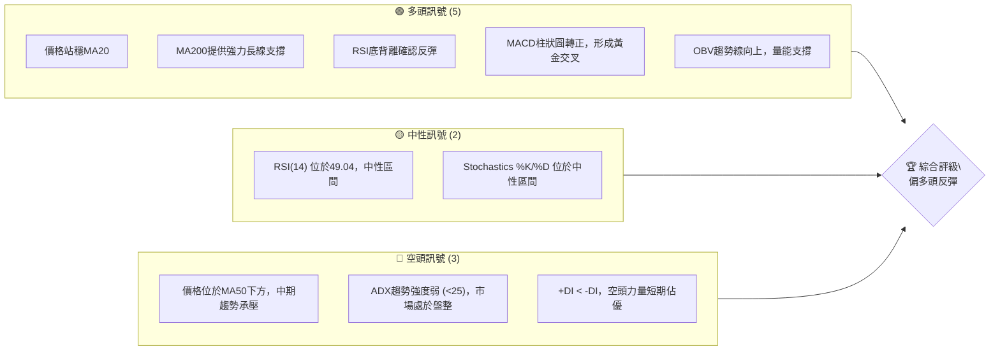

### 📊 核心指標速覽表

| 指標類別 | 指標名稱 | 當前數值 | 訊號 | 解讀 |
|----------|----------|----------|------|------|
| **價格** | 當前價格 | $30.86 | 🟡 | 位於52週區間中上部，近期從低點反彈 |
| **均線** | MA20 | $30.14 | 🟢 | 價格位於MA20上方，短期偏多 |
| **均線** | MA50 | $36.96 | 🔴 | 價格位於MA50下方，中期偏空 |
| **均線** | MA200 | $24.90 | 🟢 | 價格位於MA200上方，長期偏多 |
| **動能** | RSI(14) | 49.04 | 🟡 | 位於中性區間，擺脫超賣，動能回升 |
| **動能** | MACD | -2.064 | 🟢 | MACD線向上穿越Signal線，柱狀圖轉正 |
| **趨勢** | ADX(14) | 24.94 | 🔴 | 趨勢強度弱，市場處於盤整或趨勢轉換初期 |
| **波動** | ATR(14) | $2.66 | 🟡 | 相對於股價 ($30.86) 波動性中等偏高 (8.62%) |
| **成交量** | 量比(20日) | 0.57x | 🔴 | 當前成交量顯著低於20日均量，反彈量能不足 |

### 🏆 技術評分卡

PL的技術面目前呈現出短期反彈的跡象，但整體趨勢強度尚未確立，中期阻力仍存。動能指標表現積極，但成交量未能有效配合，為反彈蒙上陰影。

╔════════════════════════════════════════════════════════════════════╗
║                          技術評分卡 — PL (2026-07-06)                  ║
╠════════════════════════════════════════════════════════════════════╣
║ 趨勢強度      ████████░░░░░░░░░░░░  40/100  🟡 (ADX顯示弱趨勢，但多時框有支撐) ║
║ 動能指標      ██████████████░░░░░░  70/100  🟢 (RSI底背離，MACD金叉，動能轉強)   ║
║ 支撐穩定度    ████████████████░░░░  80/100  🟢 (MA20/MA200提供堅實支撐)         ║
║ 成交量配合    ████░░░░░░░░░░░░░░░░  20/100  🔴 (近期反彈量能不足，低於均量)     ║
║ 形態完整度    ████████░░░░░░░░░░░░  40/100  🟡 (近期有反彈跡象，但未形成明確反轉形態) ║
║ 均線排列      ████████░░░░░░░░░░░░  40/100  🟡 (短期多頭，中期空頭，長期多頭，混合排列) ║
╠════════════════════════════════════════════════════════════════════╣
║ 綜合評分      ██████████░░░░░░░░░░  55/100  🟡 偏多頭反彈，需觀察量能配合與趨勢確認 ║
╚════════════════════════════════════════════════════════════════════╝

---

## 2. 趨勢分析

### 🌐 多時框趨勢分析

PL 的多時框架趨勢呈現複雜的結構，長期仍保持上升趨勢，但中期經歷了大幅回調，短期則在築底反彈。這種混合趨勢要求投資者仔細權衡不同時間框架的訊號。

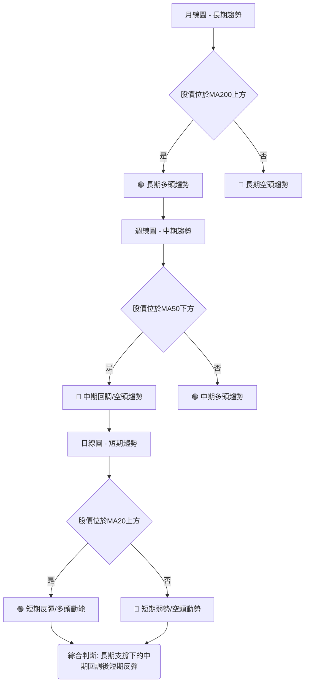
**當前判斷:**
- **長期 (月線)**: 股價 $30.86 遠高於 MA240 ($21.93)，顯示長期上升趨勢依然穩固。🟢
- **中期 (週線)**: 股價 $30.86 位於 MA60 ($36.88) 和 MA120 ($31.78) 下方，表明中期趨勢處於回調或下跌階段。🔴
- **短期 (日線)**: 股價 $30.86 位於 MA20 ($30.14) 上方，顯示短期有反彈動能。🟢

### 📈 長期趨勢 — 12個月走勢圖（Unicode）

PL 在過去12個月經歷了顯著的價格波動，從2025年7月的$6.25一路飆升至2026年5月的$51.14，隨後在2026年6月和7月經歷了大幅回調。當前價格$30.86位於過去一年漲幅的約中位區間。

```
PL 月線走勢圖（過去12個月）
價格軸 ($)
$55 ┤                                  ● (2026-05: $51.14)
$50 ┤
$45 ┤
$40 ┤                   ● (2026-04: $36.97)
$35 ┤                               ● (2026-06: $33.13)
$30 ┤                                   ● (2026-07: $30.86) ← 現在
$25 ┤               ● (2026-01: $24.97)
$20 ┤          ● (2025-12: $19.72)
$15 ┤        ● (2025-09: $12.98)
$10 ┤    ● (2025-08: $7.09)
$ 5 ┤● (2025-07: $6.25)
     └───────────────────────────────────────────────────────────
      25-07 25-08 25-09 25-10 25-11 25-12 26-01 26-02 26-03 26-04 26-05 26-06 26-07

```

**走勢特徵分析表格**：

| 階段 | 時間區間 | 主要走勢 | 漲跌幅 | 關鍵特徵 |
|------|------------|----------|--------|--------------------------------------------------|
| **強勁上漲** | 2025-07 至 2026-05 | 股價從 $6.25 飆升至 $51.14 | +718.24% | 經歷多波段上漲，其中2025年9月和2026年5月漲幅尤為顯著，顯示市場高度看好。 |
| **急速回調** | 2026-05 至 2026-07 | 股價從 $51.14 回調至 $30.86 | -39.65% | 經歷兩次大幅下跌，2026年6月跌幅尤其大，市場獲利了結壓力沉重。 |
| **當前狀態** | 2026-07 | 在低位整理後出現反彈 | N/A | 短期內從 $27.07 的低點反彈，但尚未突破中期阻力，量能有待觀察。 |

### 📊 中期趨勢（週線分析）

中期來看，PL 股價在2026年5月達到歷史高點 $51.14 後，經歷了快速而深度的回調。目前股價 $30.86 仍位於中期移動平均線 MA50 ($36.96) 和 MA60 ($36.88) 之下，顯示中期趨勢依然偏空。然而，近期股價已從 $27.07 的低點開始反彈，並站穩了短期 MA20 ($30.14)，這暗示中期下跌動能可能正在減弱，市場正在尋求新的平衡點。

**近期壓力與支撐示意圖**
```
PL 中期價位分析
════════════════════════════════════════════════════════════════════
$40.00 ║███████████████████████████████████████████████████████████║ 斐波那契50%回調位 ($39.10) / MA50 ($36.96) 強阻力區
$38.00 ║███████████████████████████████████████████████████████████║
$36.00 ║███████████████████████████████████████████████████████████║ 斐波那契38.2%回調位 ($36.26)
$34.00 ║███████████████████████████████████████████████████████████║ 布林上軌 ($34.67)
$32.00 ║███████████████████████████████████████████████████████████║
$30.86 ╠═════════════════════════════════════════════════════════════╣ ◄ 現價
$30.14 ║▓▓▓▓▓▓▓▓▓▓▓▓▓▓▓▓▓▓▓▓▓▓▓▓▓▓▓▓▓▓▓▓▓▓▓▓▓▓▓▓▓▓▓▓▓▓▓▓▓▓▓▓▓▓▓▓▓▓▓▓▓║ MA20 ($30.14) / 布林中軌 ($30.14) 關鍵支撐
$28.00 ║▓▓▓▓▓▓▓▓▓▓▓▓▓▓▓▓▓▓▓▓▓▓▓▓▓▓▓▓▓▓▓▓▓▓▓▓▓▓▓▓▓▓▓▓▓▓▓▓▓▓▓▓▓▓▓▓▓▓▓▓▓║ 近期低點 ($27.07)
$26.00 ║▓▓▓▓▓▓▓▓▓▓▓▓▓▓▓▓▓▓▓▓▓▓▓▓▓▓▓▓▓▓▓▓▓▓▓▓▓▓▓▓▓▓▓▓▓▓▓▓▓▓▓▓▓▓▓▓▓▓▓▓▓║ 布林下軌 ($25.62)
$24.00 ║▓▓▓▓▓▓▓▓▓▓▓▓▓▓▓▓▓▓▓▓▓▓▓▓▓▓▓▓▓▓▓▓▓▓▓▓▓▓▓▓▓▓▓▓▓▓▓▓▓▓▓▓▓▓▓▓▓▓▓▓▓║ MA200 ($24.90) 強支撐
════════════════════════════════════════════════════════════════════
```

### ⚡ 趨勢強度評估（ADX 解讀）

ADX 指標用於衡量趨勢的強度，而非方向。當 ADX 數值低於 25 時，通常表示市場處於弱趨勢或盤整狀態；介於 25-50 之間為強趨勢；高於 50 則為極強趨勢。+DI 和 -DI 則指示趨勢的方向，+DI 在上表示多頭主導，-DI 在上表示空頭主導。

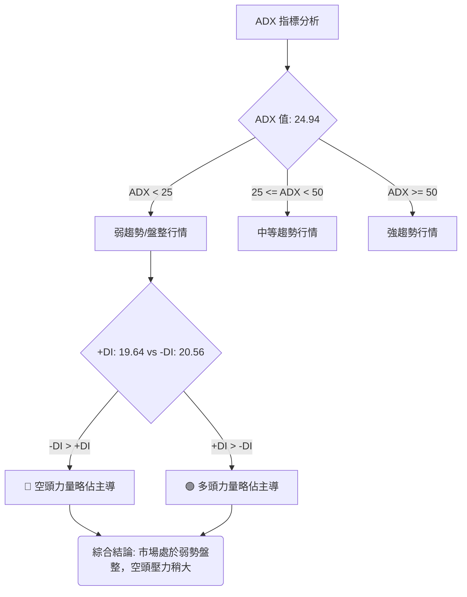

**ADX 強度對照表**

| ADX 數值 | 趨勢強度 | 市場狀態 | 當前評估 |
|----------|----------|----------|----------|
| 0-25     | 弱趨勢   | 盤整/無趨勢 | 🔴 當前 ADX: 24.94 |
| 25-50    | 中等趨勢 | 趨勢行情   |          |
| 50-75    | 強趨勢   | 強勁趨勢   |          |
| 75-100   | 極強趨勢 | 爆發性趨勢 |          |

**解讀:**
PL 的 ADX(14) 為 24.94，略低於 25 的閾值，這明確指出當前市場處於**弱趨勢或盤整行情**。這意味著在經歷了大幅下跌和近期反彈後，市場尚未形成明確的單邊趨勢，多空雙方力量相對均衡，或者說市場正在尋找方向。
此外，+DI 為 19.64，而 -DI 為 20.56，雖然差距不大，但**-DI 略高於 +DI**，表明在當前弱勢盤整中，空頭力量仍然略佔主導地位。這與價格在 MA50 下方，但短期MA20上方的情況相符。投資者應警惕趨勢反轉可能需要更長時間的築底和量能配合。

---

## 3. 圖表形態分析

### 🔍 形態識別系統

PL 近期價格走勢從 $51.14 的高點急速下跌至 $27.07，隨後出現反彈。這種 V 形或U形底部形態的初步跡象，通常需要進一步的確認才能視為有效的反轉形態。目前尚未形成典型的頭肩底、雙底等複雜反轉形態，更多是從超賣區間的技術性反彈。

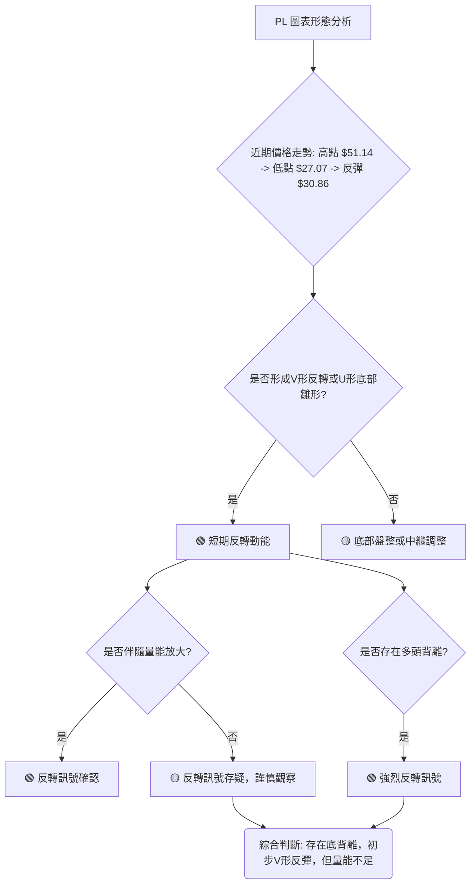
**當前判斷：**
- **V形反轉/U形底部雛形**: 價格從 $27.07 反彈至 $30.86，初步形成 V 形反彈的左側。但要確認 V 形反轉，需突破關鍵阻力並伴隨量能放大。
- **多頭背離**: RSI 和 MACD 均出現底背離，為潛在的底部反轉提供了強烈訊號。

### 🕯️ 重要K線形態分析

分析近20週的週線收盤走勢，可以觀察到以下關鍵K線形態：

| 日期          | 收盤價 | K線形態 (週線) | 解讀                                                 | 訊號 |
|---------------|--------|------------------|------------------------------------------------------|------|
| 2026-05-31    | 51.14  | 長上影線/吞噬頂部 | 價格達到52週高點，但隨後出現大幅回落，顯示上方賣壓沉重。 | 🔴   |
| 2026-06-07    | 32.22  | 長陰線           | 大幅下跌，實體較長，顯示空頭力量強勁。                   | 🔴   |
| 2026-06-14    | 31.15  | 陰線             | 延續下跌，空頭動能持續。                               | 🔴   |
| 2026-06-21    | 28.23  | 陰線             | 繼續下跌，創近期新低，但RSI已進入超賣區間。                | 🔴   |
| 2026-06-28    | 27.07  | 長下影線/錘子線  | 創出更低低點，但收盤價遠高於最低點，暗示下方有承接買盤。   | 🟢   |
| 2026-07-05    | 31.38  | 長陽線/吞噬底部  | 實體較長陽線，幾乎吞噬前一週陰線，顯示多頭強勢反攻。       | 🟢   |
| 2026-07-12    | 30.86  | 陰線/十字星（待確認）| 略微回落，但仍守住反彈成果，市場在關鍵位猶豫。           | 🟡   |

**總結**: 2026年5月底的高點出現賣壓訊號，隨後經歷連續的長陰線下跌。但在6月底，出現了關鍵的**錘子線/長下影線** (2026-06-28 $27.07)，配合RSI底背離，預示著潛在的底部。隨後2026-07-05的**長陽線**確認了短期的反彈動能。當前2026-07-12的K線略有回調，需觀察其最終形態，可能形成十字星或小陰線，表示市場在反彈後進入短期盤整。

### 📉 ASCII 走勢形態示意圖

以下圖表展示了 PL 從近期高點下跌，並在低點形成底背離後反彈的形態。

```
PL 近期走勢形態示意圖 (週線視角)
價格軸 ($)
$55 ┤                     ● (51.14 - 頂部賣壓)
$50 ┤
$45 ┤
$40 ┤
$35 ┤
$30 ┤              ▲(31.38 - 反彈陽線)
$25 ┤          ▲(30.86 - 當前價)
$20 ┤          │
$15 ┤          │
$10 ┤          │
$ 5 ┤          └─●─────────●(28.23)───●(27.07 - 錘子線/底背離低點)
     └───────────────────────────────────────────────────────────
      2026-05-31 2026-06-07 2026-06-14 2026-06-21 2026-06-28 2026-07-05 2026-07-12

RSI 走勢示意圖 (與價格對應)
 85 ┤●(83.2 - 超買)
 75 ┤
 65 ┤
 55 ┤
 45 ┤          ●(49.0 - 當前)
 35 ┤                      ●(33.7)
 25 ┤                  ●(17.2 - 超賣)
 15 ┤
     └───────────────────────────────────────────────────────────
      2026-05-31 2026-06-07 2026-06-14 2026-06-21 2026-06-28 2026-07-05 2026-07-12
      
      價格: 28.23 -> 27.07 (更低低點)
      RSI : 17.2  -> 33.7  (更高低點)  <-- 🟢 顯著底背離訊號
```
圖中清晰顯示，在2026年6月21日和28日，PL的價格創出新低（$28.23 -> $27.07），但RSI卻呈現出更高低點（17.2 -> 33.7），這是一個經典的**底背離 (Bullish Divergence)** 訊號，預示著下跌動能減弱，可能出現反轉。隨後的長陽線確認了反彈。

### 🎯 形態目標價計算

鑑於目前尚未形成明確的傳統反轉形態（如雙底或頭肩底），我們主要基於斐波那契回調位和近期反彈的潛力來設定目標價。如果將近期高點 $51.14 (2026-05-31) 和近期低點 $27.07 (2026-06-28) 視為一個完整的下跌波段，則反彈目標價可以參考斐波那契回調位。

- **下跌波段**：高點 $51.14 (A) 至 低點 $27.07 (B)
- **波段跌幅**：$51.14 - $27.07 = $24.07

**反彈目標價計算**：
1.  **斐波那契 38.2% 回調位**：$27.07 + ($24.07 * 0.382) = $27.07 + $9.19 = **$36.26**
2.  **斐波那契 50% 回調位**：$27.07 + ($24.07 * 0.50) = $27.07 + $12.03 = **$39.10**
3.  **斐波那契 61.8% 回調位**：$27.07 + ($24.07 * 0.618) = $27.07 + $14.87 = **$41.94**

這些斐波那契回調位將作為反彈過程中的潛在阻力位和目標價。其中，38.2% 回調位 $36.26 和 50% 回調位 $39.10 與 MA50 ($36.96) 和分析師平均目標價 ($39.80) 接近，因此具有較高的參考價值。

---

## 4. 支撐與阻力

### 🗺️ 關鍵價位分布圖（Unicode）

PL 的價格目前正處於一個關鍵的轉折點，下方有多重技術支撐，上方則面臨多個阻力。

```
PL 價位結構分布圖
═══════════════════════════════════════════════════════════════════════════════
$51.14 ║████████████████████████████████████████████████████████████████████████║ 歷史高點 / 強阻力 R4
$41.94 ║████████████████████████████████████████████████████████████████████████║ 斐波那契61.8%回調位 R3
$39.80 ║████████████████████████████████████████████████████████████████████████║ 分析師平均目標價 R2
$39.10 ║████████████████████████████████████████████████████████████████████████║ 斐波那契50%回調位
$36.96 ║████████████████████████████████████████████████████████████████████████║ MA50 / MA60 強阻力 R1
$36.26 ║████████████████████████████████████████████████████████████████████████║ 斐波那契38.2%回調位
$34.67 ║████████████████████████████████████████████████████████████████████████║ 布林上軌
$30.86 ╠═══════════════════════════════════════════════════════════════════════╣ ◄ 現價
$30.14 ║▓▓▓▓▓▓▓▓▓▓▓▓▓▓▓▓▓▓▓▓▓▓▓▓▓▓▓▓▓▓▓▓▓▓▓▓▓▓▓▓▓▓▓▓▓▓▓▓▓▓▓▓▓▓▓▓▓▓▓▓▓▓▓▓▓▓▓▓▓▓▓▓▓║ MA20 / 布林中軌 關鍵支撐 S1
$27.07 ║▓▓▓▓▓▓▓▓▓▓▓▓▓▓▓▓▓▓▓▓▓▓▓▓▓▓▓▓▓▓▓▓▓▓▓▓▓▓▓▓▓▓▓▓▓▓▓▓▓▓▓▓▓▓▓▓▓▓▓▓▓▓▓▓▓▓▓▓▓▓▓▓▓║ 近期低點 / 形態支撐 S2
$25.62 ║▓▓▓▓▓▓▓▓▓▓▓▓▓▓▓▓▓▓▓▓▓▓▓▓▓▓▓▓▓▓▓▓▓▓▓▓▓▓▓▓▓▓▓▓▓▓▓▓▓▓▓▓▓▓▓▓▓▓▓▓▓▓▓▓▓▓▓▓▓▓▓▓▓║ 布林下軌
$24.90 ║▓▓▓▓▓▓▓▓▓▓▓▓▓▓▓▓▓▓▓▓▓▓▓▓▓▓▓▓▓▓▓▓▓▓▓▓▓▓▓▓▓▓▓▓▓▓▓▓▓▓▓▓▓▓▓▓▓▓▓▓▓▓▓▓▓▓▓▓▓▓▓▓▓║ MA200 強支撐 S3
$22.00 ║▓▓▓▓▓▓▓▓▓▓▓▓▓▓▓▓▓▓▓▓▓▓▓▓▓▓▓▓▓▓▓▓▓▓▓▓▓▓▓▓▓▓▓▓▓▓▓▓▓▓▓▓▓▓▓▓▓▓▓▓▓▓▓▓▓▓▓▓▓▓▓▓▓║ 分析師最低目標價
$5.87  ║▓▓▓▓▓▓▓▓▓▓▓▓▓▓▓▓▓▓▓▓▓▓▓▓▓▓▓▓▓▓▓▓▓▓▓▓▓▓▓▓▓▓▓▓▓▓▓▓▓▓▓▓▓▓▓▓▓▓▓▓▓▓▓▓▓▓▓▓▓▓▓▓▓║ 52週低點
═══════════════════════════════════════════════════════════════════════════════
```

### 🚧 阻力位分析表

PL 在反彈過程中將面臨多重阻力，特別是中期均線和斐波那契回調位構成的密集阻力區。

| 阻力級別 | 價位 | 形成原因 | 突破難度 | 重要性 |
|----------|------|----------|----------|--------|
| **R1 (關鍵阻力)** | $36.26 - $36.96 | 斐波那契38.2%回調位 ($36.26) 與 MA50 ($36.96) / MA60 ($36.88) 重疊，是中期趨勢的關鍵轉折點。 | 高 | ★★★★★ |
| **R2 (中期阻力)** | $39.10 - $39.80 | 斐波那契50%回調位 ($39.10) 與分析師平均目標價 ($39.80) 接近，心理阻力較大。 | 中高 | ★★★★☆ |
| **R3 (強阻力)** | $41.94 | 斐波那契61.8%回調位，突破此處才能確認強勢反轉。 | 高 | ★★★★☆ |
| **R4 (歷史阻力)** | $51.14 | 52週高點，歷史天價，短期內難以突破。 | 極高 | ★★★☆☆ |
| **次要阻力** | $34.67 | 布林通道上軌，短期反彈的上限。 | 中 | ★★☆☆☆ |

### 🛡️ 支撐位分析表

PL 股價下方有多重支撐，特別是短期均線和近期低點，為反彈提供了基礎。

| 支撐級別 | 價位 | 形成原因 | 守住機率 | 重要性 |
|----------|------|----------|----------|--------|
| **S1 (關鍵支撐)** | $30.14 | MA20 與布林通道中軌重疊，是短期反彈能否持續的關鍵。 | 高 | ★★★★★ |
| **S2 (強支撐)** | $27.07 | 近期低點，且RSI在此形成底背離，具有強烈心理支撐作用。 | 極高 | ★★★★★ |
| **S3 (長期支撐)** | $24.90 | MA200，是長期上升趨勢的最後防線，具有極強的支撐作用。 | 極高 | ★★★★★ |
| **次要支撐** | $25.62 | 布林通道下軌，極端超賣時的價格底部。 | 中 | ★★★☆☆ |

### 📐 斐波那契回調位分析

我們以 2026年5月31日的高點 $51.14 為起點，2026年6月28日的低點 $27.07 為終點，進行斐波那契回調分析，以判斷潛在的反彈目標和阻力位。

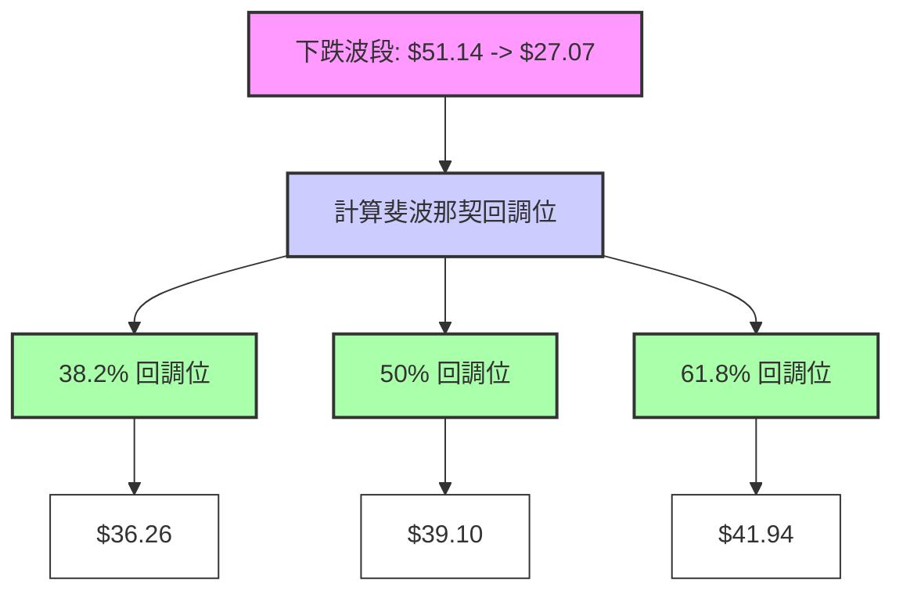

**斐波那契回調位詳情：**
- **38.2% 回調位 ($36.26)**：這是反彈的第一個重要阻力位。如果價格能夠突破並站穩此位，將增強反彈的信心。此價位與中期MA50 ($36.96) 接近，形成強勁阻力區。
- **50% 回調位 ($39.10)**：通常被視為一個重要的心理關口，如果價格能夠達到此位，表明市場對反彈的認可度較高。此價位也接近分析師平均目標價 $39.80。
- **61.8% 回調位 ($41.94)**：被稱為黃金分割位，如果價格能夠突破此位，通常意味著趨勢可能已經反轉，而非僅僅是技術性反彈。

**當前價格 $30.86 位於這些回調位下方，表明仍有上漲空間，但需逐級突破這些阻力。**

---

## 5. 技術指標深度解讀

### 🎛️ 指標訊號總覽

PL 的技術指標目前呈現出短期偏多，中期承壓，長期有支撐的複雜局面。多個指標顯示市場正從近期低點反彈，但反彈的持續性仍需觀察。

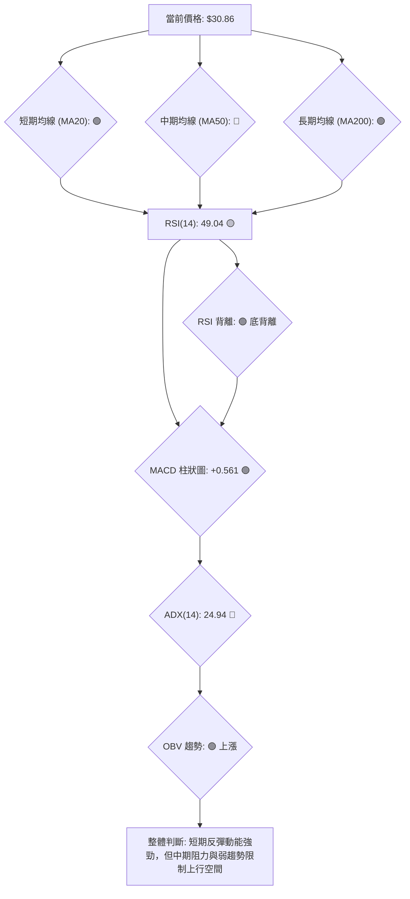

### 📈 移動平均線排列分析

移動平均線 (MA) 是判斷趨勢方向和強度的重要工具。PL 的均線系統目前呈現「混合排列」，顯示市場短期看漲，中期承壓，長期看漲。

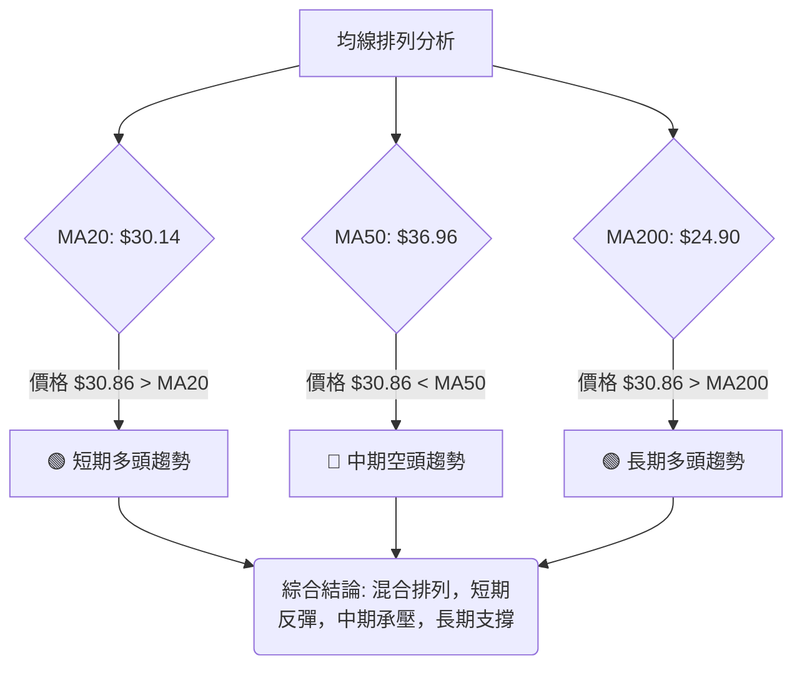

**均線排列狀態詳情：**
- **MA5 ($31.65)**: 價格 $30.86 位於 MA5 下方，顯示超短期有回調壓力。
- **MA10 ($29.54)**: 價格 $30.86 位於 MA10 上方，且 MA10 正在向上，短期動能良好。
- **MA20 ($30.14)**: 價格 $30.86 位於 MA20 上方，MA20 向上，短期趨勢呈現多頭。這是反彈的初步確認。
- **MA50 ($36.96)**: 價格 $30.86 位於 MA50 下方，MA50 仍在向下，中期趨勢依然偏空。MA50 將是反彈的重要阻力。
- **MA200 ($24.90)**: 價格 $30.86 遠高於 MA200，MA200 向上，長期趨勢強勁。MA200 提供堅實的長期支撐。

**綜合判斷**：股價短期內成功站上 MA20，是積極訊號，但仍需突破 MA50 才能確立中期反轉。MA200 的強勁支撐為長期多頭趨勢提供了保障。

### 📉 RSI(14) 分析

RSI (Relative Strength Index) 用於衡量價格變動的強度，判斷超買或超賣狀態。

- **RSI 數值**: 當前 RSI(14) 為 **49.04**。
- **超買超賣區間**:
    - RSI > 70: 超買區 (可能回調)
    - RSI < 30: 超賣區 (可能反彈)
    - 30-70: 中性區間
- **進度條展示**:
    RSI 強度：██████████░░░░░░░░░░░░ 49.04% 🟡 (中性區間，動能回升)

**超買超賣區間分析**：
當前 RSI 49.04 位於中性區間，這表示股價既不處於超買也不處於超賣狀態。重要的是，RSI 值從 2026年6月21日的 17.2 和 2026年6月28日的 33.7 的低位快速回升，顯示買盤動能正在積聚，賣壓有所緩解。這種從超賣區的回升是築底反彈的典型表現。

**背離判斷 (頂背離/底背離)**：
根據提供數據，RSI 存在明確的**底背離 (Bullish Divergence)** 訊號：
- **價格走勢**: 2026年6月21日收盤價 $28.23，2026年6月28日收盤價 $27.07。價格創出**更低低點**。
- **RSI 走勢**: 2026年6月21日 RSI 17.2，2026年6月28日 RSI 33.7。RSI 卻創出**更高低點**。
這種價格創新低而 RSI 未創新低的現象，是強烈的多頭反轉訊號，預示著下跌動能已經衰竭，買盤力量正在積累。此訊號與隨後的價格反彈相符，具有較高的可靠性。🟢

### 📊 MACD(12/26/9) 訊號解讀

MACD (Moving Average Convergence Divergence) 指標用於識別趨勢的動能、方向和潛在反轉點。

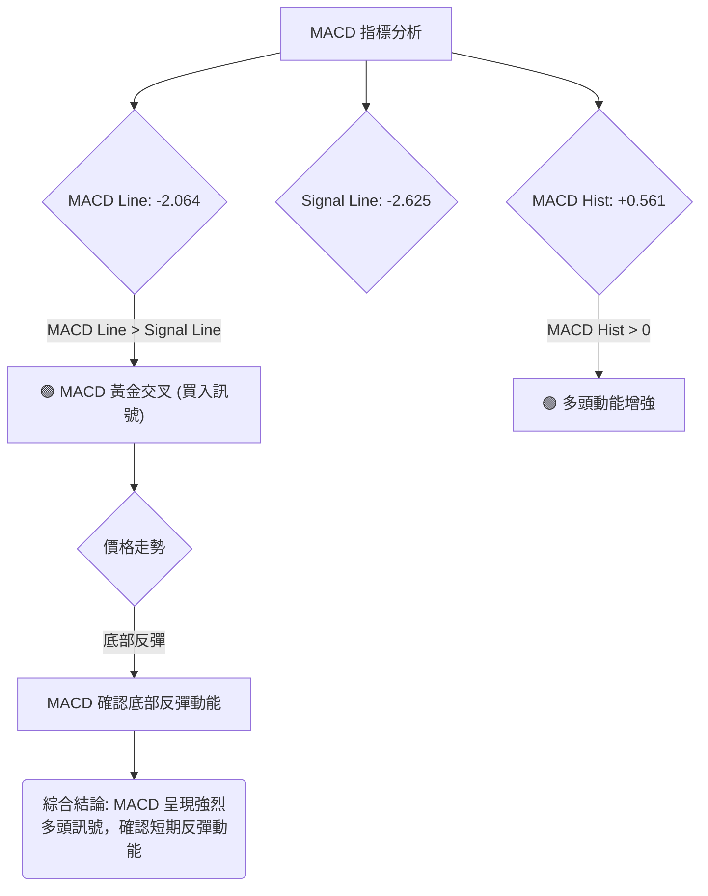

**MACD 訊號詳情：**
- **MACD 線 (-2.064)**: 從負值區間向上攀升。
- **Signal 線 (-2.625)**: 仍在負值區間，但增速慢於 MACD 線。
- **MACD Histogram (+0.561)**: 從負值轉為正值，且持續放大。

**解讀：**
1.  **黃金交叉 (Bullish Crossover)**: MACD 線 (-2.064) 已經向上穿越 Signal 線 (-2.625)，形成黃金交叉。這是一個經典的買入訊號，表明短期動能轉強，多頭力量開始佔據優勢。🟢
2.  **MACD 柱狀圖轉正**: 柱狀圖從負值轉為正值 (+0.561)，並持續放大，這進一步確認了多頭動能的增強。🟢
3.  **底背離確認**: 儘管數據未直接提供 MACD 背離，但通常 RSI 底背離會伴隨 MACD 柱狀圖在價格創新低時出現更高低點（或底部收縮）。從週線數據來看，2026-06-21 MACD Hist 為 -1.555，2026-06-28 MACD Hist 為 -0.677。在價格創出新低時 (28.23 -> 27.07)，MACD 柱狀圖的負值卻在收窄 (從更負到不那麼負)，這也構成了一個**MACD 底背離**訊號，與 RSI 相互確認了底部反彈的可靠性。🟢

**綜合來看**，MACD 指標發出了強烈的多頭訊號，與 RSI 的底背離相互印證，表明 PL 股價短期內的反彈動能非常明確。

### 📦 布林通道分析

布林通道 (Bollinger Bands) 用於衡量價格的波動範圍，並判斷價格是否處於相對高位或低位。

```
PL 布林通道示意圖
════════════════════════════════════════════════════════════════════════
$34.67 ║████████████████████████████████████████████████████████████████████████║ 上軌 (Upper Band)
       ║                                                                      ║
$30.86 ╠═══════════════════════════════════════════════════════════════════════╣ ◄ 現價
$30.14 ║▓▓▓▓▓▓▓▓▓▓▓▓▓▓▓▓▓▓▓▓▓▓▓▓▓▓▓▓▓▓▓▓▓▓▓▓▓▓▓▓▓▓▓▓▓▓▓▓▓▓▓▓▓▓▓▓▓▓▓▓▓▓▓▓▓▓▓▓▓▓▓▓▓║ 中軌 (MA20)
       ║                                                                      ║
$25.62 ║▓▓▓▓▓▓▓▓▓▓▓▓▓▓▓▓▓▓▓▓▓▓▓▓▓▓▓▓▓▓▓▓▓▓▓▓▓▓▓▓▓▓▓▓▓▓▓▓▓▓▓▓▓▓▓▓▓▓▓▓▓▓▓▓▓▓▓▓▓▓▓▓▓║ 下軌 (Lower Band)
════════════════════════════════════════════════════════════════════════
```

**布林通道詳情：**
- **上軌**: $34.67
- **中軌 (MA20)**: $30.14
- **下軌**: $25.62
- **%B**: 0.58 (0=下軌, 0.5=中軌, 1=上軌)

**解讀：**
1.  **價格位於中軌上方**: 當前價格 $30.86 位於布林通道中軌 $30.14 (即 MA20) 上方，這是一個看漲訊號。它表明短期趨勢偏向多頭。🟢
2.  **%B 數值**: %B 為 0.58，表示價格位於中軌和上軌之間，且略偏向上軌。這進一步確認了短期反彈的動能。🟢
3.  **通道寬度**: ATR(14) 為 $2.66，佔股價的 8.62%，顯示通道寬度相對較大，波動性中等偏高。這為短期交易提供了較大的價格空間。
4.  **潛在阻力**: 上軌 $34.67 將是短期反彈的一個阻力位。如果價格能夠突破上軌，可能預示著更強勁的上漲。

**綜合來看**，布林通道顯示 PL 股價短期內處於反彈通道，並已站穩中軌，為進一步上漲創造了條件。

### 💹 成交量分析（量價配合度）

成交量是價格走勢的燃料，其變化對於確認趨勢至關重要。

- **最新成交量**: 10,214,620
- **20日均量**: 17,817,056
- **50日均量**: 13,568,052
- **量比 (最新/20日均量)**: 0.57x
- **OBV 趨勢**: OBV > MA → 量能支撐上漲

**解讀：**
1.  **最新成交量低於均量**: 當前成交量 10,214,620 顯著低於 20日均量 17,817,056 (量比 0.57x) 和 50日均量 13,568,052。這表明近期從低點的反彈，**量能配合不足**。在一個健康的上升趨勢中，價格上漲通常應該伴隨著成交量的放大。目前量能不足可能意味著反彈缺乏堅實的基礎，或者仍處於築底階段，主力資金尚未完全進場。🔴
2.  **OBV 趨勢積極**: 然而，OBV (On-Balance Volume) 趨勢顯示 OBV 線高於其移動平均線，這是一個積極訊號，表明累積買盤壓力正在增加，量能正在支撐價格上漲。OBV 是一個累積指標，可能比單日成交量更能反映資金流向。🟢
3.  **矛盾分析**: 最新成交量低於均量與 OBV 趨勢積極之間存在一定矛盾。這可能意味著：
    - 短期反彈是技術性修復，尚未吸引大量追漲資金。
    - 主力資金可能在低位吸籌，但尚未大舉拉升，因此日均量仍在下降。
    - OBV 的累積性質可能反映了在下跌過程中，賣盤壓力減輕，而買盤在低位逐漸進入。

**綜合來看**，儘管 OBV 顯示出積極的累積買盤動能，但當前反彈的成交量未能有效放大，這是需要警惕的因素。健康的趨勢反轉需要量價齊升的確認。如果價格持續上漲但成交量未能有效放大，反彈的持續性將受到質疑。

---

## 6. 動能與波動率

### ⚡ 動能評估四象限

動能評估四象限分析結合了股票的「動能強度」和「波動率」兩個關鍵維度，幫助我們理解當前的市場環境和潛在的交易機會。

| 象限 | 動能 | 波動 | 當前狀態 (PL) | 評估                                                         |
|------|------|------|----------------|--------------------------------------------------------------|
| Q1   | 強   | 低   | 否             | **最佳機會**：強勁上漲且波動小，適合趨勢追蹤。                 |
| Q2   | 弱   | 低   | 否             | **謹慎觀望**：市場缺乏方向，波動小，不適合趨勢交易。           |
| Q3   | 強   | 高   | **✓**          | **高風險高收益**：價格變動劇烈，反彈動能強，但風險也高。     |
| Q4   | 弱   | 高   | 否             | **避免進場**：市場混亂，方向不明且波動大，風險極高。           |

**當前 PL 的位置分析：**
- **動能強度**：RSI 從超賣區快速回升，MACD 形成黃金交叉且柱狀圖轉正，RSI/MACD 均有底背離。這些都顯示 PL 的**短期動能正在轉強**，從弱勢中恢復。因此，在動能維度上，我們將其評估為「強」。
- **波動率**：ATR(14) 為 $2.66，佔當前價格 $30.86 的 8.62%。這個百分比相對較高，表明 PL 具有**較高的波動性**。在經歷大幅下跌和反彈後，市場情緒不穩定，價格波動加劇是正常的。

**綜合結論**：PL 目前處於「**強動能，高波動**」的 Q3 象限。這意味著該股票雖然有強勁的反彈動能，但價格波動也相對劇烈。對於追求高收益的交易者來說，這提供了潛在的機會，但同時也伴隨著較高的風險。投資者應設定嚴格的止損，並謹慎管理倉位。

### 📊 ATR 波動率分析

ATR (Average True Range) 是衡量資產價格波動性的一個指標，常用於設定止損和目標價。

- **ATR(14)**: $2.66
- **當前收盤價**: $30.86
- **ATR 佔比**: $2.66 / $30.86 = 8.62%

**解讀：**
1.  **波動性評估**: 8.62% 的 ATR 佔比表明 PL 是一隻波動性相對較高的股票。特別是在近期經歷了大幅下跌和反彈之後，其每日價格波動幅度較大，這與其「強動能，高波動」的象限位置相符。
2.  **止損距離建議**: ATR 可以作為動態止損的參考。一般建議將止損設定在 1.5 倍至 3 倍 ATR 的距離。
    - **1.5 倍 ATR 止損**: $1.5 \times $2.66 = $3.99。若從當前價格 $30.86 計算，止損位約為 $30.86 - $3.99 = **$26.87**。
    - **2 倍 ATR 止損**: $2 \times $2.66 = $5.32。若從當前價格 $30.86 計算，止損位約為 $30.86 - $5.32 = **$25.54**。
    這些止損位與近期低點 $27.07 和布林下軌 $25.62 吻合，提供了合理的風險控制參考。

**綜合來看**，高波動性意味著價格在短期內可能出現大幅波動，投資者應充分意識到這一風險，並利用 ATR 指標合理設置止損，以保護資本。

### 📐 Beta 與市場相關性

報告數據未直接提供 PL 的 Beta 值。然而，根據其行業分類 (Industrials, Aerospace & Defense)，我們可以對其 Beta 值進行合理推斷。

- **行業特性**: 航空航天與國防工業通常被認為是週期性行業，其表現與宏觀經濟景氣度高度相關。在經濟擴張時期，訂單和收入會增加；在經濟衰退時期則可能受到影響。這類公司通常具有中等到高 Beta 值。
- **成長型公司特徵**: Planet Labs PBC 是一家提供地球觀測數據的新興科技公司，雖然歸類於傳統工業板塊，但其業務模式和成長潛力更接近科技股。成長型公司通常具有較高的 Beta 值，因為它們對市場情緒和未來增長預期更敏感。
- **近期股價走勢**: PL 在過去一年從 $6.25 飆升至 $51.14，隨後又大幅回調，顯示其股價波動性遠超大盤。這種劇烈波動也暗示其 Beta 值可能較高。

**推斷與結論**:
基於以上分析，我們可以合理推斷 PL 的 Beta 值可能**高於市場平均水平 (Beta > 1.0)**。這意味著當大盤上漲時，PL 的漲幅可能更大；而當大盤下跌時，PL 的跌幅也可能更深。投資者在配置 PL 股票時，應考慮其相對較高的市場風險和波動性。在當前市場環境下，如果大盤趨勢不明朗或偏空，PL 將面臨更大的下行壓力；反之，若大盤企穩反彈，PL 的上漲潛力也可能更為顯著。

---

## 7. 多時框架總結

多時框架分析有助於從不同時間維度全面評估股票的技術面狀態，避免單一時間框架的片面性。

### 📋 時框架評分表

| 時框架 | 趨勢方向 | 動能 | 均線排列 | 形態 | 綜合評分 (1-10) | 建議 |
|--------|----------|------|----------|------|-----------------|------|
| **短期 (日線)** | 🟢 上漲 | 🟢 強勁 | 🟢 多頭 | 🟢 反彈中 | 8               | 買入 |
| **中期 (週線)** | 🔴 回調 | 🟡 中性 | 🔴 空頭 | 🟡 築底中 | 5               | 觀望 |
| **長期 (月線)** | 🟢 上漲 | 🟢 強勁 | 🟢 多頭 | 🟢 上升趨勢 | 7               | 持有 |

**評分理由：**
- **短期**: 價格站上MA20，RSI/MACD底背離且MACD金叉，動能強勁，顯示明確反彈訊號。
- **中期**: 價格仍受MA50壓制，ADX顯示弱勢盤整，儘管有反彈，但尚未確認中期趨勢反轉。
- **長期**: 價格遠高於MA200，MA200向上，長期上升趨勢穩固，但近期大幅回調影響了部分信心。

### 🔲 綜合訊號矩陣

PL 的多時框架訊號呈現出短期樂觀，中期謹慎，長期看好的複雜結構。

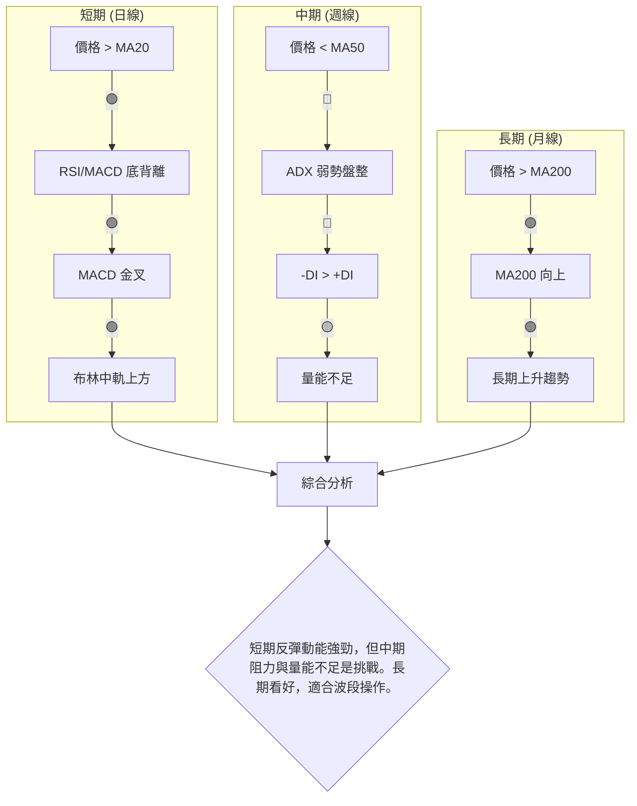

**一致性分析：**
- **短期多頭訊號高度一致**：價格、動能指標、布林通道均顯示短期反彈趨勢。RSI和MACD的底背離為反彈提供了堅實的技術基礎。
- **中期與長期訊號存在衝突**：長期趨勢依然強勁，但中期趨勢目前仍處於回調或弱勢盤整中。價格未能突破MA50是中期趨勢反轉的關鍵障礙。
- **量能不足是主要隱憂**：儘管多頭動能指標積極，但成交量未能有效放大，這可能限制反彈的高度和持續性。

**總結**：PL 目前處於一個從中期回調中尋求短期反彈的階段。底背離和 MACD 黃金交叉是強烈的短期買入訊號，但中期阻力密集，且趨勢強度偏弱，要求投資者保持警惕。最佳策略可能是利用短期反彈進行波段操作，並密切關注量能的變化以及對中期阻力位的突破情況。

---

## 8. 交易策略建議

基於上述詳盡的技術分析，PL 股票目前呈現出短期反彈動能強勁但中期阻力重重的局面。RSI和MACD的底背離提供了較為可靠的短期買入訊號，但量能不足和ADX指示的弱趨勢需謹慎對待。

### 🗺️ 策略決策流程圖

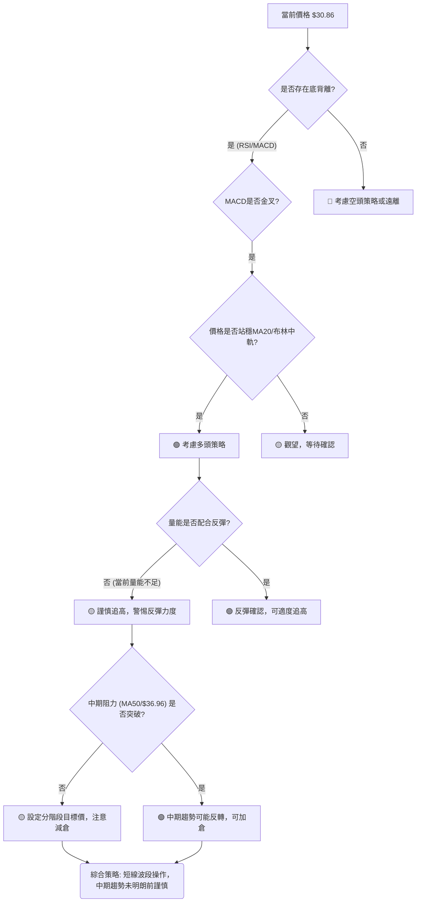

### 🟢 多頭策略詳情

基於RSI和MACD的底背離、MACD黃金交叉以及價格站穩MA20，PL短期存在較好的反彈機會。

| 策略要素 | 策略 A (積極反彈追蹤) | 策略 B (回調買入) |
|----------|------------------------|--------------------|
| 進場條件 | 價格突破 $31.50 (近期小高點) 並伴隨量能放大。 | 價格回調至 MA20 ($30.14) 附近獲得支撐，或在 $28.50-$29.50 區間。 |
| 進場價格 | **$31.50**             | **$30.14 - $30.50** |
| 目標價 T1 | **$36.26** (斐波那契38.2%回調位 / MA50附近) | **$36.26** (斐波那契38.2%回調位 / MA50附近) |
| 目標價 T2 | **$39.10** (斐波那契50%回調位 / 分析師平均目標價附近) | **$39.10** (斐波那契50%回調位 / 分析師平均目標價附近) |
| 止損價格 | **$29.50** (位於MA20下方，保護反彈成果) | **$27.00** (位於近期低點 $27.07 之下，避免形態破壞) |
| 風險報酬比 | T1: (36.26-31.50) / (31.50-29.50) = 2.38:1<br>T2: (39.10-31.50) / (31.50-29.50) = 3.80:1 | T1: (36.26-30.14) / (30.14-27.00) = 1.96:1<br>T2: (39.10-30.14) / (30.14-27.00) = 2.84:1 |
| 成功機率 | 60% (需量能配合)       | 70% (有MA20/近期低點支撐) |
| 建議倉位 | 20%-30% (中等倉位)     | 30%-40% (中高倉位) |

**策略 A 解讀**: 適合追求短期突破的投資者。在確認突破後進場，利用動能快速獲利。但需注意量能是否同步放大，否則突破可能為假。
**策略 B 解讀**: 適合穩健型投資者。在價格回調至關鍵支撐位時進場，風險較小，但可能錯過部分反彈。止損設定在近期低點下方，保護資金。

### 🔴 空頭策略詳情

儘管短期看漲訊號強勁，但若反彈失敗並跌破關鍵支撐，則空頭策略將變得可行。

| 策略要素 | 策略 C (反彈失敗做空) |
|----------|------------------------|
| 進場條件 | 價格跌破 $27.07 (近期低點) 並伴隨量能放大。 |
| 進場價格 | **$27.00**             |
| 目標價 T1 | **$24.90** (MA200)     |
| 目標價 T2 | **$22.00** (分析師最低目標價) |
| 止損價格 | **$28.50** (位於 $27.07 和 MA20 之間，保護空頭倉位) |
| 風險報酬比 | T1: (27.00-24.90) / (28.50-27.00) = 1.40:1<br>T2: (27.00-22.00) / (28.50-27.00) = 3.33:1 |
| 成功機率 | 40% (目前多頭動能強，需等待破位確認) |
| 建議倉位 | 10%-20% (低倉位)       |

**策略 C 解讀**: 這是防禦性策略，只有在多頭反彈徹底失敗，並跌破關鍵支撐時才考慮。由於當前有強烈的底背離訊號，此策略的成功機率較低，但若市場情緒急轉直下，則可考慮。

### ⭐ 整體訊號強度評星

```
做多訊號強度：★★★★☆  (4/5星)
    理由：RSI/MACD底背離、MACD金叉、價格站穩MA20，短期動能強勁。
做空訊號強度：★☆☆☆☆  (1/5星)
    理由：短期多頭動能佔優，目前不具備做空條件，除非反彈失敗。
整體可信度：  ★★★☆☆  (3/5星)
    理由：短期訊號明確，但中期阻力與量能不足為反彈高度帶來不確定性。
```

---

## 9. 風險提示與監控

PL 股票在經歷大幅回調後出現反彈，但市場仍存在不確定性。投資者必須對潛在風險保持警惕，並實施嚴格的風險管理。

### ✅ 關鍵監控指標 Checklist

以下是交易 PL 股票時需要密切關注的關鍵技術指標清單，以動態調整策略：

╔══════════════════════════════════════════════════════════════════╗
║                    PL 關鍵監控指標 Checklist                       ║
╠══════════════════════════════════════════════════════════════════╣
║ [ ] 價格是否能站穩 MA20 ($30.14)？                               ║
║ [ ] 價格能否有效突破斐波那契 38.2% 回調位 ($36.26) 和 MA50 ($36.96)？║
║ [ ] 成交量是否能隨價格上漲而放大？ (量比 > 1.0)                    ║
║ [ ] RSI 是否能突破 50-60 區間，並向超買區運行？                     ║
║ [ ] MACD 柱狀圖是否持續放大，且 MACD 線與 Signal 線保持向上發散？  ║
║ [ ] ADX 是否能從弱勢區突破 25，並伴隨 +DI 向上突破 -DI？            ║
║ [ ] 股價是否跌破近期低點 $27.07？ (止損觸發點)                    ║
║ [ ] 外部市場環境 (大盤指數) 是否穩定或偏多？                       ║
╚══════════════════════════════════════════════════════════════════╝

### ⚠️ 風險場景分析

PL 的未來走勢可能受到多種因素影響。我們分析三種情境：

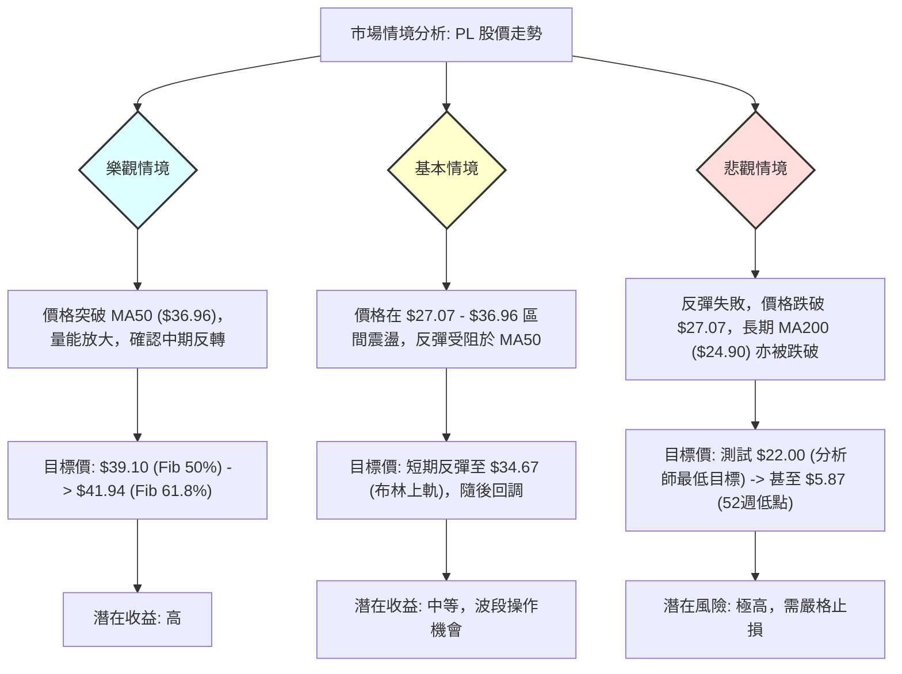

### 🛡️ 風險管理重要提醒

1.  **嚴格止損**：鑑於 PL 波動性較高 (ATR 8.62%)，務必設定並嚴格執行止損點。對於多頭策略，建議將止損設定在 $27.00 或 $29.50，以保護資本。
2.  **倉位管理**：避免重倉單一股票，尤其是在趨勢尚未完全確立的盤整階段。建議採用分批建倉策略，在確認突破或回調支撐時逐步增加倉位。
3.  **關注量能**：當前反彈量能不足是主要隱憂。若價格上漲缺乏成交量配合，則反彈可能難以持續。密切關注每日成交量與均量的對比。
4.  **多指標確認**：不要僅憑單一指標做出決策。RSI和MACD的積極訊號應與價格行為、均線排列和成交量等其他指標相互確認。
5.  **警惕假突破/假跌破**：在盤整區間，價格容易出現假突破或假跌破。在關鍵阻力位附近，等待價格有效站穩或跌破，並確認量能配合，再採取行動。
6.  **宏觀環境**：作為週期性行業中的成長型公司，PL 容易受到宏觀經濟和市場情緒的影響。關注整體市場走勢，特別是科技股和成長股的表現。
7.  **新聞事件**：公司營運、財報、行業政策等基本面消息可能導致股價劇烈波動。儘管本報告為技術分析，但仍需留意相關新聞事件。

---

## 📋 報告總結

```
PL 技術分析報告總結
════════════════════════════════════════════════════════════════════
報告日期：2026-07-06
當前價格：$30.86
分析評級：⚖️ 偏多頭反彈 (短期動能強勁，中期承壓，長期有支撐)

關鍵結論：
├─ 長期趨勢：🟢 上升趨勢穩固，MA200提供堅實支撐。
├─ 中期趨勢：🔴 處於回調或弱勢盤整，MA50為主要阻力。
├─ 短期趨勢：🟢 具備強勁反彈動能，RSI/MACD底背離與金叉確認。
├─ 關鍵支撐：$30.14 (MA20/布林中軌)，其次為 $27.07 (近期低點)。
├─ 關鍵阻力：$36.26 (斐波那契38.2%回調位)，其次為 $36.96 (MA50)。
└─ 分析師目標：平均目標價 $39.80，最低 $22.00，最高 $53.00。

最優策略組合：
1. 🥇 最佳機會：**短期波段多頭** - 利用底背離和MACD金叉，在 $30.14-$30.50 區間回調買入，目標價 $36.26，止損 $27.00。風險報酬比約 2:1。
2. 🥈 次選機會：**突破追蹤多頭** - 若價格能放量突破 $31.50，可追蹤至 $36.26 或 $39.10，止損 $29.50。需密切觀察量能。
3. 🥉 保守選擇：**觀望** - 等待價格能夠有效突破中期阻力 (如MA50 $36.96) 並伴隨量能放大，確認中期趨勢反轉後再考慮進場。
════════════════════════════════════════════════════════════════════
```

---

> ⚠️ **免責聲明**：本報告為 AI 自動生成之技術分析，所有數據及估算均基於提供的歷史價格資訊。本報告**僅供研究與學術參考**，**不構成任何投資建議**。投資有風險，入市需謹慎。

---

*報告生成時間：2026-07-06 ｜ 數據來源：提供數據 ｜ 分析框架：多時框技術分析*