<details>
<summary>📊 靜態圖表 (點擊展開)</summary>
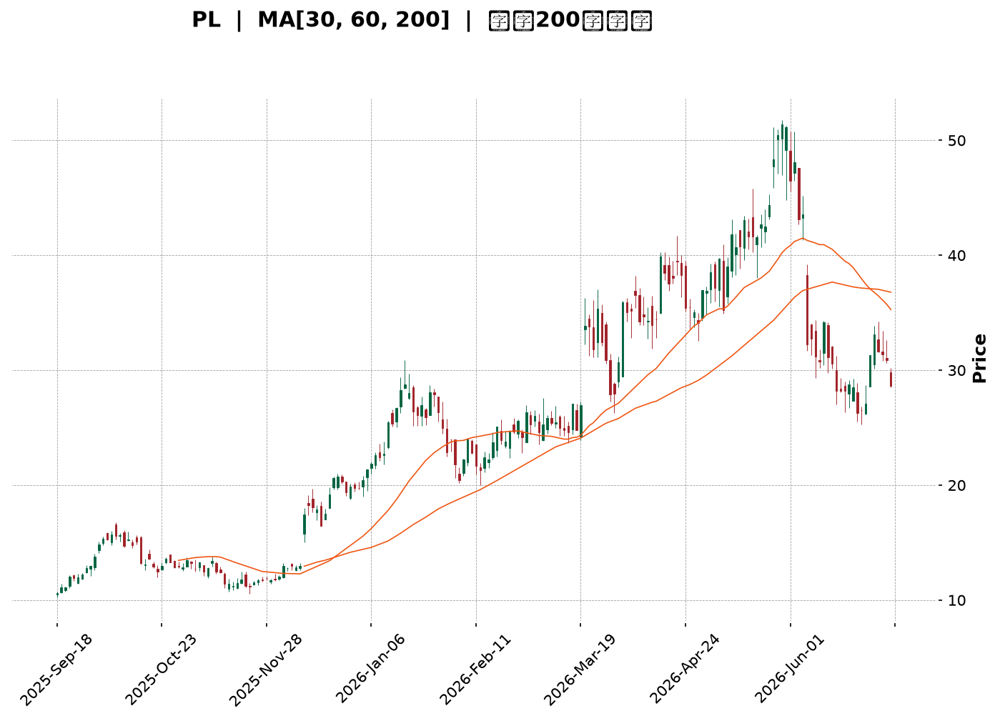
</details>

<html>
<head><meta charset="utf-8" /></head>
<body>
    <div style="height:500px; width:100%;">                        <script>window.PlotlyConfig = {MathJaxConfig: 'local'};</script>
        <script charset="utf-8" src="https://cdn.plot.ly/plotly-3.6.0.min.js" integrity="sha256-QaOVwtVY0T02VaHrr6pnoHLCwayMJp4O5n4YyaE3rJk=" crossorigin="anonymous"></script>                <div id="candlestick-chart" class="plotly-graph-div" style="height:100%; width:100%;"></div>            <script>                window.PLOTLYENV=window.PLOTLYENV || {};                                if (document.getElementById("candlestick-chart")) {                    Plotly.newPlot(                        "candlestick-chart",                        [{"close":{"dtype":"f8","bdata":"AAAA4FE4JUAAAADgUTgmQAAAAOBROCZAAAAAoJkZKEAAAAAAKdwnQAAAACCF6ydAAAAAYGZmKEAAAADgepQpQAAAAIDC9SlAAAAAgD2KK0AAAABAM7MtQAAAAGC4ni5AAAAAQOF6LkAAAAAAKVwvQAAAAEAzMy9AAAAAgOtRL0AAAABgZmYtQAAAAAAAgC5AAAAAIFyPLUAAAACAFC4uQAAAAIDCdSpAAAAA4FE4KkAAAABguB4rQAAAAIDr0SlAAAAAAAAAKUAAAABgZuYpQAAAAOBROCtAAAAAYLieKkAAAACAFK4pQAAAAMDMzClAAAAA4FG4KUAAAABgZuYqQAAAAKBHYSpAAAAAYGZmKUAAAAAAAIAqQAAAACCF6yhAAAAAYLieKUAAAAAgrscqQAAAAOCj8ChAAAAAoEfhKEAAAACA69EmQAAAAMDMzCZAAAAAIIVrJkAAAABgZuYmQAAAAOB6lCdAAAAAgMJ1JkAAAACA61EmQAAAAOB6FCdAAAAAgMJ1J0AAAADgo3AnQAAAAMDMzCdAAAAAYGZmJ0AAAACAPYonQAAAAMAeBShAAAAAoEfhKUAAAACAPYopQAAAAGBm5ilAAAAAgBSuKUAAAACgR+EpQAAAAOBReDFAAAAAoHA9MkAAAADAzAwyQAAAAKBH4TFAAAAA4FF4MEAAAACgcH0xQAAAAIAULjNAAAAAoJmZNEAAAABA4bo0QAAAAIDrUTRAAAAAAClcM0AAAABguN4zQAAAAKBwvTNAAAAA4FG4M0AAAADA9Wg0QAAAAADXYzVAAAAAQArXNUAAAAAAKZw2QAAAAOCjcDZAAAAAgMK1NkAAAADgo3A5QAAAAIDrUTlAAAAAQOG6OkAAAAAgrkc8QAAAACCuxzxAAAAAAAAAPEAAAACgR2E6QAAAACBcDzpAAAAA4KPwOkAAAABguN45QAAAAIDrETxAAAAAoEfhO0AAAACgmVk6QAAAAOBR+DhAAAAAoJnZNkAAAABAM\u002fM3QAAAAMAexTVAAAAAgBRuNEAAAABgj0I2QAAAAMAeBThAAAAAgD3KNkAAAABgZqY1QAAAAMDMTDVAAAAAIIVrNkAAAACAwjU2QAAAAKBwvTdAAAAAACkcOUAAAABgZuY3QAAAACCuxzdAAAAAgMK1OEAAAACgR6E4QAAAAKCZmTlAAAAAANcjOEAAAAAAKVw6QAAAAMDMTDlAAAAAAAAAOkAAAABACpc4QAAAACCuRzlAAAAAgOvROUAAAABgZmY5QAAAAOCjcDlAAAAA4FH4OEAAAACAPco4QAAAAKCZmThAAAAA4HoUO0AAAAAgXM84QAAAAIDC9TpAAAAAgD3qQEAAAADA9ehAQAAAAOB61D9AAAAAIFyvQUAAAABAMzNAQAAAAAAp3D5AAAAAANfjO0AAAABAM\u002fM7QAAAAIDCtT5AAAAA4KPwQUAAAABgj4JBQAAAAIDClUFAAAAAYGZGQkAAAACgcB1BQAAAAIDCVUFAAAAAwPUoQUAAAABACvdAQAAAAOB6NEFAAAAAgOvxQ0AAAACgcD1DQAAAAAAAwEJAAAAAANcDQ0AAAAAAKbxDQAAAAMAeJUNAAAAA4FG4QUAAAACgmblBQAAAAADXg0FAAAAAgD0KQUAAAAAAKXxCQAAAAEAzc0JAAAAAwB5FQ0AAAADgo5BCQAAAAOBR2ENAAAAAYLieQUAAAADAHoVDQAAAACCF60RAAAAAQApXREAAAABguF5EQAAAAMAehUVAAAAAIFzPREAAAACAFM5EQAAAACCFy0RAAAAA4HpURUAAAACgcD1FQAAAAMDMLEZAAAAAwPUoSEAAAACgcD1JQAAAAEAzs0lAAAAAgOuRSUAAAABA4TpHQAAAACCFC0hAAAAA4KOQRUAAAAAA18NFQAAAAAApHEBAAAAAYLheQEAAAAAghSs\u002fQAAAAOBRuD5AAAAAgMIVQUAAAABgZiY\u002fQAAAAOB6lD5AAAAAgMI1PEAAAADgUTg8QAAAAEDhOjxAAAAAwB7FPEAAAAAgroc8QAAAAMDMTDpAAAAAYI+COkAAAACA6xE7QAAAACCuRz9AAAAA4KOQQEAAAAAAKZw\u002fQAAAAKBHYT9AAAAAACncPkAAAADA9ag8QA=="},"high":{"dtype":"f8","bdata":"AAAAIIVrJUAAAACA69EmQAAAAMDMTCZAAAAAYI9CKEAAAACAwnUoQAAAACBcjyhAAAAAwPWoKEAAAAAAAAAqQAAAAGC4HipAAAAAgD0KLEAAAADAyDYuQAAAAAAAAC9AAAAAIK7HL0AAAABgjwIwQAAAACCuxzBAAAAAoJmZL0AAAADAzAwwQAAAAGBm5i9AAAAAAACALkAAAADgelQvQAAAAEA1Hi9AAAAAwPUoK0AAAACA69EsQAAAAEAIrCpAAAAAoJkZKkAAAAAAKZwqQAAAAIAUbitAAAAAIIXrK0AAAADgo\u002fAqQAAAACCFqypAAAAAYGZmKkAAAACAwnUrQAAAAGCPwipAAAAAgD0KK0AAAADgo7AqQAAAAIA9CipAAAAAYGamKUAAAACgmZkrQAAAAKBwvSpAAAAAwMzMKUAAAACA69EoQAAAAEAzsydAAAAA4FE4J0AAAADAHsUnQAAAAIDC9ShAAAAAAAAAKUAAAAAAAAAnQAAAACBcTydAAAAAoO28J0AAAACAPQooQAAAAMAeBShAAAAAANejJ0AAAADAHoUoQAAAAKBHYShAAAAAYGZmKkAAAAAAAMApQAAAAIDCdSpAAAAAAAAAKkAAAABA4XoqQAAAAKCZ+TFAAAAAoJkZM0AAAADgo7AzQAAAACCuRzJAAAAAwMyMMkAAAABAM\u002fMxQAAAAOB61DNAAAAAYI\u002fCNEAAAACgcP00QAAAAIAU7jRAAAAAgMJVNEAAAADAHiU0QAAAAAApPDRAAAAAwMxMNEAAAAAgXM80QAAAACBcbzVAAAAAQDMTNkAAAAAAKdw2QAAAAKCZmTdAAAAAgOnGN0AAAAAgXI85QAAAAEAKlzpAAAAAwB7FOkAAAACgR2E9QAAAAGDj5T5AAAAA4FG4PUAAAAAghas8QAAAAIDA6jpAAAAAQOG6O0AAAABAM7M6QAAAAEAzszxAAAAAYGZmPEAAAABAM7M7QAAAAAAAQDtAAAAAwKHFOUAAAAAArPw3QAAAAAAAADhAAAAAgMCKNUAAAAAgrkc2QAAAAOBRGDhAAAAAQOH6N0AAAABgZoY3QAAAAMD16DVAAAAAgBTuNkAAAACAPco2QAAAAKCZmThAAAAAACkcOUAAAADgo7A5QAAAAOB6tDhAAAAAIFzPOEAAAABAYtA5QAAAAOCjsDlAAAAAQArXOEAAAACAFO46QAAAAOCjcDpAAAAAoEeBOkAAAACgcD06QAAAAACqkTtAAAAAQAoXOkAAAADgUXg6QAAAACCF6zpAAAAAIFwPOkAAAACA6QY6QAAAAAAAgDlAAAAAQAoXO0AAAADgehQ7QAAAAGCPQjtAAAAAANcjQkAAAAAghWtBQAAAACCFC0JAAAAAYGaGQkAAAAAA1dhBQAAAAGC4HkFAAAAAwPVoP0AAAACAFO48QAAAAIAULj9AAAAAwB4FQkAAAADAHiVCQAAAAGBm5kFAAAAAQOEaQ0AAAACAwpVCQAAAAIDrMUJAAAAAgBS+QUAAAAAgWDlCQAAAAIDClUFAAAAAoHAdREAAAACgcB1EQAAAAOB69ENAAAAAANfDQ0AAAABA4dpEQAAAAAAAAERAAAAAAADAQ0AAAACgcB1CQAAAAEAKp0FAAAAAAACAQUAAAAAAKXxCQAAAAOB6pEJAAAAAYI+iQ0AAAABACrdDQAAAAKBH4UNAAAAAgMJ1REAAAADAzOxDQAAAACBcj0VAAAAA4KPwREAAAACgmRlFQAAAAKCZuUVAAAAAQAqXRUAAAAAA1+NGQAAAAAAA4ERAAAAAYGbGRUAAAAAAAABGQAAAAEAMokZAAAAA4KOQSUAAAACgcH1JQAAAAKBH4UlAAAAAYI+iSUAAAAAAAGBJQAAAAGCPYklAAAAAIFzPR0AAAADAHpVGQAAAAEAKl0NAAAAAwB4FQUAAAAAgXC9BQAAAAMDMzD9AAAAAwPUoQUAAAABAMxNBQAAAAIDrEUBAAAAAAABAP0AAAACgmVk9QAAAAAAAAD1AAAAAYI8iPUAAAAAgLz09QAAAAKBH4TxAAAAAQArXOkAAAADgo7A8QAAAACCuRz9AAAAAwMzsQEAAAAAAACBBQAAAAKCZuUBAAAAAgBROQEAAAADAzCw+QA=="},"hovertemplate":"\u003cb\u003e%{x|%Y-%m-%d}\u003c\u002fb\u003e\u003cbr\u003e\u958b: $%{open:.2f}\u003cbr\u003e\u9ad8: $%{high:.2f}\u003cbr\u003e\u4f4e: $%{low:.2f}\u003cbr\u003e\u6536: $%{close:.2f}\u003cextra\u003e\u003c\u002fextra\u003e","low":{"dtype":"f8","bdata":"AAAA4KNwJEAAAABA4TolQAAAAOCjcCVAAAAAANcjJkAAAABAClcnQAAAAEAK1yZAAAAAwB6FJ0AAAADgUbgoQAAAAKBwPShAAAAAQDMzKUAAAADA9SgsQAAAAMAehS1AAAAAoEdhLkAAAAAgXI8tQAAAAMAehS5AAAAAwPUoLkAAAAAAKRwtQAAAAIDrUS5AAAAAQAoXLUAAAABAM7MtQAAAAKBwPSpAAAAAIN0kKUAAAAAAAAArQAAAAGC4nilAAAAA4KPwJ0AAAACAFC4pQAAAACCuRypAAAAAgD2KKkAAAAAgXI8pQAAAACCuhylAAAAAQN8PKUAAAAAgrscpQAAAAIDCdSlAAAAAIIXrKEAAAAAgXA8pQAAAAADXIyhAAAAAACncJ0AAAABgENgpQAAAACBcjyhAAAAAwPWoKEAAAABAChcmQAAAAMDIdiVAAAAAYI\u002fCJUAAAACAFO4lQAAAAMDMzCZAAAAAgJcuJkAAAACAPQolQAAAAMAehSZAAAAAwB6FJkAAAABgj0InQAAAAICXbidAAAAAwMzMJkAAAADgelQnQAAAAEDheidAAAAAACncJ0AAAADAHgUpQAAAAKBwPSlAAAAAQDUeKUAAAADA9SgpQAAAAMAeBS5AAAAAYLheMUAAAAAA16MxQAAAAIAU7jBAAAAAgBRuMEAAAACAPQoxQAAAAKBw\u002fTFAAAAAACmcM0AAAACgmZkzQAAAAAApHDRAAAAAgD0KM0AAAABgj8IyQAAAAOCjcDNAAAAAQImhM0AAAAAA1fgyQAAAAKBwfTNAAAAA4FH4NEAAAADA9Wg1QAAAAEAKFzZAAAAAwCDQNUAAAADA9Sg3QAAAAGC4HjlAAAAAAAAAOUAAAABgj0I6QAAAAAApXDxAAAAAIFxvO0AAAACgRyE5QAAAAADXIzlAAAAAgBQuOUAAAADgUTg5QAAAAKAaDzpAAAAAIFzPOkAAAADAzIw5QAAAAIDrcThAAAAAQAp3NkAAAADA9eg2QAAAAEAKlzRAAAAAYGYmNEAAAAAgXM80QAAAAGBmpjVAAAAAgMK1NkAAAADA9eg0QAAAAEDh+jNAAAAAIAYhNUAAAAAAAIA1QAAAAKBwPTZAAAAAgMJ1NkAAAABgj4I3QAAAAEDhOjdAAAAAoJlZNkAAAACgcH04QAAAAIDrEThAAAAAIK7HNkAAAADgUbg3QAAAAKBHYThAAAAAgGgROUAAAABgj4I3QAAAAKCZ2TdAAAAAQDNzOEAAAABAMzM5QAAAAOCj8DhAAAAAIK5HOEAAAAAgXE84QAAAAOB4qTdAAAAAYGZmOEAAAABgj8I4QAAAAOCj8DdAAAAAgGghQEAAAABA4To\u002fQAAAAAApHD9AAAAAoEchP0AAAAAgXA9AQAAAAIA9ij5AAAAAYLg+O0AAAADA9Ug6QAAAAMAehTxAAAAA4KNwPUAAAABA4RpBQAAAAGCPYkBAAAAA4FG4QUAAAADgUfhAQAAAAKCZ+UBAAAAAAClcQEAAAACgR+E\u002fQAAAACCuZ0BAAAAAYGZ2QUAAAAAghetCQAAAAEAKd0JAAAAAYI\u002fCQkAAAAAA1yNDQAAAAIA9KkJAAAAA4KOQQUAAAADgo9BAQAAAAMDz3UBAAAAAwPVIQEAAAADASydBQAAAAOCla0FAAAAAwPXoQUAAAACgmflBQAAAAKBHwUFAAAAAQAp3QUAAAABgZuZBQAAAAMDMDENAAAAAoEchQ0AAAADAzGxDQAAAAMDMzENAAAAAwB5FREAAAACgRyFEQAAAAGCPAkNAAAAAgMJVREAAAADAHoVEQAAAAMDMjEVAAAAAgBTuRkAAAACAFI5HQAAAAAAAgEdAAAAAANdjRkAAAAAA18NGQAAAAEDhOkdAAAAAwB5VRUAAAABgZqZEQAAAAMD1qD9AAAAA4HpUP0AAAACA61E9QAAAAEAzMz5AAAAAIIVrPkAAAADAHsU9QAAAAAApHD5AAAAAoEMLO0AAAADgehQ8QAAAAOB6VDpAAAAAgMK1OkAAAADgelQ7QAAAAIA9ijlAAAAAwMxMOUAAAACgRyE6QAAAAKCZmTxAAAAAoBgkPkAAAADA9Yg\u002fQAAAAIA9yj5AAAAAACmcPkAAAACAPYo8QA=="},"name":"\u50f9\u683c","open":{"dtype":"f8","bdata":"AAAAgML1JEAAAACA61ElQAAAAOBRuCVAAAAAQOF6JkAAAAAgrkcoQAAAAAAAACdAAAAA4FG4J0AAAAAgrscoQAAAAGBmZilAAAAAgBSuKUAAAADgUbgsQAAAAGBm5i1AAAAAoJmZL0AAAAAAAAAuQAAAAMDMjDBAAAAAgBQuL0AAAADgUbgvQAAAACCFay5AAAAAAAAALkAAAABgZuYuQAAAAOCj8C5AAAAAAAAAKkAAAACAPQosQAAAAAApXCpAAAAAAACAKUAAAABgj0IpQAAAAKCZmSpAAAAAYGbmK0AAAADAzMwqQAAAACCF6ylAAAAAQOF6KUAAAAAgrscpQAAAAMD1qCpAAAAAgMJ1KUAAAACAFK4pQAAAAMAeBSpAAAAA4FE4KEAAAACAwnUqQAAAAGBmZipAAAAAYI9CKUAAAACAPYooQAAAAAAAACZAAAAAAClcJkAAAADgehQmQAAAACCF6yZAAAAAYGZmKEAAAABA4XomQAAAAEAzsyZAAAAAwB4FJ0AAAACAPYonQAAAAIDr0SdAAAAAQDMzJ0AAAABgj8InQAAAAMD1qCdAAAAAYGbmJ0AAAADAHoUpQAAAAAApXCpAAAAAoHA9KUAAAACgmZkpQAAAAOB6lC9AAAAA4KNwMkAAAAAgXM8yQAAAAGBmpjFAAAAAgBQuMkAAAACAPQoxQAAAAKBw\u002fTFAAAAAIK7HM0AAAADAzMwzQAAAAEDhujRAAAAAwMxMNEAAAACgcN0yQAAAACCuBzRAAAAAYLi+M0AAAABA4dozQAAAAEAzszRAAAAAAACANUAAAADgUbg1QAAAAKCZ2TZAAAAAoJmZNkAAAADAzEw3QAAAAGCPQjpAAAAAAACAOUAAAAAgXM86QAAAAEAzczxAAAAAQAqXO0AAAAAAAIA8QAAAAAAAwDpAAAAAYI8COkAAAACgmZk6QAAAAOB6FDpAAAAAwMwMPEAAAABAM7M7QAAAAEAKtzlAAAAAANfjOEAAAABA4fo3QAAAAAAAADhAAAAAAAAANUAAAACAPQo1QAAAAIDC9TVAAAAAYLjeN0AAAABgZoY3QAAAAIDrkTVAAAAAAACANUAAAAAAAAA2QAAAAGBmZjZAAAAAwB4FN0AAAACgcL04QAAAAGBmZjdAAAAAAABAN0AAAADAzEw5QAAAAAAAgDhAAAAAQDOTOEAAAADgUbg3QAAAAEDhGjpAAAAAoJmZOUAAAAAAAIA5QAAAAADX4zdAAAAAQArXOEAAAACA69E5QAAAAEAKVzlAAAAA4FH4OUAAAABA4fo4QAAAAKBHITlAAAAAoJnZOEAAAAAAAIA6QAAAAAAAQDhAAAAAYGbGQEAAAAAAAEBBQAAAAEDh2kBAAAAAQDMzQEAAAAAAKXxBQAAAAKBw\u002fUBAAAAAoJnZPkAAAADAzMw8QAAAAAAAAD1AAAAA4KNwPUAAAACAwvVBQAAAAOCjsEFAAAAAQDNzQkAAAAAAAEBCQAAAAOCjcEFAAAAAoHAdQUAAAAAghctBQAAAAIDCNUFAAAAAoHB9QUAAAACA65FDQAAAAEAzk0NAAAAAACkcQ0AAAAAAAMBDQAAAAIA9qkNAAAAAgBSOQ0AAAAAAKbxBQAAAAMDMTEFAAAAA4KMwQUAAAAAA10NBQAAAACBcX0JAAAAAwB6FQkAAAACgmZlDQAAAACBcf0JAAAAAYI\u002fCQ0AAAABAMzNCQAAAAEAzU0NAAAAAIIULREAAAABAChdFQAAAAOCjUERAAAAAwPUIRUAAAAAA16NFQAAAAEAKd0RAAAAAQDMzRUAAAADAcghFQAAAAMDMrEVAAAAAwPXYR0AAAADAzAxJQAAAAEAzE0lAAAAAAACQSEAAAAAghYtIQAAAAIDClUdAAAAAIFzPR0AAAACgcJ1FQAAAAGBmJkNAAAAAoEcBQUAAAACAwrVAQAAAAADX4z5AAAAAAACAP0AAAACA6\u002fFAQAAAAIA9CkBAAAAAwB4FPkAAAAAA12M8QAAAAGBmpjxAAAAAgML1O0AAAADgelQ7QAAAAIDrETxAAAAAYI+COkAAAABA4To6QAAAAKCZmTxAAAAAoHB9PkAAAACgmVlAQAAAAEAKlz9AAAAA4HoUP0AAAADgetQ9QA=="},"x":["2025-09-18T00:00:00-04:00","2025-09-19T00:00:00-04:00","2025-09-22T00:00:00-04:00","2025-09-23T00:00:00-04:00","2025-09-24T00:00:00-04:00","2025-09-25T00:00:00-04:00","2025-09-26T00:00:00-04:00","2025-09-29T00:00:00-04:00","2025-09-30T00:00:00-04:00","2025-10-01T00:00:00-04:00","2025-10-02T00:00:00-04:00","2025-10-03T00:00:00-04:00","2025-10-06T00:00:00-04:00","2025-10-07T00:00:00-04:00","2025-10-08T00:00:00-04:00","2025-10-09T00:00:00-04:00","2025-10-10T00:00:00-04:00","2025-10-13T00:00:00-04:00","2025-10-14T00:00:00-04:00","2025-10-15T00:00:00-04:00","2025-10-16T00:00:00-04:00","2025-10-17T00:00:00-04:00","2025-10-20T00:00:00-04:00","2025-10-21T00:00:00-04:00","2025-10-22T00:00:00-04:00","2025-10-23T00:00:00-04:00","2025-10-24T00:00:00-04:00","2025-10-27T00:00:00-04:00","2025-10-28T00:00:00-04:00","2025-10-29T00:00:00-04:00","2025-10-30T00:00:00-04:00","2025-10-31T00:00:00-04:00","2025-11-03T00:00:00-05:00","2025-11-04T00:00:00-05:00","2025-11-05T00:00:00-05:00","2025-11-06T00:00:00-05:00","2025-11-07T00:00:00-05:00","2025-11-10T00:00:00-05:00","2025-11-11T00:00:00-05:00","2025-11-12T00:00:00-05:00","2025-11-13T00:00:00-05:00","2025-11-14T00:00:00-05:00","2025-11-17T00:00:00-05:00","2025-11-18T00:00:00-05:00","2025-11-19T00:00:00-05:00","2025-11-20T00:00:00-05:00","2025-11-21T00:00:00-05:00","2025-11-24T00:00:00-05:00","2025-11-25T00:00:00-05:00","2025-11-26T00:00:00-05:00","2025-11-28T00:00:00-05:00","2025-12-01T00:00:00-05:00","2025-12-02T00:00:00-05:00","2025-12-03T00:00:00-05:00","2025-12-04T00:00:00-05:00","2025-12-05T00:00:00-05:00","2025-12-08T00:00:00-05:00","2025-12-09T00:00:00-05:00","2025-12-10T00:00:00-05:00","2025-12-11T00:00:00-05:00","2025-12-12T00:00:00-05:00","2025-12-15T00:00:00-05:00","2025-12-16T00:00:00-05:00","2025-12-17T00:00:00-05:00","2025-12-18T00:00:00-05:00","2025-12-19T00:00:00-05:00","2025-12-22T00:00:00-05:00","2025-12-23T00:00:00-05:00","2025-12-24T00:00:00-05:00","2025-12-26T00:00:00-05:00","2025-12-29T00:00:00-05:00","2025-12-30T00:00:00-05:00","2025-12-31T00:00:00-05:00","2026-01-02T00:00:00-05:00","2026-01-05T00:00:00-05:00","2026-01-06T00:00:00-05:00","2026-01-07T00:00:00-05:00","2026-01-08T00:00:00-05:00","2026-01-09T00:00:00-05:00","2026-01-12T00:00:00-05:00","2026-01-13T00:00:00-05:00","2026-01-14T00:00:00-05:00","2026-01-15T00:00:00-05:00","2026-01-16T00:00:00-05:00","2026-01-20T00:00:00-05:00","2026-01-21T00:00:00-05:00","2026-01-22T00:00:00-05:00","2026-01-23T00:00:00-05:00","2026-01-26T00:00:00-05:00","2026-01-27T00:00:00-05:00","2026-01-28T00:00:00-05:00","2026-01-29T00:00:00-05:00","2026-01-30T00:00:00-05:00","2026-02-02T00:00:00-05:00","2026-02-03T00:00:00-05:00","2026-02-04T00:00:00-05:00","2026-02-05T00:00:00-05:00","2026-02-06T00:00:00-05:00","2026-02-09T00:00:00-05:00","2026-02-10T00:00:00-05:00","2026-02-11T00:00:00-05:00","2026-02-12T00:00:00-05:00","2026-02-13T00:00:00-05:00","2026-02-17T00:00:00-05:00","2026-02-18T00:00:00-05:00","2026-02-19T00:00:00-05:00","2026-02-20T00:00:00-05:00","2026-02-23T00:00:00-05:00","2026-02-24T00:00:00-05:00","2026-02-25T00:00:00-05:00","2026-02-26T00:00:00-05:00","2026-02-27T00:00:00-05:00","2026-03-02T00:00:00-05:00","2026-03-03T00:00:00-05:00","2026-03-04T00:00:00-05:00","2026-03-05T00:00:00-05:00","2026-03-06T00:00:00-05:00","2026-03-09T00:00:00-04:00","2026-03-10T00:00:00-04:00","2026-03-11T00:00:00-04:00","2026-03-12T00:00:00-04:00","2026-03-13T00:00:00-04:00","2026-03-16T00:00:00-04:00","2026-03-17T00:00:00-04:00","2026-03-18T00:00:00-04:00","2026-03-19T00:00:00-04:00","2026-03-20T00:00:00-04:00","2026-03-23T00:00:00-04:00","2026-03-24T00:00:00-04:00","2026-03-25T00:00:00-04:00","2026-03-26T00:00:00-04:00","2026-03-27T00:00:00-04:00","2026-03-30T00:00:00-04:00","2026-03-31T00:00:00-04:00","2026-04-01T00:00:00-04:00","2026-04-02T00:00:00-04:00","2026-04-06T00:00:00-04:00","2026-04-07T00:00:00-04:00","2026-04-08T00:00:00-04:00","2026-04-09T00:00:00-04:00","2026-04-10T00:00:00-04:00","2026-04-13T00:00:00-04:00","2026-04-14T00:00:00-04:00","2026-04-15T00:00:00-04:00","2026-04-16T00:00:00-04:00","2026-04-17T00:00:00-04:00","2026-04-20T00:00:00-04:00","2026-04-21T00:00:00-04:00","2026-04-22T00:00:00-04:00","2026-04-23T00:00:00-04:00","2026-04-24T00:00:00-04:00","2026-04-27T00:00:00-04:00","2026-04-28T00:00:00-04:00","2026-04-29T00:00:00-04:00","2026-04-30T00:00:00-04:00","2026-05-01T00:00:00-04:00","2026-05-04T00:00:00-04:00","2026-05-05T00:00:00-04:00","2026-05-06T00:00:00-04:00","2026-05-07T00:00:00-04:00","2026-05-08T00:00:00-04:00","2026-05-11T00:00:00-04:00","2026-05-12T00:00:00-04:00","2026-05-13T00:00:00-04:00","2026-05-14T00:00:00-04:00","2026-05-15T00:00:00-04:00","2026-05-18T00:00:00-04:00","2026-05-19T00:00:00-04:00","2026-05-20T00:00:00-04:00","2026-05-21T00:00:00-04:00","2026-05-22T00:00:00-04:00","2026-05-26T00:00:00-04:00","2026-05-27T00:00:00-04:00","2026-05-28T00:00:00-04:00","2026-05-29T00:00:00-04:00","2026-06-01T00:00:00-04:00","2026-06-02T00:00:00-04:00","2026-06-03T00:00:00-04:00","2026-06-04T00:00:00-04:00","2026-06-05T00:00:00-04:00","2026-06-08T00:00:00-04:00","2026-06-09T00:00:00-04:00","2026-06-10T00:00:00-04:00","2026-06-11T00:00:00-04:00","2026-06-12T00:00:00-04:00","2026-06-15T00:00:00-04:00","2026-06-16T00:00:00-04:00","2026-06-17T00:00:00-04:00","2026-06-18T00:00:00-04:00","2026-06-22T00:00:00-04:00","2026-06-23T00:00:00-04:00","2026-06-24T00:00:00-04:00","2026-06-25T00:00:00-04:00","2026-06-26T00:00:00-04:00","2026-06-29T00:00:00-04:00","2026-06-30T00:00:00-04:00","2026-07-01T00:00:00-04:00","2026-07-02T00:00:00-04:00","2026-07-06T00:00:00-04:00","2026-07-07T00:00:00-04:00"],"type":"candlestick"},{"hovertemplate":"MA30: $%{y:.2f}\u003cextra\u003e\u003c\u002fextra\u003e","line":{"color":"#2196F3","dash":"dash","width":2},"mode":"lines","name":"MA30","x":["2025-09-18T00:00:00-04:00","2025-09-19T00:00:00-04:00","2025-09-22T00:00:00-04:00","2025-09-23T00:00:00-04:00","2025-09-24T00:00:00-04:00","2025-09-25T00:00:00-04:00","2025-09-26T00:00:00-04:00","2025-09-29T00:00:00-04:00","2025-09-30T00:00:00-04:00","2025-10-01T00:00:00-04:00","2025-10-02T00:00:00-04:00","2025-10-03T00:00:00-04:00","2025-10-06T00:00:00-04:00","2025-10-07T00:00:00-04:00","2025-10-08T00:00:00-04:00","2025-10-09T00:00:00-04:00","2025-10-10T00:00:00-04:00","2025-10-13T00:00:00-04:00","2025-10-14T00:00:00-04:00","2025-10-15T00:00:00-04:00","2025-10-16T00:00:00-04:00","2025-10-17T00:00:00-04:00","2025-10-20T00:00:00-04:00","2025-10-21T00:00:00-04:00","2025-10-22T00:00:00-04:00","2025-10-23T00:00:00-04:00","2025-10-24T00:00:00-04:00","2025-10-27T00:00:00-04:00","2025-10-28T00:00:00-04:00","2025-10-29T00:00:00-04:00","2025-10-30T00:00:00-04:00","2025-10-31T00:00:00-04:00","2025-11-03T00:00:00-05:00","2025-11-04T00:00:00-05:00","2025-11-05T00:00:00-05:00","2025-11-06T00:00:00-05:00","2025-11-07T00:00:00-05:00","2025-11-10T00:00:00-05:00","2025-11-11T00:00:00-05:00","2025-11-12T00:00:00-05:00","2025-11-13T00:00:00-05:00","2025-11-14T00:00:00-05:00","2025-11-17T00:00:00-05:00","2025-11-18T00:00:00-05:00","2025-11-19T00:00:00-05:00","2025-11-20T00:00:00-05:00","2025-11-21T00:00:00-05:00","2025-11-24T00:00:00-05:00","2025-11-25T00:00:00-05:00","2025-11-26T00:00:00-05:00","2025-11-28T00:00:00-05:00","2025-12-01T00:00:00-05:00","2025-12-02T00:00:00-05:00","2025-12-03T00:00:00-05:00","2025-12-04T00:00:00-05:00","2025-12-05T00:00:00-05:00","2025-12-08T00:00:00-05:00","2025-12-09T00:00:00-05:00","2025-12-10T00:00:00-05:00","2025-12-11T00:00:00-05:00","2025-12-12T00:00:00-05:00","2025-12-15T00:00:00-05:00","2025-12-16T00:00:00-05:00","2025-12-17T00:00:00-05:00","2025-12-18T00:00:00-05:00","2025-12-19T00:00:00-05:00","2025-12-22T00:00:00-05:00","2025-12-23T00:00:00-05:00","2025-12-24T00:00:00-05:00","2025-12-26T00:00:00-05:00","2025-12-29T00:00:00-05:00","2025-12-30T00:00:00-05:00","2025-12-31T00:00:00-05:00","2026-01-02T00:00:00-05:00","2026-01-05T00:00:00-05:00","2026-01-06T00:00:00-05:00","2026-01-07T00:00:00-05:00","2026-01-08T00:00:00-05:00","2026-01-09T00:00:00-05:00","2026-01-12T00:00:00-05:00","2026-01-13T00:00:00-05:00","2026-01-14T00:00:00-05:00","2026-01-15T00:00:00-05:00","2026-01-16T00:00:00-05:00","2026-01-20T00:00:00-05:00","2026-01-21T00:00:00-05:00","2026-01-22T00:00:00-05:00","2026-01-23T00:00:00-05:00","2026-01-26T00:00:00-05:00","2026-01-27T00:00:00-05:00","2026-01-28T00:00:00-05:00","2026-01-29T00:00:00-05:00","2026-01-30T00:00:00-05:00","2026-02-02T00:00:00-05:00","2026-02-03T00:00:00-05:00","2026-02-04T00:00:00-05:00","2026-02-05T00:00:00-05:00","2026-02-06T00:00:00-05:00","2026-02-09T00:00:00-05:00","2026-02-10T00:00:00-05:00","2026-02-11T00:00:00-05:00","2026-02-12T00:00:00-05:00","2026-02-13T00:00:00-05:00","2026-02-17T00:00:00-05:00","2026-02-18T00:00:00-05:00","2026-02-19T00:00:00-05:00","2026-02-20T00:00:00-05:00","2026-02-23T00:00:00-05:00","2026-02-24T00:00:00-05:00","2026-02-25T00:00:00-05:00","2026-02-26T00:00:00-05:00","2026-02-27T00:00:00-05:00","2026-03-02T00:00:00-05:00","2026-03-03T00:00:00-05:00","2026-03-04T00:00:00-05:00","2026-03-05T00:00:00-05:00","2026-03-06T00:00:00-05:00","2026-03-09T00:00:00-04:00","2026-03-10T00:00:00-04:00","2026-03-11T00:00:00-04:00","2026-03-12T00:00:00-04:00","2026-03-13T00:00:00-04:00","2026-03-16T00:00:00-04:00","2026-03-17T00:00:00-04:00","2026-03-18T00:00:00-04:00","2026-03-19T00:00:00-04:00","2026-03-20T00:00:00-04:00","2026-03-23T00:00:00-04:00","2026-03-24T00:00:00-04:00","2026-03-25T00:00:00-04:00","2026-03-26T00:00:00-04:00","2026-03-27T00:00:00-04:00","2026-03-30T00:00:00-04:00","2026-03-31T00:00:00-04:00","2026-04-01T00:00:00-04:00","2026-04-02T00:00:00-04:00","2026-04-06T00:00:00-04:00","2026-04-07T00:00:00-04:00","2026-04-08T00:00:00-04:00","2026-04-09T00:00:00-04:00","2026-04-10T00:00:00-04:00","2026-04-13T00:00:00-04:00","2026-04-14T00:00:00-04:00","2026-04-15T00:00:00-04:00","2026-04-16T00:00:00-04:00","2026-04-17T00:00:00-04:00","2026-04-20T00:00:00-04:00","2026-04-21T00:00:00-04:00","2026-04-22T00:00:00-04:00","2026-04-23T00:00:00-04:00","2026-04-24T00:00:00-04:00","2026-04-27T00:00:00-04:00","2026-04-28T00:00:00-04:00","2026-04-29T00:00:00-04:00","2026-04-30T00:00:00-04:00","2026-05-01T00:00:00-04:00","2026-05-04T00:00:00-04:00","2026-05-05T00:00:00-04:00","2026-05-06T00:00:00-04:00","2026-05-07T00:00:00-04:00","2026-05-08T00:00:00-04:00","2026-05-11T00:00:00-04:00","2026-05-12T00:00:00-04:00","2026-05-13T00:00:00-04:00","2026-05-14T00:00:00-04:00","2026-05-15T00:00:00-04:00","2026-05-18T00:00:00-04:00","2026-05-19T00:00:00-04:00","2026-05-20T00:00:00-04:00","2026-05-21T00:00:00-04:00","2026-05-22T00:00:00-04:00","2026-05-26T00:00:00-04:00","2026-05-27T00:00:00-04:00","2026-05-28T00:00:00-04:00","2026-05-29T00:00:00-04:00","2026-06-01T00:00:00-04:00","2026-06-02T00:00:00-04:00","2026-06-03T00:00:00-04:00","2026-06-04T00:00:00-04:00","2026-06-05T00:00:00-04:00","2026-06-08T00:00:00-04:00","2026-06-09T00:00:00-04:00","2026-06-10T00:00:00-04:00","2026-06-11T00:00:00-04:00","2026-06-12T00:00:00-04:00","2026-06-15T00:00:00-04:00","2026-06-16T00:00:00-04:00","2026-06-17T00:00:00-04:00","2026-06-18T00:00:00-04:00","2026-06-22T00:00:00-04:00","2026-06-23T00:00:00-04:00","2026-06-24T00:00:00-04:00","2026-06-25T00:00:00-04:00","2026-06-26T00:00:00-04:00","2026-06-29T00:00:00-04:00","2026-06-30T00:00:00-04:00","2026-07-01T00:00:00-04:00","2026-07-02T00:00:00-04:00","2026-07-06T00:00:00-04:00","2026-07-07T00:00:00-04:00"],"y":{"dtype":"f8","bdata":"AAAAAAAA+H8AAAAAAAD4fwAAAAAAAPh\u002fAAAAAAAA+H8AAAAAAAD4fwAAAAAAAPh\u002fAAAAAAAA+H8AAAAAAAD4fwAAAAAAAPh\u002fAAAAAAAA+H8AAAAAAAD4fwAAAAAAAPh\u002fAAAAAAAA+H8AAAAAAAD4fwAAAAAAAPh\u002fAAAAAAAA+H8AAAAAAAD4fwAAAAAAAPh\u002fAAAAAAAA+H8AAAAAAAD4fwAAAAAAAPh\u002fAAAAAAAA+H8AAAAAAAD4fwAAAAAAAPh\u002fAAAAAAAA+H8AAAAAAAD4fwAAAAAAAPh\u002fAAAAAAAA+H8AAAAAAAD4f83MzJzv5ypAMzMzA1YOK0ARERGhRTYrQJqZmUnFWStA3t3dLd1kK0CJiIhYZHsrQBEREeHsgytAMzMzA1aOK0BERER0k5grQLy7uzvfjytA7+7uXix5K0B3d3fHdj4rQJqZmbm7+ypAMzMzY\u002fS2KkC8u7s7w24qQGZmZha9LSpA7+7uHiLiKUAAAACgt6UpQDMzM2NmZilAvLu7u1gyKUCrqqr61PgoQO\u002fu7h4i4ihAzczMvBHKKEC8u7sbhasoQDMzM\u002fMonChAZmZmVqujKECJiIjomKAoQDMzM1NVlShAzczM3E+NKEBERETEBI8oQGZmZmYD3ShAq6qq+tQ4KUDv7u6uVocpQKuqqpph1ylAvLu7+7gXKkAzMzPTFWAqQERERPTF0ipAvLu7+7hXK0De3d3t\u002fdQrQJqZmRn3WixAvLu7CxHRLECrqqpac2EtQO\u002fu7l7J7y1AAAAAIAaBLkBmZmb28BkvQAAAAADIvS9AZmZm5m05MEDv7u7OIpswQBERETkm+DBA3t3dZdhVMUAiIiIy7MoxQCIiIqJwPTJAMzMzK7K9MkCJiIjQlEozQImIiHCv2TNAMzMzgzJaNEAiIiICVs40QFVVVT01PjVAERERKYe2NUDe3d0t3SQ2QLy7uztRfzZAIiIiIpTRNkAzMzPDZxg3QKuqqhroVDdA3t3dbVmLN0BERESEecI3QFVVVXWT2DdAZmZmFiDXN0DNzMxsLuQ3QDMzMzPBAzhAZmZmJgYhOEDe3d2dNjA4QM3MzHyGPThAq6qqupBUOEAzMzPj7GM4QKuqqor6dzhAd3d39+GTOEAzMzMD5J44QJqZmUlTqjhAq6qqWmS7OEARERHherQ4QM3MzIzetjhAvLu7m8SgOEDe3d1NYpA4QAAAACCwcjhA7+7uDp9hOEDv7u6+WFI4QAAAANCwSzhAIiIiIiJCOEBmZmZmHz44QERERBSuJzhAZmZmFtkOOEB3d3c3iQE4QBEREfFg\u002fjdAREREhHkiOEBmZmY20Ck4QAAAAPAZVjhAAAAAsHLIOEBERETkFys5QImIiBi9bTlAVVVVhRbZOUAiIiJC0jQ6QGZmZmZmhjpAvLu7yxO1OkBVVVUFD+Y6QHd3dzeJITtAREREpHB9O0B3d3enVNw7QLy7u3uGPTxAvLu7W4+iPEARERHhevQ8QHd3d5fgQT1AREREJL+YPUDv7u4OWNk9QImIiCgVJz5AMzMzU5ydPkDe3d19IxQ\u002fQM3MzHxqfD9AMzMzo5vkP0AzMzMDVi5AQLy7u6MpZUBAvLu7q9WRQEC8u7s7Ub9AQKuqqpLR60BAERERca8JQUAAAABokT1BQCIiIor6Z0FAVVVVHRN8QUDNzMyEMopBQLy7u7u7q0FA3t3dvS2rQUBERERkgsdBQKuqqnpb9kFAIiIiku0sQkCamZmpf2NCQAAAAFAbmEJAvLu765iwQkBVVVX1tsxCQAAAAFAb6EJAAAAAEC0CQ0AzMzNDYCVDQHd3d2etTkNAMzMzI2mKQ0BmZmYmBtFDQDMzM8ODGURAMzMzw4NJREDNzMwMkGtEQHd3dye\u002fmERAd3d3t4GuREARERFR1L9EQCIiIkLupURAREREJGmaREBVVVU9JohEQCIiIpLCdURA7+7u3iR2RECJiIjgT11EQAAAAMBYQkRAIiIiokUWREARERGJQfBDQBERESlcv0NAmpmZMcGjQ0CJiIh46XZDQFVVVaWbNENAIiIiOib4QkCJiIjw0r1CQCIiIuKli0JAq6qqimxnQkAAAADgwTxCQM3MzNQxEUJA3t3dFdneQUDe3d314aNBQA=="},"type":"scatter"},{"hovertemplate":"MA60: $%{y:.2f}\u003cextra\u003e\u003c\u002fextra\u003e","line":{"color":"#9C27B0","dash":"dash","width":2},"mode":"lines","name":"MA60","x":["2025-09-18T00:00:00-04:00","2025-09-19T00:00:00-04:00","2025-09-22T00:00:00-04:00","2025-09-23T00:00:00-04:00","2025-09-24T00:00:00-04:00","2025-09-25T00:00:00-04:00","2025-09-26T00:00:00-04:00","2025-09-29T00:00:00-04:00","2025-09-30T00:00:00-04:00","2025-10-01T00:00:00-04:00","2025-10-02T00:00:00-04:00","2025-10-03T00:00:00-04:00","2025-10-06T00:00:00-04:00","2025-10-07T00:00:00-04:00","2025-10-08T00:00:00-04:00","2025-10-09T00:00:00-04:00","2025-10-10T00:00:00-04:00","2025-10-13T00:00:00-04:00","2025-10-14T00:00:00-04:00","2025-10-15T00:00:00-04:00","2025-10-16T00:00:00-04:00","2025-10-17T00:00:00-04:00","2025-10-20T00:00:00-04:00","2025-10-21T00:00:00-04:00","2025-10-22T00:00:00-04:00","2025-10-23T00:00:00-04:00","2025-10-24T00:00:00-04:00","2025-10-27T00:00:00-04:00","2025-10-28T00:00:00-04:00","2025-10-29T00:00:00-04:00","2025-10-30T00:00:00-04:00","2025-10-31T00:00:00-04:00","2025-11-03T00:00:00-05:00","2025-11-04T00:00:00-05:00","2025-11-05T00:00:00-05:00","2025-11-06T00:00:00-05:00","2025-11-07T00:00:00-05:00","2025-11-10T00:00:00-05:00","2025-11-11T00:00:00-05:00","2025-11-12T00:00:00-05:00","2025-11-13T00:00:00-05:00","2025-11-14T00:00:00-05:00","2025-11-17T00:00:00-05:00","2025-11-18T00:00:00-05:00","2025-11-19T00:00:00-05:00","2025-11-20T00:00:00-05:00","2025-11-21T00:00:00-05:00","2025-11-24T00:00:00-05:00","2025-11-25T00:00:00-05:00","2025-11-26T00:00:00-05:00","2025-11-28T00:00:00-05:00","2025-12-01T00:00:00-05:00","2025-12-02T00:00:00-05:00","2025-12-03T00:00:00-05:00","2025-12-04T00:00:00-05:00","2025-12-05T00:00:00-05:00","2025-12-08T00:00:00-05:00","2025-12-09T00:00:00-05:00","2025-12-10T00:00:00-05:00","2025-12-11T00:00:00-05:00","2025-12-12T00:00:00-05:00","2025-12-15T00:00:00-05:00","2025-12-16T00:00:00-05:00","2025-12-17T00:00:00-05:00","2025-12-18T00:00:00-05:00","2025-12-19T00:00:00-05:00","2025-12-22T00:00:00-05:00","2025-12-23T00:00:00-05:00","2025-12-24T00:00:00-05:00","2025-12-26T00:00:00-05:00","2025-12-29T00:00:00-05:00","2025-12-30T00:00:00-05:00","2025-12-31T00:00:00-05:00","2026-01-02T00:00:00-05:00","2026-01-05T00:00:00-05:00","2026-01-06T00:00:00-05:00","2026-01-07T00:00:00-05:00","2026-01-08T00:00:00-05:00","2026-01-09T00:00:00-05:00","2026-01-12T00:00:00-05:00","2026-01-13T00:00:00-05:00","2026-01-14T00:00:00-05:00","2026-01-15T00:00:00-05:00","2026-01-16T00:00:00-05:00","2026-01-20T00:00:00-05:00","2026-01-21T00:00:00-05:00","2026-01-22T00:00:00-05:00","2026-01-23T00:00:00-05:00","2026-01-26T00:00:00-05:00","2026-01-27T00:00:00-05:00","2026-01-28T00:00:00-05:00","2026-01-29T00:00:00-05:00","2026-01-30T00:00:00-05:00","2026-02-02T00:00:00-05:00","2026-02-03T00:00:00-05:00","2026-02-04T00:00:00-05:00","2026-02-05T00:00:00-05:00","2026-02-06T00:00:00-05:00","2026-02-09T00:00:00-05:00","2026-02-10T00:00:00-05:00","2026-02-11T00:00:00-05:00","2026-02-12T00:00:00-05:00","2026-02-13T00:00:00-05:00","2026-02-17T00:00:00-05:00","2026-02-18T00:00:00-05:00","2026-02-19T00:00:00-05:00","2026-02-20T00:00:00-05:00","2026-02-23T00:00:00-05:00","2026-02-24T00:00:00-05:00","2026-02-25T00:00:00-05:00","2026-02-26T00:00:00-05:00","2026-02-27T00:00:00-05:00","2026-03-02T00:00:00-05:00","2026-03-03T00:00:00-05:00","2026-03-04T00:00:00-05:00","2026-03-05T00:00:00-05:00","2026-03-06T00:00:00-05:00","2026-03-09T00:00:00-04:00","2026-03-10T00:00:00-04:00","2026-03-11T00:00:00-04:00","2026-03-12T00:00:00-04:00","2026-03-13T00:00:00-04:00","2026-03-16T00:00:00-04:00","2026-03-17T00:00:00-04:00","2026-03-18T00:00:00-04:00","2026-03-19T00:00:00-04:00","2026-03-20T00:00:00-04:00","2026-03-23T00:00:00-04:00","2026-03-24T00:00:00-04:00","2026-03-25T00:00:00-04:00","2026-03-26T00:00:00-04:00","2026-03-27T00:00:00-04:00","2026-03-30T00:00:00-04:00","2026-03-31T00:00:00-04:00","2026-04-01T00:00:00-04:00","2026-04-02T00:00:00-04:00","2026-04-06T00:00:00-04:00","2026-04-07T00:00:00-04:00","2026-04-08T00:00:00-04:00","2026-04-09T00:00:00-04:00","2026-04-10T00:00:00-04:00","2026-04-13T00:00:00-04:00","2026-04-14T00:00:00-04:00","2026-04-15T00:00:00-04:00","2026-04-16T00:00:00-04:00","2026-04-17T00:00:00-04:00","2026-04-20T00:00:00-04:00","2026-04-21T00:00:00-04:00","2026-04-22T00:00:00-04:00","2026-04-23T00:00:00-04:00","2026-04-24T00:00:00-04:00","2026-04-27T00:00:00-04:00","2026-04-28T00:00:00-04:00","2026-04-29T00:00:00-04:00","2026-04-30T00:00:00-04:00","2026-05-01T00:00:00-04:00","2026-05-04T00:00:00-04:00","2026-05-05T00:00:00-04:00","2026-05-06T00:00:00-04:00","2026-05-07T00:00:00-04:00","2026-05-08T00:00:00-04:00","2026-05-11T00:00:00-04:00","2026-05-12T00:00:00-04:00","2026-05-13T00:00:00-04:00","2026-05-14T00:00:00-04:00","2026-05-15T00:00:00-04:00","2026-05-18T00:00:00-04:00","2026-05-19T00:00:00-04:00","2026-05-20T00:00:00-04:00","2026-05-21T00:00:00-04:00","2026-05-22T00:00:00-04:00","2026-05-26T00:00:00-04:00","2026-05-27T00:00:00-04:00","2026-05-28T00:00:00-04:00","2026-05-29T00:00:00-04:00","2026-06-01T00:00:00-04:00","2026-06-02T00:00:00-04:00","2026-06-03T00:00:00-04:00","2026-06-04T00:00:00-04:00","2026-06-05T00:00:00-04:00","2026-06-08T00:00:00-04:00","2026-06-09T00:00:00-04:00","2026-06-10T00:00:00-04:00","2026-06-11T00:00:00-04:00","2026-06-12T00:00:00-04:00","2026-06-15T00:00:00-04:00","2026-06-16T00:00:00-04:00","2026-06-17T00:00:00-04:00","2026-06-18T00:00:00-04:00","2026-06-22T00:00:00-04:00","2026-06-23T00:00:00-04:00","2026-06-24T00:00:00-04:00","2026-06-25T00:00:00-04:00","2026-06-26T00:00:00-04:00","2026-06-29T00:00:00-04:00","2026-06-30T00:00:00-04:00","2026-07-01T00:00:00-04:00","2026-07-02T00:00:00-04:00","2026-07-06T00:00:00-04:00","2026-07-07T00:00:00-04:00"],"y":{"dtype":"f8","bdata":"AAAAAAAA+H8AAAAAAAD4fwAAAAAAAPh\u002fAAAAAAAA+H8AAAAAAAD4fwAAAAAAAPh\u002fAAAAAAAA+H8AAAAAAAD4fwAAAAAAAPh\u002fAAAAAAAA+H8AAAAAAAD4fwAAAAAAAPh\u002fAAAAAAAA+H8AAAAAAAD4fwAAAAAAAPh\u002fAAAAAAAA+H8AAAAAAAD4fwAAAAAAAPh\u002fAAAAAAAA+H8AAAAAAAD4fwAAAAAAAPh\u002fAAAAAAAA+H8AAAAAAAD4fwAAAAAAAPh\u002fAAAAAAAA+H8AAAAAAAD4fwAAAAAAAPh\u002fAAAAAAAA+H8AAAAAAAD4fwAAAAAAAPh\u002fAAAAAAAA+H8AAAAAAAD4fwAAAAAAAPh\u002fAAAAAAAA+H8AAAAAAAD4fwAAAAAAAPh\u002fAAAAAAAA+H8AAAAAAAD4fwAAAAAAAPh\u002fAAAAAAAA+H8AAAAAAAD4fwAAAAAAAPh\u002fAAAAAAAA+H8AAAAAAAD4fwAAAAAAAPh\u002fAAAAAAAA+H8AAAAAAAD4fwAAAAAAAPh\u002fAAAAAAAA+H8AAAAAAAD4fwAAAAAAAPh\u002fAAAAAAAA+H8AAAAAAAD4fwAAAAAAAPh\u002fAAAAAAAA+H8AAAAAAAD4fwAAAAAAAPh\u002fAAAAAAAA+H8AAAAAAAD4f5qZmYF54ilA7+7ufpUjKkAAAAAozl4qQCIiInKTmCpAzczMFEu+KkDe3d0Vve0qQKuqqmpZKytAd3d3fwdzK0ARERGxyLYrQKuqqipr9StAVVVVtR4lLEARERER9U8sQERERIzCdSxAmpmZQf2bLEAREREZWsQsQDMzM4vC9SxA3t3d9X4qLUDv7u6e\u002fm0tQKuqqmpZqy1AvLu7wwTvLUB3d3evVkcuQJqZmbGBri5AmpmZCbsiL0BmZmZeV6AvQBEREfXhEzBAMzMzFwRWMEAzMzM7UY8wQHd3d\u002fNvxDBAvLu7i5f+MEAAAADILzYxQHd3d3fpdjFAvLu7T\u002f+2MUBVVVWNCe4xQAAAAHRMIDJA3t3d9ZpLMkDv7u42QnkyQLy7uzf7oDJAIiIiSn7BMkDe3d2xVucyQAAAAGCeGDNAIiIiVsdEM0CamZkleHAzQCIiIpa1mjNAVVVV5YnKM0AzMzOvcvgzQFVVVUVvKzRA7+7u7qdmNEARERFpA500QFVVVcE80TRAREREYJ4INUCamZmJsz81QHd3d5cnejVAd3d3YzuvNUAzMzOPe+01QERERMgvJjZAERERyehdNkCJiIhgV5A2QKuqqgbzxDZAmpmZpVT8NkAiIiJKfjE3QAAAAKh\u002fUzdAREREnDZwN0BVVVV9+Iw3QN7d3YWkqTdAEREReenWN0BVVVXdJPY3QKuqqrJWFzhAMzMzY8lPOECJiIgoo4c4QN7d3SW\u002fuDhA3t3dVQ79OEAAAABwhDI5QJqZmXH2YTlAMzMzQ9KEOUBERET0\u002faQ5QBEREeHBzDlA3t3dTakIOkBVVVVVnD06QKuqquLsczpAMzMz2\u002fmuOkARERHhetQ6QCIiIpJf\u002fDpAAAAA4MEcO0BmZmYu3TQ7QERERKTiTDtAERERsZ1\u002fO0BmZmYePrM7QGZmZqYN5DtAq6qq4l4TPEBmZma2ZU08QN7d3a0AeTxA7+7uNkKZPEB3d3fXFcA8QDMzMwsC6zxAMzMzM+waPUAzMzODeVI9QCIiIoIHkz1AVVVVdUzgPUDv7u52vh8+QAAAAEiaYj5AiYiIALmXPkBVVVWF6+E+QN7d3a2OOT9AAAAAeHeHP0BEREQsh9Y\u002fQN7d3fVvFEBA7+7unqg3QECJiIikcF1AQO\u002fu7kZvg0BA7+7uXrqpQEDe3d3Zzs9AQJqZmdnO90BAq6qqWmQrQUDv7u4W2V5BQLy7uyuHlkFAZmZm9ijMQUDe3d3l0PpBQO\u002fu7jJ6K0JAiYiIxGdQQkAiIiIqFXdCQO\u002fu7vKLhUJAAAAAaB+WQkCJiIi8u6NCQGZmZhLKsEJAAAAAKOq\u002fQkBERESkcM1CQBEREaUp1UJAvLu7XyzJQkDv7u4GOr1CQGZmZvKLtUJAvLu7d3enQkBmZmbuNZ9CQAAAAJB7lUJAIiIi5omSQkARERFNqZBCQBEREZngkUJAMzMzuwKMQkCrqqpqvIRCQGZmZpKmfEJA7+7uEoNwQkCJiIgcoWRCQA=="},"type":"scatter"},{"hovertemplate":"MA200: $%{y:.2f}\u003cextra\u003e\u003c\u002fextra\u003e","line":{"color":"#FF6F00","dash":"solid","width":2},"mode":"lines","name":"MA200","x":["2025-09-18T00:00:00-04:00","2025-09-19T00:00:00-04:00","2025-09-22T00:00:00-04:00","2025-09-23T00:00:00-04:00","2025-09-24T00:00:00-04:00","2025-09-25T00:00:00-04:00","2025-09-26T00:00:00-04:00","2025-09-29T00:00:00-04:00","2025-09-30T00:00:00-04:00","2025-10-01T00:00:00-04:00","2025-10-02T00:00:00-04:00","2025-10-03T00:00:00-04:00","2025-10-06T00:00:00-04:00","2025-10-07T00:00:00-04:00","2025-10-08T00:00:00-04:00","2025-10-09T00:00:00-04:00","2025-10-10T00:00:00-04:00","2025-10-13T00:00:00-04:00","2025-10-14T00:00:00-04:00","2025-10-15T00:00:00-04:00","2025-10-16T00:00:00-04:00","2025-10-17T00:00:00-04:00","2025-10-20T00:00:00-04:00","2025-10-21T00:00:00-04:00","2025-10-22T00:00:00-04:00","2025-10-23T00:00:00-04:00","2025-10-24T00:00:00-04:00","2025-10-27T00:00:00-04:00","2025-10-28T00:00:00-04:00","2025-10-29T00:00:00-04:00","2025-10-30T00:00:00-04:00","2025-10-31T00:00:00-04:00","2025-11-03T00:00:00-05:00","2025-11-04T00:00:00-05:00","2025-11-05T00:00:00-05:00","2025-11-06T00:00:00-05:00","2025-11-07T00:00:00-05:00","2025-11-10T00:00:00-05:00","2025-11-11T00:00:00-05:00","2025-11-12T00:00:00-05:00","2025-11-13T00:00:00-05:00","2025-11-14T00:00:00-05:00","2025-11-17T00:00:00-05:00","2025-11-18T00:00:00-05:00","2025-11-19T00:00:00-05:00","2025-11-20T00:00:00-05:00","2025-11-21T00:00:00-05:00","2025-11-24T00:00:00-05:00","2025-11-25T00:00:00-05:00","2025-11-26T00:00:00-05:00","2025-11-28T00:00:00-05:00","2025-12-01T00:00:00-05:00","2025-12-02T00:00:00-05:00","2025-12-03T00:00:00-05:00","2025-12-04T00:00:00-05:00","2025-12-05T00:00:00-05:00","2025-12-08T00:00:00-05:00","2025-12-09T00:00:00-05:00","2025-12-10T00:00:00-05:00","2025-12-11T00:00:00-05:00","2025-12-12T00:00:00-05:00","2025-12-15T00:00:00-05:00","2025-12-16T00:00:00-05:00","2025-12-17T00:00:00-05:00","2025-12-18T00:00:00-05:00","2025-12-19T00:00:00-05:00","2025-12-22T00:00:00-05:00","2025-12-23T00:00:00-05:00","2025-12-24T00:00:00-05:00","2025-12-26T00:00:00-05:00","2025-12-29T00:00:00-05:00","2025-12-30T00:00:00-05:00","2025-12-31T00:00:00-05:00","2026-01-02T00:00:00-05:00","2026-01-05T00:00:00-05:00","2026-01-06T00:00:00-05:00","2026-01-07T00:00:00-05:00","2026-01-08T00:00:00-05:00","2026-01-09T00:00:00-05:00","2026-01-12T00:00:00-05:00","2026-01-13T00:00:00-05:00","2026-01-14T00:00:00-05:00","2026-01-15T00:00:00-05:00","2026-01-16T00:00:00-05:00","2026-01-20T00:00:00-05:00","2026-01-21T00:00:00-05:00","2026-01-22T00:00:00-05:00","2026-01-23T00:00:00-05:00","2026-01-26T00:00:00-05:00","2026-01-27T00:00:00-05:00","2026-01-28T00:00:00-05:00","2026-01-29T00:00:00-05:00","2026-01-30T00:00:00-05:00","2026-02-02T00:00:00-05:00","2026-02-03T00:00:00-05:00","2026-02-04T00:00:00-05:00","2026-02-05T00:00:00-05:00","2026-02-06T00:00:00-05:00","2026-02-09T00:00:00-05:00","2026-02-10T00:00:00-05:00","2026-02-11T00:00:00-05:00","2026-02-12T00:00:00-05:00","2026-02-13T00:00:00-05:00","2026-02-17T00:00:00-05:00","2026-02-18T00:00:00-05:00","2026-02-19T00:00:00-05:00","2026-02-20T00:00:00-05:00","2026-02-23T00:00:00-05:00","2026-02-24T00:00:00-05:00","2026-02-25T00:00:00-05:00","2026-02-26T00:00:00-05:00","2026-02-27T00:00:00-05:00","2026-03-02T00:00:00-05:00","2026-03-03T00:00:00-05:00","2026-03-04T00:00:00-05:00","2026-03-05T00:00:00-05:00","2026-03-06T00:00:00-05:00","2026-03-09T00:00:00-04:00","2026-03-10T00:00:00-04:00","2026-03-11T00:00:00-04:00","2026-03-12T00:00:00-04:00","2026-03-13T00:00:00-04:00","2026-03-16T00:00:00-04:00","2026-03-17T00:00:00-04:00","2026-03-18T00:00:00-04:00","2026-03-19T00:00:00-04:00","2026-03-20T00:00:00-04:00","2026-03-23T00:00:00-04:00","2026-03-24T00:00:00-04:00","2026-03-25T00:00:00-04:00","2026-03-26T00:00:00-04:00","2026-03-27T00:00:00-04:00","2026-03-30T00:00:00-04:00","2026-03-31T00:00:00-04:00","2026-04-01T00:00:00-04:00","2026-04-02T00:00:00-04:00","2026-04-06T00:00:00-04:00","2026-04-07T00:00:00-04:00","2026-04-08T00:00:00-04:00","2026-04-09T00:00:00-04:00","2026-04-10T00:00:00-04:00","2026-04-13T00:00:00-04:00","2026-04-14T00:00:00-04:00","2026-04-15T00:00:00-04:00","2026-04-16T00:00:00-04:00","2026-04-17T00:00:00-04:00","2026-04-20T00:00:00-04:00","2026-04-21T00:00:00-04:00","2026-04-22T00:00:00-04:00","2026-04-23T00:00:00-04:00","2026-04-24T00:00:00-04:00","2026-04-27T00:00:00-04:00","2026-04-28T00:00:00-04:00","2026-04-29T00:00:00-04:00","2026-04-30T00:00:00-04:00","2026-05-01T00:00:00-04:00","2026-05-04T00:00:00-04:00","2026-05-05T00:00:00-04:00","2026-05-06T00:00:00-04:00","2026-05-07T00:00:00-04:00","2026-05-08T00:00:00-04:00","2026-05-11T00:00:00-04:00","2026-05-12T00:00:00-04:00","2026-05-13T00:00:00-04:00","2026-05-14T00:00:00-04:00","2026-05-15T00:00:00-04:00","2026-05-18T00:00:00-04:00","2026-05-19T00:00:00-04:00","2026-05-20T00:00:00-04:00","2026-05-21T00:00:00-04:00","2026-05-22T00:00:00-04:00","2026-05-26T00:00:00-04:00","2026-05-27T00:00:00-04:00","2026-05-28T00:00:00-04:00","2026-05-29T00:00:00-04:00","2026-06-01T00:00:00-04:00","2026-06-02T00:00:00-04:00","2026-06-03T00:00:00-04:00","2026-06-04T00:00:00-04:00","2026-06-05T00:00:00-04:00","2026-06-08T00:00:00-04:00","2026-06-09T00:00:00-04:00","2026-06-10T00:00:00-04:00","2026-06-11T00:00:00-04:00","2026-06-12T00:00:00-04:00","2026-06-15T00:00:00-04:00","2026-06-16T00:00:00-04:00","2026-06-17T00:00:00-04:00","2026-06-18T00:00:00-04:00","2026-06-22T00:00:00-04:00","2026-06-23T00:00:00-04:00","2026-06-24T00:00:00-04:00","2026-06-25T00:00:00-04:00","2026-06-26T00:00:00-04:00","2026-06-29T00:00:00-04:00","2026-06-30T00:00:00-04:00","2026-07-01T00:00:00-04:00","2026-07-02T00:00:00-04:00","2026-07-06T00:00:00-04:00","2026-07-07T00:00:00-04:00"],"y":{"dtype":"f8","bdata":"AAAAAAAA+H8AAAAAAAD4fwAAAAAAAPh\u002fAAAAAAAA+H8AAAAAAAD4fwAAAAAAAPh\u002fAAAAAAAA+H8AAAAAAAD4fwAAAAAAAPh\u002fAAAAAAAA+H8AAAAAAAD4fwAAAAAAAPh\u002fAAAAAAAA+H8AAAAAAAD4fwAAAAAAAPh\u002fAAAAAAAA+H8AAAAAAAD4fwAAAAAAAPh\u002fAAAAAAAA+H8AAAAAAAD4fwAAAAAAAPh\u002fAAAAAAAA+H8AAAAAAAD4fwAAAAAAAPh\u002fAAAAAAAA+H8AAAAAAAD4fwAAAAAAAPh\u002fAAAAAAAA+H8AAAAAAAD4fwAAAAAAAPh\u002fAAAAAAAA+H8AAAAAAAD4fwAAAAAAAPh\u002fAAAAAAAA+H8AAAAAAAD4fwAAAAAAAPh\u002fAAAAAAAA+H8AAAAAAAD4fwAAAAAAAPh\u002fAAAAAAAA+H8AAAAAAAD4fwAAAAAAAPh\u002fAAAAAAAA+H8AAAAAAAD4fwAAAAAAAPh\u002fAAAAAAAA+H8AAAAAAAD4fwAAAAAAAPh\u002fAAAAAAAA+H8AAAAAAAD4fwAAAAAAAPh\u002fAAAAAAAA+H8AAAAAAAD4fwAAAAAAAPh\u002fAAAAAAAA+H8AAAAAAAD4fwAAAAAAAPh\u002fAAAAAAAA+H8AAAAAAAD4fwAAAAAAAPh\u002fAAAAAAAA+H8AAAAAAAD4fwAAAAAAAPh\u002fAAAAAAAA+H8AAAAAAAD4fwAAAAAAAPh\u002fAAAAAAAA+H8AAAAAAAD4fwAAAAAAAPh\u002fAAAAAAAA+H8AAAAAAAD4fwAAAAAAAPh\u002fAAAAAAAA+H8AAAAAAAD4fwAAAAAAAPh\u002fAAAAAAAA+H8AAAAAAAD4fwAAAAAAAPh\u002fAAAAAAAA+H8AAAAAAAD4fwAAAAAAAPh\u002fAAAAAAAA+H8AAAAAAAD4fwAAAAAAAPh\u002fAAAAAAAA+H8AAAAAAAD4fwAAAAAAAPh\u002fAAAAAAAA+H8AAAAAAAD4fwAAAAAAAPh\u002fAAAAAAAA+H8AAAAAAAD4fwAAAAAAAPh\u002fAAAAAAAA+H8AAAAAAAD4fwAAAAAAAPh\u002fAAAAAAAA+H8AAAAAAAD4fwAAAAAAAPh\u002fAAAAAAAA+H8AAAAAAAD4fwAAAAAAAPh\u002fAAAAAAAA+H8AAAAAAAD4fwAAAAAAAPh\u002fAAAAAAAA+H8AAAAAAAD4fwAAAAAAAPh\u002fAAAAAAAA+H8AAAAAAAD4fwAAAAAAAPh\u002fAAAAAAAA+H8AAAAAAAD4fwAAAAAAAPh\u002fAAAAAAAA+H8AAAAAAAD4fwAAAAAAAPh\u002fAAAAAAAA+H8AAAAAAAD4fwAAAAAAAPh\u002fAAAAAAAA+H8AAAAAAAD4fwAAAAAAAPh\u002fAAAAAAAA+H8AAAAAAAD4fwAAAAAAAPh\u002fAAAAAAAA+H8AAAAAAAD4fwAAAAAAAPh\u002fAAAAAAAA+H8AAAAAAAD4fwAAAAAAAPh\u002fAAAAAAAA+H8AAAAAAAD4fwAAAAAAAPh\u002fAAAAAAAA+H8AAAAAAAD4fwAAAAAAAPh\u002fAAAAAAAA+H8AAAAAAAD4fwAAAAAAAPh\u002fAAAAAAAA+H8AAAAAAAD4fwAAAAAAAPh\u002fAAAAAAAA+H8AAAAAAAD4fwAAAAAAAPh\u002fAAAAAAAA+H8AAAAAAAD4fwAAAAAAAPh\u002fAAAAAAAA+H8AAAAAAAD4fwAAAAAAAPh\u002fAAAAAAAA+H8AAAAAAAD4fwAAAAAAAPh\u002fAAAAAAAA+H8AAAAAAAD4fwAAAAAAAPh\u002fAAAAAAAA+H8AAAAAAAD4fwAAAAAAAPh\u002fAAAAAAAA+H8AAAAAAAD4fwAAAAAAAPh\u002fAAAAAAAA+H8AAAAAAAD4fwAAAAAAAPh\u002fAAAAAAAA+H8AAAAAAAD4fwAAAAAAAPh\u002fAAAAAAAA+H8AAAAAAAD4fwAAAAAAAPh\u002fAAAAAAAA+H8AAAAAAAD4fwAAAAAAAPh\u002fAAAAAAAA+H8AAAAAAAD4fwAAAAAAAPh\u002fAAAAAAAA+H8AAAAAAAD4fwAAAAAAAPh\u002fAAAAAAAA+H8AAAAAAAD4fwAAAAAAAPh\u002fAAAAAAAA+H8AAAAAAAD4fwAAAAAAAPh\u002fAAAAAAAA+H8AAAAAAAD4fwAAAAAAAPh\u002fAAAAAAAA+H8AAAAAAAD4fwAAAAAAAPh\u002fAAAAAAAA+H8AAAAAAAD4fwAAAAAAAPh\u002fAAAAAAAA+H+amZmjcP04QA=="},"type":"scatter"}],                        {"template":{"data":{"barpolar":[{"marker":{"line":{"color":"rgb(17,17,17)","width":0.5},"pattern":{"fillmode":"overlay","size":10,"solidity":0.2}},"type":"barpolar"}],"bar":[{"error_x":{"color":"#f2f5fa"},"error_y":{"color":"#f2f5fa"},"marker":{"line":{"color":"rgb(17,17,17)","width":0.5},"pattern":{"fillmode":"overlay","size":10,"solidity":0.2}},"type":"bar"}],"carpet":[{"aaxis":{"endlinecolor":"#A2B1C6","gridcolor":"#506784","linecolor":"#506784","minorgridcolor":"#506784","startlinecolor":"#A2B1C6"},"baxis":{"endlinecolor":"#A2B1C6","gridcolor":"#506784","linecolor":"#506784","minorgridcolor":"#506784","startlinecolor":"#A2B1C6"},"type":"carpet"}],"choropleth":[{"colorbar":{"outlinewidth":0,"ticks":""},"type":"choropleth"}],"contourcarpet":[{"colorbar":{"outlinewidth":0,"ticks":""},"type":"contourcarpet"}],"contour":[{"colorbar":{"outlinewidth":0,"ticks":""},"colorscale":[[0.0,"#0d0887"],[0.1111111111111111,"#46039f"],[0.2222222222222222,"#7201a8"],[0.3333333333333333,"#9c179e"],[0.4444444444444444,"#bd3786"],[0.5555555555555556,"#d8576b"],[0.6666666666666666,"#ed7953"],[0.7777777777777778,"#fb9f3a"],[0.8888888888888888,"#fdca26"],[1.0,"#f0f921"]],"type":"contour"}],"heatmap":[{"colorbar":{"outlinewidth":0,"ticks":""},"colorscale":[[0.0,"#0d0887"],[0.1111111111111111,"#46039f"],[0.2222222222222222,"#7201a8"],[0.3333333333333333,"#9c179e"],[0.4444444444444444,"#bd3786"],[0.5555555555555556,"#d8576b"],[0.6666666666666666,"#ed7953"],[0.7777777777777778,"#fb9f3a"],[0.8888888888888888,"#fdca26"],[1.0,"#f0f921"]],"type":"heatmap"}],"histogram2dcontour":[{"colorbar":{"outlinewidth":0,"ticks":""},"colorscale":[[0.0,"#0d0887"],[0.1111111111111111,"#46039f"],[0.2222222222222222,"#7201a8"],[0.3333333333333333,"#9c179e"],[0.4444444444444444,"#bd3786"],[0.5555555555555556,"#d8576b"],[0.6666666666666666,"#ed7953"],[0.7777777777777778,"#fb9f3a"],[0.8888888888888888,"#fdca26"],[1.0,"#f0f921"]],"type":"histogram2dcontour"}],"histogram2d":[{"colorbar":{"outlinewidth":0,"ticks":""},"colorscale":[[0.0,"#0d0887"],[0.1111111111111111,"#46039f"],[0.2222222222222222,"#7201a8"],[0.3333333333333333,"#9c179e"],[0.4444444444444444,"#bd3786"],[0.5555555555555556,"#d8576b"],[0.6666666666666666,"#ed7953"],[0.7777777777777778,"#fb9f3a"],[0.8888888888888888,"#fdca26"],[1.0,"#f0f921"]],"type":"histogram2d"}],"histogram":[{"marker":{"pattern":{"fillmode":"overlay","size":10,"solidity":0.2}},"type":"histogram"}],"mesh3d":[{"colorbar":{"outlinewidth":0,"ticks":""},"type":"mesh3d"}],"parcoords":[{"line":{"colorbar":{"outlinewidth":0,"ticks":""}},"type":"parcoords"}],"pie":[{"automargin":true,"type":"pie"}],"scatter3d":[{"line":{"colorbar":{"outlinewidth":0,"ticks":""}},"marker":{"colorbar":{"outlinewidth":0,"ticks":""}},"type":"scatter3d"}],"scattercarpet":[{"marker":{"colorbar":{"outlinewidth":0,"ticks":""}},"type":"scattercarpet"}],"scattergeo":[{"marker":{"colorbar":{"outlinewidth":0,"ticks":""}},"type":"scattergeo"}],"scattergl":[{"marker":{"line":{"color":"#283442"}},"type":"scattergl"}],"scattermapbox":[{"marker":{"colorbar":{"outlinewidth":0,"ticks":""}},"type":"scattermapbox"}],"scattermap":[{"marker":{"colorbar":{"outlinewidth":0,"ticks":""}},"type":"scattermap"}],"scatterpolargl":[{"marker":{"colorbar":{"outlinewidth":0,"ticks":""}},"type":"scatterpolargl"}],"scatterpolar":[{"marker":{"colorbar":{"outlinewidth":0,"ticks":""}},"type":"scatterpolar"}],"scatter":[{"marker":{"line":{"color":"#283442"}},"type":"scatter"}],"scatterternary":[{"marker":{"colorbar":{"outlinewidth":0,"ticks":""}},"type":"scatterternary"}],"surface":[{"colorbar":{"outlinewidth":0,"ticks":""},"colorscale":[[0.0,"#0d0887"],[0.1111111111111111,"#46039f"],[0.2222222222222222,"#7201a8"],[0.3333333333333333,"#9c179e"],[0.4444444444444444,"#bd3786"],[0.5555555555555556,"#d8576b"],[0.6666666666666666,"#ed7953"],[0.7777777777777778,"#fb9f3a"],[0.8888888888888888,"#fdca26"],[1.0,"#f0f921"]],"type":"surface"}],"table":[{"cells":{"fill":{"color":"#506784"},"line":{"color":"rgb(17,17,17)"}},"header":{"fill":{"color":"#2a3f5f"},"line":{"color":"rgb(17,17,17)"}},"type":"table"}]},"layout":{"annotationdefaults":{"arrowcolor":"#f2f5fa","arrowhead":0,"arrowwidth":1},"autotypenumbers":"strict","coloraxis":{"colorbar":{"outlinewidth":0,"ticks":""}},"colorscale":{"diverging":[[0,"#8e0152"],[0.1,"#c51b7d"],[0.2,"#de77ae"],[0.3,"#f1b6da"],[0.4,"#fde0ef"],[0.5,"#f7f7f7"],[0.6,"#e6f5d0"],[0.7,"#b8e186"],[0.8,"#7fbc41"],[0.9,"#4d9221"],[1,"#276419"]],"sequential":[[0.0,"#0d0887"],[0.1111111111111111,"#46039f"],[0.2222222222222222,"#7201a8"],[0.3333333333333333,"#9c179e"],[0.4444444444444444,"#bd3786"],[0.5555555555555556,"#d8576b"],[0.6666666666666666,"#ed7953"],[0.7777777777777778,"#fb9f3a"],[0.8888888888888888,"#fdca26"],[1.0,"#f0f921"]],"sequentialminus":[[0.0,"#0d0887"],[0.1111111111111111,"#46039f"],[0.2222222222222222,"#7201a8"],[0.3333333333333333,"#9c179e"],[0.4444444444444444,"#bd3786"],[0.5555555555555556,"#d8576b"],[0.6666666666666666,"#ed7953"],[0.7777777777777778,"#fb9f3a"],[0.8888888888888888,"#fdca26"],[1.0,"#f0f921"]]},"colorway":["#636efa","#EF553B","#00cc96","#ab63fa","#FFA15A","#19d3f3","#FF6692","#B6E880","#FF97FF","#FECB52"],"font":{"color":"#f2f5fa"},"geo":{"bgcolor":"rgb(17,17,17)","lakecolor":"rgb(17,17,17)","landcolor":"rgb(17,17,17)","showlakes":true,"showland":true,"subunitcolor":"#506784"},"hoverlabel":{"align":"left"},"hovermode":"closest","mapbox":{"style":"dark"},"paper_bgcolor":"rgb(17,17,17)","plot_bgcolor":"rgb(17,17,17)","polar":{"angularaxis":{"gridcolor":"#506784","linecolor":"#506784","ticks":""},"bgcolor":"rgb(17,17,17)","radialaxis":{"gridcolor":"#506784","linecolor":"#506784","ticks":""}},"scene":{"xaxis":{"backgroundcolor":"rgb(17,17,17)","gridcolor":"#506784","gridwidth":2,"linecolor":"#506784","showbackground":true,"ticks":"","zerolinecolor":"#C8D4E3"},"yaxis":{"backgroundcolor":"rgb(17,17,17)","gridcolor":"#506784","gridwidth":2,"linecolor":"#506784","showbackground":true,"ticks":"","zerolinecolor":"#C8D4E3"},"zaxis":{"backgroundcolor":"rgb(17,17,17)","gridcolor":"#506784","gridwidth":2,"linecolor":"#506784","showbackground":true,"ticks":"","zerolinecolor":"#C8D4E3"}},"shapedefaults":{"line":{"color":"#f2f5fa"}},"sliderdefaults":{"bgcolor":"#C8D4E3","bordercolor":"rgb(17,17,17)","borderwidth":1,"tickwidth":0},"ternary":{"aaxis":{"gridcolor":"#506784","linecolor":"#506784","ticks":""},"baxis":{"gridcolor":"#506784","linecolor":"#506784","ticks":""},"bgcolor":"rgb(17,17,17)","caxis":{"gridcolor":"#506784","linecolor":"#506784","ticks":""}},"title":{"x":0.05},"updatemenudefaults":{"bgcolor":"#506784","borderwidth":0},"xaxis":{"automargin":true,"gridcolor":"#283442","linecolor":"#506784","ticks":"","title":{"standoff":15},"zerolinecolor":"#283442","zerolinewidth":2},"yaxis":{"automargin":true,"gridcolor":"#283442","linecolor":"#506784","ticks":"","title":{"standoff":15},"zerolinecolor":"#283442","zerolinewidth":2}}},"xaxis":{"rangeslider":{"visible":false},"title":{"text":"\u65e5\u671f"}},"font":{"size":11},"title":{"text":"PL  |  MA(30\u002f60\u002f200)  |  \u6700\u8fd1200\u4ea4\u6613\u65e5"},"yaxis":{"title":{"text":"\u80a1\u50f9 (USD)"}},"hovermode":"x unified","height":500},                        {"responsive": true}                    )                };            </script>        </div>
</body>
</html>

# PL 技術分析報告

> **報告日期**：2026-07-07 ｜ **語言**：繁體中文 ｜ **數據來源**：Yahoo Finance ｜ **當前價格**：$28.66

---

## 目錄

| 章節 | 內容 |
|------|------|
| [1. 技術面概覽](#1-技術面概覽) | 訊號儀表板、核心指標、評分卡 |
| [2. 趨勢分析](#2-趨勢分析) | 多時框趨勢、長中短期走勢 |
| [3. 圖表形態分析](#3-圖表形態分析) | 形態識別、K線組合、目標價 |
| [4. 支撐與阻力](#4-支撐與阻力) | 關鍵價位、斐波那契回調 |
| [5. 技術指標深度解讀](#5-技術指標深度解讀) | MA/RSI/MACD/布林/成交量 |
| [6. 動能與波動率](#6-動能與波動率) | 動能評估、ATR、Beta |
| [7. 多時框架總結](#7-多時框架總結) | 時框架評分矩陣 |
| [8. 交易策略建議](#8-交易策略建議) | 多空策略、風險報酬比 |
| [9. 風險提示與監控](#9-風險提示與監控) | 監控指標、風險場景 |

---

## 1. 技術面概覽

### 🎯 技術訊號儀表板

本節綜合當前主要技術指標，提供PL股票的多空訊號概覽。當前市場情緒呈現短期修正後的初步企穩跡象，但整體仍處於多空拉鋸狀態。

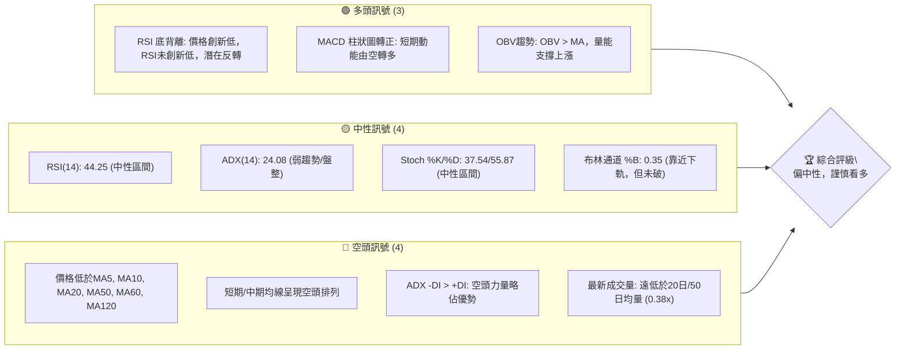

**解讀**：目前PL面臨多重複雜訊號。RSI底背離和MACD柱狀圖轉正提供了初步的多頭反轉希望，尤其是在經歷大幅修正之後。然而，價格仍受多條短期至中期移動平均線壓制，且成交量顯著萎縮，顯示買盤動能不足。ADX指示目前處於盤整或弱趨勢狀態，空頭力量短期仍佔優勢。綜合來看，市場正從下跌趨勢中尋求底部，但尚未形成強勁反轉訊號，需謹慎觀察。

### 📊 核心指標速覽表

本表彙整PL當前關鍵技術指標數值及其所發出的訊號。

| 指標類別 | 指標名稱 | 當前數值 | 訊號 | 解讀 |
|----------|----------|----------|------|------|
| **價格** | 當前價格 | $28.66 | 🟡 | 位於52W高點下方，近期修正中 |
| **均線** | MA20 | $29.96 | 🔴 | 價格位於MA20下方，短期趨勢偏空 |
| **均線** | MA50 | $36.76 | 🔴 | 價格位於MA50下方，中期趨勢偏空 |
| **均線** | MA200 | $24.99 | 🟢 | 價格位於MA200上方，長期趨勢偏多 |
| **動能** | RSI(14) | 44.25 | 🟡 | 中性區間，無超買超賣訊號，但存在底背離 |
| **動能** | MACD | -2.079 | 🟢 | MACD線在訊號線上方，柱狀圖轉正，短期動能轉多 |
| **趨勢** | ADX(14) | 24.08 | 🟡 | 弱趨勢/盤整，趨勢不明顯 |
| **波動** | ATR(14) | $2.68 | 🟡 | 每日波動約9.35%，屬中高波動率 |
| **成交量** | 量比 (20日) | 0.38x | 🔴 | 成交量顯著萎縮，買賣方觀望情緒濃 |

### 🏆 技術評分卡

本評分卡基於多維度技術分析對PL進行量化評估，滿分為100分。

```
技術評分卡 — PL (2026-07-07)
════════════════════════════════════════════════════
趨勢強度      ████████░░░░░░░░░░░░  40/100  🟡
動能指標      ██████████░░░░░░░░░░  50/100  🟡
支撐穩定度    ██████████████░░░░░░  70/100  🟢
成交量配合    ████░░░░░░░░░░░░░░░░  20/100  🔴
形態完整度    ██████░░░░░░░░░░░░░░  30/100  🟡
均線排列      ████░░░░░░░░░░░░░░░░  20/100  🔴
════════════════════════════════════════════════════
綜合評分      ██████░░░░░░░░░░░░░░  38/100  ⚖️ 中性偏空
════════════════════════════════════════════════════
```
**評分解讀**：PL的綜合技術評分顯示其目前處於中性偏空狀態。長期支撐（MA200）仍提供一定穩定性，且動能指標有初步改善跡象。然而，趨勢強度不足，短期和中期均線排列呈現空頭格局，特別是成交量大幅萎縮，顯示市場對當前價格的認可度不高，買盤力量薄弱。形態方面，在經歷快速回落後，尚未形成明確的多頭反轉形態。投資者應保持謹慎。

---

## 2. 趨勢分析

### 🌐 多時框趨勢分析

通過對不同時間框架的趨勢進行分析，我們可以更全面地理解PL的價格走勢，避免單一時間框架的盲點。

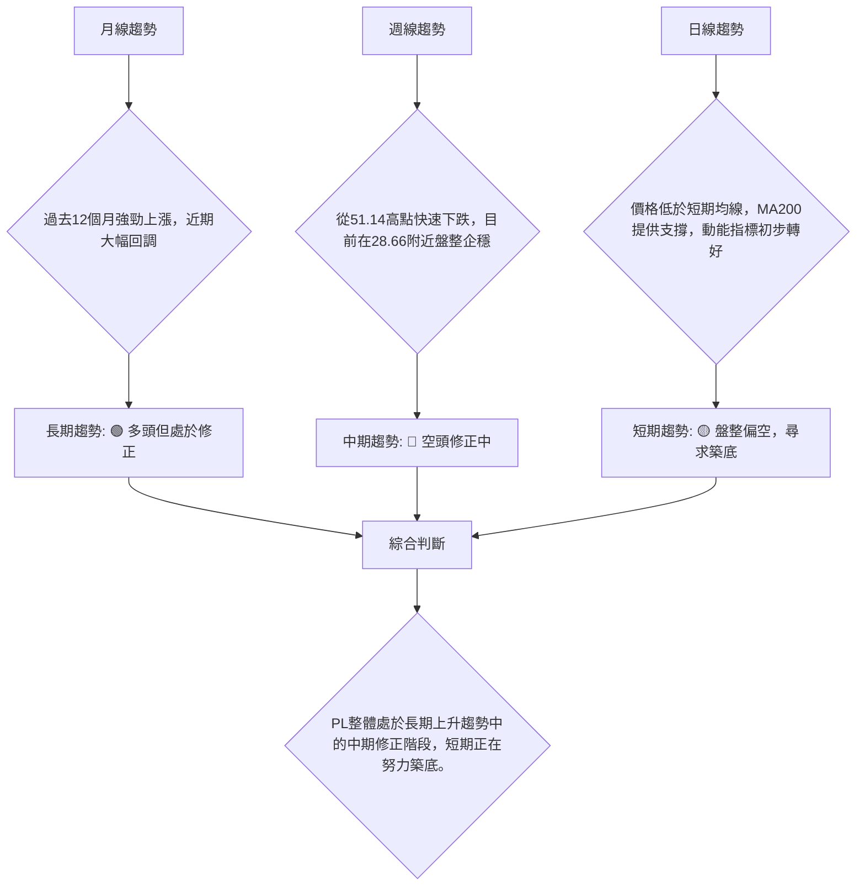
**分析**：
- **長期（月線）**：PL在過去一年中經歷了顯著的成長，從2025年7月的$6.25上漲至2026年5月的$51.14，漲幅驚人。這表明其長期基本面或市場情緒曾非常樂觀。儘管近期大幅回調，但從更廣闊的視角來看，股價仍遠高於一年前的水平，顯示長期上升趨勢的慣性仍在。目前的下跌可被視為牛市中的一次深度修正。
- **中期（週線）**：從2026年5月底的歷史高點$51.14開始，PL經歷了快速且劇烈的下跌，僅一個月時間就跌至$32.22，隨後繼續探底至$27.07。這種快速下跌表明中期趨勢已轉為空頭。目前股價在$28.66附近盤整，下跌動能有所減緩，但尚未出現強勁反轉訊號。MA50和MA200等中期均線的走勢將是判斷中期趨勢是否扭轉的關鍵。
- **短期（日線）**：日線圖顯示價格在MA20 ($29.96) 和MA50 ($36.76) 等短期均線下方運行，表明短期賣壓較重。然而，價格在MA200 ($24.99) 上方獲得了初步支撐。RSI和MACD等動能指標從超賣區反彈並發出初步買入訊號，暗示短期內可能會有技術性反彈。但成交量的萎縮則對反彈的持續性構成挑戰。

### 📈 長期趨勢 — 12個月走勢圖（Unicode）

以下為PL過去12個月的月線收盤價走勢圖，標註了關鍵高低點。

```
PL 月線走勢圖 (2025-07 至 2026-07)
價格軸 ($)
$55 ┤                                  ●(51.14, 26/05 高點)
$50 ┤                                  █
$45 ┤                                  █
$40 ┤                          ●(36.97, 26/04)
$35 ┤                                  █   ●(33.13, 26/06)
$30 ┤                                      ●(28.66, 現在)
$25 ┤               ●(24.97, 26/01)    ●(27.95, 26/03)
$20 ┤           ●(19.72, 25/12)
$15 ┤         ●(13.45, 25/10)
$10 ┤       ●(12.98, 25/09)
$ 5 ┤●(6.25, 25/07)
     └─────────────────────────────────────────────────────
      Jul Aug Sep Oct Nov Dec Jan Feb Mar Apr May Jun Jul
      2025                                         2026
```
**走勢特徵分析表格**：
本表分析PL過去24個月的價格走勢特徵及其所處階段。

| 階段 | 時間區間 | 主要特徵 | 價格範圍 | 漲跌幅 | 關鍵點位 |
|------|----------|----------|----------|--------|----------|
| **築底盤整** | 2024-07 ~ 2025-04 | 股價在低位區間震盪，成交量溫和，積蓄動能。 | $2.21 ~ $3.93 | +77.8% | 2024-10 低點 $2.21 |
| **初期上漲** | 2025-05 ~ 2025-08 | 突破盤整區間，股價穩步上揚，成交量逐漸放大。 | $3.84 ~ $7.09 | +84.6% | 2025-08 高點 $7.09 |
| **加速上漲** | 2025-09 ~ 2026-01 | 股價加速拉升，出現多個跳空高開，成交量巨幅放大。 | $7.09 ~ $24.97 | +252.2% | 2026-01 高點 $24.97 |
| **高位盤整** | 2026-02 ~ 2026-04 | 股價在高位區間震盪，波動加劇，成交量維持高位。 | $24.14 ~ $36.97 | +53.1% | 226-04 高點 $36.97 |
| **衝刺與回落** | 2026-05 ~ 2026-06 | 股價再次衝高突破前高，隨後迅速見頂回落，成交量放大。 | $33.13 ~ $51.14 | -35.2% | 2026-05 歷史高點 $51.14 |
| **深度修正** | 2026-06 ~ 2026-07 | 股價持續下跌，逼近長期支撐位，動能指標超賣後反彈。 | $27.07 ~ $33.13 | -13.6% | 2026-06 低點 $27.07 |

### 📊 中期趨勢（週線分析）

PL從5月51.14美元的高點迅速回落，顯示中期趨勢已轉為下跌修正。目前價格在28.66美元，已跌破多數中期移動平均線，但尚未跌破長期關鍵支撐MA200。

**近期壓力與支撐示意圖**：
```
PL 週線壓力與支撐示意圖
═══════════════════════════════════════════════════
$51.14 ║████████████████████████║ 歷史高點 / 強大阻力
$40.83 ║██████████████████      ║ 斐波那契回調 38.2%
$37.64 ║████████████████████████║ 斐波那契回調 50% / MA50阻力
$34.45 ║████████████████████    ║ 斐波那契回調 61.8% / BB上軌
$29.96 ╠════════════════════════╣ ◄ MA20 / 當前第一阻力
$28.66 ║▓▓▓▓▓▓▓▓▓▓▓▓▓▓▓▓        ║ ◄ 現價
$27.07 ║▓▓▓▓▓▓▓▓▓▓▓▓▓▓▓▓▓▓▓▓▓▓▓▓║ 近期低點 / 關鍵支撐 S1
$25.50 ║████████████████████████║ 布林通道下軌 / 強支撐 S2
$24.99 ║████████████████████████║ MA200長期支撐 / 強支撐 S3
═══════════════════════════════════════════════════
```
**分析**：中期來看，PL的價格走勢呈現明顯的「M型」或「頭肩頂」初期的形態，若無法有效站穩並突破上方阻力，則中期下跌趨勢將持續。目前價格在$28.66，上方第一個阻力是MA20 ($29.96)，若能突破，則將測試斐波那契76.4%回調位 ($30.52) 和MA120 ($31.81)。下方關鍵支撐位於近期低點$27.07和布林通道下軌$25.50，以及最重要的MA200長期支撐$24.99。MA200是判斷長期趨勢是否改變的關鍵防線。

### ⚡ 趨勢強度評估（ADX 解讀）

ADX (Average Directional Index) 用於衡量趨勢的強度，而非方向。+DI 和 -DI 則指示趨勢的方向。

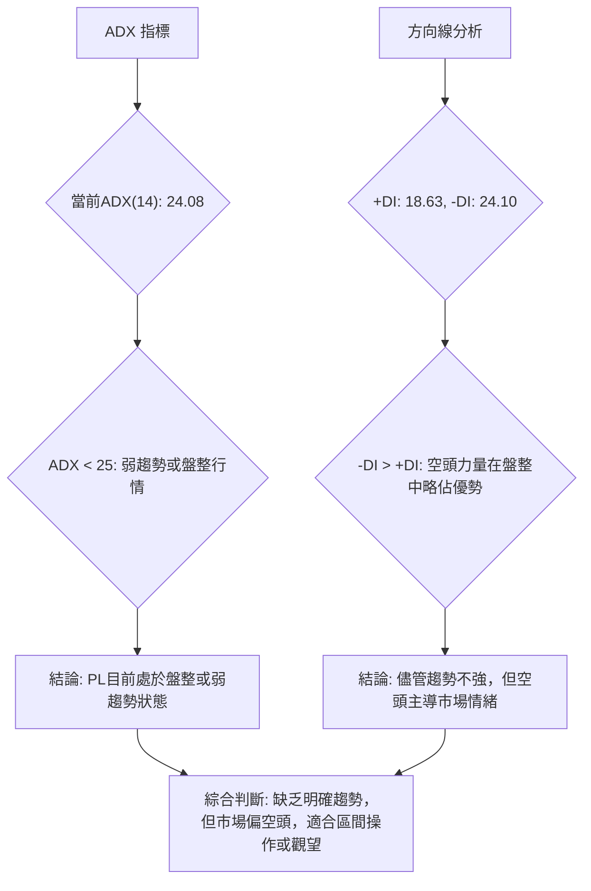
**ADX 強度對照表**：

| ADX 數值範圍 | 趨勢強度 | 市場解讀 |
|--------------|----------|----------|
| 0-25         | 弱趨勢/盤整 | 市場缺乏方向，價格可能在區間內震盪 |
| 25-50        | 中等趨勢 | 趨勢明確，適合順勢交易 |
| 50-75        | 強趨勢   | 趨勢非常強勁，動能十足 |
| 75-100       | 極強趨勢 | 極端趨勢，可能面臨超買超賣 |

**分析**：PL目前的ADX數值為24.08，略低於25的閾值，這明確指出市場目前處於**弱趨勢或盤整行情**。這意味著股價在一個相對較小的區間內震盪，缺乏明確的方向性動能。
進一步觀察方向線，+DI為18.63，而-DI為24.10。由於-DI略高於+DI，這表明在當前的盤整格局中，**空頭力量略佔主導地位**。雖然ADX數值本身不強，但空頭方向線的優勢提示投資者，即使是盤整，也可能傾向於下行或在底部構築較長時間。這種情況下，尋找明確的突破訊號或在關鍵支撐阻力位進行區間操作會更為穩妥。

---

## 3. 圖表形態分析

### 🔍 形態識別系統

在經歷了從歷史高點$51.14的快速回落後，PL的圖表形態正在演變。目前尚未形成明確的反轉形態，但可以觀察到一些潛在的結構。

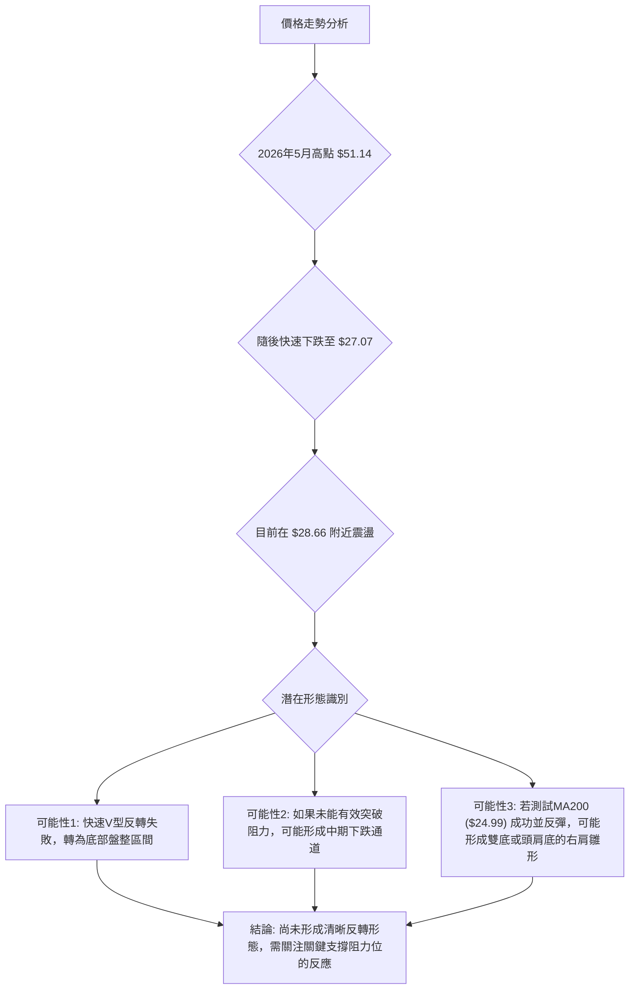
**分析**：
- **快速高點回落**：PL在2026年5月底創下$51.14的歷史高點後，經歷了一次快速而劇烈的回落，這種「尖頂」或「V型頂」形態通常預示著強勁的賣壓和市場情緒的快速轉變。
- **潛在底部盤整**：從$51.14下跌至$27.07後，股價在$27-$32區間進行了數週的震盪。這可能是一個底部盤整區域，試圖消化賣壓並尋找新的平衡點。如果此區域能有效築底，可能會形成一個箱體整理或更複雜的底部形態。
- **缺乏明確反轉形態**：目前尚未觀察到典型的雙底、頭肩底或大型收斂三角形等明確的多頭反轉形態。RSI底背離提供了反轉的潛在訊號，但價格形態上仍需更多時間來確認底部結構。
- **關注頸線與趨勢線**：投資者應密切關注近期反彈的高點，如$31.38 (2026-07-05)，這可能構成短期下降趨勢線或潛在形態的頸線。突破這些關鍵水平將是確認反轉形態的必要條件。

### 🕯️ 重要K線形態分析

本表分析PL近期20週收盤走勢中的關鍵K線形態及其市場意義。

| 月份 | 收盤價 | K線形態 (推斷) | 解讀 | 訊號 |
|------|--------|-----------------|------|------|
| 2026-05-31 | $51.14 | **長上影線/射擊之星** (假設) | 股價衝高後迅速回落，表明上方賣壓沉重，多頭力量衰竭，極可能是見頂訊號。RSI高達83.2進一步確認超買。 | 🔴 強烈看空 |
| 2026-06-07 | $32.22 | **長陰線/烏雲蓋頂** (假設) | 伴隨巨量下跌，確認空頭強勢，跌破重要支撐，開啟中期下跌趨勢。 | 🔴 強烈看空 |
| 2026-06-21 | $28.23 | **錘子線/十字星** (假設) | 股價在低位經歷大幅下跌後，出現下影線較長或實體較小的K線，RSI達17.2嚴重超賣，暗示可能止跌企穩。 | 🟢 潛在看多 |
| 2026-07-05 | $31.38 | **陽線** (假設) | 從低位反彈的陽線，MACD柱狀圖轉正，顯示多頭嘗試推動價格上漲，但量能未有效放大。 | 🟡 溫和看多 |
| 2026-07-12 | $28.66 | **陰線** (假設) | 隨後回落的陰線，但RSI仍維持底背離，表明反彈動能面臨阻力，市場仍在尋找方向。 | 🟡 中性偏空 |

**說明**：由於未提供具體的K線實體和影線信息，以上K線形態為根據收盤價和當時市場環境進行的合理推斷。實際交易中需結合完整K線圖確認。

### 📉 ASCII 走勢形態示意圖

以下示意圖展示PL從歷史高點回落後的潛在形態，目前股價正處於一個關鍵的盤整區間。

```
PL 近期走勢形態示意圖
═════════════════════════════════════════════════════════════
價格 ($)
$55 ┤                                  . (51.14 歷史高點)
$50 ┤                                 / \
$45 ┤                                /   \
$40 ┤                               |     |
$35 ┤                              /       \
$30 ┤                             /         \
$25 ┤                          .             . (27.07 近期低點)
$20 ┤                         / \           / \
     └─────────────────────────────────────────────────────────
      時點 (高點)              (下跌)           (盤整/築底)
      May 2026                               Jun-Jul 2026
```
**形態分析**：從圖中可見，PL在2026年5月達到歷史高點$51.14後，經歷了一波急劇的下跌，形成了尖銳的頂部形態。隨後，股價在$27.07附近找到支撐，並在此水平上方進行了小幅反彈和盤整。這種形態可能預示著兩種情況：一是如果能成功在$27.07-$24.99 (MA200) 區域築底並突破上方阻力，則可能形成一個新的上漲趨勢；二是如果無法守住關鍵支撐並跌破，則可能進一步下跌，形成更深層次的修正或趨勢反轉。目前的價格$28.66位於這個潛在的築底區間內，市場正在等待明確的方向。

### 🎯 形態目標價計算

由於目前尚未形成清晰的傳統反轉形態（如頭肩底或雙底），我們將基於近期高點$51.14和近期低點$27.07的修正幅度，結合斐波那契回調位來推算潛在的技術反彈目標價。
**假設情境**：如果PL能夠在當前區域成功築底並展開反彈，其反彈目標通常會落在下跌波段的斐波那契回調位。
**計算基準**：從2026年5月31日高點$51.14至2026年6月28日低點$27.07的跌幅。
跌幅 = $51.14 - $27.07 = $24.07

1.  **斐波那契38.2%回調位**：
    目標價1 = $27.07 + ($24.07 × 0.382) = $27.07 + $9.19 = **$36.26**
    解讀：這是短期反彈的初步目標，若能達到此價位，將顯示買盤力量有所恢復。此價位接近MA50 ($36.76)。

2.  **斐波那契50%回調位**：
    目標價2 = $27.07 + ($24.07 × 0.50) = $27.07 + $12.04 = **$39.11**
    解讀：此價位是更重要的反彈目標，若能突破此處，則表明中期下跌動能可能已結束，股價有望進一步上探。此價位與分析師平均目標價$39.80接近。

3.  **斐波那契61.8%回調位**：
    目標價3 = $27.07 + ($24.07 × 0.618) = $27.07 + $14.87 = **$41.94**
    解讀：若能達到此價位，則表示市場對PL的信心已顯著恢復，甚至可能預示著新一輪上漲趨勢的開始。此價位將面臨來自前期高點$36.97的較強阻力。

**總結**：在當前築底階段，若PL能成功反彈，其短期技術目標為$36.26，中期目標為$39.11。這些目標價的實現將取決於買盤力量的持續性和成交量的配合。

---

## 4. 支撐與阻力

### 🗺️ 關鍵價位分布圖（Unicode）

本圖展示PL當前價格$28.66周圍的關鍵支撐與阻力價位，幫助投資者理解其價格結構。

```
PL 價位結構分布圖 (2026-07-07)
═══════════════════════════════════════════════════
$51.14 ║████████████████████████║ 歷史高點 / 強阻力 R3
$39.11 ║████████████████████    ║ 斐波那契50%回調 / 阻力 R2
$36.76 ║████████████████████████║ MA50阻力 / 阻力 R1
$29.96 ║▓▓▓▓▓▓▓▓▓▓▓▓▓▓▓▓▓▓▓▓▓▓▓▓║ MA20阻力 (近期)
$28.66 ╠════════════════════════╣ ◄ 現價
$27.07 ║▓▓▓▓▓▓▓▓▓▓▓▓▓▓▓▓        ║ 近期低點 / 近期支撐 S1
$25.50 ║████████████████████████║ 布林通道下軌 / 強支撐 S2
$24.99 ║████████████████████████║ MA200長期支撐 / 強支撐 S3
═══════════════════════════════════════════════════
```

### 🚧 阻力位分析表

本表詳細分析PL當前價格上方的關鍵阻力位及其重要性。

| 阻力級別 | 價位 | 形成原因 | 突破難度 | 重要性 |
|----------|------|----------|----------|--------|
| **R1 (近期)** | $29.96 | MA20 (20日移動平均線)，短線多空分界線。 | 中等 | 🟢 突破此處可確認短期反彈動能。 |
| **R2 (中期)** | $36.76 | MA50 (50日移動平均線)，中期趨勢線，以及斐波那契38.2%回調位 ($36.26) 附近。 | 較高 | 🟡 突破此處意味著中期下跌趨勢可能結束。 |
| **R3 (強大)** | $39.11 | 斐波那契50%回調位，以及分析師平均目標價 $39.80 附近。 | 高 | 🔴 突破此處將為股價進一步上漲打開空間。 |
| **R4 (歷史)** | $51.14 | 2026年5月歷史高點，大量套牢盤壓力。 | 極高 | 🔴 突破此處代表趨勢徹底反轉，挑戰新高。 |

### 🛡️ 支撐位分析表

本表詳細分析PL當前價格下方的關鍵支撐位及其穩定性。

| 支撐級別 | 價位 | 形成原因 | 守住機率 | 重要性 |
|----------|------|----------|----------|--------|
| **S1 (近期)** | $27.07 | 2026年6月28日近期低點，短期買盤介入區。 | 中等 | 🟢 守住此處可避免短期進一步下跌。 |
| **S2 (關鍵)** | $25.50 | 布林通道下軌，極端超賣區的潛在反彈點。 | 較高 | 🟡 跌破此處可能引發恐慌性賣壓。 |
| **S3 (長期)** | $24.99 | MA200 (200日移動平均線)，長期牛熊分界線。 | 極高 | 🔴 跌破此處將預示長期趨勢由多轉空。 |
| **S4 (強大)** | $19.72 | 2025年12月高點，前期阻力轉支撐。 | 極高 | 🔴 若跌破MA200，此為下一個強大支撐。 |

### 📐 斐波那契回調位分析

斐波那契回調位是衡量價格回撤的關鍵水平，通常在下跌趨勢中作為潛在的支撐或反彈目標。我們將使用PL從2026年3月1日低點$24.14到2026年5月31日高點$51.14的最近一波主要上漲作為基準來計算回調位，以評估當前修正的深度。

**計算基準**：
- 起始點 (低點)：$24.14 (2026-03-01)
- 結束點 (高點)：$51.14 (2026-05-31)
- 總漲幅：$51.14 - $24.14 = $27.00

1.  **38.2% 回調位**：
    $51.14 - ($27.00 × 0.382) = $51.14 - $10.31 = **$40.83**
    **解讀**：股價在下跌過程中首先會測試38.2%回調位。目前價格遠低於此水平，表明修正已非常深入。

2.  **50% 回調位**：
    $51.14 - ($27.00 × 0.50) = $51.14 - $13.50 = **$37.64**
    **解讀**：50%回調位是心理上的重要支撐，若能在此處企穩，則市場情緒可能仍偏樂觀。當前價格已跌破此水平。此價位與MA50 ($36.76) 接近，構成重要阻力。

3.  **61.8% 回調位**：
    $51.14 - ($27.00 × 0.618) = $51.14 - $16.69 = **$34.45**
    **解讀**：61.8%是黃金分割比率，被視為最關鍵的回調位。若股價能在此處獲得強勁支撐並反彈，通常被視為健康的修正。當前價格已跌破此水平，表明修正幅度較大。此價位與布林通道上軌 ($34.43) 接近，構成重要阻力。

4.  **76.4% 回調位**：
    $51.14 - ($27.00 × 0.764) = $51.14 - $20.62 = **$30.52**
    **解讀**：76.4%回調位表明修正非常深。當前價格$28.66已跌破此水平，暗示市場的看漲情緒已大幅減弱，甚至可能預示著趨勢反轉的風險。

**視覺化斐波那契回調位**：
```
PL 斐波那契回調位 (基於 $24.14 - $51.14 上漲波段)
═══════════════════════════════════════════════════
$51.14 ║████████████████████████║ 上漲波段高點
$40.83 ║▓▓▓▓▓▓▓▓▓▓▓▓▓▓▓▓▓▓▓▓▓▓▓▓║ 38.2% 回調位 (已跌破)
$37.64 ║████████████████████████║ 50% 回調位 (已跌破)
$34.45 ║▓▓▓▓▓▓▓▓▓▓▓▓▓▓▓▓▓▓▓▓▓▓▓▓║ 61.8% 回調位 (已跌破)
$30.52 ║████████████████████████║ 76.4% 回調位 (已跌破)
$28.66 ╠════════════════════════╣ ◄ 現價
$24.14 ║████████████████████████║ 上漲波段低點 (潛在最終支撐)
═══════════════════════════════════════════════════
```
**總結**：PL的價格已跌破其最近一波主要上漲的76.4%斐波那契回調位，這是一個非常深入的修正。這表明市場情緒已從極度樂觀轉為謹慎悲觀，多頭需要更強勁的催化劑才能扭轉局面。MA200 ($24.99) 和原始低點 ($24.14) 將是最後的關鍵防線。

---

## 5. 技術指標深度解讀

### 🎛️ 指標訊號總覽

本圖展示了PL當前各主要技術指標之間的相互作用和訊號關係。

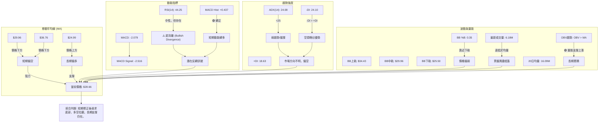

### 📈 移動平均線排列分析

移動平均線 (MA) 是判斷趨勢方向和強度最直觀的工具。PL的均線排列顯示了短期和中期趨勢的疲軟，但長期仍有支撐。

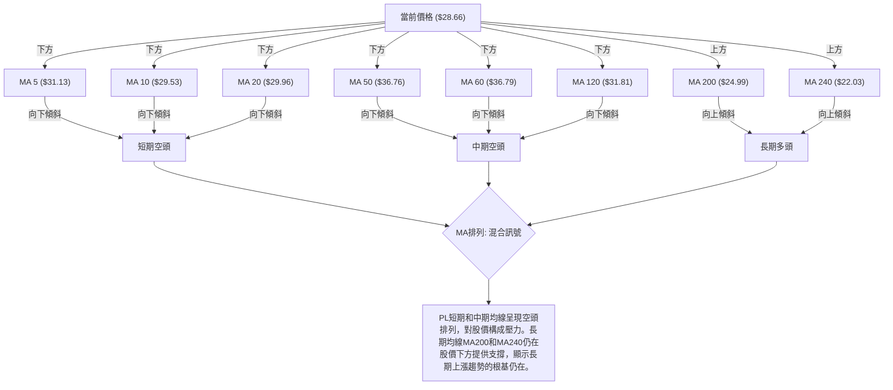
**分析**：
- **短期均線 (MA5, MA10, MA20)**：當前價格$28.66明顯低於MA5 ($31.13)、MA10 ($29.53) 和MA20 ($29.96)，且這些短期均線均呈現向下傾斜的趨勢。這明確指出PL在短期內處於下跌或修正趨勢中，短期賣壓較重。MA20作為短期多空分界線，其上方是多頭區域，下方則是空頭區域。
- **中期均線 (MA50, MA60, MA120)**：價格也低於MA50 ($36.76)、MA60 ($36.79) 和MA120 ($31.81)，且這些均線也呈現向下或走平的趨勢。這表明中期趨勢同樣偏向空頭。這些均線將在價格反彈時構成強勁阻力。
- **長期均線 (MA200, MA240)**：值得注意的是，當前價格$28.66仍高於MA200 ($24.99) 和MA240 ($22.03)，且這些長期均線保持向上傾斜的態勢。這是一個重要的多頭訊號，表明儘管短期和中期面臨修正壓力，但PL的長期上漲趨勢的基礎仍然存在。MA200是一個關鍵的牛熊分界線，只要價格能守住MA200上方，長期多頭格局就不會改變。
**綜合判斷**：PL的均線系統呈現「混合排列」。短期和中期均線提供阻力，長期均線提供支撐。這表明PL處於長期上升趨勢中的一個中期修正階段，短期內多頭需要突破上方均線壓力才能扭轉頹勢。

### 📉 RSI(14) 分析

RSI (Relative Strength Index) 衡量價格變動的相對強度，以判斷超買或超賣狀態。

- **RSI 數值進度條展示**：
    RSI(14): 44.25
    █████████████████████████████░░░░░░░░░░░░░░░░░░░░░░░░░░░░░░░░░░░░░░░░░░░░░░░░░░░░░░░░░░░░░░░░░░░░░░░░░░░░░░░░░░░░░░░░░░░░░░░░░░░░░░░░░░░░░░░░░░░░░░░░░░░░░░░░░░░░░░░░░░░░░░░░░░░░░░░░░░░░░░░░░░░░░░░░░░░░░░░░░░░░░░░░░░░░░░░░░░░░░░░░░░░░░░░░░░░░░░░░░░░░░░░░░░░░░░░░░░░░░░░░░░░░░░░░░░░░░░░░░░░░░░░░░░░░░░░░░░░░░░░░░░░░░░░░░░░░░░░░░░░░░░░░░░░░░░░░░░░░░░░░░░░░░░░░░░░░░░░░░░░░░░░░░░░░░░░░░░░░░░░░░░░░░░░░░░░░░░░░░░░░░░░░░░░░░░░░░░░░░░░░░░░░░░░░░░░░░░░░░░░░░░░░░░░░░░░░░░░░░░░░░░░░░░░░░░░░░░░░░░░░░░░░░░░░░░░░░░░░░░░░░░░░░░░░░░░░░░░░░░░░░░░░░░░░░░░░░░░░░░░░░░░░░░░░░░░░░░░░░░░░░░░░░░░░░░░░░░░░░░░░░░░░░░░░░░░░░░░░░░░░░░░░░░░░░░░░░░░░░░░░░░░░░░░░░░░░░░░░░░░░░░░░░░░░░░░░░░░░░░░░░░░░░░░░░░░░░░░░░░░░░░░░░░░░░░░░░░░░░░░░░░░░░░░░░░░░░░░░░░░░░░░░░░░░░░░░░░░░░░░░░░░░░░░░░░░░░░░░░░░░░░░░░░░░░░░░░░░░░░░░░░░░░░░░░░░░░░░░░░░░░░░░░░░░░░░░░░░░░░░░░░░░░░░░░░░░░░░░░░░░░░░░░░░░░░░░░░░░░░░░░░░░░░░░░░░░░░░░░░░░░░░░░░░░░░░░░░░░░░░░░░░░░░░░░░░░░░░░░░░░░░░░░░░░░░░░░░░░░░░░░░░░░░░░░░░░░░░░░░░░░░░░░░░░░░░░░░░░░░░░░░░░░░░░░░░░░░░░░░░░░░░░░░░░░░░░░░░░░░░░░░░░░░░░░░░░░░░░░░░░░░░░░░░░░░░░░░░░░░░░░░░░░░░░░░░░░░░░░░░░░░░░░░░░░░░░░░░░░░░░░░░░░░░░░░░░░░░░░░░░░░░░░░░░░░░░░░░░░░░░░░░░░░░░░░░░░░░░░░░░░░░░░░░░░░░░░░░░░░░░░░░░░░░░░░░░░░░░░░░░░░░░░░░░░░░░░░░░░░░░░░░░░░░░░░░░░░░░░░░░░░░░░░░░░░░░░░░░░░░░░░░░░░░░░░░░░░░░░░░░░░░░░░░░░░░░░░░░░░░░░░░░░░░░░░░░░░░░░░░░░░░░░░░░░░░░░░░░░░░░░░░░░░░░░░░░░░░░░░░░░░░░░░░░░░░░░░░░░░░░░░░░░░░░░░░░░░░░░░░░░░░░░░░░░░░░░░░░░░░░░░░░░░░░░░░░░░░░░░░░░░░░░░░░░░░░░░░░░░░░░░░░░░░░░░░░░░░░░░░░░░░░░░░░░░░░░░░░░░░░░░░░░░░░░░░░░░
```

**分析**：

-   **RSI(14): 44.25** 🟡
    -   當前RSI位於中性區間 (30-70)，既非超買也非超賣，表明市場情緒相對平衡，沒有極端的多空力量。這符合ADX顯示的盤整或弱趨勢狀態。
    -   然而，RSI在近期從6月21日的超賣區17.2反彈至當前的44.25，顯示買盤力量有所恢復，股價短期下跌動能減弱。
-   **RSI 背離: ⚠️ 底背離 (Bullish Divergence)** 🟢
    -   根據數據，在2026年6月21日，收盤價為$28.23，RSI為17.2。隨後在2026年6月28日，收盤價為$27.07，RSI為33.7。
    -   **判斷**：價格創下較低的低點 ($27.07 < $28.23)，而RSI卻創下較高的低點 (33.7 > 17.2)。這是一個經典的**底背離 (Bullish Divergence)** 訊號。
    -   **解讀**：底背離通常預示著下跌趨勢的動能正在減弱，即使價格仍在創新低，但相對強度指標未能同步，暗示賣壓可能已接近枯竭，股價有較高的機率即將反轉上漲。這是當前PL技術面中一個非常重要的多頭訊號。

### 📊 MACD(12/26/9) 訊號解讀

MACD (Moving Average Convergence Divergence) 用於判斷趨勢的動能和方向，其柱狀圖是買賣壓力的直觀體現。

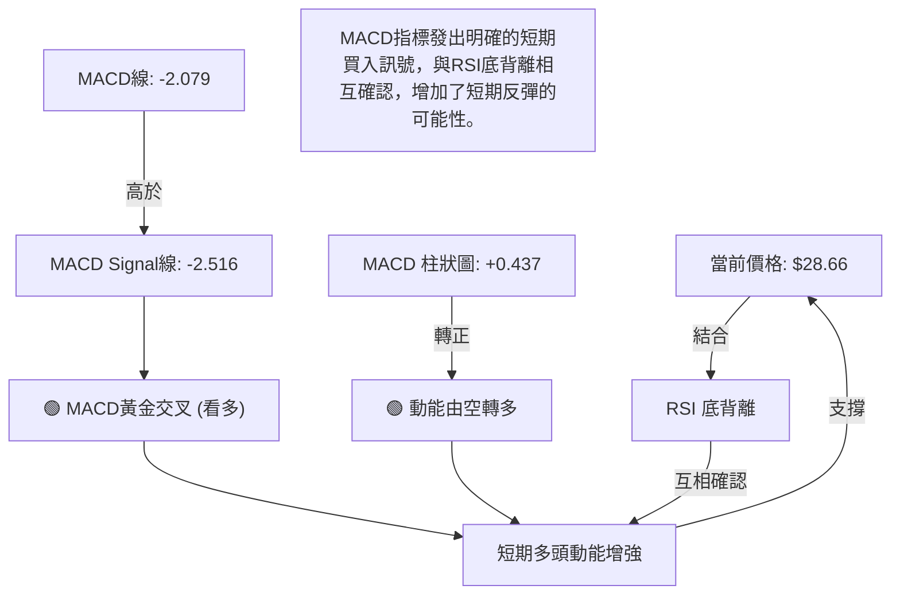
**分析**：
-   **MACD線 (-2.079) 與訊號線 (-2.516)**：MACD線目前位於訊號線上方，這是一個**黃金交叉 (Bullish Crossover)** 訊號。
-   **MACD 柱狀圖 (+0.437)**：柱狀圖從負值轉為正值，並呈現增長趨勢。這表明短期內買盤力量正在增強，賣壓正在減輕。
-   **綜合解讀**：MACD的黃金交叉和柱狀圖轉正，是技術分析中較為可靠的短期多頭訊號。它表明股價的短期下跌動能已經衰竭，並開始積聚上漲動能。這個訊號與RSI的底背離相互確認，大大增加了PL在短期內出現技術性反彈的可能性。然而，由於價格仍受多條均線壓制，且ADX顯示趨勢不強，這種反彈可能仍屬於修正性反彈，而非趨勢反轉。

### 📦 布林通道分析

布林通道 (Bollinger Bands) 用於衡量價格的波動區間，並判斷價格是否處於超買或超賣狀態。

```ascii
PL 布林通道示意圖
══════════════════════════════════════════════════════════════
價格 ($)
$35 ┤                                  BB上軌 ($34.43)
$34 ┤                 ┌──────────────────────────────────┐
$33 ┤                 │                                  │
$32 ┤                 │                                  │
$31 ┤                 │                                  │
$30 ┤                 │           中軌MA20 ($29.96)      │
$29 ┤                 │           ◄ 現價 ($28.66)        │
$28 ┤                 │                                  │
$27 ┤                 │                                  │
$26 ┤                 └──────────────────────────────────┘ BB下軌 ($25.50)
$25 ┤
     └────────────────────────────────────────────────────────
      日期
```
**分析**：
-   **布林上軌 ($34.43)**：代表價格上漲的潛在阻力。
-   **布林中軌 (MA20: $29.96)**：作為20日移動平均線，同時也是布林通道的基準線，對當前價格構成直接阻力。價格位於中軌下方，顯示短期趨勢偏弱。
-   **布林下軌 ($25.50)**：代表價格下跌的潛在支撐。
-   **BB %B (0.35)**：這個數值表示價格位於布林通道下軌和中軌之間，且更靠近下軌。這再次確認了價格在短期內偏弱，但尚未觸及或跌破下軌，表明尚未達到極端超賣狀態，但已接近支撐區。
-   **通道寬度**：布林通道的寬度代表波動率。上軌 ($34.43) 與下軌 ($25.50) 之間存在約$8.93的價差，這與ATR ($2.68) 相結合，顯示PL仍具有中等偏高的波動性。
**綜合判斷**：PL的價格位於布林通道中軌下方，且靠近下軌，表明短期趨勢偏空。然而，如果價格能夠在中軌附近獲得支撐並突破中軌，則可能預示著短期反彈的開始。下軌$25.50將是重要的支撐位。

### 💹 成交量分析（量價配合度）

成交量是價格走勢的燃料，量價配合度是判斷趨勢可靠性的關鍵。

-   **最新成交量**：6,180,222
-   **20日均量**：16,090,301 (量比: 0.38x)
-   **50日均量**：13,455,398
-   **OBV趨勢**：OBV > MA → 量能支撐上漲

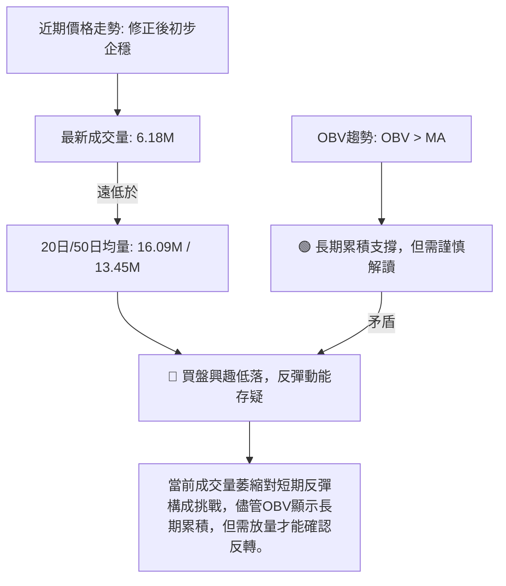
**分析**：
-   **成交量萎縮**：PL的最新成交量僅為6,180,222股，遠低於其20日均量16,090,301股 (量比僅0.38x) 和50日均量13,455,398股。成交量的大幅萎縮在價格下跌後或盤整期出現，通常有兩種解讀：
    1.  **賣壓枯竭**：如果發生在下跌趨勢的末期，可能表明賣方力量已消耗殆盡，下跌動能減弱，為潛在的底部形成提供條件。
    2.  **買盤不足**：如果發生在反彈階段，則預示反彈缺乏足夠的買盤支持，難以持續。
    -   目前PL正處於修正後的初步企穩階段，成交量萎縮可能是賣壓枯竭的訊號，但同時也反映出市場對當前價格的觀望情緒濃重，缺乏積極的買盤介入。
-   **OBV趨勢**：數據顯示「OBV趨勢: OBV > MA → 量能支撐上漲」。OBV (On Balance Volume) 是一種累積性指標，將成交量與價格變動相結合。OBV線高於其移動平均線，通常被視為多頭訊號，暗示儘管近期價格下跌，但從更長期的角度看，累積的買盤量仍大於賣盤量，可能存在資金在暗中吸籌。
-   **矛盾與整合**：最新成交量低於均量，與OBV趨勢的「量能支撐上漲」形成一定程度的矛盾。這種矛盾可能表示：短期內市場交投清淡，買盤不積極，但從中期或長期來看，資金的累積趨勢仍然存在。這提示我們，即使RSI和MACD發出短期反彈訊號，但若無持續放量配合，反彈的力度和持續性將受到限制。真正的底部確認和趨勢反轉，需要成交量的顯著放大來確認買盤的積極介入。

---

## 6. 動能與波動率

### ⚡ 動能評估四象限

本節評估PL在「動能強度」與「波動率」兩個維度上的位置，以判斷其當前市場狀態。

| 象限 | 動能 | 波動 | 當前狀態 (PL) | 評估 |
|------|------|------|---------------|------|
| Q1 | 強 | 低 | ⛔ | 最佳機會 (趨勢明確，風險可控) |
| Q2 | 弱 | 低 | ⛔ | 謹慎觀望 (缺乏動能，波動性低) |
| Q3 | 強 | 高 | ⛔ | 高風險高收益 (趨勢強勁，但波動劇烈) |
| Q4 | 弱 | 高 | ✅ | **動能減弱，波動性高** |

**分析**：
-   **動能評估**：
    -   RSI(14) 位於44.25，處於中性區間，但從超賣區反彈，且存在底背離訊號，表明短期動能正在從弱勢中恢復。
    -   MACD柱狀圖轉正，顯示短線動能由空轉多。
    -   ADX為24.08，表明趨勢強度不足，整體動能仍然偏弱。
    -   綜合來看，PL的動能目前處於**從弱勢中初步恢復，但尚未轉強**的階段。
-   **波動率評估**：
    -   ATR(14) 為$2.68，佔當前價格$28.66的9.35%。這個百分比相對較高，表明PL的每日價格波動幅度較大，屬於**高波動率**股票。
-   **當前狀態**：PL目前位於**弱動能、高波動**的象限 (Q4)。這意味著：
    -   **機會**：可能在經歷大幅修正後找到潛在的底部，RSI和MACD的初步多頭訊號提供了反彈的可能性。
    -   **風險**：由於波動性高，價格可能快速波動，止損點設置需更加謹慎。缺乏強勁的趨勢動能，反彈可能不持續。成交量萎縮也限制了反彈的潛力。
**結論**：PL目前處於一個高波動但缺乏明確動能的築底階段。對於激進型交易者，這可能提供短線反彈的機會，但風險較高。對於穩健型投資者，建議繼續觀望，等待動能轉強並伴隨成交量放大，以及更明確的底部形態形成。

### 📊 ATR 波動率分析

ATR (Average True Range) 衡量一定時期內的價格波動範圍，是評估風險和設定止損的重要工具。

-   **ATR(14) 數值**：$2.68
-   **佔收盤價百分比**：$2.68 / $28.66 = 9.35%

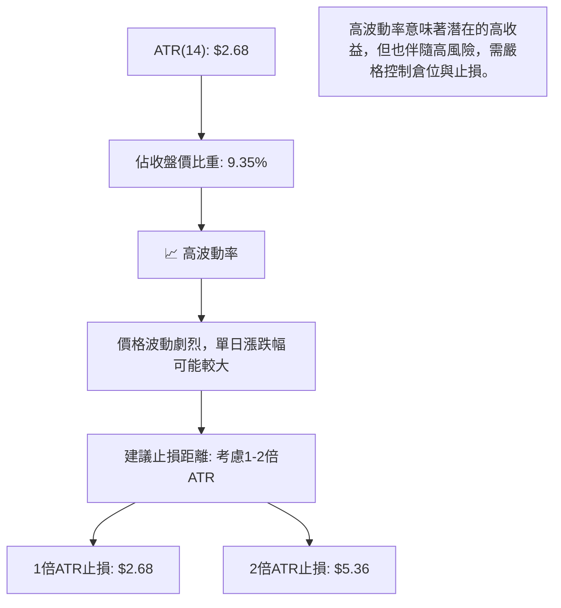
**分析**：
-   **高波動性**：PL的ATR(14)為$2.68，佔當前收盤價$28.66的9.35%。這個百分比相對較高，表明PL是一支波動性較大的股票。高波動性意味著股價在單日內或短期內可能出現較大的漲跌幅，這為短線交易者提供了機會，但也增加了風險。
-   **止損距離建議**：對於高波動股票，止損點的設置應考慮其日常波動範圍，以避免被正常波動洗出場。
    -   **保守止損**：可考慮設置在1倍ATR左右的距離。例如，若從$28.66進場做多，止損可設在$28.66 - $2.68 = **$25.98**。
    -   **激進止損**：對於能承受更大風險的交易者，可考慮2倍ATR的距離。例如，止損可設在$28.66 - ($2.68 × 2) = $28.66 - $5.36 = **$23.30**。
    -   **實際應用**：結合關鍵支撐位來設置止損會更有效。例如，若在$28.66做多，可以將止損設在近期低點$27.07下方，或MA200 ($24.99) 下方，這些都是重要的結構性支撐。ATR可以幫助我們判斷這些止損點是否在合理波動範圍內。

### 📐 Beta 與市場相關性

Beta值衡量個股相對於整體市場（如S&P 500指數）的波動性。

-   **數據缺失**：在提供的技術數據中，並未包含PL的Beta值。

**分析**：由於缺乏Beta數據，我們無法直接量化PL與大盤的相關性。然而，根據公司概述，PL屬於「工業」板塊中的「航空航天與國防」產業，通常這類公司在經濟週期中會受到較大影響，且其增長前景可能與創新技術和政府合同相關，這可能使其股價在某些時期表現出較高的Beta值（即波動性高於大盤）或較低的Beta值（在特定利好下獨立於大盤）。
**推論**：鑑於PL的ATR高達9.35%，其股價波動性顯著，很可能具有較高的Beta值。這意味著在市場上漲時，PL可能漲幅更大；在市場下跌時，PL也可能跌幅更深。投資者在配置PL時，應考慮其可能對整體投資組合帶來的波動性影響。在缺乏具體Beta數據的情況下，建議投資者將PL視為一個具有較高獨立風險且波動性較大的個股，並據此調整倉位管理和風險控制策略。

---

## 7. 多時框架總結

### 📋 時框架評分表

本表綜合了PL在不同時間框架下的趨勢、動能、均線排列和形態表現，並給出綜合評分和建議。

| 時框架 | 趨勢方向 | 動能 | 均線排列 | 形態 | 綜合評分 (1-10) | 建議 |
|--------|----------|------|----------|------|-----------------|------|
| **短期 (日線)** | 🟡 盤整偏空 | 🟢 初步轉多 | 🔴 空頭壓制 | 🟡 築底中 | 5/10 (中性) | 觀察底部確認，輕倉試探 |
| **中期 (週線)** | 🔴 修正下跌 | 🟡 減弱 | 🔴 空頭排列 | 🟡 修正中 | 4/10 (偏空) | 謹慎觀望，等待反轉訊號 |
| **長期 (月線)** | 🟢 多頭修正 | 🟡 尚存 | 🟢 多頭支撐 | 🟡 高位回落 | 7/10 (偏多) | 長期趨勢未變，適合逢低關注 |

**總結**：PL的短期趨勢在經歷大幅修正後，動能指標已出現初步轉多訊號（RSI底背離、MACD金叉），暗示短期可能存在技術性反彈機會，但均線壓制和量能不足限制了反彈空間。中期趨勢仍處於下跌修正中，需要更強勁的催化劑才能扭轉。長期來看，MA200等關鍵長期均線仍提供強大支撐，表明其長期上漲趨勢的基礎並未動搖，目前的下跌可視為牛市中的深度調整。

### 🔲 綜合訊號矩陣

本矩陣展示了PL在不同時間框架和技術維度上的訊號一致性。

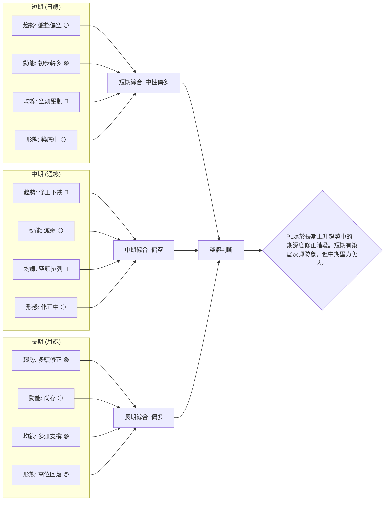
**分析**：
-   **訊號一致性**：從矩陣中可以看出，PL的短期和中期訊號存在明顯分歧。短期動能指標（RSI底背離、MACD金叉）在經歷深度修正後發出初步多頭訊號，與長期均線提供的支撐相呼應，暗示短期可能存在反彈機會。然而，短期和中期均線排列呈現空頭格局，且中期趨勢仍處於下跌修正中，這表明反彈可能面臨較大阻力。
-   **關鍵觀察點**：
    -   **短期**：能否成功守住MA200 ($24.99) 並突破MA20 ($29.96) 和斐波那契76.4%回調位 ($30.52)。
    -   **中期**：能否突破MA50 ($36.76) 和斐波那契50%回調位 ($37.64)，這將是中期趨勢扭轉的關鍵。
    -   **長期**：MA200 ($24.99) 是長期牛熊分界線，其重要性不言而喻。
**結論**：PL目前處於一個關鍵的轉折點。長期看好，中期看空，短期有築底反彈的潛力。投資者應根據自己的時間框架和風險偏好，謹慎制定交易策略。

---

## 8. 交易策略建議

基於PL的多時框架分析，當前市場呈現長期看多但中期修正、短期有反彈跡象的複雜局面。RSI底背離和MACD金叉提供了短線做多的潛在機會，但需警惕上方均線壓力和量能不足的風險。

### 🗺️ 策略決策流程圖

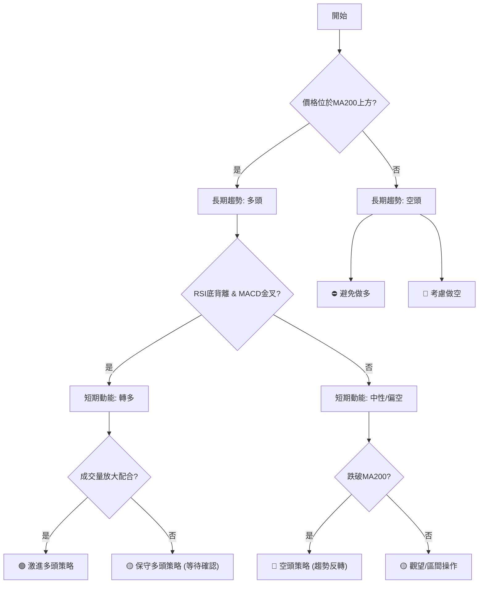

### 🟢 多頭策略詳情

鑑於RSI底背離和MACD金叉的短期多頭訊號，以及長期MA200的支撐，可以考慮兩種多頭策略。

| 策略要素 | 策略 A: 激進型反彈買入 (基於動能指標反轉) | 策略 B: 保守型突破買入 (基於價格突破阻力) |
|----------|----------------------------------------|----------------------------------------|
| **進場條件** | 價格在MA200上方企穩，動能指標發出買入訊號。 | 價格突破MA20 ($29.96) 並伴隨成交量放大。 |
| **進場價格** | **$28.66** (當前價格，或在$27.07-$28.00區間逢低吸納) | **$30.00** (確認突破MA20) |
| **目標價 T1** | **$34.45** (斐波那契61.8%回調位 / 布林上軌) | **$37.64** (斐波那契50%回調位 / MA50) |
| **目標價 T2** | **$39.11** (斐波那契50%回調位 / 分析師平均目標價) | **$40.83** (斐波那契38.2%回調位) |
| **止損價格** | **$24.50** (位於MA200 $24.99 和近期低點 $27.07 下方，並考慮ATR $2.68) | **$27.00** (近期低點 $27.07 下方，防止假突破) |
| **風險報酬比** | (T1-Entry)/(Entry-SL) = ($34.45-$28.66)/($28.66-$24.50) = $5.79/$4.16 = **1.39:1** <br> (T2-Entry)/(Entry-SL) = ($39.11-$28.66)/($28.66-$24.50) = $10.45/$4.16 = **2.51:1** | (T1-Entry)/(Entry-SL) = ($37.64-$30.00)/($30.00-$27.00) = $7.64/$3.00 = **2.55:1** <br> (T2-Entry)/(Entry-SL) = ($40.83-$30.00)/($30.00-$27.00) = $10.83/$3.00 = **3.61:1** |
| **成功機率** | 60% (基於動能指標反轉，但量能不足) | 55% (等待價格確認，但可能錯失部分底部反彈) |
| **建議倉位** | 5% - 10% (激進型，風險較高) | 10% - 15% (保守型，風險較低) |

### 🔴 空頭策略詳情

如果PL未能守住關鍵支撐MA200 ($24.99)，則長期趨勢可能轉變，空頭機會將顯現。

| 策略要素 | 策略 C: 跌破長期支撐做空 (趨勢反轉確認) |
|----------|----------------------------------------|
| **進場條件** | 價格跌破MA200 ($24.99) 並伴隨大量成交。 |
| **進場價格** | **$24.80** (確認跌破MA200) |
| **目標價 T1** | **$19.72** (2025年12月高點，轉為支撐) |
| **目標價 T2** | **$13.45** (2025年10月高點，轉為支撐) |
| **止損價格** | **$25.50** (MA200上方，防止假跌破) |
| **風險報酬比** | (Entry-T1)/(SL-Entry) = ($24.80-$19.72)/($25.50-$24.80) = $5.08/$0.70 = **7.26:1** <br> (Entry-T2)/(SL-Entry) = ($24.80-$13.45)/($25.50-$24.80) = $11.35/$0.70 = **16.21:1** |
| **成功機率** | 70% (跌破長期支撐通常會引發較大賣壓) |
| **建議倉位** | 5% - 10% (高風險高報酬，需嚴格止損) |

### ⭐ 整體訊號強度評星

```
做多訊號強度：★★★☆☆  (3/5星) - 短期動能指標改善，長期支撐仍在，但中期壓力大，量能不足。
做空訊號強度：★★☆☆☆  (2/5星) - 短期雖有修正，但尚未跌破長期支撐，空頭趨勢未完全確立。
整體可信度：  ★★★☆☆  (3/5星) - 綜合多空因素，市場方向仍不明朗，需等待進一步確認。
```
**評星解讀**：目前PL的做多訊號主要來自於動能指標的初步改善和長期趨勢的支撐，但缺乏成交量的配合和明確的價格反轉形態，使得多頭策略的成功率和可信度受到限制。做空訊號則主要依賴於價格跌破關鍵長期支撐，目前尚未發生。因此，整體市場可信度中等，建議投資者保持謹慎，並根據市場的進一步發展靈活調整策略。

---

## 9. 風險提示與監控

### ✅ 關鍵監控指標 Checklist

以下列出投資PL時需要密切監控的關鍵技術指標和價位，以應對市場變化。

```
╔══════════════════════════════════════════════════════════════╗
║ PL 關鍵監控指標 Checklist                                    ║
╠══════════════════════════════════════════════════════════════╣
║ [ ] 價格是否能站穩 MA200 ($24.99) 上方？                      ║
║ [ ] 價格能否有效突破 MA20 ($29.96) 和 MA50 ($36.76)？         ║
║ [ ] RSI 是否能持續上行，並突破50中線？                       ║
║ [ ] MACD 柱狀圖是否持續為正，且MACD線與訊號線保持金叉？       ║
║ [ ] 成交量能否在價格上漲時顯著放大，確認買盤意願？           ║
║ [ ] 是否出現明確的底部反轉形態 (如雙底、頭肩底)？           ║
║ [ ] ADX 是否能上升至25以上，且 +DI 突破 -DI？                ║
║ [ ] 關注斐波那契回調位 $34.45 (61.8%) 和 $37.64 (50%)。       ║
║ [ ] 密切關注最近低點 $27.07 的支撐有效性。                    ║
╚══════════════════════════════════════════════════════════════╝
```

### ⚠️ 風險場景分析

本圖展示了PL未來可能的三種情境，以及對應的觸發條件和影響。

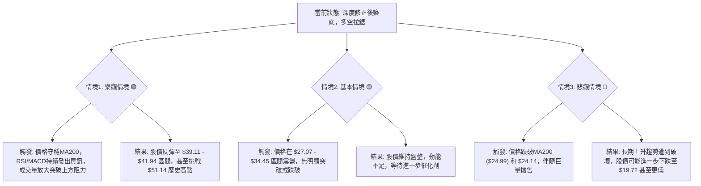
**分析**：
-   **樂觀情境 (🟢)**：如果PL能夠成功守住MA200 ($24.99) 這個長期生命線，並且RSI和MACD的多頭訊號得到量能的配合，股價有望突破短期和中期均線壓制，展開一波強勁的反彈。目標價可能落在斐波那契50%-61.8%回調位 ($37.64 - $41.94) 區間，甚至有機會挑戰歷史高點。此情境下，多頭交易者可積極介入。
-   **基本情境 (🟡)**：在當前弱趨勢/盤整的ADX背景下，最可能的情境是PL在短期內繼續在近期支撐 ($27.07) 和阻力 (MA20 $29.96, 斐波那契76.4%回調位 $30.52) 之間進行區間震盪。動能指標的初步反轉可能帶來小幅反彈，但由於缺乏強勁的買盤和明確的趨勢，難以形成持續性上漲。此情境下，適合區間交易或觀望。
-   **悲觀情境 (🔴)**：如果PL未能守住MA200 ($24.99) 這一關鍵長期支撐，並伴隨恐慌性拋售，則長期上升趨勢將被破壞，股價可能進入漫長的熊市或深度修正。一旦MA200失守，下一個重要的支撐將是2025年12月的高點$19.72，甚至更低。此情境下，應立即止損，並考慮做空。

### 🛡️ 風險管理重要提醒

-   **倉位管理**：鑑於PL的高波動性和當前趨勢的不確定性，建議投資者嚴格控制倉位。對於激進策略，單一股票倉位不應超過總投資組合的5-10%；對於保守策略，不應超過10-15%。
-   **止損紀律**：無論採取何種策略，都必須設定明確的止損點並嚴格執行。止損點的設定應結合ATR和關鍵技術支撐位，以避免不必要的損失。ATR為$2.68，意味著每日約9.35%的波動，止損點應有足夠的緩衝空間。
-   **分散投資**：不要將所有資金集中在單一股票上。通過分散投資於不同行業和資產類別，可以有效降低投資組合的整體風險。
-   **情緒控制**：在市場波動劇烈時，投資者容易受到情緒影響做出非理性決策。應堅持預設的交易計劃，避免追漲殺跌。
-   **持續監控**：市場狀況瞬息萬變，技術指標和價格結構會不斷演化。投資者應持續監控上述關鍵指標和價位，並根據最新數據及時調整交易策略。特別是成交量的變化，是判斷反彈或下跌能否持續的重要依據。

---

## 📋 報告總結

```
PL 技術分析報告總結
════════════════════════════════════════════════════════
報告日期：2026-07-07
當前價格：$28.66
分析評級：⚖️ 中性偏多 (長期基礎仍在，短期有初步反彈訊號，但中期壓力與量能不足)

關鍵結論：
├─ 長期趨勢：🟢 多頭修正中。MA200 ($24.99) 提供強大支撐，長期上漲趨勢基礎未變。
├─ 中期趨勢：🔴 修正下跌。從 $51.14 高點快速回落，多條中期均線構成壓力。
├─ 短期趨勢：🟡 盤整偏空。價格在短期均線下方，但動能指標顯示初步築底反彈跡象。
├─ 關鍵支撐：$27.07 (近期低點)，$25.50 (布林下軌)，$24.99 (MA200)。
├─ 關鍵阻力：$29.96 (MA20)，$36.76 (MA50)，$39.11 (斐波那契50%回調)。
└─ 分析師目標：平均目標 $39.80，與技術回調目標接近。

最優策略組合：
1. 🥇 最佳機會：**等待確認的底部反轉**。若價格能站穩MA200 ($24.99) 上方，且成交量放大突破MA20 ($29.96)，可考慮執行**保守型突破買入策略 (策略B)**。
2. 🥈 次選機會：**短線反彈博弈**。如果風險承受能力較高，可考慮在MA200 ($24.99) 附近或當前價格 $28.66 逢低吸納，利用RSI底背離和MACD金叉的短線反彈訊號，執行**激進型反彈買入策略 (策略A)**，但需嚴格止損。
3. 🥉 保守選擇：**觀望等待**。由於目前市場方向不明朗，且量能不足，保守型投資者可選擇觀望，等待股價形成更明確的底部形態，或突破關鍵阻力並伴隨放量，再考慮進場。
════════════════════════════════════════════════════════
```

---

> ⚠️ **免責聲明**：本報告為 AI 自動生成之技術分析，所有數據及估算均基於提供的歷史價格資訊。本報告**僅供研究與學術參考**，**不構成任何投資建議**。投資有風險，入市需謹慎。

---

*報告生成時間：2026-07-07 ｜ 數據來源：Yahoo Finance ｜ 分析框架：多時框技術分析*