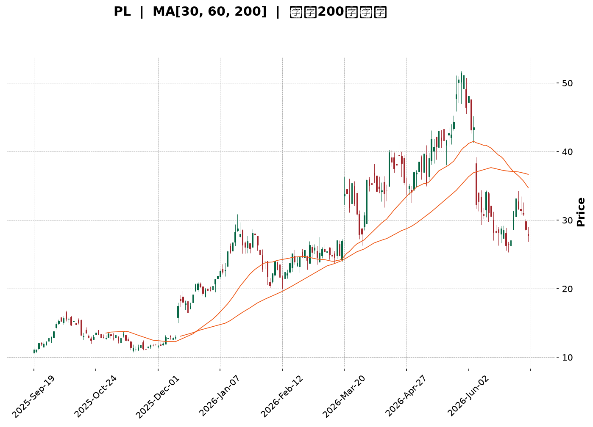
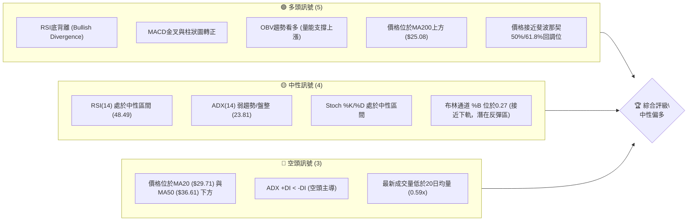
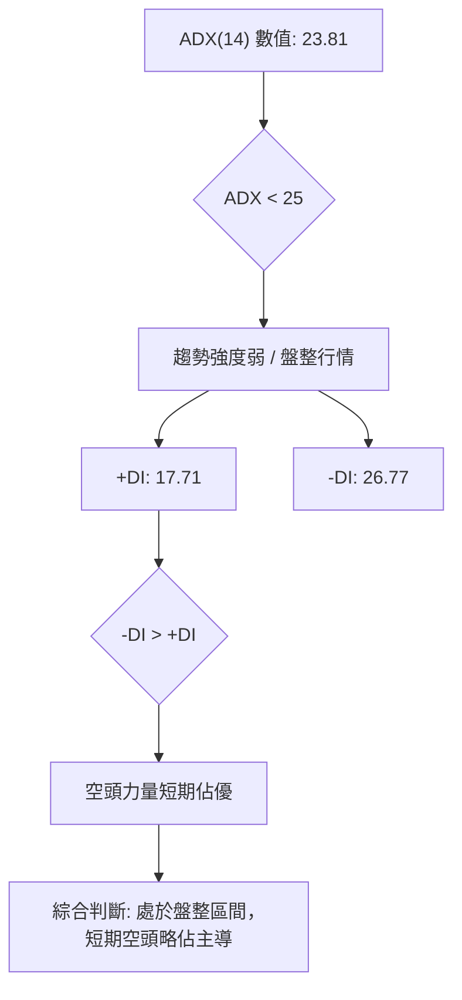
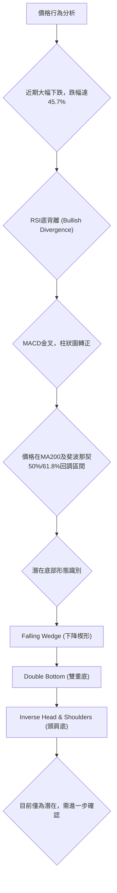
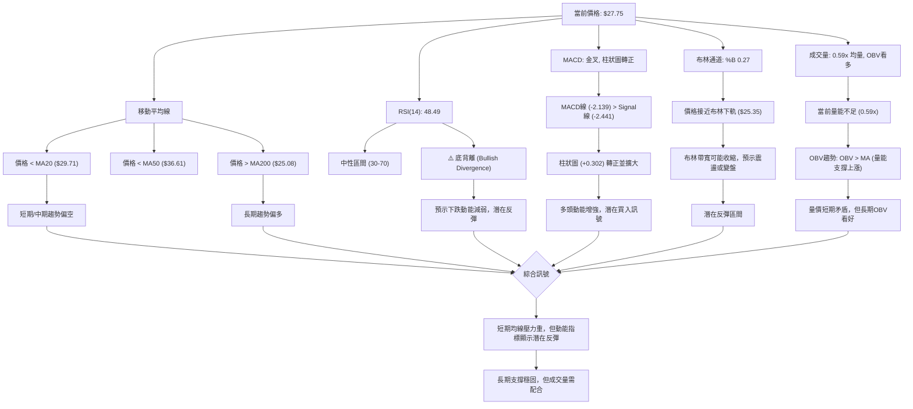
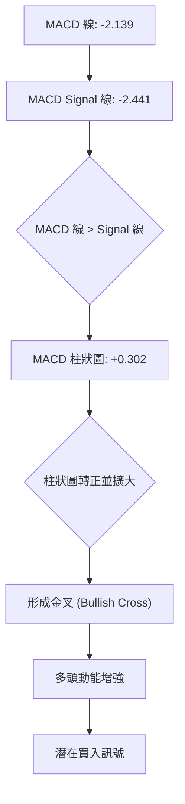
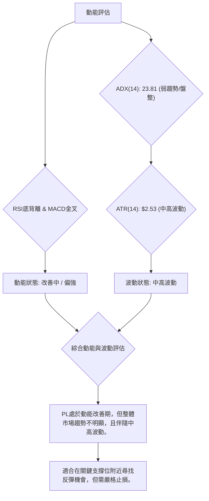
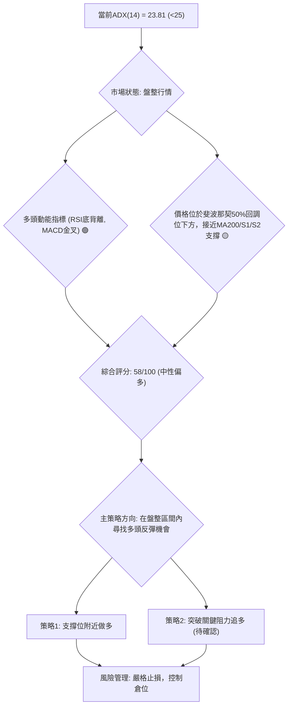
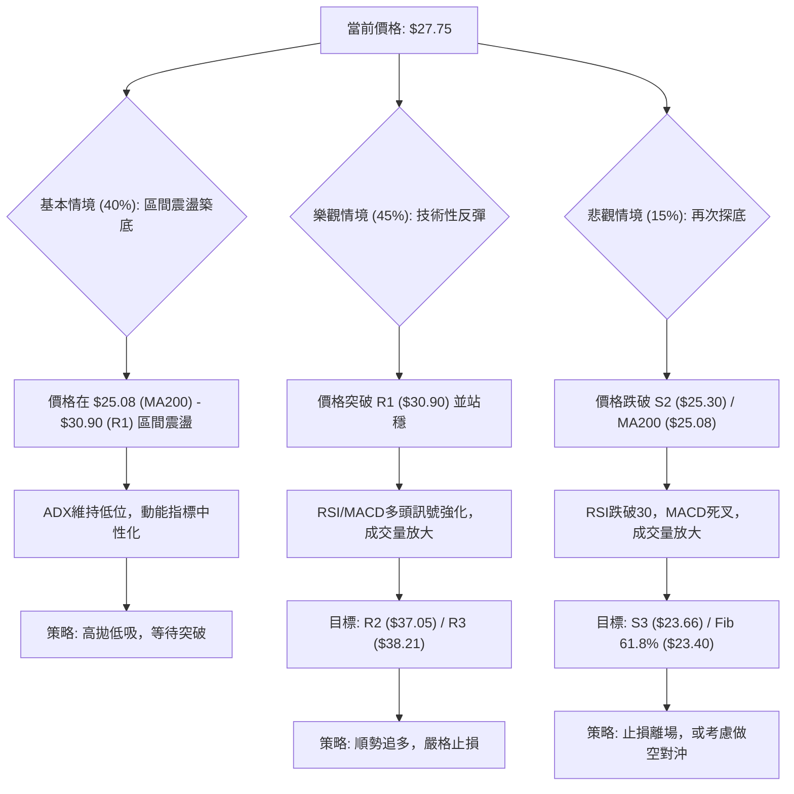

<details>
<summary>📊 靜態圖表 (點擊展開)</summary>

</details>

<html>
<head><meta charset="utf-8" /></head>
<body>
    <div style="height:500px; width:100%;">                        <script>window.PlotlyConfig = {MathJaxConfig: 'local'};</script>
        <script charset="utf-8" src="https://cdn.plot.ly/plotly-3.6.0.min.js" integrity="sha256-QaOVwtVY0T02VaHrr6pnoHLCwayMJp4O5n4YyaE3rJk=" crossorigin="anonymous"></script>                <div id="candlestick-chart" class="plotly-graph-div" style="height:100%; width:100%;"></div>            <script>                window.PLOTLYENV=window.PLOTLYENV || {};                                if (document.getElementById("candlestick-chart")) {                    Plotly.newPlot(                        "candlestick-chart",                        [{"close":{"dtype":"f8","bdata":"AAAA4FE4JkAAAADgUTgmQAAAAKCZGShAAAAAACncJ0AAAAAghesnQAAAAGBmZihAAAAA4HqUKUAAAACAwvUpQAAAAIA9iitAAAAAQDOzLUAAAABguJ4uQAAAAEDhei5AAAAAAClcL0AAAABAMzMvQAAAAIDrUS9AAAAAYGZmLUAAAAAAAIAuQAAAACBcjy1AAAAAgBQuLkAAAACAwnUqQAAAAOBROCpAAAAAYLgeK0AAAACA69EpQAAAAAAAAClAAAAAYGbmKUAAAADgUTgrQAAAAGC4nipAAAAAgBSuKUAAAADAzMwpQAAAAOBRuClAAAAAYGbmKkAAAACgR2EqQAAAAGBmZilAAAAAAACAKkAAAAAghesoQAAAAGC4nilAAAAAIK7HKkAAAADgo\u002fAoQAAAAKBH4ShAAAAAgOvRJkAAAADAzMwmQAAAACCFayZAAAAAYGbmJkAAAADgepQnQAAAAIDCdSZAAAAAgOtRJkAAAADgehQnQAAAAIDCdSdAAAAA4KNwJ0AAAADAzMwnQAAAAGBmZidAAAAAgD2KJ0AAAADAHgUoQAAAAKBH4SlAAAAAgD2KKUAAAABgZuYpQAAAAIAUrilAAAAAoEfhKUAAAADgUXgxQAAAAKBwPTJAAAAAwMwMMkAAAACgR+ExQAAAAOBReDBAAAAAoHB9MUAAAACAFC4zQAAAAKCZmTRAAAAAQOG6NEAAAACA61E0QAAAAAApXDNAAAAAYLjeM0AAAACgcL0zQAAAAOBRuDNAAAAAwPVoNEAAAAAA12M1QAAAAEAK1zVAAAAAACmcNkAAAADgo3A2QAAAAIDCtTZAAAAA4KNwOUAAAACA61E5QAAAAEDhujpAAAAAIK5HPEAAAAAgrsc8QAAAAAAAADxAAAAAoEdhOkAAAAAgXA86QAAAAOCj8DpAAAAAYLjeOUAAAACA6xE8QAAAAKBH4TtAAAAAoJlZOkAAAADgUfg4QAAAAKCZ2TZAAAAAQDPzN0AAAADAHsU1QAAAAIAUbjRAAAAAYI9CNkAAAADAHgU4QAAAAIA9yjZAAAAAYGamNUAAAADAzEw1QAAAACCFazZAAAAAgMI1NkAAAACgcL03QAAAAAApHDlAAAAAYGbmN0AAAAAgrsc3QAAAAIDCtThAAAAAoEehOEAAAACgmZk5QAAAAADXIzhAAAAAAClcOkAAAADAzEw5QAAAAAAAADpAAAAAQAqXOEAAAAAgrkc5QAAAAIDr0TlAAAAAYGZmOUAAAADgo3A5QAAAAOBR+DhAAAAAgD3KOEAAAACgmZk4QAAAAOB6FDtAAAAAIFzPOEAAAACAwvU6QAAAAIA96kBAAAAAwPXoQEAAAADgetQ\u002fQAAAACBcr0FAAAAAQDMzQEAAAAAAKdw+QAAAAADX4ztAAAAAQDPzO0AAAACAwrU+QAAAAOCj8EFAAAAAYI+CQUAAAACAwpVBQAAAAGBmRkJAAAAAoHAdQUAAAACAwlVBQAAAAMD1KEFAAAAAQAr3QEAAAADgejRBQAAAAIDr8UNAAAAAoHA9Q0AAAAAAAMBCQAAAAADXA0NAAAAAACm8Q0AAAADAHiVDQAAAAOBRuEFAAAAAoJm5QUAAAAAA14NBQAAAAIA9CkFAAAAAACl8QkAAAABAM3NCQAAAAMAeRUNAAAAA4KOQQkAAAADgUdhDQAAAAGC4nkFAAAAAwB6FQ0AAAAAghetEQAAAAEAKV0RAAAAAYLheREAAAADAHoVFQAAAACBcz0RAAAAAgBTOREAAAAAghctEQAAAAOB6VEVAAAAAoHA9RUAAAADAzCxGQAAAAMD1KEhAAAAAoHA9SUAAAABAM7NJQAAAAIDrkUlAAAAAQOE6R0AAAAAghQtIQAAAAOCjkEVAAAAAANfDRUAAAAAAKRxAQAAAAGC4XkBAAAAAIIUrP0AAAADgUbg+QAAAAIDCFUFAAAAAYGYmP0AAAADgepQ+QAAAAIDCNTxAAAAA4FE4PEAAAABA4To8QAAAAMAexTxAAAAAIK6HPEAAAADAzEw6QAAAAGCPgjpAAAAAgOsRO0AAAAAgrkc\u002fQAAAAOCjkEBAAAAAACmcP0AAAACgR2E\u002fQAAAAAAp3D5AAAAAwPWoPEAAAAAAAMA7QA=="},"high":{"dtype":"f8","bdata":"AAAAgOvRJkAAAADAzEwmQAAAAGCPQihAAAAAgMJ1KEAAAAAgXI8oQAAAAMD1qChAAAAAAAAAKkAAAABguB4qQAAAAIA9CixAAAAAwMg2LkAAAAAAAAAvQAAAACCuxy9AAAAAYI8CMEAAAAAgrscwQAAAAKCZmS9AAAAAwMwMMEAAAABgZuYvQAAAAAAAgC5AAAAA4HpUL0AAAABANR4vQAAAAMD1KCtAAAAAgOvRLEAAAABACKwqQAAAAKCZGSpAAAAAACmcKkAAAACAFG4rQAAAACCF6ytAAAAA4KPwKkAAAAAghasqQAAAAGBmZipAAAAAgMJ1K0AAAABgj8IqQAAAAIA9CitAAAAA4KOwKkAAAACAPQoqQAAAAGBmpilAAAAAoJmZK0AAAACgcL0qQAAAAMDMzClAAAAAgOvRKEAAAABAM7MnQAAAAOBROCdAAAAAwB7FJ0AAAACAwvUoQAAAAAAAAClAAAAAAAAAJ0AAAAAgXE8nQAAAAKDtvCdAAAAAgD0KKEAAAADAHgUoQAAAAADXoydAAAAAwB6FKEAAAACgR2EoQAAAAGBmZipAAAAAAADAKUAAAACAwnUqQAAAAAAAACpAAAAAQOF6KkAAAACgmfkxQAAAAKCZGTNAAAAA4KOwM0AAAAAgrkcyQAAAAMDMjDJAAAAAQDPzMUAAAADgetQzQAAAAGCPwjRAAAAAoHD9NEAAAACAFO40QAAAAIDCVTRAAAAAwB4lNEAAAAAAKTw0QAAAAMDMTDRAAAAAIFzPNEAAAAAgXG81QAAAAEAzEzZAAAAAACncNkAAAACgmZk3QAAAAIDpxjdAAAAAIFyPOUAAAABACpc6QAAAAMAexTpAAAAAoEdhPUAAAABg4+U+QAAAAOBRuD1AAAAAIIWrPEAAAACAwOo6QAAAAEDhujtAAAAAQDOzOkAAAABAM7M8QAAAAGBmZjxAAAAAQDOzO0AAAAAAAEA7QAAAAMChxTlAAAAAAKz8N0AAAAAAAAA4QAAAAIDAijVAAAAAIK5HNkAAAADgURg4QAAAAEDh+jdAAAAAYGaGN0AAAADA9eg1QAAAAIAU7jZAAAAAgD3KNkAAAACgmZk4QAAAAAApHDlAAAAA4KOwOUAAAADgerQ4QAAAACBczzhAAAAAQGLQOUAAAADgo7A5QAAAAEAK1zhAAAAAgBTuOkAAAADgo3A6QAAAAKBHgTpAAAAAoHA9OkAAAAAAqpE7QAAAAEAKFzpAAAAA4FF4OkAAAAAghes6QAAAACBcDzpAAAAAgOkGOkAAAAAAAIA5QAAAAEAKFztAAAAA4HoUO0AAAABgj0I7QAAAAADXI0JAAAAAIIVrQUAAAAAghQtCQAAAAGBmhkJAAAAAANXYQUAAAABguB5BQAAAAMD1aD9AAAAAgBTuPEAAAACAFC4\u002fQAAAAMAeBUJAAAAAwB4lQkAAAABgZuZBQAAAAEDhGkNAAAAAgMKVQkAAAACA6zFCQAAAAIAUvkFAAAAAIFg5QkAAAACAwpVBQAAAAKBwHURAAAAAoHAdREAAAADgevRDQAAAAADXw0NAAAAAQOHaREAAAAAAAABEQAAAAAAAwENAAAAAoHAdQkAAAABACqdBQAAAAAAAgEFAAAAAACl8QkAAAADgeqRCQAAAAGCPokNAAAAAQAq3Q0AAAACgR+FDQAAAAIDCdURAAAAAwMzsQ0AAAAAgXI9FQAAAAOCj8ERAAAAAoJkZRUAAAACgmblFQAAAAEAKl0VAAAAAANfjRkAAAAAAAOBEQAAAAGBmxkVAAAAAAAAARkAAAABADKJGQAAAAOCjkElAAAAAoHB9SUAAAACgR+FJQAAAAGCPoklAAAAAAABgSUAAAABgj2JJQAAAACBcz0dAAAAAwB6VRkAAAABACpdDQAAAAMAeBUFAAAAAIFwvQUAAAADAzMw\u002fQAAAAMD1KEFAAAAAQDMTQUAAAACA6xFAQAAAAAAAQD9AAAAAoJlZPUAAAAAAAAA9QAAAAGCPIj1AAAAAIC89PUAAAACgR+E8QAAAAEAK1zpAAAAA4KOwPEAAAAAgrkc\u002fQAAAAMDM7EBAAAAAAAAgQUAAAACgmblAQAAAAIAUTkBAAAAAwMwsPkAAAAAAAAA9QA=="},"hovertemplate":"\u003cb\u003e%{x|%Y-%m-%d}\u003c\u002fb\u003e\u003cbr\u003e\u958b: $%{open:.2f}\u003cbr\u003e\u9ad8: $%{high:.2f}\u003cbr\u003e\u4f4e: $%{low:.2f}\u003cbr\u003e\u6536: $%{close:.2f}\u003cextra\u003e\u003c\u002fextra\u003e","low":{"dtype":"f8","bdata":"AAAAQOE6JUAAAADgo3AlQAAAAADXIyZAAAAAQApXJ0AAAABACtcmQAAAAMAehSdAAAAA4FG4KEAAAACgcD0oQAAAAEAzMylAAAAAwPUoLEAAAADAHoUtQAAAAKBHYS5AAAAAIFyPLUAAAADAHoUuQAAAAMD1KC5AAAAAACkcLUAAAACA61EuQAAAAEAKFy1AAAAAQDOzLUAAAACgcD0qQAAAACDdJClAAAAAAAAAK0AAAABguJ4pQAAAAOCj8CdAAAAAgBQuKUAAAAAgrkcqQAAAAIA9iipAAAAAIFyPKUAAAAAgrocpQAAAAEDfDylAAAAAIK7HKUAAAACAwnUpQAAAACCF6yhAAAAAIFwPKUAAAAAA1yMoQAAAAAAp3CdAAAAAYBDYKUAAAAAgXI8oQAAAAMD1qChAAAAAQAoXJkAAAADAyHYlQAAAAGCPwiVAAAAAgBTuJUAAAADAzMwmQAAAAICXLiZAAAAAgD0KJUAAAADAHoUmQAAAAMAehSZAAAAAYI9CJ0AAAACAl24nQAAAAMDMzCZAAAAA4HpUJ0AAAABA4XonQAAAAAAp3CdAAAAAwB4FKUAAAACgcD0pQAAAAEA1HilAAAAAwPUoKUAAAADAHgUuQAAAAGC4XjFAAAAAANejMUAAAACAFO4wQAAAAIAUbjBAAAAAgD0KMUAAAACgcP0xQAAAAAApnDNAAAAAoJmZM0AAAAAAKRw0QAAAAIA9CjNAAAAAYI\u002fCMkAAAADgo3AzQAAAAECJoTNAAAAAANX4MkAAAACgcH0zQAAAAOBR+DRAAAAAwPVoNUAAAABAChc2QAAAAMAg0DVAAAAAwPUoN0AAAABguB45QAAAAAAAADlAAAAAYI9COkAAAAAAKVw8QAAAACBcbztAAAAAoEchOUAAAAAA1yM5QAAAAIAULjlAAAAA4FE4OUAAAACgGg86QAAAACBczzpAAAAAwMyMOUAAAACA63E4QAAAAEAKdzZAAAAAwPXoNkAAAABACpc0QAAAAGBmJjRAAAAAIFzPNEAAAABgZqY1QAAAAIDCtTZAAAAAwPXoNEAAAABA4fozQAAAACAGITVAAAAAAACANUAAAACgcD02QAAAAIDCdTZAAAAAYI+CN0AAAABA4To3QAAAAKCZWTZAAAAAoHB9OEAAAACA6xE4QAAAACCuxzZAAAAA4FG4N0AAAACgR2E4QAAAAIBoETlAAAAAYI+CN0AAAACgmdk3QAAAAEAzczhAAAAAQDMzOUAAAADgo\u002fA4QAAAACCuRzhAAAAAIFxPOEAAAADgeKk3QAAAAGBmZjhAAAAAYI\u002fCOEAAAADgo\u002fA3QAAAAIBoIUBAAAAAQOE6P0AAAAAAKRw\u002fQAAAAKBHIT9AAAAAIFwPQEAAAACAPYo+QAAAAGC4PjtAAAAAwPVIOkAAAADAHoU8QAAAAOCjcD1AAAAAQOEaQUAAAABgj2JAQAAAAOBRuEFAAAAA4FH4QEAAAACgmflAQAAAAAApXEBAAAAAoEfhP0AAAAAgrmdAQAAAAGBmdkFAAAAAIIXrQkAAAABACndCQAAAAGCPwkJAAAAAANcjQ0AAAACAPSpCQAAAAOCjkEFAAAAA4KPQQEAAAADA891AQAAAAMD1SEBAAAAAwEsnQUAAAADgpWtBQAAAAMD16EFAAAAAoJn5QUAAAACgR8FBQAAAAEAKd0FAAAAAYGbmQUAAAADAzAxDQAAAAKBHIUNAAAAAwMxsQ0AAAADAzMxDQAAAAMAeRURAAAAAoEchREAAAABgjwJDQAAAAIDCVURAAAAAwB6FREAAAADAzIxFQAAAAIAU7kZAAAAAgBSOR0AAAAAAAIBHQAAAAADXY0ZAAAAAANfDRkAAAABA4TpHQAAAAMAeVUVAAAAAYGamREAAAADA9ag\u002fQAAAAOB6VD9AAAAAgOtRPUAAAABAMzM+QAAAACCFaz5AAAAAwB7FPUAAAAAAKRw+QAAAAKBDCztAAAAA4HoUPEAAAADgelQ6QAAAAIDCtTpAAAAA4HpUO0AAAACAPYo5QAAAAMDMTDlAAAAAoEchOkAAAACgmZk8QAAAAKAYJD5AAAAAwPWIP0AAAACAPco+QAAAAAApnD5AAAAAgD2KPEAAAABACtc6QA=="},"name":"\u50f9\u683c","open":{"dtype":"f8","bdata":"AAAAgOtRJUAAAADgUbglQAAAAEDheiZAAAAAIK5HKEAAAAAAAAAnQAAAAOBRuCdAAAAAIK7HKEAAAABgZmYpQAAAAIAUrilAAAAA4FG4LEAAAABgZuYtQAAAAKCZmS9AAAAAAAAALkAAAADAzIwwQAAAAIAULi9AAAAA4FG4L0AAAAAghWsuQAAAAAAAAC5AAAAAYGbmLkAAAADgo\u002fAuQAAAAAAAACpAAAAAgD0KLEAAAAAAKVwqQAAAAAAAgClAAAAAYI9CKUAAAACgmZkqQAAAAGBm5itAAAAAwMzMKkAAAAAghespQAAAAEDheilAAAAAIK7HKUAAAADA9agqQAAAAIDCdSlAAAAAgBSuKUAAAADAHgUqQAAAAOBROChAAAAAgMJ1KkAAAABgZmYqQAAAAGCPQilAAAAAgD2KKEAAAAAAAAAmQAAAAAApXCZAAAAA4HoUJkAAAAAghesmQAAAAGBmZihAAAAAQOF6JkAAAABAM7MmQAAAAMAeBSdAAAAAgD2KJ0AAAACA69EnQAAAAEAzMydAAAAAYI\u002fCJ0AAAADA9agnQAAAAGBm5idAAAAAwB6FKUAAAAAAKVwqQAAAAKBwPSlAAAAAoJmZKUAAAADgepQvQAAAAOCjcDJAAAAAIFzPMkAAAABgZqYxQAAAAIAULjJAAAAAgD0KMUAAAACgcP0xQAAAACCuxzNAAAAAwMzMM0AAAABA4bo0QAAAAMDMTDRAAAAAoHDdMkAAAAAgrgc0QAAAAGC4vjNAAAAAQOHaM0AAAABAM7M0QAAAAAAAgDVAAAAA4FG4NUAAAACgmdk2QAAAAKCZmTZAAAAAwMxMN0AAAABgj0I6QAAAAAAAgDlAAAAAIFzPOkAAAABAM3M8QAAAAEAKlztAAAAAAACAPEAAAAAAAMA6QAAAAGCPAjpAAAAAoJmZOkAAAADgehQ6QAAAAMDMDDxAAAAAQDOzO0AAAABACrc5QAAAAADX4zhAAAAAQOH6N0AAAAAAAAA4QAAAAAAAADVAAAAAgD0KNUAAAACAwvU1QAAAAGC43jdAAAAAYGaGN0AAAACA65E1QAAAAAAAgDVAAAAAAAAANkAAAABgZmY2QAAAAMAeBTdAAAAAoHC9OEAAAABgZmY3QAAAAAAAQDdAAAAAwMxMOUAAAAAAAIA4QAAAAEAzkzhAAAAA4FG4N0AAAABA4Ro6QAAAAKCZmTlAAAAAAACAOUAAAAAA1+M3QAAAAEAK1zhAAAAAgOvROUAAAABAClc5QAAAAOBR+DlAAAAAQOH6OEAAAACgRyE5QAAAAKCZ2ThAAAAAAACAOkAAAAAAAEA4QAAAAGBmxkBAAAAAAABAQUAAAABA4dpAQAAAAEAzM0BAAAAAACl8QUAAAACgcP1AQAAAAKCZ2T5AAAAAwMzMPEAAAAAAAAA9QAAAAOCjcD1AAAAAgML1QUAAAADgo7BBQAAAAEAzc0JAAAAAAABAQkAAAADgo3BBQAAAAKBwHUFAAAAAIIXLQUAAAACAwjVBQAAAAKBwfUFAAAAAgOuRQ0AAAABAM5NDQAAAAAApHENAAAAAAADAQ0AAAACAPapDQAAAAIAUjkNAAAAAACm8QUAAAADAzExBQAAAAOCjMEFAAAAAANdDQUAAAAAgXF9CQAAAAMAehUJAAAAAoJmZQ0AAAAAgXH9CQAAAAGCPwkNAAAAAQDMzQkAAAABAM1NDQAAAACCFC0RAAAAAQAoXRUAAAADgo1BEQAAAAMD1CEVAAAAAANejRUAAAABACndEQAAAAEAzM0VAAAAAwHIIRUAAAADAzKxFQAAAAMD12EdAAAAAwMwMSUAAAABAMxNJQAAAAAAAkEhAAAAAIIWLSEAAAACAwpVHQAAAACBcz0dAAAAAoHCdRUAAAABgZiZDQAAAAKBHAUFAAAAAgMK1QEAAAAAA1+M+QAAAAAAAgD9AAAAAgOvxQEAAAACAPQpAQAAAAMAeBT5AAAAAANdjPEAAAABgZqY8QAAAAIDC9TtAAAAA4HpUO0AAAACA6xE8QAAAAGCPgjpAAAAAQOE6OkAAAACgmZk8QAAAAKBwfT5AAAAAoJlZQEAAAABACpc\u002fQAAAAOB6FD9AAAAA4HrUPUAAAAAAAAA8QA=="},"x":["2025-09-19T00:00:00-04:00","2025-09-22T00:00:00-04:00","2025-09-23T00:00:00-04:00","2025-09-24T00:00:00-04:00","2025-09-25T00:00:00-04:00","2025-09-26T00:00:00-04:00","2025-09-29T00:00:00-04:00","2025-09-30T00:00:00-04:00","2025-10-01T00:00:00-04:00","2025-10-02T00:00:00-04:00","2025-10-03T00:00:00-04:00","2025-10-06T00:00:00-04:00","2025-10-07T00:00:00-04:00","2025-10-08T00:00:00-04:00","2025-10-09T00:00:00-04:00","2025-10-10T00:00:00-04:00","2025-10-13T00:00:00-04:00","2025-10-14T00:00:00-04:00","2025-10-15T00:00:00-04:00","2025-10-16T00:00:00-04:00","2025-10-17T00:00:00-04:00","2025-10-20T00:00:00-04:00","2025-10-21T00:00:00-04:00","2025-10-22T00:00:00-04:00","2025-10-23T00:00:00-04:00","2025-10-24T00:00:00-04:00","2025-10-27T00:00:00-04:00","2025-10-28T00:00:00-04:00","2025-10-29T00:00:00-04:00","2025-10-30T00:00:00-04:00","2025-10-31T00:00:00-04:00","2025-11-03T00:00:00-05:00","2025-11-04T00:00:00-05:00","2025-11-05T00:00:00-05:00","2025-11-06T00:00:00-05:00","2025-11-07T00:00:00-05:00","2025-11-10T00:00:00-05:00","2025-11-11T00:00:00-05:00","2025-11-12T00:00:00-05:00","2025-11-13T00:00:00-05:00","2025-11-14T00:00:00-05:00","2025-11-17T00:00:00-05:00","2025-11-18T00:00:00-05:00","2025-11-19T00:00:00-05:00","2025-11-20T00:00:00-05:00","2025-11-21T00:00:00-05:00","2025-11-24T00:00:00-05:00","2025-11-25T00:00:00-05:00","2025-11-26T00:00:00-05:00","2025-11-28T00:00:00-05:00","2025-12-01T00:00:00-05:00","2025-12-02T00:00:00-05:00","2025-12-03T00:00:00-05:00","2025-12-04T00:00:00-05:00","2025-12-05T00:00:00-05:00","2025-12-08T00:00:00-05:00","2025-12-09T00:00:00-05:00","2025-12-10T00:00:00-05:00","2025-12-11T00:00:00-05:00","2025-12-12T00:00:00-05:00","2025-12-15T00:00:00-05:00","2025-12-16T00:00:00-05:00","2025-12-17T00:00:00-05:00","2025-12-18T00:00:00-05:00","2025-12-19T00:00:00-05:00","2025-12-22T00:00:00-05:00","2025-12-23T00:00:00-05:00","2025-12-24T00:00:00-05:00","2025-12-26T00:00:00-05:00","2025-12-29T00:00:00-05:00","2025-12-30T00:00:00-05:00","2025-12-31T00:00:00-05:00","2026-01-02T00:00:00-05:00","2026-01-05T00:00:00-05:00","2026-01-06T00:00:00-05:00","2026-01-07T00:00:00-05:00","2026-01-08T00:00:00-05:00","2026-01-09T00:00:00-05:00","2026-01-12T00:00:00-05:00","2026-01-13T00:00:00-05:00","2026-01-14T00:00:00-05:00","2026-01-15T00:00:00-05:00","2026-01-16T00:00:00-05:00","2026-01-20T00:00:00-05:00","2026-01-21T00:00:00-05:00","2026-01-22T00:00:00-05:00","2026-01-23T00:00:00-05:00","2026-01-26T00:00:00-05:00","2026-01-27T00:00:00-05:00","2026-01-28T00:00:00-05:00","2026-01-29T00:00:00-05:00","2026-01-30T00:00:00-05:00","2026-02-02T00:00:00-05:00","2026-02-03T00:00:00-05:00","2026-02-04T00:00:00-05:00","2026-02-05T00:00:00-05:00","2026-02-06T00:00:00-05:00","2026-02-09T00:00:00-05:00","2026-02-10T00:00:00-05:00","2026-02-11T00:00:00-05:00","2026-02-12T00:00:00-05:00","2026-02-13T00:00:00-05:00","2026-02-17T00:00:00-05:00","2026-02-18T00:00:00-05:00","2026-02-19T00:00:00-05:00","2026-02-20T00:00:00-05:00","2026-02-23T00:00:00-05:00","2026-02-24T00:00:00-05:00","2026-02-25T00:00:00-05:00","2026-02-26T00:00:00-05:00","2026-02-27T00:00:00-05:00","2026-03-02T00:00:00-05:00","2026-03-03T00:00:00-05:00","2026-03-04T00:00:00-05:00","2026-03-05T00:00:00-05:00","2026-03-06T00:00:00-05:00","2026-03-09T00:00:00-04:00","2026-03-10T00:00:00-04:00","2026-03-11T00:00:00-04:00","2026-03-12T00:00:00-04:00","2026-03-13T00:00:00-04:00","2026-03-16T00:00:00-04:00","2026-03-17T00:00:00-04:00","2026-03-18T00:00:00-04:00","2026-03-19T00:00:00-04:00","2026-03-20T00:00:00-04:00","2026-03-23T00:00:00-04:00","2026-03-24T00:00:00-04:00","2026-03-25T00:00:00-04:00","2026-03-26T00:00:00-04:00","2026-03-27T00:00:00-04:00","2026-03-30T00:00:00-04:00","2026-03-31T00:00:00-04:00","2026-04-01T00:00:00-04:00","2026-04-02T00:00:00-04:00","2026-04-06T00:00:00-04:00","2026-04-07T00:00:00-04:00","2026-04-08T00:00:00-04:00","2026-04-09T00:00:00-04:00","2026-04-10T00:00:00-04:00","2026-04-13T00:00:00-04:00","2026-04-14T00:00:00-04:00","2026-04-15T00:00:00-04:00","2026-04-16T00:00:00-04:00","2026-04-17T00:00:00-04:00","2026-04-20T00:00:00-04:00","2026-04-21T00:00:00-04:00","2026-04-22T00:00:00-04:00","2026-04-23T00:00:00-04:00","2026-04-24T00:00:00-04:00","2026-04-27T00:00:00-04:00","2026-04-28T00:00:00-04:00","2026-04-29T00:00:00-04:00","2026-04-30T00:00:00-04:00","2026-05-01T00:00:00-04:00","2026-05-04T00:00:00-04:00","2026-05-05T00:00:00-04:00","2026-05-06T00:00:00-04:00","2026-05-07T00:00:00-04:00","2026-05-08T00:00:00-04:00","2026-05-11T00:00:00-04:00","2026-05-12T00:00:00-04:00","2026-05-13T00:00:00-04:00","2026-05-14T00:00:00-04:00","2026-05-15T00:00:00-04:00","2026-05-18T00:00:00-04:00","2026-05-19T00:00:00-04:00","2026-05-20T00:00:00-04:00","2026-05-21T00:00:00-04:00","2026-05-22T00:00:00-04:00","2026-05-26T00:00:00-04:00","2026-05-27T00:00:00-04:00","2026-05-28T00:00:00-04:00","2026-05-29T00:00:00-04:00","2026-06-01T00:00:00-04:00","2026-06-02T00:00:00-04:00","2026-06-03T00:00:00-04:00","2026-06-04T00:00:00-04:00","2026-06-05T00:00:00-04:00","2026-06-08T00:00:00-04:00","2026-06-09T00:00:00-04:00","2026-06-10T00:00:00-04:00","2026-06-11T00:00:00-04:00","2026-06-12T00:00:00-04:00","2026-06-15T00:00:00-04:00","2026-06-16T00:00:00-04:00","2026-06-17T00:00:00-04:00","2026-06-18T00:00:00-04:00","2026-06-22T00:00:00-04:00","2026-06-23T00:00:00-04:00","2026-06-24T00:00:00-04:00","2026-06-25T00:00:00-04:00","2026-06-26T00:00:00-04:00","2026-06-29T00:00:00-04:00","2026-06-30T00:00:00-04:00","2026-07-01T00:00:00-04:00","2026-07-02T00:00:00-04:00","2026-07-06T00:00:00-04:00","2026-07-07T00:00:00-04:00","2026-07-08T00:00:00-04:00"],"type":"candlestick"},{"hovertemplate":"MA30: $%{y:.2f}\u003cextra\u003e\u003c\u002fextra\u003e","line":{"color":"#2196F3","dash":"dash","width":2},"mode":"lines","name":"MA30","x":["2025-09-19T00:00:00-04:00","2025-09-22T00:00:00-04:00","2025-09-23T00:00:00-04:00","2025-09-24T00:00:00-04:00","2025-09-25T00:00:00-04:00","2025-09-26T00:00:00-04:00","2025-09-29T00:00:00-04:00","2025-09-30T00:00:00-04:00","2025-10-01T00:00:00-04:00","2025-10-02T00:00:00-04:00","2025-10-03T00:00:00-04:00","2025-10-06T00:00:00-04:00","2025-10-07T00:00:00-04:00","2025-10-08T00:00:00-04:00","2025-10-09T00:00:00-04:00","2025-10-10T00:00:00-04:00","2025-10-13T00:00:00-04:00","2025-10-14T00:00:00-04:00","2025-10-15T00:00:00-04:00","2025-10-16T00:00:00-04:00","2025-10-17T00:00:00-04:00","2025-10-20T00:00:00-04:00","2025-10-21T00:00:00-04:00","2025-10-22T00:00:00-04:00","2025-10-23T00:00:00-04:00","2025-10-24T00:00:00-04:00","2025-10-27T00:00:00-04:00","2025-10-28T00:00:00-04:00","2025-10-29T00:00:00-04:00","2025-10-30T00:00:00-04:00","2025-10-31T00:00:00-04:00","2025-11-03T00:00:00-05:00","2025-11-04T00:00:00-05:00","2025-11-05T00:00:00-05:00","2025-11-06T00:00:00-05:00","2025-11-07T00:00:00-05:00","2025-11-10T00:00:00-05:00","2025-11-11T00:00:00-05:00","2025-11-12T00:00:00-05:00","2025-11-13T00:00:00-05:00","2025-11-14T00:00:00-05:00","2025-11-17T00:00:00-05:00","2025-11-18T00:00:00-05:00","2025-11-19T00:00:00-05:00","2025-11-20T00:00:00-05:00","2025-11-21T00:00:00-05:00","2025-11-24T00:00:00-05:00","2025-11-25T00:00:00-05:00","2025-11-26T00:00:00-05:00","2025-11-28T00:00:00-05:00","2025-12-01T00:00:00-05:00","2025-12-02T00:00:00-05:00","2025-12-03T00:00:00-05:00","2025-12-04T00:00:00-05:00","2025-12-05T00:00:00-05:00","2025-12-08T00:00:00-05:00","2025-12-09T00:00:00-05:00","2025-12-10T00:00:00-05:00","2025-12-11T00:00:00-05:00","2025-12-12T00:00:00-05:00","2025-12-15T00:00:00-05:00","2025-12-16T00:00:00-05:00","2025-12-17T00:00:00-05:00","2025-12-18T00:00:00-05:00","2025-12-19T00:00:00-05:00","2025-12-22T00:00:00-05:00","2025-12-23T00:00:00-05:00","2025-12-24T00:00:00-05:00","2025-12-26T00:00:00-05:00","2025-12-29T00:00:00-05:00","2025-12-30T00:00:00-05:00","2025-12-31T00:00:00-05:00","2026-01-02T00:00:00-05:00","2026-01-05T00:00:00-05:00","2026-01-06T00:00:00-05:00","2026-01-07T00:00:00-05:00","2026-01-08T00:00:00-05:00","2026-01-09T00:00:00-05:00","2026-01-12T00:00:00-05:00","2026-01-13T00:00:00-05:00","2026-01-14T00:00:00-05:00","2026-01-15T00:00:00-05:00","2026-01-16T00:00:00-05:00","2026-01-20T00:00:00-05:00","2026-01-21T00:00:00-05:00","2026-01-22T00:00:00-05:00","2026-01-23T00:00:00-05:00","2026-01-26T00:00:00-05:00","2026-01-27T00:00:00-05:00","2026-01-28T00:00:00-05:00","2026-01-29T00:00:00-05:00","2026-01-30T00:00:00-05:00","2026-02-02T00:00:00-05:00","2026-02-03T00:00:00-05:00","2026-02-04T00:00:00-05:00","2026-02-05T00:00:00-05:00","2026-02-06T00:00:00-05:00","2026-02-09T00:00:00-05:00","2026-02-10T00:00:00-05:00","2026-02-11T00:00:00-05:00","2026-02-12T00:00:00-05:00","2026-02-13T00:00:00-05:00","2026-02-17T00:00:00-05:00","2026-02-18T00:00:00-05:00","2026-02-19T00:00:00-05:00","2026-02-20T00:00:00-05:00","2026-02-23T00:00:00-05:00","2026-02-24T00:00:00-05:00","2026-02-25T00:00:00-05:00","2026-02-26T00:00:00-05:00","2026-02-27T00:00:00-05:00","2026-03-02T00:00:00-05:00","2026-03-03T00:00:00-05:00","2026-03-04T00:00:00-05:00","2026-03-05T00:00:00-05:00","2026-03-06T00:00:00-05:00","2026-03-09T00:00:00-04:00","2026-03-10T00:00:00-04:00","2026-03-11T00:00:00-04:00","2026-03-12T00:00:00-04:00","2026-03-13T00:00:00-04:00","2026-03-16T00:00:00-04:00","2026-03-17T00:00:00-04:00","2026-03-18T00:00:00-04:00","2026-03-19T00:00:00-04:00","2026-03-20T00:00:00-04:00","2026-03-23T00:00:00-04:00","2026-03-24T00:00:00-04:00","2026-03-25T00:00:00-04:00","2026-03-26T00:00:00-04:00","2026-03-27T00:00:00-04:00","2026-03-30T00:00:00-04:00","2026-03-31T00:00:00-04:00","2026-04-01T00:00:00-04:00","2026-04-02T00:00:00-04:00","2026-04-06T00:00:00-04:00","2026-04-07T00:00:00-04:00","2026-04-08T00:00:00-04:00","2026-04-09T00:00:00-04:00","2026-04-10T00:00:00-04:00","2026-04-13T00:00:00-04:00","2026-04-14T00:00:00-04:00","2026-04-15T00:00:00-04:00","2026-04-16T00:00:00-04:00","2026-04-17T00:00:00-04:00","2026-04-20T00:00:00-04:00","2026-04-21T00:00:00-04:00","2026-04-22T00:00:00-04:00","2026-04-23T00:00:00-04:00","2026-04-24T00:00:00-04:00","2026-04-27T00:00:00-04:00","2026-04-28T00:00:00-04:00","2026-04-29T00:00:00-04:00","2026-04-30T00:00:00-04:00","2026-05-01T00:00:00-04:00","2026-05-04T00:00:00-04:00","2026-05-05T00:00:00-04:00","2026-05-06T00:00:00-04:00","2026-05-07T00:00:00-04:00","2026-05-08T00:00:00-04:00","2026-05-11T00:00:00-04:00","2026-05-12T00:00:00-04:00","2026-05-13T00:00:00-04:00","2026-05-14T00:00:00-04:00","2026-05-15T00:00:00-04:00","2026-05-18T00:00:00-04:00","2026-05-19T00:00:00-04:00","2026-05-20T00:00:00-04:00","2026-05-21T00:00:00-04:00","2026-05-22T00:00:00-04:00","2026-05-26T00:00:00-04:00","2026-05-27T00:00:00-04:00","2026-05-28T00:00:00-04:00","2026-05-29T00:00:00-04:00","2026-06-01T00:00:00-04:00","2026-06-02T00:00:00-04:00","2026-06-03T00:00:00-04:00","2026-06-04T00:00:00-04:00","2026-06-05T00:00:00-04:00","2026-06-08T00:00:00-04:00","2026-06-09T00:00:00-04:00","2026-06-10T00:00:00-04:00","2026-06-11T00:00:00-04:00","2026-06-12T00:00:00-04:00","2026-06-15T00:00:00-04:00","2026-06-16T00:00:00-04:00","2026-06-17T00:00:00-04:00","2026-06-18T00:00:00-04:00","2026-06-22T00:00:00-04:00","2026-06-23T00:00:00-04:00","2026-06-24T00:00:00-04:00","2026-06-25T00:00:00-04:00","2026-06-26T00:00:00-04:00","2026-06-29T00:00:00-04:00","2026-06-30T00:00:00-04:00","2026-07-01T00:00:00-04:00","2026-07-02T00:00:00-04:00","2026-07-06T00:00:00-04:00","2026-07-07T00:00:00-04:00","2026-07-08T00:00:00-04:00"],"y":{"dtype":"f8","bdata":"AAAAAAAA+H8AAAAAAAD4fwAAAAAAAPh\u002fAAAAAAAA+H8AAAAAAAD4fwAAAAAAAPh\u002fAAAAAAAA+H8AAAAAAAD4fwAAAAAAAPh\u002fAAAAAAAA+H8AAAAAAAD4fwAAAAAAAPh\u002fAAAAAAAA+H8AAAAAAAD4fwAAAAAAAPh\u002fAAAAAAAA+H8AAAAAAAD4fwAAAAAAAPh\u002fAAAAAAAA+H8AAAAAAAD4fwAAAAAAAPh\u002fAAAAAAAA+H8AAAAAAAD4fwAAAAAAAPh\u002fAAAAAAAA+H8AAAAAAAD4fwAAAAAAAPh\u002fAAAAAAAA+H8AAAAAAAD4fzMzMwNWDitAERERoUU2K0CamZlJxVkrQN7d3S3dZCtAiYiIWGR7K0ARERHh7IMrQDMzMwNWjitAREREdJOYK0C8u7s7348rQO\u002fu7l4seStAd3d3x3Y+K0CamZm5u\u002fsqQDMzM2P0tipAvLu7O8NuKkBmZmYWvS0qQO\u002fu7h4i4ilAAAAAoLelKUAzMzNjZmYpQLy7u7tYMilAq6qq+tT4KEDv7u4eIuIoQM3MzLwRyihAvLu7G4WrKEAzMzPzKJwoQGZmZlaroyhAiYiI6JigKEAzMzNTVZUoQM3MzNxPjShARERExASPKEBmZmZmA90oQKuqqvrUOClA7+7urlaHKUCrqqqaYdcpQLy7u\u002fu4FypAMzMz0xVgKkBERET0xdIqQLy7u\u002fu4VytA3t3d7f3UK0CamZkZ91osQLy7uwsR0SxAq6qqWnNhLUDv7u5eye8tQAAAACAGgS5AZmZm9vAZL0AAAAAAyL0vQGZmZuZtOTBA7+7uziKbMEARERE5JvgwQN7d3WXYVTFAIiIiMuzKMUAiIiKicD0yQDMzMyuyvTJAiYiI0JRKM0CJiIhwr9kzQDMzM4MyWjRAIiIiAlbONEBVVVU9NT41QBERESmHtjVA3t3dLd0kNkC8u7s7UX82QCIiIiKU0TZAMzMzw2cYN0Crqqoa6FQ3QN7d3W1ZizdAREREhHnCN0BVVVV1k9g3QGZmZhYg1zdAzczMbC7kN0AzMzMzwQM4QGZmZiYGIThA3t3dnTYwOEDNzMx8hj04QKuqqrqQVDhAMzMz4+xjOECrqqqK+nc4QHd3d\u002ffhkzhAMzMzA+SeOECamZlJU6o4QKuqqlpkuzhAERER4Xq0OEDNzMyM3rY4QLy7u5vEoDhA3t3dTWKQOEAAAAAgsHI4QO\u002fu7g6fYThA7+7uvlhSOEAAAADQsEs4QCIiIiIiQjhAZmZmZh8+OEBEREQUric4QGZmZhbZDjhAd3d3N4kBOEARERHxYP43QERERIR5IjhAZmZmNtApOEAAAADwGVY4QAAAALByyDhARERE5BcrOUCJiIgYvW05QFVVVYUW2TlAIiIiQtI0OkBmZmZmZoY6QLy7u8sTtTpAVVVVBQ\u002fmOkB3d3c3iSE7QERERKRwfTtAd3d3p1TcO0C8u7t7hj08QLy7u1uPojxAERER4Xr0PEB3d3eX4EE9QERERCS\u002fmD1A7+7uDljZPUCJiIgoFSc+QDMzM1OcnT5A3t3dfSMUP0DNzMx8anw\u002fQDMzM6Ob5D9AMzMzA1YuQEC8u7ujKWVAQLy7u6vVkUBAvLu7O1G\u002fQECrqqqS0etAQBEREXGvCUFAAAAAaJE9QUAiIiKK+mdBQFVVVR0TfEFAzczMhDKKQUC8u7u7u6tBQN7d3b0tq0FAREREZILHQUCrqqp6W\u002fZBQCIiIpLtLEJAmpmZqX9jQkAAAABQG5hCQLy7u+uYsEJAVVVV9bbMQkAAAABQG+hCQAAAABAtAkNAMzMzQ2AlQ0B3d3dnrU5DQDMzMyNpikNAZmZmJgbRQ0AzMzPDgxlEQDMzM8ODSURAzczMDJBrREB3d3cnv5hEQHd3d7eBrkRAERERUdS\u002fREAiIiJC7qVEQERERCRpmkRAVVVVPSaIREAiIiKSwnVEQO\u002fu7t4kdkRAiYiI4E9dREAAAADAWEJEQCIiIqJFFkRAERERiUHwQ0AREREpXL9DQJqZmTHBo0NAiYiIeOl2Q0BVVVWlmzRDQCIiIjom+EJAiYiI8NK9QkAiIiLipYtCQKuqqopsZ0JAAAAA4ME8QkDNzMzUMRFCQN7d3RXZ3kFA3t3d9eGjQUDe3d1VDl1BQA=="},"type":"scatter"},{"hovertemplate":"MA60: $%{y:.2f}\u003cextra\u003e\u003c\u002fextra\u003e","line":{"color":"#9C27B0","dash":"dash","width":2},"mode":"lines","name":"MA60","x":["2025-09-19T00:00:00-04:00","2025-09-22T00:00:00-04:00","2025-09-23T00:00:00-04:00","2025-09-24T00:00:00-04:00","2025-09-25T00:00:00-04:00","2025-09-26T00:00:00-04:00","2025-09-29T00:00:00-04:00","2025-09-30T00:00:00-04:00","2025-10-01T00:00:00-04:00","2025-10-02T00:00:00-04:00","2025-10-03T00:00:00-04:00","2025-10-06T00:00:00-04:00","2025-10-07T00:00:00-04:00","2025-10-08T00:00:00-04:00","2025-10-09T00:00:00-04:00","2025-10-10T00:00:00-04:00","2025-10-13T00:00:00-04:00","2025-10-14T00:00:00-04:00","2025-10-15T00:00:00-04:00","2025-10-16T00:00:00-04:00","2025-10-17T00:00:00-04:00","2025-10-20T00:00:00-04:00","2025-10-21T00:00:00-04:00","2025-10-22T00:00:00-04:00","2025-10-23T00:00:00-04:00","2025-10-24T00:00:00-04:00","2025-10-27T00:00:00-04:00","2025-10-28T00:00:00-04:00","2025-10-29T00:00:00-04:00","2025-10-30T00:00:00-04:00","2025-10-31T00:00:00-04:00","2025-11-03T00:00:00-05:00","2025-11-04T00:00:00-05:00","2025-11-05T00:00:00-05:00","2025-11-06T00:00:00-05:00","2025-11-07T00:00:00-05:00","2025-11-10T00:00:00-05:00","2025-11-11T00:00:00-05:00","2025-11-12T00:00:00-05:00","2025-11-13T00:00:00-05:00","2025-11-14T00:00:00-05:00","2025-11-17T00:00:00-05:00","2025-11-18T00:00:00-05:00","2025-11-19T00:00:00-05:00","2025-11-20T00:00:00-05:00","2025-11-21T00:00:00-05:00","2025-11-24T00:00:00-05:00","2025-11-25T00:00:00-05:00","2025-11-26T00:00:00-05:00","2025-11-28T00:00:00-05:00","2025-12-01T00:00:00-05:00","2025-12-02T00:00:00-05:00","2025-12-03T00:00:00-05:00","2025-12-04T00:00:00-05:00","2025-12-05T00:00:00-05:00","2025-12-08T00:00:00-05:00","2025-12-09T00:00:00-05:00","2025-12-10T00:00:00-05:00","2025-12-11T00:00:00-05:00","2025-12-12T00:00:00-05:00","2025-12-15T00:00:00-05:00","2025-12-16T00:00:00-05:00","2025-12-17T00:00:00-05:00","2025-12-18T00:00:00-05:00","2025-12-19T00:00:00-05:00","2025-12-22T00:00:00-05:00","2025-12-23T00:00:00-05:00","2025-12-24T00:00:00-05:00","2025-12-26T00:00:00-05:00","2025-12-29T00:00:00-05:00","2025-12-30T00:00:00-05:00","2025-12-31T00:00:00-05:00","2026-01-02T00:00:00-05:00","2026-01-05T00:00:00-05:00","2026-01-06T00:00:00-05:00","2026-01-07T00:00:00-05:00","2026-01-08T00:00:00-05:00","2026-01-09T00:00:00-05:00","2026-01-12T00:00:00-05:00","2026-01-13T00:00:00-05:00","2026-01-14T00:00:00-05:00","2026-01-15T00:00:00-05:00","2026-01-16T00:00:00-05:00","2026-01-20T00:00:00-05:00","2026-01-21T00:00:00-05:00","2026-01-22T00:00:00-05:00","2026-01-23T00:00:00-05:00","2026-01-26T00:00:00-05:00","2026-01-27T00:00:00-05:00","2026-01-28T00:00:00-05:00","2026-01-29T00:00:00-05:00","2026-01-30T00:00:00-05:00","2026-02-02T00:00:00-05:00","2026-02-03T00:00:00-05:00","2026-02-04T00:00:00-05:00","2026-02-05T00:00:00-05:00","2026-02-06T00:00:00-05:00","2026-02-09T00:00:00-05:00","2026-02-10T00:00:00-05:00","2026-02-11T00:00:00-05:00","2026-02-12T00:00:00-05:00","2026-02-13T00:00:00-05:00","2026-02-17T00:00:00-05:00","2026-02-18T00:00:00-05:00","2026-02-19T00:00:00-05:00","2026-02-20T00:00:00-05:00","2026-02-23T00:00:00-05:00","2026-02-24T00:00:00-05:00","2026-02-25T00:00:00-05:00","2026-02-26T00:00:00-05:00","2026-02-27T00:00:00-05:00","2026-03-02T00:00:00-05:00","2026-03-03T00:00:00-05:00","2026-03-04T00:00:00-05:00","2026-03-05T00:00:00-05:00","2026-03-06T00:00:00-05:00","2026-03-09T00:00:00-04:00","2026-03-10T00:00:00-04:00","2026-03-11T00:00:00-04:00","2026-03-12T00:00:00-04:00","2026-03-13T00:00:00-04:00","2026-03-16T00:00:00-04:00","2026-03-17T00:00:00-04:00","2026-03-18T00:00:00-04:00","2026-03-19T00:00:00-04:00","2026-03-20T00:00:00-04:00","2026-03-23T00:00:00-04:00","2026-03-24T00:00:00-04:00","2026-03-25T00:00:00-04:00","2026-03-26T00:00:00-04:00","2026-03-27T00:00:00-04:00","2026-03-30T00:00:00-04:00","2026-03-31T00:00:00-04:00","2026-04-01T00:00:00-04:00","2026-04-02T00:00:00-04:00","2026-04-06T00:00:00-04:00","2026-04-07T00:00:00-04:00","2026-04-08T00:00:00-04:00","2026-04-09T00:00:00-04:00","2026-04-10T00:00:00-04:00","2026-04-13T00:00:00-04:00","2026-04-14T00:00:00-04:00","2026-04-15T00:00:00-04:00","2026-04-16T00:00:00-04:00","2026-04-17T00:00:00-04:00","2026-04-20T00:00:00-04:00","2026-04-21T00:00:00-04:00","2026-04-22T00:00:00-04:00","2026-04-23T00:00:00-04:00","2026-04-24T00:00:00-04:00","2026-04-27T00:00:00-04:00","2026-04-28T00:00:00-04:00","2026-04-29T00:00:00-04:00","2026-04-30T00:00:00-04:00","2026-05-01T00:00:00-04:00","2026-05-04T00:00:00-04:00","2026-05-05T00:00:00-04:00","2026-05-06T00:00:00-04:00","2026-05-07T00:00:00-04:00","2026-05-08T00:00:00-04:00","2026-05-11T00:00:00-04:00","2026-05-12T00:00:00-04:00","2026-05-13T00:00:00-04:00","2026-05-14T00:00:00-04:00","2026-05-15T00:00:00-04:00","2026-05-18T00:00:00-04:00","2026-05-19T00:00:00-04:00","2026-05-20T00:00:00-04:00","2026-05-21T00:00:00-04:00","2026-05-22T00:00:00-04:00","2026-05-26T00:00:00-04:00","2026-05-27T00:00:00-04:00","2026-05-28T00:00:00-04:00","2026-05-29T00:00:00-04:00","2026-06-01T00:00:00-04:00","2026-06-02T00:00:00-04:00","2026-06-03T00:00:00-04:00","2026-06-04T00:00:00-04:00","2026-06-05T00:00:00-04:00","2026-06-08T00:00:00-04:00","2026-06-09T00:00:00-04:00","2026-06-10T00:00:00-04:00","2026-06-11T00:00:00-04:00","2026-06-12T00:00:00-04:00","2026-06-15T00:00:00-04:00","2026-06-16T00:00:00-04:00","2026-06-17T00:00:00-04:00","2026-06-18T00:00:00-04:00","2026-06-22T00:00:00-04:00","2026-06-23T00:00:00-04:00","2026-06-24T00:00:00-04:00","2026-06-25T00:00:00-04:00","2026-06-26T00:00:00-04:00","2026-06-29T00:00:00-04:00","2026-06-30T00:00:00-04:00","2026-07-01T00:00:00-04:00","2026-07-02T00:00:00-04:00","2026-07-06T00:00:00-04:00","2026-07-07T00:00:00-04:00","2026-07-08T00:00:00-04:00"],"y":{"dtype":"f8","bdata":"AAAAAAAA+H8AAAAAAAD4fwAAAAAAAPh\u002fAAAAAAAA+H8AAAAAAAD4fwAAAAAAAPh\u002fAAAAAAAA+H8AAAAAAAD4fwAAAAAAAPh\u002fAAAAAAAA+H8AAAAAAAD4fwAAAAAAAPh\u002fAAAAAAAA+H8AAAAAAAD4fwAAAAAAAPh\u002fAAAAAAAA+H8AAAAAAAD4fwAAAAAAAPh\u002fAAAAAAAA+H8AAAAAAAD4fwAAAAAAAPh\u002fAAAAAAAA+H8AAAAAAAD4fwAAAAAAAPh\u002fAAAAAAAA+H8AAAAAAAD4fwAAAAAAAPh\u002fAAAAAAAA+H8AAAAAAAD4fwAAAAAAAPh\u002fAAAAAAAA+H8AAAAAAAD4fwAAAAAAAPh\u002fAAAAAAAA+H8AAAAAAAD4fwAAAAAAAPh\u002fAAAAAAAA+H8AAAAAAAD4fwAAAAAAAPh\u002fAAAAAAAA+H8AAAAAAAD4fwAAAAAAAPh\u002fAAAAAAAA+H8AAAAAAAD4fwAAAAAAAPh\u002fAAAAAAAA+H8AAAAAAAD4fwAAAAAAAPh\u002fAAAAAAAA+H8AAAAAAAD4fwAAAAAAAPh\u002fAAAAAAAA+H8AAAAAAAD4fwAAAAAAAPh\u002fAAAAAAAA+H8AAAAAAAD4fwAAAAAAAPh\u002fAAAAAAAA+H8AAAAAAAD4f+\u002fu7n6VIypAAAAAKM5eKkAiIiJyk5gqQM3MzBRLvipA3t3dFb3tKkCrqqpqWSsrQHd3d38HcytAERERsci2K0Crqqoqa\u002fUrQFVVVbUeJSxAEREREfVPLEBERESMwnUsQJqZmUH9myxAERERGVrELEAzMzOLwvUsQN7d3fV+Ki1A7+7unv5tLUCrqqpqWastQLy7u8ME7y1Ad3d3r1ZHLkCamZmxga4uQJqZmQm7Ii9AZmZmXlegL0ARERH14RMwQDMzMxcEVjBAMzMzO1GPMEB3d3fzb8QwQLy7u4uX\u002fjBAAAAAyC82MUB3d3d36XYxQLy7u0\u002f\u002ftjFAVVVVjQnuMUAAAAB0TCAyQN7d3fWaSzJA7+7uNkJ5MkC8u7s3+6AyQCIiIkp+wTJA3t3dsVbnMkAAAABgnhgzQCIiIlbHRDNAmpmZJXhwM0AiIiKWtZozQFVVVeWJyjNAMzMzr3L4M0BVVVVFbys0QO\u002fu7u6nZjRAERERaQOdNEBVVVXBPNE0QERERGCeCDVAmpmZibM\u002fNUB3d3eXJ3o1QHd3d2M7rzVAMzMzj3vtNUBERETILyY2QBEREcnoXTZAiYiIYFeQNkCrqqoG88Q2QJqZmaVU\u002fDZAIiIiSn4xN0AAAACof1M3QERERJw2cDdAVVVVffiMN0De3d2FpKk3QBEREXnp1jdAVVVV3ST2N0CrqqqyVhc4QDMzM2PJTzhAiYiIKKOHOEDe3d0lv7g4QN7d3VUO\u002fThAAAAAcIQyOUCamZlx9mE5QDMzM0PShDlARERE9P2kOUARERHhwcw5QN7d3U2pCDpAVVVVVZw9OkCrqqri7HM6QDMzM9v5rjpAERER4XrUOkAiIiKSX\u002fw6QAAAAODBHDtAZmZmLt00O0BERESk4kw7QBEREbGdfztAZmZmHj6zO0BmZmamDeQ7QKuqquJeEzxAZmZmtmVNPEDe3d2tAHk8QO\u002fu7jZCmTxAd3d31xXAPEAzMzMLAus8QDMzMzPsGj1AMzMzg3lSPUAiIiKCB5M9QFVVVXVM4D1A7+7udr4fPkAAAABImmI+QImIiAC5lz5AVVVVhevhPkDe3d2tjjk\u002fQAAAAHh3hz9ARERELIfWP0De3d31bxRAQO\u002fu7p6oN0BAiYiIpHBdQEDv7u5Gb4NAQO\u002fu7l66qUBA3t3d2c7PQECamZnZzvdAQKuqqlpkK0FA7+7uFtleQUC8u7srh5ZBQGZmZvYozEFA3t3d5dD6QUDv7u4yeitCQImIiMRnUEJAIiIiKhV3QkDv7u7yi4VCQAAAAGgflkJAiYiIvLujQkBmZmYSyrBCQAAAACjqv0JAREREpHDNQkARERGlKdVCQLy7u18syUJA7+7uBjq9QkBmZmbyi7VCQLy7u3d3p0JAZmZm7jWfQkAAAACQe5VCQCIiIuaJkkJAERERTamQQkARERGZ4JFCQDMzM7sCjEJAq6qqaryEQkBmZmaSpnxCQO\u002fu7hKDcEJAiYiIHKFkQkCrqqre3VVCQA=="},"type":"scatter"},{"hovertemplate":"MA200: $%{y:.2f}\u003cextra\u003e\u003c\u002fextra\u003e","line":{"color":"#FF6F00","dash":"solid","width":2},"mode":"lines","name":"MA200","x":["2025-09-19T00:00:00-04:00","2025-09-22T00:00:00-04:00","2025-09-23T00:00:00-04:00","2025-09-24T00:00:00-04:00","2025-09-25T00:00:00-04:00","2025-09-26T00:00:00-04:00","2025-09-29T00:00:00-04:00","2025-09-30T00:00:00-04:00","2025-10-01T00:00:00-04:00","2025-10-02T00:00:00-04:00","2025-10-03T00:00:00-04:00","2025-10-06T00:00:00-04:00","2025-10-07T00:00:00-04:00","2025-10-08T00:00:00-04:00","2025-10-09T00:00:00-04:00","2025-10-10T00:00:00-04:00","2025-10-13T00:00:00-04:00","2025-10-14T00:00:00-04:00","2025-10-15T00:00:00-04:00","2025-10-16T00:00:00-04:00","2025-10-17T00:00:00-04:00","2025-10-20T00:00:00-04:00","2025-10-21T00:00:00-04:00","2025-10-22T00:00:00-04:00","2025-10-23T00:00:00-04:00","2025-10-24T00:00:00-04:00","2025-10-27T00:00:00-04:00","2025-10-28T00:00:00-04:00","2025-10-29T00:00:00-04:00","2025-10-30T00:00:00-04:00","2025-10-31T00:00:00-04:00","2025-11-03T00:00:00-05:00","2025-11-04T00:00:00-05:00","2025-11-05T00:00:00-05:00","2025-11-06T00:00:00-05:00","2025-11-07T00:00:00-05:00","2025-11-10T00:00:00-05:00","2025-11-11T00:00:00-05:00","2025-11-12T00:00:00-05:00","2025-11-13T00:00:00-05:00","2025-11-14T00:00:00-05:00","2025-11-17T00:00:00-05:00","2025-11-18T00:00:00-05:00","2025-11-19T00:00:00-05:00","2025-11-20T00:00:00-05:00","2025-11-21T00:00:00-05:00","2025-11-24T00:00:00-05:00","2025-11-25T00:00:00-05:00","2025-11-26T00:00:00-05:00","2025-11-28T00:00:00-05:00","2025-12-01T00:00:00-05:00","2025-12-02T00:00:00-05:00","2025-12-03T00:00:00-05:00","2025-12-04T00:00:00-05:00","2025-12-05T00:00:00-05:00","2025-12-08T00:00:00-05:00","2025-12-09T00:00:00-05:00","2025-12-10T00:00:00-05:00","2025-12-11T00:00:00-05:00","2025-12-12T00:00:00-05:00","2025-12-15T00:00:00-05:00","2025-12-16T00:00:00-05:00","2025-12-17T00:00:00-05:00","2025-12-18T00:00:00-05:00","2025-12-19T00:00:00-05:00","2025-12-22T00:00:00-05:00","2025-12-23T00:00:00-05:00","2025-12-24T00:00:00-05:00","2025-12-26T00:00:00-05:00","2025-12-29T00:00:00-05:00","2025-12-30T00:00:00-05:00","2025-12-31T00:00:00-05:00","2026-01-02T00:00:00-05:00","2026-01-05T00:00:00-05:00","2026-01-06T00:00:00-05:00","2026-01-07T00:00:00-05:00","2026-01-08T00:00:00-05:00","2026-01-09T00:00:00-05:00","2026-01-12T00:00:00-05:00","2026-01-13T00:00:00-05:00","2026-01-14T00:00:00-05:00","2026-01-15T00:00:00-05:00","2026-01-16T00:00:00-05:00","2026-01-20T00:00:00-05:00","2026-01-21T00:00:00-05:00","2026-01-22T00:00:00-05:00","2026-01-23T00:00:00-05:00","2026-01-26T00:00:00-05:00","2026-01-27T00:00:00-05:00","2026-01-28T00:00:00-05:00","2026-01-29T00:00:00-05:00","2026-01-30T00:00:00-05:00","2026-02-02T00:00:00-05:00","2026-02-03T00:00:00-05:00","2026-02-04T00:00:00-05:00","2026-02-05T00:00:00-05:00","2026-02-06T00:00:00-05:00","2026-02-09T00:00:00-05:00","2026-02-10T00:00:00-05:00","2026-02-11T00:00:00-05:00","2026-02-12T00:00:00-05:00","2026-02-13T00:00:00-05:00","2026-02-17T00:00:00-05:00","2026-02-18T00:00:00-05:00","2026-02-19T00:00:00-05:00","2026-02-20T00:00:00-05:00","2026-02-23T00:00:00-05:00","2026-02-24T00:00:00-05:00","2026-02-25T00:00:00-05:00","2026-02-26T00:00:00-05:00","2026-02-27T00:00:00-05:00","2026-03-02T00:00:00-05:00","2026-03-03T00:00:00-05:00","2026-03-04T00:00:00-05:00","2026-03-05T00:00:00-05:00","2026-03-06T00:00:00-05:00","2026-03-09T00:00:00-04:00","2026-03-10T00:00:00-04:00","2026-03-11T00:00:00-04:00","2026-03-12T00:00:00-04:00","2026-03-13T00:00:00-04:00","2026-03-16T00:00:00-04:00","2026-03-17T00:00:00-04:00","2026-03-18T00:00:00-04:00","2026-03-19T00:00:00-04:00","2026-03-20T00:00:00-04:00","2026-03-23T00:00:00-04:00","2026-03-24T00:00:00-04:00","2026-03-25T00:00:00-04:00","2026-03-26T00:00:00-04:00","2026-03-27T00:00:00-04:00","2026-03-30T00:00:00-04:00","2026-03-31T00:00:00-04:00","2026-04-01T00:00:00-04:00","2026-04-02T00:00:00-04:00","2026-04-06T00:00:00-04:00","2026-04-07T00:00:00-04:00","2026-04-08T00:00:00-04:00","2026-04-09T00:00:00-04:00","2026-04-10T00:00:00-04:00","2026-04-13T00:00:00-04:00","2026-04-14T00:00:00-04:00","2026-04-15T00:00:00-04:00","2026-04-16T00:00:00-04:00","2026-04-17T00:00:00-04:00","2026-04-20T00:00:00-04:00","2026-04-21T00:00:00-04:00","2026-04-22T00:00:00-04:00","2026-04-23T00:00:00-04:00","2026-04-24T00:00:00-04:00","2026-04-27T00:00:00-04:00","2026-04-28T00:00:00-04:00","2026-04-29T00:00:00-04:00","2026-04-30T00:00:00-04:00","2026-05-01T00:00:00-04:00","2026-05-04T00:00:00-04:00","2026-05-05T00:00:00-04:00","2026-05-06T00:00:00-04:00","2026-05-07T00:00:00-04:00","2026-05-08T00:00:00-04:00","2026-05-11T00:00:00-04:00","2026-05-12T00:00:00-04:00","2026-05-13T00:00:00-04:00","2026-05-14T00:00:00-04:00","2026-05-15T00:00:00-04:00","2026-05-18T00:00:00-04:00","2026-05-19T00:00:00-04:00","2026-05-20T00:00:00-04:00","2026-05-21T00:00:00-04:00","2026-05-22T00:00:00-04:00","2026-05-26T00:00:00-04:00","2026-05-27T00:00:00-04:00","2026-05-28T00:00:00-04:00","2026-05-29T00:00:00-04:00","2026-06-01T00:00:00-04:00","2026-06-02T00:00:00-04:00","2026-06-03T00:00:00-04:00","2026-06-04T00:00:00-04:00","2026-06-05T00:00:00-04:00","2026-06-08T00:00:00-04:00","2026-06-09T00:00:00-04:00","2026-06-10T00:00:00-04:00","2026-06-11T00:00:00-04:00","2026-06-12T00:00:00-04:00","2026-06-15T00:00:00-04:00","2026-06-16T00:00:00-04:00","2026-06-17T00:00:00-04:00","2026-06-18T00:00:00-04:00","2026-06-22T00:00:00-04:00","2026-06-23T00:00:00-04:00","2026-06-24T00:00:00-04:00","2026-06-25T00:00:00-04:00","2026-06-26T00:00:00-04:00","2026-06-29T00:00:00-04:00","2026-06-30T00:00:00-04:00","2026-07-01T00:00:00-04:00","2026-07-02T00:00:00-04:00","2026-07-06T00:00:00-04:00","2026-07-07T00:00:00-04:00","2026-07-08T00:00:00-04:00"],"y":{"dtype":"f8","bdata":"AAAAAAAA+H8AAAAAAAD4fwAAAAAAAPh\u002fAAAAAAAA+H8AAAAAAAD4fwAAAAAAAPh\u002fAAAAAAAA+H8AAAAAAAD4fwAAAAAAAPh\u002fAAAAAAAA+H8AAAAAAAD4fwAAAAAAAPh\u002fAAAAAAAA+H8AAAAAAAD4fwAAAAAAAPh\u002fAAAAAAAA+H8AAAAAAAD4fwAAAAAAAPh\u002fAAAAAAAA+H8AAAAAAAD4fwAAAAAAAPh\u002fAAAAAAAA+H8AAAAAAAD4fwAAAAAAAPh\u002fAAAAAAAA+H8AAAAAAAD4fwAAAAAAAPh\u002fAAAAAAAA+H8AAAAAAAD4fwAAAAAAAPh\u002fAAAAAAAA+H8AAAAAAAD4fwAAAAAAAPh\u002fAAAAAAAA+H8AAAAAAAD4fwAAAAAAAPh\u002fAAAAAAAA+H8AAAAAAAD4fwAAAAAAAPh\u002fAAAAAAAA+H8AAAAAAAD4fwAAAAAAAPh\u002fAAAAAAAA+H8AAAAAAAD4fwAAAAAAAPh\u002fAAAAAAAA+H8AAAAAAAD4fwAAAAAAAPh\u002fAAAAAAAA+H8AAAAAAAD4fwAAAAAAAPh\u002fAAAAAAAA+H8AAAAAAAD4fwAAAAAAAPh\u002fAAAAAAAA+H8AAAAAAAD4fwAAAAAAAPh\u002fAAAAAAAA+H8AAAAAAAD4fwAAAAAAAPh\u002fAAAAAAAA+H8AAAAAAAD4fwAAAAAAAPh\u002fAAAAAAAA+H8AAAAAAAD4fwAAAAAAAPh\u002fAAAAAAAA+H8AAAAAAAD4fwAAAAAAAPh\u002fAAAAAAAA+H8AAAAAAAD4fwAAAAAAAPh\u002fAAAAAAAA+H8AAAAAAAD4fwAAAAAAAPh\u002fAAAAAAAA+H8AAAAAAAD4fwAAAAAAAPh\u002fAAAAAAAA+H8AAAAAAAD4fwAAAAAAAPh\u002fAAAAAAAA+H8AAAAAAAD4fwAAAAAAAPh\u002fAAAAAAAA+H8AAAAAAAD4fwAAAAAAAPh\u002fAAAAAAAA+H8AAAAAAAD4fwAAAAAAAPh\u002fAAAAAAAA+H8AAAAAAAD4fwAAAAAAAPh\u002fAAAAAAAA+H8AAAAAAAD4fwAAAAAAAPh\u002fAAAAAAAA+H8AAAAAAAD4fwAAAAAAAPh\u002fAAAAAAAA+H8AAAAAAAD4fwAAAAAAAPh\u002fAAAAAAAA+H8AAAAAAAD4fwAAAAAAAPh\u002fAAAAAAAA+H8AAAAAAAD4fwAAAAAAAPh\u002fAAAAAAAA+H8AAAAAAAD4fwAAAAAAAPh\u002fAAAAAAAA+H8AAAAAAAD4fwAAAAAAAPh\u002fAAAAAAAA+H8AAAAAAAD4fwAAAAAAAPh\u002fAAAAAAAA+H8AAAAAAAD4fwAAAAAAAPh\u002fAAAAAAAA+H8AAAAAAAD4fwAAAAAAAPh\u002fAAAAAAAA+H8AAAAAAAD4fwAAAAAAAPh\u002fAAAAAAAA+H8AAAAAAAD4fwAAAAAAAPh\u002fAAAAAAAA+H8AAAAAAAD4fwAAAAAAAPh\u002fAAAAAAAA+H8AAAAAAAD4fwAAAAAAAPh\u002fAAAAAAAA+H8AAAAAAAD4fwAAAAAAAPh\u002fAAAAAAAA+H8AAAAAAAD4fwAAAAAAAPh\u002fAAAAAAAA+H8AAAAAAAD4fwAAAAAAAPh\u002fAAAAAAAA+H8AAAAAAAD4fwAAAAAAAPh\u002fAAAAAAAA+H8AAAAAAAD4fwAAAAAAAPh\u002fAAAAAAAA+H8AAAAAAAD4fwAAAAAAAPh\u002fAAAAAAAA+H8AAAAAAAD4fwAAAAAAAPh\u002fAAAAAAAA+H8AAAAAAAD4fwAAAAAAAPh\u002fAAAAAAAA+H8AAAAAAAD4fwAAAAAAAPh\u002fAAAAAAAA+H8AAAAAAAD4fwAAAAAAAPh\u002fAAAAAAAA+H8AAAAAAAD4fwAAAAAAAPh\u002fAAAAAAAA+H8AAAAAAAD4fwAAAAAAAPh\u002fAAAAAAAA+H8AAAAAAAD4fwAAAAAAAPh\u002fAAAAAAAA+H8AAAAAAAD4fwAAAAAAAPh\u002fAAAAAAAA+H8AAAAAAAD4fwAAAAAAAPh\u002fAAAAAAAA+H8AAAAAAAD4fwAAAAAAAPh\u002fAAAAAAAA+H8AAAAAAAD4fwAAAAAAAPh\u002fAAAAAAAA+H8AAAAAAAD4fwAAAAAAAPh\u002fAAAAAAAA+H8AAAAAAAD4fwAAAAAAAPh\u002fAAAAAAAA+H8AAAAAAAD4fwAAAAAAAPh\u002fAAAAAAAA+H8AAAAAAAD4fwAAAAAAAPh\u002fAAAAAAAA+H9xPQoTYRM5QA=="},"type":"scatter"}],                        {"template":{"data":{"barpolar":[{"marker":{"line":{"color":"rgb(17,17,17)","width":0.5},"pattern":{"fillmode":"overlay","size":10,"solidity":0.2}},"type":"barpolar"}],"bar":[{"error_x":{"color":"#f2f5fa"},"error_y":{"color":"#f2f5fa"},"marker":{"line":{"color":"rgb(17,17,17)","width":0.5},"pattern":{"fillmode":"overlay","size":10,"solidity":0.2}},"type":"bar"}],"carpet":[{"aaxis":{"endlinecolor":"#A2B1C6","gridcolor":"#506784","linecolor":"#506784","minorgridcolor":"#506784","startlinecolor":"#A2B1C6"},"baxis":{"endlinecolor":"#A2B1C6","gridcolor":"#506784","linecolor":"#506784","minorgridcolor":"#506784","startlinecolor":"#A2B1C6"},"type":"carpet"}],"choropleth":[{"colorbar":{"outlinewidth":0,"ticks":""},"type":"choropleth"}],"contourcarpet":[{"colorbar":{"outlinewidth":0,"ticks":""},"type":"contourcarpet"}],"contour":[{"colorbar":{"outlinewidth":0,"ticks":""},"colorscale":[[0.0,"#0d0887"],[0.1111111111111111,"#46039f"],[0.2222222222222222,"#7201a8"],[0.3333333333333333,"#9c179e"],[0.4444444444444444,"#bd3786"],[0.5555555555555556,"#d8576b"],[0.6666666666666666,"#ed7953"],[0.7777777777777778,"#fb9f3a"],[0.8888888888888888,"#fdca26"],[1.0,"#f0f921"]],"type":"contour"}],"heatmap":[{"colorbar":{"outlinewidth":0,"ticks":""},"colorscale":[[0.0,"#0d0887"],[0.1111111111111111,"#46039f"],[0.2222222222222222,"#7201a8"],[0.3333333333333333,"#9c179e"],[0.4444444444444444,"#bd3786"],[0.5555555555555556,"#d8576b"],[0.6666666666666666,"#ed7953"],[0.7777777777777778,"#fb9f3a"],[0.8888888888888888,"#fdca26"],[1.0,"#f0f921"]],"type":"heatmap"}],"histogram2dcontour":[{"colorbar":{"outlinewidth":0,"ticks":""},"colorscale":[[0.0,"#0d0887"],[0.1111111111111111,"#46039f"],[0.2222222222222222,"#7201a8"],[0.3333333333333333,"#9c179e"],[0.4444444444444444,"#bd3786"],[0.5555555555555556,"#d8576b"],[0.6666666666666666,"#ed7953"],[0.7777777777777778,"#fb9f3a"],[0.8888888888888888,"#fdca26"],[1.0,"#f0f921"]],"type":"histogram2dcontour"}],"histogram2d":[{"colorbar":{"outlinewidth":0,"ticks":""},"colorscale":[[0.0,"#0d0887"],[0.1111111111111111,"#46039f"],[0.2222222222222222,"#7201a8"],[0.3333333333333333,"#9c179e"],[0.4444444444444444,"#bd3786"],[0.5555555555555556,"#d8576b"],[0.6666666666666666,"#ed7953"],[0.7777777777777778,"#fb9f3a"],[0.8888888888888888,"#fdca26"],[1.0,"#f0f921"]],"type":"histogram2d"}],"histogram":[{"marker":{"pattern":{"fillmode":"overlay","size":10,"solidity":0.2}},"type":"histogram"}],"mesh3d":[{"colorbar":{"outlinewidth":0,"ticks":""},"type":"mesh3d"}],"parcoords":[{"line":{"colorbar":{"outlinewidth":0,"ticks":""}},"type":"parcoords"}],"pie":[{"automargin":true,"type":"pie"}],"scatter3d":[{"line":{"colorbar":{"outlinewidth":0,"ticks":""}},"marker":{"colorbar":{"outlinewidth":0,"ticks":""}},"type":"scatter3d"}],"scattercarpet":[{"marker":{"colorbar":{"outlinewidth":0,"ticks":""}},"type":"scattercarpet"}],"scattergeo":[{"marker":{"colorbar":{"outlinewidth":0,"ticks":""}},"type":"scattergeo"}],"scattergl":[{"marker":{"line":{"color":"#283442"}},"type":"scattergl"}],"scattermapbox":[{"marker":{"colorbar":{"outlinewidth":0,"ticks":""}},"type":"scattermapbox"}],"scattermap":[{"marker":{"colorbar":{"outlinewidth":0,"ticks":""}},"type":"scattermap"}],"scatterpolargl":[{"marker":{"colorbar":{"outlinewidth":0,"ticks":""}},"type":"scatterpolargl"}],"scatterpolar":[{"marker":{"colorbar":{"outlinewidth":0,"ticks":""}},"type":"scatterpolar"}],"scatter":[{"marker":{"line":{"color":"#283442"}},"type":"scatter"}],"scatterternary":[{"marker":{"colorbar":{"outlinewidth":0,"ticks":""}},"type":"scatterternary"}],"surface":[{"colorbar":{"outlinewidth":0,"ticks":""},"colorscale":[[0.0,"#0d0887"],[0.1111111111111111,"#46039f"],[0.2222222222222222,"#7201a8"],[0.3333333333333333,"#9c179e"],[0.4444444444444444,"#bd3786"],[0.5555555555555556,"#d8576b"],[0.6666666666666666,"#ed7953"],[0.7777777777777778,"#fb9f3a"],[0.8888888888888888,"#fdca26"],[1.0,"#f0f921"]],"type":"surface"}],"table":[{"cells":{"fill":{"color":"#506784"},"line":{"color":"rgb(17,17,17)"}},"header":{"fill":{"color":"#2a3f5f"},"line":{"color":"rgb(17,17,17)"}},"type":"table"}]},"layout":{"annotationdefaults":{"arrowcolor":"#f2f5fa","arrowhead":0,"arrowwidth":1},"autotypenumbers":"strict","coloraxis":{"colorbar":{"outlinewidth":0,"ticks":""}},"colorscale":{"diverging":[[0,"#8e0152"],[0.1,"#c51b7d"],[0.2,"#de77ae"],[0.3,"#f1b6da"],[0.4,"#fde0ef"],[0.5,"#f7f7f7"],[0.6,"#e6f5d0"],[0.7,"#b8e186"],[0.8,"#7fbc41"],[0.9,"#4d9221"],[1,"#276419"]],"sequential":[[0.0,"#0d0887"],[0.1111111111111111,"#46039f"],[0.2222222222222222,"#7201a8"],[0.3333333333333333,"#9c179e"],[0.4444444444444444,"#bd3786"],[0.5555555555555556,"#d8576b"],[0.6666666666666666,"#ed7953"],[0.7777777777777778,"#fb9f3a"],[0.8888888888888888,"#fdca26"],[1.0,"#f0f921"]],"sequentialminus":[[0.0,"#0d0887"],[0.1111111111111111,"#46039f"],[0.2222222222222222,"#7201a8"],[0.3333333333333333,"#9c179e"],[0.4444444444444444,"#bd3786"],[0.5555555555555556,"#d8576b"],[0.6666666666666666,"#ed7953"],[0.7777777777777778,"#fb9f3a"],[0.8888888888888888,"#fdca26"],[1.0,"#f0f921"]]},"colorway":["#636efa","#EF553B","#00cc96","#ab63fa","#FFA15A","#19d3f3","#FF6692","#B6E880","#FF97FF","#FECB52"],"font":{"color":"#f2f5fa"},"geo":{"bgcolor":"rgb(17,17,17)","lakecolor":"rgb(17,17,17)","landcolor":"rgb(17,17,17)","showlakes":true,"showland":true,"subunitcolor":"#506784"},"hoverlabel":{"align":"left"},"hovermode":"closest","mapbox":{"style":"dark"},"paper_bgcolor":"rgb(17,17,17)","plot_bgcolor":"rgb(17,17,17)","polar":{"angularaxis":{"gridcolor":"#506784","linecolor":"#506784","ticks":""},"bgcolor":"rgb(17,17,17)","radialaxis":{"gridcolor":"#506784","linecolor":"#506784","ticks":""}},"scene":{"xaxis":{"backgroundcolor":"rgb(17,17,17)","gridcolor":"#506784","gridwidth":2,"linecolor":"#506784","showbackground":true,"ticks":"","zerolinecolor":"#C8D4E3"},"yaxis":{"backgroundcolor":"rgb(17,17,17)","gridcolor":"#506784","gridwidth":2,"linecolor":"#506784","showbackground":true,"ticks":"","zerolinecolor":"#C8D4E3"},"zaxis":{"backgroundcolor":"rgb(17,17,17)","gridcolor":"#506784","gridwidth":2,"linecolor":"#506784","showbackground":true,"ticks":"","zerolinecolor":"#C8D4E3"}},"shapedefaults":{"line":{"color":"#f2f5fa"}},"sliderdefaults":{"bgcolor":"#C8D4E3","bordercolor":"rgb(17,17,17)","borderwidth":1,"tickwidth":0},"ternary":{"aaxis":{"gridcolor":"#506784","linecolor":"#506784","ticks":""},"baxis":{"gridcolor":"#506784","linecolor":"#506784","ticks":""},"bgcolor":"rgb(17,17,17)","caxis":{"gridcolor":"#506784","linecolor":"#506784","ticks":""}},"title":{"x":0.05},"updatemenudefaults":{"bgcolor":"#506784","borderwidth":0},"xaxis":{"automargin":true,"gridcolor":"#283442","linecolor":"#506784","ticks":"","title":{"standoff":15},"zerolinecolor":"#283442","zerolinewidth":2},"yaxis":{"automargin":true,"gridcolor":"#283442","linecolor":"#506784","ticks":"","title":{"standoff":15},"zerolinecolor":"#283442","zerolinewidth":2}}},"xaxis":{"rangeslider":{"visible":false},"title":{"text":"\u65e5\u671f"}},"font":{"size":11},"title":{"text":"PL  |  MA(30\u002f60\u002f200)  |  \u6700\u8fd1200\u4ea4\u6613\u65e5"},"yaxis":{"title":{"text":"\u80a1\u50f9 (USD)"}},"hovermode":"x unified","height":500},                        {"responsive": true}                    )                };            </script>        </div>
</body>
</html>

# PL 技術分析報告

> **報告日期**：2026-07-08 ｜ **語言**：繁體中文 ｜ **數據來源**：Yahoo Finance ｜ **當前價格**：$27.75

---

## 目錄

| 章節 | 內容 |
|------|------|
| [1. 技術面概覽](#1-技術面概覽) | 訊號儀表板、核心指標、評分卡 |
| [2. 趨勢分析](#2-趨勢分析) | 多時框趨勢、長中短期走勢 |
| [3. 圖表形態分析](#3-圖表形態分析) | 形態識別、K線組合、目標價 |
| [4. 支撐與阻力](#4-支撐與阻力) | 關鍵價位、斐波那契回調 |
| [5. 技術指標深度解讀](#5-技術指標深度解讀) | MA/RSI/MACD/布林/成交量 |
| [6. 動能與波動率](#6-動能與波動率) | 動能評估、ATR、Beta |
| [7. 多時框架總結](#7-多時框架總結) | 時框架評分矩陣 |
| [8. 交易策略建議](#8-交易策略建議) | 多空策略、風險報酬比 |
| [9. 風險提示與監控](#9-風險提示與監控) | 監控指標、風險場景 |

---

## 1. 技術面概覽

本章將對PL的技術面進行快速掃描，透過儀表板、核心指標速覽及技術評分卡，為後續的深度分析奠定基礎。當前PL股價為$27.75，近期經歷大幅修正後，多空訊號交織，市場正處於尋找方向的關鍵時刻。

### 🎯 技術訊號儀表板



**解讀**：從儀表板來看，PL的多頭訊號主要來自於動能指標的改善（RSI底背離、MACD金叉）和長期均線支撐，以及處於關鍵斐波那契回調區間。然而，空頭訊號則體現在短期和中期價格均線的壓制，以及趨勢強度指標ADX顯示的弱勢盤整格局中空頭的短期主導。中性訊號則表明市場缺乏明確方向，需要進一步觀察。

### 📊 核心指標速覽表

| 指標類別 | 指標名稱 | 當前數值 | 訊號 | 解讀 |
|----------|----------|----------|------|------|
| **價格** | 當前價格 | $27.75 | 🟡 | 位於52週區間中下部 (47.7%)，近期大幅修正後企穩嘗試 |
| **均線** | MA20 | $29.71 | 🔴 | 價格位於MA20下方，短期趨勢偏空 |
| **均線** | MA50 | $36.61 | 🔴 | 價格位於MA50下方，中期趨勢偏空 |
| **均線** | MA200 | $25.08 | 🟢 | 價格位於MA200上方，長期趨勢仍維持多頭 |
| **動能** | RSI(14) | 48.49 | 🟡 | 處於中性區間，但存在明顯底背離，預示潛在反彈 |
| **動能** | MACD | -2.139 (線) / +0.302 (柱) | 🟢 | MACD線已上穿訊號線形成金叉，柱狀圖轉正並擴大，多頭動能增強 |
| **波動** | ATR(14) | $2.53 | 🟡 | 每日波動約9.13%，屬於中高波動股票，需注意風險 |
| **趨勢** | ADX(14) | 23.81 | 🟡 | 趨勢強度較弱 (<25)，市場處於盤整或弱勢趨勢，非強勢單邊行情 |
| **成交量** | 量比 (vs 20日均量) | 0.59x | 🔴 | 當前成交量顯著低於均量，若反彈則量能不足以支撐 |

### 🏆 技術評分卡

```
╔══════════════════════════════════════════════════════════════╗
║             技術評分卡 — PL (2026-07-08)                       ║
╠══════════════════════════════════════════════════════════════╣
║ 趨勢強度      ████░░░░░░░░░░░░░░░░  40/100  🔴                 ║
║ 動能指標      ████████░░░░░░░░░░░░  80/100  🟢                 ║
║ 支撐穩定度    ███████░░░░░░░░░░░░░  70/100  🟡                 ║
║ 成交量配合    ██████░░░░░░░░░░░░░░  60/100  🟡                 ║
║ 形態完整度    █████░░░░░░░░░░░░░░░  50/100  🟡                 ║
║ 均線排列      █████░░░░░░░░░░░░░░░  50/100  🟡                 ║
╠══════════════════════════════════════════════════════════════╣
║ 綜合評分      ██████░░░░░░░░░░░░░░  58/100  ⚖️ 中性偏多         ║
╚══════════════════════════════════════════════════════════════╝
```

**評分解讀**：綜合評分為58/100，處於中性區間，但略微偏向多頭。動能指標表現強勁，顯示出從近期跌勢中反彈的潛力。支撐穩定度也相對較好，價格位於關鍵長期均線和斐波那契回調位附近。然而，趨勢強度較弱，且短期均線排列仍偏空，顯示市場短期內缺乏明確方向，可能以震盪築底為主。成交量配合度中等，OBV雖然看多，但近期單日量能不足以支撐強勁反彈。

---

## 2. 趨勢分析

對PL的多時框架趨勢進行深入分析，有助於我們理解其在不同時間尺度上的市場行為，並判斷當前走勢的主導方向。

### 🌐 多時框趨勢分析

```mermaid
graph TD
    A["月線趨勢 (長期)"] --> A1{"從2024年底至2026年5月\\n強勁上升趨勢，近期大幅回調"}
    A1 --> A2["MA240 ($22.11) 持續上升，提供強勁長期支撐"]
    A2 --> B["週線趨勢 (中期)"]
    B --> B1{"2026年5月高點$51.14後\\n急劇下跌，形成中期回調"}
    B1 --> B2["價格位於MA20/MA50下方，中期趨勢偏空"]
    B2 --> C["日線趨勢 (短期)"]
    C --> C1{"近期跌勢放緩，價格在MA200上方企穩"}
    C1 --> C2["RSI底背離與MACD金叉，顯示短期動能轉強"}
    C --> C3["ADX(14) 23.81 < 25，短期為盤整行情"]
    C3 --> D{"綜合趨勢判斷"}
    D --> D1["長期趨勢仍為多頭，但中短期處於修正/盤整"]
    D1 --> D2["短期內有潛在反彈動能，但需突破關鍵阻力確認"]
```

**多時框趨勢解讀**：PL的長期趨勢（月線）無疑是強勁的多頭，從2024年底的低點一路飆升至2026年5月的高點，MA240持續為其提供穩固的上升支撐。然而，中期趨勢（週線）在經歷2026年5月的高點後，進入了顯著的回調階段，股價跌破了週線級別的MA20和MA50，顯示中期壓力較大。短期趨勢（日線）則呈現出從下跌中尋求穩定的跡象，雖然價格仍在短期均線下方，但RSI底背離和MACD金叉等動能指標已發出積極訊號，預示著潛在的反彈。綜合來看，PL目前處於長期多頭中的中短期修正/盤整階段，短期內有機會出現技術性反彈。

### 📈 長期趨勢 — 12個月走勢圖（Unicode）

本圖展示PL過去12個月的收盤價走勢，輔以關鍵高低點標註，以視覺化方式呈現其長期價格軌跡。

```
PL 月線走勢圖（過去12個月）
價格軸 ($)
$51.14 ┤                                     ●(26/05高點)
$40.00 ┤                                   ●
$30.00 ┤              ● ●                     ●
$27.75 ┤─────────────────────────────────────●(現在)
$20.00 ┤          ● ●
$10.00 ┤    ● ●
 $5.87 ┤●───────────────────────────────────────────────
       └──────────────────────────────────────────────────
        25/08 25/09 25/10 25/11 25/12 26/01 26/02 26/03 26/04 26/05 26/06 26/07
```

**走勢特徵分析表格**：

| 階段 (月份) | 收盤價範圍 | 漲跌幅 | 主要特徵 | 評估 |
|-------------|------------|--------|----------|------|
| 2025-08至2025-10 | $7.09 - $13.45 | +89.7% | 穩步上漲，突破關鍵阻力，量能溫和放大。 | 🟢 初始上升 |
| 2025-11至2026-01 | $11.90 - $24.97 | +109.8% | 加速上漲，突破前高，市場關注度提升。 | 🟢 主升段 |
| 2026-02至2026-05 | $24.14 - $51.14 | +111.9% | 快速拉升，創歷史新高，動能極強，出現超買訊號。 | 🟢 加速衝頂 |
| 2026-06至2026-07 | $33.13 - $27.75 | -45.7% (從高點) | 急劇回調，獲利了結壓力大，價格跌破短期均線。 | 🔴 深度修正 |

**長期趨勢總結**：PL在過去一年中經歷了顯著的牛市行情，從$7.09飆升至$51.14，漲幅驚人。然而，在2026年5月達到頂峰後，隨即進入了快速且深度的修正階段，股價跌去了高點的近一半。儘管如此，從更宏觀的視角來看，其股價仍遠高於一年前的水平，且MA200提供長期支撐，顯示長期上漲趨勢的基礎尚未被破壞，目前可能處於牛市中的健康回調或築底過程。

### 📊 中期趨勢（週線分析）

PL的中期趨勢在經歷了2026年5月的歷史高點$51.14之後，迅速轉弱。最近幾週的價格走勢顯示，賣壓沉重，股價連續下跌，跌破了多條中期均線。

```
PL 近期週線壓力與支撐示意圖
價格 ($)
$51.76 ┤                                  (52W High)
       │
$40.93 ┤────────── R_Fib23.6%
       │
$38.21 ┤────────── R3 (歷史高點阻力區)
$37.05 ┤────────── R2 (中期阻力)
$36.61 ┤────────── MA50 (中期壓力)
$34.23 ┤────────── R_Fib38.2%
$30.90 ┤────────── R1 (短期阻力)
$29.71 ┤────────── MA20 (短期壓力)
$28.81 ┤────────── R_Fib50.0%
$27.75 ╠═══════════════════════════════════╣ ◄ 現價
$26.28 ┤────────── S1 (近期支撐)
$25.30 ┤────────── S2 (關鍵支撐)
$25.08 ┤────────── MA200 (長期支撐)
$23.66 ┤────────── S3 (次級支撐)
$23.40 ┤────────── R_Fib61.8%
       │
 $5.87 ┤                                  (52W Low)
```

**中期走勢特徵**：
*   **急劇下跌**：從5月高點$51.14到目前$27.75，跌幅達45.7%。
*   **均線壓制**：週線級別價格已跌破MA20和MA50，這些均線已從支撐轉為阻力，對股價構成上方壓力。
*   **斐波那契回調**：價格目前位於50.0%回調位($28.81)和61.8%回調位($23.40)之間，顯示市場正在消化前期的漲幅，並在尋找新的平衡點。
*   **量能配合**：在下跌過程中，週成交量有所放大，尤其是在6月初的急跌中，成交量達到100,622,400，顯示有大量賣盤湧出。近期成交量有所收縮，可能預示賣壓減輕，但仍需觀察是否有足夠的買盤介入。

**結論**：中期來看，PL處於明顯的修正趨勢，但其跌勢已進入關鍵的斐波那契回調區間，且接近長期MA200支撐。這表明中期下跌動能可能正在減弱，市場開始尋求潛在的底部。

### ⚡ 趨勢強度評估（ADX 解讀）

ADX (Average Directional Index) 指標用於衡量趨勢的強度，而非方向。當ADX值高於25時，通常表示存在強勁的趨勢；低於25則表示趨勢較弱或處於盤整狀態。DI+和DI-則分別指示多頭和空頭的力量。



**ADX 強度對照表**：

| ADX 區間 | 趨勢強度 | 市場行為 | 交易策略建議 |
|----------|----------|----------|--------------|
| 0-20 | 非常弱 | 無趨勢/高度盤整 | 區間操作，避免追漲殺跌 |
| 20-25 | 弱趨勢/盤整 | 趨勢不明顯，可能形成區間 | 謹慎操作，等待突破或確認 |
| 25-50 | 中等趨勢 | 存在明顯趨勢 (上升或下降) | 順勢操作，追蹤趨勢 |
| 50-75 | 強趨勢 | 趨勢非常強勁，動能十足 | 大膽順勢操作，嚴格止損 |
| 75-100 | 極強趨勢 | 罕見，趨勢可能過熱 | 警惕反轉風險，但仍順勢 |

**PL的ADX解讀**：
當前PL的ADX(14)為23.81，這明確表示市場處於**弱趨勢或盤整行情**。這與其近期從高位急劇下跌後，在關鍵支撐位附近嘗試穩定的狀態相符。市場缺乏強勁的單邊動能，多空雙方力量相對平衡，或正處於能量積累階段。
此外，+DI為17.71，而-DI為26.77。由於-DI明顯高於+DI，這表明在當前的弱趨勢中，**空頭力量在短期內略佔上風**。這意味著雖然整體趨勢不明顯，但下行壓力仍然存在，任何反彈都可能面臨較大阻力。
**總結**：ADX指標確認PL目前處於一個盤整區間，而非強勁的單邊趨勢。在這種環境下，區間交易策略（例如在布林通道上下軌之間操作）可能更為合適，同時要密切關注任何突破盤整區間的訊號。

---

## 3. 圖表形態分析

圖表形態是價格行為的視覺化表現，能提供潛在的價格轉折點或趨勢延續訊號。鑑於PL近期的大幅修正，我們將重點關注可能的底部反轉形態。

### 🔍 形態識別系統



**形態分析**：
PL在經歷從$51.14高點的急劇下跌後，目前在$27.75附近企穩，並出現了RSI底背離和MACD金叉等積極訊號。這種情況下，我們可以關注以下潛在底部形態：

1.  **下降楔形 (Falling Wedge)**：
    *   **信心度**：65%
    *   **判斷依據**：價格從高點下跌過程中，高點和低點均逐步下移，但下移速度減緩，使得趨勢線收斂，形成一個向下的楔形。近期低點$27.07 (2026-06-28) 和 $27.75 (2026-07-12) 相比於更早的低點，下跌動能有所減弱。RSI底背離是下降楔形反轉的常見確認訊號。
    *   **完成度**：約70%。目前價格仍在楔形內部震盪，尚未有效突破上沿趨勢線。
    *   **目標價（附計算式）**：若能向上突破楔形上沿（假設約為$29.50），則目標價通常為楔形開始處的寬度。由於數據中未提供詳細K線，難以精確測量楔形高度。但保守估計，突破後至少可挑戰前高點$30.90 (R1) 和 $34.23 (Fib 38.2%)。
    *   **示意圖**：價格在兩條收斂的下降趨勢線之間震盪，底部支撐線斜率更平緩，預示向上突破。

2.  **潛在雙重底 (Potential Double Bottom)**：
    *   **信心度**：50%
    *   **判斷依據**：價格在$27.07 (2026-06-28) 附近形成一個低點，隨後反彈至$31.38 (2026-07-05)，目前再次回落至$27.75。若能在此處或稍低位置（如S1 $26.28或S2 $25.30）形成第二個底部，且伴隨量能放大，則可能構成雙重底。目前僅為潛在，第二個底部尚未完全確認。
    *   **完成度**：約40%。尚未形成明確的頸線突破。
    *   **目標價（附計算式）**：若能形成雙重底，並突破頸線（假設為近期反彈高點$31.38），則形態高度為 $31.38 - $27.07 = $4.31。目標價為頸線 $31.38 + 形態高度 $4.31 = $35.69。
    *   **示意圖**：兩個低點在相似價位，中間有一次反彈，形成"W"形。

**總結**：目前PL的圖表形態尚未完全確認任何明確的反轉形態，但多個指標（RSI底背離、MACD金叉）暗示底部可能正在形成，下降楔形或雙重底是值得關注的潛在形態。由於缺乏詳細K線數據，無法繪製複雜的頭肩底。

### 🕯️ 重要K線形態分析

由於提供的「近20週收盤走勢」僅包含收盤價，不含OHLC數據，因此無法對單一K線形態（如錘子線、吞噬形態等）進行精確分析。我們將基於週收盤價的變化來推斷市場情緒和潛在形態。

| 月份 | 收盤價 | 隱含K線形態 / 走勢 | 解讀 | 訊號 |
|------|--------|--------------------|------|------|
| 2026-05-31 | $51.14 | 長上影線或頂部反轉 | 創52週新高，但RSI達83.2超買區，可能伴隨頂部獲利了結，預示潛在回調。 | 🔴 |
| 2026-06-07 | $32.22 | 長陰線 / 價跌量增 | 從高點急劇下跌，成交量放大至100.6M，顯示強勁賣壓。 | 🔴 |
| 2026-06-21 | $28.23 | 底部試探 / 量縮 | 價格跌至低位，RSI達17.2嚴重超賣區，成交量相對收縮，可能為短期止跌訊號。 | 🟢 |
| 2026-06-28 | $27.07 | 底部試探 / 量增 | 價格再次探底，成交量放大至97.2M，但RSI回升至33.7，可能為第二個底部。 | 🟡 |
| 2026-07-05 | $31.38 | 中陽線 / 量縮 | 價格出現反彈，但成交量相比前幾週有所減少，反彈力度存疑。 | 🟡 |
| 2026-07-12 | $27.75 | 陰線 / 量縮 | 反彈後再次回落，成交量持續低迷，顯示買盤追價意願不強。 | 🔴 |

**總結**：從週收盤價的變化來看，5月底至6月初形成了明顯的頂部反轉區域，伴隨巨量下跌。隨後在$27-$28區間經歷了幾週的底部震盪和試探，RSI曾嚴重超賣後回升，MACD也發出金叉訊號。然而，最近一週的反彈未能維持，且成交量縮小，表明市場仍在尋找堅實的底部，短期走勢仍不穩定。

### 📉 ASCII 走勢形態示意圖

```
PL 近期走勢與潛在底部形態示意圖
價格 ($)
$51.14 ┤                                ● (2026/05 高點)
       │                              /
$40.00 ┤                             /
       │                            /
$30.00 ┤                           /
$27.75 ┤───────────────────────────●← 現價
       │                         / \
$25.00 ┤                        /   ● (2026/06 低點)
       │                       /      \
$20.00 ┤                      /         ●
       │                     /            \
       └───────────────────────────────────
         (高點)  (下跌中) (潛在底部區間)
        
--- 潛在下降楔形 (Falling Wedge) ---

   High ●
         \
          \
           ●
            \
             ●  (現價 $27.75)
              \
               \
                ● Low

--- 潛在雙重底 (Double Bottom) ---

   High ●
         \      / (反彈)
          ●────● (頸線)
         /      \
        ●        ● (兩個低點，需確認)
```

**形態示意圖解讀**：
上方圖表描繪了PL從2026年5月高點$51.14開始的急劇下跌，以及當前在$27.75附近的價格行為。
*   **下降楔形**：價格在下跌過程中，震盪區間逐漸收斂，低點下移的速度慢於高點下移的速度，形成一個向下傾斜的楔形。這通常被視為一個看漲反轉形態，預示價格可能向上突破。
*   **雙重底**：在$27.07附近形成的第一個低點，隨後反彈至$31.38。目前價格回落至$27.75，正在測試是否能在相似價位形成第二個低點。若第二個低點確認，並能有效突破頸線，則雙重底形態成立，預示強勁反彈。

**重要提示**：這些形態目前仍處於形成初期或確認階段，需要後續的價格行為和成交量配合才能最終確認。投資者應密切關注價格是否能有效突破阻力或守住支撐。

### 🎯 形態目標價計算

由於已識別的形態（下降楔形、潛在雙重底）尚未完全確認，且缺乏詳細K線數據以精確計算形態高度，我們將基於已提供的關鍵價位進行目標價的保守推算。

1.  **下降楔形目標價** (信心度65%)：
    *   **計算方法**：下降楔形的目標價通常是形態開始時的最高點或形態最寬處的高度。由於缺乏詳細起始點數據，我們將以突破楔形上沿後，至少重新測試近期阻力位作為目標。
    *   **假設突破點**：假設價格能有效突破近期小型反彈高點$31.38 (2026-07-05)，這可視為下降楔形的一個短期上沿阻力。
    *   **目標價 T1**：$34.23 (斐波那契38.2%回調位)。
    *   **目標價 T2**：$37.05 (R2)。
    *   **潛在理由**：突破下降楔形後，價格會傾向於快速回補跌幅，測試重要的斐波那契回調位和前阻力位。

2.  **潛在雙重底目標價** (信心度50%)：
    *   **計算方法**：雙重底形態的目標價是頸線價位加上形態高度。
    *   **第一個底部**：$27.07 (2026-06-28)。
    *   **頸線**：$31.38 (2026-07-05反彈高點)。
    *   **形態高度**：$31.38 - $27.07 = $4.31。
    *   **目標價 T1**：頸線 $31.38 + 形態高度 $4.31 = $35.69。
    *   **目標價 T2**：$37.05 (R2)。
    *   **潛在理由**：若雙重底確認並有效突破頸線，則通常會上漲至少一個形態高度。

**總結**：目前形態目標價的計算仍帶有假設性，因為形態尚未完全確認。但如果這些底部形態能夠成功構築並突破，則PL有潛力反彈至$34.23-$37.05的區間。投資者應密切關注價格突破關鍵頸線或楔形上沿的訊號，並配合成交量判斷形態的有效性。

---

## 4. 支撐與阻力

支撐與阻力位是技術分析的基石，它們代表了市場中買賣雙方力量的平衡點或轉折點。本章將詳細分析PL的關鍵價位。

### 🗺️ 關鍵價位分布圖（Unicode）

```
PL 價位結構分布圖
═════════════════════════════════════════════════════════════════════════
$51.76 ║████████████████████████████████████████████████████████████████████║ 52W High
$40.93 ║████████████████████████████████████████████████████████████████████║ 斐波那契 23.6%
$38.21 ║████████████████████████████████████████████████████████████████████║ 強阻力 R3 (歷史高點區)
$37.05 ║████████████████████████████████████████████████████████████████████║ 阻力 R2 (中期下跌反彈阻力)
$36.61 ║████████████████████████████████████████████████████████████████████║ MA50 (中期趨勢壓力)
$34.23 ║████████████████████████████████████████████████████████████████████║ 斐波那契 38.2%
$30.90 ║████████████████████████████████████████████████████████████████████║ 關鍵阻力 R1 (短期反彈目標)
$29.71 ║████████████████████████████████████████████████████████████████████║ MA20 (短期趨勢壓力)
$28.81 ║████████████████████████████████████████████████████████████████████║ 斐波那契 50.0%
$27.75 ╠══════════════════════════════════════════════════════════════════╣ ◄ 現價
$26.28 ║▓▓▓▓▓▓▓▓▓▓▓▓▓▓▓▓▓▓▓▓▓▓▓▓▓▓▓▓▓▓▓▓▓▓▓▓▓▓▓▓▓▓▓▓▓▓▓▓▓▓▓▓▓▓▓▓▓▓▓▓▓▓▓▓▓▓║ 近期支撐 S1 (短期回落支撐)
$25.30 ║████████████████████████████████████████████████████████████████████║ 強支撐 S2 (前期低點聚類)
$25.08 ║████████████████████████████████████████████████████████████████████║ MA200 (長期趨勢支撐)
$23.66 ║████████████████████████████████████████████████████████████████████║ 次級支撐 S3 (跌破S2後的潛在回測點)
$23.40 ║████████████████████████████████████████████████████████████████████║ 斐波那契 61.8%
$15.69 ║████████████████████████████████████████████████████████████████████║ 斐波那契 78.6%
 $5.87 ║████████████████████████████████████████████████████████████████████║ 52W Low
═════════════════════════════════════════════════════════════════════════
```

**解讀**：PL的當前價格$27.75位於多個關鍵支撐和阻力位之間。上方有斐波那契50%回調位($28.81)、MA20 ($29.71)和R1 ($30.90)等密集阻力。下方則有S1 ($26.28)、MA200 ($25.08)和S2 ($25.30)等強勁支撐。這表明PL目前處於一個多空拉鋸的關鍵區間，市場正在尋找方向。

### 🚧 阻力位分析表

以下為PL在近期走勢中可能遇到的關鍵阻力位及其分析。這些價位是基於近期波段高點聚類和斐波那契回調位計算得出。

| 阻力級別 | 價位 | 形成原因 | 突破難度 | 重要性 |
|----------|------|----------|----------|--------|
| **R1** | $30.90 | 近期反彈高點聚類，也是短期下跌趨勢中的關鍵頸線阻力 | 中等偏高 | 🟢 短期反彈首要挑戰，突破後有望測試更高阻力 |
| **MA20** | $29.71 | 20日移動平均線，短期趨勢的壓力線 | 中等 | 🟢 價格若能站穩MA20上方，短期趨勢將轉強 |
| **Fib 50.0%** | $28.81 | 52週漲幅的50%回調位，心理關口，潛在反彈阻力 | 中等 | 🟡 若能快速突破，則確認跌勢企穩，向38.2%回調位邁進 |
| **Fib 38.2%** | $34.23 | 52週漲幅的38.2%回調位，更強的回調壓力 | 高 | 🟡 突破此位意味著中期跌勢已大幅修正，有望形成W底或反轉 |
| **R2** | $37.05 | 中期波段高點聚類，與Fib 38.2%接近，形成較強阻力區 | 高 | 🔴 突破R2將顯著改善中期趨勢，為進一步上漲打開空間 |
| **R3** | $38.21 | 較前期高點更遠的阻力，與MA50接近 | 高 | 🔴 突破此位表示中期趨勢徹底反轉，可能挑戰前期高點 |
| **MA50** | $36.61 | 50日移動平均線，中期趨勢的壓力線 | 高 | 🔴 價格站穩MA50上方，中期趨勢將由空轉多 |

### 🛡️ 支撐位分析表

以下為PL在近期走勢中可能遇到的關鍵支撐位及其分析。這些價位是基於近期波段低點聚類、長期均線和斐波那契回調位計算得出。

| 支撐級別 | 價位 | 形成原因 | 守住機率 | 重要性 |
|----------|------|----------|----------|--------|
| **S1** | $26.28 | 近期波段低點聚類，短期回落的重要支撐 | 中等偏高 | 🟢 短期內若能守住此位，則潛在底部形態有望構築 |
| **S2** | $25.30 | 較強的波段低點聚類，與MA200非常接近 | 高 | 🟢 關鍵支撐位，跌破S2將對多頭信心造成嚴重打擊 |
| **MA200** | $25.08 | 200日移動平均線，長期趨勢的生命線 | 極高 | 🟢 長期多頭趨勢的最後防線，具有強大心理和技術支撐 |
| **Fib 61.8%** | $23.40 | 52週漲幅的61.8%黃金回調位，強勁技術支撐 | 高 | 🟢 若回落至此位並企穩，將是極佳的長線買入機會 |
| **S3** | $23.66 | 跌破S2後的次級支撐，與Fib 61.8%接近 | 中等 | 🟡 若S2失守，S3將作為下一道防線，但趨勢將轉弱 |

### 📐 斐波那契回調位分析

PL在過去52週的價格區間為$5.87至$51.76。當前價格$27.75，正在對前期漲幅進行回調。斐波那契回調位為我們提供了潛在的支撐和阻力區域。

| 斐波那契水平 | 價位 | 相對當前價格 ($27.75) | 解讀 |
|--------------|------|-----------------------|------|
| **0.0% (52W High)** | $51.76 | +86.59% | 歷史高點，強勁阻力 |
| **23.6%** | $40.93 | +47.49% | 較淺回調位，目前是強阻力 |
| **38.2%** | $34.23 | +23.35% | 深度回調的第一個關鍵阻力 |
| **50.0%** | $28.81 | +3.89% | 心理關口，通常是前期漲幅的一半，強阻力 |
| **61.8%** | $23.40 | -15.75% | 黃金分割位，通常是強勁的支撐區域 |
| **78.6%** | $15.69 | -43.49% | 若深度回調，此為重要支撐 |
| **100.0% (52W Low)** | $5.87 | -78.87% | 歷史低點，極強支撐 |

**分析**：
PL當前價格$27.75位於斐波那契50.0%回調位($28.81)下方，且接近61.8%回調位($23.40)。這表明股價已經完成了對前期漲幅的**深度回調**。
*   **50.0%回調位 ($28.81)**：這是重要的心理關口，價格在此位下方運行，表明市場情緒仍偏謹慎。若能有效突破並站穩$28.81，將是短期轉強的訊號。
*   **61.8%回調位 ($23.40)**：這是技術分析中公認的「黃金回調位」，通常在此處會遇到強勁的買盤支撐。PL的MA200 ($25.08)和S2 ($25.30)也恰好位於此區間上方，共同構成了非常強大的支撐帶。
**結論**：PL在經歷大幅下跌後，已經進入了斐波那契回調的關鍵區域。當前價格距離50%回調位僅一步之遙，下方61.8%回調位則提供了強大的潛在支撐。這是一個潛在的價格轉折區，值得密切關注。

---

## 5. 技術指標深度解讀

本章將對PL的各項核心技術指標進行詳盡分析，包括移動平均線、RSI、MACD、布林通道和成交量，並探討它們之間的相互印證或矛盾之處。

### 🎛️ 指標訊號總覽



**指標總覽解讀**：PL的技術指標呈現出複雜但帶有積極暗示的訊號。均線系統顯示短期和中期壓力較大，但長期趨勢仍由MA200支撐。最值得關注的是RSI的底背離和MACD的金叉，這兩個動能指標強烈預示著下跌動能的衰竭和潛在的反彈。布林通道也指出價格處於下軌附近，可能醞釀反彈。然而，當前成交量不足，這可能限制反彈的強度。

### 📈 移動平均線排列分析

移動平均線（MA）是判斷趨勢方向和支撐阻力的重要工具。我們將分析MA20（短期）、MA50（中期）和MA200（長期）的排列情況。

```mermaid
graph TD
    P["當前價格: $27.75"]
    MA20["MA20: $29.71"]
    MA50["MA50: $36.61"]
    MA200["MA200: $25.08"]

    P -->|下方| MA20
    P -->|下方| MA50
    P -->|上方| MA200

    MA20 -->|下方| MA50
    MA50 -->|上方| MA200 (註: MA50 ($36.61) > MA200 ($25.08))
    MA20 -->|上方| MA200 (註: MA20 ($29.71) > MA200 ($25.08))

    subgraph MA_Relation ["均線相對位置"]
        R1["MA20 < MA50 (短期空頭排列)"]
        R2["MA20 > MA200 (中長期多頭排列)"]
        R3["MA50 > MA200 (中長期多頭排列)"]
    end

    P -->|壓力| MA20
    P -->|壓力| MA50
    P -->|支撐| MA200

    MA_Relation --> Conclusion{"綜合結論: 短期偏空，中長期偏多，混合排列"}
```

**均線排列狀態**：
*   **短期趨勢**：當前價格$27.75位於MA20 ($29.71)和MA50 ($36.61)下方。MA20也位於MA50下方。這構成了一個**短期和中期偏空的排列**，顯示近期賣壓較重，股價處於下跌或修正趨勢中。
*   **長期趨勢**：價格$27.75位於MA200 ($25.08)上方。同時，MA20 ($29.71)和MA50 ($36.61)均位於MA200上方。這是一個**長期多頭排列**，表明儘管近期有修正，但PL的長期上升趨勢基礎依然穩固。
*   **綜合**：PL目前呈現**混合排列**。短期和中期均線向下壓制價格，而長期均線則提供下方支撐。這通常是股價從急跌後，在長期支撐位附近尋求穩定的典型表現，預示著可能進入盤整築底階段。

### 📉 RSI(14) 分析

RSI (Relative Strength Index) 用於衡量價格變動的速度和變化，判斷超買超賣狀態。

**RSI 數值進度條展示**：
當前RSI(14): 48.49
強度: ▓▓▓▓▓▓▓▓▓▓░░░░░░░░░░ 48.49% 🟡 中性

**超買超賣區間分析**：
*   **RSI(14) 48.49**：此數值處於RSI的30-70中性區間內，既非超買也非超賣。這本身並不提供明確的交易訊號，但結合其近期走勢和底背離訊號，其意義更為深遠。
*   **近期RSI走勢**：在2026年6月21日，RSI曾跌至17.2，進入嚴重超賣區。隨後價格雖再次探底，但RSI已回升，顯示賣壓在減輕。

**背離判斷**：
*   **RSI 背離**：數據明確指出「**⚠️ 底背離 (Bullish Divergence)**」。
*   **底背離形成**：在2026年6月28日，PL的週收盤價為$27.07，而RSI值為33.7。在2026年7月12日，週收盤價為$27.75，股價在相近或略高的位置，但RSI值卻上升到48.49。雖然原始數據中沒有提供日線級別的RSI，但根據「RSI 背離: ⚠️ 底背離 (Bullish Divergence)」的提示，可以推斷在價格創新低（或接近前期低點）時，RSI未能創出新低，反而出現上升。這是一個**強烈的看漲訊號**。
*   **解讀**：RSI底背離表明儘管價格下跌或橫盤，但空頭的動能正在減弱，多頭力量開始積聚。這通常預示著股價可能即將反轉向上，或者至少會出現一波技術性反彈。

**結論**：RSI雖然處於中性區間，但其底背離訊號是當前最為積極的多頭訊號之一，強烈支持了PL在當前位置有潛在反彈的可能。

### 📊 MACD(12/26/9) 訊號解讀

MACD (Moving Average Convergence Divergence) 用於識別趨勢的動能和方向。



**MACD 訊號分析**：
*   **MACD線 (-2.139)**：目前MACD線為負值，表明短期均線仍在長期均線下方運行，整體仍處於空頭市場。
*   **MACD訊號線 (-2.441)**：訊號線也為負值，且低於MACD線。
*   **MACD金叉**：**MACD線 (-2.139) 已上穿訊號線 (-2.441)**，形成一個**金叉 (Bullish Cross)**。這是一個重要的多頭反轉訊號，表明短期動能已開始超越中期動能。
*   **MACD柱狀圖 (+0.302)**：MACD柱狀圖已由負轉正，且數值為+0.302，這表示多頭動能正在增強。柱狀圖的正值擴大，進一步確認了多頭力量的積聚。

**背離判斷**：
*   **MACD 背離**：數據中未明確指出MACD存在背離。然而，MACD金叉和柱狀圖轉正本身就是強烈的反轉訊號。通常，在價格創新低而MACD未能創新低時，也會形成底背離，這與RSI底背離的邏輯相似。雖然沒有直接說明，但MACD的當前表現與RSI的底背離是相互印證的。

**結論**：MACD指標提供了明確的**看漲訊號**。MACD金叉和柱狀圖轉正並擴大，都強烈暗示PL的下跌動能已經衰竭，多頭力量正在重新主導市場，預示著股價有潛力向上反彈。

### 📦 布林通道分析

布林通道 (Bollinger Bands) 用於衡量價格波動率和判斷超買超賣狀態。

```
PL 布林通道示意圖
價格 ($)
$34.08 ┤─────────────────────────────────────────── BB上軌
       │                                          (高阻力)
$29.71 ┤─────────────────────────────────────────── BB中軌 (MA20)
       │                                          (短期壓力)
$27.75 ╠══════════════════════════════════════════╣ ◄ 現價
       │                                          (接近下軌)
$25.35 ┤─────────────────────────────────────────── BB下軌
       │                                          (強支撐, 超賣區)
       └───────────────────────────────────────────
```

**布林通道分析**：
*   **BB上軌**：$34.08
*   **BB中軌 (MA20)**：$29.71
*   **BB下軌**：$25.35
*   **當前價格 ($27.75)**：位於布林中軌和下軌之間。
*   **BB %B (0.27)**：此數值表示價格位於布林通道的底部27%區間內，非常接近下軌。
*   **解讀**：價格接近布林下軌通常被視為**超賣**或**潛在反彈區域**。布林通道中軌（MA20）目前位於$29.71，對價格構成短期壓力。如果價格能突破中軌，則可能向上挑戰上軌。反之，若跌破下軌，則可能預示更深度的下跌。
*   **布林帶寬**：數據中沒有提供布林帶寬的明確數值，但從近期價格的急跌後盤整來看，布林帶寬可能正在收縮。帶寬收縮通常預示著波動性降低，隨後可能伴隨趨勢的形成（無論向上或向下）。

**結論**：布林通道分析支持了短期內可能出現反彈的觀點，因為價格已接近下軌的超賣區。中軌是反彈的首個目標和壓力位。

### 💹 成交量分析（量價配合度）

成交量是價格走勢的燃料，量價配合度對於判斷趨勢的可靠性至關重要。

*   **最新成交量**：9,118,608
*   **20日均量**：15,540,460
*   **量比**：0.59x (最新成交量僅為20日均量的59%)
*   **50日均量**：13,424,996
*   **OBV趨勢**：OBV > MA → 量能支撐上漲

**量價配合度解讀**：
1.  **當前量能不足**：最新的成交量9,118,608顯著低於20日均量和50日均量。這表明在當前價格水平上，市場的活躍度不高。如果股價正在嘗試反彈，低迷的成交量可能會限制反彈的持續性和力度，因為缺乏足夠的買盤支持。
2.  **OBV趨勢看多**：儘管單日成交量偏低，但數據明確指出「OBV趨勢: OBV > MA → 量能支撐上漲」。OBV (On Balance Volume) 是一個累積性的量能指標，它將成交量與價格變動相結合。OBV趨勢向上且高於其移動平均線，通常表示買盤積累多於賣盤，即使在價格盤整或下跌時，也能顯示出潛在的吸籌行為。
3.  **量價矛盾**：當前出現了短期量價矛盾。單日成交量不足可能限制短期反彈，但OBV的積極訊號暗示在更長的時間尺度上，資金仍在流入或被鎖定。這可能意味著當前的低量是築底過程中的一部分，市場在等待更明確的催化劑。

**結論**：成交量分析呈現出複雜的局面。短期來看，成交量不足可能拖累反彈。然而，OBV的積極趨勢是一個重要的潛在利好，它表明在表面平靜之下，可能存在著隱藏的買盤力量，為未來的上漲積累動能。若要實現強勁反彈，未來必須伴隨成交量的顯著放大。

---

## 6. 動能與波動率

本章將評估PL的動能狀態和波動率特徵，這對於理解股票的交易機會和風險管理至關重要。

### ⚡ 動能評估四象限

我們將PL的動能狀態分為「動能強度」和「波動率」兩個維度進行評估。由於ADX顯示為弱趨勢/盤整，但RSI底背離和MACD金叉顯示動能正在改善，ATR顯示中高波動。

| 象限 | 動能 (RSI/MACD) | 波動 (ADX/ATR) | 當前狀態 (PL) | 評估 |
|------|-----------------|----------------|---------------|------|
| Q1 | 強 (🟢) | 低 (🟡) | - | 最佳機會，穩定上漲 |
| Q2 | 弱 (🔴) | 低 (🟡) | - | 謹慎觀望，趨勢不明 |
| Q3 | 強 (🟢) | 高 (🟢) | - | 高風險高收益，適合短線交易 |
| Q4 | 弱 (🔴) | 高 (🟢) | - | 避免進場，不確定性高 |
| **當前PL** | **改善中/偏強 (🟢)** | **中高 (🟡)** | **✓ (介於Q2/Q3之間)** | **動能改善，但波動中性，需等待趨勢確認** |



**動能評估解讀**：
PL目前的動能狀態可描述為**「動能改善中，波動中高」**。
*   **動能改善**：RSI底背離和MACD金叉都是強烈的看漲動能訊號，表明近期下跌趨勢的動能正在衰竭，多頭力量正在積聚，預示著潛在的反彈。
*   **波動中高**：ADX(14)為23.81，表示趨勢強度較弱，市場處於盤整或弱趨勢。然而，ATR(14)為$2.53，佔股價的9.13%，這是一個相對較高的每日波動率，意味著價格變動幅度較大。
**結論**：PL在經歷大幅修正後，動能指標已發出積極的築底訊號。然而，趨勢的缺乏和中高波動性，使得其交易風險相對較高。這是一個適合激進交易者在明確支撐位附近尋找反彈機會的環境，但對於保守型投資者而言，仍需等待趨勢的進一步確認。

### 📊 ATR 波動率分析

ATR (Average True Range) 是衡量股價波動性的指標，通常用於設定止損和目標價。

*   **ATR(14)**：$2.53
*   **佔當前價格比例**：$2.53 / $27.75 = 9.13%

**ATR 分析**：
PL的ATR(14)為$2.53，這意味著在過去14天中，PL的平均每日價格波動範圍為$2.53。相對於當前價格$27.75，9.13%的波動率屬於**中高水平**。
*   **高波動性影響**：高波動性意味著股票價格在短期內可能出現較大的漲跌幅。這為短線交易者提供了機會，但也增加了風險。
*   **止損距離建議**：對於波動性較高的股票，止損距離應適當放大，以避免被日常波動「洗出」。
    *   **保守止損**：建議設定為1.5倍ATR，即 1.5 * $2.53 = $3.795。
    *   **激進止損**：可設定為1倍ATR，即 $2.53。
    *   **實際應用**：若在$27.75附近進場，保守止損點可設在$27.75 - $3.795 = $23.955附近，這也接近斐波那契61.8%回調位($23.40)和S3 ($23.66)的強支撐區。

**結論**：PL的中高波動率要求投資者在制定交易策略時，必須考慮更大的止損空間，並做好應對價格劇烈波動的準備。

### 📐 Beta 與市場相關性

Beta值衡量股票相對於整體市場（通常是S&P 500指數）的波動性。

*   **Beta**：2.067

**Beta 分析**：
PL的Beta值為2.067，這是一個相對**非常高的Beta值**。
*   **高市場相關性與放大效應**：Beta值高於1表示該股票的波動性大於市場。Beta為2.067意味著，當市場上漲1%時，PL的股價理論上會上漲約2.067%；當市場下跌1%時，PL的股價理論上會下跌約2.067%。
*   **風險與機會**：高Beta股票在牛市中通常能帶來更高的收益，但在熊市中也可能遭受更大的損失。PL的這種特徵使其成為一個「高風險、高回報」的投資標的。
*   **宏觀經濟敏感性**：由於其高Beta值，PL的股價表現將高度依賴於整體市場情緒和宏觀經濟環境。在市場情緒樂觀時，它可能會表現出色；但在市場恐慌或下跌時，它可能會經歷比大盤更劇烈的跌幅。

**結論**：投資PL需要密切關注整體大盤走勢。其高Beta特性使其成為一個放大市場波動的工具，對於尋求高槓桿收益的投資者具有吸引力，但同時也要求更嚴格的風險控制。

---

## 7. 多時框架總結

本章將匯總不同時間框架下的技術訊號，並依據「多時框收斂規則」給出最終的趨勢判斷和方向性結論。

### 📋 時框架評分表

| 時框架 | 趨勢方向 | 動能 | 均線排列 | 形態 | 綜合評分 | 建議 |
|--------|----------|------|----------|------|----------|------|
| **長期 (月線)** | 🟢 多頭 | 🟢 強勁 | 🟢 多頭 | 🟡 修正中 | 8/10 | 值得關注 |
| **中期 (週線)** | 🔴 空頭 | 🟡 改善 | 🔴 空頭 | 🟡 尋底中 | 5/10 | 謹慎觀望 |
| **短期 (日線)** | 🟡 盤整 | 🟢 強勁 | 🟡 混合 | 🟢 潛在底部 | 7/10 | 尋找反彈 |

**評分表解讀**：
*   **長期**：PL的長期趨勢依然穩固，MA200向上，價格遠高於一年前。儘管近期大幅修正，但尚未破壞長期上升結構。
*   **中期**：中期趨勢顯著偏空，價格跌破MA20/MA50，顯示賣壓沉重。然而，動能指標已顯示改善，預示中期跌勢可能接近尾聲。
*   **短期**：短期內ADX顯示為盤整行情，但RSI底背離和MACD金叉提供了強勁的多頭動能訊號，暗示短期內有望出現反彈或底部形態的構築。

### 🔲 綜合訊號矩陣

```mermaid
graph TD
    subgraph 長期趨勢 (月線)
        LT1["MA240上升 🟢"]
        LT2["價格遠高於歷史低點 🟢"]
    end
    subgraph 中期趨勢 (週線)
        MT1["價格跌破MA20/MA50 🔴"]
        MT2["中期動能改善 (RSI/MACD) 🟡"]
        MT3["斐波那契關鍵回調區間 🟡"]
    end
    subgraph 短期趨勢 (日線)
        ST1["ADX(14) < 25 (盤整) 🟡"]
        ST2["RSI底背離 🟢"]
        ST3["MACD金叉 🟢"]
        ST4["價格接近布林下軌 🟡"]
        ST5["價格位於MA200上方 🟢"]
        ST6["成交量不足 (短期) 🔴"]
        ST7["OBV趨勢看多 (長期) 🟢"]
    end

    LT1 & LT2 --> Overall_Long{"長期: 穩固多頭"}
    MT1 & MT2 & MT3 --> Overall_Mid{"中期: 修正尾聲，動能改善"}
    ST1 & ST2 & ST3 & ST4 & ST5 & ST6 & ST7 --> Overall_Short{"短期: 盤整築底，具反彈潛力"}

    Overall_Long --> Final_Conclusion
    Overall_Mid --> Final_Conclusion
    Overall_Short --> Final_Conclusion

    Final_Conclusion{"PL 綜合結論: 長期趨勢健康，中短期處於深度修正後的盤整築底階段。短期內動能指標顯示反彈潛力，但需量能配合。"}
```

**綜合訊號矩陣解讀**：
PL的長期趨勢保持健康，是強勁的多頭。中期趨勢雖然經歷了大幅修正，但已接近關鍵支撐和斐波那契回調位，且動能指標顯示改善跡象。短期來看，ADX指示為盤整行情，但RSI底背離和MACD金叉是強烈的多頭訊號，預示著在當前盤整區間內，價格有較大概率向上反彈。然而，短期成交量不足是一個潛在的隱憂。

### ⚖️ 多時框收斂結論

根據「嚴格要求 14」的多時框收斂規則：

1.  **判斷趨勢行情或盤整行情**：
    *   當前ADX(14)為23.81，**小於25**。
    *   **結論**：PL目前處於**盤整行情 (Ranging Market)**。

2.  **主導時框與策略原則**：
    *   根據規則，在盤整行情中，應**以日線布林通道上下軌為主要交易區間**。
    *   儘管長期趨勢（MA200）仍為多頭，且RSI底背離和MACD金叉等日線級別動能指標發出強烈反彈訊號，但ADX的判斷優先於單邊趨勢策略。這意味著我們應避免過度追漲，而應在區間內尋找交易機會。

3.  **唯一方向性結論**：
    *   **綜合考量**：PL在經歷大幅修正後，價格已跌至斐波那契50%和61.8%回調區間，且接近MA200長期支撐。RSI底背離和MACD金叉強烈暗示下跌動能衰竭，多頭力量正在積聚。布林通道顯示價格靠近下軌，存在反彈需求。
    *   **收斂結論**：雖然ADX指示為盤整行情，但在盤整區間內，多頭動能指標的改善，以及價格處於長期支撐和關鍵回調位的現狀，使得當前市場**偏向於多頭反彈和築底**。因此，主策略應側重於在支撐位附近尋找做多機會，目標是區間上沿或近期阻力位，而非期望立即形成強勁的單邊趨勢。

**最終方向性結論：⚖️ 中性偏多，盤整築底中尋找反彈機會。**

---

## 8. 交易策略建議

基於多時框架的綜合分析和收斂結論，PL目前處於長期多頭中的中短期盤整築底階段，短期內動能指標顯示出較強的反彈潛力。

### 🗺️ 策略決策流程圖



### 🧭 策略路由

**當前主策略方向 = 🟢 中性偏多，盤整築底中尋找反彈機會（依評分 58/100）**

根據綜合評分58/100，PL目前處於中性偏多的狀態。雖然ADX指示為盤整行情，但多頭動能指標（RSI底背離、MACD金叉）的強勁訊號，以及價格位於關鍵長期支撐和斐波那契回調區間，使得我們應優先考慮在盤整區間內的做多反彈策略。空頭策略僅作為跌破關鍵支撐後的情境應對。

### 🎯 價格情境階梯（Price Scenarios）

以當前價格$27.75為基準，建立不同情境下的價格劇本。

| 觸發條件 | 下一目標 | 後續延伸 | 情境含義 |
|----------|----------|----------|----------|
| **突破 R1 $30.90** | R2 $37.05 | R3 $38.21 / Fib 23.6% $40.93 | 短線轉強，確認築底成功，有望挑戰中期阻力。 |
| **站穩現價區間 ($26.28 - $28.81)** | MA20 $29.71 | R1 $30.90 | 區間震盪，等待市場方向，積累動能或消化賣壓。 |
| **跌破 S1 $26.28** | S2 $25.30 / MA200 $25.08 | S3 $23.66 / Fib 61.8% $23.40 | 短期轉弱，可能再次探底，考驗長期支撐的有效性。 |

### 📊 情境機率分佈

| 情境 | 機率 | 主要依據 |
|------|------|----------|
| **繼續上行 / 反彈** | 45% | RSI底背離、MACD金叉、OBV趨勢看多、價格接近布林下軌及斐波那契50%/61.8%回調位。 |
| **區間震盪** | 40% | ADX弱趨勢/盤整(<25)、短期成交量不足、價格在多個S/R位之間拉鋸。 |
| **回落 / 再探底** | 15% | 價格仍受MA20/MA50壓制、當前量能不足以支撐強勁反彈、若關鍵支撐S1/S2失守。 |
**總結**：反彈/上行和區間震盪的機率較高，這表明PL在當前位置有較大的機會企穩並向上修正，但強勁的單邊趨勢尚未形成。

### 🟢 主策略詳情（多頭反彈策略）

鑑於ADX指示為盤整行情但動能指標強勁，且綜合評分偏多，我們將制定一個在盤整區間內尋找反彈機會的做多策略。

| 策略要素 | 策略 A (穩健反彈) | 策略 B (激進突破) |
|----------|--------------------|--------------------|
| **進場條件** | 價格在S1 ($26.28)上方企穩，RSI/MACD多頭訊號持續。 | 價格有效突破MA20 ($29.71) 或 Fib 50% ($28.81)。 |
| **進場價格** | $26.80 - $27.30 (接近S1) | $29.00 - $29.80 (突破確認後) |
| **目標價 T1** | $29.71 (MA20) / $30.90 (R1) | $34.23 (Fib 38.2%) |
| **目標價 T2** | $34.23 (Fib 38.2%) | $37.05 (R2) |
| **止損價格** | $25.20 (略低於S2 $25.30 / MA200 $25.08) | $27.50 (回撤至突破點下方) |
| **風險報酬比** | (以進場$27.00為例) <br> T1 ($30.90): ($30.90-$27.00)/($27.00-$25.20) = 2.17:1 <br> T2 ($34.23): ($34.23-$27.00)/($27.00-$25.20) = 4.02:1 | (以進場$29.40為例) <br> T1 ($34.23): ($34.23-$29.40)/($29.40-$27.50) = 2.54:1 <br> T2 ($37.05): ($37.05-$29.40)/($29.40-$27.50) = 4.03:1 |
| **成功機率** | 65% | 55% |
| **建議倉位** | 10%-15% | 5%-10% |

**策略解讀**：
*   **策略A**：適合穩健型投資者，在關鍵支撐位附近建立多頭倉位，利用動能指標的改善博取反彈。風險報酬比誘人。
*   **策略B**：適合激進型投資者，等待價格突破短期阻力後追入，確認反彈動能。風險報酬比同樣吸引，但進場點相對較高。
*   **風險管理**：兩種策略均設置了明確的止損點，且風險報酬比均超過2:1，符合良好的交易原則。

### 🔴 反向風險觸發點（對沖提示）

以下情況可能導致主策略失效或需要重新評估：
*   **跌破S2 ($25.30)並收盤於MA200 ($25.08)下方**：這將嚴重破壞長期趨勢結構，並可能觸發更深度的下跌，甚至回測斐波那契61.8% ($23.40)或S3 ($23.66)。
*   **RSI跌破30，MACD形成死叉並柱狀圖轉負**：動能指標的惡化將否定當前的反彈預期，表明空頭力量再次佔據主導。
*   **成交量在下跌時顯著放大，而在反彈時持續萎縮**：量價背離將確認反彈的虛弱性，增加下跌風險。

### ⭐ 整體訊號強度評星

```
做多訊號強度：★★★☆☆  (3/5星) (動能強勁，但趨勢不明朗，量能待確認)
做空訊號強度：★★☆☆☆  (2/5星) (短期壓力仍在，但底部訊號出現，下方支撐強勁)
整體可信度：  ★★★☆☆  (3/5星) (多空拉鋸，但底部反轉訊號明確，策略需靈活)
```

---

## 9. 風險提示與監控

投資PL存在固有風險，尤其是在當前市場環境下。本章旨在識別潛在風險並提供相應的監控措施。

### ✅ 關鍵監控指標 Checklist

以下是交易PL時應密切關注的關鍵技術指標和價位：

```
╔══════════════════════════════════════════════════════════════╗
║             PL 關鍵監控指標清單                              ║
╠══════════════════════════════════════════════════════════════╣
║ [ ] 價格是否站穩 S1 ($26.28) / S2 ($25.30) / MA200 ($25.08)   ║
║ [ ] 價格是否有效突破 R1 ($30.90) / MA20 ($29.71)              ║
║ [ ] RSI(14) 是否維持在30上方，並持續向上                       ║
║ [ ] MACD是否維持金叉，柱狀圖是否持續為正並擴大                 ║
║ [ ] ADX(14) 是否突破25，指示趨勢形成                           ║
║ [ ] +DI/-DI 是否出現黃金交叉 (+DI上穿-DI)                     ║
║ [ ] 成交量是否在價格上漲時放大，下跌時縮小 (量價配合)          ║
║ [ ] OBV趨勢是否繼續向上，確認資金流入                          ║
║ [ ] 布林通道帶寬是否收縮後擴張，指示變盤                       ║
║ [ ] 52週高點 ($51.76) / 低點 ($5.87) 的相對位置               ║
║ [ ] 整體市場情緒 (Beta 2.067，對大盤敏感)                      ║
╚══════════════════════════════════════════════════════════════╝
```

### ⚠️ 風險場景分析



**風險場景解讀**：
*   **樂觀情境 (技術性反彈)**：基於RSI底背離和MACD金叉等強勁動能訊號，PL有望從當前支撐位反彈，挑戰短期阻力。若能突破R1 ($30.90)，則可能進一步上漲至R2 ($37.05)或R3 ($38.21)。
*   **基本情境 (區間震盪築底)**：ADX指示市場處於盤整，多空雙方在$25.08 (MA200)至$30.90 (R1)之間拉鋸。股價可能在此區間內震盪，進行底部構築，等待更明確的催化劑。
*   **悲觀情境 (再次探底)**：若當前關鍵支撐S1 ($26.28)和S2 ($25.30)失守，尤其是跌破MA200 ($25.08)，則可能引發進一步的恐慌性拋售，價格可能下探至斐波那契61.8% ($23.40)甚至更低。

### 🛡️ 風險管理重要提醒

1.  **倉位管理**：由於PL的Beta值高達2.067，且ATR顯示中高波動，建議投資者採取保守的倉位管理策略，避免重倉，以降低單一股票對整體投資組合的影響。
2.  **嚴格止損**：無論採取何種策略，都必須設定明確且嚴格的止損點。一旦觸及止損，應堅決執行，避免情緒化交易。對於PL這種高波動股票，止損距離應根據ATR適當放大。
3.  **多樣化投資**：不要將所有資金集中在單一高風險股票上。通過多樣化配置，可以分散風險。
4.  **市場監控**：由於PL對大盤高度敏感，投資者應密切關注整體宏觀經濟新聞、市場指數（如S&P 500）走勢，以及行業相關的任何消息。
5.  **量能配合**：任何反彈或突破都需要成交量的有效配合。若價格上漲而成交量萎縮，則反彈的持續性存疑。反之，若下跌伴隨巨量，則需警惕。
6.  **耐心等待確認**：在盤整築底階段，市場往往充滿不確定性。建議投資者耐心等待明確的突破訊號或底部形態的確認，而非盲目追漲殺跌。

---

## 📋 報告總結

```
╔══════════════════════════════════════════════════════════════╗
║                  PL 技術分析報告總結                           ║
╠══════════════════════════════════════════════════════════════╣
║ 報告日期：2026-07-08                                           ║
║ 當前價格：$27.75                                               ║
║ 分析評級：⚖️ 中性偏多 (58/100) - 盤整築底中尋找反彈機會        ║
║                                                              ║
║ 關鍵結論：                                                     ║
║ ├─ 長期趨勢：🟢 穩固多頭，MA200提供強勁支撐。                 ║
║ ├─ 中期趨勢：🔴 深度修正中，但動能指標已顯示改善。             ║
║ ├─ 短期趨勢：🟡 盤整築底，RSI底背離與MACD金叉預示潛在反彈。    ║
║ ├─ 關鍵支撐：$26.28 (S1), $25.30 (S2), $25.08 (MA200)。        ║
║ ├─ 關鍵阻力：$30.90 (R1), $34.23 (Fib 38.2%), $37.05 (R2)。    ║
║ └─ 分析師目標：$39.80 (Mean) - 顯示長期潛力。                  ║
║                                                              ║
║ 最優策略組合：                                                 ║
║ 1. 🥇 **最佳機會（穩健反彈）**：在 $26.80 - $27.30 區間進場，  ║
║    目標 T1 $30.90，T2 $34.23，止損 $25.20。                     ║
║ 2. 🥈 **次選機會（激進突破）**：等待價格有效突破 $29.71 (MA20) ║
║    或 $28.81 (Fib 50%) 後，在 $29.00 - $29.80 追多，            ║
║    目標 T1 $34.23，T2 $37.05，止損 $27.50。                     ║
║ 3. 🥉 **保守選擇（觀望確認）**：等待ADX突破25，或底部形態完全 ║
║    確認 (如雙重底頸線突破) 後再考慮進場，或採用區間高拋低吸。  ║
╚══════════════════════════════════════════════════════════════╝
```

---

> ⚠️ **免責聲明**：本報告為 AI 自動生成之技術分析，所有數據及估算均基於提供的歷史價格資訊。本報告**僅供研究與學術參考**，**不構成任何投資建議**。投資有風險，入市需謹慎。

---

*報告生成時間：2026-07-08 ｜ 數據來源：Yahoo Finance ｜ 分析框架：多時框技術分析*