<details>
<summary>📊 靜態圖表 (點擊展開)</summary>
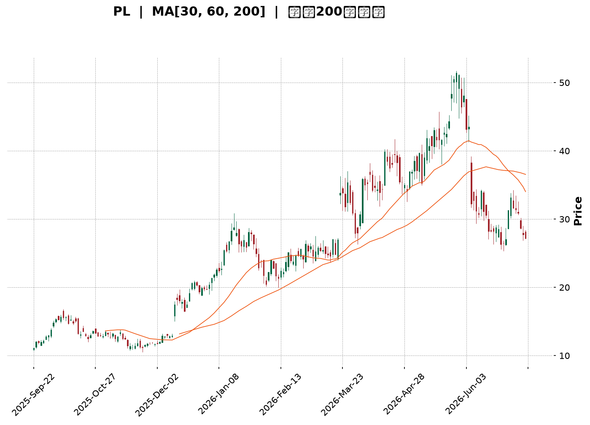
</details>

<html>
<head><meta charset="utf-8" /></head>
<body>
    <div style="height:500px; width:100%;">                        <script>window.PlotlyConfig = {MathJaxConfig: 'local'};</script>
        <script charset="utf-8" src="https://cdn.plot.ly/plotly-3.7.0.min.js" integrity="sha256-jvTGqxNp8AGWEcvNLVuKr+8j5dGe9Yw51LQkmDH+IYA=" crossorigin="anonymous"></script>                <div id="candlestick-chart" class="plotly-graph-div" style="height:100%; width:100%;"></div>            <script>                window.PLOTLYENV=window.PLOTLYENV || {};                                if (document.getElementById("candlestick-chart")) {                    Plotly.newPlot(                        "candlestick-chart",                        [{"close":{"dtype":"f8","bdata":"AAAA4FE4JkAAAACgmRkoQAAAAAAp3CdAAAAAIIXrJ0AAAABgZmYoQAAAAOB6lClAAAAAgML1KUAAAACAPYorQAAAAEAzsy1AAAAAYLieLkAAAABA4XouQAAAAAApXC9AAAAAQDMzL0AAAACA61EvQAAAAGBmZi1AAAAAAACALkAAAAAgXI8tQAAAAIAULi5AAAAAgMJ1KkAAAADgUTgqQAAAAGC4HitAAAAAgOvRKUAAAAAAAAApQAAAAGBm5ilAAAAA4FE4K0AAAABguJ4qQAAAAIAUrilAAAAAwMzMKUAAAADgUbgpQAAAAGBm5ipAAAAAoEdhKkAAAABgZmYpQAAAAAAAgCpAAAAAIIXrKEAAAABguJ4pQAAAACCuxypAAAAA4KPwKEAAAACgR+EoQAAAAIDr0SZAAAAAwMzMJkAAAAAghWsmQAAAAGBm5iZAAAAA4HqUJ0AAAACAwnUmQAAAAIDrUSZAAAAA4HoUJ0AAAACAwnUnQAAAAOCjcCdAAAAAwMzMJ0AAAABgZmYnQAAAAIA9iidAAAAAwB4FKEAAAACgR+EpQAAAAIA9iilAAAAAYGbmKUAAAACAFK4pQAAAAKBH4SlAAAAA4FF4MUAAAACgcD0yQAAAAMDMDDJAAAAAoEfhMUAAAADgUXgwQAAAAKBwfTFAAAAAgBQuM0AAAACgmZk0QAAAAEDhujRAAAAAgOtRNEAAAAAAKVwzQAAAAGC43jNAAAAAoHC9M0AAAADgUbgzQAAAAMD1aDRAAAAAANdjNUAAAABACtc1QAAAAAApnDZAAAAA4KNwNkAAAACAwrU2QAAAAOCjcDlAAAAAgOtROUAAAABA4bo6QAAAACCuRzxAAAAAIK7HPEAAAAAAAAA8QAAAAKBHYTpAAAAAIFwPOkAAAADgo\u002fA6QAAAAGC43jlAAAAAgOsRPEAAAACgR+E7QAAAAKCZWTpAAAAA4FH4OEAAAACgmdk2QAAAAEAz8zdAAAAAwB7FNUAAAACAFG40QAAAAGCPQjZAAAAAwB4FOEAAAACAPco2QAAAAGBmpjVAAAAAwMxMNUAAAAAghWs2QAAAAIDCNTZAAAAAoHC9N0AAAAAAKRw5QAAAAGBm5jdAAAAAIK7HN0AAAACAwrU4QAAAAKBHoThAAAAAoJmZOUAAAAAA1yM4QAAAAAApXDpAAAAAwMxMOUAAAAAAAAA6QAAAAEAKlzhAAAAAIK5HOUAAAACA69E5QAAAAGBmZjlAAAAA4KNwOUAAAADgUfg4QAAAAIA9yjhAAAAAoJmZOEAAAADgehQ7QAAAACBczzhAAAAAgML1OkAAAACAPepAQAAAAMD16EBAAAAA4HrUP0AAAAAgXK9BQAAAAEAzM0BAAAAAACncPkAAAAAA1+M7QAAAAEAz8ztAAAAAgMK1PkAAAADgo\u002fBBQAAAAGCPgkFAAAAAgMKVQUAAAABgZkZCQAAAAKBwHUFAAAAAgMJVQUAAAADA9ShBQAAAAEAK90BAAAAA4Ho0QUAAAACA6\u002fFDQAAAAKBwPUNAAAAAAADAQkAAAAAA1wNDQAAAAAApvENAAAAAwB4lQ0AAAADgUbhBQAAAAKCZuUFAAAAAANeDQUAAAACAPQpBQAAAAAApfEJAAAAAQDNzQkAAAADAHkVDQAAAAOCjkEJAAAAA4FHYQ0AAAABguJ5BQAAAAMAehUNAAAAAIIXrREAAAABACldEQAAAAGC4XkRAAAAAwB6FRUAAAAAgXM9EQAAAAIAUzkRAAAAAIIXLREAAAADgelRFQAAAAKBwPUVAAAAAwMwsRkAAAADA9ShIQAAAAKBwPUlAAAAAQDOzSUAAAACA65FJQAAAAEDhOkdAAAAAIIULSEAAAADgo5BFQAAAAADXw0VAAAAAACkcQEAAAABguF5AQAAAACCFKz9AAAAA4FG4PkAAAACAwhVBQAAAAGBmJj9AAAAA4HqUPkAAAACAwjU8QAAAAOBRODxAAAAAQOE6PEAAAADAHsU8QAAAACCuhzxAAAAAwMxMOkAAAABgj4I6QAAAAIDrETtAAAAAIK5HP0AAAADgo5BAQAAAAAApnD9AAAAAoEdhP0AAAAAAKdw+QAAAAMD1qDxAAAAAAADAO0AAAABAMzM7QA=="},"high":{"dtype":"f8","bdata":"AAAAwMxMJkAAAABgj0IoQAAAAIDCdShAAAAAIFyPKEAAAADA9agoQAAAAAAAACpAAAAAYLgeKkAAAACAPQosQAAAAMDINi5AAAAAAAAAL0AAAAAgrscvQAAAAGCPAjBAAAAAIK7HMEAAAACgmZkvQAAAAMDMDDBAAAAAYGbmL0AAAAAAAIAuQAAAAOB6VC9AAAAAQDUeL0AAAADA9SgrQAAAAIDr0SxAAAAAQAisKkAAAACgmRkqQAAAAAApnCpAAAAAgBRuK0AAAAAghesrQAAAAOCj8CpAAAAAIIWrKkAAAABgZmYqQAAAAIDCdStAAAAAYI\u002fCKkAAAACAPQorQAAAAOCjsCpAAAAAgD0KKkAAAABgZqYpQAAAAKCZmStAAAAAoHC9KkAAAADAzMwpQAAAAIDr0ShAAAAAQDOzJ0AAAADgUTgnQAAAAMAexSdAAAAAgML1KEAAAAAAAAApQAAAAAAAACdAAAAAIFxPJ0AAAACg7bwnQAAAAIA9CihAAAAAwB4FKEAAAAAA16MnQAAAAMAehShAAAAAoEdhKEAAAABgZmYqQAAAAAAAwClAAAAAgMJ1KkAAAAAAAAAqQAAAAEDheipAAAAAoJn5MUAAAACgmRkzQAAAAOCjsDNAAAAAIK5HMkAAAADAzIwyQAAAAEAz8zFAAAAA4HrUM0AAAABgj8I0QAAAAKBw\u002fTRAAAAAgBTuNEAAAACAwlU0QAAAAMAeJTRAAAAAACk8NEAAAADAzEw0QAAAACBczzRAAAAAIFxvNUAAAABAMxM2QAAAAAAp3DZAAAAAoJmZN0AAAACA6cY3QAAAACBcjzlAAAAAQAqXOkAAAADAHsU6QAAAAKBHYT1AAAAAYOPlPkAAAADgUbg9QAAAACCFqzxAAAAAgMDqOkAAAABA4bo7QAAAAEAzszpAAAAAQDOzPEAAAABgZmY8QAAAAEAzsztAAAAAAABAO0AAAADAocU5QAAAAACs\u002fDdAAAAAAAAAOEAAAACAwIo1QAAAACCuRzZAAAAA4FEYOEAAAABA4fo3QAAAAGBmhjdAAAAAwPXoNUAAAACAFO42QAAAAIA9yjZAAAAAoJmZOEAAAAAAKRw5QAAAAOCjsDlAAAAA4Hq0OEAAAAAgXM84QAAAAEBi0DlAAAAA4KOwOUAAAABACtc4QAAAAIAU7jpAAAAA4KNwOkAAAACgR4E6QAAAAKBwPTpAAAAAAKqRO0AAAABAChc6QAAAAOBReDpAAAAAIIXrOkAAAAAgXA86QAAAAIDpBjpAAAAAAACAOUAAAABAChc7QAAAAOB6FDtAAAAAYI9CO0AAAAAA1yNCQAAAACCFa0FAAAAAIIULQkAAAABgZoZCQAAAAADV2EFAAAAAYLgeQUAAAADA9Wg\u002fQAAAAIAU7jxAAAAAgBQuP0AAAADAHgVCQAAAAMAeJUJAAAAAYGbmQUAAAABA4RpDQAAAAIDClUJAAAAAgOsxQkAAAACAFL5BQAAAACBYOUJAAAAAgMKVQUAAAACgcB1EQAAAAKBwHURAAAAA4Hr0Q0AAAAAA18NDQAAAAEDh2kRAAAAAAAAAREAAAAAAAMBDQAAAAKBwHUJAAAAAQAqnQUAAAAAAAIBBQAAAAAApfEJAAAAA4HqkQkAAAABgj6JDQAAAAEAKt0NAAAAAoEfhQ0AAAACAwnVEQAAAAMDM7ENAAAAAIFyPRUAAAADgo\u002fBEQAAAAKCZGUVAAAAAoJm5RUAAAABACpdFQAAAAADX40ZAAAAAAADgREAAAABgZsZFQAAAAAAAAEZAAAAAQAyiRkAAAADgo5BJQAAAAKBwfUlAAAAAoEfhSUAAAABgj6JJQAAAAAAAYElAAAAAYI9iSUAAAAAgXM9HQAAAAMAelUZAAAAAQAqXQ0AAAADAHgVBQAAAACBcL0FAAAAAwMzMP0AAAADA9ShBQAAAAEAzE0FAAAAAgOsRQEAAAAAAAEA\u002fQAAAAKCZWT1AAAAAAAAAPUAAAABgjyI9QAAAACAvPT1AAAAAoEfhPEAAAABACtc6QAAAAOCjsDxAAAAAIK5HP0AAAADAzOxAQAAAAAAAIEFAAAAAoJm5QEAAAACAFE5AQAAAAMDMLD5AAAAAYI8CPUAAAADAHmU8QA=="},"hovertemplate":"\u003cb\u003e%{x|%Y-%m-%d}\u003c\u002fb\u003e\u003cbr\u003e\u958b: $%{open:.2f}\u003cbr\u003e\u9ad8: $%{high:.2f}\u003cbr\u003e\u4f4e: $%{low:.2f}\u003cbr\u003e\u6536: $%{close:.2f}\u003cextra\u003e\u003c\u002fextra\u003e","low":{"dtype":"f8","bdata":"AAAA4KNwJUAAAAAA1yMmQAAAAEAKVydAAAAAQArXJkAAAADAHoUnQAAAAOBRuChAAAAAoHA9KEAAAABAMzMpQAAAAMD1KCxAAAAAwB6FLUAAAACgR2EuQAAAACBcjy1AAAAAwB6FLkAAAADA9SguQAAAAAApHC1AAAAAgOtRLkAAAABAChctQAAAAEAzsy1AAAAAoHA9KkAAAAAg3SQpQAAAAAAAACtAAAAAYLieKUAAAADgo\u002fAnQAAAAIAULilAAAAAIK5HKkAAAACAPYoqQAAAACBcjylAAAAAIK6HKUAAAABA3w8pQAAAACCuxylAAAAAgMJ1KUAAAAAghesoQAAAACBcDylAAAAAANcjKEAAAAAAKdwnQAAAAGAQ2ClAAAAAIFyPKEAAAADA9agoQAAAAEAKFyZAAAAAwMh2JUAAAABgj8IlQAAAAIAU7iVAAAAAwMzMJkAAAACAly4mQAAAAIA9CiVAAAAAwB6FJkAAAADAHoUmQAAAAGCPQidAAAAAgJduJ0AAAADAzMwmQAAAAOB6VCdAAAAAQOF6J0AAAAAAKdwnQAAAAMAeBSlAAAAAoHA9KUAAAABANR4pQAAAAMD1KClAAAAAwB4FLkAAAABguF4xQAAAAADXozFAAAAAgBTuMEAAAACAFG4wQAAAAIA9CjFAAAAAoHD9MUAAAAAAKZwzQAAAAKCZmTNAAAAAACkcNEAAAACAPQozQAAAAGCPwjJAAAAA4KNwM0AAAABAiaEzQAAAAADV+DJAAAAAoHB9M0AAAADgUfg0QAAAAMD1aDVAAAAAQAoXNkAAAADAINA1QAAAAMD1KDdAAAAAYLgeOUAAAAAAAAA5QAAAAGCPQjpAAAAAAClcPEAAAAAgXG87QAAAAKBHITlAAAAAANcjOUAAAACAFC45QAAAAOBRODlAAAAAoBoPOkAAAAAgXM86QAAAAMDMjDlAAAAAgOtxOEAAAABACnc2QAAAAMD16DZAAAAAQAqXNEAAAABgZiY0QAAAACBczzRAAAAAYGamNUAAAACAwrU2QAAAAMD16DRAAAAAQOH6M0AAAAAgBiE1QAAAAAAAgDVAAAAAoHA9NkAAAACAwnU2QAAAAGCPgjdAAAAAQOE6N0AAAACgmVk2QAAAAKBwfThAAAAAgOsROEAAAAAgrsc2QAAAAOBRuDdAAAAAoEdhOEAAAACAaBE5QAAAAGCPgjdAAAAAoJnZN0AAAABAM3M4QAAAAEAzMzlAAAAA4KPwOEAAAAAgrkc4QAAAACBcTzhAAAAA4HipN0AAAABgZmY4QAAAAGCPwjhAAAAA4KPwN0AAAACAaCFAQAAAAEDhOj9AAAAAACkcP0AAAACgRyE\u002fQAAAACBcD0BAAAAAgD2KPkAAAABguD47QAAAAMD1SDpAAAAAwB6FPEAAAADgo3A9QAAAAEDhGkFAAAAAYI9iQEAAAADgUbhBQAAAAOBR+EBAAAAAoJn5QEAAAAAAKVxAQAAAAKBH4T9AAAAAIK5nQEAAAABgZnZBQAAAACCF60JAAAAAQAp3QkAAAABgj8JCQAAAAADXI0NAAAAAgD0qQkAAAADgo5BBQAAAAOCj0EBAAAAAwPPdQEAAAADA9UhAQAAAAMBLJ0FAAAAA4KVrQUAAAADA9ehBQAAAAKCZ+UFAAAAAoEfBQUAAAABACndBQAAAAGBm5kFAAAAAwMwMQ0AAAACgRyFDQAAAAMDMbENAAAAAwMzMQ0AAAADAHkVEQAAAAKBHIURAAAAAYI8CQ0AAAACAwlVEQAAAAMAehURAAAAAwMyMRUAAAACAFO5GQAAAAIAUjkdAAAAAAACAR0AAAAAA12NGQAAAAADXw0ZAAAAAQOE6R0AAAADAHlVFQAAAAGBmpkRAAAAAwPWoP0AAAADgelQ\u002fQAAAAIDrUT1AAAAAQDMzPkAAAAAghWs+QAAAAMAexT1AAAAAACkcPkAAAACgQws7QAAAAOB6FDxAAAAA4HpUOkAAAACAwrU6QAAAAOB6VDtAAAAAgD2KOUAAAADAzEw5QAAAAKBHITpAAAAAoJmZPEAAAACgGCQ+QAAAAMD1iD9AAAAAgD3KPkAAAAAAKZw+QAAAAIA9ijxAAAAAQArXOkAAAABgjyI7QA=="},"name":"\u50f9\u683c","open":{"dtype":"f8","bdata":"AAAA4FG4JUAAAABA4XomQAAAACCuRyhAAAAAAAAAJ0AAAADgUbgnQAAAACCuxyhAAAAAYGZmKUAAAACAFK4pQAAAAOBRuCxAAAAAYGbmLUAAAACgmZkvQAAAAAAAAC5AAAAAwMyMMEAAAACAFC4vQAAAAOBRuC9AAAAAIIVrLkAAAAAAAAAuQAAAAGBm5i5AAAAA4KPwLkAAAAAAAAAqQAAAAIA9CixAAAAAAClcKkAAAAAAAIApQAAAAGCPQilAAAAAoJmZKkAAAABgZuYrQAAAAMDMzCpAAAAAIIXrKUAAAABA4XopQAAAACCuxylAAAAAwPWoKkAAAACAwnUpQAAAAIAUrilAAAAAwB4FKkAAAADgUTgoQAAAAIDCdSpAAAAAYGZmKkAAAABgj0IpQAAAAIA9iihAAAAAAAAAJkAAAAAAKVwmQAAAAOB6FCZAAAAAIIXrJkAAAABgZmYoQAAAAEDheiZAAAAAQDOzJkAAAADAHgUnQAAAAIA9iidAAAAAgOvRJ0AAAABAMzMnQAAAAGCPwidAAAAAwPWoJ0AAAABgZuYnQAAAAMAehSlAAAAAAClcKkAAAACgcD0pQAAAAKCZmSlAAAAA4HqUL0AAAADgo3AyQAAAACBczzJAAAAAYGamMUAAAACAFC4yQAAAAIA9CjFAAAAAoHD9MUAAAAAgrsczQAAAAMDMzDNAAAAAQOG6NEAAAADAzEw0QAAAAKBw3TJAAAAAIK4HNEAAAABguL4zQAAAAEDh2jNAAAAAQDOzNEAAAAAAAIA1QAAAAOBRuDVAAAAAoJnZNkAAAACgmZk2QAAAAMDMTDdAAAAAYI9COkAAAAAAAIA5QAAAACBczzpAAAAAQDNzPEAAAABACpc7QAAAAAAAgDxAAAAAAADAOkAAAABgjwI6QAAAAKCZmTpAAAAA4HoUOkAAAADAzAw8QAAAAEAzsztAAAAAQAq3OUAAAAAA1+M4QAAAAEDh+jdAAAAAAAAAOEAAAAAAAAA1QAAAAIA9CjVAAAAAgML1NUAAAABguN43QAAAAGBmhjdAAAAAgOuRNUAAAAAAAIA1QAAAAAAAADZAAAAAYGZmNkAAAADAHgU3QAAAAKBwvThAAAAAYGZmN0AAAAAAAEA3QAAAAMDMTDlAAAAAAACAOEAAAABAM5M4QAAAAOBRuDdAAAAAQOEaOkAAAACgmZk5QAAAAAAAgDlAAAAAANfjN0AAAABACtc4QAAAAIDr0TlAAAAAQApXOUAAAADgUfg5QAAAAEDh+jhAAAAAoEchOUAAAACgmdk4QAAAAAAAgDpAAAAAAABAOEAAAABgZsZAQAAAAAAAQEFAAAAAQOHaQEAAAABAMzNAQAAAAAApfEFAAAAAoHD9QEAAAACgmdk+QAAAAMDMzDxAAAAAAAAAPUAAAADgo3A9QAAAAIDC9UFAAAAA4KOwQUAAAABAM3NCQAAAAAAAQEJAAAAA4KNwQUAAAACgcB1BQAAAACCFy0FAAAAAgMI1QUAAAACgcH1BQAAAAIDrkUNAAAAAQDOTQ0AAAAAAKRxDQAAAAAAAwENAAAAAgD2qQ0AAAACAFI5DQAAAAAApvEFAAAAAwMxMQUAAAADgozBBQAAAAADXQ0FAAAAAIFxfQkAAAADAHoVCQAAAAKCZmUNAAAAAIFx\u002fQkAAAABgj8JDQAAAAEAzM0JAAAAAQDNTQ0AAAAAghQtEQAAAAEAKF0VAAAAA4KNQREAAAADA9QhFQAAAAADXo0VAAAAAQAp3REAAAABAMzNFQAAAAMByCEVAAAAAwMysRUAAAADA9dhHQAAAAMDMDElAAAAAQDMTSUAAAAAAAJBIQAAAACCFi0hAAAAAgMKVR0AAAAAgXM9HQAAAAKBwnUVAAAAAYGYmQ0AAAACgRwFBQAAAAIDCtUBAAAAAANfjPkAAAAAAAIA\u002fQAAAAIDr8UBAAAAAgD0KQEAAAADAHgU+QAAAAADXYzxAAAAAYGamPEAAAACAwvU7QAAAAOB6VDtAAAAAgOsRPEAAAABgj4I6QAAAAEDhOjpAAAAAoJmZPEAAAACgcH0+QAAAAKCZWUBAAAAAQAqXP0AAAADgehQ\u002fQAAAAOB61D1AAAAAAAAAPEAAAADgozA8QA=="},"x":["2025-09-22T00:00:00-04:00","2025-09-23T00:00:00-04:00","2025-09-24T00:00:00-04:00","2025-09-25T00:00:00-04:00","2025-09-26T00:00:00-04:00","2025-09-29T00:00:00-04:00","2025-09-30T00:00:00-04:00","2025-10-01T00:00:00-04:00","2025-10-02T00:00:00-04:00","2025-10-03T00:00:00-04:00","2025-10-06T00:00:00-04:00","2025-10-07T00:00:00-04:00","2025-10-08T00:00:00-04:00","2025-10-09T00:00:00-04:00","2025-10-10T00:00:00-04:00","2025-10-13T00:00:00-04:00","2025-10-14T00:00:00-04:00","2025-10-15T00:00:00-04:00","2025-10-16T00:00:00-04:00","2025-10-17T00:00:00-04:00","2025-10-20T00:00:00-04:00","2025-10-21T00:00:00-04:00","2025-10-22T00:00:00-04:00","2025-10-23T00:00:00-04:00","2025-10-24T00:00:00-04:00","2025-10-27T00:00:00-04:00","2025-10-28T00:00:00-04:00","2025-10-29T00:00:00-04:00","2025-10-30T00:00:00-04:00","2025-10-31T00:00:00-04:00","2025-11-03T00:00:00-05:00","2025-11-04T00:00:00-05:00","2025-11-05T00:00:00-05:00","2025-11-06T00:00:00-05:00","2025-11-07T00:00:00-05:00","2025-11-10T00:00:00-05:00","2025-11-11T00:00:00-05:00","2025-11-12T00:00:00-05:00","2025-11-13T00:00:00-05:00","2025-11-14T00:00:00-05:00","2025-11-17T00:00:00-05:00","2025-11-18T00:00:00-05:00","2025-11-19T00:00:00-05:00","2025-11-20T00:00:00-05:00","2025-11-21T00:00:00-05:00","2025-11-24T00:00:00-05:00","2025-11-25T00:00:00-05:00","2025-11-26T00:00:00-05:00","2025-11-28T00:00:00-05:00","2025-12-01T00:00:00-05:00","2025-12-02T00:00:00-05:00","2025-12-03T00:00:00-05:00","2025-12-04T00:00:00-05:00","2025-12-05T00:00:00-05:00","2025-12-08T00:00:00-05:00","2025-12-09T00:00:00-05:00","2025-12-10T00:00:00-05:00","2025-12-11T00:00:00-05:00","2025-12-12T00:00:00-05:00","2025-12-15T00:00:00-05:00","2025-12-16T00:00:00-05:00","2025-12-17T00:00:00-05:00","2025-12-18T00:00:00-05:00","2025-12-19T00:00:00-05:00","2025-12-22T00:00:00-05:00","2025-12-23T00:00:00-05:00","2025-12-24T00:00:00-05:00","2025-12-26T00:00:00-05:00","2025-12-29T00:00:00-05:00","2025-12-30T00:00:00-05:00","2025-12-31T00:00:00-05:00","2026-01-02T00:00:00-05:00","2026-01-05T00:00:00-05:00","2026-01-06T00:00:00-05:00","2026-01-07T00:00:00-05:00","2026-01-08T00:00:00-05:00","2026-01-09T00:00:00-05:00","2026-01-12T00:00:00-05:00","2026-01-13T00:00:00-05:00","2026-01-14T00:00:00-05:00","2026-01-15T00:00:00-05:00","2026-01-16T00:00:00-05:00","2026-01-20T00:00:00-05:00","2026-01-21T00:00:00-05:00","2026-01-22T00:00:00-05:00","2026-01-23T00:00:00-05:00","2026-01-26T00:00:00-05:00","2026-01-27T00:00:00-05:00","2026-01-28T00:00:00-05:00","2026-01-29T00:00:00-05:00","2026-01-30T00:00:00-05:00","2026-02-02T00:00:00-05:00","2026-02-03T00:00:00-05:00","2026-02-04T00:00:00-05:00","2026-02-05T00:00:00-05:00","2026-02-06T00:00:00-05:00","2026-02-09T00:00:00-05:00","2026-02-10T00:00:00-05:00","2026-02-11T00:00:00-05:00","2026-02-12T00:00:00-05:00","2026-02-13T00:00:00-05:00","2026-02-17T00:00:00-05:00","2026-02-18T00:00:00-05:00","2026-02-19T00:00:00-05:00","2026-02-20T00:00:00-05:00","2026-02-23T00:00:00-05:00","2026-02-24T00:00:00-05:00","2026-02-25T00:00:00-05:00","2026-02-26T00:00:00-05:00","2026-02-27T00:00:00-05:00","2026-03-02T00:00:00-05:00","2026-03-03T00:00:00-05:00","2026-03-04T00:00:00-05:00","2026-03-05T00:00:00-05:00","2026-03-06T00:00:00-05:00","2026-03-09T00:00:00-04:00","2026-03-10T00:00:00-04:00","2026-03-11T00:00:00-04:00","2026-03-12T00:00:00-04:00","2026-03-13T00:00:00-04:00","2026-03-16T00:00:00-04:00","2026-03-17T00:00:00-04:00","2026-03-18T00:00:00-04:00","2026-03-19T00:00:00-04:00","2026-03-20T00:00:00-04:00","2026-03-23T00:00:00-04:00","2026-03-24T00:00:00-04:00","2026-03-25T00:00:00-04:00","2026-03-26T00:00:00-04:00","2026-03-27T00:00:00-04:00","2026-03-30T00:00:00-04:00","2026-03-31T00:00:00-04:00","2026-04-01T00:00:00-04:00","2026-04-02T00:00:00-04:00","2026-04-06T00:00:00-04:00","2026-04-07T00:00:00-04:00","2026-04-08T00:00:00-04:00","2026-04-09T00:00:00-04:00","2026-04-10T00:00:00-04:00","2026-04-13T00:00:00-04:00","2026-04-14T00:00:00-04:00","2026-04-15T00:00:00-04:00","2026-04-16T00:00:00-04:00","2026-04-17T00:00:00-04:00","2026-04-20T00:00:00-04:00","2026-04-21T00:00:00-04:00","2026-04-22T00:00:00-04:00","2026-04-23T00:00:00-04:00","2026-04-24T00:00:00-04:00","2026-04-27T00:00:00-04:00","2026-04-28T00:00:00-04:00","2026-04-29T00:00:00-04:00","2026-04-30T00:00:00-04:00","2026-05-01T00:00:00-04:00","2026-05-04T00:00:00-04:00","2026-05-05T00:00:00-04:00","2026-05-06T00:00:00-04:00","2026-05-07T00:00:00-04:00","2026-05-08T00:00:00-04:00","2026-05-11T00:00:00-04:00","2026-05-12T00:00:00-04:00","2026-05-13T00:00:00-04:00","2026-05-14T00:00:00-04:00","2026-05-15T00:00:00-04:00","2026-05-18T00:00:00-04:00","2026-05-19T00:00:00-04:00","2026-05-20T00:00:00-04:00","2026-05-21T00:00:00-04:00","2026-05-22T00:00:00-04:00","2026-05-26T00:00:00-04:00","2026-05-27T00:00:00-04:00","2026-05-28T00:00:00-04:00","2026-05-29T00:00:00-04:00","2026-06-01T00:00:00-04:00","2026-06-02T00:00:00-04:00","2026-06-03T00:00:00-04:00","2026-06-04T00:00:00-04:00","2026-06-05T00:00:00-04:00","2026-06-08T00:00:00-04:00","2026-06-09T00:00:00-04:00","2026-06-10T00:00:00-04:00","2026-06-11T00:00:00-04:00","2026-06-12T00:00:00-04:00","2026-06-15T00:00:00-04:00","2026-06-16T00:00:00-04:00","2026-06-17T00:00:00-04:00","2026-06-18T00:00:00-04:00","2026-06-22T00:00:00-04:00","2026-06-23T00:00:00-04:00","2026-06-24T00:00:00-04:00","2026-06-25T00:00:00-04:00","2026-06-26T00:00:00-04:00","2026-06-29T00:00:00-04:00","2026-06-30T00:00:00-04:00","2026-07-01T00:00:00-04:00","2026-07-02T00:00:00-04:00","2026-07-06T00:00:00-04:00","2026-07-07T00:00:00-04:00","2026-07-08T00:00:00-04:00","2026-07-09T00:00:00-04:00"],"type":"candlestick"},{"hovertemplate":"MA30: $%{y:.2f}\u003cextra\u003e\u003c\u002fextra\u003e","line":{"color":"#2196F3","dash":"dash","width":2},"mode":"lines","name":"MA30","x":["2025-09-22T00:00:00-04:00","2025-09-23T00:00:00-04:00","2025-09-24T00:00:00-04:00","2025-09-25T00:00:00-04:00","2025-09-26T00:00:00-04:00","2025-09-29T00:00:00-04:00","2025-09-30T00:00:00-04:00","2025-10-01T00:00:00-04:00","2025-10-02T00:00:00-04:00","2025-10-03T00:00:00-04:00","2025-10-06T00:00:00-04:00","2025-10-07T00:00:00-04:00","2025-10-08T00:00:00-04:00","2025-10-09T00:00:00-04:00","2025-10-10T00:00:00-04:00","2025-10-13T00:00:00-04:00","2025-10-14T00:00:00-04:00","2025-10-15T00:00:00-04:00","2025-10-16T00:00:00-04:00","2025-10-17T00:00:00-04:00","2025-10-20T00:00:00-04:00","2025-10-21T00:00:00-04:00","2025-10-22T00:00:00-04:00","2025-10-23T00:00:00-04:00","2025-10-24T00:00:00-04:00","2025-10-27T00:00:00-04:00","2025-10-28T00:00:00-04:00","2025-10-29T00:00:00-04:00","2025-10-30T00:00:00-04:00","2025-10-31T00:00:00-04:00","2025-11-03T00:00:00-05:00","2025-11-04T00:00:00-05:00","2025-11-05T00:00:00-05:00","2025-11-06T00:00:00-05:00","2025-11-07T00:00:00-05:00","2025-11-10T00:00:00-05:00","2025-11-11T00:00:00-05:00","2025-11-12T00:00:00-05:00","2025-11-13T00:00:00-05:00","2025-11-14T00:00:00-05:00","2025-11-17T00:00:00-05:00","2025-11-18T00:00:00-05:00","2025-11-19T00:00:00-05:00","2025-11-20T00:00:00-05:00","2025-11-21T00:00:00-05:00","2025-11-24T00:00:00-05:00","2025-11-25T00:00:00-05:00","2025-11-26T00:00:00-05:00","2025-11-28T00:00:00-05:00","2025-12-01T00:00:00-05:00","2025-12-02T00:00:00-05:00","2025-12-03T00:00:00-05:00","2025-12-04T00:00:00-05:00","2025-12-05T00:00:00-05:00","2025-12-08T00:00:00-05:00","2025-12-09T00:00:00-05:00","2025-12-10T00:00:00-05:00","2025-12-11T00:00:00-05:00","2025-12-12T00:00:00-05:00","2025-12-15T00:00:00-05:00","2025-12-16T00:00:00-05:00","2025-12-17T00:00:00-05:00","2025-12-18T00:00:00-05:00","2025-12-19T00:00:00-05:00","2025-12-22T00:00:00-05:00","2025-12-23T00:00:00-05:00","2025-12-24T00:00:00-05:00","2025-12-26T00:00:00-05:00","2025-12-29T00:00:00-05:00","2025-12-30T00:00:00-05:00","2025-12-31T00:00:00-05:00","2026-01-02T00:00:00-05:00","2026-01-05T00:00:00-05:00","2026-01-06T00:00:00-05:00","2026-01-07T00:00:00-05:00","2026-01-08T00:00:00-05:00","2026-01-09T00:00:00-05:00","2026-01-12T00:00:00-05:00","2026-01-13T00:00:00-05:00","2026-01-14T00:00:00-05:00","2026-01-15T00:00:00-05:00","2026-01-16T00:00:00-05:00","2026-01-20T00:00:00-05:00","2026-01-21T00:00:00-05:00","2026-01-22T00:00:00-05:00","2026-01-23T00:00:00-05:00","2026-01-26T00:00:00-05:00","2026-01-27T00:00:00-05:00","2026-01-28T00:00:00-05:00","2026-01-29T00:00:00-05:00","2026-01-30T00:00:00-05:00","2026-02-02T00:00:00-05:00","2026-02-03T00:00:00-05:00","2026-02-04T00:00:00-05:00","2026-02-05T00:00:00-05:00","2026-02-06T00:00:00-05:00","2026-02-09T00:00:00-05:00","2026-02-10T00:00:00-05:00","2026-02-11T00:00:00-05:00","2026-02-12T00:00:00-05:00","2026-02-13T00:00:00-05:00","2026-02-17T00:00:00-05:00","2026-02-18T00:00:00-05:00","2026-02-19T00:00:00-05:00","2026-02-20T00:00:00-05:00","2026-02-23T00:00:00-05:00","2026-02-24T00:00:00-05:00","2026-02-25T00:00:00-05:00","2026-02-26T00:00:00-05:00","2026-02-27T00:00:00-05:00","2026-03-02T00:00:00-05:00","2026-03-03T00:00:00-05:00","2026-03-04T00:00:00-05:00","2026-03-05T00:00:00-05:00","2026-03-06T00:00:00-05:00","2026-03-09T00:00:00-04:00","2026-03-10T00:00:00-04:00","2026-03-11T00:00:00-04:00","2026-03-12T00:00:00-04:00","2026-03-13T00:00:00-04:00","2026-03-16T00:00:00-04:00","2026-03-17T00:00:00-04:00","2026-03-18T00:00:00-04:00","2026-03-19T00:00:00-04:00","2026-03-20T00:00:00-04:00","2026-03-23T00:00:00-04:00","2026-03-24T00:00:00-04:00","2026-03-25T00:00:00-04:00","2026-03-26T00:00:00-04:00","2026-03-27T00:00:00-04:00","2026-03-30T00:00:00-04:00","2026-03-31T00:00:00-04:00","2026-04-01T00:00:00-04:00","2026-04-02T00:00:00-04:00","2026-04-06T00:00:00-04:00","2026-04-07T00:00:00-04:00","2026-04-08T00:00:00-04:00","2026-04-09T00:00:00-04:00","2026-04-10T00:00:00-04:00","2026-04-13T00:00:00-04:00","2026-04-14T00:00:00-04:00","2026-04-15T00:00:00-04:00","2026-04-16T00:00:00-04:00","2026-04-17T00:00:00-04:00","2026-04-20T00:00:00-04:00","2026-04-21T00:00:00-04:00","2026-04-22T00:00:00-04:00","2026-04-23T00:00:00-04:00","2026-04-24T00:00:00-04:00","2026-04-27T00:00:00-04:00","2026-04-28T00:00:00-04:00","2026-04-29T00:00:00-04:00","2026-04-30T00:00:00-04:00","2026-05-01T00:00:00-04:00","2026-05-04T00:00:00-04:00","2026-05-05T00:00:00-04:00","2026-05-06T00:00:00-04:00","2026-05-07T00:00:00-04:00","2026-05-08T00:00:00-04:00","2026-05-11T00:00:00-04:00","2026-05-12T00:00:00-04:00","2026-05-13T00:00:00-04:00","2026-05-14T00:00:00-04:00","2026-05-15T00:00:00-04:00","2026-05-18T00:00:00-04:00","2026-05-19T00:00:00-04:00","2026-05-20T00:00:00-04:00","2026-05-21T00:00:00-04:00","2026-05-22T00:00:00-04:00","2026-05-26T00:00:00-04:00","2026-05-27T00:00:00-04:00","2026-05-28T00:00:00-04:00","2026-05-29T00:00:00-04:00","2026-06-01T00:00:00-04:00","2026-06-02T00:00:00-04:00","2026-06-03T00:00:00-04:00","2026-06-04T00:00:00-04:00","2026-06-05T00:00:00-04:00","2026-06-08T00:00:00-04:00","2026-06-09T00:00:00-04:00","2026-06-10T00:00:00-04:00","2026-06-11T00:00:00-04:00","2026-06-12T00:00:00-04:00","2026-06-15T00:00:00-04:00","2026-06-16T00:00:00-04:00","2026-06-17T00:00:00-04:00","2026-06-18T00:00:00-04:00","2026-06-22T00:00:00-04:00","2026-06-23T00:00:00-04:00","2026-06-24T00:00:00-04:00","2026-06-25T00:00:00-04:00","2026-06-26T00:00:00-04:00","2026-06-29T00:00:00-04:00","2026-06-30T00:00:00-04:00","2026-07-01T00:00:00-04:00","2026-07-02T00:00:00-04:00","2026-07-06T00:00:00-04:00","2026-07-07T00:00:00-04:00","2026-07-08T00:00:00-04:00","2026-07-09T00:00:00-04:00"],"y":{"dtype":"f8","bdata":"AAAAAAAA+H8AAAAAAAD4fwAAAAAAAPh\u002fAAAAAAAA+H8AAAAAAAD4fwAAAAAAAPh\u002fAAAAAAAA+H8AAAAAAAD4fwAAAAAAAPh\u002fAAAAAAAA+H8AAAAAAAD4fwAAAAAAAPh\u002fAAAAAAAA+H8AAAAAAAD4fwAAAAAAAPh\u002fAAAAAAAA+H8AAAAAAAD4fwAAAAAAAPh\u002fAAAAAAAA+H8AAAAAAAD4fwAAAAAAAPh\u002fAAAAAAAA+H8AAAAAAAD4fwAAAAAAAPh\u002fAAAAAAAA+H8AAAAAAAD4fwAAAAAAAPh\u002fAAAAAAAA+H8AAAAAAAD4fxEREaFFNitAmpmZScVZK0De3d0t3WQrQImIiFhkeytAERER4eyDK0AzMzMDVo4rQERERHSTmCtAvLu7O9+PK0Dv7u5eLHkrQHd3d8d2PitAmpmZubv7KkAzMzNj9LYqQLy7uzvDbipAZmZmFr0tKkDv7u4eIuIpQAAAAKC3pSlAMzMzY2ZmKUC8u7u7WDIpQKuqqvrU+ChA7+7uHiLiKEDNzMy8EcooQLy7uxuFqyhAMzMz8yicKEBmZmZWq6MoQImIiOiYoChAMzMzU1WVKEDNzMzcT40oQERERMQEjyhAZmZmZgPdKECrqqr61DgpQO\u002fu7q5WhylAq6qqmmHXKUC8u7v7uBcqQDMzM9MVYCpARERE9MXSKkC8u7v7uFcrQN7d3e391CtAmpmZGfdaLEC8u7sLEdEsQKuqqlpzYS1A7+7uXsnvLUAAAAAgBoEuQGZmZvbwGS9AAAAAAMi9L0BmZmbmbTkwQO\u002fu7s4imzBAEREROSb4MEDe3d1l2FUxQCIiIjLsyjFAIiIionA9MkAzMzMrsr0yQImIiNCUSjNAiYiIcK\u002fZM0AzMzODMlo0QCIiIgJWzjRAVVVVPTU+NUAREREph7Y1QN7d3S3dJDZAvLu7O1F\u002fNkAiIiIilNE2QDMzM8NnGDdAq6qqGuhUN0De3d1tWYs3QERERIR5wjdAVVVVdZPYN0BmZmYWINc3QM3MzGwu5DdAMzMzM8EDOEBmZmYmBiE4QN7d3Z02MDhAzczMfIY9OECrqqq6kFQ4QDMzM+PsYzhAq6qqivp3OEB3d3f34ZM4QDMzMwPknjhAmpmZSVOqOECrqqpaZLs4QBEREeF6tDhAzczMjN62OEC8u7ubxKA4QN7d3U1ikDhAAAAAILByOEDv7u4On2E4QO\u002fu7r5YUjhAAAAA0LBLOEAiIiIiIkI4QGZmZmYfPjhAREREFK4nOEBmZmYW2Q44QHd3dzeJAThAERER8WD+N0BERESEeSI4QGZmZjbQKThAAAAA8BlWOEAAAACwcsg4QEREROQXKzlAiYiIGL1tOUBVVVWFFtk5QCIiIkLSNDpAZmZmZmaGOkC8u7vLE7U6QFVVVQUP5jpAd3d3N4khO0BERESkcH07QHd3d6dU3DtAvLu7e4Y9PEC8u7tbj6I8QBEREeF69DxAd3d3l+BBPUBEREQkv5g9QO\u002fu7g5Y2T1AiYiIKBUnPkAzMzNTnJ0+QN7d3X0jFD9AzczMfGp8P0AzMzOjm+Q\u002fQDMzMwNWLkBAvLu7oyllQEC8u7ur1ZFAQLy7uztRv0BAq6qqktHrQEARERFxrwlBQAAAAGiRPUFAIiIiivpnQUBVVVUdE3xBQM3MzIQyikFAvLu7u7urQUDe3d29LatBQERERGSCx0FAq6qqelv2QUAiIiKS7SxCQJqZmal\u002fY0JAAAAAUBuYQkC8u7vrmLBCQFVVVfW2zEJAAAAAUBvoQkAAAAAQLQJDQDMzM0NgJUNAd3d3Z61OQ0AzMzMjaYpDQGZmZiYG0UNAMzMzw4MZREAzMzPDg0lEQM3MzAyQa0RAd3d3J7+YREB3d3e3ga5EQBEREVHUv0RAIiIiQu6lREBEREQkaZpEQFVVVT0miERAIiIiksJ1REDv7u7eJHZEQImIiOBPXURAAAAAwFhCREAiIiKiRRZEQBEREYlB8ENAERERKVy\u002fQ0CamZkxwaNDQImIiHjpdkNAVVVVpZs0Q0AiIiI6JvhCQImIiPDSvUJAIiIi4qWLQkCrqqqKbGdCQAAAAODBPEJAzczM1DERQkDe3d0V2d5BQN7d3fXho0FA3t3dVQ5dQUAiIiKq8QJBQA=="},"type":"scatter"},{"hovertemplate":"MA60: $%{y:.2f}\u003cextra\u003e\u003c\u002fextra\u003e","line":{"color":"#9C27B0","dash":"dash","width":2},"mode":"lines","name":"MA60","x":["2025-09-22T00:00:00-04:00","2025-09-23T00:00:00-04:00","2025-09-24T00:00:00-04:00","2025-09-25T00:00:00-04:00","2025-09-26T00:00:00-04:00","2025-09-29T00:00:00-04:00","2025-09-30T00:00:00-04:00","2025-10-01T00:00:00-04:00","2025-10-02T00:00:00-04:00","2025-10-03T00:00:00-04:00","2025-10-06T00:00:00-04:00","2025-10-07T00:00:00-04:00","2025-10-08T00:00:00-04:00","2025-10-09T00:00:00-04:00","2025-10-10T00:00:00-04:00","2025-10-13T00:00:00-04:00","2025-10-14T00:00:00-04:00","2025-10-15T00:00:00-04:00","2025-10-16T00:00:00-04:00","2025-10-17T00:00:00-04:00","2025-10-20T00:00:00-04:00","2025-10-21T00:00:00-04:00","2025-10-22T00:00:00-04:00","2025-10-23T00:00:00-04:00","2025-10-24T00:00:00-04:00","2025-10-27T00:00:00-04:00","2025-10-28T00:00:00-04:00","2025-10-29T00:00:00-04:00","2025-10-30T00:00:00-04:00","2025-10-31T00:00:00-04:00","2025-11-03T00:00:00-05:00","2025-11-04T00:00:00-05:00","2025-11-05T00:00:00-05:00","2025-11-06T00:00:00-05:00","2025-11-07T00:00:00-05:00","2025-11-10T00:00:00-05:00","2025-11-11T00:00:00-05:00","2025-11-12T00:00:00-05:00","2025-11-13T00:00:00-05:00","2025-11-14T00:00:00-05:00","2025-11-17T00:00:00-05:00","2025-11-18T00:00:00-05:00","2025-11-19T00:00:00-05:00","2025-11-20T00:00:00-05:00","2025-11-21T00:00:00-05:00","2025-11-24T00:00:00-05:00","2025-11-25T00:00:00-05:00","2025-11-26T00:00:00-05:00","2025-11-28T00:00:00-05:00","2025-12-01T00:00:00-05:00","2025-12-02T00:00:00-05:00","2025-12-03T00:00:00-05:00","2025-12-04T00:00:00-05:00","2025-12-05T00:00:00-05:00","2025-12-08T00:00:00-05:00","2025-12-09T00:00:00-05:00","2025-12-10T00:00:00-05:00","2025-12-11T00:00:00-05:00","2025-12-12T00:00:00-05:00","2025-12-15T00:00:00-05:00","2025-12-16T00:00:00-05:00","2025-12-17T00:00:00-05:00","2025-12-18T00:00:00-05:00","2025-12-19T00:00:00-05:00","2025-12-22T00:00:00-05:00","2025-12-23T00:00:00-05:00","2025-12-24T00:00:00-05:00","2025-12-26T00:00:00-05:00","2025-12-29T00:00:00-05:00","2025-12-30T00:00:00-05:00","2025-12-31T00:00:00-05:00","2026-01-02T00:00:00-05:00","2026-01-05T00:00:00-05:00","2026-01-06T00:00:00-05:00","2026-01-07T00:00:00-05:00","2026-01-08T00:00:00-05:00","2026-01-09T00:00:00-05:00","2026-01-12T00:00:00-05:00","2026-01-13T00:00:00-05:00","2026-01-14T00:00:00-05:00","2026-01-15T00:00:00-05:00","2026-01-16T00:00:00-05:00","2026-01-20T00:00:00-05:00","2026-01-21T00:00:00-05:00","2026-01-22T00:00:00-05:00","2026-01-23T00:00:00-05:00","2026-01-26T00:00:00-05:00","2026-01-27T00:00:00-05:00","2026-01-28T00:00:00-05:00","2026-01-29T00:00:00-05:00","2026-01-30T00:00:00-05:00","2026-02-02T00:00:00-05:00","2026-02-03T00:00:00-05:00","2026-02-04T00:00:00-05:00","2026-02-05T00:00:00-05:00","2026-02-06T00:00:00-05:00","2026-02-09T00:00:00-05:00","2026-02-10T00:00:00-05:00","2026-02-11T00:00:00-05:00","2026-02-12T00:00:00-05:00","2026-02-13T00:00:00-05:00","2026-02-17T00:00:00-05:00","2026-02-18T00:00:00-05:00","2026-02-19T00:00:00-05:00","2026-02-20T00:00:00-05:00","2026-02-23T00:00:00-05:00","2026-02-24T00:00:00-05:00","2026-02-25T00:00:00-05:00","2026-02-26T00:00:00-05:00","2026-02-27T00:00:00-05:00","2026-03-02T00:00:00-05:00","2026-03-03T00:00:00-05:00","2026-03-04T00:00:00-05:00","2026-03-05T00:00:00-05:00","2026-03-06T00:00:00-05:00","2026-03-09T00:00:00-04:00","2026-03-10T00:00:00-04:00","2026-03-11T00:00:00-04:00","2026-03-12T00:00:00-04:00","2026-03-13T00:00:00-04:00","2026-03-16T00:00:00-04:00","2026-03-17T00:00:00-04:00","2026-03-18T00:00:00-04:00","2026-03-19T00:00:00-04:00","2026-03-20T00:00:00-04:00","2026-03-23T00:00:00-04:00","2026-03-24T00:00:00-04:00","2026-03-25T00:00:00-04:00","2026-03-26T00:00:00-04:00","2026-03-27T00:00:00-04:00","2026-03-30T00:00:00-04:00","2026-03-31T00:00:00-04:00","2026-04-01T00:00:00-04:00","2026-04-02T00:00:00-04:00","2026-04-06T00:00:00-04:00","2026-04-07T00:00:00-04:00","2026-04-08T00:00:00-04:00","2026-04-09T00:00:00-04:00","2026-04-10T00:00:00-04:00","2026-04-13T00:00:00-04:00","2026-04-14T00:00:00-04:00","2026-04-15T00:00:00-04:00","2026-04-16T00:00:00-04:00","2026-04-17T00:00:00-04:00","2026-04-20T00:00:00-04:00","2026-04-21T00:00:00-04:00","2026-04-22T00:00:00-04:00","2026-04-23T00:00:00-04:00","2026-04-24T00:00:00-04:00","2026-04-27T00:00:00-04:00","2026-04-28T00:00:00-04:00","2026-04-29T00:00:00-04:00","2026-04-30T00:00:00-04:00","2026-05-01T00:00:00-04:00","2026-05-04T00:00:00-04:00","2026-05-05T00:00:00-04:00","2026-05-06T00:00:00-04:00","2026-05-07T00:00:00-04:00","2026-05-08T00:00:00-04:00","2026-05-11T00:00:00-04:00","2026-05-12T00:00:00-04:00","2026-05-13T00:00:00-04:00","2026-05-14T00:00:00-04:00","2026-05-15T00:00:00-04:00","2026-05-18T00:00:00-04:00","2026-05-19T00:00:00-04:00","2026-05-20T00:00:00-04:00","2026-05-21T00:00:00-04:00","2026-05-22T00:00:00-04:00","2026-05-26T00:00:00-04:00","2026-05-27T00:00:00-04:00","2026-05-28T00:00:00-04:00","2026-05-29T00:00:00-04:00","2026-06-01T00:00:00-04:00","2026-06-02T00:00:00-04:00","2026-06-03T00:00:00-04:00","2026-06-04T00:00:00-04:00","2026-06-05T00:00:00-04:00","2026-06-08T00:00:00-04:00","2026-06-09T00:00:00-04:00","2026-06-10T00:00:00-04:00","2026-06-11T00:00:00-04:00","2026-06-12T00:00:00-04:00","2026-06-15T00:00:00-04:00","2026-06-16T00:00:00-04:00","2026-06-17T00:00:00-04:00","2026-06-18T00:00:00-04:00","2026-06-22T00:00:00-04:00","2026-06-23T00:00:00-04:00","2026-06-24T00:00:00-04:00","2026-06-25T00:00:00-04:00","2026-06-26T00:00:00-04:00","2026-06-29T00:00:00-04:00","2026-06-30T00:00:00-04:00","2026-07-01T00:00:00-04:00","2026-07-02T00:00:00-04:00","2026-07-06T00:00:00-04:00","2026-07-07T00:00:00-04:00","2026-07-08T00:00:00-04:00","2026-07-09T00:00:00-04:00"],"y":{"dtype":"f8","bdata":"AAAAAAAA+H8AAAAAAAD4fwAAAAAAAPh\u002fAAAAAAAA+H8AAAAAAAD4fwAAAAAAAPh\u002fAAAAAAAA+H8AAAAAAAD4fwAAAAAAAPh\u002fAAAAAAAA+H8AAAAAAAD4fwAAAAAAAPh\u002fAAAAAAAA+H8AAAAAAAD4fwAAAAAAAPh\u002fAAAAAAAA+H8AAAAAAAD4fwAAAAAAAPh\u002fAAAAAAAA+H8AAAAAAAD4fwAAAAAAAPh\u002fAAAAAAAA+H8AAAAAAAD4fwAAAAAAAPh\u002fAAAAAAAA+H8AAAAAAAD4fwAAAAAAAPh\u002fAAAAAAAA+H8AAAAAAAD4fwAAAAAAAPh\u002fAAAAAAAA+H8AAAAAAAD4fwAAAAAAAPh\u002fAAAAAAAA+H8AAAAAAAD4fwAAAAAAAPh\u002fAAAAAAAA+H8AAAAAAAD4fwAAAAAAAPh\u002fAAAAAAAA+H8AAAAAAAD4fwAAAAAAAPh\u002fAAAAAAAA+H8AAAAAAAD4fwAAAAAAAPh\u002fAAAAAAAA+H8AAAAAAAD4fwAAAAAAAPh\u002fAAAAAAAA+H8AAAAAAAD4fwAAAAAAAPh\u002fAAAAAAAA+H8AAAAAAAD4fwAAAAAAAPh\u002fAAAAAAAA+H8AAAAAAAD4fwAAAAAAAPh\u002fAAAAAAAA+H8AAAAAAAD4fwAAACjOXipAIiIicpOYKkDNzMwUS74qQN7d3RW97SpAq6qqalkrK0B3d3d\u002fB3MrQBEREbHItitAq6qqKmv1K0BVVVW1HiUsQBERERH1TyxAREREjMJ1LECamZlB\u002fZssQBERERlaxCxAMzMzi8L1LEDe3d31fiotQO\u002fu7p7+bS1Aq6qqalmrLUC8u7vDBO8tQHd3d69WRy5AmpmZsYGuLkCamZkJuyIvQGZmZl5XoC9AERER9eETMEAzMzMXBFYwQDMzMztRjzBAd3d382\u002fEMEC8u7uLl\u002f4wQAAAAMgvNjFAd3d3d+l2MUC8u7tP\u002f7YxQFVVVY0J7jFAAAAAdEwgMkDe3d31mksyQO\u002fu7jZCeTJAvLu7N\u002fugMkAiIiJKfsEyQN7d3bFW5zJAAAAAYJ4YM0AiIiJWx0QzQJqZmSV4cDNAIiIilrWaM0BVVVXlicozQDMzM69y+DNAVVVVRW8rNEDv7u7up2Y0QBEREWkDnTRAVVVVwTzRNEBERERgngg1QJqZmYmzPzVAd3d3lyd6NUB3d3djO681QDMzM4977TVAREREyC8mNkARERHJ6F02QImIiGBXkDZAq6qqBvPENkCamZmlVPw2QCIiIkp+MTdAAAAAqH9TN0BEREScNnA3QFVVVX34jDdA3t3dhaSpN0ARERF56dY3QFVVVd0k9jdAq6qqslYXOEAzMzNjyU84QImIiCijhzhA3t3dJb+4OEDe3d1VDv04QAAAAHCEMjlAmpmZcfZhOUAzMzND0oQ5QERERPT9pDlAERER4cHMOUDe3d1NqQg6QFVVVVWcPTpAq6qq4uxzOkAzMzPb+a46QBEREeF61DpAIiIikl\u002f8OkAAAADgwRw7QGZmZi7dNDtAREREpOJMO0ARERGxnX87QGZmZh4+sztAZmZmpg3kO0CrqqriXhM8QGZmZrZlTTxA3t3drQB5PEDv7u42Qpk8QHd3d9cVwDxAMzMzCwLrPEAzMzMz7Bo9QDMzM4N5Uj1AIiIiggeTPUBVVVV1TOA9QO\u002fu7na+Hz5AAAAASJpiPkCJiIgAuZc+QFVVVYXr4T5A3t3drY45P0AAAAB4d4c\u002fQERERCyH1j9A3t3d9W8UQEDv7u6eqDdAQImIiKRwXUBA7+7uRm+DQEDv7u5euqlAQN7d3dnOz0BAmpmZ2c73QECrqqpaZCtBQO\u002fu7hbZXkFAvLu7K4eWQUBmZmb2KMxBQN7d3eXQ+kFA7+7uMnorQkCJiIjEZ1BCQCIiIioVd0JA7+7u8ouFQkAAAABoH5ZCQImIiLy7o0JAZmZmEsqwQkAAAAAo6r9CQERERKRwzUJAERERpSnVQkC8u7tfLMlCQO\u002fu7gY6vUJAZmZm8ou1QkC8u7t3d6dCQGZmZu41n0JAAAAAkHuVQkAiIiLmiZJCQBEREU2pkEJAERERmeCRQkAzMzO7AoxCQKuqqmq8hEJAZmZmkqZ8QkDv7u4Sg3BCQImIiByhZEJAq6qq3t1VQkCrqqpmrUZCQA=="},"type":"scatter"},{"hovertemplate":"MA200: $%{y:.2f}\u003cextra\u003e\u003c\u002fextra\u003e","line":{"color":"#FF6F00","dash":"solid","width":2},"mode":"lines","name":"MA200","x":["2025-09-22T00:00:00-04:00","2025-09-23T00:00:00-04:00","2025-09-24T00:00:00-04:00","2025-09-25T00:00:00-04:00","2025-09-26T00:00:00-04:00","2025-09-29T00:00:00-04:00","2025-09-30T00:00:00-04:00","2025-10-01T00:00:00-04:00","2025-10-02T00:00:00-04:00","2025-10-03T00:00:00-04:00","2025-10-06T00:00:00-04:00","2025-10-07T00:00:00-04:00","2025-10-08T00:00:00-04:00","2025-10-09T00:00:00-04:00","2025-10-10T00:00:00-04:00","2025-10-13T00:00:00-04:00","2025-10-14T00:00:00-04:00","2025-10-15T00:00:00-04:00","2025-10-16T00:00:00-04:00","2025-10-17T00:00:00-04:00","2025-10-20T00:00:00-04:00","2025-10-21T00:00:00-04:00","2025-10-22T00:00:00-04:00","2025-10-23T00:00:00-04:00","2025-10-24T00:00:00-04:00","2025-10-27T00:00:00-04:00","2025-10-28T00:00:00-04:00","2025-10-29T00:00:00-04:00","2025-10-30T00:00:00-04:00","2025-10-31T00:00:00-04:00","2025-11-03T00:00:00-05:00","2025-11-04T00:00:00-05:00","2025-11-05T00:00:00-05:00","2025-11-06T00:00:00-05:00","2025-11-07T00:00:00-05:00","2025-11-10T00:00:00-05:00","2025-11-11T00:00:00-05:00","2025-11-12T00:00:00-05:00","2025-11-13T00:00:00-05:00","2025-11-14T00:00:00-05:00","2025-11-17T00:00:00-05:00","2025-11-18T00:00:00-05:00","2025-11-19T00:00:00-05:00","2025-11-20T00:00:00-05:00","2025-11-21T00:00:00-05:00","2025-11-24T00:00:00-05:00","2025-11-25T00:00:00-05:00","2025-11-26T00:00:00-05:00","2025-11-28T00:00:00-05:00","2025-12-01T00:00:00-05:00","2025-12-02T00:00:00-05:00","2025-12-03T00:00:00-05:00","2025-12-04T00:00:00-05:00","2025-12-05T00:00:00-05:00","2025-12-08T00:00:00-05:00","2025-12-09T00:00:00-05:00","2025-12-10T00:00:00-05:00","2025-12-11T00:00:00-05:00","2025-12-12T00:00:00-05:00","2025-12-15T00:00:00-05:00","2025-12-16T00:00:00-05:00","2025-12-17T00:00:00-05:00","2025-12-18T00:00:00-05:00","2025-12-19T00:00:00-05:00","2025-12-22T00:00:00-05:00","2025-12-23T00:00:00-05:00","2025-12-24T00:00:00-05:00","2025-12-26T00:00:00-05:00","2025-12-29T00:00:00-05:00","2025-12-30T00:00:00-05:00","2025-12-31T00:00:00-05:00","2026-01-02T00:00:00-05:00","2026-01-05T00:00:00-05:00","2026-01-06T00:00:00-05:00","2026-01-07T00:00:00-05:00","2026-01-08T00:00:00-05:00","2026-01-09T00:00:00-05:00","2026-01-12T00:00:00-05:00","2026-01-13T00:00:00-05:00","2026-01-14T00:00:00-05:00","2026-01-15T00:00:00-05:00","2026-01-16T00:00:00-05:00","2026-01-20T00:00:00-05:00","2026-01-21T00:00:00-05:00","2026-01-22T00:00:00-05:00","2026-01-23T00:00:00-05:00","2026-01-26T00:00:00-05:00","2026-01-27T00:00:00-05:00","2026-01-28T00:00:00-05:00","2026-01-29T00:00:00-05:00","2026-01-30T00:00:00-05:00","2026-02-02T00:00:00-05:00","2026-02-03T00:00:00-05:00","2026-02-04T00:00:00-05:00","2026-02-05T00:00:00-05:00","2026-02-06T00:00:00-05:00","2026-02-09T00:00:00-05:00","2026-02-10T00:00:00-05:00","2026-02-11T00:00:00-05:00","2026-02-12T00:00:00-05:00","2026-02-13T00:00:00-05:00","2026-02-17T00:00:00-05:00","2026-02-18T00:00:00-05:00","2026-02-19T00:00:00-05:00","2026-02-20T00:00:00-05:00","2026-02-23T00:00:00-05:00","2026-02-24T00:00:00-05:00","2026-02-25T00:00:00-05:00","2026-02-26T00:00:00-05:00","2026-02-27T00:00:00-05:00","2026-03-02T00:00:00-05:00","2026-03-03T00:00:00-05:00","2026-03-04T00:00:00-05:00","2026-03-05T00:00:00-05:00","2026-03-06T00:00:00-05:00","2026-03-09T00:00:00-04:00","2026-03-10T00:00:00-04:00","2026-03-11T00:00:00-04:00","2026-03-12T00:00:00-04:00","2026-03-13T00:00:00-04:00","2026-03-16T00:00:00-04:00","2026-03-17T00:00:00-04:00","2026-03-18T00:00:00-04:00","2026-03-19T00:00:00-04:00","2026-03-20T00:00:00-04:00","2026-03-23T00:00:00-04:00","2026-03-24T00:00:00-04:00","2026-03-25T00:00:00-04:00","2026-03-26T00:00:00-04:00","2026-03-27T00:00:00-04:00","2026-03-30T00:00:00-04:00","2026-03-31T00:00:00-04:00","2026-04-01T00:00:00-04:00","2026-04-02T00:00:00-04:00","2026-04-06T00:00:00-04:00","2026-04-07T00:00:00-04:00","2026-04-08T00:00:00-04:00","2026-04-09T00:00:00-04:00","2026-04-10T00:00:00-04:00","2026-04-13T00:00:00-04:00","2026-04-14T00:00:00-04:00","2026-04-15T00:00:00-04:00","2026-04-16T00:00:00-04:00","2026-04-17T00:00:00-04:00","2026-04-20T00:00:00-04:00","2026-04-21T00:00:00-04:00","2026-04-22T00:00:00-04:00","2026-04-23T00:00:00-04:00","2026-04-24T00:00:00-04:00","2026-04-27T00:00:00-04:00","2026-04-28T00:00:00-04:00","2026-04-29T00:00:00-04:00","2026-04-30T00:00:00-04:00","2026-05-01T00:00:00-04:00","2026-05-04T00:00:00-04:00","2026-05-05T00:00:00-04:00","2026-05-06T00:00:00-04:00","2026-05-07T00:00:00-04:00","2026-05-08T00:00:00-04:00","2026-05-11T00:00:00-04:00","2026-05-12T00:00:00-04:00","2026-05-13T00:00:00-04:00","2026-05-14T00:00:00-04:00","2026-05-15T00:00:00-04:00","2026-05-18T00:00:00-04:00","2026-05-19T00:00:00-04:00","2026-05-20T00:00:00-04:00","2026-05-21T00:00:00-04:00","2026-05-22T00:00:00-04:00","2026-05-26T00:00:00-04:00","2026-05-27T00:00:00-04:00","2026-05-28T00:00:00-04:00","2026-05-29T00:00:00-04:00","2026-06-01T00:00:00-04:00","2026-06-02T00:00:00-04:00","2026-06-03T00:00:00-04:00","2026-06-04T00:00:00-04:00","2026-06-05T00:00:00-04:00","2026-06-08T00:00:00-04:00","2026-06-09T00:00:00-04:00","2026-06-10T00:00:00-04:00","2026-06-11T00:00:00-04:00","2026-06-12T00:00:00-04:00","2026-06-15T00:00:00-04:00","2026-06-16T00:00:00-04:00","2026-06-17T00:00:00-04:00","2026-06-18T00:00:00-04:00","2026-06-22T00:00:00-04:00","2026-06-23T00:00:00-04:00","2026-06-24T00:00:00-04:00","2026-06-25T00:00:00-04:00","2026-06-26T00:00:00-04:00","2026-06-29T00:00:00-04:00","2026-06-30T00:00:00-04:00","2026-07-01T00:00:00-04:00","2026-07-02T00:00:00-04:00","2026-07-06T00:00:00-04:00","2026-07-07T00:00:00-04:00","2026-07-08T00:00:00-04:00","2026-07-09T00:00:00-04:00"],"y":{"dtype":"f8","bdata":"AAAAAAAA+H8AAAAAAAD4fwAAAAAAAPh\u002fAAAAAAAA+H8AAAAAAAD4fwAAAAAAAPh\u002fAAAAAAAA+H8AAAAAAAD4fwAAAAAAAPh\u002fAAAAAAAA+H8AAAAAAAD4fwAAAAAAAPh\u002fAAAAAAAA+H8AAAAAAAD4fwAAAAAAAPh\u002fAAAAAAAA+H8AAAAAAAD4fwAAAAAAAPh\u002fAAAAAAAA+H8AAAAAAAD4fwAAAAAAAPh\u002fAAAAAAAA+H8AAAAAAAD4fwAAAAAAAPh\u002fAAAAAAAA+H8AAAAAAAD4fwAAAAAAAPh\u002fAAAAAAAA+H8AAAAAAAD4fwAAAAAAAPh\u002fAAAAAAAA+H8AAAAAAAD4fwAAAAAAAPh\u002fAAAAAAAA+H8AAAAAAAD4fwAAAAAAAPh\u002fAAAAAAAA+H8AAAAAAAD4fwAAAAAAAPh\u002fAAAAAAAA+H8AAAAAAAD4fwAAAAAAAPh\u002fAAAAAAAA+H8AAAAAAAD4fwAAAAAAAPh\u002fAAAAAAAA+H8AAAAAAAD4fwAAAAAAAPh\u002fAAAAAAAA+H8AAAAAAAD4fwAAAAAAAPh\u002fAAAAAAAA+H8AAAAAAAD4fwAAAAAAAPh\u002fAAAAAAAA+H8AAAAAAAD4fwAAAAAAAPh\u002fAAAAAAAA+H8AAAAAAAD4fwAAAAAAAPh\u002fAAAAAAAA+H8AAAAAAAD4fwAAAAAAAPh\u002fAAAAAAAA+H8AAAAAAAD4fwAAAAAAAPh\u002fAAAAAAAA+H8AAAAAAAD4fwAAAAAAAPh\u002fAAAAAAAA+H8AAAAAAAD4fwAAAAAAAPh\u002fAAAAAAAA+H8AAAAAAAD4fwAAAAAAAPh\u002fAAAAAAAA+H8AAAAAAAD4fwAAAAAAAPh\u002fAAAAAAAA+H8AAAAAAAD4fwAAAAAAAPh\u002fAAAAAAAA+H8AAAAAAAD4fwAAAAAAAPh\u002fAAAAAAAA+H8AAAAAAAD4fwAAAAAAAPh\u002fAAAAAAAA+H8AAAAAAAD4fwAAAAAAAPh\u002fAAAAAAAA+H8AAAAAAAD4fwAAAAAAAPh\u002fAAAAAAAA+H8AAAAAAAD4fwAAAAAAAPh\u002fAAAAAAAA+H8AAAAAAAD4fwAAAAAAAPh\u002fAAAAAAAA+H8AAAAAAAD4fwAAAAAAAPh\u002fAAAAAAAA+H8AAAAAAAD4fwAAAAAAAPh\u002fAAAAAAAA+H8AAAAAAAD4fwAAAAAAAPh\u002fAAAAAAAA+H8AAAAAAAD4fwAAAAAAAPh\u002fAAAAAAAA+H8AAAAAAAD4fwAAAAAAAPh\u002fAAAAAAAA+H8AAAAAAAD4fwAAAAAAAPh\u002fAAAAAAAA+H8AAAAAAAD4fwAAAAAAAPh\u002fAAAAAAAA+H8AAAAAAAD4fwAAAAAAAPh\u002fAAAAAAAA+H8AAAAAAAD4fwAAAAAAAPh\u002fAAAAAAAA+H8AAAAAAAD4fwAAAAAAAPh\u002fAAAAAAAA+H8AAAAAAAD4fwAAAAAAAPh\u002fAAAAAAAA+H8AAAAAAAD4fwAAAAAAAPh\u002fAAAAAAAA+H8AAAAAAAD4fwAAAAAAAPh\u002fAAAAAAAA+H8AAAAAAAD4fwAAAAAAAPh\u002fAAAAAAAA+H8AAAAAAAD4fwAAAAAAAPh\u002fAAAAAAAA+H8AAAAAAAD4fwAAAAAAAPh\u002fAAAAAAAA+H8AAAAAAAD4fwAAAAAAAPh\u002fAAAAAAAA+H8AAAAAAAD4fwAAAAAAAPh\u002fAAAAAAAA+H8AAAAAAAD4fwAAAAAAAPh\u002fAAAAAAAA+H8AAAAAAAD4fwAAAAAAAPh\u002fAAAAAAAA+H8AAAAAAAD4fwAAAAAAAPh\u002fAAAAAAAA+H8AAAAAAAD4fwAAAAAAAPh\u002fAAAAAAAA+H8AAAAAAAD4fwAAAAAAAPh\u002fAAAAAAAA+H8AAAAAAAD4fwAAAAAAAPh\u002fAAAAAAAA+H8AAAAAAAD4fwAAAAAAAPh\u002fAAAAAAAA+H8AAAAAAAD4fwAAAAAAAPh\u002fAAAAAAAA+H8AAAAAAAD4fwAAAAAAAPh\u002fAAAAAAAA+H8AAAAAAAD4fwAAAAAAAPh\u002fAAAAAAAA+H8AAAAAAAD4fwAAAAAAAPh\u002fAAAAAAAA+H8AAAAAAAD4fwAAAAAAAPh\u002fAAAAAAAA+H8AAAAAAAD4fwAAAAAAAPh\u002fAAAAAAAA+H8AAAAAAAD4fwAAAAAAAPh\u002fAAAAAAAA+H8AAAAAAAD4fwAAAAAAAPh\u002fAAAAAAAA+H\u002fD9Shy+Sc5QA=="},"type":"scatter"}],                        {"template":{"data":{"barpolar":[{"marker":{"line":{"color":"rgb(17,17,17)","width":0.5},"pattern":{"fillmode":"overlay","size":10,"solidity":0.2}},"type":"barpolar"}],"bar":[{"error_x":{"color":"#f2f5fa"},"error_y":{"color":"#f2f5fa"},"marker":{"line":{"color":"rgb(17,17,17)","width":0.5},"pattern":{"fillmode":"overlay","size":10,"solidity":0.2}},"type":"bar"}],"carpet":[{"aaxis":{"endlinecolor":"#A2B1C6","gridcolor":"#506784","linecolor":"#506784","minorgridcolor":"#506784","startlinecolor":"#A2B1C6"},"baxis":{"endlinecolor":"#A2B1C6","gridcolor":"#506784","linecolor":"#506784","minorgridcolor":"#506784","startlinecolor":"#A2B1C6"},"type":"carpet"}],"choropleth":[{"colorbar":{"outlinewidth":0,"ticks":""},"type":"choropleth"}],"contourcarpet":[{"colorbar":{"outlinewidth":0,"ticks":""},"type":"contourcarpet"}],"contour":[{"colorbar":{"outlinewidth":0,"ticks":""},"colorscale":[[0.0,"#0d0887"],[0.1111111111111111,"#46039f"],[0.2222222222222222,"#7201a8"],[0.3333333333333333,"#9c179e"],[0.4444444444444444,"#bd3786"],[0.5555555555555556,"#d8576b"],[0.6666666666666666,"#ed7953"],[0.7777777777777778,"#fb9f3a"],[0.8888888888888888,"#fdca26"],[1.0,"#f0f921"]],"type":"contour"}],"heatmap":[{"colorbar":{"outlinewidth":0,"ticks":""},"colorscale":[[0.0,"#0d0887"],[0.1111111111111111,"#46039f"],[0.2222222222222222,"#7201a8"],[0.3333333333333333,"#9c179e"],[0.4444444444444444,"#bd3786"],[0.5555555555555556,"#d8576b"],[0.6666666666666666,"#ed7953"],[0.7777777777777778,"#fb9f3a"],[0.8888888888888888,"#fdca26"],[1.0,"#f0f921"]],"type":"heatmap"}],"histogram2dcontour":[{"colorbar":{"outlinewidth":0,"ticks":""},"colorscale":[[0.0,"#0d0887"],[0.1111111111111111,"#46039f"],[0.2222222222222222,"#7201a8"],[0.3333333333333333,"#9c179e"],[0.4444444444444444,"#bd3786"],[0.5555555555555556,"#d8576b"],[0.6666666666666666,"#ed7953"],[0.7777777777777778,"#fb9f3a"],[0.8888888888888888,"#fdca26"],[1.0,"#f0f921"]],"type":"histogram2dcontour"}],"histogram2d":[{"colorbar":{"outlinewidth":0,"ticks":""},"colorscale":[[0.0,"#0d0887"],[0.1111111111111111,"#46039f"],[0.2222222222222222,"#7201a8"],[0.3333333333333333,"#9c179e"],[0.4444444444444444,"#bd3786"],[0.5555555555555556,"#d8576b"],[0.6666666666666666,"#ed7953"],[0.7777777777777778,"#fb9f3a"],[0.8888888888888888,"#fdca26"],[1.0,"#f0f921"]],"type":"histogram2d"}],"histogram":[{"marker":{"pattern":{"fillmode":"overlay","size":10,"solidity":0.2}},"type":"histogram"}],"mesh3d":[{"colorbar":{"outlinewidth":0,"ticks":""},"type":"mesh3d"}],"parcoords":[{"line":{"colorbar":{"outlinewidth":0,"ticks":""}},"type":"parcoords"}],"pie":[{"automargin":true,"type":"pie"}],"scatter3d":[{"line":{"colorbar":{"outlinewidth":0,"ticks":""}},"marker":{"colorbar":{"outlinewidth":0,"ticks":""}},"type":"scatter3d"}],"scattercarpet":[{"marker":{"colorbar":{"outlinewidth":0,"ticks":""}},"type":"scattercarpet"}],"scattergeo":[{"marker":{"colorbar":{"outlinewidth":0,"ticks":""}},"type":"scattergeo"}],"scattergl":[{"marker":{"line":{"color":"#283442"}},"type":"scattergl"}],"scattermapbox":[{"marker":{"colorbar":{"outlinewidth":0,"ticks":""}},"type":"scattermapbox"}],"scattermap":[{"marker":{"colorbar":{"outlinewidth":0,"ticks":""}},"type":"scattermap"}],"scatterpolargl":[{"marker":{"colorbar":{"outlinewidth":0,"ticks":""}},"type":"scatterpolargl"}],"scatterpolar":[{"marker":{"colorbar":{"outlinewidth":0,"ticks":""}},"type":"scatterpolar"}],"scatter":[{"marker":{"line":{"color":"#283442"}},"type":"scatter"}],"scatterternary":[{"marker":{"colorbar":{"outlinewidth":0,"ticks":""}},"type":"scatterternary"}],"surface":[{"colorbar":{"outlinewidth":0,"ticks":""},"colorscale":[[0.0,"#0d0887"],[0.1111111111111111,"#46039f"],[0.2222222222222222,"#7201a8"],[0.3333333333333333,"#9c179e"],[0.4444444444444444,"#bd3786"],[0.5555555555555556,"#d8576b"],[0.6666666666666666,"#ed7953"],[0.7777777777777778,"#fb9f3a"],[0.8888888888888888,"#fdca26"],[1.0,"#f0f921"]],"type":"surface"}],"table":[{"cells":{"fill":{"color":"#506784"},"line":{"color":"rgb(17,17,17)"}},"header":{"fill":{"color":"#2a3f5f"},"line":{"color":"rgb(17,17,17)"}},"type":"table"}]},"layout":{"annotationdefaults":{"arrowcolor":"#f2f5fa","arrowhead":0,"arrowwidth":1},"autotypenumbers":"strict","coloraxis":{"colorbar":{"outlinewidth":0,"ticks":""}},"colorscale":{"diverging":[[0,"#8e0152"],[0.1,"#c51b7d"],[0.2,"#de77ae"],[0.3,"#f1b6da"],[0.4,"#fde0ef"],[0.5,"#f7f7f7"],[0.6,"#e6f5d0"],[0.7,"#b8e186"],[0.8,"#7fbc41"],[0.9,"#4d9221"],[1,"#276419"]],"sequential":[[0.0,"#0d0887"],[0.1111111111111111,"#46039f"],[0.2222222222222222,"#7201a8"],[0.3333333333333333,"#9c179e"],[0.4444444444444444,"#bd3786"],[0.5555555555555556,"#d8576b"],[0.6666666666666666,"#ed7953"],[0.7777777777777778,"#fb9f3a"],[0.8888888888888888,"#fdca26"],[1.0,"#f0f921"]],"sequentialminus":[[0.0,"#0d0887"],[0.1111111111111111,"#46039f"],[0.2222222222222222,"#7201a8"],[0.3333333333333333,"#9c179e"],[0.4444444444444444,"#bd3786"],[0.5555555555555556,"#d8576b"],[0.6666666666666666,"#ed7953"],[0.7777777777777778,"#fb9f3a"],[0.8888888888888888,"#fdca26"],[1.0,"#f0f921"]]},"colorway":["#636efa","#EF553B","#00cc96","#ab63fa","#FFA15A","#19d3f3","#FF6692","#B6E880","#FF97FF","#FECB52"],"font":{"color":"#f2f5fa"},"geo":{"bgcolor":"rgb(17,17,17)","lakecolor":"rgb(17,17,17)","landcolor":"rgb(17,17,17)","showlakes":true,"showland":true,"subunitcolor":"#506784"},"hoverlabel":{"align":"left"},"hovermode":"closest","mapbox":{"style":"dark"},"paper_bgcolor":"rgb(17,17,17)","plot_bgcolor":"rgb(17,17,17)","polar":{"angularaxis":{"gridcolor":"#506784","linecolor":"#506784","ticks":""},"bgcolor":"rgb(17,17,17)","radialaxis":{"gridcolor":"#506784","linecolor":"#506784","ticks":""}},"scene":{"xaxis":{"backgroundcolor":"rgb(17,17,17)","gridcolor":"#506784","gridwidth":2,"linecolor":"#506784","showbackground":true,"ticks":"","zerolinecolor":"#C8D4E3"},"yaxis":{"backgroundcolor":"rgb(17,17,17)","gridcolor":"#506784","gridwidth":2,"linecolor":"#506784","showbackground":true,"ticks":"","zerolinecolor":"#C8D4E3"},"zaxis":{"backgroundcolor":"rgb(17,17,17)","gridcolor":"#506784","gridwidth":2,"linecolor":"#506784","showbackground":true,"ticks":"","zerolinecolor":"#C8D4E3"}},"shapedefaults":{"line":{"color":"#f2f5fa"}},"sliderdefaults":{"bgcolor":"#C8D4E3","bordercolor":"rgb(17,17,17)","borderwidth":1,"tickwidth":0},"ternary":{"aaxis":{"gridcolor":"#506784","linecolor":"#506784","ticks":""},"baxis":{"gridcolor":"#506784","linecolor":"#506784","ticks":""},"bgcolor":"rgb(17,17,17)","caxis":{"gridcolor":"#506784","linecolor":"#506784","ticks":""}},"title":{"x":0.05},"updatemenudefaults":{"bgcolor":"#506784","borderwidth":0},"xaxis":{"automargin":true,"gridcolor":"#283442","linecolor":"#506784","ticks":"","title":{"standoff":15},"zerolinecolor":"#283442","zerolinewidth":2},"yaxis":{"automargin":true,"gridcolor":"#283442","linecolor":"#506784","ticks":"","title":{"standoff":15},"zerolinecolor":"#283442","zerolinewidth":2}}},"xaxis":{"rangeslider":{"visible":false},"title":{"text":"\u65e5\u671f"}},"font":{"size":11},"title":{"text":"PL  |  MA(30\u002f60\u002f200)  |  \u6700\u8fd1200\u4ea4\u6613\u65e5"},"yaxis":{"title":{"text":"\u80a1\u50f9 (USD)"}},"hovermode":"x unified","height":500},                        {"responsive": true}                    )                };            </script>        </div>
</body>
</html>

# PL 技術分析報告

> **報告日期**：2026-07-09 ｜ **語言**：繁體中文 ｜ **數據來源**：Yahoo Finance ｜ **當前價格**：$27.20

---

## 目錄

| 章節 | 內容 |
|------|------|
| [1. 技術面概覽](#1-技術面概覽) | 訊號儀表板、核心指標、評分卡 |
| [2. 趨勢分析](#2-趨勢分析) | 多時框趨勢、長中短期走勢 |
| [3. 圖表形態分析](#3-圖表形態分析) | 形態識別、K線組合、目標價 |
| [4. 支撐與阻力](#4-支撐與阻力) | 關鍵價位、斐波那契回調 |
| [5. 技術指標深度解讀](#5-技術指標深度解讀) | MA/RSI/MACD/布林/成交量 |
| [6. 動能與波動率](#6-動能與波動率) | 動能評估、ATR、Beta |
| [7. 多時框架總結](#7-多時框架總結) | 時框架評分矩陣 |
| [8. 交易策略建議](#8-交易策略建議) | 多空策略、風險報酬比 |
| [9. 風險提示與監控](#9-風險提示與監控) | 監控指標、風險場景 |

---

## 1. 技術面概覽

### 🎯 技術訊號儀表板

PL (Planet Labs PBC) 目前的技術面訊號呈現複雜的混合態勢。短期內雖然受到主要移動平均線的壓力，但一些關鍵動能指標已開始轉為積極，特別是RSI的底背離與MACD柱狀圖的轉正，暗示著潛在的反彈動能。然而，ADX顯示整體趨勢強度不足，市場處於盤整狀態，這使得任何單一方向的判斷都需謹慎。

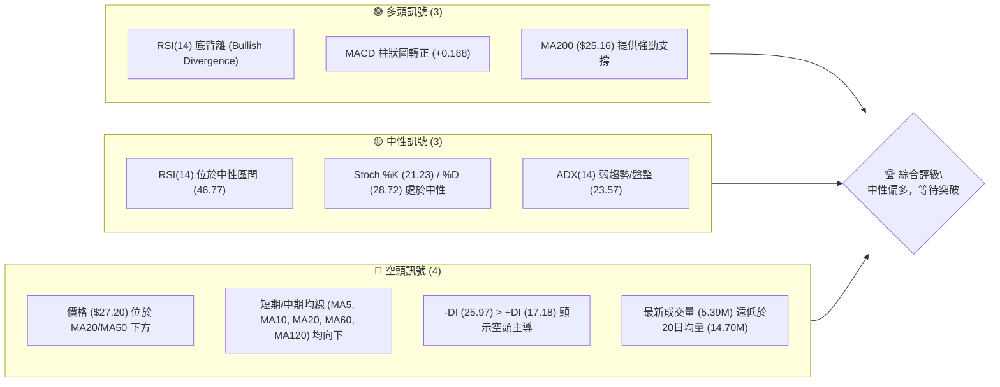

### 📊 核心指標速覽表

| 指標類別 | 指標名稱 | 當前數值 | 訊號 | 解讀 |
|----------|----------|----------|------|------|
| **價格** | 當前價格 | $27.20 | 🟡 | 位於52週區間中下部 (46.5%)，近期處於回調階段 |
| **均線** | MA20 | $29.52 | 🔴 | 價格位於MA20下方，短期壓力顯著 |
| **均線** | MA50 | $36.44 | 🔴 | 價格位於MA50下方，中期趨勢偏空 |
| **均線** | MA200 | $25.16 | 🟢 | 價格位於MA200上方，長期趨勢仍獲支撐 |
| **動能** | RSI(14) | 46.77 | 🟢 | 位於中性區間，但存在底背離，暗示潛在反彈動能 |
| **動能** | MACD | -2.206 | 🟢 | MACD柱狀圖轉正 (+0.188)，短期動能開始轉強 |
| **波動** | ATR(14) | $2.53 | 🟡 | 每日波動約9.32%，屬於中等偏高波動 |
| **趨勢** | ADX(14) | 23.57 | 🟡 | 趨勢強度較弱，市場處於盤整狀態 |
| **成交量** | 量比 (當前/20日均量) | 0.37x | 🔴 | 成交量顯著萎縮，反映市場觀望氣氛濃厚 |

### 🏆 技術評分卡

PL 目前的技術評分顯示，在動能指標和長期支撐方面表現良好，但短期和中期趨勢仍受到壓力。整體市場處於盤整階段，需等待明確的突破訊號。

╔══════════════════════════════════════════════════════════════════╗
║              技術評分卡 — PL (2026-07-09)                          ║
╠══════════════════════════════════════════════════════════════════╣
║ 趨勢強度      ██████░░░░░░░░░░░░░░  30/100  🟡 (ADX < 25，趨勢不明顯)  ║
║ 動能指標      █████████████░░░░░░░  70/100  🟢 (RSI底背離, MACD轉正)  ║
║ 支撐穩定度    ██████████░░░░░░░░░░  60/100  🟡 (MA200提供支撐, S1/S2穩固) ║
║ 成交量配合    ██████░░░░░░░░░░░░░░  40/100  🟡 (量能萎縮, OBV支撐上漲) ║
║ 形態完整度    ██████████░░░░░░░░░░  60/100  🟡 (W底形態初步成形, 待確認) ║
║ 均線排列      █████░░░░░░░░░░░░░░░  30/100  🔴 (短期均線空頭排列，壓力大) ║
╠══════════════════════════════════════════════════════════════════╣
║ 綜合評分      █████████░░░░░░░░░░░  48/100  ⚖️ 中性偏多，等待突破訊號 ║
╚══════════════════════════════════════════════════════════════════╝

---

## 2. 趨勢分析

### 🌐 多時框趨勢分析

多時框架分析顯示 PL 股價正處於一個關鍵的轉折點。長期趨勢雖然經歷了大幅上漲後的健康回調，但仍維持在重要長期均線之上。中期趨勢則顯示出明顯的下跌壓力，價格已跌破多條中短期均線。短期來看，市場在近期低點展現出止跌跡象，並伴隨著動能指標的積極訊號，暗示著潛在的反彈。

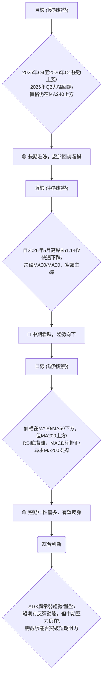

### 📈 長期趨勢 — 12個月走勢圖（Unicode）

PL 在過去12個月的走勢呈現先強勁上漲後大幅回調的態勢。2025年8月至2026年5月期間，股價從$7.09飆升至$51.14，漲幅驚人。隨後在2026年6月和7月經歷了急劇的回調，目前穩定在$27.20，但仍遠高於一年前的水平。

```
PL 月線走勢圖（過去12個月）
價格軸 ($)
$50 ┤                                  ●(51.14)
$45 ┤
$40 ┤                         ●(36.97)
$35 ┤                      ●(33.13)
$30 ┤           ●(27.95)   ●(27.20)←現在
$25 ┤        ●(24.97)●(24.14)
$20 ┤     ●(19.72)
$15 ┤   ●(12.98)●(13.45)
$10 ┤ ●(11.90)
$ 5 ┤●(7.09)
     └─────────────────────────────────────────────────
      8月  9月 10月 11月 12月  1月  2月  3月  4月  5月  6月  7月
      (2025)                                 (2026)
```

**走勢特徵分析表格**

| 階段 | 時間區間 | 價格區間 | 漲跌幅 | 主要特徵 | 訊號 |
|------|----------|----------|--------|----------|------|
| **啟動期** | 2025年8月-11月 | $7.09 - $11.90 | +67.8% | 從低位啟動，緩慢震盪上行，量能溫和放大。 | 🟢 |
| **加速上漲** | 2025年12月-2026年5月 | $19.72 - $51.14 | +159.3% | 進入主升浪，漲勢凌厲，成交量顯著放大，多頭動能強勁。 | 🟢 |
| **急速回調** | 2026年6月-7月 | $51.14 - $27.20 | -46.8% | 股價從高點腰斬，伴隨巨量拋售，短期空頭力量強大。 | 🔴 |
| **當前狀態** | 2026年7月 | $27.20 | - | 價格在長期支撐附近尋求穩定，動能指標顯示止跌跡象。 | 🟡 |

### 📊 中期趨勢（週線分析）

PL 的中期趨勢在經歷了2026年上半年的飆升之後，於5月達到頂峰$51.14，隨後進入了快速且深度的回調。目前股價已跌破多條中期移動平均線，並在$27.20附近震盪。

```
PL 近期壓力與支撐示意圖 (週線視角)

           $51.76 (52W High)
             ▲
             │
             │
$34.25 R3 ───┼───────────────────────
             │                     ▲
$30.90 R2 ────┼───────────────────┼──
             │                   │
$27.57 R1 ─────┼─────────────────┼───
             │                 │
             │     $27.20 現價 ├───────────
             │                 │
$26.28 S1 ────┼─────────────────┼───
             │                   │
$25.30 S2 ─────┼───────────────────┼──
             │                     ▼
$23.66 S3 ───┼───────────────────────
             │
             ▼
           $5.87 (52W Low)

```
從週線圖來看，目前股價位於多條中期移動平均線下方，顯示出中期趨勢的疲軟。近期高點$51.14形成強大阻力，而$27.57 (R1)、$30.90 (R2) 和 $34.25 (R3) 構成短期反彈的階梯式阻力。下方的$26.28 (S1) 和 $25.30 (S2) 則提供關鍵支撐，特別是MA200 ($25.16) 也在這一區域，加強了支撐的有效性。

### ⚡ 趨勢強度評估（ADX 解讀）

ADX (Average Directional Index) 指標用於衡量趨勢的強度，而非方向。PL 的ADX數值為23.57，低於25的閾值，這表明市場目前處於**弱趨勢或盤整行情**。在此情況下，價格波動可能較為劇烈，但缺乏明確的持續方向。

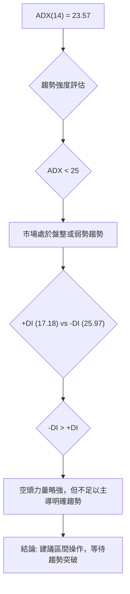

**ADX 強度對照表**

| ADX 數值 | 趨勢強度 | 市場狀態 | 建議策略 |
|----------|----------|----------|----------|
| 0-25     | 弱趨勢/盤整 | 市場方向不明，波動加劇 | 區間操作，等待趨勢確認 |
| 25-50    | 中等趨勢 | 存在明顯趨勢，動能良好 | 順勢交易，追蹤趨勢 |
| 50-75    | 強趨勢 | 趨勢非常強勁，慣性大 | 大膽順勢交易，注意回調 |
| 75-100   | 極強趨勢 | 趨勢過熱，可能反轉 | 謹慎順勢交易，注意風險 |

目前 PL 的 ADX 為23.57，明確指示市場處於盤整狀態。儘管 -DI 略高於 +DI，但差距不大，不足以形成強勁的空頭趨勢。投資者應避免追高殺低，轉而關注支撐與阻力區間的交易機會。

---

## 3. 圖表形態分析

### 🔍 形態識別系統

根據目前的價格走勢和動能指標，PL 正在構築一個潛在的**W底形態 (雙底)**。此形態通常出現在下跌趨勢的底部，暗示著趨勢反轉的可能性。

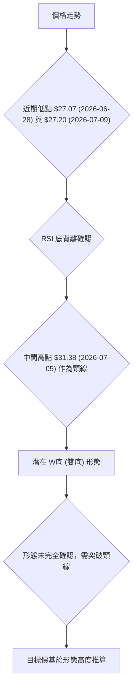

**已識別形態信心度表格**

| 形態 | 信心度 | 判斷依據（引用數據） | 完成度 | 目標價（附計算式） |
|------|--------|----------------------|--------|--------------------|
| **W底 (雙底)** | 65% | 1. 兩次低點 ($27.07, $27.20) 接近，且第二次低點高於第一次，符合W底特徵。<br>2. RSI(14) 呈現底背離現象 (價格下跌或持平，RSI上升)。<br>3. 價格接近MA200 ($25.16) 強支撐。 | 70% | 頸線 $31.38 + 形態高度 ($31.38 - $27.07) = $31.38 + $4.31 = **$35.69** |

**判斷依據詳述**：
- **第一次低點**：發生在2026年6月28日，收盤價 $27.07，當時RSI(14)為33.7。
- **反彈高點 (頸線)**：發生在2026年7月5日，收盤價 $31.38，RSI(14)為42.1。
- **第二次低點**：當前價格 $27.20 (2026年7月9日)，RSI(14)為46.8。
儘管第二次低點略高於第一次，但由於RSI的顯著上升，形成強烈的底背離，這極大地增強了W底形態的有效性。

### 🕯️ 重要K線形態分析

近期週線K線分析顯示，PL 在經歷大幅下跌後，出現了一些止跌訊號，但尚未形成強勁的反轉K線組合。

| 日期 (週結) | 收盤價 | RSI | MACD柱 | 週成交量 | K線形態 | 解讀 | 訊號 |
|-------------|--------|-----|--------|----------|---------|------|------|
| 2026-05-31  | $51.14 | 83.2 | +0.904 | 61.48M   | 長上影線/射擊之星 | 價格達到高點，出現大量賣壓，預示回調。 | 🔴 |
| 2026-06-07  | $32.22 | 35.9 | -1.311 | 100.62M  | 長陰線/大陰燭 | 巨量下跌，空頭力量強勁，價格跌破多條均線。 | 🔴 |
| 2026-06-21  | $28.23 | 17.2 | -1.555 | 66.30M   | 錘子線 (待確認) | 價格探底後收回，下影線較長，但未能有效反彈。 | 🟡 |
| 2026-06-28  | $27.07 | 33.7 | -0.677 | 97.29M   | 小陰線/紡錘線 | 價格在低位震盪，多空力量平衡，RSI開始回升。 | 🟡 |
| 2026-07-05  | $31.38 | 42.1 | +0.526 | 51.84M   | 長陽線/大陽燭 | 價格出現強勁反彈，MACD柱轉正，但成交量相對萎縮。 | 🟢 |
| 2026-07-12  | $27.20 | 46.8 | +0.188 | 31.08M   | 長陰線/大陰燭 | 反彈後再次回落，但RSI持續上升，形成底背離。 | 🟡 |

### 📉 ASCII 走勢形態示意圖

以下示意圖展示了 PL 近期的潛在W底形態，標註了關鍵價位和形態特徵。

```
PL 潛在 W底 (雙底) 形態示意圖

價格軸 ($)
$35.69 ───────────────────────▲ 目標價 (形態高度推算)
$31.38 ───┬───────────────────▲ 頸線 (R2附近)
          │
          │
          │
$27.57 R1 ─┼─────────────────────
          │
$27.20 現價┼───────────┐
          │           │
$27.07 ────●───────────● 第二低點 (27.20)
          │  第一次低點
          │
          │
          ▼
      (下跌趨勢)

```
該圖清晰地描繪了W底形態的兩個低點 ($27.07 和 $27.20) 以及中間的反彈高點 ($31.38) 作為頸線。形態的目標價為 $35.69，是頸線加上形態高度的距離。

### 🎯 形態目標價計算

根據上述W底形態，其目標價計算如下：
1. **第一次低點 (L1)**：$27.07 (2026年6月28日)
2. **中間反彈高點 (頸線，N)**：$31.38 (2026年7月5日)
3. **第二次低點 (L2)**：$27.20 (2026年7月9日)
4. **形態高度 (H)**：頸線 (N) - 第一次低點 (L1) = $31.38 - $27.07 = $4.31
5. **形態目標價 (T)**：頸線 (N) + 形態高度 (H) = $31.38 + $4.31 = **$35.69**

這個目標價 $35.69 位於斐波那契38.2%回調位 ($34.23) 和阻力位 R3 ($34.25) 附近，顯示出一定的技術共振效應。

---

## 4. 支撐與阻力

### 🗺️ 關鍵價位分布圖（Unicode）

PL 的價格目前處於一個關鍵區域，上方有密集的短期阻力，下方則有穩固的支撐區。了解這些價位對於制定交易策略至關重要。

```
PL 價位結構分布圖
═══════════════════════════════════════════════════
$51.76 ║                                        ║ 52W High
$40.93 ║████████████████████████║ 斐波那契23.6%回調
$34.25 ║████████████████████████║ 強阻力 R3 / 斐波那契38.2%回調
$30.90 ║████████████████████    ║ 阻力 R2
$28.81 ║████████████████████████║ 斐波那契50%回調
$27.57 ║████████████████████████║ 關鍵阻力 R1
$27.20 ╠════════════════════════╣ ◄ 現價
$26.28 ║▓▓▓▓▓▓▓▓▓▓▓▓▓▓▓▓        ║ 近期支撐 S1
$25.30 ║████████████████████████║ 強支撐 S2 / MA200($25.16) / 布林下軌($25.07)
$23.66 ║████████████████████████║ 強支撐 S3 / 斐波那契61.8%回調($23.40)
$15.69 ║████████████████████████║ 斐波那契78.6%回調
$ 5.87 ║                                        ║ 52W Low
═══════════════════════════════════════════════════
```

### 🚧 阻力位分析表

PL 目前面臨多個阻力位，這些價位將是股價反彈過程中的關鍵考驗。

| 阻力級別 | 價位 | 形成原因 | 突破難度 | 重要性 |
|----------|------|----------|----------|--------|
| **R1 (關鍵短期阻力)** | $27.57 | 近期波段高點聚類，也是潛在W底形態的初步考驗。 | 中等 | 🟢 突破則確認短期反彈動能 |
| **R2 (中期阻力)** | $30.90 | 過去一個月多次反彈受阻點，也是潛在W底形態的頸線附近。 | 較高 | 🟡 突破則打開上行空間至斐波那契回調位 |
| **R3 (強阻力)** | $34.25 | 近期下跌過程中的重要平台，與斐波那契38.2%回調位 ($34.23) 重疊。 | 高 | 🔴 突破則可能預示中期趨勢反轉 |

### 🛡️ 支撐位分析表

在下跌過程中，PL 在下方擁有多層支撐，這些價位對於穩定股價和防止進一步下跌至關重要。

| 支撐級別 | 價位 | 形成原因 | 守住機率 | 重要性 |
|----------|------|----------|----------|--------|
| **S1 (近期支撐)** | $26.28 | 近期回調低點聚類，與當前價格 $27.20 距離較近。 | 高 | 🟢 守住則維持短期震盪區間 |
| **S2 (強支撐)** | $25.30 | 過去一個月多次下跌止跌點，與MA200 ($25.16) 和布林下軌 ($25.07) 形成強大共振。 | 很高 | 🟢 關鍵生命線，跌破則風險大增 |
| **S3 (深層支撐)** | $23.66 | 下跌過程中的次要低點，與斐波那契61.8%回調位 ($23.40) 接近。 | 中等 | 🟡 跌破S2後的最後防線，具有心理意義 |

### 📐 斐波那契回調位分析

PL 股價在過去52週 ($5.87 → $51.76) 的大幅上漲後，目前正處於深度回調階段。當前價格 $27.20 位於斐波那契50.0%回調位 ($28.81) 和61.8%回調位 ($23.40) 之間，這是一個非常關鍵的區域。

- **50.0% 回調位 ($28.81)**：這是心理上重要的回調水平，通常被視為多頭趨勢是否能延續的觀察點。價格若能有效站穩其上，將增強反彈信心。
- **61.8% 回調位 ($23.40)**：黃金比例回調位，是強勢趨勢回調的極限。若價格跌破此位置，則可能預示著趨勢的徹底反轉，而非單純的回調。
- **當前位置**：PL 目前價格 $27.20 位於斐波那契50.0%回調位下方，但仍在61.8%回調位上方。這表明市場已消化了大部分漲幅，正在尋求底部。MA200 ($25.16) 和S2 ($25.30) 都在此區間內，進一步強化了該區域的支撐力度。只要能守住61.8%回調位，長期上漲趨勢仍有機會恢復。

---

## 5. 技術指標深度解讀

### 🎛️ 指標訊號總覽

當前技術指標訊號呈現多空交織，但短期內動能指標的積極轉變為反彈提供了基礎，而長期均線的支撐則提供了安全邊際。

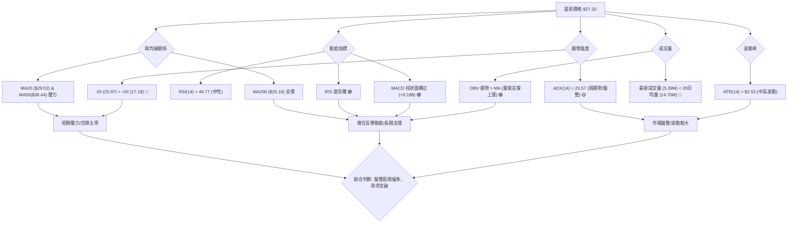

### 📈 移動平均線排列分析

PL 的移動平均線呈現混合排列，短期和中期均線向下，而長期均線向上，這反映了近期股價的快速回調與長期向好趨勢之間的矛盾。

- **短期均線 (MA5, MA10, MA20)**：均位於價格上方，且呈現向下走勢，形成短期壓力。
  - MA5: $29.17
  - MA10: $29.55
  - MA20: $29.52
  - **價格 ($27.20) < MA5 < MA10 < MA20**：典型的短期空頭排列。
- **中期均線 (MA50, MA60, MA120)**：MA50 ($36.44) 和 MA60 ($36.55) 遠高於現價，MA120 ($31.83) 也高於現價，且均線趨勢向下，顯示中期趨勢明顯偏空。
- **長期均線 (MA200, MA240)**：MA200 ($25.16) 和 MA240 ($22.20) 均位於價格下方，且MA240趨勢向上。MA200對當前價格提供了關鍵的長期支撐。
  - **價格 ($27.20) > MA200 ($25.16)**：長期趨勢仍獲支撐。

**綜合判斷**：儘管短期和中期均線呈現空頭排列並構成壓力，但價格守在MA200之上，表明長期上升趨勢的根基尚未動搖。這是一個典型的回調尋求長期支撐的局面。

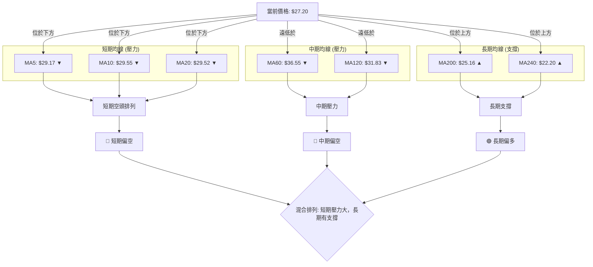

### 📉 RSI(14) 分析

RSI(14) 當前數值為 **46.77**，位於30-70的中性區間，並未處於超買或超賣狀態。這表明市場目前多空力量相對平衡，但更重要的是，RSI顯示出**底背離 (Bullish Divergence)** 訊號。

**RSI 進度條**：
RSI(14) 強度：▓▓▓▓▓▓▓▓▓▓▓▓▓▓▓▓▓▓▓▓░░░░░░░░░░░░░░░░░░░░ 46.77 (中性)

**底背離判斷**：
- **價格走勢**：從2026年7月5日的 $31.38 回落至2026年7月9日的 $27.20 (或考慮2026年6月28日的 $27.07 低點)。價格呈現下跌或持平。
- **RSI 走勢**：RSI 從2026年7月5日的 42.1 上升至2026年7月9日的 46.8 (或從2026年6月21日的 17.2 上升至2026年6月28日的 33.7，再到當前的 46.8)。RSI呈現上升趨勢。
- **結論**：價格創新低或持平，但RSI卻在上升，形成明確的**底背離**。這是一個強烈的看漲反轉訊號，暗示雖然股價仍在下跌或盤整，但下跌動能正在減弱，多頭力量正在積聚，未來可能出現反彈。

### 📊 MACD(12/26/9) 訊號解讀

MACD (Moving Average Convergence Divergence) 指標顯示，PL 的短期動能正在轉強。

- **MACD 線**：-2.206
- **MACD Signal 線**：-2.394
- **MACD 柱狀圖 (Histogram)**：+0.188

**訊號解讀**：
1. **MACD 線 (-2.206) 位於 Signal 線 (-2.394) 之上**：這是看漲訊號，表明短期均線已向上穿越長期均線，動能偏多。
2. **MACD 柱狀圖為正值 (+0.188)**：柱狀圖從負值轉為正值，且仍在增長，進一步確認了多頭動能的啟動。這通常被視為一個買入訊號，表明股價短期內有上漲潛力。

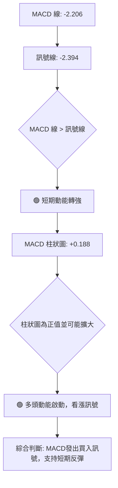

### 📦 布林通道分析

布林通道 (Bollinger Bands) 顯示 PL 股價目前位於通道的下半部分，且靠近下軌，暗示可能存在超賣情況或價格正在測試底部支撐。

- **上軌 (Upper Band)**：$33.96
- **中軌 (Middle Band, MA20)**：$29.52
- **下軌 (Lower Band)**：$25.07
- **當前價格**：$27.20
- **BB %B**：0.24 (表示價格位於下軌和中軌之間，且更靠近下軌)

```
PL 布林通道示意圖

價格軸 ($)
$33.96 ═══════════════════════════════════ 上軌 (BB Upper)
       ║                                  ║
$29.52 ─────────────────────────────────── 中軌 (MA20)
       ║                                  ║
$27.20 ╠═══════════════════════════════════ 現價
       ║       ▓▓▓▓▓▓▓▓▓▓▓▓▓▓▓▓▓▓▓▓       ║
$25.07 ═══════════════════════════════════ 下軌 (BB Lower)
       ║                                  ║
       ▼                                  ▼
```
**解讀**：
1. **價格位於中軌和下軌之間**：表明短期趨勢偏空，價格仍在回調或盤整。
2. **價格靠近下軌 (BB %B = 0.24)**：這通常是超賣的跡象。當價格觸及或跌破下軌時，常會引發反彈。
3. **布林帶寬**：數據中未直接提供布林帶寬，但從上軌 $33.96 減去下軌 $25.07，帶寬為 $8.89。考慮到 ATR 為 $2.53，這個帶寬屬於中等水平，顯示市場波動性尚可，但ADX顯示趨勢不強。
**結論**：布林通道顯示價格處於通道底部區域，結合RSI底背離和MACD轉正，支持短期內從下軌附近反彈的可能性。若能突破中軌 $29.52，則可能開啟一波更強勁的反彈。

### 💹 成交量分析（量價配合度）

成交量是確認價格走勢的關鍵指標，PL 的成交量分析顯示出一些值得關注的矛盾點。

- **最新成交量**：5,392,087 股
- **20日均量**：14,698,504 股
- **50日均量**：13,377,766 股
- **量比 (當前/20日均量)**：0.37x (極低)
- **OBV 趨勢**：OBV > MA → 量能支撐上漲

**解讀**：
1. **成交量萎縮**：當前成交量僅為20日均量的37%，顯示市場交投清淡，觀望情緒濃厚。這在價格下跌或盤整階段，若量能萎縮，可能暗示拋售壓力減輕，有利於止跌築底。然而，如果反彈時仍無量配合，則反彈的持續性堪憂。
2. **OBV (On Balance Volume) 趨勢**：數據顯示 OBV > MA，這是一個看漲訊號。OBV 通過累計成交量判斷資金流向，OBV 上升表明買盤累積，即使股價下跌，只要OBV上升，就代表資金仍在流入或累積，為潛在的上漲提供量能支撐。
3. **量價矛盾**：當前價格在下跌後的盤整區間，成交量顯著萎縮 (🔴 偏空)，但 OBV 卻呈現看漲趨勢 (🟢 偏多)。這種矛盾可能意味著：
    - 短期內市場參與度不高，導致日成交量低迷。
    - 但從中長期累積來看，資金仍在積極介入，或者說，在近期下跌過程中，賣壓並未完全釋放，但買盤也並未完全退出，而是以更為隱蔽的方式累積。
    - 這也可能是底背離的一部分，即在價格下跌的同時，資金卻在悄悄流入。
**結論**：成交量萎縮結合OBV看漲，暗示在當前價格區間，雖然短期缺乏市場熱度，但內部資金流向可能在積聚上漲動能。若未來價格能有效突破阻力並伴隨成交量的放大，則反彈的可靠性將大大增強。

---

## 6. 動能與波動率

### ⚡ 動能評估四象限

PL 目前的動能評估顯示，在經歷了快速下跌後，動能指標開始轉強，但市場整體波動性較高。

| 象限 | 動能 | 波動 | 當前狀態 | 評估 |
|------|------|------|----------|------|
| Q1   | 強   | 低   | -        | 最佳機會 (趨勢穩定，風險較低) |
| Q2   | 弱   | 低   | -        | 謹慎觀望 (趨勢不明，缺乏機會) |
| Q3   | 強   | 高   | ✓        | 高風險高收益 (動能強勁，但波動大，需嚴控風險) |
| Q4   | 弱   | 高   | -        | 避免進場 (趨勢不明，風險高) |

**當前 PL 狀態評估**：
- **動能**：RSI底背離、MACD柱狀圖轉正，顯示動能從弱轉強，具備反彈潛力。
- **波動**：ATR(14)為 $2.53 (約9.32%)，Beta高達2.067，屬於高波動性股票。
因此，PL 目前位於 **Q3 (強動能，高波動)** 象限。這意味著雖然存在潛在的交易機會，但伴隨著較高的風險。投資者應密切關注價格走勢，並採取嚴格的風險管理措施。

```mermaid
graph TD
    A["RSI底背離"] --> B("動能轉強")
    C["MACD柱狀圖轉正"] --> B
    B --> D{"動能評估"}
    D --> D1["動能: 強"]

    E["ATR(14): $2.53 (9.32%)"] --> F("波動率高")
    G["Beta: 2.067"] --> F
    F --> H{"波動率評估"}
    H --> H1["波動: 高"]

    D1 & H1 --> I[PL 處於 "強動能，高波動" 象限 (Q3)]
    I --> J["策略建議: 尋找高勝率進場點，嚴格止損，控制倉位"]
```

### 📊 ATR 波動率分析

ATR (Average True Range) 用於衡量資產的波動性。PL 的 ATR(14) 為 **$2.53**。

- **當前價格 $27.20 的 9.32%**：這是一個相對較高的波動率，表明 PL 的每日價格波動幅度較大，適合日內交易者或波段操作者。
- **止損距離建議**：對於高波動性股票，止損點的設置需要給予足夠的緩衝空間，以避免被正常波動洗出場。一般建議將止損距離設置為ATR的1倍到2倍。
  - **1倍ATR止損**：$2.53
  - **1.5倍ATR止損**：$2.53 * 1.5 = $3.80
  - **2倍ATR止損**：$2.53 * 2 = $5.06
基於當前價格 $27.20，若設置1.5倍ATR的止損距離，則止損點約為 $27.20 - $3.80 = $23.40。這個價位與斐波那契61.8%回調位 ($23.40) 和 S3 ($23.66) 接近，形成一個合理的技術止損區間。

### 📐 Beta 與市場相關性

PL 的 **Beta 值為 2.067**。

- **高 Beta 值解讀**：Beta 值大於1表示該股票的波動性高於市場平均水平。2.067 的 Beta 值意味著當市場整體上漲1%時，PL 的股價平均會上漲約2.067%；當市場下跌1%時，PL 的股價平均會下跌約2.067%。
- **市場相關性**：PL 與大盤的相關性較強，且波動幅度更大。這使得它在牛市中可能提供更高的收益，但在熊市中也可能面臨更大的跌幅。
- **投資者影響**：對於追求高風險高收益的投資者來說，高 Beta 股票具有吸引力。但對於風險厭惡型投資者，則需要謹慎對待，並嚴格控制倉位。在市場情緒不穩定時，高 Beta 股票的風險會被放大。

---

## 7. 多時框架總結

### 📋 時框架評分表

PL 在不同時間框架下的技術表現存在明顯差異，短期動能正在改善，但中期壓力仍存，長期趨勢則有重要支撐。

| 時框架 | 趨勢方向 | 動能 | 均線排列 | 形態 | 綜合評分 (1-10) | 建議 |
|--------|----------|------|----------|------|-----------------|------|
| **長期 (月線)** | 🟢 上行趨勢回調 | 🟡 中性 | 🟢 多頭排列 (MA240) | 🟡 健康回調 | 7 | 保持關注，尋找長期買點 |
| **中期 (週線)** | 🔴 下跌趨勢 | 🟡 轉弱 | 🔴 空頭排列 (MA20/50) | 🔴 高點回落 | 4 | 謹慎，壓力較大 |
| **短期 (日線)** | 🟡 盤整偏多 | 🟢 轉強 | 🔴 空頭排列 (MA5/10/20) | 🟢 W底成形 | 6 | 有望反彈，等待突破 |

### 🔲 綜合訊號矩陣

多時框架訊號矩陣顯示，PL 目前處於一個短期動能正在積聚，但中期仍面臨壓力的階段。長期支撐的存在為其提供了一定的安全邊際。

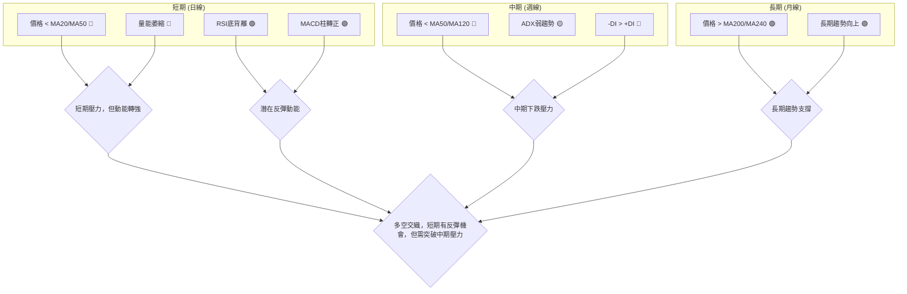

### ⚖️ 多時框收斂結論

根據 ADX(14) 數值 23.57，其低於25的閾值，因此判斷 PL 目前處於**盤整行情**。
依照多時框收斂規則，在盤整行情中，應以日線布林通道上下軌為主要交易區間。

儘管日線短期均線呈現空頭排列 (🔴)，但以下幾個關鍵訊號提供了偏多的動能：
1. **RSI 底背離**：這是強烈的看漲反轉訊號，暗示下跌動能減弱。
2. **MACD 柱狀圖轉正**：顯示短期多頭動能正在啟動。
3. **MA200 ($25.16) 提供長期支撐**：價格目前仍位於MA200上方，為股價提供重要防線。
4. **潛在 W底形態**：W底形態的初步成形，若能突破頸線將確認反轉。

**多時框收斂結論**：
PL 目前處於一個由長期上漲趨勢中的深度回調所形成的**盤整區間**。雖然中期趨勢仍偏空，但短期內已在MA200附近獲得支撐，且多個動能指標發出積極的反彈訊號。因此，**當前市場方向性判斷為中性偏多，預期在盤整區間內有向上反彈的需求。** 主導時框為日線，用於尋找區間交易機會，而週線的下跌壓力則提醒我們反彈可能受到限制，需關注關鍵阻力位的突破情況。

---

## 8. 交易策略建議

### 🗺️ 策略決策流程圖

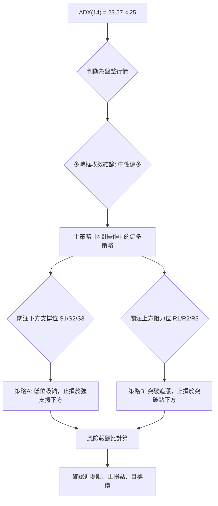

### 🧭 策略路由（依評分卡分流）

**當前主策略方向 = 偏多反彈策略（依綜合評分 48/100）**

根據第1章的技術評分卡，PL 綜合評分為 48/100，屬於中性偏多區間。雖然未達到強烈看多的60分以上，但RSI底背離、MACD柱狀圖轉正以及MA200的堅實支撐，為股價提供了反彈的潛在動能。因此，主推**區間操作中的偏多策略**，以低位吸納或突破短期阻力為進場點。空頭策略僅列為反轉風險觸發點，不作為主推方向。

### 🎯 價格情境階梯（Price Scenarios）

| 觸發條件 | 下一目標 | 後續延伸 | 情境含義 |
|----------|----------|----------|----------|
| **突破 R1 $27.57** | $28.81 (斐波那契50%) | $30.90 (R2) | 短線轉強，有望測試更高中期阻力 |
| **站穩現價區間 ($27.20)** | — | — | 區間震盪，等待方向選擇，可能構築底部 |
| **跌破 S1 $26.28** | $25.30 (S2) | $23.66 (S3) | 中期轉弱，可能下探MA200或斐波那契61.8%回調位 |

### 📊 情境機率分佈

| 情境 | 機率 | 主要依據 |
|------|------|----------|
| **繼續上行 / 反彈** | 45% | RSI底背離、MACD柱狀圖轉正、OBV趨勢看漲、MA200強支撐 |
| **區間震盪** | 40% | ADX弱趨勢 (23.57)、價格位於布林通道中下部、短期均線壓力 |
| **回落 / 再探底** | 15% | 短期/中期均線空頭排列、成交量低迷、市場情緒不穩定 |

### 🟢 主策略詳情（偏多反彈策略）

PL 目前提供兩種偏多策略，分別適用於不同風險偏好的投資者。

| 策略要素 | **策略 A：低位吸納 (保守型)** | **策略 B：突破追漲 (積極型)** |
|----------|------------------------------|------------------------------|
| 進場條件 | 價格回調至S2/MA200附近止跌，並出現看漲K線訊號 | 價格有效突破R1 $27.57 並伴隨成交量放大，MACD柱狀圖持續為正 |
| 進場價格 | **$25.10 - $25.30** (S2/MA200附近) | **$27.60 - $27.80** (突破R1後確認) |
| 目標價 T1 | **$27.57** (R1)             | **$30.90** (R2)             |
| 目標價 T2 | **$30.90** (R2)             | **$34.25** (R3) / **$35.69** (W底形態目標) |
| 止損價格 | **$23.00** (略低於S3 $23.66 和斐波那契61.8%回調位 $23.40) | **$26.00** (跌破S1 $26.28下方) |
| 風險報酬比 | T1: ($27.57-$25.20)/($25.20-$23.00) = **1.08:1** <br> T2: ($30.90-$25.20)/($25.20-$23.00) = **2.59:1** | T1: ($30.90-$27.70)/($27.70-$26.00) = **1.88:1** <br> T2: ($34.25-$27.70)/($27.70-$26.00) = **3.85:1** |
| 成功機率 | 70%                          | 60%                          |
| 建議倉位 | 15-20%                       | 10-15%                       |

### 🔴 反向風險觸發點（對沖提示）

以下為可能推翻偏多策略的關鍵訊號，投資者應密切監控：
- **跌破強支撐 $25.30 (S2)**：此價位與MA200和布林下軌重疊，一旦有效跌破，將大幅增加下跌風險。
- **跌破斐波那契61.8%回調位 $23.40**：這將暗示長期趨勢可能已遭到破壞，而非簡單回調。
- **MACD 柱狀圖再次轉為負值且擴大**：表明多頭動能消退，空頭力量重新佔據主導。
- **RSI 跌破30進入超賣區，且未形成底背離**：如果再次跌破30，且未有底背離配合，則可能預示更深度的下跌。
在這些訊號出現時，應考慮減倉、止損或進行對沖操作。

### ⭐ 整體訊號強度評星

做多訊號強度：★★★☆☆  (3/5星) (RSI底背離, MACD轉正, MA200支撐)
做空訊號強度：★★☆☆☆  (2/5星) (短期均線壓力, 量能萎縮, -DI > +DI)
整體可信度：  ★★★☆☆  (3/5星) (多空交織，但短期反彈機率較大，需注意風險管理)

---

## 9. 風險提示與監控

### ✅ 關鍵監控指標 Checklist

以下監控清單有助於投資者實時掌握 PL 的技術面變化，及時調整策略。

╔══════════════════════════════════════════════════════════════════╗
║               PL 關鍵監控指標 Checklist (每日/每週更新)            ║
╠══════════════════════════════════════════════════════════════════╣
║ [ ] 價格是否站穩 S1 ($26.28) / S2 ($25.30) 之上？                  ║
║ [ ] 價格是否有效突破 R1 ($27.57) / R2 ($30.90)？                    ║
║ [ ] RSI(14) 是否維持在 30-70 中性區間並持續上升？                   ║
║ [ ] MACD 柱狀圖是否持續為正值且擴大？                               ║
║ [ ] ADX 是否突破 25 且 +DI 向上穿越 -DI？                           ║
║ [ ] 成交量在反彈時是否能有效放大？                                  ║
║ [ ] OBV 趨勢是否維持在 MA 之上？                                    ║
║ [ ] K線形態是否有明確的看漲或看跌反轉訊號？                         ║
║ [ ] 布林通道價格是否能突破中軌 ($29.52)？                           ║
╚══════════════════════════════════════════════════════════════════╝

### ⚠️ 風險場景分析

PL 的高 Beta 值 ($2.067) 意味著其股價波動性較大，對市場情緒敏感。以下是可能發生的三種情境：

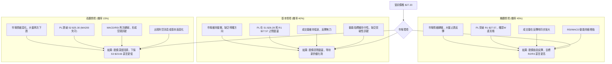

### 🛡️ 風險管理重要提醒

1.  **嚴格執行止損**：PL 具有高波動性，必須設定並嚴格執行止損點。一旦價格觸及止損位，無論盈虧，都應立即出場，以避免更大損失。
2.  **倉位控制**：鑑於 PL 的高 Beta 值和當前盤整格局，建議控制倉位在總投資組合的10-20%之間，切勿重倉。
3.  **分批建倉/減倉**：可以考慮在關鍵支撐位附近分批建倉，並在達到目標價時分批減倉，以平攤風險並鎖定利潤。
4.  **關注宏觀經濟及行業動態**：作為一家高成長科技公司，PL 對市場情緒和行業發展敏感。應持續關注宏觀經濟數據、行業政策及公司基本面消息，以判斷技術走勢是否與基本面相符。
5.  **避免追高殺低**：在盤整行情中，追高殺低往往容易被套。應耐心等待價格回調至重要支撐位或有效突破關鍵阻力位時再考慮進場。
6.  **時間框架考量**：本報告的偏多策略主要基於短期反彈動能。若中期趨勢持續惡化或長期支撐被有效跌破，則需重新評估。

---

## 📋 報告總結

```
PL 技術分析報告總結
════════════════════════════════════════════════════════
報告日期：2026-07-09
當前價格：$27.20
分析評級：⚖️ 中性偏多，等待突破訊號

關鍵結論：
├─ 長期趨勢：🟢 處於健康回調階段，MA200提供堅實支撐。
├─ 中期趨勢：🔴 快速下跌後，仍面臨較大下行壓力。
├─ 短期趨勢：🟡 止跌跡象明顯，RSI底背離與MACD轉正預示反彈動能。
├─ 關鍵支撐：$25.30 (S2，與MA200重疊，極為重要)。
├─ 關鍵阻力：$27.57 (R1，短期反彈首要考驗)。
└─ 分析師目標：W底形態目標 $35.69 (若形態確認)。

最優策略組合：
1. 🥇 最佳機會：**低位吸納策略**。在 $25.10 - $25.30 區間（S2/MA200附近）尋找止跌訊號進場，止損於 $23.00，目標 $27.57/$30.90。
2. 🥈 次選機會：**突破追漲策略**。等待價格有效突破 R1 $27.57 並伴隨量能放大，進場價格 $27.60 - $27.80，止損於 $26.00，目標 $30.90/$34.25。
3. 🥉 保守選擇：**區間震盪觀望**。在價格未能突破關鍵阻力或跌破關鍵支撐前，保持觀望，等待市場選擇明確方向。
════════════════════════════════════════════════════════
```

---

> ⚠️ **免責聲明**：本報告為 AI 自動生成之技術分析，所有數據及估算均基於提供的歷史價格資訊。本報告**僅供研究與學術參考**，**不構成任何投資建議**。投資有風險，入市需謹慎。

---

*報告生成時間：2026-07-09 ｜ 數據來源：Yahoo Finance ｜ 分析框架：多時框技術分析*