<details>
<summary>📊 靜態圖表 (點擊展開)</summary>
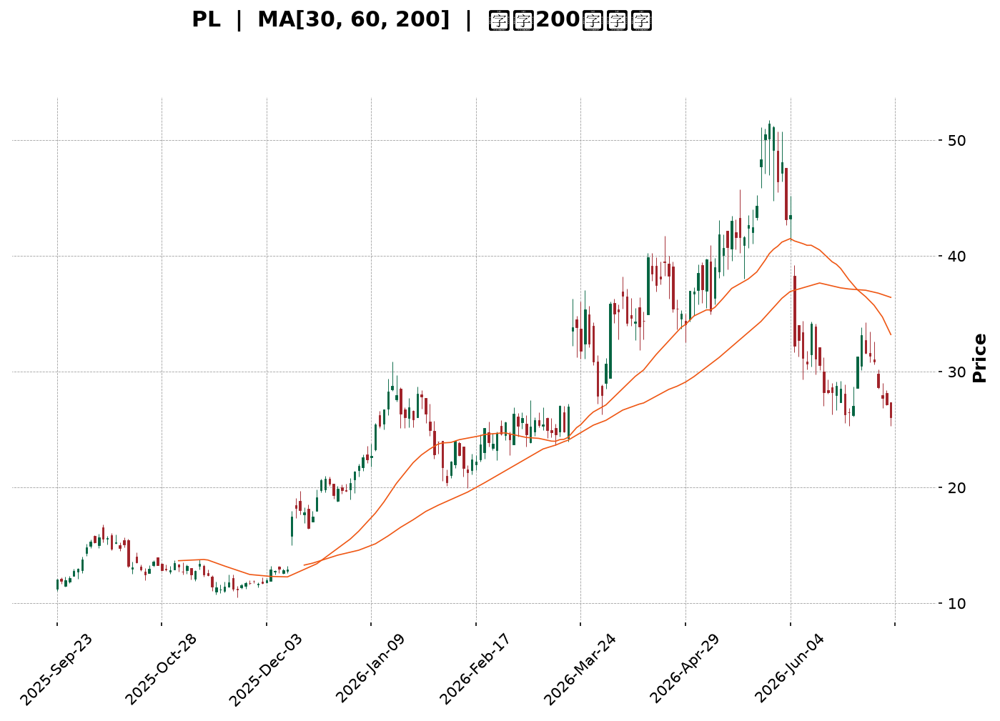
</details>

<html>
<head><meta charset="utf-8" /></head>
<body>
    <div style="height:500px; width:100%;">                        <script>window.PlotlyConfig = {MathJaxConfig: 'local'};</script>
        <script charset="utf-8" src="https://cdn.plot.ly/plotly-3.7.0.min.js" integrity="sha256-jvTGqxNp8AGWEcvNLVuKr+8j5dGe9Yw51LQkmDH+IYA=" crossorigin="anonymous"></script>                <div id="candlestick-chart" class="plotly-graph-div" style="height:100%; width:100%;"></div>            <script>                window.PLOTLYENV=window.PLOTLYENV || {};                                if (document.getElementById("candlestick-chart")) {                    Plotly.newPlot(                        "candlestick-chart",                        [{"close":{"dtype":"f8","bdata":"AAAAoJkZKEAAAAAAKdwnQAAAACCF6ydAAAAAYGZmKEAAAADgepQpQAAAAIDC9SlAAAAAgD2KK0AAAABAM7MtQAAAAGC4ni5AAAAAQOF6LkAAAAAAKVwvQAAAAEAzMy9AAAAAgOtRL0AAAABgZmYtQAAAAAAAgC5AAAAAIFyPLUAAAACAFC4uQAAAAIDCdSpAAAAA4FE4KkAAAABguB4rQAAAAIDr0SlAAAAAAAAAKUAAAABgZuYpQAAAAOBROCtAAAAAYLieKkAAAACAFK4pQAAAAMDMzClAAAAA4FG4KUAAAABgZuYqQAAAAKBHYSpAAAAAYGZmKUAAAAAAAIAqQAAAACCF6yhAAAAAYLieKUAAAAAgrscqQAAAAOCj8ChAAAAAoEfhKEAAAACA69EmQAAAAMDMzCZAAAAAIIVrJkAAAABgZuYmQAAAAOB6lCdAAAAAgMJ1JkAAAACA61EmQAAAAOB6FCdAAAAAgMJ1J0AAAADgo3AnQAAAAMDMzCdAAAAAYGZmJ0AAAACAPYonQAAAAMAeBShAAAAAoEfhKUAAAACAPYopQAAAAGBm5ilAAAAAgBSuKUAAAACgR+EpQAAAAOBReDFAAAAAoHA9MkAAAADAzAwyQAAAAKBH4TFAAAAA4FF4MEAAAACgcH0xQAAAAIAULjNAAAAAoJmZNEAAAABA4bo0QAAAAIDrUTRAAAAAAClcM0AAAABguN4zQAAAAKBwvTNAAAAA4FG4M0AAAADA9Wg0QAAAAADXYzVAAAAAQArXNUAAAAAAKZw2QAAAAOCjcDZAAAAAgMK1NkAAAADgo3A5QAAAAIDrUTlAAAAAQOG6OkAAAAAgrkc8QAAAACCuxzxAAAAAAAAAPEAAAACgR2E6QAAAACBcDzpAAAAA4KPwOkAAAABguN45QAAAAIDrETxAAAAAoEfhO0AAAACgmVk6QAAAAOBR+DhAAAAAoJnZNkAAAABAM\u002fM3QAAAAMAexTVAAAAAgBRuNEAAAABgj0I2QAAAAMAeBThAAAAAgD3KNkAAAABgZqY1QAAAAMDMTDVAAAAAIIVrNkAAAACAwjU2QAAAAKBwvTdAAAAAACkcOUAAAABgZuY3QAAAACCuxzdAAAAAgMK1OEAAAACgR6E4QAAAAKCZmTlAAAAAANcjOEAAAAAAKVw6QAAAAMDMTDlAAAAAAAAAOkAAAABACpc4QAAAACCuRzlAAAAAgOvROUAAAABgZmY5QAAAAOCjcDlAAAAA4FH4OEAAAACAPco4QAAAAKCZmThAAAAA4HoUO0AAAAAgXM84QAAAAIDC9TpAAAAAgD3qQEAAAADA9ehAQAAAAOB61D9AAAAAIFyvQUAAAABAMzNAQAAAAAAp3D5AAAAAANfjO0AAAABAM\u002fM7QAAAAIDCtT5AAAAA4KPwQUAAAABgj4JBQAAAAIDClUFAAAAAYGZGQkAAAACgcB1BQAAAAIDCVUFAAAAAwPUoQUAAAABACvdAQAAAAOB6NEFAAAAAgOvxQ0AAAACgcD1DQAAAAAAAwEJAAAAAANcDQ0AAAAAAKbxDQAAAAMAeJUNAAAAA4FG4QUAAAACgmblBQAAAAADXg0FAAAAAgD0KQUAAAAAAKXxCQAAAAEAzc0JAAAAAwB5FQ0AAAADgo5BCQAAAAOBR2ENAAAAAYLieQUAAAADAHoVDQAAAACCF60RAAAAAQApXREAAAABguF5EQAAAAMAehUVAAAAAIFzPREAAAACAFM5EQAAAACCFy0RAAAAA4HpURUAAAACgcD1FQAAAAMDMLEZAAAAAwPUoSEAAAACgcD1JQAAAAEAzs0lAAAAAgOuRSUAAAABA4TpHQAAAACCFC0hAAAAA4KOQRUAAAAAA18NFQAAAAAApHEBAAAAAYLheQEAAAAAghSs\u002fQAAAAOBRuD5AAAAAgMIVQUAAAABgZiY\u002fQAAAAOB6lD5AAAAAgMI1PEAAAADgUTg8QAAAAEDhOjxAAAAAwB7FPEAAAAAgroc8QAAAAMDMTDpAAAAAYI+COkAAAACA6xE7QAAAACCuRz9AAAAA4KOQQEAAAAAAKZw\u002fQAAAAKBHYT9AAAAAACncPkAAAADA9ag8QAAAAAAAwDtAAAAAQDMzO0AAAADAzAw6QA=="},"high":{"dtype":"f8","bdata":"AAAAYI9CKEAAAACAwnUoQAAAACBcjyhAAAAAwPWoKEAAAAAAAAAqQAAAAGC4HipAAAAAgD0KLEAAAADAyDYuQAAAAAAAAC9AAAAAIK7HL0AAAABgjwIwQAAAACCuxzBAAAAAoJmZL0AAAADAzAwwQAAAAGBm5i9AAAAAAACALkAAAADgelQvQAAAAEA1Hi9AAAAAwPUoK0AAAACA69EsQAAAAEAIrCpAAAAAoJkZKkAAAAAAKZwqQAAAAIAUbitAAAAAIIXrK0AAAADgo\u002fAqQAAAACCFqypAAAAAYGZmKkAAAACAwnUrQAAAAGCPwipAAAAAgD0KK0AAAADgo7AqQAAAAIA9CipAAAAAYGamKUAAAACgmZkrQAAAAKBwvSpAAAAAwMzMKUAAAACA69EoQAAAAEAzsydAAAAA4FE4J0AAAADAHsUnQAAAAIDC9ShAAAAAAAAAKUAAAAAAAAAnQAAAACBcTydAAAAAoO28J0AAAACAPQooQAAAAMAeBShAAAAAANejJ0AAAADAHoUoQAAAAKBHYShAAAAAYGZmKkAAAAAAAMApQAAAAIDCdSpAAAAAAAAAKkAAAABA4XoqQAAAAKCZ+TFAAAAAoJkZM0AAAADgo7AzQAAAACCuRzJAAAAAwMyMMkAAAABAM\u002fMxQAAAAOB61DNAAAAAYI\u002fCNEAAAACgcP00QAAAAIAU7jRAAAAAgMJVNEAAAADAHiU0QAAAAAApPDRAAAAAwMxMNEAAAAAgXM80QAAAACBcbzVAAAAAQDMTNkAAAAAAKdw2QAAAAKCZmTdAAAAAgOnGN0AAAAAgXI85QAAAAEAKlzpAAAAAwB7FOkAAAACgR2E9QAAAAGDj5T5AAAAA4FG4PUAAAAAghas8QAAAAIDA6jpAAAAAQOG6O0AAAABAM7M6QAAAAEAzszxAAAAAYGZmPEAAAABAM7M7QAAAAAAAQDtAAAAAwKHFOUAAAAAArPw3QAAAAAAAADhAAAAAgMCKNUAAAAAgrkc2QAAAAOBRGDhAAAAAQOH6N0AAAABgZoY3QAAAAMD16DVAAAAAgBTuNkAAAACAPco2QAAAAKCZmThAAAAAACkcOUAAAADgo7A5QAAAAOB6tDhAAAAAIFzPOEAAAABAYtA5QAAAAOCjsDlAAAAAQArXOEAAAACAFO46QAAAAOCjcDpAAAAAoEeBOkAAAACgcD06QAAAAACqkTtAAAAAQAoXOkAAAADgUXg6QAAAACCF6zpAAAAAIFwPOkAAAACA6QY6QAAAAAAAgDlAAAAAQAoXO0AAAADgehQ7QAAAAGCPQjtAAAAAANcjQkAAAAAghWtBQAAAACCFC0JAAAAAYGaGQkAAAAAA1dhBQAAAAGC4HkFAAAAAwPVoP0AAAACAFO48QAAAAIAULj9AAAAAwB4FQkAAAADAHiVCQAAAAGBm5kFAAAAAQOEaQ0AAAACAwpVCQAAAAIDrMUJAAAAAgBS+QUAAAAAgWDlCQAAAAIDClUFAAAAAoHAdREAAAACgcB1EQAAAAOB69ENAAAAAANfDQ0AAAABA4dpEQAAAAAAAAERAAAAAAADAQ0AAAACgcB1CQAAAAEAKp0FAAAAAAACAQUAAAAAAKXxCQAAAAOB6pEJAAAAAYI+iQ0AAAABACrdDQAAAAKBH4UNAAAAAgMJ1REAAAADAzOxDQAAAACBcj0VAAAAA4KPwREAAAACgmRlFQAAAAKCZuUVAAAAAQAqXRUAAAAAA1+NGQAAAAAAA4ERAAAAAYGbGRUAAAAAAAABGQAAAAEAMokZAAAAA4KOQSUAAAACgcH1JQAAAAKBH4UlAAAAAYI+iSUAAAAAAAGBJQAAAAGCPYklAAAAAIFzPR0AAAADAHpVGQAAAAEAKl0NAAAAAwB4FQUAAAAAgXC9BQAAAAMDMzD9AAAAAwPUoQUAAAABAMxNBQAAAAIDrEUBAAAAAAABAP0AAAACgmVk9QAAAAAAAAD1AAAAAYI8iPUAAAAAgLz09QAAAAKBH4TxAAAAAQArXOkAAAADgo7A8QAAAACCuRz9AAAAAwMzsQEAAAAAAACBBQAAAAKCZuUBAAAAAgBROQEAAAADAzCw+QAAAAGCPAj1AAAAAYGZmPEAAAAAAAEA7QA=="},"hovertemplate":"\u003cb\u003e%{x|%Y-%m-%d}\u003c\u002fb\u003e\u003cbr\u003e\u958b: $%{open:.2f}\u003cbr\u003e\u9ad8: $%{high:.2f}\u003cbr\u003e\u4f4e: $%{low:.2f}\u003cbr\u003e\u6536: $%{close:.2f}\u003cextra\u003e\u003c\u002fextra\u003e","low":{"dtype":"f8","bdata":"AAAAANcjJkAAAABAClcnQAAAAEAK1yZAAAAAwB6FJ0AAAADgUbgoQAAAAKBwPShAAAAAQDMzKUAAAADA9SgsQAAAAMAehS1AAAAAoEdhLkAAAAAgXI8tQAAAAMAehS5AAAAAwPUoLkAAAAAAKRwtQAAAAIDrUS5AAAAAQAoXLUAAAABAM7MtQAAAAKBwPSpAAAAAIN0kKUAAAAAAAAArQAAAAGC4nilAAAAA4KPwJ0AAAACAFC4pQAAAACCuRypAAAAAgD2KKkAAAAAgXI8pQAAAACCuhylAAAAAQN8PKUAAAAAgrscpQAAAAIDCdSlAAAAAIIXrKEAAAAAgXA8pQAAAAADXIyhAAAAAACncJ0AAAABgENgpQAAAACBcjyhAAAAAwPWoKEAAAABAChcmQAAAAMDIdiVAAAAAYI\u002fCJUAAAACAFO4lQAAAAMDMzCZAAAAAgJcuJkAAAACAPQolQAAAAMAehSZAAAAAwB6FJkAAAABgj0InQAAAAICXbidAAAAAwMzMJkAAAADgelQnQAAAAEDheidAAAAAACncJ0AAAADAHgUpQAAAAKBwPSlAAAAAQDUeKUAAAADA9SgpQAAAAMAeBS5AAAAAYLheMUAAAAAA16MxQAAAAIAU7jBAAAAAgBRuMEAAAACAPQoxQAAAAKBw\u002fTFAAAAAACmcM0AAAACgmZkzQAAAAAApHDRAAAAAgD0KM0AAAABgj8IyQAAAAOCjcDNAAAAAQImhM0AAAAAA1fgyQAAAAKBwfTNAAAAA4FH4NEAAAADA9Wg1QAAAAEAKFzZAAAAAwCDQNUAAAADA9Sg3QAAAAGC4HjlAAAAAAAAAOUAAAABgj0I6QAAAAAApXDxAAAAAIFxvO0AAAACgRyE5QAAAAADXIzlAAAAAgBQuOUAAAADgUTg5QAAAAKAaDzpAAAAAIFzPOkAAAADAzIw5QAAAAIDrcThAAAAAQAp3NkAAAADA9eg2QAAAAEAKlzRAAAAAYGYmNEAAAAAgXM80QAAAAGBmpjVAAAAAgMK1NkAAAADA9eg0QAAAAEDh+jNAAAAAIAYhNUAAAAAAAIA1QAAAAKBwPTZAAAAAgMJ1NkAAAABgj4I3QAAAAEDhOjdAAAAAoJlZNkAAAACgcH04QAAAAIDrEThAAAAAIK7HNkAAAADgUbg3QAAAAKBHYThAAAAAgGgROUAAAABgj4I3QAAAAKCZ2TdAAAAAQDNzOEAAAABAMzM5QAAAAOCj8DhAAAAAIK5HOEAAAAAgXE84QAAAAOB4qTdAAAAAYGZmOEAAAABgj8I4QAAAAOCj8DdAAAAAgGghQEAAAABA4To\u002fQAAAAAApHD9AAAAAoEchP0AAAAAgXA9AQAAAAIA9ij5AAAAAYLg+O0AAAADA9Ug6QAAAAMAehTxAAAAA4KNwPUAAAABA4RpBQAAAAGCPYkBAAAAA4FG4QUAAAADgUfhAQAAAAKCZ+UBAAAAAAClcQEAAAACgR+E\u002fQAAAACCuZ0BAAAAAYGZ2QUAAAAAghetCQAAAAEAKd0JAAAAAYI\u002fCQkAAAAAA1yNDQAAAAIA9KkJAAAAA4KOQQUAAAADgo9BAQAAAAMDz3UBAAAAAwPVIQEAAAADASydBQAAAAOCla0FAAAAAwPXoQUAAAACgmflBQAAAAKBHwUFAAAAAQAp3QUAAAABgZuZBQAAAAMDMDENAAAAAoEchQ0AAAADAzGxDQAAAAMDMzENAAAAAwB5FREAAAACgRyFEQAAAAGCPAkNAAAAAgMJVREAAAADAHoVEQAAAAMDMjEVAAAAAgBTuRkAAAACAFI5HQAAAAAAAgEdAAAAAANdjRkAAAAAA18NGQAAAAEDhOkdAAAAAwB5VRUAAAABgZqZEQAAAAMD1qD9AAAAA4HpUP0AAAACA61E9QAAAAEAzMz5AAAAAIIVrPkAAAADAHsU9QAAAAAApHD5AAAAAoEMLO0AAAADgehQ8QAAAAOB6VDpAAAAAgMK1OkAAAADgelQ7QAAAAIA9ijlAAAAAwMxMOUAAAACgRyE6QAAAAKCZmTxAAAAAoBgkPkAAAADA9Yg\u002fQAAAAIA9yj5AAAAAACmcPkAAAACAPYo8QAAAAEAK1zpAAAAAYI8iO0AAAACA61E5QA=="},"name":"\u50f9\u683c","open":{"dtype":"f8","bdata":"AAAAQOF6JkAAAAAgrkcoQAAAAAAAACdAAAAA4FG4J0AAAAAgrscoQAAAAGBmZilAAAAAgBSuKUAAAADgUbgsQAAAAGBm5i1AAAAAoJmZL0AAAAAAAAAuQAAAAMDMjDBAAAAAgBQuL0AAAADgUbgvQAAAACCFay5AAAAAAAAALkAAAABgZuYuQAAAAOCj8C5AAAAAAAAAKkAAAACAPQosQAAAAAApXCpAAAAAAACAKUAAAABgj0IpQAAAAKCZmSpAAAAAYGbmK0AAAADAzMwqQAAAACCF6ylAAAAAQOF6KUAAAAAgrscpQAAAAMD1qCpAAAAAgMJ1KUAAAACAFK4pQAAAAMAeBSpAAAAA4FE4KEAAAACAwnUqQAAAAGBmZipAAAAAYI9CKUAAAACAPYooQAAAAAAAACZAAAAAAClcJkAAAADgehQmQAAAACCF6yZAAAAAYGZmKEAAAABA4XomQAAAAEAzsyZAAAAAwB4FJ0AAAACAPYonQAAAAIDr0SdAAAAAQDMzJ0AAAABgj8InQAAAAMD1qCdAAAAAYGbmJ0AAAADAHoUpQAAAAAApXCpAAAAAoHA9KUAAAACgmZkpQAAAAOB6lC9AAAAA4KNwMkAAAAAgXM8yQAAAAGBmpjFAAAAAgBQuMkAAAACAPQoxQAAAAKBw\u002fTFAAAAAIK7HM0AAAADAzMwzQAAAAEDhujRAAAAAwMxMNEAAAACgcN0yQAAAACCuBzRAAAAAYLi+M0AAAABA4dozQAAAAEAzszRAAAAAAACANUAAAADgUbg1QAAAAKCZ2TZAAAAAoJmZNkAAAADAzEw3QAAAAGCPQjpAAAAAAACAOUAAAAAgXM86QAAAAEAzczxAAAAAQAqXO0AAAAAAAIA8QAAAAAAAwDpAAAAAYI8COkAAAACgmZk6QAAAAOB6FDpAAAAAwMwMPEAAAABAM7M7QAAAAEAKtzlAAAAAANfjOEAAAABA4fo3QAAAAAAAADhAAAAAAAAANUAAAACAPQo1QAAAAIDC9TVAAAAAYLjeN0AAAABgZoY3QAAAAIDrkTVAAAAAAACANUAAAAAAAAA2QAAAAGBmZjZAAAAAwB4FN0AAAACgcL04QAAAAGBmZjdAAAAAAABAN0AAAADAzEw5QAAAAAAAgDhAAAAAQDOTOEAAAADgUbg3QAAAAEDhGjpAAAAAoJmZOUAAAAAAAIA5QAAAAADX4zdAAAAAQArXOEAAAACA69E5QAAAAEAKVzlAAAAA4FH4OUAAAABA4fo4QAAAAKBHITlAAAAAoJnZOEAAAAAAAIA6QAAAAAAAQDhAAAAAYGbGQEAAAAAAAEBBQAAAAEDh2kBAAAAAQDMzQEAAAAAAKXxBQAAAAKBw\u002fUBAAAAAoJnZPkAAAADAzMw8QAAAAAAAAD1AAAAA4KNwPUAAAACAwvVBQAAAAOCjsEFAAAAAQDNzQkAAAAAAAEBCQAAAAOCjcEFAAAAAoHAdQUAAAAAghctBQAAAAIDCNUFAAAAAoHB9QUAAAACA65FDQAAAAEAzk0NAAAAAACkcQ0AAAAAAAMBDQAAAAIA9qkNAAAAAgBSOQ0AAAAAAKbxBQAAAAMDMTEFAAAAA4KMwQUAAAAAA10NBQAAAACBcX0JAAAAAwB6FQkAAAACgmZlDQAAAACBcf0JAAAAAYI\u002fCQ0AAAABAMzNCQAAAAEAzU0NAAAAAIIULREAAAABAChdFQAAAAOCjUERAAAAAwPUIRUAAAAAA16NFQAAAAEAKd0RAAAAAQDMzRUAAAADAcghFQAAAAMDMrEVAAAAAwPXYR0AAAADAzAxJQAAAAEAzE0lAAAAAAACQSEAAAAAghYtIQAAAAIDClUdAAAAAIFzPR0AAAACgcJ1FQAAAAGBmJkNAAAAAoEcBQUAAAACAwrVAQAAAAADX4z5AAAAAAACAP0AAAACA6\u002fFAQAAAAIA9CkBAAAAAwB4FPkAAAAAA12M8QAAAAGBmpjxAAAAAgML1O0AAAADgelQ7QAAAAIDrETxAAAAAYI+COkAAAABA4To6QAAAAKCZmTxAAAAAoHB9PkAAAACgmVlAQAAAAEAKlz9AAAAA4HoUP0AAAADgetQ9QAAAAAAAADxAAAAA4KMwPEAAAABAClc7QA=="},"x":["2025-09-23T00:00:00-04:00","2025-09-24T00:00:00-04:00","2025-09-25T00:00:00-04:00","2025-09-26T00:00:00-04:00","2025-09-29T00:00:00-04:00","2025-09-30T00:00:00-04:00","2025-10-01T00:00:00-04:00","2025-10-02T00:00:00-04:00","2025-10-03T00:00:00-04:00","2025-10-06T00:00:00-04:00","2025-10-07T00:00:00-04:00","2025-10-08T00:00:00-04:00","2025-10-09T00:00:00-04:00","2025-10-10T00:00:00-04:00","2025-10-13T00:00:00-04:00","2025-10-14T00:00:00-04:00","2025-10-15T00:00:00-04:00","2025-10-16T00:00:00-04:00","2025-10-17T00:00:00-04:00","2025-10-20T00:00:00-04:00","2025-10-21T00:00:00-04:00","2025-10-22T00:00:00-04:00","2025-10-23T00:00:00-04:00","2025-10-24T00:00:00-04:00","2025-10-27T00:00:00-04:00","2025-10-28T00:00:00-04:00","2025-10-29T00:00:00-04:00","2025-10-30T00:00:00-04:00","2025-10-31T00:00:00-04:00","2025-11-03T00:00:00-05:00","2025-11-04T00:00:00-05:00","2025-11-05T00:00:00-05:00","2025-11-06T00:00:00-05:00","2025-11-07T00:00:00-05:00","2025-11-10T00:00:00-05:00","2025-11-11T00:00:00-05:00","2025-11-12T00:00:00-05:00","2025-11-13T00:00:00-05:00","2025-11-14T00:00:00-05:00","2025-11-17T00:00:00-05:00","2025-11-18T00:00:00-05:00","2025-11-19T00:00:00-05:00","2025-11-20T00:00:00-05:00","2025-11-21T00:00:00-05:00","2025-11-24T00:00:00-05:00","2025-11-25T00:00:00-05:00","2025-11-26T00:00:00-05:00","2025-11-28T00:00:00-05:00","2025-12-01T00:00:00-05:00","2025-12-02T00:00:00-05:00","2025-12-03T00:00:00-05:00","2025-12-04T00:00:00-05:00","2025-12-05T00:00:00-05:00","2025-12-08T00:00:00-05:00","2025-12-09T00:00:00-05:00","2025-12-10T00:00:00-05:00","2025-12-11T00:00:00-05:00","2025-12-12T00:00:00-05:00","2025-12-15T00:00:00-05:00","2025-12-16T00:00:00-05:00","2025-12-17T00:00:00-05:00","2025-12-18T00:00:00-05:00","2025-12-19T00:00:00-05:00","2025-12-22T00:00:00-05:00","2025-12-23T00:00:00-05:00","2025-12-24T00:00:00-05:00","2025-12-26T00:00:00-05:00","2025-12-29T00:00:00-05:00","2025-12-30T00:00:00-05:00","2025-12-31T00:00:00-05:00","2026-01-02T00:00:00-05:00","2026-01-05T00:00:00-05:00","2026-01-06T00:00:00-05:00","2026-01-07T00:00:00-05:00","2026-01-08T00:00:00-05:00","2026-01-09T00:00:00-05:00","2026-01-12T00:00:00-05:00","2026-01-13T00:00:00-05:00","2026-01-14T00:00:00-05:00","2026-01-15T00:00:00-05:00","2026-01-16T00:00:00-05:00","2026-01-20T00:00:00-05:00","2026-01-21T00:00:00-05:00","2026-01-22T00:00:00-05:00","2026-01-23T00:00:00-05:00","2026-01-26T00:00:00-05:00","2026-01-27T00:00:00-05:00","2026-01-28T00:00:00-05:00","2026-01-29T00:00:00-05:00","2026-01-30T00:00:00-05:00","2026-02-02T00:00:00-05:00","2026-02-03T00:00:00-05:00","2026-02-04T00:00:00-05:00","2026-02-05T00:00:00-05:00","2026-02-06T00:00:00-05:00","2026-02-09T00:00:00-05:00","2026-02-10T00:00:00-05:00","2026-02-11T00:00:00-05:00","2026-02-12T00:00:00-05:00","2026-02-13T00:00:00-05:00","2026-02-17T00:00:00-05:00","2026-02-18T00:00:00-05:00","2026-02-19T00:00:00-05:00","2026-02-20T00:00:00-05:00","2026-02-23T00:00:00-05:00","2026-02-24T00:00:00-05:00","2026-02-25T00:00:00-05:00","2026-02-26T00:00:00-05:00","2026-02-27T00:00:00-05:00","2026-03-02T00:00:00-05:00","2026-03-03T00:00:00-05:00","2026-03-04T00:00:00-05:00","2026-03-05T00:00:00-05:00","2026-03-06T00:00:00-05:00","2026-03-09T00:00:00-04:00","2026-03-10T00:00:00-04:00","2026-03-11T00:00:00-04:00","2026-03-12T00:00:00-04:00","2026-03-13T00:00:00-04:00","2026-03-16T00:00:00-04:00","2026-03-17T00:00:00-04:00","2026-03-18T00:00:00-04:00","2026-03-19T00:00:00-04:00","2026-03-20T00:00:00-04:00","2026-03-23T00:00:00-04:00","2026-03-24T00:00:00-04:00","2026-03-25T00:00:00-04:00","2026-03-26T00:00:00-04:00","2026-03-27T00:00:00-04:00","2026-03-30T00:00:00-04:00","2026-03-31T00:00:00-04:00","2026-04-01T00:00:00-04:00","2026-04-02T00:00:00-04:00","2026-04-06T00:00:00-04:00","2026-04-07T00:00:00-04:00","2026-04-08T00:00:00-04:00","2026-04-09T00:00:00-04:00","2026-04-10T00:00:00-04:00","2026-04-13T00:00:00-04:00","2026-04-14T00:00:00-04:00","2026-04-15T00:00:00-04:00","2026-04-16T00:00:00-04:00","2026-04-17T00:00:00-04:00","2026-04-20T00:00:00-04:00","2026-04-21T00:00:00-04:00","2026-04-22T00:00:00-04:00","2026-04-23T00:00:00-04:00","2026-04-24T00:00:00-04:00","2026-04-27T00:00:00-04:00","2026-04-28T00:00:00-04:00","2026-04-29T00:00:00-04:00","2026-04-30T00:00:00-04:00","2026-05-01T00:00:00-04:00","2026-05-04T00:00:00-04:00","2026-05-05T00:00:00-04:00","2026-05-06T00:00:00-04:00","2026-05-07T00:00:00-04:00","2026-05-08T00:00:00-04:00","2026-05-11T00:00:00-04:00","2026-05-12T00:00:00-04:00","2026-05-13T00:00:00-04:00","2026-05-14T00:00:00-04:00","2026-05-15T00:00:00-04:00","2026-05-18T00:00:00-04:00","2026-05-19T00:00:00-04:00","2026-05-20T00:00:00-04:00","2026-05-21T00:00:00-04:00","2026-05-22T00:00:00-04:00","2026-05-26T00:00:00-04:00","2026-05-27T00:00:00-04:00","2026-05-28T00:00:00-04:00","2026-05-29T00:00:00-04:00","2026-06-01T00:00:00-04:00","2026-06-02T00:00:00-04:00","2026-06-03T00:00:00-04:00","2026-06-04T00:00:00-04:00","2026-06-05T00:00:00-04:00","2026-06-08T00:00:00-04:00","2026-06-09T00:00:00-04:00","2026-06-10T00:00:00-04:00","2026-06-11T00:00:00-04:00","2026-06-12T00:00:00-04:00","2026-06-15T00:00:00-04:00","2026-06-16T00:00:00-04:00","2026-06-17T00:00:00-04:00","2026-06-18T00:00:00-04:00","2026-06-22T00:00:00-04:00","2026-06-23T00:00:00-04:00","2026-06-24T00:00:00-04:00","2026-06-25T00:00:00-04:00","2026-06-26T00:00:00-04:00","2026-06-29T00:00:00-04:00","2026-06-30T00:00:00-04:00","2026-07-01T00:00:00-04:00","2026-07-02T00:00:00-04:00","2026-07-06T00:00:00-04:00","2026-07-07T00:00:00-04:00","2026-07-08T00:00:00-04:00","2026-07-09T00:00:00-04:00","2026-07-10T00:00:00-04:00"],"type":"candlestick"},{"hovertemplate":"MA30: $%{y:.2f}\u003cextra\u003e\u003c\u002fextra\u003e","line":{"color":"#2196F3","dash":"dash","width":2},"mode":"lines","name":"MA30","x":["2025-09-23T00:00:00-04:00","2025-09-24T00:00:00-04:00","2025-09-25T00:00:00-04:00","2025-09-26T00:00:00-04:00","2025-09-29T00:00:00-04:00","2025-09-30T00:00:00-04:00","2025-10-01T00:00:00-04:00","2025-10-02T00:00:00-04:00","2025-10-03T00:00:00-04:00","2025-10-06T00:00:00-04:00","2025-10-07T00:00:00-04:00","2025-10-08T00:00:00-04:00","2025-10-09T00:00:00-04:00","2025-10-10T00:00:00-04:00","2025-10-13T00:00:00-04:00","2025-10-14T00:00:00-04:00","2025-10-15T00:00:00-04:00","2025-10-16T00:00:00-04:00","2025-10-17T00:00:00-04:00","2025-10-20T00:00:00-04:00","2025-10-21T00:00:00-04:00","2025-10-22T00:00:00-04:00","2025-10-23T00:00:00-04:00","2025-10-24T00:00:00-04:00","2025-10-27T00:00:00-04:00","2025-10-28T00:00:00-04:00","2025-10-29T00:00:00-04:00","2025-10-30T00:00:00-04:00","2025-10-31T00:00:00-04:00","2025-11-03T00:00:00-05:00","2025-11-04T00:00:00-05:00","2025-11-05T00:00:00-05:00","2025-11-06T00:00:00-05:00","2025-11-07T00:00:00-05:00","2025-11-10T00:00:00-05:00","2025-11-11T00:00:00-05:00","2025-11-12T00:00:00-05:00","2025-11-13T00:00:00-05:00","2025-11-14T00:00:00-05:00","2025-11-17T00:00:00-05:00","2025-11-18T00:00:00-05:00","2025-11-19T00:00:00-05:00","2025-11-20T00:00:00-05:00","2025-11-21T00:00:00-05:00","2025-11-24T00:00:00-05:00","2025-11-25T00:00:00-05:00","2025-11-26T00:00:00-05:00","2025-11-28T00:00:00-05:00","2025-12-01T00:00:00-05:00","2025-12-02T00:00:00-05:00","2025-12-03T00:00:00-05:00","2025-12-04T00:00:00-05:00","2025-12-05T00:00:00-05:00","2025-12-08T00:00:00-05:00","2025-12-09T00:00:00-05:00","2025-12-10T00:00:00-05:00","2025-12-11T00:00:00-05:00","2025-12-12T00:00:00-05:00","2025-12-15T00:00:00-05:00","2025-12-16T00:00:00-05:00","2025-12-17T00:00:00-05:00","2025-12-18T00:00:00-05:00","2025-12-19T00:00:00-05:00","2025-12-22T00:00:00-05:00","2025-12-23T00:00:00-05:00","2025-12-24T00:00:00-05:00","2025-12-26T00:00:00-05:00","2025-12-29T00:00:00-05:00","2025-12-30T00:00:00-05:00","2025-12-31T00:00:00-05:00","2026-01-02T00:00:00-05:00","2026-01-05T00:00:00-05:00","2026-01-06T00:00:00-05:00","2026-01-07T00:00:00-05:00","2026-01-08T00:00:00-05:00","2026-01-09T00:00:00-05:00","2026-01-12T00:00:00-05:00","2026-01-13T00:00:00-05:00","2026-01-14T00:00:00-05:00","2026-01-15T00:00:00-05:00","2026-01-16T00:00:00-05:00","2026-01-20T00:00:00-05:00","2026-01-21T00:00:00-05:00","2026-01-22T00:00:00-05:00","2026-01-23T00:00:00-05:00","2026-01-26T00:00:00-05:00","2026-01-27T00:00:00-05:00","2026-01-28T00:00:00-05:00","2026-01-29T00:00:00-05:00","2026-01-30T00:00:00-05:00","2026-02-02T00:00:00-05:00","2026-02-03T00:00:00-05:00","2026-02-04T00:00:00-05:00","2026-02-05T00:00:00-05:00","2026-02-06T00:00:00-05:00","2026-02-09T00:00:00-05:00","2026-02-10T00:00:00-05:00","2026-02-11T00:00:00-05:00","2026-02-12T00:00:00-05:00","2026-02-13T00:00:00-05:00","2026-02-17T00:00:00-05:00","2026-02-18T00:00:00-05:00","2026-02-19T00:00:00-05:00","2026-02-20T00:00:00-05:00","2026-02-23T00:00:00-05:00","2026-02-24T00:00:00-05:00","2026-02-25T00:00:00-05:00","2026-02-26T00:00:00-05:00","2026-02-27T00:00:00-05:00","2026-03-02T00:00:00-05:00","2026-03-03T00:00:00-05:00","2026-03-04T00:00:00-05:00","2026-03-05T00:00:00-05:00","2026-03-06T00:00:00-05:00","2026-03-09T00:00:00-04:00","2026-03-10T00:00:00-04:00","2026-03-11T00:00:00-04:00","2026-03-12T00:00:00-04:00","2026-03-13T00:00:00-04:00","2026-03-16T00:00:00-04:00","2026-03-17T00:00:00-04:00","2026-03-18T00:00:00-04:00","2026-03-19T00:00:00-04:00","2026-03-20T00:00:00-04:00","2026-03-23T00:00:00-04:00","2026-03-24T00:00:00-04:00","2026-03-25T00:00:00-04:00","2026-03-26T00:00:00-04:00","2026-03-27T00:00:00-04:00","2026-03-30T00:00:00-04:00","2026-03-31T00:00:00-04:00","2026-04-01T00:00:00-04:00","2026-04-02T00:00:00-04:00","2026-04-06T00:00:00-04:00","2026-04-07T00:00:00-04:00","2026-04-08T00:00:00-04:00","2026-04-09T00:00:00-04:00","2026-04-10T00:00:00-04:00","2026-04-13T00:00:00-04:00","2026-04-14T00:00:00-04:00","2026-04-15T00:00:00-04:00","2026-04-16T00:00:00-04:00","2026-04-17T00:00:00-04:00","2026-04-20T00:00:00-04:00","2026-04-21T00:00:00-04:00","2026-04-22T00:00:00-04:00","2026-04-23T00:00:00-04:00","2026-04-24T00:00:00-04:00","2026-04-27T00:00:00-04:00","2026-04-28T00:00:00-04:00","2026-04-29T00:00:00-04:00","2026-04-30T00:00:00-04:00","2026-05-01T00:00:00-04:00","2026-05-04T00:00:00-04:00","2026-05-05T00:00:00-04:00","2026-05-06T00:00:00-04:00","2026-05-07T00:00:00-04:00","2026-05-08T00:00:00-04:00","2026-05-11T00:00:00-04:00","2026-05-12T00:00:00-04:00","2026-05-13T00:00:00-04:00","2026-05-14T00:00:00-04:00","2026-05-15T00:00:00-04:00","2026-05-18T00:00:00-04:00","2026-05-19T00:00:00-04:00","2026-05-20T00:00:00-04:00","2026-05-21T00:00:00-04:00","2026-05-22T00:00:00-04:00","2026-05-26T00:00:00-04:00","2026-05-27T00:00:00-04:00","2026-05-28T00:00:00-04:00","2026-05-29T00:00:00-04:00","2026-06-01T00:00:00-04:00","2026-06-02T00:00:00-04:00","2026-06-03T00:00:00-04:00","2026-06-04T00:00:00-04:00","2026-06-05T00:00:00-04:00","2026-06-08T00:00:00-04:00","2026-06-09T00:00:00-04:00","2026-06-10T00:00:00-04:00","2026-06-11T00:00:00-04:00","2026-06-12T00:00:00-04:00","2026-06-15T00:00:00-04:00","2026-06-16T00:00:00-04:00","2026-06-17T00:00:00-04:00","2026-06-18T00:00:00-04:00","2026-06-22T00:00:00-04:00","2026-06-23T00:00:00-04:00","2026-06-24T00:00:00-04:00","2026-06-25T00:00:00-04:00","2026-06-26T00:00:00-04:00","2026-06-29T00:00:00-04:00","2026-06-30T00:00:00-04:00","2026-07-01T00:00:00-04:00","2026-07-02T00:00:00-04:00","2026-07-06T00:00:00-04:00","2026-07-07T00:00:00-04:00","2026-07-08T00:00:00-04:00","2026-07-09T00:00:00-04:00","2026-07-10T00:00:00-04:00"],"y":{"dtype":"f8","bdata":"AAAAAAAA+H8AAAAAAAD4fwAAAAAAAPh\u002fAAAAAAAA+H8AAAAAAAD4fwAAAAAAAPh\u002fAAAAAAAA+H8AAAAAAAD4fwAAAAAAAPh\u002fAAAAAAAA+H8AAAAAAAD4fwAAAAAAAPh\u002fAAAAAAAA+H8AAAAAAAD4fwAAAAAAAPh\u002fAAAAAAAA+H8AAAAAAAD4fwAAAAAAAPh\u002fAAAAAAAA+H8AAAAAAAD4fwAAAAAAAPh\u002fAAAAAAAA+H8AAAAAAAD4fwAAAAAAAPh\u002fAAAAAAAA+H8AAAAAAAD4fwAAAAAAAPh\u002fAAAAAAAA+H8AAAAAAAD4f5qZmUnFWStA3t3dLd1kK0CJiIhYZHsrQBEREeHsgytAMzMzA1aOK0BERER0k5grQLy7uzvfjytA7+7uXix5K0B3d3fHdj4rQJqZmbm7+ypAMzMzY\u002fS2KkC8u7s7w24qQGZmZha9LSpA7+7uHiLiKUAAAACgt6UpQDMzM2NmZilAvLu7u1gyKUCrqqr61PgoQO\u002fu7h4i4ihAzczMvBHKKEC8u7sbhasoQDMzM\u002fMonChAZmZmVqujKECJiIjomKAoQDMzM1NVlShAzczM3E+NKEBERETEBI8oQGZmZmYD3ShAq6qq+tQ4KUDv7u6uVocpQKuqqpph1ylAvLu7+7gXKkAzMzPTFWAqQERERPTF0ipAvLu7+7hXK0De3d3t\u002fdQrQJqZmRn3WixAvLu7CxHRLECrqqpac2EtQO\u002fu7l7J7y1AAAAAIAaBLkBmZmb28BkvQAAAAADIvS9AZmZm5m05MEDv7u7OIpswQBERETkm+DBA3t3dZdhVMUAiIiIy7MoxQCIiIqJwPTJAMzMzK7K9MkCJiIjQlEozQImIiHCv2TNAMzMzgzJaNEAiIiICVs40QFVVVT01PjVAERERKYe2NUDe3d0t3SQ2QLy7uztRfzZAIiIiIpTRNkAzMzPDZxg3QKuqqhroVDdA3t3dbVmLN0BERESEecI3QFVVVXWT2DdAZmZmFiDXN0DNzMxsLuQ3QDMzMzPBAzhAZmZmJgYhOEDe3d2dNjA4QM3MzHyGPThAq6qqupBUOEAzMzPj7GM4QKuqqor6dzhAd3d39+GTOEAzMzMD5J44QJqZmUlTqjhAq6qqWmS7OEARERHherQ4QM3MzIzetjhAvLu7m8SgOEDe3d1NYpA4QAAAACCwcjhA7+7uDp9hOEDv7u6+WFI4QAAAANCwSzhAIiIiIiJCOEBmZmZmHz44QERERBSuJzhAZmZmFtkOOEB3d3c3iQE4QBEREfFg\u002fjdAREREhHkiOEBmZmY20Ck4QAAAAPAZVjhAAAAAsHLIOEBERETkFys5QImIiBi9bTlAVVVVhRbZOUAiIiJC0jQ6QGZmZmZmhjpAvLu7yxO1OkBVVVUFD+Y6QHd3dzeJITtAREREpHB9O0B3d3enVNw7QLy7u3uGPTxAvLu7W4+iPEARERHhevQ8QHd3d5fgQT1AREREJL+YPUDv7u4OWNk9QImIiCgVJz5AMzMzU5ydPkDe3d19IxQ\u002fQM3MzHxqfD9AMzMzo5vkP0AzMzMDVi5AQLy7u6MpZUBAvLu7q9WRQEC8u7s7Ub9AQKuqqpLR60BAERERca8JQUAAAABokT1BQCIiIor6Z0FAVVVVHRN8QUDNzMyEMopBQLy7u7u7q0FA3t3dvS2rQUBERERkgsdBQKuqqnpb9kFAIiIiku0sQkCamZmpf2NCQAAAAFAbmEJAvLu765iwQkBVVVX1tsxCQAAAAFAb6EJAAAAAEC0CQ0AzMzNDYCVDQHd3d2etTkNAMzMzI2mKQ0BmZmYmBtFDQDMzM8ODGURAMzMzw4NJREDNzMwMkGtEQHd3dye\u002fmERAd3d3t4GuREARERFR1L9EQCIiIkLupURAREREJGmaREBVVVU9JohEQCIiIpLCdURA7+7u3iR2RECJiIjgT11EQAAAAMBYQkRAIiIiokUWREARERGJQfBDQBERESlcv0NAmpmZMcGjQ0CJiIh46XZDQFVVVaWbNENAIiIiOib4QkCJiIjw0r1CQCIiIuKli0JAq6qqimxnQkAAAADgwTxCQM3MzNQxEUJA3t3dFdneQUDe3d314aNBQN7d3VUOXUFAIiIiqvECQUDv7u6WtZpAQA=="},"type":"scatter"},{"hovertemplate":"MA60: $%{y:.2f}\u003cextra\u003e\u003c\u002fextra\u003e","line":{"color":"#9C27B0","dash":"dash","width":2},"mode":"lines","name":"MA60","x":["2025-09-23T00:00:00-04:00","2025-09-24T00:00:00-04:00","2025-09-25T00:00:00-04:00","2025-09-26T00:00:00-04:00","2025-09-29T00:00:00-04:00","2025-09-30T00:00:00-04:00","2025-10-01T00:00:00-04:00","2025-10-02T00:00:00-04:00","2025-10-03T00:00:00-04:00","2025-10-06T00:00:00-04:00","2025-10-07T00:00:00-04:00","2025-10-08T00:00:00-04:00","2025-10-09T00:00:00-04:00","2025-10-10T00:00:00-04:00","2025-10-13T00:00:00-04:00","2025-10-14T00:00:00-04:00","2025-10-15T00:00:00-04:00","2025-10-16T00:00:00-04:00","2025-10-17T00:00:00-04:00","2025-10-20T00:00:00-04:00","2025-10-21T00:00:00-04:00","2025-10-22T00:00:00-04:00","2025-10-23T00:00:00-04:00","2025-10-24T00:00:00-04:00","2025-10-27T00:00:00-04:00","2025-10-28T00:00:00-04:00","2025-10-29T00:00:00-04:00","2025-10-30T00:00:00-04:00","2025-10-31T00:00:00-04:00","2025-11-03T00:00:00-05:00","2025-11-04T00:00:00-05:00","2025-11-05T00:00:00-05:00","2025-11-06T00:00:00-05:00","2025-11-07T00:00:00-05:00","2025-11-10T00:00:00-05:00","2025-11-11T00:00:00-05:00","2025-11-12T00:00:00-05:00","2025-11-13T00:00:00-05:00","2025-11-14T00:00:00-05:00","2025-11-17T00:00:00-05:00","2025-11-18T00:00:00-05:00","2025-11-19T00:00:00-05:00","2025-11-20T00:00:00-05:00","2025-11-21T00:00:00-05:00","2025-11-24T00:00:00-05:00","2025-11-25T00:00:00-05:00","2025-11-26T00:00:00-05:00","2025-11-28T00:00:00-05:00","2025-12-01T00:00:00-05:00","2025-12-02T00:00:00-05:00","2025-12-03T00:00:00-05:00","2025-12-04T00:00:00-05:00","2025-12-05T00:00:00-05:00","2025-12-08T00:00:00-05:00","2025-12-09T00:00:00-05:00","2025-12-10T00:00:00-05:00","2025-12-11T00:00:00-05:00","2025-12-12T00:00:00-05:00","2025-12-15T00:00:00-05:00","2025-12-16T00:00:00-05:00","2025-12-17T00:00:00-05:00","2025-12-18T00:00:00-05:00","2025-12-19T00:00:00-05:00","2025-12-22T00:00:00-05:00","2025-12-23T00:00:00-05:00","2025-12-24T00:00:00-05:00","2025-12-26T00:00:00-05:00","2025-12-29T00:00:00-05:00","2025-12-30T00:00:00-05:00","2025-12-31T00:00:00-05:00","2026-01-02T00:00:00-05:00","2026-01-05T00:00:00-05:00","2026-01-06T00:00:00-05:00","2026-01-07T00:00:00-05:00","2026-01-08T00:00:00-05:00","2026-01-09T00:00:00-05:00","2026-01-12T00:00:00-05:00","2026-01-13T00:00:00-05:00","2026-01-14T00:00:00-05:00","2026-01-15T00:00:00-05:00","2026-01-16T00:00:00-05:00","2026-01-20T00:00:00-05:00","2026-01-21T00:00:00-05:00","2026-01-22T00:00:00-05:00","2026-01-23T00:00:00-05:00","2026-01-26T00:00:00-05:00","2026-01-27T00:00:00-05:00","2026-01-28T00:00:00-05:00","2026-01-29T00:00:00-05:00","2026-01-30T00:00:00-05:00","2026-02-02T00:00:00-05:00","2026-02-03T00:00:00-05:00","2026-02-04T00:00:00-05:00","2026-02-05T00:00:00-05:00","2026-02-06T00:00:00-05:00","2026-02-09T00:00:00-05:00","2026-02-10T00:00:00-05:00","2026-02-11T00:00:00-05:00","2026-02-12T00:00:00-05:00","2026-02-13T00:00:00-05:00","2026-02-17T00:00:00-05:00","2026-02-18T00:00:00-05:00","2026-02-19T00:00:00-05:00","2026-02-20T00:00:00-05:00","2026-02-23T00:00:00-05:00","2026-02-24T00:00:00-05:00","2026-02-25T00:00:00-05:00","2026-02-26T00:00:00-05:00","2026-02-27T00:00:00-05:00","2026-03-02T00:00:00-05:00","2026-03-03T00:00:00-05:00","2026-03-04T00:00:00-05:00","2026-03-05T00:00:00-05:00","2026-03-06T00:00:00-05:00","2026-03-09T00:00:00-04:00","2026-03-10T00:00:00-04:00","2026-03-11T00:00:00-04:00","2026-03-12T00:00:00-04:00","2026-03-13T00:00:00-04:00","2026-03-16T00:00:00-04:00","2026-03-17T00:00:00-04:00","2026-03-18T00:00:00-04:00","2026-03-19T00:00:00-04:00","2026-03-20T00:00:00-04:00","2026-03-23T00:00:00-04:00","2026-03-24T00:00:00-04:00","2026-03-25T00:00:00-04:00","2026-03-26T00:00:00-04:00","2026-03-27T00:00:00-04:00","2026-03-30T00:00:00-04:00","2026-03-31T00:00:00-04:00","2026-04-01T00:00:00-04:00","2026-04-02T00:00:00-04:00","2026-04-06T00:00:00-04:00","2026-04-07T00:00:00-04:00","2026-04-08T00:00:00-04:00","2026-04-09T00:00:00-04:00","2026-04-10T00:00:00-04:00","2026-04-13T00:00:00-04:00","2026-04-14T00:00:00-04:00","2026-04-15T00:00:00-04:00","2026-04-16T00:00:00-04:00","2026-04-17T00:00:00-04:00","2026-04-20T00:00:00-04:00","2026-04-21T00:00:00-04:00","2026-04-22T00:00:00-04:00","2026-04-23T00:00:00-04:00","2026-04-24T00:00:00-04:00","2026-04-27T00:00:00-04:00","2026-04-28T00:00:00-04:00","2026-04-29T00:00:00-04:00","2026-04-30T00:00:00-04:00","2026-05-01T00:00:00-04:00","2026-05-04T00:00:00-04:00","2026-05-05T00:00:00-04:00","2026-05-06T00:00:00-04:00","2026-05-07T00:00:00-04:00","2026-05-08T00:00:00-04:00","2026-05-11T00:00:00-04:00","2026-05-12T00:00:00-04:00","2026-05-13T00:00:00-04:00","2026-05-14T00:00:00-04:00","2026-05-15T00:00:00-04:00","2026-05-18T00:00:00-04:00","2026-05-19T00:00:00-04:00","2026-05-20T00:00:00-04:00","2026-05-21T00:00:00-04:00","2026-05-22T00:00:00-04:00","2026-05-26T00:00:00-04:00","2026-05-27T00:00:00-04:00","2026-05-28T00:00:00-04:00","2026-05-29T00:00:00-04:00","2026-06-01T00:00:00-04:00","2026-06-02T00:00:00-04:00","2026-06-03T00:00:00-04:00","2026-06-04T00:00:00-04:00","2026-06-05T00:00:00-04:00","2026-06-08T00:00:00-04:00","2026-06-09T00:00:00-04:00","2026-06-10T00:00:00-04:00","2026-06-11T00:00:00-04:00","2026-06-12T00:00:00-04:00","2026-06-15T00:00:00-04:00","2026-06-16T00:00:00-04:00","2026-06-17T00:00:00-04:00","2026-06-18T00:00:00-04:00","2026-06-22T00:00:00-04:00","2026-06-23T00:00:00-04:00","2026-06-24T00:00:00-04:00","2026-06-25T00:00:00-04:00","2026-06-26T00:00:00-04:00","2026-06-29T00:00:00-04:00","2026-06-30T00:00:00-04:00","2026-07-01T00:00:00-04:00","2026-07-02T00:00:00-04:00","2026-07-06T00:00:00-04:00","2026-07-07T00:00:00-04:00","2026-07-08T00:00:00-04:00","2026-07-09T00:00:00-04:00","2026-07-10T00:00:00-04:00"],"y":{"dtype":"f8","bdata":"AAAAAAAA+H8AAAAAAAD4fwAAAAAAAPh\u002fAAAAAAAA+H8AAAAAAAD4fwAAAAAAAPh\u002fAAAAAAAA+H8AAAAAAAD4fwAAAAAAAPh\u002fAAAAAAAA+H8AAAAAAAD4fwAAAAAAAPh\u002fAAAAAAAA+H8AAAAAAAD4fwAAAAAAAPh\u002fAAAAAAAA+H8AAAAAAAD4fwAAAAAAAPh\u002fAAAAAAAA+H8AAAAAAAD4fwAAAAAAAPh\u002fAAAAAAAA+H8AAAAAAAD4fwAAAAAAAPh\u002fAAAAAAAA+H8AAAAAAAD4fwAAAAAAAPh\u002fAAAAAAAA+H8AAAAAAAD4fwAAAAAAAPh\u002fAAAAAAAA+H8AAAAAAAD4fwAAAAAAAPh\u002fAAAAAAAA+H8AAAAAAAD4fwAAAAAAAPh\u002fAAAAAAAA+H8AAAAAAAD4fwAAAAAAAPh\u002fAAAAAAAA+H8AAAAAAAD4fwAAAAAAAPh\u002fAAAAAAAA+H8AAAAAAAD4fwAAAAAAAPh\u002fAAAAAAAA+H8AAAAAAAD4fwAAAAAAAPh\u002fAAAAAAAA+H8AAAAAAAD4fwAAAAAAAPh\u002fAAAAAAAA+H8AAAAAAAD4fwAAAAAAAPh\u002fAAAAAAAA+H8AAAAAAAD4fwAAAAAAAPh\u002fAAAAAAAA+H8AAAAAAAD4fyIiInKTmCpAzczMFEu+KkDe3d0Vve0qQKuqqmpZKytAd3d3fwdzK0ARERGxyLYrQKuqqipr9StAVVVVtR4lLEARERER9U8sQERERIzCdSxAmpmZQf2bLEAREREZWsQsQDMzM4vC9SxA3t3d9X4qLUDv7u6e\u002fm0tQKuqqmpZqy1AvLu7wwTvLUB3d3evVkcuQJqZmbGBri5AmpmZCbsiL0BmZmZeV6AvQBEREfXhEzBAMzMzFwRWMEAzMzM7UY8wQHd3d\u002fNvxDBAvLu7i5f+MEAAAADILzYxQHd3d3fpdjFAvLu7T\u002f+2MUBVVVWNCe4xQAAAAHRMIDJA3t3d9ZpLMkDv7u42QnkyQLy7uzf7oDJAIiIiSn7BMkDe3d2xVucyQAAAAGCeGDNAIiIiVsdEM0CamZkleHAzQCIiIpa1mjNAVVVV5YnKM0AzMzOvcvgzQFVVVUVvKzRA7+7u7qdmNEARERFpA500QFVVVcE80TRAREREYJ4INUCamZmJsz81QHd3d5cnejVAd3d3YzuvNUAzMzOPe+01QERERMgvJjZAERERyehdNkCJiIhgV5A2QKuqqgbzxDZAmpmZpVT8NkAiIiJKfjE3QAAAAKh\u002fUzdAREREnDZwN0BVVVV9+Iw3QN7d3YWkqTdAEREReenWN0BVVVXdJPY3QKuqqrJWFzhAMzMzY8lPOECJiIgoo4c4QN7d3SW\u002fuDhA3t3dVQ79OEAAAABwhDI5QJqZmXH2YTlAMzMzQ9KEOUBERET0\u002faQ5QBEREeHBzDlA3t3dTakIOkBVVVVVnD06QKuqquLsczpAMzMz2\u002fmuOkARERHhetQ6QCIiIpJf\u002fDpAAAAA4MEcO0BmZmYu3TQ7QERERKTiTDtAERERsZ1\u002fO0BmZmYePrM7QGZmZqYN5DtAq6qq4l4TPEBmZma2ZU08QN7d3a0AeTxA7+7uNkKZPEB3d3fXFcA8QDMzMwsC6zxAMzMzM+waPUAzMzODeVI9QCIiIoIHkz1AVVVVdUzgPUDv7u52vh8+QAAAAEiaYj5AiYiIALmXPkBVVVWF6+E+QN7d3a2OOT9AAAAAeHeHP0BEREQsh9Y\u002fQN7d3fVvFEBA7+7unqg3QECJiIikcF1AQO\u002fu7kZvg0BA7+7uXrqpQEDe3d3Zzs9AQJqZmdnO90BAq6qqWmQrQUDv7u4W2V5BQLy7uyuHlkFAZmZm9ijMQUDe3d3l0PpBQO\u002fu7jJ6K0JAiYiIxGdQQkAiIiIqFXdCQO\u002fu7vKLhUJAAAAAaB+WQkCJiIi8u6NCQGZmZhLKsEJAAAAAKOq\u002fQkBERESkcM1CQBEREaUp1UJAvLu7XyzJQkDv7u4GOr1CQGZmZvKLtUJAvLu7d3enQkBmZmbuNZ9CQAAAAJB7lUJAIiIi5omSQkARERFNqZBCQBEREZngkUJAMzMzuwKMQkCrqqpqvIRCQGZmZpKmfEJA7+7uEoNwQkCJiIgcoWRCQKuqqt7dVUJAq6qqZq1GQkCrqqre3TVCQA=="},"type":"scatter"},{"hovertemplate":"MA200: $%{y:.2f}\u003cextra\u003e\u003c\u002fextra\u003e","line":{"color":"#FF6F00","dash":"solid","width":2},"mode":"lines","name":"MA200","x":["2025-09-23T00:00:00-04:00","2025-09-24T00:00:00-04:00","2025-09-25T00:00:00-04:00","2025-09-26T00:00:00-04:00","2025-09-29T00:00:00-04:00","2025-09-30T00:00:00-04:00","2025-10-01T00:00:00-04:00","2025-10-02T00:00:00-04:00","2025-10-03T00:00:00-04:00","2025-10-06T00:00:00-04:00","2025-10-07T00:00:00-04:00","2025-10-08T00:00:00-04:00","2025-10-09T00:00:00-04:00","2025-10-10T00:00:00-04:00","2025-10-13T00:00:00-04:00","2025-10-14T00:00:00-04:00","2025-10-15T00:00:00-04:00","2025-10-16T00:00:00-04:00","2025-10-17T00:00:00-04:00","2025-10-20T00:00:00-04:00","2025-10-21T00:00:00-04:00","2025-10-22T00:00:00-04:00","2025-10-23T00:00:00-04:00","2025-10-24T00:00:00-04:00","2025-10-27T00:00:00-04:00","2025-10-28T00:00:00-04:00","2025-10-29T00:00:00-04:00","2025-10-30T00:00:00-04:00","2025-10-31T00:00:00-04:00","2025-11-03T00:00:00-05:00","2025-11-04T00:00:00-05:00","2025-11-05T00:00:00-05:00","2025-11-06T00:00:00-05:00","2025-11-07T00:00:00-05:00","2025-11-10T00:00:00-05:00","2025-11-11T00:00:00-05:00","2025-11-12T00:00:00-05:00","2025-11-13T00:00:00-05:00","2025-11-14T00:00:00-05:00","2025-11-17T00:00:00-05:00","2025-11-18T00:00:00-05:00","2025-11-19T00:00:00-05:00","2025-11-20T00:00:00-05:00","2025-11-21T00:00:00-05:00","2025-11-24T00:00:00-05:00","2025-11-25T00:00:00-05:00","2025-11-26T00:00:00-05:00","2025-11-28T00:00:00-05:00","2025-12-01T00:00:00-05:00","2025-12-02T00:00:00-05:00","2025-12-03T00:00:00-05:00","2025-12-04T00:00:00-05:00","2025-12-05T00:00:00-05:00","2025-12-08T00:00:00-05:00","2025-12-09T00:00:00-05:00","2025-12-10T00:00:00-05:00","2025-12-11T00:00:00-05:00","2025-12-12T00:00:00-05:00","2025-12-15T00:00:00-05:00","2025-12-16T00:00:00-05:00","2025-12-17T00:00:00-05:00","2025-12-18T00:00:00-05:00","2025-12-19T00:00:00-05:00","2025-12-22T00:00:00-05:00","2025-12-23T00:00:00-05:00","2025-12-24T00:00:00-05:00","2025-12-26T00:00:00-05:00","2025-12-29T00:00:00-05:00","2025-12-30T00:00:00-05:00","2025-12-31T00:00:00-05:00","2026-01-02T00:00:00-05:00","2026-01-05T00:00:00-05:00","2026-01-06T00:00:00-05:00","2026-01-07T00:00:00-05:00","2026-01-08T00:00:00-05:00","2026-01-09T00:00:00-05:00","2026-01-12T00:00:00-05:00","2026-01-13T00:00:00-05:00","2026-01-14T00:00:00-05:00","2026-01-15T00:00:00-05:00","2026-01-16T00:00:00-05:00","2026-01-20T00:00:00-05:00","2026-01-21T00:00:00-05:00","2026-01-22T00:00:00-05:00","2026-01-23T00:00:00-05:00","2026-01-26T00:00:00-05:00","2026-01-27T00:00:00-05:00","2026-01-28T00:00:00-05:00","2026-01-29T00:00:00-05:00","2026-01-30T00:00:00-05:00","2026-02-02T00:00:00-05:00","2026-02-03T00:00:00-05:00","2026-02-04T00:00:00-05:00","2026-02-05T00:00:00-05:00","2026-02-06T00:00:00-05:00","2026-02-09T00:00:00-05:00","2026-02-10T00:00:00-05:00","2026-02-11T00:00:00-05:00","2026-02-12T00:00:00-05:00","2026-02-13T00:00:00-05:00","2026-02-17T00:00:00-05:00","2026-02-18T00:00:00-05:00","2026-02-19T00:00:00-05:00","2026-02-20T00:00:00-05:00","2026-02-23T00:00:00-05:00","2026-02-24T00:00:00-05:00","2026-02-25T00:00:00-05:00","2026-02-26T00:00:00-05:00","2026-02-27T00:00:00-05:00","2026-03-02T00:00:00-05:00","2026-03-03T00:00:00-05:00","2026-03-04T00:00:00-05:00","2026-03-05T00:00:00-05:00","2026-03-06T00:00:00-05:00","2026-03-09T00:00:00-04:00","2026-03-10T00:00:00-04:00","2026-03-11T00:00:00-04:00","2026-03-12T00:00:00-04:00","2026-03-13T00:00:00-04:00","2026-03-16T00:00:00-04:00","2026-03-17T00:00:00-04:00","2026-03-18T00:00:00-04:00","2026-03-19T00:00:00-04:00","2026-03-20T00:00:00-04:00","2026-03-23T00:00:00-04:00","2026-03-24T00:00:00-04:00","2026-03-25T00:00:00-04:00","2026-03-26T00:00:00-04:00","2026-03-27T00:00:00-04:00","2026-03-30T00:00:00-04:00","2026-03-31T00:00:00-04:00","2026-04-01T00:00:00-04:00","2026-04-02T00:00:00-04:00","2026-04-06T00:00:00-04:00","2026-04-07T00:00:00-04:00","2026-04-08T00:00:00-04:00","2026-04-09T00:00:00-04:00","2026-04-10T00:00:00-04:00","2026-04-13T00:00:00-04:00","2026-04-14T00:00:00-04:00","2026-04-15T00:00:00-04:00","2026-04-16T00:00:00-04:00","2026-04-17T00:00:00-04:00","2026-04-20T00:00:00-04:00","2026-04-21T00:00:00-04:00","2026-04-22T00:00:00-04:00","2026-04-23T00:00:00-04:00","2026-04-24T00:00:00-04:00","2026-04-27T00:00:00-04:00","2026-04-28T00:00:00-04:00","2026-04-29T00:00:00-04:00","2026-04-30T00:00:00-04:00","2026-05-01T00:00:00-04:00","2026-05-04T00:00:00-04:00","2026-05-05T00:00:00-04:00","2026-05-06T00:00:00-04:00","2026-05-07T00:00:00-04:00","2026-05-08T00:00:00-04:00","2026-05-11T00:00:00-04:00","2026-05-12T00:00:00-04:00","2026-05-13T00:00:00-04:00","2026-05-14T00:00:00-04:00","2026-05-15T00:00:00-04:00","2026-05-18T00:00:00-04:00","2026-05-19T00:00:00-04:00","2026-05-20T00:00:00-04:00","2026-05-21T00:00:00-04:00","2026-05-22T00:00:00-04:00","2026-05-26T00:00:00-04:00","2026-05-27T00:00:00-04:00","2026-05-28T00:00:00-04:00","2026-05-29T00:00:00-04:00","2026-06-01T00:00:00-04:00","2026-06-02T00:00:00-04:00","2026-06-03T00:00:00-04:00","2026-06-04T00:00:00-04:00","2026-06-05T00:00:00-04:00","2026-06-08T00:00:00-04:00","2026-06-09T00:00:00-04:00","2026-06-10T00:00:00-04:00","2026-06-11T00:00:00-04:00","2026-06-12T00:00:00-04:00","2026-06-15T00:00:00-04:00","2026-06-16T00:00:00-04:00","2026-06-17T00:00:00-04:00","2026-06-18T00:00:00-04:00","2026-06-22T00:00:00-04:00","2026-06-23T00:00:00-04:00","2026-06-24T00:00:00-04:00","2026-06-25T00:00:00-04:00","2026-06-26T00:00:00-04:00","2026-06-29T00:00:00-04:00","2026-06-30T00:00:00-04:00","2026-07-01T00:00:00-04:00","2026-07-02T00:00:00-04:00","2026-07-06T00:00:00-04:00","2026-07-07T00:00:00-04:00","2026-07-08T00:00:00-04:00","2026-07-09T00:00:00-04:00","2026-07-10T00:00:00-04:00"],"y":{"dtype":"f8","bdata":"AAAAAAAA+H8AAAAAAAD4fwAAAAAAAPh\u002fAAAAAAAA+H8AAAAAAAD4fwAAAAAAAPh\u002fAAAAAAAA+H8AAAAAAAD4fwAAAAAAAPh\u002fAAAAAAAA+H8AAAAAAAD4fwAAAAAAAPh\u002fAAAAAAAA+H8AAAAAAAD4fwAAAAAAAPh\u002fAAAAAAAA+H8AAAAAAAD4fwAAAAAAAPh\u002fAAAAAAAA+H8AAAAAAAD4fwAAAAAAAPh\u002fAAAAAAAA+H8AAAAAAAD4fwAAAAAAAPh\u002fAAAAAAAA+H8AAAAAAAD4fwAAAAAAAPh\u002fAAAAAAAA+H8AAAAAAAD4fwAAAAAAAPh\u002fAAAAAAAA+H8AAAAAAAD4fwAAAAAAAPh\u002fAAAAAAAA+H8AAAAAAAD4fwAAAAAAAPh\u002fAAAAAAAA+H8AAAAAAAD4fwAAAAAAAPh\u002fAAAAAAAA+H8AAAAAAAD4fwAAAAAAAPh\u002fAAAAAAAA+H8AAAAAAAD4fwAAAAAAAPh\u002fAAAAAAAA+H8AAAAAAAD4fwAAAAAAAPh\u002fAAAAAAAA+H8AAAAAAAD4fwAAAAAAAPh\u002fAAAAAAAA+H8AAAAAAAD4fwAAAAAAAPh\u002fAAAAAAAA+H8AAAAAAAD4fwAAAAAAAPh\u002fAAAAAAAA+H8AAAAAAAD4fwAAAAAAAPh\u002fAAAAAAAA+H8AAAAAAAD4fwAAAAAAAPh\u002fAAAAAAAA+H8AAAAAAAD4fwAAAAAAAPh\u002fAAAAAAAA+H8AAAAAAAD4fwAAAAAAAPh\u002fAAAAAAAA+H8AAAAAAAD4fwAAAAAAAPh\u002fAAAAAAAA+H8AAAAAAAD4fwAAAAAAAPh\u002fAAAAAAAA+H8AAAAAAAD4fwAAAAAAAPh\u002fAAAAAAAA+H8AAAAAAAD4fwAAAAAAAPh\u002fAAAAAAAA+H8AAAAAAAD4fwAAAAAAAPh\u002fAAAAAAAA+H8AAAAAAAD4fwAAAAAAAPh\u002fAAAAAAAA+H8AAAAAAAD4fwAAAAAAAPh\u002fAAAAAAAA+H8AAAAAAAD4fwAAAAAAAPh\u002fAAAAAAAA+H8AAAAAAAD4fwAAAAAAAPh\u002fAAAAAAAA+H8AAAAAAAD4fwAAAAAAAPh\u002fAAAAAAAA+H8AAAAAAAD4fwAAAAAAAPh\u002fAAAAAAAA+H8AAAAAAAD4fwAAAAAAAPh\u002fAAAAAAAA+H8AAAAAAAD4fwAAAAAAAPh\u002fAAAAAAAA+H8AAAAAAAD4fwAAAAAAAPh\u002fAAAAAAAA+H8AAAAAAAD4fwAAAAAAAPh\u002fAAAAAAAA+H8AAAAAAAD4fwAAAAAAAPh\u002fAAAAAAAA+H8AAAAAAAD4fwAAAAAAAPh\u002fAAAAAAAA+H8AAAAAAAD4fwAAAAAAAPh\u002fAAAAAAAA+H8AAAAAAAD4fwAAAAAAAPh\u002fAAAAAAAA+H8AAAAAAAD4fwAAAAAAAPh\u002fAAAAAAAA+H8AAAAAAAD4fwAAAAAAAPh\u002fAAAAAAAA+H8AAAAAAAD4fwAAAAAAAPh\u002fAAAAAAAA+H8AAAAAAAD4fwAAAAAAAPh\u002fAAAAAAAA+H8AAAAAAAD4fwAAAAAAAPh\u002fAAAAAAAA+H8AAAAAAAD4fwAAAAAAAPh\u002fAAAAAAAA+H8AAAAAAAD4fwAAAAAAAPh\u002fAAAAAAAA+H8AAAAAAAD4fwAAAAAAAPh\u002fAAAAAAAA+H8AAAAAAAD4fwAAAAAAAPh\u002fAAAAAAAA+H8AAAAAAAD4fwAAAAAAAPh\u002fAAAAAAAA+H8AAAAAAAD4fwAAAAAAAPh\u002fAAAAAAAA+H8AAAAAAAD4fwAAAAAAAPh\u002fAAAAAAAA+H8AAAAAAAD4fwAAAAAAAPh\u002fAAAAAAAA+H8AAAAAAAD4fwAAAAAAAPh\u002fAAAAAAAA+H8AAAAAAAD4fwAAAAAAAPh\u002fAAAAAAAA+H8AAAAAAAD4fwAAAAAAAPh\u002fAAAAAAAA+H8AAAAAAAD4fwAAAAAAAPh\u002fAAAAAAAA+H8AAAAAAAD4fwAAAAAAAPh\u002fAAAAAAAA+H8AAAAAAAD4fwAAAAAAAPh\u002fAAAAAAAA+H8AAAAAAAD4fwAAAAAAAPh\u002fAAAAAAAA+H8AAAAAAAD4fwAAAAAAAPh\u002fAAAAAAAA+H8AAAAAAAD4fwAAAAAAAPh\u002fAAAAAAAA+H8AAAAAAAD4fwAAAAAAAPh\u002fAAAAAAAA+H8AAAAAAAD4fwAAAAAAAPh\u002fAAAAAAAA+H\u002fD9Sj8GDs5QA=="},"type":"scatter"}],                        {"template":{"data":{"barpolar":[{"marker":{"line":{"color":"rgb(17,17,17)","width":0.5},"pattern":{"fillmode":"overlay","size":10,"solidity":0.2}},"type":"barpolar"}],"bar":[{"error_x":{"color":"#f2f5fa"},"error_y":{"color":"#f2f5fa"},"marker":{"line":{"color":"rgb(17,17,17)","width":0.5},"pattern":{"fillmode":"overlay","size":10,"solidity":0.2}},"type":"bar"}],"carpet":[{"aaxis":{"endlinecolor":"#A2B1C6","gridcolor":"#506784","linecolor":"#506784","minorgridcolor":"#506784","startlinecolor":"#A2B1C6"},"baxis":{"endlinecolor":"#A2B1C6","gridcolor":"#506784","linecolor":"#506784","minorgridcolor":"#506784","startlinecolor":"#A2B1C6"},"type":"carpet"}],"choropleth":[{"colorbar":{"outlinewidth":0,"ticks":""},"type":"choropleth"}],"contourcarpet":[{"colorbar":{"outlinewidth":0,"ticks":""},"type":"contourcarpet"}],"contour":[{"colorbar":{"outlinewidth":0,"ticks":""},"colorscale":[[0.0,"#0d0887"],[0.1111111111111111,"#46039f"],[0.2222222222222222,"#7201a8"],[0.3333333333333333,"#9c179e"],[0.4444444444444444,"#bd3786"],[0.5555555555555556,"#d8576b"],[0.6666666666666666,"#ed7953"],[0.7777777777777778,"#fb9f3a"],[0.8888888888888888,"#fdca26"],[1.0,"#f0f921"]],"type":"contour"}],"heatmap":[{"colorbar":{"outlinewidth":0,"ticks":""},"colorscale":[[0.0,"#0d0887"],[0.1111111111111111,"#46039f"],[0.2222222222222222,"#7201a8"],[0.3333333333333333,"#9c179e"],[0.4444444444444444,"#bd3786"],[0.5555555555555556,"#d8576b"],[0.6666666666666666,"#ed7953"],[0.7777777777777778,"#fb9f3a"],[0.8888888888888888,"#fdca26"],[1.0,"#f0f921"]],"type":"heatmap"}],"histogram2dcontour":[{"colorbar":{"outlinewidth":0,"ticks":""},"colorscale":[[0.0,"#0d0887"],[0.1111111111111111,"#46039f"],[0.2222222222222222,"#7201a8"],[0.3333333333333333,"#9c179e"],[0.4444444444444444,"#bd3786"],[0.5555555555555556,"#d8576b"],[0.6666666666666666,"#ed7953"],[0.7777777777777778,"#fb9f3a"],[0.8888888888888888,"#fdca26"],[1.0,"#f0f921"]],"type":"histogram2dcontour"}],"histogram2d":[{"colorbar":{"outlinewidth":0,"ticks":""},"colorscale":[[0.0,"#0d0887"],[0.1111111111111111,"#46039f"],[0.2222222222222222,"#7201a8"],[0.3333333333333333,"#9c179e"],[0.4444444444444444,"#bd3786"],[0.5555555555555556,"#d8576b"],[0.6666666666666666,"#ed7953"],[0.7777777777777778,"#fb9f3a"],[0.8888888888888888,"#fdca26"],[1.0,"#f0f921"]],"type":"histogram2d"}],"histogram":[{"marker":{"pattern":{"fillmode":"overlay","size":10,"solidity":0.2}},"type":"histogram"}],"mesh3d":[{"colorbar":{"outlinewidth":0,"ticks":""},"type":"mesh3d"}],"parcoords":[{"line":{"colorbar":{"outlinewidth":0,"ticks":""}},"type":"parcoords"}],"pie":[{"automargin":true,"type":"pie"}],"scatter3d":[{"line":{"colorbar":{"outlinewidth":0,"ticks":""}},"marker":{"colorbar":{"outlinewidth":0,"ticks":""}},"type":"scatter3d"}],"scattercarpet":[{"marker":{"colorbar":{"outlinewidth":0,"ticks":""}},"type":"scattercarpet"}],"scattergeo":[{"marker":{"colorbar":{"outlinewidth":0,"ticks":""}},"type":"scattergeo"}],"scattergl":[{"marker":{"line":{"color":"#283442"}},"type":"scattergl"}],"scattermapbox":[{"marker":{"colorbar":{"outlinewidth":0,"ticks":""}},"type":"scattermapbox"}],"scattermap":[{"marker":{"colorbar":{"outlinewidth":0,"ticks":""}},"type":"scattermap"}],"scatterpolargl":[{"marker":{"colorbar":{"outlinewidth":0,"ticks":""}},"type":"scatterpolargl"}],"scatterpolar":[{"marker":{"colorbar":{"outlinewidth":0,"ticks":""}},"type":"scatterpolar"}],"scatter":[{"marker":{"line":{"color":"#283442"}},"type":"scatter"}],"scatterternary":[{"marker":{"colorbar":{"outlinewidth":0,"ticks":""}},"type":"scatterternary"}],"surface":[{"colorbar":{"outlinewidth":0,"ticks":""},"colorscale":[[0.0,"#0d0887"],[0.1111111111111111,"#46039f"],[0.2222222222222222,"#7201a8"],[0.3333333333333333,"#9c179e"],[0.4444444444444444,"#bd3786"],[0.5555555555555556,"#d8576b"],[0.6666666666666666,"#ed7953"],[0.7777777777777778,"#fb9f3a"],[0.8888888888888888,"#fdca26"],[1.0,"#f0f921"]],"type":"surface"}],"table":[{"cells":{"fill":{"color":"#506784"},"line":{"color":"rgb(17,17,17)"}},"header":{"fill":{"color":"#2a3f5f"},"line":{"color":"rgb(17,17,17)"}},"type":"table"}]},"layout":{"annotationdefaults":{"arrowcolor":"#f2f5fa","arrowhead":0,"arrowwidth":1},"autotypenumbers":"strict","coloraxis":{"colorbar":{"outlinewidth":0,"ticks":""}},"colorscale":{"diverging":[[0,"#8e0152"],[0.1,"#c51b7d"],[0.2,"#de77ae"],[0.3,"#f1b6da"],[0.4,"#fde0ef"],[0.5,"#f7f7f7"],[0.6,"#e6f5d0"],[0.7,"#b8e186"],[0.8,"#7fbc41"],[0.9,"#4d9221"],[1,"#276419"]],"sequential":[[0.0,"#0d0887"],[0.1111111111111111,"#46039f"],[0.2222222222222222,"#7201a8"],[0.3333333333333333,"#9c179e"],[0.4444444444444444,"#bd3786"],[0.5555555555555556,"#d8576b"],[0.6666666666666666,"#ed7953"],[0.7777777777777778,"#fb9f3a"],[0.8888888888888888,"#fdca26"],[1.0,"#f0f921"]],"sequentialminus":[[0.0,"#0d0887"],[0.1111111111111111,"#46039f"],[0.2222222222222222,"#7201a8"],[0.3333333333333333,"#9c179e"],[0.4444444444444444,"#bd3786"],[0.5555555555555556,"#d8576b"],[0.6666666666666666,"#ed7953"],[0.7777777777777778,"#fb9f3a"],[0.8888888888888888,"#fdca26"],[1.0,"#f0f921"]]},"colorway":["#636efa","#EF553B","#00cc96","#ab63fa","#FFA15A","#19d3f3","#FF6692","#B6E880","#FF97FF","#FECB52"],"font":{"color":"#f2f5fa"},"geo":{"bgcolor":"rgb(17,17,17)","lakecolor":"rgb(17,17,17)","landcolor":"rgb(17,17,17)","showlakes":true,"showland":true,"subunitcolor":"#506784"},"hoverlabel":{"align":"left"},"hovermode":"closest","mapbox":{"style":"dark"},"paper_bgcolor":"rgb(17,17,17)","plot_bgcolor":"rgb(17,17,17)","polar":{"angularaxis":{"gridcolor":"#506784","linecolor":"#506784","ticks":""},"bgcolor":"rgb(17,17,17)","radialaxis":{"gridcolor":"#506784","linecolor":"#506784","ticks":""}},"scene":{"xaxis":{"backgroundcolor":"rgb(17,17,17)","gridcolor":"#506784","gridwidth":2,"linecolor":"#506784","showbackground":true,"ticks":"","zerolinecolor":"#C8D4E3"},"yaxis":{"backgroundcolor":"rgb(17,17,17)","gridcolor":"#506784","gridwidth":2,"linecolor":"#506784","showbackground":true,"ticks":"","zerolinecolor":"#C8D4E3"},"zaxis":{"backgroundcolor":"rgb(17,17,17)","gridcolor":"#506784","gridwidth":2,"linecolor":"#506784","showbackground":true,"ticks":"","zerolinecolor":"#C8D4E3"}},"shapedefaults":{"line":{"color":"#f2f5fa"}},"sliderdefaults":{"bgcolor":"#C8D4E3","bordercolor":"rgb(17,17,17)","borderwidth":1,"tickwidth":0},"ternary":{"aaxis":{"gridcolor":"#506784","linecolor":"#506784","ticks":""},"baxis":{"gridcolor":"#506784","linecolor":"#506784","ticks":""},"bgcolor":"rgb(17,17,17)","caxis":{"gridcolor":"#506784","linecolor":"#506784","ticks":""}},"title":{"x":0.05},"updatemenudefaults":{"bgcolor":"#506784","borderwidth":0},"xaxis":{"automargin":true,"gridcolor":"#283442","linecolor":"#506784","ticks":"","title":{"standoff":15},"zerolinecolor":"#283442","zerolinewidth":2},"yaxis":{"automargin":true,"gridcolor":"#283442","linecolor":"#506784","ticks":"","title":{"standoff":15},"zerolinecolor":"#283442","zerolinewidth":2}}},"xaxis":{"rangeslider":{"visible":false},"title":{"text":"\u65e5\u671f"}},"font":{"size":11},"title":{"text":"PL  |  MA(30\u002f60\u002f200)  |  \u6700\u8fd1200\u4ea4\u6613\u65e5"},"yaxis":{"title":{"text":"\u80a1\u50f9 (USD)"}},"hovermode":"x unified","height":500},                        {"responsive": true}                    )                };            </script>        </div>
</body>
</html>

# PL 技術分析報告

> **報告日期**：2026-07-10 ｜ **語言**：繁體中文 ｜ **數據來源**：Yahoo Finance ｜ **當前價格**：$26.05

---

## 目錄

| 章節 | 內容 |
|------|------|
| [1. 技術面概覽](#1-技術面概覽) | 訊號儀表板、核心指標、評分卡 |
| [2. 趨勢分析](#2-趨勢分析) | 多時框趨勢、長中短期走勢 |
| [3. 圖表形態分析](#3-圖表形態分析) | 形態識別、K線組合、目標價 |
| [4. 支撐與阻力](#4-支撐與阻力) | 關鍵價位、斐波那契回調 |
| [5. 技術指標深度解讀](#5-技術指標深度解讀) | MA/RSI/MACD/布林/成交量 |
| [6. 動能與波動率](#6-動能與波動率) | 動能評估、ATR、Beta |
| [7. 多時框架總結](#7-多時框架總結) | 時框架評分矩陣 |
| [8. 交易策略建議](#8-交易策略建議) | 多空策略、風險報酬比 |
| [9. 風險提示與監控](#9-風險提示與監控) | 監控指標、風險場景 |

---

## 1. 技術面概覽

### 🎯 技術訊號儀表板

當前PL (Planet Labs PBC) 的技術面呈現高度複雜性，多空訊號交織。儘管短期處於修正趨勢，但多項動能指標已顯示出潛在的底部築底訊號。價格目前位於關鍵的長期均線MA200上方，並接近布林通道下軌及斐波那契重要回調位，顯示下方存在一定支撐。然而，趨勢強度不足且成交量疲弱，為反彈的持續性帶來不確定性。

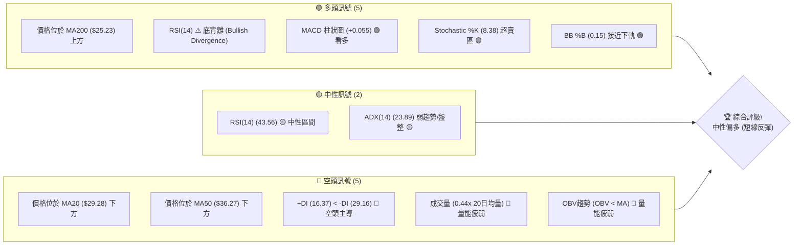

### 📊 核心指標速覽表

| 指標類別 | 指標名稱 | 當前數值 | 訊號 | 解讀 |
|----------|----------|----------|------|------|
| **價格** | 當前價格 | $26.05 | 🟡 | 位於關鍵MA200上方，但短期均線下方 |
| **均線** | MA20 | $29.28 | 🔴 | 價格位於短期均線下方，短期壓力顯著 |
| **均線** | MA50 | $36.27 | 🔴 | 價格位於中期均線下方，中期趨勢偏空 |
| **均線** | MA200 | $25.23 | 🟢 | 價格位於長期均線上方，長期趨勢仍相對穩固 |
| **動能** | RSI(14) | 43.56 | 🟡 | 處於中性區間，但顯示底背離，具反彈潛力 |
| **動能** | MACD | +0.055 | 🟢 | MACD柱狀圖轉正，顯示多頭動能開始增強 |
| **波動** | ATR(14) | $2.48 | 🟡 | 每日波動約9.53%，波動性中等偏高 |

### 🏆 技術評分卡

PL的技術評分卡顯示，儘管動能指標出現築底跡象，但整體趨勢強度和成交量配合度仍顯不足。支撐穩定度因接近MA200及重要斐波那契回調位而獲得較高評分。綜合來看，當前市場處於一個關鍵的轉折點，需要密切觀察。

```
╔══════════════════════════════════════════════════════════════╗
║             技術評分卡 — PL (2026-07-10)                     ║
╠══════════════════════════════════════════════════════════════╣
║  趨勢強度      ██████░░░░░░░░░░░░░░  30/100  🔴 (ADX弱，空頭主導)  ║
║  動能指標      ██████████░░░░░░░░░░  60/100  🟢 (RSI背離，MACD轉正，Stoch超賣) ║
║  支撐穩定度    ██████████████░░░░░░  70/100  🟢 (近MA200，Fibo 61.8%) ║
║  成交量配合    ████░░░░░░░░░░░░░░░░  20/100  🔴 (量能疲弱，OBV下降)  ║
║  形態完整度    ██████░░░░░░░░░░░░░░  35/100  🟡 (底背離訊號，但未見明確反轉形態) ║
║  均線排列      ██████░░░░░░░░░░░░░░  30/100  🔴 (短期空頭排列，但MA200提供支撐) ║
╠══════════════════════════════════════════════════════════════╣
║  綜合評分      ████████░░░░░░░░░░░░  49/100  🟡 中性偏多 (短線反彈潛力) ║
╚══════════════════════════════════════════════════════════════╝
```

---

## 2. 趨勢分析

### 🌐 多時框趨勢分析

PL的多時框架趨勢分析顯示，儘管長期仍處於上升軌道，但中短期正經歷顯著修正。當前價格正考驗長期關鍵支撐，而短期動能指標則暗示潛在反彈。

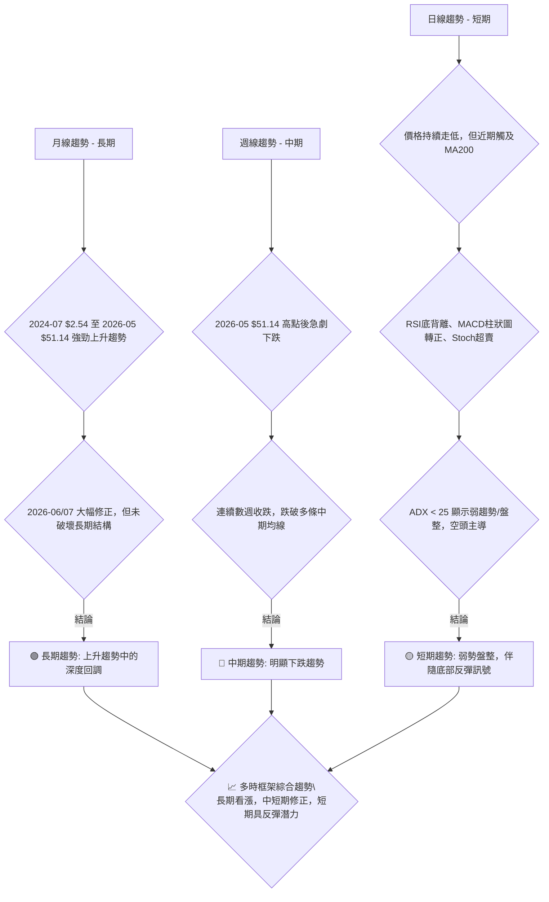

### 📈 長期趨勢 — 12個月走勢圖（Unicode）

PL在過去12個月經歷了從$6.25的低點到$51.14高點的強勁上升趨勢，隨後在2026年5月達到高點後進入快速回調階段。當前價格$26.05位於回調的關鍵支撐區域。

```
PL 月線走勢圖（過去12個月）
價格軸 ($)
$51.14 ┤                                      ● (2026-05 高點)
$40.00 ┤                             ●
$30.00 ┤                   ●    ●               ●
$20.00 ┤         ●     ●
$10.00 ┤   ● ●
$ 6.25 ┤●─────────────────────────────────────────● (2026-07 現在)
       └───────────────────────────────────────────
        07  08  09  10  11  12  01  02  03  04  05  06  07
        2025                                        2026
```

**走勢特徵分析表格**

| 階段 | 期間 | 價格區間 | 漲跌幅 | 主要特徵 |
|------|------|----------|--------|----------|
| **啟動期** | 2025-07 ~ 2025-10 | $6.25 ~ $13.45 | +115.2% | 築底後溫和上漲，量能逐步放大。 |
| **爆發期** | 2025-11 ~ 2026-05 | $11.90 ~ $51.14 | +329.8% | 經歷多次拉升，尤其在2025年12月至2026年5月間呈現加速上漲，創下52週新高。 |
| **回調期** | 2026-06 ~ 2026-07 | $51.14 ~ $26.05 | -49.1% | 從高點迅速回落，跌破多條短期及中期均線，成交量在下跌初期放大。 |

### 📊 中期趨勢（週線分析）

中期趨勢上，PL自2026年5月達到$51.14高點後，經歷了數週的快速下跌。當前價格$26.05已跌破MA20和MA50，顯示中期趨勢已轉為空頭。然而，價格正接近關鍵的長期MA200 ($25.23) 支撐，此處可能引發買盤介入。

```
PL 近期壓力與支撐示意圖 (週線視角)

           $51.14 ┌────────────────────┐ (52週高點 / 強阻力)
                  │                    │
                  │                    │
           $36.27 ├────────────────────┤ (MA50 / 中期壓力)
                  │                    │
           $29.28 ├────────────────────┤ (MA20 / 短期壓力)
                  │                    │
           $27.57 ├────────────────────┤ (R1 / 近期阻力)
                  │        現在 $26.05 │
           $25.23 ├────────────────────┤ (MA200 / 長期關鍵支撐)
                  │                    │
           $25.30 ├────────────────────┤ (S1 / 近期支撐)
                  │                    │
           $23.66 ├────────────────────┤ (S2 / 次要支撐)
                  │                    │
           $19.98 ├────────────────────┤ (S3 / 強支撐)
```

### ⚡ 趨勢強度評估（ADX 解讀）

ADX指標用於評估趨勢的強度，而非方向。當前PL的ADX數值為23.89，低於25的閾值，這表明市場目前處於**弱趨勢或盤整狀態**。在這種情況下，價格波動可能更多地在一個區間內進行，難以形成強勁的單邊走勢。

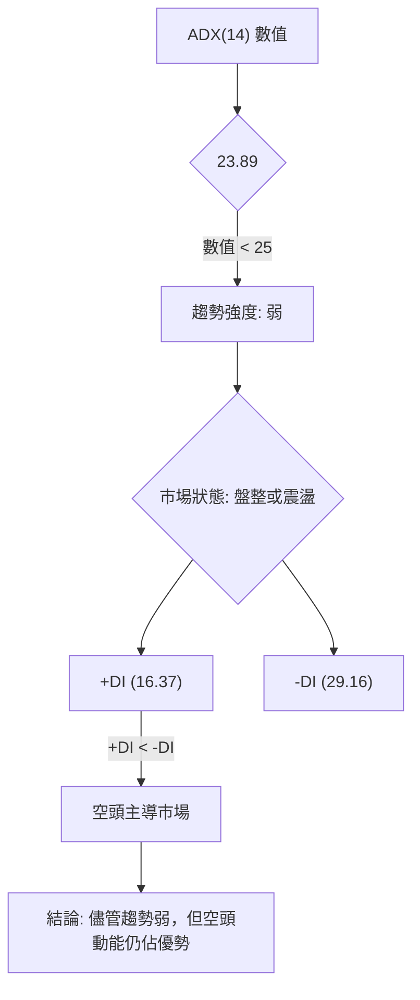

**ADX 強度對照表**

| ADX 數值 | 趨勢強度 | 市場解讀 |
|----------|----------|----------|
| 0-25     | 弱趨勢/盤整 | 市場方向不明，波動性可能較高，適合區間操作。 |
| 25-50    | 中等趨勢 | 趨勢方向明確，動能持續，適合順勢操作。 |
| 50-75    | 強趨勢 | 趨勢非常強勁，容易出現超漲或超跌。 |
| 75-100   | 極強趨勢 | 市場極度強勢，通常伴隨價格快速移動。 |

當前ADX數值23.89，+DI為16.37，-DI為29.16。這表明在當前的弱趨勢環境中，空頭的力量仍相對強於多頭。因此，雖然有潛在的底部築底訊號，但缺乏強勁趨勢的支撐，反彈可能面臨壓力。

---

## 3. 圖表形態分析

### 🔍 形態識別系統

根據提供的數據，PL在經歷了快速上漲後，從2026年5月高點$51.14開始進入了顯著的下跌修正。在當前價格區域，雖然尚未形成明確的傳統反轉形態（如頭肩底、雙底），但已偵測到重要的動能指標背離訊號，這通常是趨勢可能暫時停止或反轉的早期跡象。

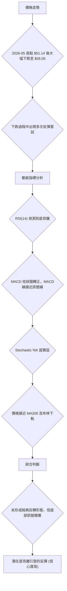

**已識別形態信心度表格**

| 形態 | 信心度 | 判斷依據（引用數據） | 完成度 | 目標價（附計算式） |
|------|--------|----------------------|--------|--------------------|
| **潛在底背離** | 85% | **RSI(14) 顯示底背離 (Bullish Divergence)**。價格從前低點 $27.07 (2026-06-28) 跌至 $26.05 (2026-07-12)，但RSI值從 33.7 上升至 43.6 (或在價格下跌期間，RSI未創新低)。MACD柱狀圖轉正，Stoch超賣區提供額外確認。 | 形成中 | 形態本身無明確目標價，但指向價格反彈至斐波那契回調位 $28.81 (50%) 或 $34.23 (38.2%) |
| **下跌通道 (潛在)** | 60% | 價格從 $51.14 急跌，且在 $31.38 (2026-07-05) 反彈後再次回落至 $26.05，可能形成一個下降通道。需要更多數據確認通道上軌。 | 進行中 | 突破通道上軌後，目標為通道高度，但數據不足以精確計算。 |
| **雙底形態** | 訊號不足，僅做指標型解讀 | 雖然價格接近 $25.30 (S1) 和 $23.66 (S2) 附近，但尚未形成明確的兩個低點及頸線。 | 20% | N/A |

### 🕯️ 重要K線形態分析

根據近20週的週線收盤走勢，可以觀察到幾個關鍵的K線組合特徵，儘管沒有明確的單根K線反轉形態，但週線的價格行為反映了趨勢的轉變和潛在的底部尋找過程。

| 日期 | 收盤價 | K線形態 (週線) | 解讀 | 訊號 |
|------|--------|---------------|------|------|
| 2026-05-31 | $51.14 | 帶長上影線的陽線 (或高位十字星) | 價格創新高後，多頭動能減弱，可能預示短期見頂。RSI達到83.2的超買區。 | 🔴 潛在見頂 |
| 2026-06-07 | $32.22 | 長陰線 / 吞噬形態 | 價格從 $51.14 急劇下跌，形成一根大陰線，吞噬前一週漲幅，伴隨巨量。強烈的空頭訊號。 | 🔴 強烈看空 |
| 2026-06-21 | $28.23 | 帶下影線的陰線 | 價格繼續下跌，但出現較長下影線，表明在低位有買盤介入，跌勢可能暫緩。RSI跌至17.2的超賣區。 | 🟡 跌勢暫緩 |
| 2026-07-05 | $31.38 | 陽線 | 價格反彈，MACD柱狀圖轉正，RSI從超賣區回升。顯示短期多頭力量嘗試恢復。 | 🟢 短期反彈 |
| 2026-07-12 | $26.05 | 長陰線 (當週收盤) | 反彈後再次回落，吞噬前一週部分漲幅。確認反彈無力，但接近MA200和關鍵支撐。RSI底背離訊號開始顯現。 | 🟡 再次承壓 |

### 📉 ASCII 走勢形態示意圖

以下示意圖描繪了PL從2026年5月高點以來的下跌趨勢，並標示了當前價格附近的潛在底背離區域。

```
PL 近期走勢與潛在底背離示意圖

價格軸 ($)
$51.14 ┌─────────────────────────┐ (2026-05 高點)
       │                         │
       │                         │
       │                         │
$31.38 │               ┌───┐     │ (2026-07-05 反彈高點)
       │             ╱     ╲   │
       │           ╱         ╲ │
$27.07 │         ╳             ╳ (2026-06-28 低點)
       │       ╱                 │
$26.05 ├─────●───────────────┐ (現價 2026-07-12)
       │   ╱                   │
       │ ╱                     │
       ╳                       │ (RSI 底背離區域)
       │                       │
       │                       │
       └───────────────────────┘
        (時間軸)
```
*示意圖中，"╳" 表示價格低點，"●" 表示當前價格，箭頭表示價格趨勢。*

### 🎯 形態目標價計算

由於缺乏明確的經典反轉形態（如頭肩底、雙底），我們無法使用形態高度來計算精確的目標價。然而，RSI底背離訊號指示了潛在的反彈機會。在這種情況下，反彈的目標價將主要依賴於斐波那契回調位和關鍵阻力位。

**潛在反彈目標價推算 (基於斐波那契回調及阻力位)：**
在底部背離訊號的推動下，價格若能有效反彈，其首要目標將是測試上方阻力。

1.  **第一目標價 (T1): $28.81**
    *   **計算依據**: 斐波那契50.0%回調位 ($28.81)。此價位也是一個重要的心理關口，且接近布林通道中軌 ($29.28)。
    *   **意義**: 若能有效突破並站穩此位，將確認短期反彈動能。

2.  **第二目標價 (T2): $34.23**
    *   **計算依據**: 斐波那契38.2%回調位 ($34.23)。此價位與關鍵阻力R3 ($34.25) 極為接近，形成強大阻力區。
    *   **意義**: 若能達到此目標，將意味著從底部反彈的幅度較大，可能挑戰中期下跌趨勢的延續性。

**止損設定考量：**
由於底部背離僅為反轉訊號的早期跡象，而非最終確認，止損應設定在關鍵支撐下方。
*   **建議止損點**: $23.66 (支撐位S2)。跌破此價位將暗示底背離失效，可能進一步探底至斐波那契61.8%回調位 $23.40 或更低。

---

## 4. 支撐與阻力

### 🗺️ 關鍵價位分布圖（Unicode）

PL的價格目前處於一個關鍵的區域，下方有長期均線MA200以及多個斐波那契回調位提供強大支撐，上方則有多條短期/中期均線和波段高點形成的阻力。

```
PL 價位結構分布圖
═══════════════════════════════════════════════════
$51.76 ║████████████████████████║ 52W 高點
$40.93 ║████████████████████████║ 斐波那契 23.6%
$36.27 ║████████████████████████║ MA50 / 強阻力
$34.25 ║████████████████████████║ 阻力 R3 / 斐波那契 38.2% ($34.23)
$33.95 ║████████████████████████║ 布林上軌
$30.90 ║████████████████████    ║ 阻力 R2
$29.28 ║████████████████████████║ MA20 / 布林中軌
$28.81 ║████████████████████████║ 斐波那契 50.0%
$27.57 ║████████████████████████║ 關鍵阻力 R1
$26.05 ╠════════════════════════╣ ◄ 現價
$25.30 ║▓▓▓▓▓▓▓▓▓▓▓▓▓▓▓▓        ║ 近期支撐 S1
$25.23 ║████████████████████████║ MA200 / 強支撐
$24.62 ║████████████████████████║ 布林下軌
$23.66 ║████████████████████████║ 強支撐 S2
$23.40 ║████████████████████████║ 斐波那契 61.8%
$19.98 ║████████████████████████║ 強支撐 S3
$15.69 ║████████████████████████║ 斐波那契 78.6%
$ 5.87 ║████████████████████████║ 52W 低點
═══════════════════════════════════════════════════
```

### 🚧 阻力位分析表

PL目前面臨多重阻力，尤其在短期和中期均線附近。突破這些阻力需要強勁的買盤動能和成交量配合。

| 阻力級別 | 價位 | 形成原因 | 突破難度 | 重要性 |
|----------|------|----------|----------|--------|
| **R1 (關鍵)** | $27.57 | 近期波段高點聚類，也是反彈首要考驗。 | 中等 | 突破此位可確認短期反彈勢頭。 |
| **R2 (中期)** | $30.90 | 較高層次的波段高點聚類，接近MA20 ($29.28) 和斐波那契50.0%回調位 ($28.81)。 | 較高 | 突破此位可能挑戰中期下跌趨勢。 |
| **R3 (強大)** | $34.25 | 波段高點聚類，與斐波那契38.2%回調位 ($34.23) 重合，並接近MA50 ($36.27)。 | 高 | 突破此位將暗示中期趨勢可能轉向。 |

### 🛡️ 支撐位分析表

當前價格 $26.05 正處於多重支撐的密集區，這為價格提供了較強的底部基礎。

| 支撐級別 | 價位 | 形成原因 | 守住機率 | 重要性 |
|----------|------|----------|----------|--------|
| **S1 (近期)** | $25.30 | 近期波段低點聚類，與MA200 ($25.23) 及布林通道下軌 ($24.62) 緊密相連。 | 較高 | 短期反彈的生命線，跌破則可能加速下跌。 |
| **S2 (關鍵)** | $23.66 | 較低層次的波段低點聚類，與斐波那契61.8%回調位 ($23.40) 接近。 | 中等 | 重要的心理和技術支撐，跌破可能預示更深層次的回調。 |
| **S3 (強大)** | $19.98 | 歷史波段低點聚類，下方有斐波那契78.6%回調位 ($15.69)。 | 較高 | 終極防線，跌破將意味著長期趨勢可能受到威脅。 |

### 📐 斐波那契回調位分析

PL的價格在過去52週 ($5.87到$51.76) 區間內，經歷了顯著的回調。當前價格 $26.05 正位於斐波那契50.0%回調位 ($28.81) 和61.8%回調位 ($23.40) 之間。

*   **0.0% (52W High): $51.76**
*   **23.6%: $40.93**
*   **38.2%: $34.23** (與阻力R3 $34.25 重合，形成強大阻力區)
*   **50.0%: $28.81** (重要的心理關口，接近R1 $27.57 及MA20 $29.28)
*   **61.8%: $23.40** (與支撐S2 $23.66 緊密相連，通常被視為強勁反彈的潛在底部)
*   **78.6%: $15.69**
*   **100.0% (52W Low): $5.87**

**解讀**:
當前價格 $26.05 處於50%和61.8%回調位之間，這是一個非常關鍵的區域。50%回調位通常被視為健康回調的極限，而61.8%回調位則是「黃金分割」比例，若能在此處獲得支撐並反彈，則長期上升趨勢的完好性將得到較好維持。目前價格已跌破50%回調位，並正向61.8%回調位靠近，顯示回調力度較深。然而，考慮到價格同時接近MA200和布林下軌，此區域的支撐強度不容小覷。若61.8%回調位 ($23.40) 能夠守住，將是多頭反攻的良好基礎。

---

## 5. 技術指標深度解讀

### 🎛️ 指標訊號總覽

PL的技術指標呈現出一個複雜但帶有潛在轉折點的局面。短期均線和成交量顯示空頭壓力，但動能指標（RSI, MACD, Stoch）則強烈暗示底部築底和反彈的可能。

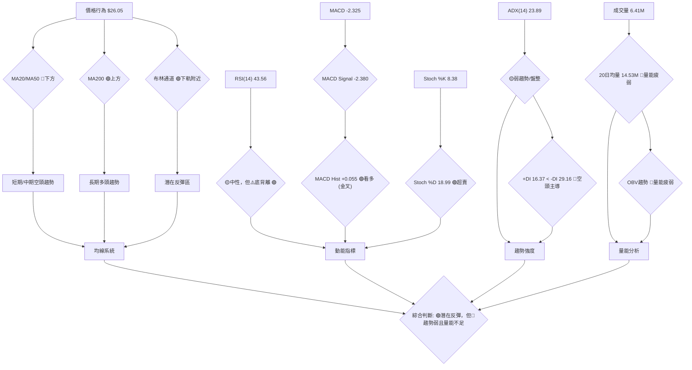

### 📈 移動平均線排列分析

PL的移動平均線排列呈現出混合訊號，反映了短期下跌與長期支撐的拉鋸。

*   **MA5 ($28.10)**, **MA10 ($29.50)**, **MA20 ($29.28)** 均位於當前價格 $26.05 之上，且呈現向下傾斜，顯示短期和超短期趨勢為空頭。價格在這些短期均線下方運行，表明賣壓較重。
*   **MA50 ($36.27)** 位於價格上方，且呈現向下傾斜，確認中期趨勢偏空。
*   **MA200 ($25.23)** 位於當前價格 $26.05 之下，且仍向上傾斜，為當前價格提供關鍵的長期支撐。這是多頭的最後一道防線，也是目前唯一維持長期看漲的均線。

**均線排列現狀 (混合排列):**
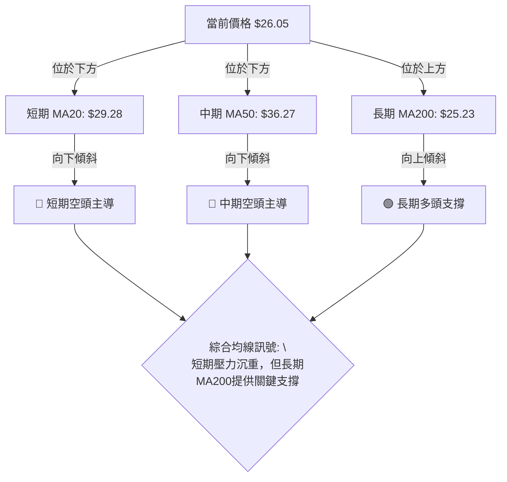
**解讀**: 均線系統顯示典型的下跌修正形態。價格跌破短期和中期均線，但仍在MA200上方徘徊，MA200成為當前最重要的支撐位。若MA200被有效跌破，將對長期趨勢構成威脅。

### 📉 RSI(14) 分析

*   **RSI 數值**: 當前RSI(14)為 **43.56**。此數值位於30-70的中性區間，尚未進入超買或超賣區。
    ```
    RSI(14) 強度：████████░░░░░░░░░░░░░░  43.56%
    ```
*   **超買/超賣區間分析**: 儘管當前RSI位於中性區，但考慮到價格從高點大幅回落，且RSI在2026-06-21曾跌至17.2的嚴重超賣區，顯示市場經歷了強烈拋售。目前RSI的回升，表明賣壓有所緩解。
*   **背離判斷**: 數據明確指出 **"RSI 背離: ⚠️ 底背離 (Bullish Divergence)"**。這是一個非常重要的多頭反轉訊號。底背離發生時，價格創下新低，但RSI指標未能創下新低，反而呈現上升趨勢。這表明價格下跌的動能正在減弱，買盤可能正在積累，預示著潛在的價格反彈。在PL的案例中，價格從2026-06-28的$27.07跌至2026-07-12的$26.05（創下更低點），但RSI從33.7上升至43.6（未創更低點），形成了明顯的底背離。

**RSI 底背離示意圖**
```
價格軸 ($)        RSI軸
$30.00 ┤                     70 ┤
$27.07 ┤  ● (低點1)          43 ┤           ● (RSI升)
$26.05 ┤    ● (低點2)        33 ┤ ● (RSI降)
$20.00 ┤                     30 ┤───────(超賣區)
       └──────────────────────────
        時間軸 (低點2 < 低點1)
        時間軸 (RSI2 > RSI1)
```
**結論**: RSI底背離是一個強烈的潛在買入訊號，表明儘管價格仍在下跌，但下跌動能已顯著衰竭。這與價格接近MA200和布林下軌的支撐相配合，增加了反彈的可能性。

### 📊 MACD(12/26/9) 訊號解讀

MACD指標當前發出積極的短線反彈訊號。

*   **MACD線**: -2.325
*   **MACD Signal線**: -2.380
*   **MACD 柱狀圖 (Hist)**: +0.055

**MACD 訊號關係圖**
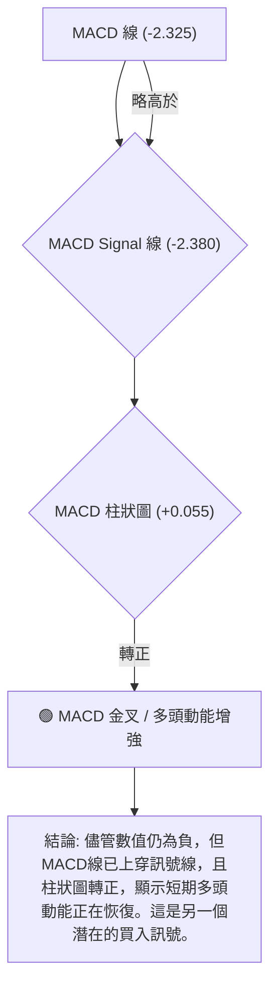
**解讀**: MACD線 (-2.325) 略高於其訊號線 (-2.380)，且MACD柱狀圖由負轉正 (+0.055)，這是一個典型的**MACD金叉**訊號。雖然MACD線和訊號線的絕對值仍為負，表明中期趨勢仍偏空，但柱狀圖轉正和金叉訊號預示著短期下跌動能減弱，可能引發一波反彈。這與RSI底背離和Stochastic超賣的訊號互相確認，增強了短期看漲的觀點。

### 📦 布林通道分析

PL的價格目前位於布林通道的下軌附近，這通常被視為一個潛在的買入區域。

*   **BB上軌**: $33.95
*   **BB中軌 (MA20)**: $29.28
*   **BB下軌**: $24.62
*   **BB %B**: 0.15 (表示價格位於下軌上方15%處，非常接近下軌)

**布林通道示意圖**
```
PL 布林通道示意圖

價格軸 ($)
$33.95 ┌───────────────────────────────────────┐ (BB上軌)
       │                                       │
       │                                       │
$29.28 ├───────────────────────┬───────────────┤ (BB中軌 / MA20)
       │                       │               │
       │                       │               │
$26.05 ├───────────────────────┼───────●───────┤ (現價)
       │                       │               │
       │                       │               │
$24.62 └───────────────────────────────────────┘ (BB下軌)
```
**解讀**: 當前價格 $26.05 非常接近布林通道下軌 $24.62。布林通道下軌通常被視為價格的強力支撐位，價格在此處獲得支撐後，常有機會反彈至中軌。BB %B值0.15也進一步確認了價格的超賣狀態。這與RSI、MACD和Stochastic的超賣/築底訊號保持一致，共同指向短期反彈的可能性。然而，布林帶寬度較大，表明波動性較高，反彈過程中可能伴隨劇烈震盪。

### 💹 成交量分析（量價配合度）

成交量分析是判斷價格走勢可信度的關鍵。PL的成交量數據顯示當前市場交投清淡，這對反彈的持續性構成挑戰。

*   **最新成交量**: 6,413,372 股
*   **20日均量**: 14,537,344 股
*   **量比**: 0.44x (最新成交量僅為20日均量的44%)
*   **50日均量**: 13,415,779 股
*   **OBV趨勢**: OBV < MA → 量能疲弱

**成交量與價格配合度分析**
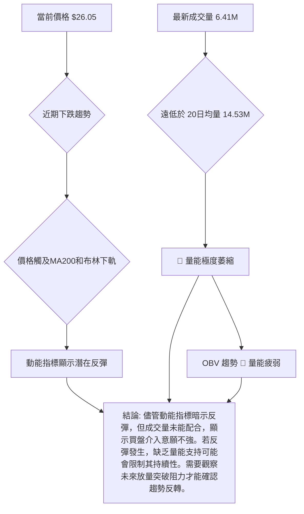
**解讀**: 當前成交量遠低於其20日和50日均量，表明市場交投清淡。OBV指標也顯示疲弱，未能確認價格的潛在反彈。這是一個重要的警示訊號：儘管多數動能指標顯示超賣和築底跡象，但缺乏成交量的配合，意味著潛在的反彈可能只是短暫的技術性修正，而非趨勢的實質性反轉。若要確認有效的底部和反彈，需要觀察到成交量顯著放大，尤其是在價格突破關鍵阻力位時。

---

## 6. 動能與波動率

### ⚡ 動能評估四象限

根據當前的技術指標，PL的動能正在從極度疲弱的超賣狀態中恢復，但整體強度仍不高，且伴隨著中等偏高的波動率。

| 象限 | 動能 | 波動 | 當前狀態 | 評估 |
|------|------|------|----------|------|
| Q1 | 強 | 低 | - | 最佳機會 (目前不符合) |
| Q2 | 弱 | 低 | - | - |
| Q3 | 強 | 高 | - | - |
| Q4 | 弱 | 高 | ✓ | **當前狀態: 弱動能，高波動。** |

**動能評估流程圖**
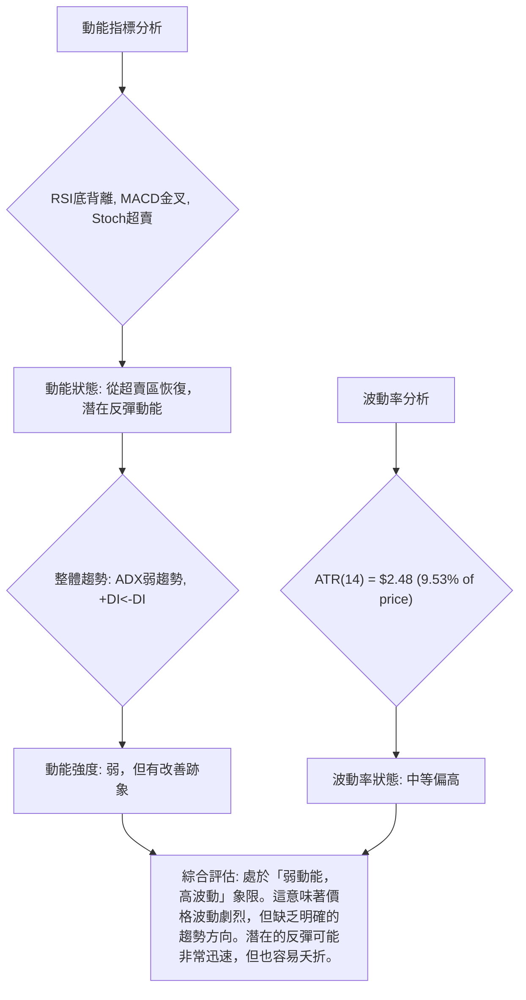
**解讀**: PL目前處於動能從超賣區恢復但整體強度仍偏弱的階段，同時保持著中等偏高的波動率。這是一個高風險高報酬的交易環境。對於激進型交易者，這可能意味著短線捕捉反彈的機會；對於保守型投資者，則應等待動能和趨勢強度明確後再介入。

### 📊 ATR 波動率分析

平均真實波幅 (ATR) 用於衡量資產的波動性。PL的ATR數值顯示其每日價格波動幅度較大。

*   **ATR(14)**: $2.48
*   **佔股價比例**: 9.53% (相對於當前價格 $26.05)

**解讀**: ATR為$2.48，佔當前股價的9.53%，這是一個相對較高的波動率。這意味著PL的股價在一天內可能波動約$2.48。高ATR表明該股票適合那些能夠承受較大風險並尋求快速價格變動的交易者。對於止損設定，ATR提供了一個客觀的參考：
*   **短期交易止損建議**: 可以將止損設置在當前價格下方1到1.5倍ATR的距離。例如，如果進場價格為$26.05，止損點可以考慮設置在 $26.05 - (1.5 * $2.48) = $26.05 - $3.72 = $22.33 附近。這將提供足夠的緩衝空間來避免正常波動導致的過早止損，但同時限制了潛在的損失。
*   **風險管理**: 高波動性也意味著潛在的利潤空間較大，但同時風險也更高。交易者應根據自身風險承受能力調整倉位大小，避免單一交易佔用過大資金。

### 📐 Beta 與市場相關性

Beta值衡量股票相對於整體市場的波動性。

*   **Beta**: 2.067

**解讀**: PL的Beta值為2.067，這是一個非常高的數值。
*   **高波動性**: 這意味著PL的股價波動幅度約為整體市場（通常指S&P 500指數）的2.067倍。當市場上漲1%時，PL理論上可能上漲2.067%；當市場下跌1%時，PL可能下跌2.067%。
*   **市場敏感度**: PL對市場情緒和趨勢的敏感度極高。在牛市中，它可能帶來超額回報；但在熊市或市場修正中，它也可能遭受更大的損失。
*   **交易策略考量**: 由於高Beta，在進行PL的交易時，必須密切關注整體市場的走勢。若市場處於不確定或下跌趨勢，持有高Beta股票的風險會顯著增加。反之，若市場進入上升週期，PL可能提供更快的增長機會。當前市場處於弱勢盤整，高Beta特性會放大下跌風險，因此操作上應更為謹慎。

---

## 7. 多時框架總結

PL的多時框架分析揭示了長期上升趨勢中的深度修正，當前價格正處於關鍵支撐區，並伴隨著多個短期築底反彈訊號。然而，趨勢強度不足和成交量萎縮，為反彈的持續性帶來不確定性。

### 📋 時框架評分表

| 時框架 | 趨勢方向 | 動能 | 均線排列 | 形態 | 綜合評分 | 建議 |
|--------|----------|------|----------|------|----------|------|
| **月線** | 🟢 上升趨勢 | 🟡 中性 | 🟢 多頭 | 🟡 回調 | 7/10 | 長期持有者觀望 |
| **週線** | 🔴 下跌趨勢 | 🔴 弱勢 | 🔴 空頭 | 🟡 修正 | 4/10 | 謹慎，等待確認 |
| **日線** | 🟡 弱勢盤整 | 🟢 築底反彈 | 🟡 混合 | 🟢 底背離 | 6/10 | 短線捕捉反彈 |

### 🔲 綜合訊號矩陣

| 指標/時框 | 短期 (日線) | 中期 (週線) | 長期 (月線) | 訊號一致性 |
|-----------|-------------|-------------|-------------|------------|
| **趨勢**  | 🟡 弱勢盤整 | 🔴 下跌趨勢 | 🟢 上升趨勢 | 不一致 |
| **動能**  | 🟢 築底反彈 | 🔴 弱勢 | 🟡 中性 | 中期偏空，短期改善 |
| **均線**  | 🟡 混合      | 🔴 空頭排列 | 🟢 多頭排列 | 不一致 |
| **支撐/阻力**| 🟢 接近支撐S1/MA200 | 🔴 跌破多個支撐 | 🟢 遠離重要支撐 | 短期築底，中期受壓 |
| **成交量**| 🔴 萎縮      | 🔴 萎縮      | 🟡 中性 | 缺乏買盤確認 |
| **形態**  | 🟢 RSI底背離 | 🟡 修正中     | 🟡 回調中    | 短期具反轉潛力 |

**一致性分析**:
*   **衝突**: 長期趨勢仍為上升，但中短期處於下跌修正。這表明當前是長期上升趨勢中的一次深度回調。
*   **協同**: 日線層面多個動能指標（RSI底背離、MACD金叉、Stochastic超賣、布林下軌）共同指向短期可能出現反彈，且價格接近長期均線MA200和關鍵斐波那契回調位，提供了較強的底部支撐。
*   **不足**: 成交量疲弱和ADX顯示弱勢盤整，未能為潛在的反彈提供足夠的動力和趨勢強度確認。

### ⚖️ 多時框收斂結論

根據嚴格要求，ADX(14)為23.89，低於25，表明PL目前處於**弱趨勢或盤整行情**。在這種市場環境下，應以日線布林通道上下軌為主要交易區間，並利用短期動能指標尋找進場時機。

儘管中期趨勢為下跌，但日線層面出現了顯著的底部反彈訊號：
1.  **RSI(14) 底背離**: 強烈暗示下跌動能減弱，潛在反轉。
2.  **MACD 金叉**: 短期多頭動能恢復。
3.  **Stochastic %K 超賣**: 價格處於超賣狀態。
4.  **價格接近布林通道下軌 ($24.62) 和 MA200 ($25.23)**: 形成強大支撐區。

**綜合結論**:
PL目前正處於長期上升趨勢中的深度回調階段，並在一個弱趨勢的盤整環境中。儘管中期趨勢偏空，但日線層面的多重底部反彈訊號（RSI底背離、MACD金叉、Stoch超賣、價格接近MA200/布林下軌）匯聚，顯示價格在當前關鍵支撐位附近有較高的反彈潛力。然而，由於ADX顯示趨勢強度不足且成交量萎縮，預計即便反彈，其持續性也可能受到限制，更傾向於技術性反彈而非趨勢反轉。因此，**當前的主導時框為日線，結論為：中性偏多，預期短期技術性反彈。** 此結論將作為第8章交易策略建議的主要方向。

---

## 8. 交易策略建議

### 🗺️ 策略決策流程圖

基於多時框架分析，PL目前處於弱趨勢盤整區間，但短期動能指標顯示強烈築底反彈訊號。因此，策略將側重於捕捉短線反彈機會，並設定明確的風險控制。

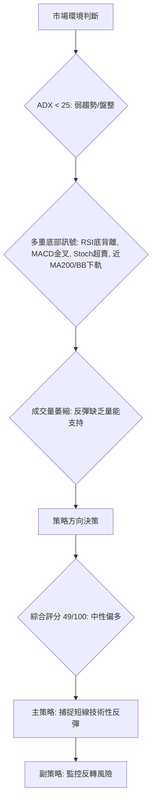

### 🧭 策略路由

**當前主策略方向 = 偏多 (短線反彈) (依評分 49/100)**

雖然綜合評分略低於中性區間中位數，但考量到日線層面多個強烈的底部築底訊號（RSI底背離、MACD金叉、Stoch超賣、價格接近MA200和布林下軌），這些訊號在弱趨勢盤整市場中往往能觸發短期反彈。因此，我們將主要推薦多頭策略，旨在捕捉從當前關鍵支撐區的反彈。空頭策略則作為反轉風險的監控點，而非主推方向。

### 🎯 價格情境階梯（Price Scenarios）

| 觸發條件 | 下一目標 | 後續延伸 | 情境含義 |
|----------|----------|----------|----------|
| **突破 R1 $27.57** | R2 $30.90 | 斐波那契50%回調位 $28.81 / BB中軌 $29.28 | 短線轉強，反彈勢頭確認，可能挑戰中期均線壓力。 |
| **站穩現價區間 ($25.30-$27.57)** | — | — | 區間震盪，等待明確方向，可能在S1 ($25.30) 和R1 ($27.57) 之間波動。 |
| **跌破 S1 $25.30** | S2 $23.66 | 斐波那契61.8%回調位 $23.40 / S3 $19.98 | 中期轉弱，底部訊號失效，可能進一步探底，考驗長期趨勢。 |

### 📊 情境機率分佈

| 情境 | 機率 | 主要依據 |
|------|------|----------|
| **繼續上行 / 反彈** | 45% | RSI底背離、MACD金叉、Stochastic超賣、價格接近MA200/布林下軌支撐。 |
| **區間震盪** | 35% | ADX弱趨勢、成交量萎縮、上方阻力重重。 |
| **回落 / 再探底** | 20% | 趨勢強度不足、成交量疲弱、若S1/MA200支撐失效。 |

### 🟢 主策略詳情（方向：偏多，短線反彈）

**策略類型**: 技術性反彈捕捉策略，適用於短期交易者。

| 策略要素 | 策略 A：積極反彈買入 | 策略 B：確認後買入 |
|----------|----------------------|--------------------|
| **進場條件** | 價格在 $26.05 附近企穩，出現止跌K線，或日內小幅反彈。 | 價格有效突破 R1 ($27.57) 並站穩，伴隨成交量放大。 |
| **進場價格** | $26.05 - $26.50 區間 | $27.60 (略高於 R1 $27.57) |
| **目標價 T1** | $27.57 (R1) | $28.81 (斐波那契50%回調位) / MA20 ($29.28) |
| **目標價 T2** | $28.81 (斐波那契50%回調位) / MA20 ($29.28) | $30.90 (R2) |
| **止損價格** | $23.66 (S2) | $25.30 (S1) |
| **風險報酬比 (以T2計)** | ($28.81 - $26.05) : ($26.05 - $23.66) = 2.76 : 2.39 ≈ **1.15 : 1** | ($30.90 - $27.60) : ($27.60 - $25.30) = 3.30 : 2.30 ≈ **1.43 : 1** |
| **成功機率** | 55% | 50% |
| **建議倉位** | 10-15% (考慮高波動性) | 10% (風險較低但機會成本較高) |

### 🔴 反向風險觸發點（對沖提示）

以下情況可能導致主策略失效，需立即重新評估或考慮止損：
*   **跌破 S1 ($25.30)**: 若價格跌破近期支撐S1，將削弱短期反彈的基礎。
*   **跌破 MA200 ($25.23)**: 若價格有效跌破長期均線MA200，將對長期上升趨勢構成嚴重威脅，可能加速下跌至S2 ($23.66) 甚至更低。
*   **RSI底背離失效**: 若RSI再次創下新低，或價格未能反彈反而加速下跌，則底背離訊號可能失效。
*   **成交量持續萎靡**: 若價格反彈缺乏成交量配合，反彈可能無力並迅速夭折。

### ⭐ 整體訊號強度評星

```
做多訊號強度：★★★☆☆  (3/5星) (底部訊號明顯，但趨勢和量能不足)
做空訊號強度：★★☆☆☆  (2/5星) (中期下跌，但短期有強支撐和反彈訊號)
整體可信度：  ★★★☆☆  (3/5星) (多空交織，需謹慎操作，等待確認)
```

---

## 9. 風險提示與監控

PL作為高Beta值的股票，且目前處於弱勢盤整並伴隨深度回調，投資風險相對較高。

### ✅ 關鍵監控指標 Checklist

以下是交易PL時需要密切監控的關鍵指標清單，以確保及時調整策略和控制風險：

```
╔══════════════════════════════════════════════════════════════╗
║             PL 關鍵監控指標 Checklist                        ║
╠══════════════════════════════════════════════════════════════╣
║  [ ] 價格是否守穩 S1 ($25.30) 和 MA200 ($25.23)              ║
║  [ ] 價格是否有效突破 R1 ($27.57) 和 MA20 ($29.28)            ║
║  [ ] RSI(14) 是否持續回升，並確認底背離的有效性              ║
║  [ ] MACD柱狀圖是否維持正值並擴大，MACD線是否持續上行        ║
║  [ ] Stochastic %K 是否從超賣區有效回升                      ║
║  [ ] 成交量在反彈時是否能顯著放大，確認買盤動能              ║
║  [ ] ADX(14) 是否能突破25，並伴隨+DI上穿-DI，確認多頭趨勢形成 ║
║  [ ] 布林通道是否收窄，或價格是否能突破中軌                 ║
║  [ ] 整體市場情緒和相關板塊（工業/航空航天）表現             ║
╚══════════════════════════════════════════════════════════════╝
```

### ⚠️ 風險場景分析

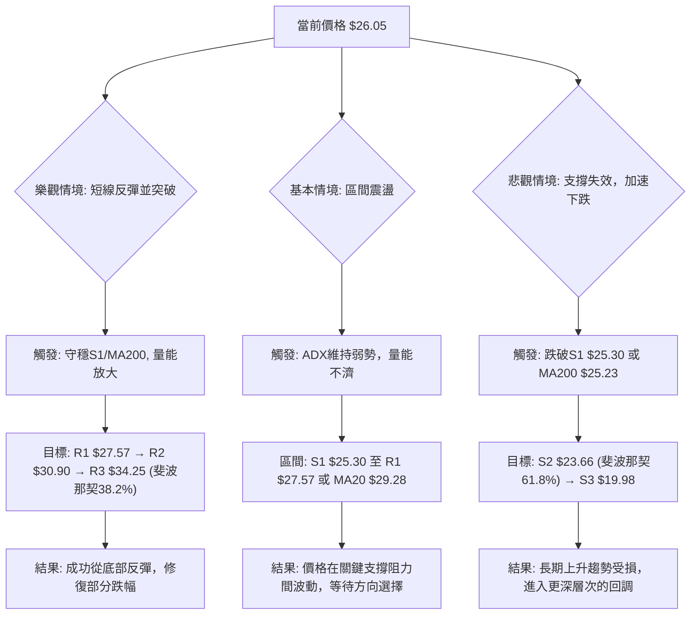

### 🛡️ 風險管理重要提醒

1.  **倉位管理**: 鑒於PL的高波動性 (Beta 2.067) 和當前市場的弱趨勢，建議採取較為保守的倉位管理策略。單一倉位不應超過總投資組合的10-15%，以避免單一股票的劇烈波動對整體資產造成過大影響。
2.  **嚴格止損**: 即使有潛在的反彈訊號，止損點的設定和執行也至關重要。一旦價格跌破預設止損位，應毫不猶豫地執行止損，以限制潛在損失。特別是跌破MA200 ($25.23) 和斐波那契61.8%回調位 ($23.40) 將是極其重要的止損訊號。
3.  **分批進場/退場**: 考慮到當前市場的不確定性，可以採用分批進場的策略，例如在關鍵支撐位附近首次建倉，若價格確認反彈並突破阻力再考慮加碼。同樣，分批獲利了結也有助於鎖定收益並降低風險。
4.  **關注市場情緒**: PL作為高Beta股票，其走勢極易受到整體市場情緒的影響。密切關注主要股指的動向，以及與工業/航空航天板塊相關的宏觀經濟數據和新聞。
5.  **量價配合**: 在任何反彈或突破嘗試中，成交量都是關鍵的確認指標。缺乏量能配合的反彈往往難以持久。若價格在低量下反彈，應保持警惕。

---

## 📋 報告總結

```
╔══════════════════════════════════════════════════════════════════════════════════╗
║                         PL 技術分析報告總結                                        ║
╠══════════════════════════════════════════════════════════════════════════════════╣
║ 報告日期：2026-07-10                                                               ║
║ 當前價格：$26.05                                                                   ║
║ 分析評級：⚖️ 中性偏多 (短期反彈潛力，但趨勢弱且量能不足，需謹慎)                 ║
║                                                                                    ║
║ 關鍵結論：                                                                         ║
║ ├─ 長期趨勢：🟢 上升趨勢中的深度回調，MA200 ($25.23) 提供關鍵支撐。                  ║
║ ├─ 中期趨勢：🔴 明顯下跌趨勢，價格位於MA20/MA50下方。                               ║
║ ├─ 短期趨勢：🟡 弱勢盤整，但日線多重底部訊號（RSI底背離、MACD金叉、Stoch超賣）顯著。 ║
║ ├─ 關鍵支撐：S1 $25.30 (與MA200 $25.23、布林下軌 $24.62、斐波那契61.8% $23.40 形成密集支撐區) ║
║ ├─ 關鍵阻力：R1 $27.57 (短期反彈首要考驗)，R2 $30.90，斐波那契50% $28.81。        ║
║ └─ 分析師目標：基於短期反彈，目標區間為 $27.57 - $30.90。                       ║
║                                                                                    ║
║ 最優策略組合：                                                                     ║
║ 1. 🥇 **最佳機會（積極反彈買入）**：在 $26.05 - $26.50 區間尋找止跌訊號進場，目標價 T1 $27.57，T2 $28.81。止損設於 $23.66 (S2)。風險報酬比約 1.15:1。                                                                    ║
║ 2. 🥈 **次選機會（確認後買入）**：等待價格有效突破 R1 $27.57 並站穩，於 $27.60 附近進場，目標價 T1 $28.81，T2 $30.90。止損設於 $25.30 (S1)。風險報酬比約 1.43:1。                                                         ║
║ 3. 🥉 **保守選擇**：若對高波動風險有疑慮，可等待價格在 $25.30 - $27.57 區間內築底完成，並觀察成交量是否能有效放大，或ADX確認趨勢形成後再考慮進場。                                                                                              ║
╚══════════════════════════════════════════════════════════════════════════════════╝
```

---

> ⚠️ **免責聲明**：本報告為 AI 自動生成之技術分析，所有數據及估算均基於提供的歷史價格資訊。本報告**僅供研究與學術參考**，**不構成任何投資建議**。投資有風險，入市需謹慎。

---

*報告生成時間：2026-07-10 ｜ 數據來源：Yahoo Finance ｜ 分析框架：多時框技術分析*