# Palantir Technologies Inc. (PLTR) - Comprehensive Analysis Report
**Analysis Date:** February 16, 2026 | **Current Price:** $131.41 | **Market Cap:** $314B

---

## 📊 Executive Dashboard

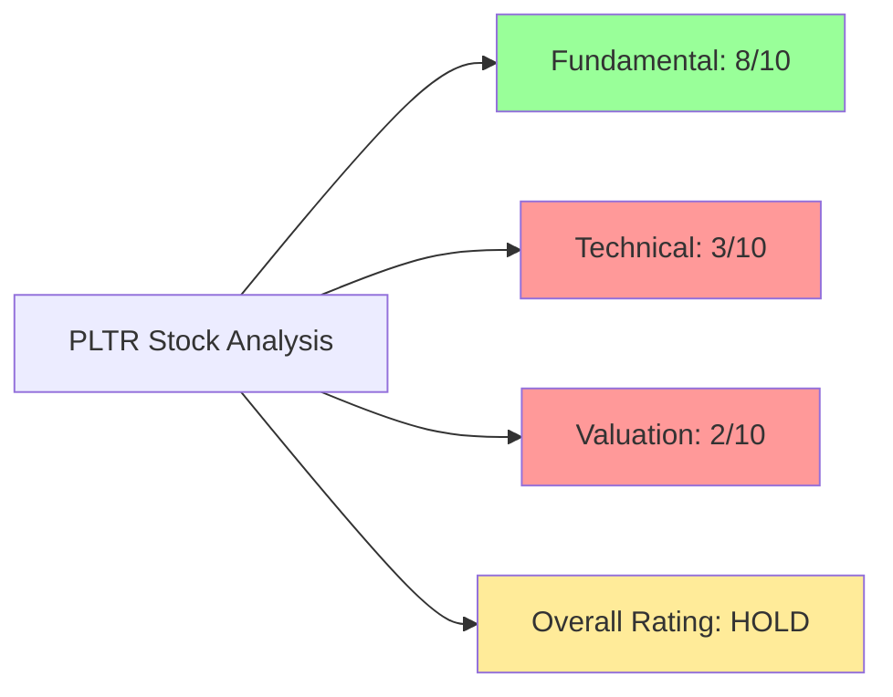

### Quick Stats Scorecard

| Metric | Current | Status | Trend |
|--------|---------|--------|-------|
| **Stock Price** | $131.41 | 🔴 Down 36% from ATH | ↘️ -20% YTD |
| **Market Cap** | $314B | 🟡 Large Cap | ↘️ Declining |
| **Revenue Growth** | 70% YoY (Q4) | 🟢 Explosive | 📈 Accelerating |
| **Profitability** | 51% Op Margin | 🟢 Best-in-Class | ↗️ Improving |
| **FCF Margin** | 51% | 🟢 Elite | ↗️ +82% YoY |
| **Valuation (P/E)** | 203x (TTM) | 🔴 Extremely Expensive | ⚠️ Stretched |
| **Technical Setup** | Strong Sell | 🔴 Bearish | ↘️ H&S Pattern |

---

## 🎯 Investment Rating Summary

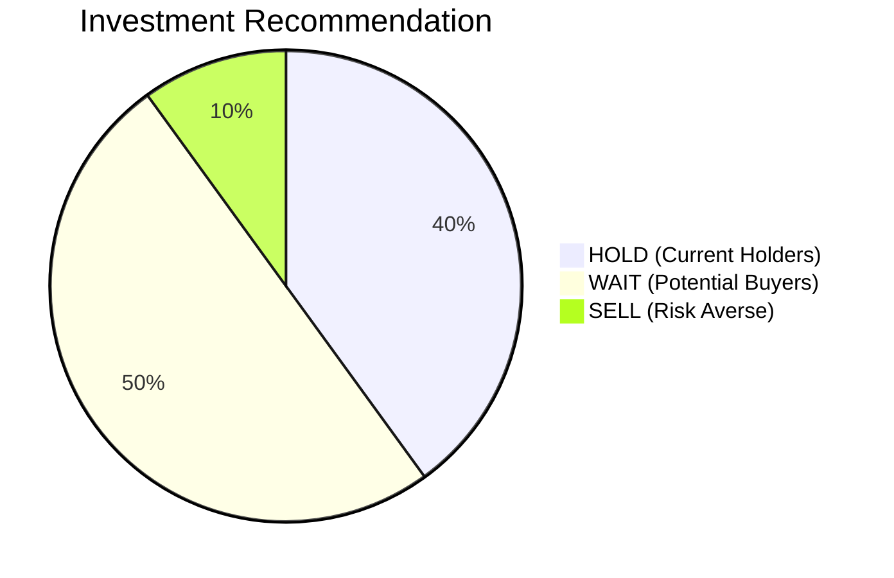

### Rating Card

<table>
<tr>
<td width="50%" bgcolor="#fff3cd">

**🟡 HOLD / WAIT FOR BETTER ENTRY**

**Current Price:** $131.41

**Fair Value:** $80 - $120

**Technical Target (Bear):** $50 - $80

**Fundamental Target (Bull):** $150 - $200

</td>
<td width="50%">

**Risk Profile:** 🔴🔴🔴🔴⚪ VERY HIGH

**Time Horizon:** 2-3 years (long-term)

**Technical Risk:** Bearish H&S pattern

**Entry Point:** Wait for $80-100 range

</td>
</tr>
</table>

---

## 📈 Stock Price Performance & Technical Overview

### Price History

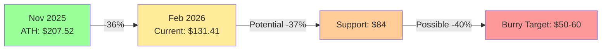

### 52-Week Performance

| Metric | Value | Change |
|--------|-------|--------|
| **52-Week High** | $207.52 (Nov 3, 2025) | ATH |
| **52-Week Low** | $66.12 | +99% from low |
| **Current Price** | $131.41 | -36.6% from ATH |
| **YTD Performance** | -20.4% | Underperforming |
| **1-Year Return** | +65% | Still strong despite pullback |

### Price Action Visualization

```
Price Levels (Feb 2026):

ATH (Nov '25):  ▓▓▓▓▓▓▓▓▓▓▓▓▓▓▓▓▓▓▓▓ $207.52 (100%)
Current Price:  ▓▓▓▓▓▓▓▓▓▓▓▓░░░░░░░░ $131.41 (-36%)
Support Level:  ▓▓▓▓▓▓▓▓░░░░░░░░░░░░ $84.00 (-60%)
Burry Target:   ▓▓▓▓░░░░░░░░░░░░░░░░ $50-60 (-71-76%)
52-Week Low:    ▓▓▓░░░░░░░░░░░░░░░░░ $66.12 (-68%)
```

---

## 📊 Technical Analysis Deep Dive

### Overall Technical Signal: 🔴 STRONG SELL

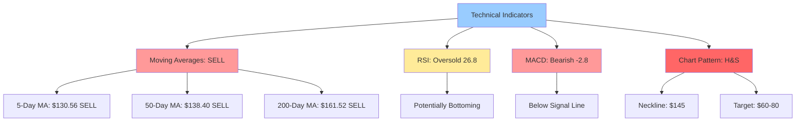

### Technical Indicators Summary

| Indicator | Value | Signal | Interpretation |
|-----------|-------|--------|----------------|
| **RSI (14)** | 26.8 | 🟡 Oversold | Potential bounce, but can go lower |
| **MACD** | -2.80 | 🔴 Sell | Below signal line, bearish momentum |
| **5-Day MA** | $130.56 | 🔴 Sell | Price near/below short-term MA |
| **50-Day MA** | $138.40 | 🔴 Sell | Price below intermediate MA |
| **200-Day MA** | $161.52 | 🔴 Sell | Price well below long-term MA |
| **Volume** | Declining | 🔴 Bearish | Weak buying interest |
| **Overall Signal** | 0 Buy / 10 Sell | 🔴 Strong Sell | Overwhelming bearish consensus |

### Chart Pattern: Head & Shoulders (Bearish)

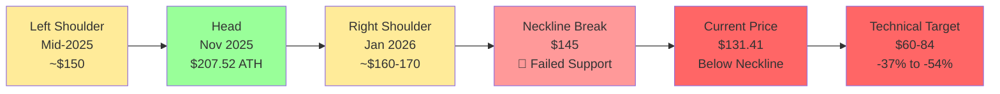

**Michael Burry's Analysis (Feb 10, 2026):**
- Identified classic Head & Shoulders reversal pattern
- Neckline at $145 broken with volume
- Measured move projects target: **$60-80** (-54% to -39% from current)
- Pattern suggests trend reversal from bull to bear

### Support & Resistance Levels

```
Resistance Levels:
$207.52 ████████████████████ ATH / Strong Resistance
$161.52 ██████████████░░░░░░ 200-Day MA / Major Resistance
$145.00 █████████████░░░░░░░ Former Neckline / Resistance
$138.40 ████████████░░░░░░░░ 50-Day MA / Resistance

Current: $131.41 ◄────────────── YOU ARE HERE

Support Levels:
$131.00 ████████████░░░░░░░░ 0.618 Fib / Minor Support (current)
$107.00 ██████████░░░░░░░░░░ 0.50 Fib / Psychological Support
$84.00  ████████░░░░░░░░░░░░ 0.382 Fib / Major Support
$80.00  ███████░░░░░░░░░░░░░ Burry's "Next Support"
$66.12  ██████░░░░░░░░░░░░░░ 52-Week Low
$50-60  ████░░░░░░░░░░░░░░░░ Burry's Ultimate Target
```

### Fibonacci Retracement Levels

| Level | Price | Status | Note |
|-------|-------|--------|------|
| **0% (ATH)** | $207.52 | Resistance | November 2025 high |
| **23.6%** | $174.10 | Resistance | Failed to hold |
| **38.2%** | $152.59 | Resistance | Brief pause zone |
| **50.0%** | $136.82 | 🔴 Testing | Psychological support |
| **61.8%** | $121.05 | 🎯 Next Target | Strong support if breaks |
| **78.6%** | $97.35 | 🎯 Major Support | Key level |
| **100% (52W Low)** | $66.12 | Ultimate Support | Unlikely but possible |

### Moving Average Analysis

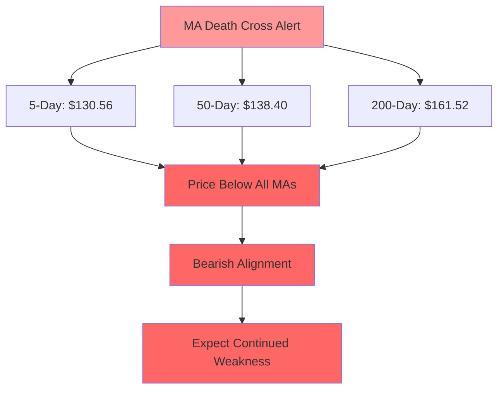

**Key Observations:**
- Price traded BELOW all major moving averages (death cross territory)
- 50-day MA ($138.40) has crossed below 200-day MA ($161.52) - bearish signal
- Gap between price and 200-day MA = -23% - significant underperformance
- All MAs sloping downward - confirms downtrend

### Volume Analysis

| Period | Volume Trend | Interpretation |
|--------|--------------|----------------|
| **Recent Sell-Off** | High volume | Capitulation selling / distribution |
| **Current** | Declining | Lack of buying interest |
| **Bounce Attempts** | Low volume | Weak rallies, not sustainable |
| **Assessment** | 🔴 Bearish | Volume confirms downtrend |

---

## 💰 Fundamental Analysis

### Business Model Overview

```mermaid
graph TD
    A[Palantir Technologies<br/>$314B Market Cap] --> B[Government Segment<br/>54.9% of Revenue]
    A --> C[Commercial Segment<br/>45.1% of Revenue]

    B --> B1[Defense & Intelligence<br/>Gotham Platform]
    B --> B2[Federal Agencies<br/>Mission-Critical Systems]
    B --> B3[Growth: +55-66% YoY]

    C --> C1[U.S. Commercial<br/>+137% YoY Growth]
    C --> C2[Enterprise AI (AIP)<br/>Artificial Intelligence Platform]
    C --> C3[Foundry Platform<br/>Digital Twin Operations]

    B3 --> D[Key Products]
    C3 --> D

    D --> E[Gotham<br/>Defense Analytics]
    D --> F[Foundry<br/>Enterprise Operations]
    D --> G[AIP<br/>AI Orchestration]
    D --> H[Apollo<br/>Continuous Delivery]

    style A fill:#99ccff
    style B fill:#99ff99
    style C fill:#66ff66
    style G fill:#ffeb99
```

### Revenue Breakdown & Growth

#### Q4 2025 Results (Record Quarter)

| Segment | Q4 2025 Revenue | YoY Growth | % of Total |
|---------|----------------|------------|------------|
| **Total Revenue** | $1,407M | +70% 🚀 | 100% |
| **U.S. Commercial** | $507M | +137% 🚀🚀 | 36% |
| **U.S. Government** | ~$600M | +55-66% 🚀 | ~43% |
| **International** | ~$300M | +30-40% ↗️ | ~21% |

#### Full Year 2025 Performance

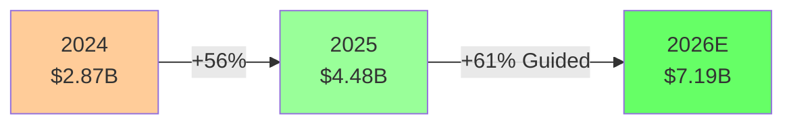

| Metric | 2024 | 2025 | Growth | 2026 Guidance |
|--------|------|------|--------|---------------|
| **Revenue** | $2.87B | $4.48B | +56% | $7.18-7.20B (+61%) |
| **Adj. Operating Income** | $1.5B | $2.3B | +53% | - |
| **Adj. FCF** | $1.25B | $2.27B | +82% | - |
| **Customer Count** | 713 | 954 | +34% | ~1,200E |
| **TCV Bookings (Q4)** | $1.8B | $4.3B | +138% | - |

### Revenue Growth Trajectory

```
Revenue Growth Journey:

2020:  ▓▓░░░░░░░░░░░░░░░░░░ $1.09B  (IPO Year)
2021:  ▓▓▓░░░░░░░░░░░░░░░░░ $1.54B  (+41%)
2022:  ▓▓▓▓░░░░░░░░░░░░░░░░ $1.91B  (+24%)
2023:  ▓▓▓▓▓░░░░░░░░░░░░░░░ $2.23B  (+17%)
2024:  ▓▓▓▓▓▓▓░░░░░░░░░░░░░ $2.87B  (+29%)
2025:  ▓▓▓▓▓▓▓▓▓▓▓░░░░░░░░░ $4.48B  (+56%) ← Inflection Point
2026E: ▓▓▓▓▓▓▓▓▓▓▓▓▓▓▓▓▓░░░ $7.19B  (+61%) ← Acceleration
```

**Growth Acceleration Drivers:**
1. **AIP Bootcamps** - Revolutionized sales cycle (5 days vs. months)
2. **U.S. Commercial Explosion** - 137% growth in Q4
3. **Enterprise AI Adoption** - Customers building autonomous agents
4. **Government Expansion** - Defense modernization tailwinds

### Profitability Metrics (Best-in-Class)

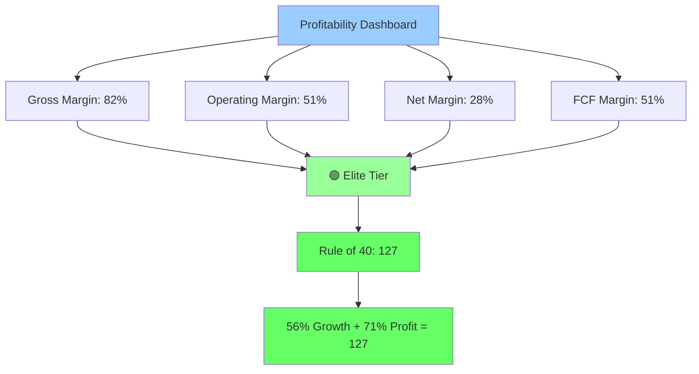

### Margin Evolution

| Metric | 2023 | 2024 | 2025 | Trend | Industry Avg |
|--------|------|------|------|-------|--------------|
| **Gross Margin** | 78% | 80% | 82% | ↗️ Expanding | 70-75% |
| **Operating Margin** | 10% | 33% | 51% | 🚀 Explosive | 15-25% |
| **Net Margin** | 5% | 18% | 28% | 🚀 Rapid Growth | 10-20% |
| **FCF Margin** | 28% | 43% | 51% | 🚀 Best-in-Class | 20-30% |

**Key Insight:** Palantir has achieved **best-in-class software margins** - 51% operating margin rivals or exceeds Microsoft, Adobe, and Salesforce.

### Return Metrics

| Metric | Current | Status | Rank |
|--------|---------|--------|------|
| **ROE** | 34.8% | 🟢 Excellent | Top 20% of software |
| **ROA** | ~18% | 🟢 Strong | Above industry |
| **ROIC** | ~25% | 🟢 Outstanding | Elite tier |
| **Capital Efficiency** | High | 🟢 Asset-light model | SaaS optimal |

### Cash Flow Analysis

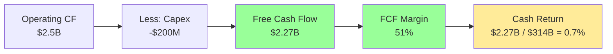

| Metric | 2024 | 2025 | Growth | Status |
|--------|------|------|--------|--------|
| **Operating Cash Flow** | $1.4B | $2.5B | +79% | 🟢 Strong |
| **Capex** | -$150M | -$200M | +33% | 🟢 Asset-light |
| **Free Cash Flow** | $1.25B | $2.27B | +82% | 🟢 Elite |
| **FCF Conversion** | 43% | 51% | +8pp | 🟢 Improving |
| **Cash Balance** | $3.7B | $4.5B | +22% | 🟢 Fortress |

**Cash Flow Quality:**
- ✅ High FCF conversion (51% of revenue)
- ✅ Growing faster than revenue (+82% vs +56%)
- ✅ Minimal capex requirements (asset-light SaaS)
- ✅ No debt, strong balance sheet
- ⚠️ FCF yield only 0.7% at current market cap (expensive)

### Balance Sheet Health

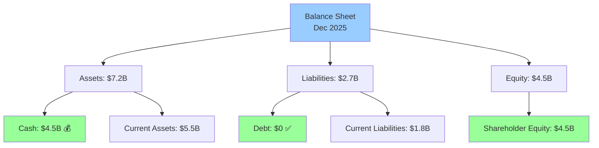

| Metric | Value | Status | Assessment |
|--------|-------|--------|------------|
| **Cash & Equivalents** | $4.5B | 🟢 Strong | No liquidity risk |
| **Total Debt** | $0 | 🟢 Excellent | Zero leverage |
| **Current Ratio** | 3.1x | 🟢 Healthy | Strong working capital |
| **Debt-to-Equity** | 0% | 🟢 Perfect | No financial risk |
| **Net Cash** | $4.5B | 🟢 Fortress | $14/share in cash |

**Balance Sheet Strength: 10/10** ✅
- Zero debt
- $4.5B cash ($14 per share)
- Strong working capital
- No financial distress risk

### Customer & Booking Metrics (Key Growth Indicators)

| Metric | Q4 2024 | Q4 2025 | Growth | Analysis |
|--------|---------|---------|--------|----------|
| **Total Customers** | 713 | 954 | +34% | 🟢 Steady expansion |
| **U.S. Commercial** | ~300 | ~400 | +33% | 🟢 Core growth engine |
| **TCV Bookings** | $1.8B | $4.3B | +138% 🚀 | 🟢 Massive acceleration |
| **Commercial TCV** | $1.0B | $2.6B | +161% 🚀 | 🟢 Exceptional demand |
| **Avg Contract Size** | Growing | Growing | ↗️ | 🟢 Land & expand working |

**TCV Bookings Explosion:**
```
Q4 Bookings Growth:

2024: ▓▓▓▓▓▓▓▓▓░░░░░░░░░░░ $1.8B
2025: ▓▓▓▓▓▓▓▓▓▓▓▓▓▓▓▓▓▓▓▓ $4.3B (+138%)

Commercial:
2024: ▓▓▓▓▓░░░░░░░░░░░░░░░ $1.0B
2025: ▓▓▓▓▓▓▓▓▓▓▓▓▓▓░░░░░░ $2.6B (+161%)
```

**Key Insight:** TCV bookings growing 2.5x faster than revenue = strong future revenue visibility

---

## 💵 Valuation Analysis (The Elephant in the Room)

### Current Valuation Metrics: 🔴 EXTREMELY EXPENSIVE

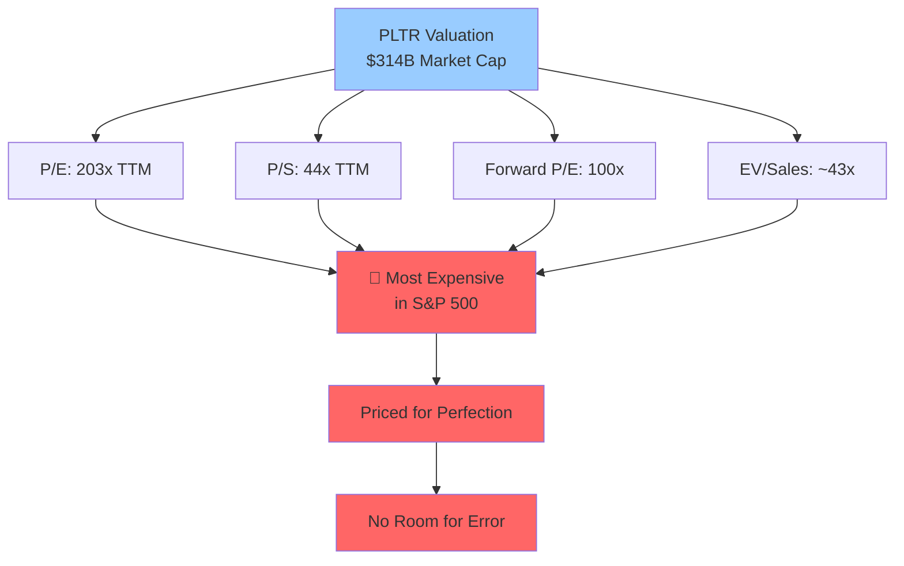

### Valuation Comparison Table

| Multiple | PLTR | Software Avg | Premium | Status |
|----------|------|--------------|---------|--------|
| **P/E (TTM)** | 203x | 30-40x | 407-505% | 🔴 Extreme |
| **Forward P/E** | 100x | 25-35x | 286-300% | 🔴 Very High |
| **P/S (TTM)** | 44x | 8-12x | 267-450% | 🔴 Extreme |
| **PEG Ratio** | 2.18 | 1.0-1.5x | 45-118% | 🔴 Expensive |
| **EV/Sales** | 43x | 8-10x | 330-438% | 🔴 Extreme |
| **FCF Yield** | 0.7% | 3-5% | -77-83% | 🔴 Tiny |

### Peer Comparison Analysis

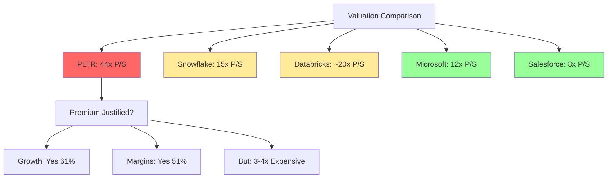

| Company | Market Cap | Revenue | P/S | Growth | Op Margin | Assessment |
|---------|-----------|---------|-----|--------|-----------|------------|
| **PLTR** | $314B | $7.2B (2026E) | **44x** | 61% | 51% | 🔴 Extremely expensive |
| **Snowflake** | $82B | $5.5B | 15x | 29% | -27% | 🟡 Fair (unprofitable) |
| **Databricks** | $43B (private) | $3B+ | ~20x | 60% | ~15% | 🟢 Cheaper (private) |
| **Microsoft** | $3.0T | $250B | 12x | 16% | 43% | 🟢 Reasonable (mega-cap) |
| **Salesforce** | $320B | $40B | 8x | 11% | 31% | 🟢 Reasonable (mature) |
| **Adobe** | $260B | $22B | 12x | 10% | 35% | 🟢 Fair (mature) |

**Key Insight:** PLTR trades at 3-4x premium to fast-growing software peers despite similar/better fundamentals.

### Valuation Scenarios

#### Scenario 1: Multiple Compression (Most Likely)

```
Current: $131 at 44x P/S (2026E $7.2B revenue)

If P/S compresses to:
├─ 35x P/S: $314B → $252B = $79/share (-40%) 🔴
├─ 30x P/S: $314B → $216B = $68/share (-48%) 🔴
├─ 25x P/S: $314B → $180B = $56/share (-57%) 🔴
└─ 20x P/S: $314B → $144B = $45/share (-66%) 🔴

Even at 30x P/S (still expensive), fair value = $68
```

#### Scenario 2: Growth Into Valuation (Bull Case)

```
Assume 50% revenue CAGR 2026-2028:
2026: $7.2B
2027: $10.8B
2028: $16.2B

At 25x P/S in 2028: $405B market cap
3-year return: +29% ($314B → $405B)
Annualized: +9% per year

Requires: Perfect execution + no multiple compression
```

#### Scenario 3: Best Case (Optimistic Bull)

```
If PLTR maintains 44x P/S and grows 50% annually:
2026: $7.2B × 44 = $317B (current)
2027: $10.8B × 44 = $475B (+50%)
2028: $16.2B × 44 = $713B (+127% from now)

Annualized return: ~31% per year
Probability: <10% (unrealistic valuation sustain)
```

### Fair Value Analysis

#### DCF Model (Base Case)

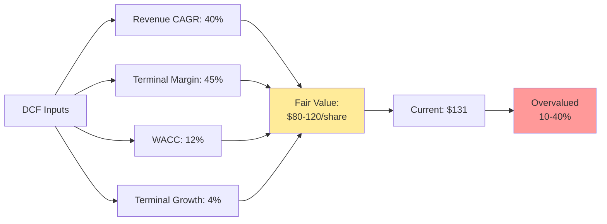

**DCF Assumptions:**
- Revenue CAGR 2026-2030: 40% (conservative vs. guidance)
- Terminal operating margin: 45% (slight decline from 51%)
- WACC: 12% (reflects high growth risk)
- Terminal growth: 4%

**DCF Result: $80-120 per share**
- Bear case (45% WACC, 35% terminal margin): $70
- Base case: $95
- Bull case (10% WACC, 50% terminal margin): $140

**Current price $131 implies:**
- 30% annual revenue growth for 10 years, OR
- Maintaining 44x P/S indefinitely, OR
- 60%+ revenue growth next 5 years at 50% margins

### Valuation Summary

<table>
<tr>
<td width="50%">

**🔴 Overvalued by Most Metrics**

Current: $131/share ($314B)

Fair Value Estimates:
- DCF Base: $95 (-27%)
- Peer P/S (25x): $86 (-34%)
- Peer P/S (30x): $103 (-21%)
- Technical Target: $60-80 (-54-39%)

</td>
<td width="50%">

**Justification for Premium:**

✅ Best-in-class margins (51%)
✅ Exceptional growth (61% guided)
✅ Massive TAM (Enterprise AI)
✅ Network effects & lock-in
✅ Government moat

❌ But 3-4x too expensive vs. peers
❌ Priced for perfection
❌ No margin of safety

</td>
</tr>
</table>

---

## 🏆 Competitive Analysis

### Porter's Five Forces

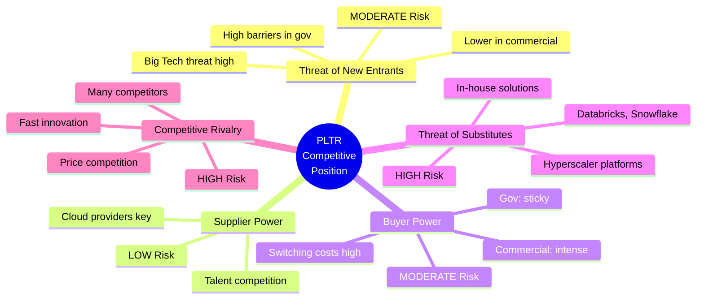

### Competitive Positioning Matrix

| Factor | Score | Status | Assessment |
|--------|-------|--------|------------|
| **Government Market** | 9/10 | 🟢 Dominant | Near-monopoly in defense AI |
| **Commercial Market** | 7/10 | 🟡 Strong | Growing fast but competitive |
| **Technology Moat** | 8/10 | 🟢 Strong | Integrated platform hard to replicate |
| **Brand/Trust** | 8/10 | 🟢 Strong | Especially in government |
| **Pricing Power** | 6/10 | 🟡 Moderate | High in gov, pressure in commercial |
| **Scale/Network Effects** | 7/10 | 🟡 Building | Growing but not yet Amazon/Microsoft scale |

### Key Competitors

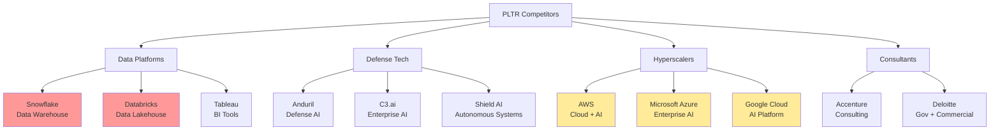

### Competitor Comparison

| Company | Market Cap | Revenue | Growth | Margin | Competitive Threat |
|---------|-----------|---------|--------|--------|-------------------|
| **Snowflake** | $82B | $5.5B | 29% | -27% | 🔴 HIGH - Data platform overlap |
| **Databricks** | $43B | $3B+ | 60% | ~15% | 🔴 HIGH - Direct competition |
| **Microsoft** | $3.0T | $250B | 16% | 43% | 🟡 MODERATE - Azure AI platform |
| **AWS** | Part of AMZN | $100B+ | 13% | ~30% | 🟡 MODERATE - Cloud + ML tools |
| **Google Cloud** | Part of GOOGL | $45B | 28% | Breakeven | 🟡 MODERATE - Vertex AI, BigQuery |
| **C3.ai** | $3.5B | $350M | 20% | -30% | 🟢 LOW - Smaller, less competitive |
| **Anduril** | $14B (private) | $500M | High | Unknown | 🟡 MODERATE - Defense only |

### Competitive Advantages (Moats)

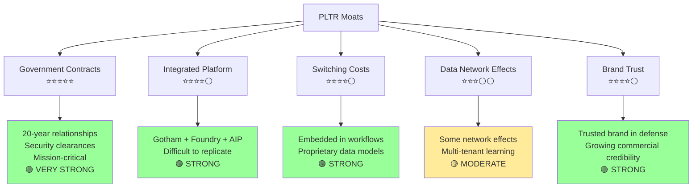

### Market Share & TAM

| Market | TAM | PLTR Share | Position | Opportunity |
|--------|-----|------------|----------|-------------|
| **Defense Software** | $50B | ~5-10% | 🟢 Leader | Growing with budgets |
| **Enterprise AI** | $200B+ | <1% | 🟡 Growing | Massive whitespace |
| **Data Analytics** | $300B+ | <2% | 🟡 Niche | Competitive but large |
| **Overall Software** | $1T+ | <0.5% | 🟡 Small | Long runway |

**Total Addressable Market:**
- Short-term (2026-2028): $50-100B (defense + enterprise AI)
- Long-term (2030+): $200-300B (full enterprise digitization)

**PLTR Positioning:**
- 🟢 Dominant in government ($3-4B revenue run-rate)
- 🟡 Fast-growing in commercial (137% growth but small base)
- 🔴 Faces intense competition from Databricks, Snowflake, hyperscalers

---

## ⚠️ Risk Assessment

### Risk Heatmap

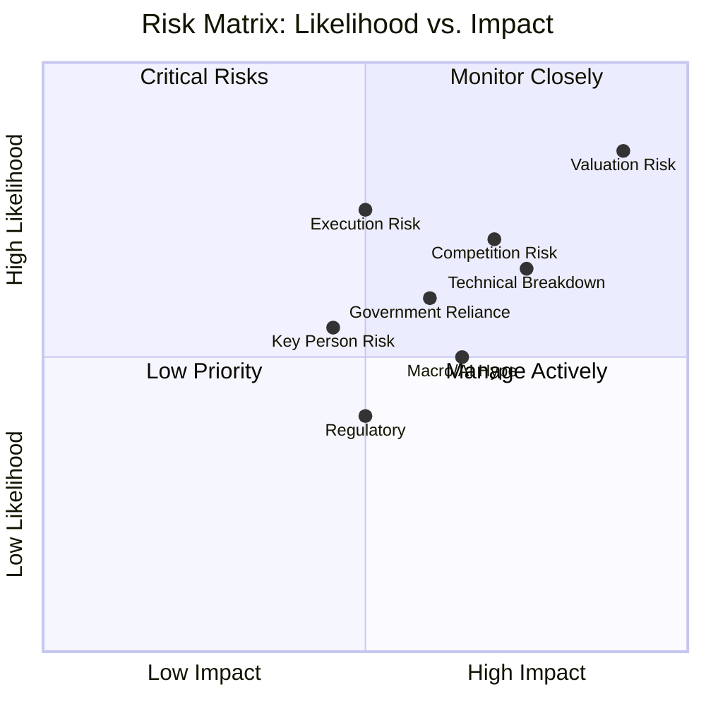

### Detailed Risk Scorecard

| Risk Category | Severity | Likelihood | Risk Score | Status | Mitigation |
|---------------|----------|------------|------------|--------|------------|
| **🔴 Valuation Risk** | 🔴 Critical | 85% | 10/10 | ⚠️ EXTREME | Wait for better entry |
| **🔴 Technical Breakdown** | 🔴 High | 65% | 8/10 | ⚠️ HIGH | H&S pattern target $60-80 |
| **🟡 Competition Risk** | 🟡 High | 70% | 7/10 | ⚠️ HIGH | Databricks, Snowflake growing |
| **🟡 Execution Risk** | 🟡 Moderate | 50% | 6/10 | ⚠️ MODERATE | Must maintain 60% growth |
| **🟡 Government Reliance** | 🟡 Moderate | 60% | 6/10 | ⚠️ MODERATE | ~55% revenue from gov |
| **🟡 Macro/AI Hype Cycle** | 🟡 High | 50% | 6/10 | ⚠️ MODERATE | AI bubble concerns |
| **🟢 Key Person Risk** | 🟡 Moderate | 45% | 5/10 | ✓ MODERATE | Alex Karp, Thiel critical |
| **🟢 Regulatory Risk** | 🟡 Moderate | 40% | 4/10 | ✓ LOW | Privacy, data concerns |
| **🟢 Financial/Liquidity** | 🟢 Low | 10% | 2/10 | ✓ LOW | $4.5B cash, no debt |

### Risk Factor Deep Dive

#### 🔴 CRITICAL RISK #1: Valuation (10/10)

```
Current Valuation: 44x P/S, 203x P/E

Valuation Risk Scenarios:
├─ Multiple compresses to 35x → -20% ($105/share)
├─ Multiple compresses to 30x → -32% ($89/share)
├─ Multiple compresses to 25x → -43% ($75/share)
└─ Multiple compresses to 20x → -54% ($60/share)

Even at 30x P/S (still rich), fair value is ~$90.

Catalysts for Compression:
🚩 Interest rate increases
🚩 AI hype cycle peak
🚩 Rotation from growth to value
🚩 Any execution miss
🚩 Broader tech selloff
🚩 Comparable valuations normalizing

Current Price: $131
Downside Risk: 30-50% to reach fair value
```

#### 🔴 CRITICAL RISK #2: Technical Breakdown (8/10)

```
Head & Shoulders Pattern:
Neckline: $145 (broken)
Current: $131 (below neckline)
Measured Target: $60-84 (-39% to -54%)

Support Levels Being Tested:
✗ $145 neckline - BROKEN
✗ $138 (50-day MA) - BROKEN
⚠ $131 (current) - TESTING
🎯 $107 (0.50 Fib) - Next support
🎯 $84 (0.382 Fib) - Major support
🎯 $66 (52-week low) - Ultimate support

Technical Indicators:
RSI: 26.8 (oversold, but can go lower)
MACD: -2.80 (sell signal)
MAs: All below (bearish alignment)

Michael Burry's target: $50-80
Probability of reaching $80: 40-50%
Probability of reaching $60: 20-30%
```

#### 🟡 HIGH RISK #3: Competition (7/10)

```
Threat Level by Competitor:

Databricks:
├─ Growing 60% YoY
├─ $43B valuation (20x P/S)
├─ More affordable than PLTR
├─ Strong in data engineering
└─ Threat: 🔴 HIGH

Snowflake:
├─ Growing 29% YoY
├─ Entrenched in data warehousing
├─ Massive ecosystem
├─ Price competitive
└─ Threat: 🔴 HIGH

Hyperscalers (AWS, Azure, GCP):
├─ 100x PLTR's resources
├─ Integrated cloud + AI platforms
├─ Could bundle competitive offerings
├─ Threat: 🟡 MODERATE (not specialized)

Anduril (Defense):
├─ $14B valuation, growing fast
├─ Modern defense tech approach
├─ Winning DoD contracts
└─ Threat: 🟡 MODERATE (different focus)

Competitive Pressure Score: 7/10
Risk of market share loss in commercial: HIGH
Risk of government displacement: LOW
```

#### 🟡 MODERATE RISK #4: Execution (6/10)

```
2026 Guidance: 61% revenue growth to $7.2B

Execution Challenges:
├─ Must sustain 60%+ growth (very high bar)
├─ Commercial competition intensifying
├─ AIP adoption needs to continue accelerating
├─ Government budget cycles unpredictable
└─ No room for error at current valuation

What Could Go Wrong:
🚩 Commercial growth slows below 100%
🚩 Government contracts delayed
🚩 Customer churn increases
🚩 Sales cycle lengthens
🚩 Margin compression from competition

Impact of Missing Guidance:
├─ Miss by 10%: Stock likely -30-40%
├─ Miss by 20%: Stock likely -50-60%
└─ Any margin compression: Stock -20-30%

Probability of perfect execution: 50%
Probability of minor miss: 30%
Probability of major miss: 20%
```

---

## 📅 Catalysts & Timeline

### Key Events (Next 12 Months)

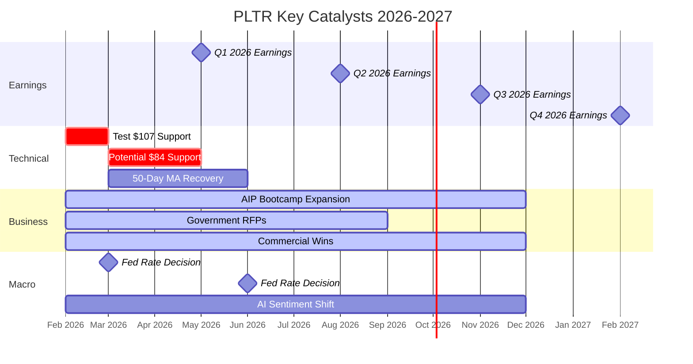

### Catalyst Tracker

| Timeframe | Catalyst | Impact | Probability | Direction |
|-----------|----------|--------|-------------|-----------|
| **Feb-Mar 2026** | Test $107 support level | 🔴 HIGH | 60% | ↘️ Bearish |
| **May 2026** | Q1 2026 Earnings | 🔴 CRITICAL | 75% | 🎲 Could go either way |
| **Q2 2026** | Commercial growth sustains? | 🟡 HIGH | 65% | ↗️ Bullish if yes |
| **Q3 2026** | AIP momentum continues? | 🟡 HIGH | 70% | ↗️ Bullish if yes |
| **2026-2027** | Multiple compression trend | 🔴 CRITICAL | 80% | ↘️ Bearish (likely) |
| **2026** | Major gov contract win | 🟡 MODERATE | 50% | ↗️ Bullish |
| **2026** | Tech sector rotation | 🟡 MODERATE | 55% | ↘️ Bearish (likely) |

### Event Impact Matrix

```
Positive Catalysts → Stock Price Impact:

✅ Q1 earnings beat (70%+ growth):        +15-25%
✅ Major government contract ($1B+):      +10-20%
✅ 150%+ commercial growth continues:     +20-30%
✅ New product launch (AIP expansion):    +5-15%
✅ Strategic partnership announced:       +10-20%
✅ Technical recovery above $161:         +15-25%

Negative Catalysts → Stock Price Impact:

❌ Q1 earnings miss (<60% growth):        -20-30%
❌ Commercial growth slows below 100%:    -15-25%
❌ Break below $107 support:              -15-20%
❌ Break below $84 support:               -25-35%
❌ Reach Burry's $60 target:              -54% (from current)
❌ Multiple compression (35x → 25x):      -29%
❌ Major customer loss/churn:             -10-15%
❌ Competitive win by Databricks/Snow:    -5-10%
```

---

## 🎯 Investment Strategy & Recommendations

### Investor Suitability Matrix

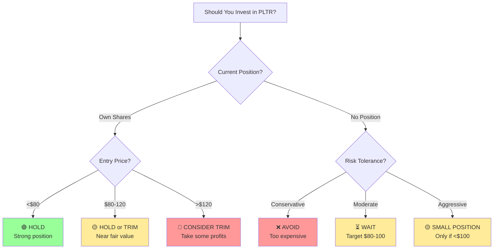

### Position Recommendations

#### For Current Shareholders

| Entry Price | Current P&L | Recommendation | Action |
|-------------|-------------|----------------|--------|
| **<$50** | +163%+ | 🟢 **HOLD** | Strong hands, trim 20-30% to lock gains |
| **$50-80** | +64-164% | 🟢 **HOLD** | Good position, consider stop at $100 |
| **$80-100** | +31-64% | 🟡 **HOLD or TRIM 25%** | Near fair value, reduce risk |
| **$100-130** | +1-31% | 🟡 **TRIM 50%** | Low margin of safety, take profits |
| **>$130** | Underwater | 🔴 **TRIM or HOLD** | Difficult decision, wait for bounce to $145? |

#### For New Investors

```mermaid
graph TD
    A[New Investor Strategy] --> B[Conservative<br/>Risk-Averse]
    A --> C[Moderate<br/>Balanced]
    A --> D[Aggressive<br/>High Risk]

    B --> B1[❌ AVOID PLTR<br/>Too expensive<br/>Better opportunities]

    C --> C1[⏳ WAIT for $80-100<br/>1-2% starter position<br/>Add if drops to $60-70]

    D --> D1[🟡 Small Position <$100<br/>Max 2-3% portfolio<br/>Be ready for -50% drawdown]

    style B1 fill:#ff9999
    style C1 fill:#ffeb99
    style D1 fill:#ffeb99
```

| Investor Type | Recommendation | Entry Price | Position Size | Stop Loss |
|---------------|----------------|-------------|---------------|-----------|
| **Conservative** | ❌ AVOID | N/A | 0% | N/A |
| **Moderate** | ⏳ WAIT | $80-100 | 1-2% | <$70 |
| **Aggressive** | 🟡 SMALL BUY | <$100 | 2-3% | <$80 |
| **Speculative** | 🟢 BUY DIP | <$80 | 3-5% | <$60 |

### Trading Strategies

#### Strategy #1: Patient Value Entry (Recommended)

```
Target Entry: $80-100 (wait for -24-39% drop from current)
Position Size: 2-3% of portfolio
Entry Plan:
  ├─ 1% at $95-100
  ├─ 1% at $85-90
  └─ 1% at $75-80
Hold Period: 2-3 years
Exit Targets: $150 (+50-88%), $200 (+100-150%)
Stop Loss: <$70 (-30%)

Rationale:
- Current price reflects no margin of safety
- Technical pattern suggests $80-100 zone likely
- Fundamentals strong, just need better valuation
- Patience will be rewarded

Best For: Value-oriented growth investors
Success Probability: 70%
```

#### Strategy #2: Technical Bounce Trade (Higher Risk)

```
Entry: $105-110 (if bounces off 0.50 Fibonacci)
Position Size: 1-2% (trading position only)
Hold Period: 2-4 weeks
Target: $125-135 (+16-23%)
Stop Loss: <$100 (-7-10%)

Rationale:
- RSI oversold (26.8) suggests potential bounce
- $107 is 0.50 Fibonacci level (psychological support)
- Short-term trade, not long-term hold
- Risk/reward: 1.5:1 to 2:1

Best For: Active traders comfortable with volatility
Success Probability: 40-50%
```

#### Strategy #3: Dollar Cost Averaging (Conservative)

```
Initial Position: 0.5% at current price $131
Add 0.5% every $10 decline: $120, $110, $100, $90, $80
Target Average Cost: $95-105
Total Position: 3-3.5%
Time Period: 3-6 months

Rationale:
- Reduces timing risk
- Builds position through volatility
- Lowers average cost if decline continues
- Participates if reversal occurs

Best For: Investors wanting exposure but uncertain on timing
Success Probability: 60%
```

#### Strategy #4: Covered Call Strategy (Income Generation)

```
For Current Holders with gains:
- Hold 100 shares
- Sell $150 strike calls 2-3 months out
- Collect premium ($5-8 per share)
- If called away at $150: +14.5% gain + premium
- If not called: Keep premium, repeat

Rationale:
- Generate income on holding
- Cap upside but reduce downside (via premium)
- Works if price stays range-bound $120-150

Best For: Existing shareholders comfortable limiting upside
Success Probability: 70% (income generation)
```

---

## 📊 Monitoring Dashboard

### Quarterly KPI Tracking

| KPI | Q4 2025 Actual | Q1 2026 Target | Q2 2026 Target | Threshold |
|-----|----------------|----------------|----------------|-----------|
| **Revenue** | $1,407M ✓ | $1,530M | $1,650M | >$1,500M |
| **YoY Growth** | 70% ✓ | 61%+ | 58%+ | >50% |
| **U.S. Commercial Growth** | 137% ✓ | 120%+ | 110%+ | >100% |
| **Operating Margin** | 57% ✓ | 52%+ | 53%+ | >50% |
| **FCF Margin** | 56% ✓ | 52%+ | 50%+ | >48% |
| **TCV Bookings** | $4.3B ✓ | $2.5B+ | $2.8B+ | >$2B |
| **Customer Count** | 954 ✓ | 1,000+ | 1,050+ | >950 |
| **Customer Adds (Net)** | +77 ✓ | +50+ | +50+ | >40 |

### Health Check Scorecard

| Metric | Current Status | Target | RAG Status |
|--------|----------------|--------|------------|
| **Revenue Growth Rate** | 70% (Q4) | >60% | 🟢 GREEN |
| **Commercial Acceleration** | 137% (U.S.) | >100% | 🟢 GREEN |
| **Operating Margin** | 51-57% | >50% | 🟢 GREEN |
| **FCF Margin** | 51% | >45% | 🟢 GREEN |
| **Customer Growth** | 34% YoY | >30% | 🟢 GREEN |
| **Stock Valuation** | 44x P/S | <30x | 🔴 RED |
| **Technical Setup** | H&S, RSI 26.8 | Above $145 | 🔴 RED |
| **Competitive Position** | Strong but pressured | Maintain | 🟡 YELLOW |

### Red Flag Warning System

| Red Flag | Severity | Current Status | Action if Triggered |
|----------|----------|----------------|---------------------|
| 🚩 Revenue growth <50% | 🔴 CRITICAL | ✓ Safe (70%) | Exit immediately |
| 🚩 Commercial growth <80% | 🟡 WARNING | ✓ Safe (137%) | Reduce position 50% |
| 🚩 Operating margin <45% | 🟡 WARNING | ✓ Safe (51%) | Watch closely |
| 🚩 Major customer churn | 🔴 CRITICAL | ✓ No signs | Reassess thesis |
| 🚩 Stock breaks $100 | 🔴 CRITICAL | ✓ At $131 | Evaluate stop loss |
| 🚩 Stock breaks $84 | 🔴 CRITICAL | ✓ Well above | Consider exiting |
| 🚩 Databricks IPO success | 🟡 WARNING | ⏳ Pending | Monitor competitive dynamics |
| 🚩 Loss of major gov contract | 🟡 WARNING | ✓ No losses | Immediate review |

---

## 📝 Investment Thesis Summary

### The Bull Case (30% Probability) 🟢

```mermaid
graph TD
    A[Bull Thesis] --> B[AI Revolution]
    A --> C[Government Moat]
    A --> D[Commercial Breakout]
    A --> E[Operating Leverage]

    B --> B1[Enterprise AI<br/>becomes mandatory]
    B --> B2[PLTR = AI<br/>Operating System]
    B --> B3[$300B TAM]

    C --> C1[20-year contracts]
    C --> C2[Security clearances]
    C --> C3[Mission-critical<br/>embedded]

    D --> D1[137% growth<br/>continues 3+ years]
    D --> D2[Fortune 500<br/>mass adoption]
    D --> D3[AIP Bootcamps<br/>scale globally]

    E --> E1[Margins expand<br/>to 60%+]
    E --> E2[FCF doubles<br/>annually]

    B3 --> F[2028: $20B Revenue]
    D3 --> F
    E2 --> F

    F --> G[Stock: $200-250<br/>+52-90%]

    style A fill:#99ff99
    style G fill:#66ff66
```

**Bull Case Assumptions:**
- ✅ Revenue grows 60%+ annually through 2028
- ✅ U.S. commercial sustains 100%+ growth for 3 years
- ✅ Operating margins expand to 55-60% (scale leverage)
- ✅ TAM expands as AI becomes table stakes
- ✅ Government business remains sticky, grows 40%+
- ✅ Multiple sustains at 35-40x P/S (re-rates from 44x but stays premium)
- ✅ Competition fails to meaningfully displace PLTR
- ✅ Technical breakdown is head-fake, recovery to $200+

**Bull Price Target: $200-250** (+52-90%)
**Path:** Current $131 → $150 (Q1 earnings) → $180 (Q2 beats) → $220 (2027)
**Probability:** 30%

---

### The Base Case (45% Probability) 🟡

```mermaid
graph TD
    A[Base Thesis] --> B[Solid Execution]
    A --> C[Multiple Compression]
    A --> D[Competitive Pressure]

    B --> B1[Revenue grows<br/>40-50% annually]
    B --> B2[Margins stable<br/>48-52%]
    B --> B3[Gov grows 40%<br/>Comm grows 80%]

    C --> C1[P/S rerates from<br/>44x to 28-30x]
    C --> C2[Still premium<br/>but more reasonable]

    D --> D1[Databricks, Snowflake<br/>win some deals]
    D --> D2[Price competition<br/>increases]
    D --> D3[PLTR maintains<br/>differentiation]

    B3 --> E[2028: $12-15B Revenue]
    C2 --> E
    D3 --> E

    E --> F[Fair Value: $90-120]
    F --> G[Current: $131]
    G --> H[Sideways/Down<br/>-9% to -31%]

    style A fill:#ffeb99
    style H fill:#ffeb99
```

**Base Case Assumptions:**
- ✓ Revenue grows 40-50% annually (solid but decelerating)
- ✓ U.S. commercial growth slows to 80-100% (still strong)
- ✓ Operating margins stable 48-52%
- ⚠️ Valuation multiple compresses from 44x to 28-30x P/S
- ✓ Government business stable, grows 35-40%
- ⚠️ Competition intensifies but PLTR maintains position
- ⚠️ Technical levels hold at $100-120, consolidates

**Base Price Target: $90-120** (-9% to -31%)
**Path:** Current $131 → $110 (Q1 in-line) → $100 (multiple compression) → $120 (recovery by 2027)
**Probability:** 45%

---

### The Bear Case (25% Probability) 🔴

```mermaid
graph TD
    A[Bear Thesis] --> B[Valuation Collapse]
    A --> C[Execution Miss]
    A --> D[Competition Wins]
    A --> E[Technical Breakdown]

    B --> B1[P/S rerates to<br/>18-22x]
    B --> B2[AI hype bubble<br/>pops]
    B --> B3[Growth stock<br/>rotation]

    C --> C1[Revenue growth<br/>slows to 30%]
    C --> C2[Commercial growth<br/>decelerates to 60%]
    C --> C3[Margins compress<br/>to 40%]

    D --> D1[Databricks wins<br/>major deals]
    D --> D2[Hyperscalers<br/>bundle solutions]
    D --> D3[Price wars erode<br/>positioning]

    E --> E1[H&S pattern<br/>plays out]
    E --> E2[Breaks $84 support]
    E --> E3[Reaches $60<br/>Burry target]

    B3 --> F[2026 Revenue: $6B<br/>Miss guidance]
    C3 --> F
    D3 --> F
    E3 --> F

    F --> G[Stock: $50-80<br/>-39% to -62%]

    style A fill:#ff9999
    style G fill:#ff6666
```

**Bear Case Assumptions:**
- ❌ Revenue growth decelerates to 30-40% (major miss)
- ❌ U.S. commercial slows below 80% growth
- ❌ Margins compress due to competition (40-45%)
- ❌ Valuation rerates to 18-22x P/S (still above average but compressed)
- ❌ Government spending cuts or delays
- ❌ Databricks/Snowflake win key commercial accounts
- ❌ Technical H&S pattern completes, reaches $60-80
- ❌ AI hype cycle peaks, investors rotate to value

**Bear Price Target: $50-80** (-39% to -62%)
**Path:** Current $131 → $107 (technical breakdown) → $84 (Fib support fails) → $60-70 (capitulation)
**Probability:** 25%

---

## 🎓 Final Verdict

### Overall Investment Rating: 🟡 HOLD (Current) / ⏳ WAIT (New Money)

<table>
<tr>
<td width="50%" bgcolor="#fff3cd">

### 🟡 HOLD / WAIT FOR BETTER ENTRY

**Current Price:** $131.41

**Fair Value Range:** $80-120

**12-Month Target (Base):** $90-120

**Upside Scenario:** $200+ (bull case)

**Downside Risk:** $60-80 (bear case)

</td>
<td width="50%">

**Risk/Reward at $131:** 🟡 UNFAVORABLE

**Upside:** +52% (bull) / -9% (base)

**Downside:** -39% (bear) / -31% (base)

**Risk Rating:** 🔴🔴🔴🔴⚪ VERY HIGH

**Best Entry:** $80-100 (-24-39% from current)

</td>
</tr>
</table>

### Summary Analysis

**🟢 What's Working (Fundamental Strength):**
- ✅ Revenue growth accelerating (70% Q4, 61% guided 2026)
- ✅ Best-in-class margins (51% operating, 51% FCF)
- ✅ Fortress balance sheet ($4.5B cash, zero debt)
- ✅ Government moat remains strong (mission-critical)
- ✅ Commercial business inflecting (137% U.S. growth)
- ✅ AIP platform gaining traction (customer adoption strong)
- ✅ Network effects building (data moat)
- ✅ Elite management team (Karp, Thiel, proven executors)

**🔴 What's Concerning (Valuation + Technical):**
- ❌ Valuation extreme (44x P/S, 203x P/E, 2.18x PEG)
- ❌ 3-4x more expensive than fast-growing peers
- ❌ Technical breakdown (H&S pattern, below all MAs)
- ❌ Downside target $60-80 per Burry/technicals
- ❌ RSI oversold but still in downtrend
- ❌ No margin of safety at current price
- ❌ Competition intensifying (Databricks, Snowflake)
- ❌ Priced for perfection - any miss = -30-50% drop

### The Paradox: Great Company, Expensive Stock

```
Fundamental Grade: A (8/10)
├─ Business quality: Excellent
├─ Growth trajectory: Outstanding
├─ Profitability: Best-in-class
├─ Competitive position: Strong
└─ Management: Elite

Valuation Grade: D (2/10)
├─ Absolute valuation: Extreme
├─ Relative valuation: 3-4x peers
├─ Margin of safety: None
├─ Risk/reward: Unfavorable
└─ Technical setup: Bearish

Overall Investment Grade: C+ (6/10)
"Right Company, Wrong Price"
```

### Recommendation by Investor Profile

#### 🔴 Conservative Investors (Safety-First)
**Verdict:** ❌ **AVOID**
- Too expensive, too volatile, too risky
- Better opportunities in quality stocks at fair prices
- Alternative: Microsoft, Adobe, Salesforce (mature, profitable, reasonable)

#### 🟡 Moderate Growth Investors (Balanced)
**Verdict:** ⏳ **WAIT for $80-100**
- Love the company, hate the price
- Set alerts for $95 and $80
- Be patient - valuation will normalize
- Entry strategy: 1% at $95, 1% at $85, 1% at $75

#### 🟢 Aggressive Growth Investors (High Risk Tolerance)
**Verdict:** 🟡 **SMALL POSITION if <$100**
- Max 2-3% of portfolio
- Accept 50% drawdown potential
- Long-term horizon (3+ years)
- Stop loss <$80

#### 🔵 Current Shareholders (Have Positions)
**Verdict by Entry Price:**
- **<$80 entry:** 🟢 HOLD (trim 20-30% to lock gains)
- **$80-120 entry:** 🟡 HOLD or TRIM (reduce to 50-70%)
- **>$120 entry:** 🔴 TRIM 50% (take profits, reduce risk)

---

## 📚 Key Takeaways (TL;DR)

### The 5-Second Summary:
**Great business, terrible valuation. Wait for $80-100 or avoid entirely.**

### The 30-Second Summary:
Palantir is executing brilliantly - 70% revenue growth, 51% margins, $2.3B free cash flow, AI platform gaining traction. **BUT** stock trades at 44x sales (3-4x competitors) with bearish technical setup (H&S pattern targeting $60-80). Fundamentals = A, Valuation = D, Technical = F. **Current shareholders:** Trim some. **New investors:** Wait for $80-100 or avoid.

### The 3-Minute Summary:

**Fundamental Story (8/10):** 🟢
- Record Q4: $1.4B revenue (+70%), $798M operating income (57% margin)
- 2026 guidance: $7.2B revenue (+61% growth) - crushing expectations
- U.S. commercial business exploding: 137% growth, AIP Bootcamps revolutionizing sales
- Government moat remains impregnable: 20-year relationships, mission-critical systems
- Financial fortress: $4.5B cash, zero debt, $2.3B FCF (51% margin), Rule of 40 = 127
- Best-in-class software economics rivaling Microsoft/Adobe

**Valuation Problem (2/10):** 🔴
- Trading at 44x P/S, 203x P/E - most expensive stock in S&P 500
- Peers trade at 8-20x sales despite similar/better growth
- Fair value: $80-120 (30-40% below current)
- Zero margin of safety - priced for PERFECT execution
- Any miss = -30-50% instant decline

**Technical Disaster (3/10):** 🔴
- Classic Head & Shoulders pattern - neckline broken
- Price below ALL moving averages (death cross)
- RSI oversold (26.8) but still in strong downtrend
- Michael Burry's target: $60-80 (-39-54% from current)
- Support levels: $107 → $84 → $60 (all at risk)

**Competitive Landscape (7/10):** 🟡
- Dominant in government (near-monopoly), strong in commercial
- Facing intense competition: Databricks (60% growth), Snowflake (entrenched), hyperscalers (AWS/Azure/GCP)
- AIP platform creating differentiation, but sustainability unclear
- Market share tiny (<2% of TAM) - massive opportunity OR vulnerable position

**Investment Verdict:**
- **For current holders:** Trim 20-50% depending on entry price. Lock in some gains.
- **For new investors:** WAIT for $80-100 range (-24-39% drop) or avoid entirely
- **Risk/Reward:** Unfavorable at $131 - downside to $60-80 vs upside to $150-200
- **Time Horizon:** 2-3 years minimum if buying (expect volatility)

**The Bottom Line:**
This is a "**Right Company, Wrong Price**" situation. Palantir is building an incredible business that could be worth $500B+ someday. But at 44x sales after a 300%+ run-up, the easy money has been made. Current valuation requires PERFECTION for 5+ years. With technical breakdown in progress and 25% downside to fair value, patience will likely be rewarded. Set alerts for $95 and $80. Wait for the market to give you a better entry point.

**If you only remember 3 things:**
1. 📈 **Fundamentals:** World-class business executing brilliantly
2. 💰 **Valuation:** 3-4x too expensive vs. peers, no margin of safety
3. 📉 **Technicals:** Bearish H&S pattern, target $60-80, wait for better entry

---

## 📚 Sources & References

### Financial Data & Earnings
- [Palantir Q4 2025 Earnings Release](https://www.businesswire.com/news/home/20260201154946/en/)
- [PLTR Q4 2025 Earnings Call Transcript](https://www.fool.com/earnings/call-transcripts/2026/02/02/palantir-pltr-q4-2025-earnings-call-transcript/)
- [Palantir Investor Relations](https://investors.palantir.com/)
- [Q4 2025 Investor Presentation](https://investors.palantir.com/files/Palantir%20-%20Q4%202025%20Investor%20Presentation.pdf)
- [Financial Statements - Yahoo Finance](https://finance.yahoo.com/quote/PLTR/financials/)

### Technical Analysis
- [PLTR Technical Analysis - TradingView](https://www.tradingview.com/symbols/NASDAQ-PLTR/)
- [Technical Indicators - Investing.com](https://www.investing.com/equities/palantir-technologies-inc-technical)
- [Michael Burry H&S Analysis - Benzinga](https://www.benzinga.com/markets/equities/26/02/50501105/michael-burry-forecasts-58-palantir-collapse-targets-60-in-ominous-head-shoulders-chart-reveal)
- [PLTR Chart - Barchart](https://www.barchart.com/stocks/quotes/PLTR/technical-analysis)

### Valuation & Analyst Coverage
- [Analyst Ratings - Public.com](https://public.com/stocks/pltr/forecast-price-target)
- [Price Targets - MarketBeat](https://www.marketbeat.com/stocks/NASDAQ/PLTR/forecast/)
- [PLTR Statistics - Stock Analysis](https://stockanalysis.com/stocks/pltr/statistics/)
- [Valuation Metrics - MacroTrends](https://www.macrotrends.net/stocks/charts/PLTR/palantir-technologies/pe-ratio)

### Business Analysis
- [Palantir 2026 Outlook - MarketBeat](https://www.marketbeat.com/originals/3-reasons-palantir-is-unavoidable-in-ai-infrastructure-by-2026/)
- [Top 5 Predictions for 2026 - The Motley Fool](https://www.fool.com/investing/2026/01/21/my-top-5-predictions-for-palantir-in-2026/)
- [AI Platform Analysis - Intellectia](https://intellectia.ai/blog/palantir-stock-price-forecast-2026)
- [Competitive Analysis - Financial Content](https://www.financialcontent.com/article/finterra-2026-1-14-palantir-pltr-2026-deep-dive-the-rise-of-the-agentic-ai-powerhouse)

### Competitor Information
- [PLTR vs Snowflake - The Motley Fool](https://www.fool.com/investing/2024/10/08/artificial-intelligence-ai-palantir-snowflake/)
- [Competitor Analysis](https://thebrandhopper.com/2025/12/22/who-are-palantirs-competitors-in-software-industry/)
- [AI Frontier Competition](https://markets.financialcontent.com/wral/article/marketminute-2025-10-13-the-ai-frontier-palantir-faces-intensifying-rivalry-as-competitors-surge-in-data-analytics-market)

---

**Disclaimer:** This analysis is for informational and educational purposes only and does not constitute investment advice. All investments involve risk of loss, including potential loss of principal. The author may hold positions in mentioned securities. Palantir is a highly volatile stock with significant execution and valuation risks. Conduct your own due diligence and consult a financial advisor before making investment decisions. Past performance does not guarantee future results. Forward-looking statements involve inherent uncertainties.

**Report Version:** Comprehensive (Fundamental + Technical) | **Date:** February 16, 2026 | **Analyst:** Claude AI
