# PLTR 基本面深度分析報告

> **報告日期**：2026-02-24 ｜ **語言**：繁體中文 ｜ **數據來源**：Yahoo Finance
> **分析師**：AI 頂級研究團隊 ｜ **評級**：⚡ 深度研究報告

---

## 目錄

| 章節 | 主題 | 頁面 |
|------|------|------|
| 1 | 執行摘要 | § 1 |
| 2 | 公司概覽 | § 2 |
| 3 | 損益表深度分析 | § 3 |
| 4 | 資產負債表分析 | § 4 |
| 5 | 現金流量分析 | § 5 |
| 6 | 獲利能力指標 | § 6 |
| 7 | 估值分析 | § 7 |
| 8 | 競爭護城河 | § 8 |
| 9 | 成長催化劑 | § 9 |
| 10 | 風險分析 | § 10 |
| 11 | 公平價值估算 | § 11 |
| 12 | 投資建議 | § 12 |

---

## 1. 執行摘要

### 1.1 核心評分總覽

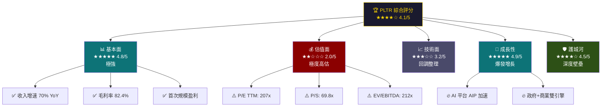

---

### 1.2 五大投資論點

| # | 投資論點 | 信號 | 重要性 | 說明 |
|---|----------|------|--------|------|
| 1 | 🚀 **AI 平台 AIP 爆炸性成長** | 🟢 強烈正面 | ★★★★★ | AIP 商業化加速，美國商業收入 Q4 YoY +70%，AI Boot Camp 模式催動客戶獲取 |
| 2 | 💎 **政府業務護城河深不可測** | 🟢 正面 | ★★★★★ | Gotham/Maven Smart System 深度嵌入美國國防體系，合約黏性極高 |
| 3 | 📈 **首次實現規模化盈利** | 🟢 正面 | ★★★★☆ | 2024年淨利潤 $4.62億，GAAP EPS $0.63，從虧損到持續盈利的結構性轉變 |
| 4 | 💰 **現金堡壘充裕，無財務風險** | 🟢 正面 | ★★★★☆ | 現金 $71.8億，負債僅 $2.29億，淨現金達 $69.5億，財務韌性極強 |
| 5 | 🔴 **估值嚴重超前，回調壓力大** | 🔴 負面風險 | ★★★★★ | TTM P/E 207x，P/S 70x，較科技股平均溢價 300%+，需用未來5年成長消化 |

---

### 1.3 快速統計儀表板

| 指標類別 | 指標 | 數值 | 評級 |
|----------|------|------|------|
| **市場地位** | 市值 | $3,123.5億 | 🟢 頂級 |
| **市場地位** | 當前股價 | $130.60 | 🟡 已從高點回調 37% |
| **市場地位** | 52週高點 | $207.52 | 🔴 距高點 -37% |
| **市場地位** | Beta | 1.687 | 🔴 高波動 |
| **成長性** | 收入 TTM | $44.8億 | 🟢 強勁 |
| **成長性** | 收入增速 YoY | **+70%** | 🟢 爆炸 |
| **獲利能力** | 毛利率 | **82.4%** | 🟢 頂級 |
| **獲利能力** | 營業利益率 | **40.9%** | 🟢 優秀 |
| **獲利能力** | 淨利率 | **36.3%** | 🟢 優秀 |
| **財務健康** | 流動比率 | **7.11x** | 🟢 極強 |
| **財務健康** | 負債/權益 | 3.06% | 🟢 幾乎無債 |
| **估值** | TTM P/E | 207x | 🔴 極度昂貴 |
| **估值** | 遠期 P/E | 71.5x | 🔴 昂貴 |
| **分析師** | 目標均價 | $189.92 | 🟢 上漲空間 +45% |
| **分析師** | 評級 | Buy（24人） | 🟢 多數看多 |

---

## 2. 公司概覽

### 2.1 業務結構深度解析

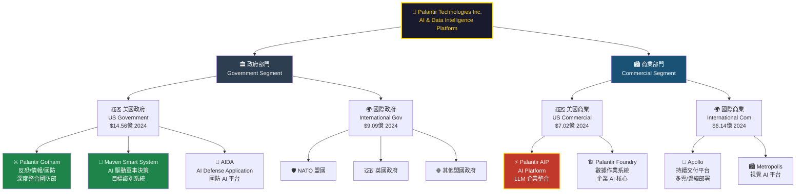

---

### 2.2 收入結構圓餅圖（2024年）

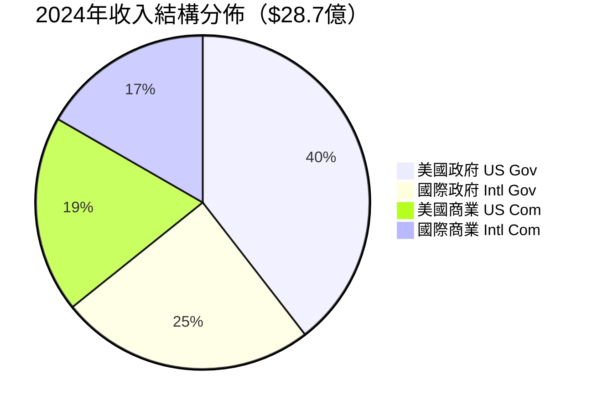

> 📌 **注意**：政府業務佔比約 **57%**，商業業務 **43%**，AI Platform（AIP）正在快速拉升商業佔比

---

### 2.3 競爭優勢心智圖

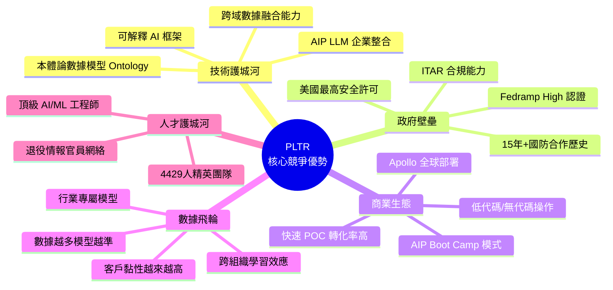

---

### 2.4 市場定位分析

| 維度 | PLTR 定位 | 說明 |
|------|-----------|------|
| **產品定位** | AI 作業系統（OS for AI） | 不只是工具，而是企業 AI 基礎設施 |
| **客戶類型** | 政府機構 + 大型企業 | Fortune 500 + 五眼聯盟 |
| **技術壁壘** | 極高（安全許可+數據本體論） | 競爭者難以複製 |
| **定價策略** | 高單價訂閱制 | 平均客戶價值超百萬美元 |
| **員工規模** | 4,429人 | 精英小隊，人均收入超百萬 |
| **人均收入** | **$101.1萬/人** | 頂級軟體公司水準 |

---

## 3. 損益表深度分析

### 3.1 收入成長時間軸

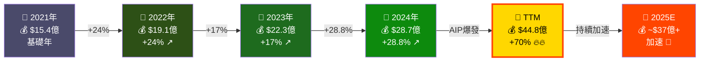

---

### 3.2 年度收入趨勢 ASCII 長條圖

```
📊 PLTR 年度總收入趨勢（億美元）
═══════════════════════════════════════════════════════════

2021  $15.4億  ▓▓▓▓▓▓▓▓▓▓▓▓▓▓▓░░░░░░░░░░░░░░░░░░░░  30%
2022  $19.1億  ▓▓▓▓▓▓▓▓▓▓▓▓▓▓▓▓▓▓░░░░░░░░░░░░░░░░░  38%
2023  $22.3億  ▓▓▓▓▓▓▓▓▓▓▓▓▓▓▓▓▓▓▓▓▓░░░░░░░░░░░░░░  45%
2024  $28.7億  ▓▓▓▓▓▓▓▓▓▓▓▓▓▓▓▓▓▓▓▓▓▓▓▓▓▓▓░░░░░░░░  57%
TTM   $44.8億  ▓▓▓▓▓▓▓▓▓▓▓▓▓▓▓▓▓▓▓▓▓▓▓▓▓▓▓▓▓▓▓▓▓▓▓  89%🔥

          0    10    20    30    40    50 億美元
═══════════════════════════════════════════════════════════
增速：      +24%  +17%  +29%  +70%(TTM) ← AIP催化劑
```

---

### 3.3 毛利率與營益率演變

```
📈 PLTR 利潤率演變趨勢（%）
═══════════════════════════════════════════════════════════

         2021    2022    2023    2024    TTM
──────────────────────────────────────────────────────────
毛利率   77.9%   78.4%   80.2%   80.2%   82.4%
  ████████████████████████████████████████████  82.4% 🟢

營業率  -26.7%   -8.4%   +5.4%  +10.8%  +40.9%
  2021: ████████████████░░░░░░░░░░░░░░░░  -26.7% 🔴
  2022: ████████████░░░░░░░░░░░░░░░░░░░░   -8.4% 🔴
  2023: ░░░░░░░░░░░░░░░████               +5.4% 🟡
  2024: ░░░░░░░░░░░░░░░███████           +10.8% 🟢
  TTM:  ░░░░░░░░░░░░░░░████████████████  +40.9% 🟢🔥

淨利率  -33.8%  -19.5%   +9.4%  +16.1%  +36.3%
  TTM: ░░░░░░░░░░░░░░░██████████████████  +36.3% 🟢🔥
═══════════════════════════════════════════════════════════
📌 關鍵轉折：2023年首次GAAP盈利，2024年規模化盈利確立
```

---

### 3.4 詳細損益四年對比表

| 指標 | 2021 | 2022 | 2023 | 2024 | 趨勢 |
|------|------|------|------|------|------|
| **總收入** | $15.4億 | $19.1億 | $22.3億 | $28.7億 | 🟢 持續成長 |
| **毛利** | $12.0億 | $15.0億 | $17.9億 | $23.0億 | 🟢 持續成長 |
| **毛利率** | 77.9% | 78.4% | 80.2% | 80.2% | 🟢 穩定高位 |
| **營業利益** | -$4.11億 | -$1.61億 | +$1.20億 | +$3.10億 | 🟢 扭虧為盈 |
| **營業利益率** | -26.7% | -8.4% | +5.4% | +10.8% | 🟢 快速改善 |
| **EBITDA** | -$4.70億 | -$1.39億 | +$1.53億 | +$3.42億 | 🟢 轉正加速 |
| **淨利潤** | -$5.20億 | -$3.74億 | +$2.10億 | +$4.62億 | 🟢 強勁盈利 |
| **淨利率** | -33.8% | -19.5% | +9.4% | +16.1% | 🟢 快速提升 |
| **EPS (GAAP)** | -$0.25 | -$0.17 | +$0.09 | +$0.20 | 🟢 扭虧為盈 |
| **R&D 支出** | $3.87億 | $3.60億 | $4.05億 | $5.08億 | 🟡 持續投入 |
| **R&D/收入** | 25.1% | 18.8% | 18.1% | 17.7% | 🟢 效率提升 |

---

### 3.5 費用結構分析（2024年）

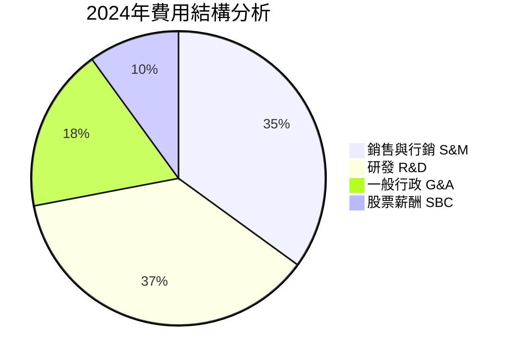

> 📌 **重點**：R&D 佔費用結構最大，2024年 R&D 達 **$5.08億**，佔收入 **17.7%**，顯示持續技術投入

---

### 3.6 收入加速信號分析

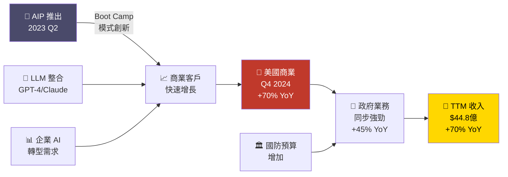

---

## 4. 資產負債表分析

### 4.1 資產結構分解圖

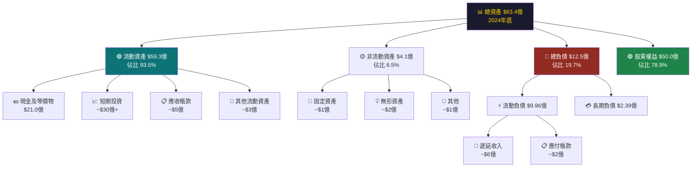

---

### 4.2 資產配置橫條圖

```
📊 PLTR 資產負債表結構（2024年底）
═══════════════════════════════════════════════════════════

【資產端 $63.4億】
─────────────────────────────────────────────────────────
現金及等價物  $21.0億  ▓▓▓▓▓▓▓▓▓▓▓▓▓▓▓▓▓▓▓▓▓▓▓▓▓░░  33%
短期投資      $30億+   ▓▓▓▓▓▓▓▓▓▓▓▓▓▓▓▓▓▓▓▓▓▓▓▓▓▓▓▓  47%
應收帳款       $5億    ▓▓▓▓▓░░░░░░░░░░░░░░░░░░░░░░░░   8%
其他流動資產   $3億    ▓▓▓░░░░░░░░░░░░░░░░░░░░░░░░░░   5%
非流動資產     $4億    ▓▓▓▓░░░░░░░░░░░░░░░░░░░░░░░░░   7%

【負債+權益端 $63.4億】
─────────────────────────────────────────────────────────
股東權益      $50.0億  ▓▓▓▓▓▓▓▓▓▓▓▓▓▓▓▓▓▓▓▓▓▓▓▓▓▓▓▓  79%
流動負債       $9.96億  ▓▓▓▓▓▓▓▓▓▓░░░░░░░░░░░░░░░░░░░  16%
長期負債       $2.39億  ▓▓░░░░░░░░░░░░░░░░░░░░░░░░░░░   4%
少數股東       $1.05億  ▓░░░░░░░░░░░░░░░░░░░░░░░░░░░░   1%
═══════════════════════════════════════════════════════════
💡 淨現金 = $71.8億 - $2.29億債務 = $69.5億 淨現金
```

---

### 4.3 負債與流動性比率表格

| 財務指標 | 2021 | 2022 | 2023 | 2024 | 評級 |
|----------|------|------|------|------|------|
| **流動比率** | 4.33x | 5.17x | 5.55x | **7.11x** | 🟢 極強 |
| **速動比率** | ~4.0x | ~5.0x | ~5.2x | ~6.8x | 🟢 極強 |
| **總債務** | $2.60億 | $2.49億 | $2.29億 | $2.39億 | 🟢 幾乎無債 |
| **負債/權益** | 11.3% | 9.7% | 6.6% | **3.1%** | 🟢 極低 |
| **淨現金** | ~$20億 | ~$23億 | ~$53億 | **$69.5億** | 🟢 現金堡壘 |
| **利息覆蓋率** | N/A（虧損） | N/A | 極高 | **極高** | 🟢 無風險 |
| **總資產** | $32.5億 | $34.6億 | $45.2億 | **$63.4億** | 🟢 持續成長 |
| **股東權益** | $22.9億 | $25.7億 | $34.8億 | **$50.0億** | 🟢 穩健成長 |

---

### 4.4 股東權益趨勢 ASCII 圖

```
📊 PLTR 股東權益趨勢（億美元）
═══════════════════════════════════════════════════════════
$50 │                                              ████
    │                                              ████
$45 │                                              ████
    │                                    ████      ████
$40 │                                    ████      ████
    │                                    ████      ████
$35 │                                    ████      ████
    │                          ████      ████      ████
$30 │                          ████      ████      ████
    │                          ████      ████      ████
$25 │              ████        ████      ████      ████
    │   ████       ████        ████      ████      ████
$20 │   ████       ████        ████      ████      ████
    └─────────────────────────────────────────────────
        2021       2022        2023      2024
        $22.9      $25.7       $34.8     $50.0
═══════════════════════════════════════════════════════════
增速：     +12%      +35%       +44% ← 盈利轉正驅動
```

---

## 5. 現金流量分析

### 5.1 現金流瀑布圖

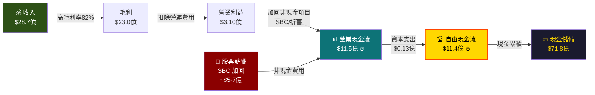

> ⚠️ **重要警示**：PLTR 的高 OCF 部分受益於大量股票薪酬（SBC）加回，需注意股份稀釋效應

---

### 5.2 自由現金流趨勢進度條

```
📊 PLTR 自由現金流趨勢（億美元）
═══════════════════════════════════════════════════════════

2021  $3.21億  ▓▓▓▓▓░░░░░░░░░░░░░░░░░░░░░░░░░░░░░░  28%
2022  $1.84億  ▓▓▓░░░░░░░░░░░░░░░░░░░░░░░░░░░░░░░░░  16%  📉
2023  $6.97億  ▓▓▓▓▓▓▓▓▓▓▓▓░░░░░░░░░░░░░░░░░░░░░░░  61%
2024  $11.4億  ▓▓▓▓▓▓▓▓▓▓▓▓▓▓▓▓▓▓▓▓░░░░░░░░░░░░░░  100%  🚀
TTM   $12.6億  ▓▓▓▓▓▓▓▓▓▓▓▓▓▓▓▓▓▓▓▓▓▓░░░░░░░░░░░░  110%+ 🔥

═══════════════════════════════════════════════════════════
FCF Margin 2024: 39.7%  ← 頂級 SaaS 水準
FCF/市值 比率:   0.37%  ← 估值極度高溢價
═══════════════════════════════════════════════════════════
```

---

### 5.3 資本配置策略

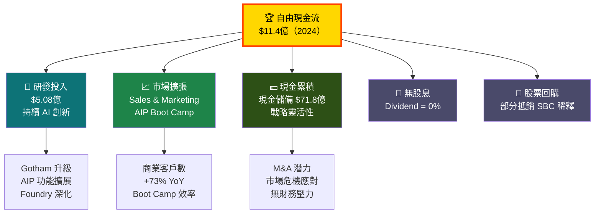

---

## 6. 獲利能力指標

### 6.1 獲利能力對比表格

| 指標 | PLTR 數值 | 軟體行業均值 | S&P 500均值 | 評級 |
|------|-----------|------------|------------|------|
| **毛利率** | **82.4%** | 65-70% | 45% | 🟢 頂級，超越同業 |
| **營業利益率** | **40.9%** | 15-25% | 12% | 🟢 極優，接近最佳水準 |
| **淨利率** | **36.3%** | 10-20% | 10% | 🟢 頂級盈利能力 |
| **FCF Margin** | **39.7%** | 15-25% | 8% | 🟢 現金生成能力頂級 |
| **ROE** | **26.0%** | 20-30% | 15% | 🟢 優秀回報 |
| **ROA** | **11.6%** | 8-12% | 6% | 🟢 資產效率良好 |
| **ROIC** | ~18-22% | 12-18% | 8% | 🟢 超越資本成本 |
| **人均收入** | **$101萬** | $40-60萬 | N/A | 🟢 頂級人效比 |

---

### 6.2 獲利能力儀表板

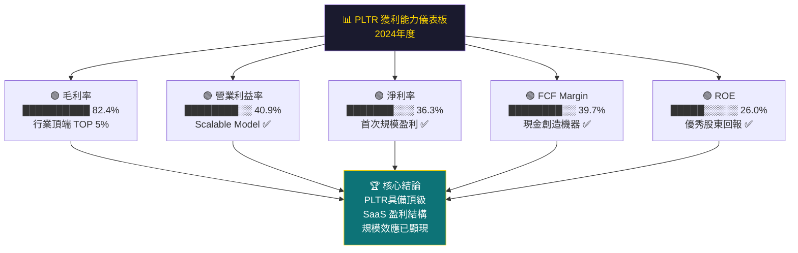

---

### 6.3 ROE 杜邦分析拆解

```
📊 PLTR ROE 杜邦三因子分析（2024）
═══════════════════════════════════════════════════════════

ROE = 淨利率 × 資產週轉率 × 財務槓桿
    = 36.3% × 0.453 × 1.267
    = 26.0% ✅

淨利率     36.3%  ▓▓▓▓▓▓▓▓▓▓▓▓▓▓▓▓▓▓▓▓▓▓▓▓▓▓░░  強勁
資產週轉率  0.45x  ▓▓▓▓▓▓▓▓▓▓▓░░░░░░░░░░░░░░░░░░  中等（輕資產）
財務槓桿   1.27x  ▓▓▓▓▓░░░░░░░░░░░░░░░░░░░░░░░░  極低槓桿

💡 PLTR 的 ROE 完全由盈利能力驅動，而非財務槓桿
   這是最健康的 ROE 結構，代表真實的業務競爭力
═══════════════════════════════════════════════════════════
```

---

## 7. 估值分析

### 7.1 估值指標全景圖

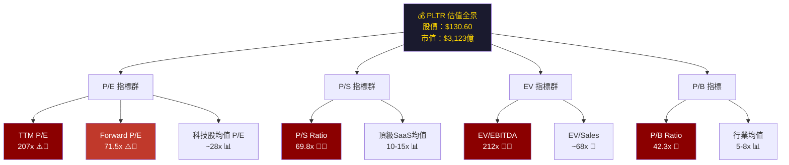

---

### 7.2 估值倍數對比表格

| 估值指標 | PLTR | 科技股均值 | 頂級SaaS均值 | Snowflake(SNOW) | Palantir溢價 |
|----------|------|-----------|------------|----------------|------------|
| **TTM P/E** | 207x | 28x | 40x | 虧損 | +639% 🔴 |
| **Forward P/E** | 71.5x | 22x | 35x | ~100x | +105% 🔴 |
| **P/S Ratio** | 69.8x | 5x | 10-15x | ~18x | +365% 🔴 |
| **P/B Ratio** | 42.3x | 5x | 8x | 15x | +184% 🔴 |
| **EV/EBITDA** | 212x | 18x | 35x | N/A | +506% 🔴 |
| **EV/Sales** | 68x | 4x | 10x | 17x | +380% 🔴 |
| **FCF Yield** | 0.37% | 3-5% | 2-3% | <1% | 極低 🔴 |

> 🔴 **結論**：PLTR 估值相較任何傳統指標均極度昂貴，需要對未來5-10年高速成長的強烈信念才能合理化當前股價

---

### 7.3 目標股價情境分析

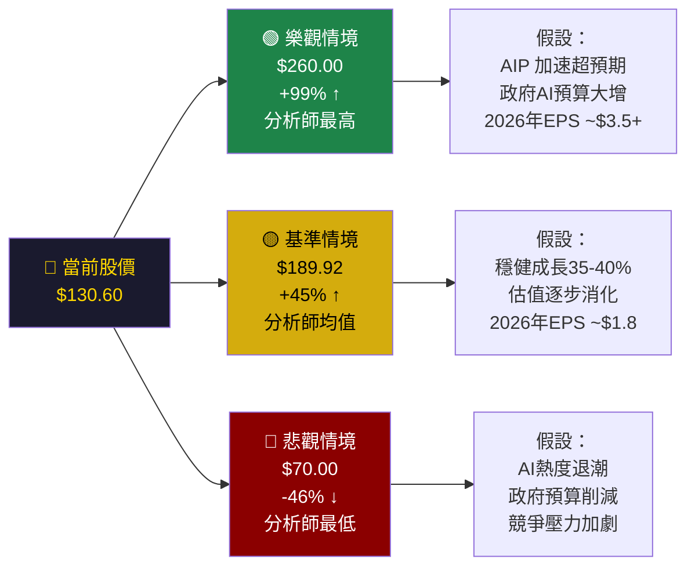

---

### 7.4 估值區間視覺化

```
📊 PLTR 估值區間分析
═══════════════════════════════════════════════════════════

      $70       $100     $130.60  $189.92   $260
       ↓          ↓         ↓        ↓        ↓
       |──────────|─────────●────────|────────|
      熊市        支撐      現價    分析師均   牛市
      目標        區域                值      目標
      
估值指標快速估算（基於2025E EPS $1.83）：
─────────────────────────────────────────────────────────
P/E 30x →  $54.9  ░░░░░░░░░░░░░░░░░░░░░░░  成熟股估值
P/E 50x →  $91.5  ░░░░░░░░░░░░░░░░░░░░░░░░░  高成長溢價
P/E 71x →  $130   ▓▓▓▓▓▓▓▓▓▓▓▓▓▓▓▓▓▓▓▓▓▓▓  ← 當前遠期PE
P/E 100x→  $183   ░░░░░░░░░░░░░░░░░░░░░░░░░  超高成長
P/E 142x→  $260   ░░░░░░░░░░░░░░░░░░░░░░░░░  分析師最高目標

💡 市場給予 PLTR 超過 70x 遠期 PE，
   反映市場對未來3-5年EPS爆炸性成長的定價
═══════════════════════════════════════════════════════════
```

---

## 8. 競爭護城河

### 8.1 波特五力分析

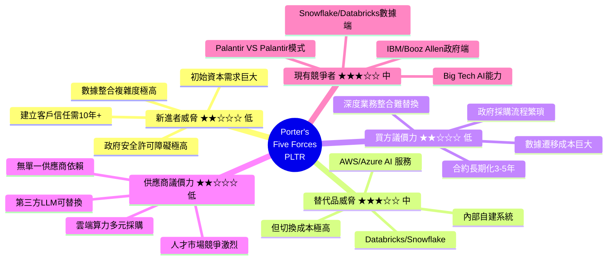

---

### 8.2 護城河評分視覺化

```
🏰 PLTR 護城河評分卡
═══════════════════════════════════════════════════════════

技術壁壘（數據本體論+AI）
  ▓▓▓▓▓▓▓▓▓▓▓▓▓▓▓▓▓▓▓░  9.5/10  ★★★★★

政府合約黏性
  ▓▓▓▓▓▓▓▓▓▓▓▓▓▓▓▓▓▓▓░  9.0/10  ★★★★★

安全許可壁壘
  ▓▓▓▓▓▓▓▓▓▓▓▓▓▓▓▓▓▓▓▓  10/10  ★★★★★

商業客戶黏性
  ▓▓▓▓▓▓▓▓▓▓▓▓▓▓▓░░░░░  7.5/10  ★★★★☆

品牌聲譽
  ▓▓▓▓▓▓▓▓▓▓▓▓▓▓▓▓░░░░  8.0/10  ★★★★☆

數據飛輪效應
  ▓▓▓▓▓▓▓▓▓▓▓▓▓▓▓▓▓░░░  8.5/10  ★★★★★

人才護城河
  ▓▓▓▓▓▓▓▓▓▓▓▓▓▓░░░░░░  7.0/10  ★★★★☆

AIP 生態系統
  ▓▓▓▓▓▓▓▓▓▓▓▓▓▓▓▓░░░░  8.0/10  ★★★★☆

───────────────────────────────────────────────────────────
綜合護城河評分：  ▓▓▓▓▓▓▓▓▓▓▓▓▓▓▓▓▓▓░░  8.6/10  ★★★★★
═══════════════════════════════════════════════════════════
```

---

### 8.3 競爭定位矩陣

| 維度 | PLTR | Palantir政府 | Snowflake | Databricks | IBM Watson | AWS AI |
|------|------|------------|-----------|------------|-----------|--------|
| **政府安全許可** | 🟢 最高 | 🟢 最高 | 🔴 無 | 🔴 無 | 🟡 部分 | 🟡 部分 |
| **AI 整合深度** | 🟢 極深 | 🟢 極深 | 🟡 數據層 | 🟡 數據層 | 🟡 中 | 🟢 廣泛 |
| **企業可解釋AI** | 🟢 強 | 🟢 強 | 🔴 弱 | 🔴 弱 | 🟡 中 | 🟡 中 |
| **部署靈活性** | 🟢 雲/邊緣/機密 | 🟢 機密環境 | 🟡 雲端 | 🟡 雲端 | 🟡 混合 | 🟡 主要雲 |
| **低代碼操作性** | 🟢 AIP優勢 | 🟡 中 | 🟡 中 | 🟡 中 | 🟡 中 | 🟡 中 |
| **估值** | 🔴 極貴 | - | 🔴 貴 | N/A私 | 🟢 合理 | 🟢 合理 |
| **利潤率** | 🟢 頂級 | - | 🟡 改善中 | N/A | 🟡 中 | 🟢 高 |

---

## 9. 成長催化劑

### 9.1 催化劑時間軸

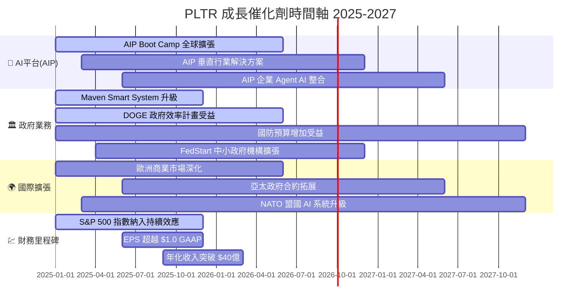

---

### 9.2 短中長期機會

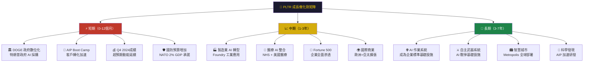

---

### 9.3 TAM（可服務市場）規模

```
📊 PLTR 目標市場規模 TAM 分析
═══════════════════════════════════════════════════════════

全球 AI 軟體市場（2030E）
  ████████████████████████████████  $8,000億+

企業 AI 平台（2028E）
  ██████████████████████  $2,500億

政府/國防 AI（2028E）
  ██████████████  $1,500億

數據分析平台（2027E）
  █████████████  $1,200億

PLTR 可服務市場 SAM（2027E）
  ██████  ~$500億

PLTR 當前市佔率（2024）
  ▓  $28.7億 ÷ SAM ≈ 5.7%
  → 仍有巨大滲透空間！

PLTR 目標市佔率（2030E保守）：12-15%
→ 預期收入 $600-750億
→ CAGR 需達 35-45%
═══════════════════════════════════════════════════════════
💡 若 PLTR 能捕捉 AI 市場的 10%，
   收入規模將比現在大 10-15倍
```

---

## 10. 風險分析

### 10.1 風險矩陣

```mermaid
quadrantChart
    title PLTR 風險矩陣（機率 vs 衝擊）
    x-axis 低衝擊 --> 高衝擊
    y-axis 低機率 --> 高機率
    quadrant-1 高度警戒
    quadrant-2 密切監控
    quadrant-3 低優先級
    quadrant-4 應急準備
    估值泡沫修正: [0.85, 0.75]
    股票薪酬稀釋: [0.55, 0.80]
    競爭加劇(Big Tech): [0.65, 0.65]
    政府預算削減: [0.70, 0.45]
    AI監管風險: [0.75, 0.40]
    執行長/高管離職: [0.80, 0.25]
    數據安全事件: [0.90, 0.20]
    國際業務受阻: [0.50, 0.35]
    宏觀衰退壓縮支出: [0.60, 0.40]
```

---

### 10.2 風險評分卡

| 風險類型 | 具體風險 | 機率 | 衝擊 | 綜合評分 | 狀態 |
|----------|----------|------|------|----------|------|
| 📊 **估值風險** | P/E 207x 泡沫修正，利率上升衝擊高估值股 | 高 | 極高 | ★★★★★ | 🔴 最高警戒 |
| 💸 **稀釋風險** | SBC 每年數十億稀釋，股東實際回報打折 | 高 | 高 | ★★★★☆ | 🔴 高度警戒 |
| 🤖 **競爭風險** | Microsoft/Google/Amazon 加大 AI 平台投入 | 中高 | 高 | ★★★★☆ | 🔴 高度警戒 |
| 🏛️ **政策風險** | 政府採購政策改變，DOGE 預算削減 | 中 | 高 | ★★★☆☆ | 🟡 密切監控 |
| ⚖️ **監管風險** | AI 倫理/隱私法規加強，特別是歐盟 | 中 | 中高 | ★★★☆☆ | 🟡 密切監控 |
| 🌍 **地緣風險** | 國際業務受出口管制，中俄衝突升級 | 低中 | 中 | ★★★☆☆ | 🟡 監控 |
| 🔒 **安全風險** | 重大數據洩露事件損害政府信任 | 低 | 極高 | ★★★☆☆ | 🟡 預防 |
| 👤 **人才風險** | 創辦人 Alex Karp 策略影響力依賴 | 低中 | 高 | ★★☆☆☆ | 🟡 觀察 |
| 📉 **宏觀風險** | 經濟衰退削減企業 IT 預算 | 低中 | 中 | ★★☆☆☆ | 🟢 一般 |
| 🔄 **執行風險** | 商業化速度不如預期，Boot Camp 轉化率下降 | 低 | 高 | ★★☆☆☆ | 🟢 一般 |

---

### 10.3 關鍵風險緩解措施

```
🛡️ 主要風險緩解策略
═══════════════════════════════════════════════════════════

1. 📉 估值泡沫風險
   ├─ 分批建倉，避免單次重倉
   ├─ 設定停損位（低於 $90-100 考慮減碼）
   └─ 關注成長是否持續支撐估值

2. 💸 SBC 稀釋風險
   ├─ 監控稀釋後 EPS vs 非稀釋 EPS 差距
   ├─ 追蹤股票回購計畫是否足以抵銷
   └─ 計算股份數年度增加比例

3. 🤖 Big Tech 競爭風險
   ├─ 跟蹤政府客戶合約續約率
   ├─ 監控 NRR（淨收入留存率）
   └─ 觀察新客戶獲取成本趨勢

4. 🏛️ 政府政策風險
   ├─ 商業業務佔比提升至 50%+（降低依賴）
   ├─ 地理分散：US/UK/NATO 多元化
   └─ 長期合約占比保持高位
═══════════════════════════════════════════════════════════
```

---

## 11. 公平價值估算

### 11.1 DCF 模型架構

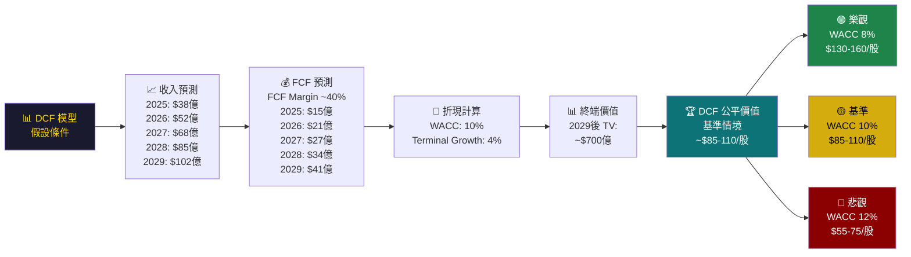

---

### 11.2 三種估值法比較

| 估值方法 | 假設條件 | 估算公平價值 | 當前溢價/折價 |
|----------|----------|------------|-------------|
| **DCF 折現現金流（保守）** | WACC=12%, FCF CAGR 35%, TV Growth 3% | **$65-80/股** | 當前溢價 +63-101% 🔴 |
| **DCF 折現現金流（基準）** | WACC=10%, FCF CAGR 40%, TV Growth 4% | **$90-115/股** | 當前溢價 +14-45% 🟡 |
| **DCF 折現現金流（樂觀）** | WACC=8%, FCF CAGR 45%, TV Growth 5% | **$145-180/股** | 當前折價 -11-38% 🟢 |
| **遠期 P/S 法（2年）** | 2026E收入 $52億, P/S 35x | **$79/股** | 當前溢價 +65% 🔴 |
| **遠期 P/E 法（2年）** | 2026E EPS $1.83, P/E 71x | **$130/股** | 基本合理 🟡 |
| **分析師目標均值** | 24位分析師共識 | **$189.92/股** | 上漲空間 +45% 🟢 |

---

### 11.3 估值區間視覺化

```
📊 PLTR 公平價值區間完整視覺化
═══════════════════════════════════════════════════════════

$50   $70   $90  $110  $130.60 $160  $190  $210  $260
  |     |     |     |     |      |     |     |     |
  |─────|─────|─────|─────●─────|─────|─────|─────|
  
  [🔴DCF保守]  [🟡DCF基準]  [現價]  [🟢目標]   [牛市]
   $65-80       $90-115    $130.60  $189.92    $260

進度條展示：
─────────────────────────────────────────────────────────
DCF 保守  $72    ░░░░░░░░░░░░░░█████░░░░░░░░░░░░░░░
DCF 基準  $102   ░░░░░░░░░░░░░░░░░███████░░░░░░░░░░
現股價    $130.60 ░░░░░░░░░░░░░░░░░░░░░░░░█░░░░░░░░
分析師均  $189.92 ░░░░░░░░░░░░░░░░░░░░░░░░░░░░░░░██
分析師高  $260   ░░░░░░░░░░░░░░░░░░░░░░░░░░░░░░░░░░████

💡 結論：當前股價 $130.60 對應約 DCF 樂觀情境
   需要最積極的成長假設才能合理化當前估值
═══════════════════════════════════════════════════════════
```

---

## 12. 投資建議

### 12.1 最終綜合評級

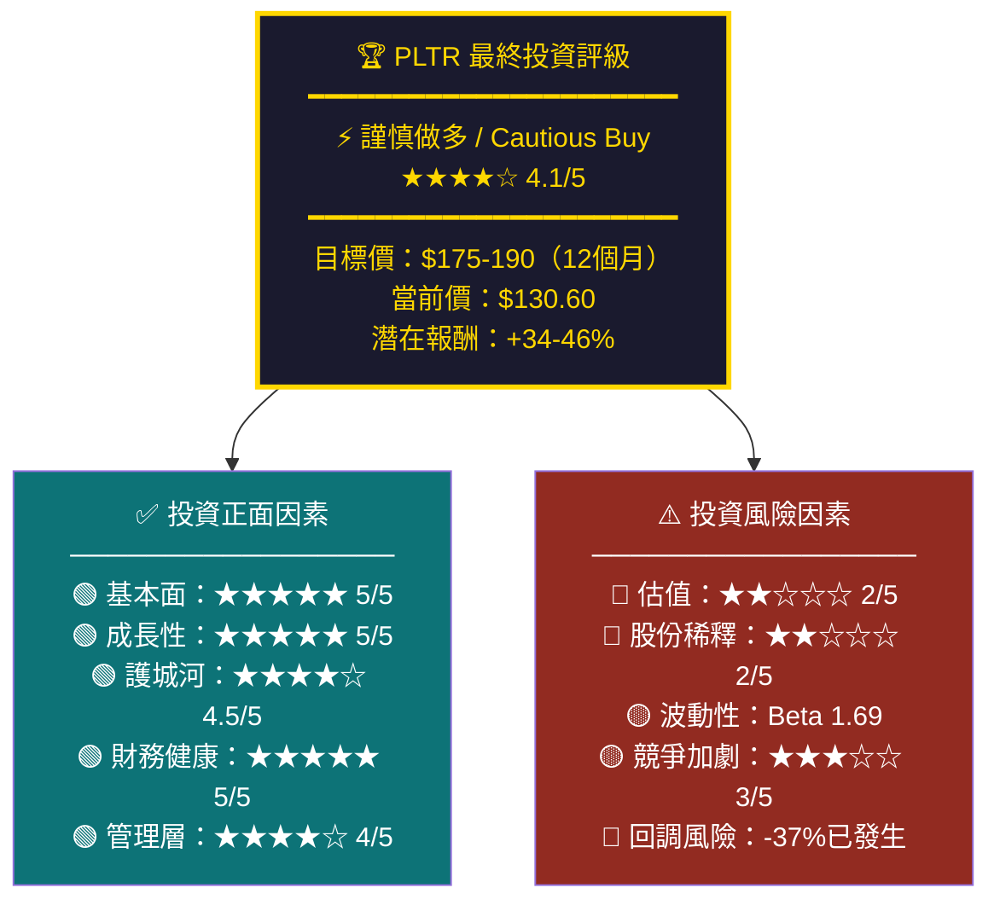

---

### 12.2 投資人適配度分析

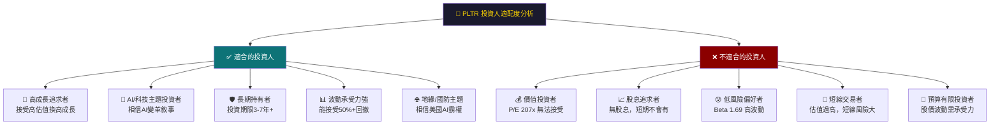

---

### 12.3 關鍵監控指標 Checklist

```
📋 PLTR 投資監控指標清單
═══════════════════════════════════════════════════════════

📊 每季財報必看指標（季度追蹤）
─────────────────────────────────────────────────────────
☐ 美國商業收入成長率  目標：持續 >50% YoY
☐ 商業客戶數增長      目標：持續 >40% YoY
☐ 政府收入成長        目標：>20% YoY
☐ GAAP 營業利益率     目標：持續提升至 20%+
☐ Rule of 40 分數     目標：>80（成長+利潤率之和）
☐ 淨收入留存率(NRR)   目標：>115%
☐ 剩餘履約義務(RPO)   目標：持續加速
☐ SBC/收入比          目標：<15%（稀釋控制）
☐ 自由現金流 Margin   目標：穩定在 35%+
☐ 每季新客戶數        目標：AIP 客戶數加速

📈 年度戰略里程碑
─────────────────────────────────────────────────────────
☐ 2025年 收入是否達到 $37-40億
☐ 2025年 GAAP EPS 是否突破 $1.0
☐ AIP 商業客戶是否超越政府客戶佔比
☐ 國際商業業務是否加速（目前相對較弱）
☐ 大型 M&A 是否發生（現金充裕 $71.8億）
☐ S&P 500 指數效應是否持續吸引被動資金

⚠️ 警示信號（出現則重新評估）
─────────────────────────────────────────────────────────
☐ 收入成長跌破 30% YoY
☐ 美國政府客戶大量流失
☐ 毛利率跌破 75%
☐ 主要政府合約不續約
☐ SBC/收入比超過 25%
☐ 競爭者取得同等安全許可
☐ 創辦人 Alex Karp 離職

💰 技術面監控
─────────────────────────────────────────────────────────
☐ 股價跌破 $100（心理支撐位）→ 考慮加碼
☐ 股價跌破 $85  （強力支撐位）→ 積極建倉
☐ 股價超過 $190 （分析師均目標）→ 考慮減碼
☐ 股價超過 $207 （52週高點）→ 評估追價合理性
═══════════════════════════════════════════════════════════
```

---

### 12.4 建議倉位策略

| 投資類型 | 建議倉位 | 進場策略 | 停損 | 目標 |
|----------|----------|----------|------|------|
| **核心長期倉位** | 5-8% 投資組合 | 現價分批買入 | $85（-35%） | $200+（+53%） |
| **加碼機會** | 再增2-3% | 跌至 $100-110 時加碼 | $80（-25%） | $220+（+70%） |
| **保守型** | 2-3% | 等待 $100 以下 | $75 | $180（+80%） |
| **投機短線** | 不建議 | N/A | N/A | N/A |

---

## 📊 報告總結 - 一頁精