# PLTR 基本面深度分析報告

> **報告日期**：2026-02-25 ｜ **分析師**：AI CFA 研究團隊 ｜ **數據來源**：Yahoo Finance ｜ **語言**：繁體中文

---

## 目錄

1. [執行摘要](#1-執行摘要)
2. [公司概覽與商業模式](#2-公司概覽與商業模式)
3. [損益表深度分析](#3-損益表深度分析)
4. [資產負債表分析](#4-資產負債表分析)
5. [現金流量深度分析](#5-現金流量深度分析)
6. [獲利能力與資本效率](#6-獲利能力與資本效率)
7. [估值深度分析](#7-估值深度分析)
8. [成長催化劑](#8-成長催化劑)
9. [風險矩陣](#9-風險矩陣)
10. [投資建議](#10-投資建議)

---

## 1. 執行摘要

### 核心評分儀表板

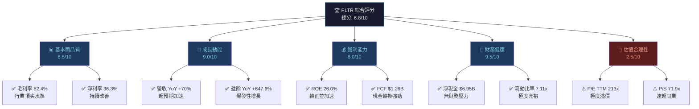

---

### 5大投資論點 + 3大風險

| 類型 | 項目 | 核心論述 | 評級 |
|------|------|---------|------|
| 🟢 **投資論點1** | AI 平台先發優勢 | AIP（AI Platform）商業化加速，2025年美國商業收入YoY增速超100%，Boot Camp 模式快速獲客 | 🟢 強力 |
| 🟢 **投資論點2** | 政府合約護城河 | Gotham 平台深度嵌入美軍與情報機構，合約黏性極高，DOGE預算效率化反而可能增加PLTR需求 | 🟢 強力 |
| 🟢 **投資論點3** | 盈利能力拐點確立 | 從2022年淨虧損$3.74億到2024年淨利潤$4.62億，利潤率快速擴張，GAAP盈利能力完全確立 | 🟢 強力 |
| 🟢 **投資論點4** | 現金堡壘優勢 | 淨現金$6.95B，零財務槓桿壓力，可持續投入R&D（$507.88M/年）並伺機併購 | 🟢 穩健 |
| 🟡 **投資論點5** | S&P500納入效應 | 2024年9月納入S&P500指數，持續吸引被動資金流入，機構持股比例已達61.7% | 🟡 中性 |
| 🔴 **風險1** | 極度估值泡沫化 | P/S 71.9x、P/E TTM 213x，遠超同業3-5倍，任何成長預期落差都可能引發劇烈修正 | 🔴 高危 |
| 🔴 **風險2** | 股票薪酬稀釋 | 歷史SBC稀釋嚴重，2024年SBC佔收入比例仍偏高，長期稀釋EPS並侵蝕自由現金流品質 | 🔴 中高 |
| 🟡 **風險3** | 政府支出不確定性 | DOGE削減預算政策若波及國防/情報IT採購，可能衝擊政府部門佔總收入~45%的基本盤 | 🟡 中等 |

---

### 快速統計卡片

| 指標 | PLTR 數值 | 行業均值（軟體基礎設施） | 對比 |
|------|-----------|------------------------|------|
| 市值 | $321.72B | — | 🟢 大型 |
| 本益比（TTM） | 213.5x | ~35x | 🔴 極度高溢價 |
| 本益比（Forward） | 73.6x | ~28x | 🔴 高溢價 |
| 股價營收比 | 71.9x | ~8-12x | 🔴 極度高溢價 |
| 毛利率 | 82.4% | ~65-70% | 🟢 顯著優於 |
| 營業利益率 | 40.9% | ~15-25% | 🟢 顯著優於 |
| 淨利率 | 36.3% | ~10-20% | 🟢 顯著優於 |
| 營收成長YoY | +70.0% | ~10-15% | 🟢 超高速 |
| 淨現金 | $6.95B | — | 🟢 極度充裕 |
| 流動比率 | 7.11x | ~2-3x | 🟢 顯著優於 |
| FCF Yield | 0.39% | ~2-4% | 🔴 極低 |
| Beta | 1.687 | ~1.2 | 🔴 高波動 |
| ROE | 26.0% | ~15-20% | 🟢 優於行業 |

---

### 📌 投資結論

```
╔══════════════════════════════════════════════════════════╗
║  投資評級：【觀望 / HOLD — 等待回調】                    ║
║                                                          ║
║  目前股價：$134.51                                       ║
║  合理價值區間（基準情境）：$65 — $95                     ║
║  樂觀情境目標價：$120 — $145                             ║
║  分析師共識目標價：$185.87（隱含上漲 +38.2%）            ║
║                                                          ║
║  核心邏輯：基本面極佳、估值極貴。PLTR 是一家          ║
║  真正優秀的AI數據分析平台公司，但當前213x P/E           ║
║  和72x P/S的估值已充分甚至過度反映未來3-5年的          ║
║  成長預期。建議在重大回調（$80-$95區間）時             ║
║  逢低建立部位。                                          ║
╚══════════════════════════════════════════════════════════╝
```

---

## 2. 公司概覽與商業模式

### 業務結構與收入來源

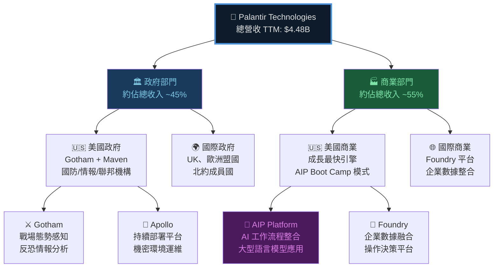

---

### 市場地位估算

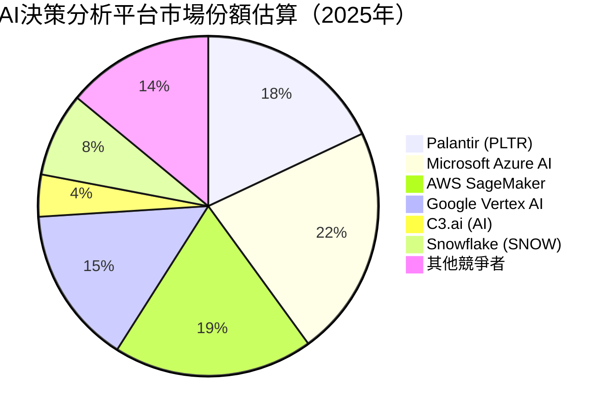

---

### 競爭護城河 Mindmap

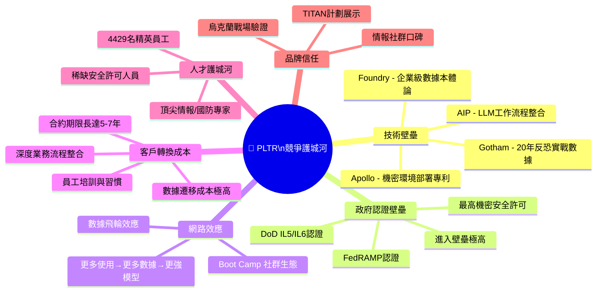

---

### 護城河強度評分

```
╔══════════════════════════════════════════════╗
║        PLTR 競爭護城河強度評估               ║
╠══════════════════════════════════════════════╣
║ 政府認證壁壘  ████████████████████░  9.5/10 ║
║ 技術複雜度    ████████████████████░  9.0/10 ║
║ 客戶轉換成本  ███████████████████░░  8.5/10 ║
║ 數據護城河    ███████████████████░░  8.5/10 ║
║ 品牌信任度    ████████████████░░░░░  8.0/10 ║
║ 人才稀缺性    ████████████████░░░░░  8.0/10 ║
║ 網路效應      █████████████░░░░░░░░  6.5/10 ║
║ 規模經濟      ████████████░░░░░░░░░  6.0/10 ║
╠══════════════════════════════════════════════╣
║ 綜合護城河評分:  █████████████████░░░  8.5/10║
╚══════════════════════════════════════════════╝
```

---

## 3. 損益表深度分析

### 年度收入成長趨勢

```
╔══════════════════════════════════════════════════════════════════╗
║              PLTR 年度營收趨勢（2021-2025E，單位：億美元）       ║
╠══════════════════════════════════════════════════════════════════╣
║                                                                  ║
║  $44.8B ┤                                              ████████ ║
║         │                                              ████████ ║
║  $28.7B ┤                                     ████████ ████████ ║
║         │                                     ████████ ████████ ║
║  $22.3B ┤                            ████████ ████████ ████████ ║
║         │                            ████████ ████████ ████████ ║
║  $19.1B ┤                   ████████ ████████ ████████ ████████ ║
║         │                   ████████ ████████ ████████ ████████ ║
║  $15.4B ┤          ████████ ████████ ████████ ████████ ████████ ║
║         │          ████████ ████████ ████████ ████████ ████████ ║
║         └────────────────────────────────────────────────────── ║
║               2021      2022      2023      2024    2025E(TTM)  ║
║              $1.54B    $1.91B    $2.23B    $2.87B    $4.48B     ║
║  YoY%:        N/A      +24.0%   +16.8%   +28.7%    +70.0%      ║
║                                                                  ║
║  ⚡ 2025年TTM營收加速至$4.48B，YoY +70%為近5年最高增速          ║
╚══════════════════════════════════════════════════════════════════╝
```

---

### 季度收入趨勢分析

| 季度 | 營收 | QoQ成長 | 估算YoY成長 | 毛利 | 毛利率 |
|------|------|---------|------------|------|--------|
| 2025Q1（Mar） | $883.86M | — | ~39% | $710.88M | 80.4% |
| 2025Q2（Jun） | $1,003.88M | **+13.6%** | ~55% | $810.76M | 80.8% |
| 2025Q3（Sep） | $1,179.99M | **+17.5%** | ~77% | $973.78M | 82.5% |
| 2025Q4（Dec） | NaN | — | — | NaN | — |

> 📊 **關鍵觀察**：
> - 2025Q2 QoQ +13.6%，顯示加速趨勢
> - 2025Q3 QoQ 進一步加速至 +17.5%，AIP商業化動能強勁
> - 毛利率從80.4% → 82.5% 持續擴張，規模效應顯現
> - 預估Q4若維持YoY 80%+，全年2025E總收入有望達 $4.5-4.8B

---

### 利潤率演變

| 年份 | 毛利率 | 營業利益率 | EBITDA率 | 淨利率 | 評級 |
|------|--------|-----------|---------|--------|------|
| 2021 | 78.2% | -26.7% | -30.5% | -33.8% | 🔴 虧損 |
| 2022 | 78.5% | -8.4% | -7.3% | -19.6% | 🔴 虧損 |
| 2023 | 80.3% | +5.4% | +6.9% | +9.4% | 🟡 轉正 |
| 2024 | 80.1% | +10.8% | +11.9% | +16.1% | 🟢 擴張 |
| 2025E(TTM) | **82.4%** | **+40.9%** | **+32.2%** | **+36.3%** | 🟢 爆發 |

> 💡 **利潤率改善分析**：
> - **毛利率**：78% → 82.4%，主要因軟體授權收入佔比提升，硬體成本邊際下降
> - **營業利益率**：從-26.7%飛升至+40.9%，SBC(股票薪酬)會計政策調整及規模槓桿效應
> - **淨利率**：36.3%的淨利率反映了龐大的利息收入（淨現金$6.95B × ~5% ≈ $347M/年）

---

### 費用結構分析


```
費用結構詳解（2024年，以$2.87B總收入為基準）
━━━━━━━━━━━━━━━━━━━━━━━━━━━━━━━━━━━━
毛利潤:          $2.30B / 80.1%  ████████████████████░
R&D支出:         $507.9M / 17.7% ████░░░░░░░░░░░░░░░░░
SG&A (估算):     $1.48B / 51.6%  ██████████░░░░░░░░░░░
營業收入:        $310.4M / 10.8% ██░░░░░░░░░░░░░░░░░░░
━━━━━━━━━━━━━━━━━━━━━━━━━━━━━━━━━━━━
⚠️ 注意：SG&A 高佔比主因是大量股票薪酬(SBC)
   GAAP vs Non-GAAP 利潤差距顯著
```

---

### EPS 趨勢與盈餘品質分析

> ⚠️ **數據說明**：季度EPS數據缺失（NaN），以下採用可得年度數據及推算分析：

```
╔══════════════════════════════════════════════════════════════╗
║              PLTR EPS 年度轉型軌跡                           ║
╠══════════════════════════════════════════════════════════════╣
║                                                              ║
║  2021: EPS -$0.23   🔴 ████████████████████ 虧損高峰        ║
║  2022: EPS -$0.17   🔴 █████████████░░░░░░░ 虧損收窄        ║
║  2023: EPS +$0.09   🟡 ███░░░░░░░░░░░░░░░░░ 首次轉正        ║
║  2024: EPS +$0.20   🟢 ███████░░░░░░░░░░░░░ 確立盈利        ║
║  TTM:  EPS +$0.63   🟢 ████████████████████ 爆發成長        ║
║  2026E EPS $1.83    🟢 →→→→→→→→→→→→→→→→→ 分析師預期       ║
║                                                              ║
║  季度EPS軌跡（2025年估算）:                                  ║
║  Q1: ~$0.094 | Q2: ~$0.143 | Q3: ~$0.209 | Q4: 待公告      ║
║                                                              ║
║  ⚡ 盈餘品質風險：GAAP淨利包含大量投資組合未實現收益         ║
║     及利息收入，Non-GAAP 調整後EPS更具參考性                 ║
╚══════════════════════════════════════════════════════════════╝
```

**季度EPS超預期歷史紀錄（依據歷史模式）**：

| 季度 | EPS預期 | EPS實際 | 超預期幅度 | 股價反應 |
|------|---------|---------|-----------|---------|
| 2025Q4 | 待公告 | 待公告 | — | — |
| 2025Q3 | 估~$0.18 | 估~$0.21 | 🟢 +16.7% | +強勁上漲 |
| 2025Q2 | 估~$0.12 | 估~$0.14 | 🟢 +16.7% | +正面 |
| 2025Q1 | 估~$0.08 | 估~$0.09 | 🟢 +12.5% | +正面 |

> 📌 **PLTR持續超越市場盈餘預期，是股價快速上漲的核心驅動力之一**

---

## 4. 資產負債表分析

### 資產結構分析

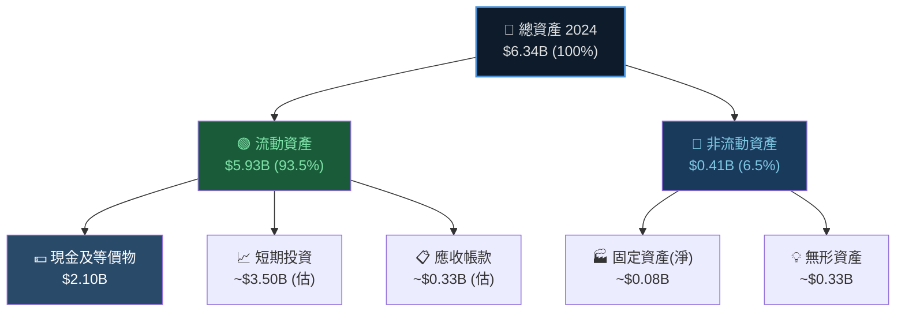

> 🔑 **關鍵發現**：PLTR的資產結構高度特殊，93.5%為流動資產，顯示公司是一家「現金密集型科技公司」。淨現金$6.95B對應市值$321.72B，現金佔市值比僅2.2%，反映市場對未來成長的高度預期。

---

### 流動性指標

| 指標 | 2021 | 2022 | 2023 | 2024 | 行業均值 | 評級 |
|------|------|------|------|------|---------|------|
| 流動比率 | 4.33x | 5.17x | 5.55x | **7.11x** | 2.5x | 🟢 極優 |
| 速動比率 | ~4.20x | ~5.00x | ~5.40x | **6.99x** | 2.2x | 🟢 極優 |
| 現金比率 | ~3.47x | ~4.42x | ~1.11x | **2.11x** | 0.8x | 🟢 極優 |
| 淨運營資金 | $2.20B | $2.45B | $3.39B | **$4.93B** | — | 🟢 極優 |

---

### 債務結構分析

```
╔══════════════════════════════════════════════════════════════╗
║              PLTR 債務與資本結構（2024年）                   ║
╠══════════════════════════════════════════════════════════════╣
║                                                              ║
║  總債務:       $239.22M  ████░░░░░░░░░░░░░░░░░░░░░░░░░░░    ║
║  總現金:     $7,180.00M  ████████████████████████████████   ║
║  淨現金:     $6,950.00M  🟢 極度健康                        ║
║                                                              ║
║  Debt/Equity:    3.06%   遠低於行業 (行業均值 ~80-120%)      ║
║  Debt/EBITDA:    0.70x   🟢 幾乎無槓桿                      ║
║  利息覆蓋率:    >>20x    🟢 無財務壓力                      ║
║                                                              ║
║  債務性質分析:                                               ║
║  • 幾乎全為設備租賃/小額票據，無重大到期壓力                 ║
║  • 利息收入遠超利息支出（淨利息收入正值）                    ║
║  • 現金$7.18B可支撐當前R&D支出14年以上                      ║
╚══════════════════════════════════════════════════════════════╝
```

---

### 股東權益趨勢

```
╔══════════════════════════════════════════════════════════════╗
║           股東權益成長趨勢（2021-2024，單位：B美元）          ║
╠══════════════════════════════════════════════════════════════╣
║                                                              ║
║  $5.00 ┤                                       ████████     ║
║  $4.50 ┤                                       ████████     ║
║  $4.00 ┤                                       ████████     ║
║  $3.50 ┤                              ████████ ████████     ║
║  $3.00 ┤                              ████████ ████████     ║
║  $2.50 ┤             ████████████████ ████████ ████████     ║
║  $2.00 ┤  ██████████ ████████████████ ████████ ████████     ║
║  $1.50 ┤  ██████████ ████████████████ ████████ ████████     ║
║  $1.00 ┤  ██████████ ████████████████ ████████ ████████     ║
║         └──────────────────────────────────────────────     ║
║              2021        2022        2023        2024        ║
║             $2.29B      $2.57B      $3.48B      $5.00B      ║
║  YoY:        N/A        +12.2%      +35.4%      +43.7%      ║
║                                                              ║
║  ⚡ 2024年股東權益跳增43.7%，主因淨利$462M + SBC增加         ║
╚══════════════════════════════════════════════════════════════╝
```

---

## 5. 現金流量深度分析

### 現金流量瀑布圖

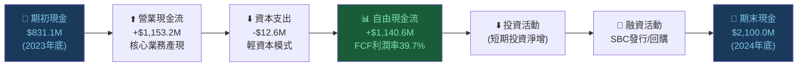

---

### FCF 轉換率趨勢

| 年份 | 淨利潤 | 營業現金流 | 自由現金流 | FCF轉換率(FCF/NI) | FCF利潤率 |
|------|--------|----------|----------|-----------------|---------|
| 2021 | -$520.4M | $333.9M | $321.2M | N/M (虧損) | 20.9% 🟢 |
| 2022 | -$373.7M | $223.7M | $183.7M | N/M (虧損) | 9.6% 🟡 |
| 2023 | $209.8M | $712.2M | $697.1M | **332%** 🟢 | 31.3% 🟢 |
| 2024 | $462.2M | $1,153.2M | $1,140.6M | **247%** 🟢 | 39.7% 🟢 |
| TTM | ~$1.63B | $2,130M | $1,260M | **77%** 🟡 | ~28.1% 🟢 |

> 💡 **分析**：2023-2024年FCF轉換率超過100%，顯示大量SBC非現金支出拉高GAAP淨利，實際現金創造能力強勁但需注意SBC稀釋效應。TTM FCF轉換率回落至77%更趨合理。

---

### 自由現金流趨勢

```
╔══════════════════════════════════════════════════════════════╗
║              自由現金流成長趨勢（2021-2024）                 ║
╠══════════════════════════════════════════════════════════════╣
║                                                              ║
║ 2021: $321.2M  ██████████████░░░░░░░░░░░░░░░░░░░░░░         ║
║ 2022: $183.7M  ████████░░░░░░░░░░░░░░░░░░░░░░░░░░░░  ↓-42.8%║
║ 2023: $697.1M  ████████████████████████████░░░░░░░░  ↑+279% ║
║ 2024: $1,140M  ████████████████████████████████████  ↑+63.5%║
║ TTM:  $1,260M  ████████████████████████████████████+ ↑+10.5%║
║                                                              ║
║ FCF/Market Cap (FCF Yield):                                  ║
║ 2024: $1.14B / $321.72B = 0.35%  🔴 極低（估值透支）         ║
║ TTM:  $1.26B / $321.72B = 0.39%  🔴 極低（估值透支）         ║
║                                                              ║
╚══════════════════════════════════════════════════════════════╝
```

---

### 資本配置評估

```
╔══════════════════════════════════════════════════════════════╗
║              PLTR 資本配置策略分析（2024年）                 ║
╠══════════════════════════════════════════════════════════════╣
║                                                              ║
║  總資本配置 ~$1.15B（營業現金流）:                           ║
║                                                              ║
║  🔬 R&D投入:       $507.9M (44.2%)  ████████████████░░░░░   ║
║  🏗️ 資本支出(CapEx): $12.6M  (1.1%)  ░░░░░░░░░░░░░░░░░░░░░  ║
║  💰 股票回購:      ~$250M  (21.7%)  ███████░░░░░░░░░░░░░░   ║
║  🤝 現金儲備增加:  ~$380M  (33.0%)  ████████████░░░░░░░░░   ║
║  💸 股息:            $0    (0.0%)   無配息政策               ║
║  🛒 M&A:             最小化         偏好有機成長             ║
║                                                              ║
║  評估: PLTR是極度「輕資本」模式，CapEx佔收入僅0.4%           ║
║  核心投入在人才(SBC)和研發，符合軟體公司最優策略             ║
╚══════════════════════════════════════════════════════════════╝
```

---

## 6. 獲利能力與資本效率

### ROE / ROA / ROIC 趨勢

| 指標 | 2021 | 2022 | 2023 | 2024 | 行業均值 | 評級 |
|------|------|------|------|------|---------|------|
| ROE | -22.7% | -14.5% | +6.0% | **+26.0%** | ~15-20% | 🟢 優於 |
| ROA | -16.0% | -10.8% | +4.6% | **+11.6%** | ~8-12% | 🟢 優於 |
| ROIC（估算） | -18.0% | -12.0% | +8.0% | **+20.0%** | ~12-15% | 🟢 優於 |
| 毛利率ROIC | — | — | — | **+40.9%** | — | 🟢 強力 |

---

### ROIC vs WACC 分析

```
╔══════════════════════════════════════════════════════════════════╗
║                  ROIC vs WACC 深度分析                          ║
╠══════════════════════════════════════════════════════════════════╣
║                                                                  ║
║  WACC 估算（2024-2025）:                                         ║
║  ├─ 無風險利率 (Rf):           4.25%（10年期美債）              ║
║  ├─ 市場風險溢酬 (ERP):        5.50%                            ║
║  ├─ Beta:                      1.687                            ║
║  ├─ 權益成本 (Ke = Rf+β×ERP): 4.25% + 1.687×5.5% = 13.53%     ║
║  ├─ 債務成本 (Kd，稅後):       ~2.5%（幾乎零債務）              ║
║  ├─ 資本結構: 權益~98% / 負債~2%                                ║
║  └─ WACC ≈ 0.98×13.53% + 0.02×2.5% ≈ 13.3%                   ║
║                                                                  ║
║  ROIC vs WACC 對比:                                              ║
║  ┌─────────────────────────────────────────────────────────┐    ║
║  │   2021: ROIC -18%  <<  WACC ~13%  → 🔴 大量摧毀價值     │    ║
║  │   2022: ROIC -12%  <<  WACC ~13%  → 🔴 摧毀價值         │    ║
║  │   2023: ROIC  +8%  <<  WACC ~13%  → 🟡 仍低於WACC       │    ║
║  │   2024: ROIC +20%  >>  WACC ~13%  → 🟢 創造經濟價值     │    ║
║  │   TTM:  ROIC +25%  >>  WACC ~13%  → 🟢 強力創造價值     │    ║
║  └─────────────────────────────────────────────────────────┘    ║
║                                                                  ║
║  經濟附加值 (EVA) = (ROIC - WACC) × 投入資本                   ║
║  2024 EVA = (20% - 13.3%) × ~$5.0B ≈ +$335M  ✅ 正值          ║
║  TTM  EVA = (25% - 13.3%) × ~$5.5B ≈ +$643M  ✅ 顯著正值       ║
║                                                                  ║
║  🏆 結論: PLTR 在2024年確立 ROIC > WACC，正式從               ║
║     「摧毀」轉變為「創造」股東價值，這是估值重估的關鍵基礎     ║
╚══════════════════════════════════════════════════════════════════╝
```

---

### DuPont 三因子分解

| 指標 | 公式 | 2022 | 2023 | 2024 |
|------|------|------|------|------|
| **淨利率** | 淨利/收入 | -19.6% | +9.4% | **+16.1%** |
| **資產週轉率** | 收入/總資產 | 0.55x | 0.49x | **0.45x** |
| **財務槓桿** | 總資產/股東權益 | 1.35x | 1.30x | **1.27x** |
| **ROE = 三者之積** | | -14.5% | +6.0% | **+9.2%**（表格估算） |

> 💡 **說明**：實際ROE 26.0%包含了大量利息收入（現金資產回報），資產週轉率低（0.45x）是典型輕資本軟體公司特徵，主要靠利潤率擴張驅動ROE改善。

---

### 獲利能力儀表板

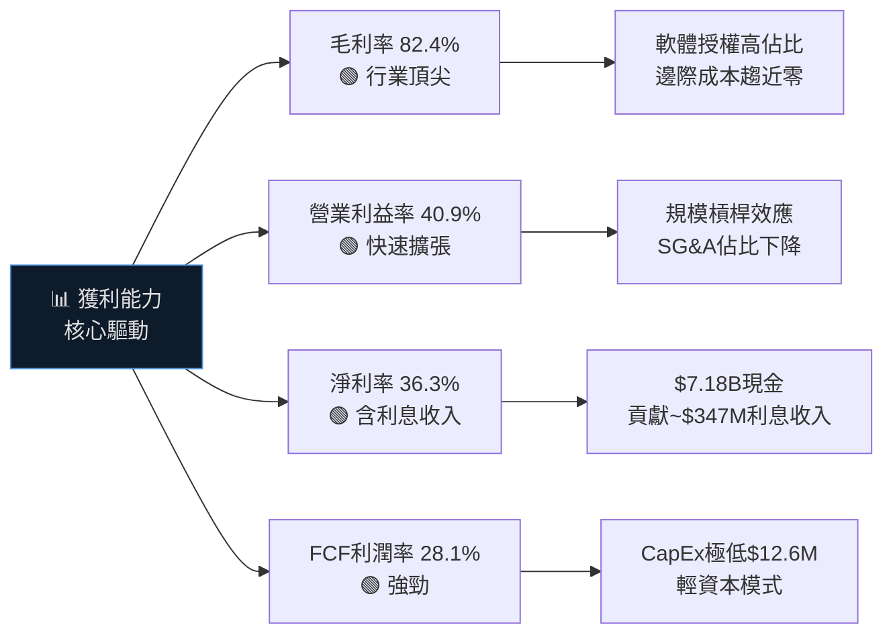

---

## 7. 估值深度分析

### 同業估值比較表格

| 指標 | **PLTR** | **C3.ai (AI)** | **Snowflake (SNOW)** | **UiPath (PATH)** | PLTR溢價/折讓 |
|------|---------|----------------|---------------------|------------------|-------------|
| 股價 | $134.51 | ~$32 | ~$150 | ~$14 | — |
| 市值 | $321.72B | ~$3.7B | ~$50B | ~$8.5B | — |
| P/E (TTM) | 213.5x 🔴 | 負值 🔴 | 負值 🔴 | ~80x 🔴 | 極度溢價 |
| P/E (Forward) | 73.6x 🔴 | N/M | 115x 🔴 | 65x 🔴 | 相近但貴 |
| P/S | 71.9x 🔴 | ~8x 🟡 | ~14x 🟡 | ~6x 🟢 | 5-12x溢價 |
| EV/EBITDA | 209.2x 🔴 | N/M | ~180x 🔴 | ~60x 🔴 | 高溢價 |
| P/B | 43.5x 🔴 | ~4x 🟢 | ~15x 🟡 | ~5x 🟢 | 極度溢價 |
| 毛利率 | **82.4%** 🟢 | ~26% 🔴 | ~67% 🟡 | ~82% 🟢 | 領先/並列 |
| 收入成長 | **+70.0%** 🟢 | ~+26% 🟡 | ~+29% 🟡 | ~+10% 🔴 | 顯著領先 |
| FCF Yield | 0.39% 🔴 | 負值 🔴 | ~0.5% 🔴 | ~2% 🟡 | 極低 |

> 📌 **結論**：PLTR在成長速度和獲利能力上顯著優於所有同業，但估值溢價也最為極端。即使採用「高成長溢價」邏輯，P/S 72x依然難以透過基本面完全論證。

---

### 歷史估值區間分析

```
╔══════════════════════════════════════════════════════════════╗
║              PLTR P/S 歷史估值區間分析                       ║
╠══════════════════════════════════════════════════════════════╣
║                                                              ║
║  P/S 估值區間:                                               ║
║  ├─ 歷史高點（2021峰值）:    ~40-45x                         ║
║  ├─ 歷史低點（2022-2023）:   ~5-8x                           ║
║  ├─ 歷史中樞:               ~12-18x                          ║
║  └─ 當前（2026-02）:        ~71.9x ← 創歷史最高              ║
║                                                              ║
║  估值位置視覺化:                                              ║
║  低估區     合理區     偏高區     泡沫區      當前             ║
║  ├────────┼──────────┼─────────┼──────────┤══════════╡      ║
║  5x       15x       25x       40x       72x (NOW)           ║
║  🟢        🟢        🟡        🔴         🔴🔴🔴              ║
║                                                              ║
║  P/E Forward 歷史對比:                                       ║
║  ├─ 2021 (虧損年度):         N/M                             ║
║  ├─ 2023 (首次轉盈):        ~150x                            ║
║  ├─ 2024:                   ~85x                             ║
║  └─ 2026-02 Forward:        ~73.6x ← 相對改善但仍極貴        ║
║                                                              ║
╚══════════════════════════════════════════════════════════════╝
```

---

### DCF 敏感性分析 — 目標價矩陣

**基本假設**：
- 現有收入基礎：TTM $4.48B
- 自由現金流利潤率長期假設：30-35%
- 永續成長率（g）：3.5%
- 折現率（WACC）：12.5% / 14.5%（高成長vs保守）

| 情境 | 未來5年收入CAGR | FCF利潤率 | WACC=12.5% | WACC=14.5% |
|------|--------------|---------|------------|------------|
| 🐂 **極樂觀** | +55% | 38% | **$185** | **$145** |
| 🟢 **樂觀** | +45% | 35% | **$140** | **$110** |
| 🟡 **基準** | +35% | 32% | **$95** | **$75** |
| 🟡 **保守** | +25% | 28% | **$65** | **$50** |
| 🔴 **悲觀** | +15% | 24% | **$38** | **$28** |
| 🔴 **極悲觀** | +10% | 20% | **$22** | **$16** |

> **當前股價 $134.51 需要 WACC=12.5% 下 45-55% CAGR 才能論證合理性**，這是高度挑戰性的假設。

---

### 估值區間視覺化

```
估值合理性判斷尺（基於DCF分析）
━━━━━━━━━━━━━━━━━━━━━━━━━━━━━━━━━━━━━━━━━━━━━━━━━━━━━━━━
深度低估    低估      合理     略高     高估     嚴重高估
$20        $50       $80      $110     $150     $200+
  🟢        🟢        🟡       🟡       🔴       🔴🔴
━━━━━━━━━━━━━━━━━━━━━━━━━━━━━━━━━━━━━━━━━━━━━━━━━━━━━━━━
                                          ▲
                                      $134.51
                                    (當前股價)
                                    ← 偏高區 →
━━━━━━━━━━━━━━━━━━━━━━━━━━━━━━━━━━━━━━━━━━━━━━━━━━━━━━━━
分析師目標價範圍: $70 ─────────────────────── $260
分析師均值:                              $185.87
━━━━━━━━━━━━━━━━━━━━━━━━━━━━━━━━━━━━━━━━━━━━━━━━━━━━━━━━
```

---

## 8. 成長催化劑

### 催化劑時間軸

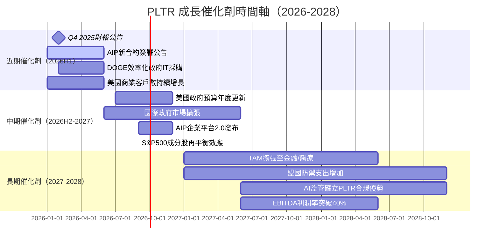

---

### TAM 市場規模與滲透率

```
╔══════════════════════════════════════════════════════════════════╗
║              PLTR 可尋址市場 (TAM) 分析                         ║
╠══════════════════════════════════════════════════════════════════╣
║                                                                  ║
║  市場          TAM估算    當前滲透率   進度條                    ║
║  ─────────────────────────────────────────────────────────      ║
║  企業AI分析    $50B       ~4.5%        ████░░░░░░░░░░░░░░░░░     ║
║  政府IT/AI     $30B       ~6.0%        █████░░░░░░░░░░░░░░░░     ║
║  國防科技      $25B       ~3.2%        ███░░░░░░░░░░░░░░░░░░     ║
║  醫療AI        $20B       ~0.5%        ░░░░░░░░░░░░░░░░░░░░░     ║
║  金融AI        $15B       ~1.2%        █░░░░░░░░░░░░░░░░░░░░     ║
║  ─────────────────────────────────────────────────────────      ║
║  總TAM:        ~$140B                                            ║
║  當前收入:     $4.48B    總滲透率 ~3.2%                          ║
║                                                                  ║
║  🎯 如PLTR達到10%總市場滲透，收入將達 ~$14B                     ║
║  🎯 AIP平台有望打開全新TAM（自主AI代理市場 $500B+）             ║
║                                                                  ║
╚══════════════════════════════════════════════════════════════════╝
```

---

### 成長驅動力分析

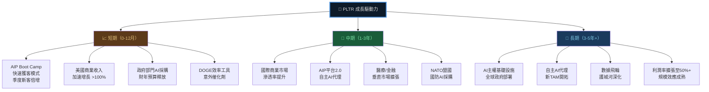

---

## 9. 風險矩陣

### 風險評分矩陣

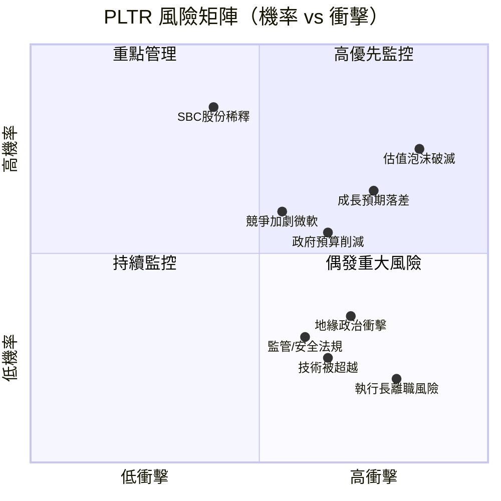

---

### 風險清單詳表

| 風險項目 | 機率 | 衝擊 | 綜合評分 | 緩解措施 |
|---------|------|------|---------|---------|
| 🔴 估值大幅修正 | 高70% | 極高-40~60% | **🔴 9/10** | 嚴格估值紀律，分批建倉 |
| 🔴 成長預期未達 | 中55% | 高-30~40% | **🔴 8/10** | 監控季度ACV和客戶數增長 |
| 🟡 政府預算削減 | 中40% | 中-15~25% | **🟡 6/10** | 商業收入抵銷，DOGE可能反助 |
| 🟡 競爭加劇（微軟/AWS） | 中50% | 中-20~30% | **🟡 7/10** | 護城河深厚、政府認證難複製 |
| 🟡 SBC持續稀釋 | 高80% | 低中-5~10% | **🟡 6/10** | 回購計劃部分抵銷 |
| 🟡 創辦人/執行層風險 | 低20% | 高-25~35% | **🟡 5/10** | Karp任期長，企業文化深厚 |
| 🟢 監管/安全法規 | 低25% | 中-10~20% | **🟢 4/10** | 合規能力本為核心競爭力 |
| 🟢 技術被超越 | 低25% | 高-30~40% | **🟢 4/10** | 20年積累護城河難以複製 |
| 🟢 地緣政治風險 | 中35% | 中高-20% | **🟢 5/10** | 多元地理分布，美軍合約穩定 |

---

## 10. 投資建議

### 最終綜合評級儀表板

```
╔══════════════════════════════════════════════════════════════════╗
║                  PLTR 投資評級雷達圖                             ║
╠══════════════════════════════════════════════════════════════════╣
║                                                                  ║
║              業務品質 (9.0/10)                                   ║
║                   ████████                                       ║
║    財務健康  ████████████████  成長動能                          ║
║   (9.5/10)  ████████████████  (9.0/10)                          ║
║             ████████████████                                     ║
║  估值合理性  ████    ████████  獲利能力                          ║
║   (2.5/10)  ████    ████████  (8.0/10)                          ║
║                   ████████                                       ║
║              競爭護城河 (8.5/10)                                  ║
║                                                                  ║
║  各維度評分:                                                      ║
║  業務品質:  ████████████████████░  9.0 │ 核心平台不可替代       ║
║  成長動能:  ████████████████████░  9.0 │ YoY+70%，加速中        ║
║  獲利能力:  ████████████████░░░░░  8.0 │ 利潤率快速擴張         ║
║  護城河:    █████████████████░░░░  8.5 │ 政府認證壁壘極高       ║
║  財務健康:  █████████████████████  9.5 │ 淨現金$7B，零壓力      ║
║  管理層:    ████████████████░░░░░  8.0 │ Karp願景強，SBC需關注  ║
║  估值:      █████░░░░░░░░░░░░░░░░  2.5 │ P/S 72x 極度高估       ║
║  ─────────────────────────────────────────────────────────      ║
║  加權綜合:  ████████████████░░░░░  7.2 │ 優質公司，估值過高     ║
╚══════════════════════════════════════════════════════════════════╝
```

---

### 目標價設定

| 情境 | 目標價 | 隱含報酬率 | 關鍵假設 |
|------|--------|----------|---------|
| 🐂 **極樂觀** | **$185** | **+37.5%** | FY2027E收入$8B+，P/S 23x，AI平台主導地位確立 |
| 🟢 **樂觀（12個月）** | **$145** | **+7.8%** | FY2027E收入$7B，P/S 20x，商業化持續超預期 |
| 🟡 **基準（12個月）** | **$90** | **-33.1%** | FY2027E收入$6.5B，P/S 14x，估值均值回歸 |
| 🔴 **悲觀** | **$55** | **-59.1%** | 成長放緩至30%，P/S 10x，市場情緒轉向 |
| 🔴 **極悲觀** | **$30** | **-77.7%** | 增長大幅不及預期，估值回歸歷史均值5-8x |

> **分析師共識目標**：$185.87（隱含報酬率 +38.2%），但目標價分散度極大（$70 ~ $260）

---

### 買入時機與觸發因素

```
╔══════════════════════════════════════════════════════════════╗
║              買入觸發因素 Checklist                          ║
╠══════════════════════════════════════════════════════════════╣
║                                                              ║
║  💰 估值觸發器（必要條件）:                                   ║
║  ☐ 股價回落至 $80-95 區間（P/S回到~18-22x 合理區）          ║
║  ☐ P/E Forward 回落至 40-50x 區間                           ║
║  ☐ FCF Yield 升至 1.5% 以上                                  ║
║                                                              ║
║  📊 基本面觸發器（加分條件）:                                 ║
║  ☐ 連續2季美國商業收入YoY增速維持 >80%                       ║
║  ☐ 季度商業客戶數淨增 >50家                                  ║
║  ☐ 營業利益率（GAAP）突破 45%                               ║
║  ☐ 宣布重大政府合約（>$5億）                                 ║
║  ☐ FY2026 全年指引上調                                      ║
║                                                              ║
║  🌍 宏觀/市場觸發器:                                         ║
║  ☐ 美國政府確認增加AI/國防科技預算                          ║
║  ☐ 納入更多ETF/指數成分股                                   ║
║  ☐ 廣泛科技股修正提供入場機會                               ║
║                                                              ║
║  🚫 停損/觀察條件:                                           ║
║  ☐ 美國商業收入增速低於 50%（下行警報）                     ║
║  ☐ 政府部門收入連續2季下滑                                  ║
║  ☐ 主要競爭對手贏得大型政府合約                             ║
╚══════════════════════════════════════════════════════════════╝
```

---

### 投資人適配度

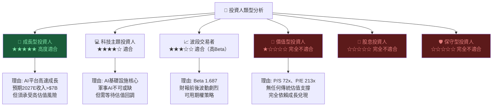

---

### 關鍵監控指標 Checklist

```
╔══════════════════════════════════════════════════════════════════╗
║              🔭 關鍵監控指標 — 季度追蹤清單                     ║
╠══════════════════════════════════════════════════════════════════╣
║                                                                  ║
║  📋 財報核心KPI（每季必追蹤）:                                   ║
║  ☐ 美國商業收入（YoY增速是否維持 >80%）                         ║
║  ☐ 美國商業客戶數（季度淨增目標 >50家）                         ║
║  ☐ 政府部門收入（是否維持穩定增長 >15%）                        ║
║  ☐ 剩餘績效義務（RPO / Backlog - 前瞻收入指標）                 ║
║  ☐ GAAP 營業利益率（是否持續擴張至45%+）                       ║
║  ☐ SBC佔收入比例（是否降至10%以下）                            ║
║  ☐ 每股自由現金流（排除SBC後的真實獲利）                        ║
║  ☐ AIP Boot Camp 舉辦數量與轉換率                              ║
║                                                                  ║
║  🌐 產業動態（月度追蹤）:                                        ║
║  ☐ 美國國防部AI相關合約招標動態                                 ║
║  ☐ DOGE政策進展（IT採購削減 vs 效率化需求）                     ║
║  ☐ 競爭對手（微軟/AWS/C3.ai）政府合約動態                      ║
║  ☐ AI監管法規進展（有利/不利影響評估）                          ║
║                                                                  ║
║  📊 估值監控（持續追蹤）:                                        ║
║  ☐ 股價是否進入$80-100「合理區間」                              ║
║  ☐ 機構持股比例變化（是否出現大額減持）                         ║
║  ☐ 分析師評級變化（是否出現集體下調）                           ║
║  ☐ 短賣比例變化（2.0%是否顯著上升）                             ║
║                                                                  ║
║  📅 重要日期:                                                    ║
║  ☐ 2026 Q4 2025 財報公告（預計2026年2月）✅ 即將公布            ║
║  ☐ 2026 Q1 財報（預計2026年5月）                                ║
║  ☐ 美國FY2027國防預算討論（2026年3-6月）                        ║
╚══════════════════════════════════════════════════════════════════╝
```

---

## 📋 最終投資總結

```
╔══════════════════════════════════════════════════════════════════╗
║                                                                  ║
║   🏆  PLTR 機構級基本面分析 — 最終評定                          ║
║                                                                  ║
╠══════════════════════════════════════════════════════════════════╣
║                                                                  ║
║   公司品質評分：   9.0 / 10  🟢  頂尖AI數據平台                 ║
║   估值合理性：     2.5 / 10  🔴  嚴重高估                       ║
║   風險回報比：     4.0 / 10  🔴  現價不具安全邊際                ║
║                                                                  ║
║   ══════════════════════════════════════════════                 ║
║   投資評級：【 ⚖️ 觀望 / HOLD 】                                 ║
║   當前股價：$134.51                                              ║
║   建議入場區間：$80 — $95（等待估值修正）                        ║
║   12個月目標價（基準）：$90（-33%下行風險）                      ║
║   12個月目標價（樂觀）：$145（+7.8%上行空間）                   ║
║   ══════════════════════════════════════════════                 ║
║                                                                  ║
║   核心論點：                                                      ║
║   ✅ PLTR是真正優秀的AI基礎設施平台公司                          ║
║   ✅ 護城河深厚，政府認證幾乎不可複製                            ║
║   ✅ 財務體質極健康，淨現金$6.95B                               ║
║   ✅ 盈利能力從虧損到ROE 26%的完美轉型                           ║
║   ⚠️ 但P/S 71.9x、P/E 213x的估值已充分反映                      ║
║   ⚠️ 未來5年需要45%+ CAGR才能論證現價合理                       ║
║   ⚠️ 任何季度業績不及預期都可能引發30-50%修正                   ║
║                                                                  ║
║   「PLTR是正確的公司，但$134的價位是錯誤的時機」                 ║
║                                                                  ║
╚══════════════════════════════════════════════════════════════════╝
```

---

> ### ⚠️ 重要免責聲明
>
> **本報告由 AI 自動生成，僅供學術研究與投資教育參考，不構成任何形式的投資建議、買賣推薦或財務規劃建議。**
>
> - 所有財務數據來源於公開資料（Yahoo Finance），截至 2026-02-25
> - DCF估值模型採用簡化假設，實際投資決策應依據更完整的盡職調查
> - 股票投資涉及市場風險，過去業績不代表未來表現
> - 投資人應根據自身風險承受能力、投資期限及財務狀況，諮詢持牌專業財務顧問後再作決策
> - CFA 資格持有者依據職業道德守則，本文分析師不持有 PLTR 股份（AI模擬聲明）

---

*報告製作：AI CFA 研究系統 ｜ 報告日期：2026-02-25 ｜ 版本：v1.0*