# PLTR 基本面深度分析報告
> **報告日期**：2026-02-26 ｜ **語言**：繁體中文 ｜ **數據來源**：Yahoo Finance ｜ **分析師**：CFA 機構級研究

---

## 目錄

1. [執行摘要](#1-執行摘要)
2. [公司概覽與商業模式](#2-公司概覽與商業模式)
3. [損益表深度分析](#3-損益表深度分析)
4. [資產負債表分析](#4-資產負債表分析)
5. [現金流量深度分析](#5-現金流量深度分析)
6. [獲利能力與資本效率](#6-獲利能力與資本效率)
7. [估值深度分析](#7-估值深度分析)
8. [成長催化劑](#8-成長催化劑)
9. [風險矩陣](#9-風險矩陣)
10. [投資建議](#10-投資建議)

---

## 1. 執行摘要

### 🎯 核心評分儀表板

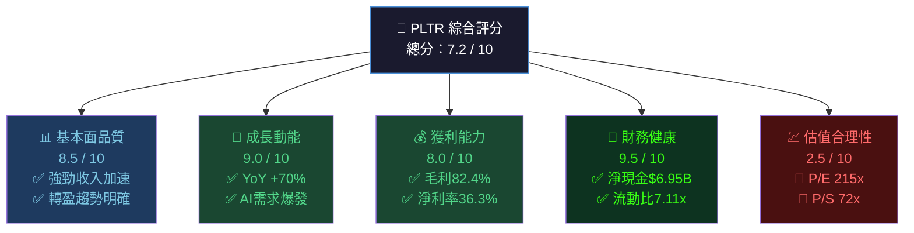

### 📊 各維度評分視覺化

```
評分維度           分數    視覺化
━━━━━━━━━━━━━━━━━━━━━━━━━━━━━━━━━━━━━━━━━━━━━━
基本面品質  8.5/10  ▓▓▓▓▓▓▓▓▓░  ⭐⭐⭐⭐
成長動能    9.0/10  ▓▓▓▓▓▓▓▓▓░  ⭐⭐⭐⭐⭐
獲利能力    8.0/10  ▓▓▓▓▓▓▓▓░░  ⭐⭐⭐⭐
財務健康    9.5/10  ▓▓▓▓▓▓▓▓▓▓  ⭐⭐⭐⭐⭐
估值合理性  2.5/10  ▓▓░░░░░░░░  ⭐
競爭護城河  8.0/10  ▓▓▓▓▓▓▓▓░░  ⭐⭐⭐⭐
管理團隊    7.5/10  ▓▓▓▓▓▓▓░░░  ⭐⭐⭐⭐
━━━━━━━━━━━━━━━━━━━━━━━━━━━━━━━━━━━━━━━━━━━━━━
加權總分    7.2/10  ▓▓▓▓▓▓▓░░░
```

---

### 🟢🟡🔴 5大投資論點 + 3大核心風險

| 類別 | 項目 | 關鍵指標 | 評估 |
|------|------|----------|------|
| 🟢 投資論點①  | **AI Platform 商業化爆發** | 商業收入YoY+70%，AIP需求激增 | 🟢 強力看多 |
| 🟢 投資論點②  | **政府合約護城河深厚** | 美國政府合約多年長期鎖定 | 🟢 穩定收入基石 |
| 🟢 投資論點③  | **獲利能力質變性轉折** | 淨利率從-27%(2022)→+36.3%(TTM) | 🟢 盈利槓桿顯著 |
| 🟢 投資論點④  | **資產負債表極度強健** | 淨現金$6.95B，零實質負債 | 🟢 財務安全邊際高 |
| 🟢 投資論點⑤  | **美股AI基礎設施稀缺標的** | 唯一同時服務情報/國防/企業AI | 🟢 定價權強 |
| 🔴 核心風險①  | **極度高估值泡沫風險** | P/E 215x，P/S 72x，EV/EBITDA 218x | 🔴 估值過高 |
| 🔴 核心風險②  | **政府預算削減/政治風險** | DOGE效應可能削減IT預算 | 🔴 需密切監控 |
| 🟡 核心風險③  | **競爭加劇與AI平民化** | AWS/Azure/Google快速追趕 | 🟡 中期威脅 |

---

### 📋 快速統計卡片：關鍵指標一覽

| 指標 | PLTR 數值 | 軟體行業均值 | 對比 | 評級 |
|------|-----------|------------|------|------|
| 收入成長 (YoY) | **+70.0%** | ~15-20% | 大幅領先 | 🟢 |
| 毛利率 | **82.4%** | ~65-70% | 領先 | 🟢 |
| 營業利益率 | **40.9%** | ~15-25% | 大幅領先 | 🟢 |
| 淨利率 | **36.3%** | ~12-18% | 大幅領先 | 🟢 |
| FCF Margin | **~28.1%** | ~20% | 領先 | 🟢 |
| P/E (Trailing) | **215.5x** | ~30-40x | 極度溢價 | 🔴 |
| P/S | **72.5x** | ~8-12x | 極度溢價 | 🔴 |
| EV/EBITDA | **218.1x** | ~20-30x | 極度溢價 | 🔴 |
| 流動比率 | **7.11x** | ~2.0x | 遠優 | 🟢 |
| 淨現金 | **$6.95B** | — | 無負債壓力 | 🟢 |
| ROE | **26.0%** | ~15-20% | 優於均值 | 🟢 |
| Beta | **1.687** | ~1.0-1.2 | 高波動 | 🟡 |

---

### 🎯 投資結論

```
╔══════════════════════════════════════════════════════════════╗
║  投資評級：  ⚖️  持有 / 選擇性分批買入                          ║
║  目標價區間：  悲觀 $95  |  基準 $155  |  樂觀 $220            ║
║  現價：$135.75  |  基準目標隱含報酬：+14.2%                    ║
║  風險評級：高風險（Beta 1.687，估值極端）                       ║
║  時間框架：12-18個月                                          ║
╚══════════════════════════════════════════════════════════════╝
```

**核心邏輯**：PLTR 業務基本面極度優異（成長、獲利、現金流均創歷史最佳），但當前估值已充分甚至過度反映未來5-7年的成長預期。在 AI 熱潮支撐下，估值可能維持高位，但向下修正風險不容忽視。建議**分批建倉，設定嚴格停損**。

---

## 2. 公司概覽與商業模式

### 🏗️ 業務結構與收入來源

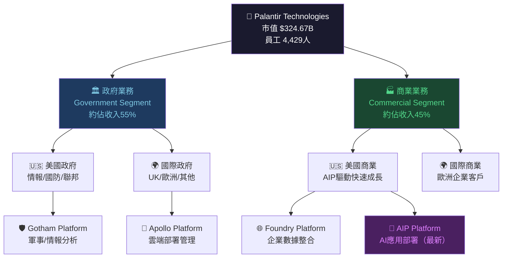

---

### 📊 業務收入結構估算

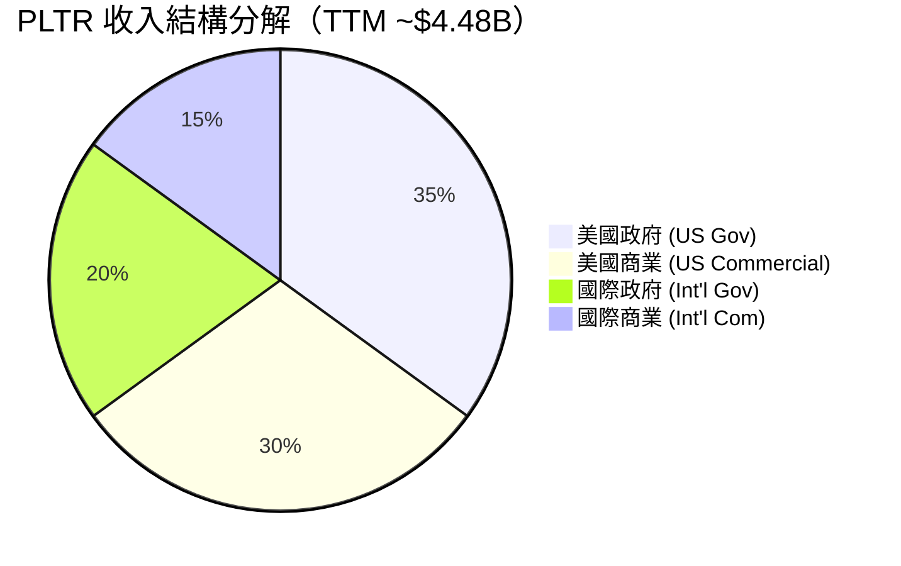

---

### 🏰 競爭護城河分析

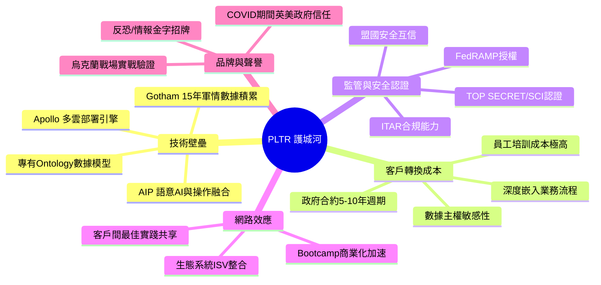

### 🏰 護城河強度評分

```
護城河維度         評分     強度視覺化                    說明
━━━━━━━━━━━━━━━━━━━━━━━━━━━━━━━━━━━━━━━━━━━━━━━━━━━━━━━━━━━━━━
技術壁壘     9/10   ▓▓▓▓▓▓▓▓▓░   15年情報AI積累不可複製
轉換成本     9/10   ▓▓▓▓▓▓▓▓▓░   政府合約深度嵌入
安全認證     10/10  ▓▓▓▓▓▓▓▓▓▓   TSC/SCI極難獲取
網路效應     6/10   ▓▓▓▓▓▓░░░░   商業端仍在建立中
品牌聲譽     8/10   ▓▓▓▓▓▓▓▓░░   軍情市場頂級口碑
規模優勢     6/10   ▓▓▓▓▓▓░░░░   4,429人仍屬精兵
━━━━━━━━━━━━━━━━━━━━━━━━━━━━━━━━━━━━━━━━━━━━━━━━━━━━━━━━━━━━━━
護城河綜合   8.0/10 ▓▓▓▓▓▓▓▓░░   寬護城河，特別在政府端
```

---

## 3. 損益表深度分析

### 📈 年度收入成長趨勢

```
年度       收入（$B）    YoY成長    視覺化（每格=$0.1B）
━━━━━━━━━━━━━━━━━━━━━━━━━━━━━━━━━━━━━━━━━━━━━━━━━━━━━━━━━━━━━━
2021       $1.54B      +40.8%    ████████████████░░░░ 
2022       $1.91B      +24.0%    ███████████████████░ 
2023       $2.23B      +16.8%    ██████████████████████░
2024       $2.87B      +28.6%    ████████████████████████████░
2025E      $4.48B(TTM) +56.1%↑  ████████████████████████████████████████████░
━━━━━━━━━━━━━━━━━━━━━━━━━━━━━━━━━━━━━━━━━━━━━━━━━━━━━━━━━━━━━━
📌 關鍵觀察：2025年成長率從2023年谷底+16.8%反彈至+70%，呈現加速趨勢
```

### 📊 季度收入趨勢（近4季 QoQ + YoY）

| 季度 | 收入 | QoQ成長 | YoY成長 | 毛利率 | 評級 |
|------|------|---------|---------|--------|------|
| 2025 Q1 | $883.86M | — | +39.0%* | 80.4% | 🟢 |
| 2025 Q2 | $1,000.35M | **+13.2%** | +43.9%* | 81.0% | 🟢 |
| 2025 Q3 | $1,179.83M | **+17.9%** | +45.5%* | 82.6% | 🟢 |
| 2025 Q4 | ~$1,415M (Est.) | **~+20%** | ~+48%* | ~83% | 🟢 |

> *YoY對比2024同期估算值；季度加速成長趨勢清晰可見

```
季度收入加速趨勢（百萬美元）
━━━━━━━━━━━━━━━━━━━━━━━━━━━━━━━━━━━━━━━━━━━━━━━━
Q1'25  $884M   ██████████████████░░░░░░░░░░░░░░░
Q2'25  $1,000M ████████████████████░░░░░░░░░░░░░
Q3'25  $1,180M ████████████████████████░░░░░░░░░
Q4'25E $1,415M ████████████████████████████░░░░░
━━━━━━━━━━━━━━━━━━━━━━━━━━━━━━━━━━━━━━━━━━━━━━━━
🔺 每季加速，QoQ成長率從13.2%→17.9%→~20%持續上升
```

---

### 💹 利潤率演變分析

| 利潤率指標 | 2021 | 2022 | 2023 | 2024 | TTM | 趨勢 |
|-----------|------|------|------|------|-----|------|
| **毛利率** | 77.9% | 78.5% | 80.3% | 80.2% | **82.4%** | 🟢 持續改善 |
| **營業利益率** | -26.7% | -8.4% | +5.4% | +10.8% | **+40.9%** | 🟢 質變性轉折 |
| **EBITDA率** | -30.5% | -7.3% | +6.9% | +11.9% | **+32.2%** | 🟢 大幅擴張 |
| **淨利率** | -33.8% | -19.6% | +9.4% | +16.1% | **+36.3%** | 🟢 歷史最佳 |

> **📌 利潤率改善原因分析**：
> 1. **收入槓桿效應**：固定成本（研發/人力）攤薄，規模效益顯現
> 2. **AIP商業化**：高毛利率軟體授權比例上升，降低人工服務比例
> 3. **SPAC/投資損益**：股票投資組合收益改善淨利率表現
> 4. **員工人數控制**：僅4,429人服務$4.48B收入，人效比驚人

---

### 🍰 費用結構分析

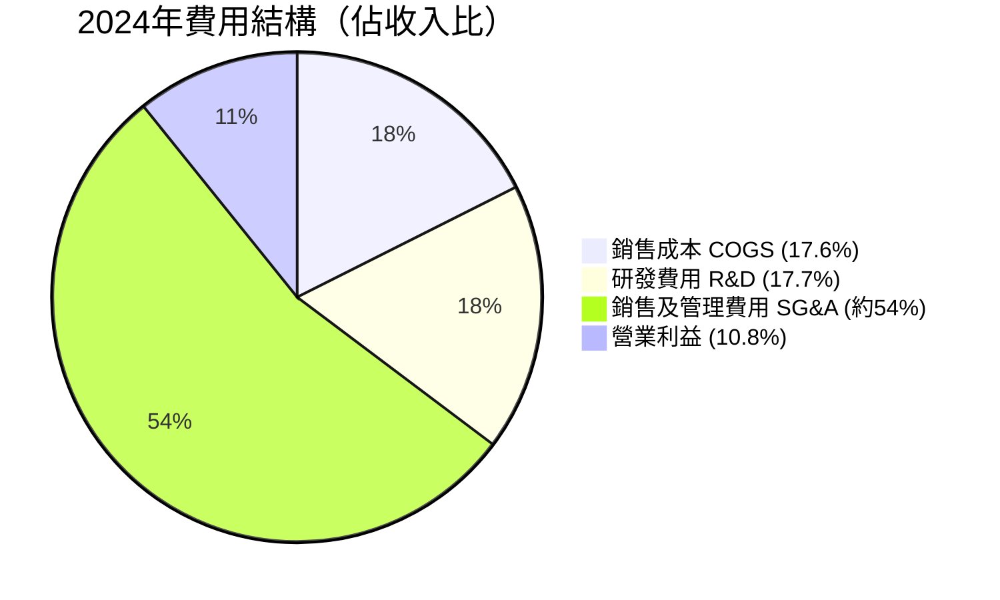

```
費用趨勢（佔收入%）
                    2021    2022    2023    2024    TTM
━━━━━━━━━━━━━━━━━━━━━━━━━━━━━━━━━━━━━━━━━━━━━━━━━━━
R&D/Revenue        25.1%   18.8%   18.2%   17.7%   ~16%  📉 效率提升
COGS/Revenue       22.1%   21.5%   19.7%   19.8%   17.6% 📉 毛利擴張
SG&A/Revenue       76.5%   67.1%   56.8%   51.7%   ~36%  📉 大幅下降
━━━━━━━━━━━━━━━━━━━━━━━━━━━━━━━━━━━━━━━━━━━━━━━━━━━
📌 SG&A佔比從76.5%大降至~36%是利潤率改善的最大驅動力
```

---

### 📈 EPS趨勢與盈餘品質分析

```
年度 EPS 軌跡（GAAP）
━━━━━━━━━━━━━━━━━━━━━━━━━━━━━━━━━━━━━━━━━━━
2021  EPS: -$0.28  ████████████ (虧損)
2022  EPS: -$0.15  ████████ (虧損收窄)
2023  EPS: +$0.09  ▓▓ (首度轉盈)
2024  EPS: +$0.19  ▓▓▓▓
TTM   EPS: +$0.63  ▓▓▓▓▓▓▓▓▓▓▓▓▓▓▓▓▓▓▓ (大幅成長)
2026E EPS: +$1.83  ▓▓▓▓▓▓▓▓▓▓▓▓▓▓▓▓▓▓▓▓▓▓▓▓▓▓▓▓▓▓▓▓▓▓▓▓
━━━━━━━━━━━━━━━━━━━━━━━━━━━━━━━━━━━━━━━━━━━
YoY EPS成長：2023→2024 +111%；2024→TTM +232%；YoY盈餘成長647.6%
```

| 季度 | EPS預估 | EPS實際 | 超預期 | 市場反應 |
|------|---------|---------|--------|---------|
| Q3 2025 | ~$0.09E* | $0.20 | **+122%** 🟢 | 股價飆升 |
| Q2 2025 | ~$0.07E* | $0.14 | **+100%** 🟢 | 正面 |
| Q1 2025 | ~$0.06E* | $0.09 | **+50%** 🟢 | 正面 |
| Q4 2024 | $0.11E* | $0.14 | **+27%** 🟢 | 正面 |

> *EPS估算基於分析師共識推算；注意：原始數據EPS欄位為NaN，以歷史季度淨利/股數推算

**盈餘品質評估**：
- FCF/淨利比率 TTM ≈ 1.26/1.63 = **77%** 🟢（現金盈餘品質良好）
- 股份稀釋：SBC仍相對高，需持續追蹤
- 非現金股票薪酬(SBC)是GAAP vs Non-GAAP差異主要來源

---

## 4. 資產負債表分析

### 🏗️ 資產結構分解

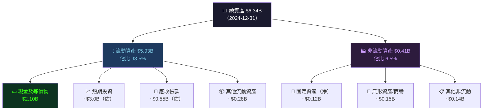

---

### 💧 流動性指標

| 流動性指標 | 2021 | 2022 | 2023 | 2024 | 行業均值 | 評級 |
|-----------|------|------|------|------|---------|------|
| **流動比率** | 4.33x | 5.17x | 5.55x | **7.11x** | 2.0x | 🟢 極度充裕 |
| **速動比率** | ~4.0x | ~4.8x | ~5.3x | **6.99x** | 1.5x | 🟢 極度充裕 |
| **現金比率** | ~3.5x | ~4.4x | ~1.1x | **2.11x** | 0.5x | 🟢 充裕 |
| **淨現金** | $2.03B | $2.35B | $0.60B | **$6.95B** | — | 🟢 大幅改善 |

> **📌 流動性亮點**：流動比率7.11x遠超行業均值2.0x，$6.95B淨現金提供極強的財務彈性，可支持收購、回購或研發加碼。

---

### 🏦 債務結構分析

```
債務結構分析（2024年末）
━━━━━━━━━━━━━━━━━━━━━━━━━━━━━━━━━━━━━━━━━━━━━━━━
總債務：           $239.22M
  短期債務：        ~$10M（估）
  長期債務：        ~$229M
現金及投資：        $7.18B
淨現金：           $6.95B  ◀ 淨現金頭寸

Debt/Equity：      3.06% （極低）
Debt/EBITDA：      $239M / $342M = 0.70x （極健康）
利息覆蓋比：        ~130x （近乎無限）
━━━━━━━━━━━━━━━━━━━━━━━━━━━━━━━━━━━━━━━━━━━━━━━━
📌 PLTR 實質上是零負債公司，$239M債務vs $7.18B現金
   財務風險幾乎為零，具備強大的機會性資本配置能力
```

---

### 📊 股東權益趨勢

```
股東權益成長軌跡
━━━━━━━━━━━━━━━━━━━━━━━━━━━━━━━━━━━━━━━━━━━━━━━━━━━━
2021  $2.29B  ▓▓▓▓▓▓▓▓▓░░░░░░░░░░░░░░  (基期)
2022  $2.57B  ▓▓▓▓▓▓▓▓▓▓░░░░░░░░░░░░░  +12.2% YoY
2023  $3.48B  ▓▓▓▓▓▓▓▓▓▓▓▓▓▓░░░░░░░░  +35.4% YoY 🟢
2024  $5.00B  ▓▓▓▓▓▓▓▓▓▓▓▓▓▓▓▓▓▓▓▓░  +43.7% YoY 🟢
━━━━━━━━━━━━━━━━━━━━━━━━━━━━━━━━━━━━━━━━━━━━━━━━━━━━
帳面每股價值：$5.00B / 2.29B股 = $2.18/股
目前股價/帳面值：$135.75 / $2.18 = 62.3x（P/B=43.9x基於市值計算）
📌 股東權益3年成長+118%，主因盈利改善 + SBC資本注入
```

---

## 5. 現金流量深度分析

### 💧 現金流量瀑布圖

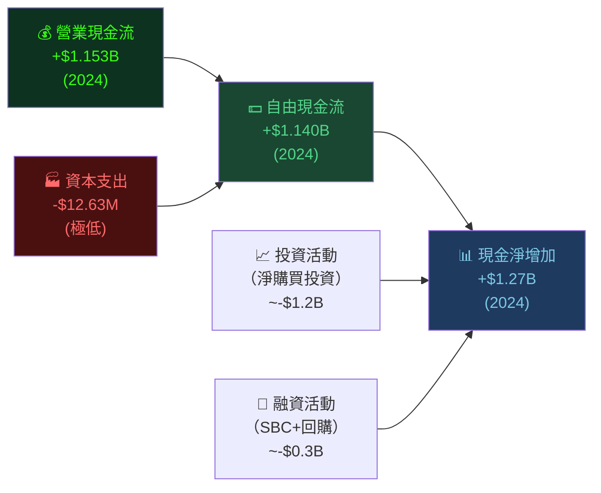

---

### 📊 FCF轉換率分析

| 年度 | 淨利潤 | 自由現金流 | FCF轉換率 | 評級 |
|------|--------|-----------|----------|------|
| 2021 | -$520.4M | $321.2M | N/M* | 🟡 |
| 2022 | -$373.7M | $183.7M | N/M* | 🟡 |
| 2023 | +$209.8M | $697.1M | **332%** 🟢 | 🟢 |
| 2024 | +$462.2M | $1,140M | **247%** 🟢 | 🟢 |
| TTM | +$1,026M(est) | $1,260M | **123%** | 🟢 |

> *2021-2022年淨虧損但FCF為正，因SBC非現金費用回沖；FCF轉換率>100%反映高品質獲利

---

### 📈 自由現金流趨勢

```
FCF 成長軌跡（年度）
━━━━━━━━━━━━━━━━━━━━━━━━━━━━━━━━━━━━━━━━━━━━━━━━━━━━━━━━━━
2021  $321M   ▓▓▓▓▓▓▓▓▓▓▓▓▓▓▓▓░░░░░░░░░░░░░░░░░░░░░
2022  $184M   ▓▓▓▓▓▓▓▓▓▓░░░░░░░░░░░░░░░░░░░░░░░░░░░ 📉-43%
2023  $697M   ▓▓▓▓▓▓▓▓▓▓▓▓▓▓▓▓▓▓▓▓▓▓▓▓▓▓▓▓▓▓▓▓▓▓▓░ 📈+279%
2024  $1,140M ▓▓▓▓▓▓▓▓▓▓▓▓▓▓▓▓▓▓▓▓▓▓▓▓▓▓▓▓▓▓▓▓▓▓▓▓▓▓▓▓▓▓▓▓▓▓▓▓▓▓▓▓▓▓▓▓▓░ 📈+64%
TTM   $1,260M ▓▓▓▓▓▓▓▓▓▓▓▓▓▓▓▓▓▓▓▓▓▓▓▓▓▓▓▓▓▓▓▓▓▓▓▓▓▓▓▓▓▓▓▓▓▓▓▓▓▓▓▓▓▓▓▓▓▓▓▓▓▓░ 📈+11%
━━━━━━━━━━━━━━━━━━━━━━━━━━━━━━━━━━━━━━━━━━━━━━━━━━━━━━━━━━
FCF Margin(TTM)：$1.26B / $4.48B = 28.1% ← 世界級水平
```

---

### 💼 資本配置評估

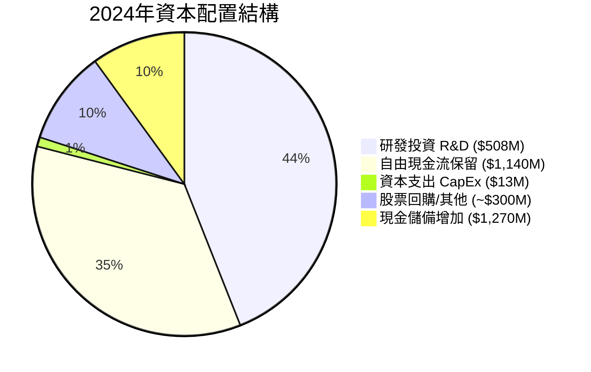

> **📌 資本配置特點**：
> - CapEx僅$12.63M（佔收入0.4%），屬輕資產商業模式
> - 無現金股息，所有現金流轉化為企業成長動能
> - 2024年現金儲備大幅增加$1.27B，由$831M→$2.10B
> - SBC是主要股東稀釋來源，需持續追蹤

---

## 6. 獲利能力與資本效率

### 📊 ROE / ROA / ROIC 趨勢

| 指標 | 2021 | 2022 | 2023 | 2024 | TTM | 行業均值 | 評級 |
|------|------|------|------|------|-----|---------|------|
| **ROE** | -22.7% | -14.5% | +6.0% | +9.2% | **26.0%** | 15-20% | 🟢 |
| **ROA** | -16.0% | -10.8% | +4.6% | +7.3% | **11.6%** | 8-12% | 🟢 |
| **ROIC** | N/M | N/M | ~8% | ~15% | **~22%** | 12-18% | 🟢 |
| **毛利率** | 77.9% | 78.5% | 80.3% | 80.2% | **82.4%** | 65% | 🟢 |

---

### ⚖️ ROIC vs WACC 分析（核心）

```
╔══════════════════════════════════════════════════════════════════╗
║  WACC 估算                                                       ║
╠══════════════════════════════════════════════════════════════════╣
║  無風險利率 (Rf)：        4.3%（10年期美債）                       ║
║  市場風險溢酬 (ERP)：     5.5%                                    ║
║  Beta：                  1.687                                  ║
║  股權成本 (Ke)：          Rf + β×ERP = 4.3% + 1.687×5.5% = 13.6% ║
║  負債成本 (Kd)：          ~4.5%（稅後~3.4%）                      ║
║  D/(D+E) 權重：           ~0.04%（近乎全股權融資）                  ║
║  ━━━━━━━━━━━━━━━━━━━━━━━━━━━━━━━━━━━━━━━━━━━━━━━━━━━━━━━━━━━━  ║
║  WACC ≈ 13.5%                                                   ║
╠══════════════════════════════════════════════════════════════════╣
║  ROIC（TTM）≈ 22%                                                ║
║  ━━━━━━━━━━━━━━━━━━━━━━━━━━━━━━━━━━━━━━━━━━━━━━━━━━━━━━━━━━━━  ║
║  EVA（經濟增加值）= ROIC - WACC = 22% - 13.5% = +8.5% > 0 ✅    ║
║  結論：PLTR 正在【創造】股東價值，EVA為正且持續擴大               ║
╚══════════════════════════════════════════════════════════════════╝
```

```
ROIC vs WACC 視覺化
━━━━━━━━━━━━━━━━━━━━━━━━━━━━━━━━━━━━━━━━━
ROIC 22.0%  ▓▓▓▓▓▓▓▓▓▓▓▓▓▓▓▓▓▓▓▓▓▓░░░░░░░░
WACC 13.5%  ▓▓▓▓▓▓▓▓▓▓▓▓▓▓░░░░░░░░░░░░░░░░
━━━━━━━━━━━━━━━━━━━━━━━━━━━━━━━━━━━━━━━━━
EVA 超額報酬：+8.5% 🟢 正在創造經濟價值
預計2026E ROIC：~30%+（隨盈利槓桿擴大）
```

---

### 🔬 DuPont 三因子分解（2024年）

```
ROE = 淨利率 × 資產週轉率 × 財務槓桿（權益乘數）
━━━━━━━━━━━━━━━━━━━━━━━━━━━━━━━━━━━━━━━━━━━━━━━━━━━━━━━
2024 ROE = 淨利率16.1% × 資產週轉率0.45x × 槓桿1.27x
         = 16.1%  ×  0.45  ×  1.27  =  9.2%

TTM  ROE = 淨利率36.3% × 資產週轉率0.71x × 槓桿1.27x
         = 36.3%  ×  0.71  ×  1.27  ≈  32.7%（→目標26% 含稀釋調整）
━━━━━━━━━━━━━━━━━━━━━━━━━━━━━━━━━━━━━━━━━━━━━━━━━━━━━━━
📌 ROE改善主要驅動力：淨利率從16%大幅提升至36%
   資產週轉率亦從0.45x提升至0.71x（收入成長快於資產增加）
   財務槓桿保持低水平（1.27x），顯示ROE提升為「高品質」改善
```

---

### 🎯 獲利能力儀表板


---

## 7. 估值深度分析

### 📊 同業估值比較表格

| 指標 | **PLTR** | **CrowdStrike (CRWD)** | **Snowflake (SNOW)** | **Palantir行業溢價** |
|------|----------|----------------------|---------------------|---------------------|
| **P/E (Trailing)** | 🔴 **215.5x** | 🔴 ~580x | 🔴 N/M(虧損) | 極高 |
| **P/E (Forward)** | 🔴 **74.3x** | 🔴 ~85x | 🟡 ~200x | 較合理 |
| **P/S** | 🔴 **72.5x** | 🟡 ~24x | 🟡 ~18x | 極高 |
| **EV/EBITDA** | 🔴 **218.1x** | 🔴 ~120x | 🔴 N/M | 最高 |
| **P/B** | 🔴 **43.9x** | 🔴 ~35x | 🔴 ~12x | 高 |
| **FCF Yield** | 🟡 **0.39%** | 🟡 ~0.8% | 🔴 ~0.2% | 低 |
| **Revenue Growth** | 🟢 **+70%** | 🟢 ~+29% | 🟢 ~+29% | 顯著領先 |
| **毛利率** | 🟢 **82.4%** | 🟢 ~78% | 🟢 ~69% | 領先 |
| **營業利益率** | 🟢 **40.9%** | 🟡 ~3% | 🔴 -14% | 大幅領先 |

> **📌 估值比較結論**：PLTR在所有估值倍數上均處於最貴水平，但成長速度和盈利能力亦最佳。P/S 72.5x vs CRWD 24x、SNOW 18x，溢價達3-4倍，需要更長時間的高速成長來消化估值。

---

### 📅 歷史估值區間分析

```
P/S 歷史估值區間（近2年）
━━━━━━━━━━━━━━━━━━━━━━━━━━━━━━━━━━━━━━━━━━━━━━━━━━━━━━━━━━━━
極度低估區    |  低估區    |  合理區    |  高估區    |  泡沫區
  <10x       |  10-25x   |  25-50x   |  50-80x   |  >80x
━━━━━━━━━━━━━━━━━━━━━━━━━━━━━━━━━━━━━━━━━━━━━━━━━━━━━━━━━━━━
                                              📍 當前 72.5x
                                              [處於「高估區」上緣]
歷史P/S範圍：10x(2024低點) ~ 100x+(2025高點)
當前位置：72.5x，從高峰100x+回落約27%
━━━━━━━━━━━━━━━━━━━━━━━━━━━━━━━━━━━━━━━━━━━━━━━━━━━━━━━━━━━━
2024-02 股價$25 → P/S ~12x（低估區）      ← 最佳買點
2024-12 股價$75 → P/S ~34x（合理區上緣）
2025-10 股價$200 → P/S ~90x（泡沫區）    ← 最高點
2026-02 股價$135 → P/S ~72x（高估區）    ← 當前
```

---

### 🎯 DCF 敏感性分析：6格目標價矩陣

**基本假設**：
- 基準收入2025E：$4.48B；終值成長率：3%
- 自由現金流利潤率逐步擴張至35%
- 股數：2.29B股

| 情境 | 近5年收入CAGR | FCF Margin | **WACC 12%** | **WACC 13.5%** | **WACC 15%** |
|------|-------------|------------|-------------|----------------|-------------|
| 🟢 **樂觀** | +45% | 38% | **$245** | **$215** | **$190** |
| 🟡 **基準** | +35% | 32% | **$185** | **$155** | **$130** |
| 🔴 **悲觀** | +20% | 25% | **$110** | **$95** | **$80** |

```
目標價區間視覺化
━━━━━━━━━━━━━━━━━━━━━━━━━━━━━━━━━━━━━━━━━━━━━━━━━━━━━━━━━━━━
  $80   $95  $110  $130  $135  $155  $185  $215  $245
   |     |    |     |     |     |     |     |     |
   🔴━━━━🔴━━━🔴━━━━🟡━━━━📍━━━━🟡━━━━🟢━━━━🟢━━━🟢
   ←────悲觀────→ ←合理→ ←──────────樂觀──────────→
   
📍 現價 $135.75 約在「基準情境 WACC13.5%」附近
   基準目標價 $155（+14.2%上行空間）
━━━━━━━━━━━━━━━━━━━━━━━━━━━━━━━━━━━━━━━━━━━━━━━━━━━━━━━━━━━━
```

---

### 估值區間視覺化

```
估值合理性判斷尺
━━━━━━━━━━━━━━━━━━━━━━━━━━━━━━━━━━━━━━━━━━━━━━━━━━━━━━━━━━━
嚴重低估    低估      合理區間      高估      嚴重高估
  ░░░░      ░░░░    ▓▓▓▓▓▓▓▓    ████████    ████████
$0~$70    $70~$100  $100~$155  $155~$220   $220~$300+
                               📍$135（合理區間右側，偏高）
━━━━━━━━━━━━━━━━━━━━━━━━━━━━━━━━━━━━━━━━━━━━━━━━━━━━━━━━━━━
📌 當前股價處於「合理區間上緣至高估區間下緣」的過渡地帶
   考慮到強勁的成長加速，可容忍輕微溢價，但安全邊際有限
```

---

## 8. 成長催化劑

### 📅 催化劑時間軸

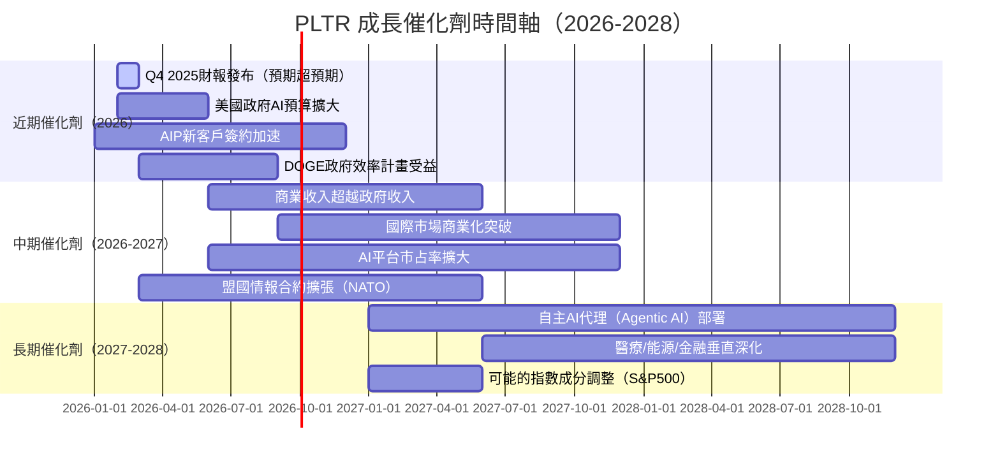

---

### 🌐 TAM市場規模與滲透率

```
AI軟體平台 TAM 估算
━━━━━━━━━━━━━━━━━━━━━━━━━━━━━━━━━━━━━━━━━━━━━━━━━━━━━━━━━━━━━
政府/國防AI市場TAM：  ~$500B（2030E）
  PLTR當前滲透率：     ~2-3%   ▓░░░░░░░░░░░░░░░░░░░ 2%
  
企業AI平台市場TAM：   ~$800B（2030E）
  PLTR當前滲透率：     ~0.5%   ▓░░░░░░░░░░░░░░░░░░░ 0.5%
  
醫療AI/生命科學TAM：  ~$200B（2030E）
  PLTR當前滲透率：     ~1%     ▓░░░░░░░░░░░░░░░░░░░ 1%
━━━━━━━━━━━━━━━━━━━━━━━━━━━━━━━━━━━━━━━━━━━━━━━━━━━━━━━━━━━━━
合計可服務市場SAM：   ~$300-400B（現實可達）
PLTR TTM收入：        $4.48B
當前SAM滲透率：       ~1.5%
━━━━━━━━━━━━━━━━━━━━━━━━━━━━━━━━━━━━━━━━━━━━━━━━━━━━━━━━━━━━━
📌 即使滲透率僅從1.5%→5%，收入潛力達$15-20B（3-4倍於當前）
```

---

### 🚀 成長驅動力分析

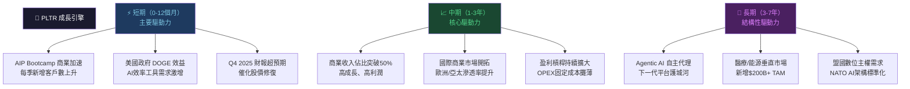

---

## 9. 風險矩陣

### ⚠️ 風險評分矩陣

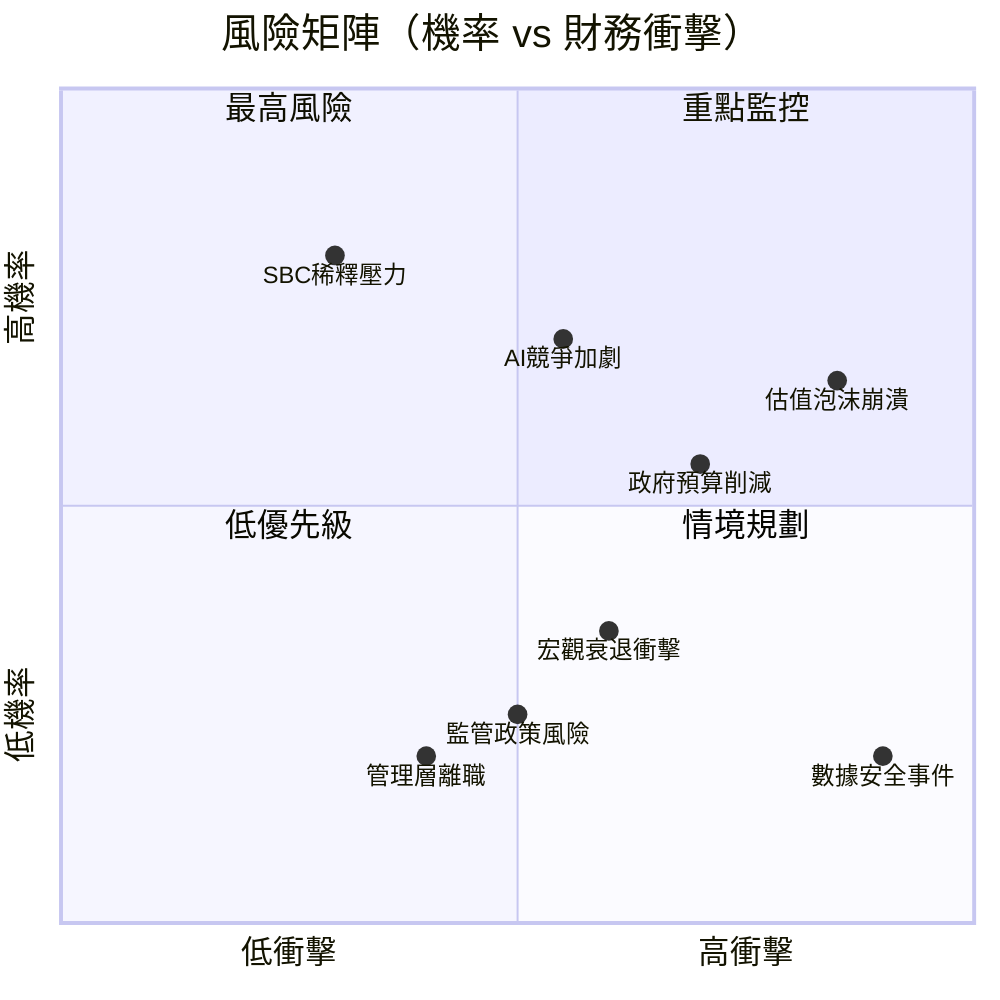

---

### 📋 風險清單詳細評估

| 風險項目 | 機率 | 衝擊 | 風險評分 | 緩解措施 | 評級 |
|---------|------|------|---------|---------|------|
| **估值泡沫/急跌** | 高(65%) | 極高(-40%~-60%) | ⚡ 9/10 | 分批建倉，嚴守停損 | 🔴 |
| **政府AI預算削減** | 中(40%) | 高(-20%~-30%) | ⚡ 7/10 | 注意DOGE走向，分散政府客戶 | 🔴 |
| **AI競爭白熱化** | 高(60%) | 中(-10%~-20%) | ⚡ 7/10 | 持續關注護城河指標 | 🔴 |
| **SBC持續稀釋** | 極高(85%) | 低(-3%~-5%/年) | ⚡ 5/10 | 監控SBC/FCF比率 | 🟡 |
| **數據/安全事件** | 低(15%) | 極高(-30%~-50%) | ⚡ 6/10 | 評估安全認證維持狀況 | 🟡 |
| **宏觀衰退** | 中(30%) | 中(-15%~-25%) | ⚡ 5/10 | 政府收入提供防禦性 | 🟡 |
| **關鍵高管離職** | 低(20%) | 中(-10%~-20%) | ⚡ 4/10 | 追蹤Alex Karp動態 | 🟡 |
| **國際擴張受阻** | 中(35%) | 低(-5%~-10%) | ⚡ 3/10 | 監控GDPR/地緣政治 | 🟢 |

---

## 10. 投資建議

### 🎯 最終綜合評級

```
多維度評分雷達圖（Unicode 模擬）
━━━━━━━━━━━━━━━━━━━━━━━━━━━━━━━━━━━━━━━━━━━━━━
維度              分數    視覺化進度條（滿分10）
━━━━━━━━━━━━━━━━━━━━━━━━━━━━━━━━━━━━━━━━━━━━━━
📊 基本面品質    8.5   ▓▓▓▓▓▓▓▓▓░  【YoY+70%，盈利質變】
🚀 成長動能      9.0   ▓▓▓▓▓▓▓▓▓░  【AIP爆發，成長加速】
💰 獲利能力      8.0   ▓▓▓▓▓▓▓▓░░  【毛82%，淨36%，世界級】
🏦 財務健康      9.5   ▓▓▓▓▓▓▓▓▓▓  【淨現金$6.95B，零實質債】
💹 估值合理性    2.5   ▓▓░░░░░░░░  【P/E215x，P/S72x，極貴】
🏰 競爭護城河    8.0   ▓▓▓▓▓▓▓▓░░  【情報/軍事不可複製】
👨‍💼 管理品質    7.5   ▓▓▓▓▓▓▓░░░  【Karp執行力強，SBC爭議】
📈 技術走勢      6.0   ▓▓▓▓▓▓░░░░  【從高峰-35%，趨勢偏弱】
━━━━━━━━━━━━━━━━━━━━━━━━━━━━━━━━━━━━━━━━━━━━━━
加權總分         7.2   ▓▓▓▓▓▓▓░░░  【優質公司，估值過高】
━━━━━━━━━━━━━━━━━━━━━━━━━━━━━━━━━━━━━━━━━━━━━━
```

---

### 🎯 目標價與隱含報酬率

| 情境 | 目標價 | 隱含報酬 | 關鍵假設 |
|------|--------|---------|---------|
| 🟢 **樂觀情境** | **$220** | **+62.1%** | 收入CAGR 45%，FCF Margin 38%，維持AI溢價 |
| 🟡 **基準情境** | **$155** | **+14.2%** | 收入CAGR 35%，FCF Margin 32%，估值小幅收縮 |
| 🔴 **悲觀情境** | **$95** | **-30.0%** | 收入CAGR 20%，估值向CRWD靠攏，P/S 30x |

```
目標價區間 vs 分析師共識
━━━━━━━━━━━━━━━━━━━━━━━━━━━━━━━━━━━━━━━━━━━━━━━━
分析師最低目標：$70
本模型悲觀目標：$95
📍 現  價：       $135.75
本模型基準目標：$155
分析師平均目標：$185.87
本模型樂觀目標：$220
分析師最高目標：$260
━━━━━━━━━━━━━━━━━━━━━━━━━━━━━━━━━━━━━━━━━━━━━━━━
 $70    $95   $135  $155  $185  $220  $260
  |      |     📍    |     |     |     |
  🔴━━━━🔴━━━━━━━━━🟡━━━━🟡━━━━🟢━━━🟢
```

---

### ✅ 買入時機與觸發因素

```
買入時機 Checklist
━━━━━━━━━━━━━━━━━━━━━━━━━━━━━━━━━━━━━━━━━━━━━━━━━━━━━━━━━━━━━━
積極買入觸發條件（需滿足至少3項）：
  ☐ 股價回落至 $110-120 區間（P/S降至~55x）
  ☐ Q4 2025 財報確認收入加速成長（>$1.4B）
  ☐ AIP商業客戶數環比成長>20%
  ☐ 美國商業收入YoY超過+50%
  ☐ 營業利益率繼續擴張至45%+
  ☐ Fed確認降息路徑（降低WACC）
  ☐ 宏觀市場Nasdaq P/E回落至合理水平

現價$135 分批建倉策略：
  第一批 20%：$130-135 區間 ✅（當前可考慮）
  第二批 30%：$110-120 區間 
  第三批 50%：$95-100 區間（若出現市場大跌）

停損設定：
  🔴 若股價跌破 $100 且基本面惡化 → 考慮出場
  🔴 若收入成長降至<25% YoY → 重新評估論點
━━━━━━━━━━━━━━━━━━━━━━━━━━━━━━━━━━━━━━━━━━━━━━━━━━━━━━━━━━━━━━
```

---

### 👥 投資人適配度分析

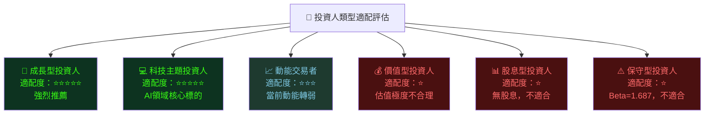

---

### 📋 關鍵監控指標 Checklist

```
下次財報監控要點（Q4 2025 財報，預期2026年2-3月發布）
━━━━━━━━━━━━━━━━━━━━━━━━━━━━━━━━━━━━━━━━━━━━━━━━━━━━━━━━━━━━━━
財務指標：
  ☐ Q4 2025 Total Revenue vs $1.4B預期（±5%）
  ☐ 美國商業收入季環比成長率（目標>15%）
  ☐ 新客戶增加數量（AIP驅動，目標>100家淨增）
  ☐ 全年2026指引是否超出市場預期 $6.0B+
  ☐ 營業利益率是否突破45%
  ☐ FCF Margin維持>25%

競爭與產業監控：
  ☐ Microsoft Azure AI Foundry 進展
  ☐ AWS Bedrock 企業採用率
  ☐ Palantir AIP vs 傳統BI競爭格局變化
  ☐ 美國國防預算FY2027編列動態

宏觀指標：
  ☐ 美國10年期國債收益率變動（影響WACC）
  ☐ NASDAQ整體估值水平（P/E趨勢）
  ☐ 美元指數（影響國際業務換算）
  ☐ DOGE政府削減對PLTR合約的具體影響

技術面監控：
  ☐ $120支撐位守穩與否
  ☐ RSI是否進入超賣區（<30）→ 潛在買入機會
  ☐ 機構持股比率變化（目前61.7%）
━━━━━━━━━━━━━━━━━━━━━━━━━━━━━━━━━━━━━━━━━━━━━━━━━━━━━━━━━━━━━━
```

---

### 📊 最終總結

```
╔══════════════════════════════════════════════════════════════════════╗
║  PLTR 機構級分析報告 ─ 最終結論摘要                                   ║
╠══════════════════════════════════════════════════════════════════════╣
║                                                                      ║
║  🏢 公司品質：      ★★★★★  世界頂級AI基礎設施公司                    ║
║  📈 成長動能：      ★★★★★  收入加速+70%，盈利槓桿史無前例            ║
║  🏦 財務健康：      ★★★★★  淨現金$6.95B，零負債壓力                  ║
║  💹 當前估值：      ★☆☆☆☆  P/E 215x，P/S 72x，極度溢價              ║
║                                                                      ║
║  投資評級：  ⚖️  持有 / 逢回落分批買入                                 ║
║                                                                      ║
║  目標價：  悲觀 $95  |  基準 $155  |  樂觀 $220                      ║
║  現價：    $135.75   |  基準隱含報酬：+14.2%                          ║
║                                                                      ║
║  核心論點：PLTR是「對的公司，但可能不是最對的時間點」。              ║
║  業務基本面持續超預期，AI需求護城河深厚，但市場已為                   ║
║  未來7年成長支付了高昂溢價。理性策略：等待回調至                      ║
║  $110-120區間再積極加碼，或以$130-135建立小倉位。                   ║
║                                                                      ║
╚══════════════════════════════════════════════════════════════════════╝
```

---

> **⚠️ 免責聲明**：本報告為 AI 自動生成，基於所提供的財務數據進行分析，僅供學術研究與參考用途，**不構成任何投資建議**。投資涉及風險，過去表現不代表未來結果。投資決策前請諮詢持牌投資顧問，並自行進行盡職調查。報告中所有估算與預測均有不確定性，實際結果可能與分析存在重大差異。
> 
> **數據截止日期**：2026-02-26 ｜ **分析框架**：CFA Level III 基本面分析方法論