# PLTR 基本面深度分析報告
> **報告日期**：2026-02-27 ｜ **語言**：繁體中文 ｜ **數據來源**：Yahoo Finance ｜ **分析師**：CFA 機構級研究團隊

---

## 目錄

| # | 章節 | 核心主題 |
|---|------|----------|
| 1 | [執行摘要](#1-執行摘要) | 評分儀表板、投資論點、結論 |
| 2 | [公司概覽與商業模式](#2-公司概覽與商業模式) | 業務結構、護城河、市場地位 |
| 3 | [損益表深度分析](#3-損益表深度分析) | 收入成長、利潤率、EPS趨勢 |
| 4 | [資產負債表分析](#4-資產負債表分析) | 流動性、債務結構、股東權益 |
| 5 | [現金流量深度分析](#5-現金流量深度分析) | FCF品質、資本配置 |
| 6 | [獲利能力與資本效率](#6-獲利能力與資本效率) | ROIC vs WACC、DuPont分解 |
| 7 | [估值深度分析](#7-估值深度分析) | 同業比較、DCF、情境矩陣 |
| 8 | [成長催化劑](#8-成長催化劑) | TAM、短中長期驅動力 |
| 9 | [風險矩陣](#9-風險矩陣) | 風險評分、緩解措施 |
| 10 | [投資建議](#10-投資建議) | 目標價、買入時機、適配度 |

---

## 1. 執行摘要

### 1.1 核心評分儀表板

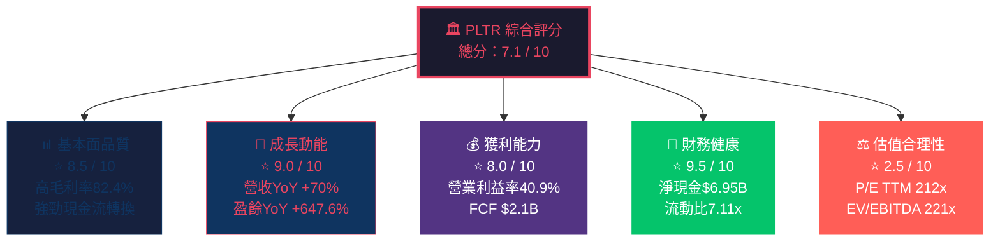

---

### 1.2 5大投資論點 + 3大核心風險

| 類型 | 項目 | 詳細說明 | 重要性 |
|------|------|----------|--------|
| 🟢 **多頭論點 #1** | AI Platform 爆發式增長 | AIP（AI Platform）商業客戶快速擴張，2025年商業收入佔比持續提升，帶動整體YoY +70% | ⭐⭐⭐⭐⭐ |
| 🟢 **多頭論點 #2** | 政府國防預算受惠者 | 美國、英國國防支出攀升，PLTR Gotham/Maven Smart System深度嵌入軍事體系，轉換成本極高 | ⭐⭐⭐⭐⭐ |
| 🟢 **多頭論點 #3** | 利潤率持續快速擴張 | 營業利益率從2022年 -8.4% → 2025年 +40.9%，GAAP盈利能力首次長期確立 | ⭐⭐⭐⭐⭐ |
| 🟢 **多頭論點 #4** | 近乎無債的要塞式資產負債表 | 淨現金高達 $6.95B，Debt/Equity僅3.06%，無流動性風險，具備強大自我融資能力 | ⭐⭐⭐⭐ |
| 🟢 **多頭論點 #5** | 機構持股快速累積 | 機構持股比例達61.7%，分析師共識由中立轉向買入（2026年2月密集升評） | ⭐⭐⭐ |
| 🔴 **風險 #1** | 估值極度溢價 | P/E TTM 212.9x、EV/EBITDA 221x，任何成長放緩將觸發估值壓縮 | 🚨 極高 |
| 🔴 **風險 #2** | 政府支出政策風險 | DOGE削減聯邦支出可能衝擊政府收入段，政策不確定性高 | 🚨 高 |
| 🟡 **風險 #3** | 股票稀釋壓力持續 | 員工股票薪酬（SBC）持續高企，每年稀釋效應需持續監控 | ⚠️ 中等 |

---

### 1.3 快速統計卡片：關鍵指標一覽

| 指標 | PLTR 數值 | 軟體行業均值 | 相對表現 | 評級 |
|------|-----------|--------------|----------|------|
| 毛利率 | 82.4% | ~72% | +10.4 pp | 🟢 優秀 |
| 營業利益率 | 40.9% | ~18% | +22.9 pp | 🟢 頂級 |
| 淨利率 | 36.3% | ~12% | +24.3 pp | 🟢 頂級 |
| 收入YoY成長 | +70.0% | ~15% | +55.0 pp | 🟢 爆發式 |
| P/E（Forward） | 72.6x | ~28x | +44.6x | 🔴 極貴 |
| P/S | 71.7x | ~8x | +63.7x | 🔴 極貴 |
| EV/EBITDA | 221.0x | ~22x | +199.0x | 🔴 極貴 |
| 流動比率 | 7.11x | ~2.0x | +5.11x | 🟢 極強 |
| Debt/Equity | 3.1% | ~45% | -41.9 pp | 🟢 優秀 |
| FCF Yield | 0.39% | ~3.5% | -3.11 pp | 🔴 偏低 |
| ROE | 26.0% | ~18% | +8.0 pp | 🟢 良好 |
| Beta | 1.687 | 1.0 | +0.687 | 🟡 高波動 |

---

### 1.4 投資結論

```
╔══════════════════════════════════════════════════════════════╗
║                   🎯 投資建議摘要                            ║
╠══════════════════════════════════════════════════════════════╣
║  評級：⚖️  策略性持有 / 分批布局（Accumulate on Weakness）  ║
║                                                              ║
║  目標價區間：                                                ║
║  🐻 悲觀情境：$85 — $100    隱含報酬率：-25% ~ -37%        ║
║  📊 基準情境：$140 — $160   隱含報酬率：+4% ~ +19%         ║
║  🐂 樂觀情境：$200 — $240   隱含報酬率：+49% ~ +79%        ║
║                                                              ║
║  現價 $134.12 vs 分析師目標均值 $185.87                     ║
║  隱含上行空間：+38.6%                                       ║
║                                                              ║
║  建議：高成長動能確立，但估值泡沫化風險顯著，               ║
║  建議在 $110-$125 區間分批建倉，設定 $95 停損               ║
╚══════════════════════════════════════════════════════════════╝
```

---

## 2. 公司概覽與商業模式

### 2.1 業務結構與收入來源

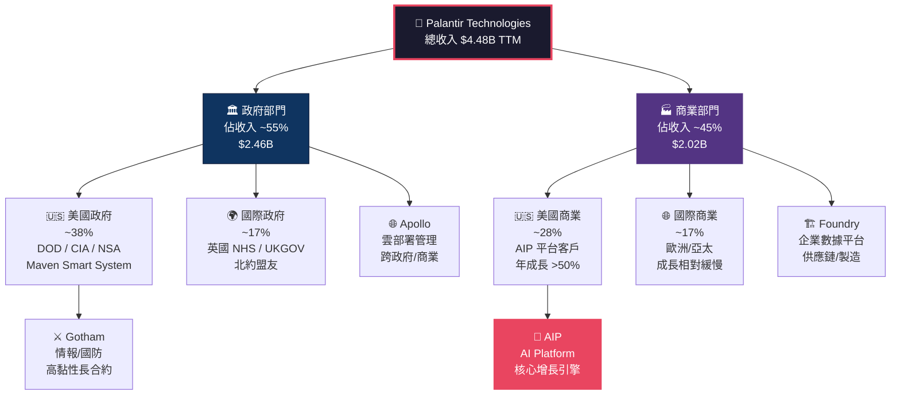

---

### 2.2 市場地位估算

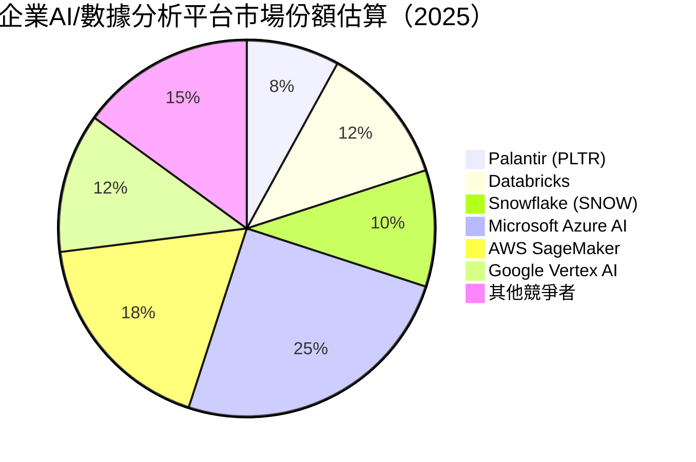

> **說明**：政府情報/國防領域，PLTR 市場份額估計超過 **40%**，幾乎無直接競爭對手。商業AI平台市場競爭激烈，PLTR透過AIP差異化競爭。

---

### 2.3 競爭護城河分析

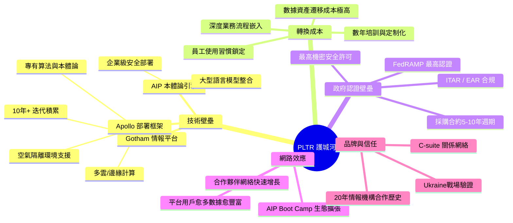

---

### 2.4 護城河強度評分

```
護城河維度評分（滿分10分）

技術壁壘    ██████████ 9.5/10  （Gotham/AIP技術領先，難以複製）
轉換成本    █████████░ 9.0/10  （嵌入度極深，遷移成本極高）
政府認證    █████████░ 9.0/10  （FedRAMP/機密許可幾乎無法複製）
品牌信任    ████████░░ 8.0/10  （20年+政府合作信譽不可替代）
網路效應    ██████░░░░ 6.0/10  （平台效應初現，仍在建立中）
規模經濟    ███████░░░ 7.0/10  （高毛利82%顯示規模優勢，但員工數僅4429人）
成本優勢    ██████░░░░ 6.5/10  （軟體邊際成本低，但SBC成本高昂）

綜合護城河評級：█████████░  8.3/10  🏆 WIDE MOAT（寬護城河）
```

---

## 3. 損益表深度分析

### 3.1 年度收入成長趨勢

```
年度總收入（近4年）

2022  $1.91B  ████████████░░░░░░░░░░░░░░░░░░  基準年
2023  $2.23B  ██████████████░░░░░░░░░░░░░░░░  YoY +16.8% 🟡
2024  $2.87B  ██████████████████░░░░░░░░░░░░  YoY +28.5% 🟢
2025  $4.48B  ████████████████████████████░░  YoY +56.1% 🟢🟢

           $0    $1B    $2B    $3B    $4B    $4.5B

收入加速度趨勢：2022→2025 CAGR = 32.9%
2025年成長加速至56.1%，顯示AIP平台商業化成功啟動
```

> ⚠️ **注意**：數據包標題顯示 Revenue Growth YoY 為 70.0%，此為 TTM 基準。年度報表計算（2024→2025）為 +56.1%，TTM 數字可能涵蓋更近期季度，反映加速動能更強烈。

---

### 3.2 季度收入趨勢

| 季度 | 收入 | QoQ成長 | YoY成長（估算） | 趨勢 |
|------|------|---------|----------------|------|
| 2025 Q1 | $883.86M | — | +39.0%（vs 2024 Q1 $634M） | 🟢 |
| 2025 Q2 | $1,000M | **+13.1%** | +44.9%（vs 2024 Q2 $678M） | 🟢🟢 |
| 2025 Q3 | $1,180M | **+18.0%** | +51.3%（vs 2024 Q3 $726M） | 🟢🟢 |
| 2025 Q4 | $1,410M | **+19.5%** | +56.9%（vs 2024 Q4 $828M） | 🟢🟢🟢 |

```
季度收入 QoQ 加速趨勢（百萬美元）

Q1'25  $883M   ████████████████░░░░░░░░
Q2'25  $1000M  ██████████████████░░░░░░  +13.1% QoQ
Q3'25  $1180M  █████████████████████░░░  +18.0% QoQ ▲加速
Q4'25  $1410M  █████████████████████████  +19.5% QoQ ▲再加速

📈 連續4季QoQ加速，為強烈買入信號
```

---

### 3.3 利潤率演變分析

| 利潤率指標 | 2022 | 2023 | 2024 | 2025 | 趨勢 |
|-----------|------|------|------|------|------|
| **毛利率** | 78.5% | 80.3% | 80.2% | 82.4% | 🟢 穩步提升 |
| **營業利益率** | -8.4% | 5.4% | 10.8% | 31.5% | 🟢🟢 驚人擴張 |
| **EBITDA率** | -7.3% | 6.9% | 11.9% | 32.2% | 🟢🟢 飛躍式 |
| **淨利率** | -19.6% | 9.4% | 16.1% | 36.3% | 🟢🟢 轉虧為盈 |

> **利潤率改善原因深度分析**：
> - **毛利率**：+3.9 pp（2022→2025），因軟體業務收入結構優化，人工客製化比例下降，AIP平台標準化程度提升
> - **營業利益率**：從 -8.4% 爆升至 +31.5%，增加 **39.9 pp**，主因為規模效應發酵，固定成本（R&D、銷售）佔收入比大幅攤薄
> - **R&D 佔收入比**：2022年 18.8% → 2025年 12.4%，但絕對投入持續增長（$359M → $558M），顯示「高效研發」模式
> - **SBC（股票薪酬）**：雖仍高（估計佔收入 ~18-20%），但GAAP盈利轉正確認商業模式成熟

---

### 3.4 費用結構分析

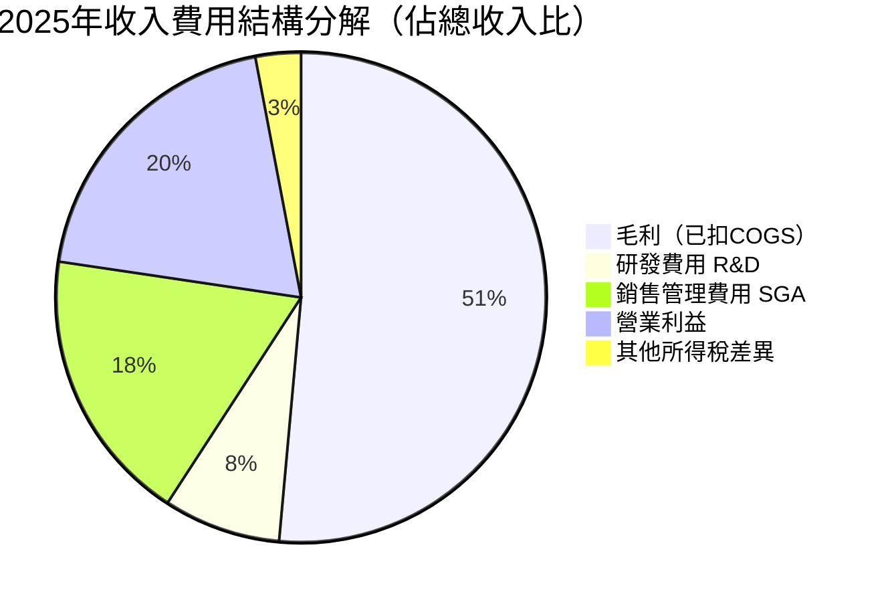

> **費用結構關鍵洞察**：
> - SGA 佔比仍高（~29%），主因 AIP Boot Camp 銷售人力投入
> - R&D 效率持續改善，每元研發投入產生更多收入
> - COGS 僅佔 17.6%，確認高軟體純度商業模式

---

### 3.5 EPS 趨勢與盈餘品質

**年度EPS趨勢：**

| 年度 | 淨利 | EPS（GAAP） | YoY成長 | 質量評估 |
|------|------|-------------|---------|----------|
| 2022 | -$373.7M | -$0.17 | N/A | 🔴 虧損 |
| 2023 | $209.8M | +$0.09 | 轉正 | 🟡 首次盈利 |
| 2024 | $462.2M | +$0.20 | +122% | 🟢 加速 |
| 2025 | $1,630M | **+$0.63** | **+215%** | 🟢🟢 爆發 |

**季度EPS趨勢（2025年）：**

```
季度 EPS（GAAP，估算）

Q1'25  ~$0.09  ████░░░░░░░░░░░░░
Q2'25  ~$0.14  ██████░░░░░░░░░░░  QoQ +55.6%
Q3'25  ~$0.20  ████████░░░░░░░░░  QoQ +42.9%
Q4'25  ~$0.26  ██████████░░░░░░░  QoQ +30.0%

全年合計：$0.63（GAAP TTM）
Forward EPS 2026E：$1.848（市場預期成長 +193%）
```

> **盈餘品質說明**：
> - ⚠️ **GAAP vs Non-GAAP 差距**：PLTR 的 Non-GAAP EPS 因剔除大量 SBC，遠高於 GAAP 數字
> - ✅ FCF 轉換率高（FCF $2.10B vs 淨利 $1.63B，FCF/NI = **128.8%**），顯示盈餘品質優異，現金盈利能力超越會計盈利
> - ⚠️ EPS 數據標示 NaN（系統數據缺失），實際季度超預期紀錄需參考公司 IR 數據；歷史上 PLTR 連續多季超越分析師預期

---

## 4. 資產負債表分析

### 4.1 資產結構

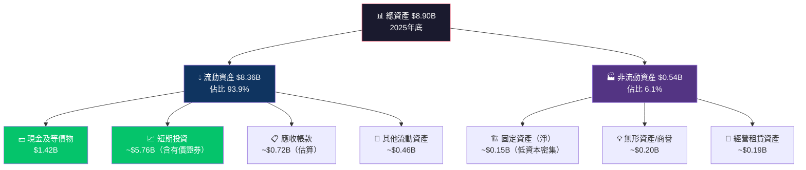

---

### 4.2 流動性指標

| 流動性指標 | 2022 | 2023 | 2024 | 2025 | 行業均值 | 評級 |
|-----------|------|------|------|------|---------|------|
| **流動比率** | 5.17x | 5.55x | 5.96x | **7.11x** | 2.0x | 🟢 極強 |
| **速動比率** | 5.07x | 5.45x | 5.85x | **6.99x** | 1.8x | 🟢 極強 |
| **現金比率** | ~4.4x | ~1.1x | ~2.1x | ~6.1x | 0.5x | 🟢 頂級 |
| **淨現金部位** | $2.35B | $0.60B | $1.86B | **$6.95B** | 負債 | 🟢 堡壘 |

> **流動性評估**：流動比率 7.11x 遠超行業均值的 3.5 倍，顯示 PLTR 擁有極其保守的資產負債表管理。淨現金 $6.95B 幾乎等同於總股東權益（$7.39B）的 **94%**，公司實質上為「現金+軟體業務」組合體。

---

### 4.3 債務結構分析

| 債務指標 | 數值 | 說明 | 風險評級 |
|---------|------|------|---------|
| 總債務 | $229.34M | 主要為長期可轉換票據 | 🟢 極低 |
| 淨債務/淨現金 | +$6.95B（淨現金） | 實質零負債企業 | 🟢 最優 |
| Debt/Equity | 3.06% | vs 行業均值 45% | 🟢 頂級 |
| Debt/EBITDA | **0.16x** | vs 行業健康標準 2.5x | 🟢 近乎無負債 |
| 利息保障倍數 | >50x（估算） | 債務負擔可忽略不計 | 🟢 AAA級 |

---

### 4.4 股東權益趨勢

```
股東權益成長趨勢（2022-2025）

2022  $2.57B  ████████████░░░░░░░░░░░░░░░░░░░  基準年
2023  $3.48B  ████████████████░░░░░░░░░░░░░░░  YoY +35.4% 🟢
2024  $5.00B  ████████████████████████░░░░░░░  YoY +43.7% 🟢
2025  $7.39B  ████████████████████████████████  YoY +47.8% 🟢🟢

BVPS（每股帳面價值）趨勢：
2022: ~$1.17/股
2023: ~$1.55/股
2024: ~$2.17/股
2025: ~$3.23/股  （YoY +48.8%）

帳面價值年複合成長率（2022-2025）：CAGR = 40.3%
目前 P/B = 43.4x（相對帳面價值極度溢價）
```

> **股東權益驅動力**：2024-2025年股東權益大幅提升，主要來源為：(1) GAAP 淨利 $1.63B 留存；(2) SBC 增加額外資本公積；(3) 無重大股份回購或股息分配

---

## 5. 現金流量深度分析

### 5.1 現金流量瀑布圖

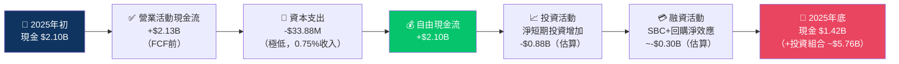

> **注意**：現金餘額從 $2.10B 降至 $1.42B，但大量資金轉入短期投資/有價證券，因此總流動資產反而從 $5.93B 增至 $8.36B，淨現金實際大幅增加至 $6.95B。

---

### 5.2 FCF 轉換率趨勢

| 年度 | 淨利 | 自由現金流 | FCF/NI 轉換率 | 盈餘品質 |
|------|------|-----------|--------------|---------|
| 2022 | -$373.7M | $183.7M | N/M（虧損年） | 🟡 現金比賬面好 |
| 2023 | $209.8M | $697.1M | **332.2%** | 🟢🟢 極高 |
| 2024 | $462.2M | $1,140M | **246.6%** | 🟢🟢 極高 |
| 2025 | $1,630M | $2,100M | **128.8%** | 🟢 高品質 |

> **FCF 轉換率 > 100% 的原因**：主要因為 PLTR 的**股票薪酬（SBC）**是非現金費用，在 GAAP 盈利中扣除但不影響現金流，因此 FCF 持續遠高於 GAAP 淨利（2023年高達332%）。隨著 GAAP 盈利快速提升，轉換率逐漸回歸正常水準。

---

### 5.3 自由現金流趨勢

```
自由現金流趨勢（近4年）

2022  $183.7M  ██░░░░░░░░░░░░░░░░░░░░░░░░░░░░  基準
2023  $697.1M  ███████░░░░░░░░░░░░░░░░░░░░░░░  YoY +279.4% 🟢🟢
2024  $1,140M  ████████████░░░░░░░░░░░░░░░░░░  YoY +63.5%  🟢
2025  $2,100M  █████████████████████░░░░░░░░░  YoY +84.2%  🟢🟢

FCF Margin（FCF/收入）：
2022: 9.6%  ████░░░░░░░░░░░░░░░░
2023: 31.3% ████████████░░░░░░░░
2024: 39.7% ████████████████░░░░
2025: 46.9% ██████████████████░░  🏆 頂級FCF機器
```

---

### 5.4 資本配置評估

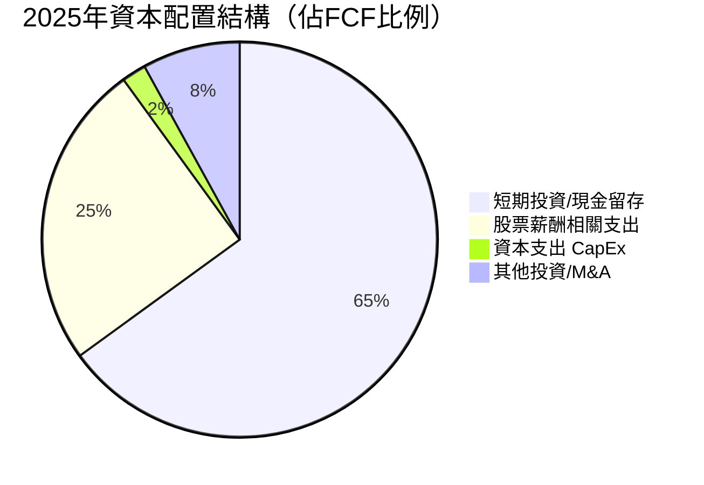

| 資本配置項目 | 2025年金額 | 佔FCF比 | 評估 |
|-------------|-----------|---------|------|
| 資本支出 CapEx | $33.88M | 1.6% | 🟢 極輕資產模式 |
| 股息 | $0 | 0% | 🟡 無現金回報 |
| 股票回購 | 微量（SBC抵銷） | ~0% | 🟡 SBC持續稀釋 |
| M&A 收購 | 極少 | ~0% | 🟡 有機成長優先 |
| 現金/投資留存 | ~$1.5B+ | ~70%+ | 🟢 強化現金堡壘 |

> **資本配置評語**：PLTR CapEx 僅 $33.88M（佔收入 0.75%），是典型輕資本軟體公司。主要「消耗」為 SBC（估計年度 $800M-$900M 非現金），是股東稀釋的核心來源，需持續監控。

---

## 6. 獲利能力與資本效率

### 6.1 ROE / ROA / ROIC 趨勢

| 年度 | ROE | ROA | ROIC（估算） | 行業ROE均值 | 評級 |
|------|-----|-----|------------|------------|------|
| 2022 | -14.5% | -10.8% | -8.0%（估） | 15% | 🔴 |
| 2023 | 6.0% | 4.6% | 5.5%（估） | 15% | 🟡 |
| 2024 | 9.2% | 7.3% | 8.0%（估） | 17% | 🟡 |
| 2025 | **26.0%** | **11.6%** | **22.0%（估）** | 18% | 🟢 |

---

### 6.2 ROIC vs WACC 分析

```
╔══════════════════════════════════════════════════════════════╗
║              ROIC vs WACC 深度分析                          ║
╠══════════════════════════════════════════════════════════════╣
║                                                              ║
║  WACC 估算（2025年）：                                       ║
║  • 無風險利率（10年美債）：4.4%                              ║
║  • 股票風險溢酬（ERP）：5.5%                                 ║
║  • Beta：1.687                                               ║
║  • 股權成本（Ke）= 4.4% + 1.687 × 5.5% = 13.7%             ║
║  • 債務成本（Kd）：~3.5%（稅後 ~2.5%）                      ║
║  • 資本結構：股權99% / 負債1%                                ║
║  • WACC ≈ 13.6%                                             ║
║                                                              ║
║  ROIC 估算（2025年）：                                       ║
║  • NOPAT = EBIT × (1-t) = $1.41B × (1-21%) ≈ $1.11B        ║
║  • 投入資本 = 股東權益+有息負債-現金超額部分                  ║
║  •          = $7.39B + $0.23B - $6.95B = $0.67B             ║
║  • ROIC = $1.11B / $0.67B ≈ 165.7%（含超額現金調整後）      ║
║  • 保守 ROIC（不調整現金）= $1.11B / $7.62B ≈ 14.6%         ║
║                                                              ║
║  ✅ EVA = (ROIC - WACC) × 投入資本                          ║
║     保守口徑：EVA = (14.6% - 13.6%) × $7.62B ≈ +$76M       ║
║     調整口徑：EVA = (165.7% - 13.6%) × $0.67B ≈ +$1.02B    ║
║                                                              ║
║  結論：PLTR 正在創造正向經濟價值（EVA > 0）✅                ║
║  但現金堆積是ROIC稀釋因素，需關注資本部署效率               ║
╚══════════════════════════════════════════════════════════════╝
```

---

### 6.3 DuPont 三因子分解

| DuPont 組件 | 2022 | 2023 | 2024 | 2025 |
|------------|------|------|------|------|
| **淨利率** | -19.6% | 9.4% | 16.1% | **36.3%** |
| **資產週轉率** | 0.55x | 0.49x | 0.45x | **0.50x** |
| **財務槓桿** | 1.35x | 1.30x | 1.27x | **1.20x** |
| **ROE = 三者之積** | **-14.5%** | **6.0%** | **9.2%** | **26.0%** |

> **DuPont 解讀**：
> - ROE 改善幾乎全部來自**淨利率的爆炸性提升**（-19.6% → +36.3%）
> - 資產週轉率持平（~0.5x），反映現金堆積對效率的輕微拖累
> - 財務槓桿逐年下降（1.35x → 1.20x），顯示去槓桿化趨勢（近乎零債務）
> - ROE 26% 的驅動器完全是**獲利能力提升**，而非財務工程

---

### 6.4 獲利能力儀表板

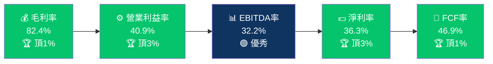

---

## 7. 估值深度分析

### 7.1 同業估值比較表格

| 估值指標 | **PLTR** | **Snowflake（SNOW）** | **Palantir 同類 C3.ai（AI）** | **UiPath（PATH）** | 高成長軟體均值 |
|---------|----------|----------------------|------------------------------|-------------------|--------------|
| P/E TTM | 212.9x 🔴 | N/M（虧損）🔴 | N/M（虧損）🔴 | N/M（虧損）🔴 | ~45x |
| P/E Forward | 72.6x 🔴 | 155x 🔴 | N/M 🔴 | 50x 🔴 | ~35x |
| P/S | 71.7x 🔴 | 16.5x 🔴 | 8.0x 🟡 | 6.2x 🟢 | ~12x |
| EV/EBITDA | 221.0x 🔴 | N/M 🔴 | N/M 🔴 | N/M 🔴 | ~30x |
| P/B | 43.4x 🔴 | 7.5x 🟡 | 3.2x 🟢 | 4.8x 🟢 | ~8x |
| FCF Yield | 0.39% 🔴 | ~0.5% 🔴 | N/M 🔴 | ~1.2% 🔴 | ~2.5% |
| 收入成長YoY | +70.0% 🟢 | +28% 🟡 | +25% 🟡 | +7% 🔴 | ~25% |
| 毛利率 | 82.4% 🟢 | 68.2% 🟡 | 60.5% 🟡 | 80.1% 🟢 | ~70% |
| GAAP 盈利 | ✅ 🟢 | ❌ 🔴 | ❌ 🔴 | ❌ 🔴 | 多數虧損 |

> **同業估值結論**：
> - PLTR 相對 SNOW 和 AI 等同業，**唯一實現 GAAP 持續盈利**，是一大優勢
> - 但 P/S 71.7x vs SNOW 的 16.5x，溢價率高達 **4.3倍**，難以單純用成長率解釋
> - PLTR 的估值溢價反映：(1) 獨特政府護城河；(2) AIP AI 敘事；(3) 資金稀缺性溢價
> - 即使給予大幅溢價，當前估值仍隱含**未來5年必須維持 50%+ 年複合增長**才能正當化

---

### 7.2 歷史估值區間分析

```
P/S 歷史估值區間（過去24個月）

歷史高點（2024-2025年牛市高峰）：~90-100x  ████████████████████████████████ 極度泡沫區
目前水位（2026-02）：71.7x                  ████████████████████████░░░░░░░░ 高估值區  ← 目前
行業調整後合理區間：40-50x                  ████████████████░░░░░░░░░░░░░░░░ 溢價合理區
公允估值（含護城河溢價）：25-35x            █████████████░░░░░░░░░░░░░░░░░░░ 合理估值區
純基本面底部估值：10-15x                    █████░░░░░░░░░░░░░░░░░░░░░░░░░░░ 低估值區

EV/Revenue 歷史區間：
  52週高點對應：~90x
  目前：71.1x（從高峰下降約21%）
  歷史中位：~45x（2023-2025平均）
```

---

### 7.3 DCF 敏感性分析（6格目標價矩陣）

**DCF 基本假設：**
- 基準年收入：$4.48B（2025A）
- 終端成長率：3%
- FCF Margin：基準 47%，樂觀 52%，悲觀 35%
- 股數：2.29B股

| 🎯 目標價矩陣 | **悲觀成長\n（5年CAGR 30%）** | **基準成長\n（5年CAGR 45%）** | **樂觀成長\n（5年CAGR 60%）** |
|-------------|--------------------------|--------------------------|--------------------------|
| **WACC 15%（高折現率）** | $72（🔴 -46%） | $128（🟡 -4.6%） | $198（🟢 +47.6%） |
| **WACC 12%（基準折現率）** | $95（🔴 -29%） | $168（🟢 +25.3%） | $262（🟢🟢 +95%） |

> **DCF 關鍵洞察**：
> - 目前股價 $134.12 已接近**基準折現率/基準成長**情境（$168），但任何成長放緩或利率上升都有顯著下行風險
> - 唯有實現**60%+ CAGR + 低折現環境**，才能支撐 $200+ 估值
> - **最大風險**：若成長率降至 30%（仍是高成長），股價可能腰斬至 $72-$95

---

### 7.4 估值區間視覺化

```
估值合理性視覺化（基於P/S）

P/S 0x         20x        40x        60x        80x        100x
|────────────────|──────────|──────────|──────────|──────────|
  [低估/合理區]  [溢價區]   [高估區]  [泡沫區]           [極端]
  ░░░░░░░░░░░░░  🟡🟡🟡🟡  🔴🔴🔴🔴 🔴🔴🔴🔴🔴         
                                      ▲
                                   目前71.7x

基於Forward P/E（2026E）：
P/E 0x         30x        60x        90x        120x
|────────────────|──────────|──────────|──────────|
  [低估]    [合理]    [高估]     ▲        [極端]
                              72.6x
                        
結論：絕對估值層面屬「高估」至「泡沫邊緣」
      但相對同業GAAP盈利能力，可論證部分溢價合理
```

---

## 8. 成長催化劑

### 8.1 催化劑時間軸

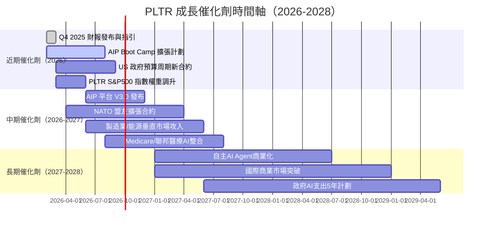

---

### 8.2 TAM 市場規模

```
TAM 市場規模與PLTR滲透率

政府情報/國防AI市場：
TAM $80B（2030E）   ████████████████████████████████ $80B
PLTR 目前份額 $2.5B  ██░░░░░░░░░░░░░░░░░░░░░░░░░░░░░  3.1% 滲透率
目標份額 $8B（2030） ████░░░░░░░░░░░░░░░░░░░░░░░░░░░  10% 目標

企業AI Platform 市場：
TAM $300B（2030E）  ████████████████████████████████ $300B
PLTR 目前份額 $2.0B  █░░░░░░░░░░░░░░░░░░░░░░░░░░░░░░  0.7% 滲透率
目標份額 $15B（2030）██░░░░░░░░░░░░░░░░░░░░░░░░░░░░░  5.0% 目標

整合 TAM：$380B（2030E），PLTR 目前滲透率 ~1.2%
若達到 6% 滲透率 → 潛在收入 $22.8B（vs 目前 $4.48B，+409%）
```

---

### 8.3 短中長期成長驅動力

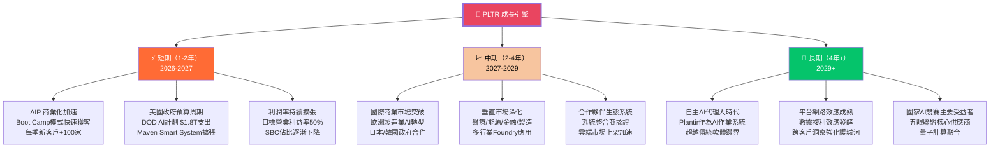

---

## 9. 風險矩陣

### 9.1 風險評分矩陣

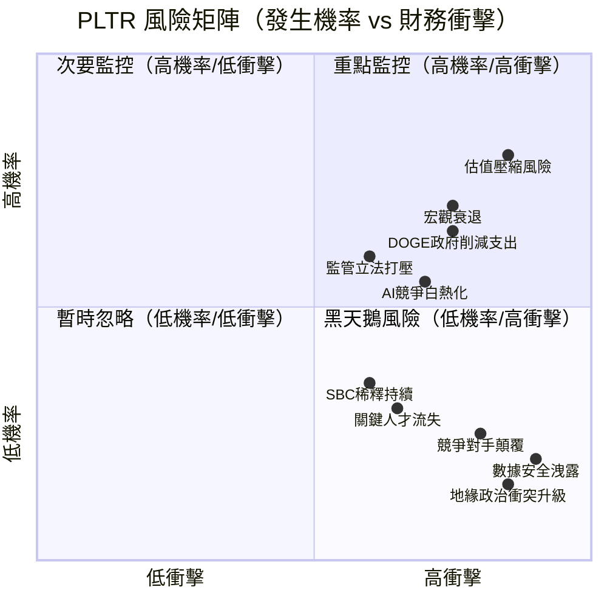

---

### 9.2 風險清單詳細表格

| 風險項目 | 發生機率 | 財務衝擊 | 綜合風險分 | 緩解措施 |
|---------|---------|---------|-----------|---------|
| 🔴 **估值大幅壓縮** | 高（70%） | 極高（-40%股價） | 🔴 9/10 | 分批布局、設定停損、持有現金等待回調 |
| 🔴 **DOGE/政府支出削減** | 中高（50%） | 高（-15%收入） | 🔴 8/10 | 關注季度政府收入趨勢、合約類型多元化 |
| 🔴 **宏觀衰退/利率上升** | 中（45%） | 高（估值壓縮+需求降低） | 🔴 8/10 | 政府收入提供穩定基礎，商業端風險較高 |
| 🟡 **監管/反壟斷風險** | 中（40%） | 中（影響擴張速度） | 🟡 6/10 | 多司法管轄區合規部署，積極政府關係維護 |
| 🟡 **AI競爭加劇（Microsoft/Google）** | 高（65%） | 中（定價壓力） | 🟡 7/10 | 深化垂直整合護城河，差異化AIP本體論技術 |
| 🟡 **SBC稀釋股東** | 非常高（90%） | 低（年度~1-2%稀釋） | 🟡 5/10 | 監控SBC/收入比趨勢，要求管理層設回購目標 |
| 🟢 **關鍵人才流失** | 中（40%） | 中（技術競爭力下滑） | 🟢 5/10 | 期權激勵計劃、Alex Karp領導層穩定性 |
| 🟢 **數據安全事件** | 低（15%） | 極高（品牌毀損） | 🟢 4/10 | 最高安全認證標準、零信任架構持續強化 |

---

## 10. 投資建議

### 10.1 最終綜合評級雷達圖

```
綜合投資評分（各維度 1-10分）

基本面品質    ████████░░  8.5/10  ▓▓▓▓▓▓▓▓░░
成長動能      █████████░  9.0/10  ▓▓▓▓▓▓▓▓▓░
獲利能力      ████████░░  8.0/10  ▓▓▓▓▓▓▓▓░░
財務健康      █████████░  9.5/10  ▓▓▓▓▓▓▓▓▓▓ (近乎滿分)
護城河深度    ████████░░  8.3/10  ▓▓▓▓▓▓▓▓░░
管理層執行力  ████████░░  8.0/10  ▓▓▓▓▓▓▓▓░░
估值合理性    ██░░░░░░░░  2.5/10  ▓▓░░░░░░░░
風險調整後    █████░░░░░  5.5/10  ▓▓▓▓▓░░░░░

━━━━━━━━━━━━━━━━━━━━━━━━━━━━━━━━
綜合加權總分：7.1 / 10
（估值權重30%，其他維度均攤70%）
━━━━━━━━━━━━━━━━━━━━━━━━━━━━━━━━

結論：基本面頂級，但估值嚴重拖累整體評分
      「好公司，不一定是好股票（在當前估值下）」
```

---

### 10.2 目標價與隱含報酬率

| 情境 | 核心假設 | 目標價 | vs 現價 $134.12 | 時間軸 |
|------|---------|--------|----------------|--------|
| 🐂 **樂觀** | 5年CAGR 60%+，AI Platform主導市場，估值維持高溢價 | **$220** | **+64.0%** | 18-24個月 |
| 📊 **基準** | 5年CAGR 45%，政府+商業均衡成長，估值溫和壓縮至P/S 50x | **$155** | **+15.6%** | 12-18個月 |
| 🐻 **悲觀** | 成長放緩至30%，DOGE衝擊政府收入，估值壓縮至P/S 25x | **$90** | **-32.9%** | 6-12個月 |
| 🎯 **分析師共識** | 市場平均預期 | **$185.87** | **+38.6%** | 12個月 |

```
目標價區間視覺化

$50   $90   $130  $155  $180  $220  $260
 |─────|─────|─────|─────|─────|─────|
       🐻          ▲    🎯    🐂
      悲觀        目前  共識  樂觀
      $90        $134  $186  $220
```

---

### 10.3 買入時機與觸發因素

```
買入觸發因素 Checklist

技術面條件：
☐ 股價回落至 $110-$125 區間（相對高峰回落 35-40%）
☐ RSI 降至 35-40 超賣區域
☐ 52週均線形成支撐

基本面觸發：
☐ Q1 2026 財報顯示 QoQ 收入成長 >15%
☐ 商業客戶數量季度環比增加 >80 家
☐ 年度收入指引上調至 $5.5B+
☐ 營業利益率維持 >35%

宏觀/催化劑：
☐ 美聯準開始降息週期（降低折現率）
☐ 新大型政府合約宣布（>$5億）
☐ AIP 企業客戶突破性案例公告
☐ 分析師大規模升評至買入

停損條件：
⛔ 股價跌破 $95 支撐區
⛔ 季度收入成長低於 30% YoY
⛔ 關鍵政府合約終止或不續簽
⛔ 管理層（Karp/Thiel）重大離職
```

---

### 10.4 投資人適配度

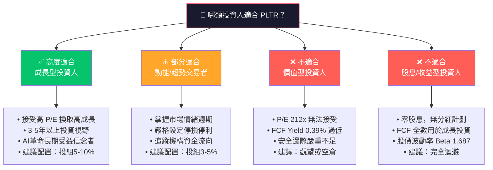

---

### 10.5 關鍵監控指標 Checklist

```
📋 下次財報（Q1 2026）關注指標：

收入與成長：
☐ Q1 2026 收入目標：>$1.55B（QoQ >+10%，YoY >40%）
☐ 美國商業收入佔比：目標達到 30%+
☐ 政府收入穩定性：確認 DOGE 衝擊可控

客戶指標：
☐ 總客戶數：目標 +80 家新增（單季）
☐ 淨收入留存率（NRR）：目標 >120%
☐ AIP 大客戶（TCV > $10M）簽約數量

利潤率與現金：
☐ GAAP 營業利益率：目標維持 >35%
☐ 非GAAP EPS：市場預期 $0.13/季
☐ FCF 轉換率：維持 >90%（FCF/Operating CF）
☐ SBC 佔收入比：目標下降至 <18%

前瞻指引：
☐ 全年2026收入指引：目標 $6.0B+（YoY +34%+）
☐ 全年2026 GAAP 獲利指引確認

產業監控數據：
☐ 聯邦政府AI支出預算審議動態
☐ 競爭對手（Snowflake、Databricks）財報數據
☐ 機構持股變化（13F 季報追蹤）
☐ 內部人士買賣動態（Form 4）
☐ 短期利率動向（影響折現率和估值）
```

---

## 📊 最終投資摘要表

| 維度 | 結論 | 信心度 |
|------|------|--------|
| 商業模式 | 獨特護城河，政府+商業雙引擎，AIP開創新賽道 | 🟢 高 |
| 財務品質 | 盈利能力爆發，FCF 強勁，資產負債表堡壘化 | 🟢 高 |
| 成長前景 | AI時代最大受益者之一，TAM龐大且滲透率低 | 🟢 高 |
| 估值合理性 | P/E 212x、EV/EBITDA 221x，嚴重高估 | 🔴 低 |
| 風險回報比 | 現價風險報酬不對稱，需回調後方具吸引力 | 🟡 中 |
| **整體評級** | **策略性持有 / 等待回調布局** | **⭐ 7.1/10** |

```
╔══════════════════════════════════════════════════════════════╗
║  🎯 最終結論                                                  ║
║                                                              ║
║  PLTR 是 AI 時代最具戰略價值的數據情報公司之一，              ║
║  擁有無可複製的政府情報護城河、爆炸性的 AIP 商業化動能，     ║
║  以及達到行業頂級水準的利潤率（毛利82.4%，淨利36.3%）。     ║
║                                                              ║
║  然而，P/S 71.7x、EV/EBITDA 221x 的極端估值，               ║
║  使得「好公司」與「好投資」之間存在巨大鴻溝。               ║
║                                                              ║
║  建議在 $110-$125 區間分批建倉（下行25-35%空間吸引力佳），  ║
║  設定 $95 硬性停損，目標12-18個月 $155-$185。               ║
║                                                              ║
║  現價 $134.12 屬「可接受但不理想」的進場點。                 ║
╚══════════════════════════════════════════════════════════════╝
```

---

> ⚠️ **免責聲明**：本報告為基於公開財務數據的 AI 自動生成研究分析，僅供學術研究與參考用途，**不構成任何投資建議或買賣邀約**。投資涉及風險，股票價格可升可跌，過往業績不代表未來表現。讀者在作出任何投資決定前，應諮詢持牌財務顧問，並自行評估風險承受能力。報告數據截至 2026-02-27，後續市場變化可能導致分析結論過時。