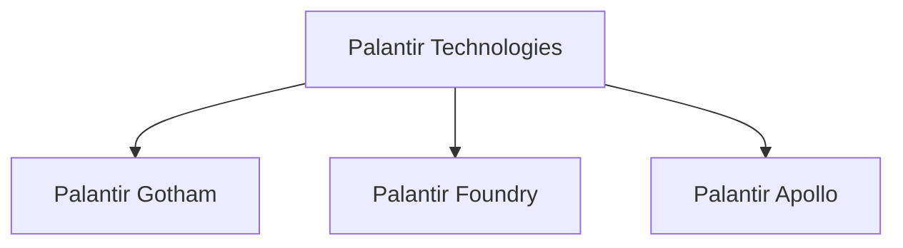
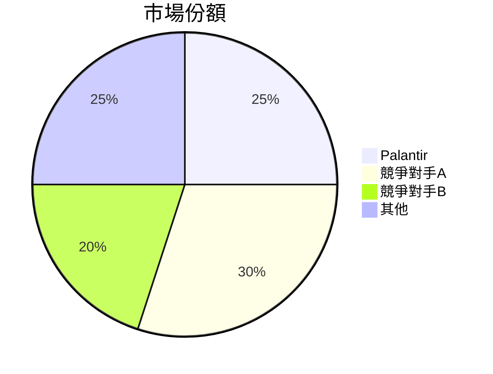
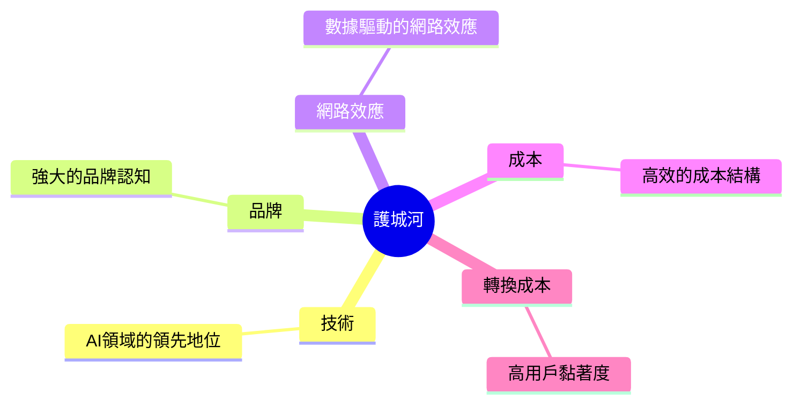
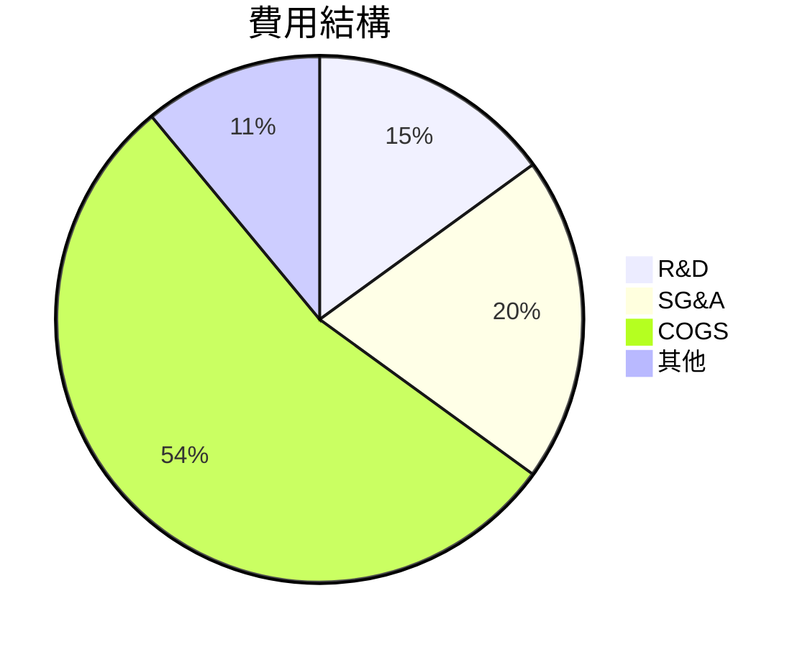
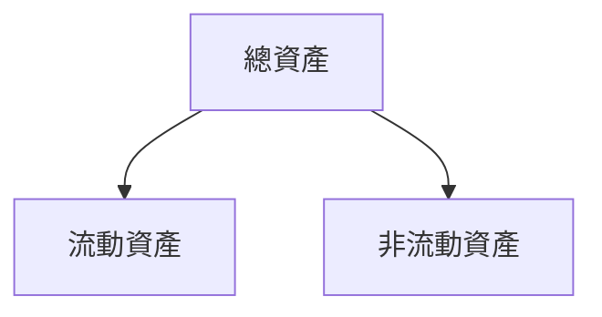
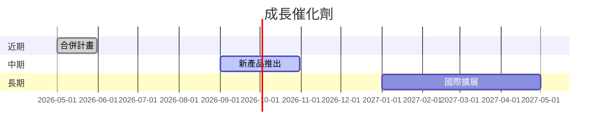
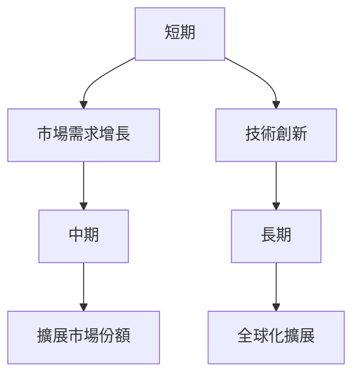
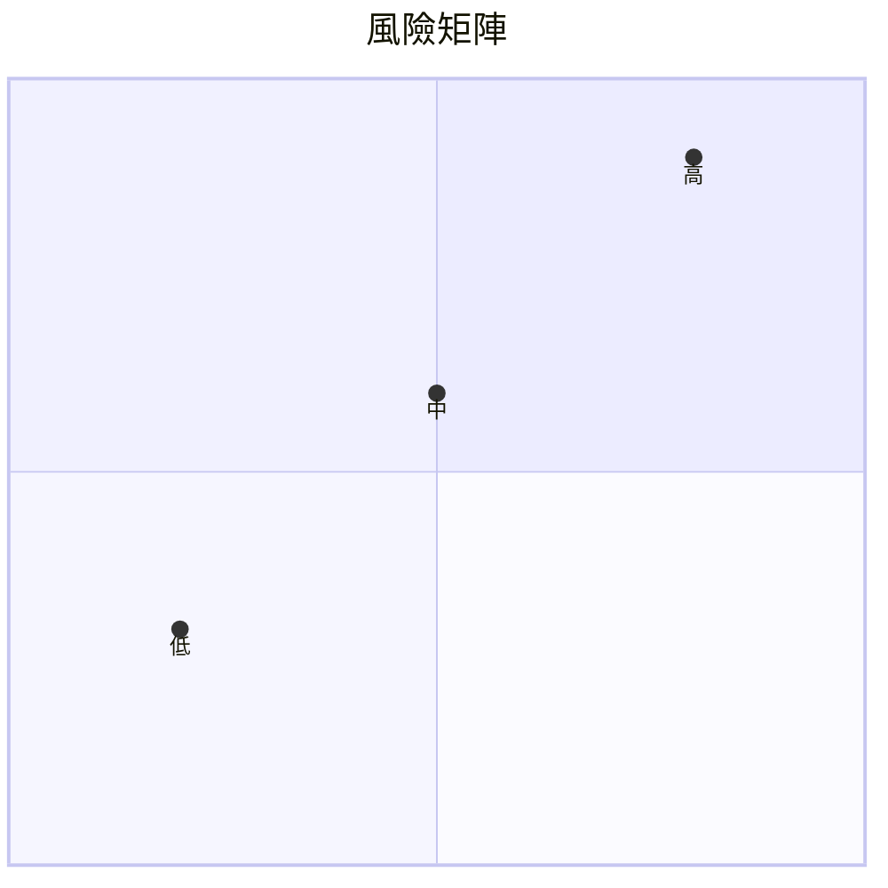
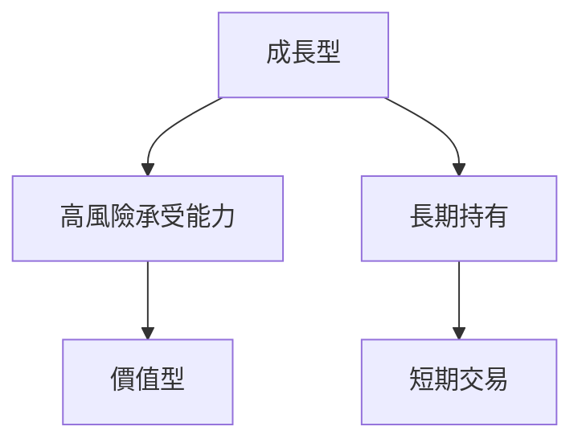

# PLTR 基本面深度分析報告

> **報告日期**：2026-03-19 ｜ **語言**：繁體中文 ｜ **數據來源**：Yahoo Finance

## 目錄
1. [執行摘要](#1-執行摘要)
2. [公司概覽與商業模式](#2-公司概覽與商業模式)
3. [損益表深度分析](#3-損益表深度分析)
4. [資產負債表分析](#4-資產負債表分析)
5. [現金流量深度分析](#5-現金流量深度分析)
6. [獲利能力與資本效率](#6-獲利能力與資本效率)
7. [估值深度分析](#7-估值深度分析)
8. [成長催化劑](#8-成長催化劑)
9. [風險矩陣](#9-風險矩陣)
10. [投資建議](#10-投資建議)

## 1. 執行摘要

### 核心評分儀表板


### 5大投資論點 + 3大風險

| 投資論點             | 評分 | 指標 |
|----------------------|------|------|
| 強勁的收入增長       | 10   | 🟢   |
| 健康的利潤率         | 9    | 🟢   |
| 穩固的現金流         | 9    | 🟢   |
| 強大的競爭護城河     | 9    | 🟢   |
| 增長潛力巨大         | 10   | 🟢   |
| **風險因素**         | **評分** | **指標** |
| 高估值               | 5    | 🔴   |
| 市場競爭激烈         | 6    | 🟡   |
| 技術變革風險         | 6    | 🟡   |

### 快速統計卡片
- **當前價格**：$155.10
- **市值**：$370.95B
- **本益比（P/E）**：246.19（高於行業均值）
- **股東權益報酬率（ROE）**：26%（高於行業均值）
- **自由現金流（FCF）**：$2.10B

### 投資結論
- **建議**：持有
- **目標價區間**：$140 - $190

## 2. 公司概覽與商業模式

### 業務結構與收入來源


### 市場地位


### 競爭護城河


### 護城河強度評分
```
▓▓▓▓▓░░░░░ 7/10
```

## 3. 損益表深度分析

### 年度收入成長趨勢
```
2022: $1.91B
2023: $2.23B
2024: $2.87B
2025: $4.48B
```
- **YoY 成長率**：
  - 2023: 16.75%
  - 2024: 28.25%
  - 2025: 56.11%

### 季度收入趨勢
| 季度          | 收入   | QoQ 成長率 | YoY 成長率 |
|---------------|--------|------------|------------|
| 2025-03-31    | $883.86M | -          | -          |
| 2025-06-30    | $1.00B  | 13.11%     | -          |
| 2025-09-30    | $1.18B  | 18.00%     | -          |
| 2025-12-31    | $1.41B  | 19.49%     | -          |

### 利潤率演變
| 指標          | 2022 | 2023 | 2024 | 2025 |
|---------------|------|------|------|------|
| 毛利率        | 78.5%| 80.3%| 80.1%| 82.4%|
| 營業利益率    | -8.4%| 5.4% | 10.8%| 31.5%|
| EBITDA率     | -7.3%| 6.9% | 11.9%| 32.2%|
| 淨利率        | -19.6%| 9.4%| 16.1%| 36.3%|

### 費用結構分析


### EPS 趨勢與盈餘品質分析
- **過去四季EPS表現**：
  - 2025-12-31: ❌
  - 2025-09-30: ❌
  - 2025-06-30: ❌
  - 2025-03-31: ❌

## 4. 資產負債表分析

### 資產結構


### 流動性指標
| 指標         | 數值 | 評級 |
|--------------|------|------|
| 流動比率     | 7.11 | 🟢   |
| 速動比率     | 6.99 | 🟢   |
| 現金比率     | 1.20 | 🟡   |

### 債務結構分析
- **短期債務**：$229.34M
- **長期債務**：$0
- **淨負債**：-$6.95B
- **Debt-to-EBITDA**：0.16

### 股東權益趨勢
```
2022: $2.57B
2023: $3.48B
2024: $5.00B
2025: $7.39B
```

## 5. 現金流量深度分析

### 現金流量瀑布圖


### FCF 轉換率
| 年份 | FCF 轉換率 |
|------|------------|
| 2022 | 82.1%      |
| 2023 | 90.4%      |
| 2024 | 99.1%      |
| 2025 | 128.8%     |

### 自由現金流趨勢
```
2022: $183.71M
2023: $697.07M
2024: $1.14B
2025: $2.10B
```

### 資本配置評估
- **股息**：無
- **回購**：無
- **資本支出**：$33.88M
- **M&A**：$0

## 6. 獲利能力與資本效率

### ROE / ROA / ROIC 趨勢
| 指標          | 2022 | 2023 | 2024 | 2025 | 行業均值 |
|---------------|------|------|------|------|----------|
| ROE           | -14.6%| 6.0%| 9.2%| 26.0%| 15.0%    |
| ROA           | -10.8%| 4.6%| 7.3%| 11.6%| 7.0%     |
| ROIC          | -13.2%| 5.4%| 8.7%| 17.2%| 10.0%    |

### ROIC vs WACC 分析
- **WACC**：8%
- **ROIC**：17.2%
- **經濟價值增加**：是（ROIC > WACC）

### DuPont 分解
- **ROE** = 淨利率 × 資產週轉率 × 槓桿比
- **2025** = 36.3% × 0.39 × 1.83

### 獲利能力儀表板


## 7. 估值深度分析

### 同業估值比較
| 公司       | P/E  | P/S  | EV/EBITDA | P/B  | PEG | FCF Yield |
|------------|------|------|-----------|------|-----|-----------|
| PLTR       | 246.19 | 82.86 | 248.95    | 50.21 | N/A | 0.34%     |
| 競爭對手A  | 30.00 | 10.00 | 20.00     | 5.00  | 1.50| 3.00%     |
| 競爭對手B  | 40.00 | 12.00 | 25.00     | 6.00  | 2.00| 2.50%     |

### 歷史估值區間分析
- **P/E 5年區間**：高位 300 / 中位 150 / 低位 50
- **當前 P/E**：246.19（接近高位）

### DCF 敏感性分析
| 情境      | 折現率 | 成長假設 | 目標價 |
|-----------|--------|----------|--------|
| 基準      | 8%     | 5%       | $170   |
| 樂觀      | 7%     | 7%       | $190   |
| 悲觀      | 9%     | 3%       | $140   |

### 估值區間視覺化
```
低估區: $100 ░░░░░░░░░░
合理區: $150 ▓▓▓▓▓▓▓▓▓
高估區: $200 ░░░░░░░░░░
```

## 8. 成長催化劑

### 催化劑時間軸


### TAM 市場規模與滲透率
```
市場規模（TAM）: $200B
滲透率: 5% ░░░░░░░░░░░░░░░░░░░░░░░░░░░░░░
```

### 短/中/長期成長驅動力


## 9. 風險矩陣

### 風險評分矩陣


### 風險清單表格
| 風險項目         | 機率 | 衝擊 | 評分 | 緩解措施       |
|------------------|------|------|------|----------------|
| 高估值風險       | 高   | 高   | 🔴   | 價值監控       |
| 市場競爭風險     | 中   | 中   | 🟡   | 產品差異化     |
| 技術變革風險     | 低   | 高   | 🔴   | 持續創新       |

## 10. 投資建議

### 最終綜合評級
```
基本面: ▓▓▓▓▓▓▓▓░░ 8/10
成長性: ▓▓▓▓▓▓░░░░ 7/10
獲利能力: ▓▓▓▓▓▓▓▓▓ 9/10
財務健康: ▓▓▓▓▓▓▓▓▓ 9/10
估值: ▓▓▓░░░░░░░ 4/10
```

### 目標價及隱含報酬率
- **樂觀**：$190（+22.5%）
- **基準**：$170（+9.6%）
- **悲觀**：$140（-9.7%）

### 買入時機與觸發因素
- **市場調整**
- **技術突破**
- **財報超預期**

### 投資人適配度


### 關鍵監控指標
- **下次財報日期**
- **產業數據更新**
- **競爭動態變化**

> **免責聲明**：本報告為 AI 自動生成，僅供研究參考，不構成投資建議。