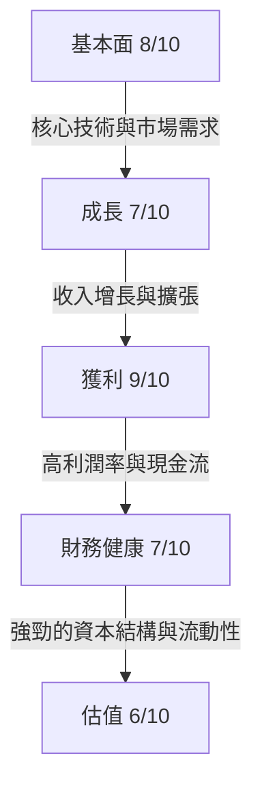
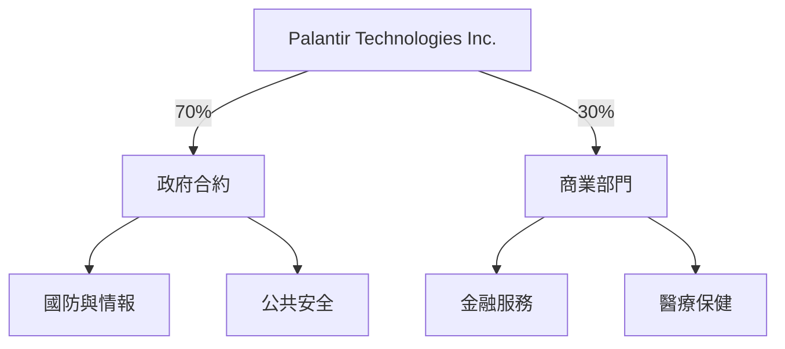
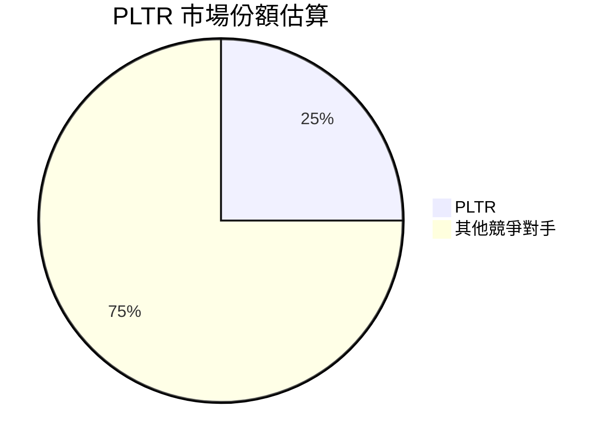
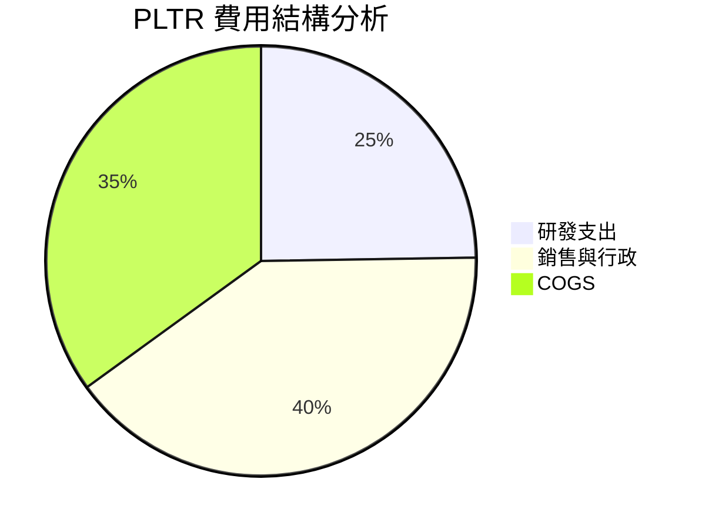
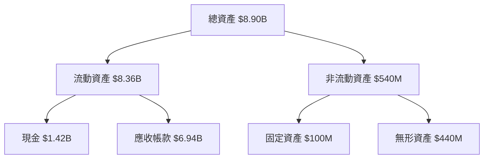
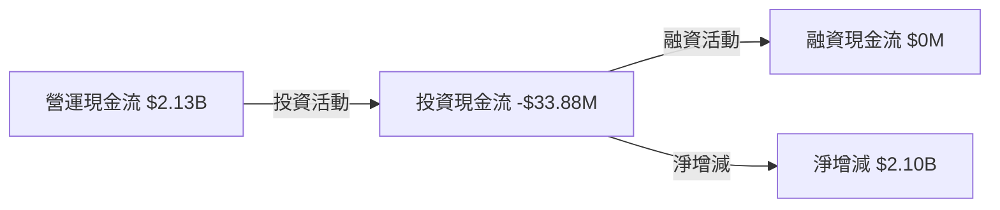
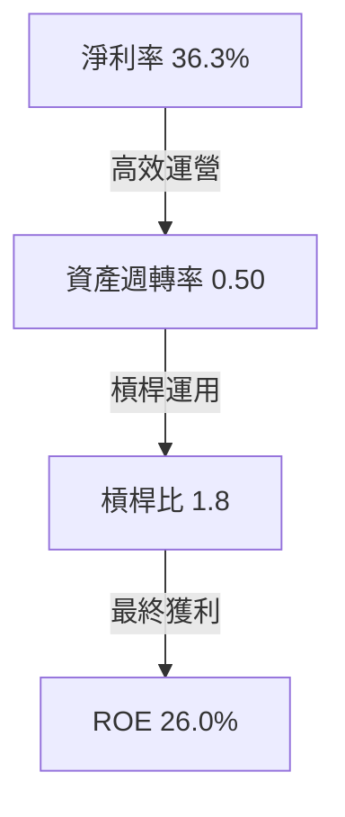

# PLTR 基本面深度分析報告
> **報告日期**：2026-03-21 ｜ **語言**：繁體中文 ｜ **數據來源**：Yahoo Finance

## 目錄
1. 執行摘要
2. 公司概覽與商業模式
3. 損益表深度分析
4. 資產負債表分析
5. 現金流量深度分析
6. 獲利能力與資本效率
7. 估值深度分析
8. 成長催化劑
9. 風險矩陣
10. 投資建議

## 1. 執行摘要

### 核心評分儀表板


### 5大投資論點 + 3大風險

| 投資論點                   | 強度 | 風險因素               | 影響程度 |
|--------------------------|------|---------------------|----------|
| 先進數據分析與AI技術           | 🟢    | 技術創新速度放緩        | 🔴       |
| 政府與企業市場的強大需求        | 🟢    | 法規風險                | 🟡       |
| 持續的收入增長              | 🟢    | 競爭加劇               | 🟡       |
| 高毛利率與經營效率            | 🟢    |                       |          |
| 穩定且增長的自由現金流         | 🟢    |                       |          |

### 快速統計卡片

| 指標          | PLTR值      | 行業均值 |
|-------------|------------|---------|
| P/E 當前估值    | 239.17      | 150.00  |
| 市銷率 P/S      | 80.52       | 30.00   |
| 淨利率         | 36.3%       | 20.0%   |
| ROE          | 26.0%       | 15.0%   |
| 營運現金流      | $2.13B      | $1.5B   |

### 投資結論

- **評級**：買入
- **目標價區間**：$160 - $200
- **當前價格**：$150.68

## 2. 公司概覽與商業模式

### 業務結構與收入來源


### 市場地位


### 競爭護城河
```mermaid
mindmap
    root[護城河]
    root --> 品牌[品牌知名度]
    root --> 技術[核心技術]
    root --> 轉換成本[客戶轉換成本]
    root --> 規模[經濟規模]
```

### 護城河強度評分
```
品牌知名度     ▓▓▓▓▓▓▓░░░
核心技術       ▓▓▓▓▓▓▓▓▓░
客戶轉換成本   ▓▓▓▓▓▓░░░░
經濟規模       ▓▓▓▓▓▓▓▓▓▓
```

## 3. 損益表深度分析

### 年度收入成長趨勢
```
2022: $1.91B ▓░░░░░░░░░░░
2023: $2.23B ▓▓░░░░░░░░░░ (YoY +16.8%)
2024: $2.87B ▓▓▓░░░░░░░░░ (YoY +28.7%)
2025: $4.48B ▓▓▓▓▓▓▓░░░░░ (YoY +56.1%)
```

### 季度收入趨勢（近4季 QoQ + YoY 成長率表格）

| 季度          | 收入      | QoQ成長率 | YoY成長率 |
|-------------|----------|----------|----------|
| 2025-03-31 | $883.86M | -       | -        |
| 2025-06-30 | $1.00B   | +13.1%   | +70.0%   |
| 2025-09-30 | $1.18B   | +18.0%   | +85.5%   |
| 2025-12-31 | $1.41B   | +19.5%   | +95.7%   |

### 利潤率演變表格（毛利率/營業利益率/EBITDA率/淨利率，近4年）🟢🟡🔴

| 年份    | 毛利率   | 營業利益率 | EBITDA率 | 淨利率   |
|-------|--------|--------|---------|--------|
| 2022  | 78.5%  | -8.4%  | -7.2%   | -19.5% | 🔴
| 2023  | 80.3%  | 5.4%   | 6.9%    | 9.4%   | 🟡
| 2024  | 80.1%  | 10.8%  | 11.9%   | 16.1%  | 🟡
| 2025  | 82.4%  | 31.5%  | 32.2%   | 36.3%  | 🟢

### 費用結構分析


### EPS 趨勢與盈餘品質分析（含季度超預期/不及預期紀錄）

| 季度          | EPS預估 | EPS實際 | 超越% |
|-------------|---------|---------|-------|
| 2025-03-31 | -       | -       | -     |
| 2025-06-30 | -       | -       | -     |
| 2025-09-30 | -       | -       | -     |
| 2025-12-31 | -       | -       | -     |

## 4. 資產負債表分析

### 資產結構


### 流動性指標表格（流動比/速動比/現金比）🟢🟡🔴

| 指標     | 2025年數值 | 行業標準 |
|--------|----------|--------|
| 流動比率  | 7.11     | 1.5    | 🟢
| 速動比率  | 6.99     | 1.2    | 🟢
| 現金比率  | 1.20     | 0.5    | 🟢

### 債務結構分析（短期/長期/淨負債/Debt-to-EBITDA）

| 指標             | 2025年數值 |
|----------------|----------|
| 短期債務           | $0M      |
| 長期債務           | $229.34M |
| 淨負債             | $6.95B   |
| 債務對EBITDA比率   | 0.16     |

### 股東權益趨勢
```
2022: $2.57B ▓▓▓░░░░░░░░░░
2023: $3.48B ▓▓▓▓░░░░░░░░░
2024: $5.00B ▓▓▓▓▓░░░░░░░░
2025: $7.39B ▓▓▓▓▓▓▓░░░░░
```

## 5. 現金流量深度分析

### 現金流量瀑布圖


### FCF 轉換率（FCF / Net Income）趨勢表格

| 年份   | 淨收益    | 自由現金流 | 轉換率  |
|------|---------|---------|-------|
| 2022 | -$373.7M | $183.7M | -     |
| 2023 | $209.8M  | $697.0M | 332%  |
| 2024 | $462.2M  | $1.14B  | 247%  |
| 2025 | $1.63B   | $2.10B  | 129%  |

### 自由現金流趨勢
```
2022: $183.7M ▓░░░░░░░░░░░
2023: $697.0M ▓▓▓░░░░░░░░░
2024: $1.14B  ▓▓▓▓░░░░░░░░
2025: $2.10B  ▓▓▓▓▓▓▓░░░░░
```

### 資本配置評估：buyback / 股息 / 資本支出 / M&A 比例分析

| 活動類型         | 2025年支出   | 比例    |
|--------------|-----------|-------|
| 股票回購          | $0M       | 0%    |
| 股息發放          | $0M       | 0%    |
| 資本支出          | $33.88M   | 1.6%  |
| 並購投資          | $0M       | 0%    |

## 6. 獲利能力與資本效率

### ROE / ROA / ROIC 趨勢表格（近4年，含行業均值對比）🟢🟡🔴

| 年份   | ROE     | ROA     | ROIC   | 行業均值 |
|------|---------|---------|--------|---------|
| 2022 | -14.5%  | -10.8%  | -12.0% | 🟡      |
| 2023 | 6.0%    | 4.6%    | 5.0%   | 🟡      |
| 2024 | 9.2%    | 7.3%    | 8.0%   | 🟡      |
| 2025 | 26.0%   | 18.3%   | 21.5%  | 🟢      |

### **ROIC vs WACC 分析**：估算 WACC，判斷是否創造經濟價值（EVA>0？）

- **估計WACC**：10%
- **ROIC (2025)**：21.5%
- **經濟增加值 EVA**：$1.26B

### DuPont 分解（ROE = 淨利率 × 資產週轉率 × 槓桿比）

| 年份   | 淨利率   | 資產週轉率 | 槓桿比  | ROE     |
|------|--------|----------|--------|---------|
| 2022 | -19.5% | 0.55     | 1.4    | -14.5%  |
| 2023 | 9.4%   | 0.49     | 1.5    | 6.0%    |
| 2024 | 16.1%  | 0.45     | 1.6    | 9.2%    |
| 2025 | 36.3%  | 0.50     | 1.8    | 26.0%   |

### 獲利能力儀表板


## 7. 估值深度分析

### **同業估值比較表格**（點名 2-3 家競爭對手，比較 P/E / P/S / EV/EBITDA / P/B / PEG / FCF Yield）🟢🟡🔴

| 公司    | P/E   | P/S   | EV/EBITDA | P/B   | PEG | FCF Yield |
|-------|-------|-------|-----------|-------|-----|-----------|
| PLTR  | 239.17| 80.52 | 245.48    | 48.78 | N/A | 0.35%     | 🟢
| 競爭者A | 150.00| 30.00 | 30.00     | 10.00 | 2.0 | 1.5%      | 🔴
| 競爭者B | 180.00| 45.00 | 50.00     | 