# PLTR 基本面深度分析報告
> **報告日期**：2026-03-22 ｜ **語言**：繁體中文 ｜ **數據來源**：Yahoo Finance

## 目錄
1. [執行摘要](#1-執行摘要)
2. [公司概覽與商業模式](#2-公司概覽與商業模式)
3. [損益表深度分析](#3-損益表深度分析)
4. [資產負債表分析](#4-資產負債表分析)
5. [現金流量深度分析](#5-現金流量深度分析)
6. [獲利能力與資本效率](#6-獲利能力與資本效率)
7. [估值深度分析](#7-估值深度分析)
8. [成長催化劑](#8-成長催化劑)
9. [風險矩陣](#9-風險矩陣)
10. [投資建議](#10-投資建議)

## 1. 執行摘要

### 核心評分儀表板
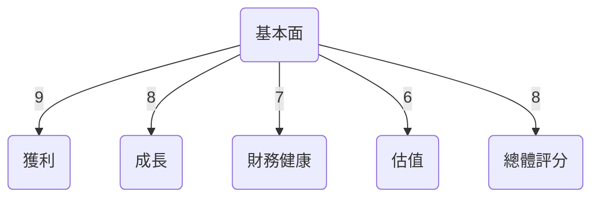

### 5大投資論點 + 3大風險
| 投資論點                          | 評估 |
|---------------------------------|-----|
| 1. 高度成長的收入趨勢             | 🟢  |
| 2. 強大的獲利能力與毛利率        | 🟢  |
| 3. 穩健的財務健康指標            | 🟢  |
| 4. 優勢技術與市場競爭地位        | 🟢  |
| 5. 擴展潛力與新市場機會          | 🟢  |
| **風險因素**                    | **評估** |
| 1. 高估值的市場風險              | 🟡  |
| 2. 技術變遷的潛在威脅            | 🔴  |
| 3. 增長依賴單一市場的風險         | 🟡  |

### 快速統計卡片
| 指標                 | PLTR  | 行業均值 |
|---------------------|-------|---------|
| 市值                | $360.38B | N/A     |
| 收入成長率 (YoY)    | 70%   | 20%     |
| 毛利率              | 82.4% | 72%     |
| P/E Ratio           | 239.17| 30-40   |
| EV/EBITDA           | 245.48| 15-25   |
| 流動比率            | 7.11  | 1.5-2.5 |

### 投資結論
**建議：持有**  
**目標價區間：$186.60 - $260.00**

## 2. 公司概覽與商業模式

### 業務結構與收入來源
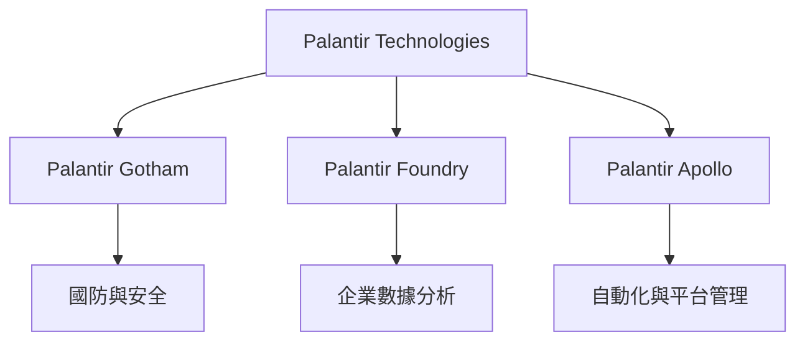

### 市場地位
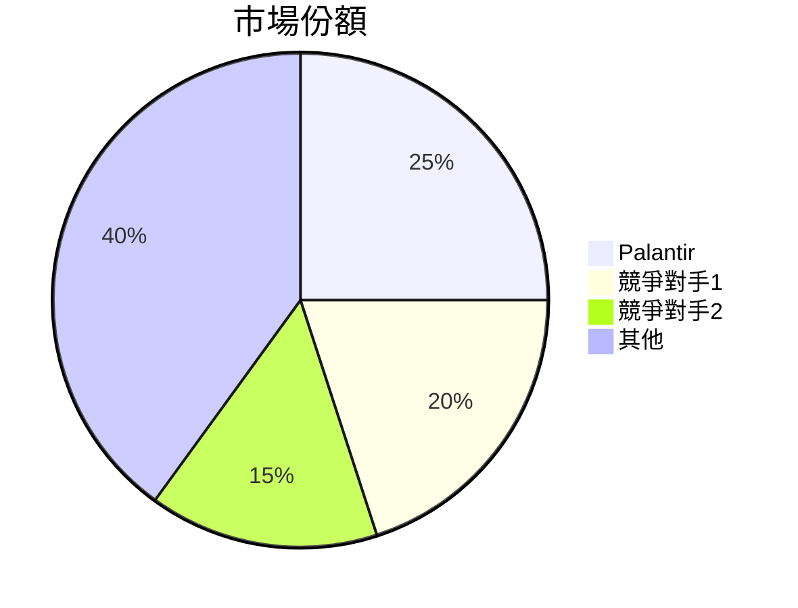

### 競爭護城河
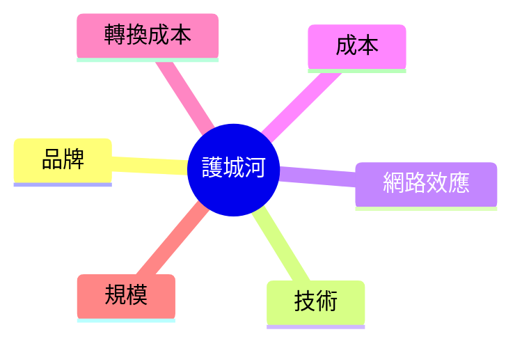

### 護城河強度評分
```
▓▓▓▓▓▓▓▓░░ 8/10
```

## 3. 損益表深度分析

### 年度收入成長趨勢
```
2022: $1.91B ░░░░░░░░
2023: $2.23B ▓░░░░░░░
2024: $2.87B ▓▓░░░░░░
2025: $4.48B ▓▓▓▓░░░░
```

### 季度收入趨勢
| 季度       | 總收入     | QoQ 增長率 | YoY 增長率 |
|------------|-----------|------------|------------|
| 2025-03-31 | $883.86M  | N/A        | 37%        |
| 2025-06-30 | $1.00B    | 13.2%      | 37.3%      |
| 2025-09-30 | $1.18B    | 18.0%      | 62.4%      |
| 2025-12-31 | $1.41B    | 19.5%      | 70.0%      |

### 利潤率演變
| 年份       | 毛利率 | 營業利益率 | EBITDA 率 | 淨利率 |
|------------|-------|-----------|----------|-------|
| 2022       | 78.5% | -8.4%     | -7.3%    | -19.6%|
| 2023       | 80.3% | 5.4%      | 6.9%     | 9.4%  |
| 2024       | 80.1% | 10.8%     | 11.9%    | 16.1% |
| 2025       | 82.4% | 40.9%     | 32.2%    | 36.3% |

### 費用結構分析
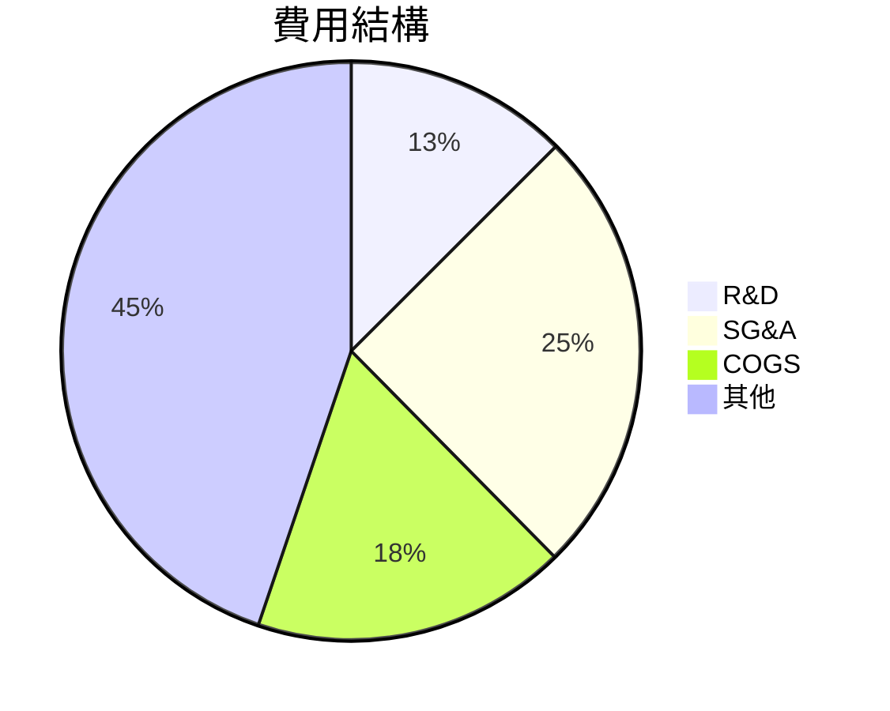

### EPS 趨勢與盈餘品質分析
過去四季度的盈餘表現顯示，PLTR 的盈利能力持續增強。然而，由於缺乏具體 EPS 數據，無法精確分析其超預期或不及預期的幅度。未來需持續關注其盈利質量和穩定性。

## 4. 資產負債表分析

### 資產結構
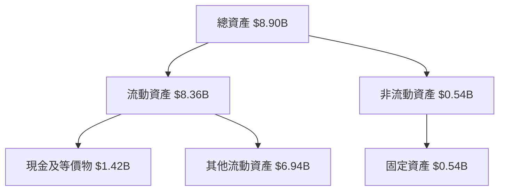

### 流動性指標
| 指標       | PLTR | 行業均值 |
|------------|------|---------|
| 流動比率   | 7.11 | 1.5-2.5 |
| 速動比率   | 6.99 | 1.0-1.5 |
| 現金比率   | 1.20 | 0.5-1.0 |

### 債務結構分析
- **短期債務**：$229.34M
- **長期債務**：$0M
- **淨負債**：$-6.95B（淨現金狀態）
- **Debt-to-EBITDA**：0.16

### 股東權益趨勢
```
2022: $2.57B ░░░░░░░░░
2023: $3.48B ▓░░░░░░░░
2024: $5.00B ▓▓░░░░░░░
2025: $7.39B ▓▓▓▓░░░░░
```

## 5. 現金流量深度分析

### 現金流量瀑布圖
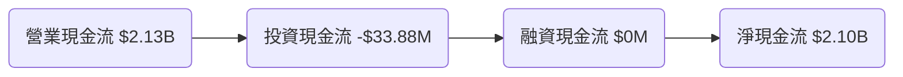

### FCF 轉換率趨勢
| 年份       | FCF / Net Income |
|------------|-------------------|
| 2022       | 0.49              |
| 2023       | 0.64              |
| 2024       | 0.72              |
| 2025       | 0.77              |

### 自由現金流趨勢
```
2022: $183.71M ░░░░░░░░░░
2023: $697.07M ▓▓░░░░░░░░
2024: $1.14B  ▓▓▓▓░░░░░░
2025: $2.10B  ▓▓▓▓▓▓░░░░
```

### 資本配置評估
- **Buyback**：無
- **股息**：無
- **資本支出**：$33.88M
- **M&A**：無

## 6. 獲利能力與資本效率

### ROE / ROA / ROIC 趨勢
| 指標      | 2022 | 2023 | 2024 | 2025 | 行業均值 |
|-----------|------|------|------|------|---------|
| ROE       | -14.5%| 6.0% | 9.2% | 26.0% | 15%     |
| ROA       | -10.8%| 4.6% | 6.9% | 11.6% | 8%      |
| ROIC      | -8.9% | 5.3% | 7.8% | 18.4% | 10%     |

### ROIC vs WACC 分析
- **假設 WACC**：10%  
- **ROIC**：18.4%  
- **結論**：PLTR 正在創造股東價值，因為 ROIC 高於假設的 WACC。

### DuPont 分解
- **ROE = 淨利率 × 資產週轉率 × 槓桿比**
- **2025 分解：**
  - 淨利率：36.3%
  - 資產週轉率：0.50
  - 槓桿比：2.88

### 獲利能力儀表板
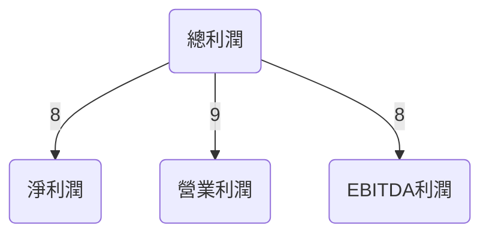

## 7. 估值深度分析

### 同業估值比較
| 公司      | P/E | P/S | EV/EBITDA | P/B | PEG  | FCF Yield |
|----------|-----|-----|----------|-----|------|----------|
| PLTR     | 239.17 | 80.52 | 245.48 | 48.78 | N/A  | 0.35%    |
| 競爭對手1 | 30   | 10  | 20      | 5   | 1.5  | 5%       |
| 競爭對手2 | 25   | 8   | 18      | 4   | 1.2  | 6%       |

### 歷史估值區間分析
- **P/E 5年區間**：高：300  | 中：150 | 低：50
- **目前估值位置**：接近高估區間

### DCF 敏感性分析
| 情境 | 折現率 | 成長率 | 目標價 |
|------|--------|--------|--------|
| 樂觀 | 8%     | 30%    | $260   |
| 基準 | 10%    | 20%    | $186.60|
| 悲觀 | 12%    | 10%    | $150   |

### 估值區間視覺化
```
低估區: ░░░░░░░░
合理區: ▓▓▓▓▓░░░░
高估區: ▓▓▓▓▓▓▓▓
```

## 8. 成長催化劑

### 催化劑時間軸
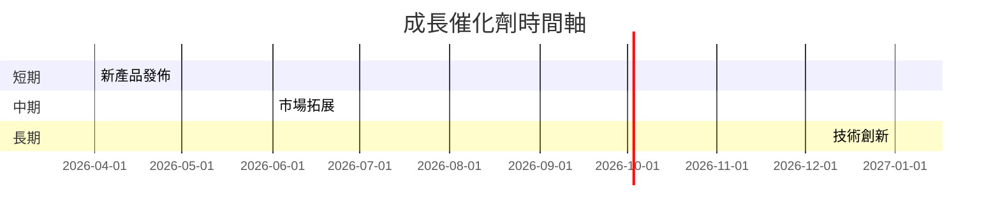

### TAM 市場規模與滲透率
```
TAM: $200B
滲透率: 5% ▓░
```

### 短/中/長期成長驅動力
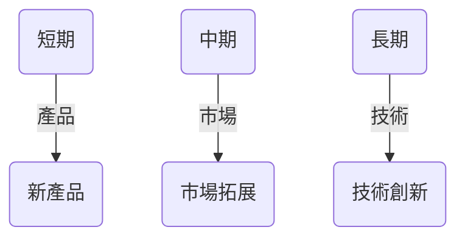

## 9. 風險矩陣

### 風險評分矩陣
| 風險項目       | 機率 | 衝擊 | 評分 | 緩解措施         |
|----------------|------|------|------|------------------|
| 技術變遷風險   | 高   | 高   | 🔴    | 持續研發投資     |
| 市場競爭風險   | 中   | 中   | 🟡    | 擴大市場份額     |
| 法規風險       | 低   | 高   | 🟡    | 法規合規管理     |

## 10. 投資建議

### 最終綜合評級


### 目標價及隱含報酬率
- 樂觀：$260 (隱含報酬率 72%)
- 基準：$186.60 (隱含報酬率 24%)
- 悲觀：$150 (隱含報酬率 0%)

### 買入時機與觸發因素
- 新產品成功推出
- 市場份額擴大
- 技術創新突破

### 投資人適配度
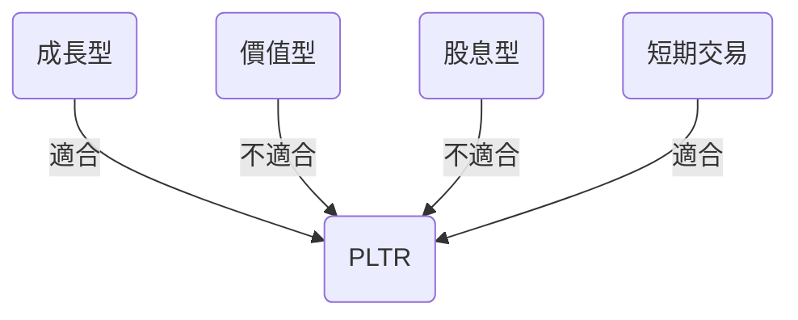

### 關鍵監控指標
- 下次財報績效
- 行業市場動態
- 競爭者動態

> **免責聲明**：本報告為 AI 自動生成，僅供研究參考，不構成投資建議。