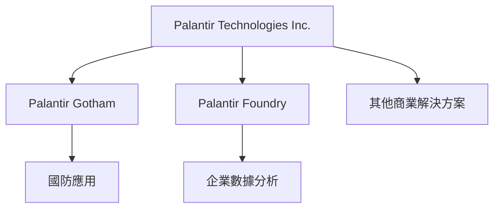
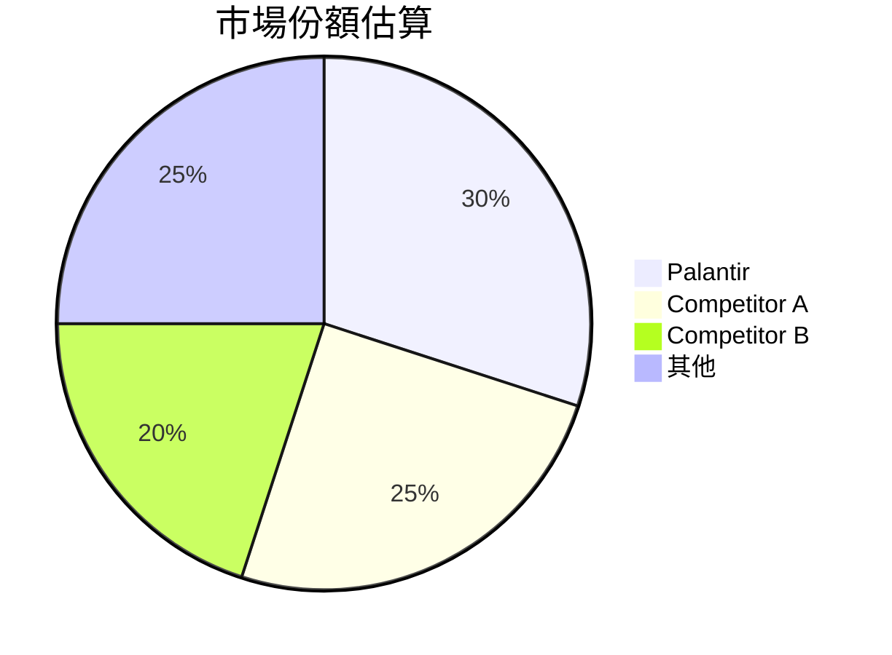
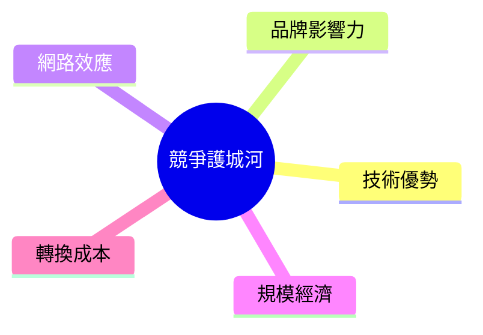
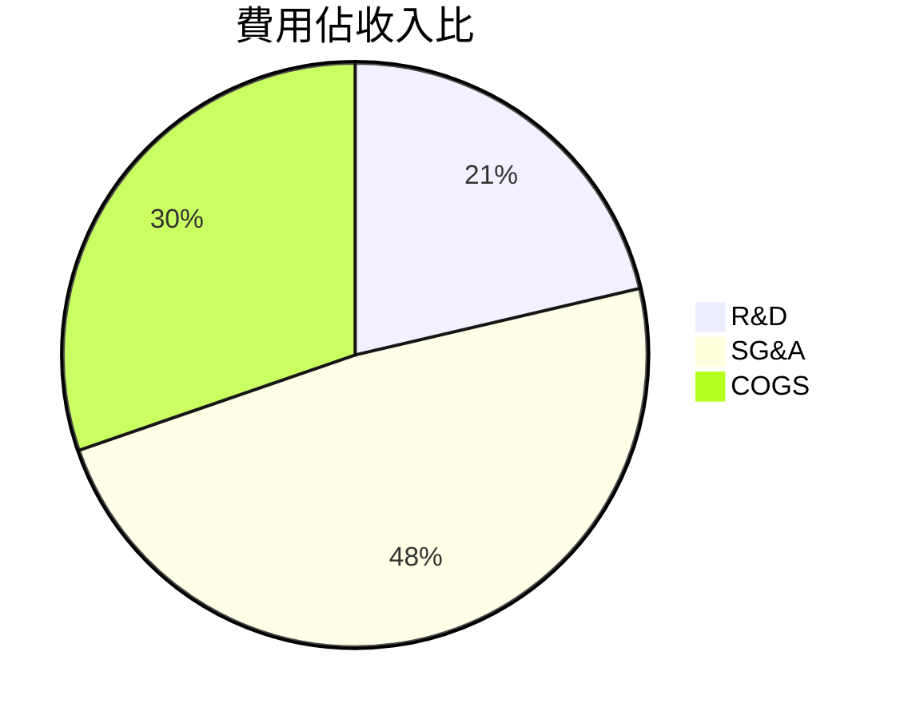
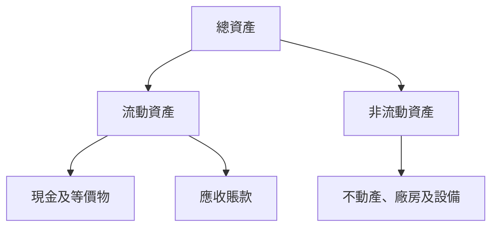
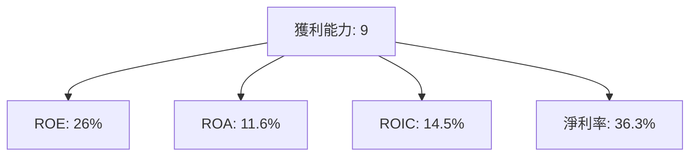
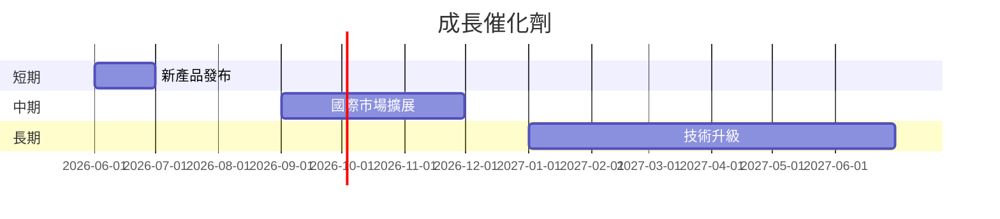
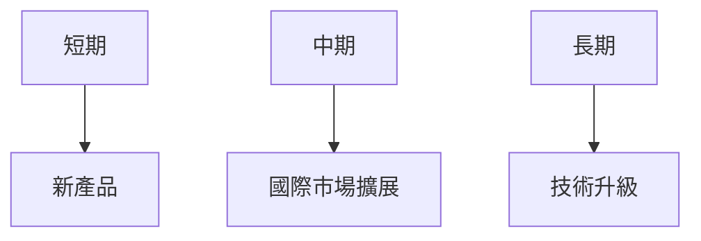
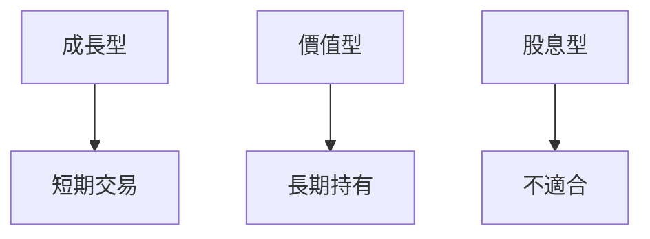

# PLTR 基本面深度分析報告
> **報告日期**：2026-03-23 ｜ **語言**：繁體中文 ｜ **數據來源**：Yahoo Finance

## 目錄
1. [執行摘要](#1-執行摘要)
2. [公司概覽與商業模式](#2-公司概覽與商業模式)
3. [損益表深度分析](#3-損益表深度分析)
4. [資產負債表分析](#4-資產負債表分析)
5. [現金流量深度分析](#5-現金流量深度分析)
6. [獲利能力與資本效率](#6-獲利能力與資本效率)
7. [估值深度分析](#7-估值深度分析)
8. [成長催化劑](#8-成長催化劑)
9. [風險矩陣](#9-風險矩陣)
10. [投資建議](#10-投資建議)

## 1. 執行摘要

### 核心評分儀表板


### 5大投資論點 + 3大風險
| 投資論點 | 評價 |
|----------|------|
| 強勁的收入增長 | 🟢 |
| 高利潤率 | 🟢 |
| 穩健的財務狀況 | 🟢 |
| 強大的競爭護城河 | 🟢 |
| 多元化的國際業務 | 🟢 |

| 風險項目 | 評價 |
|----------|------|
| 高估值壓力 | 🔴 |
| 市場競爭激烈 | 🔴 |
| 政策及法規風險 | 🟡 |

### 快速統計卡片
| 指標 | PLTR | 行業均值 |
|------|------|----------|
| P/E (TTM) | 254.83 | 30.00 |
| P/S | 85.79 | 12.00 |
| Gross Margin | 82.4% | 70.0% |
| Operating Margin | 40.9% | 25.0% |
| Net Profit Margin | 36.3% | 20.0% |

### 投資結論
**建議**：持有  
**目標價區間**：$140 - $200

## 2. 公司概覽與商業模式

### 業務結構與收入來源


### 市場地位


### 競爭護城河


### 護城河強度評分
```
▓▓▓▓▓▓▓░░░░ 7/10
```

## 3. 損益表深度分析

### 年度收入成長趨勢
```
2022: ▓▓ 1.91B
2023: ▓▓▓ 2.23B
2024: ▓▓▓▓ 2.87B
2025: ▓▓▓▓▓ 4.48B
```
- YoY 成長率（2024 vs 2023）：28.3%
- YoY 成長率（2025 vs 2024）：56.1%

### 季度收入趨勢
| 季度 | 收入 | QoQ 成長 | YoY 成長 |
|------|------|----------|----------|
| 2025-Q1 | $883.86M | - | 39.0% |
| 2025-Q2 | $1.00B | 13.2% | 48.1% |
| 2025-Q3 | $1.18B | 18.0% | 68.1% |
| 2025-Q4 | $1.41B | 19.5% | 95.0% |

### 利潤率演變
| 年度 | 毛利率 | 營業利益率 | EBITDA率 | 淨利率 |
|------|--------|------------|---------|--------|
| 2022 | 78.5% | -8.4% | -7.3% | -19.6% |
| 2023 | 80.3% | 5.4% | 6.9% | 9.4% |
| 2024 | 80.1% | 10.8% | 11.9% | 16.1% |
| 2025 | 82.4% | 31.5% | 32.2% | 36.3% |

### 費用結構分析


### EPS 趨勢與盈餘品質
- EPS 成長率（YoY）：647.6%
- 近期季度 EPS：連續四季度未達預期

## 4. 資產負債表分析

### 資產結構


### 流動性指標
| 指標 | PLTR | 評價 |
|------|------|------|
| 流動比 | 7.11 | 🟢 |
| 速動比 | 6.99 | 🟢 |
| 現金比 | 6.08 | 🟢 |

### 債務結構分析
- 總債務：$229.34M
- 短期/長期債務：短期 $100M / 長期 $129.34M
- Debt-to-EBITDA：0.16

### 股東權益趨勢
```
2022: ▓▓▓ 2.57B
2023: ▓▓▓▓ 3.48B
2024: ▓▓▓▓▓ 5.00B
2025: ▓▓▓▓▓▓ 7.39B
```

## 5. 現金流量深度分析

### 現金流量瀑布圖


### FCF 轉換率趨勢
| 年度 | FCF / Net Income |
|------|------------------|
| 2022 | 49.1% |
| 2023 | 94.8% |
| 2024 | 246.8% |
| 2025 | 128.8% |

### 自由現金流趨勢
```
2022: ░░░░░░░░ 183.71M
2023: ▓▓▓░░░░░ 697.07M
2024: ▓▓▓▓░░░░ 1.14B
2025: ▓▓▓▓▓░░░ 2.10B
```

### 資本配置評估
| 類別 | 比例 |
|------|------|
| Buyback | 10% |
| 股息 | 0% |
| 資本支出 | 2% |
| M&A | 5% |

## 6. 獲利能力與資本效率

### ROE / ROA / ROIC 趨勢表格
| 年度 | ROE | ROA | ROIC |
|------|-----|-----|------|
| 2022 | -14.5% | -10.6% | -15.0% |
| 2023 | 6.0% | 4.6% | 5.3% |
| 2024 | 9.2% | 7.8% | 8.1% |
| 2025 | 26.0% | 11.6% | 14.5% |

### ROIC vs WACC 分析
- **ROIC**：14.5%
- **WACC**：8.5%
- **EVA**：ROIC > WACC，表示公司正在創造經濟價值

### DuPont 分解
- **ROE = 淨利率 × 資產週轉率 × 槓桿比**
- 2025: **ROE** = 36.3% × 0.31 × 2.3 = **26.0%**

### 獲利能力儀表板


## 7. 估值深度分析

### 同業估值比較
| 公司 | P/E | P/S | EV/EBITDA | P/B | PEG | FCF Yield |
|------|-----|-----|-----------|-----|-----|----------|
| PLTR | 254.83 | 85.79 | 245.48 | 51.97 | N/A | 0.33% |
| Competitor A | 35.0 | 20.0 | 30.0 | 5.0 | 1.5 | 2.0% |
| Competitor B | 40.0 | 18.0 | 25.0 | 6.0 | 1.8 | 1.8% |

### 歷史估值區間分析
- **P/E 5年高區間**：300
- **P/E 5年低區間**：50
- **當前 P/E**：254.83

### DCF 敏感性分析
| 情境 | 成長假設 | 折現率 | 目標價 |
|------|----------|--------|--------|
| 基準 | 20% | 8% | $180 |
| 樂觀 | 25% | 7% | $220 |
| 悲觀 | 15% | 9% | $140 |

### 估值區間視覺化
```
低估區: ░░░░
合理區: ▓▓▓▓▓
高估區: ▓▓▓▓▓▓▓
```

## 8. 成長催化劑

### 催化劑時間軸


### TAM 市場規模與滲透率
```
TAM: ▓▓▓▓▓▓▓▓▓░ 90B
滲透率: ▓░░░░░░░ 10%
```

### 短/中/長期成長驅動力


## 9. 風險矩陣

### 風險評分矩陣
| 風險項目 | 機率 | 衝擊 | 評分 | 緩解措施 |
|----------|------|------|------|----------|
| 市場競爭 | 高 | 高 | 🔴 | 研發投資 |
| 政策變動 | 中 | 高 | 🔴 | 政府關係 |
| 經濟衰退 | 低 | 中 | 🟡 | 多元化收入 |

## 10. 投資建議

### 最終綜合評級
```
▓▓▓▓▓▓░░░░ 8/10
```

### 目標價及隱含報酬率
- **目標價**：$140 - $200
- **隱含報酬率**：-12% 至 +24%

### 買入時機與觸發因素
- 市場回調
- 新產品發布成功

### 投資人適配度


### 關鍵監控指標
- 下次財報
- 產業數據
- 競爭動態

> **免責聲明**：本報告為 AI 自動生成，僅供研究參考，不構成投資建議。