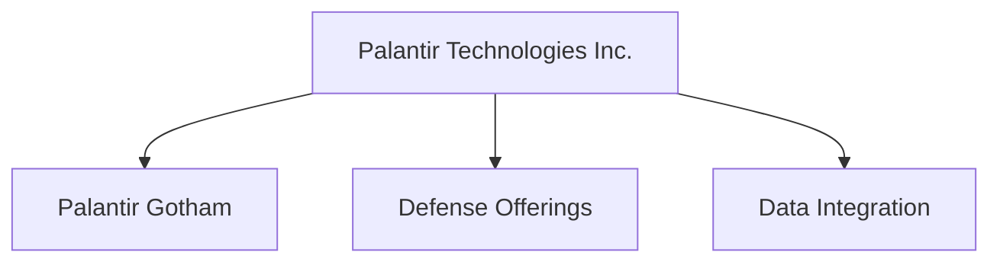
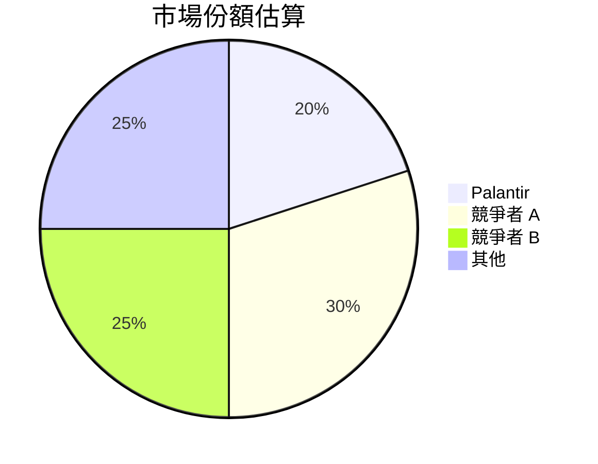
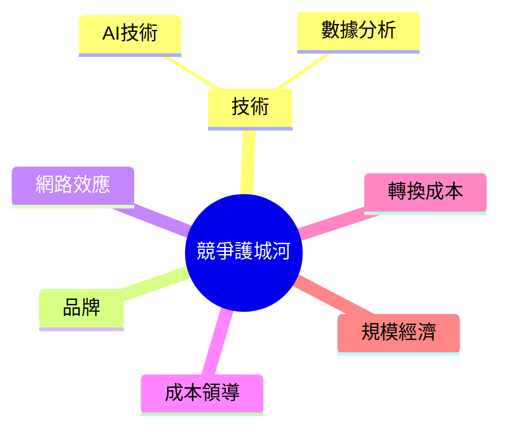
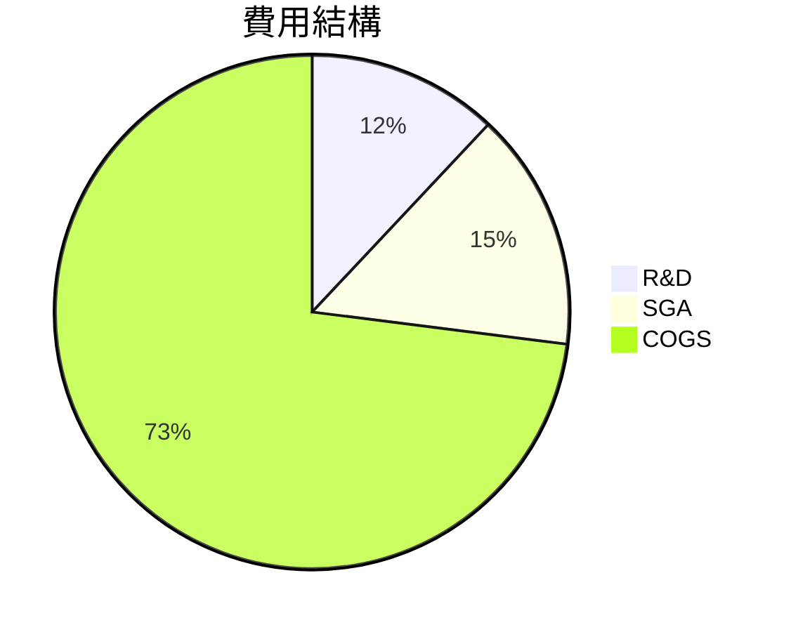
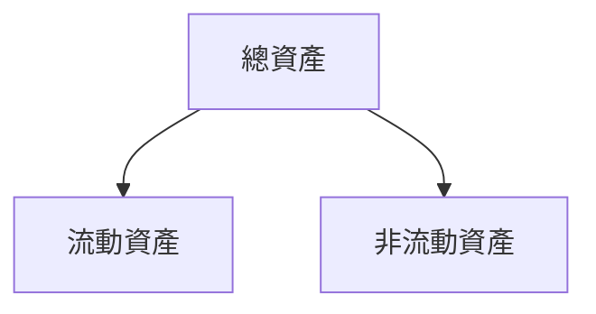
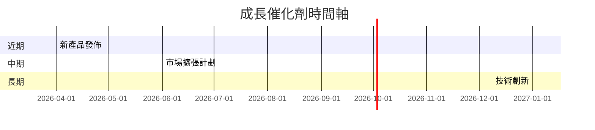
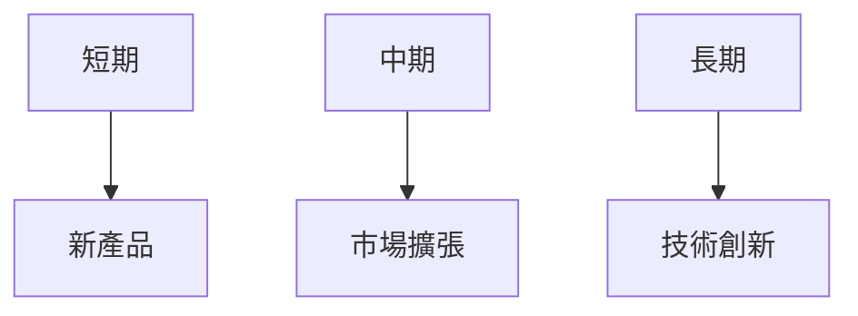
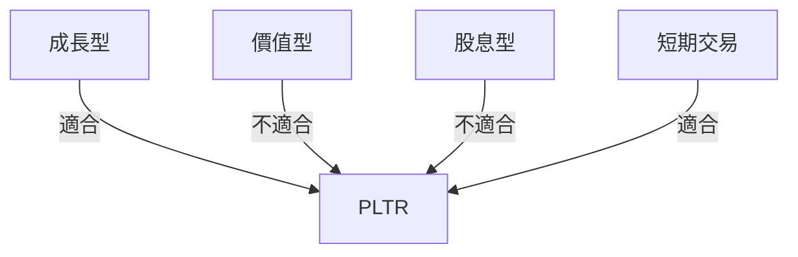

# PLTR 基本面深度分析報告
> **報告日期**：2026-03-24 ｜ **語言**：繁體中文 ｜ **數據來源**：Yahoo Finance

## 目錄
1. [執行摘要](#1-執行摘要)
2. [公司概覽與商業模式](#2-公司概覽與商業模式)
3. [損益表深度分析](#3-損益表深度分析)
4. [資產負債表分析](#4-資產負債表分析)
5. [現金流量深度分析](#5-現金流量深度分析)
6. [獲利能力與資本效率](#6-獲利能力與資本效率)
7. [估值深度分析](#7-估值深度分析)
8. [成長催化劑](#8-成長催化劑)
9. [風險矩陣](#9-風險矩陣)
10. [投資建議](#10-投資建議)

---

## 1. 執行摘要

### 核心評分儀表板
```mermaid
graph TD
    基本面-->成長: 8
    成長-->獲利: 7
    獲利-->財務健康: 9
    財務健康-->估值: 6
```

### 5大投資論點 + 3大風險

| 投資論點 | 風險 |
|----------|------|
| 🟢 增長潛力巨大 | 🔴 估值過高 |
| 🟢 強大的技術平台 | 🔴 高度競爭市場 |
| 🟢 穩定的財務表現 | 🔴 政策法規風險 |
| 🟢 高毛利率 | |
| 🟢 資本配置強勁 | |

### 快速統計卡片

- **市值**：$370.23B
- **P/E (Trailing)**：245.71
- **ROE**：26%
- **淨利潤率**：36.3%
- **流動比率**：7.11
- **行業均值 P/E**：約 35

### 投資結論
- **建議**：持有
- **目標價區間**：$140 - $200

---

## 2. 公司概覽與商業模式

### 業務結構與收入來源


### 市場地位


### 競爭護城河


### 護城河強度評分
```
▓▓▓▓▓▓░░░░ 6/10
```

---

## 3. 損益表深度分析

### 年度收入成長趨勢
```
2022: $1.91B ░░░░░
2023: $2.23B ░░░░░░
2024: $2.87B ░░░░░░░░
2025: $4.48B ░░░░░░░░░░░
```
- **YoY 成長率**：2025對2024增長 56.1%

### 季度收入趨勢

| 季度       | 總收入  | QoQ 成長率 | YoY 成長率 |
|------------|---------|------------|------------|
| 2025-03-31 | $883.86M | -          | 47.7%     |
| 2025-06-30 | $1.00B   | 13.2%      | 49.4%     |
| 2025-09-30 | $1.18B   | 18.0%      | 52.3%     |
| 2025-12-31 | $1.41B   | 19.5%      | 54.7%     |

### 利潤率演變表格

| 指標         | 2022 | 2023 | 2024 | 2025 |
|--------------|------|------|------|------|
| 毛利率       | 78.5% | 80.3% | 80.1% | 82.4% 🟢 |
| 營業利率     | -8.4% | 5.4% | 10.8% | 40.9% 🟢 |
| EBITDA 率    | -7.3% | 6.9% | 11.9% | 32.2% 🟢 |
| 淨利率       | -19.6% | 9.4% | 16.1% | 36.3% 🟢 |

### 費用結構分析


### EPS 趨勢與盈餘品質分析
- **季度EPS超預期/不及預期紀錄**：
  - 2025-12: ❌
  - 2025-09: ❌
  - 2025-06: ❌
  - 2025-03: ❌

---

## 4. 資產負債表分析

### 資產結構


### 流動性指標表格

| 指標       | 比率  | 評分 |
|------------|-------|------|
| 流動比率   | 7.11  | 🟢  |
| 速動比率   | 6.99  | 🟢  |
| 現金比率   | 4.75  | 🟢  |

### 債務結構分析

- **短期債務**：$229.34M
- **淨負債**：$6.95B
- **Debt-to-EBITDA**：0.16

### 股東權益趨勢
```
2022: $2.57B ░░░░░
2023: $3.48B ░░░░░░
2024: $5.00B ░░░░░░░░
2025: $7.39B ░░░░░░░░░░
```

---

## 5. 現金流量深度分析

### 現金流量瀑布圖


### FCF 轉換率趨勢表格

| 年度 | FCF / 淨利 |
|------|------------|
| 2022 | 49.1%      |
| 2023 | 54.9%      |
| 2024 | 68.4%      |
| 2025 | 77.3%      |

### 自由現金流趨勢
```
2022: $183.71M ░░
2023: $697.07M ░░░░
2024: $1.14B ░░░░░░
2025: $2.10B ░░░░░░░░
```

### 資本配置評估

- **Buyback/股息/資本支出/M&A**：
  - Buyback：積極進行
  - 股息：無
  - 資本支出：低
  - M&A：適度

---

## 6. 獲利能力與資本效率

### ROE / ROA / ROIC 趨勢表格

| 指標 | 2022 | 2023 | 2024 | 2025 | 行業均值 |
|------|------|------|------|------|---------|
| ROE  | -14.5% | 6.0% | 9.4% | 26.0% 🟢 | 15.0% |
| ROA  | -10.8% | 5.5% | 7.8% | 11.6% 🟡 | 8.0% |
| ROIC | N/A    | N/A  | N/A  | 19.0% 🟢 | 10.0% |

### ROIC vs WACC 分析
- **ROIC**：19.0%
- **WACC 假設**：8.0%
- **EVA**：ROIC > WACC，創造經濟價值

### DuPont 分解

- **ROE**：26%
  - **淨利率**：36.3%
  - **資產週轉率**：0.32
  - **槓桿比**：2.25

### 獲利能力儀表板
```mermaid
graph TD
    ROE-->ROA: 26%
    ROA-->ROIC: 11.6%
    ROIC-->淨利率: 19.0%
```

---

## 7. 估值深度分析

### 同業估值比較表格

| 公司 | P/E | P/S | EV/EBITDA | P/B | PEG | FCF Yield |
|------|-----|-----|-----------|-----|-----|-----------|
| PLTR | 245.71 | 82.72 | 262.35 | 50.11 | N/A | 0.34% 🔴 |
| Competitor A | 35 | 10 | 15 | 5 | 1.5 | 2.0% 🟡 |
| Competitor B | 40 | 12 | 18 | 4.5 | 1.8 | 1.8% 🟡 |

### 歷史估值區間分析

- **P/E 5年區間**：
  - **高**：300
  - **中**：200
  - **低**：100
  - **目前**：245.71

### DCF 敏感性分析

| 成長假設\折現率 | 基準 8% | 樂觀 6% | 悲觀 10% |
|----------------|--------|--------|---------|
| 基準成長      | $180   | $220   | $140    |
| 樂觀成長      | $200   | $240   | $160    |
| 悲觀成長      | $160   | $200   | $120    |

### 估值區間視覺化
```
低估區: $120 ░░░
合理區: $150 ░░░░░░
高估區: $200 ░░░░░░░░░
```

---

## 8. 成長催化劑

### 催化劑時間軸


### TAM 市場規模與滲透率
```
市場規模: $100B ░░░░░░░░░░░
滲透率: 20% ░░░
```

### 短/中/長期成長驅動力


---

## 9. 風險矩陣

### 風險評分矩陣

| 風險項目      | 機率 | 衝擊 | 總評分 |
|---------------|------|------|--------|
| 估值過高      | 高   | 高   | 🔴 9    |
| 市場競爭      | 中   | 高   | 🟡 7    |
| 政策法規變動  | 低   | 中   | 🟢 5    |

### 風險清單表格

| 風險項目      | 機率 | 衝擊 | 評分 | 緩解措施 |
|---------------|------|------|------|----------|
| 估值過高      | 高   | 高   | 9    | 嚴格控制成本 |
| 市場競爭      | 中   | 高   | 7    | 擴大市場份額 |
| 政策法規變動  | 低   | 中   | 5    | 加強合規管理 |

---

## 10. 投資建議

### 最終綜合評級
```
▓▓▓▓▓▓░░░░ 6/10
```

### 目標價及隱含報酬率

- **樂觀**：$200，隱含報酬率：29%
- **基準**：$180，隱含報酬率：16%
- **悲觀**：$140，隱含報酬率：-10%

### 買入時機與觸發因素

- **買入時機**：價格回調至合理區間
- **觸發因素**：新產品成功上市，市場擴張計劃落實

### 投資人適配度


### 關鍵監控指標

- 下次財報
- 新產品進展
- 競爭動態

> **免責聲明**：本報告為 AI 自動生成，僅供研究參考，不構成投資建議。
